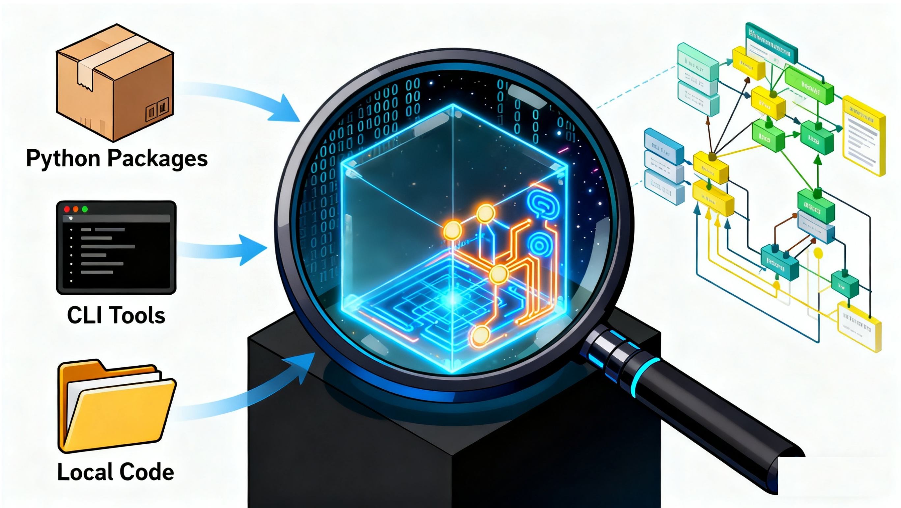

# LibInspector: From "Black Box" to "Glass Box"

  
 [](http://makeapullrequest.com) 


> **Turn passive code reading into active architectural exploration.**

## 📖 Design Philosophy & Motivation 

### ❓The Problem: The "Black Box" Dilemma
In the era of AI for Science (AI4S) and rapid software development, we often treat Python libraries as "black boxes"—we `pip install`, copy-paste API calls, and hope for the best. However, when we need to debug, extend functionality, or understand the underlying algorithms, we hit a wall:
1.  **Hidden Entry Points:** Modern tools often expose CLI commands (e.g., [`metapredict-predict`, a Bioinformatics tool](https://github.com/idptools/metapredict)) whose source code location is obscure.
2.  **Spaghetti Dependencies:** It is difficult to visualize how modules depend on one another just by reading file directories.
3.  **Static Documentation Gaps:** Documentation tells you *what* a function does, but rarely *how* data flows through it.

### ✅Our Solution: The "Developer's Mindset"
**LibInspector** is built on the principle that **code is a designed system**, not just text. It adopts a "Detective" approach to dissect Python libraries:
*   **Dynamic + Static Analysis:** We don't just parse text; we import the live objects to understand the runtime structure (Python's "**Everything is an Object**" principle).
*   **The "Trinity" Resolution:** Whether you provide a **PyPI package name**, a **CLI command**, or a **local script path**, LibInspector unifies them into a single analytical workflow.
*   **Algorithmic Insight:** We apply graph algorithms (like PageRank) to identify the "God Classes" and core logic within a library, separating signal from noise.

---

## 🚀 Key Features

### 1. Intelligent Target Resolution (The "Trinity")
LibInspector understands that code exists in different forms. It automatically detects and handles:
*   📦 **Standard Libraries:** `pandas`, `requests`, `numpy`.
*   💻 **CLI Tools (Reverse Lookup):** Input a command like [`metapredict-predict-disorder`](https://github.com/idptools/metapredict), and it finds the underlying Python package and entry function.
*   📂 **Local Scripts:** Analyze your own `./my_script.py` or a cloned repo without installing it.

### 2. The "Navigator"
Before diving into code, you need to know how to drive.
*   **Entry Point Detection:** Automatically finds `if __name__ == "__main__":` blocks.
*   **CLI Discovery:** Scans `console_scripts` to list all terminal commands provided by the library.
*   **API Recommendation:** Uses a scoring algorithm to suggest the most likely "public" API functions based on naming conventions and usage frequency.

### 3. Interactive Visualization
*   **Dependency Maps:** Global architectural views showing how internal modules and external libraries interact.
*   **Logic Flowcharts:** AST-based generation of flowcharts for individual functions, visualizing data inputs, decision branches, and core processing steps.
*   **Zoomable HTML Reports:** Generates high-quality HTML reports, allowing you to navigate massive dependency graphs that would otherwise be unreadable.

---

## 🧠 How It Works: The "Trinity" Resolution Logic

LibInspector acts as a bridge between your terminal and the Python runtime. It employs a **"Trinity" Resolution Strategy** to turn three distinct types of inputs into a unified analysis object:

### 1. 📦 The Direct Path (Installed Packages)
*   **Input:** `pandas`, `numpy`, `Bio.PDB`
*   **Logic:** Uses `importlib` to dynamically load the library from your environment's `site-packages`.
*   **Why it matters:** Unlike static text parsers, this captures the **live runtime state**, allowing analysis of libraries heavily reliant on C-extensions (like NumPy) or dynamic attribute generation.

### 2. 💻 The Reverse Lookup (CLI Tools)
*   **Input:** `metapredict-predict-disorder`, `jupyter-notebook`
*   **Logic:** Many tools expose terminal commands but hide their source code location. LibInspector scans `importlib.metadata.entry_points` to find the **exact Python module and function** backing a CLI command.
*   **Why it matters:** You don't need to hunt through GitHub to find where the `main()` function lives. Just type the command you use every day, and we find the code for you.

### 3. 📂 The Context Injection (Local Code)
*   **Input:** `./my_script.py`, `../my_project/`
*   **Logic:** The tool intelligently modifies `sys.path` to simulate the execution environment of your local script, allowing it to import your local modules just as Python would during execution.
*   **Why it matters:** Perfect for refactoring. Analyze your own "spaghetti code" before you even package it.


---

## 🛠️ Installation

```bash
# Clone the repository
git clone https://github.com/MaybeBio/LibInspector.git
cd LibInspector

# Install in editable mode (installs dependencies & CLI tool)
pip install -e .
```
   
---

## 💻 Usage Guide

LibInspector is designed to be intuitive. You only need one command:
```bash
lib-inspector PYTHON_TOOL_NAME -o OUTPUT_FILE_PATH
```

First have a look at the help message !

```bash
❯ lib-inspector --help
                                                                                                                                                                                                          
 Usage: lib-inspector [OPTIONS] LIBRARY                                                                                                                                                                   
                                                                                                                                                                                                          
 Inspect a Python library/module and generate Markdown/Html documentation.                                                                                                                                
                                                                                                                                                                                                          
 Example:                                                                                                                                                                                                 
                                                                                                                                                                                                          
 # Inspect a CLI tool library (e.g. metapredict-predict-disorder --help)                                                                                                                                  
 lib-inspector metapredict-predict-disorder --private -o Metapredict_CLI_Docs.md                                                                                                                          
                                                                                                                                                                                                          
 # Inspect a Standard library module (e.g. import numpy)                                                                                                                                                  
 lib-inspector numpy --imported -o Numpy_Docs.md                                                                                                                                                          
                                                                                                                                                                                                          
 # Inspect YOUR local library                                                                                                                                                                             
 lib-inspector ./my_project/train.py -o ./reports/train.md                                                                                                                                                
                                                                                                                                                                                                          
 Notes:                                                                                                                                                                                                   
 - 1, --private means to include private members, while by default they are excluded if not provided.                                                                                                     
 - 2, --imported means to include members imported from other modules, while by default they are excluded if not provided.                                                                                
                                                                                                                                                                                                          
╭─ Arguments ────────────────────────────────────────────────────────────────────────────────────────────────────────────────────────────────────────────────────────────────────────────────────────────╮
│ *    library      TEXT  Name of the library to inspect (e.g. 'numpy', 'Bio.PDB'). [required]                                                                                                           │
╰────────────────────────────────────────────────────────────────────────────────────────────────────────────────────────────────────────────────────────────────────────────────────────────────────────╯
╭─ Options ──────────────────────────────────────────────────────────────────────────────────────────────────────────────────────────────────────────────────────────────────────────────────────────────╮
│ --output          -o      TEXT     Path to save the Markdown report. If not provided, prints to stdout.                                                                                                │
│ --private                          Include private members (starting with '_').                                                                                                                        │
│ --imported                         Include members imported from other modules.                                                                                                                        │
│ --limit-api               INTEGER  Limit for API recommendations. [default: 20]                                                                                                                        │
│ --limit-snippets          INTEGER  Limit for code snippets. [default: 20]                                                                                                                              │
│ --limit-args              INTEGER  Threshold for multi-line arguments in snippets. [default: 3]                                                                                                        │
│ --limit-ext               INTEGER  Limit for external libraries. [default: 20]                                                                                                                         │
│ --limit-pr                INTEGER  Limit for PageRank metrics. [default: 20]                                                                                                                           │
│ --limit-dep               INTEGER  Limit for dependency graph nodes. [default: 100]                                                                                                                    │
│ --limit-inh               INTEGER  Limit for inheritance graph classes. [default: 100]                                                                                                                 │
│ --limit-guide             INTEGER  Limit for extraction guide functions. [default: 20]                                                                                                                 │
│ --help                             Show this message and exit.                                                                                                                                         │
╰────────────────────────────────────────────────────────────────────────────────────────────────────────────────────────────────────────────────────────────────────────────────────────────────────────╯
```


### Mode A: Analyze an Installed Library
Perfect for understanding third-party packages.
```bash
# For Pandas
❯ lib-inspector pandas -o ./test/pandas.md
🔍 Target Resolution: Input='pandas' -> Import='pandas' (Type: module)
🔍 Analyzing dependencies for 'pandas' (Network Analysis Phase)...
✅ Markdown report saved to: /data2/LibInspector/test/pandas.md
📊 Interactive HTML report saved to: /data2/LibInspector/test/pandas.html
   (Open the HTML file in your browser to see rendered charts)


# For Json
❯ lib-inspector json -o ./test/json.md
🔍 Target Resolution: Input='json' -> Import='json' (Type: module)
🔍 Analyzing dependencies for 'json' (Network Analysis Phase)...
✅ Markdown report saved to: /data2/LibInspector/test/json.md
📊 Interactive HTML report saved to: /data2/LibInspector/test/json.html
   (Open the HTML file in your browser to see rendered charts)


# For Bio.PDB
# Classes that deal with macromolecular crystal structures.
# Please refer to https://biopython.org/docs/1.75/api/Bio.PDB.html
❯ lib-inspector Bio.PDB -o ./test/Bio_PDB.md
🔍 Target Resolution: Input='Bio.PDB' -> Import='Bio.PDB' (Type: module)
🔍 Analyzing dependencies for 'Bio.PDB' (Network Analysis Phase)...
✅ Markdown report saved to: /data2/LibInspector/test/Bio_PDB.md
📊 Interactive HTML report saved to: /data2/LibInspector/test/Bio_PDB.html
   (Open the HTML file in your browser to see rendered charts)


# Even for a niche third-party library 
# AIUPred, a tool that allows to identify disordered protein regions
# please refer to https://github.com/doszilab/AIUPred  
❯ lib-inspector aiupred_lib -o ./test/aiupred_analysis.md
🔍 Target Resolution: Input='aiupred_lib' -> Import='aiupred_lib' (Type: module)
🔍 Analyzing dependencies for 'aiupred_lib' (Network Analysis Phase)...
✅ Markdown report saved to: /data2/LibInspector/test/aiupred_analysis.md
📊 Interactive HTML report saved to: /data2/LibInspector/test/aiupred_analysis.html
   (Open the HTML file in your browser to see rendered charts)


# Another niche third-party library 
# alphaPredict, A predictor of AlphaFold2 confidence scores
# please refer to https://github.com/ryanemenecker/alphaPredict
❯ lib-inspector alphaPredict -o ./test/alphaPredict.md
🔍 Target Resolution: Input='alphaPredict' -> Import='alphaPredict' (Type: distribution)
🔍 Analyzing dependencies for 'alphaPredict' (Network Analysis Phase)...
✅ Markdown report saved to: /data2/LibInspector/test/alphaPredict.md
📊 Interactive HTML report saved to: /data2/LibInspector/test/alphaPredict.html
   (Open the HTML file in your browser to see rendered charts)
```


### Mode B: Analyze a CLI Tool (New!)
Don't know the package name? Just use the command you type in the terminal.
```bash
# For metapredict-predict-disorder
# A machine learning-based tool for predicting protein disorder
# please refer to https://github.com/idptools/metapredict
❯ lib-inspector metapredict-predict-disorder -o ./test/metapredict_cli.md
🔍 Target Resolution: Input='metapredict-predict-disorder' -> Import='metapredict' (Type: cli_command)
🔍 Analyzing dependencies for 'metapredict' (Network Analysis Phase)...
✅ Markdown report saved to: /data2/LibInspector/test/metapredict_cli.md
📊 Interactive HTML report saved to: /data2/LibInspector/test/metapredict_cli.html
   (Open the HTML file in your browser to see rendered charts)
```

### Mode C: Analyze Local Code
Analyze your current project or a downloaded repository.
```bash
# Analyze a specific script
python src/lib_inspector.py ./my_project/train.py -o ./reports/train.md

# Analyze a local package directory
python src/lib_inspector.py ./downloaded_repos/alphaPredict/ -o ./reports/alpha.md
```

> ⚠️**Acknowledgements & Disclaimer:**
> We would like to express our sincere gratitude to the developers of **Pandas**, **JSON**, **BioPython**, **AIUPred**, **AlphaPredict**, and **Metapredict**. These excellent tools are used here **solely as case studies** to demonstrate the capabilities of LibInspector. All credit for the underlying logic and scientific algorithms belongs to their respective authors.

**The results produced by the code above can be accessed or viewed HERE:**

[aiupred_analysis.md](./test/aiupred_analysis.md)

[alphaPredict.md](./test/alphaPredict.md)

[Bio_PDB.md](./test/Bio_PDB.md)

[json.md](./test/json.md)

[metapredict_cli.md](./test/metapredict_cli.md)

[pandas.md](./test/pandas.md)

Below is the **Global Execution Flow** generated for Tool **metapredict**

```mermaid
graph TD
    classDef main fill:#f9f,stroke:#333,stroke-width:2px;
    classDef func fill:#fff,stroke:#333,stroke-width:1px;
    f_25["print_performance"] -->|seqs| f_13["predict"]
    class f_25 func;
    class f_13 func;
    f_26["print_performance_backend"] -->|seqs| f_13["predict"]
    class f_26 func;
    class f_13 func;
    f_15["predict_disorder"] -->|inputs| f_2["_predict"]
    class f_15 func;
    class f_2 func;
    f_18["predict_disorder_domains"] -->|sequence| f_2["_predict"]
    class f_18 func;
    class f_2 func;
    f_14["predict_all"] -->|sequence| f_2["_predict"]
    class f_14 func;
    class f_2 func;
    f_14["predict_all"] -->|sequence| f_3["_predict_pLDDT"]
    class f_14 func;
    class f_3 func;
    f_16["predict_disorder_batch"] -->|input_sequences| f_2["_predict"]
    class f_16 func;
    class f_2 func;
    f_5["graph_disorder"] -->|sequence| f_1["_graph"]
    class f_5 func;
    class f_1 func;
    f_22["predict_pLDDT"] -->|inputs| f_3["_predict_pLDDT"]
    class f_22 func;
    class f_3 func;
    f_8["graph_pLDDT"] -->|sequence| f_1["_graph"]
    class f_8 func;
    class f_1 func;
    f_12["percent_disorder"] -->|sequence| f_2["_predict"]
    class f_12 func;
    class f_2 func;
    f_12["percent_disorder"] -->|sequence<br>disorder_threshold| f_18["predict_disorder_domains"]
    class f_12 func;
    class f_18 func;
    f_20["predict_disorder_fasta"] -->|protfasta_seqs| f_2["_predict"]
    class f_20 func;
    class f_2 func;
    f_23["predict_pLDDT_fasta"] -->|protfasta_seqs| f_3["_predict_pLDDT"]
    class f_23 func;
    class f_3 func;
    f_6["graph_disorder_fasta"] -->|local_sequence| f_5["graph_disorder"]
    class f_6 func;
    class f_5 func;
    f_9["graph_pLDDT_fasta"] -->|local_sequence| f_8["graph_pLDDT"]
    class f_9 func;
    class f_8 func;
    f_21["predict_disorder_uniprot"] -->|uniprot_id| f_0["_getseq"]
    class f_21 func;
    class f_0 func;
    f_21["predict_disorder_uniprot"] -->|sequence| f_2["_predict"]
    class f_21 func;
    class f_2 func;
    f_24["predict_pLDDT_uniprot"] -->|uniprot_id| f_0["_getseq"]
    class f_24 func;
    class f_0 func;
    f_24["predict_pLDDT_uniprot"] -->|sequence| f_3["_predict_pLDDT"]
    class f_24 func;
    class f_3 func;
    f_7["graph_disorder_uniprot"] -->|uniprot_id| f_0["_getseq"]
    class f_7 func;
    class f_0 func;
    f_7["graph_disorder_uniprot"] -->|sequence| f_1["_graph"]
    class f_7 func;
    class f_1 func;
    f_10["graph_pLDDT_uniprot"] -->|uniprot_id| f_0["_getseq"]
    class f_10 func;
    class f_0 func;
    f_10["graph_pLDDT_uniprot"] -->|sequence| f_1["_graph"]
    class f_10 func;
    class f_1 func;
    f_19["predict_disorder_domains_uniprot"] -->|uniprot_id| f_0["_getseq"]
    class f_19 func;
    class f_0 func;
    f_19["predict_disorder_domains_uniprot"] -->|sequence| f_2["_predict"]
    class f_19 func;
    class f_2 func;
    f_17["predict_disorder_caid"] -->|entry_id_and_seqs| f_2["_predict"]
    class f_17 func;
    class f_2 func;
    f_11["main"] --> f_17["predict_disorder_caid"]
    class f_11 main;
    class f_17 func;
    f_11["main"] --> f_6["graph_disorder_fasta"]
    class f_11 main;
    class f_6 func;
    f_11["main"] --> f_9["graph_pLDDT_fasta"]
    class f_11 main;
    class f_9 func;
    f_11["main"] -->|final_name| f_4["getseq"]
    class f_11 main;
    class f_4 func;
    f_11["main"] -->|sequence| f_5["graph_disorder"]
    class f_11 main;
    class f_5 func;
    f_11["main"] --> f_20["predict_disorder_fasta"]
    class f_11 main;
    class f_20 func;
    f_11["main"] -->|sequences| f_15["predict_disorder"]
    class f_11 main;
    class f_15 func;
    f_11["main"] --> f_27["write"]
    class f_11 main;
    class f_27 func;
    f_11["main"] --> f_23["predict_pLDDT_fasta"]
    class f_11 main;
    class f_23 func;
    f_11["main"] --> f_5["graph_disorder"]
    class f_11 main;
    class f_5 func;
    f_11["main"] --> f_15["predict_disorder"]
    class f_11 main;
    class f_15 func;
    f_11["main"] --> f_4["getseq"]
    class f_11 main;
    class f_4 func;
```



**TRY IT YOURSELF!**

---

## 📊 Understanding the Output

The tool generates two files: a **Markdown (.md)** report and an interactive **HTML (.html)** report.

### 1. Navigator: How to Drive
*   **CLI Commands:** Lists system commands installed by the package.
*   **Top Entry Points:** A ranked list of functions/classes that serve as the library's main interface.
*   **Code Snippets:** Auto-generated boilerplate code to get you started immediately.

### 2. Network & Architecture Analysis
*   **Dependency Graph:** A Mermaid diagram showing who imports whom.
    *   **Orange Nodes:** Core internal modules.
    *   **Blue Nodes:** External dependencies.
*   **"PageRank" Scores:** Identifies the most critical modules in the project (the "hubs" of the system).

### 3. Logic Flow & Extraction Guide
*   **Global Execution Flow:** A massive graph showing function-to-function calls across the entire project.
*   **Extraction Guide:** If you want to copy-paste a single function (e.g., `predict`), this section tells you exactly which other functions it depends on (Dependency Closure).

### 4. API Logic Flow
*   For every major function, a detailed flowchart visualizes:
    *   🔵 **Inputs**
    *   🔶 **Core Processes** (AI models, Math, I/O)
    *   🟣 **Decisions** (If/Else logic)
    *   🟢 **Outputs**

---

## ⚠️ Limitations & Notes

### 1. Dynamic Execution Risks
LibInspector performs a *dynamic import* of the target library. While we use a "Safe Walker" to avoid executing tests or setup scripts, **do not run this tool on untrusted, malicious code**, as importing a module executes its top-level code.

### 2. HTML vs. Markdown
*   **Markdown:** Best for reading text and simple code. Mermaid diagrams may be too small in some IDE previews (for example, **Markdown Preview Mermaid Support** and tons of such Extensions in Vscode).
*   **HTML:** **Recommended for visualization.** If a diagram looks small or unreadable in Markdown, open the HTML file in a browser to zoom and pan.

### 3. Mermaid Rendering Limits
Extremely large libraries (like `numpy` or `django`) may generate graphs exceeding browser rendering limits. We have optimized the configuration (`maxEdges: 100000` and `maxTextSize: 1000000`), but performance depends on your hardware, **you can copy-paste Mermaid code in our Markdown output and do it yourself to better visualize it in any way you like**.

### ⚙️ Configuration & Hardcoded Limits
To ensure the generated reports remain readable and concise, lib_inspector.py includes several hardcoded limits, but now we change them into parameters! If you are analyzing a massive library and find information missing, you can modify these values in lib_inspector.py:
 
| Limit Type | Parameter | Default | Location (Approx.) | Description |
| :--- | :--- | :--- | :--- | :--- |
| **API Recommendations** | --limit-api | Top 20 | `inspect_library` (Phase 0, [ARG1] CTRL+F) | Limits the number of suggested entry points in the "Navigator" table. |
| **Code Snippets** | --limit-snippets | Top 20 | `inspect_library` (Phase 0, [ARG2] CTRL+F) | Limits the number of auto-generated usage examples for functions and classes. |
| **Snippet Args** | --limit-args | > 3 | `inspect_library` (Phase 0, [ARG3] CTRL+F) | If a function has >3 arguments, the snippet formats them on multiple lines. |
| **External Libs** | --limit-ext | Top 20 | `inspect_library` (Phase 1, [ARG4] CTRL+F) | Shows only the most frequently imported external libraries. |
| **PageRank Metrics** | --limit-pr | Top 20 | `inspect_library` (Phase 1, [ARG5] CTRL+F) | Lists only the top 20 most influential internal modules. |
| **Dependency Graph** | --limit-dep | **Top 100** | `inspect_library` (Phase 1, [ARG6] CTRL+F) | Limits the number of nodes in the dependency graph. (⚠️ Warning: Large graphs may slow down the browser). |
| **Inheritance Graph** | --limit-inh | **MAX 100** | `inspect_library` (Phase 1, [ARG7] CTRL+F) | Limits the number of classes included in the inheritance diagram to avoid visual clutter. |
| **Extraction Guide** | --limit-guide | Top 20 | `inspect_library` (Phase 1.5, [ARG8] CTRL+F) | Generates dependency closure guides only for the top 20 most called functions. |
---

## 📝 TODOs & Roadmap

- [ ] **Enhanced Type Inference:**
    *   Currently, variable types in Logic Flow are extracted from type hints.
    *   *Goal:* Implement inference based on usage (e.g., if `x.append()` is called, infer `x` is a `list`).
- [ ] **Cross-Language Support:**
    *   Investigate support for Python bindings of C++/Rust libraries (often used in AI4S).
- [ ] **Interactive Graph Filtering:**
    *   Allow users to toggle specific modules on/off in the HTML report to reduce noise.

---

## Who This Is For

This repository is tailored for **practitioners in AI for Science (AI4S)** and interdisciplinary engineers. You may not have a formal CS background, but you need to master complex computational tools. LibInspector bridges the gap, helping you see the "Ghost in the Shell"—the design and logic hidden within the code.


