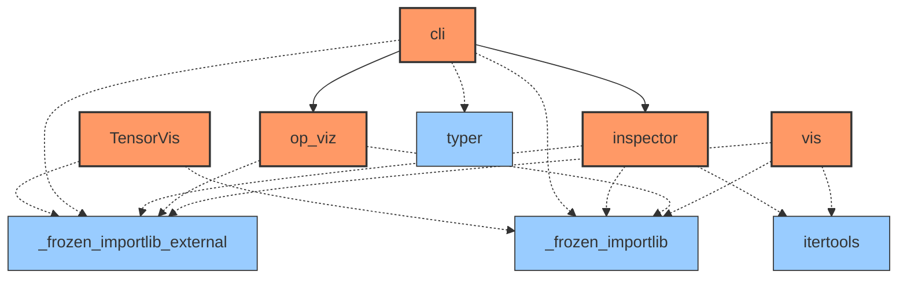
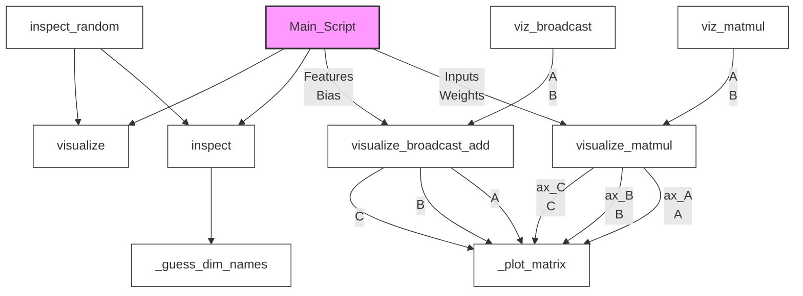

# Documentation for `TensorVis`
> **Note:** Analyzed via CLI command `tensorvis` (resolved as CLI entry).

**File Path:** `/data2/TensorVis/TensorVis/__init__.py`

## 🧾 Metadata & Diagnostics
- **Used candidate:** `TensorVis` (resolved)
### Tried Candidates
| Candidate | Hint | Status | Error |
| :--- | :--- | :--- | :--- |
| `TensorVis` | resolved | success | `` |

- **Package Version:** `0.1.0`
- **Run Mode:** dynamic import (module)
### sys.path (head)
```text
/home/nicai_zht/miniconda3/envs/zht/bin
/home/nicai_zht/software/AIUPred-2.1.2
/home/nicai_zht/miniconda3/envs/zht/lib/python313.zip
/home/nicai_zht/miniconda3/envs/zht/lib/python3.13
/home/nicai_zht/miniconda3/envs/zht/lib/python3.13/lib-dynload
/home/nicai_zht/miniconda3/envs/zht/lib/python3.13/site-packages
__editable__.lib_inspector-0.2.0.finder.__path_hook__
__editable__.metapredict-3.0.1+3.g71aa13b.finder.__path_hook__
```

## 🚦 Navigator: How to Drive
This section helps you understand how to run this library from the command line or entry points.

### 💻 Installed CLI Commands
This library installs the following system commands (accessible from terminal):
| Command | Entry Point (Function) |
| :--- | :--- |
| `tensorvis` | `TensorVis.cli:app` |

- ✅ **Target Match**: You are analyzing the package backing the command `tensorvis`.

### 🐍 Python API Usage (Inferred)
Since no CLI entry point was found, here are the likely **Python API entry points** for your script:
_No obvious public API members detected._

_No explicit `argparse` configuration detected in the main module._


## 📊 Network & Architecture Analysis
### 🌍 Top 20 External Dependencies
| Library | Usage Count |
| :--- | :--- |
| **_frozen_importlib_external** | 5 |
| **_frozen_importlib** | 5 |
| **typer** | 3 |
| **itertools** | 2 |


### 🕸️ Network Metrics (Advanced)
#### 👑 Top 20 Modules by PageRank (Authority)
| Rank | Module | Score | Type | Role |
| :--- | :--- | :--- | :--- | :--- |
| 1 | `_frozen_importlib_external` | 0.1999 | External | External Lib |
| 2 | `_frozen_importlib` | 0.1999 | External | External Lib |
| 3 | `itertools` | 0.1193 | External | External Lib |
| 4 | `inspector` | 0.0864 | Internal | Data Processing |
| 5 | `op_viz` | 0.0864 | Internal | Data Processing |
| 6 | `typer` | 0.0864 | External | External Lib |
| 7 | `TensorVis` | 0.0739 | Internal | Utility / Core |
| 8 | `cli` | 0.0739 | Internal | Data Processing |
| 9 | `vis` | 0.0739 | Internal | Data Processing |


### 🗺️ Dependency & Architecture Map


## 🚀 Global Execution Flow & Extraction Guide
This graph visualizes how data flows between functions across the entire project.


### ✂️ Navigator: Snippet Extractor
Want to use a specific function without the whole library? Here is the **Dependency Closure** for **Top 20** key functions.
#### To extract `Main_Script`:
> You need these **7** components:
`Main_Script, _guess_dim_names, _plot_matrix, inspect, visualize, visualize_broadcast_add, visualize_matmul`

#### To extract `inspect_random`:
> You need these **4** components:
`_guess_dim_names, inspect, inspect_random, visualize`

#### To extract `viz_matmul`:
> You need these **3** components:
`_plot_matrix, visualize_matmul, viz_matmul`

#### To extract `viz_broadcast`:
> You need these **3** components:
`_plot_matrix, visualize_broadcast_add, viz_broadcast`

#### To extract `inspect`:
> You need these **2** components:
`_guess_dim_names, inspect`

#### To extract `visualize_matmul`:
> You need these **2** components:
`_plot_matrix, visualize_matmul`

#### To extract `visualize_broadcast_add`:
> You need these **2** components:
`_plot_matrix, visualize_broadcast_add`

## 📑 Top-Level API Contents & Logic Flow