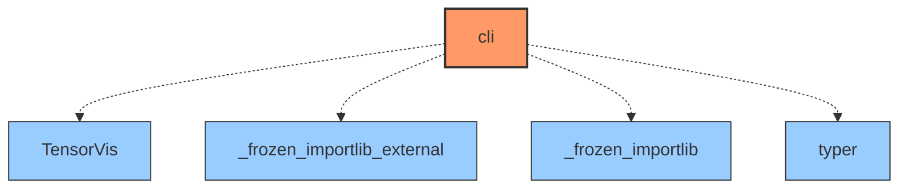
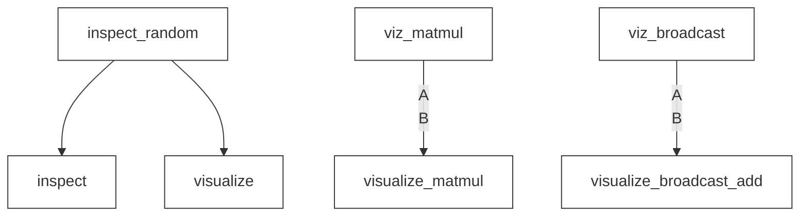

```mermaid
flowchart TD
    classDef input fill:#e3f2fd,stroke:#1565c0,stroke-width:2px,rx:5,ry:5;
    classDef process fill:#fff,stroke:#bdbdbd,stroke-width:1px;
    classDef core_process fill:#fff9c4,stroke:#fbc02d,stroke-width:2px,rx:5,ry:5;
    classDef decision fill:#f3e5f5,stroke:#7b1fa2,stroke-width:1px,rx:5,ry:5,stroke-dasharray: 5 5;
    classDef output fill:#e8f5e9,stroke:#2e7d32,stroke-width:2px,rx:5,ry:5;
    Input(["<b>Input Data</b><br/>• shape: List[int]"]):::input
    Node1["Call: print"]:::process
    Input -->|"shape"| Node1
    Node2["<b>Op:</b> Mult<br/>⬇<br/>A"]:::process
    Input -->|"shape"| Node2
    Node3["Call: OpVisualizer.visualize_activation"]:::process
    Node2 -->|"A"| Node3
```

# Documentation for `TensorVis.cli`
> **Discovered via:** `cli_command` (original input: `tensorvis`)

> **Note:** Resolved as `module` for `TensorVis.cli`.

**File Path:** `/data2/TensorVis/TensorVis/cli.py`

## 🧾 Metadata & Diagnostics
- **Used candidate:** `TensorVis.cli` (resolved)
### Tried Candidates
| Candidate | Hint | Status | Error |
| :--- | :--- | :--- | :--- |
| `TensorVis.cli` | resolved | success | `` |

- **Run Mode:** dynamic import (module)
### sys.path (head)
```text
/home/nicai_zht/miniconda3/envs/zht/bin
/home/nicai_zht/software/AIUPred-2.1.2
/home/nicai_zht/miniconda3/envs/zht/lib/python313.zip
/home/nicai_zht/miniconda3/envs/zht/lib/python3.13
/home/nicai_zht/miniconda3/envs/zht/lib/python3.13/lib-dynload
/home/nicai_zht/miniconda3/envs/zht/lib/python3.13/site-packages
__editable__.lib_inspector-0.2.0.finder.__path_hook__
__editable__.metapredict-3.0.1+3.g71aa13b.finder.__path_hook__
```

## 🚦 Navigator: How to Drive
This section helps you understand how to run this library from the command line or entry points.

### 💻 Installed CLI Commands
This library installs the following system commands (accessible from terminal):
| Command | Entry Point (Function) |
| :--- | :--- |
| `tensorvis` | `TensorVis.cli:app` |

- ✅ **Script Entry Point**: This module contains an `if __name__ == '__main__':` block, meaning it can be run directly.

### 🐍 Python API Usage (Inferred)
Since no CLI entry point was found, here are the likely **Python API entry points** for your script:

#### 🚀 Top 20 Recommended Entry Points
| Type | API | Description |
| :--- | :--- | :--- |
| `ƒ` | **TensorVis.cli.inspect_random**(shape, name) | Generate a random tensor of the specified shape and run the inspector. |
| `ƒ` | **TensorVis.cli.viz_broadcast**(shape_a, shape_b) | Visualize Broadcasting Addition: A + B |
| `ƒ` | **TensorVis.cli.viz_matmul**(m, k, n) | Visualize Matrix Multiplication: (M, K) @ (K, N) -> (M, N) |
| `ƒ` | **TensorVis.cli.viz_relu**(shape) | Visualize ReLU Activation |
| `C` | **TensorVis.cli.DLTensorInspector**(**tensor**, name) | 【深度学习张量全能显微镜】(Deep Learning Tensor Inspector) |
| `C` | **TensorVis.cli.OpVisualizer**() | 【张量手术台】(Tensor Operation Visualizer) |

> **Note:** Bold parameters are required. Others are optional.

#### 🧩 Code Snippets (Auto-Generated)
```python
import TensorVis.cli

# --- Top 20 Ranked Functions ---
# 1. inspect_random
result_1 = TensorVis.cli.inspect_random()

# 2. viz_broadcast
result_2 = TensorVis.cli.viz_broadcast()

# 3. viz_matmul
result_3 = TensorVis.cli.viz_matmul()

# 4. viz_relu
result_4 = TensorVis.cli.viz_relu()

# --- Top 20 Core Classes Initialization ---
# 1. DLTensorInspector
dltensorinspector = TensorVis.cli.DLTensorInspector(tensor=...)

# 2. OpVisualizer
opvisualizer = TensorVis.cli.OpVisualizer()

```

_No explicit `argparse` configuration detected in the main module._


## 📊 Network & Architecture Analysis
### 🌍 Top 20 External Dependencies
| Library | Usage Count |
| :--- | :--- |
| **typer** | 3 |
| **TensorVis** | 2 |
| **_frozen_importlib_external** | 1 |
| **_frozen_importlib** | 1 |


### 🕸️ Network Metrics (Advanced)
#### 👑 Top 20 Modules by PageRank (Authority)
| Rank | Module | Score | Type | Role |
| :--- | :--- | :--- | :--- | :--- |
| 1 | `TensorVis` | 0.2073 | External | External Lib |
| 2 | `_frozen_importlib_external` | 0.2073 | External | External Lib |
| 3 | `_frozen_importlib` | 0.2073 | External | External Lib |
| 4 | `typer` | 0.2073 | External | External Lib |
| 5 | `TensorVis.cli` | 0.1709 | Internal | Data Processing |


### 🗺️ Dependency & Architecture Map


## 🚀 Global Execution Flow & Extraction Guide
This graph visualizes how data flows between functions across the entire project.


### ✂️ Navigator: Snippet Extractor
Want to use a specific function without the whole library? Here is the **Dependency Closure** for **Top 20** key functions.
#### To extract `inspect_random`:
> You need these **3** components:
`inspect, inspect_random, visualize`

#### To extract `viz_matmul`:
> You need these **2** components:
`visualize_matmul, viz_matmul`

#### To extract `viz_broadcast`:
> You need these **2** components:
`visualize_broadcast_add, viz_broadcast`

## 📑 Top-Level API Contents & Logic Flow
### 🔧 Functions
#### `inspect_random(shape: List[int] = <typer.models.OptionInfo object at 0x7b425397b610>, name: str = <typer.models.OptionInfo object at 0x7b425397b750>)`
> Generate a random tensor of the specified shape and run the inspector.
<details><summary>Full Docstring</summary>

```text
Generate a random tensor of the specified shape and run the inspector.
```
</details>


**Logic Flow:**


#### `viz_broadcast(shape_a: List[int] = <typer.models.OptionInfo object at 0x7b425397bed0>, shape_b: List[int] = <typer.models.OptionInfo object at 0x7b425384c050>)`

```mermaid
flowchart TD
    classDef input fill:#e3f2fd,stroke:#1565c0,stroke-width:2px,rx:5,ry:5;
    classDef process fill:#fff,stroke:#bdbdbd,stroke-width:1px;
    classDef core_process fill:#fff9c4,stroke:#fbc02d,stroke-width:2px,rx:5,ry:5;
    classDef decision fill:#f3e5f5,stroke:#7b1fa2,stroke-width:1px,rx:5,ry:5,stroke-dasharray: 5 5;
    classDef output fill:#e8f5e9,stroke:#2e7d32,stroke-width:2px,rx:5,ry:5;
    Input(["<b>Input Data</b><br/>• shape: List[int]<br/>• name: str"]):::input
    Node1["Call: print"]:::process
    Input -->|"shape"| Node1
    Node2["<b>Call:</b> obj.astype<br/>⬇<br/>data"]:::process
    Input -->|"shape"| Node2
    Node3["Assign<br/>⬇<br/>mask"]:::process
    Input -->|"shape"| Node3
    Node4["<b>Call:</b> DLTensorInspector<br/>⬇<br/>inspector"]:::process
    Input -->|"name"| Node4
    Node2 -->|"data"| Node4
    Node5["Call: inspector.inspect"]:::process
    Node4 -->|"inspector"| Node5
    Node6["Call: inspector.visualize"]:::process
    Node4 -->|"inspector"| Node6
```

> Visualize Broadcasting Addition: A + B
<details><summary>Full Docstring</summary>

```text
Visualize Broadcasting Addition: A + B
```
</details>


**Logic Flow:**


#### `viz_matmul(m: int = <typer.models.OptionInfo object at 0x7b425397b9d0>, k: int = <typer.models.OptionInfo object at 0x7b425397bb10>, n: int = <typer.models.OptionInfo object at 0x7b425397bc50>)`

```mermaid
flowchart TD
    classDef input fill:#e3f2fd,stroke:#1565c0,stroke-width:2px,rx:5,ry:5;
    classDef process fill:#fff,stroke:#bdbdbd,stroke-width:1px;
    classDef core_process fill:#fff9c4,stroke:#fbc02d,stroke-width:2px,rx:5,ry:5;
    classDef decision fill:#f3e5f5,stroke:#7b1fa2,stroke-width:1px,rx:5,ry:5,stroke-dasharray: 5 5;
    classDef output fill:#e8f5e9,stroke:#2e7d32,stroke-width:2px,rx:5,ry:5;
    Input(["<b>Input Data</b><br/>• shape_a: List[int]<br/>• shape_b: List[int]"]):::input
    Node1["Call: print"]:::process
    Input -->|"shape_a"| Node1
    Input -->|"shape_b"| Node1
    Node2["<b>Call:</b> obj.astype<br/>⬇<br/>A"]:::process
    Input -->|"shape_a"| Node2
    Node3["<b>Call:</b> obj.astype<br/>⬇<br/>B"]:::process
    Input -->|"shape_b"| Node3
    Node4["Call: OpVisualizer.visualize_broadcast_add"]:::process
    Node3 -->|"B"| Node4
    Node2 -->|"A"| Node4
```

> Visualize Matrix Multiplication: (M, K) @ (K, N) -> (M, N)
<details><summary>Full Docstring</summary>

```text
Visualize Matrix Multiplication: (M, K) @ (K, N) -> (M, N)
```
</details>


**Logic Flow:**


#### `viz_relu(shape: List[int] = <typer.models.OptionInfo object at 0x7b425384c190>)`

```mermaid
flowchart TD
    classDef input fill:#e3f2fd,stroke:#1565c0,stroke-width:2px,rx:5,ry:5;
    classDef process fill:#fff,stroke:#bdbdbd,stroke-width:1px;
    classDef core_process fill:#fff9c4,stroke:#fbc02d,stroke-width:2px,rx:5,ry:5;
    classDef decision fill:#f3e5f5,stroke:#7b1fa2,stroke-width:1px,rx:5,ry:5,stroke-dasharray: 5 5;
    classDef output fill:#e8f5e9,stroke:#2e7d32,stroke-width:2px,rx:5,ry:5;
    Input(["<b>Input Data</b><br/>• m: int<br/>• k: int<br/>• n: int"]):::input
    Node1["Call: print"]:::process
    Input -->|"k"| Node1
    Input -->|"m"| Node1
    Input -->|"n"| Node1
    Node2["<b>Call:</b> obj.astype<br/>⬇<br/>A"]:::process
    Input -->|"k"| Node2
    Input -->|"m"| Node2
    Node3["<b>Call:</b> obj.astype<br/>⬇<br/>B"]:::process
    Input -->|"k"| Node3
    Input -->|"n"| Node3
    Node4["Call: OpVisualizer.visualize_matmul"]:::process
    Node3 -->|"B"| Node4
    Node2 -->|"A"| Node4
```

> Visualize ReLU Activation
<details><summary>Full Docstring</summary>

```text
Visualize ReLU Activation
```
</details>


**Logic Flow:**

