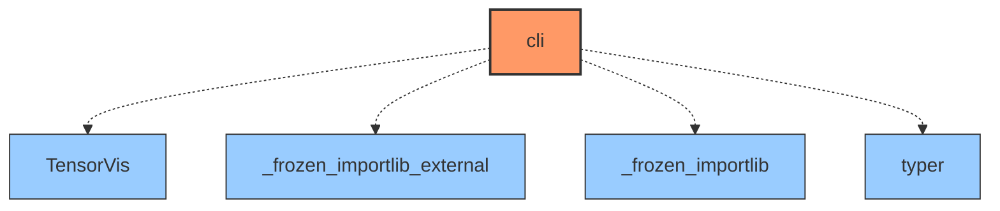
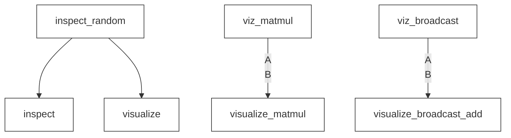
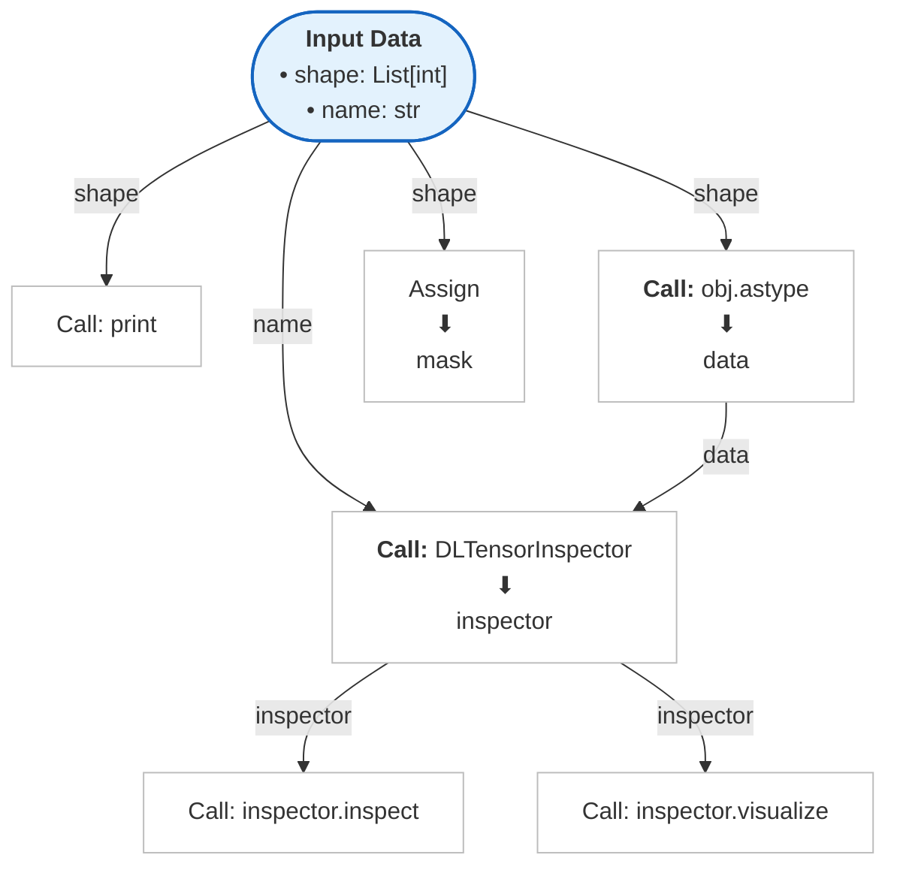
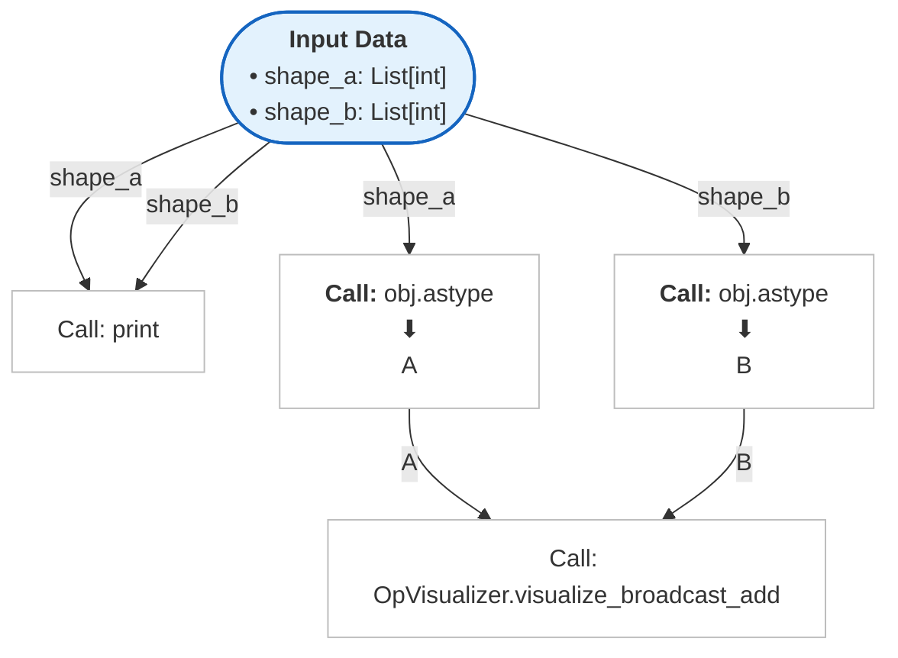
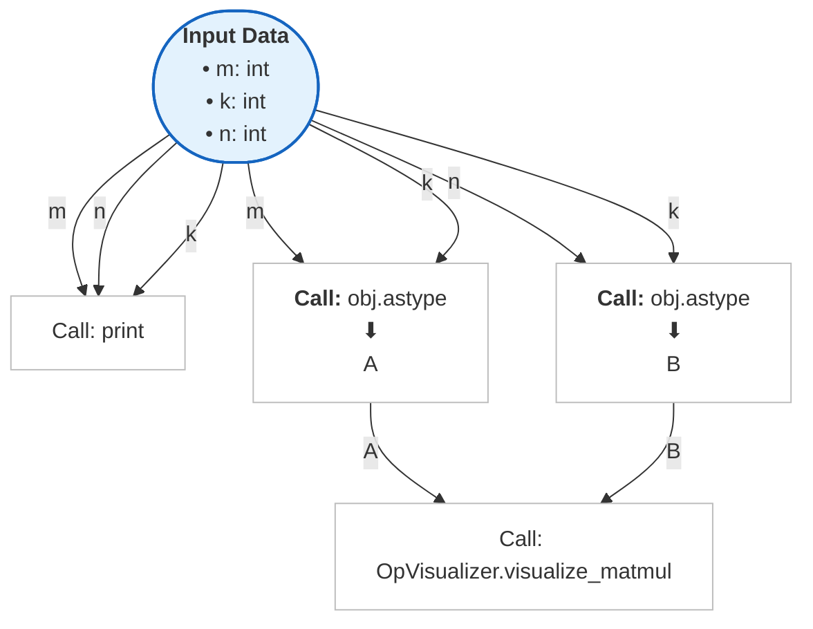
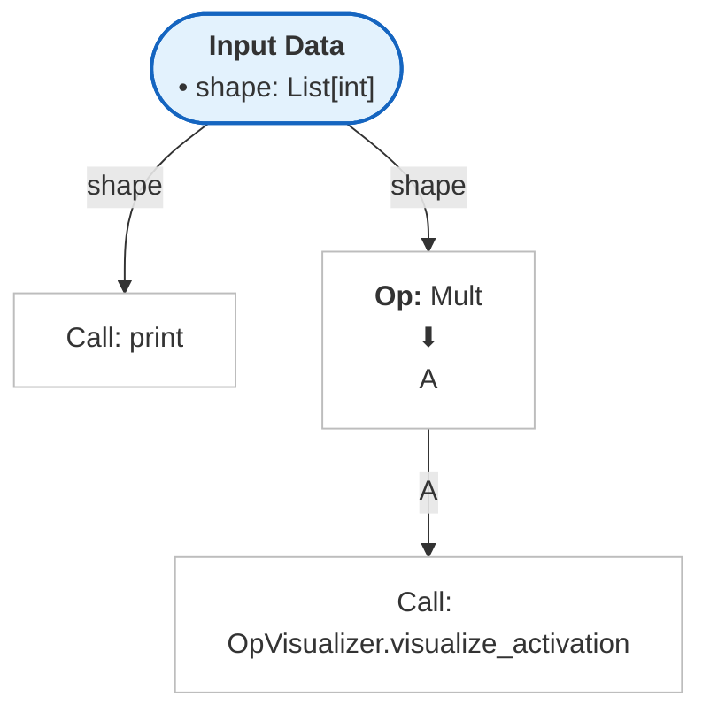

# Documentation for `TensorVis.cli`
> **Discovered via:** `file` (original input: `../TensorVis/TensorVis/cli.py`)

> **Note:** Analyzed local file/package at `/data2/TensorVis/TensorVis/cli.py`.

**File Path:** `/data2/TensorVis/TensorVis/cli.py`

## 🧾 Metadata & Diagnostics
- **Used candidate:** `TensorVis.cli` (constructed_from_file)
### Tried Candidates
| Candidate | Hint | Status | Error |
| :--- | :--- | :--- | :--- |
| `TensorVis.cli` | constructed_from_file | success | `` |

- **Run Mode:** dynamic import (module)
### sys.path (head)
```text
/
/data2
/data2/TensorVis
/data2/TensorVis/TensorVis
/home/nicai_zht/miniconda3/envs/zht/bin
/home/nicai_zht/software/AIUPred-2.1.2
/home/nicai_zht/miniconda3/envs/zht/lib/python313.zip
/home/nicai_zht/miniconda3/envs/zht/lib/python3.13
```

## 🚦 Navigator: How to Drive
This section helps you understand how to run this library from the command line or entry points.
- ✅ **Script Entry Point**: This module contains an `if __name__ == '__main__':` block, meaning it can be run directly.

### 🐍 Python API Usage (Inferred)
Since no CLI entry point was found, here are the likely **Python API entry points** for your script:

#### 🚀 Top 20 Recommended Entry Points
| Type | API | Description |
| :--- | :--- | :--- |
| `ƒ` | **TensorVis.cli.inspect_random**(shape, name) | Generate a random tensor of the specified shape and run the inspector. |
| `ƒ` | **TensorVis.cli.viz_broadcast**(shape_a, shape_b) | Visualize Broadcasting Addition: A + B |
| `ƒ` | **TensorVis.cli.viz_matmul**(m, k, n) | Visualize Matrix Multiplication: (M, K) @ (K, N) -> (M, N) |
| `ƒ` | **TensorVis.cli.viz_relu**(shape) | Visualize ReLU Activation |
| `C` | **TensorVis.cli.DLTensorInspector**(**tensor**, name) | 【深度学习张量全能显微镜】(Deep Learning Tensor Inspector) |
| `C` | **TensorVis.cli.OpVisualizer**() | 【张量手术台】(Tensor Operation Visualizer) |

> **Note:** Bold parameters are required. Others are optional.

#### 🧩 Code Snippets (Auto-Generated)
```python
import TensorVis.cli

# --- Top 20 Ranked Functions ---
# 1. inspect_random
result_1 = TensorVis.cli.inspect_random()

# 2. viz_broadcast
result_2 = TensorVis.cli.viz_broadcast()

# 3. viz_matmul
result_3 = TensorVis.cli.viz_matmul()

# 4. viz_relu
result_4 = TensorVis.cli.viz_relu()

# --- Top 20 Core Classes Initialization ---
# 1. DLTensorInspector
dltensorinspector = TensorVis.cli.DLTensorInspector(tensor=...)

# 2. OpVisualizer
opvisualizer = TensorVis.cli.OpVisualizer()

```

_No explicit `argparse` configuration detected in the main module._


## 📊 Network & Architecture Analysis
### 🌍 Top 20 External Dependencies
| Library | Usage Count |
| :--- | :--- |
| **typer** | 3 |
| **TensorVis** | 2 |
| **_frozen_importlib_external** | 1 |
| **_frozen_importlib** | 1 |


### 🕸️ Network Metrics (Advanced)
#### 👑 Top 20 Modules by PageRank (Authority)
| Rank | Module | Score | Type | Role |
| :--- | :--- | :--- | :--- | :--- |
| 1 | `TensorVis` | 0.2073 | External | External Lib |
| 2 | `_frozen_importlib_external` | 0.2073 | External | External Lib |
| 3 | `_frozen_importlib` | 0.2073 | External | External Lib |
| 4 | `typer` | 0.2073 | External | External Lib |
| 5 | `TensorVis.cli` | 0.1709 | Internal | Data Processing |


### 🗺️ Dependency & Architecture Map


## 🚀 Global Execution Flow & Extraction Guide
This graph visualizes how data flows between functions across the entire project.


### ✂️ Navigator: Snippet Extractor
Want to use a specific function without the whole library? Here is the **Dependency Closure** for **Top 20** key functions.
#### To extract `inspect_random`:
> You need these **3** components:
`inspect, inspect_random, visualize`

#### To extract `viz_matmul`:
> You need these **2** components:
`visualize_matmul, viz_matmul`

#### To extract `viz_broadcast`:
> You need these **2** components:
`visualize_broadcast_add, viz_broadcast`

## 📑 Top-Level API Contents & Logic Flow
### 🔧 Functions
#### `inspect_random(shape: List[int] = <typer.models.OptionInfo object at 0x74e1861f5e50>, name: str = <typer.models.OptionInfo object at 0x74e1861f5f90>)`
> Generate a random tensor of the specified shape and run the inspector.
<details><summary>Full Docstring</summary>

```text
Generate a random tensor of the specified shape and run the inspector.
```
</details>


**Logic Flow:**


#### `viz_broadcast(shape_a: List[int] = <typer.models.OptionInfo object at 0x74e1861f6710>, shape_b: List[int] = <typer.models.OptionInfo object at 0x74e1861f6850>)`
> Visualize Broadcasting Addition: A + B
<details><summary>Full Docstring</summary>

```text
Visualize Broadcasting Addition: A + B
```
</details>


**Logic Flow:**


#### `viz_matmul(m: int = <typer.models.OptionInfo object at 0x74e1861f6210>, k: int = <typer.models.OptionInfo object at 0x74e1861f6350>, n: int = <typer.models.OptionInfo object at 0x74e1861f6490>)`
> Visualize Matrix Multiplication: (M, K) @ (K, N) -> (M, N)
<details><summary>Full Docstring</summary>

```text
Visualize Matrix Multiplication: (M, K) @ (K, N) -> (M, N)
```
</details>


**Logic Flow:**


#### `viz_relu(shape: List[int] = <typer.models.OptionInfo object at 0x74e1861f6990>)`
> Visualize ReLU Activation
<details><summary>Full Docstring</summary>

```text
Visualize ReLU Activation
```
</details>


**Logic Flow:**

