# Documentation for `aiupred_lib`
**File Path:** `/home/nicai_zht/software/AIUPred-2.1.2/aiupred_lib.py`

## 🚦 Navigator: How to Drive
This section helps you understand how to run this library from the command line or entry points.
- ℹ️ **No Direct Entry Point**: This module seems to be a library intended for import, not direct execution.

### 🐍 Python API Usage (Inferred)
Since no CLI entry point was found, here are the likely **Python API entry points** for your script:

#### 🚀 Top 20 Recommended Entry Points
| Type | API | Description |
| :--- | :--- | :--- |
| `ƒ` | **aiupred_lib.low_memory_predict_binding**(**sequence**, **embedding_model**, **decoder_model**, **device**, smoothing, chunk_len) | No description. |
| `ƒ` | **aiupred_lib.low_memory_predict_disorder**(**sequence**, **embedding_model**, **decoder_model**, **device**, smoothing, chunk_len) | No description. |
| `ƒ` | **aiupred_lib.calculate_energy**(**sequence**, **energy_model**, **device**) | Calculates residue energy from a sequence using a transformer network |
| `ƒ` | **aiupred_lib.main**(**multifasta_file**, force_cpu, gpu_num, binding) | Main function to be called from aiupred.py |
| `ƒ` | **aiupred_lib.aiupred_binding**(**sequence**, force_cpu, gpu_num) | Library function to carry out single sequence analysis |
| `ƒ` | **aiupred_lib.aiupred_disorder**(**sequence**, force_cpu, gpu_num) | Library function to carry out single sequence analysis |
| `ƒ` | **aiupred_lib.multifasta_reader**(**file_handler**) | (multi) FASTA reader function |
| `ƒ` | **aiupred_lib.predict_binding**(**sequence**, **embedding_model**, **decoder_model**, **device**, smoothing, energy_only, binding) | No description. |
| `ƒ` | **aiupred_lib.predict_disorder**(**sequence**, **energy_model**, **regression_model**, **device**, smoothing) | Predict disorder propensity from a sequence using a transformer and a regression model |
| `C` | **aiupred_lib.BindingDecoderModel**() | Base class for all neural network modules. |
| `C` | **aiupred_lib.BindingTransformerModel**() | Base class for all neural network modules. |
| `C` | **aiupred_lib.DecoderModel**() | Regression model to estimate disorder propensity from and energy tensor |
| `C` | **aiupred_lib.TransformerModel**() | Transformer model to estimate positional contact potential from an amino acid sequence |
| `C` | **aiupred_lib.Tensor**(...) | No description. |
| `C` | **aiupred_lib.TransformerEncoder**(**encoder_layer**, **num_layers**, norm, enable_nested_tensor, mask_check) | TransformerEncoder is a stack of N encoder layers. |
| `C` | **aiupred_lib.TransformerEncoderLayer**(**d_model**, **nhead**, dim_feedforward, dropout, activation, layer_norm_eps, batch_first, norm_first, bias, device, dtype) | TransformerEncoderLayer is made up of self-attn and feedforward network. |
| `ƒ` | **aiupred_lib.binding_transform**(**prediction**, smoothing) | No description. |
| `ƒ` | **aiupred_lib.init_models**(**prediction_type**, force_cpu, gpu_num) | Initialize networks and device to run on |
| `ƒ` | **aiupred_lib.tokenize**(**sequence**, **device**) | Tokenize an amino acid sequence. Non-standard amino acids are treated as X |
| `C` | **aiupred_lib.PositionalEncoding**(**d_model**, max_len) | Positional encoding for the Transformer network |

> **Note:** Bold parameters are required. Others are optional.

#### 🧩 Code Snippets (Auto-Generated)
```python
import aiupred_lib

# --- Top 20 Ranked Functions ---
# 1. low_memory_predict_binding
result_1 = aiupred_lib.low_memory_predict_binding(
    sequence=...,
    embedding_model=...,
    decoder_model=...,
    device=...
)

# 2. low_memory_predict_disorder
result_2 = aiupred_lib.low_memory_predict_disorder(
    sequence=...,
    embedding_model=...,
    decoder_model=...,
    device=...
)

# 3. calculate_energy
result_3 = aiupred_lib.calculate_energy(sequence=..., energy_model=..., device=...)

# 4. main
result_4 = aiupred_lib.main(multifasta_file=...)

# 5. aiupred_binding
result_5 = aiupred_lib.aiupred_binding(sequence=...)

# 6. aiupred_disorder
result_6 = aiupred_lib.aiupred_disorder(sequence=...)

# 7. multifasta_reader
result_7 = aiupred_lib.multifasta_reader(file_handler=...)

# 8. predict_binding
result_8 = aiupred_lib.predict_binding(
    sequence=...,
    embedding_model=...,
    decoder_model=...,
    device=...
)

# 9. predict_disorder
result_9 = aiupred_lib.predict_disorder(
    sequence=...,
    energy_model=...,
    regression_model=...,
    device=...
)

# 10. binding_transform
result_10 = aiupred_lib.binding_transform(prediction=...)

# 11. init_models
result_11 = aiupred_lib.init_models(prediction_type=...)

# 12. tokenize
result_12 = aiupred_lib.tokenize(sequence=..., device=...)

# 13. pad
result_13 = aiupred_lib.pad(input=..., pad=...)

# 14. savgol_filter
result_14 = aiupred_lib.savgol_filter(x=..., window_length=..., polyorder=...)

# --- Top 20 Core Classes Initialization ---
# 1. BindingDecoderModel
bindingdecoder_model = aiupred_lib.BindingDecoderModel()

# 2. BindingTransformerModel
bindingtransformer_model = aiupred_lib.BindingTransformerModel()

# 3. DecoderModel
decoder_model = aiupred_lib.DecoderModel()

# 4. TransformerModel
transformer_model = aiupred_lib.TransformerModel()

# 6. TransformerEncoder
transformerencoder = aiupred_lib.TransformerEncoder(encoder_layer=..., num_layers=...)

# 7. TransformerEncoderLayer
transformerencoderlayer = aiupred_lib.TransformerEncoderLayer(d_model=..., nhead=...)

# 8. PositionalEncoding
positionalencoding = aiupred_lib.PositionalEncoding(d_model=...)

```

_No explicit `argparse` configuration detected in the main module._


## 📊 Network & Architecture Analysis
### 🌍 Top 20 External Dependencies
| Library | Usage Count |
| :--- | :--- |
| **torch** | 4 |
| **_frozen_importlib_external** | 1 |
| **_frozen_importlib** | 1 |
| **scipy** | 1 |


### 🕸️ Network Metrics (Advanced)
#### 👑 Top 20 Modules by PageRank (Authority)
| Rank | Module | Score | Type | Role |
| :--- | :--- | :--- | :--- | :--- |
| 1 | `torch` | 0.2073 | External | External Lib |
| 2 | `_frozen_importlib_external` | 0.2073 | External | External Lib |
| 3 | `_frozen_importlib` | 0.2073 | External | External Lib |
| 4 | `scipy` | 0.2073 | External | External Lib |
| 5 | `aiupred_lib` | 0.1709 | Internal | Model / AI |


### 🗺️ Dependency & Architecture Map


## 🚀 Global Execution Flow & Extraction Guide
This graph visualizes how data flows between functions across the entire project.


### ✂️ Navigator: Snippet Extractor
Want to use a specific function without the whole library? Here is the **Dependency Closure** for **Top 20** key functions.
#### To extract `forward`:
> You need these **5** components:
`decoder, encoder, forward, pos_encoder, transformer_encoder`

#### To extract `predict_disorder`:
> You need these **6** components:
`calculate_energy, cpu, pad, predict_disorder, savgol_filter, tokenize`

#### To extract `predict_binding`:
> You need these **8** components:
`binding_transform, cpu, float, pad, predict_binding, savgol_filter, split, tokenize`

#### To extract `main`:
> You need these **16** components:
`binding_transform, calculate_energy, cpu, eval, float, init_models, load_state_dict, main, multifasta_reader, pad, predict_binding, predict_disorder, savgol_filter, split, to, tokenize`

#### To extract `__init__`:
> You need these **3** components:
`__init__, float, register_buffer`

#### To extract `binding_transform`:
> You need these **4** components:
`binding_transform, float, savgol_filter, split`

#### To extract `init_models`:
> You need these **4** components:
`eval, init_models, load_state_dict, to`

#### To extract `calculate_energy`:
> You need these **3** components:
`calculate_energy, pad, tokenize`

#### To extract `low_memory_predict_disorder`:
> You need these **7** components:
`calculate_energy, cpu, low_memory_predict_disorder, pad, predict_disorder, savgol_filter, tokenize`

#### To extract `low_memory_predict_binding`:
> You need these **9** components:
`binding_transform, cpu, float, low_memory_predict_binding, pad, predict_binding, savgol_filter, split, tokenize`

#### To extract `aiupred_disorder`:
> You need these **11** components:
`aiupred_disorder, calculate_energy, cpu, eval, init_models, load_state_dict, pad, predict_disorder, savgol_filter, to, tokenize`

#### To extract `aiupred_binding`:
> You need these **13** components:
`aiupred_binding, binding_transform, cpu, eval, float, init_models, load_state_dict, pad, predict_binding, savgol_filter, split, to, tokenize`

## 📑 Top-Level API Contents & Logic Flow
### 🔧 Functions
#### `aiupred_binding(sequence, force_cpu=False, gpu_num=0)`
> Library function to carry out single sequence analysis
<details><summary>Full Docstring</summary>

```text
Library function to carry out single sequence analysis
:param sequence: Amino acid sequence in a string
```
</details>

#### `aiupred_disorder(sequence, force_cpu=False, gpu_num=0)`
> Library function to carry out single sequence analysis
<details><summary>Full Docstring</summary>

```text
Library function to carry out single sequence analysis
:param sequence: Amino acid sequence in a string
```
</details>

#### `binding_transform(prediction, smoothing=True)`
> No documentation available.
<details><summary>Full Docstring</summary>

```text
No documentation available.
```
</details>

#### `calculate_energy(sequence, energy_model, device)`
> Calculates residue energy from a sequence using a transformer network
<details><summary>Full Docstring</summary>

```text
Calculates residue energy from a sequence using a transformer network
:param sequence: Amino acid sequence in string
:param energy_model: Transformer model
:param device: Device to run on. CUDA{x} or CPU
:return: Tensor of energy values
```
</details>

#### `init_models(prediction_type, force_cpu=False, gpu_num=0)`
> Initialize networks and device to run on
<details><summary>Full Docstring</summary>

```text
Initialize networks and device to run on
:param force_cpu: Force the method to run on CPU only mode
:param gpu_num: Index of the GPU to use, default=0
:return: Tuple of (embedding_model, regression_model, device)
```
</details>

#### `low_memory_predict_binding(sequence, embedding_model, decoder_model, device, smoothing=None, chunk_len=1000)`
> No documentation available.
<details><summary>Full Docstring</summary>

```text
No documentation available.
```
</details>

#### `low_memory_predict_disorder(sequence, embedding_model, decoder_model, device, smoothing=None, chunk_len=1000)`
> No documentation available.
<details><summary>Full Docstring</summary>

```text
No documentation available.
```
</details>

#### `main(multifasta_file, force_cpu=False, gpu_num=0, binding=False)`
> Main function to be called from aiupred.py
<details><summary>Full Docstring</summary>

```text
Main function to be called from aiupred.py
:param multifasta_file: Location of (multi) FASTA formatted sequences
:param force_cpu: Force the method to run on CPU only mode
:param gpu_num: Index of the GPU to use, default=0
:return: Dictionary with parsed sequences and predicted results
```
</details>

#### `multifasta_reader(file_handler)`
> (multi) FASTA reader function
<details><summary>Full Docstring</summary>

```text
(multi) FASTA reader function
:return: Dictionary with header -> sequence mapping from the file
```
</details>

#### `predict_binding(sequence, embedding_model, decoder_model, device, smoothing=None, energy_only=False, binding=False)`
> No documentation available.
<details><summary>Full Docstring</summary>

```text
No documentation available.
```
</details>

#### `predict_disorder(sequence, energy_model, regression_model, device, smoothing=None)`
> Predict disorder propensity from a sequence using a transformer and a regression model
<details><summary>Full Docstring</summary>

```text
Predict disorder propensity from a sequence using a transformer and a regression model
:param sequence: Amino acid sequence in string
:param energy_model: Transformer model
:param regression_model: regression model
:param device: Device to run on. CUDA{x} or CPU
:param smoothing: Use the SavGol filter to smooth the output
:return:
```
</details>

#### `tokenize(sequence, device)`
> Tokenize an amino acid sequence. Non-standard amino acids are treated as X
<details><summary>Full Docstring</summary>

```text
Tokenize an amino acid sequence. Non-standard amino acids are treated as X
:param sequence: Amino acid sequence in string
:param device: Device to run on. CUDA{x} or CPU
:return: Tokenized tensors
```
</details>


**Logic Flow:**

```mermaid
flowchart TD
    classDef input fill:#e3f2fd,stroke:#1565c0,stroke-width:2px,rx:5,ry:5;
    classDef process fill:#fff,stroke:#bdbdbd,stroke-width:1px;
    classDef core_process fill:#fff9c4,stroke:#fbc02d,stroke-width:2px,rx:5,ry:5;
    classDef decision fill:#f3e5f5,stroke:#7b1fa2,stroke-width:1px,rx:5,ry:5,stroke-dasharray: 5 5;
    classDef output fill:#e8f5e9,stroke:#2e7d32,stroke-width:2px,rx:5,ry:5;
    Input(["<b>Input Data</b><br/>• sequence<br/>• device"]):::input
    Return(["Return\ntorch.tensor([AA_CODE.index(aa) if aa in AA_CODE else 20 for aa in sequence], device=device)"]):::output
    Input -->|"device"| Return
    Input -->|"sequence"| Return
```


### 📦 Classes
#### `class BindingDecoderModel()`
Base class for all neural network modules.

| Method | Signature | Description |
| :--- | :--- | :--- |
| **__init__** | `(self)` | Initialize internal Module state, shared by both nn.Module and ScriptModule. |
| **add_module** | `(self, name: str, module: Optional[ForwardRef('Module')]) -> None` | Add a child module to the current module. |
| **apply** | `(self, fn: Callable[[ForwardRef('Module')], NoneType]) -> Self` | Apply ``fn`` recursively to every submodule (as returned by ``.children()``) as well as self. |
| **bfloat16** | `(self) -> Self` | Casts all floating point parameters and buffers to ``bfloat16`` datatype. |
| **buffers** | `(self, recurse: bool = True) -> collections.abc.Iterator[torch.Tensor]` | Return an iterator over module buffers. |
| **children** | `(self) -> collections.abc.Iterator['Module']` | Return an iterator over immediate children modules. |
| **compile** | `(self, *args, **kwargs)` | Compile this Module's forward using :func:`torch.compile`. |
| **cpu** | `(self) -> Self` | Move all model parameters and buffers to the CPU. |
| **cuda** | `(self, device: Union[torch.device, int, NoneType] = None) -> Self` | Move all model parameters and buffers to the GPU. |
| **double** | `(self) -> Self` | Casts all floating point parameters and buffers to ``double`` datatype. |
| **eval** | `(self) -> Self` | Set the module in evaluation mode. |
| **extra_repr** | `(self) -> str` | Return the extra representation of the module. |
| **float** | `(self) -> Self` | Casts all floating point parameters and buffers to ``float`` datatype. |
| **forward** | `(self, x: torch.Tensor) -> torch.Tensor` | Define the computation performed at every call. |
| **get_buffer** | `(self, target: str) -> 'Tensor'` | Return the buffer given by ``target`` if it exists, otherwise throw an error. |
| **get_extra_state** | `(self) -> Any` | Return any extra state to include in the module's state_dict. |
| **get_parameter** | `(self, target: str) -> 'Parameter'` | Return the parameter given by ``target`` if it exists, otherwise throw an error. |
| **get_submodule** | `(self, target: str) -> 'Module'` | Return the submodule given by ``target`` if it exists, otherwise throw an error. |
| **half** | `(self) -> Self` | Casts all floating point parameters and buffers to ``half`` datatype. |
| **ipu** | `(self, device: Union[torch.device, int, NoneType] = None) -> Self` | Move all model parameters and buffers to the IPU. |
| **load_state_dict** | `(self, state_dict: collections.abc.Mapping[str, typing.Any], strict: bool = True, assign: bool = False)` | Copy parameters and buffers from :attr:`state_dict` into this module and its descendants. |
| **modules** | `(self) -> collections.abc.Iterator['Module']` | Return an iterator over all modules in the network. |
| **mtia** | `(self, device: Union[torch.device, int, NoneType] = None) -> Self` | Move all model parameters and buffers to the MTIA. |
| **named_buffers** | `(self, prefix: str = '', recurse: bool = True, remove_duplicate: bool = True) -> collections.abc.Iterator[tuple[str, torch.Tensor]]` | Return an iterator over module buffers, yielding both the name of the buffer as well as the buffer itself. |
| **named_children** | `(self) -> collections.abc.Iterator[tuple[str, 'Module']]` | Return an iterator over immediate children modules, yielding both the name of the module as well as the module itself. |
| **named_modules** | `(self, memo: Optional[set['Module']] = None, prefix: str = '', remove_duplicate: bool = True)` | Return an iterator over all modules in the network, yielding both the name of the module as well as the module itself. |
| **named_parameters** | `(self, prefix: str = '', recurse: bool = True, remove_duplicate: bool = True) -> collections.abc.Iterator[tuple[str, torch.nn.parameter.Parameter]]` | Return an iterator over module parameters, yielding both the name of the parameter as well as the parameter itself. |
| **parameters** | `(self, recurse: bool = True) -> collections.abc.Iterator[torch.nn.parameter.Parameter]` | Return an iterator over module parameters. |
| **register_backward_hook** | `(self, hook: Callable[[ForwardRef('Module'), Union[tuple[torch.Tensor, ...], torch.Tensor], Union[tuple[torch.Tensor, ...], torch.Tensor]], Union[NoneType, tuple[torch.Tensor, ...], torch.Tensor]]) -> torch.utils.hooks.RemovableHandle` | Register a backward hook on the module. |
| **register_buffer** | `(self, name: str, tensor: Optional[torch.Tensor], persistent: bool = True) -> None` | Add a buffer to the module. |
| **register_forward_hook** | `(self, hook: Union[Callable[[~T, tuple[Any, ...], Any], Optional[Any]], Callable[[~T, tuple[Any, ...], dict[str, Any], Any], Optional[Any]]], *, prepend: bool = False, with_kwargs: bool = False, always_call: bool = False) -> torch.utils.hooks.RemovableHandle` | Register a forward hook on the module. |
| **register_forward_pre_hook** | `(self, hook: Union[Callable[[~T, tuple[Any, ...]], Optional[Any]], Callable[[~T, tuple[Any, ...], dict[str, Any]], Optional[tuple[Any, dict[str, Any]]]]], *, prepend: bool = False, with_kwargs: bool = False) -> torch.utils.hooks.RemovableHandle` | Register a forward pre-hook on the module. |
| **register_full_backward_hook** | `(self, hook: Callable[[ForwardRef('Module'), Union[tuple[torch.Tensor, ...], torch.Tensor], Union[tuple[torch.Tensor, ...], torch.Tensor]], Union[NoneType, tuple[torch.Tensor, ...], torch.Tensor]], prepend: bool = False) -> torch.utils.hooks.RemovableHandle` | Register a backward hook on the module. |
| **register_full_backward_pre_hook** | `(self, hook: Callable[[ForwardRef('Module'), Union[tuple[torch.Tensor, ...], torch.Tensor]], Union[NoneType, tuple[torch.Tensor, ...], torch.Tensor]], prepend: bool = False) -> torch.utils.hooks.RemovableHandle` | Register a backward pre-hook on the module. |
| **register_load_state_dict_post_hook** | `(self, hook)` | Register a post-hook to be run after module's :meth:`~nn.Module.load_state_dict` is called. |
| **register_load_state_dict_pre_hook** | `(self, hook)` | Register a pre-hook to be run before module's :meth:`~nn.Module.load_state_dict` is called. |
| **register_module** | `(self, name: str, module: Optional[ForwardRef('Module')]) -> None` | Alias for :func:`add_module`. |
| **register_parameter** | `(self, name: str, param: Optional[torch.nn.parameter.Parameter]) -> None` | Add a parameter to the module. |
| **register_state_dict_post_hook** | `(self, hook)` | Register a post-hook for the :meth:`~torch.nn.Module.state_dict` method. |
| **register_state_dict_pre_hook** | `(self, hook)` | Register a pre-hook for the :meth:`~torch.nn.Module.state_dict` method. |
| **requires_grad_** | `(self, requires_grad: bool = True) -> Self` | Change if autograd should record operations on parameters in this module. |
| **set_extra_state** | `(self, state: Any) -> None` | Set extra state contained in the loaded `state_dict`. |
| **set_submodule** | `(self, target: str, module: 'Module', strict: bool = False) -> None` | Set the submodule given by ``target`` if it exists, otherwise throw an error. |
| **share_memory** | `(self) -> Self` | See :meth:`torch.Tensor.share_memory_`. |
| **state_dict** | `(self, *args, destination=None, prefix='', keep_vars=False)` | Return a dictionary containing references to the whole state of the module. |
| **to** | `(self, *args, **kwargs)` | Move and/or cast the parameters and buffers. |
| **to_empty** | `(self, *, device: Union[int, str, torch.device, NoneType], recurse: bool = True) -> Self` | Move the parameters and buffers to the specified device without copying storage. |
| **train** | `(self, mode: bool = True) -> Self` | Set the module in training mode. |
| **type** | `(self, dst_type: Union[torch.dtype, str]) -> Self` | Casts all parameters and buffers to :attr:`dst_type`. |
| **xpu** | `(self, device: Union[torch.device, int, NoneType] = None) -> Self` | Move all model parameters and buffers to the XPU. |
| **zero_grad** | `(self, set_to_none: bool = True) -> None` | Reset gradients of all model parameters. |


#### `class BindingTransformerModel()`
Base class for all neural network modules.

| Method | Signature | Description |
| :--- | :--- | :--- |
| **__init__** | `(self)` | Initialize internal Module state, shared by both nn.Module and ScriptModule. |
| **add_module** | `(self, name: str, module: Optional[ForwardRef('Module')]) -> None` | Add a child module to the current module. |
| **apply** | `(self, fn: Callable[[ForwardRef('Module')], NoneType]) -> Self` | Apply ``fn`` recursively to every submodule (as returned by ``.children()``) as well as self. |
| **bfloat16** | `(self) -> Self` | Casts all floating point parameters and buffers to ``bfloat16`` datatype. |
| **buffers** | `(self, recurse: bool = True) -> collections.abc.Iterator[torch.Tensor]` | Return an iterator over module buffers. |
| **children** | `(self) -> collections.abc.Iterator['Module']` | Return an iterator over immediate children modules. |
| **compile** | `(self, *args, **kwargs)` | Compile this Module's forward using :func:`torch.compile`. |
| **cpu** | `(self) -> Self` | Move all model parameters and buffers to the CPU. |
| **cuda** | `(self, device: Union[torch.device, int, NoneType] = None) -> Self` | Move all model parameters and buffers to the GPU. |
| **double** | `(self) -> Self` | Casts all floating point parameters and buffers to ``double`` datatype. |
| **eval** | `(self) -> Self` | Set the module in evaluation mode. |
| **extra_repr** | `(self) -> str` | Return the extra representation of the module. |
| **float** | `(self) -> Self` | Casts all floating point parameters and buffers to ``float`` datatype. |
| **forward** | `(self, src: torch.Tensor, embed_only=False) -> torch.Tensor` | Define the computation performed at every call. |
| **get_buffer** | `(self, target: str) -> 'Tensor'` | Return the buffer given by ``target`` if it exists, otherwise throw an error. |
| **get_extra_state** | `(self) -> Any` | Return any extra state to include in the module's state_dict. |
| **get_parameter** | `(self, target: str) -> 'Parameter'` | Return the parameter given by ``target`` if it exists, otherwise throw an error. |
| **get_submodule** | `(self, target: str) -> 'Module'` | Return the submodule given by ``target`` if it exists, otherwise throw an error. |
| **half** | `(self) -> Self` | Casts all floating point parameters and buffers to ``half`` datatype. |
| **ipu** | `(self, device: Union[torch.device, int, NoneType] = None) -> Self` | Move all model parameters and buffers to the IPU. |
| **load_state_dict** | `(self, state_dict: collections.abc.Mapping[str, typing.Any], strict: bool = True, assign: bool = False)` | Copy parameters and buffers from :attr:`state_dict` into this module and its descendants. |
| **modules** | `(self) -> collections.abc.Iterator['Module']` | Return an iterator over all modules in the network. |
| **mtia** | `(self, device: Union[torch.device, int, NoneType] = None) -> Self` | Move all model parameters and buffers to the MTIA. |
| **named_buffers** | `(self, prefix: str = '', recurse: bool = True, remove_duplicate: bool = True) -> collections.abc.Iterator[tuple[str, torch.Tensor]]` | Return an iterator over module buffers, yielding both the name of the buffer as well as the buffer itself. |
| **named_children** | `(self) -> collections.abc.Iterator[tuple[str, 'Module']]` | Return an iterator over immediate children modules, yielding both the name of the module as well as the module itself. |
| **named_modules** | `(self, memo: Optional[set['Module']] = None, prefix: str = '', remove_duplicate: bool = True)` | Return an iterator over all modules in the network, yielding both the name of the module as well as the module itself. |
| **named_parameters** | `(self, prefix: str = '', recurse: bool = True, remove_duplicate: bool = True) -> collections.abc.Iterator[tuple[str, torch.nn.parameter.Parameter]]` | Return an iterator over module parameters, yielding both the name of the parameter as well as the parameter itself. |
| **parameters** | `(self, recurse: bool = True) -> collections.abc.Iterator[torch.nn.parameter.Parameter]` | Return an iterator over module parameters. |
| **register_backward_hook** | `(self, hook: Callable[[ForwardRef('Module'), Union[tuple[torch.Tensor, ...], torch.Tensor], Union[tuple[torch.Tensor, ...], torch.Tensor]], Union[NoneType, tuple[torch.Tensor, ...], torch.Tensor]]) -> torch.utils.hooks.RemovableHandle` | Register a backward hook on the module. |
| **register_buffer** | `(self, name: str, tensor: Optional[torch.Tensor], persistent: bool = True) -> None` | Add a buffer to the module. |
| **register_forward_hook** | `(self, hook: Union[Callable[[~T, tuple[Any, ...], Any], Optional[Any]], Callable[[~T, tuple[Any, ...], dict[str, Any], Any], Optional[Any]]], *, prepend: bool = False, with_kwargs: bool = False, always_call: bool = False) -> torch.utils.hooks.RemovableHandle` | Register a forward hook on the module. |
| **register_forward_pre_hook** | `(self, hook: Union[Callable[[~T, tuple[Any, ...]], Optional[Any]], Callable[[~T, tuple[Any, ...], dict[str, Any]], Optional[tuple[Any, dict[str, Any]]]]], *, prepend: bool = False, with_kwargs: bool = False) -> torch.utils.hooks.RemovableHandle` | Register a forward pre-hook on the module. |
| **register_full_backward_hook** | `(self, hook: Callable[[ForwardRef('Module'), Union[tuple[torch.Tensor, ...], torch.Tensor], Union[tuple[torch.Tensor, ...], torch.Tensor]], Union[NoneType, tuple[torch.Tensor, ...], torch.Tensor]], prepend: bool = False) -> torch.utils.hooks.RemovableHandle` | Register a backward hook on the module. |
| **register_full_backward_pre_hook** | `(self, hook: Callable[[ForwardRef('Module'), Union[tuple[torch.Tensor, ...], torch.Tensor]], Union[NoneType, tuple[torch.Tensor, ...], torch.Tensor]], prepend: bool = False) -> torch.utils.hooks.RemovableHandle` | Register a backward pre-hook on the module. |
| **register_load_state_dict_post_hook** | `(self, hook)` | Register a post-hook to be run after module's :meth:`~nn.Module.load_state_dict` is called. |
| **register_load_state_dict_pre_hook** | `(self, hook)` | Register a pre-hook to be run before module's :meth:`~nn.Module.load_state_dict` is called. |
| **register_module** | `(self, name: str, module: Optional[ForwardRef('Module')]) -> None` | Alias for :func:`add_module`. |
| **register_parameter** | `(self, name: str, param: Optional[torch.nn.parameter.Parameter]) -> None` | Add a parameter to the module. |
| **register_state_dict_post_hook** | `(self, hook)` | Register a post-hook for the :meth:`~torch.nn.Module.state_dict` method. |
| **register_state_dict_pre_hook** | `(self, hook)` | Register a pre-hook for the :meth:`~torch.nn.Module.state_dict` method. |
| **requires_grad_** | `(self, requires_grad: bool = True) -> Self` | Change if autograd should record operations on parameters in this module. |
| **set_extra_state** | `(self, state: Any) -> None` | Set extra state contained in the loaded `state_dict`. |
| **set_submodule** | `(self, target: str, module: 'Module', strict: bool = False) -> None` | Set the submodule given by ``target`` if it exists, otherwise throw an error. |
| **share_memory** | `(self) -> Self` | See :meth:`torch.Tensor.share_memory_`. |
| **state_dict** | `(self, *args, destination=None, prefix='', keep_vars=False)` | Return a dictionary containing references to the whole state of the module. |
| **to** | `(self, *args, **kwargs)` | Move and/or cast the parameters and buffers. |
| **to_empty** | `(self, *, device: Union[int, str, torch.device, NoneType], recurse: bool = True) -> Self` | Move the parameters and buffers to the specified device without copying storage. |
| **train** | `(self, mode: bool = True) -> Self` | Set the module in training mode. |
| **type** | `(self, dst_type: Union[torch.dtype, str]) -> Self` | Casts all parameters and buffers to :attr:`dst_type`. |
| **xpu** | `(self, device: Union[torch.device, int, NoneType] = None) -> Self` | Move all model parameters and buffers to the XPU. |
| **zero_grad** | `(self, set_to_none: bool = True) -> None` | Reset gradients of all model parameters. |


#### `class DecoderModel()`
Regression model to estimate disorder propensity from and energy tensor

| Method | Signature | Description |
| :--- | :--- | :--- |
| **__init__** | `(self)` | Initialize internal Module state, shared by both nn.Module and ScriptModule. |
| **add_module** | `(self, name: str, module: Optional[ForwardRef('Module')]) -> None` | Add a child module to the current module. |
| **apply** | `(self, fn: Callable[[ForwardRef('Module')], NoneType]) -> Self` | Apply ``fn`` recursively to every submodule (as returned by ``.children()``) as well as self. |
| **bfloat16** | `(self) -> Self` | Casts all floating point parameters and buffers to ``bfloat16`` datatype. |
| **buffers** | `(self, recurse: bool = True) -> collections.abc.Iterator[torch.Tensor]` | Return an iterator over module buffers. |
| **children** | `(self) -> collections.abc.Iterator['Module']` | Return an iterator over immediate children modules. |
| **compile** | `(self, *args, **kwargs)` | Compile this Module's forward using :func:`torch.compile`. |
| **cpu** | `(self) -> Self` | Move all model parameters and buffers to the CPU. |
| **cuda** | `(self, device: Union[torch.device, int, NoneType] = None) -> Self` | Move all model parameters and buffers to the GPU. |
| **double** | `(self) -> Self` | Casts all floating point parameters and buffers to ``double`` datatype. |
| **eval** | `(self) -> Self` | Set the module in evaluation mode. |
| **extra_repr** | `(self) -> str` | Return the extra representation of the module. |
| **float** | `(self) -> Self` | Casts all floating point parameters and buffers to ``float`` datatype. |
| **forward** | `(self, x: torch.Tensor) -> torch.Tensor` | Define the computation performed at every call. |
| **get_buffer** | `(self, target: str) -> 'Tensor'` | Return the buffer given by ``target`` if it exists, otherwise throw an error. |
| **get_extra_state** | `(self) -> Any` | Return any extra state to include in the module's state_dict. |
| **get_parameter** | `(self, target: str) -> 'Parameter'` | Return the parameter given by ``target`` if it exists, otherwise throw an error. |
| **get_submodule** | `(self, target: str) -> 'Module'` | Return the submodule given by ``target`` if it exists, otherwise throw an error. |
| **half** | `(self) -> Self` | Casts all floating point parameters and buffers to ``half`` datatype. |
| **ipu** | `(self, device: Union[torch.device, int, NoneType] = None) -> Self` | Move all model parameters and buffers to the IPU. |
| **load_state_dict** | `(self, state_dict: collections.abc.Mapping[str, typing.Any], strict: bool = True, assign: bool = False)` | Copy parameters and buffers from :attr:`state_dict` into this module and its descendants. |
| **modules** | `(self) -> collections.abc.Iterator['Module']` | Return an iterator over all modules in the network. |
| **mtia** | `(self, device: Union[torch.device, int, NoneType] = None) -> Self` | Move all model parameters and buffers to the MTIA. |
| **named_buffers** | `(self, prefix: str = '', recurse: bool = True, remove_duplicate: bool = True) -> collections.abc.Iterator[tuple[str, torch.Tensor]]` | Return an iterator over module buffers, yielding both the name of the buffer as well as the buffer itself. |
| **named_children** | `(self) -> collections.abc.Iterator[tuple[str, 'Module']]` | Return an iterator over immediate children modules, yielding both the name of the module as well as the module itself. |
| **named_modules** | `(self, memo: Optional[set['Module']] = None, prefix: str = '', remove_duplicate: bool = True)` | Return an iterator over all modules in the network, yielding both the name of the module as well as the module itself. |
| **named_parameters** | `(self, prefix: str = '', recurse: bool = True, remove_duplicate: bool = True) -> collections.abc.Iterator[tuple[str, torch.nn.parameter.Parameter]]` | Return an iterator over module parameters, yielding both the name of the parameter as well as the parameter itself. |
| **parameters** | `(self, recurse: bool = True) -> collections.abc.Iterator[torch.nn.parameter.Parameter]` | Return an iterator over module parameters. |
| **register_backward_hook** | `(self, hook: Callable[[ForwardRef('Module'), Union[tuple[torch.Tensor, ...], torch.Tensor], Union[tuple[torch.Tensor, ...], torch.Tensor]], Union[NoneType, tuple[torch.Tensor, ...], torch.Tensor]]) -> torch.utils.hooks.RemovableHandle` | Register a backward hook on the module. |
| **register_buffer** | `(self, name: str, tensor: Optional[torch.Tensor], persistent: bool = True) -> None` | Add a buffer to the module. |
| **register_forward_hook** | `(self, hook: Union[Callable[[~T, tuple[Any, ...], Any], Optional[Any]], Callable[[~T, tuple[Any, ...], dict[str, Any], Any], Optional[Any]]], *, prepend: bool = False, with_kwargs: bool = False, always_call: bool = False) -> torch.utils.hooks.RemovableHandle` | Register a forward hook on the module. |
| **register_forward_pre_hook** | `(self, hook: Union[Callable[[~T, tuple[Any, ...]], Optional[Any]], Callable[[~T, tuple[Any, ...], dict[str, Any]], Optional[tuple[Any, dict[str, Any]]]]], *, prepend: bool = False, with_kwargs: bool = False) -> torch.utils.hooks.RemovableHandle` | Register a forward pre-hook on the module. |
| **register_full_backward_hook** | `(self, hook: Callable[[ForwardRef('Module'), Union[tuple[torch.Tensor, ...], torch.Tensor], Union[tuple[torch.Tensor, ...], torch.Tensor]], Union[NoneType, tuple[torch.Tensor, ...], torch.Tensor]], prepend: bool = False) -> torch.utils.hooks.RemovableHandle` | Register a backward hook on the module. |
| **register_full_backward_pre_hook** | `(self, hook: Callable[[ForwardRef('Module'), Union[tuple[torch.Tensor, ...], torch.Tensor]], Union[NoneType, tuple[torch.Tensor, ...], torch.Tensor]], prepend: bool = False) -> torch.utils.hooks.RemovableHandle` | Register a backward pre-hook on the module. |
| **register_load_state_dict_post_hook** | `(self, hook)` | Register a post-hook to be run after module's :meth:`~nn.Module.load_state_dict` is called. |
| **register_load_state_dict_pre_hook** | `(self, hook)` | Register a pre-hook to be run before module's :meth:`~nn.Module.load_state_dict` is called. |
| **register_module** | `(self, name: str, module: Optional[ForwardRef('Module')]) -> None` | Alias for :func:`add_module`. |
| **register_parameter** | `(self, name: str, param: Optional[torch.nn.parameter.Parameter]) -> None` | Add a parameter to the module. |
| **register_state_dict_post_hook** | `(self, hook)` | Register a post-hook for the :meth:`~torch.nn.Module.state_dict` method. |
| **register_state_dict_pre_hook** | `(self, hook)` | Register a pre-hook for the :meth:`~torch.nn.Module.state_dict` method. |
| **requires_grad_** | `(self, requires_grad: bool = True) -> Self` | Change if autograd should record operations on parameters in this module. |
| **set_extra_state** | `(self, state: Any) -> None` | Set extra state contained in the loaded `state_dict`. |
| **set_submodule** | `(self, target: str, module: 'Module', strict: bool = False) -> None` | Set the submodule given by ``target`` if it exists, otherwise throw an error. |
| **share_memory** | `(self) -> Self` | See :meth:`torch.Tensor.share_memory_`. |
| **state_dict** | `(self, *args, destination=None, prefix='', keep_vars=False)` | Return a dictionary containing references to the whole state of the module. |
| **to** | `(self, *args, **kwargs)` | Move and/or cast the parameters and buffers. |
| **to_empty** | `(self, *, device: Union[int, str, torch.device, NoneType], recurse: bool = True) -> Self` | Move the parameters and buffers to the specified device without copying storage. |
| **train** | `(self, mode: bool = True) -> Self` | Set the module in training mode. |
| **type** | `(self, dst_type: Union[torch.dtype, str]) -> Self` | Casts all parameters and buffers to :attr:`dst_type`. |
| **xpu** | `(self, device: Union[torch.device, int, NoneType] = None) -> Self` | Move all model parameters and buffers to the XPU. |
| **zero_grad** | `(self, set_to_none: bool = True) -> None` | Reset gradients of all model parameters. |


#### `class PositionalEncoding(d_model, max_len=5000)`
Positional encoding for the Transformer network

| Method | Signature | Description |
| :--- | :--- | :--- |
| **__init__** | `(self, d_model, max_len=5000)` | Initialize internal Module state, shared by both nn.Module and ScriptModule. |
| **add_module** | `(self, name: str, module: Optional[ForwardRef('Module')]) -> None` | Add a child module to the current module. |
| **apply** | `(self, fn: Callable[[ForwardRef('Module')], NoneType]) -> Self` | Apply ``fn`` recursively to every submodule (as returned by ``.children()``) as well as self. |
| **bfloat16** | `(self) -> Self` | Casts all floating point parameters and buffers to ``bfloat16`` datatype. |
| **buffers** | `(self, recurse: bool = True) -> collections.abc.Iterator[torch.Tensor]` | Return an iterator over module buffers. |
| **children** | `(self) -> collections.abc.Iterator['Module']` | Return an iterator over immediate children modules. |
| **compile** | `(self, *args, **kwargs)` | Compile this Module's forward using :func:`torch.compile`. |
| **cpu** | `(self) -> Self` | Move all model parameters and buffers to the CPU. |
| **cuda** | `(self, device: Union[torch.device, int, NoneType] = None) -> Self` | Move all model parameters and buffers to the GPU. |
| **double** | `(self) -> Self` | Casts all floating point parameters and buffers to ``double`` datatype. |
| **eval** | `(self) -> Self` | Set the module in evaluation mode. |
| **extra_repr** | `(self) -> str` | Return the extra representation of the module. |
| **float** | `(self) -> Self` | Casts all floating point parameters and buffers to ``float`` datatype. |
| **forward** | `(self, x)` | Define the computation performed at every call. |
| **get_buffer** | `(self, target: str) -> 'Tensor'` | Return the buffer given by ``target`` if it exists, otherwise throw an error. |
| **get_extra_state** | `(self) -> Any` | Return any extra state to include in the module's state_dict. |
| **get_parameter** | `(self, target: str) -> 'Parameter'` | Return the parameter given by ``target`` if it exists, otherwise throw an error. |
| **get_submodule** | `(self, target: str) -> 'Module'` | Return the submodule given by ``target`` if it exists, otherwise throw an error. |
| **half** | `(self) -> Self` | Casts all floating point parameters and buffers to ``half`` datatype. |
| **ipu** | `(self, device: Union[torch.device, int, NoneType] = None) -> Self` | Move all model parameters and buffers to the IPU. |
| **load_state_dict** | `(self, state_dict: collections.abc.Mapping[str, typing.Any], strict: bool = True, assign: bool = False)` | Copy parameters and buffers from :attr:`state_dict` into this module and its descendants. |
| **modules** | `(self) -> collections.abc.Iterator['Module']` | Return an iterator over all modules in the network. |
| **mtia** | `(self, device: Union[torch.device, int, NoneType] = None) -> Self` | Move all model parameters and buffers to the MTIA. |
| **named_buffers** | `(self, prefix: str = '', recurse: bool = True, remove_duplicate: bool = True) -> collections.abc.Iterator[tuple[str, torch.Tensor]]` | Return an iterator over module buffers, yielding both the name of the buffer as well as the buffer itself. |
| **named_children** | `(self) -> collections.abc.Iterator[tuple[str, 'Module']]` | Return an iterator over immediate children modules, yielding both the name of the module as well as the module itself. |
| **named_modules** | `(self, memo: Optional[set['Module']] = None, prefix: str = '', remove_duplicate: bool = True)` | Return an iterator over all modules in the network, yielding both the name of the module as well as the module itself. |
| **named_parameters** | `(self, prefix: str = '', recurse: bool = True, remove_duplicate: bool = True) -> collections.abc.Iterator[tuple[str, torch.nn.parameter.Parameter]]` | Return an iterator over module parameters, yielding both the name of the parameter as well as the parameter itself. |
| **parameters** | `(self, recurse: bool = True) -> collections.abc.Iterator[torch.nn.parameter.Parameter]` | Return an iterator over module parameters. |
| **register_backward_hook** | `(self, hook: Callable[[ForwardRef('Module'), Union[tuple[torch.Tensor, ...], torch.Tensor], Union[tuple[torch.Tensor, ...], torch.Tensor]], Union[NoneType, tuple[torch.Tensor, ...], torch.Tensor]]) -> torch.utils.hooks.RemovableHandle` | Register a backward hook on the module. |
| **register_buffer** | `(self, name: str, tensor: Optional[torch.Tensor], persistent: bool = True) -> None` | Add a buffer to the module. |
| **register_forward_hook** | `(self, hook: Union[Callable[[~T, tuple[Any, ...], Any], Optional[Any]], Callable[[~T, tuple[Any, ...], dict[str, Any], Any], Optional[Any]]], *, prepend: bool = False, with_kwargs: bool = False, always_call: bool = False) -> torch.utils.hooks.RemovableHandle` | Register a forward hook on the module. |
| **register_forward_pre_hook** | `(self, hook: Union[Callable[[~T, tuple[Any, ...]], Optional[Any]], Callable[[~T, tuple[Any, ...], dict[str, Any]], Optional[tuple[Any, dict[str, Any]]]]], *, prepend: bool = False, with_kwargs: bool = False) -> torch.utils.hooks.RemovableHandle` | Register a forward pre-hook on the module. |
| **register_full_backward_hook** | `(self, hook: Callable[[ForwardRef('Module'), Union[tuple[torch.Tensor, ...], torch.Tensor], Union[tuple[torch.Tensor, ...], torch.Tensor]], Union[NoneType, tuple[torch.Tensor, ...], torch.Tensor]], prepend: bool = False) -> torch.utils.hooks.RemovableHandle` | Register a backward hook on the module. |
| **register_full_backward_pre_hook** | `(self, hook: Callable[[ForwardRef('Module'), Union[tuple[torch.Tensor, ...], torch.Tensor]], Union[NoneType, tuple[torch.Tensor, ...], torch.Tensor]], prepend: bool = False) -> torch.utils.hooks.RemovableHandle` | Register a backward pre-hook on the module. |
| **register_load_state_dict_post_hook** | `(self, hook)` | Register a post-hook to be run after module's :meth:`~nn.Module.load_state_dict` is called. |
| **register_load_state_dict_pre_hook** | `(self, hook)` | Register a pre-hook to be run before module's :meth:`~nn.Module.load_state_dict` is called. |
| **register_module** | `(self, name: str, module: Optional[ForwardRef('Module')]) -> None` | Alias for :func:`add_module`. |
| **register_parameter** | `(self, name: str, param: Optional[torch.nn.parameter.Parameter]) -> None` | Add a parameter to the module. |
| **register_state_dict_post_hook** | `(self, hook)` | Register a post-hook for the :meth:`~torch.nn.Module.state_dict` method. |
| **register_state_dict_pre_hook** | `(self, hook)` | Register a pre-hook for the :meth:`~torch.nn.Module.state_dict` method. |
| **requires_grad_** | `(self, requires_grad: bool = True) -> Self` | Change if autograd should record operations on parameters in this module. |
| **set_extra_state** | `(self, state: Any) -> None` | Set extra state contained in the loaded `state_dict`. |
| **set_submodule** | `(self, target: str, module: 'Module', strict: bool = False) -> None` | Set the submodule given by ``target`` if it exists, otherwise throw an error. |
| **share_memory** | `(self) -> Self` | See :meth:`torch.Tensor.share_memory_`. |
| **state_dict** | `(self, *args, destination=None, prefix='', keep_vars=False)` | Return a dictionary containing references to the whole state of the module. |
| **to** | `(self, *args, **kwargs)` | Move and/or cast the parameters and buffers. |
| **to_empty** | `(self, *, device: Union[int, str, torch.device, NoneType], recurse: bool = True) -> Self` | Move the parameters and buffers to the specified device without copying storage. |
| **train** | `(self, mode: bool = True) -> Self` | Set the module in training mode. |
| **type** | `(self, dst_type: Union[torch.dtype, str]) -> Self` | Casts all parameters and buffers to :attr:`dst_type`. |
| **xpu** | `(self, device: Union[torch.device, int, NoneType] = None) -> Self` | Move all model parameters and buffers to the XPU. |
| **zero_grad** | `(self, set_to_none: bool = True) -> None` | Reset gradients of all model parameters. |


#### `class TransformerModel()`
Transformer model to estimate positional contact potential from an amino acid sequence

| Method | Signature | Description |
| :--- | :--- | :--- |
| **__init__** | `(self)` | Initialize internal Module state, shared by both nn.Module and ScriptModule. |
| **add_module** | `(self, name: str, module: Optional[ForwardRef('Module')]) -> None` | Add a child module to the current module. |
| **apply** | `(self, fn: Callable[[ForwardRef('Module')], NoneType]) -> Self` | Apply ``fn`` recursively to every submodule (as returned by ``.children()``) as well as self. |
| **bfloat16** | `(self) -> Self` | Casts all floating point parameters and buffers to ``bfloat16`` datatype. |
| **buffers** | `(self, recurse: bool = True) -> collections.abc.Iterator[torch.Tensor]` | Return an iterator over module buffers. |
| **children** | `(self) -> collections.abc.Iterator['Module']` | Return an iterator over immediate children modules. |
| **compile** | `(self, *args, **kwargs)` | Compile this Module's forward using :func:`torch.compile`. |
| **cpu** | `(self) -> Self` | Move all model parameters and buffers to the CPU. |
| **cuda** | `(self, device: Union[torch.device, int, NoneType] = None) -> Self` | Move all model parameters and buffers to the GPU. |
| **double** | `(self) -> Self` | Casts all floating point parameters and buffers to ``double`` datatype. |
| **eval** | `(self) -> Self` | Set the module in evaluation mode. |
| **extra_repr** | `(self) -> str` | Return the extra representation of the module. |
| **float** | `(self) -> Self` | Casts all floating point parameters and buffers to ``float`` datatype. |
| **forward** | `(self, src: torch.Tensor, embed_only=False) -> torch.Tensor` | Define the computation performed at every call. |
| **get_buffer** | `(self, target: str) -> 'Tensor'` | Return the buffer given by ``target`` if it exists, otherwise throw an error. |
| **get_extra_state** | `(self) -> Any` | Return any extra state to include in the module's state_dict. |
| **get_parameter** | `(self, target: str) -> 'Parameter'` | Return the parameter given by ``target`` if it exists, otherwise throw an error. |
| **get_submodule** | `(self, target: str) -> 'Module'` | Return the submodule given by ``target`` if it exists, otherwise throw an error. |
| **half** | `(self) -> Self` | Casts all floating point parameters and buffers to ``half`` datatype. |
| **ipu** | `(self, device: Union[torch.device, int, NoneType] = None) -> Self` | Move all model parameters and buffers to the IPU. |
| **load_state_dict** | `(self, state_dict: collections.abc.Mapping[str, typing.Any], strict: bool = True, assign: bool = False)` | Copy parameters and buffers from :attr:`state_dict` into this module and its descendants. |
| **modules** | `(self) -> collections.abc.Iterator['Module']` | Return an iterator over all modules in the network. |
| **mtia** | `(self, device: Union[torch.device, int, NoneType] = None) -> Self` | Move all model parameters and buffers to the MTIA. |
| **named_buffers** | `(self, prefix: str = '', recurse: bool = True, remove_duplicate: bool = True) -> collections.abc.Iterator[tuple[str, torch.Tensor]]` | Return an iterator over module buffers, yielding both the name of the buffer as well as the buffer itself. |
| **named_children** | `(self) -> collections.abc.Iterator[tuple[str, 'Module']]` | Return an iterator over immediate children modules, yielding both the name of the module as well as the module itself. |
| **named_modules** | `(self, memo: Optional[set['Module']] = None, prefix: str = '', remove_duplicate: bool = True)` | Return an iterator over all modules in the network, yielding both the name of the module as well as the module itself. |
| **named_parameters** | `(self, prefix: str = '', recurse: bool = True, remove_duplicate: bool = True) -> collections.abc.Iterator[tuple[str, torch.nn.parameter.Parameter]]` | Return an iterator over module parameters, yielding both the name of the parameter as well as the parameter itself. |
| **parameters** | `(self, recurse: bool = True) -> collections.abc.Iterator[torch.nn.parameter.Parameter]` | Return an iterator over module parameters. |
| **register_backward_hook** | `(self, hook: Callable[[ForwardRef('Module'), Union[tuple[torch.Tensor, ...], torch.Tensor], Union[tuple[torch.Tensor, ...], torch.Tensor]], Union[NoneType, tuple[torch.Tensor, ...], torch.Tensor]]) -> torch.utils.hooks.RemovableHandle` | Register a backward hook on the module. |
| **register_buffer** | `(self, name: str, tensor: Optional[torch.Tensor], persistent: bool = True) -> None` | Add a buffer to the module. |
| **register_forward_hook** | `(self, hook: Union[Callable[[~T, tuple[Any, ...], Any], Optional[Any]], Callable[[~T, tuple[Any, ...], dict[str, Any], Any], Optional[Any]]], *, prepend: bool = False, with_kwargs: bool = False, always_call: bool = False) -> torch.utils.hooks.RemovableHandle` | Register a forward hook on the module. |
| **register_forward_pre_hook** | `(self, hook: Union[Callable[[~T, tuple[Any, ...]], Optional[Any]], Callable[[~T, tuple[Any, ...], dict[str, Any]], Optional[tuple[Any, dict[str, Any]]]]], *, prepend: bool = False, with_kwargs: bool = False) -> torch.utils.hooks.RemovableHandle` | Register a forward pre-hook on the module. |
| **register_full_backward_hook** | `(self, hook: Callable[[ForwardRef('Module'), Union[tuple[torch.Tensor, ...], torch.Tensor], Union[tuple[torch.Tensor, ...], torch.Tensor]], Union[NoneType, tuple[torch.Tensor, ...], torch.Tensor]], prepend: bool = False) -> torch.utils.hooks.RemovableHandle` | Register a backward hook on the module. |
| **register_full_backward_pre_hook** | `(self, hook: Callable[[ForwardRef('Module'), Union[tuple[torch.Tensor, ...], torch.Tensor]], Union[NoneType, tuple[torch.Tensor, ...], torch.Tensor]], prepend: bool = False) -> torch.utils.hooks.RemovableHandle` | Register a backward pre-hook on the module. |
| **register_load_state_dict_post_hook** | `(self, hook)` | Register a post-hook to be run after module's :meth:`~nn.Module.load_state_dict` is called. |
| **register_load_state_dict_pre_hook** | `(self, hook)` | Register a pre-hook to be run before module's :meth:`~nn.Module.load_state_dict` is called. |
| **register_module** | `(self, name: str, module: Optional[ForwardRef('Module')]) -> None` | Alias for :func:`add_module`. |
| **register_parameter** | `(self, name: str, param: Optional[torch.nn.parameter.Parameter]) -> None` | Add a parameter to the module. |
| **register_state_dict_post_hook** | `(self, hook)` | Register a post-hook for the :meth:`~torch.nn.Module.state_dict` method. |
| **register_state_dict_pre_hook** | `(self, hook)` | Register a pre-hook for the :meth:`~torch.nn.Module.state_dict` method. |
| **requires_grad_** | `(self, requires_grad: bool = True) -> Self` | Change if autograd should record operations on parameters in this module. |
| **set_extra_state** | `(self, state: Any) -> None` | Set extra state contained in the loaded `state_dict`. |
| **set_submodule** | `(self, target: str, module: 'Module', strict: bool = False) -> None` | Set the submodule given by ``target`` if it exists, otherwise throw an error. |
| **share_memory** | `(self) -> Self` | See :meth:`torch.Tensor.share_memory_`. |
| **state_dict** | `(self, *args, destination=None, prefix='', keep_vars=False)` | Return a dictionary containing references to the whole state of the module. |
| **to** | `(self, *args, **kwargs)` | Move and/or cast the parameters and buffers. |
| **to_empty** | `(self, *, device: Union[int, str, torch.device, NoneType], recurse: bool = True) -> Self` | Move the parameters and buffers to the specified device without copying storage. |
| **train** | `(self, mode: bool = True) -> Self` | Set the module in training mode. |
| **type** | `(self, dst_type: Union[torch.dtype, str]) -> Self` | Casts all parameters and buffers to :attr:`dst_type`. |
| **xpu** | `(self, device: Union[torch.device, int, NoneType] = None) -> Self` | Move all model parameters and buffers to the XPU. |
| **zero_grad** | `(self, set_to_none: bool = True) -> None` | Reset gradients of all model parameters. |

