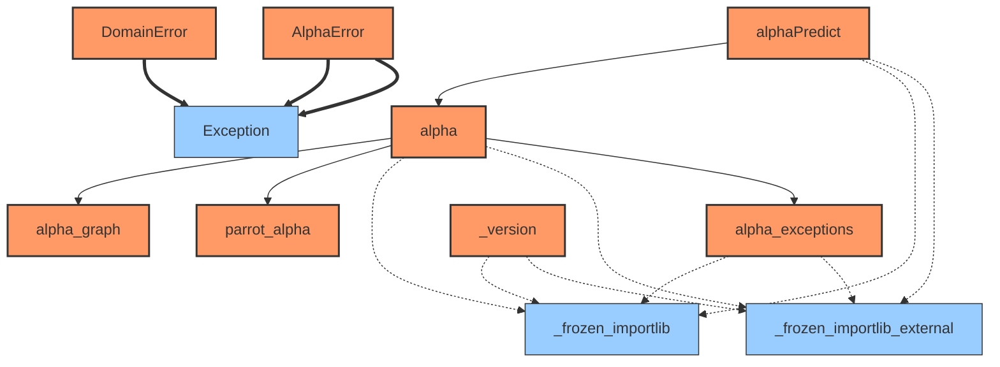
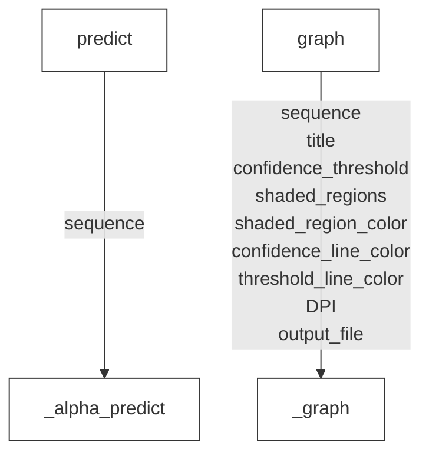

# Documentation for `alphaPredict`
**File Path:** `/home/nicai_zht/.local/share/mamba/envs/idr_llm/lib/python3.13/site-packages/alphaPredict/__init__.py`

## Module Docstring
```text
short description of alphaPredict.

Predict confidence scores of alphaFold2
```

## 🚦 Navigator: How to Drive
This section helps you understand how to run this library from the command line or entry points.
- ℹ️ **No Direct Entry Point**: This module seems to be a library intended for import, not direct execution.

### 🐍 Python API Usage (Inferred)
Since no CLI entry point was found, here are the likely **Python API entry points** for your script:

#### 🚀 Top 20 Recommended Entry Points
| Type | API | Description |
| :--- | :--- | :--- |
| `ƒ` | **alphaPredict.predict**(**sequence**) | Function to return confidence scores from |
| `ƒ` | **alphaPredict.graph**(**sequence**, title, confidence_threshold, shaded_regions, shaded_region_color, confidence_line_color, threshold_line_color, DPI, output_file) | No description. |

> **Note:** Bold parameters are required. Others are optional.

#### 🧩 Code Snippets (Auto-Generated)
```python
import alphaPredict

# --- Top 20 Ranked Functions ---
# 1. predict
result_1 = alphaPredict.predict(sequence=...)

# 2. graph
result_2 = alphaPredict.graph(sequence=...)

```

_No explicit `argparse` configuration detected in the main module._


## 📊 Network & Architecture Analysis
### 🌍 Top 20 External Dependencies
| Library | Usage Count |
| :--- | :--- |
| **_frozen_importlib_external** | 4 |
| **_frozen_importlib** | 4 |


### 🕸️ Network Metrics (Advanced)
#### 👑 Top 20 Modules by PageRank (Authority)
| Rank | Module | Score | Type | Role |
| :--- | :--- | :--- | :--- | :--- |
| 1 | `_frozen_importlib_external` | 0.2067 | External | External Lib |
| 2 | `_frozen_importlib` | 0.2067 | External | External Lib |
| 3 | `alpha` | 0.1085 | Internal | Utility / Core |
| 4 | `alpha_exceptions` | 0.1030 | Internal | Utility / Core |
| 5 | `backend.parrot_alpha` | 0.1030 | Internal | External Lib |
| 6 | `backend.alpha_graph` | 0.1030 | Internal | External Lib |
| 7 | `alphaPredict` | 0.0846 | Internal | Utility / Core |
| 8 | `_version` | 0.0846 | Internal | Utility / Core |


### 🗺️ Dependency & Architecture Map


## 🚀 Global Execution Flow & Extraction Guide
This graph visualizes how data flows between functions across the entire project.


### ✂️ Navigator: Snippet Extractor
Want to use a specific function without the whole library? Here is the **Dependency Closure** for **Top 20** key functions.
#### To extract `predict`:
> You need these **2** components:
`_alpha_predict, predict`

#### To extract `graph`:
> You need these **2** components:
`_graph, graph`

## 📑 Top-Level API Contents & Logic Flow
### 🔧 Functions
#### `graph(sequence, title='Predicted Confidence Score', confidence_threshold=50, shaded_regions=None, shaded_region_color='red', confidence_line_color='blue', threshold_line_color='black', DPI=150, output_file=None)`
> No documentation available.
<details><summary>Full Docstring</summary>

```text
No documentation available.
```
</details>

#### `predict(sequence)`
> Function to return confidence scores from
<details><summary>Full Docstring</summary>

```text
Function to return confidence scores from
Alpha fold 2 of a single input sequence. Returns the
predicted values as a float.

Parameters
------------

sequence : str 
    Input amino acid sequence (as string) to be predicted.

Returns
--------

Float
    Returns a float of the confidence score value (predicted)
```
</details>
