# Documentation for `Bio.Entrez`
**File Path:** `/home/nicai_zht/miniconda3/envs/zht/lib/python3.13/site-packages/Bio/Entrez/__init__.py`

## Module Docstring
```text
Provides code to access NCBI over the WWW.

The main Entrez web page is available at:
http://www.ncbi.nlm.nih.gov/Entrez/

Entrez Programming Utilities web page is available at:
http://www.ncbi.nlm.nih.gov/books/NBK25501/

This module provides a number of functions like ``efetch`` (short for
Entrez Fetch) which will return the data as a handle object. This is
a standard interface used in Python for reading data from a file, or
in this case a remote network connection, and provides methods like
``.read()`` or offers iteration over the contents line by line. See
also "What the heck is a handle?" in the Biopython Tutorial and
Cookbook: http://biopython.org/DIST/docs/tutorial/Tutorial.html
http://biopython.org/DIST/docs/tutorial/Tutorial.pdf
The handle returned by these functions can be either in text mode or
in binary mode, depending on the data requested and the results
returned by NCBI Entrez. Typically, XML data will be in binary mode
while other data will be in text mode, as required by the downstream
parser to parse the data.

Unlike a handle to a file on disk from the ``open(filename)`` function,
which has a ``.name`` attribute giving the filename, the handles from
``Bio.Entrez`` all have a ``.url`` attribute instead giving the URL
used to connect to the NCBI Entrez API.

The ``epost``, ``efetch``, and ``esummary`` tools take an "id" parameter
which corresponds to one or more database UIDs (or accession.version
identifiers in the case of sequence databases such as "nuccore" or
"protein"). The Python value of the "id" keyword passed to these functions
may be either a single ID as a string or integer or multiple IDs as an
iterable of strings/integers. You may also pass a single string containing
multiple IDs delimited by commas. The ``elink`` tool also accepts multiple
IDs but the argument is handled differently than the other three. See that
function's docstring for more information.

All the functions that send requests to the NCBI Entrez API will
automatically respect the NCBI rate limit (of 3 requests per second
without an API key, or 10 requests per second with an API key) and
will automatically retry when encountering transient failures
(i.e. connection failures or HTTP 5XX codes). By default, Biopython
does a maximum of three tries before giving up, and sleeps for 15
seconds between tries. You can tweak these parameters by setting
``Bio.Entrez.max_tries`` and ``Bio.Entrez.sleep_between_tries``.

The Entrez module also provides an XML parser which takes a handle
as input.

Variables:

    - email        Set the Entrez email parameter (default is not set).
    - tool         Set the Entrez tool parameter (default is ``biopython``).
    - api_key      Personal API key from NCBI. If not set, only 3 queries per
      second are allowed. 10 queries per seconds otherwise with a
      valid API key.
    - max_tries    Configures how many times failed requests will be
      automatically retried on error (default is 3).
    - sleep_between_tries   The delay, in seconds, before retrying a request on
      error (default is 15).

Functions:

    - efetch       Retrieves records in the requested format from a list of one or
      more primary IDs or from the user's environment
    - epost        Posts a file containing a list of primary IDs for future use in
      the user's environment to use with subsequent search strategies
    - esearch      Searches and retrieves primary IDs (for use in EFetch, ELink,
      and ESummary) and term translations and optionally retains
      results for future use in the user's environment.
    - elink        Checks for the existence of an external or Related Articles link
      from a list of one or more primary IDs.  Retrieves primary IDs
      and relevancy scores for links to Entrez databases or Related
      Articles;  creates a hyperlink to the primary LinkOut provider
      for a specific ID and database, or lists LinkOut URLs
      and Attributes for multiple IDs.
    - einfo        Provides field index term counts, last update, and available
      links for each database.
    - esummary     Retrieves document summaries from a list of primary IDs or from
      the user's environment.
    - egquery      Provides Entrez database counts in XML for a single search
      using Global Query.
    - espell       Retrieves spelling suggestions.
    - ecitmatch    Retrieves PubMed IDs (PMIDs) that correspond to a set of
      input citation strings.

    - read         Parses the XML results returned by any of the above functions.
      Alternatively, the XML data can be read from a file opened in binary mode.
      Typical usage is:

          >>> from Bio import Entrez
          >>> Entrez.email = "Your.Name.Here@example.org"
          >>> handle = Entrez.einfo() # or esearch, efetch, ...
          >>> record = Entrez.read(handle)
          >>> handle.close()

       where record is now a Python dictionary or list.

    - parse        Parses the XML results returned by those of the above functions
      which can return multiple records - such as efetch, esummary
      and elink. Typical usage is:

          >>> handle = Entrez.esummary(db="pubmed", id="19304878,14630660", retmode="xml")
          >>> records = Entrez.parse(handle)
          >>> for record in records:
          ...     # each record is a Python dictionary or list.
          ...     print(record['Title'])
          Biopython: freely available Python tools for computational molecular biology and bioinformatics.
          PDB file parser and structure class implemented in Python.
          >>> handle.close()

      This function is appropriate only if the XML file contains
      multiple records, and is particular useful for large files.

    - _open        Internally used function.
```

## 🚦 Navigator: How to Drive
This section helps you understand how to run this library from the command line or entry points.
- ✅ **Script Entry Point**: This module contains an `if __name__ == '__main__':` block, meaning it can be run directly.

### 🐍 Python API Usage (Inferred)
Since no CLI entry point was found, here are the likely **Python API entry points** for your script:

#### 🚀 Top 20 Recommended Entry Points
| Type | API | Description |
| :--- | :--- | :--- |
| `ƒ` | **Bio.Entrez.parse**(**source**, validate, escape, ignore_errors) | Parse an XML file from the NCBI Entrez Utilities into python objects. |
| `ƒ` | **Bio.Entrez.ecitmatch**(**keywds**) | Retrieve PMIDs for input citation strings, returned as a handle. |
| `ƒ` | **Bio.Entrez.efetch**(**db**, **keywords**) | Fetch Entrez results which are returned as a handle. |
| `ƒ` | **Bio.Entrez.egquery**(**keywds**) | Provide Entrez database counts for a global search (DEPRECATED). |
| `ƒ` | **Bio.Entrez.einfo**(**keywds**) | Return a summary of the Entrez databases as a results handle. |
| `ƒ` | **Bio.Entrez.elink**(**keywds**) | Check for linked external articles and return a handle. |
| `ƒ` | **Bio.Entrez.epost**(**db**, **keywds**) | Post a file of identifiers for future use. |
| `ƒ` | **Bio.Entrez.esearch**(**db**, **term**, **keywds**) | Run an Entrez search and return a handle to the results. |
| `ƒ` | **Bio.Entrez.espell**(**keywds**) | Retrieve spelling suggestions as a results handle. |
| `ƒ` | **Bio.Entrez.esummary**(**keywds**) | Retrieve document summaries as a results handle. |
| `ƒ` | **Bio.Entrez.function_with_previous**(**func**) | Decorate a function as having an attribute named 'previous'. |
| `ƒ` | **Bio.Entrez.urlencode**(**query**, doseq, safe, encoding, errors, quote_via) | Encode a dict or sequence of two-element tuples into a URL query string. |
| `C` | **Bio.Entrez.Request**(**url**, data, headers, origin_req_host, unverifiable, method) | No description. |
| `ƒ` | **Bio.Entrez.read**(**source**, validate, escape, ignore_errors) | Parse an XML file from the NCBI Entrez Utilities into python objects. |
| `ƒ` | **Bio.Entrez.urlopen**(**url**, data, timeout, context) | Open the URL url, which can be either a string or a Request object. |

> **Note:** Bold parameters are required. Others are optional.

#### 🧩 Code Snippets (Auto-Generated)
```python
import Bio.Entrez

# --- Top 20 Ranked Functions ---
# 1. parse
result_1 = Bio.Entrez.parse(source=...)

# 2. ecitmatch
result_2 = Bio.Entrez.ecitmatch(keywds=...)

# 3. efetch
result_3 = Bio.Entrez.efetch(db=..., keywords=...)

# 4. egquery
result_4 = Bio.Entrez.egquery(keywds=...)

# 5. einfo
result_5 = Bio.Entrez.einfo(keywds=...)

# 6. elink
result_6 = Bio.Entrez.elink(keywds=...)

# 7. epost
result_7 = Bio.Entrez.epost(db=..., keywds=...)

# 8. esearch
result_8 = Bio.Entrez.esearch(db=..., term=..., keywds=...)

# 9. espell
result_9 = Bio.Entrez.espell(keywds=...)

# 10. esummary
result_10 = Bio.Entrez.esummary(keywds=...)

# 11. function_with_previous
result_11 = Bio.Entrez.function_with_previous(func=...)

# 12. urlencode
result_12 = Bio.Entrez.urlencode(query=...)

# 13. read
result_13 = Bio.Entrez.read(source=...)

# 14. urlopen
result_14 = Bio.Entrez.urlopen(url=...)

# --- Top 20 Core Classes Initialization ---
# 1. Request
request = Bio.Entrez.Request(url=...)

```

_No explicit `argparse` configuration detected in the main module._


## 📊 Network & Architecture Analysis
### 🌍 Top 20 External Dependencies
| Library | Usage Count |
| :--- | :--- |
| **urllib** | 7 |
| **Bio** | 3 |
| **_frozen_importlib_external** | 2 |
| **_frozen_importlib** | 2 |
| **_io** | 1 |
| **collections** | 1 |
| **xml** | 1 |


### 🕸️ Network Metrics (Advanced)
#### 👑 Top 20 Modules by PageRank (Authority)
| Rank | Module | Score | Type | Role |
| :--- | :--- | :--- | :--- | :--- |
| 1 | `Bio` | 0.1247 | External | External Lib |
| 2 | `urllib` | 0.1247 | External | External Lib |
| 3 | `_frozen_importlib_external` | 0.1247 | External | External Lib |
| 4 | `_frozen_importlib` | 0.1247 | External | External Lib |
| 5 | `_io` | 0.1048 | External | External Lib |
| 6 | `collections` | 0.1048 | External | External Lib |
| 7 | `xml` | 0.1048 | External | External Lib |
| 8 | `Bio.Entrez` | 0.0935 | Internal | Utility / Core |
| 9 | `Parser` | 0.0935 | Internal | Utility / Core |


### 🗺️ Dependency & Architecture Map


```mermaid
graph TD
    classDef core fill:#f96,stroke:#333,stroke-width:2px;
    classDef external fill:#9cf,stroke:#333,stroke-width:1px;
    id_10["Entrez"] -.-> id_18["Bio"]
    class id_10 core;
    class id_18 external;
    id_10["Entrez"] -.-> id_14["urllib"]
    class id_10 core;
    class id_14 external;
    id_10["Entrez"] -.-> id_17["_frozen_importlib_external"]
    class id_10 core;
    class id_17 external;
    id_10["Entrez"] -.-> id_22["_frozen_importlib"]
    class id_10 core;
    class id_22 external;
    id_6["Parser"] -.-> id_20["_io"]
    class id_6 core;
    class id_20 external;
    id_6["Parser"] -.-> id_8["collections"]
    class id_6 core;
    class id_8 external;
    id_6["Parser"] -.-> id_18["Bio"]
    class id_6 core;
    class id_18 external;
    id_6["Parser"] -.-> id_17["_frozen_importlib_external"]
    class id_6 core;
    class id_17 external;
    id_6["Parser"] -.-> id_22["_frozen_importlib"]
    class id_6 core;
    class id_22 external;
    id_6["Parser"] -.-> id_5["xml"]
    class id_6 core;
    class id_5 external;
    id_6["Parser"] -.-> id_14["urllib"]
    class id_6 core;
    class id_14 external;
    id_21["CorruptedXMLError"] ==> id_0["ValueError"]
    class id_21 core;
    class id_0 external;
    id_4["DataHandlerMeta"] ==> id_12["type"]
    class id_4 core;
    class id_12 external;
    id_13["DictionaryElement"] ==> id_11["dict"]
    class id_13 core;
    class id_11 external;
    id_23["ErrorElement"] ==> id_24["str"]
    class id_23 core;
    class id_24 external;
    id_19["IntegerElement"] ==> id_2["int"]
    class id_19 core;
    class id_2 external;
    id_1["ListElement"] ==> id_15["list"]
    class id_1 core;
    class id_15 external;
    id_16["NotXMLError"] ==> id_0["ValueError"]
    class id_16 core;
    class id_0 external;
    id_7["OrderedListElement"] ==> id_15["list"]
    class id_7 core;
    class id_15 external;
    id_3["StringElement"] ==> id_24["str"]
    class id_3 core;
    class id_24 external;
    id_9["ValidationError"] ==> id_0["ValueError"]
    class id_9 core;
    class id_0 external;
```

## 🚀 Global Execution Flow & Extraction Guide
This graph visualizes how data flows between functions across the entire project.

```mermaid
graph TD
    classDef main fill:#f9f,stroke:#333,stroke-width:2px;
    classDef func fill:#fff,stroke:#333,stroke-width:1px;
    f_21["epost"] -->|keywds| f_37["update"]
    class f_21 func;
    class f_37 func;
    f_21["epost"] -->|cgi<br>variables| f_4["_build_request"]
    class f_21 func;
    class f_4 func;
    f_21["epost"] -->|request| f_8["_open"]
    class f_21 func;
    class f_8 func;
    f_14["efetch"] -->|keywords| f_37["update"]
    class f_14 func;
    class f_37 func;
    f_14["efetch"] -->|cgi<br>variables| f_4["_build_request"]
    class f_14 func;
    class f_4 func;
    f_14["efetch"] -->|request| f_8["_open"]
    class f_14 func;
    class f_8 func;
    f_23["esearch"] -->|keywds| f_37["update"]
    class f_23 func;
    class f_37 func;
    f_23["esearch"] -->|cgi<br>variables| f_4["_build_request"]
    class f_23 func;
    class f_4 func;
    f_23["esearch"] -->|request| f_8["_open"]
    class f_23 func;
    class f_8 func;
    f_17["elink"] -->|keywds| f_37["update"]
    class f_17 func;
    class f_37 func;
    f_17["elink"] -->|cgi<br>variables| f_4["_build_request"]
    class f_17 func;
    class f_4 func;
    f_17["elink"] -->|request| f_8["_open"]
    class f_17 func;
    class f_8 func;
    f_16["einfo"] -->|keywds| f_37["update"]
    class f_16 func;
    class f_37 func;
    f_16["einfo"] -->|cgi<br>variables| f_4["_build_request"]
    class f_16 func;
    class f_4 func;
    f_16["einfo"] -->|request| f_8["_open"]
    class f_16 func;
    class f_8 func;
    f_25["esummary"] -->|keywds| f_37["update"]
    class f_25 func;
    class f_37 func;
    f_25["esummary"] -->|cgi<br>variables| f_4["_build_request"]
    class f_25 func;
    class f_4 func;
    f_25["esummary"] -->|request| f_8["_open"]
    class f_25 func;
    class f_8 func;
    f_15["egquery"] -->|keywds| f_37["update"]
    class f_15 func;
    class f_37 func;
    f_15["egquery"] -->|cgi<br>variables| f_4["_build_request"]
    class f_15 func;
    class f_4 func;
    f_15["egquery"] -->|request| f_8["_open"]
    class f_15 func;
    class f_8 func;
    f_24["espell"] -->|keywds| f_37["update"]
    class f_24 func;
    class f_37 func;
    f_24["espell"] -->|cgi<br>variables| f_4["_build_request"]
    class f_24 func;
    class f_4 func;
    f_24["espell"] -->|request| f_8["_open"]
    class f_24 func;
    class f_8 func;
    f_9["_update_ecitmatch_variables"] -->|keywds| f_37["update"]
    class f_9 func;
    class f_37 func;
    f_13["ecitmatch"] -->|keywds| f_9["_update_ecitmatch_variables"]
    class f_13 func;
    class f_9 func;
    f_13["ecitmatch"] -->|cgi<br>variables| f_4["_build_request"]
    class f_13 func;
    class f_4 func;
    f_13["ecitmatch"] -->|request| f_8["_open"]
    class f_13 func;
    class f_8 func;
    f_8["_open"] -->|request| f_7["_has_api_key"]
    class f_8 func;
    class f_7 func;
    f_8["_open"] -->|request| f_39["urlopen"]
    class f_8 func;
    class f_39 func;
    f_4["_build_request"] -->|params| f_5["_construct_params"]
    class f_4 func;
    class f_5 func;
    f_4["_build_request"] -->|params| f_38["urlencode"]
    class f_4 func;
    class f_38 func;
    f_5["_construct_params"] --> f_6["_format_ids"]
    class f_5 func;
    class f_6 func;
    f_1["__ne__"] --> f_0["__eq__"]
    class f_1 func;
    class f_0 func;
    f_36["store"] -->|value| f_10["append"]
    class f_36 func;
    class f_10 func;
    f_36["store"] --> f_10["append"]
    class f_36 func;
    class f_10 func;
    f_31["read"] --> f_12["close"]
    class f_31 func;
    class f_12 func;
    f_29["parse"] --> f_31["read"]
    class f_29 func;
    class f_31 func;
    f_29["parse"] -->|BLOCK| f_31["read"]
    class f_29 func;
    class f_31 func;
    f_29["parse"] --> f_12["close"]
    class f_29 func;
    class f_12 func;
    f_34["schemaHandler"] --> f_28["open_xsd_file"]
    class f_34 func;
    class f_28 func;
    f_34["schemaHandler"] -->|schema| f_39["urlopen"]
    class f_34 func;
    class f_39 func;
    f_34["schemaHandler"] --> f_31["read"]
    class f_34 func;
    class f_31 func;
    f_34["schemaHandler"] -->|text| f_33["save_xsd_file"]
    class f_34 func;
    class f_33 func;
    f_34["schemaHandler"] --> f_12["close"]
    class f_34 func;
    class f_12 func;
    f_34["schemaHandler"] --> f_30["parse_xsd"]
    class f_34 func;
    class f_30 func;
    f_34["schemaHandler"] -->|name<br>attrs| f_35["startElementHandler"]
    class f_34 func;
    class f_35 func;
    f_35["startElementHandler"] -->|element| f_36["store"]
    class f_35 func;
    class f_36 func;
    f_35["startElementHandler"] --> f_41["xmlDeclHandler"]
    class f_35 func;
    class f_41 func;
    f_35["startElementHandler"] -->|url| f_26["externalEntityRefHandler"]
    class f_35 func;
    class f_26 func;
    f_20["endStringElementHandler"] -->|value| f_36["store"]
    class f_20 func;
    class f_36 func;
    f_18["endErrorElementHandler"] -->|value| f_36["store"]
    class f_18 func;
    class f_36 func;
    f_19["endIntegerElementHandler"] -->|value| f_36["store"]
    class f_19 func;
    class f_36 func;
    f_11["characterDataHandlerEscape"] -->|content| f_22["escape"]
    class f_11 func;
    class f_22 func;
    f_32["save_dtd_file"] --> f_12["close"]
    class f_32 func;
    class f_12 func;
    f_33["save_xsd_file"] --> f_12["close"]
    class f_33 func;
    class f_12 func;
    f_26["externalEntityRefHandler"] -->|systemId| f_40["urlparse"]
    class f_26 func;
    class f_40 func;
    f_26["externalEntityRefHandler"] -->|filename| f_27["open_dtd_file"]
    class f_26 func;
    class f_27 func;
    f_26["externalEntityRefHandler"] -->|url| f_39["urlopen"]
    class f_26 func;
    class f_39 func;
    f_26["externalEntityRefHandler"] --> f_31["read"]
    class f_26 func;
    class f_31 func;
    f_26["externalEntityRefHandler"] --> f_12["close"]
    class f_26 func;
    class f_12 func;
    f_26["externalEntityRefHandler"] -->|filename<br>text| f_32["save_dtd_file"]
    class f_26 func;
    class f_32 func;
```


### ✂️ Navigator: Snippet Extractor
Want to use a specific function without the whole library? Here is the **Dependency Closure** for **Top 20** key functions.
#### To extract `schemaHandler`:
> You need these **15** components:
`append, close, externalEntityRefHandler, open_dtd_file, open_xsd_file, parse_xsd, read, save_dtd_file, save_xsd_file, schemaHandler, startElementHandler, store, urlopen, urlparse, xmlDeclHandler`

#### To extract `externalEntityRefHandler`:
> You need these **7** components:
`close, externalEntityRefHandler, open_dtd_file, read, save_dtd_file, urlopen, urlparse`

#### To extract `epost`:
> You need these **9** components:
`_build_request, _construct_params, _format_ids, _has_api_key, _open, epost, update, urlencode, urlopen`

#### To extract `efetch`:
> You need these **9** components:
`_build_request, _construct_params, _format_ids, _has_api_key, _open, efetch, update, urlencode, urlopen`

#### To extract `esearch`:
> You need these **9** components:
`_build_request, _construct_params, _format_ids, _has_api_key, _open, esearch, update, urlencode, urlopen`

#### To extract `elink`:
> You need these **9** components:
`_build_request, _construct_params, _format_ids, _has_api_key, _open, elink, update, urlencode, urlopen`

#### To extract `einfo`:
> You need these **9** components:
`_build_request, _construct_params, _format_ids, _has_api_key, _open, einfo, update, urlencode, urlopen`

#### To extract `esummary`:
> You need these **9** components:
`_build_request, _construct_params, _format_ids, _has_api_key, _open, esummary, update, urlencode, urlopen`

#### To extract `egquery`:
> You need these **9** components:
`_build_request, _construct_params, _format_ids, _has_api_key, _open, egquery, update, urlencode, urlopen`

#### To extract `espell`:
> You need these **9** components:
`_build_request, _construct_params, _format_ids, _has_api_key, _open, espell, update, urlencode, urlopen`

#### To extract `ecitmatch`:
> You need these **10** components:
`_build_request, _construct_params, _format_ids, _has_api_key, _open, _update_ecitmatch_variables, ecitmatch, update, urlencode, urlopen`

#### To extract `parse`:
> You need these **3** components:
`close, parse, read`

#### To extract `startElementHandler`:
> You need these **11** components:
`append, close, externalEntityRefHandler, open_dtd_file, read, save_dtd_file, startElementHandler, store, urlopen, urlparse, xmlDeclHandler`

#### To extract `read`:
> You need these **2** components:
`close, read`

#### To extract `_open`:
> You need these **3** components:
`_has_api_key, _open, urlopen`

#### To extract `_build_request`:
> You need these **4** components:
`_build_request, _construct_params, _format_ids, urlencode`

#### To extract `_update_ecitmatch_variables`:
> You need these **2** components:
`_update_ecitmatch_variables, update`

#### To extract `_construct_params`:
> You need these **2** components:
`_construct_params, _format_ids`

#### To extract `__eq__`:
> You need these **1** components:
`__eq__`

#### To extract `__ne__`:
> You need these **2** components:
`__eq__, __ne__`

## 📑 Top-Level API Contents & Logic Flow
### 🔧 Functions
#### `ecitmatch(**keywds)`
> Retrieve PMIDs for input citation strings, returned as a handle.
<details><summary>Full Docstring</summary>

```text
Retrieve PMIDs for input citation strings, returned as a handle.

ECitMatch retrieves PubMed IDs (PMIDs) that correspond to a set of input
citation strings.

See the online documentation for an explanation of the parameters:
http://www.ncbi.nlm.nih.gov/books/NBK25499/#chapter4.ECitMatch

Short example:

>>> from Bio import Entrez
>>> Entrez.email = "Your.Name.Here@example.org"
>>> citation_1 = {"journal_title": "proc natl acad sci u s a",
...               "year": "1991", "volume": "88", "first_page": "3248",
...               "author_name": "mann bj", "key": "citation_1"}
>>> handle = Entrez.ecitmatch(db="pubmed", bdata=[citation_1])
>>> print(handle.read().strip().split("|"))
['proc natl acad sci u s a', '1991', '88', '3248', 'mann bj', 'citation_1', '2014248']
>>> handle.close()

:returns: Handle to the results, by default in plain text.
:raises urllib.error.URLError: If there's a network error.
```
</details>

#### `efetch(db, **keywords)`
> Fetch Entrez results which are returned as a handle.
<details><summary>Full Docstring</summary>

```text
Fetch Entrez results which are returned as a handle.

EFetch retrieves records in the requested format from a list or set of one or
more UIs or from user's environment.

See the online documentation for an explanation of the parameters:
http://www.ncbi.nlm.nih.gov/books/NBK25499/#chapter4.EFetch

Short example:

>>> from Bio import Entrez
>>> Entrez.email = "Your.Name.Here@example.org"
>>> handle = Entrez.efetch(db="nucleotide", id="AY851612", rettype="gb", retmode="text")
>>> print(handle.readline().strip())
LOCUS       AY851612                 892 bp    DNA     linear   PLN 10-APR-2007
>>> handle.close()

This will automatically use an HTTP POST rather than HTTP GET if there
are over 200 identifiers as recommended by the NCBI.

**Warning:** The NCBI changed the default retmode in Feb 2012, so many
databases which previously returned text output now give XML.

:returns: Handle to the results.
:raises urllib.error.URLError: If there's a network error.
```
</details>

#### `egquery(**keywds)`
> Provide Entrez database counts for a global search (DEPRECATED).
<details><summary>Full Docstring</summary>

```text
Provide Entrez database counts for a global search (DEPRECATED).

EGQuery provided Entrez database counts in XML for a single search
using Global Query. However, the NCBI are no longer maintaining this
function and suggest using esearch on each database of interest.

See the online documentation for an explanation of the parameters:
http://www.ncbi.nlm.nih.gov/books/NBK25499/#chapter4.EGQuery

This quick example based on a longer version from the Biopython
Tutorial just checks there are over 60 matches for 'Biopython'
in PubMedCentral:

>>> from Bio import Entrez
>>> Entrez.email = "Your.Name.Here@example.org"
>>> handle = Entrez.egquery(term="biopython")  # doctest: +SKIP
>>> record = Entrez.read(handle)  # doctest: +SKIP
>>> handle.close()  # doctest: +SKIP
>>> for row in record["eGQueryResult"]:  # doctest: +SKIP
...     if "pmc" in row["DbName"]:  # doctest: +SKIP
...         print(int(row["Count"]) > 60)  # doctest: +SKIP
True

:returns: Handle to the results, by default in XML format.
:raises urllib.error.URLError: If there's a network error.
```
</details>

#### `einfo(**keywds)`
> Return a summary of the Entrez databases as a results handle.
<details><summary>Full Docstring</summary>

```text
Return a summary of the Entrez databases as a results handle.

EInfo provides field names, index term counts, last update, and
available links for each Entrez database.

See the online documentation for an explanation of the parameters:
http://www.ncbi.nlm.nih.gov/books/NBK25499/#chapter4.EInfo

Short example:

>>> from Bio import Entrez
>>> Entrez.email = "Your.Name.Here@example.org"
>>> record = Entrez.read(Entrez.einfo())
>>> 'pubmed' in record['DbList']
True

:returns: Handle to the results, by default in XML format.
:raises urllib.error.URLError: If there's a network error.
```
</details>

#### `elink(**keywds)`
> Check for linked external articles and return a handle.
<details><summary>Full Docstring</summary>

```text
Check for linked external articles and return a handle.

ELink checks for the existence of an external or Related Articles link
from a list of one or more primary IDs;  retrieves IDs and relevancy
scores for links to Entrez databases or Related Articles; creates a
hyperlink to the primary LinkOut provider for a specific ID and
database, or lists LinkOut URLs and attributes for multiple IDs.

See the online documentation for an explanation of the parameters:
http://www.ncbi.nlm.nih.gov/books/NBK25499/#chapter4.ELink

Note that ELink treats the "id" parameter differently than the other
tools when multiple values are given. You should generally pass multiple
UIDs as a list of strings or integers. This will provide a "one-to-one"
mapping from source database UIDs to destination database UIDs in the
result. If multiple source UIDs are passed as a single comma-delimited
string all destination UIDs will be mixed together in the result.

This example finds articles related to the Biopython application
note's entry in the PubMed database:

>>> from Bio import Entrez
>>> Entrez.email = "Your.Name.Here@example.org"
>>> pmid = "19304878"
>>> handle = Entrez.elink(dbfrom="pubmed", id=pmid, linkname="pubmed_pubmed")
>>> record = Entrez.read(handle)
>>> handle.close()
>>> print(record[0]["LinkSetDb"][0]["LinkName"])
pubmed_pubmed
>>> linked = [link["Id"] for link in record[0]["LinkSetDb"][0]["Link"]]
>>> "14630660" in linked
True

This is explained in much more detail in the Biopython Tutorial.

:returns: Handle to the results, by default in XML format.
:raises urllib.error.URLError: If there's a network error.
```
</details>

#### `epost(db, **keywds)`
> Post a file of identifiers for future use.
<details><summary>Full Docstring</summary>

```text
Post a file of identifiers for future use.

Posts a file containing a list of UIs for future use in the user's
environment to use with subsequent search strategies.

See the online documentation for an explanation of the parameters:
http://www.ncbi.nlm.nih.gov/books/NBK25499/#chapter4.EPost

:returns: Handle to the results.
:raises urllib.error.URLError: If there's a network error.
```
</details>

#### `esearch(db, term, **keywds)`
> Run an Entrez search and return a handle to the results.
<details><summary>Full Docstring</summary>

```text
Run an Entrez search and return a handle to the results.

ESearch searches and retrieves primary IDs (for use in EFetch, ELink
and ESummary) and term translations, and optionally retains results
for future use in the user's environment.

See the online documentation for an explanation of the parameters:
http://www.ncbi.nlm.nih.gov/books/NBK25499/#chapter4.ESearch

Short example:

>>> from Bio import Entrez
>>> Entrez.email = "Your.Name.Here@example.org"
>>> handle = Entrez.esearch(
...     db="nucleotide", retmax=10, idtype="acc",
...     term="opuntia[ORGN] accD 2007[Publication Date]"
... )
...
>>> record = Entrez.read(handle)
>>> handle.close()
>>> int(record["Count"]) >= 2
True
>>> "EF590893.1" in record["IdList"]
True
>>> "EF590892.1" in record["IdList"]
True

:returns: Handle to the results, which are always in XML format.
:raises urllib.error.URLError: If there's a network error.
```
</details>

#### `espell(**keywds)`
> Retrieve spelling suggestions as a results handle.
<details><summary>Full Docstring</summary>

```text
Retrieve spelling suggestions as a results handle.

ESpell retrieves spelling suggestions, if available.

See the online documentation for an explanation of the parameters:
http://www.ncbi.nlm.nih.gov/books/NBK25499/#chapter4.ESpell

Short example:

>>> from Bio import Entrez
>>> Entrez.email = "Your.Name.Here@example.org"
>>> record = Entrez.read(Entrez.espell(term="biopythooon"))
>>> print(record["Query"])
biopythooon
>>> print(record["CorrectedQuery"])
biopython

:returns: Handle to the results, by default in XML format.
:raises urllib.error.URLError: If there's a network error.
```
</details>

#### `esummary(**keywds)`
> Retrieve document summaries as a results handle.
<details><summary>Full Docstring</summary>

```text
Retrieve document summaries as a results handle.

ESummary retrieves document summaries from a list of primary IDs or
from the user's environment.

See the online documentation for an explanation of the parameters:
http://www.ncbi.nlm.nih.gov/books/NBK25499/#chapter4.ESummary

This example discovers more about entry 19923 in the structure
database:

>>> from Bio import Entrez
>>> Entrez.email = "Your.Name.Here@example.org"
>>> handle = Entrez.esummary(db="structure", id="19923")
>>> record = Entrez.read(handle)
>>> handle.close()
>>> print(record[0]["Id"])
19923
>>> print(record[0]["PdbDescr"])
CRYSTAL STRUCTURE OF E. COLI ACONITASE B


:returns: Handle to the results, by default in XML format.
:raises urllib.error.URLError: If there's a network error.
```
</details>

#### `parse(source, validate=True, escape=False, ignore_errors=False)`
> Parse an XML file from the NCBI Entrez Utilities into python objects.
<details><summary>Full Docstring</summary>

```text
Parse an XML file from the NCBI Entrez Utilities into python objects.

This function parses an XML file created by NCBI's Entrez Utilities,
returning a multilevel data structure of Python lists and dictionaries.
This function is suitable for XML files that (in Python) can be represented
as a list of individual records. Whereas 'read' reads the complete file
and returns a single Python list, 'parse' is a generator function that
returns the records one by one. This function is therefore particularly
useful for parsing large files.

Most XML files returned by NCBI's Entrez Utilities can be parsed by
this function, provided its DTD is available. Biopython includes the
DTDs for most commonly used Entrez Utilities.

The argument ``source`` must be a file or file-like object opened in binary
mode, or a filename. The parser detects the encoding from the XML file, and
uses it to convert all text in the XML to the correct Unicode string. The
functions in Bio.Entrez to access NCBI Entrez will automatically return XML
data in binary mode. For files, use mode "rb" when opening the file, as in

    >>> from Bio import Entrez
    >>> path = "Entrez/pubmed1.xml"
    >>> stream = open(path, "rb")  # opened in binary mode
    >>> records = Entrez.parse(stream)
    >>> for record in records:
    ...     print(record['MedlineCitation']['Article']['Journal']['Title'])
    ...
    Social justice (San Francisco, Calif.)
    Biochimica et biophysica acta
    >>> stream.close()

Alternatively, you can use the filename directly, as in

    >>> records = Entrez.parse(path)
    >>> for record in records:
    ...     print(record['MedlineCitation']['Article']['Journal']['Title'])
    ...
    Social justice (San Francisco, Calif.)
    Biochimica et biophysica acta

which is safer, as the file stream will automatically be closed after all
the records have been read, or if an error occurs.

If validate is True (default), the parser will validate the XML file
against the DTD, and raise an error if the XML file contains tags that
are not represented in the DTD. If validate is False, the parser will
simply skip such tags.

If escape is True, all characters that are not valid HTML are replaced
by HTML escape characters to guarantee that the returned strings are
valid HTML fragments. For example, a less-than sign (<) is replaced by
&lt;. If escape is False (default), the string is returned as is.

If ignore_errors is False (default), any error messages in the XML file
will raise a RuntimeError. If ignore_errors is True, error messages will
be stored as ErrorElement items, without raising an exception.

Whereas the data structure seems to consist of generic Python lists,
dictionaries, strings, and so on, each of these is actually a class
derived from the base type. This allows us to store the attributes
(if any) of each element in a dictionary my_element.attributes, and
the tag name in my_element.tag.
```
</details>

#### `read(source, validate=True, escape=False, ignore_errors=False)`
> Parse an XML file from the NCBI Entrez Utilities into python objects.
<details><summary>Full Docstring</summary>

```text
Parse an XML file from the NCBI Entrez Utilities into python objects.

This function parses an XML file created by NCBI's Entrez Utilities,
returning a multilevel data structure of Python lists and dictionaries.
Most XML files returned by NCBI's Entrez Utilities can be parsed by
this function, provided its DTD is available. Biopython includes the
DTDs for most commonly used Entrez Utilities.

The argument ``source`` must be a file or file-like object opened in binary
mode, or a filename. The parser detects the encoding from the XML file, and
uses it to convert all text in the XML to the correct Unicode string. The
functions in Bio.Entrez to access NCBI Entrez will automatically return XML
data in binary mode. For files, use mode "rb" when opening the file, as in

    >>> from Bio import Entrez
    >>> path = "Entrez/esearch1.xml"
    >>> stream = open(path, "rb")  # opened in binary mode
    >>> record = Entrez.read(stream)
    >>> print(record['QueryTranslation'])
    biopython[All Fields]
    >>> stream.close()

Alternatively, you can use the filename directly, as in

    >>> record = Entrez.read(path)
    >>> print(record['QueryTranslation'])
    biopython[All Fields]

which is safer, as the file stream will automatically be closed after the
record has been read, or if an error occurs.

If validate is True (default), the parser will validate the XML file
against the DTD, and raise an error if the XML file contains tags that
are not represented in the DTD. If validate is False, the parser will
simply skip such tags.

If escape is True, all characters that are not valid HTML are replaced
by HTML escape characters to guarantee that the returned strings are
valid HTML fragments. For example, a less-than sign (<) is replaced by
&lt;. If escape is False (default), the string is returned as is.

If ignore_errors is False (default), any error messages in the XML file
will raise a RuntimeError. If ignore_errors is True, error messages will
be stored as ErrorElement items, without raising an exception.

Whereas the data structure seems to consist of generic Python lists,
dictionaries, strings, and so on, each of these is actually a class
derived from the base type. This allows us to store the attributes
(if any) of each element in a dictionary my_element.attributes, and
the tag name in my_element.tag.
```
</details>
