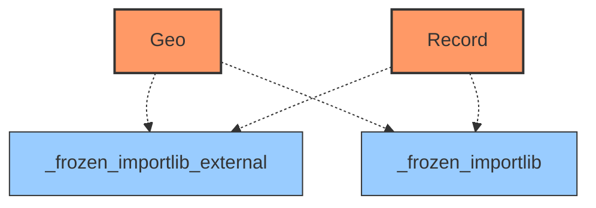
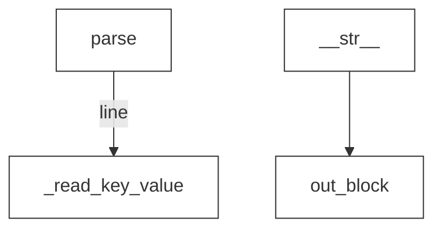

# Documentation for `Bio.Geo`
**File Path:** `/home/nicai_zht/miniconda3/envs/zht/lib/python3.13/site-packages/Bio/Geo/__init__.py`

## Module Docstring
```text
Parser for files from NCBI's Gene Expression Omnibus (GEO).

http://www.ncbi.nlm.nih.gov/geo/
```

## 🚦 Navigator: How to Drive
This section helps you understand how to run this library from the command line or entry points.
- ℹ️ **No Direct Entry Point**: This module seems to be a library intended for import, not direct execution.

### 🐍 Python API Usage (Inferred)
Since no CLI entry point was found, here are the likely **Python API entry points** for your script:

#### 🚀 Top 20 Recommended Entry Points
| Type | API | Description |
| :--- | :--- | :--- |
| `ƒ` | **Bio.Geo.parse**(**handle**) | Read Gene Expression Omnibus records from file handle. |

> **Note:** Bold parameters are required. Others are optional.

#### 🧩 Code Snippets (Auto-Generated)
```python
import Bio.Geo

# --- Top 20 Ranked Functions ---
# 1. parse
result_1 = Bio.Geo.parse(handle=...)

```

_No explicit `argparse` configuration detected in the main module._


## 📊 Network & Architecture Analysis
### 🌍 Top 20 External Dependencies
| Library | Usage Count |
| :--- | :--- |
| **_frozen_importlib_external** | 2 |
| **_frozen_importlib** | 2 |


### 🕸️ Network Metrics (Advanced)
#### 👑 Top 20 Modules by PageRank (Authority)
| Rank | Module | Score | Type | Role |
| :--- | :--- | :--- | :--- | :--- |
| 1 | `_frozen_importlib_external` | 0.3246 | External | External Lib |
| 2 | `_frozen_importlib` | 0.3246 | External | External Lib |
| 3 | `Bio.Geo` | 0.1754 | Internal | Utility / Core |
| 4 | `Record` | 0.1754 | Internal | Utility / Core |


### 🗺️ Dependency & Architecture Map


## 🚀 Global Execution Flow & Extraction Guide
This graph visualizes how data flows between functions across the entire project.


### ✂️ Navigator: Snippet Extractor
Want to use a specific function without the whole library? Here is the **Dependency Closure** for **Top 20** key functions.
#### To extract `parse`:
> You need these **2** components:
`_read_key_value, parse`

#### To extract `__str__`:
> You need these **2** components:
`__str__, out_block`

## 📑 Top-Level API Contents & Logic Flow
### 🔧 Functions
#### `parse(handle)`
> Read Gene Expression Omnibus records from file handle.
<details><summary>Full Docstring</summary>

```text
Read Gene Expression Omnibus records from file handle.

Returns a generator object which yields Bio.Geo.Record() objects.
```
</details>
