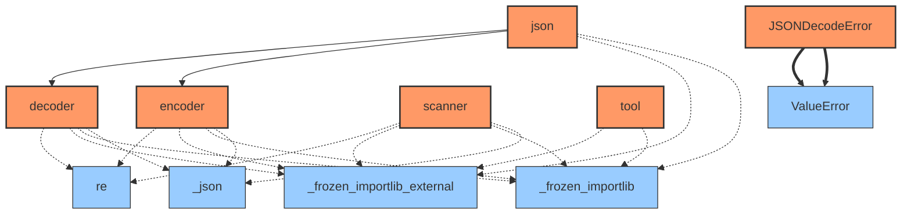
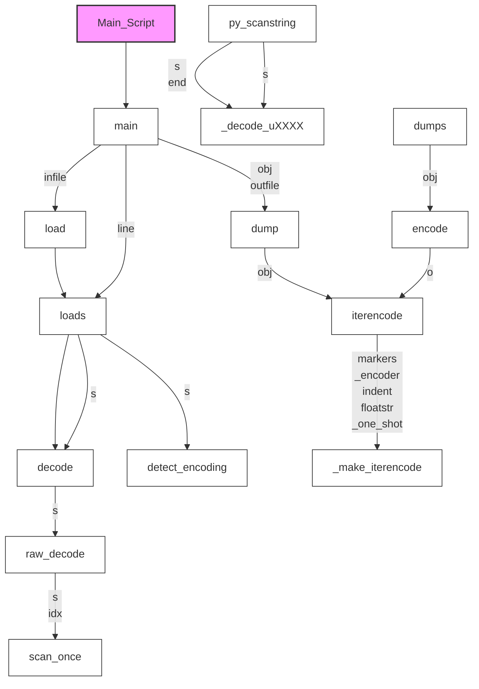

# Documentation for `json`
**File Path:** `/home/nicai_zht/.local/share/mamba/envs/idr_llm/lib/python3.13/json/__init__.py`

## Module Docstring
```text
JSON (JavaScript Object Notation) <https://json.org> is a subset of
JavaScript syntax (ECMA-262 3rd edition) used as a lightweight data
interchange format.

:mod:`json` exposes an API familiar to users of the standard library
:mod:`marshal` and :mod:`pickle` modules.  It is derived from a
version of the externally maintained simplejson library.

Encoding basic Python object hierarchies::

    >>> import json
    >>> json.dumps(['foo', {'bar': ('baz', None, 1.0, 2)}])
    '["foo", {"bar": ["baz", null, 1.0, 2]}]'
    >>> print(json.dumps("\"foo\bar"))
    "\"foo\bar"
    >>> print(json.dumps('\u1234'))
    "\u1234"
    >>> print(json.dumps('\\'))
    "\\"
    >>> print(json.dumps({"c": 0, "b": 0, "a": 0}, sort_keys=True))
    {"a": 0, "b": 0, "c": 0}
    >>> from io import StringIO
    >>> io = StringIO()
    >>> json.dump(['streaming API'], io)
    >>> io.getvalue()
    '["streaming API"]'

Compact encoding::

    >>> import json
    >>> mydict = {'4': 5, '6': 7}
    >>> json.dumps([1,2,3,mydict], separators=(',', ':'))
    '[1,2,3,{"4":5,"6":7}]'

Pretty printing::

    >>> import json
    >>> print(json.dumps({'4': 5, '6': 7}, sort_keys=True, indent=4))
    {
        "4": 5,
        "6": 7
    }

Decoding JSON::

    >>> import json
    >>> obj = ['foo', {'bar': ['baz', None, 1.0, 2]}]
    >>> json.loads('["foo", {"bar":["baz", null, 1.0, 2]}]') == obj
    True
    >>> json.loads('"\\"foo\\bar"') == '"foo\x08ar'
    True
    >>> from io import StringIO
    >>> io = StringIO('["streaming API"]')
    >>> json.load(io)[0] == 'streaming API'
    True

Specializing JSON object decoding::

    >>> import json
    >>> def as_complex(dct):
    ...     if '__complex__' in dct:
    ...         return complex(dct['real'], dct['imag'])
    ...     return dct
    ...
    >>> json.loads('{"__complex__": true, "real": 1, "imag": 2}',
    ...     object_hook=as_complex)
    (1+2j)
    >>> from decimal import Decimal
    >>> json.loads('1.1', parse_float=Decimal) == Decimal('1.1')
    True

Specializing JSON object encoding::

    >>> import json
    >>> def encode_complex(obj):
    ...     if isinstance(obj, complex):
    ...         return [obj.real, obj.imag]
    ...     raise TypeError(f'Object of type {obj.__class__.__name__} '
    ...                     f'is not JSON serializable')
    ...
    >>> json.dumps(2 + 1j, default=encode_complex)
    '[2.0, 1.0]'
    >>> json.JSONEncoder(default=encode_complex).encode(2 + 1j)
    '[2.0, 1.0]'
    >>> ''.join(json.JSONEncoder(default=encode_complex).iterencode(2 + 1j))
    '[2.0, 1.0]'


Using json.tool from the shell to validate and pretty-print::

    $ echo '{"json":"obj"}' | python -m json.tool
    {
        "json": "obj"
    }
    $ echo '{ 1.2:3.4}' | python -m json.tool
    Expecting property name enclosed in double quotes: line 1 column 3 (char 2)
```

## 🚦 Navigator: How to Drive
This section helps you understand how to run this library from the command line or entry points.
- ℹ️ **No Direct Entry Point**: This module seems to be a library intended for import, not direct execution.

### 🐍 Python API Usage (Inferred)
Since no CLI entry point was found, here are the likely **Python API entry points** for your script:

#### 🚀 Top 20 Recommended Entry Points
| Type | API | Description |
| :--- | :--- | :--- |
| `ƒ` | **json.dumps**(**obj**, skipkeys, ensure_ascii, check_circular, allow_nan, cls, indent, separators, default, sort_keys, **kw**) | Serialize ``obj`` to a JSON formatted ``str``. |
| `ƒ` | **json.load**(**fp**, cls, object_hook, parse_float, parse_int, parse_constant, object_pairs_hook, **kw**) | Deserialize ``fp`` (a ``.read()``-supporting file-like object containing |
| `ƒ` | **json.dump**(**obj**, **fp**, skipkeys, ensure_ascii, check_circular, allow_nan, cls, indent, separators, default, sort_keys, **kw**) | Serialize ``obj`` as a JSON formatted stream to ``fp`` (a |
| `ƒ` | **json.loads**(**s**, cls, object_hook, parse_float, parse_int, parse_constant, object_pairs_hook, **kw**) | Deserialize ``s`` (a ``str``, ``bytes`` or ``bytearray`` instance |
| `C` | **json.JSONDecoder**(object_hook, parse_float, parse_int, parse_constant, strict, object_pairs_hook) | Simple JSON <https://json.org> decoder |
| `C` | **json.JSONEncoder**(skipkeys, ensure_ascii, check_circular, allow_nan, sort_keys, indent, separators, default) | Extensible JSON <https://json.org> encoder for Python data structures. |

> **Note:** Bold parameters are required. Others are optional.

#### 🧩 Code Snippets (Auto-Generated)
```python
import json

# --- Top 20 Ranked Functions ---
# 1. dumps
result_1 = json.dumps(obj=..., kw=...)

# 2. load
result_2 = json.load(fp=..., kw=...)

# 3. dump
result_3 = json.dump(obj=..., fp=..., kw=...)

# 4. loads
result_4 = json.loads(s=..., kw=...)

# --- Top 20 Core Classes Initialization ---
# 1. JSONDecoder
jsondecoder = json.JSONDecoder()

# 2. JSONEncoder
jsonencoder = json.JSONEncoder()

```

_No explicit `argparse` configuration detected in the main module._


## 📊 Network & Architecture Analysis
### 🌍 Top 20 External Dependencies
| Library | Usage Count |
| :--- | :--- |
| **_json** | 9 |
| **re** | 8 |
| **_frozen_importlib_external** | 5 |
| **_frozen_importlib** | 5 |


### 🕸️ Network Metrics (Advanced)
#### 👑 Top 20 Modules by PageRank (Authority)
| Rank | Module | Score | Type | Role |
| :--- | :--- | :--- | :--- | :--- |
| 1 | `_frozen_importlib_external` | 0.1738 | External | External Lib |
| 2 | `_frozen_importlib` | 0.1738 | External | External Lib |
| 3 | `re` | 0.1269 | External | External Lib |
| 4 | `_json` | 0.1269 | External | External Lib |
| 5 | `decoder` | 0.0891 | Internal | Utility / Core |
| 6 | `encoder` | 0.0891 | Internal | Utility / Core |
| 7 | `json` | 0.0735 | Internal | Utility / Core |
| 8 | `scanner` | 0.0735 | Internal | Utility / Core |
| 9 | `tool` | 0.0735 | Internal | Interface / CLI |


### 🗺️ Dependency & Architecture Map


## 🚀 Global Execution Flow & Extraction Guide
This graph visualizes how data flows between functions across the entire project.


### ✂️ Navigator: Snippet Extractor
Want to use a specific function without the whole library? Here is the **Dependency Closure** for **Top 20** key functions.
#### To extract `main`:
> You need these **10** components:
`_make_iterencode, decode, detect_encoding, dump, iterencode, load, loads, main, raw_decode, scan_once`

#### To extract `loads`:
> You need these **5** components:
`decode, detect_encoding, loads, raw_decode, scan_once`

#### To extract `dump`:
> You need these **3** components:
`_make_iterencode, dump, iterencode`

#### To extract `dumps`:
> You need these **4** components:
`_make_iterencode, dumps, encode, iterencode`

#### To extract `load`:
> You need these **6** components:
`decode, detect_encoding, load, loads, raw_decode, scan_once`

#### To extract `__init__`:
> You need these **1** components:
`__init__`

#### To extract `py_scanstring`:
> You need these **2** components:
`_decode_uXXXX, py_scanstring`

#### To extract `decode`:
> You need these **3** components:
`decode, raw_decode, scan_once`

#### To extract `raw_decode`:
> You need these **2** components:
`raw_decode, scan_once`

#### To extract `encode`:
> You need these **3** components:
`_make_iterencode, encode, iterencode`

#### To extract `iterencode`:
> You need these **2** components:
`_make_iterencode, iterencode`

#### To extract `Main_Script`:
> You need these **11** components:
`Main_Script, _make_iterencode, decode, detect_encoding, dump, iterencode, load, loads, main, raw_decode, scan_once`

## 📑 Top-Level API Contents & Logic Flow
### 🔧 Functions
#### `dump(obj, fp, *, skipkeys=False, ensure_ascii=True, check_circular=True, allow_nan=True, cls=None, indent=None, separators=None, default=None, sort_keys=False, **kw)`
> Serialize ``obj`` as a JSON formatted stream to ``fp`` (a
<details><summary>Full Docstring</summary>

```text
Serialize ``obj`` as a JSON formatted stream to ``fp`` (a
``.write()``-supporting file-like object).

If ``skipkeys`` is true then ``dict`` keys that are not basic types
(``str``, ``int``, ``float``, ``bool``, ``None``) will be skipped
instead of raising a ``TypeError``.

If ``ensure_ascii`` is false, then the strings written to ``fp`` can
contain non-ASCII characters if they appear in strings contained in
``obj``. Otherwise, all such characters are escaped in JSON strings.

If ``check_circular`` is false, then the circular reference check
for container types will be skipped and a circular reference will
result in an ``RecursionError`` (or worse).

If ``allow_nan`` is false, then it will be a ``ValueError`` to
serialize out of range ``float`` values (``nan``, ``inf``, ``-inf``)
in strict compliance of the JSON specification, instead of using the
JavaScript equivalents (``NaN``, ``Infinity``, ``-Infinity``).

If ``indent`` is a non-negative integer, then JSON array elements and
object members will be pretty-printed with that indent level. An indent
level of 0 will only insert newlines. ``None`` is the most compact
representation.

If specified, ``separators`` should be an ``(item_separator, key_separator)``
tuple.  The default is ``(', ', ': ')`` if *indent* is ``None`` and
``(',', ': ')`` otherwise.  To get the most compact JSON representation,
you should specify ``(',', ':')`` to eliminate whitespace.

``default(obj)`` is a function that should return a serializable version
of obj or raise TypeError. The default simply raises TypeError.

If *sort_keys* is true (default: ``False``), then the output of
dictionaries will be sorted by key.

To use a custom ``JSONEncoder`` subclass (e.g. one that overrides the
``.default()`` method to serialize additional types), specify it with
the ``cls`` kwarg; otherwise ``JSONEncoder`` is used.
```
</details>

#### `dumps(obj, *, skipkeys=False, ensure_ascii=True, check_circular=True, allow_nan=True, cls=None, indent=None, separators=None, default=None, sort_keys=False, **kw)`
> Serialize ``obj`` to a JSON formatted ``str``.
<details><summary>Full Docstring</summary>

```text
Serialize ``obj`` to a JSON formatted ``str``.

If ``skipkeys`` is true then ``dict`` keys that are not basic types
(``str``, ``int``, ``float``, ``bool``, ``None``) will be skipped
instead of raising a ``TypeError``.

If ``ensure_ascii`` is false, then the return value can contain non-ASCII
characters if they appear in strings contained in ``obj``. Otherwise, all
such characters are escaped in JSON strings.

If ``check_circular`` is false, then the circular reference check
for container types will be skipped and a circular reference will
result in an ``RecursionError`` (or worse).

If ``allow_nan`` is false, then it will be a ``ValueError`` to
serialize out of range ``float`` values (``nan``, ``inf``, ``-inf``) in
strict compliance of the JSON specification, instead of using the
JavaScript equivalents (``NaN``, ``Infinity``, ``-Infinity``).

If ``indent`` is a non-negative integer, then JSON array elements and
object members will be pretty-printed with that indent level. An indent
level of 0 will only insert newlines. ``None`` is the most compact
representation.

If specified, ``separators`` should be an ``(item_separator, key_separator)``
tuple.  The default is ``(', ', ': ')`` if *indent* is ``None`` and
``(',', ': ')`` otherwise.  To get the most compact JSON representation,
you should specify ``(',', ':')`` to eliminate whitespace.

``default(obj)`` is a function that should return a serializable version
of obj or raise TypeError. The default simply raises TypeError.

If *sort_keys* is true (default: ``False``), then the output of
dictionaries will be sorted by key.

To use a custom ``JSONEncoder`` subclass (e.g. one that overrides the
``.default()`` method to serialize additional types), specify it with
the ``cls`` kwarg; otherwise ``JSONEncoder`` is used.
```
</details>

#### `load(fp, *, cls=None, object_hook=None, parse_float=None, parse_int=None, parse_constant=None, object_pairs_hook=None, **kw)`
> Deserialize ``fp`` (a ``.read()``-supporting file-like object containing
<details><summary>Full Docstring</summary>

```text
Deserialize ``fp`` (a ``.read()``-supporting file-like object containing
a JSON document) to a Python object.

``object_hook`` is an optional function that will be called with the
result of any object literal decode (a ``dict``). The return value of
``object_hook`` will be used instead of the ``dict``. This feature
can be used to implement custom decoders (e.g. JSON-RPC class hinting).

``object_pairs_hook`` is an optional function that will be called with the
result of any object literal decoded with an ordered list of pairs.  The
return value of ``object_pairs_hook`` will be used instead of the ``dict``.
This feature can be used to implement custom decoders.  If ``object_hook``
is also defined, the ``object_pairs_hook`` takes priority.

To use a custom ``JSONDecoder`` subclass, specify it with the ``cls``
kwarg; otherwise ``JSONDecoder`` is used.
```
</details>

#### `loads(s, *, cls=None, object_hook=None, parse_float=None, parse_int=None, parse_constant=None, object_pairs_hook=None, **kw)`
> Deserialize ``s`` (a ``str``, ``bytes`` or ``bytearray`` instance
<details><summary>Full Docstring</summary>

```text
Deserialize ``s`` (a ``str``, ``bytes`` or ``bytearray`` instance
containing a JSON document) to a Python object.

``object_hook`` is an optional function that will be called with the
result of any object literal decode (a ``dict``). The return value of
``object_hook`` will be used instead of the ``dict``. This feature
can be used to implement custom decoders (e.g. JSON-RPC class hinting).

``object_pairs_hook`` is an optional function that will be called with the
result of any object literal decoded with an ordered list of pairs.  The
return value of ``object_pairs_hook`` will be used instead of the ``dict``.
This feature can be used to implement custom decoders.  If ``object_hook``
is also defined, the ``object_pairs_hook`` takes priority.

``parse_float``, if specified, will be called with the string
of every JSON float to be decoded. By default this is equivalent to
float(num_str). This can be used to use another datatype or parser
for JSON floats (e.g. decimal.Decimal).

``parse_int``, if specified, will be called with the string
of every JSON int to be decoded. By default this is equivalent to
int(num_str). This can be used to use another datatype or parser
for JSON integers (e.g. float).

``parse_constant``, if specified, will be called with one of the
following strings: -Infinity, Infinity, NaN.
This can be used to raise an exception if invalid JSON numbers
are encountered.

To use a custom ``JSONDecoder`` subclass, specify it with the ``cls``
kwarg; otherwise ``JSONDecoder`` is used.
```
</details>

### 📦 Classes
#### `class JSONDecoder(*, object_hook=None, parse_float=None, parse_int=None, parse_constant=None, strict=True, object_pairs_hook=None)`
Simple JSON <https://json.org> decoder

| Method | Signature | Description |
| :--- | :--- | :--- |
| **__init__** | `(self, *, object_hook=None, parse_float=None, parse_int=None, parse_constant=None, strict=True, object_pairs_hook=None)` | ``object_hook``, if specified, will be called with the result |
| **decode** | `(self, s, _w=<built-in method match of re.Pattern object at 0x71caaedfadc0>)` | Return the Python representation of ``s`` (a ``str`` instance |
| **raw_decode** | `(self, s, idx=0)` | Decode a JSON document from ``s`` (a ``str`` beginning with |


#### `class JSONDecodeError(msg, doc, pos)`
Subclass of ValueError with the following additional properties:

| Method | Signature | Description |
| :--- | :--- | :--- |
| **__init__** | `(self, msg, doc, pos)` | Initialize self.  See help(type(self)) for accurate signature. |


#### `class JSONEncoder(*, skipkeys=False, ensure_ascii=True, check_circular=True, allow_nan=True, sort_keys=False, indent=None, separators=None, default=None)`
Extensible JSON <https://json.org> encoder for Python data structures.

| Method | Signature | Description |
| :--- | :--- | :--- |
| **__init__** | `(self, *, skipkeys=False, ensure_ascii=True, check_circular=True, allow_nan=True, sort_keys=False, indent=None, separators=None, default=None)` | Constructor for JSONEncoder, with sensible defaults. |
| **default** | `(self, o)` | Implement this method in a subclass such that it returns |
| **encode** | `(self, o)` | Return a JSON string representation of a Python data structure. |
| **iterencode** | `(self, o, _one_shot=False)` | Encode the given object and yield each string |

