# Documentation for `metapredict`
> **Note:** Analyzed via CLI command `metapredict-predict-disorder`.
**File Path:** `/home/nicai_zht/.local/share/mamba/envs/idr_llm/lib/python3.13/site-packages/metapredict/__init__.py`

## 🚦 Navigator: How to Drive
This section helps you understand how to run this library from the command line or entry points.

### 💻 Installed CLI Commands
This library installs the following system commands (accessible from terminal):
| Command | Entry Point (Function) |
| :--- | :--- |
| `metapredict-uniprot` | `metapredict.scripts.metapredict_uniprot:main` |
| `metapredict-predict-pLDDT` | `metapredict.scripts.metapredict_predict_pLDDT:main` |
| `metapredict-caid` | `metapredict.scripts.metapredict_caid:main` |
| `metapredict-name` | `metapredict.scripts.metapredict_name:main` |
| `metapredict-predict-idrs` | `metapredict.scripts.metapredict_predict_idrs:main` |
| `metapredict-quick-graph` | `metapredict.scripts.metapredict_quick_graph:main` |
| `metapredict-graph-pLDDT` | `metapredict.scripts.metapredict_graph_pLDDT:main` |
| `metapredict-predict-disorder` | `metapredict.scripts.metapredict_predict_disorder:main` |
| `metapredict-graph-disorder` | `metapredict.scripts.metapredict_graph_disorder:main` |
| `metapredict-quick-predict` | `metapredict.scripts.metapredict_quick_predict:main` |

- ✅ **Target Match**: You are analyzing the package backing the command `metapredict-predict-disorder`.

### 🐍 Python API Usage (Inferred)
Since no CLI entry point was found, here are the likely **Python API entry points** for your script:

#### 🚀 Top 20 Recommended Entry Points
| Type | API | Description |
| :--- | :--- | :--- |
| `ƒ` | **metapredict.predict_disorder_batch**(**input_sequences**, version, device, normalized, round_values, return_numpy, return_domains, disorder_threshold, minimum_IDR_size, minimum_folded_domain, gap_closure, override_folded_domain_minsize, show_progress_bar, disable_batch) | Batch mode predictor which takes advantage of PyTorch |
| `ƒ` | **metapredict.predict_disorder_domains_from_external_scores**(**disorder**, sequence, disorder_threshold, minimum_IDR_size, minimum_folded_domain, gap_closure, override_folded_domain_minsize, return_numpy) | This function takes in disorder scores generated from another predictor  |
| `ƒ` | **metapredict.predict_disorder_domains_uniprot**(**uniprot_id**, disorder_threshold, minimum_IDR_size, minimum_folded_domain, gap_closure, normalized, return_numpy, version) | This function takes an amino acid sequence, a disorder score, and  |
| `ƒ` | **metapredict.predict_pLDDT**(**inputs**, pLDDT_version, return_decimals, device, normalized, round_values, return_numpy, print_performance, show_progress_bar, force_disable_batch, disable_pack_n_pad, silence_warnings, return_as_disorder_score) | Function to return predicted pLDDT scores. pLDDT scores are the scores |
| `ƒ` | **metapredict.predict_all**(**sequence**) | Function to return all three disorder predictions (V1, V2, V3 for |
| `ƒ` | **metapredict.predict_disorder**(**inputs**, version, device, normalized, round_values, return_numpy, return_domains, disorder_threshold, minimum_IDR_size, minimum_folded_domain, gap_closure, override_folded_domain_minsize, print_performance, show_progress_bar, force_disable_batch, disable_pack_n_pad, silence_warnings, legacy) | The main function in metapredict. Updated to handle much more advanced |
| `ƒ` | **metapredict.predict_disorder_domains**(**sequence**, disorder_threshold, minimum_IDR_size, minimum_folded_domain, gap_closure, normalized, return_numpy, version, return_list) | This function takes an amino acid sequence and one or more  |
| `ƒ` | **metapredict.predict_disorder_fasta**(**filepath**, output_file, normalized, invalid_sequence_action, version, device, show_progress_bar) | Function to read in a .fasta file from a specified filepath. |
| `ƒ` | **metapredict.predict_disorder_uniprot**(**uniprot_id**, normalized, version) | Function to return disorder of a single input sequence. Uses a  |
| `ƒ` | **metapredict.predict_pLDDT_fasta**(**filepath**, output_file, invalid_sequence_action, pLDDT_version, device, show_progress_bar) | Function to read in a .fasta file from a specified filepath. |
| `ƒ` | **metapredict.predict_pLDDT_uniprot**(**uniprot_id**, pLDDT_version) | Function to return pLDDT score of a single input sequence. Uses a  |
| `ƒ` | **metapredict.print_metapredict_legacy_network_version**(return_network_info) | Function that returns a string with the current trained network version |
| `ƒ` | **metapredict.print_metapredict_network_version**(return_network_info) | Function that returns a string with the current trained network version |
| `ƒ` | **metapredict.predict_disorder_caid**(**input_fasta**, **output_path**, version) | executing script for generating a caid-compliant output file for disorder |
| `ƒ` | **metapredict.graph_disorder_uniprot**(**uniprot_id**, title, pLDDT_scores, disorder_threshold, shaded_regions, shaded_region_color, DPI, output_file, version, pLDDT_version) | Function to plot the disorder of an input sequece. Displays immediately. |
| `ƒ` | **metapredict.graph_pLDDT_uniprot**(**uniprot_id**, title, shaded_regions, shaded_region_color, DPI, output_file, pLDDT_version) | Function to plot the disorder of an input sequece. Displays immediately. |
| `ƒ` | **metapredict.percent_disorder**(**sequence**, disorder_threshold, mode, version) | Function that returns the percent disorder for any given protein. |
| `ƒ` | **metapredict.predict**(**inputs**, version, use_device, normalized, round_values, return_numpy, return_domains, disorder_threshold, minimum_IDR_size, minimum_folded_domain, gap_closure, override_folded_domain_minsize, use_slow, print_performance, show_progress_bar, force_disable_batch, disable_pack_n_pad, silence_warnings, default_to_device) | Batch mode predictor which takes advantage of PyTorch |
| `ƒ` | **metapredict.print_performance**(seq_len, num_seqs, variable_length, version, disable_batch, verbose, device) | Function that lets you test metapredicts performance on your local hardware. |
| `ƒ` | **metapredict.print_performance_backend**(seq_len, num_seqs, variable_length, version, disable_batch, verbose, device, disable_pack_n_pad) | Function that lets you test metapredicts performance on your local hardware. |

> **Note:** Bold parameters are required. Others are optional.

#### 🧩 Code Snippets (Auto-Generated)
```python
import metapredict

# --- Top 20 Ranked Functions ---
# 1. predict_disorder_batch
result_1 = metapredict.predict_disorder_batch(input_sequences=...)

# 2. predict_disorder_domains_from_external_scores
result_2 = metapredict.predict_disorder_domains_from_external_scores(disorder=...)

# 3. predict_disorder_domains_uniprot
result_3 = metapredict.predict_disorder_domains_uniprot(uniprot_id=...)

# 4. predict_pLDDT
result_4 = metapredict.predict_pLDDT(inputs=...)

# 5. predict_all
result_5 = metapredict.predict_all(sequence=...)

# 6. predict_disorder
result_6 = metapredict.predict_disorder(inputs=...)

# 7. predict_disorder_domains
result_7 = metapredict.predict_disorder_domains(sequence=...)

# 8. predict_disorder_fasta
result_8 = metapredict.predict_disorder_fasta(filepath=...)

# 9. predict_disorder_uniprot
result_9 = metapredict.predict_disorder_uniprot(uniprot_id=...)

# 10. predict_pLDDT_fasta
result_10 = metapredict.predict_pLDDT_fasta(filepath=...)

# 11. predict_pLDDT_uniprot
result_11 = metapredict.predict_pLDDT_uniprot(uniprot_id=...)

# 12. print_metapredict_legacy_network_version
result_12 = metapredict.print_metapredict_legacy_network_version()

# 13. print_metapredict_network_version
result_13 = metapredict.print_metapredict_network_version()

# 14. predict_disorder_caid
result_14 = metapredict.predict_disorder_caid(input_fasta=..., output_path=...)

# 15. graph_disorder_uniprot
result_15 = metapredict.graph_disorder_uniprot(uniprot_id=...)

# 16. graph_pLDDT_uniprot
result_16 = metapredict.graph_pLDDT_uniprot(uniprot_id=...)

# 17. percent_disorder
result_17 = metapredict.percent_disorder(sequence=...)

# 18. predict
result_18 = metapredict.predict(inputs=...)

# 19. print_performance
result_19 = metapredict.print_performance()

# 20. print_performance_backend
result_20 = metapredict.print_performance_backend()

```

_No explicit `argparse` configuration detected in the main module._


## 📊 Network & Architecture Analysis
### 🌍 Top 20 External Dependencies
| Library | Usage Count |
| :--- | :--- |
| **_frozen_importlib_external** | 16 |
| **_frozen_importlib** | 16 |
| **getSequence** | 3 |
| **importlib** | 2 |
| **tqdm** | 1 |


### 🕸️ Network Metrics (Advanced)
#### 👑 Top 20 Modules by PageRank (Authority)
| Rank | Module | Score | Type | Role |
| :--- | :--- | :--- | :--- | :--- |
| 1 | `_frozen_importlib_external` | 0.1846 | External | External Lib |
| 2 | `_frozen_importlib` | 0.1846 | External | External Lib |
| 3 | `metapredict_exceptions` | 0.0405 | Internal | Utility / Core |
| 4 | `getSequence` | 0.0405 | External | External Lib |
| 5 | `backend.predictor` | 0.0339 | Internal | External Lib |
| 6 | `importlib` | 0.0306 | External | External Lib |
| 7 | `meta` | 0.0306 | Internal | Model / AI |
| 8 | `backend.data_structures` | 0.0294 | Internal | External Lib |
| 9 | `backend.meta_graph` | 0.0294 | Internal | External Lib |
| 10 | `tqdm` | 0.0294 | External | External Lib |
| 11 | `metapredict` | 0.0262 | Internal | Utility / Core |
| 12 | `_version` | 0.0262 | Internal | Utility / Core |
| 13 | `parameters` | 0.0262 | Internal | Utility / Core |
| 14 | `scripts` | 0.0262 | Internal | Utility / Core |
| 15 | `scripts.metapredict_caid` | 0.0262 | Internal | Interface / CLI |
| 16 | `scripts.metapredict_graph_disorder` | 0.0262 | Internal | Data Processing |
| 17 | `scripts.metapredict_graph_pLDDT` | 0.0262 | Internal | Data Processing |
| 18 | `scripts.metapredict_name` | 0.0262 | Internal | Interface / CLI |
| 19 | `scripts.metapredict_predict_disorder` | 0.0262 | Internal | Data Processing |
| 20 | `scripts.metapredict_predict_idrs` | 0.0262 | Internal | Interface / CLI |


### 🗺️ Dependency & Architecture Map


```mermaid
graph TD
    classDef core fill:#f96,stroke:#333,stroke-width:2px;
    classDef external fill:#9cf,stroke:#333,stroke-width:1px;
    id_24["metapredict"] -.-> id_9["importlib"]
    class id_24 core;
    class id_9 external;
    id_24["metapredict"] -.-> id_10["_frozen_importlib_external"]
    class id_24 core;
    class id_10 external;
    id_24["metapredict"] -.-> id_22["_frozen_importlib"]
    class id_24 core;
    class id_22 external;
    id_24["metapredict"] --> id_13["meta"]
    class id_24 core;
    class id_13 core;
    id_24["metapredict"] --> id_3["predictor"]
    class id_24 core;
    class id_3 core;
    id_13["meta"] --> id_17["metapredict_exceptions"]
    class id_13 core;
    class id_17 core;
    id_13["meta"] --> id_11["data_structures"]
    class id_13 core;
    class id_11 core;
    id_13["meta"] -.-> id_10["_frozen_importlib_external"]
    class id_13 core;
    class id_10 external;
    id_13["meta"] -.-> id_22["_frozen_importlib"]
    class id_13 core;
    class id_22 external;
    id_13["meta"] -.-> id_18["getSequence"]
    class id_13 core;
    class id_18 external;
    id_13["meta"] --> id_14["meta_graph"]
    class id_13 core;
    class id_14 core;
    id_13["meta"] --> id_3["predictor"]
    class id_13 core;
    class id_3 core;
    id_13["meta"] -.-> id_20["tqdm"]
    class id_13 core;
    class id_20 external;
    id_23["_version"] -.-> id_10["_frozen_importlib_external"]
    class id_23 core;
    class id_10 external;
    id_23["_version"] -.-> id_22["_frozen_importlib"]
    class id_23 core;
    class id_22 external;
    id_17["metapredict_exceptions"] -.-> id_10["_frozen_importlib_external"]
    class id_17 core;
    class id_10 external;
    id_17["metapredict_exceptions"] -.-> id_22["_frozen_importlib"]
    class id_17 core;
    class id_22 external;
    id_2["parameters"] -.-> id_10["_frozen_importlib_external"]
    class id_2 core;
    class id_10 external;
    id_2["parameters"] -.-> id_22["_frozen_importlib"]
    class id_2 core;
    class id_22 external;
    id_0["scripts"] -.-> id_10["_frozen_importlib_external"]
    class id_0 core;
    class id_10 external;
    id_0["scripts"] -.-> id_22["_frozen_importlib"]
    class id_0 core;
    class id_22 external;
    id_25["metapredict_caid"] -.-> id_10["_frozen_importlib_external"]
    class id_25 core;
    class id_10 external;
    id_25["metapredict_caid"] -.-> id_22["_frozen_importlib"]
    class id_25 core;
    class id_22 external;
    id_16["metapredict_graph_disorder"] -.-> id_10["_frozen_importlib_external"]
    class id_16 core;
    class id_10 external;
    id_16["metapredict_graph_disorder"] -.-> id_22["_frozen_importlib"]
    class id_16 core;
    class id_22 external;
    id_15["metapredict_graph_pLDDT"] -.-> id_10["_frozen_importlib_external"]
    class id_15 core;
    class id_10 external;
    id_15["metapredict_graph_pLDDT"] -.-> id_22["_frozen_importlib"]
    class id_15 core;
    class id_22 external;
    id_7["metapredict_name"] --> id_17["metapredict_exceptions"]
    class id_7 core;
    class id_17 core;
    id_7["metapredict_name"] -.-> id_10["_frozen_importlib_external"]
    class id_7 core;
    class id_10 external;
    id_7["metapredict_name"] -.-> id_22["_frozen_importlib"]
    class id_7 core;
    class id_22 external;
    id_7["metapredict_name"] -.-> id_18["getSequence"]
    class id_7 core;
    class id_18 external;
    id_8["metapredict_predict_disorder"] -.-> id_10["_frozen_importlib_external"]
    class id_8 core;
    class id_10 external;
    id_8["metapredict_predict_disorder"] -.-> id_22["_frozen_importlib"]
    class id_8 core;
    class id_22 external;
    id_4["metapredict_predict_idrs"] -.-> id_10["_frozen_importlib_external"]
    class id_4 core;
    class id_10 external;
    id_4["metapredict_predict_idrs"] -.-> id_22["_frozen_importlib"]
    class id_4 core;
    class id_22 external;
    id_1["metapredict_predict_pLDDT"] -.-> id_10["_frozen_importlib_external"]
    class id_1 core;
    class id_10 external;
    id_1["metapredict_predict_pLDDT"] -.-> id_22["_frozen_importlib"]
    class id_1 core;
    class id_22 external;
    id_21["metapredict_quick_graph"] -.-> id_10["_frozen_importlib_external"]
    class id_21 core;
    class id_10 external;
    id_21["metapredict_quick_graph"] -.-> id_22["_frozen_importlib"]
    class id_21 core;
    class id_22 external;
    id_12["metapredict_quick_predict"] -.-> id_10["_frozen_importlib_external"]
    class id_12 core;
    class id_10 external;
    id_12["metapredict_quick_predict"] -.-> id_22["_frozen_importlib"]
    class id_12 core;
    class id_22 external;
    id_26["metapredict_uniprot"] --> id_17["metapredict_exceptions"]
    class id_26 core;
    class id_17 core;
    id_26["metapredict_uniprot"] -.-> id_10["_frozen_importlib_external"]
    class id_26 core;
    class id_10 external;
    id_26["metapredict_uniprot"] -.-> id_22["_frozen_importlib"]
    class id_26 core;
    class id_22 external;
    id_26["metapredict_uniprot"] -.-> id_18["getSequence"]
    class id_26 core;
    class id_18 external;
    id_19["MetapredictError"] ==> id_6["Exception"]
    class id_19 core;
    class id_6 external;
    id_5["DomainError"] ==> id_6["Exception"]
    class id_5 core;
    class id_6 external;
    id_19["MetapredictError"] ==> id_6["Exception"]
    class id_19 core;
    class id_6 external;
    id_19["MetapredictError"] ==> id_6["Exception"]
    class id_19 core;
    class id_6 external;
    id_19["MetapredictError"] ==> id_6["Exception"]
    class id_19 core;
    class id_6 external;
```

## 🚀 Global Execution Flow & Extraction Guide
This graph visualizes how data flows between functions across the entire project.

```mermaid
graph TD
    classDef main fill:#f9f,stroke:#333,stroke-width:2px;
    classDef func fill:#fff,stroke:#333,stroke-width:1px;
    f_25["print_performance"] -->|seqs| f_13["predict"]
    class f_25 func;
    class f_13 func;
    f_26["print_performance_backend"] -->|seqs| f_13["predict"]
    class f_26 func;
    class f_13 func;
    f_15["predict_disorder"] -->|inputs| f_2["_predict"]
    class f_15 func;
    class f_2 func;
    f_18["predict_disorder_domains"] -->|sequence| f_2["_predict"]
    class f_18 func;
    class f_2 func;
    f_14["predict_all"] -->|sequence| f_2["_predict"]
    class f_14 func;
    class f_2 func;
    f_14["predict_all"] -->|sequence| f_3["_predict_pLDDT"]
    class f_14 func;
    class f_3 func;
    f_16["predict_disorder_batch"] -->|input_sequences| f_2["_predict"]
    class f_16 func;
    class f_2 func;
    f_5["graph_disorder"] -->|sequence| f_1["_graph"]
    class f_5 func;
    class f_1 func;
    f_22["predict_pLDDT"] -->|inputs| f_3["_predict_pLDDT"]
    class f_22 func;
    class f_3 func;
    f_8["graph_pLDDT"] -->|sequence| f_1["_graph"]
    class f_8 func;
    class f_1 func;
    f_12["percent_disorder"] -->|sequence| f_2["_predict"]
    class f_12 func;
    class f_2 func;
    f_12["percent_disorder"] -->|sequence<br>disorder_threshold| f_18["predict_disorder_domains"]
    class f_12 func;
    class f_18 func;
    f_20["predict_disorder_fasta"] -->|protfasta_seqs| f_2["_predict"]
    class f_20 func;
    class f_2 func;
    f_23["predict_pLDDT_fasta"] -->|protfasta_seqs| f_3["_predict_pLDDT"]
    class f_23 func;
    class f_3 func;
    f_6["graph_disorder_fasta"] -->|local_sequence| f_5["graph_disorder"]
    class f_6 func;
    class f_5 func;
    f_9["graph_pLDDT_fasta"] -->|local_sequence| f_8["graph_pLDDT"]
    class f_9 func;
    class f_8 func;
    f_21["predict_disorder_uniprot"] -->|uniprot_id| f_0["_getseq"]
    class f_21 func;
    class f_0 func;
    f_21["predict_disorder_uniprot"] -->|sequence| f_2["_predict"]
    class f_21 func;
    class f_2 func;
    f_24["predict_pLDDT_uniprot"] -->|uniprot_id| f_0["_getseq"]
    class f_24 func;
    class f_0 func;
    f_24["predict_pLDDT_uniprot"] -->|sequence| f_3["_predict_pLDDT"]
    class f_24 func;
    class f_3 func;
    f_7["graph_disorder_uniprot"] -->|uniprot_id| f_0["_getseq"]
    class f_7 func;
    class f_0 func;
    f_7["graph_disorder_uniprot"] -->|sequence| f_1["_graph"]
    class f_7 func;
    class f_1 func;
    f_10["graph_pLDDT_uniprot"] -->|uniprot_id| f_0["_getseq"]
    class f_10 func;
    class f_0 func;
    f_10["graph_pLDDT_uniprot"] -->|sequence| f_1["_graph"]
    class f_10 func;
    class f_1 func;
    f_19["predict_disorder_domains_uniprot"] -->|uniprot_id| f_0["_getseq"]
    class f_19 func;
    class f_0 func;
    f_19["predict_disorder_domains_uniprot"] -->|sequence| f_2["_predict"]
    class f_19 func;
    class f_2 func;
    f_17["predict_disorder_caid"] -->|entry_id_and_seqs| f_2["_predict"]
    class f_17 func;
    class f_2 func;
    f_11["main"] --> f_17["predict_disorder_caid"]
    class f_11 main;
    class f_17 func;
    f_11["main"] --> f_6["graph_disorder_fasta"]
    class f_11 main;
    class f_6 func;
    f_11["main"] --> f_9["graph_pLDDT_fasta"]
    class f_11 main;
    class f_9 func;
    f_11["main"] -->|final_name| f_4["getseq"]
    class f_11 main;
    class f_4 func;
    f_11["main"] -->|sequence| f_5["graph_disorder"]
    class f_11 main;
    class f_5 func;
    f_11["main"] --> f_20["predict_disorder_fasta"]
    class f_11 main;
    class f_20 func;
    f_11["main"] -->|sequences| f_15["predict_disorder"]
    class f_11 main;
    class f_15 func;
    f_11["main"] --> f_27["write"]
    class f_11 main;
    class f_27 func;
    f_11["main"] --> f_23["predict_pLDDT_fasta"]
    class f_11 main;
    class f_23 func;
    f_11["main"] --> f_5["graph_disorder"]
    class f_11 main;
    class f_5 func;
    f_11["main"] --> f_15["predict_disorder"]
    class f_11 main;
    class f_15 func;
    f_11["main"] --> f_4["getseq"]
    class f_11 main;
    class f_4 func;
```


### ✂️ Navigator: Snippet Extractor
Want to use a specific function without the whole library? Here is the **Dependency Closure** for **Top 20** key functions.
#### To extract `main`:
> You need these **14** components:
`_graph, _predict, _predict_pLDDT, getseq, graph_disorder, graph_disorder_fasta, graph_pLDDT, graph_pLDDT_fasta, main, predict_disorder, predict_disorder_caid, predict_disorder_fasta, predict_pLDDT_fasta, write`

#### To extract `predict_all`:
> You need these **3** components:
`_predict, _predict_pLDDT, predict_all`

#### To extract `percent_disorder`:
> You need these **3** components:
`_predict, percent_disorder, predict_disorder_domains`

#### To extract `predict_disorder_uniprot`:
> You need these **3** components:
`_getseq, _predict, predict_disorder_uniprot`

#### To extract `predict_pLDDT_uniprot`:
> You need these **3** components:
`_getseq, _predict_pLDDT, predict_pLDDT_uniprot`

#### To extract `graph_disorder_uniprot`:
> You need these **3** components:
`_getseq, _graph, graph_disorder_uniprot`

#### To extract `graph_pLDDT_uniprot`:
> You need these **3** components:
`_getseq, _graph, graph_pLDDT_uniprot`

#### To extract `predict_disorder_domains_uniprot`:
> You need these **3** components:
`_getseq, _predict, predict_disorder_domains_uniprot`

#### To extract `print_performance`:
> You need these **2** components:
`predict, print_performance`

#### To extract `print_performance_backend`:
> You need these **2** components:
`predict, print_performance_backend`

#### To extract `predict_disorder`:
> You need these **2** components:
`_predict, predict_disorder`

#### To extract `predict_disorder_domains`:
> You need these **2** components:
`_predict, predict_disorder_domains`

#### To extract `predict_disorder_batch`:
> You need these **2** components:
`_predict, predict_disorder_batch`

#### To extract `graph_disorder`:
> You need these **2** components:
`_graph, graph_disorder`

#### To extract `predict_pLDDT`:
> You need these **2** components:
`_predict_pLDDT, predict_pLDDT`

#### To extract `graph_pLDDT`:
> You need these **2** components:
`_graph, graph_pLDDT`

#### To extract `predict_disorder_fasta`:
> You need these **2** components:
`_predict, predict_disorder_fasta`

#### To extract `predict_pLDDT_fasta`:
> You need these **2** components:
`_predict_pLDDT, predict_pLDDT_fasta`

#### To extract `graph_disorder_fasta`:
> You need these **3** components:
`_graph, graph_disorder, graph_disorder_fasta`

#### To extract `graph_pLDDT_fasta`:
> You need these **3** components:
`_graph, graph_pLDDT, graph_pLDDT_fasta`

## 📑 Top-Level API Contents & Logic Flow
### 🔧 Functions
#### `graph_disorder(sequence, version='V3', pLDDT_version='V2', title='Predicted protein disorder', disorder_threshold=None, pLDDT_scores=False, shaded_regions=None, shaded_region_color='red', DPI=150, output_file=None)`
> Function to plot the disorder of an input sequece. Displays immediately.
<details><summary>Full Docstring</summary>

```text
Function to plot the disorder of an input sequece. Displays immediately.

Parameters
-------------

sequence : str 
    Input amino acid sequence (as string) to be predicted.

version : string
    The network to use for prediction. Default is DEFAULT_NETWORK,
    which is defined at the top of /parameters.
    Options currently include V1, V2, or V3. 

pLDDT_version : string
    The network to use for pLDDT prediction. Default is DEFAULT_NETWORK,
    which is defined at the top of /parameters.
    Options currently include V1, V2.

title : str
    Sets the title of the generated figure. Default = "Predicted protein 
    disorder"

disorder_threshold : float
    Set to None by default such that if the user chooses to set
    legacy=True, the threshhold line will be at 0.3 and if legacy
    is set to false (default) then the threshold line will be at 0.5.

    Sets a threshold which draws a horizontal black line as a visual 
    guide along the length of the figure. Must be a value between 0 
    and 1. Default = 0.3 for legacy and 0.5 for new version of metapredict.
        
pLDDT_scores : Bool
    Sets whether to include the predicted pLDDT scores in the figure

shaded_regions : list of lists
    A list of lists, where sub-elements are of length 2 and contain 
    start and end values for regions to be shaded. Assumes that sanity 
    checking on positions has already been done. Default is None, but 
    if there were specific regions you wanted to highlight this might, 
    for example, look like shaded_regions=[[1,10],[40,50]], which would 
    shade between 1 and 10 and then between 40 and 50. This can be useful
    to either highlight specific IDRs or specific folded domains

shaded_region_color : str or list of sts
    String that defines the color of the shaded region. The shaded region 
    is always set with an alpha of 0.3 but the color can be any valid 
    matplotlib color name or a hex color string (i.e. "#ff0000" is red).
    Alternatively a list where number of elements matches number in 
    shaded_regions, assigning a color-per-shaded regions.

DPI : int
    Dots-per-inch. Defines the resolution of the generated figure. 
    Passed to the dpi argument in ``matplotlib.pyplot.savefig()``.
    
output_file : str
    If provided, the output_file variable defines the location and type 
    of the file to be saved. This should be a file location and filename 
    with a valid matplotlib extension (such as .png, or .pdf) and, if 
    provided, this value is passed directly to the 
    ``matplotlib.pyplot.savefig()`` function as the ``fname`` parameter. 
    Default = None.


Returns
--------

None
    No return object, but, the graph is saved to disk or displayed 
    locally.
```
</details>

#### `graph_disorder_fasta(filepath, pLDDT_scores=False, disorder_threshold=None, DPI=150, output_dir=None, output_filetype='png', invalid_sequence_action='convert', indexed_filenames=False, version='V3', pLDDT_version='V2')`
> Function to make graphs of predicted disorder from the sequences
<details><summary>Full Docstring</summary>

```text
Function to make graphs of predicted disorder from the sequences
in a specified .fasta file. By default will save the generated
graphs to the location output_path specified in filepath.

**WARNING**: It is unadvisable to not include an output directory if you are reading in a .fasta 
file with many sequences! This is because each graph must be closed individually before the next 
will appear. Therefore, you will spend a bunch of time closing each graph.

**NB**: You cannot specify the output file name here! By default, the file name will
be the first 14 characters of the FASTA header followed by the filetype as specified 
by filetype. If you wish for the files to include a unique leading number (i.e. X_rest_of_name
where X starts at 1 and increments) then set indexed_filenames to True. This can be useful if you
have sequences where the 1st 14 characters may be identical, which would otherwise overwrite an 
output file.

Parameters
-----------

filepath : str 
    The path to where the .fasta file is located. The filepath should end in the file name. 
    For example (on MacOS):filepath="/Users/thisUser/Desktop/folder_of_seqs/interesting_proteins.fasta"

pLDDT_scores : Bool
    Sets whether to include the predicted pLDDT scores from
    AlphaFold2

disorder_threshold : float
    Sets a threshold which draws a horizontal black line as a visual guide along
    the length of the figure. Must be a value between 0 and 1.

DPI : int
    Dots-per-inch. Defines the resolution of the generated figure. Passed to the
    dpi argument in ``matplotlib.pyplot.savefig()``.

output_dir : str
    If provided, the output_dir variable defines the directory where file should besaved
    to be saved. This should be a writeable filepath. Default is None. Output files are 
    saved with filename as first 14 chars of fasta header (minus bad characters) plus the
    appropriate file extension, as defined by filetype.

output_filetype : str
    String that defines the output filetype to be used. Must be one of pdf, png, jpg.

invalid_sequence_action : str
    Tells the function how to deal with sequences that lack standard amino acids. Default is 
    convert, which as the name implies converts via standard rules. See 
    https://protfasta.readthedocs.io/en/latest/read_fasta.html for more information.

indexed_filenames : bool
    Bool which, if set to true, means filenames start with an unique integer.

version : string
    The network to use for prediction. Default is DEFAULT_NETWORK,
    which is defined at the top of /parameters.
    Options currently include V1, V2, or V3. 

pLDDT_version : string
    The network to use for pLDDT prediction. 
    Default is DEFAULT_NETWORK_PLDDT,
    which is defined at the top of /parameters.
    Options currently include V1 or V2

Returns
---------

None
    No return object, but, the graph is saved to disk or displayed locally.
```
</details>

#### `graph_disorder_uniprot(uniprot_id, title='Predicted protein disorder', pLDDT_scores=False, disorder_threshold=None, shaded_regions=None, shaded_region_color='red', DPI=150, output_file=None, version='V3', pLDDT_version='V2')`
> Function to plot the disorder of an input sequece. Displays immediately.
<details><summary>Full Docstring</summary>

```text
Function to plot the disorder of an input sequece. Displays immediately.

Parameters
-------------

sequence : str 
    Input amino acid sequence (as string) to be predicted.

title : str
    Sets the title of the generated figure. Default = "Predicted protein disorder"

pLDDT_scores : Bool
    Sets whether to include the predicted pLDDT scores from
    AlphaFold2

disorder_threshold : float
    Set to None by default such that it will change depending of if the user
    sets legacy to True of if legacy remains = False. Can still be set manually.

    Sets a threshold which draws a horizontal black line as a visual guide along
    the length of the figure. Must be a value between 0 and 1.

shaded_regions : list of lists
    A list of lists, where sub-elements are of length 2 and contain start and end
    values for regions to be shaded. Assumes that sanity checking on positions has
    already been done. Default is None, but if there were specific regions you wanted
    to highlight this might, for example, look like shaded_regions=[[1,10],[40,50]], 
    which would shade between 1 and 10 and then between 40 and 50. This can be useful
    to either highlight specific IDRs or specific folded domains

shaded_region_color : str
    String that defines the color of the shaded region. The shaded region is always
    set with an alpha of 0.3 but the color can be any valid matplotlib color name
    or a hex color string (i.e. "#ff0000" is red).

DPI : int
    Dots-per-inch. Defines the resolution of the generated figure. Passed to the
    dpi argument in ``matplotlib.pyplot.savefig()``.

output_file : str
    If provided, the output_file variable defines the location and type of the file
    to be saved. This should be a file location and filename with a valid matplotlib
    extension (such as .png, or .pdf) and, if provided, this value is passed directly
    to the ``matplotlib.pyplot.savefig()`` function as the ``fname`` parameter. 
    Default = None.

version : string
    The network to use for prediction. Default is DEFAULT_NETWORK,
    which is defined at the top of /parameters.
    Options currently include V1, V2, or V3. 

pLDDT_version : string
    The network to use for prediction. Default is DEFAULT_NETWORK_PLDDT,
    which is defined at the top of /parameters.
    Options currently include V1 or V2         

Returns
----------

None
    No return object, but, the graph is saved to disk or displayed locally.
```
</details>

#### `graph_pLDDT(sequence, title='Predicted AF2 pLDDT Confidence Score', disorder_scores=False, shaded_regions=None, shaded_region_color='red', DPI=150, output_file=None, pLDDT_version='V2')`
> Function to plot the AF2 pLDDT scores of an input sequece. Displays immediately.
<details><summary>Full Docstring</summary>

```text
Function to plot the AF2 pLDDT scores of an input sequece. Displays immediately.

Parameters
-------------

sequence : str 
    Input amino acid sequence (as string) to be predicted.

title : str
    Sets the title of the generated figure. 
    Default = "Predicted AF2 pLDDT Confidence Score"

disorder_scores : Bool
    Whether to include disorder scores. Can set to False if you
    just want the AF2 confidence scores. 
    Default = False

shaded_regions : list of lists
    A list of lists, where sub-elements are of length 2 and contain 
    start and end values for regions to be shaded. Assumes that sanity 
    checking on positions has already been done. Default is None, but 
    if there were specific regions you wanted to highlight this might, 
    for example, look like shaded_regions=[[1,10],[40,50]], which would 
    shade between 1 and 10 and then between 40 and 50. This can be useful
    to either highlight specific IDRs or specific folded domains.
    Default = None

shaded_region_color : str
    String that defines the color of the shaded region. The shaded region 
    is always set with an alpha of 0.3 but the color can be any valid 
    matplotlib color name or a hex color string (i.e. "#ff0000" is red).

DPI : int
    Dots-per-inch. Defines the resolution of the generated figure. 
    Passed to the dpi argument in ``matplotlib.pyplot.savefig()``.
    
output_file : str
    If provided, the output_file variable defines the location and type 
    of the file to be saved. This should be a file location and filename 
    with a valid matplotlib extension (such as .png, or .pdf) and, if 
    provided, this value is passed directly to the 
    ``matplotlib.pyplot.savefig()`` function as the ``fname`` parameter. 
    Default = None.

pLDDT_version : string
    The network to use for prediction. Default is DEFAULT_NETWORK_PLDDT,
    which is defined at the top of /parameters.
    Options currently include V1 or V2 

Returns
--------

None
    No return object, but, the graph is saved to disk or displayed locally.
```
</details>

#### `graph_pLDDT_fasta(filepath, DPI=150, output_dir=None, output_filetype='png', invalid_sequence_action='convert', indexed_filenames=False, pLDDT_version='V2')`
> Function to make graphs of predicted pLDDT from the sequences
<details><summary>Full Docstring</summary>

```text
Function to make graphs of predicted pLDDT from the sequences
in a specified .fasta file. By default will save the generated
graphs to the location output_path specified in filepath.

**WARNING**: It is unadvisable to not include an output directory if you are reading in a .fasta 
file with many sequences! This is because each graph must be closed individually before the next 
will appear. Therefore, you will spend a bunch of time closing each graph.

**NB**: You cannot specify the output file name here! By default, the file name will
be the first 14 characters of the FASTA header followed by the filetype as specified 
by filetype. If you wish for the files to include a unique leading number (i.e. X_rest_of_name
where X starts at 1 and increments) then set indexed_filenames to True. This can be useful if you
have sequences where the 1st 14 characters may be identical, which would otherwise overwrite an 
output file.

Parameters
-----------

filepath : str 
    The path to where the .fasta file is located. The filepath should end in the file name. 
    For example (on MacOS):filepath="/Users/thisUser/Desktop/folder_of_seqs/interesting_proteins.fasta"

DPI : int
    Dots-per-inch. Defines the resolution of the generated figure. Passed to the
    dpi argument in ``matplotlib.pyplot.savefig()``.

output_dir : str
    If provided, the output_dir variable defines the directory where file should besaved
    to be saved. This should be a writeable filepath. Default is None. Output files are 
    saved with filename as first 14 chars of fasta header (minus bad characters) plus the
    appropriate file extension, as defined by filetype.

output_filetype : str
    String that defines the output filetype to be used. Must be one of pdf, png, jpg.

invalid_sequence_action : str
    Tells the function how to deal with sequences that lack standard amino acids. Default is 
    convert, which as the name implies converts via standard rules. See 
    https://protfasta.readthedocs.io/en/latest/read_fasta.html for more information.

indexed_filenames : bool
    Bool which, if set to true, means filenames start with an unique integer.

pLDDT_version : string
    The network to use for prediction. Default is DEFAULT_NETWORK_PLDDT,
    which is defined at the top of /parameters.
    Options currently include V1 or V2 

Returns
---------

None
    No return object, but, the graph is saved to disk or displayed locally.
```
</details>

#### `graph_pLDDT_uniprot(uniprot_id, title='Predicted AF2 pLDDT Scores', shaded_regions=None, shaded_region_color='red', DPI=150, output_file=None, pLDDT_version='V2')`
> Function to plot the disorder of an input sequece. Displays immediately.
<details><summary>Full Docstring</summary>

```text
Function to plot the disorder of an input sequece. Displays immediately.

Parameters
-------------

sequence : str 
    Input amino acid sequence (as string) to be predicted.

title : str
    Sets the title of the generated figure. Default = "Predicted protein disorder"

shaded_regions : list of lists
    A list of lists, where sub-elements are of length 2 and contain start and end
    values for regions to be shaded. Assumes that sanity checking on positions has
    already been done. Default is None, but if there were specific regions you wanted
    to highlight this might, for example, look like shaded_regions=[[1,10],[40,50]], 
    which would shade between 1 and 10 and then between 40 and 50. This can be useful
    to either highlight specific IDRs or specific folded domains

shaded_region_color : str
    String that defines the color of the shaded region. The shaded region is always
    set with an alpha of 0.3 but the color can be any valid matplotlib color name
    or a hex color string (i.e. "#ff0000" is red).

DPI : int
    Dots-per-inch. Defines the resolution of the generated figure. Passed to the
    dpi argument in ``matplotlib.pyplot.savefig()``.

output_file : str
    If provided, the output_file variable defines the location and type of the file
    to be saved. This should be a file location and filename with a valid matplotlib
    extension (such as .png, or .pdf) and, if provided, this value is passed directly
    to the ``matplotlib.pyplot.savefig()`` function as the ``fname`` parameter. 
    Default = None.

pLDDT_version : string
    The network to use for prediction. Default is DEFAULT_NETWORK_PLDDT,
    which is defined at the top of /parameters.
    Options currently include V1 or V2    

Returns
----------

None
    No return object, but, the graph is saved to disk or displayed locally.
```
</details>

#### `percent_disorder(sequence, disorder_threshold=None, mode='threshold', version='V3')`
> Function that returns the percent disorder for any given protein.
<details><summary>Full Docstring</summary>

```text
Function that returns the percent disorder for any given protein.
By default, uses 0.5 as a cutoff for the new version of metapredict
and 0.3 for the legacy version of metapredict (values greater than or equal
to 0.5 will be considered disordered). If a value for cutoff is specified,
that value will be used.

Mode lets you toggle between 'threshold' and 'disorder_domains'. If 
threshold is used a simple per-residue logic operation is applied
and the fraction of residues above the disorder_threshold is used.
If 'disorder_domains' is used then the sequence is divided into
IDRs and folded domains using the predict_disordered_domains() 
function. 


Parameters
-------------

sequence : str 
    Input amino acid sequence (as string) to be predicted.

disorder_threshold : float
    Set to None by default such that it will change depending
    on whether legacy is set to True or False.

    Sets a threshold which defines if a residue is considered disordered
    or not. Default for new metapredict = 0.5. Default for legacy metapredict
    is 0.3.

mode : str
    Selector which lets you choose which mode to calculate percent disorder
    with. Default is 'threshold', meaning the percentage of disorder is 
    calculated as what fraction of residues are above the disorder_threshold.
    Alternatively, 'disorder_domains' means we use the 
    predict_disorder_domains() function and then calculate what fraction of
    the protein's residues are in the predicted IDRs.
    

version : string
    The network to use for prediction. Default is DEFAULT_NETWORK,
    which is defined at the top of /parameters.
    Options currently include V1, V2, or V3. 

Returns
-----------

float
    Returns a floating point value between 0 and 100 that defines what
    percentage of the sequence is considered disordered.
```
</details>

#### `predict(inputs, version='V3', use_device=None, normalized=True, round_values=True, return_numpy=True, return_domains=False, disorder_threshold=None, minimum_IDR_size=12, minimum_folded_domain=50, gap_closure=10, override_folded_domain_minsize=False, use_slow=False, print_performance=False, show_progress_bar=False, force_disable_batch=False, disable_pack_n_pad=False, silence_warnings=False, default_to_device='cuda')`
> Batch mode predictor which takes advantage of PyTorch
<details><summary>Full Docstring</summary>

```text
Batch mode predictor which takes advantage of PyTorch
parallelization such that whether it's on a GPU or a 
CPU, predictions for a set of sequences are performed
rapidly.

Parameters
----------
inputs : string list or dictionary
    An individual sequence or a collection of sequences 
    that are presented either as a list of sequences or 
    a dictionary of key-value pairs where values are sequences.

version : string
    The network to use for prediction. Default is DEFAULT_NETWORK,
    which is defined at the top of /parameters.
    Options currently include V1, V2, or V3. 

use_device : int or str 
    Identifier for the device to be used for predictions. 
    Possible inputs: 'cpu', 'mps', 'cuda', or an int that corresponds to
    the index of a specific cuda-enabled GPU. If 'cuda' is specified and
    cuda.is_available() returns False, instead of falling back to CPU, 
    metapredict will raise an Exception so you know that you are not
    using CUDA as you were expecting. 
    Default: None
        When set to None, we will check if there is a cuda-enabled
        GPU. If there is, we will try to use that GPU. 
        If you set the value to be an int, we will use cuda:int as the device
        where int is the int you specify. The GPU numbering is 0 indexed, so 0 
        corresponds to the first GPU and so on. Only specify this if you
        know which GPU you want to use. 
        * Note: MPS is only supported in Pytorch 2.1 or later. If I remember
        right it might have been beta supported in 2.0 *.

normalized : bool
    Whether or not to normalize disorder values to between 0 and 1. 
    Default : True

round_values : bool
    Whether to round the values to 4 decimal places. 
    Default : True

return_numpy : bool
    Whether to return a numpy array or a list for single predictions. 
    Default : True    

return_domains : bool
    Flag which, if set to true, means we return DisorderDomain
    objects instead of simply the disorder scores. These
    domain objects include the boundaries between IDRs and 
    folded domains, the disorder scores, and the individual
    sequences for IDRs and folded domains. This adds a small
    amount of overhead to the prediction, but typically only
    increase prediction time by 10-15%.

disorder_threshold : float
    Used only if return_domains = True.
    Default is set to None because there are different threshold
    values depending on the network (V1 = 0.42, V2=0.5). You can
    override this value. 

minimum_IDR_size : int
    Used only if return_domains = True.

    Defines the smallest possible IDR. This is a hard limit - 
    i.e. we CANNOT get IDRs smaller than this. Default = 12.


minimum_folded_domain : int
    Used only if return_domains = True.

    Defines where we expect the limit of small folded domains 
    to be. This is NOT a hard limit and functions to modulate
    the removal of large gaps (i.e. gaps less than this size 
    are treated less strictly). Note that, in addition, 
    gaps < 35 are evaluated with a threshold of 
    0.35*disorder_threshold and gaps < 20 are evaluated with 
    a threshold of 0.25*disorder_threshold. These two 
    lengthscales were decided based on the fact that 
    coiled-coiled regions (which are IDRs in isolation) 
    often show up with reduced apparent disorder within IDRs, 
    and but can be as short as 20-30 residues. 
    The folded_domain_threshold is used based on the 
    idea that it allows a 'shortest reasonable' folded domain 
    to be identified. Default=50.

gap_closure : int
    Used only if return_domains = True.

    Defines the largest gap that would be 'closed'. Gaps here 
    refer to a scenario in which you have two groups of 
    disordered residues seprated by a 'gap' of un-disordered 
    residues. In general large gap sizes will favour larger 
    contigous IDRs. It's worth noting that gap_closure becomes 
    relevant only when minimum_region_size becomes very small 
    (i.e. < 5) because really gaps emerge when the smoothed 
    disorder fit is "noisy", but when smoothed gaps
    are increasingly rare. Default=10.

override_folded_domain_minsize : bool
    By default this function includes a fail-safe check that
    assumes folded domains really shouldn't be less than 
    35 or 20 residues. However, for some approaches we may 
    wish to over-ride these thresholds to match the passed 
    minimum_folded_domain value. If this flag is set to 
    True this override occurs. This is generally not 
    recommended unless you expect there to be well-defined 
    sharp boundaries which could define small (20-30) 
    residue folded domains. This is not provided as an option 
    in the normal predict_disorder_domains for metapredict. 
    Default = False. 

use_slow : bool
    Flag which, if passed, means we force a Python 
    implementation of our domain decomposition algorithm 
    instead of the MUCH faster Cython/C implementation. 
    Useful for debugging. Default = False
            
print_performance : bool
    Flag which means the function prints the time taken 
    for the two stages in the prediction algorithm. Again 
    useful for profiling and debugging. Default = False

show_progress_bar : bool
    Flag which, if set to True, means a progress bar is printed as 
    predictions are made, while if False no progress bar is printed.
    Default  =  True

force_disable_batch : bool
    Whether to override any use of batch predictions and predict
    sequences individually.
    Default = False

disable_pack_n_pad : bool
    Whether to disable the use of pack_n_pad in the prediction
    algorithm. This is useful for debugging and profiling. Also gives
    us a way for people to use older versions of torch. 
    Default = False

silence_warnings : bool
    whether to silence warnings such as the one about compatibility
    to use pack-n-pad due to torch version restrictions. 

default_to_device : str
    The default device to use if device=None.
    If device=None and default_device != 'cpu' and default_device is
    not available, device_string will be returned as 'cpu'.
    I'm adding this in case we want to change the default architecture in the future. 
    For example, we could make default device 'gpu' where it will check for 
    cuda or mps and use either if available and then otherwise fall back to CPU.

Returns
-------------
DisorderDomain object str dict or list

    IF RETURN DOMAINS == FALSE: this function returns either
    a list or a dictionary.

    If a list was provided as input, the function returns a list
    of the same length as the input list, where each element is 
    itself a sublist where element 0 = sequence and element 1 is
    a numpy array of disorder scores. The order of the return list
    matches the order of the input list.

    If a dictionary was provided as input, the function returns
    a dictionary, where the same input keys map to values which are
    lists of 2 elements, where element 0 = sequence and element 1 is
    a numpy array of disorder scores.

    IF RETURN DOMAINS == TRUE: this function returns either a list
    or a dictionary.

    If a list was provided as input, the function returns a list
    of the same length as the input list, where each element is 
    a DisorderDomain object. The order of the return list matches 
    the order of the input list.

    If a dictionary was provided as input, the function returns
    a dictionary, where the same input keys map to a DisorderDomain
    object that corresponds to the input dictionary sequence.

Raises
------
MetapredictError
    An exception is raised if the requested network is not one of the available options.
```
</details>

#### `predict_all(sequence)`
> Function to return all three disorder predictions (V1, V2, V3 for
<details><summary>Full Docstring</summary>

```text
Function to return all three disorder predictions (V1, V2, V3 for
(metapredict), and predicted pLDDT (V1, V2). Returns as a tuple of numpy 
arrays, with ppLDDT returned as normalized between 0 and 1.

Parameters
------------
sequence : str 
    Input amino acid sequence (as string) to be predicted.

Returns
--------
 
tuple with five np.ndarrays:

    [0] - normalized ppLDDT scores using V1 pLDDT predictor (previously from AlphaPredict)
    [1] - normalized ppLDDT scores using V2 pLDDT predictor
    [2] - legacy metapredict disorder (original metapredict disorder)
    [3] - meta disorder (updated metapredict disorder) - V2
    [4] - meta disorder (updated metapredict disorder) - V3
```
</details>

#### `predict_disorder(inputs, version='V3', device=None, normalized=True, round_values=True, return_numpy=True, return_domains=False, disorder_threshold=None, minimum_IDR_size=12, minimum_folded_domain=50, gap_closure=10, override_folded_domain_minsize=False, print_performance=False, show_progress_bar=False, force_disable_batch=False, disable_pack_n_pad=False, silence_warnings=False, legacy=False)`
> The main function in metapredict. Updated to handle much more advanced
<details><summary>Full Docstring</summary>

```text
The main function in metapredict. Updated to handle much more advanced
functionality while maintaining backwards compatibility with previous
versions of metapredict. 

With V3, you can now input a single sequence, a list of sequences, or
a dictionary where key:value pairings are a name for a sequence
and the values are the actual sequence into this single function
into this single function.

We are keeping the 'predict_disorder_batch' function available
to avoid breaking peoples' code, but that function isn't strictly
necessary anymore because you can do batch predictions here. 

You can also choose the specific device to carry out predictions 
(a specific CUDA enabled GPU, MPS on Mac GPUs, or CPU).

We also made it easy for users to print performance of the predictor
on their own device to see how fast metapredict is!

An important new thing is that we now have 3 versions of metapredict.
Although setting 'legacy=True' will still work to maintain backwards
compatibilty, the recommended thing to do is set 'version' equal
to either 'v1', 'v2', or 'v3'.

Finally, this also adds the ability to return DisorderObjects if 
return_domains is set to True. The DisorderObject has the following variables:

DisorderObject

    .sequence : str    
        Amino acid sequence 

    .disorder : list or np.ndaarray
        Hybrid disorder score

    .disordered_domain_boundaries : list
        List of domain boundaries for IDRs using Python indexing

    .folded_domain_boundaries : list
        List of domain boundaries for folded domains using Python indexing

    .disordered_domains : list
        List of the actual sequences for IDRs

    .folded_domains : list
        List of the actual sequences for folded domains    

Parameters
------------

inputs : str, list, or dict 
    Input amino acid sequence(s) as a string, list, or dictionary.
    If a list, needs to be just a list of amino acid sequences
    If a dictionary, each key needs to be a sequence name and 
    each value needs to be the corresponding sequence.

version : str
    Which version of metapredict to use. Default is DEFAULT_NETWORK which 
    is the latest version as defined in parameters. Alternatively, 'V1', 'V2',
    or 'V3' can be specified to access a specific version of metapredict

device : int or str 
    Identifier for the device to be used for predictions. 
    Possible inputs: 'cpu', 'mps', 'cuda', or an int that corresponds to
    the index of a specific cuda-enabled GPU. If 'cuda' is specified and
    cuda.is_available() returns False, instead of falling back to CPU, 
    metapredict will raise an Exception so you know that you are not
    using CUDA as you were expecting. 
    Default: None
        When set to None, we will check if there is a cuda-enabled
        GPU. If there is, we will try to use that GPU. 
        If you set the value to be an int, we will use cuda:int as the device
        where int is the int you specify. The GPU numbering is 0 indexed, so 0 
        corresponds to the first GPU and so on. Only specify this if you
        know which GPU you want to use. 
        * Note: MPS is only supported in Pytorch 2.1 or later. If I remember
        right it might have been beta supported in 2.0 *. MPS is still fairly
        new, so use at your own risk. 

normalized : bool
    Whether or not to normalize disorder values to between 0 and 1. 
    Default : True

round_values : bool
    Whether to round the values to 4 decimal places. 
    Default : True

return_numpy : bool
    Whether to return a numpy array or a list for single predictions. 
    Default : True 

return_domains : bool
    Flag which, if set to true, means we return DisorderDomain
    objects instead of simply the disorder scores. These
    domain objects include the boundaries between IDRs and 
    folded domains, the disorder scores, and the individual
    sequences for IDRs and folded domains. This adds a small
    amount of overhead to the prediction, but typically only
    increase prediction time by 10-15%.

disorder_threshold : float
    Used only if return_domains = True.
    Default is set to None because there are different threshold
    values depending on the network (V1 = 0.42, V2=0.5, V3=0.5). You can
    override this value. 

minimum_IDR_size : int
    Used only if return_domains = True.

    Defines the smallest possible IDR. This is a hard limit - 
    i.e. we CANNOT get IDRs smaller than this. Default = 12.


minimum_folded_domain : int
    Used only if return_domains = True.

    Defines where we expect the limit of small folded domains 
    to be. This is NOT a hard limit and functions to modulate
    the removal of large gaps (i.e. gaps less than this size 
    are treated less strictly). Note that, in addition, 
    gaps < 35 are evaluated with a threshold of 
    0.35*disorder_threshold and gaps < 20 are evaluated with 
    a threshold of 0.25*disorder_threshold. These two 
    lengthscales were decided based on the fact that 
    coiled-coiled regions (which are IDRs in isolation) 
    often show up with reduced apparent disorder within IDRs, 
    and but can be as short as 20-30 residues. 
    The folded_domain_threshold is used based on the 
    idea that it allows a 'shortest reasonable' folded domain 
    to be identified. Default=50.

gap_closure : int
    Used only if return_domains = True.

    Defines the largest gap that would be 'closed'. Gaps here 
    refer to a scenario in which you have two groups of 
    disordered residues seprated by a 'gap' of un-disordered 
    residues. In general large gap sizes will favour larger 
    contigous IDRs. It's worth noting that gap_closure becomes 
    relevant only when minimum_region_size becomes very small 
    (i.e. < 5) because really gaps emerge when the smoothed 
    disorder fit is "noisy", but when smoothed gaps
    are increasingly rare. Default=10.

override_folded_domain_minsize : bool
    By default this function includes a fail-safe check that
    assumes folded domains really shouldn't be less than 
    35 or 20 residues. However, for some approaches we may 
    wish to over-ride these thresholds to match the passed 
    minimum_folded_domain value. If this flag is set to 
    True this override occurs. This is generally not 
    recommended unless you expect there to be well-defined 
    sharp boundaries which could define small (20-30) 
    residue folded domains. This is not provided as an option 
    in the normal predict_disorder_domains for metapredict. 
    Default = False. 

print_performance : bool
    Flag which means the function prints the time taken 
    for the two stages in the prediction algorithm. Again 
    useful for profiling and debugging. Default = False

show_progress_bar : bool
    Flag which, if set to True, means a progress bar is printed as 
    predictions are made, while if False no progress bar is printed.
    Default  =  True

force_disable_batch : bool
    Whether to override any use of batch predictions and predict
    sequences individually.
    Default = False

disable_pack_n_pad : bool
    Whether to disable the use of pack_n_pad in the prediction
    algorithm. This is useful for debugging and profiling. Also gives
    us a way for people to use older versions of torch. 
    Default = False

silence_warnings : bool
    whether to silence warnings such as the one about compatibility
    to use pack-n-pad due to torch version restrictions. 

legacy : bool
    whether to use the legacy version of metapredict. This is 
    maintained for backwards compatibility, but the recommended
    approach is to use the version parameter to specify which
    version of metapredict you want to use. If you set this to
    True, it will override any version parameter you set. 
    Default: False

Returns
--------
 
DisorderObject or list or np.ndarray
    Depending on your input and specified desired output, can return a 
    np.array, list, or DisorderObject. If you input a string, you will
    get back a single np.array, list, or DisorderObject. If you input a list,
    you will get a list of your specified return value. If you input a dict, 
    if you do not set return_domains=True, you will get back a dictionary 
    where the key is the same as the key for your input dict and the corresponding
    value is a nested list where the first element in that list is the sequence for
    that key and the value is the disorder scores. If you set return_domains=True,
    you will get back a dictionary where the key is the same as the key for your input
    dict and the value is a DisorderObject for that sequence.
```
</details>

#### `predict_disorder_batch(input_sequences, version='V3', device=None, normalized=True, round_values=True, return_numpy=True, return_domains=False, disorder_threshold=None, minimum_IDR_size=12, minimum_folded_domain=50, gap_closure=10, override_folded_domain_minsize=False, show_progress_bar=True, disable_batch=False)`
> Batch mode predictor which takes advantage of PyTorch
<details><summary>Full Docstring</summary>

```text
Batch mode predictor which takes advantage of PyTorch
parallelization such that whether it's on a GPU or a 
CPU, predictions for a set of sequences are performed
rapidly.

This now works with all versions of metapredict.     

Note also that batch mode uses 32-bit float vectors
whereas non-batch uses 64-bit float vectors, so the
precise values in batch vs. non-batch may differ 
slighly, however this is a numerical precision difference,
such that values by both methods are always within
1e-3 of one another.

Parameters
--------------
input_sequences : list or dictionary
    A collection of sequences that are presented either
    as a list of sequences or a dictionary of key-value
    pairs where values are sequences.

version : string
    The network to use for prediction. Default is DEFAULT_NETWORK,
    which is defined at the top of /parameters.
    Options currently include V1, V2, or V3. 

device : int or str 
    Identifier for the device to be used for predictions. 
    Possible inputs: 'cpu', 'mps', 'cuda', or an int that corresponds to
    the index of a specific cuda-enabled GPU. If 'cuda' is specified and
    cuda.is_available() returns False, instead of falling back to CPU, 
    metapredict will raise an Exception so you know that you are not
    using CUDA as you were expecting. 
    Default: None
        When set to None, we will check if there is a cuda-enabled
        GPU. If there is, we will try to use that GPU. 
        If you set the value to be an int, we will use cuda:int as the device
        where int is the int you specify. The GPU numbering is 0 indexed, so 0 
        corresponds to the first GPU and so on. Only specify this if you
        know which GPU you want to use. 
        * Note: MPS is only supported in Pytorch 2.1 or later. If I remember
        right it might have been beta supported in 2.0 *.

normalized : bool
    Whether or not to normalize disorder values to between 0 and 1. 
    Default : True

round_values : bool
    Whether to round the values to 4 decimal places. 
    Default : True

return_numpy : bool
    Whether to return a numpy array or a list for single predictions. 
    Default : True   

return_domains : bool
    Flag which, if set to true, means we return DisorderDomain
    objects instead of simply the disorder scores. These
    domain objects include the boundaries between IDRs and 
    folded domains, the disorder scores, and the individual
    sequences for IDRs and folded domains. This adds a small
    amount of overhead to the prediction, but typically only
    increase prediction time by 10-15%.

disorder_threshold : float
    Used only if return_domains = True.
    Threshold used to deliniate between folded and disordered
    regions. We use a value of 0.5 because predict_disorder_batch
    does not support legacy. 

minimum_IDR_size : int
    Used only if return_domains = True.

    Defines the smallest possible IDR. This is a hard limit - 
    i.e. we CANNOT get IDRs smaller than this. Default = 12.

minimum_folded_domain : int
    Used only if return_domains = True.

    Defines where we expect the limit of small folded domains 
    to be. This is NOT a hard limit and functions to modulate
    the removal of large gaps (i.e. gaps less than this size 
    are treated less strictly). Note that, in addition, 
    gaps < 35 are evaluated with a threshold of 
    0.35*disorder_threshold and gaps < 20 are evaluated with 
    a threshold of 0.25*disorder_threshold. These two 
    lengthscales were decided based on the fact that 
    coiled-coiled regions (which are IDRs in isolation) 
    often show up with reduced apparent disorder within IDRs, 
    and but can be as short as 20-30 residues. 
    The folded_domain_threshold is used based on the 
    idea that it allows a 'shortest reasonable' folded domain 
    to be identified. Default=50.

gap_closure : int
    Used only if return_domains = True.

    Defines the largest gap that would be 'closed'. Gaps here 
    refer to a scenario in which you have two groups of 
    disordered residues seprated by a 'gap' of un-disordered 
    residues. In general large gap sizes will favour larger 
    contigous IDRs. It's worth noting that gap_closure becomes 
    relevant only when minimum_region_size becomes very small 
    (i.e. < 5) because really gaps emerge when the smoothed 
    disorder fit is "noisy", but when smoothed gaps
    are increasingly rare. Default=10.

override_folded_domain_minsize : bool
    By default this function includes a fail-safe check that
    assumes folded domains really shouldn't be less than 
    35 or 20 residues. However, for some approaches we may 
    wish to over-ride these thresholds to match the passed 
    minimum_folded_domain value. If this flag is set to 
    True this override occurs. This is generally not 
    recommended unless you expect there to be well-defined 
    sharp boundaries which could define small (20-30) 
    residue folded domains. This is not provided as an option 
    in the normal predict_disorder_domains for metapredict. 
    Default = False. 

show_progress_bar : bool
    Flag which, if set to True, means a progress bar is printed as 
    predictions are made, while if False no progress bar is printed.
    Default  =  True

disable_batch : bool
    Whether to override any use of batch predictions and predict
    sequences individually.
    Default = False    

Returns
-------------
dict or list

    IF RETURN DOMAINS == FALSE: this function returns either
    a list or a dictionary.

    If a list was provided as input, the function returns a list
    of the same length as the input list, where each element is 
    itself a sublist where element 0 = sequence and element 1 is
    a numpy array of disorder scores. The order of the return list
    matches the order of the input list.

    If a dictionary was provided as input, the function returns
    a dictionary, where the same input keys map to values which are
    lists of 2 elements, where element 0 = sequence and element 1 is
    a numpy array of disorder scores.

    IF RETURN DOMAINS == TRUE: this function returns either a list
    or a dictionary.

    If a list was provided as input, the function returns a list
    of the same length as the input list, where each element is 
    a DisorderDomain object. The order of the return list matches 
    the order of the input list.

    If a dictionary was provided as input, the function returns
    a dictionary, where the same input keys map to a DisorderDomain
    object that corresponds to the input dictionary sequence.
```
</details>

#### `predict_disorder_caid(input_fasta, output_path, version='V3')`
> executing script for generating a caid-compliant output file for disorder
<details><summary>Full Docstring</summary>

```text
executing script for generating a caid-compliant output file for disorder
predictions using a .fasta file as the input.

Parameters
-----------
input_fasta : str
    the input file as a string that includes the file path preceeding
    the file name if the file is not in the curdir

output_path : str
    the path where to save the output files.

version : string
    The network to use for prediction. Default is DEFAULT_NETWORK,
    which is defined at the top of /parameters.
    Options currently include V1, V2, or V3. 

Returns
--------
None
    Does not return anything, saves a file to the destination output file
```
</details>

#### `predict_disorder_domains(sequence, disorder_threshold=None, minimum_IDR_size=12, minimum_folded_domain=50, gap_closure=10, normalized=True, return_numpy=True, version='V3', return_list=False)`
> This function takes an amino acid sequence and one or more 
<details><summary>Full Docstring</summary>

```text
This function takes an amino acid sequence and one or more 
variable options and returns a data structure called a 
`DisorderObject`. The object parameters associated with this
object are defined below.

The previous version of metapredict returned a list of values,
which can be obtained instead of the DisorderedObject if 
return_list is set to True.

Parameters
-------------

sequence : str
    Amino acid sequence

disorder_threshold : float
    Set to None such that it will change to 0.42 for legacy
    and 0.5 for metapredict. Can still manually set value.

minimum_IDR_size : int
    Defines the smallest possible IDR. This is a hard limit - 
    i.e. we CANNOT get IDRs smaller than this. Default = 12.

minimum_folded_domain : int
    Defines where we expect the limit of small folded domains 
    to be. This is NOT a hard limit and functions to modulate
    the removal of large gaps (i.e. gaps less than this size 
    are treated less strictly). Note that, in addition, 
    gaps < 35 are evaluated with a threshold of 
    0.35*disorder_threshold and gaps < 20 are evaluated with 
    a threshold of 0.25*disorder_threshold. These two 
    lengthscales were decided based on the fact that 
    coiled-coiled regions (which are IDRs in isolation) 
    often show up with reduced apparent disorder within IDRs, 
    and but can be as short as 20-30 residues. 
    The folded_domain_threshold is used based on the 
    idea that it allows a 'shortest reasonable' folded domain 
    to be identified. Default=50.

gap_closure : int
    Defines the largest gap that would be 'closed'. Gaps here 
    refer to a scenario in which you have two groups of 
    disordered residues seprated by a 'gap' of un-disordered 
    residues. In general large gap sizes will favour larger 
    contigous IDRs. It's worth noting that gap_closure becomes 
    relevant only when minimum_region_size becomes very small 
    (i.e. < 5) because really gaps emerge when the smoothed 
    disorder fit is "noisy", but when smoothed gaps
    are increasingly rare. Default=10.

normalized : bool
    whether the disorder scores are normalized between zero and
    one, default is true

return_numpy : bool
    Flag which if set to true means all numerical types are returned
    as numpy.ndlist. Default is True

version : str
    Which version of metapredict to use. Default is DEFAULT_NETWORK which 
    is the latest version as defined in parameters. Alternatively, 'V1', 'V2',
    or 'V3' can be specified to access a specific version of metapredict

return_list : bool
    Flag that determines i to return the old format where a 
    tuple is returned. This is retained for backwards compatibility

Returns
---------
DisorderObject
    By default, the function returns a DisorderObject. A DisorderObject has 7 dot variables:

    .sequence : str    
        Amino acid sequence 

    .disorder : list or np.ndaarray
        disorder scores

    .disordered_domain_boundaries : list
        List of domain boundaries for IDRs using Python indexing

    .folded_domain_boundaries : list
        List of domain boundaries for folded domains using Python indexing

    .disordered_domains : list
        List of the actual sequences for IDRs

    .folded_domains : list
        List of the actual sequences for folded domains

Returns
---------
list
    However, if ``return_list`` == True. Then, the function returns a 
    list with three elements, as outlined below.

    * [0] - Smoothed disorder score used to aid in domain boundary identification. This can be useful for understanding how IDRs/folded domains were identified, and will vary depending on the settings provided

    * [1] - a list of elements, where each element defines the start and end position of each IDR. If a sequence was provided the third element in each sub-element is the IDR sequence. If no sequence was provided, then each sub-element is simply len=2.
    
    * [2] - a list of elements, where each element defines the start and end position of each folded region. If a sequence was provided the third element in each sub-element is the folded domain sequence. If no sequence was provided, then each sub-element is simply len=2.    
```
</details>

#### `predict_disorder_domains_from_external_scores(disorder, sequence=None, disorder_threshold=0.5, minimum_IDR_size=12, minimum_folded_domain=50, gap_closure=10, override_folded_domain_minsize=False, return_numpy=True)`
> This function takes in disorder scores generated from another predictor 
<details><summary>Full Docstring</summary>

```text
This function takes in disorder scores generated from another predictor 
and applies the same domain-decomposition algorithm as 
predict_disorder_domains() does to extract out congigous IDRs. For example, 
if one were to predict disorder using the (excellent) ODiNPred, download the 
resulting scores, and read the scores into a list, that list could be passed
as the $disorder argument to this function.

Note that the settings used here may be inapplicable to another disorder 
predictor, so you may need to play around with the parameters including 
disorder_threshold, minimum_IDR_size, minimum_folded_domain and 
gap_closure.


Parameters
-------------
disorder : list
    A list of per-residue disorder scores.

sequence : str
    The protein sequence as a string. If no sequence is passed, 
    calling DisorderObject.sequence will return an fake sequence.

disorder_threshold : float
    Value that defines what 'disordered' is based on the input predictor 
    score. The higher the value the more stringent the cutoff.
    Default = 0.5. 
    
minimum_IDR_size : int
    Defines the smallest possible IDR. This is a hard limit - i.e. we 
    CANNOT get IDRs smaller than this. 
    Default = 12.

minimum_folded_domain : int
    Defines where we expect the limit of small folded domains to be. This 
    is NOT a hard limit and functions to modulate the removal of large gaps 
    (i.e. gaps less than this size are treated less strictly). Note that, in 
    addition, gaps < 35 are evaluated with a threshold of 
    0.35*disorder_threshold and gaps < 20 are evaluated with a threshold 
    of 0.25*disorder_threshold. These two lengthscales were decided based on
    the fact that coiled-coiled regions (which are IDRs in isolation) often 
    show up with reduced apparent disorder within IDRs, and but can be as 
    short as 20-30 residues. The folded_domain_threshold is used based on 
    the idea that it allows a 'shortest reasonable' folded domain to be 
    identified. 
    Default = 50.

gap_closure : int
    Defines the largest gap that would be 'closed'. Gaps here refer to a 
    scenario in which you have two groups of disordered residues seprated 
    by a 'gap' of un-disordered residues. In general large gap sizes will 
    favour larger contigous IDRs. It's worth noting that gap_closure 
    becomes  relevant only when minimum_region_size becomes very small 
    (i.e. < 5)  because  really gaps emerge when the smoothed disorder 
    fit is "noisy", but when smoothed gaps are increasingly rare. 
    Default = 10.
    
override_folded_domain_minsize : bool
    By default this function includes a fail-safe check that assumes 
    folded domains really shouldn't be less than 35 or 20 residues. 
    However, for some approaches we may wish to over-ride these thresholds 
    to match the passed minimum_folded_domain value. If this flag is set to 
    True this override occurs. This is generally not recommended unless you
    expect there to be well-defined sharp boundaries which could define
    small (20-30) residue folded domains. This is not provided as an option 
    in the normal predict_disorder_domains for metapredict. Default = False. 

return_numpy : bool
    Flag which if set to true means all numerical types are returned
    as numpy.ndlist. Default is True

Returns
---------
DisorderObject
    Returns a DisorderObject. DisorderObject has 7 dot variables:

    .sequence : str    
        Amino acid sequence 

    .disorder : list or np.ndaarray
        Hybrid disorder score

    .disordered_domain_boundaries : list
        List of domain boundaries for IDRs using Python indexing

    .folded_domain_boundaries : list
        List of domain boundaries for folded domains using Python indexing

    .disordered_domains : list
        List of the actual sequences for IDRs

    .folded_domains : list
        List of the actual sequences for folded domains
```
</details>

#### `predict_disorder_domains_uniprot(uniprot_id, disorder_threshold=None, minimum_IDR_size=12, minimum_folded_domain=50, gap_closure=10, normalized=True, return_numpy=True, version='V3')`
> This function takes an amino acid sequence, a disorder score, and 
<details><summary>Full Docstring</summary>

```text
This function takes an amino acid sequence, a disorder score, and 
returns either a DisorderObjec 4-position tuple with the information
listed below.

Parameters
-------------

uniprot_ID : String
    The uniprot ID of the sequence to predict

sequence : str
    Amino acid sequence

disorder_threshold : float
    Set to None by default such that the threshold value is is dependent
    on whether legacy is set to True. The default for legacy is 0.42, the
    default for the new metapredict is 0.5.

    Value that defines what 'disordered' is based on the metapredict 
    disorder score. 

minimum_IDR_size : int
    Defines the smallest possible IDR. This is a hard limit - i.e. we 
    CANNOT get IDRs smaller than this. Default = 12.

minimum_folded_domain : int
    Defines where we expect the limit of small folded domains to be. 
    This is NOT a hard limit and functions to modulate the removal of 
    large gaps (i.e. gaps less than this size are treated less strictly). 
    Note that, in addition, gaps < 35 are evaluated with a threshold of 
    0.35*disorder_threshold and gaps < 20 are evaluated with a threshold         
    of 0.25*disorder_threshold. These two lengthscales were decided based 
    on the fact that coiled-coiled regions (which are IDRs in isolation) 
    often show up with reduced apparent disorder within IDRs, and but can 
    be as short as 20-30 residues. The folded_domain_threshold is used 
    based on the idea that it allows a 'shortest reasonable' folded domain 
    to be identified. Default=50.

gap_closure : int
    Defines the largest gap that would be 'closed'. Gaps here refer to a 
    scenario in which you have two groups of disordered residues seprated 
    by a 'gap' of un-disordered residues. In general large gap sizes will 
    favour larger contigous IDRs. It's worth noting that gap_closure becomes 
    relevant only when minimum_region_size becomes very small (i.e. < 5) 
    because really gaps emerge when the smoothed disorder fit is "noisy", but 
    when smoothed gaps are increasingly rare. Default=10.

return_numpy : bool
    Flag which if set to true means all numerical types are returned
    as numpy.ndlist. Default is True

version : string
    The network to use for prediction. Default is DEFAULT_NETWORK,
    which is defined at the top of /parameters.
    Options currently include V1, V2, or V3. 

Returns
---------
DisorderObject
    Returns a DisorderObject. DisorderObject has 7 dot variables:

    .sequence : str    
        Amino acid sequence 

    .disorder : list or np.ndaarray
        Hybrid disorder score

    .disordered_domain_boundaries : list
        List of domain boundaries for IDRs using Python indexing

    .folded_domain_boundaries : list
        List of domain boundaries for folded domains using Python indexing

    .disordered_domains : list
        List of the actual sequences for IDRs

    .folded_domains : list
        List of the actual sequences for folded domains
```
</details>

#### `predict_disorder_fasta(filepath, output_file=None, normalized=True, invalid_sequence_action='convert', version='V3', device=None, show_progress_bar=True)`
> Function to read in a .fasta file from a specified filepath.
<details><summary>Full Docstring</summary>

```text
Function to read in a .fasta file from a specified filepath.
Returns a dictionary of disorder values where the key is the 
fasta header and the values are the predicted disorder values.

Parameters
-------------

filepath : str 
    The path to where the .fasta file is located. The filepath should
    end in the file name, and can be an absolute or relative path

output_file : str
    By default, a dictionary of predicted values is returned 
    immediately. However, you can specify an output filename and path 
    and a .csv file will be saved. This should include any file extensions.
    Default = None.

normalized : bool
    Flag which defines in the predictor should control and normalize such 
    that all values fall between 0 and 1. The underlying learning model can, 
    in fact output some negative values and some values greater than 1. 
    Normalization controls for this. Default = True

invalid_sequence_action : str
    Tells the function how to deal with sequences that lack standard amino 
    acids. Default is convert, which as the name implies converts via standard 
    rules. See https://protfasta.readthedocs.io/en/latest/read_fasta.html 
    for more information.

 version : string
    The network to use for prediction. Default is DEFAULT_NETWORK,
    which is defined at the top of /parameters.
    Options currently include V1, V2, or V3. 

device : string
    the device to use for prediction. Default is None, which means
    the function will try to use a GPU if one is available. 
    Options include 'cpu', 'cuda', 'mps', or an int that corresponds
    to the index of a specific cuda-enabled GPU. To specify by index, 
    use 'cuda:int' where int is the index of the GPU you want to use.
    For example, 'cuda:0' would use the first GPU. If 'cuda' is specified
    and cuda.is_available() returns False, instead of falling back to
    CPU, metapredict will raise an Exception so you know that you are
    not using CUDA as you were expecting.

show_progress_bar : bool
    Flag which, if set to True, means a progress bar is printed as 
    predictions are made, while if False no progress bar is printed.

Returns
--------

dict or None
    If output_file is set to None (as default) then this fiction returns 
    a dictionary of sequence ID to disorder np.ndarrays(dtype=np.float32). 

    If output_file is set to a filename then a .csv file will instead 
    be written and no return data will be provided.         
```
</details>

#### `predict_disorder_uniprot(uniprot_id, normalized=True, version='V3')`
> Function to return disorder of a single input sequence. Uses a 
<details><summary>Full Docstring</summary>

```text
Function to return disorder of a single input sequence. Uses a 
Uniprot ID to get the sequence.

Parameters
------------

uniprot_ID : str
     The uniprot ID of the sequence to predict

no_ID : str
     The uniprot ID of the sequence to predict

version : string
    The network to use for prediction. Default is DEFAULT_NETWORK,
    which is defined at the top of /parameters.
    Options currently include V1, V2, or V3. 

Returns
----------

None
    No return object, but, the graph is saved to disk or displayed locally.
```
</details>

#### `predict_pLDDT(inputs, pLDDT_version='V2', return_decimals=False, device=None, normalized=True, round_values=True, return_numpy=True, print_performance=False, show_progress_bar=False, force_disable_batch=False, disable_pack_n_pad=False, silence_warnings=False, return_as_disorder_score=False)`
> Function to return predicted pLDDT scores. pLDDT scores are the scores
<details><summary>Full Docstring</summary>

```text
Function to return predicted pLDDT scores. pLDDT scores are the scores
reported by AlphaFold2 (AF2) that provide a measure of the confidence 
with which AF2 has on the local structure prediction. This now has massively 
improved functionality and supporst the same batch mode as the disorder.

Parameters
----------
inputs : string list or dictionary
    An individual sequence or a collection of sequences 
    that are presented either as a list of sequences or 
    a dictionary of key-value pairs where values are sequences.

pLDDT_version : string
    The network to use for prediction. Default is DEFAULT_NETWORK_PLDDT,
    which is defined at the top of /parameters.
    Options currently include V1 or V2. V1 is the version used
    to make legacy metapredict and is from 'alphaPredict'. V2 
    is a new network made much more recently. 

return_decimals : bool
    If False, values be between 0 and 100. If True, the values 
    will be between 0 and 1. 
    Default is False. 

device : int or str 
    Identifier for the device to be used for predictions. 
    Possible inputs: 'cpu', 'mps', 'cuda', or an int that corresponds to
    the index of a specific cuda-enabled GPU. If 'cuda' is specified and
    cuda.is_available() returns False, instead of falling back to CPU, 
    metapredict will raise an Exception so you know that you are not
    using CUDA as you were expecting. 
    Default: None
        When set to None, we will check if there is a cuda-enabled
        GPU. If there is, we will try to use that GPU. 
        If you set the value to be an int, we will use cuda:int as the device
        where int is the int you specify. The GPU numbering is 0 indexed, so 0 
        corresponds to the first GPU and so on. Only specify this if you
        know which GPU you want to use. 
        * Note: MPS is only supported in Pytorch 2.1 or later. If I remember
        right it might have been beta supported in 2.0 *.

normalized : bool
    Whether or not to normalize disorder values to between 0 and 1. 
    Default : True

round_values : bool
    Whether to round the values to 4 decimal places. 
    Default : True

return_numpy : bool
    Whether to return a numpy array or a list for single predictions. 
    Default : True    
            
print_performance : bool
    Flag which means the function prints the time taken 
    for the two stages in the prediction algorithm. Again 
    useful for profiling and debugging. Default = False

show_progress_bar : bool
    Flag which, if set to True, means a progress bar is printed as 
    predictions are made, while if False no progress bar is printed.
    Default  =  True

force_disable_batch : bool
    Whether to override any use of batch predictions and predict
    sequences individually.
    Default = False

disable_pack_n_pad : bool
    Whether to disable the use of pack_n_pad in the prediction
    algorithm. This is useful for debugging and profiling. Also gives
    us a way for people to use older versions of torch. 
    Default = False

silence_warnings : bool
    whether to silence warnings such as the one about compatibility
    to use pack-n-pad due to torch version restrictions. 

return_as_disorder_score : bool
    Whether to return as a disorder score.
    This basically inverts the score as a decimal and normalizes so that
    it looks like a disorder score (higher value=disordereed and lower
    value = not disordered). This is similar to the approach that we used
    to generate the scores that were combined with legacy metapredict to make
    V2 and V3. 

Returns
--------

list or np.ndarray
    Returns a list (or np.ndarray) of floats that corresponds to the 
    per-residue pLDDT score. Return type depends on the flag 
    return_numpy
```
</details>

#### `predict_pLDDT_fasta(filepath, output_file=None, invalid_sequence_action='convert', pLDDT_version='V2', device=None, show_progress_bar=True)`
> Function to read in a .fasta file from a specified filepath.
<details><summary>Full Docstring</summary>

```text
Function to read in a .fasta file from a specified filepath.
Returns a dictionary of pLDDT values where the key is the 
fasta header and the values are the predicted pLDDT values.

Parameters
-------------

filepath : str 
    The path to where the .fasta file is located. The filepath should
    end in the file name, and can be an absolute or relative path


output_file : str
    By default, a dictionary of predicted values is returned 
    immediately. However, you can specify an output filename and path 
    and a .csv file will be saved. This should include any file extensions.
    Default = None.

invalid_sequence_action : str
    Tells the function how to deal with sequences that lack standard amino 
    acids. Default is convert, which as the name implies converts via standard 
    rules. See https://protfasta.readthedocs.io/en/latest/read_fasta.html 
    for more information.

pLDDT_version : string
    The network to use for prediction. Default is DEFAULT_NETWORK_PLDDT,
    which is defined at the top of /parameters.
    Options currently include V1 or V2 

device : string
    the device to use for prediction. Default is None, which means
    the function will try to use a GPU if one is available. 
    Options include 'cpu', 'cuda', 'mps', or an int that corresponds
    to the index of a specific cuda-enabled GPU. To specify by index, 
    use 'cuda:int' where int is the index of the GPU you want to use.
    For example, 'cuda:0' would use the first GPU. If 'cuda' is specified
    and cuda.is_available() returns False, instead of falling back to
    CPU, metapredict will raise an Exception so you know that you are
    not using CUDA as you were expecting.

show_progress_bar : bool
    Flag which, if set to True, means a progress bar is printed as 
    predictions are made, while if False no progress bar is printed.

Returns
--------

dict or None
    If output_file is set to None (as default) then this fiction returns a 
    dictionary of sequence ID to pLDDT vector. If output_file is set to a 
    filename then a .csv file will instead be written and no return data 
    will be provided.
```
</details>

#### `predict_pLDDT_uniprot(uniprot_id, pLDDT_version='V2')`
> Function to return pLDDT score of a single input sequence. Uses a 
<details><summary>Full Docstring</summary>

```text
Function to return pLDDT score of a single input sequence. Uses a 
Uniprot ID to get the sequence.

Parameters
------------

uniprot_ID : str
     The uniprot ID of the sequence to predict

pLDDT_version : string
    The network to use for prediction. Default is DEFAULT_NETWORK_PLDDT,
    which is defined at the top of /parameters.
    Options currently include V1 or V2 

Returns
----------

None
    No return object, but, the graph is saved to disk or displayed locally.
```
</details>

#### `print_metapredict_legacy_network_version(return_network_info=False)`
> Function that returns a string with the current trained network version
<details><summary>Full Docstring</summary>

```text
Function that returns a string with the current trained network version
used in disorder prediction. This is useful to know if updated versions
of the network are provided, which will always accompany a version bump
so prior versions of the code will always be available.

Parameters
----------
return_network_info : bool
    Flag which, if set to True, returns the network information as well as the version.

Returns
---------
str 
    Returns a string in the format v<version information>
```
</details>

#### `print_metapredict_network_version(return_network_info=False)`
> Function that returns a string with the current trained network version
<details><summary>Full Docstring</summary>

```text
Function that returns a string with the current trained network version
used in disorder prediction. This is useful to know if updated versions
of the network are provided, which will always accompany a version bump
so prior versions of the code will always be available.

Parameters
----------
print_network_info : bool
    Flag which, if set to True, returns the network information as well as the version.


Returns
---------
str 
    Returns a string in the format v<version information>
```
</details>

#### `print_performance(seq_len=500, num_seqs=2000, variable_length=False, version='V3', disable_batch=False, verbose=True, device=None)`
> Function that lets you test metapredicts performance on your local hardware.
<details><summary>Full Docstring</summary>

```text
Function that lets you test metapredicts performance on your local hardware.

Parameters
--------------
seq_len : int 
    Length of each random sequence to be tested. Default = 500.

num_seqs : int
    Number of sequences to compute over. Default = 2000.
    Default changed from 512 to 2000 because 512 was too variable.
    Also purposefully not choosing something divisible by batch size. 

variable_length : bool
    Flag which, if provided, means sequences vary between 20 and seq_len length.

version : str
    The version of metapredict to use. Can specify 'legacy', 'v1' (which are the
    same thing), 'v2', or 'v3'. Default is DEFAULT_NETWORK, which is the network
    set as default in /backend/network_parameters.

disable_batch : bool
    Flag which, if set to true, disables batch predictions.

verbose : bool
    Flag which, if true, means the function prints a summary when finished. If 
    false simply returns an integer

device : str
    Flag which, if provided, sets the device to use. If not provided, defaults to
    the a cuda GPU if available and a CPU if not.


Returns
---------------
int
    Returns the nearest number of sequences-per-second metapredict is currently
    predicting. For ref, on a spring 2020 MBP this value was ~10,000 sequences per
    second.
```
</details>

#### `print_performance_backend(seq_len=500, num_seqs=2000, variable_length=False, version='V3', disable_batch=False, verbose=True, device=None, disable_pack_n_pad=False)`
> Function that lets you test metapredicts performance on your local hardware.
<details><summary>Full Docstring</summary>

```text
Function that lets you test metapredicts performance on your local hardware.
prints using the predict function in the backend so we get more control
over the functionality. 

Parameters
--------------
seq_len : int 
    Length of each random sequence to be tested. Default = 500.

num_seqs : int
    Number of sequences to compute over. Default = 2000.
    Default changed from 512 to 2000 because 512 was too variable.
    Also purposefully not choosing something divisible by batch size. 

variable_length : bool
    Flag which, if provided, means sequences vary between 20 and seq_len length.

version : str
    The version of metapredict to use. Can specify 'legacy', 'v1' (which are the
    same thing), 'v2', or 'v3'. Default is DEFAULT_NETWORK, which is the network
    set as default in /backend/network_parameters.

disable_batch : bool
    Flag which, if set to true, disables batch predictions.

verbose : bool
    Flag which, if true, means the function prints a summary when finished. If 
    false simply returns an integer

device : str
    Flag which, if provided, sets the device to use. If not provided, defaults to
    the a cuda GPU if available and a CPU if not.

disable_pack_n_pad : bool
    Whether to disable pack-n-pad functionality. This forces us to use the 
    size collect approach. 

Returns
---------------
int
    Returns the nearest number of sequences-per-second metapredict is currently
    predicting. For ref, on a spring 2020 MBP this value was ~10,000 sequences per
    second.
```
</details>
