# Documentation for `pandas`
**File Path:** `/home/nicai_zht/.local/share/mamba/envs/idr_llm/lib/python3.13/site-packages/pandas/__init__.py`

## Module Docstring
```text
pandas - a powerful data analysis and manipulation library for Python
=====================================================================

**pandas** is a Python package providing fast, flexible, and expressive data
structures designed to make working with "relational" or "labeled" data both
easy and intuitive. It aims to be the fundamental high-level building block for
doing practical, **real world** data analysis in Python. Additionally, it has
the broader goal of becoming **the most powerful and flexible open source data
analysis / manipulation tool available in any language**. It is already well on
its way toward this goal.

Main Features
-------------
Here are just a few of the things that pandas does well:

  - Easy handling of missing data in floating point as well as non-floating
    point data.
  - Size mutability: columns can be inserted and deleted from DataFrame and
    higher dimensional objects
  - Automatic and explicit data alignment: objects can be explicitly aligned
    to a set of labels, or the user can simply ignore the labels and let
    `Series`, `DataFrame`, etc. automatically align the data for you in
    computations.
  - Powerful, flexible group by functionality to perform split-apply-combine
    operations on data sets, for both aggregating and transforming data.
  - Make it easy to convert ragged, differently-indexed data in other Python
    and NumPy data structures into DataFrame objects.
  - Intelligent label-based slicing, fancy indexing, and subsetting of large
    data sets.
  - Intuitive merging and joining data sets.
  - Flexible reshaping and pivoting of data sets.
  - Hierarchical labeling of axes (possible to have multiple labels per tick).
  - Robust IO tools for loading data from flat files (CSV and delimited),
    Excel files, databases, and saving/loading data from the ultrafast HDF5
    format.
  - Time series-specific functionality: date range generation and frequency
    conversion, moving window statistics, date shifting and lagging.
```

## 🚦 Navigator: How to Drive
This section helps you understand how to run this library from the command line or entry points.
- ℹ️ **No Direct Entry Point**: This module seems to be a library intended for import, not direct execution.

### 🐍 Python API Usage (Inferred)
Since no CLI entry point was found, here are the likely **Python API entry points** for your script:

#### 🚀 Top 20 Recommended Entry Points
| Type | API | Description |
| :--- | :--- | :--- |
| `ƒ` | **pandas.read_clipboard**(sep, dtype_backend, **kwargs**) | Read text from clipboard and pass to :func:`~pandas.read_csv`. |
| `ƒ` | **pandas.read_excel**(**io**, sheet_name, header, names, index_col, usecols, dtype, engine, converters, true_values, false_values, skiprows, nrows, na_values, keep_default_na, na_filter, verbose, parse_dates, date_parser, date_format, thousands, decimal, comment, skipfooter, storage_options, dtype_backend, engine_kwargs) | Read an Excel file into a ``pandas`` ``DataFrame``. |
| `ƒ` | **pandas.read_fwf**(**filepath_or_buffer**, colspecs, widths, infer_nrows, dtype_backend, iterator, chunksize, **kwds**) | Read a table of fixed-width formatted lines into DataFrame. |
| `ƒ` | **pandas.read_hdf**(**path_or_buf**, key, mode, errors, where, start, stop, columns, iterator, chunksize, **kwargs**) | Read from the store, close it if we opened it. |
| `ƒ` | **pandas.read_html**(**io**, match, flavor, header, index_col, skiprows, attrs, parse_dates, thousands, encoding, decimal, converters, na_values, keep_default_na, displayed_only, extract_links, dtype_backend, storage_options) | Read HTML tables into a ``list`` of ``DataFrame`` objects. |
| `ƒ` | **pandas.read_orc**(**path**, columns, dtype_backend, filesystem, **kwargs**) | Load an ORC object from the file path, returning a DataFrame. |
| `ƒ` | **pandas.read_parquet**(**path**, engine, columns, storage_options, use_nullable_dtypes, dtype_backend, filesystem, filters, **kwargs**) | Load a parquet object from the file path, returning a DataFrame. |
| `ƒ` | **pandas.read_sas**(**filepath_or_buffer**, format, index, encoding, chunksize, iterator, compression) | Read SAS files stored as either XPORT or SAS7BDAT format files. |
| `ƒ` | **pandas.read_spss**(**path**, usecols, convert_categoricals, dtype_backend) | Load an SPSS file from the file path, returning a DataFrame. |
| `ƒ` | **pandas.read_sql**(**sql**, **con**, index_col, coerce_float, params, parse_dates, columns, chunksize, dtype_backend, dtype) | Read SQL query or database table into a DataFrame. |
| `ƒ` | **pandas.read_sql_query**(**sql**, **con**, index_col, coerce_float, params, parse_dates, chunksize, dtype, dtype_backend) | Read SQL query into a DataFrame. |
| `ƒ` | **pandas.read_sql_table**(**table_name**, **con**, schema, index_col, coerce_float, parse_dates, columns, chunksize, dtype_backend) | Read SQL database table into a DataFrame. |
| `ƒ` | **pandas.read_xml**(**path_or_buffer**, xpath, namespaces, elems_only, attrs_only, names, dtype, converters, parse_dates, encoding, parser, stylesheet, iterparse, compression, storage_options, dtype_backend) | Read XML document into a :class:`~pandas.DataFrame` object. |
| `ƒ` | **pandas.show_versions**(as_json) | Provide useful information, important for bug reports. |
| `ƒ` | **pandas.bdate_range**(start, end, periods, freq, tz, normalize, name, weekmask, holidays, inclusive, **kwargs**) | Return a fixed frequency DatetimeIndex with business day as the default. |
| `ƒ` | **pandas.crosstab**(**index**, **columns**, values, rownames, colnames, aggfunc, margins, margins_name, dropna, normalize) | Compute a simple cross tabulation of two (or more) factors. |
| `ƒ` | **pandas.get_dummies**(**data**, prefix, prefix_sep, dummy_na, columns, sparse, drop_first, dtype) | Convert categorical variable into dummy/indicator variables. |
| `ƒ` | **pandas.from_dummies**(**data**, sep, default_category) | Create a categorical ``DataFrame`` from a ``DataFrame`` of dummy variables. |
| `ƒ` | **pandas.interval_range**(start, end, periods, freq, name, closed) | Return a fixed frequency IntervalIndex. |
| `ƒ` | **pandas.json_normalize**(**data**, record_path, meta, meta_prefix, record_prefix, errors, sep, max_level) | Normalize semi-structured JSON data into a flat table. |

> **Note:** Bold parameters are required. Others are optional.

#### 🧩 Code Snippets (Auto-Generated)
```python
import pandas

# --- Top 20 Ranked Functions ---
# 1. read_clipboard
result_1 = pandas.read_clipboard(kwargs=...)

# 2. read_excel
result_2 = pandas.read_excel(io=...)

# 3. read_fwf
result_3 = pandas.read_fwf(filepath_or_buffer=..., kwds=...)

# 4. read_hdf
result_4 = pandas.read_hdf(path_or_buf=..., kwargs=...)

# 5. read_html
result_5 = pandas.read_html(io=...)

# 6. read_orc
result_6 = pandas.read_orc(path=..., kwargs=...)

# 7. read_parquet
result_7 = pandas.read_parquet(path=..., kwargs=...)

# 8. read_sas
result_8 = pandas.read_sas(filepath_or_buffer=...)

# 9. read_spss
result_9 = pandas.read_spss(path=...)

# 10. read_sql
result_10 = pandas.read_sql(sql=..., con=...)

# 11. read_sql_query
result_11 = pandas.read_sql_query(sql=..., con=...)

# 12. read_sql_table
result_12 = pandas.read_sql_table(table_name=..., con=...)

# 13. read_xml
result_13 = pandas.read_xml(path_or_buffer=...)

# 14. show_versions
result_14 = pandas.show_versions()

# 15. bdate_range
result_15 = pandas.bdate_range(kwargs=...)

# 16. crosstab
result_16 = pandas.crosstab(index=..., columns=...)

# 17. get_dummies
result_17 = pandas.get_dummies(data=...)

# 18. from_dummies
result_18 = pandas.from_dummies(data=...)

# 19. interval_range
result_19 = pandas.interval_range()

# 20. json_normalize
result_20 = pandas.json_normalize(data=...)

# --- Top 20 Core Classes Initialization ---
# 1. ExcelWriter
excelwriter = pandas.ExcelWriter(path=...)

# 2. SparseDtype
sparsedtype = pandas.SparseDtype()

# 3. ArrowDtype
arrowdtype = pandas.ArrowDtype(pyarrow_dtype=...)

# 4. BooleanDtype
booleandtype = pandas.BooleanDtype()

# 5. Categorical
categorical = pandas.Categorical(values=...)

# 6. CategoricalDtype
categoricaldtype = pandas.CategoricalDtype()

# 7. CategoricalIndex
categoricalindex = pandas.CategoricalIndex()

# 8. DataFrame
dataframe = pandas.DataFrame()

# 9. DatetimeIndex
datetimeindex = pandas.DatetimeIndex()

# 10. DatetimeTZDtype
datetimetzdtype = pandas.DatetimeTZDtype()

# 11. ExcelFile
excelfile = pandas.ExcelFile(path_or_buffer=...)

# 12. Flags
flags = pandas.Flags(obj=..., allows_duplicate_labels=...)

# 13. Grouper
grouper = pandas.Grouper(args=..., kwargs=...)

# 14. HDFStore
hdfstore = pandas.HDFStore(path=..., kwargs=...)

# 15. Index
index = pandas.Index()

# 16. IntervalDtype
intervaldtype = pandas.IntervalDtype()

# 17. IntervalIndex
intervalindex = pandas.IntervalIndex(data=...)

# 18. MultiIndex
multiindex = pandas.MultiIndex()

# 19. PeriodDtype
perioddtype = pandas.PeriodDtype(freq=...)

# 20. PeriodIndex
periodindex = pandas.PeriodIndex(fields=...)

```

_No explicit `argparse` configuration detected in the main module._


## 📊 Network & Architecture Analysis
### 🌍 Top 20 External Dependencies
| Library | Usage Count |
| :--- | :--- |
| **_frozen_importlib** | 340 |
| **_frozen_importlib_external** | 339 |
| **__future__** | 242 |
| **collections** | 104 |
| **datetime** | 50 |
| **functools** | 34 |
| **View** | 28 |
| **abc** | 20 |
| **textwrap** | 16 |
| **dateutil** | 15 |
| **contextlib** | 14 |
| **numba** | 13 |
| **_io** | 12 |
| **decimal** | 9 |
| **re** | 8 |
| **_operator** | 7 |
| **_pytest** | 7 |
| **numpy** | 6 |
| **shutil** | 5 |
| **matplotlib** | 5 |


### 🕸️ Network Metrics (Advanced)
#### 👑 Top 20 Modules by PageRank (Authority)
| Rank | Module | Score | Type | Role |
| :--- | :--- | :--- | :--- | :--- |
| 1 | `_frozen_importlib_external` | 0.1023 | External | External Lib |
| 2 | `_frozen_importlib` | 0.1023 | External | External Lib |
| 3 | `__future__` | 0.0567 | External | External Lib |
| 4 | `util._exceptions` | 0.0159 | Internal | Data Processing |
| 5 | `_libs.lib` | 0.0136 | Internal | Unknown |
| 6 | `View` | 0.0133 | External | External Lib |
| 7 | `core.dtypes.generic` | 0.0103 | Internal | Data Processing |
| 8 | `core.dtypes.common` | 0.0093 | Internal | Data Processing |
| 9 | `core.dtypes.dtypes` | 0.0088 | Internal | Data Processing |
| 10 | `errors` | 0.0085 | Internal | Data Processing |
| 11 | `core.dtypes.missing` | 0.0081 | Internal | Data Processing |
| 12 | `_libs.tslibs.np_datetime` | 0.0077 | Internal | Unknown |
| 13 | `collections` | 0.0077 | External | External Lib |
| 14 | `_config.config` | 0.0076 | Internal | Data Processing |
| 15 | `compat._optional` | 0.0075 | Internal | Data Processing |
| 16 | `core.dtypes.base` | 0.0069 | Internal | Data Processing |
| 17 | `util._decorators` | 0.0068 | Internal | Data Processing |
| 18 | `_libs.properties` | 0.0064 | Internal | Unknown |
| 19 | `_libs.algos` | 0.0062 | Internal | Unknown |
| 20 | `_config` | 0.0054 | Internal | Data Processing |


### 🗺️ Dependency & Architecture Map
```mermaid
graph TD
    classDef core fill:#f96,stroke:#333,stroke-width:2px;
    classDef external fill:#9cf,stroke:#333,stroke-width:1px;
    id_192["pandas"] --> id_212["dtypes"]
    class id_192 core;
    class id_212 core;
    id_192["pandas"] --> id_14["categorical"]
    class id_192 core;
    class id_14 core;
    id_192["pandas"] --> id_12["frame"]
    class id_192 core;
    class id_12 core;
    id_192["pandas"] --> id_151["offsets"]
    class id_192 core;
    class id_151 core;
    id_192["pandas"] --> id_83["datetimes"]
    class id_192 core;
    class id_83 core;
    id_192["pandas"] --> id_326["_base"]
    class id_192 core;
    class id_326 core;
    id_192["pandas"] --> id_327["floating"]
    class id_192 core;
    class id_327 core;
    id_192["pandas"] --> id_274["base"]
    class id_192 core;
    class id_274 core;
    id_192["pandas"] --> id_79["integer"]
    class id_192 core;
    class id_79 core;
    id_192["pandas"] --> id_339["interval"]
    class id_192 core;
    class id_339 core;
    id_192["pandas"] --> id_323["multi"]
    class id_192 core;
    class id_323 core;
    id_192["pandas"] --> id_214["missing"]
    class id_192 core;
    class id_214 core;
    id_192["pandas"] --> id_276["nattype"]
    class id_192 core;
    class id_276 core;
    id_192["pandas"] --> id_23["period"]
    class id_192 core;
    class id_23 core;
    id_192["pandas"] --> id_306["period"]
    class id_192 core;
    class id_306 core;
    id_192["pandas"] --> id_162["range"]
    class id_192 core;
    class id_162 core;
    id_192["pandas"] --> id_245["series"]
    class id_192 core;
    class id_245 core;
    id_192["pandas"] --> id_199["string_"]
    class id_192 core;
    class id_199 core;
    id_192["pandas"] --> id_213["timedeltas"]
    class id_192 core;
    class id_213 core;
    id_192["pandas"] --> id_311["timestamps"]
    class id_192 core;
    class id_311 core;
    id_192["pandas"] -.-> id_41["_frozen_importlib_external"]
    class id_192 core;
    class id_41 external;
    id_192["pandas"] -.-> id_169["_frozen_importlib"]
    class id_192 core;
    class id_169 external;
    id_192["pandas"] -.-> id_293["__future__"]
    class id_192 core;
    class id_293 external;
    id_192["pandas"] --> id_230["construction"]
    class id_192 core;
    class id_230 core;
    id_192["pandas"] --> id_272["concat"]
    class id_192 core;
    class id_272 core;
    id_192["pandas"] --> id_10["config"]
    class id_192 core;
    class id_10 core;
    id_192["pandas"] --> id_287["algorithms"]
    class id_192 core;
    class id_287 core;
    id_192["pandas"] --> id_265["missing"]
    class id_192 core;
    class id_265 core;
    id_192["pandas"] --> id_154["readers"]
    class id_192 core;
    class id_154 core;
    id_192["pandas"] --> id_140["sasreader"]
    class id_192 core;
    class id_140 core;
    id_212["dtypes"] --> id_56["generic"]
    class id_212 core;
    class id_56 core;
    id_212["dtypes"] --> id_151["offsets"]
    class id_212 core;
    class id_151 core;
    id_212["dtypes"] -.-> id_222["decimal"]
    class id_212 core;
    class id_222 external;
    id_212["dtypes"] --> id_173["base"]
    class id_212 core;
    class id_173 core;
    id_212["dtypes"] --> id_339["interval"]
    class id_212 core;
    class id_339 core;
    id_212["dtypes"] --> id_276["nattype"]
    class id_212 core;
    class id_276 core;
    id_212["dtypes"] --> id_91["errors"]
    class id_212 core;
    class id_91 core;
    id_212["dtypes"] --> id_23["period"]
    class id_212 core;
    class id_23 core;
    id_212["dtypes"] --> id_213["timedeltas"]
    class id_212 core;
    class id_213 core;
    id_212["dtypes"] --> id_311["timestamps"]
    class id_212 core;
    class id_311 core;
    id_212["dtypes"] -.-> id_41["_frozen_importlib_external"]
    class id_212 core;
    class id_41 external;
    id_212["dtypes"] -.-> id_169["_frozen_importlib"]
    class id_212 core;
    class id_169 external;
    id_212["dtypes"] -.-> id_293["__future__"]
    class id_212 core;
    class id_293 external;
    id_212["dtypes"] --> id_189["properties"]
    class id_212 core;
    class id_189 core;
    id_212["dtypes"] --> id_219["util"]
    class id_212 core;
    class id_219 core;
    id_212["dtypes"] -.-> id_367["datetime"]
    class id_212 core;
    class id_367 external;
    id_212["dtypes"] --> id_36["_exceptions"]
    class id_212 core;
    class id_36 core;
    id_212["dtypes"] --> id_356["lib"]
    class id_212 core;
    class id_356 core;
    id_212["dtypes"] --> id_9["timezones"]
    class id_212 core;
    class id_9 core;
    id_273["boolean"] --> id_127["masked"]
    class id_273 core;
    class id_127 core;
    id_273["boolean"] --> id_212["dtypes"]
    class id_273 core;
    class id_212 core;
    id_273["boolean"] -.-> id_41["_frozen_importlib_external"]
    class id_273 core;
    class id_41 external;
    id_273["boolean"] -.-> id_169["_frozen_importlib"]
    class id_273 core;
    class id_169 external;
    id_273["boolean"] -.-> id_293["__future__"]
    class id_273 core;
    class id_293 external;
    id_273["boolean"] --> id_356["lib"]
    class id_273 core;
    class id_356 core;
    id_273["boolean"] --> id_265["missing"]
    class id_273 core;
    class id_265 core;
    id_273["boolean"] --> id_173["base"]
    class id_273 core;
    class id_173 core;
    id_14["categorical"] --> id_56["generic"]
    class id_14 core;
    class id_56 core;
    id_14["categorical"] --> id_212["dtypes"]
    class id_14 core;
    class id_212 core;
    id_14["categorical"] --> id_42["base"]
    class id_14 core;
    class id_42 core;
    id_14["categorical"] --> id_173["base"]
    class id_14 core;
    class id_173 core;
    id_14["categorical"] --> id_160["arrays"]
    class id_14 core;
    class id_160 core;
    id_14["categorical"] --> id_68["_mixins"]
    class id_14 core;
    class id_68 core;
    id_14["categorical"] --> id_276["nattype"]
    class id_14 core;
    class id_276 core;
    id_14["categorical"] --> id_209["base"]
    class id_14 core;
    class id_209 core;
    id_14["categorical"] --> id_50["object_array"]
    class id_14 core;
    class id_50 core;
    id_14["categorical"] --> id_201["accessor"]
    class id_14 core;
    class id_201 core;
    id_14["categorical"] -.-> id_41["_frozen_importlib_external"]
    class id_14 core;
    class id_41 external;
    id_14["categorical"] -.-> id_169["_frozen_importlib"]
    class id_14 core;
    class id_169 external;
    id_14["categorical"] -.-> id_293["__future__"]
    class id_14 core;
    class id_293 external;
    id_14["categorical"] --> id_231["cast"]
    class id_14 core;
    class id_231 core;
    id_14["categorical"] --> id_150["algos"]
    class id_14 core;
    class id_150 core;
    id_14["categorical"] --> id_230["construction"]
    class id_14 core;
    class id_230 core;
    id_14["categorical"] --> id_287["algorithms"]
    class id_14 core;
    class id_287 core;
    id_14["categorical"] --> id_36["_exceptions"]
    class id_14 core;
    class id_36 core;
    id_14["categorical"] --> id_10["config"]
    class id_14 core;
    class id_10 core;
    id_14["categorical"] -.-> id_295["shutil"]
    class id_14 core;
    class id_295 external;
    id_14["categorical"] --> id_269["common"]
    class id_14 core;
    class id_269 core;
    id_14["categorical"] --> id_97["inference"]
    class id_14 core;
    class id_97 core;
    id_14["categorical"] --> id_356["lib"]
    class id_14 core;
    class id_356 core;
    id_14["categorical"] --> id_265["missing"]
    class id_14 core;
    class id_265 core;
    id_14["categorical"] --> id_27["sorting"]
    class id_14 core;
    class id_27 core;
    id_14["categorical"] -.-> id_166["functools"]
    class id_14 core;
    class id_166 external;
    id_14["categorical"] --> id_190["take"]
    class id_14 core;
    class id_190 core;
    id_14["categorical"] --> id_333["common"]
    class id_14 core;
    class id_333 core;
    id_14["categorical"] --> id_239["_validators"]
    class id_14 core;
    class id_239 core;
    id_309["category"] --> id_14["categorical"]
    class id_309 core;
    class id_14 core;
    id_309["category"] --> id_212["dtypes"]
    class id_309 core;
    class id_212 core;
    id_309["category"] --> id_274["base"]
    class id_309 core;
    class id_274 core;
    id_309["category"] -.-> id_41["_frozen_importlib_external"]
    class id_309 core;
    class id_41 external;
    id_309["category"] -.-> id_169["_frozen_importlib"]
    class id_309 core;
    class id_169 external;
    id_309["category"] -.-> id_293["__future__"]
    class id_309 core;
    class id_293 external;
    id_309["category"] --> id_189["properties"]
    class id_309 core;
    class id_189 core;
    id_309["category"] --> id_176["concat"]
    class id_309 core;
    class id_176 core;
    id_309["category"] --> id_346["_decorators"]
    class id_309 core;
    class id_346 core;
    id_309["category"] --> id_230["construction"]
    class id_309 core;
    class id_230 core;
    id_309["category"] --> id_356["lib"]
    class id_309 core;
    class id_356 core;
    id_309["category"] --> id_265["missing"]
    class id_309 core;
    class id_265 core;
    id_12["frame"] --> id_346["_decorators"]
    class id_12 core;
    class id_346 core;
    id_12["frame"] --> id_328["array_manager"]
    class id_12 core;
    class id_328 core;
    id_12["frame"] --> id_212["dtypes"]
    class id_12 core;
    class id_212 core;
    id_12["frame"] --> id_127["masked"]
    class id_12 core;
    class id_127 core;
    id_12["frame"] --> id_93["managers"]
    class id_12 core;
    class id_93 core;
    id_12["frame"] --> id_201["accessor"]
    class id_12 core;
    class id_201 core;
    id_12["frame"] --> id_91["errors"]
    class id_12 core;
    class id_91 core;
    id_12["frame"] --> id_345["info"]
    class id_12 core;
    class id_345 core;
    id_12["frame"] --> id_319["datetimes"]
    class id_12 core;
    class id_319 core;
    id_12["frame"] --> id_83["datetimes"]
    class id_12 core;
    class id_83 core;
    id_12["frame"] --> id_42["base"]
    class id_12 core;
    class id_42 core;
    id_12["frame"] --> id_173["base"]
    class id_12 core;
    class id_173 core;
    id_12["frame"] -.-> id_106["collections"]
    class id_12 core;
    class id_106 external;
    id_12["frame"] --> id_274["base"]
    class id_12 core;
    class id_274 core;
    id_12["frame"] --> id_323["multi"]
    class id_12 core;
    class id_323 core;
    id_12["frame"] --> id_52["generic"]
    class id_12 core;
    class id_52 core;
    id_12["frame"] --> id_238["arraylike"]
    class id_12 core;
    class id_238 core;
    id_12["frame"] --> id_111["period"]
    class id_12 core;
    class id_111 core;
    id_12["frame"] --> id_306["period"]
    class id_12 core;
    class id_306 core;
    id_12["frame"] --> id_245["series"]
    class id_12 core;
    class id_245 core;
    id_12["frame"] --> id_236["accessor"]
    class id_12 core;
    class id_236 core;
    id_12["frame"] -.-> id_216["_io"]
    class id_12 core;
    class id_216 external;
    id_12["frame"] --> id_31["timedeltas"]
    class id_12 core;
    class id_31 core;
    id_12["frame"] -.-> id_41["_frozen_importlib_external"]
    class id_12 core;
    class id_41 external;
    id_12["frame"] -.-> id_169["_frozen_importlib"]
    class id_12 core;
    class id_169 external;
    id_12["frame"] --> id_10["config"]
    class id_12 core;
    class id_10 core;
    id_12["frame"] -.-> id_293["__future__"]
    class id_12 core;
    class id_293 external;
    id_12["frame"] --> id_95["construction"]
    class id_12 core;
    class id_95 core;
    id_12["frame"] --> id_231["cast"]
    class id_12 core;
    class id_231 core;
    id_12["frame"] --> id_258["indexing"]
    class id_12 core;
    class id_258 core;
    id_12["frame"] --> id_39["utils"]
    class id_12 core;
    class id_39 core;
    id_12["frame"] --> id_176["concat"]
    class id_12 core;
    class id_176 core;
    id_12["frame"] -.-> id_278["textwrap"]
    class id_12 core;
    class id_278 external;
    id_12["frame"] --> id_348["api"]
    class id_12 core;
    class id_348 core;
    id_12["frame"] --> id_200["hashtable"]
    class id_12 core;
    class id_200 core;
    id_12["frame"] --> id_230["construction"]
    class id_12 core;
    class id_230 core;
    id_12["frame"] --> id_36["_exceptions"]
    class id_12 core;
    class id_36 core;
    id_12["frame"] --> id_27["sorting"]
    class id_12 core;
    class id_27 core;
    id_12["frame"] --> id_78["common"]
    class id_12 core;
    class id_78 core;
    id_12["frame"] --> id_0["_optional"]
    class id_12 core;
    class id_0 core;
    id_12["frame"] --> id_269["common"]
    class id_12 core;
    class id_269 core;
    id_12["frame"] --> id_97["inference"]
    class id_12 core;
    class id_97 core;
    id_12["frame"] --> id_356["lib"]
    class id_12 core;
    class id_356 core;
    id_12["frame"] --> id_265["missing"]
    class id_12 core;
    class id_265 core;
    id_12["frame"] --> id_146["melt"]
    class id_12 core;
    class id_146 core;
    id_12["frame"] --> id_284["apply"]
    class id_12 core;
    class id_284 core;
    id_12["frame"] -.-> id_20["inspect"]
    class id_12 core;
    class id_20 external;
    id_12["frame"] --> id_190["take"]
    class id_12 core;
    class id_190 core;
    id_12["frame"] --> id_7["_config"]
    class id_12 core;
    class id_7 core;
    id_12["frame"] --> id_239["_validators"]
    class id_12 core;
    class id_239 core;
    id_151["offsets"] --> id_213["timedeltas"]
    class id_151 core;
    class id_213 core;
    id_151["offsets"] --> id_311["timestamps"]
    class id_151 core;
    class id_311 core;
    id_151["offsets"] -.-> id_41["_frozen_importlib_external"]
    class id_151 core;
    class id_41 external;
    id_151["offsets"] -.-> id_169["_frozen_importlib"]
    class id_151 core;
    class id_169 external;
    id_151["offsets"] --> id_189["properties"]
    class id_151 core;
    class id_189 core;
    id_151["offsets"] --> id_36["_exceptions"]
    class id_151 core;
    class id_36 core;
    id_151["offsets"] -.-> id_362["re"]
    class id_151 core;
    class id_362 external;
    id_83["datetimes"] --> id_56["generic"]
    class id_83 core;
    class id_56 core;
    id_83["datetimes"] --> id_212["dtypes"]
    class id_83 core;
    class id_212 core;
    id_83["datetimes"] --> id_262["datetimelike"]
    class id_83 core;
    class id_262 core;
    id_83["datetimes"] --> id_274["base"]
    class id_83 core;
    class id_274 core;
    id_83["datetimes"] --> id_276["nattype"]
    class id_83 core;
    class id_276 core;
    id_83["datetimes"] --> id_23["period"]
    class id_83 core;
    class id_23 core;
    id_83["datetimes"] --> id_361["dtypes"]
    class id_83 core;
    class id_361 core;
    id_83["datetimes"] --> id_151["offsets"]
    class id_83 core;
    class id_151 core;
    id_83["datetimes"] --> id_213["timedeltas"]
    class id_83 core;
    class id_213 core;
    id_83["datetimes"] --> id_311["timestamps"]
    class id_83 core;
    class id_311 core;
    id_83["datetimes"] -.-> id_41["_frozen_importlib_external"]
    class id_83 core;
    class id_41 external;
    id_83["datetimes"] -.-> id_169["_frozen_importlib"]
    class id_83 core;
    class id_169 external;
    id_83["datetimes"] -.-> id_293["__future__"]
    class id_83 core;
    class id_293 external;
    id_83["datetimes"] --> id_189["properties"]
    class id_83 core;
    class id_189 core;
    id_83["datetimes"] --> id_346["_decorators"]
    class id_83 core;
    class id_346 core;
    id_83["datetimes"] --> id_36["_exceptions"]
    class id_83 core;
    class id_36 core;
    id_83["datetimes"] --> id_308["extension"]
    class id_83 core;
    class id_308 core;
    id_83["datetimes"] --> id_356["lib"]
    class id_83 core;
    class id_356 core;
    id_83["datetimes"] --> id_265["missing"]
    class id_83 core;
    class id_265 core;
    id_83["datetimes"] --> id_120["times"]
    class id_83 core;
    class id_120 core;
    id_326["_base"] --> id_346["_decorators"]
    class id_326 core;
    class id_346 core;
    id_326["_base"] -.-> id_216["_io"]
    class id_326 core;
    class id_216 external;
    id_326["_base"] --> id_12["frame"]
    class id_326 core;
    class id_12 core;
    id_326["_base"] --> id_91["errors"]
    class id_326 core;
    class id_91 core;
    id_326["_base"] -.-> id_106["collections"]
    class id_326 core;
    class id_106 external;
    id_326["_base"] --> id_78["common"]
    class id_326 core;
    class id_78 core;
    id_326["_base"] --> id_154["readers"]
    class id_326 core;
    class id_154 core;
    id_326["_base"] --> id_136["version"]
    class id_326 core;
    class id_136 core;
    id_326["_base"] -.-> id_41["_frozen_importlib_external"]
    class id_326 core;
    class id_41 external;
    id_326["_base"] -.-> id_169["_frozen_importlib"]
    class id_326 core;
    class id_169 external;
    id_326["_base"] -.-> id_293["__future__"]
    class id_326 core;
    class id_293 external;
    id_326["_base"] --> id_239["_validators"]
    class id_326 core;
    class id_239 core;
    id_326["_base"] -.-> id_278["textwrap"]
    class id_326 core;
    class id_278 external;
    id_326["_base"] --> id_194["_util"]
    class id_326 core;
    class id_194 core;
    id_326["_base"] --> id_36["_exceptions"]
    class id_326 core;
    class id_36 core;
    id_326["_base"] --> id_0["_optional"]
    class id_326 core;
    class id_0 core;
    id_326["_base"] --> id_356["lib"]
    class id_326 core;
    class id_356 core;
    id_326["_base"] -.-> id_166["functools"]
    class id_326 core;
    class id_166 external;
    id_232["flags"] -.-> id_41["_frozen_importlib_external"]
    class id_232 core;
    class id_41 external;
    id_232["flags"] -.-> id_169["_frozen_importlib"]
    class id_232 core;
    class id_169 external;
    id_232["flags"] -.-> id_293["__future__"]
    class id_232 core;
    class id_293 external;
    id_327["floating"] --> id_158["numeric"]
    class id_327 core;
    class id_158 core;
    id_327["floating"] -.-> id_41["_frozen_importlib_external"]
    class id_327 core;
    class id_41 external;
    id_327["floating"] -.-> id_169["_frozen_importlib"]
    class id_327 core;
    class id_169 external;
    id_327["floating"] -.-> id_293["__future__"]
    class id_327 core;
    class id_293 external;
    id_327["floating"] --> id_269["common"]
    class id_327 core;
    class id_269 core;
    id_327["floating"] --> id_173["base"]
    class id_327 core;
    class id_173 core;
    id_296["grouper"] --> id_14["categorical"]
    class id_296 core;
    class id_14 core;
    id_296["grouper"] --> id_212["dtypes"]
    class id_296 core;
    class id_212 core;
    id_296["grouper"] --> id_12["frame"]
    class id_296 core;
    class id_12 core;
    id_296["grouper"] --> id_42["base"]
    class id_296 core;
    class id_42 core;
    id_296["grouper"] --> id_274["base"]
    class id_296 core;
    class id_274 core;
    id_296["grouper"] --> id_91["errors"]
    class id_296 core;
    class id_91 core;
    id_296["grouper"] --> id_323["multi"]
    class id_296 core;
    class id_323 core;
    id_296["grouper"] --> id_250["np_datetime"]
    class id_296 core;
    class id_250 core;
    id_296["grouper"] --> id_245["series"]
    class id_296 core;
    class id_245 core;
    id_296["grouper"] -.-> id_41["_frozen_importlib_external"]
    class id_296 core;
    class id_41 external;
    id_296["grouper"] -.-> id_169["_frozen_importlib"]
    class id_296 core;
    class id_169 external;
    id_296["grouper"] -.-> id_293["__future__"]
    class id_296 core;
    class id_293 external;
    id_296["grouper"] --> id_189["properties"]
    class id_296 core;
    class id_189 core;
    id_296["grouper"] --> id_36["_exceptions"]
    class id_296 core;
    class id_36 core;
    id_296["grouper"] --> id_356["lib"]
    class id_296 core;
    class id_356 core;
    id_296["grouper"] --> id_329["printing"]
    class id_296 core;
    class id_329 core;
    id_296["grouper"] --> id_7["_config"]
    class id_296 core;
    class id_7 core;
    id_266["pytables"] --> id_91["errors"]
    class id_266 core;
    class id_91 core;
    id_266["pytables"] --> id_199["string_"]
    class id_266 core;
    class id_199 core;
    id_266["pytables"] --> id_93["managers"]
    class id_266 core;
    class id_93 core;
    id_266["pytables"] --> id_14["categorical"]
    class id_266 core;
    class id_14 core;
    id_266["pytables"] --> id_212["dtypes"]
    class id_266 core;
    class id_212 core;
    id_266["pytables"] --> id_12["frame"]
    class id_266 core;
    class id_12 core;
    id_266["pytables"] --> id_319["datetimes"]
    class id_266 core;
    class id_319 core;
    id_266["pytables"] --> id_83["datetimes"]
    class id_266 core;
    class id_83 core;
    id_266["pytables"] --> id_173["base"]
    class id_266 core;
    class id_173 core;
    id_266["pytables"] --> id_274["base"]
    class id_266 core;
    class id_274 core;
    id_266["pytables"] --> id_323["multi"]
    class id_266 core;
    class id_323 core;
    id_266["pytables"] --> id_111["period"]
    class id_266 core;
    class id_111 core;
    id_266["pytables"] --> id_306["period"]
    class id_266 core;
    class id_306 core;
    id_266["pytables"] --> id_162["range"]
    class id_266 core;
    class id_162 core;
    id_266["pytables"] --> id_245["series"]
    class id_266 core;
    class id_245 core;
    id_266["pytables"] -.-> id_41["_frozen_importlib_external"]
    class id_266 core;
    class id_41 external;
    id_266["pytables"] -.-> id_169["_frozen_importlib"]
    class id_266 core;
    class id_169 external;
    id_266["pytables"] --> id_329["printing"]
    class id_266 core;
    class id_329 core;
    id_266["pytables"] -.-> id_293["__future__"]
    class id_266 core;
    class id_293 external;
    id_266["pytables"] --> id_265["missing"]
    class id_266 core;
    class id_265 core;
    id_266["pytables"] --> id_189["properties"]
    class id_266 core;
    class id_189 core;
    id_266["pytables"] --> id_272["concat"]
    class id_266 core;
    class id_272 core;
    id_266["pytables"] -.-> id_367["datetime"]
    class id_266 core;
    class id_367 external;
    id_266["pytables"] -.-> id_278["textwrap"]
    class id_266 core;
    class id_278 external;
    id_266["pytables"] --> id_150["algos"]
    class id_266 core;
    class id_150 core;
    id_266["pytables"] --> id_230["construction"]
    class id_266 core;
    class id_230 core;
    id_266["pytables"] --> id_36["_exceptions"]
    class id_266 core;
    class id_36 core;
    id_266["pytables"] --> id_10["config"]
    class id_266 core;
    class id_10 core;
    id_266["pytables"] --> id_0["_optional"]
    class id_266 core;
    class id_0 core;
    id_266["pytables"] --> id_269["common"]
    class id_266 core;
    class id_269 core;
    id_266["pytables"] --> id_356["lib"]
    class id_266 core;
    class id_356 core;
    id_266["pytables"] --> id_78["common"]
    class id_266 core;
    class id_78 core;
    id_266["pytables"] -.-> id_1["contextlib"]
    class id_266 core;
    class id_1 external;
    id_266["pytables"] --> id_7["_config"]
    class id_266 core;
    class id_7 core;
    id_274["base"] --> id_56["generic"]
    class id_274 core;
    class id_56 core;
    id_274["base"] --> id_346["_decorators"]
    class id_274 core;
    class id_346 core;
    id_274["base"] --> id_212["dtypes"]
    class id_274 core;
    class id_212 core;
    id_274["base"] --> id_69["array"]
    class id_274 core;
    class id_69 core;
    id_274["base"] --> id_127["masked"]
    class id_274 core;
    class id_127 core;
    id_274["base"] --> id_99["internals"]
    class id_274 core;
    class id_99 core;
    id_274["base"] --> id_201["accessor"]
    class id_274 core;
    class id_201 core;
    id_274["base"] --> id_14["categorical"]
    class id_274 core;
    class id_14 core;
    id_274["base"] --> id_319["datetimes"]
    class id_274 core;
    class id_319 core;
    id_274["base"] --> id_91["errors"]
    class id_274 core;
    class id_91 core;
    id_274["base"] --> id_157["_typing"]
    class id_274 core;
    class id_157 core;
    id_274["base"] --> id_341["frozen"]
    class id_274 core;
    class id_341 core;
    id_274["base"] --> id_23["period"]
    class id_274 core;
    class id_23 core;
    id_274["base"] -.-> id_106["collections"]
    class id_274 core;
    class id_106 external;
    id_274["base"] --> id_276["nattype"]
    class id_274 core;
    class id_276 core;
    id_274["base"] --> id_250["np_datetime"]
    class id_274 core;
    class id_250 core;
    id_274["base"] --> id_329["printing"]
    class id_274 core;
    class id_329 core;
    id_274["base"] --> id_199["string_"]
    class id_274 core;
    class id_199 core;
    id_274["base"] --> id_73["accessor"]
    class id_274 core;
    class id_73 core;
    id_274["base"] --> id_31["timedeltas"]
    class id_274 core;
    class id_31 core;
    id_274["base"] --> id_311["timestamps"]
    class id_274 core;
    class id_311 core;
    id_274["base"] -.-> id_41["_frozen_importlib_external"]
    class id_274 core;
    class id_41 external;
    id_274["base"] -.-> id_169["_frozen_importlib"]
    class id_274 core;
    class id_169 external;
    id_274["base"] -.-> id_293["__future__"]
    class id_274 core;
    class id_293 external;
    id_274["base"] --> id_265["missing"]
    class id_274 core;
    class id_265 core;
    id_274["base"] --> id_82["astype"]
    class id_274 core;
    class id_82 core;
    id_274["base"] --> id_189["properties"]
    class id_274 core;
    class id_189 core;
    id_274["base"] --> id_231["cast"]
    class id_274 core;
    class id_231 core;
    id_274["base"] --> id_277["missing"]
    class id_274 core;
    class id_277 core;
    id_274["base"] --> id_176["concat"]
    class id_274 core;
    class id_176 core;
    id_274["base"] -.-> id_367["datetime"]
    class id_274 core;
    class id_367 external;
    id_274["base"] --> id_39["utils"]
    class id_274 core;
    class id_39 core;
    id_274["base"] --> id_150["algos"]
    class id_274 core;
    class id_150 core;
    id_274["base"] --> id_27["sorting"]
    class id_274 core;
    class id_27 core;
    id_274["base"] --> id_230["construction"]
    class id_274 core;
    class id_230 core;
    id_274["base"] --> id_36["_exceptions"]
    class id_274 core;
    class id_36 core;
    id_274["base"] --> id_333["common"]
    class id_274 core;
    class id_333 core;
    id_274["base"] --> id_10["config"]
    class id_274 core;
    class id_10 core;
    id_274["base"] --> id_269["common"]
    class id_274 core;
    class id_269 core;
    id_274["base"] --> id_356["lib"]
    class id_274 core;
    class id_356 core;
    id_274["base"] --> id_97["inference"]
    class id_274 core;
    class id_97 core;
    id_274["base"] --> id_8["invalid"]
    class id_274 core;
    class id_8 core;
    id_274["base"] --> id_256["putmask"]
    class id_274 core;
    class id_256 core;
    id_274["base"] --> id_9["timezones"]
    class id_274 core;
    class id_9 core;
    id_274["base"] --> id_7["_config"]
    class id_274 core;
    class id_7 core;
    id_274["base"] -.-> id_167["itertools"]
    class id_274 core;
    class id_167 external;
    id_258["indexing"] --> id_56["generic"]
    class id_258 core;
    class id_56 core;
    id_258["indexing"] --> id_91["errors"]
    class id_258 core;
    class id_91 core;
    id_258["indexing"] --> id_173["base"]
    class id_258 core;
    class id_173 core;
    id_258["indexing"] --> id_274["base"]
    class id_258 core;
    class id_274 core;
    id_258["indexing"] --> id_323["multi"]
    class id_258 core;
    class id_323 core;
    id_258["indexing"] -.-> id_41["_frozen_importlib_external"]
    class id_258 core;
    class id_41 external;
    id_258["indexing"] -.-> id_169["_frozen_importlib"]
    class id_258 core;
    class id_169 external;
    id_258["indexing"] -.-> id_293["__future__"]
    class id_258 core;
    class id_293 external;
    id_258["indexing"] --> id_231["cast"]
    class id_258 core;
    class id_231 core;
    id_258["indexing"] --> id_39["utils"]
    class id_258 core;
    class id_39 core;
    id_258["indexing"] --> id_176["concat"]
    class id_258 core;
    class id_176 core;
    id_258["indexing"] --> id_265["missing"]
    class id_258 core;
    class id_265 core;
    id_258["indexing"] --> id_346["_decorators"]
    class id_258 core;
    class id_346 core;
    id_258["indexing"] --> id_230["construction"]
    class id_258 core;
    class id_230 core;
    id_258["indexing"] --> id_36["_exceptions"]
    class id_258 core;
    class id_36 core;
    id_258["indexing"] --> id_97["inference"]
    class id_258 core;
    class id_97 core;
    id_258["indexing"] --> id_269["common"]
    class id_258 core;
    class id_269 core;
    id_258["indexing"] --> id_356["lib"]
    class id_258 core;
    class id_356 core;
    id_258["indexing"] -.-> id_1["contextlib"]
    class id_258 core;
    class id_1 external;
    id_258["indexing"] --> id_7["_config"]
    class id_258 core;
    class id_7 core;
    id_79["integer"] --> id_158["numeric"]
    class id_79 core;
    class id_158 core;
    id_79["integer"] -.-> id_41["_frozen_importlib_external"]
    class id_79 core;
    class id_41 external;
    id_79["integer"] -.-> id_169["_frozen_importlib"]
    class id_79 core;
    class id_169 external;
    id_79["integer"] -.-> id_293["__future__"]
    class id_79 core;
    class id_293 external;
    id_79["integer"] --> id_269["common"]
    class id_79 core;
    class id_269 core;
    id_79["integer"] --> id_173["base"]
    class id_79 core;
    class id_173 core;
    id_339["interval"] -.-> id_41["_frozen_importlib_external"]
    class id_339 core;
    class id_41 external;
    id_339["interval"] -.-> id_221["View"]
    class id_339 core;
    class id_221 external;
    id_339["interval"] -.-> id_169["_frozen_importlib"]
    class id_339 core;
    class id_169 external;
    id_339["interval"] --> id_150["algos"]
    class id_339 core;
    class id_150 core;
    id_339["interval"] -.-> id_34["_operator"]
    class id_339 core;
    class id_34 external;
    id_342["interval"] --> id_346["_decorators"]
    class id_342 core;
    class id_346 core;
    id_342["interval"] --> id_151["offsets"]
    class id_342 core;
    class id_151 core;
    id_342["interval"] --> id_83["datetimes"]
    class id_342 core;
    class id_83 core;
    id_342["interval"] --> id_212["dtypes"]
    class id_342 core;
    class id_212 core;
    id_342["interval"] --> id_274["base"]
    class id_342 core;
    class id_274 core;
    id_342["interval"] --> id_91["errors"]
    class id_342 core;
    class id_91 core;
    id_342["interval"] --> id_323["multi"]
    class id_342 core;
    class id_323 core;
    id_342["interval"] --> id_23["period"]
    class id_342 core;
    class id_23 core;
    id_342["interval"] --> id_213["timedeltas"]
    class id_342 core;
    class id_213 core;
    id_342["interval"] --> id_311["timestamps"]
    class id_342 core;
    class id_311 core;
    id_342["interval"] -.-> id_41["_frozen_importlib_external"]
    class id_342 core;
    class id_41 external;
    id_342["interval"] -.-> id_169["_frozen_importlib"]
    class id_342 core;
    class id_169 external;
    id_342["interval"] -.-> id_293["__future__"]
    class id_342 core;
    class id_293 external;
    id_342["interval"] --> id_189["properties"]
    class id_342 core;
    class id_189 core;
    id_342["interval"] --> id_150["algos"]
    class id_342 core;
    class id_150 core;
    id_342["interval"] --> id_231["cast"]
    class id_342 core;
    class id_231 core;
    id_342["interval"] --> id_269["common"]
    class id_342 core;
    class id_269 core;
    id_342["interval"] --> id_356["lib"]
    class id_342 core;
    class id_356 core;
    id_342["interval"] --> id_97["inference"]
    class id_342 core;
    class id_97 core;
    id_342["interval"] --> id_265["missing"]
    class id_342 core;
    class id_265 core;
    id_342["interval"] --> id_39["utils"]
    class id_342 core;
    class id_39 core;
    id_342["interval"] -.-> id_34["_operator"]
    class id_342 core;
    class id_34 external;
    id_342["interval"] --> id_36["_exceptions"]
    class id_342 core;
    class id_36 core;
    id_342["interval"] --> id_287["algorithms"]
    class id_342 core;
    class id_287 core;
    id_323["multi"] --> id_56["generic"]
    class id_323 core;
    class id_56 core;
    id_323["multi"] --> id_346["_decorators"]
    class id_323 core;
    class id_346 core;
    id_323["multi"] --> id_14["categorical"]
    class id_323 core;
    class id_14 core;
    id_323["multi"] --> id_212["dtypes"]
    class id_323 core;
    class id_212 core;
    id_323["multi"] -.-> id_106["collections"]
    class id_323 core;
    class id_106 external;
    id_323["multi"] --> id_42["base"]
    class id_323 core;
    class id_42 core;
    id_323["multi"] --> id_173["base"]
    class id_323 core;
    class id_173 core;
    id_323["multi"] --> id_157["_typing"]
    class id_323 core;
    class id_157 core;
    id_323["multi"] --> id_341["frozen"]
    class id_323 core;
    class id_341 core;
    id_323["multi"] --> id_274["base"]
    class id_323 core;
    class id_274 core;
    id_323["multi"] --> id_91["errors"]
    class id_323 core;
    class id_91 core;
    id_323["multi"] -.-> id_41["_frozen_importlib_external"]
    class id_323 core;
    class id_41 external;
    id_323["multi"] -.-> id_169["_frozen_importlib"]
    class id_323 core;
    class id_169 external;
    id_323["multi"] -.-> id_293["__future__"]
    class id_323 core;
    class id_293 external;
    id_323["multi"] --> id_265["missing"]
    class id_323 core;
    class id_265 core;
    id_323["multi"] --> id_189["properties"]
    class id_323 core;
    class id_189 core;
    id_323["multi"] --> id_231["cast"]
    class id_323 core;
    class id_231 core;
    id_323["multi"] --> id_200["hashtable"]
    class id_323 core;
    class id_200 core;
    id_323["multi"] --> id_150["algos"]
    class id_323 core;
    class id_150 core;
    id_323["multi"] --> id_36["_exceptions"]
    class id_323 core;
    class id_36 core;
    id_323["multi"] --> id_329["printing"]
    class id_323 core;
    class id_329 core;
    id_323["multi"] --> id_27["sorting"]
    class id_323 core;
    class id_27 core;
    id_323["multi"] --> id_10["config"]
    class id_323 core;
    class id_10 core;
    id_323["multi"] --> id_97["inference"]
    class id_323 core;
    class id_97 core;
    id_323["multi"] --> id_356["lib"]
    class id_323 core;
    class id_356 core;
    id_323["multi"] --> id_269["common"]
    class id_323 core;
    class id_269 core;
    id_323["multi"] --> id_8["invalid"]
    class id_323 core;
    class id_8 core;
    id_323["multi"] --> id_230["construction"]
    class id_323 core;
    class id_230 core;
    id_323["multi"] --> id_256["putmask"]
    class id_323 core;
    class id_256 core;
    id_323["multi"] -.-> id_166["functools"]
    class id_323 core;
    class id_166 external;
    id_214["missing"] -.-> id_222["decimal"]
    class id_214 core;
    class id_222 external;
    id_214["missing"] -.-> id_41["_frozen_importlib_external"]
    class id_214 core;
    class id_41 external;
    id_214["missing"] -.-> id_169["_frozen_importlib"]
    class id_214 core;
    class id_169 external;
    id_214["missing"] --> id_84["ops_dispatch"]
    class id_214 core;
    class id_84 core;
    id_276["nattype"] -.-> id_41["_frozen_importlib_external"]
    class id_276 core;
    class id_41 external;
    id_276["nattype"] -.-> id_169["_frozen_importlib"]
    class id_276 core;
    class id_169 external;
    id_117["generic"] --> id_346["_decorators"]
    class id_117 core;
    class id_346 core;
    id_117["generic"] --> id_212["dtypes"]
    class id_117 core;
    class id_212 core;
    id_117["generic"] --> id_12["frame"]
    class id_117 core;
    class id_12 core;
    id_117["generic"] --> id_274["base"]
    class id_117 core;
    class id_274 core;
    id_117["generic"] --> id_339["interval"]
    class id_117 core;
    class id_339 core;
    id_117["generic"] --> id_323["multi"]
    class id_117 core;
    class id_323 core;
    id_117["generic"] --> id_245["series"]
    class id_117 core;
    class id_245 core;
    id_117["generic"] --> id_91["errors"]
    class id_117 core;
    class id_91 core;
    id_117["generic"] -.-> id_41["_frozen_importlib_external"]
    class id_117 core;
    class id_41 external;
    id_117["generic"] -.-> id_169["_frozen_importlib"]
    class id_117 core;
    class id_169 external;
    id_117["generic"] --> id_348["api"]
    class id_117 core;
    class id_348 core;
    id_117["generic"] -.-> id_293["__future__"]
    class id_117 core;
    class id_293 external;
    id_117["generic"] --> id_177["_core"]
    class id_117 core;
    class id_177 core;
    id_117["generic"] -.-> id_278["textwrap"]
    class id_117 core;
    class id_278 external;
    id_117["generic"] --> id_200["hashtable"]
    class id_117 core;
    class id_200 core;
    id_117["generic"] --> id_150["algos"]
    class id_117 core;
    class id_150 core;
    id_117["generic"] --> id_36["_exceptions"]
    class id_117 core;
    class id_36 core;
    id_117["generic"] --> id_27["sorting"]
    class id_117 core;
    class id_27 core;
    id_117["generic"] --> id_356["lib"]
    class id_117 core;
    class id_356 core;
    id_117["generic"] --> id_97["inference"]
    class id_117 core;
    class id_97 core;
    id_117["generic"] --> id_269["common"]
    class id_117 core;
    class id_269 core;
    id_117["generic"] --> id_265["missing"]
    class id_117 core;
    class id_265 core;
    id_117["generic"] --> id_324["numba_"]
    class id_117 core;
    class id_324 core;
    id_117["generic"] -.-> id_166["functools"]
    class id_117 core;
    class id_166 external;
    id_23["period"] --> id_151["offsets"]
    class id_23 core;
    class id_151 core;
    id_23["period"] --> id_250["np_datetime"]
    class id_23 core;
    class id_250 core;
    id_23["period"] --> id_311["timestamps"]
    class id_23 core;
    class id_311 core;
    id_23["period"] -.-> id_41["_frozen_importlib_external"]
    class id_23 core;
    class id_41 external;
    id_23["period"] -.-> id_221["View"]
    class id_23 core;
    class id_221 external;
    id_23["period"] -.-> id_169["_frozen_importlib"]
    class id_23 core;
    class id_169 external;
    id_23["period"] --> id_361["dtypes"]
    class id_23 core;
    class id_361 core;
    id_23["period"] --> id_352["parsing"]
    class id_23 core;
    class id_352 core;
    id_306["period"] --> id_56["generic"]
    class id_306 core;
    class id_56 core;
    id_306["period"] --> id_151["offsets"]
    class id_306 core;
    class id_151 core;
    id_306["period"] --> id_83["datetimes"]
    class id_306 core;
    class id_83 core;
    id_306["period"] --> id_262["datetimelike"]
    class id_306 core;
    class id_262 core;
    id_306["period"] --> id_274["base"]
    class id_306 core;
    class id_274 core;
    id_306["period"] --> id_276["nattype"]
    class id_306 core;
    class id_276 core;
    id_306["period"] --> id_212["dtypes"]
    class id_306 core;
    class id_212 core;
    id_306["period"] --> id_361["dtypes"]
    class id_306 core;
    class id_361 core;
    id_306["period"] -.-> id_41["_frozen_importlib_external"]
    class id_306 core;
    class id_41 external;
    id_306["period"] -.-> id_169["_frozen_importlib"]
    class id_306 core;
    class id_169 external;
    id_306["period"] -.-> id_293["__future__"]
    class id_306 core;
    class id_293 external;
    id_306["period"] --> id_189["properties"]
    class id_306 core;
    class id_189 core;
    id_306["period"] -.-> id_367["datetime"]
    class id_306 core;
    class id_367 external;
    id_306["period"] --> id_346["_decorators"]
    class id_306 core;
    class id_346 core;
    id_306["period"] --> id_36["_exceptions"]
    class id_306 core;
    class id_36 core;
    id_306["period"] --> id_308["extension"]
    class id_306 core;
    class id_308 core;
    id_306["period"] --> id_356["lib"]
    class id_306 core;
    class id_356 core;
    id_306["period"] --> id_265["missing"]
    class id_306 core;
    class id_265 core;
    id_162["range"] --> id_56["generic"]
    class id_162 core;
    class id_56 core;
    id_162["range"] -.-> id_106["collections"]
    class id_162 core;
    class id_106 external;
    id_162["range"] --> id_274["base"]
    class id_162 core;
    class id_274 core;
    id_162["range"] -.-> id_41["_frozen_importlib_external"]
    class id_162 core;
    class id_41 external;
    id_162["range"] -.-> id_169["_frozen_importlib"]
    class id_162 core;
    class id_169 external;
    id_162["range"] -.-> id_293["__future__"]
    class id_162 core;
    class id_293 external;
    id_162["range"] --> id_189["properties"]
    class id_162 core;
    class id_189 core;
    id_162["range"] --> id_346["_decorators"]
    class id_162 core;
    class id_346 core;
    id_162["range"] --> id_150["algos"]
    class id_162 core;
    class id_150 core;
    id_162["range"] --> id_269["common"]
    class id_162 core;
    class id_269 core;
    id_162["range"] --> id_230["construction"]
    class id_162 core;
    class id_230 core;
    id_162["range"] --> id_356["lib"]
    class id_162 core;
    class id_356 core;
    id_162["range"] -.-> id_367["datetime"]
    class id_162 core;
    class id_367 external;
    id_162["range"] --> id_333["common"]
    class id_162 core;
    class id_333 core;
    id_245["series"] --> id_56["generic"]
    class id_245 core;
    class id_56 core;
    id_245["series"] --> id_346["_decorators"]
    class id_245 core;
    class id_346 core;
    id_245["series"] --> id_201["accessor"]
    class id_245 core;
    class id_201 core;
    id_245["series"] --> id_14["categorical"]
    class id_245 core;
    class id_14 core;
    id_245["series"] --> id_212["dtypes"]
    class id_245 core;
    class id_212 core;
    id_245["series"] --> id_91["errors"]
    class id_245 core;
    class id_91 core;
    id_245["series"] --> id_174["accessors"]
    class id_245 core;
    class id_174 core;
    id_245["series"] --> id_83["datetimes"]
    class id_245 core;
    class id_83 core;
    id_245["series"] --> id_42["base"]
    class id_245 core;
    class id_42 core;
    id_245["series"] --> id_173["base"]
    class id_245 core;
    class id_173 core;
    id_245["series"] -.-> id_106["collections"]
    class id_245 core;
    class id_106 external;
    id_245["series"] --> id_274["base"]
    class id_245 core;
    class id_274 core;
    id_245["series"] --> id_310["accessors"]
    class id_245 core;
    class id_310 core;
    id_245["series"] --> id_323["multi"]
    class id_245 core;
    class id_323 core;
    id_245["series"] --> id_52["generic"]
    class id_245 core;
    class id_52 core;
    id_245["series"] --> id_306["period"]
    class id_245 core;
    class id_306 core;
    id_245["series"] --> id_284["apply"]
    class id_245 core;
    class id_284 core;
    id_245["series"] --> id_345["info"]
    class id_245 core;
    class id_345 core;
    id_245["series"] --> id_328["array_manager"]
    class id_245 core;
    class id_328 core;
    id_245["series"] --> id_93["managers"]
    class id_245 core;
    class id_93 core;
    id_245["series"] --> id_236["accessor"]
    class id_245 core;
    class id_236 core;
    id_245["series"] --> id_199["string_"]
    class id_245 core;
    class id_199 core;
    id_245["series"] --> id_73["accessor"]
    class id_245 core;
    class id_73 core;
    id_245["series"] -.-> id_41["_frozen_importlib_external"]
    class id_245 core;
    class id_41 external;
    id_245["series"] -.-> id_169["_frozen_importlib"]
    class id_245 core;
    class id_169 external;
    id_245["series"] --> id_10["config"]
    class id_245 core;
    class id_10 core;
    id_245["series"] -.-> id_293["__future__"]
    class id_245 core;
    class id_293 external;
    id_245["series"] --> id_82["astype"]
    class id_245 core;
    class id_82 core;
    id_245["series"] --> id_258["indexing"]
    class id_245 core;
    class id_258 core;
    id_245["series"] --> id_231["cast"]
    class id_245 core;
    class id_231 core;
    id_245["series"] -.-> id_278["textwrap"]
    class id_245 core;
    class id_278 external;
    id_245["series"] --> id_348["api"]
    class id_245 core;
    class id_348 core;
    id_245["series"] --> id_39["utils"]
    class id_245 core;
    class id_39 core;
    id_245["series"] --> id_27["sorting"]
    class id_245 core;
    class id_27 core;
    id_245["series"] --> id_230["construction"]
    class id_245 core;
    class id_230 core;
    id_245["series"] --> id_36["_exceptions"]
    class id_245 core;
    class id_36 core;
    id_245["series"] --> id_0["_optional"]
    class id_245 core;
    class id_0 core;
    id_245["series"] --> id_97["inference"]
    class id_245 core;
    class id_97 core;
    id_245["series"] --> id_356["lib"]
    class id_245 core;
    class id_356 core;
    id_245["series"] --> id_269["common"]
    class id_245 core;
    class id_269 core;
    id_245["series"] --> id_265["missing"]
    class id_245 core;
    class id_265 core;
    id_245["series"] --> id_183["datetimes"]
    class id_245 core;
    class id_183 core;
    id_245["series"] --> id_7["_config"]
    class id_245 core;
    class id_7 core;
    id_245["series"] --> id_239["_validators"]
    class id_245 core;
    class id_239 core;
    id_199["string_"] --> id_42["base"]
    class id_199 core;
    class id_42 core;
    id_199["string_"] --> id_173["base"]
    class id_199 core;
    class id_173 core;
    id_199["string_"] --> id_327["floating"]
    class id_199 core;
    class id_327 core;
    id_199["string_"] --> id_79["integer"]
    class id_199 core;
    class id_79 core;
    id_199["string_"] --> id_160["arrays"]
    class id_199 core;
    class id_160 core;
    id_199["string_"] --> id_135["numpy_"]
    class id_199 core;
    class id_135 core;
    id_199["string_"] -.-> id_41["_frozen_importlib_external"]
    class id_199 core;
    class id_41 external;
    id_199["string_"] -.-> id_169["_frozen_importlib"]
    class id_199 core;
    class id_169 external;
    id_199["string_"] -.-> id_293["__future__"]
    class id_199 core;
    class id_293 external;
    id_199["string_"] --> id_39["utils"]
    class id_199 core;
    class id_39 core;
    id_199["string_"] --> id_346["_decorators"]
    class id_199 core;
    class id_346 core;
    id_199["string_"] --> id_356["lib"]
    class id_199 core;
    class id_356 core;
    id_199["string_"] --> id_230["construction"]
    class id_199 core;
    class id_230 core;
    id_199["string_"] --> id_36["_exceptions"]
    class id_199 core;
    class id_36 core;
    id_199["string_"] --> id_10["config"]
    class id_199 core;
    class id_10 core;
    id_199["string_"] --> id_97["inference"]
    class id_199 core;
    class id_97 core;
    id_199["string_"] --> id_269["common"]
    class id_199 core;
    class id_269 core;
    id_199["string_"] --> id_287["algorithms"]
    class id_199 core;
    class id_287 core;
    id_199["string_"] --> id_265["missing"]
    class id_199 core;
    class id_265 core;
    id_199["string_"] -.-> id_166["functools"]
    class id_199 core;
    class id_166 external;
    id_199["string_"] --> id_7["_config"]
    class id_199 core;
    class id_7 core;
    id_213["timedeltas"] -.-> id_169["_frozen_importlib"]
    class id_213 core;
    class id_169 external;
    id_213["timedeltas"] --> id_250["np_datetime"]
    class id_213 core;
    class id_250 core;
    id_213["timedeltas"] --> id_61["fields"]
    class id_213 core;
    class id_61 core;
    id_213["timedeltas"] -.-> id_41["_frozen_importlib_external"]
    class id_213 core;
    class id_41 external;
    id_213["timedeltas"] -.-> id_221["View"]
    class id_213 core;
    class id_221 external;
    id_213["timedeltas"] --> id_36["_exceptions"]
    class id_213 core;
    class id_36 core;
    id_243["timedeltas"] --> id_56["generic"]
    class id_243 core;
    class id_56 core;
    id_243["timedeltas"] --> id_274["base"]
    class id_243 core;
    class id_274 core;
    id_243["timedeltas"] --> id_361["dtypes"]
    class id_243 core;
    class id_361 core;
    id_243["timedeltas"] -.-> id_41["_frozen_importlib_external"]
    class id_243 core;
    class id_41 external;
    id_243["timedeltas"] -.-> id_169["_frozen_importlib"]
    class id_243 core;
    class id_169 external;
    id_243["timedeltas"] -.-> id_293["__future__"]
    class id_243 core;
    class id_293 external;
    id_243["timedeltas"] --> id_36["_exceptions"]
    class id_243 core;
    class id_36 core;
    id_243["timedeltas"] --> id_356["lib"]
    class id_243 core;
    class id_356 core;
    id_243["timedeltas"] --> id_269["common"]
    class id_243 core;
    class id_269 core;
    id_243["timedeltas"] --> id_151["offsets"]
    class id_243 core;
    class id_151 core;
    id_311["timestamps"] --> id_250["np_datetime"]
    class id_311 core;
    class id_250 core;
    id_311["timestamps"] --> id_61["fields"]
    class id_311 core;
    class id_61 core;
    id_311["timestamps"] --> id_213["timedeltas"]
    class id_311 core;
    class id_213 core;
    id_311["timestamps"] -.-> id_41["_frozen_importlib_external"]
    class id_311 core;
    class id_41 external;
    id_311["timestamps"] -.-> id_221["View"]
    class id_311 core;
    class id_221 external;
    id_311["timestamps"] -.-> id_169["_frozen_importlib"]
    class id_311 core;
    class id_169 external;
    id_311["timestamps"] --> id_36["_exceptions"]
    class id_311 core;
    class id_36 core;
    id_230["construction"] --> id_56["generic"]
    class id_230 core;
    class id_56 core;
    id_230["construction"] --> id_173["base"]
    class id_230 core;
    class id_173 core;
    id_230["construction"] --> id_212["dtypes"]
    class id_230 core;
    class id_212 core;
    id_230["construction"] --> id_23["period"]
    class id_230 core;
    class id_23 core;
    id_230["construction"] -.-> id_106["collections"]
    class id_230 core;
    class id_106 external;
    id_230["construction"] --> id_157["_typing"]
    class id_230 core;
    class id_157 core;
    id_230["construction"] -.-> id_41["_frozen_importlib_external"]
    class id_230 core;
    class id_41 external;
    id_230["construction"] -.-> id_169["_frozen_importlib"]
    class id_230 core;
    class id_169 external;
    id_230["construction"] -.-> id_293["__future__"]
    class id_230 core;
    class id_293 external;
    id_230["construction"] --> id_231["cast"]
    class id_230 core;
    class id_231 core;
    id_230["construction"] --> id_36["_exceptions"]
    class id_230 core;
    class id_36 core;
    id_230["construction"] --> id_250["np_datetime"]
    class id_230 core;
    class id_250 core;
    id_230["construction"] --> id_356["lib"]
    class id_230 core;
    class id_356 core;
    id_230["construction"] --> id_269["common"]
    class id_230 core;
    class id_269 core;
    id_230["construction"] --> id_265["missing"]
    class id_230 core;
    class id_265 core;
    id_230["construction"] --> id_7["_config"]
    class id_230 core;
    class id_7 core;
    id_272["concat"] --> id_56["generic"]
    class id_272 core;
    class id_56 core;
    id_272["concat"] --> id_274["base"]
    class id_272 core;
    class id_274 core;
    id_272["concat"] --> id_323["multi"]
    class id_272 core;
    class id_323 core;
    id_272["concat"] -.-> id_41["_frozen_importlib_external"]
    class id_272 core;
    class id_41 external;
    id_272["concat"] -.-> id_169["_frozen_importlib"]
    class id_272 core;
    class id_169 external;
    id_272["concat"] --> id_348["api"]
    class id_272 core;
    class id_348 core;
    id_272["concat"] -.-> id_293["__future__"]
    class id_272 core;
    class id_293 external;
    id_272["concat"] --> id_189["properties"]
    class id_272 core;
    class id_189 core;
    id_272["concat"] --> id_14["categorical"]
    class id_272 core;
    class id_14 core;
    id_272["concat"] --> id_36["_exceptions"]
    class id_272 core;
    class id_36 core;
    id_272["concat"] --> id_356["lib"]
    class id_272 core;
    class id_356 core;
    id_272["concat"] --> id_265["missing"]
    class id_272 core;
    class id_265 core;
    id_272["concat"] --> id_7["_config"]
    class id_272 core;
    class id_7 core;
    id_225["pivot"] --> id_56["generic"]
    class id_225 core;
    class id_56 core;
    id_225["pivot"] --> id_346["_decorators"]
    class id_225 core;
    class id_346 core;
    id_225["pivot"] --> id_173["base"]
    class id_225 core;
    class id_173 core;
    id_225["pivot"] -.-> id_106["collections"]
    class id_225 core;
    class id_106 external;
    id_225["pivot"] --> id_274["base"]
    class id_225 core;
    class id_274 core;
    id_225["pivot"] --> id_323["multi"]
    class id_225 core;
    class id_323 core;
    id_225["pivot"] --> id_245["series"]
    class id_225 core;
    class id_245 core;
    id_225["pivot"] -.-> id_41["_frozen_importlib_external"]
    class id_225 core;
    class id_41 external;
    id_225["pivot"] -.-> id_169["_frozen_importlib"]
    class id_225 core;
    class id_169 external;
    id_225["pivot"] -.-> id_293["__future__"]
    class id_225 core;
    class id_293 external;
    id_225["pivot"] --> id_272["concat"]
    class id_225 core;
    class id_272 core;
    id_225["pivot"] --> id_36["_exceptions"]
    class id_225 core;
    class id_36 core;
    id_225["pivot"] --> id_348["api"]
    class id_225 core;
    class id_348 core;
    id_225["pivot"] --> id_356["lib"]
    class id_225 core;
    class id_356 core;
    id_225["pivot"] --> id_97["inference"]
    class id_225 core;
    class id_97 core;
    id_225["pivot"] --> id_231["cast"]
    class id_225 core;
    class id_231 core;
    id_233["tile"] --> id_56["generic"]
    class id_233 core;
    class id_56 core;
    id_233["tile"] --> id_14["categorical"]
    class id_233 core;
    class id_14 core;
    id_233["tile"] --> id_212["dtypes"]
    class id_233 core;
    class id_212 core;
    id_233["tile"] --> id_173["base"]
    class id_233 core;
    class id_173 core;
    id_233["tile"] --> id_274["base"]
    class id_233 core;
    class id_274 core;
    id_233["tile"] --> id_213["timedeltas"]
    class id_233 core;
    class id_213 core;
    id_233["tile"] --> id_311["timestamps"]
    class id_233 core;
    class id_311 core;
    id_233["tile"] -.-> id_41["_frozen_importlib_external"]
    class id_233 core;
    class id_41 external;
    id_233["tile"] -.-> id_169["_frozen_importlib"]
    class id_233 core;
    class id_169 external;
    id_233["tile"] -.-> id_293["__future__"]
    class id_233 core;
    class id_293 external;
    id_233["tile"] --> id_150["algos"]
    class id_233 core;
    class id_150 core;
    id_233["tile"] --> id_269["common"]
    class id_233 core;
    class id_269 core;
    id_233["tile"] --> id_356["lib"]
    class id_233 core;
    class id_356 core;
    id_233["tile"] --> id_265["missing"]
    class id_233 core;
    class id_265 core;
    id_10["config"] -.-> id_1["contextlib"]
    class id_10 core;
    class id_1 external;
    id_10["config"] --> id_157["_typing"]
    class id_10 core;
    class id_157 core;
    id_10["config"] -.-> id_41["_frozen_importlib_external"]
    class id_10 core;
    class id_41 external;
    id_10["config"] -.-> id_169["_frozen_importlib"]
    class id_10 core;
    class id_169 external;
    id_10["config"] -.-> id_293["__future__"]
    class id_10 core;
    class id_293 external;
    id_10["config"] --> id_36["_exceptions"]
    class id_10 core;
    class id_36 core;
    id_195["eval"] -.-> id_41["_frozen_importlib_external"]
    class id_195 core;
    class id_41 external;
    id_195["eval"] -.-> id_169["_frozen_importlib"]
    class id_195 core;
    class id_169 external;
    id_195["eval"] -.-> id_293["__future__"]
    class id_195 core;
    class id_293 external;
    id_195["eval"] --> id_36["_exceptions"]
    class id_195 core;
    class id_36 core;
    id_195["eval"] --> id_269["common"]
    class id_195 core;
    class id_269 core;
    id_195["eval"] --> id_329["printing"]
    class id_195 core;
    class id_329 core;
    id_195["eval"] --> id_239["_validators"]
    class id_195 core;
    class id_239 core;
    id_287["algorithms"] --> id_56["generic"]
    class id_287 core;
    class id_56 core;
    id_287["algorithms"] --> id_212["dtypes"]
    class id_287 core;
    class id_212 core;
    id_287["algorithms"] --> id_173["base"]
    class id_287 core;
    class id_173 core;
    id_287["algorithms"] -.-> id_41["_frozen_importlib_external"]
    class id_287 core;
    class id_41 external;
    id_287["algorithms"] -.-> id_169["_frozen_importlib"]
    class id_287 core;
    class id_169 external;
    id_287["algorithms"] -.-> id_293["__future__"]
    class id_287 core;
    class id_293 external;
    id_287["algorithms"] --> id_176["concat"]
    class id_287 core;
    class id_176 core;
    id_287["algorithms"] --> id_231["cast"]
    class id_287 core;
    class id_231 core;
    id_287["algorithms"] -.-> id_278["textwrap"]
    class id_287 core;
    class id_278 external;
    id_287["algorithms"] --> id_346["_decorators"]
    class id_287 core;
    class id_346 core;
    id_287["algorithms"] --> id_150["algos"]
    class id_287 core;
    class id_150 core;
    id_287["algorithms"] --> id_230["construction"]
    class id_287 core;
    class id_230 core;
    id_287["algorithms"] --> id_36["_exceptions"]
    class id_287 core;
    class id_36 core;
    id_287["algorithms"] --> id_97["inference"]
    class id_287 core;
    class id_97 core;
    id_287["algorithms"] --> id_269["common"]
    class id_287 core;
    class id_269 core;
    id_287["algorithms"] --> id_356["lib"]
    class id_287 core;
    class id_356 core;
    id_287["algorithms"] --> id_265["missing"]
    class id_287 core;
    class id_265 core;
    id_287["algorithms"] --> id_190["take"]
    class id_287 core;
    class id_190 core;
    id_287["algorithms"] --> id_39["utils"]
    class id_287 core;
    class id_39 core;
    id_88["encoding"] --> id_212["dtypes"]
    class id_88 core;
    class id_212 core;
    id_88["encoding"] --> id_12["frame"]
    class id_88 core;
    class id_12 core;
    id_88["encoding"] -.-> id_106["collections"]
    class id_88 core;
    class id_106 external;
    id_88["encoding"] --> id_274["base"]
    class id_88 core;
    class id_274 core;
    id_88["encoding"] --> id_245["series"]
    class id_88 core;
    class id_245 core;
    id_88["encoding"] --> id_210["array"]
    class id_88 core;
    class id_210 core;
    id_88["encoding"] --> id_199["string_"]
    class id_88 core;
    class id_199 core;
    id_88["encoding"] -.-> id_41["_frozen_importlib_external"]
    class id_88 core;
    class id_41 external;
    id_88["encoding"] -.-> id_169["_frozen_importlib"]
    class id_88 core;
    class id_169 external;
    id_88["encoding"] -.-> id_293["__future__"]
    class id_88 core;
    class id_293 external;
    id_88["encoding"] --> id_348["api"]
    class id_88 core;
    class id_348 core;
    id_88["encoding"] --> id_14["categorical"]
    class id_88 core;
    class id_14 core;
    id_88["encoding"] --> id_269["common"]
    class id_88 core;
    class id_269 core;
    id_88["encoding"] --> id_356["lib"]
    class id_88 core;
    class id_356 core;
    id_223["frequencies"] --> id_56["generic"]
    class id_223 core;
    class id_56 core;
    id_223["frequencies"] --> id_151["offsets"]
    class id_223 core;
    class id_151 core;
    id_223["frequencies"] --> id_212["dtypes"]
    class id_223 core;
    class id_212 core;
    id_223["frequencies"] --> id_311["timestamps"]
    class id_223 core;
    class id_311 core;
    id_223["frequencies"] -.-> id_41["_frozen_importlib_external"]
    class id_223 core;
    class id_41 external;
    id_223["frequencies"] -.-> id_169["_frozen_importlib"]
    class id_223 core;
    class id_169 external;
    id_223["frequencies"] -.-> id_293["__future__"]
    class id_223 core;
    class id_293 external;
    id_223["frequencies"] --> id_61["fields"]
    class id_223 core;
    class id_61 core;
    id_223["frequencies"] --> id_189["properties"]
    class id_223 core;
    class id_189 core;
    id_223["frequencies"] --> id_361["dtypes"]
    class id_223 core;
    class id_361 core;
    id_223["frequencies"] --> id_352["parsing"]
    class id_223 core;
    class id_352 core;
    id_223["frequencies"] --> id_250["np_datetime"]
    class id_223 core;
    class id_250 core;
    id_223["frequencies"] --> id_269["common"]
    class id_223 core;
    class id_269 core;
    id_223["frequencies"] --> id_287["algorithms"]
    class id_223 core;
    class id_287 core;
    id_223["frequencies"] --> id_150["algos"]
    class id_223 core;
    class id_150 core;
    id_265["missing"] --> id_56["generic"]
    class id_265 core;
    class id_56 core;
    id_265["missing"] --> id_212["dtypes"]
    class id_265 core;
    class id_212 core;
    id_265["missing"] -.-> id_222["decimal"]
    class id_265 core;
    class id_222 external;
    id_265["missing"] --> id_173["base"]
    class id_265 core;
    class id_173 core;
    id_265["missing"] --> id_276["nattype"]
    class id_265 core;
    class id_276 core;
    id_265["missing"] -.-> id_41["_frozen_importlib_external"]
    class id_265 core;
    class id_41 external;
    id_265["missing"] -.-> id_169["_frozen_importlib"]
    class id_265 core;
    class id_169 external;
    id_265["missing"] -.-> id_293["__future__"]
    class id_265 core;
    class id_293 external;
    id_265["missing"] --> id_150["algos"]
    class id_265 core;
    class id_150 core;
    id_265["missing"] --> id_10["config"]
    class id_265 core;
    class id_10 core;
    id_265["missing"] --> id_356["lib"]
    class id_265 core;
    class id_356 core;
    id_265["missing"] --> id_269["common"]
    class id_265 core;
    class id_269 core;
    id_265["missing"] -.-> id_351["numpy"]
    class id_265 core;
    class id_351 external;
    id_265["missing"] -.-> id_166["functools"]
    class id_265 core;
    class id_166 external;
    id_353["_normalize"] --> id_12["frame"]
    class id_353 core;
    class id_12 core;
    id_353["_normalize"] -.-> id_41["_frozen_importlib_external"]
    class id_353 core;
    class id_41 external;
    id_353["_normalize"] -.-> id_169["_frozen_importlib"]
    class id_353 core;
    class id_169 external;
    id_353["_normalize"] -.-> id_293["__future__"]
    class id_353 core;
    class id_293 external;
    id_353["_normalize"] -.-> id_106["collections"]
    class id_353 core;
    class id_106 external;
    id_146["melt"] --> id_346["_decorators"]
    class id_146 core;
    class id_346 core;
    id_146["melt"] --> id_323["multi"]
    class id_146 core;
    class id_323 core;
    id_146["melt"] -.-> id_41["_frozen_importlib_external"]
    class id_146 core;
    class id_41 external;
    id_146["melt"] -.-> id_169["_frozen_importlib"]
    class id_146 core;
    class id_169 external;
    id_146["melt"] -.-> id_293["__future__"]
    class id_146 core;
    class id_293 external;
    id_146["melt"] --> id_272["concat"]
    class id_146 core;
    class id_272 core;
    id_146["melt"] --> id_176["concat"]
    class id_146 core;
    class id_176 core;
    id_146["melt"] --> id_356["lib"]
    class id_146 core;
    class id_356 core;
    id_146["melt"] --> id_265["missing"]
    class id_146 core;
    class id_265 core;
    id_38["merge"] --> id_56["generic"]
    class id_38 core;
    class id_56 core;
    id_38["merge"] --> id_346["_decorators"]
    class id_38 core;
    class id_346 core;
    id_38["merge"] --> id_212["dtypes"]
    class id_38 core;
    class id_212 core;
    id_38["merge"] --> id_69["array"]
    class id_38 core;
    class id_69 core;
    id_38["merge"] --> id_127["masked"]
    class id_38 core;
    class id_127 core;
    id_38["merge"] --> id_14["categorical"]
    class id_38 core;
    class id_14 core;
    id_38["merge"] --> id_42["base"]
    class id_38 core;
    class id_42 core;
    id_38["merge"] --> id_173["base"]
    class id_38 core;
    class id_173 core;
    id_38["merge"] -.-> id_106["collections"]
    class id_38 core;
    class id_106 external;
    id_38["merge"] --> id_274["base"]
    class id_38 core;
    class id_274 core;
    id_38["merge"] --> id_91["errors"]
    class id_38 core;
    class id_91 core;
    id_38["merge"] --> id_323["multi"]
    class id_38 core;
    class id_323 core;
    id_38["merge"] --> id_245["series"]
    class id_38 core;
    class id_245 core;
    id_38["merge"] --> id_199["string_"]
    class id_38 core;
    class id_199 core;
    id_38["merge"] --> id_213["timedeltas"]
    class id_38 core;
    class id_213 core;
    id_38["merge"] -.-> id_41["_frozen_importlib_external"]
    class id_38 core;
    class id_41 external;
    id_38["merge"] -.-> id_169["_frozen_importlib"]
    class id_38 core;
    class id_169 external;
    id_38["merge"] -.-> id_293["__future__"]
    class id_38 core;
    class id_293 external;
    id_38["merge"] --> id_189["properties"]
    class id_38 core;
    class id_189 core;
    id_38["merge"] --> id_348["api"]
    class id_38 core;
    class id_348 core;
    id_38["merge"] --> id_150["algos"]
    class id_38 core;
    class id_150 core;
    id_38["merge"] --> id_230["construction"]
    class id_38 core;
    class id_230 core;
    id_38["merge"] --> id_231["cast"]
    class id_38 core;
    class id_231 core;
    id_38["merge"] --> id_36["_exceptions"]
    class id_38 core;
    class id_36 core;
    id_38["merge"] --> id_27["sorting"]
    class id_38 core;
    class id_27 core;
    id_38["merge"] --> id_356["lib"]
    class id_38 core;
    class id_356 core;
    id_38["merge"] --> id_269["common"]
    class id_38 core;
    class id_269 core;
    id_38["merge"] --> id_97["inference"]
    class id_38 core;
    class id_97 core;
    id_38["merge"] --> id_265["missing"]
    class id_38 core;
    class id_265 core;
    id_38["merge"] -.-> id_166["functools"]
    class id_38 core;
    class id_166 external;
    id_66["clipboards"] --> id_56["generic"]
    class id_66 core;
    class id_56 core;
    id_66["clipboards"] -.-> id_216["_io"]
    class id_66 core;
    class id_216 external;
    id_66["clipboards"] -.-> id_41["_frozen_importlib_external"]
    class id_66 core;
    class id_41 external;
    id_66["clipboards"] -.-> id_169["_frozen_importlib"]
    class id_66 core;
    class id_169 external;
    id_66["clipboards"] -.-> id_293["__future__"]
    class id_66 core;
    class id_293 external;
    id_66["clipboards"] --> id_239["_validators"]
    class id_66 core;
    class id_239 core;
    id_66["clipboards"] --> id_36["_exceptions"]
    class id_66 core;
    class id_36 core;
    id_66["clipboards"] --> id_10["config"]
    class id_66 core;
    class id_10 core;
    id_154["readers"] --> id_91["errors"]
    class id_154 core;
    class id_91 core;
    id_154["readers"] --> id_346["_decorators"]
    class id_154 core;
    class id_346 core;
    id_154["readers"] --> id_365["arrow_parser_wrapper"]
    class id_154 core;
    class id_365 core;
    id_154["readers"] --> id_3["c_parser_wrapper"]
    class id_154 core;
    class id_3 core;
    id_154["readers"] --> id_12["frame"]
    class id_154 core;
    class id_12 core;
    id_154["readers"] --> id_291["python_parser"]
    class id_154 core;
    class id_291 core;
    id_154["readers"] --> id_78["common"]
    class id_154 core;
    class id_78 core;
    id_154["readers"] --> id_316["base_parser"]
    class id_154 core;
    class id_316 core;
    id_154["readers"] --> id_162["range"]
    class id_154 core;
    class id_162 core;
    id_154["readers"] --> id_245["series"]
    class id_154 core;
    class id_245 core;
    id_154["readers"] -.-> id_41["_frozen_importlib_external"]
    class id_154 core;
    class id_41 external;
    id_154["readers"] -.-> id_169["_frozen_importlib"]
    class id_154 core;
    class id_169 external;
    id_154["readers"] -.-> id_293["__future__"]
    class id_154 core;
    class id_293 external;
    id_154["readers"] --> id_239["_validators"]
    class id_154 core;
    class id_239 core;
    id_154["readers"] -.-> id_106["collections"]
    class id_154 core;
    class id_106 external;
    id_154["readers"] -.-> id_278["textwrap"]
    class id_154 core;
    class id_278 external;
    id_154["readers"] --> id_36["_exceptions"]
    class id_154 core;
    class id_36 core;
    id_154["readers"] --> id_97["inference"]
    class id_154 core;
    class id_97 core;
    id_154["readers"] --> id_356["lib"]
    class id_154 core;
    class id_356 core;
    id_154["readers"] --> id_269["common"]
    class id_154 core;
    class id_269 core;
    id_154["readers"] --> id_7["_config"]
    class id_154 core;
    class id_7 core;
    id_101["feather_format"] --> id_12["frame"]
    class id_101 core;
    class id_12 core;
    id_101["feather_format"] -.-> id_41["_frozen_importlib_external"]
    class id_101 core;
    class id_41 external;
    id_101["feather_format"] -.-> id_169["_frozen_importlib"]
    class id_101 core;
    class id_169 external;
    id_101["feather_format"] -.-> id_293["__future__"]
    class id_101 core;
    class id_293 external;
    id_101["feather_format"] --> id_118["_util"]
    class id_101 core;
    class id_118 core;
    id_101["feather_format"] --> id_239["_validators"]
    class id_101 core;
    class id_239 core;
    id_101["feather_format"] --> id_346["_decorators"]
    class id_101 core;
    class id_346 core;
    id_101["feather_format"] --> id_78["common"]
    class id_101 core;
    class id_78 core;
    id_101["feather_format"] --> id_0["_optional"]
    class id_101 core;
    class id_0 core;
    id_101["feather_format"] --> id_7["_config"]
    class id_101 core;
    class id_7 core;
    id_64["gbq"] -.-> id_41["_frozen_importlib_external"]
    class id_64 core;
    class id_41 external;
    id_64["gbq"] -.-> id_169["_frozen_importlib"]
    class id_64 core;
    class id_169 external;
    id_64["gbq"] -.-> id_293["__future__"]
    class id_64 core;
    class id_293 external;
    id_64["gbq"] --> id_36["_exceptions"]
    class id_64 core;
    class id_36 core;
    id_64["gbq"] --> id_0["_optional"]
    class id_64 core;
    class id_0 core;
    id_137["html"] --> id_91["errors"]
    class id_137 core;
    class id_91 core;
    id_137["html"] --> id_274["base"]
    class id_137 core;
    class id_274 core;
    id_137["html"] --> id_323["multi"]
    class id_137 core;
    class id_323 core;
    id_137["html"] -.-> id_362["re"]
    class id_137 core;
    class id_362 external;
    id_137["html"] --> id_245["series"]
    class id_137 core;
    class id_245 core;
    id_137["html"] --> id_154["readers"]
    class id_137 core;
    class id_154 core;
    id_137["html"] -.-> id_41["_frozen_importlib_external"]
    class id_137 core;
    class id_41 external;
    id_137["html"] -.-> id_169["_frozen_importlib"]
    class id_137 core;
    class id_169 external;
    id_137["html"] -.-> id_293["__future__"]
    class id_137 core;
    class id_293 external;
    id_137["html"] --> id_239["_validators"]
    class id_137 core;
    class id_239 core;
    id_137["html"] --> id_346["_decorators"]
    class id_137 core;
    class id_346 core;
    id_137["html"] --> id_78["common"]
    class id_137 core;
    class id_78 core;
    id_137["html"] --> id_36["_exceptions"]
    class id_137 core;
    class id_36 core;
    id_137["html"] --> id_0["_optional"]
    class id_137 core;
    class id_0 core;
    id_137["html"] --> id_97["inference"]
    class id_137 core;
    class id_97 core;
    id_137["html"] --> id_356["lib"]
    class id_137 core;
    class id_356 core;
    id_137["html"] --> id_265["missing"]
    class id_137 core;
    class id_265 core;
    id_137["html"] --> id_329["printing"]
    class id_137 core;
    class id_329 core;
    id_81["_json"] -.-> id_2["abc"]
    class id_81 core;
    class id_2 external;
    id_81["_json"] --> id_91["errors"]
    class id_81 core;
    class id_91 core;
    id_81["_json"] --> id_12["frame"]
    class id_81 core;
    class id_12 core;
    id_81["_json"] --> id_78["common"]
    class id_81 core;
    class id_78 core;
    id_81["_json"] --> id_274["base"]
    class id_81 core;
    class id_274 core;
    id_81["_json"] --> id_323["multi"]
    class id_81 core;
    class id_323 core;
    id_81["_json"] --> id_212["dtypes"]
    class id_81 core;
    class id_212 core;
    id_81["_json"] --> id_245["series"]
    class id_81 core;
    class id_245 core;
    id_81["_json"] -.-> id_216["_io"]
    class id_81 core;
    class id_216 external;
    id_81["_json"] -.-> id_41["_frozen_importlib_external"]
    class id_81 core;
    class id_41 external;
    id_81["_json"] -.-> id_169["_frozen_importlib"]
    class id_81 core;
    class id_169 external;
    id_81["_json"] -.-> id_293["__future__"]
    class id_81 core;
    class id_293 external;
    id_81["_json"] --> id_118["_util"]
    class id_81 core;
    class id_118 core;
    id_81["_json"] --> id_239["_validators"]
    class id_81 core;
    class id_239 core;
    id_81["_json"] --> id_272["concat"]
    class id_81 core;
    class id_272 core;
    id_81["_json"] --> id_346["_decorators"]
    class id_81 core;
    class id_346 core;
    id_81["_json"] --> id_269["common"]
    class id_81 core;
    class id_269 core;
    id_81["_json"] --> id_36["_exceptions"]
    class id_81 core;
    class id_36 core;
    id_81["_json"] --> id_0["_optional"]
    class id_81 core;
    class id_0 core;
    id_81["_json"] --> id_265["missing"]
    class id_81 core;
    class id_265 core;
    id_81["_json"] --> id_154["readers"]
    class id_81 core;
    class id_154 core;
    id_104["orc"] -.-> id_41["_frozen_importlib_external"]
    class id_104 core;
    class id_41 external;
    id_104["orc"] -.-> id_169["_frozen_importlib"]
    class id_104 core;
    class id_169 external;
    id_104["orc"] -.-> id_293["__future__"]
    class id_104 core;
    class id_293 external;
    id_104["orc"] --> id_118["_util"]
    class id_104 core;
    class id_118 core;
    id_104["orc"] --> id_239["_validators"]
    class id_104 core;
    class id_239 core;
    id_104["orc"] --> id_348["api"]
    class id_104 core;
    class id_348 core;
    id_104["orc"] --> id_78["common"]
    class id_104 core;
    class id_78 core;
    id_104["orc"] --> id_0["_optional"]
    class id_104 core;
    class id_0 core;
    id_89["parquet"] --> id_91["errors"]
    class id_89 core;
    class id_91 core;
    id_89["parquet"] --> id_12["frame"]
    class id_89 core;
    class id_12 core;
    id_89["parquet"] --> id_78["common"]
    class id_89 core;
    class id_78 core;
    id_89["parquet"] -.-> id_41["_frozen_importlib_external"]
    class id_89 core;
    class id_41 external;
    id_89["parquet"] -.-> id_169["_frozen_importlib"]
    class id_89 core;
    class id_169 external;
    id_89["parquet"] --> id_10["config"]
    class id_89 core;
    class id_10 core;
    id_89["parquet"] -.-> id_293["__future__"]
    class id_89 core;
    class id_293 external;
    id_89["parquet"] --> id_118["_util"]
    class id_89 core;
    class id_118 core;
    id_89["parquet"] --> id_239["_validators"]
    class id_89 core;
    class id_239 core;
    id_89["parquet"] --> id_346["_decorators"]
    class id_89 core;
    class id_346 core;
    id_89["parquet"] --> id_36["_exceptions"]
    class id_89 core;
    class id_36 core;
    id_89["parquet"] --> id_0["_optional"]
    class id_89 core;
    class id_0 core;
    id_292["pickle"] -.-> id_41["_frozen_importlib_external"]
    class id_292 core;
    class id_41 external;
    id_292["pickle"] -.-> id_169["_frozen_importlib"]
    class id_292 core;
    class id_169 external;
    id_292["pickle"] -.-> id_293["__future__"]
    class id_292 core;
    class id_293 external;
    id_292["pickle"] --> id_346["_decorators"]
    class id_292 core;
    class id_346 core;
    id_292["pickle"] --> id_78["common"]
    class id_292 core;
    class id_78 core;
    id_140["sasreader"] -.-> id_2["abc"]
    class id_140 core;
    class id_2 external;
    id_140["sasreader"] -.-> id_41["_frozen_importlib_external"]
    class id_140 core;
    class id_41 external;
    id_140["sasreader"] -.-> id_169["_frozen_importlib"]
    class id_140 core;
    class id_169 external;
    id_140["sasreader"] -.-> id_293["__future__"]
    class id_140 core;
    class id_293 external;
    id_140["sasreader"] --> id_346["_decorators"]
    class id_140 core;
    class id_346 core;
    id_140["sasreader"] --> id_78["common"]
    class id_140 core;
    class id_78 core;
    id_148["spss"] -.-> id_41["_frozen_importlib_external"]
    class id_148 core;
    class id_41 external;
    id_148["spss"] -.-> id_169["_frozen_importlib"]
    class id_148 core;
    class id_169 external;
    id_148["spss"] -.-> id_293["__future__"]
    class id_148 core;
    class id_293 external;
    id_148["spss"] --> id_239["_validators"]
    class id_148 core;
    class id_239 core;
    id_148["spss"] --> id_0["_optional"]
    class id_148 core;
    class id_0 core;
    id_148["spss"] --> id_356["lib"]
    class id_148 core;
    class id_356 core;
    id_148["spss"] --> id_78["common"]
    class id_148 core;
    class id_78 core;
    id_335["sql"] -.-> id_2["abc"]
    class id_335 core;
    class id_2 external;
    id_335["sql"] --> id_91["errors"]
    class id_335 core;
    class id_91 core;
    id_335["sql"] --> id_69["array"]
    class id_335 core;
    class id_69 core;
    id_335["sql"] --> id_12["frame"]
    class id_335 core;
    class id_12 core;
    id_335["sql"] --> id_212["dtypes"]
    class id_335 core;
    class id_212 core;
    id_335["sql"] -.-> id_1["contextlib"]
    class id_335 core;
    class id_1 external;
    id_335["sql"] --> id_209["base"]
    class id_335 core;
    class id_209 core;
    id_335["sql"] --> id_245["series"]
    class id_335 core;
    class id_245 core;
    id_335["sql"] --> id_199["string_"]
    class id_335 core;
    class id_199 core;
    id_335["sql"] -.-> id_41["_frozen_importlib_external"]
    class id_335 core;
    class id_41 external;
    id_335["sql"] -.-> id_169["_frozen_importlib"]
    class id_335 core;
    class id_169 external;
    id_335["sql"] -.-> id_293["__future__"]
    class id_335 core;
    class id_293 external;
    id_335["sql"] --> id_118["_util"]
    class id_335 core;
    class id_118 core;
    id_335["sql"] --> id_239["_validators"]
    class id_335 core;
    class id_239 core;
    id_335["sql"] -.-> id_367["datetime"]
    class id_335 core;
    class id_367 external;
    id_335["sql"] --> id_36["_exceptions"]
    class id_335 core;
    class id_36 core;
    id_335["sql"] --> id_10["config"]
    class id_335 core;
    class id_10 core;
    id_335["sql"] --> id_0["_optional"]
    class id_335 core;
    class id_0 core;
    id_335["sql"] --> id_97["inference"]
    class id_335 core;
    class id_97 core;
    id_335["sql"] --> id_356["lib"]
    class id_335 core;
    class id_356 core;
    id_335["sql"] --> id_269["common"]
    class id_335 core;
    class id_269 core;
    id_335["sql"] --> id_265["missing"]
    class id_335 core;
    class id_265 core;
    id_335["sql"] -.-> id_166["functools"]
    class id_335 core;
    class id_166 external;
    id_335["sql"] --> id_7["_config"]
    class id_335 core;
    class id_7 core;
    id_54["stata"] --> id_346["_decorators"]
    class id_54 core;
    class id_346 core;
    id_54["stata"] -.-> id_216["_io"]
    class id_54 core;
    class id_216 external;
    id_54["stata"] --> id_14["categorical"]
    class id_54 core;
    class id_14 core;
    id_54["stata"] --> id_91["errors"]
    class id_54 core;
    class id_91 core;
    id_54["stata"] --> id_212["dtypes"]
    class id_54 core;
    class id_212 core;
    id_54["stata"] --> id_12["frame"]
    class id_54 core;
    class id_12 core;
    id_54["stata"] --> id_83["datetimes"]
    class id_54 core;
    class id_83 core;
    id_54["stata"] --> id_173["base"]
    class id_54 core;
    class id_173 core;
    id_54["stata"] --> id_274["base"]
    class id_54 core;
    class id_274 core;
    id_54["stata"] --> id_276["nattype"]
    class id_54 core;
    class id_276 core;
    id_54["stata"] --> id_162["range"]
    class id_54 core;
    class id_162 core;
    id_54["stata"] --> id_245["series"]
    class id_54 core;
    class id_245 core;
    id_54["stata"] --> id_311["timestamps"]
    class id_54 core;
    class id_311 core;
    id_54["stata"] -.-> id_41["_frozen_importlib_external"]
    class id_54 core;
    class id_41 external;
    id_54["stata"] -.-> id_169["_frozen_importlib"]
    class id_54 core;
    class id_169 external;
    id_54["stata"] -.-> id_293["__future__"]
    class id_54 core;
    class id_293 external;
    id_54["stata"] -.-> id_367["datetime"]
    class id_54 core;
    class id_367 external;
    id_54["stata"] --> id_150["algos"]
    class id_54 core;
    class id_150 core;
    id_54["stata"] --> id_36["_exceptions"]
    class id_54 core;
    class id_36 core;
    id_54["stata"] --> id_78["common"]
    class id_54 core;
    class id_78 core;
    id_54["stata"] --> id_356["lib"]
    class id_54 core;
    class id_356 core;
    id_54["stata"] --> id_269["common"]
    class id_54 core;
    class id_269 core;
    id_54["stata"] --> id_265["missing"]
    class id_54 core;
    class id_265 core;
    id_288["xml"] --> id_91["errors"]
    class id_288 core;
    class id_91 core;
    id_288["xml"] --> id_154["readers"]
    class id_288 core;
    class id_154 core;
    id_288["xml"] -.-> id_41["_frozen_importlib_external"]
    class id_288 core;
    class id_41 external;
    id_288["xml"] -.-> id_169["_frozen_importlib"]
    class id_288 core;
    class id_169 external;
    id_288["xml"] -.-> id_293["__future__"]
    class id_288 core;
    class id_293 external;
    id_288["xml"] --> id_239["_validators"]
    class id_288 core;
    class id_239 core;
    id_288["xml"] --> id_346["_decorators"]
    class id_288 core;
    class id_346 core;
    id_288["xml"] --> id_78["common"]
    class id_288 core;
    class id_78 core;
    id_288["xml"] --> id_36["_exceptions"]
    class id_288 core;
    class id_36 core;
    id_288["xml"] --> id_0["_optional"]
    class id_288 core;
    class id_0 core;
    id_288["xml"] --> id_97["inference"]
    class id_288 core;
    class id_97 core;
    id_288["xml"] --> id_356["lib"]
    class id_288 core;
    class id_356 core;
    id_114["format"] --> id_14["categorical"]
    class id_114 core;
    class id_14 core;
    id_114["format"] --> id_212["dtypes"]
    class id_114 core;
    class id_212 core;
    id_114["format"] --> id_319["datetimes"]
    class id_114 core;
    class id_319 core;
    id_114["format"] --> id_83["datetimes"]
    class id_114 core;
    class id_83 core;
    id_114["format"] -.-> id_222["decimal"]
    class id_114 core;
    class id_222 external;
    id_114["format"] --> id_42["base"]
    class id_114 core;
    class id_42 core;
    id_114["format"] --> id_173["base"]
    class id_114 core;
    class id_173 core;
    id_114["format"] -.-> id_106["collections"]
    class id_114 core;
    class id_106 external;
    id_114["format"] --> id_274["base"]
    class id_114 core;
    class id_274 core;
    id_114["format"] --> id_323["multi"]
    class id_114 core;
    class id_323 core;
    id_114["format"] --> id_214["missing"]
    class id_114 core;
    class id_214 core;
    id_114["format"] --> id_276["nattype"]
    class id_114 core;
    class id_276 core;
    id_114["format"] --> id_209["base"]
    class id_114 core;
    class id_209 core;
    id_114["format"] --> id_306["period"]
    class id_114 core;
    class id_306 core;
    id_114["format"] --> id_199["string_"]
    class id_114 core;
    class id_199 core;
    id_114["format"] -.-> id_216["_io"]
    class id_114 core;
    class id_216 external;
    id_114["format"] --> id_213["timedeltas"]
    class id_114 core;
    class id_213 core;
    id_114["format"] --> id_31["timedeltas"]
    class id_114 core;
    class id_31 core;
    id_114["format"] --> id_311["timestamps"]
    class id_114 core;
    class id_311 core;
    id_114["format"] -.-> id_41["_frozen_importlib_external"]
    class id_114 core;
    class id_41 external;
    id_114["format"] -.-> id_169["_frozen_importlib"]
    class id_114 core;
    class id_169 external;
    id_114["format"] -.-> id_293["__future__"]
    class id_114 core;
    class id_293 external;
    id_114["format"] --> id_78["common"]
    class id_114 core;
    class id_78 core;
    id_114["format"] --> id_272["concat"]
    class id_114 core;
    class id_272 core;
    id_114["format"] -.-> id_1["contextlib"]
    class id_114 core;
    class id_1 external;
    id_114["format"] --> id_10["config"]
    class id_114 core;
    class id_10 core;
    id_114["format"] -.-> id_295["shutil"]
    class id_114 core;
    class id_295 external;
    id_114["format"] --> id_269["common"]
    class id_114 core;
    class id_269 core;
    id_114["format"] --> id_356["lib"]
    class id_114 core;
    class id_356 core;
    id_114["format"] --> id_265["missing"]
    class id_114 core;
    class id_265 core;
    id_114["format"] -.-> id_166["functools"]
    class id_114 core;
    class id_166 external;
    id_185["_print_versions"] -.-> id_41["_frozen_importlib_external"]
    class id_185 core;
    class id_41 external;
    id_185["_print_versions"] -.-> id_169["_frozen_importlib"]
    class id_185 core;
    class id_169 external;
    id_185["_print_versions"] -.-> id_293["__future__"]
    class id_185 core;
    class id_293 external;
    id_185["_print_versions"] --> id_0["_optional"]
    class id_185 core;
    class id_0 core;
    id_331["_tester"] -.-> id_41["_frozen_importlib_external"]
    class id_331 core;
    class id_41 external;
    id_331["_tester"] -.-> id_169["_frozen_importlib"]
    class id_331 core;
    class id_169 external;
    id_331["_tester"] -.-> id_293["__future__"]
    class id_331 core;
    class id_293 external;
    id_331["_tester"] --> id_0["_optional"]
    class id_331 core;
    class id_0 core;
    id_183["datetimes"] --> id_56["generic"]
    class id_183 core;
    class id_56 core;
    id_183["datetimes"] --> id_212["dtypes"]
    class id_183 core;
    class id_212 core;
    id_183["datetimes"] --> id_69["array"]
    class id_183 core;
    class id_69 core;
    id_183["datetimes"] --> id_352["parsing"]
    class id_183 core;
    class id_352 core;
    id_183["datetimes"] --> id_42["base"]
    class id_183 core;
    class id_42 core;
    id_183["datetimes"] --> id_274["base"]
    class id_183 core;
    class id_274 core;
    id_183["datetimes"] --> id_79["integer"]
    class id_183 core;
    class id_79 core;
    id_183["datetimes"] --> id_250["np_datetime"]
    class id_183 core;
    class id_250 core;
    id_183["datetimes"] --> id_213["timedeltas"]
    class id_183 core;
    class id_213 core;
    id_183["datetimes"] --> id_311["timestamps"]
    class id_183 core;
    class id_311 core;
    id_183["datetimes"] -.-> id_41["_frozen_importlib_external"]
    class id_183 core;
    class id_41 external;
    id_183["datetimes"] -.-> id_169["_frozen_importlib"]
    class id_183 core;
    class id_169 external;
    id_183["datetimes"] -.-> id_293["__future__"]
    class id_183 core;
    class id_293 external;
    id_183["datetimes"] -.-> id_367["datetime"]
    class id_183 core;
    class id_367 external;
    id_183["datetimes"] --> id_150["algos"]
    class id_183 core;
    class id_150 core;
    id_183["datetimes"] --> id_230["construction"]
    class id_183 core;
    class id_230 core;
    id_183["datetimes"] --> id_36["_exceptions"]
    class id_183 core;
    class id_36 core;
    id_183["datetimes"] --> id_356["lib"]
    class id_183 core;
    class id_356 core;
    id_183["datetimes"] --> id_269["common"]
    class id_183 core;
    class id_269 core;
    id_183["datetimes"] -.-> id_166["functools"]
    class id_183 core;
    class id_166 external;
    id_183["datetimes"] --> id_287["algorithms"]
    class id_183 core;
    class id_287 core;
    id_183["datetimes"] --> id_7["_config"]
    class id_183 core;
    class id_7 core;
    id_343["numeric"] --> id_56["generic"]
    class id_343 core;
    class id_56 core;
    id_343["numeric"] --> id_212["dtypes"]
    class id_343 core;
    class id_212 core;
    id_343["numeric"] --> id_127["masked"]
    class id_343 core;
    class id_127 core;
    id_343["numeric"] --> id_199["string_"]
    class id_343 core;
    class id_199 core;
    id_343["numeric"] -.-> id_41["_frozen_importlib_external"]
    class id_343 core;
    class id_41 external;
    id_343["numeric"] -.-> id_169["_frozen_importlib"]
    class id_343 core;
    class id_169 external;
    id_343["numeric"] -.-> id_293["__future__"]
    class id_343 core;
    class id_293 external;
    id_343["numeric"] --> id_239["_validators"]
    class id_343 core;
    class id_239 core;
    id_343["numeric"] --> id_150["algos"]
    class id_343 core;
    class id_150 core;
    id_343["numeric"] --> id_36["_exceptions"]
    class id_343 core;
    class id_36 core;
    id_343["numeric"] --> id_269["common"]
    class id_343 core;
    class id_269 core;
    id_343["numeric"] --> id_356["lib"]
    class id_343 core;
    class id_356 core;
    id_343["numeric"] --> id_97["inference"]
    class id_343 core;
    class id_97 core;
    id_343["numeric"] --> id_231["cast"]
    class id_343 core;
    class id_231 core;
    id_94["timedeltas"] --> id_56["generic"]
    class id_94 core;
    class id_56 core;
    id_94["timedeltas"] --> id_212["dtypes"]
    class id_94 core;
    class id_212 core;
    id_94["timedeltas"] --> id_276["nattype"]
    class id_94 core;
    class id_276 core;
    id_94["timedeltas"] -.-> id_41["_frozen_importlib_external"]
    class id_94 core;
    class id_41 external;
    id_94["timedeltas"] -.-> id_169["_frozen_importlib"]
    class id_94 core;
    class id_169 external;
    id_94["timedeltas"] -.-> id_293["__future__"]
    class id_94 core;
    class id_293 external;
    id_94["timedeltas"] --> id_36["_exceptions"]
    class id_94 core;
    class id_36 core;
    id_94["timedeltas"] --> id_356["lib"]
    class id_94 core;
    class id_356 core;
    id_7["_config"] -.-> id_41["_frozen_importlib_external"]
    class id_7 core;
    class id_41 external;
    id_7["_config"] -.-> id_169["_frozen_importlib"]
    class id_7 core;
    class id_169 external;
    id_7["_config"] --> id_10["config"]
    class id_7 core;
    class id_10 core;
    id_7["_config"] --> id_55["display"]
    class id_7 core;
    class id_55 core;
    id_55["display"] -.-> id_41["_frozen_importlib_external"]
    class id_55 core;
    class id_41 external;
    id_55["display"] -.-> id_169["_frozen_importlib"]
    class id_55 core;
    class id_169 external;
    id_55["display"] -.-> id_293["__future__"]
    class id_55 core;
    class id_293 external;
    id_157["_typing"] -.-> id_106["collections"]
    class id_157 core;
    class id_106 external;
    id_157["_typing"] -.-> id_41["_frozen_importlib_external"]
    class id_157 core;
    class id_41 external;
    id_157["_typing"] -.-> id_169["_frozen_importlib"]
    class id_157 core;
    class id_169 external;
    id_157["_typing"] -.-> id_293["__future__"]
    class id_157 core;
    class id_293 external;
    id_157["_typing"] -.-> id_367["datetime"]
    class id_157 core;
    class id_367 external;
    id_36["_exceptions"] -.-> id_41["_frozen_importlib_external"]
    class id_36 core;
    class id_41 external;
    id_36["_exceptions"] -.-> id_169["_frozen_importlib"]
    class id_36 core;
    class id_169 external;
    id_36["_exceptions"] -.-> id_293["__future__"]
    class id_36 core;
    class id_293 external;
    id_87["dates"] -.-> id_41["_frozen_importlib_external"]
    class id_87 core;
    class id_41 external;
    id_87["dates"] -.-> id_169["_frozen_importlib"]
    class id_87 core;
    class id_169 external;
    id_87["dates"] -.-> id_293["__future__"]
    class id_87 core;
    class id_293 external;
    id_229["localization"] -.-> id_41["_frozen_importlib_external"]
    class id_229 core;
    class id_41 external;
    id_229["localization"] -.-> id_169["_frozen_importlib"]
    class id_229 core;
    class id_169 external;
    id_229["localization"] -.-> id_293["__future__"]
    class id_229 core;
    class id_293 external;
    id_229["localization"] -.-> id_1["contextlib"]
    class id_229 core;
    class id_1 external;
    id_229["localization"] --> id_10["config"]
    class id_229 core;
    class id_10 core;
    id_242["_libs"] --> id_339["interval"]
    class id_242 core;
    class id_339 core;
    id_242["_libs"] --> id_276["nattype"]
    class id_242 core;
    class id_276 core;
    id_242["_libs"] --> id_250["np_datetime"]
    class id_242 core;
    class id_250 core;
    id_242["_libs"] --> id_23["period"]
    class id_242 core;
    class id_23 core;
    id_242["_libs"] --> id_213["timedeltas"]
    class id_242 core;
    class id_213 core;
    id_242["_libs"] --> id_311["timestamps"]
    class id_242 core;
    class id_311 core;
    id_242["_libs"] -.-> id_41["_frozen_importlib_external"]
    class id_242 core;
    class id_41 external;
    id_242["_libs"] -.-> id_169["_frozen_importlib"]
    class id_242 core;
    class id_169 external;
    id_250["np_datetime"] -.-> id_41["_frozen_importlib_external"]
    class id_250 core;
    class id_41 external;
    id_250["np_datetime"] -.-> id_169["_frozen_importlib"]
    class id_250 core;
    class id_169 external;
    id_150["algos"] -.-> id_41["_frozen_importlib_external"]
    class id_150 core;
    class id_41 external;
    id_150["algos"] -.-> id_221["View"]
    class id_150 core;
    class id_221 external;
    id_150["algos"] -.-> id_169["_frozen_importlib"]
    class id_150 core;
    class id_169 external;
    id_160["arrays"] -.-> id_41["_frozen_importlib_external"]
    class id_160 core;
    class id_41 external;
    id_160["arrays"] -.-> id_169["_frozen_importlib"]
    class id_160 core;
    class id_169 external;
    id_45["byteswap"] -.-> id_41["_frozen_importlib_external"]
    class id_45 core;
    class id_41 external;
    id_45["byteswap"] -.-> id_169["_frozen_importlib"]
    class id_45 core;
    class id_169 external;
    id_224["groupby"] -.-> id_41["_frozen_importlib_external"]
    class id_224 core;
    class id_41 external;
    id_224["groupby"] -.-> id_221["View"]
    class id_224 core;
    class id_221 external;
    id_224["groupby"] -.-> id_169["_frozen_importlib"]
    class id_224 core;
    class id_169 external;
    id_224["groupby"] --> id_150["algos"]
    class id_224 core;
    class id_150 core;
    id_13["hashing"] -.-> id_41["_frozen_importlib_external"]
    class id_13 core;
    class id_41 external;
    id_13["hashing"] -.-> id_221["View"]
    class id_13 core;
    class id_221 external;
    id_13["hashing"] -.-> id_169["_frozen_importlib"]
    class id_13 core;
    class id_169 external;
    id_200["hashtable"] -.-> id_41["_frozen_importlib_external"]
    class id_200 core;
    class id_41 external;
    id_200["hashtable"] -.-> id_221["View"]
    class id_200 core;
    class id_221 external;
    id_200["hashtable"] -.-> id_169["_frozen_importlib"]
    class id_200 core;
    class id_169 external;
    id_184["index"] -.-> id_41["_frozen_importlib_external"]
    class id_184 core;
    class id_41 external;
    id_184["index"] -.-> id_221["View"]
    class id_184 core;
    class id_221 external;
    id_184["index"] -.-> id_169["_frozen_importlib"]
    class id_184 core;
    class id_169 external;
    id_303["indexing"] -.-> id_41["_frozen_importlib_external"]
    class id_303 core;
    class id_41 external;
    id_303["indexing"] -.-> id_169["_frozen_importlib"]
    class id_303 core;
    class id_169 external;
    id_99["internals"] -.-> id_41["_frozen_importlib_external"]
    class id_99 core;
    class id_41 external;
    id_99["internals"] -.-> id_221["View"]
    class id_99 core;
    class id_221 external;
    id_99["internals"] -.-> id_169["_frozen_importlib"]
    class id_99 core;
    class id_169 external;
    id_99["internals"] -.-> id_106["collections"]
    class id_99 core;
    class id_106 external;
    id_99["internals"] --> id_150["algos"]
    class id_99 core;
    class id_150 core;
    id_133["join"] -.-> id_41["_frozen_importlib_external"]
    class id_133 core;
    class id_41 external;
    id_133["join"] -.-> id_221["View"]
    class id_133 core;
    class id_221 external;
    id_133["join"] -.-> id_169["_frozen_importlib"]
    class id_133 core;
    class id_169 external;
    id_133["join"] --> id_150["algos"]
    class id_133 core;
    class id_150 core;
    id_170["json"] -.-> id_41["_frozen_importlib_external"]
    class id_170 core;
    class id_41 external;
    id_170["json"] -.-> id_169["_frozen_importlib"]
    class id_170 core;
    class id_169 external;
    id_356["lib"] -.-> id_222["decimal"]
    class id_356 core;
    class id_222 external;
    id_356["lib"] -.-> id_320["enum"]
    class id_356 core;
    class id_320 external;
    id_356["lib"] --> id_339["interval"]
    class id_356 core;
    class id_339 core;
    id_356["lib"] --> id_250["np_datetime"]
    class id_356 core;
    class id_250 core;
    id_356["lib"] --> id_23["period"]
    class id_356 core;
    class id_23 core;
    id_356["lib"] -.-> id_41["_frozen_importlib_external"]
    class id_356 core;
    class id_41 external;
    id_356["lib"] -.-> id_221["View"]
    class id_356 core;
    class id_221 external;
    id_356["lib"] -.-> id_169["_frozen_importlib"]
    class id_356 core;
    class id_169 external;
    id_356["lib"] --> id_214["missing"]
    class id_356 core;
    class id_214 core;
    id_356["lib"] --> id_7["_config"]
    class id_356 core;
    class id_7 core;
    id_84["ops_dispatch"] -.-> id_41["_frozen_importlib_external"]
    class id_84 core;
    class id_41 external;
    id_84["ops_dispatch"] -.-> id_169["_frozen_importlib"]
    class id_84 core;
    class id_169 external;
    id_124["ops"] -.-> id_41["_frozen_importlib_external"]
    class id_124 core;
    class id_41 external;
    id_124["ops"] -.-> id_221["View"]
    class id_124 core;
    class id_221 external;
    id_124["ops"] -.-> id_169["_frozen_importlib"]
    class id_124 core;
    class id_169 external;
    id_206["pandas_datetime"] -.-> id_41["_frozen_importlib_external"]
    class id_206 core;
    class id_41 external;
    id_206["pandas_datetime"] -.-> id_169["_frozen_importlib"]
    class id_206 core;
    class id_169 external;
    id_301["pandas_parser"] -.-> id_41["_frozen_importlib_external"]
    class id_301 core;
    class id_41 external;
    id_301["pandas_parser"] -.-> id_169["_frozen_importlib"]
    class id_301 core;
    class id_169 external;
    id_51["parsers"] --> id_69["array"]
    class id_51 core;
    class id_69 core;
    id_51["parsers"] --> id_212["dtypes"]
    class id_51 core;
    class id_212 core;
    id_51["parsers"] --> id_91["errors"]
    class id_51 core;
    class id_91 core;
    id_51["parsers"] --> id_173["base"]
    class id_51 core;
    class id_173 core;
    id_51["parsers"] --> id_327["floating"]
    class id_51 core;
    class id_327 core;
    id_51["parsers"] --> id_79["integer"]
    class id_51 core;
    class id_79 core;
    id_51["parsers"] --> id_199["string_"]
    class id_51 core;
    class id_199 core;
    id_51["parsers"] -.-> id_41["_frozen_importlib_external"]
    class id_51 core;
    class id_41 external;
    id_51["parsers"] -.-> id_221["View"]
    class id_51 core;
    class id_221 external;
    id_51["parsers"] -.-> id_169["_frozen_importlib"]
    class id_51 core;
    class id_169 external;
    id_51["parsers"] -.-> id_106["collections"]
    class id_51 core;
    class id_106 external;
    id_51["parsers"] --> id_36["_exceptions"]
    class id_51 core;
    class id_36 core;
    id_51["parsers"] --> id_97["inference"]
    class id_51 core;
    class id_97 core;
    id_51["parsers"] -.-> id_351["numpy"]
    class id_51 core;
    class id_351 external;
    id_69["array"] --> id_116["_arrow_string_mixins"]
    class id_69 core;
    class id_116 core;
    id_69["array"] --> id_127["masked"]
    class id_69 core;
    class id_127 core;
    id_69["array"] --> id_358["base"]
    class id_69 core;
    class id_358 core;
    id_69["array"] --> id_212["dtypes"]
    class id_69 core;
    class id_212 core;
    id_69["array"] --> id_42["base"]
    class id_69 core;
    class id_42 core;
    id_69["array"] --> id_276["nattype"]
    class id_69 core;
    class id_276 core;
    id_69["array"] --> id_238["arraylike"]
    class id_69 core;
    class id_238 core;
    id_69["array"] --> id_199["string_"]
    class id_69 core;
    class id_199 core;
    id_69["array"] --> id_213["timedeltas"]
    class id_69 core;
    class id_213 core;
    id_69["array"] --> id_311["timestamps"]
    class id_69 core;
    class id_311 core;
    id_69["array"] -.-> id_41["_frozen_importlib_external"]
    class id_69 core;
    class id_41 external;
    id_69["array"] -.-> id_169["_frozen_importlib"]
    class id_69 core;
    class id_169 external;
    id_69["array"] --> id_118["_util"]
    class id_69 core;
    class id_118 core;
    id_69["array"] -.-> id_293["__future__"]
    class id_69 core;
    class id_293 external;
    id_69["array"] --> id_231["cast"]
    class id_69 core;
    class id_231 core;
    id_69["array"] --> id_39["utils"]
    class id_69 core;
    class id_39 core;
    id_69["array"] --> id_21["nanops"]
    class id_69 core;
    class id_21 core;
    id_69["array"] --> id_346["_decorators"]
    class id_69 core;
    class id_346 core;
    id_69["array"] --> id_36["_exceptions"]
    class id_69 core;
    class id_36 core;
    id_69["array"] --> id_97["inference"]
    class id_69 core;
    class id_97 core;
    id_69["array"] --> id_269["common"]
    class id_69 core;
    class id_269 core;
    id_69["array"] --> id_356["lib"]
    class id_69 core;
    class id_356 core;
    id_69["array"] --> id_265["missing"]
    class id_69 core;
    class id_265 core;
    id_69["array"] --> id_287["algorithms"]
    class id_69 core;
    class id_287 core;
    id_69["array"] --> id_75["_utils"]
    class id_69 core;
    class id_75 core;
    id_69["array"] --> id_151["offsets"]
    class id_69 core;
    class id_151 core;
    id_69["array"] --> id_239["_validators"]
    class id_69 core;
    class id_239 core;
    id_91["errors"] --> id_136["version"]
    class id_91 core;
    class id_136 core;
    id_91["errors"] --> id_10["config"]
    class id_91 core;
    class id_10 core;
    id_91["errors"] --> id_250["np_datetime"]
    class id_91 core;
    class id_250 core;
    id_91["errors"] -.-> id_41["_frozen_importlib_external"]
    class id_91 core;
    class id_41 external;
    id_91["errors"] -.-> id_169["_frozen_importlib"]
    class id_91 core;
    class id_169 external;
    id_91["errors"] -.-> id_293["__future__"]
    class id_91 core;
    class id_293 external;
    id_173["base"] --> id_56["generic"]
    class id_173 core;
    class id_56 core;
    id_173["base"] --> id_91["errors"]
    class id_173 core;
    class id_91 core;
    id_173["base"] -.-> id_41["_frozen_importlib_external"]
    class id_173 core;
    class id_41 external;
    id_173["base"] -.-> id_169["_frozen_importlib"]
    class id_173 core;
    class id_169 external;
    id_173["base"] -.-> id_293["__future__"]
    class id_173 core;
    class id_293 external;
    id_173["base"] --> id_189["properties"]
    class id_173 core;
    class id_189 core;
    id_173["base"] --> id_200["hashtable"]
    class id_173 core;
    class id_200 core;
    id_97["inference"] -.-> id_244["numbers"]
    class id_97 core;
    class id_244 external;
    id_97["inference"] -.-> id_362["re"]
    class id_97 core;
    class id_362 external;
    id_97["inference"] -.-> id_41["_frozen_importlib_external"]
    class id_97 core;
    class id_41 external;
    id_97["inference"] -.-> id_169["_frozen_importlib"]
    class id_97 core;
    class id_169 external;
    id_97["inference"] -.-> id_293["__future__"]
    class id_97 core;
    class id_293 external;
    id_97["inference"] --> id_356["lib"]
    class id_97 core;
    class id_356 core;
    id_189["properties"] -.-> id_41["_frozen_importlib_external"]
    class id_189 core;
    class id_41 external;
    id_189["properties"] -.-> id_169["_frozen_importlib"]
    class id_189 core;
    class id_169 external;
    id_257["reshape"] -.-> id_41["_frozen_importlib_external"]
    class id_257 core;
    class id_41 external;
    id_257["reshape"] -.-> id_221["View"]
    class id_257 core;
    class id_221 external;
    id_257["reshape"] -.-> id_169["_frozen_importlib"]
    class id_257 core;
    class id_169 external;
    id_247["sas"] -.-> id_41["_frozen_importlib_external"]
    class id_247 core;
    class id_41 external;
    id_247["sas"] -.-> id_221["View"]
    class id_247 core;
    class id_221 external;
    id_247["sas"] -.-> id_169["_frozen_importlib"]
    class id_247 core;
    class id_169 external;
    id_175["sparse"] -.-> id_41["_frozen_importlib_external"]
    class id_175 core;
    class id_41 external;
    id_175["sparse"] -.-> id_221["View"]
    class id_175 core;
    class id_221 external;
    id_175["sparse"] -.-> id_169["_frozen_importlib"]
    class id_175 core;
    class id_169 external;
    id_204["testing"] -.-> id_41["_frozen_importlib_external"]
    class id_204 core;
    class id_41 external;
    id_204["testing"] -.-> id_169["_frozen_importlib"]
    class id_204 core;
    class id_169 external;
    id_204["testing"] --> id_265["missing"]
    class id_204 core;
    class id_265 core;
    id_204["testing"] --> id_36["_exceptions"]
    class id_204 core;
    class id_36 core;
    id_196["tslib"] --> id_250["np_datetime"]
    class id_196 core;
    class id_250 core;
    id_196["tslib"] --> id_361["dtypes"]
    class id_196 core;
    class id_361 core;
    id_196["tslib"] --> id_311["timestamps"]
    class id_196 core;
    class id_311 core;
    id_196["tslib"] -.-> id_41["_frozen_importlib_external"]
    class id_196 core;
    class id_41 external;
    id_196["tslib"] -.-> id_221["View"]
    class id_196 core;
    class id_221 external;
    id_196["tslib"] -.-> id_169["_frozen_importlib"]
    class id_196 core;
    class id_169 external;
    id_196["tslib"] --> id_36["_exceptions"]
    class id_196 core;
    class id_36 core;
    id_196["tslib"] -.-> id_367["datetime"]
    class id_196 core;
    class id_367 external;
    id_361["dtypes"] -.-> id_320["enum"]
    class id_361 core;
    class id_320 external;
    id_361["dtypes"] -.-> id_41["_frozen_importlib_external"]
    class id_361 core;
    class id_41 external;
    id_361["dtypes"] -.-> id_169["_frozen_importlib"]
    class id_361 core;
    class id_169 external;
    id_361["dtypes"] --> id_36["_exceptions"]
    class id_361 core;
    class id_36 core;
    id_32["vectorized"] --> id_361["dtypes"]
    class id_32 core;
    class id_361 core;
    id_32["vectorized"] -.-> id_41["_frozen_importlib_external"]
    class id_32 core;
    class id_41 external;
    id_32["vectorized"] -.-> id_221["View"]
    class id_32 core;
    class id_221 external;
    id_32["vectorized"] -.-> id_169["_frozen_importlib"]
    class id_32 core;
    class id_169 external;
    id_275["tslibs"] --> id_151["offsets"]
    class id_275 core;
    class id_151 core;
    id_275["tslibs"] --> id_23["period"]
    class id_275 core;
    class id_23 core;
    id_275["tslibs"] --> id_276["nattype"]
    class id_275 core;
    class id_276 core;
    id_275["tslibs"] --> id_250["np_datetime"]
    class id_275 core;
    class id_250 core;
    id_275["tslibs"] --> id_361["dtypes"]
    class id_275 core;
    class id_361 core;
    id_275["tslibs"] --> id_213["timedeltas"]
    class id_275 core;
    class id_213 core;
    id_275["tslibs"] --> id_311["timestamps"]
    class id_275 core;
    class id_311 core;
    id_275["tslibs"] -.-> id_41["_frozen_importlib_external"]
    class id_275 core;
    class id_41 external;
    id_275["tslibs"] -.-> id_169["_frozen_importlib"]
    class id_275 core;
    class id_169 external;
    id_275["tslibs"] --> id_352["parsing"]
    class id_275 core;
    class id_352 core;
    id_275["tslibs"] --> id_9["timezones"]
    class id_275 core;
    class id_9 core;
    id_352["parsing"] -.-> id_180["dateutil"]
    class id_352 core;
    class id_180 external;
    id_352["parsing"] -.-> id_222["decimal"]
    class id_352 core;
    class id_222 external;
    id_352["parsing"] --> id_250["np_datetime"]
    class id_352 core;
    class id_250 core;
    id_352["parsing"] -.-> id_41["_frozen_importlib_external"]
    class id_352 core;
    class id_41 external;
    id_352["parsing"] -.-> id_221["View"]
    class id_352 core;
    class id_221 external;
    id_352["parsing"] -.-> id_169["_frozen_importlib"]
    class id_352 core;
    class id_169 external;
    id_352["parsing"] --> id_43["strptime"]
    class id_352 core;
    class id_43 core;
    id_352["parsing"] --> id_36["_exceptions"]
    class id_352 core;
    class id_36 core;
    id_352["parsing"] --> id_10["config"]
    class id_352 core;
    class id_10 core;
    id_352["parsing"] -.-> id_367["datetime"]
    class id_352 core;
    class id_367 external;
    id_60["conversion"] --> id_250["np_datetime"]
    class id_60 core;
    class id_250 core;
    id_60["conversion"] -.-> id_41["_frozen_importlib_external"]
    class id_60 core;
    class id_41 external;
    id_60["conversion"] -.-> id_221["View"]
    class id_60 core;
    class id_221 external;
    id_60["conversion"] -.-> id_169["_frozen_importlib"]
    class id_60 core;
    class id_169 external;
    id_60["conversion"] -.-> id_367["datetime"]
    class id_60 core;
    class id_367 external;
    id_9["timezones"] -.-> id_143["zoneinfo"]
    class id_9 core;
    class id_143 external;
    id_9["timezones"] -.-> id_41["_frozen_importlib_external"]
    class id_9 core;
    class id_41 external;
    id_9["timezones"] -.-> id_221["View"]
    class id_9 core;
    class id_221 external;
    id_9["timezones"] -.-> id_169["_frozen_importlib"]
    class id_9 core;
    class id_169 external;
    id_9["timezones"] -.-> id_180["dateutil"]
    class id_9 core;
    class id_180 external;
    id_9["timezones"] -.-> id_63["pytz"]
    class id_9 core;
    class id_63 external;
    id_9["timezones"] --> id_0["_optional"]
    class id_9 core;
    class id_0 core;
    id_9["timezones"] -.-> id_367["datetime"]
    class id_9 core;
    class id_367 external;
    id_202["tzconversion"] -.-> id_41["_frozen_importlib_external"]
    class id_202 core;
    class id_41 external;
    id_202["tzconversion"] -.-> id_221["View"]
    class id_202 core;
    class id_221 external;
    id_202["tzconversion"] -.-> id_169["_frozen_importlib"]
    class id_202 core;
    class id_169 external;
    id_126["base"] -.-> id_41["_frozen_importlib_external"]
    class id_126 core;
    class id_41 external;
    id_126["base"] -.-> id_169["_frozen_importlib"]
    class id_126 core;
    class id_169 external;
    id_40["ccalendar"] -.-> id_41["_frozen_importlib_external"]
    class id_40 core;
    class id_41 external;
    id_40["ccalendar"] -.-> id_169["_frozen_importlib"]
    class id_40 core;
    class id_169 external;
    id_61["fields"] -.-> id_218["_strptime"]
    class id_61 core;
    class id_218 external;
    id_61["fields"] -.-> id_41["_frozen_importlib_external"]
    class id_61 core;
    class id_41 external;
    id_61["fields"] -.-> id_221["View"]
    class id_61 core;
    class id_221 external;
    id_61["fields"] -.-> id_169["_frozen_importlib"]
    class id_61 core;
    class id_169 external;
    id_61["fields"] --> id_229["localization"]
    class id_61 core;
    class id_229 core;
    id_43["strptime"] -.-> id_218["_strptime"]
    class id_43 core;
    class id_218 external;
    id_43["strptime"] --> id_250["np_datetime"]
    class id_43 core;
    class id_250 core;
    id_43["strptime"] --> id_311["timestamps"]
    class id_43 core;
    class id_311 core;
    id_43["strptime"] -.-> id_41["_frozen_importlib_external"]
    class id_43 core;
    class id_41 external;
    id_43["strptime"] -.-> id_221["View"]
    class id_43 core;
    class id_221 external;
    id_43["strptime"] -.-> id_169["_frozen_importlib"]
    class id_43 core;
    class id_169 external;
    id_43["strptime"] -.-> id_367["datetime"]
    class id_43 core;
    class id_367 external;
    id_0["_optional"] --> id_136["version"]
    class id_0 core;
    class id_136 core;
    id_0["_optional"] -.-> id_41["_frozen_importlib_external"]
    class id_0 core;
    class id_41 external;
    id_0["_optional"] -.-> id_169["_frozen_importlib"]
    class id_0 core;
    class id_169 external;
    id_0["_optional"] -.-> id_293["__future__"]
    class id_0 core;
    class id_293 external;
    id_0["_optional"] --> id_36["_exceptions"]
    class id_0 core;
    class id_36 core;
    id_109["window"] -.-> id_41["_frozen_importlib_external"]
    class id_109 core;
    class id_41 external;
    id_109["window"] -.-> id_169["_frozen_importlib"]
    class id_109 core;
    class id_169 external;
    id_364["aggregations"] -.-> id_41["_frozen_importlib_external"]
    class id_364 core;
    class id_41 external;
    id_364["aggregations"] -.-> id_221["View"]
    class id_364 core;
    class id_221 external;
    id_364["aggregations"] -.-> id_169["_frozen_importlib"]
    class id_364 core;
    class id_169 external;
    id_364["aggregations"] --> id_150["algos"]
    class id_364 core;
    class id_150 core;
    id_35["indexers"] -.-> id_41["_frozen_importlib_external"]
    class id_35 core;
    class id_41 external;
    id_35["indexers"] -.-> id_221["View"]
    class id_35 core;
    class id_221 external;
    id_35["indexers"] -.-> id_169["_frozen_importlib"]
    class id_35 core;
    class id_169 external;
    id_280["writers"] -.-> id_41["_frozen_importlib_external"]
    class id_280 core;
    class id_41 external;
    id_280["writers"] -.-> id_221["View"]
    class id_280 core;
    class id_221 external;
    id_280["writers"] -.-> id_169["_frozen_importlib"]
    class id_280 core;
    class id_169 external;
    id_19["_testing"] --> id_212["dtypes"]
    class id_19 core;
    class id_212 core;
    id_19["_testing"] --> id_69["array"]
    class id_19 core;
    class id_69 core;
    id_19["_testing"] --> id_127["masked"]
    class id_19 core;
    class id_127 core;
    id_19["_testing"] --> id_12["frame"]
    class id_19 core;
    class id_12 core;
    id_19["_testing"] -.-> id_222["decimal"]
    class id_19 core;
    class id_222 external;
    id_19["_testing"] --> id_274["base"]
    class id_19 core;
    class id_274 core;
    id_19["_testing"] --> id_323["multi"]
    class id_19 core;
    class id_323 core;
    id_19["_testing"] --> id_162["range"]
    class id_19 core;
    class id_162 core;
    id_19["_testing"] --> id_245["series"]
    class id_19 core;
    class id_245 core;
    id_19["_testing"] -.-> id_41["_frozen_importlib_external"]
    class id_19 core;
    class id_41 external;
    id_19["_testing"] -.-> id_169["_frozen_importlib"]
    class id_19 core;
    class id_169 external;
    id_19["_testing"] -.-> id_293["__future__"]
    class id_19 core;
    class id_293 external;
    id_19["_testing"] --> id_230["construction"]
    class id_19 core;
    class id_230 core;
    id_19["_testing"] --> id_7["_config"]
    class id_19 core;
    class id_7 core;
    id_127["masked"] --> id_91["errors"]
    class id_127 core;
    class id_91 core;
    id_127["masked"] --> id_212["dtypes"]
    class id_127 core;
    class id_212 core;
    id_127["masked"] --> id_42["base"]
    class id_127 core;
    class id_42 core;
    id_127["masked"] --> id_173["base"]
    class id_127 core;
    class id_173 core;
    id_127["masked"] --> id_238["arraylike"]
    class id_127 core;
    class id_238 core;
    id_127["masked"] -.-> id_41["_frozen_importlib_external"]
    class id_127 core;
    class id_41 external;
    id_127["masked"] -.-> id_169["_frozen_importlib"]
    class id_127 core;
    class id_169 external;
    id_127["masked"] -.-> id_293["__future__"]
    class id_127 core;
    class id_293 external;
    id_127["masked"] --> id_265["missing"]
    class id_127 core;
    class id_265 core;
    id_127["masked"] --> id_39["utils"]
    class id_127 core;
    class id_39 core;
    id_127["masked"] --> id_346["_decorators"]
    class id_127 core;
    class id_346 core;
    id_127["masked"] --> id_230["construction"]
    class id_127 core;
    class id_230 core;
    id_127["masked"] --> id_287["algorithms"]
    class id_127 core;
    class id_287 core;
    id_127["masked"] --> id_36["_exceptions"]
    class id_127 core;
    class id_36 core;
    id_127["masked"] --> id_46["hashing"]
    class id_127 core;
    class id_46 core;
    id_127["masked"] --> id_8["invalid"]
    class id_127 core;
    class id_8 core;
    id_127["masked"] --> id_356["lib"]
    class id_127 core;
    class id_356 core;
    id_127["masked"] --> id_269["common"]
    class id_127 core;
    class id_269 core;
    id_127["masked"] --> id_153["compat"]
    class id_127 core;
    class id_153 core;
    id_127["masked"] --> id_250["np_datetime"]
    class id_127 core;
    class id_250 core;
    id_127["masked"] --> id_102["quantile"]
    class id_127 core;
    class id_102 core;
    id_127["masked"] --> id_75["_utils"]
    class id_127 core;
    class id_75 core;
    id_127["masked"] --> id_239["_validators"]
    class id_127 core;
    class id_239 core;
    id_68["_mixins"] --> id_91["errors"]
    class id_68 core;
    class id_91 core;
    id_68["_mixins"] --> id_212["dtypes"]
    class id_68 core;
    class id_212 core;
    id_68["_mixins"] --> id_42["base"]
    class id_68 core;
    class id_42 core;
    id_68["_mixins"] --> id_173["base"]
    class id_68 core;
    class id_173 core;
    id_68["_mixins"] --> id_157["_typing"]
    class id_68 core;
    class id_157 core;
    id_68["_mixins"] -.-> id_41["_frozen_importlib_external"]
    class id_68 core;
    class id_41 external;
    id_68["_mixins"] -.-> id_169["_frozen_importlib"]
    class id_68 core;
    class id_169 external;
    id_68["_mixins"] -.-> id_293["__future__"]
    class id_68 core;
    class id_293 external;
    id_68["_mixins"] --> id_265["missing"]
    class id_68 core;
    class id_265 core;
    id_68["_mixins"] --> id_39["utils"]
    class id_68 core;
    class id_39 core;
    id_68["_mixins"] --> id_346["_decorators"]
    class id_68 core;
    class id_346 core;
    id_68["_mixins"] --> id_230["construction"]
    class id_68 core;
    class id_230 core;
    id_68["_mixins"] --> id_250["np_datetime"]
    class id_68 core;
    class id_250 core;
    id_68["_mixins"] --> id_27["sorting"]
    class id_68 core;
    class id_27 core;
    id_68["_mixins"] --> id_269["common"]
    class id_68 core;
    class id_269 core;
    id_68["_mixins"] --> id_287["algorithms"]
    class id_68 core;
    class id_287 core;
    id_68["_mixins"] --> id_239["_validators"]
    class id_68 core;
    class id_239 core;
    id_68["_mixins"] -.-> id_166["functools"]
    class id_68 core;
    class id_166 external;
    id_135["numpy_"] --> id_212["dtypes"]
    class id_135 core;
    class id_212 core;
    id_135["numpy_"] --> id_238["arraylike"]
    class id_135 core;
    class id_238 core;
    id_135["numpy_"] -.-> id_41["_frozen_importlib_external"]
    class id_135 core;
    class id_41 external;
    id_135["numpy_"] -.-> id_169["_frozen_importlib"]
    class id_135 core;
    class id_169 external;
    id_135["numpy_"] -.-> id_293["__future__"]
    class id_135 core;
    class id_293 external;
    id_135["numpy_"] --> id_82["astype"]
    class id_135 core;
    class id_82 core;
    id_135["numpy_"] --> id_231["cast"]
    class id_135 core;
    class id_231 core;
    id_135["numpy_"] --> id_230["construction"]
    class id_135 core;
    class id_230 core;
    id_135["numpy_"] --> id_250["np_datetime"]
    class id_135 core;
    class id_250 core;
    id_135["numpy_"] --> id_265["missing"]
    class id_135 core;
    class id_265 core;
    id_135["numpy_"] --> id_269["common"]
    class id_135 core;
    class id_269 core;
    id_161["asserters"] --> id_14["categorical"]
    class id_161 core;
    class id_14 core;
    id_161["asserters"] --> id_212["dtypes"]
    class id_161 core;
    class id_212 core;
    id_161["asserters"] --> id_12["frame"]
    class id_161 core;
    class id_12 core;
    id_161["asserters"] --> id_319["datetimes"]
    class id_161 core;
    class id_319 core;
    id_161["asserters"] --> id_83["datetimes"]
    class id_161 core;
    class id_83 core;
    id_161["asserters"] --> id_42["base"]
    class id_161 core;
    class id_42 core;
    id_161["asserters"] --> id_173["base"]
    class id_161 core;
    class id_173 core;
    id_161["asserters"] --> id_274["base"]
    class id_161 core;
    class id_274 core;
    id_161["asserters"] --> id_323["multi"]
    class id_161 core;
    class id_323 core;
    id_161["asserters"] --> id_111["period"]
    class id_161 core;
    class id_111 core;
    id_161["asserters"] --> id_306["period"]
    class id_161 core;
    class id_306 core;
    id_161["asserters"] --> id_162["range"]
    class id_161 core;
    class id_162 core;
    id_161["asserters"] --> id_245["series"]
    class id_161 core;
    class id_245 core;
    id_161["asserters"] --> id_199["string_"]
    class id_161 core;
    class id_199 core;
    id_161["asserters"] --> id_31["timedeltas"]
    class id_161 core;
    class id_31 core;
    id_161["asserters"] -.-> id_41["_frozen_importlib_external"]
    class id_161 core;
    class id_41 external;
    id_161["asserters"] -.-> id_169["_frozen_importlib"]
    class id_161 core;
    class id_169 external;
    id_161["asserters"] -.-> id_293["__future__"]
    class id_161 core;
    class id_293 external;
    id_161["asserters"] --> id_265["missing"]
    class id_161 core;
    class id_265 core;
    id_161["asserters"] --> id_250["np_datetime"]
    class id_161 core;
    class id_250 core;
    id_161["asserters"] --> id_356["lib"]
    class id_161 core;
    class id_356 core;
    id_161["asserters"] --> id_269["common"]
    class id_161 core;
    class id_269 core;
    id_161["asserters"] --> id_214["missing"]
    class id_161 core;
    class id_214 core;
    id_161["asserters"] --> id_97["inference"]
    class id_161 core;
    class id_97 core;
    id_161["asserters"] --> id_329["printing"]
    class id_161 core;
    class id_329 core;
    id_161["asserters"] --> id_348["api"]
    class id_161 core;
    class id_348 core;
    id_77["contexts"] --> id_91["errors"]
    class id_77 core;
    class id_91 core;
    id_77["contexts"] -.-> id_41["_frozen_importlib_external"]
    class id_77 core;
    class id_41 external;
    id_77["contexts"] -.-> id_169["_frozen_importlib"]
    class id_77 core;
    class id_169 external;
    id_77["contexts"] -.-> id_293["__future__"]
    class id_77 core;
    class id_293 external;
    id_77["contexts"] -.-> id_1["contextlib"]
    class id_77 core;
    class id_1 external;
    id_77["contexts"] --> id_78["common"]
    class id_77 core;
    class id_78 core;
    id_77["contexts"] --> id_10["config"]
    class id_77 core;
    class id_10 core;
    id_77["contexts"] --> id_7["_config"]
    class id_77 core;
    class id_7 core;
    id_152["_warnings"] -.-> id_41["_frozen_importlib_external"]
    class id_152 core;
    class id_41 external;
    id_152["_warnings"] -.-> id_169["_frozen_importlib"]
    class id_152 core;
    class id_169 external;
    id_152["_warnings"] -.-> id_293["__future__"]
    class id_152 core;
    class id_293 external;
    id_152["_warnings"] -.-> id_1["contextlib"]
    class id_152 core;
    class id_1 external;
    id_110["compat"] --> id_12["frame"]
    class id_110 core;
    class id_12 core;
    id_110["compat"] -.-> id_41["_frozen_importlib_external"]
    class id_110 core;
    class id_41 external;
    id_110["compat"] -.-> id_169["_frozen_importlib"]
    class id_110 core;
    class id_169 external;
    id_110["compat"] -.-> id_293["__future__"]
    class id_110 core;
    class id_293 external;
    id_248["_io"] -.-> id_41["_frozen_importlib_external"]
    class id_248 core;
    class id_41 external;
    id_248["_io"] -.-> id_169["_frozen_importlib"]
    class id_248 core;
    class id_169 external;
    id_248["_io"] -.-> id_293["__future__"]
    class id_248 core;
    class id_293 external;
    id_248["_io"] --> id_153["compat"]
    class id_248 core;
    class id_153 core;
    id_248["_io"] --> id_0["_optional"]
    class id_248 core;
    class id_0 core;
    id_153["compat"] -.-> id_41["_frozen_importlib_external"]
    class id_153 core;
    class id_41 external;
    id_153["compat"] -.-> id_169["_frozen_importlib"]
    class id_153 core;
    class id_169 external;
    id_153["compat"] -.-> id_293["__future__"]
    class id_153 core;
    class id_293 external;
    id_319["datetimes"] --> id_151["offsets"]
    class id_319 core;
    class id_151 core;
    id_319["datetimes"] --> id_212["dtypes"]
    class id_319 core;
    class id_212 core;
    id_319["datetimes"] --> id_173["base"]
    class id_319 core;
    class id_173 core;
    id_319["datetimes"] --> id_276["nattype"]
    class id_319 core;
    class id_276 core;
    id_319["datetimes"] --> id_91["errors"]
    class id_319 core;
    class id_91 core;
    id_319["datetimes"] --> id_361["dtypes"]
    class id_319 core;
    class id_361 core;
    id_319["datetimes"] --> id_311["timestamps"]
    class id_319 core;
    class id_311 core;
    id_319["datetimes"] -.-> id_41["_frozen_importlib_external"]
    class id_319 core;
    class id_41 external;
    id_319["datetimes"] -.-> id_169["_frozen_importlib"]
    class id_319 core;
    class id_169 external;
    id_319["datetimes"] -.-> id_293["__future__"]
    class id_319 core;
    class id_293 external;
    id_319["datetimes"] --> id_250["np_datetime"]
    class id_319 core;
    class id_250 core;
    id_319["datetimes"] -.-> id_367["datetime"]
    class id_319 core;
    class id_367 external;
    id_319["datetimes"] --> id_36["_exceptions"]
    class id_319 core;
    class id_36 core;
    id_319["datetimes"] --> id_332["_ranges"]
    class id_319 core;
    class id_332 core;
    id_319["datetimes"] --> id_223["frequencies"]
    class id_319 core;
    class id_223 core;
    id_319["datetimes"] --> id_32["vectorized"]
    class id_319 core;
    class id_32 core;
    id_319["datetimes"] --> id_269["common"]
    class id_319 core;
    class id_269 core;
    id_319["datetimes"] --> id_265["missing"]
    class id_319 core;
    class id_265 core;
    id_319["datetimes"] --> id_7["_config"]
    class id_319 core;
    class id_7 core;
    id_319["datetimes"] --> id_239["_validators"]
    class id_319 core;
    class id_239 core;
    id_355["datetimelike"] --> id_56["generic"]
    class id_355 core;
    class id_56 core;
    id_355["datetimelike"] --> id_91["errors"]
    class id_355 core;
    class id_91 core;
    id_355["datetimelike"] --> id_346["_decorators"]
    class id_355 core;
    class id_346 core;
    id_355["datetimelike"] --> id_212["dtypes"]
    class id_355 core;
    class id_212 core;
    id_355["datetimelike"] --> id_69["array"]
    class id_355 core;
    class id_69 core;
    id_355["datetimelike"] --> id_151["offsets"]
    class id_355 core;
    class id_151 core;
    id_355["datetimelike"] --> id_42["base"]
    class id_355 core;
    class id_42 core;
    id_355["datetimelike"] --> id_173["base"]
    class id_355 core;
    class id_173 core;
    id_355["datetimelike"] --> id_157["_typing"]
    class id_355 core;
    class id_157 core;
    id_355["datetimelike"] --> id_23["period"]
    class id_355 core;
    class id_23 core;
    id_355["datetimelike"] --> id_79["integer"]
    class id_355 core;
    class id_79 core;
    id_355["datetimelike"] --> id_276["nattype"]
    class id_355 core;
    class id_276 core;
    id_355["datetimelike"] --> id_238["arraylike"]
    class id_355 core;
    class id_238 core;
    id_355["datetimelike"] --> id_361["dtypes"]
    class id_355 core;
    class id_361 core;
    id_355["datetimelike"] --> id_61["fields"]
    class id_355 core;
    class id_61 core;
    id_355["datetimelike"] --> id_213["timedeltas"]
    class id_355 core;
    class id_213 core;
    id_355["datetimelike"] --> id_311["timestamps"]
    class id_355 core;
    class id_311 core;
    id_355["datetimelike"] -.-> id_41["_frozen_importlib_external"]
    class id_355 core;
    class id_41 external;
    id_355["datetimelike"] -.-> id_169["_frozen_importlib"]
    class id_355 core;
    class id_169 external;
    id_355["datetimelike"] --> id_250["np_datetime"]
    class id_355 core;
    class id_250 core;
    id_355["datetimelike"] -.-> id_293["__future__"]
    class id_355 core;
    class id_293 external;
    id_355["datetimelike"] --> id_189["properties"]
    class id_355 core;
    class id_189 core;
    id_355["datetimelike"] --> id_39["utils"]
    class id_355 core;
    class id_39 core;
    id_355["datetimelike"] --> id_231["cast"]
    class id_355 core;
    class id_231 core;
    id_355["datetimelike"] -.-> id_367["datetime"]
    class id_355 core;
    class id_367 external;
    id_355["datetimelike"] --> id_230["construction"]
    class id_355 core;
    class id_230 core;
    id_355["datetimelike"] --> id_36["_exceptions"]
    class id_355 core;
    class id_36 core;
    id_355["datetimelike"] --> id_269["common"]
    class id_355 core;
    class id_269 core;
    id_355["datetimelike"] --> id_356["lib"]
    class id_355 core;
    class id_356 core;
    id_355["datetimelike"] --> id_265["missing"]
    class id_355 core;
    class id_265 core;
    id_355["datetimelike"] --> id_287["algorithms"]
    class id_355 core;
    class id_287 core;
    id_355["datetimelike"] --> id_333["common"]
    class id_355 core;
    class id_333 core;
    id_355["datetimelike"] --> id_7["_config"]
    class id_355 core;
    class id_7 core;
    id_355["datetimelike"] -.-> id_166["functools"]
    class id_355 core;
    class id_166 external;
    id_42["base"] --> id_56["generic"]
    class id_42 core;
    class id_56 core;
    id_42["base"] --> id_91["errors"]
    class id_42 core;
    class id_91 core;
    id_42["base"] --> id_346["_decorators"]
    class id_42 core;
    class id_346 core;
    id_42["base"] -.-> id_41["_frozen_importlib_external"]
    class id_42 core;
    class id_41 external;
    id_42["base"] -.-> id_169["_frozen_importlib"]
    class id_42 core;
    class id_169 external;
    id_42["base"] --> id_277["missing"]
    class id_42 core;
    class id_277 core;
    id_42["base"] -.-> id_293["__future__"]
    class id_42 core;
    class id_293 external;
    id_42["base"] --> id_189["properties"]
    class id_42 core;
    class id_189 core;
    id_42["base"] --> id_287["algorithms"]
    class id_42 core;
    class id_287 core;
    id_42["base"] --> id_36["_exceptions"]
    class id_42 core;
    class id_36 core;
    id_42["base"] --> id_356["lib"]
    class id_42 core;
    class id_356 core;
    id_42["base"] --> id_265["missing"]
    class id_42 core;
    class id_265 core;
    id_42["base"] --> id_231["cast"]
    class id_42 core;
    class id_231 core;
    id_42["base"] --> id_27["sorting"]
    class id_42 core;
    class id_27 core;
    id_42["base"] --> id_269["common"]
    class id_42 core;
    class id_269 core;
    id_42["base"] --> id_102["quantile"]
    class id_42 core;
    class id_102 core;
    id_42["base"] --> id_153["compat"]
    class id_42 core;
    class id_153 core;
    id_42["base"] --> id_239["_validators"]
    class id_42 core;
    class id_239 core;
    id_171["interval"] --> id_56["generic"]
    class id_171 core;
    class id_56 core;
    id_171["interval"] --> id_346["_decorators"]
    class id_171 core;
    class id_346 core;
    id_171["interval"] --> id_69["array"]
    class id_171 core;
    class id_69 core;
    id_171["interval"] --> id_212["dtypes"]
    class id_171 core;
    class id_212 core;
    id_171["interval"] --> id_319["datetimes"]
    class id_171 core;
    class id_319 core;
    id_171["interval"] --> id_42["base"]
    class id_171 core;
    class id_42 core;
    id_171["interval"] --> id_91["errors"]
    class id_171 core;
    class id_91 core;
    id_171["interval"] --> id_214["missing"]
    class id_171 core;
    class id_214 core;
    id_171["interval"] --> id_31["timedeltas"]
    class id_171 core;
    class id_31 core;
    id_171["interval"] -.-> id_41["_frozen_importlib_external"]
    class id_171 core;
    class id_41 external;
    id_171["interval"] -.-> id_169["_frozen_importlib"]
    class id_171 core;
    class id_169 external;
    id_171["interval"] -.-> id_293["__future__"]
    class id_171 core;
    class id_293 external;
    id_171["interval"] --> id_39["utils"]
    class id_171 core;
    class id_39 core;
    id_171["interval"] --> id_230["construction"]
    class id_171 core;
    class id_230 core;
    id_171["interval"] --> id_36["_exceptions"]
    class id_171 core;
    class id_36 core;
    id_171["interval"] --> id_269["common"]
    class id_171 core;
    class id_269 core;
    id_171["interval"] --> id_356["lib"]
    class id_171 core;
    class id_356 core;
    id_171["interval"] --> id_265["missing"]
    class id_171 core;
    class id_265 core;
    id_171["interval"] --> id_287["algorithms"]
    class id_171 core;
    class id_287 core;
    id_171["interval"] -.-> id_34["_operator"]
    class id_171 core;
    class id_34 external;
    id_171["interval"] --> id_231["cast"]
    class id_171 core;
    class id_231 core;
    id_171["interval"] --> id_333["common"]
    class id_171 core;
    class id_333 core;
    id_111["period"] --> id_56["generic"]
    class id_111 core;
    class id_56 core;
    id_111["period"] --> id_151["offsets"]
    class id_111 core;
    class id_151 core;
    id_111["period"] --> id_212["dtypes"]
    class id_111 core;
    class id_212 core;
    id_111["period"] --> id_361["dtypes"]
    class id_111 core;
    class id_361 core;
    id_111["period"] --> id_160["arrays"]
    class id_111 core;
    class id_160 core;
    id_111["period"] --> id_276["nattype"]
    class id_111 core;
    class id_276 core;
    id_111["period"] --> id_213["timedeltas"]
    class id_111 core;
    class id_213 core;
    id_111["period"] -.-> id_41["_frozen_importlib_external"]
    class id_111 core;
    class id_41 external;
    id_111["period"] -.-> id_169["_frozen_importlib"]
    class id_111 core;
    class id_169 external;
    id_111["period"] --> id_250["np_datetime"]
    class id_111 core;
    class id_250 core;
    id_111["period"] -.-> id_293["__future__"]
    class id_111 core;
    class id_293 external;
    id_111["period"] --> id_32["vectorized"]
    class id_111 core;
    class id_32 core;
    id_111["period"] --> id_189["properties"]
    class id_111 core;
    class id_189 core;
    id_111["period"] --> id_346["_decorators"]
    class id_111 core;
    class id_346 core;
    id_111["period"] --> id_150["algos"]
    class id_111 core;
    class id_150 core;
    id_111["period"] --> id_36["_exceptions"]
    class id_111 core;
    class id_36 core;
    id_111["period"] --> id_61["fields"]
    class id_111 core;
    class id_61 core;
    id_111["period"] --> id_265["missing"]
    class id_111 core;
    class id_265 core;
    id_111["period"] --> id_269["common"]
    class id_111 core;
    class id_269 core;
    id_111["period"] -.-> id_367["datetime"]
    class id_111 core;
    class id_367 external;
    id_31["timedeltas"] --> id_173["base"]
    class id_31 core;
    class id_173 core;
    id_31["timedeltas"] --> id_276["nattype"]
    class id_31 core;
    class id_276 core;
    id_31["timedeltas"] --> id_151["offsets"]
    class id_31 core;
    class id_151 core;
    id_31["timedeltas"] -.-> id_41["_frozen_importlib_external"]
    class id_31 core;
    class id_41 external;
    id_31["timedeltas"] -.-> id_169["_frozen_importlib"]
    class id_31 core;
    class id_169 external;
    id_31["timedeltas"] -.-> id_293["__future__"]
    class id_31 core;
    class id_293 external;
    id_31["timedeltas"] --> id_250["np_datetime"]
    class id_31 core;
    class id_250 core;
    id_31["timedeltas"] --> id_60["conversion"]
    class id_31 core;
    class id_60 core;
    id_31["timedeltas"] --> id_332["_ranges"]
    class id_31 core;
    class id_332 core;
    id_31["timedeltas"] --> id_61["fields"]
    class id_31 core;
    class id_61 core;
    id_31["timedeltas"] --> id_269["common"]
    class id_31 core;
    class id_269 core;
    id_31["timedeltas"] --> id_356["lib"]
    class id_31 core;
    class id_356 core;
    id_31["timedeltas"] --> id_265["missing"]
    class id_31 core;
    class id_265 core;
    id_31["timedeltas"] --> id_361["dtypes"]
    class id_31 core;
    class id_361 core;
    id_31["timedeltas"] -.-> id_367["datetime"]
    class id_31 core;
    class id_367 external;
    id_31["timedeltas"] --> id_333["common"]
    class id_31 core;
    class id_333 core;
    id_31["timedeltas"] --> id_239["_validators"]
    class id_31 core;
    class id_239 core;
    id_269["common"] --> id_56["generic"]
    class id_269 core;
    class id_56 core;
    id_269["common"] --> id_212["dtypes"]
    class id_269 core;
    class id_212 core;
    id_269["common"] --> id_173["base"]
    class id_269 core;
    class id_173 core;
    id_269["common"] --> id_339["interval"]
    class id_269 core;
    class id_339 core;
    id_269["common"] --> id_23["period"]
    class id_269 core;
    class id_23 core;
    id_269["common"] -.-> id_41["_frozen_importlib_external"]
    class id_269 core;
    class id_41 external;
    id_269["common"] -.-> id_169["_frozen_importlib"]
    class id_269 core;
    class id_169 external;
    id_269["common"] -.-> id_293["__future__"]
    class id_269 core;
    class id_293 external;
    id_269["common"] --> id_150["algos"]
    class id_269 core;
    class id_150 core;
    id_269["common"] --> id_36["_exceptions"]
    class id_269 core;
    class id_36 core;
    id_269["common"] --> id_97["inference"]
    class id_269 core;
    class id_97 core;
    id_269["common"] --> id_356["lib"]
    class id_269 core;
    class id_356 core;
    id_269["common"] --> id_7["_config"]
    class id_269 core;
    class id_7 core;
    id_329["printing"] -.-> id_106["collections"]
    class id_329 core;
    class id_106 external;
    id_329["printing"] -.-> id_41["_frozen_importlib_external"]
    class id_329 core;
    class id_41 external;
    id_329["printing"] -.-> id_169["_frozen_importlib"]
    class id_329 core;
    class id_169 external;
    id_329["printing"] -.-> id_293["__future__"]
    class id_329 core;
    class id_293 external;
    id_329["printing"] -.-> id_85["unicodedata"]
    class id_329 core;
    class id_85 external;
    id_329["printing"] --> id_159["console"]
    class id_329 core;
    class id_159 core;
    id_329["printing"] --> id_10["config"]
    class id_329 core;
    class id_10 core;
    id_329["printing"] --> id_97["inference"]
    class id_329 core;
    class id_97 core;
    id_348["api"] --> id_309["category"]
    class id_348 core;
    class id_309 core;
    id_348["api"] --> id_83["datetimes"]
    class id_348 core;
    class id_83 core;
    id_348["api"] --> id_274["base"]
    class id_348 core;
    class id_274 core;
    id_348["api"] --> id_342["interval"]
    class id_348 core;
    class id_342 core;
    id_348["api"] --> id_91["errors"]
    class id_348 core;
    class id_91 core;
    id_348["api"] --> id_323["multi"]
    class id_348 core;
    class id_323 core;
    id_348["api"] --> id_276["nattype"]
    class id_348 core;
    class id_276 core;
    id_348["api"] --> id_306["period"]
    class id_348 core;
    class id_306 core;
    id_348["api"] --> id_162["range"]
    class id_348 core;
    class id_162 core;
    id_348["api"] --> id_243["timedeltas"]
    class id_348 core;
    class id_243 core;
    id_348["api"] -.-> id_41["_frozen_importlib_external"]
    class id_348 core;
    class id_41 external;
    id_348["api"] -.-> id_169["_frozen_importlib"]
    class id_348 core;
    class id_169 external;
    id_348["api"] -.-> id_293["__future__"]
    class id_348 core;
    class id_293 external;
    id_348["api"] --> id_231["cast"]
    class id_348 core;
    class id_231 core;
    id_348["api"] --> id_287["algorithms"]
    class id_348 core;
    class id_287 core;
    id_78["common"] -.-> id_2["abc"]
    class id_78 core;
    class id_2 external;
    id_78["common"] --> id_56["generic"]
    class id_78 core;
    class id_56 core;
    id_78["common"] --> id_157["_typing"]
    class id_78 core;
    class id_157 core;
    id_78["common"] -.-> id_340["io"]
    class id_78 core;
    class id_340 external;
    id_78["common"] -.-> id_216["_io"]
    class id_78 core;
    class id_216 external;
    id_78["common"] -.-> id_106["collections"]
    class id_78 core;
    class id_106 external;
    id_78["common"] -.-> id_313["pathlib"]
    class id_78 core;
    class id_313 external;
    id_78["common"] -.-> id_362["re"]
    class id_78 core;
    class id_362 external;
    id_78["common"] -.-> id_41["_frozen_importlib_external"]
    class id_78 core;
    class id_41 external;
    id_78["common"] -.-> id_169["_frozen_importlib"]
    class id_78 core;
    class id_169 external;
    id_78["common"] -.-> id_293["__future__"]
    class id_78 core;
    class id_293 external;
    id_78["common"] --> id_346["_decorators"]
    class id_78 core;
    class id_346 core;
    id_78["common"] --> id_36["_exceptions"]
    class id_78 core;
    class id_36 core;
    id_78["common"] --> id_153["compat"]
    class id_78 core;
    class id_153 core;
    id_78["common"] --> id_0["_optional"]
    class id_78 core;
    class id_0 core;
    id_78["common"] --> id_356["lib"]
    class id_78 core;
    class id_356 core;
    id_78["common"] --> id_97["inference"]
    class id_78 core;
    class id_97 core;
    id_78["common"] -.-> id_197["urllib"]
    class id_78 core;
    class id_197 external;
    id_108["_version"] -.-> id_41["_frozen_importlib_external"]
    class id_108 core;
    class id_41 external;
    id_108["_version"] -.-> id_169["_frozen_importlib"]
    class id_108 core;
    class id_169 external;
    id_300["_version_meson"] -.-> id_41["_frozen_importlib_external"]
    class id_300 core;
    class id_41 external;
    id_300["_version_meson"] -.-> id_169["_frozen_importlib"]
    class id_300 core;
    class id_169 external;
    id_44["api"] -.-> id_41["_frozen_importlib_external"]
    class id_44 core;
    class id_41 external;
    id_44["api"] -.-> id_169["_frozen_importlib"]
    class id_44 core;
    class id_169 external;
    id_80["extensions"] --> id_42["base"]
    class id_80 core;
    class id_42 core;
    id_80["extensions"] --> id_173["base"]
    class id_80 core;
    class id_173 core;
    id_80["extensions"] -.-> id_41["_frozen_importlib_external"]
    class id_80 core;
    class id_41 external;
    id_80["extensions"] -.-> id_169["_frozen_importlib"]
    class id_80 core;
    class id_169 external;
    id_80["extensions"] --> id_356["lib"]
    class id_80 core;
    class id_356 core;
    id_80["extensions"] --> id_201["accessor"]
    class id_80 core;
    class id_201 core;
    id_80["extensions"] --> id_287["algorithms"]
    class id_80 core;
    class id_287 core;
    id_201["accessor"] -.-> id_41["_frozen_importlib_external"]
    class id_201 core;
    class id_41 external;
    id_201["accessor"] -.-> id_169["_frozen_importlib"]
    class id_201 core;
    class id_169 external;
    id_201["accessor"] -.-> id_293["__future__"]
    class id_201 core;
    class id_293 external;
    id_201["accessor"] --> id_346["_decorators"]
    class id_201 core;
    class id_346 core;
    id_201["accessor"] --> id_36["_exceptions"]
    class id_201 core;
    class id_36 core;
    id_17["indexers"] --> id_92["objects"]
    class id_17 core;
    class id_92 core;
    id_17["indexers"] -.-> id_41["_frozen_importlib_external"]
    class id_17 core;
    class id_41 external;
    id_17["indexers"] -.-> id_169["_frozen_importlib"]
    class id_17 core;
    class id_169 external;
    id_17["indexers"] --> id_39["utils"]
    class id_17 core;
    class id_39 core;
    id_92["objects"] --> id_346["_decorators"]
    class id_92 core;
    class id_346 core;
    id_92["objects"] --> id_151["offsets"]
    class id_92 core;
    class id_151 core;
    id_92["objects"] --> id_83["datetimes"]
    class id_92 core;
    class id_83 core;
    id_92["objects"] -.-> id_41["_frozen_importlib_external"]
    class id_92 core;
    class id_41 external;
    id_92["objects"] -.-> id_169["_frozen_importlib"]
    class id_92 core;
    class id_169 external;
    id_92["objects"] -.-> id_293["__future__"]
    class id_92 core;
    class id_293 external;
    id_92["objects"] --> id_35["indexers"]
    class id_92 core;
    class id_35 core;
    id_92["objects"] --> id_150["algos"]
    class id_92 core;
    class id_150 core;
    id_92["objects"] -.-> id_367["datetime"]
    class id_92 core;
    class id_367 external;
    id_39["utils"] --> id_56["generic"]
    class id_39 core;
    class id_56 core;
    id_39["utils"] --> id_173["base"]
    class id_39 core;
    class id_173 core;
    id_39["utils"] -.-> id_41["_frozen_importlib_external"]
    class id_39 core;
    class id_41 external;
    id_39["utils"] -.-> id_169["_frozen_importlib"]
    class id_39 core;
    class id_169 external;
    id_39["utils"] -.-> id_293["__future__"]
    class id_39 core;
    class id_293 external;
    id_39["utils"] --> id_97["inference"]
    class id_39 core;
    class id_97 core;
    id_39["utils"] --> id_269["common"]
    class id_39 core;
    class id_269 core;
    id_39["utils"] --> id_356["lib"]
    class id_39 core;
    class id_356 core;
    id_155["interchange"] --> id_354["dataframe_protocol"]
    class id_155 core;
    class id_354 core;
    id_155["interchange"] -.-> id_41["_frozen_importlib_external"]
    class id_155 core;
    class id_41 external;
    id_155["interchange"] -.-> id_169["_frozen_importlib"]
    class id_155 core;
    class id_169 external;
    id_354["dataframe_protocol"] -.-> id_2["abc"]
    class id_354 core;
    class id_2 external;
    id_354["dataframe_protocol"] -.-> id_41["_frozen_importlib_external"]
    class id_354 core;
    class id_41 external;
    id_354["dataframe_protocol"] -.-> id_169["_frozen_importlib"]
    class id_354 core;
    class id_169 external;
    id_354["dataframe_protocol"] -.-> id_293["__future__"]
    class id_354 core;
    class id_293 external;
    id_226["from_dataframe"] --> id_354["dataframe_protocol"]
    class id_226 core;
    class id_354 core;
    id_226["from_dataframe"] --> id_91["errors"]
    class id_226 core;
    class id_91 core;
    id_226["from_dataframe"] -.-> id_41["_frozen_importlib_external"]
    class id_226 core;
    class id_41 external;
    id_226["from_dataframe"] -.-> id_169["_frozen_importlib"]
    class id_226 core;
    class id_169 external;
    id_226["from_dataframe"] -.-> id_293["__future__"]
    class id_226 core;
    class id_293 external;
    id_226["from_dataframe"] --> id_0["_optional"]
    class id_226 core;
    class id_0 core;
    id_226["from_dataframe"] --> id_7["_config"]
    class id_226 core;
    class id_7 core;
    id_33["types"] --> id_212["dtypes"]
    class id_33 core;
    class id_212 core;
    id_33["types"] -.-> id_41["_frozen_importlib_external"]
    class id_33 core;
    class id_41 external;
    id_33["types"] -.-> id_169["_frozen_importlib"]
    class id_33 core;
    class id_169 external;
    id_33["types"] --> id_356["lib"]
    class id_33 core;
    class id_356 core;
    id_33["types"] --> id_269["common"]
    class id_33 core;
    class id_269 core;
    id_33["types"] --> id_97["inference"]
    class id_33 core;
    class id_97 core;
    id_33["types"] --> id_176["concat"]
    class id_33 core;
    class id_176 core;
    id_176["concat"] --> id_56["generic"]
    class id_176 core;
    class id_56 core;
    id_176["concat"] --> id_212["dtypes"]
    class id_176 core;
    class id_212 core;
    id_176["concat"] -.-> id_41["_frozen_importlib_external"]
    class id_176 core;
    class id_41 external;
    id_176["concat"] -.-> id_169["_frozen_importlib"]
    class id_176 core;
    class id_169 external;
    id_176["concat"] -.-> id_293["__future__"]
    class id_176 core;
    class id_293 external;
    id_176["concat"] --> id_82["astype"]
    class id_176 core;
    class id_82 core;
    id_176["concat"] --> id_231["cast"]
    class id_176 core;
    class id_231 core;
    id_176["concat"] --> id_36["_exceptions"]
    class id_176 core;
    class id_36 core;
    id_37["typing"] --> id_214["missing"]
    class id_37 core;
    class id_214 core;
    id_37["typing"] --> id_276["nattype"]
    class id_37 core;
    class id_276 core;
    id_37["typing"] --> id_113["rolling"]
    class id_37 core;
    class id_113 core;
    id_37["typing"] -.-> id_41["_frozen_importlib_external"]
    class id_37 core;
    class id_41 external;
    id_37["typing"] -.-> id_169["_frozen_importlib"]
    class id_37 core;
    class id_169 external;
    id_290["resample"] --> id_56["generic"]
    class id_290 core;
    class id_56 core;
    id_290["resample"] --> id_91["errors"]
    class id_290 core;
    class id_91 core;
    id_290["resample"] --> id_346["_decorators"]
    class id_290 core;
    class id_346 core;
    id_290["resample"] --> id_212["dtypes"]
    class id_290 core;
    class id_212 core;
    id_290["resample"] --> id_69["array"]
    class id_290 core;
    class id_69 core;
    id_290["resample"] --> id_151["offsets"]
    class id_290 core;
    class id_151 core;
    id_290["resample"] --> id_83["datetimes"]
    class id_290 core;
    class id_83 core;
    id_290["resample"] --> id_23["period"]
    class id_290 core;
    class id_23 core;
    id_290["resample"] --> id_274["base"]
    class id_290 core;
    class id_274 core;
    id_290["resample"] --> id_323["multi"]
    class id_290 core;
    class id_323 core;
    id_290["resample"] --> id_157["_typing"]
    class id_290 core;
    class id_157 core;
    id_290["resample"] --> id_276["nattype"]
    class id_290 core;
    class id_276 core;
    id_290["resample"] --> id_209["base"]
    class id_290 core;
    class id_209 core;
    id_290["resample"] --> id_306["period"]
    class id_290 core;
    class id_306 core;
    id_290["resample"] --> id_213["timedeltas"]
    class id_290 core;
    class id_213 core;
    id_290["resample"] --> id_311["timestamps"]
    class id_290 core;
    class id_311 core;
    id_290["resample"] -.-> id_41["_frozen_importlib_external"]
    class id_290 core;
    class id_41 external;
    id_290["resample"] -.-> id_169["_frozen_importlib"]
    class id_290 core;
    class id_169 external;
    id_290["resample"] -.-> id_293["__future__"]
    class id_290 core;
    class id_293 external;
    id_290["resample"] -.-> id_278["textwrap"]
    class id_290 core;
    class id_278 external;
    id_290["resample"] --> id_36["_exceptions"]
    class id_290 core;
    class id_36 core;
    id_290["resample"] --> id_361["dtypes"]
    class id_290 core;
    class id_361 core;
    id_74["expanding"] --> id_92["objects"]
    class id_74 core;
    class id_92 core;
    id_74["expanding"] --> id_113["rolling"]
    class id_74 core;
    class id_113 core;
    id_74["expanding"] -.-> id_41["_frozen_importlib_external"]
    class id_74 core;
    class id_41 external;
    id_74["expanding"] -.-> id_169["_frozen_importlib"]
    class id_74 core;
    class id_169 external;
    id_74["expanding"] -.-> id_293["__future__"]
    class id_74 core;
    class id_293 external;
    id_74["expanding"] -.-> id_278["textwrap"]
    class id_74 core;
    class id_278 external;
    id_74["expanding"] --> id_346["_decorators"]
    class id_74 core;
    class id_346 core;
    id_307["ewm"] --> id_56["generic"]
    class id_307 core;
    class id_56 core;
    id_307["ewm"] --> id_92["objects"]
    class id_307 core;
    class id_92 core;
    id_307["ewm"] --> id_113["rolling"]
    class id_307 core;
    class id_113 core;
    id_307["ewm"] --> id_212["dtypes"]
    class id_307 core;
    class id_212 core;
    id_307["ewm"] --> id_213["timedeltas"]
    class id_307 core;
    class id_213 core;
    id_307["ewm"] -.-> id_41["_frozen_importlib_external"]
    class id_307 core;
    class id_41 external;
    id_307["ewm"] -.-> id_169["_frozen_importlib"]
    class id_307 core;
    class id_169 external;
    id_307["ewm"] -.-> id_293["__future__"]
    class id_307 core;
    class id_293 external;
    id_307["ewm"] -.-> id_278["textwrap"]
    class id_307 core;
    class id_278 external;
    id_307["ewm"] --> id_346["_decorators"]
    class id_307 core;
    class id_346 core;
    id_307["ewm"] --> id_324["numba_"]
    class id_307 core;
    class id_324 core;
    id_307["ewm"] --> id_269["common"]
    class id_307 core;
    class id_269 core;
    id_307["ewm"] --> id_265["missing"]
    class id_307 core;
    class id_265 core;
    id_307["ewm"] -.-> id_166["functools"]
    class id_307 core;
    class id_166 external;
    id_113["rolling"] --> id_56["generic"]
    class id_113 core;
    class id_56 core;
    id_113["rolling"] --> id_212["dtypes"]
    class id_113 core;
    class id_212 core;
    id_113["rolling"] --> id_92["objects"]
    class id_113 core;
    class id_92 core;
    id_113["rolling"] --> id_151["offsets"]
    class id_113 core;
    class id_151 core;
    id_113["rolling"] --> id_91["errors"]
    class id_113 core;
    class id_91 core;
    id_113["rolling"] --> id_83["datetimes"]
    class id_113 core;
    class id_83 core;
    id_113["rolling"] --> id_42["base"]
    class id_113 core;
    class id_42 core;
    id_113["rolling"] --> id_274["base"]
    class id_113 core;
    class id_274 core;
    id_113["rolling"] --> id_323["multi"]
    class id_113 core;
    class id_323 core;
    id_113["rolling"] --> id_306["period"]
    class id_113 core;
    class id_306 core;
    id_113["rolling"] --> id_284["apply"]
    class id_113 core;
    class id_284 core;
    id_113["rolling"] --> id_209["base"]
    class id_113 core;
    class id_209 core;
    id_113["rolling"] --> id_213["timedeltas"]
    class id_113 core;
    class id_213 core;
    id_113["rolling"] --> id_243["timedeltas"]
    class id_113 core;
    class id_243 core;
    id_113["rolling"] -.-> id_41["_frozen_importlib_external"]
    class id_113 core;
    class id_41 external;
    id_113["rolling"] -.-> id_169["_frozen_importlib"]
    class id_113 core;
    class id_169 external;
    id_113["rolling"] -.-> id_293["__future__"]
    class id_113 core;
    class id_293 external;
    id_113["rolling"] --> id_272["concat"]
    class id_113 core;
    class id_272 core;
    id_113["rolling"] --> id_129["doc"]
    class id_113 core;
    class id_129 core;
    id_113["rolling"] -.-> id_278["textwrap"]
    class id_113 core;
    class id_278 external;
    id_113["rolling"] --> id_346["_decorators"]
    class id_113 core;
    class id_346 core;
    id_113["rolling"] --> id_355["datetimelike"]
    class id_113 core;
    class id_355 core;
    id_113["rolling"] --> id_150["algos"]
    class id_113 core;
    class id_150 core;
    id_113["rolling"] --> id_287["algorithms"]
    class id_113 core;
    class id_287 core;
    id_113["rolling"] --> id_165["common"]
    class id_113 core;
    class id_165 core;
    id_113["rolling"] --> id_297["numba_"]
    class id_113 core;
    class id_297 core;
    id_113["rolling"] --> id_324["numba_"]
    class id_113 core;
    class id_324 core;
    id_113["rolling"] --> id_0["_optional"]
    class id_113 core;
    class id_0 core;
    id_113["rolling"] --> id_356["lib"]
    class id_113 core;
    class id_356 core;
    id_113["rolling"] --> id_269["common"]
    class id_113 core;
    class id_269 core;
    id_113["rolling"] --> id_265["missing"]
    class id_113 core;
    class id_265 core;
    id_113["rolling"] -.-> id_166["functools"]
    class id_113 core;
    class id_166 external;
    id_113["rolling"] -.-> id_367["datetime"]
    class id_113 core;
    class id_367 external;
    id_318["arrays"] --> id_69["array"]
    class id_318 core;
    class id_69 core;
    id_318["arrays"] --> id_14["categorical"]
    class id_318 core;
    class id_14 core;
    id_318["arrays"] --> id_319["datetimes"]
    class id_318 core;
    class id_319 core;
    id_318["arrays"] --> id_327["floating"]
    class id_318 core;
    class id_327 core;
    id_318["arrays"] --> id_79["integer"]
    class id_318 core;
    class id_79 core;
    id_318["arrays"] --> id_111["period"]
    class id_318 core;
    class id_111 core;
    id_318["arrays"] --> id_210["array"]
    class id_318 core;
    class id_210 core;
    id_318["arrays"] --> id_199["string_"]
    class id_318 core;
    class id_199 core;
    id_318["arrays"] --> id_31["timedeltas"]
    class id_318 core;
    class id_31 core;
    id_318["arrays"] -.-> id_41["_frozen_importlib_external"]
    class id_318 core;
    class id_41 external;
    id_318["arrays"] -.-> id_169["_frozen_importlib"]
    class id_318 core;
    class id_169 external;
    id_294["string_arrow"] --> id_69["array"]
    class id_294 core;
    class id_69 core;
    id_294["string_arrow"] --> id_199["string_"]
    class id_294 core;
    class id_199 core;
    id_294["string_arrow"] --> id_327["floating"]
    class id_294 core;
    class id_327 core;
    id_294["string_arrow"] --> id_79["integer"]
    class id_294 core;
    class id_79 core;
    id_294["string_arrow"] --> id_158["numeric"]
    class id_294 core;
    class id_158 core;
    id_294["string_arrow"] -.-> id_41["_frozen_importlib_external"]
    class id_294 core;
    class id_41 external;
    id_294["string_arrow"] -.-> id_169["_frozen_importlib"]
    class id_294 core;
    class id_169 external;
    id_294["string_arrow"] -.-> id_293["__future__"]
    class id_294 core;
    class id_293 external;
    id_294["string_arrow"] --> id_36["_exceptions"]
    class id_294 core;
    class id_36 core;
    id_294["string_arrow"] --> id_356["lib"]
    class id_294 core;
    class id_356 core;
    id_294["string_arrow"] --> id_265["missing"]
    class id_294 core;
    class id_265 core;
    id_294["string_arrow"] --> id_269["common"]
    class id_294 core;
    class id_269 core;
    id_210["array"] --> id_56["generic"]
    class id_210 core;
    class id_56 core;
    id_210["array"] --> id_175["sparse"]
    class id_210 core;
    class id_175 core;
    id_210["array"] --> id_212["dtypes"]
    class id_210 core;
    class id_212 core;
    id_210["array"] --> id_42["base"]
    class id_210 core;
    class id_42 core;
    id_210["array"] --> id_276["nattype"]
    class id_210 core;
    class id_276 core;
    id_210["array"] --> id_238["arraylike"]
    class id_210 core;
    class id_238 core;
    id_210["array"] --> id_209["base"]
    class id_210 core;
    class id_209 core;
    id_210["array"] --> id_91["errors"]
    class id_210 core;
    class id_91 core;
    id_210["array"] -.-> id_41["_frozen_importlib_external"]
    class id_210 core;
    class id_41 external;
    id_210["array"] -.-> id_169["_frozen_importlib"]
    class id_210 core;
    class id_169 external;
    id_210["array"] -.-> id_293["__future__"]
    class id_210 core;
    class id_293 external;
    id_210["array"] --> id_82["astype"]
    class id_210 core;
    class id_82 core;
    id_210["array"] --> id_39["utils"]
    class id_210 core;
    class id_39 core;
    id_210["array"] --> id_21["nanops"]
    class id_210 core;
    class id_21 core;
    id_210["array"] --> id_231["cast"]
    class id_210 core;
    class id_231 core;
    id_210["array"] --> id_346["_decorators"]
    class id_210 core;
    class id_346 core;
    id_210["array"] --> id_230["construction"]
    class id_210 core;
    class id_230 core;
    id_210["array"] --> id_36["_exceptions"]
    class id_210 core;
    class id_36 core;
    id_210["array"] --> id_269["common"]
    class id_210 core;
    class id_269 core;
    id_210["array"] --> id_356["lib"]
    class id_210 core;
    class id_356 core;
    id_210["array"] --> id_265["missing"]
    class id_210 core;
    class id_265 core;
    id_210["array"] --> id_239["_validators"]
    class id_210 core;
    class id_239 core;
    id_72["_constants"] -.-> id_41["_frozen_importlib_external"]
    class id_72 core;
    class id_41 external;
    id_72["_constants"] -.-> id_169["_frozen_importlib"]
    class id_72 core;
    class id_169 external;
    id_72["_constants"] -.-> id_293["__future__"]
    class id_72 core;
    class id_293 external;
    id_136["version"] -.-> id_106["collections"]
    class id_136 core;
    class id_106 external;
    id_136["version"] -.-> id_41["_frozen_importlib_external"]
    class id_136 core;
    class id_41 external;
    id_136["version"] -.-> id_169["_frozen_importlib"]
    class id_136 core;
    class id_169 external;
    id_136["version"] -.-> id_362["re"]
    class id_136 core;
    class id_362 external;
    id_136["version"] -.-> id_293["__future__"]
    class id_136 core;
    class id_293 external;
    id_28["compressors"] -.-> id_41["_frozen_importlib_external"]
    class id_28 core;
    class id_41 external;
    id_28["compressors"] -.-> id_169["_frozen_importlib"]
    class id_28 core;
    class id_169 external;
    id_28["compressors"] -.-> id_293["__future__"]
    class id_28 core;
    class id_293 external;
    id_304["numpy"] --> id_136["version"]
    class id_304 core;
    class id_136 core;
    id_304["numpy"] -.-> id_41["_frozen_importlib_external"]
    class id_304 core;
    class id_41 external;
    id_304["numpy"] -.-> id_169["_frozen_importlib"]
    class id_304 core;
    class id_169 external;
    id_123["function"] --> id_91["errors"]
    class id_123 core;
    class id_91 core;
    id_123["function"] -.-> id_41["_frozen_importlib_external"]
    class id_123 core;
    class id_41 external;
    id_123["function"] -.-> id_169["_frozen_importlib"]
    class id_123 core;
    class id_169 external;
    id_123["function"] -.-> id_293["__future__"]
    class id_123 core;
    class id_293 external;
    id_123["function"] --> id_356["lib"]
    class id_123 core;
    class id_356 core;
    id_123["function"] -.-> id_351["numpy"]
    class id_123 core;
    class id_351 external;
    id_123["function"] --> id_239["_validators"]
    class id_123 core;
    class id_239 core;
    id_239["_validators"] -.-> id_106["collections"]
    class id_239 core;
    class id_106 external;
    id_239["_validators"] -.-> id_41["_frozen_importlib_external"]
    class id_239 core;
    class id_41 external;
    id_239["_validators"] -.-> id_169["_frozen_importlib"]
    class id_239 core;
    class id_169 external;
    id_239["_validators"] -.-> id_293["__future__"]
    class id_239 core;
    class id_293 external;
    id_239["_validators"] --> id_356["lib"]
    class id_239 core;
    class id_356 core;
    id_18["pickle_compat"] --> id_151["offsets"]
    class id_18 core;
    class id_151 core;
    id_18["pickle_compat"] --> id_93["managers"]
    class id_18 core;
    class id_93 core;
    id_18["pickle_compat"] --> id_319["datetimes"]
    class id_18 core;
    class id_319 core;
    id_18["pickle_compat"] --> id_274["base"]
    class id_18 core;
    class id_274 core;
    id_18["pickle_compat"] --> id_111["period"]
    class id_18 core;
    class id_111 core;
    id_18["pickle_compat"] --> id_31["timedeltas"]
    class id_18 core;
    class id_31 core;
    id_18["pickle_compat"] -.-> id_41["_frozen_importlib_external"]
    class id_18 core;
    class id_41 external;
    id_18["pickle_compat"] -.-> id_169["_frozen_importlib"]
    class id_18 core;
    class id_169 external;
    id_18["pickle_compat"] -.-> id_293["__future__"]
    class id_18 core;
    class id_293 external;
    id_93["managers"] --> id_56["generic"]
    class id_93 core;
    class id_56 core;
    id_93["managers"] --> id_69["array"]
    class id_93 core;
    class id_69 core;
    id_93["managers"] --> id_294["string_arrow"]
    class id_93 core;
    class id_294 core;
    id_93["managers"] --> id_16["blocks"]
    class id_93 core;
    class id_16 core;
    id_93["managers"] --> id_99["internals"]
    class id_93 core;
    class id_99 core;
    id_93["managers"] --> id_302["base"]
    class id_93 core;
    class id_302 core;
    id_93["managers"] --> id_319["datetimes"]
    class id_93 core;
    class id_319 core;
    id_93["managers"] --> id_212["dtypes"]
    class id_93 core;
    class id_212 core;
    id_93["managers"] --> id_173["base"]
    class id_93 core;
    class id_173 core;
    id_93["managers"] -.-> id_106["collections"]
    class id_93 core;
    class id_106 external;
    id_93["managers"] --> id_274["base"]
    class id_93 core;
    class id_274 core;
    id_93["managers"] --> id_68["_mixins"]
    class id_93 core;
    class id_68 core;
    id_93["managers"] --> id_91["errors"]
    class id_93 core;
    class id_91 core;
    id_93["managers"] --> id_311["timestamps"]
    class id_93 core;
    class id_311 core;
    id_93["managers"] -.-> id_41["_frozen_importlib_external"]
    class id_93 core;
    class id_41 external;
    id_93["managers"] -.-> id_169["_frozen_importlib"]
    class id_93 core;
    class id_169 external;
    id_93["managers"] -.-> id_293["__future__"]
    class id_93 core;
    class id_293 external;
    id_93["managers"] --> id_265["missing"]
    class id_93 core;
    class id_265 core;
    id_93["managers"] --> id_281["ops"]
    class id_93 core;
    class id_281 core;
    id_93["managers"] --> id_189["properties"]
    class id_93 core;
    class id_189 core;
    id_93["managers"] --> id_150["algos"]
    class id_93 core;
    class id_150 core;
    id_93["managers"] --> id_230["construction"]
    class id_93 core;
    class id_230 core;
    id_93["managers"] --> id_36["_exceptions"]
    class id_93 core;
    class id_36 core;
    id_93["managers"] --> id_231["cast"]
    class id_93 core;
    class id_231 core;
    id_93["managers"] --> id_269["common"]
    class id_93 core;
    class id_269 core;
    id_93["managers"] --> id_356["lib"]
    class id_93 core;
    class id_356 core;
    id_93["managers"] --> id_39["utils"]
    class id_93 core;
    class id_39 core;
    id_93["managers"] --> id_7["_config"]
    class id_93 core;
    class id_7 core;
    id_350["pyarrow"] --> id_136["version"]
    class id_350 core;
    class id_136 core;
    id_350["pyarrow"] -.-> id_41["_frozen_importlib_external"]
    class id_350 core;
    class id_41 external;
    id_350["pyarrow"] -.-> id_169["_frozen_importlib"]
    class id_350 core;
    class id_169 external;
    id_350["pyarrow"] -.-> id_293["__future__"]
    class id_350 core;
    class id_293 external;
    id_264["core"] -.-> id_41["_frozen_importlib_external"]
    class id_264 core;
    class id_41 external;
    id_264["core"] -.-> id_169["_frozen_importlib"]
    class id_264 core;
    class id_169 external;
    id_132["_numba"] -.-> id_41["_frozen_importlib_external"]
    class id_132 core;
    class id_41 external;
    id_132["_numba"] -.-> id_169["_frozen_importlib"]
    class id_132 core;
    class id_169 external;
    id_57["executor"] -.-> id_41["_frozen_importlib_external"]
    class id_57 core;
    class id_41 external;
    id_57["executor"] -.-> id_169["_frozen_importlib"]
    class id_57 core;
    class id_169 external;
    id_57["executor"] -.-> id_293["__future__"]
    class id_57 core;
    class id_293 external;
    id_57["executor"] --> id_0["_optional"]
    class id_57 core;
    class id_0 core;
    id_59["extensions"] --> id_274["base"]
    class id_59 core;
    class id_274 core;
    id_59["extensions"] --> id_245["series"]
    class id_59 core;
    class id_245 core;
    id_59["extensions"] --> id_93["managers"]
    class id_59 core;
    class id_93 core;
    id_59["extensions"] -.-> id_41["_frozen_importlib_external"]
    class id_59 core;
    class id_41 external;
    id_59["extensions"] -.-> id_169["_frozen_importlib"]
    class id_59 core;
    class id_169 external;
    id_59["extensions"] -.-> id_293["__future__"]
    class id_59 core;
    class id_293 external;
    id_59["extensions"] -.-> id_1["contextlib"]
    class id_59 core;
    class id_1 external;
    id_59["extensions"] -.-> id_351["numpy"]
    class id_59 core;
    class id_351 external;
    id_59["extensions"] -.-> id_166["functools"]
    class id_59 core;
    class id_166 external;
    id_59["extensions"] -.-> id_34["_operator"]
    class id_59 core;
    class id_34 external;
    id_366["kernels"] -.-> id_41["_frozen_importlib_external"]
    class id_366 core;
    class id_41 external;
    id_366["kernels"] -.-> id_169["_frozen_importlib"]
    class id_366 core;
    class id_169 external;
    id_338["mean_"] -.-> id_41["_frozen_importlib_external"]
    class id_338 core;
    class id_41 external;
    id_338["mean_"] -.-> id_169["_frozen_importlib"]
    class id_338 core;
    class id_169 external;
    id_338["mean_"] -.-> id_293["__future__"]
    class id_338 core;
    class id_293 external;
    id_338["mean_"] --> id_289["shared"]
    class id_338 core;
    class id_289 core;
    id_163["min_max_"] -.-> id_41["_frozen_importlib_external"]
    class id_163 core;
    class id_41 external;
    id_163["min_max_"] -.-> id_169["_frozen_importlib"]
    class id_163 core;
    class id_169 external;
    id_163["min_max_"] -.-> id_293["__future__"]
    class id_163 core;
    class id_293 external;
    id_71["sum_"] -.-> id_41["_frozen_importlib_external"]
    class id_71 core;
    class id_41 external;
    id_71["sum_"] -.-> id_169["_frozen_importlib"]
    class id_71 core;
    class id_169 external;
    id_71["sum_"] -.-> id_293["__future__"]
    class id_71 core;
    class id_293 external;
    id_71["sum_"] --> id_289["shared"]
    class id_71 core;
    class id_289 core;
    id_187["var_"] -.-> id_41["_frozen_importlib_external"]
    class id_187 core;
    class id_41 external;
    id_187["var_"] -.-> id_169["_frozen_importlib"]
    class id_187 core;
    class id_169 external;
    id_187["var_"] -.-> id_293["__future__"]
    class id_187 core;
    class id_293 external;
    id_187["var_"] --> id_289["shared"]
    class id_187 core;
    class id_289 core;
    id_289["shared"] -.-> id_41["_frozen_importlib_external"]
    class id_289 core;
    class id_41 external;
    id_289["shared"] -.-> id_169["_frozen_importlib"]
    class id_289 core;
    class id_169 external;
    id_289["shared"] -.-> id_293["__future__"]
    class id_289 core;
    class id_293 external;
    id_346["_decorators"] --> id_157["_typing"]
    class id_346 core;
    class id_157 core;
    id_346["_decorators"] -.-> id_41["_frozen_importlib_external"]
    class id_346 core;
    class id_41 external;
    id_346["_decorators"] -.-> id_169["_frozen_importlib"]
    class id_346 core;
    class id_169 external;
    id_346["_decorators"] -.-> id_293["__future__"]
    class id_346 core;
    class id_293 external;
    id_346["_decorators"] --> id_189["properties"]
    class id_346 core;
    class id_189 core;
    id_346["_decorators"] -.-> id_278["textwrap"]
    class id_346 core;
    class id_278 external;
    id_346["_decorators"] --> id_36["_exceptions"]
    class id_346 core;
    class id_36 core;
    id_346["_decorators"] -.-> id_166["functools"]
    class id_346 core;
    class id_166 external;
    id_56["generic"] -.-> id_41["_frozen_importlib_external"]
    class id_56 core;
    class id_41 external;
    id_56["generic"] -.-> id_169["_frozen_importlib"]
    class id_56 core;
    class id_169 external;
    id_56["generic"] -.-> id_293["__future__"]
    class id_56 core;
    class id_293 external;
    id_231["cast"] --> id_56["generic"]
    class id_231 core;
    class id_56 core;
    id_231["cast"] --> id_212["dtypes"]
    class id_231 core;
    class id_212 core;
    id_231["cast"] --> id_173["base"]
    class id_231 core;
    class id_173 core;
    id_231["cast"] --> id_91["errors"]
    class id_231 core;
    class id_91 core;
    id_231["cast"] --> id_339["interval"]
    class id_231 core;
    class id_339 core;
    id_231["cast"] --> id_214["missing"]
    class id_231 core;
    class id_214 core;
    id_231["cast"] --> id_276["nattype"]
    class id_231 core;
    class id_276 core;
    id_231["cast"] --> id_250["np_datetime"]
    class id_231 core;
    class id_250 core;
    id_231["cast"] --> id_23["period"]
    class id_231 core;
    class id_23 core;
    id_231["cast"] --> id_213["timedeltas"]
    class id_231 core;
    class id_213 core;
    id_231["cast"] --> id_311["timestamps"]
    class id_231 core;
    class id_311 core;
    id_231["cast"] -.-> id_41["_frozen_importlib_external"]
    class id_231 core;
    class id_41 external;
    id_231["cast"] -.-> id_169["_frozen_importlib"]
    class id_231 core;
    class id_169 external;
    id_231["cast"] --> id_118["_util"]
    class id_231 core;
    class id_118 core;
    id_231["cast"] -.-> id_293["__future__"]
    class id_231 core;
    class id_293 external;
    id_231["cast"] --> id_150["algos"]
    class id_231 core;
    class id_150 core;
    id_231["cast"] --> id_269["common"]
    class id_231 core;
    class id_269 core;
    id_231["cast"] --> id_356["lib"]
    class id_231 core;
    class id_356 core;
    id_231["cast"] --> id_265["missing"]
    class id_231 core;
    class id_265 core;
    id_231["cast"] --> id_7["_config"]
    class id_231 core;
    class id_7 core;
    id_190["take"] -.-> id_41["_frozen_importlib_external"]
    class id_190 core;
    class id_41 external;
    id_190["take"] -.-> id_169["_frozen_importlib"]
    class id_190 core;
    class id_169 external;
    id_190["take"] -.-> id_293["__future__"]
    class id_190 core;
    class id_293 external;
    id_190["take"] --> id_150["algos"]
    class id_190 core;
    class id_150 core;
    id_190["take"] --> id_230["construction"]
    class id_190 core;
    class id_230 core;
    id_190["take"] --> id_269["common"]
    class id_190 core;
    class id_269 core;
    id_190["take"] --> id_231["cast"]
    class id_190 core;
    class id_231 core;
    id_190["take"] --> id_265["missing"]
    class id_190 core;
    class id_265 core;
    id_168["api"] --> id_212["dtypes"]
    class id_168 core;
    class id_212 core;
    id_168["api"] --> id_14["categorical"]
    class id_168 core;
    class id_14 core;
    id_168["api"] --> id_12["frame"]
    class id_168 core;
    class id_12 core;
    id_168["api"] --> id_151["offsets"]
    class id_168 core;
    class id_151 core;
    id_168["api"] --> id_83["datetimes"]
    class id_168 core;
    class id_83 core;
    id_168["api"] --> id_327["floating"]
    class id_168 core;
    class id_327 core;
    id_168["api"] --> id_274["base"]
    class id_168 core;
    class id_274 core;
    id_168["api"] --> id_79["integer"]
    class id_168 core;
    class id_79 core;
    id_168["api"] --> id_339["interval"]
    class id_168 core;
    class id_339 core;
    id_168["api"] --> id_323["multi"]
    class id_168 core;
    class id_323 core;
    id_168["api"] --> id_214["missing"]
    class id_168 core;
    class id_214 core;
    id_168["api"] --> id_276["nattype"]
    class id_168 core;
    class id_276 core;
    id_168["api"] --> id_23["period"]
    class id_168 core;
    class id_23 core;
    id_168["api"] --> id_306["period"]
    class id_168 core;
    class id_306 core;
    id_168["api"] --> id_162["range"]
    class id_168 core;
    class id_162 core;
    id_168["api"] --> id_245["series"]
    class id_168 core;
    class id_245 core;
    id_168["api"] --> id_199["string_"]
    class id_168 core;
    class id_199 core;
    id_168["api"] --> id_213["timedeltas"]
    class id_168 core;
    class id_213 core;
    id_168["api"] --> id_311["timestamps"]
    class id_168 core;
    class id_311 core;
    id_168["api"] -.-> id_41["_frozen_importlib_external"]
    class id_168 core;
    class id_41 external;
    id_168["api"] -.-> id_169["_frozen_importlib"]
    class id_168 core;
    class id_169 external;
    id_168["api"] --> id_230["construction"]
    class id_168 core;
    class id_230 core;
    id_168["api"] --> id_287["algorithms"]
    class id_168 core;
    class id_287 core;
    id_168["api"] --> id_265["missing"]
    class id_168 core;
    class id_265 core;
    id_284["apply"] --> id_56["generic"]
    class id_284 core;
    class id_56 core;
    id_284["apply"] -.-> id_106["collections"]
    class id_284 core;
    class id_106 external;
    id_284["apply"] --> id_212["dtypes"]
    class id_284 core;
    class id_212 core;
    id_284["apply"] --> id_173["base"]
    class id_284 core;
    class id_173 core;
    id_284["apply"] --> id_157["_typing"]
    class id_284 core;
    class id_157 core;
    id_284["apply"] --> id_91["errors"]
    class id_284 core;
    class id_91 core;
    id_284["apply"] -.-> id_41["_frozen_importlib_external"]
    class id_284 core;
    class id_41 external;
    id_284["apply"] -.-> id_169["_frozen_importlib"]
    class id_284 core;
    class id_169 external;
    id_284["apply"] -.-> id_293["__future__"]
    class id_284 core;
    class id_293 external;
    id_284["apply"] --> id_189["properties"]
    class id_284 core;
    class id_189 core;
    id_284["apply"] --> id_230["construction"]
    class id_284 core;
    class id_230 core;
    id_284["apply"] --> id_36["_exceptions"]
    class id_284 core;
    class id_36 core;
    id_284["apply"] --> id_0["_optional"]
    class id_284 core;
    class id_0 core;
    id_284["apply"] --> id_97["inference"]
    class id_284 core;
    class id_97 core;
    id_284["apply"] --> id_269["common"]
    class id_284 core;
    class id_269 core;
    id_284["apply"] --> id_356["lib"]
    class id_284 core;
    class id_356 core;
    id_284["apply"] --> id_231["cast"]
    class id_284 core;
    class id_231 core;
    id_284["apply"] --> id_10["config"]
    class id_284 core;
    class id_10 core;
    id_284["apply"] -.-> id_166["functools"]
    class id_284 core;
    class id_166 external;
    id_29["array_algos"] -.-> id_41["_frozen_importlib_external"]
    class id_29 core;
    class id_41 external;
    id_29["array_algos"] -.-> id_169["_frozen_importlib"]
    class id_29 core;
    class id_169 external;
    id_145["datetimelike_accumulations"] -.-> id_41["_frozen_importlib_external"]
    class id_145 core;
    class id_41 external;
    id_145["datetimelike_accumulations"] -.-> id_169["_frozen_importlib"]
    class id_145 core;
    class id_169 external;
    id_145["datetimelike_accumulations"] -.-> id_293["__future__"]
    class id_145 core;
    class id_293 external;
    id_145["datetimelike_accumulations"] --> id_265["missing"]
    class id_145 core;
    class id_265 core;
    id_125["masked_accumulations"] -.-> id_41["_frozen_importlib_external"]
    class id_125 core;
    class id_41 external;
    id_125["masked_accumulations"] -.-> id_169["_frozen_importlib"]
    class id_125 core;
    class id_169 external;
    id_125["masked_accumulations"] -.-> id_293["__future__"]
    class id_125 core;
    class id_293 external;
    id_26["masked_reductions"] -.-> id_41["_frozen_importlib_external"]
    class id_26 core;
    class id_41 external;
    id_26["masked_reductions"] -.-> id_169["_frozen_importlib"]
    class id_26 core;
    class id_169 external;
    id_26["masked_reductions"] -.-> id_293["__future__"]
    class id_26 core;
    class id_293 external;
    id_21["nanops"] --> id_157["_typing"]
    class id_21 core;
    class id_157 core;
    id_21["nanops"] --> id_276["nattype"]
    class id_21 core;
    class id_276 core;
    id_21["nanops"] -.-> id_41["_frozen_importlib_external"]
    class id_21 core;
    class id_41 external;
    id_21["nanops"] -.-> id_169["_frozen_importlib"]
    class id_21 core;
    class id_169 external;
    id_21["nanops"] -.-> id_293["__future__"]
    class id_21 core;
    class id_293 external;
    id_21["nanops"] --> id_36["_exceptions"]
    class id_21 core;
    class id_36 core;
    id_21["nanops"] --> id_10["config"]
    class id_21 core;
    class id_10 core;
    id_21["nanops"] --> id_0["_optional"]
    class id_21 core;
    class id_0 core;
    id_21["nanops"] --> id_356["lib"]
    class id_21 core;
    class id_356 core;
    id_21["nanops"] --> id_269["common"]
    class id_21 core;
    class id_269 core;
    id_21["nanops"] --> id_265["missing"]
    class id_21 core;
    class id_265 core;
    id_256["putmask"] --> id_42["base"]
    class id_256 core;
    class id_42 core;
    id_256["putmask"] -.-> id_41["_frozen_importlib_external"]
    class id_256 core;
    class id_41 external;
    id_256["putmask"] -.-> id_169["_frozen_importlib"]
    class id_256 core;
    class id_169 external;
    id_256["putmask"] -.-> id_293["__future__"]
    class id_256 core;
    class id_293 external;
    id_256["putmask"] --> id_231["cast"]
    class id_256 core;
    class id_231 core;
    id_256["putmask"] --> id_356["lib"]
    class id_256 core;
    class id_356 core;
    id_102["quantile"] -.-> id_41["_frozen_importlib_external"]
    class id_102 core;
    class id_41 external;
    id_102["quantile"] -.-> id_169["_frozen_importlib"]
    class id_102 core;
    class id_169 external;
    id_102["quantile"] -.-> id_293["__future__"]
    class id_102 core;
    class id_293 external;
    id_102["quantile"] --> id_265["missing"]
    class id_102 core;
    class id_265 core;
    id_6["replace"] -.-> id_362["re"]
    class id_6 core;
    class id_362 external;
    id_6["replace"] -.-> id_41["_frozen_importlib_external"]
    class id_6 core;
    class id_41 external;
    id_6["replace"] -.-> id_169["_frozen_importlib"]
    class id_6 core;
    class id_169 external;
    id_6["replace"] -.-> id_293["__future__"]
    class id_6 core;
    class id_293 external;
    id_6["replace"] --> id_356["lib"]
    class id_6 core;
    class id_356 core;
    id_6["replace"] --> id_97["inference"]
    class id_6 core;
    class id_97 core;
    id_6["replace"] --> id_265["missing"]
    class id_6 core;
    class id_265 core;
    id_179["transforms"] -.-> id_41["_frozen_importlib_external"]
    class id_179 core;
    class id_41 external;
    id_179["transforms"] -.-> id_169["_frozen_importlib"]
    class id_179 core;
    class id_169 external;
    id_179["transforms"] -.-> id_293["__future__"]
    class id_179 core;
    class id_293 external;
    id_238["arraylike"] --> id_56["generic"]
    class id_238 core;
    class id_56 core;
    id_238["arraylike"] -.-> id_41["_frozen_importlib_external"]
    class id_238 core;
    class id_41 external;
    id_238["arraylike"] -.-> id_169["_frozen_importlib"]
    class id_238 core;
    class id_169 external;
    id_238["arraylike"] -.-> id_293["__future__"]
    class id_238 core;
    class id_293 external;
    id_238["arraylike"] --> id_230["construction"]
    class id_238 core;
    class id_230 core;
    id_238["arraylike"] --> id_84["ops_dispatch"]
    class id_238 core;
    class id_84 core;
    id_238["arraylike"] --> id_333["common"]
    class id_238 core;
    class id_333 core;
    id_333["common"] --> id_56["generic"]
    class id_333 core;
    class id_56 core;
    id_333["common"] -.-> id_41["_frozen_importlib_external"]
    class id_333 core;
    class id_41 external;
    id_333["common"] -.-> id_169["_frozen_importlib"]
    class id_333 core;
    class id_169 external;
    id_333["common"] -.-> id_293["__future__"]
    class id_333 core;
    class id_293 external;
    id_333["common"] --> id_214["missing"]
    class id_333 core;
    class id_214 core;
    id_333["common"] --> id_356["lib"]
    class id_333 core;
    class id_356 core;
    id_333["common"] -.-> id_166["functools"]
    class id_333 core;
    class id_166 external;
    id_283["arrays"] --> id_69["array"]
    class id_283 core;
    class id_69 core;
    id_283["arrays"] --> id_127["masked"]
    class id_283 core;
    class id_127 core;
    id_283["arrays"] --> id_14["categorical"]
    class id_283 core;
    class id_14 core;
    id_283["arrays"] --> id_319["datetimes"]
    class id_283 core;
    class id_319 core;
    id_283["arrays"] --> id_42["base"]
    class id_283 core;
    class id_42 core;
    id_283["arrays"] --> id_327["floating"]
    class id_283 core;
    class id_327 core;
    id_283["arrays"] --> id_79["integer"]
    class id_283 core;
    class id_79 core;
    id_283["arrays"] --> id_111["period"]
    class id_283 core;
    class id_111 core;
    id_283["arrays"] --> id_210["array"]
    class id_283 core;
    class id_210 core;
    id_283["arrays"] --> id_199["string_"]
    class id_283 core;
    class id_199 core;
    id_283["arrays"] --> id_31["timedeltas"]
    class id_283 core;
    class id_31 core;
    id_283["arrays"] -.-> id_41["_frozen_importlib_external"]
    class id_283 core;
    class id_41 external;
    id_283["arrays"] -.-> id_169["_frozen_importlib"]
    class id_283 core;
    class id_169 external;
    id_116["_arrow_string_mixins"] -.-> id_41["_frozen_importlib_external"]
    class id_116 core;
    class id_41 external;
    id_116["_arrow_string_mixins"] -.-> id_169["_frozen_importlib"]
    class id_116 core;
    class id_169 external;
    id_116["_arrow_string_mixins"] -.-> id_293["__future__"]
    class id_116 core;
    class id_293 external;
    id_116["_arrow_string_mixins"] -.-> id_166["functools"]
    class id_116 core;
    class id_166 external;
    id_27["sorting"] --> id_56["generic"]
    class id_27 core;
    class id_56 core;
    id_27["sorting"] -.-> id_41["_frozen_importlib_external"]
    class id_27 core;
    class id_41 external;
    id_27["sorting"] -.-> id_169["_frozen_importlib"]
    class id_27 core;
    class id_169 external;
    id_27["sorting"] -.-> id_293["__future__"]
    class id_27 core;
    class id_293 external;
    id_27["sorting"] -.-> id_106["collections"]
    class id_27 core;
    class id_106 external;
    id_27["sorting"] --> id_150["algos"]
    class id_27 core;
    class id_150 core;
    id_27["sorting"] --> id_230["construction"]
    class id_27 core;
    class id_230 core;
    id_27["sorting"] --> id_265["missing"]
    class id_27 core;
    class id_265 core;
    id_27["sorting"] --> id_200["hashtable"]
    class id_27 core;
    class id_200 core;
    id_332["_ranges"] --> id_151["offsets"]
    class id_332 core;
    class id_151 core;
    id_332["_ranges"] --> id_250["np_datetime"]
    class id_332 core;
    class id_250 core;
    id_332["_ranges"] --> id_213["timedeltas"]
    class id_332 core;
    class id_213 core;
    id_332["_ranges"] --> id_311["timestamps"]
    class id_332 core;
    class id_311 core;
    id_332["_ranges"] -.-> id_41["_frozen_importlib_external"]
    class id_332 core;
    class id_41 external;
    id_332["_ranges"] -.-> id_169["_frozen_importlib"]
    class id_332 core;
    class id_169 external;
    id_332["_ranges"] -.-> id_293["__future__"]
    class id_332 core;
    class id_293 external;
    id_75["_utils"] --> id_91["errors"]
    class id_75 core;
    class id_91 core;
    id_75["_utils"] -.-> id_41["_frozen_importlib_external"]
    class id_75 core;
    class id_41 external;
    id_75["_utils"] -.-> id_169["_frozen_importlib"]
    class id_75 core;
    class id_169 external;
    id_75["_utils"] -.-> id_293["__future__"]
    class id_75 core;
    class id_293 external;
    id_75["_utils"] --> id_269["common"]
    class id_75 core;
    class id_269 core;
    id_75["_utils"] --> id_231["cast"]
    class id_75 core;
    class id_231 core;
    id_193["arrow"] --> id_69["array"]
    class id_193 core;
    class id_69 core;
    id_193["arrow"] -.-> id_41["_frozen_importlib_external"]
    class id_193 core;
    class id_41 external;
    id_193["arrow"] -.-> id_169["_frozen_importlib"]
    class id_193 core;
    class id_169 external;
    id_310["accessors"] -.-> id_2["abc"]
    class id_310 core;
    class id_2 external;
    id_310["accessors"] -.-> id_41["_frozen_importlib_external"]
    class id_310 core;
    class id_41 external;
    id_310["accessors"] -.-> id_169["_frozen_importlib"]
    class id_310 core;
    class id_169 external;
    id_310["accessors"] -.-> id_293["__future__"]
    class id_310 core;
    class id_293 external;
    id_310["accessors"] --> id_356["lib"]
    class id_310 core;
    class id_356 core;
    id_358["base"] -.-> id_41["_frozen_importlib_external"]
    class id_358 core;
    class id_41 external;
    id_358["base"] -.-> id_169["_frozen_importlib"]
    class id_358 core;
    class id_169 external;
    id_358["base"] -.-> id_293["__future__"]
    class id_358 core;
    class id_293 external;
    id_118["_util"] -.-> id_41["_frozen_importlib_external"]
    class id_118 core;
    class id_41 external;
    id_118["_util"] -.-> id_169["_frozen_importlib"]
    class id_118 core;
    class id_169 external;
    id_118["_util"] -.-> id_293["__future__"]
    class id_118 core;
    class id_293 external;
    id_118["_util"] --> id_0["_optional"]
    class id_118 core;
    class id_0 core;
    id_118["_util"] --> id_7["_config"]
    class id_118 core;
    class id_7 core;
    id_277["missing"] --> id_212["dtypes"]
    class id_277 core;
    class id_212 core;
    id_277["missing"] --> id_157["_typing"]
    class id_277 core;
    class id_157 core;
    id_277["missing"] --> id_276["nattype"]
    class id_277 core;
    class id_276 core;
    id_277["missing"] -.-> id_41["_frozen_importlib_external"]
    class id_277 core;
    class id_41 external;
    id_277["missing"] -.-> id_169["_frozen_importlib"]
    class id_277 core;
    class id_169 external;
    id_277["missing"] -.-> id_293["__future__"]
    class id_277 core;
    class id_293 external;
    id_277["missing"] --> id_0["_optional"]
    class id_277 core;
    class id_0 core;
    id_277["missing"] --> id_231["cast"]
    class id_277 core;
    class id_231 core;
    id_277["missing"] --> id_97["inference"]
    class id_277 core;
    class id_97 core;
    id_277["missing"] --> id_269["common"]
    class id_277 core;
    class id_269 core;
    id_277["missing"] -.-> id_166["functools"]
    class id_277 core;
    class id_166 external;
    id_209["base"] --> id_56["generic"]
    class id_209 core;
    class id_56 core;
    id_209["base"] --> id_91["errors"]
    class id_209 core;
    class id_91 core;
    id_209["base"] --> id_201["accessor"]
    class id_209 core;
    class id_201 core;
    id_209["base"] --> id_157["_typing"]
    class id_209 core;
    class id_157 core;
    id_209["base"] --> id_238["arraylike"]
    class id_209 core;
    class id_238 core;
    id_209["base"] -.-> id_41["_frozen_importlib_external"]
    class id_209 core;
    class id_41 external;
    id_209["base"] -.-> id_169["_frozen_importlib"]
    class id_209 core;
    class id_169 external;
    id_209["base"] -.-> id_293["__future__"]
    class id_209 core;
    class id_293 external;
    id_209["base"] --> id_189["properties"]
    class id_209 core;
    class id_189 core;
    id_209["base"] --> id_231["cast"]
    class id_209 core;
    class id_231 core;
    id_209["base"] --> id_346["_decorators"]
    class id_209 core;
    class id_346 core;
    id_209["base"] --> id_230["construction"]
    class id_209 core;
    class id_230 core;
    id_209["base"] --> id_36["_exceptions"]
    class id_209 core;
    class id_36 core;
    id_209["base"] --> id_269["common"]
    class id_209 core;
    class id_269 core;
    id_209["base"] --> id_356["lib"]
    class id_209 core;
    class id_356 core;
    id_209["base"] --> id_265["missing"]
    class id_209 core;
    class id_265 core;
    id_209["base"] --> id_7["_config"]
    class id_209 core;
    class id_7 core;
    id_50["object_array"] -.-> id_41["_frozen_importlib_external"]
    class id_50 core;
    class id_41 external;
    id_50["object_array"] -.-> id_169["_frozen_importlib"]
    class id_50 core;
    class id_169 external;
    id_50["object_array"] -.-> id_293["__future__"]
    class id_50 core;
    class id_293 external;
    id_50["object_array"] --> id_36["_exceptions"]
    class id_50 core;
    class id_36 core;
    id_50["object_array"] --> id_265["missing"]
    class id_50 core;
    class id_265 core;
    id_8["invalid"] -.-> id_41["_frozen_importlib_external"]
    class id_8 core;
    class id_41 external;
    id_8["invalid"] -.-> id_169["_frozen_importlib"]
    class id_8 core;
    class id_169 external;
    id_8["invalid"] -.-> id_293["__future__"]
    class id_8 core;
    class id_293 external;
    id_158["numeric"] --> id_91["errors"]
    class id_158 core;
    class id_91 core;
    id_158["numeric"] --> id_127["masked"]
    class id_158 core;
    class id_127 core;
    id_158["numeric"] --> id_212["dtypes"]
    class id_158 core;
    class id_212 core;
    id_158["numeric"] -.-> id_41["_frozen_importlib_external"]
    class id_158 core;
    class id_41 external;
    id_158["numeric"] -.-> id_169["_frozen_importlib"]
    class id_158 core;
    class id_169 external;
    id_158["numeric"] -.-> id_293["__future__"]
    class id_158 core;
    class id_293 external;
    id_158["numeric"] --> id_189["properties"]
    class id_158 core;
    class id_189 core;
    id_158["numeric"] --> id_269["common"]
    class id_158 core;
    class id_269 core;
    id_46["hashing"] --> id_56["generic"]
    class id_46 core;
    class id_56 core;
    id_46["hashing"] --> id_212["dtypes"]
    class id_46 core;
    class id_212 core;
    id_46["hashing"] -.-> id_41["_frozen_importlib_external"]
    class id_46 core;
    class id_41 external;
    id_46["hashing"] -.-> id_169["_frozen_importlib"]
    class id_46 core;
    class id_169 external;
    id_46["hashing"] -.-> id_293["__future__"]
    class id_46 core;
    class id_293 external;
    id_46["hashing"] --> id_356["lib"]
    class id_46 core;
    class id_356 core;
    id_82["astype"] --> id_173["base"]
    class id_82 core;
    class id_173 core;
    id_82["astype"] --> id_91["errors"]
    class id_82 core;
    class id_91 core;
    id_82["astype"] --> id_212["dtypes"]
    class id_82 core;
    class id_212 core;
    id_82["astype"] -.-> id_41["_frozen_importlib_external"]
    class id_82 core;
    class id_41 external;
    id_82["astype"] -.-> id_169["_frozen_importlib"]
    class id_82 core;
    class id_169 external;
    id_82["astype"] -.-> id_293["__future__"]
    class id_82 core;
    class id_293 external;
    id_82["astype"] --> id_213["timedeltas"]
    class id_82 core;
    class id_213 core;
    id_82["astype"] --> id_269["common"]
    class id_82 core;
    class id_269 core;
    id_220["sparse"] --> id_210["array"]
    class id_220 core;
    class id_210 core;
    id_220["sparse"] -.-> id_41["_frozen_importlib_external"]
    class id_220 core;
    class id_41 external;
    id_220["sparse"] -.-> id_169["_frozen_importlib"]
    class id_220 core;
    class id_169 external;
    id_236["accessor"] --> id_210["array"]
    class id_236 core;
    class id_210 core;
    id_236["accessor"] --> id_212["dtypes"]
    class id_236 core;
    class id_212 core;
    id_236["accessor"] -.-> id_41["_frozen_importlib_external"]
    class id_236 core;
    class id_41 external;
    id_236["accessor"] -.-> id_169["_frozen_importlib"]
    class id_236 core;
    class id_169 external;
    id_236["accessor"] -.-> id_293["__future__"]
    class id_236 core;
    class id_293 external;
    id_236["accessor"] --> id_231["cast"]
    class id_236 core;
    class id_231 core;
    id_236["accessor"] --> id_0["_optional"]
    class id_236 core;
    class id_0 core;
    id_267["scipy_sparse"] --> id_323["multi"]
    class id_267 core;
    class id_323 core;
    id_267["scipy_sparse"] --> id_245["series"]
    class id_267 core;
    class id_245 core;
    id_267["scipy_sparse"] -.-> id_41["_frozen_importlib_external"]
    class id_267 core;
    class id_41 external;
    id_267["scipy_sparse"] -.-> id_169["_frozen_importlib"]
    class id_267 core;
    class id_169 external;
    id_267["scipy_sparse"] -.-> id_293["__future__"]
    class id_267 core;
    class id_293 external;
    id_267["scipy_sparse"] --> id_287["algorithms"]
    class id_267 core;
    class id_287 core;
    id_267["scipy_sparse"] --> id_265["missing"]
    class id_267 core;
    class id_265 core;
    id_198["common"] --> id_56["generic"]
    class id_198 core;
    class id_56 core;
    id_198["common"] -.-> id_106["collections"]
    class id_198 core;
    class id_106 external;
    id_198["common"] -.-> id_41["_frozen_importlib_external"]
    class id_198 core;
    class id_41 external;
    id_198["common"] -.-> id_169["_frozen_importlib"]
    class id_198 core;
    class id_169 external;
    id_198["common"] -.-> id_293["__future__"]
    class id_198 core;
    class id_293 external;
    id_198["common"] --> id_231["cast"]
    class id_198 core;
    class id_231 core;
    id_198["common"] --> id_356["lib"]
    class id_198 core;
    class id_356 core;
    id_198["common"] --> id_97["inference"]
    class id_198 core;
    class id_97 core;
    id_198["common"] -.-> id_166["functools"]
    class id_198 core;
    class id_166 external;
    id_259["computation"] -.-> id_41["_frozen_importlib_external"]
    class id_259 core;
    class id_41 external;
    id_259["computation"] -.-> id_169["_frozen_importlib"]
    class id_259 core;
    class id_169 external;
    id_100["align"] --> id_56["generic"]
    class id_100 core;
    class id_56 core;
    id_100["align"] --> id_209["base"]
    class id_100 core;
    class id_209 core;
    id_100["align"] --> id_91["errors"]
    class id_100 core;
    class id_91 core;
    id_100["align"] -.-> id_41["_frozen_importlib_external"]
    class id_100 core;
    class id_41 external;
    id_100["align"] -.-> id_169["_frozen_importlib"]
    class id_100 core;
    class id_169 external;
    id_100["align"] -.-> id_293["__future__"]
    class id_100 core;
    class id_293 external;
    id_100["align"] --> id_36["_exceptions"]
    class id_100 core;
    class id_36 core;
    id_100["align"] -.-> id_166["functools"]
    class id_100 core;
    class id_166 external;
    id_182["common"] -.-> id_41["_frozen_importlib_external"]
    class id_182 core;
    class id_41 external;
    id_182["common"] -.-> id_169["_frozen_importlib"]
    class id_182 core;
    class id_169 external;
    id_182["common"] -.-> id_293["__future__"]
    class id_182 core;
    class id_293 external;
    id_182["common"] --> id_10["config"]
    class id_182 core;
    class id_10 core;
    id_49["api"] -.-> id_41["_frozen_importlib_external"]
    class id_49 core;
    class id_41 external;
    id_49["api"] -.-> id_169["_frozen_importlib"]
    class id_49 core;
    class id_169 external;
    id_22["check"] -.-> id_41["_frozen_importlib_external"]
    class id_22 core;
    class id_41 external;
    id_22["check"] -.-> id_169["_frozen_importlib"]
    class id_22 core;
    class id_169 external;
    id_22["check"] -.-> id_293["__future__"]
    class id_22 core;
    class id_293 external;
    id_22["check"] --> id_0["_optional"]
    class id_22 core;
    class id_0 core;
    id_208["engines"] --> id_91["errors"]
    class id_208 core;
    class id_91 core;
    id_208["engines"] -.-> id_41["_frozen_importlib_external"]
    class id_208 core;
    class id_41 external;
    id_208["engines"] -.-> id_169["_frozen_importlib"]
    class id_208 core;
    class id_169 external;
    id_208["engines"] -.-> id_293["__future__"]
    class id_208 core;
    class id_293 external;
    id_312["expr"] --> id_91["errors"]
    class id_312 core;
    class id_91 core;
    id_312["expr"] -.-> id_41["_frozen_importlib_external"]
    class id_312 core;
    class id_41 external;
    id_312["expr"] -.-> id_169["_frozen_importlib"]
    class id_312 core;
    class id_169 external;
    id_312["expr"] -.-> id_293["__future__"]
    class id_312 core;
    class id_293 external;
    id_312["expr"] --> id_269["common"]
    class id_312 core;
    class id_269 core;
    id_312["expr"] -.-> id_166["functools"]
    class id_312 core;
    class id_166 external;
    id_52["generic"] --> id_91["errors"]
    class id_52 core;
    class id_91 core;
    id_52["generic"] --> id_93["managers"]
    class id_52 core;
    class id_93 core;
    id_52["generic"] --> id_83["datetimes"]
    class id_52 core;
    class id_83 core;
    id_52["generic"] --> id_212["dtypes"]
    class id_52 core;
    class id_212 core;
    id_52["generic"] --> id_42["base"]
    class id_52 core;
    class id_42 core;
    id_52["generic"] --> id_173["base"]
    class id_52 core;
    class id_173 core;
    id_52["generic"] --> id_274["base"]
    class id_52 core;
    class id_274 core;
    id_52["generic"] -.-> id_106["collections"]
    class id_52 core;
    class id_106 external;
    id_52["generic"] --> id_323["multi"]
    class id_52 core;
    class id_323 core;
    id_52["generic"] --> id_157["_typing"]
    class id_52 core;
    class id_157 core;
    id_52["generic"] --> id_209["base"]
    class id_52 core;
    class id_209 core;
    id_52["generic"] --> id_23["period"]
    class id_52 core;
    class id_23 core;
    id_52["generic"] --> id_306["period"]
    class id_52 core;
    class id_306 core;
    id_52["generic"] --> id_162["range"]
    class id_52 core;
    class id_162 core;
    id_52["generic"] --> id_113["rolling"]
    class id_52 core;
    class id_113 core;
    id_52["generic"] --> id_151["offsets"]
    class id_52 core;
    class id_151 core;
    id_52["generic"] --> id_311["timestamps"]
    class id_52 core;
    class id_311 core;
    id_52["generic"] -.-> id_41["_frozen_importlib_external"]
    class id_52 core;
    class id_41 external;
    id_52["generic"] -.-> id_169["_frozen_importlib"]
    class id_52 core;
    class id_169 external;
    id_52["generic"] -.-> id_293["__future__"]
    class id_52 core;
    class id_293 external;
    id_52["generic"] --> id_82["astype"]
    class id_52 core;
    class id_82 core;
    id_52["generic"] --> id_239["_validators"]
    class id_52 core;
    class id_239 core;
    id_52["generic"] --> id_272["concat"]
    class id_52 core;
    class id_272 core;
    id_52["generic"] --> id_348["api"]
    class id_52 core;
    class id_348 core;
    id_52["generic"] --> id_346["_decorators"]
    class id_52 core;
    class id_346 core;
    id_52["generic"] --> id_150["algos"]
    class id_52 core;
    class id_150 core;
    id_52["generic"] --> id_269["common"]
    class id_52 core;
    class id_269 core;
    id_52["generic"] --> id_230["construction"]
    class id_52 core;
    class id_230 core;
    id_52["generic"] --> id_36["_exceptions"]
    class id_52 core;
    class id_36 core;
    id_52["generic"] --> id_361["dtypes"]
    class id_52 core;
    class id_361 core;
    id_52["generic"] --> id_27["sorting"]
    class id_52 core;
    class id_27 core;
    id_52["generic"] --> id_0["_optional"]
    class id_52 core;
    class id_0 core;
    id_52["generic"] --> id_356["lib"]
    class id_52 core;
    class id_356 core;
    id_52["generic"] --> id_97["inference"]
    class id_52 core;
    class id_97 core;
    id_52["generic"] --> id_265["missing"]
    class id_52 core;
    class id_265 core;
    id_52["generic"] -.-> id_166["functools"]
    class id_52 core;
    class id_166 external;
    id_52["generic"] --> id_329["printing"]
    class id_52 core;
    class id_329 core;
    id_52["generic"] --> id_7["_config"]
    class id_52 core;
    class id_7 core;
    id_156["scope"] -.-> id_106["collections"]
    class id_156 core;
    class id_106 external;
    id_156["scope"] -.-> id_216["_io"]
    class id_156 core;
    class id_216 external;
    id_156["scope"] --> id_311["timestamps"]
    class id_156 core;
    class id_311 core;
    id_156["scope"] --> id_91["errors"]
    class id_156 core;
    class id_91 core;
    id_156["scope"] -.-> id_41["_frozen_importlib_external"]
    class id_156 core;
    class id_41 external;
    id_156["scope"] -.-> id_169["_frozen_importlib"]
    class id_156 core;
    class id_169 external;
    id_156["scope"] -.-> id_293["__future__"]
    class id_156 core;
    class id_293 external;
    id_15["parsing"] -.-> id_216["_io"]
    class id_15 core;
    class id_216 external;
    id_15["parsing"] -.-> id_41["_frozen_importlib_external"]
    class id_15 core;
    class id_41 external;
    id_15["parsing"] -.-> id_169["_frozen_importlib"]
    class id_15 core;
    class id_169 external;
    id_15["parsing"] -.-> id_293["__future__"]
    class id_15 core;
    class id_293 external;
    id_235["ops"] --> id_311["timestamps"]
    class id_235 core;
    class id_311 core;
    id_235["ops"] -.-> id_41["_frozen_importlib_external"]
    class id_235 core;
    class id_41 external;
    id_235["ops"] -.-> id_169["_frozen_importlib"]
    class id_235 core;
    class id_169 external;
    id_235["ops"] -.-> id_293["__future__"]
    class id_235 core;
    class id_293 external;
    id_235["ops"] -.-> id_367["datetime"]
    class id_235 core;
    class id_367 external;
    id_235["ops"] --> id_356["lib"]
    class id_235 core;
    class id_356 core;
    id_235["ops"] -.-> id_166["functools"]
    class id_235 core;
    class id_166 external;
    id_235["ops"] --> id_329["printing"]
    class id_235 core;
    class id_329 core;
    id_96["expressions"] -.-> id_41["_frozen_importlib_external"]
    class id_96 core;
    class id_41 external;
    id_96["expressions"] -.-> id_169["_frozen_importlib"]
    class id_96 core;
    class id_169 external;
    id_96["expressions"] -.-> id_293["__future__"]
    class id_96 core;
    class id_293 external;
    id_96["expressions"] --> id_36["_exceptions"]
    class id_96 core;
    class id_36 core;
    id_96["expressions"] --> id_10["config"]
    class id_96 core;
    class id_10 core;
    id_107["pytables"] -.-> id_222["decimal"]
    class id_107 core;
    class id_222 external;
    id_107["pytables"] --> id_274["base"]
    class id_107 core;
    class id_274 core;
    id_107["pytables"] --> id_213["timedeltas"]
    class id_107 core;
    class id_213 core;
    id_107["pytables"] --> id_311["timestamps"]
    class id_107 core;
    class id_311 core;
    id_107["pytables"] --> id_91["errors"]
    class id_107 core;
    class id_91 core;
    id_107["pytables"] -.-> id_41["_frozen_importlib_external"]
    class id_107 core;
    class id_41 external;
    id_107["pytables"] -.-> id_169["_frozen_importlib"]
    class id_107 core;
    class id_169 external;
    id_107["pytables"] -.-> id_293["__future__"]
    class id_107 core;
    class id_293 external;
    id_107["pytables"] --> id_230["construction"]
    class id_107 core;
    class id_230 core;
    id_107["pytables"] --> id_356["lib"]
    class id_107 core;
    class id_356 core;
    id_107["pytables"] -.-> id_166["functools"]
    class id_107 core;
    class id_166 external;
    id_107["pytables"] --> id_329["printing"]
    class id_107 core;
    class id_329 core;
    id_315["config_init"] -.-> id_41["_frozen_importlib_external"]
    class id_315 core;
    class id_41 external;
    id_315["config_init"] -.-> id_169["_frozen_importlib"]
    class id_315 core;
    class id_169 external;
    id_315["config_init"] -.-> id_293["__future__"]
    class id_315 core;
    class id_293 external;
    id_315["config_init"] --> id_10["config"]
    class id_315 core;
    class id_10 core;
    id_227["dtypes"] -.-> id_41["_frozen_importlib_external"]
    class id_227 core;
    class id_41 external;
    id_227["dtypes"] -.-> id_169["_frozen_importlib"]
    class id_227 core;
    class id_169 external;
    id_121["api"] -.-> id_41["_frozen_importlib_external"]
    class id_121 core;
    class id_41 external;
    id_121["api"] -.-> id_169["_frozen_importlib"]
    class id_121 core;
    class id_169 external;
    id_121["api"] --> id_269["common"]
    class id_121 core;
    class id_269 core;
    id_121["api"] --> id_97["inference"]
    class id_121 core;
    class id_97 core;
    id_121["api"] --> id_356["lib"]
    class id_121 core;
    class id_356 core;
    id_219["util"] -.-> id_41["_frozen_importlib_external"]
    class id_219 core;
    class id_41 external;
    id_219["util"] -.-> id_169["_frozen_importlib"]
    class id_219 core;
    class id_169 external;
    id_328["array_manager"] --> id_56["generic"]
    class id_328 core;
    class id_56 core;
    id_328["array_manager"] --> id_319["datetimes"]
    class id_328 core;
    class id_319 core;
    id_328["array_manager"] --> id_42["base"]
    class id_328 core;
    class id_42 core;
    id_328["array_manager"] --> id_173["base"]
    class id_328 core;
    class id_173 core;
    id_328["array_manager"] --> id_274["base"]
    class id_328 core;
    class id_274 core;
    id_328["array_manager"] --> id_276["nattype"]
    class id_328 core;
    class id_276 core;
    id_328["array_manager"] --> id_31["timedeltas"]
    class id_328 core;
    class id_31 core;
    id_328["array_manager"] -.-> id_41["_frozen_importlib_external"]
    class id_328 core;
    class id_41 external;
    id_328["array_manager"] -.-> id_169["_frozen_importlib"]
    class id_328 core;
    class id_169 external;
    id_328["array_manager"] -.-> id_293["__future__"]
    class id_328 core;
    class id_293 external;
    id_328["array_manager"] --> id_265["missing"]
    class id_328 core;
    class id_265 core;
    id_328["array_manager"] --> id_82["astype"]
    class id_328 core;
    class id_82 core;
    id_328["array_manager"] --> id_231["cast"]
    class id_328 core;
    class id_231 core;
    id_328["array_manager"] --> id_150["algos"]
    class id_328 core;
    class id_150 core;
    id_328["array_manager"] --> id_230["construction"]
    class id_328 core;
    class id_230 core;
    id_328["array_manager"] --> id_269["common"]
    class id_328 core;
    class id_269 core;
    id_328["array_manager"] --> id_356["lib"]
    class id_328 core;
    class id_356 core;
    id_328["array_manager"] --> id_93["managers"]
    class id_328 core;
    class id_93 core;
    id_328["array_manager"] --> id_39["utils"]
    class id_328 core;
    class id_39 core;
    id_345["info"] -.-> id_2["abc"]
    class id_345 core;
    class id_2 external;
    id_345["info"] -.-> id_41["_frozen_importlib_external"]
    class id_345 core;
    class id_41 external;
    id_345["info"] -.-> id_169["_frozen_importlib"]
    class id_345 core;
    class id_169 external;
    id_345["info"] -.-> id_293["__future__"]
    class id_345 core;
    class id_293 external;
    id_345["info"] -.-> id_278["textwrap"]
    class id_345 core;
    class id_278 external;
    id_345["info"] --> id_10["config"]
    class id_345 core;
    class id_10 core;
    id_345["info"] --> id_329["printing"]
    class id_345 core;
    class id_329 core;
    id_95["construction"] --> id_56["generic"]
    class id_95 core;
    class id_56 core;
    id_95["construction"] --> id_93["managers"]
    class id_95 core;
    class id_93 core;
    id_95["construction"] --> id_83["datetimes"]
    class id_95 core;
    class id_83 core;
    id_95["construction"] --> id_42["base"]
    class id_95 core;
    class id_42 core;
    id_95["construction"] --> id_173["base"]
    class id_95 core;
    class id_173 core;
    id_95["construction"] --> id_274["base"]
    class id_95 core;
    class id_274 core;
    id_95["construction"] --> id_199["string_"]
    class id_95 core;
    class id_199 core;
    id_95["construction"] -.-> id_41["_frozen_importlib_external"]
    class id_95 core;
    class id_41 external;
    id_95["construction"] -.-> id_169["_frozen_importlib"]
    class id_95 core;
    class id_169 external;
    id_95["construction"] -.-> id_293["__future__"]
    class id_95 core;
    class id_293 external;
    id_95["construction"] --> id_82["astype"]
    class id_95 core;
    class id_82 core;
    id_95["construction"] --> id_231["cast"]
    class id_95 core;
    class id_231 core;
    id_95["construction"] --> id_348["api"]
    class id_95 core;
    class id_348 core;
    id_95["construction"] --> id_269["common"]
    class id_95 core;
    class id_269 core;
    id_95["construction"] --> id_356["lib"]
    class id_95 core;
    class id_356 core;
    id_95["construction"] --> id_97["inference"]
    class id_95 core;
    class id_97 core;
    id_95["construction"] --> id_7["_config"]
    class id_95 core;
    class id_7 core;
    id_90["describe"] -.-> id_2["abc"]
    class id_90 core;
    class id_2 external;
    id_90["describe"] --> id_212["dtypes"]
    class id_90 core;
    class id_212 core;
    id_90["describe"] --> id_173["base"]
    class id_90 core;
    class id_173 core;
    id_90["describe"] --> id_327["floating"]
    class id_90 core;
    class id_327 core;
    id_90["describe"] --> id_157["_typing"]
    class id_90 core;
    class id_157 core;
    id_90["describe"] --> id_311["timestamps"]
    class id_90 core;
    class id_311 core;
    id_90["describe"] -.-> id_41["_frozen_importlib_external"]
    class id_90 core;
    class id_41 external;
    id_90["describe"] -.-> id_169["_frozen_importlib"]
    class id_90 core;
    class id_169 external;
    id_90["describe"] -.-> id_293["__future__"]
    class id_90 core;
    class id_293 external;
    id_90["describe"] --> id_272["concat"]
    class id_90 core;
    class id_272 core;
    id_90["describe"] --> id_269["common"]
    class id_90 core;
    class id_269 core;
    id_90["describe"] --> id_239["_validators"]
    class id_90 core;
    class id_239 core;
    id_241["groupby"] -.-> id_41["_frozen_importlib_external"]
    class id_241 core;
    class id_41 external;
    id_241["groupby"] -.-> id_169["_frozen_importlib"]
    class id_241 core;
    class id_169 external;
    id_53["groupby"] --> id_91["errors"]
    class id_53 core;
    class id_91 core;
    id_53["groupby"] --> id_346["_decorators"]
    class id_53 core;
    class id_346 core;
    id_53["groupby"] --> id_69["array"]
    class id_53 core;
    class id_69 core;
    id_53["groupby"] --> id_127["masked"]
    class id_53 core;
    class id_127 core;
    id_53["groupby"] --> id_14["categorical"]
    class id_53 core;
    class id_14 core;
    id_53["groupby"] --> id_12["frame"]
    class id_53 core;
    class id_12 core;
    id_53["groupby"] --> id_42["base"]
    class id_53 core;
    class id_42 core;
    id_53["groupby"] --> id_327["floating"]
    class id_53 core;
    class id_327 core;
    id_53["groupby"] -.-> id_106["collections"]
    class id_53 core;
    class id_106 external;
    id_53["groupby"] --> id_274["base"]
    class id_53 core;
    class id_274 core;
    id_53["groupby"] --> id_79["integer"]
    class id_53 core;
    class id_79 core;
    id_53["groupby"] --> id_323["multi"]
    class id_53 core;
    class id_323 core;
    id_53["groupby"] --> id_214["missing"]
    class id_53 core;
    class id_214 core;
    id_53["groupby"] --> id_157["_typing"]
    class id_53 core;
    class id_157 core;
    id_53["groupby"] --> id_209["base"]
    class id_53 core;
    class id_209 core;
    id_53["groupby"] --> id_162["range"]
    class id_53 core;
    class id_162 core;
    id_53["groupby"] --> id_245["series"]
    class id_53 core;
    class id_245 core;
    id_53["groupby"] --> id_210["array"]
    class id_53 core;
    class id_210 core;
    id_53["groupby"] --> id_199["string_"]
    class id_53 core;
    class id_199 core;
    id_53["groupby"] --> id_311["timestamps"]
    class id_53 core;
    class id_311 core;
    id_53["groupby"] -.-> id_41["_frozen_importlib_external"]
    class id_53 core;
    class id_41 external;
    id_53["groupby"] -.-> id_169["_frozen_importlib"]
    class id_53 core;
    class id_169 external;
    id_53["groupby"] -.-> id_293["__future__"]
    class id_53 core;
    class id_293 external;
    id_53["groupby"] --> id_189["properties"]
    class id_53 core;
    class id_189 core;
    id_53["groupby"] --> id_231["cast"]
    class id_53 core;
    class id_231 core;
    id_53["groupby"] -.-> id_278["textwrap"]
    class id_53 core;
    class id_278 external;
    id_53["groupby"] --> id_348["api"]
    class id_53 core;
    class id_348 core;
    id_53["groupby"] --> id_36["_exceptions"]
    class id_53 core;
    class id_36 core;
    id_53["groupby"] --> id_27["sorting"]
    class id_53 core;
    class id_27 core;
    id_53["groupby"] --> id_324["numba_"]
    class id_53 core;
    class id_324 core;
    id_53["groupby"] --> id_269["common"]
    class id_53 core;
    class id_269 core;
    id_53["groupby"] --> id_97["inference"]
    class id_53 core;
    class id_97 core;
    id_53["groupby"] --> id_356["lib"]
    class id_53 core;
    class id_356 core;
    id_53["groupby"] --> id_265["missing"]
    class id_53 core;
    class id_265 core;
    id_53["groupby"] --> id_10["config"]
    class id_53 core;
    class id_10 core;
    id_53["groupby"] -.-> id_166["functools"]
    class id_53 core;
    class id_166 external;
    id_53["groupby"] --> id_150["algos"]
    class id_53 core;
    class id_150 core;
    id_249["base"] -.-> id_41["_frozen_importlib_external"]
    class id_249 core;
    class id_41 external;
    id_249["base"] -.-> id_169["_frozen_importlib"]
    class id_249 core;
    class id_169 external;
    id_249["base"] -.-> id_293["__future__"]
    class id_249 core;
    class id_293 external;
    id_24["categorical"] --> id_212["dtypes"]
    class id_24 core;
    class id_212 core;
    id_24["categorical"] -.-> id_41["_frozen_importlib_external"]
    class id_24 core;
    class id_41 external;
    id_24["categorical"] -.-> id_169["_frozen_importlib"]
    class id_24 core;
    class id_169 external;
    id_24["categorical"] -.-> id_293["__future__"]
    class id_24 core;
    class id_293 external;
    id_24["categorical"] --> id_287["algorithms"]
    class id_24 core;
    class id_287 core;
    id_177["_core"] --> id_56["generic"]
    class id_177 core;
    class id_56 core;
    id_177["_core"] --> id_346["_decorators"]
    class id_177 core;
    class id_346 core;
    id_177["_core"] --> id_209["base"]
    class id_177 core;
    class id_209 core;
    id_177["_core"] -.-> id_41["_frozen_importlib_external"]
    class id_177 core;
    class id_41 external;
    id_177["_core"] -.-> id_169["_frozen_importlib"]
    class id_177 core;
    class id_169 external;
    id_177["_core"] -.-> id_293["__future__"]
    class id_177 core;
    class id_293 external;
    id_177["_core"] --> id_10["config"]
    class id_177 core;
    class id_10 core;
    id_177["_core"] --> id_356["lib"]
    class id_177 core;
    class id_356 core;
    id_324["numba_"] --> id_91["errors"]
    class id_324 core;
    class id_91 core;
    id_324["numba_"] -.-> id_41["_frozen_importlib_external"]
    class id_324 core;
    class id_41 external;
    id_324["numba_"] -.-> id_169["_frozen_importlib"]
    class id_324 core;
    class id_169 external;
    id_324["numba_"] -.-> id_293["__future__"]
    class id_324 core;
    class id_293 external;
    id_324["numba_"] --> id_0["_optional"]
    class id_324 core;
    class id_0 core;
    id_347["indexing"] -.-> id_106["collections"]
    class id_347 core;
    class id_106 external;
    id_347["indexing"] -.-> id_41["_frozen_importlib_external"]
    class id_347 core;
    class id_41 external;
    id_347["indexing"] -.-> id_169["_frozen_importlib"]
    class id_347 core;
    class id_169 external;
    id_347["indexing"] -.-> id_293["__future__"]
    class id_347 core;
    class id_293 external;
    id_347["indexing"] --> id_189["properties"]
    class id_347 core;
    class id_189 core;
    id_347["indexing"] --> id_346["_decorators"]
    class id_347 core;
    class id_346 core;
    id_347["indexing"] --> id_356["lib"]
    class id_347 core;
    class id_356 core;
    id_16["blocks"] --> id_56["generic"]
    class id_16 core;
    class id_56 core;
    id_16["blocks"] --> id_91["errors"]
    class id_16 core;
    class id_91 core;
    id_16["blocks"] --> id_14["categorical"]
    class id_16 core;
    class id_14 core;
    id_16["blocks"] --> id_319["datetimes"]
    class id_16 core;
    class id_319 core;
    id_16["blocks"] --> id_212["dtypes"]
    class id_16 core;
    class id_212 core;
    id_16["blocks"] --> id_42["base"]
    class id_16 core;
    class id_42 core;
    id_16["blocks"] --> id_173["base"]
    class id_16 core;
    class id_173 core;
    id_16["blocks"] --> id_157["_typing"]
    class id_16 core;
    class id_157 core;
    id_16["blocks"] --> id_214["missing"]
    class id_16 core;
    class id_214 core;
    id_16["blocks"] --> id_276["nattype"]
    class id_16 core;
    class id_276 core;
    id_16["blocks"] --> id_209["base"]
    class id_16 core;
    class id_209 core;
    id_16["blocks"] --> id_111["period"]
    class id_16 core;
    class id_111 core;
    id_16["blocks"] --> id_199["string_"]
    class id_16 core;
    class id_199 core;
    id_16["blocks"] --> id_31["timedeltas"]
    class id_16 core;
    class id_31 core;
    id_16["blocks"] -.-> id_41["_frozen_importlib_external"]
    class id_16 core;
    class id_41 external;
    id_16["blocks"] -.-> id_169["_frozen_importlib"]
    class id_16 core;
    class id_169 external;
    id_16["blocks"] -.-> id_293["__future__"]
    class id_16 core;
    class id_293 external;
    id_16["blocks"] --> id_82["astype"]
    class id_16 core;
    class id_82 core;
    id_16["blocks"] --> id_189["properties"]
    class id_16 core;
    class id_189 core;
    id_16["blocks"] --> id_231["cast"]
    class id_16 core;
    class id_231 core;
    id_16["blocks"] --> id_39["utils"]
    class id_16 core;
    class id_39 core;
    id_16["blocks"] --> id_230["construction"]
    class id_16 core;
    class id_230 core;
    id_16["blocks"] --> id_36["_exceptions"]
    class id_16 core;
    class id_36 core;
    id_16["blocks"] --> id_10["config"]
    class id_16 core;
    class id_10 core;
    id_16["blocks"] --> id_274["base"]
    class id_16 core;
    class id_274 core;
    id_16["blocks"] --> id_269["common"]
    class id_16 core;
    class id_269 core;
    id_16["blocks"] --> id_356["lib"]
    class id_16 core;
    class id_356 core;
    id_16["blocks"] --> id_97["inference"]
    class id_16 core;
    class id_97 core;
    id_16["blocks"] --> id_265["missing"]
    class id_16 core;
    class id_265 core;
    id_16["blocks"] --> id_7["_config"]
    class id_16 core;
    class id_7 core;
    id_16["blocks"] --> id_239["_validators"]
    class id_16 core;
    class id_239 core;
    id_16["blocks"] -.-> id_166["functools"]
    class id_16 core;
    class id_166 external;
    id_205["numba_"] --> id_91["errors"]
    class id_205 core;
    class id_91 core;
    id_205["numba_"] -.-> id_41["_frozen_importlib_external"]
    class id_205 core;
    class id_41 external;
    id_205["numba_"] -.-> id_169["_frozen_importlib"]
    class id_205 core;
    class id_169 external;
    id_205["numba_"] -.-> id_293["__future__"]
    class id_205 core;
    class id_293 external;
    id_205["numba_"] --> id_0["_optional"]
    class id_205 core;
    class id_0 core;
    id_122["ops"] --> id_91["errors"]
    class id_122 core;
    class id_91 core;
    id_122["ops"] --> id_12["frame"]
    class id_122 core;
    class id_12 core;
    id_122["ops"] --> id_274["base"]
    class id_122 core;
    class id_274 core;
    id_122["ops"] --> id_323["multi"]
    class id_122 core;
    class id_323 core;
    id_122["ops"] --> id_157["_typing"]
    class id_122 core;
    class id_157 core;
    id_122["ops"] --> id_276["nattype"]
    class id_122 core;
    class id_276 core;
    id_122["ops"] --> id_245["series"]
    class id_122 core;
    class id_245 core;
    id_122["ops"] -.-> id_41["_frozen_importlib_external"]
    class id_122 core;
    class id_41 external;
    id_122["ops"] -.-> id_169["_frozen_importlib"]
    class id_122 core;
    class id_169 external;
    id_122["ops"] -.-> id_293["__future__"]
    class id_122 core;
    class id_293 external;
    id_122["ops"] --> id_189["properties"]
    class id_122 core;
    class id_189 core;
    id_122["ops"] --> id_27["sorting"]
    class id_122 core;
    class id_27 core;
    id_122["ops"] --> id_150["algos"]
    class id_122 core;
    class id_150 core;
    id_122["ops"] --> id_269["common"]
    class id_122 core;
    class id_269 core;
    id_122["ops"] --> id_265["missing"]
    class id_122 core;
    class id_265 core;
    id_122["ops"] --> id_231["cast"]
    class id_122 core;
    class id_231 core;
    id_67["indexers"] -.-> id_41["_frozen_importlib_external"]
    class id_67 core;
    class id_41 external;
    id_67["indexers"] -.-> id_169["_frozen_importlib"]
    class id_67 core;
    class id_169 external;
    id_67["indexers"] --> id_39["utils"]
    class id_67 core;
    class id_39 core;
    id_65["indexes"] -.-> id_41["_frozen_importlib_external"]
    class id_65 core;
    class id_41 external;
    id_65["indexes"] -.-> id_169["_frozen_importlib"]
    class id_65 core;
    class id_169 external;
    id_174["accessors"] --> id_56["generic"]
    class id_174 core;
    class id_56 core;
    id_174["accessors"] --> id_212["dtypes"]
    class id_174 core;
    class id_212 core;
    id_174["accessors"] --> id_69["array"]
    class id_174 core;
    class id_69 core;
    id_174["accessors"] --> id_319["datetimes"]
    class id_174 core;
    class id_319 core;
    id_174["accessors"] --> id_83["datetimes"]
    class id_174 core;
    class id_83 core;
    id_174["accessors"] --> id_209["base"]
    class id_174 core;
    class id_209 core;
    id_174["accessors"] --> id_201["accessor"]
    class id_174 core;
    class id_201 core;
    id_174["accessors"] --> id_111["period"]
    class id_174 core;
    class id_111 core;
    id_174["accessors"] --> id_31["timedeltas"]
    class id_174 core;
    class id_31 core;
    id_174["accessors"] -.-> id_41["_frozen_importlib_external"]
    class id_174 core;
    class id_41 external;
    id_174["accessors"] -.-> id_169["_frozen_importlib"]
    class id_174 core;
    class id_169 external;
    id_174["accessors"] -.-> id_293["__future__"]
    class id_174 core;
    class id_293 external;
    id_174["accessors"] --> id_36["_exceptions"]
    class id_174 core;
    class id_36 core;
    id_174["accessors"] --> id_269["common"]
    class id_174 core;
    class id_269 core;
    id_174["accessors"] --> id_356["lib"]
    class id_174 core;
    class id_356 core;
    id_341["frozen"] --> id_209["base"]
    class id_341 core;
    class id_209 core;
    id_341["frozen"] -.-> id_41["_frozen_importlib_external"]
    class id_341 core;
    class id_41 external;
    id_341["frozen"] -.-> id_169["_frozen_importlib"]
    class id_341 core;
    class id_169 external;
    id_341["frozen"] -.-> id_293["__future__"]
    class id_341 core;
    class id_293 external;
    id_341["frozen"] --> id_329["printing"]
    class id_341 core;
    class id_329 core;
    id_73["accessor"] --> id_56["generic"]
    class id_73 core;
    class id_56 core;
    id_73["accessor"] --> id_346["_decorators"]
    class id_73 core;
    class id_346 core;
    id_73["accessor"] --> id_212["dtypes"]
    class id_73 core;
    class id_212 core;
    id_73["accessor"] --> id_42["base"]
    class id_73 core;
    class id_42 core;
    id_73["accessor"] --> id_157["_typing"]
    class id_73 core;
    class id_157 core;
    id_73["accessor"] --> id_209["base"]
    class id_73 core;
    class id_209 core;
    id_73["accessor"] -.-> id_41["_frozen_importlib_external"]
    class id_73 core;
    class id_41 external;
    id_73["accessor"] -.-> id_169["_frozen_importlib"]
    class id_73 core;
    class id_169 external;
    id_73["accessor"] -.-> id_293["__future__"]
    class id_73 core;
    class id_293 external;
    id_73["accessor"] --> id_150["algos"]
    class id_73 core;
    class id_150 core;
    id_73["accessor"] --> id_230["construction"]
    class id_73 core;
    class id_230 core;
    id_73["accessor"] --> id_36["_exceptions"]
    class id_73 core;
    class id_36 core;
    id_73["accessor"] --> id_10["config"]
    class id_73 core;
    class id_10 core;
    id_73["accessor"] --> id_269["common"]
    class id_73 core;
    class id_269 core;
    id_73["accessor"] --> id_356["lib"]
    class id_73 core;
    class id_356 core;
    id_73["accessor"] --> id_97["inference"]
    class id_73 core;
    class id_97 core;
    id_73["accessor"] --> id_265["missing"]
    class id_73 core;
    class id_265 core;
    id_73["accessor"] -.-> id_166["functools"]
    class id_73 core;
    class id_166 external;
    id_308["extension"] --> id_56["generic"]
    class id_308 core;
    class id_56 core;
    id_308["extension"] --> id_274["base"]
    class id_308 core;
    class id_274 core;
    id_308["extension"] -.-> id_41["_frozen_importlib_external"]
    class id_308 core;
    class id_41 external;
    id_308["extension"] -.-> id_169["_frozen_importlib"]
    class id_308 core;
    class id_169 external;
    id_308["extension"] -.-> id_293["__future__"]
    class id_308 core;
    class id_293 external;
    id_308["extension"] --> id_189["properties"]
    class id_308 core;
    class id_189 core;
    id_262["datetimelike"] -.-> id_2["abc"]
    class id_262 core;
    class id_2 external;
    id_262["datetimelike"] --> id_346["_decorators"]
    class id_262 core;
    class id_346 core;
    id_262["datetimelike"] --> id_151["offsets"]
    class id_262 core;
    class id_151 core;
    id_262["datetimelike"] --> id_212["dtypes"]
    class id_262 core;
    class id_212 core;
    id_262["datetimelike"] --> id_319["datetimes"]
    class id_262 core;
    class id_319 core;
    id_262["datetimelike"] --> id_42["base"]
    class id_262 core;
    class id_42 core;
    id_262["datetimelike"] --> id_274["base"]
    class id_262 core;
    class id_274 core;
    id_262["datetimelike"] --> id_91["errors"]
    class id_262 core;
    class id_91 core;
    id_262["datetimelike"] --> id_276["nattype"]
    class id_262 core;
    class id_276 core;
    id_262["datetimelike"] --> id_111["period"]
    class id_262 core;
    class id_111 core;
    id_262["datetimelike"] --> id_162["range"]
    class id_262 core;
    class id_162 core;
    id_262["datetimelike"] --> id_361["dtypes"]
    class id_262 core;
    class id_361 core;
    id_262["datetimelike"] --> id_213["timedeltas"]
    class id_262 core;
    class id_213 core;
    id_262["datetimelike"] --> id_31["timedeltas"]
    class id_262 core;
    class id_31 core;
    id_262["datetimelike"] -.-> id_41["_frozen_importlib_external"]
    class id_262 core;
    class id_41 external;
    id_262["datetimelike"] -.-> id_169["_frozen_importlib"]
    class id_262 core;
    class id_169 external;
    id_262["datetimelike"] -.-> id_293["__future__"]
    class id_262 core;
    class id_293 external;
    id_262["datetimelike"] --> id_189["properties"]
    class id_262 core;
    class id_189 core;
    id_262["datetimelike"] --> id_176["concat"]
    class id_262 core;
    class id_176 core;
    id_262["datetimelike"] --> id_36["_exceptions"]
    class id_262 core;
    class id_36 core;
    id_262["datetimelike"] --> id_356["lib"]
    class id_262 core;
    class id_356 core;
    id_262["datetimelike"] --> id_7["_config"]
    class id_262 core;
    class id_7 core;
    id_120["times"] --> id_56["generic"]
    class id_120 core;
    class id_56 core;
    id_120["times"] -.-> id_41["_frozen_importlib_external"]
    class id_120 core;
    class id_41 external;
    id_120["times"] -.-> id_169["_frozen_importlib"]
    class id_120 core;
    class id_169 external;
    id_120["times"] -.-> id_293["__future__"]
    class id_120 core;
    class id_293 external;
    id_120["times"] -.-> id_367["datetime"]
    class id_120 core;
    class id_367 external;
    id_120["times"] --> id_36["_exceptions"]
    class id_120 core;
    class id_36 core;
    id_120["times"] --> id_356["lib"]
    class id_120 core;
    class id_356 core;
    id_120["times"] --> id_265["missing"]
    class id_120 core;
    class id_265 core;
    id_164["interchange"] -.-> id_41["_frozen_importlib_external"]
    class id_164 core;
    class id_41 external;
    id_164["interchange"] -.-> id_169["_frozen_importlib"]
    class id_164 core;
    class id_169 external;
    id_270["buffer"] --> id_354["dataframe_protocol"]
    class id_270 core;
    class id_354 core;
    id_270["buffer"] -.-> id_41["_frozen_importlib_external"]
    class id_270 core;
    class id_41 external;
    id_270["buffer"] -.-> id_169["_frozen_importlib"]
    class id_270 core;
    class id_169 external;
    id_270["buffer"] -.-> id_293["__future__"]
    class id_270 core;
    class id_293 external;
    id_30["column"] --> id_212["dtypes"]
    class id_30 core;
    class id_212 core;
    id_30["column"] --> id_354["dataframe_protocol"]
    class id_30 core;
    class id_354 core;
    id_30["column"] --> id_91["errors"]
    class id_30 core;
    class id_91 core;
    id_30["column"] -.-> id_41["_frozen_importlib_external"]
    class id_30 core;
    class id_41 external;
    id_30["column"] -.-> id_169["_frozen_importlib"]
    class id_30 core;
    class id_169 external;
    id_30["column"] -.-> id_293["__future__"]
    class id_30 core;
    class id_293 external;
    id_30["column"] --> id_189["properties"]
    class id_30 core;
    class id_189 core;
    id_30["column"] --> id_356["lib"]
    class id_30 core;
    class id_356 core;
    id_30["column"] --> id_269["common"]
    class id_30 core;
    class id_269 core;
    id_131["utils"] --> id_212["dtypes"]
    class id_131 core;
    class id_212 core;
    id_131["utils"] -.-> id_41["_frozen_importlib_external"]
    class id_131 core;
    class id_41 external;
    id_131["utils"] -.-> id_169["_frozen_importlib"]
    class id_131 core;
    class id_169 external;
    id_131["utils"] -.-> id_293["__future__"]
    class id_131 core;
    class id_293 external;
    id_86["dataframe"] --> id_354["dataframe_protocol"]
    class id_86 core;
    class id_354 core;
    id_86["dataframe"] -.-> id_41["_frozen_importlib_external"]
    class id_86 core;
    class id_41 external;
    id_86["dataframe"] -.-> id_169["_frozen_importlib"]
    class id_86 core;
    class id_169 external;
    id_86["dataframe"] -.-> id_293["__future__"]
    class id_86 core;
    class id_293 external;
    id_115["internals"] --> id_93["managers"]
    class id_115 core;
    class id_93 core;
    id_115["internals"] -.-> id_41["_frozen_importlib_external"]
    class id_115 core;
    class id_41 external;
    id_115["internals"] -.-> id_169["_frozen_importlib"]
    class id_115 core;
    class id_169 external;
    id_302["base"] --> id_91["errors"]
    class id_302 core;
    class id_91 core;
    id_302["base"] --> id_212["dtypes"]
    class id_302 core;
    class id_212 core;
    id_302["base"] -.-> id_41["_frozen_importlib_external"]
    class id_302 core;
    class id_41 external;
    id_302["base"] -.-> id_169["_frozen_importlib"]
    class id_302 core;
    class id_169 external;
    id_302["base"] -.-> id_293["__future__"]
    class id_302 core;
    class id_293 external;
    id_302["base"] --> id_348["api"]
    class id_302 core;
    class id_348 core;
    id_302["base"] --> id_230["construction"]
    class id_302 core;
    class id_230 core;
    id_302["base"] --> id_231["cast"]
    class id_302 core;
    class id_231 core;
    id_302["base"] --> id_7["_config"]
    class id_302 core;
    class id_7 core;
    id_302["base"] --> id_239["_validators"]
    class id_302 core;
    class id_239 core;
    id_203["concat"] --> id_93["managers"]
    class id_203 core;
    class id_93 core;
    id_203["concat"] --> id_173["base"]
    class id_203 core;
    class id_173 core;
    id_203["concat"] --> id_214["missing"]
    class id_203 core;
    class id_214 core;
    id_203["concat"] --> id_276["nattype"]
    class id_203 core;
    class id_276 core;
    id_203["concat"] --> id_212["dtypes"]
    class id_203 core;
    class id_212 core;
    id_203["concat"] -.-> id_41["_frozen_importlib_external"]
    class id_203 core;
    class id_41 external;
    id_203["concat"] -.-> id_169["_frozen_importlib"]
    class id_203 core;
    class id_169 external;
    id_203["concat"] -.-> id_293["__future__"]
    class id_203 core;
    class id_293 external;
    id_203["concat"] --> id_189["properties"]
    class id_203 core;
    class id_189 core;
    id_203["concat"] --> id_231["cast"]
    class id_203 core;
    class id_231 core;
    id_203["concat"] --> id_230["construction"]
    class id_203 core;
    class id_230 core;
    id_203["concat"] --> id_36["_exceptions"]
    class id_203 core;
    class id_36 core;
    id_203["concat"] --> id_269["common"]
    class id_203 core;
    class id_269 core;
    id_203["concat"] --> id_356["lib"]
    class id_203 core;
    class id_356 core;
    id_203["concat"] --> id_265["missing"]
    class id_203 core;
    class id_265 core;
    id_286["api"] --> id_319["datetimes"]
    class id_286 core;
    class id_319 core;
    id_286["api"] --> id_212["dtypes"]
    class id_286 core;
    class id_212 core;
    id_286["api"] -.-> id_41["_frozen_importlib_external"]
    class id_286 core;
    class id_41 external;
    id_286["api"] -.-> id_169["_frozen_importlib"]
    class id_286 core;
    class id_169 external;
    id_286["api"] -.-> id_293["__future__"]
    class id_286 core;
    class id_293 external;
    id_286["api"] --> id_230["construction"]
    class id_286 core;
    class id_230 core;
    id_286["api"] --> id_269["common"]
    class id_286 core;
    class id_269 core;
    id_281["ops"] -.-> id_41["_frozen_importlib_external"]
    class id_281 core;
    class id_41 external;
    id_281["ops"] -.-> id_169["_frozen_importlib"]
    class id_281 core;
    class id_169 external;
    id_281["ops"] -.-> id_293["__future__"]
    class id_281 core;
    class id_293 external;
    id_281["ops"] --> id_269["common"]
    class id_281 core;
    class id_269 core;
    id_268["methods"] -.-> id_41["_frozen_importlib_external"]
    class id_268 core;
    class id_41 external;
    id_268["methods"] -.-> id_169["_frozen_importlib"]
    class id_268 core;
    class id_169 external;
    id_98["selectn"] --> id_212["dtypes"]
    class id_98 core;
    class id_212 core;
    id_98["selectn"] -.-> id_106["collections"]
    class id_98 core;
    class id_106 external;
    id_98["selectn"] -.-> id_41["_frozen_importlib_external"]
    class id_98 core;
    class id_41 external;
    id_98["selectn"] -.-> id_169["_frozen_importlib"]
    class id_98 core;
    class id_169 external;
    id_98["selectn"] -.-> id_293["__future__"]
    class id_98 core;
    class id_293 external;
    id_98["selectn"] --> id_269["common"]
    class id_98 core;
    class id_269 core;
    id_98["selectn"] --> id_356["lib"]
    class id_98 core;
    class id_356 core;
    id_112["to_dict"] --> id_212["dtypes"]
    class id_112 core;
    class id_212 core;
    id_112["to_dict"] --> id_173["base"]
    class id_112 core;
    class id_173 core;
    id_112["to_dict"] -.-> id_41["_frozen_importlib_external"]
    class id_112 core;
    class id_41 external;
    id_112["to_dict"] -.-> id_169["_frozen_importlib"]
    class id_112 core;
    class id_169 external;
    id_112["to_dict"] -.-> id_293["__future__"]
    class id_112 core;
    class id_293 external;
    id_112["to_dict"] --> id_36["_exceptions"]
    class id_112 core;
    class id_36 core;
    id_112["to_dict"] --> id_231["cast"]
    class id_112 core;
    class id_231 core;
    id_261["ops"] -.-> id_41["_frozen_importlib_external"]
    class id_261 core;
    class id_41 external;
    id_261["ops"] -.-> id_169["_frozen_importlib"]
    class id_261 core;
    class id_169 external;
    id_261["ops"] -.-> id_293["__future__"]
    class id_261 core;
    class id_293 external;
    id_261["ops"] --> id_333["common"]
    class id_261 core;
    class id_333 core;
    id_70["array_ops"] --> id_56["generic"]
    class id_70 core;
    class id_56 core;
    id_70["array_ops"] --> id_151["offsets"]
    class id_70 core;
    class id_151 core;
    id_70["array_ops"] --> id_276["nattype"]
    class id_70 core;
    class id_276 core;
    id_70["array_ops"] --> id_213["timedeltas"]
    class id_70 core;
    class id_213 core;
    id_70["array_ops"] --> id_311["timestamps"]
    class id_70 core;
    class id_311 core;
    id_70["array_ops"] -.-> id_41["_frozen_importlib_external"]
    class id_70 core;
    class id_41 external;
    id_70["array_ops"] -.-> id_169["_frozen_importlib"]
    class id_70 core;
    class id_169 external;
    id_70["array_ops"] -.-> id_293["__future__"]
    class id_70 core;
    class id_293 external;
    id_70["array_ops"] --> id_231["cast"]
    class id_70 core;
    class id_231 core;
    id_70["array_ops"] --> id_150["algos"]
    class id_70 core;
    class id_150 core;
    id_70["array_ops"] --> id_230["construction"]
    class id_70 core;
    class id_230 core;
    id_70["array_ops"] --> id_36["_exceptions"]
    class id_70 core;
    class id_36 core;
    id_70["array_ops"] --> id_250["np_datetime"]
    class id_70 core;
    class id_250 core;
    id_70["array_ops"] --> id_269["common"]
    class id_70 core;
    class id_269 core;
    id_70["array_ops"] --> id_356["lib"]
    class id_70 core;
    class id_356 core;
    id_70["array_ops"] --> id_265["missing"]
    class id_70 core;
    class id_265 core;
    id_70["array_ops"] -.-> id_166["functools"]
    class id_70 core;
    class id_166 external;
    id_25["mask_ops"] -.-> id_41["_frozen_importlib_external"]
    class id_25 core;
    class id_41 external;
    id_25["mask_ops"] -.-> id_169["_frozen_importlib"]
    class id_25 core;
    class id_169 external;
    id_25["mask_ops"] -.-> id_293["__future__"]
    class id_25 core;
    class id_293 external;
    id_260["docstrings"] -.-> id_41["_frozen_importlib_external"]
    class id_260 core;
    class id_41 external;
    id_260["docstrings"] -.-> id_169["_frozen_importlib"]
    class id_260 core;
    class id_169 external;
    id_260["docstrings"] -.-> id_293["__future__"]
    class id_260 core;
    class id_293 external;
    id_141["roperator"] -.-> id_41["_frozen_importlib_external"]
    class id_141 core;
    class id_41 external;
    id_141["roperator"] -.-> id_169["_frozen_importlib"]
    class id_141 core;
    class id_169 external;
    id_141["roperator"] -.-> id_293["__future__"]
    class id_141 core;
    class id_293 external;
    id_4["dispatch"] --> id_56["generic"]
    class id_4 core;
    class id_56 core;
    id_4["dispatch"] -.-> id_41["_frozen_importlib_external"]
    class id_4 core;
    class id_41 external;
    id_4["dispatch"] -.-> id_169["_frozen_importlib"]
    class id_4 core;
    class id_169 external;
    id_4["dispatch"] -.-> id_293["__future__"]
    class id_4 core;
    class id_293 external;
    id_349["missing"] -.-> id_41["_frozen_importlib_external"]
    class id_349 core;
    class id_41 external;
    id_349["missing"] -.-> id_169["_frozen_importlib"]
    class id_349 core;
    class id_169 external;
    id_349["missing"] -.-> id_293["__future__"]
    class id_349 core;
    class id_293 external;
    id_263["reshape"] -.-> id_41["_frozen_importlib_external"]
    class id_263 core;
    class id_41 external;
    id_263["reshape"] -.-> id_169["_frozen_importlib"]
    class id_263 core;
    class id_169 external;
    id_363["api"] -.-> id_41["_frozen_importlib_external"]
    class id_363 core;
    class id_41 external;
    id_363["api"] -.-> id_169["_frozen_importlib"]
    class id_363 core;
    class id_169 external;
    id_363["api"] --> id_272["concat"]
    class id_363 core;
    class id_272 core;
    id_321["util"] -.-> id_41["_frozen_importlib_external"]
    class id_321 core;
    class id_41 external;
    id_321["util"] -.-> id_169["_frozen_importlib"]
    class id_321 core;
    class id_169 external;
    id_321["util"] -.-> id_293["__future__"]
    class id_321 core;
    class id_293 external;
    id_321["util"] --> id_356["lib"]
    class id_321 core;
    class id_356 core;
    id_138["reshape"] --> id_12["frame"]
    class id_138 core;
    class id_12 core;
    id_138["reshape"] --> id_173["base"]
    class id_138 core;
    class id_173 core;
    id_138["reshape"] --> id_274["base"]
    class id_138 core;
    class id_274 core;
    id_138["reshape"] --> id_323["multi"]
    class id_138 core;
    class id_323 core;
    id_138["reshape"] --> id_91["errors"]
    class id_138 core;
    class id_91 core;
    id_138["reshape"] --> id_162["range"]
    class id_138 core;
    class id_162 core;
    id_138["reshape"] --> id_245["series"]
    class id_138 core;
    class id_245 core;
    id_138["reshape"] -.-> id_41["_frozen_importlib_external"]
    class id_138 core;
    class id_41 external;
    id_138["reshape"] -.-> id_169["_frozen_importlib"]
    class id_138 core;
    class id_169 external;
    id_138["reshape"] -.-> id_293["__future__"]
    class id_138 core;
    class id_293 external;
    id_138["reshape"] --> id_189["properties"]
    class id_138 core;
    class id_189 core;
    id_138["reshape"] --> id_27["sorting"]
    class id_138 core;
    class id_27 core;
    id_138["reshape"] --> id_272["concat"]
    class id_138 core;
    class id_272 core;
    id_138["reshape"] --> id_150["algos"]
    class id_138 core;
    class id_150 core;
    id_138["reshape"] --> id_230["construction"]
    class id_138 core;
    class id_230 core;
    id_138["reshape"] --> id_287["algorithms"]
    class id_138 core;
    class id_287 core;
    id_138["reshape"] --> id_14["categorical"]
    class id_138 core;
    class id_14 core;
    id_138["reshape"] --> id_231["cast"]
    class id_138 core;
    class id_231 core;
    id_138["reshape"] --> id_36["_exceptions"]
    class id_138 core;
    class id_36 core;
    id_138["reshape"] --> id_269["common"]
    class id_138 core;
    class id_269 core;
    id_138["reshape"] --> id_356["lib"]
    class id_138 core;
    class id_356 core;
    id_138["reshape"] --> id_265["missing"]
    class id_138 core;
    class id_265 core;
    id_5["sample"] --> id_56["generic"]
    class id_5 core;
    class id_56 core;
    id_5["sample"] -.-> id_41["_frozen_importlib_external"]
    class id_5 core;
    class id_41 external;
    id_5["sample"] -.-> id_169["_frozen_importlib"]
    class id_5 core;
    class id_169 external;
    id_5["sample"] -.-> id_293["__future__"]
    class id_5 core;
    class id_293 external;
    id_234["shared_docs"] -.-> id_41["_frozen_importlib_external"]
    class id_234 core;
    class id_41 external;
    id_234["shared_docs"] -.-> id_169["_frozen_importlib"]
    class id_234 core;
    class id_169 external;
    id_234["shared_docs"] -.-> id_293["__future__"]
    class id_234 core;
    class id_293 external;
    id_271["sparse"] -.-> id_41["_frozen_importlib_external"]
    class id_271 core;
    class id_41 external;
    id_271["sparse"] -.-> id_169["_frozen_importlib"]
    class id_271 core;
    class id_169 external;
    id_251["api"] --> id_210["array"]
    class id_251 core;
    class id_210 core;
    id_251["api"] --> id_212["dtypes"]
    class id_251 core;
    class id_212 core;
    id_251["api"] -.-> id_41["_frozen_importlib_external"]
    class id_251 core;
    class id_41 external;
    id_251["api"] -.-> id_169["_frozen_importlib"]
    class id_251 core;
    class id_169 external;
    id_217["strings"] -.-> id_41["_frozen_importlib_external"]
    class id_217 core;
    class id_41 external;
    id_217["strings"] -.-> id_169["_frozen_importlib"]
    class id_217 core;
    class id_169 external;
    id_357["tools"] -.-> id_41["_frozen_importlib_external"]
    class id_357 core;
    class id_41 external;
    id_357["tools"] -.-> id_169["_frozen_importlib"]
    class id_357 core;
    class id_169 external;
    id_142["util"] -.-> id_41["_frozen_importlib_external"]
    class id_142 core;
    class id_41 external;
    id_142["util"] -.-> id_169["_frozen_importlib"]
    class id_142 core;
    class id_169 external;
    id_149["window"] --> id_113["rolling"]
    class id_149 core;
    class id_113 core;
    id_149["window"] -.-> id_41["_frozen_importlib_external"]
    class id_149 core;
    class id_41 external;
    id_149["window"] -.-> id_169["_frozen_importlib"]
    class id_149 core;
    class id_169 external;
    id_165["common"] --> id_56["generic"]
    class id_165 core;
    class id_56 core;
    id_165["common"] --> id_323["multi"]
    class id_165 core;
    class id_323 core;
    id_165["common"] -.-> id_41["_frozen_importlib_external"]
    class id_165 core;
    class id_41 external;
    id_165["common"] -.-> id_169["_frozen_importlib"]
    class id_165 core;
    class id_169 external;
    id_165["common"] -.-> id_293["__future__"]
    class id_165 core;
    class id_293 external;
    id_165["common"] -.-> id_106["collections"]
    class id_165 core;
    class id_106 external;
    id_129["doc"] -.-> id_41["_frozen_importlib_external"]
    class id_129 core;
    class id_41 external;
    id_129["doc"] -.-> id_169["_frozen_importlib"]
    class id_129 core;
    class id_169 external;
    id_129["doc"] -.-> id_293["__future__"]
    class id_129 core;
    class id_293 external;
    id_129["doc"] -.-> id_278["textwrap"]
    class id_129 core;
    class id_278 external;
    id_336["online"] -.-> id_41["_frozen_importlib_external"]
    class id_336 core;
    class id_41 external;
    id_336["online"] -.-> id_169["_frozen_importlib"]
    class id_336 core;
    class id_169 external;
    id_336["online"] -.-> id_293["__future__"]
    class id_336 core;
    class id_293 external;
    id_336["online"] --> id_0["_optional"]
    class id_336 core;
    class id_0 core;
    id_297["numba_"] -.-> id_41["_frozen_importlib_external"]
    class id_297 core;
    class id_41 external;
    id_297["numba_"] -.-> id_169["_frozen_importlib"]
    class id_297 core;
    class id_169 external;
    id_297["numba_"] -.-> id_293["__future__"]
    class id_297 core;
    class id_293 external;
    id_297["numba_"] --> id_0["_optional"]
    class id_297 core;
    class id_0 core;
    id_178["io"] -.-> id_41["_frozen_importlib_external"]
    class id_178 core;
    class id_41 external;
    id_178["io"] -.-> id_169["_frozen_importlib"]
    class id_178 core;
    class id_169 external;
    id_105["api"] --> id_326["_base"]
    class id_105 core;
    class id_326 core;
    id_105["api"] -.-> id_41["_frozen_importlib_external"]
    class id_105 core;
    class id_41 external;
    id_105["api"] -.-> id_169["_frozen_importlib"]
    class id_105 core;
    class id_169 external;
    id_105["api"] --> id_154["readers"]
    class id_105 core;
    class id_154 core;
    id_105["api"] --> id_140["sasreader"]
    class id_105 core;
    class id_140 core;
    id_279["clipboard"] --> id_91["errors"]
    class id_279 core;
    class id_91 core;
    id_279["clipboard"] -.-> id_41["_frozen_importlib_external"]
    class id_279 core;
    class id_41 external;
    id_279["clipboard"] -.-> id_169["_frozen_importlib"]
    class id_279 core;
    class id_169 external;
    id_279["clipboard"] -.-> id_295["shutil"]
    class id_279 core;
    class id_295 external;
    id_279["clipboard"] --> id_36["_exceptions"]
    class id_279 core;
    class id_36 core;
    id_128["excel"] --> id_326["_base"]
    class id_128 core;
    class id_326 core;
    id_128["excel"] -.-> id_41["_frozen_importlib_external"]
    class id_128 core;
    class id_41 external;
    id_128["excel"] -.-> id_169["_frozen_importlib"]
    class id_128 core;
    class id_169 external;
    id_128["excel"] --> id_194["_util"]
    class id_128 core;
    class id_194 core;
    id_188["_odswriter"] --> id_326["_base"]
    class id_188 core;
    class id_326 core;
    id_188["_odswriter"] -.-> id_41["_frozen_importlib_external"]
    class id_188 core;
    class id_41 external;
    id_188["_odswriter"] -.-> id_169["_frozen_importlib"]
    class id_188 core;
    class id_169 external;
    id_188["_odswriter"] -.-> id_293["__future__"]
    class id_188 core;
    class id_293 external;
    id_188["_odswriter"] --> id_194["_util"]
    class id_188 core;
    class id_194 core;
    id_188["_odswriter"] -.-> id_106["collections"]
    class id_188 core;
    class id_106 external;
    id_252["_openpyxl"] --> id_326["_base"]
    class id_252 core;
    class id_326 core;
    id_252["_openpyxl"] -.-> id_41["_frozen_importlib_external"]
    class id_252 core;
    class id_41 external;
    id_252["_openpyxl"] -.-> id_169["_frozen_importlib"]
    class id_252 core;
    class id_169 external;
    id_252["_openpyxl"] -.-> id_293["__future__"]
    class id_252 core;
    class id_293 external;
    id_252["_openpyxl"] --> id_194["_util"]
    class id_252 core;
    class id_194 core;
    id_252["_openpyxl"] --> id_346["_decorators"]
    class id_252 core;
    class id_346 core;
    id_252["_openpyxl"] --> id_0["_optional"]
    class id_252 core;
    class id_0 core;
    id_305["_xlsxwriter"] --> id_326["_base"]
    class id_305 core;
    class id_326 core;
    id_305["_xlsxwriter"] -.-> id_41["_frozen_importlib_external"]
    class id_305 core;
    class id_41 external;
    id_305["_xlsxwriter"] -.-> id_169["_frozen_importlib"]
    class id_305 core;
    class id_169 external;
    id_305["_xlsxwriter"] -.-> id_293["__future__"]
    class id_305 core;
    class id_293 external;
    id_305["_xlsxwriter"] --> id_194["_util"]
    class id_305 core;
    class id_194 core;
    id_194["_util"] -.-> id_106["collections"]
    class id_194 core;
    class id_106 external;
    id_194["_util"] -.-> id_41["_frozen_importlib_external"]
    class id_194 core;
    class id_41 external;
    id_194["_util"] -.-> id_169["_frozen_importlib"]
    class id_194 core;
    class id_169 external;
    id_194["_util"] -.-> id_293["__future__"]
    class id_194 core;
    class id_293 external;
    id_194["_util"] --> id_0["_optional"]
    class id_194 core;
    class id_0 core;
    id_194["_util"] --> id_356["lib"]
    class id_194 core;
    class id_356 core;
    id_47["_calamine"] --> id_326["_base"]
    class id_47 core;
    class id_326 core;
    id_47["_calamine"] -.-> id_41["_frozen_importlib_external"]
    class id_47 core;
    class id_41 external;
    id_47["_calamine"] -.-> id_169["_frozen_importlib"]
    class id_47 core;
    class id_169 external;
    id_47["_calamine"] -.-> id_293["__future__"]
    class id_47 core;
    class id_293 external;
    id_47["_calamine"] -.-> id_367["datetime"]
    class id_47 core;
    class id_367 external;
    id_47["_calamine"] --> id_346["_decorators"]
    class id_47 core;
    class id_346 core;
    id_47["_calamine"] --> id_0["_optional"]
    class id_47 core;
    class id_0 core;
    id_139["_odfreader"] --> id_326["_base"]
    class id_139 core;
    class id_326 core;
    id_139["_odfreader"] --> id_157["_typing"]
    class id_139 core;
    class id_157 core;
    id_139["_odfreader"] -.-> id_41["_frozen_importlib_external"]
    class id_139 core;
    class id_41 external;
    id_139["_odfreader"] -.-> id_169["_frozen_importlib"]
    class id_139 core;
    class id_169 external;
    id_139["_odfreader"] -.-> id_293["__future__"]
    class id_139 core;
    class id_293 external;
    id_139["_odfreader"] --> id_346["_decorators"]
    class id_139 core;
    class id_346 core;
    id_139["_odfreader"] --> id_0["_optional"]
    class id_139 core;
    class id_0 core;
    id_360["_pyxlsb"] --> id_326["_base"]
    class id_360 core;
    class id_326 core;
    id_360["_pyxlsb"] -.-> id_41["_frozen_importlib_external"]
    class id_360 core;
    class id_41 external;
    id_360["_pyxlsb"] -.-> id_169["_frozen_importlib"]
    class id_360 core;
    class id_169 external;
    id_360["_pyxlsb"] -.-> id_293["__future__"]
    class id_360 core;
    class id_293 external;
    id_360["_pyxlsb"] --> id_346["_decorators"]
    class id_360 core;
    class id_346 core;
    id_360["_pyxlsb"] --> id_0["_optional"]
    class id_360 core;
    class id_0 core;
    id_285["_xlrd"] --> id_326["_base"]
    class id_285 core;
    class id_326 core;
    id_285["_xlrd"] -.-> id_41["_frozen_importlib_external"]
    class id_285 core;
    class id_41 external;
    id_285["_xlrd"] -.-> id_169["_frozen_importlib"]
    class id_285 core;
    class id_169 external;
    id_285["_xlrd"] -.-> id_293["__future__"]
    class id_285 core;
    class id_293 external;
    id_285["_xlrd"] --> id_346["_decorators"]
    class id_285 core;
    class id_346 core;
    id_285["_xlrd"] --> id_0["_optional"]
    class id_285 core;
    class id_0 core;
    id_285["_xlrd"] -.-> id_367["datetime"]
    class id_285 core;
    class id_367 external;
    id_130["formats"] -.-> id_41["_frozen_importlib_external"]
    class id_130 core;
    class id_41 external;
    id_130["formats"] -.-> id_169["_frozen_importlib"]
    class id_130 core;
    class id_169 external;
    id_298["_color_data"] -.-> id_41["_frozen_importlib_external"]
    class id_298 core;
    class id_41 external;
    id_298["_color_data"] -.-> id_169["_frozen_importlib"]
    class id_298 core;
    class id_169 external;
    id_298["_color_data"] -.-> id_293["__future__"]
    class id_298 core;
    class id_293 external;
    id_159["console"] -.-> id_41["_frozen_importlib_external"]
    class id_159 core;
    class id_41 external;
    id_159["console"] -.-> id_169["_frozen_importlib"]
    class id_159 core;
    class id_169 external;
    id_159["console"] -.-> id_293["__future__"]
    class id_159 core;
    class id_293 external;
    id_159["console"] -.-> id_295["shutil"]
    class id_159 core;
    class id_295 external;
    id_253["css"] --> id_91["errors"]
    class id_253 core;
    class id_91 core;
    id_253["css"] -.-> id_41["_frozen_importlib_external"]
    class id_253 core;
    class id_41 external;
    id_253["css"] -.-> id_169["_frozen_importlib"]
    class id_253 core;
    class id_169 external;
    id_253["css"] -.-> id_293["__future__"]
    class id_253 core;
    class id_293 external;
    id_253["css"] --> id_36["_exceptions"]
    class id_253 core;
    class id_36 core;
    id_134["csvs"] --> id_56["generic"]
    class id_134 core;
    class id_56 core;
    id_134["csvs"] -.-> id_106["collections"]
    class id_134 core;
    class id_106 external;
    id_134["csvs"] --> id_274["base"]
    class id_134 core;
    class id_274 core;
    id_134["csvs"] --> id_157["_typing"]
    class id_134 core;
    class id_157 core;
    id_134["csvs"] -.-> id_41["_frozen_importlib_external"]
    class id_134 core;
    class id_41 external;
    id_134["csvs"] -.-> id_169["_frozen_importlib"]
    class id_134 core;
    class id_169 external;
    id_134["csvs"] -.-> id_293["__future__"]
    class id_134 core;
    class id_293 external;
    id_134["csvs"] --> id_189["properties"]
    class id_134 core;
    class id_189 core;
    id_134["csvs"] --> id_78["common"]
    class id_134 core;
    class id_78 core;
    id_134["csvs"] --> id_265["missing"]
    class id_134 core;
    class id_265 core;
    id_322["excel"] --> id_91["errors"]
    class id_322 core;
    class id_91 core;
    id_322["excel"] --> id_12["frame"]
    class id_322 core;
    class id_12 core;
    id_322["excel"] -.-> id_106["collections"]
    class id_322 core;
    class id_106 external;
    id_322["excel"] --> id_274["base"]
    class id_322 core;
    class id_274 core;
    id_322["excel"] --> id_323["multi"]
    class id_322 core;
    class id_323 core;
    id_322["excel"] --> id_306["period"]
    class id_322 core;
    class id_306 core;
    id_322["excel"] -.-> id_41["_frozen_importlib_external"]
    class id_322 core;
    class id_41 external;
    id_322["excel"] -.-> id_169["_frozen_importlib"]
    class id_322 core;
    class id_169 external;
    id_322["excel"] -.-> id_293["__future__"]
    class id_322 core;
    class id_293 external;
    id_322["excel"] --> id_346["_decorators"]
    class id_322 core;
    class id_346 core;
    id_322["excel"] --> id_36["_exceptions"]
    class id_322 core;
    class id_36 core;
    id_322["excel"] --> id_356["lib"]
    class id_322 core;
    class id_356 core;
    id_322["excel"] --> id_329["printing"]
    class id_322 core;
    class id_329 core;
    id_359["html"] --> id_323["multi"]
    class id_359 core;
    class id_323 core;
    id_359["html"] -.-> id_41["_frozen_importlib_external"]
    class id_359 core;
    class id_41 external;
    id_359["html"] -.-> id_169["_frozen_importlib"]
    class id_359 core;
    class id_169 external;
    id_359["html"] -.-> id_293["__future__"]
    class id_359 core;
    class id_293 external;
    id_359["html"] -.-> id_278["textwrap"]
    class id_359 core;
    class id_278 external;
    id_359["html"] --> id_10["config"]
    class id_359 core;
    class id_10 core;
    id_359["html"] --> id_78["common"]
    class id_359 core;
    class id_78 core;
    id_359["html"] --> id_329["printing"]
    class id_359 core;
    class id_329 core;
    id_246["string"] -.-> id_41["_frozen_importlib_external"]
    class id_246 core;
    class id_41 external;
    id_246["string"] -.-> id_169["_frozen_importlib"]
    class id_246 core;
    class id_169 external;
    id_246["string"] -.-> id_293["__future__"]
    class id_246 core;
    class id_293 external;
    id_246["string"] -.-> id_295["shutil"]
    class id_246 core;
    class id_295 external;
    id_246["string"] --> id_329["printing"]
    class id_246 core;
    class id_329 core;
    id_228["style"] --> id_12["frame"]
    class id_228 core;
    class id_12 core;
    id_228["style"] --> id_162["range"]
    class id_228 core;
    class id_162 core;
    id_228["style"] --> id_245["series"]
    class id_228 core;
    class id_245 core;
    id_228["style"] --> id_346["_decorators"]
    class id_228 core;
    class id_346 core;
    id_228["style"] -.-> id_41["_frozen_importlib_external"]
    class id_228 core;
    class id_41 external;
    id_228["style"] -.-> id_169["_frozen_importlib"]
    class id_228 core;
    class id_169 external;
    id_228["style"] -.-> id_293["__future__"]
    class id_228 core;
    class id_293 external;
    id_228["style"] -.-> id_1["contextlib"]
    class id_228 core;
    class id_1 external;
    id_228["style"] --> id_36["_exceptions"]
    class id_228 core;
    class id_36 core;
    id_228["style"] --> id_10["config"]
    class id_228 core;
    class id_10 core;
    id_228["style"] --> id_0["_optional"]
    class id_228 core;
    class id_0 core;
    id_228["style"] -.-> id_166["functools"]
    class id_228 core;
    class id_166 external;
    id_76["style_render"] --> id_56["generic"]
    class id_76 core;
    class id_56 core;
    id_76["style_render"] --> id_12["frame"]
    class id_76 core;
    class id_12 core;
    id_76["style_render"] --> id_274["base"]
    class id_76 core;
    class id_274 core;
    id_76["style_render"] --> id_323["multi"]
    class id_76 core;
    class id_323 core;
    id_76["style_render"] -.-> id_106["collections"]
    class id_76 core;
    class id_106 external;
    id_76["style_render"] --> id_245["series"]
    class id_76 core;
    class id_245 core;
    id_76["style_render"] -.-> id_41["_frozen_importlib_external"]
    class id_76 core;
    class id_41 external;
    id_76["style_render"] -.-> id_169["_frozen_importlib"]
    class id_76 core;
    class id_169 external;
    id_76["style_render"] -.-> id_293["__future__"]
    class id_76 core;
    class id_293 external;
    id_76["style_render"] --> id_10["config"]
    class id_76 core;
    class id_10 core;
    id_76["style_render"] --> id_0["_optional"]
    class id_76 core;
    class id_0 core;
    id_76["style_render"] --> id_356["lib"]
    class id_76 core;
    class id_356 core;
    id_76["style_render"] --> id_265["missing"]
    class id_76 core;
    class id_265 core;
    id_76["style_render"] -.-> id_166["functools"]
    class id_76 core;
    class id_166 external;
    id_254["xml"] --> id_91["errors"]
    class id_254 core;
    class id_91 core;
    id_254["xml"] -.-> id_41["_frozen_importlib_external"]
    class id_254 core;
    class id_41 external;
    id_254["xml"] -.-> id_169["_frozen_importlib"]
    class id_254 core;
    class id_169 external;
    id_254["xml"] -.-> id_293["__future__"]
    class id_254 core;
    class id_293 external;
    id_254["xml"] --> id_189["properties"]
    class id_254 core;
    class id_189 core;
    id_254["xml"] --> id_346["_decorators"]
    class id_254 core;
    class id_346 core;
    id_254["xml"] --> id_78["common"]
    class id_254 core;
    class id_78 core;
    id_254["xml"] --> id_356["lib"]
    class id_254 core;
    class id_356 core;
    id_254["xml"] --> id_265["missing"]
    class id_254 core;
    class id_265 core;
    id_237["json"] -.-> id_41["_frozen_importlib_external"]
    class id_237 core;
    class id_41 external;
    id_237["json"] -.-> id_169["_frozen_importlib"]
    class id_237 core;
    class id_169 external;
    id_48["_table_schema"] --> id_212["dtypes"]
    class id_48 core;
    class id_212 core;
    id_48["_table_schema"] --> id_12["frame"]
    class id_48 core;
    class id_12 core;
    id_48["_table_schema"] --> id_173["base"]
    class id_48 core;
    class id_173 core;
    id_48["_table_schema"] -.-> id_41["_frozen_importlib_external"]
    class id_48 core;
    class id_41 external;
    id_48["_table_schema"] -.-> id_169["_frozen_importlib"]
    class id_48 core;
    class id_169 external;
    id_48["_table_schema"] -.-> id_293["__future__"]
    class id_48 core;
    class id_293 external;
    id_48["_table_schema"] --> id_36["_exceptions"]
    class id_48 core;
    class id_36 core;
    id_48["_table_schema"] --> id_361["dtypes"]
    class id_48 core;
    class id_361 core;
    id_48["_table_schema"] --> id_269["common"]
    class id_48 core;
    class id_269 core;
    id_48["_table_schema"] --> id_151["offsets"]
    class id_48 core;
    class id_151 core;
    id_282["parsers"] --> id_154["readers"]
    class id_282 core;
    class id_154 core;
    id_282["parsers"] -.-> id_41["_frozen_importlib_external"]
    class id_282 core;
    class id_41 external;
    id_282["parsers"] -.-> id_169["_frozen_importlib"]
    class id_282 core;
    class id_169 external;
    id_365["arrow_parser_wrapper"] --> id_91["errors"]
    class id_365 core;
    class id_91 core;
    id_365["arrow_parser_wrapper"] -.-> id_41["_frozen_importlib_external"]
    class id_365 core;
    class id_41 external;
    id_365["arrow_parser_wrapper"] -.-> id_169["_frozen_importlib"]
    class id_365 core;
    class id_169 external;
    id_365["arrow_parser_wrapper"] -.-> id_293["__future__"]
    class id_365 core;
    class id_293 external;
    id_365["arrow_parser_wrapper"] --> id_118["_util"]
    class id_365 core;
    class id_118 core;
    id_365["arrow_parser_wrapper"] --> id_36["_exceptions"]
    class id_365 core;
    class id_36 core;
    id_365["arrow_parser_wrapper"] --> id_0["_optional"]
    class id_365 core;
    class id_0 core;
    id_365["arrow_parser_wrapper"] --> id_356["lib"]
    class id_365 core;
    class id_356 core;
    id_365["arrow_parser_wrapper"] --> id_269["common"]
    class id_365 core;
    class id_269 core;
    id_316["base_parser"] --> id_212["dtypes"]
    class id_316 core;
    class id_212 core;
    id_316["base_parser"] --> id_69["array"]
    class id_316 core;
    class id_69 core;
    id_316["base_parser"] --> id_127["masked"]
    class id_316 core;
    class id_127 core;
    id_316["base_parser"] --> id_14["categorical"]
    class id_316 core;
    class id_14 core;
    id_316["base_parser"] --> id_12["frame"]
    class id_316 core;
    class id_12 core;
    id_316["base_parser"] --> id_83["datetimes"]
    class id_316 core;
    class id_83 core;
    id_316["base_parser"] -.-> id_320["enum"]
    class id_316 core;
    class id_320 external;
    id_316["base_parser"] --> id_42["base"]
    class id_316 core;
    class id_42 core;
    id_316["base_parser"] --> id_173["base"]
    class id_316 core;
    class id_173 core;
    id_316["base_parser"] --> id_327["floating"]
    class id_316 core;
    class id_327 core;
    id_316["base_parser"] --> id_274["base"]
    class id_316 core;
    class id_274 core;
    id_316["base_parser"] --> id_79["integer"]
    class id_316 core;
    class id_79 core;
    id_316["base_parser"] --> id_323["multi"]
    class id_316 core;
    class id_323 core;
    id_316["base_parser"] --> id_91["errors"]
    class id_316 core;
    class id_91 core;
    id_316["base_parser"] --> id_245["series"]
    class id_316 core;
    class id_245 core;
    id_316["base_parser"] --> id_199["string_"]
    class id_316 core;
    class id_199 core;
    id_316["base_parser"] -.-> id_41["_frozen_importlib_external"]
    class id_316 core;
    class id_41 external;
    id_316["base_parser"] -.-> id_169["_frozen_importlib"]
    class id_316 core;
    class id_169 external;
    id_316["base_parser"] -.-> id_293["__future__"]
    class id_316 core;
    class id_293 external;
    id_316["base_parser"] --> id_82["astype"]
    class id_316 core;
    class id_82 core;
    id_316["base_parser"] --> id_272["concat"]
    class id_316 core;
    class id_272 core;
    id_316["base_parser"] --> id_348["api"]
    class id_316 core;
    class id_348 core;
    id_316["base_parser"] -.-> id_106["collections"]
    class id_316 core;
    class id_106 external;
    id_316["base_parser"] --> id_150["algos"]
    class id_316 core;
    class id_150 core;
    id_316["base_parser"] --> id_36["_exceptions"]
    class id_316 core;
    class id_36 core;
    id_316["base_parser"] --> id_0["_optional"]
    class id_316 core;
    class id_0 core;
    id_316["base_parser"] --> id_269["common"]
    class id_316 core;
    class id_269 core;
    id_316["base_parser"] --> id_97["inference"]
    class id_316 core;
    class id_97 core;
    id_316["base_parser"] --> id_356["lib"]
    class id_316 core;
    class id_356 core;
    id_316["base_parser"] --> id_78["common"]
    class id_316 core;
    class id_78 core;
    id_316["base_parser"] --> id_265["missing"]
    class id_316 core;
    class id_265 core;
    id_3["c_parser_wrapper"] --> id_212["dtypes"]
    class id_3 core;
    class id_212 core;
    id_3["c_parser_wrapper"] --> id_91["errors"]
    class id_3 core;
    class id_91 core;
    id_3["c_parser_wrapper"] -.-> id_41["_frozen_importlib_external"]
    class id_3 core;
    class id_41 external;
    id_3["c_parser_wrapper"] -.-> id_169["_frozen_importlib"]
    class id_3 core;
    class id_169 external;
    id_3["c_parser_wrapper"] -.-> id_293["__future__"]
    class id_3 core;
    class id_293 external;
    id_3["c_parser_wrapper"] --> id_176["concat"]
    class id_3 core;
    class id_176 core;
    id_3["c_parser_wrapper"] --> id_78["common"]
    class id_3 core;
    class id_78 core;
    id_3["c_parser_wrapper"] -.-> id_106["collections"]
    class id_3 core;
    class id_106 external;
    id_3["c_parser_wrapper"] --> id_274["base"]
    class id_3 core;
    class id_274 core;
    id_3["c_parser_wrapper"] --> id_36["_exceptions"]
    class id_3 core;
    class id_36 core;
    id_3["c_parser_wrapper"] --> id_0["_optional"]
    class id_3 core;
    class id_0 core;
    id_3["c_parser_wrapper"] --> id_269["common"]
    class id_3 core;
    class id_269 core;
    id_291["python_parser"] --> id_91["errors"]
    class id_291 core;
    class id_91 core;
    id_291["python_parser"] -.-> id_106["collections"]
    class id_291 core;
    class id_106 external;
    id_291["python_parser"] -.-> id_216["_io"]
    class id_291 core;
    class id_216 external;
    id_291["python_parser"] -.-> id_41["_frozen_importlib_external"]
    class id_291 core;
    class id_41 external;
    id_291["python_parser"] -.-> id_169["_frozen_importlib"]
    class id_291 core;
    class id_169 external;
    id_291["python_parser"] -.-> id_293["__future__"]
    class id_291 core;
    class id_293 external;
    id_291["python_parser"] --> id_189["properties"]
    class id_291 core;
    class id_189 core;
    id_291["python_parser"] --> id_78["common"]
    class id_291 core;
    class id_78 core;
    id_291["python_parser"] --> id_36["_exceptions"]
    class id_291 core;
    class id_36 core;
    id_291["python_parser"] --> id_269["common"]
    class id_291 core;
    class id_269 core;
    id_291["python_parser"] --> id_97["inference"]
    class id_291 core;
    class id_97 core;
    id_291["python_parser"] --> id_356["lib"]
    class id_291 core;
    class id_356 core;
    id_147["sas"] -.-> id_41["_frozen_importlib_external"]
    class id_147 core;
    class id_41 external;
    id_147["sas"] -.-> id_169["_frozen_importlib"]
    class id_147 core;
    class id_169 external;
    id_147["sas"] --> id_140["sasreader"]
    class id_147 core;
    class id_140 core;
    id_334["sas7bdat"] --> id_12["frame"]
    class id_334 core;
    class id_12 core;
    id_334["sas7bdat"] --> id_91["errors"]
    class id_334 core;
    class id_91 core;
    id_334["sas7bdat"] --> id_140["sasreader"]
    class id_334 core;
    class id_140 core;
    id_334["sas7bdat"] --> id_311["timestamps"]
    class id_334 core;
    class id_311 core;
    id_334["sas7bdat"] -.-> id_41["_frozen_importlib_external"]
    class id_334 core;
    class id_41 external;
    id_334["sas7bdat"] -.-> id_169["_frozen_importlib"]
    class id_334 core;
    class id_169 external;
    id_334["sas7bdat"] -.-> id_293["__future__"]
    class id_334 core;
    class id_293 external;
    id_334["sas7bdat"] -.-> id_367["datetime"]
    class id_334 core;
    class id_367 external;
    id_334["sas7bdat"] --> id_78["common"]
    class id_334 core;
    class id_78 core;
    id_334["sas7bdat"] --> id_10["config"]
    class id_334 core;
    class id_10 core;
    id_334["sas7bdat"] --> id_265["missing"]
    class id_334 core;
    class id_265 core;
    id_119["sas_constants"] -.-> id_41["_frozen_importlib_external"]
    class id_119 core;
    class id_41 external;
    id_119["sas_constants"] -.-> id_169["_frozen_importlib"]
    class id_119 core;
    class id_169 external;
    id_119["sas_constants"] -.-> id_293["__future__"]
    class id_119 core;
    class id_293 external;
    id_58["sas_xport"] --> id_346["_decorators"]
    class id_58 core;
    class id_346 core;
    id_58["sas_xport"] --> id_140["sasreader"]
    class id_58 core;
    class id_140 core;
    id_58["sas_xport"] -.-> id_41["_frozen_importlib_external"]
    class id_58 core;
    class id_41 external;
    id_58["sas_xport"] -.-> id_169["_frozen_importlib"]
    class id_58 core;
    class id_169 external;
    id_58["sas_xport"] -.-> id_293["__future__"]
    class id_58 core;
    class id_293 external;
    id_58["sas_xport"] -.-> id_367["datetime"]
    class id_58 core;
    class id_367 external;
    id_58["sas_xport"] --> id_36["_exceptions"]
    class id_58 core;
    class id_36 core;
    id_58["sas_xport"] --> id_78["common"]
    class id_58 core;
    class id_78 core;
    id_325["plotting"] --> id_177["_core"]
    class id_325 core;
    class id_177 core;
    id_325["plotting"] -.-> id_41["_frozen_importlib_external"]
    class id_325 core;
    class id_41 external;
    id_325["plotting"] -.-> id_169["_frozen_importlib"]
    class id_325 core;
    class id_169 external;
    id_240["_misc"] -.-> id_41["_frozen_importlib_external"]
    class id_240 core;
    class id_41 external;
    id_240["_misc"] -.-> id_169["_frozen_importlib"]
    class id_240 core;
    class id_169 external;
    id_240["_misc"] --> id_177["_core"]
    class id_240 core;
    class id_177 core;
    id_240["_misc"] -.-> id_293["__future__"]
    class id_240 core;
    class id_293 external;
    id_240["_misc"] -.-> id_1["contextlib"]
    class id_240 core;
    class id_1 external;
    id_11["_matplotlib"] -.-> id_41["_frozen_importlib_external"]
    class id_11 core;
    class id_41 external;
    id_11["_matplotlib"] -.-> id_169["_frozen_importlib"]
    class id_11 core;
    class id_169 external;
    id_11["_matplotlib"] -.-> id_293["__future__"]
    class id_11 core;
    class id_293 external;
    id_11["_matplotlib"] --> id_207["tools"]
    class id_11 core;
    class id_207 core;
    id_181["core"] -.-> id_2["abc"]
    class id_181 core;
    class id_2 external;
    id_181["core"] --> id_56["generic"]
    class id_181 core;
    class id_56 core;
    id_181["core"] --> id_91["errors"]
    class id_181 core;
    class id_91 core;
    id_181["core"] --> id_212["dtypes"]
    class id_181 core;
    class id_212 core;
    id_181["core"] --> id_12["frame"]
    class id_181 core;
    class id_12 core;
    id_181["core"] --> id_173["base"]
    class id_181 core;
    class id_173 core;
    id_181["core"] -.-> id_106["collections"]
    class id_181 core;
    class id_106 external;
    id_181["core"] --> id_136["version"]
    class id_181 core;
    class id_136 core;
    id_181["core"] -.-> id_41["_frozen_importlib_external"]
    class id_181 core;
    class id_41 external;
    id_181["core"] -.-> id_169["_frozen_importlib"]
    class id_181 core;
    class id_169 external;
    id_181["core"] -.-> id_293["__future__"]
    class id_181 core;
    class id_293 external;
    id_181["core"] --> id_189["properties"]
    class id_181 core;
    class id_189 core;
    id_181["core"] --> id_207["tools"]
    class id_181 core;
    class id_207 core;
    id_181["core"] --> id_36["_exceptions"]
    class id_181 core;
    class id_36 core;
    id_181["core"] --> id_269["common"]
    class id_181 core;
    class id_269 core;
    id_181["core"] --> id_356["lib"]
    class id_181 core;
    class id_356 core;
    id_181["core"] --> id_97["inference"]
    class id_181 core;
    class id_97 core;
    id_181["core"] --> id_265["missing"]
    class id_181 core;
    class id_265 core;
    id_181["core"] --> id_329["printing"]
    class id_181 core;
    class id_329 core;
    id_330["boxplot"] --> id_56["generic"]
    class id_330 core;
    class id_56 core;
    id_330["boxplot"] --> id_136["version"]
    class id_330 core;
    class id_136 core;
    id_330["boxplot"] -.-> id_41["_frozen_importlib_external"]
    class id_330 core;
    class id_41 external;
    id_330["boxplot"] -.-> id_169["_frozen_importlib"]
    class id_330 core;
    class id_169 external;
    id_330["boxplot"] -.-> id_293["__future__"]
    class id_330 core;
    class id_293 external;
    id_330["boxplot"] --> id_189["properties"]
    class id_330 core;
    class id_189 core;
    id_330["boxplot"] --> id_207["tools"]
    class id_330 core;
    class id_207 core;
    id_330["boxplot"] --> id_36["_exceptions"]
    class id_330 core;
    class id_36 core;
    id_330["boxplot"] --> id_97["inference"]
    class id_330 core;
    class id_97 core;
    id_330["boxplot"] --> id_329["printing"]
    class id_330 core;
    class id_329 core;
    id_330["boxplot"] --> id_265["missing"]
    class id_330 core;
    class id_265 core;
    id_144["hist"] --> id_56["generic"]
    class id_144 core;
    class id_56 core;
    id_144["hist"] -.-> id_41["_frozen_importlib_external"]
    class id_144 core;
    class id_41 external;
    id_144["hist"] -.-> id_169["_frozen_importlib"]
    class id_144 core;
    class id_169 external;
    id_144["hist"] -.-> id_293["__future__"]
    class id_144 core;
    class id_293 external;
    id_144["hist"] --> id_207["tools"]
    class id_144 core;
    class id_207 core;
    id_144["hist"] --> id_356["lib"]
    class id_144 core;
    class id_356 core;
    id_144["hist"] --> id_265["missing"]
    class id_144 core;
    class id_265 core;
    id_144["hist"] --> id_329["printing"]
    class id_144 core;
    class id_329 core;
    id_186["misc"] -.-> id_41["_frozen_importlib_external"]
    class id_186 core;
    class id_41 external;
    id_186["misc"] -.-> id_169["_frozen_importlib"]
    class id_186 core;
    class id_169 external;
    id_186["misc"] -.-> id_293["__future__"]
    class id_186 core;
    class id_293 external;
    id_186["misc"] --> id_207["tools"]
    class id_186 core;
    class id_207 core;
    id_186["misc"] --> id_265["missing"]
    class id_186 core;
    class id_265 core;
    id_186["misc"] --> id_329["printing"]
    class id_186 core;
    class id_329 core;
    id_215["converter"] --> id_157["_typing"]
    class id_215 core;
    class id_157 core;
    id_215["converter"] --> id_361["dtypes"]
    class id_215 core;
    class id_361 core;
    id_215["converter"] --> id_274["base"]
    class id_215 core;
    class id_274 core;
    id_215["converter"] --> id_23["period"]
    class id_215 core;
    class id_23 core;
    id_215["converter"] --> id_306["period"]
    class id_215 core;
    class id_306 core;
    id_215["converter"] --> id_245["series"]
    class id_215 core;
    class id_245 core;
    id_215["converter"] --> id_311["timestamps"]
    class id_215 core;
    class id_311 core;
    id_215["converter"] -.-> id_41["_frozen_importlib_external"]
    class id_215 core;
    class id_41 external;
    id_215["converter"] -.-> id_169["_frozen_importlib"]
    class id_215 core;
    class id_169 external;
    id_215["converter"] -.-> id_293["__future__"]
    class id_215 core;
    class id_293 external;
    id_215["converter"] --> id_83["datetimes"]
    class id_215 core;
    class id_83 core;
    id_215["converter"] -.-> id_367["datetime"]
    class id_215 core;
    class id_367 external;
    id_215["converter"] --> id_10["config"]
    class id_215 core;
    class id_10 core;
    id_215["converter"] --> id_356["lib"]
    class id_215 core;
    class id_356 core;
    id_215["converter"] --> id_269["common"]
    class id_215 core;
    class id_269 core;
    id_215["converter"] --> id_97["inference"]
    class id_215 core;
    class id_97 core;
    id_215["converter"] --> id_151["offsets"]
    class id_215 core;
    class id_151 core;
    id_207["tools"] --> id_56["generic"]
    class id_207 core;
    class id_56 core;
    id_207["tools"] -.-> id_41["_frozen_importlib_external"]
    class id_207 core;
    class id_41 external;
    id_207["tools"] -.-> id_169["_frozen_importlib"]
    class id_207 core;
    class id_169 external;
    id_207["tools"] -.-> id_293["__future__"]
    class id_207 core;
    class id_293 external;
    id_207["tools"] -.-> id_211["math"]
    class id_207 core;
    class id_211 external;
    id_207["tools"] --> id_36["_exceptions"]
    class id_207 core;
    class id_36 core;
    id_207["tools"] --> id_356["lib"]
    class id_207 core;
    class id_356 core;
    id_337["groupby"] --> id_323["multi"]
    class id_337 core;
    class id_323 core;
    id_337["groupby"] -.-> id_41["_frozen_importlib_external"]
    class id_337 core;
    class id_41 external;
    id_337["groupby"] -.-> id_169["_frozen_importlib"]
    class id_337 core;
    class id_169 external;
    id_337["groupby"] -.-> id_293["__future__"]
    class id_337 core;
    class id_293 external;
    id_337["groupby"] --> id_272["concat"]
    class id_337 core;
    class id_272 core;
    id_337["groupby"] --> id_265["missing"]
    class id_337 core;
    class id_265 core;
    id_172["style"] -.-> id_106["collections"]
    class id_172 core;
    class id_106 external;
    id_172["style"] -.-> id_41["_frozen_importlib_external"]
    class id_172 core;
    class id_41 external;
    id_172["style"] -.-> id_169["_frozen_importlib"]
    class id_172 core;
    class id_169 external;
    id_172["style"] -.-> id_293["__future__"]
    class id_172 core;
    class id_293 external;
    id_172["style"] --> id_36["_exceptions"]
    class id_172 core;
    class id_36 core;
    id_172["style"] --> id_356["lib"]
    class id_172 core;
    class id_356 core;
    id_255["timeseries"] --> id_56["generic"]
    class id_255 core;
    class id_56 core;
    id_255["timeseries"] --> id_151["offsets"]
    class id_255 core;
    class id_151 core;
    id_255["timeseries"] --> id_361["dtypes"]
    class id_255 core;
    class id_361 core;
    id_255["timeseries"] --> id_23["period"]
    class id_255 core;
    class id_23 core;
    id_255["timeseries"] -.-> id_41["_frozen_importlib_external"]
    class id_255 core;
    class id_41 external;
    id_255["timeseries"] -.-> id_169["_frozen_importlib"]
    class id_255 core;
    class id_169 external;
    id_255["timeseries"] -.-> id_293["__future__"]
    class id_255 core;
    class id_293 external;
    id_255["timeseries"] --> id_329["printing"]
    class id_255 core;
    class id_329 core;
    id_314["testing"] -.-> id_41["_frozen_importlib_external"]
    class id_314 core;
    class id_41 external;
    id_314["testing"] -.-> id_169["_frozen_importlib"]
    class id_314 core;
    class id_169 external;
    id_191["tseries"] -.-> id_41["_frozen_importlib_external"]
    class id_191 core;
    class id_41 external;
    id_191["tseries"] -.-> id_169["_frozen_importlib"]
    class id_191 core;
    class id_169 external;
    id_317["api"] -.-> id_41["_frozen_importlib_external"]
    class id_317 core;
    class id_41 external;
    id_317["api"] -.-> id_169["_frozen_importlib"]
    class id_317 core;
    class id_169 external;
    id_317["api"] --> id_352["parsing"]
    class id_317 core;
    class id_352 core;
    id_62["holiday"] --> id_151["offsets"]
    class id_62 core;
    class id_151 core;
    id_62["holiday"] --> id_83["datetimes"]
    class id_62 core;
    class id_83 core;
    id_62["holiday"] --> id_91["errors"]
    class id_62 core;
    class id_91 core;
    id_62["holiday"] --> id_245["series"]
    class id_62 core;
    class id_245 core;
    id_62["holiday"] --> id_311["timestamps"]
    class id_62 core;
    class id_311 core;
    id_62["holiday"] -.-> id_41["_frozen_importlib_external"]
    class id_62 core;
    class id_41 external;
    id_62["holiday"] -.-> id_169["_frozen_importlib"]
    class id_62 core;
    class id_169 external;
    id_62["holiday"] -.-> id_293["__future__"]
    class id_62 core;
    class id_293 external;
    id_62["holiday"] --> id_272["concat"]
    class id_62 core;
    class id_272 core;
    id_62["holiday"] -.-> id_367["datetime"]
    class id_62 core;
    class id_367 external;
    id_344["offsets"] -.-> id_41["_frozen_importlib_external"]
    class id_344 core;
    class id_41 external;
    id_344["offsets"] -.-> id_169["_frozen_importlib"]
    class id_344 core;
    class id_169 external;
    id_344["offsets"] -.-> id_293["__future__"]
    class id_344 core;
    class id_293 external;
    id_299["_doctools"] -.-> id_41["_frozen_importlib_external"]
    class id_299 core;
    class id_41 external;
    id_299["_doctools"] -.-> id_169["_frozen_importlib"]
    class id_299 core;
    class id_169 external;
    id_299["_doctools"] -.-> id_293["__future__"]
    class id_299 core;
    class id_293 external;
    id_103["_test_decorators"] -.-> id_41["_frozen_importlib_external"]
    class id_103 core;
    class id_41 external;
    id_103["_test_decorators"] -.-> id_169["_frozen_importlib"]
    class id_103 core;
    class id_169 external;
    id_103["_test_decorators"] --> id_10["config"]
    class id_103 core;
    class id_10 core;
    id_103["_test_decorators"] -.-> id_293["__future__"]
    class id_103 core;
    class id_293 external;
    id_103["_test_decorators"] --> id_0["_optional"]
    class id_103 core;
    class id_0 core;
    id_103["_test_decorators"] --> id_153["compat"]
    class id_103 core;
    class id_153 core;
```

## 🚀 Global Execution Flow & Extraction Guide
This graph visualizes how data flows between functions across the entire project.
```mermaid
graph TD
    classDef main fill:#f9f,stroke:#333,stroke-width:2px;
    classDef func fill:#fff,stroke:#333,stroke-width:1px;
    f_1["Main_Script"] --> f_1862["append"]
    class f_1 main;
    class f_1862 func;
    f_1["Main_Script"] -->|_missing_dependencies| f_2728["join"]
    class f_1 main;
    class f_2728 func;
    f_1["Main_Script"] --> f_2477["get_versions"]
    class f_1 main;
    class f_2477 func;
    f_1["Main_Script"] --> f_2361["get"]
    class f_1 main;
    class f_2361 func;
    f_835["_get_single_key"] -->|pat| f_1467["_select_options"]
    class f_835 func;
    class f_1467 func;
    f_835["_get_single_key"] -->|keys| f_2746["len"]
    class f_835 func;
    class f_2746 func;
    f_835["_get_single_key"] -->|pat| f_1766["_warn_if_deprecated"]
    class f_835 func;
    class f_1766 func;
    f_835["_get_single_key"] -->|key| f_1766["_warn_if_deprecated"]
    class f_835 func;
    class f_1766 func;
    f_835["_get_single_key"] -->|key| f_1648["_translate_key"]
    class f_835 func;
    class f_1648 func;
    f_795["_get_option"] -->|pat<br>silent| f_835["_get_single_key"]
    class f_795 func;
    class f_835 func;
    f_795["_get_option"] -->|key| f_822["_get_root"]
    class f_795 func;
    class f_822 func;
    f_1496["_set_option"] -->|args| f_2746["len"]
    class f_1496 func;
    class f_2746 func;
    f_1496["_set_option"] --> f_2998["pop"]
    class f_1496 func;
    class f_2998 func;
    f_1496["_set_option"] --> f_2732["keys"]
    class f_1496 func;
    class f_2732 func;
    f_1496["_set_option"] -->|k<br>silent| f_835["_get_single_key"]
    class f_1496 func;
    class f_835 func;
    f_1496["_set_option"] -->|key| f_816["_get_registered_option"]
    class f_1496 func;
    class f_816 func;
    f_1496["_set_option"] -->|key| f_822["_get_root"]
    class f_1496 func;
    class f_822 func;
    f_418["_describe_option"] -->|pat| f_1467["_select_options"]
    class f_418 func;
    class f_1467 func;
    f_418["_describe_option"] -->|keys| f_2746["len"]
    class f_418 func;
    class f_2746 func;
    f_418["_describe_option"] --> f_2728["join"]
    class f_418 func;
    class f_2728 func;
    f_418["_describe_option"] -->|k| f_203["_build_option_description"]
    class f_418 func;
    class f_203 func;
    f_1435["_reset_option"] -->|pat| f_1467["_select_options"]
    class f_1435 func;
    class f_1467 func;
    f_1435["_reset_option"] -->|keys| f_2746["len"]
    class f_1435 func;
    class f_2746 func;
    f_1435["_reset_option"] -->|pat| f_2746["len"]
    class f_1435 func;
    class f_2746 func;
    f_1435["_reset_option"] -->|k| f_1496["_set_option"]
    class f_1435 func;
    class f_1496 func;
    f_2393["get_default_val"] -->|pat| f_835["_get_single_key"]
    class f_2393 func;
    class f_835 func;
    f_2393["get_default_val"] -->|key| f_816["_get_registered_option"]
    class f_2393 func;
    class f_816 func;
    f_45["__init__"] -->|self<br>d| f_83["__setattr__"]
    class f_45 func;
    class f_83 func;
    f_45["__init__"] -->|self<br>prefix| f_83["__setattr__"]
    class f_45 func;
    class f_83 func;
    f_83["__setattr__"] -->|prefix<br>val| f_1496["_set_option"]
    class f_83 func;
    class f_1496 func;
    f_35["__getattr__"] -->|prefix| f_795["_get_option"]
    class f_35 func;
    class f_795 func;
    f_20["__dir__"] --> f_2732["keys"]
    class f_20 func;
    class f_2732 func;
    f_12["__call__"] --> f_32["__func__"]
    class f_12 func;
    class f_32 func;
    f_24["__doc__"] --> f_418["_describe_option"]
    class f_24 func;
    class f_418 func;
    f_24["__doc__"] --> f_3003["pp_options_list"]
    class f_24 func;
    class f_3003 func;
    f_24["__doc__"] --> f_2732["keys"]
    class f_24 func;
    class f_2732 func;
    f_24["__doc__"] --> f_2299["format"]
    class f_24 func;
    class f_2299 func;
    f_45["__init__"] -->|args| f_2746["len"]
    class f_45 func;
    class f_2746 func;
    f_25["__enter__"] -->|pat| f_795["_get_option"]
    class f_25 func;
    class f_795 func;
    f_25["__enter__"] -->|pat<br>val| f_1496["_set_option"]
    class f_25 func;
    class f_1496 func;
    f_27["__exit__"] -->|pat<br>val| f_1496["_set_option"]
    class f_27 func;
    class f_1496 func;
    f_3107["register_option"] --> f_2764["lower"]
    class f_3107 func;
    class f_2764 func;
    f_3107["register_option"] --> f_3296["split"]
    class f_3107 func;
    class f_3296 func;
    f_3107["register_option"] -->|k| f_2788["match"]
    class f_3107 func;
    class f_2788 func;
    f_3107["register_option"] --> f_2299["format"]
    class f_3107 func;
    class f_2299 func;
    f_3107["register_option"] --> f_2728["join"]
    class f_3107 func;
    class f_2728 func;
    f_2163["deprecate_option"] --> f_2764["lower"]
    class f_2163 func;
    class f_2764 func;
    f_1467["_select_options"] --> f_2732["keys"]
    class f_1467 func;
    class f_2732 func;
    f_822["_get_root"] --> f_3296["split"]
    class f_822 func;
    class f_3296 func;
    f_995["_is_deprecated"] --> f_2764["lower"]
    class f_995 func;
    class f_2764 func;
    f_816["_get_registered_option"] -->|key| f_2361["get"]
    class f_816 func;
    class f_2361 func;
    f_1648["_translate_key"] -->|key| f_697["_get_deprecated_option"]
    class f_1648 func;
    class f_697 func;
    f_1766["_warn_if_deprecated"] -->|key| f_697["_get_deprecated_option"]
    class f_1766 func;
    class f_697 func;
    f_1766["_warn_if_deprecated"] --> f_2283["find_stack_level"]
    class f_1766 func;
    class f_2283 func;
    f_203["_build_option_description"] -->|k| f_816["_get_registered_option"]
    class f_203 func;
    class f_816 func;
    f_203["_build_option_description"] -->|k| f_697["_get_deprecated_option"]
    class f_203 func;
    class f_697 func;
    f_203["_build_option_description"] --> f_2728["join"]
    class f_203 func;
    class f_2728 func;
    f_203["_build_option_description"] --> f_3296["split"]
    class f_203 func;
    class f_3296 func;
    f_203["_build_option_description"] --> f_3312["strip"]
    class f_203 func;
    class f_3312 func;
    f_203["_build_option_description"] -->|k| f_795["_get_option"]
    class f_203 func;
    class f_795 func;
    f_3002["pp"] -->|width| f_3544["wrap"]
    class f_3002 func;
    class f_3544 func;
    f_3002["pp"] -->|ks| f_2728["join"]
    class f_3002 func;
    class f_2728 func;
    f_3003["pp_options_list"] --> f_2279["find"]
    class f_3003 func;
    class f_2279 func;
    f_3003["pp_options_list"] --> f_2495["groupby"]
    class f_3003 func;
    class f_2495 func;
    f_3003["pp_options_list"] --> f_3163["rfind"]
    class f_3003 func;
    class f_3163 func;
    f_3003["pp_options_list"] -->|k| f_2746["len"]
    class f_3003 func;
    class f_2746 func;
    f_3003["pp_options_list"] -->|ls| f_2728["join"]
    class f_3003 func;
    class f_2728 func;
    f_3544["wrap"] -->|F<br>inner| f_1987["cast"]
    class f_3544 func;
    class f_1987 func;
    f_2062["config_prefix"] -->|set_option| f_3544["wrap"]
    class f_2062 func;
    class f_3544 func;
    f_2062["config_prefix"] -->|get_option| f_3544["wrap"]
    class f_2062 func;
    class f_3544 func;
    f_2062["config_prefix"] -->|register_option| f_3544["wrap"]
    class f_2062 func;
    class f_3544 func;
    f_2649["is_instance_factory"] --> f_2728["join"]
    class f_2649 func;
    class f_2728 func;
    f_2649["is_instance_factory"] -->|str<br>_type| f_2781["map"]
    class f_2649 func;
    class f_2781 func;
    f_2592["inner"] --> f_1858["any"]
    class f_2592 func;
    class f_1858 func;
    f_2592["inner"] -->|uvals| f_2728["join"]
    class f_2592 func;
    class f_2728 func;
    f_2592["inner"] -->|callables| f_2746["len"]
    class f_2592 func;
    class f_2746 func;
    f_1["Main_Script"] -->|int| f_2702["is_type_factory"]
    class f_1 main;
    class f_2702 func;
    f_1["Main_Script"] -->|bool| f_2702["is_type_factory"]
    class f_1 main;
    class f_2702 func;
    f_1["Main_Script"] -->|float| f_2702["is_type_factory"]
    class f_1 main;
    class f_2702 func;
    f_1["Main_Script"] -->|str| f_2702["is_type_factory"]
    class f_1 main;
    class f_2702 func;
    f_1["Main_Script"] --> f_2649["is_instance_factory"]
    class f_1 main;
    class f_2649 func;
    f_1["Main_Script"] --> f_2062["config_prefix"]
    class f_1 main;
    class f_2062 func;
    f_1["Main_Script"] -->|pc_date_dayfirst_doc| f_3107["register_option"]
    class f_1 main;
    class f_3107 func;
    f_1["Main_Script"] -->|pc_date_yearfirst_doc| f_3107["register_option"]
    class f_1 main;
    class f_3107 func;
    f_2173["detect_console_encoding"] --> f_2764["lower"]
    class f_2173 func;
    class f_2764 func;
    f_1["Main_Script"] -->|pc_encoding_doc| f_3107["register_option"]
    class f_1 main;
    class f_3107 func;
    f_1["Main_Script"] --> f_2173["detect_console_encoding"]
    class f_1 main;
    class f_2173 func;
    f_1981["can_set_locale"] -->|lc| f_3234["set_locale"]
    class f_1981 func;
    class f_3234 func;
    f_1696["_valid_locales"] --> f_2919["normalize"]
    class f_1696 func;
    class f_2919 func;
    f_1696["_valid_locales"] --> f_3312["strip"]
    class f_1696 func;
    class f_3312 func;
    f_1696["_valid_locales"] -->|loc| f_1981["can_set_locale"]
    class f_1696 func;
    class f_1981 func;
    f_2432["get_locales"] --> f_3296["split"]
    class f_2432 func;
    class f_3296 func;
    f_2432["get_locales"] --> f_1862["append"]
    class f_2432 func;
    class f_1862 func;
    f_2432["get_locales"] -->|out_locales<br>normalize| f_1696["_valid_locales"]
    class f_2432 func;
    class f_1696 func;
    f_2432["get_locales"] --> f_2048["compile"]
    class f_2432 func;
    class f_2048 func;
    f_2432["get_locales"] --> f_2285["findall"]
    class f_2432 func;
    class f_2285 func;
    f_2432["get_locales"] -->|out_locales| f_2728["join"]
    class f_2432 func;
    class f_2728 func;
    f_2432["get_locales"] -->|found<br>normalize| f_1696["_valid_locales"]
    class f_2432 func;
    class f_1696 func;
    f_1["Main_Script"] --> f_3454["using_string_dtype"]
    class f_1 main;
    class f_3454 func;
    f_1961["box_expected"] -->|expected| f_1887["array"]
    class f_1961 func;
    class f_1887 func;
    f_1961["box_expected"] --> f_2278["filterwarnings"]
    class f_1961 func;
    class f_2278 func;
    f_1961["box_expected"] --> f_3358["to_frame"]
    class f_1961 func;
    class f_3358 func;
    f_1961["box_expected"] --> f_2055["concat"]
    class f_1961 func;
    class f_2055 func;
    f_1961["box_expected"] -->|expected| f_3346["to_array"]
    class f_1961 func;
    class f_3346 func;
    f_3346["to_array"] -->|obj| f_2253["extract_array"]
    class f_3346 func;
    class f_2253 func;
    f_2085["convert_rows_list_to_csv_str"] -->|rows_list| f_2728["join"]
    class f_2085 func;
    class f_2728 func;
    f_1["Main_Script"] --> f_2723["items"]
    class f_1 main;
    class f_2723 func;
    f_2388["get_cython_table_params"] --> f_1862["append"]
    class f_2388 func;
    class f_1862 func;
    f_2445["get_op_from_name"] --> f_3312["strip"]
    class f_2445 func;
    class f_3312 func;
    f_2401["get_finest_unit"] -->|left| f_2550["index"]
    class f_2401 func;
    class f_2550 func;
    f_2401["get_finest_unit"] -->|right| f_2550["index"]
    class f_2401 func;
    class f_2550 func;
    f_3261["shares_memory"] --> f_2746["len"]
    class f_3261 func;
    class f_2746 func;
    f_3177["round_trip_pickle"] --> f_3455["uuid4"]
    class f_3177 func;
    class f_3455 func;
    f_3177["round_trip_pickle"] -->|_path| f_2215["ensure_clean"]
    class f_3177 func;
    class f_2215 func;
    f_3177["round_trip_pickle"] -->|obj<br>temp_path| f_3373["to_pickle"]
    class f_3177 func;
    class f_3373 func;
    f_3177["round_trip_pickle"] -->|temp_path| f_3074["read_pickle"]
    class f_3177 func;
    class f_3074 func;
    f_3176["round_trip_pathlib"] -->|path| f_2215["ensure_clean"]
    class f_3176 func;
    class f_2215 func;
    f_3175["round_trip_localpath"] -->|path| f_2215["ensure_clean"]
    class f_3175 func;
    class f_2215 func;
    f_3567["write_to_compressed"] -->|data| f_2746["len"]
    class f_3567 func;
    class f_2746 func;
    f_3567["write_to_compressed"] --> f_2376["get_bz2_file"]
    class f_3567 func;
    class f_2376 func;
    f_3567["write_to_compressed"] --> f_2545["import_optional_dependency"]
    class f_3567 func;
    class f_2545 func;
    f_3567["write_to_compressed"] --> f_2435["get_lzma_file"]
    class f_3567 func;
    class f_2435 func;
    f_1924["assert_produces_warning"] -->|expected_warning| f_1987["cast"]
    class f_1924 func;
    class f_1987 func;
    f_1924["assert_produces_warning"] --> f_170["_assert_caught_expected_warning"]
    class f_1924 func;
    class f_170 func;
    f_1924["assert_produces_warning"] --> f_171["_assert_caught_no_extra_warnings"]
    class f_1924 func;
    class f_171 func;
    f_2825["maybe_produces_warning"] -->|warning| f_1924["assert_produces_warning"]
    class f_2825 func;
    class f_1924 func;
    f_170["_assert_caught_expected_warning"] -->|actual_warning| f_172["_assert_raised_with_correct_stacklevel"]
    class f_170 func;
    class f_172 func;
    f_170["_assert_caught_expected_warning"] --> f_1862["append"]
    class f_170 func;
    class f_1862 func;
    f_171["_assert_caught_no_extra_warnings"] -->|actual_warning<br>expected_warning| f_1035["_is_unexpected_warning"]
    class f_171 func;
    class f_1035 func;
    f_171["_assert_caught_no_extra_warnings"] --> f_1858["any"]
    class f_171 func;
    class f_1858 func;
    f_171["_assert_caught_no_extra_warnings"] --> f_1862["append"]
    class f_171 func;
    class f_1862 func;
    f_1035["_is_unexpected_warning"] -->|expected_warning| f_1987["cast"]
    class f_1035 func;
    class f_1987 func;
    f_1035["_is_unexpected_warning"] --> f_1958["bool"]
    class f_1035 func;
    class f_1958 func;
    f_1906["assert_almost_equal"] -->|left<br>right| f_1917["assert_index_equal"]
    class f_1906 func;
    class f_1917 func;
    f_1906["assert_almost_equal"] -->|left<br>right| f_1925["assert_series_equal"]
    class f_1906 func;
    class f_1925 func;
    f_1906["assert_almost_equal"] -->|left<br>right| f_1916["assert_frame_equal"]
    class f_1906 func;
    class f_1916 func;
    f_1906["assert_almost_equal"] -->|left| f_2669["is_number"]
    class f_1906 func;
    class f_2669 func;
    f_1906["assert_almost_equal"] -->|right| f_2669["is_number"]
    class f_1906 func;
    class f_2669 func;
    f_1906["assert_almost_equal"] -->|left| f_2612["is_bool"]
    class f_1906 func;
    class f_2612 func;
    f_1906["assert_almost_equal"] -->|right| f_2612["is_bool"]
    class f_1906 func;
    class f_2612 func;
    f_1906["assert_almost_equal"] -->|left<br>right| f_1909["assert_class_equal"]
    class f_1906 func;
    class f_1909 func;
    f_1906["assert_almost_equal"] -->|check_dtype| f_1958["bool"]
    class f_1906 func;
    class f_1958 func;
    f_1913["assert_dict_equal"] -->|left<br>right<br>dict| f_254["_check_isinstance"]
    class f_1913 func;
    class f_254 func;
    f_265["_check_types"] -->|left<br>right| f_1909["assert_class_equal"]
    class f_265 func;
    class f_1909 func;
    f_265["_check_types"] -->|left<br>right| f_1907["assert_attr_equal"]
    class f_265 func;
    class f_1907 func;
    f_265["_check_types"] --> f_1917["assert_index_equal"]
    class f_265 func;
    class f_1917 func;
    f_1917["assert_index_equal"] -->|left<br>right<br>Index| f_254["_check_isinstance"]
    class f_1917 func;
    class f_254 func;
    f_1917["assert_index_equal"] -->|obj<br>msg1<br>msg2<br>msg3| f_3039["raise_assert_detail"]
    class f_1917 func;
    class f_3039 func;
    f_1917["assert_index_equal"] -->|left| f_2746["len"]
    class f_1917 func;
    class f_2746 func;
    f_1917["assert_index_equal"] -->|right| f_2746["len"]
    class f_1917 func;
    class f_2746 func;
    f_1917["assert_index_equal"] -->|left| f_3189["safe_sort_index"]
    class f_1917 func;
    class f_3189 func;
    f_1917["assert_index_equal"] -->|right| f_3189["safe_sort_index"]
    class f_1917 func;
    class f_3189 func;
    f_1917["assert_index_equal"] -->|MultiIndex<br>right| f_1987["cast"]
    class f_1917 func;
    class f_1987 func;
    f_1917["assert_index_equal"] --> f_1922["assert_numpy_array_equal"]
    class f_1917 func;
    class f_1922 func;
    f_1917["assert_index_equal"] -->|level| f_2428["get_level_values"]
    class f_1917 func;
    class f_2428 func;
    f_1917["assert_index_equal"] -->|right| f_2232["equals"]
    class f_1917 func;
    class f_2232 func;
    f_1917["assert_index_equal"] --> f_2276["fillna"]
    class f_1917 func;
    class f_2276 func;
    f_1917["assert_index_equal"] -->|mismatch| f_1987["cast"]
    class f_1917 func;
    class f_1987 func;
    f_1917["assert_index_equal"] --> f_3317["sum"]
    class f_1917 func;
    class f_3317 func;
    f_1917["assert_index_equal"] -->|int| f_1929["astype"]
    class f_1917 func;
    class f_1929 func;
    f_1917["assert_index_equal"] -->|diff| f_3174["round"]
    class f_1917 func;
    class f_3174 func;
    f_1917["assert_index_equal"] -->|obj<br>msg<br>left<br>right| f_3039["raise_assert_detail"]
    class f_1917 func;
    class f_3039 func;
    f_1917["assert_index_equal"] -->|exact| f_1958["bool"]
    class f_1917 func;
    class f_1958 func;
    f_1917["assert_index_equal"] --> f_1906["assert_almost_equal"]
    class f_1917 func;
    class f_1906 func;
    f_1917["assert_index_equal"] -->|left<br>right| f_1907["assert_attr_equal"]
    class f_1917 func;
    class f_1907 func;
    f_1917["assert_index_equal"] --> f_1919["assert_interval_array_equal"]
    class f_1917 func;
    class f_1919 func;
    f_1917["assert_index_equal"] --> f_1908["assert_categorical_equal"]
    class f_1917 func;
    class f_1908 func;
    f_1909["assert_class_equal"] -->|obj<br>msg| f_3039["raise_assert_detail"]
    class f_1909 func;
    class f_3039 func;
    f_1907["assert_attr_equal"] --> f_1852["all"]
    class f_1907 func;
    class f_1852 func;
    f_1907["assert_attr_equal"] -->|obj<br>msg<br>left_attr<br>right_attr| f_3039["raise_assert_detail"]
    class f_1907 func;
    class f_3039 func;
    f_1921["assert_is_valid_plot_return_object"] --> f_3051["ravel"]
    class f_1921 func;
    class f_3051 func;
    f_1920["assert_is_sorted"] -->|seq| f_1922["assert_numpy_array_equal"]
    class f_1920 func;
    class f_1922 func;
    f_1920["assert_is_sorted"] --> f_3289["sort"]
    class f_1920 func;
    class f_3289 func;
    f_1920["assert_is_sorted"] -->|seq| f_1887["array"]
    class f_1920 func;
    class f_1887 func;
    f_1920["assert_is_sorted"] -->|seq| f_1915["assert_extension_array_equal"]
    class f_1920 func;
    class f_1915 func;
    f_1920["assert_is_sorted"] --> f_1884["argsort"]
    class f_1920 func;
    class f_1884 func;
    f_1908["assert_categorical_equal"] -->|left<br>right<br>Categorical| f_254["_check_isinstance"]
    class f_1908 func;
    class f_254 func;
    f_1908["assert_categorical_equal"] --> f_1917["assert_index_equal"]
    class f_1908 func;
    class f_1917 func;
    f_1908["assert_categorical_equal"] --> f_1922["assert_numpy_array_equal"]
    class f_1908 func;
    class f_1922 func;
    f_1908["assert_categorical_equal"] --> f_3291["sort_values"]
    class f_1908 func;
    class f_3291 func;
    f_1908["assert_categorical_equal"] -->|lc<br>rc| f_1917["assert_index_equal"]
    class f_1908 func;
    class f_1917 func;
    f_1908["assert_categorical_equal"] --> f_3327["take"]
    class f_1908 func;
    class f_3327 func;
    f_1908["assert_categorical_equal"] -->|left<br>right| f_1907["assert_attr_equal"]
    class f_1908 func;
    class f_1907 func;
    f_1919["assert_interval_array_equal"] -->|left<br>right<br>IntervalArray| f_254["_check_isinstance"]
    class f_1919 func;
    class f_254 func;
    f_1919["assert_interval_array_equal"] --> f_1914["assert_equal"]
    class f_1919 func;
    class f_1914 func;
    f_1919["assert_interval_array_equal"] -->|left<br>right| f_1907["assert_attr_equal"]
    class f_1919 func;
    class f_1907 func;
    f_1923["assert_period_array_equal"] -->|left<br>right<br>PeriodArray| f_254["_check_isinstance"]
    class f_1923 func;
    class f_254 func;
    f_1923["assert_period_array_equal"] --> f_1922["assert_numpy_array_equal"]
    class f_1923 func;
    class f_1922 func;
    f_1923["assert_period_array_equal"] -->|left<br>right| f_1907["assert_attr_equal"]
    class f_1923 func;
    class f_1907 func;
    f_1912["assert_datetime_array_equal"] -->|left<br>right<br>DatetimeArray| f_254["_check_isinstance"]
    class f_1912 func;
    class f_254 func;
    f_1912["assert_datetime_array_equal"] --> f_1922["assert_numpy_array_equal"]
    class f_1912 func;
    class f_1922 func;
    f_1912["assert_datetime_array_equal"] -->|left<br>right| f_1907["assert_attr_equal"]
    class f_1912 func;
    class f_1907 func;
    f_1927["assert_timedelta_array_equal"] -->|left<br>right<br>TimedeltaArray| f_254["_check_isinstance"]
    class f_1927 func;
    class f_254 func;
    f_1927["assert_timedelta_array_equal"] --> f_1922["assert_numpy_array_equal"]
    class f_1927 func;
    class f_1922 func;
    f_1927["assert_timedelta_array_equal"] -->|left<br>right| f_1907["assert_attr_equal"]
    class f_1927 func;
    class f_1907 func;
    f_3039["raise_assert_detail"] -->|index_values| f_3004["pprint_thing"]
    class f_3039 func;
    class f_3004 func;
    f_3039["raise_assert_detail"] -->|left| f_3004["pprint_thing"]
    class f_3039 func;
    class f_3004 func;
    f_3039["raise_assert_detail"] -->|right| f_3004["pprint_thing"]
    class f_3039 func;
    class f_3004 func;
    f_1922["assert_numpy_array_equal"] -->|left<br>right| f_1909["assert_class_equal"]
    class f_1922 func;
    class f_1909 func;
    f_1922["assert_numpy_array_equal"] -->|left<br>right| f_254["_check_isinstance"]
    class f_1922 func;
    class f_254 func;
    f_1333["_raise"] -->|obj| f_3039["raise_assert_detail"]
    class f_1333 func;
    class f_3039 func;
    f_1333["_raise"] -->|left_arr<br>right_arr| f_1889["array_equivalent"]
    class f_1333 func;
    class f_1889 func;
    f_1333["_raise"] -->|diff| f_3174["round"]
    class f_1333 func;
    class f_3174 func;
    f_1333["_raise"] -->|obj<br>msg<br>left<br>right| f_3039["raise_assert_detail"]
    class f_1333 func;
    class f_3039 func;
    f_1922["assert_numpy_array_equal"] -->|left<br>right| f_1889["array_equivalent"]
    class f_1922 func;
    class f_1889 func;
    f_1922["assert_numpy_array_equal"] -->|left<br>right| f_1907["assert_attr_equal"]
    class f_1922 func;
    class f_1907 func;
    f_1915["assert_extension_array_equal"] --> f_2672["is_numeric_dtype"]
    class f_1915 func;
    class f_2672 func;
    f_1915["assert_extension_array_equal"] --> f_2639["is_float_dtype"]
    class f_1915 func;
    class f_2639 func;
    f_1915["assert_extension_array_equal"] -->|left<br>right| f_1907["assert_attr_equal"]
    class f_1915 func;
    class f_1907 func;
    f_1915["assert_extension_array_equal"] -->|DatetimeTZDtype| f_1987["cast"]
    class f_1915 func;
    class f_1987 func;
    f_1915["assert_extension_array_equal"] --> f_1852["all"]
    class f_1915 func;
    class f_1852 func;
    f_1915["assert_extension_array_equal"] --> f_1922["assert_numpy_array_equal"]
    class f_1915 func;
    class f_1922 func;
    f_1915["assert_extension_array_equal"] --> f_2717["isna"]
    class f_1915 func;
    class f_2717 func;
    f_1915["assert_extension_array_equal"] -->|left_na<br>right_na| f_1922["assert_numpy_array_equal"]
    class f_1915 func;
    class f_1922 func;
    f_1915["assert_extension_array_equal"] --> f_3368["to_numpy"]
    class f_1915 func;
    class f_3368 func;
    f_1915["assert_extension_array_equal"] -->|left_valid<br>right_valid| f_1922["assert_numpy_array_equal"]
    class f_1915 func;
    class f_1922 func;
    f_1915["assert_extension_array_equal"] -->|left_valid<br>right_valid| f_1906["assert_almost_equal"]
    class f_1915 func;
    class f_1906 func;
    f_1915["assert_extension_array_equal"] -->|check_dtype| f_1958["bool"]
    class f_1915 func;
    class f_1958 func;
    f_1925["assert_series_equal"] --> f_2672["is_numeric_dtype"]
    class f_1925 func;
    class f_2672 func;
    f_1925["assert_series_equal"] --> f_2639["is_float_dtype"]
    class f_1925 func;
    class f_2639 func;
    f_1925["assert_series_equal"] -->|left<br>right<br>Series| f_254["_check_isinstance"]
    class f_1925 func;
    class f_254 func;
    f_1925["assert_series_equal"] -->|left<br>right| f_1909["assert_class_equal"]
    class f_1925 func;
    class f_1909 func;
    f_1925["assert_series_equal"] -->|left| f_2746["len"]
    class f_1925 func;
    class f_2746 func;
    f_1925["assert_series_equal"] -->|right| f_2746["len"]
    class f_1925 func;
    class f_2746 func;
    f_1925["assert_series_equal"] -->|obj<br>msg1<br>msg2| f_3039["raise_assert_detail"]
    class f_1925 func;
    class f_3039 func;
    f_1925["assert_series_equal"] --> f_1917["assert_index_equal"]
    class f_1925 func;
    class f_1917 func;
    f_1925["assert_series_equal"] -->|right| f_3116["reindex_like"]
    class f_1925 func;
    class f_3116 func;
    f_1925["assert_series_equal"] -->|left<br>right| f_1907["assert_attr_equal"]
    class f_1925 func;
    class f_1907 func;
    f_1925["assert_series_equal"] -->|left_values<br>right_values| f_1915["assert_extension_array_equal"]
    class f_1925 func;
    class f_1915 func;
    f_1925["assert_series_equal"] --> f_3368["to_numpy"]
    class f_1925 func;
    class f_3368 func;
    f_1925["assert_series_equal"] -->|lv<br>rv| f_1922["assert_numpy_array_equal"]
    class f_1925 func;
    class f_1922 func;
    f_1925["assert_series_equal"] --> f_2897["needs_i8_conversion"]
    class f_1925 func;
    class f_2897 func;
    f_1925["assert_series_equal"] --> f_2232["equals"]
    class f_1925 func;
    class f_2232 func;
    f_1925["assert_series_equal"] --> f_1919["assert_interval_array_equal"]
    class f_1925 func;
    class f_1919 func;
    f_1925["assert_series_equal"] --> f_1906["assert_almost_equal"]
    class f_1925 func;
    class f_1906 func;
    f_1925["assert_series_equal"] -->|check_dtype| f_1958["bool"]
    class f_1925 func;
    class f_1958 func;
    f_1925["assert_series_equal"] --> f_1915["assert_extension_array_equal"]
    class f_1925 func;
    class f_1915 func;
    f_1925["assert_series_equal"] --> f_2635["is_extension_array_dtype_and_needs_i8_conversion"]
    class f_1925 func;
    class f_2635 func;
    f_1925["assert_series_equal"] --> f_1908["assert_categorical_equal"]
    class f_1925 func;
    class f_1908 func;
    f_1916["assert_frame_equal"] -->|left<br>right<br>DataFrame| f_254["_check_isinstance"]
    class f_1916 func;
    class f_254 func;
    f_1916["assert_frame_equal"] -->|obj| f_3039["raise_assert_detail"]
    class f_1916 func;
    class f_3039 func;
    f_1916["assert_frame_equal"] --> f_1917["assert_index_equal"]
    class f_1916 func;
    class f_1917 func;
    f_1916["assert_frame_equal"] -->|right| f_3116["reindex_like"]
    class f_1916 func;
    class f_3116 func;
    f_1916["assert_frame_equal"] --> f_1633["_to_dict_of_blocks"]
    class f_1916 func;
    class f_1633 func;
    f_1916["assert_frame_equal"] --> f_3217["set"]
    class f_1916 func;
    class f_3217 func;
    f_1916["assert_frame_equal"] --> f_2732["keys"]
    class f_1916 func;
    class f_2732 func;
    f_1916["assert_frame_equal"] -->|i| f_1059["_ixs"]
    class f_1916 func;
    class f_1059 func;
    f_1916["assert_frame_equal"] -->|lcol<br>rcol| f_1925["assert_series_equal"]
    class f_1916 func;
    class f_1925 func;
    f_1914["assert_equal"] -->|left<br>right| f_1917["assert_index_equal"]
    class f_1914 func;
    class f_1917 func;
    f_1914["assert_equal"] -->|left<br>right| f_1925["assert_series_equal"]
    class f_1914 func;
    class f_1925 func;
    f_1914["assert_equal"] -->|left<br>right| f_1916["assert_frame_equal"]
    class f_1914 func;
    class f_1916 func;
    f_1914["assert_equal"] -->|left<br>right| f_1919["assert_interval_array_equal"]
    class f_1914 func;
    class f_1919 func;
    f_1914["assert_equal"] -->|left<br>right| f_1923["assert_period_array_equal"]
    class f_1914 func;
    class f_1923 func;
    f_1914["assert_equal"] -->|left<br>right| f_1912["assert_datetime_array_equal"]
    class f_1914 func;
    class f_1912 func;
    f_1914["assert_equal"] -->|left<br>right| f_1927["assert_timedelta_array_equal"]
    class f_1914 func;
    class f_1927 func;
    f_1914["assert_equal"] -->|left<br>right| f_1915["assert_extension_array_equal"]
    class f_1914 func;
    class f_1915 func;
    f_1914["assert_equal"] -->|left<br>right| f_1922["assert_numpy_array_equal"]
    class f_1914 func;
    class f_1922 func;
    f_1914["assert_equal"] -->|left<br>right| f_1906["assert_almost_equal"]
    class f_1914 func;
    class f_1906 func;
    f_1926["assert_sp_array_equal"] -->|left<br>right| f_254["_check_isinstance"]
    class f_1926 func;
    class f_254 func;
    f_1926["assert_sp_array_equal"] --> f_1922["assert_numpy_array_equal"]
    class f_1926 func;
    class f_1922 func;
    f_1926["assert_sp_array_equal"] -->|right_index| f_2232["equals"]
    class f_1926 func;
    class f_2232 func;
    f_1926["assert_sp_array_equal"] -->|left_index<br>right_index| f_3039["raise_assert_detail"]
    class f_1926 func;
    class f_3039 func;
    f_1926["assert_sp_array_equal"] -->|left<br>right| f_1907["assert_attr_equal"]
    class f_1926 func;
    class f_1907 func;
    f_1926["assert_sp_array_equal"] --> f_3353["to_dense"]
    class f_1926 func;
    class f_3353 func;
    f_1910["assert_copy"] -->|elem1<br>elem2| f_1906["assert_almost_equal"]
    class f_1910 func;
    class f_1906 func;
    f_2635["is_extension_array_dtype_and_needs_i8_conversion"] -->|right_dtype| f_2897["needs_i8_conversion"]
    class f_2635 func;
    class f_2897 func;
    f_1918["assert_indexing_slices_equivalent"] -->|expected| f_1925["assert_series_equal"]
    class f_1918 func;
    class f_1925 func;
    f_1918["assert_indexing_slices_equivalent"] --> f_2653["is_integer_dtype"]
    class f_1918 func;
    class f_2653 func;
    f_2442["get_obj"] --> f_1059["_ixs"]
    class f_2442 func;
    class f_1059 func;
    f_2146["decompress_file"] -->|path| f_2413["get_handle"]
    class f_2146 func;
    class f_2413 func;
    f_3248["set_timezone"] --> f_2361["get"]
    class f_3248 func;
    class f_2361 func;
    f_2215["ensure_clean"] --> f_3455["uuid4"]
    class f_2215 func;
    class f_3455 func;
    f_2215["ensure_clean"] --> f_3393["touch"]
    class f_2215 func;
    class f_3393 func;
    f_2215["ensure_clean"] --> f_2998["pop"]
    class f_2215 func;
    class f_2998 func;
    f_2215["ensure_clean"] --> f_3254["setdefault"]
    class f_2215 func;
    class f_3254 func;
    f_2215["ensure_clean"] -->|path| f_2949["open"]
    class f_2215 func;
    class f_2949 func;
    f_2215["ensure_clean"] --> f_2025["close"]
    class f_2215 func;
    class f_2025 func;
    f_2215["ensure_clean"] --> f_2636["is_file"]
    class f_2215 func;
    class f_2636 func;
    f_2215["ensure_clean"] --> f_3433["unlink"]
    class f_2215 func;
    class f_3433 func;
    f_3046["raises_chained_assignment_error"] -->|extra_warnings| f_1924["assert_produces_warning"]
    class f_3046 func;
    class f_1924 func;
    f_3046["raises_chained_assignment_error"] -->|extra_match| f_2728["join"]
    class f_3046 func;
    class f_2728 func;
    f_3046["raises_chained_assignment_error"] --> f_3453["using_copy_on_write"]
    class f_3046 func;
    class f_3453 func;
    f_3046["raises_chained_assignment_error"] -->|warning| f_1924["assert_produces_warning"]
    class f_3046 func;
    class f_1924 func;
    f_3046["raises_chained_assignment_error"] --> f_2728["join"]
    class f_3046 func;
    class f_2728 func;
    f_1911["assert_cow_warning"] -->|FutureWarning| f_1924["assert_produces_warning"]
    class f_1911 func;
    class f_1924 func;
    f_3185["run_command"] --> f_2145["decode"]
    class f_3185 func;
    class f_2145 func;
    f_3185["run_command"] --> f_3312["strip"]
    class f_3185 func;
    class f_3312 func;
    f_3511["versions_from_parentdir"] -->|parentdir_prefix| f_3305["startswith"]
    class f_3511 func;
    class f_3305 func;
    f_3511["versions_from_parentdir"] -->|parentdir_prefix| f_2746["len"]
    class f_3511 func;
    class f_2746 func;
    f_3511["versions_from_parentdir"] -->|root| f_1862["append"]
    class f_3511 func;
    class f_1862 func;
    f_2485["git_get_keywords"] -->|versionfile_abs| f_2949["open"]
    class f_2485 func;
    class f_2949 func;
    f_2485["git_get_keywords"] --> f_3305["startswith"]
    class f_2485 func;
    class f_3305 func;
    f_2485["git_get_keywords"] --> f_3312["strip"]
    class f_2485 func;
    class f_3312 func;
    f_2485["git_get_keywords"] --> f_2488["group"]
    class f_2485 func;
    class f_2488 func;
    f_2485["git_get_keywords"] --> f_3111["register_vcs_handler"]
    class f_2485 func;
    class f_3111 func;
    f_2487["git_versions_from_keywords"] --> f_2361["get"]
    class f_2487 func;
    class f_2361 func;
    f_2487["git_versions_from_keywords"] --> f_3145["replace"]
    class f_2487 func;
    class f_3145 func;
    f_2487["git_versions_from_keywords"] --> f_3312["strip"]
    class f_2487 func;
    class f_3312 func;
    f_2487["git_versions_from_keywords"] --> f_3305["startswith"]
    class f_2487 func;
    class f_3305 func;
    f_2487["git_versions_from_keywords"] --> f_3296["split"]
    class f_2487 func;
    class f_3296 func;
    f_2487["git_versions_from_keywords"] -->|TAG| f_2746["len"]
    class f_2487 func;
    class f_2746 func;
    f_2487["git_versions_from_keywords"] -->|TAG| f_3305["startswith"]
    class f_2487 func;
    class f_3305 func;
    f_2487["git_versions_from_keywords"] --> f_2728["join"]
    class f_2487 func;
    class f_2728 func;
    f_2487["git_versions_from_keywords"] -->|tag_prefix| f_3305["startswith"]
    class f_2487 func;
    class f_3305 func;
    f_2487["git_versions_from_keywords"] -->|tag_prefix| f_2746["len"]
    class f_2487 func;
    class f_2746 func;
    f_2487["git_versions_from_keywords"] -->|r| f_2788["match"]
    class f_2487 func;
    class f_2788 func;
    f_2487["git_versions_from_keywords"] --> f_3111["register_vcs_handler"]
    class f_2487 func;
    class f_3111 func;
    f_2486["git_pieces_from_vcs"] --> f_2094["copy"]
    class f_2486 func;
    class f_2094 func;
    f_2486["git_pieces_from_vcs"] --> f_2998["pop"]
    class f_2486 func;
    class f_2998 func;
    f_2486["git_pieces_from_vcs"] --> f_3312["strip"]
    class f_2486 func;
    class f_3312 func;
    f_2486["git_pieces_from_vcs"] --> f_3296["split"]
    class f_2486 func;
    class f_3296 func;
    f_2486["git_pieces_from_vcs"] --> f_2212["endswith"]
    class f_2486 func;
    class f_2212 func;
    f_2486["git_pieces_from_vcs"] --> f_3166["rindex"]
    class f_2486 func;
    class f_3166 func;
    f_2486["git_pieces_from_vcs"] --> f_2488["group"]
    class f_2486 func;
    class f_2488 func;
    f_2486["git_pieces_from_vcs"] -->|tag_prefix| f_3305["startswith"]
    class f_2486 func;
    class f_3305 func;
    f_2486["git_pieces_from_vcs"] -->|tag_prefix| f_2746["len"]
    class f_2486 func;
    class f_2746 func;
    f_2486["git_pieces_from_vcs"] --> f_2746["len"]
    class f_2486 func;
    class f_2746 func;
    f_2486["git_pieces_from_vcs"] --> f_3145["replace"]
    class f_2486 func;
    class f_3145 func;
    f_2486["git_pieces_from_vcs"] --> f_3111["register_vcs_handler"]
    class f_2486 func;
    class f_3111 func;
    f_2997["plus_or_dot"] --> f_2361["get"]
    class f_2997 func;
    class f_2361 func;
    f_3133["render_pep440"] -->|pieces| f_2997["plus_or_dot"]
    class f_3133 func;
    class f_2997 func;
    f_3134["render_pep440_branch"] -->|pieces| f_2997["plus_or_dot"]
    class f_3134 func;
    class f_2997 func;
    f_2988["pep440_split_post"] -->|ver| f_3296["split"]
    class f_2988 func;
    class f_3296 func;
    f_2988["pep440_split_post"] -->|vc| f_2746["len"]
    class f_2988 func;
    class f_2746 func;
    f_3138["render_pep440_pre"] --> f_2988["pep440_split_post"]
    class f_3138 func;
    class f_2988 func;
    f_3136["render_pep440_post"] -->|pieces| f_2997["plus_or_dot"]
    class f_3136 func;
    class f_2997 func;
    f_3137["render_pep440_post_branch"] -->|pieces| f_2997["plus_or_dot"]
    class f_3137 func;
    class f_2997 func;
    f_3130["render"] --> f_2361["get"]
    class f_3130 func;
    class f_2361 func;
    f_3130["render"] -->|pieces| f_3133["render_pep440"]
    class f_3130 func;
    class f_3133 func;
    f_3130["render"] -->|pieces| f_3134["render_pep440_branch"]
    class f_3130 func;
    class f_3134 func;
    f_3130["render"] -->|pieces| f_3138["render_pep440_pre"]
    class f_3130 func;
    class f_3138 func;
    f_3130["render"] -->|pieces| f_3136["render_pep440_post"]
    class f_3130 func;
    class f_3136 func;
    f_3130["render"] -->|pieces| f_3137["render_pep440_post_branch"]
    class f_3130 func;
    class f_3137 func;
    f_3130["render"] -->|pieces| f_3135["render_pep440_old"]
    class f_3130 func;
    class f_3135 func;
    f_3130["render"] -->|pieces| f_3131["render_git_describe"]
    class f_3130 func;
    class f_3131 func;
    f_3130["render"] -->|pieces| f_3132["render_git_describe_long"]
    class f_3130 func;
    class f_3132 func;
    f_2477["get_versions"] --> f_2384["get_config"]
    class f_2477 func;
    class f_2384 func;
    f_2477["get_versions"] -->|verbose| f_2487["git_versions_from_keywords"]
    class f_2477 func;
    class f_2487 func;
    f_2477["get_versions"] --> f_2424["get_keywords"]
    class f_2477 func;
    class f_2424 func;
    f_2477["get_versions"] --> f_3296["split"]
    class f_2477 func;
    class f_3296 func;
    f_2477["get_versions"] -->|root<br>verbose| f_2486["git_pieces_from_vcs"]
    class f_2477 func;
    class f_2486 func;
    f_2477["get_versions"] -->|pieces| f_3130["render"]
    class f_2477 func;
    class f_3130 func;
    f_2477["get_versions"] -->|root<br>verbose| f_3511["versions_from_parentdir"]
    class f_2477 func;
    class f_3511 func;
    f_35["__getattr__"] --> f_2283["find_stack_level"]
    class f_35 func;
    class f_2283 func;
    f_2680["is_platform_arm"] --> f_3305["startswith"]
    class f_2680 func;
    class f_3305 func;
    f_2619["is_ci_environment"] --> f_2361["get"]
    class f_2619 func;
    class f_2361 func;
    f_2476["get_version"] --> f_3296["split"]
    class f_2476 func;
    class f_3296 func;
    f_2545["import_optional_dependency"] -->|name| f_2361["get"]
    class f_2545 func;
    class f_2361 func;
    f_2545["import_optional_dependency"] --> f_3296["split"]
    class f_2545 func;
    class f_3296 func;
    f_2545["import_optional_dependency"] -->|parent| f_2361["get"]
    class f_2545 func;
    class f_2361 func;
    f_2545["import_optional_dependency"] -->|module_to_get| f_2476["get_version"]
    class f_2545 func;
    class f_2476 func;
    f_2545["import_optional_dependency"] --> f_2283["find_stack_level"]
    class f_2545 func;
    class f_2283 func;
    f_3552["write"] -->|b| f_2292["flatten_buffer"]
    class f_3552 func;
    class f_2292 func;
    f_1["Main_Script"] -->|FutureWarning| f_2278["filterwarnings"]
    class f_1 main;
    class f_2278 func;
    f_12["__call__"] -->|fname<br>args<br>max_fname_arg_count| f_3461["validate_args"]
    class f_12 func;
    class f_3461 func;
    f_12["__call__"] -->|fname<br>kwargs| f_3485["validate_kwargs"]
    class f_12 func;
    class f_3485 func;
    f_12["__call__"] -->|fname<br>args<br>kwargs<br>max_fname_arg_count| f_3462["validate_args_and_kwargs"]
    class f_12 func;
    class f_3462 func;
    f_3460["validate_argmin_with_skipna"] -->|skipna<br>args| f_3019["process_skipna"]
    class f_3460 func;
    class f_3019 func;
    f_3459["validate_argmax_with_skipna"] -->|skipna<br>args| f_3019["process_skipna"]
    class f_3459 func;
    class f_3019 func;
    f_3463["validate_argsort_with_ascending"] -->|ascending| f_2652["is_integer"]
    class f_3463 func;
    class f_2652 func;
    f_3463["validate_argsort_with_ascending"] -->|bool<br>ascending| f_1987["cast"]
    class f_3463 func;
    class f_1987 func;
    f_3470["validate_cum_func_with_skipna"] -->|skipna| f_2612["is_bool"]
    class f_3470 func;
    class f_2612 func;
    f_3470["validate_cum_func_with_skipna"] -->|skipna| f_1958["bool"]
    class f_3470 func;
    class f_1958 func;
    f_1["Main_Script"] --> f_2094["copy"]
    class f_1 main;
    class f_2094 func;
    f_3479["validate_groupby_func"] -->|kwargs| f_3217["set"]
    class f_3479 func;
    class f_3217 func;
    f_3479["validate_groupby_func"] -->|allowed| f_3217["set"]
    class f_3479 func;
    class f_3217 func;
    f_3479["validate_groupby_func"] -->|args| f_2746["len"]
    class f_3479 func;
    class f_2746 func;
    f_3479["validate_groupby_func"] -->|kwargs| f_2746["len"]
    class f_3479 func;
    class f_2746 func;
    f_3498["validate_resampler_func"] -->|args| f_2746["len"]
    class f_3498 func;
    class f_2746 func;
    f_3498["validate_resampler_func"] -->|kwargs| f_2746["len"]
    class f_3498 func;
    class f_2746 func;
    f_2756["load_reduce"] --> f_2998["pop"]
    class f_2756 func;
    class f_2998 func;
    f_2756["load_reduce"] -->|cls| f_62["__new__"]
    class f_2756 func;
    class f_62 func;
    f_2756["load_reduce"] --> f_62["__new__"]
    class f_2756 func;
    class f_62 func;
    f_2280["find_class"] -->|key<br>key| f_2361["get"]
    class f_2280 func;
    class f_2361 func;
    f_2754["load_newobj"] --> f_2998["pop"]
    class f_2754 func;
    class f_2998 func;
    f_2754["load_newobj"] -->|cls| f_62["__new__"]
    class f_2754 func;
    class f_62 func;
    f_2754["load_newobj"] --> f_1887["array"]
    class f_2754 func;
    class f_1887 func;
    f_2754["load_newobj"] -->|cls<br>arr| f_62["__new__"]
    class f_2754 func;
    class f_62 func;
    f_2755["load_newobj_ex"] --> f_2998["pop"]
    class f_2755 func;
    class f_2998 func;
    f_2755["load_newobj_ex"] -->|cls| f_62["__new__"]
    class f_2755 func;
    class f_62 func;
    f_2755["load_newobj_ex"] -->|obj| f_1862["append"]
    class f_2755 func;
    class f_1862 func;
    f_2753["load"] --> f_3200["seek"]
    class f_2753 func;
    class f_3200 func;
    f_2758["loads"] --> f_2753["load"]
    class f_2758 func;
    class f_2753 func;
    f_2344["generate_apply_looper"] --> f_2545["import_optional_dependency"]
    class f_2344 func;
    class f_2545 func;
    f_2344["generate_apply_looper"] -->|func| f_3105["register_jitable"]
    class f_2344 func;
    class f_3105 func;
    f_2887["nb_looper"] -->|buf_shape| f_2209["empty"]
    class f_2887 func;
    class f_2209 func;
    f_2778["make_looper"] --> f_2545["import_optional_dependency"]
    class f_2778 func;
    class f_2545 func;
    f_2035["column_looper"] --> f_2209["empty"]
    class f_2035 func;
    class f_2209 func;
    f_2035["column_looper"] -->|na_pos| f_2746["len"]
    class f_2035 func;
    class f_2746 func;
    f_2035["column_looper"] -->|na_pos| f_1887["array"]
    class f_2035 func;
    class f_1887 func;
    f_2035["column_looper"] -->|start| f_2746["len"]
    class f_2035 func;
    class f_2746 func;
    f_2763["looper_wrapper"] --> f_3506["values"]
    class f_2763 func;
    class f_3506 func;
    f_2763["looper_wrapper"] -->|na_pos| f_2746["len"]
    class f_2763 func;
    class f_2746 func;
    f_2763["looper_wrapper"] --> f_1929["astype"]
    class f_2763 func;
    class f_1929 func;
    f_2763["looper_wrapper"] --> f_2723["items"]
    class f_2763 func;
    class f_2723 func;
    f_3238["set_numba_data"] --> f_1929["astype"]
    class f_3238 func;
    class f_1929 func;
    f_3416["typeof_index"] -->|c| f_3415["typeof_impl"]
    class f_3416 func;
    class f_3415 func;
    f_3416["typeof_index"] -->|Index| f_3100["register"]
    class f_3416 func;
    class f_3100 func;
    f_3417["typeof_series"] -->|c| f_3415["typeof_impl"]
    class f_3417 func;
    class f_3415 func;
    f_3417["typeof_series"] -->|Series| f_3100["register"]
    class f_3417 func;
    class f_3100 func;
    f_3413["type_series_constructor"] -->|Series| f_3410["type_callable"]
    class f_3413 func;
    class f_3410 func;
    f_3412["type_index_constructor"] -->|Index| f_3410["type_callable"]
    class f_3412 func;
    class f_3410 func;
    f_1["Main_Script"] -->|IndexType| f_2771["make_attribute_wrapper"]
    class f_1 main;
    class f_2771 func;
    f_1["Main_Script"] -->|SeriesType| f_2771["make_attribute_wrapper"]
    class f_1 main;
    class f_2771 func;
    f_2986["pdseries_constructor"] -->|context<br>builder| f_2544["impl_ret_borrowed"]
    class f_2986 func;
    class f_2544 func;
    f_2986["pdseries_constructor"] -->|Series<br>IndexType| f_2765["lower_builtin"]
    class f_2986 func;
    class f_2765 func;
    f_2987["pdseries_constructor_with_name"] -->|context<br>builder| f_2544["impl_ret_borrowed"]
    class f_2987 func;
    class f_2544 func;
    f_2987["pdseries_constructor_with_name"] -->|Series<br>IndexType| f_2765["lower_builtin"]
    class f_2987 func;
    class f_2765 func;
    f_2553["index_constructor_2arg"] -->|context<br>builder| f_2544["impl_ret_borrowed"]
    class f_2553 func;
    class f_2544 func;
    f_2553["index_constructor_2arg"] -->|Index| f_2765["lower_builtin"]
    class f_2553 func;
    class f_2765 func;
    f_2554["index_constructor_2arg_parent"] -->|context<br>builder| f_2544["impl_ret_borrowed"]
    class f_2554 func;
    class f_2544 func;
    f_2554["index_constructor_2arg_parent"] -->|Index| f_2765["lower_builtin"]
    class f_2554 func;
    class f_2765 func;
    f_2557["index_impl"] -->|key_type<br>value_type| f_2209["empty"]
    class f_2557 func;
    class f_2209 func;
    f_2552["index_constructor_1arg"] -->|Index| f_2765["lower_builtin"]
    class f_2552 func;
    class f_2765 func;
    f_2798["maybe_cast_str_impl"] -->|maybe_cast_str| f_2955["overload"]
    class f_2798 func;
    class f_2955 func;
    f_3423["unbox_index"] -->|data_obj| f_3422["unbox"]
    class f_3423 func;
    class f_3422 func;
    f_3423["unbox_index"] -->|hashmap_obj| f_3422["unbox"]
    class f_3423 func;
    class f_3422 func;
    f_3423["unbox_index"] -->|IndexType| f_3422["unbox"]
    class f_3423 func;
    class f_3422 func;
    f_3424["unbox_series"] -->|index_obj| f_3422["unbox"]
    class f_3424 func;
    class f_3422 func;
    f_3424["unbox_series"] -->|values_obj| f_3422["unbox"]
    class f_3424 func;
    class f_3422 func;
    f_3424["unbox_series"] -->|name_obj| f_3422["unbox"]
    class f_3424 func;
    class f_3422 func;
    f_3424["unbox_series"] -->|SeriesType| f_3422["unbox"]
    class f_3424 func;
    class f_3422 func;
    f_1962["box_index"] --> f_1960["box"]
    class f_1962 func;
    class f_1960 func;
    f_1962["box_index"] -->|res| f_2753["load"]
    class f_1962 func;
    class f_2753 func;
    f_1962["box_index"] -->|IndexType| f_1960["box"]
    class f_1962 func;
    class f_1960 func;
    f_1963["box_series"] --> f_1960["box"]
    class f_1963 func;
    class f_1960 func;
    f_1963["box_series"] -->|SeriesType| f_1960["box"]
    class f_1963 func;
    class f_1960 func;
    f_3216["series_reduction"] -->|SeriesType<br>ser_reduction| f_2957["overload_method"]
    class f_3216 func;
    class f_2957 func;
    f_3211["series_binop"] -->|binop| f_2955["overload"]
    class f_3211 func;
    class f_2955 func;
    f_1["Main_Script"] -->|reduction<br>reduction_method| f_2357["generate_series_reduction"]
    class f_1 main;
    class f_2357 func;
    f_1["Main_Script"] -->|ser_binop| f_2356["generate_series_binop"]
    class f_1 main;
    class f_2356 func;
    f_2556["index_get_loc_impl"] --> f_2746["len"]
    class f_2556 func;
    class f_2746 func;
    f_2555["index_get_loc"] -->|IndexType| f_2957["overload_method"]
    class f_2555 func;
    class f_2957 func;
    f_3213["series_getitem"] -->|item| f_2430["get_loc"]
    class f_3213 func;
    class f_2430 func;
    f_3215["series_indexing"] --> f_2955["overload"]
    class f_3215 func;
    class f_2955 func;
    f_2558["index_indexing"] --> f_2955["overload"]
    class f_2558 func;
    class f_2955 func;
    f_3414["typeof_iloc"] -->|c| f_3415["typeof_impl"]
    class f_3414 func;
    class f_3415 func;
    f_3414["typeof_iloc"] -->|_iLocIndexer| f_3100["register"]
    class f_3414 func;
    class f_3100 func;
    f_3411["type_iloc_constructor"] -->|_iLocIndexer| f_3410["type_callable"]
    class f_3411 func;
    class f_3410 func;
    f_2542["iloc_constructor"] -->|context<br>builder| f_2544["impl_ret_borrowed"]
    class f_2542 func;
    class f_2544 func;
    f_2542["iloc_constructor"] -->|_iLocIndexer<br>SeriesType| f_2765["lower_builtin"]
    class f_2542 func;
    class f_2765 func;
    f_1["Main_Script"] -->|IlocType| f_2771["make_attribute_wrapper"]
    class f_1 main;
    class f_2771 func;
    f_3214["series_iloc"] -->|SeriesType| f_2956["overload_attribute"]
    class f_3214 func;
    class f_2956 func;
    f_2543["iloc_getitem"] --> f_2955["overload"]
    class f_2543 func;
    class f_2955 func;
    f_3284["sliding_mean"] -->|start| f_2746["len"]
    class f_3284 func;
    class f_2746 func;
    f_3284["sliding_mean"] -->|N| f_2209["empty"]
    class f_3284 func;
    class f_2209 func;
    f_2497["grouped_mean"] -->|values<br>result_dtype<br>labels<br>ngroups| f_2496["grouped_kahan_sum"]
    class f_2497 func;
    class f_2496 func;
    f_3285["sliding_min_max"] -->|start| f_2746["len"]
    class f_3285 func;
    class f_2746 func;
    f_3285["sliding_min_max"] -->|N| f_2209["empty"]
    class f_3285 func;
    class f_2209 func;
    f_3285["sliding_min_max"] --> f_2998["pop"]
    class f_3285 func;
    class f_2998 func;
    f_3285["sliding_min_max"] -->|k| f_1862["append"]
    class f_3285 func;
    class f_1862 func;
    f_3285["sliding_min_max"] -->|i| f_1862["append"]
    class f_3285 func;
    class f_1862 func;
    f_2498["grouped_min_max"] -->|labels| f_2746["len"]
    class f_2498 func;
    class f_2746 func;
    f_2498["grouped_min_max"] -->|ngroups| f_2209["empty"]
    class f_2498 func;
    class f_2209 func;
    f_2498["grouped_min_max"] -->|lab| f_1862["append"]
    class f_2498 func;
    class f_1862 func;
    f_2659["is_monotonic_increasing"] -->|bounds| f_2746["len"]
    class f_2659 func;
    class f_2746 func;
    f_3286["sliding_sum"] -->|start| f_2746["len"]
    class f_3286 func;
    class f_2746 func;
    f_3286["sliding_sum"] -->|N| f_2209["empty"]
    class f_3286 func;
    class f_2209 func;
    f_3286["sliding_sum"] -->|i| f_1862["append"]
    class f_3286 func;
    class f_1862 func;
    f_2496["grouped_kahan_sum"] -->|labels| f_2746["len"]
    class f_2496 func;
    class f_2746 func;
    f_2500["grouped_sum"] -->|values<br>result_dtype<br>labels<br>ngroups| f_2496["grouped_kahan_sum"]
    class f_2500 func;
    class f_2496 func;
    f_2500["grouped_sum"] -->|lab| f_1862["append"]
    class f_2500 func;
    class f_1862 func;
    f_3287["sliding_var"] -->|start| f_2746["len"]
    class f_3287 func;
    class f_2746 func;
    f_3287["sliding_var"] -->|min_periods| f_2790["max"]
    class f_3287 func;
    class f_2790 func;
    f_3287["sliding_var"] -->|N| f_2209["empty"]
    class f_3287 func;
    class f_2209 func;
    f_2501["grouped_var"] -->|labels| f_2746["len"]
    class f_2501 func;
    class f_2746 func;
    f_1["Main_Script"] --> f_3217["set"]
    class f_1 main;
    class f_3217 func;
    f_20["__dir__"] --> f_3217["set"]
    class f_20 func;
    class f_3217 func;
    f_20["__dir__"] --> f_424["_dir_deletions"]
    class f_20 func;
    class f_424 func;
    f_20["__dir__"] --> f_422["_dir_additions"]
    class f_20 func;
    class f_422 func;
    f_887["_getter"] -->|name| f_411["_delegate_property_get"]
    class f_887 func;
    class f_411 func;
    f_1514["_setter"] -->|name<br>new_values| f_412["_delegate_property_set"]
    class f_1514 func;
    class f_412 func;
    f_2258["f"] -->|name| f_410["_delegate_method"]
    class f_2258 func;
    class f_410 func;
    f_1826["add_delegate_accessors"] -->|delegate<br>accessors<br>typ| f_98["_add_delegate_accessors"]
    class f_1826 func;
    class f_98 func;
    f_34["__get__"] -->|obj| f_91["_accessor"]
    class f_34 func;
    class f_91 func;
    f_34["__get__"] -->|obj<br>accessor_obj| f_83["__setattr__"]
    class f_34 func;
    class f_83 func;
    f_2150["decorator"] --> f_2283["find_stack_level"]
    class f_2150 func;
    class f_2283 func;
    f_2150["decorator"] -->|name| f_1822["add"]
    class f_2150 func;
    class f_1822 func;
    f_1385["_register_accessor"] --> f_2191["doc"]
    class f_1385 func;
    class f_2191 func;
    f_3102["register_dataframe_accessor"] -->|name<br>DataFrame| f_1385["_register_accessor"]
    class f_3102 func;
    class f_1385 func;
    f_3102["register_dataframe_accessor"] -->|_register_accessor| f_2191["doc"]
    class f_3102 func;
    class f_2191 func;
    f_3110["register_series_accessor"] -->|name<br>Series| f_1385["_register_accessor"]
    class f_3110 func;
    class f_1385 func;
    f_3110["register_series_accessor"] -->|_register_accessor| f_2191["doc"]
    class f_3110 func;
    class f_2191 func;
    f_3104["register_index_accessor"] -->|name<br>Index| f_1385["_register_accessor"]
    class f_3104 func;
    class f_1385 func;
    f_3104["register_index_accessor"] -->|_register_accessor| f_2191["doc"]
    class f_3104 func;
    class f_2191 func;
    f_481["_ensure_data"] -->|values| f_2253["extract_array"]
    class f_481 func;
    class f_2253 func;
    f_481["_ensure_data"] --> f_2675["is_object_dtype"]
    class f_481 func;
    class f_2675 func;
    f_481["_ensure_data"] -->|values| f_1987["cast"]
    class f_481 func;
    class f_1987 func;
    f_481["_ensure_data"] --> f_2613["is_bool_dtype"]
    class f_481 func;
    class f_2613 func;
    f_481["_ensure_data"] --> f_3512["view"]
    class f_481 func;
    class f_3512 func;
    f_481["_ensure_data"] --> f_1929["astype"]
    class f_481 func;
    class f_1929 func;
    f_481["_ensure_data"] --> f_2653["is_integer_dtype"]
    class f_481 func;
    class f_2653 func;
    f_481["_ensure_data"] --> f_2639["is_float_dtype"]
    class f_481 func;
    class f_2639 func;
    f_481["_ensure_data"] --> f_2620["is_complex_dtype"]
    class f_481 func;
    class f_2620 func;
    f_481["_ensure_data"] --> f_2897["needs_i8_conversion"]
    class f_481 func;
    class f_2897 func;
    f_481["_ensure_data"] -->|npvalues| f_1987["cast"]
    class f_481 func;
    class f_1987 func;
    f_1374["_reconstruct_data"] --> f_2071["construct_array_type"]
    class f_1374 func;
    class f_2071 func;
    f_1374["_reconstruct_data"] -->|values| f_596["_from_sequence"]
    class f_1374 func;
    class f_596 func;
    f_1374["_reconstruct_data"] -->|dtype| f_1929["astype"]
    class f_1374 func;
    class f_1929 func;
    f_480["_ensure_arraylike"] --> f_2283["find_stack_level"]
    class f_480 func;
    class f_2283 func;
    f_480["_ensure_arraylike"] -->|values| f_2069["construct_1d_object_array_from_listlike"]
    class f_480 func;
    class f_2069 func;
    f_730["_get_hashtable_algo"] -->|values| f_481["_ensure_data"]
    class f_730 func;
    class f_481 func;
    f_730["_get_hashtable_algo"] -->|values| f_257["_check_object_for_strings"]
    class f_730 func;
    class f_257 func;
    f_3429["unique"] -->|values| f_3431["unique_with_mask"]
    class f_3429 func;
    class f_3431 func;
    f_2939["nunique_ints"] -->|values| f_2746["len"]
    class f_2939 func;
    class f_2746 func;
    f_2939["nunique_ints"] -->|values| f_481["_ensure_data"]
    class f_2939 func;
    class f_481 func;
    f_2939["nunique_ints"] --> f_3317["sum"]
    class f_2939 func;
    class f_3317 func;
    f_2939["nunique_ints"] --> f_1929["astype"]
    class f_2939 func;
    class f_1929 func;
    f_2939["nunique_ints"] --> f_3051["ravel"]
    class f_2939 func;
    class f_3051 func;
    f_3431["unique_with_mask"] -->|values| f_480["_ensure_arraylike"]
    class f_3431 func;
    class f_480 func;
    f_3431["unique_with_mask"] --> f_3429["unique"]
    class f_3431 func;
    class f_3429 func;
    f_3431["unique_with_mask"] -->|values| f_730["_get_hashtable_algo"]
    class f_3431 func;
    class f_730 func;
    f_3431["unique_with_mask"] -->|values| f_2746["len"]
    class f_3431 func;
    class f_2746 func;
    f_3431["unique_with_mask"] -->|values| f_3429["unique"]
    class f_3431 func;
    class f_3429 func;
    f_3431["unique_with_mask"] -->|uniques<br>original| f_1374["_reconstruct_data"]
    class f_3431 func;
    class f_1374 func;
    f_3431["unique_with_mask"] --> f_1929["astype"]
    class f_3431 func;
    class f_1929 func;
    f_2714["isin"] -->|orig_values| f_480["_ensure_arraylike"]
    class f_2714 func;
    class f_480 func;
    f_2714["isin"] -->|values| f_2746["len"]
    class f_2714 func;
    class f_2746 func;
    f_2714["isin"] -->|comps| f_2688["is_signed_integer_dtype"]
    class f_2714 func;
    class f_2688 func;
    f_2714["isin"] -->|orig_values| f_2069["construct_1d_object_array_from_listlike"]
    class f_2714 func;
    class f_2069 func;
    f_2714["isin"] -->|values| f_1887["array"]
    class f_2714 func;
    class f_1887 func;
    f_2714["isin"] -->|values| f_2253["extract_array"]
    class f_2714 func;
    class f_2253 func;
    f_2714["isin"] -->|comps| f_480["_ensure_arraylike"]
    class f_2714 func;
    class f_480 func;
    f_2714["isin"] -->|comps_array| f_2253["extract_array"]
    class f_2714 func;
    class f_2253 func;
    f_2714["isin"] --> f_2897["needs_i8_conversion"]
    class f_2714 func;
    class f_2897 func;
    f_2714["isin"] -->|comps_array| f_2985["pd_array"]
    class f_2714 func;
    class f_2985 func;
    f_2714["isin"] --> f_2675["is_object_dtype"]
    class f_2714 func;
    class f_2675 func;
    f_2714["isin"] -->|object| f_1929["astype"]
    class f_2714 func;
    class f_1929 func;
    f_2714["isin"] -->|comps_array| f_2746["len"]
    class f_2714 func;
    class f_2746 func;
    f_2714["isin"] --> f_1858["any"]
    class f_2714 func;
    class f_1858 func;
    f_2714["isin"] -->|values| f_2717["isna"]
    class f_2714 func;
    class f_2717 func;
    f_2258["f"] --> f_3051["ravel"]
    class f_2258 func;
    class f_3051 func;
    f_2258["f"] -->|c<br>v| f_2714["isin"]
    class f_2258 func;
    class f_2714 func;
    f_2714["isin"] --> f_3051["ravel"]
    class f_2714 func;
    class f_3051 func;
    f_2714["isin"] --> f_2928["np_find_common_type"]
    class f_2714 func;
    class f_2928 func;
    f_2714["isin"] -->|common| f_1929["astype"]
    class f_2714 func;
    class f_1929 func;
    f_2260["factorize_array"] -->|values| f_730["_get_hashtable_algo"]
    class f_2260 func;
    class f_730 func;
    f_2260["factorize_array"] -->|values| f_2746["len"]
    class f_2260 func;
    class f_2746 func;
    f_2260["factorize_array"] -->|values| f_2259["factorize"]
    class f_2260 func;
    class f_2259 func;
    f_2260["factorize_array"] -->|uniques<br>original| f_1374["_reconstruct_data"]
    class f_2260 func;
    class f_1374 func;
    f_2259["factorize"] -->|values| f_480["_ensure_arraylike"]
    class f_2259 func;
    class f_480 func;
    f_2259["factorize"] -->|values| f_2717["isna"]
    class f_2259 func;
    class f_2717 func;
    f_2259["factorize"] --> f_1858["any"]
    class f_2259 func;
    class f_1858 func;
    f_2259["factorize"] --> f_2863["na_value_for_dtype"]
    class f_2259 func;
    class f_2863 func;
    f_2259["factorize"] -->|null_mask<br>na_value<br>values| f_3539["where"]
    class f_2259 func;
    class f_3539 func;
    f_2259["factorize"] -->|values| f_2260["factorize_array"]
    class f_2259 func;
    class f_2260 func;
    f_2259["factorize"] -->|uniques| f_2746["len"]
    class f_2259 func;
    class f_2746 func;
    f_2259["factorize"] -->|uniques<br>codes| f_3188["safe_sort"]
    class f_2259 func;
    class f_3188 func;
    f_2259["factorize"] -->|uniques<br>original| f_1374["_reconstruct_data"]
    class f_2259 func;
    class f_1374 func;
    f_2259["factorize"] --> f_2191["doc"]
    class f_2259 func;
    class f_2191 func;
    f_2259["factorize"] --> f_2151["dedent"]
    class f_2259 func;
    class f_2151 func;
    f_3502["value_counts"] --> f_2283["find_stack_level"]
    class f_3502 func;
    class f_2283 func;
    f_3502["value_counts"] -->|values| f_3504["value_counts_internal"]
    class f_3502 func;
    class f_3504 func;
    f_3504["value_counts_internal"] -->|values<br>bins| f_2132["cut"]
    class f_3504 func;
    class f_2132 func;
    f_3504["value_counts_internal"] --> f_3502["value_counts"]
    class f_3504 func;
    class f_3502 func;
    f_3504["value_counts_internal"] --> f_2923["notna"]
    class f_3504 func;
    class f_2923 func;
    f_3504["value_counts_internal"] --> f_1929["astype"]
    class f_3504 func;
    class f_1929 func;
    f_3504["value_counts_internal"] --> f_3290["sort_index"]
    class f_3504 func;
    class f_3290 func;
    f_3504["value_counts_internal"] --> f_1852["all"]
    class f_3504 func;
    class f_1852 func;
    f_3504["value_counts_internal"] --> f_1887["array"]
    class f_3504 func;
    class f_1887 func;
    f_3504["value_counts_internal"] -->|ii| f_2746["len"]
    class f_3504 func;
    class f_2746 func;
    f_3504["value_counts_internal"] -->|values| f_2634["is_extension_array_dtype"]
    class f_3504 func;
    class f_2634 func;
    f_3504["value_counts_internal"] --> f_3272["size"]
    class f_3504 func;
    class f_3272 func;
    f_3504["value_counts_internal"] --> f_2495["groupby"]
    class f_3504 func;
    class f_2495 func;
    f_3504["value_counts_internal"] -->|values| f_480["_ensure_arraylike"]
    class f_3504 func;
    class f_480 func;
    f_3504["value_counts_internal"] -->|values<br>dropna| f_3503["value_counts_arraylike"]
    class f_3504 func;
    class f_3503 func;
    f_3504["value_counts_internal"] -->|object| f_1929["astype"]
    class f_3504 func;
    class f_1929 func;
    f_3504["value_counts_internal"] --> f_2283["find_stack_level"]
    class f_3504 func;
    class f_2283 func;
    f_3504["value_counts_internal"] --> f_3291["sort_values"]
    class f_3504 func;
    class f_3291 func;
    f_3504["value_counts_internal"] --> f_3317["sum"]
    class f_3504 func;
    class f_3317 func;
    f_3503["value_counts_arraylike"] -->|values| f_481["_ensure_data"]
    class f_3503 func;
    class f_481 func;
    f_3503["value_counts_arraylike"] --> f_2897["needs_i8_conversion"]
    class f_3503 func;
    class f_2897 func;
    f_3503["value_counts_arraylike"] -->|keys<br>original| f_1374["_reconstruct_data"]
    class f_3503 func;
    class f_1374 func;
    f_2208["duplicated"] -->|values| f_481["_ensure_data"]
    class f_2208 func;
    class f_481 func;
    f_2856["mode"] -->|values| f_480["_ensure_arraylike"]
    class f_2856 func;
    class f_480 func;
    f_2856["mode"] --> f_2897["needs_i8_conversion"]
    class f_2856 func;
    class f_2897 func;
    f_2856["mode"] -->|values| f_2228["ensure_wrapped_if_datetimelike"]
    class f_2856 func;
    class f_2228 func;
    f_2856["mode"] -->|values| f_1987["cast"]
    class f_2856 func;
    class f_1987 func;
    f_2856["mode"] --> f_1193["_mode"]
    class f_2856 func;
    class f_1193 func;
    f_2856["mode"] -->|values| f_481["_ensure_data"]
    class f_2856 func;
    class f_481 func;
    f_2856["mode"] -->|npresult| f_3188["safe_sort"]
    class f_2856 func;
    class f_3188 func;
    f_2856["mode"] --> f_2283["find_stack_level"]
    class f_2856 func;
    class f_2283 func;
    f_2856["mode"] -->|npresult<br>original| f_1374["_reconstruct_data"]
    class f_2856 func;
    class f_1374 func;
    f_3049["rank"] --> f_2897["needs_i8_conversion"]
    class f_3049 func;
    class f_2897 func;
    f_3049["rank"] -->|values| f_481["_ensure_data"]
    class f_3049 func;
    class f_481 func;
    f_3327["take"] --> f_2283["find_stack_level"]
    class f_3327 func;
    class f_2283 func;
    f_3327["take"] -->|arr| f_2611["is_array_like"]
    class f_3327 func;
    class f_2611 func;
    f_3327["take"] -->|indices| f_3482["validate_indices"]
    class f_3327 func;
    class f_3482 func;
    f_3327["take"] -->|arr<br>indices| f_3332["take_nd"]
    class f_3327 func;
    class f_3332 func;
    f_3198["searchsorted"] -->|value| f_2652["is_integer"]
    class f_3198 func;
    class f_2652 func;
    f_3198["searchsorted"] -->|value| f_2653["is_integer_dtype"]
    class f_3198 func;
    class f_2653 func;
    f_3198["searchsorted"] --> f_1887["array"]
    class f_3198 func;
    class f_1887 func;
    f_3198["searchsorted"] -->|value| f_1887["array"]
    class f_3198 func;
    class f_1887 func;
    f_3198["searchsorted"] --> f_1852["all"]
    class f_3198 func;
    class f_1852 func;
    f_3198["searchsorted"] -->|int| f_1987["cast"]
    class f_3198 func;
    class f_1987 func;
    f_3198["searchsorted"] --> f_2985["pd_array"]
    class f_3198 func;
    class f_2985 func;
    f_3198["searchsorted"] -->|ArrayLike<br>value| f_1987["cast"]
    class f_3198 func;
    class f_1987 func;
    f_3198["searchsorted"] -->|arr| f_2228["ensure_wrapped_if_datetimelike"]
    class f_3198 func;
    class f_2228 func;
    f_2177["diff"] -->|dtype| f_2613["is_bool_dtype"]
    class f_2177 func;
    class f_2613 func;
    f_2177["diff"] --> f_3368["to_numpy"]
    class f_2177 func;
    class f_3368 func;
    f_2177["diff"] -->|n| f_3262["shift"]
    class f_2177 func;
    class f_3262 func;
    f_2177["diff"] --> f_3512["view"]
    class f_2177 func;
    class f_3512 func;
    f_2177["diff"] --> f_3152["reshape"]
    class f_2177 func;
    class f_3152 func;
    f_2177["diff"] --> f_2209["empty"]
    class f_2177 func;
    class f_2209 func;
    f_2177["diff"] --> f_3279["slice"]
    class f_2177 func;
    class f_3279 func;
    f_2177["diff"] -->|n| f_3279["slice"]
    class f_2177 func;
    class f_3279 func;
    f_3188["safe_sort"] -->|values| f_1535["_sort_mixed"]
    class f_3188 func;
    class f_1535 func;
    f_3188["safe_sort"] --> f_1884["argsort"]
    class f_3188 func;
    class f_1884 func;
    f_3188["safe_sort"] -->|sorter| f_3327["take"]
    class f_3188 func;
    class f_3327 func;
    f_3188["safe_sort"] -->|values| f_1536["_sort_tuples"]
    class f_3188 func;
    class f_1536 func;
    f_3188["safe_sort"] --> f_2746["len"]
    class f_3188 func;
    class f_2746 func;
    f_3188["safe_sort"] -->|values| f_3429["unique"]
    class f_3188 func;
    class f_3429 func;
    f_3188["safe_sort"] -->|values| f_2746["len"]
    class f_3188 func;
    class f_2746 func;
    f_3188["safe_sort"] -->|values| f_730["_get_hashtable_algo"]
    class f_3188 func;
    class f_730 func;
    f_3188["safe_sort"] -->|order2<br>codes| f_3332["take_nd"]
    class f_3188 func;
    class f_3332 func;
    f_3188["safe_sort"] --> f_2209["empty"]
    class f_3188 func;
    class f_2209 func;
    f_3188["safe_sort"] -->|sorter| f_2746["len"]
    class f_3188 func;
    class f_2746 func;
    f_3188["safe_sort"] -->|sorter| f_3025["put"]
    class f_3188 func;
    class f_3025 func;
    f_3188["safe_sort"] -->|codes| f_3327["take"]
    class f_3188 func;
    class f_3327 func;
    f_3188["safe_sort"] -->|new_codes<br>mask| f_3026["putmask"]
    class f_3188 func;
    class f_3026 func;
    f_1535["_sort_mixed"] --> f_1887["array"]
    class f_1535 func;
    class f_1887 func;
    f_1535["_sort_mixed"] -->|x| f_2717["isna"]
    class f_1535 func;
    class f_2717 func;
    f_1535["_sort_mixed"] --> f_1884["argsort"]
    class f_1535 func;
    class f_1884 func;
    f_1535["_sort_mixed"] -->|str_argsort| f_3327["take"]
    class f_1535 func;
    class f_3327 func;
    f_1535["_sort_mixed"] --> f_2918["nonzero"]
    class f_1535 func;
    class f_2918 func;
    f_1535["_sort_mixed"] -->|num_argsort| f_3327["take"]
    class f_1535 func;
    class f_3327 func;
    f_1535["_sort_mixed"] -->|locs| f_3327["take"]
    class f_1535 func;
    class f_3327 func;
    f_1536["_sort_tuples"] -->|values| f_3347["to_arrays"]
    class f_1536 func;
    class f_3347 func;
    f_1536["_sort_tuples"] -->|arrays| f_2750["lexsort_indexer"]
    class f_1536 func;
    class f_2750 func;
    f_3428["union_with_duplicates"] --> f_2278["filterwarnings"]
    class f_3428 func;
    class f_2278 func;
    f_3428["union_with_duplicates"] -->|lvals| f_3504["value_counts_internal"]
    class f_3428 func;
    class f_3504 func;
    f_3428["union_with_duplicates"] -->|rvals| f_3504["value_counts_internal"]
    class f_3428 func;
    class f_3504 func;
    f_3428["union_with_duplicates"] -->|r_count| f_1850["align"]
    class f_3428 func;
    class f_1850 func;
    f_3428["union_with_duplicates"] --> f_3429["unique"]
    class f_3428 func;
    class f_3429 func;
    f_3428["union_with_duplicates"] -->|rvals| f_1862["append"]
    class f_3428 func;
    class f_1862 func;
    f_3428["union_with_duplicates"] --> f_2057["concat_compat"]
    class f_3428 func;
    class f_2057 func;
    f_3428["union_with_duplicates"] -->|combined| f_3429["unique"]
    class f_3428 func;
    class f_3429 func;
    f_3428["union_with_duplicates"] -->|unique_vals| f_2228["ensure_wrapped_if_datetimelike"]
    class f_3428 func;
    class f_2228 func;
    f_3428["union_with_duplicates"] -->|unique_vals| f_3113["reindex"]
    class f_3428 func;
    class f_3113 func;
    f_3428["union_with_duplicates"] -->|unique_vals<br>repeats| f_3144["repeat"]
    class f_3428 func;
    class f_3144 func;
    f_2782["map_array"] -->|mapper| f_2627["is_dict_like"]
    class f_2782 func;
    class f_2627 func;
    f_2782["map_array"] -->|mapper| f_2746["len"]
    class f_2782 func;
    class f_2746 func;
    f_2782["map_array"] --> f_2923["notna"]
    class f_2782 func;
    class f_2923 func;
    f_2782["map_array"] -->|arr| f_2414["get_indexer"]
    class f_2782 func;
    class f_2414 func;
    f_2782["map_array"] -->|indexer| f_3332["take_nd"]
    class f_2782 func;
    class f_3332 func;
    f_2782["map_array"] -->|arr| f_2746["len"]
    class f_2782 func;
    class f_2746 func;
    f_2782["map_array"] --> f_2094["copy"]
    class f_2782 func;
    class f_2094 func;
    f_2782["map_array"] -->|object| f_1929["astype"]
    class f_2782 func;
    class f_1929 func;
    f_2782["map_array"] --> f_3512["view"]
    class f_2782 func;
    class f_3512 func;
    f_2782["map_array"] -->|values| f_2717["isna"]
    class f_2782 func;
    class f_2717 func;
    f_2313["frame_apply"] -->|axis| f_633["_get_axis_number"]
    class f_2313 func;
    class f_633 func;
    f_2313["frame_apply"] -->|func| f_3092["reconstruct_func"]
    class f_2313 func;
    class f_3092 func;
    f_1841["agg"] --> f_1876["apply_str"]
    class f_1841 func;
    class f_1876 func;
    f_1841["agg"] -->|func| f_2627["is_dict_like"]
    class f_1841 func;
    class f_2627 func;
    f_1841["agg"] --> f_1843["agg_dict_like"]
    class f_1841 func;
    class f_1843 func;
    f_1841["agg"] --> f_1844["agg_list_like"]
    class f_1841 func;
    class f_1844 func;
    f_1841["agg"] -->|func| f_2387["get_cython_func"]
    class f_1841 func;
    class f_2387 func;
    f_1841["agg"] -->|obj<br>func<br>f| f_3537["warn_alias_replacement"]
    class f_1841 func;
    class f_3537 func;
    f_3395["transform"] -->|axis| f_633["_get_axis_number"]
    class f_3395 func;
    class f_633 func;
    f_3395["transform"] -->|func| f_2627["is_dict_like"]
    class f_3395 func;
    class f_2627 func;
    f_3395["transform"] -->|func| f_1987["cast"]
    class f_3395 func;
    class f_1987 func;
    f_3395["transform"] -->|v| f_2377["get_callable_name"]
    class f_3395 func;
    class f_2377 func;
    f_3395["transform"] -->|AggFuncTypeDict<br>func| f_1987["cast"]
    class f_3395 func;
    class f_1987 func;
    f_3395["transform"] -->|func| f_3396["transform_dict_like"]
    class f_3395 func;
    class f_3396 func;
    f_3395["transform"] -->|AggFuncTypeBase<br>func| f_1987["cast"]
    class f_3395 func;
    class f_1987 func;
    f_3395["transform"] -->|func| f_3397["transform_str_or_callable"]
    class f_3395 func;
    class f_3397 func;
    f_3395["transform"] --> f_2232["equals"]
    class f_3395 func;
    class f_2232 func;
    f_3396["transform_dict_like"] -->|func| f_2746["len"]
    class f_3396 func;
    class f_2746 func;
    f_3396["transform_dict_like"] -->|obj<br>func| f_2920["normalize_dictlike_arg"]
    class f_3396 func;
    class f_2920 func;
    f_3396["transform_dict_like"] --> f_2723["items"]
    class f_3396 func;
    class f_2723 func;
    f_3396["transform_dict_like"] -->|name| f_888["_gotitem"]
    class f_3396 func;
    class f_888 func;
    f_3396["transform_dict_like"] -->|how| f_3395["transform"]
    class f_3396 func;
    class f_3395 func;
    f_3396["transform_dict_like"] -->|results| f_2055["concat"]
    class f_3396 func;
    class f_2055 func;
    f_3397["transform_str_or_callable"] -->|obj<br>func| f_148["_apply_str"]
    class f_3397 func;
    class f_148 func;
    f_3397["transform_str_or_callable"] -->|func| f_2387["get_cython_func"]
    class f_3397 func;
    class f_2387 func;
    f_3397["transform_str_or_callable"] -->|obj<br>func<br>f| f_3537["warn_alias_replacement"]
    class f_3397 func;
    class f_3537 func;
    f_3397["transform_str_or_callable"] -->|func| f_1864["apply"]
    class f_3397 func;
    class f_1864 func;
    f_1844["agg_list_like"] --> f_1846["agg_or_apply_list_like"]
    class f_1844 func;
    class f_1846 func;
    f_2054["compute_list_like"] --> f_1987["cast"]
    class f_2054 func;
    class f_1987 func;
    f_2054["compute_list_like"] --> f_888["_gotitem"]
    class f_2054 func;
    class f_888 func;
    f_2054["compute_list_like"] -->|op_name<br>colg| f_2548["include_axis"]
    class f_2054 func;
    class f_2548 func;
    f_2054["compute_list_like"] -->|new_res| f_1862["append"]
    class f_2054 func;
    class f_1862 func;
    f_2054["compute_list_like"] -->|a| f_2377["get_callable_name"]
    class f_2054 func;
    class f_2377 func;
    f_2054["compute_list_like"] -->|name| f_1862["append"]
    class f_2054 func;
    class f_1862 func;
    f_2054["compute_list_like"] -->|col| f_888["_gotitem"]
    class f_2054 func;
    class f_888 func;
    f_2054["compute_list_like"] -->|index| f_1862["append"]
    class f_2054 func;
    class f_1862 func;
    f_2054["compute_list_like"] -->|indices| f_3327["take"]
    class f_2054 func;
    class f_3327 func;
    f_3548["wrap_results_list_like"] -->|results| f_2055["concat"]
    class f_3548 func;
    class f_2055 func;
    f_3548["wrap_results_list_like"] -->|result| f_2664["is_nested_object"]
    class f_3548 func;
    class f_2664 func;
    f_1843["agg_dict_like"] --> f_1845["agg_or_apply_dict_like"]
    class f_1843 func;
    class f_1845 func;
    f_2053["compute_dict_like"] -->|AggFuncTypeDict| f_1987["cast"]
    class f_2053 func;
    class f_1987 func;
    f_2053["compute_dict_like"] -->|op_name<br>selected_obj<br>func| f_2920["normalize_dictlike_arg"]
    class f_2053 func;
    class f_2920 func;
    f_2053["compute_dict_like"] --> f_2938["nunique"]
    class f_2053 func;
    class f_2938 func;
    f_2053["compute_dict_like"] --> f_2746["len"]
    class f_2053 func;
    class f_2746 func;
    f_2053["compute_dict_like"] -->|selection| f_888["_gotitem"]
    class f_2053 func;
    class f_888 func;
    f_2053["compute_dict_like"] --> f_2723["items"]
    class f_2053 func;
    class f_2723 func;
    f_2053["compute_dict_like"] --> f_2732["keys"]
    class f_2053 func;
    class f_2732 func;
    f_2053["compute_dict_like"] --> f_2416["get_indexer_for"]
    class f_2053 func;
    class f_2416 func;
    f_2053["compute_dict_like"] -->|indices| f_3327["take"]
    class f_2053 func;
    class f_3327 func;
    f_2053["compute_dict_like"] -->|index| f_1862["append"]
    class f_2053 func;
    class f_1862 func;
    f_2053["compute_dict_like"] -->|indice| f_1059["_ixs"]
    class f_2053 func;
    class f_1059 func;
    f_2053["compute_dict_like"] -->|key_data| f_2746["len"]
    class f_2053 func;
    class f_2746 func;
    f_2053["compute_dict_like"] -->|key| f_888["_gotitem"]
    class f_2053 func;
    class f_888 func;
    f_3546["wrap_results_dict_like"] -->|is_ndframe| f_1852["all"]
    class f_3546 func;
    class f_1852 func;
    f_3546["wrap_results_dict_like"] --> f_1492["_set_names"]
    class f_3546 func;
    class f_1492 func;
    f_3546["wrap_results_dict_like"] --> f_2055["concat"]
    class f_3546 func;
    class f_2055 func;
    f_3546["wrap_results_dict_like"] -->|is_ndframe| f_1858["any"]
    class f_3546 func;
    class f_1858 func;
    f_3546["wrap_results_dict_like"] -->|obj| f_1987["cast"]
    class f_3546 func;
    class f_1987 func;
    f_1876["apply_str"] -->|str| f_1987["cast"]
    class f_1876 func;
    class f_1987 func;
    f_1876["apply_str"] -->|obj<br>func| f_148["_apply_str"]
    class f_1876 func;
    class f_148 func;
    f_1871["apply_list_or_dict_like"] --> f_1864["apply"]
    class f_1871 func;
    class f_1864 func;
    f_1871["apply_list_or_dict_like"] -->|func| f_2627["is_dict_like"]
    class f_1871 func;
    class f_2627 func;
    f_1871["apply_list_or_dict_like"] --> f_1845["agg_or_apply_dict_like"]
    class f_1871 func;
    class f_1845 func;
    f_1871["apply_list_or_dict_like"] --> f_1846["agg_or_apply_list_like"]
    class f_1871 func;
    class f_1846 func;
    f_1871["apply_list_or_dict_like"] -->|result<br>func| f_3090["reconstruct_and_relabel_result"]
    class f_1871 func;
    class f_3090 func;
    f_2920["normalize_dictlike_arg"] --> f_1858["any"]
    class f_2920 func;
    class f_1858 func;
    f_2920["normalize_dictlike_arg"] --> f_2723["items"]
    class f_2920 func;
    class f_2723 func;
    f_2920["normalize_dictlike_arg"] -->|v| f_2627["is_dict_like"]
    class f_2920 func;
    class f_2627 func;
    f_2920["normalize_dictlike_arg"] --> f_2178["difference"]
    class f_2920 func;
    class f_2178 func;
    f_2920["normalize_dictlike_arg"] --> f_2732["keys"]
    class f_2920 func;
    class f_2732 func;
    f_2920["normalize_dictlike_arg"] -->|cols| f_2746["len"]
    class f_2920 func;
    class f_2746 func;
    f_148["_apply_str"] -->|args| f_2746["len"]
    class f_148 func;
    class f_2746 func;
    f_148["_apply_str"] --> f_2746["len"]
    class f_148 func;
    class f_2746 func;
    f_1842["agg_axis"] --> f_621["_get_agg_axis"]
    class f_1842 func;
    class f_621 func;
    f_1846["agg_or_apply_list_like"] -->|op_name<br>obj<br>kwargs| f_2054["compute_list_like"]
    class f_1846 func;
    class f_2054 func;
    f_1846["agg_or_apply_list_like"] -->|keys<br>results| f_3548["wrap_results_list_like"]
    class f_1846 func;
    class f_3548 func;
    f_1845["agg_or_apply_dict_like"] --> f_3441["update"]
    class f_1845 func;
    class f_3441 func;
    f_1845["agg_or_apply_dict_like"] -->|op_name<br>obj<br>selection<br>kwargs| f_2053["compute_dict_like"]
    class f_1845 func;
    class f_2053 func;
    f_1845["agg_or_apply_dict_like"] -->|obj<br>result_index<br>result_data| f_3546["wrap_results_dict_like"]
    class f_1845 func;
    class f_3546 func;
    f_3500["validate_values_for_numba"] --> f_2723["items"]
    class f_3500 func;
    class f_2723 func;
    f_3500["validate_values_for_numba"] -->|dtype| f_2672["is_numeric_dtype"]
    class f_3500 func;
    class f_2672 func;
    f_3500["validate_values_for_numba"] -->|dtype| f_2634["is_extension_array_dtype"]
    class f_3500 func;
    class f_2634 func;
    f_1864["apply"] --> f_1871["apply_list_or_dict_like"]
    class f_1864 func;
    class f_1871 func;
    f_1864["apply"] --> f_2746["len"]
    class f_1864 func;
    class f_2746 func;
    f_1864["apply"] --> f_1867["apply_empty_result"]
    class f_1864 func;
    class f_1867 func;
    f_1864["apply"] --> f_1876["apply_str"]
    class f_1864 func;
    class f_1876 func;
    f_1864["apply"] -->|results| f_327["_constructor_from_mgr"]
    class f_1864 func;
    class f_327 func;
    f_1864["apply"] --> f_1865["apply_broadcast"]
    class f_1864 func;
    class f_1865 func;
    f_1864["apply"] --> f_1852["all"]
    class f_1864 func;
    class f_1852 func;
    f_1864["apply"] --> f_1872["apply_raw"]
    class f_1864 func;
    class f_1872 func;
    f_1864["apply"] --> f_1875["apply_standard"]
    class f_1864 func;
    class f_1875 func;
    f_1841["agg"] -->|axis| f_1864["apply"]
    class f_1841 func;
    class f_1864 func;
    f_1867["apply_empty_result"] --> f_2094["copy"]
    class f_1867 func;
    class f_2094 func;
    f_1867["apply_empty_result"] --> f_2339["func"]
    class f_1867 func;
    class f_2339 func;
    f_1867["apply_empty_result"] --> f_2746["len"]
    class f_1867 func;
    class f_2746 func;
    f_3549["wrapper"] -->|result| f_1887["array"]
    class f_3549 func;
    class f_1887 func;
    f_1872["apply_raw"] -->|result| f_3299["squeeze"]
    class f_1872 func;
    class f_3299 func;
    f_1865["apply_broadcast"] --> f_2339["func"]
    class f_1865 func;
    class f_2339 func;
    f_1865["apply_broadcast"] -->|res| f_2746["len"]
    class f_1865 func;
    class f_2746 func;
    f_1875["apply_standard"] --> f_1873["apply_series_generator"]
    class f_1875 func;
    class f_1873 func;
    f_1875["apply_standard"] --> f_1874["apply_series_numba"]
    class f_1875 func;
    class f_1874 func;
    f_1875["apply_standard"] -->|results<br>res_index| f_3545["wrap_results"]
    class f_1875 func;
    class f_3545 func;
    f_1873["apply_series_generator"] -->|v| f_2339["func"]
    class f_1873 func;
    class f_2339 func;
    f_1873["apply_series_generator"] --> f_2094["copy"]
    class f_1873 func;
    class f_2094 func;
    f_1874["apply_series_numba"] --> f_2361["get"]
    class f_1874 func;
    class f_2361 func;
    f_1874["apply_series_numba"] --> f_3500["validate_values_for_numba"]
    class f_1874 func;
    class f_3500 func;
    f_1874["apply_series_numba"] --> f_1878["apply_with_numba"]
    class f_1874 func;
    class f_1878 func;
    f_3545["wrap_results"] -->|results| f_2746["len"]
    class f_3545 func;
    class f_2746 func;
    f_3545["wrap_results"] --> f_2687["is_sequence"]
    class f_3545 func;
    class f_2687 func;
    f_3545["wrap_results"] -->|results<br>res_index| f_3547["wrap_results_for_axis"]
    class f_3545 func;
    class f_3547 func;
    f_3212["series_generator"] -->|i| f_1059["_ixs"]
    class f_3212 func;
    class f_1059 func;
    f_3212["series_generator"] --> f_2746["len"]
    class f_3212 func;
    class f_2746 func;
    f_2349["generate_numba_apply_func"] --> f_2545["import_optional_dependency"]
    class f_2349 func;
    class f_2545 func;
    f_2349["generate_numba_apply_func"] -->|func| f_3105["register_jitable"]
    class f_2349 func;
    class f_3105 func;
    f_2937["numba_func"] --> f_2797["maybe_cast_str"]
    class f_2937 func;
    class f_2797 func;
    f_1878["apply_with_numba"] --> f_2349["generate_numba_apply_func"]
    class f_1878 func;
    class f_2349 func;
    f_1878["apply_with_numba"] -->|Callable| f_1987["cast"]
    class f_1878 func;
    class f_1987 func;
    f_1878["apply_with_numba"] -->|index| f_3238["set_numba_data"]
    class f_1878 func;
    class f_3238 func;
    f_1878["apply_with_numba"] -->|columns| f_3238["set_numba_data"]
    class f_1878 func;
    class f_3238 func;
    f_3547["wrap_results_for_axis"] --> f_1852["all"]
    class f_3547 func;
    class f_1852 func;
    f_3547["wrap_results_for_axis"] --> f_3506["values"]
    class f_3547 func;
    class f_3506 func;
    f_3547["wrap_results_for_axis"] --> f_2746["len"]
    class f_3547 func;
    class f_2746 func;
    f_3547["wrap_results_for_axis"] -->|res_index| f_2746["len"]
    class f_3547 func;
    class f_2746 func;
    f_3212["series_generator"] -->|values| f_2228["ensure_wrapped_if_datetimelike"]
    class f_3212 func;
    class f_2228 func;
    f_3212["series_generator"] -->|values| f_2746["len"]
    class f_3212 func;
    class f_2746 func;
    f_3212["series_generator"] --> f_1059["_ixs"]
    class f_3212 func;
    class f_1059 func;
    f_3212["series_generator"] -->|obj| f_2746["len"]
    class f_3212 func;
    class f_2746 func;
    f_3212["series_generator"] -->|arr| f_3253["set_values"]
    class f_3212 func;
    class f_3253 func;
    f_3212["series_generator"] -->|ser<br>name| f_83["__setattr__"]
    class f_3212 func;
    class f_83 func;
    f_2937["numba_func"] --> f_2094["copy"]
    class f_2937 func;
    class f_2094 func;
    f_1878["apply_with_numba"] --> f_3238["set_numba_data"]
    class f_1878 func;
    class f_3238 func;
    f_3547["wrap_results_for_axis"] -->|results<br>res_index| f_2577["infer_to_same_shape"]
    class f_3547 func;
    class f_2577 func;
    f_2577["infer_to_same_shape"] --> f_2576["infer_objects"]
    class f_2577 func;
    class f_2576 func;
    f_45["__init__"] --> f_2283["find_stack_level"]
    class f_45 func;
    class f_2283 func;
    f_1864["apply"] -->|obj| f_2746["len"]
    class f_1864 func;
    class f_2746 func;
    f_1864["apply"] --> f_1866["apply_compat"]
    class f_1864 func;
    class f_1866 func;
    f_1841["agg"] -->|func| f_1864["apply"]
    class f_1841 func;
    class f_1864 func;
    f_1841["agg"] --> f_2283["find_stack_level"]
    class f_1841 func;
    class f_2283 func;
    f_1867["apply_empty_result"] -->|obj| f_28["__finalize__"]
    class f_1867 func;
    class f_28 func;
    f_1866["apply_compat"] -->|func| f_2387["get_cython_func"]
    class f_1866 func;
    class f_2387 func;
    f_1866["apply_compat"] -->|func| f_1864["apply"]
    class f_1866 func;
    class f_1864 func;
    f_1875["apply_standard"] -->|Callable| f_1987["cast"]
    class f_1875 func;
    class f_1987 func;
    f_1875["apply_standard"] --> f_1110["_map_values"]
    class f_1875 func;
    class f_1110 func;
    f_1875["apply_standard"] -->|mapped| f_2746["len"]
    class f_1875 func;
    class f_2746 func;
    f_1875["apply_standard"] -->|obj| f_28["__finalize__"]
    class f_1875 func;
    class f_28 func;
    f_45["__init__"] --> f_2094["copy"]
    class f_45 func;
    class f_2094 func;
    f_45["__init__"] --> f_633["_get_axis_number"]
    class f_45 func;
    class f_633 func;
    f_45["__init__"] --> f_2361["get"]
    class f_45 func;
    class f_2361 func;
    f_1846["agg_or_apply_list_like"] -->|obj| f_3334["temp_setattr"]
    class f_1846 func;
    class f_3334 func;
    f_1846["agg_or_apply_list_like"] -->|op_name<br>selected_obj<br>kwargs| f_2054["compute_list_like"]
    class f_1846 func;
    class f_2054 func;
    f_1845["agg_or_apply_dict_like"] --> f_2361["get"]
    class f_1845 func;
    class f_2361 func;
    f_1845["agg_or_apply_dict_like"] -->|obj| f_3334["temp_setattr"]
    class f_1845 func;
    class f_3334 func;
    f_1845["agg_or_apply_dict_like"] -->|op_name<br>selected_obj<br>selection<br>kwargs| f_2053["compute_dict_like"]
    class f_1845 func;
    class f_2053 func;
    f_1845["agg_or_apply_dict_like"] -->|selected_obj<br>result_index<br>result_data| f_3546["wrap_results_dict_like"]
    class f_1845 func;
    class f_3546 func;
    f_3092["reconstruct_func"] --> f_2660["is_multi_agg_with_relabel"]
    class f_3092 func;
    class f_2660 func;
    f_3092["reconstruct_func"] -->|func| f_2746["len"]
    class f_3092 func;
    class f_2746 func;
    f_3092["reconstruct_func"] --> f_2746["len"]
    class f_3092 func;
    class f_2746 func;
    f_3092["reconstruct_func"] -->|func| f_3217["set"]
    class f_3092 func;
    class f_3217 func;
    f_3092["reconstruct_func"] -->|kwargs| f_2921["normalize_keyword_aggregation"]
    class f_3092 func;
    class f_2921 func;
    f_2660["is_multi_agg_with_relabel"] --> f_1852["all"]
    class f_2660 func;
    class f_1852 func;
    f_2660["is_multi_agg_with_relabel"] -->|v| f_2746["len"]
    class f_2660 func;
    class f_2746 func;
    f_2660["is_multi_agg_with_relabel"] --> f_3506["values"]
    class f_2660 func;
    class f_3506 func;
    f_2660["is_multi_agg_with_relabel"] -->|kwargs| f_2746["len"]
    class f_2660 func;
    class f_2746 func;
    f_2921["normalize_keyword_aggregation"] --> f_2723["items"]
    class f_2921 func;
    class f_2723 func;
    f_2921["normalize_keyword_aggregation"] -->|aggfunc| f_1862["append"]
    class f_2921 func;
    class f_1862 func;
    f_2921["normalize_keyword_aggregation"] --> f_1862["append"]
    class f_2921 func;
    class f_1862 func;
    f_2921["normalize_keyword_aggregation"] -->|aggfunc| f_2377["get_callable_name"]
    class f_2921 func;
    class f_2377 func;
    f_2921["normalize_keyword_aggregation"] -->|order| f_1105["_make_unique_kwarg_list"]
    class f_2921 func;
    class f_1105 func;
    f_2921["normalize_keyword_aggregation"] -->|aggspec_order| f_1105["_make_unique_kwarg_list"]
    class f_2921 func;
    class f_1105 func;
    f_2921["normalize_keyword_aggregation"] -->|uniquified_order| f_2414["get_indexer"]
    class f_2921 func;
    class f_2414 func;
    f_1105["_make_unique_kwarg_list"] -->|pair| f_2109["count"]
    class f_1105 func;
    class f_2109 func;
    f_3118["relabel_result"] --> f_2746["len"]
    class f_3118 func;
    class f_2746 func;
    f_3118["relabel_result"] --> f_2723["items"]
    class f_3118 func;
    class f_2723 func;
    f_3118["relabel_result"] --> f_2199["dropna"]
    class f_3118 func;
    class f_2199 func;
    f_3118["relabel_result"] -->|f| f_2377["get_callable_name"]
    class f_3118 func;
    class f_2377 func;
    f_3118["relabel_result"] -->|fun| f_2414["get_indexer"]
    class f_3118 func;
    class f_2414 func;
    f_3118["relabel_result"] -->|fun| f_2746["len"]
    class f_3118 func;
    class f_2746 func;
    f_3118["relabel_result"] -->|columns| f_3113["reindex"]
    class f_3118 func;
    class f_3113 func;
    f_3090["reconstruct_and_relabel_result"] -->|func| f_3092["reconstruct_func"]
    class f_3090 func;
    class f_3092 func;
    f_3090["reconstruct_and_relabel_result"] -->|result<br>func<br>columns<br>order| f_3118["relabel_result"]
    class f_3090 func;
    class f_3118 func;
    f_1107["_managle_lambda_list"] -->|aggfuncs| f_2746["len"]
    class f_1107 func;
    class f_2746 func;
    f_1107["_managle_lambda_list"] -->|aggfunc| f_2377["get_callable_name"]
    class f_1107 func;
    class f_2377 func;
    f_1107["_managle_lambda_list"] -->|aggfunc| f_1862["append"]
    class f_1107 func;
    class f_1862 func;
    f_2821["maybe_mangle_lambdas"] -->|agg_spec| f_2627["is_dict_like"]
    class f_2821 func;
    class f_2627 func;
    f_2821["maybe_mangle_lambdas"] --> f_2723["items"]
    class f_2821 func;
    class f_2723 func;
    f_2821["maybe_mangle_lambdas"] -->|aggfuncs| f_2627["is_dict_like"]
    class f_2821 func;
    class f_2627 func;
    f_2821["maybe_mangle_lambdas"] -->|aggfuncs| f_1107["_managle_lambda_list"]
    class f_2821 func;
    class f_1107 func;
    f_2821["maybe_mangle_lambdas"] -->|agg_spec| f_1107["_managle_lambda_list"]
    class f_2821 func;
    class f_1107 func;
    f_3478["validate_func_kwargs"] --> f_3506["values"]
    class f_3478 func;
    class f_3506 func;
    f_3478["validate_func_kwargs"] --> f_2299["format"]
    class f_3478 func;
    class f_2299 func;
    f_3478["validate_func_kwargs"] -->|col_func| f_1862["append"]
    class f_3478 func;
    class f_1862 func;
    f_3537["warn_alias_replacement"] --> f_3305["startswith"]
    class f_3537 func;
    class f_3305 func;
    f_3537["warn_alias_replacement"] --> f_2283["find_stack_level"]
    class f_3537 func;
    class f_2283 func;
    f_391["_cum_func"] -->|values| f_2717["isna"]
    class f_391 func;
    class f_2717 func;
    f_391["_cum_func"] --> f_3512["view"]
    class f_391 func;
    class f_3512 func;
    f_2131["cumsum"] -->|values| f_391["_cum_func"]
    class f_2131 func;
    class f_391 func;
    f_2129["cummin"] -->|values| f_391["_cum_func"]
    class f_2129 func;
    class f_391 func;
    f_2128["cummax"] -->|values| f_391["_cum_func"]
    class f_2128 func;
    class f_391 func;
    f_2131["cumsum"] -->|values<br>mask| f_391["_cum_func"]
    class f_2131 func;
    class f_391 func;
    f_2130["cumprod"] -->|values<br>mask| f_391["_cum_func"]
    class f_2130 func;
    class f_391 func;
    f_2129["cummin"] -->|values<br>mask| f_391["_cum_func"]
    class f_2129 func;
    class f_391 func;
    f_2128["cummax"] -->|values<br>mask| f_391["_cum_func"]
    class f_2128 func;
    class f_391 func;
    f_1381["_reductions"] --> f_1858["any"]
    class f_1381 func;
    class f_1858 func;
    f_1381["_reductions"] -->|min_count| f_1999["check_below_min_count"]
    class f_1381 func;
    class f_1999 func;
    f_1381["_reductions"] -->|mask<br>min_count| f_1999["check_below_min_count"]
    class f_1381 func;
    class f_1999 func;
    f_3317["sum"] --> f_1381["_reductions"]
    class f_3317 func;
    class f_1381 func;
    f_3020["prod"] --> f_1381["_reductions"]
    class f_3020 func;
    class f_1381 func;
    f_1190["_minmax"] --> f_1858["any"]
    class f_1190 func;
    class f_1858 func;
    f_2852["min"] --> f_1190["_minmax"]
    class f_2852 func;
    class f_1190 func;
    f_2790["max"] --> f_1190["_minmax"]
    class f_2790 func;
    class f_1190 func;
    f_2836["mean"] --> f_1852["all"]
    class f_2836 func;
    class f_1852 func;
    f_2836["mean"] --> f_1381["_reductions"]
    class f_2836 func;
    class f_1381 func;
    f_3508["var"] --> f_1852["all"]
    class f_3508 func;
    class f_1852 func;
    f_3508["var"] --> f_1381["_reductions"]
    class f_3508 func;
    class f_1381 func;
    f_3306["std"] --> f_1852["all"]
    class f_3306 func;
    class f_1852 func;
    f_3306["std"] --> f_1381["_reductions"]
    class f_3306 func;
    class f_1381 func;
    f_3027["putmask_inplace"] -->|value| f_2746["len"]
    class f_3027 func;
    class f_2746 func;
    f_3027["putmask_inplace"] -->|values| f_2746["len"]
    class f_3027 func;
    class f_2746 func;
    f_3027["putmask_inplace"] -->|values<br>mask<br>value| f_3026["putmask"]
    class f_3027 func;
    class f_3026 func;
    f_3028["putmask_without_repeat"] --> f_1929["astype"]
    class f_3028 func;
    class f_1929 func;
    f_3028["putmask_without_repeat"] --> f_3317["sum"]
    class f_3028 func;
    class f_3317 func;
    f_3028["putmask_without_repeat"] -->|values<br>mask<br>new| f_3026["putmask"]
    class f_3028 func;
    class f_3026 func;
    f_3496["validate_putmask"] -->|mask| f_2254["extract_bool_array"]
    class f_3496 func;
    class f_2254 func;
    f_3496["validate_putmask"] --> f_1858["any"]
    class f_3496 func;
    class f_1858 func;
    f_2254["extract_bool_array"] --> f_3368["to_numpy"]
    class f_2254 func;
    class f_3368 func;
    f_3256["setitem_datetimelike_compat"] -->|other| f_2568["infer_dtype_from"]
    class f_3256 func;
    class f_2568 func;
    f_3032["quantile_compat"] --> f_2863["na_value_for_dtype"]
    class f_3032 func;
    class f_2863 func;
    f_3032["quantile_compat"] -->|values| f_2717["isna"]
    class f_3032 func;
    class f_2717 func;
    f_3032["quantile_compat"] -->|values<br>mask<br>fill_value<br>qs<br>interpolation| f_3033["quantile_with_mask"]
    class f_3032 func;
    class f_3033 func;
    f_3032["quantile_compat"] -->|qs<br>interpolation| f_1329["_quantile"]
    class f_3032 func;
    class f_1329 func;
    f_3033["quantile_with_mask"] --> f_1887["array"]
    class f_3033 func;
    class f_1887 func;
    f_3033["quantile_with_mask"] -->|qs| f_2746["len"]
    class f_3033 func;
    class f_2746 func;
    f_3033["quantile_with_mask"] --> f_3152["reshape"]
    class f_3033 func;
    class f_3152 func;
    f_3033["quantile_with_mask"] -->|flat| f_3144["repeat"]
    class f_3033 func;
    class f_3144 func;
    f_3033["quantile_with_mask"] -->|values| f_2746["len"]
    class f_3033 func;
    class f_2746 func;
    f_3033["quantile_with_mask"] -->|values| f_1205["_nanpercentile"]
    class f_3033 func;
    class f_1205 func;
    f_1206["_nanpercentile_1d"] -->|values| f_2746["len"]
    class f_1206 func;
    class f_2746 func;
    f_1206["_nanpercentile_1d"] -->|qs| f_2746["len"]
    class f_1206 func;
    class f_2746 func;
    f_1205["_nanpercentile"] --> f_3512["view"]
    class f_1205 func;
    class f_3512 func;
    f_1205["_nanpercentile"] --> f_1929["astype"]
    class f_1205 func;
    class f_1929 func;
    f_1205["_nanpercentile"] --> f_1858["any"]
    class f_1205 func;
    class f_1858 func;
    f_1205["_nanpercentile"] -->|val<br>m<br>qs<br>na_value| f_1206["_nanpercentile_1d"]
    class f_1205 func;
    class f_1206 func;
    f_1205["_nanpercentile"] --> f_1852["all"]
    class f_1205 func;
    class f_1852 func;
    f_3267["should_use_regex"] -->|to_replace| f_2683["is_re"]
    class f_3267 func;
    class f_2683 func;
    f_3267["should_use_regex"] -->|to_replace| f_2684["is_re_compilable"]
    class f_3267 func;
    class f_2684 func;
    f_3267["should_use_regex"] -->|to_replace| f_2048["compile"]
    class f_3267 func;
    class f_2048 func;
    f_2046["compare_or_regex_search"] -->|b| f_2717["isna"]
    class f_2046 func;
    class f_2717 func;
    f_235["_check_comparison_types"] -->|result| f_2612["is_bool"]
    class f_235 func;
    class f_2612 func;
    f_2046["compare_or_regex_search"] -->|regex<br>b| f_3267["should_use_regex"]
    class f_2046 func;
    class f_3267 func;
    f_2046["compare_or_regex_search"] -->|x<br>b| f_2230["eq"]
    class f_2046 func;
    class f_2230 func;
    f_2046["compare_or_regex_search"] --> f_1958["bool"]
    class f_2046 func;
    class f_1958 func;
    f_3147["replace_regex"] -->|value| f_2717["isna"]
    class f_3147 func;
    class f_2717 func;
    f_3054["re_replacer"] -->|rx| f_2683["is_re"]
    class f_3054 func;
    class f_2683 func;
    f_3054["re_replacer"] -->|value<br>s| f_3315["sub"]
    class f_3054 func;
    class f_3315 func;
    f_3332["take_nd"] --> f_2863["na_value_for_dtype"]
    class f_3332 func;
    class f_2863 func;
    f_3332["take_nd"] -->|fill_value| f_2826["maybe_promote"]
    class f_3332 func;
    class f_2826 func;
    f_3332["take_nd"] -->|dtype| f_1929["astype"]
    class f_3332 func;
    class f_1929 func;
    f_3332["take_nd"] --> f_2608["is_1d_only_ea_dtype"]
    class f_3332 func;
    class f_2608 func;
    f_3332["take_nd"] -->|arr| f_1987["cast"]
    class f_3332 func;
    class f_1987 func;
    f_3332["take_nd"] -->|indexer| f_3327["take"]
    class f_3332 func;
    class f_3327 func;
    f_3332["take_nd"] -->|arr<br>indexer<br>axis<br>fill_value<br>allow_fill| f_1622["_take_nd_ndarray"]
    class f_3332 func;
    class f_1622 func;
    f_1622["_take_nd_ndarray"] -->|arr<br>indexer<br>fill_value<br>allow_fill| f_1625["_take_preprocess_indexer_and_fill_value"]
    class f_1622 func;
    class f_1625 func;
    f_1622["_take_nd_ndarray"] -->|indexer| f_2746["len"]
    class f_1622 func;
    class f_2746 func;
    f_1622["_take_nd_ndarray"] -->|out_shape| f_2209["empty"]
    class f_1622 func;
    class f_2209 func;
    f_1622["_take_nd_ndarray"] --> f_847["_get_take_nd_function"]
    class f_1622 func;
    class f_847 func;
    f_3328["take_1d"] -->|indexer| f_3327["take"]
    class f_3328 func;
    class f_3327 func;
    f_3328["take_1d"] -->|arr<br>indexer<br>fill_value<br>mask| f_1625["_take_preprocess_indexer_and_fill_value"]
    class f_3328 func;
    class f_1625 func;
    f_3328["take_1d"] --> f_2209["empty"]
    class f_3328 func;
    class f_2209 func;
    f_3328["take_1d"] --> f_847["_get_take_nd_function"]
    class f_3328 func;
    class f_847 func;
    f_3329["take_2d_multi"] -->|fill_value| f_2826["maybe_promote"]
    class f_3329 func;
    class f_2826 func;
    f_3329["take_2d_multi"] --> f_1858["any"]
    class f_3329 func;
    class f_1858 func;
    f_3329["take_2d_multi"] -->|row_idx| f_2746["len"]
    class f_3329 func;
    class f_2746 func;
    f_3329["take_2d_multi"] -->|col_idx| f_2746["len"]
    class f_3329 func;
    class f_2746 func;
    f_3329["take_2d_multi"] -->|out_shape| f_2209["empty"]
    class f_3329 func;
    class f_2209 func;
    f_3329["take_2d_multi"] --> f_2361["get"]
    class f_3329 func;
    class f_2361 func;
    f_3329["take_2d_multi"] -->|func| f_374["_convert_wrapper"]
    class f_3329 func;
    class f_374 func;
    f_3329["take_2d_multi"] -->|arr<br>indexer<br>out| f_1621["_take_2d_multi_object"]
    class f_3329 func;
    class f_1621 func;
    f_848["_get_take_nd_function_cached"] -->|tup| f_2361["get"]
    class f_848 func;
    class f_2361 func;
    f_848["_get_take_nd_function_cached"] -->|func<br>out_dtype| f_374["_convert_wrapper"]
    class f_848 func;
    class f_374 func;
    f_2339["func"] -->|arr<br>indexer<br>out| f_1623["_take_nd_object"]
    class f_2339 func;
    class f_1623 func;
    f_3549["wrapper"] -->|arr_dtype| f_3512["view"]
    class f_3549 func;
    class f_3512 func;
    f_3549["wrapper"] -->|out_dtype| f_3512["view"]
    class f_3549 func;
    class f_3512 func;
    f_3549["wrapper"] --> f_1929["astype"]
    class f_3549 func;
    class f_1929 func;
    f_3549["wrapper"] -->|arr| f_2228["ensure_wrapped_if_datetimelike"]
    class f_3549 func;
    class f_2228 func;
    f_3549["wrapper"] -->|conv_dtype| f_1929["astype"]
    class f_3549 func;
    class f_1929 func;
    f_1["Main_Script"] --> f_1765["_view_wrapper"]
    class f_1 main;
    class f_1765 func;
    f_1623["_take_nd_object"] --> f_1858["any"]
    class f_1623 func;
    class f_1858 func;
    f_1623["_take_nd_object"] --> f_1929["astype"]
    class f_1623 func;
    class f_1929 func;
    f_1623["_take_nd_object"] -->|indexer| f_3327["take"]
    class f_1623 func;
    class f_3327 func;
    f_1623["_take_nd_object"] --> f_3279["slice"]
    class f_1623 func;
    class f_3279 func;
    f_1621["_take_2d_multi_object"] --> f_1858["any"]
    class f_1621 func;
    class f_1858 func;
    f_1625["_take_preprocess_indexer_and_fill_value"] -->|fill_value| f_2826["maybe_promote"]
    class f_1625 func;
    class f_2826 func;
    f_1625["_take_preprocess_indexer_and_fill_value"] --> f_1958["bool"]
    class f_1625 func;
    class f_1958 func;
    f_1625["_take_preprocess_indexer_and_fill_value"] --> f_1858["any"]
    class f_1625 func;
    class f_1858 func;
    f_3262["shift"] --> f_2094["copy"]
    class f_3262 func;
    class f_2094 func;
    f_3262["shift"] --> f_3279["slice"]
    class f_3262 func;
    class f_3279 func;
    f_3262["shift"] -->|periods| f_3279["slice"]
    class f_3262 func;
    class f_3279 func;
    f_26["__eq__"] -->|other| f_288["_cmp_method"]
    class f_26 func;
    class f_288 func;
    f_26["__eq__"] --> f_3438["unpack_zerodim_and_defer"]
    class f_26 func;
    class f_3438 func;
    f_60["__ne__"] -->|other| f_288["_cmp_method"]
    class f_60 func;
    class f_288 func;
    f_60["__ne__"] --> f_3438["unpack_zerodim_and_defer"]
    class f_60 func;
    class f_3438 func;
    f_56["__lt__"] -->|other| f_288["_cmp_method"]
    class f_56 func;
    class f_288 func;
    f_56["__lt__"] --> f_3438["unpack_zerodim_and_defer"]
    class f_56 func;
    class f_3438 func;
    f_54["__le__"] -->|other| f_288["_cmp_method"]
    class f_54 func;
    class f_288 func;
    f_54["__le__"] --> f_3438["unpack_zerodim_and_defer"]
    class f_54 func;
    class f_3438 func;
    f_38["__gt__"] -->|other| f_288["_cmp_method"]
    class f_38 func;
    class f_288 func;
    f_38["__gt__"] --> f_3438["unpack_zerodim_and_defer"]
    class f_38 func;
    class f_3438 func;
    f_33["__ge__"] -->|other| f_288["_cmp_method"]
    class f_33 func;
    class f_288 func;
    f_33["__ge__"] --> f_3438["unpack_zerodim_and_defer"]
    class f_33 func;
    class f_3438 func;
    f_6["__and__"] -->|other| f_1080["_logical_method"]
    class f_6 func;
    class f_1080 func;
    f_6["__and__"] --> f_3438["unpack_zerodim_and_defer"]
    class f_6 func;
    class f_3438 func;
    f_69["__rand__"] -->|other| f_1080["_logical_method"]
    class f_69 func;
    class f_1080 func;
    f_69["__rand__"] --> f_3438["unpack_zerodim_and_defer"]
    class f_69 func;
    class f_3438 func;
    f_65["__or__"] -->|other| f_1080["_logical_method"]
    class f_65 func;
    class f_1080 func;
    f_65["__or__"] --> f_3438["unpack_zerodim_and_defer"]
    class f_65 func;
    class f_3438 func;
    f_77["__ror__"] -->|other| f_1080["_logical_method"]
    class f_77 func;
    class f_1080 func;
    f_77["__ror__"] --> f_3438["unpack_zerodim_and_defer"]
    class f_77 func;
    class f_3438 func;
    f_90["__xor__"] -->|other| f_1080["_logical_method"]
    class f_90 func;
    class f_1080 func;
    f_90["__xor__"] --> f_3438["unpack_zerodim_and_defer"]
    class f_90 func;
    class f_3438 func;
    f_82["__rxor__"] -->|other| f_1080["_logical_method"]
    class f_82 func;
    class f_1080 func;
    f_82["__rxor__"] --> f_3438["unpack_zerodim_and_defer"]
    class f_82 func;
    class f_3438 func;
    f_5["__add__"] -->|other| f_154["_arith_method"]
    class f_5 func;
    class f_154 func;
    f_5["__add__"] --> f_3438["unpack_zerodim_and_defer"]
    class f_5 func;
    class f_3438 func;
    f_68["__radd__"] -->|other| f_154["_arith_method"]
    class f_68 func;
    class f_154 func;
    f_68["__radd__"] --> f_3438["unpack_zerodim_and_defer"]
    class f_68 func;
    class f_3438 func;
    f_88["__sub__"] -->|other| f_154["_arith_method"]
    class f_88 func;
    class f_154 func;
    f_88["__sub__"] --> f_3438["unpack_zerodim_and_defer"]
    class f_88 func;
    class f_3438 func;
    f_80["__rsub__"] -->|other| f_154["_arith_method"]
    class f_80 func;
    class f_154 func;
    f_80["__rsub__"] --> f_3438["unpack_zerodim_and_defer"]
    class f_80 func;
    class f_3438 func;
    f_59["__mul__"] -->|other| f_154["_arith_method"]
    class f_59 func;
    class f_154 func;
    f_59["__mul__"] --> f_3438["unpack_zerodim_and_defer"]
    class f_59 func;
    class f_3438 func;
    f_76["__rmul__"] -->|other| f_154["_arith_method"]
    class f_76 func;
    class f_154 func;
    f_76["__rmul__"] --> f_3438["unpack_zerodim_and_defer"]
    class f_76 func;
    class f_3438 func;
    f_89["__truediv__"] -->|other| f_154["_arith_method"]
    class f_89 func;
    class f_154 func;
    f_89["__truediv__"] --> f_3438["unpack_zerodim_and_defer"]
    class f_89 func;
    class f_3438 func;
    f_81["__rtruediv__"] -->|other| f_154["_arith_method"]
    class f_81 func;
    class f_154 func;
    f_81["__rtruediv__"] --> f_3438["unpack_zerodim_and_defer"]
    class f_81 func;
    class f_3438 func;
    f_29["__floordiv__"] -->|other| f_154["_arith_method"]
    class f_29 func;
    class f_154 func;
    f_29["__floordiv__"] --> f_3438["unpack_zerodim_and_defer"]
    class f_29 func;
    class f_3438 func;
    f_73["__rfloordiv__"] -->|other| f_154["_arith_method"]
    class f_73 func;
    class f_154 func;
    f_73["__rfloordiv__"] --> f_3438["unpack_zerodim_and_defer"]
    class f_73 func;
    class f_3438 func;
    f_58["__mod__"] -->|other| f_154["_arith_method"]
    class f_58 func;
    class f_154 func;
    f_58["__mod__"] --> f_3438["unpack_zerodim_and_defer"]
    class f_58 func;
    class f_3438 func;
    f_75["__rmod__"] -->|other| f_154["_arith_method"]
    class f_75 func;
    class f_154 func;
    f_75["__rmod__"] --> f_3438["unpack_zerodim_and_defer"]
    class f_75 func;
    class f_3438 func;
    f_21["__divmod__"] -->|other<br>divmod| f_154["_arith_method"]
    class f_21 func;
    class f_154 func;
    f_21["__divmod__"] --> f_3438["unpack_zerodim_and_defer"]
    class f_21 func;
    class f_3438 func;
    f_70["__rdivmod__"] -->|other| f_154["_arith_method"]
    class f_70 func;
    class f_154 func;
    f_70["__rdivmod__"] --> f_3438["unpack_zerodim_and_defer"]
    class f_70 func;
    class f_3438 func;
    f_67["__pow__"] -->|other| f_154["_arith_method"]
    class f_67 func;
    class f_154 func;
    f_67["__pow__"] --> f_3438["unpack_zerodim_and_defer"]
    class f_67 func;
    class f_3438 func;
    f_79["__rpow__"] -->|other| f_154["_arith_method"]
    class f_79 func;
    class f_154 func;
    f_79["__rpow__"] --> f_3438["unpack_zerodim_and_defer"]
    class f_79 func;
    class f_3438 func;
    f_1891["array_ufunc"] --> f_1550["_standardize_out_kwarg"]
    class f_1891 func;
    class f_1550 func;
    f_1891["array_ufunc"] -->|alignable| f_2746["len"]
    class f_1891 func;
    class f_2746 func;
    f_1891["array_ufunc"] -->|types| f_3217["set"]
    class f_1891 func;
    class f_3217 func;
    f_1891["array_ufunc"] -->|set_types| f_2746["len"]
    class f_1891 func;
    class f_2746 func;
    f_1891["array_ufunc"] -->|ax2| f_3425["union"]
    class f_1891 func;
    class f_3425 func;
    f_1891["array_ufunc"] --> f_3113["reindex"]
    class f_1891 func;
    class f_3113 func;
    f_1891["array_ufunc"] --> f_2746["len"]
    class f_1891 func;
    class f_2746 func;
    f_1891["array_ufunc"] -->|names| f_3217["set"]
    class f_1891 func;
    class f_3217 func;
    f_1373["_reconstruct"] -->|result| f_327["_constructor_from_mgr"]
    class f_1373 func;
    class f_327 func;
    f_1373["_reconstruct"] -->|result| f_324["_constructor"]
    class f_1373 func;
    class f_324 func;
    f_1373["_reconstruct"] -->|alignable| f_2746["len"]
    class f_1373 func;
    class f_2746 func;
    f_1373["_reconstruct"] -->|self| f_28["__finalize__"]
    class f_1373 func;
    class f_28 func;
    f_1891["array_ufunc"] -->|self<br>ufunc<br>method| f_2185["dispatch_ufunc_with_out"]
    class f_1891 func;
    class f_2185 func;
    f_1891["array_ufunc"] -->|self<br>ufunc<br>method| f_2184["dispatch_reduction_ufunc"]
    class f_1891 func;
    class f_2184 func;
    f_1891["array_ufunc"] -->|inputs| f_2746["len"]
    class f_1891 func;
    class f_2746 func;
    f_1891["array_ufunc"] -->|x| f_2253["extract_array"]
    class f_1891 func;
    class f_2253 func;
    f_1891["array_ufunc"] --> f_1864["apply"]
    class f_1891 func;
    class f_1864 func;
    f_1891["array_ufunc"] -->|ufunc<br>method| f_2154["default_array_ufunc"]
    class f_1891 func;
    class f_2154 func;
    f_1550["_standardize_out_kwarg"] --> f_2998["pop"]
    class f_1550 func;
    class f_2998 func;
    f_2185["dispatch_ufunc_with_out"] --> f_2998["pop"]
    class f_2185 func;
    class f_2998 func;
    f_2185["dispatch_ufunc_with_out"] -->|out| f_2746["len"]
    class f_2185 func;
    class f_2746 func;
    f_2185["dispatch_ufunc_with_out"] -->|result| f_2746["len"]
    class f_2185 func;
    class f_2746 func;
    f_2185["dispatch_ufunc_with_out"] -->|arr<br>res<br>where| f_174["_assign_where"]
    class f_2185 func;
    class f_174 func;
    f_2185["dispatch_ufunc_with_out"] -->|out<br>result<br>where| f_174["_assign_where"]
    class f_2185 func;
    class f_174 func;
    f_174["_assign_where"] -->|out<br>where<br>result| f_3026["putmask"]
    class f_174 func;
    class f_3026 func;
    f_2154["default_array_ufunc"] --> f_1858["any"]
    class f_2154 func;
    class f_1858 func;
    f_2184["dispatch_reduction_ufunc"] -->|inputs| f_2746["len"]
    class f_2184 func;
    class f_2746 func;
    f_1582["_str_len"] -->|result| f_351["_convert_int_result"]
    class f_1582 func;
    class f_351 func;
    f_1590["_str_pad"] -->|object| f_1929["astype"]
    class f_1590 func;
    class f_1929 func;
    f_1590["_str_pad"] -->|obj_arr| f_2985["pd_array"]
    class f_1590 func;
    class f_2985 func;
    f_1590["_str_pad"] -->|result| f_596["_from_sequence"]
    class f_1590 func;
    class f_596 func;
    f_1568["_str_get"] --> f_2606["invert"]
    class f_1568 func;
    class f_2606 func;
    f_1601["_str_slice"] --> f_142["_apply_elementwise"]
    class f_1601 func;
    class f_142 func;
    f_1592["_str_removeprefix"] -->|prefix| f_2746["len"]
    class f_1592 func;
    class f_2746 func;
    f_1592["_str_removeprefix"] -->|prefix| f_3125["removeprefix"]
    class f_1592 func;
    class f_3125 func;
    f_1592["_str_removeprefix"] -->|predicate| f_142["_apply_elementwise"]
    class f_1592 func;
    class f_142 func;
    f_1593["_str_removesuffix"] -->|suffix| f_2746["len"]
    class f_1593 func;
    class f_2746 func;
    f_1604["_str_startswith"] -->|pat| f_2746["len"]
    class f_1604 func;
    class f_2746 func;
    f_1604["_str_startswith"] -->|result| f_338["_convert_bool_result"]
    class f_1604 func;
    class f_338 func;
    f_1561["_str_endswith"] -->|pat| f_2746["len"]
    class f_1561 func;
    class f_2746 func;
    f_1561["_str_endswith"] -->|result| f_338["_convert_bool_result"]
    class f_1561 func;
    class f_338 func;
    f_1572["_str_isalnum"] -->|result| f_338["_convert_bool_result"]
    class f_1572 func;
    class f_338 func;
    f_1573["_str_isalpha"] -->|result| f_338["_convert_bool_result"]
    class f_1573 func;
    class f_338 func;
    f_1574["_str_isdecimal"] -->|result| f_338["_convert_bool_result"]
    class f_1574 func;
    class f_338 func;
    f_1575["_str_isdigit"] -->|result| f_338["_convert_bool_result"]
    class f_1575 func;
    class f_338 func;
    f_1576["_str_islower"] -->|result| f_338["_convert_bool_result"]
    class f_1576 func;
    class f_338 func;
    f_1577["_str_isnumeric"] -->|result| f_338["_convert_bool_result"]
    class f_1577 func;
    class f_338 func;
    f_1578["_str_isspace"] -->|result| f_338["_convert_bool_result"]
    class f_1578 func;
    class f_338 func;
    f_1579["_str_istitle"] -->|result| f_338["_convert_bool_result"]
    class f_1579 func;
    class f_338 func;
    f_1580["_str_isupper"] -->|result| f_338["_convert_bool_result"]
    class f_1580 func;
    class f_338 func;
    f_1558["_str_contains"] -->|result| f_338["_convert_bool_result"]
    class f_1558 func;
    class f_338 func;
    f_1588["_str_match"] --> f_3305["startswith"]
    class f_1588 func;
    class f_3305 func;
    f_1588["_str_match"] -->|pat<br>case<br>flags<br>na| f_1558["_str_contains"]
    class f_1588 func;
    class f_1558 func;
    f_1567["_str_fullmatch"] --> f_2212["endswith"]
    class f_1567 func;
    class f_2212 func;
    f_1567["_str_fullmatch"] -->|pat<br>case<br>flags<br>na| f_1588["_str_match"]
    class f_1567 func;
    class f_1588 func;
    f_1564["_str_find"] --> f_142["_apply_elementwise"]
    class f_1564 func;
    class f_142 func;
    f_1564["_str_find"] -->|sub<br>start<br>end| f_2279["find"]
    class f_1564 func;
    class f_2279 func;
    f_1564["_str_find"] --> f_351["_convert_int_result"]
    class f_1564 func;
    class f_351 func;
    f_1564["_str_find"] -->|start| f_1822["add"]
    class f_1564 func;
    class f_1822 func;
    f_1564["_str_find"] -->|result<br>start_offset| f_1822["add"]
    class f_1564 func;
    class f_1822 func;
    f_1564["_str_find"] -->|result| f_351["_convert_int_result"]
    class f_1564 func;
    class f_351 func;
    f_2849["method"] --> f_3051["ravel"]
    class f_2849 func;
    class f_3051 func;
    f_2849["method"] --> f_3152["reshape"]
    class f_2849 func;
    class f_3152 func;
    f_2849["method"] -->|meth| f_3550["wraps"]
    class f_2849 func;
    class f_3550 func;
    f_3052["ravel_compat"] -->|F<br>method| f_1987["cast"]
    class f_3052 func;
    class f_1987 func;
    f_3512["view"] --> f_581["_from_backing_data"]
    class f_3512 func;
    class f_581 func;
    f_3512["view"] -->|dtype| f_2963["pandas_dtype"]
    class f_3512 func;
    class f_2963 func;
    f_3512["view"] --> f_2071["construct_array_type"]
    class f_3512 func;
    class f_2071 func;
    f_3512["view"] -->|dt64_values| f_1527["_simple_new"]
    class f_3512 func;
    class f_1527 func;
    f_3512["view"] -->|td64_values| f_1527["_simple_new"]
    class f_3512 func;
    class f_1527 func;
    f_3327["take"] -->|fill_value| f_1735["_validate_scalar"]
    class f_3327 func;
    class f_1735 func;
    f_3327["take"] -->|new_data| f_581["_from_backing_data"]
    class f_3327 func;
    class f_581 func;
    f_2232["equals"] --> f_1958["bool"]
    class f_2232 func;
    class f_1958 func;
    f_2232["equals"] --> f_1889["array_equivalent"]
    class f_2232 func;
    class f_1889 func;
    f_918["_hash_pandas_object"] -->|values| f_2515["hash_array"]
    class f_918 func;
    class f_2515 func;
    f_1883["argmin"] -->|skipna| f_3466["validate_bool_kwarg"]
    class f_1883 func;
    class f_3466 func;
    f_1883["argmin"] -->|self| f_2885["nargminmax"]
    class f_1883 func;
    class f_2885 func;
    f_1882["argmax"] -->|skipna| f_3466["validate_bool_kwarg"]
    class f_1882 func;
    class f_3466 func;
    f_1882["argmax"] -->|self| f_2885["nargminmax"]
    class f_1882 func;
    class f_2885 func;
    f_3429["unique"] -->|new_data| f_581["_from_backing_data"]
    class f_3429 func;
    class f_581 func;
    f_313["_concat_same_type"] --> f_2191["doc"]
    class f_313 func;
    class f_2191 func;
    f_3198["searchsorted"] -->|value| f_1737["_validate_setitem_value"]
    class f_3198 func;
    class f_1737 func;
    f_3198["searchsorted"] --> f_2191["doc"]
    class f_3198 func;
    class f_2191 func;
    f_3262["shift"] -->|fill_value| f_1735["_validate_scalar"]
    class f_3262 func;
    class f_1735 func;
    f_3262["shift"] -->|new_values| f_581["_from_backing_data"]
    class f_3262 func;
    class f_581 func;
    f_3262["shift"] --> f_2191["doc"]
    class f_3262 func;
    class f_2191 func;
    f_84["__setitem__"] -->|self<br>key| f_1998["check_array_indexer"]
    class f_84 func;
    class f_1998 func;
    f_84["__setitem__"] -->|value| f_1737["_validate_setitem_value"]
    class f_84 func;
    class f_1737 func;
    f_36["__getitem__"] -->|key| f_2652["is_integer"]
    class f_36 func;
    class f_2652 func;
    f_36["__getitem__"] -->|result| f_193["_box_func"]
    class f_36 func;
    class f_193 func;
    f_36["__getitem__"] -->|result| f_581["_from_backing_data"]
    class f_36 func;
    class f_581 func;
    f_36["__getitem__"] -->|key| f_2253["extract_array"]
    class f_36 func;
    class f_2253 func;
    f_36["__getitem__"] -->|self<br>key| f_1998["check_array_indexer"]
    class f_36 func;
    class f_1998 func;
    f_534["_fill_mask_inplace"] -->|method| f_2399["get_fill_func"]
    class f_534 func;
    class f_2399 func;
    f_1246["_pad_or_backfill"] --> f_2717["isna"]
    class f_1246 func;
    class f_2717 func;
    f_1246["_pad_or_backfill"] --> f_1858["any"]
    class f_1246 func;
    class f_1858 func;
    f_1246["_pad_or_backfill"] -->|method| f_2399["get_fill_func"]
    class f_1246 func;
    class f_2399 func;
    f_1246["_pad_or_backfill"] --> f_2094["copy"]
    class f_1246 func;
    class f_2094 func;
    f_1246["_pad_or_backfill"] -->|npvalues| f_581["_from_backing_data"]
    class f_1246 func;
    class f_581 func;
    f_2276["fillna"] -->|value<br>method| f_3475["validate_fillna_kwargs"]
    class f_2276 func;
    class f_3475 func;
    f_2276["fillna"] --> f_2717["isna"]
    class f_2276 func;
    class f_2717 func;
    f_2276["fillna"] -->|value<br>mask| f_2014["check_value_size"]
    class f_2276 func;
    class f_2014 func;
    f_2276["fillna"] -->|self| f_2746["len"]
    class f_2276 func;
    class f_2746 func;
    f_2276["fillna"] --> f_1858["any"]
    class f_2276 func;
    class f_1858 func;
    f_2276["fillna"] -->|method| f_2399["get_fill_func"]
    class f_2276 func;
    class f_2399 func;
    f_2276["fillna"] --> f_2094["copy"]
    class f_2276 func;
    class f_2094 func;
    f_2276["fillna"] -->|npvalues| f_581["_from_backing_data"]
    class f_2276 func;
    class f_581 func;
    f_2276["fillna"] -->|value| f_1737["_validate_setitem_value"]
    class f_2276 func;
    class f_1737 func;
    f_2276["fillna"] --> f_2191["doc"]
    class f_2276 func;
    class f_2191 func;
    f_1786["_wrap_reduction_result"] -->|result| f_193["_box_func"]
    class f_1786 func;
    class f_193 func;
    f_1786["_wrap_reduction_result"] -->|result| f_581["_from_backing_data"]
    class f_1786 func;
    class f_581 func;
    f_1326["_putmask"] -->|value| f_1737["_validate_setitem_value"]
    class f_1326 func;
    class f_1737 func;
    f_1326["_putmask"] -->|mask<br>value| f_3026["putmask"]
    class f_1326 func;
    class f_3026 func;
    f_1767["_where"] -->|value| f_1737["_validate_setitem_value"]
    class f_1767 func;
    class f_1737 func;
    f_1767["_where"] -->|mask<br>value| f_3539["where"]
    class f_1767 func;
    class f_3539 func;
    f_1767["_where"] -->|res_values| f_581["_from_backing_data"]
    class f_1767 func;
    class f_581 func;
    f_2593["insert"] -->|loc| f_3483["validate_insert_loc"]
    class f_2593 func;
    class f_3483 func;
    f_2593["insert"] -->|self| f_2746["len"]
    class f_2593 func;
    class f_2746 func;
    f_2593["insert"] -->|item| f_1735["_validate_scalar"]
    class f_2593 func;
    class f_1735 func;
    f_2593["insert"] -->|new_vals| f_581["_from_backing_data"]
    class f_2593 func;
    class f_581 func;
    f_3502["value_counts"] --> f_2717["isna"]
    class f_3502 func;
    class f_2717 func;
    f_3502["value_counts"] --> f_581["_from_backing_data"]
    class f_3502 func;
    class f_581 func;
    f_1329["_quantile"] --> f_2717["isna"]
    class f_1329 func;
    class f_2717 func;
    f_1329["_quantile"] -->|arr<br>mask<br>fill_value<br>qs<br>interpolation| f_3033["quantile_with_mask"]
    class f_1329 func;
    class f_3033 func;
    f_1329["_quantile"] -->|res_values| f_581["_from_backing_data"]
    class f_1329 func;
    class f_581 func;
    f_472["_empty"] --> f_596["_from_sequence"]
    class f_472 func;
    class f_596 func;
    f_472["_empty"] -->|shape| f_2209["empty"]
    class f_472 func;
    class f_2209 func;
    f_2355["generate_regular_range"] -->|unit| f_1899["as_unit"]
    class f_2355 func;
    class f_1899 func;
    f_2355["generate_regular_range"] -->|b<br>periods<br>stride| f_618["_generate_range_overflow_safe"]
    class f_2355 func;
    class f_618 func;
    f_2355["generate_regular_range"] -->|e<br>periods<br>stride| f_618["_generate_range_overflow_safe"]
    class f_2355 func;
    class f_618 func;
    f_2355["generate_regular_range"] --> f_1862["append"]
    class f_2355 func;
    class f_1862 func;
    f_2355["generate_regular_range"] --> f_1887["array"]
    class f_2355 func;
    class f_1887 func;
    f_618["_generate_range_overflow_safe"] -->|stride| f_1821["abs"]
    class f_618 func;
    class f_1821 func;
    f_618["_generate_range_overflow_safe"] -->|addend| f_1821["abs"]
    class f_618 func;
    class f_1821 func;
    f_618["_generate_range_overflow_safe"] -->|endpoint<br>periods<br>stride<br>side| f_619["_generate_range_overflow_safe_signed"]
    class f_618 func;
    class f_619 func;
    f_3369["to_numpy_dtype_inference"] --> f_2672["is_numeric_dtype"]
    class f_3369 func;
    class f_2672 func;
    f_3369["to_numpy_dtype_inference"] -->|dtype<br>na_value| f_2927["np_can_hold_element"]
    class f_3369 func;
    class f_2927 func;
    f_45["__init__"] -->|data| f_1698["_validate"]
    class f_45 func;
    class f_1698 func;
    f_1698["_validate"] --> f_2299["format"]
    class f_1698 func;
    class f_2299 func;
    f_1698["_validate"] --> f_1040["_is_valid_pyarrow_dtype"]
    class f_1698 func;
    class f_1040 func;
    f_2437["get_name"] -->|level_name_or_index| f_2266["field"]
    class f_2437 func;
    class f_2266 func;
    f_2437["get_name"] -->|list<br>level_name_or_index| f_1987["cast"]
    class f_2437 func;
    class f_1987 func;
    f_2437["get_name"] --> f_2998["pop"]
    class f_2437 func;
    class f_2998 func;
    f_2437["get_name"] --> f_2266["field"]
    class f_2437 func;
    class f_2266 func;
    f_2245["explode"] --> f_2055["concat"]
    class f_2245 func;
    class f_2055 func;
    f_2245["explode"] -->|i| f_2266["field"]
    class f_2245 func;
    class f_2266 func;
    f_1988["cast_for_truediv"] --> f_2652["is_integer"]
    class f_1988 func;
    class f_2652 func;
    f_1988["cast_for_truediv"] -->|arrow_array| f_1987["cast"]
    class f_1988 func;
    class f_1987 func;
    f_1988["cast_for_truediv"] -->|pa_object| f_1987["cast"]
    class f_1988 func;
    class f_1987 func;
    f_2296["floordiv_compat"] --> f_2652["is_integer"]
    class f_2296 func;
    class f_2652 func;
    f_2296["floordiv_compat"] -->|divided<br>right| f_2860["multiply"]
    class f_2296 func;
    class f_2860 func;
    f_2296["floordiv_compat"] -->|divided| f_3316["subtract"]
    class f_2296 func;
    class f_3316 func;
    f_2296["floordiv_compat"] --> f_1987["cast"]
    class f_2296 func;
    class f_1987 func;
    f_2296["floordiv_compat"] -->|left<br>right| f_2188["divide"]
    class f_2296 func;
    class f_2188 func;
    f_2296["floordiv_compat"] -->|divided| f_2294["floor"]
    class f_2296 func;
    class f_2294 func;
    f_1["Main_Script"] --> f_2188["divide"]
    class f_1 main;
    class f_2188 func;
    f_2471["get_unit_from_pa_dtype"] --> f_3296["split"]
    class f_2471 func;
    class f_3296 func;
    f_3374["to_pyarrow_type"] -->|dtype| f_2327["from_numpy_dtype"]
    class f_3374 func;
    class f_2327 func;
    f_596["_from_sequence"] -->|dtype| f_3374["to_pyarrow_type"]
    class f_596 func;
    class f_3374 func;
    f_596["_from_sequence"] -->|scalars| f_195["_box_pa_array"]
    class f_596 func;
    class f_195 func;
    f_598["_from_sequence_of_strings"] -->|dtype| f_3374["to_pyarrow_type"]
    class f_598 func;
    class f_3374 func;
    f_598["_from_sequence_of_strings"] -->|strings| f_3352["to_datetime"]
    class f_598 func;
    class f_3352 func;
    f_598["_from_sequence_of_strings"] -->|strings| f_3383["to_timedelta"]
    class f_598 func;
    class f_3383 func;
    f_598["_from_sequence_of_strings"] -->|scalars| f_2717["isna"]
    class f_598 func;
    class f_2717 func;
    f_598["_from_sequence_of_strings"] -->|strings| f_1887["array"]
    class f_598 func;
    class f_1887 func;
    f_598["_from_sequence_of_strings"] --> f_1987["cast"]
    class f_598 func;
    class f_1987 func;
    f_598["_from_sequence_of_strings"] -->|strings| f_3382["to_time"]
    class f_598 func;
    class f_3382 func;
    f_598["_from_sequence_of_strings"] -->|pa_type| f_2615["is_boolean"]
    class f_598 func;
    class f_2615 func;
    f_598["_from_sequence_of_strings"] -->|pa_type| f_2652["is_integer"]
    class f_598 func;
    class f_2652 func;
    f_598["_from_sequence_of_strings"] -->|pa_type| f_2640["is_floating"]
    class f_598 func;
    class f_2640 func;
    f_598["_from_sequence_of_strings"] -->|strings| f_3367["to_numeric"]
    class f_598 func;
    class f_3367 func;
    f_598["_from_sequence_of_strings"] -->|scalars| f_596["_from_sequence"]
    class f_598 func;
    class f_596 func;
    f_194["_box_pa"] -->|value<br>pa_type| f_196["_box_pa_scalar"]
    class f_194 func;
    class f_196 func;
    f_194["_box_pa"] -->|value<br>pa_type| f_195["_box_pa_array"]
    class f_194 func;
    class f_195 func;
    f_196["_box_pa_scalar"] -->|value| f_2717["isna"]
    class f_196 func;
    class f_2717 func;
    f_196["_box_pa_scalar"] --> f_1899["as_unit"]
    class f_196 func;
    class f_1899 func;
    f_196["_box_pa_scalar"] -->|pa_type| f_1987["cast"]
    class f_196 func;
    class f_1987 func;
    f_195["_box_pa_array"] --> f_2094["copy"]
    class f_195 func;
    class f_2094 func;
    f_195["_box_pa_array"] --> f_10["__arrow_array__"]
    class f_195 func;
    class f_10 func;
    f_195["_box_pa_array"] --> f_3390["tolist"]
    class f_195 func;
    class f_3390 func;
    f_195["_box_pa_array"] -->|value| f_2611["is_array_like"]
    class f_195 func;
    class f_2611 func;
    f_195["_box_pa_array"] --> f_1899["as_unit"]
    class f_195 func;
    class f_1899 func;
    f_195["_box_pa_array"] -->|value| f_3383["to_timedelta"]
    class f_195 func;
    class f_3383 func;
    f_195["_box_pa_array"] --> f_3368["to_numpy"]
    class f_195 func;
    class f_3368 func;
    f_195["_box_pa_array"] -->|value| f_1887["array"]
    class f_195 func;
    class f_1887 func;
    f_195["_box_pa_array"] --> f_2276["fillna"]
    class f_195 func;
    class f_2276 func;
    f_195["_box_pa_array"] -->|pa_type| f_1987["cast"]
    class f_195 func;
    class f_1987 func;
    f_195["_box_pa_array"] -->|value| f_598["_from_sequence_of_strings"]
    class f_195 func;
    class f_598 func;
    f_36["__getitem__"] -->|self<br>item| f_1998["check_array_indexer"]
    class f_36 func;
    class f_1998 func;
    f_36["__getitem__"] -->|item| f_2746["len"]
    class f_36 func;
    class f_2746 func;
    f_36["__getitem__"] -->|item| f_3327["take"]
    class f_36 func;
    class f_3327 func;
    f_36["__getitem__"] -->|item| f_2277["filter"]
    class f_36 func;
    class f_2277 func;
    f_36["__getitem__"] -->|item| f_3437["unpack_tuple_and_ellipses"]
    class f_36 func;
    class f_3437 func;
    f_36["__getitem__"] --> f_3279["slice"]
    class f_36 func;
    class f_3279 func;
    f_36["__getitem__"] -->|item| f_2652["is_integer"]
    class f_36 func;
    class f_2652 func;
    f_36["__getitem__"] -->|self| f_2746["len"]
    class f_36 func;
    class f_2746 func;
    f_36["__getitem__"] --> f_1899["as_unit"]
    class f_36 func;
    class f_1899 func;
    f_51["__iter__"] --> f_1899["as_unit"]
    class f_51 func;
    class f_1899 func;
    f_7["__array__"] --> f_2283["find_stack_level"]
    class f_7 func;
    class f_2283 func;
    f_7["__array__"] --> f_3368["to_numpy"]
    class f_7 func;
    class f_3368 func;
    f_47["__invert__"] --> f_2652["is_integer"]
    class f_47 func;
    class f_2652 func;
    f_47["__invert__"] --> f_2606["invert"]
    class f_47 func;
    class f_2606 func;
    f_37["__getstate__"] --> f_2094["copy"]
    class f_37 func;
    class f_2094 func;
    f_85["__setstate__"] --> f_2998["pop"]
    class f_85 func;
    class f_2998 func;
    f_85["__setstate__"] -->|state| f_3441["update"]
    class f_85 func;
    class f_3441 func;
    f_288["_cmp_method"] -->|other| f_194["_box_pa"]
    class f_288 func;
    class f_194 func;
    f_288["_cmp_method"] -->|self<br>other<br>op| f_2604["invalid_comparison"]
    class f_288 func;
    class f_2604 func;
    f_288["_cmp_method"] -->|result| f_1887["array"]
    class f_288 func;
    class f_1887 func;
    f_288["_cmp_method"] -->|self| f_2717["isna"]
    class f_288 func;
    class f_2717 func;
    f_288["_cmp_method"] -->|other| f_2717["isna"]
    class f_288 func;
    class f_2717 func;
    f_288["_cmp_method"] -->|self| f_2746["len"]
    class f_288 func;
    class f_2746 func;
    f_288["_cmp_method"] -->|self| f_1887["array"]
    class f_288 func;
    class f_1887 func;
    f_504["_evaluate_op_method"] -->|other| f_194["_box_pa"]
    class f_504 func;
    class f_194 func;
    f_504["_evaluate_op_method"] -->|other_original<br>op| f_1237["_op_method_error_message"]
    class f_504 func;
    class f_1237 func;
    f_504["_evaluate_op_method"] --> f_2652["is_integer"]
    class f_504 func;
    class f_2652 func;
    f_504["_evaluate_op_method"] -->|pa_type| f_1987["cast"]
    class f_504 func;
    class f_1987 func;
    f_1080["_logical_method"] --> f_2652["is_integer"]
    class f_1080 func;
    class f_2652 func;
    f_1080["_logical_method"] -->|other<br>op<br>ARROW_BIT_WISE_FUNCS| f_504["_evaluate_op_method"]
    class f_1080 func;
    class f_504 func;
    f_1080["_logical_method"] -->|other<br>op<br>ARROW_LOGICAL_FUNCS| f_504["_evaluate_op_method"]
    class f_1080 func;
    class f_504 func;
    f_154["_arith_method"] -->|other<br>op<br>ARROW_ARITHMETIC_FUNCS| f_504["_evaluate_op_method"]
    class f_154 func;
    class f_504 func;
    f_55["__len__"] --> f_2746["len"]
    class f_55 func;
    class f_2746 func;
    f_14["__contains__"] -->|key| f_2717["isna"]
    class f_14 func;
    class f_2717 func;
    f_14["__contains__"] -->|key| f_2638["is_float"]
    class f_14 func;
    class f_2638 func;
    f_14["__contains__"] --> f_1858["any"]
    class f_14 func;
    class f_1858 func;
    f_14["__contains__"] --> f_1958["bool"]
    class f_14 func;
    class f_1958 func;
    f_2717["isna"] -->|self| f_2746["len"]
    class f_2717 func;
    class f_2746 func;
    f_2717["isna"] --> f_3368["to_numpy"]
    class f_2717 func;
    class f_3368 func;
    f_1858["any"] --> f_1377["_reduce"]
    class f_1858 func;
    class f_1377 func;
    f_1852["all"] --> f_1377["_reduce"]
    class f_1852 func;
    class f_1377 func;
    f_1884["argsort"] -->|na_position| f_2361["get"]
    class f_1884 func;
    class f_2361 func;
    f_1884["argsort"] --> f_3368["to_numpy"]
    class f_1884 func;
    class f_3368 func;
    f_1884["argsort"] --> f_1929["astype"]
    class f_1884 func;
    class f_1929 func;
    f_153["_argmin_max"] --> f_1987["cast"]
    class f_153 func;
    class f_1987 func;
    f_153["_argmin_max"] -->|data<br>value| f_2550["index"]
    class f_153 func;
    class f_2550 func;
    f_1883["argmin"] -->|skipna| f_153["_argmin_max"]
    class f_1883 func;
    class f_153 func;
    f_1882["argmax"] -->|skipna| f_153["_argmin_max"]
    class f_1882 func;
    class f_153 func;
    f_1246["_pad_or_backfill"] -->|method| f_2018["clean_fill_method"]
    class f_1246 func;
    class f_2018 func;
    f_2276["fillna"] -->|value| f_2746["len"]
    class f_2276 func;
    class f_2746 func;
    f_2276["fillna"] -->|value| f_194["_box_pa"]
    class f_2276 func;
    class f_194 func;
    f_2714["isin"] -->|self| f_2746["len"]
    class f_2714 func;
    class f_2746 func;
    f_2714["isin"] -->|result| f_1887["array"]
    class f_2714 func;
    class f_1887 func;
    f_1759["_values_for_factorize"] --> f_3368["to_numpy"]
    class f_1759 func;
    class f_3368 func;
    f_2259["factorize"] --> f_1987["cast"]
    class f_2259 func;
    class f_1987 func;
    f_2259["factorize"] --> f_1887["array"]
    class f_2259 func;
    class f_1887 func;
    f_2259["factorize"] --> f_1929["astype"]
    class f_2259 func;
    class f_1929 func;
    f_2259["factorize"] --> f_3368["to_numpy"]
    class f_2259 func;
    class f_3368 func;
    f_2259["factorize"] -->|ArrowExtensionArray| f_1987["cast"]
    class f_2259 func;
    class f_1987 func;
    f_3198["searchsorted"] -->|object| f_1929["astype"]
    class f_3198 func;
    class f_1929 func;
    f_3198["searchsorted"] --> f_3368["to_numpy"]
    class f_3198 func;
    class f_3368 func;
    f_3327["take"] --> f_2746["len"]
    class f_3327 func;
    class f_2746 func;
    f_3327["take"] --> f_1858["any"]
    class f_3327 func;
    class f_1858 func;
    f_3327["take"] --> f_2790["max"]
    class f_3327 func;
    class f_2790 func;
    f_3327["take"] -->|indices_array| f_3482["validate_indices"]
    class f_3327 func;
    class f_3482 func;
    f_3327["take"] -->|indices_array| f_1887["array"]
    class f_3327 func;
    class f_1887 func;
    f_3327["take"] -->|fill_value| f_2717["isna"]
    class f_3327 func;
    class f_2717 func;
    f_3327["take"] -->|indices_array| f_2094["copy"]
    class f_3327 func;
    class f_2094 func;
    f_1135["_maybe_convert_datelike_array"] --> f_1632["_to_datetimearray"]
    class f_1135 func;
    class f_1632 func;
    f_1135["_maybe_convert_datelike_array"] --> f_1639["_to_timedeltaarray"]
    class f_1135 func;
    class f_1639 func;
    f_1632["_to_datetimearray"] --> f_3420["tz_to_dtype"]
    class f_1632 func;
    class f_3420 func;
    f_1632["_to_datetimearray"] --> f_3368["to_numpy"]
    class f_1632 func;
    class f_3368 func;
    f_1632["_to_datetimearray"] -->|np_dtype| f_1929["astype"]
    class f_1632 func;
    class f_1929 func;
    f_1632["_to_datetimearray"] -->|np_array| f_1527["_simple_new"]
    class f_1632 func;
    class f_1527 func;
    f_1639["_to_timedeltaarray"] --> f_3368["to_numpy"]
    class f_1639 func;
    class f_3368 func;
    f_1639["_to_timedeltaarray"] -->|np_dtype| f_1929["astype"]
    class f_1639 func;
    class f_1929 func;
    f_1639["_to_timedeltaarray"] -->|np_array| f_1527["_simple_new"]
    class f_1639 func;
    class f_1527 func;
    f_1760["_values_for_json"] --> f_2672["is_numeric_dtype"]
    class f_1760 func;
    class f_2672 func;
    f_3368["to_numpy"] -->|self<br>dtype<br>na_value| f_3369["to_numpy_dtype_inference"]
    class f_3368 func;
    class f_3369 func;
    f_3368["to_numpy"] -->|na_value| f_2717["isna"]
    class f_3368 func;
    class f_2717 func;
    f_3368["to_numpy"] -->|na_value| f_2276["fillna"]
    class f_3368 func;
    class f_2276 func;
    f_3368["to_numpy"] --> f_1135["_maybe_convert_datelike_array"]
    class f_3368 func;
    class f_1135 func;
    f_3368["to_numpy"] --> f_1887["array"]
    class f_3368 func;
    class f_1887 func;
    f_3368["to_numpy"] --> f_2717["isna"]
    class f_3368 func;
    class f_2717 func;
    f_3368["to_numpy"] -->|data| f_2746["len"]
    class f_3368 func;
    class f_2746 func;
    f_3368["to_numpy"] -->|pa_type| f_2640["is_floating"]
    class f_3368 func;
    class f_2640 func;
    f_3368["to_numpy"] -->|dtype| f_2639["is_float_dtype"]
    class f_3368 func;
    class f_2639 func;
    f_3368["to_numpy"] -->|dtype| f_1929["astype"]
    class f_3368 func;
    class f_1929 func;
    f_3368["to_numpy"] --> f_2094["copy"]
    class f_3368 func;
    class f_2094 func;
    f_3368["to_numpy"] -->|empty<br>na_value| f_1980["can_hold_element"]
    class f_3368 func;
    class f_1980 func;
    f_3368["to_numpy"] --> f_2209["empty"]
    class f_3368 func;
    class f_2209 func;
    f_3368["to_numpy"] --> f_2191["doc"]
    class f_3368 func;
    class f_2191 func;
    f_2781["map"] --> f_2672["is_numeric_dtype"]
    class f_2781 func;
    class f_2672 func;
    f_2781["map"] -->|mapper| f_2782["map_array"]
    class f_2781 func;
    class f_2782 func;
    f_2781["map"] --> f_3368["to_numpy"]
    class f_2781 func;
    class f_3368 func;
    f_2208["duplicated"] -->|pa_type| f_2640["is_floating"]
    class f_2208 func;
    class f_2640 func;
    f_2208["duplicated"] -->|pa_type| f_2652["is_integer"]
    class f_2208 func;
    class f_2652 func;
    f_2208["duplicated"] --> f_3368["to_numpy"]
    class f_2208 func;
    class f_3368 func;
    f_2208["duplicated"] -->|pa_type| f_2615["is_boolean"]
    class f_2208 func;
    class f_2615 func;
    f_2208["duplicated"] --> f_1929["astype"]
    class f_2208 func;
    class f_1929 func;
    f_2208["duplicated"] --> f_2259["factorize"]
    class f_2208 func;
    class f_2259 func;
    f_2208["duplicated"] --> f_2717["isna"]
    class f_2208 func;
    class f_2717 func;
    f_2208["duplicated"] --> f_2191["doc"]
    class f_2208 func;
    class f_2191 func;
    f_3429["unique"] --> f_1987["cast"]
    class f_3429 func;
    class f_1987 func;
    f_3429["unique"] -->|pa_type| f_1987["cast"]
    class f_3429 func;
    class f_1987 func;
    f_3502["value_counts"] --> f_1987["cast"]
    class f_3502 func;
    class f_1987 func;
    f_3502["value_counts"] --> f_2266["field"]
    class f_3502 func;
    class f_2266 func;
    f_3502["value_counts"] -->|mask| f_2277["filter"]
    class f_3502 func;
    class f_2277 func;
    f_3502["value_counts"] -->|pa_type| f_1987["cast"]
    class f_3502 func;
    class f_1987 func;
    f_93["_accumulate"] -->|self| f_2690["is_string_dtype"]
    class f_93 func;
    class f_2690 func;
    f_93["_accumulate"] --> f_1555["_str_accumulate"]
    class f_93 func;
    class f_1555 func;
    f_93["_accumulate"] -->|name<br>name| f_2361["get"]
    class f_93 func;
    class f_2361 func;
    f_93["_accumulate"] --> f_1987["cast"]
    class f_93 func;
    class f_1987 func;
    f_93["_accumulate"] -->|pa_dtype| f_1987["cast"]
    class f_93 func;
    class f_1987 func;
    f_1555["_str_accumulate"] -->|na_mask| f_1852["all"]
    class f_1555 func;
    class f_1852 func;
    f_1555["_str_accumulate"] -->|na_mask| f_2550["index"]
    class f_1555 func;
    class f_2550 func;
    f_1555["_str_accumulate"] -->|pa_array| f_2746["len"]
    class f_1555 func;
    class f_2746 func;
    f_1555["_str_accumulate"] --> f_1887["array"]
    class f_1555 func;
    class f_1887 func;
    f_1555["_str_accumulate"] --> f_2056["concat_arrays"]
    class f_1555 func;
    class f_2056 func;
    f_1380["_reduce_pyarrow"] -->|pa_type| f_2652["is_integer"]
    class f_1380 func;
    class f_2652 func;
    f_1380["_reduce_pyarrow"] -->|pa_type| f_2640["is_floating"]
    class f_1380 func;
    class f_2640 func;
    f_1380["_reduce_pyarrow"] --> f_1987["cast"]
    class f_1380 func;
    class f_1987 func;
    f_3029["pyarrow_meth"] --> f_2109["count"]
    class f_3029 func;
    class f_2109 func;
    f_3029["pyarrow_meth"] -->|min_count| f_1999["check_below_min_count"]
    class f_3029 func;
    class f_1999 func;
    f_3029["pyarrow_meth"] -->|data| f_2746["len"]
    class f_3029 func;
    class f_2746 func;
    f_3029["pyarrow_meth"] --> f_3368["to_numpy"]
    class f_3029 func;
    class f_3368 func;
    f_3029["pyarrow_meth"] --> f_2277["filter"]
    class f_3029 func;
    class f_2277 func;
    f_3029["pyarrow_meth"] -->|mask| f_2606["invert"]
    class f_3029 func;
    class f_2606 func;
    f_3029["pyarrow_meth"] --> f_1987["cast"]
    class f_3029 func;
    class f_1987 func;
    f_3029["pyarrow_meth"] --> f_2317["from_arrays"]
    class f_3029 func;
    class f_2317 func;
    f_1380["_reduce_pyarrow"] -->|name<br>name| f_2361["get"]
    class f_1380 func;
    class f_2361 func;
    f_1380["_reduce_pyarrow"] -->|name| f_1377["_reduce"]
    class f_1380 func;
    class f_1377 func;
    f_1380["_reduce_pyarrow"] -->|pa_type| f_1987["cast"]
    class f_1380 func;
    class f_1987 func;
    f_1380["_reduce_pyarrow"] -->|pa_type| f_2471["get_unit_from_pa_dtype"]
    class f_1380 func;
    class f_2471 func;
    f_1377["_reduce"] -->|name| f_1379["_reduce_calc"]
    class f_1377 func;
    class f_1379 func;
    f_1379["_reduce_calc"] -->|name| f_1380["_reduce_pyarrow"]
    class f_1379 func;
    class f_1380 func;
    f_1379["_reduce_calc"] --> f_1887["array"]
    class f_1379 func;
    class f_1887 func;
    f_1379["_reduce_calc"] --> f_3374["to_pyarrow_type"]
    class f_1379 func;
    class f_3374 func;
    f_1379["_reduce_calc"] -->|pa_result| f_2571["infer_dtype_from_scalar"]
    class f_1379 func;
    class f_2571 func;
    f_517["_explode"] --> f_3368["to_numpy"]
    class f_517 func;
    class f_3368 func;
    f_517["_explode"] --> f_1858["any"]
    class f_517 func;
    class f_1858 func;
    f_517["_explode"] --> f_2094["copy"]
    class f_517 func;
    class f_2094 func;
    f_517["_explode"] -->|fill_value| f_2276["fillna"]
    class f_517 func;
    class f_2276 func;
    f_84["__setitem__"] -->|key| f_2746["len"]
    class f_84 func;
    class f_2746 func;
    f_84["__setitem__"] -->|value| f_1140["_maybe_convert_setitem_value"]
    class f_84 func;
    class f_1140 func;
    f_84["__setitem__"] -->|key| f_2668["is_null_slice"]
    class f_84 func;
    class f_2668 func;
    f_84["__setitem__"] -->|value| f_930["_if_else"]
    class f_84 func;
    class f_930 func;
    f_84["__setitem__"] -->|key| f_2652["is_integer"]
    class f_84 func;
    class f_2652 func;
    f_84["__setitem__"] -->|int<br>key| f_1987["cast"]
    class f_84 func;
    class f_1987 func;
    f_84["__setitem__"] -->|self| f_2746["len"]
    class f_84 func;
    class f_2746 func;
    f_84["__setitem__"] --> f_1887["array"]
    class f_84 func;
    class f_1887 func;
    f_84["__setitem__"] -->|key| f_2613["is_bool_dtype"]
    class f_84 func;
    class f_2613 func;
    f_84["__setitem__"] -->|key<br>value| f_1417["_replace_with_mask"]
    class f_84 func;
    class f_1417 func;
    f_84["__setitem__"] -->|mask<br>value| f_930["_if_else"]
    class f_84 func;
    class f_930 func;
    f_84["__setitem__"] -->|indices| f_2746["len"]
    class f_84 func;
    class f_2746 func;
    f_84["__setitem__"] -->|value| f_2746["len"]
    class f_84 func;
    class f_2746 func;
    f_84["__setitem__"] -->|indices| f_1884["argsort"]
    class f_84 func;
    class f_1884 func;
    f_84["__setitem__"] -->|argsort| f_3327["take"]
    class f_84 func;
    class f_3327 func;
    f_84["__setitem__"] -->|mask<br>value| f_1417["_replace_with_mask"]
    class f_84 func;
    class f_1417 func;
    f_1345["_rank_calc"] --> f_1344["_rank"]
    class f_1345 func;
    class f_1344 func;
    f_1345["_rank_calc"] -->|ranked| f_1887["array"]
    class f_1345 func;
    class f_1887 func;
    f_1345["_rank_calc"] -->|data| f_3049["rank"]
    class f_1345 func;
    class f_3049 func;
    f_1345["_rank_calc"] --> f_1987["cast"]
    class f_1345 func;
    class f_1987 func;
    f_1345["_rank_calc"] --> f_2188["divide"]
    class f_1345 func;
    class f_2188 func;
    f_1345["_rank_calc"] -->|result_min<br>result_max| f_1822["add"]
    class f_1345 func;
    class f_1822 func;
    f_1345["_rank_calc"] --> f_2640["is_floating"]
    class f_1345 func;
    class f_2640 func;
    f_1345["_rank_calc"] -->|result| f_2790["max"]
    class f_1345 func;
    class f_2790 func;
    f_1345["_rank_calc"] -->|result| f_2109["count"]
    class f_1345 func;
    class f_2109 func;
    f_1345["_rank_calc"] -->|result<br>divisor| f_2188["divide"]
    class f_1345 func;
    class f_2188 func;
    f_1344["_rank"] --> f_356["_convert_rank_result"]
    class f_1344 func;
    class f_356 func;
    f_1344["_rank"] --> f_1345["_rank_calc"]
    class f_1344 func;
    class f_1345 func;
    f_1329["_quantile"] --> f_1987["cast"]
    class f_1329 func;
    class f_1987 func;
    f_1329["_quantile"] -->|data| f_3031["quantile"]
    class f_1329 func;
    class f_3031 func;
    f_1329["_quantile"] --> f_2640["is_floating"]
    class f_1329 func;
    class f_2640 func;
    f_1329["_quantile"] -->|result| f_2294["floor"]
    class f_1329 func;
    class f_2294 func;
    f_1329["_quantile"] -->|pa_dtype| f_1987["cast"]
    class f_1329 func;
    class f_1987 func;
    f_1193["_mode"] --> f_1987["cast"]
    class f_1193 func;
    class f_1987 func;
    f_1193["_mode"] -->|data| f_3502["value_counts"]
    class f_1193 func;
    class f_3502 func;
    f_1193["_mode"] --> f_2277["filter"]
    class f_1193 func;
    class f_2277 func;
    f_1193["_mode"] --> f_2266["field"]
    class f_1193 func;
    class f_2266 func;
    f_1193["_mode"] --> f_2790["max"]
    class f_1193 func;
    class f_2790 func;
    f_1193["_mode"] -->|pa_type| f_1987["cast"]
    class f_1193 func;
    class f_1987 func;
    f_1193["_mode"] --> f_3327["take"]
    class f_1193 func;
    class f_3327 func;
    f_1140["_maybe_convert_setitem_value"] -->|value| f_194["_box_pa"]
    class f_1140 func;
    class f_194 func;
    f_2600["interpolate"] --> f_2717["isna"]
    class f_2600 func;
    class f_2717 func;
    f_2600["interpolate"] --> f_3368["to_numpy"]
    class f_2600 func;
    class f_3368 func;
    f_2600["interpolate"] -->|data| f_2601["interpolate_2d_inplace"]
    class f_2600 func;
    class f_2601 func;
    f_2600["interpolate"] --> f_195["_box_pa_array"]
    class f_2600 func;
    class f_195 func;
    f_2600["interpolate"] -->|data| f_1887["array"]
    class f_2600 func;
    class f_1887 func;
    f_1637["_to_numpy_and_type"] -->|value| f_1887["array"]
    class f_1637 func;
    class f_1887 func;
    f_930["_if_else"] -->|cond<br>left<br>right| f_3539["where"]
    class f_930 func;
    class f_3539 func;
    f_930["_if_else"] -->|result| f_1887["array"]
    class f_930 func;
    class f_1887 func;
    f_1417["_replace_with_mask"] --> f_2615["is_boolean"]
    class f_1417 func;
    class f_2615 func;
    f_1417["_replace_with_mask"] -->|replacements| f_1887["array"]
    class f_1417 func;
    class f_1887 func;
    f_1417["_replace_with_mask"] -->|values| f_1887["array"]
    class f_1417 func;
    class f_1887 func;
    f_1417["_replace_with_mask"] -->|result| f_1887["array"]
    class f_1417 func;
    class f_1887 func;
    f_1636["_to_masked"] -->|pa_dtype| f_2640["is_floating"]
    class f_1636 func;
    class f_2640 func;
    f_1636["_to_masked"] -->|pa_dtype| f_2652["is_integer"]
    class f_1636 func;
    class f_2652 func;
    f_1636["_to_masked"] -->|pa_dtype| f_2615["is_boolean"]
    class f_1636 func;
    class f_2615 func;
    f_1636["_to_masked"] --> f_161["_arrow_dtype_mapping"]
    class f_1636 func;
    class f_161 func;
    f_1636["_to_masked"] --> f_2717["isna"]
    class f_1636 func;
    class f_2717 func;
    f_1636["_to_masked"] --> f_3368["to_numpy"]
    class f_1636 func;
    class f_3368 func;
    f_1636["_to_masked"] --> f_2071["construct_array_type"]
    class f_1636 func;
    class f_2071 func;
    f_892["_groupby_op"] --> f_1632["_to_datetimearray"]
    class f_892 func;
    class f_1632 func;
    f_892["_groupby_op"] --> f_1639["_to_timedeltaarray"]
    class f_892 func;
    class f_1639 func;
    f_892["_groupby_op"] --> f_1636["_to_masked"]
    class f_892 func;
    class f_1636 func;
    f_892["_groupby_op"] -->|result| f_596["_from_sequence"]
    class f_892 func;
    class f_596 func;
    f_142["_apply_elementwise"] --> f_3368["to_numpy"]
    class f_142 func;
    class f_3368 func;
    f_338["_convert_bool_result"] -->|na| f_2717["isna"]
    class f_338 func;
    class f_2717 func;
    f_1581["_str_join"] -->|list| f_142["_apply_elementwise"]
    class f_1581 func;
    class f_142 func;
    f_1591["_str_partition"] -->|sep| f_2974["partition"]
    class f_1591 func;
    class f_2974 func;
    f_1591["_str_partition"] -->|predicate| f_142["_apply_elementwise"]
    class f_1591 func;
    class f_142 func;
    f_1598["_str_rpartition"] -->|sep| f_3179["rpartition"]
    class f_1598 func;
    class f_3179 func;
    f_1598["_str_rpartition"] -->|predicate| f_142["_apply_elementwise"]
    class f_1598 func;
    class f_142 func;
    f_1557["_str_casefold"] --> f_1986["casefold"]
    class f_1557 func;
    class f_1986 func;
    f_1557["_str_casefold"] -->|predicate| f_142["_apply_elementwise"]
    class f_1557 func;
    class f_142 func;
    f_1560["_str_encode"] -->|encoding<br>errors| f_2211["encode"]
    class f_1560 func;
    class f_2211 func;
    f_1560["_str_encode"] -->|predicate| f_142["_apply_elementwise"]
    class f_1560 func;
    class f_142 func;
    f_1563["_str_extract"] --> f_2732["keys"]
    class f_1563 func;
    class f_2732 func;
    f_1563["_str_extract"] -->|pat| f_2048["compile"]
    class f_1563 func;
    class f_2048 func;
    f_1563["_str_extract"] -->|groups| f_2746["len"]
    class f_1563 func;
    class f_2746 func;
    f_1566["_str_findall"] -->|pat| f_2048["compile"]
    class f_1566 func;
    class f_2048 func;
    f_1566["_str_findall"] -->|val| f_2285["findall"]
    class f_1566 func;
    class f_2285 func;
    f_1566["_str_findall"] -->|predicate| f_142["_apply_elementwise"]
    class f_1566 func;
    class f_142 func;
    f_1569["_str_get_dummies"] --> f_3429["unique"]
    class f_1569 func;
    class f_3429 func;
    f_1569["_str_get_dummies"] --> f_3327["take"]
    class f_1569 func;
    class f_3327 func;
    f_1569["_str_get_dummies"] --> f_3368["to_numpy"]
    class f_1569 func;
    class f_3368 func;
    f_1569["_str_get_dummies"] -->|self| f_2746["len"]
    class f_1569 func;
    class f_2746 func;
    f_1569["_str_get_dummies"] -->|uniques| f_2746["len"]
    class f_1569 func;
    class f_2746 func;
    f_1569["_str_get_dummies"] -->|lengths| f_3144["repeat"]
    class f_1569 func;
    class f_3144 func;
    f_1569["_str_get_dummies"] --> f_3152["reshape"]
    class f_1569 func;
    class f_3152 func;
    f_1569["_str_get_dummies"] --> f_1887["array"]
    class f_1569 func;
    class f_1887 func;
    f_1571["_str_index"] -->|sub<br>start<br>end| f_2550["index"]
    class f_1571 func;
    class f_2550 func;
    f_1571["_str_index"] -->|predicate| f_142["_apply_elementwise"]
    class f_1571 func;
    class f_142 func;
    f_1597["_str_rindex"] -->|sub<br>start<br>end| f_3166["rindex"]
    class f_1597 func;
    class f_3166 func;
    f_1597["_str_rindex"] -->|predicate| f_142["_apply_elementwise"]
    class f_1597 func;
    class f_142 func;
    f_1589["_str_normalize"] -->|form<br>val| f_2919["normalize"]
    class f_1589 func;
    class f_2919 func;
    f_1589["_str_normalize"] -->|predicate| f_142["_apply_elementwise"]
    class f_1589 func;
    class f_142 func;
    f_1596["_str_rfind"] -->|sub<br>start<br>end| f_3163["rfind"]
    class f_1596 func;
    class f_3163 func;
    f_1596["_str_rfind"] -->|predicate| f_142["_apply_elementwise"]
    class f_1596 func;
    class f_142 func;
    f_1608["_str_translate"] -->|table| f_3398["translate"]
    class f_1608 func;
    class f_3398 func;
    f_1608["_str_translate"] -->|predicate| f_142["_apply_elementwise"]
    class f_1608 func;
    class f_142 func;
    f_1610["_str_wrap"] --> f_2728["join"]
    class f_1610 func;
    class f_2728 func;
    f_1610["_str_wrap"] -->|val| f_3544["wrap"]
    class f_1610 func;
    class f_3544 func;
    f_1610["_str_wrap"] -->|predicate| f_142["_apply_elementwise"]
    class f_1610 func;
    class f_142 func;
    f_443["_dt_days"] --> f_1887["array"]
    class f_443 func;
    class f_1887 func;
    f_443["_dt_days"] --> f_1639["_to_timedeltaarray"]
    class f_443 func;
    class f_1639 func;
    f_445["_dt_hours"] --> f_1887["array"]
    class f_445 func;
    class f_1887 func;
    f_445["_dt_hours"] --> f_1639["_to_timedeltaarray"]
    class f_445 func;
    class f_1639 func;
    f_449["_dt_minutes"] --> f_1887["array"]
    class f_449 func;
    class f_1887 func;
    f_449["_dt_minutes"] --> f_1639["_to_timedeltaarray"]
    class f_449 func;
    class f_1639 func;
    f_453["_dt_seconds"] --> f_1887["array"]
    class f_453 func;
    class f_1887 func;
    f_453["_dt_seconds"] --> f_1639["_to_timedeltaarray"]
    class f_453 func;
    class f_1639 func;
    f_448["_dt_milliseconds"] --> f_1887["array"]
    class f_448 func;
    class f_1887 func;
    f_448["_dt_milliseconds"] --> f_1639["_to_timedeltaarray"]
    class f_448 func;
    class f_1639 func;
    f_447["_dt_microseconds"] --> f_1887["array"]
    class f_447 func;
    class f_1887 func;
    f_447["_dt_microseconds"] --> f_1639["_to_timedeltaarray"]
    class f_447 func;
    class f_1639 func;
    f_451["_dt_nanoseconds"] --> f_1887["array"]
    class f_451 func;
    class f_1887 func;
    f_451["_dt_nanoseconds"] --> f_1639["_to_timedeltaarray"]
    class f_451 func;
    class f_1639 func;
    f_457["_dt_to_pytimedelta"] --> f_3376["to_pytimedelta"]
    class f_457 func;
    class f_3376 func;
    f_457["_dt_to_pytimedelta"] -->|data| f_1887["array"]
    class f_457 func;
    class f_1887 func;
    f_458["_dt_total_seconds"] --> f_1887["array"]
    class f_458 func;
    class f_1887 func;
    f_458["_dt_total_seconds"] --> f_3392["total_seconds"]
    class f_458 func;
    class f_3392 func;
    f_458["_dt_total_seconds"] --> f_1639["_to_timedeltaarray"]
    class f_458 func;
    class f_1639 func;
    f_439["_dt_as_unit"] --> f_1135["_maybe_convert_datelike_array"]
    class f_439 func;
    class f_1135 func;
    f_439["_dt_as_unit"] --> f_1887["array"]
    class f_439 func;
    class f_1887 func;
    f_439["_dt_as_unit"] -->|unit| f_1899["as_unit"]
    class f_439 func;
    class f_1899 func;
    f_441["_dt_date"] --> f_1987["cast"]
    class f_441 func;
    class f_1987 func;
    f_455["_dt_time"] --> f_1987["cast"]
    class f_455 func;
    class f_1987 func;
    f_454["_dt_strftime"] --> f_3308["strftime"]
    class f_454 func;
    class f_3308 func;
    f_1445["_round_temporally"] --> f_2361["get"]
    class f_1445 func;
    class f_2361 func;
    f_440["_dt_ceil"] -->|freq<br>ambiguous<br>nonexistent| f_1445["_round_temporally"]
    class f_440 func;
    class f_1445 func;
    f_444["_dt_floor"] -->|freq<br>ambiguous<br>nonexistent| f_1445["_round_temporally"]
    class f_444 func;
    class f_1445 func;
    f_452["_dt_round"] -->|freq<br>ambiguous<br>nonexistent| f_1445["_round_temporally"]
    class f_452 func;
    class f_1445 func;
    f_442["_dt_day_name"] --> f_3308["strftime"]
    class f_442 func;
    class f_3308 func;
    f_450["_dt_month_name"] --> f_3308["strftime"]
    class f_450 func;
    class f_3308 func;
    f_456["_dt_to_pydatetime"] --> f_3375["to_pydatetime"]
    class f_456 func;
    class f_3375 func;
    f_456["_dt_to_pydatetime"] -->|data| f_1887["array"]
    class f_456 func;
    class f_1887 func;
    f_460["_dt_tz_localize"] -->|nonexistent| f_2361["get"]
    class f_460 func;
    class f_2361 func;
    f_460["_dt_tz_localize"] --> f_1987["cast"]
    class f_460 func;
    class f_1987 func;
    f_459["_dt_tz_convert"] --> f_1987["cast"]
    class f_459 func;
    class f_1987 func;
    f_3402["transpose_homogeneous_pyarrow"] --> f_2746["len"]
    class f_3402 func;
    class f_2746 func;
    f_3402["transpose_homogeneous_pyarrow"] -->|arrays| f_2746["len"]
    class f_3402 func;
    class f_2746 func;
    f_3402["transpose_homogeneous_pyarrow"] --> f_2290["flatten"]
    class f_3402 func;
    class f_2290 func;
    f_3402["transpose_homogeneous_pyarrow"] -->|ncols<br>nrows| f_3152["reshape"]
    class f_3402 func;
    class f_3152 func;
    f_3402["transpose_homogeneous_pyarrow"] -->|indices| f_3327["take"]
    class f_3402 func;
    class f_3327 func;
    f_3402["transpose_homogeneous_pyarrow"] -->|ncols| f_3279["slice"]
    class f_3402 func;
    class f_3279 func;
    f_595["_from_scalars"] -->|scalars| f_596["_from_sequence"]
    class f_595 func;
    class f_596 func;
    f_595["_from_scalars"] --> f_2283["find_stack_level"]
    class f_595 func;
    class f_2283 func;
    f_51["__iter__"] -->|self| f_2746["len"]
    class f_51 func;
    class f_2746 func;
    f_14["__contains__"] -->|item| f_2717["isna"]
    class f_14 func;
    class f_2717 func;
    f_3259["shape"] -->|self| f_2746["len"]
    class f_3259 func;
    class f_2746 func;
    f_3272["size"] --> f_3020["prod"]
    class f_3272 func;
    class f_3020 func;
    f_1929["astype"] -->|dtype| f_2963["pandas_dtype"]
    class f_1929 func;
    class f_2963 func;
    f_1929["astype"] --> f_2094["copy"]
    class f_1929 func;
    class f_2094 func;
    f_1929["astype"] --> f_2071["construct_array_type"]
    class f_1929 func;
    class f_2071 func;
    f_1929["astype"] -->|self| f_596["_from_sequence"]
    class f_1929 func;
    class f_596 func;
    f_1929["astype"] -->|self| f_1887["array"]
    class f_1929 func;
    class f_1887 func;
    f_919["_hasna"] --> f_1958["bool"]
    class f_919 func;
    class f_1958 func;
    f_919["_hasna"] --> f_1858["any"]
    class f_919 func;
    class f_1858 func;
    f_919["_hasna"] --> f_2717["isna"]
    class f_919 func;
    class f_2717 func;
    f_1758["_values_for_argsort"] -->|self| f_1887["array"]
    class f_1758 func;
    class f_1887 func;
    f_1884["argsort"] -->|ascending<br>kwargs| f_3463["validate_argsort_with_ascending"]
    class f_1884 func;
    class f_3463 func;
    f_1884["argsort"] --> f_1758["_values_for_argsort"]
    class f_1884 func;
    class f_1758 func;
    f_1884["argsort"] -->|values| f_2886["nargsort"]
    class f_1884 func;
    class f_2886 func;
    f_1884["argsort"] --> f_2717["isna"]
    class f_1884 func;
    class f_2717 func;
    f_1246["_pad_or_backfill"] --> f_2283["find_stack_level"]
    class f_1246 func;
    class f_2283 func;
    f_1246["_pad_or_backfill"] --> f_2276["fillna"]
    class f_1246 func;
    class f_2276 func;
    f_1246["_pad_or_backfill"] --> f_1852["all"]
    class f_1246 func;
    class f_1852 func;
    f_1246["_pad_or_backfill"] -->|npmask<br>limit_area| f_532["_fill_limit_area_1d"]
    class f_1246 func;
    class f_532 func;
    f_1246["_pad_or_backfill"] -->|indexer| f_3327["take"]
    class f_1246 func;
    class f_3327 func;
    f_2276["fillna"] --> f_2283["find_stack_level"]
    class f_2276 func;
    class f_2283 func;
    f_2276["fillna"] -->|method| f_2018["clean_fill_method"]
    class f_2276 func;
    class f_2018 func;
    f_2276["fillna"] -->|indexer| f_3327["take"]
    class f_2276 func;
    class f_3327 func;
    f_2199["dropna"] --> f_2717["isna"]
    class f_2199 func;
    class f_2717 func;
    f_3262["shift"] -->|self| f_2746["len"]
    class f_3262 func;
    class f_2746 func;
    f_3262["shift"] -->|fill_value| f_2717["isna"]
    class f_3262 func;
    class f_2717 func;
    f_3262["shift"] --> f_596["_from_sequence"]
    class f_3262 func;
    class f_596 func;
    f_3262["shift"] --> f_2852["min"]
    class f_3262 func;
    class f_2852 func;
    f_3262["shift"] -->|periods| f_1821["abs"]
    class f_3262 func;
    class f_1821 func;
    f_3262["shift"] --> f_313["_concat_same_type"]
    class f_3262 func;
    class f_313 func;
    f_3429["unique"] -->|object| f_1929["astype"]
    class f_3429 func;
    class f_1929 func;
    f_3429["unique"] -->|uniques| f_596["_from_sequence"]
    class f_3429 func;
    class f_596 func;
    f_2232["equals"] -->|ExtensionArray<br>other| f_1987["cast"]
    class f_2232 func;
    class f_1987 func;
    f_2232["equals"] -->|self| f_2746["len"]
    class f_2232 func;
    class f_2746 func;
    f_2232["equals"] -->|other| f_2746["len"]
    class f_2232 func;
    class f_2746 func;
    f_2232["equals"] --> f_2276["fillna"]
    class f_2232 func;
    class f_2276 func;
    f_2232["equals"] --> f_2717["isna"]
    class f_2232 func;
    class f_2717 func;
    f_2232["equals"] --> f_1852["all"]
    class f_2232 func;
    class f_1852 func;
    f_1759["_values_for_factorize"] -->|object| f_1929["astype"]
    class f_1759 func;
    class f_1929 func;
    f_2259["factorize"] --> f_1759["_values_for_factorize"]
    class f_2259 func;
    class f_1759 func;
    f_2259["factorize"] -->|arr| f_2260["factorize_array"]
    class f_2259 func;
    class f_2260 func;
    f_2259["factorize"] -->|uniques<br>self| f_587["_from_factorized"]
    class f_2259 func;
    class f_587 func;
    f_3144["repeat"] -->|self| f_2746["len"]
    class f_3144 func;
    class f_2746 func;
    f_3144["repeat"] -->|ind| f_3327["take"]
    class f_3144 func;
    class f_3327 func;
    f_72["__repr__"] --> f_1420["_repr_2d"]
    class f_72 func;
    class f_1420 func;
    f_72["__repr__"] --> f_3182["rstrip"]
    class f_72 func;
    class f_3182 func;
    f_72["__repr__"] -->|self| f_2306["format_object_summary"]
    class f_72 func;
    class f_2306 func;
    f_72["__repr__"] --> f_577["_formatter"]
    class f_72 func;
    class f_577 func;
    f_72["__repr__"] --> f_817["_get_repr_footer"]
    class f_72 func;
    class f_817 func;
    f_817["_get_repr_footer"] -->|self| f_2746["len"]
    class f_817 func;
    class f_2746 func;
    f_1420["_repr_2d"] --> f_3182["rstrip"]
    class f_1420 func;
    class f_3182 func;
    f_1420["_repr_2d"] -->|x| f_2306["format_object_summary"]
    class f_1420 func;
    class f_2306 func;
    f_1420["_repr_2d"] --> f_577["_formatter"]
    class f_1420 func;
    class f_577 func;
    f_1420["_repr_2d"] -->|lines| f_2728["join"]
    class f_1420 func;
    class f_2728 func;
    f_1420["_repr_2d"] --> f_817["_get_repr_footer"]
    class f_1420 func;
    class f_817 func;
    f_2["T"] --> f_3400["transpose"]
    class f_2 func;
    class f_3400 func;
    f_1377["_reduce"] --> f_1887["array"]
    class f_1377 func;
    class f_1887 func;
    f_918["_hash_pandas_object"] --> f_1759["_values_for_factorize"]
    class f_918 func;
    class f_1759 func;
    f_517["_explode"] -->|self| f_2746["len"]
    class f_517 func;
    class f_2746 func;
    f_2158["delete"] -->|self| f_2746["len"]
    class f_2158 func;
    class f_2746 func;
    f_2158["delete"] -->|indexer| f_3327["take"]
    class f_2158 func;
    class f_3327 func;
    f_2593["insert"] --> f_596["_from_sequence"]
    class f_2593 func;
    class f_596 func;
    f_2593["insert"] --> f_313["_concat_same_type"]
    class f_2593 func;
    class f_313 func;
    f_1767["_where"] --> f_2094["copy"]
    class f_1767 func;
    class f_2094 func;
    f_534["_fill_mask_inplace"] -->|object| f_1929["astype"]
    class f_534 func;
    class f_1929 func;
    f_534["_fill_mask_inplace"] --> f_2094["copy"]
    class f_534 func;
    class f_2094 func;
    f_534["_fill_mask_inplace"] -->|npvalues| f_596["_from_sequence"]
    class f_534 func;
    class f_596 func;
    f_1344["_rank"] --> f_3049["rank"]
    class f_1344 func;
    class f_3049 func;
    f_1344["_rank"] --> f_1758["_values_for_argsort"]
    class f_1344 func;
    class f_1758 func;
    f_472["_empty"] -->|taker| f_3327["take"]
    class f_472 func;
    class f_3327 func;
    f_1329["_quantile"] -->|res_values| f_596["_from_sequence"]
    class f_1329 func;
    class f_596 func;
    f_1193["_mode"] -->|self| f_2856["mode"]
    class f_1193 func;
    class f_2856 func;
    f_8["__array_ufunc__"] --> f_1858["any"]
    class f_8 func;
    class f_1858 func;
    f_8["__array_ufunc__"] -->|self<br>ufunc<br>method| f_2185["dispatch_ufunc_with_out"]
    class f_8 func;
    class f_2185 func;
    f_8["__array_ufunc__"] -->|self<br>ufunc<br>method| f_2184["dispatch_reduction_ufunc"]
    class f_8 func;
    class f_2184 func;
    f_8["__array_ufunc__"] -->|self<br>ufunc<br>method| f_2154["default_array_ufunc"]
    class f_8 func;
    class f_2154 func;
    f_2781["map"] -->|self<br>mapper| f_2782["map_array"]
    class f_2781 func;
    class f_2782 func;
    f_892["_groupby_op"] -->|how| f_2425["get_kind_from_how"]
    class f_892 func;
    class f_2425 func;
    f_892["_groupby_op"] --> f_678["_get_cython_function"]
    class f_892 func;
    class f_678 func;
    f_892["_groupby_op"] --> f_2276["fillna"]
    class f_892 func;
    class f_2276 func;
    f_892["_groupby_op"] -->|object| f_3368["to_numpy"]
    class f_892 func;
    class f_3368 func;
    f_892["_groupby_op"] -->|npvalues| f_395["_cython_op_ndim_compat"]
    class f_892 func;
    class f_395 func;
    f_892["_groupby_op"] --> f_2071["construct_array_type"]
    class f_892 func;
    class f_2071 func;
    f_892["_groupby_op"] -->|res_values| f_596["_from_sequence"]
    class f_892 func;
    class f_596 func;
    f_94["_add_arithmetic_ops"] --> f_376["_create_arithmetic_method"]
    class f_94 func;
    class f_376 func;
    f_94["_add_arithmetic_ops"] -->|divmod| f_376["_create_arithmetic_method"]
    class f_94 func;
    class f_376 func;
    f_95["_add_comparison_ops"] --> f_378["_create_comparison_method"]
    class f_95 func;
    class f_378 func;
    f_99["_add_logical_ops"] --> f_383["_create_logical_method"]
    class f_99 func;
    class f_383 func;
    f_2089["convert_values"] -->|self| f_2746["len"]
    class f_2089 func;
    class f_2746 func;
    f_184["_binop"] -->|other| f_2089["convert_values"]
    class f_184 func;
    class f_2089 func;
    f_1134["_maybe_convert"] -->|arr| f_2796["maybe_cast_pointwise_result"]
    class f_1134 func;
    class f_2796 func;
    f_184["_binop"] -->|a| f_1134["_maybe_convert"]
    class f_184 func;
    class f_1134 func;
    f_184["_binop"] -->|b| f_1134["_maybe_convert"]
    class f_184 func;
    class f_1134 func;
    f_184["_binop"] -->|res| f_1134["_maybe_convert"]
    class f_184 func;
    class f_1134 func;
    f_384["_create_method"] -->|_binop<br>op_name<br>cls| f_3229["set_function_name"]
    class f_384 func;
    class f_3229 func;
    f_376["_create_arithmetic_method"] -->|op| f_384["_create_method"]
    class f_376 func;
    class f_384 func;
    f_378["_create_comparison_method"] -->|op| f_384["_create_method"]
    class f_378 func;
    class f_384 func;
    f_30["__from_arrow__"] -->|array| f_2746["len"]
    class f_30 func;
    class f_2746 func;
    f_30["__from_arrow__"] -->|length| f_2209["empty"]
    class f_30 func;
    class f_2209 func;
    f_30["__from_arrow__"] --> f_3368["to_numpy"]
    class f_30 func;
    class f_3368 func;
    f_30["__from_arrow__"] -->|arr| f_2746["len"]
    class f_30 func;
    class f_2746 func;
    f_30["__from_arrow__"] -->|bool_arr| f_1862["append"]
    class f_30 func;
    class f_1862 func;
    f_30["__from_arrow__"] --> f_1887["array"]
    class f_30 func;
    class f_1887 func;
    f_30["__from_arrow__"] -->|results| f_313["_concat_same_type"]
    class f_30 func;
    class f_313 func;
    f_2029["coerce_to_array"] --> f_2094["copy"]
    class f_2029 func;
    class f_2094 func;
    f_2029["coerce_to_array"] -->|values| f_2717["isna"]
    class f_2029 func;
    class f_2717 func;
    f_2029["coerce_to_array"] -->|values| f_2746["len"]
    class f_2029 func;
    class f_2746 func;
    f_2029["coerce_to_array"] -->|bool| f_1929["astype"]
    class f_2029 func;
    class f_1929 func;
    f_2029["coerce_to_array"] --> f_1852["all"]
    class f_2029 func;
    class f_1852 func;
    f_2029["coerce_to_array"] --> f_1929["astype"]
    class f_2029 func;
    class f_1929 func;
    f_2029["coerce_to_array"] --> f_1987["cast"]
    class f_2029 func;
    class f_1987 func;
    f_2029["coerce_to_array"] -->|values_object| f_2717["isna"]
    class f_2029 func;
    class f_2717 func;
    f_2029["coerce_to_array"] -->|float| f_1929["astype"]
    class f_2029 func;
    class f_1929 func;
    f_2029["coerce_to_array"] -->|mask| f_1887["array"]
    class f_2029 func;
    class f_1887 func;
    f_598["_from_sequence_of_strings"] --> f_3425["union"]
    class f_598 func;
    class f_3425 func;
    f_598["_from_sequence_of_strings"] -->|map_string| f_2781["map"]
    class f_598 func;
    class f_2781 func;
    f_295["_coerce_to_array"] -->|value| f_2029["coerce_to_array"]
    class f_295 func;
    class f_2029 func;
    f_1080["_logical_method"] -->|other| f_2029["coerce_to_array"]
    class f_1080 func;
    class f_2029 func;
    f_1080["_logical_method"] --> f_2722["item"]
    class f_1080 func;
    class f_2722 func;
    f_1080["_logical_method"] -->|other| f_2612["is_bool"]
    class f_1080 func;
    class f_2612 func;
    f_1080["_logical_method"] -->|self| f_2746["len"]
    class f_1080 func;
    class f_2746 func;
    f_1080["_logical_method"] -->|other| f_2746["len"]
    class f_1080 func;
    class f_2746 func;
    f_1080["_logical_method"] -->|other<br>mask| f_2735["kleene_or"]
    class f_1080 func;
    class f_2735 func;
    f_1080["_logical_method"] -->|other<br>mask| f_2734["kleene_and"]
    class f_1080 func;
    class f_2734 func;
    f_1080["_logical_method"] -->|other<br>mask| f_2736["kleene_xor"]
    class f_1080 func;
    class f_2736 func;
    f_1080["_logical_method"] -->|result<br>mask| f_1156["_maybe_mask_result"]
    class f_1080 func;
    class f_1156 func;
    f_93["_accumulate"] -->|data<br>mask| f_1527["_simple_new"]
    class f_93 func;
    class f_1527 func;
    f_93["_accumulate"] -->|int| f_1929["astype"]
    class f_93 func;
    class f_1929 func;
    f_2339["func"] -->|other| f_2644["is_hashable"]
    class f_2339 func;
    class f_2644 func;
    f_2339["func"] -->|other| f_2746["len"]
    class f_2339 func;
    class f_2746 func;
    f_2339["func"] -->|self| f_2746["len"]
    class f_2339 func;
    class f_2746 func;
    f_2339["func"] -->|other| f_228["_categories_match_up_to_permutation"]
    class f_2339 func;
    class f_228 func;
    f_2339["func"] --> f_2232["equals"]
    class f_2339 func;
    class f_2232 func;
    f_2339["func"] --> f_3087["recode_for_categories"]
    class f_2339 func;
    class f_3087 func;
    f_2339["func"] --> f_1858["any"]
    class f_2339 func;
    class f_1858 func;
    f_2339["func"] -->|other| f_1670["_unbox_scalar"]
    class f_2339 func;
    class f_1670 func;
    f_2339["func"] -->|self<br>other<br>op| f_2604["invalid_comparison"]
    class f_2339 func;
    class f_2604 func;
    f_2339["func"] --> f_2897["needs_i8_conversion"]
    class f_2339 func;
    class f_2897 func;
    f_2339["func"] -->|self| f_1887["array"]
    class f_2339 func;
    class f_1887 func;
    f_2339["func"] -->|other| f_1887["array"]
    class f_2339 func;
    class f_1887 func;
    f_2339["func"] -->|opname| f_3438["unpack_zerodim_and_defer"]
    class f_2339 func;
    class f_3438 func;
    f_2074["contains"] -->|key| f_2430["get_loc"]
    class f_2074 func;
    class f_2430 func;
    f_2074["contains"] --> f_1858["any"]
    class f_2074 func;
    class f_1858 func;
    f_1527["_simple_new"] -->|codes| f_2028["coerce_indexer_dtype"]
    class f_1527 func;
    class f_2028 func;
    f_1527["_simple_new"] -->|dtype| f_3442["update_dtype"]
    class f_1527 func;
    class f_3442 func;
    f_45["__init__"] -->|values<br>categories<br>ordered<br>dtype| f_600["_from_values_or_dtype"]
    class f_45 func;
    class f_600 func;
    f_45["__init__"] -->|values| f_2028["coerce_indexer_dtype"]
    class f_45 func;
    class f_2028 func;
    f_45["__init__"] -->|dtype| f_3442["update_dtype"]
    class f_45 func;
    class f_3442 func;
    f_45["__init__"] --> f_1887["array"]
    class f_45 func;
    class f_1887 func;
    f_45["__init__"] -->|values| f_2087["convert_to_list_like"]
    class f_45 func;
    class f_2087 func;
    f_45["__init__"] -->|values| f_2746["len"]
    class f_45 func;
    class f_2746 func;
    f_45["__init__"] -->|values| f_3191["sanitize_array"]
    class f_45 func;
    class f_3191 func;
    f_45["__init__"] -->|arr| f_2717["isna"]
    class f_45 func;
    class f_2717 func;
    f_45["__init__"] --> f_1858["any"]
    class f_45 func;
    class f_1858 func;
    f_45["__init__"] --> f_3539["where"]
    class f_45 func;
    class f_3539 func;
    f_45["__init__"] -->|arr_list| f_3191["sanitize_array"]
    class f_45 func;
    class f_3191 func;
    f_45["__init__"] --> f_3368["to_numpy"]
    class f_45 func;
    class f_3368 func;
    f_45["__init__"] -->|values| f_2259["factorize"]
    class f_45 func;
    class f_2259 func;
    f_45["__init__"] -->|values| f_2253["extract_array"]
    class f_45 func;
    class f_2253 func;
    f_45["__init__"] -->|old_codes| f_3087["recode_for_categories"]
    class f_45 func;
    class f_3087 func;
    f_45["__init__"] -->|values| f_654["_get_codes_for_values"]
    class f_45 func;
    class f_654 func;
    f_45["__init__"] -->|codes| f_2028["coerce_indexer_dtype"]
    class f_45 func;
    class f_2028 func;
    f_595["_from_scalars"] -->|scalars| f_2717["isna"]
    class f_595 func;
    class f_2717 func;
    f_595["_from_scalars"] --> f_1852["all"]
    class f_595 func;
    class f_1852 func;
    f_595["_from_scalars"] --> f_2717["isna"]
    class f_595 func;
    class f_2717 func;
    f_1929["astype"] -->|dtype| f_3442["update_dtype"]
    class f_1929 func;
    class f_3442 func;
    f_1929["astype"] -->|dtype| f_1480["_set_dtype"]
    class f_1929 func;
    class f_1480 func;
    f_1929["astype"] --> f_1858["any"]
    class f_1929 func;
    class f_1858 func;
    f_1929["astype"] --> f_2717["isna"]
    class f_1929 func;
    class f_2717 func;
    f_1929["astype"] --> f_2746["len"]
    class f_1929 func;
    class f_2746 func;
    f_1929["astype"] -->|fill_value<br>dtype| f_2708["is_valid_na_for_dtype"]
    class f_1929 func;
    class f_2708 func;
    f_1929["astype"] --> f_1887["array"]
    class f_1929 func;
    class f_1887 func;
    f_1929["astype"] -->|new_cats| f_3332["take_nd"]
    class f_1929 func;
    class f_3332 func;
    f_3365["to_list"] --> f_2283["find_stack_level"]
    class f_3365 func;
    class f_2283 func;
    f_3365["to_list"] --> f_3390["tolist"]
    class f_3365 func;
    class f_3390 func;
    f_590["_from_inferred_categories"] --> f_2610["is_any_real_numeric_dtype"]
    class f_590 func;
    class f_2610 func;
    f_590["_from_inferred_categories"] -->|inferred_categories| f_3367["to_numeric"]
    class f_590 func;
    class f_3367 func;
    f_590["_from_inferred_categories"] -->|inferred_categories| f_3352["to_datetime"]
    class f_590 func;
    class f_3352 func;
    f_590["_from_inferred_categories"] -->|inferred_categories| f_3383["to_timedelta"]
    class f_590 func;
    class f_3383 func;
    f_590["_from_inferred_categories"] --> f_2613["is_bool_dtype"]
    class f_590 func;
    class f_2613 func;
    f_590["_from_inferred_categories"] -->|true_values| f_2714["isin"]
    class f_590 func;
    class f_2714 func;
    f_590["_from_inferred_categories"] -->|inferred_codes<br>cats<br>categories| f_3087["recode_for_categories"]
    class f_590 func;
    class f_3087 func;
    f_590["_from_inferred_categories"] --> f_2094["copy"]
    class f_590 func;
    class f_2094 func;
    f_590["_from_inferred_categories"] --> f_3291["sort_values"]
    class f_590 func;
    class f_3291 func;
    f_590["_from_inferred_categories"] -->|inferred_codes<br>unsorted<br>categories| f_3087["recode_for_categories"]
    class f_590 func;
    class f_3087 func;
    f_590["_from_inferred_categories"] -->|codes| f_1527["_simple_new"]
    class f_590 func;
    class f_1527 func;
    f_2320["from_codes"] --> f_600["_from_values_or_dtype"]
    class f_2320 func;
    class f_600 func;
    f_2320["from_codes"] -->|codes| f_1703["_validate_codes_for_dtype"]
    class f_2320 func;
    class f_1703 func;
    f_2320["from_codes"] -->|codes| f_1527["_simple_new"]
    class f_2320 func;
    class f_1527 func;
    f_2026["codes"] --> f_3512["view"]
    class f_2026 func;
    class f_3512 func;
    f_1477["_set_categories"] -->|categories| f_588["_from_fastpath"]
    class f_1477 func;
    class f_588 func;
    f_1477["_set_categories"] --> f_2746["len"]
    class f_1477 func;
    class f_2746 func;
    f_1477["_set_categories"] -->|new_dtype| f_45["__init__"]
    class f_1477 func;
    class f_45 func;
    f_1480["_set_dtype"] --> f_3087["recode_for_categories"]
    class f_1480 func;
    class f_3087 func;
    f_1480["_set_dtype"] -->|codes| f_1527["_simple_new"]
    class f_1480 func;
    class f_1527 func;
    f_3240["set_ordered"] --> f_2094["copy"]
    class f_3240 func;
    class f_2094 func;
    f_3240["set_ordered"] -->|cat<br>new_dtype| f_45["__init__"]
    class f_3240 func;
    class f_45 func;
    f_1898["as_ordered"] --> f_3240["set_ordered"]
    class f_1898 func;
    class f_3240 func;
    f_1900["as_unordered"] --> f_3240["set_ordered"]
    class f_1900 func;
    class f_3240 func;
    f_3222["set_categories"] --> f_2094["copy"]
    class f_3222 func;
    class f_2094 func;
    f_3222["set_categories"] --> f_2746["len"]
    class f_3222 func;
    class f_2746 func;
    f_3222["set_categories"] --> f_3087["recode_for_categories"]
    class f_3222 func;
    class f_3087 func;
    f_3222["set_categories"] -->|cat<br>codes<br>new_dtype| f_45["__init__"]
    class f_3222 func;
    class f_45 func;
    f_3129["rename_categories"] -->|new_categories| f_2627["is_dict_like"]
    class f_3129 func;
    class f_2627 func;
    f_3129["rename_categories"] -->|item<br>item| f_2361["get"]
    class f_3129 func;
    class f_2361 func;
    f_3129["rename_categories"] --> f_2094["copy"]
    class f_3129 func;
    class f_2094 func;
    f_3129["rename_categories"] -->|new_categories| f_1477["_set_categories"]
    class f_3129 func;
    class f_1477 func;
    f_3140["reorder_categories"] --> f_2746["len"]
    class f_3140 func;
    class f_2746 func;
    f_3140["reorder_categories"] -->|new_categories| f_2746["len"]
    class f_3140 func;
    class f_2746 func;
    f_3140["reorder_categories"] -->|new_categories| f_2178["difference"]
    class f_3140 func;
    class f_2178 func;
    f_3140["reorder_categories"] -->|new_categories| f_3222["set_categories"]
    class f_3140 func;
    class f_3222 func;
    f_1824["add_categories"] -->|new_categories| f_3217["set"]
    class f_1824 func;
    class f_3217 func;
    f_1824["add_categories"] --> f_3217["set"]
    class f_1824 func;
    class f_3217 func;
    f_1824["add_categories"] -->|already_included| f_2746["len"]
    class f_1824 func;
    class f_2746 func;
    f_1824["add_categories"] --> f_2281["find_common_type"]
    class f_1824 func;
    class f_2281 func;
    f_1824["add_categories"] --> f_2094["copy"]
    class f_1824 func;
    class f_2094 func;
    f_1824["add_categories"] --> f_2028["coerce_indexer_dtype"]
    class f_1824 func;
    class f_2028 func;
    f_1824["add_categories"] -->|cat<br>codes<br>new_dtype| f_45["__init__"]
    class f_1824 func;
    class f_45 func;
    f_3120["remove_categories"] --> f_2199["dropna"]
    class f_3120 func;
    class f_2199 func;
    f_3120["remove_categories"] --> f_3429["unique"]
    class f_3120 func;
    class f_3429 func;
    f_3120["remove_categories"] -->|removals| f_2178["difference"]
    class f_3120 func;
    class f_2178 func;
    f_3120["remove_categories"] --> f_2178["difference"]
    class f_3120 func;
    class f_2178 func;
    f_3120["remove_categories"] -->|not_included| f_2746["len"]
    class f_3120 func;
    class f_2746 func;
    f_3120["remove_categories"] -->|not_included| f_3217["set"]
    class f_3120 func;
    class f_3217 func;
    f_3120["remove_categories"] -->|new_categories| f_3222["set_categories"]
    class f_3120 func;
    class f_3222 func;
    f_3123["remove_unused_categories"] --> f_3429["unique"]
    class f_3123 func;
    class f_3429 func;
    f_3123["remove_unused_categories"] -->|idx| f_3327["take"]
    class f_3123 func;
    class f_3327 func;
    f_3123["remove_unused_categories"] -->|new_categories| f_588["_from_fastpath"]
    class f_3123 func;
    class f_588 func;
    f_3123["remove_unused_categories"] -->|inv| f_2028["coerce_indexer_dtype"]
    class f_3123 func;
    class f_2028 func;
    f_3123["remove_unused_categories"] --> f_2094["copy"]
    class f_3123 func;
    class f_2094 func;
    f_3123["remove_unused_categories"] -->|cat<br>new_codes<br>new_dtype| f_45["__init__"]
    class f_3123 func;
    class f_45 func;
    f_2781["map"] --> f_2283["find_stack_level"]
    class f_2781 func;
    class f_2283 func;
    f_2781["map"] -->|mapper| f_2627["is_dict_like"]
    class f_2781 func;
    class f_2627 func;
    f_2781["map"] --> f_1858["any"]
    class f_2781 func;
    class f_1858 func;
    f_2781["map"] --> f_2361["get"]
    class f_2781 func;
    class f_2361 func;
    f_2781["map"] --> f_2320["from_codes"]
    class f_2781 func;
    class f_2320 func;
    f_2781["map"] --> f_2094["copy"]
    class f_2781 func;
    class f_2094 func;
    f_2781["map"] -->|na_val| f_2593["insert"]
    class f_2781 func;
    class f_2593 func;
    f_2781["map"] -->|new_categories| f_2746["len"]
    class f_2781 func;
    class f_2746 func;
    f_2781["map"] -->|new_categories| f_3327["take"]
    class f_2781 func;
    class f_3327 func;
    f_1["Main_Script"] --> f_227["_cat_compare_op"]
    class f_1 main;
    class f_227 func;
    f_1737["_validate_setitem_value"] -->|value| f_2644["is_hashable"]
    class f_1737 func;
    class f_2644 func;
    f_1737["_validate_setitem_value"] -->|value| f_1725["_validate_listlike"]
    class f_1737 func;
    class f_1725 func;
    f_1737["_validate_setitem_value"] -->|value| f_1735["_validate_scalar"]
    class f_1737 func;
    class f_1735 func;
    f_1735["_validate_scalar"] -->|fill_value| f_2708["is_valid_na_for_dtype"]
    class f_1735 func;
    class f_2708 func;
    f_1735["_validate_scalar"] -->|fill_value| f_1670["_unbox_scalar"]
    class f_1735 func;
    class f_1670 func;
    f_1703["_validate_codes_for_dtype"] --> f_2653["is_integer_dtype"]
    class f_1703 func;
    class f_2653 func;
    f_1703["_validate_codes_for_dtype"] --> f_1858["any"]
    class f_1703 func;
    class f_1858 func;
    f_1703["_validate_codes_for_dtype"] -->|codes| f_2717["isna"]
    class f_1703 func;
    class f_2717 func;
    f_1703["_validate_codes_for_dtype"] --> f_3368["to_numpy"]
    class f_1703 func;
    class f_3368 func;
    f_1703["_validate_codes_for_dtype"] -->|codes| f_2746["len"]
    class f_1703 func;
    class f_2746 func;
    f_1703["_validate_codes_for_dtype"] --> f_2790["max"]
    class f_1703 func;
    class f_2790 func;
    f_1703["_validate_codes_for_dtype"] --> f_2746["len"]
    class f_1703 func;
    class f_2746 func;
    f_1703["_validate_codes_for_dtype"] --> f_2852["min"]
    class f_1703 func;
    class f_2852 func;
    f_7["__array__"] --> f_3332["take_nd"]
    class f_7 func;
    class f_3332 func;
    f_2923["notna"] --> f_2717["isna"]
    class f_2923 func;
    class f_2717 func;
    f_3502["value_counts"] -->|cat| f_2746["len"]
    class f_3502 func;
    class f_2746 func;
    f_3502["value_counts"] --> f_1852["all"]
    class f_3502 func;
    class f_1852 func;
    f_3502["value_counts"] -->|mask<br>code<br>ncat| f_3539["where"]
    class f_3502 func;
    class f_3539 func;
    f_3502["value_counts"] -->|ix| f_1862["append"]
    class f_3502 func;
    class f_1862 func;
    f_3502["value_counts"] -->|ix| f_2028["coerce_indexer_dtype"]
    class f_3502 func;
    class f_2028 func;
    f_3502["value_counts"] -->|ix| f_581["_from_backing_data"]
    class f_3502 func;
    class f_581 func;
    f_977["_internal_get_values"] --> f_2897["needs_i8_conversion"]
    class f_977 func;
    class f_2897 func;
    f_977["_internal_get_values"] --> f_3327["take"]
    class f_977 func;
    class f_3327 func;
    f_977["_internal_get_values"] --> f_2653["is_integer_dtype"]
    class f_977 func;
    class f_2653 func;
    f_977["_internal_get_values"] --> f_1929["astype"]
    class f_977 func;
    class f_1929 func;
    f_977["_internal_get_values"] -->|self| f_1887["array"]
    class f_977 func;
    class f_1887 func;
    f_3291["sort_values"] -->|inplace| f_3466["validate_bool_kwarg"]
    class f_3291 func;
    class f_3466 func;
    f_3291["sort_values"] -->|self| f_2886["nargsort"]
    class f_3291 func;
    class f_2886 func;
    f_3291["sort_values"] -->|codes| f_581["_from_backing_data"]
    class f_3291 func;
    class f_581 func;
    f_1344["_rank"] --> f_1761["_values_for_rank"]
    class f_1344 func;
    class f_1761 func;
    f_1344["_rank"] -->|vff| f_3049["rank"]
    class f_1344 func;
    class f_3049 func;
    f_1761["_values_for_rank"] --> f_1858["any"]
    class f_1761 func;
    class f_1858 func;
    f_1761["_values_for_rank"] --> f_1929["astype"]
    class f_1761 func;
    class f_1929 func;
    f_1761["_values_for_rank"] --> f_2610["is_any_real_numeric_dtype"]
    class f_1761 func;
    class f_2610 func;
    f_1761["_values_for_rank"] -->|self| f_1887["array"]
    class f_1761 func;
    class f_1887 func;
    f_1761["_values_for_rank"] --> f_1887["array"]
    class f_1761 func;
    class f_1887 func;
    f_1761["_values_for_rank"] --> f_3129["rename_categories"]
    class f_1761 func;
    class f_3129 func;
    f_1761["_values_for_rank"] --> f_3049["rank"]
    class f_1761 func;
    class f_3049 func;
    f_918["_hash_pandas_object"] -->|values<br>encoding<br>hash_key| f_2515["hash_array"]
    class f_918 func;
    class f_2515 func;
    f_918["_hash_pandas_object"] --> f_2717["isna"]
    class f_918 func;
    class f_2717 func;
    f_918["_hash_pandas_object"] -->|hashed| f_2746["len"]
    class f_918 func;
    class f_2746 func;
    f_918["_hash_pandas_object"] --> f_3327["take"]
    class f_918 func;
    class f_3327 func;
    f_918["_hash_pandas_object"] -->|mask| f_2746["len"]
    class f_918 func;
    class f_2746 func;
    f_918["_hash_pandas_object"] --> f_1858["any"]
    class f_918 func;
    class f_1858 func;
    f_1670["_unbox_scalar"] -->|key| f_2430["get_loc"]
    class f_1670 func;
    class f_2430 func;
    f_51["__iter__"] --> f_3390["tolist"]
    class f_51 func;
    class f_3390 func;
    f_51["__iter__"] --> f_977["_internal_get_values"]
    class f_51 func;
    class f_977 func;
    f_14["__contains__"] -->|key| f_2708["is_valid_na_for_dtype"]
    class f_14 func;
    class f_2708 func;
    f_14["__contains__"] --> f_2717["isna"]
    class f_14 func;
    class f_2717 func;
    f_14["__contains__"] -->|self<br>key| f_2074["contains"]
    class f_14 func;
    class f_2074 func;
    f_1421["_repr_categories"] --> f_2746["len"]
    class f_1421 func;
    class f_2746 func;
    f_1421["_repr_categories"] --> f_2300["format_array"]
    class f_1421 func;
    class f_2300 func;
    f_1421["_repr_categories"] --> f_3312["strip"]
    class f_1421 func;
    class f_3312 func;
    f_817["_get_repr_footer"] --> f_1421["_repr_categories"]
    class f_817 func;
    class f_1421 func;
    f_817["_get_repr_footer"] --> f_2746["len"]
    class f_817 func;
    class f_2746 func;
    f_817["_get_repr_footer"] --> f_2469["get_terminal_size"]
    class f_817 func;
    class f_2469 func;
    f_817["_get_repr_footer"] --> f_2547["in_ipython_frontend"]
    class f_817 func;
    class f_2547 func;
    f_817["_get_repr_footer"] -->|levheader| f_2746["len"]
    class f_817 func;
    class f_2746 func;
    f_817["_get_repr_footer"] --> f_3182["rstrip"]
    class f_817 func;
    class f_3182 func;
    f_817["_get_repr_footer"] -->|val| f_2746["len"]
    class f_817 func;
    class f_2746 func;
    f_817["_get_repr_footer"] --> f_3145["replace"]
    class f_817 func;
    class f_3145 func;
    f_865["_get_values_repr"] -->|self| f_2746["len"]
    class f_865 func;
    class f_2746 func;
    f_865["_get_values_repr"] --> f_977["_internal_get_values"]
    class f_865 func;
    class f_977 func;
    f_865["_get_values_repr"] -->|vals| f_2300["format_array"]
    class f_865 func;
    class f_2300 func;
    f_865["_get_values_repr"] --> f_3312["strip"]
    class f_865 func;
    class f_3312 func;
    f_865["_get_values_repr"] -->|fmt_values| f_2728["join"]
    class f_865 func;
    class f_2728 func;
    f_72["__repr__"] -->|self| f_2746["len"]
    class f_72 func;
    class f_2746 func;
    f_72["__repr__"] --> f_865["_get_values_repr"]
    class f_72 func;
    class f_865 func;
    f_1725["_validate_listlike"] -->|value| f_2253["extract_array"]
    class f_1725 func;
    class f_2253 func;
    f_1725["_validate_listlike"] -->|value| f_475["_encode_with_my_categories"]
    class f_1725 func;
    class f_475 func;
    f_1725["_validate_listlike"] --> f_2178["difference"]
    class f_1725 func;
    class f_2178 func;
    f_1725["_validate_listlike"] -->|value| f_1772["_with_infer"]
    class f_1725 func;
    class f_1772 func;
    f_1725["_validate_listlike"] -->|to_add| f_2746["len"]
    class f_1725 func;
    class f_2746 func;
    f_1725["_validate_listlike"] --> f_1852["all"]
    class f_1725 func;
    class f_1852 func;
    f_1725["_validate_listlike"] -->|to_add| f_2717["isna"]
    class f_1725 func;
    class f_2717 func;
    f_1725["_validate_listlike"] -->|value| f_2414["get_indexer"]
    class f_1725 func;
    class f_2414 func;
    f_1725["_validate_listlike"] --> f_1929["astype"]
    class f_1725 func;
    class f_1929 func;
    f_1440["_reverse_indexer"] --> f_2131["cumsum"]
    class f_1440 func;
    class f_2131 func;
    f_2852["min"] --> f_3490["validate_minmax_axis"]
    class f_2852 func;
    class f_3490 func;
    f_2852["min"] --> f_2361["get"]
    class f_2852 func;
    class f_2361 func;
    f_2852["min"] --> f_2005["check_for_ordered"]
    class f_2852 func;
    class f_2005 func;
    f_2852["min"] --> f_2746["len"]
    class f_2852 func;
    class f_2746 func;
    f_2852["min"] --> f_1852["all"]
    class f_2852 func;
    class f_1852 func;
    f_2852["min"] --> f_1858["any"]
    class f_2852 func;
    class f_1858 func;
    f_2852["min"] -->|pointer| f_1786["_wrap_reduction_result"]
    class f_2852 func;
    class f_1786 func;
    f_2790["max"] --> f_3490["validate_minmax_axis"]
    class f_2790 func;
    class f_3490 func;
    f_2790["max"] --> f_2361["get"]
    class f_2790 func;
    class f_2361 func;
    f_2790["max"] --> f_2005["check_for_ordered"]
    class f_2790 func;
    class f_2005 func;
    f_2790["max"] --> f_2746["len"]
    class f_2790 func;
    class f_2746 func;
    f_2790["max"] --> f_1852["all"]
    class f_2790 func;
    class f_1852 func;
    f_2790["max"] --> f_1858["any"]
    class f_2790 func;
    class f_1858 func;
    f_2790["max"] -->|pointer| f_1786["_wrap_reduction_result"]
    class f_2790 func;
    class f_1786 func;
    f_1193["_mode"] --> f_2717["isna"]
    class f_1193 func;
    class f_2717 func;
    f_1193["_mode"] -->|codes| f_2856["mode"]
    class f_1193 func;
    class f_2856 func;
    f_1193["_mode"] -->|res_codes| f_1987["cast"]
    class f_1193 func;
    class f_1987 func;
    f_1193["_mode"] -->|res_codes| f_581["_from_backing_data"]
    class f_1193 func;
    class f_581 func;
    f_2232["equals"] -->|other| f_228["_categories_match_up_to_permutation"]
    class f_2232 func;
    class f_228 func;
    f_2232["equals"] -->|other| f_475["_encode_with_my_categories"]
    class f_2232 func;
    class f_475 func;
    f_313["_concat_same_type"] --> f_1852["all"]
    class f_313 func;
    class f_1852 func;
    f_313["_concat_same_type"] --> f_2248["extend"]
    class f_313 func;
    class f_2248 func;
    f_313["_concat_same_type"] --> f_3152["reshape"]
    class f_313 func;
    class f_3152 func;
    f_313["_concat_same_type"] -->|first| f_2746["len"]
    class f_313 func;
    class f_2746 func;
    f_313["_concat_same_type"] -->|to_concat| f_3426["union_categoricals"]
    class f_313 func;
    class f_3426 func;
    f_475["_encode_with_my_categories"] --> f_3087["recode_for_categories"]
    class f_475 func;
    class f_3087 func;
    f_475["_encode_with_my_categories"] -->|codes| f_581["_from_backing_data"]
    class f_475 func;
    class f_581 func;
    f_2166["describe"] --> f_3502["value_counts"]
    class f_2166 func;
    class f_3502 func;
    f_2166["describe"] --> f_3317["sum"]
    class f_2166 func;
    class f_3317 func;
    f_2166["describe"] --> f_2055["concat"]
    class f_2166 func;
    class f_2055 func;
    f_2714["isin"] -->|values| f_2416["get_indexer_for"]
    class f_2714 func;
    class f_2416 func;
    f_1411["_replace"] -->|inplace| f_3466["validate_bool_kwarg"]
    class f_1411 func;
    class f_3466 func;
    f_1411["_replace"] --> f_2094["copy"]
    class f_1411 func;
    class f_2094 func;
    f_1411["_replace"] --> f_2717["isna"]
    class f_1411 func;
    class f_2717 func;
    f_1411["_replace"] --> f_1858["any"]
    class f_1411 func;
    class f_1858 func;
    f_1411["_replace"] -->|removals| f_2714["isin"]
    class f_1411 func;
    class f_2714 func;
    f_1411["_replace"] -->|removals| f_3120["remove_categories"]
    class f_1411 func;
    class f_3120 func;
    f_1411["_replace"] -->|cat| f_45["__init__"]
    class f_1411 func;
    class f_45 func;
    f_1411["_replace"] --> f_3378["to_series"]
    class f_1411 func;
    class f_3378 func;
    f_1411["_replace"] --> f_3145["replace"]
    class f_1411 func;
    class f_3145 func;
    f_1411["_replace"] -->|all_values| f_2416["get_indexer_for"]
    class f_1411 func;
    class f_2416 func;
    f_1411["_replace"] -->|ser| f_2746["len"]
    class f_1411 func;
    class f_2746 func;
    f_1411["_replace"] -->|locs<br>idxr| f_3539["where"]
    class f_1411 func;
    class f_3539 func;
    f_1411["_replace"] --> f_1884["argsort"]
    class f_1411 func;
    class f_1884 func;
    f_1411["_replace"] -->|locs| f_3327["take"]
    class f_1411 func;
    class f_3327 func;
    f_1411["_replace"] --> f_2196["drop_duplicates"]
    class f_1411 func;
    class f_2196 func;
    f_1411["_replace"] -->|all_values<br>new_categories| f_3087["recode_for_categories"]
    class f_1411 func;
    class f_3087 func;
    f_1411["_replace"] -->|cat<br>new_codes<br>new_dtype| f_45["__init__"]
    class f_1411 func;
    class f_45 func;
    f_1411["_replace"] --> f_2283["find_stack_level"]
    class f_1411 func;
    class f_2283 func;
    f_1585["_str_map"] -->|dtype| f_2613["is_bool_dtype"]
    class f_1585 func;
    class f_2613 func;
    f_1585["_str_map"] -->|na_value| f_2717["isna"]
    class f_1585 func;
    class f_2717 func;
    f_1585["_str_map"] --> f_3368["to_numpy"]
    class f_1585 func;
    class f_3368 func;
    f_1585["_str_map"] -->|result<br>codes| f_3332["take_nd"]
    class f_1585 func;
    class f_3332 func;
    f_1569["_str_get_dummies"] -->|str| f_3368["to_numpy"]
    class f_1569 func;
    class f_3368 func;
    f_892["_groupby_op"] --> f_2717["isna"]
    class f_892 func;
    class f_2717 func;
    f_892["_groupby_op"] -->|bool| f_1929["astype"]
    class f_892 func;
    class f_1929 func;
    f_892["_groupby_op"] -->|res_values| f_581["_from_backing_data"]
    class f_892 func;
    class f_581 func;
    f_45["__init__"] --> f_579["_freeze"]
    class f_45 func;
    class f_579 func;
    f_1["Main_Script"] --> f_2157["delegate_names"]
    class f_1 main;
    class f_2157 func;
    f_654["_get_codes_for_values"] -->|values| f_2416["get_indexer_for"]
    class f_654 func;
    class f_2416 func;
    f_654["_get_codes_for_values"] -->|codes<br>categories| f_2028["coerce_indexer_dtype"]
    class f_654 func;
    class f_2028 func;
    f_3087["recode_for_categories"] -->|old_categories| f_2746["len"]
    class f_3087 func;
    class f_2746 func;
    f_3087["recode_for_categories"] --> f_2094["copy"]
    class f_3087 func;
    class f_2094 func;
    f_3087["recode_for_categories"] -->|old_categories| f_2232["equals"]
    class f_3087 func;
    class f_2232 func;
    f_3087["recode_for_categories"] -->|new_categories| f_2028["coerce_indexer_dtype"]
    class f_3087 func;
    class f_2028 func;
    f_3087["recode_for_categories"] -->|old_categories| f_2416["get_indexer_for"]
    class f_3087 func;
    class f_2416 func;
    f_3087["recode_for_categories"] -->|indexer<br>codes| f_3332["take_nd"]
    class f_3087 func;
    class f_3332 func;
    f_2261["factorize_from_iterable"] -->|values| f_2253["extract_array"]
    class f_2261 func;
    class f_2253 func;
    f_2261["factorize_from_iterable"] --> f_2746["len"]
    class f_2261 func;
    class f_2746 func;
    f_2261["factorize_from_iterable"] -->|cat_codes| f_2320["from_codes"]
    class f_2261 func;
    class f_2320 func;
    f_2262["factorize_from_iterables"] -->|iterables| f_2746["len"]
    class f_2262 func;
    class f_2746 func;
    f_2262["factorize_from_iterables"] -->|it| f_2261["factorize_from_iterable"]
    class f_2262 func;
    class f_2261 func;
    f_1106["_make_unpacked_invalid_op"] -->|op_name| f_2777["make_invalid_op"]
    class f_1106 func;
    class f_2777 func;
    f_1106["_make_unpacked_invalid_op"] -->|op_name| f_3438["unpack_zerodim_and_defer"]
    class f_1106 func;
    class f_3438 func;
    f_2906["new_meth"] --> f_3512["view"]
    class f_2906 func;
    class f_3512 func;
    f_2906["new_meth"] --> f_193["_box_func"]
    class f_2906 func;
    class f_193 func;
    f_2906["new_meth"] -->|res_i8| f_581["_from_backing_data"]
    class f_2906 func;
    class f_581 func;
    f_2906["new_meth"] -->|meth| f_3550["wraps"]
    class f_2906 func;
    class f_3550 func;
    f_1283["_period_dispatch"] -->|F<br>new_meth| f_1987["cast"]
    class f_1283 func;
    class f_1987 func;
    f_51["__iter__"] -->|v| f_193["_box_func"]
    class f_51 func;
    class f_193 func;
    f_1903["asi8"] --> f_3512["view"]
    class f_1903 func;
    class f_3512 func;
    f_7["__array__"] -->|dtype| f_2675["is_object_dtype"]
    class f_7 func;
    class f_2675 func;
    f_7["__array__"] --> f_1887["array"]
    class f_7 func;
    class f_1887 func;
    f_36["__getitem__"] --> f_1987["cast"]
    class f_36 func;
    class f_1987 func;
    f_36["__getitem__"] -->|Self<br>result| f_1987["cast"]
    class f_36 func;
    class f_1987 func;
    f_36["__getitem__"] -->|key| f_726["_get_getitem_freq"]
    class f_36 func;
    class f_726 func;
    f_726["_get_getitem_freq"] -->|self<br>key| f_1998["check_array_indexer"]
    class f_726 func;
    class f_1998 func;
    f_726["_get_getitem_freq"] -->|key| f_2614["is_bool_indexer"]
    class f_726 func;
    class f_2614 func;
    f_726["_get_getitem_freq"] --> f_3512["view"]
    class f_726 func;
    class f_3512 func;
    f_84["__setitem__"] -->|key<br>value<br>self| f_2013["check_setitem_lengths"]
    class f_84 func;
    class f_2013 func;
    f_84["__setitem__"] --> f_1131["_maybe_clear_freq"]
    class f_84 func;
    class f_1131 func;
    f_1929["astype"] -->|self| f_1987["cast"]
    class f_1929 func;
    class f_1987 func;
    f_1929["astype"] --> f_3152["reshape"]
    class f_1929 func;
    class f_3152 func;
    f_1929["astype"] --> f_197["_box_values"]
    class f_1929 func;
    class f_197 func;
    f_1929["astype"] --> f_3051["ravel"]
    class f_1929 func;
    class f_3051 func;
    f_1929["astype"] -->|dtype| f_2690["is_string_dtype"]
    class f_1929 func;
    class f_2690 func;
    f_1929["astype"] --> f_572["_format_native_types"]
    class f_1929 func;
    class f_572 func;
    f_1929["astype"] -->|arr_object| f_596["_from_sequence"]
    class f_1929 func;
    class f_596 func;
    f_1706["_validate_comparison_value"] -->|other| f_1459["_scalar_from_string"]
    class f_1706 func;
    class f_1459 func;
    f_1706["_validate_comparison_value"] -->|other| f_1460["_scalar_type"]
    class f_1706 func;
    class f_1460 func;
    f_1706["_validate_comparison_value"] -->|other| f_236["_check_compatible_with"]
    class f_1706 func;
    class f_236 func;
    f_1706["_validate_comparison_value"] -->|other| f_2746["len"]
    class f_1706 func;
    class f_2746 func;
    f_1706["_validate_comparison_value"] -->|self| f_2746["len"]
    class f_1706 func;
    class f_2746 func;
    f_1706["_validate_comparison_value"] -->|other| f_1725["_validate_listlike"]
    class f_1706 func;
    class f_1725 func;
    f_1706["_validate_comparison_value"] --> f_2675["is_object_dtype"]
    class f_1706 func;
    class f_2675 func;
    f_1735["_validate_scalar"] -->|value| f_1459["_scalar_from_string"]
    class f_1735 func;
    class f_1459 func;
    f_1735["_validate_scalar"] -->|value<br>allow_listlike| f_1753["_validation_error_message"]
    class f_1735 func;
    class f_1753 func;
    f_1735["_validate_scalar"] -->|value| f_2708["is_valid_na_for_dtype"]
    class f_1735 func;
    class f_2708 func;
    f_1735["_validate_scalar"] -->|value| f_2717["isna"]
    class f_1735 func;
    class f_2717 func;
    f_1735["_validate_scalar"] -->|value| f_1460["_scalar_type"]
    class f_1735 func;
    class f_1460 func;
    f_1735["_validate_scalar"] -->|value| f_1670["_unbox_scalar"]
    class f_1735 func;
    class f_1670 func;
    f_1725["_validate_listlike"] --> f_1899["as_unit"]
    class f_1725 func;
    class f_1899 func;
    f_1725["_validate_listlike"] -->|value| f_2746["len"]
    class f_1725 func;
    class f_2746 func;
    f_1725["_validate_listlike"] --> f_596["_from_sequence"]
    class f_1725 func;
    class f_596 func;
    f_1725["_validate_listlike"] -->|value| f_596["_from_sequence"]
    class f_1725 func;
    class f_596 func;
    f_1725["_validate_listlike"] -->|value| f_1753["_validation_error_message"]
    class f_1725 func;
    class f_1753 func;
    f_1725["_validate_listlike"] -->|value| f_2985["pd_array"]
    class f_1725 func;
    class f_2985 func;
    f_1725["_validate_listlike"] -->|value| f_2609["is_all_strings"]
    class f_1725 func;
    class f_2609 func;
    f_1725["_validate_listlike"] --> f_977["_internal_get_values"]
    class f_1725 func;
    class f_977 func;
    f_1725["_validate_listlike"] --> f_2675["is_object_dtype"]
    class f_1725 func;
    class f_2675 func;
    f_1725["_validate_listlike"] --> f_1022["_is_recognized_dtype"]
    class f_1725 func;
    class f_1022 func;
    f_1737["_validate_setitem_value"] -->|value| f_1669["_unbox"]
    class f_1737 func;
    class f_1669 func;
    f_1669["_unbox"] -->|other| f_1670["_unbox_scalar"]
    class f_1669 func;
    class f_1670 func;
    f_1669["_unbox"] -->|other| f_236["_check_compatible_with"]
    class f_1669 func;
    class f_236 func;
    f_2714["isin"] -->|values| f_2228["ensure_wrapped_if_datetimelike"]
    class f_2714 func;
    class f_2228 func;
    f_2714["isin"] -->|values| f_596["_from_sequence"]
    class f_2714 func;
    class f_596 func;
    f_2714["isin"] --> f_2283["find_stack_level"]
    class f_2714 func;
    class f_2283 func;
    f_2714["isin"] -->|self| f_1987["cast"]
    class f_2714 func;
    class f_1987 func;
    f_2714["isin"] --> f_1899["as_unit"]
    class f_2714 func;
    class f_1899 func;
    f_2714["isin"] -->|values| f_236["_check_compatible_with"]
    class f_2714 func;
    class f_236 func;
    f_1157["_maybe_mask_results"] -->|convert| f_1929["astype"]
    class f_1157 func;
    class f_1929 func;
    f_1157["_maybe_mask_results"] -->|result<br>fill_value| f_3026["putmask"]
    class f_1157 func;
    class f_3026 func;
    f_2578["inferred_freq"] -->|self| f_2574["infer_freq"]
    class f_2578 func;
    class f_2574 func;
    f_1037["_is_unique"] --> f_2746["len"]
    class f_1037 func;
    class f_2746 func;
    f_1037["_is_unique"] --> f_3430["unique1d"]
    class f_1037 func;
    class f_3430 func;
    f_1037["_is_unique"] --> f_3051["ravel"]
    class f_1037 func;
    class f_3051 func;
    f_288["_cmp_method"] --> f_3152["reshape"]
    class f_288 func;
    class f_3152 func;
    f_288["_cmp_method"] --> f_3051["ravel"]
    class f_288 func;
    class f_3051 func;
    f_288["_cmp_method"] -->|other| f_1706["_validate_comparison_value"]
    class f_288 func;
    class f_1706 func;
    f_288["_cmp_method"] -->|dtype| f_2675["is_object_dtype"]
    class f_288 func;
    class f_2675 func;
    f_288["_cmp_method"] -->|op<br>other| f_2044["comp_method_OBJECT_ARRAY"]
    class f_288 func;
    class f_2044 func;
    f_288["_cmp_method"] -->|object| f_1929["astype"]
    class f_288 func;
    class f_1929 func;
    f_288["_cmp_method"] -->|TimelikeOps<br>self| f_1987["cast"]
    class f_288 func;
    class f_1987 func;
    f_288["_cmp_method"] --> f_1899["as_unit"]
    class f_288 func;
    class f_1899 func;
    f_288["_cmp_method"] --> f_1887["array"]
    class f_288 func;
    class f_1887 func;
    f_288["_cmp_method"] -->|other| f_1669["_unbox"]
    class f_288 func;
    class f_1669 func;
    f_288["_cmp_method"] --> f_3512["view"]
    class f_288 func;
    class f_3512 func;
    f_288["_cmp_method"] --> f_1858["any"]
    class f_288 func;
    class f_1858 func;
    f_288["_cmp_method"] -->|result<br>mask<br>nat_result| f_3026["putmask"]
    class f_288 func;
    class f_3026 func;
    f_1["Main_Script"] --> f_1106["_make_unpacked_invalid_op"]
    class f_1 main;
    class f_1106 func;
    f_97["_add_datetimelike_scalar"] -->|self| f_1987["cast"]
    class f_97 func;
    class f_1987 func;
    f_97["_add_datetimelike_scalar"] -->|other| f_2717["isna"]
    class f_97 func;
    class f_2717 func;
    f_97["_add_datetimelike_scalar"] --> f_1929["astype"]
    class f_97 func;
    class f_1929 func;
    f_97["_add_datetimelike_scalar"] -->|result| f_1527["_simple_new"]
    class f_97 func;
    class f_1527 func;
    f_97["_add_datetimelike_scalar"] -->|other| f_489["_ensure_matching_resos"]
    class f_97 func;
    class f_489 func;
    f_97["_add_datetimelike_scalar"] -->|other| f_731["_get_i8_values_and_mask"]
    class f_97 func;
    class f_731 func;
    f_97["_add_datetimelike_scalar"] --> f_3512["view"]
    class f_97 func;
    class f_3512 func;
    f_97["_add_datetimelike_scalar"] --> f_3420["tz_to_dtype"]
    class f_97 func;
    class f_3420 func;
    f_97["_add_datetimelike_scalar"] -->|other| f_623["_get_arithmetic_result_freq"]
    class f_97 func;
    class f_623 func;
    f_97["_add_datetimelike_scalar"] -->|res_values| f_1527["_simple_new"]
    class f_97 func;
    class f_1527 func;
    f_1615["_sub_datetimelike_scalar"] -->|self| f_1987["cast"]
    class f_1615 func;
    class f_1987 func;
    f_1615["_sub_datetimelike_scalar"] -->|other| f_2717["isna"]
    class f_1615 func;
    class f_2717 func;
    f_1615["_sub_datetimelike_scalar"] -->|ts| f_489["_ensure_matching_resos"]
    class f_1615 func;
    class f_489 func;
    f_1615["_sub_datetimelike_scalar"] -->|ts| f_1614["_sub_datetimelike"]
    class f_1615 func;
    class f_1614 func;
    f_1613["_sub_datetime_arraylike"] -->|self| f_2746["len"]
    class f_1613 func;
    class f_2746 func;
    f_1613["_sub_datetime_arraylike"] -->|other| f_2746["len"]
    class f_1613 func;
    class f_2746 func;
    f_1613["_sub_datetime_arraylike"] -->|self| f_1987["cast"]
    class f_1613 func;
    class f_1987 func;
    f_1613["_sub_datetime_arraylike"] -->|other| f_489["_ensure_matching_resos"]
    class f_1613 func;
    class f_489 func;
    f_1613["_sub_datetime_arraylike"] -->|other| f_1614["_sub_datetimelike"]
    class f_1613 func;
    class f_1614 func;
    f_1614["_sub_datetimelike"] -->|self| f_1987["cast"]
    class f_1614 func;
    class f_1987 func;
    f_1614["_sub_datetimelike"] -->|other| f_173["_assert_tzawareness_compat"]
    class f_1614 func;
    class f_173 func;
    f_1614["_sub_datetimelike"] --> f_3145["replace"]
    class f_1614 func;
    class f_3145 func;
    f_1614["_sub_datetimelike"] -->|other| f_731["_get_i8_values_and_mask"]
    class f_1614 func;
    class f_731 func;
    f_1614["_sub_datetimelike"] --> f_3512["view"]
    class f_1614 func;
    class f_3512 func;
    f_1614["_sub_datetimelike"] -->|other| f_623["_get_arithmetic_result_freq"]
    class f_1614 func;
    class f_623 func;
    f_1614["_sub_datetimelike"] -->|new_freq| f_1987["cast"]
    class f_1614 func;
    class f_1987 func;
    f_1614["_sub_datetimelike"] -->|res_m8| f_1527["_simple_new"]
    class f_1614 func;
    class f_1527 func;
    f_107["_add_timedeltalike_scalar"] -->|other| f_2717["isna"]
    class f_107 func;
    class f_2717 func;
    f_107["_add_timedeltalike_scalar"] --> f_3512["view"]
    class f_107 func;
    class f_3512 func;
    f_107["_add_timedeltalike_scalar"] --> f_2209["empty"]
    class f_107 func;
    class f_2209 func;
    f_107["_add_timedeltalike_scalar"] -->|iNaT| f_2270["fill"]
    class f_107 func;
    class f_2270 func;
    f_107["_add_timedeltalike_scalar"] -->|new_values| f_1527["_simple_new"]
    class f_107 func;
    class f_1527 func;
    f_107["_add_timedeltalike_scalar"] -->|self| f_1987["cast"]
    class f_107 func;
    class f_1987 func;
    f_107["_add_timedeltalike_scalar"] -->|other| f_489["_ensure_matching_resos"]
    class f_107 func;
    class f_489 func;
    f_107["_add_timedeltalike_scalar"] -->|other| f_106["_add_timedeltalike"]
    class f_107 func;
    class f_106 func;
    f_105["_add_timedelta_arraylike"] -->|self| f_2746["len"]
    class f_105 func;
    class f_2746 func;
    f_105["_add_timedelta_arraylike"] -->|other| f_2746["len"]
    class f_105 func;
    class f_2746 func;
    f_105["_add_timedelta_arraylike"] -->|self| f_1987["cast"]
    class f_105 func;
    class f_1987 func;
    f_105["_add_timedelta_arraylike"] -->|other| f_489["_ensure_matching_resos"]
    class f_105 func;
    class f_489 func;
    f_105["_add_timedelta_arraylike"] -->|other| f_106["_add_timedeltalike"]
    class f_105 func;
    class f_106 func;
    f_106["_add_timedeltalike"] -->|self| f_1987["cast"]
    class f_106 func;
    class f_1987 func;
    f_106["_add_timedeltalike"] -->|other| f_731["_get_i8_values_and_mask"]
    class f_106 func;
    class f_731 func;
    f_106["_add_timedeltalike"] --> f_3512["view"]
    class f_106 func;
    class f_3512 func;
    f_106["_add_timedeltalike"] -->|other| f_623["_get_arithmetic_result_freq"]
    class f_106 func;
    class f_623 func;
    f_106["_add_timedeltalike"] -->|res_values| f_1527["_simple_new"]
    class f_106 func;
    class f_1527 func;
    f_101["_add_nat"] -->|self| f_1987["cast"]
    class f_101 func;
    class f_1987 func;
    f_101["_add_nat"] --> f_2209["empty"]
    class f_101 func;
    class f_2209 func;
    f_101["_add_nat"] -->|iNaT| f_2270["fill"]
    class f_101 func;
    class f_2270 func;
    f_101["_add_nat"] --> f_3512["view"]
    class f_101 func;
    class f_3512 func;
    f_101["_add_nat"] -->|result| f_1527["_simple_new"]
    class f_101 func;
    class f_1527 func;
    f_1616["_sub_nat"] --> f_2209["empty"]
    class f_1616 func;
    class f_2209 func;
    f_1616["_sub_nat"] -->|iNaT| f_2270["fill"]
    class f_1616 func;
    class f_2270 func;
    f_1616["_sub_nat"] -->|self| f_1987["cast"]
    class f_1616 func;
    class f_1987 func;
    f_1616["_sub_nat"] --> f_3512["view"]
    class f_1616 func;
    class f_3512 func;
    f_1617["_sub_periodlike"] -->|self| f_1987["cast"]
    class f_1617 func;
    class f_1987 func;
    f_1617["_sub_periodlike"] -->|other| f_236["_check_compatible_with"]
    class f_1617 func;
    class f_236 func;
    f_1617["_sub_periodlike"] -->|other| f_731["_get_i8_values_and_mask"]
    class f_1617 func;
    class f_731 func;
    f_1617["_sub_periodlike"] --> f_1887["array"]
    class f_1617 func;
    class f_1887 func;
    f_109["_addsub_object_array"] -->|other| f_2746["len"]
    class f_109 func;
    class f_2746 func;
    f_109["_addsub_object_array"] --> f_2283["find_stack_level"]
    class f_109 func;
    class f_2283 func;
    f_109["_addsub_object_array"] --> f_1929["astype"]
    class f_109 func;
    class f_1929 func;
    f_93["_accumulate"] --> f_2094["copy"]
    class f_93 func;
    class f_2094 func;
    f_93["_accumulate"] -->|result| f_1527["_simple_new"]
    class f_93 func;
    class f_1527 func;
    f_5["__add__"] -->|other| f_2228["ensure_wrapped_if_datetimelike"]
    class f_5 func;
    class f_2228 func;
    f_5["__add__"] --> f_101["_add_nat"]
    class f_5 func;
    class f_101 func;
    f_5["__add__"] -->|other| f_107["_add_timedeltalike_scalar"]
    class f_5 func;
    class f_107 func;
    f_5["__add__"] -->|other| f_102["_add_offset"]
    class f_5 func;
    class f_102 func;
    f_5["__add__"] -->|other| f_97["_add_datetimelike_scalar"]
    class f_5 func;
    class f_97 func;
    f_5["__add__"] -->|other| f_103["_add_period"]
    class f_5 func;
    class f_103 func;
    f_5["__add__"] -->|other| f_2652["is_integer"]
    class f_5 func;
    class f_2652 func;
    f_5["__add__"] -->|self| f_1987["cast"]
    class f_5 func;
    class f_1987 func;
    f_5["__add__"] --> f_108["_addsub_int_array_or_scalar"]
    class f_5 func;
    class f_108 func;
    f_5["__add__"] -->|other| f_105["_add_timedelta_arraylike"]
    class f_5 func;
    class f_105 func;
    f_5["__add__"] -->|other_dtype| f_2675["is_object_dtype"]
    class f_5 func;
    class f_2675 func;
    f_5["__add__"] -->|other| f_109["_addsub_object_array"]
    class f_5 func;
    class f_109 func;
    f_5["__add__"] -->|other| f_96["_add_datetime_arraylike"]
    class f_5 func;
    class f_96 func;
    f_5["__add__"] -->|other_dtype| f_2653["is_integer_dtype"]
    class f_5 func;
    class f_2653 func;
    f_5["__add__"] -->|result| f_596["_from_sequence"]
    class f_5 func;
    class f_596 func;
    f_68["__radd__"] -->|other| f_5["__add__"]
    class f_68 func;
    class f_5 func;
    f_88["__sub__"] -->|other| f_2228["ensure_wrapped_if_datetimelike"]
    class f_88 func;
    class f_2228 func;
    f_88["__sub__"] --> f_1616["_sub_nat"]
    class f_88 func;
    class f_1616 func;
    f_88["__sub__"] --> f_107["_add_timedeltalike_scalar"]
    class f_88 func;
    class f_107 func;
    f_88["__sub__"] --> f_102["_add_offset"]
    class f_88 func;
    class f_102 func;
    f_88["__sub__"] -->|other| f_1615["_sub_datetimelike_scalar"]
    class f_88 func;
    class f_1615 func;
    f_88["__sub__"] -->|other| f_2652["is_integer"]
    class f_88 func;
    class f_2652 func;
    f_88["__sub__"] -->|self| f_1987["cast"]
    class f_88 func;
    class f_1987 func;
    f_88["__sub__"] --> f_108["_addsub_int_array_or_scalar"]
    class f_88 func;
    class f_108 func;
    f_88["__sub__"] -->|other| f_1617["_sub_periodlike"]
    class f_88 func;
    class f_1617 func;
    f_88["__sub__"] --> f_105["_add_timedelta_arraylike"]
    class f_88 func;
    class f_105 func;
    f_88["__sub__"] -->|other_dtype| f_2675["is_object_dtype"]
    class f_88 func;
    class f_2675 func;
    f_88["__sub__"] -->|other| f_109["_addsub_object_array"]
    class f_88 func;
    class f_109 func;
    f_88["__sub__"] -->|other| f_1613["_sub_datetime_arraylike"]
    class f_88 func;
    class f_1613 func;
    f_88["__sub__"] -->|other_dtype| f_2653["is_integer_dtype"]
    class f_88 func;
    class f_2653 func;
    f_88["__sub__"] -->|result| f_596["_from_sequence"]
    class f_88 func;
    class f_596 func;
    f_80["__rsub__"] -->|other| f_596["_from_sequence"]
    class f_80 func;
    class f_596 func;
    f_80["__rsub__"] -->|self| f_1987["cast"]
    class f_80 func;
    class f_1987 func;
    f_2852["min"] -->|axis| f_3490["validate_minmax_axis"]
    class f_2852 func;
    class f_3490 func;
    f_2852["min"] --> f_2878["nanmin"]
    class f_2852 func;
    class f_2878 func;
    f_2852["min"] -->|axis<br>result| f_1786["_wrap_reduction_result"]
    class f_2852 func;
    class f_1786 func;
    f_2790["max"] -->|axis| f_3490["validate_minmax_axis"]
    class f_2790 func;
    class f_3490 func;
    f_2790["max"] --> f_2875["nanmax"]
    class f_2790 func;
    class f_2875 func;
    f_2790["max"] -->|axis<br>result| f_1786["_wrap_reduction_result"]
    class f_2790 func;
    class f_1786 func;
    f_2836["mean"] --> f_2876["nanmean"]
    class f_2836 func;
    class f_2876 func;
    f_2836["mean"] --> f_2717["isna"]
    class f_2836 func;
    class f_2717 func;
    f_2836["mean"] -->|axis<br>result| f_1786["_wrap_reduction_result"]
    class f_2836 func;
    class f_1786 func;
    f_2837["median"] -->|axis| f_1821["abs"]
    class f_2837 func;
    class f_1821 func;
    f_2837["median"] --> f_2877["nanmedian"]
    class f_2837 func;
    class f_2877 func;
    f_2837["median"] -->|axis<br>result| f_1786["_wrap_reduction_result"]
    class f_2837 func;
    class f_1786 func;
    f_1193["_mode"] --> f_2856["mode"]
    class f_1193 func;
    class f_2856 func;
    f_1193["_mode"] --> f_3512["view"]
    class f_1193 func;
    class f_3512 func;
    f_1193["_mode"] -->|npmodes| f_1987["cast"]
    class f_1193 func;
    class f_1987 func;
    f_1193["_mode"] -->|npmodes| f_581["_from_backing_data"]
    class f_1193 func;
    class f_581 func;
    f_892["_groupby_op"] --> f_2283["find_stack_level"]
    class f_892 func;
    class f_2283 func;
    f_892["_groupby_op"] --> f_3512["view"]
    class f_892 func;
    class f_3512 func;
    f_892["_groupby_op"] -->|self| f_1987["cast"]
    class f_892 func;
    class f_1987 func;
    f_892["_groupby_op"] -->|new_dtype| f_3512["view"]
    class f_892 func;
    class f_3512 func;
    f_892["_groupby_op"] -->|res_values| f_1527["_simple_new"]
    class f_892 func;
    class f_1527 func;
    f_3308["strftime"] --> f_572["_format_native_types"]
    class f_3308 func;
    class f_572 func;
    f_3308["strftime"] --> f_3454["using_string_dtype"]
    class f_3308 func;
    class f_3454 func;
    f_3308["strftime"] -->|result| f_2985["pd_array"]
    class f_3308 func;
    class f_2985 func;
    f_3308["strftime"] -->|object| f_1929["astype"]
    class f_3308 func;
    class f_1929 func;
    f_45["__init__"] -->|dtype| f_2963["pandas_dtype"]
    class f_45 func;
    class f_2963 func;
    f_45["__init__"] -->|freq| f_1719["_validate_inferred_freq"]
    class f_45 func;
    class f_1719 func;
    f_45["__init__"] -->|dtype| f_3512["view"]
    class f_45 func;
    class f_3512 func;
    f_45["__init__"] --> f_3512["view"]
    class f_45 func;
    class f_3512 func;
    f_45["__init__"] -->|new_dtype| f_3512["view"]
    class f_45 func;
    class f_3512 func;
    f_45["__init__"] -->|values<br>dtype| f_1711["_validate_dtype"]
    class f_45 func;
    class f_1711 func;
    f_45["__init__"] -->|self<br>freq| f_1716["_validate_frequency"]
    class f_45 func;
    class f_1716 func;
    f_2314["freq"] -->|self<br>value| f_1716["_validate_frequency"]
    class f_2314 func;
    class f_1716 func;
    f_1165["_maybe_pin_freq"] -->|self<br>freq| f_1716["_validate_frequency"]
    class f_1165 func;
    class f_1716 func;
    f_1165["_maybe_pin_freq"] -->|freq| f_1719["_validate_inferred_freq"]
    class f_1165 func;
    class f_1719 func;
    f_1716["_validate_frequency"] --> f_617["_generate_range"]
    class f_1716 func;
    class f_617 func;
    f_1716["_validate_frequency"] -->|index| f_2746["len"]
    class f_1716 func;
    class f_2746 func;
    f_3432["unit"] --> f_2205["dtype_to_unit"]
    class f_3432 func;
    class f_2205 func;
    f_1899["as_unit"] -->|self| f_1987["cast"]
    class f_1899 func;
    class f_1987 func;
    f_1899["as_unit"] -->|new_values| f_1527["_simple_new"]
    class f_1899 func;
    class f_1527 func;
    f_489["_ensure_matching_resos"] --> f_1899["as_unit"]
    class f_489 func;
    class f_1899 func;
    f_8["__array_ufunc__"] -->|inputs| f_2746["len"]
    class f_8 func;
    class f_2746 func;
    f_1443["_round"] -->|self| f_1987["cast"]
    class f_1443 func;
    class f_1987 func;
    f_1443["_round"] --> f_3419["tz_localize"]
    class f_1443 func;
    class f_3419 func;
    f_1443["_round"] --> f_3512["view"]
    class f_1443 func;
    class f_3512 func;
    f_1443["_round"] -->|values| f_1987["cast"]
    class f_1443 func;
    class f_1987 func;
    f_1443["_round"] --> f_2094["copy"]
    class f_1443 func;
    class f_2094 func;
    f_1443["_round"] -->|result_i8| f_1157["_maybe_mask_results"]
    class f_1443 func;
    class f_1157 func;
    f_1443["_round"] -->|result| f_1527["_simple_new"]
    class f_1443 func;
    class f_1527 func;
    f_3174["round"] -->|freq<br>ambiguous<br>nonexistent| f_1443["_round"]
    class f_3174 func;
    class f_1443 func;
    f_3174["round"] --> f_2299["format"]
    class f_3174 func;
    class f_2299 func;
    f_2294["floor"] -->|freq<br>ambiguous<br>nonexistent| f_1443["_round"]
    class f_2294 func;
    class f_1443 func;
    f_2294["floor"] --> f_2299["format"]
    class f_2294 func;
    class f_2299 func;
    f_1995["ceil"] -->|freq<br>ambiguous<br>nonexistent| f_1443["_round"]
    class f_1995 func;
    class f_1443 func;
    f_1995["ceil"] --> f_2299["format"]
    class f_1995 func;
    class f_2299 func;
    f_1858["any"] --> f_2869["nanany"]
    class f_1858 func;
    class f_2869 func;
    f_1858["any"] --> f_2717["isna"]
    class f_1858 func;
    class f_2717 func;
    f_1852["all"] --> f_2868["nanall"]
    class f_1852 func;
    class f_2868 func;
    f_1852["all"] --> f_2717["isna"]
    class f_1852 func;
    class f_2717 func;
    f_1771["_with_freq"] -->|self| f_2746["len"]
    class f_1771 func;
    class f_2746 func;
    f_1771["_with_freq"] --> f_3512["view"]
    class f_1771 func;
    class f_3512 func;
    f_2259["factorize"] -->|self| f_2746["len"]
    class f_2259 func;
    class f_2746 func;
    f_2259["factorize"] --> f_2094["copy"]
    class f_2259 func;
    class f_2094 func;
    f_313["_concat_same_type"] -->|x| f_2746["len"]
    class f_313 func;
    class f_2746 func;
    f_2600["interpolate"] --> f_2094["copy"]
    class f_2600 func;
    class f_2094 func;
    f_2600["interpolate"] -->|out_data| f_2601["interpolate_2d_inplace"]
    class f_2600 func;
    class f_2601 func;
    f_2600["interpolate"] -->|out_data| f_1527["_simple_new"]
    class f_2600 func;
    class f_1527 func;
    f_994["_is_dates_only"] --> f_3317["sum"]
    class f_994 func;
    class f_3317 func;
    f_2213["ensure_arraylike_for_datetimelike"] -->|data| f_2069["construct_1d_object_array_from_listlike"]
    class f_2213 func;
    class f_2069 func;
    f_2213["ensure_arraylike_for_datetimelike"] -->|data| f_2253["extract_array"]
    class f_2213 func;
    class f_2253 func;
    f_2213["ensure_arraylike_for_datetimelike"] --> f_3368["to_numpy"]
    class f_2213 func;
    class f_3368 func;
    f_2213["ensure_arraylike_for_datetimelike"] --> f_1135["_maybe_convert_datelike_array"]
    class f_2213 func;
    class f_1135 func;
    f_2213["ensure_arraylike_for_datetimelike"] --> f_3327["take"]
    class f_2213 func;
    class f_3327 func;
    f_3495["validate_periods"] -->|periods| f_2638["is_float"]
    class f_3495 func;
    class f_2638 func;
    f_3495["validate_periods"] --> f_2283["find_stack_level"]
    class f_3495 func;
    class f_2283 func;
    f_3495["validate_periods"] -->|periods| f_2652["is_integer"]
    class f_3495 func;
    class f_2652 func;
    f_2258["f"] --> f_1078["_local_timestamps"]
    class f_2258 func;
    class f_1078 func;
    f_2258["f"] --> f_2212["endswith"]
    class f_2258 func;
    class f_2212 func;
    f_2258["f"] --> f_2361["get"]
    class f_2258 func;
    class f_2361 func;
    f_2258["f"] -->|result| f_1157["_maybe_mask_results"]
    class f_2258 func;
    class f_1157 func;
    f_1711["_validate_dtype"] -->|dtype| f_1710["_validate_dt64_dtype"]
    class f_1711 func;
    class f_1710 func;
    f_1711["_validate_dtype"] --> f_1710["_validate_dt64_dtype"]
    class f_1711 func;
    class f_1710 func;
    f_596["_from_sequence"] -->|scalars| f_597["_from_sequence_not_strict"]
    class f_596 func;
    class f_597 func;
    f_597["_from_sequence_not_strict"] -->|dtype| f_1710["_validate_dt64_dtype"]
    class f_597 func;
    class f_1710 func;
    f_597["_from_sequence_not_strict"] -->|dtype<br>tz<br>explicit_tz_none| f_1746["_validate_tz_from_dtype"]
    class f_597 func;
    class f_1746 func;
    f_597["_from_sequence_not_strict"] -->|dtype| f_2205["dtype_to_unit"]
    class f_597 func;
    class f_2205 func;
    f_597["_from_sequence_not_strict"] -->|data<br>copy| f_2213["ensure_arraylike_for_datetimelike"]
    class f_597 func;
    class f_2213 func;
    f_597["_from_sequence_not_strict"] -->|data| f_1469["_sequence_to_dt64"]
    class f_597 func;
    class f_1469 func;
    f_597["_from_sequence_not_strict"] -->|tz<br>data_unit| f_3420["tz_to_dtype"]
    class f_597 func;
    class f_3420 func;
    f_597["_from_sequence_not_strict"] -->|subarr| f_1527["_simple_new"]
    class f_597 func;
    class f_1527 func;
    f_597["_from_sequence_not_strict"] -->|unit| f_1899["as_unit"]
    class f_597 func;
    class f_1899 func;
    f_597["_from_sequence_not_strict"] -->|freq<br>validate_kwds| f_1165["_maybe_pin_freq"]
    class f_597 func;
    class f_1165 func;
    f_617["_generate_range"] -->|periods| f_3495["validate_periods"]
    class f_617 func;
    class f_3495 func;
    f_617["_generate_range"] --> f_1858["any"]
    class f_617 func;
    class f_1858 func;
    f_617["_generate_range"] -->|start<br>end<br>periods<br>freq| f_2111["count_not_none"]
    class f_617 func;
    class f_2111 func;
    f_617["_generate_range"] -->|unit| f_1899["as_unit"]
    class f_617 func;
    class f_1899 func;
    f_617["_generate_range"] -->|inclusive| f_3481["validate_inclusive"]
    class f_617 func;
    class f_3481 func;
    f_617["_generate_range"] -->|start<br>end<br>normalize| f_1162["_maybe_normalize_endpoints"]
    class f_617 func;
    class f_1162 func;
    f_617["_generate_range"] -->|start<br>end<br>tz| f_945["_infer_tz_from_endpoints"]
    class f_617 func;
    class f_945 func;
    f_617["_generate_range"] -->|start<br>freq<br>tz<br>ambiguous<br>nonexistent| f_1154["_maybe_localize_point"]
    class f_617 func;
    class f_1154 func;
    f_617["_generate_range"] -->|end<br>freq<br>tz<br>ambiguous<br>nonexistent| f_1154["_maybe_localize_point"]
    class f_617 func;
    class f_1154 func;
    f_617["_generate_range"] --> f_3419["tz_localize"]
    class f_617 func;
    class f_3419 func;
    f_617["_generate_range"] -->|start<br>end<br>periods<br>freq| f_2355["generate_regular_range"]
    class f_617 func;
    class f_2355 func;
    f_617["_generate_range"] --> f_1887["array"]
    class f_617 func;
    class f_1887 func;
    f_617["_generate_range"] -->|tz<br>ambiguous<br>nonexistent| f_3419["tz_localize"]
    class f_617 func;
    class f_3419 func;
    f_617["_generate_range"] -->|int<br>periods| f_1987["cast"]
    class f_617 func;
    class f_1987 func;
    f_617["_generate_range"] --> f_1929["astype"]
    class f_617 func;
    class f_1929 func;
    f_617["_generate_range"] -->|i8values| f_2746["len"]
    class f_617 func;
    class f_2746 func;
    f_617["_generate_range"] --> f_3512["view"]
    class f_617 func;
    class f_3512 func;
    f_617["_generate_range"] -->|tz| f_3420["tz_to_dtype"]
    class f_617 func;
    class f_3420 func;
    f_617["_generate_range"] -->|dt64_values| f_1527["_simple_new"]
    class f_617 func;
    class f_1527 func;
    f_1670["_unbox_scalar"] -->|value| f_236["_check_compatible_with"]
    class f_1670 func;
    class f_236 func;
    f_1670["_unbox_scalar"] --> f_1899["as_unit"]
    class f_1670 func;
    class f_1899 func;
    f_236["_check_compatible_with"] -->|other| f_173["_assert_tzawareness_compat"]
    class f_236 func;
    class f_173 func;
    f_193["_box_func"] --> f_3512["view"]
    class f_193 func;
    class f_3512 func;
    f_193["_box_func"] -->|value| f_599["_from_value_and_reso"]
    class f_193 func;
    class f_599 func;
    f_51["__iter__"] -->|length| f_2852["min"]
    class f_51 func;
    class f_2852 func;
    f_1929["astype"] -->|res_values| f_1527["_simple_new"]
    class f_1929 func;
    class f_1527 func;
    f_1929["astype"] --> f_3372["to_period"]
    class f_1929 func;
    class f_3372 func;
    f_102["_add_offset"] --> f_3419["tz_localize"]
    class f_102 func;
    class f_3419 func;
    f_102["_add_offset"] --> f_3512["view"]
    class f_102 func;
    class f_3512 func;
    f_102["_add_offset"] --> f_2283["find_stack_level"]
    class f_102 func;
    class f_2283 func;
    f_102["_add_offset"] --> f_1929["astype"]
    class f_102 func;
    class f_1929 func;
    f_102["_add_offset"] --> f_1899["as_unit"]
    class f_102 func;
    class f_1899 func;
    f_102["_add_offset"] -->|res_values| f_596["_from_sequence"]
    class f_102 func;
    class f_596 func;
    f_102["_add_offset"] -->|self| f_2746["len"]
    class f_102 func;
    class f_2746 func;
    f_102["_add_offset"] -->|res_values| f_1527["_simple_new"]
    class f_102 func;
    class f_1527 func;
    f_102["_add_offset"] --> f_2919["normalize"]
    class f_102 func;
    class f_2919 func;
    f_3418["tz_convert"] -->|tz| f_3420["tz_to_dtype"]
    class f_3418 func;
    class f_3420 func;
    f_3418["tz_convert"] --> f_1527["_simple_new"]
    class f_3418 func;
    class f_1527 func;
    f_3419["tz_localize"] --> f_3512["view"]
    class f_3419 func;
    class f_3512 func;
    f_3419["tz_localize"] -->|tz| f_3420["tz_to_dtype"]
    class f_3419 func;
    class f_3420 func;
    f_3419["tz_localize"] -->|self| f_2746["len"]
    class f_3419 func;
    class f_2746 func;
    f_3419["tz_localize"] --> f_2717["isna"]
    class f_3419 func;
    class f_2717 func;
    f_3419["tz_localize"] -->|new_dates_dt64| f_1527["_simple_new"]
    class f_3419 func;
    class f_1527 func;
    f_2919["normalize"] --> f_3512["view"]
    class f_2919 func;
    class f_3512 func;
    f_2919["normalize"] -->|dt64_values| f_1527["_simple_new"]
    class f_2919 func;
    class f_1527 func;
    f_2919["normalize"] --> f_1771["_with_freq"]
    class f_2919 func;
    class f_1771 func;
    f_2919["normalize"] --> f_3419["tz_localize"]
    class f_2919 func;
    class f_3419 func;
    f_3372["to_period"] --> f_2283["find_stack_level"]
    class f_3372 func;
    class f_2283 func;
    f_3372["to_period"] -->|freq| f_2448["get_period_alias"]
    class f_3372 func;
    class f_2448 func;
    f_3372["to_period"] -->|freq| f_585["_from_datetime64"]
    class f_3372 func;
    class f_585 func;
    f_2857["month_name"] --> f_1078["_local_timestamps"]
    class f_2857 func;
    class f_1078 func;
    f_2857["month_name"] -->|result| f_1157["_maybe_mask_results"]
    class f_2857 func;
    class f_1157 func;
    f_2857["month_name"] --> f_3454["using_string_dtype"]
    class f_2857 func;
    class f_3454 func;
    f_2857["month_name"] -->|result| f_2985["pd_array"]
    class f_2857 func;
    class f_2985 func;
    f_2143["day_name"] --> f_1078["_local_timestamps"]
    class f_2143 func;
    class f_1078 func;
    f_2143["day_name"] -->|result| f_1157["_maybe_mask_results"]
    class f_2143 func;
    class f_1157 func;
    f_2143["day_name"] --> f_3454["using_string_dtype"]
    class f_2143 func;
    class f_3454 func;
    f_2143["day_name"] -->|result| f_2985["pd_array"]
    class f_2143 func;
    class f_2985 func;
    f_3340["time"] --> f_1078["_local_timestamps"]
    class f_3340 func;
    class f_1078 func;
    f_2139["date"] --> f_1078["_local_timestamps"]
    class f_2139 func;
    class f_1078 func;
    f_2720["isocalendar"] --> f_1078["_local_timestamps"]
    class f_2720 func;
    class f_1078 func;
    f_1["Main_Script"] --> f_529["_field_accessor"]
    class f_1 main;
    class f_529 func;
    f_1["Main_Script"] -->|_dayofweek_doc| f_529["_field_accessor"]
    class f_1 main;
    class f_529 func;
    f_1["Main_Script"] --> f_2299["format"]
    class f_1 main;
    class f_2299 func;
    f_3363["to_julian_date"] --> f_2294["floor"]
    class f_3363 func;
    class f_2294 func;
    f_3306["std"] --> f_3145["replace"]
    class f_3306 func;
    class f_3145 func;
    f_3306["std"] --> f_1527["_simple_new"]
    class f_3306 func;
    class f_1527 func;
    f_3306["std"] -->|dtype| f_3512["view"]
    class f_3306 func;
    class f_3512 func;
    f_1469["_sequence_to_dt64"] -->|data<br>copy| f_2804["maybe_convert_dtype"]
    class f_1469 func;
    class f_2804 func;
    f_1469["_sequence_to_dt64"] -->|data_dtype| f_2690["is_string_dtype"]
    class f_1469 func;
    class f_2690 func;
    f_1469["_sequence_to_dt64"] -->|data| f_1987["cast"]
    class f_1469 func;
    class f_1987 func;
    f_1469["_sequence_to_dt64"] --> f_1929["astype"]
    class f_1469 func;
    class f_1929 func;
    f_1469["_sequence_to_dt64"] -->|data| f_2943["objects_to_datetime64"]
    class f_1469 func;
    class f_2943 func;
    f_1469["_sequence_to_dt64"] -->|converted| f_322["_construct_from_dt64_naive"]
    class f_1469 func;
    class f_322 func;
    f_1469["_sequence_to_dt64"] -->|DatetimeArray<br>data| f_1987["cast"]
    class f_1469 func;
    class f_1987 func;
    f_1469["_sequence_to_dt64"] -->|tz| f_1153["_maybe_infer_tz"]
    class f_1469 func;
    class f_1153 func;
    f_1469["_sequence_to_dt64"] -->|data| f_322["_construct_from_dt64_naive"]
    class f_1469 func;
    class f_322 func;
    f_1469["_sequence_to_dt64"] -->|out_dtype| f_3512["view"]
    class f_1469 func;
    class f_3512 func;
    f_1469["_sequence_to_dt64"] --> f_2094["copy"]
    class f_1469 func;
    class f_2094 func;
    f_322["_construct_from_dt64_naive"] --> f_1929["astype"]
    class f_322 func;
    class f_1929 func;
    f_322["_construct_from_dt64_naive"] --> f_3051["ravel"]
    class f_322 func;
    class f_3051 func;
    f_322["_construct_from_dt64_naive"] --> f_3512["view"]
    class f_322 func;
    class f_3512 func;
    f_322["_construct_from_dt64_naive"] -->|new_dtype| f_3512["view"]
    class f_322 func;
    class f_3512 func;
    f_322["_construct_from_dt64_naive"] -->|shape| f_3152["reshape"]
    class f_322 func;
    class f_3152 func;
    f_2804["maybe_convert_dtype"] --> f_2639["is_float_dtype"]
    class f_2804 func;
    class f_2639 func;
    f_2804["maybe_convert_dtype"] --> f_3512["view"]
    class f_2804 func;
    class f_3512 func;
    f_2804["maybe_convert_dtype"] -->|DT64NS_DTYPE| f_1929["astype"]
    class f_2804 func;
    class f_1929 func;
    f_2804["maybe_convert_dtype"] --> f_2613["is_bool_dtype"]
    class f_2804 func;
    class f_2613 func;
    f_2804["maybe_convert_dtype"] -->|data| f_1887["array"]
    class f_2804 func;
    class f_1887 func;
    f_1710["_validate_dt64_dtype"] -->|dtype| f_2963["pandas_dtype"]
    class f_1710 func;
    class f_2963 func;
    f_1710["_validate_dt64_dtype"] -->|DatetimeTZDtype<br>dtype| f_1987["cast"]
    class f_1710 func;
    class f_1987 func;
    f_1746["_validate_tz_from_dtype"] -->|dtype| f_2072["construct_from_string"]
    class f_1746 func;
    class f_2072 func;
    f_1162["_maybe_normalize_endpoints"] --> f_2919["normalize"]
    class f_1162 func;
    class f_2919 func;
    f_1154["_maybe_localize_point"] --> f_3419["tz_localize"]
    class f_1154 func;
    class f_3419 func;
    f_617["_generate_range"] -->|Timestamp<br>start| f_1987["cast"]
    class f_617 func;
    class f_1987 func;
    f_617["_generate_range"] -->|Timestamp<br>end| f_1987["cast"]
    class f_617 func;
    class f_1987 func;
    f_617["_generate_range"] -->|cur| f_139["_apply"]
    class f_617 func;
    class f_139 func;
    f_1447["_safe_cast"] -->|dtype| f_1929["astype"]
    class f_1447 func;
    class f_1929 func;
    f_1447["_safe_cast"] --> f_1852["all"]
    class f_1447 func;
    class f_1852 func;
    f_62["__new__"] -->|data| f_2253["extract_array"]
    class f_62 func;
    class f_2253 func;
    f_62["__new__"] -->|data| f_1139["_maybe_convert_platform_interval"]
    class f_62 func;
    class f_1139 func;
    f_62["__new__"] -->|left<br>right| f_493["_ensure_simple_new_inputs"]
    class f_62 func;
    class f_493 func;
    f_62["__new__"] -->|left<br>right| f_1698["_validate"]
    class f_62 func;
    class f_1698 func;
    f_62["__new__"] -->|left<br>right| f_1527["_simple_new"]
    class f_62 func;
    class f_1527 func;
    f_1527["_simple_new"] -->|cls| f_62["__new__"]
    class f_1527 func;
    class f_62 func;
    f_493["_ensure_simple_new_inputs"] -->|left| f_2220["ensure_index"]
    class f_493 func;
    class f_2220 func;
    f_493["_ensure_simple_new_inputs"] -->|left| f_2832["maybe_upcast_numeric_to_64bit"]
    class f_493 func;
    class f_2832 func;
    f_493["_ensure_simple_new_inputs"] -->|right| f_2220["ensure_index"]
    class f_493 func;
    class f_2220 func;
    f_493["_ensure_simple_new_inputs"] -->|right| f_2832["maybe_upcast_numeric_to_64bit"]
    class f_493 func;
    class f_2832 func;
    f_493["_ensure_simple_new_inputs"] -->|dtype| f_2963["pandas_dtype"]
    class f_493 func;
    class f_2963 func;
    f_493["_ensure_simple_new_inputs"] --> f_1929["astype"]
    class f_493 func;
    class f_1929 func;
    f_493["_ensure_simple_new_inputs"] --> f_2639["is_float_dtype"]
    class f_493 func;
    class f_2639 func;
    f_493["_ensure_simple_new_inputs"] --> f_2653["is_integer_dtype"]
    class f_493 func;
    class f_2653 func;
    f_493["_ensure_simple_new_inputs"] --> f_2690["is_string_dtype"]
    class f_493 func;
    class f_2690 func;
    f_493["_ensure_simple_new_inputs"] --> f_2897["needs_i8_conversion"]
    class f_493 func;
    class f_2897 func;
    f_493["_ensure_simple_new_inputs"] --> f_489["_ensure_matching_resos"]
    class f_493 func;
    class f_489 func;
    f_493["_ensure_simple_new_inputs"] -->|left_arr| f_2220["ensure_index"]
    class f_493 func;
    class f_2220 func;
    f_493["_ensure_simple_new_inputs"] -->|right_arr| f_2220["ensure_index"]
    class f_493 func;
    class f_2220 func;
    f_493["_ensure_simple_new_inputs"] -->|left| f_2228["ensure_wrapped_if_datetimelike"]
    class f_493 func;
    class f_2228 func;
    f_493["_ensure_simple_new_inputs"] -->|left| f_2253["extract_array"]
    class f_493 func;
    class f_2253 func;
    f_493["_ensure_simple_new_inputs"] -->|right| f_2228["ensure_wrapped_if_datetimelike"]
    class f_493 func;
    class f_2228 func;
    f_493["_ensure_simple_new_inputs"] -->|right| f_2253["extract_array"]
    class f_493 func;
    class f_2253 func;
    f_493["_ensure_simple_new_inputs"] --> f_2094["copy"]
    class f_493 func;
    class f_2094 func;
    f_587["_from_factorized"] -->|values| f_596["_from_sequence"]
    class f_587 func;
    class f_596 func;
    f_1["Main_Script"] --> f_2151["dedent"]
    class f_1 main;
    class f_2151 func;
    f_2319["from_breaks"] -->|breaks| f_1139["_maybe_convert_platform_interval"]
    class f_2319 func;
    class f_1139 func;
    f_2319["from_breaks"] -->|closed| f_2317["from_arrays"]
    class f_2319 func;
    class f_2317 func;
    f_2319["from_breaks"] --> f_2151["dedent"]
    class f_2319 func;
    class f_2151 func;
    f_2317["from_arrays"] -->|left| f_1139["_maybe_convert_platform_interval"]
    class f_2317 func;
    class f_1139 func;
    f_2317["from_arrays"] -->|right| f_1139["_maybe_convert_platform_interval"]
    class f_2317 func;
    class f_1139 func;
    f_2317["from_arrays"] -->|left<br>right| f_493["_ensure_simple_new_inputs"]
    class f_2317 func;
    class f_493 func;
    f_2317["from_arrays"] -->|left<br>right| f_1698["_validate"]
    class f_2317 func;
    class f_1698 func;
    f_2317["from_arrays"] -->|left<br>right| f_1527["_simple_new"]
    class f_2317 func;
    class f_1527 func;
    f_2317["from_arrays"] --> f_2151["dedent"]
    class f_2317 func;
    class f_2151 func;
    f_2333["from_tuples"] -->|data| f_2746["len"]
    class f_2333 func;
    class f_2746 func;
    f_2333["from_tuples"] -->|d| f_2717["isna"]
    class f_2333 func;
    class f_2717 func;
    f_2333["from_tuples"] -->|lhs| f_1862["append"]
    class f_2333 func;
    class f_1862 func;
    f_2333["from_tuples"] -->|rhs| f_1862["append"]
    class f_2333 func;
    class f_1862 func;
    f_2333["from_tuples"] -->|left<br>right<br>closed| f_2317["from_arrays"]
    class f_2333 func;
    class f_2317 func;
    f_2333["from_tuples"] --> f_2151["dedent"]
    class f_2333 func;
    class f_2151 func;
    f_1698["_validate"] -->|left| f_2746["len"]
    class f_1698 func;
    class f_2746 func;
    f_1698["_validate"] -->|right| f_2746["len"]
    class f_1698 func;
    class f_2746 func;
    f_1698["_validate"] -->|left| f_2923["notna"]
    class f_1698 func;
    class f_2923 func;
    f_1698["_validate"] -->|right| f_2923["notna"]
    class f_1698 func;
    class f_2923 func;
    f_1698["_validate"] --> f_1852["all"]
    class f_1698 func;
    class f_1852 func;
    f_1517["_shallow_copy"] -->|left<br>right| f_493["_ensure_simple_new_inputs"]
    class f_1517 func;
    class f_493 func;
    f_1517["_shallow_copy"] -->|left<br>right| f_1527["_simple_new"]
    class f_1517 func;
    class f_1527 func;
    f_36["__getitem__"] -->|left| f_2717["isna"]
    class f_36 func;
    class f_2717 func;
    f_36["__getitem__"] -->|left<br>right| f_1527["_simple_new"]
    class f_36 func;
    class f_1527 func;
    f_288["_cmp_method"] -->|other| f_2746["len"]
    class f_288 func;
    class f_2746 func;
    f_288["_cmp_method"] -->|other| f_2985["pd_array"]
    class f_288 func;
    class f_2985 func;
    f_288["_cmp_method"] --> f_2209["empty"]
    class f_288 func;
    class f_2209 func;
    f_288["_cmp_method"] --> f_2963["pandas_dtype"]
    class f_288 func;
    class f_2963 func;
    f_288["_cmp_method"] --> f_3327["take"]
    class f_288 func;
    class f_3327 func;
    f_288["_cmp_method"] -->|other_dtype| f_2675["is_object_dtype"]
    class f_288 func;
    class f_2675 func;
    f_2852["min"] -->|self| f_2746["len"]
    class f_2852 func;
    class f_2746 func;
    f_2852["min"] --> f_2717["isna"]
    class f_2852 func;
    class f_2717 func;
    f_2852["min"] --> f_1884["argsort"]
    class f_2852 func;
    class f_1884 func;
    f_2790["max"] -->|self| f_2746["len"]
    class f_2790 func;
    class f_2746 func;
    f_2790["max"] --> f_2717["isna"]
    class f_2790 func;
    class f_2717 func;
    f_2790["max"] --> f_1884["argsort"]
    class f_2790 func;
    class f_1884 func;
    f_2276["fillna"] -->|value| f_1735["_validate_scalar"]
    class f_2276 func;
    class f_1735 func;
    f_2276["fillna"] -->|left<br>right| f_1517["_shallow_copy"]
    class f_2276 func;
    class f_1517 func;
    f_1929["astype"] --> f_2639["is_float_dtype"]
    class f_1929 func;
    class f_2639 func;
    f_1929["astype"] --> f_2897["needs_i8_conversion"]
    class f_1929 func;
    class f_2897 func;
    f_1929["astype"] -->|new_left<br>new_right| f_1517["_shallow_copy"]
    class f_1929 func;
    class f_1517 func;
    f_313["_concat_same_type"] -->|closed_set| f_2746["len"]
    class f_313 func;
    class f_2746 func;
    f_313["_concat_same_type"] --> f_2998["pop"]
    class f_313 func;
    class f_2998 func;
    f_313["_concat_same_type"] -->|left<br>right| f_493["_ensure_simple_new_inputs"]
    class f_313 func;
    class f_493 func;
    f_313["_concat_same_type"] -->|left<br>right| f_1527["_simple_new"]
    class f_313 func;
    class f_1527 func;
    f_2094["copy"] -->|left<br>right| f_1527["_simple_new"]
    class f_2094 func;
    class f_1527 func;
    f_3262["shift"] --> f_2319["from_breaks"]
    class f_3262 func;
    class f_2319 func;
    f_3327["take"] -->|left_take<br>right_take| f_1517["_shallow_copy"]
    class f_3327 func;
    class f_1517 func;
    f_1725["_validate_listlike"] -->|array| f_232["_check_closed_matches"]
    class f_1725 func;
    class f_232 func;
    f_1725["_validate_listlike"] -->|value_left| f_1713["_validate_fill_value"]
    class f_1725 func;
    class f_1713 func;
    f_1735["_validate_scalar"] -->|value| f_232["_check_closed_matches"]
    class f_1735 func;
    class f_232 func;
    f_1737["_validate_setitem_value"] -->|value| f_2708["is_valid_na_for_dtype"]
    class f_1737 func;
    class f_2708 func;
    f_1737["_validate_setitem_value"] --> f_2653["is_integer_dtype"]
    class f_1737 func;
    class f_2653 func;
    f_1737["_validate_setitem_value"] -->|value| f_232["_check_closed_matches"]
    class f_1737 func;
    class f_232 func;
    f_1737["_validate_setitem_value"] -->|value_left| f_1713["_validate_fill_value"]
    class f_1737 func;
    class f_1713 func;
    f_1737["_validate_setitem_value"] -->|value_right| f_1713["_validate_fill_value"]
    class f_1737 func;
    class f_1713 func;
    f_3502["value_counts"] --> f_2278["filterwarnings"]
    class f_3502 func;
    class f_2278 func;
    f_2954["overlaps"] --> f_2151["dedent"]
    class f_2954 func;
    class f_2151 func;
    f_3224["set_closed"] -->|left<br>right| f_1527["_simple_new"]
    class f_3224 func;
    class f_1527 func;
    f_3224["set_closed"] --> f_2151["dedent"]
    class f_3224 func;
    class f_2151 func;
    f_2666["is_non_overlapping_monotonic"] --> f_1958["bool"]
    class f_2666 func;
    class f_1958 func;
    f_2666["is_non_overlapping_monotonic"] --> f_1852["all"]
    class f_2666 func;
    class f_1852 func;
    f_7["__array__"] --> f_2717["isna"]
    class f_7 func;
    class f_2717 func;
    f_7["__array__"] --> f_2209["empty"]
    class f_7 func;
    class f_2209 func;
    f_7["__array__"] -->|left| f_2746["len"]
    class f_7 func;
    class f_2746 func;
    f_10["__arrow_array__"] --> f_2327["from_numpy_dtype"]
    class f_10 func;
    class f_2327 func;
    f_10["__arrow_array__"] --> f_2317["from_arrays"]
    class f_10 func;
    class f_2317 func;
    f_10["__arrow_array__"] --> f_1887["array"]
    class f_10 func;
    class f_1887 func;
    f_10["__arrow_array__"] --> f_2717["isna"]
    class f_10 func;
    class f_2717 func;
    f_10["__arrow_array__"] --> f_1858["any"]
    class f_10 func;
    class f_1858 func;
    f_10["__arrow_array__"] -->|storage_array| f_2746["len"]
    class f_10 func;
    class f_2746 func;
    f_10["__arrow_array__"] --> f_2266["field"]
    class f_10 func;
    class f_2266 func;
    f_10["__arrow_array__"] --> f_2232["equals"]
    class f_10 func;
    class f_2232 func;
    f_10["__arrow_array__"] -->|interval_type| f_2232["equals"]
    class f_10 func;
    class f_2232 func;
    f_3385["to_tuples"] --> f_1901["asarray_tuplesafe"]
    class f_3385 func;
    class f_1901 func;
    f_3385["to_tuples"] -->|tuples| f_3539["where"]
    class f_3385 func;
    class f_3539 func;
    f_3385["to_tuples"] --> f_2717["isna"]
    class f_3385 func;
    class f_2717 func;
    f_3385["to_tuples"] --> f_2151["dedent"]
    class f_3385 func;
    class f_2151 func;
    f_1326["_putmask"] -->|mask<br>value_left| f_3026["putmask"]
    class f_1326 func;
    class f_3026 func;
    f_1326["_putmask"] -->|mask<br>value_right| f_3026["putmask"]
    class f_1326 func;
    class f_3026 func;
    f_2593["insert"] -->|new_left<br>new_right| f_1517["_shallow_copy"]
    class f_2593 func;
    class f_1517 func;
    f_2158["delete"] --> f_1517["_shallow_copy"]
    class f_2158 func;
    class f_1517 func;
    f_3144["repeat"] --> f_1517["_shallow_copy"]
    class f_3144 func;
    class f_1517 func;
    f_2074["contains"] --> f_2151["dedent"]
    class f_2074 func;
    class f_2151 func;
    f_2714["isin"] --> f_3512["view"]
    class f_2714 func;
    class f_3512 func;
    f_304["_combined"] --> f_3152["reshape"]
    class f_304 func;
    class f_3152 func;
    f_304["_combined"] --> f_2897["needs_i8_conversion"]
    class f_304 func;
    class f_2897 func;
    f_304["_combined"] --> f_313["_concat_same_type"]
    class f_304 func;
    class f_313 func;
    f_583["_from_combined"] --> f_3152["reshape"]
    class f_583 func;
    class f_3152 func;
    f_583["_from_combined"] --> f_3512["view"]
    class f_583 func;
    class f_3512 func;
    f_583["_from_combined"] -->|dtype| f_2897["needs_i8_conversion"]
    class f_583 func;
    class f_2897 func;
    f_583["_from_combined"] --> f_596["_from_sequence"]
    class f_583 func;
    class f_596 func;
    f_583["_from_combined"] -->|dtype| f_3512["view"]
    class f_583 func;
    class f_3512 func;
    f_583["_from_combined"] --> f_1517["_shallow_copy"]
    class f_583 func;
    class f_1517 func;
    f_3429["unique"] --> f_3512["view"]
    class f_3429 func;
    class f_3512 func;
    f_3429["unique"] -->|nc| f_583["_from_combined"]
    class f_3429 func;
    class f_583 func;
    f_1139["_maybe_convert_platform_interval"] -->|values| f_2746["len"]
    class f_1139 func;
    class f_2746 func;
    f_1139["_maybe_convert_platform_interval"] --> f_1887["array"]
    class f_1139 func;
    class f_1887 func;
    f_1139["_maybe_convert_platform_interval"] -->|values| f_2253["extract_array"]
    class f_1139 func;
    class f_2253 func;
    f_1139["_maybe_convert_platform_interval"] --> f_1929["astype"]
    class f_1139 func;
    class f_1929 func;
    f_596["_from_sequence"] -->|scalars| f_295["_coerce_to_array"]
    class f_596 func;
    class f_295 func;
    f_472["_empty"] --> f_2270["fill"]
    class f_472 func;
    class f_2270 func;
    f_472["_empty"] --> f_2191["doc"]
    class f_472 func;
    class f_2191 func;
    f_36["__getitem__"] -->|newmask| f_2612["is_bool"]
    class f_36 func;
    class f_2612 func;
    f_36["__getitem__"] -->|newmask| f_1527["_simple_new"]
    class f_36 func;
    class f_1527 func;
    f_1246["_pad_or_backfill"] --> f_1882["argmax"]
    class f_1246 func;
    class f_1882 func;
    f_1246["_pad_or_backfill"] -->|neg_mask| f_2746["len"]
    class f_1246 func;
    class f_2746 func;
    f_1246["_pad_or_backfill"] --> f_1527["_simple_new"]
    class f_1246 func;
    class f_1527 func;
    f_2276["fillna"] --> f_1527["_simple_new"]
    class f_2276 func;
    class f_1527 func;
    f_1737["_validate_setitem_value"] -->|value| f_2612["is_bool"]
    class f_1737 func;
    class f_2612 func;
    f_1737["_validate_setitem_value"] -->|value| f_2652["is_integer"]
    class f_1737 func;
    class f_2652 func;
    f_1737["_validate_setitem_value"] -->|value| f_2638["is_float"]
    class f_1737 func;
    class f_2638 func;
    f_1737["_validate_setitem_value"] --> f_2652["is_integer"]
    class f_1737 func;
    class f_2652 func;
    f_84["__setitem__"] -->|value| f_2708["is_valid_na_for_dtype"]
    class f_84 func;
    class f_2708 func;
    f_84["__setitem__"] -->|value| f_295["_coerce_to_array"]
    class f_84 func;
    class f_295 func;
    f_3318["swapaxes"] -->|data<br>mask| f_1527["_simple_new"]
    class f_3318 func;
    class f_1527 func;
    f_2158["delete"] -->|data<br>mask| f_1527["_simple_new"]
    class f_2158 func;
    class f_1527 func;
    f_3152["reshape"] -->|data<br>mask| f_1527["_simple_new"]
    class f_3152 func;
    class f_1527 func;
    f_2["T"] --> f_1527["_simple_new"]
    class f_2 func;
    class f_1527 func;
    f_3174["round"] -->|values| f_1156["_maybe_mask_result"]
    class f_3174 func;
    class f_1156 func;
    f_3174["round"] --> f_2094["copy"]
    class f_3174 func;
    class f_2094 func;
    f_47["__invert__"] --> f_1527["_simple_new"]
    class f_47 func;
    class f_1527 func;
    f_47["__invert__"] --> f_2094["copy"]
    class f_47 func;
    class f_2094 func;
    f_61["__neg__"] --> f_1527["_simple_new"]
    class f_61 func;
    class f_1527 func;
    f_61["__neg__"] --> f_2094["copy"]
    class f_61 func;
    class f_2094 func;
    f_66["__pos__"] --> f_2094["copy"]
    class f_66 func;
    class f_2094 func;
    f_4["__abs__"] --> f_1527["_simple_new"]
    class f_4 func;
    class f_1527 func;
    f_4["__abs__"] --> f_1821["abs"]
    class f_4 func;
    class f_1821 func;
    f_4["__abs__"] --> f_2094["copy"]
    class f_4 func;
    class f_2094 func;
    f_3368["to_numpy"] -->|self<br>dtype<br>na_value<br>hasna| f_3369["to_numpy_dtype_inference"]
    class f_3368 func;
    class f_3369 func;
    f_3368["to_numpy"] -->|dtype| f_2690["is_string_dtype"]
    class f_3368 func;
    class f_2690 func;
    f_3368["to_numpy"] --> f_2278["filterwarnings"]
    class f_3368 func;
    class f_2278 func;
    f_3390["tolist"] --> f_3368["to_numpy"]
    class f_3390 func;
    class f_3368 func;
    f_3390["tolist"] --> f_2191["doc"]
    class f_3390 func;
    class f_2191 func;
    f_1929["astype"] --> f_2278["filterwarnings"]
    class f_1929 func;
    class f_2278 func;
    f_1929["astype"] --> f_3368["to_numpy"]
    class f_1929 func;
    class f_3368 func;
    f_8["__array_ufunc__"] --> f_2361["get"]
    class f_8 func;
    class f_2361 func;
    f_8["__array_ufunc__"] -->|self| f_2746["len"]
    class f_8 func;
    class f_2746 func;
    f_8["__array_ufunc__"] --> f_1862["append"]
    class f_8 func;
    class f_1862 func;
    f_8["__array_ufunc__"] -->|x| f_1862["append"]
    class f_8 func;
    class f_1862 func;
    f_3089["reconstruct"] --> f_2094["copy"]
    class f_3089 func;
    class f_2094 func;
    f_3089["reconstruct"] --> f_1929["astype"]
    class f_3089 func;
    class f_1929 func;
    f_1320["_propagate_mask"] --> f_2094["copy"]
    class f_1320 func;
    class f_2094 func;
    f_1320["_propagate_mask"] -->|other| f_2746["len"]
    class f_1320 func;
    class f_2746 func;
    f_1320["_propagate_mask"] -->|mask| f_2746["len"]
    class f_1320 func;
    class f_2746 func;
    f_1320["_propagate_mask"] -->|other| f_2717["isna"]
    class f_1320 func;
    class f_2717 func;
    f_154["_arith_method"] -->|other| f_2746["len"]
    class f_154 func;
    class f_2746 func;
    f_154["_arith_method"] -->|self| f_2746["len"]
    class f_154 func;
    class f_2746 func;
    f_154["_arith_method"] -->|other| f_2985["pd_array"]
    class f_154 func;
    class f_2985 func;
    f_154["_arith_method"] -->|other| f_2253["extract_array"]
    class f_154 func;
    class f_2253 func;
    f_154["_arith_method"] -->|other| f_2824["maybe_prepare_scalar_for_op"]
    class f_154 func;
    class f_2824 func;
    f_154["_arith_method"] -->|op| f_2364["get_array_op"]
    class f_154 func;
    class f_2364 func;
    f_154["_arith_method"] -->|other| f_2228["ensure_wrapped_if_datetimelike"]
    class f_154 func;
    class f_2228 func;
    f_154["_arith_method"] -->|other| f_1958["bool"]
    class f_154 func;
    class f_1958 func;
    f_154["_arith_method"] -->|omask<br>other| f_1320["_propagate_mask"]
    class f_154 func;
    class f_1320 func;
    f_154["_arith_method"] -->|dtype| f_1929["astype"]
    class f_154 func;
    class f_1929 func;
    f_154["_arith_method"] --> f_1929["astype"]
    class f_154 func;
    class f_1929 func;
    f_154["_arith_method"] -->|mask| f_3539["where"]
    class f_154 func;
    class f_3539 func;
    f_154["_arith_method"] -->|result<br>mask| f_1156["_maybe_mask_result"]
    class f_154 func;
    class f_1156 func;
    f_288["_cmp_method"] -->|FutureWarning| f_2278["filterwarnings"]
    class f_288 func;
    class f_2278 func;
    f_288["_cmp_method"] -->|DeprecationWarning| f_2278["filterwarnings"]
    class f_288 func;
    class f_2278 func;
    f_288["_cmp_method"] -->|other<br>op| f_2604["invalid_comparison"]
    class f_288 func;
    class f_2604 func;
    f_288["_cmp_method"] -->|mask<br>other| f_1320["_propagate_mask"]
    class f_288 func;
    class f_1320 func;
    f_1156["_maybe_mask_result"] -->|result| f_1527["_simple_new"]
    class f_1156 func;
    class f_1527 func;
    f_2717["isna"] --> f_2094["copy"]
    class f_2717 func;
    class f_2094 func;
    f_918["_hash_pandas_object"] --> f_2515["hash_array"]
    class f_918 func;
    class f_2515 func;
    f_3327["take"] -->|fill_value| f_2923["notna"]
    class f_3327 func;
    class f_2923 func;
    f_3327["take"] -->|result<br>mask| f_1527["_simple_new"]
    class f_3327 func;
    class f_1527 func;
    f_2094["copy"] -->|data<br>mask| f_1527["_simple_new"]
    class f_2094 func;
    class f_1527 func;
    f_3429["unique"] --> f_3431["unique_with_mask"]
    class f_3429 func;
    class f_3431 func;
    f_3429["unique"] -->|uniques<br>mask| f_1527["_simple_new"]
    class f_3429 func;
    class f_1527 func;
    f_2259["factorize"] --> f_1882["argmax"]
    class f_2259 func;
    class f_1882 func;
    f_2259["factorize"] --> f_2790["max"]
    class f_2259 func;
    class f_2790 func;
    f_2259["factorize"] -->|uniques<br>na_code| f_2593["insert"]
    class f_2259 func;
    class f_2593 func;
    f_2259["factorize"] -->|uniques<br>uniques_mask| f_1527["_simple_new"]
    class f_2259 func;
    class f_1527 func;
    f_1758["_values_for_argsort"] --> f_2191["doc"]
    class f_1758 func;
    class f_2191 func;
    f_3502["value_counts"] --> f_3503["value_counts_arraylike"]
    class f_3502 func;
    class f_3503 func;
    f_3502["value_counts"] -->|value_counts| f_2746["len"]
    class f_3502 func;
    class f_2746 func;
    f_3502["value_counts"] --> f_2094["copy"]
    class f_3502 func;
    class f_2094 func;
    f_3502["value_counts"] --> f_2071["construct_array_type"]
    class f_3502 func;
    class f_2071 func;
    f_1193["_mode"] --> f_1884["argsort"]
    class f_1193 func;
    class f_1884 func;
    f_2232["equals"] -->|left<br>right| f_1889["array_equivalent"]
    class f_2232 func;
    class f_1889 func;
    f_2232["equals"] --> f_2191["doc"]
    class f_2232 func;
    class f_2191 func;
    f_1329["_quantile"] --> f_3033["quantile_with_mask"]
    class f_1329 func;
    class f_3033 func;
    f_1329["_quantile"] --> f_1852["all"]
    class f_1329 func;
    class f_1852 func;
    f_1329["_quantile"] --> f_2653["is_integer_dtype"]
    class f_1329 func;
    class f_2653 func;
    f_1329["_quantile"] -->|res| f_1156["_maybe_mask_result"]
    class f_1329 func;
    class f_1156 func;
    f_1377["_reduce"] --> f_2998["pop"]
    class f_1377 func;
    class f_2998 func;
    f_1377["_reduce"] -->|result| f_2717["isna"]
    class f_1377 func;
    class f_2717 func;
    f_1377["_reduce"] --> f_1783["_wrap_na_result"]
    class f_1377 func;
    class f_1783 func;
    f_1377["_reduce"] --> f_3152["reshape"]
    class f_1377 func;
    class f_3152 func;
    f_1377["_reduce"] -->|result<br>mask| f_1156["_maybe_mask_result"]
    class f_1377 func;
    class f_1156 func;
    f_1786["_wrap_reduction_result"] --> f_1852["all"]
    class f_1786 func;
    class f_1852 func;
    f_1786["_wrap_reduction_result"] --> f_1858["any"]
    class f_1786 func;
    class f_1858 func;
    f_1786["_wrap_reduction_result"] -->|result<br>mask| f_1156["_maybe_mask_result"]
    class f_1786 func;
    class f_1156 func;
    f_1783["_wrap_na_result"] --> f_2681["is_platform_windows"]
    class f_1783 func;
    class f_2681 func;
    f_1783["_wrap_na_result"] --> f_1887["array"]
    class f_1783 func;
    class f_1887 func;
    f_1783["_wrap_na_result"] -->|value| f_1156["_maybe_mask_result"]
    class f_1783 func;
    class f_1156 func;
    f_1782["_wrap_min_count_reduction_result"] -->|result| f_1156["_maybe_mask_result"]
    class f_1782 func;
    class f_1156 func;
    f_1782["_wrap_min_count_reduction_result"] -->|name<br>result| f_1786["_wrap_reduction_result"]
    class f_1782 func;
    class f_1786 func;
    f_3317["sum"] -->|result| f_1782["_wrap_min_count_reduction_result"]
    class f_3317 func;
    class f_1782 func;
    f_3020["prod"] -->|result| f_1782["_wrap_min_count_reduction_result"]
    class f_3020 func;
    class f_1782 func;
    f_2836["mean"] -->|result| f_1786["_wrap_reduction_result"]
    class f_2836 func;
    class f_1786 func;
    f_3508["var"] -->|result| f_1786["_wrap_reduction_result"]
    class f_3508 func;
    class f_1786 func;
    f_3306["std"] -->|result| f_1786["_wrap_reduction_result"]
    class f_3306 func;
    class f_1786 func;
    f_2852["min"] -->|result| f_1786["_wrap_reduction_result"]
    class f_2852 func;
    class f_1786 func;
    f_2790["max"] -->|result| f_1786["_wrap_reduction_result"]
    class f_2790 func;
    class f_1786 func;
    f_1858["any"] --> f_2094["copy"]
    class f_1858 func;
    class f_2094 func;
    f_1858["any"] -->|values| f_3026["putmask"]
    class f_1858 func;
    class f_3026 func;
    f_1858["any"] -->|self| f_2746["len"]
    class f_1858 func;
    class f_2746 func;
    f_1852["all"] --> f_2094["copy"]
    class f_1852 func;
    class f_2094 func;
    f_1852["all"] -->|values| f_3026["putmask"]
    class f_1852 func;
    class f_3026 func;
    f_1852["all"] -->|self| f_2746["len"]
    class f_1852 func;
    class f_2746 func;
    f_1852["all"] --> f_1858["any"]
    class f_1852 func;
    class f_1858 func;
    f_2600["interpolate"] --> f_1929["astype"]
    class f_2600 func;
    class f_1929 func;
    f_2600["interpolate"] -->|data<br>mask| f_1527["_simple_new"]
    class f_2600 func;
    class f_1527 func;
    f_892["_groupby_op"] --> f_2094["copy"]
    class f_892 func;
    class f_2094 func;
    f_892["_groupby_op"] --> f_2361["get"]
    class f_892 func;
    class f_2361 func;
    f_892["_groupby_op"] --> f_395["_cython_op_ndim_compat"]
    class f_892 func;
    class f_395 func;
    f_892["_groupby_op"] -->|res_values<br>result_mask| f_1156["_maybe_mask_result"]
    class f_892 func;
    class f_1156 func;
    f_3401["transpose_homogeneous_masked_arrays"] --> f_3152["reshape"]
    class f_3401 func;
    class f_3152 func;
    f_3401["transpose_homogeneous_masked_arrays"] --> f_2209["empty"]
    class f_3401 func;
    class f_2209 func;
    f_3401["transpose_homogeneous_masked_arrays"] -->|masked_arrays| f_2746["len"]
    class f_3401 func;
    class f_2746 func;
    f_3401["transpose_homogeneous_masked_arrays"] --> f_2746["len"]
    class f_3401 func;
    class f_2746 func;
    f_3401["transpose_homogeneous_masked_arrays"] --> f_2071["construct_array_type"]
    class f_3401 func;
    class f_2071 func;
    f_3401["transpose_homogeneous_masked_arrays"] -->|transposed_arr| f_1862["append"]
    class f_3401 func;
    class f_1862 func;
    f_30["__from_arrow__"] --> f_2071["construct_array_type"]
    class f_30 func;
    class f_2071 func;
    f_30["__from_arrow__"] --> f_2327["from_numpy_dtype"]
    class f_30 func;
    class f_2327 func;
    f_30["__from_arrow__"] -->|pyarrow_type| f_2232["equals"]
    class f_30 func;
    class f_2232 func;
    f_30["__from_arrow__"] --> f_2963["pandas_dtype"]
    class f_30 func;
    class f_2963 func;
    f_30["__from_arrow__"] -->|pyarrow_type| f_1987["cast"]
    class f_30 func;
    class f_1987 func;
    f_30["__from_arrow__"] --> f_2094["copy"]
    class f_30 func;
    class f_2094 func;
    f_1548["_standardize_dtype"] --> f_3305["startswith"]
    class f_1548 func;
    class f_3305 func;
    f_1548["_standardize_dtype"] --> f_2764["lower"]
    class f_1548 func;
    class f_2764 func;
    f_1548["_standardize_dtype"] --> f_700["_get_dtype_mapping"]
    class f_1548 func;
    class f_700 func;
    f_296["_coerce_to_data_and_mask"] -->|dtype| f_1548["_standardize_dtype"]
    class f_296 func;
    class f_1548 func;
    f_296["_coerce_to_data_and_mask"] --> f_2071["construct_array_type"]
    class f_296 func;
    class f_2071 func;
    f_296["_coerce_to_data_and_mask"] --> f_1929["astype"]
    class f_296 func;
    class f_1929 func;
    f_296["_coerce_to_data_and_mask"] --> f_2094["copy"]
    class f_296 func;
    class f_2094 func;
    f_296["_coerce_to_data_and_mask"] -->|values| f_1887["array"]
    class f_296 func;
    class f_1887 func;
    f_296["_coerce_to_data_and_mask"] --> f_2690["is_string_dtype"]
    class f_296 func;
    class f_2690 func;
    f_296["_coerce_to_data_and_mask"] --> f_3312["strip"]
    class f_296 func;
    class f_3312 func;
    f_296["_coerce_to_data_and_mask"] -->|values| f_2746["len"]
    class f_296 func;
    class f_2746 func;
    f_296["_coerce_to_data_and_mask"] -->|mask| f_2746["len"]
    class f_296 func;
    class f_2746 func;
    f_296["_coerce_to_data_and_mask"] -->|dtype| f_2653["is_integer_dtype"]
    class f_296 func;
    class f_2653 func;
    f_296["_coerce_to_data_and_mask"] --> f_1852["all"]
    class f_296 func;
    class f_1852 func;
    f_296["_coerce_to_data_and_mask"] -->|values| f_2870["nanargmax"]
    class f_296 func;
    class f_2870 func;
    f_296["_coerce_to_data_and_mask"] --> f_1858["any"]
    class f_296 func;
    class f_1858 func;
    f_296["_coerce_to_data_and_mask"] -->|dtype| f_1929["astype"]
    class f_296 func;
    class f_1929 func;
    f_296["_coerce_to_data_and_mask"] -->|values<br>dtype| f_1447["_safe_cast"]
    class f_296 func;
    class f_1447 func;
    f_2201["dtype"] --> f_700["_get_dtype_mapping"]
    class f_2201 func;
    class f_700 func;
    f_295["_coerce_to_array"] -->|value<br>dtype<br>copy<br>dtype_cls<br>default_dtype| f_296["_coerce_to_data_and_mask"]
    class f_295 func;
    class f_296 func;
    f_596["_from_sequence"] -->|scalars| f_2069["construct_1d_object_array_from_listlike"]
    class f_596 func;
    class f_2069 func;
    f_596["_from_sequence"] --> f_2094["copy"]
    class f_596 func;
    class f_2094 func;
    f_1929["astype"] --> f_1930["astype_array"]
    class f_1929 func;
    class f_1930 func;
    f_1246["_pad_or_backfill"] --> f_2960["pad_or_backfill_inplace"]
    class f_1246 func;
    class f_2960 func;
    f_1246["_pad_or_backfill"] -->|out_data| f_1527["_simple_new"]
    class f_1246 func;
    class f_1527 func;
    f_1858["any"] -->|axis<br>result| f_1786["_wrap_reduction_result"]
    class f_1858 func;
    class f_1786 func;
    f_1852["all"] -->|axis<br>result| f_1786["_wrap_reduction_result"]
    class f_1852 func;
    class f_1786 func;
    f_3317["sum"] --> f_2883["nansum"]
    class f_3317 func;
    class f_2883 func;
    f_3317["sum"] -->|axis<br>result| f_1786["_wrap_reduction_result"]
    class f_3317 func;
    class f_1786 func;
    f_3020["prod"] --> f_2879["nanprod"]
    class f_3020 func;
    class f_2879 func;
    f_3020["prod"] -->|axis<br>result| f_1786["_wrap_reduction_result"]
    class f_3020 func;
    class f_1786 func;
    f_3306["std"] --> f_2882["nanstd"]
    class f_3306 func;
    class f_2882 func;
    f_3306["std"] -->|axis<br>result| f_1786["_wrap_reduction_result"]
    class f_3306 func;
    class f_1786 func;
    f_3508["var"] --> f_2884["nanvar"]
    class f_3508 func;
    class f_2884 func;
    f_3508["var"] -->|axis<br>result| f_1786["_wrap_reduction_result"]
    class f_3508 func;
    class f_1786 func;
    f_3209["sem"] --> f_2880["nansem"]
    class f_3209 func;
    class f_2880 func;
    f_3209["sem"] -->|axis<br>result| f_1786["_wrap_reduction_result"]
    class f_3209 func;
    class f_1786 func;
    f_2737["kurt"] --> f_2874["nankurt"]
    class f_2737 func;
    class f_2874 func;
    f_2737["kurt"] -->|axis<br>result| f_1786["_wrap_reduction_result"]
    class f_2737 func;
    class f_1786 func;
    f_3275["skew"] --> f_2881["nanskew"]
    class f_3275 func;
    class f_2881 func;
    f_3275["skew"] -->|axis<br>result| f_1786["_wrap_reduction_result"]
    class f_3275 func;
    class f_1786 func;
    f_3368["to_numpy"] --> f_1858["any"]
    class f_3368 func;
    class f_1858 func;
    f_288["_cmp_method"] -->|other| f_2824["maybe_prepare_scalar_for_op"]
    class f_288 func;
    class f_2824 func;
    f_288["_cmp_method"] -->|op| f_2364["get_array_op"]
    class f_288 func;
    class f_2364 func;
    f_288["_cmp_method"] -->|other| f_2228["ensure_wrapped_if_datetimelike"]
    class f_288 func;
    class f_2228 func;
    f_288["_cmp_method"] -->|a| f_1784["_wrap_ndarray_result"]
    class f_288 func;
    class f_1784 func;
    f_288["_cmp_method"] -->|b| f_1784["_wrap_ndarray_result"]
    class f_288 func;
    class f_1784 func;
    f_288["_cmp_method"] -->|result| f_1784["_wrap_ndarray_result"]
    class f_288 func;
    class f_1784 func;
    f_1784["_wrap_ndarray_result"] -->|result| f_1527["_simple_new"]
    class f_1784 func;
    class f_1527 func;
    f_45["__init__"] -->|dtype<br>freq| f_3473["validate_dtype_freq"]
    class f_45 func;
    class f_3473 func;
    f_45["__init__"] -->|values| f_3045["raise_on_incompatible"]
    class f_45 func;
    class f_3045 func;
    f_45["__init__"] -->|values| f_1887["array"]
    class f_45 func;
    class f_1887 func;
    f_45["__init__"] -->|PeriodDtype<br>dtype| f_1987["cast"]
    class f_45 func;
    class f_1987 func;
    f_596["_from_sequence"] -->|dtype| f_2963["pandas_dtype"]
    class f_596 func;
    class f_2963 func;
    f_596["_from_sequence"] -->|freq| f_3473["validate_dtype_freq"]
    class f_596 func;
    class f_3473 func;
    f_598["_from_sequence_of_strings"] -->|strings| f_596["_from_sequence"]
    class f_598 func;
    class f_596 func;
    f_585["_from_datetime64"] -->|data<br>freq<br>tz| f_2200["dt64arr_to_periodarr"]
    class f_585 func;
    class f_2200 func;
    f_617["_generate_range"] -->|freq| f_1137["_maybe_convert_freq"]
    class f_617 func;
    class f_1137 func;
    f_617["_generate_range"] -->|start<br>end<br>periods<br>freq| f_797["_get_ordinal_range"]
    class f_617 func;
    class f_797 func;
    f_589["_from_fields"] --> f_1340["_range_from_fields"]
    class f_589 func;
    class f_1340 func;
    f_589["_from_fields"] -->|subarr| f_1527["_simple_new"]
    class f_589 func;
    class f_1527 func;
    f_236["_check_compatible_with"] --> f_1428["_require_matching_freq"]
    class f_236 func;
    class f_1428 func;
    f_10["__arrow_array__"] -->|type| f_2652["is_integer"]
    class f_10 func;
    class f_2652 func;
    f_3384["to_timestamp"] -->|freq| f_1137["_maybe_convert_freq"]
    class f_3384 func;
    class f_1137 func;
    f_3384["to_timestamp"] -->|freq| f_1902["asfreq"]
    class f_3384 func;
    class f_1902 func;
    f_3384["to_timestamp"] -->|new_data| f_596["_from_sequence"]
    class f_3384 func;
    class f_596 func;
    f_3384["to_timestamp"] -->|diffs| f_2746["len"]
    class f_3384 func;
    class f_2746 func;
    f_3384["to_timestamp"] --> f_1771["_with_freq"]
    class f_3384 func;
    class f_1771 func;
    f_193["_box_func"] --> f_594["_from_ordinal"]
    class f_193 func;
    class f_594 func;
    f_1902["asfreq"] -->|freq| f_1137["_maybe_convert_freq"]
    class f_1902 func;
    class f_1137 func;
    f_1902["asfreq"] --> f_2191["doc"]
    class f_1902 func;
    class f_2191 func;
    f_1929["astype"] --> f_1902["asfreq"]
    class f_1929 func;
    class f_1902 func;
    f_1929["astype"] -->|dtype| f_2205["dtype_to_unit"]
    class f_1929 func;
    class f_2205 func;
    f_1929["astype"] -->|unit| f_1899["as_unit"]
    class f_1929 func;
    class f_1899 func;
    f_1929["astype"] -->|tz| f_3419["tz_localize"]
    class f_1929 func;
    class f_3419 func;
    f_1929["astype"] --> f_3384["to_timestamp"]
    class f_1929 func;
    class f_3384 func;
    f_3198["searchsorted"] --> f_3512["view"]
    class f_3198 func;
    class f_3512 func;
    f_1246["_pad_or_backfill"] --> f_3512["view"]
    class f_1246 func;
    class f_3512 func;
    f_1246["_pad_or_backfill"] --> f_1987["cast"]
    class f_1246 func;
    class f_1987 func;
    f_2276["fillna"] --> f_3512["view"]
    class f_2276 func;
    class f_3512 func;
    f_102["_add_offset"] -->|other| f_1428["_require_matching_freq"]
    class f_102 func;
    class f_1428 func;
    f_102["_add_offset"] --> f_108["_addsub_int_array_or_scalar"]
    class f_102 func;
    class f_108 func;
    f_107["_add_timedeltalike_scalar"] -->|self<br>other| f_3045["raise_on_incompatible"]
    class f_107 func;
    class f_3045 func;
    f_107["_add_timedeltalike_scalar"] -->|td| f_105["_add_timedelta_arraylike"]
    class f_107 func;
    class f_105 func;
    f_105["_add_timedelta_arraylike"] --> f_3512["view"]
    class f_105 func;
    class f_3512 func;
    f_263["_check_timedeltalike_freq_compat"] -->|self<br>other| f_3045["raise_on_incompatible"]
    class f_263 func;
    class f_3045 func;
    f_263["_check_timedeltalike_freq_compat"] --> f_3512["view"]
    class f_263 func;
    class f_3512 func;
    f_3045["raise_on_incompatible"] --> f_2299["format"]
    class f_3045 func;
    class f_2299 func;
    f_2989["period_array"] -->|data<br>freq| f_585["_from_datetime64"]
    class f_2989 func;
    class f_585 func;
    f_2989["period_array"] -->|freq| f_1902["asfreq"]
    class f_2989 func;
    class f_1902 func;
    f_2989["period_array"] -->|arrdata| f_2746["len"]
    class f_2989 func;
    class f_2746 func;
    f_2989["period_array"] --> f_1929["astype"]
    class f_2989 func;
    class f_1929 func;
    f_2989["period_array"] -->|arr<br>freq| f_2328["from_ordinals"]
    class f_2989 func;
    class f_2328 func;
    f_2989["period_array"] -->|data| f_596["_from_sequence"]
    class f_2989 func;
    class f_596 func;
    f_3473["validate_dtype_freq"] -->|dtype| f_2963["pandas_dtype"]
    class f_3473 func;
    class f_2963 func;
    f_2200["dt64arr_to_periodarr"] -->|freq| f_1137["_maybe_convert_freq"]
    class f_2200 func;
    class f_1137 func;
    f_2200["dt64arr_to_periodarr"] --> f_3512["view"]
    class f_2200 func;
    class f_3512 func;
    f_797["_get_ordinal_range"] -->|start<br>end<br>periods| f_2111["count_not_none"]
    class f_797 func;
    class f_2111 func;
    f_1340["_range_from_fields"] -->|year<br>quarter| f_1084["_make_field_arrays"]
    class f_1340 func;
    class f_1084 func;
    f_1340["_range_from_fields"] -->|val| f_1862["append"]
    class f_1340 func;
    class f_1862 func;
    f_1340["_range_from_fields"] -->|year<br>month<br>day<br>hour<br>minute<br>second| f_1084["_make_field_arrays"]
    class f_1340 func;
    class f_1084 func;
    f_1340["_range_from_fields"] --> f_1862["append"]
    class f_1340 func;
    class f_1862 func;
    f_1340["_range_from_fields"] -->|ordinals| f_1887["array"]
    class f_1340 func;
    class f_1887 func;
    f_1084["_make_field_arrays"] -->|x| f_2746["len"]
    class f_1084 func;
    class f_2746 func;
    f_1084["_make_field_arrays"] -->|x<br>length| f_3144["repeat"]
    class f_1084 func;
    class f_3144 func;
    f_410["_delegate_method"] --> f_2321["from_coo"]
    class f_410 func;
    class f_2321 func;
    f_410["_delegate_method"] --> f_3350["to_coo"]
    class f_410 func;
    class f_3350 func;
    f_2321["from_coo"] -->|A| f_2093["coo_to_sparse_series"]
    class f_2321 func;
    class f_2093 func;
    f_3350["to_coo"] -->|row_levels<br>column_levels| f_3294["sparse_series_to_coo"]
    class f_3350 func;
    class f_3294 func;
    f_1["Main_Script"] -->|SparseArray| f_2157["delegate_names"]
    class f_1 main;
    class f_2157 func;
    f_2332["from_spmatrix"] -->|data<br>index<br>columns| f_1293["_prep_index"]
    class f_2332 func;
    class f_1293 func;
    f_2332["from_spmatrix"] --> f_3279["slice"]
    class f_2332 func;
    class f_3279 func;
    f_2332["from_spmatrix"] -->|idx<br>dtype| f_1527["_simple_new"]
    class f_2332 func;
    class f_1527 func;
    f_2332["from_spmatrix"] -->|arr| f_1862["append"]
    class f_2332 func;
    class f_1862 func;
    f_2332["from_spmatrix"] -->|arrays| f_580["_from_arrays"]
    class f_2332 func;
    class f_580 func;
    f_3353["to_dense"] --> f_2723["items"]
    class f_3353 func;
    class f_2723 func;
    f_3350["to_coo"] --> f_2545["import_optional_dependency"]
    class f_3350 func;
    class f_2545 func;
    f_3350["to_coo"] --> f_2281["find_common_type"]
    class f_3350 func;
    class f_2281 func;
    f_3350["to_coo"] --> f_3365["to_list"]
    class f_3350 func;
    class f_3365 func;
    f_3350["to_coo"] --> f_2723["items"]
    class f_3350 func;
    class f_2723 func;
    f_3350["to_coo"] --> f_1862["append"]
    class f_3350 func;
    class f_1862 func;
    f_3350["to_coo"] -->|col| f_3144["repeat"]
    class f_3350 func;
    class f_3144 func;
    f_3350["to_coo"] -->|row| f_2746["len"]
    class f_3350 func;
    class f_2746 func;
    f_3350["to_coo"] -->|row| f_1862["append"]
    class f_3350 func;
    class f_1862 func;
    f_3350["to_coo"] -->|dtype| f_1929["astype"]
    class f_3350 func;
    class f_1929 func;
    f_2159["density"] --> f_2836["mean"]
    class f_2159 func;
    class f_2836 func;
    f_2159["density"] --> f_2723["items"]
    class f_2159 func;
    class f_2723 func;
    f_1293["_prep_index"] -->|N| f_2155["default_index"]
    class f_1293 func;
    class f_2155 func;
    f_1293["_prep_index"] -->|index| f_2220["ensure_index"]
    class f_1293 func;
    class f_2220 func;
    f_1293["_prep_index"] -->|K| f_2155["default_index"]
    class f_1293 func;
    class f_2155 func;
    f_1293["_prep_index"] -->|columns| f_2220["ensure_index"]
    class f_1293 func;
    class f_2220 func;
    f_1293["_prep_index"] -->|columns| f_2746["len"]
    class f_1293 func;
    class f_2746 func;
    f_1293["_prep_index"] -->|index| f_2746["len"]
    class f_1293 func;
    class f_2746 func;
    f_1539["_sparse_array_op"] --> f_3305["startswith"]
    class f_1539 func;
    class f_3305 func;
    f_1539["_sparse_array_op"] --> f_2281["find_common_type"]
    class f_1539 func;
    class f_2281 func;
    f_1539["_sparse_array_op"] -->|ltype| f_1929["astype"]
    class f_1539 func;
    class f_1929 func;
    f_1539["_sparse_array_op"] -->|rtype| f_1929["astype"]
    class f_1539 func;
    class f_1929 func;
    f_1539["_sparse_array_op"] --> f_3353["to_dense"]
    class f_1539 func;
    class f_3353 func;
    f_1539["_sparse_array_op"] -->|left| f_711["_get_fill"]
    class f_1539 func;
    class f_711 func;
    f_1539["_sparse_array_op"] -->|right| f_711["_get_fill"]
    class f_1539 func;
    class f_711 func;
    f_1539["_sparse_array_op"] --> f_2232["equals"]
    class f_1539 func;
    class f_2232 func;
    f_1539["_sparse_array_op"] --> f_3512["view"]
    class f_1539 func;
    class f_3512 func;
    f_1539["_sparse_array_op"] --> f_1858["any"]
    class f_1539 func;
    class f_1858 func;
    f_1539["_sparse_array_op"] --> f_1929["astype"]
    class f_1539 func;
    class f_1929 func;
    f_1539["_sparse_array_op"] -->|name<br>index| f_1788["_wrap_result"]
    class f_1539 func;
    class f_1788 func;
    f_1539["_sparse_array_op"] -->|name<br>result<br>index<br>fill| f_1788["_wrap_result"]
    class f_1539 func;
    class f_1788 func;
    f_1788["_wrap_result"] --> f_3305["startswith"]
    class f_1788 func;
    class f_3305 func;
    f_1788["_wrap_result"] -->|dtype| f_2613["is_bool_dtype"]
    class f_1788 func;
    class f_2613 func;
    f_1788["_wrap_result"] -->|fill_value| f_1958["bool"]
    class f_1788 func;
    class f_1958 func;
    f_45["__init__"] -->|dtype| f_2072["construct_from_string"]
    class f_45 func;
    class f_2072 func;
    f_45["__init__"] -->|data<br>npoints| f_2068["construct_1d_arraylike_from_scalar"]
    class f_45 func;
    class f_2068 func;
    f_45["__init__"] -->|data| f_3191["sanitize_array"]
    class f_45 func;
    class f_3191 func;
    f_45["__init__"] -->|fill_value_dtype| f_2863["na_value_for_dtype"]
    class f_45 func;
    class f_2863 func;
    f_45["__init__"] -->|data| f_2253["extract_array"]
    class f_45 func;
    class f_2253 func;
    f_45["__init__"] -->|data| f_1101["_make_sparse"]
    class f_45 func;
    class f_1101 func;
    f_45["__init__"] -->|sparse_values| f_2746["len"]
    class f_45 func;
    class f_2746 func;
    f_2332["from_spmatrix"] --> f_2722["item"]
    class f_2332 func;
    class f_2722 func;
    f_2332["from_spmatrix"] --> f_1887["array"]
    class f_2332 func;
    class f_1887 func;
    f_2332["from_spmatrix"] -->|arr<br>index<br>dtype| f_1527["_simple_new"]
    class f_2332 func;
    class f_1527 func;
    f_1697["_valid_sp_values"] -->|sp_vals| f_2923["notna"]
    class f_1697 func;
    class f_2923 func;
    f_536["_fill_value_matches"] -->|fill_value| f_2717["isna"]
    class f_536 func;
    class f_2717 func;
    f_2717["isna"] -->|dtype| f_1527["_simple_new"]
    class f_2717 func;
    class f_1527 func;
    f_2276["fillna"] -->|value| f_3539["where"]
    class f_2276 func;
    class f_3539 func;
    f_2276["fillna"] -->|new_values<br>new_dtype| f_1527["_simple_new"]
    class f_2276 func;
    class f_1527 func;
    f_3262["shift"] --> f_1929["astype"]
    class f_3262 func;
    class f_1929 func;
    f_548["_first_fill_value_loc"] -->|self| f_2746["len"]
    class f_548 func;
    class f_2746 func;
    f_548["_first_fill_value_loc"] -->|indices| f_2746["len"]
    class f_548 func;
    class f_2746 func;
    f_548["_first_fill_value_loc"] -->|indices| f_2177["diff"]
    class f_548 func;
    class f_2177 func;
    f_548["_first_fill_value_loc"] --> f_1882["argmax"]
    class f_548 func;
    class f_1882 func;
    f_3429["unique"] --> f_2746["len"]
    class f_3429 func;
    class f_2746 func;
    f_3429["unique"] -->|self| f_2746["len"]
    class f_3429 func;
    class f_2746 func;
    f_3429["unique"] --> f_548["_first_fill_value_loc"]
    class f_3429 func;
    class f_548 func;
    f_3429["unique"] -->|uniques<br>insert_loc| f_2593["insert"]
    class f_3429 func;
    class f_2593 func;
    f_3502["value_counts"] -->|keys| f_2717["isna"]
    class f_3502 func;
    class f_2717 func;
    f_3502["value_counts"] --> f_1858["any"]
    class f_3502 func;
    class f_1858 func;
    f_3502["value_counts"] -->|keys| f_2593["insert"]
    class f_3502 func;
    class f_2593 func;
    f_3502["value_counts"] -->|counts<br>fcounts| f_2593["insert"]
    class f_3502 func;
    class f_2593 func;
    f_36["__getitem__"] -->|key| f_3437["unpack_tuple_and_ellipses"]
    class f_36 func;
    class f_3437 func;
    f_36["__getitem__"] -->|key| f_859["_get_val_at"]
    class f_36 func;
    class f_859 func;
    f_36["__getitem__"] --> f_3353["to_dense"]
    class f_36 func;
    class f_3353 func;
    f_36["__getitem__"] --> f_2094["copy"]
    class f_36 func;
    class f_2094 func;
    f_36["__getitem__"] --> f_2746["len"]
    class f_36 func;
    class f_2746 func;
    f_36["__getitem__"] -->|new_len<br>sp_index| f_2780["make_sparse_index"]
    class f_36 func;
    class f_2780 func;
    f_36["__getitem__"] -->|sp_vals<br>new_sp_index| f_1527["_simple_new"]
    class f_36 func;
    class f_1527 func;
    f_36["__getitem__"] -->|indices| f_3327["take"]
    class f_36 func;
    class f_3327 func;
    f_36["__getitem__"] -->|key| f_2613["is_bool_dtype"]
    class f_36 func;
    class f_2613 func;
    f_36["__getitem__"] --> f_2717["isna"]
    class f_36 func;
    class f_2717 func;
    f_36["__getitem__"] --> f_3327["take"]
    class f_36 func;
    class f_3327 func;
    f_36["__getitem__"] -->|key| f_2614["is_bool_indexer"]
    class f_36 func;
    class f_2614 func;
    f_36["__getitem__"] -->|key| f_1987["cast"]
    class f_36 func;
    class f_1987 func;
    f_36["__getitem__"] -->|key| f_2746["len"]
    class f_36 func;
    class f_2746 func;
    f_36["__getitem__"] -->|key| f_3327["take"]
    class f_36 func;
    class f_3327 func;
    f_859["_get_val_at"] -->|loc| f_3483["validate_insert_loc"]
    class f_859 func;
    class f_3483 func;
    f_859["_get_val_at"] -->|self| f_2746["len"]
    class f_859 func;
    class f_2746 func;
    f_859["_get_val_at"] -->|val| f_2794["maybe_box_datetimelike"]
    class f_859 func;
    class f_2794 func;
    f_3327["take"] --> f_1887["array"]
    class f_3327 func;
    class f_1887 func;
    f_3327["take"] -->|indices| f_1626["_take_with_fill"]
    class f_3327 func;
    class f_1626 func;
    f_3327["take"] -->|indices| f_1628["_take_without_fill"]
    class f_3327 func;
    class f_1628 func;
    f_1626["_take_with_fill"] --> f_2852["min"]
    class f_1626 func;
    class f_2852 func;
    f_1626["_take_with_fill"] --> f_2790["max"]
    class f_1626 func;
    class f_2790 func;
    f_1626["_take_with_fill"] -->|self| f_2746["len"]
    class f_1626 func;
    class f_2746 func;
    f_1626["_take_with_fill"] --> f_1852["all"]
    class f_1626 func;
    class f_1852 func;
    f_1626["_take_with_fill"] -->|fill_value| f_2270["fill"]
    class f_1626 func;
    class f_2270 func;
    f_1626["_take_with_fill"] -->|sp_indexer| f_3327["take"]
    class f_1626 func;
    class f_3327 func;
    f_1626["_take_with_fill"] --> f_1858["any"]
    class f_1626 func;
    class f_1858 func;
    f_1626["_take_with_fill"] -->|result_type| f_1929["astype"]
    class f_1626 func;
    class f_1929 func;
    f_1628["_take_without_fill"] -->|self| f_2746["len"]
    class f_1628 func;
    class f_2746 func;
    f_1628["_take_without_fill"] --> f_2790["max"]
    class f_1628 func;
    class f_2790 func;
    f_1628["_take_without_fill"] --> f_2852["min"]
    class f_1628 func;
    class f_2852 func;
    f_1628["_take_without_fill"] --> f_1858["any"]
    class f_1628 func;
    class f_1858 func;
    f_1628["_take_without_fill"] --> f_2094["copy"]
    class f_1628 func;
    class f_2094 func;
    f_1628["_take_without_fill"] --> f_1929["astype"]
    class f_1628 func;
    class f_1929 func;
    f_1628["_take_without_fill"] -->|value_indices| f_2780["make_sparse_index"]
    class f_1628 func;
    class f_2780 func;
    f_1628["_take_without_fill"] -->|indices| f_2746["len"]
    class f_1628 func;
    class f_2746 func;
    f_1628["_take_without_fill"] -->|new_sp_values<br>new_sp_index| f_1527["_simple_new"]
    class f_1628 func;
    class f_1527 func;
    f_3198["searchsorted"] --> f_2283["find_stack_level"]
    class f_3198 func;
    class f_2283 func;
    f_2094["copy"] -->|values| f_1527["_simple_new"]
    class f_2094 func;
    class f_1527 func;
    f_313["_concat_same_type"] --> f_2094["copy"]
    class f_313 func;
    class f_2094 func;
    f_313["_concat_same_type"] --> f_1862["append"]
    class f_313 func;
    class f_1862 func;
    f_313["_concat_same_type"] -->|int_idx| f_1862["append"]
    class f_313 func;
    class f_1862 func;
    f_1929["astype"] -->|values| f_2228["ensure_wrapped_if_datetimelike"]
    class f_1929 func;
    class f_2228 func;
    f_1929["astype"] -->|values| f_1930["astype_array"]
    class f_1929 func;
    class f_1930 func;
    f_1929["astype"] --> f_2963["pandas_dtype"]
    class f_1929 func;
    class f_2963 func;
    f_1929["astype"] -->|subtype| f_1987["cast"]
    class f_1929 func;
    class f_1987 func;
    f_1929["astype"] --> f_2228["ensure_wrapped_if_datetimelike"]
    class f_1929 func;
    class f_2228 func;
    f_1929["astype"] -->|values<br>subtype| f_1930["astype_array"]
    class f_1929 func;
    class f_1930 func;
    f_1929["astype"] -->|sp_values<br>dtype| f_1527["_simple_new"]
    class f_1929 func;
    class f_1527 func;
    f_2781["map"] -->|fill_val| f_2923["notna"]
    class f_2781 func;
    class f_2923 func;
    f_2781["map"] -->|fill_val<br>fill_val| f_2361["get"]
    class f_2781 func;
    class f_2361 func;
    f_2339["func"] -->|sp_val| f_2361["get"]
    class f_2339 func;
    class f_2361 func;
    f_1767["_where"] -->|mask<br>self<br>value| f_3539["where"]
    class f_1767 func;
    class f_3539 func;
    f_1767["_where"] -->|naive_implementation| f_596["_from_sequence"]
    class f_1767 func;
    class f_596 func;
    f_85["__setstate__"] --> f_1887["array"]
    class f_85 func;
    class f_1887 func;
    f_1377["_reduce"] --> f_2199["dropna"]
    class f_1377 func;
    class f_2199 func;
    f_1852["all"] -->|values| f_2746["len"]
    class f_1852 func;
    class f_2746 func;
    f_1858["any"] -->|values| f_2746["len"]
    class f_1858 func;
    class f_2746 func;
    f_1858["any"] --> f_2722["item"]
    class f_1858 func;
    class f_2722 func;
    f_3317["sum"] --> f_2863["na_value_for_dtype"]
    class f_3317 func;
    class f_2863 func;
    f_3317["sum"] -->|min_count| f_1999["check_below_min_count"]
    class f_3317 func;
    class f_1999 func;
    f_3317["sum"] --> f_1999["check_below_min_count"]
    class f_3317 func;
    class f_1999 func;
    f_2131["cumsum"] --> f_3353["to_dense"]
    class f_2131 func;
    class f_3353 func;
    f_2836["mean"] --> f_3317["sum"]
    class f_2836 func;
    class f_3317 func;
    f_2836["mean"] -->|valid_vals| f_2746["len"]
    class f_2836 func;
    class f_2746 func;
    f_2790["max"] --> f_1189["_min_max"]
    class f_2790 func;
    class f_1189 func;
    f_2852["min"] --> f_1189["_min_max"]
    class f_2852 func;
    class f_1189 func;
    f_1189["_min_max"] -->|valid_vals| f_2746["len"]
    class f_1189 func;
    class f_2746 func;
    f_1189["_min_max"] --> f_2863["na_value_for_dtype"]
    class f_1189 func;
    class f_2863 func;
    f_152["_argmin_argmax"] -->|values| f_2717["isna"]
    class f_152 func;
    class f_2717 func;
    f_152["_argmin_argmax"] --> f_2717["isna"]
    class f_152 func;
    class f_2717 func;
    f_152["_argmin_argmax"] --> f_548["_first_fill_value_loc"]
    class f_152 func;
    class f_548 func;
    f_1882["argmax"] --> f_152["_argmin_argmax"]
    class f_1882 func;
    class f_152 func;
    f_1883["argmin"] --> f_152["_argmin_argmax"]
    class f_1883 func;
    class f_152 func;
    f_8["__array_ufunc__"] -->|sp_value| f_1527["_simple_new"]
    class f_8 func;
    class f_1527 func;
    f_8["__array_ufunc__"] -->|sp_values| f_1527["_simple_new"]
    class f_8 func;
    class f_1527 func;
    f_8["__array_ufunc__"] -->|out| f_2746["len"]
    class f_8 func;
    class f_2746 func;
    f_154["_arith_method"] -->|self<br>other<br>op<br>op_name| f_1539["_sparse_array_op"]
    class f_154 func;
    class f_1539 func;
    f_154["_arith_method"] -->|self| f_711["_get_fill"]
    class f_154 func;
    class f_711 func;
    f_154["_arith_method"] -->|op_name<br>left<br>lfill| f_1788["_wrap_result"]
    class f_154 func;
    class f_1788 func;
    f_154["_arith_method"] -->|op_name<br>right<br>rfill| f_1788["_wrap_result"]
    class f_154 func;
    class f_1788 func;
    f_154["_arith_method"] -->|op_name<br>result<br>fill| f_1788["_wrap_result"]
    class f_154 func;
    class f_1788 func;
    f_288["_cmp_method"] --> f_3312["strip"]
    class f_288 func;
    class f_3312 func;
    f_288["_cmp_method"] -->|self<br>other<br>op<br>op_name| f_1539["_sparse_array_op"]
    class f_288 func;
    class f_1539 func;
    f_1668["_unary_method"] --> f_2722["item"]
    class f_1668 func;
    class f_2722 func;
    f_1668["_unary_method"] --> f_1887["array"]
    class f_1668 func;
    class f_1887 func;
    f_1668["_unary_method"] --> f_2717["isna"]
    class f_1668 func;
    class f_2717 func;
    f_1668["_unary_method"] -->|values| f_1527["_simple_new"]
    class f_1668 func;
    class f_1527 func;
    f_1668["_unary_method"] --> f_3353["to_dense"]
    class f_1668 func;
    class f_3353 func;
    f_66["__pos__"] --> f_1668["_unary_method"]
    class f_66 func;
    class f_1668 func;
    f_61["__neg__"] --> f_1668["_unary_method"]
    class f_61 func;
    class f_1668 func;
    f_47["__invert__"] --> f_1668["_unary_method"]
    class f_47 func;
    class f_1668 func;
    f_4["__abs__"] --> f_1668["_unary_method"]
    class f_4 func;
    class f_1668 func;
    f_72["__repr__"] -->|self| f_3004["pprint_thing"]
    class f_72 func;
    class f_3004 func;
    f_72["__repr__"] --> f_3004["pprint_thing"]
    class f_72 func;
    class f_3004 func;
    f_1101["_make_sparse"] --> f_2863["na_value_for_dtype"]
    class f_1101 func;
    class f_2863 func;
    f_1101["_make_sparse"] -->|fill_value| f_2717["isna"]
    class f_1101 func;
    class f_2717 func;
    f_1101["_make_sparse"] -->|arr| f_2923["notna"]
    class f_1101 func;
    class f_2923 func;
    f_1101["_make_sparse"] --> f_2690["is_string_dtype"]
    class f_1101 func;
    class f_2690 func;
    f_1101["_make_sparse"] -->|object| f_1929["astype"]
    class f_1101 func;
    class f_1929 func;
    f_1101["_make_sparse"] --> f_2675["is_object_dtype"]
    class f_1101 func;
    class f_2675 func;
    f_1101["_make_sparse"] -->|arr| f_2746["len"]
    class f_1101 func;
    class f_2746 func;
    f_1101["_make_sparse"] -->|mask| f_2746["len"]
    class f_1101 func;
    class f_2746 func;
    f_1101["_make_sparse"] --> f_1929["astype"]
    class f_1101 func;
    class f_1929 func;
    f_1101["_make_sparse"] --> f_2918["nonzero"]
    class f_1101 func;
    class f_2918 func;
    f_1101["_make_sparse"] -->|length<br>indices<br>kind| f_2780["make_sparse_index"]
    class f_1101 func;
    class f_2780 func;
    f_1101["_make_sparse"] -->|sparsified_values| f_2228["ensure_wrapped_if_datetimelike"]
    class f_1101 func;
    class f_2228 func;
    f_1101["_make_sparse"] -->|sparsified_values| f_1930["astype_array"]
    class f_1101 func;
    class f_1930 func;
    f_253["_check_is_partition"] -->|whole| f_3217["set"]
    class f_253 func;
    class f_3217 func;
    f_253["_check_is_partition"] -->|x| f_3217["set"]
    class f_253 func;
    class f_3217 func;
    f_253["_check_is_partition"] --> f_2602["intersection"]
    class f_253 func;
    class f_2602 func;
    f_253["_check_is_partition"] --> f_3217["set"]
    class f_253 func;
    class f_3217 func;
    f_253["_check_is_partition"] --> f_3425["union"]
    class f_253 func;
    class f_3425 func;
    f_1072["_levels_to_axis"] -->|levels| f_2746["len"]
    class f_1072 func;
    class f_2746 func;
    f_1072["_levels_to_axis"] --> f_3368["to_numpy"]
    class f_1072 func;
    class f_3368 func;
    f_1072["_levels_to_axis"] -->|lvl| f_2428["get_level_values"]
    class f_1072 func;
    class f_2428 func;
    f_1072["_levels_to_axis"] -->|levels_values| f_2259["factorize"]
    class f_1072 func;
    class f_2259 func;
    f_1072["_levels_to_axis"] --> f_3390["tolist"]
    class f_1072 func;
    class f_3390 func;
    f_1634["_to_ijv"] --> f_253["_check_is_partition"]
    class f_1634 func;
    class f_253 func;
    f_1634["_to_ijv"] -->|sp_vals| f_2923["notna"]
    class f_1634 func;
    class f_2923 func;
    f_1634["_to_ijv"] -->|ss<br>row_levels<br>valid_ilocs| f_1072["_levels_to_axis"]
    class f_1634 func;
    class f_1072 func;
    f_1634["_to_ijv"] -->|ss<br>column_levels<br>valid_ilocs| f_1072["_levels_to_axis"]
    class f_1634 func;
    class f_1072 func;
    f_3294["sparse_series_to_coo"] -->|x| f_767["_get_level_number"]
    class f_3294 func;
    class f_767 func;
    f_3294["sparse_series_to_coo"] -->|ss| f_1634["_to_ijv"]
    class f_3294 func;
    class f_1634 func;
    f_3294["sparse_series_to_coo"] -->|rows| f_2746["len"]
    class f_3294 func;
    class f_2746 func;
    f_3294["sparse_series_to_coo"] -->|columns| f_2746["len"]
    class f_3294 func;
    class f_2746 func;
    f_2093["coo_to_sparse_series"] --> f_2317["from_arrays"]
    class f_2093 func;
    class f_2317 func;
    f_2093["coo_to_sparse_series"] --> f_3290["sort_index"]
    class f_2093 func;
    class f_3290 func;
    f_2093["coo_to_sparse_series"] --> f_1929["astype"]
    class f_2093 func;
    class f_1929 func;
    f_2093["coo_to_sparse_series"] --> f_2329["from_product"]
    class f_2093 func;
    class f_2329 func;
    f_2093["coo_to_sparse_series"] -->|ind| f_3113["reindex"]
    class f_2093 func;
    class f_3113 func;
    f_45["__init__"] -->|str<br>storage| f_1987["cast"]
    class f_45 func;
    class f_1987 func;
    f_26["__eq__"] -->|other| f_2072["construct_from_string"]
    class f_26 func;
    class f_2072 func;
    f_2072["construct_from_string"] --> f_3454["using_string_dtype"]
    class f_2072 func;
    class f_3454 func;
    f_670["_get_common_dtype"] --> f_3217["set"]
    class f_670 func;
    class f_3217 func;
    f_670["_get_common_dtype"] --> f_1822["add"]
    class f_670 func;
    class f_1822 func;
    f_670["_get_common_dtype"] -->|storages| f_2746["len"]
    class f_670 func;
    class f_2746 func;
    f_670["_get_common_dtype"] -->|na_values| f_2746["len"]
    class f_670 func;
    class f_2746 func;
    f_30["__from_arrow__"] -->|arr| f_1862["append"]
    class f_30 func;
    class f_1862 func;
    f_30["__from_arrow__"] -->|chunks| f_2746["len"]
    class f_30 func;
    class f_2746 func;
    f_30["__from_arrow__"] -->|StringArray| f_62["__new__"]
    class f_30 func;
    class f_62 func;
    f_30["__from_arrow__"] -->|new_string_array<br>arr<br>self| f_45["__init__"]
    class f_30 func;
    class f_45 func;
    f_1585["_str_map"] -->|f| f_1586["_str_map_nan_semantics"]
    class f_1585 func;
    class f_1586 func;
    f_1585["_str_map"] -->|self| f_2717["isna"]
    class f_1585 func;
    class f_2717 func;
    f_1585["_str_map"] -->|dtype| f_2653["is_integer_dtype"]
    class f_1585 func;
    class f_2653 func;
    f_1585["_str_map"] -->|na_value| f_1958["bool"]
    class f_1585 func;
    class f_1958 func;
    f_1585["_str_map"] --> f_3512["view"]
    class f_1585 func;
    class f_3512 func;
    f_1585["_str_map"] -->|type<br>dtype| f_1987["cast"]
    class f_1585 func;
    class f_1987 func;
    f_1585["_str_map"] -->|dtype<br>na_value<br>arr<br>f<br>mask| f_1587["_str_map_str_or_object"]
    class f_1585 func;
    class f_1587 func;
    f_1587["_str_map_str_or_object"] -->|dtype| f_2690["is_string_dtype"]
    class f_1587 func;
    class f_2690 func;
    f_1587["_str_map_str_or_object"] -->|dtype| f_2675["is_object_dtype"]
    class f_1587 func;
    class f_2675 func;
    f_1587["_str_map_str_or_object"] --> f_3512["view"]
    class f_1587 func;
    class f_3512 func;
    f_1587["_str_map_str_or_object"] -->|result| f_1887["array"]
    class f_1587 func;
    class f_1887 func;
    f_1586["_str_map_nan_semantics"] -->|dtype| f_2613["is_bool_dtype"]
    class f_1586 func;
    class f_2613 func;
    f_1586["_str_map_nan_semantics"] -->|self| f_2717["isna"]
    class f_1586 func;
    class f_2717 func;
    f_1586["_str_map_nan_semantics"] -->|dtype| f_2653["is_integer_dtype"]
    class f_1586 func;
    class f_2653 func;
    f_1586["_str_map_nan_semantics"] -->|na_value| f_2717["isna"]
    class f_1586 func;
    class f_2717 func;
    f_1586["_str_map_nan_semantics"] --> f_3512["view"]
    class f_1586 func;
    class f_3512 func;
    f_1586["_str_map_nan_semantics"] -->|type<br>dtype| f_1987["cast"]
    class f_1586 func;
    class f_1987 func;
    f_1586["_str_map_nan_semantics"] --> f_1858["any"]
    class f_1586 func;
    class f_1858 func;
    f_1586["_str_map_nan_semantics"] --> f_1929["astype"]
    class f_1586 func;
    class f_1929 func;
    f_1586["_str_map_nan_semantics"] -->|dtype<br>na_value<br>arr<br>f<br>mask| f_1587["_str_map_str_or_object"]
    class f_1586 func;
    class f_1587 func;
    f_45["__init__"] --> f_1698["_validate"]
    class f_45 func;
    class f_1698 func;
    f_1698["_validate"] --> f_2746["len"]
    class f_1698 func;
    class f_2746 func;
    f_1698["_validate"] --> f_3051["ravel"]
    class f_1698 func;
    class f_3051 func;
    f_596["_from_sequence"] --> f_3454["using_string_dtype"]
    class f_596 func;
    class f_3454 func;
    f_596["_from_sequence"] -->|scalars| f_1887["array"]
    class f_596 func;
    class f_1887 func;
    f_596["_from_sequence"] -->|cls| f_62["__new__"]
    class f_596 func;
    class f_62 func;
    f_596["_from_sequence"] -->|new_string_array<br>result<br>dtype| f_45["__init__"]
    class f_596 func;
    class f_45 func;
    f_472["_empty"] -->|dtype| f_1929["astype"]
    class f_472 func;
    class f_1929 func;
    f_10["__arrow_array__"] --> f_2094["copy"]
    class f_10 func;
    class f_2094 func;
    f_10["__arrow_array__"] -->|values| f_1887["array"]
    class f_10 func;
    class f_1887 func;
    f_1759["_values_for_factorize"] --> f_2094["copy"]
    class f_1759 func;
    class f_2094 func;
    f_1140["_maybe_convert_setitem_value"] -->|value| f_2717["isna"]
    class f_1140 func;
    class f_2717 func;
    f_1140["_maybe_convert_setitem_value"] -->|value| f_2253["extract_array"]
    class f_1140 func;
    class f_2253 func;
    f_1140["_maybe_convert_setitem_value"] -->|value| f_2611["is_array_like"]
    class f_1140 func;
    class f_2611 func;
    f_1140["_maybe_convert_setitem_value"] -->|value| f_2746["len"]
    class f_1140 func;
    class f_2746 func;
    f_84["__setitem__"] -->|value| f_2717["isna"]
    class f_84 func;
    class f_2717 func;
    f_84["__setitem__"] --> f_1858["any"]
    class f_84 func;
    class f_1858 func;
    f_84["__setitem__"] --> f_2094["copy"]
    class f_84 func;
    class f_2094 func;
    f_2714["isin"] --> f_2690["is_string_dtype"]
    class f_2714 func;
    class f_2690 func;
    f_2714["isin"] --> f_1929["astype"]
    class f_2714 func;
    class f_1929 func;
    f_2714["isin"] --> f_1887["array"]
    class f_2714 func;
    class f_1887 func;
    f_2714["isin"] -->|val| f_2717["isna"]
    class f_2714 func;
    class f_2717 func;
    f_1377["_reduce"] --> f_2869["nanany"]
    class f_1377 func;
    class f_2869 func;
    f_1377["_reduce"] --> f_2868["nanall"]
    class f_1377 func;
    class f_2868 func;
    f_1377["_reduce"] --> f_596["_from_sequence"]
    class f_1377 func;
    class f_596 func;
    f_93["_accumulate"] -->|ndarray| f_2717["isna"]
    class f_93 func;
    class f_2717 func;
    f_93["_accumulate"] -->|na_mask| f_1852["all"]
    class f_93 func;
    class f_1852 func;
    f_93["_accumulate"] -->|na_mask<br>ndarray| f_3539["where"]
    class f_93 func;
    class f_3539 func;
    f_93["_accumulate"] -->|ndarray| f_2960["pad_or_backfill_inplace"]
    class f_93 func;
    class f_2960 func;
    f_93["_accumulate"] -->|na_mask| f_1882["argmax"]
    class f_93 func;
    class f_1882 func;
    f_93["_accumulate"] --> f_2209["empty"]
    class f_93 func;
    class f_2209 func;
    f_93["_accumulate"] -->|ndarray| f_2746["len"]
    class f_93 func;
    class f_2746 func;
    f_93["_accumulate"] -->|na_mask<br>np_result| f_3539["where"]
    class f_93 func;
    class f_3539 func;
    f_2852["min"] --> f_3368["to_numpy"]
    class f_2852 func;
    class f_3368 func;
    f_2790["max"] --> f_3368["to_numpy"]
    class f_2790 func;
    class f_3368 func;
    f_3317["sum"] --> f_2717["isna"]
    class f_3317 func;
    class f_2717 func;
    f_3502["value_counts"] --> f_1929["astype"]
    class f_3502 func;
    class f_1929 func;
    f_288["_cmp_method"] -->|other| f_2611["is_array_like"]
    class f_288 func;
    class f_2611 func;
    f_288["_cmp_method"] -->|result| f_581["_from_backing_data"]
    class f_288 func;
    class f_581 func;
    f_288["_cmp_method"] --> f_2746["len"]
    class f_288 func;
    class f_2746 func;
    f_288["_cmp_method"] --> f_3368["to_numpy"]
    class f_288 func;
    class f_3368 func;
    f_45["__init__"] --> f_268["_chk_pyarrow_available"]
    class f_45 func;
    class f_268 func;
    f_45["__init__"] --> f_1029["_is_string_view"]
    class f_45 func;
    class f_1029 func;
    f_45["__init__"] -->|values| f_1987["cast"]
    class f_45 func;
    class f_1987 func;
    f_196["_box_pa_scalar"] -->|pa_scalar| f_1987["cast"]
    class f_196 func;
    class f_1987 func;
    f_195["_box_pa_array"] -->|pa_array| f_1987["cast"]
    class f_195 func;
    class f_1987 func;
    f_596["_from_sequence"] --> f_268["_chk_pyarrow_available"]
    class f_596 func;
    class f_268 func;
    f_596["_from_sequence"] -->|result| f_1887["array"]
    class f_596 func;
    class f_1887 func;
    f_596["_from_sequence"] -->|scalars| f_1987["cast"]
    class f_596 func;
    class f_1987 func;
    f_338["_convert_bool_result"] --> f_2283["find_stack_level"]
    class f_338 func;
    class f_2283 func;
    f_338["_convert_bool_result"] -->|na| f_1958["bool"]
    class f_338 func;
    class f_1958 func;
    f_338["_convert_bool_result"] --> f_3368["to_numpy"]
    class f_338 func;
    class f_3368 func;
    f_338["_convert_bool_result"] -->|values| f_30["__from_arrow__"]
    class f_338 func;
    class f_30 func;
    f_1140["_maybe_convert_setitem_value"] -->|value| f_1887["array"]
    class f_1140 func;
    class f_1887 func;
    f_2714["isin"] -->|value_set| f_2746["len"]
    class f_2714 func;
    class f_2746 func;
    f_2714["isin"] -->|value_set| f_1887["array"]
    class f_2714 func;
    class f_1887 func;
    f_1929["astype"] --> f_1987["cast"]
    class f_1929 func;
    class f_1987 func;
    f_1929["astype"] --> f_2327["from_numpy_dtype"]
    class f_1929 func;
    class f_2327 func;
    f_1929["astype"] -->|data| f_30["__from_arrow__"]
    class f_1929 func;
    class f_30 func;
    f_399["_data"] --> f_2283["find_stack_level"]
    class f_399 func;
    class f_2283 func;
    f_1559["_str_count"] -->|result| f_351["_convert_int_result"]
    class f_1559 func;
    class f_351 func;
    f_1569["_str_get_dummies"] -->|labels| f_2746["len"]
    class f_1569 func;
    class f_2746 func;
    f_1569["_str_get_dummies"] --> f_2209["empty"]
    class f_1569 func;
    class f_2209 func;
    f_1569["_str_get_dummies"] --> f_1929["astype"]
    class f_1569 func;
    class f_1929 func;
    f_351["_convert_int_result"] --> f_3368["to_numpy"]
    class f_351 func;
    class f_3368 func;
    f_351["_convert_int_result"] --> f_1929["astype"]
    class f_351 func;
    class f_1929 func;
    f_351["_convert_int_result"] -->|result| f_30["__from_arrow__"]
    class f_351 func;
    class f_30 func;
    f_356["_convert_rank_result"] --> f_3368["to_numpy"]
    class f_356 func;
    class f_3368 func;
    f_356["_convert_rank_result"] --> f_1929["astype"]
    class f_356 func;
    class f_1929 func;
    f_356["_convert_rank_result"] -->|result| f_30["__from_arrow__"]
    class f_356 func;
    class f_30 func;
    f_1377["_reduce"] --> f_1929["astype"]
    class f_1377 func;
    class f_1929 func;
    f_1377["_reduce"] -->|result| f_351["_convert_int_result"]
    class f_1377 func;
    class f_351 func;
    f_3502["value_counts"] --> f_3368["to_numpy"]
    class f_3502 func;
    class f_3368 func;
    f_193["_box_func"] -->|y| f_599["_from_value_and_reso"]
    class f_193 func;
    class f_599 func;
    f_1711["_validate_dtype"] -->|dtype| f_1743["_validate_td64_dtype"]
    class f_1711 func;
    class f_1743 func;
    f_1711["_validate_dtype"] --> f_1743["_validate_td64_dtype"]
    class f_1711 func;
    class f_1743 func;
    f_596["_from_sequence"] -->|dtype| f_1743["_validate_td64_dtype"]
    class f_596 func;
    class f_1743 func;
    f_596["_from_sequence"] -->|data| f_3210["sequence_to_td64ns"]
    class f_596 func;
    class f_3210 func;
    f_596["_from_sequence"] -->|data| f_1527["_simple_new"]
    class f_596 func;
    class f_1527 func;
    f_597["_from_sequence_not_strict"] -->|dtype| f_1743["_validate_td64_dtype"]
    class f_597 func;
    class f_1743 func;
    f_597["_from_sequence_not_strict"] -->|data| f_3210["sequence_to_td64ns"]
    class f_597 func;
    class f_3210 func;
    f_597["_from_sequence_not_strict"] -->|data| f_1527["_simple_new"]
    class f_597 func;
    class f_1527 func;
    f_597["_from_sequence_not_strict"] -->|freq| f_1165["_maybe_pin_freq"]
    class f_597 func;
    class f_1165 func;
    f_617["_generate_range"] --> f_1899["as_unit"]
    class f_617 func;
    class f_1899 func;
    f_617["_generate_range"] -->|closed| f_3474["validate_endpoints"]
    class f_617 func;
    class f_3474 func;
    f_617["_generate_range"] -->|td64values| f_1527["_simple_new"]
    class f_617 func;
    class f_1527 func;
    f_3306["std"] -->|result| f_193["_box_func"]
    class f_3306 func;
    class f_193 func;
    f_3306["std"] -->|result| f_581["_from_backing_data"]
    class f_3306 func;
    class f_581 func;
    f_577["_formatter"] -->|self| f_2404["get_format_timedelta64"]
    class f_577 func;
    class f_2404 func;
    f_572["_format_native_types"] -->|self<br>na_rep| f_2404["get_format_timedelta64"]
    class f_572 func;
    class f_2404 func;
    f_59["__mul__"] -->|other| f_2717["isna"]
    class f_59 func;
    class f_2717 func;
    f_59["__mul__"] -->|result| f_1527["_simple_new"]
    class f_59 func;
    class f_1527 func;
    f_59["__mul__"] -->|other| f_1887["array"]
    class f_59 func;
    class f_1887 func;
    f_59["__mul__"] -->|other| f_2746["len"]
    class f_59 func;
    class f_2746 func;
    f_59["__mul__"] -->|self| f_2746["len"]
    class f_59 func;
    class f_2746 func;
    f_59["__mul__"] --> f_2675["is_object_dtype"]
    class f_59 func;
    class f_2675 func;
    f_59["__mul__"] -->|result| f_1887["array"]
    class f_59 func;
    class f_1887 func;
    f_1458["_scalar_divlike_op"] -->|other| f_1987["cast"]
    class f_1458 func;
    class f_1987 func;
    f_1458["_scalar_divlike_op"] --> f_2209["empty"]
    class f_1458 func;
    class f_2209 func;
    f_1458["_scalar_divlike_op"] --> f_2270["fill"]
    class f_1458 func;
    class f_2270 func;
    f_1458["_scalar_divlike_op"] -->|result| f_1527["_simple_new"]
    class f_1458 func;
    class f_1527 func;
    f_223["_cast_divlike_op"] -->|other| f_1887["array"]
    class f_223 func;
    class f_1887 func;
    f_223["_cast_divlike_op"] -->|other| f_2746["len"]
    class f_223 func;
    class f_2746 func;
    f_223["_cast_divlike_op"] -->|self| f_2746["len"]
    class f_223 func;
    class f_2746 func;
    f_1762["_vector_divlike_op"] --> f_2653["is_integer_dtype"]
    class f_1762 func;
    class f_2653 func;
    f_1762["_vector_divlike_op"] --> f_2639["is_float_dtype"]
    class f_1762 func;
    class f_2639 func;
    f_1762["_vector_divlike_op"] -->|result| f_1527["_simple_new"]
    class f_1762 func;
    class f_1527 func;
    f_1762["_vector_divlike_op"] --> f_2717["isna"]
    class f_1762 func;
    class f_2717 func;
    f_1762["_vector_divlike_op"] -->|other| f_2717["isna"]
    class f_1762 func;
    class f_2717 func;
    f_1762["_vector_divlike_op"] --> f_1858["any"]
    class f_1762 func;
    class f_1858 func;
    f_1762["_vector_divlike_op"] --> f_1929["astype"]
    class f_1762 func;
    class f_1929 func;
    f_1762["_vector_divlike_op"] -->|result<br>mask| f_3026["putmask"]
    class f_1762 func;
    class f_3026 func;
    f_89["__truediv__"] -->|other<br>op| f_1458["_scalar_divlike_op"]
    class f_89 func;
    class f_1458 func;
    f_89["__truediv__"] -->|other| f_223["_cast_divlike_op"]
    class f_89 func;
    class f_223 func;
    f_89["__truediv__"] --> f_2653["is_integer_dtype"]
    class f_89 func;
    class f_2653 func;
    f_89["__truediv__"] --> f_2639["is_float_dtype"]
    class f_89 func;
    class f_2639 func;
    f_89["__truediv__"] -->|other<br>op| f_1762["_vector_divlike_op"]
    class f_89 func;
    class f_1762 func;
    f_89["__truediv__"] --> f_2675["is_object_dtype"]
    class f_89 func;
    class f_2675 func;
    f_89["__truediv__"] --> f_3152["reshape"]
    class f_89 func;
    class f_3152 func;
    f_81["__rtruediv__"] -->|other<br>op| f_1458["_scalar_divlike_op"]
    class f_81 func;
    class f_1458 func;
    f_81["__rtruediv__"] -->|other| f_223["_cast_divlike_op"]
    class f_81 func;
    class f_223 func;
    f_81["__rtruediv__"] -->|other<br>op| f_1762["_vector_divlike_op"]
    class f_81 func;
    class f_1762 func;
    f_81["__rtruediv__"] --> f_2675["is_object_dtype"]
    class f_81 func;
    class f_2675 func;
    f_81["__rtruediv__"] -->|self| f_2746["len"]
    class f_81 func;
    class f_2746 func;
    f_81["__rtruediv__"] -->|result_list| f_1887["array"]
    class f_81 func;
    class f_1887 func;
    f_29["__floordiv__"] -->|other<br>op| f_1458["_scalar_divlike_op"]
    class f_29 func;
    class f_1458 func;
    f_29["__floordiv__"] -->|other| f_223["_cast_divlike_op"]
    class f_29 func;
    class f_223 func;
    f_29["__floordiv__"] --> f_2653["is_integer_dtype"]
    class f_29 func;
    class f_2653 func;
    f_29["__floordiv__"] --> f_2639["is_float_dtype"]
    class f_29 func;
    class f_2639 func;
    f_29["__floordiv__"] -->|other<br>op| f_1762["_vector_divlike_op"]
    class f_29 func;
    class f_1762 func;
    f_29["__floordiv__"] --> f_2675["is_object_dtype"]
    class f_29 func;
    class f_2675 func;
    f_29["__floordiv__"] --> f_3152["reshape"]
    class f_29 func;
    class f_3152 func;
    f_73["__rfloordiv__"] -->|other<br>op| f_1458["_scalar_divlike_op"]
    class f_73 func;
    class f_1458 func;
    f_73["__rfloordiv__"] -->|other| f_223["_cast_divlike_op"]
    class f_73 func;
    class f_223 func;
    f_73["__rfloordiv__"] -->|other<br>op| f_1762["_vector_divlike_op"]
    class f_73 func;
    class f_1762 func;
    f_73["__rfloordiv__"] --> f_2675["is_object_dtype"]
    class f_73 func;
    class f_2675 func;
    f_73["__rfloordiv__"] -->|self| f_2746["len"]
    class f_73 func;
    class f_2746 func;
    f_73["__rfloordiv__"] -->|result_list| f_1887["array"]
    class f_73 func;
    class f_1887 func;
    f_66["__pos__"] --> f_1527["_simple_new"]
    class f_66 func;
    class f_1527 func;
    f_3392["total_seconds"] --> f_1157["_maybe_mask_results"]
    class f_3392 func;
    class f_1157 func;
    f_1["Main_Script"] -->|days_docstring| f_529["_field_accessor"]
    class f_1 main;
    class f_529 func;
    f_1["Main_Script"] -->|seconds_docstring| f_529["_field_accessor"]
    class f_1 main;
    class f_529 func;
    f_1["Main_Script"] -->|microseconds_docstring| f_529["_field_accessor"]
    class f_1 main;
    class f_529 func;
    f_1["Main_Script"] -->|nanoseconds_docstring| f_529["_field_accessor"]
    class f_1 main;
    class f_529 func;
    f_2258["f"] -->|x| f_2717["isna"]
    class f_2258 func;
    class f_2717 func;
    f_2258["f"] -->|columns| f_2746["len"]
    class f_2258 func;
    class f_2746 func;
    f_2049["components"] --> f_1929["astype"]
    class f_2049 func;
    class f_1929 func;
    f_3210["sequence_to_td64ns"] -->|data<br>copy| f_2213["ensure_arraylike_for_datetimelike"]
    class f_3210 func;
    class f_2213 func;
    f_3210["sequence_to_td64ns"] --> f_2690["is_string_dtype"]
    class f_3210 func;
    class f_2690 func;
    f_3210["sequence_to_td64ns"] -->|data| f_1235["_objects_to_td64ns"]
    class f_3210 func;
    class f_1235 func;
    f_3210["sequence_to_td64ns"] --> f_2653["is_integer_dtype"]
    class f_3210 func;
    class f_2653 func;
    f_3210["sequence_to_td64ns"] -->|data| f_986["_ints_to_td64ns"]
    class f_3210 func;
    class f_986 func;
    f_3210["sequence_to_td64ns"] --> f_2639["is_float_dtype"]
    class f_3210 func;
    class f_2639 func;
    f_3210["sequence_to_td64ns"] --> f_3512["view"]
    class f_3210 func;
    class f_3512 func;
    f_3210["sequence_to_td64ns"] -->|data| f_1887["array"]
    class f_3210 func;
    class f_1887 func;
    f_986["_ints_to_td64ns"] --> f_1929["astype"]
    class f_986 func;
    class f_1929 func;
    f_986["_ints_to_td64ns"] -->|dtype_str| f_3512["view"]
    class f_986 func;
    class f_3512 func;
    f_986["_ints_to_td64ns"] --> f_3512["view"]
    class f_986 func;
    class f_3512 func;
    f_1235["_objects_to_td64ns"] --> f_3512["view"]
    class f_1235 func;
    class f_3512 func;
    f_1743["_validate_td64_dtype"] -->|dtype| f_2963["pandas_dtype"]
    class f_1743 func;
    class f_2963 func;
    f_1432["_reset_cache"] --> f_2021["clear"]
    class f_1432 func;
    class f_2021 func;
    f_1432["_reset_cache"] -->|key| f_2998["pop"]
    class f_1432 func;
    class f_2998 func;
    f_86["__sizeof__"] --> f_2840["memory_usage"]
    class f_86 func;
    class f_2840 func;
    f_86["__sizeof__"] --> f_3317["sum"]
    class f_86 func;
    class f_3317 func;
    f_579["_freeze"] -->|self| f_83["__setattr__"]
    class f_579 func;
    class f_83 func;
    f_1["Main_Script"] -->|_internal_names| f_3217["set"]
    class f_1 main;
    class f_3217 func;
    f_1234["_obj_with_exclusions"] --> f_883["_getitem_nocopy"]
    class f_1234 func;
    class f_883 func;
    f_1234["_obj_with_exclusions"] --> f_2746["len"]
    class f_1234 func;
    class f_2746 func;
    f_1234["_obj_with_exclusions"] --> f_435["_drop_axis"]
    class f_1234 func;
    class f_435 func;
    f_36["__getitem__"] -->|key| f_2602["intersection"]
    class f_36 func;
    class f_2602 func;
    f_36["__getitem__"] -->|key| f_3217["set"]
    class f_36 func;
    class f_3217 func;
    f_36["__getitem__"] --> f_2178["difference"]
    class f_36 func;
    class f_2178 func;
    f_36["__getitem__"] --> f_888["_gotitem"]
    class f_36 func;
    class f_888 func;
    f_36["__getitem__"] -->|key| f_888["_gotitem"]
    class f_36 func;
    class f_888 func;
    f_2722["item"] -->|self| f_2746["len"]
    class f_2722 func;
    class f_2746 func;
    f_3272["size"] --> f_2746["len"]
    class f_3272 func;
    class f_2746 func;
    f_3368["to_numpy"] --> f_2732["keys"]
    class f_3368 func;
    class f_2732 func;
    f_3368["to_numpy"] -->|values<br>na_value| f_1980["can_hold_element"]
    class f_3368 func;
    class f_1980 func;
    f_3368["to_numpy"] -->|self| f_2717["isna"]
    class f_3368 func;
    class f_2717 func;
    f_3368["to_numpy"] --> f_3453["using_copy_on_write"]
    class f_3368 func;
    class f_3453 func;
    f_3368["to_numpy"] --> f_3261["shares_memory"]
    class f_3368 func;
    class f_3261 func;
    f_3368["to_numpy"] --> f_3512["view"]
    class f_3368 func;
    class f_3512 func;
    f_1882["argmax"] -->|axis| f_3490["validate_minmax_axis"]
    class f_1882 func;
    class f_3490 func;
    f_1882["argmax"] -->|skipna<br>args<br>kwargs| f_3459["validate_argmax_with_skipna"]
    class f_1882 func;
    class f_3459 func;
    f_1882["argmax"] --> f_1858["any"]
    class f_1882 func;
    class f_1858 func;
    f_1882["argmax"] --> f_2717["isna"]
    class f_1882 func;
    class f_2717 func;
    f_1882["argmax"] --> f_2283["find_stack_level"]
    class f_1882 func;
    class f_2283 func;
    f_1882["argmax"] -->|delegate| f_2870["nanargmax"]
    class f_1882 func;
    class f_2870 func;
    f_1882["argmax"] --> f_2191["doc"]
    class f_1882 func;
    class f_2191 func;
    f_1883["argmin"] -->|axis| f_3490["validate_minmax_axis"]
    class f_1883 func;
    class f_3490 func;
    f_1883["argmin"] -->|skipna<br>args<br>kwargs| f_3460["validate_argmin_with_skipna"]
    class f_1883 func;
    class f_3460 func;
    f_1883["argmin"] --> f_1858["any"]
    class f_1883 func;
    class f_1858 func;
    f_1883["argmin"] --> f_2717["isna"]
    class f_1883 func;
    class f_2717 func;
    f_1883["argmin"] --> f_2283["find_stack_level"]
    class f_1883 func;
    class f_2283 func;
    f_1883["argmin"] -->|delegate| f_2871["nanargmin"]
    class f_1883 func;
    class f_2871 func;
    f_1883["argmin"] -->|argmax| f_2191["doc"]
    class f_1883 func;
    class f_2191 func;
    f_51["__iter__"] --> f_2781["map"]
    class f_51 func;
    class f_2781 func;
    f_2518["hasnans"] --> f_1958["bool"]
    class f_2518 func;
    class f_1958 func;
    f_2518["hasnans"] --> f_1858["any"]
    class f_2518 func;
    class f_1858 func;
    f_2518["hasnans"] -->|self| f_2717["isna"]
    class f_2518 func;
    class f_2717 func;
    f_1110["_map_values"] -->|mapper| f_2781["map"]
    class f_1110 func;
    class f_2781 func;
    f_1110["_map_values"] -->|arr<br>mapper| f_2782["map_array"]
    class f_1110 func;
    class f_2782 func;
    f_3502["value_counts"] -->|self| f_3504["value_counts_internal"]
    class f_3502 func;
    class f_3504 func;
    f_3429["unique"] -->|values| f_3430["unique1d"]
    class f_3429 func;
    class f_3430 func;
    f_2938["nunique"] --> f_3429["unique"]
    class f_2938 func;
    class f_3429 func;
    f_2938["nunique"] -->|uniqs| f_3121["remove_na_arraylike"]
    class f_2938 func;
    class f_3121 func;
    f_2938["nunique"] -->|uniqs| f_2746["len"]
    class f_2938 func;
    class f_2746 func;
    f_2703["is_unique"] --> f_2938["nunique"]
    class f_2703 func;
    class f_2938 func;
    f_2703["is_unique"] -->|self| f_2746["len"]
    class f_2703 func;
    class f_2746 func;
    f_1183["_memory_usage"] --> f_2840["memory_usage"]
    class f_1183 func;
    class f_2840 func;
    f_1183["_memory_usage"] --> f_2675["is_object_dtype"]
    class f_1183 func;
    class f_2675 func;
    f_1183["_memory_usage"] --> f_1987["cast"]
    class f_1183 func;
    class f_1987 func;
    f_2259["factorize"] -->|uniques| f_324["_constructor"]
    class f_2259 func;
    class f_324 func;
    f_2196["drop_duplicates"] --> f_470["_duplicated"]
    class f_2196 func;
    class f_470 func;
    f_470["_duplicated"] --> f_2208["duplicated"]
    class f_470 func;
    class f_2208 func;
    f_470["_duplicated"] -->|arr| f_2208["duplicated"]
    class f_470 func;
    class f_2208 func;
    f_154["_arith_method"] -->|self<br>other| f_2446["get_op_result_name"]
    class f_154 func;
    class f_2446 func;
    f_154["_arith_method"] -->|rvalues| f_2824["maybe_prepare_scalar_for_op"]
    class f_154 func;
    class f_2824 func;
    f_154["_arith_method"] -->|rvalues| f_2228["ensure_wrapped_if_datetimelike"]
    class f_154 func;
    class f_2228 func;
    f_154["_arith_method"] -->|lvalues<br>rvalues<br>op| f_1885["arithmetic_op"]
    class f_154 func;
    class f_1885 func;
    f_154["_arith_method"] -->|result| f_323["_construct_result"]
    class f_154 func;
    class f_323 func;
    f_2290["flatten"] -->|element| f_2724["iterable_not_string"]
    class f_2290 func;
    class f_2724 func;
    f_2614["is_bool_indexer"] --> f_2613["is_bool_dtype"]
    class f_2614 func;
    class f_2613 func;
    f_2614["is_bool_indexer"] -->|key| f_2746["len"]
    class f_2614 func;
    class f_2746 func;
    f_1989["cast_scalar_indexer"] -->|val| f_2638["is_float"]
    class f_1989 func;
    class f_2638 func;
    f_1989["cast_scalar_indexer"] --> f_2652["is_integer"]
    class f_1989 func;
    class f_2652 func;
    f_1860["any_none"] --> f_1858["any"]
    class f_1860 func;
    class f_1858 func;
    f_1854["all_none"] --> f_1852["all"]
    class f_1854 func;
    class f_1852 func;
    f_1861["any_not_none"] --> f_1858["any"]
    class f_1861 func;
    class f_1858 func;
    f_1855["all_not_none"] --> f_1852["all"]
    class f_1855 func;
    class f_1852 func;
    f_2111["count_not_none"] --> f_3317["sum"]
    class f_2111 func;
    class f_3317 func;
    f_1901["asarray_tuplesafe"] -->|values| f_2069["construct_1d_object_array_from_listlike"]
    class f_1901 func;
    class f_2069 func;
    f_2559["index_labels_to_array"] -->|labels| f_1901["asarray_tuplesafe"]
    class f_2559 func;
    class f_1901 func;
    f_2818["maybe_iterable_to_list"] -->|Collection<br>obj| f_1987["cast"]
    class f_2818 func;
    class f_1987 func;
    f_2698["is_true_slices"] -->|k| f_2668["is_null_slice"]
    class f_2698 func;
    class f_2668 func;
    f_3047["random_state"] -->|state| f_2652["is_integer"]
    class f_3047 func;
    class f_2652 func;
    f_3148["require_length_match"] -->|data| f_2746["len"]
    class f_3148 func;
    class f_2746 func;
    f_3148["require_length_match"] -->|index| f_2746["len"]
    class f_3148 func;
    class f_2746 func;
    f_2387["get_cython_func"] -->|arg| f_2361["get"]
    class f_2387 func;
    class f_2361 func;
    f_2616["is_builtin_func"] -->|arg<br>arg| f_2361["get"]
    class f_2616 func;
    class f_2361 func;
    f_129["_align_core_single_unary_op"] -->|typ| f_1820["_zip_axes_from_type"]
    class f_129 func;
    class f_1820 func;
    f_136["_any_pandas_objects"] --> f_1858["any"]
    class f_136 func;
    class f_1858 func;
    f_3549["wrapper"] -->|terms| f_2746["len"]
    class f_3549 func;
    class f_2746 func;
    f_3549["wrapper"] --> f_129["_align_core_single_unary_op"]
    class f_3549 func;
    class f_129 func;
    f_3549["wrapper"] -->|terms| f_136["_any_pandas_objects"]
    class f_3549 func;
    class f_136 func;
    f_3549["wrapper"] --> f_3159["result_type_many"]
    class f_3549 func;
    class f_3159 func;
    f_3549["wrapper"] -->|f| f_3550["wraps"]
    class f_3549 func;
    class f_3550 func;
    f_128["_align_core"] --> f_2538["idxmax"]
    class f_128 func;
    class f_2538 func;
    f_128["_align_core"] -->|axes| f_2746["len"]
    class f_128 func;
    class f_2746 func;
    f_128["_align_core"] -->|itm| f_2607["is_"]
    class f_128 func;
    class f_2607 func;
    f_128["_align_core"] -->|itm| f_3425["union"]
    class f_128 func;
    class f_3425 func;
    f_128["_align_core"] --> f_2723["items"]
    class f_128 func;
    class f_2723 func;
    f_128["_align_core"] --> f_2746["len"]
    class f_128 func;
    class f_2746 func;
    f_128["_align_core"] -->|reindexer| f_2746["len"]
    class f_128 func;
    class f_2746 func;
    f_128["_align_core"] --> f_2790["max"]
    class f_128 func;
    class f_2790 func;
    f_128["_align_core"] --> f_1821["abs"]
    class f_128 func;
    class f_1821 func;
    f_128["_align_core"] --> f_2283["find_stack_level"]
    class f_128 func;
    class f_2283 func;
    f_128["_align_core"] -->|reindexer| f_3113["reindex"]
    class f_128 func;
    class f_3113 func;
    f_128["_align_core"] -->|obj| f_3441["update"]
    class f_128 func;
    class f_3441 func;
    f_128["_align_core"] --> f_3441["update"]
    class f_128 func;
    class f_3441 func;
    f_128["_align_core"] -->|typ<br>axes| f_1820["_zip_axes_from_type"]
    class f_128 func;
    class f_1820 func;
    f_1851["align_terms"] -->|terms| f_2290["flatten"]
    class f_1851 func;
    class f_2290 func;
    f_1851["align_terms"] -->|typ| f_1820["_zip_axes_from_type"]
    class f_1851 func;
    class f_1820 func;
    f_1851["align_terms"] --> f_1852["all"]
    class f_1851 func;
    class f_1852 func;
    f_1851["align_terms"] --> f_3159["result_type_many"]
    class f_1851 func;
    class f_3159 func;
    f_1851["align_terms"] -->|terms| f_128["_align_core"]
    class f_1851 func;
    class f_128 func;
    f_3093["reconstruct_object"] -->|res_t| f_1929["astype"]
    class f_3093 func;
    class f_1929 func;
    f_3093["reconstruct_object"] --> f_2746["len"]
    class f_3093 func;
    class f_2746 func;
    f_3093["reconstruct_object"] -->|obj| f_2746["len"]
    class f_3093 func;
    class f_2746 func;
    f_3093["reconstruct_object"] --> f_1887["array"]
    class f_3093 func;
    class f_1887 func;
    f_1["Main_Script"] --> f_2545["import_optional_dependency"]
    class f_1 main;
    class f_2545 func;
    f_2216["ensure_decoded"] --> f_2145["decode"]
    class f_2216 func;
    class f_2145 func;
    f_3159["result_type_many"] -->|arrays_and_dtypes| f_3095["reduce"]
    class f_3159 func;
    class f_3095 func;
    f_3159["result_type_many"] -->|arr_or_dtype| f_2634["is_extension_array_dtype"]
    class f_3159 func;
    class f_2634 func;
    f_3159["result_type_many"] -->|arr_or_dtype| f_1862["append"]
    class f_3159 func;
    class f_1862 func;
    f_3159["result_type_many"] --> f_2281["find_common_type"]
    class f_3159 func;
    class f_2281 func;
    f_3159["result_type_many"] -->|ea_dtypes| f_2281["find_common_type"]
    class f_3159 func;
    class f_2281 func;
    f_256["_check_ne_builtin_clash"] --> f_2728["join"]
    class f_256 func;
    class f_2728 func;
    f_2076["convert"] --> f_3004["pprint_thing"]
    class f_2076 func;
    class f_3004 func;
    f_2235["evaluate"] --> f_1851["align_terms"]
    class f_2235 func;
    class f_1851 func;
    f_2235["evaluate"] --> f_502["_evaluate"]
    class f_2235 func;
    class f_502 func;
    f_2235["evaluate"] -->|res| f_3093["reconstruct_object"]
    class f_2235 func;
    class f_3093 func;
    f_502["_evaluate"] --> f_2076["convert"]
    class f_502 func;
    class f_2076 func;
    f_502["_evaluate"] --> f_256["_check_ne_builtin_clash"]
    class f_502 func;
    class f_256 func;
    f_502["_evaluate"] -->|s| f_2235["evaluate"]
    class f_502 func;
    class f_2235 func;
    f_2235["evaluate"] --> f_2247["expr"]
    class f_2235 func;
    class f_2247 func;
    f_240["_check_engine"] --> f_2732["keys"]
    class f_240 func;
    class f_2732 func;
    f_258["_check_parser"] --> f_2732["keys"]
    class f_258 func;
    class f_2732 func;
    f_346["_convert_expression"] -->|expr| f_3004["pprint_thing"]
    class f_346 func;
    class f_3004 func;
    f_346["_convert_expression"] -->|s| f_241["_check_expression"]
    class f_346 func;
    class f_241 func;
    f_247["_check_for_locals"] -->|expr| f_3389["tokenize_string"]
    class f_247 func;
    class f_3389 func;
    f_2234["eval"] -->|inplace| f_3466["validate_bool_kwarg"]
    class f_2234 func;
    class f_3466 func;
    f_2234["eval"] -->|expr| f_241["_check_expression"]
    class f_2234 func;
    class f_241 func;
    f_2234["eval"] --> f_3312["strip"]
    class f_2234 func;
    class f_3312 func;
    f_2234["eval"] -->|exprs| f_2746["len"]
    class f_2234 func;
    class f_2746 func;
    f_2234["eval"] -->|engine| f_240["_check_engine"]
    class f_2234 func;
    class f_240 func;
    f_2234["eval"] -->|parser| f_258["_check_parser"]
    class f_2234 func;
    class f_258 func;
    f_2234["eval"] -->|resolvers| f_259["_check_resolvers"]
    class f_2234 func;
    class f_259 func;
    f_2234["eval"] -->|expr| f_346["_convert_expression"]
    class f_2234 func;
    class f_346 func;
    f_2234["eval"] -->|expr<br>level<br>parser| f_247["_check_for_locals"]
    class f_2234 func;
    class f_247 func;
    f_2234["eval"] --> f_2226["ensure_scope"]
    class f_2234 func;
    class f_2226 func;
    f_2234["eval"] --> f_2634["is_extension_array_dtype"]
    class f_2234 func;
    class f_2634 func;
    f_2234["eval"] --> f_2690["is_string_dtype"]
    class f_2234 func;
    class f_2690 func;
    f_2234["eval"] --> f_1858["any"]
    class f_2234 func;
    class f_1858 func;
    f_2234["eval"] -->|elem| f_2634["is_extension_array_dtype"]
    class f_2234 func;
    class f_2634 func;
    f_2234["eval"] -->|elem| f_2690["is_string_dtype"]
    class f_2234 func;
    class f_2690 func;
    f_2234["eval"] --> f_2283["find_stack_level"]
    class f_2234 func;
    class f_2283 func;
    f_2234["eval"] --> f_2235["evaluate"]
    class f_2234 func;
    class f_2235 func;
    f_2234["eval"] --> f_2094["copy"]
    class f_2234 func;
    class f_2094 func;
    f_305["_compose"] -->|funcs| f_2746["len"]
    class f_305 func;
    class f_2746 func;
    f_305["_compose"] -->|_compose2<br>funcs| f_3095["reduce"]
    class f_305 func;
    class f_3095 func;
    f_1301["_preparse"] -->|_replace_locals<br>_replace_booleans<br>_rewrite_assign<br>clean_backtick_quoted_toks| f_305["_compose"]
    class f_1301 func;
    class f_305 func;
    f_1301["_preparse"] -->|source| f_3389["tokenize_string"]
    class f_1301 func;
    class f_3389 func;
    f_1["Main_Script"] -->|list| f_1033["_is_type"]
    class f_1 main;
    class f_1033 func;
    f_1["Main_Script"] -->|str| f_1033["_is_type"]
    class f_1 main;
    class f_1033 func;
    f_1["Main_Script"] --> f_540["_filter_nodes"]
    class f_1 main;
    class f_540 func;
    f_2182["disallowed"] -->|node| f_1220["_node_not_implemented"]
    class f_2182 func;
    class f_1220 func;
    f_2258["f"] --> f_2723["items"]
    class f_2258 func;
    class f_2723 func;
    f_2258["f"] -->|op_class<br>op| f_1236["_op_maker"]
    class f_2258 func;
    class f_1236 func;
    f_3514["visit"] -->|node| f_3011["preparser"]
    class f_3514 func;
    class f_3011 func;
    f_3514["visit"] -->|clean| f_2967["parse"]
    class f_3514 func;
    class f_2967 func;
    f_3514["visit"] --> f_1858["any"]
    class f_3514 func;
    class f_1858 func;
    f_3514["visit"] --> f_3296["split"]
    class f_3514 func;
    class f_3296 func;
    f_3525["visit_Module"] --> f_2746["len"]
    class f_3525 func;
    class f_2746 func;
    f_3525["visit_Module"] -->|expr| f_3514["visit"]
    class f_3525 func;
    class f_3514 func;
    f_3522["visit_Expr"] --> f_3514["visit"]
    class f_3522 func;
    class f_3514 func;
    f_1441["_rewrite_membership_op"] -->|left| f_2694["is_term"]
    class f_1441 func;
    class f_2694 func;
    f_1441["_rewrite_membership_op"] -->|right| f_2694["is_term"]
    class f_1441 func;
    class f_2694 func;
    f_1441["_rewrite_membership_op"] -->|_is_list| f_2781["map"]
    class f_1441 func;
    class f_2781 func;
    f_1441["_rewrite_membership_op"] -->|_is_str| f_2781["map"]
    class f_1441 func;
    class f_2781 func;
    f_1441["_rewrite_membership_op"] --> f_1838["add_tmp"]
    class f_1441 func;
    class f_1838 func;
    f_1441["_rewrite_membership_op"] -->|name| f_3335["term_type"]
    class f_1441 func;
    class f_3335 func;
    f_1441["_rewrite_membership_op"] -->|op_instance| f_3514["visit"]
    class f_1441 func;
    class f_3514 func;
    f_1177["_maybe_transform_eq_ne"] --> f_3514["visit"]
    class f_1177 func;
    class f_3514 func;
    f_1177["_maybe_transform_eq_ne"] -->|node<br>left<br>right| f_1441["_rewrite_membership_op"]
    class f_1177 func;
    class f_1441 func;
    f_1147["_maybe_downcast_constants"] --> f_1838["add_tmp"]
    class f_1147 func;
    class f_1838 func;
    f_1147["_maybe_downcast_constants"] -->|name| f_3335["term_type"]
    class f_1147 func;
    class f_3335 func;
    f_1149["_maybe_eval"] -->|eval_in_python| f_2235["evaluate"]
    class f_1149 func;
    class f_2235 func;
    f_1150["_maybe_evaluate_binop"] -->|res| f_1149["_maybe_eval"]
    class f_1150 func;
    class f_1149 func;
    f_1150["_maybe_evaluate_binop"] -->|res<br>eval_in_python| f_1149["_maybe_eval"]
    class f_1150 func;
    class f_1149 func;
    f_1150["_maybe_evaluate_binop"] --> f_2690["is_string_dtype"]
    class f_1150 func;
    class f_2690 func;
    f_3517["visit_BinOp"] -->|node| f_1177["_maybe_transform_eq_ne"]
    class f_3517 func;
    class f_1177 func;
    f_3517["visit_BinOp"] -->|left<br>right| f_1147["_maybe_downcast_constants"]
    class f_3517 func;
    class f_1147 func;
    f_3517["visit_BinOp"] -->|op<br>op_class<br>left<br>right| f_1150["_maybe_evaluate_binop"]
    class f_3517 func;
    class f_1150 func;
    f_3532["visit_UnaryOp"] --> f_3514["visit"]
    class f_3532 func;
    class f_3514 func;
    f_3526["visit_Name"] --> f_3335["term_type"]
    class f_3526 func;
    class f_3335 func;
    f_3527["visit_NameConstant"] --> f_2066["const_type"]
    class f_3527 func;
    class f_2066 func;
    f_3528["visit_Num"] --> f_2066["const_type"]
    class f_3528 func;
    class f_2066 func;
    f_3521["visit_Constant"] --> f_2066["const_type"]
    class f_3521 func;
    class f_2066 func;
    f_3530["visit_Str"] --> f_1838["add_tmp"]
    class f_3530 func;
    class f_1838 func;
    f_3530["visit_Str"] -->|name| f_3335["term_type"]
    class f_3530 func;
    class f_3335 func;
    f_3524["visit_List"] --> f_1838["add_tmp"]
    class f_3524 func;
    class f_1838 func;
    f_3524["visit_List"] -->|e| f_3514["visit"]
    class f_3524 func;
    class f_3514 func;
    f_3524["visit_List"] -->|name| f_3335["term_type"]
    class f_3524 func;
    class f_3335 func;
    f_3523["visit_Index"] --> f_3514["visit"]
    class f_3523 func;
    class f_3514 func;
    f_3531["visit_Subscript"] --> f_3514["visit"]
    class f_3531 func;
    class f_3514 func;
    f_3531["visit_Subscript"] -->|v| f_1838["add_tmp"]
    class f_3531 func;
    class f_1838 func;
    f_3531["visit_Subscript"] -->|name| f_3335["term_type"]
    class f_3531 func;
    class f_3335 func;
    f_3529["visit_Slice"] -->|lower| f_3514["visit"]
    class f_3529 func;
    class f_3514 func;
    f_3529["visit_Slice"] -->|upper| f_3514["visit"]
    class f_3529 func;
    class f_3514 func;
    f_3529["visit_Slice"] -->|step| f_3514["visit"]
    class f_3529 func;
    class f_3514 func;
    f_3529["visit_Slice"] -->|lower<br>upper<br>step| f_3279["slice"]
    class f_3529 func;
    class f_3279 func;
    f_3515["visit_Assign"] --> f_2746["len"]
    class f_3515 func;
    class f_2746 func;
    f_3515["visit_Assign"] --> f_3514["visit"]
    class f_3515 func;
    class f_3514 func;
    f_3516["visit_Attribute"] -->|value| f_3514["visit"]
    class f_3516 func;
    class f_3514 func;
    f_3516["visit_Attribute"] -->|v| f_1838["add_tmp"]
    class f_3516 func;
    class f_1838 func;
    f_3516["visit_Attribute"] -->|name| f_3335["term_type"]
    class f_3516 func;
    class f_3335 func;
    f_3519["visit_Call"] --> f_3516["visit_Attribute"]
    class f_3519 func;
    class f_3516 func;
    f_3519["visit_Call"] --> f_3514["visit"]
    class f_3519 func;
    class f_3514 func;
    f_3519["visit_Call"] -->|arg| f_3514["visit"]
    class f_3519 func;
    class f_3514 func;
    f_3519["visit_Call"] --> f_1838["add_tmp"]
    class f_3519 func;
    class f_1838 func;
    f_3519["visit_Call"] --> f_3335["term_type"]
    class f_3519 func;
    class f_3335 func;
    f_3520["visit_Compare"] -->|comps| f_2746["len"]
    class f_3520 func;
    class f_2746 func;
    f_3520["visit_Compare"] --> f_3399["translate_In"]
    class f_3520 func;
    class f_3399 func;
    f_3520["visit_Compare"] -->|binop| f_3514["visit"]
    class f_3520 func;
    class f_3514 func;
    f_3520["visit_Compare"] --> f_3514["visit"]
    class f_3520 func;
    class f_3514 func;
    f_3520["visit_Compare"] -->|op| f_3399["translate_In"]
    class f_3520 func;
    class f_3399 func;
    f_3520["visit_Compare"] -->|new_node| f_1862["append"]
    class f_3520 func;
    class f_1862 func;
    f_1661["_try_visit_binop"] -->|bop| f_3514["visit"]
    class f_1661 func;
    class f_3514 func;
    f_3533["visitor"] -->|x| f_1661["_try_visit_binop"]
    class f_3533 func;
    class f_1661 func;
    f_3533["visitor"] -->|y| f_1661["_try_visit_binop"]
    class f_3533 func;
    class f_1661 func;
    f_3533["visitor"] -->|node<br>lhs<br>rhs| f_1177["_maybe_transform_eq_ne"]
    class f_3533 func;
    class f_1177 func;
    f_3533["visitor"] -->|op<br>lhs<br>rhs| f_1150["_maybe_evaluate_binop"]
    class f_3533 func;
    class f_1150 func;
    f_3518["visit_BoolOp"] -->|visitor<br>operands| f_3095["reduce"]
    class f_3518 func;
    class f_3095 func;
    f_1["Main_Script"] -->|_unsupported_nodes| f_2180["disallow"]
    class f_1 main;
    class f_2180 func;
    f_1["Main_Script"] -->|_op_classes| f_1832["add_ops"]
    class f_1 main;
    class f_1832 func;
    f_45["__init__"] -->|_replace_locals<br>_replace_booleans<br>clean_backtick_quoted_toks| f_305["_compose"]
    class f_45 func;
    class f_305 func;
    f_1["Main_Script"] --> f_2180["disallow"]
    class f_1 main;
    class f_2180 func;
    f_45["__init__"] --> f_2967["parse"]
    class f_45 func;
    class f_2967 func;
    f_12["__call__"] --> f_3336["terms"]
    class f_12 func;
    class f_3336 func;
    f_2967["parse"] --> f_3514["visit"]
    class f_2967 func;
    class f_3514 func;
    f_2865["names"] --> f_2694["is_term"]
    class f_2865 func;
    class f_2694 func;
    f_2865["names"] --> f_2290["flatten"]
    class f_2865 func;
    class f_2290 func;
    f_505["_evaluate_standard"] --> f_1554["_store_test_result"]
    class f_505 func;
    class f_1554 func;
    f_222["_can_use_numexpr"] --> f_3217["set"]
    class f_222 func;
    class f_3217 func;
    f_222["_can_use_numexpr"] -->|dtypes| f_2746["len"]
    class f_222 func;
    class f_2746 func;
    f_503["_evaluate_numexpr"] -->|op<br>op_str<br>a<br>b| f_222["_can_use_numexpr"]
    class f_503 func;
    class f_222 func;
    f_503["_evaluate_numexpr"] --> f_3305["startswith"]
    class f_503 func;
    class f_3305 func;
    f_503["_evaluate_numexpr"] --> f_3312["strip"]
    class f_503 func;
    class f_3312 func;
    f_503["_evaluate_numexpr"] --> f_2235["evaluate"]
    class f_503 func;
    class f_2235 func;
    f_503["_evaluate_numexpr"] -->|op_str<br>a<br>b| f_188["_bool_arith_fallback"]
    class f_503 func;
    class f_188 func;
    f_503["_evaluate_numexpr"] --> f_1554["_store_test_result"]
    class f_503 func;
    class f_1554 func;
    f_503["_evaluate_numexpr"] -->|op<br>op_str<br>a<br>b| f_505["_evaluate_standard"]
    class f_503 func;
    class f_505 func;
    f_1769["_where_standard"] -->|cond<br>a<br>b| f_3539["where"]
    class f_1769 func;
    class f_3539 func;
    f_1768["_where_numexpr"] -->|a<br>b| f_222["_can_use_numexpr"]
    class f_1768 func;
    class f_222 func;
    f_1768["_where_numexpr"] --> f_2235["evaluate"]
    class f_1768 func;
    class f_2235 func;
    f_1768["_where_numexpr"] -->|cond<br>a<br>b| f_1769["_where_standard"]
    class f_1768 func;
    class f_1769 func;
    f_1["Main_Script"] --> f_3251["set_use_numexpr"]
    class f_1 main;
    class f_3251 func;
    f_188["_bool_arith_fallback"] -->|a| f_906["_has_bool_dtype"]
    class f_188 func;
    class f_906 func;
    f_188["_bool_arith_fallback"] -->|b| f_906["_has_bool_dtype"]
    class f_188 func;
    class f_906 func;
    f_188["_bool_arith_fallback"] --> f_2283["find_stack_level"]
    class f_188 func;
    class f_2283 func;
    f_2235["evaluate"] -->|op<br>op_str<br>a<br>b| f_502["_evaluate"]
    class f_2235 func;
    class f_502 func;
    f_2235["evaluate"] -->|op<br>op_str<br>a<br>b| f_505["_evaluate_standard"]
    class f_2235 func;
    class f_505 func;
    f_3539["where"] -->|cond<br>a<br>b| f_1767["_where"]
    class f_3539 func;
    class f_1767 func;
    f_3539["where"] -->|cond<br>a<br>b| f_1769["_where_standard"]
    class f_3539 func;
    class f_1769 func;
    f_1554["_store_test_result"] -->|used_numexpr| f_1862["append"]
    class f_1554 func;
    class f_1862 func;
    f_45["__init__"] -->|LOCAL_TAG| f_3305["startswith"]
    class f_45 func;
    class f_3305 func;
    f_45["__init__"] --> f_1436["_resolve_name"]
    class f_45 func;
    class f_1436 func;
    f_2761["local_name"] -->|LOCAL_TAG| f_3145["replace"]
    class f_2761 func;
    class f_3145 func;
    f_1436["_resolve_name"] -->|local_name| f_3154["resolve"]
    class f_1436 func;
    class f_3154 func;
    f_1436["_resolve_name"] -->|res| f_3441["update"]
    class f_1436 func;
    class f_3441 func;
    f_3441["update"] -->|key| f_3320["swapkey"]
    class f_3441 func;
    class f_3320 func;
    f_45["__init__"] -->|op<br>op| f_2361["get"]
    class f_45 func;
    class f_2361 func;
    f_72["__repr__"] -->|opr| f_3004["pprint_thing"]
    class f_72 func;
    class f_3004 func;
    f_72["__repr__"] -->|parened| f_2728["join"]
    class f_72 func;
    class f_2728 func;
    f_3160["return_type"] --> f_3159["result_type_many"]
    class f_3160 func;
    class f_3159 func;
    f_3160["return_type"] -->|self| f_2290["flatten"]
    class f_3160 func;
    class f_2290 func;
    f_2951["operand_types"] -->|self| f_2290["flatten"]
    class f_2951 func;
    class f_2290 func;
    f_2685["is_scalar"] --> f_1852["all"]
    class f_2685 func;
    class f_1852 func;
    f_932["_in"] -->|y| f_2714["isin"]
    class f_932 func;
    class f_2714 func;
    f_932["_in"] -->|x| f_2714["isin"]
    class f_932 func;
    class f_2714 func;
    f_1225["_not_in"] -->|y| f_2714["isin"]
    class f_1225 func;
    class f_2714 func;
    f_1225["_not_in"] -->|x| f_2714["isin"]
    class f_1225 func;
    class f_2714 func;
    f_1["Main_Script"] -->|d| f_3441["update"]
    class f_1 main;
    class f_3441 func;
    f_45["__init__"] --> f_427["_disallow_scalar_only_bool_ops"]
    class f_45 func;
    class f_427 func;
    f_45["__init__"] --> f_2089["convert_values"]
    class f_45 func;
    class f_2089 func;
    f_45["__init__"] --> f_2732["keys"]
    class f_45 func;
    class f_2732 func;
    f_12["__call__"] -->|env| f_2751["lhs"]
    class f_12 func;
    class f_2751 func;
    f_12["__call__"] -->|env| f_3165["rhs"]
    class f_12 func;
    class f_3165 func;
    f_12["__call__"] -->|left<br>right| f_2339["func"]
    class f_12 func;
    class f_2339 func;
    f_2235["evaluate"] --> f_2339["func"]
    class f_2235 func;
    class f_2339 func;
    f_2235["evaluate"] -->|self| f_2234["eval"]
    class f_2235 func;
    class f_2234 func;
    f_2235["evaluate"] -->|res| f_1838["add_tmp"]
    class f_2235 func;
    class f_1838 func;
    f_2089["convert_values"] -->|lhs| f_2694["is_term"]
    class f_2089 func;
    class f_2694 func;
    f_2089["convert_values"] -->|rhs| f_2694["is_term"]
    class f_2089 func;
    class f_2694 func;
    f_2089["convert_values"] -->|v| f_2216["ensure_decoded"]
    class f_2089 func;
    class f_2216 func;
    f_2089["convert_values"] --> f_3418["tz_convert"]
    class f_2089 func;
    class f_3418 func;
    f_2089["convert_values"] -->|v| f_3441["update"]
    class f_2089 func;
    class f_3441 func;
    f_12["__call__"] -->|env| f_2950["operand"]
    class f_12 func;
    class f_2950 func;
    f_12["__call__"] -->|operand| f_2339["func"]
    class f_12 func;
    class f_2339 func;
    f_72["__repr__"] -->|str| f_2781["map"]
    class f_72 func;
    class f_2781 func;
    f_72["__repr__"] -->|operands| f_2728["join"]
    class f_72 func;
    class f_2728 func;
    f_2124["create_valid_python_identifier"] --> f_2723["items"]
    class f_2124 func;
    class f_2723 func;
    f_2124["create_valid_python_identifier"] --> f_3441["update"]
    class f_2124 func;
    class f_3441 func;
    f_2124["create_valid_python_identifier"] --> f_2728["join"]
    class f_2124 func;
    class f_2728 func;
    f_2124["create_valid_python_identifier"] -->|char<br>char| f_2361["get"]
    class f_2124 func;
    class f_2361 func;
    f_2016["clean_backtick_quoted_toks"] -->|tokval| f_2124["create_valid_python_identifier"]
    class f_2016 func;
    class f_2124 func;
    f_2017["clean_column_name"] --> f_3389["tokenize_string"]
    class f_2017 func;
    class f_3389 func;
    f_2017["clean_column_name"] -->|tokval| f_2124["create_valid_python_identifier"]
    class f_2017 func;
    class f_2124 func;
    f_3389["tokenize_string"] -->|token_generator<br>source| f_3388["tokenize_backtick_quoted_string"]
    class f_3389 func;
    class f_3388 func;
    f_1436["_resolve_name"] --> f_3154["resolve"]
    class f_1436 func;
    class f_3154 func;
    f_3006["pr"] --> f_2235["evaluate"]
    class f_3006 func;
    class f_2235 func;
    f_3023["prune"] -->|left| f_2694["is_term"]
    class f_3023 func;
    class f_2694 func;
    f_3023["prune"] -->|right| f_2694["is_term"]
    class f_3023 func;
    class f_2694 func;
    f_2063["conform"] --> f_3051["ravel"]
    class f_2063 func;
    class f_3051 func;
    f_2647["is_in_table"] --> f_2361["get"]
    class f_2647 func;
    class f_2361 func;
    f_2733["kind"] --> f_2361["get"]
    class f_2733 func;
    class f_2361 func;
    f_2847["meta"] --> f_2361["get"]
    class f_2847 func;
    class f_2361 func;
    f_2848["metadata"] --> f_2361["get"]
    class f_2848 func;
    class f_2361 func;
    f_2343["generate"] --> f_3391["tostring"]
    class f_2343 func;
    class f_3391 func;
    f_3310["stringify"] -->|value| f_3005["pprint_thing_encoded"]
    class f_3310 func;
    class f_3005 func;
    f_3310["stringify"] -->|value| f_3004["pprint_thing"]
    class f_3310 func;
    class f_3004 func;
    f_2088["convert_value"] --> f_2216["ensure_decoded"]
    class f_2088 func;
    class f_2216 func;
    f_2088["convert_value"] --> f_3305["startswith"]
    class f_2088 func;
    class f_3305 func;
    f_2088["convert_value"] -->|v| f_2216["ensure_decoded"]
    class f_2088 func;
    class f_2216 func;
    f_2088["convert_value"] --> f_1899["as_unit"]
    class f_2088 func;
    class f_1899 func;
    f_2088["convert_value"] --> f_3418["tz_convert"]
    class f_2088 func;
    class f_3418 func;
    f_2088["convert_value"] --> f_2253["extract_array"]
    class f_2088 func;
    class f_2253 func;
    f_2088["convert_value"] -->|v| f_3198["searchsorted"]
    class f_2088 func;
    class f_3198 func;
    f_2088["convert_value"] --> f_2764["lower"]
    class f_2088 func;
    class f_2764 func;
    f_2088["convert_value"] --> f_3312["strip"]
    class f_2088 func;
    class f_3312 func;
    f_2088["convert_value"] -->|v| f_1958["bool"]
    class f_2088 func;
    class f_1958 func;
    f_2606["invert"] --> f_2346["generate_filter_op"]
    class f_2606 func;
    class f_2346 func;
    f_2235["evaluate"] --> f_2063["conform"]
    class f_2235 func;
    class f_2063 func;
    f_2235["evaluate"] -->|values| f_2746["len"]
    class f_2235 func;
    class f_2746 func;
    f_2235["evaluate"] --> f_2346["generate_filter_op"]
    class f_2235 func;
    class f_2346 func;
    f_2346["generate_filter_op"] -->|vals| f_2714["isin"]
    class f_2346 func;
    class f_2714 func;
    f_2235["evaluate"] -->|v| f_2088["convert_value"]
    class f_2235 func;
    class f_2088 func;
    f_2235["evaluate"] -->|v| f_2343["generate"]
    class f_2235 func;
    class f_2343 func;
    f_2235["evaluate"] -->|vs| f_2728["join"]
    class f_2235 func;
    class f_2728 func;
    f_2235["evaluate"] --> f_2343["generate"]
    class f_2235 func;
    class f_2343 func;
    f_3023["prune"] --> f_2606["invert"]
    class f_3023 func;
    class f_2606 func;
    f_3532["visit_UnaryOp"] --> f_2066["const_type"]
    class f_3532 func;
    class f_2066 func;
    f_3515["visit_Assign"] -->|cmpr| f_3514["visit"]
    class f_3515 func;
    class f_3514 func;
    f_3531["visit_Subscript"] --> f_2066["const_type"]
    class f_3531 func;
    class f_2066 func;
    f_3516["visit_Attribute"] --> f_3335["term_type"]
    class f_3516 func;
    class f_3335 func;
    f_1441["_rewrite_membership_op"] --> f_3514["visit"]
    class f_1441 func;
    class f_3514 func;
    f_45["__init__"] -->|where| f_1752["_validate_where"]
    class f_45 func;
    class f_1752 func;
    f_45["__init__"] -->|w| f_1752["_validate_where"]
    class f_45 func;
    class f_1752 func;
    f_45["__init__"] --> f_2728["join"]
    class f_45 func;
    class f_2728 func;
    f_45["__init__"] -->|where| f_2290["flatten"]
    class f_45 func;
    class f_2290 func;
    f_45["__init__"] -->|queryables| f_3441["update"]
    class f_45 func;
    class f_3441 func;
    f_2235["evaluate"] -->|ConditionBinOp| f_3023["prune"]
    class f_2235 func;
    class f_3023 func;
    f_2235["evaluate"] -->|FilterBinOp| f_3023["prune"]
    class f_2235 func;
    class f_3023 func;
    f_2813["maybe_expression"] --> f_1858["any"]
    class f_2813 func;
    class f_1858 func;
    f_1346["_raw_hex_id"] --> f_2728["join"]
    class f_1346 func;
    class f_2728 func;
    f_1346["_raw_hex_id"] -->|x| f_1418["_replacer"]
    class f_1346 func;
    class f_1418 func;
    f_45["__init__"] --> f_3441["update"]
    class f_45 func;
    class f_3441 func;
    f_45["__init__"] --> f_1682["_update"]
    class f_45 func;
    class f_1682 func;
    f_45["__init__"] --> f_2903["new_child"]
    class f_45 func;
    class f_2903 func;
    f_72["__repr__"] --> f_808["_get_pretty_string"]
    class f_72 func;
    class f_808 func;
    f_72["__repr__"] --> f_2732["keys"]
    class f_72 func;
    class f_2732 func;
    f_2513["has_resolvers"] --> f_1958["bool"]
    class f_2513 func;
    class f_1958 func;
    f_2513["has_resolvers"] --> f_2746["len"]
    class f_2513 func;
    class f_2746 func;
    f_3320["swapkey"] --> f_1862["append"]
    class f_3320 func;
    class f_1862 func;
    f_869["_get_vars"] -->|scopes<br>stack| f_3021["product"]
    class f_869 func;
    class f_3021 func;
    f_869["_get_vars"] -->|d| f_2903["new_child"]
    class f_869 func;
    class f_2903 func;
    f_1682["_update"] --> f_3300["stack"]
    class f_1682 func;
    class f_3300 func;
    f_1682["_update"] --> f_869["_get_vars"]
    class f_1682 func;
    class f_869 func;
    f_1838["add_tmp"] -->|self| f_1346["_raw_hex_id"]
    class f_1838 func;
    class f_1346 func;
    f_2932["ntemps"] --> f_2746["len"]
    class f_2932 func;
    class f_2746 func;
    f_3448["use_bottleneck_cb"] --> f_3249["set_use_bottleneck"]
    class f_3448 func;
    class f_3249 func;
    f_3452["use_numexpr_cb"] --> f_3251["set_use_numexpr"]
    class f_3452 func;
    class f_3251 func;
    f_3451["use_numba_cb"] --> f_3250["set_use_numba"]
    class f_3451 func;
    class f_3250 func;
    f_1["Main_Script"] -->|use_bottleneck_doc| f_3107["register_option"]
    class f_1 main;
    class f_3107 func;
    f_1["Main_Script"] -->|use_numexpr_doc| f_3107["register_option"]
    class f_1 main;
    class f_3107 func;
    f_1["Main_Script"] -->|use_numba_doc| f_3107["register_option"]
    class f_1 main;
    class f_3107 func;
    f_3324["table_schema_cb"] --> f_2210["enable_data_resource_formatter"]
    class f_3324 func;
    class f_2210 func;
    f_1["Main_Script"] -->|pc_precision_doc| f_3107["register_option"]
    class f_1 main;
    class f_3107 func;
    f_1["Main_Script"] -->|float_format_doc| f_3107["register_option"]
    class f_1 main;
    class f_3107 func;
    f_1["Main_Script"] --> f_2677["is_one_of_factory"]
    class f_1 main;
    class f_2677 func;
    f_1["Main_Script"] -->|pc_max_info_rows_doc| f_3107["register_option"]
    class f_1 main;
    class f_3107 func;
    f_1["Main_Script"] -->|pc_max_rows_doc| f_3107["register_option"]
    class f_1 main;
    class f_3107 func;
    f_1["Main_Script"] -->|pc_min_rows_doc| f_3107["register_option"]
    class f_1 main;
    class f_3107 func;
    f_1["Main_Script"] -->|pc_max_categories_doc| f_3107["register_option"]
    class f_1 main;
    class f_3107 func;
    f_1["Main_Script"] -->|max_colwidth_doc| f_3107["register_option"]
    class f_1 main;
    class f_3107 func;
    f_1["Main_Script"] --> f_2695["is_terminal"]
    class f_1 main;
    class f_2695 func;
    f_1["Main_Script"] -->|max_cols<br>pc_max_cols_doc| f_3107["register_option"]
    class f_1 main;
    class f_3107 func;
    f_1["Main_Script"] -->|pc_large_repr_doc| f_3107["register_option"]
    class f_1 main;
    class f_3107 func;
    f_1["Main_Script"] -->|pc_max_info_cols_doc| f_3107["register_option"]
    class f_1 main;
    class f_3107 func;
    f_1["Main_Script"] -->|colheader_justify_doc| f_3107["register_option"]
    class f_1 main;
    class f_3107 func;
    f_1["Main_Script"] -->|pc_nb_repr_h_doc| f_3107["register_option"]
    class f_1 main;
    class f_3107 func;
    f_1["Main_Script"] -->|pc_pprint_nest_depth| f_3107["register_option"]
    class f_1 main;
    class f_3107 func;
    f_1["Main_Script"] -->|pc_multi_sparse_doc| f_3107["register_option"]
    class f_1 main;
    class f_3107 func;
    f_1["Main_Script"] -->|pc_expand_repr_doc| f_3107["register_option"]
    class f_1 main;
    class f_3107 func;
    f_1["Main_Script"] -->|pc_show_dimensions_doc| f_3107["register_option"]
    class f_1 main;
    class f_3107 func;
    f_1["Main_Script"] -->|pc_chop_threshold_doc| f_3107["register_option"]
    class f_1 main;
    class f_3107 func;
    f_1["Main_Script"] -->|pc_max_seq_items| f_3107["register_option"]
    class f_1 main;
    class f_3107 func;
    f_1["Main_Script"] -->|pc_width_doc| f_3107["register_option"]
    class f_1 main;
    class f_3107 func;
    f_1["Main_Script"] -->|pc_memory_usage_doc| f_3107["register_option"]
    class f_1 main;
    class f_3107 func;
    f_1["Main_Script"] -->|pc_east_asian_width_doc| f_3107["register_option"]
    class f_1 main;
    class f_3107 func;
    f_1["Main_Script"] -->|pc_table_schema_doc| f_3107["register_option"]
    class f_1 main;
    class f_3107 func;
    f_1["Main_Script"] -->|pc_html_border_doc| f_3107["register_option"]
    class f_1 main;
    class f_3107 func;
    f_1["Main_Script"] -->|pc_html_use_mathjax_doc| f_3107["register_option"]
    class f_1 main;
    class f_3107 func;
    f_1["Main_Script"] -->|pc_max_dir_items| f_3107["register_option"]
    class f_1 main;
    class f_3107 func;
    f_1["Main_Script"] -->|tc_sim_interactive_doc| f_3107["register_option"]
    class f_1 main;
    class f_3107 func;
    f_3450["use_inf_as_na_cb"] -->|key| f_1695["_use_inf_as_na"]
    class f_3450 func;
    class f_1695 func;
    f_1["Main_Script"] -->|use_inf_as_na_doc| f_3107["register_option"]
    class f_1 main;
    class f_3107 func;
    f_1["Main_Script"] --> f_2163["deprecate_option"]
    class f_1 main;
    class f_2163 func;
    f_1["Main_Script"] -->|data_manager_doc| f_3107["register_option"]
    class f_1 main;
    class f_3107 func;
    f_1["Main_Script"] -->|copy_on_write_doc| f_3107["register_option"]
    class f_1 main;
    class f_3107 func;
    f_1["Main_Script"] -->|chained_assignment| f_3107["register_option"]
    class f_1 main;
    class f_3107 func;
    f_1["Main_Script"] -->|string_storage_doc| f_3107["register_option"]
    class f_1 main;
    class f_3107 func;
    f_1["Main_Script"] --> f_3107["register_option"]
    class f_1 main;
    class f_3107 func;
    f_1["Main_Script"] -->|_xls_options| f_2728["join"]
    class f_1 main;
    class f_2728 func;
    f_1["Main_Script"] -->|_xlsm_options| f_2728["join"]
    class f_1 main;
    class f_2728 func;
    f_1["Main_Script"] -->|_xlsx_options| f_2728["join"]
    class f_1 main;
    class f_2728 func;
    f_1["Main_Script"] -->|_ods_options| f_2728["join"]
    class f_1 main;
    class f_2728 func;
    f_1["Main_Script"] -->|_xlsb_options| f_2728["join"]
    class f_1 main;
    class f_2728 func;
    f_1["Main_Script"] -->|parquet_engine_doc| f_3107["register_option"]
    class f_1 main;
    class f_3107 func;
    f_1["Main_Script"] -->|sql_engine_doc| f_3107["register_option"]
    class f_1 main;
    class f_3107 func;
    f_3109["register_plotting_backend_cb"] -->|key| f_806["_get_plot_backend"]
    class f_3109 func;
    class f_806 func;
    f_3101["register_converter_cb"] --> f_3106["register_matplotlib_converters"]
    class f_3101 func;
    class f_3106 func;
    f_3101["register_converter_cb"] --> f_2165["deregister_matplotlib_converters"]
    class f_3101 func;
    class f_2165 func;
    f_1["Main_Script"] -->|register_converter_doc| f_3107["register_option"]
    class f_1 main;
    class f_3107 func;
    f_1["Main_Script"] -->|styler_sparse_index_doc| f_3107["register_option"]
    class f_1 main;
    class f_3107 func;
    f_1["Main_Script"] -->|styler_sparse_columns_doc| f_3107["register_option"]
    class f_1 main;
    class f_3107 func;
    f_1["Main_Script"] -->|styler_render_repr| f_3107["register_option"]
    class f_1 main;
    class f_3107 func;
    f_1["Main_Script"] -->|styler_max_elements| f_3107["register_option"]
    class f_1 main;
    class f_3107 func;
    f_1["Main_Script"] -->|styler_max_rows| f_3107["register_option"]
    class f_1 main;
    class f_3107 func;
    f_1["Main_Script"] -->|styler_max_columns| f_3107["register_option"]
    class f_1 main;
    class f_3107 func;
    f_1["Main_Script"] -->|styler_encoding| f_3107["register_option"]
    class f_1 main;
    class f_3107 func;
    f_1["Main_Script"] -->|styler_decimal| f_3107["register_option"]
    class f_1 main;
    class f_3107 func;
    f_1["Main_Script"] -->|styler_precision| f_3107["register_option"]
    class f_1 main;
    class f_3107 func;
    f_1["Main_Script"] -->|styler_thousands| f_3107["register_option"]
    class f_1 main;
    class f_3107 func;
    f_1["Main_Script"] -->|styler_na_rep| f_3107["register_option"]
    class f_1 main;
    class f_3107 func;
    f_1["Main_Script"] -->|styler_escape| f_3107["register_option"]
    class f_1 main;
    class f_3107 func;
    f_1["Main_Script"] -->|styler_formatter| f_3107["register_option"]
    class f_1 main;
    class f_3107 func;
    f_1["Main_Script"] -->|styler_mathjax| f_3107["register_option"]
    class f_1 main;
    class f_3107 func;
    f_1["Main_Script"] -->|styler_multirow_align| f_3107["register_option"]
    class f_1 main;
    class f_3107 func;
    f_1["Main_Script"] -->|styler_multicol_align| f_3107["register_option"]
    class f_1 main;
    class f_3107 func;
    f_1["Main_Script"] -->|val_mca| f_2677["is_one_of_factory"]
    class f_1 main;
    class f_2677 func;
    f_1["Main_Script"] -->|styler_hrules| f_3107["register_option"]
    class f_1 main;
    class f_3107 func;
    f_1["Main_Script"] -->|styler_environment| f_3107["register_option"]
    class f_1 main;
    class f_3107 func;
    f_1887["array"] -->|data| f_2253["extract_array"]
    class f_1887 func;
    class f_2253 func;
    f_1887["array"] -->|dtype| f_2963["pandas_dtype"]
    class f_1887 func;
    class f_2963 func;
    f_1887["array"] --> f_2094["copy"]
    class f_1887 func;
    class f_2094 func;
    f_1887["array"] --> f_2071["construct_array_type"]
    class f_1887 func;
    class f_2071 func;
    f_1887["array"] -->|data| f_596["_from_sequence"]
    class f_1887 func;
    class f_596 func;
    f_1887["array"] -->|data| f_1987["cast"]
    class f_1887 func;
    class f_1987 func;
    f_1887["array"] -->|period_data| f_596["_from_sequence"]
    class f_1887 func;
    class f_596 func;
    f_1887["array"] --> f_3305["startswith"]
    class f_1887 func;
    class f_3305 func;
    f_1887["array"] -->|data| f_2746["len"]
    class f_1887 func;
    class f_2746 func;
    f_1887["array"] --> f_2283["find_stack_level"]
    class f_1887 func;
    class f_2283 func;
    f_2253["extract_array"] --> f_3368["to_numpy"]
    class f_2253 func;
    class f_3368 func;
    f_2228["ensure_wrapped_if_datetimelike"] -->|arr| f_596["_from_sequence"]
    class f_2228 func;
    class f_596 func;
    f_3192["sanitize_masked_array"] --> f_1858["any"]
    class f_3192 func;
    class f_1858 func;
    f_3192["sanitize_masked_array"] --> f_2826["maybe_promote"]
    class f_3192 func;
    class f_2826 func;
    f_3192["sanitize_masked_array"] -->|dtype| f_1987["cast"]
    class f_3192 func;
    class f_1987 func;
    f_3192["sanitize_masked_array"] -->|dtype| f_1929["astype"]
    class f_3192 func;
    class f_1929 func;
    f_3192["sanitize_masked_array"] --> f_2094["copy"]
    class f_3192 func;
    class f_2094 func;
    f_3191["sanitize_array"] -->|data| f_3192["sanitize_masked_array"]
    class f_3191 func;
    class f_3192 func;
    f_3191["sanitize_array"] -->|data| f_2253["extract_array"]
    class f_3191 func;
    class f_2253 func;
    f_3191["sanitize_array"] -->|data| f_3048["range_to_ndarray"]
    class f_3191 func;
    class f_3048 func;
    f_3191["sanitize_array"] --> f_3454["using_string_dtype"]
    class f_3191 func;
    class f_3454 func;
    f_3191["sanitize_array"] -->|data<br>dtype| f_2068["construct_1d_arraylike_from_scalar"]
    class f_3191 func;
    class f_2068 func;
    f_3191["sanitize_array"] -->|index| f_2746["len"]
    class f_3191 func;
    class f_2746 func;
    f_3191["sanitize_array"] -->|dtype| f_1929["astype"]
    class f_3191 func;
    class f_1929 func;
    f_3191["sanitize_array"] --> f_2094["copy"]
    class f_3191 func;
    class f_2094 func;
    f_3191["sanitize_array"] -->|data| f_1452["_sanitize_non_ordered"]
    class f_3191 func;
    class f_1452 func;
    f_3191["sanitize_array"] --> f_2071["construct_array_type"]
    class f_3191 func;
    class f_2071 func;
    f_3191["sanitize_array"] -->|data| f_596["_from_sequence"]
    class f_3191 func;
    class f_596 func;
    f_3191["sanitize_array"] -->|data| f_2817["maybe_infer_to_datetimelike"]
    class f_3191 func;
    class f_2817 func;
    f_3191["sanitize_array"] -->|subarr| f_2690["is_string_dtype"]
    class f_3191 func;
    class f_2690 func;
    f_3191["sanitize_array"] -->|data<br>dtype<br>copy| f_1655["_try_cast"]
    class f_3191 func;
    class f_1655 func;
    f_3191["sanitize_array"] -->|data| f_1887["array"]
    class f_3191 func;
    class f_1887 func;
    f_3191["sanitize_array"] -->|data| f_2746["len"]
    class f_3191 func;
    class f_2746 func;
    f_3191["sanitize_array"] --> f_1887["array"]
    class f_3191 func;
    class f_1887 func;
    f_3191["sanitize_array"] -->|data| f_2808["maybe_convert_platform"]
    class f_3191 func;
    class f_2808 func;
    f_3191["sanitize_array"] -->|subarr| f_1987["cast"]
    class f_3191 func;
    class f_1987 func;
    f_3191["sanitize_array"] -->|subarr| f_2817["maybe_infer_to_datetimelike"]
    class f_3191 func;
    class f_2817 func;
    f_3191["sanitize_array"] -->|subarr<br>data<br>dtype<br>index| f_1451["_sanitize_ndim"]
    class f_3191 func;
    class f_1451 func;
    f_3191["sanitize_array"] -->|dtype| f_1987["cast"]
    class f_3191 func;
    class f_1987 func;
    f_3191["sanitize_array"] -->|subarr<br>data<br>dtype<br>copy| f_1453["_sanitize_str_dtypes"]
    class f_3191 func;
    class f_1453 func;
    f_3048["range_to_ndarray"] --> f_2069["construct_1d_object_array_from_listlike"]
    class f_3048 func;
    class f_2069 func;
    f_1451["_sanitize_ndim"] -->|result<br>index| f_1170["_maybe_repeat"]
    class f_1451 func;
    class f_1170 func;
    f_1451["_sanitize_ndim"] -->|dtype| f_2675["is_object_dtype"]
    class f_1451 func;
    class f_2675 func;
    f_1451["_sanitize_ndim"] -->|data| f_1901["asarray_tuplesafe"]
    class f_1451 func;
    class f_1901 func;
    f_1451["_sanitize_ndim"] --> f_2071["construct_array_type"]
    class f_1451 func;
    class f_2071 func;
    f_1451["_sanitize_ndim"] -->|result| f_596["_from_sequence"]
    class f_1451 func;
    class f_596 func;
    f_1453["_sanitize_str_dtypes"] --> f_1852["all"]
    class f_1453 func;
    class f_1852 func;
    f_1453["_sanitize_str_dtypes"] -->|data| f_2717["isna"]
    class f_1453 func;
    class f_2717 func;
    f_1453["_sanitize_str_dtypes"] -->|data| f_1887["array"]
    class f_1453 func;
    class f_1887 func;
    f_1170["_maybe_repeat"] -->|arr| f_2746["len"]
    class f_1170 func;
    class f_2746 func;
    f_1170["_maybe_repeat"] -->|index| f_2746["len"]
    class f_1170 func;
    class f_2746 func;
    f_1170["_maybe_repeat"] --> f_3144["repeat"]
    class f_1170 func;
    class f_3144 func;
    f_1655["_try_cast"] -->|arr| f_2069["construct_1d_object_array_from_listlike"]
    class f_1655 func;
    class f_2069 func;
    f_1655["_try_cast"] -->|dtype| f_1929["astype"]
    class f_1655 func;
    class f_1929 func;
    f_1655["_try_cast"] -->|arr| f_2228["ensure_wrapped_if_datetimelike"]
    class f_1655 func;
    class f_2228 func;
    f_1655["_try_cast"] -->|arr| f_1987["cast"]
    class f_1655 func;
    class f_1987 func;
    f_1655["_try_cast"] --> f_3051["ravel"]
    class f_1655 func;
    class f_3051 func;
    f_1655["_try_cast"] -->|arr| f_2746["len"]
    class f_1655 func;
    class f_2746 func;
    f_1655["_try_cast"] -->|shape| f_3152["reshape"]
    class f_1655 func;
    class f_3152 func;
    f_1655["_try_cast"] -->|arr<br>dtype| f_2799["maybe_cast_to_datetime"]
    class f_1655 func;
    class f_2799 func;
    f_1655["_try_cast"] -->|arr<br>dtype| f_2800["maybe_cast_to_integer_array"]
    class f_1655 func;
    class f_2800 func;
    f_1655["_try_cast"] -->|arr| f_1887["array"]
    class f_1655 func;
    class f_1887 func;
    f_176["_astype_nansafe"] -->|arr| f_596["_from_sequence"]
    class f_176 func;
    class f_596 func;
    f_176["_astype_nansafe"] --> f_2071["construct_array_type"]
    class f_176 func;
    class f_2071 func;
    f_176["_astype_nansafe"] -->|arr| f_2228["ensure_wrapped_if_datetimelike"]
    class f_176 func;
    class f_2228 func;
    f_176["_astype_nansafe"] -->|dtype| f_1929["astype"]
    class f_176 func;
    class f_1929 func;
    f_176["_astype_nansafe"] --> f_3051["ravel"]
    class f_176 func;
    class f_3051 func;
    f_176["_astype_nansafe"] -->|shape| f_3152["reshape"]
    class f_176 func;
    class f_3152 func;
    f_176["_astype_nansafe"] -->|arr<br>dtype<br>copy| f_175["_astype_float_to_int_nansafe"]
    class f_176 func;
    class f_175 func;
    f_176["_astype_nansafe"] --> f_3512["view"]
    class f_176 func;
    class f_3512 func;
    f_176["_astype_nansafe"] -->|tdvals| f_2228["ensure_wrapped_if_datetimelike"]
    class f_176 func;
    class f_2228 func;
    f_175["_astype_float_to_int_nansafe"] --> f_1852["all"]
    class f_175 func;
    class f_1852 func;
    f_175["_astype_float_to_int_nansafe"] --> f_2278["filterwarnings"]
    class f_175 func;
    class f_2278 func;
    f_175["_astype_float_to_int_nansafe"] -->|dtype| f_1929["astype"]
    class f_175 func;
    class f_1929 func;
    f_1930["astype_array"] --> f_2094["copy"]
    class f_1930 func;
    class f_2094 func;
    f_1930["astype_array"] -->|dtype| f_1929["astype"]
    class f_1930 func;
    class f_1929 func;
    f_1930["astype_array"] -->|values<br>dtype| f_176["_astype_nansafe"]
    class f_1930 func;
    class f_176 func;
    f_1930["astype_array"] -->|values| f_1887["array"]
    class f_1930 func;
    class f_1887 func;
    f_1931["astype_array_safe"] -->|dtype| f_2963["pandas_dtype"]
    class f_1931 func;
    class f_2963 func;
    f_1931["astype_array_safe"] -->|values<br>dtype| f_1930["astype_array"]
    class f_1931 func;
    class f_1930 func;
    f_1932["astype_is_view"] -->|dtype| f_2690["is_string_dtype"]
    class f_1932 func;
    class f_2690 func;
    f_1932["astype_is_view"] -->|new_dtype| f_2690["is_string_dtype"]
    class f_1932 func;
    class f_2690 func;
    f_1932["astype_is_view"] -->|dtype| f_2675["is_object_dtype"]
    class f_1932 func;
    class f_2675 func;
    f_26["__eq__"] --> f_1852["all"]
    class f_26 func;
    class f_1852 func;
    f_60["__ne__"] -->|other| f_26["__eq__"]
    class f_60 func;
    class f_26 func;
    f_2209["empty"] --> f_2071["construct_array_type"]
    class f_2209 func;
    class f_2071 func;
    f_2209["empty"] -->|shape| f_472["_empty"]
    class f_2209 func;
    class f_472 func;
    f_2629["is_dtype"] -->|dtype| f_2072["construct_from_string"]
    class f_2629 func;
    class f_2072 func;
    f_670["_get_common_dtype"] --> f_2746["len"]
    class f_670 func;
    class f_2746 func;
    f_670["_get_common_dtype"] -->|dtypes| f_3217["set"]
    class f_670 func;
    class f_3217 func;
    f_3103["register_extension_dtype"] -->|cls| f_3100["register"]
    class f_3103 func;
    class f_3100 func;
    f_3100["register"] -->|dtype| f_1862["append"]
    class f_3100 func;
    class f_1862 func;
    f_2279["find"] -->|dtype| f_1987["cast"]
    class f_2279 func;
    class f_1987 func;
    f_2279["find"] -->|dtype| f_2072["construct_from_string"]
    class f_2279 func;
    class f_2072 func;
    f_2808["maybe_convert_platform"] -->|values| f_2069["construct_1d_object_array_from_listlike"]
    class f_2808 func;
    class f_2069 func;
    f_2808["maybe_convert_platform"] -->|arr| f_1987["cast"]
    class f_2808 func;
    class f_1987 func;
    f_2664["is_nested_object"] --> f_1958["bool"]
    class f_2664 func;
    class f_1958 func;
    f_2664["is_nested_object"] --> f_2675["is_object_dtype"]
    class f_2664 func;
    class f_2675 func;
    f_2664["is_nested_object"] --> f_1858["any"]
    class f_2664 func;
    class f_1858 func;
    f_2795["maybe_box_native"] -->|value| f_2638["is_float"]
    class f_2795 func;
    class f_2638 func;
    f_2795["maybe_box_native"] -->|value| f_2652["is_integer"]
    class f_2795 func;
    class f_2652 func;
    f_2795["maybe_box_native"] -->|value| f_2612["is_bool"]
    class f_2795 func;
    class f_2612 func;
    f_2795["maybe_box_native"] -->|value| f_1958["bool"]
    class f_2795 func;
    class f_1958 func;
    f_2795["maybe_box_native"] -->|value| f_2794["maybe_box_datetimelike"]
    class f_2795 func;
    class f_2794 func;
    f_1180["_maybe_unbox_datetimelike"] -->|value<br>dtype| f_2708["is_valid_na_for_dtype"]
    class f_1180 func;
    class f_2708 func;
    f_1180["_maybe_unbox_datetimelike"] -->|value<br>dtype| f_425["_disallow_mismatched_datetimelike"]
    class f_1180 func;
    class f_425 func;
    f_2811["maybe_downcast_to_dtype"] -->|result<br>dtype<br>do_round| f_2810["maybe_downcast_numeric"]
    class f_2811 func;
    class f_2810 func;
    f_2811["maybe_downcast_to_dtype"] -->|dtype| f_1929["astype"]
    class f_2811 func;
    class f_1929 func;
    f_2811["maybe_downcast_to_dtype"] -->|result| f_1987["cast"]
    class f_2811 func;
    class f_1987 func;
    f_2811["maybe_downcast_to_dtype"] -->|result| f_2799["maybe_cast_to_datetime"]
    class f_2811 func;
    class f_2799 func;
    f_3394["trans"] --> f_3174["round"]
    class f_3394 func;
    class f_3174 func;
    f_2810["maybe_downcast_numeric"] -->|dtype| f_1929["astype"]
    class f_2810 func;
    class f_1929 func;
    f_2810["maybe_downcast_numeric"] --> f_2722["item"]
    class f_2810 func;
    class f_2722 func;
    f_2810["maybe_downcast_numeric"] --> f_1852["all"]
    class f_2810 func;
    class f_1852 func;
    f_2810["maybe_downcast_numeric"] -->|result| f_2923["notna"]
    class f_2810 func;
    class f_2923 func;
    f_2810["maybe_downcast_numeric"] --> f_2690["is_string_dtype"]
    class f_2810 func;
    class f_2690 func;
    f_2810["maybe_downcast_numeric"] -->|RuntimeWarning| f_2278["filterwarnings"]
    class f_2810 func;
    class f_2278 func;
    f_2810["maybe_downcast_numeric"] --> f_2361["get"]
    class f_2810 func;
    class f_2361 func;
    f_2832["maybe_upcast_numeric_to_64bit"] --> f_1929["astype"]
    class f_2832 func;
    class f_1929 func;
    f_2796["maybe_cast_pointwise_result"] --> f_2071["construct_array_type"]
    class f_2796 func;
    class f_2071 func;
    f_2796["maybe_cast_pointwise_result"] -->|cls<br>result| f_1128["_maybe_cast_to_extension_array"]
    class f_2796 func;
    class f_1128 func;
    f_2796["maybe_cast_pointwise_result"] -->|result<br>dtype| f_2811["maybe_downcast_to_dtype"]
    class f_2796 func;
    class f_2811 func;
    f_1128["_maybe_cast_to_extension_array"] -->|obj| f_595["_from_scalars"]
    class f_1128 func;
    class f_595 func;
    f_1128["_maybe_cast_to_extension_array"] -->|obj| f_596["_from_sequence"]
    class f_1128 func;
    class f_596 func;
    f_2826["maybe_promote"] -->|fill_value| f_2361["get"]
    class f_2826 func;
    class f_2361 func;
    f_2826["maybe_promote"] -->|dtype<br>fill_value| f_1167["_maybe_promote"]
    class f_2826 func;
    class f_1167 func;
    f_1168["_maybe_promote_cached"] -->|dtype<br>fill_value| f_1167["_maybe_promote"]
    class f_1168 func;
    class f_1167 func;
    f_1167["_maybe_promote"] -->|fill_value<br>dtype| f_2708["is_valid_na_for_dtype"]
    class f_1167 func;
    class f_2708 func;
    f_1167["_maybe_promote"] -->|dtype| f_2217["ensure_dtype_can_hold_na"]
    class f_1167 func;
    class f_2217 func;
    f_1167["_maybe_promote"] -->|dtype| f_2863["na_value_for_dtype"]
    class f_1167 func;
    class f_2863 func;
    f_1167["_maybe_promote"] -->|fill_value| f_2717["isna"]
    class f_1167 func;
    class f_2717 func;
    f_1167["_maybe_promote"] -->|fill_value| f_2571["infer_dtype_from_scalar"]
    class f_1167 func;
    class f_2571 func;
    f_1167["_maybe_promote"] --> f_596["_from_sequence"]
    class f_1167 func;
    class f_596 func;
    f_1167["_maybe_promote"] -->|fill_value| f_1737["_validate_setitem_value"]
    class f_1167 func;
    class f_1737 func;
    f_1167["_maybe_promote"] -->|unit| f_1899["as_unit"]
    class f_1167 func;
    class f_1899 func;
    f_1167["_maybe_promote"] -->|fill_value| f_2638["is_float"]
    class f_1167 func;
    class f_2638 func;
    f_1167["_maybe_promote"] -->|fill_value| f_2612["is_bool"]
    class f_1167 func;
    class f_2612 func;
    f_1167["_maybe_promote"] -->|fill_value| f_2652["is_integer"]
    class f_1167 func;
    class f_2652 func;
    f_1167["_maybe_promote"] -->|fill_value<br>dtype| f_2926["np_can_cast_scalar"]
    class f_1167 func;
    class f_2926 func;
    f_1167["_maybe_promote"] -->|fill_value<br>dtype| f_483["_ensure_dtype_type"]
    class f_1167 func;
    class f_483 func;
    f_2568["infer_dtype_from"] -->|val| f_2571["infer_dtype_from_scalar"]
    class f_2568 func;
    class f_2571 func;
    f_2568["infer_dtype_from"] -->|val| f_2569["infer_dtype_from_array"]
    class f_2568 func;
    class f_2569 func;
    f_2571["infer_dtype_from_scalar"] --> f_3454["using_string_dtype"]
    class f_2571 func;
    class f_3454 func;
    f_2571["infer_dtype_from_scalar"] -->|val| f_2612["is_bool"]
    class f_2571 func;
    class f_2612 func;
    f_2571["infer_dtype_from_scalar"] -->|val| f_2652["is_integer"]
    class f_2571 func;
    class f_2652 func;
    f_2571["infer_dtype_from_scalar"] -->|val| f_1887["array"]
    class f_2571 func;
    class f_1887 func;
    f_2571["infer_dtype_from_scalar"] -->|val| f_2638["is_float"]
    class f_2571 func;
    class f_2638 func;
    f_2175["dict_compat"] -->|key| f_2794["maybe_box_datetimelike"]
    class f_2175 func;
    class f_2794 func;
    f_2175["dict_compat"] --> f_2723["items"]
    class f_2175 func;
    class f_2723 func;
    f_2028["coerce_indexer_dtype"] -->|categories| f_2746["len"]
    class f_2028 func;
    class f_2746 func;
    f_2078["convert_dtypes"] -->|inferred_dtype| f_2690["is_string_dtype"]
    class f_2078 func;
    class f_2690 func;
    f_2078["convert_dtypes"] --> f_2964["pandas_dtype_func"]
    class f_2078 func;
    class f_2964 func;
    f_2078["convert_dtypes"] -->|target_int_dtype| f_2361["get"]
    class f_2078 func;
    class f_2361 func;
    f_2078["convert_dtypes"] -->|input_array| f_2923["notna"]
    class f_2078 func;
    class f_2923 func;
    f_2078["convert_dtypes"] --> f_1852["all"]
    class f_2078 func;
    class f_1852 func;
    f_2078["convert_dtypes"] -->|int| f_1929["astype"]
    class f_2078 func;
    class f_1929 func;
    f_2078["convert_dtypes"] --> f_2361["get"]
    class f_2078 func;
    class f_2361 func;
    f_2078["convert_dtypes"] -->|input_array| f_2717["isna"]
    class f_2078 func;
    class f_2717 func;
    f_2078["convert_dtypes"] -->|base_dtype| f_3374["to_pyarrow_type"]
    class f_2078 func;
    class f_3374 func;
    f_2078["convert_dtypes"] --> f_161["_arrow_dtype_mapping"]
    class f_2078 func;
    class f_161 func;
    f_2817["maybe_infer_to_datetimelike"] -->|value| f_2746["len"]
    class f_2817 func;
    class f_2746 func;
    f_2799["maybe_cast_to_datetime"] -->|dtype| f_490["_ensure_nanosecond_dtype"]
    class f_2799 func;
    class f_490 func;
    f_2799["maybe_cast_to_datetime"] -->|value| f_596["_from_sequence"]
    class f_2799 func;
    class f_596 func;
    f_2282["find_result_type"] -->|right| f_2652["is_integer"]
    class f_2282 func;
    class f_2652 func;
    f_2282["find_result_type"] -->|right| f_2638["is_float"]
    class f_2282 func;
    class f_2638 func;
    f_2282["find_result_type"] --> f_2652["is_integer"]
    class f_2282 func;
    class f_2652 func;
    f_2282["find_result_type"] -->|right<br>left_dtype| f_2708["is_valid_na_for_dtype"]
    class f_2282 func;
    class f_2708 func;
    f_2282["find_result_type"] -->|left_dtype| f_2217["ensure_dtype_can_hold_na"]
    class f_2282 func;
    class f_2217 func;
    f_2282["find_result_type"] -->|right| f_2568["infer_dtype_from"]
    class f_2282 func;
    class f_2568 func;
    f_2282["find_result_type"] --> f_2281["find_common_type"]
    class f_2282 func;
    class f_2281 func;
    f_2043["common_dtype_categorical_compat"] -->|obj| f_1987["cast"]
    class f_2043 func;
    class f_1987 func;
    f_2281["find_common_type"] --> f_2732["keys"]
    class f_2281 func;
    class f_2732 func;
    f_2281["find_common_type"] -->|types| f_2335["fromkeys"]
    class f_2281 func;
    class f_2335 func;
    f_2281["find_common_type"] --> f_1858["any"]
    class f_2281 func;
    class f_1858 func;
    f_2281["find_common_type"] -->|types| f_670["_get_common_dtype"]
    class f_2281 func;
    class f_670 func;
    f_2281["find_common_type"] --> f_1852["all"]
    class f_2281 func;
    class f_1852 func;
    f_2281["find_common_type"] -->|types| f_2790["max"]
    class f_2281 func;
    class f_2790 func;
    f_2281["find_common_type"] --> f_2928["np_find_common_type"]
    class f_2281 func;
    class f_2928 func;
    f_2070["construct_2d_arraylike_from_scalar"] -->|value<br>dtype| f_1122["_maybe_box_and_unbox_datetimelike"]
    class f_2070 func;
    class f_1122 func;
    f_2070["construct_2d_arraylike_from_scalar"] -->|shape| f_2209["empty"]
    class f_2070 func;
    class f_2209 func;
    f_2070["construct_2d_arraylike_from_scalar"] -->|value| f_2270["fill"]
    class f_2070 func;
    class f_2270 func;
    f_2070["construct_2d_arraylike_from_scalar"] -->|value| f_1887["array"]
    class f_2070 func;
    class f_1887 func;
    f_2068["construct_1d_arraylike_from_scalar"] -->|value| f_2571["infer_dtype_from_scalar"]
    class f_2068 func;
    class f_2571 func;
    f_2068["construct_1d_arraylike_from_scalar"] --> f_2071["construct_array_type"]
    class f_2068 func;
    class f_2071 func;
    f_2068["construct_1d_arraylike_from_scalar"] -->|length| f_3144["repeat"]
    class f_2068 func;
    class f_3144 func;
    f_2068["construct_1d_arraylike_from_scalar"] -->|seq| f_596["_from_sequence"]
    class f_2068 func;
    class f_596 func;
    f_2068["construct_1d_arraylike_from_scalar"] -->|value| f_2717["isna"]
    class f_2068 func;
    class f_2717 func;
    f_2068["construct_1d_arraylike_from_scalar"] -->|value| f_2227["ensure_str"]
    class f_2068 func;
    class f_2227 func;
    f_2068["construct_1d_arraylike_from_scalar"] -->|value<br>dtype| f_1122["_maybe_box_and_unbox_datetimelike"]
    class f_2068 func;
    class f_1122 func;
    f_2068["construct_1d_arraylike_from_scalar"] -->|length| f_2209["empty"]
    class f_2068 func;
    class f_2209 func;
    f_2068["construct_1d_arraylike_from_scalar"] -->|value| f_2270["fill"]
    class f_2068 func;
    class f_2270 func;
    f_1122["_maybe_box_and_unbox_datetimelike"] -->|value<br>dtype| f_2794["maybe_box_datetimelike"]
    class f_1122 func;
    class f_2794 func;
    f_1122["_maybe_box_and_unbox_datetimelike"] -->|value<br>dtype| f_1180["_maybe_unbox_datetimelike"]
    class f_1122 func;
    class f_1180 func;
    f_2069["construct_1d_object_array_from_listlike"] --> f_2209["empty"]
    class f_2069 func;
    class f_2209 func;
    f_2069["construct_1d_object_array_from_listlike"] -->|values| f_2746["len"]
    class f_2069 func;
    class f_2746 func;
    f_2800["maybe_cast_to_integer_array"] -->|DeprecationWarning| f_2278["filterwarnings"]
    class f_2800 func;
    class f_2278 func;
    f_2800["maybe_cast_to_integer_array"] --> f_2278["filterwarnings"]
    class f_2800 func;
    class f_2278 func;
    f_2800["maybe_cast_to_integer_array"] -->|dtype| f_1929["astype"]
    class f_2800 func;
    class f_1929 func;
    f_2800["maybe_cast_to_integer_array"] -->|FutureWarning| f_2278["filterwarnings"]
    class f_2800 func;
    class f_2278 func;
    f_2800["maybe_cast_to_integer_array"] --> f_1852["all"]
    class f_2800 func;
    class f_1852 func;
    f_2800["maybe_cast_to_integer_array"] -->|str| f_1929["astype"]
    class f_2800 func;
    class f_1929 func;
    f_2800["maybe_cast_to_integer_array"] --> f_1858["any"]
    class f_2800 func;
    class f_1858 func;
    f_1980["can_hold_element"] -->|arr| f_1987["cast"]
    class f_1980 func;
    class f_1987 func;
    f_1980["can_hold_element"] -->|element| f_1737["_validate_setitem_value"]
    class f_1980 func;
    class f_1737 func;
    f_1980["can_hold_element"] -->|element| f_1140["_maybe_convert_setitem_value"]
    class f_1980 func;
    class f_1140 func;
    f_1980["can_hold_element"] -->|dtype<br>element| f_2927["np_can_hold_element"]
    class f_1980 func;
    class f_2927 func;
    f_2927["np_can_hold_element"] -->|element| f_1152["_maybe_infer_dtype_type"]
    class f_2927 func;
    class f_1152 func;
    f_2927["np_can_hold_element"] -->|element<br>dtype| f_462["_dtype_can_hold_range"]
    class f_2927 func;
    class f_462 func;
    f_2927["np_can_hold_element"] -->|element| f_2652["is_integer"]
    class f_2927 func;
    class f_2652 func;
    f_2927["np_can_hold_element"] -->|element| f_2638["is_float"]
    class f_2927 func;
    class f_2638 func;
    f_2927["np_can_hold_element"] --> f_2652["is_integer"]
    class f_2927 func;
    class f_2652 func;
    f_2927["np_can_hold_element"] -->|dtype| f_1929["astype"]
    class f_2927 func;
    class f_1929 func;
    f_2927["np_can_hold_element"] --> f_1852["all"]
    class f_2927 func;
    class f_1852 func;
    f_2927["np_can_hold_element"] --> f_2278["filterwarnings"]
    class f_2927 func;
    class f_2278 func;
    f_2927["np_can_hold_element"] -->|element| f_2612["is_bool"]
    class f_2927 func;
    class f_2612 func;
    f_2927["np_can_hold_element"] -->|element| f_2746["len"]
    class f_2927 func;
    class f_2746 func;
    f_462["_dtype_can_hold_range"] -->|rng| f_2746["len"]
    class f_462 func;
    class f_2746 func;
    f_462["_dtype_can_hold_range"] -->|dtype| f_2926["np_can_cast_scalar"]
    class f_462 func;
    class f_2926 func;
    f_2926["np_can_cast_scalar"] -->|dtype<br>element| f_2927["np_can_hold_element"]
    class f_2926 func;
    class f_2927 func;
    f_2227["ensure_str"] --> f_2145["decode"]
    class f_2227 func;
    class f_2145 func;
    f_2225["ensure_python_int"] -->|value| f_2652["is_integer"]
    class f_2225 func;
    class f_2652 func;
    f_2225["ensure_python_int"] -->|value| f_2638["is_float"]
    class f_2225 func;
    class f_2638 func;
    f_2675["is_object_dtype"] -->|arr_or_dtype| f_999["_is_dtype_type"]
    class f_2675 func;
    class f_999 func;
    f_2675["is_object_dtype"] --> f_2015["classes"]
    class f_2675 func;
    class f_2015 func;
    f_2624["is_datetime64_dtype"] -->|arr_or_dtype| f_999["_is_dtype_type"]
    class f_2624 func;
    class f_999 func;
    f_2624["is_datetime64_dtype"] --> f_2015["classes"]
    class f_2624 func;
    class f_2015 func;
    f_2626["is_datetime64tz_dtype"] -->|arr_or_dtype| f_2629["is_dtype"]
    class f_2626 func;
    class f_2629 func;
    f_2696["is_timedelta64_dtype"] -->|arr_or_dtype| f_999["_is_dtype_type"]
    class f_2696 func;
    class f_999 func;
    f_2696["is_timedelta64_dtype"] --> f_2015["classes"]
    class f_2696 func;
    class f_2015 func;
    f_2679["is_period_dtype"] -->|arr_or_dtype| f_2629["is_dtype"]
    class f_2679 func;
    class f_2629 func;
    f_2655["is_interval_dtype"] -->|arr_or_dtype| f_2629["is_dtype"]
    class f_2655 func;
    class f_2629 func;
    f_2618["is_categorical_dtype"] -->|arr_or_dtype| f_2629["is_dtype"]
    class f_2618 func;
    class f_2629 func;
    f_2690["is_string_dtype"] -->|arr_or_dtype| f_699["_get_dtype"]
    class f_2690 func;
    class f_699 func;
    f_2690["is_string_dtype"] -->|arr_or_dtype| f_2609["is_all_strings"]
    class f_2690 func;
    class f_2609 func;
    f_2061["condition"] -->|dtype| f_2691["is_string_or_object_np_dtype"]
    class f_2061 func;
    class f_2691 func;
    f_2690["is_string_dtype"] -->|arr_or_dtype<br>condition| f_997["_is_dtype"]
    class f_2690 func;
    class f_997 func;
    f_2630["is_dtype_equal"] -->|source| f_699["_get_dtype"]
    class f_2630 func;
    class f_699 func;
    f_2630["is_dtype_equal"] -->|target| f_699["_get_dtype"]
    class f_2630 func;
    class f_699 func;
    f_2653["is_integer_dtype"] -->|arr_or_dtype| f_999["_is_dtype_type"]
    class f_2653 func;
    class f_999 func;
    f_2653["is_integer_dtype"] --> f_275["_classes_and_not_datetimelike"]
    class f_2653 func;
    class f_275 func;
    f_2653["is_integer_dtype"] -->|arr_or_dtype| f_997["_is_dtype"]
    class f_2653 func;
    class f_997 func;
    f_2688["is_signed_integer_dtype"] -->|arr_or_dtype| f_999["_is_dtype_type"]
    class f_2688 func;
    class f_999 func;
    f_2688["is_signed_integer_dtype"] --> f_275["_classes_and_not_datetimelike"]
    class f_2688 func;
    class f_275 func;
    f_2688["is_signed_integer_dtype"] -->|arr_or_dtype| f_997["_is_dtype"]
    class f_2688 func;
    class f_997 func;
    f_2705["is_unsigned_integer_dtype"] -->|arr_or_dtype| f_999["_is_dtype_type"]
    class f_2705 func;
    class f_999 func;
    f_2705["is_unsigned_integer_dtype"] --> f_275["_classes_and_not_datetimelike"]
    class f_2705 func;
    class f_275 func;
    f_2705["is_unsigned_integer_dtype"] -->|arr_or_dtype| f_997["_is_dtype"]
    class f_2705 func;
    class f_997 func;
    f_2650["is_int64_dtype"] -->|arr_or_dtype| f_999["_is_dtype_type"]
    class f_2650 func;
    class f_999 func;
    f_2650["is_int64_dtype"] --> f_2015["classes"]
    class f_2650 func;
    class f_2015 func;
    f_2623["is_datetime64_any_dtype"] -->|arr_or_dtype| f_699["_get_dtype"]
    class f_2623 func;
    class f_699 func;
    f_2625["is_datetime64_ns_dtype"] -->|arr_or_dtype| f_699["_get_dtype"]
    class f_2625 func;
    class f_699 func;
    f_2697["is_timedelta64_ns_dtype"] -->|arr_or_dtype| f_997["_is_dtype"]
    class f_2697 func;
    class f_997 func;
    f_2672["is_numeric_dtype"] -->|arr_or_dtype| f_999["_is_dtype_type"]
    class f_2672 func;
    class f_999 func;
    f_2672["is_numeric_dtype"] --> f_275["_classes_and_not_datetimelike"]
    class f_2672 func;
    class f_275 func;
    f_2672["is_numeric_dtype"] -->|arr_or_dtype| f_997["_is_dtype"]
    class f_2672 func;
    class f_997 func;
    f_2610["is_any_real_numeric_dtype"] -->|arr_or_dtype| f_2672["is_numeric_dtype"]
    class f_2610 func;
    class f_2672 func;
    f_2610["is_any_real_numeric_dtype"] -->|arr_or_dtype| f_2620["is_complex_dtype"]
    class f_2610 func;
    class f_2620 func;
    f_2610["is_any_real_numeric_dtype"] -->|arr_or_dtype| f_2613["is_bool_dtype"]
    class f_2610 func;
    class f_2613 func;
    f_2639["is_float_dtype"] -->|arr_or_dtype| f_999["_is_dtype_type"]
    class f_2639 func;
    class f_999 func;
    f_2639["is_float_dtype"] --> f_2015["classes"]
    class f_2639 func;
    class f_2015 func;
    f_2639["is_float_dtype"] -->|arr_or_dtype| f_997["_is_dtype"]
    class f_2639 func;
    class f_997 func;
    f_2613["is_bool_dtype"] -->|arr_or_dtype| f_699["_get_dtype"]
    class f_2613 func;
    class f_699 func;
    f_2634["is_extension_array_dtype"] -->|dtype| f_2963["pandas_dtype"]
    class f_2634 func;
    class f_2963 func;
    f_2620["is_complex_dtype"] -->|arr_or_dtype| f_999["_is_dtype_type"]
    class f_2620 func;
    class f_999 func;
    f_2620["is_complex_dtype"] --> f_2015["classes"]
    class f_2620 func;
    class f_2015 func;
    f_997["_is_dtype"] -->|arr_or_dtype| f_699["_get_dtype"]
    class f_997 func;
    class f_699 func;
    f_699["_get_dtype"] -->|arr_or_dtype| f_2963["pandas_dtype"]
    class f_699 func;
    class f_2963 func;
    f_999["_is_dtype_type"] -->|arr_or_dtype| f_2963["pandas_dtype"]
    class f_999 func;
    class f_2963 func;
    f_2570["infer_dtype_from_object"] -->|dtype| f_1707["_validate_date_like_dtype"]
    class f_2570 func;
    class f_1707 func;
    f_2570["infer_dtype_from_object"] -->|dtype| f_2963["pandas_dtype"]
    class f_2570 func;
    class f_2963 func;
    f_3457["validate_all_hashable"] --> f_1852["all"]
    class f_3457 func;
    class f_1852 func;
    f_3457["validate_all_hashable"] -->|arg| f_2644["is_hashable"]
    class f_3457 func;
    class f_2644 func;
    f_2963["pandas_dtype"] --> f_3454["using_string_dtype"]
    class f_2963 func;
    class f_3454 func;
    f_2963["pandas_dtype"] -->|dtype| f_2279["find"]
    class f_2963 func;
    class f_2279 func;
    f_2963["pandas_dtype"] --> f_2283["find_stack_level"]
    class f_2963 func;
    class f_2283 func;
    f_2963["pandas_dtype"] -->|dtype| f_2644["is_hashable"]
    class f_2963 func;
    class f_2644 func;
    f_2609["is_all_strings"] -->|value| f_2746["len"]
    class f_2609 func;
    class f_2746 func;
    f_2057["concat_compat"] -->|to_concat| f_2746["len"]
    class f_2057 func;
    class f_2746 func;
    f_2057["concat_compat"] -->|to_concat| f_1987["cast"]
    class f_2057 func;
    class f_1987 func;
    f_2057["concat_compat"] -->|to_concat_eas| f_313["_concat_same_type"]
    class f_2057 func;
    class f_313 func;
    f_2057["concat_compat"] -->|x<br>axis| f_1019["_is_nonempty"]
    class f_2057 func;
    class f_1019 func;
    f_2057["concat_compat"] -->|to_concat<br>non_empties| f_821["_get_result_dtype"]
    class f_2057 func;
    class f_821 func;
    f_2057["concat_compat"] -->|orig| f_2746["len"]
    class f_2057 func;
    class f_2746 func;
    f_2057["concat_compat"] -->|orig<br>non_empties| f_821["_get_result_dtype"]
    class f_2057 func;
    class f_821 func;
    f_2057["concat_compat"] --> f_2283["find_stack_level"]
    class f_2057 func;
    class f_2283 func;
    f_2057["concat_compat"] -->|arr<br>target_dtype| f_1930["astype_array"]
    class f_2057 func;
    class f_1930 func;
    f_2057["concat_compat"] -->|object| f_1929["astype"]
    class f_2057 func;
    class f_1929 func;
    f_821["_get_result_dtype"] --> f_1858["any"]
    class f_821 func;
    class f_1858 func;
    f_821["_get_result_dtype"] -->|dtypes| f_2746["len"]
    class f_821 func;
    class f_2746 func;
    f_821["_get_result_dtype"] --> f_2281["find_common_type"]
    class f_821 func;
    class f_2281 func;
    f_821["_get_result_dtype"] -->|to_concat<br>target_dtype| f_2043["common_dtype_categorical_compat"]
    class f_821 func;
    class f_2043 func;
    f_821["_get_result_dtype"] -->|non_empties| f_2746["len"]
    class f_821 func;
    class f_2746 func;
    f_821["_get_result_dtype"] -->|kinds| f_2746["len"]
    class f_821 func;
    class f_2746 func;
    f_821["_get_result_dtype"] --> f_2746["len"]
    class f_821 func;
    class f_2746 func;
    f_821["_get_result_dtype"] --> f_2928["np_find_common_type"]
    class f_821 func;
    class f_2928 func;
    f_3426["union_categoricals"] -->|to_union| f_2746["len"]
    class f_3426 func;
    class f_2746 func;
    f_3426["union_categoricals"] --> f_1852["all"]
    class f_3426 func;
    class f_1852 func;
    f_3426["union_categoricals"] -->|other| f_228["_categories_match_up_to_permutation"]
    class f_3426 func;
    class f_228 func;
    f_3426["union_categoricals"] -->|x| f_475["_encode_with_my_categories"]
    class f_3426 func;
    class f_475 func;
    f_3426["union_categoricals"] --> f_3291["sort_values"]
    class f_3426 func;
    class f_3291 func;
    f_3426["union_categoricals"] --> f_2414["get_indexer"]
    class f_3426 func;
    class f_2414 func;
    f_3426["union_categoricals"] -->|indexer<br>new_codes| f_3332["take_nd"]
    class f_3426 func;
    class f_3332 func;
    f_3426["union_categoricals"] --> f_1862["append"]
    class f_3426 func;
    class f_1862 func;
    f_3426["union_categoricals"] --> f_3429["unique"]
    class f_3426 func;
    class f_3429 func;
    f_3426["union_categoricals"] -->|categories| f_3087["recode_for_categories"]
    class f_3426 func;
    class f_3087 func;
    f_3426["union_categoricals"] -->|new_codes| f_1527["_simple_new"]
    class f_3426 func;
    class f_1527 func;
    f_45["__init__"] -->|categories<br>ordered| f_542["_finalize"]
    class f_45 func;
    class f_542 func;
    f_588["_from_fastpath"] -->|cls| f_62["__new__"]
    class f_588 func;
    class f_62 func;
    f_588["_from_fastpath"] -->|categories<br>ordered| f_542["_finalize"]
    class f_588 func;
    class f_542 func;
    f_600["_from_values_or_dtype"] -->|values| f_2629["is_dtype"]
    class f_600 func;
    class f_2629 func;
    f_600["_from_values_or_dtype"] -->|categories<br>ordered| f_582["_from_categorical_dtype"]
    class f_600 func;
    class f_582 func;
    f_600["_from_values_or_dtype"] -->|CategoricalDtype<br>dtype| f_1987["cast"]
    class f_600 func;
    class f_1987 func;
    f_542["_finalize"] -->|ordered| f_3493["validate_ordered"]
    class f_542 func;
    class f_3493 func;
    f_542["_finalize"] -->|categories| f_3467["validate_categories"]
    class f_542 func;
    class f_3467 func;
    f_26["__eq__"] --> f_2232["equals"]
    class f_26 func;
    class f_2232 func;
    f_26["__eq__"] -->|left| f_2746["len"]
    class f_26 func;
    class f_2746 func;
    f_26["__eq__"] -->|right| f_2746["len"]
    class f_26 func;
    class f_2746 func;
    f_26["__eq__"] -->|right| f_2414["get_indexer"]
    class f_26 func;
    class f_2414 func;
    f_26["__eq__"] --> f_1958["bool"]
    class f_26 func;
    class f_1958 func;
    f_26["__eq__"] -->|left| f_3217["set"]
    class f_26 func;
    class f_3217 func;
    f_26["__eq__"] -->|right| f_3217["set"]
    class f_26 func;
    class f_3217 func;
    f_72["__repr__"] --> f_561["_format_data"]
    class f_72 func;
    class f_561 func;
    f_916["_hash_categories"] -->|categories| f_2746["len"]
    class f_916 func;
    class f_2746 func;
    f_916["_hash_categories"] -->|cat_list| f_2517["hash_tuples"]
    class f_916 func;
    class f_2517 func;
    f_916["_hash_categories"] --> f_2746["len"]
    class f_916 func;
    class f_2746 func;
    f_916["_hash_categories"] --> f_2629["is_dtype"]
    class f_916 func;
    class f_2629 func;
    f_916["_hash_categories"] --> f_3512["view"]
    class f_916 func;
    class f_3512 func;
    f_916["_hash_categories"] --> f_2515["hash_array"]
    class f_916 func;
    class f_2515 func;
    f_916["_hash_categories"] -->|cat_array| f_2746["len"]
    class f_916 func;
    class f_2746 func;
    f_916["_hash_categories"] --> f_1887["array"]
    class f_916 func;
    class f_1887 func;
    f_916["_hash_categories"] --> f_2040["combine_hash_arrays"]
    class f_916 func;
    class f_2040 func;
    f_916["_hash_categories"] -->|combined_hashed| f_3095["reduce"]
    class f_916 func;
    class f_3095 func;
    f_3493["validate_ordered"] -->|ordered| f_2612["is_bool"]
    class f_3493 func;
    class f_2612 func;
    f_3467["validate_categories"] -->|categories| f_1772["_with_infer"]
    class f_3467 func;
    class f_1772 func;
    f_3442["update_dtype"] -->|dtype| f_2629["is_dtype"]
    class f_3442 func;
    class f_2629 func;
    f_3442["update_dtype"] -->|CategoricalDtype<br>dtype| f_1987["cast"]
    class f_3442 func;
    class f_1987 func;
    f_990["_is_boolean"] --> f_2613["is_bool_dtype"]
    class f_990 func;
    class f_2613 func;
    f_670["_get_common_dtype"] --> f_1852["all"]
    class f_670 func;
    class f_1852 func;
    f_670["_get_common_dtype"] -->|non_init_cats| f_1852["all"]
    class f_670 func;
    class f_1852 func;
    f_670["_get_common_dtype"] -->|non_init_cats| f_1858["any"]
    class f_670 func;
    class f_1858 func;
    f_670["_get_common_dtype"] -->|non_cat_dtypes| f_2281["find_common_type"]
    class f_670 func;
    class f_2281 func;
    f_1["Main_Script"] --> f_2048["compile"]
    class f_1 main;
    class f_2048 func;
    f_45["__init__"] -->|unit| f_2072["construct_from_string"]
    class f_45 func;
    class f_2072 func;
    f_2072["construct_from_string"] -->|string| f_2788["match"]
    class f_2072 func;
    class f_2788 func;
    f_26["__eq__"] --> f_3305["startswith"]
    class f_26 func;
    class f_3305 func;
    f_30["__from_arrow__"] --> f_1987["cast"]
    class f_30 func;
    class f_1987 func;
    f_30["__from_arrow__"] -->|np_arr| f_1527["_simple_new"]
    class f_30 func;
    class f_1527 func;
    f_670["_get_common_dtype"] --> f_2790["max"]
    class f_670 func;
    class f_2790 func;
    f_670["_get_common_dtype"] -->|DatetimeTZDtype<br>t| f_1987["cast"]
    class f_670 func;
    class f_1987 func;
    f_62["__new__"] -->|freq| f_1253["_parse_dtype_strict"]
    class f_62 func;
    class f_1253 func;
    f_62["__new__"] --> f_2283["find_stack_level"]
    class f_62 func;
    class f_2283 func;
    f_1253["_parse_dtype_strict"] --> f_3305["startswith"]
    class f_1253 func;
    class f_3305 func;
    f_1253["_parse_dtype_strict"] --> f_2488["group"]
    class f_1253 func;
    class f_2488 func;
    f_2072["construct_from_string"] --> f_3305["startswith"]
    class f_2072 func;
    class f_3305 func;
    f_26["__eq__"] --> f_1983["capitalize_first_letter"]
    class f_26 func;
    class f_1983 func;
    f_2629["is_dtype"] --> f_3305["startswith"]
    class f_2629 func;
    class f_3305 func;
    f_2629["is_dtype"] -->|dtype| f_1253["_parse_dtype_strict"]
    class f_2629 func;
    class f_1253 func;
    f_30["__from_arrow__"] -->|parr| f_1862["append"]
    class f_30 func;
    class f_1862 func;
    f_45["__init__"] --> f_2764["lower"]
    class f_45 func;
    class f_2764 func;
    f_45["__init__"] -->|subtype| f_2963["pandas_dtype"]
    class f_45 func;
    class f_2963 func;
    f_45["__init__"] -->|subtype| f_2629["is_dtype"]
    class f_45 func;
    class f_2629 func;
    f_45["__init__"] -->|subtype| f_2690["is_string_dtype"]
    class f_45 func;
    class f_2690 func;
    f_2072["construct_from_string"] --> f_2764["lower"]
    class f_2072 func;
    class f_2764 func;
    f_26["__eq__"] --> f_2764["lower"]
    class f_26 func;
    class f_2764 func;
    f_2629["is_dtype"] --> f_2764["lower"]
    class f_2629 func;
    class f_2764 func;
    f_30["__from_arrow__"] --> f_2266["field"]
    class f_30 func;
    class f_2266 func;
    f_30["__from_arrow__"] -->|left<br>right| f_2317["from_arrays"]
    class f_30 func;
    class f_2317 func;
    f_30["__from_arrow__"] -->|iarr| f_1862["append"]
    class f_30 func;
    class f_1862 func;
    f_30["__from_arrow__"] --> f_2317["from_arrays"]
    class f_30 func;
    class f_2317 func;
    f_670["_get_common_dtype"] --> f_1987["cast"]
    class f_670 func;
    class f_1987 func;
    f_670["_get_common_dtype"] -->|x| f_1987["cast"]
    class f_670 func;
    class f_1987 func;
    f_670["_get_common_dtype"] --> f_2281["find_common_type"]
    class f_670 func;
    class f_2281 func;
    f_1020["_is_numeric"] --> f_3217["set"]
    class f_1020 func;
    class f_3217 func;
    f_670["_get_common_dtype"] -->|new_dtype| f_2327["from_numpy_dtype"]
    class f_670 func;
    class f_2327 func;
    f_45["__init__"] -->|dtype| f_2690["is_string_dtype"]
    class f_45 func;
    class f_2690 func;
    f_45["__init__"] -->|dtype| f_2863["na_value_for_dtype"]
    class f_45 func;
    class f_2863 func;
    f_45["__init__"] --> f_243["_check_fill_value"]
    class f_45 func;
    class f_243 func;
    f_26["__eq__"] --> f_2278["filterwarnings"]
    class f_26 func;
    class f_2278 func;
    f_243["_check_fill_value"] -->|val| f_2717["isna"]
    class f_243 func;
    class f_2717 func;
    f_243["_check_fill_value"] -->|val| f_2708["is_valid_na_for_dtype"]
    class f_243 func;
    class f_2708 func;
    f_243["_check_fill_value"] --> f_2283["find_stack_level"]
    class f_243 func;
    class f_2283 func;
    f_243["_check_fill_value"] --> f_2209["empty"]
    class f_243 func;
    class f_2209 func;
    f_243["_check_fill_value"] -->|dummy| f_2228["ensure_wrapped_if_datetimelike"]
    class f_243 func;
    class f_2228 func;
    f_243["_check_fill_value"] -->|dummy<br>val| f_1980["can_hold_element"]
    class f_243 func;
    class f_1980 func;
    f_1017["_is_na_fill_value"] --> f_2717["isna"]
    class f_1017 func;
    class f_2717 func;
    f_2072["construct_from_string"] -->|string| f_1267["_parse_subtype"]
    class f_2072 func;
    class f_1267 func;
    f_1267["_parse_subtype"] --> f_2048["compile"]
    class f_1267 func;
    class f_2048 func;
    f_1267["_parse_subtype"] -->|dtype| f_2788["match"]
    class f_1267 func;
    class f_2788 func;
    f_1267["_parse_subtype"] --> f_1958["bool"]
    class f_1267 func;
    class f_1958 func;
    f_2629["is_dtype"] -->|dtype| f_1267["_parse_subtype"]
    class f_2629 func;
    class f_1267 func;
    f_3442["update_dtype"] -->|dtype| f_2963["pandas_dtype"]
    class f_3442 func;
    class f_2963 func;
    f_3442["update_dtype"] --> f_1887["array"]
    class f_3442 func;
    class f_1887 func;
    f_3442["update_dtype"] -->|fv_asarray<br>dtype| f_1930["astype_array"]
    class f_3442 func;
    class f_1930 func;
    f_670["_get_common_dtype"] --> f_1858["any"]
    class f_670 func;
    class f_1858 func;
    f_670["_get_common_dtype"] -->|fill_values| f_3217["set"]
    class f_670 func;
    class f_3217 func;
    f_670["_get_common_dtype"] -->|fill_values| f_2717["isna"]
    class f_670 func;
    class f_2717 func;
    f_670["_get_common_dtype"] --> f_2283["find_stack_level"]
    class f_670 func;
    class f_2283 func;
    f_670["_get_common_dtype"] --> f_2928["np_find_common_type"]
    class f_670 func;
    class f_2928 func;
    f_3409["type"] -->|pa_type| f_2652["is_integer"]
    class f_3409 func;
    class f_2652 func;
    f_3409["type"] -->|pa_type| f_2640["is_floating"]
    class f_3409 func;
    class f_2640 func;
    f_3409["type"] -->|pa_type| f_2615["is_boolean"]
    class f_3409 func;
    class f_2615 func;
    f_2072["construct_from_string"] --> f_2212["endswith"]
    class f_2072 func;
    class f_2212 func;
    f_2072["construct_from_string"] -->|base_type| f_1271["_parse_temporal_dtype_string"]
    class f_2072 func;
    class f_1271 func;
    f_2072["construct_from_string"] --> f_2488["group"]
    class f_2072 func;
    class f_2488 func;
    f_1271["_parse_temporal_dtype_string"] --> f_3296["split"]
    class f_1271 func;
    class f_3296 func;
    f_1271["_parse_temporal_dtype_string"] --> f_2212["endswith"]
    class f_1271 func;
    class f_2212 func;
    f_1271["_parse_temporal_dtype_string"] --> f_3312["strip"]
    class f_1271 func;
    class f_3312 func;
    f_1271["_parse_temporal_dtype_string"] --> f_3305["startswith"]
    class f_1271 func;
    class f_3305 func;
    f_1020["_is_numeric"] --> f_2652["is_integer"]
    class f_1020 func;
    class f_2652 func;
    f_1020["_is_numeric"] --> f_2640["is_floating"]
    class f_1020 func;
    class f_2640 func;
    f_990["_is_boolean"] --> f_2615["is_boolean"]
    class f_990 func;
    class f_2615 func;
    f_1["Main_Script"] --> f_1987["cast"]
    class f_1 main;
    class f_1987 func;
    f_1["Main_Script"] --> f_2120["create_pandas_abc_type"]
    class f_1 main;
    class f_2120 func;
    f_2637["is_file_like"] --> f_1958["bool"]
    class f_2637 func;
    class f_1958 func;
    f_2684["is_re_compilable"] -->|obj| f_2048["compile"]
    class f_2684 func;
    class f_2048 func;
    f_2663["is_nested_list_like"] -->|obj| f_2746["len"]
    class f_2663 func;
    class f_2746 func;
    f_2663["is_nested_list_like"] --> f_1852["all"]
    class f_2663 func;
    class f_1852 func;
    f_2627["is_dict_like"] --> f_1852["all"]
    class f_2627 func;
    class f_1852 func;
    f_2687["is_sequence"] -->|obj| f_2746["len"]
    class f_2687 func;
    class f_2746 func;
    f_2717["isna"] -->|obj| f_1049["_isna"]
    class f_2717 func;
    class f_1049 func;
    f_1049["_isna"] -->|obj| f_1050["_isna_array"]
    class f_1049 func;
    class f_1050 func;
    f_1049["_isna"] --> f_2717["isna"]
    class f_1049 func;
    class f_2717 func;
    f_1049["_isna"] --> f_1050["_isna_array"]
    class f_1049 func;
    class f_1050 func;
    f_1050["_isna_array"] --> f_3368["to_numpy"]
    class f_1050 func;
    class f_3368 func;
    f_1050["_isna_array"] --> f_2717["isna"]
    class f_1050 func;
    class f_2717 func;
    f_1050["_isna_array"] -->|values| f_1051["_isna_recarray_dtype"]
    class f_1050 func;
    class f_1051 func;
    f_1050["_isna_array"] --> f_2691["is_string_or_object_np_dtype"]
    class f_1050 func;
    class f_2691 func;
    f_1050["_isna_array"] -->|values| f_1052["_isna_string_dtype"]
    class f_1050 func;
    class f_1052 func;
    f_1050["_isna_array"] --> f_3512["view"]
    class f_1050 func;
    class f_3512 func;
    f_1052["_isna_string_dtype"] --> f_3051["ravel"]
    class f_1052 func;
    class f_3051 func;
    f_1052["_isna_string_dtype"] --> f_3152["reshape"]
    class f_1052 func;
    class f_3152 func;
    f_914["_has_record_inf_value"] -->|record_as_array| f_2746["len"]
    class f_914 func;
    class f_2746 func;
    f_914["_has_record_inf_value"] -->|is_inf_in_record| f_1858["any"]
    class f_914 func;
    class f_1858 func;
    f_1051["_isna_recarray_dtype"] --> f_1887["array"]
    class f_1051 func;
    class f_1887 func;
    f_1051["_isna_recarray_dtype"] --> f_3390["tolist"]
    class f_1051 func;
    class f_3390 func;
    f_1051["_isna_recarray_dtype"] -->|record_as_array| f_2718["isna_all"]
    class f_1051 func;
    class f_2718 func;
    f_1051["_isna_recarray_dtype"] --> f_1958["bool"]
    class f_1051 func;
    class f_1958 func;
    f_1051["_isna_recarray_dtype"] -->|record_as_array| f_914["_has_record_inf_value"]
    class f_1051 func;
    class f_914 func;
    f_1051["_isna_recarray_dtype"] --> f_1858["any"]
    class f_1051 func;
    class f_1858 func;
    f_2923["notna"] -->|obj| f_2717["isna"]
    class f_2923 func;
    class f_2717 func;
    f_1889["array_equivalent"] -->|left<br>right| f_158["_array_equivalent_float"]
    class f_1889 func;
    class f_158 func;
    f_1889["array_equivalent"] -->|left<br>right| f_157["_array_equivalent_datetimelike"]
    class f_1889 func;
    class f_157 func;
    f_1889["array_equivalent"] --> f_2691["is_string_or_object_np_dtype"]
    class f_1889 func;
    class f_2691 func;
    f_1889["array_equivalent"] -->|left<br>right<br>strict_nan| f_159["_array_equivalent_object"]
    class f_1889 func;
    class f_159 func;
    f_1889["array_equivalent"] --> f_1852["all"]
    class f_1889 func;
    class f_1852 func;
    f_1889["array_equivalent"] -->|left| f_2717["isna"]
    class f_1889 func;
    class f_2717 func;
    f_1889["array_equivalent"] -->|right| f_2717["isna"]
    class f_1889 func;
    class f_2717 func;
    f_1889["array_equivalent"] --> f_3512["view"]
    class f_1889 func;
    class f_3512 func;
    f_158["_array_equivalent_float"] --> f_1958["bool"]
    class f_158 func;
    class f_1958 func;
    f_158["_array_equivalent_float"] --> f_1852["all"]
    class f_158 func;
    class f_1852 func;
    f_157["_array_equivalent_datetimelike"] --> f_3512["view"]
    class f_157 func;
    class f_3512 func;
    f_159["_array_equivalent_object"] -->|left| f_2717["isna"]
    class f_159 func;
    class f_2717 func;
    f_159["_array_equivalent_object"] -->|right| f_2717["isna"]
    class f_159 func;
    class f_2717 func;
    f_159["_array_equivalent_object"] --> f_1858["any"]
    class f_159 func;
    class f_1858 func;
    f_1888["array_equals"] -->|right| f_2232["equals"]
    class f_1888 func;
    class f_2232 func;
    f_1888["array_equals"] -->|left<br>right| f_1889["array_equivalent"]
    class f_1888 func;
    class f_1889 func;
    f_2573["infer_fill_value"] --> f_1887["array"]
    class f_2573 func;
    class f_1887 func;
    f_2067["construct_1d_array_from_inferred_fill_value"] -->|value| f_3191["sanitize_array"]
    class f_2067 func;
    class f_3191 func;
    f_2067["construct_1d_array_from_inferred_fill_value"] -->|arr<br>taker| f_3332["take_nd"]
    class f_2067 func;
    class f_3332 func;
    f_2815["maybe_fill"] --> f_2270["fill"]
    class f_2815 func;
    class f_2270 func;
    f_3121["remove_na_arraylike"] -->|arr| f_2923["notna"]
    class f_3121 func;
    class f_2923 func;
    f_3121["remove_na_arraylike"] --> f_2923["notna"]
    class f_3121 func;
    class f_2923 func;
    f_2708["is_valid_na_for_dtype"] -->|obj| f_2717["isna"]
    class f_2708 func;
    class f_2717 func;
    f_2708["is_valid_na_for_dtype"] -->|obj| f_2638["is_float"]
    class f_2708 func;
    class f_2638 func;
    f_2718["isna_all"] -->|arr| f_2746["len"]
    class f_2718 func;
    class f_2746 func;
    f_2718["isna_all"] --> f_2790["max"]
    class f_2718 func;
    class f_2790 func;
    f_2718["isna_all"] --> f_3512["view"]
    class f_2718 func;
    class f_3512 func;
    f_2718["isna_all"] -->|x| f_1050["_isna_array"]
    class f_2718 func;
    class f_1050 func;
    f_2718["isna_all"] --> f_1852["all"]
    class f_2718 func;
    class f_1852 func;
    f_1856["allows_duplicate_labels"] -->|value| f_1958["bool"]
    class f_1856 func;
    class f_1958 func;
    f_1856["allows_duplicate_labels"] --> f_1232["_obj"]
    class f_1856 func;
    class f_1232 func;
    f_1856["allows_duplicate_labels"] --> f_1130["_maybe_check_unique"]
    class f_1856 func;
    class f_1130 func;
    f_327["_constructor_from_mgr"] -->|mgr| f_592["_from_mgr"]
    class f_327 func;
    class f_592 func;
    f_327["_constructor_from_mgr"] -->|mgr| f_324["_constructor"]
    class f_327 func;
    class f_324 func;
    f_327["_constructor_from_mgr"] -->|df| f_324["_constructor"]
    class f_327 func;
    class f_324 func;
    f_329["_constructor_sliced_from_mgr"] -->|mgr<br>axes| f_592["_from_mgr"]
    class f_329 func;
    class f_592 func;
    f_329["_constructor_sliced_from_mgr"] -->|ser| f_328["_constructor_sliced"]
    class f_329 func;
    class f_328 func;
    f_45["__init__"] -->|dtype| f_1711["_validate_dtype"]
    class f_45 func;
    class f_1711 func;
    f_45["__init__"] --> f_3453["using_copy_on_write"]
    class f_45 func;
    class f_3453 func;
    f_45["__init__"] --> f_795["_get_option"]
    class f_45 func;
    class f_795 func;
    f_45["__init__"] --> f_2155["default_index"]
    class f_45 func;
    class f_2155 func;
    f_45["__init__"] -->|object| f_2963["pandas_dtype"]
    class f_45 func;
    class f_2963 func;
    f_45["__init__"] -->|data| f_949["_init_mgr"]
    class f_45 func;
    class f_949 func;
    f_45["__init__"] -->|data<br>index<br>columns| f_2176["dict_to_mgr"]
    class f_45 func;
    class f_2176 func;
    f_45["__init__"] -->|data| f_3192["sanitize_masked_array"]
    class f_45 func;
    class f_3192 func;
    f_45["__init__"] -->|data<br>index<br>columns| f_2891["ndarray_to_mgr"]
    class f_45 func;
    class f_2891 func;
    f_45["__init__"] -->|data| f_1987["cast"]
    class f_45 func;
    class f_1987 func;
    f_45["__init__"] -->|data<br>index<br>columns<br>dtype<br>copy| f_3086["rec_array_to_mgr"]
    class f_45 func;
    class f_3086 func;
    f_45["__init__"] -->|index<br>columns| f_2176["dict_to_mgr"]
    class f_45 func;
    class f_2176 func;
    f_45["__init__"] -->|data| f_2746["len"]
    class f_45 func;
    class f_2746 func;
    f_45["__init__"] --> f_2622["is_dataclass"]
    class f_45 func;
    class f_2622 func;
    f_45["__init__"] -->|data| f_2136["dataclasses_to_dicts"]
    class f_45 func;
    class f_2136 func;
    f_45["__init__"] -->|data| f_3403["treat_as_nested"]
    class f_45 func;
    class f_3403 func;
    f_45["__init__"] -->|columns| f_2220["ensure_index"]
    class f_45 func;
    class f_2220 func;
    f_45["__init__"] -->|data<br>columns<br>index<br>dtype| f_2898["nested_data_to_arrays"]
    class f_45 func;
    class f_2898 func;
    f_45["__init__"] -->|arrays<br>columns<br>index| f_1893["arrays_to_mgr"]
    class f_45 func;
    class f_1893 func;
    f_45["__init__"] -->|index| f_2176["dict_to_mgr"]
    class f_45 func;
    class f_2176 func;
    f_45["__init__"] -->|index| f_2220["ensure_index"]
    class f_45 func;
    class f_2220 func;
    f_45["__init__"] -->|data| f_2571["infer_dtype_from_scalar"]
    class f_45 func;
    class f_2571 func;
    f_45["__init__"] -->|data<br>dtype| f_2068["construct_1d_arraylike_from_scalar"]
    class f_45 func;
    class f_2068 func;
    f_45["__init__"] -->|index| f_2746["len"]
    class f_45 func;
    class f_2746 func;
    f_45["__init__"] -->|columns| f_2746["len"]
    class f_45 func;
    class f_2746 func;
    f_45["__init__"] -->|values<br>columns<br>index| f_1893["arrays_to_mgr"]
    class f_45 func;
    class f_1893 func;
    f_45["__init__"] -->|data<br>dtype<br>copy| f_2070["construct_2d_arraylike_from_scalar"]
    class f_45 func;
    class f_2070 func;
    f_45["__init__"] -->|arr2d<br>index<br>columns| f_2891["ndarray_to_mgr"]
    class f_45 func;
    class f_2891 func;
    f_45["__init__"] -->|mgr| f_2850["mgr_to_mgr"]
    class f_45 func;
    class f_2850 func;
    f_17["__dataframe_consortium_standard__"] --> f_2545["import_optional_dependency"]
    class f_17 func;
    class f_2545 func;
    f_11["__arrow_c_stream__"] --> f_2545["import_optional_dependency"]
    class f_11 func;
    class f_2545 func;
    f_3259["shape"] --> f_2746["len"]
    class f_3259 func;
    class f_2746 func;
    f_1003["_is_homogeneous_type"] --> f_2746["len"]
    class f_1003 func;
    class f_2746 func;
    f_215["_can_fast_transpose"] -->|blocks| f_2746["len"]
    class f_215 func;
    class f_2746 func;
    f_215["_can_fast_transpose"] -->|dtype| f_2608["is_1d_only_ea_dtype"]
    class f_215 func;
    class f_2608 func;
    f_1757["_values"] --> f_2746["len"]
    class f_1757 func;
    class f_2746 func;
    f_1757["_values"] --> f_2608["is_1d_only_ea_dtype"]
    class f_1757 func;
    class f_2608 func;
    f_1757["_values"] --> f_3152["reshape"]
    class f_1757 func;
    class f_3152 func;
    f_1757["_values"] --> f_2228["ensure_wrapped_if_datetimelike"]
    class f_1757 func;
    class f_2228 func;
    f_1757["_values"] -->|blocks| f_2746["len"]
    class f_1757 func;
    class f_2746 func;
    f_1757["_values"] -->|arr| f_1987["cast"]
    class f_1757 func;
    class f_1987 func;
    f_1424["_repr_fits_vertical_"] -->|self| f_2746["len"]
    class f_1424 func;
    class f_2746 func;
    f_1423["_repr_fits_horizontal_"] --> f_2385["get_console_size"]
    class f_1423 func;
    class f_2385 func;
    f_1423["_repr_fits_horizontal_"] --> f_2746["len"]
    class f_1423 func;
    class f_2746 func;
    f_1423["_repr_fits_horizontal_"] --> f_2546["in_interactive_session"]
    class f_1423 func;
    class f_2546 func;
    f_1423["_repr_fits_horizontal_"] --> f_2547["in_ipython_frontend"]
    class f_1423 func;
    class f_2547 func;
    f_1423["_repr_fits_horizontal_"] -->|max_rows| f_2852["min"]
    class f_1423 func;
    class f_2852 func;
    f_1423["_repr_fits_horizontal_"] -->|d| f_2746["len"]
    class f_1423 func;
    class f_2746 func;
    f_1423["_repr_fits_horizontal_"] --> f_3381["to_string"]
    class f_1423 func;
    class f_3381 func;
    f_1423["_repr_fits_horizontal_"] --> f_2790["max"]
    class f_1423 func;
    class f_2790 func;
    f_1423["_repr_fits_horizontal_"] -->|line| f_2746["len"]
    class f_1423 func;
    class f_2746 func;
    f_1423["_repr_fits_horizontal_"] --> f_3296["split"]
    class f_1423 func;
    class f_3296 func;
    f_946["_info_repr"] --> f_1423["_repr_fits_horizontal_"]
    class f_946 func;
    class f_1423 func;
    f_946["_info_repr"] --> f_1424["_repr_fits_vertical_"]
    class f_946 func;
    class f_1424 func;
    f_72["__repr__"] --> f_946["_info_repr"]
    class f_72 func;
    class f_946 func;
    f_72["__repr__"] --> f_2579["info"]
    class f_72 func;
    class f_2579 func;
    f_72["__repr__"] --> f_2390["get_dataframe_repr_params"]
    class f_72 func;
    class f_2390 func;
    f_72["__repr__"] --> f_3381["to_string"]
    class f_72 func;
    class f_3381 func;
    f_1425["_repr_html_"] --> f_946["_info_repr"]
    class f_1425 func;
    class f_946 func;
    f_1425["_repr_html_"] --> f_2579["info"]
    class f_1425 func;
    class f_2579 func;
    f_1425["_repr_html_"] --> f_3145["replace"]
    class f_1425 func;
    class f_3145 func;
    f_1425["_repr_html_"] --> f_3361["to_html"]
    class f_1425 func;
    class f_3361 func;
    f_3381["to_string"] --> f_2162["deprecate_nonkeyword_arguments"]
    class f_3381 func;
    class f_2162 func;
    f_864["_get_values_for_csv"] --> f_2474["get_values_for_csv"]
    class f_864 func;
    class f_2474 func;
    f_864["_get_values_for_csv"] -->|mgr| f_327["_constructor_from_mgr"]
    class f_864 func;
    class f_327 func;
    f_3314["style"] --> f_2545["import_optional_dependency"]
    class f_3314 func;
    class f_2545 func;
    f_2723["items"] -->|k| f_753["_get_item_cache"]
    class f_2723 func;
    class f_753 func;
    f_2723["items"] -->|i| f_1059["_ixs"]
    class f_2723 func;
    class f_1059 func;
    f_2725["iterrows"] --> f_3453["using_copy_on_write"]
    class f_2725 func;
    class f_3453 func;
    f_2725["iterrows"] -->|self| f_28["__finalize__"]
    class f_2725 func;
    class f_28 func;
    f_2725["iterrows"] --> f_1834["add_references"]
    class f_2725 func;
    class f_1834 func;
    f_2726["itertuples"] --> f_1862["append"]
    class f_2726 func;
    class f_1862 func;
    f_2726["itertuples"] --> f_2593["insert"]
    class f_2726 func;
    class f_2593 func;
    f_2726["itertuples"] --> f_2248["extend"]
    class f_2726 func;
    class f_2248 func;
    f_2726["itertuples"] --> f_2746["len"]
    class f_2726 func;
    class f_2746 func;
    f_2726["itertuples"] --> f_2781["map"]
    class f_2726 func;
    class f_2781 func;
    f_2193["dot"] --> f_3425["union"]
    class f_2193 func;
    class f_3425 func;
    f_2193["dot"] -->|common| f_2746["len"]
    class f_2193 func;
    class f_2746 func;
    f_2193["dot"] --> f_2746["len"]
    class f_2193 func;
    class f_2746 func;
    f_2193["dot"] --> f_3113["reindex"]
    class f_2193 func;
    class f_3113 func;
    f_2193["dot"] --> f_2281["find_common_type"]
    class f_2193 func;
    class f_2281 func;
    f_2193["dot"] --> f_324["_constructor"]
    class f_2193 func;
    class f_324 func;
    f_2193["dot"] --> f_328["_constructor_sliced"]
    class f_2193 func;
    class f_328 func;
    f_2193["dot"] -->|result| f_324["_constructor"]
    class f_2193 func;
    class f_324 func;
    f_2193["dot"] -->|result| f_328["_constructor_sliced"]
    class f_2193 func;
    class f_328 func;
    f_57["__matmul__"] -->|other| f_2193["dot"]
    class f_57 func;
    class f_2193 func;
    f_74["__rmatmul__"] --> f_2193["dot"]
    class f_74 func;
    class f_2193 func;
    f_74["__rmatmul__"] -->|other| f_3400["transpose"]
    class f_74 func;
    class f_3400 func;
    f_2323["from_dict"] --> f_2764["lower"]
    class f_2323 func;
    class f_2764 func;
    f_2323["from_dict"] -->|data| f_2746["len"]
    class f_2323 func;
    class f_2746 func;
    f_2323["from_dict"] --> f_3506["values"]
    class f_2323 func;
    class f_3506 func;
    f_2323["from_dict"] -->|data| f_593["_from_nested_dict"]
    class f_2323 func;
    class f_593 func;
    f_2323["from_dict"] --> f_2732["keys"]
    class f_2323 func;
    class f_2732 func;
    f_2118["create_index"] -->|namelist| f_2746["len"]
    class f_2118 func;
    class f_2746 func;
    f_2118["create_index"] -->|indexlist| f_2333["from_tuples"]
    class f_2118 func;
    class f_2333 func;
    f_2323["from_dict"] --> f_2118["create_index"]
    class f_2323 func;
    class f_2118 func;
    f_3368["to_numpy"] --> f_1895["as_array"]
    class f_3368 func;
    class f_1895 func;
    f_380["_create_data_for_split_and_tight_to_dict"] -->|maybe_box_native<br>t| f_2781["map"]
    class f_380 func;
    class f_2781 func;
    f_380["_create_data_for_split_and_tight_to_dict"] --> f_2726["itertuples"]
    class f_380 func;
    class f_2726 func;
    f_380["_create_data_for_split_and_tight_to_dict"] --> f_2795["maybe_box_native"]
    class f_380 func;
    class f_2795 func;
    f_3354["to_dict"] --> f_2162["deprecate_nonkeyword_arguments"]
    class f_3354 func;
    class f_2162 func;
    f_3359["to_gbq"] --> f_2162["deprecate_nonkeyword_arguments"]
    class f_3359 func;
    class f_2162 func;
    f_2331["from_records"] --> f_2283["find_stack_level"]
    class f_2331 func;
    class f_2283 func;
    f_2331["from_records"] -->|index| f_3230["set_index"]
    class f_2331 func;
    class f_3230 func;
    f_2331["from_records"] --> f_2195["drop"]
    class f_2331 func;
    class f_2195 func;
    f_2331["from_records"] --> f_2094["copy"]
    class f_2331 func;
    class f_2094 func;
    f_2331["from_records"] -->|columns| f_2220["ensure_index"]
    class f_2331 func;
    class f_2220 func;
    f_2828["maybe_reorder"] -->|arrays| f_2746["len"]
    class f_2828 func;
    class f_2746 func;
    f_2828["maybe_reorder"] --> f_2746["len"]
    class f_2828 func;
    class f_2746 func;
    f_2828["maybe_reorder"] --> f_2155["default_index"]
    class f_2828 func;
    class f_2155 func;
    f_2828["maybe_reorder"] -->|arrays<br>arr_columns<br>columns<br>length| f_3139["reorder_arrays"]
    class f_2828 func;
    class f_3139 func;
    f_2331["from_records"] --> f_2248["extend"]
    class f_2331 func;
    class f_2248 func;
    f_2331["from_records"] -->|values| f_1887["array"]
    class f_2331 func;
    class f_1887 func;
    f_2331["from_records"] --> f_2220["ensure_index"]
    class f_2331 func;
    class f_2220 func;
    f_2331["from_records"] --> f_2723["items"]
    class f_2331 func;
    class f_2723 func;
    f_2331["from_records"] -->|k| f_1862["append"]
    class f_2331 func;
    class f_1862 func;
    f_2331["from_records"] -->|v| f_1862["append"]
    class f_2331 func;
    class f_1862 func;
    f_2331["from_records"] -->|data<br>columns| f_3347["to_arrays"]
    class f_2331 func;
    class f_3347 func;
    f_2331["from_records"] -->|arr_columns| f_2220["ensure_index"]
    class f_2331 func;
    class f_2220 func;
    f_2331["from_records"] --> f_3217["set"]
    class f_2331 func;
    class f_3217 func;
    f_2331["from_records"] -->|exclude| f_3217["set"]
    class f_2331 func;
    class f_3217 func;
    f_2331["from_records"] -->|index| f_2430["get_loc"]
    class f_2331 func;
    class f_2430 func;
    f_2331["from_records"] -->|index| f_1822["add"]
    class f_2331 func;
    class f_1822 func;
    f_2331["from_records"] -->|arrays| f_2746["len"]
    class f_2331 func;
    class f_2746 func;
    f_2331["from_records"] -->|field| f_2430["get_loc"]
    class f_2331 func;
    class f_2430 func;
    f_2331["from_records"] -->|index_data| f_2221["ensure_index_from_sequences"]
    class f_2331 func;
    class f_2221 func;
    f_2331["from_records"] -->|index| f_3441["update"]
    class f_2331 func;
    class f_3441 func;
    f_2331["from_records"] -->|exclude| f_1858["any"]
    class f_2331 func;
    class f_1858 func;
    f_2331["from_records"] -->|col| f_2430["get_loc"]
    class f_2331 func;
    class f_2430 func;
    f_2331["from_records"] -->|exclude| f_2195["drop"]
    class f_2331 func;
    class f_2195 func;
    f_2331["from_records"] --> f_795["_get_option"]
    class f_2331 func;
    class f_795 func;
    f_2331["from_records"] -->|arrays<br>columns<br>result_index| f_1893["arrays_to_mgr"]
    class f_2331 func;
    class f_1893 func;
    f_2331["from_records"] -->|mgr| f_592["_from_mgr"]
    class f_2331 func;
    class f_592 func;
    f_3377["to_records"] -->|i| f_2428["get_level_values"]
    class f_3377 func;
    class f_2428 func;
    f_3377["to_records"] --> f_2746["len"]
    class f_3377 func;
    class f_2746 func;
    f_3377["to_records"] -->|index_names| f_2274["fill_missing_names"]
    class f_3377 func;
    class f_2274 func;
    f_3377["to_records"] -->|index_names| f_2746["len"]
    class f_3377 func;
    class f_2746 func;
    f_3377["to_records"] -->|dtype_mapping| f_2627["is_dict_like"]
    class f_3377 func;
    class f_2627 func;
    f_3377["to_records"] --> f_1862["append"]
    class f_3377 func;
    class f_1862 func;
    f_3377["to_records"] -->|dtype_mapping| f_1862["append"]
    class f_3377 func;
    class f_1862 func;
    f_580["_from_arrays"] -->|dtype| f_2963["pandas_dtype"]
    class f_580 func;
    class f_2963 func;
    f_580["_from_arrays"] --> f_795["_get_option"]
    class f_580 func;
    class f_795 func;
    f_580["_from_arrays"] -->|columns| f_2220["ensure_index"]
    class f_580 func;
    class f_2220 func;
    f_580["_from_arrays"] -->|columns| f_2746["len"]
    class f_580 func;
    class f_2746 func;
    f_580["_from_arrays"] -->|arrays| f_2746["len"]
    class f_580 func;
    class f_2746 func;
    f_580["_from_arrays"] -->|arrays<br>columns<br>index| f_1893["arrays_to_mgr"]
    class f_580 func;
    class f_1893 func;
    f_580["_from_arrays"] -->|mgr| f_592["_from_mgr"]
    class f_580 func;
    class f_592 func;
    f_3380["to_stata"] --> f_3558["write_file"]
    class f_3380 func;
    class f_3558 func;
    f_3380["to_stata"] --> f_2191["doc"]
    class f_3380 func;
    class f_2191 func;
    f_3366["to_markdown"] --> f_3254["setdefault"]
    class f_3366 func;
    class f_3254 func;
    f_3366["to_markdown"] -->|index| f_3254["setdefault"]
    class f_3366 func;
    class f_3254 func;
    f_3366["to_markdown"] --> f_2545["import_optional_dependency"]
    class f_3366 func;
    class f_2545 func;
    f_3366["to_markdown"] -->|buf<br>mode| f_2413["get_handle"]
    class f_3366 func;
    class f_2413 func;
    f_3366["to_markdown"] -->|result| f_3552["write"]
    class f_3366 func;
    class f_3552 func;
    f_3366["to_markdown"] --> f_2162["deprecate_nonkeyword_arguments"]
    class f_3366 func;
    class f_2162 func;
    f_3366["to_markdown"] --> f_2191["doc"]
    class f_3366 func;
    class f_2191 func;
    f_3371["to_parquet"] --> f_2162["deprecate_nonkeyword_arguments"]
    class f_3371 func;
    class f_2162 func;
    f_3371["to_parquet"] --> f_2191["doc"]
    class f_3371 func;
    class f_2191 func;
    f_3361["to_html"] --> f_2162["deprecate_nonkeyword_arguments"]
    class f_3361 func;
    class f_2162 func;
    f_3387["to_xml"] --> f_2545["import_optional_dependency"]
    class f_3387 func;
    class f_2545 func;
    f_3387["to_xml"] --> f_3562["write_output"]
    class f_3387 func;
    class f_3562 func;
    f_3387["to_xml"] --> f_2162["deprecate_nonkeyword_arguments"]
    class f_3387 func;
    class f_2162 func;
    f_3387["to_xml"] --> f_2191["doc"]
    class f_3387 func;
    class f_2191 func;
    f_2579["info"] --> f_3130["render"]
    class f_2579 func;
    class f_3130 func;
    f_2579["info"] -->|INFO_DOCSTRING| f_2191["doc"]
    class f_2579 func;
    class f_2191 func;
    f_2840["memory_usage"] --> f_328["_constructor_sliced"]
    class f_2840 func;
    class f_328 func;
    f_2840["memory_usage"] --> f_2723["items"]
    class f_2840 func;
    class f_2723 func;
    f_2840["memory_usage"] -->|result| f_137["_append"]
    class f_2840 func;
    class f_137 func;
    f_3400["transpose"] --> f_3453["using_copy_on_write"]
    class f_3400 func;
    class f_3453 func;
    f_3400["transpose"] --> f_2094["copy"]
    class f_3400 func;
    class f_2094 func;
    f_3400["transpose"] -->|new_vals| f_324["_constructor"]
    class f_3400 func;
    class f_324 func;
    f_3400["transpose"] -->|self| f_2746["len"]
    class f_3400 func;
    class f_2746 func;
    f_3400["transpose"] --> f_1834["add_references"]
    class f_3400 func;
    class f_1834 func;
    f_3400["transpose"] --> f_3401["transpose_homogeneous_masked_arrays"]
    class f_3400 func;
    class f_3401 func;
    f_3400["transpose"] --> f_1987["cast"]
    class f_3400 func;
    class f_1987 func;
    f_3400["transpose"] --> f_1056["_iter_column_arrays"]
    class f_3400 func;
    class f_1056 func;
    f_3400["transpose"] --> f_3402["transpose_homogeneous_pyarrow"]
    class f_3400 func;
    class f_3402 func;
    f_3400["transpose"] --> f_2071["construct_array_type"]
    class f_3400 func;
    class f_2071 func;
    f_3400["transpose"] -->|row| f_596["_from_sequence"]
    class f_3400 func;
    class f_596 func;
    f_3400["transpose"] -->|new_values| f_580["_from_arrays"]
    class f_3400 func;
    class f_580 func;
    f_3400["transpose"] -->|new_arr| f_324["_constructor"]
    class f_3400 func;
    class f_324 func;
    f_3400["transpose"] -->|self| f_28["__finalize__"]
    class f_3400 func;
    class f_28 func;
    f_1059["_ixs"] -->|i| f_2263["fast_xs"]
    class f_1059 func;
    class f_2263 func;
    f_1059["_ixs"] -->|new_mgr| f_329["_constructor_sliced_from_mgr"]
    class f_1059 func;
    class f_329 func;
    f_1059["_ixs"] -->|self| f_28["__finalize__"]
    class f_1059 func;
    class f_28 func;
    f_1059["_ixs"] -->|self| f_1485["_set_is_copy"]
    class f_1059 func;
    class f_1485 func;
    f_1059["_ixs"] -->|i| f_2540["iget"]
    class f_1059 func;
    class f_2540 func;
    f_1059["_ixs"] -->|col_mgr<br>i| f_192["_box_col_values"]
    class f_1059 func;
    class f_192 func;
    f_1059["_ixs"] -->|label<br>self| f_1473["_set_as_cached"]
    class f_1059 func;
    class f_1473 func;
    f_660["_get_column_array"] -->|i| f_2541["iget_values"]
    class f_660 func;
    class f_2541 func;
    f_1056["_iter_column_arrays"] --> f_2746["len"]
    class f_1056 func;
    class f_2746 func;
    f_1056["_iter_column_arrays"] -->|i| f_660["_get_column_array"]
    class f_1056 func;
    class f_660 func;
    f_883["_getitem_nocopy"] -->|key| f_745["_get_indexer_strict"]
    class f_883 func;
    class f_745 func;
    f_883["_getitem_nocopy"] -->|new_axis<br>indexer| f_3115["reindex_indexer"]
    class f_883 func;
    class f_3115 func;
    f_883["_getitem_nocopy"] -->|new_mgr| f_327["_constructor_from_mgr"]
    class f_883 func;
    class f_327 func;
    f_883["_getitem_nocopy"] -->|self| f_28["__finalize__"]
    class f_883 func;
    class f_28 func;
    f_36["__getitem__"] -->|key| f_2002["check_dict_or_set_indexers"]
    class f_36 func;
    class f_2002 func;
    f_36["__getitem__"] -->|key<br>self| f_1869["apply_if_callable"]
    class f_36 func;
    class f_1869 func;
    f_36["__getitem__"] -->|key| f_2644["is_hashable"]
    class f_36 func;
    class f_2644 func;
    f_36["__getitem__"] --> f_2196["drop_duplicates"]
    class f_36 func;
    class f_2196 func;
    f_36["__getitem__"] -->|key| f_753["_get_item_cache"]
    class f_36 func;
    class f_753 func;
    f_36["__getitem__"] -->|key| f_881["_getitem_multilevel"]
    class f_36 func;
    class f_881 func;
    f_36["__getitem__"] -->|key| f_884["_getitem_slice"]
    class f_36 func;
    class f_884 func;
    f_36["__getitem__"] -->|key| f_3539["where"]
    class f_36 func;
    class f_3539 func;
    f_36["__getitem__"] -->|key| f_878["_getitem_bool_array"]
    class f_36 func;
    class f_878 func;
    f_36["__getitem__"] -->|key| f_2430["get_loc"]
    class f_36 func;
    class f_2430 func;
    f_36["__getitem__"] -->|indexer| f_2652["is_integer"]
    class f_36 func;
    class f_2652 func;
    f_36["__getitem__"] -->|key| f_745["_get_indexer_strict"]
    class f_36 func;
    class f_745 func;
    f_36["__getitem__"] -->|indexer| f_3539["where"]
    class f_36 func;
    class f_3539 func;
    f_36["__getitem__"] -->|indexer| f_1529["_slice"]
    class f_36 func;
    class f_1529 func;
    f_36["__getitem__"] -->|indexer| f_1627["_take_with_is_copy"]
    class f_36 func;
    class f_1627 func;
    f_878["_getitem_bool_array"] --> f_2232["equals"]
    class f_878 func;
    class f_2232 func;
    f_878["_getitem_bool_array"] --> f_2283["find_stack_level"]
    class f_878 func;
    class f_2283 func;
    f_878["_getitem_bool_array"] -->|key| f_2746["len"]
    class f_878 func;
    class f_2746 func;
    f_878["_getitem_bool_array"] --> f_2746["len"]
    class f_878 func;
    class f_2746 func;
    f_878["_getitem_bool_array"] -->|key| f_2000["check_bool_indexer"]
    class f_878 func;
    class f_2000 func;
    f_878["_getitem_bool_array"] --> f_1852["all"]
    class f_878 func;
    class f_1852 func;
    f_878["_getitem_bool_array"] --> f_2094["copy"]
    class f_878 func;
    class f_2094 func;
    f_878["_getitem_bool_array"] --> f_2918["nonzero"]
    class f_878 func;
    class f_2918 func;
    f_878["_getitem_bool_array"] -->|indexer| f_1627["_take_with_is_copy"]
    class f_878 func;
    class f_1627 func;
    f_881["_getitem_multilevel"] -->|key| f_2430["get_loc"]
    class f_881 func;
    class f_2430 func;
    f_881["_getitem_multilevel"] -->|new_columns<br>key| f_2812["maybe_droplevels"]
    class f_881 func;
    class f_2812 func;
    f_881["_getitem_multilevel"] --> f_2746["len"]
    class f_881 func;
    class f_2746 func;
    f_881["_getitem_multilevel"] -->|result| f_328["_constructor_sliced"]
    class f_881 func;
    class f_328 func;
    f_881["_getitem_multilevel"] -->|self| f_1485["_set_is_copy"]
    class f_881 func;
    class f_1485 func;
    f_881["_getitem_multilevel"] -->|loc| f_1059["_ixs"]
    class f_881 func;
    class f_1059 func;
    f_862["_get_value"] -->|col| f_1059["_ixs"]
    class f_862 func;
    class f_1059 func;
    f_862["_get_value"] -->|col| f_753["_get_item_cache"]
    class f_862 func;
    class f_753 func;
    f_862["_get_value"] -->|index| f_2430["get_loc"]
    class f_862 func;
    class f_2430 func;
    f_2713["isetitem"] -->|loc| f_2652["is_integer"]
    class f_2713 func;
    class f_2652 func;
    f_2713["isetitem"] -->|loc| f_2746["len"]
    class f_2713 func;
    class f_2746 func;
    f_2713["isetitem"] --> f_2746["len"]
    class f_2713 func;
    class f_2746 func;
    f_2713["isetitem"] --> f_1449["_sanitize_column"]
    class f_2713 func;
    class f_1449 func;
    f_2713["isetitem"] -->|idx<br>arraylike| f_1045["_iset_item_mgr"]
    class f_2713 func;
    class f_1045 func;
    f_2713["isetitem"] -->|value| f_1449["_sanitize_column"]
    class f_2713 func;
    class f_1449 func;
    f_2713["isetitem"] -->|loc<br>arraylike| f_1045["_iset_item_mgr"]
    class f_2713 func;
    class f_1045 func;
    f_84["__setitem__"] --> f_3453["using_copy_on_write"]
    class f_84 func;
    class f_3453 func;
    f_84["__setitem__"] --> f_3538["warn_copy_on_write"]
    class f_84 func;
    class f_3538 func;
    f_84["__setitem__"] -->|key<br>self| f_1869["apply_if_callable"]
    class f_84 func;
    class f_1869 func;
    f_84["__setitem__"] -->|key| f_357["_convert_slice_indexer"]
    class f_84 func;
    class f_357 func;
    f_84["__setitem__"] -->|slc<br>value| f_1508["_setitem_slice"]
    class f_84 func;
    class f_1508 func;
    f_84["__setitem__"] -->|key<br>value| f_1505["_setitem_frame"]
    class f_84 func;
    class f_1505 func;
    f_84["__setitem__"] -->|key<br>value| f_1504["_setitem_array"]
    class f_84 func;
    class f_1504 func;
    f_84["__setitem__"] -->|key<br>value| f_1487["_set_item_frame_value"]
    class f_84 func;
    class f_1487 func;
    f_84["__setitem__"] --> f_2746["len"]
    class f_84 func;
    class f_2746 func;
    f_84["__setitem__"] --> f_2416["get_indexer_for"]
    class f_84 func;
    class f_2416 func;
    f_84["__setitem__"] -->|value| f_1504["_setitem_array"]
    class f_84 func;
    class f_1504 func;
    f_84["__setitem__"] -->|key<br>value| f_1486["_set_item"]
    class f_84 func;
    class f_1486 func;
    f_1508["_setitem_slice"] --> f_260["_check_setitem_copy"]
    class f_1508 func;
    class f_260 func;
    f_1504["_setitem_array"] -->|key| f_2614["is_bool_indexer"]
    class f_1504 func;
    class f_2614 func;
    f_1504["_setitem_array"] -->|key| f_2746["len"]
    class f_1504 func;
    class f_2746 func;
    f_1504["_setitem_array"] --> f_2746["len"]
    class f_1504 func;
    class f_2746 func;
    f_1504["_setitem_array"] -->|key| f_2000["check_bool_indexer"]
    class f_1504 func;
    class f_2000 func;
    f_1504["_setitem_array"] --> f_2918["nonzero"]
    class f_1504 func;
    class f_2918 func;
    f_1504["_setitem_array"] --> f_260["_check_setitem_copy"]
    class f_1504 func;
    class f_260 func;
    f_1504["_setitem_array"] --> f_3113["reindex"]
    class f_1504 func;
    class f_3113 func;
    f_1504["_setitem_array"] -->|indexer| f_3327["take"]
    class f_1504 func;
    class f_3327 func;
    f_1504["_setitem_array"] -->|key<br>value| f_2007["check_key_length"]
    class f_1504 func;
    class f_2007 func;
    f_1504["_setitem_array"] -->|key<br>value| f_1046["_iset_not_inplace"]
    class f_1504 func;
    class f_1046 func;
    f_1046["_iset_not_inplace"] -->|key| f_2746["len"]
    class f_1046 func;
    class f_2746 func;
    f_1046["_iset_not_inplace"] -->|key| f_2418["get_indexer_non_unique"]
    class f_1046 func;
    class f_2418 func;
    f_1046["_iset_not_inplace"] --> f_1858["any"]
    class f_1046 func;
    class f_1858 func;
    f_1046["_iset_not_inplace"] -->|ilocs| f_2746["len"]
    class f_1046 func;
    class f_2746 func;
    f_1046["_iset_not_inplace"] --> f_2746["len"]
    class f_1046 func;
    class f_2746 func;
    f_1505["_setitem_frame"] -->|key| f_324["_constructor"]
    class f_1505 func;
    class f_324 func;
    f_1505["_setitem_frame"] --> f_321["_construct_axes_dict"]
    class f_1505 func;
    class f_321 func;
    f_1505["_setitem_frame"] --> f_1852["all"]
    class f_1505 func;
    class f_1852 func;
    f_1505["_setitem_frame"] -->|dtype| f_2613["is_bool_dtype"]
    class f_1505 func;
    class f_2613 func;
    f_1505["_setitem_frame"] --> f_260["_check_setitem_copy"]
    class f_1505 func;
    class f_260 func;
    f_1505["_setitem_frame"] -->|value| f_1767["_where"]
    class f_1505 func;
    class f_1767 func;
    f_1487["_set_item_frame_value"] -->|value| f_496["_ensure_valid_index"]
    class f_1487 func;
    class f_496 func;
    f_1487["_set_item_frame_value"] -->|key| f_2430["get_loc"]
    class f_1487 func;
    class f_2430 func;
    f_1487["_set_item_frame_value"] -->|cols| f_2746["len"]
    class f_1487 func;
    class f_2746 func;
    f_1487["_set_item_frame_value"] --> f_2746["len"]
    class f_1487 func;
    class f_2746 func;
    f_1487["_set_item_frame_value"] -->|cols<br>key| f_2812["maybe_droplevels"]
    class f_1487 func;
    class f_2812 func;
    f_1487["_set_item_frame_value"] -->|cols_droplevel| f_2746["len"]
    class f_1487 func;
    class f_2746 func;
    f_1487["_set_item_frame_value"] --> f_2232["equals"]
    class f_1487 func;
    class f_2232 func;
    f_1487["_set_item_frame_value"] -->|cols_droplevel| f_3113["reindex"]
    class f_1487 func;
    class f_3113 func;
    f_1487["_set_item_frame_value"] --> f_2918["nonzero"]
    class f_1487 func;
    class f_2918 func;
    f_1487["_set_item_frame_value"] -->|locs<br>value| f_2713["isetitem"]
    class f_1487 func;
    class f_2713 func;
    f_1045["_iset_item_mgr"] -->|loc<br>value| f_2712["iset"]
    class f_1045 func;
    class f_2712 func;
    f_1045["_iset_item_mgr"] --> f_283["_clear_item_cache"]
    class f_1045 func;
    class f_283 func;
    f_1488["_set_item_mgr"] -->|key| f_2430["get_loc"]
    class f_1488 func;
    class f_2430 func;
    f_1488["_set_item_mgr"] -->|key<br>value<br>refs| f_2593["insert"]
    class f_1488 func;
    class f_2593 func;
    f_1488["_set_item_mgr"] --> f_2746["len"]
    class f_1488 func;
    class f_2746 func;
    f_1488["_set_item_mgr"] -->|loc<br>value| f_1045["_iset_item_mgr"]
    class f_1488 func;
    class f_1045 func;
    f_1488["_set_item_mgr"] -->|self| f_2746["len"]
    class f_1488 func;
    class f_2746 func;
    f_1488["_set_item_mgr"] --> f_260["_check_setitem_copy"]
    class f_1488 func;
    class f_260 func;
    f_1044["_iset_item"] --> f_3453["using_copy_on_write"]
    class f_1044 func;
    class f_3453 func;
    f_1044["_iset_item"] -->|loc| f_1045["_iset_item_mgr"]
    class f_1044 func;
    class f_1045 func;
    f_1044["_iset_item"] --> f_2094["copy"]
    class f_1044 func;
    class f_2094 func;
    f_1044["_iset_item"] -->|self| f_2746["len"]
    class f_1044 func;
    class f_2746 func;
    f_1044["_iset_item"] --> f_260["_check_setitem_copy"]
    class f_1044 func;
    class f_260 func;
    f_1486["_set_item"] -->|value| f_1449["_sanitize_column"]
    class f_1486 func;
    class f_1449 func;
    f_1486["_set_item"] --> f_2746["len"]
    class f_1486 func;
    class f_2746 func;
    f_1486["_set_item"] -->|key<br>value<br>refs| f_1488["_set_item_mgr"]
    class f_1486 func;
    class f_1488 func;
    f_1500["_set_value"] -->|int<br>index| f_1987["cast"]
    class f_1500 func;
    class f_1987 func;
    f_1500["_set_value"] -->|col| f_2430["get_loc"]
    class f_1500 func;
    class f_2430 func;
    f_1500["_set_value"] -->|index| f_2430["get_loc"]
    class f_1500 func;
    class f_2430 func;
    f_1500["_set_value"] -->|icol<br>iindex<br>value| f_2037["column_setitem"]
    class f_1500 func;
    class f_2037 func;
    f_1500["_set_value"] --> f_283["_clear_item_cache"]
    class f_1500 func;
    class f_283 func;
    f_1500["_set_value"] -->|col| f_2998["pop"]
    class f_1500 func;
    class f_2998 func;
    f_496["_ensure_valid_index"] --> f_2746["len"]
    class f_496 func;
    class f_2746 func;
    f_496["_ensure_valid_index"] -->|value| f_2746["len"]
    class f_496 func;
    class f_2746 func;
    f_496["_ensure_valid_index"] --> f_2094["copy"]
    class f_496 func;
    class f_2094 func;
    f_496["_ensure_valid_index"] -->|index_copy| f_3114["reindex_axis"]
    class f_496 func;
    class f_3114 func;
    f_192["_box_col_values"] -->|values| f_329["_constructor_sliced_from_mgr"]
    class f_192 func;
    class f_329 func;
    f_192["_box_col_values"] -->|self| f_28["__finalize__"]
    class f_192 func;
    class f_28 func;
    f_283["_clear_item_cache"] --> f_2021["clear"]
    class f_283 func;
    class f_2021 func;
    f_753["_get_item_cache"] --> f_3453["using_copy_on_write"]
    class f_753 func;
    class f_3453 func;
    f_753["_get_item_cache"] --> f_3538["warn_copy_on_write"]
    class f_753 func;
    class f_3538 func;
    f_753["_get_item_cache"] -->|item| f_2430["get_loc"]
    class f_753 func;
    class f_2430 func;
    f_753["_get_item_cache"] -->|loc| f_1059["_ixs"]
    class f_753 func;
    class f_1059 func;
    f_753["_get_item_cache"] -->|item| f_2361["get"]
    class f_753 func;
    class f_2361 func;
    f_1124["_maybe_cache_changed"] -->|item| f_2430["get_loc"]
    class f_1124 func;
    class f_2430 func;
    f_1124["_maybe_cache_changed"] -->|loc| f_1059["_ixs"]
    class f_1124 func;
    class f_1059 func;
    f_1124["_maybe_cache_changed"] -->|loc<br>arraylike| f_2712["iset"]
    class f_1124 func;
    class f_2712 func;
    f_3034["query"] -->|inplace| f_3466["validate_bool_kwarg"]
    class f_3034 func;
    class f_3466 func;
    f_3034["query"] --> f_2998["pop"]
    class f_3034 func;
    class f_2998 func;
    f_3034["query"] -->|expr| f_2234["eval"]
    class f_3034 func;
    class f_2234 func;
    f_3034["query"] -->|result| f_1687["_update_inplace"]
    class f_3034 func;
    class f_1687 func;
    f_2234["eval"] --> f_2998["pop"]
    class f_2234 func;
    class f_2998 func;
    f_2234["eval"] --> f_740["_get_index_resolvers"]
    class f_2234 func;
    class f_740 func;
    f_2234["eval"] --> f_651["_get_cleaned_column_resolvers"]
    class f_2234 func;
    class f_651 func;
    f_2234["eval"] --> f_2361["get"]
    class f_2234 func;
    class f_2361 func;
    f_3208["select_dtypes"] -->|selection| f_1858["any"]
    class f_3208 func;
    class f_1858 func;
    f_2006["check_int_infer_dtype"] --> f_1862["append"]
    class f_2006 func;
    class f_1862 func;
    f_2006["check_int_infer_dtype"] --> f_2248["extend"]
    class f_2006 func;
    class f_2248 func;
    f_2006["check_int_infer_dtype"] -->|dtype| f_2570["infer_dtype_from_object"]
    class f_2006 func;
    class f_2570 func;
    f_3208["select_dtypes"] -->|dtypes| f_2605["invalidate_string_dtypes"]
    class f_3208 func;
    class f_2605 func;
    f_2203["dtype_predicate"] -->|dtype| f_2613["is_bool_dtype"]
    class f_2203 func;
    class f_2613 func;
    f_3208["select_dtypes"] --> f_2094["copy"]
    class f_3208 func;
    class f_2094 func;
    f_3208["select_dtypes"] -->|predicate| f_687["_get_data_subset"]
    class f_3208 func;
    class f_687 func;
    f_3208["select_dtypes"] -->|self| f_28["__finalize__"]
    class f_3208 func;
    class f_28 func;
    f_3208["select_dtypes"] -->|mgr| f_327["_constructor_from_mgr"]
    class f_3208 func;
    class f_327 func;
    f_2593["insert"] -->|loc| f_2652["is_integer"]
    class f_2593 func;
    class f_2652 func;
    f_2593["insert"] --> f_2746["len"]
    class f_2593 func;
    class f_2746 func;
    f_2593["insert"] -->|value| f_1449["_sanitize_column"]
    class f_2593 func;
    class f_1449 func;
    f_1928["assign"] --> f_2094["copy"]
    class f_1928 func;
    class f_2094 func;
    f_1928["assign"] --> f_2723["items"]
    class f_1928 func;
    class f_2723 func;
    f_1928["assign"] -->|v<br>data| f_1869["apply_if_callable"]
    class f_1928 func;
    class f_1869 func;
    f_1449["_sanitize_column"] -->|value| f_496["_ensure_valid_index"]
    class f_1449 func;
    class f_496 func;
    f_1449["_sanitize_column"] -->|value| f_2627["is_dict_like"]
    class f_1449 func;
    class f_2627 func;
    f_1449["_sanitize_column"] -->|value| f_1390["_reindex_for_setitem"]
    class f_1449 func;
    class f_1390 func;
    f_1449["_sanitize_column"] -->|value| f_3148["require_length_match"]
    class f_1449 func;
    class f_3148 func;
    f_1449["_sanitize_column"] -->|value| f_3191["sanitize_array"]
    class f_1449 func;
    class f_3191 func;
    f_1449["_sanitize_column"] --> f_2283["find_stack_level"]
    class f_1449 func;
    class f_2283 func;
    f_1470["_series"] -->|idx| f_1059["_ixs"]
    class f_1470 func;
    class f_1059 func;
    f_1392["_reindex_multi"] --> f_3113["reindex"]
    class f_1392 func;
    class f_3113 func;
    f_1392["_reindex_multi"] -->|indexer| f_3329["take_2d_multi"]
    class f_1392 func;
    class f_3329 func;
    f_1392["_reindex_multi"] -->|new_values| f_324["_constructor"]
    class f_1392 func;
    class f_324 func;
    f_1392["_reindex_multi"] --> f_1395["_reindex_with_indexers"]
    class f_1392 func;
    class f_1395 func;
    f_3113["reindex"] --> f_2191["doc"]
    class f_3113 func;
    class f_2191 func;
    f_3127["rename"] --> f_1400["_rename"]
    class f_3127 func;
    class f_1400 func;
    f_1413["_replace_columnwise"] --> f_2094["copy"]
    class f_1413 func;
    class f_2094 func;
    f_1413["_replace_columnwise"] -->|target<br>value| f_3145["replace"]
    class f_1413 func;
    class f_3145 func;
    f_1413["_replace_columnwise"] -->|i<br>newobj| f_1044["_iset_item"]
    class f_1413 func;
    class f_1044 func;
    f_1413["_replace_columnwise"] -->|self| f_28["__finalize__"]
    class f_1413 func;
    class f_28 func;
    f_3262["shift"] --> f_2283["find_stack_level"]
    class f_3262 func;
    class f_2283 func;
    f_3262["shift"] -->|axis| f_633["_get_axis_number"]
    class f_3262 func;
    class f_633 func;
    f_3262["shift"] -->|Sequence<br>periods| f_1987["cast"]
    class f_3262 func;
    class f_1987 func;
    f_3262["shift"] -->|periods| f_2746["len"]
    class f_3262 func;
    class f_2746 func;
    f_3262["shift"] -->|period| f_2652["is_integer"]
    class f_3262 func;
    class f_2652 func;
    f_3262["shift"] -->|int<br>period| f_1987["cast"]
    class f_3262 func;
    class f_1987 func;
    f_3262["shift"] --> f_1862["append"]
    class f_3262 func;
    class f_1862 func;
    f_3262["shift"] --> f_1837["add_suffix"]
    class f_3262 func;
    class f_1837 func;
    f_3262["shift"] -->|shifted_dataframes| f_2055["concat"]
    class f_3262 func;
    class f_2055 func;
    f_3262["shift"] -->|int<br>periods| f_1987["cast"]
    class f_3262 func;
    class f_1987 func;
    f_3262["shift"] --> f_2746["len"]
    class f_3262 func;
    class f_2746 func;
    f_3262["shift"] -->|ncols| f_2852["min"]
    class f_3262 func;
    class f_2852 func;
    f_3262["shift"] -->|label<br>filler| f_2593["insert"]
    class f_3262 func;
    class f_2593 func;
    f_3262["shift"] -->|arrays| f_2746["len"]
    class f_3262 func;
    class f_2746 func;
    f_3262["shift"] -->|fill_value| f_1980["can_hold_element"]
    class f_3262 func;
    class f_1980 func;
    f_3262["shift"] -->|nper<br>ncols| f_2852["min"]
    class f_3262 func;
    class f_2852 func;
    f_3262["shift"] --> f_1887["array"]
    class f_3262 func;
    class f_1887 func;
    f_3262["shift"] -->|indexer| f_3115["reindex_indexer"]
    class f_3262 func;
    class f_3115 func;
    f_3262["shift"] -->|mgr| f_327["_constructor_from_mgr"]
    class f_3262 func;
    class f_327 func;
    f_3262["shift"] -->|self| f_28["__finalize__"]
    class f_3262 func;
    class f_28 func;
    f_3230["set_index"] -->|inplace| f_3466["validate_bool_kwarg"]
    class f_3230 func;
    class f_3466 func;
    f_3230["set_index"] -->|inplace| f_251["_check_inplace_and_allows_duplicate_labels"]
    class f_3230 func;
    class f_251 func;
    f_3230["set_index"] -->|col| f_1862["append"]
    class f_3230 func;
    class f_1862 func;
    f_3230["set_index"] --> f_2094["copy"]
    class f_3230 func;
    class f_2094 func;
    f_3230["set_index"] --> f_2248["extend"]
    class f_3230 func;
    class f_2248 func;
    f_3230["set_index"] -->|i| f_768["_get_level_values"]
    class f_3230 func;
    class f_768 func;
    f_3230["set_index"] --> f_1862["append"]
    class f_3230 func;
    class f_1862 func;
    f_3230["set_index"] -->|n| f_768["_get_level_values"]
    class f_3230 func;
    class f_768 func;
    f_3230["set_index"] --> f_2746["len"]
    class f_3230 func;
    class f_2746 func;
    f_3230["set_index"] -->|self| f_2746["len"]
    class f_3230 func;
    class f_2746 func;
    f_3230["set_index"] -->|arrays<br>names| f_2221["ensure_index_from_sequences"]
    class f_3230 func;
    class f_2221 func;
    f_3230["set_index"] --> f_3429["unique"]
    class f_3230 func;
    class f_3429 func;
    f_3230["set_index"] --> f_2208["duplicated"]
    class f_3230 func;
    class f_2208 func;
    f_3230["set_index"] -->|to_remove| f_3217["set"]
    class f_3230 func;
    class f_3217 func;
    f_3230["set_index"] --> f_281["_cleanup"]
    class f_3230 func;
    class f_281 func;
    f_3151["reset_index"] -->|inplace| f_3466["validate_bool_kwarg"]
    class f_3151 func;
    class f_3466 func;
    f_3151["reset_index"] -->|inplace| f_251["_check_inplace_and_allows_duplicate_labels"]
    class f_3151 func;
    class f_251 func;
    f_3151["reset_index"] --> f_2094["copy"]
    class f_3151 func;
    class f_2094 func;
    f_3151["reset_index"] -->|allow_duplicates| f_3466["validate_bool_kwarg"]
    class f_3151 func;
    class f_3466 func;
    f_3151["reset_index"] --> f_2155["default_index"]
    class f_3151 func;
    class f_2155 func;
    f_3151["reset_index"] -->|new_obj| f_2746["len"]
    class f_3151 func;
    class f_2746 func;
    f_3151["reset_index"] -->|lev| f_767["_get_level_number"]
    class f_3151 func;
    class f_767 func;
    f_3151["reset_index"] -->|level| f_2746["len"]
    class f_3151 func;
    class f_2746 func;
    f_3151["reset_index"] -->|level| f_2198["droplevel"]
    class f_3151 func;
    class f_2198 func;
    f_3151["reset_index"] -->|names<br>default| f_693["_get_default_index_names"]
    class f_3151 func;
    class f_693 func;
    f_3151["reset_index"] -->|col_name| f_2746["len"]
    class f_3151 func;
    class f_2746 func;
    f_3151["reset_index"] -->|col_level| f_767["_get_level_number"]
    class f_3151 func;
    class f_767 func;
    f_3151["reset_index"] -->|name_lst| f_2746["len"]
    class f_3151 func;
    class f_2746 func;
    f_3151["reset_index"] -->|level_values<br>lab| f_3327["take"]
    class f_3151 func;
    class f_3327 func;
    f_3151["reset_index"] -->|name<br>level_values| f_2593["insert"]
    class f_3151 func;
    class f_2593 func;
    f_2717["isna"] -->|res_mgr| f_327["_constructor_from_mgr"]
    class f_2717 func;
    class f_327 func;
    f_2717["isna"] -->|self| f_28["__finalize__"]
    class f_2717 func;
    class f_28 func;
    f_2717["isna"] --> f_2191["doc"]
    class f_2717 func;
    class f_2191 func;
    f_2719["isnull"] --> f_2717["isna"]
    class f_2719 func;
    class f_2717 func;
    f_2719["isnull"] --> f_2191["doc"]
    class f_2719 func;
    class f_2191 func;
    f_2923["notna"] --> f_2191["doc"]
    class f_2923 func;
    class f_2191 func;
    f_2924["notnull"] --> f_2717["isna"]
    class f_2924 func;
    class f_2717 func;
    f_2924["notnull"] --> f_2191["doc"]
    class f_2924 func;
    class f_2191 func;
    f_2199["dropna"] -->|inplace| f_3466["validate_bool_kwarg"]
    class f_2199 func;
    class f_3466 func;
    f_2199["dropna"] -->|axis| f_633["_get_axis_number"]
    class f_2199 func;
    class f_633 func;
    f_2199["dropna"] -->|agg_axis| f_631["_get_axis"]
    class f_2199 func;
    class f_631 func;
    f_2199["dropna"] -->|subset| f_2416["get_indexer_for"]
    class f_2199 func;
    class f_2416 func;
    f_2199["dropna"] --> f_1858["any"]
    class f_2199 func;
    class f_1858 func;
    f_2199["dropna"] --> f_3390["tolist"]
    class f_2199 func;
    class f_3390 func;
    f_2199["dropna"] -->|subset| f_1887["array"]
    class f_2199 func;
    class f_1887 func;
    f_2199["dropna"] -->|indices| f_3327["take"]
    class f_2199 func;
    class f_3327 func;
    f_2199["dropna"] --> f_2109["count"]
    class f_2199 func;
    class f_2109 func;
    f_2199["dropna"] --> f_1852["all"]
    class f_2199 func;
    class f_1852 func;
    f_2199["dropna"] -->|agg_obj| f_2923["notna"]
    class f_2199 func;
    class f_2923 func;
    f_2199["dropna"] -->|mask| f_1852["all"]
    class f_2199 func;
    class f_1852 func;
    f_2199["dropna"] --> f_2094["copy"]
    class f_2199 func;
    class f_2094 func;
    f_2199["dropna"] --> f_2759["loc"]
    class f_2199 func;
    class f_2759 func;
    f_2199["dropna"] --> f_2155["default_index"]
    class f_2199 func;
    class f_2155 func;
    f_2199["dropna"] -->|result| f_2746["len"]
    class f_2199 func;
    class f_2746 func;
    f_2199["dropna"] -->|result| f_1687["_update_inplace"]
    class f_2199 func;
    class f_1687 func;
    f_2196["drop_duplicates"] --> f_2094["copy"]
    class f_2196 func;
    class f_2094 func;
    f_2196["drop_duplicates"] -->|inplace| f_3466["validate_bool_kwarg"]
    class f_2196 func;
    class f_3466 func;
    f_2196["drop_duplicates"] -->|ignore_index| f_3466["validate_bool_kwarg"]
    class f_2196 func;
    class f_3466 func;
    f_2196["drop_duplicates"] -->|subset| f_2208["duplicated"]
    class f_2196 func;
    class f_2208 func;
    f_2196["drop_duplicates"] --> f_2155["default_index"]
    class f_2196 func;
    class f_2155 func;
    f_2196["drop_duplicates"] -->|result| f_2746["len"]
    class f_2196 func;
    class f_2746 func;
    f_2196["drop_duplicates"] -->|result| f_1687["_update_inplace"]
    class f_2196 func;
    class f_1687 func;
    f_2208["duplicated"] --> f_328["_constructor_sliced"]
    class f_2208 func;
    class f_328 func;
    f_2258["f"] -->|vals| f_2259["factorize"]
    class f_2258 func;
    class f_2259 func;
    f_2258["f"] -->|self| f_2746["len"]
    class f_2258 func;
    class f_2746 func;
    f_2258["f"] --> f_1929["astype"]
    class f_2258 func;
    class f_1929 func;
    f_2258["f"] -->|shape| f_2746["len"]
    class f_2258 func;
    class f_2746 func;
    f_2208["duplicated"] -->|Sequence<br>subset| f_1987["cast"]
    class f_2208 func;
    class f_1987 func;
    f_2208["duplicated"] -->|subset| f_3217["set"]
    class f_2208 func;
    class f_3217 func;
    f_2208["duplicated"] --> f_3217["set"]
    class f_2208 func;
    class f_3217 func;
    f_2208["duplicated"] -->|subset| f_2746["len"]
    class f_2208 func;
    class f_2746 func;
    f_2208["duplicated"] --> f_2723["items"]
    class f_2208 func;
    class f_2723 func;
    f_2208["duplicated"] -->|list| f_2781["map"]
    class f_2208 func;
    class f_2781 func;
    f_2208["duplicated"] -->|f<br>vals| f_2781["map"]
    class f_2208 func;
    class f_2781 func;
    f_2208["duplicated"] -->|labels| f_2408["get_group_index"]
    class f_2208 func;
    class f_2408 func;
    f_2208["duplicated"] -->|self| f_28["__finalize__"]
    class f_2208 func;
    class f_28 func;
    f_3291["sort_values"] -->|axis| f_633["_get_axis_number"]
    class f_3291 func;
    class f_633 func;
    f_3291["sort_values"] -->|ascending| f_3464["validate_ascending"]
    class f_3291 func;
    class f_3464 func;
    f_3291["sort_values"] -->|ascending| f_2687["is_sequence"]
    class f_3291 func;
    class f_2687 func;
    f_3291["sort_values"] -->|by| f_2746["len"]
    class f_3291 func;
    class f_2746 func;
    f_3291["sort_values"] -->|ascending| f_2746["len"]
    class f_3291 func;
    class f_2746 func;
    f_3291["sort_values"] -->|x| f_760["_get_label_or_level_values"]
    class f_3291 func;
    class f_760 func;
    f_3291["sort_values"] -->|keys| f_2750["lexsort_indexer"]
    class f_3291 func;
    class f_2750 func;
    f_3291["sort_values"] --> f_760["_get_label_or_level_values"]
    class f_3291 func;
    class f_760 func;
    f_3291["sort_values"] -->|k| f_2886["nargsort"]
    class f_3291 func;
    class f_2886 func;
    f_3291["sort_values"] -->|self| f_1687["_update_inplace"]
    class f_3291 func;
    class f_1687 func;
    f_3291["sort_values"] --> f_2094["copy"]
    class f_3291 func;
    class f_2094 func;
    f_3291["sort_values"] -->|indexer| f_2746["len"]
    class f_3291 func;
    class f_2746 func;
    f_3291["sort_values"] --> f_3453["using_copy_on_write"]
    class f_3291 func;
    class f_3453 func;
    f_3291["sort_values"] --> f_2155["default_index"]
    class f_3291 func;
    class f_2155 func;
    f_3291["sort_values"] -->|result| f_2746["len"]
    class f_3291 func;
    class f_2746 func;
    f_3291["sort_values"] -->|result| f_1687["_update_inplace"]
    class f_3291 func;
    class f_1687 func;
    f_3291["sort_values"] -->|indexer| f_3327["take"]
    class f_3291 func;
    class f_3327 func;
    f_3291["sort_values"] -->|axis| f_639["_get_block_manager_axis"]
    class f_3291 func;
    class f_639 func;
    f_3291["sort_values"] --> f_3220["set_axis"]
    class f_3291 func;
    class f_3220 func;
    f_3291["sort_values"] -->|new_data| f_327["_constructor_from_mgr"]
    class f_3291 func;
    class f_327 func;
    f_3291["sort_values"] -->|self| f_28["__finalize__"]
    class f_3291 func;
    class f_28 func;
    f_3502["value_counts"] --> f_3390["tolist"]
    class f_3502 func;
    class f_3390 func;
    f_3502["value_counts"] --> f_3272["size"]
    class f_3502 func;
    class f_3272 func;
    f_3502["value_counts"] -->|subset| f_2495["groupby"]
    class f_3502 func;
    class f_2495 func;
    f_3502["value_counts"] --> f_3291["sort_values"]
    class f_3502 func;
    class f_3291 func;
    f_3502["value_counts"] --> f_3317["sum"]
    class f_3502 func;
    class f_3317 func;
    f_3502["value_counts"] -->|subset| f_2746["len"]
    class f_3502 func;
    class f_2746 func;
    f_3502["value_counts"] --> f_2317["from_arrays"]
    class f_3502 func;
    class f_2317 func;
    f_3321["swaplevel"] --> f_2094["copy"]
    class f_3321 func;
    class f_2094 func;
    f_3321["swaplevel"] -->|axis| f_633["_get_axis_number"]
    class f_3321 func;
    class f_633 func;
    f_3321["swaplevel"] -->|axis| f_631["_get_axis"]
    class f_3321 func;
    class f_631 func;
    f_3321["swaplevel"] --> f_2191["doc"]
    class f_3321 func;
    class f_2191 func;
    f_3321["swaplevel"] --> f_2151["dedent"]
    class f_3321 func;
    class f_2151 func;
    f_3142["reorder_levels"] -->|axis| f_633["_get_axis_number"]
    class f_3142 func;
    class f_633 func;
    f_3142["reorder_levels"] -->|axis| f_631["_get_axis"]
    class f_3142 func;
    class f_631 func;
    f_3142["reorder_levels"] --> f_2094["copy"]
    class f_3142 func;
    class f_2094 func;
    f_288["_cmp_method"] -->|other<br>axis| f_130["_align_for_op"]
    class f_288 func;
    class f_130 func;
    f_288["_cmp_method"] -->|other<br>op| f_428["_dispatch_frame_op"]
    class f_288 func;
    class f_428 func;
    f_288["_cmp_method"] -->|new_data| f_323["_construct_result"]
    class f_288 func;
    class f_323 func;
    f_154["_arith_method"] -->|other<br>op| f_1524["_should_reindex_frame_op"]
    class f_154 func;
    class f_1524 func;
    f_154["_arith_method"] -->|other<br>op| f_155["_arith_method_with_reindex"]
    class f_154 func;
    class f_155 func;
    f_154["_arith_method"] -->|other<br>axis| f_130["_align_for_op"]
    class f_154 func;
    class f_130 func;
    f_154["_arith_method"] -->|other<br>op| f_428["_dispatch_frame_op"]
    class f_154 func;
    class f_428 func;
    f_154["_arith_method"] -->|new_data| f_323["_construct_result"]
    class f_154 func;
    class f_323 func;
    f_428["_dispatch_frame_op"] -->|func| f_2364["get_array_op"]
    class f_428 func;
    class f_2364 func;
    f_428["_dispatch_frame_op"] -->|array_op| f_1864["apply"]
    class f_428 func;
    class f_1864 func;
    f_428["_dispatch_frame_op"] -->|bm| f_327["_constructor_from_mgr"]
    class f_428 func;
    class f_327 func;
    f_428["_dispatch_frame_op"] --> f_2232["equals"]
    class f_428 func;
    class f_2232 func;
    f_428["_dispatch_frame_op"] -->|array_op| f_2952["operate_blockwise"]
    class f_428 func;
    class f_2952 func;
    f_428["_dispatch_frame_op"] --> f_1056["_iter_column_arrays"]
    class f_428 func;
    class f_1056 func;
    f_428["_dispatch_frame_op"] -->|arrays| f_580["_from_arrays"]
    class f_428 func;
    class f_580 func;
    f_156["_arith_op"] -->|left<br>right<br>fill_value| f_2271["fill_binop"]
    class f_156 func;
    class f_2271 func;
    f_302["_combine_frame"] -->|other<br>_arith_op| f_428["_dispatch_frame_op"]
    class f_302 func;
    class f_428 func;
    f_155["_arith_method_with_reindex"] --> f_2728["join"]
    class f_155 func;
    class f_2728 func;
    f_155["_arith_method_with_reindex"] -->|join_columns| f_2418["get_indexer_non_unique"]
    class f_155 func;
    class f_2418 func;
    f_155["_arith_method_with_reindex"] -->|indexer| f_3430["unique1d"]
    class f_155 func;
    class f_3430 func;
    f_155["_arith_method_with_reindex"] --> f_1395["_reindex_with_indexers"]
    class f_155 func;
    class f_1395 func;
    f_155["_arith_method_with_reindex"] -->|join_columns| f_3113["reindex"]
    class f_155 func;
    class f_3113 func;
    f_1524["_should_reindex_frame_op"] --> f_3429["unique"]
    class f_1524 func;
    class f_3429 func;
    f_1524["_should_reindex_frame_op"] -->|right_uniques| f_2602["intersection"]
    class f_1524 func;
    class f_2602 func;
    f_1524["_should_reindex_frame_op"] -->|cols| f_2746["len"]
    class f_1524 func;
    class f_2746 func;
    f_1524["_should_reindex_frame_op"] -->|left_uniques| f_2746["len"]
    class f_1524 func;
    class f_2746 func;
    f_1524["_should_reindex_frame_op"] -->|right_uniques| f_2746["len"]
    class f_1524 func;
    class f_2746 func;
    f_3378["to_series"] --> f_2746["len"]
    class f_3378 func;
    class f_2746 func;
    f_3378["to_series"] -->|right| f_2746["len"]
    class f_3378 func;
    class f_2746 func;
    f_3378["to_series"] --> f_2299["format"]
    class f_3378 func;
    class f_2299 func;
    f_130["_align_for_op"] -->|right| f_3378["to_series"]
    class f_130 func;
    class f_3378 func;
    f_130["_align_for_op"] --> f_3378["to_series"]
    class f_130 func;
    class f_3378 func;
    f_130["_align_for_op"] --> f_1858["any"]
    class f_130 func;
    class f_1858 func;
    f_130["_align_for_op"] -->|el| f_2611["is_array_like"]
    class f_130 func;
    class f_2611 func;
    f_130["_align_for_op"] -->|right| f_936["_indexed_same"]
    class f_130 func;
    class f_936 func;
    f_130["_align_for_op"] -->|right| f_1850["align"]
    class f_130 func;
    class f_1850 func;
    f_130["_align_for_op"] --> f_2232["equals"]
    class f_130 func;
    class f_2232 func;
    f_130["_align_for_op"] -->|right<br>axis| f_1120["_maybe_align_series_as_frame"]
    class f_130 func;
    class f_1120 func;
    f_1120["_maybe_align_series_as_frame"] --> f_3152["reshape"]
    class f_1120 func;
    class f_3152 func;
    f_1120["_maybe_align_series_as_frame"] -->|rvalues| f_324["_constructor"]
    class f_1120 func;
    class f_324 func;
    f_550["_flex_arith_method"] -->|axis| f_633["_get_axis_number"]
    class f_550 func;
    class f_633 func;
    f_550["_flex_arith_method"] -->|other<br>op<br>axis<br>fill_value<br>level| f_1524["_should_reindex_frame_op"]
    class f_550 func;
    class f_1524 func;
    f_550["_flex_arith_method"] -->|other<br>op| f_155["_arith_method_with_reindex"]
    class f_550 func;
    class f_155 func;
    f_550["_flex_arith_method"] -->|other| f_2824["maybe_prepare_scalar_for_op"]
    class f_550 func;
    class f_2824 func;
    f_550["_flex_arith_method"] -->|other<br>axis| f_130["_align_for_op"]
    class f_550 func;
    class f_130 func;
    f_550["_flex_arith_method"] -->|other<br>op<br>fill_value| f_302["_combine_frame"]
    class f_550 func;
    class f_302 func;
    f_550["_flex_arith_method"] -->|other<br>op| f_428["_dispatch_frame_op"]
    class f_550 func;
    class f_428 func;
    f_550["_flex_arith_method"] -->|fill_value| f_2276["fillna"]
    class f_550 func;
    class f_2276 func;
    f_550["_flex_arith_method"] -->|new_data| f_323["_construct_result"]
    class f_550 func;
    class f_323 func;
    f_323["_construct_result"] -->|self| f_28["__finalize__"]
    class f_323 func;
    class f_28 func;
    f_323["_construct_result"] -->|result| f_324["_constructor"]
    class f_323 func;
    class f_324 func;
    f_551["_flex_cmp_method"] -->|axis| f_633["_get_axis_number"]
    class f_551 func;
    class f_633 func;
    f_551["_flex_cmp_method"] -->|other<br>axis| f_130["_align_for_op"]
    class f_551 func;
    class f_130 func;
    f_551["_flex_cmp_method"] -->|other<br>op| f_428["_dispatch_frame_op"]
    class f_551 func;
    class f_428 func;
    f_551["_flex_cmp_method"] -->|new_data| f_323["_construct_result"]
    class f_551 func;
    class f_323 func;
    f_2230["eq"] -->|other| f_551["_flex_cmp_method"]
    class f_2230 func;
    class f_551 func;
    f_2230["eq"] --> f_2776["make_flex_doc"]
    class f_2230 func;
    class f_2776 func;
    f_2893["ne"] -->|other| f_551["_flex_cmp_method"]
    class f_2893 func;
    class f_551 func;
    f_2893["ne"] --> f_2776["make_flex_doc"]
    class f_2893 func;
    class f_2776 func;
    f_2744["le"] -->|other| f_551["_flex_cmp_method"]
    class f_2744 func;
    class f_551 func;
    f_2744["le"] --> f_2776["make_flex_doc"]
    class f_2744 func;
    class f_2776 func;
    f_2768["lt"] -->|other| f_551["_flex_cmp_method"]
    class f_2768 func;
    class f_551 func;
    f_2768["lt"] --> f_2776["make_flex_doc"]
    class f_2768 func;
    class f_2776 func;
    f_2342["ge"] -->|other| f_551["_flex_cmp_method"]
    class f_2342 func;
    class f_551 func;
    f_2342["ge"] --> f_2776["make_flex_doc"]
    class f_2342 func;
    class f_2776 func;
    f_2505["gt"] -->|other| f_551["_flex_cmp_method"]
    class f_2505 func;
    class f_551 func;
    f_2505["gt"] --> f_2776["make_flex_doc"]
    class f_2505 func;
    class f_2776 func;
    f_1822["add"] -->|other| f_550["_flex_arith_method"]
    class f_1822 func;
    class f_550 func;
    f_1822["add"] --> f_2776["make_flex_doc"]
    class f_1822 func;
    class f_2776 func;
    f_3037["radd"] -->|other| f_550["_flex_arith_method"]
    class f_3037 func;
    class f_550 func;
    f_3037["radd"] --> f_2776["make_flex_doc"]
    class f_3037 func;
    class f_2776 func;
    f_3315["sub"] -->|other| f_550["_flex_arith_method"]
    class f_3315 func;
    class f_550 func;
    f_3315["sub"] --> f_2776["make_flex_doc"]
    class f_3315 func;
    class f_2776 func;
    f_3183["rsub"] -->|other| f_550["_flex_arith_method"]
    class f_3183 func;
    class f_550 func;
    f_3183["rsub"] --> f_2776["make_flex_doc"]
    class f_3183 func;
    class f_2776 func;
    f_2859["mul"] -->|other| f_550["_flex_arith_method"]
    class f_2859 func;
    class f_550 func;
    f_2859["mul"] --> f_2776["make_flex_doc"]
    class f_2859 func;
    class f_2776 func;
    f_3169["rmul"] -->|other| f_550["_flex_arith_method"]
    class f_3169 func;
    class f_550 func;
    f_3169["rmul"] --> f_2776["make_flex_doc"]
    class f_3169 func;
    class f_2776 func;
    f_3406["truediv"] -->|other| f_550["_flex_arith_method"]
    class f_3406 func;
    class f_550 func;
    f_3406["truediv"] --> f_2776["make_flex_doc"]
    class f_3406 func;
    class f_2776 func;
    f_3184["rtruediv"] -->|other| f_550["_flex_arith_method"]
    class f_3184 func;
    class f_550 func;
    f_3184["rtruediv"] --> f_2776["make_flex_doc"]
    class f_3184 func;
    class f_2776 func;
    f_2295["floordiv"] -->|other| f_550["_flex_arith_method"]
    class f_2295 func;
    class f_550 func;
    f_2295["floordiv"] --> f_2776["make_flex_doc"]
    class f_2295 func;
    class f_2776 func;
    f_3164["rfloordiv"] -->|other| f_550["_flex_arith_method"]
    class f_3164 func;
    class f_550 func;
    f_3164["rfloordiv"] --> f_2776["make_flex_doc"]
    class f_3164 func;
    class f_2776 func;
    f_2855["mod"] -->|other| f_550["_flex_arith_method"]
    class f_2855 func;
    class f_550 func;
    f_2855["mod"] --> f_2776["make_flex_doc"]
    class f_2855 func;
    class f_2776 func;
    f_3168["rmod"] -->|other| f_550["_flex_arith_method"]
    class f_3168 func;
    class f_550 func;
    f_3168["rmod"] --> f_2776["make_flex_doc"]
    class f_3168 func;
    class f_2776 func;
    f_3001["pow"] -->|other| f_550["_flex_arith_method"]
    class f_3001 func;
    class f_550 func;
    f_3001["pow"] --> f_2776["make_flex_doc"]
    class f_3001 func;
    class f_2776 func;
    f_3180["rpow"] -->|other| f_550["_flex_arith_method"]
    class f_3180 func;
    class f_550 func;
    f_3180["rpow"] --> f_2776["make_flex_doc"]
    class f_3180 func;
    class f_2776 func;
    f_2045["compare"] --> f_2191["doc"]
    class f_2045 func;
    class f_2191 func;
    f_2045["compare"] --> f_2151["dedent"]
    class f_2045 func;
    class f_2151 func;
    f_2038["combine"] --> f_2746["len"]
    class f_2038 func;
    class f_2746 func;
    f_2038["combine"] -->|other| f_1850["align"]
    class f_2038 func;
    class f_1850 func;
    f_2038["combine"] -->|new_index| f_2746["len"]
    class f_2038 func;
    class f_2746 func;
    f_2038["combine"] --> f_2094["copy"]
    class f_2038 func;
    class f_2094 func;
    f_2038["combine"] -->|other| f_2746["len"]
    class f_2038 func;
    class f_2746 func;
    f_2038["combine"] --> f_3425["union"]
    class f_2038 func;
    class f_3425 func;
    f_2038["combine"] -->|series| f_2717["isna"]
    class f_2038 func;
    class f_2717 func;
    f_2038["combine"] -->|other_series| f_2717["isna"]
    class f_2038 func;
    class f_2717 func;
    f_2038["combine"] --> f_1852["all"]
    class f_2038 func;
    class f_1852 func;
    f_2038["combine"] -->|new_dtype| f_1929["astype"]
    class f_2038 func;
    class f_1929 func;
    f_2038["combine"] --> f_2281["find_common_type"]
    class f_2038 func;
    class f_2281 func;
    f_2038["combine"] -->|arr<br>new_dtype| f_2811["maybe_downcast_to_dtype"]
    class f_2038 func;
    class f_2811 func;
    f_2038["combine"] -->|result| f_324["_constructor"]
    class f_2038 func;
    class f_324 func;
    f_2038["combine"] -->|self| f_28["__finalize__"]
    class f_2038 func;
    class f_28 func;
    f_2042["combiner"] --> f_2717["isna"]
    class f_2042 func;
    class f_2717 func;
    f_2042["combiner"] -->|mask<br>y_values<br>x_values| f_3539["where"]
    class f_2042 func;
    class f_3539 func;
    f_2039["combine_first"] -->|other| f_2746["len"]
    class f_2039 func;
    class f_2746 func;
    f_2039["combine_first"] --> f_3113["reindex"]
    class f_2039 func;
    class f_3113 func;
    f_2039["combine_first"] --> f_1862["append"]
    class f_2039 func;
    class f_1862 func;
    f_2039["combine_first"] --> f_2178["difference"]
    class f_2039 func;
    class f_2178 func;
    f_2039["combine_first"] --> f_1929["astype"]
    class f_2039 func;
    class f_1929 func;
    f_2039["combine_first"] -->|other<br>combiner| f_2038["combine"]
    class f_2039 func;
    class f_2038 func;
    f_2039["combine_first"] --> f_2281["find_common_type"]
    class f_2039 func;
    class f_2281 func;
    f_2039["combine_first"] --> f_2602["intersection"]
    class f_2039 func;
    class f_2602 func;
    f_2039["combine_first"] -->|dtypes| f_1929["astype"]
    class f_2039 func;
    class f_1929 func;
    f_2039["combine_first"] -->|self| f_28["__finalize__"]
    class f_2039 func;
    class f_28 func;
    f_3441["update"] --> f_3453["using_copy_on_write"]
    class f_3441 func;
    class f_3453 func;
    f_3441["update"] --> f_1041["_is_view_after_cow_rules"]
    class f_3441 func;
    class f_1041 func;
    f_3441["update"] --> f_3113["reindex"]
    class f_3441 func;
    class f_3113 func;
    f_3441["update"] --> f_2602["intersection"]
    class f_3441 func;
    class f_2602 func;
    f_3441["update"] -->|that| f_2717["isna"]
    class f_3441 func;
    class f_2717 func;
    f_3441["update"] -->|that| f_2923["notna"]
    class f_3441 func;
    class f_2923 func;
    f_3441["update"] -->|this| f_2923["notna"]
    class f_3441 func;
    class f_2923 func;
    f_3441["update"] --> f_1858["any"]
    class f_3441 func;
    class f_1858 func;
    f_3441["update"] --> f_1852["all"]
    class f_3441 func;
    class f_1852 func;
    f_3441["update"] --> f_2278["filterwarnings"]
    class f_3441 func;
    class f_2278 func;
    f_3441["update"] -->|mask<br>that| f_3539["where"]
    class f_3441 func;
    class f_3539 func;
    f_2495["groupby"] -->|axis| f_633["_get_axis_number"]
    class f_2495 func;
    class f_633 func;
    f_2495["groupby"] --> f_2283["find_stack_level"]
    class f_2495 func;
    class f_2283 func;
    f_2495["groupby"] --> f_2151["dedent"]
    class f_2495 func;
    class f_2151 func;
    f_3300["stack"] --> f_2283["find_stack_level"]
    class f_3300 func;
    class f_2283 func;
    f_3300["stack"] -->|self<br>level| f_3302["stack_multiple"]
    class f_3300 func;
    class f_3302 func;
    f_3300["stack"] --> f_1852["all"]
    class f_3300 func;
    class f_1852 func;
    f_3300["stack"] -->|lev| f_767["_get_level_number"]
    class f_3300 func;
    class f_767 func;
    f_3300["stack"] -->|self<br>level| f_3303["stack_v3"]
    class f_3300 func;
    class f_3303 func;
    f_3300["stack"] -->|self| f_28["__finalize__"]
    class f_3300 func;
    class f_28 func;
    f_2245["explode"] --> f_3390["tolist"]
    class f_2245 func;
    class f_3390 func;
    f_2245["explode"] --> f_2208["duplicated"]
    class f_2245 func;
    class f_2208 func;
    f_2245["explode"] --> f_1852["all"]
    class f_2245 func;
    class f_1852 func;
    f_2245["explode"] -->|column| f_2746["len"]
    class f_2245 func;
    class f_2746 func;
    f_2245["explode"] --> f_2746["len"]
    class f_2245 func;
    class f_2746 func;
    f_2245["explode"] -->|column| f_3217["set"]
    class f_2245 func;
    class f_3217 func;
    f_2245["explode"] --> f_3151["reset_index"]
    class f_2245 func;
    class f_3151 func;
    f_2245["explode"] -->|columns| f_2746["len"]
    class f_2245 func;
    class f_2746 func;
    f_2245["explode"] -->|x| f_2746["len"]
    class f_2245 func;
    class f_2746 func;
    f_2245["explode"] -->|mylen| f_1864["apply"]
    class f_2245 func;
    class f_1864 func;
    f_2245["explode"] -->|result| f_2728["join"]
    class f_2245 func;
    class f_2728 func;
    f_2245["explode"] -->|columns| f_2195["drop"]
    class f_2245 func;
    class f_2195 func;
    f_2245["explode"] --> f_2155["default_index"]
    class f_2245 func;
    class f_2155 func;
    f_2245["explode"] -->|result| f_2746["len"]
    class f_2245 func;
    class f_2746 func;
    f_2245["explode"] --> f_3327["take"]
    class f_2245 func;
    class f_3327 func;
    f_2245["explode"] --> f_3113["reindex"]
    class f_2245 func;
    class f_3113 func;
    f_2245["explode"] -->|self| f_28["__finalize__"]
    class f_2245 func;
    class f_28 func;
    f_3440["unstack"] -->|self| f_28["__finalize__"]
    class f_3440 func;
    class f_28 func;
    f_2838["melt"] -->|self| f_28["__finalize__"]
    class f_2838 func;
    class f_28 func;
    f_2177["diff"] -->|periods| f_2652["is_integer"]
    class f_2177 func;
    class f_2652 func;
    f_2177["diff"] -->|periods| f_2638["is_float"]
    class f_2177 func;
    class f_2638 func;
    f_2177["diff"] --> f_2652["is_integer"]
    class f_2177 func;
    class f_2652 func;
    f_2177["diff"] -->|axis| f_633["_get_axis_number"]
    class f_2177 func;
    class f_633 func;
    f_2177["diff"] -->|periods| f_3262["shift"]
    class f_2177 func;
    class f_3262 func;
    f_2177["diff"] -->|new_data| f_327["_constructor_from_mgr"]
    class f_2177 func;
    class f_327 func;
    f_2177["diff"] -->|self| f_28["__finalize__"]
    class f_2177 func;
    class f_28 func;
    f_2177["diff"] --> f_2191["doc"]
    class f_2177 func;
    class f_2191 func;
    f_2177["diff"] --> f_2151["dedent"]
    class f_2177 func;
    class f_2151 func;
    f_1848["aggregate"] -->|axis| f_633["_get_axis_number"]
    class f_1848 func;
    class f_633 func;
    f_1848["aggregate"] -->|self| f_2313["frame_apply"]
    class f_1848 func;
    class f_2313 func;
    f_1848["aggregate"] --> f_1841["agg"]
    class f_1848 func;
    class f_1841 func;
    f_1848["aggregate"] -->|result<br>func| f_3090["reconstruct_and_relabel_result"]
    class f_1848 func;
    class f_3090 func;
    f_1848["aggregate"] --> f_2191["doc"]
    class f_1848 func;
    class f_2191 func;
    f_3395["transform"] -->|self| f_2313["frame_apply"]
    class f_3395 func;
    class f_2313 func;
    f_3395["transform"] --> f_2191["doc"]
    class f_3395 func;
    class f_2191 func;
    f_1864["apply"] -->|self| f_2313["frame_apply"]
    class f_1864 func;
    class f_2313 func;
    f_1864["apply"] -->|self| f_28["__finalize__"]
    class f_1864 func;
    class f_28 func;
    f_2565["infer"] -->|func| f_1110["_map_values"]
    class f_2565 func;
    class f_1110 func;
    f_2781["map"] -->|self| f_28["__finalize__"]
    class f_2781 func;
    class f_28 func;
    f_2781["map"] -->|infer| f_1864["apply"]
    class f_2781 func;
    class f_1864 func;
    f_1879["applymap"] --> f_2283["find_stack_level"]
    class f_1879 func;
    class f_2283 func;
    f_1879["applymap"] -->|func| f_2781["map"]
    class f_1879 func;
    class f_2781 func;
    f_137["_append"] --> f_3358["to_frame"]
    class f_137 func;
    class f_3358 func;
    f_137["_append"] --> f_3128["rename_axis"]
    class f_137 func;
    class f_3128 func;
    f_137["_append"] --> f_2576["infer_objects"]
    class f_137 func;
    class f_2576 func;
    f_137["_append"] -->|to_concat| f_2055["concat"]
    class f_137 func;
    class f_2055 func;
    f_137["_append"] -->|self| f_28["__finalize__"]
    class f_137 func;
    class f_28 func;
    f_2728["join"] -->|self<br>other| f_2843["merge"]
    class f_2728 func;
    class f_2843 func;
    f_2728["join"] -->|self| f_1987["cast"]
    class f_2728 func;
    class f_1987 func;
    f_2728["join"] --> f_1852["all"]
    class f_2728 func;
    class f_1852 func;
    f_2728["join"] -->|frames| f_2055["concat"]
    class f_2728 func;
    class f_2055 func;
    f_2728["join"] --> f_3113["reindex"]
    class f_2728 func;
    class f_3113 func;
    f_2728["join"] -->|joined<br>frame| f_2843["merge"]
    class f_2728 func;
    class f_2843 func;
    f_419["_dict_round"] --> f_2723["items"]
    class f_419 func;
    class f_2723 func;
    f_1471["_series_round"] --> f_2653["is_integer_dtype"]
    class f_1471 func;
    class f_2653 func;
    f_1471["_series_round"] --> f_2639["is_float_dtype"]
    class f_1471 func;
    class f_2639 func;
    f_1471["_series_round"] -->|decimals| f_3174["round"]
    class f_1471 func;
    class f_3174 func;
    f_3174["round"] -->|decimals| f_2627["is_dict_like"]
    class f_3174 func;
    class f_2627 func;
    f_3174["round"] --> f_1852["all"]
    class f_3174 func;
    class f_1852 func;
    f_3174["round"] -->|value| f_2652["is_integer"]
    class f_3174 func;
    class f_2652 func;
    f_3174["round"] --> f_2723["items"]
    class f_3174 func;
    class f_2723 func;
    f_3174["round"] -->|decimals| f_2652["is_integer"]
    class f_3174 func;
    class f_2652 func;
    f_3174["round"] --> f_3453["using_copy_on_write"]
    class f_3174 func;
    class f_3453 func;
    f_3174["round"] -->|self| f_28["__finalize__"]
    class f_3174 func;
    class f_28 func;
    f_3174["round"] -->|new_mgr| f_327["_constructor_from_mgr"]
    class f_3174 func;
    class f_327 func;
    f_3174["round"] -->|new_cols| f_2746["len"]
    class f_3174 func;
    class f_2746 func;
    f_3174["round"] --> f_324["_constructor"]
    class f_3174 func;
    class f_324 func;
    f_3174["round"] -->|new_cols| f_2055["concat"]
    class f_3174 func;
    class f_2055 func;
    f_2106["corr"] --> f_791["_get_numeric_data"]
    class f_2106 func;
    class f_791 func;
    f_2106["corr"] --> f_2094["copy"]
    class f_2106 func;
    class f_2094 func;
    f_2106["corr"] --> f_3368["to_numpy"]
    class f_2106 func;
    class f_3368 func;
    f_2106["corr"] -->|mat| f_2872["nancorr"]
    class f_2106 func;
    class f_2872 func;
    f_2106["corr"] -->|method| f_2386["get_corr_func"]
    class f_2106 func;
    class f_2386 func;
    f_2106["corr"] -->|cols| f_2746["len"]
    class f_2106 func;
    class f_2746 func;
    f_2106["corr"] --> f_2209["empty"]
    class f_2106 func;
    class f_2209 func;
    f_2106["corr"] --> f_3317["sum"]
    class f_2106 func;
    class f_3317 func;
    f_2106["corr"] --> f_1852["all"]
    class f_2106 func;
    class f_1852 func;
    f_2106["corr"] -->|correl| f_324["_constructor"]
    class f_2106 func;
    class f_324 func;
    f_2106["corr"] -->|self| f_28["__finalize__"]
    class f_2106 func;
    class f_28 func;
    f_2112["cov"] --> f_791["_get_numeric_data"]
    class f_2112 func;
    class f_791 func;
    f_2112["cov"] --> f_2094["copy"]
    class f_2112 func;
    class f_2094 func;
    f_2112["cov"] --> f_3368["to_numpy"]
    class f_2112 func;
    class f_3368 func;
    f_2112["cov"] --> f_1852["all"]
    class f_2112 func;
    class f_1852 func;
    f_2112["cov"] -->|mat| f_2923["notna"]
    class f_2112 func;
    class f_2923 func;
    f_2112["cov"] -->|mat| f_2746["len"]
    class f_2112 func;
    class f_2746 func;
    f_2112["cov"] --> f_2209["empty"]
    class f_2112 func;
    class f_2209 func;
    f_2112["cov"] --> f_2270["fill"]
    class f_2112 func;
    class f_2270 func;
    f_2112["cov"] --> f_3152["reshape"]
    class f_2112 func;
    class f_3152 func;
    f_2112["cov"] -->|cols| f_2746["len"]
    class f_2112 func;
    class f_2746 func;
    f_2112["cov"] -->|mat| f_2872["nancorr"]
    class f_2112 func;
    class f_2872 func;
    f_2112["cov"] -->|base_cov| f_324["_constructor"]
    class f_2112 func;
    class f_324 func;
    f_2112["cov"] -->|self| f_28["__finalize__"]
    class f_2112 func;
    class f_28 func;
    f_2108["corrwith"] -->|axis| f_633["_get_axis_number"]
    class f_2108 func;
    class f_633 func;
    f_2108["corrwith"] --> f_791["_get_numeric_data"]
    class f_2108 func;
    class f_791 func;
    f_2108["corrwith"] --> f_1864["apply"]
    class f_2108 func;
    class f_1864 func;
    f_2108["corrwith"] -->|x| f_2106["corr"]
    class f_2108 func;
    class f_2106 func;
    f_2108["corrwith"] -->|other| f_1850["align"]
    class f_2108 func;
    class f_1850 func;
    f_2108["corrwith"] --> f_2836["mean"]
    class f_2108 func;
    class f_2836 func;
    f_2108["corrwith"] --> f_3317["sum"]
    class f_2108 func;
    class f_3317 func;
    f_2108["corrwith"] --> f_2109["count"]
    class f_2108 func;
    class f_2109 func;
    f_2108["corrwith"] --> f_3306["std"]
    class f_2108 func;
    class f_3306 func;
    f_1977["c"] --> f_2872["nancorr"]
    class f_1977 func;
    class f_2872 func;
    f_2108["corrwith"] --> f_328["_constructor_sliced"]
    class f_2108 func;
    class f_328 func;
    f_2108["corrwith"] -->|c| f_2781["map"]
    class f_2108 func;
    class f_2781 func;
    f_2108["corrwith"] --> f_3425["union"]
    class f_2108 func;
    class f_3425 func;
    f_2108["corrwith"] -->|raxis| f_631["_get_axis"]
    class f_2108 func;
    class f_631 func;
    f_2108["corrwith"] --> f_2178["difference"]
    class f_2108 func;
    class f_2178 func;
    f_2108["corrwith"] -->|idx_diff| f_2746["len"]
    class f_2108 func;
    class f_2746 func;
    f_2108["corrwith"] --> f_137["_append"]
    class f_2108 func;
    class f_137 func;
    f_2109["count"] -->|axis| f_633["_get_axis_number"]
    class f_2109 func;
    class f_633 func;
    f_2109["count"] --> f_791["_get_numeric_data"]
    class f_2109 func;
    class f_791 func;
    f_2109["count"] --> f_2746["len"]
    class f_2109 func;
    class f_2746 func;
    f_2109["count"] -->|axis| f_631["_get_axis"]
    class f_2109 func;
    class f_631 func;
    f_2109["count"] --> f_328["_constructor_sliced"]
    class f_2109 func;
    class f_328 func;
    f_2109["count"] -->|axis| f_621["_get_agg_axis"]
    class f_2109 func;
    class f_621 func;
    f_2109["count"] --> f_3317["sum"]
    class f_2109 func;
    class f_3317 func;
    f_2109["count"] -->|frame| f_2923["notna"]
    class f_2109 func;
    class f_2923 func;
    f_2109["count"] -->|self| f_28["__finalize__"]
    class f_2109 func;
    class f_28 func;
    f_2109["count"] --> f_1929["astype"]
    class f_2109 func;
    class f_1929 func;
    f_1377["_reduce"] -->|axis| f_633["_get_axis_number"]
    class f_1377 func;
    class f_633 func;
    f_1953["blk_func"] --> f_2608["is_1d_only_ea_dtype"]
    class f_1953 func;
    class f_2608 func;
    f_1953["blk_func"] -->|name| f_1377["_reduce"]
    class f_1953 func;
    class f_1377 func;
    f_1953["blk_func"] --> f_2361["get"]
    class f_1953 func;
    class f_2361 func;
    f_1953["blk_func"] --> f_3271["signature"]
    class f_1953 func;
    class f_3271 func;
    f_1953["blk_func"] --> f_2283["find_stack_level"]
    class f_1953 func;
    class f_2283 func;
    f_1953["blk_func"] --> f_1887["array"]
    class f_1953 func;
    class f_1887 func;
    f_681["_get_data"] --> f_791["_get_numeric_data"]
    class f_681 func;
    class f_791 func;
    f_681["_get_data"] --> f_642["_get_bool_data"]
    class f_681 func;
    class f_642 func;
    f_1377["_reduce"] --> f_2281["find_common_type"]
    class f_1377 func;
    class f_2281 func;
    f_1377["_reduce"] -->|dtype| f_1929["astype"]
    class f_1377 func;
    class f_1929 func;
    f_1377["_reduce"] --> f_2057["concat_compat"]
    class f_1377 func;
    class f_2057 func;
    f_1377["_reduce"] --> f_1056["_iter_column_arrays"]
    class f_1377 func;
    class f_1056 func;
    f_1377["_reduce"] --> f_2746["len"]
    class f_1377 func;
    class f_2746 func;
    f_1377["_reduce"] -->|name<br>name| f_2361["get"]
    class f_1377 func;
    class f_2361 func;
    f_1377["_reduce"] -->|nrows| f_3144["repeat"]
    class f_1377 func;
    class f_3144 func;
    f_1377["_reduce"] --> f_3162["rewrite_warning"]
    class f_1377 func;
    class f_3162 func;
    f_1377["_reduce"] -->|name| f_1841["agg"]
    class f_1377 func;
    class f_1841 func;
    f_1377["_reduce"] -->|row_index| f_2495["groupby"]
    class f_1377 func;
    class f_2495 func;
    f_1377["_reduce"] --> f_1858["any"]
    class f_1377 func;
    class f_1858 func;
    f_1377["_reduce"] --> f_3368["to_numpy"]
    class f_1377 func;
    class f_3368 func;
    f_1377["_reduce"] --> f_2717["isna"]
    class f_1377 func;
    class f_2717 func;
    f_1377["_reduce"] -->|mask<br>other| f_2784["mask"]
    class f_1377 func;
    class f_2784 func;
    f_1377["_reduce"] -->|blk_func| f_3095["reduce"]
    class f_1377 func;
    class f_3095 func;
    f_1377["_reduce"] -->|res| f_327["_constructor_from_mgr"]
    class f_1377 func;
    class f_327 func;
    f_1377["_reduce"] -->|out_dtype| f_1929["astype"]
    class f_1377 func;
    class f_1929 func;
    f_1377["_reduce"] --> f_2394["get_dtypes"]
    class f_1377 func;
    class f_2394 func;
    f_1377["_reduce"] -->|object| f_1929["astype"]
    class f_1377 func;
    class f_1929 func;
    f_1377["_reduce"] -->|self| f_2746["len"]
    class f_1377 func;
    class f_2746 func;
    f_1378["_reduce_axis1"] -->|self| f_2746["len"]
    class f_1378 func;
    class f_2746 func;
    f_1378["_reduce_axis1"] -->|result| f_328["_constructor_sliced"]
    class f_1378 func;
    class f_328 func;
    f_1858["any"] -->|axis<br>bool_only<br>skipna| f_1079["_logical_func"]
    class f_1858 func;
    class f_1079 func;
    f_1858["any"] -->|self| f_28["__finalize__"]
    class f_1858 func;
    class f_28 func;
    f_1858["any"] --> f_2191["doc"]
    class f_1858 func;
    class f_2191 func;
    f_1858["any"] --> f_2774["make_doc"]
    class f_1858 func;
    class f_2774 func;
    f_1852["all"] -->|axis<br>bool_only<br>skipna| f_1079["_logical_func"]
    class f_1852 func;
    class f_1079 func;
    f_1852["all"] -->|self| f_28["__finalize__"]
    class f_1852 func;
    class f_28 func;
    f_1852["all"] --> f_2191["doc"]
    class f_1852 func;
    class f_2191 func;
    f_1852["all"] --> f_2774["make_doc"]
    class f_1852 func;
    class f_2774 func;
    f_2852["min"] -->|self| f_28["__finalize__"]
    class f_2852 func;
    class f_28 func;
    f_2852["min"] --> f_2191["doc"]
    class f_2852 func;
    class f_2191 func;
    f_2852["min"] --> f_2774["make_doc"]
    class f_2852 func;
    class f_2774 func;
    f_2790["max"] -->|self| f_28["__finalize__"]
    class f_2790 func;
    class f_28 func;
    f_2790["max"] --> f_2191["doc"]
    class f_2790 func;
    class f_2191 func;
    f_2790["max"] --> f_2774["make_doc"]
    class f_2790 func;
    class f_2774 func;
    f_3317["sum"] -->|self| f_28["__finalize__"]
    class f_3317 func;
    class f_28 func;
    f_3317["sum"] --> f_2191["doc"]
    class f_3317 func;
    class f_2191 func;
    f_3317["sum"] --> f_2774["make_doc"]
    class f_3317 func;
    class f_2774 func;
    f_3020["prod"] -->|self| f_28["__finalize__"]
    class f_3020 func;
    class f_28 func;
    f_3020["prod"] --> f_2191["doc"]
    class f_3020 func;
    class f_2191 func;
    f_3020["prod"] --> f_2774["make_doc"]
    class f_3020 func;
    class f_2774 func;
    f_2836["mean"] -->|self| f_28["__finalize__"]
    class f_2836 func;
    class f_28 func;
    f_2836["mean"] --> f_2191["doc"]
    class f_2836 func;
    class f_2191 func;
    f_2836["mean"] --> f_2774["make_doc"]
    class f_2836 func;
    class f_2774 func;
    f_2837["median"] -->|self| f_28["__finalize__"]
    class f_2837 func;
    class f_28 func;
    f_2837["median"] --> f_2191["doc"]
    class f_2837 func;
    class f_2191 func;
    f_2837["median"] --> f_2774["make_doc"]
    class f_2837 func;
    class f_2774 func;
    f_3209["sem"] -->|self| f_28["__finalize__"]
    class f_3209 func;
    class f_28 func;
    f_3209["sem"] --> f_2191["doc"]
    class f_3209 func;
    class f_2191 func;
    f_3209["sem"] --> f_2774["make_doc"]
    class f_3209 func;
    class f_2774 func;
    f_3508["var"] -->|self| f_28["__finalize__"]
    class f_3508 func;
    class f_28 func;
    f_3508["var"] --> f_2191["doc"]
    class f_3508 func;
    class f_2191 func;
    f_3508["var"] --> f_2774["make_doc"]
    class f_3508 func;
    class f_2774 func;
    f_3306["std"] -->|self| f_28["__finalize__"]
    class f_3306 func;
    class f_28 func;
    f_3306["std"] --> f_2191["doc"]
    class f_3306 func;
    class f_2191 func;
    f_3306["std"] --> f_2774["make_doc"]
    class f_3306 func;
    class f_2774 func;
    f_3275["skew"] -->|self| f_28["__finalize__"]
    class f_3275 func;
    class f_28 func;
    f_3275["skew"] --> f_2191["doc"]
    class f_3275 func;
    class f_2191 func;
    f_3275["skew"] --> f_2774["make_doc"]
    class f_3275 func;
    class f_2774 func;
    f_2737["kurt"] -->|self| f_28["__finalize__"]
    class f_2737 func;
    class f_28 func;
    f_2737["kurt"] --> f_2191["doc"]
    class f_2737 func;
    class f_2191 func;
    f_2737["kurt"] --> f_2774["make_doc"]
    class f_2737 func;
    class f_2774 func;
    f_2129["cummin"] --> f_2191["doc"]
    class f_2129 func;
    class f_2191 func;
    f_2129["cummin"] --> f_2774["make_doc"]
    class f_2129 func;
    class f_2774 func;
    f_2128["cummax"] --> f_2191["doc"]
    class f_2128 func;
    class f_2191 func;
    f_2128["cummax"] --> f_2774["make_doc"]
    class f_2128 func;
    class f_2774 func;
    f_2131["cumsum"] --> f_2191["doc"]
    class f_2131 func;
    class f_2191 func;
    f_2131["cumsum"] --> f_2774["make_doc"]
    class f_2131 func;
    class f_2774 func;
    f_2130["cumprod"] --> f_2191["doc"]
    class f_2130 func;
    class f_2191 func;
    f_2130["cumprod"] --> f_2774["make_doc"]
    class f_2130 func;
    class f_2774 func;
    f_2938["nunique"] --> f_1864["apply"]
    class f_2938 func;
    class f_1864 func;
    f_2539["idxmin"] -->|axis| f_633["_get_axis_number"]
    class f_2539 func;
    class f_633 func;
    f_2539["idxmin"] --> f_2746["len"]
    class f_2539 func;
    class f_2746 func;
    f_2539["idxmin"] --> f_328["_constructor_sliced"]
    class f_2539 func;
    class f_328 func;
    f_2539["idxmin"] --> f_791["_get_numeric_data"]
    class f_2539 func;
    class f_791 func;
    f_2539["idxmin"] --> f_1377["_reduce"]
    class f_2539 func;
    class f_1377 func;
    f_2539["idxmin"] --> f_1858["any"]
    class f_2539 func;
    class f_1858 func;
    f_2539["idxmin"] --> f_2283["find_stack_level"]
    class f_2539 func;
    class f_2283 func;
    f_2539["idxmin"] -->|axis| f_631["_get_axis"]
    class f_2539 func;
    class f_631 func;
    f_2539["idxmin"] -->|indices| f_3327["take"]
    class f_2539 func;
    class f_3327 func;
    f_2539["idxmin"] -->|axis| f_621["_get_agg_axis"]
    class f_2539 func;
    class f_621 func;
    f_2539["idxmin"] -->|self| f_28["__finalize__"]
    class f_2539 func;
    class f_28 func;
    f_2539["idxmin"] --> f_2191["doc"]
    class f_2539 func;
    class f_2191 func;
    f_2538["idxmax"] -->|axis| f_633["_get_axis_number"]
    class f_2538 func;
    class f_633 func;
    f_2538["idxmax"] --> f_2746["len"]
    class f_2538 func;
    class f_2746 func;
    f_2538["idxmax"] --> f_328["_constructor_sliced"]
    class f_2538 func;
    class f_328 func;
    f_2538["idxmax"] --> f_791["_get_numeric_data"]
    class f_2538 func;
    class f_791 func;
    f_2538["idxmax"] --> f_1377["_reduce"]
    class f_2538 func;
    class f_1377 func;
    f_2538["idxmax"] --> f_1858["any"]
    class f_2538 func;
    class f_1858 func;
    f_2538["idxmax"] --> f_2283["find_stack_level"]
    class f_2538 func;
    class f_2283 func;
    f_2538["idxmax"] -->|axis| f_631["_get_axis"]
    class f_2538 func;
    class f_631 func;
    f_2538["idxmax"] -->|indices| f_3327["take"]
    class f_2538 func;
    class f_3327 func;
    f_2538["idxmax"] -->|axis| f_621["_get_agg_axis"]
    class f_2538 func;
    class f_621 func;
    f_2538["idxmax"] -->|self| f_28["__finalize__"]
    class f_2538 func;
    class f_28 func;
    f_2538["idxmax"] --> f_2191["doc"]
    class f_2538 func;
    class f_2191 func;
    f_2856["mode"] --> f_791["_get_numeric_data"]
    class f_2856 func;
    class f_791 func;
    f_2258["f"] --> f_2856["mode"]
    class f_2258 func;
    class f_2856 func;
    f_2856["mode"] -->|f| f_1864["apply"]
    class f_2856 func;
    class f_1864 func;
    f_2856["mode"] --> f_2155["default_index"]
    class f_2856 func;
    class f_2155 func;
    f_3031["quantile"] -->|q| f_3494["validate_percentile"]
    class f_3031 func;
    class f_3494 func;
    f_3031["quantile"] -->|axis| f_633["_get_axis_number"]
    class f_3031 func;
    class f_633 func;
    f_3031["quantile"] -->|self| f_2746["len"]
    class f_3031 func;
    class f_2746 func;
    f_3031["quantile"] --> f_2281["find_common_type"]
    class f_3031 func;
    class f_2281 func;
    f_3031["quantile"] -->|dtype| f_2897["needs_i8_conversion"]
    class f_3031 func;
    class f_2897 func;
    f_3031["quantile"] -->|dtype| f_1929["astype"]
    class f_3031 func;
    class f_1929 func;
    f_3031["quantile"] --> f_791["_get_numeric_data"]
    class f_3031 func;
    class f_791 func;
    f_3031["quantile"] --> f_2746["len"]
    class f_3031 func;
    class f_2746 func;
    f_3031["quantile"] -->|cdtype| f_2897["needs_i8_conversion"]
    class f_3031 func;
    class f_2897 func;
    f_3031["quantile"] --> f_324["_constructor"]
    class f_3031 func;
    class f_324 func;
    f_3031["quantile"] -->|self| f_28["__finalize__"]
    class f_3031 func;
    class f_28 func;
    f_3031["quantile"] -->|data| f_2746["len"]
    class f_3031 func;
    class f_2746 func;
    f_3031["quantile"] -->|by| f_2746["len"]
    class f_3031 func;
    class f_2746 func;
    f_3031["quantile"] -->|x| f_760["_get_label_or_level_values"]
    class f_3031 func;
    class f_760 func;
    f_3031["quantile"] -->|keys| f_2750["lexsort_indexer"]
    class f_3031 func;
    class f_2750 func;
    f_3031["quantile"] --> f_760["_get_label_or_level_values"]
    class f_3031 func;
    class f_760 func;
    f_3031["quantile"] -->|k| f_2886["nargsort"]
    class f_3031 func;
    class f_2886 func;
    f_3031["quantile"] --> f_3327["take"]
    class f_3031 func;
    class f_3327 func;
    f_3031["quantile"] -->|res| f_327["_constructor_from_mgr"]
    class f_3031 func;
    class f_327 func;
    f_3384["to_timestamp"] --> f_2094["copy"]
    class f_3384 func;
    class f_2094 func;
    f_3384["to_timestamp"] --> f_3453["using_copy_on_write"]
    class f_3384 func;
    class f_3453 func;
    f_3384["to_timestamp"] -->|axis| f_632["_get_axis_name"]
    class f_3384 func;
    class f_632 func;
    f_3372["to_period"] --> f_2094["copy"]
    class f_3372 func;
    class f_2094 func;
    f_3372["to_period"] --> f_3453["using_copy_on_write"]
    class f_3372 func;
    class f_3453 func;
    f_3372["to_period"] -->|axis| f_632["_get_axis_name"]
    class f_3372 func;
    class f_632 func;
    f_2714["isin"] --> f_2055["concat"]
    class f_2714 func;
    class f_2055 func;
    f_2714["isin"] --> f_2230["eq"]
    class f_2714 func;
    class f_2230 func;
    f_2714["isin"] -->|self| f_3116["reindex_like"]
    class f_2714 func;
    class f_3116 func;
    f_2715["isin_"] -->|values| f_2714["isin"]
    class f_2715 func;
    class f_2714 func;
    f_2715["isin_"] --> f_3051["ravel"]
    class f_2715 func;
    class f_3051 func;
    f_2715["isin_"] --> f_3152["reshape"]
    class f_2715 func;
    class f_3152 func;
    f_2714["isin"] -->|isin_| f_1864["apply"]
    class f_2714 func;
    class f_1864 func;
    f_2714["isin"] -->|res_mgr| f_327["_constructor_from_mgr"]
    class f_2714 func;
    class f_327 func;
    f_2714["isin"] -->|self| f_28["__finalize__"]
    class f_2714 func;
    class f_28 func;
    f_1["Main_Script"] -->|_AXIS_ORDERS| f_2746["len"]
    class f_1 main;
    class f_2746 func;
    f_1633["_to_dict_of_blocks"] -->|BlockManager| f_1987["cast"]
    class f_1633 func;
    class f_1987 func;
    f_1633["_to_dict_of_blocks"] -->|mgr| f_2850["mgr_to_mgr"]
    class f_1633 func;
    class f_2850 func;
    f_1633["_to_dict_of_blocks"] -->|self| f_28["__finalize__"]
    class f_1633 func;
    class f_28 func;
    f_1633["_to_dict_of_blocks"] -->|v| f_327["_constructor_from_mgr"]
    class f_1633 func;
    class f_327 func;
    f_1633["_to_dict_of_blocks"] --> f_2723["items"]
    class f_1633 func;
    class f_2723 func;
    f_1633["_to_dict_of_blocks"] --> f_3354["to_dict"]
    class f_1633 func;
    class f_3354 func;
    f_3506["values"] --> f_1895["as_array"]
    class f_3506 func;
    class f_1895 func;
    f_593["_from_nested_dict"] --> f_2723["items"]
    class f_593 func;
    class f_2723 func;
    f_1390["_reindex_for_setitem"] -->|index| f_2232["equals"]
    class f_1390 func;
    class f_2232 func;
    f_1390["_reindex_for_setitem"] -->|index| f_2746["len"]
    class f_1390 func;
    class f_2746 func;
    f_1390["_reindex_for_setitem"] --> f_3453["using_copy_on_write"]
    class f_1390 func;
    class f_3453 func;
    f_1390["_reindex_for_setitem"] --> f_2094["copy"]
    class f_1390 func;
    class f_2094 func;
    f_1390["_reindex_for_setitem"] -->|index| f_3113["reindex"]
    class f_1390 func;
    class f_3113 func;
    f_45["__init__"] -->|self| f_83["__setattr__"]
    class f_45 func;
    class f_83 func;
    f_45["__init__"] -->|self<br>data| f_83["__setattr__"]
    class f_45 func;
    class f_83 func;
    f_949["_init_mgr"] --> f_2723["items"]
    class f_949 func;
    class f_2723 func;
    f_949["_init_mgr"] -->|axe| f_2220["ensure_index"]
    class f_949 func;
    class f_2220 func;
    f_949["_init_mgr"] -->|a| f_639["_get_block_manager_axis"]
    class f_949 func;
    class f_639 func;
    f_949["_init_mgr"] -->|axe| f_3114["reindex_axis"]
    class f_949 func;
    class f_3114 func;
    f_949["_init_mgr"] --> f_2094["copy"]
    class f_949 func;
    class f_2094 func;
    f_949["_init_mgr"] --> f_2746["len"]
    class f_949 func;
    class f_2746 func;
    f_949["_init_mgr"] --> f_1929["astype"]
    class f_949 func;
    class f_1929 func;
    f_163["_as_manager"] --> f_2850["mgr_to_mgr"]
    class f_163 func;
    class f_2850 func;
    f_163["_as_manager"] -->|self| f_28["__finalize__"]
    class f_163 func;
    class f_28 func;
    f_163["_as_manager"] -->|new_mgr| f_327["_constructor_from_mgr"]
    class f_163 func;
    class f_327 func;
    f_592["_from_mgr"] -->|cls| f_62["__new__"]
    class f_592 func;
    class f_62 func;
    f_592["_from_mgr"] -->|obj<br>mgr| f_45["__init__"]
    class f_592 func;
    class f_45 func;
    f_3228["set_flags"] --> f_2094["copy"]
    class f_3228 func;
    class f_2094 func;
    f_3228["set_flags"] --> f_3453["using_copy_on_write"]
    class f_3228 func;
    class f_3453 func;
    f_1711["_validate_dtype"] -->|dtype| f_2963["pandas_dtype"]
    class f_1711 func;
    class f_2963 func;
    f_321["_construct_axes_dict"] -->|a| f_631["_get_axis"]
    class f_321 func;
    class f_631 func;
    f_321["_construct_axes_dict"] -->|kwargs| f_3441["update"]
    class f_321 func;
    class f_3441 func;
    f_632["_get_axis_name"] -->|axis| f_633["_get_axis_number"]
    class f_632 func;
    class f_633 func;
    f_631["_get_axis"] -->|axis| f_633["_get_axis_number"]
    class f_631 func;
    class f_633 func;
    f_639["_get_block_manager_axis"] -->|axis| f_633["_get_axis_number"]
    class f_639 func;
    class f_633 func;
    f_634["_get_axis_resolvers"] -->|level| f_2428["get_level_values"]
    class f_634 func;
    class f_2428 func;
    f_634["_get_axis_resolvers"] --> f_3378["to_series"]
    class f_634 func;
    class f_3378 func;
    f_740["_get_index_resolvers"] --> f_3441["update"]
    class f_740 func;
    class f_3441 func;
    f_740["_get_index_resolvers"] -->|axis_name| f_634["_get_axis_resolvers"]
    class f_740 func;
    class f_634 func;
    f_740["_get_index_resolvers"] -->|k| f_2017["clean_column_name"]
    class f_740 func;
    class f_2017 func;
    f_740["_get_index_resolvers"] --> f_2723["items"]
    class f_740 func;
    class f_2723 func;
    f_651["_get_cleaned_column_resolvers"] --> f_2017["clean_column_name"]
    class f_651 func;
    class f_2017 func;
    f_651["_get_cleaned_column_resolvers"] -->|k| f_2017["clean_column_name"]
    class f_651 func;
    class f_2017 func;
    f_651["_get_cleaned_column_resolvers"] -->|self| f_28["__finalize__"]
    class f_651 func;
    class f_28 func;
    f_651["_get_cleaned_column_resolvers"] --> f_1056["_iter_column_arrays"]
    class f_651 func;
    class f_1056 func;
    f_1041["_is_view_after_cow_rules"] --> f_2746["len"]
    class f_1041 func;
    class f_2746 func;
    f_3259["shape"] -->|a| f_631["_get_axis"]
    class f_3259 func;
    class f_631 func;
    f_1941["axes"] -->|a| f_631["_get_axis"]
    class f_1941 func;
    class f_631 func;
    f_3220["set_axis"] -->|labels<br>axis| f_1476["_set_axis_nocheck"]
    class f_3220 func;
    class f_1476 func;
    f_1476["_set_axis_nocheck"] -->|axis| f_632["_get_axis_name"]
    class f_1476 func;
    class f_632 func;
    f_1476["_set_axis_nocheck"] --> f_2094["copy"]
    class f_1476 func;
    class f_2094 func;
    f_1476["_set_axis_nocheck"] --> f_3453["using_copy_on_write"]
    class f_1476 func;
    class f_3453 func;
    f_1474["_set_axis"] -->|labels| f_2220["ensure_index"]
    class f_1474 func;
    class f_2220 func;
    f_1474["_set_axis"] -->|axis<br>labels| f_3220["set_axis"]
    class f_1474 func;
    class f_3220 func;
    f_1474["_set_axis"] --> f_283["_clear_item_cache"]
    class f_1474 func;
    class f_283 func;
    f_3318["swapaxes"] --> f_2283["find_stack_level"]
    class f_3318 func;
    class f_2283 func;
    f_3318["swapaxes"] -->|axis1| f_633["_get_axis_number"]
    class f_3318 func;
    class f_633 func;
    f_3318["swapaxes"] -->|axis2| f_633["_get_axis_number"]
    class f_3318 func;
    class f_633 func;
    f_3318["swapaxes"] --> f_2094["copy"]
    class f_3318 func;
    class f_2094 func;
    f_3318["swapaxes"] --> f_3453["using_copy_on_write"]
    class f_3318 func;
    class f_3453 func;
    f_3318["swapaxes"] --> f_631["_get_axis"]
    class f_3318 func;
    class f_631 func;
    f_3318["swapaxes"] -->|k<br>k| f_2361["get"]
    class f_3318 func;
    class f_2361 func;
    f_3318["swapaxes"] -->|new_values| f_2891["ndarray_to_mgr"]
    class f_3318 func;
    class f_2891 func;
    f_3318["swapaxes"] -->|new_mgr| f_327["_constructor_from_mgr"]
    class f_3318 func;
    class f_327 func;
    f_3318["swapaxes"] -->|self| f_28["__finalize__"]
    class f_3318 func;
    class f_28 func;
    f_3318["swapaxes"] -->|new_values| f_324["_constructor"]
    class f_3318 func;
    class f_324 func;
    f_2198["droplevel"] -->|axis| f_631["_get_axis"]
    class f_2198 func;
    class f_631 func;
    f_2198["droplevel"] -->|new_labels| f_3220["set_axis"]
    class f_2198 func;
    class f_3220 func;
    f_2198["droplevel"] --> f_2191["doc"]
    class f_2198 func;
    class f_2191 func;
    f_3299["squeeze"] -->|axis| f_633["_get_axis_number"]
    class f_3299 func;
    class f_633 func;
    f_3299["squeeze"] -->|a| f_2746["len"]
    class f_3299 func;
    class f_2746 func;
    f_3299["squeeze"] --> f_3279["slice"]
    class f_3299 func;
    class f_3279 func;
    f_3299["squeeze"] -->|self| f_28["__finalize__"]
    class f_3299 func;
    class f_28 func;
    f_1400["_rename"] -->|axis| f_633["_get_axis_number"]
    class f_1400 func;
    class f_633 func;
    f_1400["_rename"] -->|inplace| f_251["_check_inplace_and_allows_duplicate_labels"]
    class f_1400 func;
    class f_251 func;
    f_1400["_rename"] --> f_2094["copy"]
    class f_1400 func;
    class f_2094 func;
    f_1400["_rename"] --> f_3453["using_copy_on_write"]
    class f_1400 func;
    class f_3453 func;
    f_1400["_rename"] -->|axis_no| f_631["_get_axis"]
    class f_1400 func;
    class f_631 func;
    f_1400["_rename"] -->|replacements| f_2451["get_rename_function"]
    class f_1400 func;
    class f_2451 func;
    f_1400["_rename"] -->|level| f_767["_get_level_number"]
    class f_1400 func;
    class f_767 func;
    f_1400["_rename"] -->|replacements| f_2416["get_indexer_for"]
    class f_1400 func;
    class f_2416 func;
    f_1400["_rename"] -->|level| f_2428["get_level_values"]
    class f_1400 func;
    class f_2428 func;
    f_1400["_rename"] --> f_2746["len"]
    class f_1400 func;
    class f_2746 func;
    f_1400["_rename"] -->|f| f_1643["_transform_index"]
    class f_1400 func;
    class f_1643 func;
    f_1400["_rename"] -->|new_index| f_1476["_set_axis_nocheck"]
    class f_1400 func;
    class f_1476 func;
    f_1400["_rename"] --> f_283["_clear_item_cache"]
    class f_1400 func;
    class f_283 func;
    f_1400["_rename"] -->|result| f_1687["_update_inplace"]
    class f_1400 func;
    class f_1687 func;
    f_1400["_rename"] -->|self| f_28["__finalize__"]
    class f_1400 func;
    class f_28 func;
    f_3128["rename_axis"] -->|axis| f_633["_get_axis_number"]
    class f_3128 func;
    class f_633 func;
    f_3128["rename_axis"] -->|inplace| f_3466["validate_bool_kwarg"]
    class f_3128 func;
    class f_3466 func;
    f_3128["rename_axis"] --> f_3453["using_copy_on_write"]
    class f_3128 func;
    class f_3453 func;
    f_3128["rename_axis"] -->|mapper| f_2627["is_dict_like"]
    class f_3128 func;
    class f_2627 func;
    f_3128["rename_axis"] -->|mapper| f_1475["_set_axis_name"]
    class f_3128 func;
    class f_1475 func;
    f_3128["rename_axis"] --> f_2094["copy"]
    class f_3128 func;
    class f_2094 func;
    f_3128["rename_axis"] --> f_2361["get"]
    class f_3128 func;
    class f_2361 func;
    f_3128["rename_axis"] -->|axis| f_632["_get_axis_name"]
    class f_3128 func;
    class f_632 func;
    f_3128["rename_axis"] -->|v| f_2627["is_dict_like"]
    class f_3128 func;
    class f_2627 func;
    f_3128["rename_axis"] -->|v| f_2451["get_rename_function"]
    class f_3128 func;
    class f_2451 func;
    f_3128["rename_axis"] -->|axis| f_631["_get_axis"]
    class f_3128 func;
    class f_631 func;
    f_3128["rename_axis"] -->|newnames| f_1475["_set_axis_name"]
    class f_3128 func;
    class f_1475 func;
    f_1475["_set_axis_name"] -->|axis| f_633["_get_axis_number"]
    class f_1475 func;
    class f_633 func;
    f_1475["_set_axis_name"] -->|name| f_3236["set_names"]
    class f_1475 func;
    class f_3236 func;
    f_1475["_set_axis_name"] -->|axis| f_631["_get_axis"]
    class f_1475 func;
    class f_631 func;
    f_1475["_set_axis_name"] -->|inplace| f_3466["validate_bool_kwarg"]
    class f_1475 func;
    class f_3466 func;
    f_1475["_set_axis_name"] --> f_2094["copy"]
    class f_1475 func;
    class f_2094 func;
    f_936["_indexed_same"] --> f_1852["all"]
    class f_936 func;
    class f_1852 func;
    f_936["_indexed_same"] --> f_2232["equals"]
    class f_936 func;
    class f_2232 func;
    f_936["_indexed_same"] -->|a| f_631["_get_axis"]
    class f_936 func;
    class f_631 func;
    f_2232["equals"] -->|NDFrame<br>other| f_1987["cast"]
    class f_2232 func;
    class f_1987 func;
    f_1953["blk_func"] --> f_2613["is_bool_dtype"]
    class f_1953 func;
    class f_2613 func;
    f_61["__neg__"] -->|blk_func| f_1864["apply"]
    class f_61 func;
    class f_1864 func;
    f_61["__neg__"] -->|new_data| f_327["_constructor_from_mgr"]
    class f_61 func;
    class f_327 func;
    f_61["__neg__"] -->|self| f_28["__finalize__"]
    class f_61 func;
    class f_28 func;
    f_1953["blk_func"] --> f_2094["copy"]
    class f_1953 func;
    class f_2094 func;
    f_66["__pos__"] -->|blk_func| f_1864["apply"]
    class f_66 func;
    class f_1864 func;
    f_66["__pos__"] -->|new_data| f_327["_constructor_from_mgr"]
    class f_66 func;
    class f_327 func;
    f_66["__pos__"] -->|self| f_28["__finalize__"]
    class f_66 func;
    class f_28 func;
    f_47["__invert__"] --> f_1864["apply"]
    class f_47 func;
    class f_1864 func;
    f_47["__invert__"] -->|new_data| f_327["_constructor_from_mgr"]
    class f_47 func;
    class f_327 func;
    f_47["__invert__"] -->|self| f_28["__finalize__"]
    class f_47 func;
    class f_28 func;
    f_1958["bool"] --> f_2283["find_stack_level"]
    class f_1958 func;
    class f_2283 func;
    f_1958["bool"] --> f_3299["squeeze"]
    class f_1958 func;
    class f_3299 func;
    f_1958["bool"] --> f_64["__nonzero__"]
    class f_1958 func;
    class f_64 func;
    f_1821["abs"] --> f_1864["apply"]
    class f_1821 func;
    class f_1864 func;
    f_1821["abs"] -->|self| f_28["__finalize__"]
    class f_1821 func;
    class f_28 func;
    f_1821["abs"] -->|res_mgr| f_327["_constructor_from_mgr"]
    class f_1821 func;
    class f_327 func;
    f_78["__round__"] -->|self| f_28["__finalize__"]
    class f_78 func;
    class f_28 func;
    f_78["__round__"] -->|decimals| f_3174["round"]
    class f_78 func;
    class f_3174 func;
    f_1009["_is_level_reference"] -->|axis| f_633["_get_axis_number"]
    class f_1009 func;
    class f_633 func;
    f_1009["_is_level_reference"] -->|key| f_2644["is_hashable"]
    class f_1009 func;
    class f_2644 func;
    f_1009["_is_level_reference"] -->|key| f_1008["_is_label_reference"]
    class f_1009 func;
    class f_1008 func;
    f_1008["_is_label_reference"] -->|axis| f_633["_get_axis_number"]
    class f_1008 func;
    class f_633 func;
    f_1008["_is_label_reference"] -->|key| f_2644["is_hashable"]
    class f_1008 func;
    class f_2644 func;
    f_1008["_is_label_reference"] --> f_1858["any"]
    class f_1008 func;
    class f_1858 func;
    f_1007["_is_label_or_level_reference"] -->|key| f_1009["_is_level_reference"]
    class f_1007 func;
    class f_1009 func;
    f_1007["_is_label_or_level_reference"] -->|key| f_1008["_is_label_reference"]
    class f_1007 func;
    class f_1008 func;
    f_255["_check_label_or_level_ambiguity"] -->|axis| f_633["_get_axis_number"]
    class f_255 func;
    class f_633 func;
    f_255["_check_label_or_level_ambiguity"] -->|key| f_2644["is_hashable"]
    class f_255 func;
    class f_2644 func;
    f_255["_check_label_or_level_ambiguity"] --> f_1858["any"]
    class f_255 func;
    class f_1858 func;
    f_760["_get_label_or_level_values"] -->|axis| f_633["_get_axis_number"]
    class f_760 func;
    class f_633 func;
    f_760["_get_label_or_level_values"] -->|key| f_1008["_is_label_reference"]
    class f_760 func;
    class f_1008 func;
    f_760["_get_label_or_level_values"] -->|key| f_255["_check_label_or_level_ambiguity"]
    class f_760 func;
    class f_255 func;
    f_760["_get_label_or_level_values"] -->|key| f_3570["xs"]
    class f_760 func;
    class f_3570 func;
    f_760["_get_label_or_level_values"] -->|key| f_1009["_is_level_reference"]
    class f_760 func;
    class f_1009 func;
    f_760["_get_label_or_level_values"] -->|key| f_2428["get_level_values"]
    class f_760 func;
    class f_2428 func;
    f_760["_get_label_or_level_values"] --> f_631["_get_axis"]
    class f_760 func;
    class f_631 func;
    f_437["_drop_labels_or_levels"] -->|axis| f_633["_get_axis_number"]
    class f_437 func;
    class f_633 func;
    f_437["_drop_labels_or_levels"] -->|keys| f_2820["maybe_make_list"]
    class f_437 func;
    class f_2820 func;
    f_437["_drop_labels_or_levels"] -->|k| f_1007["_is_label_or_level_reference"]
    class f_437 func;
    class f_1007 func;
    f_437["_drop_labels_or_levels"] -->|k| f_1009["_is_level_reference"]
    class f_437 func;
    class f_1009 func;
    f_437["_drop_labels_or_levels"] --> f_2094["copy"]
    class f_437 func;
    class f_2094 func;
    f_437["_drop_labels_or_levels"] -->|levels_to_drop| f_3151["reset_index"]
    class f_437 func;
    class f_3151 func;
    f_437["_drop_labels_or_levels"] -->|labels_to_drop| f_2195["drop"]
    class f_437 func;
    class f_2195 func;
    f_437["_drop_labels_or_levels"] -->|levels_to_drop| f_2198["droplevel"]
    class f_437 func;
    class f_2198 func;
    f_2209["empty"] --> f_1858["any"]
    class f_2209 func;
    class f_1858 func;
    f_2209["empty"] --> f_2746["len"]
    class f_2209 func;
    class f_2746 func;
    f_2209["empty"] -->|a| f_631["_get_axis"]
    class f_2209 func;
    class f_631 func;
    f_7["__array__"] -->|values| f_1887["array"]
    class f_7 func;
    class f_1887 func;
    f_7["__array__"] --> f_1932["astype_is_view"]
    class f_7 func;
    class f_1932 func;
    f_7["__array__"] --> f_3453["using_copy_on_write"]
    class f_7 func;
    class f_3453 func;
    f_7["__array__"] --> f_3512["view"]
    class f_7 func;
    class f_3512 func;
    f_8["__array_ufunc__"] -->|self<br>ufunc<br>method| f_1891["array_ufunc"]
    class f_8 func;
    class f_1891 func;
    f_85["__setstate__"] --> f_2361["get"]
    class f_85 func;
    class f_2361 func;
    f_85["__setstate__"] -->|self<br>attrs| f_83["__setattr__"]
    class f_85 func;
    class f_83 func;
    f_85["__setstate__"] -->|self| f_83["__setattr__"]
    class f_85 func;
    class f_83 func;
    f_85["__setstate__"] --> f_3217["set"]
    class f_85 func;
    class f_3217 func;
    f_85["__setstate__"] -->|self<br>k<br>v| f_83["__setattr__"]
    class f_85 func;
    class f_83 func;
    f_85["__setstate__"] --> f_2723["items"]
    class f_85 func;
    class f_2723 func;
    f_85["__setstate__"] -->|state| f_2746["len"]
    class f_85 func;
    class f_2746 func;
    f_72["__repr__"] --> f_2728["join"]
    class f_72 func;
    class f_2728 func;
    f_72["__repr__"] -->|pprint_thing<br>self| f_2781["map"]
    class f_72 func;
    class f_2781 func;
    f_1426["_repr_latex_"] --> f_3364["to_latex"]
    class f_1426 func;
    class f_3364 func;
    f_1422["_repr_data_resource_"] --> f_2519["head"]
    class f_1422 func;
    class f_2519 func;
    f_1422["_repr_data_resource_"] --> f_3362["to_json"]
    class f_1422 func;
    class f_3362 func;
    f_1422["_repr_data_resource_"] -->|str<br>as_json| f_1987["cast"]
    class f_1422 func;
    class f_1987 func;
    f_1422["_repr_data_resource_"] -->|as_json| f_2758["loads"]
    class f_1422 func;
    class f_2758 func;
    f_3355["to_excel"] --> f_3358["to_frame"]
    class f_3355 func;
    class f_3358 func;
    f_3355["to_excel"] -->|excel_writer| f_3552["write"]
    class f_3355 func;
    class f_3552 func;
    f_3355["to_excel"] --> f_2162["deprecate_nonkeyword_arguments"]
    class f_3355 func;
    class f_2162 func;
    f_3355["to_excel"] --> f_2191["doc"]
    class f_3355 func;
    class f_2191 func;
    f_3362["to_json"] -->|indent| f_2667["is_nonnegative_int"]
    class f_3362 func;
    class f_2667 func;
    f_3362["to_json"] --> f_2162["deprecate_nonkeyword_arguments"]
    class f_3362 func;
    class f_2162 func;
    f_3362["to_json"] --> f_2191["doc"]
    class f_3362 func;
    class f_2191 func;
    f_3360["to_hdf"] --> f_2162["deprecate_nonkeyword_arguments"]
    class f_3360 func;
    class f_2162 func;
    f_3379["to_sql"] --> f_2162["deprecate_nonkeyword_arguments"]
    class f_3379 func;
    class f_2162 func;
    f_3373["to_pickle"] --> f_2162["deprecate_nonkeyword_arguments"]
    class f_3373 func;
    class f_2162 func;
    f_3373["to_pickle"] --> f_2191["doc"]
    class f_3373 func;
    class f_2191 func;
    f_3349["to_clipboard"] --> f_2162["deprecate_nonkeyword_arguments"]
    class f_3349 func;
    class f_2162 func;
    f_3386["to_xarray"] --> f_2545["import_optional_dependency"]
    class f_3386 func;
    class f_2545 func;
    f_3386["to_xarray"] -->|self| f_2322["from_dataframe"]
    class f_3386 func;
    class f_2322 func;
    f_3364["to_latex"] --> f_3358["to_frame"]
    class f_3364 func;
    class f_3358 func;
    f_3364["to_latex"] --> f_2746["len"]
    class f_3364 func;
    class f_2746 func;
    f_3364["to_latex"] -->|columns| f_2746["len"]
    class f_3364 func;
    class f_2746 func;
    f_3364["to_latex"] -->|header| f_2746["len"]
    class f_3364 func;
    class f_2746 func;
    f_3364["to_latex"] --> f_2998["pop"]
    class f_3364 func;
    class f_2998 func;
    f_3364["to_latex"] --> f_3441["update"]
    class f_3364 func;
    class f_3441 func;
    f_3364["to_latex"] --> f_3208["select_dtypes"]
    class f_3364 func;
    class f_3208 func;
    f_3364["to_latex"] --> f_2732["keys"]
    class f_3364 func;
    class f_2732 func;
    f_3364["to_latex"] --> f_1862["append"]
    class f_3364 func;
    class f_1862 func;
    f_3364["to_latex"] -->|buf| f_1635["_to_latex_via_styler"]
    class f_3364 func;
    class f_1635 func;
    f_3364["to_latex"] --> f_2162["deprecate_nonkeyword_arguments"]
    class f_3364 func;
    class f_2162 func;
    f_1635["_to_latex_via_styler"] -->|self| f_1987["cast"]
    class f_1635 func;
    class f_1987 func;
    f_1635["_to_latex_via_styler"] --> f_2998["pop"]
    class f_1635 func;
    class f_2998 func;
    f_1635["_to_latex_via_styler"] --> f_2783["map_index"]
    class f_1635 func;
    class f_2783 func;
    f_1635["_to_latex_via_styler"] --> f_3364["to_latex"]
    class f_1635 func;
    class f_3364 func;
    f_3351["to_csv"] --> f_3358["to_frame"]
    class f_3351 func;
    class f_3358 func;
    f_3351["to_csv"] --> f_2162["deprecate_nonkeyword_arguments"]
    class f_3351 func;
    class f_2162 func;
    f_3351["to_csv"] --> f_2191["doc"]
    class f_3351 func;
    class f_2191 func;
    f_1181["_maybe_update_cacher"] --> f_3453["using_copy_on_write"]
    class f_1181 func;
    class f_3453 func;
    f_1181["_maybe_update_cacher"] --> f_260["_check_setitem_copy"]
    class f_1181 func;
    class f_260 func;
    f_1181["_maybe_update_cacher"] --> f_283["_clear_item_cache"]
    class f_1181 func;
    class f_283 func;
    f_3327["take"] --> f_3453["using_copy_on_write"]
    class f_3327 func;
    class f_3453 func;
    f_3327["take"] -->|self| f_2746["len"]
    class f_3327 func;
    class f_2746 func;
    f_3327["take"] --> f_2094["copy"]
    class f_3327 func;
    class f_2094 func;
    f_3327["take"] -->|axis| f_639["_get_block_manager_axis"]
    class f_3327 func;
    class f_639 func;
    f_3327["take"] -->|self| f_28["__finalize__"]
    class f_3327 func;
    class f_28 func;
    f_3327["take"] -->|new_data| f_327["_constructor_from_mgr"]
    class f_3327 func;
    class f_327 func;
    f_1627["_take_with_is_copy"] --> f_3327["take"]
    class f_1627 func;
    class f_3327 func;
    f_1627["_take_with_is_copy"] --> f_2232["equals"]
    class f_1627 func;
    class f_2232 func;
    f_1627["_take_with_is_copy"] -->|axis| f_631["_get_axis"]
    class f_1627 func;
    class f_631 func;
    f_1627["_take_with_is_copy"] -->|self| f_1485["_set_is_copy"]
    class f_1627 func;
    class f_1485 func;
    f_3570["xs"] -->|axis| f_633["_get_axis_number"]
    class f_3570 func;
    class f_633 func;
    f_3570["xs"] -->|axis| f_631["_get_axis"]
    class f_3570 func;
    class f_631 func;
    f_3570["xs"] -->|key| f_2431["get_loc_level"]
    class f_3570 func;
    class f_2431 func;
    f_3570["xs"] --> f_3279["slice"]
    class f_3570 func;
    class f_3279 func;
    f_3570["xs"] -->|axis| f_632["_get_axis_name"]
    class f_3570 func;
    class f_632 func;
    f_3570["xs"] -->|key| f_772["_get_loc_level"]
    class f_3570 func;
    class f_772 func;
    f_3570["xs"] -->|loc| f_2652["is_integer"]
    class f_3570 func;
    class f_2652 func;
    f_3570["xs"] -->|key| f_2430["get_loc"]
    class f_3570 func;
    class f_2430 func;
    f_3570["xs"] --> f_2918["nonzero"]
    class f_3570 func;
    class f_2918 func;
    f_3570["xs"] -->|inds| f_1627["_take_with_is_copy"]
    class f_3570 func;
    class f_1627 func;
    f_3570["xs"] -->|loc| f_1627["_take_with_is_copy"]
    class f_3570 func;
    class f_1627 func;
    f_3570["xs"] -->|loc| f_2263["fast_xs"]
    class f_3570 func;
    class f_2263 func;
    f_3570["xs"] -->|new_mgr| f_329["_constructor_sliced_from_mgr"]
    class f_3570 func;
    class f_329 func;
    f_3570["xs"] -->|self| f_28["__finalize__"]
    class f_3570 func;
    class f_28 func;
    f_3570["xs"] -->|loc| f_3279["slice"]
    class f_3570 func;
    class f_3279 func;
    f_3570["xs"] -->|self| f_1485["_set_is_copy"]
    class f_3570 func;
    class f_1485 func;
    f_884["_getitem_slice"] -->|key| f_357["_convert_slice_indexer"]
    class f_884 func;
    class f_357 func;
    f_884["_getitem_slice"] --> f_1929["astype"]
    class f_884 func;
    class f_1929 func;
    f_884["_getitem_slice"] -->|self| f_2746["len"]
    class f_884 func;
    class f_2746 func;
    f_884["_getitem_slice"] -->|indexer| f_3327["take"]
    class f_884 func;
    class f_3327 func;
    f_884["_getitem_slice"] -->|slobj| f_1529["_slice"]
    class f_884 func;
    class f_1529 func;
    f_1529["_slice"] -->|axis| f_639["_get_block_manager_axis"]
    class f_1529 func;
    class f_639 func;
    f_1529["_slice"] -->|slobj| f_2463["get_slice"]
    class f_1529 func;
    class f_2463 func;
    f_1529["_slice"] -->|new_mgr| f_327["_constructor_from_mgr"]
    class f_1529 func;
    class f_327 func;
    f_1529["_slice"] -->|self| f_28["__finalize__"]
    class f_1529 func;
    class f_28 func;
    f_1529["_slice"] -->|self| f_1485["_set_is_copy"]
    class f_1529 func;
    class f_1485 func;
    f_252["_check_is_chained_assignment_possible"] --> f_260["_check_setitem_copy"]
    class f_252 func;
    class f_260 func;
    f_260["_check_setitem_copy"] --> f_3453["using_copy_on_write"]
    class f_260 func;
    class f_3453 func;
    f_260["_check_setitem_copy"] --> f_3538["warn_copy_on_write"]
    class f_260 func;
    class f_3538 func;
    f_260["_check_setitem_copy"] --> f_993["_is_copy"]
    class f_260 func;
    class f_993 func;
    f_260["_check_setitem_copy"] --> f_2283["find_stack_level"]
    class f_260 func;
    class f_2283 func;
    f_19["__delitem__"] -->|key| f_2746["len"]
    class f_19 func;
    class f_2746 func;
    f_19["__delitem__"] -->|key| f_2430["get_loc"]
    class f_19 func;
    class f_2430 func;
    f_19["__delitem__"] -->|loc| f_2536["idelete"]
    class f_19 func;
    class f_2536 func;
    f_3116["reindex_like"] --> f_321["_construct_axes_dict"]
    class f_3116 func;
    class f_321 func;
    f_3116["reindex_like"] --> f_3113["reindex"]
    class f_3116 func;
    class f_3113 func;
    f_2195["drop"] -->|inplace| f_3466["validate_bool_kwarg"]
    class f_2195 func;
    class f_3466 func;
    f_2195["drop"] -->|axis| f_632["_get_axis_name"]
    class f_2195 func;
    class f_632 func;
    f_2195["drop"] --> f_2723["items"]
    class f_2195 func;
    class f_2723 func;
    f_2195["drop"] -->|labels<br>axis| f_435["_drop_axis"]
    class f_2195 func;
    class f_435 func;
    f_2195["drop"] -->|obj| f_1687["_update_inplace"]
    class f_2195 func;
    class f_1687 func;
    f_435["_drop_axis"] -->|axis| f_633["_get_axis_number"]
    class f_435 func;
    class f_633 func;
    f_435["_drop_axis"] -->|axis| f_631["_get_axis"]
    class f_435 func;
    class f_631 func;
    f_435["_drop_axis"] -->|labels| f_2195["drop"]
    class f_435 func;
    class f_2195 func;
    f_435["_drop_axis"] -->|new_axis| f_2414["get_indexer"]
    class f_435 func;
    class f_2414 func;
    f_435["_drop_axis"] -->|labels| f_2663["is_nested_list_like"]
    class f_435 func;
    class f_2663 func;
    f_435["_drop_axis"] -->|labels| f_2559["index_labels_to_array"]
    class f_435 func;
    class f_2559 func;
    f_435["_drop_axis"] -->|labels| f_2714["isin"]
    class f_435 func;
    class f_2714 func;
    f_435["_drop_axis"] -->|level| f_2428["get_level_values"]
    class f_435 func;
    class f_2428 func;
    f_435["_drop_axis"] --> f_1852["all"]
    class f_435 func;
    class f_1852 func;
    f_435["_drop_axis"] --> f_2428["get_level_values"]
    class f_435 func;
    class f_2428 func;
    f_435["_drop_axis"] --> f_1858["any"]
    class f_435 func;
    class f_1858 func;
    f_435["_drop_axis"] -->|labels| f_2416["get_indexer_for"]
    class f_435 func;
    class f_2416 func;
    f_435["_drop_axis"] --> f_3368["to_numpy"]
    class f_435 func;
    class f_3368 func;
    f_435["_drop_axis"] --> f_2918["nonzero"]
    class f_435 func;
    class f_2918 func;
    f_435["_drop_axis"] -->|indexer| f_3327["take"]
    class f_435 func;
    class f_3327 func;
    f_435["_drop_axis"] -->|new_axis<br>indexer| f_3115["reindex_indexer"]
    class f_435 func;
    class f_3115 func;
    f_435["_drop_axis"] -->|new_mgr| f_327["_constructor_from_mgr"]
    class f_435 func;
    class f_327 func;
    f_435["_drop_axis"] -->|self| f_28["__finalize__"]
    class f_435 func;
    class f_28 func;
    f_1687["_update_inplace"] --> f_1432["_reset_cache"]
    class f_1687 func;
    class f_1432 func;
    f_1687["_update_inplace"] --> f_283["_clear_item_cache"]
    class f_1687 func;
    class f_283 func;
    f_1687["_update_inplace"] --> f_1181["_maybe_update_cacher"]
    class f_1687 func;
    class f_1181 func;
    f_1833["add_prefix"] -->|axis| f_632["_get_axis_name"]
    class f_1833 func;
    class f_632 func;
    f_1833["add_prefix"] --> f_1400["_rename"]
    class f_1833 func;
    class f_1400 func;
    f_1837["add_suffix"] -->|axis| f_632["_get_axis_name"]
    class f_1837 func;
    class f_632 func;
    f_1837["add_suffix"] --> f_1400["_rename"]
    class f_1837 func;
    class f_1400 func;
    f_3290["sort_index"] -->|inplace| f_3466["validate_bool_kwarg"]
    class f_3290 func;
    class f_3466 func;
    f_3290["sort_index"] -->|axis| f_633["_get_axis_number"]
    class f_3290 func;
    class f_633 func;
    f_3290["sort_index"] -->|ascending| f_3464["validate_ascending"]
    class f_3290 func;
    class f_3464 func;
    f_3290["sort_index"] -->|axis| f_631["_get_axis"]
    class f_3290 func;
    class f_631 func;
    f_3290["sort_index"] -->|target<br>level<br>ascending<br>kind<br>na_position<br>sort_remaining<br>key| f_2417["get_indexer_indexer"]
    class f_3290 func;
    class f_2417 func;
    f_3290["sort_index"] --> f_2094["copy"]
    class f_3290 func;
    class f_2094 func;
    f_3290["sort_index"] --> f_2155["default_index"]
    class f_3290 func;
    class f_2155 func;
    f_3290["sort_index"] -->|self| f_2746["len"]
    class f_3290 func;
    class f_2746 func;
    f_3290["sort_index"] -->|axis| f_639["_get_block_manager_axis"]
    class f_3290 func;
    class f_639 func;
    f_3290["sort_index"] -->|indexer| f_3327["take"]
    class f_3290 func;
    class f_3327 func;
    f_3290["sort_index"] --> f_1534["_sort_levels_monotonic"]
    class f_3290 func;
    class f_1534 func;
    f_3290["sort_index"] -->|indexer| f_2746["len"]
    class f_3290 func;
    class f_2746 func;
    f_3290["sort_index"] -->|baxis<br>new_axis| f_3220["set_axis"]
    class f_3290 func;
    class f_3220 func;
    f_3290["sort_index"] -->|new_data| f_327["_constructor_from_mgr"]
    class f_3290 func;
    class f_327 func;
    f_3290["sort_index"] -->|result| f_1687["_update_inplace"]
    class f_3290 func;
    class f_1687 func;
    f_3290["sort_index"] -->|self| f_28["__finalize__"]
    class f_3290 func;
    class f_28 func;
    f_3113["reindex"] -->|axis| f_633["_get_axis_number"]
    class f_3113 func;
    class f_633 func;
    f_3113["reindex"] -->|method| f_2020["clean_reindex_fill_method"]
    class f_3113 func;
    class f_2020 func;
    f_3113["reindex"] --> f_3453["using_copy_on_write"]
    class f_3113 func;
    class f_3453 func;
    f_3113["reindex"] --> f_1852["all"]
    class f_3113 func;
    class f_1852 func;
    f_3113["reindex"] -->|ax| f_2537["identical"]
    class f_3113 func;
    class f_2537 func;
    f_3113["reindex"] -->|axis_name| f_631["_get_axis"]
    class f_3113 func;
    class f_631 func;
    f_3113["reindex"] --> f_2723["items"]
    class f_3113 func;
    class f_2723 func;
    f_3113["reindex"] --> f_2094["copy"]
    class f_3113 func;
    class f_2094 func;
    f_3113["reindex"] -->|axes<br>method<br>level| f_1213["_needs_reindex_multi"]
    class f_3113 func;
    class f_1213 func;
    f_3113["reindex"] -->|axes<br>copy<br>fill_value| f_1392["_reindex_multi"]
    class f_3113 func;
    class f_1392 func;
    f_3113["reindex"] -->|self| f_28["__finalize__"]
    class f_3113 func;
    class f_28 func;
    f_3113["reindex"] -->|axes<br>level<br>limit<br>tolerance<br>method<br>fill_value<br>copy| f_1388["_reindex_axes"]
    class f_3113 func;
    class f_1388 func;
    f_1388["_reindex_axes"] -->|a| f_631["_get_axis"]
    class f_1388 func;
    class f_631 func;
    f_1388["_reindex_axes"] -->|labels| f_3113["reindex"]
    class f_1388 func;
    class f_3113 func;
    f_1388["_reindex_axes"] -->|a| f_633["_get_axis_number"]
    class f_1388 func;
    class f_633 func;
    f_1388["_reindex_axes"] --> f_1395["_reindex_with_indexers"]
    class f_1388 func;
    class f_1395 func;
    f_1213["_needs_reindex_multi"] --> f_2111["count_not_none"]
    class f_1213 func;
    class f_2111 func;
    f_1213["_needs_reindex_multi"] --> f_3506["values"]
    class f_1213 func;
    class f_3506 func;
    f_1395["_reindex_with_indexers"] --> f_2732["keys"]
    class f_1395 func;
    class f_2732 func;
    f_1395["_reindex_with_indexers"] -->|axis| f_639["_get_block_manager_axis"]
    class f_1395 func;
    class f_639 func;
    f_1395["_reindex_with_indexers"] -->|index| f_2220["ensure_index"]
    class f_1395 func;
    class f_2220 func;
    f_1395["_reindex_with_indexers"] -->|index<br>indexer| f_3115["reindex_indexer"]
    class f_1395 func;
    class f_3115 func;
    f_1395["_reindex_with_indexers"] --> f_3453["using_copy_on_write"]
    class f_1395 func;
    class f_3453 func;
    f_1395["_reindex_with_indexers"] --> f_2094["copy"]
    class f_1395 func;
    class f_2094 func;
    f_1395["_reindex_with_indexers"] -->|self| f_28["__finalize__"]
    class f_1395 func;
    class f_28 func;
    f_1395["_reindex_with_indexers"] -->|new_data| f_327["_constructor_from_mgr"]
    class f_1395 func;
    class f_327 func;
    f_2277["filter"] -->|items<br>like<br>regex| f_2111["count_not_none"]
    class f_2277 func;
    class f_2111 func;
    f_2277["filter"] -->|axis| f_631["_get_axis"]
    class f_2277 func;
    class f_631 func;
    f_2277["filter"] -->|axis| f_632["_get_axis_name"]
    class f_2277 func;
    class f_632 func;
    f_2277["filter"] -->|labels| f_2602["intersection"]
    class f_2277 func;
    class f_2602 func;
    f_2277["filter"] -->|items| f_2746["len"]
    class f_2277 func;
    class f_2746 func;
    f_2277["filter"] --> f_1929["astype"]
    class f_2277 func;
    class f_1929 func;
    f_2277["filter"] --> f_3113["reindex"]
    class f_2277 func;
    class f_3113 func;
    f_2258["f"] -->|x| f_2227["ensure_str"]
    class f_2258 func;
    class f_2227 func;
    f_2277["filter"] -->|f| f_2781["map"]
    class f_2277 func;
    class f_2781 func;
    f_2277["filter"] --> f_2759["loc"]
    class f_2277 func;
    class f_2759 func;
    f_2277["filter"] -->|regex| f_2048["compile"]
    class f_2277 func;
    class f_2048 func;
    f_2519["head"] --> f_3453["using_copy_on_write"]
    class f_2519 func;
    class f_3453 func;
    f_2519["head"] --> f_2094["copy"]
    class f_2519 func;
    class f_2094 func;
    f_3326["tail"] --> f_3453["using_copy_on_write"]
    class f_3326 func;
    class f_3453 func;
    f_3326["tail"] --> f_2094["copy"]
    class f_3326 func;
    class f_2094 func;
    f_3190["sample"] -->|axis| f_633["_get_axis_number"]
    class f_3190 func;
    class f_633 func;
    f_3190["sample"] -->|random_state| f_3047["random_state"]
    class f_3190 func;
    class f_3047 func;
    f_3190["sample"] -->|n<br>frac<br>replace| f_3018["process_sampling_size"]
    class f_3190 func;
    class f_3018 func;
    f_3190["sample"] --> f_3174["round"]
    class f_3190 func;
    class f_3174 func;
    f_3190["sample"] -->|self<br>weights<br>axis| f_3013["preprocess_weights"]
    class f_3190 func;
    class f_3013 func;
    f_3190["sample"] -->|sampled_indices| f_3327["take"]
    class f_3190 func;
    class f_3327 func;
    f_3190["sample"] --> f_2155["default_index"]
    class f_3190 func;
    class f_2155 func;
    f_3190["sample"] -->|result| f_2746["len"]
    class f_3190 func;
    class f_2746 func;
    f_2992["pipe"] --> f_3453["using_copy_on_write"]
    class f_2992 func;
    class f_3453 func;
    f_2992["pipe"] --> f_2094["copy"]
    class f_2992 func;
    class f_2094 func;
    f_2992["pipe"] --> f_2191["doc"]
    class f_2992 func;
    class f_2191 func;
    f_28["__finalize__"] --> f_2153["deepcopy"]
    class f_28 func;
    class f_2153 func;
    f_28["__finalize__"] --> f_3217["set"]
    class f_28 func;
    class f_3217 func;
    f_28["__finalize__"] -->|self<br>name| f_83["__setattr__"]
    class f_28 func;
    class f_83 func;
    f_28["__finalize__"] --> f_1852["all"]
    class f_28 func;
    class f_1852 func;
    f_28["__finalize__"] --> f_1958["bool"]
    class f_28 func;
    class f_1958 func;
    f_28["__finalize__"] -->|attrs| f_2153["deepcopy"]
    class f_28 func;
    class f_2153 func;
    f_35["__getattr__"] -->|name| f_218["_can_hold_identifiers_and_holds_name"]
    class f_35 func;
    class f_218 func;
    f_83["__setattr__"] --> f_2283["find_stack_level"]
    class f_83 func;
    class f_2283 func;
    f_422["_dir_additions"] --> f_3441["update"]
    class f_422 func;
    class f_3441 func;
    f_1321["_protect_consolidate"] --> f_2746["len"]
    class f_1321 func;
    class f_2746 func;
    f_1321["_protect_consolidate"] --> f_283["_clear_item_cache"]
    class f_1321 func;
    class f_283 func;
    f_2258["f"] --> f_2065["consolidate"]
    class f_2258 func;
    class f_2065 func;
    f_320["_consolidate_inplace"] -->|f| f_1321["_protect_consolidate"]
    class f_320 func;
    class f_1321 func;
    f_318["_consolidate"] --> f_2065["consolidate"]
    class f_318 func;
    class f_2065 func;
    f_318["_consolidate"] -->|f| f_1321["_protect_consolidate"]
    class f_318 func;
    class f_1321 func;
    f_318["_consolidate"] -->|self| f_28["__finalize__"]
    class f_318 func;
    class f_28 func;
    f_318["_consolidate"] -->|cons_data| f_327["_constructor_from_mgr"]
    class f_318 func;
    class f_327 func;
    f_1014["_is_mixed_type"] --> f_2938["nunique"]
    class f_1014 func;
    class f_2938 func;
    f_791["_get_numeric_data"] --> f_2441["get_numeric_data"]
    class f_791 func;
    class f_2441 func;
    f_791["_get_numeric_data"] -->|self| f_28["__finalize__"]
    class f_791 func;
    class f_28 func;
    f_791["_get_numeric_data"] -->|new_mgr| f_327["_constructor_from_mgr"]
    class f_791 func;
    class f_327 func;
    f_642["_get_bool_data"] --> f_2374["get_bool_data"]
    class f_642 func;
    class f_2374 func;
    f_642["_get_bool_data"] -->|self| f_28["__finalize__"]
    class f_642 func;
    class f_28 func;
    f_642["_get_bool_data"] -->|new_mgr| f_327["_constructor_from_mgr"]
    class f_642 func;
    class f_327 func;
    f_2206["dtypes"] --> f_2394["get_dtypes"]
    class f_2206 func;
    class f_2394 func;
    f_2206["dtypes"] -->|data| f_328["_constructor_sliced"]
    class f_2206 func;
    class f_328 func;
    f_1929["astype"] --> f_3453["using_copy_on_write"]
    class f_1929 func;
    class f_3453 func;
    f_1929["astype"] -->|dtype| f_2627["is_dict_like"]
    class f_1929 func;
    class f_2627 func;
    f_1929["astype"] -->|dtype| f_2746["len"]
    class f_1929 func;
    class f_2746 func;
    f_1929["astype"] --> f_3113["reindex"]
    class f_1929 func;
    class f_3113 func;
    f_1929["astype"] --> f_2723["items"]
    class f_1929 func;
    class f_2723 func;
    f_1929["astype"] -->|cdt| f_2717["isna"]
    class f_1929 func;
    class f_2717 func;
    f_1929["astype"] -->|res_col| f_1862["append"]
    class f_1929 func;
    class f_1862 func;
    f_1929["astype"] -->|dtype| f_2634["is_extension_array_dtype"]
    class f_1929 func;
    class f_2634 func;
    f_1929["astype"] --> f_1852["all"]
    class f_1929 func;
    class f_1852 func;
    f_1929["astype"] -->|new_data| f_327["_constructor_from_mgr"]
    class f_1929 func;
    class f_327 func;
    f_1929["astype"] -->|self| f_28["__finalize__"]
    class f_1929 func;
    class f_28 func;
    f_1929["astype"] -->|results| f_2055["concat"]
    class f_1929 func;
    class f_2055 func;
    f_1929["astype"] -->|result| f_324["_constructor"]
    class f_1929 func;
    class f_324 func;
    f_1929["astype"] -->|Self<br>result| f_1987["cast"]
    class f_1929 func;
    class f_1987 func;
    f_2094["copy"] --> f_283["_clear_item_cache"]
    class f_2094 func;
    class f_283 func;
    f_2094["copy"] -->|self| f_28["__finalize__"]
    class f_2094 func;
    class f_28 func;
    f_2094["copy"] -->|data| f_327["_constructor_from_mgr"]
    class f_2094 func;
    class f_327 func;
    f_15["__copy__"] --> f_2094["copy"]
    class f_15 func;
    class f_2094 func;
    f_18["__deepcopy__"] --> f_2094["copy"]
    class f_18 func;
    class f_2094 func;
    f_2576["infer_objects"] --> f_2076["convert"]
    class f_2576 func;
    class f_2076 func;
    f_2576["infer_objects"] -->|new_mgr| f_327["_constructor_from_mgr"]
    class f_2576 func;
    class f_327 func;
    f_2576["infer_objects"] -->|self| f_28["__finalize__"]
    class f_2576 func;
    class f_28 func;
    f_2078["convert_dtypes"] -->|dtype_backend| f_2003["check_dtype_backend"]
    class f_2078 func;
    class f_2003 func;
    f_2078["convert_dtypes"] -->|new_mgr| f_327["_constructor_from_mgr"]
    class f_2078 func;
    class f_327 func;
    f_2078["convert_dtypes"] -->|self| f_28["__finalize__"]
    class f_2078 func;
    class f_28 func;
    f_414["_deprecate_downcast"] --> f_2283["find_stack_level"]
    class f_414 func;
    class f_2283 func;
    f_1246["_pad_or_backfill"] -->|axis| f_633["_get_axis_number"]
    class f_1246 func;
    class f_633 func;
    f_1246["_pad_or_backfill"] --> f_2959["pad_or_backfill"]
    class f_1246 func;
    class f_2959 func;
    f_1246["_pad_or_backfill"] -->|axis| f_639["_get_block_manager_axis"]
    class f_1246 func;
    class f_639 func;
    f_1246["_pad_or_backfill"] -->|new_mgr| f_327["_constructor_from_mgr"]
    class f_1246 func;
    class f_327 func;
    f_1246["_pad_or_backfill"] -->|result| f_1687["_update_inplace"]
    class f_1246 func;
    class f_1687 func;
    f_1246["_pad_or_backfill"] -->|self| f_28["__finalize__"]
    class f_1246 func;
    class f_28 func;
    f_2276["fillna"] -->|inplace| f_3466["validate_bool_kwarg"]
    class f_2276 func;
    class f_3466 func;
    f_2276["fillna"] --> f_3453["using_copy_on_write"]
    class f_2276 func;
    class f_3453 func;
    f_2276["fillna"] --> f_1041["_is_view_after_cow_rules"]
    class f_2276 func;
    class f_1041 func;
    f_2276["fillna"] -->|self| f_231["_check_cacher"]
    class f_2276 func;
    class f_231 func;
    f_2276["fillna"] -->|downcast| f_414["_deprecate_downcast"]
    class f_2276 func;
    class f_414 func;
    f_2276["fillna"] -->|axis| f_633["_get_axis_number"]
    class f_2276 func;
    class f_633 func;
    f_2276["fillna"] -->|method| f_1246["_pad_or_backfill"]
    class f_2276 func;
    class f_1246 func;
    f_2276["fillna"] --> f_3113["reindex"]
    class f_2276 func;
    class f_3113 func;
    f_2276["fillna"] --> f_2723["items"]
    class f_2276 func;
    class f_2723 func;
    f_2276["fillna"] -->|k| f_2361["get"]
    class f_2276 func;
    class f_2361 func;
    f_2276["fillna"] -->|k| f_2430["get_loc"]
    class f_2276 func;
    class f_2430 func;
    f_2276["fillna"] --> f_2918["nonzero"]
    class f_2276 func;
    class f_2918 func;
    f_2276["fillna"] -->|loc<br>res_loc| f_2713["isetitem"]
    class f_2276 func;
    class f_2713 func;
    f_2276["fillna"] -->|result| f_1687["_update_inplace"]
    class f_2276 func;
    class f_1687 func;
    f_2276["fillna"] --> f_2923["notna"]
    class f_2276 func;
    class f_2923 func;
    f_2276["fillna"] -->|new_data| f_327["_constructor_from_mgr"]
    class f_2276 func;
    class f_327 func;
    f_2276["fillna"] -->|self| f_28["__finalize__"]
    class f_2276 func;
    class f_28 func;
    f_2264["ffill"] -->|downcast| f_414["_deprecate_downcast"]
    class f_2264 func;
    class f_414 func;
    f_2264["ffill"] -->|inplace| f_3466["validate_bool_kwarg"]
    class f_2264 func;
    class f_3466 func;
    f_2264["ffill"] --> f_3453["using_copy_on_write"]
    class f_2264 func;
    class f_3453 func;
    f_2264["ffill"] --> f_1041["_is_view_after_cow_rules"]
    class f_2264 func;
    class f_1041 func;
    f_2264["ffill"] -->|self| f_231["_check_cacher"]
    class f_2264 func;
    class f_231 func;
    f_2264["ffill"] --> f_1246["_pad_or_backfill"]
    class f_2264 func;
    class f_1246 func;
    f_2264["ffill"] --> f_2191["doc"]
    class f_2264 func;
    class f_2191 func;
    f_2958["pad"] --> f_2283["find_stack_level"]
    class f_2958 func;
    class f_2283 func;
    f_2958["pad"] --> f_2264["ffill"]
    class f_2958 func;
    class f_2264 func;
    f_2958["pad"] --> f_2191["doc"]
    class f_2958 func;
    class f_2191 func;
    f_1952["bfill"] -->|downcast| f_414["_deprecate_downcast"]
    class f_1952 func;
    class f_414 func;
    f_1952["bfill"] -->|inplace| f_3466["validate_bool_kwarg"]
    class f_1952 func;
    class f_3466 func;
    f_1952["bfill"] --> f_3453["using_copy_on_write"]
    class f_1952 func;
    class f_3453 func;
    f_1952["bfill"] --> f_1041["_is_view_after_cow_rules"]
    class f_1952 func;
    class f_1041 func;
    f_1952["bfill"] -->|self| f_231["_check_cacher"]
    class f_1952 func;
    class f_231 func;
    f_1952["bfill"] --> f_1246["_pad_or_backfill"]
    class f_1952 func;
    class f_1246 func;
    f_1952["bfill"] --> f_2191["doc"]
    class f_1952 func;
    class f_2191 func;
    f_1942["backfill"] --> f_2283["find_stack_level"]
    class f_1942 func;
    class f_2283 func;
    f_1942["backfill"] --> f_1952["bfill"]
    class f_1942 func;
    class f_1952 func;
    f_1942["backfill"] --> f_2191["doc"]
    class f_1942 func;
    class f_2191 func;
    f_3145["replace"] --> f_2283["find_stack_level"]
    class f_3145 func;
    class f_2283 func;
    f_3145["replace"] -->|to_replace| f_2627["is_dict_like"]
    class f_3145 func;
    class f_2627 func;
    f_3145["replace"] -->|to_replace| f_2684["is_re_compilable"]
    class f_3145 func;
    class f_2684 func;
    f_3145["replace"] -->|inplace| f_3466["validate_bool_kwarg"]
    class f_3145 func;
    class f_3466 func;
    f_3145["replace"] --> f_3453["using_copy_on_write"]
    class f_3145 func;
    class f_3453 func;
    f_3145["replace"] --> f_1041["_is_view_after_cow_rules"]
    class f_3145 func;
    class f_1041 func;
    f_3145["replace"] -->|self| f_231["_check_cacher"]
    class f_3145 func;
    class f_231 func;
    f_3145["replace"] -->|regex| f_2612["is_bool"]
    class f_3145 func;
    class f_2612 func;
    f_3145["replace"] -->|regex| f_2627["is_dict_like"]
    class f_3145 func;
    class f_2627 func;
    f_3145["replace"] --> f_1864["apply"]
    class f_3145 func;
    class f_1864 func;
    f_3145["replace"] -->|to_replace<br>method<br>inplace<br>limit| f_1416["_replace_single"]
    class f_3145 func;
    class f_1416 func;
    f_3145["replace"] --> f_2723["items"]
    class f_3145 func;
    class f_2723 func;
    f_3145["replace"] -->|v| f_2627["is_dict_like"]
    class f_3145 func;
    class f_2627 func;
    f_3145["replace"] -->|are_mappings| f_1858["any"]
    class f_3145 func;
    class f_1858 func;
    f_3145["replace"] -->|are_mappings| f_1852["all"]
    class f_3145 func;
    class f_1852 func;
    f_3145["replace"] --> f_2094["copy"]
    class f_3145 func;
    class f_2094 func;
    f_3145["replace"] -->|value| f_2627["is_dict_like"]
    class f_3145 func;
    class f_2627 func;
    f_3145["replace"] --> f_2732["keys"]
    class f_3145 func;
    class f_2732 func;
    f_3145["replace"] -->|mapping<br>inplace<br>regex| f_1413["_replace_columnwise"]
    class f_3145 func;
    class f_1413 func;
    f_3145["replace"] -->|to_replace| f_2746["len"]
    class f_3145 func;
    class f_2746 func;
    f_3145["replace"] -->|value| f_2746["len"]
    class f_3145 func;
    class f_2746 func;
    f_3145["replace"] --> f_3146["replace_list"]
    class f_3145 func;
    class f_3146 func;
    f_3145["replace"] -->|regex| f_2684["is_re_compilable"]
    class f_3145 func;
    class f_2684 func;
    f_3145["replace"] -->|regex<br>to_replace| f_3267["should_use_regex"]
    class f_3145 func;
    class f_3267 func;
    f_3145["replace"] --> f_3147["replace_regex"]
    class f_3145 func;
    class f_3147 func;
    f_3145["replace"] -->|new_data| f_327["_constructor_from_mgr"]
    class f_3145 func;
    class f_327 func;
    f_3145["replace"] -->|result| f_1687["_update_inplace"]
    class f_3145 func;
    class f_1687 func;
    f_3145["replace"] -->|self| f_28["__finalize__"]
    class f_3145 func;
    class f_28 func;
    f_3145["replace"] --> f_2191["doc"]
    class f_3145 func;
    class f_2191 func;
    f_2600["interpolate"] --> f_2283["find_stack_level"]
    class f_2600 func;
    class f_2283 func;
    f_2600["interpolate"] -->|inplace| f_3466["validate_bool_kwarg"]
    class f_2600 func;
    class f_3466 func;
    f_2600["interpolate"] --> f_3453["using_copy_on_write"]
    class f_2600 func;
    class f_3453 func;
    f_2600["interpolate"] --> f_1041["_is_view_after_cow_rules"]
    class f_2600 func;
    class f_1041 func;
    f_2600["interpolate"] -->|self| f_231["_check_cacher"]
    class f_2600 func;
    class f_231 func;
    f_2600["interpolate"] -->|axis| f_633["_get_axis_number"]
    class f_2600 func;
    class f_633 func;
    f_2600["interpolate"] --> f_2764["lower"]
    class f_2600 func;
    class f_2764 func;
    f_2600["interpolate"] --> f_1858["any"]
    class f_2600 func;
    class f_1858 func;
    f_2600["interpolate"] --> f_1852["all"]
    class f_2600 func;
    class f_1852 func;
    f_2600["interpolate"] -->|limit_direction<br>method| f_2575["infer_limit_direction"]
    class f_2600 func;
    class f_2575 func;
    f_2600["interpolate"] --> f_2959["pad_or_backfill"]
    class f_2600 func;
    class f_2959 func;
    f_2600["interpolate"] -->|axis| f_639["_get_block_manager_axis"]
    class f_2600 func;
    class f_639 func;
    f_2600["interpolate"] -->|method| f_2419["get_interp_index"]
    class f_2600 func;
    class f_2419 func;
    f_2600["interpolate"] -->|new_data| f_327["_constructor_from_mgr"]
    class f_2600 func;
    class f_327 func;
    f_2600["interpolate"] -->|result| f_1687["_update_inplace"]
    class f_2600 func;
    class f_1687 func;
    f_2600["interpolate"] -->|self| f_28["__finalize__"]
    class f_2600 func;
    class f_28 func;
    f_1904["asof"] --> f_328["_constructor_sliced"]
    class f_1904 func;
    class f_328 func;
    f_1904["asof"] -->|where| f_3198["searchsorted"]
    class f_1904 func;
    class f_3198 func;
    f_1904["asof"] --> f_2717["isna"]
    class f_1904 func;
    class f_2717 func;
    f_1904["asof"] --> f_1858["any"]
    class f_1904 func;
    class f_1858 func;
    f_1904["asof"] --> f_1852["all"]
    class f_1904 func;
    class f_1852 func;
    f_1904["asof"] -->|self| f_1987["cast"]
    class f_1904 func;
    class f_1987 func;
    f_1904["asof"] --> f_324["_constructor"]
    class f_1904 func;
    class f_324 func;
    f_1904["asof"] -->|where| f_1905["asof_locs"]
    class f_1904 func;
    class f_1905 func;
    f_1904["asof"] -->|locs| f_3327["take"]
    class f_1904 func;
    class f_3327 func;
    f_2719["isnull"] -->|self| f_28["__finalize__"]
    class f_2719 func;
    class f_28 func;
    f_2719["isnull"] -->|self| f_2717["isna"]
    class f_2719 func;
    class f_2717 func;
    f_2719["isnull"] -->|isna| f_2191["doc"]
    class f_2719 func;
    class f_2191 func;
    f_2923["notna"] -->|self| f_28["__finalize__"]
    class f_2923 func;
    class f_28 func;
    f_2924["notnull"] -->|self| f_28["__finalize__"]
    class f_2924 func;
    class f_28 func;
    f_2924["notnull"] -->|self| f_2923["notna"]
    class f_2924 func;
    class f_2923 func;
    f_2924["notnull"] -->|notna| f_2191["doc"]
    class f_2924 func;
    class f_2191 func;
    f_285["_clip_with_scalar"] --> f_1858["any"]
    class f_285 func;
    class f_1858 func;
    f_285["_clip_with_scalar"] -->|lower| f_2717["isna"]
    class f_285 func;
    class f_2717 func;
    f_285["_clip_with_scalar"] -->|upper| f_2717["isna"]
    class f_285 func;
    class f_2717 func;
    f_285["_clip_with_scalar"] --> f_2717["isna"]
    class f_285 func;
    class f_2717 func;
    f_285["_clip_with_scalar"] -->|cond<br>lower| f_3539["where"]
    class f_285 func;
    class f_3539 func;
    f_285["_clip_with_scalar"] -->|cond<br>upper| f_3539["where"]
    class f_285 func;
    class f_3539 func;
    f_284["_clip_with_one_bound"] -->|axis| f_633["_get_axis_number"]
    class f_284 func;
    class f_633 func;
    f_284["_clip_with_one_bound"] -->|threshold| f_2669["is_number"]
    class f_284 func;
    class f_2669 func;
    f_284["_clip_with_one_bound"] -->|threshold| f_285["_clip_with_scalar"]
    class f_284 func;
    class f_285 func;
    f_284["_clip_with_one_bound"] -->|threshold| f_324["_constructor"]
    class f_284 func;
    class f_324 func;
    f_284["_clip_with_one_bound"] -->|threshold<br>axis| f_130["_align_for_op"]
    class f_284 func;
    class f_130 func;
    f_284["_clip_with_one_bound"] -->|fill_value| f_2276["fillna"]
    class f_284 func;
    class f_2276 func;
    f_284["_clip_with_one_bound"] -->|self| f_2717["isna"]
    class f_284 func;
    class f_2717 func;
    f_284["_clip_with_one_bound"] -->|subset<br>threshold| f_3539["where"]
    class f_284 func;
    class f_3539 func;
    f_2022["clip"] -->|inplace| f_3466["validate_bool_kwarg"]
    class f_2022 func;
    class f_3466 func;
    f_2022["clip"] --> f_3453["using_copy_on_write"]
    class f_2022 func;
    class f_3453 func;
    f_2022["clip"] --> f_1041["_is_view_after_cow_rules"]
    class f_2022 func;
    class f_1041 func;
    f_2022["clip"] -->|axis<br>kwargs| f_3468["validate_clip_with_axis"]
    class f_2022 func;
    class f_3468 func;
    f_2022["clip"] -->|axis| f_633["_get_axis_number"]
    class f_2022 func;
    class f_633 func;
    f_2022["clip"] -->|lower| f_2717["isna"]
    class f_2022 func;
    class f_2717 func;
    f_2022["clip"] -->|isna_lower| f_1858["any"]
    class f_2022 func;
    class f_1858 func;
    f_2022["clip"] -->|isna_lower| f_1852["all"]
    class f_2022 func;
    class f_1852 func;
    f_2022["clip"] -->|upper| f_2717["isna"]
    class f_2022 func;
    class f_2717 func;
    f_2022["clip"] -->|isna_upper| f_1858["any"]
    class f_2022 func;
    class f_1858 func;
    f_2022["clip"] -->|isna_upper| f_1852["all"]
    class f_2022 func;
    class f_1852 func;
    f_2022["clip"] -->|lower<br>upper| f_2852["min"]
    class f_2022 func;
    class f_2852 func;
    f_2022["clip"] -->|lower<br>upper| f_2790["max"]
    class f_2022 func;
    class f_2790 func;
    f_2022["clip"] -->|lower| f_2669["is_number"]
    class f_2022 func;
    class f_2669 func;
    f_2022["clip"] -->|upper| f_2669["is_number"]
    class f_2022 func;
    class f_2669 func;
    f_2022["clip"] -->|lower<br>upper| f_285["_clip_with_scalar"]
    class f_2022 func;
    class f_285 func;
    f_2022["clip"] -->|lower| f_284["_clip_with_one_bound"]
    class f_2022 func;
    class f_284 func;
    f_2022["clip"] -->|upper| f_284["_clip_with_one_bound"]
    class f_2022 func;
    class f_284 func;
    f_1934["at_time"] -->|axis| f_633["_get_axis_number"]
    class f_1934 func;
    class f_633 func;
    f_1934["at_time"] -->|axis| f_631["_get_axis"]
    class f_1934 func;
    class f_631 func;
    f_1934["at_time"] -->|time| f_2562["indexer_at_time"]
    class f_1934 func;
    class f_2562 func;
    f_1934["at_time"] -->|indexer| f_1627["_take_with_is_copy"]
    class f_1934 func;
    class f_1627 func;
    f_1951["between_time"] -->|axis| f_633["_get_axis_number"]
    class f_1951 func;
    class f_633 func;
    f_1951["between_time"] -->|axis| f_631["_get_axis"]
    class f_1951 func;
    class f_631 func;
    f_1951["between_time"] -->|inclusive| f_3481["validate_inclusive"]
    class f_1951 func;
    class f_3481 func;
    f_1951["between_time"] -->|start_time<br>end_time| f_2563["indexer_between_time"]
    class f_1951 func;
    class f_2563 func;
    f_1951["between_time"] -->|indexer| f_1627["_take_with_is_copy"]
    class f_1951 func;
    class f_1627 func;
    f_3149["resample"] -->|axis| f_633["_get_axis_number"]
    class f_3149 func;
    class f_633 func;
    f_3149["resample"] --> f_2283["find_stack_level"]
    class f_3149 func;
    class f_2283 func;
    f_3149["resample"] --> f_2452["get_resampler"]
    class f_3149 func;
    class f_2452 func;
    f_3149["resample"] -->|self| f_1987["cast"]
    class f_3149 func;
    class f_1987 func;
    f_3149["resample"] --> f_2191["doc"]
    class f_3149 func;
    class f_2191 func;
    f_2287["first"] --> f_2283["find_stack_level"]
    class f_2287 func;
    class f_2283 func;
    f_2287["first"] --> f_2746["len"]
    class f_2287 func;
    class f_2746 func;
    f_2287["first"] --> f_2094["copy"]
    class f_2287 func;
    class f_2094 func;
    f_2287["first"] -->|end_date| f_3198["searchsorted"]
    class f_2287 func;
    class f_3198 func;
    f_2739["last"] --> f_2283["find_stack_level"]
    class f_2739 func;
    class f_2283 func;
    f_2739["last"] --> f_2746["len"]
    class f_2739 func;
    class f_2746 func;
    f_2739["last"] --> f_2094["copy"]
    class f_2739 func;
    class f_2094 func;
    f_2739["last"] -->|start_date| f_3198["searchsorted"]
    class f_2739 func;
    class f_3198 func;
    f_3049["rank"] -->|axis| f_633["_get_axis_number"]
    class f_3049 func;
    class f_633 func;
    f_3050["ranker"] --> f_1344["_rank"]
    class f_3050 func;
    class f_1344 func;
    f_3050["ranker"] -->|values| f_3049["rank"]
    class f_3050 func;
    class f_3049 func;
    f_3050["ranker"] -->|ranks| f_324["_constructor"]
    class f_3050 func;
    class f_324 func;
    f_3050["ranker"] --> f_321["_construct_axes_dict"]
    class f_3050 func;
    class f_321 func;
    f_3050["ranker"] -->|self| f_28["__finalize__"]
    class f_3050 func;
    class f_28 func;
    f_3049["rank"] --> f_2672["is_numeric_dtype"]
    class f_3049 func;
    class f_2672 func;
    f_3049["rank"] --> f_791["_get_numeric_data"]
    class f_3049 func;
    class f_791 func;
    f_2045["compare"] --> f_2717["isna"]
    class f_2045 func;
    class f_2717 func;
    f_2045["compare"] --> f_2276["fillna"]
    class f_2045 func;
    class f_2276 func;
    f_2045["compare"] -->|mask| f_3539["where"]
    class f_2045 func;
    class f_3539 func;
    f_2045["compare"] --> f_1858["any"]
    class f_2045 func;
    class f_1858 func;
    f_2045["compare"] -->|align_axis| f_633["_get_axis_number"]
    class f_2045 func;
    class f_633 func;
    f_2045["compare"] --> f_2055["concat"]
    class f_2045 func;
    class f_2055 func;
    f_2045["compare"] -->|axis| f_631["_get_axis"]
    class f_2045 func;
    class f_631 func;
    f_2045["compare"] --> f_1887["array"]
    class f_2045 func;
    class f_1887 func;
    f_2045["compare"] -->|ax_names| f_2746["len"]
    class f_2045 func;
    class f_2746 func;
    f_2045["compare"] -->|order| f_3142["reorder_levels"]
    class f_2045 func;
    class f_3142 func;
    f_2045["compare"] --> f_631["_get_axis"]
    class f_2045 func;
    class f_631 func;
    f_2045["compare"] --> f_2290["flatten"]
    class f_2045 func;
    class f_2290 func;
    f_2045["compare"] --> f_3152["reshape"]
    class f_2045 func;
    class f_3152 func;
    f_2045["compare"] -->|indices| f_3327["take"]
    class f_2045 func;
    class f_3327 func;
    f_1850["align"] --> f_2283["find_stack_level"]
    class f_1850 func;
    class f_2283 func;
    f_1850["align"] -->|method| f_2018["clean_fill_method"]
    class f_1850 func;
    class f_2018 func;
    f_1850["align"] --> f_321["_construct_axes_dict"]
    class f_1850 func;
    class f_321 func;
    f_1850["align"] -->|other| f_131["_align_frame"]
    class f_1850 func;
    class f_131 func;
    f_1850["align"] -->|df| f_131["_align_frame"]
    class f_1850 func;
    class f_131 func;
    f_1850["align"] -->|axis| f_633["_get_axis_number"]
    class f_1850 func;
    class f_633 func;
    f_1850["align"] -->|other| f_132["_align_series"]
    class f_1850 func;
    class f_132 func;
    f_1850["align"] -->|NDFrameT<br>_right| f_1987["cast"]
    class f_1850 func;
    class f_1987 func;
    f_1850["align"] --> f_2094["copy"]
    class f_1850 func;
    class f_2094 func;
    f_1850["align"] -->|self| f_28["__finalize__"]
    class f_1850 func;
    class f_28 func;
    f_1850["align"] -->|other| f_28["__finalize__"]
    class f_1850 func;
    class f_28 func;
    f_1850["align"] --> f_2191["doc"]
    class f_1850 func;
    class f_2191 func;
    f_131["_align_frame"] --> f_2232["equals"]
    class f_131 func;
    class f_2232 func;
    f_131["_align_frame"] --> f_2728["join"]
    class f_131 func;
    class f_2728 func;
    f_131["_align_frame"] -->|reindexers| f_1395["_reindex_with_indexers"]
    class f_131 func;
    class f_1395 func;
    f_131["_align_frame"] --> f_1395["_reindex_with_indexers"]
    class f_131 func;
    class f_1395 func;
    f_131["_align_frame"] -->|method| f_1246["_pad_or_backfill"]
    class f_131 func;
    class f_1246 func;
    f_132["_align_series"] --> f_3453["using_copy_on_write"]
    class f_132 func;
    class f_3453 func;
    f_132["_align_series"] --> f_2232["equals"]
    class f_132 func;
    class f_2232 func;
    f_132["_align_series"] --> f_2728["join"]
    class f_132 func;
    class f_2728 func;
    f_132["_align_series"] -->|join_index<br>lidx<br>copy| f_1391["_reindex_indexer"]
    class f_132 func;
    class f_1391 func;
    f_132["_align_series"] --> f_2094["copy"]
    class f_132 func;
    class f_2094 func;
    f_132["_align_series"] -->|join_index<br>lidx| f_3115["reindex_indexer"]
    class f_132 func;
    class f_3115 func;
    f_132["_align_series"] -->|new_mgr| f_327["_constructor_from_mgr"]
    class f_132 func;
    class f_327 func;
    f_132["_align_series"] -->|join_index<br>ridx<br>copy| f_1391["_reindex_indexer"]
    class f_132 func;
    class f_1391 func;
    f_132["_align_series"] --> f_639["_get_block_manager_axis"]
    class f_132 func;
    class f_639 func;
    f_132["_align_series"] -->|fdata| f_327["_constructor_from_mgr"]
    class f_132 func;
    class f_327 func;
    f_132["_align_series"] -->|join_index| f_3113["reindex"]
    class f_132 func;
    class f_3113 func;
    f_132["_align_series"] -->|fill_value| f_2923["notna"]
    class f_132 func;
    class f_2923 func;
    f_132["_align_series"] -->|fill_value<br>method| f_3475["validate_fillna_kwargs"]
    class f_132 func;
    class f_3475 func;
    f_132["_align_series"] -->|method| f_1246["_pad_or_backfill"]
    class f_132 func;
    class f_1246 func;
    f_132["_align_series"] -->|fill_value| f_2276["fillna"]
    class f_132 func;
    class f_2276 func;
    f_1767["_where"] -->|inplace| f_3466["validate_bool_kwarg"]
    class f_1767 func;
    class f_3466 func;
    f_1767["_where"] -->|axis| f_633["_get_axis_number"]
    class f_1767 func;
    class f_633 func;
    f_1767["_where"] -->|cond<br>self| f_1869["apply_if_callable"]
    class f_1767 func;
    class f_1869 func;
    f_1767["_where"] --> f_2746["len"]
    class f_1767 func;
    class f_2746 func;
    f_1767["_where"] -->|self| f_1850["align"]
    class f_1767 func;
    class f_1850 func;
    f_1767["_where"] -->|cond| f_324["_constructor"]
    class f_1767 func;
    class f_324 func;
    f_1767["_where"] --> f_321["_construct_axes_dict"]
    class f_1767 func;
    class f_321 func;
    f_1767["_where"] -->|inplace| f_1958["bool"]
    class f_1767 func;
    class f_1958 func;
    f_1767["_where"] --> f_2278["filterwarnings"]
    class f_1767 func;
    class f_2278 func;
    f_1767["_where"] -->|fill_value| f_2276["fillna"]
    class f_1767 func;
    class f_2276 func;
    f_1767["_where"] --> f_2576["infer_objects"]
    class f_1767 func;
    class f_2576 func;
    f_1767["_where"] -->|cond| f_2613["is_bool_dtype"]
    class f_1767 func;
    class f_2613 func;
    f_1767["_where"] --> f_2299["format"]
    class f_1767 func;
    class f_2299 func;
    f_1767["_where"] -->|_dt| f_2613["is_bool_dtype"]
    class f_1767 func;
    class f_2613 func;
    f_1767["_where"] --> f_3368["to_numpy"]
    class f_1767 func;
    class f_3368 func;
    f_1767["_where"] -->|bool| f_1929["astype"]
    class f_1767 func;
    class f_1929 func;
    f_1767["_where"] --> f_3113["reindex"]
    class f_1767 func;
    class f_3113 func;
    f_1767["_where"] -->|other| f_1850["align"]
    class f_1767 func;
    class f_1850 func;
    f_1767["_where"] -->|self| f_936["_indexed_same"]
    class f_1767 func;
    class f_936 func;
    f_1767["_where"] -->|other| f_3152["reshape"]
    class f_1767 func;
    class f_3152 func;
    f_1767["_where"] -->|other| f_2253["extract_array"]
    class f_1767 func;
    class f_2253 func;
    f_1767["_where"] -->|other| f_324["_constructor"]
    class f_1767 func;
    class f_324 func;
    f_1767["_where"] --> f_3026["putmask"]
    class f_1767 func;
    class f_3026 func;
    f_1767["_where"] -->|new_data| f_327["_constructor_from_mgr"]
    class f_1767 func;
    class f_327 func;
    f_1767["_where"] -->|result| f_1687["_update_inplace"]
    class f_1767 func;
    class f_1687 func;
    f_1767["_where"] --> f_3539["where"]
    class f_1767 func;
    class f_3539 func;
    f_1767["_where"] -->|self| f_28["__finalize__"]
    class f_1767 func;
    class f_28 func;
    f_3539["where"] -->|inplace| f_3466["validate_bool_kwarg"]
    class f_3539 func;
    class f_3466 func;
    f_3539["where"] --> f_3453["using_copy_on_write"]
    class f_3539 func;
    class f_3453 func;
    f_3539["where"] --> f_1041["_is_view_after_cow_rules"]
    class f_3539 func;
    class f_1041 func;
    f_3539["where"] -->|other<br>self| f_1869["apply_if_callable"]
    class f_3539 func;
    class f_1869 func;
    f_3539["where"] -->|cond<br>other<br>inplace<br>axis<br>level| f_1767["_where"]
    class f_3539 func;
    class f_1767 func;
    f_3539["where"] --> f_2191["doc"]
    class f_3539 func;
    class f_2191 func;
    f_2784["mask"] -->|inplace| f_3466["validate_bool_kwarg"]
    class f_2784 func;
    class f_3466 func;
    f_2784["mask"] --> f_3453["using_copy_on_write"]
    class f_2784 func;
    class f_3453 func;
    f_2784["mask"] --> f_1041["_is_view_after_cow_rules"]
    class f_2784 func;
    class f_1041 func;
    f_2784["mask"] -->|cond<br>self| f_1869["apply_if_callable"]
    class f_2784 func;
    class f_1869 func;
    f_2784["mask"] -->|other<br>self| f_1869["apply_if_callable"]
    class f_2784 func;
    class f_1869 func;
    f_2784["mask"] -->|cond| f_1887["array"]
    class f_2784 func;
    class f_1887 func;
    f_2784["mask"] --> f_1767["_where"]
    class f_2784 func;
    class f_1767 func;
    f_2784["mask"] -->|where| f_2191["doc"]
    class f_2784 func;
    class f_2191 func;
    f_3262["shift"] --> f_3358["to_frame"]
    class f_3262 func;
    class f_3358 func;
    f_3262["shift"] -->|new_data| f_327["_constructor_from_mgr"]
    class f_3262 func;
    class f_327 func;
    f_3262["shift"] -->|periods<br>axis<br>freq| f_1519["_shift_with_freq"]
    class f_3262 func;
    class f_1519 func;
    f_1519["_shift_with_freq"] -->|axis| f_631["_get_axis"]
    class f_1519 func;
    class f_631 func;
    f_1519["_shift_with_freq"] -->|periods| f_3262["shift"]
    class f_1519 func;
    class f_3262 func;
    f_1519["_shift_with_freq"] -->|periods<br>freq| f_3262["shift"]
    class f_1519 func;
    class f_3262 func;
    f_1519["_shift_with_freq"] -->|new_ax| f_3220["set_axis"]
    class f_1519 func;
    class f_3220 func;
    f_1519["_shift_with_freq"] -->|self| f_28["__finalize__"]
    class f_1519 func;
    class f_28 func;
    f_3407["truncate"] -->|axis| f_633["_get_axis_number"]
    class f_3407 func;
    class f_633 func;
    f_3407["truncate"] -->|axis| f_631["_get_axis"]
    class f_3407 func;
    class f_631 func;
    f_3407["truncate"] -->|before| f_3352["to_datetime"]
    class f_3407 func;
    class f_3352 func;
    f_3407["truncate"] -->|after| f_3352["to_datetime"]
    class f_3407 func;
    class f_3352 func;
    f_3407["truncate"] -->|ax| f_2746["len"]
    class f_3407 func;
    class f_2746 func;
    f_3407["truncate"] --> f_2938["nunique"]
    class f_3407 func;
    class f_2938 func;
    f_3407["truncate"] --> f_3279["slice"]
    class f_3407 func;
    class f_3279 func;
    f_3407["truncate"] -->|before<br>after| f_3279["slice"]
    class f_3407 func;
    class f_3279 func;
    f_3407["truncate"] -->|axis| f_632["_get_axis_name"]
    class f_3407 func;
    class f_632 func;
    f_3407["truncate"] --> f_2094["copy"]
    class f_3407 func;
    class f_2094 func;
    f_3407["truncate"] --> f_3453["using_copy_on_write"]
    class f_3407 func;
    class f_3453 func;
    f_3418["tz_convert"] -->|axis| f_633["_get_axis_number"]
    class f_3418 func;
    class f_633 func;
    f_3418["tz_convert"] -->|axis| f_631["_get_axis"]
    class f_3418 func;
    class f_631 func;
    f_1666["_tz_convert"] -->|ax| f_2746["len"]
    class f_1666 func;
    class f_2746 func;
    f_1666["_tz_convert"] -->|axis| f_632["_get_axis_name"]
    class f_1666 func;
    class f_632 func;
    f_1666["_tz_convert"] -->|tz| f_3418["tz_convert"]
    class f_1666 func;
    class f_3418 func;
    f_3418["tz_convert"] -->|level| f_767["_get_level_number"]
    class f_3418 func;
    class f_767 func;
    f_3418["tz_convert"] -->|new_level| f_3233["set_levels"]
    class f_3418 func;
    class f_3233 func;
    f_3418["tz_convert"] --> f_2094["copy"]
    class f_3418 func;
    class f_2094 func;
    f_3418["tz_convert"] --> f_3453["using_copy_on_write"]
    class f_3418 func;
    class f_3453 func;
    f_3418["tz_convert"] -->|ax| f_3220["set_axis"]
    class f_3418 func;
    class f_3220 func;
    f_3418["tz_convert"] -->|self| f_28["__finalize__"]
    class f_3418 func;
    class f_28 func;
    f_3418["tz_convert"] --> f_2191["doc"]
    class f_3418 func;
    class f_2191 func;
    f_3419["tz_localize"] -->|axis| f_633["_get_axis_number"]
    class f_3419 func;
    class f_633 func;
    f_3419["tz_localize"] -->|axis| f_631["_get_axis"]
    class f_3419 func;
    class f_631 func;
    f_1667["_tz_localize"] -->|ax| f_2746["len"]
    class f_1667 func;
    class f_2746 func;
    f_1667["_tz_localize"] -->|axis| f_632["_get_axis_name"]
    class f_1667 func;
    class f_632 func;
    f_1667["_tz_localize"] -->|tz| f_3419["tz_localize"]
    class f_1667 func;
    class f_3419 func;
    f_3419["tz_localize"] -->|level| f_767["_get_level_number"]
    class f_3419 func;
    class f_767 func;
    f_3419["tz_localize"] -->|new_level| f_3233["set_levels"]
    class f_3419 func;
    class f_3233 func;
    f_3419["tz_localize"] --> f_2094["copy"]
    class f_3419 func;
    class f_2094 func;
    f_3419["tz_localize"] --> f_3453["using_copy_on_write"]
    class f_3419 func;
    class f_3453 func;
    f_3419["tz_localize"] -->|ax| f_3220["set_axis"]
    class f_3419 func;
    class f_3220 func;
    f_3419["tz_localize"] -->|self| f_28["__finalize__"]
    class f_3419 func;
    class f_28 func;
    f_3419["tz_localize"] --> f_2191["doc"]
    class f_3419 func;
    class f_2191 func;
    f_2166["describe"] -->|self| f_28["__finalize__"]
    class f_2166 func;
    class f_28 func;
    f_2166["describe"] --> f_2168["describe_ndframe"]
    class f_2166 func;
    class f_2168 func;
    f_2984["pct_change"] --> f_2283["find_stack_level"]
    class f_2984 func;
    class f_2283 func;
    f_2984["pct_change"] --> f_2723["items"]
    class f_2984 func;
    class f_2723 func;
    f_2984["pct_change"] -->|col| f_2746["len"]
    class f_2984 func;
    class f_2746 func;
    f_2984["pct_change"] --> f_2717["isna"]
    class f_2984 func;
    class f_2717 func;
    f_2984["pct_change"] --> f_1882["argmax"]
    class f_2984 func;
    class f_1882 func;
    f_2984["pct_change"] --> f_1858["any"]
    class f_2984 func;
    class f_1858 func;
    f_2984["pct_change"] --> f_633["_get_axis_number"]
    class f_2984 func;
    class f_633 func;
    f_2984["pct_change"] --> f_2998["pop"]
    class f_2984 func;
    class f_2998 func;
    f_2984["pct_change"] -->|fill_method| f_1246["_pad_or_backfill"]
    class f_2984 func;
    class f_1246 func;
    f_2984["pct_change"] --> f_3262["shift"]
    class f_2984 func;
    class f_3262 func;
    f_2984["pct_change"] --> f_2208["duplicated"]
    class f_2984 func;
    class f_2208 func;
    f_2984["pct_change"] -->|data| f_3116["reindex_like"]
    class f_2984 func;
    class f_3116 func;
    f_2984["pct_change"] -->|self| f_28["__finalize__"]
    class f_2984 func;
    class f_28 func;
    f_1079["_logical_func"] -->|skipna| f_3466["validate_bool_kwarg"]
    class f_1079 func;
    class f_3466 func;
    f_1079["_logical_func"] --> f_2746["len"]
    class f_1079 func;
    class f_2746 func;
    f_1079["_logical_func"] --> f_1852["all"]
    class f_1079 func;
    class f_1852 func;
    f_1079["_logical_func"] --> f_642["_get_bool_data"]
    class f_1079 func;
    class f_642 func;
    f_1079["_logical_func"] -->|name<br>func| f_1378["_reduce_axis1"]
    class f_1079 func;
    class f_1378 func;
    f_1079["_logical_func"] -->|func| f_1377["_reduce"]
    class f_1079 func;
    class f_1377 func;
    f_92["_accum_func"] -->|skipna<br>args<br>kwargs<br>name| f_3470["validate_cum_func_with_skipna"]
    class f_92 func;
    class f_3470 func;
    f_92["_accum_func"] -->|axis| f_633["_get_axis_number"]
    class f_92 func;
    class f_633 func;
    f_1956["block_accum_func"] -->|name| f_93["_accumulate"]
    class f_1956 func;
    class f_93 func;
    f_1956["block_accum_func"] -->|values<br>func| f_2861["na_accum_func"]
    class f_1956 func;
    class f_2861 func;
    f_92["_accum_func"] -->|block_accum_func| f_1864["apply"]
    class f_92 func;
    class f_1864 func;
    f_92["_accum_func"] -->|self| f_28["__finalize__"]
    class f_92 func;
    class f_28 func;
    f_92["_accum_func"] -->|result| f_327["_constructor_from_mgr"]
    class f_92 func;
    class f_327 func;
    f_2128["cummax"] -->|axis<br>skipna| f_92["_accum_func"]
    class f_2128 func;
    class f_92 func;
    f_2129["cummin"] -->|axis<br>skipna| f_92["_accum_func"]
    class f_2129 func;
    class f_92 func;
    f_2131["cumsum"] -->|axis<br>skipna| f_92["_accum_func"]
    class f_2131 func;
    class f_92 func;
    f_2130["cumprod"] -->|axis<br>skipna| f_92["_accum_func"]
    class f_2130 func;
    class f_92 func;
    f_1552["_stat_function_ddof"] -->|skipna| f_3466["validate_bool_kwarg"]
    class f_1552 func;
    class f_3466 func;
    f_1552["_stat_function_ddof"] --> f_2283["find_stack_level"]
    class f_1552 func;
    class f_2283 func;
    f_1552["_stat_function_ddof"] -->|func<br>name| f_1377["_reduce"]
    class f_1552 func;
    class f_1377 func;
    f_3209["sem"] -->|axis<br>skipna<br>ddof<br>numeric_only| f_1552["_stat_function_ddof"]
    class f_3209 func;
    class f_1552 func;
    f_3508["var"] -->|axis<br>skipna<br>ddof<br>numeric_only| f_1552["_stat_function_ddof"]
    class f_3508 func;
    class f_1552 func;
    f_3306["std"] -->|axis<br>skipna<br>ddof<br>numeric_only| f_1552["_stat_function_ddof"]
    class f_3306 func;
    class f_1552 func;
    f_1551["_stat_function"] -->|name<br>kwargs| f_3477["validate_func"]
    class f_1551 func;
    class f_3477 func;
    f_1551["_stat_function"] -->|skipna| f_3466["validate_bool_kwarg"]
    class f_1551 func;
    class f_3466 func;
    f_1551["_stat_function"] -->|func| f_1377["_reduce"]
    class f_1551 func;
    class f_1377 func;
    f_2852["min"] -->|axis<br>skipna<br>numeric_only| f_1551["_stat_function"]
    class f_2852 func;
    class f_1551 func;
    f_2790["max"] -->|axis<br>skipna<br>numeric_only| f_1551["_stat_function"]
    class f_2790 func;
    class f_1551 func;
    f_2836["mean"] -->|axis<br>skipna<br>numeric_only| f_1551["_stat_function"]
    class f_2836 func;
    class f_1551 func;
    f_2837["median"] -->|axis<br>skipna<br>numeric_only| f_1551["_stat_function"]
    class f_2837 func;
    class f_1551 func;
    f_3275["skew"] -->|axis<br>skipna<br>numeric_only| f_1551["_stat_function"]
    class f_3275 func;
    class f_1551 func;
    f_2737["kurt"] -->|axis<br>skipna<br>numeric_only| f_1551["_stat_function"]
    class f_2737 func;
    class f_1551 func;
    f_1187["_min_count_stat_function"] -->|name<br>kwargs| f_3477["validate_func"]
    class f_1187 func;
    class f_3477 func;
    f_1187["_min_count_stat_function"] -->|skipna| f_3466["validate_bool_kwarg"]
    class f_1187 func;
    class f_3466 func;
    f_1187["_min_count_stat_function"] --> f_2283["find_stack_level"]
    class f_1187 func;
    class f_2283 func;
    f_1187["_min_count_stat_function"] -->|func| f_1377["_reduce"]
    class f_1187 func;
    class f_1377 func;
    f_3317["sum"] -->|axis<br>skipna<br>numeric_only<br>min_count| f_1187["_min_count_stat_function"]
    class f_3317 func;
    class f_1187 func;
    f_3020["prod"] -->|axis<br>skipna<br>numeric_only<br>min_count| f_1187["_min_count_stat_function"]
    class f_3020 func;
    class f_1187 func;
    f_3172["rolling"] -->|axis| f_633["_get_axis_number"]
    class f_3172 func;
    class f_633 func;
    f_3172["rolling"] --> f_2283["find_stack_level"]
    class f_3172 func;
    class f_2283 func;
    f_3172["rolling"] -->|Rolling| f_2191["doc"]
    class f_3172 func;
    class f_2191 func;
    f_2243["expanding"] -->|axis| f_633["_get_axis_number"]
    class f_2243 func;
    class f_633 func;
    f_2243["expanding"] --> f_2283["find_stack_level"]
    class f_2243 func;
    class f_2283 func;
    f_2243["expanding"] -->|Expanding| f_2191["doc"]
    class f_2243 func;
    class f_2191 func;
    f_2236["ewm"] -->|axis| f_633["_get_axis_number"]
    class f_2236 func;
    class f_633 func;
    f_2236["ewm"] --> f_2283["find_stack_level"]
    class f_2236 func;
    class f_2283 func;
    f_2236["ewm"] -->|ExponentialMovingWindow| f_2191["doc"]
    class f_2236 func;
    class f_2191 func;
    f_963["_inplace_method"] --> f_3538["warn_copy_on_write"]
    class f_963 func;
    class f_3538 func;
    f_963["_inplace_method"] -->|self| f_936["_indexed_same"]
    class f_963 func;
    class f_936 func;
    f_963["_inplace_method"] --> f_3453["using_copy_on_write"]
    class f_963 func;
    class f_3453 func;
    f_963["_inplace_method"] --> f_3257["setitem_inplace"]
    class f_963 func;
    class f_3257 func;
    f_963["_inplace_method"] --> f_3279["slice"]
    class f_963 func;
    class f_3279 func;
    f_963["_inplace_method"] --> f_1433["_reset_cacher"]
    class f_963 func;
    class f_1433 func;
    f_963["_inplace_method"] --> f_1687["_update_inplace"]
    class f_963 func;
    class f_1687 func;
    f_963["_inplace_method"] -->|self| f_3116["reindex_like"]
    class f_963 func;
    class f_3116 func;
    f_40["__iadd__"] -->|other| f_963["_inplace_method"]
    class f_40 func;
    class f_963 func;
    f_50["__isub__"] -->|other| f_963["_inplace_method"]
    class f_50 func;
    class f_963 func;
    f_44["__imul__"] -->|other| f_963["_inplace_method"]
    class f_44 func;
    class f_963 func;
    f_52["__itruediv__"] -->|other| f_963["_inplace_method"]
    class f_52 func;
    class f_963 func;
    f_42["__ifloordiv__"] -->|other| f_963["_inplace_method"]
    class f_42 func;
    class f_963 func;
    f_43["__imod__"] -->|other| f_963["_inplace_method"]
    class f_43 func;
    class f_963 func;
    f_49["__ipow__"] -->|other| f_963["_inplace_method"]
    class f_49 func;
    class f_963 func;
    f_41["__iand__"] -->|other| f_963["_inplace_method"]
    class f_41 func;
    class f_963 func;
    f_48["__ior__"] -->|other| f_963["_inplace_method"]
    class f_48 func;
    class f_963 func;
    f_53["__ixor__"] -->|other| f_963["_inplace_method"]
    class f_53 func;
    class f_963 func;
    f_547["_find_valid_index"] --> f_2923["notna"]
    class f_547 func;
    class f_2923 func;
    f_547["_find_valid_index"] --> f_2284["find_valid_index"]
    class f_547 func;
    class f_2284 func;
    f_2289["first_valid_index"] --> f_547["_find_valid_index"]
    class f_2289 func;
    class f_547 func;
    f_2289["first_valid_index"] --> f_2191["doc"]
    class f_2289 func;
    class f_2191 func;
    f_2741["last_valid_index"] --> f_547["_find_valid_index"]
    class f_2741 func;
    class f_547 func;
    f_2741["last_valid_index"] -->|first_valid_index| f_2191["doc"]
    class f_2741 func;
    class f_2191 func;
    f_2774["make_doc"] --> f_2299["format"]
    class f_2774 func;
    class f_2299 func;
    f_3088["recode_for_groupby"] --> f_3430["unique1d"]
    class f_3088 func;
    class f_3430 func;
    f_3088["recode_for_groupby"] -->|take_codes| f_3289["sort"]
    class f_3088 func;
    class f_3289 func;
    f_3088["recode_for_groupby"] -->|take_codes| f_3327["take"]
    class f_3088 func;
    class f_3327 func;
    f_3088["recode_for_groupby"] -->|categories| f_3087["recode_for_categories"]
    class f_3088 func;
    class f_3087 func;
    f_3088["recode_for_groupby"] -->|codes| f_1527["_simple_new"]
    class f_3088 func;
    class f_1527 func;
    f_3088["recode_for_groupby"] --> f_2938["nunique"]
    class f_3088 func;
    class f_2938 func;
    f_3088["recode_for_groupby"] -->|unique_notnan_codes| f_3289["sort"]
    class f_3088 func;
    class f_3289 func;
    f_3088["recode_for_groupby"] -->|all_codes| f_2746["len"]
    class f_3088 func;
    class f_2746 func;
    f_3088["recode_for_groupby"] -->|unique_notnan_codes| f_2746["len"]
    class f_3088 func;
    class f_2746 func;
    f_3088["recode_for_groupby"] --> f_3429["unique"]
    class f_3088 func;
    class f_3429 func;
    f_1773["_wrap_agged_manager"] -->|mgr| f_327["_constructor_from_mgr"]
    class f_1773 func;
    class f_327 func;
    f_688["_get_data_to_aggregate"] --> f_2672["is_numeric_dtype"]
    class f_688 func;
    class f_2672 func;
    f_1864["apply"] --> f_2299["format"]
    class f_1864 func;
    class f_2299 func;
    f_1848["aggregate"] -->|kwargs| f_3478["validate_func_kwargs"]
    class f_1848 func;
    class f_3478 func;
    f_1848["aggregate"] -->|engine| f_2833["maybe_use_numba"]
    class f_1848 func;
    class f_2833 func;
    f_1848["aggregate"] -->|func| f_2821["maybe_mangle_lambdas"]
    class f_1848 func;
    class f_2821 func;
    f_1848["aggregate"] -->|func| f_122["_aggregate_multiple_funcs"]
    class f_1848 func;
    class f_122 func;
    f_1848["aggregate"] --> f_3151["reset_index"]
    class f_1848 func;
    class f_3151 func;
    f_1848["aggregate"] -->|func| f_2387["get_cython_func"]
    class f_1848 func;
    class f_2387 func;
    f_1848["aggregate"] -->|self<br>func<br>cyfunc| f_3537["warn_alias_replacement"]
    class f_1848 func;
    class f_3537 func;
    f_1848["aggregate"] -->|func| f_125["_aggregate_with_numba"]
    class f_1848 func;
    class f_125 func;
    f_1848["aggregate"] -->|func| f_1327["_python_agg_general"]
    class f_1848 func;
    class f_1327 func;
    f_1848["aggregate"] -->|func| f_123["_aggregate_named"]
    class f_1848 func;
    class f_123 func;
    f_1848["aggregate"] --> f_2283["find_stack_level"]
    class f_1848 func;
    class f_2283 func;
    f_1848["aggregate"] -->|result| f_1774["_wrap_aggregated_output"]
    class f_1848 func;
    class f_1774 func;
    f_1848["aggregate"] -->|_agg_template_series| f_2191["doc"]
    class f_1848 func;
    class f_2191 func;
    f_1327["_python_agg_general"] -->|func| f_2616["is_builtin_func"]
    class f_1327 func;
    class f_2616 func;
    f_1327["_python_agg_general"] -->|self<br>orig_func<br>alias| f_3537["warn_alias_replacement"]
    class f_1327 func;
    class f_3537 func;
    f_1327["_python_agg_general"] -->|obj<br>f| f_1847["agg_series"]
    class f_1327 func;
    class f_1847 func;
    f_1327["_python_agg_general"] -->|res| f_1774["_wrap_aggregated_output"]
    class f_1327 func;
    class f_1774 func;
    f_122["_aggregate_multiple_funcs"] --> f_2283["find_stack_level"]
    class f_122 func;
    class f_2283 func;
    f_122["_aggregate_multiple_funcs"] --> f_2723["items"]
    class f_122 func;
    class f_2723 func;
    f_122["_aggregate_multiple_funcs"] --> f_1858["any"]
    class f_122 func;
    class f_1858 func;
    f_122["_aggregate_multiple_funcs"] -->|f| f_2377["get_callable_name"]
    class f_122 func;
    class f_2377 func;
    f_122["_aggregate_multiple_funcs"] -->|self| f_3334["temp_setattr"]
    class f_122 func;
    class f_3334 func;
    f_122["_aggregate_multiple_funcs"] -->|func| f_1848["aggregate"]
    class f_122 func;
    class f_1848 func;
    f_122["_aggregate_multiple_funcs"] --> f_3506["values"]
    class f_122 func;
    class f_3506 func;
    f_122["_aggregate_multiple_funcs"] --> f_2055["concat"]
    class f_122 func;
    class f_2055 func;
    f_1775["_wrap_applied_output"] -->|values| f_2746["len"]
    class f_1775 func;
    class f_2746 func;
    f_1775["_wrap_applied_output"] -->|res_df| f_1394["_reindex_output"]
    class f_1775 func;
    class f_1394 func;
    f_1775["_wrap_applied_output"] --> f_3300["stack"]
    class f_1775 func;
    class f_3300 func;
    f_1775["_wrap_applied_output"] -->|values| f_312["_concat_objects"]
    class f_1775 func;
    class f_312 func;
    f_1775["_wrap_applied_output"] -->|result| f_967["_insert_inaxis_grouper"]
    class f_1775 func;
    class f_967 func;
    f_1775["_wrap_applied_output"] --> f_2155["default_index"]
    class f_1775 func;
    class f_2155 func;
    f_1775["_wrap_applied_output"] -->|result| f_2746["len"]
    class f_1775 func;
    class f_2746 func;
    f_1775["_wrap_applied_output"] -->|result| f_1394["_reindex_output"]
    class f_1775 func;
    class f_1394 func;
    f_123["_aggregate_named"] --> f_2420["get_iterator"]
    class f_123 func;
    class f_2420 func;
    f_123["_aggregate_named"] -->|group<br>name| f_83["__setattr__"]
    class f_123 func;
    class f_83 func;
    f_123["_aggregate_named"] -->|output| f_2256["extract_result"]
    class f_123 func;
    class f_2256 func;
    f_123["_aggregate_named"] -->|output| f_2012["check_result_array"]
    class f_123 func;
    class f_2012 func;
    f_3395["transform"] -->|func| f_1640["_transform"]
    class f_3395 func;
    class f_1640 func;
    f_397["_cython_transform"] -->|how<br>axis| f_396["_cython_operation"]
    class f_397 func;
    class f_396 func;
    f_1642["_transform_general"] -->|engine| f_2833["maybe_use_numba"]
    class f_1642 func;
    class f_2833 func;
    f_1642["_transform_general"] -->|func| f_1644["_transform_with_numba"]
    class f_1642 func;
    class f_1644 func;
    f_1642["_transform_general"] --> f_2420["get_iterator"]
    class f_1642 func;
    class f_2420 func;
    f_1642["_transform_general"] -->|group<br>name| f_83["__setattr__"]
    class f_1642 func;
    class f_83 func;
    f_1642["_transform_general"] --> f_1862["append"]
    class f_1642 func;
    class f_1862 func;
    f_1642["_transform_general"] -->|results| f_2055["concat"]
    class f_1642 func;
    class f_2055 func;
    f_1642["_transform_general"] -->|concatenated| f_1497["_set_result_index_ordered"]
    class f_1642 func;
    class f_1497 func;
    f_3405["true_and_notna"] -->|b| f_2923["notna"]
    class f_3405 func;
    class f_2923 func;
    f_2277["filter"] -->|name| f_733["_get_index"]
    class f_2277 func;
    class f_733 func;
    f_2277["filter"] --> f_2420["get_iterator"]
    class f_2277 func;
    class f_2420 func;
    f_2277["filter"] -->|indices<br>dropna| f_143["_apply_filter"]
    class f_2277 func;
    class f_143 func;
    f_2938["nunique"] -->|val| f_2259["factorize"]
    class f_2938 func;
    class f_2259 func;
    f_2938["nunique"] --> f_2408["get_group_index"]
    class f_2938 func;
    class f_2408 func;
    f_2938["nunique"] -->|uniques| f_2746["len"]
    class f_2938 func;
    class f_2746 func;
    f_2938["nunique"] --> f_1858["any"]
    class f_2938 func;
    class f_1858 func;
    f_2938["nunique"] -->|group_index| f_2208["duplicated"]
    class f_2938 func;
    class f_2208 func;
    f_2938["nunique"] -->|result| f_967["_insert_inaxis_grouper"]
    class f_2938 func;
    class f_967 func;
    f_2938["nunique"] --> f_2155["default_index"]
    class f_2938 func;
    class f_2155 func;
    f_2938["nunique"] -->|result| f_2746["len"]
    class f_2938 func;
    class f_2746 func;
    f_2938["nunique"] -->|result| f_1394["_reindex_output"]
    class f_2938 func;
    class f_1394 func;
    f_2166["describe"] --> f_2191["doc"]
    class f_2166 func;
    class f_2191 func;
    f_3502["value_counts"] --> f_1754["_value_counts"]
    class f_3502 func;
    class f_1754 func;
    f_3502["value_counts"] --> f_1864["apply"]
    class f_3502 func;
    class f_1864 func;
    f_3502["value_counts"] -->|val| f_2259["factorize"]
    class f_3502 func;
    class f_2259 func;
    f_3502["value_counts"] -->|bins| f_2132["cut"]
    class f_3502 func;
    class f_2132 func;
    f_3502["value_counts"] --> f_3327["take"]
    class f_3502 func;
    class f_3327 func;
    f_3502["value_counts"] -->|Interval<br>lab| f_1987["cast"]
    class f_3502 func;
    class f_1987 func;
    f_3502["value_counts"] --> f_2918["nonzero"]
    class f_3502 func;
    class f_2918 func;
    f_3502["value_counts"] -->|ids| f_2746["len"]
    class f_3502 func;
    class f_2746 func;
    f_3502["value_counts"] --> f_3279["slice"]
    class f_3502 func;
    class f_3279 func;
    f_3502["value_counts"] -->|val| f_2746["len"]
    class f_3502 func;
    class f_2746 func;
    f_3502["value_counts"] --> f_2177["diff"]
    class f_3502 func;
    class f_2177 func;
    f_3502["value_counts"] -->|d<br>m| f_1933["at"]
    class f_3502 func;
    class f_1933 func;
    f_3502["value_counts"] -->|out| f_2746["len"]
    class f_3502 func;
    class f_2746 func;
    f_3502["value_counts"] --> f_2746["len"]
    class f_3502 func;
    class f_2746 func;
    f_3502["value_counts"] -->|nbin| f_3144["repeat"]
    class f_3502 func;
    class f_3144 func;
    f_3502["value_counts"] --> f_2131["cumsum"]
    class f_3502 func;
    class f_2131 func;
    f_3502["value_counts"] -->|left<br>right| f_2422["get_join_indexers"]
    class f_3502 func;
    class f_2422 func;
    f_3502["value_counts"] --> f_3539["where"]
    class f_3502 func;
    class f_3539 func;
    f_1971["build_codes"] -->|nbin| f_3144["repeat"]
    class f_1971 func;
    class f_3144 func;
    f_3502["value_counts"] --> f_1862["append"]
    class f_3502 func;
    class f_1862 func;
    f_3502["value_counts"] --> f_2653["is_integer_dtype"]
    class f_3502 func;
    class f_2653 func;
    f_3502["value_counts"] --> f_3151["reset_index"]
    class f_3502 func;
    class f_3151 func;
    f_2276["fillna"] --> f_1238["_op_via_apply"]
    class f_2276 func;
    class f_1238 func;
    f_3327["take"] --> f_1238["_op_via_apply"]
    class f_3327 func;
    class f_1238 func;
    f_3275["skew"] --> f_1238["_op_via_apply"]
    class f_3275 func;
    class f_1238 func;
    f_3275["skew"] --> f_394["_cython_agg_general"]
    class f_3275 func;
    class f_394 func;
    f_2995["plot"] --> f_2191["doc"]
    class f_2995 func;
    class f_2191 func;
    f_2913["nlargest"] -->|f<br>data| f_1328["_python_apply_general"]
    class f_2913 func;
    class f_1328 func;
    f_2913["nlargest"] --> f_2191["doc"]
    class f_2913 func;
    class f_2191 func;
    f_2931["nsmallest"] -->|f<br>data| f_1328["_python_apply_general"]
    class f_2931 func;
    class f_1328 func;
    f_2931["nsmallest"] --> f_2191["doc"]
    class f_2931 func;
    class f_2191 func;
    f_2539["idxmin"] --> f_929["_idxmax_idxmin"]
    class f_2539 func;
    class f_929 func;
    f_2538["idxmax"] --> f_929["_idxmax_idxmin"]
    class f_2538 func;
    class f_929 func;
    f_2106["corr"] --> f_1238["_op_via_apply"]
    class f_2106 func;
    class f_1238 func;
    f_2106["corr"] --> f_2191["doc"]
    class f_2106 func;
    class f_2191 func;
    f_2112["cov"] --> f_1238["_op_via_apply"]
    class f_2112 func;
    class f_1238 func;
    f_2112["cov"] --> f_2191["doc"]
    class f_2112 func;
    class f_2191 func;
    f_2659["is_monotonic_increasing"] --> f_1864["apply"]
    class f_2659 func;
    class f_1864 func;
    f_2658["is_monotonic_decreasing"] --> f_1864["apply"]
    class f_2658 func;
    class f_1864 func;
    f_2529["hist"] --> f_1238["_op_via_apply"]
    class f_2529 func;
    class f_1238 func;
    f_2529["hist"] --> f_2191["doc"]
    class f_2529 func;
    class f_2191 func;
    f_2201["dtype"] --> f_1864["apply"]
    class f_2201 func;
    class f_1864 func;
    f_2201["dtype"] --> f_2191["doc"]
    class f_2201 func;
    class f_2191 func;
    f_3429["unique"] --> f_1238["_op_via_apply"]
    class f_3429 func;
    class f_1238 func;
    f_1848["aggregate"] -->|func| f_3092["reconstruct_func"]
    class f_1848 func;
    class f_3092 func;
    f_1848["aggregate"] -->|func| f_2627["is_dict_like"]
    class f_1848 func;
    class f_2627 func;
    f_1848["aggregate"] -->|DataFrame<br>result| f_1987["cast"]
    class f_1848 func;
    class f_1987 func;
    f_1848["aggregate"] -->|func| f_121["_aggregate_frame"]
    class f_1848 func;
    class f_121 func;
    f_1848["aggregate"] --> f_2094["copy"]
    class f_1848 func;
    class f_2094 func;
    f_1848["aggregate"] -->|result| f_967["_insert_inaxis_grouper"]
    class f_1848 func;
    class f_967 func;
    f_1848["aggregate"] --> f_2155["default_index"]
    class f_1848 func;
    class f_2155 func;
    f_1848["aggregate"] -->|result| f_2746["len"]
    class f_1848 func;
    class f_2746 func;
    f_1848["aggregate"] -->|_agg_template_frame| f_2191["doc"]
    class f_1848 func;
    class f_2191 func;
    f_1327["_python_agg_general"] -->|f| f_1328["_python_apply_general"]
    class f_1327 func;
    class f_1328 func;
    f_1327["_python_agg_general"] --> f_2746["len"]
    class f_1327 func;
    class f_2746 func;
    f_1327["_python_agg_general"] --> f_2723["items"]
    class f_1327 func;
    class f_2723 func;
    f_1327["_python_agg_general"] -->|ser<br>f| f_1847["agg_series"]
    class f_1327 func;
    class f_1847 func;
    f_1327["_python_agg_general"] --> f_2094["copy"]
    class f_1327 func;
    class f_2094 func;
    f_121["_aggregate_frame"] -->|obj| f_2420["get_iterator"]
    class f_121 func;
    class f_2420 func;
    f_1775["_wrap_applied_output"] --> f_1929["astype"]
    class f_1775 func;
    class f_1929 func;
    f_1775["_wrap_applied_output"] --> f_2922["not_none"]
    class f_1775 func;
    class f_2922 func;
    f_1775["_wrap_applied_output"] --> f_2644["is_hashable"]
    class f_1775 func;
    class f_2644 func;
    f_1775["_wrap_applied_output"] -->|values<br>not_indexed_same<br>first_not_none<br>key_index<br>is_transform| f_1776["_wrap_applied_output_series"]
    class f_1775 func;
    class f_1776 func;
    f_1776["_wrap_applied_output_series"] --> f_321["_construct_axes_dict"]
    class f_1776 func;
    class f_321 func;
    f_1776["_wrap_applied_output_series"] --> f_1853["all_indexes_same"]
    class f_1776 func;
    class f_1853 func;
    f_1776["_wrap_applied_output_series"] -->|values| f_312["_concat_objects"]
    class f_1776 func;
    class f_312 func;
    f_1776["_wrap_applied_output_series"] --> f_2094["copy"]
    class f_1776 func;
    class f_2094 func;
    f_1776["_wrap_applied_output_series"] -->|names| f_2746["len"]
    class f_1776 func;
    class f_2746 func;
    f_1776["_wrap_applied_output_series"] --> f_3390["tolist"]
    class f_1776 func;
    class f_3390 func;
    f_1776["_wrap_applied_output_series"] -->|result| f_967["_insert_inaxis_grouper"]
    class f_1776 func;
    class f_967 func;
    f_1776["_wrap_applied_output_series"] -->|result| f_1394["_reindex_output"]
    class f_1776 func;
    class f_1394 func;
    f_397["_cython_transform"] --> f_688["_get_data_to_aggregate"]
    class f_397 func;
    class f_688 func;
    f_1886["arr_func"] -->|bvalues<br>how| f_396["_cython_operation"]
    class f_1886 func;
    class f_396 func;
    f_397["_cython_transform"] -->|arr_func| f_2499["grouped_reduce"]
    class f_397 func;
    class f_2499 func;
    f_397["_cython_transform"] --> f_3220["set_axis"]
    class f_397 func;
    class f_3220 func;
    f_397["_cython_transform"] -->|res_mgr| f_327["_constructor_from_mgr"]
    class f_397 func;
    class f_327 func;
    f_397["_cython_transform"] -->|res_df| f_1178["_maybe_transpose_result"]
    class f_397 func;
    class f_1178 func;
    f_1642["_transform_general"] -->|obj| f_2420["get_iterator"]
    class f_1642 func;
    class f_2420 func;
    f_1642["_transform_general"] -->|func| f_409["_define_paths"]
    class f_1642 func;
    class f_409 func;
    f_1642["_transform_general"] -->|fast_path<br>slow_path<br>group| f_270["_choose_path"]
    class f_1642 func;
    class f_270 func;
    f_1642["_transform_general"] -->|group<br>res| f_1793["_wrap_transform_general_frame"]
    class f_1642 func;
    class f_1793 func;
    f_1642["_transform_general"] -->|res| f_1862["append"]
    class f_1642 func;
    class f_1862 func;
    f_1642["_transform_general"] -->|applied| f_2055["concat"]
    class f_1642 func;
    class f_2055 func;
    f_1642["_transform_general"] -->|concat_index| f_3113["reindex"]
    class f_1642 func;
    class f_3113 func;
    f_409["_define_paths"] --> f_1864["apply"]
    class f_409 func;
    class f_1864 func;
    f_270["_choose_path"] --> f_2232["equals"]
    class f_270 func;
    class f_2232 func;
    f_270["_choose_path"] -->|res| f_2232["equals"]
    class f_270 func;
    class f_2232 func;
    f_2277["filter"] -->|obj| f_2420["get_iterator"]
    class f_2277 func;
    class f_2420 func;
    f_2277["filter"] -->|group<br>name| f_83["__setattr__"]
    class f_2277 func;
    class f_83 func;
    f_2277["filter"] --> f_3299["squeeze"]
    class f_2277 func;
    class f_3299 func;
    f_2277["filter"] -->|res| f_2612["is_bool"]
    class f_2277 func;
    class f_2612 func;
    f_2277["filter"] -->|res| f_2717["isna"]
    class f_2277 func;
    class f_2717 func;
    f_2277["filter"] -->|res| f_2923["notna"]
    class f_2277 func;
    class f_2923 func;
    f_2277["filter"] --> f_1862["append"]
    class f_2277 func;
    class f_1862 func;
    f_688["_get_data_to_aggregate"] --> f_2441["get_numeric_data"]
    class f_688 func;
    class f_2441 func;
    f_151["_apply_to_column_groupbys"] -->|results| f_2746["len"]
    class f_151 func;
    class f_2746 func;
    f_151["_apply_to_column_groupbys"] -->|results| f_2055["concat"]
    class f_151 func;
    class f_2055 func;
    f_151["_apply_to_column_groupbys"] --> f_2155["default_index"]
    class f_151 func;
    class f_2155 func;
    f_151["_apply_to_column_groupbys"] -->|res_df| f_2746["len"]
    class f_151 func;
    class f_2746 func;
    f_151["_apply_to_column_groupbys"] -->|res_df| f_967["_insert_inaxis_grouper"]
    class f_151 func;
    class f_967 func;
    f_2938["nunique"] --> f_1328["_python_apply_general"]
    class f_2938 func;
    class f_1328 func;
    f_2938["nunique"] --> f_151["_apply_to_column_groupbys"]
    class f_2938 func;
    class f_151 func;
    f_3502["value_counts"] -->|subset<br>normalize<br>sort<br>ascending<br>dropna| f_1754["_value_counts"]
    class f_3502 func;
    class f_1754 func;
    f_2206["dtypes"] --> f_2283["find_stack_level"]
    class f_2206 func;
    class f_2283 func;
    f_2206["dtypes"] --> f_1328["_python_apply_general"]
    class f_2206 func;
    class f_1328 func;
    f_2206["dtypes"] --> f_2191["doc"]
    class f_2206 func;
    class f_2191 func;
    f_2108["corrwith"] --> f_1238["_op_via_apply"]
    class f_2108 func;
    class f_1238 func;
    f_2108["corrwith"] --> f_2191["doc"]
    class f_2108 func;
    class f_2191 func;
    f_1793["_wrap_transform_general_frame"] --> f_2607["is_"]
    class f_1793 func;
    class f_2607 func;
    f_1793["_wrap_transform_general_frame"] --> f_2055["concat"]
    class f_1793 func;
    class f_2055 func;
    f_1793["_wrap_transform_general_frame"] --> f_2746["len"]
    class f_1793 func;
    class f_2746 func;
    f_1793["_wrap_transform_general_frame"] -->|group| f_131["_align_frame"]
    class f_1793 func;
    class f_131 func;
    f_2258["f"] --> f_2995["plot"]
    class f_2258 func;
    class f_2995 func;
    f_12["__call__"] -->|f| f_1328["_python_apply_general"]
    class f_12 func;
    class f_1328 func;
    f_1936["attr"] -->|f| f_1328["_python_apply_general"]
    class f_1936 func;
    class f_1328 func;
    f_2502["grouper"] --> f_2283["find_stack_level"]
    class f_2502 func;
    class f_2283 func;
    f_747["_get_indices"] -->|names| f_2746["len"]
    class f_747 func;
    class f_2746 func;
    f_747["_get_indices"] --> f_2746["len"]
    class f_747 func;
    class f_2746 func;
    f_747["_get_indices"] -->|name_sample| f_2746["len"]
    class f_747 func;
    class f_2746 func;
    f_747["_get_indices"] -->|index_sample| f_2746["len"]
    class f_747 func;
    class f_2746 func;
    f_747["_get_indices"] -->|name| f_2361["get"]
    class f_747 func;
    class f_2361 func;
    f_733["_get_index"] --> f_747["_get_indices"]
    class f_733 func;
    class f_747 func;
    f_1468["_selected_obj"] --> f_2644["is_hashable"]
    class f_1468 func;
    class f_2644 func;
    f_2992["pipe"] --> f_2151["dedent"]
    class f_2992 func;
    class f_2151 func;
    f_2407["get_group"] -->|level| f_2746["len"]
    class f_2407 func;
    class f_2746 func;
    f_2407["get_group"] -->|keys| f_2746["len"]
    class f_2407 func;
    class f_2746 func;
    f_2407["get_group"] -->|name| f_2746["len"]
    class f_2407 func;
    class f_2746 func;
    f_2407["get_group"] --> f_2283["find_stack_level"]
    class f_2407 func;
    class f_2283 func;
    f_2407["get_group"] -->|name| f_733["_get_index"]
    class f_2407 func;
    class f_733 func;
    f_2407["get_group"] -->|inds| f_2746["len"]
    class f_2407 func;
    class f_2746 func;
    f_2407["get_group"] --> f_3279["slice"]
    class f_2407 func;
    class f_3279 func;
    f_2407["get_group"] -->|inds| f_1627["_take_with_is_copy"]
    class f_2407 func;
    class f_1627 func;
    f_51["__iter__"] --> f_2420["get_iterator"]
    class f_51 func;
    class f_2420 func;
    f_51["__iter__"] -->|level| f_2746["len"]
    class f_51 func;
    class f_2746 func;
    f_51["__iter__"] --> f_2283["find_stack_level"]
    class f_51 func;
    class f_2283 func;
    f_51["__iter__"] -->|keys| f_2746["len"]
    class f_51 func;
    class f_2746 func;
    f_45["__init__"] -->|obj<br>keys| f_2412["get_grouper"]
    class f_45 func;
    class f_2412 func;
    f_45["__init__"] -->|axis| f_633["_get_axis_number"]
    class f_45 func;
    class f_633 func;
    f_413["_deprecate_axis"] --> f_2283["find_stack_level"]
    class f_413 func;
    class f_2283 func;
    f_1238["_op_via_apply"] -->|f| f_3271["signature"]
    class f_1238 func;
    class f_3271 func;
    f_1238["_op_via_apply"] --> f_633["_get_axis_number"]
    class f_1238 func;
    class f_633 func;
    f_1238["_op_via_apply"] -->|axis<br>name| f_413["_deprecate_axis"]
    class f_1238 func;
    class f_413 func;
    f_1238["_op_via_apply"] --> f_2361["get"]
    class f_1238 func;
    class f_2361 func;
    f_1238["_op_via_apply"] -->|curried| f_1328["_python_apply_general"]
    class f_1238 func;
    class f_1328 func;
    f_1238["_op_via_apply"] -->|result| f_1497["_set_result_index_ordered"]
    class f_1238 func;
    class f_1497 func;
    f_312["_concat_objects"] -->|values| f_2055["concat"]
    class f_312 func;
    class f_2055 func;
    f_312["_concat_objects"] -->|values| f_2746["len"]
    class f_312 func;
    class f_2746 func;
    f_312["_concat_objects"] --> f_631["_get_axis"]
    class f_312 func;
    class f_631 func;
    f_312["_concat_objects"] -->|ax| f_2232["equals"]
    class f_312 func;
    class f_2232 func;
    f_312["_concat_objects"] --> f_3430["unique1d"]
    class f_312 func;
    class f_3430 func;
    f_312["_concat_objects"] -->|target| f_2418["get_indexer_non_unique"]
    class f_312 func;
    class f_2418 func;
    f_312["_concat_objects"] -->|indexer| f_3327["take"]
    class f_312 func;
    class f_3327 func;
    f_312["_concat_objects"] -->|ax| f_3113["reindex"]
    class f_312 func;
    class f_3113 func;
    f_312["_concat_objects"] --> f_2644["is_hashable"]
    class f_312 func;
    class f_2644 func;
    f_1497["_set_result_index_ordered"] --> f_631["_get_axis"]
    class f_1497 func;
    class f_631 func;
    f_1497["_set_result_index_ordered"] -->|obj_axis| f_3220["set_axis"]
    class f_1497 func;
    class f_3220 func;
    f_1497["_set_result_index_ordered"] --> f_3157["result_ilocs"]
    class f_1497 func;
    class f_3157 func;
    f_1497["_set_result_index_ordered"] -->|original_positions| f_3220["set_axis"]
    class f_1497 func;
    class f_3220 func;
    f_1497["_set_result_index_ordered"] --> f_3290["sort_index"]
    class f_1497 func;
    class f_3290 func;
    f_1497["_set_result_index_ordered"] --> f_3113["reindex"]
    class f_1497 func;
    class f_3113 func;
    f_1497["_set_result_index_ordered"] -->|obj_axis| f_2746["len"]
    class f_1497 func;
    class f_2746 func;
    f_967["_insert_inaxis_grouper"] --> f_3358["to_frame"]
    class f_967 func;
    class f_3358 func;
    f_967["_insert_inaxis_grouper"] --> f_2410["get_group_levels"]
    class f_967 func;
    class f_2410 func;
    f_967["_insert_inaxis_grouper"] -->|name<br>lev| f_2593["insert"]
    class f_967 func;
    class f_2593 func;
    f_967["_insert_inaxis_grouper"] --> f_2283["find_stack_level"]
    class f_967 func;
    class f_2283 func;
    f_1178["_maybe_transpose_result"] --> f_2232["equals"]
    class f_1178 func;
    class f_2232 func;
    f_1178["_maybe_transpose_result"] --> f_2094["copy"]
    class f_1178 func;
    class f_2094 func;
    f_1774["_wrap_aggregated_output"] -->|result| f_967["_insert_inaxis_grouper"]
    class f_1774 func;
    class f_967 func;
    f_1774["_wrap_aggregated_output"] --> f_318["_consolidate"]
    class f_1774 func;
    class f_318 func;
    f_1774["_wrap_aggregated_output"] -->|index<br>qs| f_971["_insert_quantile_level"]
    class f_1774 func;
    class f_971 func;
    f_1774["_wrap_aggregated_output"] -->|result| f_1178["_maybe_transpose_result"]
    class f_1774 func;
    class f_1178 func;
    f_1774["_wrap_aggregated_output"] -->|res| f_1394["_reindex_output"]
    class f_1774 func;
    class f_1394 func;
    f_1231["_numba_prep"] --> f_3368["to_numpy"]
    class f_1231 func;
    class f_3368 func;
    f_1231["_numba_prep"] -->|sorted_index| f_3327["take"]
    class f_1231 func;
    class f_3327 func;
    f_1231["_numba_prep"] --> f_2746["len"]
    class f_1231 func;
    class f_2746 func;
    f_1231["_numba_prep"] -->|group_key| f_2428["get_level_values"]
    class f_1231 func;
    class f_2428 func;
    f_1229["_numba_agg_general"] --> f_3358["to_frame"]
    class f_1229 func;
    class f_3358 func;
    f_1229["_numba_agg_general"] -->|func<br>dtype_mapping| f_2358["generate_shared_aggregator"]
    class f_1229 func;
    class f_2358 func;
    f_1229["_numba_agg_general"] -->|engine_kwargs| f_2421["get_jit_arguments"]
    class f_1229 func;
    class f_2421 func;
    f_1229["_numba_agg_general"] -->|aggregator| f_1864["apply"]
    class f_1229 func;
    class f_1864 func;
    f_1229["_numba_agg_general"] -->|res_mgr| f_327["_constructor_from_mgr"]
    class f_1229 func;
    class f_327 func;
    f_1229["_numba_agg_general"] --> f_3299["squeeze"]
    class f_1229 func;
    class f_3299 func;
    f_1644["_transform_with_numba"] --> f_3358["to_frame"]
    class f_1644 func;
    class f_3358 func;
    f_1644["_transform_with_numba"] -->|df| f_1231["_numba_prep"]
    class f_1644 func;
    class f_1231 func;
    f_1644["_transform_with_numba"] -->|func| f_3499["validate_udf"]
    class f_1644 func;
    class f_3499 func;
    f_1644["_transform_with_numba"] -->|engine_kwargs<br>kwargs| f_2421["get_jit_arguments"]
    class f_1644 func;
    class f_2421 func;
    f_1644["_transform_with_numba"] --> f_2746["len"]
    class f_1644 func;
    class f_2746 func;
    f_1644["_transform_with_numba"] --> f_3327["take"]
    class f_1644 func;
    class f_3327 func;
    f_1644["_transform_with_numba"] -->|sorted_index| f_1884["argsort"]
    class f_1644 func;
    class f_1884 func;
    f_1644["_transform_with_numba"] --> f_3051["ravel"]
    class f_1644 func;
    class f_3051 func;
    f_125["_aggregate_with_numba"] --> f_3358["to_frame"]
    class f_125 func;
    class f_3358 func;
    f_125["_aggregate_with_numba"] -->|df| f_1231["_numba_prep"]
    class f_125 func;
    class f_1231 func;
    f_125["_aggregate_with_numba"] -->|func| f_3499["validate_udf"]
    class f_125 func;
    class f_3499 func;
    f_125["_aggregate_with_numba"] -->|engine_kwargs<br>kwargs| f_2421["get_jit_arguments"]
    class f_125 func;
    class f_2421 func;
    f_125["_aggregate_with_numba"] --> f_2746["len"]
    class f_125 func;
    class f_2746 func;
    f_125["_aggregate_with_numba"] --> f_3051["ravel"]
    class f_125 func;
    class f_3051 func;
    f_125["_aggregate_with_numba"] -->|res| f_967["_insert_inaxis_grouper"]
    class f_125 func;
    class f_967 func;
    f_125["_aggregate_with_numba"] --> f_2155["default_index"]
    class f_125 func;
    class f_2155 func;
    f_125["_aggregate_with_numba"] -->|res| f_2746["len"]
    class f_125 func;
    class f_2746 func;
    f_1864["apply"] -->|func| f_2616["is_builtin_func"]
    class f_1864 func;
    class f_2616 func;
    f_1864["apply"] -->|self<br>orig_func<br>alias| f_3537["warn_alias_replacement"]
    class f_1864 func;
    class f_3537 func;
    f_2258["f"] -->|func| f_3550["wraps"]
    class f_2258 func;
    class f_3550 func;
    f_1864["apply"] -->|f| f_1328["_python_apply_general"]
    class f_1864 func;
    class f_1328 func;
    f_1864["apply"] --> f_2283["find_stack_level"]
    class f_1864 func;
    class f_2283 func;
    f_1328["_python_apply_general"] -->|f<br>data| f_1868["apply_groupwise"]
    class f_1328 func;
    class f_1868 func;
    f_1328["_python_apply_general"] -->|data<br>values<br>not_indexed_same<br>is_transform| f_1775["_wrap_applied_output"]
    class f_1328 func;
    class f_1775 func;
    f_118["_agg_general"] --> f_394["_cython_agg_general"]
    class f_118 func;
    class f_394 func;
    f_118["_agg_general"] --> f_28["__finalize__"]
    class f_118 func;
    class f_28 func;
    f_120["_agg_py_fallback"] -->|ser<br>alt| f_1847["agg_series"]
    class f_120 func;
    class f_1847 func;
    f_120["_agg_py_fallback"] -->|object| f_1929["astype"]
    class f_120 func;
    class f_1929 func;
    f_120["_agg_py_fallback"] -->|dtype| f_2690["is_string_dtype"]
    class f_120 func;
    class f_2690 func;
    f_120["_agg_py_fallback"] --> f_2071["construct_array_type"]
    class f_120 func;
    class f_2071 func;
    f_120["_agg_py_fallback"] -->|res_values| f_596["_from_sequence"]
    class f_120 func;
    class f_596 func;
    f_120["_agg_py_fallback"] -->|res_values| f_2214["ensure_block_shape"]
    class f_120 func;
    class f_2214 func;
    f_394["_cython_agg_general"] --> f_688["_get_data_to_aggregate"]
    class f_394 func;
    class f_688 func;
    f_1890["array_func"] -->|values<br>how| f_396["_cython_operation"]
    class f_1890 func;
    class f_396 func;
    f_1890["array_func"] -->|how<br>values| f_120["_agg_py_fallback"]
    class f_1890 func;
    class f_120 func;
    f_394["_cython_agg_general"] -->|array_func| f_2499["grouped_reduce"]
    class f_394 func;
    class f_2499 func;
    f_394["_cython_agg_general"] -->|new_mgr| f_1773["_wrap_agged_manager"]
    class f_394 func;
    class f_1773 func;
    f_394["_cython_agg_general"] -->|res| f_1779["_wrap_idxmax_idxmin"]
    class f_394 func;
    class f_1779 func;
    f_394["_cython_agg_general"] -->|res| f_1774["_wrap_aggregated_output"]
    class f_394 func;
    class f_1774 func;
    f_394["_cython_agg_general"] --> f_2576["infer_objects"]
    class f_394 func;
    class f_2576 func;
    f_1640["_transform"] -->|func| f_2387["get_cython_func"]
    class f_1640 func;
    class f_2387 func;
    f_1640["_transform"] -->|self<br>orig_func<br>func| f_3537["warn_alias_replacement"]
    class f_1640 func;
    class f_3537 func;
    f_1640["_transform"] -->|func<br>engine<br>engine_kwargs| f_1642["_transform_general"]
    class f_1640 func;
    class f_1642 func;
    f_1640["_transform"] -->|self| f_3334["temp_setattr"]
    class f_1640 func;
    class f_3334 func;
    f_1640["_transform"] -->|func| f_1987["cast"]
    class f_1640 func;
    class f_1987 func;
    f_1640["_transform"] -->|func| f_929["_idxmax_idxmin"]
    class f_1640 func;
    class f_929 func;
    f_1640["_transform"] -->|result| f_1792["_wrap_transform_fast_result"]
    class f_1640 func;
    class f_1792 func;
    f_1792["_wrap_transform_fast_result"] --> f_3113["reindex"]
    class f_1792 func;
    class f_3113 func;
    f_1792["_wrap_transform_fast_result"] -->|ids| f_3332["take_nd"]
    class f_1792 func;
    class f_3332 func;
    f_1792["_wrap_transform_fast_result"] -->|ids| f_3327["take"]
    class f_1792 func;
    class f_3327 func;
    f_1792["_wrap_transform_fast_result"] --> f_1395["_reindex_with_indexers"]
    class f_1792 func;
    class f_1395 func;
    f_1792["_wrap_transform_fast_result"] --> f_3220["set_axis"]
    class f_1792 func;
    class f_3220 func;
    f_1792["_wrap_transform_fast_result"] --> f_631["_get_axis"]
    class f_1792 func;
    class f_631 func;
    f_143["_apply_filter"] -->|indices| f_2746["len"]
    class f_143 func;
    class f_2746 func;
    f_143["_apply_filter"] --> f_1887["array"]
    class f_143 func;
    class f_1887 func;
    f_143["_apply_filter"] --> f_3289["sort"]
    class f_143 func;
    class f_3289 func;
    f_143["_apply_filter"] -->|indices| f_3327["take"]
    class f_143 func;
    class f_3327 func;
    f_143["_apply_filter"] --> f_2209["empty"]
    class f_143 func;
    class f_2209 func;
    f_143["_apply_filter"] --> f_2746["len"]
    class f_143 func;
    class f_2746 func;
    f_143["_apply_filter"] --> f_2270["fill"]
    class f_143 func;
    class f_2270 func;
    f_143["_apply_filter"] -->|int| f_1929["astype"]
    class f_143 func;
    class f_1929 func;
    f_143["_apply_filter"] -->|mask| f_3539["where"]
    class f_143 func;
    class f_3539 func;
    f_392["_cumcount_array"] -->|ids<br>ngroups| f_2409["get_group_index_sorter"]
    class f_392 func;
    class f_2409 func;
    f_392["_cumcount_array"] -->|ids| f_2746["len"]
    class f_392 func;
    class f_2746 func;
    f_392["_cumcount_array"] --> f_2209["empty"]
    class f_392 func;
    class f_2209 func;
    f_392["_cumcount_array"] --> f_2177["diff"]
    class f_392 func;
    class f_2177 func;
    f_392["_cumcount_array"] -->|run| f_2918["nonzero"]
    class f_392 func;
    class f_2918 func;
    f_392["_cumcount_array"] --> f_2131["cumsum"]
    class f_392 func;
    class f_2131 func;
    f_392["_cumcount_array"] -->|rep| f_3144["repeat"]
    class f_392 func;
    class f_3144 func;
    f_392["_cumcount_array"] --> f_3539["where"]
    class f_392 func;
    class f_3539 func;
    f_392["_cumcount_array"] --> f_1929["astype"]
    class f_392 func;
    class f_1929 func;
    f_392["_cumcount_array"] -->|count| f_2209["empty"]
    class f_392 func;
    class f_2209 func;
    f_1858["any"] --> f_394["_cython_agg_general"]
    class f_1858 func;
    class f_394 func;
    f_1852["all"] --> f_394["_cython_agg_general"]
    class f_1852 func;
    class f_394 func;
    f_2109["count"] --> f_688["_get_data_to_aggregate"]
    class f_2109 func;
    class f_688 func;
    f_2522["hfunc"] --> f_3152["reshape"]
    class f_2522 func;
    class f_3152 func;
    f_2522["hfunc"] -->|bvalues| f_2717["isna"]
    class f_2522 func;
    class f_2717 func;
    f_2522["hfunc"] --> f_2963["pandas_dtype"]
    class f_2522 func;
    class f_2963 func;
    f_2522["hfunc"] --> f_596["_from_sequence"]
    class f_2522 func;
    class f_596 func;
    f_2109["count"] -->|hfunc| f_2499["grouped_reduce"]
    class f_2109 func;
    class f_2499 func;
    f_2109["count"] -->|new_mgr| f_1773["_wrap_agged_manager"]
    class f_2109 func;
    class f_1773 func;
    f_2109["count"] -->|self| f_3334["temp_setattr"]
    class f_2109 func;
    class f_3334 func;
    f_2109["count"] -->|new_obj| f_1774["_wrap_aggregated_output"]
    class f_2109 func;
    class f_1774 func;
    f_2109["count"] -->|result| f_1394["_reindex_output"]
    class f_2109 func;
    class f_1394 func;
    f_2836["mean"] -->|engine| f_2833["maybe_use_numba"]
    class f_2836 func;
    class f_2833 func;
    f_2836["mean"] -->|grouped_mean<br>engine_kwargs| f_1229["_numba_agg_general"]
    class f_2836 func;
    class f_1229 func;
    f_2836["mean"] --> f_394["_cython_agg_general"]
    class f_2836 func;
    class f_394 func;
    f_2836["mean"] --> f_28["__finalize__"]
    class f_2836 func;
    class f_28 func;
    f_2837["median"] --> f_394["_cython_agg_general"]
    class f_2837 func;
    class f_394 func;
    f_2837["median"] --> f_28["__finalize__"]
    class f_2837 func;
    class f_28 func;
    f_3306["std"] -->|engine| f_2833["maybe_use_numba"]
    class f_3306 func;
    class f_2833 func;
    f_3306["std"] -->|grouped_var<br>engine_kwargs| f_1229["_numba_agg_general"]
    class f_3306 func;
    class f_1229 func;
    f_3306["std"] --> f_394["_cython_agg_general"]
    class f_3306 func;
    class f_394 func;
    f_3508["var"] -->|engine| f_2833["maybe_use_numba"]
    class f_3508 func;
    class f_2833 func;
    f_3508["var"] -->|grouped_var<br>engine_kwargs| f_1229["_numba_agg_general"]
    class f_3508 func;
    class f_1229 func;
    f_3508["var"] --> f_394["_cython_agg_general"]
    class f_3508 func;
    class f_394 func;
    f_1754["_value_counts"] --> f_3217["set"]
    class f_1754 func;
    class f_3217 func;
    f_1754["_value_counts"] -->|subset| f_3217["set"]
    class f_1754 func;
    class f_3217 func;
    f_1754["_value_counts"] -->|in_axis_names| f_3217["set"]
    class f_1754 func;
    class f_3217 func;
    f_1754["_value_counts"] -->|df| f_2412["get_grouper"]
    class f_1754 func;
    class f_2412 func;
    f_1754["_value_counts"] -->|groupings| f_2495["groupby"]
    class f_1754 func;
    class f_2495 func;
    f_1754["_value_counts"] -->|Series| f_1987["cast"]
    class f_1754 func;
    class f_1987 func;
    f_1754["_value_counts"] --> f_3272["size"]
    class f_1754 func;
    class f_3272 func;
    f_1754["_value_counts"] --> f_1858["any"]
    class f_1754 func;
    class f_1858 func;
    f_1754["_value_counts"] -->|levels_list| f_2329["from_product"]
    class f_1754 func;
    class f_2329 func;
    f_1754["_value_counts"] -->|multi_index| f_3113["reindex"]
    class f_1754 func;
    class f_3113 func;
    f_1754["_value_counts"] --> f_3291["sort_values"]
    class f_1754 func;
    class f_3291 func;
    f_1754["_value_counts"] -->|names| f_2746["len"]
    class f_1754 func;
    class f_2746 func;
    f_1754["_value_counts"] --> f_2746["len"]
    class f_1754 func;
    class f_2746 func;
    f_1754["_value_counts"] --> f_3290["sort_index"]
    class f_1754 func;
    class f_3290 func;
    f_1754["_value_counts"] --> f_3395["transform"]
    class f_1754 func;
    class f_3395 func;
    f_1754["_value_counts"] --> f_2495["groupby"]
    class f_1754 func;
    class f_2495 func;
    f_1754["_value_counts"] -->|levels| f_2198["droplevel"]
    class f_1754 func;
    class f_2198 func;
    f_1754["_value_counts"] --> f_2276["fillna"]
    class f_1754 func;
    class f_2276 func;
    f_1754["_value_counts"] --> f_2274["fill_missing_names"]
    class f_1754 func;
    class f_2274 func;
    f_1754["_value_counts"] --> f_3236["set_names"]
    class f_1754 func;
    class f_3236 func;
    f_1754["_value_counts"] -->|columns| f_2746["len"]
    class f_1754 func;
    class f_2746 func;
    f_1754["_value_counts"] --> f_3151["reset_index"]
    class f_1754 func;
    class f_3151 func;
    f_1754["_value_counts"] -->|name| f_2593["insert"]
    class f_1754 func;
    class f_2593 func;
    f_1754["_value_counts"] --> f_28["__finalize__"]
    class f_1754 func;
    class f_28 func;
    f_3209["sem"] --> f_2672["is_numeric_dtype"]
    class f_3209 func;
    class f_2672 func;
    f_3209["sem"] --> f_394["_cython_agg_general"]
    class f_3209 func;
    class f_394 func;
    f_3272["size"] -->|result| f_1233["_obj_1d_constructor"]
    class f_3272 func;
    class f_1233 func;
    f_3272["size"] --> f_2078["convert_dtypes"]
    class f_3272 func;
    class f_2078 func;
    f_3272["size"] -->|self| f_3334["temp_setattr"]
    class f_3272 func;
    class f_3334 func;
    f_3272["size"] -->|result| f_1394["_reindex_output"]
    class f_3272 func;
    class f_1394 func;
    f_3272["size"] --> f_3151["reset_index"]
    class f_3272 func;
    class f_3151 func;
    f_3272["size"] --> f_3127["rename"]
    class f_3272 func;
    class f_3127 func;
    f_3317["sum"] -->|engine| f_2833["maybe_use_numba"]
    class f_3317 func;
    class f_2833 func;
    f_3317["sum"] -->|grouped_sum<br>engine_kwargs| f_1229["_numba_agg_general"]
    class f_3317 func;
    class f_1229 func;
    f_3317["sum"] -->|self| f_3334["temp_setattr"]
    class f_3317 func;
    class f_3334 func;
    f_3317["sum"] --> f_118["_agg_general"]
    class f_3317 func;
    class f_118 func;
    f_3317["sum"] -->|result| f_1394["_reindex_output"]
    class f_3317 func;
    class f_1394 func;
    f_3317["sum"] -->|_groupby_agg_method_engine_template| f_2191["doc"]
    class f_3317 func;
    class f_2191 func;
    f_3317["sum"] --> f_2151["dedent"]
    class f_3317 func;
    class f_2151 func;
    f_3020["prod"] --> f_118["_agg_general"]
    class f_3020 func;
    class f_118 func;
    f_3020["prod"] -->|_groupby_agg_method_template| f_2191["doc"]
    class f_3020 func;
    class f_2191 func;
    f_3020["prod"] --> f_2151["dedent"]
    class f_3020 func;
    class f_2151 func;
    f_2852["min"] -->|engine| f_2833["maybe_use_numba"]
    class f_2852 func;
    class f_2833 func;
    f_2852["min"] -->|grouped_min_max<br>engine_kwargs| f_1229["_numba_agg_general"]
    class f_2852 func;
    class f_1229 func;
    f_2852["min"] --> f_118["_agg_general"]
    class f_2852 func;
    class f_118 func;
    f_2852["min"] -->|_groupby_agg_method_engine_template| f_2191["doc"]
    class f_2852 func;
    class f_2191 func;
    f_2852["min"] --> f_2151["dedent"]
    class f_2852 func;
    class f_2151 func;
    f_2790["max"] -->|engine| f_2833["maybe_use_numba"]
    class f_2790 func;
    class f_2833 func;
    f_2790["max"] -->|grouped_min_max<br>engine_kwargs| f_1229["_numba_agg_general"]
    class f_2790 func;
    class f_1229 func;
    f_2790["max"] --> f_118["_agg_general"]
    class f_2790 func;
    class f_118 func;
    f_2790["max"] -->|_groupby_agg_method_engine_template| f_2191["doc"]
    class f_2790 func;
    class f_2191 func;
    f_2790["max"] --> f_2151["dedent"]
    class f_2790 func;
    class f_2151 func;
    f_2287["first"] --> f_2923["notna"]
    class f_2287 func;
    class f_2923 func;
    f_2287["first"] -->|arr| f_2746["len"]
    class f_2287 func;
    class f_2746 func;
    f_2288["first_compat"] -->|first| f_1864["apply"]
    class f_2288 func;
    class f_1864 func;
    f_2288["first_compat"] -->|obj| f_2287["first"]
    class f_2288 func;
    class f_2287 func;
    f_2287["first"] --> f_118["_agg_general"]
    class f_2287 func;
    class f_118 func;
    f_2739["last"] --> f_2923["notna"]
    class f_2739 func;
    class f_2923 func;
    f_2739["last"] -->|arr| f_2746["len"]
    class f_2739 func;
    class f_2746 func;
    f_2740["last_compat"] -->|last| f_1864["apply"]
    class f_2740 func;
    class f_1864 func;
    f_2740["last_compat"] -->|obj| f_2739["last"]
    class f_2740 func;
    class f_2739 func;
    f_2739["last"] --> f_118["_agg_general"]
    class f_2739 func;
    class f_118 func;
    f_2945["ohlc"] --> f_2672["is_numeric_dtype"]
    class f_2945 func;
    class f_2672 func;
    f_2945["ohlc"] --> f_396["_cython_operation"]
    class f_2945 func;
    class f_396 func;
    f_2945["ohlc"] -->|result| f_1394["_reindex_output"]
    class f_2945 func;
    class f_1394 func;
    f_2945["ohlc"] --> f_151["_apply_to_column_groupbys"]
    class f_2945 func;
    class f_151 func;
    f_2166["describe"] -->|obj| f_2746["len"]
    class f_2166 func;
    class f_2746 func;
    f_2166["describe"] --> f_3440["unstack"]
    class f_2166 func;
    class f_3440 func;
    f_2166["describe"] --> f_3358["to_frame"]
    class f_2166 func;
    class f_3358 func;
    f_2166["describe"] -->|self| f_3334["temp_setattr"]
    class f_2166 func;
    class f_3334 func;
    f_2166["describe"] -->|obj| f_1328["_python_apply_general"]
    class f_2166 func;
    class f_1328 func;
    f_2166["describe"] -->|result| f_967["_insert_inaxis_grouper"]
    class f_2166 func;
    class f_967 func;
    f_2166["describe"] --> f_2155["default_index"]
    class f_2166 func;
    class f_2155 func;
    f_2166["describe"] -->|result| f_2746["len"]
    class f_2166 func;
    class f_2746 func;
    f_3149["resample"] -->|self<br>rule| f_2453["get_resampler_for_grouping"]
    class f_3149 func;
    class f_2453 func;
    f_530["_fill"] --> f_1929["astype"]
    class f_530 func;
    class f_1929 func;
    f_530["_fill"] -->|ids| f_1884["argsort"]
    class f_530 func;
    class f_1884 func;
    f_1953["blk_func"] -->|values| f_2717["isna"]
    class f_1953 func;
    class f_2717 func;
    f_1953["blk_func"] --> f_2209["empty"]
    class f_1953 func;
    class f_2209 func;
    f_1953["blk_func"] -->|values<br>indexer| f_3332["take_nd"]
    class f_1953 func;
    class f_3332 func;
    f_1953["blk_func"] --> f_2217["ensure_dtype_can_hold_na"]
    class f_1953 func;
    class f_2217 func;
    f_1953["blk_func"] --> f_472["_empty"]
    class f_1953 func;
    class f_472 func;
    f_1953["blk_func"] -->|value_element<br>indexer| f_3332["take_nd"]
    class f_1953 func;
    class f_3332 func;
    f_530["_fill"] --> f_688["_get_data_to_aggregate"]
    class f_530 func;
    class f_688 func;
    f_530["_fill"] -->|blk_func| f_1864["apply"]
    class f_530 func;
    class f_1864 func;
    f_530["_fill"] -->|res_mgr| f_1773["_wrap_agged_manager"]
    class f_530 func;
    class f_1773 func;
    f_2264["ffill"] --> f_530["_fill"]
    class f_2264 func;
    class f_530 func;
    f_1952["bfill"] --> f_530["_fill"]
    class f_1952 func;
    class f_530 func;
    f_1226["_nth"] -->|n| f_1090["_make_mask_from_positional_indexer"]
    class f_1226 func;
    class f_1090 func;
    f_1226["_nth"] -->|mask| f_1113["_mask_selected_obj"]
    class f_1226 func;
    class f_1113 func;
    f_1226["_nth"] -->|n| f_2652["is_integer"]
    class f_1226 func;
    class f_2652 func;
    f_1226["_nth"] -->|int<br>n| f_1987["cast"]
    class f_1226 func;
    class f_1987 func;
    f_1226["_nth"] --> f_2199["dropna"]
    class f_1226 func;
    class f_2199 func;
    f_1226["_nth"] -->|dropped| f_2746["len"]
    class f_1226 func;
    class f_2746 func;
    f_1226["_nth"] --> f_2746["len"]
    class f_1226 func;
    class f_2746 func;
    f_1226["_nth"] --> f_2714["isin"]
    class f_1226 func;
    class f_2714 func;
    f_1226["_nth"] -->|nulls<br>NA<br>grouper| f_3539["where"]
    class f_1226 func;
    class f_3539 func;
    f_1226["_nth"] -->|grouper| f_2495["groupby"]
    class f_1226 func;
    class f_2495 func;
    f_3031["quantile"] --> f_688["_get_data_to_aggregate"]
    class f_3031 func;
    class f_688 func;
    f_3031["quantile"] -->|mgr| f_1773["_wrap_agged_manager"]
    class f_3031 func;
    class f_1773 func;
    f_3031["quantile"] --> f_838["_get_splitter"]
    class f_3031 func;
    class f_838 func;
    f_3031["quantile"] -->|obj| f_838["_get_splitter"]
    class f_3031 func;
    class f_838 func;
    f_3007["pre_processor"] --> f_2675["is_object_dtype"]
    class f_3007 func;
    class f_2675 func;
    f_3007["pre_processor"] --> f_2672["is_numeric_dtype"]
    class f_3007 func;
    class f_2672 func;
    f_3007["pre_processor"] --> f_3368["to_numpy"]
    class f_3007 func;
    class f_3368 func;
    f_3007["pre_processor"] --> f_2653["is_integer_dtype"]
    class f_3007 func;
    class f_2653 func;
    f_3007["pre_processor"] --> f_2613["is_bool_dtype"]
    class f_3007 func;
    class f_2613 func;
    f_3007["pre_processor"] --> f_2283["find_stack_level"]
    class f_3007 func;
    class f_2283 func;
    f_3007["pre_processor"] --> f_2897["needs_i8_conversion"]
    class f_3007 func;
    class f_2897 func;
    f_3007["pre_processor"] --> f_2639["is_float_dtype"]
    class f_3007 func;
    class f_2639 func;
    f_3000["post_processor"] -->|orig_vals| f_2639["is_float_dtype"]
    class f_3000 func;
    class f_2639 func;
    f_3000["post_processor"] --> f_2278["filterwarnings"]
    class f_3000 func;
    class f_2278 func;
    f_3000["post_processor"] --> f_1929["astype"]
    class f_3000 func;
    class f_1929 func;
    f_3000["post_processor"] -->|inference| f_2653["is_integer_dtype"]
    class f_3000 func;
    class f_2653 func;
    f_3000["post_processor"] -->|inference| f_2897["needs_i8_conversion"]
    class f_3000 func;
    class f_2897 func;
    f_3000["post_processor"] --> f_3512["view"]
    class f_3000 func;
    class f_3512 func;
    f_3000["post_processor"] -->|inference| f_1929["astype"]
    class f_3000 func;
    class f_1929 func;
    f_3031["quantile"] -->|q| f_1887["array"]
    class f_3031 func;
    class f_1887 func;
    f_3031["quantile"] --> f_1887["array"]
    class f_3031 func;
    class f_1887 func;
    f_3031["quantile"] -->|qs| f_2746["len"]
    class f_3031 func;
    class f_2746 func;
    f_1953["blk_func"] --> f_2897["needs_i8_conversion"]
    class f_1953 func;
    class f_2897 func;
    f_1953["blk_func"] --> f_3512["view"]
    class f_1953 func;
    class f_3512 func;
    f_1953["blk_func"] --> f_3051["ravel"]
    class f_1953 func;
    class f_3051 func;
    f_1953["blk_func"] -->|ncols| f_3152["reshape"]
    class f_1953 func;
    class f_3152 func;
    f_3031["quantile"] -->|blk_func| f_2499["grouped_reduce"]
    class f_3031 func;
    class f_2499 func;
    f_3031["quantile"] -->|res_mgr| f_1773["_wrap_agged_manager"]
    class f_3031 func;
    class f_1773 func;
    f_3031["quantile"] -->|res| f_1774["_wrap_aggregated_output"]
    class f_3031 func;
    class f_1774 func;
    f_2910["ngroup"] --> f_631["_get_axis"]
    class f_2910 func;
    class f_631 func;
    f_2910["ngroup"] -->|comp_ids| f_3539["where"]
    class f_2910 func;
    class f_3539 func;
    f_2910["ngroup"] --> f_1858["any"]
    class f_2910 func;
    class f_1858 func;
    f_2910["ngroup"] -->|comp_ids<br>index| f_1233["_obj_1d_constructor"]
    class f_2910 func;
    class f_1233 func;
    f_2127["cumcount"] --> f_631["_get_axis"]
    class f_2127 func;
    class f_631 func;
    f_2127["cumcount"] --> f_392["_cumcount_array"]
    class f_2127 func;
    class f_392 func;
    f_2127["cumcount"] -->|cumcounts<br>index| f_1233["_obj_1d_constructor"]
    class f_2127 func;
    class f_1233 func;
    f_3049["rank"] -->|axis| f_413["_deprecate_axis"]
    class f_3049 func;
    class f_413 func;
    f_3049["rank"] --> f_2998["pop"]
    class f_3049 func;
    class f_2998 func;
    f_3049["rank"] -->|f| f_1328["_python_apply_general"]
    class f_3049 func;
    class f_1328 func;
    f_3049["rank"] --> f_397["_cython_transform"]
    class f_3049 func;
    class f_397 func;
    f_2130["cumprod"] -->|args<br>kwargs| f_3479["validate_groupby_func"]
    class f_2130 func;
    class f_3479 func;
    f_2130["cumprod"] -->|axis| f_633["_get_axis_number"]
    class f_2130 func;
    class f_633 func;
    f_2130["cumprod"] -->|axis| f_413["_deprecate_axis"]
    class f_2130 func;
    class f_413 func;
    f_2130["cumprod"] -->|f| f_1328["_python_apply_general"]
    class f_2130 func;
    class f_1328 func;
    f_2130["cumprod"] --> f_397["_cython_transform"]
    class f_2130 func;
    class f_397 func;
    f_2131["cumsum"] -->|args<br>kwargs| f_3479["validate_groupby_func"]
    class f_2131 func;
    class f_3479 func;
    f_2131["cumsum"] -->|axis| f_633["_get_axis_number"]
    class f_2131 func;
    class f_633 func;
    f_2131["cumsum"] -->|axis| f_413["_deprecate_axis"]
    class f_2131 func;
    class f_413 func;
    f_2131["cumsum"] -->|f| f_1328["_python_apply_general"]
    class f_2131 func;
    class f_1328 func;
    f_2131["cumsum"] --> f_397["_cython_transform"]
    class f_2131 func;
    class f_397 func;
    f_2129["cummin"] --> f_2361["get"]
    class f_2129 func;
    class f_2361 func;
    f_2129["cummin"] -->|axis| f_633["_get_axis_number"]
    class f_2129 func;
    class f_633 func;
    f_2129["cummin"] -->|axis| f_413["_deprecate_axis"]
    class f_2129 func;
    class f_413 func;
    f_2129["cummin"] --> f_791["_get_numeric_data"]
    class f_2129 func;
    class f_791 func;
    f_2129["cummin"] -->|f<br>obj| f_1328["_python_apply_general"]
    class f_2129 func;
    class f_1328 func;
    f_2129["cummin"] --> f_397["_cython_transform"]
    class f_2129 func;
    class f_397 func;
    f_2128["cummax"] --> f_2361["get"]
    class f_2128 func;
    class f_2361 func;
    f_2128["cummax"] -->|axis| f_633["_get_axis_number"]
    class f_2128 func;
    class f_633 func;
    f_2128["cummax"] -->|axis| f_413["_deprecate_axis"]
    class f_2128 func;
    class f_413 func;
    f_2128["cummax"] --> f_791["_get_numeric_data"]
    class f_2128 func;
    class f_791 func;
    f_2128["cummax"] -->|f<br>obj| f_1328["_python_apply_general"]
    class f_2128 func;
    class f_1328 func;
    f_2128["cummax"] --> f_397["_cython_transform"]
    class f_2128 func;
    class f_397 func;
    f_3262["shift"] -->|axis| f_413["_deprecate_axis"]
    class f_3262 func;
    class f_413 func;
    f_3262["shift"] -->|periods| f_2652["is_integer"]
    class f_3262 func;
    class f_2652 func;
    f_3262["shift"] -->|f| f_1328["_python_apply_general"]
    class f_3262 func;
    class f_1328 func;
    f_3262["shift"] -->|ids| f_2746["len"]
    class f_3262 func;
    class f_2746 func;
    f_3262["shift"] --> f_1395["_reindex_with_indexers"]
    class f_3262 func;
    class f_1395 func;
    f_3262["shift"] -->|NDFrameT| f_1987["cast"]
    class f_3262 func;
    class f_1987 func;
    f_3262["shift"] -->|shifted| f_1987["cast"]
    class f_3262 func;
    class f_1987 func;
    f_3262["shift"] -->|shifted_dataframes| f_2746["len"]
    class f_3262 func;
    class f_2746 func;
    f_2177["diff"] -->|axis| f_413["_deprecate_axis"]
    class f_2177 func;
    class f_413 func;
    f_2177["diff"] --> f_1864["apply"]
    class f_2177 func;
    class f_1864 func;
    f_2177["diff"] --> f_3262["shift"]
    class f_2177 func;
    class f_3262 func;
    f_2177["diff"] --> f_1929["astype"]
    class f_2177 func;
    class f_1929 func;
    f_2177["diff"] --> f_2723["items"]
    class f_2177 func;
    class f_2723 func;
    f_2177["diff"] -->|to_coerce| f_2746["len"]
    class f_2177 func;
    class f_2746 func;
    f_2984["pct_change"] -->|axis| f_633["_get_axis_number"]
    class f_2984 func;
    class f_633 func;
    f_2984["pct_change"] -->|axis| f_413["_deprecate_axis"]
    class f_2984 func;
    class f_413 func;
    f_2984["pct_change"] -->|f| f_1328["_python_apply_general"]
    class f_2984 func;
    class f_1328 func;
    f_2984["pct_change"] --> f_2495["groupby"]
    class f_2984 func;
    class f_2495 func;
    f_2519["head"] --> f_1090["_make_mask_from_positional_indexer"]
    class f_2519 func;
    class f_1090 func;
    f_2519["head"] -->|n| f_3279["slice"]
    class f_2519 func;
    class f_3279 func;
    f_2519["head"] -->|mask| f_1113["_mask_selected_obj"]
    class f_2519 func;
    class f_1113 func;
    f_3326["tail"] --> f_1090["_make_mask_from_positional_indexer"]
    class f_3326 func;
    class f_1090 func;
    f_3326["tail"] --> f_3279["slice"]
    class f_3326 func;
    class f_3279 func;
    f_3326["tail"] -->|mask| f_1113["_mask_selected_obj"]
    class f_3326 func;
    class f_1113 func;
    f_1394["_reindex_output"] -->|groupings| f_2746["len"]
    class f_1394 func;
    class f_2746 func;
    f_1394["_reindex_output"] --> f_1858["any"]
    class f_1394 func;
    class f_1858 func;
    f_1394["_reindex_output"] -->|qs| f_1862["append"]
    class f_1394 func;
    class f_1862 func;
    f_1394["_reindex_output"] -->|levels_list| f_2329["from_product"]
    class f_1394 func;
    class f_2329 func;
    f_1394["_reindex_output"] --> f_3291["sort_values"]
    class f_1394 func;
    class f_3291 func;
    f_1394["_reindex_output"] --> f_632["_get_axis_name"]
    class f_1394 func;
    class f_632 func;
    f_1394["_reindex_output"] --> f_3113["reindex"]
    class f_1394 func;
    class f_3113 func;
    f_1394["_reindex_output"] -->|in_axis_grps| f_2746["len"]
    class f_1394 func;
    class f_2746 func;
    f_1394["_reindex_output"] --> f_2195["drop"]
    class f_1394 func;
    class f_2195 func;
    f_1394["_reindex_output"] -->|index| f_3113["reindex"]
    class f_1394 func;
    class f_3113 func;
    f_1394["_reindex_output"] --> f_3230["set_index"]
    class f_1394 func;
    class f_3230 func;
    f_1394["_reindex_output"] --> f_3151["reset_index"]
    class f_1394 func;
    class f_3151 func;
    f_3190["sample"] -->|weights| f_3013["preprocess_weights"]
    class f_3190 func;
    class f_3013 func;
    f_3190["sample"] --> f_2420["get_iterator"]
    class f_3190 func;
    class f_2420 func;
    f_3190["sample"] -->|grp_indices| f_2746["len"]
    class f_3190 func;
    class f_2746 func;
    f_3190["sample"] --> f_1862["append"]
    class f_3190 func;
    class f_1862 func;
    f_929["_idxmax_idxmin"] -->|axis| f_633["_get_axis_number"]
    class f_929 func;
    class f_633 func;
    f_929["_idxmax_idxmin"] -->|axis<br>how| f_413["_deprecate_axis"]
    class f_929 func;
    class f_413 func;
    f_929["_idxmax_idxmin"] --> f_1858["any"]
    class f_929 func;
    class f_1858 func;
    f_929["_idxmax_idxmin"] --> f_3020["prod"]
    class f_929 func;
    class f_3020 func;
    f_929["_idxmax_idxmin"] --> f_2746["len"]
    class f_929 func;
    class f_2746 func;
    f_929["_idxmax_idxmin"] --> f_3429["unique"]
    class f_929 func;
    class f_3429 func;
    f_929["_idxmax_idxmin"] --> f_791["_get_numeric_data"]
    class f_929 func;
    class f_791 func;
    f_929["_idxmax_idxmin"] --> f_2717["isna"]
    class f_929 func;
    class f_2717 func;
    f_929["_idxmax_idxmin"] --> f_2283["find_stack_level"]
    class f_929 func;
    class f_2283 func;
    f_929["_idxmax_idxmin"] -->|func| f_1328["_python_apply_general"]
    class f_929 func;
    class f_1328 func;
    f_929["_idxmax_idxmin"] --> f_118["_agg_general"]
    class f_929 func;
    class f_118 func;
    f_1779["_wrap_idxmax_idxmin"] --> f_631["_get_axis"]
    class f_1779 func;
    class f_631 func;
    f_1779["_wrap_idxmax_idxmin"] --> f_1929["astype"]
    class f_1779 func;
    class f_1929 func;
    f_1779["_wrap_idxmax_idxmin"] --> f_3357["to_flat_index"]
    class f_1779 func;
    class f_3357 func;
    f_1779["_wrap_idxmax_idxmin"] --> f_2863["na_value_for_dtype"]
    class f_1779 func;
    class f_2863 func;
    f_1779["_wrap_idxmax_idxmin"] -->|values| f_3327["take"]
    class f_1779 func;
    class f_3327 func;
    f_1779["_wrap_idxmax_idxmin"] -->|column_values| f_3327["take"]
    class f_1779 func;
    class f_3327 func;
    f_2411["get_groupby"] -->|GroupBy| f_2191["doc"]
    class f_2411 func;
    class f_2191 func;
    f_971["_insert_quantile_level"] -->|qs| f_2746["len"]
    class f_971 func;
    class f_2746 func;
    f_971["_insert_quantile_level"] --> f_2259["factorize"]
    class f_971 func;
    class f_2259 func;
    f_971["_insert_quantile_level"] -->|lev_codes<br>lev| f_2028["coerce_indexer_dtype"]
    class f_971 func;
    class f_2028 func;
    f_971["_insert_quantile_level"] -->|MultiIndex<br>idx| f_1987["cast"]
    class f_971 func;
    class f_1987 func;
    f_971["_insert_quantile_level"] -->|x<br>nqs| f_3144["repeat"]
    class f_971 func;
    class f_3144 func;
    f_971["_insert_quantile_level"] -->|idx| f_2746["len"]
    class f_971 func;
    class f_2746 func;
    f_971["_insert_quantile_level"] -->|idx| f_2028["coerce_indexer_dtype"]
    class f_971 func;
    class f_2028 func;
    f_971["_insert_quantile_level"] -->|idx_codes<br>nqs| f_3144["repeat"]
    class f_971 func;
    class f_3144 func;
    f_62["__new__"] --> f_2361["get"]
    class f_62 func;
    class f_2361 func;
    f_729["_get_grouper"] -->|obj| f_1484["_set_grouper"]
    class f_729 func;
    class f_1484 func;
    f_729["_get_grouper"] -->|obj| f_2412["get_grouper"]
    class f_729 func;
    class f_2412 func;
    f_1484["_set_grouper"] --> f_1884["argsort"]
    class f_1484 func;
    class f_1884 func;
    f_1484["_set_grouper"] -->|reverse_indexer| f_3327["take"]
    class f_1484 func;
    class f_3327 func;
    f_1484["_set_grouper"] --> f_3327["take"]
    class f_1484 func;
    class f_3327 func;
    f_1484["_set_grouper"] --> f_631["_get_axis"]
    class f_1484 func;
    class f_631 func;
    f_1484["_set_grouper"] -->|level| f_767["_get_level_number"]
    class f_1484 func;
    class f_767 func;
    f_1484["_set_grouper"] -->|level| f_768["_get_level_values"]
    class f_1484 func;
    class f_768 func;
    f_1484["_set_grouper"] -->|indexer| f_3327["take"]
    class f_1484 func;
    class f_3327 func;
    f_1940["ax"] --> f_2283["find_stack_level"]
    class f_1940 func;
    class f_2283 func;
    f_2561["indexer"] --> f_2283["find_stack_level"]
    class f_2561 func;
    class f_2283 func;
    f_2940["obj"] --> f_2283["find_stack_level"]
    class f_2940 func;
    class f_2283 func;
    f_2504["groups"] --> f_2283["find_stack_level"]
    class f_2504 func;
    class f_2283 func;
    f_72["__repr__"] -->|attrs_list| f_2728["join"]
    class f_72 func;
    class f_2728 func;
    f_45["__init__"] -->|index<br>grouper| f_347["_convert_grouper"]
    class f_45 func;
    class f_347 func;
    f_45["__init__"] -->|ilevel| f_2428["get_level_values"]
    class f_45 func;
    class f_2428 func;
    f_45["__init__"] -->|mapper| f_2781["map"]
    class f_45 func;
    class f_2781 func;
    f_45["__init__"] --> f_729["_get_grouper"]
    class f_45 func;
    class f_729 func;
    f_45["__init__"] -->|grouping_vector| f_2781["map"]
    class f_45 func;
    class f_2781 func;
    f_45["__init__"] -->|grouping_vector| f_2746["len"]
    class f_45 func;
    class f_2746 func;
    f_45["__init__"] -->|grouping_vector| f_3004["pprint_thing"]
    class f_45 func;
    class f_3004 func;
    f_45["__init__"] -->|grouping_vector<br>sort<br>observed| f_3088["recode_for_groupby"]
    class f_45 func;
    class f_3088 func;
    f_931["_ilevel"] -->|level| f_2550["index"]
    class f_931 func;
    class f_2550 func;
    f_2911["ngroups"] --> f_2746["len"]
    class f_2911 func;
    class f_2746 func;
    f_2564["indices"] --> f_1440["_reverse_indexer"]
    class f_2564 func;
    class f_1440 func;
    f_2490["group_arraylike"] --> f_2283["find_stack_level"]
    class f_2490 func;
    class f_2283 func;
    f_1439["_result_index"] -->|cats| f_3222["set_categories"]
    class f_1439 func;
    class f_3222 func;
    f_3158["result_index"] --> f_2283["find_stack_level"]
    class f_3158 func;
    class f_2283 func;
    f_889["_group_index"] --> f_1858["any"]
    class f_889 func;
    class f_1858 func;
    f_889["_group_index"] -->|uniques| f_2746["len"]
    class f_889 func;
    class f_2746 func;
    f_889["_group_index"] --> f_2320["from_codes"]
    class f_889 func;
    class f_2320 func;
    f_889["_group_index"] --> f_1862["append"]
    class f_889 func;
    class f_1862 func;
    f_889["_group_index"] -->|codes| f_2746["len"]
    class f_889 func;
    class f_2746 func;
    f_889["_group_index"] --> f_1882["argmax"]
    class f_889 func;
    class f_1882 func;
    f_889["_group_index"] --> f_2939["nunique_ints"]
    class f_889 func;
    class f_2939 func;
    f_889["_group_index"] -->|na_unique_idx| f_2593["insert"]
    class f_889 func;
    class f_2593 func;
    f_889["_group_index"] -->|new_codes| f_2320["from_codes"]
    class f_889 func;
    class f_2320 func;
    f_889["_group_index"] -->|uniques| f_1772["_with_infer"]
    class f_889 func;
    class f_1772 func;
    f_2491["group_index"] --> f_2283["find_stack_level"]
    class f_2491 func;
    class f_2283 func;
    f_290["_codes_and_uniques"] --> f_3430["unique1d"]
    class f_290 func;
    class f_3430 func;
    f_290["_codes_and_uniques"] -->|ucodes| f_3289["sort"]
    class f_290 func;
    class f_3289 func;
    f_290["_codes_and_uniques"] -->|categories| f_2746["len"]
    class f_290 func;
    class f_2746 func;
    f_290["_codes_and_uniques"] --> f_2320["from_codes"]
    class f_290 func;
    class f_2320 func;
    f_290["_codes_and_uniques"] -->|na_mask| f_1858["any"]
    class f_290 func;
    class f_1858 func;
    f_290["_codes_and_uniques"] -->|na_mask<br>na_code<br>codes| f_3539["where"]
    class f_290 func;
    class f_3539 func;
    f_290["_codes_and_uniques"] --> f_1882["argmax"]
    class f_290 func;
    class f_1882 func;
    f_290["_codes_and_uniques"] --> f_2939["nunique_ints"]
    class f_290 func;
    class f_2939 func;
    f_290["_codes_and_uniques"] -->|codes| f_3539["where"]
    class f_290 func;
    class f_3539 func;
    f_290["_codes_and_uniques"] --> f_3140["reorder_categories"]
    class f_290 func;
    class f_3140 func;
    f_290["_codes_and_uniques"] --> f_2259["factorize"]
    class f_290 func;
    class f_2259 func;
    f_2504["groups"] --> f_2320["from_codes"]
    class f_2504 func;
    class f_2320 func;
    f_2504["groups"] -->|cats| f_2495["groupby"]
    class f_2504 func;
    class f_2495 func;
    f_2412["get_grouper"] -->|axis| f_631["_get_axis"]
    class f_2412 func;
    class f_631 func;
    f_2412["get_grouper"] -->|level| f_2746["len"]
    class f_2412 func;
    class f_2746 func;
    f_2412["get_grouper"] -->|level| f_2428["get_level_values"]
    class f_2412 func;
    class f_2428 func;
    f_2412["get_grouper"] -->|axis| f_632["_get_axis_name"]
    class f_2412 func;
    class f_632 func;
    f_2412["get_grouper"] -->|obj| f_729["_get_grouper"]
    class f_2412 func;
    class f_729 func;
    f_2412["get_grouper"] -->|keys| f_2746["len"]
    class f_2412 func;
    class f_2746 func;
    f_2412["get_grouper"] -->|group_axis| f_2746["len"]
    class f_2412 func;
    class f_2746 func;
    f_2412["get_grouper"] --> f_1858["any"]
    class f_2412 func;
    class f_1858 func;
    f_2412["get_grouper"] --> f_1852["all"]
    class f_2412 func;
    class f_1852 func;
    f_2412["get_grouper"] -->|keys| f_1901["asarray_tuplesafe"]
    class f_2412 func;
    class f_1901 func;
    f_2412["get_grouper"] --> f_3217["set"]
    class f_2412 func;
    class f_3217 func;
    f_2645["is_in_axis"] -->|key| f_1006["_is_label_like"]
    class f_2645 func;
    class f_1006 func;
    f_2645["is_in_axis"] -->|key| f_2430["get_loc"]
    class f_2645 func;
    class f_2430 func;
    f_2646["is_in_obj"] --> f_3453["using_copy_on_write"]
    class f_2646 func;
    class f_3453 func;
    f_2646["is_in_obj"] --> f_3538["warn_copy_on_write"]
    class f_2646 func;
    class f_3538 func;
    f_2646["is_in_obj"] --> f_3098["references_same_values"]
    class f_2646 func;
    class f_3098 func;
    f_2412["get_grouper"] --> f_1822["add"]
    class f_2412 func;
    class f_1822 func;
    f_2412["get_grouper"] -->|gpr| f_255["_check_label_or_level_ambiguity"]
    class f_2412 func;
    class f_255 func;
    f_2412["get_grouper"] -->|name| f_1822["add"]
    class f_2412 func;
    class f_1822 func;
    f_2412["get_grouper"] -->|gpr| f_1009["_is_level_reference"]
    class f_2412 func;
    class f_1009 func;
    f_2412["get_grouper"] -->|ping| f_1862["append"]
    class f_2412 func;
    class f_1862 func;
    f_2412["get_grouper"] -->|groupings| f_2746["len"]
    class f_2412 func;
    class f_2746 func;
    f_2412["get_grouper"] -->|obj| f_2746["len"]
    class f_2412 func;
    class f_2746 func;
    f_2412["get_grouper"] --> f_1862["append"]
    class f_2412 func;
    class f_1862 func;
    f_2412["get_grouper"] --> f_1887["array"]
    class f_2412 func;
    class f_1887 func;
    f_347["_convert_grouper"] -->|axis| f_2232["equals"]
    class f_347 func;
    class f_2232 func;
    f_347["_convert_grouper"] -->|axis| f_3113["reindex"]
    class f_347 func;
    class f_3113 func;
    f_347["_convert_grouper"] -->|grouper| f_2746["len"]
    class f_347 func;
    class f_2746 func;
    f_347["_convert_grouper"] -->|axis| f_2746["len"]
    class f_347 func;
    class f_2746 func;
    f_347["_convert_grouper"] -->|grouper| f_1901["asarray_tuplesafe"]
    class f_347 func;
    class f_1901 func;
    f_1286["_positional_selector"] -->|self| f_1987["cast"]
    class f_1286 func;
    class f_1987 func;
    f_1090["_make_mask_from_positional_indexer"] --> f_1852["all"]
    class f_1090 func;
    class f_1852 func;
    f_1090["_make_mask_from_positional_indexer"] -->|i| f_2652["is_integer"]
    class f_1090 func;
    class f_2652 func;
    f_1090["_make_mask_from_positional_indexer"] -->|Iterable<br>arg| f_1987["cast"]
    class f_1090 func;
    class f_1987 func;
    f_1090["_make_mask_from_positional_indexer"] --> f_1089["_make_mask_from_list"]
    class f_1090 func;
    class f_1089 func;
    f_1090["_make_mask_from_positional_indexer"] -->|arg| f_1987["cast"]
    class f_1090 func;
    class f_1987 func;
    f_1090["_make_mask_from_positional_indexer"] --> f_1092["_make_mask_from_tuple"]
    class f_1090 func;
    class f_1092 func;
    f_1090["_make_mask_from_positional_indexer"] -->|tuple<br>arg| f_1987["cast"]
    class f_1090 func;
    class f_1987 func;
    f_1090["_make_mask_from_positional_indexer"] -->|arg| f_1091["_make_mask_from_slice"]
    class f_1090 func;
    class f_1091 func;
    f_1090["_make_mask_from_positional_indexer"] -->|arg| f_2652["is_integer"]
    class f_1090 func;
    class f_2652 func;
    f_1090["_make_mask_from_positional_indexer"] --> f_1088["_make_mask_from_int"]
    class f_1090 func;
    class f_1088 func;
    f_1090["_make_mask_from_positional_indexer"] -->|int<br>arg| f_1987["cast"]
    class f_1090 func;
    class f_1987 func;
    f_1090["_make_mask_from_positional_indexer"] -->|mask| f_1987["cast"]
    class f_1090 func;
    class f_1987 func;
    f_1089["_make_mask_from_list"] -->|positive| f_2714["isin"]
    class f_1089 func;
    class f_2714 func;
    f_1089["_make_mask_from_list"] -->|negative| f_2714["isin"]
    class f_1089 func;
    class f_2714 func;
    f_1092["_make_mask_from_tuple"] -->|arg| f_2652["is_integer"]
    class f_1092 func;
    class f_2652 func;
    f_1092["_make_mask_from_tuple"] --> f_1088["_make_mask_from_int"]
    class f_1092 func;
    class f_1088 func;
    f_1092["_make_mask_from_tuple"] -->|int<br>arg| f_1987["cast"]
    class f_1092 func;
    class f_1987 func;
    f_1092["_make_mask_from_tuple"] -->|arg| f_1091["_make_mask_from_slice"]
    class f_1092 func;
    class f_1091 func;
    f_1091["_make_mask_from_slice"] -->|limit_array<br>offset_array| f_3539["where"]
    class f_1091 func;
    class f_3539 func;
    f_165["_ascending_count"] -->|self| f_1987["cast"]
    class f_165 func;
    class f_1987 func;
    f_165["_ascending_count"] --> f_392["_cumcount_array"]
    class f_165 func;
    class f_392 func;
    f_417["_descending_count"] -->|self| f_1987["cast"]
    class f_417 func;
    class f_1987 func;
    f_417["_descending_count"] --> f_392["_cumcount_array"]
    class f_417 func;
    class f_392 func;
    f_36["__getitem__"] -->|arg| f_1090["_make_mask_from_positional_indexer"]
    class f_36 func;
    class f_1090 func;
    f_36["__getitem__"] -->|mask| f_1113["_mask_selected_obj"]
    class f_36 func;
    class f_1113 func;
    f_1["Main_Script"] --> f_2191["doc"]
    class f_1 main;
    class f_2191 func;
    f_12["__call__"] -->|n<br>dropna| f_1226["_nth"]
    class f_12 func;
    class f_1226 func;
    f_36["__getitem__"] -->|n| f_1226["_nth"]
    class f_36 func;
    class f_1226 func;
    f_3499["validate_udf"] --> f_2732["keys"]
    class f_3499 func;
    class f_2732 func;
    f_3499["validate_udf"] -->|func| f_3271["signature"]
    class f_3499 func;
    class f_3271 func;
    f_3499["validate_udf"] -->|expected_args| f_2746["len"]
    class f_3499 func;
    class f_2746 func;
    f_3499["validate_udf"] -->|udf_signature| f_2746["len"]
    class f_3499 func;
    class f_2746 func;
    f_2348["generate_numba_agg_func"] -->|func| f_2727["jit_user_function"]
    class f_2348 func;
    class f_2727 func;
    f_2348["generate_numba_agg_func"] --> f_2545["import_optional_dependency"]
    class f_2348 func;
    class f_2545 func;
    f_2489["group_agg"] -->|begin| f_2746["len"]
    class f_2489 func;
    class f_2746 func;
    f_2489["group_agg"] -->|end| f_2746["len"]
    class f_2489 func;
    class f_2746 func;
    f_2489["group_agg"] --> f_2209["empty"]
    class f_2489 func;
    class f_2209 func;
    f_2353["generate_numba_transform_func"] -->|func| f_2727["jit_user_function"]
    class f_2353 func;
    class f_2727 func;
    f_2353["generate_numba_transform_func"] --> f_2545["import_optional_dependency"]
    class f_2353 func;
    class f_2545 func;
    f_2494["group_transform"] -->|begin| f_2746["len"]
    class f_2494 func;
    class f_2746 func;
    f_2494["group_transform"] -->|end| f_2746["len"]
    class f_2494 func;
    class f_2746 func;
    f_2494["group_transform"] --> f_2209["empty"]
    class f_2494 func;
    class f_2209 func;
    f_2494["group_transform"] -->|values| f_2746["len"]
    class f_2494 func;
    class f_2746 func;
    f_2256["extract_result"] -->|res| f_2746["len"]
    class f_2256 func;
    class f_2746 func;
    f_799["_get_output_shape"] -->|how| f_2361["get"]
    class f_799 func;
    class f_2361 func;
    f_395["_cython_op_ndim_compat"] -->|values2d| f_212["_call_cython_op"]
    class f_395 func;
    class f_212 func;
    f_395["_cython_op_ndim_compat"] -->|values| f_212["_call_cython_op"]
    class f_395 func;
    class f_212 func;
    f_212["_call_cython_op"] --> f_3512["view"]
    class f_212 func;
    class f_3512 func;
    f_212["_call_cython_op"] --> f_1929["astype"]
    class f_212 func;
    class f_1929 func;
    f_212["_call_cython_op"] -->|values| f_2717["isna"]
    class f_212 func;
    class f_2717 func;
    f_212["_call_cython_op"] --> f_1858["any"]
    class f_212 func;
    class f_1858 func;
    f_212["_call_cython_op"] --> f_2094["copy"]
    class f_212 func;
    class f_2094 func;
    f_212["_call_cython_op"] -->|bool| f_1929["astype"]
    class f_212 func;
    class f_1929 func;
    f_212["_call_cython_op"] -->|ngroups<br>values| f_799["_get_output_shape"]
    class f_212 func;
    class f_799 func;
    f_212["_call_cython_op"] -->|is_numeric| f_678["_get_cython_function"]
    class f_212 func;
    class f_678 func;
    f_212["_call_cython_op"] -->|values| f_679["_get_cython_vals"]
    class f_212 func;
    class f_679 func;
    f_212["_call_cython_op"] --> f_798["_get_out_dtype"]
    class f_212 func;
    class f_798 func;
    f_212["_call_cython_op"] --> f_2815["maybe_fill"]
    class f_212 func;
    class f_2815 func;
    f_212["_call_cython_op"] -->|out_shape| f_2209["empty"]
    class f_212 func;
    class f_2209 func;
    f_212["_call_cython_op"] -->|object| f_1929["astype"]
    class f_212 func;
    class f_1929 func;
    f_212["_call_cython_op"] -->|min_count| f_2790["max"]
    class f_212 func;
    class f_2790 func;
    f_212["_call_cython_op"] --> f_1852["all"]
    class f_212 func;
    class f_1852 func;
    f_212["_call_cython_op"] --> f_821["_get_result_dtype"]
    class f_212 func;
    class f_821 func;
    f_212["_call_cython_op"] -->|result<br>res_dtype| f_2811["maybe_downcast_to_dtype"]
    class f_212 func;
    class f_2811 func;
    f_1700["_validate_axis"] --> f_2608["is_1d_only_ea_dtype"]
    class f_1700 func;
    class f_2608 func;
    f_2133["cython_operation"] -->|axis<br>values| f_1700["_validate_axis"]
    class f_2133 func;
    class f_1700 func;
    f_2133["cython_operation"] --> f_892["_groupby_op"]
    class f_2133 func;
    class f_892 func;
    f_2133["cython_operation"] -->|values| f_395["_cython_op_ndim_compat"]
    class f_2133 func;
    class f_395 func;
    f_2912["nkeys"] --> f_2746["len"]
    class f_2912 func;
    class f_2746 func;
    f_2420["get_iterator"] -->|data| f_838["_get_splitter"]
    class f_2420 func;
    class f_838 func;
    f_2493["group_keys_seq"] --> f_2746["len"]
    class f_2493 func;
    class f_2746 func;
    f_2493["group_keys_seq"] -->|ids<br>ngroups| f_2402["get_flattened_list"]
    class f_2493 func;
    class f_2402 func;
    f_2564["indices"] --> f_2746["len"]
    class f_2564 func;
    class f_2746 func;
    f_2564["indices"] -->|codes_list<br>keys| f_2415["get_indexer_dict"]
    class f_2564 func;
    class f_2415 func;
    f_3157["result_ilocs"] --> f_2408["get_group_index"]
    class f_3157 func;
    class f_2408 func;
    f_3157["result_ilocs"] -->|group_index| f_2050["compress_group_index"]
    class f_3157 func;
    class f_2050 func;
    f_3157["result_ilocs"] --> f_3539["where"]
    class f_3157 func;
    class f_3539 func;
    f_3157["result_ilocs"] --> f_2131["cumsum"]
    class f_3157 func;
    class f_2131 func;
    f_3157["result_ilocs"] -->|group_index| f_2409["get_group_index_sorter"]
    class f_3157 func;
    class f_2409 func;
    f_3157["result_ilocs"] -->|null_gaps<br>result| f_3327["take"]
    class f_3157 func;
    class f_3327 func;
    f_2504["groups"] --> f_2746["len"]
    class f_2504 func;
    class f_2746 func;
    f_2504["groups"] -->|gv| f_1862["append"]
    class f_2504 func;
    class f_1862 func;
    f_2504["groups"] --> f_1862["append"]
    class f_2504 func;
    class f_1862 func;
    f_2504["groups"] -->|to_groupby| f_2317["from_arrays"]
    class f_2504 func;
    class f_2317 func;
    f_2504["groups"] -->|index| f_2495["groupby"]
    class f_2504 func;
    class f_2495 func;
    f_2509["has_dropped_na"] --> f_1958["bool"]
    class f_2509 func;
    class f_1958 func;
    f_2509["has_dropped_na"] --> f_1858["any"]
    class f_2509 func;
    class f_1858 func;
    f_2492["group_info"] --> f_672["_get_compressed_codes"]
    class f_2492 func;
    class f_672 func;
    f_2492["group_info"] -->|obs_group_ids| f_2746["len"]
    class f_2492 func;
    class f_2746 func;
    f_672["_get_compressed_codes"] --> f_2746["len"]
    class f_672 func;
    class f_2746 func;
    f_672["_get_compressed_codes"] --> f_2408["get_group_index"]
    class f_672 func;
    class f_2408 func;
    f_672["_get_compressed_codes"] -->|group_index| f_2050["compress_group_index"]
    class f_672 func;
    class f_2050 func;
    f_3094["reconstructed_codes"] -->|ids<br>obs_ids<br>codes| f_2147["decons_obs_group_ids"]
    class f_3094 func;
    class f_2147 func;
    f_3158["result_index"] --> f_2746["len"]
    class f_3158 func;
    class f_2746 func;
    f_3158["result_index"] --> f_3127["rename"]
    class f_3158 func;
    class f_3127 func;
    f_2410["get_group_levels"] --> f_2746["len"]
    class f_2410 func;
    class f_2746 func;
    f_2410["get_group_levels"] -->|codes| f_3327["take"]
    class f_2410 func;
    class f_3327 func;
    f_2410["get_group_levels"] -->|levels| f_1862["append"]
    class f_2410 func;
    class f_1862 func;
    f_396["_cython_operation"] --> f_2133["cython_operation"]
    class f_396 func;
    class f_2133 func;
    f_1847["agg_series"] -->|obj<br>func| f_124["_aggregate_series_pure_python"]
    class f_1847 func;
    class f_124 func;
    f_1847["agg_series"] -->|npvalues| f_2796["maybe_cast_pointwise_result"]
    class f_1847 func;
    class f_2796 func;
    f_124["_aggregate_series_pure_python"] -->|ngroups| f_2209["empty"]
    class f_124 func;
    class f_2209 func;
    f_124["_aggregate_series_pure_python"] -->|obj| f_838["_get_splitter"]
    class f_124 func;
    class f_838 func;
    f_124["_aggregate_series_pure_python"] -->|res| f_2256["extract_result"]
    class f_124 func;
    class f_2256 func;
    f_124["_aggregate_series_pure_python"] -->|res| f_2012["check_result_array"]
    class f_124 func;
    class f_2012 func;
    f_1868["apply_groupwise"] -->|data| f_838["_get_splitter"]
    class f_1868 func;
    class f_838 func;
    f_1868["apply_groupwise"] -->|group<br>key| f_83["__setattr__"]
    class f_1868 func;
    class f_83 func;
    f_1868["apply_groupwise"] -->|res<br>group_axes<br>axis| f_1005["_is_indexed_like"]
    class f_1868 func;
    class f_1005 func;
    f_1868["apply_groupwise"] -->|res| f_1862["append"]
    class f_1868 func;
    class f_1862 func;
    f_1868["apply_groupwise"] -->|group_keys| f_2746["len"]
    class f_1868 func;
    class f_2746 func;
    f_1532["_sort_idx"] -->|ids<br>ngroups| f_2409["get_group_index_sorter"]
    class f_1532 func;
    class f_2409 func;
    f_1538["_sorted_ids"] --> f_3327["take"]
    class f_1538 func;
    class f_3327 func;
    f_45["__init__"] -->|binlabels| f_2220["ensure_index"]
    class f_45 func;
    class f_2220 func;
    f_45["__init__"] --> f_2746["len"]
    class f_45 func;
    class f_2746 func;
    f_2420["get_iterator"] --> f_2746["len"]
    class f_2420 func;
    class f_2746 func;
    f_2492["group_info"] --> f_2177["diff"]
    class f_2492 func;
    class f_2177 func;
    f_2492["group_info"] --> f_2746["len"]
    class f_2492 func;
    class f_2746 func;
    f_2492["group_info"] -->|rep| f_3144["repeat"]
    class f_2492 func;
    class f_3144 func;
    f_3158["result_index"] --> f_2717["isna"]
    class f_3158 func;
    class f_2717 func;
    f_2503["groupings"] -->|codes| f_3327["take"]
    class f_2503 func;
    class f_3327 func;
    f_1005["_is_indexed_like"] -->|axes| f_2746["len"]
    class f_1005 func;
    class f_2746 func;
    f_1005["_is_indexed_like"] --> f_2232["equals"]
    class f_1005 func;
    class f_2232 func;
    f_51["__iter__"] -->|sdata| f_271["_chop"]
    class f_51 func;
    class f_271 func;
    f_51["__iter__"] -->|start<br>end| f_3279["slice"]
    class f_51 func;
    class f_3279 func;
    f_1537["_sorted_data"] --> f_3327["take"]
    class f_1537 func;
    class f_3327 func;
    f_271["_chop"] -->|slice_obj| f_2463["get_slice"]
    class f_271 func;
    class f_2463 func;
    f_271["_chop"] -->|mgr| f_327["_constructor_from_mgr"]
    class f_271 func;
    class f_327 func;
    f_271["_chop"] -->|sdata| f_28["__finalize__"]
    class f_271 func;
    class f_28 func;
    f_45["__init__"] --> f_2723["items"]
    class f_45 func;
    class f_2723 func;
    f_2478["get_window_bounds"] -->|end<br>num_values| f_2022["clip"]
    class f_2478 func;
    class f_2022 func;
    f_2478["get_window_bounds"] -->|start<br>num_values| f_2022["clip"]
    class f_2478 func;
    class f_2022 func;
    f_2478["get_window_bounds"] --> f_2209["empty"]
    class f_2478 func;
    class f_2209 func;
    f_2478["get_window_bounds"] -->|num_values| f_2209["empty"]
    class f_2478 func;
    class f_2209 func;
    f_2478["get_window_bounds"] --> f_2270["fill"]
    class f_2478 func;
    class f_2270 func;
    f_45["__init__"] -->|window_size| f_2998["pop"]
    class f_45 func;
    class f_2998 func;
    f_2478["get_window_bounds"] --> f_2723["items"]
    class f_2478 func;
    class f_2723 func;
    f_2478["get_window_bounds"] --> f_3327["take"]
    class f_2478 func;
    class f_3327 func;
    f_2478["get_window_bounds"] --> f_3542["window_indexer"]
    class f_2478 func;
    class f_3542 func;
    f_2478["get_window_bounds"] -->|indices| f_2746["len"]
    class f_2478 func;
    class f_2746 func;
    f_2478["get_window_bounds"] --> f_1929["astype"]
    class f_2478 func;
    class f_1929 func;
    f_2478["get_window_bounds"] -->|start| f_2746["len"]
    class f_2478 func;
    class f_2746 func;
    f_2478["get_window_bounds"] -->|end| f_2746["len"]
    class f_2478 func;
    class f_2746 func;
    f_2478["get_window_bounds"] -->|window_indices| f_1862["append"]
    class f_2478 func;
    class f_1862 func;
    f_2478["get_window_bounds"] --> f_1862["append"]
    class f_2478 func;
    class f_1862 func;
    f_2478["get_window_bounds"] -->|start_arrays| f_2746["len"]
    class f_2478 func;
    class f_2746 func;
    f_2478["get_window_bounds"] --> f_1887["array"]
    class f_2478 func;
    class f_1887 func;
    f_2686["is_scalar_indexer"] -->|indexer| f_2652["is_integer"]
    class f_2686 func;
    class f_2652 func;
    f_2686["is_scalar_indexer"] -->|indexer| f_2746["len"]
    class f_2686 func;
    class f_2746 func;
    f_2686["is_scalar_indexer"] --> f_1852["all"]
    class f_2686 func;
    class f_1852 func;
    f_2686["is_scalar_indexer"] -->|x| f_2652["is_integer"]
    class f_2686 func;
    class f_2652 func;
    f_2632["is_empty_indexer"] -->|indexer| f_2746["len"]
    class f_2632 func;
    class f_2746 func;
    f_2632["is_empty_indexer"] --> f_1858["any"]
    class f_2632 func;
    class f_1858 func;
    f_2632["is_empty_indexer"] -->|idx| f_2746["len"]
    class f_2632 func;
    class f_2746 func;
    f_2013["check_setitem_lengths"] -->|indexer| f_2746["len"]
    class f_2013 func;
    class f_2746 func;
    f_2013["check_setitem_lengths"] -->|value| f_2746["len"]
    class f_2013 func;
    class f_2746 func;
    f_2013["check_setitem_lengths"] -->|indexer| f_1887["array"]
    class f_2013 func;
    class f_1887 func;
    f_2013["check_setitem_lengths"] --> f_3317["sum"]
    class f_2013 func;
    class f_3317 func;
    f_2013["check_setitem_lengths"] -->|indexer<br>values| f_2747["length_of_indexer"]
    class f_2013 func;
    class f_2747 func;
    f_3482["validate_indices"] -->|indices| f_2746["len"]
    class f_3482 func;
    class f_2746 func;
    f_3482["validate_indices"] --> f_2852["min"]
    class f_3482 func;
    class f_2852 func;
    f_3482["validate_indices"] --> f_2790["max"]
    class f_3482 func;
    class f_2790 func;
    f_2806["maybe_convert_indices"] -->|indices| f_1887["array"]
    class f_2806 func;
    class f_1887 func;
    f_2806["maybe_convert_indices"] -->|indices| f_2746["len"]
    class f_2806 func;
    class f_2746 func;
    f_2806["maybe_convert_indices"] --> f_2209["empty"]
    class f_2806 func;
    class f_2209 func;
    f_2806["maybe_convert_indices"] --> f_1858["any"]
    class f_2806 func;
    class f_1858 func;
    f_2806["maybe_convert_indices"] --> f_2094["copy"]
    class f_2806 func;
    class f_2094 func;
    f_2747["length_of_indexer"] -->|target| f_2746["len"]
    class f_2747 func;
    class f_2746 func;
    f_2747["length_of_indexer"] -->|indexer| f_1887["array"]
    class f_2747 func;
    class f_1887 func;
    f_2747["length_of_indexer"] --> f_3317["sum"]
    class f_2747 func;
    class f_3317 func;
    f_2747["length_of_indexer"] -->|indexer| f_2746["len"]
    class f_2747 func;
    class f_2746 func;
    f_2747["length_of_indexer"] -->|indexer| f_2657["is_list_like_indexer"]
    class f_2747 func;
    class f_2657 func;
    f_3434["unpack_1tuple"] -->|tup| f_2746["len"]
    class f_3434 func;
    class f_2746 func;
    f_2007["check_key_length"] --> f_2746["len"]
    class f_2007 func;
    class f_2746 func;
    f_2007["check_key_length"] -->|key| f_2746["len"]
    class f_2007 func;
    class f_2746 func;
    f_2007["check_key_length"] -->|key| f_2418["get_indexer_non_unique"]
    class f_2007 func;
    class f_2418 func;
    f_3437["unpack_tuple_and_ellipses"] -->|item| f_2746["len"]
    class f_3437 func;
    class f_2746 func;
    f_1998["check_array_indexer"] -->|indexer| f_2611["is_array_like"]
    class f_1998 func;
    class f_2611 func;
    f_1998["check_array_indexer"] -->|indexer| f_2985["pd_array"]
    class f_1998 func;
    class f_2985 func;
    f_1998["check_array_indexer"] -->|indexer| f_2746["len"]
    class f_1998 func;
    class f_2746 func;
    f_1998["check_array_indexer"] --> f_1887["array"]
    class f_1998 func;
    class f_1887 func;
    f_1998["check_array_indexer"] -->|dtype| f_2613["is_bool_dtype"]
    class f_1998 func;
    class f_2613 func;
    f_1998["check_array_indexer"] --> f_3368["to_numpy"]
    class f_1998 func;
    class f_3368 func;
    f_1998["check_array_indexer"] -->|array| f_2746["len"]
    class f_1998 func;
    class f_2746 func;
    f_1998["check_array_indexer"] -->|dtype| f_2653["is_integer_dtype"]
    class f_1998 func;
    class f_2653 func;
    f_411["_delegate_property_get"] --> f_863["_get_values"]
    class f_411 func;
    class f_863 func;
    f_411["_delegate_property_get"] -->|result| f_2653["is_integer_dtype"]
    class f_411 func;
    class f_2653 func;
    f_411["_delegate_property_get"] --> f_1929["astype"]
    class f_411 func;
    class f_1929 func;
    f_411["_delegate_property_get"] --> f_28["__finalize__"]
    class f_411 func;
    class f_28 func;
    f_410["_delegate_method"] --> f_863["_get_values"]
    class f_410 func;
    class f_863 func;
    f_410["_delegate_method"] --> f_28["__finalize__"]
    class f_410 func;
    class f_28 func;
    f_3376["to_pytimedelta"] --> f_457["_dt_to_pytimedelta"]
    class f_3376 func;
    class f_457 func;
    f_3376["to_pytimedelta"] -->|ArrowExtensionArray| f_1987["cast"]
    class f_3376 func;
    class f_1987 func;
    f_3375["to_pydatetime"] --> f_2283["find_stack_level"]
    class f_3375 func;
    class f_2283 func;
    f_3375["to_pydatetime"] --> f_456["_dt_to_pydatetime"]
    class f_3375 func;
    class f_456 func;
    f_3375["to_pydatetime"] -->|ArrowExtensionArray| f_1987["cast"]
    class f_3375 func;
    class f_1987 func;
    f_2720["isocalendar"] --> f_446["_dt_isocalendar"]
    class f_2720 func;
    class f_446 func;
    f_2720["isocalendar"] -->|ArrowExtensionArray| f_1987["cast"]
    class f_2720 func;
    class f_1987 func;
    f_2720["isocalendar"] -->|i| f_2266["field"]
    class f_2720 func;
    class f_2266 func;
    f_3375["to_pydatetime"] --> f_863["_get_values"]
    class f_3375 func;
    class f_863 func;
    f_2314["freq"] --> f_863["_get_values"]
    class f_2314 func;
    class f_863 func;
    f_2720["isocalendar"] --> f_3230["set_index"]
    class f_2720 func;
    class f_3230 func;
    f_2720["isocalendar"] --> f_863["_get_values"]
    class f_2720 func;
    class f_863 func;
    f_3376["to_pytimedelta"] --> f_863["_get_values"]
    class f_3376 func;
    class f_863 func;
    f_2049["components"] --> f_28["__finalize__"]
    class f_2049 func;
    class f_28 func;
    f_2049["components"] --> f_3230["set_index"]
    class f_2049 func;
    class f_3230 func;
    f_2049["components"] --> f_863["_get_values"]
    class f_2049 func;
    class f_863 func;
    f_2444["get_objs_combined_axis"] -->|axis| f_631["_get_axis"]
    class f_2444 func;
    class f_631 func;
    f_2444["get_objs_combined_axis"] -->|obs_idxes| f_667["_get_combined_index"]
    class f_2444 func;
    class f_667 func;
    f_698["_get_distinct_objs"] --> f_3217["set"]
    class f_698 func;
    class f_3217 func;
    f_698["_get_distinct_objs"] --> f_1822["add"]
    class f_698 func;
    class f_1822 func;
    f_698["_get_distinct_objs"] -->|obj| f_1862["append"]
    class f_698 func;
    class f_1862 func;
    f_667["_get_combined_index"] -->|indexes| f_698["_get_distinct_objs"]
    class f_667 func;
    class f_698 func;
    f_667["_get_combined_index"] -->|indexes| f_2746["len"]
    class f_667 func;
    class f_2746 func;
    f_667["_get_combined_index"] -->|other| f_2602["intersection"]
    class f_667 func;
    class f_2602 func;
    f_667["_get_combined_index"] -->|indexes| f_3427["union_indexes"]
    class f_667 func;
    class f_3427 func;
    f_667["_get_combined_index"] -->|index| f_2220["ensure_index"]
    class f_667 func;
    class f_2220 func;
    f_667["_get_combined_index"] -->|index| f_3189["safe_sort_index"]
    class f_667 func;
    class f_3189 func;
    f_667["_get_combined_index"] --> f_2094["copy"]
    class f_667 func;
    class f_2094 func;
    f_3189["safe_sort_index"] -->|index| f_3188["safe_sort"]
    class f_3189 func;
    class f_3188 func;
    f_3189["safe_sort_index"] -->|array_sorted| f_1987["cast"]
    class f_3189 func;
    class f_1987 func;
    f_3189["safe_sort_index"] -->|array_sorted| f_2333["from_tuples"]
    class f_3189 func;
    class f_2333 func;
    f_3427["union_indexes"] -->|indexes| f_2746["len"]
    class f_3427 func;
    class f_2746 func;
    f_3427["union_indexes"] -->|indexes| f_1448["_sanitize_and_check"]
    class f_3427 func;
    class f_1448 func;
    f_1674["_unique_indices"] --> f_1852["all"]
    class f_1674 func;
    class f_1852 func;
    f_1674["_unique_indices"] -->|dtype| f_1929["astype"]
    class f_1674 func;
    class f_1929 func;
    f_1674["_unique_indices"] --> f_3429["unique"]
    class f_1674 func;
    class f_3429 func;
    f_1674["_unique_indices"] --> f_1862["append"]
    class f_1674 func;
    class f_1862 func;
    f_1674["_unique_indices"] -->|other| f_2416["get_indexer_for"]
    class f_1674 func;
    class f_2416 func;
    f_1674["_unique_indices"] -->|diff| f_2746["len"]
    class f_1674 func;
    class f_2746 func;
    f_1674["_unique_indices"] --> f_3291["sort_values"]
    class f_1674 func;
    class f_3291 func;
    f_2075["conv"] --> f_3390["tolist"]
    class f_2075 func;
    class f_3390 func;
    f_545["_find_common_index_dtype"] -->|dtypes| f_2281["find_common_type"]
    class f_545 func;
    class f_2281 func;
    f_3427["union_indexes"] -->|dti_tzs| f_2746["len"]
    class f_3427 func;
    class f_2746 func;
    f_3427["union_indexes"] -->|dtis| f_2746["len"]
    class f_3427 func;
    class f_2746 func;
    f_3427["union_indexes"] -->|object| f_1929["astype"]
    class f_3427 func;
    class f_1929 func;
    f_3427["union_indexes"] -->|other| f_3425["union"]
    class f_3427 func;
    class f_3425 func;
    f_3427["union_indexes"] --> f_1852["all"]
    class f_3427 func;
    class f_1852 func;
    f_3427["union_indexes"] -->|other| f_2232["equals"]
    class f_3427 func;
    class f_2232 func;
    f_3427["union_indexes"] --> f_2470["get_unanimous_names"]
    class f_3427 func;
    class f_2470 func;
    f_3427["union_indexes"] -->|name| f_3127["rename"]
    class f_3427 func;
    class f_3127 func;
    f_1448["_sanitize_and_check"] -->|kinds| f_2746["len"]
    class f_1448 func;
    class f_2746 func;
    f_1448["_sanitize_and_check"] -->|list| f_3119["remove"]
    class f_1448 func;
    class f_3119 func;
    f_1853["all_indexes_same"] --> f_1852["all"]
    class f_1853 func;
    class f_1852 func;
    f_1853["all_indexes_same"] -->|index| f_2232["equals"]
    class f_1853 func;
    class f_2232 func;
    f_2155["default_index"] -->|rng| f_1527["_simple_new"]
    class f_2155 func;
    class f_1527 func;
    f_2728["join"] -->|meth| f_3550["wraps"]
    class f_2728 func;
    class f_3550 func;
    f_1173["_maybe_return_indexers"] -->|F<br>join| f_1987["cast"]
    class f_1173 func;
    class f_1987 func;
    f_1215["_new_Index"] -->|cls| f_1217["_new_PeriodIndex"]
    class f_1215 func;
    class f_1217 func;
    f_1215["_new_Index"] --> f_2998["pop"]
    class f_1215 func;
    class f_2998 func;
    f_1215["_new_Index"] -->|cls| f_62["__new__"]
    class f_1215 func;
    class f_62 func;
    f_1069["_left_indexer_unique"] --> f_758["_get_join_target"]
    class f_1069 func;
    class f_758 func;
    f_1068["_left_indexer"] --> f_758["_get_join_target"]
    class f_1068 func;
    class f_758 func;
    f_1068["_left_indexer"] -->|joined_ndarray| f_591["_from_join_target"]
    class f_1068 func;
    class f_591 func;
    f_962["_inner_indexer"] --> f_758["_get_join_target"]
    class f_962 func;
    class f_758 func;
    f_962["_inner_indexer"] -->|joined_ndarray| f_591["_from_join_target"]
    class f_962 func;
    class f_591 func;
    f_1241["_outer_indexer"] --> f_758["_get_join_target"]
    class f_1241 func;
    class f_758 func;
    f_1241["_outer_indexer"] -->|joined_ndarray| f_591["_from_join_target"]
    class f_1241 func;
    class f_591 func;
    f_219["_can_hold_strings"] --> f_2672["is_numeric_dtype"]
    class f_219 func;
    class f_2672 func;
    f_477["_engine_type"] --> f_2361["get"]
    class f_477 func;
    class f_2361 func;
    f_62["__new__"] -->|name<br>data<br>cls| f_2814["maybe_extract_name"]
    class f_62 func;
    class f_2814 func;
    f_62["__new__"] -->|dtype| f_2963["pandas_dtype"]
    class f_62 func;
    class f_2963 func;
    f_62["__new__"] -->|dtype| f_1929["astype"]
    class f_62 func;
    class f_1929 func;
    f_62["__new__"] -->|dtype| f_2631["is_ea_or_datetimelike_dtype"]
    class f_62 func;
    class f_2631 func;
    f_62["__new__"] -->|data_dtype| f_2631["is_ea_or_datetimelike_dtype"]
    class f_62 func;
    class f_2631 func;
    f_62["__new__"] -->|data| f_1901["asarray_tuplesafe"]
    class f_62 func;
    class f_1901 func;
    f_62["__new__"] -->|data| f_1337["_raise_scalar_data_error"]
    class f_62 func;
    class f_1337 func;
    f_62["__new__"] --> f_1852["all"]
    class f_62 func;
    class f_1852 func;
    f_62["__new__"] -->|data| f_2333["from_tuples"]
    class f_62 func;
    class f_2333 func;
    f_62["__new__"] -->|data| f_2746["len"]
    class f_62 func;
    class f_2746 func;
    f_62["__new__"] -->|data| f_1887["array"]
    class f_62 func;
    class f_1887 func;
    f_62["__new__"] -->|data| f_3191["sanitize_array"]
    class f_62 func;
    class f_3191 func;
    f_62["__new__"] -->|arr| f_2228["ensure_wrapped_if_datetimelike"]
    class f_62 func;
    class f_2228 func;
    f_62["__new__"] --> f_469["_dtype_to_subclass"]
    class f_62 func;
    class f_469 func;
    f_62["__new__"] -->|arr| f_479["_ensure_array"]
    class f_62 func;
    class f_479 func;
    f_62["__new__"] -->|arr<br>name| f_1527["_simple_new"]
    class f_62 func;
    class f_1527 func;
    f_479["_ensure_array"] --> f_2094["copy"]
    class f_479 func;
    class f_2094 func;
    f_469["_dtype_to_subclass"] -->|dtype| f_2672["is_numeric_dtype"]
    class f_469 func;
    class f_2672 func;
    f_1527["_simple_new"] --> f_1434["_reset_identity"]
    class f_1527 func;
    class f_1434 func;
    f_1130["_maybe_check_unique"] --> f_564["_format_duplicate_message"]
    class f_1130 func;
    class f_564 func;
    f_564["_format_duplicate_message"] --> f_3429["unique"]
    class f_564 func;
    class f_3429 func;
    f_564["_format_duplicate_message"] --> f_2208["duplicated"]
    class f_564 func;
    class f_2208 func;
    f_564["_format_duplicate_message"] -->|duplicates| f_2746["len"]
    class f_564 func;
    class f_2746 func;
    f_564["_format_duplicate_message"] -->|list| f_1841["agg"]
    class f_564 func;
    class f_1841 func;
    f_564["_format_duplicate_message"] -->|self| f_2495["groupby"]
    class f_564 func;
    class f_2495 func;
    f_564["_format_duplicate_message"] -->|self| f_2746["len"]
    class f_564 func;
    class f_2746 func;
    f_564["_format_duplicate_message"] --> f_2333["from_tuples"]
    class f_564 func;
    class f_2333 func;
    f_564["_format_duplicate_message"] --> f_3128["rename_axis"]
    class f_564 func;
    class f_3128 func;
    f_564["_format_duplicate_message"] --> f_3358["to_frame"]
    class f_564 func;
    class f_3358 func;
    f_1517["_shallow_copy"] -->|values| f_1527["_simple_new"]
    class f_1517 func;
    class f_1527 func;
    f_1764["_view"] --> f_1527["_simple_new"]
    class f_1764 func;
    class f_1527 func;
    f_1400["_rename"] --> f_1764["_view"]
    class f_1400 func;
    class f_1764 func;
    f_476["_engine"] --> f_708["_get_engine_target"]
    class f_476 func;
    class f_708 func;
    f_476["_engine"] --> f_1632["_to_datetimearray"]
    class f_476 func;
    class f_1632 func;
    f_476["_engine"] --> f_1639["_to_timedeltaarray"]
    class f_476 func;
    class f_1639 func;
    f_476["_engine"] -->|target_values| f_1987["cast"]
    class f_476 func;
    class f_1987 func;
    f_476["_engine"] --> f_2897["needs_i8_conversion"]
    class f_476 func;
    class f_2897 func;
    f_476["_engine"] --> f_2690["is_string_dtype"]
    class f_476 func;
    class f_2690 func;
    f_476["_engine"] --> f_2675["is_object_dtype"]
    class f_476 func;
    class f_2675 func;
    f_476["_engine"] -->|target_values| f_477["_engine_type"]
    class f_476 func;
    class f_477 func;
    f_423["_dir_additions_for_owner"] --> f_3429["unique"]
    class f_423 func;
    class f_3429 func;
    f_8["__array_ufunc__"] -->|x| f_9["__array_wrap__"]
    class f_8 func;
    class f_9 func;
    f_8["__array_ufunc__"] --> f_1929["astype"]
    class f_8 func;
    class f_1929 func;
    f_8["__array_ufunc__"] -->|result| f_9["__array_wrap__"]
    class f_8 func;
    class f_9 func;
    f_9["__array_wrap__"] --> f_2613["is_bool_dtype"]
    class f_9 func;
    class f_2613 func;
    f_3512["view"] -->|cls| f_2963["pandas_dtype"]
    class f_3512 func;
    class f_2963 func;
    f_3512["view"] -->|dtype| f_2897["needs_i8_conversion"]
    class f_3512 func;
    class f_2897 func;
    f_3512["view"] -->|dtype| f_469["_dtype_to_subclass"]
    class f_3512 func;
    class f_469 func;
    f_3512["view"] -->|arr| f_1527["_simple_new"]
    class f_3512 func;
    class f_1527 func;
    f_3512["view"] --> f_2283["find_stack_level"]
    class f_3512 func;
    class f_2283 func;
    f_3512["view"] --> f_1764["_view"]
    class f_3512 func;
    class f_1764 func;
    f_1929["astype"] --> f_3161["rewrite_exception"]
    class f_1929 func;
    class f_3161 func;
    f_1929["astype"] -->|dtype| f_1932["astype_is_view"]
    class f_1929 func;
    class f_1932 func;
    f_3327["take"] -->|allow_fill<br>fill_value<br>indices| f_1145["_maybe_disallow_fill"]
    class f_3327 func;
    class f_1145 func;
    f_3327["take"] -->|taken| f_1527["_simple_new"]
    class f_3327 func;
    class f_1527 func;
    f_1145["_maybe_disallow_fill"] --> f_1858["any"]
    class f_1145 func;
    class f_1858 func;
    f_3144["repeat"] -->|res_values| f_1527["_simple_new"]
    class f_3144 func;
    class f_1527 func;
    f_2094["copy"] --> f_1727["_validate_names"]
    class f_2094 func;
    class f_1727 func;
    f_2094["copy"] -->|new_data| f_1527["_simple_new"]
    class f_2094 func;
    class f_1527 func;
    f_2094["copy"] --> f_1400["_rename"]
    class f_2094 func;
    class f_1400 func;
    f_72["__repr__"] --> f_558["_format_attrs"]
    class f_72 func;
    class f_558 func;
    f_72["__repr__"] -->|attrs_str| f_2728["join"]
    class f_72 func;
    class f_2728 func;
    f_561["_format_data"] -->|self| f_1987["cast"]
    class f_561 func;
    class f_1987 func;
    f_561["_format_data"] --> f_2675["is_object_dtype"]
    class f_561 func;
    class f_2675 func;
    f_561["_format_data"] -->|self| f_2306["format_object_summary"]
    class f_561 func;
    class f_2306 func;
    f_558["_format_attrs"] --> f_1862["append"]
    class f_558 func;
    class f_1862 func;
    f_558["_format_attrs"] --> f_2156["default_pprint"]
    class f_558 func;
    class f_2156 func;
    f_558["_format_attrs"] --> f_1858["any"]
    class f_558 func;
    class f_1858 func;
    f_558["_format_attrs"] -->|self| f_2746["len"]
    class f_558 func;
    class f_2746 func;
    f_1196["_mpl_repr"] --> f_1987["cast"]
    class f_1196 func;
    class f_1987 func;
    f_1196["_mpl_repr"] -->|object| f_1929["astype"]
    class f_1196 func;
    class f_1929 func;
    f_2299["format"] --> f_2283["find_stack_level"]
    class f_2299 func;
    class f_2283 func;
    f_2299["format"] --> f_1862["append"]
    class f_2299 func;
    class f_1862 func;
    f_2299["format"] --> f_3004["pprint_thing"]
    class f_2299 func;
    class f_3004 func;
    f_2299["format"] -->|formatter| f_2781["map"]
    class f_2299 func;
    class f_2781 func;
    f_2299["format"] --> f_576["_format_with_header"]
    class f_2299 func;
    class f_576 func;
    f_565["_format_flat"] --> f_1862["append"]
    class f_565 func;
    class f_1862 func;
    f_565["_format_flat"] --> f_3004["pprint_thing"]
    class f_565 func;
    class f_3004 func;
    f_565["_format_flat"] -->|formatter| f_2781["map"]
    class f_565 func;
    class f_2781 func;
    f_565["_format_flat"] --> f_576["_format_with_header"]
    class f_565 func;
    class f_576 func;
    f_576["_format_with_header"] --> f_2675["is_object_dtype"]
    class f_576 func;
    class f_2675 func;
    f_576["_format_with_header"] --> f_2690["is_string_dtype"]
    class f_576 func;
    class f_2690 func;
    f_576["_format_with_header"] -->|values| f_2300["format_array"]
    class f_576 func;
    class f_2300 func;
    f_576["_format_with_header"] -->|formatted| f_3404["trim_front"]
    class f_576 func;
    class f_3404 func;
    f_1618["_summary"] -->|self| f_2746["len"]
    class f_1618 func;
    class f_2746 func;
    f_1618["_summary"] --> f_2299["format"]
    class f_1618 func;
    class f_2299 func;
    f_1618["_summary"] --> f_2897["needs_i8_conversion"]
    class f_1618 func;
    class f_2897 func;
    f_1618["_summary"] --> f_3145["replace"]
    class f_1618 func;
    class f_3145 func;
    f_1618["_summary"] -->|head| f_578["_formatter_func"]
    class f_1618 func;
    class f_578 func;
    f_1618["_summary"] -->|tail| f_578["_formatter_func"]
    class f_1618 func;
    class f_578 func;
    f_3378["to_series"] --> f_1764["_view"]
    class f_3378 func;
    class f_1764 func;
    f_3378["to_series"] --> f_2094["copy"]
    class f_3378 func;
    class f_2094 func;
    f_3358["to_frame"] --> f_766["_get_level_names"]
    class f_3358 func;
    class f_766 func;
    f_3358["to_frame"] --> f_3453["using_copy_on_write"]
    class f_3358 func;
    class f_3453 func;
    f_2864["name"] -->|value| f_2814["maybe_extract_name"]
    class f_2864 func;
    class f_2814 func;
    f_1727["_validate_names"] --> f_2153["deepcopy"]
    class f_1727 func;
    class f_2153 func;
    f_1727["_validate_names"] -->|new_names| f_2746["len"]
    class f_1727 func;
    class f_2746 func;
    f_1727["_validate_names"] --> f_2746["len"]
    class f_1727 func;
    class f_2746 func;
    f_1727["_validate_names"] --> f_3457["validate_all_hashable"]
    class f_1727 func;
    class f_3457 func;
    f_693["_get_default_index_names"] --> f_2274["fill_missing_names"]
    class f_693 func;
    class f_2274 func;
    f_1492["_set_names"] -->|values| f_2746["len"]
    class f_1492 func;
    class f_2746 func;
    f_1492["_set_names"] --> f_3457["validate_all_hashable"]
    class f_1492 func;
    class f_3457 func;
    f_3236["set_names"] -->|names| f_2627["is_dict_like"]
    class f_3236 func;
    class f_2627 func;
    f_3236["set_names"] --> f_2732["keys"]
    class f_3236 func;
    class f_2732 func;
    f_3236["set_names"] -->|i| f_1862["append"]
    class f_3236 func;
    class f_1862 func;
    f_3236["set_names"] --> f_1862["append"]
    class f_3236 func;
    class f_1862 func;
    f_3236["set_names"] --> f_1764["_view"]
    class f_3236 func;
    class f_1764 func;
    f_3236["set_names"] -->|names| f_1492["_set_names"]
    class f_3236 func;
    class f_1492 func;
    f_3127["rename"] --> f_3236["set_names"]
    class f_3127 func;
    class f_3236 func;
    f_3127["rename"] --> f_2162["deprecate_nonkeyword_arguments"]
    class f_3127 func;
    class f_2162 func;
    f_767["_get_level_number"] -->|level| f_1717["_validate_index_level"]
    class f_767 func;
    class f_1717 func;
    f_3293["sortlevel"] -->|ascending| f_2746["len"]
    class f_3293 func;
    class f_2746 func;
    f_3293["sortlevel"] --> f_3291["sort_values"]
    class f_3293 func;
    class f_3291 func;
    f_768["_get_level_values"] -->|level| f_1717["_validate_index_level"]
    class f_768 func;
    class f_1717 func;
    f_2198["droplevel"] -->|lev| f_767["_get_level_number"]
    class f_2198 func;
    class f_767 func;
    f_2198["droplevel"] -->|levnums| f_438["_drop_level_numbers"]
    class f_2198 func;
    class f_438 func;
    f_438["_drop_level_numbers"] -->|levnums| f_2746["len"]
    class f_438 func;
    class f_2746 func;
    f_438["_drop_level_numbers"] -->|self| f_1987["cast"]
    class f_438 func;
    class f_1987 func;
    f_438["_drop_level_numbers"] -->|i| f_2998["pop"]
    class f_438 func;
    class f_2998 func;
    f_438["_drop_level_numbers"] -->|new_levels| f_2746["len"]
    class f_438 func;
    class f_2746 func;
    f_438["_drop_level_numbers"] -->|lev| f_2746["len"]
    class f_438 func;
    class f_2746 func;
    f_438["_drop_level_numbers"] --> f_2746["len"]
    class f_438 func;
    class f_2746 func;
    f_438["_drop_level_numbers"] --> f_3327["take"]
    class f_438 func;
    class f_3327 func;
    f_438["_drop_level_numbers"] -->|res_values| f_1527["_simple_new"]
    class f_438 func;
    class f_1527 func;
    f_438["_drop_level_numbers"] --> f_1858["any"]
    class f_438 func;
    class f_1858 func;
    f_438["_drop_level_numbers"] -->|mask| f_3026["putmask"]
    class f_438 func;
    class f_3026 func;
    f_2615["is_boolean"] --> f_2283["find_stack_level"]
    class f_2615 func;
    class f_2283 func;
    f_2652["is_integer"] --> f_2283["find_stack_level"]
    class f_2652 func;
    class f_2283 func;
    f_2640["is_floating"] --> f_2283["find_stack_level"]
    class f_2640 func;
    class f_2283 func;
    f_2671["is_numeric"] --> f_2283["find_stack_level"]
    class f_2671 func;
    class f_2283 func;
    f_2674["is_object"] --> f_2283["find_stack_level"]
    class f_2674 func;
    class f_2283 func;
    f_2674["is_object"] --> f_2675["is_object_dtype"]
    class f_2674 func;
    class f_2675 func;
    f_2617["is_categorical"] --> f_2283["find_stack_level"]
    class f_2617 func;
    class f_2283 func;
    f_2654["is_interval"] --> f_2283["find_stack_level"]
    class f_2654 func;
    class f_2283 func;
    f_2532["holds_integer"] --> f_2283["find_stack_level"]
    class f_2532 func;
    class f_2283 func;
    f_2532["holds_integer"] --> f_924["_holds_integer"]
    class f_2532 func;
    class f_924 func;
    f_987["_is_all_dates"] --> f_2897["needs_i8_conversion"]
    class f_987 func;
    class f_2897 func;
    f_1053["_isnan"] -->|self| f_2717["isna"]
    class f_1053 func;
    class f_2717 func;
    f_1053["_isnan"] --> f_2209["empty"]
    class f_1053 func;
    class f_2209 func;
    f_1053["_isnan"] -->|self| f_2746["len"]
    class f_1053 func;
    class f_2746 func;
    f_1053["_isnan"] --> f_2270["fill"]
    class f_1053 func;
    class f_2270 func;
    f_2276["fillna"] -->|value| f_3026["putmask"]
    class f_2276 func;
    class f_3026 func;
    f_2276["fillna"] -->|result| f_1772["_with_infer"]
    class f_2276 func;
    class f_1772 func;
    f_2276["fillna"] --> f_1764["_view"]
    class f_2276 func;
    class f_1764 func;
    f_2199["dropna"] -->|res_values| f_1527["_simple_new"]
    class f_2199 func;
    class f_1527 func;
    f_2199["dropna"] --> f_1764["_view"]
    class f_2199 func;
    class f_1764 func;
    f_3429["unique"] -->|level| f_1717["_validate_index_level"]
    class f_3429 func;
    class f_1717 func;
    f_3429["unique"] --> f_1764["_view"]
    class f_3429 func;
    class f_1764 func;
    f_3429["unique"] -->|result| f_1517["_shallow_copy"]
    class f_3429 func;
    class f_1517 func;
    f_2196["drop_duplicates"] --> f_1764["_view"]
    class f_2196 func;
    class f_1764 func;
    f_2208["duplicated"] -->|self| f_2746["len"]
    class f_2208 func;
    class f_2746 func;
    f_2208["duplicated"] --> f_470["_duplicated"]
    class f_2208 func;
    class f_470 func;
    f_814["_get_reconciled_name_object"] -->|self<br>other| f_2446["get_op_result_name"]
    class f_814 func;
    class f_2446 func;
    f_814["_get_reconciled_name_object"] -->|name| f_3127["rename"]
    class f_814 func;
    class f_3127 func;
    f_461["_dti_setop_align_tzs"] --> f_3418["tz_convert"]
    class f_461 func;
    class f_3418 func;
    f_3425["union"] -->|sort| f_1741["_validate_sort_keyword"]
    class f_3425 func;
    class f_1741 func;
    f_3425["union"] -->|other| f_169["_assert_can_do_setop"]
    class f_3425 func;
    class f_169 func;
    f_3425["union"] -->|other| f_340["_convert_can_do_setop"]
    class f_3425 func;
    class f_340 func;
    f_3425["union"] --> f_2675["is_object_dtype"]
    class f_3425 func;
    class f_2675 func;
    f_3425["union"] -->|other| f_1675["_unpack_nested_dtype"]
    class f_3425 func;
    class f_1675 func;
    f_3425["union"] -->|other| f_2746["len"]
    class f_3425 func;
    class f_2746 func;
    f_3425["union"] -->|other| f_461["_dti_setop_align_tzs"]
    class f_3425 func;
    class f_461 func;
    f_3425["union"] -->|other| f_546["_find_common_type_compat"]
    class f_3425 func;
    class f_546 func;
    f_3425["union"] -->|dtype| f_1929["astype"]
    class f_3425 func;
    class f_1929 func;
    f_3425["union"] -->|other| f_2232["equals"]
    class f_3425 func;
    class f_2232 func;
    f_3425["union"] -->|other| f_814["_get_reconciled_name_object"]
    class f_3425 func;
    class f_814 func;
    f_3425["union"] --> f_3291["sort_values"]
    class f_3425 func;
    class f_3291 func;
    f_3425["union"] -->|self| f_2746["len"]
    class f_3425 func;
    class f_2746 func;
    f_3425["union"] -->|self| f_814["_get_reconciled_name_object"]
    class f_3425 func;
    class f_814 func;
    f_3425["union"] -->|other| f_1673["_union"]
    class f_3425 func;
    class f_1673 func;
    f_3425["union"] -->|other<br>result| f_1791["_wrap_setop_result"]
    class f_3425 func;
    class f_1791 func;
    f_1673["_union"] -->|other| f_1241["_outer_indexer"]
    class f_1673 func;
    class f_1241 func;
    f_1673["_union"] -->|lvals| f_3217["set"]
    class f_1673 func;
    class f_3217 func;
    f_1673["_union"] --> f_2248["extend"]
    class f_1673 func;
    class f_2248 func;
    f_1673["_union"] -->|value_list| f_1887["array"]
    class f_1673 func;
    class f_1887 func;
    f_1673["_union"] -->|self<br>other| f_3428["union_with_duplicates"]
    class f_1673 func;
    class f_3428 func;
    f_1673["_union"] -->|result_dups<br>sort| f_1179["_maybe_try_sort"]
    class f_1673 func;
    class f_1179 func;
    f_1673["_union"] -->|other| f_2414["get_indexer"]
    class f_1673 func;
    class f_2414 func;
    f_1673["_union"] --> f_2918["nonzero"]
    class f_1673 func;
    class f_2918 func;
    f_1673["_union"] --> f_3430["unique1d"]
    class f_1673 func;
    class f_3430 func;
    f_1673["_union"] -->|other| f_2418["get_indexer_non_unique"]
    class f_1673 func;
    class f_2418 func;
    f_1673["_union"] --> f_1862["append"]
    class f_1673 func;
    class f_1862 func;
    f_1673["_union"] -->|missing| f_3327["take"]
    class f_1673 func;
    class f_3327 func;
    f_1673["_union"] -->|missing| f_2746["len"]
    class f_1673 func;
    class f_2746 func;
    f_1673["_union"] --> f_2057["concat_compat"]
    class f_1673 func;
    class f_2057 func;
    f_1673["_union"] -->|result<br>sort| f_1179["_maybe_try_sort"]
    class f_1673 func;
    class f_1179 func;
    f_1791["_wrap_setop_result"] -->|self<br>other| f_2446["get_op_result_name"]
    class f_1791 func;
    class f_2446 func;
    f_1791["_wrap_setop_result"] -->|name| f_3127["rename"]
    class f_1791 func;
    class f_3127 func;
    f_1791["_wrap_setop_result"] -->|result| f_1517["_shallow_copy"]
    class f_1791 func;
    class f_1517 func;
    f_2602["intersection"] -->|sort| f_1741["_validate_sort_keyword"]
    class f_2602 func;
    class f_1741 func;
    f_2602["intersection"] -->|other| f_169["_assert_can_do_setop"]
    class f_2602 func;
    class f_169 func;
    f_2602["intersection"] -->|other| f_340["_convert_can_do_setop"]
    class f_2602 func;
    class f_340 func;
    f_2602["intersection"] -->|other| f_461["_dti_setop_align_tzs"]
    class f_2602 func;
    class f_461 func;
    f_2602["intersection"] -->|other| f_2232["equals"]
    class f_2602 func;
    class f_2232 func;
    f_2602["intersection"] -->|other| f_814["_get_reconciled_name_object"]
    class f_2602 func;
    class f_814 func;
    f_2602["intersection"] --> f_3429["unique"]
    class f_2602 func;
    class f_3429 func;
    f_2602["intersection"] --> f_3291["sort_values"]
    class f_2602 func;
    class f_3291 func;
    f_2602["intersection"] -->|self| f_2746["len"]
    class f_2602 func;
    class f_2746 func;
    f_2602["intersection"] -->|other| f_2746["len"]
    class f_2602 func;
    class f_2746 func;
    f_2602["intersection"] -->|result_name| f_3127["rename"]
    class f_2602 func;
    class f_3127 func;
    f_2602["intersection"] -->|other| f_546["_find_common_type_compat"]
    class f_2602 func;
    class f_546 func;
    f_2602["intersection"] -->|other| f_1520["_should_compare"]
    class f_2602 func;
    class f_1520 func;
    f_2602["intersection"] -->|dtype| f_1929["astype"]
    class f_2602 func;
    class f_1929 func;
    f_2602["intersection"] -->|other| f_982["_intersection"]
    class f_2602 func;
    class f_982 func;
    f_2602["intersection"] -->|other<br>result| f_1780["_wrap_intersection_result"]
    class f_2602 func;
    class f_1780 func;
    f_982["_intersection"] -->|other| f_962["_inner_indexer"]
    class f_982 func;
    class f_962 func;
    f_982["_intersection"] --> f_2672["is_numeric_dtype"]
    class f_982 func;
    class f_2672 func;
    f_982["_intersection"] -->|res_indexer| f_3430["unique1d"]
    class f_982 func;
    class f_3430 func;
    f_982["_intersection"] -->|indexer| f_3327["take"]
    class f_982 func;
    class f_3327 func;
    f_982["_intersection"] --> f_2196["drop_duplicates"]
    class f_982 func;
    class f_2196 func;
    f_982["_intersection"] -->|res| f_2228["ensure_wrapped_if_datetimelike"]
    class f_982 func;
    class f_2228 func;
    f_982["_intersection"] -->|other| f_985["_intersection_via_get_indexer"]
    class f_982 func;
    class f_985 func;
    f_982["_intersection"] -->|res_values<br>sort| f_1179["_maybe_try_sort"]
    class f_982 func;
    class f_1179 func;
    f_1780["_wrap_intersection_result"] -->|other<br>result| f_1791["_wrap_setop_result"]
    class f_1780 func;
    class f_1791 func;
    f_985["_intersection_via_get_indexer"] --> f_3429["unique"]
    class f_985 func;
    class f_3429 func;
    f_985["_intersection_via_get_indexer"] -->|right_unique| f_2416["get_indexer_for"]
    class f_985 func;
    class f_2416 func;
    f_985["_intersection_via_get_indexer"] --> f_3327["take"]
    class f_985 func;
    class f_3327 func;
    f_985["_intersection_via_get_indexer"] --> f_2918["nonzero"]
    class f_985 func;
    class f_2918 func;
    f_985["_intersection_via_get_indexer"] -->|taker| f_3289["sort"]
    class f_985 func;
    class f_3289 func;
    f_985["_intersection_via_get_indexer"] -->|taker| f_3327["take"]
    class f_985 func;
    class f_3327 func;
    f_2178["difference"] -->|sort| f_1741["_validate_sort_keyword"]
    class f_2178 func;
    class f_1741 func;
    f_2178["difference"] -->|other| f_169["_assert_can_do_setop"]
    class f_2178 func;
    class f_169 func;
    f_2178["difference"] -->|other| f_340["_convert_can_do_setop"]
    class f_2178 func;
    class f_340 func;
    f_2178["difference"] -->|other| f_2232["equals"]
    class f_2178 func;
    class f_2232 func;
    f_2178["difference"] -->|result_name| f_3127["rename"]
    class f_2178 func;
    class f_3127 func;
    f_2178["difference"] -->|other| f_2746["len"]
    class f_2178 func;
    class f_2746 func;
    f_2178["difference"] --> f_3429["unique"]
    class f_2178 func;
    class f_3429 func;
    f_2178["difference"] --> f_3291["sort_values"]
    class f_2178 func;
    class f_3291 func;
    f_2178["difference"] -->|other| f_1520["_should_compare"]
    class f_2178 func;
    class f_1520 func;
    f_2178["difference"] -->|other| f_420["_difference"]
    class f_2178 func;
    class f_420 func;
    f_2178["difference"] -->|other<br>result| f_1778["_wrap_difference_result"]
    class f_2178 func;
    class f_1778 func;
    f_420["_difference"] --> f_2199["dropna"]
    class f_420 func;
    class f_2199 func;
    f_420["_difference"] --> f_3429["unique"]
    class f_420 func;
    class f_3429 func;
    f_420["_difference"] -->|this| f_2416["get_indexer_for"]
    class f_420 func;
    class f_2416 func;
    f_420["_difference"] -->|the_diff<br>sort| f_1179["_maybe_try_sort"]
    class f_420 func;
    class f_1179 func;
    f_1778["_wrap_difference_result"] -->|other<br>result| f_1791["_wrap_setop_result"]
    class f_1778 func;
    class f_1791 func;
    f_3322["symmetric_difference"] -->|sort| f_1741["_validate_sort_keyword"]
    class f_3322 func;
    class f_1741 func;
    f_3322["symmetric_difference"] -->|other| f_169["_assert_can_do_setop"]
    class f_3322 func;
    class f_169 func;
    f_3322["symmetric_difference"] -->|other| f_340["_convert_can_do_setop"]
    class f_3322 func;
    class f_340 func;
    f_3322["symmetric_difference"] -->|other| f_461["_dti_setop_align_tzs"]
    class f_3322 func;
    class f_461 func;
    f_3322["symmetric_difference"] -->|other| f_1520["_should_compare"]
    class f_3322 func;
    class f_1520 func;
    f_3322["symmetric_difference"] -->|result_name| f_3127["rename"]
    class f_3322 func;
    class f_3127 func;
    f_3322["symmetric_difference"] -->|other| f_3425["union"]
    class f_3322 func;
    class f_3425 func;
    f_3322["symmetric_difference"] -->|other| f_546["_find_common_type_compat"]
    class f_3322 func;
    class f_546 func;
    f_3322["symmetric_difference"] -->|dtype| f_1929["astype"]
    class f_3322 func;
    class f_1929 func;
    f_3322["symmetric_difference"] --> f_3429["unique"]
    class f_3322 func;
    class f_3429 func;
    f_3322["symmetric_difference"] -->|other| f_2416["get_indexer_for"]
    class f_3322 func;
    class f_2416 func;
    f_3322["symmetric_difference"] --> f_3327["take"]
    class f_3322 func;
    class f_3327 func;
    f_3322["symmetric_difference"] --> f_2918["nonzero"]
    class f_3322 func;
    class f_2918 func;
    f_3322["symmetric_difference"] -->|left_indexer| f_3327["take"]
    class f_3322 func;
    class f_3327 func;
    f_3322["symmetric_difference"] -->|right_indexer| f_3327["take"]
    class f_3322 func;
    class f_3327 func;
    f_3322["symmetric_difference"] -->|right_diff| f_1862["append"]
    class f_3322 func;
    class f_1862 func;
    f_3322["symmetric_difference"] -->|res_values<br>sort| f_1179["_maybe_try_sort"]
    class f_3322 func;
    class f_1179 func;
    f_3322["symmetric_difference"] -->|left_diff| f_1987["cast"]
    class f_3322 func;
    class f_1987 func;
    f_3322["symmetric_difference"] -->|result| f_2746["len"]
    class f_3322 func;
    class f_2746 func;
    f_3322["symmetric_difference"] -->|result_name| f_3236["set_names"]
    class f_3322 func;
    class f_3236 func;
    f_3322["symmetric_difference"] --> f_3124["remove_unused_levels"]
    class f_3322 func;
    class f_3124 func;
    f_340["_convert_can_do_setop"] -->|self<br>other| f_2446["get_op_result_name"]
    class f_340 func;
    class f_2446 func;
    f_2430["get_loc"] -->|key| f_1125["_maybe_cast_indexer"]
    class f_2430 func;
    class f_1125 func;
    f_2430["get_loc"] --> f_1858["any"]
    class f_2430 func;
    class f_1858 func;
    f_2430["get_loc"] -->|key| f_249["_check_indexing_error"]
    class f_2430 func;
    class f_249 func;
    f_2414["get_indexer"] -->|method| f_2020["clean_reindex_fill_method"]
    class f_2414 func;
    class f_2020 func;
    f_2414["get_indexer"] -->|target| f_1126["_maybe_cast_listlike_indexer"]
    class f_2414 func;
    class f_1126 func;
    f_2414["get_indexer"] -->|method<br>limit<br>tolerance| f_250["_check_indexing_method"]
    class f_2414 func;
    class f_250 func;
    f_2414["get_indexer"] -->|target| f_2746["len"]
    class f_2414 func;
    class f_2746 func;
    f_2414["get_indexer"] --> f_1887["array"]
    class f_2414 func;
    class f_1887 func;
    f_2414["get_indexer"] -->|target| f_1520["_should_compare"]
    class f_2414 func;
    class f_1520 func;
    f_2414["get_indexer"] -->|target| f_1523["_should_partial_index"]
    class f_2414 func;
    class f_1523 func;
    f_2414["get_indexer"] -->|target| f_743["_get_indexer_non_comparable"]
    class f_2414 func;
    class f_743 func;
    f_2414["get_indexer"] -->|orig_target| f_2717["isna"]
    class f_2414 func;
    class f_2717 func;
    f_2414["get_indexer"] --> f_2430["get_loc"]
    class f_2414 func;
    class f_2430 func;
    f_2414["get_indexer"] --> f_2717["isna"]
    class f_2414 func;
    class f_2717 func;
    f_2414["get_indexer"] -->|categories_indexer| f_3332["take_nd"]
    class f_2414 func;
    class f_3332 func;
    f_2414["get_indexer"] -->|target| f_1148["_maybe_downcast_for_indexing"]
    class f_2414 func;
    class f_1148 func;
    f_2414["get_indexer"] -->|target| f_2232["equals"]
    class f_2414 func;
    class f_2232 func;
    f_2414["get_indexer"] -->|target| f_546["_find_common_type_compat"]
    class f_2414 func;
    class f_546 func;
    f_2414["get_indexer"] -->|dtype| f_1929["astype"]
    class f_2414 func;
    class f_1929 func;
    f_2414["get_indexer"] -->|target| f_741["_get_indexer"]
    class f_2414 func;
    class f_741 func;
    f_2414["get_indexer"] -->|target<br>method<br>limit<br>tolerance| f_741["_get_indexer"]
    class f_2414 func;
    class f_741 func;
    f_741["_get_indexer"] -->|tolerance<br>target| f_371["_convert_tolerance"]
    class f_741 func;
    class f_371 func;
    f_741["_get_indexer"] -->|target<br>method<br>limit<br>tolerance| f_712["_get_fill_indexer"]
    class f_741 func;
    class f_712 func;
    f_741["_get_indexer"] -->|target<br>limit<br>tolerance| f_784["_get_nearest_indexer"]
    class f_741 func;
    class f_784 func;
    f_741["_get_indexer"] --> f_708["_get_engine_target"]
    class f_741 func;
    class f_708 func;
    f_741["_get_indexer"] -->|tgt_values| f_2414["get_indexer"]
    class f_741 func;
    class f_2414 func;
    f_1523["_should_partial_index"] -->|target| f_1520["_should_compare"]
    class f_1523 func;
    class f_1520 func;
    f_371["_convert_tolerance"] -->|self| f_2672["is_numeric_dtype"]
    class f_371 func;
    class f_2672 func;
    f_712["_get_fill_indexer"] -->|target| f_1862["append"]
    class f_712 func;
    class f_1862 func;
    f_712["_get_fill_indexer"] -->|self| f_2746["len"]
    class f_712 func;
    class f_2746 func;
    f_712["_get_fill_indexer"] --> f_708["_get_engine_target"]
    class f_712 func;
    class f_708 func;
    f_712["_get_fill_indexer"] -->|own_values<br>target_values| f_2958["pad"]
    class f_712 func;
    class f_2958 func;
    f_712["_get_fill_indexer"] -->|own_values<br>target_values| f_1942["backfill"]
    class f_712 func;
    class f_1942 func;
    f_712["_get_fill_indexer"] -->|target<br>method<br>limit| f_713["_get_fill_indexer_searchsorted"]
    class f_712 func;
    class f_713 func;
    f_712["_get_fill_indexer"] -->|target<br>indexer<br>tolerance| f_539["_filter_indexer_tolerance"]
    class f_712 func;
    class f_539 func;
    f_713["_get_fill_indexer_searchsorted"] -->|target| f_2414["get_indexer"]
    class f_713 func;
    class f_2414 func;
    f_713["_get_fill_indexer_searchsorted"] -->|side| f_1463["_searchsorted_monotonic"]
    class f_713 func;
    class f_1463 func;
    f_713["_get_fill_indexer_searchsorted"] -->|self| f_2746["len"]
    class f_713 func;
    class f_2746 func;
    f_784["_get_nearest_indexer"] -->|self| f_2746["len"]
    class f_784 func;
    class f_2746 func;
    f_784["_get_nearest_indexer"] -->|target| f_712["_get_fill_indexer"]
    class f_784 func;
    class f_712 func;
    f_784["_get_nearest_indexer"] -->|target| f_2414["get_indexer"]
    class f_784 func;
    class f_2414 func;
    f_784["_get_nearest_indexer"] -->|target<br>left_indexer| f_421["_difference_compat"]
    class f_784 func;
    class f_421 func;
    f_784["_get_nearest_indexer"] -->|target<br>right_indexer| f_421["_difference_compat"]
    class f_784 func;
    class f_421 func;
    f_784["_get_nearest_indexer"] -->|left_indexer<br>right_indexer| f_3539["where"]
    class f_784 func;
    class f_3539 func;
    f_784["_get_nearest_indexer"] -->|target<br>indexer<br>tolerance| f_539["_filter_indexer_tolerance"]
    class f_784 func;
    class f_539 func;
    f_539["_filter_indexer_tolerance"] -->|target<br>indexer| f_421["_difference_compat"]
    class f_539 func;
    class f_421 func;
    f_539["_filter_indexer_tolerance"] -->|indexer| f_3539["where"]
    class f_539 func;
    class f_3539 func;
    f_421["_difference_compat"] --> f_1987["cast"]
    class f_421 func;
    class f_1987 func;
    f_421["_difference_compat"] -->|diff| f_1821["abs"]
    class f_421 func;
    class f_1821 func;
    f_1734["_validate_positional_slice"] --> f_1718["_validate_indexer"]
    class f_1734 func;
    class f_1718 func;
    f_357["_convert_slice_indexer"] -->|key| f_2709["is_valid_positional_slice"]
    class f_357 func;
    class f_2709 func;
    f_357["_convert_slice_indexer"] --> f_2283["find_stack_level"]
    class f_357 func;
    class f_2283 func;
    f_357["_convert_slice_indexer"] -->|start<br>stop<br>step| f_3281["slice_indexer"]
    class f_357 func;
    class f_3281 func;
    f_357["_convert_slice_indexer"] --> f_1718["_validate_indexer"]
    class f_357 func;
    class f_1718 func;
    f_357["_convert_slice_indexer"] -->|start| f_2430["get_loc"]
    class f_357 func;
    class f_2430 func;
    f_357["_convert_slice_indexer"] -->|stop| f_2430["get_loc"]
    class f_357 func;
    class f_2430 func;
    f_357["_convert_slice_indexer"] -->|key| f_2668["is_null_slice"]
    class f_357 func;
    class f_2668 func;
    f_1701["_validate_can_reindex"] -->|indexer| f_2746["len"]
    class f_1701 func;
    class f_2746 func;
    f_3113["reindex"] -->|target| f_2219["ensure_has_len"]
    class f_3113 func;
    class f_2219 func;
    f_3113["reindex"] -->|target| f_2746["len"]
    class f_3113 func;
    class f_2746 func;
    f_3113["reindex"] -->|target| f_2220["ensure_index"]
    class f_3113 func;
    class f_2220 func;
    f_3113["reindex"] -->|target<br>level| f_1061["_join_level"]
    class f_3113 func;
    class f_1061 func;
    f_3113["reindex"] -->|target| f_2232["equals"]
    class f_3113 func;
    class f_2232 func;
    f_3113["reindex"] -->|target| f_2414["get_indexer"]
    class f_3113 func;
    class f_2414 func;
    f_3113["reindex"] -->|target| f_2418["get_indexer_non_unique"]
    class f_3113 func;
    class f_2418 func;
    f_3113["reindex"] -->|target<br>indexer<br>preserve_names| f_1787["_wrap_reindex_result"]
    class f_3113 func;
    class f_1787 func;
    f_1787["_wrap_reindex_result"] -->|target<br>preserve_names| f_1166["_maybe_preserve_names"]
    class f_1787 func;
    class f_1166 func;
    f_1166["_maybe_preserve_names"] --> f_2094["copy"]
    class f_1166 func;
    class f_2094 func;
    f_1393["_reindex_non_unique"] -->|target| f_2220["ensure_index"]
    class f_1393 func;
    class f_2220 func;
    f_1393["_reindex_non_unique"] -->|target| f_2746["len"]
    class f_1393 func;
    class f_2746 func;
    f_1393["_reindex_non_unique"] --> f_1887["array"]
    class f_1393 func;
    class f_1887 func;
    f_1393["_reindex_non_unique"] -->|target| f_2418["get_indexer_non_unique"]
    class f_1393 func;
    class f_2418 func;
    f_1393["_reindex_non_unique"] --> f_3327["take"]
    class f_1393 func;
    class f_3327 func;
    f_1393["_reindex_non_unique"] -->|missing| f_2746["len"]
    class f_1393 func;
    class f_2746 func;
    f_1393["_reindex_non_unique"] -->|indexer| f_2746["len"]
    class f_1393 func;
    class f_2746 func;
    f_1393["_reindex_non_unique"] -->|missing| f_3327["take"]
    class f_1393 func;
    class f_3327 func;
    f_1393["_reindex_non_unique"] --> f_2209["empty"]
    class f_1393 func;
    class f_2209 func;
    f_1393["_reindex_non_unique"] -->|self| f_2746["len"]
    class f_1393 func;
    class f_2746 func;
    f_1393["_reindex_non_unique"] -->|cur_labels| f_2746["len"]
    class f_1393 func;
    class f_2746 func;
    f_1393["_reindex_non_unique"] --> f_2746["len"]
    class f_1393 func;
    class f_2746 func;
    f_1393["_reindex_non_unique"] -->|indexer| f_3327["take"]
    class f_1393 func;
    class f_3327 func;
    f_1393["_reindex_non_unique"] -->|new_labels| f_2333["from_tuples"]
    class f_1393 func;
    class f_2333 func;
    f_2728["join"] -->|other| f_2220["ensure_index"]
    class f_2728 func;
    class f_2220 func;
    f_2728["join"] -->|other| f_1148["_maybe_downcast_for_indexing"]
    class f_2728 func;
    class f_1148 func;
    f_2728["join"] -->|other| f_1063["_join_multi"]
    class f_2728 func;
    class f_1063 func;
    f_2728["join"] -->|other<br>level| f_1061["_join_level"]
    class f_2728 func;
    class f_1061 func;
    f_2728["join"] -->|self| f_2746["len"]
    class f_2728 func;
    class f_2746 func;
    f_2728["join"] -->|other| f_2746["len"]
    class f_2728 func;
    class f_2746 func;
    f_2728["join"] -->|other<br>how<br>sort| f_1060["_join_empty"]
    class f_2728 func;
    class f_1060 func;
    f_2728["join"] -->|other| f_546["_find_common_type_compat"]
    class f_2728 func;
    class f_546 func;
    f_2728["join"] -->|dtype| f_1929["astype"]
    class f_2728 func;
    class f_1929 func;
    f_2728["join"] --> f_2232["equals"]
    class f_2728 func;
    class f_2232 func;
    f_2728["join"] --> f_3140["reorder_categories"]
    class f_2728 func;
    class f_3140 func;
    f_2728["join"] -->|how| f_1721["_validate_join_method"]
    class f_2728 func;
    class f_1721 func;
    f_2728["join"] -->|other| f_1062["_join_monotonic"]
    class f_2728 func;
    class f_1062 func;
    f_2728["join"] -->|other| f_1065["_join_non_unique"]
    class f_2728 func;
    class f_1065 func;
    f_2728["join"] -->|other<br>how<br>sort| f_1066["_join_via_get_indexer"]
    class f_2728 func;
    class f_1066 func;
    f_1060["_join_empty"] -->|self| f_2746["len"]
    class f_1060 func;
    class f_2746 func;
    f_1060["_join_empty"] -->|other| f_2746["len"]
    class f_1060 func;
    class f_2746 func;
    f_1060["_join_empty"] -->|how| f_1721["_validate_join_method"]
    class f_1060 func;
    class f_1721 func;
    f_1060["_join_empty"] -->|JoinHow| f_1987["cast"]
    class f_1060 func;
    class f_1987 func;
    f_1060["_join_empty"] -->|how<br>how| f_2361["get"]
    class f_1060 func;
    class f_2361 func;
    f_1060["_join_empty"] --> f_1884["argsort"]
    class f_1060 func;
    class f_1884 func;
    f_1060["_join_empty"] -->|lidx| f_3327["take"]
    class f_1060 func;
    class f_3327 func;
    f_1060["_join_empty"] --> f_1764["_view"]
    class f_1060 func;
    class f_1764 func;
    f_1060["_join_empty"] -->|join_index| f_2746["len"]
    class f_1060 func;
    class f_2746 func;
    f_1060["_join_empty"] --> f_1887["array"]
    class f_1060 func;
    class f_1887 func;
    f_1066["_join_via_get_indexer"] --> f_3291["sort_values"]
    class f_1066 func;
    class f_3291 func;
    f_1066["_join_via_get_indexer"] -->|other| f_2602["intersection"]
    class f_1066 func;
    class f_2602 func;
    f_1066["_join_via_get_indexer"] -->|other| f_3425["union"]
    class f_1066 func;
    class f_3425 func;
    f_1066["_join_via_get_indexer"] -->|join_index<br>sort| f_1179["_maybe_try_sort"]
    class f_1066 func;
    class f_1179 func;
    f_1066["_join_via_get_indexer"] -->|join_index| f_2416["get_indexer_for"]
    class f_1066 func;
    class f_2416 func;
    f_1063["_join_multi"] --> f_2922["not_none"]
    class f_1063 func;
    class f_2922 func;
    f_1063["_join_multi"] -->|self_names_list| f_3217["set"]
    class f_1063 func;
    class f_3217 func;
    f_1063["_join_multi"] -->|other_names_list| f_3217["set"]
    class f_1063 func;
    class f_3217 func;
    f_1063["_join_multi"] --> f_2746["len"]
    class f_1063 func;
    class f_2746 func;
    f_1063["_join_multi"] --> f_3142["reorder_levels"]
    class f_1063 func;
    class f_3142 func;
    f_1063["_join_multi"] -->|ldrop_names| f_2198["droplevel"]
    class f_1063 func;
    class f_2198 func;
    f_1063["_join_multi"] -->|rdrop_names| f_2198["droplevel"]
    class f_1063 func;
    class f_2198 func;
    f_1063["_join_multi"] -->|other_jnlevels| f_2728["join"]
    class f_1063 func;
    class f_2728 func;
    f_1063["_join_multi"] -->|self<br>other<br>dropped_names<br>join_idx<br>lidx<br>ridx| f_3155["restore_dropped_levels_multijoin"]
    class f_1063 func;
    class f_3155 func;
    f_1063["_join_multi"] --> f_3124["remove_unused_levels"]
    class f_1063 func;
    class f_3124 func;
    f_1063["_join_multi"] -->|level_order| f_3142["reorder_levels"]
    class f_1063 func;
    class f_3142 func;
    f_1063["_join_multi"] -->|how<br>how| f_2361["get"]
    class f_1063 func;
    class f_2361 func;
    f_1063["_join_multi"] -->|jl| f_2550["index"]
    class f_1063 func;
    class f_2550 func;
    f_1063["_join_multi"] -->|other<br>level| f_1061["_join_level"]
    class f_1063 func;
    class f_1061 func;
    f_1065["_join_non_unique"] --> f_2423["get_join_indexers_non_unique"]
    class f_1065 func;
    class f_2423 func;
    f_1065["_join_non_unique"] -->|left_idx| f_3327["take"]
    class f_1065 func;
    class f_3327 func;
    f_1065["_join_non_unique"] -->|right_idx| f_3327["take"]
    class f_1065 func;
    class f_3327 func;
    f_1065["_join_non_unique"] -->|mask<br>right| f_3026["putmask"]
    class f_1065 func;
    class f_3026 func;
    f_1065["_join_non_unique"] --> f_1534["_sort_levels_monotonic"]
    class f_1065 func;
    class f_1534 func;
    f_763["_get_leaf_sorter"] --> f_2209["empty"]
    class f_763 func;
    class f_2209 func;
    f_763["_get_leaf_sorter"] -->|labels| f_2746["len"]
    class f_763 func;
    class f_2746 func;
    f_763["_get_leaf_sorter"] --> f_2409["get_group_index_sorter"]
    class f_763 func;
    class f_2409 func;
    f_763["_get_leaf_sorter"] --> f_2918["nonzero"]
    class f_763 func;
    class f_2918 func;
    f_1061["_join_level"] -->|how<br>how| f_2361["get"]
    class f_1061 func;
    class f_2361 func;
    f_1061["_join_level"] -->|level| f_767["_get_level_number"]
    class f_1061 func;
    class f_767 func;
    f_1061["_join_level"] -->|right| f_2728["join"]
    class f_1061 func;
    class f_2728 func;
    f_1061["_join_level"] -->|left| f_2746["len"]
    class f_1061 func;
    class f_2746 func;
    f_1061["_join_level"] -->|old_level| f_2746["len"]
    class f_1061 func;
    class f_2746 func;
    f_1061["_join_level"] -->|taker| f_3327["take"]
    class f_1061 func;
    class f_3327 func;
    f_1061["_join_level"] -->|left_indexer| f_1987["cast"]
    class f_1061 func;
    class f_1987 func;
    f_1061["_join_level"] --> f_1852["all"]
    class f_1061 func;
    class f_1852 func;
    f_1061["_join_level"] -->|new_lev_codes| f_2746["len"]
    class f_1061 func;
    class f_2746 func;
    f_1061["_join_level"] --> f_2790["max"]
    class f_1061 func;
    class f_2790 func;
    f_1061["_join_level"] --> f_2918["nonzero"]
    class f_1061 func;
    class f_2918 func;
    f_1061["_join_level"] --> f_3327["take"]
    class f_1061 func;
    class f_3327 func;
    f_1062["_join_monotonic"] -->|other| f_2232["equals"]
    class f_1062 func;
    class f_2232 func;
    f_1062["_join_monotonic"] -->|other| f_1069["_left_indexer_unique"]
    class f_1062 func;
    class f_1069 func;
    f_1062["_join_monotonic"] -->|self| f_1069["_left_indexer_unique"]
    class f_1062 func;
    class f_1069 func;
    f_1062["_join_monotonic"] -->|other| f_962["_inner_indexer"]
    class f_1062 func;
    class f_962 func;
    f_1062["_join_monotonic"] -->|join_array<br>other<br>lidx<br>ridx| f_1781["_wrap_joined_index"]
    class f_1062 func;
    class f_1781 func;
    f_1062["_join_monotonic"] -->|other| f_1241["_outer_indexer"]
    class f_1062 func;
    class f_1241 func;
    f_1062["_join_monotonic"] -->|other| f_1068["_left_indexer"]
    class f_1062 func;
    class f_1068 func;
    f_1062["_join_monotonic"] -->|self| f_1068["_left_indexer"]
    class f_1062 func;
    class f_1068 func;
    f_1781["_wrap_joined_index"] -->|lidx| f_3327["take"]
    class f_1781 func;
    class f_3327 func;
    f_1781["_wrap_joined_index"] --> f_1987["cast"]
    class f_1781 func;
    class f_1987 func;
    f_1781["_wrap_joined_index"] -->|ridx| f_3327["take"]
    class f_1781 func;
    class f_3327 func;
    f_1781["_wrap_joined_index"] --> f_1534["_sort_levels_monotonic"]
    class f_1781 func;
    class f_1534 func;
    f_1781["_wrap_joined_index"] -->|mask<br>right| f_3026["putmask"]
    class f_1781 func;
    class f_3026 func;
    f_1781["_wrap_joined_index"] -->|name| f_3236["set_names"]
    class f_1781 func;
    class f_3236 func;
    f_1781["_wrap_joined_index"] -->|self<br>other| f_2446["get_op_result_name"]
    class f_1781 func;
    class f_2446 func;
    f_1781["_wrap_joined_index"] -->|joined| f_1772["_with_infer"]
    class f_1781 func;
    class f_1772 func;
    f_3506["values"] --> f_3453["using_copy_on_write"]
    class f_3506 func;
    class f_3453 func;
    f_3506["values"] --> f_3512["view"]
    class f_3506 func;
    class f_3512 func;
    f_1887["array"] --> f_2191["doc"]
    class f_1887 func;
    class f_2191 func;
    f_708["_get_engine_target"] --> f_1632["_to_datetimearray"]
    class f_708 func;
    class f_1632 func;
    f_708["_get_engine_target"] --> f_3512["view"]
    class f_708 func;
    class f_3512 func;
    f_708["_get_engine_target"] --> f_1639["_to_timedeltaarray"]
    class f_708 func;
    class f_1639 func;
    f_708["_get_engine_target"] --> f_2672["is_numeric_dtype"]
    class f_708 func;
    class f_2672 func;
    f_708["_get_engine_target"] -->|object| f_1929["astype"]
    class f_708 func;
    class f_1929 func;
    f_758["_get_join_target"] --> f_3368["to_numpy"]
    class f_758 func;
    class f_3368 func;
    f_758["_get_join_target"] --> f_708["_get_engine_target"]
    class f_758 func;
    class f_708 func;
    f_591["_from_join_target"] -->|result| f_596["_from_sequence"]
    class f_591 func;
    class f_596 func;
    f_2840["memory_usage"] --> f_1183["_memory_usage"]
    class f_2840 func;
    class f_1183 func;
    f_2840["memory_usage"] --> f_2191["doc"]
    class f_2840 func;
    class f_2191 func;
    f_3539["where"] -->|other| f_3026["putmask"]
    class f_3539 func;
    class f_3026 func;
    f_1713["_validate_fill_value"] -->|dtype<br>value| f_2927["np_can_hold_element"]
    class f_1713 func;
    class f_2927 func;
    f_1713["_validate_fill_value"] -->|value| f_1980["can_hold_element"]
    class f_1713 func;
    class f_1980 func;
    f_1012["_is_memory_usage_qualified"] --> f_2675["is_object_dtype"]
    class f_1012 func;
    class f_2675 func;
    f_1012["_is_memory_usage_qualified"] --> f_2690["is_string_dtype"]
    class f_1012 func;
    class f_2690 func;
    f_36["__getitem__"] -->|key| f_2638["is_float"]
    class f_36 func;
    class f_2638 func;
    f_36["__getitem__"] -->|key| f_1989["cast_scalar_indexer"]
    class f_36 func;
    class f_1989 func;
    f_36["__getitem__"] -->|key| f_2482["getitem"]
    class f_36 func;
    class f_2482 func;
    f_36["__getitem__"] --> f_3368["to_numpy"]
    class f_36 func;
    class f_3368 func;
    f_36["__getitem__"] --> f_2283["find_stack_level"]
    class f_36 func;
    class f_2283 func;
    f_36["__getitem__"] -->|result| f_2181["disallow_ndim_indexing"]
    class f_36 func;
    class f_2181 func;
    f_36["__getitem__"] -->|result| f_1527["_simple_new"]
    class f_36 func;
    class f_1527 func;
    f_884["_getitem_slice"] -->|res| f_1527["_simple_new"]
    class f_884 func;
    class f_1527 func;
    f_218["_can_hold_identifiers_and_holds_name"] --> f_2675["is_object_dtype"]
    class f_218 func;
    class f_2675 func;
    f_218["_can_hold_identifiers_and_holds_name"] --> f_2690["is_string_dtype"]
    class f_218 func;
    class f_2690 func;
    f_1862["append"] -->|names| f_2746["len"]
    class f_1862 func;
    class f_2746 func;
    f_1862["append"] -->|to_concat<br>name| f_309["_concat"]
    class f_1862 func;
    class f_309 func;
    f_309["_concat"] -->|to_concat_vals| f_2057["concat_compat"]
    class f_309 func;
    class f_2057 func;
    f_309["_concat"] -->|result| f_1772["_with_infer"]
    class f_309 func;
    class f_1772 func;
    f_3026["putmask"] -->|mask| f_3496["validate_putmask"]
    class f_3026 func;
    class f_3496 func;
    f_3026["putmask"] --> f_2094["copy"]
    class f_3026 func;
    class f_2094 func;
    f_3026["putmask"] -->|value| f_2708["is_valid_na_for_dtype"]
    class f_3026 func;
    class f_2708 func;
    f_3026["putmask"] -->|value| f_1713["_validate_fill_value"]
    class f_3026 func;
    class f_1713 func;
    f_3026["putmask"] --> f_2675["is_object_dtype"]
    class f_3026 func;
    class f_2675 func;
    f_3026["putmask"] -->|value| f_546["_find_common_type_compat"]
    class f_3026 func;
    class f_546 func;
    f_3026["putmask"] -->|dtype| f_1929["astype"]
    class f_3026 func;
    class f_1929 func;
    f_3026["putmask"] -->|values<br>converted| f_3256["setitem_datetimelike_compat"]
    class f_3026 func;
    class f_3256 func;
    f_3026["putmask"] --> f_3317["sum"]
    class f_3026 func;
    class f_3317 func;
    f_3026["putmask"] -->|mask<br>value| f_1326["_putmask"]
    class f_3026 func;
    class f_1326 func;
    f_3026["putmask"] -->|values| f_1517["_shallow_copy"]
    class f_3026 func;
    class f_1517 func;
    f_2232["equals"] -->|other| f_2607["is_"]
    class f_2232 func;
    class f_2607 func;
    f_2232["equals"] -->|object| f_1929["astype"]
    class f_2232 func;
    class f_1929 func;
    f_2232["equals"] --> f_2675["is_object_dtype"]
    class f_2232 func;
    class f_2675 func;
    f_2232["equals"] -->|ExtensionArray| f_1987["cast"]
    class f_2232 func;
    class f_1987 func;
    f_2537["identical"] -->|other| f_2232["equals"]
    class f_2537 func;
    class f_2232 func;
    f_2537["identical"] --> f_1852["all"]
    class f_2537 func;
    class f_1852 func;
    f_1904["asof"] -->|label| f_1463["_searchsorted_monotonic"]
    class f_1904 func;
    class f_1463 func;
    f_1904["asof"] -->|label| f_2430["get_loc"]
    class f_1904 func;
    class f_2430 func;
    f_1904["asof"] --> f_2414["get_indexer"]
    class f_1904 func;
    class f_2414 func;
    f_1904["asof"] --> f_2722["item"]
    class f_1904 func;
    class f_2722 func;
    f_1904["asof"] -->|self| f_2746["len"]
    class f_1904 func;
    class f_2746 func;
    f_1905["asof_locs"] --> f_3198["searchsorted"]
    class f_1905 func;
    class f_3198 func;
    f_1905["asof_locs"] --> f_3539["where"]
    class f_1905 func;
    class f_3539 func;
    f_1905["asof_locs"] -->|locs| f_3327["take"]
    class f_1905 func;
    class f_3327 func;
    f_1905["asof_locs"] -->|self| f_2746["len"]
    class f_1905 func;
    class f_2746 func;
    f_1905["asof_locs"] --> f_1882["argmax"]
    class f_1905 func;
    class f_1882 func;
    f_3291["sort_values"] -->|self| f_2746["len"]
    class f_3291 func;
    class f_2746 func;
    f_3291["sort_values"] --> f_2886["nargsort"]
    class f_3291 func;
    class f_2886 func;
    f_3291["sort_values"] -->|Index| f_1987["cast"]
    class f_3291 func;
    class f_1987 func;
    f_3291["sort_values"] -->|self<br>key| f_2222["ensure_key_mapped"]
    class f_3291 func;
    class f_2222 func;
    f_3291["sort_values"] --> f_1884["argsort"]
    class f_3291 func;
    class f_1884 func;
    f_3291["sort_values"] -->|_as| f_3327["take"]
    class f_3291 func;
    class f_3327 func;
    f_3291["sort_values"] --> f_2162["deprecate_nonkeyword_arguments"]
    class f_3291 func;
    class f_2162 func;
    f_2418["get_indexer_non_unique"] -->|target| f_1126["_maybe_cast_listlike_indexer"]
    class f_2418 func;
    class f_1126 func;
    f_2418["get_indexer_non_unique"] -->|target| f_1520["_should_compare"]
    class f_2418 func;
    class f_1520 func;
    f_2418["get_indexer_non_unique"] -->|target| f_1523["_should_partial_index"]
    class f_2418 func;
    class f_1523 func;
    f_2418["get_indexer_non_unique"] -->|target| f_743["_get_indexer_non_comparable"]
    class f_2418 func;
    class f_743 func;
    f_2418["get_indexer_non_unique"] -->|target| f_1148["_maybe_downcast_for_indexing"]
    class f_2418 func;
    class f_1148 func;
    f_2418["get_indexer_non_unique"] -->|target| f_546["_find_common_type_compat"]
    class f_2418 func;
    class f_546 func;
    f_2418["get_indexer_non_unique"] -->|dtype| f_1929["astype"]
    class f_2418 func;
    class f_1929 func;
    f_2418["get_indexer_non_unique"] --> f_708["_get_engine_target"]
    class f_2418 func;
    class f_708 func;
    f_2416["get_indexer_for"] -->|target| f_2414["get_indexer"]
    class f_2416 func;
    class f_2414 func;
    f_2416["get_indexer_for"] -->|target| f_2418["get_indexer_non_unique"]
    class f_2416 func;
    class f_2418 func;
    f_745["_get_indexer_strict"] -->|keyarr| f_1901["asarray_tuplesafe"]
    class f_745 func;
    class f_1901 func;
    f_745["_get_indexer_strict"] -->|keyarr| f_2416["get_indexer_for"]
    class f_745 func;
    class f_2416 func;
    f_745["_get_indexer_strict"] -->|keyarr| f_3113["reindex"]
    class f_745 func;
    class f_3113 func;
    f_745["_get_indexer_strict"] -->|keyarr| f_1393["_reindex_non_unique"]
    class f_745 func;
    class f_1393 func;
    f_745["_get_indexer_strict"] -->|keyarr<br>indexer<br>axis_name| f_1334["_raise_if_missing"]
    class f_745 func;
    class f_1334 func;
    f_745["_get_indexer_strict"] -->|indexer| f_3327["take"]
    class f_745 func;
    class f_3327 func;
    f_745["_get_indexer_strict"] --> f_1771["_with_freq"]
    class f_745 func;
    class f_1771 func;
    f_1334["_raise_if_missing"] -->|key| f_2746["len"]
    class f_1334 func;
    class f_2746 func;
    f_1334["_raise_if_missing"] --> f_3317["sum"]
    class f_1334 func;
    class f_3317 func;
    f_1334["_raise_if_missing"] -->|indexer| f_2746["len"]
    class f_1334 func;
    class f_2746 func;
    f_1334["_raise_if_missing"] --> f_3429["unique"]
    class f_1334 func;
    class f_3429 func;
    f_1334["_raise_if_missing"] -->|key| f_2220["ensure_index"]
    class f_1334 func;
    class f_2220 func;
    f_1334["_raise_if_missing"] --> f_2918["nonzero"]
    class f_1334 func;
    class f_2918 func;
    f_743["_get_indexer_non_comparable"] -->|target| f_1675["_unpack_nested_dtype"]
    class f_743 func;
    class f_1675 func;
    f_743["_get_indexer_non_comparable"] -->|target| f_2746["len"]
    class f_743 func;
    class f_2746 func;
    f_1148["_maybe_downcast_for_indexing"] --> f_3418["tz_convert"]
    class f_1148 func;
    class f_3418 func;
    f_1148["_maybe_downcast_for_indexing"] --> f_2852["min"]
    class f_1148 func;
    class f_2852 func;
    f_1148["_maybe_downcast_for_indexing"] --> f_1929["astype"]
    class f_1148 func;
    class f_1929 func;
    f_1148["_maybe_downcast_for_indexing"] -->|other| f_2333["from_tuples"]
    class f_1148 func;
    class f_2333 func;
    f_1148["_maybe_downcast_for_indexing"] --> f_2675["is_object_dtype"]
    class f_1148 func;
    class f_2675 func;
    f_546["_find_common_type_compat"] -->|target| f_2568["infer_dtype_from"]
    class f_546 func;
    class f_2568 func;
    f_546["_find_common_type_compat"] --> f_3454["using_string_dtype"]
    class f_546 func;
    class f_3454 func;
    f_546["_find_common_type_compat"] -->|self| f_2746["len"]
    class f_546 func;
    class f_2746 func;
    f_546["_find_common_type_compat"] -->|target| f_2746["len"]
    class f_546 func;
    class f_2746 func;
    f_546["_find_common_type_compat"] --> f_2688["is_signed_integer_dtype"]
    class f_546 func;
    class f_2688 func;
    f_546["_find_common_type_compat"] -->|target_dtype| f_2688["is_signed_integer_dtype"]
    class f_546 func;
    class f_2688 func;
    f_546["_find_common_type_compat"] -->|target| f_2282["find_result_type"]
    class f_546 func;
    class f_2282 func;
    f_546["_find_common_type_compat"] -->|dtype| f_2043["common_dtype_categorical_compat"]
    class f_546 func;
    class f_2043 func;
    f_1520["_should_compare"] --> f_2610["is_any_real_numeric_dtype"]
    class f_1520 func;
    class f_2610 func;
    f_1520["_should_compare"] -->|other| f_1675["_unpack_nested_dtype"]
    class f_1520 func;
    class f_1675 func;
    f_1520["_should_compare"] -->|dtype| f_992["_is_comparable_dtype"]
    class f_1520 func;
    class f_992 func;
    f_1520["_should_compare"] -->|dtype| f_2675["is_object_dtype"]
    class f_1520 func;
    class f_2675 func;
    f_1520["_should_compare"] -->|dtype| f_2690["is_string_dtype"]
    class f_1520 func;
    class f_2690 func;
    f_992["_is_comparable_dtype"] --> f_2672["is_numeric_dtype"]
    class f_992 func;
    class f_2672 func;
    f_992["_is_comparable_dtype"] -->|dtype| f_2672["is_numeric_dtype"]
    class f_992 func;
    class f_2672 func;
    f_2495["groupby"] --> f_1440["_reverse_indexer"]
    class f_2495 func;
    class f_1440 func;
    f_2495["groupby"] -->|v| f_3327["take"]
    class f_2495 func;
    class f_3327 func;
    f_2495["groupby"] --> f_2723["items"]
    class f_2495 func;
    class f_2723 func;
    f_2781["map"] -->|mapper| f_1110["_map_values"]
    class f_2781 func;
    class f_1110 func;
    f_2781["map"] --> f_2746["len"]
    class f_2781 func;
    class f_2746 func;
    f_2781["map"] -->|new_values| f_2333["from_tuples"]
    class f_2781 func;
    class f_2333 func;
    f_2781["map"] -->|new_values| f_2796["maybe_cast_pointwise_result"]
    class f_2781 func;
    class f_2796 func;
    f_2781["map"] -->|new_values| f_1772["_with_infer"]
    class f_2781 func;
    class f_1772 func;
    f_1643["_transform_index"] -->|func| f_2781["map"]
    class f_1643 func;
    class f_2781 func;
    f_1643["_transform_index"] -->|i| f_2428["get_level_values"]
    class f_1643 func;
    class f_2428 func;
    f_1643["_transform_index"] -->|values| f_2317["from_arrays"]
    class f_1643 func;
    class f_2317 func;
    f_2714["isin"] -->|level| f_1717["_validate_index_level"]
    class f_2714 func;
    class f_1717 func;
    f_3281["slice_indexer"] -->|start<br>end| f_3282["slice_locs"]
    class f_3281 func;
    class f_3282 func;
    f_3281["slice_indexer"] -->|start_slice<br>end_slice<br>step| f_3279["slice"]
    class f_3281 func;
    class f_3279 func;
    f_1126["_maybe_cast_listlike_indexer"] -->|target| f_2220["ensure_index"]
    class f_1126 func;
    class f_2220 func;
    f_1718["_validate_indexer"] -->|form<br>key| f_1335["_raise_invalid_indexer"]
    class f_1718 func;
    class f_1335 func;
    f_1127["_maybe_cast_slice_bound"] --> f_2672["is_numeric_dtype"]
    class f_1127 func;
    class f_2672 func;
    f_1127["_maybe_cast_slice_bound"] -->|label| f_1125["_maybe_cast_indexer"]
    class f_1127 func;
    class f_1125 func;
    f_1127["_maybe_cast_slice_bound"] -->|label| f_2638["is_float"]
    class f_1127 func;
    class f_2638 func;
    f_1127["_maybe_cast_slice_bound"] -->|label| f_2652["is_integer"]
    class f_1127 func;
    class f_2652 func;
    f_1127["_maybe_cast_slice_bound"] -->|label| f_1335["_raise_invalid_indexer"]
    class f_1127 func;
    class f_1335 func;
    f_1463["_searchsorted_monotonic"] -->|label| f_3198["searchsorted"]
    class f_1463 func;
    class f_3198 func;
    f_1463["_searchsorted_monotonic"] -->|self| f_2746["len"]
    class f_1463 func;
    class f_2746 func;
    f_2464["get_slice_bound"] -->|label<br>side| f_1127["_maybe_cast_slice_bound"]
    class f_2464 func;
    class f_1127 func;
    f_2464["get_slice_bound"] -->|label| f_2430["get_loc"]
    class f_2464 func;
    class f_2430 func;
    f_2464["get_slice_bound"] -->|label<br>side| f_1463["_searchsorted_monotonic"]
    class f_2464 func;
    class f_1463 func;
    f_2464["get_slice_bound"] --> f_2613["is_bool_dtype"]
    class f_2464 func;
    class f_2613 func;
    f_2464["get_slice_bound"] --> f_3512["view"]
    class f_2464 func;
    class f_3512 func;
    f_3282["slice_locs"] -->|start| f_2464["get_slice_bound"]
    class f_3282 func;
    class f_2464 func;
    f_3282["slice_locs"] -->|end| f_2464["get_slice_bound"]
    class f_3282 func;
    class f_2464 func;
    f_3282["slice_locs"] -->|self| f_2746["len"]
    class f_3282 func;
    class f_2746 func;
    f_2158["delete"] -->|res_values| f_1527["_simple_new"]
    class f_2158 func;
    class f_1527 func;
    f_2593["insert"] -->|item| f_2708["is_valid_na_for_dtype"]
    class f_2593 func;
    class f_2708 func;
    f_2593["insert"] --> f_3454["using_string_dtype"]
    class f_2593 func;
    class f_3454 func;
    f_2593["insert"] -->|item| f_546["_find_common_type_compat"]
    class f_2593 func;
    class f_546 func;
    f_2593["insert"] -->|dtype| f_1929["astype"]
    class f_2593 func;
    class f_1929 func;
    f_2593["insert"] -->|res_values| f_1527["_simple_new"]
    class f_2593 func;
    class f_1527 func;
    f_2593["insert"] -->|item| f_1713["_validate_fill_value"]
    class f_2593 func;
    class f_1713 func;
    f_2593["insert"] -->|new_values| f_1772["_with_infer"]
    class f_2593 func;
    class f_1772 func;
    f_2593["insert"] --> f_2690["is_string_dtype"]
    class f_2593 func;
    class f_2690 func;
    f_2593["insert"] --> f_1929["astype"]
    class f_2593 func;
    class f_1929 func;
    f_2593["insert"] --> f_2283["find_stack_level"]
    class f_2593 func;
    class f_2283 func;
    f_2195["drop"] -->|labels| f_2559["index_labels_to_array"]
    class f_2195 func;
    class f_2559 func;
    f_2195["drop"] -->|labels| f_2416["get_indexer_for"]
    class f_2195 func;
    class f_2416 func;
    f_2195["drop"] --> f_1858["any"]
    class f_2195 func;
    class f_1858 func;
    f_2195["drop"] --> f_3390["tolist"]
    class f_2195 func;
    class f_3390 func;
    f_2195["drop"] -->|indexer| f_2158["delete"]
    class f_2195 func;
    class f_2158 func;
    f_2576["infer_objects"] --> f_2094["copy"]
    class f_2576 func;
    class f_2094 func;
    f_2576["infer_objects"] -->|values| f_1987["cast"]
    class f_2576 func;
    class f_1987 func;
    f_2177["diff"] --> f_3378["to_series"]
    class f_2177 func;
    class f_3378 func;
    f_3174["round"] --> f_3378["to_series"]
    class f_3174 func;
    class f_3378 func;
    f_288["_cmp_method"] -->|other| f_2607["is_"]
    class f_288 func;
    class f_2607 func;
    f_288["_cmp_method"] --> f_2717["isna"]
    class f_288 func;
    class f_2717 func;
    f_288["_cmp_method"] -->|other| f_2253["extract_array"]
    class f_288 func;
    class f_2253 func;
    f_288["_cmp_method"] --> f_2675["is_object_dtype"]
    class f_288 func;
    class f_2675 func;
    f_288["_cmp_method"] -->|other<br>op| f_2047["comparison_op"]
    class f_288 func;
    class f_2047 func;
    f_1080["_logical_method"] -->|self<br>other| f_2446["get_op_result_name"]
    class f_1080 func;
    class f_2446 func;
    f_1080["_logical_method"] -->|other| f_2253["extract_array"]
    class f_1080 func;
    class f_2253 func;
    f_1080["_logical_method"] -->|lvalues<br>rvalues<br>op| f_2762["logical_op"]
    class f_1080 func;
    class f_2762 func;
    f_1080["_logical_method"] -->|res_values| f_323["_construct_result"]
    class f_1080 func;
    class f_323 func;
    f_154["_arith_method"] --> f_2675["is_object_dtype"]
    class f_154 func;
    class f_2675 func;
    f_1858["any"] --> f_1144["_maybe_disable_logical_methods"]
    class f_1858 func;
    class f_1144 func;
    f_1852["all"] --> f_1144["_maybe_disable_logical_methods"]
    class f_1852 func;
    class f_1144 func;
    f_1144["_maybe_disable_logical_methods"] --> f_2897["needs_i8_conversion"]
    class f_1144 func;
    class f_2897 func;
    f_1144["_maybe_disable_logical_methods"] -->|opname| f_2777["make_invalid_op"]
    class f_1144 func;
    class f_2777 func;
    f_1883["argmin"] --> f_1852["all"]
    class f_1883 func;
    class f_1852 func;
    f_1882["argmax"] --> f_1852["all"]
    class f_1882 func;
    class f_1852 func;
    f_2852["min"] -->|first| f_2717["isna"]
    class f_2852 func;
    class f_2717 func;
    f_2852["min"] --> f_1377["_reduce"]
    class f_2852 func;
    class f_1377 func;
    f_2790["max"] -->|last| f_2717["isna"]
    class f_2790 func;
    class f_2717 func;
    f_2790["max"] --> f_1377["_reduce"]
    class f_2790 func;
    class f_1377 func;
    f_2221["ensure_index_from_sequences"] -->|sequences| f_2746["len"]
    class f_2221 func;
    class f_2746 func;
    f_2221["ensure_index_from_sequences"] -->|sequences| f_2317["from_arrays"]
    class f_2221 func;
    class f_2317 func;
    f_2220["ensure_index"] --> f_2094["copy"]
    class f_2220 func;
    class f_2094 func;
    f_2220["ensure_index"] -->|index_like| f_2746["len"]
    class f_2220 func;
    class f_2746 func;
    f_2220["ensure_index"] -->|index_like| f_2317["from_arrays"]
    class f_2220 func;
    class f_2317 func;
    f_2219["ensure_has_len"] -->|seq| f_2746["len"]
    class f_2219 func;
    class f_2746 func;
    f_3404["trim_front"] -->|strings| f_1852["all"]
    class f_3404 func;
    class f_1852 func;
    f_3404["trim_front"] --> f_1852["all"]
    class f_3404 func;
    class f_1852 func;
    f_2814["maybe_extract_name"] -->|name| f_2644["is_hashable"]
    class f_2814 func;
    class f_2644 func;
    f_2470["get_unanimous_names"] -->|ns| f_2746["len"]
    class f_2470 func;
    class f_2746 func;
    f_2470["get_unanimous_names"] --> f_2998["pop"]
    class f_2470 func;
    class f_2998 func;
    f_1675["_unpack_nested_dtype"] --> f_1929["astype"]
    class f_1675 func;
    class f_1929 func;
    f_1179["_maybe_try_sort"] -->|result| f_3188["safe_sort"]
    class f_1179 func;
    class f_3188 func;
    f_1179["_maybe_try_sort"] --> f_2283["find_stack_level"]
    class f_1179 func;
    class f_2283 func;
    f_2474["get_values_for_csv"] --> f_3332["take_nd"]
    class f_2474 func;
    class f_3332 func;
    f_2474["get_values_for_csv"] -->|values| f_2228["ensure_wrapped_if_datetimelike"]
    class f_2474 func;
    class f_2228 func;
    f_2474["get_values_for_csv"] --> f_572["_format_native_types"]
    class f_2474 func;
    class f_572 func;
    f_2474["get_values_for_csv"] -->|object| f_1929["astype"]
    class f_2474 func;
    class f_1929 func;
    f_2474["get_values_for_csv"] -->|values| f_2746["len"]
    class f_2474 func;
    class f_2746 func;
    f_2474["get_values_for_csv"] --> f_1862["append"]
    class f_2474 func;
    class f_1862 func;
    f_2474["get_values_for_csv"] -->|values| f_1987["cast"]
    class f_2474 func;
    class f_1987 func;
    f_2474["get_values_for_csv"] --> f_2717["isna"]
    class f_2474 func;
    class f_2717 func;
    f_2474["get_values_for_csv"] -->|str| f_1929["astype"]
    class f_2474 func;
    class f_1929 func;
    f_2474["get_values_for_csv"] -->|values| f_1887["array"]
    class f_2474 func;
    class f_1887 func;
    f_2474["get_values_for_csv"] -->|values| f_2717["isna"]
    class f_2474 func;
    class f_2717 func;
    f_2474["get_values_for_csv"] --> f_2455["get_result_as_array"]
    class f_2474 func;
    class f_2455 func;
    f_2474["get_values_for_csv"] --> f_1929["astype"]
    class f_2474 func;
    class f_1929 func;
    f_62["__new__"] -->|data| f_1527["_simple_new"]
    class f_62 func;
    class f_1527 func;
    f_998["_is_dtype_compat"] -->|other| f_2253["extract_array"]
    class f_998 func;
    class f_2253 func;
    f_998["_is_dtype_compat"] -->|Categorical<br>cat| f_1987["cast"]
    class f_998 func;
    class f_1987 func;
    f_998["_is_dtype_compat"] --> f_228["_categories_match_up_to_permutation"]
    class f_998 func;
    class f_228 func;
    f_998["_is_dtype_compat"] --> f_1852["all"]
    class f_998 func;
    class f_1852 func;
    f_998["_is_dtype_compat"] -->|values| f_2714["isin"]
    class f_998 func;
    class f_2714 func;
    f_998["_is_dtype_compat"] -->|cat| f_2717["isna"]
    class f_998 func;
    class f_2717 func;
    f_998["_is_dtype_compat"] -->|values| f_2717["isna"]
    class f_998 func;
    class f_2717 func;
    f_2232["equals"] -->|other| f_998["_is_dtype_compat"]
    class f_2232 func;
    class f_998 func;
    f_558["_format_attrs"] --> f_2728["join"]
    class f_558 func;
    class f_2728 func;
    f_558["_format_attrs"] --> f_1421["_repr_categories"]
    class f_558 func;
    class f_1421 func;
    f_14["__contains__"] --> f_2191["doc"]
    class f_14 func;
    class f_2191 func;
    f_1125["_maybe_cast_indexer"] -->|key| f_1670["_unbox_scalar"]
    class f_1125 func;
    class f_1670 func;
    f_1125["_maybe_cast_indexer"] -->|key| f_2708["is_valid_na_for_dtype"]
    class f_1125 func;
    class f_2708 func;
    f_1126["_maybe_cast_listlike_indexer"] -->|values| f_475["_encode_with_my_categories"]
    class f_1126 func;
    class f_475 func;
    f_1126["_maybe_cast_listlike_indexer"] -->|values| f_2414["get_indexer"]
    class f_1126 func;
    class f_2414 func;
    f_1126["_maybe_cast_listlike_indexer"] --> f_1929["astype"]
    class f_1126 func;
    class f_1929 func;
    f_1126["_maybe_cast_listlike_indexer"] -->|cat| f_1527["_simple_new"]
    class f_1126 func;
    class f_1527 func;
    f_309["_concat"] --> f_313["_concat_same_type"]
    class f_309 func;
    class f_313 func;
    f_309["_concat"] -->|c| f_998["_is_dtype_compat"]
    class f_309 func;
    class f_998 func;
    f_309["_concat"] --> f_2057["concat_compat"]
    class f_309 func;
    class f_2057 func;
    f_309["_concat"] -->|cat| f_1527["_simple_new"]
    class f_309 func;
    class f_1527 func;
    f_1["Main_Script"] -->|Categorical| f_2580["inherit_names"]
    class f_1 main;
    class f_2580 func;
    f_2315["freqstr"] --> f_2191["doc"]
    class f_2315 func;
    class f_2191 func;
    f_3153["resolution"] --> f_2191["doc"]
    class f_3153 func;
    class f_2191 func;
    f_2232["equals"] -->|other| f_1987["cast"]
    class f_2232 func;
    class f_1987 func;
    f_14["__contains__"] -->|key| f_2430["get_loc"]
    class f_14 func;
    class f_2430 func;
    f_371["_convert_tolerance"] --> f_3368["to_numpy"]
    class f_371 func;
    class f_3368 func;
    f_371["_convert_tolerance"] -->|tolerance| f_3383["to_timedelta"]
    class f_371 func;
    class f_3383 func;
    f_576["_format_with_header"] --> f_864["_get_values_for_csv"]
    class f_576 func;
    class f_864 func;
    f_578["_formatter_func"] --> f_577["_formatter"]
    class f_578 func;
    class f_577 func;
    f_844["_get_string_slice"] -->|key| f_1276["_parse_with_reso"]
    class f_844 func;
    class f_1276 func;
    f_844["_get_string_slice"] -->|reso<br>parsed| f_1279["_partial_date_slice"]
    class f_844 func;
    class f_1279 func;
    f_1279["_partial_date_slice"] -->|reso| f_220["_can_partial_date_slice"]
    class f_1279 func;
    class f_220 func;
    f_1279["_partial_date_slice"] -->|reso<br>parsed| f_1277["_parsed_string_to_bounds"]
    class f_1279 func;
    class f_1277 func;
    f_1279["_partial_date_slice"] -->|self| f_2746["len"]
    class f_1279 func;
    class f_2746 func;
    f_1279["_partial_date_slice"] --> f_3198["searchsorted"]
    class f_1279 func;
    class f_3198 func;
    f_1279["_partial_date_slice"] -->|t1| f_3422["unbox"]
    class f_1279 func;
    class f_3422 func;
    f_1279["_partial_date_slice"] -->|t2| f_3422["unbox"]
    class f_1279 func;
    class f_3422 func;
    f_1279["_partial_date_slice"] -->|left<br>right| f_3279["slice"]
    class f_1279 func;
    class f_3279 func;
    f_1279["_partial_date_slice"] --> f_2918["nonzero"]
    class f_1279 func;
    class f_2918 func;
    f_1127["_maybe_cast_slice_bound"] -->|label| f_1276["_parse_with_reso"]
    class f_1127 func;
    class f_1276 func;
    f_1127["_maybe_cast_slice_bound"] -->|label<br>err| f_1335["_raise_invalid_indexer"]
    class f_1127 func;
    class f_1335 func;
    f_1127["_maybe_cast_slice_bound"] -->|reso<br>parsed| f_1277["_parsed_string_to_bounds"]
    class f_1127 func;
    class f_1277 func;
    f_1126["_maybe_cast_listlike_indexer"] -->|keyarr| f_1725["_validate_listlike"]
    class f_1126 func;
    class f_1725 func;
    f_1126["_maybe_cast_listlike_indexer"] -->|keyarr| f_1901["asarray_tuplesafe"]
    class f_1126 func;
    class f_1901 func;
    f_1126["_maybe_cast_listlike_indexer"] --> f_2191["doc"]
    class f_1126 func;
    class f_2191 func;
    f_1899["as_unit"] -->|arr| f_1527["_simple_new"]
    class f_1899 func;
    class f_1527 func;
    f_1771["_with_freq"] -->|arr| f_1527["_simple_new"]
    class f_1771 func;
    class f_1527 func;
    f_3262["shift"] --> f_617["_generate_range"]
    class f_3262 func;
    class f_617 func;
    f_3262["shift"] -->|result| f_1527["_simple_new"]
    class f_3262 func;
    class f_1527 func;
    f_2578["inferred_freq"] --> f_2191["doc"]
    class f_2578 func;
    class f_2191 func;
    f_164["_as_range_index"] -->|Tick| f_1987["cast"]
    class f_164 func;
    class f_1987 func;
    f_164["_as_range_index"] --> f_1899["as_unit"]
    class f_164 func;
    class f_1899 func;
    f_1785["_wrap_range_setop"] -->|res_i8| f_2746["len"]
    class f_1785 func;
    class f_2746 func;
    f_1785["_wrap_range_setop"] --> f_3512["view"]
    class f_1785 func;
    class f_3512 func;
    f_1785["_wrap_range_setop"] -->|res_values| f_1527["_simple_new"]
    class f_1785 func;
    class f_1527 func;
    f_1785["_wrap_range_setop"] --> f_1987["cast"]
    class f_1785 func;
    class f_1987 func;
    f_1785["_wrap_range_setop"] -->|other<br>result| f_1791["_wrap_setop_result"]
    class f_1785 func;
    class f_1791 func;
    f_1342["_range_intersect"] -->|right| f_2602["intersection"]
    class f_1342 func;
    class f_2602 func;
    f_1342["_range_intersect"] -->|other<br>res_i8| f_1785["_wrap_range_setop"]
    class f_1342 func;
    class f_1785 func;
    f_1343["_range_union"] -->|right| f_3425["union"]
    class f_1343 func;
    class f_3425 func;
    f_1343["_range_union"] -->|other<br>res_i8| f_1785["_wrap_range_setop"]
    class f_1343 func;
    class f_1785 func;
    f_982["_intersection"] -->|other| f_1987["cast"]
    class f_982 func;
    class f_1987 func;
    f_982["_intersection"] -->|other| f_221["_can_range_setop"]
    class f_982 func;
    class f_221 func;
    f_982["_intersection"] -->|other| f_1342["_range_intersect"]
    class f_982 func;
    class f_1342 func;
    f_982["_intersection"] -->|other| f_214["_can_fast_intersect"]
    class f_982 func;
    class f_214 func;
    f_982["_intersection"] -->|other<br>result| f_1791["_wrap_setop_result"]
    class f_982 func;
    class f_1791 func;
    f_982["_intersection"] --> f_1771["_with_freq"]
    class f_982 func;
    class f_1771 func;
    f_982["_intersection"] -->|other<br>sort| f_526["_fast_intersect"]
    class f_982 func;
    class f_526 func;
    f_526["_fast_intersect"] --> f_2852["min"]
    class f_526 func;
    class f_2852 func;
    f_526["_fast_intersect"] --> f_3279["slice"]
    class f_526 func;
    class f_3279 func;
    f_526["_fast_intersect"] -->|start<br>end| f_3282["slice_locs"]
    class f_526 func;
    class f_3282 func;
    f_216["_can_fast_union"] -->|self| f_2746["len"]
    class f_216 func;
    class f_2746 func;
    f_216["_can_fast_union"] -->|other| f_2746["len"]
    class f_216 func;
    class f_2746 func;
    f_527["_fast_union"] -->|left_start| f_3198["searchsorted"]
    class f_527 func;
    class f_3198 func;
    f_527["_fast_union"] --> f_2057["concat_compat"]
    class f_527 func;
    class f_2057 func;
    f_527["_fast_union"] -->|dates| f_1527["_simple_new"]
    class f_527 func;
    class f_1527 func;
    f_527["_fast_union"] -->|left_end| f_3198["searchsorted"]
    class f_527 func;
    class f_3198 func;
    f_1673["_union"] -->|other| f_221["_can_range_setop"]
    class f_1673 func;
    class f_221 func;
    f_1673["_union"] -->|other| f_1343["_range_union"]
    class f_1673 func;
    class f_1343 func;
    f_1673["_union"] -->|other| f_216["_can_fast_union"]
    class f_1673 func;
    class f_216 func;
    f_1673["_union"] -->|other| f_527["_fast_union"]
    class f_1673 func;
    class f_527 func;
    f_1673["_union"] --> f_1771["_with_freq"]
    class f_1673 func;
    class f_1771 func;
    f_754["_get_join_freq"] -->|other| f_216["_can_fast_union"]
    class f_754 func;
    class f_216 func;
    f_1781["_wrap_joined_index"] -->|other| f_754["_get_join_freq"]
    class f_1781 func;
    class f_754 func;
    f_591["_from_join_target"] --> f_3512["view"]
    class f_591 func;
    class f_3512 func;
    f_695["_get_delete_freq"] -->|loc| f_2652["is_integer"]
    class f_695 func;
    class f_2652 func;
    f_695["_get_delete_freq"] -->|self| f_2746["len"]
    class f_695 func;
    class f_2746 func;
    f_748["_get_insert_freq"] -->|item| f_1735["_validate_scalar"]
    class f_748 func;
    class f_1735 func;
    f_748["_get_insert_freq"] -->|value| f_193["_box_func"]
    class f_748 func;
    class f_193 func;
    f_748["_get_insert_freq"] -->|self| f_2746["len"]
    class f_748 func;
    class f_2746 func;
    f_2158["delete"] -->|loc| f_695["_get_delete_freq"]
    class f_2158 func;
    class f_695 func;
    f_2158["delete"] --> f_2191["doc"]
    class f_2158 func;
    class f_2191 func;
    f_2593["insert"] -->|loc<br>item| f_748["_get_insert_freq"]
    class f_2593 func;
    class f_748 func;
    f_2593["insert"] --> f_2191["doc"]
    class f_2593 func;
    class f_2191 func;
    f_3327["take"] -->|maybe_slice| f_726["_get_getitem_freq"]
    class f_3327 func;
    class f_726 func;
    f_1214["_new_DatetimeIndex"] --> f_2998["pop"]
    class f_1214 func;
    class f_2998 func;
    f_1214["_new_DatetimeIndex"] -->|data| f_1527["_simple_new"]
    class f_1214 func;
    class f_1527 func;
    f_1214["_new_DatetimeIndex"] -->|tz| f_3420["tz_to_dtype"]
    class f_1214 func;
    class f_3420 func;
    f_1214["_new_DatetimeIndex"] -->|key| f_2998["pop"]
    class f_1214 func;
    class f_2998 func;
    f_1214["_new_DatetimeIndex"] -->|dta| f_1527["_simple_new"]
    class f_1214 func;
    class f_1527 func;
    f_1214["_new_DatetimeIndex"] -->|cls| f_62["__new__"]
    class f_1214 func;
    class f_62 func;
    f_3308["strftime"] --> f_2191["doc"]
    class f_3308 func;
    class f_2191 func;
    f_3418["tz_convert"] -->|arr| f_1527["_simple_new"]
    class f_3418 func;
    class f_1527 func;
    f_3419["tz_localize"] -->|arr| f_1527["_simple_new"]
    class f_3419 func;
    class f_1527 func;
    f_3372["to_period"] -->|arr| f_1527["_simple_new"]
    class f_3372 func;
    class f_1527 func;
    f_3372["to_period"] --> f_2191["doc"]
    class f_3372 func;
    class f_2191 func;
    f_3363["to_julian_date"] -->|arr| f_1527["_simple_new"]
    class f_3363 func;
    class f_1527 func;
    f_3363["to_julian_date"] --> f_2191["doc"]
    class f_3363 func;
    class f_2191 func;
    f_2720["isocalendar"] -->|self| f_3230["set_index"]
    class f_2720 func;
    class f_3230 func;
    f_2720["isocalendar"] --> f_2191["doc"]
    class f_2720 func;
    class f_2191 func;
    f_62["__new__"] --> f_2094["copy"]
    class f_62 func;
    class f_2094 func;
    f_62["__new__"] -->|data| f_597["_from_sequence_not_strict"]
    class f_62 func;
    class f_597 func;
    f_62["__new__"] -->|dtarr| f_1527["_simple_new"]
    class f_62 func;
    class f_1527 func;
    f_578["_formatter_func"] --> f_2403["get_format_datetime64"]
    class f_578 func;
    class f_2403 func;
    f_851["_get_time_micros"] --> f_1078["_local_timestamps"]
    class f_851 func;
    class f_1078 func;
    f_3288["snap"] --> f_2094["copy"]
    class f_3288 func;
    class f_2094 func;
    f_3288["snap"] --> f_1821["abs"]
    class f_3288 func;
    class f_1821 func;
    f_3288["snap"] -->|dta| f_1527["_simple_new"]
    class f_3288 func;
    class f_1527 func;
    f_1277["_parsed_string_to_bounds"] --> f_2361["get"]
    class f_1277 func;
    class f_2361 func;
    f_1277["_parsed_string_to_bounds"] --> f_3419["tz_localize"]
    class f_1277 func;
    class f_3419 func;
    f_1276["_parse_with_reso"] --> f_3419["tz_localize"]
    class f_1276 func;
    class f_3419 func;
    f_426["_disallow_mismatched_indexing"] -->|key| f_173["_assert_tzawareness_compat"]
    class f_426 func;
    class f_173 func;
    f_2430["get_loc"] -->|key| f_2708["is_valid_na_for_dtype"]
    class f_2430 func;
    class f_2708 func;
    f_2430["get_loc"] -->|key| f_426["_disallow_mismatched_indexing"]
    class f_2430 func;
    class f_426 func;
    f_2430["get_loc"] -->|key| f_1276["_parse_with_reso"]
    class f_2430 func;
    class f_1276 func;
    f_2430["get_loc"] -->|parsed| f_426["_disallow_mismatched_indexing"]
    class f_2430 func;
    class f_426 func;
    f_2430["get_loc"] -->|reso| f_220["_can_partial_date_slice"]
    class f_2430 func;
    class f_220 func;
    f_2430["get_loc"] -->|reso<br>parsed| f_1279["_partial_date_slice"]
    class f_2430 func;
    class f_1279 func;
    f_2430["get_loc"] -->|key| f_2562["indexer_at_time"]
    class f_2430 func;
    class f_2562 func;
    f_1127["_maybe_cast_slice_bound"] --> f_3375["to_pydatetime"]
    class f_1127 func;
    class f_3375 func;
    f_1127["_maybe_cast_slice_bound"] -->|label| f_173["_assert_tzawareness_compat"]
    class f_1127 func;
    class f_173 func;
    f_1127["_maybe_cast_slice_bound"] --> f_2191["doc"]
    class f_1127 func;
    class f_2191 func;
    f_3281["slice_indexer"] -->|start<br>end| f_2563["indexer_between_time"]
    class f_3281 func;
    class f_2563 func;
    f_3281["slice_indexer"] --> f_1887["array"]
    class f_3281 func;
    class f_1887 func;
    f_3281["slice_indexer"] -->|start| f_1127["_maybe_cast_slice_bound"]
    class f_3281 func;
    class f_1127 func;
    f_3281["slice_indexer"] --> f_1858["any"]
    class f_3281 func;
    class f_1858 func;
    f_3281["slice_indexer"] -->|end| f_1127["_maybe_cast_slice_bound"]
    class f_3281 func;
    class f_1127 func;
    f_3281["slice_indexer"] --> f_2918["nonzero"]
    class f_3281 func;
    class f_2918 func;
    f_3281["slice_indexer"] -->|indexer| f_2746["len"]
    class f_3281 func;
    class f_2746 func;
    f_3281["slice_indexer"] -->|self| f_2746["len"]
    class f_3281 func;
    class f_2746 func;
    f_3281["slice_indexer"] --> f_3279["slice"]
    class f_3281 func;
    class f_3279 func;
    f_2562["indexer_at_time"] -->|time| f_2967["parse"]
    class f_2562 func;
    class f_2967 func;
    f_2562["indexer_at_time"] --> f_851["_get_time_micros"]
    class f_2562 func;
    class f_851 func;
    f_2562["indexer_at_time"] --> f_3418["tz_convert"]
    class f_2562 func;
    class f_3418 func;
    f_2562["indexer_at_time"] -->|time| f_1630["_time_to_micros"]
    class f_2562 func;
    class f_1630 func;
    f_2562["indexer_at_time"] --> f_2918["nonzero"]
    class f_2562 func;
    class f_2918 func;
    f_2563["indexer_between_time"] -->|start_time| f_3382["to_time"]
    class f_2563 func;
    class f_3382 func;
    f_2563["indexer_between_time"] -->|end_time| f_3382["to_time"]
    class f_2563 func;
    class f_3382 func;
    f_2563["indexer_between_time"] --> f_851["_get_time_micros"]
    class f_2563 func;
    class f_851 func;
    f_2563["indexer_between_time"] -->|start_time| f_1630["_time_to_micros"]
    class f_2563 func;
    class f_1630 func;
    f_2563["indexer_between_time"] -->|end_time| f_1630["_time_to_micros"]
    class f_2563 func;
    class f_1630 func;
    f_2563["indexer_between_time"] --> f_2918["nonzero"]
    class f_2563 func;
    class f_2918 func;
    f_1["Main_Script"] -->|DatetimeArray| f_2580["inherit_names"]
    class f_1 main;
    class f_2580 func;
    f_2140["date_range"] -->|periods<br>start<br>end| f_1860["any_none"]
    class f_2140 func;
    class f_1860 func;
    f_2140["date_range"] --> f_617["_generate_range"]
    class f_2140 func;
    class f_617 func;
    f_2140["date_range"] -->|dtarr| f_1527["_simple_new"]
    class f_2140 func;
    class f_1527 func;
    f_1948["bdate_range"] --> f_3305["startswith"]
    class f_1948 func;
    class f_3305 func;
    f_1948["bdate_range"] --> f_2140["date_range"]
    class f_1948 func;
    class f_2140 func;
    f_2265["fget"] -->|result| f_1527["_simple_new"]
    class f_2265 func;
    class f_1527 func;
    f_2265["fget"] -->|self| f_3230["set_index"]
    class f_2265 func;
    class f_3230 func;
    f_2849["method"] -->|result| f_1527["_simple_new"]
    class f_2849 func;
    class f_1527 func;
    f_2849["method"] -->|self| f_3230["set_index"]
    class f_2849 func;
    class f_3230 func;
    f_3549["wrapper"] -->|name<br>delegate| f_947["_inherit_from_data"]
    class f_3549 func;
    class f_947 func;
    f_1713["_validate_fill_value"] -->|value| f_1737["_validate_setitem_value"]
    class f_1713 func;
    class f_1737 func;
    f_1053["_isnan"] --> f_2717["isna"]
    class f_1053 func;
    class f_2717 func;
    f_3425["union"] -->|other| f_5["__add__"]
    class f_3425 func;
    class f_5 func;
    f_2178["difference"] -->|other| f_3217["set"]
    class f_2178 func;
    class f_3217 func;
    f_87["__str__"] -->|self| f_3004["pprint_thing"]
    class f_87 func;
    class f_3004 func;
    f_1["Main_Script"] --> f_3441["update"]
    class f_1 main;
    class f_3441 func;
    f_785["_get_next_label"] -->|dtype| f_2963["pandas_dtype"]
    class f_785 func;
    class f_2963 func;
    f_785["_get_next_label"] -->|dtype| f_2653["is_integer_dtype"]
    class f_785 func;
    class f_2653 func;
    f_785["_get_next_label"] -->|dtype| f_2639["is_float_dtype"]
    class f_785 func;
    class f_2639 func;
    f_809["_get_prev_label"] -->|dtype| f_2963["pandas_dtype"]
    class f_809 func;
    class f_2963 func;
    f_809["_get_prev_label"] -->|dtype| f_2653["is_integer_dtype"]
    class f_809 func;
    class f_2653 func;
    f_809["_get_prev_label"] -->|dtype| f_2639["is_float_dtype"]
    class f_809 func;
    class f_2639 func;
    f_1216["_new_IntervalIndex"] --> f_2317["from_arrays"]
    class f_1216 func;
    class f_2317 func;
    f_62["__new__"] --> f_3161["rewrite_exception"]
    class f_62 func;
    class f_3161 func;
    f_62["__new__"] -->|array<br>name| f_1527["_simple_new"]
    class f_62 func;
    class f_1527 func;
    f_2319["from_breaks"] --> f_3161["rewrite_exception"]
    class f_2319 func;
    class f_3161 func;
    f_2319["from_breaks"] -->|array| f_1527["_simple_new"]
    class f_2319 func;
    class f_1527 func;
    f_2317["from_arrays"] --> f_3161["rewrite_exception"]
    class f_2317 func;
    class f_3161 func;
    f_2317["from_arrays"] -->|array| f_1527["_simple_new"]
    class f_2317 func;
    class f_1527 func;
    f_2333["from_tuples"] --> f_3161["rewrite_exception"]
    class f_2333 func;
    class f_3161 func;
    f_2333["from_tuples"] -->|arr| f_1527["_simple_new"]
    class f_2333 func;
    class f_1527 func;
    f_476["_engine"] --> f_1138["_maybe_convert_i8"]
    class f_476 func;
    class f_1138 func;
    f_476["_engine"] -->|left| f_2832["maybe_upcast_numeric_to_64bit"]
    class f_476 func;
    class f_2832 func;
    f_476["_engine"] -->|right| f_2832["maybe_upcast_numeric_to_64bit"]
    class f_476 func;
    class f_2832 func;
    f_1199["_multiindex"] --> f_2317["from_arrays"]
    class f_1199 func;
    class f_2317 func;
    f_2703["is_unique"] --> f_3317["sum"]
    class f_2703 func;
    class f_3317 func;
    f_2703["is_unique"] --> f_2717["isna"]
    class f_2703 func;
    class f_2717 func;
    f_2703["is_unique"] --> f_3217["set"]
    class f_2703 func;
    class f_3217 func;
    f_2703["is_unique"] --> f_3539["where"]
    class f_2703 func;
    class f_3539 func;
    f_2703["is_unique"] --> f_2208["duplicated"]
    class f_2703 func;
    class f_2208 func;
    f_2703["is_unique"] -->|pair| f_1822["add"]
    class f_2703 func;
    class f_1822 func;
    f_1138["_maybe_convert_i8"] -->|key| f_2220["ensure_index"]
    class f_1138 func;
    class f_2220 func;
    f_1138["_maybe_convert_i8"] -->|key| f_2832["maybe_upcast_numeric_to_64bit"]
    class f_1138 func;
    class f_2832 func;
    f_1138["_maybe_convert_i8"] -->|key| f_1212["_needs_i8_conversion"]
    class f_1138 func;
    class f_1212 func;
    f_1138["_maybe_convert_i8"] -->|key| f_2571["infer_dtype_from_scalar"]
    class f_1138 func;
    class f_2571 func;
    f_1138["_maybe_convert_i8"] --> f_3512["view"]
    class f_1138 func;
    class f_3512 func;
    f_1138["_maybe_convert_i8"] --> f_3539["where"]
    class f_1138 func;
    class f_3539 func;
    f_1463["_searchsorted_monotonic"] -->|label| f_785["_get_next_label"]
    class f_1463 func;
    class f_785 func;
    f_1463["_searchsorted_monotonic"] -->|label| f_809["_get_prev_label"]
    class f_1463 func;
    class f_809 func;
    f_2430["get_loc"] --> f_2717["isna"]
    class f_2430 func;
    class f_2717 func;
    f_2430["get_loc"] --> f_3317["sum"]
    class f_2430 func;
    class f_3317 func;
    f_2430["get_loc"] --> f_1882["argmax"]
    class f_2430 func;
    class f_1882 func;
    f_2430["get_loc"] --> f_3512["view"]
    class f_2430 func;
    class f_3512 func;
    f_2430["get_loc"] --> f_3279["slice"]
    class f_2430 func;
    class f_3279 func;
    f_2430["get_loc"] -->|self| f_2746["len"]
    class f_2430 func;
    class f_2746 func;
    f_741["_get_indexer"] -->|target| f_746["_get_indexer_unique_sides"]
    class f_741 func;
    class f_746 func;
    f_741["_get_indexer"] --> f_2675["is_object_dtype"]
    class f_741 func;
    class f_2675 func;
    f_741["_get_indexer"] --> f_2690["is_string_dtype"]
    class f_741 func;
    class f_2690 func;
    f_741["_get_indexer"] -->|target| f_1138["_maybe_convert_i8"]
    class f_741 func;
    class f_1138 func;
    f_741["_get_indexer"] --> f_2414["get_indexer"]
    class f_741 func;
    class f_2414 func;
    f_741["_get_indexer"] -->|target| f_744["_get_indexer_pointwise"]
    class f_741 func;
    class f_744 func;
    f_2418["get_indexer_non_unique"] -->|target| f_2220["ensure_index"]
    class f_2418 func;
    class f_2220 func;
    f_2418["get_indexer_non_unique"] -->|target| f_746["_get_indexer_unique_sides"]
    class f_2418 func;
    class f_746 func;
    f_2418["get_indexer_non_unique"] --> f_2918["nonzero"]
    class f_2418 func;
    class f_2918 func;
    f_2418["get_indexer_non_unique"] -->|target| f_744["_get_indexer_pointwise"]
    class f_2418 func;
    class f_744 func;
    f_2418["get_indexer_non_unique"] --> f_2675["is_object_dtype"]
    class f_2418 func;
    class f_2675 func;
    f_2418["get_indexer_non_unique"] -->|target| f_1138["_maybe_convert_i8"]
    class f_2418 func;
    class f_1138 func;
    f_746["_get_indexer_unique_sides"] --> f_2414["get_indexer"]
    class f_746 func;
    class f_2414 func;
    f_746["_get_indexer_unique_sides"] -->|left_indexer| f_3539["where"]
    class f_746 func;
    class f_3539 func;
    f_744["_get_indexer_pointwise"] -->|key| f_2430["get_loc"]
    class f_744 func;
    class f_2430 func;
    f_744["_get_indexer_pointwise"] -->|locs| f_2652["is_integer"]
    class f_744 func;
    class f_2652 func;
    f_744["_get_indexer_pointwise"] -->|locs| f_1887["array"]
    class f_744 func;
    class f_1887 func;
    f_744["_get_indexer_pointwise"] -->|locs| f_3539["where"]
    class f_744 func;
    class f_3539 func;
    f_744["_get_indexer_pointwise"] -->|i| f_1862["append"]
    class f_744 func;
    class f_1862 func;
    f_744["_get_indexer_pointwise"] --> f_1887["array"]
    class f_744 func;
    class f_1887 func;
    f_744["_get_indexer_pointwise"] -->|locs| f_1862["append"]
    class f_744 func;
    class f_1862 func;
    f_992["_is_comparable_dtype"] --> f_2281["find_common_type"]
    class f_992 func;
    class f_2281 func;
    f_992["_is_comparable_dtype"] -->|common_subtype| f_2675["is_object_dtype"]
    class f_992 func;
    class f_2675 func;
    f_982["_intersection"] -->|other| f_984["_intersection_unique"]
    class f_982 func;
    class f_984 func;
    f_982["_intersection"] --> f_3317["sum"]
    class f_982 func;
    class f_3317 func;
    f_982["_intersection"] --> f_2717["isna"]
    class f_982 func;
    class f_2717 func;
    f_982["_intersection"] -->|self| f_984["_intersection_unique"]
    class f_982 func;
    class f_984 func;
    f_982["_intersection"] -->|other| f_983["_intersection_non_unique"]
    class f_982 func;
    class f_983 func;
    f_982["_intersection"] --> f_3291["sort_values"]
    class f_982 func;
    class f_3291 func;
    f_984["_intersection_unique"] --> f_2414["get_indexer"]
    class f_984 func;
    class f_2414 func;
    f_984["_intersection_unique"] --> f_3327["take"]
    class f_984 func;
    class f_3327 func;
    f_984["_intersection_unique"] --> f_2918["nonzero"]
    class f_984 func;
    class f_2918 func;
    f_984["_intersection_unique"] -->|indexer| f_3429["unique"]
    class f_984 func;
    class f_3429 func;
    f_984["_intersection_unique"] -->|indexer| f_3327["take"]
    class f_984 func;
    class f_3327 func;
    f_983["_intersection_non_unique"] -->|self| f_2746["len"]
    class f_983 func;
    class f_2746 func;
    f_983["_intersection_non_unique"] --> f_2717["isna"]
    class f_983 func;
    class f_2717 func;
    f_983["_intersection_non_unique"] --> f_3217["set"]
    class f_983 func;
    class f_3217 func;
    f_1["Main_Script"] -->|IntervalArray| f_2580["inherit_names"]
    class f_1 main;
    class f_2580 func;
    f_1038["_is_valid_endpoint"] --> f_1858["any"]
    class f_1038 func;
    class f_1858 func;
    f_1038["_is_valid_endpoint"] -->|endpoint| f_2669["is_number"]
    class f_1038 func;
    class f_2669 func;
    f_1034["_is_type_compatible"] -->|a| f_2669["is_number"]
    class f_1034 func;
    class f_2669 func;
    f_1034["_is_type_compatible"] -->|b| f_2669["is_number"]
    class f_1034 func;
    class f_2669 func;
    f_1034["_is_type_compatible"] -->|a<br>b| f_1860["any_none"]
    class f_1034 func;
    class f_1860 func;
    f_2603["interval_range"] -->|start| f_2794["maybe_box_datetimelike"]
    class f_2603 func;
    class f_2794 func;
    f_2603["interval_range"] -->|end| f_2794["maybe_box_datetimelike"]
    class f_2603 func;
    class f_2794 func;
    f_2603["interval_range"] -->|periods<br>start<br>end| f_1860["any_none"]
    class f_2603 func;
    class f_1860 func;
    f_2603["interval_range"] -->|endpoint| f_2669["is_number"]
    class f_2603 func;
    class f_2669 func;
    f_2603["interval_range"] -->|start<br>end<br>periods<br>freq| f_2111["count_not_none"]
    class f_2603 func;
    class f_2111 func;
    f_2603["interval_range"] -->|start| f_1038["_is_valid_endpoint"]
    class f_2603 func;
    class f_1038 func;
    f_2603["interval_range"] -->|end| f_1038["_is_valid_endpoint"]
    class f_2603 func;
    class f_1038 func;
    f_2603["interval_range"] -->|periods| f_3495["validate_periods"]
    class f_2603 func;
    class f_3495 func;
    f_2603["interval_range"] -->|freq| f_2669["is_number"]
    class f_2603 func;
    class f_2669 func;
    f_2603["interval_range"] --> f_1852["all"]
    class f_2603 func;
    class f_1852 func;
    f_2603["interval_range"] -->|start<br>end| f_1034["_is_type_compatible"]
    class f_2603 func;
    class f_1034 func;
    f_2603["interval_range"] -->|start<br>freq| f_1034["_is_type_compatible"]
    class f_2603 func;
    class f_1034 func;
    f_2603["interval_range"] -->|end<br>freq| f_1034["_is_type_compatible"]
    class f_2603 func;
    class f_1034 func;
    f_2603["interval_range"] -->|start<br>end<br>freq| f_1855["all_not_none"]
    class f_2603 func;
    class f_1855 func;
    f_2603["interval_range"] -->|x| f_2652["is_integer"]
    class f_2603 func;
    class f_2652 func;
    f_2603["interval_range"] -->|start<br>end<br>freq| f_2922["not_none"]
    class f_2603 func;
    class f_2922 func;
    f_2603["interval_range"] -->|breaks| f_2810["maybe_downcast_numeric"]
    class f_2603 func;
    class f_2810 func;
    f_2603["interval_range"] --> f_2140["date_range"]
    class f_2603 func;
    class f_2140 func;
    f_2603["interval_range"] --> f_3343["timedelta_range"]
    class f_2603 func;
    class f_3343 func;
    f_2603["interval_range"] -->|breaks| f_2319["from_breaks"]
    class f_2603 func;
    class f_2319 func;
    f_291["_codes_to_ints"] -->|codes| f_3095["reduce"]
    class f_291 func;
    class f_3095 func;
    f_291["_codes_to_ints"] --> f_1929["astype"]
    class f_291 func;
    class f_1929 func;
    f_2906["new_meth"] --> f_2998["pop"]
    class f_2906 func;
    class f_2998 func;
    f_2866["names_compat"] -->|F<br>new_meth| f_1987["cast"]
    class f_2866 func;
    class f_1987 func;
    f_62["__new__"] -->|levels| f_2746["len"]
    class f_62 func;
    class f_2746 func;
    f_62["__new__"] -->|codes| f_2746["len"]
    class f_62 func;
    class f_2746 func;
    f_62["__new__"] -->|levels| f_1490["_set_levels"]
    class f_62 func;
    class f_1490 func;
    f_62["__new__"] -->|codes| f_1478["_set_codes"]
    class f_62 func;
    class f_1478 func;
    f_62["__new__"] -->|names| f_1492["_set_names"]
    class f_62 func;
    class f_1492 func;
    f_62["__new__"] --> f_1763["_verify_integrity"]
    class f_62 func;
    class f_1763 func;
    f_62["__new__"] --> f_1434["_reset_identity"]
    class f_62 func;
    class f_1434 func;
    f_1702["_validate_codes"] -->|level| f_2717["isna"]
    class f_1702 func;
    class f_2717 func;
    f_1702["_validate_codes"] -->|null_mask| f_1858["any"]
    class f_1702 func;
    class f_1858 func;
    f_1702["_validate_codes"] -->|code| f_3539["where"]
    class f_1702 func;
    class f_3539 func;
    f_1763["_verify_integrity"] -->|levels| f_2746["len"]
    class f_1763 func;
    class f_2746 func;
    f_1763["_verify_integrity"] -->|codes| f_2746["len"]
    class f_1763 func;
    class f_2746 func;
    f_1763["_verify_integrity"] --> f_2746["len"]
    class f_1763 func;
    class f_2746 func;
    f_1763["_verify_integrity"] -->|level_codes| f_2746["len"]
    class f_1763 func;
    class f_2746 func;
    f_1763["_verify_integrity"] -->|code_| f_2746["len"]
    class f_1763 func;
    class f_2746 func;
    f_1763["_verify_integrity"] --> f_2790["max"]
    class f_1763 func;
    class f_2790 func;
    f_1763["_verify_integrity"] -->|level| f_2746["len"]
    class f_1763 func;
    class f_2746 func;
    f_1763["_verify_integrity"] --> f_2852["min"]
    class f_1763 func;
    class f_2852 func;
    f_1763["_verify_integrity"] --> f_1073["_lexsort_depth"]
    class f_1763 func;
    class f_1073 func;
    f_1763["_verify_integrity"] --> f_1862["append"]
    class f_1763 func;
    class f_1862 func;
    f_1763["_verify_integrity"] --> f_1702["_validate_codes"]
    class f_1763 func;
    class f_1702 func;
    f_2317["from_arrays"] -->|arrays| f_2746["len"]
    class f_2317 func;
    class f_2746 func;
    f_2317["from_arrays"] --> f_2746["len"]
    class f_2317 func;
    class f_2746 func;
    f_2317["from_arrays"] -->|arrays| f_2262["factorize_from_iterables"]
    class f_2317 func;
    class f_2262 func;
    f_2333["from_tuples"] -->|tuples| f_1987["cast"]
    class f_2333 func;
    class f_1987 func;
    f_2333["from_tuples"] -->|tuples| f_2746["len"]
    class f_2333 func;
    class f_2746 func;
    f_2333["from_tuples"] --> f_1852["all"]
    class f_2333 func;
    class f_1852 func;
    f_2333["from_tuples"] -->|tuples| f_1901["asarray_tuplesafe"]
    class f_2333 func;
    class f_1901 func;
    f_2333["from_tuples"] -->|names| f_2746["len"]
    class f_2333 func;
    class f_2746 func;
    f_2333["from_tuples"] -->|arrs| f_1987["cast"]
    class f_2333 func;
    class f_1987 func;
    f_2333["from_tuples"] -->|arrays| f_2317["from_arrays"]
    class f_2333 func;
    class f_2317 func;
    f_2329["from_product"] -->|iterables| f_2262["factorize_from_iterables"]
    class f_2329 func;
    class f_2262 func;
    f_2329["from_product"] -->|codes| f_1984["cartesian_product"]
    class f_2329 func;
    class f_1984 func;
    f_2326["from_frame"] --> f_2723["items"]
    class f_2326 func;
    class f_2723 func;
    f_2326["from_frame"] -->|columns| f_2317["from_arrays"]
    class f_2326 func;
    class f_2317 func;
    f_1757["_values"] -->|vals| f_1987["cast"]
    class f_1757 func;
    class f_1987 func;
    f_1757["_values"] --> f_977["_internal_get_values"]
    class f_1757 func;
    class f_977 func;
    f_1757["_values"] -->|object| f_1929["astype"]
    class f_1757 func;
    class f_1929 func;
    f_1757["_values"] -->|vals<br>codes| f_3332["take_nd"]
    class f_1757 func;
    class f_3332 func;
    f_1757["_values"] -->|vals| f_1862["append"]
    class f_1757 func;
    class f_1862 func;
    f_2206["dtypes"] --> f_2274["fill_missing_names"]
    class f_2206 func;
    class f_2274 func;
    f_3272["size"] -->|self| f_2746["len"]
    class f_3272 func;
    class f_2746 func;
    f_2748["levels"] --> f_1400["_rename"]
    class f_2748 func;
    class f_1400 func;
    f_1490["_set_levels"] -->|levels| f_2746["len"]
    class f_1490 func;
    class f_2746 func;
    f_1490["_set_levels"] -->|level| f_2746["len"]
    class f_1490 func;
    class f_2746 func;
    f_1490["_set_levels"] --> f_1764["_view"]
    class f_1490 func;
    class f_1764 func;
    f_1490["_set_levels"] -->|lev| f_2220["ensure_index"]
    class f_1490 func;
    class f_2220 func;
    f_1490["_set_levels"] -->|new_levels| f_2746["len"]
    class f_1490 func;
    class f_2746 func;
    f_1490["_set_levels"] -->|lev| f_767["_get_level_number"]
    class f_1490 func;
    class f_767 func;
    f_1490["_set_levels"] --> f_1763["_verify_integrity"]
    class f_1490 func;
    class f_1763 func;
    f_1490["_set_levels"] -->|names| f_1858["any"]
    class f_1490 func;
    class f_1858 func;
    f_1490["_set_levels"] -->|names| f_1492["_set_names"]
    class f_1490 func;
    class f_1492 func;
    f_1490["_set_levels"] --> f_1432["_reset_cache"]
    class f_1490 func;
    class f_1432 func;
    f_3233["set_levels"] -->|levels| f_2611["is_array_like"]
    class f_3233 func;
    class f_2611 func;
    f_3233["set_levels"] -->|level<br>levels| f_1427["_require_listlike"]
    class f_3233 func;
    class f_1427 func;
    f_3233["set_levels"] --> f_1764["_view"]
    class f_3233 func;
    class f_1764 func;
    f_3233["set_levels"] --> f_1434["_reset_identity"]
    class f_3233 func;
    class f_1434 func;
    f_3233["set_levels"] -->|levels| f_1490["_set_levels"]
    class f_3233 func;
    class f_1490 func;
    f_2914["nlevels"] --> f_2746["len"]
    class f_2914 func;
    class f_2746 func;
    f_2749["levshape"] -->|x| f_2746["len"]
    class f_2749 func;
    class f_2746 func;
    f_1478["_set_codes"] -->|codes| f_2746["len"]
    class f_1478 func;
    class f_2746 func;
    f_1478["_set_codes"] -->|level| f_2746["len"]
    class f_1478 func;
    class f_2746 func;
    f_1478["_set_codes"] --> f_3512["view"]
    class f_1478 func;
    class f_3512 func;
    f_1478["_set_codes"] -->|level_codes<br>lev| f_292["_coerce_indexer_frozen"]
    class f_1478 func;
    class f_292 func;
    f_1478["_set_codes"] -->|new_codes| f_2746["len"]
    class f_1478 func;
    class f_2746 func;
    f_1478["_set_codes"] -->|lev| f_767["_get_level_number"]
    class f_1478 func;
    class f_767 func;
    f_1478["_set_codes"] --> f_1763["_verify_integrity"]
    class f_1478 func;
    class f_1763 func;
    f_1478["_set_codes"] --> f_1432["_reset_cache"]
    class f_1478 func;
    class f_1432 func;
    f_3225["set_codes"] -->|level<br>codes| f_1427["_require_listlike"]
    class f_3225 func;
    class f_1427 func;
    f_3225["set_codes"] --> f_1764["_view"]
    class f_3225 func;
    class f_1764 func;
    f_3225["set_codes"] --> f_1434["_reset_identity"]
    class f_3225 func;
    class f_1434 func;
    f_3225["set_codes"] -->|codes| f_1478["_set_codes"]
    class f_3225 func;
    class f_1478 func;
    f_476["_engine"] --> f_1995["ceil"]
    class f_476 func;
    class f_1995 func;
    f_476["_engine"] -->|level| f_2746["len"]
    class f_476 func;
    class f_2746 func;
    f_476["_engine"] --> f_2131["cumsum"]
    class f_476 func;
    class f_2131 func;
    f_476["_engine"] --> f_1929["astype"]
    class f_476 func;
    class f_1929 func;
    f_1517["_shallow_copy"] -->|values| f_2333["from_tuples"]
    class f_1517 func;
    class f_2333 func;
    f_1517["_shallow_copy"] --> f_2191["doc"]
    class f_1517 func;
    class f_2191 func;
    f_1764["_view"] --> f_2094["copy"]
    class f_1764 func;
    class f_2094 func;
    f_1764["_view"] --> f_2998["pop"]
    class f_1764 func;
    class f_2998 func;
    f_2094["copy"] --> f_2153["deepcopy"]
    class f_2094 func;
    class f_2153 func;
    f_2094["copy"] --> f_2998["pop"]
    class f_2094 func;
    class f_2998 func;
    f_3512["view"] --> f_2094["copy"]
    class f_3512 func;
    class f_2094 func;
    f_2258["f"] -->|dtype| f_2675["is_object_dtype"]
    class f_2258 func;
    class f_2675 func;
    f_2258["f"] -->|dtype| f_2690["is_string_dtype"]
    class f_2258 func;
    class f_2690 func;
    f_1012["_is_memory_usage_qualified"] --> f_1858["any"]
    class f_1012 func;
    class f_1858 func;
    f_2840["memory_usage"] -->|deep| f_1208["_nbytes"]
    class f_2840 func;
    class f_1208 func;
    f_2889["nbytes"] --> f_1208["_nbytes"]
    class f_2889 func;
    class f_1208 func;
    f_1208["_nbytes"] --> f_3317["sum"]
    class f_1208 func;
    class f_3317 func;
    f_1208["_nbytes"] --> f_2840["memory_usage"]
    class f_1208 func;
    class f_2840 func;
    f_864["_get_values_for_csv"] --> f_1858["any"]
    class f_864 func;
    class f_1858 func;
    f_864["_get_values_for_csv"] -->|level_strs| f_2746["len"]
    class f_864 func;
    class f_2746 func;
    f_864["_get_values_for_csv"] -->|str| f_1929["astype"]
    class f_864 func;
    class f_1929 func;
    f_864["_get_values_for_csv"] -->|level_strs<br>na_rep| f_1862["append"]
    class f_864 func;
    class f_1862 func;
    f_864["_get_values_for_csv"] --> f_2094["copy"]
    class f_864 func;
    class f_2094 func;
    f_864["_get_values_for_csv"] -->|level_strs| f_1862["append"]
    class f_864 func;
    class f_1862 func;
    f_864["_get_values_for_csv"] -->|level_codes| f_1862["append"]
    class f_864 func;
    class f_1862 func;
    f_864["_get_values_for_csv"] -->|new_levels| f_2746["len"]
    class f_864 func;
    class f_2746 func;
    f_864["_get_values_for_csv"] --> f_3327["take"]
    class f_864 func;
    class f_3327 func;
    f_2299["format"] -->|self| f_2746["len"]
    class f_2299 func;
    class f_2746 func;
    f_2299["format"] --> f_779["_get_na_rep"]
    class f_2299 func;
    class f_779 func;
    f_2299["format"] -->|lev| f_2746["len"]
    class f_2299 func;
    class f_2746 func;
    f_2299["format"] -->|level_codes| f_3327["take"]
    class f_2299 func;
    class f_3327 func;
    f_2299["format"] --> f_1858["any"]
    class f_2299 func;
    class f_1858 func;
    f_2299["format"] -->|formatted| f_1887["array"]
    class f_2299 func;
    class f_1887 func;
    f_2299["format"] --> f_3390["tolist"]
    class f_2299 func;
    class f_3390 func;
    f_2299["format"] -->|x| f_2717["isna"]
    class f_2299 func;
    class f_2717 func;
    f_2299["format"] -->|level_codes| f_3332["take_nd"]
    class f_2299 func;
    class f_3332 func;
    f_2299["format"] -->|formatted| f_1862["append"]
    class f_2299 func;
    class f_1862 func;
    f_2299["format"] -->|lev_name| f_3004["pprint_thing"]
    class f_2299 func;
    class f_3004 func;
    f_2299["format"] --> f_2248["extend"]
    class f_2299 func;
    class f_2248 func;
    f_2299["format"] -->|lev| f_1887["array"]
    class f_2299 func;
    class f_1887 func;
    f_2299["format"] -->|level| f_1862["append"]
    class f_2299 func;
    class f_1862 func;
    f_2299["format"] -->|result_levels| f_3295["sparsify_labels"]
    class f_2299 func;
    class f_3295 func;
    f_2299["format"] --> f_2362["get_adjustment"]
    class f_2299 func;
    class f_2362 func;
    f_2299["format"] --> f_3296["split"]
    class f_2299 func;
    class f_3296 func;
    f_2299["format"] -->|space| f_1839["adjoin"]
    class f_2299 func;
    class f_1839 func;
    f_571["_format_multi"] -->|self| f_2746["len"]
    class f_571 func;
    class f_2746 func;
    f_571["_format_multi"] --> f_779["_get_na_rep"]
    class f_571 func;
    class f_779 func;
    f_571["_format_multi"] -->|lev| f_2746["len"]
    class f_571 func;
    class f_2746 func;
    f_571["_format_multi"] -->|level_codes| f_3327["take"]
    class f_571 func;
    class f_3327 func;
    f_571["_format_multi"] --> f_565["_format_flat"]
    class f_571 func;
    class f_565 func;
    f_571["_format_multi"] --> f_1858["any"]
    class f_571 func;
    class f_1858 func;
    f_571["_format_multi"] -->|formatted| f_1887["array"]
    class f_571 func;
    class f_1887 func;
    f_571["_format_multi"] --> f_3390["tolist"]
    class f_571 func;
    class f_3390 func;
    f_571["_format_multi"] --> f_3004["pprint_thing"]
    class f_571 func;
    class f_3004 func;
    f_571["_format_multi"] -->|x| f_2717["isna"]
    class f_571 func;
    class f_2717 func;
    f_571["_format_multi"] -->|level_codes| f_3332["take_nd"]
    class f_571 func;
    class f_3332 func;
    f_571["_format_multi"] -->|formatted| f_1862["append"]
    class f_571 func;
    class f_1862 func;
    f_571["_format_multi"] --> f_1862["append"]
    class f_571 func;
    class f_1862 func;
    f_571["_format_multi"] -->|lev_name| f_3004["pprint_thing"]
    class f_571 func;
    class f_3004 func;
    f_571["_format_multi"] --> f_2248["extend"]
    class f_571 func;
    class f_2248 func;
    f_571["_format_multi"] -->|lev| f_1887["array"]
    class f_571 func;
    class f_1887 func;
    f_571["_format_multi"] -->|level| f_1862["append"]
    class f_571 func;
    class f_1862 func;
    f_571["_format_multi"] -->|result_levels| f_3295["sparsify_labels"]
    class f_571 func;
    class f_3295 func;
    f_1492["_set_names"] -->|names| f_2746["len"]
    class f_1492 func;
    class f_2746 func;
    f_1492["_set_names"] -->|level| f_2746["len"]
    class f_1492 func;
    class f_2746 func;
    f_1492["_set_names"] -->|lev| f_767["_get_level_number"]
    class f_1492 func;
    class f_767 func;
    f_1492["_set_names"] -->|name| f_2644["is_hashable"]
    class f_1492 func;
    class f_2644 func;
    f_1492["_set_names"] --> f_1432["_reset_cache"]
    class f_1492 func;
    class f_1432 func;
    f_767["_get_level_number"] -->|level| f_2109["count"]
    class f_767 func;
    class f_2109 func;
    f_767["_get_level_number"] -->|level| f_2652["is_integer"]
    class f_767 func;
    class f_2652 func;
    f_767["_get_level_number"] -->|level| f_2550["index"]
    class f_767 func;
    class f_2550 func;
    f_2659["is_monotonic_increasing"] --> f_1858["any"]
    class f_2659 func;
    class f_1858 func;
    f_2659["is_monotonic_increasing"] --> f_1852["all"]
    class f_2659 func;
    class f_1852 func;
    f_2659["is_monotonic_increasing"] --> f_1929["astype"]
    class f_2659 func;
    class f_1929 func;
    f_2659["is_monotonic_increasing"] -->|i| f_768["_get_level_values"]
    class f_2659 func;
    class f_768 func;
    f_2659["is_monotonic_increasing"] --> f_2746["len"]
    class f_2659 func;
    class f_2746 func;
    f_2208["duplicated"] -->|lev| f_2746["len"]
    class f_2208 func;
    class f_2746 func;
    f_2208["duplicated"] -->|shape| f_2408["get_group_index"]
    class f_2208 func;
    class f_2408 func;
    f_2199["dropna"] -->|nans| f_1858["any"]
    class f_2199 func;
    class f_1858 func;
    f_2199["dropna"] -->|nans| f_1852["all"]
    class f_2199 func;
    class f_1852 func;
    f_2199["dropna"] --> f_3225["set_codes"]
    class f_2199 func;
    class f_3225 func;
    f_2199["dropna"] --> f_2191["doc"]
    class f_2199 func;
    class f_2191 func;
    f_768["_get_level_values"] -->|level_codes| f_3429["unique"]
    class f_768 func;
    class f_3429 func;
    f_768["_get_level_values"] -->|level_codes| f_3332["take_nd"]
    class f_768 func;
    class f_3332 func;
    f_768["_get_level_values"] -->|filled| f_1517["_shallow_copy"]
    class f_768 func;
    class f_1517 func;
    f_2428["get_level_values"] -->|level| f_767["_get_level_number"]
    class f_2428 func;
    class f_767 func;
    f_2428["get_level_values"] -->|level| f_768["_get_level_values"]
    class f_2428 func;
    class f_768 func;
    f_3429["unique"] --> f_2196["drop_duplicates"]
    class f_3429 func;
    class f_2196 func;
    f_3429["unique"] -->|level| f_767["_get_level_number"]
    class f_3429 func;
    class f_767 func;
    f_3429["unique"] --> f_768["_get_level_values"]
    class f_3429 func;
    class f_768 func;
    f_3429["unique"] --> f_2191["doc"]
    class f_3429 func;
    class f_2191 func;
    f_3358["to_frame"] -->|name| f_2746["len"]
    class f_3358 func;
    class f_2746 func;
    f_3358["to_frame"] --> f_2746["len"]
    class f_3358 func;
    class f_2746 func;
    f_3358["to_frame"] -->|idx_names| f_3217["set"]
    class f_3358 func;
    class f_3217 func;
    f_3358["to_frame"] -->|idx_names| f_2746["len"]
    class f_3358 func;
    class f_2746 func;
    f_3358["to_frame"] -->|level| f_768["_get_level_values"]
    class f_3358 func;
    class f_768 func;
    f_1534["_sort_levels_monotonic"] --> f_1010["_is_lexsorted"]
    class f_1534 func;
    class f_1010 func;
    f_1534["_sort_levels_monotonic"] --> f_1884["argsort"]
    class f_1534 func;
    class f_1884 func;
    f_1534["_sort_levels_monotonic"] -->|indexer| f_3327["take"]
    class f_1534 func;
    class f_3327 func;
    f_1534["_sort_levels_monotonic"] -->|indexer| f_2746["len"]
    class f_1534 func;
    class f_2746 func;
    f_1534["_sort_levels_monotonic"] -->|ri<br>level_codes| f_3332["take_nd"]
    class f_1534 func;
    class f_3332 func;
    f_1534["_sort_levels_monotonic"] -->|lev| f_1862["append"]
    class f_1534 func;
    class f_1862 func;
    f_1534["_sort_levels_monotonic"] -->|level_codes| f_1862["append"]
    class f_1534 func;
    class f_1862 func;
    f_3124["remove_unused_levels"] --> f_3539["where"]
    class f_3124 func;
    class f_3539 func;
    f_3124["remove_unused_levels"] -->|uniques| f_2746["len"]
    class f_3124 func;
    class f_2746 func;
    f_3124["remove_unused_levels"] -->|lev| f_2746["len"]
    class f_3124 func;
    class f_2746 func;
    f_3124["remove_unused_levels"] --> f_1858["any"]
    class f_3124 func;
    class f_1858 func;
    f_3124["remove_unused_levels"] --> f_2717["isna"]
    class f_3124 func;
    class f_2717 func;
    f_3124["remove_unused_levels"] -->|level_codes| f_3429["unique"]
    class f_3124 func;
    class f_3429 func;
    f_3124["remove_unused_levels"] --> f_3327["take"]
    class f_3124 func;
    class f_3327 func;
    f_3124["remove_unused_levels"] -->|lev| f_1862["append"]
    class f_3124 func;
    class f_1862 func;
    f_3124["remove_unused_levels"] -->|level_codes| f_1862["append"]
    class f_3124 func;
    class f_1862 func;
    f_3124["remove_unused_levels"] --> f_3512["view"]
    class f_3124 func;
    class f_3512 func;
    f_3124["remove_unused_levels"] --> f_1434["_reset_identity"]
    class f_3124 func;
    class f_1434 func;
    f_3124["remove_unused_levels"] -->|new_levels| f_1490["_set_levels"]
    class f_3124 func;
    class f_1490 func;
    f_3124["remove_unused_levels"] -->|new_codes| f_1478["_set_codes"]
    class f_3124 func;
    class f_1478 func;
    f_36["__getitem__"] --> f_1862["append"]
    class f_36 func;
    class f_1862 func;
    f_3327["take"] --> f_1862["append"]
    class f_3327 func;
    class f_1862 func;
    f_1862["append"] --> f_1852["all"]
    class f_1862 func;
    class f_1852 func;
    f_1862["append"] --> f_3425["union"]
    class f_1862 func;
    class f_3425 func;
    f_1862["append"] -->|level_values| f_3087["recode_for_categories"]
    class f_1862 func;
    class f_3087 func;
    f_1862["append"] --> f_1858["any"]
    class f_1862 func;
    class f_1858 func;
    f_1862["append"] -->|new_tuples| f_2333["from_tuples"]
    class f_1862 func;
    class f_2333 func;
    f_1884["argsort"] --> f_1534["_sort_levels_monotonic"]
    class f_1884 func;
    class f_1534 func;
    f_1884["argsort"] --> f_653["_get_codes_for_sorting"]
    class f_1884 func;
    class f_653 func;
    f_1884["argsort"] -->|keys| f_2750["lexsort_indexer"]
    class f_1884 func;
    class f_2750 func;
    f_3144["repeat"] --> f_1929["astype"]
    class f_3144 func;
    class f_1929 func;
    f_3144["repeat"] --> f_3512["view"]
    class f_3144 func;
    class f_3512 func;
    f_2195["drop"] -->|codes<br>level<br>errors| f_436["_drop_from_level"]
    class f_2195 func;
    class f_436 func;
    f_2195["drop"] -->|codes| f_2559["index_labels_to_array"]
    class f_2195 func;
    class f_2559 func;
    f_2195["drop"] -->|level_codes| f_2430["get_loc"]
    class f_2195 func;
    class f_2430 func;
    f_2195["drop"] -->|loc| f_1862["append"]
    class f_2195 func;
    class f_1862 func;
    f_2195["drop"] --> f_2248["extend"]
    class f_2195 func;
    class f_2248 func;
    f_2195["drop"] -->|loc| f_2614["is_bool_indexer"]
    class f_2195 func;
    class f_2614 func;
    f_2195["drop"] --> f_2283["find_stack_level"]
    class f_2195 func;
    class f_2283 func;
    f_2195["drop"] --> f_2918["nonzero"]
    class f_2195 func;
    class f_2918 func;
    f_2195["drop"] -->|loc| f_2248["extend"]
    class f_2195 func;
    class f_2248 func;
    f_2195["drop"] -->|inds| f_2158["delete"]
    class f_2195 func;
    class f_2158 func;
    f_436["_drop_from_level"] -->|codes| f_2559["index_labels_to_array"]
    class f_436 func;
    class f_2559 func;
    f_436["_drop_from_level"] -->|level| f_767["_get_level_number"]
    class f_436 func;
    class f_767 func;
    f_436["_drop_from_level"] -->|codes| f_2414["get_indexer"]
    class f_436 func;
    class f_2414 func;
    f_436["_drop_from_level"] -->|codes| f_2717["isna"]
    class f_436 func;
    class f_2717 func;
    f_436["_drop_from_level"] -->|not_found| f_2746["len"]
    class f_436 func;
    class f_2746 func;
    f_436["_drop_from_level"] -->|values| f_2714["isin"]
    class f_436 func;
    class f_2714 func;
    f_3321["swaplevel"] -->|i| f_767["_get_level_number"]
    class f_3321 func;
    class f_767 func;
    f_3321["swaplevel"] -->|j| f_767["_get_level_number"]
    class f_3321 func;
    class f_767 func;
    f_3142["reorder_levels"] -->|i| f_767["_get_level_number"]
    class f_3142 func;
    class f_767 func;
    f_3142["reorder_levels"] -->|order| f_1408["_reorder_ilevels"]
    class f_3142 func;
    class f_1408 func;
    f_1408["_reorder_ilevels"] -->|order| f_2746["len"]
    class f_1408 func;
    class f_2746 func;
    f_1372["_recode_for_new_levels"] -->|new_levels| f_2746["len"]
    class f_1372 func;
    class f_2746 func;
    f_1372["_recode_for_new_levels"] --> f_3087["recode_for_categories"]
    class f_1372 func;
    class f_3087 func;
    f_1994["cats"] -->|level_codes| f_2746["len"]
    class f_1994 func;
    class f_2746 func;
    f_1994["cats"] --> f_2790["max"]
    class f_1994 func;
    class f_2790 func;
    f_1994["cats"] -->|level_codes| f_1887["array"]
    class f_1994 func;
    class f_1887 func;
    f_653["_get_codes_for_sorting"] -->|level_codes| f_2320["from_codes"]
    class f_653 func;
    class f_2320 func;
    f_3293["sortlevel"] -->|lev| f_767["_get_level_number"]
    class f_3293 func;
    class f_767 func;
    f_3293["sortlevel"] -->|level| f_2746["len"]
    class f_3293 func;
    class f_2746 func;
    f_3293["sortlevel"] --> f_2248["extend"]
    class f_3293 func;
    class f_2248 func;
    f_3293["sortlevel"] --> f_2746["len"]
    class f_3293 func;
    class f_2746 func;
    f_3293["sortlevel"] -->|codes| f_2750["lexsort_indexer"]
    class f_3293 func;
    class f_2750 func;
    f_3293["sortlevel"] -->|indexer| f_3327["take"]
    class f_3293 func;
    class f_3327 func;
    f_1787["_wrap_reindex_result"] --> f_1852["all"]
    class f_1787 func;
    class f_1852 func;
    f_1787["_wrap_reindex_result"] -->|indexer| f_3327["take"]
    class f_1787 func;
    class f_3327 func;
    f_1787["_wrap_reindex_result"] -->|target| f_2333["from_tuples"]
    class f_1787 func;
    class f_2333 func;
    f_249["_check_indexing_error"] -->|key| f_2644["is_hashable"]
    class f_249 func;
    class f_2644 func;
    f_745["_get_indexer_strict"] -->|keyarr| f_2746["len"]
    class f_745 func;
    class f_2746 func;
    f_745["_get_indexer_strict"] -->|keyarr| f_742["_get_indexer_level_0"]
    class f_745 func;
    class f_742 func;
    f_745["_get_indexer_strict"] -->|key<br>indexer<br>axis_name| f_1334["_raise_if_missing"]
    class f_745 func;
    class f_1334 func;
    f_1334["_raise_if_missing"] -->|key| f_1901["asarray_tuplesafe"]
    class f_1334 func;
    class f_1901 func;
    f_1334["_raise_if_missing"] -->|keyarr| f_2746["len"]
    class f_1334 func;
    class f_2746 func;
    f_1334["_raise_if_missing"] --> f_1858["any"]
    class f_1334 func;
    class f_1858 func;
    f_1334["_raise_if_missing"] -->|keyarr| f_2414["get_indexer"]
    class f_1334 func;
    class f_2414 func;
    f_742["_get_indexer_level_0"] --> f_2320["from_codes"]
    class f_742 func;
    class f_2320 func;
    f_742["_get_indexer_level_0"] -->|target| f_2416["get_indexer_for"]
    class f_742 func;
    class f_2416 func;
    f_2464["get_slice_bound"] -->|label| f_1280["_partial_tup_index"]
    class f_2464 func;
    class f_1280 func;
    f_1280["_partial_tup_index"] -->|tup| f_2746["len"]
    class f_1280 func;
    class f_2746 func;
    f_1280["_partial_tup_index"] -->|self| f_2746["len"]
    class f_1280 func;
    class f_2746 func;
    f_1280["_partial_tup_index"] -->|lab| f_2717["isna"]
    class f_1280 func;
    class f_2717 func;
    f_1280["_partial_tup_index"] -->|lev<br>lab| f_3198["searchsorted"]
    class f_1280 func;
    class f_3198 func;
    f_1280["_partial_tup_index"] -->|loc| f_2652["is_integer"]
    class f_1280 func;
    class f_2652 func;
    f_1280["_partial_tup_index"] -->|section<br>loc| f_3198["searchsorted"]
    class f_1280 func;
    class f_3198 func;
    f_1280["_partial_tup_index"] -->|lev<br>lab| f_773["_get_loc_single_level_index"]
    class f_1280 func;
    class f_773 func;
    f_1280["_partial_tup_index"] -->|section<br>idx| f_3198["searchsorted"]
    class f_1280 func;
    class f_3198 func;
    f_773["_get_loc_single_level_index"] -->|key| f_2717["isna"]
    class f_773 func;
    class f_2717 func;
    f_773["_get_loc_single_level_index"] -->|key| f_2430["get_loc"]
    class f_773 func;
    class f_2430 func;
    f_1176["_maybe_to_slice"] -->|self| f_2746["len"]
    class f_1176 func;
    class f_2746 func;
    f_1176["_maybe_to_slice"] --> f_2209["empty"]
    class f_1176 func;
    class f_2209 func;
    f_1176["_maybe_to_slice"] --> f_2270["fill"]
    class f_1176 func;
    class f_2270 func;
    f_2430["get_loc"] -->|key| f_764["_get_level_indexer"]
    class f_2430 func;
    class f_764 func;
    f_2430["get_loc"] -->|key| f_2746["len"]
    class f_2430 func;
    class f_2746 func;
    f_2430["get_loc"] -->|key| f_2431["get_loc_level"]
    class f_2430 func;
    class f_2431 func;
    f_2430["get_loc"] -->|lead_key<br>lead_key| f_3282["slice_locs"]
    class f_2430 func;
    class f_3282 func;
    f_2430["get_loc"] -->|start<br>stop| f_3279["slice"]
    class f_2430 func;
    class f_3279 func;
    f_2430["get_loc"] --> f_2283["find_stack_level"]
    class f_2430 func;
    class f_2283 func;
    f_2430["get_loc"] -->|lead_key| f_2746["len"]
    class f_2430 func;
    class f_2746 func;
    f_2430["get_loc"] -->|k| f_773["_get_loc_single_level_index"]
    class f_2430 func;
    class f_773 func;
    f_2430["get_loc"] --> f_1852["all"]
    class f_2430 func;
    class f_1852 func;
    f_2430["get_loc"] -->|loc| f_2746["len"]
    class f_2430 func;
    class f_2746 func;
    f_2431["get_loc_level"] -->|level| f_767["_get_level_number"]
    class f_2431 func;
    class f_767 func;
    f_2431["get_loc_level"] -->|lev| f_767["_get_level_number"]
    class f_2431 func;
    class f_767 func;
    f_2431["get_loc_level"] -->|key| f_772["_get_loc_level"]
    class f_2431 func;
    class f_772 func;
    f_2431["get_loc_level"] -->|loc| f_2652["is_integer"]
    class f_2431 func;
    class f_2652 func;
    f_2822["maybe_mi_droplevels"] --> f_438["_drop_level_numbers"]
    class f_2822 func;
    class f_438 func;
    f_772["_get_loc_level"] -->|key| f_2746["len"]
    class f_772 func;
    class f_2746 func;
    f_772["_get_loc_level"] -->|level| f_2746["len"]
    class f_772 func;
    class f_2746 func;
    f_772["_get_loc_level"] -->|self| f_2746["len"]
    class f_772 func;
    class f_2746 func;
    f_772["_get_loc_level"] -->|key| f_764["_get_level_indexer"]
    class f_772 func;
    class f_764 func;
    f_772["_get_loc_level"] --> f_1858["any"]
    class f_772 func;
    class f_1858 func;
    f_772["_get_loc_level"] -->|key| f_2430["get_loc"]
    class f_772 func;
    class f_2430 func;
    f_772["_get_loc_level"] --> f_3279["slice"]
    class f_772 func;
    class f_3279 func;
    f_772["_get_loc_level"] -->|ilevels| f_2746["len"]
    class f_772 func;
    class f_2746 func;
    f_772["_get_loc_level"] -->|indexer| f_2652["is_integer"]
    class f_772 func;
    class f_2652 func;
    f_772["_get_loc_level"] -->|k| f_764["_get_level_indexer"]
    class f_772 func;
    class f_764 func;
    f_772["_get_loc_level"] -->|loc_level| f_2668["is_null_slice"]
    class f_772 func;
    class f_2668 func;
    f_772["_get_loc_level"] -->|loc_level| f_2643["is_full_slice"]
    class f_772 func;
    class f_2643 func;
    f_772["_get_loc_level"] -->|k| f_2668["is_null_slice"]
    class f_772 func;
    class f_2668 func;
    f_772["_get_loc_level"] -->|check| f_2652["is_integer"]
    class f_772 func;
    class f_2652 func;
    f_2080["convert_indexer"] -->|codes<br>r| f_2714["isin"]
    class f_2080 func;
    class f_2714 func;
    f_2080["convert_indexer"] --> f_2094["copy"]
    class f_2080 func;
    class f_2094 func;
    f_764["_get_level_indexer"] --> f_2430["get_loc"]
    class f_764 func;
    class f_2430 func;
    f_764["_get_level_indexer"] -->|level_index| f_2746["len"]
    class f_764 func;
    class f_2746 func;
    f_764["_get_level_indexer"] --> f_3281["slice_indexer"]
    class f_764 func;
    class f_3281 func;
    f_764["_get_level_indexer"] -->|level_codes<br>start| f_3198["searchsorted"]
    class f_764 func;
    class f_3198 func;
    f_764["_get_level_indexer"] -->|level_codes<br>stop| f_3198["searchsorted"]
    class f_764 func;
    class f_3198 func;
    f_764["_get_level_indexer"] -->|i<br>j<br>step| f_3279["slice"]
    class f_764 func;
    class f_3279 func;
    f_764["_get_level_indexer"] -->|level_index<br>key| f_773["_get_loc_single_level_index"]
    class f_764 func;
    class f_773 func;
    f_764["_get_level_indexer"] --> f_1858["any"]
    class f_764 func;
    class f_1858 func;
    f_764["_get_level_indexer"] -->|level_codes| f_3198["searchsorted"]
    class f_764 func;
    class f_3198 func;
    f_764["_get_level_indexer"] -->|level_codes<br>idx| f_3198["searchsorted"]
    class f_764 func;
    class f_3198 func;
    f_764["_get_level_indexer"] -->|start<br>end| f_3279["slice"]
    class f_764 func;
    class f_3279 func;
    f_2434["get_locs"] -->|seq| f_2698["is_true_slices"]
    class f_2434 func;
    class f_2698 func;
    f_2434["get_locs"] --> f_1858["any"]
    class f_2434 func;
    class f_1858 func;
    f_2434["get_locs"] -->|self| f_2746["len"]
    class f_2434 func;
    class f_2746 func;
    f_2434["get_locs"] -->|k| f_2614["is_bool_indexer"]
    class f_2434 func;
    class f_2614 func;
    f_2434["get_locs"] -->|k| f_2746["len"]
    class f_2434 func;
    class f_2746 func;
    f_2434["get_locs"] --> f_2094["copy"]
    class f_2434 func;
    class f_2094 func;
    f_2434["get_locs"] -->|k| f_764["_get_level_indexer"]
    class f_2434 func;
    class f_764 func;
    f_2434["get_locs"] -->|x| f_2644["is_hashable"]
    class f_2434 func;
    class f_2644 func;
    f_2434["get_locs"] -->|x| f_764["_get_level_indexer"]
    class f_2434 func;
    class f_764 func;
    f_2434["get_locs"] --> f_1887["array"]
    class f_2434 func;
    class f_1887 func;
    f_2434["get_locs"] -->|k| f_2668["is_null_slice"]
    class f_2434 func;
    class f_2668 func;
    f_2434["get_locs"] -->|seq| f_2746["len"]
    class f_2434 func;
    class f_2746 func;
    f_2434["get_locs"] -->|indexer| f_1858["any"]
    class f_2434 func;
    class f_1858 func;
    f_2434["get_locs"] -->|lvl_indexer| f_1858["any"]
    class f_2434 func;
    class f_1858 func;
    f_2434["get_locs"] --> f_2918["nonzero"]
    class f_2434 func;
    class f_2918 func;
    f_2434["get_locs"] -->|seq<br>pos_indexer| f_1409["_reorder_indexer"]
    class f_2434 func;
    class f_1409 func;
    f_1409["_reorder_indexer"] -->|k| f_2668["is_null_slice"]
    class f_1409 func;
    class f_2668 func;
    f_1409["_reorder_indexer"] -->|k| f_2614["is_bool_indexer"]
    class f_1409 func;
    class f_2614 func;
    f_1409["_reorder_indexer"] -->|k| f_2746["len"]
    class f_1409 func;
    class f_2746 func;
    f_1409["_reorder_indexer"] --> f_1010["_is_lexsorted"]
    class f_1409 func;
    class f_1010 func;
    f_1409["_reorder_indexer"] -->|k| f_2414["get_indexer"]
    class f_1409 func;
    class f_2414 func;
    f_1409["_reorder_indexer"] --> f_1858["any"]
    class f_1409 func;
    class f_1858 func;
    f_1409["_reorder_indexer"] -->|self| f_2746["len"]
    class f_1409 func;
    class f_2746 func;
    f_1409["_reorder_indexer"] -->|k| f_3191["sanitize_array"]
    class f_1409 func;
    class f_3191 func;
    f_1409["_reorder_indexer"] -->|k| f_3429["unique"]
    class f_1409 func;
    class f_3429 func;
    f_1409["_reorder_indexer"] --> f_2746["len"]
    class f_1409 func;
    class f_2746 func;
    f_1409["_reorder_indexer"] -->|level_indexer| f_2746["len"]
    class f_1409 func;
    class f_2746 func;
    f_3407["truncate"] -->|before<br>after| f_3282["slice_locs"]
    class f_3407 func;
    class f_3282 func;
    f_2232["equals"] -->|other| f_1520["_should_compare"]
    class f_2232 func;
    class f_1520 func;
    f_2232["equals"] -->|self_codes| f_3327["take"]
    class f_2232 func;
    class f_3327 func;
    f_2232["equals"] -->|other_codes| f_3327["take"]
    class f_2232 func;
    class f_3327 func;
    f_2232["equals"] -->|self_values| f_2746["len"]
    class f_2232 func;
    class f_2746 func;
    f_2232["equals"] -->|other_values| f_2746["len"]
    class f_2232 func;
    class f_2746 func;
    f_2232["equals"] -->|self_values<br>other_values| f_1889["array_equivalent"]
    class f_2232 func;
    class f_1889 func;
    f_2231["equal_levels"] --> f_2232["equals"]
    class f_2231 func;
    class f_2232 func;
    f_1673["_union"] -->|other| f_340["_convert_can_do_setop"]
    class f_1673 func;
    class f_340 func;
    f_1673["_union"] --> f_2317["from_arrays"]
    class f_1673 func;
    class f_2317 func;
    f_1673["_union"] -->|self| f_2178["difference"]
    class f_1673 func;
    class f_2178 func;
    f_1673["_union"] -->|right_missing| f_2746["len"]
    class f_1673 func;
    class f_2746 func;
    f_1673["_union"] -->|right_missing| f_1862["append"]
    class f_1673 func;
    class f_1862 func;
    f_1673["_union"] -->|other| f_814["_get_reconciled_name_object"]
    class f_1673 func;
    class f_814 func;
    f_1673["_union"] --> f_3291["sort_values"]
    class f_1673 func;
    class f_3291 func;
    f_1673["_union"] --> f_2283["find_stack_level"]
    class f_1673 func;
    class f_2283 func;
    f_992["_is_comparable_dtype"] -->|dtype| f_2675["is_object_dtype"]
    class f_992 func;
    class f_2675 func;
    f_814["_get_reconciled_name_object"] -->|other| f_1160["_maybe_match_names"]
    class f_814 func;
    class f_1160 func;
    f_814["_get_reconciled_name_object"] -->|names| f_3127["rename"]
    class f_814 func;
    class f_3127 func;
    f_1160["_maybe_match_names"] --> f_2746["len"]
    class f_1160 func;
    class f_2746 func;
    f_1160["_maybe_match_names"] -->|a_name| f_1862["append"]
    class f_1160 func;
    class f_1862 func;
    f_1160["_maybe_match_names"] --> f_1862["append"]
    class f_1160 func;
    class f_1862 func;
    f_1780["_wrap_intersection_result"] -->|other| f_340["_convert_can_do_setop"]
    class f_1780 func;
    class f_340 func;
    f_1780["_wrap_intersection_result"] -->|result_names| f_3236["set_names"]
    class f_1780 func;
    class f_3236 func;
    f_1778["_wrap_difference_result"] -->|other| f_340["_convert_can_do_setop"]
    class f_1778 func;
    class f_340 func;
    f_1778["_wrap_difference_result"] -->|result| f_2746["len"]
    class f_1778 func;
    class f_2746 func;
    f_1778["_wrap_difference_result"] -->|result_names| f_3236["set_names"]
    class f_1778 func;
    class f_3236 func;
    f_1778["_wrap_difference_result"] --> f_3124["remove_unused_levels"]
    class f_1778 func;
    class f_3124 func;
    f_340["_convert_can_do_setop"] -->|other| f_2746["len"]
    class f_340 func;
    class f_2746 func;
    f_340["_convert_can_do_setop"] -->|other| f_2333["from_tuples"]
    class f_340 func;
    class f_2333 func;
    f_340["_convert_can_do_setop"] -->|self<br>other| f_2470["get_unanimous_names"]
    class f_340 func;
    class f_2470 func;
    f_1929["astype"] -->|dtype| f_2675["is_object_dtype"]
    class f_1929 func;
    class f_2675 func;
    f_1929["astype"] --> f_1764["_view"]
    class f_1929 func;
    class f_1764 func;
    f_1929["astype"] --> f_2191["doc"]
    class f_1929 func;
    class f_2191 func;
    f_1713["_validate_fill_value"] -->|item| f_2746["len"]
    class f_1713 func;
    class f_2746 func;
    f_3026["putmask"] -->|self<br>mask| f_3496["validate_putmask"]
    class f_3026 func;
    class f_3496 func;
    f_3026["putmask"] -->|mask| f_2746["len"]
    class f_3026 func;
    class f_2746 func;
    f_3026["putmask"] -->|value| f_2746["len"]
    class f_3026 func;
    class f_2746 func;
    f_3026["putmask"] --> f_3124["remove_unused_levels"]
    class f_3026 func;
    class f_3124 func;
    f_3026["putmask"] -->|value_level| f_3425["union"]
    class f_3026 func;
    class f_3425 func;
    f_3026["putmask"] --> f_2416["get_indexer_for"]
    class f_3026 func;
    class f_2416 func;
    f_3026["putmask"] -->|i| f_2428["get_level_values"]
    class f_3026 func;
    class f_2428 func;
    f_3026["putmask"] -->|new_level| f_1862["append"]
    class f_3026 func;
    class f_1862 func;
    f_3026["putmask"] -->|new_code| f_1862["append"]
    class f_3026 func;
    class f_1862 func;
    f_2593["insert"] -->|level| f_2746["len"]
    class f_2593 func;
    class f_2746 func;
    f_2593["insert"] -->|k| f_2430["get_loc"]
    class f_2593 func;
    class f_2430 func;
    f_2593["insert"] -->|level| f_1862["append"]
    class f_2593 func;
    class f_1862 func;
    f_2593["insert"] --> f_1862["append"]
    class f_2593 func;
    class f_1862 func;
    f_2714["isin"] -->|values| f_2333["from_tuples"]
    class f_2714 func;
    class f_2333 func;
    f_2714["isin"] -->|self| f_2416["get_indexer_for"]
    class f_2714 func;
    class f_2416 func;
    f_2714["isin"] --> f_3429["unique"]
    class f_2714 func;
    class f_3429 func;
    f_2714["isin"] -->|level| f_767["_get_level_number"]
    class f_2714 func;
    class f_767 func;
    f_2714["isin"] -->|num| f_2428["get_level_values"]
    class f_2714 func;
    class f_2428 func;
    f_2714["isin"] -->|levs| f_2746["len"]
    class f_2714 func;
    class f_2746 func;
    f_2714["isin"] --> f_2191["doc"]
    class f_2714 func;
    class f_2191 func;
    f_1["Main_Script"] --> f_2777["make_invalid_op"]
    class f_1 main;
    class f_2777 func;
    f_3295["sparsify_labels"] -->|label_list| f_2746["len"]
    class f_3295 func;
    class f_2746 func;
    f_3295["sparsify_labels"] -->|t| f_1862["append"]
    class f_3295 func;
    class f_1862 func;
    f_3295["sparsify_labels"] -->|sparse_cur| f_1862["append"]
    class f_3295 func;
    class f_1862 func;
    f_3295["sparsify_labels"] -->|sentinel| f_1862["append"]
    class f_3295 func;
    class f_1862 func;
    f_3295["sparsify_labels"] --> f_2248["extend"]
    class f_3295 func;
    class f_2248 func;
    f_779["_get_na_rep"] -->|dtype_type| f_2361["get"]
    class f_779 func;
    class f_2361 func;
    f_2812["maybe_droplevels"] --> f_438["_drop_level_numbers"]
    class f_2812 func;
    class f_438 func;
    f_292["_coerce_indexer_frozen"] -->|array_like<br>categories| f_2028["coerce_indexer_dtype"]
    class f_292 func;
    class f_2028 func;
    f_292["_coerce_indexer_frozen"] --> f_2094["copy"]
    class f_292 func;
    class f_2094 func;
    f_1427["_require_listlike"] -->|arr| f_2746["len"]
    class f_1427 func;
    class f_2746 func;
    f_1217["_new_PeriodIndex"] --> f_2998["pop"]
    class f_1217 func;
    class f_2998 func;
    f_1217["_new_PeriodIndex"] -->|values| f_1527["_simple_new"]
    class f_1217 func;
    class f_1527 func;
    f_1902["asfreq"] -->|arr| f_1527["_simple_new"]
    class f_1902 func;
    class f_1527 func;
    f_3384["to_timestamp"] -->|arr| f_1527["_simple_new"]
    class f_3384 func;
    class f_1527 func;
    f_3384["to_timestamp"] --> f_2191["doc"]
    class f_3384 func;
    class f_2191 func;
    f_2535["hour"] --> f_2191["doc"]
    class f_2535 func;
    class f_2191 func;
    f_2854["minute"] --> f_2191["doc"]
    class f_2854 func;
    class f_2191 func;
    f_3199["second"] --> f_2191["doc"]
    class f_3199 func;
    class f_2191 func;
    f_62["__new__"] -->|fields| f_3217["set"]
    class f_62 func;
    class f_3217 func;
    f_62["__new__"] -->|fields| f_2746["len"]
    class f_62 func;
    class f_2746 func;
    f_62["__new__"] --> f_1337["_raise_scalar_data_error"]
    class f_62 func;
    class f_1337 func;
    f_62["__new__"] --> f_2325["from_fields"]
    class f_62 func;
    class f_2325 func;
    f_62["__new__"] -->|dtype<br>freq| f_3473["validate_dtype_freq"]
    class f_62 func;
    class f_3473 func;
    f_62["__new__"] -->|freq| f_1902["asfreq"]
    class f_62 func;
    class f_1902 func;
    f_62["__new__"] --> f_2989["period_array"]
    class f_62 func;
    class f_2989 func;
    f_2325["from_fields"] --> f_2723["items"]
    class f_2325 func;
    class f_2723 func;
    f_2325["from_fields"] --> f_589["_from_fields"]
    class f_2325 func;
    class f_589 func;
    f_2325["from_fields"] -->|arr| f_1527["_simple_new"]
    class f_2325 func;
    class f_1527 func;
    f_2328["from_ordinals"] -->|ordinals| f_1527["_simple_new"]
    class f_2328 func;
    class f_1527 func;
    f_2328["from_ordinals"] -->|data| f_1527["_simple_new"]
    class f_2328 func;
    class f_1527 func;
    f_1141["_maybe_convert_timedelta"] -->|other| f_263["_check_timedeltalike_freq_compat"]
    class f_1141 func;
    class f_263 func;
    f_1141["_maybe_convert_timedelta"] -->|self<br>other| f_3045["raise_on_incompatible"]
    class f_1141 func;
    class f_3045 func;
    f_1141["_maybe_convert_timedelta"] -->|other| f_2652["is_integer"]
    class f_1141 func;
    class f_2652 func;
    f_1141["_maybe_convert_timedelta"] -->|self| f_3045["raise_on_incompatible"]
    class f_1141 func;
    class f_3045 func;
    f_2642["is_full"] -->|self| f_2746["len"]
    class f_2642 func;
    class f_2746 func;
    f_2642["is_full"] --> f_1958["bool"]
    class f_2642 func;
    class f_1958 func;
    f_2642["is_full"] --> f_1852["all"]
    class f_2642 func;
    class f_1852 func;
    f_371["_convert_tolerance"] -->|tolerance| f_1141["_maybe_convert_timedelta"]
    class f_371 func;
    class f_1141 func;
    f_2430["get_loc"] -->|parsed| f_224["_cast_partial_indexing_scalar"]
    class f_2430 func;
    class f_224 func;
    f_2430["get_loc"] -->|key| f_224["_cast_partial_indexing_scalar"]
    class f_2430 func;
    class f_224 func;
    f_1127["_maybe_cast_slice_bound"] -->|label| f_224["_cast_partial_indexing_scalar"]
    class f_1127 func;
    class f_224 func;
    f_1277["_parsed_string_to_bounds"] --> f_1902["asfreq"]
    class f_1277 func;
    class f_1902 func;
    f_1["Main_Script"] -->|PeriodArray| f_2580["inherit_names"]
    class f_1 main;
    class f_2580 func;
    f_2990["period_range"] -->|start<br>end<br>periods| f_2111["count_not_none"]
    class f_2990 func;
    class f_2111 func;
    f_2990["period_range"] -->|start<br>end<br>periods<br>freq| f_617["_generate_range"]
    class f_2990 func;
    class f_617 func;
    f_62["__new__"] -->|dtype| f_1711["_validate_dtype"]
    class f_62 func;
    class f_1711 func;
    f_62["__new__"] -->|name<br>start<br>cls| f_2814["maybe_extract_name"]
    class f_62 func;
    class f_2814 func;
    f_62["__new__"] -->|start| f_1527["_simple_new"]
    class f_62 func;
    class f_1527 func;
    f_62["__new__"] -->|start<br>stop<br>step| f_1854["all_none"]
    class f_62 func;
    class f_1854 func;
    f_62["__new__"] -->|start| f_2225["ensure_python_int"]
    class f_62 func;
    class f_2225 func;
    f_62["__new__"] -->|stop| f_2225["ensure_python_int"]
    class f_62 func;
    class f_2225 func;
    f_62["__new__"] -->|step| f_2225["ensure_python_int"]
    class f_62 func;
    class f_2225 func;
    f_62["__new__"] -->|rng| f_1527["_simple_new"]
    class f_62 func;
    class f_1527 func;
    f_2330["from_range"] -->|dtype| f_1711["_validate_dtype"]
    class f_2330 func;
    class f_1711 func;
    f_2330["from_range"] -->|data| f_1527["_simple_new"]
    class f_2330 func;
    class f_1527 func;
    f_71["__reduce__"] --> f_3441["update"]
    class f_71 func;
    class f_3441 func;
    f_71["__reduce__"] --> f_683["_get_data_as_items"]
    class f_71 func;
    class f_683 func;
    f_558["_format_attrs"] --> f_1987["cast"]
    class f_558 func;
    class f_1987 func;
    f_558["_format_attrs"] --> f_683["_get_data_as_items"]
    class f_558 func;
    class f_683 func;
    f_576["_format_with_header"] --> f_2746["len"]
    class f_576 func;
    class f_2746 func;
    f_576["_format_with_header"] --> f_2790["max"]
    class f_576 func;
    class f_2790 func;
    f_576["_format_with_header"] -->|first_val_str| f_2746["len"]
    class f_576 func;
    class f_2746 func;
    f_576["_format_with_header"] -->|last_val_str| f_2746["len"]
    class f_576 func;
    class f_2746 func;
    f_2889["nbytes"] --> f_3317["sum"]
    class f_2889 func;
    class f_3317 func;
    f_2659["is_monotonic_increasing"] -->|self| f_2746["len"]
    class f_2659 func;
    class f_2746 func;
    f_2658["is_monotonic_decreasing"] -->|self| f_2746["len"]
    class f_2658 func;
    class f_2746 func;
    f_14["__contains__"] -->|key| f_2225["ensure_python_int"]
    class f_14 func;
    class f_2225 func;
    f_2430["get_loc"] -->|key| f_2652["is_integer"]
    class f_2430 func;
    class f_2652 func;
    f_2430["get_loc"] -->|key| f_2638["is_float"]
    class f_2430 func;
    class f_2638 func;
    f_2430["get_loc"] --> f_2652["is_integer"]
    class f_2430 func;
    class f_2652 func;
    f_2430["get_loc"] -->|new_key| f_2550["index"]
    class f_2430 func;
    class f_2550 func;
    f_2430["get_loc"] --> f_2191["doc"]
    class f_2430 func;
    class f_2191 func;
    f_741["_get_indexer"] -->|method<br>tolerance<br>limit| f_1861["any_not_none"]
    class f_741 func;
    class f_1861 func;
    f_741["_get_indexer"] -->|self| f_2746["len"]
    class f_741 func;
    class f_2746 func;
    f_51["__iter__"] --> f_2191["doc"]
    class f_51 func;
    class f_2191 func;
    f_1517["_shallow_copy"] -->|unique_diffs| f_2746["len"]
    class f_1517 func;
    class f_2746 func;
    f_1517["_shallow_copy"] -->|new_range| f_1527["_simple_new"]
    class f_1517 func;
    class f_1527 func;
    f_2094["copy"] --> f_2191["doc"]
    class f_2094 func;
    class f_2191 func;
    f_1190["_minmax"] -->|self| f_2746["len"]
    class f_1190 func;
    class f_2746 func;
    f_1884["argsort"] --> f_2998["pop"]
    class f_1884 func;
    class f_2998 func;
    f_1884["argsort"] -->|self| f_2746["len"]
    class f_1884 func;
    class f_2746 func;
    f_982["_intersection"] --> f_2790["max"]
    class f_982 func;
    class f_2790 func;
    f_982["_intersection"] --> f_2852["min"]
    class f_982 func;
    class f_2852 func;
    f_982["_intersection"] -->|_empty_range| f_1527["_simple_new"]
    class f_982 func;
    class f_1527 func;
    f_982["_intersection"] --> f_519["_extended_gcd"]
    class f_982 func;
    class f_519 func;
    f_982["_intersection"] -->|new_range| f_1527["_simple_new"]
    class f_982 func;
    class f_1527 func;
    f_982["_intersection"] -->|int_low| f_1188["_min_fitting_element"]
    class f_982 func;
    class f_1188 func;
    f_1188["_min_fitting_element"] --> f_1821["abs"]
    class f_1188 func;
    class f_1821 func;
    f_1341["_range_in_self"] -->|other| f_2746["len"]
    class f_1341 func;
    class f_2746 func;
    f_1673["_union"] --> f_1341["_range_in_self"]
    class f_1673 func;
    class f_1341 func;
    f_1673["_union"] -->|self| f_2746["len"]
    class f_1673 func;
    class f_2746 func;
    f_1673["_union"] -->|other| f_2746["len"]
    class f_1673 func;
    class f_2746 func;
    f_1673["_union"] --> f_1821["abs"]
    class f_1673 func;
    class f_1821 func;
    f_1673["_union"] -->|start_s<br>start_o| f_2852["min"]
    class f_1673 func;
    class f_2852 func;
    f_1673["_union"] -->|end_s<br>end_o| f_2790["max"]
    class f_1673 func;
    class f_2790 func;
    f_420["_difference"] -->|sort| f_1741["_validate_sort_keyword"]
    class f_420 func;
    class f_1741 func;
    f_420["_difference"] -->|other| f_169["_assert_can_do_setop"]
    class f_420 func;
    class f_169 func;
    f_420["_difference"] -->|other| f_340["_convert_can_do_setop"]
    class f_420 func;
    class f_340 func;
    f_420["_difference"] -->|self<br>other| f_2446["get_op_result_name"]
    class f_420 func;
    class f_2446 func;
    f_420["_difference"] -->|other| f_2602["intersection"]
    class f_420 func;
    class f_2602 func;
    f_420["_difference"] -->|overlap| f_2746["len"]
    class f_420 func;
    class f_2746 func;
    f_420["_difference"] --> f_3127["rename"]
    class f_420 func;
    class f_3127 func;
    f_420["_difference"] -->|self| f_2746["len"]
    class f_420 func;
    class f_2746 func;
    f_420["_difference"] -->|res_name| f_3127["rename"]
    class f_420 func;
    class f_3127 func;
    f_420["_difference"] -->|first| f_2746["len"]
    class f_420 func;
    class f_2746 func;
    f_420["_difference"] -->|new_rng| f_1527["_simple_new"]
    class f_420 func;
    class f_1527 func;
    f_3322["symmetric_difference"] -->|other| f_2178["difference"]
    class f_3322 func;
    class f_2178 func;
    f_3322["symmetric_difference"] -->|self| f_2178["difference"]
    class f_3322 func;
    class f_2178 func;
    f_3322["symmetric_difference"] -->|right| f_3425["union"]
    class f_3322 func;
    class f_3425 func;
    f_2158["delete"] -->|loc| f_2652["is_integer"]
    class f_2158 func;
    class f_2652 func;
    f_2158["delete"] -->|other| f_2178["difference"]
    class f_2158 func;
    class f_2178 func;
    f_2593["insert"] -->|item| f_2652["is_integer"]
    class f_2593 func;
    class f_2652 func;
    f_2593["insert"] -->|item| f_2638["is_float"]
    class f_2593 func;
    class f_2638 func;
    f_2593["insert"] -->|new_rng| f_1527["_simple_new"]
    class f_2593 func;
    class f_1527 func;
    f_309["_concat"] --> f_1852["all"]
    class f_309 func;
    class f_1852 func;
    f_309["_concat"] -->|indexes| f_2746["len"]
    class f_309 func;
    class f_2746 func;
    f_309["_concat"] -->|indexes| f_1987["cast"]
    class f_309 func;
    class f_1987 func;
    f_309["_concat"] -->|obj| f_2746["len"]
    class f_309 func;
    class f_2746 func;
    f_309["_concat"] -->|rng| f_2746["len"]
    class f_309 func;
    class f_2746 func;
    f_309["_concat"] -->|values| f_324["_constructor"]
    class f_309 func;
    class f_324 func;
    f_309["_concat"] -->|name| f_3127["rename"]
    class f_309 func;
    class f_3127 func;
    f_309["_concat"] --> f_324["_constructor"]
    class f_309 func;
    class f_324 func;
    f_29["__floordiv__"] -->|other| f_2652["is_integer"]
    class f_29 func;
    class f_2652 func;
    f_29["__floordiv__"] -->|self| f_2746["len"]
    class f_29 func;
    class f_2746 func;
    f_29["__floordiv__"] -->|new_range| f_1527["_simple_new"]
    class f_29 func;
    class f_1527 func;
    f_154["_arith_method"] -->|rstep| f_2652["is_integer"]
    class f_154 func;
    class f_2652 func;
    f_154["_arith_method"] --> f_1852["all"]
    class f_154 func;
    class f_1852 func;
    f_154["_arith_method"] -->|x| f_2652["is_integer"]
    class f_154 func;
    class f_2652 func;
    f_3327["take"] -->|indices| f_2746["len"]
    class f_3327 func;
    class f_2746 func;
    f_3327["take"] --> f_2852["min"]
    class f_3327 func;
    class f_2852 func;
    f_3327["take"] --> f_1929["astype"]
    class f_3327 func;
    class f_1929 func;
    f_62["__new__"] --> f_1764["_view"]
    class f_62 func;
    class f_1764 func;
    f_62["__new__"] -->|tdarr| f_1527["_simple_new"]
    class f_62 func;
    class f_1527 func;
    f_2430["get_loc"] -->|key| f_1735["_validate_scalar"]
    class f_2430 func;
    class f_1735 func;
    f_1277["_parsed_string_to_bounds"] --> f_3174["round"]
    class f_1277 func;
    class f_3174 func;
    f_1["Main_Script"] -->|TimedeltaArray| f_2580["inherit_names"]
    class f_1 main;
    class f_2580 func;
    f_3343["timedelta_range"] -->|periods<br>start<br>end| f_1860["any_none"]
    class f_3343 func;
    class f_1860 func;
    f_3343["timedelta_range"] -->|start<br>end<br>periods<br>freq| f_617["_generate_range"]
    class f_3343 func;
    class f_617 func;
    f_3343["timedelta_range"] -->|tdarr| f_1527["_simple_new"]
    class f_3343 func;
    class f_1527 func;
    f_1["Main_Script"] --> f_3279["slice"]
    class f_1 main;
    class f_3279 func;
    f_12["__call__"] -->|axis| f_633["_get_axis_number"]
    class f_12 func;
    class f_633 func;
    f_830["_get_setitem_indexer"] -->|key| f_488["_ensure_listlike_indexer"]
    class f_830 func;
    class f_488 func;
    f_830["_get_setitem_indexer"] -->|x| f_2002["check_dict_or_set_indexers"]
    class f_830 func;
    class f_2002 func;
    f_830["_get_setitem_indexer"] -->|key| f_1663["_tupleize_axis_indexer"]
    class f_830 func;
    class f_1663 func;
    f_830["_get_setitem_indexer"] --> f_631["_get_axis"]
    class f_830 func;
    class f_631 func;
    f_830["_get_setitem_indexer"] -->|key| f_2644["is_hashable"]
    class f_830 func;
    class f_2644 func;
    f_830["_get_setitem_indexer"] -->|key| f_2430["get_loc"]
    class f_830 func;
    class f_2430 func;
    f_830["_get_setitem_indexer"] -->|key| f_372["_convert_tuple"]
    class f_830 func;
    class f_372 func;
    f_830["_get_setitem_indexer"] -->|key| f_364["_convert_to_indexer"]
    class f_830 func;
    class f_364 func;
    f_1158["_maybe_mask_setitem_value"] -->|indexer| f_2746["len"]
    class f_1158 func;
    class f_2746 func;
    f_1158["_maybe_mask_setitem_value"] -->|pi| f_2614["is_bool_indexer"]
    class f_1158 func;
    class f_2614 func;
    f_1158["_maybe_mask_setitem_value"] -->|value| f_2746["len"]
    class f_1158 func;
    class f_2746 func;
    f_1158["_maybe_mask_setitem_value"] -->|pi| f_2746["len"]
    class f_1158 func;
    class f_2746 func;
    f_1158["_maybe_mask_setitem_value"] --> f_2918["nonzero"]
    class f_1158 func;
    class f_2918 func;
    f_1158["_maybe_mask_setitem_value"] -->|icols| f_2686["is_scalar_indexer"]
    class f_1158 func;
    class f_2686 func;
    f_1158["_maybe_mask_setitem_value"] -->|indexer<br>value| f_132["_align_series"]
    class f_1158 func;
    class f_132 func;
    f_1158["_maybe_mask_setitem_value"] -->|icols| f_2746["len"]
    class f_1158 func;
    class f_2746 func;
    f_1158["_maybe_mask_setitem_value"] -->|indexer<br>value| f_131["_align_frame"]
    class f_1158 func;
    class f_131 func;
    f_1158["_maybe_mask_setitem_value"] -->|indexer| f_2614["is_bool_indexer"]
    class f_1158 func;
    class f_2614 func;
    f_488["_ensure_listlike_indexer"] -->|key| f_2746["len"]
    class f_488 func;
    class f_2746 func;
    f_488["_ensure_listlike_indexer"] -->|key| f_2657["is_list_like_indexer"]
    class f_488 func;
    class f_2657 func;
    f_488["_ensure_listlike_indexer"] -->|key| f_2614["is_bool_indexer"]
    class f_488 func;
    class f_2614 func;
    f_488["_ensure_listlike_indexer"] --> f_1852["all"]
    class f_488 func;
    class f_1852 func;
    f_488["_ensure_listlike_indexer"] -->|k| f_2644["is_hashable"]
    class f_488 func;
    class f_2644 func;
    f_488["_ensure_listlike_indexer"] -->|key| f_3425["union"]
    class f_488 func;
    class f_3425 func;
    f_488["_ensure_listlike_indexer"] --> f_2178["difference"]
    class f_488 func;
    class f_2178 func;
    f_488["_ensure_listlike_indexer"] -->|diff| f_2746["len"]
    class f_488 func;
    class f_2746 func;
    f_488["_ensure_listlike_indexer"] -->|keys| f_2746["len"]
    class f_488 func;
    class f_2746 func;
    f_488["_ensure_listlike_indexer"] --> f_2746["len"]
    class f_488 func;
    class f_2746 func;
    f_488["_ensure_listlike_indexer"] -->|keys| f_3115["reindex_indexer"]
    class f_488 func;
    class f_3115 func;
    f_488["_ensure_listlike_indexer"] -->|keys| f_3114["reindex_axis"]
    class f_488 func;
    class f_3114 func;
    f_84["__setitem__"] --> f_231["_check_cacher"]
    class f_84 func;
    class f_231 func;
    f_84["__setitem__"] -->|key| f_2002["check_dict_or_set_indexers"]
    class f_84 func;
    class f_2002 func;
    f_84["__setitem__"] -->|x| f_1869["apply_if_callable"]
    class f_84 func;
    class f_1869 func;
    f_84["__setitem__"] -->|key| f_1869["apply_if_callable"]
    class f_84 func;
    class f_1869 func;
    f_84["__setitem__"] -->|key<br>maybe_callable| f_239["_check_deprecated_callable_usage"]
    class f_84 func;
    class f_239 func;
    f_84["__setitem__"] -->|key| f_830["_get_setitem_indexer"]
    class f_84 func;
    class f_830 func;
    f_84["__setitem__"] -->|key| f_915["_has_valid_setitem_indexer"]
    class f_84 func;
    class f_915 func;
    f_84["__setitem__"] -->|indexer<br>value| f_1509["_setitem_with_indexer"]
    class f_84 func;
    class f_1509 func;
    f_515["_expand_ellipsis"] --> f_1858["any"]
    class f_515 func;
    class f_1858 func;
    f_515["_expand_ellipsis"] -->|Ellipsis| f_2109["count"]
    class f_515 func;
    class f_2109 func;
    f_515["_expand_ellipsis"] -->|tup| f_2746["len"]
    class f_515 func;
    class f_2746 func;
    f_515["_expand_ellipsis"] -->|Ellipsis| f_2550["index"]
    class f_515 func;
    class f_2550 func;
    f_1745["_validate_tuple_indexer"] -->|key| f_1723["_validate_key_length"]
    class f_1745 func;
    class f_1723 func;
    f_1745["_validate_tuple_indexer"] -->|key| f_515["_expand_ellipsis"]
    class f_1745 func;
    class f_515 func;
    f_1745["_validate_tuple_indexer"] -->|k<br>i| f_1722["_validate_key"]
    class f_1745 func;
    class f_1722 func;
    f_1018["_is_nested_tuple_indexer"] --> f_1858["any"]
    class f_1018 func;
    class f_1858 func;
    f_1018["_is_nested_tuple_indexer"] -->|tup<br>ax| f_2665["is_nested_tuple"]
    class f_1018 func;
    class f_2665 func;
    f_372["_convert_tuple"] -->|key| f_1723["_validate_key_length"]
    class f_372 func;
    class f_1723 func;
    f_372["_convert_tuple"] -->|k| f_364["_convert_to_indexer"]
    class f_372 func;
    class f_364 func;
    f_1723["_validate_key_length"] -->|key| f_2746["len"]
    class f_1723 func;
    class f_2746 func;
    f_886["_getitem_tuple_same_dim"] -->|tup| f_2746["len"]
    class f_886 func;
    class f_2746 func;
    f_886["_getitem_tuple_same_dim"] -->|key| f_2668["is_null_slice"]
    class f_886 func;
    class f_2668 func;
    f_886["_getitem_tuple_same_dim"] -->|key| f_877["_getitem_axis"]
    class f_886 func;
    class f_877 func;
    f_886["_getitem_tuple_same_dim"] --> f_2094["copy"]
    class f_886 func;
    class f_2094 func;
    f_880["_getitem_lowerdim"] --> f_633["_get_axis_number"]
    class f_880 func;
    class f_633 func;
    f_880["_getitem_lowerdim"] -->|tup| f_877["_getitem_axis"]
    class f_880 func;
    class f_877 func;
    f_880["_getitem_lowerdim"] -->|tup| f_1018["_is_nested_tuple_indexer"]
    class f_880 func;
    class f_1018 func;
    f_880["_getitem_lowerdim"] -->|tup| f_882["_getitem_nested_tuple"]
    class f_880 func;
    class f_882 func;
    f_880["_getitem_lowerdim"] --> f_631["_get_axis"]
    class f_880 func;
    class f_631 func;
    f_880["_getitem_lowerdim"] --> f_1858["any"]
    class f_880 func;
    class f_1858 func;
    f_880["_getitem_lowerdim"] -->|tup| f_902["_handle_lowerdim_multi_index_axis0"]
    class f_880 func;
    class f_902 func;
    f_880["_getitem_lowerdim"] -->|_LocIndexer<br>self| f_1987["cast"]
    class f_880 func;
    class f_1987 func;
    f_880["_getitem_lowerdim"] -->|tup| f_1723["_validate_key_length"]
    class f_880 func;
    class f_1723 func;
    f_880["_getitem_lowerdim"] -->|key| f_2656["is_label_like"]
    class f_880 func;
    class f_2656 func;
    f_880["_getitem_lowerdim"] -->|key| f_877["_getitem_axis"]
    class f_880 func;
    class f_877 func;
    f_880["_getitem_lowerdim"] -->|new_key| f_2746["len"]
    class f_880 func;
    class f_2746 func;
    f_880["_getitem_lowerdim"] -->|new_key| f_2668["is_null_slice"]
    class f_880 func;
    class f_2668 func;
    f_330["_contains_slice"] --> f_1858["any"]
    class f_330 func;
    class f_1858 func;
    f_882["_getitem_nested_tuple"] -->|key| f_2002["check_dict_or_set_indexers"]
    class f_882 func;
    class f_2002 func;
    f_882["_getitem_nested_tuple"] -->|tup| f_2746["len"]
    class f_882 func;
    class f_2746 func;
    f_882["_getitem_nested_tuple"] --> f_1852["all"]
    class f_882 func;
    class f_1852 func;
    f_882["_getitem_nested_tuple"] -->|x| f_2644["is_hashable"]
    class f_882 func;
    class f_2644 func;
    f_882["_getitem_nested_tuple"] -->|x| f_2668["is_null_slice"]
    class f_882 func;
    class f_2668 func;
    f_882["_getitem_nested_tuple"] -->|tup| f_902["_handle_lowerdim_multi_index_axis0"]
    class f_882 func;
    class f_902 func;
    f_882["_getitem_nested_tuple"] -->|_LocIndexer<br>self| f_1987["cast"]
    class f_882 func;
    class f_1987 func;
    f_882["_getitem_nested_tuple"] --> f_1858["any"]
    class f_882 func;
    class f_1858 func;
    f_882["_getitem_nested_tuple"] -->|tup| f_877["_getitem_axis"]
    class f_882 func;
    class f_877 func;
    f_882["_getitem_nested_tuple"] -->|key| f_2668["is_null_slice"]
    class f_882 func;
    class f_2668 func;
    f_882["_getitem_nested_tuple"] -->|key| f_877["_getitem_axis"]
    class f_882 func;
    class f_877 func;
    f_239["_check_deprecated_callable_usage"] --> f_2283["find_stack_level"]
    class f_239 func;
    class f_2283 func;
    f_36["__getitem__"] -->|x| f_1869["apply_if_callable"]
    class f_36 func;
    class f_1869 func;
    f_36["__getitem__"] -->|key| f_1023["_is_scalar_access"]
    class f_36 func;
    class f_1023 func;
    f_36["__getitem__"] --> f_862["_get_value"]
    class f_36 func;
    class f_862 func;
    f_36["__getitem__"] -->|key| f_885["_getitem_tuple"]
    class f_36 func;
    class f_885 func;
    f_36["__getitem__"] -->|key| f_1869["apply_if_callable"]
    class f_36 func;
    class f_1869 func;
    f_36["__getitem__"] -->|key<br>maybe_callable| f_239["_check_deprecated_callable_usage"]
    class f_36 func;
    class f_239 func;
    f_36["__getitem__"] -->|maybe_callable| f_877["_getitem_axis"]
    class f_36 func;
    class f_877 func;
    f_876["_getbool_axis"] -->|axis| f_631["_get_axis"]
    class f_876 func;
    class f_631 func;
    f_876["_getbool_axis"] -->|labels<br>key| f_2000["check_bool_indexer"]
    class f_876 func;
    class f_2000 func;
    f_876["_getbool_axis"] --> f_2918["nonzero"]
    class f_876 func;
    class f_2918 func;
    f_876["_getbool_axis"] -->|inds| f_1627["_take_with_is_copy"]
    class f_876 func;
    class f_1627 func;
    f_1722["_validate_key"] -->|axis| f_631["_get_axis"]
    class f_1722 func;
    class f_631 func;
    f_1722["_validate_key"] --> f_2613["is_bool_dtype"]
    class f_1722 func;
    class f_2613 func;
    f_1722["_validate_key"] --> f_2428["get_level_values"]
    class f_1722 func;
    class f_2428 func;
    f_1722["_validate_key"] --> f_2191["doc"]
    class f_1722 func;
    class f_2191 func;
    f_1023["_is_scalar_access"] -->|key| f_2746["len"]
    class f_1023 func;
    class f_2746 func;
    f_1198["_multi_take_opportunity"] --> f_1852["all"]
    class f_1198 func;
    class f_1852 func;
    f_1198["_multi_take_opportunity"] -->|x| f_2657["is_list_like_indexer"]
    class f_1198 func;
    class f_2657 func;
    f_1198["_multi_take_opportunity"] --> f_1858["any"]
    class f_1198 func;
    class f_1858 func;
    f_1198["_multi_take_opportunity"] -->|x| f_2614["is_bool_indexer"]
    class f_1198 func;
    class f_2614 func;
    f_1197["_multi_take"] -->|key<br>axis| f_771["_get_listlike_indexer"]
    class f_1197 func;
    class f_771 func;
    f_1197["_multi_take"] -->|d| f_1395["_reindex_with_indexers"]
    class f_1197 func;
    class f_1395 func;
    f_879["_getitem_iterable"] -->|key<br>axis| f_1722["_validate_key"]
    class f_879 func;
    class f_1722 func;
    f_879["_getitem_iterable"] -->|key<br>axis| f_771["_get_listlike_indexer"]
    class f_879 func;
    class f_771 func;
    f_879["_getitem_iterable"] --> f_1395["_reindex_with_indexers"]
    class f_879 func;
    class f_1395 func;
    f_885["_getitem_tuple"] -->|tup| f_515["_expand_ellipsis"]
    class f_885 func;
    class f_515 func;
    f_885["_getitem_tuple"] -->|tup| f_880["_getitem_lowerdim"]
    class f_885 func;
    class f_880 func;
    f_885["_getitem_tuple"] -->|tup| f_1745["_validate_tuple_indexer"]
    class f_885 func;
    class f_1745 func;
    f_885["_getitem_tuple"] -->|tup| f_1198["_multi_take_opportunity"]
    class f_885 func;
    class f_1198 func;
    f_885["_getitem_tuple"] -->|tup| f_1197["_multi_take"]
    class f_885 func;
    class f_1197 func;
    f_885["_getitem_tuple"] -->|tup| f_886["_getitem_tuple_same_dim"]
    class f_885 func;
    class f_886 func;
    f_759["_get_label"] -->|label| f_3570["xs"]
    class f_759 func;
    class f_3570 func;
    f_902["_handle_lowerdim_multi_index_axis0"] -->|tup| f_759["_get_label"]
    class f_902 func;
    class f_759 func;
    f_902["_handle_lowerdim_multi_index_axis0"] -->|tup| f_2746["len"]
    class f_902 func;
    class f_2746 func;
    f_877["_getitem_axis"] --> f_3279["slice"]
    class f_877 func;
    class f_3279 func;
    f_877["_getitem_axis"] -->|axis| f_631["_get_axis"]
    class f_877 func;
    class f_631 func;
    f_877["_getitem_axis"] -->|key<br>axis| f_1722["_validate_key"]
    class f_877 func;
    class f_1722 func;
    f_877["_getitem_axis"] -->|key| f_837["_get_slice_axis"]
    class f_877 func;
    class f_837 func;
    f_877["_getitem_axis"] -->|key| f_2614["is_bool_indexer"]
    class f_877 func;
    class f_2614 func;
    f_877["_getitem_axis"] -->|key| f_876["_getbool_axis"]
    class f_877 func;
    class f_876 func;
    f_877["_getitem_axis"] -->|key| f_2657["is_list_like_indexer"]
    class f_877 func;
    class f_2657 func;
    f_877["_getitem_axis"] -->|key| f_879["_getitem_iterable"]
    class f_877 func;
    class f_879 func;
    f_877["_getitem_axis"] -->|key<br>labels| f_2665["is_nested_tuple"]
    class f_877 func;
    class f_2665 func;
    f_877["_getitem_axis"] -->|key| f_2434["get_locs"]
    class f_877 func;
    class f_2434 func;
    f_877["_getitem_axis"] -->|key| f_759["_get_label"]
    class f_877 func;
    class f_759 func;
    f_837["_get_slice_axis"] -->|slice_obj| f_2896["need_slice"]
    class f_837 func;
    class f_2896 func;
    f_837["_get_slice_axis"] --> f_2094["copy"]
    class f_837 func;
    class f_2094 func;
    f_837["_get_slice_axis"] -->|axis| f_631["_get_axis"]
    class f_837 func;
    class f_631 func;
    f_837["_get_slice_axis"] --> f_3281["slice_indexer"]
    class f_837 func;
    class f_3281 func;
    f_837["_get_slice_axis"] -->|indexer| f_1529["_slice"]
    class f_837 func;
    class f_1529 func;
    f_837["_get_slice_axis"] -->|indexer| f_3327["take"]
    class f_837 func;
    class f_3327 func;
    f_364["_convert_to_indexer"] -->|axis| f_631["_get_axis"]
    class f_364 func;
    class f_631 func;
    f_364["_convert_to_indexer"] -->|key| f_357["_convert_slice_indexer"]
    class f_364 func;
    class f_357 func;
    f_364["_convert_to_indexer"] -->|key| f_2746["len"]
    class f_364 func;
    class f_2746 func;
    f_364["_convert_to_indexer"] --> f_1858["any"]
    class f_364 func;
    class f_1858 func;
    f_364["_convert_to_indexer"] -->|key| f_2644["is_hashable"]
    class f_364 func;
    class f_2644 func;
    f_364["_convert_to_indexer"] -->|key| f_2430["get_loc"]
    class f_364 func;
    class f_2430 func;
    f_364["_convert_to_indexer"] -->|key| f_2652["is_integer"]
    class f_364 func;
    class f_2652 func;
    f_364["_convert_to_indexer"] -->|key<br>labels| f_2665["is_nested_tuple"]
    class f_364 func;
    class f_2665 func;
    f_364["_convert_to_indexer"] -->|key| f_2434["get_locs"]
    class f_364 func;
    class f_2434 func;
    f_364["_convert_to_indexer"] -->|key| f_2657["is_list_like_indexer"]
    class f_364 func;
    class f_2657 func;
    f_364["_convert_to_indexer"] -->|key| f_2614["is_bool_indexer"]
    class f_364 func;
    class f_2614 func;
    f_364["_convert_to_indexer"] -->|labels<br>key| f_2000["check_bool_indexer"]
    class f_364 func;
    class f_2000 func;
    f_364["_convert_to_indexer"] -->|key<br>axis| f_771["_get_listlike_indexer"]
    class f_364 func;
    class f_771 func;
    f_771["_get_listlike_indexer"] -->|axis| f_631["_get_axis"]
    class f_771 func;
    class f_631 func;
    f_771["_get_listlike_indexer"] -->|axis| f_632["_get_axis_name"]
    class f_771 func;
    class f_632 func;
    f_771["_get_listlike_indexer"] -->|key<br>axis_name| f_745["_get_indexer_strict"]
    class f_771 func;
    class f_745 func;
    f_1722["_validate_key"] -->|key| f_2614["is_bool_indexer"]
    class f_1722 func;
    class f_2614 func;
    f_1722["_validate_key"] -->|key| f_2652["is_integer"]
    class f_1722 func;
    class f_2652 func;
    f_1722["_validate_key"] -->|key<br>axis| f_1720["_validate_integer"]
    class f_1722 func;
    class f_1720 func;
    f_1722["_validate_key"] -->|key| f_2657["is_list_like_indexer"]
    class f_1722 func;
    class f_2657 func;
    f_1722["_validate_key"] -->|key| f_2611["is_array_like"]
    class f_1722 func;
    class f_2611 func;
    f_1722["_validate_key"] -->|key| f_1887["array"]
    class f_1722 func;
    class f_1887 func;
    f_1722["_validate_key"] --> f_2746["len"]
    class f_1722 func;
    class f_2746 func;
    f_1722["_validate_key"] --> f_2672["is_numeric_dtype"]
    class f_1722 func;
    class f_2672 func;
    f_1722["_validate_key"] -->|arr| f_2746["len"]
    class f_1722 func;
    class f_2746 func;
    f_1722["_validate_key"] --> f_2790["max"]
    class f_1722 func;
    class f_2790 func;
    f_1722["_validate_key"] --> f_2852["min"]
    class f_1722 func;
    class f_2852 func;
    f_915["_has_valid_setitem_indexer"] -->|indexer| f_1665["_tuplify"]
    class f_915 func;
    class f_1665 func;
    f_915["_has_valid_setitem_indexer"] -->|i| f_2657["is_list_like_indexer"]
    class f_915 func;
    class f_2657 func;
    f_915["_has_valid_setitem_indexer"] -->|i| f_2652["is_integer"]
    class f_915 func;
    class f_2652 func;
    f_915["_has_valid_setitem_indexer"] -->|ax| f_2746["len"]
    class f_915 func;
    class f_2746 func;
    f_1023["_is_scalar_access"] --> f_1852["all"]
    class f_1023 func;
    class f_1852 func;
    f_1023["_is_scalar_access"] -->|k| f_2652["is_integer"]
    class f_1023 func;
    class f_2652 func;
    f_1720["_validate_integer"] --> f_2746["len"]
    class f_1720 func;
    class f_2746 func;
    f_1720["_validate_integer"] -->|axis| f_631["_get_axis"]
    class f_1720 func;
    class f_631 func;
    f_770["_get_list_axis"] -->|key| f_1627["_take_with_is_copy"]
    class f_770 func;
    class f_1627 func;
    f_877["_getitem_axis"] -->|key| f_770["_get_list_axis"]
    class f_877 func;
    class f_770 func;
    f_877["_getitem_axis"] -->|key| f_2652["is_integer"]
    class f_877 func;
    class f_2652 func;
    f_877["_getitem_axis"] -->|key<br>axis| f_1720["_validate_integer"]
    class f_877 func;
    class f_1720 func;
    f_877["_getitem_axis"] -->|key| f_1059["_ixs"]
    class f_877 func;
    class f_1059 func;
    f_837["_get_slice_axis"] -->|slice_obj| f_1734["_validate_positional_slice"]
    class f_837 func;
    class f_1734 func;
    f_837["_get_slice_axis"] -->|slice_obj| f_1529["_slice"]
    class f_837 func;
    class f_1529 func;
    f_1509["_setitem_with_indexer"] --> f_2746["len"]
    class f_1509 func;
    class f_2746 func;
    f_1509["_setitem_with_indexer"] --> f_3506["values"]
    class f_1509 func;
    class f_3506 func;
    f_1509["_setitem_with_indexer"] -->|arr| f_1980["can_hold_element"]
    class f_1509 func;
    class f_1980 func;
    f_1509["_setitem_with_indexer"] -->|val| f_2253["extract_array"]
    class f_1509 func;
    class f_2253 func;
    f_1509["_setitem_with_indexer"] -->|indexer| f_2746["len"]
    class f_1509 func;
    class f_2746 func;
    f_1509["_setitem_with_indexer"] -->|i| f_2652["is_integer"]
    class f_1509 func;
    class f_2652 func;
    f_1509["_setitem_with_indexer"] -->|i| f_2668["is_null_slice"]
    class f_1509 func;
    class f_2668 func;
    f_1509["_setitem_with_indexer"] -->|idx| f_2082["convert_missing_indexer"]
    class f_1509 func;
    class f_2082 func;
    f_1509["_setitem_with_indexer"] -->|value| f_2657["is_list_like_indexer"]
    class f_1509 func;
    class f_2657 func;
    f_1509["_setitem_with_indexer"] --> f_2668["is_null_slice"]
    class f_1509 func;
    class f_2668 func;
    f_1509["_setitem_with_indexer"] -->|value| f_2611["is_array_like"]
    class f_1509 func;
    class f_2611 func;
    f_1509["_setitem_with_indexer"] -->|value| f_2253["extract_array"]
    class f_1509 func;
    class f_2253 func;
    f_1509["_setitem_with_indexer"] -->|arr<br>taker| f_3332["take_nd"]
    class f_1509 func;
    class f_3332 func;
    f_1509["_setitem_with_indexer"] -->|arr| f_2746["len"]
    class f_1509 func;
    class f_2746 func;
    f_1509["_setitem_with_indexer"] -->|value| f_2067["construct_1d_array_from_inferred_fill_value"]
    class f_1509 func;
    class f_2067 func;
    f_1509["_setitem_with_indexer"] -->|value| f_2573["infer_fill_value"]
    class f_1509 func;
    class f_2573 func;
    f_1509["_setitem_with_indexer"] -->|indexer| f_2079["convert_from_missing_indexer_tuple"]
    class f_1509 func;
    class f_2079 func;
    f_1509["_setitem_with_indexer"] -->|i| f_631["_get_axis"]
    class f_1509 func;
    class f_631 func;
    f_1509["_setitem_with_indexer"] --> f_2278["filterwarnings"]
    class f_1509 func;
    class f_2278 func;
    f_1509["_setitem_with_indexer"] -->|key| f_2593["insert"]
    class f_1509 func;
    class f_2593 func;
    f_1509["_setitem_with_indexer"] -->|index| f_2746["len"]
    class f_1509 func;
    class f_2746 func;
    f_1509["_setitem_with_indexer"] -->|reindexers| f_1395["_reindex_with_indexers"]
    class f_1509 func;
    class f_1395 func;
    f_1509["_setitem_with_indexer"] --> f_1181["_maybe_update_cacher"]
    class f_1509 func;
    class f_1181 func;
    f_1509["_setitem_with_indexer"] --> f_1862["append"]
    class f_1509 func;
    class f_1862 func;
    f_1509["_setitem_with_indexer"] -->|key| f_2430["get_loc"]
    class f_1509 func;
    class f_2430 func;
    f_1509["_setitem_with_indexer"] -->|idx| f_1862["append"]
    class f_1509 func;
    class f_1862 func;
    f_1509["_setitem_with_indexer"] -->|indexer| f_2082["convert_missing_indexer"]
    class f_1509 func;
    class f_2082 func;
    f_1509["_setitem_with_indexer"] -->|indexer<br>value| f_1512["_setitem_with_indexer_missing"]
    class f_1509 func;
    class f_1512 func;
    f_1509["_setitem_with_indexer"] -->|indexer<br>value| f_1158["_maybe_mask_setitem_value"]
    class f_1509 func;
    class f_1158 func;
    f_1509["_setitem_with_indexer"] -->|indexer<br>value<br>name| f_1513["_setitem_with_indexer_split_path"]
    class f_1509 func;
    class f_1513 func;
    f_1509["_setitem_with_indexer"] -->|indexer<br>value<br>name| f_1506["_setitem_single_block"]
    class f_1509 func;
    class f_1506 func;
    f_1513["_setitem_with_indexer_split_path"] -->|indexer| f_1665["_tuplify"]
    class f_1513 func;
    class f_1665 func;
    f_1513["_setitem_with_indexer_split_path"] -->|indexer| f_2746["len"]
    class f_1513 func;
    class f_2746 func;
    f_1513["_setitem_with_indexer_split_path"] -->|indexer| f_132["_align_series"]
    class f_1513 func;
    class f_132 func;
    f_1513["_setitem_with_indexer_split_path"] -->|info_axis| f_486["_ensure_iterable_column_indexer"]
    class f_1513 func;
    class f_486 func;
    f_1513["_setitem_with_indexer_split_path"] -->|pi| f_2747["length_of_indexer"]
    class f_1513 func;
    class f_2747 func;
    f_1513["_setitem_with_indexer_split_path"] -->|value| f_2657["is_list_like_indexer"]
    class f_1513 func;
    class f_2657 func;
    f_1513["_setitem_with_indexer_split_path"] -->|indexer<br>value<br>name| f_1511["_setitem_with_indexer_frame_value"]
    class f_1513 func;
    class f_1511 func;
    f_1513["_setitem_with_indexer_split_path"] -->|indexer<br>value| f_1510["_setitem_with_indexer_2d_value"]
    class f_1513 func;
    class f_1510 func;
    f_1513["_setitem_with_indexer_split_path"] -->|ilocs| f_2746["len"]
    class f_1513 func;
    class f_2746 func;
    f_1513["_setitem_with_indexer_split_path"] -->|value| f_2746["len"]
    class f_1513 func;
    class f_2746 func;
    f_1513["_setitem_with_indexer_split_path"] -->|value<br>pi| f_1507["_setitem_single_column"]
    class f_1513 func;
    class f_1507 func;
    f_1513["_setitem_with_indexer_split_path"] -->|info_axis| f_2652["is_integer"]
    class f_1513 func;
    class f_2652 func;
    f_1513["_setitem_with_indexer_split_path"] --> f_1509["_setitem_with_indexer"]
    class f_1513 func;
    class f_1509 func;
    f_1513["_setitem_with_indexer_split_path"] --> f_2746["len"]
    class f_1513 func;
    class f_2746 func;
    f_1513["_setitem_with_indexer_split_path"] -->|indexer| f_1023["_is_scalar_access"]
    class f_1513 func;
    class f_1023 func;
    f_1513["_setitem_with_indexer_split_path"] --> f_2675["is_object_dtype"]
    class f_1513 func;
    class f_2675 func;
    f_1513["_setitem_with_indexer_split_path"] -->|loc<br>v<br>pi| f_1507["_setitem_single_column"]
    class f_1513 func;
    class f_1507 func;
    f_1513["_setitem_with_indexer_split_path"] -->|pi| f_2668["is_null_slice"]
    class f_1513 func;
    class f_2668 func;
    f_1513["_setitem_with_indexer_split_path"] -->|loc<br>value<br>pi| f_1507["_setitem_single_column"]
    class f_1513 func;
    class f_1507 func;
    f_1510["_setitem_with_indexer_2d_value"] --> f_486["_ensure_iterable_column_indexer"]
    class f_1510 func;
    class f_486 func;
    f_1510["_setitem_with_indexer_2d_value"] -->|value| f_2611["is_array_like"]
    class f_1510 func;
    class f_2611 func;
    f_1510["_setitem_with_indexer_2d_value"] -->|value| f_1887["array"]
    class f_1510 func;
    class f_1887 func;
    f_1510["_setitem_with_indexer_2d_value"] -->|ilocs| f_2746["len"]
    class f_1510 func;
    class f_2746 func;
    f_1510["_setitem_with_indexer_2d_value"] --> f_2675["is_object_dtype"]
    class f_1510 func;
    class f_2675 func;
    f_1510["_setitem_with_indexer_2d_value"] --> f_3390["tolist"]
    class f_1510 func;
    class f_3390 func;
    f_1510["_setitem_with_indexer_2d_value"] -->|loc<br>value_col<br>pi| f_1507["_setitem_single_column"]
    class f_1510 func;
    class f_1507 func;
    f_1511["_setitem_with_indexer_frame_value"] --> f_486["_ensure_iterable_column_indexer"]
    class f_1511 func;
    class f_486 func;
    f_1511["_setitem_with_indexer_frame_value"] -->|loc<br>val<br>pi| f_1507["_setitem_single_column"]
    class f_1511 func;
    class f_1507 func;
    f_1511["_setitem_with_indexer_frame_value"] --> f_2232["equals"]
    class f_1511 func;
    class f_2232 func;
    f_1511["_setitem_with_indexer_frame_value"] -->|multiindex_indexer| f_132["_align_series"]
    class f_1511 func;
    class f_132 func;
    f_1511["_setitem_with_indexer_frame_value"] --> f_3453["using_copy_on_write"]
    class f_1511 func;
    class f_3453 func;
    f_1507["_setitem_single_column"] -->|pi| f_2668["is_null_slice"]
    class f_1507 func;
    class f_2668 func;
    f_1507["_setitem_single_column"] -->|pi| f_2643["is_full_slice"]
    class f_1507 func;
    class f_2643 func;
    f_1507["_setitem_single_column"] --> f_2746["len"]
    class f_1507 func;
    class f_2746 func;
    f_1507["_setitem_single_column"] -->|pi| f_2633["is_empty_slice"]
    class f_1507 func;
    class f_2633 func;
    f_1507["_setitem_single_column"] -->|pi| f_2611["is_array_like"]
    class f_1507 func;
    class f_2611 func;
    f_1507["_setitem_single_column"] -->|pi| f_2746["len"]
    class f_1507 func;
    class f_2746 func;
    f_1507["_setitem_single_column"] -->|loc<br>plane_indexer<br>value| f_2037["column_setitem"]
    class f_1507 func;
    class f_2037 func;
    f_1507["_setitem_single_column"] --> f_2283["find_stack_level"]
    class f_1507 func;
    class f_2283 func;
    f_1507["_setitem_single_column"] -->|loc<br>value| f_2713["isetitem"]
    class f_1507 func;
    class f_2713 func;
    f_1507["_setitem_single_column"] -->|value| f_2067["construct_1d_array_from_inferred_fill_value"]
    class f_1507 func;
    class f_2067 func;
    f_1507["_setitem_single_column"] --> f_283["_clear_item_cache"]
    class f_1507 func;
    class f_283 func;
    f_1506["_setitem_single_block"] -->|indexer| f_132["_align_series"]
    class f_1506 func;
    class f_132 func;
    f_1506["_setitem_single_block"] -->|info_axis| f_631["_get_axis"]
    class f_1506 func;
    class f_631 func;
    f_1506["_setitem_single_block"] -->|indexer| f_2746["len"]
    class f_1506 func;
    class f_2746 func;
    f_1506["_setitem_single_block"] --> f_2652["is_integer"]
    class f_1506 func;
    class f_2652 func;
    f_1506["_setitem_single_block"] --> f_2668["is_null_slice"]
    class f_1506 func;
    class f_2668 func;
    f_1506["_setitem_single_block"] --> f_2746["len"]
    class f_1506 func;
    class f_2746 func;
    f_1506["_setitem_single_block"] --> f_2416["get_indexer_for"]
    class f_1506 func;
    class f_2416 func;
    f_1506["_setitem_single_block"] -->|col| f_2430["get_loc"]
    class f_1506 func;
    class f_2430 func;
    f_1506["_setitem_single_block"] -->|loc<br>value| f_1507["_setitem_single_column"]
    class f_1506 func;
    class f_1507 func;
    f_1506["_setitem_single_block"] --> f_2807["maybe_convert_ix"]
    class f_1506 func;
    class f_2807 func;
    f_1506["_setitem_single_block"] -->|indexer<br>value| f_131["_align_frame"]
    class f_1506 func;
    class f_131 func;
    f_1506["_setitem_single_block"] --> f_252["_check_is_chained_assignment_possible"]
    class f_1506 func;
    class f_252 func;
    f_1506["_setitem_single_block"] --> f_3255["setitem"]
    class f_1506 func;
    class f_3255 func;
    f_1506["_setitem_single_block"] --> f_1181["_maybe_update_cacher"]
    class f_1506 func;
    class f_1181 func;
    f_1512["_setitem_with_indexer_missing"] --> f_2278["filterwarnings"]
    class f_1512 func;
    class f_2278 func;
    f_1512["_setitem_with_indexer_missing"] -->|indexer| f_2593["insert"]
    class f_1512 func;
    class f_2593 func;
    f_1512["_setitem_with_indexer_missing"] -->|index| f_2746["len"]
    class f_1512 func;
    class f_2746 func;
    f_1512["_setitem_with_indexer_missing"] --> f_2414["get_indexer"]
    class f_1512 func;
    class f_2414 func;
    f_1512["_setitem_with_indexer_missing"] --> f_1858["any"]
    class f_1512 func;
    class f_1858 func;
    f_1512["_setitem_with_indexer_missing"] -->|new_indexer<br>value| f_1509["_setitem_with_indexer"]
    class f_1512 func;
    class f_1509 func;
    f_1512["_setitem_with_indexer_missing"] -->|value| f_2708["is_valid_na_for_dtype"]
    class f_1512 func;
    class f_2708 func;
    f_1512["_setitem_with_indexer_missing"] --> f_2675["is_object_dtype"]
    class f_1512 func;
    class f_2675 func;
    f_1512["_setitem_with_indexer_missing"] --> f_2863["na_value_for_dtype"]
    class f_1512 func;
    class f_2863 func;
    f_1512["_setitem_with_indexer_missing"] -->|value| f_2826["maybe_promote"]
    class f_1512 func;
    class f_2826 func;
    f_1512["_setitem_with_indexer_missing"] -->|value| f_2717["isna"]
    class f_1512 func;
    class f_2717 func;
    f_1512["_setitem_with_indexer_missing"] -->|curr_dtype<br>value| f_2826["maybe_promote"]
    class f_1512 func;
    class f_2826 func;
    f_1512["_setitem_with_indexer_missing"] --> f_2746["len"]
    class f_1512 func;
    class f_2746 func;
    f_1512["_setitem_with_indexer_missing"] --> f_2057["concat_compat"]
    class f_1512 func;
    class f_2057 func;
    f_1512["_setitem_with_indexer_missing"] --> f_1181["_maybe_update_cacher"]
    class f_1512 func;
    class f_1181 func;
    f_1512["_setitem_with_indexer_missing"] --> f_3113["reindex"]
    class f_1512 func;
    class f_3113 func;
    f_1512["_setitem_with_indexer_missing"] -->|value| f_2657["is_list_like_indexer"]
    class f_1512 func;
    class f_2657 func;
    f_1512["_setitem_with_indexer_missing"] -->|value| f_2746["len"]
    class f_1512 func;
    class f_2746 func;
    f_1512["_setitem_with_indexer_missing"] --> f_3358["to_frame"]
    class f_1512 func;
    class f_3358 func;
    f_1512["_setitem_with_indexer_missing"] --> f_2576["infer_objects"]
    class f_1512 func;
    class f_2576 func;
    f_1512["_setitem_with_indexer_missing"] -->|value| f_137["_append"]
    class f_1512 func;
    class f_137 func;
    f_486["_ensure_iterable_column_indexer"] -->|column_indexer| f_2652["is_integer"]
    class f_486 func;
    class f_2652 func;
    f_486["_ensure_iterable_column_indexer"] --> f_2746["len"]
    class f_486 func;
    class f_2746 func;
    f_486["_ensure_iterable_column_indexer"] -->|column_indexer| f_2746["len"]
    class f_486 func;
    class f_2746 func;
    f_132["_align_series"] -->|ravel<br>indexer| f_2781["map"]
    class f_132 func;
    class f_2781 func;
    f_132["_align_series"] -->|idx| f_2668["is_null_slice"]
    class f_132 func;
    class f_2668 func;
    f_132["_align_series"] -->|aligners| f_3317["sum"]
    class f_132 func;
    class f_3317 func;
    f_132["_align_series"] --> f_1852["all"]
    class f_132 func;
    class f_1852 func;
    f_132["_align_series"] -->|_| f_2687["is_sequence"]
    class f_132 func;
    class f_2687 func;
    f_132["_align_series"] --> f_3113["reindex"]
    class f_132 func;
    class f_3113 func;
    f_132["_align_series"] -->|indexer| f_2746["len"]
    class f_132 func;
    class f_2746 func;
    f_132["_align_series"] --> f_2746["len"]
    class f_132 func;
    class f_2746 func;
    f_132["_align_series"] -->|len_indexer| f_3152["reshape"]
    class f_132 func;
    class f_3152 func;
    f_132["_align_series"] -->|idx| f_2687["is_sequence"]
    class f_132 func;
    class f_2687 func;
    f_132["_align_series"] -->|new_ix| f_2657["is_list_like_indexer"]
    class f_132 func;
    class f_2657 func;
    f_132["_align_series"] -->|new_ix| f_2232["equals"]
    class f_132 func;
    class f_2232 func;
    f_132["_align_series"] -->|new_ix| f_3113["reindex"]
    class f_132 func;
    class f_3113 func;
    f_132["_align_series"] -->|ax| f_2232["equals"]
    class f_132 func;
    class f_2232 func;
    f_132["_align_series"] -->|ax| f_2746["len"]
    class f_132 func;
    class f_2746 func;
    f_132["_align_series"] -->|ax| f_3113["reindex"]
    class f_132 func;
    class f_3113 func;
    f_132["_align_series"] -->|indexer| f_2652["is_integer"]
    class f_132 func;
    class f_2652 func;
    f_132["_align_series"] --> f_2675["is_object_dtype"]
    class f_132 func;
    class f_2675 func;
    f_132["_align_series"] --> f_631["_get_axis"]
    class f_132 func;
    class f_631 func;
    f_131["_align_frame"] -->|ix| f_2687["is_sequence"]
    class f_131 func;
    class f_2687 func;
    f_131["_align_frame"] --> f_3051["ravel"]
    class f_131 func;
    class f_3051 func;
    f_131["_align_frame"] -->|i| f_1862["append"]
    class f_131 func;
    class f_1862 func;
    f_131["_align_frame"] -->|idx| f_2232["equals"]
    class f_131 func;
    class f_2232 func;
    f_131["_align_frame"] -->|cols| f_2232["equals"]
    class f_131 func;
    class f_2232 func;
    f_131["_align_frame"] --> f_2094["copy"]
    class f_131 func;
    class f_2094 func;
    f_131["_align_frame"] -->|idx| f_3113["reindex"]
    class f_131 func;
    class f_3113 func;
    f_131["_align_frame"] -->|indexer| f_2657["is_list_like_indexer"]
    class f_131 func;
    class f_2657 func;
    f_131["_align_frame"] -->|ax| f_2232["equals"]
    class f_131 func;
    class f_2232 func;
    f_131["_align_frame"] --> f_3113["reindex"]
    class f_131 func;
    class f_3113 func;
    f_36["__getitem__"] -->|key| f_2657["is_list_like_indexer"]
    class f_36 func;
    class f_2657 func;
    f_36["__getitem__"] -->|key| f_352["_convert_key"]
    class f_36 func;
    class f_352 func;
    f_84["__setitem__"] -->|key| f_1665["_tuplify"]
    class f_84 func;
    class f_1665 func;
    f_84["__setitem__"] -->|key| f_352["_convert_key"]
    class f_84 func;
    class f_352 func;
    f_84["__setitem__"] --> f_1500["_set_value"]
    class f_84 func;
    class f_1500 func;
    f_352["_convert_key"] -->|key| f_2746["len"]
    class f_352 func;
    class f_2746 func;
    f_36["__getitem__"] --> f_1852["all"]
    class f_36 func;
    class f_1852 func;
    f_84["__setitem__"] --> f_1852["all"]
    class f_84 func;
    class f_1852 func;
    f_352["_convert_key"] -->|i| f_2652["is_integer"]
    class f_352 func;
    class f_2652 func;
    f_1665["_tuplify"] --> f_3279["slice"]
    class f_1665 func;
    class f_3279 func;
    f_1663["_tupleize_axis_indexer"] --> f_3279["slice"]
    class f_1663 func;
    class f_3279 func;
    f_2000["check_bool_indexer"] -->|index| f_2232["equals"]
    class f_2000 func;
    class f_2232 func;
    f_2000["check_bool_indexer"] -->|index| f_2416["get_indexer_for"]
    class f_2000 func;
    class f_2416 func;
    f_2000["check_bool_indexer"] -->|indexer| f_3327["take"]
    class f_2000 func;
    class f_3327 func;
    f_2000["check_bool_indexer"] -->|bool| f_1929["astype"]
    class f_2000 func;
    class f_1929 func;
    f_2000["check_bool_indexer"] -->|key| f_2675["is_object_dtype"]
    class f_2000 func;
    class f_2675 func;
    f_2000["check_bool_indexer"] -->|result| f_2611["is_array_like"]
    class f_2000 func;
    class f_2611 func;
    f_2000["check_bool_indexer"] -->|result| f_2985["pd_array"]
    class f_2000 func;
    class f_2985 func;
    f_2000["check_bool_indexer"] -->|index<br>result| f_1998["check_array_indexer"]
    class f_2000 func;
    class f_1998 func;
    f_2079["convert_from_missing_indexer_tuple"] -->|_i<br>_idx| f_2414["get_indexer"]
    class f_2079 func;
    class f_2414 func;
    f_2656["is_label_like"] -->|key| f_2657["is_list_like_indexer"]
    class f_2656 func;
    class f_2657 func;
    f_2002["check_dict_or_set_indexers"] --> f_1858["any"]
    class f_2002 func;
    class f_1858 func;
    f_72["__repr__"] --> f_23["__dlpack_device__"]
    class f_72 func;
    class f_23 func;
    f_2201["dtype"] --> f_463["_dtype_from_pandasdtype"]
    class f_2201 func;
    class f_463 func;
    f_2201["dtype"] -->|dtype| f_2690["is_string_dtype"]
    class f_2201 func;
    class f_2690 func;
    f_2201["dtype"] -->|dtype| f_2204["dtype_to_arrow_c_fmt"]
    class f_2201 func;
    class f_2204 func;
    f_2201["dtype"] -->|dtype| f_463["_dtype_from_pandasdtype"]
    class f_2201 func;
    class f_463 func;
    f_463["_dtype_from_pandasdtype"] --> f_2361["get"]
    class f_463 func;
    class f_2361 func;
    f_463["_dtype_from_pandasdtype"] -->|dtype| f_2204["dtype_to_arrow_c_fmt"]
    class f_463 func;
    class f_2204 func;
    f_2933["null_count"] --> f_2722["item"]
    class f_2933 func;
    class f_2722 func;
    f_2933["null_count"] --> f_3317["sum"]
    class f_2933 func;
    class f_3317 func;
    f_2933["null_count"] --> f_2717["isna"]
    class f_2933 func;
    class f_2717 func;
    f_2380["get_chunks"] --> f_2746["len"]
    class f_2380 func;
    class f_2746 func;
    f_2375["get_buffers"] --> f_684["_get_data_buffer"]
    class f_2375 func;
    class f_684 func;
    f_2375["get_buffers"] --> f_861["_get_validity_buffer"]
    class f_2375 func;
    class f_861 func;
    f_2375["get_buffers"] --> f_794["_get_offsets_buffer"]
    class f_2375 func;
    class f_794 func;
    f_684["_get_data_buffer"] --> f_2746["len"]
    class f_684 func;
    class f_2746 func;
    f_684["_get_data_buffer"] --> f_3368["to_numpy"]
    class f_684 func;
    class f_3368 func;
    f_684["_get_data_buffer"] --> f_3418["tz_convert"]
    class f_684 func;
    class f_3418 func;
    f_684["_get_data_buffer"] -->|arr| f_2746["len"]
    class f_684 func;
    class f_2746 func;
    f_684["_get_data_buffer"] --> f_463["_dtype_from_pandasdtype"]
    class f_684 func;
    class f_463 func;
    f_684["_get_data_buffer"] --> f_2248["extend"]
    class f_684 func;
    class f_2248 func;
    f_684["_get_data_buffer"] --> f_2211["encode"]
    class f_684 func;
    class f_2211 func;
    f_861["_get_validity_buffer"] -->|arr| f_2746["len"]
    class f_861 func;
    class f_2746 func;
    f_861["_get_validity_buffer"] --> f_3368["to_numpy"]
    class f_861 func;
    class f_3368 func;
    f_861["_get_validity_buffer"] -->|buf| f_2746["len"]
    class f_861 func;
    class f_2746 func;
    f_794["_get_offsets_buffer"] --> f_3368["to_numpy"]
    class f_794 func;
    class f_3368 func;
    f_794["_get_offsets_buffer"] -->|values| f_2746["len"]
    class f_794 func;
    class f_2746 func;
    f_794["_get_offsets_buffer"] --> f_2211["encode"]
    class f_794 func;
    class f_2211 func;
    f_794["_get_offsets_buffer"] -->|b| f_2746["len"]
    class f_794 func;
    class f_2746 func;
    f_45["__init__"] --> f_3127["rename"]
    class f_45 func;
    class f_3127 func;
    f_45["__init__"] --> f_2827["maybe_rechunk"]
    class f_45 func;
    class f_2827 func;
    f_45["__init__"] -->|i<br>rechunked| f_2713["isetitem"]
    class f_45 func;
    class f_2713 func;
    f_2935["num_columns"] --> f_2746["len"]
    class f_2935 func;
    class f_2746 func;
    f_2936["num_rows"] --> f_2746["len"]
    class f_2936 func;
    class f_2746 func;
    f_2322["from_dataframe"] --> f_2545["import_optional_dependency"]
    class f_2322 func;
    class f_2545 func;
    f_2322["from_dataframe"] -->|df| f_3323["table"]
    class f_2322 func;
    class f_3323 func;
    f_2322["from_dataframe"] --> f_584["_from_dataframe"]
    class f_2322 func;
    class f_584 func;
    f_2322["from_dataframe"] --> f_16["__dataframe__"]
    class f_2322 func;
    class f_16 func;
    f_584["_from_dataframe"] --> f_2380["get_chunks"]
    class f_584 func;
    class f_2380 func;
    f_584["_from_dataframe"] -->|chunk| f_3022["protocol_df_chunk_to_pandas"]
    class f_584 func;
    class f_3022 func;
    f_584["_from_dataframe"] -->|pandas_df| f_1862["append"]
    class f_584 func;
    class f_1862 func;
    f_584["_from_dataframe"] -->|pandas_dfs| f_2746["len"]
    class f_584 func;
    class f_2746 func;
    f_584["_from_dataframe"] -->|df| f_3022["protocol_df_chunk_to_pandas"]
    class f_584 func;
    class f_3022 func;
    f_584["_from_dataframe"] -->|pandas_dfs| f_2055["concat"]
    class f_584 func;
    class f_2055 func;
    f_584["_from_dataframe"] --> f_2361["get"]
    class f_584 func;
    class f_2361 func;
    f_3022["protocol_df_chunk_to_pandas"] --> f_2036["column_names"]
    class f_3022 func;
    class f_2036 func;
    f_3022["protocol_df_chunk_to_pandas"] -->|name| f_2381["get_column_by_name"]
    class f_3022 func;
    class f_2381 func;
    f_3022["protocol_df_chunk_to_pandas"] -->|col| f_3015["primitive_column_to_ndarray"]
    class f_3022 func;
    class f_3015 func;
    f_3022["protocol_df_chunk_to_pandas"] -->|col| f_1993["categorical_column_to_series"]
    class f_3022 func;
    class f_1993 func;
    f_3022["protocol_df_chunk_to_pandas"] -->|col| f_3309["string_column_to_ndarray"]
    class f_3022 func;
    class f_3309 func;
    f_3022["protocol_df_chunk_to_pandas"] -->|col| f_2142["datetime_column_to_ndarray"]
    class f_3022 func;
    class f_2142 func;
    f_3022["protocol_df_chunk_to_pandas"] -->|buf| f_1862["append"]
    class f_3022 func;
    class f_1862 func;
    f_3015["primitive_column_to_ndarray"] --> f_2375["get_buffers"]
    class f_3015 func;
    class f_2375 func;
    f_3015["primitive_column_to_ndarray"] -->|data_buff<br>data_dtype| f_1968["buffer_to_ndarray"]
    class f_3015 func;
    class f_1968 func;
    f_3015["primitive_column_to_ndarray"] --> f_3272["size"]
    class f_3015 func;
    class f_3272 func;
    f_3015["primitive_column_to_ndarray"] -->|data<br>col| f_3237["set_nulls"]
    class f_3015 func;
    class f_3237 func;
    f_1993["categorical_column_to_series"] --> f_1887["array"]
    class f_1993 func;
    class f_1887 func;
    f_1993["categorical_column_to_series"] --> f_2375["get_buffers"]
    class f_1993 func;
    class f_2375 func;
    f_1993["categorical_column_to_series"] -->|codes_buff<br>codes_dtype| f_1968["buffer_to_ndarray"]
    class f_1993 func;
    class f_1968 func;
    f_1993["categorical_column_to_series"] --> f_3272["size"]
    class f_1993 func;
    class f_3272 func;
    f_1993["categorical_column_to_series"] -->|categories| f_2746["len"]
    class f_1993 func;
    class f_2746 func;
    f_1993["categorical_column_to_series"] -->|data<br>col| f_3237["set_nulls"]
    class f_1993 func;
    class f_3237 func;
    f_3309["string_column_to_ndarray"] --> f_2375["get_buffers"]
    class f_3309 func;
    class f_2375 func;
    f_3309["string_column_to_ndarray"] -->|data_buff<br>data_dtype| f_1968["buffer_to_ndarray"]
    class f_3309 func;
    class f_1968 func;
    f_3309["string_column_to_ndarray"] -->|offset_buff<br>offset_dtype| f_1968["buffer_to_ndarray"]
    class f_3309 func;
    class f_1968 func;
    f_3309["string_column_to_ndarray"] --> f_3272["size"]
    class f_3309 func;
    class f_3272 func;
    f_3309["string_column_to_ndarray"] -->|valid_buff<br>valid_dtype| f_1968["buffer_to_ndarray"]
    class f_3309 func;
    class f_1968 func;
    f_3309["string_column_to_ndarray"] --> f_2145["decode"]
    class f_3309 func;
    class f_2145 func;
    f_3309["string_column_to_ndarray"] --> f_3454["using_string_dtype"]
    class f_3309 func;
    class f_3454 func;
    f_2970["parse_datetime_format_str"] -->|format_str| f_2788["match"]
    class f_2970 func;
    class f_2788 func;
    f_2970["parse_datetime_format_str"] --> f_2488["group"]
    class f_2970 func;
    class f_2488 func;
    f_2970["parse_datetime_format_str"] --> f_1929["astype"]
    class f_2970 func;
    class f_1929 func;
    f_2970["parse_datetime_format_str"] -->|tz| f_3418["tz_convert"]
    class f_2970 func;
    class f_3418 func;
    f_2970["parse_datetime_format_str"] --> f_3419["tz_localize"]
    class f_2970 func;
    class f_3419 func;
    f_2142["datetime_column_to_ndarray"] --> f_2375["get_buffers"]
    class f_2142 func;
    class f_2375 func;
    f_2142["datetime_column_to_ndarray"] -->|dbuf| f_1968["buffer_to_ndarray"]
    class f_2142 func;
    class f_1968 func;
    f_2142["datetime_column_to_ndarray"] --> f_3272["size"]
    class f_2142 func;
    class f_3272 func;
    f_2142["datetime_column_to_ndarray"] -->|format_str<br>data| f_2970["parse_datetime_format_str"]
    class f_2142 func;
    class f_2970 func;
    f_2142["datetime_column_to_ndarray"] -->|data<br>col| f_3237["set_nulls"]
    class f_2142 func;
    class f_3237 func;
    f_1968["buffer_to_ndarray"] -->|bit_width| f_2361["get"]
    class f_1968 func;
    class f_2361 func;
    f_1968["buffer_to_ndarray"] -->|kind| f_2361["get"]
    class f_1968 func;
    class f_2361 func;
    f_1968["buffer_to_ndarray"] --> f_2545["import_optional_dependency"]
    class f_1968 func;
    class f_2545 func;
    f_1968["buffer_to_ndarray"] --> f_1987["cast"]
    class f_1968 func;
    class f_1987 func;
    f_1968["buffer_to_ndarray"] -->|data_pointer| f_1895["as_array"]
    class f_1968 func;
    class f_1895 func;
    f_1968["buffer_to_ndarray"] --> f_1887["array"]
    class f_1968 func;
    class f_1887 func;
    f_3237["set_nulls"] -->|valid_buff<br>valid_dtype| f_1968["buffer_to_ndarray"]
    class f_3237 func;
    class f_1968 func;
    f_3237["set_nulls"] --> f_3272["size"]
    class f_3237 func;
    class f_3272 func;
    f_3237["set_nulls"] -->|null_pos| f_1858["any"]
    class f_3237 func;
    class f_1858 func;
    f_3237["set_nulls"] --> f_2094["copy"]
    class f_3237 func;
    class f_2094 func;
    f_3237["set_nulls"] -->|float| f_1929["astype"]
    class f_3237 func;
    class f_1929 func;
    f_2204["dtype_to_arrow_c_fmt"] --> f_2361["get"]
    class f_2204 func;
    class f_2361 func;
    f_2204["dtype_to_arrow_c_fmt"] --> f_3444["upper"]
    class f_2204 func;
    class f_3444 func;
    f_2204["dtype_to_arrow_c_fmt"] --> f_2299["format"]
    class f_2204 func;
    class f_2299 func;
    f_2827["maybe_rechunk"] --> f_2746["len"]
    class f_2827 func;
    class f_2746 func;
    f_2772["make_block"] -->|dtype| f_2963["pandas_dtype"]
    class f_2772 func;
    class f_2963 func;
    f_2772["make_block"] -->|values<br>dtype<br>ndim| f_2255["extract_pandas_array"]
    class f_2772 func;
    class f_2255 func;
    f_2772["make_block"] -->|dtype| f_2373["get_block_type"]
    class f_2772 func;
    class f_2373 func;
    f_2772["make_block"] -->|values| f_1527["_simple_new"]
    class f_2772 func;
    class f_1527 func;
    f_2772["make_block"] -->|values<br>placement<br>ndim| f_2816["maybe_infer_ndim"]
    class f_2772 func;
    class f_2816 func;
    f_2772["make_block"] -->|values| f_2253["extract_array"]
    class f_2772 func;
    class f_2253 func;
    f_2772["make_block"] -->|values<br>ndim| f_2214["ensure_block_shape"]
    class f_2772 func;
    class f_2214 func;
    f_2772["make_block"] -->|values<br>placement<br>ndim| f_2010["check_ndim"]
    class f_2772 func;
    class f_2010 func;
    f_2772["make_block"] -->|values| f_2801["maybe_coerce_values"]
    class f_2772 func;
    class f_2801 func;
    f_2816["maybe_infer_ndim"] -->|placement| f_2746["len"]
    class f_2816 func;
    class f_2746 func;
    f_3260["shape_proper"] -->|ax| f_2746["len"]
    class f_3260 func;
    class f_2746 func;
    f_3220["set_axis"] -->|axis<br>new_labels| f_1736["_validate_set_axis"]
    class f_3220 func;
    class f_1736 func;
    f_3220["set_axis"] -->|axis| f_1224["_normalize_axis"]
    class f_3220 func;
    class f_1224 func;
    f_2394["get_dtypes"] --> f_1887["array"]
    class f_2394 func;
    class f_1887 func;
    f_72["__repr__"] --> f_2746["len"]
    class f_72 func;
    class f_2746 func;
    f_1864["apply"] --> f_2998["pop"]
    class f_1864 func;
    class f_2998 func;
    f_1864["apply"] --> f_2723["items"]
    class f_1864 func;
    class f_2723 func;
    f_1864["apply"] -->|applied| f_1862["append"]
    class f_1864 func;
    class f_1862 func;
    f_1877["apply_with_block"] --> f_2723["items"]
    class f_1877 func;
    class f_2723 func;
    f_1877["apply_with_block"] -->|i| f_3279["slice"]
    class f_1877 func;
    class f_3279 func;
    f_1877["apply_with_block"] -->|arr| f_2801["maybe_coerce_values"]
    class f_1877 func;
    class f_2801 func;
    f_1877["apply_with_block"] -->|arr| f_2214["ensure_block_shape"]
    class f_1877 func;
    class f_2214 func;
    f_1877["apply_with_block"] --> f_3279["slice"]
    class f_1877 func;
    class f_3279 func;
    f_1877["apply_with_block"] -->|arr| f_2901["new_block"]
    class f_1877 func;
    class f_2901 func;
    f_1877["apply_with_block"] -->|self| f_2746["len"]
    class f_1877 func;
    class f_2746 func;
    f_1877["apply_with_block"] -->|arr| f_2746["len"]
    class f_1877 func;
    class f_2746 func;
    f_1877["apply_with_block"] -->|arr| f_1862["append"]
    class f_1877 func;
    class f_1862 func;
    f_3255["setitem"] --> f_1877["apply_with_block"]
    class f_3255 func;
    class f_1877 func;
    f_1929["astype"] -->|astype_array_safe| f_1864["apply"]
    class f_1929 func;
    class f_1864 func;
    f_332["_convert"] --> f_2675["is_object_dtype"]
    class f_332 func;
    class f_2675 func;
    f_332["_convert"] --> f_2094["copy"]
    class f_332 func;
    class f_2094 func;
    f_2076["convert"] -->|_convert| f_1864["apply"]
    class f_2076 func;
    class f_1864 func;
    f_2474["get_values_for_csv"] -->|get_values_for_csv| f_1864["apply"]
    class f_2474 func;
    class f_1864 func;
    f_2689["is_single_block"] --> f_2746["len"]
    class f_2689 func;
    class f_2746 func;
    f_687["_get_data_subset"] -->|indices| f_1887["array"]
    class f_687 func;
    class f_1887 func;
    f_687["_get_data_subset"] -->|taker| f_3327["take"]
    class f_687 func;
    class f_3327 func;
    f_2374["get_bool_data"] --> f_687["_get_data_subset"]
    class f_2374 func;
    class f_687 func;
    f_2441["get_numeric_data"] --> f_687["_get_data_subset"]
    class f_2441 func;
    class f_687 func;
    f_2441["get_numeric_data"] --> f_2672["is_numeric_dtype"]
    class f_2441 func;
    class f_2672 func;
    f_2096["copy_func"] --> f_2094["copy"]
    class f_2096 func;
    class f_2094 func;
    f_2096["copy_func"] --> f_3512["view"]
    class f_2096 func;
    class f_3512 func;
    f_3115["reindex_indexer"] -->|axis| f_1224["_normalize_axis"]
    class f_3115 func;
    class f_1224 func;
    f_3115["reindex_indexer"] -->|new_axis<br>indexer<br>axis<br>fill_value<br>allow_dups<br>copy<br>use_na_proxy| f_1391["_reindex_indexer"]
    class f_3115 func;
    class f_1391 func;
    f_1391["_reindex_indexer"] --> f_2094["copy"]
    class f_1391 func;
    class f_2094 func;
    f_1391["_reindex_indexer"] -->|indexer| f_1701["_validate_can_reindex"]
    class f_1391 func;
    class f_1701 func;
    f_1391["_reindex_indexer"] --> f_1093["_make_na_array"]
    class f_1391 func;
    class f_1093 func;
    f_1391["_reindex_indexer"] -->|arr| f_1862["append"]
    class f_1391 func;
    class f_1862 func;
    f_1391["_reindex_indexer"] -->|indexer| f_3482["validate_indices"]
    class f_1391 func;
    class f_3482 func;
    f_1391["_reindex_indexer"] --> f_2746["len"]
    class f_1391 func;
    class f_2746 func;
    f_1391["_reindex_indexer"] --> f_1858["any"]
    class f_1391 func;
    class f_1858 func;
    f_1391["_reindex_indexer"] -->|arr<br>indexer| f_3328["take_1d"]
    class f_1391 func;
    class f_3328 func;
    f_3327["take"] -->|axis| f_1224["_normalize_axis"]
    class f_3327 func;
    class f_1224 func;
    f_3327["take"] -->|indexer<br>n| f_2806["maybe_convert_indices"]
    class f_3327 func;
    class f_2806 func;
    f_3327["take"] --> f_1391["_reindex_indexer"]
    class f_3327 func;
    class f_1391 func;
    f_1093["_make_na_array"] -->|fill_value| f_2571["infer_dtype_from_scalar"]
    class f_1093 func;
    class f_2571 func;
    f_1093["_make_na_array"] -->|dtype<br>fill_value| f_2779["make_na_array"]
    class f_1093 func;
    class f_2779 func;
    f_497["_equal_values"] -->|left<br>right| f_1888["array_equals"]
    class f_497 func;
    class f_1888 func;
    f_45["__init__"] -->|ax| f_2220["ensure_index"]
    class f_45 func;
    class f_2220 func;
    f_45["__init__"] -->|x| f_2255["extract_pandas_array"]
    class f_45 func;
    class f_2255 func;
    f_45["__init__"] -->|arr| f_2801["maybe_coerce_values"]
    class f_45 func;
    class f_2801 func;
    f_45["__init__"] --> f_1763["_verify_integrity"]
    class f_45 func;
    class f_1763 func;
    f_1763["_verify_integrity"] -->|arr| f_2746["len"]
    class f_1763 func;
    class f_2746 func;
    f_2263["fast_xs"] --> f_2598["interleaved_dtype"]
    class f_2263 func;
    class f_2598 func;
    f_2263["fast_xs"] -->|values| f_596["_from_sequence"]
    class f_2263 func;
    class f_596 func;
    f_2263["fast_xs"] --> f_2071["construct_array_type"]
    class f_2263 func;
    class f_2071 func;
    f_2263["fast_xs"] -->|dtype| f_2625["is_datetime64_ns_dtype"]
    class f_2263 func;
    class f_2625 func;
    f_2263["fast_xs"] -->|dtype| f_2697["is_timedelta64_ns_dtype"]
    class f_2263 func;
    class f_2697 func;
    f_2263["fast_xs"] -->|values| f_1887["array"]
    class f_2263 func;
    class f_1887 func;
    f_2463["get_slice"] -->|axis| f_1224["_normalize_axis"]
    class f_2463 func;
    class f_1224 func;
    f_2463["get_slice"] -->|slobj| f_884["_getitem_slice"]
    class f_2463 func;
    class f_884 func;
    f_2712["iset"] -->|loc| f_2652["is_integer"]
    class f_2712 func;
    class f_2652 func;
    f_2712["iset"] -->|value| f_2801["maybe_coerce_values"]
    class f_2712 func;
    class f_2801 func;
    f_2712["iset"] -->|value| f_2746["len"]
    class f_2712 func;
    class f_2746 func;
    f_2712["iset"] --> f_2746["len"]
    class f_2712 func;
    class f_2746 func;
    f_2712["iset"] -->|loc| f_2918["nonzero"]
    class f_2712 func;
    class f_2918 func;
    f_2037["column_setitem"] -->|loc| f_2652["is_integer"]
    class f_2037 func;
    class f_2652 func;
    f_2037["column_setitem"] -->|idx<br>value| f_3257["setitem_inplace"]
    class f_2037 func;
    class f_3257 func;
    f_2037["column_setitem"] -->|value| f_3255["setitem"]
    class f_2037 func;
    class f_3255 func;
    f_2593["insert"] -->|value| f_2253["extract_array"]
    class f_2593 func;
    class f_2253 func;
    f_2593["insert"] -->|value| f_2801["maybe_coerce_values"]
    class f_2593 func;
    class f_2801 func;
    f_2593["insert"] --> f_2094["copy"]
    class f_2593 func;
    class f_2094 func;
    f_2536["idelete"] -->|to_keep| f_2918["nonzero"]
    class f_2536 func;
    class f_2918 func;
    f_2499["grouped_reduce"] -->|arr| f_2214["ensure_block_shape"]
    class f_2499 func;
    class f_2214 func;
    f_2499["grouped_reduce"] -->|res| f_1862["append"]
    class f_2499 func;
    class f_1862 func;
    f_2499["grouped_reduce"] -->|i| f_1862["append"]
    class f_2499 func;
    class f_1862 func;
    f_2499["grouped_reduce"] -->|result_arrays| f_2746["len"]
    class f_2499 func;
    class f_2746 func;
    f_3095["reduce"] --> f_1862["append"]
    class f_3095 func;
    class f_1862 func;
    f_3095["reduce"] --> f_3191["sanitize_array"]
    class f_3095 func;
    class f_3191 func;
    f_3095["reduce"] --> f_1527["_simple_new"]
    class f_3095 func;
    class f_1527 func;
    f_3095["reduce"] --> f_1887["array"]
    class f_3095 func;
    class f_1887 func;
    f_3031["quantile"] -->|x| f_2214["ensure_block_shape"]
    class f_3031 func;
    class f_2214 func;
    f_3031["quantile"] -->|x<br>interpolation| f_3032["quantile_compat"]
    class f_3031 func;
    class f_3032 func;
    f_3440["unstack"] --> f_1852["all"]
    class f_3440 func;
    class f_1852 func;
    f_3440["unstack"] --> f_3152["reshape"]
    class f_3440 func;
    class f_3152 func;
    f_3440["unstack"] --> f_1858["any"]
    class f_3440 func;
    class f_1858 func;
    f_3440["unstack"] -->|arr| f_3328["take_1d"]
    class f_3440 func;
    class f_3328 func;
    f_3440["unstack"] -->|new_arr| f_1862["append"]
    class f_3440 func;
    class f_1862 func;
    f_3440["unstack"] --> f_2438["get_new_columns"]
    class f_3440 func;
    class f_2438 func;
    f_1895["as_array"] --> f_2746["len"]
    class f_1895 func;
    class f_2746 func;
    f_1895["as_array"] --> f_2209["empty"]
    class f_1895 func;
    class f_2209 func;
    f_1895["as_array"] --> f_3400["transpose"]
    class f_1895 func;
    class f_3400 func;
    f_1895["as_array"] --> f_2598["interleaved_dtype"]
    class f_1895 func;
    class f_2598 func;
    f_1895["as_array"] -->|dtype| f_2224["ensure_np_dtype"]
    class f_1895 func;
    class f_2224 func;
    f_1895["as_array"] -->|dtype| f_1929["astype"]
    class f_1895 func;
    class f_1929 func;
    f_1895["as_array"] -->|result| f_2717["isna"]
    class f_1895 func;
    class f_2717 func;
    f_2059["concat_vertical"] --> f_2056["concat_arrays"]
    class f_2059 func;
    class f_2056 func;
    f_2059["concat_vertical"] -->|mgrs| f_2746["len"]
    class f_2059 func;
    class f_2746 func;
    f_2059["concat_vertical"] --> f_2746["len"]
    class f_2059 func;
    class f_2746 func;
    f_45["__init__"] -->|axes| f_2746["len"]
    class f_45 func;
    class f_2746 func;
    f_45["__init__"] -->|arrays| f_2746["len"]
    class f_45 func;
    class f_2746 func;
    f_45["__init__"] -->|arr| f_2255["extract_pandas_array"]
    class f_45 func;
    class f_2255 func;
    f_2775["make_empty"] --> f_1887["array"]
    class f_2775 func;
    class f_1887 func;
    f_687["_get_data_subset"] --> f_2775["make_empty"]
    class f_687 func;
    class f_2775 func;
    f_3346["to_array"] --> f_596["_from_sequence"]
    class f_3346 func;
    class f_596 func;
    f_3346["to_array"] --> f_2071["construct_array_type"]
    class f_3346 func;
    class f_2071 func;
    f_3346["to_array"] -->|indexer| f_3327["take"]
    class f_3346 func;
    class f_3327 func;
    f_3346["to_array"] -->|dtype| f_2217["ensure_dtype_can_hold_na"]
    class f_3346 func;
    class f_2217 func;
    f_3346["to_array"] -->|dtype| f_2863["na_value_for_dtype"]
    class f_3346 func;
    class f_2863 func;
    f_3346["to_array"] --> f_2209["empty"]
    class f_3346 func;
    class f_2209 func;
    f_3346["to_array"] -->|fill_value| f_2270["fill"]
    class f_3346 func;
    class f_2270 func;
    f_3346["to_array"] -->|arr| f_2228["ensure_wrapped_if_datetimelike"]
    class f_3346 func;
    class f_2228 func;
    f_2056["concat_arrays"] -->|dtypes| f_2746["len"]
    class f_2056 func;
    class f_2746 func;
    f_2056["concat_arrays"] --> f_1852["all"]
    class f_2056 func;
    class f_1852 func;
    f_2056["concat_arrays"] --> f_2928["np_find_common_type"]
    class f_2056 func;
    class f_2928 func;
    f_2056["concat_arrays"] --> f_2281["find_common_type"]
    class f_2056 func;
    class f_2281 func;
    f_2056["concat_arrays"] -->|target_dtype| f_3346["to_array"]
    class f_2056 func;
    class f_3346 func;
    f_2056["concat_arrays"] -->|arr<br>target_dtype| f_1930["astype_array"]
    class f_2056 func;
    class f_1930 func;
    f_2056["concat_arrays"] -->|to_concat| f_313["_concat_same_type"]
    class f_2056 func;
    class f_313 func;
    f_2056["concat_arrays"] -->|result| f_2746["len"]
    class f_2056 func;
    class f_2746 func;
    f_2056["concat_arrays"] -->|kinds| f_2746["len"]
    class f_2056 func;
    class f_2746 func;
    f_2056["concat_arrays"] -->|object| f_1929["astype"]
    class f_2056 func;
    class f_1929 func;
    f_2892["ndim"] --> f_2746["len"]
    class f_2892 func;
    class f_2746 func;
    f_3259["shape"] -->|ax| f_2746["len"]
    class f_3259 func;
    class f_2746 func;
    f_1736["_validate_set_axis"] --> f_2746["len"]
    class f_1736 func;
    class f_2746 func;
    f_1736["_validate_set_axis"] -->|new_labels| f_2746["len"]
    class f_1736 func;
    class f_2746 func;
    f_3114["reindex_axis"] -->|new_index| f_3113["reindex"]
    class f_3114 func;
    class f_3113 func;
    f_3114["reindex_axis"] -->|new_index<br>indexer| f_3115["reindex_indexer"]
    class f_3114 func;
    class f_3115 func;
    f_2232["equals"] -->|self_axes| f_2746["len"]
    class f_2232 func;
    class f_2746 func;
    f_2232["equals"] -->|other_axes| f_2746["len"]
    class f_2232 func;
    class f_2746 func;
    f_2232["equals"] -->|other| f_497["_equal_values"]
    class f_2232 func;
    class f_497 func;
    f_2717["isna"] --> f_1864["apply"]
    class f_2717 func;
    class f_1864 func;
    f_2276["fillna"] --> f_1877["apply_with_block"]
    class f_2276 func;
    class f_1877 func;
    f_3539["where"] -->|other| f_2253["extract_array"]
    class f_3539 func;
    class f_2253 func;
    f_3539["where"] --> f_1877["apply_with_block"]
    class f_3539 func;
    class f_1877 func;
    f_3026["putmask"] -->|new| f_2253["extract_array"]
    class f_3026 func;
    class f_2253 func;
    f_3026["putmask"] --> f_3538["warn_copy_on_write"]
    class f_3026 func;
    class f_3538 func;
    f_3026["putmask"] --> f_1877["apply_with_block"]
    class f_3026 func;
    class f_1877 func;
    f_3026["putmask"] --> f_3453["using_copy_on_write"]
    class f_3026 func;
    class f_3453 func;
    f_3174["round"] --> f_1877["apply_with_block"]
    class f_3174 func;
    class f_1877 func;
    f_3145["replace"] --> f_1877["apply_with_block"]
    class f_3145 func;
    class f_1877 func;
    f_3147["replace_regex"] --> f_1877["apply_with_block"]
    class f_3147 func;
    class f_1877 func;
    f_3147["replace_regex"] --> f_3453["using_copy_on_write"]
    class f_3147 func;
    class f_3453 func;
    f_3146["replace_list"] -->|inplace| f_3466["validate_bool_kwarg"]
    class f_3146 func;
    class f_3466 func;
    f_3146["replace_list"] --> f_1877["apply_with_block"]
    class f_3146 func;
    class f_1877 func;
    f_3146["replace_list"] --> f_3453["using_copy_on_write"]
    class f_3146 func;
    class f_3453 func;
    f_3146["replace_list"] --> f_320["_consolidate_inplace"]
    class f_3146 func;
    class f_320 func;
    f_2600["interpolate"] --> f_1877["apply_with_block"]
    class f_2600 func;
    class f_1877 func;
    f_2959["pad_or_backfill"] --> f_1877["apply_with_block"]
    class f_2959 func;
    class f_1877 func;
    f_2959["pad_or_backfill"] --> f_3453["using_copy_on_write"]
    class f_2959 func;
    class f_3453 func;
    f_3262["shift"] --> f_1877["apply_with_block"]
    class f_3262 func;
    class f_1877 func;
    f_3257["setitem_inplace"] -->|value| f_2927["np_can_hold_element"]
    class f_3257 func;
    class f_2927 func;
    f_3257["setitem_inplace"] -->|value| f_2746["len"]
    class f_3257 func;
    class f_2746 func;
    f_2499["grouped_reduce"] --> f_2155["default_index"]
    class f_2499 func;
    class f_2155 func;
    f_2499["grouped_reduce"] -->|res| f_2746["len"]
    class f_2499 func;
    class f_2746 func;
    f_2499["grouped_reduce"] -->|res<br>index| f_2316["from_array"]
    class f_2499 func;
    class f_2316 func;
    f_2598["interleaved_dtype"] -->|dtypes| f_2746["len"]
    class f_2598 func;
    class f_2746 func;
    f_2598["interleaved_dtype"] -->|dtypes| f_2281["find_common_type"]
    class f_2598 func;
    class f_2281 func;
    f_2224["ensure_np_dtype"] -->|dtype| f_1987["cast"]
    class f_2224 func;
    class f_1987 func;
    f_2908["newfunc"] -->|meth| f_3297["split_and_operate"]
    class f_2908 func;
    class f_3297 func;
    f_2908["newfunc"] -->|meth| f_3550["wraps"]
    class f_2908 func;
    class f_3550 func;
    f_2831["maybe_split"] -->|F<br>newfunc| f_1987["cast"]
    class f_2831 func;
    class f_1987 func;
    f_2275["fill_value"] --> f_2863["na_value_for_dtype"]
    class f_2275 func;
    class f_2863 func;
    f_1549["_standardize_fill_value"] -->|value| f_2708["is_valid_na_for_dtype"]
    class f_1549 func;
    class f_2708 func;
    f_2772["make_block"] -->|values| f_2214["ensure_block_shape"]
    class f_2772 func;
    class f_2214 func;
    f_2772["make_block"] -->|values| f_2901["new_block"]
    class f_2772 func;
    class f_2901 func;
    f_3280["slice_block_columns"] -->|slc| f_1529["_slice"]
    class f_3280 func;
    class f_1529 func;
    f_3330["take_block_columns"] -->|indices| f_1529["_slice"]
    class f_3330 func;
    class f_1529 func;
    f_2483["getitem_block_columns"] -->|slicer| f_1529["_slice"]
    class f_2483 func;
    class f_1529 func;
    f_217["_can_hold_element"] -->|element| f_2253["extract_array"]
    class f_217 func;
    class f_2253 func;
    f_217["_can_hold_element"] -->|element| f_1980["can_hold_element"]
    class f_217 func;
    class f_1980 func;
    f_1864["apply"] -->|result| f_2801["maybe_coerce_values"]
    class f_1864 func;
    class f_2801 func;
    f_1864["apply"] -->|result| f_1542["_split_op_result"]
    class f_1864 func;
    class f_1542 func;
    f_3095["reduce"] --> f_3152["reshape"]
    class f_3095 func;
    class f_3152 func;
    f_3095["reduce"] -->|res_values| f_2772["make_block"]
    class f_3095 func;
    class f_2772 func;
    f_1542["_split_op_result"] --> f_2608["is_1d_only_ea_dtype"]
    class f_1542 func;
    class f_2608 func;
    f_1542["_split_op_result"] --> f_2772["make_block"]
    class f_1542 func;
    class f_2772 func;
    f_1542["_split_op_result"] -->|block| f_1862["append"]
    class f_1542 func;
    class f_1862 func;
    f_1542["_split_op_result"] -->|result| f_2772["make_block"]
    class f_1542 func;
    class f_2772 func;
    f_1540["_split"] -->|i| f_3279["slice"]
    class f_1540 func;
    class f_3279 func;
    f_1540["_split"] -->|nb| f_1862["append"]
    class f_1540 func;
    class f_1862 func;
    f_3297["split_and_operate"] --> f_1540["_split"]
    class f_3297 func;
    class f_1540 func;
    f_3297["split_and_operate"] -->|rbs| f_2248["extend"]
    class f_3297 func;
    class f_2248 func;
    f_2030["coerce_to_target_dtype"] -->|other| f_2282["find_result_type"]
    class f_2030 func;
    class f_2282 func;
    f_2030["coerce_to_target_dtype"] --> f_2653["is_integer_dtype"]
    class f_2030 func;
    class f_2653 func;
    f_2030["coerce_to_target_dtype"] -->|other| f_2717["isna"]
    class f_2030 func;
    class f_2717 func;
    f_2030["coerce_to_target_dtype"] --> f_2639["is_float_dtype"]
    class f_2030 func;
    class f_2639 func;
    f_2030["coerce_to_target_dtype"] --> f_2283["find_stack_level"]
    class f_2030 func;
    class f_2283 func;
    f_2030["coerce_to_target_dtype"] -->|new_dtype| f_1929["astype"]
    class f_2030 func;
    class f_1929 func;
    f_1146["_maybe_downcast"] --> f_2249["extend_blocks"]
    class f_1146 func;
    class f_2249 func;
    f_1146["_maybe_downcast"] --> f_2076["convert"]
    class f_1146 func;
    class f_2076 func;
    f_1146["_maybe_downcast"] -->|nbs| f_2746["len"]
    class f_1146 func;
    class f_2746 func;
    f_1146["_maybe_downcast"] -->|blocks| f_2746["len"]
    class f_1146 func;
    class f_2746 func;
    f_1146["_maybe_downcast"] --> f_1852["all"]
    class f_1146 func;
    class f_1852 func;
    f_1146["_maybe_downcast"] --> f_2283["find_stack_level"]
    class f_1146 func;
    class f_2283 func;
    f_1146["_maybe_downcast"] -->|downcast<br>using_cow| f_433["_downcast_2d"]
    class f_1146 func;
    class f_433 func;
    f_1146["_maybe_downcast"] --> f_1858["any"]
    class f_1146 func;
    class f_1858 func;
    f_433["_downcast_2d"] --> f_2811["maybe_downcast_to_dtype"]
    class f_433 func;
    class f_2811 func;
    f_433["_downcast_2d"] -->|new_values| f_2801["maybe_coerce_values"]
    class f_433 func;
    class f_2801 func;
    f_433["_downcast_2d"] -->|new_values| f_2772["make_block"]
    class f_433 func;
    class f_2772 func;
    f_2076["convert"] --> f_2094["copy"]
    class f_2076 func;
    class f_2094 func;
    f_2076["convert"] --> f_3297["split_and_operate"]
    class f_2076 func;
    class f_3297 func;
    f_2076["convert"] --> f_1852["all"]
    class f_2076 func;
    class f_1852 func;
    f_2076["convert"] -->|res_values| f_2214["ensure_block_shape"]
    class f_2076 func;
    class f_2214 func;
    f_2076["convert"] -->|res_values| f_2801["maybe_coerce_values"]
    class f_2076 func;
    class f_2801 func;
    f_2076["convert"] -->|res_values| f_2772["make_block"]
    class f_2076 func;
    class f_2772 func;
    f_2078["convert_dtypes"] --> f_2076["convert"]
    class f_2078 func;
    class f_2076 func;
    f_2078["convert_dtypes"] --> f_1858["any"]
    class f_2078 func;
    class f_1858 func;
    f_2078["convert_dtypes"] --> f_2094["copy"]
    class f_2078 func;
    class f_2094 func;
    f_2078["convert_dtypes"] --> f_1540["_split"]
    class f_2078 func;
    class f_1540 func;
    f_2078["convert_dtypes"] --> f_1862["append"]
    class f_2078 func;
    class f_1862 func;
    f_2078["convert_dtypes"] --> f_1929["astype"]
    class f_2078 func;
    class f_1929 func;
    f_1929["astype"] -->|dtype| f_2608["is_1d_only_ea_dtype"]
    class f_1929 func;
    class f_2608 func;
    f_1929["astype"] -->|values<br>dtype| f_1931["astype_array_safe"]
    class f_1929 func;
    class f_1931 func;
    f_1929["astype"] -->|new_values| f_2801["maybe_coerce_values"]
    class f_1929 func;
    class f_2801 func;
    f_1929["astype"] --> f_1932["astype_is_view"]
    class f_1929 func;
    class f_1932 func;
    f_1929["astype"] -->|new_values| f_2772["make_block"]
    class f_1929 func;
    class f_2772 func;
    f_2474["get_values_for_csv"] -->|result| f_2772["make_block"]
    class f_2474 func;
    class f_2772 func;
    f_1143["_maybe_copy"] --> f_2094["copy"]
    class f_1143 func;
    class f_2094 func;
    f_3145["replace"] -->|using_cow<br>inplace| f_1143["_maybe_copy"]
    class f_3145 func;
    class f_1143 func;
    f_3145["replace"] -->|Categorical| f_1987["cast"]
    class f_3145 func;
    class f_1987 func;
    f_3145["replace"] --> f_1411["_replace"]
    class f_3145 func;
    class f_1411 func;
    f_3145["replace"] -->|to_replace| f_217["_can_hold_element"]
    class f_3145 func;
    class f_217 func;
    f_3145["replace"] -->|values<br>to_replace| f_2786["mask_missing"]
    class f_3145 func;
    class f_2786 func;
    f_3145["replace"] --> f_1858["any"]
    class f_3145 func;
    class f_1858 func;
    f_3145["replace"] -->|value| f_217["_can_hold_element"]
    class f_3145 func;
    class f_217 func;
    f_3145["replace"] -->|value| f_2683["is_re"]
    class f_3145 func;
    class f_2683 func;
    f_3145["replace"] -->|mask<br>value| f_3027["putmask_inplace"]
    class f_3145 func;
    class f_3027 func;
    f_3145["replace"] --> f_3538["warn_copy_on_write"]
    class f_3145 func;
    class f_3538 func;
    f_3145["replace"] --> f_2076["convert"]
    class f_3145 func;
    class f_2076 func;
    f_3145["replace"] -->|blocks| f_2746["len"]
    class f_3145 func;
    class f_2746 func;
    f_3145["replace"] --> f_1929["astype"]
    class f_3145 func;
    class f_1929 func;
    f_3145["replace"] -->|value| f_2030["coerce_to_target_dtype"]
    class f_3145 func;
    class f_2030 func;
    f_3145["replace"] --> f_1540["_split"]
    class f_3145 func;
    class f_1540 func;
    f_3145["replace"] --> f_2248["extend"]
    class f_3145 func;
    class f_2248 func;
    f_1415["_replace_regex"] -->|to_replace| f_2683["is_re"]
    class f_1415 func;
    class f_2683 func;
    f_1415["_replace_regex"] -->|to_replace| f_217["_can_hold_element"]
    class f_1415 func;
    class f_217 func;
    f_1415["_replace_regex"] --> f_2094["copy"]
    class f_1415 func;
    class f_2094 func;
    f_1415["_replace_regex"] -->|value| f_217["_can_hold_element"]
    class f_1415 func;
    class f_217 func;
    f_1415["_replace_regex"] -->|value| f_2683["is_re"]
    class f_1415 func;
    class f_2683 func;
    f_1415["_replace_regex"] --> f_1929["astype"]
    class f_1415 func;
    class f_1929 func;
    f_1415["_replace_regex"] -->|using_cow<br>inplace| f_1143["_maybe_copy"]
    class f_1415 func;
    class f_1143 func;
    f_1415["_replace_regex"] -->|to_replace| f_2048["compile"]
    class f_1415 func;
    class f_2048 func;
    f_1415["_replace_regex"] -->|rx<br>value<br>mask| f_3147["replace_regex"]
    class f_1415 func;
    class f_3147 func;
    f_1415["_replace_regex"] --> f_3538["warn_copy_on_write"]
    class f_1415 func;
    class f_3538 func;
    f_1415["_replace_regex"] --> f_2283["find_stack_level"]
    class f_1415 func;
    class f_2283 func;
    f_1415["_replace_regex"] --> f_2076["convert"]
    class f_1415 func;
    class f_2076 func;
    f_1415["_replace_regex"] -->|nbs| f_2746["len"]
    class f_1415 func;
    class f_2746 func;
    f_3146["replace_list"] -->|using_cow<br>inplace| f_1143["_maybe_copy"]
    class f_3146 func;
    class f_1143 func;
    f_3146["replace_list"] -->|Categorical| f_1987["cast"]
    class f_3146 func;
    class f_1987 func;
    f_3146["replace_list"] --> f_1411["_replace"]
    class f_3146 func;
    class f_1411 func;
    f_3146["replace_list"] -->|x| f_217["_can_hold_element"]
    class f_3146 func;
    class f_217 func;
    f_3146["replace_list"] -->|x| f_2683["is_re"]
    class f_3146 func;
    class f_2683 func;
    f_3146["replace_list"] -->|pairs| f_2746["len"]
    class f_3146 func;
    class f_2746 func;
    f_3146["replace_list"] --> f_2094["copy"]
    class f_3146 func;
    class f_2094 func;
    f_3146["replace_list"] --> f_2690["is_string_dtype"]
    class f_3146 func;
    class f_2690 func;
    f_3146["replace_list"] -->|values| f_2717["isna"]
    class f_3146 func;
    class f_2717 func;
    f_3146["replace_list"] --> f_2254["extract_bool_array"]
    class f_3146 func;
    class f_2254 func;
    f_3146["replace_list"] -->|ArrayLike| f_1987["cast"]
    class f_3146 func;
    class f_1987 func;
    f_3146["replace_list"] -->|values| f_2046["compare_or_regex_search"]
    class f_3146 func;
    class f_2046 func;
    f_3146["replace_list"] -->|values| f_2786["mask_missing"]
    class f_3146 func;
    class f_2786 func;
    f_3146["replace_list"] --> f_3538["warn_copy_on_write"]
    class f_3146 func;
    class f_3538 func;
    f_3146["replace_list"] --> f_2283["find_stack_level"]
    class f_3146 func;
    class f_2283 func;
    f_3146["replace_list"] -->|rb| f_2746["len"]
    class f_3146 func;
    class f_2746 func;
    f_3146["replace_list"] --> f_1412["_replace_coerce"]
    class f_3146 func;
    class f_1412 func;
    f_3146["replace_list"] --> f_2998["pop"]
    class f_3146 func;
    class f_2998 func;
    f_3146["replace_list"] -->|ref| f_2550["index"]
    class f_3146 func;
    class f_2550 func;
    f_3146["replace_list"] --> f_1852["all"]
    class f_3146 func;
    class f_1852 func;
    f_3146["replace_list"] --> f_2076["convert"]
    class f_3146 func;
    class f_2076 func;
    f_3146["replace_list"] -->|converted| f_2746["len"]
    class f_3146 func;
    class f_2746 func;
    f_3146["replace_list"] -->|converted| f_2248["extend"]
    class f_3146 func;
    class f_2248 func;
    f_3146["replace_list"] -->|result| f_2248["extend"]
    class f_3146 func;
    class f_2248 func;
    f_1412["_replace_coerce"] -->|regex<br>to_replace| f_3267["should_use_regex"]
    class f_1412 func;
    class f_3267 func;
    f_1412["_replace_coerce"] -->|to_replace<br>value| f_1415["_replace_regex"]
    class f_1412 func;
    class f_1415 func;
    f_1412["_replace_coerce"] --> f_1858["any"]
    class f_1412 func;
    class f_1858 func;
    f_1412["_replace_coerce"] --> f_1929["astype"]
    class f_1412 func;
    class f_1929 func;
    f_1412["_replace_coerce"] --> f_2094["copy"]
    class f_1412 func;
    class f_2094 func;
    f_1412["_replace_coerce"] -->|mask<br>value| f_3027["putmask_inplace"]
    class f_1412 func;
    class f_3027 func;
    f_1412["_replace_coerce"] --> f_3145["replace"]
    class f_1412 func;
    class f_3145 func;
    f_3232["set_inplace"] --> f_2094["copy"]
    class f_3232 func;
    class f_2094 func;
    f_3332["take_nd"] -->|new_values<br>new_mgr_locs| f_2772["make_block"]
    class f_3332 func;
    class f_2772 func;
    f_3332["take_nd"] -->|new_values<br>new_mgr_locs| f_2773["make_block_same_class"]
    class f_3332 func;
    class f_2773 func;
    f_1677["_unstack"] --> f_2439["get_new_values"]
    class f_1677 func;
    class f_2439 func;
    f_1677["_unstack"] --> f_1858["any"]
    class f_1677 func;
    class f_1858 func;
    f_1677["_unstack"] -->|new_values| f_2902["new_block_2d"]
    class f_1677 func;
    class f_2902 func;
    f_3255["setitem"] -->|value| f_1549["_standardize_fill_value"]
    class f_3255 func;
    class f_1549 func;
    f_3255["setitem"] --> f_1987["cast"]
    class f_3255 func;
    class f_1987 func;
    f_3255["setitem"] -->|indexer<br>value<br>values| f_2013["check_setitem_lengths"]
    class f_3255 func;
    class f_2013 func;
    f_3255["setitem"] -->|value| f_2253["extract_array"]
    class f_3255 func;
    class f_2253 func;
    f_3255["setitem"] -->|value| f_2927["np_can_hold_element"]
    class f_3255 func;
    class f_2927 func;
    f_3255["setitem"] -->|value| f_2030["coerce_to_target_dtype"]
    class f_3255 func;
    class f_2030 func;
    f_3255["setitem"] -->|values<br>casted| f_3256["setitem_datetimelike_compat"]
    class f_3255 func;
    class f_3256 func;
    f_3255["setitem"] -->|vi| f_2746["len"]
    class f_3255 func;
    class f_2746 func;
    f_3255["setitem"] -->|using_cow| f_1143["_maybe_copy"]
    class f_3255 func;
    class f_1143 func;
    f_3255["setitem"] -->|casted| f_2746["len"]
    class f_3255 func;
    class f_2746 func;
    f_3026["putmask"] --> f_1987["cast"]
    class f_3026 func;
    class f_1987 func;
    f_3026["putmask"] -->|new| f_1549["_standardize_fill_value"]
    class f_3026 func;
    class f_1549 func;
    f_3026["putmask"] --> f_2283["find_stack_level"]
    class f_3026 func;
    class f_2283 func;
    f_3026["putmask"] -->|new| f_2927["np_can_hold_element"]
    class f_3026 func;
    class f_2927 func;
    f_3026["putmask"] -->|using_cow| f_1143["_maybe_copy"]
    class f_3026 func;
    class f_1143 func;
    f_3026["putmask"] -->|mask<br>casted| f_3028["putmask_without_repeat"]
    class f_3026 func;
    class f_3028 func;
    f_3026["putmask"] -->|new| f_2030["coerce_to_target_dtype"]
    class f_3026 func;
    class f_2030 func;
    f_3026["putmask"] --> f_2918["nonzero"]
    class f_3026 func;
    class f_2918 func;
    f_3026["putmask"] -->|indexer| f_3255["setitem"]
    class f_3026 func;
    class f_3255 func;
    f_3026["putmask"] --> f_1540["_split"]
    class f_3026 func;
    class f_1540 func;
    f_3026["putmask"] -->|rbs| f_2248["extend"]
    class f_3026 func;
    class f_2248 func;
    f_3539["where"] -->|cond| f_2254["extract_bool_array"]
    class f_3539 func;
    class f_2254 func;
    f_3539["where"] --> f_1987["cast"]
    class f_3539 func;
    class f_1987 func;
    f_3539["where"] -->|values| f_3496["validate_putmask"]
    class f_3539 func;
    class f_3496 func;
    f_3539["where"] --> f_2094["copy"]
    class f_3539 func;
    class f_2094 func;
    f_3539["where"] -->|other| f_1549["_standardize_fill_value"]
    class f_3539 func;
    class f_1549 func;
    f_3539["where"] -->|other| f_2927["np_can_hold_element"]
    class f_3539 func;
    class f_2927 func;
    f_3539["where"] -->|other| f_2030["coerce_to_target_dtype"]
    class f_3539 func;
    class f_2030 func;
    f_3539["where"] -->|blocks| f_1146["_maybe_downcast"]
    class f_3539 func;
    class f_1146 func;
    f_3539["where"] --> f_1540["_split"]
    class f_3539 func;
    class f_1540 func;
    f_3539["where"] -->|rbs| f_2248["extend"]
    class f_3539 func;
    class f_2248 func;
    f_3539["where"] -->|values<br>other| f_3256["setitem_datetimelike_compat"]
    class f_3539 func;
    class f_3256 func;
    f_3539["where"] --> f_3317["sum"]
    class f_3539 func;
    class f_3317 func;
    f_3539["where"] -->|other| f_2746["len"]
    class f_3539 func;
    class f_2746 func;
    f_3539["where"] -->|values| f_2746["len"]
    class f_3539 func;
    class f_2746 func;
    f_3539["where"] -->|result<br>icond<br>alt| f_3026["putmask"]
    class f_3539 func;
    class f_3026 func;
    f_3539["where"] --> f_3152["reshape"]
    class f_3539 func;
    class f_3152 func;
    f_3539["where"] -->|other| f_1887["array"]
    class f_3539 func;
    class f_1887 func;
    f_3539["where"] -->|result| f_2772["make_block"]
    class f_3539 func;
    class f_2772 func;
    f_2276["fillna"] -->|mask| f_3496["validate_putmask"]
    class f_2276 func;
    class f_3496 func;
    f_2276["fillna"] --> f_1146["_maybe_downcast"]
    class f_2276 func;
    class f_1146 func;
    f_2276["fillna"] --> f_2131["cumsum"]
    class f_2276 func;
    class f_2131 func;
    f_2276["fillna"] --> f_2249["extend_blocks"]
    class f_2276 func;
    class f_2249 func;
    f_2959["pad_or_backfill"] --> f_2094["copy"]
    class f_2959 func;
    class f_2094 func;
    f_2959["pad_or_backfill"] -->|using_cow<br>inplace| f_815["_get_refs_and_copy"]
    class f_2959 func;
    class f_815 func;
    f_2959["pad_or_backfill"] -->|NumpyExtensionArray| f_1987["cast"]
    class f_2959 func;
    class f_1987 func;
    f_2959["pad_or_backfill"] --> f_1246["_pad_or_backfill"]
    class f_2959 func;
    class f_1246 func;
    f_2959["pad_or_backfill"] --> f_3538["warn_copy_on_write"]
    class f_2959 func;
    class f_3538 func;
    f_2959["pad_or_backfill"] --> f_2283["find_stack_level"]
    class f_2959 func;
    class f_2283 func;
    f_2959["pad_or_backfill"] -->|new_values| f_2253["extract_array"]
    class f_2959 func;
    class f_2253 func;
    f_2959["pad_or_backfill"] -->|data| f_2773["make_block_same_class"]
    class f_2959 func;
    class f_2773 func;
    f_2959["pad_or_backfill"] -->|downcast<br>using_cow| f_1146["_maybe_downcast"]
    class f_2959 func;
    class f_1146 func;
    f_2600["interpolate"] -->|method| f_2018["clean_fill_method"]
    class f_2600 func;
    class f_2018 func;
    f_2600["interpolate"] -->|using_cow<br>inplace| f_815["_get_refs_and_copy"]
    class f_2600 func;
    class f_815 func;
    f_2600["interpolate"] -->|new_values| f_2253["extract_array"]
    class f_2600 func;
    class f_2253 func;
    f_2600["interpolate"] --> f_3538["warn_copy_on_write"]
    class f_2600 func;
    class f_3538 func;
    f_2600["interpolate"] -->|data| f_2773["make_block_same_class"]
    class f_2600 func;
    class f_2773 func;
    f_2600["interpolate"] -->|downcast<br>using_cow| f_1146["_maybe_downcast"]
    class f_2600 func;
    class f_1146 func;
    f_2177["diff"] --> f_2772["make_block"]
    class f_2177 func;
    class f_2772 func;
    f_3262["shift"] -->|fill_value| f_1549["_standardize_fill_value"]
    class f_3262 func;
    class f_1549 func;
    f_3262["shift"] -->|fill_value| f_2927["np_can_hold_element"]
    class f_3262 func;
    class f_2927 func;
    f_3262["shift"] -->|fill_value| f_2030["coerce_to_target_dtype"]
    class f_3262 func;
    class f_2030 func;
    f_3262["shift"] --> f_1987["cast"]
    class f_3262 func;
    class f_1987 func;
    f_3262["shift"] -->|new_values| f_2773["make_block_same_class"]
    class f_3262 func;
    class f_2773 func;
    f_3031["quantile"] -->|interpolation| f_3032["quantile_compat"]
    class f_3031 func;
    class f_3032 func;
    f_3031["quantile"] -->|result| f_2214["ensure_block_shape"]
    class f_3031 func;
    class f_2214 func;
    f_3031["quantile"] -->|result| f_2902["new_block_2d"]
    class f_3031 func;
    class f_2902 func;
    f_3174["round"] -->|values| f_2773["make_block_same_class"]
    class f_3174 func;
    class f_2773 func;
    f_2158["delete"] --> f_1987["cast"]
    class f_2158 func;
    class f_1987 func;
    f_2158["delete"] -->|loc| f_2790["max"]
    class f_2158 func;
    class f_2790 func;
    f_2158["delete"] -->|nb| f_1862["append"]
    class f_2158 func;
    class f_1862 func;
    f_3255["setitem"] -->|indexer| f_1681["_unwrap_setitem_indexer"]
    class f_3255 func;
    class f_1681 func;
    f_3255["setitem"] -->|value| f_1175["_maybe_squeeze_arg"]
    class f_3255 func;
    class f_1175 func;
    f_3255["setitem"] -->|orig_value| f_2030["coerce_to_target_dtype"]
    class f_3255 func;
    class f_2030 func;
    f_3539["where"] -->|other| f_1175["_maybe_squeeze_arg"]
    class f_3539 func;
    class f_1175 func;
    f_3539["where"] -->|cond| f_1175["_maybe_squeeze_arg"]
    class f_3539 func;
    class f_1175 func;
    f_3539["where"] -->|arr| f_3496["validate_putmask"]
    class f_3539 func;
    class f_3496 func;
    f_3539["where"] -->|cond<br>other| f_1767["_where"]
    class f_3539 func;
    class f_1767 func;
    f_3539["where"] -->|orig_other| f_2030["coerce_to_target_dtype"]
    class f_3539 func;
    class f_2030 func;
    f_3539["where"] --> f_2608["is_1d_only_ea_dtype"]
    class f_3539 func;
    class f_2608 func;
    f_3539["where"] -->|nbs| f_1146["_maybe_downcast"]
    class f_3539 func;
    class f_1146 func;
    f_3539["where"] -->|res_values| f_2773["make_block_same_class"]
    class f_3539 func;
    class f_2773 func;
    f_3026["putmask"] -->|mask| f_2254["extract_bool_array"]
    class f_3026 func;
    class f_2254 func;
    f_3026["putmask"] -->|new| f_1175["_maybe_squeeze_arg"]
    class f_3026 func;
    class f_1175 func;
    f_3026["putmask"] -->|mask| f_1175["_maybe_squeeze_arg"]
    class f_3026 func;
    class f_1175 func;
    f_3026["putmask"] --> f_1858["any"]
    class f_3026 func;
    class f_1858 func;
    f_3026["putmask"] -->|mask<br>new| f_1326["_putmask"]
    class f_3026 func;
    class f_1326 func;
    f_3026["putmask"] -->|orig_new| f_2030["coerce_to_target_dtype"]
    class f_3026 func;
    class f_2030 func;
    f_2473["get_values"] -->|object| f_1929["astype"]
    class f_2473 func;
    class f_1929 func;
    f_2473["get_values"] --> f_3152["reshape"]
    class f_2473 func;
    class f_3152 func;
    f_2959["pad_or_backfill"] --> f_3271["signature"]
    class f_2959 func;
    class f_3271 func;
    f_2959["pad_or_backfill"] -->|new_values| f_2773["make_block_same_class"]
    class f_2959 func;
    class f_2773 func;
    f_2276["fillna"] -->|using_cow<br>inplace| f_815["_get_refs_and_copy"]
    class f_2276 func;
    class f_815 func;
    f_2276["fillna"] --> f_3538["warn_copy_on_write"]
    class f_2276 func;
    class f_3538 func;
    f_2276["fillna"] -->|new_values| f_2773["make_block_same_class"]
    class f_2276 func;
    class f_2773 func;
    f_2276["fillna"] -->|downcast| f_1146["_maybe_downcast"]
    class f_2276 func;
    class f_1146 func;
    f_2540["iget"] -->|col| f_2668["is_null_slice"]
    class f_2540 func;
    class f_2668 func;
    f_2540["iget"] --> f_2746["len"]
    class f_2540 func;
    class f_2746 func;
    f_1175["_maybe_squeeze_arg"] --> f_1059["_ixs"]
    class f_1175 func;
    class f_1059 func;
    f_1681["_unwrap_setitem_indexer"] -->|indexer| f_2746["len"]
    class f_1681 func;
    class f_2746 func;
    f_1681["_unwrap_setitem_indexer"] --> f_1852["all"]
    class f_1681 func;
    class f_1852 func;
    f_1681["_unwrap_setitem_indexer"] --> f_2652["is_integer"]
    class f_1681 func;
    class f_2652 func;
    f_1681["_unwrap_setitem_indexer"] --> f_2668["is_null_slice"]
    class f_1681 func;
    class f_2668 func;
    f_1529["_slice"] -->|new_locs| f_2746["len"]
    class f_1529 func;
    class f_2746 func;
    f_1529["_slice"] --> f_3279["slice"]
    class f_1529 func;
    class f_3279 func;
    f_1677["_unstack"] -->|indices| f_3327["take"]
    class f_1677 func;
    class f_3327 func;
    f_2473["get_values"] -->|_dtype_obj| f_1929["astype"]
    class f_2473 func;
    class f_1929 func;
    f_2801["maybe_coerce_values"] -->|values| f_2228["ensure_wrapped_if_datetimelike"]
    class f_2801 func;
    class f_2228 func;
    f_2801["maybe_coerce_values"] -->|values| f_1887["array"]
    class f_2801 func;
    class f_1887 func;
    f_2801["maybe_coerce_values"] --> f_1771["_with_freq"]
    class f_2801 func;
    class f_1771 func;
    f_2902["new_block_2d"] --> f_2373["get_block_type"]
    class f_2902 func;
    class f_2373 func;
    f_2902["new_block_2d"] -->|values| f_2801["maybe_coerce_values"]
    class f_2902 func;
    class f_2801 func;
    f_2901["new_block"] --> f_2373["get_block_type"]
    class f_2901 func;
    class f_2373 func;
    f_2010["check_ndim"] --> f_2608["is_1d_only_ea_dtype"]
    class f_2010 func;
    class f_2608 func;
    f_2010["check_ndim"] -->|placement| f_2746["len"]
    class f_2010 func;
    class f_2746 func;
    f_2010["check_ndim"] -->|values| f_2746["len"]
    class f_2010 func;
    class f_2746 func;
    f_2255["extract_pandas_array"] --> f_3368["to_numpy"]
    class f_2255 func;
    class f_3368 func;
    f_2249["extend_blocks"] -->|r| f_2248["extend"]
    class f_2249 func;
    class f_2248 func;
    f_2249["extend_blocks"] -->|r| f_1862["append"]
    class f_2249 func;
    class f_1862 func;
    f_2249["extend_blocks"] -->|result| f_1862["append"]
    class f_2249 func;
    class f_1862 func;
    f_2214["ensure_block_shape"] --> f_2608["is_1d_only_ea_dtype"]
    class f_2214 func;
    class f_2608 func;
    f_2214["ensure_block_shape"] -->|values| f_1987["cast"]
    class f_2214 func;
    class f_1987 func;
    f_2214["ensure_block_shape"] --> f_3152["reshape"]
    class f_2214 func;
    class f_3152 func;
    f_2251["external_values"] -->|object| f_1929["astype"]
    class f_2251 func;
    class f_1929 func;
    f_2251["external_values"] --> f_3453["using_copy_on_write"]
    class f_2251 func;
    class f_3453 func;
    f_2251["external_values"] --> f_3512["view"]
    class f_2251 func;
    class f_3512 func;
    f_314["_concatenate_array_managers"] -->|mgrs<br>axes| f_2059["concat_vertical"]
    class f_314 func;
    class f_2059 func;
    f_314["_concatenate_array_managers"] -->|mgrs<br>axes| f_2058["concat_horizontal"]
    class f_314 func;
    class f_2058 func;
    f_2060["concatenate_managers"] -->|axes<br>mgrs_indexers<br>needs_copy| f_1169["_maybe_reindex_columns_na_proxy"]
    class f_2060 func;
    class f_1169 func;
    f_2060["concatenate_managers"] -->|mgrs<br>axes<br>concat_axis| f_314["_concatenate_array_managers"]
    class f_2060 func;
    class f_314 func;
    f_2060["concatenate_managers"] -->|mgrs<br>axes| f_2058["concat_horizontal"]
    class f_2060 func;
    class f_2058 func;
    f_2060["concatenate_managers"] -->|mgrs_indexers| f_2746["len"]
    class f_2060 func;
    class f_2746 func;
    f_2060["concatenate_managers"] --> f_1852["all"]
    class f_2060 func;
    class f_1852 func;
    f_2060["concatenate_managers"] -->|mgr<br>first_dtype| f_1002["_is_homogeneous_mgr"]
    class f_2060 func;
    class f_1002 func;
    f_2060["concatenate_managers"] -->|x| f_2746["len"]
    class f_2060 func;
    class f_2746 func;
    f_2060["concatenate_managers"] -->|mgrs_indexers<br>shape<br>first_dtype| f_310["_concat_homogeneous_fastpath"]
    class f_2060 func;
    class f_310 func;
    f_2060["concatenate_managers"] -->|mgrs| f_2746["len"]
    class f_2060 func;
    class f_2746 func;
    f_2060["concatenate_managers"] --> f_2094["copy"]
    class f_2060 func;
    class f_2094 func;
    f_2060["concatenate_managers"] -->|mgrs| f_668["_get_combined_plan"]
    class f_2060 func;
    class f_668 func;
    f_2060["concatenate_managers"] -->|join_units| f_1036["_is_uniform_join_units"]
    class f_2060 func;
    class f_1036 func;
    f_2060["concatenate_managers"] --> f_2608["is_1d_only_ea_dtype"]
    class f_2060 func;
    class f_2608 func;
    f_2060["concatenate_managers"] -->|vals| f_2057["concat_compat"]
    class f_2060 func;
    class f_2057 func;
    f_2060["concatenate_managers"] -->|values| f_2214["ensure_block_shape"]
    class f_2060 func;
    class f_2214 func;
    f_2060["concatenate_managers"] -->|values| f_2228["ensure_wrapped_if_datetimelike"]
    class f_2060 func;
    class f_2228 func;
    f_2060["concatenate_managers"] -->|join_units| f_316["_concatenate_join_units"]
    class f_2060 func;
    class f_316 func;
    f_2060["concatenate_managers"] -->|values| f_2773["make_block_same_class"]
    class f_2060 func;
    class f_2773 func;
    f_2060["concatenate_managers"] -->|values| f_2902["new_block_2d"]
    class f_2060 func;
    class f_2902 func;
    f_2060["concatenate_managers"] -->|b| f_1862["append"]
    class f_2060 func;
    class f_1862 func;
    f_1169["_maybe_reindex_columns_na_proxy"] --> f_2723["items"]
    class f_1169 func;
    class f_2723 func;
    f_1169["_maybe_reindex_columns_na_proxy"] --> f_3115["reindex_indexer"]
    class f_1169 func;
    class f_3115 func;
    f_1169["_maybe_reindex_columns_na_proxy"] --> f_2094["copy"]
    class f_1169 func;
    class f_2094 func;
    f_1169["_maybe_reindex_columns_na_proxy"] -->|mgr| f_1862["append"]
    class f_1169 func;
    class f_1862 func;
    f_310["_concat_homogeneous_fastpath"] --> f_1852["all"]
    class f_310 func;
    class f_1852 func;
    f_310["_concat_homogeneous_fastpath"] --> f_3279["slice"]
    class f_310 func;
    class f_3279 func;
    f_310["_concat_homogeneous_fastpath"] -->|arr<br>bp| f_2902["new_block_2d"]
    class f_310 func;
    class f_2902 func;
    f_310["_concat_homogeneous_fastpath"] -->|shape| f_2209["empty"]
    class f_310 func;
    class f_2209 func;
    f_668["_get_combined_plan"] -->|mgr<br>bp<br>blkno| f_638["_get_block_for_concat_plan"]
    class f_668 func;
    class f_638 func;
    f_668["_get_combined_plan"] -->|unit| f_1862["append"]
    class f_668 func;
    class f_1862 func;
    f_668["_get_combined_plan"] --> f_1862["append"]
    class f_668 func;
    class f_1862 func;
    f_638["_get_block_for_concat_plan"] -->|bp| f_2746["len"]
    class f_638 func;
    class f_2746 func;
    f_638["_get_block_for_concat_plan"] --> f_2746["len"]
    class f_638 func;
    class f_2746 func;
    f_638["_get_block_for_concat_plan"] -->|slc| f_3280["slice_block_columns"]
    class f_638 func;
    class f_3280 func;
    f_638["_get_block_for_concat_plan"] -->|slc| f_3330["take_block_columns"]
    class f_638 func;
    class f_3330 func;
    f_1039["_is_valid_na_for"] --> f_1852["all"]
    class f_1039 func;
    class f_1852 func;
    f_1039["_is_valid_na_for"] -->|x<br>dtype| f_2708["is_valid_na_for_dtype"]
    class f_1039 func;
    class f_2708 func;
    f_1039["_is_valid_na_for"] --> f_3051["ravel"]
    class f_1039 func;
    class f_3051 func;
    f_1039["_is_valid_na_for"] -->|dtype| f_2897["needs_i8_conversion"]
    class f_1039 func;
    class f_2897 func;
    f_1039["_is_valid_na_for"] -->|na_value<br>dtype| f_2708["is_valid_na_for_dtype"]
    class f_1039 func;
    class f_2708 func;
    f_2661["is_na"] -->|val| f_2717["isna"]
    class f_2661 func;
    class f_2717 func;
    f_2661["is_na"] -->|values| f_2718["isna_all"]
    class f_2661 func;
    class f_2718 func;
    f_2661["is_na"] --> f_1852["all"]
    class f_2661 func;
    class f_1852 func;
    f_2661["is_na"] -->|row| f_2718["isna_all"]
    class f_2661 func;
    class f_2718 func;
    f_2450["get_reindexed_values"] -->|empty_dtype| f_1039["_is_valid_na_for"]
    class f_2450 func;
    class f_1039 func;
    f_2450["get_reindexed_values"] --> f_1987["cast"]
    class f_2450 func;
    class f_1987 func;
    f_2450["get_reindexed_values"] -->|empty_dtype<br>fill_value| f_2779["make_na_array"]
    class f_2450 func;
    class f_2779 func;
    f_316["_concatenate_join_units"] -->|join_units| f_704["_get_empty_dtype"]
    class f_316 func;
    class f_704 func;
    f_316["_concatenate_join_units"] --> f_1858["any"]
    class f_316 func;
    class f_1858 func;
    f_316["_concatenate_join_units"] -->|empty_dtype<br>has_none_blocks| f_466["_dtype_to_na_value"]
    class f_316 func;
    class f_466 func;
    f_316["_concatenate_join_units"] --> f_2450["get_reindexed_values"]
    class f_316 func;
    class f_2450 func;
    f_316["_concatenate_join_units"] --> f_2608["is_1d_only_ea_dtype"]
    class f_316 func;
    class f_2608 func;
    f_316["_concatenate_join_units"] -->|to_concat| f_2057["concat_compat"]
    class f_316 func;
    class f_2057 func;
    f_316["_concatenate_join_units"] -->|concat_values| f_2214["ensure_block_shape"]
    class f_316 func;
    class f_2214 func;
    f_316["_concatenate_join_units"] --> f_2283["find_stack_level"]
    class f_316 func;
    class f_2283 func;
    f_704["_get_empty_dtype"] --> f_1858["any"]
    class f_704 func;
    class f_1858 func;
    f_704["_get_empty_dtype"] -->|dtypes| f_2746["len"]
    class f_704 func;
    class f_2746 func;
    f_704["_get_empty_dtype"] -->|dtypes| f_2281["find_common_type"]
    class f_704 func;
    class f_2281 func;
    f_704["_get_empty_dtype"] -->|dtype| f_2217["ensure_dtype_can_hold_na"]
    class f_704 func;
    class f_2217 func;
    f_704["_get_empty_dtype"] -->|join_units| f_2746["len"]
    class f_704 func;
    class f_2746 func;
    f_704["_get_empty_dtype"] -->|dtypes_future| f_2746["len"]
    class f_704 func;
    class f_2746 func;
    f_704["_get_empty_dtype"] -->|dtypes_future| f_2281["find_common_type"]
    class f_704 func;
    class f_2281 func;
    f_704["_get_empty_dtype"] -->|dtype_future| f_2217["ensure_dtype_can_hold_na"]
    class f_704 func;
    class f_2217 func;
    f_1036["_is_uniform_join_units"] --> f_1852["all"]
    class f_1036 func;
    class f_1852 func;
    f_1893["arrays_to_mgr"] -->|arrays| f_521["_extract_index"]
    class f_1893 func;
    class f_521 func;
    f_1893["arrays_to_mgr"] -->|index| f_2220["ensure_index"]
    class f_1893 func;
    class f_2220 func;
    f_1893["arrays_to_mgr"] -->|arrays<br>index<br>dtype| f_925["_homogenize"]
    class f_1893 func;
    class f_925 func;
    f_1893["arrays_to_mgr"] -->|x| f_2253["extract_array"]
    class f_1893 func;
    class f_2253 func;
    f_1893["arrays_to_mgr"] -->|arrays| f_2746["len"]
    class f_1893 func;
    class f_2746 func;
    f_1893["arrays_to_mgr"] -->|arr| f_2746["len"]
    class f_1893 func;
    class f_2746 func;
    f_1893["arrays_to_mgr"] -->|index| f_2746["len"]
    class f_1893 func;
    class f_2746 func;
    f_1893["arrays_to_mgr"] -->|columns| f_2220["ensure_index"]
    class f_1893 func;
    class f_2220 func;
    f_1893["arrays_to_mgr"] -->|columns| f_2746["len"]
    class f_1893 func;
    class f_2746 func;
    f_1893["arrays_to_mgr"] -->|arrays<br>axes| f_2116["create_block_manager_from_column_arrays"]
    class f_1893 func;
    class f_2116 func;
    f_3086["rec_array_to_mgr"] --> f_2155["default_index"]
    class f_3086 func;
    class f_2155 func;
    f_3086["rec_array_to_mgr"] -->|fdata| f_2746["len"]
    class f_3086 func;
    class f_2746 func;
    f_3086["rec_array_to_mgr"] -->|index| f_2220["ensure_index"]
    class f_3086 func;
    class f_2220 func;
    f_3086["rec_array_to_mgr"] -->|columns| f_2220["ensure_index"]
    class f_3086 func;
    class f_2220 func;
    f_3086["rec_array_to_mgr"] -->|fdata<br>columns| f_3347["to_arrays"]
    class f_3086 func;
    class f_3347 func;
    f_3086["rec_array_to_mgr"] -->|arrays<br>arr_columns<br>columns| f_3139["reorder_arrays"]
    class f_3086 func;
    class f_3139 func;
    f_3086["rec_array_to_mgr"] -->|index| f_2746["len"]
    class f_3086 func;
    class f_2746 func;
    f_3086["rec_array_to_mgr"] -->|arrays<br>columns<br>index| f_1893["arrays_to_mgr"]
    class f_3086 func;
    class f_1893 func;
    f_3086["rec_array_to_mgr"] --> f_2094["copy"]
    class f_3086 func;
    class f_2094 func;
    f_2850["mgr_to_mgr"] --> f_1893["arrays_to_mgr"]
    class f_2850 func;
    class f_1893 func;
    f_2850["mgr_to_mgr"] --> f_2316["from_array"]
    class f_2850 func;
    class f_2316 func;
    f_2850["mgr_to_mgr"] -->|i| f_2541["iget_values"]
    class f_2850 func;
    class f_2541 func;
    f_2850["mgr_to_mgr"] --> f_2746["len"]
    class f_2850 func;
    class f_2746 func;
    f_2850["mgr_to_mgr"] --> f_2094["copy"]
    class f_2850 func;
    class f_2094 func;
    f_2850["mgr_to_mgr"] --> f_2599["internal_values"]
    class f_2850 func;
    class f_2599 func;
    f_2891["ndarray_to_mgr"] -->|index| f_3113["reindex"]
    class f_2891 func;
    class f_3113 func;
    f_2891["ndarray_to_mgr"] -->|values| f_2746["len"]
    class f_2891 func;
    class f_2746 func;
    f_2891["ndarray_to_mgr"] -->|columns| f_2746["len"]
    class f_2891 func;
    class f_2746 func;
    f_2891["ndarray_to_mgr"] --> f_2209["empty"]
    class f_2891 func;
    class f_2209 func;
    f_2891["ndarray_to_mgr"] -->|vdtype| f_2608["is_1d_only_ea_dtype"]
    class f_2891 func;
    class f_2608 func;
    f_2891["ndarray_to_mgr"] -->|dtype| f_2608["is_1d_only_ea_dtype"]
    class f_2891 func;
    class f_2608 func;
    f_2891["ndarray_to_mgr"] -->|columns| f_2220["ensure_index"]
    class f_2891 func;
    class f_2220 func;
    f_2891["ndarray_to_mgr"] -->|values<br>columns<br>index| f_1893["arrays_to_mgr"]
    class f_2891 func;
    class f_1893 func;
    f_2891["ndarray_to_mgr"] -->|values| f_2253["extract_array"]
    class f_2891 func;
    class f_2253 func;
    f_2891["ndarray_to_mgr"] --> f_2094["copy"]
    class f_2891 func;
    class f_2094 func;
    f_2891["ndarray_to_mgr"] --> f_3152["reshape"]
    class f_2891 func;
    class f_3152 func;
    f_2891["ndarray_to_mgr"] -->|dtype| f_1932["astype_is_view"]
    class f_2891 func;
    class f_1932 func;
    f_2891["ndarray_to_mgr"] -->|values| f_478["_ensure_2d"]
    class f_2891 func;
    class f_478 func;
    f_2891["ndarray_to_mgr"] -->|values| f_1887["array"]
    class f_2891 func;
    class f_1887 func;
    f_2891["ndarray_to_mgr"] -->|values| f_1294["_prep_ndarraylike"]
    class f_2891 func;
    class f_1294 func;
    f_2891["ndarray_to_mgr"] -->|values| f_3191["sanitize_array"]
    class f_2891 func;
    class f_3191 func;
    f_2891["ndarray_to_mgr"] --> f_629["_get_axes"]
    class f_2891 func;
    class f_629 func;
    f_2891["ndarray_to_mgr"] -->|values<br>index<br>columns| f_266["_check_values_indices_shape_match"]
    class f_2891 func;
    class f_266 func;
    f_2891["ndarray_to_mgr"] --> f_2675["is_object_dtype"]
    class f_2891 func;
    class f_2675 func;
    f_2891["ndarray_to_mgr"] --> f_2228["ensure_wrapped_if_datetimelike"]
    class f_2891 func;
    class f_2228 func;
    f_2891["ndarray_to_mgr"] --> f_2817["maybe_infer_to_datetimelike"]
    class f_2891 func;
    class f_2817 func;
    f_2891["ndarray_to_mgr"] -->|values| f_2228["ensure_wrapped_if_datetimelike"]
    class f_2891 func;
    class f_2228 func;
    f_2891["ndarray_to_mgr"] -->|x| f_2817["maybe_infer_to_datetimelike"]
    class f_2891 func;
    class f_2817 func;
    f_2891["ndarray_to_mgr"] --> f_1858["any"]
    class f_2891 func;
    class f_1858 func;
    f_2891["ndarray_to_mgr"] -->|dval| f_2214["ensure_block_shape"]
    class f_2891 func;
    class f_2214 func;
    f_2891["ndarray_to_mgr"] --> f_2902["new_block_2d"]
    class f_2891 func;
    class f_2902 func;
    f_2891["ndarray_to_mgr"] -->|dvals_list| f_2746["len"]
    class f_2891 func;
    class f_2746 func;
    f_2891["ndarray_to_mgr"] --> f_3279["slice"]
    class f_2891 func;
    class f_3279 func;
    f_2891["ndarray_to_mgr"] -->|values| f_2902["new_block_2d"]
    class f_2891 func;
    class f_2902 func;
    f_2891["ndarray_to_mgr"] --> f_3454["using_string_dtype"]
    class f_2891 func;
    class f_3454 func;
    f_2891["ndarray_to_mgr"] --> f_2901["new_block"]
    class f_2891 func;
    class f_2901 func;
    f_2891["ndarray_to_mgr"] -->|data| f_596["_from_sequence"]
    class f_2891 func;
    class f_596 func;
    f_2891["ndarray_to_mgr"] --> f_2071["construct_array_type"]
    class f_2891 func;
    class f_2071 func;
    f_2891["ndarray_to_mgr"] -->|i| f_3279["slice"]
    class f_2891 func;
    class f_3279 func;
    f_2891["ndarray_to_mgr"] -->|block_values| f_2115["create_block_manager_from_blocks"]
    class f_2891 func;
    class f_2115 func;
    f_266["_check_values_indices_shape_match"] -->|columns| f_2746["len"]
    class f_266 func;
    class f_2746 func;
    f_266["_check_values_indices_shape_match"] -->|index| f_2746["len"]
    class f_266 func;
    class f_2746 func;
    f_2176["dict_to_mgr"] --> f_2717["isna"]
    class f_2176 func;
    class f_2717 func;
    f_2176["dict_to_mgr"] --> f_521["_extract_index"]
    class f_2176 func;
    class f_521 func;
    f_2176["dict_to_mgr"] -->|index| f_2220["ensure_index"]
    class f_2176 func;
    class f_2220 func;
    f_2176["dict_to_mgr"] --> f_1858["any"]
    class f_2176 func;
    class f_1858 func;
    f_2176["dict_to_mgr"] -->|dtype| f_2653["is_integer_dtype"]
    class f_2176 func;
    class f_2653 func;
    f_2176["dict_to_mgr"] --> f_2918["nonzero"]
    class f_2176 func;
    class f_2918 func;
    f_2176["dict_to_mgr"] -->|index| f_3191["sanitize_array"]
    class f_2176 func;
    class f_3191 func;
    f_2176["dict_to_mgr"] -->|nan_dtype| f_2068["construct_1d_arraylike_from_scalar"]
    class f_2176 func;
    class f_2068 func;
    f_2176["dict_to_mgr"] -->|index| f_2746["len"]
    class f_2176 func;
    class f_2746 func;
    f_2176["dict_to_mgr"] --> f_3317["sum"]
    class f_2176 func;
    class f_3317 func;
    f_2176["dict_to_mgr"] --> f_2094["copy"]
    class f_2176 func;
    class f_2094 func;
    f_2176["dict_to_mgr"] -->|columns| f_2220["ensure_index"]
    class f_2176 func;
    class f_2220 func;
    f_2176["dict_to_mgr"] --> f_2732["keys"]
    class f_2176 func;
    class f_2732 func;
    f_2176["dict_to_mgr"] --> f_2155["default_index"]
    class f_2176 func;
    class f_2155 func;
    f_2176["dict_to_mgr"] --> f_2818["maybe_iterable_to_list"]
    class f_2176 func;
    class f_2818 func;
    f_2176["dict_to_mgr"] --> f_2608["is_1d_only_ea_dtype"]
    class f_2176 func;
    class f_2608 func;
    f_2176["dict_to_mgr"] -->|arrays<br>columns<br>index| f_1893["arrays_to_mgr"]
    class f_2176 func;
    class f_1893 func;
    f_2898["nested_data_to_arrays"] --> f_2662["is_named_tuple"]
    class f_2898 func;
    class f_2662 func;
    f_2898["nested_data_to_arrays"] --> f_2220["ensure_index"]
    class f_2898 func;
    class f_2220 func;
    f_2898["nested_data_to_arrays"] -->|data<br>columns| f_3347["to_arrays"]
    class f_2898 func;
    class f_3347 func;
    f_2898["nested_data_to_arrays"] -->|columns| f_2220["ensure_index"]
    class f_2898 func;
    class f_2220 func;
    f_2898["nested_data_to_arrays"] -->|data| f_782["_get_names_from_index"]
    class f_2898 func;
    class f_782 func;
    f_2898["nested_data_to_arrays"] --> f_2155["default_index"]
    class f_2898 func;
    class f_2155 func;
    f_2898["nested_data_to_arrays"] -->|data| f_2746["len"]
    class f_2898 func;
    class f_2746 func;
    f_3403["treat_as_nested"] -->|data| f_2746["len"]
    class f_3403 func;
    class f_2746 func;
    f_1294["_prep_ndarraylike"] -->|values| f_2746["len"]
    class f_1294 func;
    class f_2746 func;
    f_1294["_prep_ndarraylike"] --> f_2209["empty"]
    class f_1294 func;
    class f_2209 func;
    f_1294["_prep_ndarraylike"] -->|values| f_3048["range_to_ndarray"]
    class f_1294 func;
    class f_3048 func;
    f_2076["convert"] -->|v| f_2253["extract_array"]
    class f_2076 func;
    class f_2253 func;
    f_2076["convert"] -->|v| f_2808["maybe_convert_platform"]
    class f_2076 func;
    class f_2808 func;
    f_1294["_prep_ndarraylike"] --> f_1887["array"]
    class f_1294 func;
    class f_1887 func;
    f_1294["_prep_ndarraylike"] -->|v| f_2076["convert"]
    class f_1294 func;
    class f_2076 func;
    f_1294["_prep_ndarraylike"] -->|values| f_2076["convert"]
    class f_1294 func;
    class f_2076 func;
    f_1294["_prep_ndarraylike"] -->|values| f_478["_ensure_2d"]
    class f_1294 func;
    class f_478 func;
    f_478["_ensure_2d"] --> f_3152["reshape"]
    class f_478 func;
    class f_3152 func;
    f_925["_homogenize"] -->|dtype| f_1929["astype"]
    class f_925 func;
    class f_1929 func;
    f_925["_homogenize"] -->|index| f_3113["reindex"]
    class f_925 func;
    class f_3113 func;
    f_925["_homogenize"] --> f_1862["append"]
    class f_925 func;
    class f_1862 func;
    f_925["_homogenize"] --> f_1929["astype"]
    class f_925 func;
    class f_1929 func;
    f_925["_homogenize"] -->|val| f_2175["dict_compat"]
    class f_925 func;
    class f_2175 func;
    f_925["_homogenize"] -->|val<br>index| f_3191["sanitize_array"]
    class f_925 func;
    class f_3191 func;
    f_925["_homogenize"] -->|val<br>index| f_3148["require_length_match"]
    class f_925 func;
    class f_3148 func;
    f_925["_homogenize"] -->|val| f_1862["append"]
    class f_925 func;
    class f_1862 func;
    f_521["_extract_index"] -->|data| f_2746["len"]
    class f_521 func;
    class f_2746 func;
    f_521["_extract_index"] --> f_2155["default_index"]
    class f_521 func;
    class f_2155 func;
    f_521["_extract_index"] --> f_1862["append"]
    class f_521 func;
    class f_1862 func;
    f_521["_extract_index"] --> f_2732["keys"]
    class f_521 func;
    class f_2732 func;
    f_521["_extract_index"] -->|val| f_2746["len"]
    class f_521 func;
    class f_2746 func;
    f_521["_extract_index"] -->|indexes| f_3427["union_indexes"]
    class f_521 func;
    class f_3427 func;
    f_521["_extract_index"] -->|raw_lengths| f_3217["set"]
    class f_521 func;
    class f_3217 func;
    f_521["_extract_index"] -->|lengths| f_2746["len"]
    class f_521 func;
    class f_2746 func;
    f_521["_extract_index"] -->|index| f_2746["len"]
    class f_521 func;
    class f_2746 func;
    f_521["_extract_index"] -->|index| f_2220["ensure_index"]
    class f_521 func;
    class f_2220 func;
    f_3139["reorder_arrays"] -->|arr_columns| f_2232["equals"]
    class f_3139 func;
    class f_2232 func;
    f_3139["reorder_arrays"] -->|columns| f_2414["get_indexer"]
    class f_3139 func;
    class f_2414 func;
    f_3139["reorder_arrays"] -->|length| f_2209["empty"]
    class f_3139 func;
    class f_2209 func;
    f_3139["reorder_arrays"] --> f_2270["fill"]
    class f_3139 func;
    class f_2270 func;
    f_3139["reorder_arrays"] -->|arr| f_1862["append"]
    class f_3139 func;
    class f_1862 func;
    f_782["_get_names_from_index"] --> f_1858["any"]
    class f_782 func;
    class f_1858 func;
    f_782["_get_names_from_index"] --> f_2155["default_index"]
    class f_782 func;
    class f_2155 func;
    f_782["_get_names_from_index"] -->|data| f_2746["len"]
    class f_782 func;
    class f_2746 func;
    f_629["_get_axes"] -->|N| f_2155["default_index"]
    class f_629 func;
    class f_2155 func;
    f_629["_get_axes"] -->|index| f_2220["ensure_index"]
    class f_629 func;
    class f_2220 func;
    f_629["_get_axes"] -->|K| f_2155["default_index"]
    class f_629 func;
    class f_2155 func;
    f_629["_get_axes"] -->|columns| f_2220["ensure_index"]
    class f_629 func;
    class f_2220 func;
    f_2136["dataclasses_to_dicts"] -->|asdict<br>data| f_2781["map"]
    class f_2136 func;
    class f_2781 func;
    f_3347["to_arrays"] -->|data| f_2746["len"]
    class f_3347 func;
    class f_2746 func;
    f_3347["to_arrays"] --> f_2220["ensure_index"]
    class f_3347 func;
    class f_2220 func;
    f_3347["to_arrays"] -->|data| f_1076["_list_to_arrays"]
    class f_3347 func;
    class f_1076 func;
    f_3347["to_arrays"] -->|data<br>columns| f_1074["_list_of_dict_to_arrays"]
    class f_3347 func;
    class f_1074 func;
    f_3347["to_arrays"] -->|data<br>columns| f_1075["_list_of_series_to_arrays"]
    class f_3347 func;
    class f_1075 func;
    f_3347["to_arrays"] -->|arr<br>columns<br>dtype| f_543["_finalize_columns_and_data"]
    class f_3347 func;
    class f_543 func;
    f_1075["_list_of_series_to_arrays"] -->|pass_data| f_2444["get_objs_combined_axis"]
    class f_1075 func;
    class f_2444 func;
    f_1075["_list_of_series_to_arrays"] --> f_2155["default_index"]
    class f_1075 func;
    class f_2155 func;
    f_1075["_list_of_series_to_arrays"] -->|s| f_2746["len"]
    class f_1075 func;
    class f_2746 func;
    f_1075["_list_of_series_to_arrays"] -->|columns| f_2414["get_indexer"]
    class f_1075 func;
    class f_2414 func;
    f_1075["_list_of_series_to_arrays"] -->|s| f_2253["extract_array"]
    class f_1075 func;
    class f_2253 func;
    f_1075["_list_of_series_to_arrays"] --> f_1862["append"]
    class f_1075 func;
    class f_1862 func;
    f_1075["_list_of_series_to_arrays"] -->|values<br>indexer| f_3332["take_nd"]
    class f_1075 func;
    class f_3332 func;
    f_1074["_list_of_dict_to_arrays"] --> f_2732["keys"]
    class f_1074 func;
    class f_2732 func;
    f_1074["_list_of_dict_to_arrays"] --> f_1858["any"]
    class f_1074 func;
    class f_1858 func;
    f_1074["_list_of_dict_to_arrays"] -->|pre_cols| f_2220["ensure_index"]
    class f_1074 func;
    class f_2220 func;
    f_543["_finalize_columns_and_data"] -->|contents<br>columns| f_1730["_validate_or_indexify_columns"]
    class f_543 func;
    class f_1730 func;
    f_543["_finalize_columns_and_data"] -->|contents| f_2746["len"]
    class f_543 func;
    class f_2746 func;
    f_543["_finalize_columns_and_data"] -->|contents| f_2083["convert_object_array"]
    class f_543 func;
    class f_2083 func;
    f_1730["_validate_or_indexify_columns"] --> f_2155["default_index"]
    class f_1730 func;
    class f_2155 func;
    f_1730["_validate_or_indexify_columns"] -->|content| f_2746["len"]
    class f_1730 func;
    class f_2746 func;
    f_1730["_validate_or_indexify_columns"] --> f_1852["all"]
    class f_1730 func;
    class f_1852 func;
    f_1730["_validate_or_indexify_columns"] -->|columns| f_2746["len"]
    class f_1730 func;
    class f_2746 func;
    f_1730["_validate_or_indexify_columns"] --> f_2746["len"]
    class f_1730 func;
    class f_2746 func;
    f_1730["_validate_or_indexify_columns"] -->|col| f_2746["len"]
    class f_1730 func;
    class f_2746 func;
    f_2076["convert"] -->|arr<br>convert_to_nullable_dtype| f_2817["maybe_infer_to_datetimelike"]
    class f_2076 func;
    class f_2817 func;
    f_2076["convert"] --> f_2071["construct_array_type"]
    class f_2076 func;
    class f_2071 func;
    f_2076["convert"] -->|arr| f_596["_from_sequence"]
    class f_2076 func;
    class f_596 func;
    f_2076["convert"] -->|arr| f_2985["pd_array"]
    class f_2076 func;
    class f_2985 func;
    f_2076["convert"] -->|arr<br>dtype| f_2799["maybe_cast_to_datetime"]
    class f_2076 func;
    class f_2799 func;
    f_2083["convert_object_array"] -->|arr| f_2076["convert"]
    class f_2083 func;
    class f_2076 func;
    f_1955["blknos"] --> f_1371["_rebuild_blknos_and_blklocs"]
    class f_1955 func;
    class f_1371 func;
    f_1954["blklocs"] --> f_1371["_rebuild_blknos_and_blklocs"]
    class f_1954 func;
    class f_1371 func;
    f_2775["make_empty"] --> f_3279["slice"]
    class f_2775 func;
    class f_3279 func;
    f_2775["make_empty"] -->|arr| f_2773["make_block_same_class"]
    class f_2775 func;
    class f_2773 func;
    f_2775["make_empty"] -->|blocks<br>axes| f_2318["from_blocks"]
    class f_2775 func;
    class f_2318 func;
    f_911["_has_no_reference"] -->|blkno| f_912["_has_no_reference_block"]
    class f_911 func;
    class f_912 func;
    f_1834["add_references"] --> f_2746["len"]
    class f_1834 func;
    class f_2746 func;
    f_3098["references_same_values"] --> f_1858["any"]
    class f_3098 func;
    class f_1858 func;
    f_2394["get_dtypes"] --> f_3327["take"]
    class f_2394 func;
    class f_3327 func;
    f_1864["apply"] -->|applied<br>result_blocks| f_2249["extend_blocks"]
    class f_1864 func;
    class f_2249 func;
    f_1864["apply"] -->|result_blocks| f_2318["from_blocks"]
    class f_1864 func;
    class f_2318 func;
    f_3255["setitem"] --> f_3538["warn_copy_on_write"]
    class f_3255 func;
    class f_3538 func;
    f_3255["setitem"] --> f_911["_has_no_reference"]
    class f_3255 func;
    class f_911 func;
    f_3255["setitem"] --> f_2283["find_stack_level"]
    class f_3255 func;
    class f_2283 func;
    f_3255["setitem"] --> f_3453["using_copy_on_write"]
    class f_3255 func;
    class f_3453 func;
    f_3255["setitem"] -->|blk_loc| f_3299["squeeze"]
    class f_3255 func;
    class f_3299 func;
    f_3255["setitem"] -->|blk_loc| f_2746["len"]
    class f_3255 func;
    class f_2746 func;
    f_3255["setitem"] --> f_2094["copy"]
    class f_3255 func;
    class f_2094 func;
    f_3255["setitem"] -->|blk_loc<br>values| f_1048["_iset_split_block"]
    class f_3255 func;
    class f_1048 func;
    f_3255["setitem"] --> f_1864["apply"]
    class f_3255 func;
    class f_1864 func;
    f_1929["astype"] --> f_1864["apply"]
    class f_1929 func;
    class f_1864 func;
    f_2076["convert"] --> f_3453["using_copy_on_write"]
    class f_2076 func;
    class f_3453 func;
    f_2076["convert"] --> f_1864["apply"]
    class f_2076 func;
    class f_1864 func;
    f_2078["convert_dtypes"] --> f_3453["using_copy_on_write"]
    class f_2078 func;
    class f_3453 func;
    f_2078["convert_dtypes"] --> f_1864["apply"]
    class f_2078 func;
    class f_1864 func;
    f_2474["get_values_for_csv"] --> f_1864["apply"]
    class f_2474 func;
    class f_1864 func;
    f_1859["any_extension_types"] --> f_1858["any"]
    class f_1859 func;
    class f_1858 func;
    f_2710["is_view"] --> f_2746["len"]
    class f_2710 func;
    class f_2746 func;
    f_687["_get_data_subset"] -->|blocks| f_301["_combine"]
    class f_687 func;
    class f_301 func;
    f_2374["get_bool_data"] -->|blk| f_1862["append"]
    class f_2374 func;
    class f_1862 func;
    f_2374["get_bool_data"] --> f_1540["_split"]
    class f_2374 func;
    class f_1540 func;
    f_2374["get_bool_data"] --> f_2248["extend"]
    class f_2374 func;
    class f_2248 func;
    f_2374["get_bool_data"] -->|new_blocks| f_301["_combine"]
    class f_2374 func;
    class f_301 func;
    f_2441["get_numeric_data"] -->|numeric_blocks| f_2746["len"]
    class f_2441 func;
    class f_2746 func;
    f_2441["get_numeric_data"] --> f_2746["len"]
    class f_2441 func;
    class f_2746 func;
    f_2441["get_numeric_data"] -->|numeric_blocks| f_301["_combine"]
    class f_2441 func;
    class f_301 func;
    f_301["_combine"] -->|blocks| f_2746["len"]
    class f_301 func;
    class f_2746 func;
    f_301["_combine"] -->|axes| f_2775["make_empty"]
    class f_301 func;
    class f_2775 func;
    f_301["_combine"] --> f_2775["make_empty"]
    class f_301 func;
    class f_2775 func;
    f_301["_combine"] --> f_3289["sort"]
    class f_301 func;
    class f_3289 func;
    f_301["_combine"] --> f_2094["copy"]
    class f_301 func;
    class f_2094 func;
    f_301["_combine"] -->|nb| f_1862["append"]
    class f_301 func;
    class f_1862 func;
    f_301["_combine"] -->|indexer| f_3327["take"]
    class f_301 func;
    class f_3327 func;
    f_301["_combine"] -->|new_blocks<br>axes| f_2318["from_blocks"]
    class f_301 func;
    class f_2318 func;
    f_2888["nblocks"] --> f_2746["len"]
    class f_2888 func;
    class f_2746 func;
    f_2094["copy"] --> f_3453["using_copy_on_write"]
    class f_2094 func;
    class f_3453 func;
    f_2094["copy"] --> f_3512["view"]
    class f_2094 func;
    class f_3512 func;
    f_2094["copy"] --> f_1864["apply"]
    class f_2094 func;
    class f_1864 func;
    f_2094["copy"] --> f_320["_consolidate_inplace"]
    class f_2094 func;
    class f_320 func;
    f_2065["consolidate"] --> f_2621["is_consolidated"]
    class f_2065 func;
    class f_2621 func;
    f_2065["consolidate"] --> f_320["_consolidate_inplace"]
    class f_2065 func;
    class f_320 func;
    f_3115["reindex_indexer"] --> f_3453["using_copy_on_write"]
    class f_3115 func;
    class f_3453 func;
    f_3115["reindex_indexer"] --> f_2094["copy"]
    class f_3115 func;
    class f_2094 func;
    f_3115["reindex_indexer"] -->|indexer| f_1701["_validate_can_reindex"]
    class f_3115 func;
    class f_1701 func;
    f_3115["reindex_indexer"] -->|indexer| f_1531["_slice_take_blocks_ax0"]
    class f_3115 func;
    class f_1531 func;
    f_3115["reindex_indexer"] -->|indexer| f_3332["take_nd"]
    class f_3115 func;
    class f_3332 func;
    f_3115["reindex_indexer"] -->|new_blocks<br>new_axes| f_2318["from_blocks"]
    class f_3115 func;
    class f_2318 func;
    f_1531["_slice_take_blocks_ax0"] -->|slice_or_indexer| f_1304["_preprocess_slice_or_indexer"]
    class f_1531 func;
    class f_1304 func;
    f_1531["_slice_take_blocks_ax0"] -->|sllen| f_3279["slice"]
    class f_1531 func;
    class f_3279 func;
    f_1531["_slice_take_blocks_ax0"] -->|slobj| f_2483["getitem_block_columns"]
    class f_1531 func;
    class f_2483 func;
    f_1531["_slice_take_blocks_ax0"] --> f_2483["getitem_block_columns"]
    class f_1531 func;
    class f_2483 func;
    f_1531["_slice_take_blocks_ax0"] -->|ml| f_3279["slice"]
    class f_1531 func;
    class f_3279 func;
    f_1531["_slice_take_blocks_ax0"] -->|slobj| f_3332["take_nd"]
    class f_1531 func;
    class f_3332 func;
    f_1531["_slice_take_blocks_ax0"] --> f_1862["append"]
    class f_1531 func;
    class f_1862 func;
    f_1531["_slice_take_blocks_ax0"] --> f_1094["_make_na_block"]
    class f_1531 func;
    class f_1094 func;
    f_1531["_slice_take_blocks_ax0"] --> f_3453["using_copy_on_write"]
    class f_1531 func;
    class f_3453 func;
    f_1531["_slice_take_blocks_ax0"] --> f_2094["copy"]
    class f_1531 func;
    class f_2094 func;
    f_1531["_slice_take_blocks_ax0"] -->|mgr_loc| f_3279["slice"]
    class f_1531 func;
    class f_3279 func;
    f_1531["_slice_take_blocks_ax0"] -->|newblk| f_1862["append"]
    class f_1531 func;
    class f_1862 func;
    f_1531["_slice_take_blocks_ax0"] --> f_2790["max"]
    class f_1531 func;
    class f_2790 func;
    f_1531["_slice_take_blocks_ax0"] -->|mgr_locs| f_2746["len"]
    class f_1531 func;
    class f_2746 func;
    f_1531["_slice_take_blocks_ax0"] -->|taker| f_2483["getitem_block_columns"]
    class f_1531 func;
    class f_2483 func;
    f_1531["_slice_take_blocks_ax0"] -->|nb| f_1862["append"]
    class f_1531 func;
    class f_1862 func;
    f_1531["_slice_take_blocks_ax0"] -->|i| f_3279["slice"]
    class f_1531 func;
    class f_3279 func;
    f_1531["_slice_take_blocks_ax0"] -->|slc| f_2483["getitem_block_columns"]
    class f_1531 func;
    class f_2483 func;
    f_1531["_slice_take_blocks_ax0"] -->|taker| f_3332["take_nd"]
    class f_1531 func;
    class f_3332 func;
    f_1094["_make_na_block"] -->|placement| f_2746["len"]
    class f_1094 func;
    class f_2746 func;
    f_1094["_make_na_block"] -->|shape| f_2209["empty"]
    class f_1094 func;
    class f_2209 func;
    f_1094["_make_na_block"] -->|fill_value| f_2571["infer_dtype_from_scalar"]
    class f_1094 func;
    class f_2571 func;
    f_1094["_make_na_block"] -->|dtype<br>shape<br>fill_value| f_2779["make_na_array"]
    class f_1094 func;
    class f_2779 func;
    f_1094["_make_na_block"] -->|block_values| f_2902["new_block_2d"]
    class f_1094 func;
    class f_2902 func;
    f_3327["take"] --> f_3115["reindex_indexer"]
    class f_3327 func;
    class f_3115 func;
    f_1763["_verify_integrity"] --> f_3317["sum"]
    class f_1763 func;
    class f_3317 func;
    f_1763["_verify_integrity"] -->|tot_items| f_3040["raise_construction_error"]
    class f_1763 func;
    class f_3040 func;
    f_2263["fast_xs"] --> f_2746["len"]
    class f_2263 func;
    class f_2746 func;
    f_2263["fast_xs"] --> f_2540["iget"]
    class f_2263 func;
    class f_2540 func;
    f_2263["fast_xs"] --> f_3279["slice"]
    class f_2263 func;
    class f_3279 func;
    f_2263["fast_xs"] -->|result| f_2746["len"]
    class f_2263 func;
    class f_2746 func;
    f_2263["fast_xs"] -->|result| f_2901["new_block"]
    class f_2263 func;
    class f_2901 func;
    f_2263["fast_xs"] -->|self| f_2746["len"]
    class f_2263 func;
    class f_2746 func;
    f_2263["fast_xs"] -->|n| f_2209["empty"]
    class f_2263 func;
    class f_2209 func;
    f_2263["fast_xs"] -->|result| f_2228["ensure_wrapped_if_datetimelike"]
    class f_2263 func;
    class f_2228 func;
    f_2263["fast_xs"] -->|result| f_596["_from_sequence"]
    class f_2263 func;
    class f_596 func;
    f_2540["iget"] --> f_3279["slice"]
    class f_2540 func;
    class f_3279 func;
    f_2540["iget"] -->|values| f_2746["len"]
    class f_2540 func;
    class f_2746 func;
    f_2541["iget_values"] --> f_2540["iget"]
    class f_2541 func;
    class f_2540 func;
    f_2034["column_arrays"] --> f_2746["len"]
    class f_2034 func;
    class f_2746 func;
    f_2034["column_arrays"] --> f_1760["_values_for_json"]
    class f_2034 func;
    class f_1760 func;
    f_2712["iset"] --> f_1371["_rebuild_blknos_and_blklocs"]
    class f_2712 func;
    class f_1371 func;
    f_2712["iset"] --> f_2608["is_1d_only_ea_dtype"]
    class f_2712 func;
    class f_2608 func;
    f_2712["iset"] -->|value| f_2214["ensure_block_shape"]
    class f_2712 func;
    class f_2214 func;
    f_2712["iset"] -->|int<br>loc| f_1987["cast"]
    class f_2712 func;
    class f_1987 func;
    f_2712["iset"] -->|loc<br>value| f_1047["_iset_single"]
    class f_2712 func;
    class f_1047 func;
    f_2712["iset"] --> f_2094["copy"]
    class f_2712 func;
    class f_2094 func;
    f_2712["iset"] -->|value| f_3265["should_store"]
    class f_2712 func;
    class f_3265 func;
    f_2712["iset"] --> f_3453["using_copy_on_write"]
    class f_2712 func;
    class f_3453 func;
    f_2712["iset"] -->|blkno_l| f_912["_has_no_reference_block"]
    class f_2712 func;
    class f_912 func;
    f_2712["iset"] -->|blkno_l<br>blk_locs| f_1048["_iset_split_block"]
    class f_2712 func;
    class f_1048 func;
    f_2712["iset"] -->|blk_locs| f_3232["set_inplace"]
    class f_2712 func;
    class f_3232 func;
    f_2712["iset"] --> f_1862["append"]
    class f_2712 func;
    class f_1862 func;
    f_2712["iset"] -->|val_locs| f_1862["append"]
    class f_2712 func;
    class f_1862 func;
    f_2712["iset"] -->|val_locs| f_2746["len"]
    class f_2712 func;
    class f_2746 func;
    f_2712["iset"] -->|blkno_l| f_1862["append"]
    class f_2712 func;
    class f_1862 func;
    f_2712["iset"] -->|removed_blknos| f_2746["len"]
    class f_2712 func;
    class f_2746 func;
    f_2712["iset"] --> f_2209["empty"]
    class f_2712 func;
    class f_2209 func;
    f_2712["iset"] --> f_2270["fill"]
    class f_2712 func;
    class f_2270 func;
    f_2712["iset"] -->|removed_blknos| f_3217["set"]
    class f_2712 func;
    class f_3217 func;
    f_2712["iset"] -->|unfit_idxr| f_2746["len"]
    class f_2712 func;
    class f_2746 func;
    f_2712["iset"] --> f_2248["extend"]
    class f_2712 func;
    class f_2248 func;
    f_2712["iset"] --> f_2902["new_block_2d"]
    class f_2712 func;
    class f_2902 func;
    f_2712["iset"] -->|mgr_loc| f_3279["slice"]
    class f_2712 func;
    class f_3279 func;
    f_1048["_iset_split_block"] --> f_1371["_rebuild_blknos_and_blklocs"]
    class f_1048 func;
    class f_1371 func;
    f_1048["_iset_split_block"] -->|blk_locs| f_2158["delete"]
    class f_1048 func;
    class f_2158 func;
    f_1048["_iset_split_block"] -->|value| f_2902["new_block_2d"]
    class f_1048 func;
    class f_2902 func;
    f_1048["_iset_split_block"] --> f_2746["len"]
    class f_1048 func;
    class f_2746 func;
    f_1048["_iset_split_block"] -->|first_nb| f_2746["len"]
    class f_1048 func;
    class f_2746 func;
    f_1048["_iset_split_block"] -->|nb| f_2746["len"]
    class f_1048 func;
    class f_2746 func;
    f_1047["_iset_single"] -->|value| f_3265["should_store"]
    class f_1047 func;
    class f_3265 func;
    f_1047["_iset_single"] --> f_3453["using_copy_on_write"]
    class f_1047 func;
    class f_3453 func;
    f_1047["_iset_single"] -->|blkno| f_912["_has_no_reference_block"]
    class f_1047 func;
    class f_912 func;
    f_1047["_iset_single"] -->|value| f_3232["set_inplace"]
    class f_1047 func;
    class f_3232 func;
    f_1047["_iset_single"] -->|iloc| f_3279["slice"]
    class f_1047 func;
    class f_3279 func;
    f_1047["_iset_single"] -->|value| f_2902["new_block_2d"]
    class f_1047 func;
    class f_2902 func;
    f_2037["column_setitem"] --> f_3538["warn_copy_on_write"]
    class f_2037 func;
    class f_3538 func;
    f_2037["column_setitem"] -->|loc| f_911["_has_no_reference"]
    class f_2037 func;
    class f_911 func;
    f_2037["column_setitem"] --> f_3453["using_copy_on_write"]
    class f_2037 func;
    class f_3453 func;
    f_2037["column_setitem"] --> f_2094["copy"]
    class f_2037 func;
    class f_2094 func;
    f_2037["column_setitem"] -->|blkno<br>values| f_1048["_iset_split_block"]
    class f_2037 func;
    class f_1048 func;
    f_2037["column_setitem"] -->|loc| f_2540["iget"]
    class f_2037 func;
    class f_2540 func;
    f_2037["column_setitem"] -->|loc| f_2712["iset"]
    class f_2037 func;
    class f_2712 func;
    f_2037["column_setitem"] --> f_2283["find_stack_level"]
    class f_2037 func;
    class f_2283 func;
    f_2593["insert"] --> f_2278["filterwarnings"]
    class f_2593 func;
    class f_2278 func;
    f_2593["insert"] -->|value| f_2746["len"]
    class f_2593 func;
    class f_2746 func;
    f_2593["insert"] -->|value| f_2214["ensure_block_shape"]
    class f_2593 func;
    class f_2214 func;
    f_2593["insert"] -->|loc| f_3279["slice"]
    class f_2593 func;
    class f_3279 func;
    f_2593["insert"] --> f_2902["new_block_2d"]
    class f_2593 func;
    class f_2902 func;
    f_2593["insert"] --> f_1887["array"]
    class f_2593 func;
    class f_1887 func;
    f_2593["insert"] -->|loc| f_974["_insert_update_mgr_locs"]
    class f_2593 func;
    class f_974 func;
    f_2593["insert"] -->|loc| f_973["_insert_update_blklocs_and_blknos"]
    class f_2593 func;
    class f_973 func;
    f_2593["insert"] --> f_3317["sum"]
    class f_2593 func;
    class f_3317 func;
    f_974["_insert_update_mgr_locs"] --> f_525["_fast_count_smallints"]
    class f_974 func;
    class f_525 func;
    f_973["_insert_update_blklocs_and_blknos"] --> f_1862["append"]
    class f_973 func;
    class f_1862 func;
    f_973["_insert_update_blklocs_and_blknos"] --> f_2746["len"]
    class f_973 func;
    class f_2746 func;
    f_2536["idelete"] --> f_2918["nonzero"]
    class f_2536 func;
    class f_2918 func;
    f_2536["idelete"] -->|taker| f_1531["_slice_take_blocks_ax0"]
    class f_2536 func;
    class f_1531 func;
    f_2499["grouped_reduce"] --> f_1540["_split"]
    class f_2499 func;
    class f_1540 func;
    f_2499["grouped_reduce"] -->|func| f_1864["apply"]
    class f_2499 func;
    class f_1864 func;
    f_2499["grouped_reduce"] -->|applied<br>result_blocks| f_2249["extend_blocks"]
    class f_2499 func;
    class f_2249 func;
    f_2499["grouped_reduce"] -->|result_blocks| f_2746["len"]
    class f_2499 func;
    class f_2746 func;
    f_2499["grouped_reduce"] -->|result_blocks| f_2318["from_blocks"]
    class f_2499 func;
    class f_2318 func;
    f_3095["reduce"] -->|nbs| f_2248["extend"]
    class f_3095 func;
    class f_2248 func;
    f_3095["reduce"] -->|res_blocks| f_2318["from_blocks"]
    class f_3095 func;
    class f_2318 func;
    f_497["_equal_values"] -->|self<br>other<br>array_equals| f_1957["blockwise_all"]
    class f_497 func;
    class f_1957 func;
    f_3440["unstack"] --> f_2746["len"]
    class f_3440 func;
    class f_2746 func;
    f_3440["unstack"] -->|new_columns| f_2746["len"]
    class f_3440 func;
    class f_2746 func;
    f_3440["unstack"] -->|unstacker<br>fill_value| f_1677["_unstack"]
    class f_3440 func;
    class f_1677 func;
    f_3440["unstack"] -->|blocks| f_2248["extend"]
    class f_3440 func;
    class f_2248 func;
    f_3440["unstack"] -->|mask| f_2248["extend"]
    class f_3440 func;
    class f_2248 func;
    f_3440["unstack"] --> f_3317["sum"]
    class f_3440 func;
    class f_3317 func;
    f_3354["to_dict"] -->|b| f_1862["append"]
    class f_3354 func;
    class f_1862 func;
    f_3354["to_dict"] --> f_3254["setdefault"]
    class f_3354 func;
    class f_3254 func;
    f_3354["to_dict"] -->|blocks| f_301["_combine"]
    class f_3354 func;
    class f_301 func;
    f_3354["to_dict"] --> f_2723["items"]
    class f_3354 func;
    class f_2723 func;
    f_1895["as_array"] -->|na_value| f_2638["is_float"]
    class f_1895 func;
    class f_2638 func;
    f_1895["as_array"] -->|na_value| f_2717["isna"]
    class f_1895 func;
    class f_2717 func;
    f_1895["as_array"] --> f_3152["reshape"]
    class f_1895 func;
    class f_3152 func;
    f_1895["as_array"] --> f_3368["to_numpy"]
    class f_1895 func;
    class f_3368 func;
    f_1895["as_array"] --> f_1887["array"]
    class f_1895 func;
    class f_1887 func;
    f_1895["as_array"] --> f_3453["using_copy_on_write"]
    class f_1895 func;
    class f_3453 func;
    f_1895["as_array"] --> f_3512["view"]
    class f_1895 func;
    class f_3512 func;
    f_1895["as_array"] --> f_976["_interleave"]
    class f_1895 func;
    class f_976 func;
    f_1895["as_array"] -->|arr| f_2717["isna"]
    class f_1895 func;
    class f_2717 func;
    f_976["_interleave"] --> f_2598["interleaved_dtype"]
    class f_976 func;
    class f_2598 func;
    f_976["_interleave"] -->|dtype| f_2224["ensure_np_dtype"]
    class f_976 func;
    class f_2224 func;
    f_976["_interleave"] --> f_2209["empty"]
    class f_976 func;
    class f_2209 func;
    f_976["_interleave"] -->|dtype| f_2473["get_values"]
    class f_976 func;
    class f_2473 func;
    f_976["_interleave"] --> f_3368["to_numpy"]
    class f_976 func;
    class f_3368 func;
    f_976["_interleave"] --> f_1852["all"]
    class f_976 func;
    class f_1852 func;
    f_2621["is_consolidated"] --> f_319["_consolidate_check"]
    class f_2621 func;
    class f_319 func;
    f_319["_consolidate_check"] --> f_2746["len"]
    class f_319 func;
    class f_2746 func;
    f_319["_consolidate_check"] -->|dtypes| f_2746["len"]
    class f_319 func;
    class f_2746 func;
    f_319["_consolidate_check"] -->|dtypes| f_3217["set"]
    class f_319 func;
    class f_3217 func;
    f_320["_consolidate_inplace"] --> f_2621["is_consolidated"]
    class f_320 func;
    class f_2621 func;
    f_320["_consolidate_inplace"] --> f_318["_consolidate"]
    class f_320 func;
    class f_318 func;
    f_320["_consolidate_inplace"] --> f_1371["_rebuild_blknos_and_blklocs"]
    class f_320 func;
    class f_1371 func;
    f_2058["concat_horizontal"] --> f_3280["slice_block_columns"]
    class f_2058 func;
    class f_3280 func;
    f_2058["concat_horizontal"] --> f_3279["slice"]
    class f_2058 func;
    class f_3279 func;
    f_2058["concat_horizontal"] -->|offset| f_1822["add"]
    class f_2058 func;
    class f_1822 func;
    f_2058["concat_horizontal"] -->|nb| f_1862["append"]
    class f_2058 func;
    class f_1862 func;
    f_2058["concat_horizontal"] --> f_2746["len"]
    class f_2058 func;
    class f_2746 func;
    f_2318["from_blocks"] -->|blocks| f_2746["len"]
    class f_2318 func;
    class f_2746 func;
    f_2318["from_blocks"] -->|axes| f_2746["len"]
    class f_2318 func;
    class f_2746 func;
    f_2316["from_array"] -->|array| f_2801["maybe_coerce_values"]
    class f_2316 func;
    class f_2801 func;
    f_2316["from_array"] --> f_3279["slice"]
    class f_2316 func;
    class f_3279 func;
    f_2316["from_array"] -->|index| f_2746["len"]
    class f_2316 func;
    class f_2746 func;
    f_2316["from_array"] -->|array| f_2901["new_block"]
    class f_2316 func;
    class f_2901 func;
    f_3345["to_2d_mgr"] --> f_2214["ensure_block_shape"]
    class f_3345 func;
    class f_2214 func;
    f_3439["unpickle_block"] -->|values| f_2253["extract_array"]
    class f_3439 func;
    class f_2253 func;
    f_3439["unpickle_block"] -->|values| f_2801["maybe_coerce_values"]
    class f_3439 func;
    class f_2801 func;
    f_3439["unpickle_block"] -->|values| f_2901["new_block"]
    class f_3439 func;
    class f_2901 func;
    f_85["__setstate__"] -->|ax| f_2220["ensure_index"]
    class f_85 func;
    class f_2220 func;
    f_85["__setstate__"] --> f_2746["len"]
    class f_85 func;
    class f_2746 func;
    f_85["__setstate__"] --> f_1289["_post_setstate"]
    class f_85 func;
    class f_1289 func;
    f_2457["get_rows_with_mask"] --> f_3453["using_copy_on_write"]
    class f_2457 func;
    class f_3453 func;
    f_2457["get_rows_with_mask"] -->|indexer| f_2746["len"]
    class f_2457 func;
    class f_2746 func;
    f_2457["get_rows_with_mask"] --> f_1852["all"]
    class f_2457 func;
    class f_1852 func;
    f_2457["get_rows_with_mask"] --> f_2094["copy"]
    class f_2457 func;
    class f_2094 func;
    f_2457["get_rows_with_mask"] --> f_3279["slice"]
    class f_2457 func;
    class f_3279 func;
    f_2457["get_rows_with_mask"] -->|array| f_2746["len"]
    class f_2457 func;
    class f_2746 func;
    f_2463["get_slice"] --> f_3279["slice"]
    class f_2463 func;
    class f_3279 func;
    f_2463["get_slice"] -->|array| f_2746["len"]
    class f_2463 func;
    class f_2746 func;
    f_2441["get_numeric_data"] --> f_2094["copy"]
    class f_2441 func;
    class f_2094 func;
    f_2441["get_numeric_data"] --> f_2775["make_empty"]
    class f_2441 func;
    class f_2775 func;
    f_3257["setitem_inplace"] --> f_3453["using_copy_on_write"]
    class f_3257 func;
    class f_3453 func;
    f_3257["setitem_inplace"] --> f_3538["warn_copy_on_write"]
    class f_3257 func;
    class f_3538 func;
    f_3257["setitem_inplace"] --> f_911["_has_no_reference"]
    class f_3257 func;
    class f_911 func;
    f_3257["setitem_inplace"] --> f_2094["copy"]
    class f_3257 func;
    class f_2094 func;
    f_3257["setitem_inplace"] --> f_2021["clear"]
    class f_3257 func;
    class f_2021 func;
    f_3257["setitem_inplace"] --> f_2283["find_stack_level"]
    class f_3257 func;
    class f_2283 func;
    f_2536["idelete"] -->|indexer| f_2158["delete"]
    class f_2536 func;
    class f_2158 func;
    f_2536["idelete"] --> f_2021["clear"]
    class f_2536 func;
    class f_2021 func;
    f_3253["set_values"] --> f_3279["slice"]
    class f_3253 func;
    class f_3279 func;
    f_3253["set_values"] -->|values| f_2746["len"]
    class f_3253 func;
    class f_2746 func;
    f_2115["create_block_manager_from_blocks"] --> f_3317["sum"]
    class f_2115 func;
    class f_3317 func;
    f_2115["create_block_manager_from_blocks"] -->|tot_items<br>axes<br>err| f_3040["raise_construction_error"]
    class f_2115 func;
    class f_3040 func;
    f_2115["create_block_manager_from_blocks"] --> f_320["_consolidate_inplace"]
    class f_2115 func;
    class f_320 func;
    f_2116["create_block_manager_from_column_arrays"] -->|arrays<br>consolidate<br>refs| f_555["_form_blocks"]
    class f_2116 func;
    class f_555 func;
    f_2116["create_block_manager_from_column_arrays"] -->|axes<br>e| f_3040["raise_construction_error"]
    class f_2116 func;
    class f_3040 func;
    f_2116["create_block_manager_from_column_arrays"] -->|arrays| f_2746["len"]
    class f_2116 func;
    class f_2746 func;
    f_2116["create_block_manager_from_column_arrays"] --> f_320["_consolidate_inplace"]
    class f_2116 func;
    class f_320 func;
    f_3040["raise_construction_error"] -->|int| f_2781["map"]
    class f_3040 func;
    class f_2781 func;
    f_3040["raise_construction_error"] -->|passed| f_2746["len"]
    class f_3040 func;
    class f_2746 func;
    f_3040["raise_construction_error"] -->|ax| f_2746["len"]
    class f_3040 func;
    class f_2746 func;
    f_3040["raise_construction_error"] -->|implied| f_2746["len"]
    class f_3040 func;
    class f_2746 func;
    f_896["_grouping_func"] -->|dtype| f_2608["is_1d_only_ea_dtype"]
    class f_896 func;
    class f_2608 func;
    f_555["_form_blocks"] -->|tuples<br>refs| f_1664["_tuples_to_blocks_no_consolidate"]
    class f_555 func;
    class f_1664 func;
    f_555["_form_blocks"] -->|tuples<br>_grouping_func| f_2495["groupby"]
    class f_555 func;
    class f_2495 func;
    f_555["_form_blocks"] -->|dtype| f_2373["get_block_type"]
    class f_555 func;
    class f_2373 func;
    f_555["_form_blocks"] -->|dtype| f_1545["_stack_arrays"]
    class f_555 func;
    class f_1545 func;
    f_555["_form_blocks"] -->|values| f_2228["ensure_wrapped_if_datetimelike"]
    class f_555 func;
    class f_2228 func;
    f_555["_form_blocks"] -->|blk| f_1862["append"]
    class f_555 func;
    class f_1862 func;
    f_555["_form_blocks"] -->|dtype| f_2608["is_1d_only_ea_dtype"]
    class f_555 func;
    class f_2608 func;
    f_555["_form_blocks"] -->|dtype_blocks| f_2248["extend"]
    class f_555 func;
    class f_2248 func;
    f_555["_form_blocks"] --> f_2214["ensure_block_shape"]
    class f_555 func;
    class f_2214 func;
    f_1664["_tuples_to_blocks_no_consolidate"] --> f_2902["new_block_2d"]
    class f_1664 func;
    class f_2902 func;
    f_1664["_tuples_to_blocks_no_consolidate"] -->|arr| f_2214["ensure_block_shape"]
    class f_1664 func;
    class f_2214 func;
    f_1545["_stack_arrays"] -->|arrays| f_2746["len"]
    class f_1545 func;
    class f_2746 func;
    f_1545["_stack_arrays"] -->|shape| f_2209["empty"]
    class f_1545 func;
    class f_2209 func;
    f_318["_consolidate"] -->|gkey| f_2495["groupby"]
    class f_318 func;
    class f_2495 func;
    f_318["_consolidate"] --> f_1184["_merge_blocks"]
    class f_318 func;
    class f_1184 func;
    f_318["_consolidate"] -->|merged_blocks<br>new_blocks| f_2249["extend_blocks"]
    class f_318 func;
    class f_2249 func;
    f_1184["_merge_blocks"] -->|blocks| f_2746["len"]
    class f_1184 func;
    class f_2746 func;
    f_1184["_merge_blocks"] -->|bvals| f_1987["cast"]
    class f_1184 func;
    class f_1987 func;
    f_1184["_merge_blocks"] -->|bvals2| f_313["_concat_same_type"]
    class f_1184 func;
    class f_313 func;
    f_1184["_merge_blocks"] -->|new_mgr_locs| f_1884["argsort"]
    class f_1184 func;
    class f_1884 func;
    f_1184["_merge_blocks"] -->|new_values| f_2902["new_block_2d"]
    class f_1184 func;
    class f_2902 func;
    f_525["_fast_count_smallints"] --> f_2918["nonzero"]
    class f_525 func;
    class f_2918 func;
    f_1304["_preprocess_slice_or_indexer"] -->|indexer<br>length| f_2806["maybe_convert_indices"]
    class f_1304 func;
    class f_2806 func;
    f_1304["_preprocess_slice_or_indexer"] -->|indexer| f_2746["len"]
    class f_1304 func;
    class f_2746 func;
    f_2779["make_na_array"] --> f_1899["as_unit"]
    class f_2779 func;
    class f_1899 func;
    f_2779["make_na_array"] --> f_3512["view"]
    class f_2779 func;
    class f_3512 func;
    f_2779["make_na_array"] -->|dt64values| f_1527["_simple_new"]
    class f_2779 func;
    class f_1527 func;
    f_2779["make_na_array"] -->|dtype| f_2608["is_1d_only_ea_dtype"]
    class f_2779 func;
    class f_2608 func;
    f_2779["make_na_array"] -->|ExtensionDtype<br>dtype| f_1987["cast"]
    class f_2779 func;
    class f_1987 func;
    f_2779["make_na_array"] --> f_2071["construct_array_type"]
    class f_2779 func;
    class f_2071 func;
    f_2779["make_na_array"] --> f_596["_from_sequence"]
    class f_2779 func;
    class f_596 func;
    f_2779["make_na_array"] -->|empty_arr| f_3327["take"]
    class f_2779 func;
    class f_3327 func;
    f_2779["make_na_array"] --> f_472["_empty"]
    class f_2779 func;
    class f_472 func;
    f_2779["make_na_array"] -->|shape| f_2209["empty"]
    class f_2779 func;
    class f_2209 func;
    f_2779["make_na_array"] -->|fill_value| f_2270["fill"]
    class f_2779 func;
    class f_2270 func;
    f_2779["make_na_array"] -->|missing_arr| f_2228["ensure_wrapped_if_datetimelike"]
    class f_2779 func;
    class f_2228 func;
    f_1055["_iter_block_pairs"] --> f_1531["_slice_take_blocks_ax0"]
    class f_1055 func;
    class f_1531 func;
    f_1055["_iter_block_pairs"] -->|blk<br>rblk<br>left_ea<br>right_ea| f_826["_get_same_shape_values"]
    class f_1055 func;
    class f_826 func;
    f_2952["operate_blockwise"] -->|left<br>right| f_1055["_iter_block_pairs"]
    class f_2952 func;
    class f_1055 func;
    f_2952["operate_blockwise"] --> f_2608["is_1d_only_ea_dtype"]
    class f_2952 func;
    class f_2608 func;
    f_2952["operate_blockwise"] --> f_3152["reshape"]
    class f_2952 func;
    class f_3152 func;
    f_2952["operate_blockwise"] -->|res_values| f_1542["_split_op_result"]
    class f_2952 func;
    class f_1542 func;
    f_2952["operate_blockwise"] -->|nbs<br>locs| f_1431["_reset_block_mgr_locs"]
    class f_2952 func;
    class f_1431 func;
    f_2952["operate_blockwise"] -->|nbs| f_2248["extend"]
    class f_2952 func;
    class f_2248 func;
    f_1957["blockwise_all"] -->|left<br>right| f_1055["_iter_block_pairs"]
    class f_1957 func;
    class f_1055 func;
    f_2168["describe_ndframe"] -->|percentiles| f_1384["_refine_percentiles"]
    class f_2168 func;
    class f_1384 func;
    f_2168["describe_ndframe"] -->|obj| f_1987["cast"]
    class f_2168 func;
    class f_1987 func;
    f_2168["describe_ndframe"] --> f_2166["describe"]
    class f_2168 func;
    class f_2166 func;
    f_2168["describe_ndframe"] -->|NDFrameT<br>result| f_1987["cast"]
    class f_2168 func;
    class f_1987 func;
    f_2166["describe"] --> f_3207["select_describe_func"]
    class f_2166 func;
    class f_3207 func;
    f_2166["describe"] --> f_1465["_select_data"]
    class f_2166 func;
    class f_1465 func;
    f_2166["describe"] --> f_2723["items"]
    class f_2166 func;
    class f_2723 func;
    f_2166["describe"] -->|series| f_3207["select_describe_func"]
    class f_2166 func;
    class f_3207 func;
    f_2166["describe"] --> f_1862["append"]
    class f_2166 func;
    class f_1862 func;
    f_2166["describe"] -->|ldesc| f_3141["reorder_columns"]
    class f_2166 func;
    class f_3141 func;
    f_2166["describe"] -->|col_names| f_3113["reindex"]
    class f_2166 func;
    class f_3113 func;
    f_2166["describe"] --> f_2094["copy"]
    class f_2166 func;
    class f_2094 func;
    f_1465["_select_data"] --> f_3208["select_dtypes"]
    class f_1465 func;
    class f_3208 func;
    f_1465["_select_data"] --> f_2746["len"]
    class f_1465 func;
    class f_2746 func;
    f_3141["reorder_columns"] --> f_3217["set"]
    class f_3141 func;
    class f_3217 func;
    f_3141["reorder_columns"] -->|name| f_1822["add"]
    class f_3141 func;
    class f_1822 func;
    f_3141["reorder_columns"] -->|name| f_1862["append"]
    class f_3141 func;
    class f_1862 func;
    f_2169["describe_numeric_1d"] -->|percentiles| f_2307["format_percentiles"]
    class f_2169 func;
    class f_2307 func;
    f_2169["describe_numeric_1d"] --> f_2109["count"]
    class f_2169 func;
    class f_2109 func;
    f_2169["describe_numeric_1d"] --> f_2836["mean"]
    class f_2169 func;
    class f_2836 func;
    f_2169["describe_numeric_1d"] --> f_3306["std"]
    class f_2169 func;
    class f_3306 func;
    f_2169["describe_numeric_1d"] --> f_2852["min"]
    class f_2169 func;
    class f_2852 func;
    f_2169["describe_numeric_1d"] --> f_3390["tolist"]
    class f_2169 func;
    class f_3390 func;
    f_2169["describe_numeric_1d"] -->|percentiles| f_3031["quantile"]
    class f_2169 func;
    class f_3031 func;
    f_2169["describe_numeric_1d"] --> f_2790["max"]
    class f_2169 func;
    class f_2790 func;
    f_2167["describe_categorical_1d"] --> f_3502["value_counts"]
    class f_2167 func;
    class f_3502 func;
    f_2167["describe_categorical_1d"] --> f_2746["len"]
    class f_2167 func;
    class f_2746 func;
    f_2167["describe_categorical_1d"] --> f_2109["count"]
    class f_2167 func;
    class f_2109 func;
    f_2171["describe_timestamp_as_categorical_1d"] --> f_3502["value_counts"]
    class f_2171 func;
    class f_3502 func;
    f_2171["describe_timestamp_as_categorical_1d"] --> f_2746["len"]
    class f_2171 func;
    class f_2746 func;
    f_2171["describe_timestamp_as_categorical_1d"] --> f_2109["count"]
    class f_2171 func;
    class f_2109 func;
    f_2171["describe_timestamp_as_categorical_1d"] --> f_3512["view"]
    class f_2171 func;
    class f_3512 func;
    f_2171["describe_timestamp_as_categorical_1d"] --> f_2199["dropna"]
    class f_2171 func;
    class f_2199 func;
    f_2171["describe_timestamp_as_categorical_1d"] -->|tz| f_3418["tz_convert"]
    class f_2171 func;
    class f_3418 func;
    f_2171["describe_timestamp_as_categorical_1d"] -->|tz| f_3419["tz_localize"]
    class f_2171 func;
    class f_3419 func;
    f_2171["describe_timestamp_as_categorical_1d"] --> f_2852["min"]
    class f_2171 func;
    class f_2852 func;
    f_2171["describe_timestamp_as_categorical_1d"] --> f_2790["max"]
    class f_2171 func;
    class f_2790 func;
    f_2170["describe_timestamp_1d"] -->|percentiles| f_2307["format_percentiles"]
    class f_2170 func;
    class f_2307 func;
    f_2170["describe_timestamp_1d"] --> f_2109["count"]
    class f_2170 func;
    class f_2109 func;
    f_2170["describe_timestamp_1d"] --> f_2836["mean"]
    class f_2170 func;
    class f_2836 func;
    f_2170["describe_timestamp_1d"] --> f_2852["min"]
    class f_2170 func;
    class f_2852 func;
    f_2170["describe_timestamp_1d"] --> f_3390["tolist"]
    class f_2170 func;
    class f_3390 func;
    f_2170["describe_timestamp_1d"] -->|percentiles| f_3031["quantile"]
    class f_2170 func;
    class f_3031 func;
    f_2170["describe_timestamp_1d"] --> f_2790["max"]
    class f_2170 func;
    class f_2790 func;
    f_3207["select_describe_func"] --> f_2613["is_bool_dtype"]
    class f_3207 func;
    class f_2613 func;
    f_3207["select_describe_func"] -->|data| f_2672["is_numeric_dtype"]
    class f_3207 func;
    class f_2672 func;
    f_1384["_refine_percentiles"] --> f_1887["array"]
    class f_1384 func;
    class f_1887 func;
    f_1384["_refine_percentiles"] -->|percentiles| f_3494["validate_percentile"]
    class f_1384 func;
    class f_3494 func;
    f_1384["_refine_percentiles"] --> f_1862["append"]
    class f_1384 func;
    class f_1862 func;
    f_1384["_refine_percentiles"] -->|percentiles| f_3429["unique"]
    class f_1384 func;
    class f_3429 func;
    f_1384["_refine_percentiles"] -->|unique_pcts| f_2746["len"]
    class f_1384 func;
    class f_2746 func;
    f_1384["_refine_percentiles"] -->|percentiles| f_2746["len"]
    class f_1384 func;
    class f_2746 func;
    f_2913["nlargest"] --> f_2051["compute"]
    class f_2913 func;
    class f_2051 func;
    f_2931["nsmallest"] --> f_2051["compute"]
    class f_2931 func;
    class f_2051 func;
    f_2707["is_valid_dtype_n_method"] -->|dtype| f_2672["is_numeric_dtype"]
    class f_2707 func;
    class f_2672 func;
    f_2707["is_valid_dtype_n_method"] -->|dtype| f_2620["is_complex_dtype"]
    class f_2707 func;
    class f_2620 func;
    f_2707["is_valid_dtype_n_method"] -->|dtype| f_2897["needs_i8_conversion"]
    class f_2707 func;
    class f_2897 func;
    f_2051["compute"] -->|dtype| f_2707["is_valid_dtype_n_method"]
    class f_2051 func;
    class f_2707 func;
    f_2051["compute"] --> f_2199["dropna"]
    class f_2051 func;
    class f_2199 func;
    f_2051["compute"] --> f_2195["drop"]
    class f_2051 func;
    class f_2195 func;
    f_2051["compute"] --> f_2746["len"]
    class f_2051 func;
    class f_2746 func;
    f_2051["compute"] -->|n| f_2519["head"]
    class f_2051 func;
    class f_2519 func;
    f_2051["compute"] --> f_3291["sort_values"]
    class f_2051 func;
    class f_3291 func;
    f_2051["compute"] --> f_2897["needs_i8_conversion"]
    class f_2051 func;
    class f_2897 func;
    f_2051["compute"] --> f_3512["view"]
    class f_2051 func;
    class f_3512 func;
    f_2051["compute"] -->|new_dtype| f_2653["is_integer_dtype"]
    class f_2051 func;
    class f_2653 func;
    f_2051["compute"] -->|new_dtype| f_2613["is_bool_dtype"]
    class f_2051 func;
    class f_2613 func;
    f_2051["compute"] -->|arr| f_2746["len"]
    class f_2051 func;
    class f_2746 func;
    f_2051["compute"] -->|n<br>narr| f_2852["min"]
    class f_2051 func;
    class f_2852 func;
    f_2051["compute"] --> f_2094["copy"]
    class f_2051 func;
    class f_2094 func;
    f_2051["compute"] --> f_2918["nonzero"]
    class f_2051 func;
    class f_2918 func;
    f_2051["compute"] --> f_1884["argsort"]
    class f_2051 func;
    class f_1884 func;
    f_2051["compute"] -->|inds| f_2746["len"]
    class f_2051 func;
    class f_2746 func;
    f_2051["compute"] -->|nan_index| f_2746["len"]
    class f_2051 func;
    class f_2746 func;
    f_2051["compute"] --> f_2055["concat"]
    class f_2051 func;
    class f_2055 func;
    f_45["__init__"] -->|columns| f_1987["cast"]
    class f_45 func;
    class f_1987 func;
    f_2414["get_indexer"] -->|other_indexer| f_1862["append"]
    class f_2414 func;
    class f_1862 func;
    f_2414["get_indexer"] -->|current_indexer| f_1862["append"]
    class f_2414 func;
    class f_1862 func;
    f_2051["compute"] --> f_3151["reset_index"]
    class f_2051 func;
    class f_3151 func;
    f_2051["compute"] -->|columns| f_2746["len"]
    class f_2051 func;
    class f_2746 func;
    f_2051["compute"] -->|values| f_2746["len"]
    class f_2051 func;
    class f_2746 func;
    f_2051["compute"] -->|indexer| f_2414["get_indexer"]
    class f_2051 func;
    class f_2414 func;
    f_2051["compute"] -->|indexer| f_2746["len"]
    class f_2051 func;
    class f_2746 func;
    f_2051["compute"] -->|indexer| f_3327["take"]
    class f_2051 func;
    class f_3327 func;
    f_2051["compute"] -->|columns| f_3291["sort_values"]
    class f_2051 func;
    class f_3291 func;
    f_3354["to_dict"] --> f_2283["find_stack_level"]
    class f_3354 func;
    class f_2283 func;
    f_3354["to_dict"] -->|into| f_3304["standardize_mapping"]
    class f_3354 func;
    class f_3304 func;
    f_3354["to_dict"] --> f_2764["lower"]
    class f_3354 func;
    class f_2764 func;
    f_3354["to_dict"] -->|box_native_indices| f_2746["len"]
    class f_3354 func;
    class f_2746 func;
    f_3354["to_dict"] --> f_2746["len"]
    class f_3354 func;
    class f_2746 func;
    f_3354["to_dict"] -->|box_native_indices| f_3217["set"]
    class f_3354 func;
    class f_3217 func;
    f_3354["to_dict"] -->|maybe_box_native| f_2781["map"]
    class f_3354 func;
    class f_2781 func;
    f_3354["to_dict"] --> f_3368["to_numpy"]
    class f_3354 func;
    class f_3368 func;
    f_3354["to_dict"] -->|are_all_object_dtype_cols<br>box_native_indices| f_380["_create_data_for_split_and_tight_to_dict"]
    class f_3354 func;
    class f_380 func;
    f_3354["to_dict"] --> f_3390["tolist"]
    class f_3354 func;
    class f_3390 func;
    f_3354["to_dict"] -->|maybe_box_native<br>t| f_2781["map"]
    class f_3354 func;
    class f_2781 func;
    f_3354["to_dict"] --> f_2726["itertuples"]
    class f_3354 func;
    class f_2726 func;
    f_3354["to_dict"] -->|v| f_2795["maybe_box_native"]
    class f_3354 func;
    class f_2795 func;
    f_3354["to_dict"] --> f_2795["maybe_box_native"]
    class f_3354 func;
    class f_2795 func;
    f_2014["check_value_size"] -->|value| f_2611["is_array_like"]
    class f_2014 func;
    class f_2611 func;
    f_2014["check_value_size"] -->|value| f_2746["len"]
    class f_2014 func;
    class f_2746 func;
    f_2786["mask_missing"] -->|values_to_mask| f_2568["infer_dtype_from"]
    class f_2786 func;
    class f_2568 func;
    f_2786["mask_missing"] -->|values_to_mask| f_1887["array"]
    class f_2786 func;
    class f_1887 func;
    f_2786["mask_missing"] --> f_2071["construct_array_type"]
    class f_2786 func;
    class f_2071 func;
    f_2786["mask_missing"] -->|values_to_mask| f_596["_from_sequence"]
    class f_2786 func;
    class f_596 func;
    f_2786["mask_missing"] --> f_2675["is_object_dtype"]
    class f_2786 func;
    class f_2675 func;
    f_2786["mask_missing"] -->|arr| f_2717["isna"]
    class f_2786 func;
    class f_2717 func;
    f_2786["mask_missing"] -->|values_to_mask| f_2717["isna"]
    class f_2786 func;
    class f_2717 func;
    f_2786["mask_missing"] --> f_2672["is_numeric_dtype"]
    class f_2786 func;
    class f_2672 func;
    f_2786["mask_missing"] --> f_2613["is_bool_dtype"]
    class f_2786 func;
    class f_2613 func;
    f_2786["mask_missing"] -->|arr<br>x| f_2673["is_numeric_v_string_like"]
    class f_2786 func;
    class f_2673 func;
    f_2786["mask_missing"] --> f_3368["to_numpy"]
    class f_2786 func;
    class f_3368 func;
    f_2786["mask_missing"] --> f_1858["any"]
    class f_2786 func;
    class f_1858 func;
    f_2018["clean_fill_method"] --> f_2764["lower"]
    class f_2018 func;
    class f_2764 func;
    f_2018["clean_fill_method"] --> f_1862["append"]
    class f_2018 func;
    class f_1862 func;
    f_2019["clean_interp_method"] --> f_2361["get"]
    class f_2019 func;
    class f_2361 func;
    f_2284["find_valid_index"] -->|is_valid| f_2746["len"]
    class f_2284 func;
    class f_2746 func;
    f_2284["find_valid_index"] --> f_1858["any"]
    class f_2284 func;
    class f_1858 func;
    f_2284["find_valid_index"] --> f_1882["argmax"]
    class f_2284 func;
    class f_1882 func;
    f_3487["validate_limit_direction"] --> f_2764["lower"]
    class f_3487 func;
    class f_2764 func;
    f_3486["validate_limit_area"] --> f_2764["lower"]
    class f_3486 func;
    class f_2764 func;
    f_2419["get_interp_index"] -->|index| f_2746["len"]
    class f_2419 func;
    class f_2746 func;
    f_2419["get_interp_index"] --> f_2672["is_numeric_dtype"]
    class f_2419 func;
    class f_2672 func;
    f_2419["get_interp_index"] --> f_1858["any"]
    class f_2419 func;
    class f_1858 func;
    f_2419["get_interp_index"] -->|index| f_2717["isna"]
    class f_2419 func;
    class f_2717 func;
    f_2601["interpolate_2d_inplace"] -->|method<br>index| f_2019["clean_interp_method"]
    class f_2601 func;
    class f_2019 func;
    f_2601["interpolate_2d_inplace"] -->|fill_value| f_2708["is_valid_na_for_dtype"]
    class f_2601 func;
    class f_2708 func;
    f_2601["interpolate_2d_inplace"] --> f_2863["na_value_for_dtype"]
    class f_2601 func;
    class f_2863 func;
    f_2601["interpolate_2d_inplace"] --> f_2897["needs_i8_conversion"]
    class f_2601 func;
    class f_2897 func;
    f_2601["interpolate_2d_inplace"] -->|limit_direction| f_3487["validate_limit_direction"]
    class f_2601 func;
    class f_3487 func;
    f_2601["interpolate_2d_inplace"] -->|limit_area| f_3486["validate_limit_area"]
    class f_2601 func;
    class f_3486 func;
    f_2601["interpolate_2d_inplace"] -->|index<br>method| f_935["_index_to_interp_indices"]
    class f_2601 func;
    class f_935 func;
    f_2339["func"] --> f_979["_interpolate_1d"]
    class f_2339 func;
    class f_979 func;
    f_935["_index_to_interp_indices"] --> f_2897["needs_i8_conversion"]
    class f_935 func;
    class f_2897 func;
    f_935["_index_to_interp_indices"] --> f_3512["view"]
    class f_935 func;
    class f_3512 func;
    f_935["_index_to_interp_indices"] -->|inds| f_1987["cast"]
    class f_935 func;
    class f_1987 func;
    f_979["_interpolate_1d"] -->|yvalues| f_2717["isna"]
    class f_979 func;
    class f_2717 func;
    f_979["_interpolate_1d"] --> f_1858["any"]
    class f_979 func;
    class f_1858 func;
    f_979["_interpolate_1d"] --> f_1852["all"]
    class f_979 func;
    class f_1852 func;
    f_979["_interpolate_1d"] --> f_3217["set"]
    class f_979 func;
    class f_3217 func;
    f_979["_interpolate_1d"] --> f_2284["find_valid_index"]
    class f_979 func;
    class f_2284 func;
    f_979["_interpolate_1d"] -->|yvalues| f_2746["len"]
    class f_979 func;
    class f_2746 func;
    f_979["_interpolate_1d"] -->|valid| f_2746["len"]
    class f_979 func;
    class f_2746 func;
    f_979["_interpolate_1d"] -->|invalid<br>limit| f_978["_interp_limit"]
    class f_979 func;
    class f_978 func;
    f_979["_interpolate_1d"] -->|invalid<br>limit<br>limit| f_978["_interp_limit"]
    class f_979 func;
    class f_978 func;
    f_979["_interpolate_1d"] --> f_3512["view"]
    class f_979 func;
    class f_3512 func;
    f_979["_interpolate_1d"] --> f_1884["argsort"]
    class f_979 func;
    class f_1884 func;
    f_979["_interpolate_1d"] --> f_980["_interpolate_scipy_wrapper"]
    class f_979 func;
    class f_980 func;
    f_980["_interpolate_scipy_wrapper"] --> f_2545["import_optional_dependency"]
    class f_980 func;
    class f_2545 func;
    f_980["_interpolate_scipy_wrapper"] -->|order| f_2717["isna"]
    class f_980 func;
    class f_2717 func;
    f_980["_interpolate_scipy_wrapper"] --> f_2094["copy"]
    class f_980 func;
    class f_2094 func;
    f_586["_from_derivatives"] --> f_3152["reshape"]
    class f_586 func;
    class f_3152 func;
    f_981["_interpolate_with_limit_area"] -->|values| f_2717["isna"]
    class f_981 func;
    class f_2717 func;
    f_981["_interpolate_with_limit_area"] --> f_1852["all"]
    class f_981 func;
    class f_1852 func;
    f_981["_interpolate_with_limit_area"] --> f_2284["find_valid_index"]
    class f_981 func;
    class f_2284 func;
    f_981["_interpolate_with_limit_area"] -->|values| f_2746["len"]
    class f_981 func;
    class f_2746 func;
    f_981["_interpolate_with_limit_area"] -->|values| f_2960["pad_or_backfill_inplace"]
    class f_981 func;
    class f_2960 func;
    f_2960["pad_or_backfill_inplace"] --> f_3152["reshape"]
    class f_2960 func;
    class f_3152 func;
    f_2960["pad_or_backfill_inplace"] -->|method| f_2018["clean_fill_method"]
    class f_2960 func;
    class f_2018 func;
    f_2960["pad_or_backfill_inplace"] -->|method| f_2399["get_fill_func"]
    class f_2960 func;
    class f_2399 func;
    f_538["_fillna_prep"] -->|values| f_2717["isna"]
    class f_538 func;
    class f_2717 func;
    f_2904["new_func"] --> f_2897["needs_i8_conversion"]
    class f_2904 func;
    class f_2897 func;
    f_2904["new_func"] -->|values| f_2717["isna"]
    class f_2904 func;
    class f_2717 func;
    f_2904["new_func"] --> f_3512["view"]
    class f_2904 func;
    class f_3512 func;
    f_2904["new_func"] -->|func| f_3550["wraps"]
    class f_2904 func;
    class f_3550 func;
    f_403["_datetimelike_compat"] -->|F<br>new_func| f_1987["cast"]
    class f_403 func;
    class f_1987 func;
    f_1242["_pad_1d"] -->|values<br>mask| f_538["_fillna_prep"]
    class f_1242 func;
    class f_538 func;
    f_1242["_pad_1d"] --> f_1852["all"]
    class f_1242 func;
    class f_1852 func;
    f_1242["_pad_1d"] -->|mask<br>limit_area| f_532["_fill_limit_area_1d"]
    class f_1242 func;
    class f_532 func;
    f_179["_backfill_1d"] -->|values<br>mask| f_538["_fillna_prep"]
    class f_179 func;
    class f_538 func;
    f_179["_backfill_1d"] --> f_1852["all"]
    class f_179 func;
    class f_1852 func;
    f_179["_backfill_1d"] -->|mask<br>limit_area| f_532["_fill_limit_area_1d"]
    class f_179 func;
    class f_532 func;
    f_1243["_pad_2d"] -->|values<br>mask| f_538["_fillna_prep"]
    class f_1243 func;
    class f_538 func;
    f_1243["_pad_2d"] -->|mask<br>limit_area| f_533["_fill_limit_area_2d"]
    class f_1243 func;
    class f_533 func;
    f_180["_backfill_2d"] -->|values<br>mask| f_538["_fillna_prep"]
    class f_180 func;
    class f_538 func;
    f_180["_backfill_2d"] -->|mask<br>limit_area| f_533["_fill_limit_area_2d"]
    class f_180 func;
    class f_533 func;
    f_532["_fill_limit_area_1d"] --> f_1882["argmax"]
    class f_532 func;
    class f_1882 func;
    f_532["_fill_limit_area_1d"] -->|neg_mask| f_2746["len"]
    class f_532 func;
    class f_2746 func;
    f_2399["get_fill_func"] -->|method| f_2018["clean_fill_method"]
    class f_2399 func;
    class f_2018 func;
    f_2020["clean_reindex_fill_method"] -->|method| f_2018["clean_fill_method"]
    class f_2020 func;
    class f_2018 func;
    f_978["_interp_limit"] -->|invalid| f_2746["len"]
    class f_978 func;
    class f_2746 func;
    f_978["_interp_limit"] --> f_3217["set"]
    class f_978 func;
    class f_3217 func;
    f_2592["inner"] -->|limit<br>N| f_2852["min"]
    class f_2592 func;
    class f_2852 func;
    f_2592["inner"] --> f_1852["all"]
    class f_2592 func;
    class f_1852 func;
    f_2592["inner"] -->|invalid| f_1442["_rolling_window"]
    class f_2592 func;
    class f_1442 func;
    f_2592["inner"] --> f_3217["set"]
    class f_2592 func;
    class f_3217 func;
    f_2592["inner"] -->|windowed| f_3539["where"]
    class f_2592 func;
    class f_3539 func;
    f_2592["inner"] --> f_3539["where"]
    class f_2592 func;
    class f_3539 func;
    f_2592["inner"] --> f_2131["cumsum"]
    class f_2592 func;
    class f_2131 func;
    f_978["_interp_limit"] -->|invalid| f_3539["where"]
    class f_978 func;
    class f_3539 func;
    f_1["Main_Script"] --> f_3249["set_use_bottleneck"]
    class f_1 main;
    class f_3249 func;
    f_523["_f"] --> f_3506["values"]
    class f_523 func;
    class f_3506 func;
    f_523["_f"] --> f_1858["any"]
    class f_523 func;
    class f_1858 func;
    f_523["_f"] -->|obj| f_1997["check"]
    class f_523 func;
    class f_1997 func;
    f_523["_f"] --> f_3145["replace"]
    class f_523 func;
    class f_3145 func;
    f_523["_f"] --> f_2675["is_object_dtype"]
    class f_523 func;
    class f_2675 func;
    f_523["_f"] -->|f| f_3550["wraps"]
    class f_523 func;
    class f_3550 func;
    f_12["__call__"] -->|F<br>_f| f_1987["cast"]
    class f_12 func;
    class f_1987 func;
    f_2258["f"] --> f_2746["len"]
    class f_2258 func;
    class f_2746 func;
    f_2258["f"] -->|values<br>axis| f_1201["_na_for_min_count"]
    class f_2258 func;
    class f_1201 func;
    f_2258["f"] -->|bn_name| f_186["_bn_ok_dtype"]
    class f_2258 func;
    class f_186 func;
    f_2258["f"] --> f_2998["pop"]
    class f_2258 func;
    class f_2998 func;
    f_2258["f"] -->|result| f_909["_has_infs"]
    class f_2258 func;
    class f_909 func;
    f_2258["f"] -->|alt| f_3550["wraps"]
    class f_2258 func;
    class f_3550 func;
    f_12["__call__"] -->|F<br>f| f_1987["cast"]
    class f_12 func;
    class f_1987 func;
    f_186["_bn_ok_dtype"] -->|dtype| f_2897["needs_i8_conversion"]
    class f_186 func;
    class f_2897 func;
    f_909["_has_infs"] --> f_3051["ravel"]
    class f_909 func;
    class f_3051 func;
    f_909["_has_infs"] --> f_1858["any"]
    class f_909 func;
    class f_1858 func;
    f_714["_get_fill_value"] -->|dtype| f_1202["_na_ok_dtype"]
    class f_714 func;
    class f_1202 func;
    f_1151["_maybe_get_mask"] -->|values| f_2717["isna"]
    class f_1151 func;
    class f_2717 func;
    f_863["_get_values"] -->|values<br>skipna<br>mask| f_1151["_maybe_get_mask"]
    class f_863 func;
    class f_1151 func;
    f_863["_get_values"] --> f_3512["view"]
    class f_863 func;
    class f_3512 func;
    f_863["_get_values"] -->|dtype| f_714["_get_fill_value"]
    class f_863 func;
    class f_714 func;
    f_863["_get_values"] --> f_1858["any"]
    class f_863 func;
    class f_1858 func;
    f_863["_get_values"] -->|dtype| f_1202["_na_ok_dtype"]
    class f_863 func;
    class f_1202 func;
    f_863["_get_values"] --> f_2094["copy"]
    class f_863 func;
    class f_2094 func;
    f_863["_get_values"] -->|values<br>mask<br>fill_value| f_3026["putmask"]
    class f_863 func;
    class f_3026 func;
    f_863["_get_values"] -->|values<br>fill_value| f_3539["where"]
    class f_863 func;
    class f_3539 func;
    f_1202["_na_ok_dtype"] -->|dtype| f_2897["needs_i8_conversion"]
    class f_1202 func;
    class f_2897 func;
    f_1790["_wrap_results"] -->|fill_value| f_2717["isna"]
    class f_1790 func;
    class f_2717 func;
    f_1790["_wrap_results"] -->|result| f_2717["isna"]
    class f_1790 func;
    class f_2717 func;
    f_1790["_wrap_results"] -->|dtype| f_1929["astype"]
    class f_1790 func;
    class f_1929 func;
    f_1790["_wrap_results"] -->|dtype| f_3512["view"]
    class f_1790 func;
    class f_3512 func;
    f_1790["_wrap_results"] --> f_1929["astype"]
    class f_1790 func;
    class f_1929 func;
    f_2904["new_func"] -->|result| f_1790["_wrap_results"]
    class f_2904 func;
    class f_1790 func;
    f_2904["new_func"] -->|result<br>axis<br>mask<br>orig_values| f_1112["_mask_datetimelike_result"]
    class f_2904 func;
    class f_1112 func;
    f_1201["_na_for_min_count"] --> f_1929["astype"]
    class f_1201 func;
    class f_1929 func;
    f_1201["_na_for_min_count"] --> f_2863["na_value_for_dtype"]
    class f_1201 func;
    class f_2863 func;
    f_2908["newfunc"] --> f_2361["get"]
    class f_2908 func;
    class f_2361 func;
    f_2908["newfunc"] --> f_2998["pop"]
    class f_2908 func;
    class f_2998 func;
    f_2908["newfunc"] -->|arrs| f_2746["len"]
    class f_2908 func;
    class f_2746 func;
    f_2908["newfunc"] -->|results| f_1887["array"]
    class f_2908 func;
    class f_1887 func;
    f_2908["newfunc"] -->|func| f_3550["wraps"]
    class f_2908 func;
    class f_3550 func;
    f_2823["maybe_operate_rowwise"] -->|F<br>newfunc| f_1987["cast"]
    class f_2823 func;
    class f_1987 func;
    f_2869["nanany"] -->|axis| f_1858["any"]
    class f_2869 func;
    class f_1858 func;
    f_2869["nanany"] --> f_2283["find_stack_level"]
    class f_2869 func;
    class f_2283 func;
    f_2869["nanany"] -->|values<br>skipna| f_863["_get_values"]
    class f_2869 func;
    class f_863 func;
    f_2869["nanany"] -->|bool| f_1929["astype"]
    class f_2869 func;
    class f_1929 func;
    f_2868["nanall"] -->|axis| f_1852["all"]
    class f_2868 func;
    class f_1852 func;
    f_2868["nanall"] --> f_2283["find_stack_level"]
    class f_2868 func;
    class f_2283 func;
    f_2868["nanall"] -->|values<br>skipna| f_863["_get_values"]
    class f_2868 func;
    class f_863 func;
    f_2868["nanall"] -->|bool| f_1929["astype"]
    class f_2868 func;
    class f_1929 func;
    f_2883["nansum"] -->|values<br>skipna| f_863["_get_values"]
    class f_2883 func;
    class f_863 func;
    f_2883["nansum"] -->|dtype| f_701["_get_dtype_max"]
    class f_2883 func;
    class f_701 func;
    f_2883["nansum"] -->|axis| f_3317["sum"]
    class f_2883 func;
    class f_3317 func;
    f_2883["nansum"] -->|the_sum<br>axis<br>mask| f_1163["_maybe_null_out"]
    class f_2883 func;
    class f_1163 func;
    f_2883["nansum"] --> f_2180["disallow"]
    class f_2883 func;
    class f_2180 func;
    f_1112["_mask_datetimelike_result"] --> f_3512["view"]
    class f_1112 func;
    class f_3512 func;
    f_1112["_mask_datetimelike_result"] --> f_1929["astype"]
    class f_1112 func;
    class f_1929 func;
    f_1112["_mask_datetimelike_result"] --> f_1858["any"]
    class f_1112 func;
    class f_1858 func;
    f_2876["nanmean"] -->|values<br>skipna| f_863["_get_values"]
    class f_2876 func;
    class f_863 func;
    f_2876["nanmean"] -->|dtype| f_701["_get_dtype_max"]
    class f_2876 func;
    class f_701 func;
    f_2876["nanmean"] -->|mask<br>axis| f_675["_get_counts"]
    class f_2876 func;
    class f_675 func;
    f_2876["nanmean"] -->|axis| f_3317["sum"]
    class f_2876 func;
    class f_3317 func;
    f_2876["nanmean"] -->|the_sum| f_491["_ensure_numeric"]
    class f_2876 func;
    class f_491 func;
    f_2876["nanmean"] -->|count| f_1987["cast"]
    class f_2876 func;
    class f_1987 func;
    f_2876["nanmean"] --> f_1858["any"]
    class f_2876 func;
    class f_1858 func;
    f_2436["get_median"] -->|x| f_2923["notna"]
    class f_2436 func;
    class f_2923 func;
    f_2436["get_median"] --> f_1852["all"]
    class f_2436 func;
    class f_1852 func;
    f_2436["get_median"] -->|RuntimeWarning| f_2278["filterwarnings"]
    class f_2436 func;
    class f_2278 func;
    f_2436["get_median"] --> f_2877["nanmedian"]
    class f_2436 func;
    class f_2877 func;
    f_2877["nanmedian"] -->|values<br>skipna| f_863["_get_values"]
    class f_2877 func;
    class f_863 func;
    f_2877["nanmedian"] --> f_1929["astype"]
    class f_2877 func;
    class f_1929 func;
    f_2877["nanmedian"] --> f_2094["copy"]
    class f_2877 func;
    class f_2094 func;
    f_2877["nanmedian"] -->|RuntimeWarning| f_2278["filterwarnings"]
    class f_2877 func;
    class f_2278 func;
    f_2877["nanmedian"] -->|values| f_3299["squeeze"]
    class f_2877 func;
    class f_3299 func;
    f_2877["nanmedian"] -->|axis| f_707["_get_empty_reduction_result"]
    class f_2877 func;
    class f_707 func;
    f_2877["nanmedian"] -->|res<br>dtype| f_1790["_wrap_results"]
    class f_2877 func;
    class f_1790 func;
    f_707["_get_empty_reduction_result"] -->|shape| f_1887["array"]
    class f_707 func;
    class f_1887 func;
    f_707["_get_empty_reduction_result"] -->|shape| f_2746["len"]
    class f_707 func;
    class f_2746 func;
    f_707["_get_empty_reduction_result"] --> f_2209["empty"]
    class f_707 func;
    class f_2209 func;
    f_707["_get_empty_reduction_result"] --> f_2270["fill"]
    class f_707 func;
    class f_2270 func;
    f_676["_get_counts_nanvar"] -->|values_shape<br>mask<br>axis| f_675["_get_counts"]
    class f_676 func;
    class f_675 func;
    f_676["_get_counts_nanvar"] -->|count| f_2638["is_float"]
    class f_676 func;
    class f_2638 func;
    f_676["_get_counts_nanvar"] -->|count| f_1987["cast"]
    class f_676 func;
    class f_1987 func;
    f_676["_get_counts_nanvar"] --> f_1858["any"]
    class f_676 func;
    class f_1858 func;
    f_676["_get_counts_nanvar"] -->|d<br>mask| f_3026["putmask"]
    class f_676 func;
    class f_3026 func;
    f_676["_get_counts_nanvar"] -->|count<br>mask| f_3026["putmask"]
    class f_676 func;
    class f_3026 func;
    f_2882["nanstd"] --> f_3512["view"]
    class f_2882 func;
    class f_3512 func;
    f_2882["nanstd"] -->|values<br>skipna| f_863["_get_values"]
    class f_2882 func;
    class f_863 func;
    f_2882["nanstd"] -->|values| f_2884["nanvar"]
    class f_2882 func;
    class f_2884 func;
    f_2882["nanstd"] -->|result<br>orig_dtype| f_1790["_wrap_results"]
    class f_2882 func;
    class f_1790 func;
    f_2884["nanvar"] -->|values<br>skipna<br>mask| f_1151["_maybe_get_mask"]
    class f_2884 func;
    class f_1151 func;
    f_2884["nanvar"] --> f_1929["astype"]
    class f_2884 func;
    class f_1929 func;
    f_2884["nanvar"] -->|mask<br>axis<br>ddof| f_676["_get_counts_nanvar"]
    class f_2884 func;
    class f_676 func;
    f_2884["nanvar"] --> f_2094["copy"]
    class f_2884 func;
    class f_2094 func;
    f_2884["nanvar"] -->|values<br>mask| f_3026["putmask"]
    class f_2884 func;
    class f_3026 func;
    f_2884["nanvar"] --> f_491["_ensure_numeric"]
    class f_2884 func;
    class f_491 func;
    f_2884["nanvar"] --> f_3317["sum"]
    class f_2884 func;
    class f_3317 func;
    f_2884["nanvar"] -->|sqr<br>mask| f_3026["putmask"]
    class f_2884 func;
    class f_3026 func;
    f_2884["nanvar"] -->|dtype| f_1929["astype"]
    class f_2884 func;
    class f_1929 func;
    f_2884["nanvar"] --> f_2180["disallow"]
    class f_2884 func;
    class f_2180 func;
    f_2880["nansem"] -->|values| f_2884["nanvar"]
    class f_2880 func;
    class f_2884 func;
    f_2880["nansem"] -->|values<br>skipna<br>mask| f_1151["_maybe_get_mask"]
    class f_2880 func;
    class f_1151 func;
    f_2880["nansem"] --> f_1929["astype"]
    class f_2880 func;
    class f_1929 func;
    f_2880["nansem"] --> f_1858["any"]
    class f_2880 func;
    class f_1858 func;
    f_2880["nansem"] -->|mask<br>axis<br>ddof| f_676["_get_counts_nanvar"]
    class f_2880 func;
    class f_676 func;
    f_2880["nansem"] --> f_2180["disallow"]
    class f_2880 func;
    class f_2180 func;
    f_3096["reduction"] -->|values<br>axis| f_1201["_na_for_min_count"]
    class f_3096 func;
    class f_1201 func;
    f_3096["reduction"] -->|values<br>skipna| f_863["_get_values"]
    class f_3096 func;
    class f_863 func;
    f_3096["reduction"] -->|result<br>axis<br>mask| f_1163["_maybe_null_out"]
    class f_3096 func;
    class f_1163 func;
    f_1["Main_Script"] --> f_1204["_nanminmax"]
    class f_1 main;
    class f_1204 func;
    f_2870["nanargmax"] -->|values| f_863["_get_values"]
    class f_2870 func;
    class f_863 func;
    f_2870["nanargmax"] -->|axis| f_1882["argmax"]
    class f_2870 func;
    class f_1882 func;
    f_2870["nanargmax"] -->|result<br>axis<br>mask<br>skipna| f_1121["_maybe_arg_null_out"]
    class f_2870 func;
    class f_1121 func;
    f_2871["nanargmin"] -->|values| f_863["_get_values"]
    class f_2871 func;
    class f_863 func;
    f_2871["nanargmin"] -->|axis| f_1883["argmin"]
    class f_2871 func;
    class f_1883 func;
    f_2871["nanargmin"] -->|result<br>axis<br>mask<br>skipna| f_1121["_maybe_arg_null_out"]
    class f_2871 func;
    class f_1121 func;
    f_2881["nanskew"] -->|values<br>skipna<br>mask| f_1151["_maybe_get_mask"]
    class f_2881 func;
    class f_1151 func;
    f_2881["nanskew"] --> f_1929["astype"]
    class f_2881 func;
    class f_1929 func;
    f_2881["nanskew"] -->|mask<br>axis| f_675["_get_counts"]
    class f_2881 func;
    class f_675 func;
    f_2881["nanskew"] --> f_2094["copy"]
    class f_2881 func;
    class f_2094 func;
    f_2881["nanskew"] -->|values<br>mask| f_3026["putmask"]
    class f_2881 func;
    class f_3026 func;
    f_2881["nanskew"] --> f_1858["any"]
    class f_2881 func;
    class f_1858 func;
    f_2881["nanskew"] -->|axis| f_3317["sum"]
    class f_2881 func;
    class f_3317 func;
    f_2881["nanskew"] -->|adjusted<br>mask| f_3026["putmask"]
    class f_2881 func;
    class f_3026 func;
    f_2881["nanskew"] -->|m2| f_1819["_zero_out_fperr"]
    class f_2881 func;
    class f_1819 func;
    f_2881["nanskew"] -->|m3| f_1819["_zero_out_fperr"]
    class f_2881 func;
    class f_1819 func;
    f_2881["nanskew"] -->|dtype| f_1929["astype"]
    class f_2881 func;
    class f_1929 func;
    f_2881["nanskew"] -->|result| f_3539["where"]
    class f_2881 func;
    class f_3539 func;
    f_2881["nanskew"] --> f_2180["disallow"]
    class f_2881 func;
    class f_2180 func;
    f_2874["nankurt"] -->|values<br>skipna<br>mask| f_1151["_maybe_get_mask"]
    class f_2874 func;
    class f_1151 func;
    f_2874["nankurt"] --> f_1929["astype"]
    class f_2874 func;
    class f_1929 func;
    f_2874["nankurt"] -->|mask<br>axis| f_675["_get_counts"]
    class f_2874 func;
    class f_675 func;
    f_2874["nankurt"] --> f_2094["copy"]
    class f_2874 func;
    class f_2094 func;
    f_2874["nankurt"] -->|values<br>mask| f_3026["putmask"]
    class f_2874 func;
    class f_3026 func;
    f_2874["nankurt"] --> f_1858["any"]
    class f_2874 func;
    class f_1858 func;
    f_2874["nankurt"] -->|axis| f_3317["sum"]
    class f_2874 func;
    class f_3317 func;
    f_2874["nankurt"] -->|adjusted<br>mask| f_3026["putmask"]
    class f_2874 func;
    class f_3026 func;
    f_2874["nankurt"] -->|numerator| f_1819["_zero_out_fperr"]
    class f_2874 func;
    class f_1819 func;
    f_2874["nankurt"] -->|denominator| f_1819["_zero_out_fperr"]
    class f_2874 func;
    class f_1819 func;
    f_2874["nankurt"] -->|dtype| f_1929["astype"]
    class f_2874 func;
    class f_1929 func;
    f_2874["nankurt"] -->|result| f_3539["where"]
    class f_2874 func;
    class f_3539 func;
    f_2874["nankurt"] --> f_2180["disallow"]
    class f_2874 func;
    class f_2180 func;
    f_2879["nanprod"] -->|values<br>skipna<br>mask| f_1151["_maybe_get_mask"]
    class f_2879 func;
    class f_1151 func;
    f_2879["nanprod"] --> f_2094["copy"]
    class f_2879 func;
    class f_2094 func;
    f_2879["nanprod"] -->|axis| f_3020["prod"]
    class f_2879 func;
    class f_3020 func;
    f_2879["nanprod"] -->|result<br>axis<br>mask| f_1163["_maybe_null_out"]
    class f_2879 func;
    class f_1163 func;
    f_2879["nanprod"] --> f_2180["disallow"]
    class f_2879 func;
    class f_2180 func;
    f_1121["_maybe_arg_null_out"] --> f_1852["all"]
    class f_1121 func;
    class f_1852 func;
    f_1121["_maybe_arg_null_out"] --> f_1858["any"]
    class f_1121 func;
    class f_1858 func;
    f_1121["_maybe_arg_null_out"] -->|axis| f_1852["all"]
    class f_1121 func;
    class f_1852 func;
    f_1121["_maybe_arg_null_out"] -->|axis| f_1858["any"]
    class f_1121 func;
    class f_1858 func;
    f_675["_get_counts"] --> f_3317["sum"]
    class f_675 func;
    class f_3317 func;
    f_675["_get_counts"] -->|values_shape| f_3020["prod"]
    class f_675 func;
    class f_3020 func;
    f_675["_get_counts"] -->|axis| f_3317["sum"]
    class f_675 func;
    class f_3317 func;
    f_675["_get_counts"] -->|count| f_2652["is_integer"]
    class f_675 func;
    class f_2652 func;
    f_675["_get_counts"] -->|dtype| f_1929["astype"]
    class f_675 func;
    class f_1929 func;
    f_1163["_maybe_null_out"] -->|axis| f_3317["sum"]
    class f_1163 func;
    class f_3317 func;
    f_1163["_maybe_null_out"] -->|null_mask| f_1858["any"]
    class f_1163 func;
    class f_1858 func;
    f_1163["_maybe_null_out"] -->|result| f_2672["is_numeric_dtype"]
    class f_1163 func;
    class f_2672 func;
    f_1163["_maybe_null_out"] --> f_1929["astype"]
    class f_1163 func;
    class f_1929 func;
    f_1163["_maybe_null_out"] -->|result| f_2639["is_float_dtype"]
    class f_1163 func;
    class f_2639 func;
    f_1163["_maybe_null_out"] -->|shape<br>mask<br>min_count| f_1999["check_below_min_count"]
    class f_1163 func;
    class f_1999 func;
    f_1163["_maybe_null_out"] -->|result_dtype| f_2639["is_float_dtype"]
    class f_1163 func;
    class f_2639 func;
    f_1999["check_below_min_count"] -->|shape| f_3020["prod"]
    class f_1999 func;
    class f_3020 func;
    f_1999["check_below_min_count"] --> f_3317["sum"]
    class f_1999 func;
    class f_3317 func;
    f_1819["_zero_out_fperr"] -->|arg| f_3539["where"]
    class f_1819 func;
    class f_3539 func;
    f_1819["_zero_out_fperr"] -->|arg| f_1821["abs"]
    class f_1819 func;
    class f_1821 func;
    f_2872["nancorr"] -->|a| f_2746["len"]
    class f_2872 func;
    class f_2746 func;
    f_2872["nancorr"] -->|b| f_2746["len"]
    class f_2872 func;
    class f_2746 func;
    f_2872["nancorr"] -->|a| f_2923["notna"]
    class f_2872 func;
    class f_2923 func;
    f_2872["nancorr"] -->|b| f_2923["notna"]
    class f_2872 func;
    class f_2923 func;
    f_2872["nancorr"] --> f_1852["all"]
    class f_2872 func;
    class f_1852 func;
    f_2872["nancorr"] -->|a| f_491["_ensure_numeric"]
    class f_2872 func;
    class f_491 func;
    f_2872["nancorr"] -->|b| f_491["_ensure_numeric"]
    class f_2872 func;
    class f_491 func;
    f_2872["nancorr"] -->|method| f_2386["get_corr_func"]
    class f_2872 func;
    class f_2386 func;
    f_2872["nancorr"] --> f_2180["disallow"]
    class f_2872 func;
    class f_2180 func;
    f_2873["nancov"] -->|a| f_2746["len"]
    class f_2873 func;
    class f_2746 func;
    f_2873["nancov"] -->|b| f_2746["len"]
    class f_2873 func;
    class f_2746 func;
    f_2873["nancov"] -->|a| f_2923["notna"]
    class f_2873 func;
    class f_2923 func;
    f_2873["nancov"] -->|b| f_2923["notna"]
    class f_2873 func;
    class f_2923 func;
    f_2873["nancov"] --> f_1852["all"]
    class f_2873 func;
    class f_1852 func;
    f_2873["nancov"] -->|a| f_491["_ensure_numeric"]
    class f_2873 func;
    class f_491 func;
    f_2873["nancov"] -->|b| f_491["_ensure_numeric"]
    class f_2873 func;
    class f_491 func;
    f_2873["nancov"] -->|a<br>b| f_2112["cov"]
    class f_2873 func;
    class f_2112 func;
    f_2873["nancov"] --> f_2180["disallow"]
    class f_2873 func;
    class f_2180 func;
    f_491["_ensure_numeric"] --> f_1929["astype"]
    class f_491 func;
    class f_1929 func;
    f_491["_ensure_numeric"] --> f_1858["any"]
    class f_491 func;
    class f_1858 func;
    f_491["_ensure_numeric"] -->|x| f_2638["is_float"]
    class f_491 func;
    class f_2638 func;
    f_491["_ensure_numeric"] -->|x| f_2652["is_integer"]
    class f_491 func;
    class f_2652 func;
    f_2861["na_accum_func"] --> f_2094["copy"]
    class f_2861 func;
    class f_2094 func;
    f_2861["na_accum_func"] -->|vals| f_2717["isna"]
    class f_2861 func;
    class f_2717 func;
    f_2271["fill_binop"] -->|left| f_2717["isna"]
    class f_2271 func;
    class f_2717 func;
    f_2271["fill_binop"] -->|right| f_2717["isna"]
    class f_2271 func;
    class f_2717 func;
    f_2271["fill_binop"] --> f_1858["any"]
    class f_2271 func;
    class f_1858 func;
    f_2271["fill_binop"] --> f_2094["copy"]
    class f_2271 func;
    class f_2094 func;
    f_2044["comp_method_OBJECT_ARRAY"] -->|y| f_2069["construct_1d_object_array_from_listlike"]
    class f_2044 func;
    class f_2069 func;
    f_2044["comp_method_OBJECT_ARRAY"] --> f_2675["is_object_dtype"]
    class f_2044 func;
    class f_2675 func;
    f_2044["comp_method_OBJECT_ARRAY"] --> f_1929["astype"]
    class f_2044 func;
    class f_1929 func;
    f_2044["comp_method_OBJECT_ARRAY"] --> f_3051["ravel"]
    class f_2044 func;
    class f_3051 func;
    f_2044["comp_method_OBJECT_ARRAY"] --> f_3152["reshape"]
    class f_2044 func;
    class f_3152 func;
    f_1114["_masked_arith_op"] --> f_3051["ravel"]
    class f_1114 func;
    class f_3051 func;
    f_1114["_masked_arith_op"] --> f_2281["find_common_type"]
    class f_1114 func;
    class f_2281 func;
    f_1114["_masked_arith_op"] --> f_2209["empty"]
    class f_1114 func;
    class f_2209 func;
    f_1114["_masked_arith_op"] -->|x| f_2746["len"]
    class f_1114 func;
    class f_2746 func;
    f_1114["_masked_arith_op"] -->|y| f_2746["len"]
    class f_1114 func;
    class f_2746 func;
    f_1114["_masked_arith_op"] -->|y| f_2923["notna"]
    class f_1114 func;
    class f_2923 func;
    f_1114["_masked_arith_op"] -->|xrav| f_2923["notna"]
    class f_1114 func;
    class f_2923 func;
    f_1114["_masked_arith_op"] --> f_1858["any"]
    class f_1114 func;
    class f_1858 func;
    f_1114["_masked_arith_op"] -->|mask| f_3539["where"]
    class f_1114 func;
    class f_3539 func;
    f_1114["_masked_arith_op"] -->|result| f_3026["putmask"]
    class f_1114 func;
    class f_3026 func;
    f_1114["_masked_arith_op"] --> f_3152["reshape"]
    class f_1114 func;
    class f_3152 func;
    f_1200["_na_arithmetic_op"] -->|left<br>right<br>op| f_1114["_masked_arith_op"]
    class f_1200 func;
    class f_1114 func;
    f_1200["_na_arithmetic_op"] -->|left<br>right<br>op| f_2604["invalid_comparison"]
    class f_1200 func;
    class f_2604 func;
    f_1200["_na_arithmetic_op"] -->|op<br>left<br>right<br>result| f_2183["dispatch_fill_zeros"]
    class f_1200 func;
    class f_2183 func;
    f_1885["arithmetic_op"] -->|left<br>right| f_3264["should_extension_dispatch"]
    class f_1885 func;
    class f_3264 func;
    f_1885["arithmetic_op"] -->|op<br>left<br>right| f_187["_bool_arith_check"]
    class f_1885 func;
    class f_187 func;
    f_1885["arithmetic_op"] -->|left<br>right<br>op| f_1200["_na_arithmetic_op"]
    class f_1885 func;
    class f_1200 func;
    f_2047["comparison_op"] -->|left| f_2228["ensure_wrapped_if_datetimelike"]
    class f_2047 func;
    class f_2228 func;
    f_2047["comparison_op"] -->|right| f_2228["ensure_wrapped_if_datetimelike"]
    class f_2047 func;
    class f_2228 func;
    f_2047["comparison_op"] -->|lvalues| f_2746["len"]
    class f_2047 func;
    class f_2746 func;
    f_2047["comparison_op"] -->|rvalues| f_2746["len"]
    class f_2047 func;
    class f_2746 func;
    f_2047["comparison_op"] -->|lvalues<br>rvalues| f_3264["should_extension_dispatch"]
    class f_2047 func;
    class f_3264 func;
    f_2047["comparison_op"] -->|rvalues| f_2717["isna"]
    class f_2047 func;
    class f_2717 func;
    f_2047["comparison_op"] -->|lvalues<br>rvalues| f_2673["is_numeric_v_string_like"]
    class f_2047 func;
    class f_2673 func;
    f_2047["comparison_op"] -->|lvalues<br>rvalues<br>op| f_2604["invalid_comparison"]
    class f_2047 func;
    class f_2604 func;
    f_2047["comparison_op"] -->|op<br>lvalues<br>rvalues| f_2044["comp_method_OBJECT_ARRAY"]
    class f_2047 func;
    class f_2044 func;
    f_2047["comparison_op"] -->|lvalues<br>rvalues<br>op| f_1200["_na_arithmetic_op"]
    class f_2047 func;
    class f_1200 func;
    f_2862["na_logical_op"] --> f_3051["ravel"]
    class f_2862 func;
    class f_3051 func;
    f_2862["na_logical_op"] -->|y| f_2717["isna"]
    class f_2862 func;
    class f_2717 func;
    f_2862["na_logical_op"] -->|y| f_1958["bool"]
    class f_2862 func;
    class f_1958 func;
    f_2862["na_logical_op"] --> f_3152["reshape"]
    class f_2862 func;
    class f_3152 func;
    f_2272["fill_bool"] -->|x| f_2717["isna"]
    class f_2272 func;
    class f_2717 func;
    f_2272["fill_bool"] --> f_1858["any"]
    class f_2272 func;
    class f_1858 func;
    f_2272["fill_bool"] -->|object| f_1929["astype"]
    class f_2272 func;
    class f_1929 func;
    f_2272["fill_bool"] -->|bool| f_1929["astype"]
    class f_2272 func;
    class f_1929 func;
    f_2762["logical_op"] --> f_2283["find_stack_level"]
    class f_2762 func;
    class f_2283 func;
    f_2762["logical_op"] -->|right| f_2069["construct_1d_object_array_from_listlike"]
    class f_2762 func;
    class f_2069 func;
    f_2762["logical_op"] -->|left| f_2228["ensure_wrapped_if_datetimelike"]
    class f_2762 func;
    class f_2228 func;
    f_2762["logical_op"] -->|lvalues<br>rvalues| f_3264["should_extension_dispatch"]
    class f_2762 func;
    class f_3264 func;
    f_2762["logical_op"] -->|rvalues| f_2652["is_integer"]
    class f_2762 func;
    class f_2652 func;
    f_2762["logical_op"] -->|lvalues<br>rvalues<br>op| f_2862["na_logical_op"]
    class f_2762 func;
    class f_2862 func;
    f_2364["get_array_op"] --> f_2767["lstrip"]
    class f_2364 func;
    class f_2767 func;
    f_2364["get_array_op"] --> f_3312["strip"]
    class f_2364 func;
    class f_3312 func;
    f_2824["maybe_prepare_scalar_for_op"] -->|obj| f_2717["isna"]
    class f_2824 func;
    class f_2717 func;
    f_2824["maybe_prepare_scalar_for_op"] --> f_1929["astype"]
    class f_2824 func;
    class f_1929 func;
    f_2824["maybe_prepare_scalar_for_op"] -->|new_dtype| f_1929["astype"]
    class f_2824 func;
    class f_1929 func;
    f_2824["maybe_prepare_scalar_for_op"] -->|right| f_1527["_simple_new"]
    class f_2824 func;
    class f_1527 func;
    f_187["_bool_arith_check"] -->|b| f_2613["is_bool_dtype"]
    class f_187 func;
    class f_2613 func;
    f_187["_bool_arith_check"] -->|b| f_2612["is_bool"]
    class f_187 func;
    class f_2612 func;
    f_187["_bool_arith_check"] --> f_2767["lstrip"]
    class f_187 func;
    class f_2767 func;
    f_187["_bool_arith_check"] --> f_3312["strip"]
    class f_187 func;
    class f_3312 func;
    f_3549["wrapper"] -->|method<br>name| f_1676["_unpack_zerodim_and_defer"]
    class f_3549 func;
    class f_1676 func;
    f_1676["_unpack_zerodim_and_defer"] --> f_3126["removesuffix"]
    class f_1676 func;
    class f_3126 func;
    f_1676["_unpack_zerodim_and_defer"] --> f_3125["removeprefix"]
    class f_1676 func;
    class f_3125 func;
    f_2907["new_method"] -->|method| f_3550["wraps"]
    class f_2907 func;
    class f_3550 func;
    f_2446["get_op_result_name"] -->|left<br>right| f_1159["_maybe_match_name"]
    class f_2446 func;
    class f_1159 func;
    f_2776["make_flex_doc"] --> f_3145["replace"]
    class f_2776 func;
    class f_3145 func;
    f_2776["make_flex_doc"] --> f_3305["startswith"]
    class f_2776 func;
    class f_3305 func;
    f_2776["make_flex_doc"] --> f_2299["format"]
    class f_2776 func;
    class f_2299 func;
    f_1["Main_Script"] --> f_2732["keys"]
    class f_1 main;
    class f_2732 func;
    f_2735["kleene_or"] -->|right| f_3041["raise_for_nan"]
    class f_2735 func;
    class f_3041 func;
    f_2735["kleene_or"] --> f_2094["copy"]
    class f_2735 func;
    class f_2094 func;
    f_2736["kleene_xor"] -->|right| f_3041["raise_for_nan"]
    class f_2736 func;
    class f_3041 func;
    f_2736["kleene_xor"] --> f_2094["copy"]
    class f_2736 func;
    class f_2094 func;
    f_2734["kleene_and"] -->|right| f_3041["raise_for_nan"]
    class f_2734 func;
    class f_3041 func;
    f_2734["kleene_and"] --> f_2094["copy"]
    class f_2734 func;
    class f_2094 func;
    f_3041["raise_for_nan"] -->|value| f_2638["is_float"]
    class f_3041 func;
    class f_2638 func;
    f_537["_fill_zeros"] -->|y| f_1887["array"]
    class f_537 func;
    class f_1887 func;
    f_537["_fill_zeros"] --> f_1858["any"]
    class f_537 func;
    class f_1858 func;
    f_537["_fill_zeros"] --> f_1929["astype"]
    class f_537 func;
    class f_1929 func;
    f_537["_fill_zeros"] -->|result<br>mask| f_3026["putmask"]
    class f_537 func;
    class f_3026 func;
    f_2787["mask_zero_div_zero"] -->|y| f_1887["array"]
    class f_2787 func;
    class f_1887 func;
    f_2787["mask_zero_div_zero"] -->|x| f_1887["array"]
    class f_2787 func;
    class f_1887 func;
    f_2787["mask_zero_div_zero"] --> f_1858["any"]
    class f_2787 func;
    class f_1858 func;
    f_2787["mask_zero_div_zero"] --> f_1929["astype"]
    class f_2787 func;
    class f_1929 func;
    f_2183["dispatch_fill_zeros"] -->|left<br>right| f_2787["mask_zero_div_zero"]
    class f_2183 func;
    class f_2787 func;
    f_2183["dispatch_fill_zeros"] -->|left<br>right| f_537["_fill_zeros"]
    class f_2183 func;
    class f_537 func;
    f_2183["dispatch_fill_zeros"] -->|right<br>left| f_2787["mask_zero_div_zero"]
    class f_2183 func;
    class f_2787 func;
    f_2183["dispatch_fill_zeros"] -->|right<br>left| f_537["_fill_zeros"]
    class f_2183 func;
    class f_537 func;
    f_2183["dispatch_fill_zeros"] -->|left<br>right<br>result| f_2787["mask_zero_div_zero"]
    class f_2183 func;
    class f_2787 func;
    f_2183["dispatch_fill_zeros"] -->|right<br>left<br>result| f_2787["mask_zero_div_zero"]
    class f_2183 func;
    class f_2787 func;
    f_2183["dispatch_fill_zeros"] -->|result<br>left<br>right| f_537["_fill_zeros"]
    class f_2183 func;
    class f_537 func;
    f_2183["dispatch_fill_zeros"] -->|result<br>right<br>left| f_537["_fill_zeros"]
    class f_2183 func;
    class f_537 func;
    f_45["__init__"] --> f_1484["_set_grouper"]
    class f_45 func;
    class f_1484 func;
    f_45["__init__"] -->|obj| f_355["_convert_obj"]
    class f_45 func;
    class f_355 func;
    f_45["__init__"] --> f_636["_get_binner"]
    class f_45 func;
    class f_636 func;
    f_87["__str__"] -->|attrs| f_2728["join"]
    class f_87 func;
    class f_2728 func;
    f_355["_convert_obj"] --> f_318["_consolidate"]
    class f_355 func;
    class f_318 func;
    f_636["_get_binner"] --> f_637["_get_binner_for_time"]
    class f_636 func;
    class f_637 func;
    f_636["_get_binner"] -->|bins| f_2746["len"]
    class f_636 func;
    class f_2746 func;
    f_636["_get_binner"] -->|binlabels| f_2746["len"]
    class f_636 func;
    class f_2746 func;
    f_1848["aggregate"] -->|how| f_890["_groupby_and_aggregate"]
    class f_1848 func;
    class f_890 func;
    f_3395["transform"] --> f_2495["groupby"]
    class f_3395 func;
    class f_2495 func;
    f_888["_gotitem"] -->|subset| f_2411["get_groupby"]
    class f_888 func;
    class f_2411 func;
    f_890["_groupby_and_aggregate"] -->|obj| f_2411["get_groupby"]
    class f_890 func;
    class f_2411 func;
    f_890["_groupby_and_aggregate"] -->|func| f_1848["aggregate"]
    class f_890 func;
    class f_1848 func;
    f_890["_groupby_and_aggregate"] -->|how| f_1848["aggregate"]
    class f_890 func;
    class f_1848 func;
    f_890["_groupby_and_aggregate"] -->|grouped<br>how| f_139["_apply"]
    class f_890 func;
    class f_139 func;
    f_890["_groupby_and_aggregate"] -->|result| f_1788["_wrap_result"]
    class f_890 func;
    class f_1788 func;
    f_819["_get_resampler_for_grouping"] --> f_1430["_resampler_for_grouping"]
    class f_819 func;
    class f_1430 func;
    f_1788["_wrap_result"] -->|result| f_2746["len"]
    class f_1788 func;
    class f_2746 func;
    f_1788["_wrap_result"] --> f_3230["set_index"]
    class f_1788 func;
    class f_3230 func;
    f_1788["_wrap_result"] --> f_166["_asfreq_compat"]
    class f_1788 func;
    class f_166 func;
    f_1788["_wrap_result"] --> f_1929["astype"]
    class f_1788 func;
    class f_1929 func;
    f_2264["ffill"] --> f_1692["_upsample"]
    class f_2264 func;
    class f_1692 func;
    f_2894["nearest"] --> f_1692["_upsample"]
    class f_2894 func;
    class f_1692 func;
    f_1952["bfill"] --> f_1692["_upsample"]
    class f_1952 func;
    class f_1692 func;
    f_2276["fillna"] -->|method| f_1692["_upsample"]
    class f_2276 func;
    class f_1692 func;
    f_2600["interpolate"] --> f_1692["_upsample"]
    class f_2600 func;
    class f_1692 func;
    f_1902["asfreq"] --> f_1692["_upsample"]
    class f_1902 func;
    class f_1692 func;
    f_3317["sum"] -->|args<br>kwargs| f_2834["maybe_warn_args_and_kwargs"]
    class f_3317 func;
    class f_2834 func;
    f_3317["sum"] -->|args<br>kwargs| f_3498["validate_resampler_func"]
    class f_3317 func;
    class f_3498 func;
    f_3317["sum"] --> f_434["_downsample"]
    class f_3317 func;
    class f_434 func;
    f_3020["prod"] -->|args<br>kwargs| f_2834["maybe_warn_args_and_kwargs"]
    class f_3020 func;
    class f_2834 func;
    f_3020["prod"] -->|args<br>kwargs| f_3498["validate_resampler_func"]
    class f_3020 func;
    class f_3498 func;
    f_3020["prod"] --> f_434["_downsample"]
    class f_3020 func;
    class f_434 func;
    f_2852["min"] -->|args<br>kwargs| f_2834["maybe_warn_args_and_kwargs"]
    class f_2852 func;
    class f_2834 func;
    f_2852["min"] -->|args<br>kwargs| f_3498["validate_resampler_func"]
    class f_2852 func;
    class f_3498 func;
    f_2852["min"] --> f_434["_downsample"]
    class f_2852 func;
    class f_434 func;
    f_2790["max"] -->|args<br>kwargs| f_2834["maybe_warn_args_and_kwargs"]
    class f_2790 func;
    class f_2834 func;
    f_2790["max"] -->|args<br>kwargs| f_3498["validate_resampler_func"]
    class f_2790 func;
    class f_3498 func;
    f_2790["max"] --> f_434["_downsample"]
    class f_2790 func;
    class f_434 func;
    f_2287["first"] -->|args<br>kwargs| f_2834["maybe_warn_args_and_kwargs"]
    class f_2287 func;
    class f_2834 func;
    f_2287["first"] -->|args<br>kwargs| f_3498["validate_resampler_func"]
    class f_2287 func;
    class f_3498 func;
    f_2287["first"] --> f_434["_downsample"]
    class f_2287 func;
    class f_434 func;
    f_2287["first"] --> f_2191["doc"]
    class f_2287 func;
    class f_2191 func;
    f_2739["last"] -->|args<br>kwargs| f_2834["maybe_warn_args_and_kwargs"]
    class f_2739 func;
    class f_2834 func;
    f_2739["last"] -->|args<br>kwargs| f_3498["validate_resampler_func"]
    class f_2739 func;
    class f_3498 func;
    f_2739["last"] --> f_434["_downsample"]
    class f_2739 func;
    class f_434 func;
    f_2739["last"] --> f_2191["doc"]
    class f_2739 func;
    class f_2191 func;
    f_2837["median"] -->|args<br>kwargs| f_2834["maybe_warn_args_and_kwargs"]
    class f_2837 func;
    class f_2834 func;
    f_2837["median"] -->|args<br>kwargs| f_3498["validate_resampler_func"]
    class f_2837 func;
    class f_3498 func;
    f_2837["median"] --> f_434["_downsample"]
    class f_2837 func;
    class f_434 func;
    f_2836["mean"] -->|args<br>kwargs| f_2834["maybe_warn_args_and_kwargs"]
    class f_2836 func;
    class f_2834 func;
    f_2836["mean"] -->|args<br>kwargs| f_3498["validate_resampler_func"]
    class f_2836 func;
    class f_3498 func;
    f_2836["mean"] --> f_434["_downsample"]
    class f_2836 func;
    class f_434 func;
    f_3306["std"] -->|args<br>kwargs| f_2834["maybe_warn_args_and_kwargs"]
    class f_3306 func;
    class f_2834 func;
    f_3306["std"] -->|args<br>kwargs| f_3498["validate_resampler_func"]
    class f_3306 func;
    class f_3498 func;
    f_3306["std"] --> f_434["_downsample"]
    class f_3306 func;
    class f_434 func;
    f_3508["var"] -->|args<br>kwargs| f_2834["maybe_warn_args_and_kwargs"]
    class f_3508 func;
    class f_2834 func;
    f_3508["var"] -->|args<br>kwargs| f_3498["validate_resampler_func"]
    class f_3508 func;
    class f_3498 func;
    f_3508["var"] --> f_434["_downsample"]
    class f_3508 func;
    class f_434 func;
    f_3209["sem"] -->|args<br>kwargs| f_2834["maybe_warn_args_and_kwargs"]
    class f_3209 func;
    class f_2834 func;
    f_3209["sem"] -->|args<br>kwargs| f_3498["validate_resampler_func"]
    class f_3209 func;
    class f_3498 func;
    f_3209["sem"] --> f_434["_downsample"]
    class f_3209 func;
    class f_434 func;
    f_2945["ohlc"] -->|args<br>kwargs| f_2834["maybe_warn_args_and_kwargs"]
    class f_2945 func;
    class f_2834 func;
    f_2945["ohlc"] -->|args<br>kwargs| f_3498["validate_resampler_func"]
    class f_2945 func;
    class f_3498 func;
    f_2945["ohlc"] -->|ax| f_2746["len"]
    class f_2945 func;
    class f_2746 func;
    f_2945["ohlc"] --> f_2094["copy"]
    class f_2945 func;
    class f_2094 func;
    f_2945["ohlc"] --> f_166["_asfreq_compat"]
    class f_2945 func;
    class f_166 func;
    f_2945["ohlc"] --> f_3358["to_frame"]
    class f_2945 func;
    class f_3358 func;
    f_2945["ohlc"] --> f_3113["reindex"]
    class f_2945 func;
    class f_3113 func;
    f_2945["ohlc"] --> f_2329["from_product"]
    class f_2945 func;
    class f_2329 func;
    f_2945["ohlc"] -->|mi| f_3113["reindex"]
    class f_2945 func;
    class f_3113 func;
    f_2945["ohlc"] --> f_434["_downsample"]
    class f_2945 func;
    class f_434 func;
    f_2945["ohlc"] --> f_2191["doc"]
    class f_2945 func;
    class f_2191 func;
    f_2938["nunique"] -->|args<br>kwargs| f_2834["maybe_warn_args_and_kwargs"]
    class f_2938 func;
    class f_2834 func;
    f_2938["nunique"] -->|args<br>kwargs| f_3498["validate_resampler_func"]
    class f_2938 func;
    class f_3498 func;
    f_2938["nunique"] --> f_434["_downsample"]
    class f_2938 func;
    class f_434 func;
    f_2938["nunique"] --> f_2191["doc"]
    class f_2938 func;
    class f_2191 func;
    f_3272["size"] --> f_434["_downsample"]
    class f_3272 func;
    class f_434 func;
    f_3272["size"] --> f_3300["stack"]
    class f_3272 func;
    class f_3300 func;
    f_3272["size"] --> f_2191["doc"]
    class f_3272 func;
    class f_2191 func;
    f_2109["count"] --> f_434["_downsample"]
    class f_2109 func;
    class f_434 func;
    f_2109["count"] --> f_2191["doc"]
    class f_2109 func;
    class f_2191 func;
    f_3031["quantile"] --> f_434["_downsample"]
    class f_3031 func;
    class f_434 func;
    f_2339["func"] -->|x| f_1429["_resampler_cls"]
    class f_2339 func;
    class f_1429 func;
    f_2339["func"] -->|f| f_1864["apply"]
    class f_2339 func;
    class f_1864 func;
    f_139["_apply"] -->|result| f_1788["_wrap_result"]
    class f_139 func;
    class f_1788 func;
    f_888["_gotitem"] --> f_1862["append"]
    class f_888 func;
    class f_1862 func;
    f_888["_gotitem"] -->|key<br>subset| f_943["_infer_selection"]
    class f_888 func;
    class f_943 func;
    f_888["_gotitem"] -->|Resampler<br>self| f_1987["cast"]
    class f_888 func;
    class f_1987 func;
    f_637["_get_binner_for_time"] --> f_852["_get_time_period_bins"]
    class f_637 func;
    class f_852 func;
    f_637["_get_binner_for_time"] --> f_849["_get_time_bins"]
    class f_637 func;
    class f_849 func;
    f_434["_downsample"] -->|how| f_2387["get_cython_func"]
    class f_434 func;
    class f_2387 func;
    f_434["_downsample"] -->|self<br>orig_how<br>how| f_3537["warn_alias_replacement"]
    class f_434 func;
    class f_3537 func;
    f_434["_downsample"] -->|ax| f_2746["len"]
    class f_434 func;
    class f_2746 func;
    f_434["_downsample"] --> f_2094["copy"]
    class f_434 func;
    class f_2094 func;
    f_434["_downsample"] --> f_1771["_with_freq"]
    class f_434 func;
    class f_1771 func;
    f_434["_downsample"] --> f_2746["len"]
    class f_434 func;
    class f_2746 func;
    f_434["_downsample"] --> f_1902["asfreq"]
    class f_434 func;
    class f_1902 func;
    f_434["_downsample"] -->|how| f_1848["aggregate"]
    class f_434 func;
    class f_1848 func;
    f_434["_downsample"] --> f_2495["groupby"]
    class f_434 func;
    class f_2495 func;
    f_434["_downsample"] -->|result| f_1788["_wrap_result"]
    class f_434 func;
    class f_1788 func;
    f_1692["_upsample"] -->|binner| f_112["_adjust_binner_for_upsample"]
    class f_1692 func;
    class f_112 func;
    f_1692["_upsample"] -->|obj| f_2746["len"]
    class f_1692 func;
    class f_2746 func;
    f_1692["_upsample"] -->|res_index| f_2746["len"]
    class f_1692 func;
    class f_2746 func;
    f_1692["_upsample"] --> f_2094["copy"]
    class f_1692 func;
    class f_2094 func;
    f_1692["_upsample"] -->|res_index| f_3113["reindex"]
    class f_1692 func;
    class f_3113 func;
    f_1692["_upsample"] -->|result| f_1788["_wrap_result"]
    class f_1692 func;
    class f_1788 func;
    f_1788["_wrap_result"] --> f_3372["to_period"]
    class f_1788 func;
    class f_3372 func;
    f_1788["_wrap_result"] -->|new_level| f_3233["set_levels"]
    class f_1788 func;
    class f_3233 func;
    f_1430["_resampler_for_grouping"] --> f_2283["find_stack_level"]
    class f_1430 func;
    class f_2283 func;
    f_637["_get_binner_for_time"] --> f_803["_get_period_bins"]
    class f_637 func;
    class f_803 func;
    f_355["_convert_obj"] --> f_3384["to_timestamp"]
    class f_355 func;
    class f_3384 func;
    f_434["_downsample"] --> f_2692["is_subperiod"]
    class f_434 func;
    class f_2692 func;
    f_434["_downsample"] -->|how| f_890["_groupby_and_aggregate"]
    class f_434 func;
    class f_890 func;
    f_434["_downsample"] --> f_2693["is_superperiod"]
    class f_434 func;
    class f_2693 func;
    f_1692["_upsample"] --> f_1902["asfreq"]
    class f_1692 func;
    class f_1902 func;
    f_1692["_upsample"] -->|new_index| f_2414["get_indexer"]
    class f_1692 func;
    class f_2414 func;
    f_1692["_upsample"] -->|obj<br>indexer<br>new_index| f_1624["_take_new_index"]
    class f_1692 func;
    class f_1624 func;
    f_1692["_upsample"] -->|new_obj| f_1788["_wrap_result"]
    class f_1692 func;
    class f_1788 func;
    f_637["_get_binner_for_time"] --> f_850["_get_time_delta_bins"]
    class f_637 func;
    class f_850 func;
    f_2452["get_resampler"] -->|obj| f_818["_get_resampler"]
    class f_2452 func;
    class f_818 func;
    f_2453["get_resampler_for_grouping"] --> f_818["_get_resampler"]
    class f_2453 func;
    class f_818 func;
    f_2453["get_resampler_for_grouping"] --> f_819["_get_resampler_for_grouping"]
    class f_2453 func;
    class f_819 func;
    f_45["__init__"] --> f_2279["find"]
    class f_45 func;
    class f_2279 func;
    f_818["_get_resampler"] -->|obj| f_1484["_set_grouper"]
    class f_818 func;
    class f_1484 func;
    f_818["_get_resampler"] --> f_2283["find_stack_level"]
    class f_818 func;
    class f_2283 func;
    f_729["_get_grouper"] -->|obj| f_818["_get_resampler"]
    class f_729 func;
    class f_818 func;
    f_729["_get_grouper"] -->|NDFrameT| f_1987["cast"]
    class f_729 func;
    class f_1987 func;
    f_849["_get_time_bins"] -->|ax| f_2746["len"]
    class f_849 func;
    class f_2746 func;
    f_849["_get_time_bins"] --> f_854["_get_timestamp_range_edges"]
    class f_849 func;
    class f_854 func;
    f_849["_get_time_bins"] --> f_2852["min"]
    class f_849 func;
    class f_2852 func;
    f_849["_get_time_bins"] --> f_2790["max"]
    class f_849 func;
    class f_2790 func;
    f_849["_get_time_bins"] --> f_2140["date_range"]
    class f_849 func;
    class f_2140 func;
    f_849["_get_time_bins"] -->|binner<br>ax_values| f_111["_adjust_bin_edges"]
    class f_849 func;
    class f_111 func;
    f_849["_get_time_bins"] -->|NaT| f_2593["insert"]
    class f_849 func;
    class f_2593 func;
    f_849["_get_time_bins"] -->|bins| f_2746["len"]
    class f_849 func;
    class f_2746 func;
    f_849["_get_time_bins"] -->|labels| f_2746["len"]
    class f_849 func;
    class f_2746 func;
    f_111["_adjust_bin_edges"] --> f_3296["split"]
    class f_111 func;
    class f_3296 func;
    f_111["_adjust_bin_edges"] --> f_3419["tz_localize"]
    class f_111 func;
    class f_3419 func;
    f_111["_adjust_bin_edges"] --> f_1899["as_unit"]
    class f_111 func;
    class f_1899 func;
    f_111["_adjust_bin_edges"] --> f_2790["max"]
    class f_111 func;
    class f_2790 func;
    f_850["_get_time_delta_bins"] -->|ax| f_2746["len"]
    class f_850 func;
    class f_2746 func;
    f_850["_get_time_delta_bins"] --> f_2852["min"]
    class f_850 func;
    class f_2852 func;
    f_850["_get_time_delta_bins"] --> f_2790["max"]
    class f_850 func;
    class f_2790 func;
    f_850["_get_time_delta_bins"] --> f_3343["timedelta_range"]
    class f_850 func;
    class f_3343 func;
    f_850["_get_time_delta_bins"] -->|end_stamps| f_3198["searchsorted"]
    class f_850 func;
    class f_3198 func;
    f_852["_get_time_period_bins"] -->|ax| f_2746["len"]
    class f_852 func;
    class f_2746 func;
    f_852["_get_time_period_bins"] --> f_2990["period_range"]
    class f_852 func;
    class f_2990 func;
    f_852["_get_time_period_bins"] --> f_3384["to_timestamp"]
    class f_852 func;
    class f_3384 func;
    f_852["_get_time_period_bins"] -->|freq| f_1902["asfreq"]
    class f_852 func;
    class f_1902 func;
    f_852["_get_time_period_bins"] --> f_3419["tz_localize"]
    class f_852 func;
    class f_3419 func;
    f_852["_get_time_period_bins"] -->|end_stamps| f_3198["searchsorted"]
    class f_852 func;
    class f_3198 func;
    f_803["_get_period_bins"] --> f_1902["asfreq"]
    class f_803 func;
    class f_1902 func;
    f_803["_get_period_bins"] --> f_3317["sum"]
    class f_803 func;
    class f_3317 func;
    f_803["_get_period_bins"] -->|memb| f_2746["len"]
    class f_803 func;
    class f_2746 func;
    f_803["_get_period_bins"] --> f_1887["array"]
    class f_803 func;
    class f_1887 func;
    f_803["_get_period_bins"] -->|ax| f_2746["len"]
    class f_803 func;
    class f_2746 func;
    f_803["_get_period_bins"] -->|binner<br>bins<br>labels| f_969["_insert_nat_bin"]
    class f_803 func;
    class f_969 func;
    f_803["_get_period_bins"] --> f_2852["min"]
    class f_803 func;
    class f_2852 func;
    f_803["_get_period_bins"] --> f_2790["max"]
    class f_803 func;
    class f_2790 func;
    f_803["_get_period_bins"] -->|start<br>end| f_804["_get_period_range_edges"]
    class f_803 func;
    class f_804 func;
    f_803["_get_period_bins"] --> f_2990["period_range"]
    class f_803 func;
    class f_2990 func;
    f_803["_get_period_bins"] -->|binner| f_2746["len"]
    class f_803 func;
    class f_2746 func;
    f_803["_get_period_bins"] -->|prng| f_3198["searchsorted"]
    class f_803 func;
    class f_3198 func;
    f_803["_get_period_bins"] -->|binner<br>bins<br>labels<br>nat_count| f_969["_insert_nat_bin"]
    class f_803 func;
    class f_969 func;
    f_1484["_set_grouper"] --> f_1135["_maybe_convert_datelike_array"]
    class f_1484 func;
    class f_1135 func;
    f_1484["_set_grouper"] -->|ArrowExtensionArray| f_1987["cast"]
    class f_1484 func;
    class f_1987 func;
    f_1624["_take_new_index"] -->|indexer| f_3332["take_nd"]
    class f_1624 func;
    class f_3332 func;
    f_1624["_take_new_index"] --> f_3115["reindex_indexer"]
    class f_1624 func;
    class f_3115 func;
    f_1624["_take_new_index"] -->|new_mgr| f_327["_constructor_from_mgr"]
    class f_1624 func;
    class f_327 func;
    f_854["_get_timestamp_range_edges"] --> f_3419["tz_localize"]
    class f_854 func;
    class f_3419 func;
    f_854["_get_timestamp_range_edges"] -->|first<br>last<br>freq| f_114["_adjust_dates_anchored"]
    class f_854 func;
    class f_114 func;
    f_854["_get_timestamp_range_edges"] -->|index_tz| f_3419["tz_localize"]
    class f_854 func;
    class f_3419 func;
    f_854["_get_timestamp_range_edges"] --> f_2919["normalize"]
    class f_854 func;
    class f_2919 func;
    f_804["_get_period_range_edges"] --> f_1852["all"]
    class f_804 func;
    class f_1852 func;
    f_804["_get_period_range_edges"] --> f_3384["to_timestamp"]
    class f_804 func;
    class f_3384 func;
    f_804["_get_period_range_edges"] -->|first_ts<br>last_ts<br>freq| f_854["_get_timestamp_range_edges"]
    class f_804 func;
    class f_854 func;
    f_804["_get_period_range_edges"] -->|freq| f_3372["to_period"]
    class f_804 func;
    class f_3372 func;
    f_969["_insert_nat_bin"] -->|bins<br>nat_count| f_2593["insert"]
    class f_969 func;
    class f_2593 func;
    f_969["_insert_nat_bin"] -->|NaT| f_2593["insert"]
    class f_969 func;
    class f_2593 func;
    f_114["_adjust_dates_anchored"] -->|unit| f_1899["as_unit"]
    class f_114 func;
    class f_1899 func;
    f_114["_adjust_dates_anchored"] --> f_2919["normalize"]
    class f_114 func;
    class f_2919 func;
    f_114["_adjust_dates_anchored"] --> f_1995["ceil"]
    class f_114 func;
    class f_1995 func;
    f_114["_adjust_dates_anchored"] --> f_3418["tz_convert"]
    class f_114 func;
    class f_3418 func;
    f_114["_adjust_dates_anchored"] -->|first_tzinfo| f_3418["tz_convert"]
    class f_114 func;
    class f_3418 func;
    f_114["_adjust_dates_anchored"] --> f_3419["tz_localize"]
    class f_114 func;
    class f_3419 func;
    f_114["_adjust_dates_anchored"] -->|last_tzinfo| f_3418["tz_convert"]
    class f_114 func;
    class f_3418 func;
    f_1902["asfreq"] --> f_2094["copy"]
    class f_1902 func;
    class f_2094 func;
    f_1902["asfreq"] --> f_2746["len"]
    class f_1902 func;
    class f_2746 func;
    f_1902["asfreq"] -->|freq| f_166["_asfreq_compat"]
    class f_1902 func;
    class f_166 func;
    f_1902["asfreq"] --> f_2140["date_range"]
    class f_1902 func;
    class f_2140 func;
    f_1902["asfreq"] --> f_2852["min"]
    class f_1902 func;
    class f_2852 func;
    f_1902["asfreq"] --> f_2790["max"]
    class f_1902 func;
    class f_2790 func;
    f_1902["asfreq"] -->|dti| f_3113["reindex"]
    class f_1902 func;
    class f_3113 func;
    f_1902["asfreq"] --> f_2919["normalize"]
    class f_1902 func;
    class f_2919 func;
    f_166["_asfreq_compat"] -->|index| f_2746["len"]
    class f_166 func;
    class f_2746 func;
    f_166["_asfreq_compat"] --> f_1902["asfreq"]
    class f_166 func;
    class f_1902 func;
    f_2834["maybe_warn_args_and_kwargs"] -->|args| f_2746["len"]
    class f_2834 func;
    class f_2746 func;
    f_2834["maybe_warn_args_and_kwargs"] -->|kwargs| f_2746["len"]
    class f_2834 func;
    class f_2746 func;
    f_2834["maybe_warn_args_and_kwargs"] --> f_2283["find_stack_level"]
    class f_2834 func;
    class f_2283 func;
    f_139["_apply"] --> f_2299["format"]
    class f_139 func;
    class f_2299 func;
    f_139["_apply"] --> f_3162["rewrite_warning"]
    class f_139 func;
    class f_3162 func;
    f_139["_apply"] -->|how| f_1864["apply"]
    class f_139 func;
    class f_1864 func;
    f_2055["concat"] --> f_3453["using_copy_on_write"]
    class f_2055 func;
    class f_3453 func;
    f_2055["concat"] --> f_2454["get_result"]
    class f_2055 func;
    class f_2454 func;
    f_45["__init__"] -->|sort| f_2612["is_bool"]
    class f_45 func;
    class f_2612 func;
    f_45["__init__"] -->|objs<br>keys| f_277["_clean_keys_and_objs"]
    class f_45 func;
    class f_277 func;
    f_45["__init__"] -->|objs| f_783["_get_ndims"]
    class f_45 func;
    class f_783 func;
    f_45["__init__"] -->|objs<br>ndims<br>keys<br>names<br>levels| f_827["_get_sample_object"]
    class f_45 func;
    class f_827 func;
    f_45["__init__"] -->|axis| f_639["_get_block_manager_axis"]
    class f_45 func;
    class f_639 func;
    f_45["__init__"] -->|ndims| f_2746["len"]
    class f_45 func;
    class f_2746 func;
    f_45["__init__"] -->|objs<br>sample<br>ignore_index<br>axis| f_1450["_sanitize_mixed_ndim"]
    class f_45 func;
    class f_1450 func;
    f_783["_get_ndims"] --> f_3217["set"]
    class f_783 func;
    class f_3217 func;
    f_783["_get_ndims"] --> f_1822["add"]
    class f_783 func;
    class f_1822 func;
    f_277["_clean_keys_and_objs"] --> f_2732["keys"]
    class f_277 func;
    class f_2732 func;
    f_277["_clean_keys_and_objs"] -->|objs_list| f_2746["len"]
    class f_277 func;
    class f_2746 func;
    f_277["_clean_keys_and_objs"] --> f_2922["not_none"]
    class f_277 func;
    class f_2922 func;
    f_277["_clean_keys_and_objs"] -->|keys| f_2746["len"]
    class f_277 func;
    class f_2746 func;
    f_277["_clean_keys_and_objs"] --> f_2283["find_stack_level"]
    class f_277 func;
    class f_2283 func;
    f_277["_clean_keys_and_objs"] -->|k| f_1862["append"]
    class f_277 func;
    class f_1862 func;
    f_277["_clean_keys_and_objs"] -->|v| f_1862["append"]
    class f_277 func;
    class f_1862 func;
    f_277["_clean_keys_and_objs"] -->|clean_keys| f_2333["from_tuples"]
    class f_277 func;
    class f_2333 func;
    f_827["_get_sample_object"] -->|ndims| f_2746["len"]
    class f_827 func;
    class f_2746 func;
    f_827["_get_sample_object"] -->|ndims| f_2790["max"]
    class f_827 func;
    class f_2790 func;
    f_827["_get_sample_object"] --> f_3317["sum"]
    class f_827 func;
    class f_3317 func;
    f_827["_get_sample_object"] -->|non_empties| f_2746["len"]
    class f_827 func;
    class f_2746 func;
    f_1450["_sanitize_mixed_ndim"] -->|obj| f_1862["append"]
    class f_1450 func;
    class f_1862 func;
    f_2454["get_result"] --> f_1987["cast"]
    class f_2454 func;
    class f_1987 func;
    f_2454["get_result"] --> f_2064["consensus_name_attr"]
    class f_2454 func;
    class f_2064 func;
    f_2454["get_result"] -->|arrs| f_2057["concat_compat"]
    class f_2454 func;
    class f_2057 func;
    f_2454["get_result"] --> f_2155["default_index"]
    class f_2454 func;
    class f_2155 func;
    f_2454["get_result"] -->|res| f_2746["len"]
    class f_2454 func;
    class f_2746 func;
    f_2454["get_result"] -->|res| f_2316["from_array"]
    class f_2454 func;
    class f_2316 func;
    f_2454["get_result"] -->|mgr| f_327["_constructor_from_mgr"]
    class f_2454 func;
    class f_327 func;
    f_2454["get_result"] -->|self| f_28["__finalize__"]
    class f_2454 func;
    class f_28 func;
    f_2454["get_result"] --> f_2746["len"]
    class f_2454 func;
    class f_2746 func;
    f_2454["get_result"] -->|obj_labels| f_2232["equals"]
    class f_2454 func;
    class f_2232 func;
    f_2454["get_result"] -->|new_labels| f_2414["get_indexer"]
    class f_2454 func;
    class f_2414 func;
    f_2454["get_result"] --> f_1862["append"]
    class f_2454 func;
    class f_1862 func;
    f_2454["get_result"] -->|mgrs_indexers| f_2060["concatenate_managers"]
    class f_2454 func;
    class f_2060 func;
    f_2454["get_result"] --> f_3453["using_copy_on_write"]
    class f_2454 func;
    class f_3453 func;
    f_2454["get_result"] --> f_320["_consolidate_inplace"]
    class f_2454 func;
    class f_320 func;
    f_2454["get_result"] -->|new_data| f_327["_constructor_from_mgr"]
    class f_2454 func;
    class f_327 func;
    f_2900["new_axes"] --> f_820["_get_result_dim"]
    class f_2900 func;
    class f_820 func;
    f_2900["new_axes"] -->|i| f_666["_get_comb_axis"]
    class f_2900 func;
    class f_666 func;
    f_666["_get_comb_axis"] -->|i| f_639["_get_block_manager_axis"]
    class f_666 func;
    class f_639 func;
    f_666["_get_comb_axis"] --> f_2444["get_objs_combined_axis"]
    class f_666 func;
    class f_2444 func;
    f_673["_get_concat_axis"] --> f_2155["default_index"]
    class f_673 func;
    class f_2155 func;
    f_673["_get_concat_axis"] --> f_2746["len"]
    class f_673 func;
    class f_2746 func;
    f_673["_get_concat_axis"] --> f_3236["set_names"]
    class f_673 func;
    class f_3236 func;
    f_673["_get_concat_axis"] --> f_2220["ensure_index"]
    class f_673 func;
    class f_2220 func;
    f_673["_get_concat_axis"] --> f_3317["sum"]
    class f_673 func;
    class f_3317 func;
    f_673["_get_concat_axis"] -->|i| f_2746["len"]
    class f_673 func;
    class f_2746 func;
    f_673["_get_concat_axis"] -->|indexes| f_311["_concat_indexes"]
    class f_673 func;
    class f_311 func;
    f_673["_get_concat_axis"] -->|indexes| f_1081["_make_concat_multiindex"]
    class f_673 func;
    class f_1081 func;
    f_673["_get_concat_axis"] -->|concat_axis| f_1129["_maybe_check_integrity"]
    class f_673 func;
    class f_1129 func;
    f_1129["_maybe_check_integrity"] --> f_3429["unique"]
    class f_1129 func;
    class f_3429 func;
    f_1129["_maybe_check_integrity"] --> f_2208["duplicated"]
    class f_1129 func;
    class f_2208 func;
    f_311["_concat_indexes"] --> f_1862["append"]
    class f_311 func;
    class f_1862 func;
    f_1081["_make_concat_multiindex"] -->|levels| f_2746["len"]
    class f_1081 func;
    class f_2746 func;
    f_1081["_make_concat_multiindex"] -->|zipped| f_2746["len"]
    class f_1081 func;
    class f_2746 func;
    f_1081["_make_concat_multiindex"] -->|zipped| f_2262["factorize_from_iterables"]
    class f_1081 func;
    class f_2262 func;
    f_1081["_make_concat_multiindex"] -->|x| f_2220["ensure_index"]
    class f_1081 func;
    class f_2220 func;
    f_1081["_make_concat_multiindex"] --> f_3429["unique"]
    class f_1081 func;
    class f_3429 func;
    f_1081["_make_concat_multiindex"] -->|keys| f_2220["ensure_index"]
    class f_1081 func;
    class f_2220 func;
    f_1081["_make_concat_multiindex"] --> f_3390["tolist"]
    class f_1081 func;
    class f_3390 func;
    f_1081["_make_concat_multiindex"] -->|indexes| f_1853["all_indexes_same"]
    class f_1081 func;
    class f_1853 func;
    f_1081["_make_concat_multiindex"] --> f_1852["all"]
    class f_1081 func;
    class f_1852 func;
    f_1081["_make_concat_multiindex"] -->|level| f_2232["equals"]
    class f_1081 func;
    class f_2232 func;
    f_1081["_make_concat_multiindex"] -->|idx| f_2746["len"]
    class f_1081 func;
    class f_2746 func;
    f_1081["_make_concat_multiindex"] --> f_1862["append"]
    class f_1081 func;
    class f_1862 func;
    f_1081["_make_concat_multiindex"] -->|lens| f_3144["repeat"]
    class f_1081 func;
    class f_3144 func;
    f_1081["_make_concat_multiindex"] -->|hlevel| f_2746["len"]
    class f_1081 func;
    class f_2746 func;
    f_1081["_make_concat_multiindex"] -->|level| f_2717["isna"]
    class f_1081 func;
    class f_2717 func;
    f_1081["_make_concat_multiindex"] -->|key| f_2717["isna"]
    class f_1081 func;
    class f_2717 func;
    f_1081["_make_concat_multiindex"] --> f_1858["any"]
    class f_1081 func;
    class f_1858 func;
    f_1081["_make_concat_multiindex"] -->|mask| f_2918["nonzero"]
    class f_1081 func;
    class f_2918 func;
    f_1081["_make_concat_multiindex"] -->|i| f_3144["repeat"]
    class f_1081 func;
    class f_3144 func;
    f_1081["_make_concat_multiindex"] -->|index| f_2746["len"]
    class f_1081 func;
    class f_2746 func;
    f_1081["_make_concat_multiindex"] -->|indexes| f_311["_concat_indexes"]
    class f_1081 func;
    class f_311 func;
    f_1081["_make_concat_multiindex"] --> f_2248["extend"]
    class f_1081 func;
    class f_2248 func;
    f_1081["_make_concat_multiindex"] -->|concat_index| f_2261["factorize_from_iterable"]
    class f_1081 func;
    class f_2261 func;
    f_1081["_make_concat_multiindex"] -->|categories| f_1862["append"]
    class f_1081 func;
    class f_1862 func;
    f_1081["_make_concat_multiindex"] -->|codes| f_1862["append"]
    class f_1081 func;
    class f_1862 func;
    f_1081["_make_concat_multiindex"] -->|names| f_2746["len"]
    class f_1081 func;
    class f_2746 func;
    f_1081["_make_concat_multiindex"] --> f_2746["len"]
    class f_1081 func;
    class f_2746 func;
    f_1081["_make_concat_multiindex"] --> f_2470["get_unanimous_names"]
    class f_1081 func;
    class f_2470 func;
    f_1081["_make_concat_multiindex"] -->|new_index| f_2746["len"]
    class f_1081 func;
    class f_2746 func;
    f_1081["_make_concat_multiindex"] -->|indexes| f_2746["len"]
    class f_1081 func;
    class f_2746 func;
    f_1081["_make_concat_multiindex"] -->|hlevel| f_2220["ensure_index"]
    class f_1081 func;
    class f_2220 func;
    f_1081["_make_concat_multiindex"] -->|hlevel_index| f_2414["get_indexer"]
    class f_1081 func;
    class f_2414 func;
    f_1081["_make_concat_multiindex"] -->|mapped<br>n| f_3144["repeat"]
    class f_1081 func;
    class f_3144 func;
    f_1081["_make_concat_multiindex"] -->|new_index| f_2414["get_indexer"]
    class f_1081 func;
    class f_2414 func;
    f_1081["_make_concat_multiindex"] -->|new_names| f_2746["len"]
    class f_1081 func;
    class f_2746 func;
    f_1081["_make_concat_multiindex"] -->|new_levels| f_2746["len"]
    class f_1081 func;
    class f_2746 func;
    f_2395["get_dummies"] --> f_3208["select_dtypes"]
    class f_2395 func;
    class f_3208 func;
    f_2009["check_len"] -->|item| f_2746["len"]
    class f_2009 func;
    class f_2746 func;
    f_2395["get_dummies"] -->|columns| f_2195["drop"]
    class f_2395 func;
    class f_2195 func;
    f_2395["get_dummies"] --> f_2723["items"]
    class f_2395 func;
    class f_2723 func;
    f_2395["get_dummies"] --> f_703["_get_dummies_1d"]
    class f_2395 func;
    class f_703 func;
    f_2395["get_dummies"] -->|dummy| f_1862["append"]
    class f_2395 func;
    class f_1862 func;
    f_2395["get_dummies"] -->|with_dummies| f_2055["concat"]
    class f_2395 func;
    class f_2055 func;
    f_2395["get_dummies"] -->|data<br>prefix<br>prefix_sep<br>dummy_na| f_703["_get_dummies_1d"]
    class f_2395 func;
    class f_703 func;
    f_703["_get_dummies_1d"] --> f_2261["factorize_from_iterable"]
    class f_703 func;
    class f_2261 func;
    f_703["_get_dummies_1d"] --> f_2963["pandas_dtype"]
    class f_703 func;
    class f_2963 func;
    f_703["_get_dummies_1d"] -->|dtype| f_2963["pandas_dtype"]
    class f_703 func;
    class f_2963 func;
    f_703["_get_dummies_1d"] -->|_dtype| f_2675["is_object_dtype"]
    class f_703 func;
    class f_2675 func;
    f_2397["get_empty_frame"] --> f_2155["default_index"]
    class f_2397 func;
    class f_2155 func;
    f_2397["get_empty_frame"] -->|data| f_2746["len"]
    class f_2397 func;
    class f_2746 func;
    f_703["_get_dummies_1d"] -->|levels| f_2746["len"]
    class f_703 func;
    class f_2746 func;
    f_703["_get_dummies_1d"] --> f_2094["copy"]
    class f_703 func;
    class f_2094 func;
    f_703["_get_dummies_1d"] --> f_2593["insert"]
    class f_703 func;
    class f_2593 func;
    f_703["_get_dummies_1d"] -->|dtype| f_2653["is_integer_dtype"]
    class f_703 func;
    class f_2653 func;
    f_703["_get_dummies_1d"] -->|data| f_2746["len"]
    class f_703 func;
    class f_2746 func;
    f_703["_get_dummies_1d"] -->|dummy_cols| f_2746["len"]
    class f_703 func;
    class f_2746 func;
    f_703["_get_dummies_1d"] -->|ndx| f_1862["append"]
    class f_703 func;
    class f_1862 func;
    f_703["_get_dummies_1d"] -->|ixs| f_2746["len"]
    class f_703 func;
    class f_2746 func;
    f_703["_get_dummies_1d"] --> f_1862["append"]
    class f_703 func;
    class f_1862 func;
    f_703["_get_dummies_1d"] -->|sparse_series| f_2055["concat"]
    class f_703 func;
    class f_2055 func;
    f_703["_get_dummies_1d"] -->|codes| f_2746["len"]
    class f_703 func;
    class f_2746 func;
    f_2324["from_dummies"] -->|Series| f_1987["cast"]
    class f_2324 func;
    class f_1987 func;
    f_2324["from_dummies"] --> f_1858["any"]
    class f_2324 func;
    class f_1858 func;
    f_2324["from_dummies"] --> f_2717["isna"]
    class f_2324 func;
    class f_2717 func;
    f_2324["from_dummies"] --> f_2538["idxmax"]
    class f_2324 func;
    class f_2538 func;
    f_2324["from_dummies"] --> f_1929["astype"]
    class f_2324 func;
    class f_1929 func;
    f_2324["from_dummies"] -->|sep| f_3296["split"]
    class f_2324 func;
    class f_3296 func;
    f_2324["from_dummies"] -->|prefix| f_2746["len"]
    class f_2324 func;
    class f_2746 func;
    f_2324["from_dummies"] -->|col| f_2746["len"]
    class f_2324 func;
    class f_2746 func;
    f_2324["from_dummies"] -->|col| f_1862["append"]
    class f_2324 func;
    class f_1862 func;
    f_2324["from_dummies"] -->|default_category| f_2746["len"]
    class f_2324 func;
    class f_2746 func;
    f_2324["from_dummies"] -->|variables_slice| f_2746["len"]
    class f_2324 func;
    class f_2746 func;
    f_2324["from_dummies"] --> f_2723["items"]
    class f_2324 func;
    class f_2723 func;
    f_2324["from_dummies"] --> f_2094["copy"]
    class f_2324 func;
    class f_2094 func;
    f_2324["from_dummies"] --> f_2746["len"]
    class f_2324 func;
    class f_2746 func;
    f_2324["from_dummies"] --> f_3317["sum"]
    class f_2324 func;
    class f_3317 func;
    f_2324["from_dummies"] --> f_1862["append"]
    class f_2324 func;
    class f_1862 func;
    f_2324["from_dummies"] --> f_2539["idxmin"]
    class f_2324 func;
    class f_2539 func;
    f_2324["from_dummies"] --> f_2055["concat"]
    class f_2324 func;
    class f_2055 func;
    f_2324["from_dummies"] -->|true_values| f_2416["get_indexer_for"]
    class f_2324 func;
    class f_2416 func;
    f_2324["from_dummies"] --> f_3220["set_axis"]
    class f_2324 func;
    class f_3220 func;
    f_2324["from_dummies"] -->|indexer| f_3327["take"]
    class f_2324 func;
    class f_3327 func;
    f_2838["melt"] -->|id_vars| f_2223["ensure_list_vars"]
    class f_2838 func;
    class f_2223 func;
    f_2838["melt"] -->|value_vars| f_2223["ensure_list_vars"]
    class f_2838 func;
    class f_2223 func;
    f_2838["melt"] -->|col_level| f_2428["get_level_values"]
    class f_2838 func;
    class f_2428 func;
    f_2838["melt"] -->|labels| f_2416["get_indexer_for"]
    class f_2838 func;
    class f_2416 func;
    f_2838["melt"] --> f_1858["any"]
    class f_2838 func;
    class f_1858 func;
    f_2838["melt"] -->|idx| f_3429["unique"]
    class f_2838 func;
    class f_3429 func;
    f_2838["melt"] --> f_2094["copy"]
    class f_2838 func;
    class f_2094 func;
    f_2838["melt"] --> f_2746["len"]
    class f_2838 func;
    class f_2746 func;
    f_2838["melt"] --> f_3217["set"]
    class f_2838 func;
    class f_3217 func;
    f_2838["melt"] -->|id_vars| f_2746["len"]
    class f_2838 func;
    class f_2746 func;
    f_2838["melt"] -->|col| f_2998["pop"]
    class f_2838 func;
    class f_2998 func;
    f_2838["melt"] --> f_2055["concat"]
    class f_2838 func;
    class f_2055 func;
    f_2838["melt"] --> f_3051["ravel"]
    class f_2838 func;
    class f_3051 func;
    f_2838["melt"] -->|num_rows| f_3144["repeat"]
    class f_2838 func;
    class f_3144 func;
    f_2838["melt"] -->|i| f_768["_get_level_values"]
    class f_2838 func;
    class f_768 func;
    f_2838["melt"] -->|num_cols_adjusted| f_3339["tile_compat"]
    class f_2838 func;
    class f_3339 func;
    f_2766["lreshape"] --> f_3217["set"]
    class f_2766 func;
    class f_3217 func;
    f_2766["lreshape"] --> f_2746["len"]
    class f_2766 func;
    class f_2746 func;
    f_2766["lreshape"] --> f_3506["values"]
    class f_2766 func;
    class f_3506 func;
    f_2766["lreshape"] --> f_2723["items"]
    class f_2766 func;
    class f_2723 func;
    f_2766["lreshape"] -->|names| f_2746["len"]
    class f_2766 func;
    class f_2746 func;
    f_2766["lreshape"] -->|to_concat| f_2057["concat_compat"]
    class f_2766 func;
    class f_2057 func;
    f_2766["lreshape"] -->|target| f_1862["append"]
    class f_2766 func;
    class f_1862 func;
    f_2766["lreshape"] -->|names| f_3425["union"]
    class f_2766 func;
    class f_3425 func;
    f_2766["lreshape"] -->|all_cols| f_2178["difference"]
    class f_2766 func;
    class f_2178 func;
    f_2766["lreshape"] --> f_2923["notna"]
    class f_2766 func;
    class f_2923 func;
    f_2766["lreshape"] --> f_1852["all"]
    class f_2766 func;
    class f_1852 func;
    f_2475["get_var_names"] -->|regex| f_2788["match"]
    class f_2475 func;
    class f_2788 func;
    f_2839["melt_stub"] -->|df| f_2838["melt"]
    class f_2839 func;
    class f_2838 func;
    f_2839["melt_stub"] -->|sep| f_3182["rstrip"]
    class f_2839 func;
    class f_3182 func;
    f_2839["melt_stub"] --> f_3145["replace"]
    class f_2839 func;
    class f_3145 func;
    f_2839["melt_stub"] --> f_3367["to_numeric"]
    class f_2839 func;
    class f_3367 func;
    f_2839["melt_stub"] --> f_3230["set_index"]
    class f_2839 func;
    class f_3230 func;
    f_3540["wide_to_long"] --> f_1858["any"]
    class f_3540 func;
    class f_1858 func;
    f_3540["wide_to_long"] -->|stubnames| f_2714["isin"]
    class f_3540 func;
    class f_2714 func;
    f_3540["wide_to_long"] --> f_2208["duplicated"]
    class f_3540 func;
    class f_2208 func;
    f_3540["wide_to_long"] -->|value_var| f_2248["extend"]
    class f_3540 func;
    class f_2248 func;
    f_3540["wide_to_long"] --> f_1862["append"]
    class f_3540 func;
    class f_1862 func;
    f_3540["wide_to_long"] -->|_melted| f_2055["concat"]
    class f_3540 func;
    class f_2055 func;
    f_3540["wide_to_long"] -->|value_vars_flattened| f_2178["difference"]
    class f_3540 func;
    class f_2178 func;
    f_3540["wide_to_long"] -->|i| f_2746["len"]
    class f_3540 func;
    class f_2746 func;
    f_3540["wide_to_long"] -->|melted| f_2728["join"]
    class f_3540 func;
    class f_2728 func;
    f_3540["wide_to_long"] -->|i| f_3230["set_index"]
    class f_3540 func;
    class f_3230 func;
    f_3540["wide_to_long"] --> f_3230["set_index"]
    class f_3540 func;
    class f_3230 func;
    f_3540["wide_to_long"] --> f_2843["merge"]
    class f_3540 func;
    class f_2843 func;
    f_3540["wide_to_long"] --> f_3151["reset_index"]
    class f_3540 func;
    class f_3151 func;
    f_2843["merge"] -->|left| f_1729["_validate_operand"]
    class f_2843 func;
    class f_1729 func;
    f_2843["merge"] -->|right| f_1729["_validate_operand"]
    class f_2843 func;
    class f_1729 func;
    f_2843["merge"] -->|left_df<br>right_df| f_390["_cross_merge"]
    class f_2843 func;
    class f_390 func;
    f_2843["merge"] --> f_2454["get_result"]
    class f_2843 func;
    class f_2454 func;
    f_390["_cross_merge"] --> f_3455["uuid4"]
    class f_390 func;
    class f_3455 func;
    f_390["_cross_merge"] --> f_1928["assign"]
    class f_390 func;
    class f_1928 func;
    f_390["_cross_merge"] -->|left<br>right| f_2843["merge"]
    class f_390 func;
    class f_2843 func;
    f_891["_groupby_and_merge"] -->|by| f_2495["groupby"]
    class f_891 func;
    class f_2495 func;
    f_891["_groupby_and_merge"] --> f_1852["all"]
    class f_891 func;
    class f_1852 func;
    f_891["_groupby_and_merge"] --> f_2420["get_iterator"]
    class f_891 func;
    class f_2420 func;
    f_891["_groupby_and_merge"] --> f_3327["take"]
    class f_891 func;
    class f_3327 func;
    f_891["_groupby_and_merge"] --> f_3390["tolist"]
    class f_891 func;
    class f_3390 func;
    f_891["_groupby_and_merge"] -->|lcols| f_3217["set"]
    class f_891 func;
    class f_3217 func;
    f_891["_groupby_and_merge"] --> f_3113["reindex"]
    class f_891 func;
    class f_3113 func;
    f_891["_groupby_and_merge"] -->|merged| f_2746["len"]
    class f_891 func;
    class f_2746 func;
    f_891["_groupby_and_merge"] -->|merged| f_1862["append"]
    class f_891 func;
    class f_1862 func;
    f_891["_groupby_and_merge"] -->|pieces| f_2055["concat"]
    class f_891 func;
    class f_2055 func;
    f_1186["_merger"] --> f_2454["get_result"]
    class f_1186 func;
    class f_2454 func;
    f_2846["merge_ordered"] --> f_2178["difference"]
    class f_2846 func;
    class f_2178 func;
    f_2846["merge_ordered"] -->|left_by| f_3217["set"]
    class f_2846 func;
    class f_3217 func;
    f_2846["merge_ordered"] -->|check| f_2746["len"]
    class f_2846 func;
    class f_2746 func;
    f_2846["merge_ordered"] -->|left_by<br>left<br>right| f_891["_groupby_and_merge"]
    class f_2846 func;
    class f_891 func;
    f_2846["merge_ordered"] -->|right_by| f_3217["set"]
    class f_2846 func;
    class f_3217 func;
    f_2846["merge_ordered"] -->|right_by<br>right<br>left| f_891["_groupby_and_merge"]
    class f_2846 func;
    class f_891 func;
    f_2844["merge_asof"] --> f_2454["get_result"]
    class f_2844 func;
    class f_2454 func;
    f_45["__init__"] -->|left| f_1729["_validate_operand"]
    class f_45 func;
    class f_1729 func;
    f_45["__init__"] -->|right| f_1729["_validate_operand"]
    class f_45 func;
    class f_1729 func;
    f_45["__init__"] -->|on| f_2820["maybe_make_list"]
    class f_45 func;
    class f_2820 func;
    f_45["__init__"] -->|left_index| f_2612["is_bool"]
    class f_45 func;
    class f_2612 func;
    f_45["__init__"] -->|right_index| f_2612["is_bool"]
    class f_45 func;
    class f_2612 func;
    f_45["__init__"] -->|left_on<br>right_on| f_1724["_validate_left_right_on"]
    class f_45 func;
    class f_1724 func;
    f_45["__init__"] --> f_775["_get_merge_keys"]
    class f_45 func;
    class f_775 func;
    f_45["__init__"] -->|left_drop| f_437["_drop_labels_or_levels"]
    class f_45 func;
    class f_437 func;
    f_45["__init__"] -->|right_drop| f_437["_drop_labels_or_levels"]
    class f_45 func;
    class f_437 func;
    f_45["__init__"] --> f_1171["_maybe_require_matching_dtypes"]
    class f_45 func;
    class f_1171 func;
    f_45["__init__"] --> f_1744["_validate_tolerance"]
    class f_45 func;
    class f_1744 func;
    f_45["__init__"] --> f_1133["_maybe_coerce_merge_keys"]
    class f_45 func;
    class f_1133 func;
    f_45["__init__"] -->|validate| f_1750["_validate_validate_kwd"]
    class f_45 func;
    class f_1750 func;
    f_1387["_reindex_and_concat"] --> f_1054["_items_overlap_with_suffix"]
    class f_1387 func;
    class f_1054 func;
    f_1387["_reindex_and_concat"] -->|left| f_2746["len"]
    class f_1387 func;
    class f_2746 func;
    f_1387["_reindex_and_concat"] -->|join_index<br>left_indexer| f_3115["reindex_indexer"]
    class f_1387 func;
    class f_3115 func;
    f_1387["_reindex_and_concat"] -->|lmgr| f_327["_constructor_from_mgr"]
    class f_1387 func;
    class f_327 func;
    f_1387["_reindex_and_concat"] -->|right| f_2746["len"]
    class f_1387 func;
    class f_2746 func;
    f_1387["_reindex_and_concat"] -->|join_index<br>right_indexer| f_3115["reindex_indexer"]
    class f_1387 func;
    class f_3115 func;
    f_1387["_reindex_and_concat"] -->|rmgr| f_327["_constructor_from_mgr"]
    class f_1387 func;
    class f_327 func;
    f_1387["_reindex_and_concat"] --> f_2055["concat"]
    class f_1387 func;
    class f_2055 func;
    f_2454["get_result"] --> f_939["_indicator_pre_merge"]
    class f_2454 func;
    class f_939 func;
    f_2454["get_result"] --> f_756["_get_join_info"]
    class f_2454 func;
    class f_756 func;
    f_2454["get_result"] -->|join_index<br>left_indexer<br>right_indexer| f_1387["_reindex_and_concat"]
    class f_2454 func;
    class f_1387 func;
    f_2454["get_result"] -->|result| f_938["_indicator_post_merge"]
    class f_2454 func;
    class f_938 func;
    f_2454["get_result"] -->|result<br>left_indexer<br>right_indexer| f_1118["_maybe_add_join_keys"]
    class f_2454 func;
    class f_1118 func;
    f_2454["get_result"] -->|result| f_1172["_maybe_restore_index_levels"]
    class f_2454 func;
    class f_1172 func;
    f_939["_indicator_pre_merge"] --> f_3425["union"]
    class f_939 func;
    class f_3425 func;
    f_939["_indicator_pre_merge"] --> f_2094["copy"]
    class f_939 func;
    class f_2094 func;
    f_939["_indicator_pre_merge"] --> f_1929["astype"]
    class f_939 func;
    class f_1929 func;
    f_938["_indicator_post_merge"] --> f_2276["fillna"]
    class f_938 func;
    class f_2276 func;
    f_938["_indicator_post_merge"] --> f_3129["rename_categories"]
    class f_938 func;
    class f_3129 func;
    f_938["_indicator_post_merge"] --> f_2195["drop"]
    class f_938 func;
    class f_2195 func;
    f_1172["_maybe_restore_index_levels"] -->|left_key| f_1009["_is_level_reference"]
    class f_1172 func;
    class f_1009 func;
    f_1172["_maybe_restore_index_levels"] -->|right_key| f_1009["_is_level_reference"]
    class f_1172 func;
    class f_1009 func;
    f_1172["_maybe_restore_index_levels"] -->|name| f_1862["append"]
    class f_1172 func;
    class f_1862 func;
    f_1172["_maybe_restore_index_levels"] -->|names_to_restore| f_3230["set_index"]
    class f_1172 func;
    class f_3230 func;
    f_1118["_maybe_add_join_keys"] --> f_1852["all"]
    class f_1118 func;
    class f_1852 func;
    f_1118["_maybe_add_join_keys"] -->|lname<br>rname| f_1521["_should_fill"]
    class f_1118 func;
    class f_1521 func;
    f_1118["_maybe_add_join_keys"] --> f_1858["any"]
    class f_1118 func;
    class f_1858 func;
    f_1118["_maybe_add_join_keys"] -->|take_left| f_2253["extract_array"]
    class f_1118 func;
    class f_2253 func;
    f_1118["_maybe_add_join_keys"] --> f_2863["na_value_for_dtype"]
    class f_1118 func;
    class f_2863 func;
    f_1118["_maybe_add_join_keys"] -->|take_left<br>left_indexer| f_3332["take_nd"]
    class f_1118 func;
    class f_3332 func;
    f_1118["_maybe_add_join_keys"] -->|take_right| f_2253["extract_array"]
    class f_1118 func;
    class f_2253 func;
    f_1118["_maybe_add_join_keys"] -->|taker<br>right_indexer| f_3332["take_nd"]
    class f_1118 func;
    class f_3332 func;
    f_1118["_maybe_add_join_keys"] -->|rvals| f_3539["where"]
    class f_1118 func;
    class f_3539 func;
    f_1118["_maybe_add_join_keys"] --> f_2281["find_common_type"]
    class f_1118 func;
    class f_2281 func;
    f_1118["_maybe_add_join_keys"] -->|name| f_1008["_is_label_reference"]
    class f_1118 func;
    class f_1008 func;
    f_1118["_maybe_add_join_keys"] -->|name| f_1009["_is_level_reference"]
    class f_1118 func;
    class f_1009 func;
    f_1118["_maybe_add_join_keys"] -->|level_name| f_2428["get_level_values"]
    class f_1118 func;
    class f_2428 func;
    f_1118["_maybe_add_join_keys"] -->|idx_list| f_3230["set_index"]
    class f_1118 func;
    class f_3230 func;
    f_1118["_maybe_add_join_keys"] -->|i<br>key_col| f_2593["insert"]
    class f_1118 func;
    class f_2593 func;
    f_755["_get_join_indexers"] --> f_2422["get_join_indexers"]
    class f_755 func;
    class f_2422 func;
    f_756["_get_join_info"] -->|right_ax| f_2728["join"]
    class f_756 func;
    class f_2728 func;
    f_756["_get_join_info"] -->|left_ax<br>right_ax| f_1070["_left_join_on_index"]
    class f_756 func;
    class f_1070 func;
    f_756["_get_join_info"] -->|right_ax<br>left_ax| f_1070["_left_join_on_index"]
    class f_756 func;
    class f_1070 func;
    f_756["_get_join_info"] --> f_755["_get_join_indexers"]
    class f_756 func;
    class f_755 func;
    f_756["_get_join_info"] --> f_2746["len"]
    class f_756 func;
    class f_2746 func;
    f_756["_get_join_info"] -->|left_ax<br>right_ax<br>left_indexer| f_382["_create_join_index"]
    class f_756 func;
    class f_382 func;
    f_756["_get_join_info"] --> f_2094["copy"]
    class f_756 func;
    class f_2094 func;
    f_756["_get_join_info"] -->|right_indexer| f_3327["take"]
    class f_756 func;
    class f_3327 func;
    f_756["_get_join_info"] -->|right_ax<br>left_ax<br>right_indexer| f_382["_create_join_index"]
    class f_756 func;
    class f_382 func;
    f_756["_get_join_info"] -->|left_indexer| f_3327["take"]
    class f_756 func;
    class f_3327 func;
    f_756["_get_join_info"] -->|left_ax| f_2746["len"]
    class f_756 func;
    class f_2746 func;
    f_756["_get_join_info"] -->|left_indexer| f_2746["len"]
    class f_756 func;
    class f_2746 func;
    f_756["_get_join_info"] -->|n| f_2155["default_index"]
    class f_756 func;
    class f_2155 func;
    f_382["_create_join_index"] -->|mask| f_1858["any"]
    class f_382 func;
    class f_1858 func;
    f_382["_create_join_index"] --> f_2863["na_value_for_dtype"]
    class f_382 func;
    class f_2863 func;
    f_382["_create_join_index"] --> f_1862["append"]
    class f_382 func;
    class f_1862 func;
    f_382["_create_join_index"] --> f_2094["copy"]
    class f_382 func;
    class f_2094 func;
    f_382["_create_join_index"] -->|indexer| f_3327["take"]
    class f_382 func;
    class f_3327 func;
    f_775["_get_merge_keys"] -->|x| f_2746["len"]
    class f_775 func;
    class f_2746 func;
    f_775["_get_merge_keys"] -->|left| f_2746["len"]
    class f_775 func;
    class f_2746 func;
    f_775["_get_merge_keys"] -->|right| f_2746["len"]
    class f_775 func;
    class f_2746 func;
    f_775["_get_merge_keys"] --> f_135["_any"]
    class f_775 func;
    class f_135 func;
    f_775["_get_merge_keys"] -->|lk| f_2253["extract_array"]
    class f_775 func;
    class f_2253 func;
    f_775["_get_merge_keys"] -->|rk| f_2253["extract_array"]
    class f_775 func;
    class f_2253 func;
    f_775["_get_merge_keys"] -->|ArrayLike<br>lk| f_1987["cast"]
    class f_775 func;
    class f_1987 func;
    f_775["_get_merge_keys"] -->|lk| f_1862["append"]
    class f_775 func;
    class f_1862 func;
    f_775["_get_merge_keys"] -->|ArrayLike<br>rk| f_1987["cast"]
    class f_775 func;
    class f_1987 func;
    f_775["_get_merge_keys"] -->|rk| f_1862["append"]
    class f_775 func;
    class f_1862 func;
    f_775["_get_merge_keys"] --> f_1862["append"]
    class f_775 func;
    class f_1862 func;
    f_775["_get_merge_keys"] -->|Hashable<br>rk| f_1987["cast"]
    class f_775 func;
    class f_1987 func;
    f_775["_get_merge_keys"] -->|rk| f_760["_get_label_or_level_values"]
    class f_775 func;
    class f_760 func;
    f_775["_get_merge_keys"] -->|Hashable<br>lk| f_1987["cast"]
    class f_775 func;
    class f_1987 func;
    f_775["_get_merge_keys"] -->|lk| f_760["_get_label_or_level_values"]
    class f_775 func;
    class f_760 func;
    f_775["_get_merge_keys"] -->|k| f_2253["extract_array"]
    class f_775 func;
    class f_2253 func;
    f_775["_get_merge_keys"] -->|ArrayLike<br>k| f_1987["cast"]
    class f_775 func;
    class f_1987 func;
    f_775["_get_merge_keys"] -->|k| f_1862["append"]
    class f_775 func;
    class f_1862 func;
    f_775["_get_merge_keys"] -->|Hashable<br>k| f_1987["cast"]
    class f_775 func;
    class f_1987 func;
    f_775["_get_merge_keys"] -->|k| f_760["_get_label_or_level_values"]
    class f_775 func;
    class f_760 func;
    f_775["_get_merge_keys"] -->|lev_codes| f_3327["take"]
    class f_775 func;
    class f_3327 func;
    f_1133["_maybe_coerce_merge_keys"] -->|lk| f_2746["len"]
    class f_1133 func;
    class f_2746 func;
    f_1133["_maybe_coerce_merge_keys"] -->|rk| f_2746["len"]
    class f_1133 func;
    class f_2746 func;
    f_1133["_maybe_coerce_merge_keys"] -->|lk| f_2253["extract_array"]
    class f_1133 func;
    class f_2253 func;
    f_1133["_maybe_coerce_merge_keys"] -->|rk| f_2253["extract_array"]
    class f_1133 func;
    class f_2253 func;
    f_1133["_maybe_coerce_merge_keys"] --> f_2675["is_object_dtype"]
    class f_1133 func;
    class f_2675 func;
    f_1133["_maybe_coerce_merge_keys"] --> f_2690["is_string_dtype"]
    class f_1133 func;
    class f_2690 func;
    f_1133["_maybe_coerce_merge_keys"] -->|Categorical<br>lk| f_1987["cast"]
    class f_1133 func;
    class f_1987 func;
    f_1133["_maybe_coerce_merge_keys"] -->|Categorical<br>rk| f_1987["cast"]
    class f_1133 func;
    class f_1987 func;
    f_1133["_maybe_coerce_merge_keys"] -->|rk| f_228["_categories_match_up_to_permutation"]
    class f_1133 func;
    class f_228 func;
    f_1133["_maybe_coerce_merge_keys"] --> f_2672["is_numeric_dtype"]
    class f_1133 func;
    class f_2672 func;
    f_1133["_maybe_coerce_merge_keys"] --> f_2281["find_common_type"]
    class f_1133 func;
    class f_2281 func;
    f_1133["_maybe_coerce_merge_keys"] --> f_2071["construct_array_type"]
    class f_1133 func;
    class f_2071 func;
    f_1133["_maybe_coerce_merge_keys"] -->|rk| f_596["_from_sequence"]
    class f_1133 func;
    class f_596 func;
    f_1133["_maybe_coerce_merge_keys"] -->|ct| f_1929["astype"]
    class f_1133 func;
    class f_1929 func;
    f_1133["_maybe_coerce_merge_keys"] -->|lk| f_596["_from_sequence"]
    class f_1133 func;
    class f_596 func;
    f_1133["_maybe_coerce_merge_keys"] --> f_2653["is_integer_dtype"]
    class f_1133 func;
    class f_2653 func;
    f_1133["_maybe_coerce_merge_keys"] --> f_2639["is_float_dtype"]
    class f_1133 func;
    class f_2639 func;
    f_1133["_maybe_coerce_merge_keys"] --> f_1929["astype"]
    class f_1133 func;
    class f_1929 func;
    f_1133["_maybe_coerce_merge_keys"] --> f_1852["all"]
    class f_1133 func;
    class f_1852 func;
    f_1133["_maybe_coerce_merge_keys"] --> f_2283["find_stack_level"]
    class f_1133 func;
    class f_2283 func;
    f_1133["_maybe_coerce_merge_keys"] --> f_2613["is_bool_dtype"]
    class f_1133 func;
    class f_2613 func;
    f_1133["_maybe_coerce_merge_keys"] --> f_2897["needs_i8_conversion"]
    class f_1133 func;
    class f_2897 func;
    f_1133["_maybe_coerce_merge_keys"] --> f_2094["copy"]
    class f_1133 func;
    class f_2094 func;
    f_1133["_maybe_coerce_merge_keys"] -->|typ| f_1929["astype"]
    class f_1133 func;
    class f_1929 func;
    f_1724["_validate_left_right_on"] -->|left_on| f_2820["maybe_make_list"]
    class f_1724 func;
    class f_2820 func;
    f_1724["_validate_left_right_on"] -->|right_on| f_2820["maybe_make_list"]
    class f_1724 func;
    class f_2820 func;
    f_1724["_validate_left_right_on"] -->|right_cols| f_2602["intersection"]
    class f_1724 func;
    class f_2602 func;
    f_1724["_validate_left_right_on"] -->|common_cols| f_2746["len"]
    class f_1724 func;
    class f_2746 func;
    f_1724["_validate_left_right_on"] -->|common_cols| f_2728["join"]
    class f_1724 func;
    class f_2728 func;
    f_1724["_validate_left_right_on"] -->|left_on| f_2746["len"]
    class f_1724 func;
    class f_2746 func;
    f_1724["_validate_left_right_on"] -->|right_on| f_2746["len"]
    class f_1724 func;
    class f_2746 func;
    f_1750["_validate_validate_kwd"] --> f_2317["from_arrays"]
    class f_1750 func;
    class f_2317 func;
    f_2422["get_join_indexers"] -->|left_keys| f_2746["len"]
    class f_2422 func;
    class f_2746 func;
    f_2422["get_join_indexers"] -->|right_keys| f_2746["len"]
    class f_2422 func;
    class f_2746 func;
    f_2422["get_join_indexers"] --> f_2746["len"]
    class f_2422 func;
    class f_2746 func;
    f_2422["get_join_indexers"] --> f_705["_get_empty_indexer"]
    class f_2422 func;
    class f_705 func;
    f_2422["get_join_indexers"] -->|right_n| f_786["_get_no_sort_one_missing_indexer"]
    class f_2422 func;
    class f_786 func;
    f_2422["get_join_indexers"] -->|left_n| f_786["_get_no_sort_one_missing_indexer"]
    class f_2422 func;
    class f_786 func;
    f_2422["get_join_indexers"] --> f_524["_factorize_keys"]
    class f_2422 func;
    class f_524 func;
    f_2422["get_join_indexers"] -->|llab<br>rlab<br>sort| f_757["_get_join_keys"]
    class f_2422 func;
    class f_757 func;
    f_2422["get_join_indexers"] -->|right| f_2728["join"]
    class f_2422 func;
    class f_2728 func;
    f_2422["get_join_indexers"] -->|sort<br>how| f_2423["get_join_indexers_non_unique"]
    class f_2422 func;
    class f_2423 func;
    f_2422["get_join_indexers"] -->|left| f_2746["len"]
    class f_2422 func;
    class f_2746 func;
    f_2422["get_join_indexers"] -->|right| f_2746["len"]
    class f_2422 func;
    class f_2746 func;
    f_2423["get_join_indexers_non_unique"] -->|left<br>right| f_524["_factorize_keys"]
    class f_2423 func;
    class f_524 func;
    f_365["_convert_to_multiindex"] --> f_2317["from_arrays"]
    class f_365 func;
    class f_2317 func;
    f_3155["restore_dropped_levels_multijoin"] -->|dropped_level_name| f_2550["index"]
    class f_3155 func;
    class f_2550 func;
    f_3155["restore_dropped_levels_multijoin"] -->|codes<br>indexer| f_3332["take_nd"]
    class f_3155 func;
    class f_3332 func;
    f_2454["get_result"] -->|join_index<br>left_join_indexer<br>right_join_indexer| f_1387["_reindex_and_concat"]
    class f_2454 func;
    class f_1387 func;
    f_45["__init__"] --> f_2612["is_bool"]
    class f_45 func;
    class f_2612 func;
    f_1724["_validate_left_right_on"] -->|left_on_0| f_760["_get_label_or_level_values"]
    class f_1724 func;
    class f_760 func;
    f_1724["_validate_left_right_on"] -->|left_on_0| f_2428["get_level_values"]
    class f_1724 func;
    class f_2428 func;
    f_1724["_validate_left_right_on"] -->|right_on_0| f_760["_get_label_or_level_values"]
    class f_1724 func;
    class f_760 func;
    f_1724["_validate_left_right_on"] -->|right_on_0| f_2428["get_level_values"]
    class f_1724 func;
    class f_2428 func;
    f_1724["_validate_left_right_on"] -->|lo_dtype| f_2675["is_object_dtype"]
    class f_1724 func;
    class f_2675 func;
    f_1724["_validate_left_right_on"] -->|ro_dtype| f_2675["is_object_dtype"]
    class f_1724 func;
    class f_2675 func;
    f_1724["_validate_left_right_on"] -->|lo_dtype| f_2690["is_string_dtype"]
    class f_1724 func;
    class f_2690 func;
    f_1724["_validate_left_right_on"] -->|ro_dtype| f_2690["is_string_dtype"]
    class f_1724 func;
    class f_2690 func;
    f_1724["_validate_left_right_on"] --> f_2746["len"]
    class f_1724 func;
    class f_2746 func;
    f_1744["_validate_tolerance"] --> f_2897["needs_i8_conversion"]
    class f_1744 func;
    class f_2897 func;
    f_1744["_validate_tolerance"] --> f_2653["is_integer_dtype"]
    class f_1744 func;
    class f_2653 func;
    f_1744["_validate_tolerance"] --> f_2652["is_integer"]
    class f_1744 func;
    class f_2652 func;
    f_1744["_validate_tolerance"] --> f_2639["is_float_dtype"]
    class f_1744 func;
    class f_2639 func;
    f_1744["_validate_tolerance"] --> f_2669["is_number"]
    class f_1744 func;
    class f_2669 func;
    f_373["_convert_values_for_libjoin"] --> f_1858["any"]
    class f_373 func;
    class f_1858 func;
    f_373["_convert_values_for_libjoin"] -->|values| f_2717["isna"]
    class f_373 func;
    class f_2717 func;
    f_373["_convert_values_for_libjoin"] --> f_1135["_maybe_convert_datelike_array"]
    class f_373 func;
    class f_1135 func;
    f_373["_convert_values_for_libjoin"] --> f_2897["needs_i8_conversion"]
    class f_373 func;
    class f_2897 func;
    f_373["_convert_values_for_libjoin"] --> f_3512["view"]
    class f_373 func;
    class f_3512 func;
    f_373["_convert_values_for_libjoin"] --> f_3368["to_numpy"]
    class f_373 func;
    class f_3368 func;
    f_755["_get_join_indexers"] --> f_2897["needs_i8_conversion"]
    class f_755 func;
    class f_2897 func;
    f_755["_get_join_indexers"] -->|left_values| f_2228["ensure_wrapped_if_datetimelike"]
    class f_755 func;
    class f_2228 func;
    f_755["_get_join_indexers"] -->|unit| f_1899["as_unit"]
    class f_755 func;
    class f_1899 func;
    f_755["_get_join_indexers"] -->|left_values| f_373["_convert_values_for_libjoin"]
    class f_755 func;
    class f_373 func;
    f_755["_get_join_indexers"] -->|right_values| f_373["_convert_values_for_libjoin"]
    class f_755 func;
    class f_373 func;
    f_755["_get_join_indexers"] --> f_524["_factorize_keys"]
    class f_755 func;
    class f_524 func;
    f_755["_get_join_indexers"] -->|left_join_keys| f_2746["len"]
    class f_755 func;
    class f_2746 func;
    f_755["_get_join_indexers"] -->|arrs| f_2408["get_group_index"]
    class f_755 func;
    class f_2408 func;
    f_755["_get_join_indexers"] --> f_2746["len"]
    class f_755 func;
    class f_2746 func;
    f_755["_get_join_indexers"] --> f_167["_asof_by_function"]
    class f_755 func;
    class f_167 func;
    f_778["_get_multiindex_indexer"] --> f_524["_factorize_keys"]
    class f_778 func;
    class f_524 func;
    f_778["_get_multiindex_indexer"] -->|rcodes| f_2781["map"]
    class f_778 func;
    class f_2781 func;
    f_778["_get_multiindex_indexer"] --> f_1929["astype"]
    class f_778 func;
    class f_1929 func;
    f_778["_get_multiindex_indexer"] -->|i8copy| f_2781["map"]
    class f_778 func;
    class f_2781 func;
    f_778["_get_multiindex_indexer"] --> f_1858["any"]
    class f_778 func;
    class f_1858 func;
    f_778["_get_multiindex_indexer"] -->|lcodes<br>rcodes<br>sort| f_757["_get_join_keys"]
    class f_778 func;
    class f_757 func;
    f_705["_get_empty_indexer"] --> f_1887["array"]
    class f_705 func;
    class f_1887 func;
    f_1070["_left_join_on_index"] -->|join_keys<br>right_ax| f_778["_get_multiindex_indexer"]
    class f_1070 func;
    class f_778 func;
    f_1070["_left_join_on_index"] -->|lkey<br>rkey| f_524["_factorize_keys"]
    class f_1070 func;
    class f_524 func;
    f_1070["_left_join_on_index"] -->|left_ax| f_2746["len"]
    class f_1070 func;
    class f_2746 func;
    f_1070["_left_join_on_index"] -->|left_indexer| f_2746["len"]
    class f_1070 func;
    class f_2746 func;
    f_1070["_left_join_on_index"] -->|left_indexer| f_3327["take"]
    class f_1070 func;
    class f_3327 func;
    f_524["_factorize_keys"] -->|rk| f_489["_ensure_matching_resos"]
    class f_524 func;
    class f_489 func;
    f_524["_factorize_keys"] -->|lk| f_1987["cast"]
    class f_524 func;
    class f_1987 func;
    f_524["_factorize_keys"] -->|rk| f_1987["cast"]
    class f_524 func;
    class f_1987 func;
    f_524["_factorize_keys"] -->|rk| f_475["_encode_with_my_categories"]
    class f_524 func;
    class f_475 func;
    f_524["_factorize_keys"] --> f_2690["is_string_dtype"]
    class f_524 func;
    class f_2690 func;
    f_524["_factorize_keys"] -->|lk| f_2746["len"]
    class f_524 func;
    class f_2746 func;
    f_524["_factorize_keys"] --> f_1929["astype"]
    class f_524 func;
    class f_1929 func;
    f_524["_factorize_keys"] --> f_3368["to_numpy"]
    class f_524 func;
    class f_3368 func;
    f_524["_factorize_keys"] -->|len_lk| f_3279["slice"]
    class f_524 func;
    class f_3279 func;
    f_524["_factorize_keys"] --> f_2746["len"]
    class f_524 func;
    class f_2746 func;
    f_524["_factorize_keys"] -->|uniques<br>llab<br>rlab| f_1533["_sort_labels"]
    class f_524 func;
    class f_1533 func;
    f_524["_factorize_keys"] --> f_1858["any"]
    class f_524 func;
    class f_1858 func;
    f_524["_factorize_keys"] -->|llab<br>lmask<br>count| f_3026["putmask"]
    class f_524 func;
    class f_3026 func;
    f_524["_factorize_keys"] -->|rlab<br>rmask<br>count| f_3026["putmask"]
    class f_524 func;
    class f_3026 func;
    f_524["_factorize_keys"] --> f_2672["is_numeric_dtype"]
    class f_524 func;
    class f_2672 func;
    f_524["_factorize_keys"] --> f_1759["_values_for_factorize"]
    class f_524 func;
    class f_1759 func;
    f_524["_factorize_keys"] --> f_2897["needs_i8_conversion"]
    class f_524 func;
    class f_2897 func;
    f_524["_factorize_keys"] -->|lk<br>rk| f_335["_convert_arrays_and_get_rizer_klass"]
    class f_524 func;
    class f_335 func;
    f_524["_factorize_keys"] --> f_2790["max"]
    class f_524 func;
    class f_2790 func;
    f_524["_factorize_keys"] -->|rk| f_2746["len"]
    class f_524 func;
    class f_2746 func;
    f_524["_factorize_keys"] --> f_2259["factorize"]
    class f_524 func;
    class f_2259 func;
    f_524["_factorize_keys"] --> f_2717["isna"]
    class f_524 func;
    class f_2717 func;
    f_524["_factorize_keys"] -->|lk| f_2259["factorize"]
    class f_524 func;
    class f_2259 func;
    f_524["_factorize_keys"] -->|rk| f_2259["factorize"]
    class f_524 func;
    class f_2259 func;
    f_524["_factorize_keys"] --> f_3346["to_array"]
    class f_524 func;
    class f_3346 func;
    f_335["_convert_arrays_and_get_rizer_klass"] --> f_2672["is_numeric_dtype"]
    class f_335 func;
    class f_2672 func;
    f_335["_convert_arrays_and_get_rizer_klass"] --> f_2281["find_common_type"]
    class f_335 func;
    class f_2281 func;
    f_335["_convert_arrays_and_get_rizer_klass"] --> f_2071["construct_array_type"]
    class f_335 func;
    class f_2071 func;
    f_335["_convert_arrays_and_get_rizer_klass"] -->|lk| f_596["_from_sequence"]
    class f_335 func;
    class f_596 func;
    f_335["_convert_arrays_and_get_rizer_klass"] -->|dtype| f_1929["astype"]
    class f_335 func;
    class f_1929 func;
    f_335["_convert_arrays_and_get_rizer_klass"] -->|rk| f_596["_from_sequence"]
    class f_335 func;
    class f_596 func;
    f_1533["_sort_labels"] -->|left| f_2746["len"]
    class f_1533 func;
    class f_2746 func;
    f_1533["_sort_labels"] -->|uniques<br>labels| f_3188["safe_sort"]
    class f_1533 func;
    class f_3188 func;
    f_757["_get_join_keys"] -->|shape| f_2746["len"]
    class f_757 func;
    class f_2746 func;
    f_757["_get_join_keys"] --> f_2651["is_int64_overflow_possible"]
    class f_757 func;
    class f_2651 func;
    f_757["_get_join_keys"] --> f_3020["prod"]
    class f_757 func;
    class f_3020 func;
    f_757["_get_join_keys"] --> f_1929["astype"]
    class f_757 func;
    class f_1929 func;
    f_757["_get_join_keys"] -->|lkey<br>rkey| f_524["_factorize_keys"]
    class f_757 func;
    class f_524 func;
    f_135["_any"] --> f_1861["any_not_none"]
    class f_135 func;
    class f_1861 func;
    f_1729["_validate_operand"] --> f_3358["to_frame"]
    class f_1729 func;
    class f_3358 func;
    f_1054["_items_overlap_with_suffix"] -->|right| f_2602["intersection"]
    class f_1054 func;
    class f_2602 func;
    f_1054["_items_overlap_with_suffix"] -->|to_rename| f_2746["len"]
    class f_1054 func;
    class f_2746 func;
    f_1054["_items_overlap_with_suffix"] -->|lrenamer| f_1643["_transform_index"]
    class f_1054 func;
    class f_1643 func;
    f_1054["_items_overlap_with_suffix"] -->|rrenamer| f_1643["_transform_index"]
    class f_1054 func;
    class f_1643 func;
    f_1054["_items_overlap_with_suffix"] --> f_3390["tolist"]
    class f_1054 func;
    class f_3390 func;
    f_1054["_items_overlap_with_suffix"] --> f_2208["duplicated"]
    class f_1054 func;
    class f_2208 func;
    f_1054["_items_overlap_with_suffix"] --> f_2248["extend"]
    class f_1054 func;
    class f_2248 func;
    f_1054["_items_overlap_with_suffix"] -->|dups| f_3217["set"]
    class f_1054 func;
    class f_3217 func;
    f_2994["pivot_table"] -->|index| f_339["_convert_by"]
    class f_2994 func;
    class f_339 func;
    f_2994["pivot_table"] -->|columns| f_339["_convert_by"]
    class f_2994 func;
    class f_339 func;
    f_2994["pivot_table"] -->|data| f_46["__internal_pivot_table"]
    class f_2994 func;
    class f_46 func;
    f_2994["pivot_table"] -->|_table| f_1862["append"]
    class f_2994 func;
    class f_1862 func;
    f_2994["pivot_table"] --> f_1862["append"]
    class f_2994 func;
    class f_1862 func;
    f_2994["pivot_table"] -->|pieces| f_2055["concat"]
    class f_2994 func;
    class f_2055 func;
    f_2994["pivot_table"] -->|data| f_28["__finalize__"]
    class f_2994 func;
    class f_28 func;
    f_2994["pivot_table"] -->|data<br>values<br>index<br>columns<br>aggfunc<br>fill_value<br>margins<br>dropna<br>margins_name<br>observed<br>sort| f_46["__internal_pivot_table"]
    class f_2994 func;
    class f_46 func;
    f_46["__internal_pivot_table"] -->|x| f_1862["append"]
    class f_46 func;
    class f_1862 func;
    f_46["__internal_pivot_table"] -->|to_filter| f_2746["len"]
    class f_46 func;
    class f_2746 func;
    f_46["__internal_pivot_table"] --> f_2746["len"]
    class f_46 func;
    class f_2746 func;
    f_46["__internal_pivot_table"] -->|key| f_2195["drop"]
    class f_46 func;
    class f_2195 func;
    f_46["__internal_pivot_table"] -->|keys| f_2495["groupby"]
    class f_46 func;
    class f_2495 func;
    f_46["__internal_pivot_table"] --> f_1858["any"]
    class f_46 func;
    class f_1858 func;
    f_46["__internal_pivot_table"] --> f_2283["find_stack_level"]
    class f_46 func;
    class f_2283 func;
    f_46["__internal_pivot_table"] -->|aggfunc| f_1841["agg"]
    class f_46 func;
    class f_1841 func;
    f_46["__internal_pivot_table"] --> f_2199["dropna"]
    class f_46 func;
    class f_2199 func;
    f_46["__internal_pivot_table"] -->|index| f_2746["len"]
    class f_46 func;
    class f_2746 func;
    f_46["__internal_pivot_table"] -->|keys| f_2746["len"]
    class f_46 func;
    class f_2746 func;
    f_46["__internal_pivot_table"] -->|i| f_1862["append"]
    class f_46 func;
    class f_1862 func;
    f_46["__internal_pivot_table"] -->|name| f_1862["append"]
    class f_46 func;
    class f_1862 func;
    f_46["__internal_pivot_table"] -->|to_unstack| f_3440["unstack"]
    class f_46 func;
    class f_3440 func;
    f_46["__internal_pivot_table"] --> f_2317["from_arrays"]
    class f_46 func;
    class f_2317 func;
    f_46["__internal_pivot_table"] --> f_1984["cartesian_product"]
    class f_46 func;
    class f_1984 func;
    f_46["__internal_pivot_table"] -->|m| f_3113["reindex"]
    class f_46 func;
    class f_3113 func;
    f_46["__internal_pivot_table"] --> f_3290["sort_index"]
    class f_46 func;
    class f_3290 func;
    f_46["__internal_pivot_table"] -->|fill_value| f_2276["fillna"]
    class f_46 func;
    class f_2276 func;
    f_46["__internal_pivot_table"] -->|fill_value| f_2652["is_integer"]
    class f_46 func;
    class f_2652 func;
    f_46["__internal_pivot_table"] --> f_1929["astype"]
    class f_46 func;
    class f_1929 func;
    f_46["__internal_pivot_table"] --> f_1852["all"]
    class f_46 func;
    class f_1852 func;
    f_46["__internal_pivot_table"] --> f_2923["notna"]
    class f_46 func;
    class f_2923 func;
    f_46["__internal_pivot_table"] -->|table<br>data<br>values| f_100["_add_margins"]
    class f_46 func;
    class f_100 func;
    f_46["__internal_pivot_table"] --> f_2198["droplevel"]
    class f_46 func;
    class f_2198 func;
    f_46["__internal_pivot_table"] -->|columns| f_2746["len"]
    class f_46 func;
    class f_2746 func;
    f_100["_add_margins"] -->|level| f_2428["get_level_values"]
    class f_100 func;
    class f_2428 func;
    f_100["_add_margins"] -->|data<br>values<br>aggfunc<br>margins_name| f_307["_compute_grand_margin"]
    class f_100 func;
    class f_307 func;
    f_100["_add_margins"] -->|rows| f_2746["len"]
    class f_100 func;
    class f_2746 func;
    f_100["_add_margins"] --> f_137["_append"]
    class f_100 func;
    class f_137 func;
    f_100["_add_margins"] -->|table<br>data<br>values<br>rows<br>cols<br>aggfunc<br>observed<br>margins_name| f_614["_generate_marginal_results"]
    class f_100 func;
    class f_614 func;
    f_100["_add_margins"] -->|table<br>data<br>rows<br>cols<br>aggfunc<br>observed<br>margins_name| f_615["_generate_marginal_results_without_values"]
    class f_100 func;
    class f_615 func;
    f_100["_add_margins"] --> f_3113["reindex"]
    class f_100 func;
    class f_3113 func;
    f_100["_add_margins"] --> f_3217["set"]
    class f_100 func;
    class f_3217 func;
    f_100["_add_margins"] --> f_3208["select_dtypes"]
    class f_100 func;
    class f_3208 func;
    f_100["_add_margins"] -->|maybe_downcast_to_dtype| f_1864["apply"]
    class f_100 func;
    class f_1864 func;
    f_100["_add_margins"] -->|margin_dummy| f_137["_append"]
    class f_100 func;
    class f_137 func;
    f_307["_compute_grand_margin"] --> f_2723["items"]
    class f_307 func;
    class f_2723 func;
    f_614["_generate_marginal_results"] -->|cols| f_2746["len"]
    class f_614 func;
    class f_2746 func;
    f_133["_all_key"] -->|cols| f_2746["len"]
    class f_133 func;
    class f_2746 func;
    f_614["_generate_marginal_results"] -->|rows| f_2746["len"]
    class f_614 func;
    class f_2746 func;
    f_614["_generate_marginal_results"] -->|aggfunc| f_1841["agg"]
    class f_614 func;
    class f_1841 func;
    f_614["_generate_marginal_results"] -->|rows| f_2495["groupby"]
    class f_614 func;
    class f_2495 func;
    f_614["_generate_marginal_results"] --> f_2495["groupby"]
    class f_614 func;
    class f_2495 func;
    f_614["_generate_marginal_results"] --> f_2094["copy"]
    class f_614 func;
    class f_2094 func;
    f_614["_generate_marginal_results"] -->|piece| f_1862["append"]
    class f_614 func;
    class f_1862 func;
    f_614["_generate_marginal_results"] -->|all_key| f_1862["append"]
    class f_614 func;
    class f_1862 func;
    f_614["_generate_marginal_results"] -->|aggfunc| f_1864["apply"]
    class f_614 func;
    class f_1864 func;
    f_614["_generate_marginal_results"] --> f_2333["from_tuples"]
    class f_614 func;
    class f_2333 func;
    f_614["_generate_marginal_results"] -->|transformed_piece| f_1862["append"]
    class f_614 func;
    class f_1862 func;
    f_614["_generate_marginal_results"] -->|table_pieces| f_2055["concat"]
    class f_614 func;
    class f_2055 func;
    f_614["_generate_marginal_results"] -->|cols| f_2495["groupby"]
    class f_614 func;
    class f_2495 func;
    f_614["_generate_marginal_results"] --> f_3300["stack"]
    class f_614 func;
    class f_3300 func;
    f_614["_generate_marginal_results"] -->|new_order_names| f_3142["reorder_levels"]
    class f_614 func;
    class f_3142 func;
    f_615["_generate_marginal_results_without_values"] -->|cols| f_2746["len"]
    class f_615 func;
    class f_2746 func;
    f_615["_generate_marginal_results_without_values"] -->|rows| f_2746["len"]
    class f_615 func;
    class f_2746 func;
    f_615["_generate_marginal_results_without_values"] -->|aggfunc| f_1864["apply"]
    class f_615 func;
    class f_1864 func;
    f_615["_generate_marginal_results_without_values"] -->|rows| f_2495["groupby"]
    class f_615 func;
    class f_2495 func;
    f_615["_generate_marginal_results_without_values"] -->|all_key| f_1862["append"]
    class f_615 func;
    class f_1862 func;
    f_615["_generate_marginal_results_without_values"] --> f_2495["groupby"]
    class f_615 func;
    class f_2495 func;
    f_615["_generate_marginal_results_without_values"] -->|cols| f_2495["groupby"]
    class f_615 func;
    class f_2495 func;
    f_2993["pivot"] -->|columns| f_2087["convert_to_list_like"]
    class f_2993 func;
    class f_2087 func;
    f_2993["pivot"] --> f_2094["copy"]
    class f_2993 func;
    class f_2094 func;
    f_2993["pivot"] -->|index| f_2087["convert_to_list_like"]
    class f_2993 func;
    class f_2087 func;
    f_2993["pivot"] --> f_3230["set_index"]
    class f_2993 func;
    class f_3230 func;
    f_2993["pivot"] -->|i| f_2428["get_level_values"]
    class f_2993 func;
    class f_2428 func;
    f_2993["pivot"] -->|data_columns| f_2248["extend"]
    class f_2993 func;
    class f_2248 func;
    f_2993["pivot"] -->|index_list| f_2317["from_arrays"]
    class f_2993 func;
    class f_2317 func;
    f_2993["pivot"] -->|values| f_1987["cast"]
    class f_2993 func;
    class f_1987 func;
    f_2993["pivot"] -->|columns_listlike| f_3440["unstack"]
    class f_2993 func;
    class f_3440 func;
    f_2125["crosstab"] -->|index| f_2663["is_nested_list_like"]
    class f_2125 func;
    class f_2663 func;
    f_2125["crosstab"] -->|columns| f_2663["is_nested_list_like"]
    class f_2125 func;
    class f_2663 func;
    f_2125["crosstab"] -->|pass_objs| f_2444["get_objs_combined_axis"]
    class f_2125 func;
    class f_2444 func;
    f_2125["crosstab"] -->|index<br>rownames| f_781["_get_names"]
    class f_2125 func;
    class f_781 func;
    f_2125["crosstab"] -->|columns<br>colnames| f_781["_get_names"]
    class f_2125 func;
    class f_781 func;
    f_2125["crosstab"] -->|rownames<br>colnames| f_202["_build_names_mapper"]
    class f_2125 func;
    class f_202 func;
    f_2125["crosstab"] --> f_2994["pivot_table"]
    class f_2125 func;
    class f_2994 func;
    f_2125["crosstab"] -->|table| f_1223["_normalize"]
    class f_2125 func;
    class f_1223 func;
    f_2125["crosstab"] --> f_3128["rename_axis"]
    class f_2125 func;
    class f_3128 func;
    f_1223["_normalize"] --> f_3317["sum"]
    class f_1223 func;
    class f_3317 func;
    f_1223["_normalize"] --> f_2187["div"]
    class f_1223 func;
    class f_2187 func;
    f_1223["_normalize"] --> f_2276["fillna"]
    class f_1223 func;
    class f_2276 func;
    f_1223["_normalize"] --> f_2055["concat"]
    class f_1223 func;
    class f_2055 func;
    f_1223["_normalize"] -->|index_margin| f_137["_append"]
    class f_1223 func;
    class f_137 func;
    f_781["_get_names"] --> f_1862["append"]
    class f_781 func;
    class f_1862 func;
    f_781["_get_names"] -->|names| f_2746["len"]
    class f_781 func;
    class f_2746 func;
    f_781["_get_names"] -->|arrs| f_2746["len"]
    class f_781 func;
    class f_2746 func;
    f_2396["get_duplicates"] --> f_3217["set"]
    class f_2396 func;
    class f_3217 func;
    f_202["_build_names_mapper"] --> f_2602["intersection"]
    class f_202 func;
    class f_2602 func;
    f_202["_build_names_mapper"] -->|rownames| f_3217["set"]
    class f_202 func;
    class f_3217 func;
    f_202["_build_names_mapper"] -->|colnames| f_3217["set"]
    class f_202 func;
    class f_3217 func;
    f_45["__init__"] --> f_3124["remove_unused_levels"]
    class f_45 func;
    class f_3124 func;
    f_45["__init__"] -->|level| f_767["_get_level_number"]
    class f_45 func;
    class f_767 func;
    f_45["__init__"] --> f_2998["pop"]
    class f_45 func;
    class f_2998 func;
    f_45["__init__"] --> f_3429["unique"]
    class f_45 func;
    class f_3429 func;
    f_45["__init__"] -->|unique_codes| f_3327["take"]
    class f_45 func;
    class f_3327 func;
    f_45["__init__"] --> f_2790["max"]
    class f_45 func;
    class f_2790 func;
    f_45["__init__"] --> f_1099["_make_selectors"]
    class f_45 func;
    class f_1099 func;
    f_937["_indexer_and_to_sort"] -->|x| f_2746["len"]
    class f_937 func;
    class f_2746 func;
    f_937["_indexer_and_to_sort"] -->|to_sort<br>sizes| f_2382["get_compressed_ids"]
    class f_937 func;
    class f_2382 func;
    f_937["_indexer_and_to_sort"] -->|obs_ids| f_2746["len"]
    class f_937 func;
    class f_2746 func;
    f_937["_indexer_and_to_sort"] -->|comp_index<br>ngroups| f_2409["get_group_index_sorter"]
    class f_937 func;
    class f_2409 func;
    f_3292["sorted_labels"] -->|indexer| f_3327["take"]
    class f_3292 func;
    class f_3327 func;
    f_1100["_make_sorted_values"] -->|values<br>indexer| f_3332["take_nd"]
    class f_1100 func;
    class f_3332 func;
    f_1099["_make_selectors"] -->|x| f_2746["len"]
    class f_1099 func;
    class f_2746 func;
    f_1099["_make_selectors"] -->|remaining_labels<br>level_sizes| f_2382["get_compressed_ids"]
    class f_1099 func;
    class f_2382 func;
    f_1099["_make_selectors"] -->|obs_ids| f_2746["len"]
    class f_1099 func;
    class f_2746 func;
    f_1099["_make_selectors"] --> f_3020["prod"]
    class f_1099 func;
    class f_3020 func;
    f_1099["_make_selectors"] -->|selector| f_3025["put"]
    class f_1099 func;
    class f_3025 func;
    f_1099["_make_selectors"] --> f_3317["sum"]
    class f_1099 func;
    class f_3317 func;
    f_1099["_make_selectors"] --> f_2746["len"]
    class f_1099 func;
    class f_2746 func;
    f_1099["_make_selectors"] --> f_3198["searchsorted"]
    class f_1099 func;
    class f_3198 func;
    f_1099["_make_selectors"] --> f_3289["sort"]
    class f_1099 func;
    class f_3289 func;
    f_1099["_make_selectors"] -->|comp_index| f_3429["unique"]
    class f_1099 func;
    class f_3429 func;
    f_2785["mask_all"] --> f_1958["bool"]
    class f_2785 func;
    class f_1958 func;
    f_2785["mask_all"] --> f_1852["all"]
    class f_2785 func;
    class f_1852 func;
    f_1881["arange_result"] --> f_2746["len"]
    class f_1881 func;
    class f_2746 func;
    f_1881["arange_result"] -->|dummy_arr| f_2439["get_new_values"]
    class f_1881 func;
    class f_2439 func;
    f_1881["arange_result"] --> f_1858["any"]
    class f_1881 func;
    class f_1858 func;
    f_2454["get_result"] -->|values<br>fill_value| f_2439["get_new_values"]
    class f_2454 func;
    class f_2439 func;
    f_2454["get_result"] -->|value_columns| f_2438["get_new_columns"]
    class f_2454 func;
    class f_2438 func;
    f_2454["get_result"] -->|values| f_2073["constructor"]
    class f_2454 func;
    class f_2073 func;
    f_2439["get_new_values"] -->|values| f_1100["_make_sorted_values"]
    class f_2439 func;
    class f_1100 func;
    f_2439["get_new_values"] -->|values| f_2746["len"]
    class f_2439 func;
    class f_2746 func;
    f_2439["get_new_values"] -->|result_shape| f_3152["reshape"]
    class f_2439 func;
    class f_3152 func;
    f_2439["get_new_values"] --> f_3318["swapaxes"]
    class f_2439 func;
    class f_3318 func;
    f_2439["get_new_values"] -->|length<br>width<br>stride| f_3152["reshape"]
    class f_2439 func;
    class f_3152 func;
    f_2439["get_new_values"] -->|result_shape| f_2209["empty"]
    class f_2439 func;
    class f_2209 func;
    f_2439["get_new_values"] --> f_2071["construct_array_type"]
    class f_2439 func;
    class f_2071 func;
    f_2439["get_new_values"] -->|result_shape| f_472["_empty"]
    class f_2439 func;
    class f_472 func;
    f_2439["get_new_values"] -->|dtype<br>fill_value| f_2826["maybe_promote"]
    class f_2439 func;
    class f_2826 func;
    f_2439["get_new_values"] -->|fill_value| f_2270["fill"]
    class f_2439 func;
    class f_2270 func;
    f_2439["get_new_values"] --> f_2897["needs_i8_conversion"]
    class f_2439 func;
    class f_2897 func;
    f_2439["get_new_values"] --> f_3512["view"]
    class f_2439 func;
    class f_3512 func;
    f_2439["get_new_values"] -->|name| f_1929["astype"]
    class f_2439 func;
    class f_1929 func;
    f_2439["get_new_values"] -->|sorted_values<br>stride<br>length<br>width<br>new_values| f_3440["unstack"]
    class f_2439 func;
    class f_3440 func;
    f_2439["get_new_values"] -->|new_values| f_2228["ensure_wrapped_if_datetimelike"]
    class f_2439 func;
    class f_2228 func;
    f_2438["get_new_columns"] --> f_1400["_rename"]
    class f_2438 func;
    class f_1400 func;
    f_2438["get_new_columns"] --> f_2593["insert"]
    class f_2438 func;
    class f_2593 func;
    f_2438["get_new_columns"] --> f_3127["rename"]
    class f_2438 func;
    class f_3127 func;
    f_2438["get_new_columns"] --> f_2746["len"]
    class f_2438 func;
    class f_2746 func;
    f_2438["get_new_columns"] -->|value_columns| f_2746["len"]
    class f_2438 func;
    class f_2746 func;
    f_2438["get_new_columns"] -->|stride| f_3144["repeat"]
    class f_2438 func;
    class f_3144 func;
    f_2438["get_new_columns"] -->|propagator| f_3327["take"]
    class f_2438 func;
    class f_3327 func;
    f_2438["get_new_columns"] --> f_1862["append"]
    class f_2438 func;
    class f_1862 func;
    f_1410["_repeater"] --> f_2746["len"]
    class f_1410 func;
    class f_2746 func;
    f_1410["_repeater"] --> f_2414["get_indexer"]
    class f_1410 func;
    class f_2414 func;
    f_1410["_repeater"] -->|repeater| f_2593["insert"]
    class f_1410 func;
    class f_2593 func;
    f_2905["new_index"] --> f_3327["take"]
    class f_2905 func;
    class f_3327 func;
    f_2905["new_index"] --> f_2746["len"]
    class f_2905 func;
    class f_2746 func;
    f_2905["new_index"] --> f_1858["any"]
    class f_2905 func;
    class f_1858 func;
    f_2905["new_index"] --> f_2593["insert"]
    class f_2905 func;
    class f_2593 func;
    f_2905["new_index"] -->|level| f_2746["len"]
    class f_2905 func;
    class f_2746 func;
    f_2905["new_index"] --> f_3127["rename"]
    class f_2905 func;
    class f_3127 func;
    f_2905["new_index"] -->|level_codes| f_3327["take"]
    class f_2905 func;
    class f_3327 func;
    f_1680["_unstack_multiple"] -->|clocs| f_2746["len"]
    class f_1680 func;
    class f_2746 func;
    f_1680["_unstack_multiple"] -->|MultiIndex<br>index| f_1987["cast"]
    class f_1680 func;
    class f_1987 func;
    f_1680["_unstack_multiple"] -->|i| f_767["_get_level_number"]
    class f_1680 func;
    class f_767 func;
    f_1680["_unstack_multiple"] -->|x| f_2746["len"]
    class f_1680 func;
    class f_2746 func;
    f_1680["_unstack_multiple"] -->|ccodes<br>shape| f_2408["get_group_index"]
    class f_1680 func;
    class f_2408 func;
    f_1680["_unstack_multiple"] -->|group_index| f_2050["compress_group_index"]
    class f_1680 func;
    class f_2050 func;
    f_1680["_unstack_multiple"] -->|comp_ids<br>obs_ids<br>shape<br>ccodes| f_2147["decons_obs_group_ids"]
    class f_1680 func;
    class f_2147 func;
    f_1680["_unstack_multiple"] --> f_2094["copy"]
    class f_1680 func;
    class f_2094 func;
    f_1680["_unstack_multiple"] --> f_3440["unstack"]
    class f_1680 func;
    class f_3440 func;
    f_1680["_unstack_multiple"] --> f_2998["pop"]
    class f_1680 func;
    class f_2998 func;
    f_1680["_unstack_multiple"] -->|val| f_3440["unstack"]
    class f_1680 func;
    class f_3440 func;
    f_1680["_unstack_multiple"] --> f_2248["extend"]
    class f_1680 func;
    class f_2248 func;
    f_1680["_unstack_multiple"] --> f_3327["take"]
    class f_1680 func;
    class f_3327 func;
    f_3440["unstack"] -->|level| f_2746["len"]
    class f_3440 func;
    class f_2746 func;
    f_3440["unstack"] -->|obj<br>level| f_1680["_unstack_multiple"]
    class f_3440 func;
    class f_1680 func;
    f_3440["unstack"] -->|level| f_2652["is_integer"]
    class f_3440 func;
    class f_2652 func;
    f_3440["unstack"] -->|level| f_767["_get_level_number"]
    class f_3440 func;
    class f_767 func;
    f_3440["unstack"] -->|obj<br>level| f_1679["_unstack_frame"]
    class f_3440 func;
    class f_1679 func;
    f_3440["unstack"] --> f_3300["stack"]
    class f_3440 func;
    class f_3300 func;
    f_3440["unstack"] --> f_2608["is_1d_only_ea_dtype"]
    class f_3440 func;
    class f_2608 func;
    f_3440["unstack"] -->|obj<br>level<br>fill_value| f_1678["_unstack_extension_series"]
    class f_3440 func;
    class f_1678 func;
    f_3440["unstack"] --> f_2454["get_result"]
    class f_3440 func;
    class f_2454 func;
    f_1679["_unstack_frame"] -->|unstacker| f_3440["unstack"]
    class f_1679 func;
    class f_3440 func;
    f_1679["_unstack_frame"] -->|mgr| f_327["_constructor_from_mgr"]
    class f_1679 func;
    class f_327 func;
    f_1679["_unstack_frame"] --> f_2454["get_result"]
    class f_1679 func;
    class f_2454 func;
    f_1678["_unstack_extension_series"] --> f_3358["to_frame"]
    class f_1678 func;
    class f_3358 func;
    f_1678["_unstack_extension_series"] --> f_3440["unstack"]
    class f_1678 func;
    class f_3440 func;
    f_1678["_unstack_extension_series"] --> f_438["_drop_level_numbers"]
    class f_1678 func;
    class f_438 func;
    f_3301["stack_factorize"] -->|index| f_2746["len"]
    class f_3301 func;
    class f_2746 func;
    f_3301["stack_factorize"] -->|index| f_2261["factorize_from_iterable"]
    class f_3301 func;
    class f_2261 func;
    f_3300["stack"] -->|level| f_767["_get_level_number"]
    class f_3300 func;
    class f_767 func;
    f_3300["stack"] -->|frame| f_1547["_stack_multi_columns"]
    class f_3300 func;
    class f_1547 func;
    f_3300["stack"] -->|K| f_3144["repeat"]
    class f_3300 func;
    class f_3144 func;
    f_3300["stack"] -->|clev| f_1862["append"]
    class f_3300 func;
    class f_1862 func;
    f_3300["stack"] --> f_1862["append"]
    class f_3300 func;
    class f_1862 func;
    f_3300["stack"] --> f_3051["ravel"]
    class f_3300 func;
    class f_3051 func;
    f_3300["stack"] -->|stack_factorize| f_2781["map"]
    class f_3300 func;
    class f_2781 func;
    f_3300["stack"] --> f_2071["construct_array_type"]
    class f_3300 func;
    class f_2071 func;
    f_3300["stack"] --> f_313["_concat_same_type"]
    class f_3300 func;
    class f_313 func;
    f_3300["stack"] --> f_2723["items"]
    class f_3300 func;
    class f_2723 func;
    f_3300["stack"] -->|new_values<br>N<br>K| f_1407["_reorder_for_extension_array_stack"]
    class f_3300 func;
    class f_1407 func;
    f_3300["stack"] -->|new_values| f_2923["notna"]
    class f_3300 func;
    class f_2923 func;
    f_3302["stack_multiple"] --> f_1852["all"]
    class f_3302 func;
    class f_1852 func;
    f_3302["stack_multiple"] -->|result<br>lev| f_3300["stack"]
    class f_3302 func;
    class f_3300 func;
    f_3302["stack_multiple"] -->|lev| f_767["_get_level_number"]
    class f_3302 func;
    class f_767 func;
    f_3302["stack_multiple"] --> f_2998["pop"]
    class f_3302 func;
    class f_2998 func;
    f_1546["_stack_multi_column_index"] --> f_2746["len"]
    class f_1546 func;
    class f_2746 func;
    f_1546["_stack_multi_column_index"] --> f_1400["_rename"]
    class f_1546 func;
    class f_1400 func;
    f_1546["_stack_multi_column_index"] -->|tuples| f_2495["groupby"]
    class f_1546 func;
    class f_2495 func;
    f_1546["_stack_multi_column_index"] --> f_2317["from_arrays"]
    class f_1546 func;
    class f_2317 func;
    f_1547["_stack_multi_columns"] --> f_2094["copy"]
    class f_1547 func;
    class f_2094 func;
    f_1547["_stack_multi_columns"] -->|lev1<br>lev2| f_3321["swaplevel"]
    class f_1547 func;
    class f_3321 func;
    f_1547["_stack_multi_columns"] --> f_1010["_is_lexsorted"]
    class f_1547 func;
    class f_1010 func;
    f_1547["_stack_multi_columns"] --> f_3290["sort_index"]
    class f_1547 func;
    class f_3290 func;
    f_1547["_stack_multi_columns"] -->|MultiIndex<br>mi_cols| f_1987["cast"]
    class f_1547 func;
    class f_1987 func;
    f_1547["_stack_multi_columns"] -->|mi_cols| f_1546["_stack_multi_column_index"]
    class f_1547 func;
    class f_1546 func;
    f_1547["_stack_multi_columns"] --> f_3429["unique"]
    class f_1547 func;
    class f_3429 func;
    f_1547["_stack_multi_columns"] -->|level_codes| f_3289["sort"]
    class f_1547 func;
    class f_3289 func;
    f_1547["_stack_multi_columns"] --> f_2593["insert"]
    class f_1547 func;
    class f_2593 func;
    f_1547["_stack_multi_columns"] -->|level_vals| f_2746["len"]
    class f_1547 func;
    class f_2746 func;
    f_1547["_stack_multi_columns"] -->|level_vals_nan<br>level_codes| f_3327["take"]
    class f_1547 func;
    class f_3327 func;
    f_1547["_stack_multi_columns"] -->|level_codes| f_2746["len"]
    class f_1547 func;
    class f_2746 func;
    f_1547["_stack_multi_columns"] -->|key| f_2430["get_loc"]
    class f_1547 func;
    class f_2430 func;
    f_1547["_stack_multi_columns"] -->|key| f_1862["append"]
    class f_1547 func;
    class f_1862 func;
    f_1547["_stack_multi_columns"] -->|loc| f_2746["len"]
    class f_1547 func;
    class f_2746 func;
    f_1547["_stack_multi_columns"] --> f_3327["take"]
    class f_1547 func;
    class f_3327 func;
    f_1547["_stack_multi_columns"] --> f_3113["reindex"]
    class f_1547 func;
    class f_3113 func;
    f_1547["_stack_multi_columns"] --> f_2281["find_common_type"]
    class f_1547 func;
    class f_2281 func;
    f_1547["_stack_multi_columns"] --> f_3390["tolist"]
    class f_1547 func;
    class f_3390 func;
    f_1547["_stack_multi_columns"] --> f_313["_concat_same_type"]
    class f_1547 func;
    class f_313 func;
    f_1547["_stack_multi_columns"] --> f_2071["construct_array_type"]
    class f_1547 func;
    class f_2071 func;
    f_1547["_stack_multi_columns"] -->|dtype| f_1929["astype"]
    class f_1547 func;
    class f_1929 func;
    f_1547["_stack_multi_columns"] --> f_2723["items"]
    class f_1547 func;
    class f_2723 func;
    f_1547["_stack_multi_columns"] --> f_3051["ravel"]
    class f_1547 func;
    class f_3051 func;
    f_1547["_stack_multi_columns"] -->|K<br>N| f_3152["reshape"]
    class f_1547 func;
    class f_3152 func;
    f_1547["_stack_multi_columns"] -->|idx| f_3327["take"]
    class f_1547 func;
    class f_3327 func;
    f_1547["_stack_multi_columns"] -->|drop_cols| f_2746["len"]
    class f_1547 func;
    class f_2746 func;
    f_1547["_stack_multi_columns"] -->|drop_cols| f_2178["difference"]
    class f_1547 func;
    class f_2178 func;
    f_1547["_stack_multi_columns"] -->|this| f_2746["len"]
    class f_1547 func;
    class f_2746 func;
    f_1547["_stack_multi_columns"] -->|levsize| f_3144["repeat"]
    class f_1547 func;
    class f_3144 func;
    f_1547["_stack_multi_columns"] --> f_2261["factorize_from_iterable"]
    class f_1547 func;
    class f_2261 func;
    f_1547["_stack_multi_columns"] -->|level_vals| f_1862["append"]
    class f_1547 func;
    class f_1862 func;
    f_1547["_stack_multi_columns"] --> f_1862["append"]
    class f_1547 func;
    class f_1862 func;
    f_1547["_stack_multi_columns"] --> f_438["_drop_level_numbers"]
    class f_1547 func;
    class f_438 func;
    f_1547["_stack_multi_columns"] -->|desired_columns| f_2232["equals"]
    class f_1547 func;
    class f_2232 func;
    f_1547["_stack_multi_columns"] --> f_2199["dropna"]
    class f_1547 func;
    class f_2199 func;
    f_1407["_reorder_for_extension_array_stack"] --> f_3051["ravel"]
    class f_1407 func;
    class f_3051 func;
    f_1407["_reorder_for_extension_array_stack"] -->|n_columns<br>n_rows| f_3152["reshape"]
    class f_1407 func;
    class f_3152 func;
    f_1407["_reorder_for_extension_array_stack"] -->|idx| f_3327["take"]
    class f_1407 func;
    class f_3327 func;
    f_3303["stack_v3"] --> f_2938["nunique"]
    class f_3303 func;
    class f_2938 func;
    f_3303["stack_v3"] --> f_2746["len"]
    class f_3303 func;
    class f_2746 func;
    f_3303["stack_v3"] --> f_438["_drop_level_numbers"]
    class f_3303 func;
    class f_438 func;
    f_3303["stack_v3"] -->|level| f_2746["len"]
    class f_3303 func;
    class f_2746 func;
    f_3303["stack_v3"] -->|level| f_1884["argsort"]
    class f_3303 func;
    class f_1884 func;
    f_3303["stack_v3"] -->|sorter| f_1408["_reorder_ilevels"]
    class f_3303 func;
    class f_1408 func;
    f_3303["stack_v3"] --> f_3429["unique"]
    class f_3303 func;
    class f_3429 func;
    f_3303["stack_v3"] --> f_2094["copy"]
    class f_3303 func;
    class f_2094 func;
    f_3303["stack_v3"] --> f_3279["slice"]
    class f_3303 func;
    class f_3279 func;
    f_3303["stack_v3"] -->|drop_levnums| f_438["_drop_level_numbers"]
    class f_3303 func;
    class f_438 func;
    f_3303["stack_v3"] -->|data| f_1862["append"]
    class f_3303 func;
    class f_1862 func;
    f_3303["stack_v3"] -->|buf| f_2746["len"]
    class f_3303 func;
    class f_2746 func;
    f_3303["stack_v3"] -->|buf| f_2055["concat"]
    class f_3303 func;
    class f_2055 func;
    f_3303["stack_v3"] -->|result| f_2746["len"]
    class f_3303 func;
    class f_2746 func;
    f_3303["stack_v3"] -->|frame| f_2746["len"]
    class f_3303 func;
    class f_2746 func;
    f_3303["stack_v3"] -->|desired_columns| f_2232["equals"]
    class f_3303 func;
    class f_2232 func;
    f_3303["stack_v3"] --> f_2259["factorize"]
    class f_3303 func;
    class f_2259 func;
    f_3303["stack_v3"] --> f_2196["drop_duplicates"]
    class f_3303 func;
    class f_2196 func;
    f_3303["stack_v3"] -->|ordered_stack_cols_unique| f_2259["factorize"]
    class f_3303 func;
    class f_2259 func;
    f_3303["stack_v3"] -->|codes| f_3144["repeat"]
    class f_3303 func;
    class f_3144 func;
    f_3303["stack_v3"] -->|ordered_stack_cols_unique| f_2746["len"]
    class f_3303 func;
    class f_2746 func;
    f_3303["stack_v3"] -->|n_uniques| f_3144["repeat"]
    class f_3303 func;
    class f_3144 func;
    f_3303["stack_v3"] -->|idxs| f_3327["take"]
    class f_3303 func;
    class f_3327 func;
    f_2132["cut"] -->|x| f_1303["_preprocess_for_cut"]
    class f_2132 func;
    class f_1303 func;
    f_2132["cut"] -->|x_idx| f_297["_coerce_to_type"]
    class f_2132 func;
    class f_297 func;
    f_2132["cut"] -->|x_idx<br>bins<br>right| f_1207["_nbins_to_bins"]
    class f_2132 func;
    class f_1207 func;
    f_2132["cut"] -->|x_idx<br>bins| f_185["_bins_to_cuts"]
    class f_2132 func;
    class f_185 func;
    f_2132["cut"] -->|fac<br>bins<br>retbins<br>original| f_1290["_postprocess_for_cut"]
    class f_2132 func;
    class f_1290 func;
    f_3030["qcut"] -->|x| f_1303["_preprocess_for_cut"]
    class f_3030 func;
    class f_1303 func;
    f_3030["qcut"] -->|x_idx| f_297["_coerce_to_type"]
    class f_3030 func;
    class f_297 func;
    f_3030["qcut"] -->|q| f_2652["is_integer"]
    class f_3030 func;
    class f_2652 func;
    f_3030["qcut"] -->|quantiles| f_3031["quantile"]
    class f_3030 func;
    class f_3031 func;
    f_3030["qcut"] --> f_2199["dropna"]
    class f_3030 func;
    class f_2199 func;
    f_3030["qcut"] --> f_3378["to_series"]
    class f_3030 func;
    class f_3378 func;
    f_3030["qcut"] -->|x_idx| f_185["_bins_to_cuts"]
    class f_3030 func;
    class f_185 func;
    f_3030["qcut"] -->|fac<br>bins<br>retbins<br>original| f_1290["_postprocess_for_cut"]
    class f_3030 func;
    class f_1290 func;
    f_1207["_nbins_to_bins"] --> f_2852["min"]
    class f_1207 func;
    class f_2852 func;
    f_1207["_nbins_to_bins"] --> f_2790["max"]
    class f_1207 func;
    class f_2790 func;
    f_1207["_nbins_to_bins"] --> f_2672["is_numeric_dtype"]
    class f_1207 func;
    class f_2672 func;
    f_1207["_nbins_to_bins"] --> f_996["_is_dt_or_td"]
    class f_1207 func;
    class f_996 func;
    f_1207["_nbins_to_bins"] --> f_2205["dtype_to_unit"]
    class f_1207 func;
    class f_2205 func;
    f_1207["_nbins_to_bins"] -->|unit| f_1899["as_unit"]
    class f_1207 func;
    class f_1899 func;
    f_1207["_nbins_to_bins"] --> f_617["_generate_range"]
    class f_1207 func;
    class f_617 func;
    f_1207["_nbins_to_bins"] -->|mn| f_1821["abs"]
    class f_1207 func;
    class f_1821 func;
    f_1207["_nbins_to_bins"] -->|mx| f_1821["abs"]
    class f_1207 func;
    class f_1821 func;
    f_185["_bins_to_cuts"] -->|x_idx| f_2414["get_indexer"]
    class f_185 func;
    class f_2414 func;
    f_185["_bins_to_cuts"] -->|ids| f_2320["from_codes"]
    class f_185 func;
    class f_2320 func;
    f_185["_bins_to_cuts"] -->|bins| f_3429["unique"]
    class f_185 func;
    class f_3429 func;
    f_185["_bins_to_cuts"] -->|unique_bins| f_2746["len"]
    class f_185 func;
    class f_2746 func;
    f_185["_bins_to_cuts"] -->|bins| f_2746["len"]
    class f_185 func;
    class f_2746 func;
    f_185["_bins_to_cuts"] -->|x_idx| f_3198["searchsorted"]
    class f_185 func;
    class f_3198 func;
    f_185["_bins_to_cuts"] -->|x_idx| f_2717["isna"]
    class f_185 func;
    class f_2717 func;
    f_185["_bins_to_cuts"] --> f_1858["any"]
    class f_185 func;
    class f_1858 func;
    f_185["_bins_to_cuts"] -->|bins<br>precision| f_570["_format_labels"]
    class f_185 func;
    class f_570 func;
    f_185["_bins_to_cuts"] --> f_2746["len"]
    class f_185 func;
    class f_2746 func;
    f_185["_bins_to_cuts"] -->|labels| f_3217["set"]
    class f_185 func;
    class f_3217 func;
    f_185["_bins_to_cuts"] -->|labels| f_2746["len"]
    class f_185 func;
    class f_2746 func;
    f_185["_bins_to_cuts"] -->|ids<br>na_mask| f_3026["putmask"]
    class f_185 func;
    class f_3026 func;
    f_185["_bins_to_cuts"] -->|labels| f_3332["take_nd"]
    class f_185 func;
    class f_3332 func;
    f_185["_bins_to_cuts"] --> f_1929["astype"]
    class f_185 func;
    class f_1929 func;
    f_185["_bins_to_cuts"] -->|result<br>na_mask| f_3026["putmask"]
    class f_185 func;
    class f_3026 func;
    f_297["_coerce_to_type"] --> f_996["_is_dt_or_td"]
    class f_297 func;
    class f_996 func;
    f_297["_coerce_to_type"] --> f_2613["is_bool_dtype"]
    class f_297 func;
    class f_2613 func;
    f_297["_coerce_to_type"] --> f_1929["astype"]
    class f_297 func;
    class f_1929 func;
    f_297["_coerce_to_type"] --> f_2672["is_numeric_dtype"]
    class f_297 func;
    class f_2672 func;
    f_297["_coerce_to_type"] --> f_3368["to_numpy"]
    class f_297 func;
    class f_3368 func;
    f_570["_format_labels"] --> f_996["_is_dt_or_td"]
    class f_570 func;
    class f_996 func;
    f_570["_format_labels"] --> f_2205["dtype_to_unit"]
    class f_570 func;
    class f_2205 func;
    f_570["_format_labels"] -->|unit| f_1899["as_unit"]
    class f_570 func;
    class f_1899 func;
    f_570["_format_labels"] -->|precision<br>bins| f_942["_infer_precision"]
    class f_570 func;
    class f_942 func;
    f_570["_format_labels"] -->|x<br>precision| f_1444["_round_frac"]
    class f_570 func;
    class f_1444 func;
    f_570["_format_labels"] -->|breaks| f_2319["from_breaks"]
    class f_570 func;
    class f_2319 func;
    f_1290["_postprocess_for_cut"] --> f_2672["is_numeric_dtype"]
    class f_1290 func;
    class f_2672 func;
    f_1444["_round_frac"] --> f_2294["floor"]
    class f_1444 func;
    class f_2294 func;
    f_1444["_round_frac"] -->|frac| f_1821["abs"]
    class f_1444 func;
    class f_1821 func;
    f_942["_infer_precision"] -->|b<br>precision| f_1444["_round_frac"]
    class f_942 func;
    class f_1444 func;
    f_942["_infer_precision"] -->|levels| f_3429["unique"]
    class f_942 func;
    class f_3429 func;
    f_1984["cartesian_product"] -->|X| f_2746["len"]
    class f_1984 func;
    class f_2746 func;
    f_1984["cartesian_product"] -->|x| f_2746["len"]
    class f_1984 func;
    class f_2746 func;
    f_1984["cartesian_product"] -->|lenX| f_2130["cumprod"]
    class f_1984 func;
    class f_2130 func;
    f_1984["cartesian_product"] --> f_1858["any"]
    class f_1984 func;
    class f_1858 func;
    f_1984["cartesian_product"] --> f_3339["tile_compat"]
    class f_1984 func;
    class f_3339 func;
    f_1984["cartesian_product"] -->|x| f_3144["repeat"]
    class f_1984 func;
    class f_3144 func;
    f_1984["cartesian_product"] --> f_3020["prod"]
    class f_1984 func;
    class f_3020 func;
    f_3339["tile_compat"] -->|arr| f_2746["len"]
    class f_3339 func;
    class f_2746 func;
    f_3339["tile_compat"] -->|taker| f_3327["take"]
    class f_3339 func;
    class f_3327 func;
    f_3053["rdivmod"] -->|right<br>left| f_2189["divmod"]
    class f_3053 func;
    class f_2189 func;
    f_3013["preprocess_weights"] --> f_3113["reindex"]
    class f_3013 func;
    class f_3113 func;
    f_3013["preprocess_weights"] -->|weights| f_2746["len"]
    class f_3013 func;
    class f_2746 func;
    f_3013["preprocess_weights"] --> f_1858["any"]
    class f_3013 func;
    class f_1858 func;
    f_3013["preprocess_weights"] --> f_2094["copy"]
    class f_3013 func;
    class f_2094 func;
    f_3190["sample"] --> f_3317["sum"]
    class f_3190 func;
    class f_3317 func;
    f_3190["sample"] --> f_1929["astype"]
    class f_3190 func;
    class f_1929 func;
    f_3549["wrapper"] -->|self| f_2746["len"]
    class f_3549 func;
    class f_2746 func;
    f_3549["wrapper"] --> f_2283["find_stack_level"]
    class f_3549 func;
    class f_2283 func;
    f_45["__init__"] -->|self<br>name| f_83["__setattr__"]
    class f_45 func;
    class f_83 func;
    f_45["__init__"] --> f_1932["astype_is_view"]
    class f_45 func;
    class f_1932 func;
    f_45["__init__"] -->|data<br>index| f_2316["from_array"]
    class f_45 func;
    class f_2316 func;
    f_45["__init__"] -->|name<br>data| f_2814["maybe_extract_name"]
    class f_45 func;
    class f_2814 func;
    f_45["__init__"] --> f_2863["na_value_for_dtype"]
    class f_45 func;
    class f_2863 func;
    f_45["__init__"] -->|dtype| f_1929["astype"]
    class f_45 func;
    class f_1929 func;
    f_45["__init__"] -->|index| f_3113["reindex"]
    class f_45 func;
    class f_3113 func;
    f_45["__init__"] -->|data<br>index<br>dtype| f_948["_init_dict"]
    class f_45 func;
    class f_948 func;
    f_45["__init__"] -->|index| f_2232["equals"]
    class f_45 func;
    class f_2232 func;
    f_45["__init__"] -->|data| f_2818["maybe_iterable_to_list"]
    class f_45 func;
    class f_2818 func;
    f_45["__init__"] -->|data<br>index| f_3148["require_length_match"]
    class f_45 func;
    class f_3148 func;
    f_45["__init__"] --> f_1929["astype"]
    class f_45 func;
    class f_1929 func;
    f_45["__init__"] -->|data<br>index<br>dtype<br>copy| f_3191["sanitize_array"]
    class f_45 func;
    class f_3191 func;
    f_45["__init__"] -->|index| f_1474["_set_axis"]
    class f_45 func;
    class f_1474 func;
    f_948["_init_dict"] --> f_2732["keys"]
    class f_948 func;
    class f_2732 func;
    f_948["_init_dict"] --> f_3506["values"]
    class f_948 func;
    class f_3506 func;
    f_948["_init_dict"] -->|index| f_2746["len"]
    class f_948 func;
    class f_2746 func;
    f_948["_init_dict"] --> f_2863["na_value_for_dtype"]
    class f_948 func;
    class f_2863 func;
    f_948["_init_dict"] -->|dtype| f_2963["pandas_dtype"]
    class f_948 func;
    class f_2963 func;
    f_948["_init_dict"] --> f_2155["default_index"]
    class f_948 func;
    class f_2155 func;
    f_948["_init_dict"] -->|index| f_3113["reindex"]
    class f_948 func;
    class f_3113 func;
    f_327["_constructor_from_mgr"] -->|ser| f_324["_constructor"]
    class f_327 func;
    class f_324 func;
    f_326["_constructor_expanddim_from_mgr"] -->|mgr| f_592["_from_mgr"]
    class f_326 func;
    class f_592 func;
    f_326["_constructor_expanddim_from_mgr"] -->|df| f_325["_constructor_expanddim"]
    class f_326 func;
    class f_325 func;
    f_2864["name"] -->|value| f_3457["validate_all_hashable"]
    class f_2864 func;
    class f_3457 func;
    f_2864["name"] -->|self<br>value| f_83["__setattr__"]
    class f_2864 func;
    class f_83 func;
    f_3506["values"] --> f_2251["external_values"]
    class f_3506 func;
    class f_2251 func;
    f_1757["_values"] --> f_2599["internal_values"]
    class f_1757 func;
    class f_2599 func;
    f_1887["array"] --> f_1892["array_values"]
    class f_1887 func;
    class f_1892 func;
    f_3051["ravel"] --> f_3453["using_copy_on_write"]
    class f_3051 func;
    class f_3453 func;
    f_3512["view"] -->|res_values| f_324["_constructor"]
    class f_3512 func;
    class f_324 func;
    f_3512["view"] --> f_1987["cast"]
    class f_3512 func;
    class f_1987 func;
    f_3512["view"] -->|self| f_28["__finalize__"]
    class f_3512 func;
    class f_28 func;
    f_13["__column_consortium_standard__"] --> f_2545["import_optional_dependency"]
    class f_13 func;
    class f_2545 func;
    f_1["Main_Script"] -->|float| f_293["_coerce_method"]
    class f_1 main;
    class f_293 func;
    f_1["Main_Script"] -->|int| f_293["_coerce_method"]
    class f_1 main;
    class f_293 func;
    f_1529["_slice"] -->|mgr| f_327["_constructor_from_mgr"]
    class f_1529 func;
    class f_327 func;
    f_36["__getitem__"] --> f_3453["using_copy_on_write"]
    class f_36 func;
    class f_3453 func;
    f_36["__getitem__"] --> f_3538["warn_copy_on_write"]
    class f_36 func;
    class f_3538 func;
    f_36["__getitem__"] -->|key| f_3434["unpack_1tuple"]
    class f_36 func;
    class f_3434 func;
    f_36["__getitem__"] -->|key| f_862["_get_value"]
    class f_36 func;
    class f_862 func;
    f_36["__getitem__"] -->|key| f_866["_get_values_tuple"]
    class f_36 func;
    class f_866 func;
    f_36["__getitem__"] -->|key| f_2000["check_bool_indexer"]
    class f_36 func;
    class f_2000 func;
    f_36["__getitem__"] -->|key| f_825["_get_rows_with_mask"]
    class f_36 func;
    class f_825 func;
    f_36["__getitem__"] -->|key| f_873["_get_with"]
    class f_36 func;
    class f_873 func;
    f_873["_get_with"] -->|key| f_866["_get_values_tuple"]
    class f_873 func;
    class f_866 func;
    f_873["_get_with"] --> f_2283["find_stack_level"]
    class f_873 func;
    class f_2283 func;
    f_866["_get_values_tuple"] --> f_1860["any_none"]
    class f_866 func;
    class f_1860 func;
    f_866["_get_values_tuple"] -->|result| f_2181["disallow_ndim_indexing"]
    class f_866 func;
    class f_2181 func;
    f_866["_get_values_tuple"] -->|key| f_2431["get_loc_level"]
    class f_866 func;
    class f_2431 func;
    f_866["_get_values_tuple"] --> f_324["_constructor"]
    class f_866 func;
    class f_324 func;
    f_866["_get_values_tuple"] --> f_1834["add_references"]
    class f_866 func;
    class f_1834 func;
    f_866["_get_values_tuple"] -->|self| f_28["__finalize__"]
    class f_866 func;
    class f_28 func;
    f_825["_get_rows_with_mask"] -->|indexer| f_2457["get_rows_with_mask"]
    class f_825 func;
    class f_2457 func;
    f_825["_get_rows_with_mask"] -->|self| f_28["__finalize__"]
    class f_825 func;
    class f_28 func;
    f_825["_get_rows_with_mask"] -->|new_mgr| f_327["_constructor_from_mgr"]
    class f_825 func;
    class f_327 func;
    f_862["_get_value"] -->|label| f_2430["get_loc"]
    class f_862 func;
    class f_2430 func;
    f_862["_get_value"] -->|loc| f_2652["is_integer"]
    class f_862 func;
    class f_2652 func;
    f_862["_get_value"] -->|new_values| f_2746["len"]
    class f_862 func;
    class f_2746 func;
    f_862["_get_value"] -->|new_index<br>label| f_2812["maybe_droplevels"]
    class f_862 func;
    class f_2812 func;
    f_862["_get_value"] -->|new_values| f_324["_constructor"]
    class f_862 func;
    class f_324 func;
    f_862["_get_value"] --> f_1834["add_references"]
    class f_862 func;
    class f_1834 func;
    f_862["_get_value"] -->|self| f_28["__finalize__"]
    class f_862 func;
    class f_28 func;
    f_84["__setitem__"] -->|self| f_231["_check_cacher"]
    class f_84 func;
    class f_231 func;
    f_84["__setitem__"] --> f_252["_check_is_chained_assignment_possible"]
    class f_84 func;
    class f_252 func;
    f_84["__setitem__"] --> f_3279["slice"]
    class f_84 func;
    class f_3279 func;
    f_84["__setitem__"] -->|indexer<br>value| f_1501["_set_values"]
    class f_84 func;
    class f_1501 func;
    f_84["__setitem__"] -->|key<br>value| f_1503["_set_with_engine"]
    class f_84 func;
    class f_1503 func;
    f_84["__setitem__"] --> f_2283["find_stack_level"]
    class f_84 func;
    class f_2283 func;
    f_84["__setitem__"] -->|key<br>value| f_1501["_set_values"]
    class f_84 func;
    class f_1501 func;
    f_84["__setitem__"] -->|key| f_2430["get_loc"]
    class f_84 func;
    class f_2430 func;
    f_84["__setitem__"] -->|key| f_2614["is_bool_indexer"]
    class f_84 func;
    class f_2614 func;
    f_84["__setitem__"] -->|key| f_2000["check_bool_indexer"]
    class f_84 func;
    class f_2000 func;
    f_84["__setitem__"] --> f_2675["is_object_dtype"]
    class f_84 func;
    class f_2675 func;
    f_84["__setitem__"] --> f_2918["nonzero"]
    class f_84 func;
    class f_2918 func;
    f_84["__setitem__"] -->|value| f_1767["_where"]
    class f_84 func;
    class f_1767 func;
    f_84["__setitem__"] -->|key<br>value| f_1502["_set_with"]
    class f_84 func;
    class f_1502 func;
    f_84["__setitem__"] --> f_1181["_maybe_update_cacher"]
    class f_84 func;
    class f_1181 func;
    f_1503["_set_with_engine"] -->|key| f_2430["get_loc"]
    class f_1503 func;
    class f_2430 func;
    f_1503["_set_with_engine"] -->|loc<br>value| f_3257["setitem_inplace"]
    class f_1503 func;
    class f_3257 func;
    f_1502["_set_with"] -->|key<br>value| f_1489["_set_labels"]
    class f_1502 func;
    class f_1489 func;
    f_1502["_set_with"] --> f_2283["find_stack_level"]
    class f_1502 func;
    class f_2283 func;
    f_1502["_set_with"] -->|key<br>value| f_1501["_set_values"]
    class f_1502 func;
    class f_1501 func;
    f_1489["_set_labels"] -->|key| f_1901["asarray_tuplesafe"]
    class f_1489 func;
    class f_1901 func;
    f_1489["_set_labels"] -->|key| f_2414["get_indexer"]
    class f_1489 func;
    class f_2414 func;
    f_1489["_set_labels"] --> f_1858["any"]
    class f_1489 func;
    class f_1858 func;
    f_1489["_set_labels"] -->|indexer<br>value| f_1501["_set_values"]
    class f_1489 func;
    class f_1501 func;
    f_1501["_set_values"] --> f_3255["setitem"]
    class f_1501 func;
    class f_3255 func;
    f_1501["_set_values"] --> f_1181["_maybe_update_cacher"]
    class f_1501 func;
    class f_1181 func;
    f_1500["_set_value"] -->|label| f_2430["get_loc"]
    class f_1500 func;
    class f_2430 func;
    f_1500["_set_value"] -->|loc<br>value| f_1501["_set_values"]
    class f_1500 func;
    class f_1501 func;
    f_1473["_set_as_cached"] --> f_3453["using_copy_on_write"]
    class f_1473 func;
    class f_3453 func;
    f_252["_check_is_chained_assignment_possible"] --> f_645["_get_cacher"]
    class f_252 func;
    class f_645 func;
    f_1181["_maybe_update_cacher"] -->|self| f_2746["len"]
    class f_1181 func;
    class f_2746 func;
    f_1181["_maybe_update_cacher"] -->|ref| f_2746["len"]
    class f_1181 func;
    class f_2746 func;
    f_1181["_maybe_update_cacher"] -->|self| f_1124["_maybe_cache_changed"]
    class f_1181 func;
    class f_1124 func;
    f_1181["_maybe_update_cacher"] --> f_2998["pop"]
    class f_1181 func;
    class f_2998 func;
    f_3144["repeat"] -->|self| f_28["__finalize__"]
    class f_3144 func;
    class f_28 func;
    f_3144["repeat"] -->|new_values| f_324["_constructor"]
    class f_3144 func;
    class f_324 func;
    f_3151["reset_index"] -->|self| f_2746["len"]
    class f_3151 func;
    class f_2746 func;
    f_3151["reset_index"] -->|level_list| f_2746["len"]
    class f_3151 func;
    class f_2746 func;
    f_3151["reset_index"] -->|level_list| f_2198["droplevel"]
    class f_3151 func;
    class f_2198 func;
    f_3151["reset_index"] --> f_3453["using_copy_on_write"]
    class f_3151 func;
    class f_3453 func;
    f_3151["reset_index"] -->|self| f_28["__finalize__"]
    class f_3151 func;
    class f_28 func;
    f_3151["reset_index"] --> f_324["_constructor"]
    class f_3151 func;
    class f_324 func;
    f_3151["reset_index"] -->|name| f_3358["to_frame"]
    class f_3151 func;
    class f_3358 func;
    f_72["__repr__"] --> f_2459["get_series_repr_params"]
    class f_72 func;
    class f_2459 func;
    f_3381["to_string"] -->|result| f_3552["write"]
    class f_3381 func;
    class f_3552 func;
    f_3381["to_string"] -->|buf| f_2949["open"]
    class f_3381 func;
    class f_2949 func;
    f_3366["to_markdown"] --> f_3358["to_frame"]
    class f_3366 func;
    class f_3358 func;
    f_3366["to_markdown"] --> f_2151["dedent"]
    class f_3366 func;
    class f_2151 func;
    f_3354["to_dict"] --> f_2675["is_object_dtype"]
    class f_3354 func;
    class f_2675 func;
    f_3358["to_frame"] --> f_2155["default_index"]
    class f_3358 func;
    class f_2155 func;
    f_3358["to_frame"] -->|columns| f_3345["to_2d_mgr"]
    class f_3358 func;
    class f_3345 func;
    f_3358["to_frame"] -->|mgr| f_326["_constructor_expanddim_from_mgr"]
    class f_3358 func;
    class f_326 func;
    f_3358["to_frame"] -->|self| f_28["__finalize__"]
    class f_3358 func;
    class f_28 func;
    f_1491["_set_name"] -->|inplace| f_3466["validate_bool_kwarg"]
    class f_1491 func;
    class f_3466 func;
    f_1491["_set_name"] --> f_2094["copy"]
    class f_1491 func;
    class f_2094 func;
    f_1491["_set_name"] --> f_3453["using_copy_on_write"]
    class f_1491 func;
    class f_3453 func;
    f_2109["count"] --> f_2923["notna"]
    class f_2109 func;
    class f_2923 func;
    f_2856["mode"] -->|self| f_28["__finalize__"]
    class f_2856 func;
    class f_28 func;
    f_2856["mode"] -->|res_values| f_324["_constructor"]
    class f_2856 func;
    class f_324 func;
    f_2856["mode"] -->|res_values| f_2746["len"]
    class f_2856 func;
    class f_2746 func;
    f_2208["duplicated"] -->|res| f_324["_constructor"]
    class f_2208 func;
    class f_324 func;
    f_2539["idxmin"] -->|axis<br>skipna| f_1883["argmin"]
    class f_2539 func;
    class f_1883 func;
    f_2538["idxmax"] -->|axis<br>skipna| f_1882["argmax"]
    class f_2538 func;
    class f_1882 func;
    f_3031["quantile"] --> f_3358["to_frame"]
    class f_3031 func;
    class f_3358 func;
    f_3031["quantile"] -->|result| f_324["_constructor"]
    class f_3031 func;
    class f_324 func;
    f_2106["corr"] -->|other| f_1850["align"]
    class f_2106 func;
    class f_1850 func;
    f_2106["corr"] -->|this| f_2746["len"]
    class f_2106 func;
    class f_2746 func;
    f_2106["corr"] -->|this_values<br>other_values| f_2872["nancorr"]
    class f_2106 func;
    class f_2872 func;
    f_2112["cov"] -->|other| f_1850["align"]
    class f_2112 func;
    class f_1850 func;
    f_2112["cov"] -->|this| f_2746["len"]
    class f_2112 func;
    class f_2746 func;
    f_2112["cov"] -->|this_values<br>other_values| f_2873["nancov"]
    class f_2112 func;
    class f_2873 func;
    f_2177["diff"] -->|result| f_324["_constructor"]
    class f_2177 func;
    class f_324 func;
    f_1937["autocorr"] --> f_2106["corr"]
    class f_1937 func;
    class f_2106 func;
    f_1937["autocorr"] -->|Series| f_1987["cast"]
    class f_1937 func;
    class f_1987 func;
    f_1937["autocorr"] -->|lag| f_3262["shift"]
    class f_1937 func;
    class f_3262 func;
    f_2193["dot"] -->|self| f_28["__finalize__"]
    class f_2193 func;
    class f_28 func;
    f_137["_append"] -->|to_append| f_2248["extend"]
    class f_137 func;
    class f_2248 func;
    f_137["_append"] --> f_1858["any"]
    class f_137 func;
    class f_1858 func;
    f_2038["combine"] --> f_2863["na_value_for_dtype"]
    class f_2038 func;
    class f_2863 func;
    f_2038["combine"] -->|self<br>other| f_2446["get_op_result_name"]
    class f_2038 func;
    class f_2446 func;
    f_2038["combine"] --> f_2209["empty"]
    class f_2038 func;
    class f_2209 func;
    f_2038["combine"] -->|idx<br>fill_value| f_2361["get"]
    class f_2038 func;
    class f_2361 func;
    f_2038["combine"] -->|npvalues| f_2796["maybe_cast_pointwise_result"]
    class f_2038 func;
    class f_2796 func;
    f_2038["combine"] -->|res_values| f_324["_constructor"]
    class f_2038 func;
    class f_324 func;
    f_2039["combine_first"] --> f_2232["equals"]
    class f_2039 func;
    class f_2232 func;
    f_2039["combine_first"] -->|other| f_2784["mask"]
    class f_2039 func;
    class f_2784 func;
    f_2039["combine_first"] --> f_2717["isna"]
    class f_2039 func;
    class f_2717 func;
    f_2039["combine_first"] -->|other| f_1850["align"]
    class f_2039 func;
    class f_1850 func;
    f_2039["combine_first"] --> f_3425["union"]
    class f_2039 func;
    class f_3425 func;
    f_2039["combine_first"] -->|this| f_2923["notna"]
    class f_2039 func;
    class f_2923 func;
    f_2039["combine_first"] -->|keep_other| f_2178["difference"]
    class f_2039 func;
    class f_2178 func;
    f_2039["combine_first"] -->|keep_this| f_3113["reindex"]
    class f_2039 func;
    class f_3113 func;
    f_2039["combine_first"] -->|keep_other| f_3113["reindex"]
    class f_2039 func;
    class f_3113 func;
    f_2039["combine_first"] -->|other| f_3352["to_datetime"]
    class f_2039 func;
    class f_3352 func;
    f_2039["combine_first"] --> f_2055["concat"]
    class f_2039 func;
    class f_2055 func;
    f_2039["combine_first"] -->|new_index| f_3113["reindex"]
    class f_2039 func;
    class f_3113 func;
    f_3441["update"] -->|self| f_231["_check_cacher"]
    class f_3441 func;
    class f_231 func;
    f_3441["update"] -->|self| f_3116["reindex_like"]
    class f_3441 func;
    class f_3116 func;
    f_3441["update"] -->|other| f_2923["notna"]
    class f_3441 func;
    class f_2923 func;
    f_3441["update"] --> f_3026["putmask"]
    class f_3441 func;
    class f_3026 func;
    f_3441["update"] --> f_1181["_maybe_update_cacher"]
    class f_3441 func;
    class f_1181 func;
    f_3291["sort_values"] -->|ascending| f_1987["cast"]
    class f_3291 func;
    class f_1987 func;
    f_3291["sort_values"] -->|Series| f_1987["cast"]
    class f_3291 func;
    class f_1987 func;
    f_3291["sort_values"] -->|values_to_sort<br>kind<br>na_position| f_2886["nargsort"]
    class f_3291 func;
    class f_2886 func;
    f_3291["sort_values"] -->|ascending| f_1958["bool"]
    class f_3291 func;
    class f_1958 func;
    f_3291["sort_values"] -->|sorted_index| f_2746["len"]
    class f_3291 func;
    class f_2746 func;
    f_3291["sort_values"] --> f_324["_constructor"]
    class f_3291 func;
    class f_324 func;
    f_1884["argsort"] -->|axis| f_633["_get_axis_number"]
    class f_1884 func;
    class f_633 func;
    f_1884["argsort"] -->|values| f_2717["isna"]
    class f_1884 func;
    class f_2717 func;
    f_1884["argsort"] --> f_1858["any"]
    class f_1884 func;
    class f_1858 func;
    f_1884["argsort"] --> f_2283["find_stack_level"]
    class f_1884 func;
    class f_2283 func;
    f_1884["argsort"] -->|result| f_324["_constructor"]
    class f_1884 func;
    class f_324 func;
    f_1884["argsort"] -->|self| f_28["__finalize__"]
    class f_1884 func;
    class f_28 func;
    f_3321["swaplevel"] --> f_3453["using_copy_on_write"]
    class f_3321 func;
    class f_3453 func;
    f_2245["explode"] --> f_517["_explode"]
    class f_2245 func;
    class f_517 func;
    f_2245["explode"] -->|self| f_2746["len"]
    class f_2245 func;
    class f_2746 func;
    f_2245["explode"] --> f_2675["is_object_dtype"]
    class f_2245 func;
    class f_2675 func;
    f_2245["explode"] --> f_2094["copy"]
    class f_2245 func;
    class f_2094 func;
    f_2245["explode"] -->|values| f_2746["len"]
    class f_2245 func;
    class f_2746 func;
    f_2245["explode"] -->|counts| f_3144["repeat"]
    class f_2245 func;
    class f_3144 func;
    f_2245["explode"] -->|values| f_324["_constructor"]
    class f_2245 func;
    class f_324 func;
    f_2781["map"] -->|arg| f_1110["_map_values"]
    class f_2781 func;
    class f_1110 func;
    f_2781["map"] -->|new_values| f_324["_constructor"]
    class f_2781 func;
    class f_324 func;
    f_1848["aggregate"] --> f_2723["items"]
    class f_1848 func;
    class f_2723 func;
    f_3395["transform"] --> f_3453["using_copy_on_write"]
    class f_3395 func;
    class f_3453 func;
    f_3395["transform"] --> f_3538["warn_copy_on_write"]
    class f_3395 func;
    class f_3538 func;
    f_3395["transform"] --> f_2094["copy"]
    class f_3395 func;
    class f_2094 func;
    f_1391["_reindex_indexer"] --> f_3453["using_copy_on_write"]
    class f_1391 func;
    class f_3453 func;
    f_1391["_reindex_indexer"] -->|indexer| f_3332["take_nd"]
    class f_1391 func;
    class f_3332 func;
    f_1391["_reindex_indexer"] -->|new_values| f_324["_constructor"]
    class f_1391 func;
    class f_324 func;
    f_3127["rename"] -->|axis| f_633["_get_axis_number"]
    class f_3127 func;
    class f_633 func;
    f_3127["rename"] -->|index| f_2627["is_dict_like"]
    class f_3127 func;
    class f_2627 func;
    f_3127["rename"] -->|index| f_1400["_rename"]
    class f_3127 func;
    class f_1400 func;
    f_3127["rename"] -->|index| f_1491["_set_name"]
    class f_3127 func;
    class f_1491 func;
    f_3128["rename_axis"] --> f_2191["doc"]
    class f_3128 func;
    class f_2191 func;
    f_1416["_replace_single"] --> f_2094["copy"]
    class f_1416 func;
    class f_2094 func;
    f_1416["_replace_single"] -->|values<br>to_replace| f_2786["mask_missing"]
    class f_1416 func;
    class f_2786 func;
    f_1416["_replace_single"] -->|method<br>limit<br>mask| f_534["_fill_mask_inplace"]
    class f_1416 func;
    class f_534 func;
    f_1416["_replace_single"] -->|method| f_2399["get_fill_func"]
    class f_1416 func;
    class f_2399 func;
    f_2714["isin"] -->|result| f_324["_constructor"]
    class f_2714 func;
    class f_324 func;
    f_1985["case_when"] -->|entry| f_2746["len"]
    class f_1985 func;
    class f_2746 func;
    f_1985["case_when"] -->|condition<br>self| f_1869["apply_if_callable"]
    class f_1985 func;
    class f_1869 func;
    f_1985["case_when"] -->|replacement<br>self| f_1869["apply_if_callable"]
    class f_1985 func;
    class f_1869 func;
    f_1985["case_when"] --> f_2094["copy"]
    class f_1985 func;
    class f_2094 func;
    f_1985["case_when"] -->|arg| f_2568["infer_dtype_from"]
    class f_1985 func;
    class f_2568 func;
    f_1985["case_when"] --> f_2746["len"]
    class f_1985 func;
    class f_2746 func;
    f_1985["case_when"] -->|common_dtypes| f_3217["set"]
    class f_1985 func;
    class f_3217 func;
    f_1985["case_when"] -->|common_dtypes| f_2281["find_common_type"]
    class f_1985 func;
    class f_2281 func;
    f_1985["case_when"] --> f_2068["construct_1d_arraylike_from_scalar"]
    class f_1985 func;
    class f_2068 func;
    f_1985["case_when"] -->|condition| f_2746["len"]
    class f_1985 func;
    class f_2746 func;
    f_1985["case_when"] -->|common_dtype| f_1929["astype"]
    class f_1985 func;
    class f_1929 func;
    f_1985["case_when"] -->|replacement| f_2985["pd_array"]
    class f_1985 func;
    class f_2985 func;
    f_1985["case_when"] -->|replacement| f_1862["append"]
    class f_1985 func;
    class f_1862 func;
    f_1985["case_when"] -->|conditions| f_2746["len"]
    class f_1985 func;
    class f_2746 func;
    f_1985["case_when"] -->|condition| f_2784["mask"]
    class f_1985 func;
    class f_2784 func;
    f_2199["dropna"] -->|ignore_index| f_3466["validate_bool_kwarg"]
    class f_2199 func;
    class f_3466 func;
    f_2199["dropna"] --> f_633["_get_axis_number"]
    class f_2199 func;
    class f_633 func;
    f_2199["dropna"] -->|self| f_3121["remove_na_arraylike"]
    class f_2199 func;
    class f_3121 func;
    f_288["_cmp_method"] -->|self<br>other| f_2446["get_op_result_name"]
    class f_288 func;
    class f_2446 func;
    f_288["_cmp_method"] -->|other| f_936["_indexed_same"]
    class f_288 func;
    class f_936 func;
    f_288["_cmp_method"] -->|lvalues<br>rvalues<br>op| f_2047["comparison_op"]
    class f_288 func;
    class f_2047 func;
    f_288["_cmp_method"] -->|res_values| f_323["_construct_result"]
    class f_288 func;
    class f_323 func;
    f_1080["_logical_method"] -->|other| f_130["_align_for_op"]
    class f_1080 func;
    class f_130 func;
    f_154["_arith_method"] -->|other| f_130["_align_for_op"]
    class f_154 func;
    class f_130 func;
    f_130["_align_for_op"] --> f_2283["find_stack_level"]
    class f_130 func;
    class f_2283 func;
    f_130["_align_for_op"] -->|object| f_1929["astype"]
    class f_130 func;
    class f_1929 func;
    f_184["_binop"] --> f_2232["equals"]
    class f_184 func;
    class f_2232 func;
    f_184["_binop"] -->|other| f_1850["align"]
    class f_184 func;
    class f_1850 func;
    f_184["_binop"] -->|fill_value| f_2271["fill_binop"]
    class f_184 func;
    class f_2271 func;
    f_184["_binop"] -->|self<br>other| f_2446["get_op_result_name"]
    class f_184 func;
    class f_2446 func;
    f_184["_binop"] -->|result<br>name| f_323["_construct_result"]
    class f_184 func;
    class f_323 func;
    f_184["_binop"] -->|Series<br>out| f_1987["cast"]
    class f_184 func;
    class f_1987 func;
    f_552["_flex_method"] -->|axis| f_633["_get_axis_number"]
    class f_552 func;
    class f_633 func;
    f_552["_flex_method"] -->|self<br>other| f_2446["get_op_result_name"]
    class f_552 func;
    class f_2446 func;
    f_552["_flex_method"] -->|other<br>op| f_184["_binop"]
    class f_552 func;
    class f_184 func;
    f_552["_flex_method"] -->|other| f_2746["len"]
    class f_552 func;
    class f_2746 func;
    f_552["_flex_method"] -->|self| f_2746["len"]
    class f_552 func;
    class f_2746 func;
    f_552["_flex_method"] -->|other| f_324["_constructor"]
    class f_552 func;
    class f_324 func;
    f_552["_flex_method"] -->|other| f_2717["isna"]
    class f_552 func;
    class f_2717 func;
    f_552["_flex_method"] -->|fill_value| f_2276["fillna"]
    class f_552 func;
    class f_2276 func;
    f_2230["eq"] -->|other| f_552["_flex_method"]
    class f_2230 func;
    class f_552 func;
    f_2893["ne"] -->|other| f_552["_flex_method"]
    class f_2893 func;
    class f_552 func;
    f_2744["le"] -->|other| f_552["_flex_method"]
    class f_2744 func;
    class f_552 func;
    f_2768["lt"] -->|other| f_552["_flex_method"]
    class f_2768 func;
    class f_552 func;
    f_2342["ge"] -->|other| f_552["_flex_method"]
    class f_2342 func;
    class f_552 func;
    f_2505["gt"] -->|other| f_552["_flex_method"]
    class f_2505 func;
    class f_552 func;
    f_1822["add"] -->|other| f_552["_flex_method"]
    class f_1822 func;
    class f_552 func;
    f_3037["radd"] -->|other| f_552["_flex_method"]
    class f_3037 func;
    class f_552 func;
    f_3315["sub"] -->|other| f_552["_flex_method"]
    class f_3315 func;
    class f_552 func;
    f_3183["rsub"] -->|other| f_552["_flex_method"]
    class f_3183 func;
    class f_552 func;
    f_2859["mul"] -->|other| f_552["_flex_method"]
    class f_2859 func;
    class f_552 func;
    f_3169["rmul"] -->|other| f_552["_flex_method"]
    class f_3169 func;
    class f_552 func;
    f_3406["truediv"] -->|other| f_552["_flex_method"]
    class f_3406 func;
    class f_552 func;
    f_3184["rtruediv"] -->|other| f_552["_flex_method"]
    class f_3184 func;
    class f_552 func;
    f_2295["floordiv"] -->|other| f_552["_flex_method"]
    class f_2295 func;
    class f_552 func;
    f_3164["rfloordiv"] -->|other| f_552["_flex_method"]
    class f_3164 func;
    class f_552 func;
    f_2855["mod"] -->|other| f_552["_flex_method"]
    class f_2855 func;
    class f_552 func;
    f_3168["rmod"] -->|other| f_552["_flex_method"]
    class f_3168 func;
    class f_552 func;
    f_3001["pow"] -->|other| f_552["_flex_method"]
    class f_3001 func;
    class f_552 func;
    f_3180["rpow"] -->|other| f_552["_flex_method"]
    class f_3180 func;
    class f_552 func;
    f_2189["divmod"] -->|other<br>divmod| f_552["_flex_method"]
    class f_2189 func;
    class f_552 func;
    f_2189["divmod"] --> f_2776["make_flex_doc"]
    class f_2189 func;
    class f_2776 func;
    f_3053["rdivmod"] -->|other| f_552["_flex_method"]
    class f_3053 func;
    class f_552 func;
    f_3053["rdivmod"] --> f_2776["make_flex_doc"]
    class f_3053 func;
    class f_2776 func;
    f_1858["any"] -->|skipna| f_3466["validate_bool_kwarg"]
    class f_1858 func;
    class f_3466 func;
    f_1852["all"] -->|skipna| f_3466["validate_bool_kwarg"]
    class f_1852 func;
    class f_3466 func;
    f_2417["get_indexer_indexer"] -->|target<br>key| f_2222["ensure_key_mapped"]
    class f_2417 func;
    class f_2222 func;
    f_2417["get_indexer_indexer"] --> f_1534["_sort_levels_monotonic"]
    class f_2417 func;
    class f_1534 func;
    f_2417["get_indexer_indexer"] -->|level| f_3293["sortlevel"]
    class f_2417 func;
    class f_3293 func;
    f_2417["get_indexer_indexer"] -->|ascending| f_1852["all"]
    class f_2417 func;
    class f_1852 func;
    f_2417["get_indexer_indexer"] -->|ascending| f_1858["any"]
    class f_2417 func;
    class f_1858 func;
    f_2417["get_indexer_indexer"] --> f_653["_get_codes_for_sorting"]
    class f_2417 func;
    class f_653 func;
    f_2417["get_indexer_indexer"] -->|codes| f_2750["lexsort_indexer"]
    class f_2417 func;
    class f_2750 func;
    f_2417["get_indexer_indexer"] -->|target| f_2886["nargsort"]
    class f_2417 func;
    class f_2886 func;
    f_2417["get_indexer_indexer"] -->|bool<br>ascending| f_1987["cast"]
    class f_2417 func;
    class f_1987 func;
    f_975["_int64_cut_off"] -->|shape| f_2746["len"]
    class f_975 func;
    class f_2746 func;
    f_2819["maybe_lift"] --> f_1858["any"]
    class f_2819 func;
    class f_1858 func;
    f_2408["get_group_index"] --> f_3020["prod"]
    class f_2408 func;
    class f_3020 func;
    f_2408["get_group_index"] --> f_1929["astype"]
    class f_2408 func;
    class f_1929 func;
    f_2408["get_group_index"] -->|lshape| f_2746["len"]
    class f_2408 func;
    class f_2746 func;
    f_2408["get_group_index"] -->|out| f_2050["compress_group_index"]
    class f_2408 func;
    class f_2050 func;
    f_2408["get_group_index"] -->|obs_ids| f_2746["len"]
    class f_2408 func;
    class f_2746 func;
    f_2382["get_compressed_ids"] -->|labels<br>sizes| f_2408["get_group_index"]
    class f_2382 func;
    class f_2408 func;
    f_2382["get_compressed_ids"] -->|ids| f_2050["compress_group_index"]
    class f_2382 func;
    class f_2050 func;
    f_406["_decons_group_index"] -->|shape| f_2651["is_int64_overflow_possible"]
    class f_406 func;
    class f_2651 func;
    f_406["_decons_group_index"] --> f_1887["array"]
    class f_406 func;
    class f_1887 func;
    f_406["_decons_group_index"] -->|shape| f_2746["len"]
    class f_406 func;
    class f_2746 func;
    f_406["_decons_group_index"] -->|labels| f_3026["putmask"]
    class f_406 func;
    class f_3026 func;
    f_406["_decons_group_index"] -->|labels| f_1862["append"]
    class f_406 func;
    class f_1862 func;
    f_2147["decons_obs_group_ids"] --> f_1858["any"]
    class f_2147 func;
    class f_1858 func;
    f_2147["decons_obs_group_ids"] -->|shape| f_2651["is_int64_overflow_possible"]
    class f_2147 func;
    class f_2651 func;
    f_2147["decons_obs_group_ids"] -->|obs_ids<br>shape| f_406["_decons_group_index"]
    class f_2147 func;
    class f_406 func;
    f_2147["decons_obs_group_ids"] --> f_1929["astype"]
    class f_2147 func;
    class f_1929 func;
    f_2750["lexsort_indexer"] -->|keys| f_2746["len"]
    class f_2750 func;
    class f_2746 func;
    f_2750["lexsort_indexer"] -->|k<br>key| f_2222["ensure_key_mapped"]
    class f_2750 func;
    class f_2222 func;
    f_2750["lexsort_indexer"] -->|k| f_1987["cast"]
    class f_2750 func;
    class f_1987 func;
    f_2750["lexsort_indexer"] -->|codes| f_2746["len"]
    class f_2750 func;
    class f_2746 func;
    f_2750["lexsort_indexer"] --> f_2790["max"]
    class f_2750 func;
    class f_2790 func;
    f_2750["lexsort_indexer"] --> f_2746["len"]
    class f_2750 func;
    class f_2746 func;
    f_2750["lexsort_indexer"] --> f_1858["any"]
    class f_2750 func;
    class f_1858 func;
    f_2750["lexsort_indexer"] -->|mask<br>n<br>codes| f_3539["where"]
    class f_2750 func;
    class f_3539 func;
    f_2750["lexsort_indexer"] -->|mask<br>codes| f_3539["where"]
    class f_2750 func;
    class f_3539 func;
    f_2750["lexsort_indexer"] -->|codes| f_1862["append"]
    class f_2750 func;
    class f_1862 func;
    f_2886["nargsort"] -->|items<br>key| f_2222["ensure_key_mapped"]
    class f_2886 func;
    class f_2222 func;
    f_2886["nargsort"] --> f_1884["argsort"]
    class f_2886 func;
    class f_1884 func;
    f_2886["nargsort"] -->|items| f_2253["extract_array"]
    class f_2886 func;
    class f_2253 func;
    f_2886["nargsort"] -->|items| f_2717["isna"]
    class f_2886 func;
    class f_2717 func;
    f_2886["nargsort"] -->|items| f_2746["len"]
    class f_2886 func;
    class f_2746 func;
    f_2886["nargsort"] -->|mask| f_2918["nonzero"]
    class f_2886 func;
    class f_2918 func;
    f_2885["nargminmax"] -->|values| f_2717["isna"]
    class f_2885 func;
    class f_2717 func;
    f_2885["nargminmax"] --> f_1758["_values_for_argsort"]
    class f_2885 func;
    class f_1758 func;
    f_2885["nargminmax"] --> f_1858["any"]
    class f_2885 func;
    class f_1858 func;
    f_2885["nargminmax"] --> f_1887["array"]
    class f_2885 func;
    class f_1887 func;
    f_2885["nargminmax"] -->|v<br>m<br>func| f_1203["_nanargminmax"]
    class f_2885 func;
    class f_1203 func;
    f_2885["nargminmax"] -->|arr_values<br>mask<br>func| f_1203["_nanargminmax"]
    class f_2885 func;
    class f_1203 func;
    f_487["_ensure_key_mapped_multiindex"] -->|lev| f_767["_get_level_number"]
    class f_487 func;
    class f_767 func;
    f_487["_ensure_key_mapped_multiindex"] -->|key| f_2222["ensure_key_mapped"]
    class f_487 func;
    class f_2222 func;
    f_487["_ensure_key_mapped_multiindex"] -->|level| f_768["_get_level_values"]
    class f_487 func;
    class f_768 func;
    f_487["_ensure_key_mapped_multiindex"] -->|mapped| f_2317["from_arrays"]
    class f_487 func;
    class f_2317 func;
    f_2222["ensure_key_mapped"] -->|values<br>key| f_487["_ensure_key_mapped_multiindex"]
    class f_2222 func;
    class f_487 func;
    f_2222["ensure_key_mapped"] --> f_2094["copy"]
    class f_2222 func;
    class f_2094 func;
    f_2222["ensure_key_mapped"] -->|result| f_2746["len"]
    class f_2222 func;
    class f_2746 func;
    f_2222["ensure_key_mapped"] -->|values| f_2746["len"]
    class f_2222 func;
    class f_2746 func;
    f_2402["get_flattened_list"] --> f_1929["astype"]
    class f_2402 func;
    class f_1929 func;
    f_2402["get_flattened_list"] --> f_1862["append"]
    class f_2402 func;
    class f_1862 func;
    f_2402["get_flattened_list"] --> f_3506["values"]
    class f_2402 func;
    class f_3506 func;
    f_2415["get_indexer_dict"] -->|x| f_2746["len"]
    class f_2415 func;
    class f_2746 func;
    f_2415["get_indexer_dict"] -->|label_list<br>shape| f_2408["get_group_index"]
    class f_2415 func;
    class f_2408 func;
    f_2415["get_indexer_dict"] --> f_1852["all"]
    class f_2415 func;
    class f_1852 func;
    f_2415["get_indexer_dict"] -->|shape| f_2651["is_int64_overflow_possible"]
    class f_2415 func;
    class f_2651 func;
    f_2415["get_indexer_dict"] --> f_2790["max"]
    class f_2415 func;
    class f_2790 func;
    f_2415["get_indexer_dict"] -->|shape| f_3020["prod"]
    class f_2415 func;
    class f_3020 func;
    f_2415["get_indexer_dict"] -->|group_index<br>ngroups| f_2409["get_group_index_sorter"]
    class f_2415 func;
    class f_2409 func;
    f_2415["get_indexer_dict"] -->|sorter| f_3327["take"]
    class f_2415 func;
    class f_3327 func;
    f_2409["get_group_index_sorter"] --> f_2790["max"]
    class f_2409 func;
    class f_2790 func;
    f_2409["get_group_index_sorter"] -->|group_index| f_2746["len"]
    class f_2409 func;
    class f_2746 func;
    f_2409["get_group_index_sorter"] --> f_1884["argsort"]
    class f_2409 func;
    class f_1884 func;
    f_2050["compress_group_index"] -->|group_index| f_2746["len"]
    class f_2050 func;
    class f_2746 func;
    f_2050["compress_group_index"] --> f_1852["all"]
    class f_2050 func;
    class f_1852 func;
    f_2050["compress_group_index"] --> f_2131["cumsum"]
    class f_2050 func;
    class f_2131 func;
    f_2050["compress_group_index"] -->|obs_group_ids| f_2746["len"]
    class f_2050 func;
    class f_2746 func;
    f_2050["compress_group_index"] -->|obs_group_ids<br>comp_ids| f_1406["_reorder_by_uniques"]
    class f_2050 func;
    class f_1406 func;
    f_1406["_reorder_by_uniques"] --> f_1884["argsort"]
    class f_1406 func;
    class f_1884 func;
    f_1406["_reorder_by_uniques"] --> f_2209["empty"]
    class f_1406 func;
    class f_2209 func;
    f_1406["_reorder_by_uniques"] -->|sorter| f_2746["len"]
    class f_1406 func;
    class f_2746 func;
    f_1406["_reorder_by_uniques"] -->|sorter| f_3025["put"]
    class f_1406 func;
    class f_3025 func;
    f_1406["_reorder_by_uniques"] -->|labels| f_3327["take"]
    class f_1406 func;
    class f_3327 func;
    f_1406["_reorder_by_uniques"] -->|labels<br>mask| f_3026["putmask"]
    class f_1406 func;
    class f_3026 func;
    f_1406["_reorder_by_uniques"] -->|sorter| f_3327["take"]
    class f_1406 func;
    class f_3327 func;
    f_2298["forbid_nonstring_types"] -->|forbidden| f_3217["set"]
    class f_2298 func;
    class f_3217 func;
    f_3549["wrapper"] -->|func| f_3550["wraps"]
    class f_3549 func;
    class f_3550 func;
    f_554["_forbid_nonstring_types"] -->|F<br>wrapper| f_1987["cast"]
    class f_554 func;
    class f_1987 func;
    f_3549["wrapper"] -->|result| f_1788["_wrap_result"]
    class f_3549 func;
    class f_1788 func;
    f_3549["wrapper"] --> f_2298["forbid_nonstring_types"]
    class f_3549 func;
    class f_2298 func;
    f_1698["_validate"] -->|data| f_2253["extract_array"]
    class f_1698 func;
    class f_2253 func;
    f_36["__getitem__"] -->|key| f_1570["_str_getitem"]
    class f_36 func;
    class f_1570 func;
    f_36["__getitem__"] -->|result| f_1788["_wrap_result"]
    class f_36 func;
    class f_1788 func;
    f_1788["_wrap_result"] --> f_28["__finalize__"]
    class f_1788 func;
    class f_28 func;
    f_1788["_wrap_result"] -->|value_lengths| f_2790["max"]
    class f_1788 func;
    class f_2790 func;
    f_1788["_wrap_result"] -->|value_lengths| f_2852["min"]
    class f_1788 func;
    class f_2852 func;
    f_1788["_wrap_result"] --> f_3368["to_numpy"]
    class f_1788 func;
    class f_3368 func;
    f_1788["_wrap_result"] -->|row| f_2746["len"]
    class f_1788 func;
    class f_2746 func;
    f_1788["_wrap_result"] -->|row<br>nulls| f_1862["append"]
    class f_1788 func;
    class f_1862 func;
    f_1788["_wrap_result"] -->|row| f_1862["append"]
    class f_1788 func;
    class f_1862 func;
    f_1788["_wrap_result"] -->|new_values| f_1887["array"]
    class f_1788 func;
    class f_1887 func;
    f_1788["_wrap_result"] -->|max_len| f_3152["reshape"]
    class f_1788 func;
    class f_3152 func;
    f_1788["_wrap_result"] -->|res| f_1887["array"]
    class f_1788 func;
    class f_1887 func;
    f_1788["_wrap_result"] -->|result| f_2675["is_object_dtype"]
    class f_1788 func;
    class f_2675 func;
    f_1788["_wrap_result"] --> f_2790["max"]
    class f_1788 func;
    class f_2790 func;
    f_1788["_wrap_result"] -->|x| f_2746["len"]
    class f_1788 func;
    class f_2746 func;
    f_1788["_wrap_result"] -->|result| f_2613["is_bool_dtype"]
    class f_1788 func;
    class f_2613 func;
    f_1788["_wrap_result"] -->|result| f_2333["from_tuples"]
    class f_1788 func;
    class f_2333 func;
    f_1788["_wrap_result"] --> f_2428["get_level_values"]
    class f_1788 func;
    class f_2428 func;
    f_1788["_wrap_result"] -->|vdtype| f_2613["is_bool_dtype"]
    class f_1788 func;
    class f_2613 func;
    f_829["_get_series_list"] --> f_1852["all"]
    class f_829 func;
    class f_1852 func;
    f_829["_get_series_list"] --> f_2998["pop"]
    class f_829 func;
    class f_2998 func;
    f_1990["cat"] -->|data| f_2717["isna"]
    class f_1990 func;
    class f_2717 func;
    f_1990["cat"] --> f_1858["any"]
    class f_1990 func;
    class f_1858 func;
    f_1990["cat"] --> f_2728["join"]
    class f_1990 func;
    class f_2728 func;
    f_1990["cat"] -->|na_mask<br>na_rep<br>data| f_3539["where"]
    class f_1990 func;
    class f_3539 func;
    f_1990["cat"] -->|data| f_2728["join"]
    class f_1990 func;
    class f_2728 func;
    f_1990["cat"] -->|others| f_829["_get_series_list"]
    class f_1990 func;
    class f_829 func;
    f_1990["cat"] --> f_2232["equals"]
    class f_1990 func;
    class f_2232 func;
    f_1990["cat"] -->|others| f_2055["concat"]
    class f_1990 func;
    class f_2055 func;
    f_1990["cat"] -->|others| f_2746["len"]
    class f_1990 func;
    class f_2746 func;
    f_1990["cat"] -->|others| f_1850["align"]
    class f_1990 func;
    class f_1850 func;
    f_1990["cat"] --> f_1887["array"]
    class f_1990 func;
    class f_1887 func;
    f_1990["cat"] -->|x| f_2717["isna"]
    class f_1990 func;
    class f_2717 func;
    f_1990["cat"] -->|na_masks| f_3095["reduce"]
    class f_1990 func;
    class f_3095 func;
    f_1990["cat"] --> f_2209["empty"]
    class f_1990 func;
    class f_2209 func;
    f_1990["cat"] -->|data| f_2746["len"]
    class f_1990 func;
    class f_2746 func;
    f_1990["cat"] -->|result<br>union_mask| f_3026["putmask"]
    class f_1990 func;
    class f_3026 func;
    f_1990["cat"] -->|sep| f_1992["cat_safe"]
    class f_1990 func;
    class f_1992 func;
    f_1990["cat"] -->|nm<br>na_rep<br>col| f_3539["where"]
    class f_1990 func;
    class f_3539 func;
    f_1990["cat"] -->|all_cols<br>sep| f_1992["cat_safe"]
    class f_1990 func;
    class f_1992 func;
    f_1990["cat"] --> f_1852["all"]
    class f_1990 func;
    class f_1852 func;
    f_1990["cat"] -->|result| f_2717["isna"]
    class f_1990 func;
    class f_2717 func;
    f_1990["cat"] --> f_28["__finalize__"]
    class f_1990 func;
    class f_28 func;
    f_1990["cat"] --> f_2298["forbid_nonstring_types"]
    class f_1990 func;
    class f_2298 func;
    f_3296["split"] -->|pat| f_2683["is_re"]
    class f_3296 func;
    class f_2683 func;
    f_3296["split"] -->|pat<br>n<br>expand<br>regex| f_1603["_str_split"]
    class f_3296 func;
    class f_1603 func;
    f_3296["split"] -->|result| f_1788["_wrap_result"]
    class f_3296 func;
    class f_1788 func;
    f_3296["split"] --> f_2298["forbid_nonstring_types"]
    class f_3296 func;
    class f_2298 func;
    f_3181["rsplit"] -->|pat| f_1599["_str_rsplit"]
    class f_3181 func;
    class f_1599 func;
    f_3181["rsplit"] -->|result| f_1788["_wrap_result"]
    class f_3181 func;
    class f_1788 func;
    f_3181["rsplit"] --> f_2298["forbid_nonstring_types"]
    class f_3181 func;
    class f_2298 func;
    f_2974["partition"] -->|sep<br>expand| f_1591["_str_partition"]
    class f_2974 func;
    class f_1591 func;
    f_2974["partition"] -->|result| f_1788["_wrap_result"]
    class f_2974 func;
    class f_1788 func;
    f_2974["partition"] --> f_2298["forbid_nonstring_types"]
    class f_2974 func;
    class f_2298 func;
    f_3179["rpartition"] -->|sep<br>expand| f_1598["_str_rpartition"]
    class f_3179 func;
    class f_1598 func;
    f_3179["rpartition"] -->|result| f_1788["_wrap_result"]
    class f_3179 func;
    class f_1788 func;
    f_3179["rpartition"] --> f_2298["forbid_nonstring_types"]
    class f_3179 func;
    class f_2298 func;
    f_2361["get"] -->|i| f_1568["_str_get"]
    class f_2361 func;
    class f_1568 func;
    f_2361["get"] -->|result| f_1788["_wrap_result"]
    class f_2361 func;
    class f_1788 func;
    f_2728["join"] -->|sep| f_1581["_str_join"]
    class f_2728 func;
    class f_1581 func;
    f_2728["join"] -->|result| f_1788["_wrap_result"]
    class f_2728 func;
    class f_1788 func;
    f_2728["join"] --> f_2298["forbid_nonstring_types"]
    class f_2728 func;
    class f_2298 func;
    f_2074["contains"] -->|pat| f_2048["compile"]
    class f_2074 func;
    class f_2048 func;
    f_2074["contains"] --> f_2283["find_stack_level"]
    class f_2074 func;
    class f_2283 func;
    f_2074["contains"] -->|pat<br>case<br>flags<br>na<br>regex| f_1558["_str_contains"]
    class f_2074 func;
    class f_1558 func;
    f_2074["contains"] -->|result| f_1788["_wrap_result"]
    class f_2074 func;
    class f_1788 func;
    f_2074["contains"] --> f_2298["forbid_nonstring_types"]
    class f_2074 func;
    class f_2298 func;
    f_2788["match"] -->|pat| f_1588["_str_match"]
    class f_2788 func;
    class f_1588 func;
    f_2788["match"] -->|result| f_1788["_wrap_result"]
    class f_2788 func;
    class f_1788 func;
    f_2788["match"] --> f_2298["forbid_nonstring_types"]
    class f_2788 func;
    class f_2298 func;
    f_2338["fullmatch"] -->|pat| f_1567["_str_fullmatch"]
    class f_2338 func;
    class f_1567 func;
    f_2338["fullmatch"] -->|result| f_1788["_wrap_result"]
    class f_2338 func;
    class f_1788 func;
    f_2338["fullmatch"] --> f_2298["forbid_nonstring_types"]
    class f_2338 func;
    class f_2298 func;
    f_3145["replace"] -->|pat| f_2683["is_re"]
    class f_3145 func;
    class f_2683 func;
    f_3145["replace"] -->|pat<br>repl| f_1595["_str_replace"]
    class f_3145 func;
    class f_1595 func;
    f_3145["replace"] -->|result| f_1788["_wrap_result"]
    class f_3145 func;
    class f_1788 func;
    f_3145["replace"] --> f_2298["forbid_nonstring_types"]
    class f_3145 func;
    class f_2298 func;
    f_3144["repeat"] -->|repeats| f_1594["_str_repeat"]
    class f_3144 func;
    class f_1594 func;
    f_3144["repeat"] -->|result| f_1788["_wrap_result"]
    class f_3144 func;
    class f_1788 func;
    f_3144["repeat"] --> f_2298["forbid_nonstring_types"]
    class f_3144 func;
    class f_2298 func;
    f_2958["pad"] -->|fillchar| f_2746["len"]
    class f_2958 func;
    class f_2746 func;
    f_2958["pad"] -->|width| f_2652["is_integer"]
    class f_2958 func;
    class f_2652 func;
    f_2958["pad"] -->|width| f_1590["_str_pad"]
    class f_2958 func;
    class f_1590 func;
    f_2958["pad"] -->|result| f_1788["_wrap_result"]
    class f_2958 func;
    class f_1788 func;
    f_2958["pad"] --> f_2298["forbid_nonstring_types"]
    class f_2958 func;
    class f_2298 func;
    f_1996["center"] -->|width| f_2958["pad"]
    class f_1996 func;
    class f_2958 func;
    f_1996["center"] --> f_2298["forbid_nonstring_types"]
    class f_1996 func;
    class f_2298 func;
    f_2752["ljust"] -->|width| f_2958["pad"]
    class f_2752 func;
    class f_2958 func;
    f_2752["ljust"] --> f_2298["forbid_nonstring_types"]
    class f_2752 func;
    class f_2298 func;
    f_3167["rjust"] -->|width| f_2958["pad"]
    class f_3167 func;
    class f_2958 func;
    f_3167["rjust"] --> f_2298["forbid_nonstring_types"]
    class f_3167 func;
    class f_2298 func;
    f_3572["zfill"] -->|width| f_2652["is_integer"]
    class f_3572 func;
    class f_2652 func;
    f_3572["zfill"] -->|f| f_1585["_str_map"]
    class f_3572 func;
    class f_1585 func;
    f_3572["zfill"] -->|result| f_1788["_wrap_result"]
    class f_3572 func;
    class f_1788 func;
    f_3572["zfill"] --> f_2298["forbid_nonstring_types"]
    class f_3572 func;
    class f_2298 func;
    f_3279["slice"] -->|start<br>stop<br>step| f_1601["_str_slice"]
    class f_3279 func;
    class f_1601 func;
    f_3279["slice"] -->|result| f_1788["_wrap_result"]
    class f_3279 func;
    class f_1788 func;
    f_3283["slice_replace"] -->|start<br>stop<br>repl| f_1602["_str_slice_replace"]
    class f_3283 func;
    class f_1602 func;
    f_3283["slice_replace"] -->|result| f_1788["_wrap_result"]
    class f_3283 func;
    class f_1788 func;
    f_3283["slice_replace"] --> f_2298["forbid_nonstring_types"]
    class f_3283 func;
    class f_2298 func;
    f_2145["decode"] -->|dtype| f_2690["is_string_dtype"]
    class f_2145 func;
    class f_2690 func;
    f_2145["decode"] -->|f| f_1585["_str_map"]
    class f_2145 func;
    class f_1585 func;
    f_2145["decode"] -->|result| f_1788["_wrap_result"]
    class f_2145 func;
    class f_1788 func;
    f_2211["encode"] -->|encoding<br>errors| f_1560["_str_encode"]
    class f_2211 func;
    class f_1560 func;
    f_2211["encode"] -->|result| f_1788["_wrap_result"]
    class f_2211 func;
    class f_1788 func;
    f_2211["encode"] --> f_2298["forbid_nonstring_types"]
    class f_2211 func;
    class f_2298 func;
    f_3312["strip"] -->|to_strip| f_1605["_str_strip"]
    class f_3312 func;
    class f_1605 func;
    f_3312["strip"] -->|result| f_1788["_wrap_result"]
    class f_3312 func;
    class f_1788 func;
    f_3312["strip"] --> f_2298["forbid_nonstring_types"]
    class f_3312 func;
    class f_2298 func;
    f_2767["lstrip"] -->|to_strip| f_1584["_str_lstrip"]
    class f_2767 func;
    class f_1584 func;
    f_2767["lstrip"] -->|result| f_1788["_wrap_result"]
    class f_2767 func;
    class f_1788 func;
    f_2767["lstrip"] --> f_2298["forbid_nonstring_types"]
    class f_2767 func;
    class f_2298 func;
    f_3182["rstrip"] -->|to_strip| f_1600["_str_rstrip"]
    class f_3182 func;
    class f_1600 func;
    f_3182["rstrip"] -->|result| f_1788["_wrap_result"]
    class f_3182 func;
    class f_1788 func;
    f_3182["rstrip"] --> f_2298["forbid_nonstring_types"]
    class f_3182 func;
    class f_2298 func;
    f_3125["removeprefix"] -->|prefix| f_1592["_str_removeprefix"]
    class f_3125 func;
    class f_1592 func;
    f_3125["removeprefix"] -->|result| f_1788["_wrap_result"]
    class f_3125 func;
    class f_1788 func;
    f_3125["removeprefix"] --> f_2298["forbid_nonstring_types"]
    class f_3125 func;
    class f_2298 func;
    f_3126["removesuffix"] -->|suffix| f_1593["_str_removesuffix"]
    class f_3126 func;
    class f_1593 func;
    f_3126["removesuffix"] -->|result| f_1788["_wrap_result"]
    class f_3126 func;
    class f_1788 func;
    f_3126["removesuffix"] --> f_2298["forbid_nonstring_types"]
    class f_3126 func;
    class f_2298 func;
    f_3544["wrap"] -->|width| f_1610["_str_wrap"]
    class f_3544 func;
    class f_1610 func;
    f_3544["wrap"] -->|result| f_1788["_wrap_result"]
    class f_3544 func;
    class f_1788 func;
    f_3544["wrap"] --> f_2298["forbid_nonstring_types"]
    class f_3544 func;
    class f_2298 func;
    f_2395["get_dummies"] -->|sep| f_1569["_str_get_dummies"]
    class f_2395 func;
    class f_1569 func;
    f_2395["get_dummies"] -->|result| f_1788["_wrap_result"]
    class f_2395 func;
    class f_1788 func;
    f_2395["get_dummies"] --> f_2298["forbid_nonstring_types"]
    class f_2395 func;
    class f_2298 func;
    f_3398["translate"] -->|table| f_1608["_str_translate"]
    class f_3398 func;
    class f_1608 func;
    f_3398["translate"] -->|result| f_1788["_wrap_result"]
    class f_3398 func;
    class f_1788 func;
    f_3398["translate"] --> f_2298["forbid_nonstring_types"]
    class f_3398 func;
    class f_2298 func;
    f_2109["count"] -->|pat<br>flags| f_1559["_str_count"]
    class f_2109 func;
    class f_1559 func;
    f_2109["count"] -->|result| f_1788["_wrap_result"]
    class f_2109 func;
    class f_1788 func;
    f_2109["count"] --> f_2298["forbid_nonstring_types"]
    class f_2109 func;
    class f_2298 func;
    f_3305["startswith"] -->|pat| f_1604["_str_startswith"]
    class f_3305 func;
    class f_1604 func;
    f_3305["startswith"] -->|result| f_1788["_wrap_result"]
    class f_3305 func;
    class f_1788 func;
    f_3305["startswith"] --> f_2298["forbid_nonstring_types"]
    class f_3305 func;
    class f_2298 func;
    f_2212["endswith"] -->|pat| f_1561["_str_endswith"]
    class f_2212 func;
    class f_1561 func;
    f_2212["endswith"] -->|result| f_1788["_wrap_result"]
    class f_2212 func;
    class f_1788 func;
    f_2212["endswith"] --> f_2298["forbid_nonstring_types"]
    class f_2212 func;
    class f_2298 func;
    f_2285["findall"] -->|pat<br>flags| f_1566["_str_findall"]
    class f_2285 func;
    class f_1566 func;
    f_2285["findall"] -->|result| f_1788["_wrap_result"]
    class f_2285 func;
    class f_1788 func;
    f_2285["findall"] --> f_2298["forbid_nonstring_types"]
    class f_2285 func;
    class f_2298 func;
    f_2252["extract"] -->|pat| f_2048["compile"]
    class f_2252 func;
    class f_2048 func;
    f_2252["extract"] -->|obj| f_1438["_result_dtype"]
    class f_2252 func;
    class f_1438 func;
    f_2252["extract"] -->|regex| f_728["_get_group_names"]
    class f_2252 func;
    class f_728 func;
    f_2252["extract"] -->|pat| f_1563["_str_extract"]
    class f_2252 func;
    class f_1563 func;
    f_2252["extract"] -->|regex| f_834["_get_single_group_name"]
    class f_2252 func;
    class f_834 func;
    f_2252["extract"] -->|result| f_1788["_wrap_result"]
    class f_2252 func;
    class f_1788 func;
    f_2252["extract"] --> f_2298["forbid_nonstring_types"]
    class f_2252 func;
    class f_2298 func;
    f_2257["extractall"] -->|pat<br>flags| f_3307["str_extractall"]
    class f_2257 func;
    class f_3307 func;
    f_2257["extractall"] --> f_2298["forbid_nonstring_types"]
    class f_2257 func;
    class f_2298 func;
    f_2279["find"] -->|sub<br>start<br>end| f_1564["_str_find"]
    class f_2279 func;
    class f_1564 func;
    f_2279["find"] -->|result| f_1788["_wrap_result"]
    class f_2279 func;
    class f_1788 func;
    f_2279["find"] --> f_2298["forbid_nonstring_types"]
    class f_2279 func;
    class f_2298 func;
    f_3163["rfind"] -->|sub| f_1596["_str_rfind"]
    class f_3163 func;
    class f_1596 func;
    f_3163["rfind"] -->|result| f_1788["_wrap_result"]
    class f_3163 func;
    class f_1788 func;
    f_3163["rfind"] --> f_2298["forbid_nonstring_types"]
    class f_3163 func;
    class f_2298 func;
    f_2919["normalize"] -->|form| f_1589["_str_normalize"]
    class f_2919 func;
    class f_1589 func;
    f_2919["normalize"] -->|result| f_1788["_wrap_result"]
    class f_2919 func;
    class f_1788 func;
    f_2919["normalize"] --> f_2298["forbid_nonstring_types"]
    class f_2919 func;
    class f_2298 func;
    f_2550["index"] -->|sub| f_1571["_str_index"]
    class f_2550 func;
    class f_1571 func;
    f_2550["index"] -->|result| f_1788["_wrap_result"]
    class f_2550 func;
    class f_1788 func;
    f_2550["index"] --> f_2298["forbid_nonstring_types"]
    class f_2550 func;
    class f_2298 func;
    f_3166["rindex"] -->|sub| f_1597["_str_rindex"]
    class f_3166 func;
    class f_1597 func;
    f_3166["rindex"] -->|result| f_1788["_wrap_result"]
    class f_3166 func;
    class f_1788 func;
    f_3166["rindex"] --> f_2298["forbid_nonstring_types"]
    class f_3166 func;
    class f_2298 func;
    f_2746["len"] --> f_1582["_str_len"]
    class f_2746 func;
    class f_1582 func;
    f_2746["len"] -->|result| f_1788["_wrap_result"]
    class f_2746 func;
    class f_1788 func;
    f_2764["lower"] --> f_1583["_str_lower"]
    class f_2764 func;
    class f_1583 func;
    f_2764["lower"] -->|result| f_1788["_wrap_result"]
    class f_2764 func;
    class f_1788 func;
    f_2764["lower"] --> f_2298["forbid_nonstring_types"]
    class f_2764 func;
    class f_2298 func;
    f_3444["upper"] --> f_1609["_str_upper"]
    class f_3444 func;
    class f_1609 func;
    f_3444["upper"] -->|result| f_1788["_wrap_result"]
    class f_3444 func;
    class f_1788 func;
    f_3444["upper"] --> f_2298["forbid_nonstring_types"]
    class f_3444 func;
    class f_2298 func;
    f_3344["title"] --> f_1607["_str_title"]
    class f_3344 func;
    class f_1607 func;
    f_3344["title"] -->|result| f_1788["_wrap_result"]
    class f_3344 func;
    class f_1788 func;
    f_3344["title"] --> f_2298["forbid_nonstring_types"]
    class f_3344 func;
    class f_2298 func;
    f_1982["capitalize"] --> f_1556["_str_capitalize"]
    class f_1982 func;
    class f_1556 func;
    f_1982["capitalize"] -->|result| f_1788["_wrap_result"]
    class f_1982 func;
    class f_1788 func;
    f_1982["capitalize"] --> f_2298["forbid_nonstring_types"]
    class f_1982 func;
    class f_2298 func;
    f_3319["swapcase"] --> f_1606["_str_swapcase"]
    class f_3319 func;
    class f_1606 func;
    f_3319["swapcase"] -->|result| f_1788["_wrap_result"]
    class f_3319 func;
    class f_1788 func;
    f_3319["swapcase"] --> f_2298["forbid_nonstring_types"]
    class f_3319 func;
    class f_2298 func;
    f_1986["casefold"] --> f_1557["_str_casefold"]
    class f_1986 func;
    class f_1557 func;
    f_1986["casefold"] -->|result| f_1788["_wrap_result"]
    class f_1986 func;
    class f_1788 func;
    f_1986["casefold"] --> f_2298["forbid_nonstring_types"]
    class f_1986 func;
    class f_2298 func;
    f_1["Main_Script"] --> f_1109["_map_and_wrap"]
    class f_1 main;
    class f_1109 func;
    f_1992["cat_safe"] -->|list_of_columns<br>sep| f_1991["cat_core"]
    class f_1992 func;
    class f_1991 func;
    f_1991["cat_core"] -->|arr_of_cols| f_3317["sum"]
    class f_1991 func;
    class f_3317 func;
    f_1991["cat_core"] -->|list_of_columns| f_2746["len"]
    class f_1991 func;
    class f_2746 func;
    f_1991["cat_core"] -->|arr_with_sep| f_3317["sum"]
    class f_1991 func;
    class f_3317 func;
    f_728["_get_group_names"] --> f_2723["items"]
    class f_728 func;
    class f_2723 func;
    f_728["_get_group_names"] -->|i| f_2361["get"]
    class f_728 func;
    class f_2361 func;
    f_3307["str_extractall"] -->|pat| f_2048["compile"]
    class f_3307 func;
    class f_2048 func;
    f_3307["str_extractall"] --> f_1929["astype"]
    class f_3307 func;
    class f_1929 func;
    f_3307["str_extractall"] --> f_3151["reset_index"]
    class f_3307 func;
    class f_3151 func;
    f_3307["str_extractall"] --> f_3378["to_series"]
    class f_3307 func;
    class f_3378 func;
    f_3307["str_extractall"] -->|regex| f_728["_get_group_names"]
    class f_3307 func;
    class f_728 func;
    f_3307["str_extractall"] --> f_2723["items"]
    class f_3307 func;
    class f_2723 func;
    f_3307["str_extractall"] -->|subject| f_2285["findall"]
    class f_3307 func;
    class f_2285 func;
    f_3307["str_extractall"] -->|na_tuple| f_1862["append"]
    class f_3307 func;
    class f_1862 func;
    f_3307["str_extractall"] -->|result_key| f_1862["append"]
    class f_3307 func;
    class f_1862 func;
    f_3307["str_extractall"] -->|index_list| f_2333["from_tuples"]
    class f_3307 func;
    class f_2333 func;
    f_3307["str_extractall"] -->|arr| f_1438["_result_dtype"]
    class f_3307 func;
    class f_1438 func;
    f_1570["_str_getitem"] --> f_1601["_str_slice"]
    class f_1570 func;
    class f_1601 func;
    f_1570["_str_getitem"] -->|key| f_1568["_str_get"]
    class f_1570 func;
    class f_1568 func;
    f_1585["_str_map"] -->|self| f_2746["len"]
    class f_1585 func;
    class f_2746 func;
    f_1585["_str_map"] --> f_1887["array"]
    class f_1585 func;
    class f_1887 func;
    f_1585["_str_map"] -->|arr| f_2717["isna"]
    class f_1585 func;
    class f_2717 func;
    f_1585["_str_map"] -->|mask| f_1852["all"]
    class f_1585 func;
    class f_1852 func;
    f_1585["_str_map"] --> f_2746["len"]
    class f_1585 func;
    class f_2746 func;
    f_1585["_str_map"] -->|result<br>mask<br>na_value| f_3026["putmask"]
    class f_1585 func;
    class f_3026 func;
    f_1559["_str_count"] -->|pat| f_2048["compile"]
    class f_1559 func;
    class f_2048 func;
    f_1559["_str_count"] --> f_2746["len"]
    class f_1559 func;
    class f_2746 func;
    f_1559["_str_count"] -->|x| f_2285["findall"]
    class f_1559 func;
    class f_2285 func;
    f_1559["_str_count"] -->|f| f_1585["_str_map"]
    class f_1559 func;
    class f_1585 func;
    f_1590["_str_pad"] -->|width<br>fillchar| f_3167["rjust"]
    class f_1590 func;
    class f_3167 func;
    f_1590["_str_pad"] -->|width<br>fillchar| f_2752["ljust"]
    class f_1590 func;
    class f_2752 func;
    f_1590["_str_pad"] -->|width<br>fillchar| f_1996["center"]
    class f_1590 func;
    class f_1996 func;
    f_1590["_str_pad"] -->|f| f_1585["_str_map"]
    class f_1590 func;
    class f_1585 func;
    f_1558["_str_contains"] -->|pat| f_2048["compile"]
    class f_1558 func;
    class f_2048 func;
    f_1558["_str_contains"] --> f_3444["upper"]
    class f_1558 func;
    class f_3444 func;
    f_1558["_str_contains"] -->|na| f_2717["isna"]
    class f_1558 func;
    class f_2717 func;
    f_1558["_str_contains"] --> f_2283["find_stack_level"]
    class f_1558 func;
    class f_2283 func;
    f_1558["_str_contains"] -->|f<br>na| f_1585["_str_map"]
    class f_1558 func;
    class f_1585 func;
    f_1604["_str_startswith"] -->|pat| f_3305["startswith"]
    class f_1604 func;
    class f_3305 func;
    f_1604["_str_startswith"] -->|na| f_2717["isna"]
    class f_1604 func;
    class f_2717 func;
    f_1604["_str_startswith"] --> f_2283["find_stack_level"]
    class f_1604 func;
    class f_2283 func;
    f_1604["_str_startswith"] -->|f| f_1585["_str_map"]
    class f_1604 func;
    class f_1585 func;
    f_1561["_str_endswith"] -->|pat| f_2212["endswith"]
    class f_1561 func;
    class f_2212 func;
    f_1561["_str_endswith"] -->|na| f_2717["isna"]
    class f_1561 func;
    class f_2717 func;
    f_1561["_str_endswith"] --> f_2283["find_stack_level"]
    class f_1561 func;
    class f_2283 func;
    f_1561["_str_endswith"] -->|f| f_1585["_str_map"]
    class f_1561 func;
    class f_1585 func;
    f_1595["_str_replace"] -->|pat| f_2048["compile"]
    class f_1595 func;
    class f_2048 func;
    f_1595["_str_replace"] --> f_3315["sub"]
    class f_1595 func;
    class f_3315 func;
    f_1595["_str_replace"] -->|pat<br>repl<br>n| f_3145["replace"]
    class f_1595 func;
    class f_3145 func;
    f_1595["_str_replace"] -->|f| f_1585["_str_map"]
    class f_1595 func;
    class f_1585 func;
    f_1594["_str_repeat"] -->|repeats| f_2652["is_integer"]
    class f_1594 func;
    class f_2652 func;
    f_1594["_str_repeat"] -->|int<br>repeats| f_1987["cast"]
    class f_1594 func;
    class f_1987 func;
    f_3195["scalar_rep"] -->|x<br>rint| f_59["__mul__"]
    class f_3195 func;
    class f_59 func;
    f_1594["_str_repeat"] -->|scalar_rep| f_1585["_str_map"]
    class f_1594 func;
    class f_1585 func;
    f_3143["rep"] -->|x<br>r| f_59["__mul__"]
    class f_3143 func;
    class f_59 func;
    f_1594["_str_repeat"] -->|result| f_596["_from_sequence"]
    class f_1594 func;
    class f_596 func;
    f_1588["_str_match"] -->|pat| f_2048["compile"]
    class f_1588 func;
    class f_2048 func;
    f_1588["_str_match"] -->|x| f_2788["match"]
    class f_1588 func;
    class f_2788 func;
    f_1588["_str_match"] -->|f| f_1585["_str_map"]
    class f_1588 func;
    class f_1585 func;
    f_1567["_str_fullmatch"] -->|pat| f_2048["compile"]
    class f_1567 func;
    class f_2048 func;
    f_1567["_str_fullmatch"] -->|x| f_2338["fullmatch"]
    class f_1567 func;
    class f_2338 func;
    f_1567["_str_fullmatch"] -->|f| f_1585["_str_map"]
    class f_1567 func;
    class f_1585 func;
    f_1560["_str_encode"] -->|encoding| f_2211["encode"]
    class f_1560 func;
    class f_2211 func;
    f_1560["_str_encode"] -->|f| f_1585["_str_map"]
    class f_1560 func;
    class f_1585 func;
    f_1564["_str_find"] -->|sub<br>start<br>end| f_1565["_str_find_"]
    class f_1564 func;
    class f_1565 func;
    f_1596["_str_rfind"] -->|sub<br>start<br>end| f_1565["_str_find_"]
    class f_1596 func;
    class f_1565 func;
    f_1565["_str_find_"] -->|f| f_1585["_str_map"]
    class f_1565 func;
    class f_1585 func;
    f_1566["_str_findall"] --> f_1585["_str_map"]
    class f_1566 func;
    class f_1585 func;
    f_2258["f"] -->|i| f_2361["get"]
    class f_2258 func;
    class f_2361 func;
    f_2258["f"] -->|x| f_2746["len"]
    class f_2258 func;
    class f_2746 func;
    f_1568["_str_get"] -->|f| f_1585["_str_map"]
    class f_1568 func;
    class f_1585 func;
    f_1571["_str_index"] -->|f| f_1585["_str_map"]
    class f_1571 func;
    class f_1585 func;
    f_1597["_str_rindex"] -->|f| f_1585["_str_map"]
    class f_1597 func;
    class f_1585 func;
    f_1581["_str_join"] --> f_1585["_str_map"]
    class f_1581 func;
    class f_1585 func;
    f_1591["_str_partition"] --> f_1585["_str_map"]
    class f_1591 func;
    class f_1585 func;
    f_1598["_str_rpartition"] --> f_1585["_str_map"]
    class f_1598 func;
    class f_1585 func;
    f_1582["_str_len"] -->|len| f_1585["_str_map"]
    class f_1582 func;
    class f_1585 func;
    f_1601["_str_slice"] -->|start<br>stop<br>step| f_3279["slice"]
    class f_1601 func;
    class f_3279 func;
    f_1601["_str_slice"] --> f_1585["_str_map"]
    class f_1601 func;
    class f_1585 func;
    f_1602["_str_slice_replace"] -->|f| f_1585["_str_map"]
    class f_1602 func;
    class f_1585 func;
    f_1603["_str_split"] -->|pat<br>n| f_3296["split"]
    class f_1603 func;
    class f_3296 func;
    f_1603["_str_split"] -->|pat| f_2048["compile"]
    class f_1603 func;
    class f_2048 func;
    f_1603["_str_split"] -->|pat| f_2746["len"]
    class f_1603 func;
    class f_2746 func;
    f_1603["_str_split"] -->|x| f_3296["split"]
    class f_1603 func;
    class f_3296 func;
    f_1603["_str_split"] -->|f| f_1585["_str_map"]
    class f_1603 func;
    class f_1585 func;
    f_1599["_str_rsplit"] -->|pat<br>n| f_3181["rsplit"]
    class f_1599 func;
    class f_3181 func;
    f_1599["_str_rsplit"] -->|f| f_1585["_str_map"]
    class f_1599 func;
    class f_1585 func;
    f_1608["_str_translate"] --> f_1585["_str_map"]
    class f_1608 func;
    class f_1585 func;
    f_1610["_str_wrap"] --> f_1585["_str_map"]
    class f_1610 func;
    class f_1585 func;
    f_1610["_str_wrap"] -->|s| f_3544["wrap"]
    class f_1610 func;
    class f_3544 func;
    f_1569["_str_get_dummies"] --> f_2276["fillna"]
    class f_1569 func;
    class f_2276 func;
    f_1569["_str_get_dummies"] -->|str| f_1929["astype"]
    class f_1569 func;
    class f_1929 func;
    f_1569["_str_get_dummies"] --> f_3217["set"]
    class f_1569 func;
    class f_3217 func;
    f_1569["_str_get_dummies"] -->|sep| f_3296["split"]
    class f_1569 func;
    class f_3296 func;
    f_1569["_str_get_dummies"] -->|ts| f_3441["update"]
    class f_1569 func;
    class f_3441 func;
    f_1569["_str_get_dummies"] -->|arr| f_2746["len"]
    class f_1569 func;
    class f_2746 func;
    f_1569["_str_get_dummies"] -->|tags2| f_2746["len"]
    class f_1569 func;
    class f_2746 func;
    f_1609["_str_upper"] --> f_1585["_str_map"]
    class f_1609 func;
    class f_1585 func;
    f_1609["_str_upper"] --> f_3444["upper"]
    class f_1609 func;
    class f_3444 func;
    f_1572["_str_isalnum"] --> f_1585["_str_map"]
    class f_1572 func;
    class f_1585 func;
    f_1573["_str_isalpha"] --> f_1585["_str_map"]
    class f_1573 func;
    class f_1585 func;
    f_1574["_str_isdecimal"] --> f_1585["_str_map"]
    class f_1574 func;
    class f_1585 func;
    f_1575["_str_isdigit"] --> f_1585["_str_map"]
    class f_1575 func;
    class f_1585 func;
    f_1576["_str_islower"] --> f_1585["_str_map"]
    class f_1576 func;
    class f_1585 func;
    f_1577["_str_isnumeric"] --> f_1585["_str_map"]
    class f_1577 func;
    class f_1585 func;
    f_1578["_str_isspace"] --> f_1585["_str_map"]
    class f_1578 func;
    class f_1585 func;
    f_1579["_str_istitle"] --> f_1585["_str_map"]
    class f_1579 func;
    class f_1585 func;
    f_1580["_str_isupper"] --> f_1585["_str_map"]
    class f_1580 func;
    class f_1585 func;
    f_1556["_str_capitalize"] --> f_1585["_str_map"]
    class f_1556 func;
    class f_1585 func;
    f_1557["_str_casefold"] --> f_1585["_str_map"]
    class f_1557 func;
    class f_1585 func;
    f_1607["_str_title"] --> f_1585["_str_map"]
    class f_1607 func;
    class f_1585 func;
    f_1606["_str_swapcase"] --> f_1585["_str_map"]
    class f_1606 func;
    class f_1585 func;
    f_1583["_str_lower"] --> f_1585["_str_map"]
    class f_1583 func;
    class f_1585 func;
    f_1589["_str_normalize"] -->|form<br>x| f_2919["normalize"]
    class f_1589 func;
    class f_2919 func;
    f_1589["_str_normalize"] -->|f| f_1585["_str_map"]
    class f_1589 func;
    class f_1585 func;
    f_1605["_str_strip"] --> f_1585["_str_map"]
    class f_1605 func;
    class f_1585 func;
    f_1605["_str_strip"] -->|to_strip| f_3312["strip"]
    class f_1605 func;
    class f_3312 func;
    f_1584["_str_lstrip"] --> f_1585["_str_map"]
    class f_1584 func;
    class f_1585 func;
    f_1584["_str_lstrip"] -->|to_strip| f_2767["lstrip"]
    class f_1584 func;
    class f_2767 func;
    f_1600["_str_rstrip"] --> f_1585["_str_map"]
    class f_1600 func;
    class f_1585 func;
    f_1600["_str_rstrip"] -->|to_strip| f_3182["rstrip"]
    class f_1600 func;
    class f_3182 func;
    f_3125["removeprefix"] -->|prefix| f_3305["startswith"]
    class f_3125 func;
    class f_3305 func;
    f_3125["removeprefix"] -->|prefix| f_2746["len"]
    class f_3125 func;
    class f_2746 func;
    f_1592["_str_removeprefix"] -->|removeprefix| f_1585["_str_map"]
    class f_1592 func;
    class f_1585 func;
    f_1593["_str_removesuffix"] --> f_1585["_str_map"]
    class f_1593 func;
    class f_1585 func;
    f_1593["_str_removesuffix"] -->|suffix| f_3126["removesuffix"]
    class f_1593 func;
    class f_3126 func;
    f_2341["g"] --> f_2504["groups"]
    class f_2341 func;
    class f_2504 func;
    f_1563["_str_extract"] -->|g| f_1585["_str_map"]
    class f_1563 func;
    class f_1585 func;
    f_2258["f"] --> f_2504["groups"]
    class f_2258 func;
    class f_2504 func;
    f_897["_guess_datetime_format_for_array"] --> f_2283["find_stack_level"]
    class f_897 func;
    class f_2283 func;
    f_3263["should_cache"] -->|arg| f_2746["len"]
    class f_3263 func;
    class f_2746 func;
    f_3263["should_cache"] --> f_3217["set"]
    class f_3263 func;
    class f_3217 func;
    f_3263["should_cache"] -->|unique_elements| f_2746["len"]
    class f_3263 func;
    class f_2746 func;
    f_1123["_maybe_cache"] -->|arg| f_3263["should_cache"]
    class f_1123 func;
    class f_3263 func;
    f_1123["_maybe_cache"] -->|arg| f_1887["array"]
    class f_1123 func;
    class f_1887 func;
    f_1123["_maybe_cache"] -->|arg| f_3429["unique"]
    class f_1123 func;
    class f_3429 func;
    f_1123["_maybe_cache"] -->|unique_dates| f_2746["len"]
    class f_1123 func;
    class f_2746 func;
    f_1123["_maybe_cache"] -->|arg| f_2746["len"]
    class f_1123 func;
    class f_2746 func;
    f_1123["_maybe_cache"] --> f_2208["duplicated"]
    class f_1123 func;
    class f_2208 func;
    f_334["_convert_and_box_cache"] -->|cache_array| f_2781["map"]
    class f_334 func;
    class f_2781 func;
    f_334["_convert_and_box_cache"] --> f_191["_box_as_indexlike"]
    class f_334 func;
    class f_191 func;
    f_354["_convert_listlike_datetimes"] -->|arg| f_1887["array"]
    class f_354 func;
    class f_1887 func;
    f_354["_convert_listlike_datetimes"] --> f_3419["tz_localize"]
    class f_354 func;
    class f_3419 func;
    f_354["_convert_listlike_datetimes"] --> f_3418["tz_convert"]
    class f_354 func;
    class f_3418 func;
    f_354["_convert_listlike_datetimes"] -->|ArrowExtensionArray| f_1987["cast"]
    class f_354 func;
    class f_1987 func;
    f_354["_convert_listlike_datetimes"] --> f_459["_dt_tz_convert"]
    class f_354 func;
    class f_459 func;
    f_354["_convert_listlike_datetimes"] --> f_460["_dt_tz_localize"]
    class f_354 func;
    class f_460 func;
    f_354["_convert_listlike_datetimes"] -->|arg<br>unit<br>name<br>utc<br>errors| f_1631["_to_datetime_with_unit"]
    class f_354 func;
    class f_1631 func;
    f_354["_convert_listlike_datetimes"] -->|arg| f_2804["maybe_convert_dtype"]
    class f_354 func;
    class f_2804 func;
    f_354["_convert_listlike_datetimes"] --> f_3144["repeat"]
    class f_354 func;
    class f_3144 func;
    f_354["_convert_listlike_datetimes"] --> f_1887["array"]
    class f_354 func;
    class f_1887 func;
    f_354["_convert_listlike_datetimes"] -->|arg| f_2746["len"]
    class f_354 func;
    class f_2746 func;
    f_354["_convert_listlike_datetimes"] -->|arg| f_897["_guess_datetime_format_for_array"]
    class f_354 func;
    class f_897 func;
    f_354["_convert_listlike_datetimes"] -->|arg<br>name<br>utc<br>format<br>exact<br>errors| f_160["_array_strptime_with_fallback"]
    class f_354 func;
    class f_160 func;
    f_354["_convert_listlike_datetimes"] -->|arg| f_2943["objects_to_datetime64"]
    class f_354 func;
    class f_2943 func;
    f_354["_convert_listlike_datetimes"] -->|DatetimeTZDtype| f_1987["cast"]
    class f_354 func;
    class f_1987 func;
    f_354["_convert_listlike_datetimes"] -->|tz_parsed<br>out_unit| f_3420["tz_to_dtype"]
    class f_354 func;
    class f_3420 func;
    f_354["_convert_listlike_datetimes"] --> f_3512["view"]
    class f_354 func;
    class f_3512 func;
    f_354["_convert_listlike_datetimes"] -->|dt64_values| f_1527["_simple_new"]
    class f_354 func;
    class f_1527 func;
    f_354["_convert_listlike_datetimes"] -->|dta| f_1527["_simple_new"]
    class f_354 func;
    class f_1527 func;
    f_354["_convert_listlike_datetimes"] -->|result| f_191["_box_as_indexlike"]
    class f_354 func;
    class f_191 func;
    f_160["_array_strptime_with_fallback"] -->|result| f_1527["_simple_new"]
    class f_160 func;
    class f_1527 func;
    f_160["_array_strptime_with_fallback"] --> f_3418["tz_convert"]
    class f_160 func;
    class f_3418 func;
    f_160["_array_strptime_with_fallback"] --> f_3454["using_string_dtype"]
    class f_160 func;
    class f_3454 func;
    f_1631["_to_datetime_with_unit"] -->|arg| f_2253["extract_array"]
    class f_1631 func;
    class f_2253 func;
    f_1631["_to_datetime_with_unit"] --> f_1929["astype"]
    class f_1631 func;
    class f_1929 func;
    f_1631["_to_datetime_with_unit"] -->|object| f_1929["astype"]
    class f_1631 func;
    class f_1929 func;
    f_1631["_to_datetime_with_unit"] --> f_3512["view"]
    class f_1631 func;
    class f_3512 func;
    f_1631["_to_datetime_with_unit"] -->|arr| f_1772["_with_infer"]
    class f_1631 func;
    class f_1772 func;
    f_1631["_to_datetime_with_unit"] -->|tz_parsed| f_3418["tz_convert"]
    class f_1631 func;
    class f_3418 func;
    f_1631["_to_datetime_with_unit"] --> f_3419["tz_localize"]
    class f_1631 func;
    class f_3419 func;
    f_1631["_to_datetime_with_unit"] --> f_3418["tz_convert"]
    class f_1631 func;
    class f_3418 func;
    f_116["_adjust_to_origin"] --> f_3363["to_julian_date"]
    class f_116 func;
    class f_3363 func;
    f_116["_adjust_to_origin"] --> f_1858["any"]
    class f_116 func;
    class f_1858 func;
    f_116["_adjust_to_origin"] -->|arg| f_2652["is_integer"]
    class f_116 func;
    class f_2652 func;
    f_116["_adjust_to_origin"] -->|arg| f_2638["is_float"]
    class f_116 func;
    class f_2638 func;
    f_116["_adjust_to_origin"] --> f_2672["is_numeric_dtype"]
    class f_116 func;
    class f_2672 func;
    f_3352["to_datetime"] --> f_2283["find_stack_level"]
    class f_3352 func;
    class f_2283 func;
    f_3352["to_datetime"] -->|arg<br>origin<br>unit| f_116["_adjust_to_origin"]
    class f_3352 func;
    class f_116 func;
    f_3352["to_datetime"] --> f_3418["tz_convert"]
    class f_3352 func;
    class f_3418 func;
    f_3352["to_datetime"] --> f_3419["tz_localize"]
    class f_3352 func;
    class f_3419 func;
    f_3352["to_datetime"] -->|arg<br>format<br>cache<br>convert_listlike| f_1123["_maybe_cache"]
    class f_3352 func;
    class f_1123 func;
    f_3352["to_datetime"] -->|cache_array| f_2781["map"]
    class f_3352 func;
    class f_2781 func;
    f_3352["to_datetime"] -->|arg<br>errors<br>utc| f_168["_assemble_from_unit_mappings"]
    class f_3352 func;
    class f_168 func;
    f_3352["to_datetime"] -->|arg<br>cache_array| f_334["_convert_and_box_cache"]
    class f_3352 func;
    class f_334 func;
    f_3352["to_datetime"] -->|arg| f_1987["cast"]
    class f_3352 func;
    class f_1987 func;
    f_3352["to_datetime"] -->|argc<br>format<br>cache<br>convert_listlike| f_1123["_maybe_cache"]
    class f_3352 func;
    class f_1123 func;
    f_3352["to_datetime"] -->|argc<br>cache_array| f_334["_convert_and_box_cache"]
    class f_3352 func;
    class f_334 func;
    f_3352["to_datetime"] --> f_1887["array"]
    class f_3352 func;
    class f_1887 func;
    f_3352["to_datetime"] -->|result| f_1958["bool"]
    class f_3352 func;
    class f_1958 func;
    f_2258["f"] --> f_2764["lower"]
    class f_2258 func;
    class f_2764 func;
    f_168["_assemble_from_unit_mappings"] --> f_2732["keys"]
    class f_168 func;
    class f_2732 func;
    f_168["_assemble_from_unit_mappings"] --> f_2723["items"]
    class f_168 func;
    class f_2723 func;
    f_168["_assemble_from_unit_mappings"] -->|required| f_3217["set"]
    class f_168 func;
    class f_3217 func;
    f_168["_assemble_from_unit_mappings"] --> f_3217["set"]
    class f_168 func;
    class f_3217 func;
    f_168["_assemble_from_unit_mappings"] -->|req| f_2746["len"]
    class f_168 func;
    class f_2746 func;
    f_168["_assemble_from_unit_mappings"] -->|req| f_2728["join"]
    class f_168 func;
    class f_2728 func;
    f_168["_assemble_from_unit_mappings"] --> f_3506["values"]
    class f_168 func;
    class f_3506 func;
    f_168["_assemble_from_unit_mappings"] -->|excess| f_2746["len"]
    class f_168 func;
    class f_2746 func;
    f_168["_assemble_from_unit_mappings"] -->|excess| f_2728["join"]
    class f_168 func;
    class f_2728 func;
    f_2027["coerce"] -->|values| f_3367["to_numeric"]
    class f_2027 func;
    class f_3367 func;
    f_2027["coerce"] --> f_2653["is_integer_dtype"]
    class f_2027 func;
    class f_2653 func;
    f_2027["coerce"] --> f_1929["astype"]
    class f_2027 func;
    class f_1929 func;
    f_168["_assemble_from_unit_mappings"] -->|values| f_3352["to_datetime"]
    class f_168 func;
    class f_3352 func;
    f_168["_assemble_from_unit_mappings"] -->|u| f_2361["get"]
    class f_168 func;
    class f_2361 func;
    f_168["_assemble_from_unit_mappings"] --> f_3383["to_timedelta"]
    class f_168 func;
    class f_3383 func;
    f_3367["to_numeric"] --> f_2283["find_stack_level"]
    class f_3367 func;
    class f_2283 func;
    f_3367["to_numeric"] -->|dtype_backend| f_2003["check_dtype_backend"]
    class f_3367 func;
    class f_2003 func;
    f_3367["to_numeric"] --> f_2897["needs_i8_conversion"]
    class f_3367 func;
    class f_2897 func;
    f_3367["to_numeric"] --> f_3512["view"]
    class f_3367 func;
    class f_3512 func;
    f_3367["to_numeric"] -->|arg| f_1887["array"]
    class f_3367 func;
    class f_1887 func;
    f_3367["to_numeric"] -->|arg| f_2669["is_number"]
    class f_3367 func;
    class f_2669 func;
    f_3367["to_numeric"] --> f_1887["array"]
    class f_3367 func;
    class f_1887 func;
    f_3367["to_numeric"] --> f_2717["isna"]
    class f_3367 func;
    class f_2717 func;
    f_3367["to_numeric"] --> f_3368["to_numpy"]
    class f_3367 func;
    class f_3368 func;
    f_3367["to_numeric"] --> f_2199["dropna"]
    class f_3367 func;
    class f_2199 func;
    f_3367["to_numeric"] -->|values_dtype| f_2672["is_numeric_dtype"]
    class f_3367 func;
    class f_2672 func;
    f_3367["to_numeric"] --> f_3217["set"]
    class f_3367 func;
    class f_3217 func;
    f_3367["to_numeric"] --> f_2672["is_numeric_dtype"]
    class f_3367 func;
    class f_2672 func;
    f_3367["to_numeric"] -->|values| f_2746["len"]
    class f_3367 func;
    class f_2746 func;
    f_3367["to_numeric"] -->|values| f_2852["min"]
    class f_3367 func;
    class f_2852 func;
    f_3367["to_numeric"] -->|float_32_char| f_2550["index"]
    class f_3367 func;
    class f_2550 func;
    f_3367["to_numeric"] -->|values<br>dtype| f_2810["maybe_downcast_numeric"]
    class f_3367 func;
    class f_2810 func;
    f_3367["to_numeric"] --> f_2690["is_string_dtype"]
    class f_3367 func;
    class f_2690 func;
    f_3367["to_numeric"] --> f_2094["copy"]
    class f_3367 func;
    class f_2094 func;
    f_3367["to_numeric"] --> f_2653["is_integer_dtype"]
    class f_3367 func;
    class f_2653 func;
    f_3367["to_numeric"] --> f_2613["is_bool_dtype"]
    class f_3367 func;
    class f_2613 func;
    f_3367["to_numeric"] --> f_10["__arrow_array__"]
    class f_3367 func;
    class f_10 func;
    f_3383["to_timedelta"] --> f_2283["find_stack_level"]
    class f_3383 func;
    class f_2283 func;
    f_3383["to_timedelta"] --> f_353["_convert_listlike"]
    class f_3383 func;
    class f_353 func;
    f_3383["to_timedelta"] -->|arg| f_353["_convert_listlike"]
    class f_3383 func;
    class f_353 func;
    f_3383["to_timedelta"] -->|arg| f_294["_coerce_scalar_to_timedelta_type"]
    class f_3383 func;
    class f_294 func;
    f_353["_convert_listlike"] -->|arg| f_1887["array"]
    class f_353 func;
    class f_1887 func;
    f_353["_convert_listlike"] -->|arg| f_3210["sequence_to_td64ns"]
    class f_353 func;
    class f_3210 func;
    f_3382["to_time"] --> f_2283["find_stack_level"]
    class f_3382 func;
    class f_2283 func;
    f_353["_convert_listlike"] -->|arg| f_898["_guess_time_format_for_array"]
    class f_353 func;
    class f_898 func;
    f_353["_convert_listlike"] --> f_1862["append"]
    class f_353 func;
    class f_1862 func;
    f_353["_convert_listlike"] -->|element<br>format| f_3313["strptime"]
    class f_353 func;
    class f_3313 func;
    f_353["_convert_listlike"] -->|element<br>time_format| f_3313["strptime"]
    class f_353 func;
    class f_3313 func;
    f_353["_convert_listlike"] --> f_2998["pop"]
    class f_353 func;
    class f_2998 func;
    f_353["_convert_listlike"] -->|time_format| f_2550["index"]
    class f_353 func;
    class f_2550 func;
    f_353["_convert_listlike"] -->|fmt| f_2593["insert"]
    class f_353 func;
    class f_2593 func;
    f_353["_convert_listlike"] -->|time_object| f_1862["append"]
    class f_353 func;
    class f_1862 func;
    f_3382["to_time"] -->|format| f_353["_convert_listlike"]
    class f_3382 func;
    class f_353 func;
    f_3382["to_time"] -->|arg<br>format| f_353["_convert_listlike"]
    class f_3382 func;
    class f_353 func;
    f_3382["to_time"] --> f_1887["array"]
    class f_3382 func;
    class f_1887 func;
    f_898["_guess_time_format_for_array"] --> f_2918["nonzero"]
    class f_898 func;
    class f_2918 func;
    f_898["_guess_time_format_for_array"] -->|arr| f_2923["notna"]
    class f_898 func;
    class f_2923 func;
    f_898["_guess_time_format_for_array"] -->|non_nan_elements| f_2746["len"]
    class f_898 func;
    class f_2746 func;
    f_898["_guess_time_format_for_array"] -->|element<br>time_format| f_3313["strptime"]
    class f_898 func;
    class f_3313 func;
    f_2040["combine_hash_arrays"] --> f_1887["array"]
    class f_2040 func;
    class f_1887 func;
    f_2516["hash_pandas_object"] -->|obj<br>encoding<br>hash_key| f_2517["hash_tuples"]
    class f_2516 func;
    class f_2517 func;
    f_2516["hash_pandas_object"] --> f_1929["astype"]
    class f_2516 func;
    class f_1929 func;
    f_2516["hash_pandas_object"] -->|encoding<br>hash_key<br>categorize| f_2515["hash_array"]
    class f_2516 func;
    class f_2515 func;
    f_2516["hash_pandas_object"] -->|arrays| f_2040["combine_hash_arrays"]
    class f_2516 func;
    class f_2040 func;
    f_2516["hash_pandas_object"] --> f_2723["items"]
    class f_2516 func;
    class f_2723 func;
    f_2516["hash_pandas_object"] --> f_2746["len"]
    class f_2516 func;
    class f_2746 func;
    f_2516["hash_pandas_object"] -->|hashes<br>num_items| f_2040["combine_hash_arrays"]
    class f_2516 func;
    class f_2040 func;
    f_2517["hash_tuples"] -->|vals| f_2333["from_tuples"]
    class f_2517 func;
    class f_2333 func;
    f_2517["hash_tuples"] --> f_1527["_simple_new"]
    class f_2517 func;
    class f_1527 func;
    f_2517["hash_tuples"] --> f_918["_hash_pandas_object"]
    class f_2517 func;
    class f_918 func;
    f_2517["hash_tuples"] -->|hashes| f_2040["combine_hash_arrays"]
    class f_2517 func;
    class f_2040 func;
    f_2517["hash_tuples"] -->|cat_vals| f_2746["len"]
    class f_2517 func;
    class f_2746 func;
    f_2515["hash_array"] --> f_918["_hash_pandas_object"]
    class f_2515 func;
    class f_918 func;
    f_2515["hash_array"] -->|vals<br>encoding<br>hash_key<br>categorize| f_917["_hash_ndarray"]
    class f_2515 func;
    class f_917 func;
    f_917["_hash_ndarray"] --> f_1929["astype"]
    class f_917 func;
    class f_1929 func;
    f_917["_hash_ndarray"] --> f_3512["view"]
    class f_917 func;
    class f_3512 func;
    f_917["_hash_ndarray"] -->|vals| f_2259["factorize"]
    class f_917 func;
    class f_2259 func;
    f_917["_hash_ndarray"] -->|codes<br>dtype| f_1527["_simple_new"]
    class f_917 func;
    class f_1527 func;
    f_917["_hash_ndarray"] --> f_918["_hash_pandas_object"]
    class f_917 func;
    class f_918 func;
    f_917["_hash_ndarray"] -->|object| f_1929["astype"]
    class f_917 func;
    class f_1929 func;
    f_917["_hash_ndarray"] -->|str| f_1929["astype"]
    class f_917 func;
    class f_1929 func;
    f_3250["set_use_numba"] --> f_2545["import_optional_dependency"]
    class f_3250 func;
    class f_2545 func;
    f_2421["get_jit_arguments"] --> f_2361["get"]
    class f_2421 func;
    class f_2361 func;
    f_2727["jit_user_function"] --> f_2545["import_optional_dependency"]
    class f_2727 func;
    class f_2545 func;
    f_2727["jit_user_function"] -->|func| f_3105["register_jitable"]
    class f_2727 func;
    class f_3105 func;
    f_2293["flex_binary_moment"] -->|arg1<br>arg2| f_3009["prep_binary"]
    class f_2293 func;
    class f_3009 func;
    f_2137["dataframe_from_int_dict"] --> f_2746["len"]
    class f_2137 func;
    class f_2746 func;
    f_2137["dataframe_from_int_dict"] --> f_2094["copy"]
    class f_2137 func;
    class f_2094 func;
    f_2293["flex_binary_moment"] --> f_2746["len"]
    class f_2293 func;
    class f_2746 func;
    f_2293["flex_binary_moment"] -->|arg2| f_1850["align"]
    class f_2293 func;
    class f_1850 func;
    f_2293["flex_binary_moment"] -->|X<br>Y| f_3009["prep_binary"]
    class f_2293 func;
    class f_3009 func;
    f_2293["flex_binary_moment"] --> f_3425["union"]
    class f_2293 func;
    class f_3425 func;
    f_2293["flex_binary_moment"] --> f_3009["prep_binary"]
    class f_2293 func;
    class f_3009 func;
    f_2293["flex_binary_moment"] -->|result_index| f_2746["len"]
    class f_2293 func;
    class f_2746 func;
    f_2293["flex_binary_moment"] --> f_2055["concat"]
    class f_2293 func;
    class f_2055 func;
    f_2293["flex_binary_moment"] -->|MultiIndex| f_1987["cast"]
    class f_2293 func;
    class f_1987 func;
    f_2293["flex_binary_moment"] -->|result| f_2746["len"]
    class f_2293 func;
    class f_2746 func;
    f_2293["flex_binary_moment"] --> f_3144["repeat"]
    class f_2293 func;
    class f_3144 func;
    f_2293["flex_binary_moment"] -->|i| f_2428["get_level_values"]
    class f_2293 func;
    class f_2428 func;
    f_2293["flex_binary_moment"] --> f_2317["from_arrays"]
    class f_2293 func;
    class f_2317 func;
    f_2293["flex_binary_moment"] --> f_3290["sort_index"]
    class f_2293 func;
    class f_3290 func;
    f_2293["flex_binary_moment"] -->|new_order| f_3142["reorder_levels"]
    class f_2293 func;
    class f_3142 func;
    f_2293["flex_binary_moment"] --> f_2329["from_product"]
    class f_2293 func;
    class f_2329 func;
    f_2293["flex_binary_moment"] --> f_3321["swaplevel"]
    class f_2293 func;
    class f_3321 func;
    f_2293["flex_binary_moment"] --> f_3236["set_names"]
    class f_2293 func;
    class f_3236 func;
    f_2293["flex_binary_moment"] -->|arg2| f_3009["prep_binary"]
    class f_2293 func;
    class f_3009 func;
    f_3573["zsqrt"] --> f_1858["any"]
    class f_3573 func;
    class f_1858 func;
    f_2121["create_section_header"] -->|header| f_2746["len"]
    class f_2121 func;
    class f_2746 func;
    f_1["Main_Script"] --> f_3145["replace"]
    class f_1 main;
    class f_3145 func;
    f_3541["window_agg_numba_parameters"] -->|version| f_3145["replace"]
    class f_3541 func;
    class f_3145 func;
    f_3541["window_agg_numba_parameters"] --> f_3145["replace"]
    class f_3541 func;
    class f_3145 func;
    f_3541["window_agg_numba_parameters"] --> f_2151["dedent"]
    class f_3541 func;
    class f_2151 func;
    f_2378["get_center_of_mass"] -->|comass<br>span<br>halflife<br>alpha| f_2111["count_not_none"]
    class f_2378 func;
    class f_2111 func;
    f_210["_calculate_deltas"] --> f_2205["dtype_to_unit"]
    class f_210 func;
    class f_2205 func;
    f_210["_calculate_deltas"] --> f_3512["view"]
    class f_210 func;
    class f_3512 func;
    f_210["_calculate_deltas"] -->|unit| f_1899["as_unit"]
    class f_210 func;
    class f_1899 func;
    f_210["_calculate_deltas"] -->|_times| f_2177["diff"]
    class f_210 func;
    class f_2177 func;
    f_45["__init__"] -->|times_dtype| f_2624["is_datetime64_dtype"]
    class f_45 func;
    class f_2624 func;
    f_45["__init__"] -->|obj| f_2746["len"]
    class f_45 func;
    class f_2746 func;
    f_45["__init__"] --> f_2717["isna"]
    class f_45 func;
    class f_2717 func;
    f_45["__init__"] --> f_210["_calculate_deltas"]
    class f_45 func;
    class f_210 func;
    f_45["__init__"] --> f_2111["count_not_none"]
    class f_45 func;
    class f_2111 func;
    f_45["__init__"] --> f_2378["get_center_of_mass"]
    class f_45 func;
    class f_2378 func;
    f_1848["aggregate"] --> f_2151["dedent"]
    class f_1848 func;
    class f_2151 func;
    f_2836["mean"] -->|engine_kwargs| f_2421["get_jit_arguments"]
    class f_2836 func;
    class f_2421 func;
    f_2836["mean"] -->|ewm_func| f_139["_apply"]
    class f_2836 func;
    class f_139 func;
    f_2836["mean"] -->|window_func| f_139["_apply"]
    class f_2836 func;
    class f_139 func;
    f_2836["mean"] -->|template_header<br>kwargs_numeric_only<br>template_returns<br>template_see_also<br>numba_notes| f_2191["doc"]
    class f_2836 func;
    class f_2191 func;
    f_2836["mean"] --> f_2121["create_section_header"]
    class f_2836 func;
    class f_2121 func;
    f_2836["mean"] --> f_3541["window_agg_numba_parameters"]
    class f_2836 func;
    class f_3541 func;
    f_2836["mean"] --> f_2151["dedent"]
    class f_2836 func;
    class f_2151 func;
    f_3317["sum"] -->|engine_kwargs| f_2421["get_jit_arguments"]
    class f_3317 func;
    class f_2421 func;
    f_3317["sum"] -->|ewm_func| f_139["_apply"]
    class f_3317 func;
    class f_139 func;
    f_3317["sum"] -->|window_func| f_139["_apply"]
    class f_3317 func;
    class f_139 func;
    f_3317["sum"] -->|template_header<br>kwargs_numeric_only<br>template_returns<br>template_see_also<br>numba_notes| f_2191["doc"]
    class f_3317 func;
    class f_2191 func;
    f_3317["sum"] --> f_2121["create_section_header"]
    class f_3317 func;
    class f_2121 func;
    f_3317["sum"] --> f_3541["window_agg_numba_parameters"]
    class f_3317 func;
    class f_3541 func;
    f_3306["std"] --> f_2672["is_numeric_dtype"]
    class f_3306 func;
    class f_2672 func;
    f_3306["std"] --> f_3573["zsqrt"]
    class f_3306 func;
    class f_3573 func;
    f_3306["std"] --> f_3508["var"]
    class f_3306 func;
    class f_3508 func;
    f_3306["std"] -->|template_header<br>kwargs_numeric_only<br>template_returns<br>template_see_also| f_2191["doc"]
    class f_3306 func;
    class f_2191 func;
    f_3306["std"] --> f_2121["create_section_header"]
    class f_3306 func;
    class f_2121 func;
    f_3306["std"] --> f_2151["dedent"]
    class f_3306 func;
    class f_2151 func;
    f_3508["var"] -->|var_func| f_139["_apply"]
    class f_3508 func;
    class f_139 func;
    f_3508["var"] -->|template_header<br>kwargs_numeric_only<br>template_returns<br>template_see_also| f_2191["doc"]
    class f_3508 func;
    class f_2191 func;
    f_3508["var"] --> f_2121["create_section_header"]
    class f_3508 func;
    class f_2121 func;
    f_3508["var"] --> f_2151["dedent"]
    class f_3508 func;
    class f_2151 func;
    f_2112["cov"] -->|numeric_only| f_1728["_validate_numeric_only"]
    class f_2112 func;
    class f_1728 func;
    f_2113["cov_func"] -->|x| f_1295["_prep_values"]
    class f_2113 func;
    class f_1295 func;
    f_2113["cov_func"] -->|y| f_1295["_prep_values"]
    class f_2113 func;
    class f_1295 func;
    f_2113["cov_func"] --> f_872["_get_window_indexer"]
    class f_2113 func;
    class f_872 func;
    f_2113["cov_func"] --> f_2478["get_window_bounds"]
    class f_2113 func;
    class f_2478 func;
    f_2113["cov_func"] -->|x_array| f_2746["len"]
    class f_2113 func;
    class f_2746 func;
    f_2112["cov"] -->|other<br>pairwise<br>cov_func<br>numeric_only| f_145["_apply_pairwise"]
    class f_2112 func;
    class f_145 func;
    f_2112["cov"] -->|template_header<br>kwargs_numeric_only<br>template_returns<br>template_see_also| f_2191["doc"]
    class f_2112 func;
    class f_2191 func;
    f_2112["cov"] --> f_2121["create_section_header"]
    class f_2112 func;
    class f_2121 func;
    f_2112["cov"] --> f_2151["dedent"]
    class f_2112 func;
    class f_2151 func;
    f_2106["corr"] -->|numeric_only| f_1728["_validate_numeric_only"]
    class f_2106 func;
    class f_1728 func;
    f_2113["cov_func"] --> f_3573["zsqrt"]
    class f_2113 func;
    class f_3573 func;
    f_2106["corr"] -->|other<br>pairwise<br>cov_func<br>numeric_only| f_145["_apply_pairwise"]
    class f_2106 func;
    class f_145 func;
    f_2106["corr"] -->|template_header<br>kwargs_numeric_only<br>template_returns<br>template_see_also| f_2191["doc"]
    class f_2106 func;
    class f_2191 func;
    f_2106["corr"] --> f_2121["create_section_header"]
    class f_2106 func;
    class f_2121 func;
    f_2106["corr"] --> f_2151["dedent"]
    class f_2106 func;
    class f_2151 func;
    f_45["__init__"] --> f_3506["values"]
    class f_45 func;
    class f_3506 func;
    f_45["__init__"] -->|groupby_order| f_3327["take"]
    class f_45 func;
    class f_3327 func;
    f_45["__init__"] -->|engine| f_2833["maybe_use_numba"]
    class f_45 func;
    class f_2833 func;
    f_2836["mean"] --> f_2790["max"]
    class f_2836 func;
    class f_2790 func;
    f_2836["mean"] --> f_3368["to_numpy"]
    class f_2836 func;
    class f_3368 func;
    f_2836["mean"] --> f_1929["astype"]
    class f_2836 func;
    class f_1929 func;
    f_2836["mean"] --> f_2354["generate_online_numba_ewma_func"]
    class f_2836 func;
    class f_2354 func;
    f_2836["mean"] --> f_2421["get_jit_arguments"]
    class f_2836 func;
    class f_2421 func;
    f_2836["mean"] -->|update_deltas<br>ewma_func| f_3186["run_ewm"]
    class f_2836 func;
    class f_3186 func;
    f_2836["mean"] --> f_3299["squeeze"]
    class f_2836 func;
    class f_3299 func;
    f_2109["count"] -->|template_header<br>template_returns<br>template_see_also| f_2191["doc"]
    class f_2109 func;
    class f_2191 func;
    f_2109["count"] --> f_2121["create_section_header"]
    class f_2109 func;
    class f_2121 func;
    f_2109["count"] --> f_2151["dedent"]
    class f_2109 func;
    class f_2151 func;
    f_1864["apply"] -->|template_header<br>window_apply_parameters<br>template_returns<br>template_see_also| f_2191["doc"]
    class f_1864 func;
    class f_2191 func;
    f_1864["apply"] --> f_2121["create_section_header"]
    class f_1864 func;
    class f_2121 func;
    f_1864["apply"] --> f_2151["dedent"]
    class f_1864 func;
    class f_2151 func;
    f_2790["max"] -->|template_header<br>kwargs_numeric_only<br>template_returns<br>template_see_also<br>numba_notes| f_2191["doc"]
    class f_2790 func;
    class f_2191 func;
    f_2790["max"] --> f_2121["create_section_header"]
    class f_2790 func;
    class f_2121 func;
    f_2790["max"] --> f_3541["window_agg_numba_parameters"]
    class f_2790 func;
    class f_3541 func;
    f_2852["min"] -->|template_header<br>kwargs_numeric_only<br>template_returns<br>template_see_also<br>numba_notes| f_2191["doc"]
    class f_2852 func;
    class f_2191 func;
    f_2852["min"] --> f_2121["create_section_header"]
    class f_2852 func;
    class f_2121 func;
    f_2852["min"] --> f_3541["window_agg_numba_parameters"]
    class f_2852 func;
    class f_3541 func;
    f_2837["median"] -->|template_header<br>kwargs_numeric_only<br>template_returns<br>template_see_also<br>numba_notes| f_2191["doc"]
    class f_2837 func;
    class f_2191 func;
    f_2837["median"] --> f_2121["create_section_header"]
    class f_2837 func;
    class f_2121 func;
    f_2837["median"] --> f_3541["window_agg_numba_parameters"]
    class f_2837 func;
    class f_3541 func;
    f_2837["median"] --> f_2151["dedent"]
    class f_2837 func;
    class f_2151 func;
    f_3306["std"] --> f_3541["window_agg_numba_parameters"]
    class f_3306 func;
    class f_3541 func;
    f_3508["var"] --> f_3145["replace"]
    class f_3508 func;
    class f_3145 func;
    f_3508["var"] --> f_3541["window_agg_numba_parameters"]
    class f_3508 func;
    class f_3541 func;
    f_3209["sem"] -->|template_header<br>kwargs_numeric_only<br>template_returns<br>template_see_also| f_2191["doc"]
    class f_3209 func;
    class f_2191 func;
    f_3209["sem"] --> f_2121["create_section_header"]
    class f_3209 func;
    class f_2121 func;
    f_3209["sem"] --> f_3145["replace"]
    class f_3209 func;
    class f_3145 func;
    f_3209["sem"] --> f_2151["dedent"]
    class f_3209 func;
    class f_2151 func;
    f_3275["skew"] -->|template_header<br>kwargs_numeric_only<br>template_returns<br>template_see_also| f_2191["doc"]
    class f_3275 func;
    class f_2191 func;
    f_3275["skew"] --> f_2121["create_section_header"]
    class f_3275 func;
    class f_2121 func;
    f_3275["skew"] --> f_2151["dedent"]
    class f_3275 func;
    class f_2151 func;
    f_2737["kurt"] -->|template_header<br>kwargs_numeric_only<br>template_returns<br>template_see_also| f_2191["doc"]
    class f_2737 func;
    class f_2191 func;
    f_2737["kurt"] --> f_2121["create_section_header"]
    class f_2737 func;
    class f_2121 func;
    f_2737["kurt"] --> f_3145["replace"]
    class f_2737 func;
    class f_3145 func;
    f_2737["kurt"] --> f_2151["dedent"]
    class f_2737 func;
    class f_2151 func;
    f_3031["quantile"] -->|template_header<br>kwargs_numeric_only<br>template_returns<br>template_see_also| f_2191["doc"]
    class f_3031 func;
    class f_2191 func;
    f_3031["quantile"] --> f_2121["create_section_header"]
    class f_3031 func;
    class f_2121 func;
    f_3031["quantile"] --> f_3145["replace"]
    class f_3031 func;
    class f_3145 func;
    f_3031["quantile"] --> f_2151["dedent"]
    class f_3031 func;
    class f_2151 func;
    f_3031["quantile"] --> f_2161["deprecate_kwarg"]
    class f_3031 func;
    class f_2161 func;
    f_3049["rank"] -->|template_header<br>kwargs_numeric_only<br>template_returns<br>template_see_also| f_2191["doc"]
    class f_3049 func;
    class f_2191 func;
    f_3049["rank"] --> f_2121["create_section_header"]
    class f_3049 func;
    class f_2121 func;
    f_3049["rank"] --> f_3145["replace"]
    class f_3049 func;
    class f_3145 func;
    f_3049["rank"] --> f_2151["dedent"]
    class f_3049 func;
    class f_2151 func;
    f_2112["cov"] --> f_3145["replace"]
    class f_2112 func;
    class f_3145 func;
    f_2106["corr"] --> f_3145["replace"]
    class f_2106 func;
    class f_3145 func;
    f_2349["generate_numba_apply_func"] -->|func| f_2727["jit_user_function"]
    class f_2349 func;
    class f_2727 func;
    f_3170["roll_apply"] --> f_2209["empty"]
    class f_3170 func;
    class f_2209 func;
    f_3170["roll_apply"] -->|begin| f_2746["len"]
    class f_3170 func;
    class f_2746 func;
    f_3170["roll_apply"] -->|result| f_2746["len"]
    class f_3170 func;
    class f_2746 func;
    f_3170["roll_apply"] --> f_3317["sum"]
    class f_3170 func;
    class f_3317 func;
    f_3170["roll_apply"] -->|window| f_2746["len"]
    class f_3170 func;
    class f_2746 func;
    f_2350["generate_numba_ewm_func"] --> f_2545["import_optional_dependency"]
    class f_2350 func;
    class f_2545 func;
    f_2236["ewm"] --> f_2209["empty"]
    class f_2236 func;
    class f_2209 func;
    f_2236["ewm"] -->|values| f_2746["len"]
    class f_2236 func;
    class f_2746 func;
    f_2236["ewm"] -->|begin| f_2746["len"]
    class f_2236 func;
    class f_2746 func;
    f_2236["ewm"] -->|window| f_2746["len"]
    class f_2236 func;
    class f_2746 func;
    f_2352["generate_numba_table_func"] -->|func| f_2727["jit_user_function"]
    class f_2352 func;
    class f_2727 func;
    f_2352["generate_numba_table_func"] --> f_2545["import_optional_dependency"]
    class f_2352 func;
    class f_2545 func;
    f_3171["roll_table"] --> f_2209["empty"]
    class f_3171 func;
    class f_2209 func;
    f_3171["roll_table"] -->|begin| f_2746["len"]
    class f_3171 func;
    class f_2746 func;
    f_3171["roll_table"] -->|result| f_2746["len"]
    class f_3171 func;
    class f_2746 func;
    f_3171["roll_table"] --> f_3317["sum"]
    class f_3171 func;
    class f_3317 func;
    f_3171["roll_table"] -->|window| f_2746["len"]
    class f_3171 func;
    class f_2746 func;
    f_3171["roll_table"] -->|min_periods_mask<br>result| f_3539["where"]
    class f_3171 func;
    class f_3539 func;
    f_2347["generate_manual_numpy_nan_agg_with_axis"] --> f_2545["import_optional_dependency"]
    class f_2347 func;
    class f_2545 func;
    f_2867["nan_agg_with_axis"] --> f_2209["empty"]
    class f_2867 func;
    class f_2209 func;
    f_2351["generate_numba_ewm_table_func"] --> f_2545["import_optional_dependency"]
    class f_2351 func;
    class f_2545 func;
    f_2237["ewm_table"] --> f_2209["empty"]
    class f_2237 func;
    class f_2209 func;
    f_2237["ewm_table"] --> f_2094["copy"]
    class f_2237 func;
    class f_2094 func;
    f_2237["ewm_table"] --> f_1929["astype"]
    class f_2237 func;
    class f_1929 func;
    f_2237["ewm_table"] -->|weighted| f_3539["where"]
    class f_2237 func;
    class f_3539 func;
    f_2237["ewm_table"] -->|values| f_2746["len"]
    class f_2237 func;
    class f_2746 func;
    f_2237["ewm_table"] -->|cur| f_2746["len"]
    class f_2237 func;
    class f_2746 func;
    f_2354["generate_online_numba_ewma_func"] --> f_2545["import_optional_dependency"]
    class f_2354 func;
    class f_2545 func;
    f_2948["online_ewma"] --> f_2209["empty"]
    class f_2948 func;
    class f_2209 func;
    f_2948["online_ewma"] --> f_2094["copy"]
    class f_2948 func;
    class f_2094 func;
    f_2948["online_ewma"] --> f_1929["astype"]
    class f_2948 func;
    class f_1929 func;
    f_2948["online_ewma"] -->|weighted_avg| f_3539["where"]
    class f_2948 func;
    class f_3539 func;
    f_2948["online_ewma"] -->|values| f_2746["len"]
    class f_2948 func;
    class f_2746 func;
    f_2948["online_ewma"] -->|cur| f_2746["len"]
    class f_2948 func;
    class f_2746 func;
    f_1698["_validate"] --> f_2612["is_bool"]
    class f_1698 func;
    class f_2612 func;
    f_1698["_validate"] --> f_2652["is_integer"]
    class f_1698 func;
    class f_2652 func;
    f_1698["_validate"] --> f_2732["keys"]
    class f_1698 func;
    class f_2732 func;
    f_1698["_validate"] --> f_3271["signature"]
    class f_1698 func;
    class f_3271 func;
    f_267["_check_window_bounds"] -->|start| f_2746["len"]
    class f_267 func;
    class f_2746 func;
    f_267["_check_window_bounds"] -->|end| f_2746["len"]
    class f_267 func;
    class f_2746 func;
    f_1530["_slice_axis_for_step"] -->|result| f_2746["len"]
    class f_1530 func;
    class f_2746 func;
    f_1530["_slice_axis_for_step"] -->|index| f_2746["len"]
    class f_1530 func;
    class f_2746 func;
    f_1728["_validate_numeric_only"] --> f_2672["is_numeric_dtype"]
    class f_1728 func;
    class f_2672 func;
    f_1095["_make_numeric_only"] --> f_3208["select_dtypes"]
    class f_1095 func;
    class f_3208 func;
    f_379["_create_data"] --> f_3113["reindex"]
    class f_379 func;
    class f_3113 func;
    f_379["_create_data"] --> f_2178["difference"]
    class f_379 func;
    class f_2178 func;
    f_379["_create_data"] -->|obj| f_1095["_make_numeric_only"]
    class f_379 func;
    class f_1095 func;
    f_379["_create_data"] --> f_1929["astype"]
    class f_379 func;
    class f_1929 func;
    f_379["_create_data"] --> f_2065["consolidate"]
    class f_379 func;
    class f_2065 func;
    f_51["__iter__"] --> f_3220["set_axis"]
    class f_51 func;
    class f_3220 func;
    f_51["__iter__"] -->|obj| f_379["_create_data"]
    class f_51 func;
    class f_379 func;
    f_51["__iter__"] --> f_872["_get_window_indexer"]
    class f_51 func;
    class f_872 func;
    f_51["__iter__"] --> f_2478["get_window_bounds"]
    class f_51 func;
    class f_2478 func;
    f_51["__iter__"] -->|obj| f_2746["len"]
    class f_51 func;
    class f_2746 func;
    f_51["__iter__"] -->|start<br>end| f_267["_check_window_bounds"]
    class f_51 func;
    class f_267 func;
    f_51["__iter__"] -->|s<br>e| f_3279["slice"]
    class f_51 func;
    class f_3279 func;
    f_1295["_prep_values"] --> f_2897["needs_i8_conversion"]
    class f_1295 func;
    class f_2897 func;
    f_1295["_prep_values"] --> f_3368["to_numpy"]
    class f_1295 func;
    class f_3368 func;
    f_1295["_prep_values"] --> f_1858["any"]
    class f_1295 func;
    class f_1858 func;
    f_1295["_prep_values"] -->|inf<br>values| f_3539["where"]
    class f_1295 func;
    class f_3539 func;
    f_970["_insert_on_column"] --> f_2232["equals"]
    class f_970 func;
    class f_2232 func;
    f_970["_insert_on_column"] -->|name| f_2430["get_loc"]
    class f_970 func;
    class f_2430 func;
    f_970["_insert_on_column"] --> f_2602["intersection"]
    class f_970 func;
    class f_2602 func;
    f_970["_insert_on_column"] -->|overlap| f_2746["len"]
    class f_970 func;
    class f_2746 func;
    f_970["_insert_on_column"] -->|new_loc<br>name<br>extra_col| f_2593["insert"]
    class f_970 func;
    class f_2593 func;
    f_933["_index_array"] --> f_3368["to_numpy"]
    class f_933 func;
    class f_3368 func;
    f_1437["_resolve_output"] --> f_1929["astype"]
    class f_1437 func;
    class f_1929 func;
    f_1437["_resolve_output"] -->|out<br>obj| f_970["_insert_on_column"]
    class f_1437 func;
    class f_970 func;
    f_147["_apply_series"] --> f_379["_create_data"]
    class f_147 func;
    class f_379 func;
    f_147["_apply_series"] -->|int| f_1929["astype"]
    class f_147 func;
    class f_1929 func;
    f_147["_apply_series"] -->|obj| f_2923["notna"]
    class f_147 func;
    class f_2923 func;
    f_147["_apply_series"] --> f_1295["_prep_values"]
    class f_147 func;
    class f_1295 func;
    f_147["_apply_series"] -->|result| f_1530["_slice_axis_for_step"]
    class f_147 func;
    class f_1530 func;
    f_141["_apply_columnwise"] -->|name<br>numeric_only| f_1728["_validate_numeric_only"]
    class f_141 func;
    class f_1728 func;
    f_141["_apply_columnwise"] -->|homogeneous_func<br>name| f_147["_apply_series"]
    class f_141 func;
    class f_147 func;
    f_141["_apply_columnwise"] -->|numeric_only| f_379["_create_data"]
    class f_141 func;
    class f_379 func;
    f_141["_apply_columnwise"] -->|int| f_1929["astype"]
    class f_141 func;
    class f_1929 func;
    f_141["_apply_columnwise"] -->|obj| f_2923["notna"]
    class f_141 func;
    class f_2923 func;
    f_141["_apply_columnwise"] --> f_2065["consolidate"]
    class f_141 func;
    class f_2065 func;
    f_141["_apply_columnwise"] --> f_1056["_iter_column_arrays"]
    class f_141 func;
    class f_1056 func;
    f_141["_apply_columnwise"] -->|arr| f_1295["_prep_values"]
    class f_141 func;
    class f_1295 func;
    f_141["_apply_columnwise"] -->|res| f_1862["append"]
    class f_141 func;
    class f_1862 func;
    f_141["_apply_columnwise"] -->|i| f_1862["append"]
    class f_141 func;
    class f_1862 func;
    f_141["_apply_columnwise"] --> f_1530["_slice_axis_for_step"]
    class f_141 func;
    class f_1530 func;
    f_141["_apply_columnwise"] -->|res_values| f_2746["len"]
    class f_141 func;
    class f_2746 func;
    f_141["_apply_columnwise"] -->|res_values| f_580["_from_arrays"]
    class f_141 func;
    class f_580 func;
    f_141["_apply_columnwise"] -->|taker| f_3327["take"]
    class f_141 func;
    class f_3327 func;
    f_141["_apply_columnwise"] -->|df<br>obj| f_1437["_resolve_output"]
    class f_141 func;
    class f_1437 func;
    f_150["_apply_tablewise"] -->|numeric_only| f_379["_create_data"]
    class f_150 func;
    class f_379 func;
    f_150["_apply_tablewise"] --> f_1295["_prep_values"]
    class f_150 func;
    class f_1295 func;
    f_150["_apply_tablewise"] --> f_3368["to_numpy"]
    class f_150 func;
    class f_3368 func;
    f_150["_apply_tablewise"] -->|result| f_1530["_slice_axis_for_step"]
    class f_150 func;
    class f_1530 func;
    f_150["_apply_tablewise"] --> f_2746["len"]
    class f_150 func;
    class f_2746 func;
    f_150["_apply_tablewise"] -->|out<br>obj| f_1437["_resolve_output"]
    class f_150 func;
    class f_1437 func;
    f_145["_apply_pairwise"] -->|target<br>numeric_only| f_379["_create_data"]
    class f_145 func;
    class f_379 func;
    f_145["_apply_pairwise"] -->|other| f_1095["_make_numeric_only"]
    class f_145 func;
    class f_1095 func;
    f_145["_apply_pairwise"] -->|target<br>other<br>func| f_2293["flex_binary_moment"]
    class f_145 func;
    class f_2293 func;
    f_145["_apply_pairwise"] -->|pairwise| f_1958["bool"]
    class f_145 func;
    class f_1958 func;
    f_139["_apply"] --> f_872["_get_window_indexer"]
    class f_139 func;
    class f_872 func;
    f_2534["homogeneous_func"] --> f_2094["copy"]
    class f_2534 func;
    class f_2094 func;
    f_1978["calc"] --> f_2478["get_window_bounds"]
    class f_1978 func;
    class f_2478 func;
    f_1978["calc"] -->|x| f_2746["len"]
    class f_1978 func;
    class f_2746 func;
    f_1978["calc"] -->|start<br>end| f_267["_check_window_bounds"]
    class f_1978 func;
    class f_267 func;
    f_139["_apply"] -->|homogeneous_func<br>name<br>numeric_only| f_141["_apply_columnwise"]
    class f_139 func;
    class f_141 func;
    f_139["_apply"] -->|homogeneous_func<br>name<br>numeric_only| f_150["_apply_tablewise"]
    class f_139 func;
    class f_150 func;
    f_1230["_numba_apply"] --> f_872["_get_window_indexer"]
    class f_1230 func;
    class f_872 func;
    f_1230["_numba_apply"] --> f_379["_create_data"]
    class f_1230 func;
    class f_379 func;
    f_1230["_numba_apply"] --> f_1295["_prep_values"]
    class f_1230 func;
    class f_1295 func;
    f_1230["_numba_apply"] --> f_3368["to_numpy"]
    class f_1230 func;
    class f_3368 func;
    f_1230["_numba_apply"] --> f_3152["reshape"]
    class f_1230 func;
    class f_3152 func;
    f_1230["_numba_apply"] --> f_2478["get_window_bounds"]
    class f_1230 func;
    class f_2478 func;
    f_1230["_numba_apply"] -->|values| f_2746["len"]
    class f_1230 func;
    class f_2746 func;
    f_1230["_numba_apply"] -->|start<br>end| f_267["_check_window_bounds"]
    class f_1230 func;
    class f_267 func;
    f_1230["_numba_apply"] -->|func<br>dtype_mapping| f_2358["generate_shared_aggregator"]
    class f_1230 func;
    class f_2358 func;
    f_1230["_numba_apply"] -->|engine_kwargs| f_2421["get_jit_arguments"]
    class f_1230 func;
    class f_2421 func;
    f_1230["_numba_apply"] -->|result| f_1530["_slice_axis_for_step"]
    class f_1230 func;
    class f_1530 func;
    f_1230["_numba_apply"] --> f_3299["squeeze"]
    class f_1230 func;
    class f_3299 func;
    f_1230["_numba_apply"] --> f_1530["_slice_axis_for_step"]
    class f_1230 func;
    class f_1530 func;
    f_1230["_numba_apply"] -->|out<br>obj| f_1437["_resolve_output"]
    class f_1230 func;
    class f_1437 func;
    f_1848["aggregate"] -->|func| f_1864["apply"]
    class f_1848 func;
    class f_1864 func;
    f_45["__init__"] --> f_2195["drop"]
    class f_45 func;
    class f_2195 func;
    f_139["_apply"] --> f_2094["copy"]
    class f_139 func;
    class f_2094 func;
    f_139["_apply"] -->|drop_columns| f_2746["len"]
    class f_139 func;
    class f_2746 func;
    f_139["_apply"] -->|groupby_keys| f_2746["len"]
    class f_139 func;
    class f_2746 func;
    f_139["_apply"] --> f_2195["drop"]
    class f_139 func;
    class f_2195 func;
    f_139["_apply"] --> f_3506["values"]
    class f_139 func;
    class f_3506 func;
    f_139["_apply"] --> f_1887["array"]
    class f_139 func;
    class f_1887 func;
    f_139["_apply"] -->|indexer| f_3327["take"]
    class f_139 func;
    class f_3327 func;
    f_139["_apply"] --> f_2317["from_arrays"]
    class f_139 func;
    class f_2317 func;
    f_139["_apply"] --> f_2248["extend"]
    class f_139 func;
    class f_2248 func;
    f_139["_apply"] --> f_3151["reset_index"]
    class f_139 func;
    class f_3151 func;
    f_145["_apply_pairwise"] --> f_2195["drop"]
    class f_145 func;
    class f_2195 func;
    f_145["_apply_pairwise"] --> f_1852["all"]
    class f_145 func;
    class f_1852 func;
    f_145["_apply_pairwise"] -->|group| f_2746["len"]
    class f_145 func;
    class f_2746 func;
    f_145["_apply_pairwise"] -->|other| f_2746["len"]
    class f_145 func;
    class f_2746 func;
    f_145["_apply_pairwise"] --> f_3506["values"]
    class f_145 func;
    class f_3506 func;
    f_145["_apply_pairwise"] -->|result| f_2746["len"]
    class f_145 func;
    class f_2746 func;
    f_145["_apply_pairwise"] --> f_2055["concat"]
    class f_145 func;
    class f_2055 func;
    f_145["_apply_pairwise"] --> f_3113["reindex"]
    class f_145 func;
    class f_3113 func;
    f_145["_apply_pairwise"] -->|gb_indices| f_3327["take"]
    class f_145 func;
    class f_3327 func;
    f_145["_apply_pairwise"] -->|pair| f_2820["maybe_make_list"]
    class f_145 func;
    class f_2820 func;
    f_145["_apply_pairwise"] --> f_2732["keys"]
    class f_145 func;
    class f_2732 func;
    f_145["_apply_pairwise"] -->|list| f_2781["map"]
    class f_145 func;
    class f_2781 func;
    f_145["_apply_pairwise"] -->|old_result_len| f_3144["repeat"]
    class f_145 func;
    class f_3144 func;
    f_145["_apply_pairwise"] -->|gb_level_pair| f_1887["array"]
    class f_145 func;
    class f_1887 func;
    f_145["_apply_pairwise"] -->|labels| f_2259["factorize"]
    class f_145 func;
    class f_2259 func;
    f_145["_apply_pairwise"] -->|codes| f_1862["append"]
    class f_145 func;
    class f_1862 func;
    f_145["_apply_pairwise"] -->|levels| f_1862["append"]
    class f_145 func;
    class f_1862 func;
    f_145["_apply_pairwise"] --> f_1887["array"]
    class f_145 func;
    class f_1887 func;
    f_145["_apply_pairwise"] --> f_2746["len"]
    class f_145 func;
    class f_2746 func;
    f_145["_apply_pairwise"] -->|repeat_by| f_3144["repeat"]
    class f_145 func;
    class f_3144 func;
    f_145["_apply_pairwise"] -->|indexer| f_3327["take"]
    class f_145 func;
    class f_3327 func;
    f_145["_apply_pairwise"] --> f_2259["factorize"]
    class f_145 func;
    class f_2259 func;
    f_379["_create_data"] --> f_3506["values"]
    class f_379 func;
    class f_3506 func;
    f_379["_create_data"] -->|groupby_order| f_3327["take"]
    class f_379 func;
    class f_3327 func;
    f_888["_gotitem"] --> f_3230["set_index"]
    class f_888 func;
    class f_3230 func;
    f_1698["_validate"] --> f_2545["import_optional_dependency"]
    class f_1698 func;
    class f_2545 func;
    f_229["_center_window"] -->|offset| f_3279["slice"]
    class f_229 func;
    class f_3279 func;
    f_229["_center_window"] --> f_2094["copy"]
    class f_229 func;
    class f_2094 func;
    f_139["_apply"] --> f_1461["_scipy_weight_generator"]
    class f_139 func;
    class f_1461 func;
    f_139["_apply"] -->|window| f_2746["len"]
    class f_139 func;
    class f_2746 func;
    f_1978["calc"] --> f_1887["array"]
    class f_1978 func;
    class f_1887 func;
    f_1978["calc"] -->|window| f_2746["len"]
    class f_1978 func;
    class f_2746 func;
    f_2534["homogeneous_func"] -->|result<br>offset| f_229["_center_window"]
    class f_2534 func;
    class f_229 func;
    f_3317["sum"] -->|template_header<br>kwargs_numeric_only<br>kwargs_scipy<br>template_returns<br>template_see_also| f_2191["doc"]
    class f_3317 func;
    class f_2191 func;
    f_2836["mean"] -->|template_header<br>kwargs_numeric_only<br>kwargs_scipy<br>template_returns<br>template_see_also| f_2191["doc"]
    class f_2836 func;
    class f_2191 func;
    f_3508["var"] --> f_2998["pop"]
    class f_3508 func;
    class f_2998 func;
    f_3508["var"] -->|window_func| f_139["_apply"]
    class f_3508 func;
    class f_139 func;
    f_3508["var"] -->|template_header<br>kwargs_numeric_only<br>kwargs_scipy<br>template_returns<br>template_see_also| f_2191["doc"]
    class f_3508 func;
    class f_2191 func;
    f_3306["std"] -->|template_header<br>kwargs_numeric_only<br>kwargs_scipy<br>template_returns<br>template_see_also| f_2191["doc"]
    class f_3306 func;
    class f_2191 func;
    f_2109["count"] -->|window_func| f_139["_apply"]
    class f_2109 func;
    class f_139 func;
    f_1864["apply"] -->|raw| f_2612["is_bool"]
    class f_1864 func;
    class f_2612 func;
    f_1864["apply"] -->|engine| f_2833["maybe_use_numba"]
    class f_1864 func;
    class f_2833 func;
    f_1864["apply"] -->|engine_kwargs<br>kwargs| f_2421["get_jit_arguments"]
    class f_1864 func;
    class f_2421 func;
    f_1864["apply"] -->|args<br>kwargs<br>raw<br>func| f_612["_generate_cython_apply_func"]
    class f_1864 func;
    class f_612 func;
    f_1864["apply"] -->|apply_func| f_139["_apply"]
    class f_1864 func;
    class f_139 func;
    f_3317["sum"] -->|func| f_1864["apply"]
    class f_3317 func;
    class f_1864 func;
    f_3317["sum"] -->|sliding_sum<br>engine_kwargs| f_1230["_numba_apply"]
    class f_3317 func;
    class f_1230 func;
    f_2790["max"] -->|func| f_1864["apply"]
    class f_2790 func;
    class f_1864 func;
    f_2790["max"] -->|sliding_min_max<br>engine_kwargs| f_1230["_numba_apply"]
    class f_2790 func;
    class f_1230 func;
    f_2790["max"] -->|window_func| f_139["_apply"]
    class f_2790 func;
    class f_139 func;
    f_2852["min"] -->|func| f_1864["apply"]
    class f_2852 func;
    class f_1864 func;
    f_2852["min"] -->|sliding_min_max<br>engine_kwargs| f_1230["_numba_apply"]
    class f_2852 func;
    class f_1230 func;
    f_2852["min"] -->|window_func| f_139["_apply"]
    class f_2852 func;
    class f_139 func;
    f_2836["mean"] -->|func| f_1864["apply"]
    class f_2836 func;
    class f_1864 func;
    f_2836["mean"] -->|sliding_mean<br>engine_kwargs| f_1230["_numba_apply"]
    class f_2836 func;
    class f_1230 func;
    f_2837["median"] -->|engine| f_2833["maybe_use_numba"]
    class f_2837 func;
    class f_2833 func;
    f_2837["median"] -->|func| f_1864["apply"]
    class f_2837 func;
    class f_1864 func;
    f_2837["median"] -->|window_func| f_139["_apply"]
    class f_2837 func;
    class f_139 func;
    f_3306["std"] -->|sliding_var<br>engine_kwargs| f_1230["_numba_apply"]
    class f_3306 func;
    class f_1230 func;
    f_3574["zsqrt_func"] --> f_3573["zsqrt"]
    class f_3574 func;
    class f_3573 func;
    f_3306["std"] -->|zsqrt_func| f_139["_apply"]
    class f_3306 func;
    class f_139 func;
    f_3508["var"] -->|sliding_var<br>engine_kwargs| f_1230["_numba_apply"]
    class f_3508 func;
    class f_1230 func;
    f_3275["skew"] -->|window_func| f_139["_apply"]
    class f_3275 func;
    class f_139 func;
    f_3209["sem"] -->|numeric_only| f_1728["_validate_numeric_only"]
    class f_3209 func;
    class f_1728 func;
    f_3209["sem"] --> f_3306["std"]
    class f_3209 func;
    class f_3306 func;
    f_3209["sem"] --> f_3001["pow"]
    class f_3209 func;
    class f_3001 func;
    f_3209["sem"] --> f_2109["count"]
    class f_3209 func;
    class f_2109 func;
    f_2737["kurt"] -->|window_func| f_139["_apply"]
    class f_2737 func;
    class f_139 func;
    f_3031["quantile"] -->|window_func| f_139["_apply"]
    class f_3031 func;
    class f_139 func;
    f_3049["rank"] -->|window_func| f_139["_apply"]
    class f_3049 func;
    class f_139 func;
    f_2113["cov_func"] -->|start<br>end| f_267["_check_window_bounds"]
    class f_2113 func;
    class f_267 func;
    f_2113["cov_func"] --> f_1929["astype"]
    class f_2113 func;
    class f_1929 func;
    f_2113["cov_func"] --> f_2923["notna"]
    class f_2113 func;
    class f_2923 func;
    f_2107["corr_func"] -->|x| f_1295["_prep_values"]
    class f_2107 func;
    class f_1295 func;
    f_2107["corr_func"] -->|y| f_1295["_prep_values"]
    class f_2107 func;
    class f_1295 func;
    f_2107["corr_func"] --> f_872["_get_window_indexer"]
    class f_2107 func;
    class f_872 func;
    f_2107["corr_func"] --> f_2478["get_window_bounds"]
    class f_2107 func;
    class f_2478 func;
    f_2107["corr_func"] -->|x_array| f_2746["len"]
    class f_2107 func;
    class f_2746 func;
    f_2107["corr_func"] -->|start<br>end| f_267["_check_window_bounds"]
    class f_2107 func;
    class f_267 func;
    f_2107["corr_func"] --> f_1929["astype"]
    class f_2107 func;
    class f_1929 func;
    f_2107["corr_func"] --> f_2923["notna"]
    class f_2107 func;
    class f_2923 func;
    f_2106["corr"] -->|other<br>pairwise<br>corr_func<br>numeric_only| f_145["_apply_pairwise"]
    class f_2106 func;
    class f_145 func;
    f_1698["_validate"] --> f_1708["_validate_datetimelike_monotonic"]
    class f_1698 func;
    class f_1708 func;
    f_1698["_validate"] --> f_2205["dtype_to_unit"]
    class f_1698 func;
    class f_2205 func;
    f_1698["_validate"] -->|unit| f_1899["as_unit"]
    class f_1698 func;
    class f_1899 func;
    f_1708["_validate_datetimelike_monotonic"] --> f_1336["_raise_monotonic_error"]
    class f_1708 func;
    class f_1336 func;
    f_2109["count"] -->|template_header<br>kwargs_numeric_only<br>template_returns<br>template_see_also| f_2191["doc"]
    class f_2109 func;
    class f_2191 func;
    f_2109["count"] --> f_3145["replace"]
    class f_2109 func;
    class f_3145 func;
    f_3317["sum"] --> f_3145["replace"]
    class f_3317 func;
    class f_3145 func;
    f_2852["min"] --> f_3145["replace"]
    class f_2852 func;
    class f_3145 func;
    f_2836["mean"] --> f_3145["replace"]
    class f_2836 func;
    class f_3145 func;
    f_2837["median"] --> f_3145["replace"]
    class f_2837 func;
    class f_3145 func;
    f_3209["sem"] -->|numeric_only| f_2109["count"]
    class f_3209 func;
    class f_2109 func;
    f_872["_get_window_indexer"] --> f_2094["copy"]
    class f_872 func;
    class f_2094 func;
    f_872["_get_window_indexer"] --> f_2998["pop"]
    class f_872 func;
    class f_2998 func;
    f_1708["_validate_datetimelike_monotonic"] --> f_3506["values"]
    class f_1708 func;
    class f_3506 func;
    f_1708["_validate_datetimelike_monotonic"] -->|group_indices| f_3327["take"]
    class f_1708 func;
    class f_3327 func;
    f_161["_arrow_dtype_mapping"] --> f_2545["import_optional_dependency"]
    class f_161 func;
    class f_2545 func;
    f_162["_arrow_string_types_mapper"] --> f_2545["import_optional_dependency"]
    class f_162 func;
    class f_2545 func;
    f_1894["arrow_table_to_pandas"] --> f_2545["import_optional_dependency"]
    class f_1894 func;
    class f_2545 func;
    f_1894["arrow_table_to_pandas"] --> f_161["_arrow_dtype_mapping"]
    class f_1894 func;
    class f_161 func;
    f_1894["arrow_table_to_pandas"] --> f_3454["using_string_dtype"]
    class f_1894 func;
    class f_3454 func;
    f_1894["arrow_table_to_pandas"] --> f_162["_arrow_string_types_mapper"]
    class f_1894 func;
    class f_162 func;
    f_2098["copy_osx_pbcopy"] -->|text| f_1611["_stringifyText"]
    class f_2098 func;
    class f_1611 func;
    f_2098["copy_osx_pbcopy"] -->|ENCODING| f_2211["encode"]
    class f_2098 func;
    class f_2211 func;
    f_2978["paste_osx_pbcopy"] -->|ENCODING| f_2145["decode"]
    class f_2978 func;
    class f_2145 func;
    f_2099["copy_osx_pyobjc"] -->|text| f_1611["_stringifyText"]
    class f_2099 func;
    class f_1611 func;
    f_2100["copy_qt"] -->|text| f_1611["_stringifyText"]
    class f_2100 func;
    class f_1611 func;
    f_2104["copy_xclip"] -->|text| f_1611["_stringifyText"]
    class f_2104 func;
    class f_1611 func;
    f_2104["copy_xclip"] -->|ENCODING| f_2211["encode"]
    class f_2104 func;
    class f_2211 func;
    f_2981["paste_xclip"] -->|ENCODING| f_2145["decode"]
    class f_2981 func;
    class f_2145 func;
    f_2105["copy_xsel"] -->|text| f_1611["_stringifyText"]
    class f_2105 func;
    class f_1611 func;
    f_2105["copy_xsel"] -->|ENCODING| f_2211["encode"]
    class f_2105 func;
    class f_2211 func;
    f_2982["paste_xsel"] -->|ENCODING| f_2145["decode"]
    class f_2982 func;
    class f_2145 func;
    f_2102["copy_wl"] -->|text| f_1611["_stringifyText"]
    class f_2102 func;
    class f_1611 func;
    f_2102["copy_wl"] -->|PRIMARY_SELECTION| f_1862["append"]
    class f_2102 func;
    class f_1862 func;
    f_2102["copy_wl"] --> f_1862["append"]
    class f_2102 func;
    class f_1862 func;
    f_2102["copy_wl"] -->|ENCODING| f_2211["encode"]
    class f_2102 func;
    class f_2211 func;
    f_2979["paste_wl"] -->|PRIMARY_SELECTION| f_1862["append"]
    class f_2979 func;
    class f_1862 func;
    f_2979["paste_wl"] -->|ENCODING| f_2145["decode"]
    class f_2979 func;
    class f_2145 func;
    f_2097["copy_klipper"] -->|text| f_1611["_stringifyText"]
    class f_2097 func;
    class f_1611 func;
    f_2097["copy_klipper"] -->|ENCODING| f_2211["encode"]
    class f_2097 func;
    class f_2211 func;
    f_2977["paste_klipper"] -->|ENCODING| f_2145["decode"]
    class f_2977 func;
    class f_2145 func;
    f_2977["paste_klipper"] -->|clipboardContents| f_2746["len"]
    class f_2977 func;
    class f_2746 func;
    f_2977["paste_klipper"] --> f_2212["endswith"]
    class f_2977 func;
    class f_2212 func;
    f_2095["copy_dev_clipboard"] -->|text| f_1611["_stringifyText"]
    class f_2095 func;
    class f_1611 func;
    f_2095["copy_dev_clipboard"] --> f_2283["find_stack_level"]
    class f_2095 func;
    class f_2283 func;
    f_2095["copy_dev_clipboard"] --> f_2949["open"]
    class f_2095 func;
    class f_2949 func;
    f_2095["copy_dev_clipboard"] -->|text| f_3552["write"]
    class f_2095 func;
    class f_3552 func;
    f_2976["paste_dev_clipboard"] --> f_2949["open"]
    class f_2976 func;
    class f_2949 func;
    f_2976["paste_dev_clipboard"] --> f_3055["read"]
    class f_2976 func;
    class f_3055 func;
    f_45["__init__"] -->|f| f_83["__setattr__"]
    class f_45 func;
    class f_83 func;
    f_12["__call__"] --> f_2258["f"]
    class f_12 func;
    class f_2258 func;
    f_2101["copy_windows"] -->|text| f_1611["_stringifyText"]
    class f_2101 func;
    class f_1611 func;
    f_2103["copy_wsl"] -->|text| f_1611["_stringifyText"]
    class f_2103 func;
    class f_1611 func;
    f_2103["copy_wsl"] -->|ENCODING| f_2211["encode"]
    class f_2103 func;
    class f_2211 func;
    f_2980["paste_wsl"] -->|ENCODING| f_2145["decode"]
    class f_2980 func;
    class f_2145 func;
    f_2174["determine_clipboard"] --> f_2764["lower"]
    class f_2174 func;
    class f_2764 func;
    f_2174["determine_clipboard"] --> f_2241["exists"]
    class f_2174 func;
    class f_2241 func;
    f_2174["determine_clipboard"] --> f_2283["find_stack_level"]
    class f_2174 func;
    class f_2283 func;
    f_2174["determine_clipboard"] --> f_2581["init_dev_clipboard_clipboard"]
    class f_2174 func;
    class f_2581 func;
    f_2174["determine_clipboard"] --> f_2587["init_windows_clipboard"]
    class f_2174 func;
    class f_2587 func;
    f_2174["determine_clipboard"] --> f_509["_executable_exists"]
    class f_2174 func;
    class f_509 func;
    f_2174["determine_clipboard"] --> f_2589["init_wsl_clipboard"]
    class f_2174 func;
    class f_2589 func;
    f_2174["determine_clipboard"] --> f_2584["init_osx_pbcopy_clipboard"]
    class f_2174 func;
    class f_2584 func;
    f_2174["determine_clipboard"] --> f_2585["init_osx_pyobjc_clipboard"]
    class f_2174 func;
    class f_2585 func;
    f_2174["determine_clipboard"] --> f_2361["get"]
    class f_2174 func;
    class f_2361 func;
    f_2174["determine_clipboard"] --> f_2588["init_wl_clipboard"]
    class f_2174 func;
    class f_2588 func;
    f_2174["determine_clipboard"] --> f_2591["init_xsel_clipboard"]
    class f_2174 func;
    class f_2591 func;
    f_2174["determine_clipboard"] --> f_2590["init_xclip_clipboard"]
    class f_2174 func;
    class f_2590 func;
    f_2174["determine_clipboard"] --> f_2582["init_klipper_clipboard"]
    class f_2174 func;
    class f_2582 func;
    f_2174["determine_clipboard"] --> f_2586["init_qt_clipboard"]
    class f_2174 func;
    class f_2586 func;
    f_2174["determine_clipboard"] --> f_2583["init_no_clipboard"]
    class f_2174 func;
    class f_2583 func;
    f_3223["set_clipboard"] -->|allowed_clipboard_types| f_2728["join"]
    class f_3223 func;
    class f_2728 func;
    f_2742["lazy_load_stub_copy"] --> f_2174["determine_clipboard"]
    class f_2742 func;
    class f_2174 func;
    f_2742["lazy_load_stub_copy"] -->|text| f_2094["copy"]
    class f_2742 func;
    class f_2094 func;
    f_2743["lazy_load_stub_paste"] --> f_2174["determine_clipboard"]
    class f_2743 func;
    class f_2174 func;
    f_2743["lazy_load_stub_paste"] --> f_2975["paste"]
    class f_2743 func;
    class f_2975 func;
    f_3535["waitForPaste"] --> f_2975["paste"]
    class f_3535 func;
    class f_2975 func;
    f_3534["waitForNewPaste"] --> f_2975["paste"]
    class f_3534 func;
    class f_2975 func;
    f_3057["read_clipboard"] --> f_2998["pop"]
    class f_3057 func;
    class f_2998 func;
    f_3057["read_clipboard"] --> f_3145["replace"]
    class f_3057 func;
    class f_3145 func;
    f_3057["read_clipboard"] --> f_2764["lower"]
    class f_3057 func;
    class f_2764 func;
    f_3057["read_clipboard"] -->|dtype_backend| f_2003["check_dtype_backend"]
    class f_3057 func;
    class f_2003 func;
    f_3057["read_clipboard"] --> f_2023["clipboard_get"]
    class f_3057 func;
    class f_2023 func;
    f_3057["read_clipboard"] --> f_2145["decode"]
    class f_3057 func;
    class f_2145 func;
    f_3057["read_clipboard"] --> f_2361["get"]
    class f_3057 func;
    class f_2361 func;
    f_3057["read_clipboard"] --> f_3296["split"]
    class f_3057 func;
    class f_3296 func;
    f_3057["read_clipboard"] --> f_2109["count"]
    class f_3057 func;
    class f_2109 func;
    f_3057["read_clipboard"] --> f_2767["lstrip"]
    class f_3057 func;
    class f_2767 func;
    f_3057["read_clipboard"] -->|lines| f_2746["len"]
    class f_3057 func;
    class f_2746 func;
    f_3057["read_clipboard"] -->|counts| f_2746["len"]
    class f_3057 func;
    class f_2746 func;
    f_3057["read_clipboard"] --> f_2746["len"]
    class f_3057 func;
    class f_2746 func;
    f_3057["read_clipboard"] --> f_3254["setdefault"]
    class f_3057 func;
    class f_3254 func;
    f_3057["read_clipboard"] -->|sep| f_2746["len"]
    class f_3057 func;
    class f_2746 func;
    f_3057["read_clipboard"] --> f_2283["find_stack_level"]
    class f_3057 func;
    class f_2283 func;
    f_3057["read_clipboard"] --> f_3060["read_csv"]
    class f_3057 func;
    class f_3060 func;
    f_3349["to_clipboard"] --> f_2998["pop"]
    class f_3349 func;
    class f_2998 func;
    f_3349["to_clipboard"] --> f_3145["replace"]
    class f_3349 func;
    class f_3145 func;
    f_3349["to_clipboard"] --> f_2764["lower"]
    class f_3349 func;
    class f_2764 func;
    f_3349["to_clipboard"] -->|buf| f_3351["to_csv"]
    class f_3349 func;
    class f_3351 func;
    f_3349["to_clipboard"] -->|text| f_2024["clipboard_set"]
    class f_3349 func;
    class f_2024 func;
    f_3349["to_clipboard"] --> f_2283["find_stack_level"]
    class f_3349 func;
    class f_2283 func;
    f_3349["to_clipboard"] --> f_3381["to_string"]
    class f_3349 func;
    class f_3381 func;
    f_3349["to_clipboard"] -->|objstr| f_2024["clipboard_set"]
    class f_3349 func;
    class f_2024 func;
    f_1["Main_Script"] --> f_2266["field"]
    class f_1 main;
    class f_2266 func;
    f_2025["close"] --> f_2297["flush"]
    class f_2025 func;
    class f_2297 func;
    f_2025["close"] --> f_3119["remove"]
    class f_2025 func;
    class f_3119 func;
    f_27["__exit__"] --> f_2025["close"]
    class f_27 func;
    class f_2025 func;
    f_2706["is_url"] -->|url| f_2973["parse_url"]
    class f_2706 func;
    class f_2973 func;
    f_516["_expand_user"] -->|filepath_or_buffer| f_2244["expanduser"]
    class f_516 func;
    class f_2244 func;
    f_3480["validate_header_arg"] -->|header| f_2652["is_integer"]
    class f_3480 func;
    class f_2652 func;
    f_3480["validate_header_arg"] -->|int<br>header| f_1987["cast"]
    class f_3480 func;
    class f_1987 func;
    f_3480["validate_header_arg"] -->|Sequence<br>header| f_1987["cast"]
    class f_3480 func;
    class f_1987 func;
    f_3480["validate_header_arg"] --> f_1852["all"]
    class f_3480 func;
    class f_1852 func;
    f_3480["validate_header_arg"] -->|is_integer<br>header| f_2781["map"]
    class f_3480 func;
    class f_2781 func;
    f_3480["validate_header_arg"] --> f_1858["any"]
    class f_3480 func;
    class f_1858 func;
    f_3480["validate_header_arg"] -->|header| f_2612["is_bool"]
    class f_3480 func;
    class f_2612 func;
    f_3311["stringify_path"] -->|filepath_or_buffer| f_2637["is_file_like"]
    class f_3311 func;
    class f_2637 func;
    f_3311["stringify_path"] -->|BaseBufferT<br>filepath_or_buffer| f_1987["cast"]
    class f_3311 func;
    class f_1987 func;
    f_3311["stringify_path"] --> f_31["__fspath__"]
    class f_3311 func;
    class f_31 func;
    f_3311["stringify_path"] -->|filepath_or_buffer| f_516["_expand_user"]
    class f_3311 func;
    class f_516 func;
    f_2641["is_fsspec_url"] --> f_1958["bool"]
    class f_2641 func;
    class f_1958 func;
    f_2641["is_fsspec_url"] -->|url| f_2788["match"]
    class f_2641 func;
    class f_2788 func;
    f_2641["is_fsspec_url"] --> f_3305["startswith"]
    class f_2641 func;
    class f_3305 func;
    f_710["_get_filepath_or_buffer"] -->|filepath_or_buffer| f_3311["stringify_path"]
    class f_710 func;
    class f_3311 func;
    f_710["_get_filepath_or_buffer"] -->|compression| f_2383["get_compression_method"]
    class f_710 func;
    class f_2383 func;
    f_710["_get_filepath_or_buffer"] -->|filepath_or_buffer<br>compression_method| f_2567["infer_compression"]
    class f_710 func;
    class f_2567 func;
    f_710["_get_filepath_or_buffer"] --> f_2283["find_stack_level"]
    class f_710 func;
    class f_2283 func;
    f_710["_get_filepath_or_buffer"] -->|filepath_or_buffer| f_2706["is_url"]
    class f_710 func;
    class f_2706 func;
    f_710["_get_filepath_or_buffer"] -->|req_info| f_3446["urlopen"]
    class f_710 func;
    class f_3446 func;
    f_710["_get_filepath_or_buffer"] --> f_2361["get"]
    class f_710 func;
    class f_2361 func;
    f_710["_get_filepath_or_buffer"] --> f_3055["read"]
    class f_710 func;
    class f_3055 func;
    f_710["_get_filepath_or_buffer"] -->|filepath_or_buffer| f_2641["is_fsspec_url"]
    class f_710 func;
    class f_2641 func;
    f_710["_get_filepath_or_buffer"] --> f_3305["startswith"]
    class f_710 func;
    class f_3305 func;
    f_710["_get_filepath_or_buffer"] --> f_3145["replace"]
    class f_710 func;
    class f_3145 func;
    f_710["_get_filepath_or_buffer"] --> f_2545["import_optional_dependency"]
    class f_710 func;
    class f_2545 func;
    f_710["_get_filepath_or_buffer"] --> f_2949["open"]
    class f_710 func;
    class f_2949 func;
    f_710["_get_filepath_or_buffer"] -->|filepath_or_buffer| f_2949["open"]
    class f_710 func;
    class f_2949 func;
    f_710["_get_filepath_or_buffer"] -->|filepath_or_buffer| f_516["_expand_user"]
    class f_710 func;
    class f_516 func;
    f_710["_get_filepath_or_buffer"] --> f_2191["doc"]
    class f_710 func;
    class f_2191 func;
    f_2268["file_path_to_url"] --> f_3445["urljoin"]
    class f_2268 func;
    class f_3445 func;
    f_1["Main_Script"] --> f_3506["values"]
    class f_1 main;
    class f_3506 func;
    f_2383["get_compression_method"] --> f_2998["pop"]
    class f_2383 func;
    class f_2998 func;
    f_2567["infer_compression"] -->|filepath_or_buffer| f_3311["stringify_path"]
    class f_2567 func;
    class f_3311 func;
    f_2567["infer_compression"] --> f_2723["items"]
    class f_2567 func;
    class f_2723 func;
    f_2567["infer_compression"] -->|extension| f_2212["endswith"]
    class f_2567 func;
    class f_2212 func;
    f_2567["infer_compression"] --> f_2764["lower"]
    class f_2567 func;
    class f_2764 func;
    f_2567["infer_compression"] --> f_2191["doc"]
    class f_2567 func;
    class f_2191 func;
    f_2011["check_parent_directory"] --> f_2628["is_dir"]
    class f_2011 func;
    class f_2628 func;
    f_2413["get_handle"] -->|path_or_buf<br>mode| f_989["_is_binary_mode"]
    class f_2413 func;
    class f_989 func;
    f_2413["get_handle"] -->|path_or_buf| f_710["_get_filepath_or_buffer"]
    class f_2413 func;
    class f_710 func;
    f_2413["get_handle"] -->|handle<br>memory_map| f_1161["_maybe_memory_map"]
    class f_2413 func;
    class f_1161 func;
    f_2413["get_handle"] --> f_2998["pop"]
    class f_2413 func;
    class f_2998 func;
    f_2413["get_handle"] --> f_2011["check_parent_directory"]
    class f_2413 func;
    class f_2011 func;
    f_2413["get_handle"] --> f_3145["replace"]
    class f_2413 func;
    class f_3145 func;
    f_2413["get_handle"] --> f_2376["get_bz2_file"]
    class f_2413 func;
    class f_2376 func;
    f_2413["get_handle"] -->|handle| f_1862["append"]
    class f_2413 func;
    class f_1862 func;
    f_2413["get_handle"] -->|zip_names| f_2746["len"]
    class f_2413 func;
    class f_2746 func;
    f_2413["get_handle"] --> f_2949["open"]
    class f_2413 func;
    class f_2949 func;
    f_2413["get_handle"] --> f_3254["setdefault"]
    class f_2413 func;
    class f_3254 func;
    f_2413["get_handle"] -->|files| f_2746["len"]
    class f_2413 func;
    class f_2746 func;
    f_2413["get_handle"] --> f_2435["get_lzma_file"]
    class f_2413 func;
    class f_2435 func;
    f_2413["get_handle"] --> f_2545["import_optional_dependency"]
    class f_2413 func;
    class f_2545 func;
    f_2413["get_handle"] -->|handle| f_2949["open"]
    class f_2413 func;
    class f_2949 func;
    f_2413["get_handle"] -->|handle| f_989["_is_binary_mode"]
    class f_2413 func;
    class f_989 func;
    f_2413["get_handle"] --> f_1862["append"]
    class f_2413 func;
    class f_1862 func;
    f_2413["get_handle"] --> f_2191["doc"]
    class f_2413 func;
    class f_2191 func;
    f_2025["close"] --> f_2481["getbuffer"]
    class f_2025 func;
    class f_2481 func;
    f_2025["close"] --> f_3200["seek"]
    class f_2025 func;
    class f_3200 func;
    f_2025["close"] --> f_3566["write_to_buffer"]
    class f_2025 func;
    class f_3566 func;
    f_45["__init__"] --> f_2949["open"]
    class f_45 func;
    class f_2949 func;
    f_45["__init__"] -->|mode| f_2250["extend_mode"]
    class f_45 func;
    class f_2250 func;
    f_2250["extend_mode"] --> f_3145["replace"]
    class f_2250 func;
    class f_3145 func;
    f_2572["infer_filename"] --> f_3543["with_suffix"]
    class f_2572 func;
    class f_3543 func;
    f_3566["write_to_buffer"] --> f_2572["infer_filename"]
    class f_3566 func;
    class f_2572 func;
    f_3566["write_to_buffer"] --> f_2746["len"]
    class f_3566 func;
    class f_2746 func;
    f_3566["write_to_buffer"] --> f_2484["getvalue"]
    class f_3566 func;
    class f_2484 func;
    f_45["__init__"] --> f_3145["replace"]
    class f_45 func;
    class f_3145 func;
    f_45["__init__"] --> f_3254["setdefault"]
    class f_45 func;
    class f_3254 func;
    f_3055["read"] --> f_2211["encode"]
    class f_3055 func;
    class f_2211 func;
    f_3055["read"] -->|combined_bytestring| f_2746["len"]
    class f_3055 func;
    class f_2746 func;
    f_1161["_maybe_memory_map"] -->|ReadCsvBuffer<br>handle| f_1987["cast"]
    class f_1161 func;
    class f_1987 func;
    f_1161["_maybe_memory_map"] -->|handle| f_2949["open"]
    class f_1161 func;
    class f_2949 func;
    f_1161["_maybe_memory_map"] -->|handle| f_1862["append"]
    class f_1161 func;
    class f_1862 func;
    f_1161["_maybe_memory_map"] --> f_2269["fileno"]
    class f_1161 func;
    class f_2269 func;
    f_1161["_maybe_memory_map"] --> f_2025["close"]
    class f_1161 func;
    class f_2025 func;
    f_2267["file_exists"] -->|filepath_or_buffer| f_3311["stringify_path"]
    class f_2267 func;
    class f_3311 func;
    f_2267["file_exists"] -->|filepath_or_buffer| f_2241["exists"]
    class f_2267 func;
    class f_2241 func;
    f_635["_get_binary_io_classes"] --> f_2545["import_optional_dependency"]
    class f_635 func;
    class f_2545 func;
    f_2682["is_potential_multi_index"] --> f_1958["bool"]
    class f_2682 func;
    class f_1958 func;
    f_2682["is_potential_multi_index"] -->|columns| f_2746["len"]
    class f_2682 func;
    class f_2746 func;
    f_2682["is_potential_multi_index"] --> f_1852["all"]
    class f_2682 func;
    class f_1852 func;
    f_1["Main_Script"] -->|_OpenpyxlWriter| f_3112["register_writer"]
    class f_1 main;
    class f_3112 func;
    f_1["Main_Script"] -->|_XlsxWriter| f_3112["register_writer"]
    class f_1 main;
    class f_3112 func;
    f_1["Main_Script"] -->|_ODSWriter| f_3112["register_writer"]
    class f_1 main;
    class f_3112 func;
    f_1["Main_Script"] --> f_2270["fill"]
    class f_1 main;
    class f_2270 func;
    f_1["Main_Script"] --> f_2728["join"]
    class f_1 main;
    class f_2728 func;
    f_3061["read_excel"] -->|dtype_backend| f_2003["check_dtype_backend"]
    class f_3061 func;
    class f_2003 func;
    f_3061["read_excel"] --> f_2967["parse"]
    class f_3061 func;
    class f_2967 func;
    f_3061["read_excel"] --> f_2025["close"]
    class f_3061 func;
    class f_2025 func;
    f_3061["read_excel"] --> f_2191["doc"]
    class f_3061 func;
    class f_2191 func;
    f_45["__init__"] -->|filepath_or_buffer| f_2413["get_handle"]
    class f_45 func;
    class f_2413 func;
    f_45["__init__"] --> f_3200["seek"]
    class f_45 func;
    class f_3200 func;
    f_45["__init__"] -->|engine_kwargs| f_2757["load_workbook"]
    class f_45 func;
    class f_2757 func;
    f_45["__init__"] --> f_2025["close"]
    class f_45 func;
    class f_2025 func;
    f_3042["raise_if_bad_sheet_by_index"] --> f_2746["len"]
    class f_3042 func;
    class f_2746 func;
    f_208["_calc_rows"] -->|header| f_2652["is_integer"]
    class f_208 func;
    class f_2652 func;
    f_208["_calc_rows"] -->|int<br>header| f_1987["cast"]
    class f_208 func;
    class f_1987 func;
    f_208["_calc_rows"] -->|Sequence<br>header| f_1987["cast"]
    class f_208 func;
    class f_1987 func;
    f_208["_calc_rows"] -->|header| f_2746["len"]
    class f_208 func;
    class f_2746 func;
    f_208["_calc_rows"] -->|skiprows| f_2652["is_integer"]
    class f_208 func;
    class f_2652 func;
    f_208["_calc_rows"] -->|int<br>skiprows| f_1987["cast"]
    class f_208 func;
    class f_1987 func;
    f_208["_calc_rows"] -->|Sequence<br>skiprows| f_1987["cast"]
    class f_208 func;
    class f_1987 func;
    f_208["_calc_rows"] --> f_261["_check_skiprows_func"]
    class f_208 func;
    class f_261 func;
    f_208["_calc_rows"] -->|skiprows| f_261["_check_skiprows_func"]
    class f_208 func;
    class f_261 func;
    f_2967["parse"] -->|header| f_3480["validate_header_arg"]
    class f_2967 func;
    class f_3480 func;
    f_2967["parse"] -->|nrows| f_3484["validate_integer"]
    class f_2967 func;
    class f_3484 func;
    f_2967["parse"] --> f_1987["cast"]
    class f_2967 func;
    class f_1987 func;
    f_2967["parse"] --> f_2732["keys"]
    class f_2967 func;
    class f_2732 func;
    f_2967["parse"] -->|sheets| f_2335["fromkeys"]
    class f_2967 func;
    class f_2335 func;
    f_2967["parse"] -->|asheetname| f_2461["get_sheet_by_name"]
    class f_2967 func;
    class f_2461 func;
    f_2967["parse"] -->|asheetname| f_2460["get_sheet_by_index"]
    class f_2967 func;
    class f_2460 func;
    f_2967["parse"] -->|header<br>index_col<br>skiprows<br>nrows| f_208["_calc_rows"]
    class f_2967 func;
    class f_208 func;
    f_2967["parse"] -->|sheet<br>file_rows_needed| f_2462["get_sheet_data"]
    class f_2967 func;
    class f_2462 func;
    f_2967["parse"] --> f_2025["close"]
    class f_2967 func;
    class f_2025 func;
    f_2967["parse"] -->|usecols| f_2809["maybe_convert_usecols"]
    class f_2967 func;
    class f_2809 func;
    f_2967["parse"] -->|header| f_2746["len"]
    class f_2967 func;
    class f_2746 func;
    f_2967["parse"] -->|header| f_1987["cast"]
    class f_2967 func;
    class f_1987 func;
    f_2967["parse"] --> f_2746["len"]
    class f_2967 func;
    class f_2746 func;
    f_2967["parse"] -->|skiprows| f_2652["is_integer"]
    class f_2967 func;
    class f_2652 func;
    f_2967["parse"] -->|data| f_2746["len"]
    class f_2967 func;
    class f_2746 func;
    f_2967["parse"] -->|control_row| f_2273["fill_mi_header"]
    class f_2967 func;
    class f_2273 func;
    f_2967["parse"] -->|index_col| f_2999["pop_header_name"]
    class f_2967 func;
    class f_2999 func;
    f_2967["parse"] -->|header_name| f_1862["append"]
    class f_2967 func;
    class f_1862 func;
    f_2967["parse"] --> f_1852["all"]
    class f_2967 func;
    class f_1852 func;
    f_2967["parse"] -->|header| f_2790["max"]
    class f_2967 func;
    class f_2790 func;
    f_2967["parse"] -->|data| f_3["TextParser"]
    class f_2967 func;
    class f_3 func;
    f_2967["parse"] --> f_3055["read"]
    class f_2967 func;
    class f_3055 func;
    f_2967["parse"] -->|header_names| f_3236["set_names"]
    class f_2967 func;
    class f_3236 func;
    f_62["__new__"] -->|ext| f_2392["get_default_engine"]
    class f_62 func;
    class f_2392 func;
    f_62["__new__"] -->|engine| f_2479["get_writer"]
    class f_62 func;
    class f_2479 func;
    f_45["__init__"] -->|ext| f_2004["check_extension"]
    class f_45 func;
    class f_2004 func;
    f_45["__init__"] -->|path| f_1987["cast"]
    class f_45 func;
    class f_1987 func;
    f_45["__init__"] -->|path<br>mode| f_2413["get_handle"]
    class f_45 func;
    class f_2413 func;
    f_1756["_value_with_fmt"] -->|val| f_2652["is_integer"]
    class f_1756 func;
    class f_2652 func;
    f_1756["_value_with_fmt"] -->|val| f_2638["is_float"]
    class f_1756 func;
    class f_2638 func;
    f_1756["_value_with_fmt"] -->|val| f_2612["is_bool"]
    class f_1756 func;
    class f_2612 func;
    f_1756["_value_with_fmt"] -->|val| f_1958["bool"]
    class f_1756 func;
    class f_1958 func;
    f_1756["_value_with_fmt"] --> f_3392["total_seconds"]
    class f_1756 func;
    class f_3392 func;
    f_2004["check_extension"] --> f_3305["startswith"]
    class f_2004 func;
    class f_3305 func;
    f_2004["check_extension"] --> f_1858["any"]
    class f_2004 func;
    class f_1858 func;
    f_2025["close"] --> f_1454["_save"]
    class f_2025 func;
    class f_1454 func;
    f_1["Main_Script"] --> f_2790["max"]
    class f_1 main;
    class f_2790 func;
    f_1["Main_Script"] -->|len| f_2781["map"]
    class f_1 main;
    class f_2781 func;
    f_2597["inspect_excel_format"] -->|content_or_path| f_2413["get_handle"]
    class f_2597 func;
    class f_2413 func;
    f_2597["inspect_excel_format"] --> f_3200["seek"]
    class f_2597 func;
    class f_3200 func;
    f_2597["inspect_excel_format"] -->|PEEK_SIZE| f_3055["read"]
    class f_2597 func;
    class f_3055 func;
    f_2597["inspect_excel_format"] --> f_1858["any"]
    class f_2597 func;
    class f_1858 func;
    f_2597["inspect_excel_format"] -->|sig| f_3305["startswith"]
    class f_2597 func;
    class f_3305 func;
    f_2597["inspect_excel_format"] -->|ZIP_SIGNATURE| f_3305["startswith"]
    class f_2597 func;
    class f_3305 func;
    f_2597["inspect_excel_format"] --> f_2764["lower"]
    class f_2597 func;
    class f_2764 func;
    f_2597["inspect_excel_format"] --> f_3145["replace"]
    class f_2597 func;
    class f_3145 func;
    f_2597["inspect_excel_format"] --> f_2191["doc"]
    class f_2597 func;
    class f_2191 func;
    f_45["__init__"] -->|path_or_buffer| f_3311["stringify_path"]
    class f_45 func;
    class f_3311 func;
    f_45["__init__"] --> f_2545["import_optional_dependency"]
    class f_45 func;
    class f_2545 func;
    f_45["__init__"] -->|xlrd| f_2476["get_version"]
    class f_45 func;
    class f_2476 func;
    f_45["__init__"] --> f_2597["inspect_excel_format"]
    class f_45 func;
    class f_2597 func;
    f_45["__init__"] -->|ext| f_2392["get_default_engine"]
    class f_45 func;
    class f_2392 func;
    f_45["__init__"] --> f_2191["doc"]
    class f_45 func;
    class f_2191 func;
    f_2461["get_sheet_by_name"] -->|name| f_3043["raise_if_bad_sheet_by_name"]
    class f_2461 func;
    class f_3043 func;
    f_2460["get_sheet_by_index"] -->|index| f_3042["raise_if_bad_sheet_by_index"]
    class f_2460 func;
    class f_3042 func;
    f_2462["get_sheet_data"] -->|cell| f_341["_convert_cell"]
    class f_2462 func;
    class f_341 func;
    f_2757["load_workbook"] -->|filepath_or_buffer| f_2753["load"]
    class f_2757 func;
    class f_2753 func;
    f_2461["get_sheet_by_name"] --> f_2025["close"]
    class f_2461 func;
    class f_2025 func;
    f_2462["get_sheet_data"] -->|sheet_cell| f_649["_get_cell_value"]
    class f_2462 func;
    class f_649 func;
    f_2462["get_sheet_data"] -->|sheet_cell| f_663["_get_column_repeat"]
    class f_2462 func;
    class f_663 func;
    f_2462["get_sheet_data"] --> f_2248["extend"]
    class f_2462 func;
    class f_2248 func;
    f_2462["get_sheet_data"] -->|table_row| f_2746["len"]
    class f_2462 func;
    class f_2746 func;
    f_2462["get_sheet_data"] -->|sheet_row| f_824["_get_row_repeat"]
    class f_2462 func;
    class f_824 func;
    f_2462["get_sheet_data"] -->|table| f_2746["len"]
    class f_2462 func;
    class f_2746 func;
    f_2462["get_sheet_data"] -->|row| f_2746["len"]
    class f_2462 func;
    class f_2746 func;
    f_824["_get_row_repeat"] --> f_2361["get"]
    class f_824 func;
    class f_2361 func;
    f_663["_get_column_repeat"] --> f_2361["get"]
    class f_663 func;
    class f_2361 func;
    f_649["_get_cell_value"] --> f_2361["get"]
    class f_649 func;
    class f_2361 func;
    f_649["_get_cell_value"] -->|cell| f_648["_get_cell_string_value"]
    class f_649 func;
    class f_648 func;
    f_649["_get_cell_value"] -->|Scalar| f_1987["cast"]
    class f_649 func;
    class f_1987 func;
    f_649["_get_cell_value"] --> f_2025["close"]
    class f_649 func;
    class f_2025 func;
    f_648["_get_cell_string_value"] --> f_2361["get"]
    class f_648 func;
    class f_2361 func;
    f_648["_get_cell_string_value"] --> f_1862["append"]
    class f_648 func;
    class f_1862 func;
    f_648["_get_cell_string_value"] --> f_3312["strip"]
    class f_648 func;
    class f_3312 func;
    f_648["_get_cell_string_value"] -->|value| f_2728["join"]
    class f_648 func;
    class f_2728 func;
    f_45["__init__"] -->|engine_kwargs<br>kwargs| f_2041["combine_kwargs"]
    class f_45 func;
    class f_2041 func;
    f_1454["_save"] --> f_3506["values"]
    class f_1454 func;
    class f_3506 func;
    f_1454["_save"] --> f_3193["save"]
    class f_1454 func;
    class f_3193 func;
    f_1798["_write_cells"] -->|sheet_name| f_832["_get_sheet_name"]
    class f_1798 func;
    class f_832 func;
    f_1798["_write_cells"] -->|freeze_panes| f_3476["validate_freeze_panes"]
    class f_1798 func;
    class f_3476 func;
    f_1798["_write_cells"] -->|freeze_panes| f_1987["cast"]
    class f_1798 func;
    class f_1987 func;
    f_1798["_write_cells"] -->|sheet_name<br>freeze_panes| f_381["_create_freeze_panes"]
    class f_1798 func;
    class f_381 func;
    f_1798["_write_cells"] -->|cell| f_1103["_make_table_cell"]
    class f_1798 func;
    class f_1103 func;
    f_1798["_write_cells"] -->|rows| f_2746["len"]
    class f_1798 func;
    class f_2746 func;
    f_1798["_write_cells"] --> f_2790["max"]
    class f_1798 func;
    class f_2790 func;
    f_1798["_write_cells"] --> f_2732["keys"]
    class f_1798 func;
    class f_2732 func;
    f_1104["_make_table_cell_attributes"] --> f_1319["_process_style"]
    class f_1104 func;
    class f_1319 func;
    f_1104["_make_table_cell_attributes"] --> f_2790["max"]
    class f_1104 func;
    class f_2790 func;
    f_1103["_make_table_cell"] -->|cell| f_1104["_make_table_cell_attributes"]
    class f_1103 func;
    class f_1104 func;
    f_1103["_make_table_cell"] --> f_1756["_value_with_fmt"]
    class f_1103 func;
    class f_1756 func;
    f_1103["_make_table_cell"] --> f_2764["lower"]
    class f_1103 func;
    class f_2764 func;
    f_1103["_make_table_cell"] --> f_3444["upper"]
    class f_1103 func;
    class f_3444 func;
    f_1103["_make_table_cell"] --> f_3308["strftime"]
    class f_1103 func;
    class f_3308 func;
    f_1319["_process_style"] --> f_2746["len"]
    class f_1319 func;
    class f_2746 func;
    f_1319["_process_style"] --> f_2361["get"]
    class f_1319 func;
    class f_2361 func;
    f_1319["_process_style"] --> f_2723["items"]
    class f_1319 func;
    class f_2723 func;
    f_45["__init__"] --> f_2757["load_workbook"]
    class f_45 func;
    class f_2757 func;
    f_45["__init__"] --> f_3119["remove"]
    class f_45 func;
    class f_3119 func;
    f_1454["_save"] --> f_3407["truncate"]
    class f_1454 func;
    class f_3407 func;
    f_370["_convert_to_style_kwargs"] --> f_2723["items"]
    class f_370 func;
    class f_2723 func;
    f_370["_convert_to_style_kwargs"] -->|k<br>k| f_2361["get"]
    class f_370 func;
    class f_2361 func;
    f_363["_convert_to_font"] --> f_2723["items"]
    class f_363 func;
    class f_2723 func;
    f_363["_convert_to_font"] -->|k<br>k| f_2361["get"]
    class f_363 func;
    class f_2361 func;
    f_363["_convert_to_font"] -->|v| f_361["_convert_to_color"]
    class f_363 func;
    class f_361 func;
    f_369["_convert_to_stop"] -->|stop_seq| f_2781["map"]
    class f_369 func;
    class f_2781 func;
    f_362["_convert_to_fill"] --> f_2723["items"]
    class f_362 func;
    class f_2723 func;
    f_362["_convert_to_fill"] -->|k| f_2361["get"]
    class f_362 func;
    class f_2361 func;
    f_362["_convert_to_fill"] -->|v| f_361["_convert_to_color"]
    class f_362 func;
    class f_361 func;
    f_362["_convert_to_fill"] -->|v| f_369["_convert_to_stop"]
    class f_362 func;
    class f_369 func;
    f_368["_convert_to_side"] --> f_2723["items"]
    class f_368 func;
    class f_2723 func;
    f_368["_convert_to_side"] -->|k<br>k| f_2361["get"]
    class f_368 func;
    class f_2361 func;
    f_368["_convert_to_side"] -->|v| f_361["_convert_to_color"]
    class f_368 func;
    class f_361 func;
    f_360["_convert_to_border"] --> f_2723["items"]
    class f_360 func;
    class f_2723 func;
    f_360["_convert_to_border"] -->|k<br>k| f_2361["get"]
    class f_360 func;
    class f_2361 func;
    f_360["_convert_to_border"] -->|v| f_361["_convert_to_color"]
    class f_360 func;
    class f_361 func;
    f_360["_convert_to_border"] -->|v| f_368["_convert_to_side"]
    class f_360 func;
    class f_368 func;
    f_1798["_write_cells"] -->|old_wks| f_2550["index"]
    class f_1798 func;
    class f_2550 func;
    f_1798["_write_cells"] --> f_1756["_value_with_fmt"]
    class f_1798 func;
    class f_1756 func;
    f_1798["_write_cells"] -->|key| f_2361["get"]
    class f_1798 func;
    class f_2361 func;
    f_1798["_write_cells"] --> f_370["_convert_to_style_kwargs"]
    class f_1798 func;
    class f_370 func;
    f_1798["_write_cells"] --> f_2723["items"]
    class f_1798 func;
    class f_2723 func;
    f_2462["get_sheet_data"] --> f_2998["pop"]
    class f_2462 func;
    class f_2998 func;
    f_2462["get_sheet_data"] -->|converted_row| f_1862["append"]
    class f_2462 func;
    class f_1862 func;
    f_2462["get_sheet_data"] -->|data| f_2746["len"]
    class f_2462 func;
    class f_2746 func;
    f_2462["get_sheet_data"] --> f_2790["max"]
    class f_2462 func;
    class f_2790 func;
    f_2462["get_sheet_data"] -->|data_row| f_2746["len"]
    class f_2462 func;
    class f_2746 func;
    f_2462["get_sheet_data"] --> f_2852["min"]
    class f_2462 func;
    class f_2852 func;
    f_2392["get_default_engine"] --> f_2545["import_optional_dependency"]
    class f_2392 func;
    class f_2545 func;
    f_507["_excel2num"] --> f_3312["strip"]
    class f_507 func;
    class f_3312 func;
    f_507["_excel2num"] --> f_3444["upper"]
    class f_507 func;
    class f_3444 func;
    f_1339["_range2cols"] --> f_3296["split"]
    class f_1339 func;
    class f_3296 func;
    f_1339["_range2cols"] --> f_2248["extend"]
    class f_1339 func;
    class f_2248 func;
    f_1339["_range2cols"] --> f_507["_excel2num"]
    class f_1339 func;
    class f_507 func;
    f_1339["_range2cols"] --> f_1862["append"]
    class f_1339 func;
    class f_1862 func;
    f_1339["_range2cols"] -->|rng| f_507["_excel2num"]
    class f_1339 func;
    class f_507 func;
    f_2809["maybe_convert_usecols"] -->|usecols| f_2652["is_integer"]
    class f_2809 func;
    class f_2652 func;
    f_2809["maybe_convert_usecols"] -->|usecols| f_1339["_range2cols"]
    class f_2809 func;
    class f_1339 func;
    f_3476["validate_freeze_panes"] -->|freeze_panes| f_2746["len"]
    class f_3476 func;
    class f_2746 func;
    f_3476["validate_freeze_panes"] --> f_1852["all"]
    class f_3476 func;
    class f_1852 func;
    f_2273["fill_mi_header"] -->|row| f_2746["len"]
    class f_2273 func;
    class f_2746 func;
    f_2999["pop_header_name"] -->|index_col| f_2790["max"]
    class f_2999 func;
    class f_2790 func;
    f_2041["combine_kwargs"] --> f_2094["copy"]
    class f_2041 func;
    class f_2094 func;
    f_2041["combine_kwargs"] -->|kwargs| f_3441["update"]
    class f_2041 func;
    class f_3441 func;
    f_2757["load_workbook"] --> f_3055["read"]
    class f_2757 func;
    class f_3055 func;
    f_1248["_parse_cell"] -->|cell_contents| f_1958["bool"]
    class f_1248 func;
    class f_1958 func;
    f_2462["get_sheet_data"] -->|nrows<br>file_rows_needed| f_2852["min"]
    class f_2462 func;
    class f_2852 func;
    f_2462["get_sheet_data"] -->|row| f_1862["append"]
    class f_2462 func;
    class f_1862 func;
    f_2076["convert"] --> f_2998["pop"]
    class f_2076 func;
    class f_2998 func;
    f_2076["convert"] --> f_2723["items"]
    class f_2076 func;
    class f_2723 func;
    f_2076["convert"] -->|style_group_key| f_2361["get"]
    class f_2076 func;
    class f_2361 func;
    f_2076["convert"] --> f_2361["get"]
    class f_2076 func;
    class f_2361 func;
    f_2076["convert"] -->|k| f_2361["get"]
    class f_2076 func;
    class f_2361 func;
    f_2076["convert"] --> f_2550["index"]
    class f_2076 func;
    class f_2550 func;
    f_1454["_save"] --> f_2025["close"]
    class f_1454 func;
    class f_2025 func;
    f_1798["_write_cells"] -->|fmt| f_2076["convert"]
    class f_1798 func;
    class f_2076 func;
    f_1798["_write_cells"] -->|val<br>style| f_3552["write"]
    class f_1798 func;
    class f_3552 func;
    f_3356["to_feather"] --> f_2545["import_optional_dependency"]
    class f_3356 func;
    class f_2545 func;
    f_3356["to_feather"] -->|path| f_2413["get_handle"]
    class f_3356 func;
    class f_2413 func;
    f_3356["to_feather"] --> f_2191["doc"]
    class f_3356 func;
    class f_2191 func;
    f_3062["read_feather"] --> f_2545["import_optional_dependency"]
    class f_3062 func;
    class f_2545 func;
    f_3062["read_feather"] -->|dtype_backend| f_2003["check_dtype_backend"]
    class f_3062 func;
    class f_2003 func;
    f_3062["read_feather"] -->|path| f_2413["get_handle"]
    class f_3062 func;
    class f_2413 func;
    f_3062["read_feather"] --> f_3454["using_string_dtype"]
    class f_3062 func;
    class f_3454 func;
    f_3062["read_feather"] -->|use_threads| f_1958["bool"]
    class f_3062 func;
    class f_1958 func;
    f_3062["read_feather"] --> f_3082["read_table"]
    class f_3062 func;
    class f_3082 func;
    f_3062["read_feather"] -->|pa_table| f_1894["arrow_table_to_pandas"]
    class f_3062 func;
    class f_1894 func;
    f_3062["read_feather"] --> f_2191["doc"]
    class f_3062 func;
    class f_2191 func;
    f_2385["get_console_size"] --> f_2546["in_interactive_session"]
    class f_2385 func;
    class f_2546 func;
    f_2385["get_console_size"] --> f_2547["in_ipython_frontend"]
    class f_2385 func;
    class f_2547 func;
    f_2385["get_console_size"] --> f_2393["get_default_val"]
    class f_2385 func;
    class f_2393 func;
    f_2385["get_console_size"] --> f_2469["get_terminal_size"]
    class f_2385 func;
    class f_2469 func;
    f_2547["in_ipython_frontend"] --> f_2764["lower"]
    class f_2547 func;
    class f_2764 func;
    f_2242["expand"] --> f_3296["split"]
    class f_2242 func;
    class f_3296 func;
    f_2242["expand"] -->|tokens| f_2746["len"]
    class f_2242 func;
    class f_2746 func;
    f_2242["expand"] --> f_2283["find_stack_level"]
    class f_2242 func;
    class f_2283 func;
    f_2242["expand"] -->|key| f_2299["format"]
    class f_2242 func;
    class f_2299 func;
    f_2242["expand"] --> f_2764["lower"]
    class f_2242 func;
    class f_2764 func;
    f_2242["expand"] --> f_1858["any"]
    class f_2242 func;
    class f_1858 func;
    f_2242["expand"] --> f_1935["atomize"]
    class f_2242 func;
    class f_1935 func;
    f_2242["expand"] --> f_2723["items"]
    class f_2242 func;
    class f_2723 func;
    f_1["Main_Script"] -->|prop| f_189["_border_expander"]
    class f_1 main;
    class f_189 func;
    f_1["Main_Script"] --> f_1525["_side_expander"]
    class f_1 main;
    class f_1525 func;
    f_12["__call__"] -->|declarations| f_2967["parse"]
    class f_12 func;
    class f_2967 func;
    f_12["__call__"] -->|declarations| f_1935["atomize"]
    class f_12 func;
    class f_1935 func;
    f_12["__call__"] -->|props<br>inherited| f_1686["_update_initial"]
    class f_12 func;
    class f_1686 func;
    f_12["__call__"] -->|props<br>inherited| f_1685["_update_font_size"]
    class f_12 func;
    class f_1685 func;
    f_12["__call__"] -->|props| f_1689["_update_other_units"]
    class f_12 func;
    class f_1689 func;
    f_1686["_update_initial"] --> f_2723["items"]
    class f_1686 func;
    class f_2723 func;
    f_1686["_update_initial"] --> f_2094["copy"]
    class f_1686 func;
    class f_2094 func;
    f_1686["_update_initial"] -->|prop| f_2361["get"]
    class f_1686 func;
    class f_2361 func;
    f_1685["_update_font_size"] --> f_2361["get"]
    class f_1685 func;
    class f_2361 func;
    f_1685["_update_font_size"] --> f_3274["size_to_pt"]
    class f_1685 func;
    class f_3274 func;
    f_1685["_update_font_size"] -->|inherited| f_719["_get_font_size"]
    class f_1685 func;
    class f_719 func;
    f_719["_get_font_size"] --> f_2361["get"]
    class f_719 func;
    class f_2361 func;
    f_719["_get_font_size"] -->|font_size_string| f_716["_get_float_font_size_from_pt"]
    class f_719 func;
    class f_716 func;
    f_716["_get_float_font_size_from_pt"] --> f_2212["endswith"]
    class f_716 func;
    class f_2212 func;
    f_716["_get_float_font_size_from_pt"] --> f_3182["rstrip"]
    class f_716 func;
    class f_3182 func;
    f_1689["_update_other_units"] -->|props| f_719["_get_font_size"]
    class f_1689 func;
    class f_719 func;
    f_1689["_update_other_units"] --> f_3274["size_to_pt"]
    class f_1689 func;
    class f_3274 func;
    f_499["_error"] --> f_2283["find_stack_level"]
    class f_499 func;
    class f_2283 func;
    f_499["_error"] --> f_3274["size_to_pt"]
    class f_499 func;
    class f_3274 func;
    f_3274["size_to_pt"] -->|in_val| f_2788["match"]
    class f_3274 func;
    class f_2788 func;
    f_3274["size_to_pt"] --> f_2504["groups"]
    class f_3274 func;
    class f_2504 func;
    f_3274["size_to_pt"] -->|val| f_3174["round"]
    class f_3274 func;
    class f_3174 func;
    f_1935["atomize"] --> f_2764["lower"]
    class f_1935 func;
    class f_2764 func;
    f_2967["parse"] --> f_3296["split"]
    class f_2967 func;
    class f_3296 func;
    f_2967["parse"] --> f_3312["strip"]
    class f_2967 func;
    class f_3312 func;
    f_2967["parse"] --> f_2974["partition"]
    class f_2967 func;
    class f_2974 func;
    f_2967["parse"] --> f_2764["lower"]
    class f_2967 func;
    class f_2764 func;
    f_2967["parse"] --> f_2283["find_stack_level"]
    class f_2967 func;
    class f_2283 func;
    f_45["__init__"] -->|index_label| f_954["_initialize_index_label"]
    class f_45 func;
    class f_954 func;
    f_45["__init__"] -->|quotechar| f_958["_initialize_quotechar"]
    class f_45 func;
    class f_958 func;
    f_45["__init__"] -->|cols| f_952["_initialize_columns"]
    class f_45 func;
    class f_952 func;
    f_45["__init__"] -->|chunksize| f_950["_initialize_chunksize"]
    class f_45 func;
    class f_950 func;
    f_954["_initialize_index_label"] --> f_737["_get_index_label_from_obj"]
    class f_954 func;
    class f_737 func;
    f_737["_get_index_label_from_obj"] --> f_738["_get_index_label_multiindex"]
    class f_737 func;
    class f_738 func;
    f_737["_get_index_label_from_obj"] --> f_736["_get_index_label_flat"]
    class f_737 func;
    class f_736 func;
    f_2512["has_mi_columns"] --> f_1958["bool"]
    class f_2512 func;
    class f_1958 func;
    f_952["_initialize_columns"] --> f_864["_get_values_for_csv"]
    class f_952 func;
    class f_864 func;
    f_950["_initialize_chunksize"] --> f_2746["len"]
    class f_950 func;
    class f_2746 func;
    f_2134["data_index"] -->|x| f_2923["notna"]
    class f_2134 func;
    class f_2923 func;
    f_2134["data_index"] --> f_3308["strftime"]
    class f_2134 func;
    class f_3308 func;
    f_2134["data_index"] --> f_3124["remove_unused_levels"]
    class f_2134 func;
    class f_3124 func;
    f_1210["_need_to_save_header"] --> f_1958["bool"]
    class f_1210 func;
    class f_1958 func;
    f_3555["write_cols"] --> f_2746["len"]
    class f_3555 func;
    class f_2746 func;
    f_3555["write_cols"] --> f_1987["cast"]
    class f_3555 func;
    class f_1987 func;
    f_3193["save"] --> f_2413["get_handle"]
    class f_3193 func;
    class f_2413 func;
    f_3193["save"] --> f_1454["_save"]
    class f_3193 func;
    class f_1454 func;
    f_1454["_save"] --> f_1457["_save_header"]
    class f_1454 func;
    class f_1457 func;
    f_1454["_save"] --> f_1455["_save_body"]
    class f_1454 func;
    class f_1455 func;
    f_1457["_save_header"] --> f_616["_generate_multiindex_header_rows"]
    class f_1457 func;
    class f_616 func;
    f_616["_generate_multiindex_header_rows"] --> f_1862["append"]
    class f_616 func;
    class f_1862 func;
    f_616["_generate_multiindex_header_rows"] --> f_2746["len"]
    class f_616 func;
    class f_2746 func;
    f_616["_generate_multiindex_header_rows"] --> f_2248["extend"]
    class f_616 func;
    class f_2248 func;
    f_616["_generate_multiindex_header_rows"] -->|i| f_768["_get_level_values"]
    class f_616 func;
    class f_768 func;
    f_616["_generate_multiindex_header_rows"] --> f_3217["set"]
    class f_616 func;
    class f_3217 func;
    f_616["_generate_multiindex_header_rows"] -->|columns| f_2746["len"]
    class f_616 func;
    class f_2746 func;
    f_1455["_save_body"] --> f_2746["len"]
    class f_1455 func;
    class f_2746 func;
    f_1455["_save_body"] -->|nrows| f_2852["min"]
    class f_1455 func;
    class f_2852 func;
    f_1455["_save_body"] -->|start_i<br>end_i| f_1456["_save_chunk"]
    class f_1455 func;
    class f_1456 func;
    f_1456["_save_chunk"] -->|start_i<br>end_i| f_3279["slice"]
    class f_1456 func;
    class f_3279 func;
    f_1456["_save_chunk"] --> f_864["_get_values_for_csv"]
    class f_1456 func;
    class f_864 func;
    f_1456["_save_chunk"] --> f_1056["_iter_column_arrays"]
    class f_1456 func;
    class f_1056 func;
    f_1["Main_Script"] --> f_2764["lower"]
    class f_1 main;
    class f_2764 func;
    f_45["__init__"] -->|inherited| f_2052["compute_css"]
    class f_45 func;
    class f_2052 func;
    f_12["__call__"] -->|declarations| f_211["_call_cached"]
    class f_12 func;
    class f_211 func;
    f_213["_call_uncached"] -->|declarations| f_2052["compute_css"]
    class f_213 func;
    class f_2052 func;
    f_213["_call_uncached"] -->|properties| f_1976["build_xlstyle"]
    class f_213 func;
    class f_1976 func;
    f_1976["build_xlstyle"] -->|props| f_1969["build_alignment"]
    class f_1976 func;
    class f_1969 func;
    f_1976["build_xlstyle"] -->|props| f_1970["build_border"]
    class f_1976 func;
    class f_1970 func;
    f_1976["build_xlstyle"] -->|props| f_1972["build_fill"]
    class f_1976 func;
    class f_1972 func;
    f_1976["build_xlstyle"] -->|props| f_1973["build_font"]
    class f_1976 func;
    class f_1973 func;
    f_1976["build_xlstyle"] -->|props| f_1974["build_number_format"]
    class f_1976 func;
    class f_1974 func;
    f_3122["remove_none"] --> f_2723["items"]
    class f_3122 func;
    class f_2723 func;
    f_1969["build_alignment"] --> f_2361["get"]
    class f_1969 func;
    class f_2361 func;
    f_1969["build_alignment"] -->|props| f_870["_get_vertical_alignment"]
    class f_1969 func;
    class f_870 func;
    f_1969["build_alignment"] -->|props| f_752["_get_is_wrap_text"]
    class f_1969 func;
    class f_752 func;
    f_870["_get_vertical_alignment"] --> f_2361["get"]
    class f_870 func;
    class f_2361 func;
    f_870["_get_vertical_alignment"] -->|vertical_align| f_2361["get"]
    class f_870 func;
    class f_2361 func;
    f_752["_get_is_wrap_text"] --> f_2361["get"]
    class f_752 func;
    class f_2361 func;
    f_752["_get_is_wrap_text"] --> f_1958["bool"]
    class f_752 func;
    class f_1958 func;
    f_1970["build_border"] --> f_190["_border_style"]
    class f_1970 func;
    class f_190 func;
    f_1970["build_border"] --> f_2361["get"]
    class f_1970 func;
    class f_2361 func;
    f_1970["build_border"] --> f_2033["color_to_excel"]
    class f_1970 func;
    class f_2033 func;
    f_190["_border_style"] -->|width| f_871["_get_width_name"]
    class f_190 func;
    class f_871 func;
    f_190["_border_style"] --> f_2283["find_stack_level"]
    class f_190 func;
    class f_2283 func;
    f_871["_get_width_name"] -->|width_input| f_1770["_width_to_float"]
    class f_871 func;
    class f_1770 func;
    f_1770["_width_to_float"] -->|width| f_1323["_pt_to_float"]
    class f_1770 func;
    class f_1323 func;
    f_1323["_pt_to_float"] --> f_2212["endswith"]
    class f_1323 func;
    class f_2212 func;
    f_1323["_pt_to_float"] --> f_3182["rstrip"]
    class f_1323 func;
    class f_3182 func;
    f_1972["build_fill"] --> f_2361["get"]
    class f_1972 func;
    class f_2361 func;
    f_1972["build_fill"] -->|fill_color| f_2033["color_to_excel"]
    class f_1972 func;
    class f_2033 func;
    f_1974["build_number_format"] --> f_2361["get"]
    class f_1974 func;
    class f_2361 func;
    f_1974["build_number_format"] --> f_3145["replace"]
    class f_1974 func;
    class f_3145 func;
    f_1973["build_font"] -->|props| f_718["_get_font_names"]
    class f_1973 func;
    class f_718 func;
    f_1973["build_font"] -->|props| f_690["_get_decoration"]
    class f_1973 func;
    class f_690 func;
    f_1973["build_font"] -->|font_names| f_1466["_select_font_family"]
    class f_1973 func;
    class f_1466 func;
    f_1973["build_font"] -->|props| f_719["_get_font_size"]
    class f_1973 func;
    class f_719 func;
    f_1973["build_font"] -->|props| f_750["_get_is_bold"]
    class f_1973 func;
    class f_750 func;
    f_1973["build_font"] -->|props| f_751["_get_is_italic"]
    class f_1973 func;
    class f_751 func;
    f_1973["build_font"] --> f_2033["color_to_excel"]
    class f_1973 func;
    class f_2033 func;
    f_1973["build_font"] --> f_2361["get"]
    class f_1973 func;
    class f_2361 func;
    f_1973["build_font"] -->|props| f_831["_get_shadow"]
    class f_1973 func;
    class f_831 func;
    f_750["_get_is_bold"] --> f_2361["get"]
    class f_750 func;
    class f_2361 func;
    f_750["_get_is_bold"] -->|weight| f_2361["get"]
    class f_750 func;
    class f_2361 func;
    f_751["_get_is_italic"] --> f_2361["get"]
    class f_751 func;
    class f_2361 func;
    f_751["_get_is_italic"] -->|font_style| f_2361["get"]
    class f_751 func;
    class f_2361 func;
    f_690["_get_decoration"] --> f_2361["get"]
    class f_690 func;
    class f_2361 func;
    f_690["_get_decoration"] --> f_3296["split"]
    class f_690 func;
    class f_3296 func;
    f_831["_get_shadow"] --> f_1958["bool"]
    class f_831 func;
    class f_1958 func;
    f_718["_get_font_names"] --> f_2285["findall"]
    class f_718 func;
    class f_2285 func;
    f_718["_get_font_names"] --> f_2361["get"]
    class f_718 func;
    class f_2361 func;
    f_718["_get_font_names"] --> f_3145["replace"]
    class f_718 func;
    class f_3145 func;
    f_718["_get_font_names"] --> f_3312["strip"]
    class f_718 func;
    class f_3312 func;
    f_718["_get_font_names"] -->|name| f_1862["append"]
    class f_718 func;
    class f_1862 func;
    f_719["_get_font_size"] -->|size| f_1323["_pt_to_float"]
    class f_719 func;
    class f_1323 func;
    f_1466["_select_font_family"] -->|name| f_2361["get"]
    class f_1466 func;
    class f_2361 func;
    f_2033["color_to_excel"] -->|val| f_1001["_is_hex_color"]
    class f_2033 func;
    class f_1001 func;
    f_2033["color_to_excel"] -->|val| f_349["_convert_hex_to_excel"]
    class f_2033 func;
    class f_349 func;
    f_2033["color_to_excel"] --> f_2283["find_stack_level"]
    class f_2033 func;
    class f_2283 func;
    f_1001["_is_hex_color"] --> f_1958["bool"]
    class f_1001 func;
    class f_1958 func;
    f_1001["_is_hex_color"] --> f_3305["startswith"]
    class f_1001 func;
    class f_3305 func;
    f_349["_convert_hex_to_excel"] --> f_2767["lstrip"]
    class f_349 func;
    class f_2767 func;
    f_349["_convert_hex_to_excel"] -->|color_string| f_1026["_is_shorthand_color"]
    class f_349 func;
    class f_1026 func;
    f_349["_convert_hex_to_excel"] --> f_3444["upper"]
    class f_349 func;
    class f_3444 func;
    f_1026["_is_shorthand_color"] --> f_2767["lstrip"]
    class f_1026 func;
    class f_2767 func;
    f_1026["_is_shorthand_color"] -->|code| f_2746["len"]
    class f_1026 func;
    class f_2746 func;
    f_45["__init__"] --> f_306["_compute"]
    class f_45 func;
    class f_306 func;
    f_45["__init__"] --> f_2602["intersection"]
    class f_45 func;
    class f_2602 func;
    f_45["__init__"] -->|cols| f_3217["set"]
    class f_45 func;
    class f_3217 func;
    f_45["__init__"] --> f_3113["reindex"]
    class f_45 func;
    class f_3113 func;
    f_575["_format_value"] -->|val| f_2717["isna"]
    class f_575 func;
    class f_2717 func;
    f_575["_format_value"] -->|val| f_2638["is_float"]
    class f_575 func;
    class f_2638 func;
    f_567["_format_header_mi"] --> f_571["_format_multi"]
    class f_567 func;
    class f_571 func;
    f_567["_format_header_mi"] -->|level_strs| f_2427["get_level_lengths"]
    class f_567 func;
    class f_2427 func;
    f_567["_format_header_mi"] --> f_2746["len"]
    class f_567 func;
    class f_2746 func;
    f_567["_format_header_mi"] -->|level_codes| f_3327["take"]
    class f_567 func;
    class f_3327 func;
    f_567["_format_header_mi"] --> f_2723["items"]
    class f_567 func;
    class f_2723 func;
    f_567["_format_header_mi"] --> f_2728["join"]
    class f_567 func;
    class f_2728 func;
    f_567["_format_header_mi"] -->|pprint_thing<br>values| f_2781["map"]
    class f_567 func;
    class f_2781 func;
    f_568["_format_header_regular"] --> f_2746["len"]
    class f_568 func;
    class f_2746 func;
    f_568["_format_header_regular"] -->|Sequence| f_1987["cast"]
    class f_568 func;
    class f_1987 func;
    f_566["_format_header"] --> f_567["_format_header_mi"]
    class f_566 func;
    class f_567 func;
    f_566["_format_header"] --> f_568["_format_header_regular"]
    class f_566 func;
    class f_568 func;
    f_566["_format_header"] --> f_2746["len"]
    class f_566 func;
    class f_2746 func;
    f_566["_format_header"] --> f_3095["reduce"]
    class f_566 func;
    class f_3095 func;
    f_560["_format_body"] --> f_569["_format_hierarchical_rows"]
    class f_560 func;
    class f_569 func;
    f_560["_format_body"] --> f_573["_format_regular_rows"]
    class f_560 func;
    class f_573 func;
    f_573["_format_regular_rows"] --> f_3384["to_timestamp"]
    class f_573 func;
    class f_3384 func;
    f_573["_format_regular_rows"] -->|coloffset| f_609["_generate_body"]
    class f_573 func;
    class f_609 func;
    f_569["_format_hierarchical_rows"] --> f_1861["any_not_none"]
    class f_569 func;
    class f_1861 func;
    f_569["_format_hierarchical_rows"] --> f_571["_format_multi"]
    class f_569 func;
    class f_571 func;
    f_569["_format_hierarchical_rows"] -->|level_strs| f_2427["get_level_lengths"]
    class f_569 func;
    class f_2427 func;
    f_569["_format_hierarchical_rows"] -->|level_codes| f_3327["take"]
    class f_569 func;
    class f_3327 func;
    f_569["_format_hierarchical_rows"] --> f_2723["items"]
    class f_569 func;
    class f_2723 func;
    f_569["_format_hierarchical_rows"] -->|gcolidx| f_609["_generate_body"]
    class f_569 func;
    class f_609 func;
    f_609["_generate_body"] --> f_2746["len"]
    class f_609 func;
    class f_2746 func;
    f_2405["get_formatted_cells"] --> f_566["_format_header"]
    class f_2405 func;
    class f_566 func;
    f_2405["get_formatted_cells"] --> f_560["_format_body"]
    class f_2405 func;
    class f_560 func;
    f_2405["get_formatted_cells"] --> f_575["_format_value"]
    class f_2405 func;
    class f_575 func;
    f_3552["write"] --> f_2405["get_formatted_cells"]
    class f_3552 func;
    class f_2405 func;
    f_3552["write"] -->|formatted_cells<br>sheet_name| f_1798["_write_cells"]
    class f_3552 func;
    class f_1798 func;
    f_3552["write"] --> f_2025["close"]
    class f_3552 func;
    class f_2025 func;
    f_3552["write"] --> f_2191["doc"]
    class f_3552 func;
    class f_2191 func;
    f_45["__init__"] --> f_2362["get_adjustment"]
    class f_45 func;
    class f_2362 func;
    f_45["__init__"] --> f_269["_chk_truncate"]
    class f_45 func;
    class f_269 func;
    f_269["_chk_truncate"] --> f_2746["len"]
    class f_269 func;
    class f_2746 func;
    f_269["_chk_truncate"] -->|int<br>max_rows| f_1987["cast"]
    class f_269 func;
    class f_1987 func;
    f_269["_chk_truncate"] -->|min_rows<br>max_rows| f_2852["min"]
    class f_269 func;
    class f_2852 func;
    f_269["_chk_truncate"] --> f_2055["concat"]
    class f_269 func;
    class f_2055 func;
    f_720["_get_footer"] -->|name| f_3004["pprint_thing"]
    class f_720 func;
    class f_3004 func;
    f_720["_get_footer"] --> f_2746["len"]
    class f_720 func;
    class f_2746 func;
    f_720["_get_footer"] -->|dtype_name| f_3004["pprint_thing"]
    class f_720 func;
    class f_3004 func;
    f_720["_get_footer"] --> f_817["_get_repr_footer"]
    class f_720 func;
    class f_817 func;
    f_723["_get_formatted_values"] --> f_2300["format_array"]
    class f_723 func;
    class f_2300 func;
    f_3381["to_string"] --> f_720["_get_footer"]
    class f_3381 func;
    class f_720 func;
    f_3381["to_string"] -->|series| f_2746["len"]
    class f_3381 func;
    class f_2746 func;
    f_3381["to_string"] -->|index| f_910["_has_names"]
    class f_3381 func;
    class f_910 func;
    f_3381["to_string"] --> f_571["_format_multi"]
    class f_3381 func;
    class f_571 func;
    f_3381["to_string"] --> f_2362["get_adjustment"]
    class f_3381 func;
    class f_2362 func;
    f_3381["to_string"] --> f_3296["split"]
    class f_3381 func;
    class f_3296 func;
    f_3381["to_string"] --> f_1839["adjoin"]
    class f_3381 func;
    class f_1839 func;
    f_3381["to_string"] --> f_565["_format_flat"]
    class f_3381 func;
    class f_565 func;
    f_3381["to_string"] --> f_723["_get_formatted_values"]
    class f_3381 func;
    class f_723 func;
    f_3381["to_string"] -->|int<br>row_num| f_1987["cast"]
    class f_3381 func;
    class f_1987 func;
    f_3381["to_string"] --> f_2746["len"]
    class f_3381 func;
    class f_2746 func;
    f_3381["to_string"] -->|width| f_2731["justify"]
    class f_3381 func;
    class f_2731 func;
    f_3381["to_string"] -->|dot_str| f_2593["insert"]
    class f_3381 func;
    class f_2593 func;
    f_3381["to_string"] --> f_2593["insert"]
    class f_3381 func;
    class f_2593 func;
    f_3381["to_string"] -->|fmt_values| f_1839["adjoin"]
    class f_3381 func;
    class f_1839 func;
    f_3381["to_string"] -->|result| f_2728["join"]
    class f_3381 func;
    class f_2728 func;
    f_2390["get_dataframe_repr_params"] --> f_2385["get_console_size"]
    class f_2390 func;
    class f_2385 func;
    f_2459["get_series_repr_params"] --> f_2469["get_terminal_size"]
    class f_2459 func;
    class f_2469 func;
    f_45["__init__"] -->|columns| f_952["_initialize_columns"]
    class f_45 func;
    class f_952 func;
    f_45["__init__"] -->|col_space| f_951["_initialize_colspace"]
    class f_45 func;
    class f_951 func;
    f_45["__init__"] -->|formatters| f_953["_initialize_formatters"]
    class f_45 func;
    class f_953 func;
    f_45["__init__"] -->|justify| f_955["_initialize_justify"]
    class f_45 func;
    class f_955 func;
    f_45["__init__"] -->|sparsify| f_960["_initialize_sparsify"]
    class f_45 func;
    class f_960 func;
    f_45["__init__"] --> f_206["_calc_max_cols_fitted"]
    class f_45 func;
    class f_206 func;
    f_45["__init__"] --> f_207["_calc_max_rows_fitted"]
    class f_45 func;
    class f_207 func;
    f_45["__init__"] --> f_3407["truncate"]
    class f_45 func;
    class f_3407 func;
    f_2467["get_strcols"] --> f_842["_get_strcols_without_index"]
    class f_2467 func;
    class f_842 func;
    f_2467["get_strcols"] --> f_722["_get_formatted_index"]
    class f_2467 func;
    class f_722 func;
    f_2467["get_strcols"] -->|str_index| f_2593["insert"]
    class f_2467 func;
    class f_2593 func;
    f_2699["is_truncated"] --> f_1958["bool"]
    class f_2699 func;
    class f_1958 func;
    f_2700["is_truncated_horizontally"] --> f_1958["bool"]
    class f_2700 func;
    class f_1958 func;
    f_2700["is_truncated_horizontally"] --> f_2746["len"]
    class f_2700 func;
    class f_2746 func;
    f_2701["is_truncated_vertically"] --> f_1958["bool"]
    class f_2701 func;
    class f_1958 func;
    f_2701["is_truncated_vertically"] --> f_2746["len"]
    class f_2701 func;
    class f_2746 func;
    f_2179["dimensions_info"] --> f_2746["len"]
    class f_2179 func;
    class f_2746 func;
    f_2510["has_index_names"] --> f_910["_has_names"]
    class f_2510 func;
    class f_910 func;
    f_2508["has_column_names"] --> f_910["_has_names"]
    class f_2508 func;
    class f_910 func;
    f_3269["show_row_idx_names"] --> f_1852["all"]
    class f_3269 func;
    class f_1852 func;
    f_3268["show_col_idx_names"] --> f_1852["all"]
    class f_3268 func;
    class f_1852 func;
    f_2792["max_rows_displayed"] --> f_2852["min"]
    class f_2792 func;
    class f_2852 func;
    f_2792["max_rows_displayed"] --> f_2746["len"]
    class f_2792 func;
    class f_2746 func;
    f_953["_initialize_formatters"] --> f_2746["len"]
    class f_953 func;
    class f_2746 func;
    f_953["_initialize_formatters"] -->|formatters| f_2746["len"]
    class f_953 func;
    class f_2746 func;
    f_952["_initialize_columns"] -->|columns| f_2220["ensure_index"]
    class f_952 func;
    class f_2220 func;
    f_951["_initialize_colspace"] --> f_3441["update"]
    class f_951 func;
    class f_3441 func;
    f_951["_initialize_colspace"] --> f_2732["keys"]
    class f_951 func;
    class f_2732 func;
    f_951["_initialize_colspace"] --> f_2746["len"]
    class f_951 func;
    class f_2746 func;
    f_951["_initialize_colspace"] -->|col_space| f_2746["len"]
    class f_951 func;
    class f_2746 func;
    f_206["_calc_max_cols_fitted"] --> f_1004["_is_in_terminal"]
    class f_206 func;
    class f_1004 func;
    f_206["_calc_max_cols_fitted"] --> f_2469["get_terminal_size"]
    class f_206 func;
    class f_2469 func;
    f_206["_calc_max_cols_fitted"] -->|width| f_1024["_is_screen_narrow"]
    class f_206 func;
    class f_1024 func;
    f_207["_calc_max_rows_fitted"] --> f_1004["_is_in_terminal"]
    class f_207 func;
    class f_1004 func;
    f_207["_calc_max_rows_fitted"] --> f_2469["get_terminal_size"]
    class f_207 func;
    class f_2469 func;
    f_207["_calc_max_rows_fitted"] --> f_790["_get_number_of_auxiliary_rows"]
    class f_207 func;
    class f_790 func;
    f_207["_calc_max_rows_fitted"] -->|height| f_1025["_is_screen_short"]
    class f_207 func;
    class f_1025 func;
    f_207["_calc_max_rows_fitted"] -->|max_rows| f_115["_adjust_max_rows"]
    class f_207 func;
    class f_115 func;
    f_115["_adjust_max_rows"] --> f_2746["len"]
    class f_115 func;
    class f_2746 func;
    f_115["_adjust_max_rows"] -->|max_rows| f_2852["min"]
    class f_115 func;
    class f_2852 func;
    f_1004["_is_in_terminal"] --> f_1958["bool"]
    class f_1004 func;
    class f_1958 func;
    f_1024["_is_screen_narrow"] --> f_1958["bool"]
    class f_1024 func;
    class f_1958 func;
    f_1024["_is_screen_narrow"] --> f_2746["len"]
    class f_1024 func;
    class f_2746 func;
    f_1025["_is_screen_short"] --> f_1958["bool"]
    class f_1025 func;
    class f_1958 func;
    f_1025["_is_screen_short"] --> f_2746["len"]
    class f_1025 func;
    class f_2746 func;
    f_790["_get_number_of_auxiliary_rows"] --> f_2746["len"]
    class f_790 func;
    class f_2746 func;
    f_3407["truncate"] --> f_1653["_truncate_horizontally"]
    class f_3407 func;
    class f_1653 func;
    f_3407["truncate"] --> f_1654["_truncate_vertically"]
    class f_3407 func;
    class f_1654 func;
    f_1653["_truncate_horizontally"] --> f_2055["concat"]
    class f_1653 func;
    class f_2055 func;
    f_1653["_truncate_horizontally"] -->|int| f_1987["cast"]
    class f_1653 func;
    class f_1987 func;
    f_1654["_truncate_vertically"] --> f_2746["len"]
    class f_1654 func;
    class f_2746 func;
    f_1654["_truncate_vertically"] -->|int| f_1987["cast"]
    class f_1654 func;
    class f_1987 func;
    f_842["_get_strcols_without_index"] -->|i| f_2301["format_col"]
    class f_842 func;
    class f_2301 func;
    f_842["_get_strcols_without_index"] --> f_1085["_make_fixed_width"]
    class f_842 func;
    class f_1085 func;
    f_842["_get_strcols_without_index"] -->|c| f_2361["get"]
    class f_842 func;
    class f_2361 func;
    f_842["_get_strcols_without_index"] -->|fmt_values| f_1862["append"]
    class f_842 func;
    class f_1862 func;
    f_842["_get_strcols_without_index"] --> f_1987["cast"]
    class f_842 func;
    class f_1987 func;
    f_842["_get_strcols_without_index"] --> f_2746["len"]
    class f_842 func;
    class f_2746 func;
    f_842["_get_strcols_without_index"] --> f_721["_get_formatted_column_labels"]
    class f_842 func;
    class f_721 func;
    f_842["_get_strcols_without_index"] --> f_1862["append"]
    class f_842 func;
    class f_1862 func;
    f_842["_get_strcols_without_index"] --> f_2790["max"]
    class f_842 func;
    class f_2790 func;
    f_842["_get_strcols_without_index"] -->|x| f_2746["len"]
    class f_842 func;
    class f_2746 func;
    f_842["_get_strcols_without_index"] -->|fmt_values| f_1085["_make_fixed_width"]
    class f_842 func;
    class f_1085 func;
    f_842["_get_strcols_without_index"] -->|header_colwidth| f_2790["max"]
    class f_842 func;
    class f_2790 func;
    f_842["_get_strcols_without_index"] -->|cheader<br>max_len| f_2731["justify"]
    class f_842 func;
    class f_2731 func;
    f_2301["format_col"] -->|i| f_724["_get_formatter"]
    class f_2301 func;
    class f_724 func;
    f_2301["format_col"] -->|formatter| f_2300["format_array"]
    class f_2301 func;
    class f_2300 func;
    f_2301["format_col"] --> f_2361["get"]
    class f_2301 func;
    class f_2361 func;
    f_724["_get_formatter"] -->|i| f_2652["is_integer"]
    class f_724 func;
    class f_2652 func;
    f_724["_get_formatter"] -->|int<br>i| f_1987["cast"]
    class f_724 func;
    class f_1987 func;
    f_724["_get_formatter"] -->|i| f_2361["get"]
    class f_724 func;
    class f_2361 func;
    f_721["_get_formatted_column_labels"] --> f_571["_format_multi"]
    class f_721 func;
    class f_571 func;
    f_721["_get_formatted_column_labels"] --> f_1858["any"]
    class f_721 func;
    class f_1858 func;
    f_721["_get_formatted_column_labels"] -->|is_numeric_dtype<br>dtypes| f_2781["map"]
    class f_721 func;
    class f_2781 func;
    f_721["_get_formatted_column_labels"] -->|str_columns_tuple| f_2746["len"]
    class f_721 func;
    class f_2746 func;
    f_721["_get_formatted_column_labels"] -->|str_columns_tuple| f_3295["sparsify_labels"]
    class f_721 func;
    class f_3295 func;
    f_721["_get_formatted_column_labels"] --> f_565["_format_flat"]
    class f_721 func;
    class f_565 func;
    f_721["_get_formatted_column_labels"] -->|i| f_724["_get_formatter"]
    class f_721 func;
    class f_724 func;
    f_722["_get_formatted_index"] -->|int<br>v| f_1987["cast"]
    class f_722 func;
    class f_1987 func;
    f_722["_get_formatted_index"] --> f_2723["items"]
    class f_722 func;
    class f_2723 func;
    f_722["_get_formatted_index"] --> f_724["_get_formatter"]
    class f_722 func;
    class f_724 func;
    f_722["_get_formatted_index"] --> f_571["_format_multi"]
    class f_722 func;
    class f_571 func;
    f_722["_get_formatted_index"] --> f_565["_format_flat"]
    class f_722 func;
    class f_565 func;
    f_722["_get_formatted_index"] --> f_1085["_make_fixed_width"]
    class f_722 func;
    class f_1085 func;
    f_722["_get_formatted_index"] --> f_2361["get"]
    class f_722 func;
    class f_2361 func;
    f_722["_get_formatted_index"] --> f_3296["split"]
    class f_722 func;
    class f_3296 func;
    f_722["_get_formatted_index"] --> f_1839["adjoin"]
    class f_722 func;
    class f_1839 func;
    f_722["_get_formatted_index"] --> f_661["_get_column_name_list"]
    class f_722 func;
    class f_661 func;
    f_661["_get_column_name_list"] --> f_2248["extend"]
    class f_661 func;
    class f_2248 func;
    f_661["_get_column_name_list"] --> f_1862["append"]
    class f_661 func;
    class f_1862 func;
    f_3361["to_html"] --> f_3381["to_string"]
    class f_3361 func;
    class f_3381 func;
    f_3361["to_html"] -->|string| f_3194["save_to_buffer"]
    class f_3361 func;
    class f_3194 func;
    f_3381["to_string"] -->|string| f_3194["save_to_buffer"]
    class f_3381 func;
    class f_3194 func;
    f_3351["to_csv"] --> f_3193["save"]
    class f_3351 func;
    class f_3193 func;
    f_3351["to_csv"] --> f_2025["close"]
    class f_3351 func;
    class f_2025 func;
    f_3194["save_to_buffer"] -->|buf| f_643["_get_buffer"]
    class f_3194 func;
    class f_643 func;
    f_3194["save_to_buffer"] -->|string| f_3552["write"]
    class f_3194 func;
    class f_3552 func;
    f_643["_get_buffer"] -->|buf| f_3311["stringify_path"]
    class f_643 func;
    class f_3311 func;
    f_643["_get_buffer"] --> f_2011["check_parent_directory"]
    class f_643 func;
    class f_2011 func;
    f_643["_get_buffer"] -->|buf| f_2949["open"]
    class f_643 func;
    class f_2949 func;
    f_2300["format_array"] -->|DatetimeArray<br>values| f_1987["cast"]
    class f_2300 func;
    class f_1987 func;
    f_2300["format_array"] -->|TimedeltaArray<br>values| f_1987["cast"]
    class f_2300 func;
    class f_1987 func;
    f_2300["format_array"] --> f_2454["get_result"]
    class f_2300 func;
    class f_2454 func;
    f_2454["get_result"] --> f_574["_format_strings"]
    class f_2454 func;
    class f_574 func;
    f_2454["get_result"] -->|fmt_values| f_1085["_make_fixed_width"]
    class f_2454 func;
    class f_1085 func;
    f_574["_format_strings"] --> f_1652["_trim_zeros_single_float"]
    class f_574 func;
    class f_1652 func;
    f_556["_format"] -->|x| f_2717["isna"]
    class f_556 func;
    class f_2717 func;
    f_556["_format"] -->|x| f_2638["is_float"]
    class f_556 func;
    class f_2638 func;
    f_574["_format_strings"] --> f_1852["all"]
    class f_574 func;
    class f_1852 func;
    f_574["_format_strings"] -->|vals| f_2923["notna"]
    class f_574 func;
    class f_2923 func;
    f_574["_format_strings"] --> f_2746["len"]
    class f_574 func;
    class f_2746 func;
    f_574["_format_strings"] --> f_1858["any"]
    class f_574 func;
    class f_1858 func;
    f_574["_format_strings"] --> f_1862["append"]
    class f_574 func;
    class f_1862 func;
    f_574["_format_strings"] --> f_2299["format"]
    class f_574 func;
    class f_2299 func;
    f_1946["base_formatter"] -->|v| f_2923["notna"]
    class f_1946 func;
    class f_2923 func;
    f_2144["decimal_formatter"] --> f_3145["replace"]
    class f_2144 func;
    class f_3145 func;
    f_2312["formatter"] -->|value| f_2923["notna"]
    class f_2312 func;
    class f_2923 func;
    f_2312["formatter"] -->|value| f_1821["abs"]
    class f_2312 func;
    class f_1821 func;
    f_2311["format_with_na_rep"] -->|values| f_2717["isna"]
    class f_2311 func;
    class f_2717 func;
    f_2311["format_with_na_rep"] --> f_3152["reshape"]
    class f_2311 func;
    class f_3152 func;
    f_2311["format_with_na_rep"] --> f_1887["array"]
    class f_2311 func;
    class f_1887 func;
    f_2311["format_with_na_rep"] --> f_3051["ravel"]
    class f_2311 func;
    class f_3051 func;
    f_2302["format_complex_with_na_rep"] --> f_3051["ravel"]
    class f_2302 func;
    class f_3051 func;
    f_2302["format_complex_with_na_rep"] -->|real_values| f_2717["isna"]
    class f_2302 func;
    class f_2717 func;
    f_2302["format_complex_with_na_rep"] -->|imag_values| f_2717["isna"]
    class f_2302 func;
    class f_2717 func;
    f_2302["format_complex_with_na_rep"] --> f_1862["append"]
    class f_2302 func;
    class f_1862 func;
    f_2302["format_complex_with_na_rep"] --> f_3312["strip"]
    class f_2302 func;
    class f_3312 func;
    f_2302["format_complex_with_na_rep"] --> f_3305["startswith"]
    class f_2302 func;
    class f_3305 func;
    f_2302["format_complex_with_na_rep"] --> f_3152["reshape"]
    class f_2302 func;
    class f_3152 func;
    f_2302["format_complex_with_na_rep"] -->|formatted_lst| f_1887["array"]
    class f_2302 func;
    class f_1887 func;
    f_2310["format_values_with"] -->|float_format<br>threshold| f_1755["_value_formatter"]
    class f_2310 func;
    class f_1755 func;
    f_2310["format_values_with"] -->|values| f_2620["is_complex_dtype"]
    class f_2310 func;
    class f_2620 func;
    f_2310["format_values_with"] -->|values| f_1650["_trim_zeros_complex"]
    class f_2310 func;
    class f_1650 func;
    f_2310["format_values_with"] -->|values| f_1651["_trim_zeros_float"]
    class f_2310 func;
    class f_1651 func;
    f_2455["get_result_as_array"] -->|formatted_values| f_2746["len"]
    class f_2455 func;
    class f_2746 func;
    f_2455["get_result_as_array"] --> f_2790["max"]
    class f_2455 func;
    class f_2790 func;
    f_2455["get_result_as_array"] -->|x| f_2746["len"]
    class f_2455 func;
    class f_2746 func;
    f_2455["get_result_as_array"] --> f_1821["abs"]
    class f_2455 func;
    class f_1821 func;
    f_2455["get_result_as_array"] --> f_1858["any"]
    class f_2455 func;
    class f_1858 func;
    f_574["_format_strings"] --> f_2455["get_result_as_array"]
    class f_574 func;
    class f_2455 func;
    f_574["_format_strings"] -->|x| f_2312["formatter"]
    class f_574 func;
    class f_2312 func;
    f_574["_format_strings"] --> f_572["_format_native_types"]
    class f_574 func;
    class f_572 func;
    f_574["_format_strings"] --> f_3390["tolist"]
    class f_574 func;
    class f_3390 func;
    f_574["_format_strings"] --> f_577["_formatter"]
    class f_574 func;
    class f_577 func;
    f_574["_format_strings"] --> f_977["_internal_get_values"]
    class f_574 func;
    class f_977 func;
    f_574["_format_strings"] -->|array<br>formatter| f_2300["format_array"]
    class f_574 func;
    class f_2300 func;
    f_2307["format_percentiles"] -->|percentiles| f_2672["is_numeric_dtype"]
    class f_2307 func;
    class f_2672 func;
    f_2307["format_percentiles"] --> f_1852["all"]
    class f_2307 func;
    class f_1852 func;
    f_2307["format_percentiles"] -->|percentiles| f_2449["get_precision"]
    class f_2307 func;
    class f_2449 func;
    f_2307["format_percentiles"] -->|int| f_1929["astype"]
    class f_2307 func;
    class f_1929 func;
    f_2307["format_percentiles"] -->|prec| f_3174["round"]
    class f_2307 func;
    class f_3174 func;
    f_2307["format_percentiles"] -->|int_idx| f_1852["all"]
    class f_2307 func;
    class f_1852 func;
    f_2307["format_percentiles"] -->|str| f_1929["astype"]
    class f_2307 func;
    class f_1929 func;
    f_2307["format_percentiles"] -->|percentiles| f_3429["unique"]
    class f_2307 func;
    class f_3429 func;
    f_2307["format_percentiles"] -->|unique_pcts| f_2449["get_precision"]
    class f_2307 func;
    class f_2449 func;
    f_2307["format_percentiles"] --> f_3174["round"]
    class f_2307 func;
    class f_3174 func;
    f_2449["get_precision"] -->|diff| f_1821["abs"]
    class f_2449 func;
    class f_1821 func;
    f_2449["get_precision"] -->|int| f_1929["astype"]
    class f_2449 func;
    class f_1929 func;
    f_2449["get_precision"] --> f_2294["floor"]
    class f_2449 func;
    class f_2294 func;
    f_2449["get_precision"] -->|diff| f_2852["min"]
    class f_2449 func;
    class f_2852 func;
    f_2449["get_precision"] -->|prec| f_2790["max"]
    class f_2449 func;
    class f_2790 func;
    f_563["_format_datetime64_dateonly"] -->|date_format| f_3308["strftime"]
    class f_563 func;
    class f_3308 func;
    f_2403["get_format_datetime64"] -->|x| f_563["_format_datetime64_dateonly"]
    class f_2403 func;
    class f_563 func;
    f_2403["get_format_datetime64"] -->|x| f_562["_format_datetime64"]
    class f_2403 func;
    class f_562 func;
    f_574["_format_strings"] -->|object| f_1929["astype"]
    class f_574 func;
    class f_1929 func;
    f_574["_format_strings"] -->|ido| f_2403["get_format_datetime64"]
    class f_574 func;
    class f_2403 func;
    f_574["_format_strings"] --> f_2404["get_format_timedelta64"]
    class f_574 func;
    class f_2404 func;
    f_577["_formatter"] -->|x| f_2717["isna"]
    class f_577 func;
    class f_2717 func;
    f_1085["_make_fixed_width"] -->|strings| f_2746["len"]
    class f_1085 func;
    class f_2746 func;
    f_1085["_make_fixed_width"] --> f_2362["get_adjustment"]
    class f_1085 func;
    class f_2362 func;
    f_1085["_make_fixed_width"] --> f_2790["max"]
    class f_1085 func;
    class f_2790 func;
    f_1085["_make_fixed_width"] -->|x| f_2746["len"]
    class f_1085 func;
    class f_2746 func;
    f_1085["_make_fixed_width"] -->|minimum<br>max_len| f_2790["max"]
    class f_1085 func;
    class f_2790 func;
    f_2730["just"] -->|x| f_2746["len"]
    class f_2730 func;
    class f_2746 func;
    f_1085["_make_fixed_width"] -->|strings<br>max_len| f_2731["justify"]
    class f_1085 func;
    class f_2731 func;
    f_1650["_trim_zeros_complex"] -->|x| f_3296["split"]
    class f_1650 func;
    class f_3296 func;
    f_1650["_trim_zeros_complex"] --> f_1862["append"]
    class f_1650 func;
    class f_1862 func;
    f_1650["_trim_zeros_complex"] --> f_2728["join"]
    class f_1650 func;
    class f_2728 func;
    f_1650["_trim_zeros_complex"] -->|str_complexes| f_2746["len"]
    class f_1650 func;
    class f_2746 func;
    f_1650["_trim_zeros_complex"] -->|decimal| f_1651["_trim_zeros_float"]
    class f_1650 func;
    class f_1651 func;
    f_1650["_trim_zeros_complex"] -->|padded_parts| f_2746["len"]
    class f_1650 func;
    class f_2746 func;
    f_1650["_trim_zeros_complex"] --> f_2790["max"]
    class f_1650 func;
    class f_2790 func;
    f_1650["_trim_zeros_complex"] -->|part| f_2746["len"]
    class f_1650 func;
    class f_2746 func;
    f_1652["_trim_zeros_single_float"] --> f_3182["rstrip"]
    class f_1652 func;
    class f_3182 func;
    f_1652["_trim_zeros_single_float"] --> f_2212["endswith"]
    class f_1652 func;
    class f_2212 func;
    f_1651["_trim_zeros_float"] --> f_2048["compile"]
    class f_1651 func;
    class f_2048 func;
    f_2670["is_number_with_decimal"] -->|number_regex<br>x| f_2788["match"]
    class f_2670 func;
    class f_2788 func;
    f_3266["should_trim"] -->|numbers| f_2746["len"]
    class f_3266 func;
    class f_2746 func;
    f_3266["should_trim"] --> f_1852["all"]
    class f_3266 func;
    class f_1852 func;
    f_3266["should_trim"] --> f_2212["endswith"]
    class f_3266 func;
    class f_2212 func;
    f_1651["_trim_zeros_float"] -->|decimal| f_2212["endswith"]
    class f_1651 func;
    class f_2212 func;
    f_910["_has_names"] --> f_1861["any_not_none"]
    class f_910 func;
    class f_1861 func;
    f_12["__call__"] --> f_2294["floor"]
    class f_12 func;
    class f_2294 func;
    f_12["__call__"] --> f_2852["min"]
    class f_12 func;
    class f_2852 func;
    f_12["__call__"] --> f_2790["max"]
    class f_12 func;
    class f_2790 func;
    f_12["__call__"] --> f_2732["keys"]
    class f_12 func;
    class f_2732 func;
    f_12["__call__"] --> f_2299["format"]
    class f_12 func;
    class f_2299 func;
    f_2427["get_level_lengths"] -->|levels| f_2746["len"]
    class f_2427 func;
    class f_2746 func;
    f_2427["get_level_lengths"] --> f_2746["len"]
    class f_2427 func;
    class f_2746 func;
    f_2427["get_level_lengths"] -->|level| f_2746["len"]
    class f_2427 func;
    class f_2746 func;
    f_2427["get_level_lengths"] -->|lengths| f_1862["append"]
    class f_2427 func;
    class f_1862 func;
    f_1967["buffer_put_lines"] --> f_1858["any"]
    class f_1967 func;
    class f_1858 func;
    f_1967["buffer_put_lines"] --> f_3552["write"]
    class f_1967 func;
    class f_3552 func;
    f_1967["buffer_put_lines"] -->|lines| f_2728["join"]
    class f_1967 func;
    class f_2728 func;
    f_45["__init__"] -->|int| f_1987["cast"]
    class f_45 func;
    class f_1987 func;
    f_3381["to_string"] --> f_3130["render"]
    class f_3381 func;
    class f_3130 func;
    f_3381["to_string"] --> f_1858["any"]
    class f_3381 func;
    class f_1858 func;
    f_3381["to_string"] -->|lines| f_2728["join"]
    class f_3381 func;
    class f_2728 func;
    f_3130["render"] --> f_1812["_write_table"]
    class f_3130 func;
    class f_1812 func;
    f_3130["render"] --> f_3552["write"]
    class f_3130 func;
    class f_3552 func;
    f_3130["render"] --> f_2746["len"]
    class f_3130 func;
    class f_2746 func;
    f_2890["ncols"] --> f_2746["len"]
    class f_2890 func;
    class f_2746 func;
    f_3552["write"] -->|s| f_3004["pprint_thing"]
    class f_3552 func;
    class f_3004 func;
    f_3552["write"] --> f_1862["append"]
    class f_3552 func;
    class f_1862 func;
    f_3565["write_th"] -->|s| f_2361["get"]
    class f_3565 func;
    class f_2361 func;
    f_3565["write_th"] -->|s| f_1797["_write_cell"]
    class f_3565 func;
    class f_1797 func;
    f_3564["write_td"] -->|s| f_1797["_write_cell"]
    class f_3564 func;
    class f_1797 func;
    f_1797["_write_cell"] --> f_3312["strip"]
    class f_1797 func;
    class f_3312 func;
    f_1797["_write_cell"] -->|s| f_3004["pprint_thing"]
    class f_1797 func;
    class f_3004 func;
    f_1797["_write_cell"] -->|rs| f_2706["is_url"]
    class f_1797 func;
    class f_2706 func;
    f_1797["_write_cell"] -->|indent| f_3552["write"]
    class f_1797 func;
    class f_3552 func;
    f_3568["write_tr"] -->|indent| f_3552["write"]
    class f_3568 func;
    class f_3552 func;
    f_3568["write_tr"] -->|i| f_2361["get"]
    class f_3568 func;
    class f_2361 func;
    f_3568["write_tr"] -->|s| f_3565["write_th"]
    class f_3568 func;
    class f_3565 func;
    f_3568["write_tr"] -->|s<br>indent| f_3564["write_td"]
    class f_3568 func;
    class f_3564 func;
    f_1812["_write_table"] --> f_1862["append"]
    class f_1812 func;
    class f_1862 func;
    f_1812["_write_table"] --> f_3296["split"]
    class f_1812 func;
    class f_3296 func;
    f_1812["_write_table"] --> f_2248["extend"]
    class f_1812 func;
    class f_2248 func;
    f_1812["_write_table"] -->|indent| f_3552["write"]
    class f_1812 func;
    class f_3552 func;
    f_1812["_write_table"] -->|_classes| f_2728["join"]
    class f_1812 func;
    class f_2728 func;
    f_1812["_write_table"] --> f_1805["_write_header"]
    class f_1812 func;
    class f_1805 func;
    f_1812["_write_table"] --> f_1795["_write_body"]
    class f_1812 func;
    class f_1795 func;
    f_1800["_write_col_header"] --> f_571["_format_multi"]
    class f_1800 func;
    class f_571 func;
    f_1800["_write_col_header"] -->|levels<br>sentinel| f_2427["get_level_lengths"]
    class f_1800 func;
    class f_2427 func;
    f_1800["_write_col_header"] -->|level_lengths| f_2746["len"]
    class f_1800 func;
    class f_2746 func;
    f_1800["_write_col_header"] --> f_2723["items"]
    class f_1800 func;
    class f_2723 func;
    f_1800["_write_col_header"] --> f_1862["append"]
    class f_1800 func;
    class f_1862 func;
    f_1800["_write_col_header"] --> f_3004["pprint_thing"]
    class f_1800 func;
    class f_3004 func;
    f_1800["_write_col_header"] -->|row| f_2746["len"]
    class f_1800 func;
    class f_2746 func;
    f_1800["_write_col_header"] --> f_2299["format"]
    class f_1800 func;
    class f_2299 func;
    f_1800["_write_col_header"] -->|v| f_1862["append"]
    class f_1800 func;
    class f_1862 func;
    f_1800["_write_col_header"] -->|row<br>indent| f_3568["write_tr"]
    class f_1800 func;
    class f_3568 func;
    f_1800["_write_col_header"] --> f_2248["extend"]
    class f_1800 func;
    class f_2248 func;
    f_1800["_write_col_header"] --> f_665["_get_columns_formatted_values"]
    class f_1800 func;
    class f_665 func;
    f_1800["_write_col_header"] -->|ins_col| f_2593["insert"]
    class f_1800 func;
    class f_2593 func;
    f_1809["_write_row_header"] -->|row<br>indent| f_3568["write_tr"]
    class f_1809 func;
    class f_3568 func;
    f_1805["_write_header"] -->|indent| f_3552["write"]
    class f_1805 func;
    class f_3552 func;
    f_1805["_write_header"] --> f_1800["_write_col_header"]
    class f_1805 func;
    class f_1800 func;
    f_1805["_write_header"] --> f_1809["_write_row_header"]
    class f_1805 func;
    class f_1809 func;
    f_723["_get_formatted_values"] -->|i| f_2301["format_col"]
    class f_723 func;
    class f_2301 func;
    f_1795["_write_body"] -->|indent| f_3552["write"]
    class f_1795 func;
    class f_3552 func;
    f_1795["_write_body"] --> f_723["_get_formatted_values"]
    class f_1795 func;
    class f_723 func;
    f_1795["_write_body"] -->|fmt_values| f_1806["_write_hierarchical_rows"]
    class f_1795 func;
    class f_1806 func;
    f_1795["_write_body"] -->|fmt_values| f_1808["_write_regular_rows"]
    class f_1795 func;
    class f_1808 func;
    f_1808["_write_regular_rows"] --> f_2746["len"]
    class f_1808 func;
    class f_2746 func;
    f_1808["_write_regular_rows"] --> f_724["_get_formatter"]
    class f_1808 func;
    class f_724 func;
    f_1808["_write_regular_rows"] -->|fmt| f_2781["map"]
    class f_1808 func;
    class f_2781 func;
    f_1808["_write_regular_rows"] --> f_565["_format_flat"]
    class f_1808 func;
    class f_565 func;
    f_1808["_write_regular_rows"] -->|row| f_2746["len"]
    class f_1808 func;
    class f_2746 func;
    f_1808["_write_regular_rows"] -->|str_sep_row<br>indent| f_3568["write_tr"]
    class f_1808 func;
    class f_3568 func;
    f_1808["_write_regular_rows"] --> f_1862["append"]
    class f_1808 func;
    class f_1862 func;
    f_1808["_write_regular_rows"] --> f_2248["extend"]
    class f_1808 func;
    class f_2248 func;
    f_1808["_write_regular_rows"] -->|dot_col_ix| f_2593["insert"]
    class f_1808 func;
    class f_2593 func;
    f_1808["_write_regular_rows"] -->|row<br>indent| f_3568["write_tr"]
    class f_1808 func;
    class f_3568 func;
    f_1806["_write_hierarchical_rows"] -->|frame| f_2746["len"]
    class f_1806 func;
    class f_2746 func;
    f_1806["_write_hierarchical_rows"] --> f_571["_format_multi"]
    class f_1806 func;
    class f_571 func;
    f_1806["_write_hierarchical_rows"] -->|levels<br>sentinel| f_2427["get_level_lengths"]
    class f_1806 func;
    class f_2427 func;
    f_1806["_write_hierarchical_rows"] -->|level_lengths| f_2746["len"]
    class f_1806 func;
    class f_2746 func;
    f_1806["_write_hierarchical_rows"] --> f_2723["items"]
    class f_1806 func;
    class f_2723 func;
    f_1806["_write_hierarchical_rows"] -->|ins_row| f_2593["insert"]
    class f_1806 func;
    class f_2593 func;
    f_1806["_write_hierarchical_rows"] --> f_2299["format"]
    class f_1806 func;
    class f_2299 func;
    f_1806["_write_hierarchical_rows"] -->|v| f_1862["append"]
    class f_1806 func;
    class f_1862 func;
    f_1806["_write_hierarchical_rows"] --> f_2248["extend"]
    class f_1806 func;
    class f_2248 func;
    f_1806["_write_hierarchical_rows"] --> f_2593["insert"]
    class f_1806 func;
    class f_2593 func;
    f_1806["_write_hierarchical_rows"] -->|row<br>indent| f_3568["write_tr"]
    class f_1806 func;
    class f_3568 func;
    f_1806["_write_hierarchical_rows"] -->|levels| f_2746["len"]
    class f_1806 func;
    class f_2746 func;
    f_1806["_write_hierarchical_rows"] -->|row| f_2746["len"]
    class f_1806 func;
    class f_2746 func;
    f_1806["_write_hierarchical_rows"] -->|str_sep_row<br>indent| f_3568["write_tr"]
    class f_1806 func;
    class f_3568 func;
    f_665["_get_columns_formatted_values"] --> f_565["_format_flat"]
    class f_665 func;
    class f_565 func;
    f_3563["write_style"] --> f_1862["append"]
    class f_3563 func;
    class f_1862 func;
    f_3563["write_style"] --> f_2728["join"]
    class f_3563 func;
    class f_2728 func;
    f_3563["write_style"] --> f_2151["dedent"]
    class f_3563 func;
    class f_2151 func;
    f_3563["write_style"] -->|template| f_3552["write"]
    class f_3563 func;
    class f_3552 func;
    f_3130["render"] --> f_3563["write_style"]
    class f_3130 func;
    class f_3563 func;
    f_1325["_put_str"] -->|space| f_2752["ljust"]
    class f_1325 func;
    class f_2752 func;
    f_2842["memory_usage_string"] --> f_1528["_sizeof_fmt"]
    class f_2842 func;
    class f_1528 func;
    f_3273["size_qualifier"] --> f_1012["_is_memory_usage_qualified"]
    class f_3273 func;
    class f_1012 func;
    f_45["__init__"] -->|memory_usage| f_957["_initialize_memory_usage"]
    class f_45 func;
    class f_957 func;
    f_2202["dtype_counts"] --> f_689["_get_dataframe_dtype_counts"]
    class f_2202 func;
    class f_689 func;
    f_2031["col_count"] --> f_2746["len"]
    class f_2031 func;
    class f_2746 func;
    f_2915["non_null_counts"] --> f_2109["count"]
    class f_2915 func;
    class f_2109 func;
    f_2841["memory_usage_bytes"] --> f_3317["sum"]
    class f_2841 func;
    class f_3317 func;
    f_2841["memory_usage_bytes"] --> f_2840["memory_usage"]
    class f_2841 func;
    class f_2840 func;
    f_3130["render"] -->|buf| f_3348["to_buffer"]
    class f_3130 func;
    class f_3348 func;
    f_3348["to_buffer"] --> f_388["_create_table_builder"]
    class f_3348 func;
    class f_388 func;
    f_3348["to_buffer"] --> f_2429["get_lines"]
    class f_3348 func;
    class f_2429 func;
    f_3348["to_buffer"] -->|buf<br>lines| f_1967["buffer_put_lines"]
    class f_3348 func;
    class f_1967 func;
    f_45["__init__"] -->|max_cols| f_956["_initialize_max_cols"]
    class f_45 func;
    class f_956 func;
    f_45["__init__"] -->|show_counts| f_959["_initialize_show_counts"]
    class f_45 func;
    class f_959 func;
    f_2791["max_rows"] --> f_2746["len"]
    class f_2791 func;
    class f_2746 func;
    f_2238["exceeds_info_cols"] --> f_1958["bool"]
    class f_2238 func;
    class f_1958 func;
    f_2239["exceeds_info_rows"] --> f_1958["bool"]
    class f_2239 func;
    class f_1958 func;
    f_2239["exceeds_info_rows"] --> f_2746["len"]
    class f_2239 func;
    class f_2746 func;
    f_959["_initialize_show_counts"] --> f_1958["bool"]
    class f_959 func;
    class f_1958 func;
    f_2186["display_memory_usage"] --> f_1958["bool"]
    class f_2186 func;
    class f_1958 func;
    f_1831["add_object_type_line"] --> f_1862["append"]
    class f_1831 func;
    class f_1862 func;
    f_1829["add_index_range_line"] --> f_1862["append"]
    class f_1829 func;
    class f_1862 func;
    f_1829["add_index_range_line"] --> f_1618["_summary"]
    class f_1829 func;
    class f_1618 func;
    f_1827["add_dtypes_line"] --> f_2723["items"]
    class f_1827 func;
    class f_2723 func;
    f_1827["add_dtypes_line"] --> f_1862["append"]
    class f_1827 func;
    class f_1862 func;
    f_1827["add_dtypes_line"] -->|collected_dtypes| f_2728["join"]
    class f_1827 func;
    class f_2728 func;
    f_2429["get_lines"] --> f_531["_fill_empty_info"]
    class f_2429 func;
    class f_531 func;
    f_2429["get_lines"] --> f_535["_fill_non_empty_info"]
    class f_2429 func;
    class f_535 func;
    f_531["_fill_empty_info"] --> f_1831["add_object_type_line"]
    class f_531 func;
    class f_1831 func;
    f_531["_fill_empty_info"] --> f_1829["add_index_range_line"]
    class f_531 func;
    class f_1829 func;
    f_531["_fill_empty_info"] --> f_1862["append"]
    class f_531 func;
    class f_1862 func;
    f_1830["add_memory_usage_line"] --> f_1862["append"]
    class f_1830 func;
    class f_1862 func;
    f_535["_fill_non_empty_info"] --> f_1831["add_object_type_line"]
    class f_535 func;
    class f_1831 func;
    f_535["_fill_non_empty_info"] --> f_1829["add_index_range_line"]
    class f_535 func;
    class f_1829 func;
    f_535["_fill_non_empty_info"] --> f_1825["add_columns_summary_line"]
    class f_535 func;
    class f_1825 func;
    f_535["_fill_non_empty_info"] --> f_1827["add_dtypes_line"]
    class f_535 func;
    class f_1827 func;
    f_535["_fill_non_empty_info"] --> f_1830["add_memory_usage_line"]
    class f_535 func;
    class f_1830 func;
    f_1825["add_columns_summary_line"] --> f_1862["append"]
    class f_1825 func;
    class f_1862 func;
    f_1825["add_columns_summary_line"] --> f_1618["_summary"]
    class f_1825 func;
    class f_1618 func;
    f_2520["header_column_widths"] -->|col| f_2746["len"]
    class f_2520 func;
    class f_2746 func;
    f_727["_get_gross_column_widths"] --> f_641["_get_body_column_widths"]
    class f_727 func;
    class f_641 func;
    f_727["_get_gross_column_widths"] --> f_2790["max"]
    class f_727 func;
    class f_2790 func;
    f_641["_get_body_column_widths"] --> f_2790["max"]
    class f_641 func;
    class f_2790 func;
    f_641["_get_body_column_widths"] -->|x| f_2746["len"]
    class f_641 func;
    class f_2746 func;
    f_606["_gen_rows"] --> f_607["_gen_rows_with_counts"]
    class f_606 func;
    class f_607 func;
    f_606["_gen_rows"] --> f_608["_gen_rows_without_counts"]
    class f_606 func;
    class f_608 func;
    f_1828["add_header_line"] --> f_2728["join"]
    class f_1828 func;
    class f_2728 func;
    f_1828["add_header_line"] -->|header<br>col_width| f_1325["_put_str"]
    class f_1828 func;
    class f_1325 func;
    f_1828["add_header_line"] -->|header_line| f_1862["append"]
    class f_1828 func;
    class f_1862 func;
    f_1835["add_separator_line"] --> f_2728["join"]
    class f_1835 func;
    class f_2728 func;
    f_1835["add_separator_line"] -->|gross_colwidth| f_1325["_put_str"]
    class f_1835 func;
    class f_1325 func;
    f_1835["add_separator_line"] -->|separator_line| f_1862["append"]
    class f_1835 func;
    class f_1862 func;
    f_1823["add_body_lines"] --> f_2728["join"]
    class f_1823 func;
    class f_2728 func;
    f_1823["add_body_lines"] -->|col<br>gross_colwidth| f_1325["_put_str"]
    class f_1823 func;
    class f_1325 func;
    f_1823["add_body_lines"] -->|body_line| f_1862["append"]
    class f_1823 func;
    class f_1862 func;
    f_602["_gen_dtypes"] -->|dtype| f_3004["pprint_thing"]
    class f_602 func;
    class f_3004 func;
    f_45["__init__"] --> f_606["_gen_rows"]
    class f_45 func;
    class f_606 func;
    f_45["__init__"] --> f_727["_get_gross_column_widths"]
    class f_45 func;
    class f_727 func;
    f_535["_fill_non_empty_info"] --> f_1828["add_header_line"]
    class f_535 func;
    class f_1828 func;
    f_535["_fill_non_empty_info"] --> f_1835["add_separator_line"]
    class f_535 func;
    class f_1835 func;
    f_535["_fill_non_empty_info"] --> f_1823["add_body_lines"]
    class f_535 func;
    class f_1823 func;
    f_608["_gen_rows_without_counts"] --> f_603["_gen_line_numbers"]
    class f_608 func;
    class f_603 func;
    f_608["_gen_rows_without_counts"] --> f_601["_gen_columns"]
    class f_608 func;
    class f_601 func;
    f_608["_gen_rows_without_counts"] --> f_602["_gen_dtypes"]
    class f_608 func;
    class f_602 func;
    f_607["_gen_rows_with_counts"] --> f_603["_gen_line_numbers"]
    class f_607 func;
    class f_603 func;
    f_607["_gen_rows_with_counts"] --> f_601["_gen_columns"]
    class f_607 func;
    class f_601 func;
    f_607["_gen_rows_with_counts"] --> f_605["_gen_non_null_counts"]
    class f_607 func;
    class f_605 func;
    f_607["_gen_rows_with_counts"] --> f_602["_gen_dtypes"]
    class f_607 func;
    class f_602 func;
    f_601["_gen_columns"] -->|col| f_3004["pprint_thing"]
    class f_601 func;
    class f_3004 func;
    f_535["_fill_non_empty_info"] --> f_1836["add_series_name_line"]
    class f_535 func;
    class f_1836 func;
    f_1836["add_series_name_line"] --> f_1862["append"]
    class f_1836 func;
    class f_1862 func;
    f_689["_get_dataframe_dtype_counts"] --> f_3317["sum"]
    class f_689 func;
    class f_3317 func;
    f_689["_get_dataframe_dtype_counts"] --> f_2495["groupby"]
    class f_689 func;
    class f_2495 func;
    f_689["_get_dataframe_dtype_counts"] --> f_3502["value_counts"]
    class f_689 func;
    class f_3502 func;
    f_1839["adjoin"] -->|len| f_2998["pop"]
    class f_1839 func;
    class f_2998 func;
    f_1839["adjoin"] -->|_adj_justify| f_2998["pop"]
    class f_1839 func;
    class f_2998 func;
    f_1839["adjoin"] --> f_2790["max"]
    class f_1839 func;
    class f_2790 func;
    f_1839["adjoin"] -->|strlen<br>x| f_2781["map"]
    class f_1839 func;
    class f_2781 func;
    f_1839["adjoin"] --> f_1862["append"]
    class f_1839 func;
    class f_1862 func;
    f_1839["adjoin"] -->|len| f_2781["map"]
    class f_1839 func;
    class f_2781 func;
    f_1839["adjoin"] -->|len<br>lists| f_2781["map"]
    class f_1839 func;
    class f_2781 func;
    f_1839["adjoin"] -->|lst| f_2746["len"]
    class f_1839 func;
    class f_2746 func;
    f_1839["adjoin"] -->|nl| f_1862["append"]
    class f_1839 func;
    class f_1862 func;
    f_1839["adjoin"] --> f_2728["join"]
    class f_1839 func;
    class f_2728 func;
    f_1839["adjoin"] -->|lines| f_2728["join"]
    class f_1839 func;
    class f_2728 func;
    f_110["_adj_justify"] -->|max_len| f_2752["ljust"]
    class f_110 func;
    class f_2752 func;
    f_110["_adj_justify"] -->|max_len| f_1996["center"]
    class f_110 func;
    class f_1996 func;
    f_110["_adj_justify"] -->|max_len| f_3167["rjust"]
    class f_110 func;
    class f_3167 func;
    f_1292["_pprint_seq"] -->|seq| f_2746["len"]
    class f_1292 func;
    class f_2746 func;
    f_1292["_pprint_seq"] --> f_3004["pprint_thing"]
    class f_1292 func;
    class f_3004 func;
    f_1292["_pprint_seq"] -->|nitems| f_2852["min"]
    class f_1292 func;
    class f_2852 func;
    f_1292["_pprint_seq"] -->|r| f_2728["join"]
    class f_1292 func;
    class f_2728 func;
    f_1292["_pprint_seq"] --> f_2299["format"]
    class f_1292 func;
    class f_2299 func;
    f_1291["_pprint_dict"] -->|seq| f_2746["len"]
    class f_1291 func;
    class f_2746 func;
    f_1291["_pprint_dict"] --> f_2723["items"]
    class f_1291 func;
    class f_2723 func;
    f_1291["_pprint_dict"] --> f_1862["append"]
    class f_1291 func;
    class f_1862 func;
    f_1291["_pprint_dict"] --> f_2299["format"]
    class f_1291 func;
    class f_2299 func;
    f_1291["_pprint_dict"] -->|k| f_3004["pprint_thing"]
    class f_1291 func;
    class f_3004 func;
    f_1291["_pprint_dict"] -->|v| f_3004["pprint_thing"]
    class f_1291 func;
    class f_3004 func;
    f_1291["_pprint_dict"] -->|pairs| f_2728["join"]
    class f_1291 func;
    class f_2728 func;
    f_1896["as_escaped_string"] -->|escape_chars| f_3441["update"]
    class f_1896 func;
    class f_3441 func;
    f_1896["as_escaped_string"] --> f_2732["keys"]
    class f_1896 func;
    class f_2732 func;
    f_1896["as_escaped_string"] -->|c| f_3145["replace"]
    class f_1896 func;
    class f_3145 func;
    f_3004["pprint_thing"] -->|thing<br>_nest_lvl| f_1291["_pprint_dict"]
    class f_3004 func;
    class f_1291 func;
    f_3004["pprint_thing"] -->|thing| f_2687["is_sequence"]
    class f_3004 func;
    class f_2687 func;
    f_3004["pprint_thing"] -->|thing<br>_nest_lvl| f_1292["_pprint_seq"]
    class f_3004 func;
    class f_1292 func;
    f_3005["pprint_thing_encoded"] -->|object| f_3004["pprint_thing"]
    class f_3005 func;
    class f_3004 func;
    f_3005["pprint_thing_encoded"] -->|encoding<br>errors| f_2211["encode"]
    class f_3005 func;
    class f_2211 func;
    f_2156["default_pprint"] -->|thing| f_3004["pprint_thing"]
    class f_2156 func;
    class f_3004 func;
    f_2306["format_object_summary"] --> f_2385["get_console_size"]
    class f_2306 func;
    class f_2385 func;
    f_2306["format_object_summary"] -->|name| f_2746["len"]
    class f_2306 func;
    class f_2746 func;
    f_2306["format_object_summary"] -->|obj| f_2746["len"]
    class f_2306 func;
    class f_2746 func;
    f_2306["format_object_summary"] --> f_2362["get_adjustment"]
    class f_2306 func;
    class f_2362 func;
    f_518["_extend_line"] --> f_2746["len"]
    class f_518 func;
    class f_2746 func;
    f_518["_extend_line"] --> f_3182["rstrip"]
    class f_518 func;
    class f_3182 func;
    f_1950["best_len"] --> f_2790["max"]
    class f_1950 func;
    class f_2790 func;
    f_1950["best_len"] -->|x| f_2746["len"]
    class f_1950 func;
    class f_2746 func;
    f_2306["format_object_summary"] --> f_2852["min"]
    class f_2306 func;
    class f_2852 func;
    f_2306["format_object_summary"] -->|head<br>tail| f_1067["_justify"]
    class f_2306 func;
    class f_1067 func;
    f_2306["format_object_summary"] --> f_2746["len"]
    class f_2306 func;
    class f_2746 func;
    f_2306["format_object_summary"] -->|head| f_2728["join"]
    class f_2306 func;
    class f_2728 func;
    f_2306["format_object_summary"] -->|tail| f_2728["join"]
    class f_2306 func;
    class f_2728 func;
    f_2306["format_object_summary"] --> f_2790["max"]
    class f_2306 func;
    class f_2790 func;
    f_2306["format_object_summary"] -->|max_length| f_3167["rjust"]
    class f_2306 func;
    class f_3167 func;
    f_2306["format_object_summary"] -->|space2| f_2746["len"]
    class f_2306 func;
    class f_2746 func;
    f_2306["format_object_summary"] -->|value| f_2746["len"]
    class f_2306 func;
    class f_2746 func;
    f_2306["format_object_summary"] -->|value| f_1292["_pprint_seq"]
    class f_2306 func;
    class f_1292 func;
    f_2306["format_object_summary"] -->|pprinted_seq| f_2746["len"]
    class f_2306 func;
    class f_2746 func;
    f_2306["format_object_summary"] -->|x| f_1292["_pprint_seq"]
    class f_2306 func;
    class f_1292 func;
    f_2306["format_object_summary"] --> f_3182["rstrip"]
    class f_2306 func;
    class f_3182 func;
    f_2306["format_object_summary"] -->|summary| f_2746["len"]
    class f_2306 func;
    class f_2746 func;
    f_1067["_justify"] --> f_2746["len"]
    class f_1067 func;
    class f_2746 func;
    f_1067["_justify"] -->|item| f_2746["len"]
    class f_1067 func;
    class f_2746 func;
    f_1067["_justify"] -->|x<br>y| f_2790["max"]
    class f_1067 func;
    class f_2790 func;
    f_1067["_justify"] -->|max_len| f_3167["rjust"]
    class f_1067 func;
    class f_3167 func;
    f_2731["justify"] -->|max_len| f_2752["ljust"]
    class f_2731 func;
    class f_2752 func;
    f_2731["justify"] -->|max_len| f_1996["center"]
    class f_2731 func;
    class f_1996 func;
    f_2731["justify"] -->|max_len| f_3167["rjust"]
    class f_2731 func;
    class f_3167 func;
    f_2746["len"] --> f_3317["sum"]
    class f_2746 func;
    class f_3317 func;
    f_2746["len"] --> f_2361["get"]
    class f_2746 func;
    class f_2361 func;
    f_800["_get_pad"] -->|t| f_2746["len"]
    class f_800 func;
    class f_2746 func;
    f_2731["justify"] --> f_2752["ljust"]
    class f_2731 func;
    class f_2752 func;
    f_2731["justify"] --> f_1996["center"]
    class f_2731 func;
    class f_1996 func;
    f_2731["justify"] --> f_3167["rjust"]
    class f_2731 func;
    class f_3167 func;
    f_3381["to_string"] --> f_843["_get_string_representation"]
    class f_3381 func;
    class f_843 func;
    f_841["_get_strcols"] --> f_2467["get_strcols"]
    class f_841 func;
    class f_2467 func;
    f_841["_get_strcols"] -->|strcols| f_966["_insert_dot_separators"]
    class f_841 func;
    class f_966 func;
    f_843["_get_string_representation"] --> f_841["_get_strcols"]
    class f_843 func;
    class f_841 func;
    f_843["_get_string_representation"] --> f_1839["adjoin"]
    class f_843 func;
    class f_1839 func;
    f_843["_get_string_representation"] -->|strcols| f_1064["_join_multiline"]
    class f_843 func;
    class f_1064 func;
    f_843["_get_string_representation"] -->|strcols| f_549["_fit_strcols_to_terminal_width"]
    class f_843 func;
    class f_549 func;
    f_473["_empty_info_line"] --> f_3004["pprint_thing"]
    class f_473 func;
    class f_3004 func;
    f_1211["_need_to_wrap_around"] --> f_1958["bool"]
    class f_1211 func;
    class f_1958 func;
    f_966["_insert_dot_separators"] --> f_722["_get_formatted_index"]
    class f_966 func;
    class f_722 func;
    f_966["_insert_dot_separators"] -->|str_index| f_2746["len"]
    class f_966 func;
    class f_2746 func;
    f_966["_insert_dot_separators"] -->|strcols<br>index_length| f_964["_insert_dot_separator_horizontal"]
    class f_966 func;
    class f_964 func;
    f_966["_insert_dot_separators"] -->|strcols<br>index_length| f_965["_insert_dot_separator_vertical"]
    class f_966 func;
    class f_965 func;
    f_964["_insert_dot_separator_horizontal"] --> f_2593["insert"]
    class f_964 func;
    class f_2593 func;
    f_965["_insert_dot_separator_vertical"] --> f_2746["len"]
    class f_965 func;
    class f_2746 func;
    f_965["_insert_dot_separator_vertical"] -->|cwidth| f_2731["justify"]
    class f_965 func;
    class f_2731 func;
    f_965["_insert_dot_separator_vertical"] -->|dot_str| f_2593["insert"]
    class f_965 func;
    class f_2593 func;
    f_1064["_join_multiline"] --> f_2998["pop"]
    class f_1064 func;
    class f_2998 func;
    f_1064["_join_multiline"] --> f_2790["max"]
    class f_1064 func;
    class f_2790 func;
    f_1064["_join_multiline"] --> f_1887["array"]
    class f_1064 func;
    class f_1887 func;
    f_1064["_join_multiline"] -->|x| f_2746["len"]
    class f_1064 func;
    class f_2746 func;
    f_1064["_join_multiline"] -->|col| f_2746["len"]
    class f_1064 func;
    class f_2746 func;
    f_1064["_join_multiline"] -->|col_widths<br>lwidth| f_183["_binify"]
    class f_1064 func;
    class f_183 func;
    f_1064["_join_multiline"] -->|col_bins| f_2746["len"]
    class f_1064 func;
    class f_2746 func;
    f_1064["_join_multiline"] -->|idx| f_2593["insert"]
    class f_1064 func;
    class f_2593 func;
    f_1064["_join_multiline"] --> f_2746["len"]
    class f_1064 func;
    class f_2746 func;
    f_1064["_join_multiline"] -->|strcols| f_2746["len"]
    class f_1064 func;
    class f_2746 func;
    f_1064["_join_multiline"] --> f_1862["append"]
    class f_1064 func;
    class f_1862 func;
    f_1064["_join_multiline"] -->|adjoin_width| f_1839["adjoin"]
    class f_1064 func;
    class f_1839 func;
    f_1064["_join_multiline"] -->|str_lst| f_2728["join"]
    class f_1064 func;
    class f_2728 func;
    f_549["_fit_strcols_to_terminal_width"] --> f_3296["split"]
    class f_549 func;
    class f_3296 func;
    f_549["_fit_strcols_to_terminal_width"] --> f_1839["adjoin"]
    class f_549 func;
    class f_1839 func;
    f_549["_fit_strcols_to_terminal_width"] --> f_2790["max"]
    class f_549 func;
    class f_2790 func;
    f_549["_fit_strcols_to_terminal_width"] --> f_2746["len"]
    class f_549 func;
    class f_2746 func;
    f_549["_fit_strcols_to_terminal_width"] --> f_2469["get_terminal_size"]
    class f_549 func;
    class f_2469 func;
    f_549["_fit_strcols_to_terminal_width"] -->|col_lens| f_2746["len"]
    class f_549 func;
    class f_2746 func;
    f_549["_fit_strcols_to_terminal_width"] --> f_3174["round"]
    class f_549 func;
    class f_3174 func;
    f_549["_fit_strcols_to_terminal_width"] -->|mid_ix| f_2195["drop"]
    class f_549 func;
    class f_2195 func;
    f_549["_fit_strcols_to_terminal_width"] -->|max_cols_fitted| f_2790["max"]
    class f_549 func;
    class f_2790 func;
    f_549["_fit_strcols_to_terminal_width"] --> f_3407["truncate"]
    class f_549 func;
    class f_3407 func;
    f_549["_fit_strcols_to_terminal_width"] --> f_841["_get_strcols"]
    class f_549 func;
    class f_841 func;
    f_183["_binify"] -->|cols| f_2746["len"]
    class f_183 func;
    class f_2746 func;
    f_183["_binify"] -->|i| f_1862["append"]
    class f_183 func;
    class f_1862 func;
    f_183["_binify"] --> f_1862["append"]
    class f_183 func;
    class f_1862 func;
    f_45["__init__"] --> f_2299["format"]
    class f_45 func;
    class f_2299 func;
    f_2055["concat"] --> f_2232["equals"]
    class f_2055 func;
    class f_2232 func;
    f_2055["concat"] -->|other| f_1862["append"]
    class f_2055 func;
    class f_1862 func;
    f_3364["to_latex"] --> f_375["_copy"]
    class f_3364 func;
    class f_375 func;
    f_3364["to_latex"] --> f_3245["set_table_styles"]
    class f_3364 func;
    class f_3245 func;
    f_3364["to_latex"] --> f_3365["to_list"]
    class f_3364 func;
    class f_3365 func;
    f_3364["to_latex"] --> f_791["_get_numeric_data"]
    class f_3364 func;
    class f_791 func;
    f_3364["to_latex"] --> f_3145["replace"]
    class f_3364 func;
    class f_3145 func;
    f_3364["to_latex"] -->|caption| f_3221["set_caption"]
    class f_3364 func;
    class f_3221 func;
    f_3364["to_latex"] --> f_1404["_render_latex"]
    class f_3364 func;
    class f_1404 func;
    f_3364["to_latex"] -->|latex| f_3194["save_to_buffer"]
    class f_3364 func;
    class f_3194 func;
    f_3361["to_html"] --> f_375["_copy"]
    class f_3361 func;
    class f_375 func;
    f_3361["to_html"] -->|table_uuid| f_3252["set_uuid"]
    class f_3361 func;
    class f_3252 func;
    f_3361["to_html"] -->|table_attributes| f_3244["set_table_attributes"]
    class f_3361 func;
    class f_3244 func;
    f_3361["to_html"] --> f_3245["set_table_styles"]
    class f_3361 func;
    class f_3245 func;
    f_3361["to_html"] -->|caption| f_3221["set_caption"]
    class f_3361 func;
    class f_3221 func;
    f_3361["to_html"] --> f_1403["_render_html"]
    class f_3361 func;
    class f_1403 func;
    f_3361["to_html"] -->|html| f_3194["save_to_buffer"]
    class f_3361 func;
    class f_3194 func;
    f_3381["to_string"] --> f_375["_copy"]
    class f_3381 func;
    class f_375 func;
    f_3381["to_string"] --> f_1405["_render_string"]
    class f_3381 func;
    class f_1405 func;
    f_3381["to_string"] -->|text| f_3194["save_to_buffer"]
    class f_3381 func;
    class f_3194 func;
    f_3246["set_td_classes"] --> f_3116["reindex_like"]
    class f_3246 func;
    class f_3116 func;
    f_3246["set_td_classes"] --> f_2726["itertuples"]
    class f_3246 func;
    class f_2726 func;
    f_3246["set_td_classes"] -->|value| f_2717["isna"]
    class f_3246 func;
    class f_2717 func;
    f_1683["_update_ctx"] -->|cn| f_2430["get_loc"]
    class f_1683 func;
    class f_2430 func;
    f_1683["_update_ctx"] --> f_2723["items"]
    class f_1683 func;
    class f_2723 func;
    f_1683["_update_ctx"] -->|c| f_2717["isna"]
    class f_1683 func;
    class f_2717 func;
    f_1683["_update_ctx"] -->|c| f_2803["maybe_convert_css_to_tuples"]
    class f_1683 func;
    class f_2803 func;
    f_1683["_update_ctx"] -->|rn| f_2430["get_loc"]
    class f_1683 func;
    class f_2430 func;
    f_1683["_update_ctx"] -->|css_list| f_2248["extend"]
    class f_1683 func;
    class f_2248 func;
    f_1684["_update_ctx_header"] --> f_2723["items"]
    class f_1684 func;
    class f_2723 func;
    f_1684["_update_ctx_header"] -->|c| f_2717["isna"]
    class f_1684 func;
    class f_2717 func;
    f_1684["_update_ctx_header"] -->|c| f_2803["maybe_convert_css_to_tuples"]
    class f_1684 func;
    class f_2803 func;
    f_1684["_update_ctx_header"] -->|css_list| f_2248["extend"]
    class f_1684 func;
    class f_2248 func;
    f_375["_copy"] -->|val| f_2153["deepcopy"]
    class f_375 func;
    class f_2153 func;
    f_15["__copy__"] --> f_375["_copy"]
    class f_15 func;
    class f_375 func;
    f_18["__deepcopy__"] --> f_375["_copy"]
    class f_18 func;
    class f_375 func;
    f_2021["clear"] -->|clean_attrs| f_2178["difference"]
    class f_2021 func;
    class f_2178 func;
    f_2021["clear"] -->|self_attrs| f_3217["set"]
    class f_2021 func;
    class f_3217 func;
    f_139["_apply"] --> f_3279["slice"]
    class f_139 func;
    class f_3279 func;
    f_139["_apply"] -->|subset| f_2916["non_reducing_slice"]
    class f_139 func;
    class f_2916 func;
    f_139["_apply"] -->|axis| f_633["_get_axis_number"]
    class f_139 func;
    class f_633 func;
    f_139["_apply"] -->|func| f_1864["apply"]
    class f_139 func;
    class f_1864 func;
    f_139["_apply"] --> f_1852["all"]
    class f_139 func;
    class f_1852 func;
    f_139["_apply"] --> f_2714["isin"]
    class f_139 func;
    class f_2714 func;
    f_139["_apply"] -->|result| f_1683["_update_ctx"]
    class f_139 func;
    class f_1683 func;
    f_1864["apply"] --> f_1862["append"]
    class f_1864 func;
    class f_1862 func;
    f_144["_apply_index"] -->|axis| f_633["_get_axis_number"]
    class f_144 func;
    class f_633 func;
    f_144["_apply_index"] -->|level<br>obj| f_3097["refactor_levels"]
    class f_144 func;
    class f_3097 func;
    f_144["_apply_index"] --> f_3365["to_list"]
    class f_144 func;
    class f_3365 func;
    f_144["_apply_index"] -->|func| f_1864["apply"]
    class f_144 func;
    class f_1864 func;
    f_144["_apply_index"] -->|func| f_2781["map"]
    class f_144 func;
    class f_2781 func;
    f_144["_apply_index"] -->|result<br>axis| f_1684["_update_ctx_header"]
    class f_144 func;
    class f_1684 func;
    f_1870["apply_index"] --> f_1862["append"]
    class f_1870 func;
    class f_1862 func;
    f_1870["apply_index"] --> f_2191["doc"]
    class f_1870 func;
    class f_2191 func;
    f_2783["map_index"] --> f_1862["append"]
    class f_2783 func;
    class f_1862 func;
    f_2783["map_index"] -->|apply_index| f_2191["doc"]
    class f_2783 func;
    class f_2191 func;
    f_1880["applymap_index"] --> f_2283["find_stack_level"]
    class f_1880 func;
    class f_2283 func;
    f_1880["applymap_index"] -->|func<br>axis<br>level| f_2783["map_index"]
    class f_1880 func;
    class f_2783 func;
    f_1108["_map"] -->|subset| f_2916["non_reducing_slice"]
    class f_1108 func;
    class f_2916 func;
    f_1108["_map"] -->|func| f_2781["map"]
    class f_1108 func;
    class f_2781 func;
    f_1108["_map"] -->|result| f_1683["_update_ctx"]
    class f_1108 func;
    class f_1683 func;
    f_2781["map"] --> f_1862["append"]
    class f_2781 func;
    class f_1862 func;
    f_1879["applymap"] -->|func<br>subset| f_2781["map"]
    class f_1879 func;
    class f_2781 func;
    f_2246["export"] --> f_2094["copy"]
    class f_2246 func;
    class f_2094 func;
    f_2246["export"] --> f_1852["all"]
    class f_2246 func;
    class f_1852 func;
    f_3447["use"] --> f_2248["extend"]
    class f_3447 func;
    class f_2248 func;
    f_3447["use"] --> f_2361["get"]
    class f_3447 func;
    class f_2361 func;
    f_3447["use"] --> f_3244["set_table_attributes"]
    class f_3447 func;
    class f_3244 func;
    f_3447["use"] --> f_3312["strip"]
    class f_3447 func;
    class f_3312 func;
    f_3447["use"] --> f_3245["set_table_styles"]
    class f_3447 func;
    class f_3245 func;
    f_3221["set_caption"] -->|caption| f_2746["len"]
    class f_3221 func;
    class f_2746 func;
    f_3243["set_sticky"] -->|axis| f_633["_get_axis_number"]
    class f_3243 func;
    class f_633 func;
    f_3243["set_sticky"] --> f_1862["append"]
    class f_3243 func;
    class f_1862 func;
    f_3243["set_sticky"] -->|levels<br>obj| f_3097["refactor_levels"]
    class f_3243 func;
    class f_3097 func;
    f_3243["set_sticky"] --> f_1852["all"]
    class f_3243 func;
    class f_1852 func;
    f_3243["set_sticky"] -->|levels_| f_2746["len"]
    class f_3243 func;
    class f_2746 func;
    f_3243["set_sticky"] --> f_2248["extend"]
    class f_3243 func;
    class f_2248 func;
    f_3243["set_sticky"] -->|styles| f_3245["set_table_styles"]
    class f_3243 func;
    class f_3245 func;
    f_3245["set_table_styles"] -->|axis| f_633["_get_axis_number"]
    class f_3245 func;
    class f_633 func;
    f_3245["set_table_styles"] --> f_2803["maybe_convert_css_to_tuples"]
    class f_3245 func;
    class f_2803 func;
    f_3245["set_table_styles"] --> f_2723["items"]
    class f_3245 func;
    class f_2723 func;
    f_3245["set_table_styles"] --> f_2416["get_indexer_for"]
    class f_3245 func;
    class f_2416 func;
    f_3245["set_table_styles"] -->|styles| f_2308["format_table_styles"]
    class f_3245 func;
    class f_2308 func;
    f_3245["set_table_styles"] -->|table_styles| f_2248["extend"]
    class f_3245 func;
    class f_2248 func;
    f_2523["hide"] -->|axis| f_633["_get_axis_number"]
    class f_2523 func;
    class f_633 func;
    f_2523["hide"] -->|level| f_3097["refactor_levels"]
    class f_2523 func;
    class f_3097 func;
    f_2523["hide"] -->|subset_| f_2916["non_reducing_slice"]
    class f_2523 func;
    class f_2916 func;
    f_2523["hide"] --> f_2416["get_indexer_for"]
    class f_2523 func;
    class f_2416 func;
    f_792["_get_numeric_subset_default"] --> f_2714["isin"]
    class f_792 func;
    class f_2714 func;
    f_792["_get_numeric_subset_default"] --> f_3208["select_dtypes"]
    class f_792 func;
    class f_3208 func;
    f_1943["background_gradient"] --> f_792["_get_numeric_subset_default"]
    class f_1943 func;
    class f_792 func;
    f_1943["background_gradient"] -->|_background_gradient| f_1864["apply"]
    class f_1943 func;
    class f_1864 func;
    f_1943["background_gradient"] --> f_2191["doc"]
    class f_1943 func;
    class f_2191 func;
    f_3338["text_gradient"] --> f_792["_get_numeric_subset_default"]
    class f_3338 func;
    class f_792 func;
    f_3338["text_gradient"] -->|_background_gradient| f_1864["apply"]
    class f_3338 func;
    class f_1864 func;
    f_3338["text_gradient"] -->|background_gradient| f_2191["doc"]
    class f_3338 func;
    class f_2191 func;
    f_3242["set_properties"] --> f_2728["join"]
    class f_3242 func;
    class f_2728 func;
    f_3242["set_properties"] --> f_2723["items"]
    class f_3242 func;
    class f_2723 func;
    f_3242["set_properties"] --> f_2781["map"]
    class f_3242 func;
    class f_2781 func;
    f_1944["bar"] -->|color| f_2746["len"]
    class f_1944 func;
    class f_2746 func;
    f_1944["bar"] --> f_792["_get_numeric_subset_default"]
    class f_1944 func;
    class f_792 func;
    f_1944["bar"] -->|_bar| f_1864["apply"]
    class f_1944 func;
    class f_1864 func;
    f_2258["f"] -->|props| f_3539["where"]
    class f_2258 func;
    class f_3539 func;
    f_2258["f"] --> f_3368["to_numpy"]
    class f_2258 func;
    class f_3368 func;
    f_2258["f"] -->|data| f_2717["isna"]
    class f_2258 func;
    class f_2717 func;
    f_2527["highlight_null"] -->|f| f_1864["apply"]
    class f_2527 func;
    class f_1864 func;
    f_2527["highlight_null"] --> f_2299["format"]
    class f_2527 func;
    class f_2299 func;
    f_2525["highlight_max"] --> f_1864["apply"]
    class f_2525 func;
    class f_1864 func;
    f_2525["highlight_max"] --> f_2299["format"]
    class f_2525 func;
    class f_2299 func;
    f_2526["highlight_min"] --> f_1864["apply"]
    class f_2526 func;
    class f_1864 func;
    f_2526["highlight_min"] --> f_2299["format"]
    class f_2526 func;
    class f_2299 func;
    f_2524["highlight_between"] -->|_highlight_between| f_1864["apply"]
    class f_2524 func;
    class f_1864 func;
    f_2524["highlight_between"] --> f_2299["format"]
    class f_2524 func;
    class f_2299 func;
    f_2528["highlight_quantile"] --> f_3279["slice"]
    class f_2528 func;
    class f_3279 func;
    f_2528["highlight_quantile"] -->|subset_| f_2916["non_reducing_slice"]
    class f_2528 func;
    class f_2916 func;
    f_2528["highlight_quantile"] --> f_3031["quantile"]
    class f_2528 func;
    class f_3031 func;
    f_2528["highlight_quantile"] --> f_3051["ravel"]
    class f_2528 func;
    class f_3051 func;
    f_2528["highlight_quantile"] --> f_3368["to_numpy"]
    class f_2528 func;
    class f_3368 func;
    f_2528["highlight_quantile"] -->|axis| f_633["_get_axis_number"]
    class f_2528 func;
    class f_633 func;
    f_2528["highlight_quantile"] -->|_highlight_between| f_1864["apply"]
    class f_2528 func;
    class f_1864 func;
    f_2528["highlight_quantile"] --> f_2299["format"]
    class f_2528 func;
    class f_2299 func;
    f_1699["_validate_apply_axis_arg"] --> f_3368["to_numpy"]
    class f_1699 func;
    class f_3368 func;
    f_1699["_validate_apply_axis_arg"] -->|data| f_3116["reindex_like"]
    class f_1699 func;
    class f_3116 func;
    f_181["_background_gradient"] --> f_3368["to_numpy"]
    class f_181 func;
    class f_3368 func;
    f_181["_background_gradient"] -->|gmap<br>float<br>data| f_1699["_validate_apply_axis_arg"]
    class f_181 func;
    class f_1699 func;
    f_181["_background_gradient"] --> f_1195["_mpl"]
    class f_181 func;
    class f_1195 func;
    f_181["_background_gradient"] -->|gmap| f_2878["nanmin"]
    class f_181 func;
    class f_2878 func;
    f_181["_background_gradient"] -->|gmap| f_2875["nanmax"]
    class f_181 func;
    class f_2875 func;
    f_922["_highlight_between"] -->|left<br>data| f_1699["_validate_apply_axis_arg"]
    class f_922 func;
    class f_1699 func;
    f_922["_highlight_between"] -->|right<br>data| f_1699["_validate_apply_axis_arg"]
    class f_922 func;
    class f_1699 func;
    f_922["_highlight_between"] --> f_3539["where"]
    class f_922 func;
    class f_3539 func;
    f_922["_highlight_between"] -->|g_left| f_2923["notna"]
    class f_922 func;
    class f_2923 func;
    f_922["_highlight_between"] -->|l_right| f_2923["notna"]
    class f_922 func;
    class f_2923 func;
    f_922["_highlight_between"] -->|props| f_3539["where"]
    class f_922 func;
    class f_3539 func;
    f_923["_highlight_value"] --> f_3539["where"]
    class f_923 func;
    class f_3539 func;
    f_923["_highlight_value"] -->|cond| f_2923["notna"]
    class f_923 func;
    class f_2923 func;
    f_923["_highlight_value"] -->|cond<br>props| f_3539["where"]
    class f_923 func;
    class f_3539 func;
    f_2126["css_calc"] -->|x| f_2717["isna"]
    class f_2126 func;
    class f_2717 func;
    f_2126["css_calc"] --> f_2790["max"]
    class f_2126 func;
    class f_2790 func;
    f_2126["css_calc"] -->|left| f_1821["abs"]
    class f_2126 func;
    class f_1821 func;
    f_2126["css_calc"] -->|right| f_1821["abs"]
    class f_2126 func;
    class f_1821 func;
    f_182["_bar"] --> f_3368["to_numpy"]
    class f_182 func;
    class f_3368 func;
    f_182["_bar"] --> f_2878["nanmin"]
    class f_182 func;
    class f_2878 func;
    f_182["_bar"] --> f_2852["min"]
    class f_182 func;
    class f_2852 func;
    f_182["_bar"] --> f_2875["nanmax"]
    class f_182 func;
    class f_2875 func;
    f_182["_bar"] --> f_2790["max"]
    class f_182 func;
    class f_2790 func;
    f_182["_bar"] -->|values| f_2876["nanmean"]
    class f_182 func;
    class f_2876 func;
    f_182["_bar"] -->|values| f_1850["align"]
    class f_182 func;
    class f_1850 func;
    f_182["_bar"] --> f_1195["_mpl"]
    class f_182 func;
    class f_1195 func;
    f_182["_bar"] --> f_1887["array"]
    class f_182 func;
    class f_1887 func;
    f_45["__init__"] --> f_3358["to_frame"]
    class f_45 func;
    class f_3358 func;
    f_45["__init__"] --> f_3455["uuid4"]
    class f_45 func;
    class f_3455 func;
    f_45["__init__"] -->|uuid_len| f_2852["min"]
    class f_45 func;
    class f_2852 func;
    f_1401["_render"] --> f_306["_compute"]
    class f_1401 func;
    class f_306 func;
    f_1401["_render"] --> f_2746["len"]
    class f_1401 func;
    class f_2746 func;
    f_1401["_render"] -->|dx| f_1862["append"]
    class f_1401 func;
    class f_1862 func;
    f_1401["_render"] --> f_2723["items"]
    class f_1401 func;
    class f_2723 func;
    f_1401["_render"] -->|sparse_index<br>sparse_columns<br>max_rows<br>max_cols<br>blank<br>dxs| f_1645["_translate"]
    class f_1401 func;
    class f_1645 func;
    f_1403["_render_html"] -->|sparse_index<br>sparse_columns<br>max_rows<br>max_cols| f_1401["_render"]
    class f_1403 func;
    class f_1401 func;
    f_1403["_render_html"] -->|kwargs| f_3441["update"]
    class f_1403 func;
    class f_3441 func;
    f_1403["_render_html"] --> f_3130["render"]
    class f_1403 func;
    class f_3130 func;
    f_1404["_render_latex"] -->|sparse_index<br>sparse_columns| f_1401["_render"]
    class f_1404 func;
    class f_1401 func;
    f_1404["_render_latex"] -->|d| f_1649["_translate_latex"]
    class f_1404 func;
    class f_1649 func;
    f_1404["_render_latex"] -->|kwargs| f_3441["update"]
    class f_1404 func;
    class f_3441 func;
    f_1404["_render_latex"] --> f_3130["render"]
    class f_1404 func;
    class f_3130 func;
    f_1405["_render_string"] -->|sparse_index<br>sparse_columns<br>max_rows<br>max_cols| f_1401["_render"]
    class f_1405 func;
    class f_1401 func;
    f_1405["_render_string"] -->|kwargs| f_3441["update"]
    class f_1405 func;
    class f_3441 func;
    f_1405["_render_string"] --> f_3130["render"]
    class f_1405 func;
    class f_3130 func;
    f_306["_compute"] --> f_2021["clear"]
    class f_306 func;
    class f_2021 func;
    f_1645["_translate"] --> f_2308["format_table_styles"]
    class f_1645 func;
    class f_2308 func;
    f_1645["_translate"] -->|max_elements<br>max_rows<br>max_cols| f_855["_get_trimming_maximums"]
    class f_1645 func;
    class f_855 func;
    f_1645["_translate"] --> f_2746["len"]
    class f_1645 func;
    class f_2746 func;
    f_1645["_translate"] -->|sparse_cols<br>max_cols| f_1647["_translate_header"]
    class f_1645 func;
    class f_1647 func;
    f_1645["_translate"] --> f_3441["update"]
    class f_1645 func;
    class f_3441 func;
    f_1645["_translate"] -->|sparse_index<br>max_rows| f_765["_get_level_lengths"]
    class f_1645 func;
    class f_765 func;
    f_1645["_translate"] -->|idx_lengths<br>max_rows<br>max_cols| f_1646["_translate_body"]
    class f_1645 func;
    class f_1646 func;
    f_1645["_translate"] --> f_2723["items"]
    class f_1645 func;
    class f_2723 func;
    f_1645["_translate"] --> f_2248["extend"]
    class f_1645 func;
    class f_2248 func;
    f_1645["_translate"] --> f_3145["replace"]
    class f_1645 func;
    class f_3145 func;
    f_1647["_translate_header"] -->|sparsify_cols<br>max_cols| f_765["_get_level_lengths"]
    class f_1647 func;
    class f_765 func;
    f_1647["_translate_header"] --> f_3390["tolist"]
    class f_1647 func;
    class f_3390 func;
    f_1647["_translate_header"] -->|max_cols<br>col_lengths| f_611["_generate_col_header_row"]
    class f_1647 func;
    class f_611 func;
    f_1647["_translate_header"] -->|header_row| f_1862["append"]
    class f_1647 func;
    class f_1862 func;
    f_1647["_translate_header"] --> f_1861["any_not_none"]
    class f_1647 func;
    class f_1861 func;
    f_1647["_translate_header"] --> f_1852["all"]
    class f_1647 func;
    class f_1852 func;
    f_1647["_translate_header"] -->|clabels<br>max_cols<br>col_lengths| f_613["_generate_index_names_row"]
    class f_1647 func;
    class f_613 func;
    f_1647["_translate_header"] -->|index_names_row| f_1862["append"]
    class f_1647 func;
    class f_1862 func;
    f_611["_generate_col_header_row"] --> f_471["_element"]
    class f_611 func;
    class f_471 func;
    f_611["_generate_col_header_row"] --> f_3317["sum"]
    class f_611 func;
    class f_3317 func;
    f_611["_generate_col_header_row"] --> f_1852["all"]
    class f_611 func;
    class f_1852 func;
    f_611["_generate_col_header_row"] -->|c<br>r<br>col_lengths| f_1042["_is_visible"]
    class f_611 func;
    class f_1042 func;
    f_611["_generate_col_header_row"] --> f_2361["get"]
    class f_611 func;
    class f_2361 func;
    f_611["_generate_col_header_row"] -->|visible_col_count<br>max_cols<br>column_headers| f_264["_check_trim"]
    class f_611 func;
    class f_264 func;
    f_611["_generate_col_header_row"] -->|value<br>header_element_visible| f_471["_element"]
    class f_611 func;
    class f_471 func;
    f_611["_generate_col_header_row"] --> f_1862["append"]
    class f_611 func;
    class f_1862 func;
    f_611["_generate_col_header_row"] -->|header_element| f_1862["append"]
    class f_611 func;
    class f_1862 func;
    f_613["_generate_index_names_row"] --> f_471["_element"]
    class f_613 func;
    class f_471 func;
    f_613["_generate_index_names_row"] -->|c<br>last_level<br>col_lengths| f_1042["_is_visible"]
    class f_613 func;
    class f_1042 func;
    f_613["_generate_index_names_row"] -->|visible_col_count<br>max_cols<br>column_blanks| f_264["_check_trim"]
    class f_613 func;
    class f_264 func;
    f_613["_generate_index_names_row"] --> f_1862["append"]
    class f_613 func;
    class f_1862 func;
    f_1646["_translate_body"] --> f_3390["tolist"]
    class f_1646 func;
    class f_3390 func;
    f_1646["_translate_body"] --> f_2726["itertuples"]
    class f_1646 func;
    class f_2726 func;
    f_1646["_translate_body"] -->|visible_row_count<br>max_rows<br>body| f_264["_check_trim"]
    class f_1646 func;
    class f_264 func;
    f_1646["_translate_body"] -->|max_cols<br>idx_lengths| f_610["_generate_body_row"]
    class f_1646 func;
    class f_610 func;
    f_1646["_translate_body"] -->|body_row| f_1862["append"]
    class f_1646 func;
    class f_1862 func;
    f_264["_check_trim"] --> f_1862["append"]
    class f_264 func;
    class f_1862 func;
    f_264["_check_trim"] -->|max| f_620["_generate_trimmed_row"]
    class f_264 func;
    class f_620 func;
    f_264["_check_trim"] -->|element<br>css<br>value| f_471["_element"]
    class f_264 func;
    class f_471 func;
    f_620["_generate_trimmed_row"] --> f_471["_element"]
    class f_620 func;
    class f_471 func;
    f_620["_generate_trimmed_row"] -->|visible_col_count<br>max_cols<br>data| f_264["_check_trim"]
    class f_620 func;
    class f_264 func;
    f_620["_generate_trimmed_row"] --> f_1862["append"]
    class f_620 func;
    class f_1862 func;
    f_620["_generate_trimmed_row"] -->|data_element_visible| f_471["_element"]
    class f_620 func;
    class f_471 func;
    f_610["_generate_body_row"] -->|r<br>c<br>idx_lengths| f_1042["_is_visible"]
    class f_610 func;
    class f_1042 func;
    f_610["_generate_body_row"] -->|value<br>header_element_visible| f_471["_element"]
    class f_610 func;
    class f_471 func;
    f_610["_generate_body_row"] --> f_2361["get"]
    class f_610 func;
    class f_2361 func;
    f_610["_generate_body_row"] --> f_1862["append"]
    class f_610 func;
    class f_1862 func;
    f_610["_generate_body_row"] -->|header_element| f_1862["append"]
    class f_610 func;
    class f_1862 func;
    f_610["_generate_body_row"] -->|visible_col_count<br>max_cols<br>data| f_264["_check_trim"]
    class f_610 func;
    class f_264 func;
    f_610["_generate_body_row"] -->|value<br>data_element_visible| f_471["_element"]
    class f_610 func;
    class f_471 func;
    f_610["_generate_body_row"] -->|data_element| f_1862["append"]
    class f_610 func;
    class f_1862 func;
    f_1649["_translate_latex"] --> f_3317["sum"]
    class f_1649 func;
    class f_3317 func;
    f_317["_concatenated_visible_rows"] --> f_2248["extend"]
    class f_317 func;
    class f_2248 func;
    f_317["_concatenated_visible_rows"] --> f_2746["len"]
    class f_317 func;
    class f_2746 func;
    f_1649["_translate_latex"] --> f_1852["all"]
    class f_1649 func;
    class f_1852 func;
    f_1649["_translate_latex"] --> f_1862["append"]
    class f_1649 func;
    class f_1862 func;
    f_1649["_translate_latex"] -->|row_body_cells| f_2746["len"]
    class f_1649 func;
    class f_2746 func;
    f_1649["_translate_latex"] --> f_2746["len"]
    class f_1649 func;
    class f_2746 func;
    f_1649["_translate_latex"] --> f_2361["get"]
    class f_1649 func;
    class f_2361 func;
    f_1649["_translate_latex"] -->|visible_index_levels| f_2746["len"]
    class f_1649 func;
    class f_2746 func;
    f_2299["format"] --> f_1852["all"]
    class f_2299 func;
    class f_1852 func;
    f_2299["format"] --> f_2021["clear"]
    class f_2299 func;
    class f_2021 func;
    f_2299["format"] --> f_3279["slice"]
    class f_2299 func;
    class f_3279 func;
    f_2299["format"] -->|subset| f_2916["non_reducing_slice"]
    class f_2299 func;
    class f_2916 func;
    f_2299["format"] --> f_2416["get_indexer_for"]
    class f_2299 func;
    class f_2416 func;
    f_2299["format"] --> f_1182["_maybe_wrap_formatter"]
    class f_2299 func;
    class f_1182 func;
    f_2299["format"] --> f_2361["get"]
    class f_2299 func;
    class f_2361 func;
    f_2305["format_index"] -->|axis| f_633["_get_axis_number"]
    class f_2305 func;
    class f_633 func;
    f_2305["format_index"] -->|level<br>obj| f_3097["refactor_levels"]
    class f_2305 func;
    class f_3097 func;
    f_2305["format_index"] --> f_1852["all"]
    class f_2305 func;
    class f_1852 func;
    f_2305["format_index"] --> f_2021["clear"]
    class f_2305 func;
    class f_2021 func;
    f_2305["format_index"] -->|level| f_767["_get_level_number"]
    class f_2305 func;
    class f_767 func;
    f_2305["format_index"] --> f_2723["items"]
    class f_2305 func;
    class f_2723 func;
    f_2305["format_index"] --> f_1182["_maybe_wrap_formatter"]
    class f_2305 func;
    class f_1182 func;
    f_2305["format_index"] -->|lvl| f_2361["get"]
    class f_2305 func;
    class f_2361 func;
    f_2305["format_index"] -->|obj| f_2746["len"]
    class f_2305 func;
    class f_2746 func;
    f_3117["relabel_index"] -->|axis| f_633["_get_axis_number"]
    class f_3117 func;
    class f_633 func;
    f_3117["relabel_index"] -->|obj| f_2746["len"]
    class f_3117 func;
    class f_2746 func;
    f_3117["relabel_index"] --> f_2746["len"]
    class f_3117 func;
    class f_2746 func;
    f_3117["relabel_index"] -->|hidden_labels| f_3217["set"]
    class f_3117 func;
    class f_3217 func;
    f_3117["relabel_index"] -->|labels| f_2746["len"]
    class f_3117 func;
    class f_2746 func;
    f_3117["relabel_index"] -->|level<br>obj| f_3097["refactor_levels"]
    class f_3117 func;
    class f_3097 func;
    f_1849["alias_"] -->|x| f_2299["format"]
    class f_1849 func;
    class f_2299 func;
    f_3117["relabel_index"] -->|levels_| f_2746["len"]
    class f_3117 func;
    class f_2746 func;
    f_765["_get_level_lengths"] --> f_571["_format_multi"]
    class f_765 func;
    class f_571 func;
    f_765["_get_level_lengths"] --> f_565["_format_flat"]
    class f_765 func;
    class f_565 func;
    f_765["_get_level_lengths"] --> f_2723["items"]
    class f_765 func;
    class f_2723 func;
    f_2308["format_table_styles"] --> f_3296["split"]
    class f_2308 func;
    class f_3296 func;
    f_408["_default_formatter"] -->|x| f_2638["is_float"]
    class f_408 func;
    class f_2638 func;
    f_408["_default_formatter"] -->|x| f_2652["is_integer"]
    class f_408 func;
    class f_2652 func;
    f_3549["wrapper"] -->|x| f_2638["is_float"]
    class f_3549 func;
    class f_2638 func;
    f_3549["wrapper"] -->|x| f_2652["is_integer"]
    class f_3549 func;
    class f_2652 func;
    f_3549["wrapper"] -->|thousands| f_3145["replace"]
    class f_3549 func;
    class f_3145 func;
    f_3549["wrapper"] -->|decimal| f_3145["replace"]
    class f_3549 func;
    class f_3145 func;
    f_3549["wrapper"] --> f_3145["replace"]
    class f_3549 func;
    class f_3145 func;
    f_1562["_str_escape"] -->|x| f_2233["escape_html"]
    class f_1562 func;
    class f_2233 func;
    f_1562["_str_escape"] -->|x| f_500["_escape_latex"]
    class f_1562 func;
    class f_500 func;
    f_1562["_str_escape"] -->|x| f_501["_escape_latex_math"]
    class f_1562 func;
    class f_501 func;
    f_1402["_render_href"] -->|pat<br>x| f_3315["sub"]
    class f_1402 func;
    class f_3315 func;
    f_1402["_render_href"] --> f_2299["format"]
    class f_1402 func;
    class f_2299 func;
    f_1402["_render_href"] --> f_2488["group"]
    class f_1402 func;
    class f_2488 func;
    f_1182["_maybe_wrap_formatter"] -->|x| f_2299["format"]
    class f_1182 func;
    class f_2299 func;
    f_1182["_maybe_wrap_formatter"] -->|x| f_1562["_str_escape"]
    class f_1182 func;
    class f_1562 func;
    f_1182["_maybe_wrap_formatter"] -->|func_1| f_1777["_wrap_decimal_thousands"]
    class f_1182 func;
    class f_1777 func;
    f_1182["_maybe_wrap_formatter"] -->|x| f_1402["_render_href"]
    class f_1182 func;
    class f_1402 func;
    f_1182["_maybe_wrap_formatter"] -->|x| f_2717["isna"]
    class f_1182 func;
    class f_2717 func;
    f_3008["pred"] --> f_1858["any"]
    class f_3008 func;
    class f_1858 func;
    f_2803["maybe_convert_css_to_tuples"] --> f_3296["split"]
    class f_2803 func;
    class f_3296 func;
    f_2803["maybe_convert_css_to_tuples"] --> f_3312["strip"]
    class f_2803 func;
    class f_3312 func;
    f_3097["refactor_levels"] -->|level| f_767["_get_level_number"]
    class f_3097 func;
    class f_767 func;
    f_3097["refactor_levels"] -->|lev| f_767["_get_level_number"]
    class f_3097 func;
    class f_767 func;
    f_273["_class_styles"] --> f_2803["maybe_convert_css_to_tuples"]
    class f_273 func;
    class f_2803 func;
    f_1645["_translate"] --> f_3116["reindex_like"]
    class f_1645 func;
    class f_3116 func;
    f_1645["_translate"] --> f_2717["isna"]
    class f_1645 func;
    class f_2717 func;
    f_1645["_translate"] --> f_2230["eq"]
    class f_1645 func;
    class f_2230 func;
    f_1645["_translate"] -->|name<br>i<br>j| f_1322["_pseudo_css"]
    class f_1645 func;
    class f_1322 func;
    f_1262["_parse_latex_table_wrapping"] --> f_1858["any"]
    class f_1262 func;
    class f_1858 func;
    f_1261["_parse_latex_table_styles"] --> f_3145["replace"]
    class f_1261 func;
    class f_3145 func;
    f_1257["_parse_latex_cell_styles"] -->|latex_styles| f_1258["_parse_latex_css_conversion"]
    class f_1257 func;
    class f_1258 func;
    f_1257["_parse_latex_cell_styles"] --> f_3145["replace"]
    class f_1257 func;
    class f_3145 func;
    f_1257["_parse_latex_cell_styles"] --> f_1260["_parse_latex_options_strip"]
    class f_1257 func;
    class f_1260 func;
    f_1259["_parse_latex_header_span"] -->|convert_css| f_1257["_parse_latex_cell_styles"]
    class f_1259 func;
    class f_1257 func;
    f_1259["_parse_latex_header_span"] --> f_2279["find"]
    class f_1259 func;
    class f_2279 func;
    f_1260["_parse_latex_options_strip"] --> f_3312["strip"]
    class f_1260 func;
    class f_3312 func;
    f_1260["_parse_latex_options_strip"] --> f_3145["replace"]
    class f_1260 func;
    class f_3145 func;
    f_1260["_parse_latex_options_strip"] -->|arg| f_3145["replace"]
    class f_1260 func;
    class f_3145 func;
    f_2032["color"] -->|value| f_2746["len"]
    class f_2032 func;
    class f_2746 func;
    f_2032["color"] --> f_3444["upper"]
    class f_2032 func;
    class f_3444 func;
    f_2032["color"] --> f_3312["strip"]
    class f_2032 func;
    class f_3312 func;
    f_2032["color"] -->|value| f_2285["findall"]
    class f_2032 func;
    class f_2285 func;
    f_1258["_parse_latex_css_conversion"] --> f_1862["append"]
    class f_1258 func;
    class f_1862 func;
    f_1258["_parse_latex_css_conversion"] --> f_3145["replace"]
    class f_1258 func;
    class f_3145 func;
    f_1258["_parse_latex_css_conversion"] -->|value<br>x| f_1260["_parse_latex_options_strip"]
    class f_1258 func;
    class f_1260 func;
    f_1258["_parse_latex_css_conversion"] --> f_2248["extend"]
    class f_1258 func;
    class f_2248 func;
    f_500["_escape_latex"] --> f_3145["replace"]
    class f_500 func;
    class f_3145 func;
    f_1115["_math_mode_with_dollar"] --> f_3145["replace"]
    class f_1115 func;
    class f_3145 func;
    f_1115["_math_mode_with_dollar"] --> f_2048["compile"]
    class f_1115 func;
    class f_2048 func;
    f_1115["_math_mode_with_dollar"] --> f_1862["append"]
    class f_1115 func;
    class f_1862 func;
    f_1115["_math_mode_with_dollar"] --> f_500["_escape_latex"]
    class f_1115 func;
    class f_500 func;
    f_1115["_math_mode_with_dollar"] --> f_2488["group"]
    class f_1115 func;
    class f_2488 func;
    f_1115["_math_mode_with_dollar"] -->|s| f_2746["len"]
    class f_1115 func;
    class f_2746 func;
    f_1115["_math_mode_with_dollar"] -->|res| f_2728["join"]
    class f_1115 func;
    class f_2728 func;
    f_1116["_math_mode_with_parentheses"] --> f_3145["replace"]
    class f_1116 func;
    class f_3145 func;
    f_1116["_math_mode_with_parentheses"] -->|s| f_3296["split"]
    class f_1116 func;
    class f_3296 func;
    f_1116["_math_mode_with_parentheses"] --> f_3305["startswith"]
    class f_1116 func;
    class f_3305 func;
    f_1116["_math_mode_with_parentheses"] --> f_2212["endswith"]
    class f_1116 func;
    class f_2212 func;
    f_1116["_math_mode_with_parentheses"] --> f_1862["append"]
    class f_1116 func;
    class f_1862 func;
    f_1116["_math_mode_with_parentheses"] -->|item| f_500["_escape_latex"]
    class f_1116 func;
    class f_500 func;
    f_1116["_math_mode_with_parentheses"] -->|res| f_2728["join"]
    class f_1116 func;
    class f_2728 func;
    f_501["_escape_latex_math"] --> f_3145["replace"]
    class f_501 func;
    class f_3145 func;
    f_501["_escape_latex_math"] --> f_2048["compile"]
    class f_501 func;
    class f_2048 func;
    f_501["_escape_latex_math"] --> f_1862["append"]
    class f_501 func;
    class f_1862 func;
    f_501["_escape_latex_math"] -->|mode| f_2746["len"]
    class f_501 func;
    class f_2746 func;
    f_501["_escape_latex_math"] --> f_500["_escape_latex"]
    class f_501 func;
    class f_500 func;
    f_501["_escape_latex_math"] --> f_1115["_math_mode_with_dollar"]
    class f_501 func;
    class f_1115 func;
    f_501["_escape_latex_math"] --> f_1116["_math_mode_with_parentheses"]
    class f_501 func;
    class f_1116 func;
    f_45["__init__"] --> f_3390["tolist"]
    class f_45 func;
    class f_3390 func;
    f_45["__init__"] --> f_1312["_process_dataframe"]
    class f_45 func;
    class f_1312 func;
    f_45["__init__"] --> f_1705["_validate_columns"]
    class f_45 func;
    class f_1705 func;
    f_45["__init__"] --> f_1712["_validate_encoding"]
    class f_45 func;
    class f_1712 func;
    f_45["__init__"] --> f_807["_get_prefix_uri"]
    class f_45 func;
    class f_807 func;
    f_45["__init__"] --> f_901["_handle_indexes"]
    class f_45 func;
    class f_901 func;
    f_1312["_process_dataframe"] --> f_3151["reset_index"]
    class f_1312 func;
    class f_3151 func;
    f_1312["_process_dataframe"] --> f_2278["filterwarnings"]
    class f_1312 func;
    class f_2278 func;
    f_1312["_process_dataframe"] --> f_2276["fillna"]
    class f_1312 func;
    class f_2276 func;
    f_1312["_process_dataframe"] --> f_3354["to_dict"]
    class f_1312 func;
    class f_3354 func;
    f_901["_handle_indexes"] --> f_2732["keys"]
    class f_901 func;
    class f_2732 func;
    f_1240["_other_namespaces"] --> f_2723["items"]
    class f_1240 func;
    class f_2723 func;
    f_199["_build_attribs"] -->|col| f_715["_get_flat_col_name"]
    class f_199 func;
    class f_715 func;
    f_199["_build_attribs"] --> f_2717["isna"]
    class f_199 func;
    class f_2717 func;
    f_715["_get_flat_col_name"] --> f_3312["strip"]
    class f_715 func;
    class f_3312 func;
    f_715["_get_flat_col_name"] --> f_2728["join"]
    class f_715 func;
    class f_2728 func;
    f_201["_build_elems"] -->|col| f_715["_get_flat_col_name"]
    class f_201 func;
    class f_715 func;
    f_201["_build_elems"] --> f_2717["isna"]
    class f_201 func;
    class f_2717 func;
    f_3562["write_output"] --> f_204["_build_tree"]
    class f_3562 func;
    class f_204 func;
    f_3562["write_output"] --> f_2413["get_handle"]
    class f_3562 func;
    class f_2413 func;
    f_3562["write_output"] -->|xml_doc| f_3552["write"]
    class f_3562 func;
    class f_3552 func;
    f_3562["write_output"] --> f_3182["rstrip"]
    class f_3562 func;
    class f_3182 func;
    f_3562["write_output"] --> f_2145["decode"]
    class f_3562 func;
    class f_2145 func;
    f_204["_build_tree"] --> f_1240["_other_namespaces"]
    class f_204 func;
    class f_1240 func;
    f_204["_build_tree"] --> f_3506["values"]
    class f_204 func;
    class f_3506 func;
    f_204["_build_tree"] --> f_2732["keys"]
    class f_204 func;
    class f_2732 func;
    f_204["_build_tree"] -->|d<br>elem_row| f_201["_build_elems"]
    class f_204 func;
    class f_201 func;
    f_204["_build_tree"] -->|d<br>elem_row| f_199["_build_attribs"]
    class f_204 func;
    class f_199 func;
    f_204["_build_tree"] --> f_3391["tostring"]
    class f_204 func;
    class f_3391 func;
    f_204["_build_tree"] --> f_1305["_prettify_tree"]
    class f_204 func;
    class f_1305 func;
    f_807["_get_prefix_uri"] --> f_2723["items"]
    class f_807 func;
    class f_2723 func;
    f_45["__init__"] --> f_345["_convert_empty_str_key"]
    class f_45 func;
    class f_345 func;
    f_204["_build_tree"] --> f_1641["_transform_doc"]
    class f_204 func;
    class f_1641 func;
    f_345["_convert_empty_str_key"] --> f_2732["keys"]
    class f_345 func;
    class f_2732 func;
    f_345["_convert_empty_str_key"] --> f_2998["pop"]
    class f_345 func;
    class f_2998 func;
    f_1641["_transform_doc"] --> f_2389["get_data_from_filepath"]
    class f_1641 func;
    class f_2389 func;
    f_1641["_transform_doc"] -->|handle_data| f_3012["preprocess_data"]
    class f_1641 func;
    class f_3012 func;
    f_1641["_transform_doc"] --> f_2211["encode"]
    class f_1641 func;
    class f_2211 func;
    f_1641["_transform_doc"] -->|xml_data| f_2967["parse"]
    class f_1641 func;
    class f_2967 func;
    f_1660["_try_import"] --> f_2545["import_optional_dependency"]
    class f_1660 func;
    class f_2545 func;
    f_3064["read_gbq"] --> f_2283["find_stack_level"]
    class f_3064 func;
    class f_2283 func;
    f_3064["read_gbq"] --> f_1660["_try_import"]
    class f_3064 func;
    class f_1660 func;
    f_3359["to_gbq"] --> f_2283["find_stack_level"]
    class f_3359 func;
    class f_2283 func;
    f_3359["to_gbq"] --> f_1660["_try_import"]
    class f_3359 func;
    class f_1660 func;
    f_1399["_remove_whitespace"] --> f_3315["sub"]
    class f_1399 func;
    class f_3315 func;
    f_1399["_remove_whitespace"] --> f_3312["strip"]
    class f_1399 func;
    class f_3312 func;
    f_836["_get_skiprows"] -->|skiprows| f_1987["cast"]
    class f_836 func;
    class f_1987 func;
    f_1347["_read"] -->|obj| f_2706["is_url"]
    class f_1347 func;
    class f_2706 func;
    f_1347["_read"] -->|obj| f_2267["file_exists"]
    class f_1347 func;
    class f_2267 func;
    f_1347["_read"] -->|obj| f_2413["get_handle"]
    class f_1347 func;
    class f_2413 func;
    f_1347["_read"] --> f_3055["read"]
    class f_1347 func;
    class f_3055 func;
    f_2972["parse_tables"] --> f_1268["_parse_tables"]
    class f_2972 func;
    class f_1268 func;
    f_2972["parse_tables"] --> f_200["_build_doc"]
    class f_2972 func;
    class f_200 func;
    f_2972["parse_tables"] -->|table| f_1273["_parse_thead_tbody_tfoot"]
    class f_2972 func;
    class f_1273 func;
    f_177["_attr_getter"] -->|attr| f_2361["get"]
    class f_177 func;
    class f_2361 func;
    f_1273["_parse_thead_tbody_tfoot"] -->|table_html| f_1274["_parse_thead_tr"]
    class f_1273 func;
    class f_1274 func;
    f_1273["_parse_thead_tbody_tfoot"] -->|table_html| f_1269["_parse_tbody_tr"]
    class f_1273 func;
    class f_1269 func;
    f_1273["_parse_thead_tbody_tfoot"] -->|table_html| f_1272["_parse_tfoot_tr"]
    class f_1273 func;
    class f_1272 func;
    f_3178["row_is_all_th"] --> f_1852["all"]
    class f_3178 func;
    class f_1852 func;
    f_3178["row_is_all_th"] -->|t| f_498["_equals_tag"]
    class f_3178 func;
    class f_498 func;
    f_3178["row_is_all_th"] -->|row| f_1270["_parse_td"]
    class f_3178 func;
    class f_1270 func;
    f_1273["_parse_thead_tbody_tfoot"] --> f_1862["append"]
    class f_1273 func;
    class f_1862 func;
    f_1273["_parse_thead_tbody_tfoot"] --> f_2998["pop"]
    class f_1273 func;
    class f_2998 func;
    f_1273["_parse_thead_tbody_tfoot"] -->|header_rows| f_513["_expand_colspan_rowspan"]
    class f_1273 func;
    class f_513 func;
    f_1273["_parse_thead_tbody_tfoot"] -->|body_rows| f_513["_expand_colspan_rowspan"]
    class f_1273 func;
    class f_513 func;
    f_1273["_parse_thead_tbody_tfoot"] -->|footer_rows| f_513["_expand_colspan_rowspan"]
    class f_1273 func;
    class f_513 func;
    f_513["_expand_colspan_rowspan"] -->|tr| f_1270["_parse_td"]
    class f_513 func;
    class f_1270 func;
    f_513["_expand_colspan_rowspan"] --> f_2998["pop"]
    class f_513 func;
    class f_2998 func;
    f_513["_expand_colspan_rowspan"] -->|prev_text| f_1862["append"]
    class f_513 func;
    class f_1862 func;
    f_513["_expand_colspan_rowspan"] --> f_1862["append"]
    class f_513 func;
    class f_1862 func;
    f_513["_expand_colspan_rowspan"] --> f_1399["_remove_whitespace"]
    class f_513 func;
    class f_1399 func;
    f_513["_expand_colspan_rowspan"] -->|td| f_1629["_text_getter"]
    class f_513 func;
    class f_1629 func;
    f_513["_expand_colspan_rowspan"] -->|td| f_927["_href_getter"]
    class f_513 func;
    class f_927 func;
    f_513["_expand_colspan_rowspan"] -->|td| f_177["_attr_getter"]
    class f_513 func;
    class f_177 func;
    f_513["_expand_colspan_rowspan"] -->|text| f_1862["append"]
    class f_513 func;
    class f_1862 func;
    f_513["_expand_colspan_rowspan"] -->|texts| f_1862["append"]
    class f_513 func;
    class f_1862 func;
    f_900["_handle_hidden_tables"] --> f_3145["replace"]
    class f_900 func;
    class f_3145 func;
    f_900["_handle_hidden_tables"] --> f_2361["get"]
    class f_900 func;
    class f_2361 func;
    f_1268["_parse_tables"] --> f_3217["set"]
    class f_1268 func;
    class f_3217 func;
    f_1268["_parse_tables"] -->|tables| f_900["_handle_hidden_tables"]
    class f_1268 func;
    class f_900 func;
    f_1268["_parse_tables"] --> f_2048["compile"]
    class f_1268 func;
    class f_2048 func;
    f_1268["_parse_tables"] --> f_2279["find"]
    class f_1268 func;
    class f_2279 func;
    f_1268["_parse_tables"] -->|table| f_1862["append"]
    class f_1268 func;
    class f_1862 func;
    f_1268["_parse_tables"] -->|table| f_1822["add"]
    class f_1268 func;
    class f_1822 func;
    f_927["_href_getter"] --> f_2279["find"]
    class f_927 func;
    class f_2279 func;
    f_1274["_parse_thead_tr"] --> f_3202["select"]
    class f_1274 func;
    class f_3202 func;
    f_1269["_parse_tbody_tr"] --> f_3202["select"]
    class f_1269 func;
    class f_3202 func;
    f_1272["_parse_tfoot_tr"] --> f_3202["select"]
    class f_1272 func;
    class f_3202 func;
    f_1515["_setup_build_doc"] --> f_1347["_read"]
    class f_1515 func;
    class f_1347 func;
    f_200["_build_doc"] --> f_1515["_setup_build_doc"]
    class f_200 func;
    class f_1515 func;
    f_200["_build_doc"] --> f_2145["decode"]
    class f_200 func;
    class f_2145 func;
    f_205["_build_xpath_expr"] --> f_2998["pop"]
    class f_205 func;
    class f_2998 func;
    f_205["_build_xpath_expr"] --> f_2728["join"]
    class f_205 func;
    class f_2728 func;
    f_205["_build_xpath_expr"] --> f_2723["items"]
    class f_205 func;
    class f_2723 func;
    f_1268["_parse_tables"] -->|kwargs| f_205["_build_xpath_expr"]
    class f_1268 func;
    class f_205 func;
    f_1268["_parse_tables"] --> f_3145["replace"]
    class f_1268 func;
    class f_3145 func;
    f_1268["_parse_tables"] --> f_2361["get"]
    class f_1268 func;
    class f_2361 func;
    f_200["_build_doc"] --> f_2706["is_url"]
    class f_200 func;
    class f_2706 func;
    f_200["_build_doc"] --> f_2413["get_handle"]
    class f_200 func;
    class f_2413 func;
    f_200["_build_doc"] --> f_2967["parse"]
    class f_200 func;
    class f_2967 func;
    f_1274["_parse_thead_tr"] --> f_2248["extend"]
    class f_1274 func;
    class f_2248 func;
    f_1274["_parse_thead_tr"] -->|thead| f_1862["append"]
    class f_1274 func;
    class f_1862 func;
    f_514["_expand_elements"] -->|elem| f_2746["len"]
    class f_514 func;
    class f_2746 func;
    f_514["_expand_elements"] --> f_2790["max"]
    class f_514 func;
    class f_2790 func;
    f_514["_expand_elements"] --> f_2723["items"]
    class f_514 func;
    class f_2723 func;
    f_400["_data_to_frame"] --> f_2998["pop"]
    class f_400 func;
    class f_2998 func;
    f_400["_data_to_frame"] --> f_836["_get_skiprows"]
    class f_400 func;
    class f_836 func;
    f_400["_data_to_frame"] -->|head| f_2746["len"]
    class f_400 func;
    class f_2746 func;
    f_400["_data_to_frame"] --> f_1858["any"]
    class f_400 func;
    class f_1858 func;
    f_400["_data_to_frame"] -->|body| f_514["_expand_elements"]
    class f_400 func;
    class f_514 func;
    f_400["_data_to_frame"] -->|body| f_3["TextParser"]
    class f_400 func;
    class f_3 func;
    f_400["_data_to_frame"] --> f_3055["read"]
    class f_400 func;
    class f_3055 func;
    f_1278["_parser_dispatch"] --> f_2732["keys"]
    class f_1278 func;
    class f_2732 func;
    f_1278["_parser_dispatch"] --> f_2545["import_optional_dependency"]
    class f_1278 func;
    class f_2545 func;
    f_1306["_print_as_set"] --> f_2728["join"]
    class f_1306 func;
    class f_2728 func;
    f_1306["_print_as_set"] -->|el| f_3004["pprint_thing"]
    class f_1306 func;
    class f_3004 func;
    f_1714["_validate_flavor"] --> f_1852["all"]
    class f_1714 func;
    class f_1852 func;
    f_1714["_validate_flavor"] -->|_valid_parsers| f_3217["set"]
    class f_1714 func;
    class f_3217 func;
    f_1714["_validate_flavor"] -->|flavor| f_3217["set"]
    class f_1714 func;
    class f_3217 func;
    f_1714["_validate_flavor"] -->|flavor_set| f_1306["_print_as_set"]
    class f_1714 func;
    class f_1306 func;
    f_1714["_validate_flavor"] -->|valid_flavors| f_1306["_print_as_set"]
    class f_1714 func;
    class f_1306 func;
    f_1247["_parse"] -->|flavor| f_1714["_validate_flavor"]
    class f_1247 func;
    class f_1714 func;
    f_1247["_parse"] -->|match| f_2048["compile"]
    class f_1247 func;
    class f_2048 func;
    f_1247["_parse"] -->|flav| f_1278["_parser_dispatch"]
    class f_1247 func;
    class f_1278 func;
    f_1247["_parse"] --> f_2972["parse_tables"]
    class f_1247 func;
    class f_2972 func;
    f_1247["_parse"] --> f_3201["seekable"]
    class f_1247 func;
    class f_3201 func;
    f_1247["_parse"] --> f_3200["seek"]
    class f_1247 func;
    class f_3200 func;
    f_1247["_parse"] --> f_400["_data_to_frame"]
    class f_1247 func;
    class f_400 func;
    f_1247["_parse"] --> f_2717["isna"]
    class f_1247 func;
    class f_2717 func;
    f_1247["_parse"] -->|df| f_1862["append"]
    class f_1247 func;
    class f_1862 func;
    f_3066["read_html"] -->|header| f_3480["validate_header_arg"]
    class f_3066 func;
    class f_3480 func;
    f_3066["read_html"] -->|dtype_backend| f_2003["check_dtype_backend"]
    class f_3066 func;
    class f_2003 func;
    f_3066["read_html"] -->|io| f_3311["stringify_path"]
    class f_3066 func;
    class f_3311 func;
    f_3066["read_html"] --> f_1858["any"]
    class f_3066 func;
    class f_1858 func;
    f_3066["read_html"] -->|io| f_2637["is_file_like"]
    class f_3066 func;
    class f_2637 func;
    f_3066["read_html"] -->|io| f_2267["file_exists"]
    class f_3066 func;
    class f_2267 func;
    f_3066["read_html"] -->|io| f_2706["is_url"]
    class f_3066 func;
    class f_2706 func;
    f_3066["read_html"] -->|io| f_2641["is_fsspec_url"]
    class f_3066 func;
    class f_2641 func;
    f_3066["read_html"] --> f_2283["find_stack_level"]
    class f_3066 func;
    class f_2283 func;
    f_3066["read_html"] --> f_1247["_parse"]
    class f_3066 func;
    class f_1247 func;
    f_3066["read_html"] --> f_2191["doc"]
    class f_3066 func;
    class f_2191 func;
    f_3362["to_json"] --> f_3358["to_frame"]
    class f_3362 func;
    class f_3358 func;
    f_3362["to_json"] --> f_3552["write"]
    class f_3362 func;
    class f_3552 func;
    f_3362["to_json"] -->|s| f_2086["convert_to_line_delimits"]
    class f_3362 func;
    class f_2086 func;
    f_3362["to_json"] -->|path_or_buf<br>mode| f_2413["get_handle"]
    class f_3362 func;
    class f_2413 func;
    f_3362["to_json"] -->|s| f_3552["write"]
    class f_3362 func;
    class f_3552 func;
    f_45["__init__"] --> f_559["_format_axes"]
    class f_45 func;
    class f_559 func;
    f_2941["obj_to_write"] --> f_3354["to_dict"]
    class f_2941 func;
    class f_3354 func;
    f_45["__init__"] -->|obj| f_1975["build_table_schema"]
    class f_45 func;
    class f_1975 func;
    f_45["__init__"] --> f_3217["set"]
    class f_45 func;
    class f_3217 func;
    f_45["__init__"] --> f_3208["select_dtypes"]
    class f_45 func;
    class f_3208 func;
    f_45["__init__"] -->|timedeltas| f_2746["len"]
    class f_45 func;
    class f_2746 func;
    f_45["__init__"] --> f_2781["map"]
    class f_45 func;
    class f_2781 func;
    f_45["__init__"] --> f_3384["to_timestamp"]
    class f_45 func;
    class f_3384 func;
    f_45["__init__"] --> f_3151["reset_index"]
    class f_45 func;
    class f_3151 func;
    f_3069["read_json"] -->|dtype_backend| f_2003["check_dtype_backend"]
    class f_3069 func;
    class f_2003 func;
    f_3069["read_json"] --> f_3055["read"]
    class f_3069 func;
    class f_3055 func;
    f_3069["read_json"] --> f_2191["doc"]
    class f_3069 func;
    class f_2191 func;
    f_45["__init__"] --> f_3484["validate_integer"]
    class f_45 func;
    class f_3484 func;
    f_45["__init__"] -->|filepath_or_buffer| f_685["_get_data_from_filepath"]
    class f_45 func;
    class f_685 func;
    f_45["__init__"] -->|data| f_1302["_preprocess_data"]
    class f_45 func;
    class f_1302 func;
    f_1302["_preprocess_data"] --> f_3055["read"]
    class f_1302 func;
    class f_3055 func;
    f_685["_get_data_from_filepath"] -->|filepath_or_buffer| f_3311["stringify_path"]
    class f_685 func;
    class f_3311 func;
    f_685["_get_data_from_filepath"] -->|filepath_or_buffer| f_2706["is_url"]
    class f_685 func;
    class f_2706 func;
    f_685["_get_data_from_filepath"] -->|filepath_or_buffer| f_2641["is_fsspec_url"]
    class f_685 func;
    class f_2641 func;
    f_685["_get_data_from_filepath"] -->|filepath_or_buffer| f_2267["file_exists"]
    class f_685 func;
    class f_2267 func;
    f_685["_get_data_from_filepath"] -->|filepath_or_buffer| f_2413["get_handle"]
    class f_685 func;
    class f_2413 func;
    f_685["_get_data_from_filepath"] --> f_2212["endswith"]
    class f_685 func;
    class f_2212 func;
    f_685["_get_data_from_filepath"] --> f_2764["lower"]
    class f_685 func;
    class f_2764 func;
    f_685["_get_data_from_filepath"] --> f_2283["find_stack_level"]
    class f_685 func;
    class f_2283 func;
    f_303["_combine_lines"] --> f_2728["join"]
    class f_303 func;
    class f_2728 func;
    f_303["_combine_lines"] --> f_3312["strip"]
    class f_303 func;
    class f_3312 func;
    f_3055["read"] --> f_2545["import_optional_dependency"]
    class f_3055 func;
    class f_2545 func;
    f_3055["read"] --> f_3069["read_json"]
    class f_3055 func;
    class f_3069 func;
    f_3055["read"] -->|pa_table| f_1894["arrow_table_to_pandas"]
    class f_3055 func;
    class f_1894 func;
    f_3055["read"] -->|self| f_2055["concat"]
    class f_3055 func;
    class f_2055 func;
    f_3055["read"] -->|lines| f_303["_combine_lines"]
    class f_3055 func;
    class f_303 func;
    f_3055["read"] -->|lines_json| f_793["_get_object_parser"]
    class f_3055 func;
    class f_793 func;
    f_3055["read"] --> f_2227["ensure_str"]
    class f_3055 func;
    class f_2227 func;
    f_3055["read"] --> f_3296["split"]
    class f_3055 func;
    class f_3296 func;
    f_3055["read"] --> f_793["_get_object_parser"]
    class f_3055 func;
    class f_793 func;
    f_3055["read"] -->|data_lines| f_303["_combine_lines"]
    class f_3055 func;
    class f_303 func;
    f_3055["read"] --> f_2078["convert_dtypes"]
    class f_3055 func;
    class f_2078 func;
    f_793["_get_object_parser"] --> f_2967["parse"]
    class f_793 func;
    class f_2967 func;
    f_63["__next__"] --> f_2025["close"]
    class f_63 func;
    class f_2025 func;
    f_63["__next__"] -->|lines| f_303["_combine_lines"]
    class f_63 func;
    class f_303 func;
    f_63["__next__"] -->|lines_json| f_793["_get_object_parser"]
    class f_63 func;
    class f_793 func;
    f_63["__next__"] -->|obj| f_2746["len"]
    class f_63 func;
    class f_2746 func;
    f_63["__next__"] --> f_2078["convert_dtypes"]
    class f_63 func;
    class f_2078 func;
    f_2008["check_keys_split"] --> f_2178["difference"]
    class f_2008 func;
    class f_2178 func;
    f_2008["check_keys_split"] --> f_3217["set"]
    class f_2008 func;
    class f_3217 func;
    f_2008["check_keys_split"] --> f_2732["keys"]
    class f_2008 func;
    class f_2732 func;
    f_2008["check_keys_split"] -->|bad_keys| f_2728["join"]
    class f_2008 func;
    class f_2728 func;
    f_2967["parse"] --> f_1247["_parse"]
    class f_2967 func;
    class f_1247 func;
    f_2967["parse"] --> f_337["_convert_axes"]
    class f_2967 func;
    class f_337 func;
    f_2967["parse"] --> f_1659["_try_convert_types"]
    class f_2967 func;
    class f_1659 func;
    f_337["_convert_axes"] -->|axis_name| f_631["_get_axis"]
    class f_337 func;
    class f_631 func;
    f_337["_convert_axes"] --> f_1656["_try_convert_data"]
    class f_337 func;
    class f_1656 func;
    f_1656["_try_convert_data"] --> f_1852["all"]
    class f_1656 func;
    class f_1852 func;
    f_1656["_try_convert_data"] -->|data| f_2923["notna"]
    class f_1656 func;
    class f_2923 func;
    f_1656["_try_convert_data"] --> f_2278["filterwarnings"]
    class f_1656 func;
    class f_2278 func;
    f_1656["_try_convert_data"] --> f_2276["fillna"]
    class f_1656 func;
    class f_2276 func;
    f_1656["_try_convert_data"] -->|name| f_2361["get"]
    class f_1656 func;
    class f_2361 func;
    f_1656["_try_convert_data"] -->|dtype| f_1929["astype"]
    class f_1656 func;
    class f_1929 func;
    f_1656["_try_convert_data"] -->|data| f_1658["_try_convert_to_date"]
    class f_1656 func;
    class f_1658 func;
    f_1656["_try_convert_data"] --> f_2690["is_string_dtype"]
    class f_1656 func;
    class f_2690 func;
    f_1656["_try_convert_data"] --> f_1929["astype"]
    class f_1656 func;
    class f_1929 func;
    f_1656["_try_convert_data"] -->|data| f_2746["len"]
    class f_1656 func;
    class f_2746 func;
    f_1658["_try_convert_to_date"] -->|data| f_2746["len"]
    class f_1658 func;
    class f_2746 func;
    f_1658["_try_convert_to_date"] -->|object| f_1929["astype"]
    class f_1658 func;
    class f_1929 func;
    f_1658["_try_convert_to_date"] --> f_1929["astype"]
    class f_1658 func;
    class f_1929 func;
    f_1658["_try_convert_to_date"] --> f_2717["isna"]
    class f_1658 func;
    class f_2717 func;
    f_1658["_try_convert_to_date"] --> f_1852["all"]
    class f_1658 func;
    class f_1852 func;
    f_1658["_try_convert_to_date"] --> f_2278["filterwarnings"]
    class f_1658 func;
    class f_2278 func;
    f_1658["_try_convert_to_date"] -->|new_data| f_3352["to_datetime"]
    class f_1658 func;
    class f_3352 func;
    f_1247["_parse"] --> f_2723["items"]
    class f_1247 func;
    class f_2723 func;
    f_1247["_parse"] -->|decoded| f_2008["check_keys_split"]
    class f_1247 func;
    class f_2008 func;
    f_1659["_try_convert_types"] --> f_1656["_try_convert_data"]
    class f_1659 func;
    class f_1656 func;
    f_1247["_parse"] -->|orig_names| f_2152["dedup_names"]
    class f_1247 func;
    class f_2152 func;
    f_1247["_parse"] -->|orig_names| f_2682["is_potential_multi_index"]
    class f_1247 func;
    class f_2682 func;
    f_1247["_parse"] --> f_2323["from_dict"]
    class f_1247 func;
    class f_2323 func;
    f_1247["_parse"] -->|json| f_2971["parse_table_schema"]
    class f_1247 func;
    class f_2971 func;
    f_1311["_process_converter"] --> f_2723["items"]
    class f_1311 func;
    class f_2723 func;
    f_1659["_try_convert_types"] --> f_1657["_try_convert_dates"]
    class f_1659 func;
    class f_1657 func;
    f_1659["_try_convert_types"] --> f_1311["_process_converter"]
    class f_1659 func;
    class f_1311 func;
    f_1659["_try_convert_types"] -->|col<br>c| f_1656["_try_convert_data"]
    class f_1659 func;
    class f_1656 func;
    f_1657["_try_convert_dates"] -->|convert_dates_list_bool| f_3217["set"]
    class f_1657 func;
    class f_3217 func;
    f_2676["is_ok"] --> f_2764["lower"]
    class f_2676 func;
    class f_2764 func;
    f_2676["is_ok"] --> f_2212["endswith"]
    class f_2676 func;
    class f_2212 func;
    f_2676["is_ok"] --> f_3305["startswith"]
    class f_2676 func;
    class f_3305 func;
    f_1657["_try_convert_dates"] --> f_1311["_process_converter"]
    class f_1657 func;
    class f_1311 func;
    f_1657["_try_convert_dates"] -->|c| f_1658["_try_convert_to_date"]
    class f_1657 func;
    class f_1658 func;
    f_2899["nested_to_record"] -->|d| f_2153["deepcopy"]
    class f_2899 func;
    class f_2153 func;
    f_2899["nested_to_record"] --> f_2723["items"]
    class f_2899 func;
    class f_2723 func;
    f_2899["nested_to_record"] -->|k| f_2998["pop"]
    class f_2899 func;
    class f_2998 func;
    f_2899["nested_to_record"] --> f_3441["update"]
    class f_2899 func;
    class f_3441 func;
    f_2899["nested_to_record"] -->|new_d| f_1862["append"]
    class f_2899 func;
    class f_1862 func;
    f_1221["_normalise_json"] --> f_2723["items"]
    class f_1221 func;
    class f_2723 func;
    f_1221["_normalise_json"] -->|separator| f_3125["removeprefix"]
    class f_1221 func;
    class f_3125 func;
    f_1222["_normalise_json_ordered"] --> f_2723["items"]
    class f_1222 func;
    class f_2723 func;
    f_1222["_normalise_json_ordered"] --> f_1221["_normalise_json"]
    class f_1222 func;
    class f_1221 func;
    f_1526["_simple_json_normalize"] --> f_1222["_normalise_json_ordered"]
    class f_1526 func;
    class f_1222 func;
    f_1324["_pull_records"] -->|result| f_2719["isnull"]
    class f_1324 func;
    class f_2719 func;
    f_2729["json_normalize"] -->|data| f_1526["_simple_json_normalize"]
    class f_2729 func;
    class f_1526 func;
    f_2729["json_normalize"] --> f_1858["any"]
    class f_2729 func;
    class f_1858 func;
    f_2729["json_normalize"] --> f_3506["values"]
    class f_2729 func;
    class f_3506 func;
    f_2729["json_normalize"] -->|data| f_2899["nested_to_record"]
    class f_2729 func;
    class f_2899 func;
    f_2729["json_normalize"] -->|val| f_2728["join"]
    class f_2729 func;
    class f_2728 func;
    f_1376["_recursive_extract"] -->|path| f_2746["len"]
    class f_1376 func;
    class f_2746 func;
    f_1376["_recursive_extract"] -->|val| f_2746["len"]
    class f_1376 func;
    class f_2746 func;
    f_1376["_recursive_extract"] -->|r| f_2899["nested_to_record"]
    class f_1376 func;
    class f_2899 func;
    f_1376["_recursive_extract"] --> f_1862["append"]
    class f_1376 func;
    class f_1862 func;
    f_1376["_recursive_extract"] -->|recs| f_2746["len"]
    class f_1376 func;
    class f_2746 func;
    f_1376["_recursive_extract"] -->|meta_val| f_1862["append"]
    class f_1376 func;
    class f_1862 func;
    f_1376["_recursive_extract"] -->|recs| f_2248["extend"]
    class f_1376 func;
    class f_2248 func;
    f_2729["json_normalize"] --> f_3127["rename"]
    class f_2729 func;
    class f_3127 func;
    f_2729["json_normalize"] --> f_2723["items"]
    class f_2729 func;
    class f_2723 func;
    f_2729["json_normalize"] -->|v| f_1887["array"]
    class f_2729 func;
    class f_1887 func;
    f_2729["json_normalize"] --> f_2209["empty"]
    class f_2729 func;
    class f_2209 func;
    f_2729["json_normalize"] -->|v| f_2746["len"]
    class f_2729 func;
    class f_2746 func;
    f_2729["json_normalize"] -->|lengths| f_3144["repeat"]
    class f_2729 func;
    class f_3144 func;
    f_1897["as_json_table_type"] -->|x| f_2653["is_integer_dtype"]
    class f_1897 func;
    class f_2653 func;
    f_1897["as_json_table_type"] -->|x| f_2613["is_bool_dtype"]
    class f_1897 func;
    class f_2613 func;
    f_1897["as_json_table_type"] -->|x| f_2672["is_numeric_dtype"]
    class f_1897 func;
    class f_2672 func;
    f_1897["as_json_table_type"] -->|x| f_2690["is_string_dtype"]
    class f_1897 func;
    class f_2690 func;
    f_3227["set_default_names"] --> f_1855["all_not_none"]
    class f_3227 func;
    class f_1855 func;
    f_3227["set_default_names"] -->|nms| f_2746["len"]
    class f_3227 func;
    class f_2746 func;
    f_3227["set_default_names"] --> f_2283["find_stack_level"]
    class f_3227 func;
    class f_2283 func;
    f_3227["set_default_names"] --> f_1858["any"]
    class f_3227 func;
    class f_1858 func;
    f_3227["set_default_names"] --> f_3305["startswith"]
    class f_3227 func;
    class f_3305 func;
    f_3227["set_default_names"] --> f_2094["copy"]
    class f_3227 func;
    class f_2094 func;
    f_3227["set_default_names"] --> f_2274["fill_missing_names"]
    class f_3227 func;
    class f_2274 func;
    f_2084["convert_pandas_type_to_json_field"] -->|dtype| f_1897["as_json_table_type"]
    class f_2084 func;
    class f_1897 func;
    f_2081["convert_json_field_to_pandas_type"] --> f_2361["get"]
    class f_2081 func;
    class f_2361 func;
    f_2081["convert_json_field_to_pandas_type"] --> f_2279["find"]
    class f_2081 func;
    class f_2279 func;
    f_1975["build_table_schema"] -->|data| f_3227["set_default_names"]
    class f_1975 func;
    class f_3227 func;
    f_1975["build_table_schema"] --> f_1987["cast"]
    class f_1975 func;
    class f_1987 func;
    f_1975["build_table_schema"] -->|level| f_2084["convert_pandas_type_to_json_field"]
    class f_1975 func;
    class f_2084 func;
    f_1975["build_table_schema"] -->|new_field| f_1862["append"]
    class f_1975 func;
    class f_1862 func;
    f_1975["build_table_schema"] --> f_1862["append"]
    class f_1975 func;
    class f_1862 func;
    f_1975["build_table_schema"] --> f_2084["convert_pandas_type_to_json_field"]
    class f_1975 func;
    class f_2084 func;
    f_1975["build_table_schema"] --> f_2723["items"]
    class f_1975 func;
    class f_2723 func;
    f_1975["build_table_schema"] -->|s| f_2084["convert_pandas_type_to_json_field"]
    class f_1975 func;
    class f_2084 func;
    f_1975["build_table_schema"] -->|data| f_2084["convert_pandas_type_to_json_field"]
    class f_1975 func;
    class f_2084 func;
    f_2971["parse_table_schema"] -->|field| f_2081["convert_json_field_to_pandas_type"]
    class f_2971 func;
    class f_2081 func;
    f_2971["parse_table_schema"] --> f_3506["values"]
    class f_2971 func;
    class f_3506 func;
    f_2971["parse_table_schema"] -->|dtypes| f_1929["astype"]
    class f_2971 func;
    class f_1929 func;
    f_2971["parse_table_schema"] --> f_3230["set_index"]
    class f_2971 func;
    class f_3230 func;
    f_2971["parse_table_schema"] --> f_2746["len"]
    class f_2971 func;
    class f_2746 func;
    f_2971["parse_table_schema"] --> f_3305["startswith"]
    class f_2971 func;
    class f_3305 func;
    f_3072["read_orc"] --> f_2545["import_optional_dependency"]
    class f_3072 func;
    class f_2545 func;
    f_3072["read_orc"] -->|dtype_backend| f_2003["check_dtype_backend"]
    class f_3072 func;
    class f_2003 func;
    f_3072["read_orc"] -->|path| f_2413["get_handle"]
    class f_3072 func;
    class f_2413 func;
    f_3072["read_orc"] -->|path| f_2641["is_fsspec_url"]
    class f_3072 func;
    class f_2641 func;
    f_3072["read_orc"] -->|path| f_2334["from_uri"]
    class f_3072 func;
    class f_2334 func;
    f_3072["read_orc"] --> f_3082["read_table"]
    class f_3072 func;
    class f_3082 func;
    f_3072["read_orc"] -->|pa_table| f_1894["arrow_table_to_pandas"]
    class f_3072 func;
    class f_1894 func;
    f_3370["to_orc"] --> f_2232["equals"]
    class f_3370 func;
    class f_2232 func;
    f_3370["to_orc"] --> f_2155["default_index"]
    class f_3370 func;
    class f_2155 func;
    f_3370["to_orc"] -->|df| f_2746["len"]
    class f_3370 func;
    class f_2746 func;
    f_3370["to_orc"] -->|engine| f_2545["import_optional_dependency"]
    class f_3370 func;
    class f_2545 func;
    f_3370["to_orc"] --> f_2545["import_optional_dependency"]
    class f_3370 func;
    class f_2545 func;
    f_3370["to_orc"] -->|path| f_2413["get_handle"]
    class f_3370 func;
    class f_2413 func;
    f_801["_get_path_or_handle"] -->|path| f_3311["stringify_path"]
    class f_801 func;
    class f_3311 func;
    f_801["_get_path_or_handle"] --> f_2545["import_optional_dependency"]
    class f_801 func;
    class f_2545 func;
    f_801["_get_path_or_handle"] -->|path_or_handle| f_2641["is_fsspec_url"]
    class f_801 func;
    class f_2641 func;
    f_801["_get_path_or_handle"] -->|path| f_2334["from_uri"]
    class f_801 func;
    class f_2334 func;
    f_801["_get_path_or_handle"] -->|path_or_handle| f_2706["is_url"]
    class f_801 func;
    class f_2706 func;
    f_801["_get_path_or_handle"] -->|path_or_handle<br>mode| f_2413["get_handle"]
    class f_801 func;
    class f_2413 func;
    f_3552["write"] -->|df| f_3472["validate_dataframe"]
    class f_3552 func;
    class f_3472 func;
    f_3552["write"] --> f_2998["pop"]
    class f_3552 func;
    class f_2998 func;
    f_3552["write"] -->|path<br>filesystem| f_801["_get_path_or_handle"]
    class f_3552 func;
    class f_801 func;
    f_3552["write"] --> f_2145["decode"]
    class f_3552 func;
    class f_2145 func;
    f_3055["read"] --> f_795["_get_option"]
    class f_3055 func;
    class f_795 func;
    f_3055["read"] -->|path<br>filesystem| f_801["_get_path_or_handle"]
    class f_3055 func;
    class f_801 func;
    f_3055["read"] -->|path_or_handle| f_3082["read_table"]
    class f_3055 func;
    class f_3082 func;
    f_3055["read"] -->|DeprecationWarning| f_2278["filterwarnings"]
    class f_3055 func;
    class f_2278 func;
    f_3055["read"] --> f_163["_as_manager"]
    class f_3055 func;
    class f_163 func;
    f_3055["read"] -->|df_metadata| f_2758["loads"]
    class f_3055 func;
    class f_2758 func;
    f_3055["read"] --> f_2025["close"]
    class f_3055 func;
    class f_2025 func;
    f_3552["write"] -->|path| f_3311["stringify_path"]
    class f_3552 func;
    class f_3311 func;
    f_3552["write"] -->|path| f_2641["is_fsspec_url"]
    class f_3552 func;
    class f_2641 func;
    f_3552["write"] --> f_2545["import_optional_dependency"]
    class f_3552 func;
    class f_2545 func;
    f_3552["write"] --> f_2949["open"]
    class f_3552 func;
    class f_2949 func;
    f_3552["write"] -->|path| f_2949["open"]
    class f_3552 func;
    class f_2949 func;
    f_3055["read"] --> f_2998["pop"]
    class f_3055 func;
    class f_2998 func;
    f_3055["read"] -->|path| f_3311["stringify_path"]
    class f_3055 func;
    class f_3311 func;
    f_3055["read"] -->|path| f_2641["is_fsspec_url"]
    class f_3055 func;
    class f_2641 func;
    f_3055["read"] -->|path| f_2949["open"]
    class f_3055 func;
    class f_2949 func;
    f_3055["read"] -->|path| f_2413["get_handle"]
    class f_3055 func;
    class f_2413 func;
    f_3371["to_parquet"] -->|engine| f_2398["get_engine"]
    class f_3371 func;
    class f_2398 func;
    f_3371["to_parquet"] -->|df<br>path_or_buf| f_3552["write"]
    class f_3371 func;
    class f_3552 func;
    f_3073["read_parquet"] -->|engine| f_2398["get_engine"]
    class f_3073 func;
    class f_2398 func;
    f_3073["read_parquet"] --> f_2283["find_stack_level"]
    class f_3073 func;
    class f_2283 func;
    f_3073["read_parquet"] -->|dtype_backend| f_2003["check_dtype_backend"]
    class f_3073 func;
    class f_2003 func;
    f_3073["read_parquet"] -->|path| f_3055["read"]
    class f_3073 func;
    class f_3055 func;
    f_3073["read_parquet"] --> f_2191["doc"]
    class f_3073 func;
    class f_2191 func;
    f_45["__init__"] --> f_1256["_parse_kwds"]
    class f_45 func;
    class f_1256 func;
    f_1256["_parse_kwds"] --> f_2361["get"]
    class f_1256 func;
    class f_2361 func;
    f_811["_get_pyarrow_options"] --> f_2723["items"]
    class f_811 func;
    class f_2723 func;
    f_811["_get_pyarrow_options"] -->|pandas_name| f_2361["get"]
    class f_811 func;
    class f_2361 func;
    f_811["_get_pyarrow_options"] -->|pandas_name| f_2998["pop"]
    class f_811 func;
    class f_2998 func;
    f_811["_get_pyarrow_options"] --> f_2361["get"]
    class f_811 func;
    class f_2361 func;
    f_2507["handle_warning"] --> f_2283["find_stack_level"]
    class f_2507 func;
    class f_2283 func;
    f_544["_finalize_pandas_output"] --> f_2746["len"]
    class f_544 func;
    class f_2746 func;
    f_544["_finalize_pandas_output"] -->|frame| f_431["_do_date_conversions"]
    class f_544 func;
    class f_431 func;
    f_544["_finalize_pandas_output"] --> f_2094["copy"]
    class f_544 func;
    class f_2094 func;
    f_544["_finalize_pandas_output"] -->|item| f_2652["is_integer"]
    class f_544 func;
    class f_2652 func;
    f_544["_finalize_pandas_output"] -->|item| f_2361["get"]
    class f_544 func;
    class f_2361 func;
    f_544["_finalize_pandas_output"] --> f_2361["get"]
    class f_544 func;
    class f_2361 func;
    f_544["_finalize_pandas_output"] -->|new_dtype| f_1929["astype"]
    class f_544 func;
    class f_1929 func;
    f_544["_finalize_pandas_output"] -->|index_to_set| f_3230["set_index"]
    class f_544 func;
    class f_3230 func;
    f_544["_finalize_pandas_output"] -->|v| f_2963["pandas_dtype"]
    class f_544 func;
    class f_2963 func;
    f_544["_finalize_pandas_output"] --> f_2723["items"]
    class f_544 func;
    class f_2723 func;
    f_544["_finalize_pandas_output"] --> f_2963["pandas_dtype"]
    class f_544 func;
    class f_2963 func;
    f_544["_finalize_pandas_output"] --> f_1929["astype"]
    class f_544 func;
    class f_1929 func;
    f_1747["_validate_usecols"] --> f_1852["all"]
    class f_1747 func;
    class f_1852 func;
    f_3055["read"] --> f_811["_get_pyarrow_options"]
    class f_3055 func;
    class f_811 func;
    f_3055["read"] --> f_2361["get"]
    class f_3055 func;
    class f_2361 func;
    f_3055["read"] -->|include| f_1747["_validate_usecols"]
    class f_3055 func;
    class f_1747 func;
    f_3055["read"] --> f_3217["set"]
    class f_3055 func;
    class f_3217 func;
    f_3055["read"] --> f_1852["all"]
    class f_3055 func;
    class f_1852 func;
    f_3055["read"] --> f_3060["read_csv"]
    class f_3055 func;
    class f_3060 func;
    f_3055["read"] -->|i| f_3217["set"]
    class f_3055 func;
    class f_3217 func;
    f_3055["read"] -->|i| f_2266["field"]
    class f_3055 func;
    class f_2266 func;
    f_3055["read"] -->|new_schema| f_1987["cast"]
    class f_3055 func;
    class f_1987 func;
    f_3055["read"] -->|table| f_1894["arrow_table_to_pandas"]
    class f_3055 func;
    class f_1894 func;
    f_3055["read"] -->|frame| f_544["_finalize_pandas_output"]
    class f_3055 func;
    class f_544 func;
    f_45["__init__"] --> f_1731["_validate_parse_dates_arg"]
    class f_45 func;
    class f_1731 func;
    f_45["__init__"] --> f_1082["_make_date_converter"]
    class f_45 func;
    class f_1082 func;
    f_45["__init__"] --> f_2652["is_integer"]
    class f_45 func;
    class f_2652 func;
    f_45["__init__"] --> f_1852["all"]
    class f_45 func;
    class f_1852 func;
    f_45["__init__"] -->|is_integer| f_2781["map"]
    class f_45 func;
    class f_2781 func;
    f_45["__init__"] --> f_1748["_validate_usecols_arg"]
    class f_45 func;
    class f_1748 func;
    f_1732["_validate_parse_dates_presence"] --> f_2627["is_dict_like"]
    class f_1732 func;
    class f_2627 func;
    f_1732["_validate_parse_dates_presence"] --> f_3506["values"]
    class f_1732 func;
    class f_3506 func;
    f_1732["_validate_parse_dates_presence"] --> f_2728["join"]
    class f_1732 func;
    class f_2728 func;
    f_907["_has_complex_date_col"] --> f_2746["len"]
    class f_907 func;
    class f_2746 func;
    f_1522["_should_parse_dates"] --> f_2612["is_bool"]
    class f_1522 func;
    class f_2612 func;
    f_1522["_should_parse_dates"] --> f_1958["bool"]
    class f_1522 func;
    class f_1958 func;
    f_522["_extract_multi_indexer_columns"] -->|header| f_2746["len"]
    class f_522 func;
    class f_2746 func;
    f_522["_extract_multi_indexer_columns"] -->|ic| f_3217["set"]
    class f_522 func;
    class f_3217 func;
    f_522["_extract_multi_indexer_columns"] --> f_2998["pop"]
    class f_522 func;
    class f_2998 func;
    f_522["_extract_multi_indexer_columns"] -->|index_names| f_276["_clean_index_names"]
    class f_522 func;
    class f_276 func;
    f_522["_extract_multi_indexer_columns"] --> f_2746["len"]
    class f_522 func;
    class f_2746 func;
    f_522["_extract_multi_indexer_columns"] --> f_1852["all"]
    class f_522 func;
    class f_1852 func;
    f_522["_extract_multi_indexer_columns"] -->|header_iter| f_2746["len"]
    class f_522 func;
    class f_2746 func;
    f_522["_extract_multi_indexer_columns"] -->|r| f_2252["extract"]
    class f_522 func;
    class f_2252 func;
    f_522["_extract_multi_indexer_columns"] --> f_2094["copy"]
    class f_522 func;
    class f_2094 func;
    f_522["_extract_multi_indexer_columns"] -->|single_ic<br>single_ic| f_2593["insert"]
    class f_522 func;
    class f_2593 func;
    f_522["_extract_multi_indexer_columns"] -->|ic| f_2746["len"]
    class f_522 func;
    class f_2746 func;
    f_1155["_maybe_make_multi_index_columns"] -->|columns| f_2682["is_potential_multi_index"]
    class f_1155 func;
    class f_2682 func;
    f_1155["_maybe_make_multi_index_columns"] -->|columns| f_1987["cast"]
    class f_1155 func;
    class f_1987 func;
    f_1155["_maybe_make_multi_index_columns"] -->|list_columns| f_2333["from_tuples"]
    class f_1155 func;
    class f_2333 func;
    f_1086["_make_index"] --> f_2648["is_index_col"]
    class f_1086 func;
    class f_2648 func;
    f_1086["_make_index"] -->|alldata<br>columns| f_833["_get_simple_index"]
    class f_1086 func;
    class f_833 func;
    f_1086["_make_index"] -->|simple_index| f_119["_agg_index"]
    class f_1086 func;
    class f_119 func;
    f_1086["_make_index"] --> f_276["_clean_index_names"]
    class f_1086 func;
    class f_276 func;
    f_1086["_make_index"] -->|data<br>columns| f_671["_get_complex_date_index"]
    class f_1086 func;
    class f_671 func;
    f_1086["_make_index"] -->|date_index| f_119["_agg_index"]
    class f_1086 func;
    class f_119 func;
    f_1086["_make_index"] -->|indexnamerow| f_2746["len"]
    class f_1086 func;
    class f_2746 func;
    f_1086["_make_index"] -->|columns| f_2746["len"]
    class f_1086 func;
    class f_2746 func;
    f_1086["_make_index"] --> f_3236["set_names"]
    class f_1086 func;
    class f_3236 func;
    f_1086["_make_index"] -->|columns| f_1155["_maybe_make_multi_index_columns"]
    class f_1086 func;
    class f_1155 func;
    f_833["_get_simple_index"] -->|i| f_1862["append"]
    class f_833 func;
    class f_1862 func;
    f_833["_get_simple_index"] --> f_1862["append"]
    class f_833 func;
    class f_1862 func;
    f_833["_get_simple_index"] -->|i| f_2998["pop"]
    class f_833 func;
    class f_2998 func;
    f_671["_get_complex_date_index"] -->|name| f_1862["append"]
    class f_671 func;
    class f_1862 func;
    f_671["_get_complex_date_index"] --> f_1862["append"]
    class f_671 func;
    class f_1862 func;
    f_671["_get_complex_date_index"] -->|c| f_2998["pop"]
    class f_671 func;
    class f_2998 func;
    f_671["_get_complex_date_index"] -->|c| f_3119["remove"]
    class f_671 func;
    class f_3119 func;
    f_278["_clean_mapping"] --> f_2723["items"]
    class f_278 func;
    class f_2723 func;
    f_278["_clean_mapping"] --> f_3217["set"]
    class f_278 func;
    class f_3217 func;
    f_278["_clean_mapping"] --> f_2732["keys"]
    class f_278 func;
    class f_2732 func;
    f_278["_clean_mapping"] --> f_3441["update"]
    class f_278 func;
    class f_3441 func;
    f_119["_agg_index"] --> f_278["_clean_mapping"]
    class f_119 func;
    class f_278 func;
    f_119["_agg_index"] -->|i| f_1522["_should_parse_dates"]
    class f_119 func;
    class f_1522 func;
    f_119["_agg_index"] -->|arr| f_401["_date_conv"]
    class f_119 func;
    class f_401 func;
    f_119["_agg_index"] --> f_3217["set"]
    class f_119 func;
    class f_3217 func;
    f_119["_agg_index"] -->|col_name| f_780["_get_na_values"]
    class f_119 func;
    class f_780 func;
    f_119["_agg_index"] --> f_2361["get"]
    class f_119 func;
    class f_2361 func;
    f_119["_agg_index"] -->|cast_type| f_2690["is_string_dtype"]
    class f_119 func;
    class f_2690 func;
    f_119["_agg_index"] -->|arr<br>try_num_bool| f_944["_infer_types"]
    class f_119 func;
    class f_944 func;
    f_119["_agg_index"] --> f_2221["ensure_index_from_sequences"]
    class f_119 func;
    class f_2221 func;
    f_119["_agg_index"] -->|idx| f_1862["append"]
    class f_119 func;
    class f_1862 func;
    f_119["_agg_index"] -->|arrays| f_2746["len"]
    class f_119 func;
    class f_2746 func;
    f_119["_agg_index"] -->|arrays| f_2317["from_arrays"]
    class f_119 func;
    class f_2317 func;
    f_367["_convert_to_ndarrays"] --> f_2723["items"]
    class f_367 func;
    class f_2723 func;
    f_367["_convert_to_ndarrays"] -->|c| f_2361["get"]
    class f_367 func;
    class f_2361 func;
    f_367["_convert_to_ndarrays"] -->|c<br>na_values<br>na_fvalues| f_780["_get_na_values"]
    class f_367 func;
    class f_780 func;
    f_367["_convert_to_ndarrays"] --> f_3217["set"]
    class f_367 func;
    class f_3217 func;
    f_367["_convert_to_ndarrays"] -->|values| f_2714["isin"]
    class f_367 func;
    class f_2714 func;
    f_367["_convert_to_ndarrays"] -->|col_na_values| f_3217["set"]
    class f_367 func;
    class f_3217 func;
    f_367["_convert_to_ndarrays"] -->|values<br>mask| f_3026["putmask"]
    class f_367 func;
    class f_3026 func;
    f_367["_convert_to_ndarrays"] --> f_2283["find_stack_level"]
    class f_367 func;
    class f_2283 func;
    f_367["_convert_to_ndarrays"] --> f_3512["view"]
    class f_367 func;
    class f_3512 func;
    f_367["_convert_to_ndarrays"] -->|values| f_944["_infer_types"]
    class f_367 func;
    class f_944 func;
    f_367["_convert_to_ndarrays"] -->|cast_type| f_2634["is_extension_array_dtype"]
    class f_367 func;
    class f_2634 func;
    f_367["_convert_to_ndarrays"] -->|cast_type| f_2690["is_string_dtype"]
    class f_367 func;
    class f_2690 func;
    f_367["_convert_to_ndarrays"] -->|values<br>try_num_bool| f_944["_infer_types"]
    class f_367 func;
    class f_944 func;
    f_367["_convert_to_ndarrays"] -->|cast_type| f_2963["pandas_dtype"]
    class f_367 func;
    class f_2963 func;
    f_367["_convert_to_ndarrays"] -->|cast_type| f_2613["is_bool_dtype"]
    class f_367 func;
    class f_2613 func;
    f_367["_convert_to_ndarrays"] -->|cvals<br>cast_type<br>c| f_226["_cast_types"]
    class f_367 func;
    class f_226 func;
    f_1495["_set_noconvert_dtype_columns"] --> f_3217["set"]
    class f_1495 func;
    class f_3217 func;
    f_1472["_set"] -->|x| f_2652["is_integer"]
    class f_1472 func;
    class f_2652 func;
    f_1472["_set"] -->|x| f_2550["index"]
    class f_1472 func;
    class f_2550 func;
    f_1495["_set_noconvert_dtype_columns"] --> f_1822["add"]
    class f_1495 func;
    class f_1822 func;
    f_1495["_set_noconvert_dtype_columns"] --> f_3506["values"]
    class f_1495 func;
    class f_3506 func;
    f_944["_infer_types"] --> f_1887["array"]
    class f_944 func;
    class f_1887 func;
    f_944["_infer_types"] -->|values<br>na_values| f_2714["isin"]
    class f_944 func;
    class f_2714 func;
    f_944["_infer_types"] --> f_3317["sum"]
    class f_944 func;
    class f_3317 func;
    f_944["_infer_types"] --> f_1929["astype"]
    class f_944 func;
    class f_1929 func;
    f_944["_infer_types"] -->|values| f_2653["is_integer_dtype"]
    class f_944 func;
    class f_2653 func;
    f_944["_infer_types"] -->|values<br>mask| f_3026["putmask"]
    class f_944 func;
    class f_3026 func;
    f_944["_infer_types"] --> f_2675["is_object_dtype"]
    class f_944 func;
    class f_2675 func;
    f_944["_infer_types"] --> f_1852["all"]
    class f_944 func;
    class f_1852 func;
    f_944["_infer_types"] -->|result| f_2653["is_integer_dtype"]
    class f_944 func;
    class f_2653 func;
    f_944["_infer_types"] -->|result| f_2613["is_bool_dtype"]
    class f_944 func;
    class f_2613 func;
    f_944["_infer_types"] -->|result| f_2639["is_float_dtype"]
    class f_944 func;
    class f_2639 func;
    f_944["_infer_types"] -->|result| f_2717["isna"]
    class f_944 func;
    class f_2717 func;
    f_944["_infer_types"] --> f_2071["construct_array_type"]
    class f_944 func;
    class f_2071 func;
    f_944["_infer_types"] -->|values| f_596["_from_sequence"]
    class f_944 func;
    class f_596 func;
    f_944["_infer_types"] --> f_2545["import_optional_dependency"]
    class f_944 func;
    class f_2545 func;
    f_944["_infer_types"] -->|result| f_1887["array"]
    class f_944 func;
    class f_1887 func;
    f_944["_infer_types"] -->|result| f_2746["len"]
    class f_944 func;
    class f_2746 func;
    f_944["_infer_types"] --> f_3368["to_numpy"]
    class f_944 func;
    class f_3368 func;
    f_226["_cast_types"] --> f_2675["is_object_dtype"]
    class f_226 func;
    class f_2675 func;
    f_226["_cast_types"] --> f_2199["dropna"]
    class f_226 func;
    class f_2199 func;
    f_226["_cast_types"] --> f_3429["unique"]
    class f_226 func;
    class f_3429 func;
    f_226["_cast_types"] -->|cats<br>cast_type| f_590["_from_inferred_categories"]
    class f_226 func;
    class f_590 func;
    f_226["_cast_types"] -->|values| f_2414["get_indexer"]
    class f_226 func;
    class f_2414 func;
    f_226["_cast_types"] --> f_2071["construct_array_type"]
    class f_226 func;
    class f_2071 func;
    f_226["_cast_types"] -->|values| f_598["_from_sequence_of_strings"]
    class f_226 func;
    class f_598 func;
    f_226["_cast_types"] -->|cast_type| f_1929["astype"]
    class f_226 func;
    class f_1929 func;
    f_226["_cast_types"] -->|values<br>cast_type| f_1930["astype_array"]
    class f_226 func;
    class f_1930 func;
    f_431["_do_date_conversions"] -->|data<br>names| f_1313["_process_date_conversion"]
    class f_431 func;
    class f_1313 func;
    f_237["_check_data_length"] -->|columns| f_2746["len"]
    class f_237 func;
    class f_2746 func;
    f_237["_check_data_length"] -->|data| f_2746["len"]
    class f_237 func;
    class f_2746 func;
    f_237["_check_data_length"] --> f_2675["is_object_dtype"]
    class f_237 func;
    class f_2675 func;
    f_237["_check_data_length"] --> f_2717["isna"]
    class f_237 func;
    class f_2717 func;
    f_237["_check_data_length"] -->|empty_str_or_na| f_1852["all"]
    class f_237 func;
    class f_1852 func;
    f_237["_check_data_length"] --> f_2283["find_stack_level"]
    class f_237 func;
    class f_2283 func;
    f_1749["_validate_usecols_names"] -->|missing| f_2746["len"]
    class f_1749 func;
    class f_2746 func;
    f_1748["_validate_usecols_arg"] -->|usecols| f_3217["set"]
    class f_1748 func;
    class f_3217 func;
    f_276["_clean_index_names"] -->|index_col| f_2648["is_index_col"]
    class f_276 func;
    class f_2648 func;
    f_276["_clean_index_names"] -->|index_col| f_2746["len"]
    class f_276 func;
    class f_2746 func;
    f_276["_clean_index_names"] -->|c| f_1862["append"]
    class f_276 func;
    class f_1862 func;
    f_276["_clean_index_names"] -->|name| f_3119["remove"]
    class f_276 func;
    class f_3119 func;
    f_276["_clean_index_names"] -->|name| f_1862["append"]
    class f_276 func;
    class f_1862 func;
    f_706["_get_empty_meta"] -->|dtype| f_2627["is_dict_like"]
    class f_706 func;
    class f_2627 func;
    f_706["_get_empty_meta"] -->|dict<br>dtype| f_1987["cast"]
    class f_706 func;
    class f_1987 func;
    f_706["_get_empty_meta"] -->|k| f_2652["is_integer"]
    class f_706 func;
    class f_2652 func;
    f_706["_get_empty_meta"] --> f_2723["items"]
    class f_706 func;
    class f_2723 func;
    f_706["_get_empty_meta"] --> f_2155["default_index"]
    class f_706 func;
    class f_2155 func;
    f_706["_get_empty_meta"] -->|data| f_2746["len"]
    class f_706 func;
    class f_2746 func;
    f_706["_get_empty_meta"] -->|data| f_2317["from_arrays"]
    class f_706 func;
    class f_2317 func;
    f_706["_get_empty_meta"] --> f_3289["sort"]
    class f_706 func;
    class f_3289 func;
    f_706["_get_empty_meta"] --> f_2998["pop"]
    class f_706 func;
    class f_2998 func;
    f_1082["_make_date_converter"] --> f_2283["find_stack_level"]
    class f_1082 func;
    class f_2283 func;
    f_3435["unpack_if_single_element"] -->|arg| f_2746["len"]
    class f_3435 func;
    class f_2746 func;
    f_2092["converter"] -->|date_cols| f_2746["len"]
    class f_2092 func;
    class f_2746 func;
    f_2092["converter"] -->|col| f_2361["get"]
    class f_2092 func;
    class f_2361 func;
    f_2092["converter"] --> f_2278["filterwarnings"]
    class f_2092 func;
    class f_2278 func;
    f_2092["converter"] -->|str_objs| f_3352["to_datetime"]
    class f_2092 func;
    class f_3352 func;
    f_2092["converter"] --> f_3368["to_numpy"]
    class f_2092 func;
    class f_3368 func;
    f_2092["converter"] -->|pre_parsed| f_3352["to_datetime"]
    class f_2092 func;
    class f_3352 func;
    f_1313["_process_date_conversion"] --> f_3217["set"]
    class f_1313 func;
    class f_3217 func;
    f_1313["_process_date_conversion"] -->|converter<br>colspec<br>data_dict<br>orig_names| f_1657["_try_convert_dates"]
    class f_1313 func;
    class f_1657 func;
    f_1313["_process_date_conversion"] -->|new_name| f_1862["append"]
    class f_1313 func;
    class f_1862 func;
    f_1313["_process_date_conversion"] -->|old_names| f_3441["update"]
    class f_1313 func;
    class f_3441 func;
    f_1313["_process_date_conversion"] --> f_2723["items"]
    class f_1313 func;
    class f_2723 func;
    f_1313["_process_date_conversion"] -->|colspec| f_2746["len"]
    class f_1313 func;
    class f_2746 func;
    f_1313["_process_date_conversion"] --> f_2055["concat"]
    class f_1313 func;
    class f_2055 func;
    f_1313["_process_date_conversion"] -->|new_data| f_3441["update"]
    class f_1313 func;
    class f_3441 func;
    f_1313["_process_date_conversion"] -->|columns| f_2248["extend"]
    class f_1313 func;
    class f_2248 func;
    f_1313["_process_date_conversion"] -->|c| f_2998["pop"]
    class f_1313 func;
    class f_2998 func;
    f_1313["_process_date_conversion"] -->|c| f_3119["remove"]
    class f_1313 func;
    class f_3119 func;
    f_1657["_try_convert_dates"] -->|columns| f_3217["set"]
    class f_1657 func;
    class f_3217 func;
    f_1657["_try_convert_dates"] -->|c| f_1862["append"]
    class f_1657 func;
    class f_1862 func;
    f_1657["_try_convert_dates"] --> f_1862["append"]
    class f_1657 func;
    class f_1862 func;
    f_1657["_try_convert_dates"] --> f_1852["all"]
    class f_1657 func;
    class f_1852 func;
    f_1657["_try_convert_dates"] --> f_2781["map"]
    class f_1657 func;
    class f_2781 func;
    f_1657["_try_convert_dates"] --> f_2728["join"]
    class f_1657 func;
    class f_2728 func;
    f_780["_get_na_values"] --> f_3217["set"]
    class f_780 func;
    class f_3217 func;
    f_1731["_validate_parse_dates_arg"] -->|parse_dates| f_2612["is_bool"]
    class f_1731 func;
    class f_2612 func;
    f_45["__init__"] -->|key| f_2998["pop"]
    class f_45 func;
    class f_2998 func;
    f_45["__init__"] --> f_2218["ensure_dtype_objs"]
    class f_45 func;
    class f_2218 func;
    f_45["__init__"] -->|passed_names| f_522["_extract_multi_indexer_columns"]
    class f_45 func;
    class f_522 func;
    f_45["__init__"] --> f_506["_evaluate_usecols"]
    class f_45 func;
    class f_506 func;
    f_45["__init__"] -->|usecols| f_3217["set"]
    class f_45 func;
    class f_3217 func;
    f_45["__init__"] -->|usecols| f_1749["_validate_usecols_names"]
    class f_45 func;
    class f_1749 func;
    f_45["__init__"] -->|usecols| f_2746["len"]
    class f_45 func;
    class f_2746 func;
    f_45["__init__"] --> f_1732["_validate_parse_dates_presence"]
    class f_45 func;
    class f_1732 func;
    f_45["__init__"] --> f_1494["_set_noconvert_columns"]
    class f_45 func;
    class f_1494 func;
    f_45["__init__"] --> f_2648["is_index_col"]
    class f_45 func;
    class f_2648 func;
    f_45["__init__"] --> f_276["_clean_index_names"]
    class f_45 func;
    class f_276 func;
    f_1494["_set_noconvert_columns"] -->|col_indices| f_1495["_set_noconvert_dtype_columns"]
    class f_1494 func;
    class f_1495 func;
    f_3055["read"] -->|chunks| f_315["_concatenate_chunks"]
    class f_3055 func;
    class f_315 func;
    f_3055["read"] --> f_2152["dedup_names"]
    class f_3055 func;
    class f_2152 func;
    f_3055["read"] --> f_2682["is_potential_multi_index"]
    class f_3055 func;
    class f_2682 func;
    f_3055["read"] -->|names| f_706["_get_empty_meta"]
    class f_3055 func;
    class f_706 func;
    f_3055["read"] -->|columns| f_1155["_maybe_make_multi_index_columns"]
    class f_3055 func;
    class f_1155 func;
    f_3055["read"] -->|columns| f_541["_filter_usecols"]
    class f_3055 func;
    class f_541 func;
    f_3055["read"] --> f_2723["items"]
    class f_3055 func;
    class f_2723 func;
    f_3055["read"] --> f_2746["len"]
    class f_3055 func;
    class f_2746 func;
    f_3055["read"] -->|i| f_2998["pop"]
    class f_3055 func;
    class f_2998 func;
    f_3055["read"] -->|values<br>i| f_1164["_maybe_parse_dates"]
    class f_3055 func;
    class f_1164 func;
    f_3055["read"] -->|values| f_1862["append"]
    class f_3055 func;
    class f_1862 func;
    f_3055["read"] -->|arrays| f_2221["ensure_index_from_sequences"]
    class f_3055 func;
    class f_2221 func;
    f_3055["read"] -->|names| f_541["_filter_usecols"]
    class f_3055 func;
    class f_541 func;
    f_3055["read"] -->|names| f_2152["dedup_names"]
    class f_3055 func;
    class f_2152 func;
    f_3055["read"] -->|names| f_2682["is_potential_multi_index"]
    class f_3055 func;
    class f_2682 func;
    f_3055["read"] -->|names<br>data| f_431["_do_date_conversions"]
    class f_3055 func;
    class f_431 func;
    f_3055["read"] -->|column_names| f_1155["_maybe_make_multi_index_columns"]
    class f_3055 func;
    class f_1155 func;
    f_3055["read"] -->|names<br>alldata| f_237["_check_data_length"]
    class f_3055 func;
    class f_237 func;
    f_3055["read"] -->|date_data<br>alldata<br>names| f_1086["_make_index"]
    class f_3055 func;
    class f_1086 func;
    f_541["_filter_usecols"] -->|names| f_506["_evaluate_usecols"]
    class f_541 func;
    class f_506 func;
    f_541["_filter_usecols"] -->|names| f_2746["len"]
    class f_541 func;
    class f_2746 func;
    f_541["_filter_usecols"] -->|usecols| f_2746["len"]
    class f_541 func;
    class f_2746 func;
    f_1164["_maybe_parse_dates"] -->|index| f_1522["_should_parse_dates"]
    class f_1164 func;
    class f_1522 func;
    f_1164["_maybe_parse_dates"] -->|values| f_401["_date_conv"]
    class f_1164 func;
    class f_401 func;
    f_315["_concatenate_chunks"] --> f_2732["keys"]
    class f_315 func;
    class f_2732 func;
    f_315["_concatenate_chunks"] -->|name| f_2998["pop"]
    class f_315 func;
    class f_2998 func;
    f_315["_concatenate_chunks"] --> f_2998["pop"]
    class f_315 func;
    class f_2998 func;
    f_315["_concatenate_chunks"] -->|arrs| f_3426["union_categoricals"]
    class f_315 func;
    class f_3426 func;
    f_315["_concatenate_chunks"] -->|arrs| f_2057["concat_compat"]
    class f_315 func;
    class f_2057 func;
    f_315["_concatenate_chunks"] -->|non_cat_dtypes| f_2746["len"]
    class f_315 func;
    class f_2746 func;
    f_315["_concatenate_chunks"] --> f_1862["append"]
    class f_315 func;
    class f_1862 func;
    f_315["_concatenate_chunks"] -->|warning_columns| f_2728["join"]
    class f_315 func;
    class f_2728 func;
    f_315["_concatenate_chunks"] --> f_2728["join"]
    class f_315 func;
    class f_2728 func;
    f_315["_concatenate_chunks"] --> f_2283["find_stack_level"]
    class f_315 func;
    class f_2283 func;
    f_2218["ensure_dtype_objs"] --> f_2963["pandas_dtype"]
    class f_2218 func;
    class f_2963 func;
    f_2218["ensure_dtype_objs"] --> f_2732["keys"]
    class f_2218 func;
    class f_2732 func;
    f_2218["ensure_dtype_objs"] -->|dtype| f_2963["pandas_dtype"]
    class f_2218 func;
    class f_2963 func;
    f_45["__init__"] --> f_1740["_validate_skipfooter_arg"]
    class f_45 func;
    class f_1740 func;
    f_45["__init__"] -->|f| f_1987["cast"]
    class f_45 func;
    class f_1987 func;
    f_45["__init__"] -->|f| f_1098["_make_reader"]
    class f_45 func;
    class f_1098 func;
    f_45["__init__"] --> f_940["_infer_columns"]
    class f_45 func;
    class f_940 func;
    f_45["__init__"] -->|columns| f_522["_extract_multi_indexer_columns"]
    class f_45 func;
    class f_522 func;
    f_45["__init__"] --> f_739["_get_index_name"]
    class f_45 func;
    class f_739 func;
    f_45["__init__"] --> f_1493["_set_no_thousand_columns"]
    class f_45 func;
    class f_1493 func;
    f_2934["num"] -->|regex| f_2048["compile"]
    class f_2934 func;
    class f_2048 func;
    f_1098["_make_reader"] -->|sep| f_2746["len"]
    class f_1098 func;
    class f_2746 func;
    f_1098["_make_reader"] --> f_3085["readline"]
    class f_1098 func;
    class f_3085 func;
    f_1098["_make_reader"] --> f_234["_check_comments"]
    class f_1098 func;
    class f_234 func;
    f_1098["_make_reader"] --> f_3278["skipfunc"]
    class f_1098 func;
    class f_3278 func;
    f_1098["_make_reader"] -->|lines| f_1987["cast"]
    class f_1098 func;
    class f_1987 func;
    f_1098["_make_reader"] --> f_2248["extend"]
    class f_1098 func;
    class f_2248 func;
    f_1347["_read"] --> f_3085["readline"]
    class f_1347 func;
    class f_3085 func;
    f_1347["_read"] -->|sep| f_2048["compile"]
    class f_1347 func;
    class f_2048 func;
    f_1347["_read"] --> f_3296["split"]
    class f_1347 func;
    class f_3296 func;
    f_1347["_read"] --> f_3312["strip"]
    class f_1347 func;
    class f_3312 func;
    f_1098["_make_reader"] --> f_1347["_read"]
    class f_1098 func;
    class f_1347 func;
    f_3055["read"] -->|rows| f_769["_get_lines"]
    class f_3055 func;
    class f_769 func;
    f_3055["read"] -->|content| f_2746["len"]
    class f_3055 func;
    class f_2746 func;
    f_3055["read"] --> f_2110["count_empty_vals"]
    class f_3055 func;
    class f_2110 func;
    f_3055["read"] -->|columns| f_2746["len"]
    class f_3055 func;
    class f_2746 func;
    f_3055["read"] -->|content| f_1446["_rows_to_cols"]
    class f_3055 func;
    class f_1446 func;
    f_3055["read"] -->|alldata| f_508["_exclude_implicit_index"]
    class f_3055 func;
    class f_508 func;
    f_3055["read"] -->|data| f_342["_convert_data"]
    class f_3055 func;
    class f_342 func;
    f_3055["read"] -->|columns<br>conv_data| f_431["_do_date_conversions"]
    class f_3055 func;
    class f_431 func;
    f_3055["read"] -->|conv_data<br>alldata<br>columns<br>indexnamerow| f_1086["_make_index"]
    class f_3055 func;
    class f_1086 func;
    f_508["_exclude_implicit_index"] --> f_2152["dedup_names"]
    class f_508 func;
    class f_2152 func;
    f_508["_exclude_implicit_index"] --> f_2682["is_potential_multi_index"]
    class f_508 func;
    class f_2682 func;
    f_508["_exclude_implicit_index"] --> f_2746["len"]
    class f_508 func;
    class f_2746 func;
    f_508["_exclude_implicit_index"] -->|alldata| f_2746["len"]
    class f_508 func;
    class f_2746 func;
    f_508["_exclude_implicit_index"] -->|names<br>alldata| f_237["_check_data_length"]
    class f_508 func;
    class f_237 func;
    f_2379["get_chunk"] --> f_3055["read"]
    class f_2379 func;
    class f_3055 func;
    f_342["_convert_data"] --> f_278["_clean_mapping"]
    class f_342 func;
    class f_278 func;
    f_342["_convert_data"] -->|data<br>clean_na_values<br>clean_na_fvalues<br>clean_conv<br>clean_dtypes| f_367["_convert_to_ndarrays"]
    class f_342 func;
    class f_367 func;
    f_920["_have_mi_columns"] -->|header| f_2746["len"]
    class f_920 func;
    class f_2746 func;
    f_940["_infer_columns"] --> f_3217["set"]
    class f_940 func;
    class f_3217 func;
    f_940["_infer_columns"] --> f_198["_buffered_line"]
    class f_940 func;
    class f_198 func;
    f_940["_infer_columns"] --> f_1219["_next_line"]
    class f_940 func;
    class f_1219 func;
    f_940["_infer_columns"] -->|str| f_2781["map"]
    class f_940 func;
    class f_2781 func;
    f_940["_infer_columns"] -->|joi| f_2728["join"]
    class f_940 func;
    class f_2728 func;
    f_940["_infer_columns"] -->|joi| f_2746["len"]
    class f_940 func;
    class f_2746 func;
    f_940["_infer_columns"] --> f_282["_clear_buffer"]
    class f_940 func;
    class f_282 func;
    f_940["_infer_columns"] --> f_1862["append"]
    class f_940 func;
    class f_1862 func;
    f_940["_infer_columns"] --> f_2746["len"]
    class f_940 func;
    class f_2746 func;
    f_940["_infer_columns"] -->|i| f_1862["append"]
    class f_940 func;
    class f_1862 func;
    f_940["_infer_columns"] -->|col_name| f_1862["append"]
    class f_940 func;
    class f_1862 func;
    f_940["_infer_columns"] -->|c| f_1862["append"]
    class f_940 func;
    class f_1862 func;
    f_940["_infer_columns"] -->|this_columns| f_2746["len"]
    class f_940 func;
    class f_2746 func;
    f_940["_infer_columns"] --> f_2627["is_dict_like"]
    class f_940 func;
    class f_2627 func;
    f_940["_infer_columns"] -->|old_col| f_2361["get"]
    class f_940 func;
    class f_2361 func;
    f_940["_infer_columns"] -->|col| f_2361["get"]
    class f_940 func;
    class f_2361 func;
    f_940["_infer_columns"] --> f_3441["update"]
    class f_940 func;
    class f_3441 func;
    f_940["_infer_columns"] -->|sic| f_2746["len"]
    class f_940 func;
    class f_2746 func;
    f_940["_infer_columns"] -->|this_unnamed_cols| f_2746["len"]
    class f_940 func;
    class f_2746 func;
    f_940["_infer_columns"] -->|this_columns| f_1862["append"]
    class f_940 func;
    class f_1862 func;
    f_940["_infer_columns"] -->|columns| f_2746["len"]
    class f_940 func;
    class f_2746 func;
    f_940["_infer_columns"] -->|first_line| f_2746["len"]
    class f_940 func;
    class f_2746 func;
    f_940["_infer_columns"] -->|names| f_2746["len"]
    class f_940 func;
    class f_2746 func;
    f_940["_infer_columns"] -->|columns<br>names<br>num_original_columns| f_904["_handle_usecols"]
    class f_940 func;
    class f_904 func;
    f_940["_infer_columns"] -->|columns<br>num_original_columns| f_904["_handle_usecols"]
    class f_940 func;
    class f_904 func;
    f_940["_infer_columns"] -->|columns<br>ncols| f_904["_handle_usecols"]
    class f_940 func;
    class f_904 func;
    f_940["_infer_columns"] -->|names<br>ncols| f_904["_handle_usecols"]
    class f_940 func;
    class f_904 func;
    f_921["_header_line"] --> f_198["_buffered_line"]
    class f_921 func;
    class f_198 func;
    f_904["_handle_usecols"] -->|usecols_key| f_506["_evaluate_usecols"]
    class f_904 func;
    class f_506 func;
    f_904["_handle_usecols"] --> f_1858["any"]
    class f_904 func;
    class f_1858 func;
    f_904["_handle_usecols"] -->|columns| f_2746["len"]
    class f_904 func;
    class f_2746 func;
    f_904["_handle_usecols"] --> f_1862["append"]
    class f_904 func;
    class f_1862 func;
    f_904["_handle_usecols"] -->|col| f_2550["index"]
    class f_904 func;
    class f_2550 func;
    f_904["_handle_usecols"] -->|usecols_key| f_1749["_validate_usecols_names"]
    class f_904 func;
    class f_1749 func;
    f_904["_handle_usecols"] -->|col| f_1862["append"]
    class f_904 func;
    class f_1862 func;
    f_198["_buffered_line"] --> f_2746["len"]
    class f_198 func;
    class f_2746 func;
    f_198["_buffered_line"] --> f_1219["_next_line"]
    class f_198 func;
    class f_1219 func;
    f_244["_check_for_bom"] -->|first_row_bom| f_2746["len"]
    class f_244 func;
    class f_2746 func;
    f_244["_check_for_bom"] -->|quote| f_2550["index"]
    class f_244 func;
    class f_2550 func;
    f_1011["_is_line_empty"] --> f_1852["all"]
    class f_1011 func;
    class f_1852 func;
    f_1219["_next_line"] --> f_3278["skipfunc"]
    class f_1219 func;
    class f_3278 func;
    f_1219["_next_line"] --> f_2746["len"]
    class f_1219 func;
    class f_2746 func;
    f_1219["_next_line"] --> f_234["_check_comments"]
    class f_1219 func;
    class f_234 func;
    f_1219["_next_line"] --> f_1011["_is_line_empty"]
    class f_1219 func;
    class f_1011 func;
    f_1219["_next_line"] --> f_1396["_remove_empty_lines"]
    class f_1219 func;
    class f_1396 func;
    f_1219["_next_line"] --> f_1218["_next_iter_line"]
    class f_1219 func;
    class f_1218 func;
    f_1219["_next_line"] -->|orig_line| f_1011["_is_line_empty"]
    class f_1219 func;
    class f_1011 func;
    f_1219["_next_line"] -->|line| f_244["_check_for_bom"]
    class f_1219 func;
    class f_244 func;
    f_1219["_next_line"] -->|line| f_1862["append"]
    class f_1219 func;
    class f_1862 func;
    f_126["_alert_malformed"] --> f_2283["find_stack_level"]
    class f_126 func;
    class f_2283 func;
    f_1218["_next_iter_line"] -->|msg<br>row_num| f_126["_alert_malformed"]
    class f_1218 func;
    class f_126 func;
    f_234["_check_comments"] -->|x| f_1862["append"]
    class f_234 func;
    class f_1862 func;
    f_234["_check_comments"] --> f_2279["find"]
    class f_234 func;
    class f_2279 func;
    f_234["_check_comments"] -->|x| f_2746["len"]
    class f_234 func;
    class f_2746 func;
    f_234["_check_comments"] -->|rl| f_1862["append"]
    class f_234 func;
    class f_1862 func;
    f_1396["_remove_empty_lines"] -->|line| f_2746["len"]
    class f_1396 func;
    class f_2746 func;
    f_1396["_remove_empty_lines"] --> f_3312["strip"]
    class f_1396 func;
    class f_3312 func;
    f_262["_check_thousands"] --> f_1462["_search_replace_num_columns"]
    class f_262 func;
    class f_1462 func;
    f_1462["_search_replace_num_columns"] --> f_3312["strip"]
    class f_1462 func;
    class f_3312 func;
    f_1462["_search_replace_num_columns"] -->|x| f_1862["append"]
    class f_1462 func;
    class f_1862 func;
    f_1462["_search_replace_num_columns"] --> f_1862["append"]
    class f_1462 func;
    class f_1862 func;
    f_1462["_search_replace_num_columns"] -->|search<br>replace| f_3145["replace"]
    class f_1462 func;
    class f_3145 func;
    f_1462["_search_replace_num_columns"] -->|rl| f_1862["append"]
    class f_1462 func;
    class f_1862 func;
    f_238["_check_decimal"] --> f_1462["_search_replace_num_columns"]
    class f_238 func;
    class f_1462 func;
    f_739["_get_index_name"] --> f_1219["_next_line"]
    class f_739 func;
    class f_1219 func;
    f_739["_get_index_name"] -->|line| f_2746["len"]
    class f_739 func;
    class f_2746 func;
    f_739["_get_index_name"] -->|next_line| f_2746["len"]
    class f_739 func;
    class f_2746 func;
    f_739["_get_index_name"] -->|c| f_2593["insert"]
    class f_739 func;
    class f_2593 func;
    f_739["_get_index_name"] -->|columns| f_2746["len"]
    class f_739 func;
    class f_2746 func;
    f_739["_get_index_name"] -->|columns| f_276["_clean_index_names"]
    class f_739 func;
    class f_276 func;
    f_1446["_rows_to_cols"] --> f_2746["len"]
    class f_1446 func;
    class f_2746 func;
    f_1446["_rows_to_cols"] --> f_2790["max"]
    class f_1446 func;
    class f_2790 func;
    f_1446["_rows_to_cols"] -->|row| f_2746["len"]
    class f_1446 func;
    class f_2746 func;
    f_1446["_rows_to_cols"] -->|content| f_2746["len"]
    class f_1446 func;
    class f_2746 func;
    f_1446["_rows_to_cols"] -->|_content| f_2746["len"]
    class f_1446 func;
    class f_2746 func;
    f_1446["_rows_to_cols"] -->|_content| f_2946["on_bad_lines"]
    class f_1446 func;
    class f_2946 func;
    f_1446["_rows_to_cols"] -->|new_l| f_1862["append"]
    class f_1446 func;
    class f_1862 func;
    f_1446["_rows_to_cols"] --> f_1862["append"]
    class f_1446 func;
    class f_1862 func;
    f_1446["_rows_to_cols"] -->|_content| f_1862["append"]
    class f_1446 func;
    class f_1862 func;
    f_1446["_rows_to_cols"] -->|msg| f_126["_alert_malformed"]
    class f_1446 func;
    class f_126 func;
    f_769["_get_lines"] --> f_2746["len"]
    class f_769 func;
    class f_2746 func;
    f_769["_get_lines"] -->|new_rows| f_1398["_remove_skipped_rows"]
    class f_769 func;
    class f_1398 func;
    f_769["_get_lines"] -->|new_rows| f_2248["extend"]
    class f_769 func;
    class f_2248 func;
    f_769["_get_lines"] --> f_3278["skipfunc"]
    class f_769 func;
    class f_3278 func;
    f_769["_get_lines"] -->|new_row| f_1862["append"]
    class f_769 func;
    class f_1862 func;
    f_769["_get_lines"] -->|new_rows| f_2746["len"]
    class f_769 func;
    class f_2746 func;
    f_769["_get_lines"] --> f_1218["_next_iter_line"]
    class f_769 func;
    class f_1218 func;
    f_769["_get_lines"] -->|next_row| f_1862["append"]
    class f_769 func;
    class f_1862 func;
    f_769["_get_lines"] -->|lines| f_2746["len"]
    class f_769 func;
    class f_2746 func;
    f_769["_get_lines"] -->|lines| f_234["_check_comments"]
    class f_769 func;
    class f_234 func;
    f_769["_get_lines"] -->|lines| f_1396["_remove_empty_lines"]
    class f_769 func;
    class f_1396 func;
    f_769["_get_lines"] -->|lines| f_262["_check_thousands"]
    class f_769 func;
    class f_262 func;
    f_769["_get_lines"] -->|lines| f_238["_check_decimal"]
    class f_769 func;
    class f_238 func;
    f_1398["_remove_skipped_rows"] --> f_3278["skipfunc"]
    class f_1398 func;
    class f_3278 func;
    f_1493["_set_no_thousand_columns"] --> f_3217["set"]
    class f_1493 func;
    class f_3217 func;
    f_1493["_set_no_thousand_columns"] --> f_1495["_set_noconvert_dtype_columns"]
    class f_1493 func;
    class f_1495 func;
    f_1493["_set_no_thousand_columns"] --> f_2672["is_numeric_dtype"]
    class f_1493 func;
    class f_2672 func;
    f_1493["_set_no_thousand_columns"] -->|i| f_1822["add"]
    class f_1493 func;
    class f_1822 func;
    f_1493["_set_no_thousand_columns"] --> f_2613["is_bool_dtype"]
    class f_1493 func;
    class f_2613 func;
    f_45["__init__"] --> f_2172["detect_colspecs"]
    class f_45 func;
    class f_2172 func;
    f_45["__init__"] -->|colspec| f_2746["len"]
    class f_45 func;
    class f_2746 func;
    f_2456["get_rows"] --> f_3217["set"]
    class f_2456 func;
    class f_3217 func;
    f_2456["get_rows"] -->|row| f_1862["append"]
    class f_2456 func;
    class f_1862 func;
    f_2456["get_rows"] -->|detect_rows| f_2746["len"]
    class f_2456 func;
    class f_2746 func;
    f_2172["detect_colspecs"] --> f_2728["join"]
    class f_2172 func;
    class f_2728 func;
    f_2172["detect_colspecs"] --> f_2048["compile"]
    class f_2172 func;
    class f_2048 func;
    f_2172["detect_colspecs"] -->|infer_nrows<br>skiprows| f_2456["get_rows"]
    class f_2172 func;
    class f_2456 func;
    f_2172["detect_colspecs"] --> f_2790["max"]
    class f_2172 func;
    class f_2790 func;
    f_2172["detect_colspecs"] -->|len<br>rows| f_2781["map"]
    class f_2172 func;
    class f_2781 func;
    f_2172["detect_colspecs"] --> f_2974["partition"]
    class f_2172 func;
    class f_2974 func;
    f_2172["detect_colspecs"] --> f_3539["where"]
    class f_2172 func;
    class f_3539 func;
    f_63["__next__"] --> f_3312["strip"]
    class f_63 func;
    class f_3312 func;
    f_1396["_remove_empty_lines"] --> f_1858["any"]
    class f_1396 func;
    class f_1858 func;
    f_2110["count_empty_vals"] --> f_3317["sum"]
    class f_2110 func;
    class f_3317 func;
    f_1740["_validate_skipfooter_arg"] -->|skipfooter| f_2652["is_integer"]
    class f_1740 func;
    class f_2652 func;
    f_3484["validate_integer"] -->|val| f_2638["is_float"]
    class f_3484 func;
    class f_2638 func;
    f_3484["validate_integer"] -->|val| f_2652["is_integer"]
    class f_3484 func;
    class f_2652 func;
    f_1727["_validate_names"] -->|names| f_2746["len"]
    class f_1727 func;
    class f_2746 func;
    f_1727["_validate_names"] -->|names| f_3217["set"]
    class f_1727 func;
    class f_3217 func;
    f_1347["_read"] --> f_2361["get"]
    class f_1347 func;
    class f_2361 func;
    f_1347["_read"] -->|chunksize| f_3484["validate_integer"]
    class f_1347 func;
    class f_3484 func;
    f_1347["_read"] --> f_1727["_validate_names"]
    class f_1347 func;
    class f_1727 func;
    f_1347["_read"] -->|nrows| f_3055["read"]
    class f_1347 func;
    class f_3055 func;
    f_3060["read_csv"] --> f_2283["find_stack_level"]
    class f_3060 func;
    class f_2283 func;
    f_3060["read_csv"] --> f_1852["all"]
    class f_3060 func;
    class f_1852 func;
    f_3060["read_csv"] -->|x| f_2644["is_hashable"]
    class f_3060 func;
    class f_2644 func;
    f_3060["read_csv"] --> f_1858["any"]
    class f_3060 func;
    class f_1858 func;
    f_3060["read_csv"] --> f_3506["values"]
    class f_3060 func;
    class f_3506 func;
    f_3060["read_csv"] --> f_2094["copy"]
    class f_3060 func;
    class f_2094 func;
    f_3060["read_csv"] -->|dialect<br>delimiter<br>delim_whitespace<br>engine<br>sep<br>on_bad_lines<br>names| f_1383["_refine_defaults_read"]
    class f_3060 func;
    class f_1383 func;
    f_3060["read_csv"] -->|kwds_defaults| f_3441["update"]
    class f_3060 func;
    class f_3441 func;
    f_3060["read_csv"] -->|filepath_or_buffer<br>kwds| f_1347["_read"]
    class f_3060 func;
    class f_1347 func;
    f_3060["read_csv"] --> f_2299["format"]
    class f_3060 func;
    class f_2299 func;
    f_3082["read_table"] --> f_2283["find_stack_level"]
    class f_3082 func;
    class f_2283 func;
    f_3082["read_table"] --> f_1852["all"]
    class f_3082 func;
    class f_1852 func;
    f_3082["read_table"] -->|x| f_2644["is_hashable"]
    class f_3082 func;
    class f_2644 func;
    f_3082["read_table"] --> f_2094["copy"]
    class f_3082 func;
    class f_2094 func;
    f_3082["read_table"] -->|dialect<br>delimiter<br>delim_whitespace<br>engine<br>sep<br>on_bad_lines<br>names| f_1383["_refine_defaults_read"]
    class f_3082 func;
    class f_1383 func;
    f_3082["read_table"] -->|kwds_defaults| f_3441["update"]
    class f_3082 func;
    class f_3441 func;
    f_3082["read_table"] -->|filepath_or_buffer<br>kwds| f_1347["_read"]
    class f_3082 func;
    class f_1347 func;
    f_3082["read_table"] --> f_2299["format"]
    class f_3082 func;
    class f_2299 func;
    f_3063["read_fwf"] --> f_1862["append"]
    class f_3063 func;
    class f_1862 func;
    f_3063["read_fwf"] --> f_2361["get"]
    class f_3063 func;
    class f_2361 func;
    f_3063["read_fwf"] -->|names| f_2746["len"]
    class f_3063 func;
    class f_2746 func;
    f_3063["read_fwf"] -->|colspecs| f_2746["len"]
    class f_3063 func;
    class f_2746 func;
    f_3063["read_fwf"] -->|index_col| f_2746["len"]
    class f_3063 func;
    class f_2746 func;
    f_3063["read_fwf"] -->|dtype_backend| f_2003["check_dtype_backend"]
    class f_3063 func;
    class f_2003 func;
    f_3063["read_fwf"] -->|filepath_or_buffer<br>kwds| f_1347["_read"]
    class f_3063 func;
    class f_1347 func;
    f_45["__init__"] -->|engine_specified| f_2361["get"]
    class f_45 func;
    class f_2361 func;
    f_45["__init__"] -->|kwds| f_1739["_validate_skipfooter"]
    class f_45 func;
    class f_1739 func;
    f_45["__init__"] -->|kwds| f_520["_extract_dialect"]
    class f_45 func;
    class f_520 func;
    f_45["__init__"] -->|dialect<br>kwds| f_1185["_merge_with_dialect_properties"]
    class f_45 func;
    class f_1185 func;
    f_45["__init__"] -->|engine| f_796["_get_options_with_defaults"]
    class f_45 func;
    class f_796 func;
    f_45["__init__"] -->|f<br>engine| f_242["_check_file_or_buffer"]
    class f_45 func;
    class f_242 func;
    f_45["__init__"] -->|options<br>engine| f_280["_clean_options"]
    class f_45 func;
    class f_280 func;
    f_45["__init__"] -->|f| f_1083["_make_engine"]
    class f_45 func;
    class f_1083 func;
    f_796["_get_options_with_defaults"] --> f_2723["items"]
    class f_796 func;
    class f_2723 func;
    f_796["_get_options_with_defaults"] -->|argname<br>default| f_2361["get"]
    class f_796 func;
    class f_2361 func;
    f_242["_check_file_or_buffer"] -->|f| f_2637["is_file_like"]
    class f_242 func;
    class f_2637 func;
    f_280["_clean_options"] --> f_2094["copy"]
    class f_280 func;
    class f_2094 func;
    f_280["_clean_options"] -->|sep| f_2746["len"]
    class f_280 func;
    class f_2746 func;
    f_280["_clean_options"] --> f_2746["len"]
    class f_280 func;
    class f_2746 func;
    f_280["_clean_options"] -->|encoding| f_2211["encode"]
    class f_280 func;
    class f_2211 func;
    f_280["_clean_options"] -->|quotechar| f_2746["len"]
    class f_280 func;
    class f_2746 func;
    f_280["_clean_options"] -->|arg| f_2361["get"]
    class f_280 func;
    class f_2361 func;
    f_280["_clean_options"] --> f_2283["find_stack_level"]
    class f_280 func;
    class f_2283 func;
    f_280["_clean_options"] --> f_3480["validate_header_arg"]
    class f_280 func;
    class f_3480 func;
    f_280["_clean_options"] -->|index_col| f_2648["is_index_col"]
    class f_280 func;
    class f_2648 func;
    f_280["_clean_options"] -->|na_values<br>keep_default_na| f_279["_clean_na_values"]
    class f_280 func;
    class f_279 func;
    f_280["_clean_options"] -->|skiprows| f_2652["is_integer"]
    class f_280 func;
    class f_2652 func;
    f_280["_clean_options"] --> f_3217["set"]
    class f_280 func;
    class f_3217 func;
    f_280["_clean_options"] -->|skiprows| f_3217["set"]
    class f_280 func;
    class f_3217 func;
    f_63["__next__"] --> f_2379["get_chunk"]
    class f_63 func;
    class f_2379 func;
    f_1083["_make_engine"] --> f_2732["keys"]
    class f_1083 func;
    class f_2732 func;
    f_1083["_make_engine"] --> f_2361["get"]
    class f_1083 func;
    class f_2361 func;
    f_1083["_make_engine"] -->|f| f_3311["stringify_path"]
    class f_1083 func;
    class f_3311 func;
    f_1083["_make_engine"] -->|f<br>mode| f_2413["get_handle"]
    class f_1083 func;
    class f_2413 func;
    f_1083["_make_engine"] --> f_2025["close"]
    class f_1083 func;
    class f_2025 func;
    f_3055["read"] -->|nrows| f_3484["validate_integer"]
    class f_3055 func;
    class f_3484 func;
    f_3055["read"] --> f_3506["values"]
    class f_3055 func;
    class f_3506 func;
    f_3055["read"] -->|index| f_2746["len"]
    class f_3055 func;
    class f_2746 func;
    f_3055["read"] -->|dtype_arg| f_3441["update"]
    class f_3055 func;
    class f_3441 func;
    f_3055["read"] -->|dtype_arg| f_2963["pandas_dtype"]
    class f_3055 func;
    class f_2963 func;
    f_3055["read"] --> f_2963["pandas_dtype"]
    class f_3055 func;
    class f_2963 func;
    f_3055["read"] --> f_3453["using_copy_on_write"]
    class f_3055 func;
    class f_3453 func;
    f_2379["get_chunk"] -->|size| f_2852["min"]
    class f_2379 func;
    class f_2852 func;
    f_279["_clean_na_values"] --> f_3217["set"]
    class f_279 func;
    class f_3217 func;
    f_279["_clean_na_values"] --> f_2094["copy"]
    class f_279 func;
    class f_2094 func;
    f_279["_clean_na_values"] --> f_2723["items"]
    class f_279 func;
    class f_2723 func;
    f_279["_clean_na_values"] -->|v| f_3217["set"]
    class f_279 func;
    class f_3217 func;
    f_279["_clean_na_values"] -->|v| f_553["_floatify_na_values"]
    class f_279 func;
    class f_553 func;
    f_279["_clean_na_values"] -->|na_values<br>floatify| f_1612["_stringify_na_values"]
    class f_279 func;
    class f_1612 func;
    f_279["_clean_na_values"] -->|na_values| f_553["_floatify_na_values"]
    class f_279 func;
    class f_553 func;
    f_553["_floatify_na_values"] --> f_3217["set"]
    class f_553 func;
    class f_3217 func;
    f_553["_floatify_na_values"] -->|v| f_1822["add"]
    class f_553 func;
    class f_1822 func;
    f_1612["_stringify_na_values"] --> f_1862["append"]
    class f_1612 func;
    class f_1862 func;
    f_1612["_stringify_na_values"] -->|x| f_1862["append"]
    class f_1612 func;
    class f_1862 func;
    f_1612["_stringify_na_values"] -->|v| f_1862["append"]
    class f_1612 func;
    class f_1862 func;
    f_1612["_stringify_na_values"] -->|result| f_3217["set"]
    class f_1612 func;
    class f_3217 func;
    f_1383["_refine_defaults_read"] -->|dtype_backend| f_2003["check_dtype_backend"]
    class f_1383 func;
    class f_2003 func;
    f_520["_extract_dialect"] --> f_2361["get"]
    class f_520 func;
    class f_2361 func;
    f_520["_extract_dialect"] -->|dialect| f_1709["_validate_dialect"]
    class f_520 func;
    class f_1709 func;
    f_1185["_merge_with_dialect_properties"] --> f_2094["copy"]
    class f_1185 func;
    class f_2094 func;
    f_1185["_merge_with_dialect_properties"] -->|param<br>parser_default| f_2361["get"]
    class f_1185 func;
    class f_2361 func;
    f_1185["_merge_with_dialect_properties"] --> f_2998["pop"]
    class f_1185 func;
    class f_2998 func;
    f_1185["_merge_with_dialect_properties"] -->|msg| f_1862["append"]
    class f_1185 func;
    class f_1862 func;
    f_1185["_merge_with_dialect_properties"] -->|conflict_msgs| f_2728["join"]
    class f_1185 func;
    class f_2728 func;
    f_1185["_merge_with_dialect_properties"] --> f_2283["find_stack_level"]
    class f_1185 func;
    class f_2283 func;
    f_1739["_validate_skipfooter"] --> f_2361["get"]
    class f_1739 func;
    class f_2361 func;
    f_3373["to_pickle"] -->|filepath_or_buffer| f_2413["get_handle"]
    class f_3373 func;
    class f_2413 func;
    f_3373["to_pickle"] -->|obj| f_2207["dump"]
    class f_3373 func;
    class f_2207 func;
    f_3074["read_pickle"] -->|filepath_or_buffer| f_2413["get_handle"]
    class f_3074 func;
    class f_2413 func;
    f_3074["read_pickle"] --> f_2753["load"]
    class f_3074 func;
    class f_2753 func;
    f_3074["read_pickle"] --> f_2191["doc"]
    class f_3074 func;
    class f_2191 func;
    f_482["_ensure_decoded"] --> f_2145["decode"]
    class f_482 func;
    class f_2145 func;
    f_495["_ensure_term"] -->|term| f_2813["maybe_expression"]
    class f_495 func;
    class f_2813 func;
    f_495["_ensure_term"] -->|where| f_2813["maybe_expression"]
    class f_495 func;
    class f_2813 func;
    f_495["_ensure_term"] -->|where| f_2746["len"]
    class f_495 func;
    class f_2746 func;
    f_1["Main_Script"] -->|dropna_doc| f_3107["register_option"]
    class f_1 main;
    class f_3107 func;
    f_1["Main_Script"] -->|format_doc| f_3107["register_option"]
    class f_1 main;
    class f_3107 func;
    f_3360["to_hdf"] -->|key<br>value| f_1862["append"]
    class f_3360 func;
    class f_1862 func;
    f_3360["to_hdf"] -->|key<br>value| f_3025["put"]
    class f_3360 func;
    class f_3025 func;
    f_3360["to_hdf"] -->|path_or_buf| f_3311["stringify_path"]
    class f_3360 func;
    class f_3311 func;
    f_3065["read_hdf"] -->|where| f_495["_ensure_term"]
    class f_3065 func;
    class f_495 func;
    f_3065["read_hdf"] -->|path_or_buf| f_3311["stringify_path"]
    class f_3065 func;
    class f_3311 func;
    f_3065["read_hdf"] -->|path_or_buf| f_2241["exists"]
    class f_3065 func;
    class f_2241 func;
    f_3065["read_hdf"] --> f_2504["groups"]
    class f_3065 func;
    class f_2504 func;
    f_3065["read_hdf"] -->|groups| f_2746["len"]
    class f_3065 func;
    class f_2746 func;
    f_3065["read_hdf"] -->|group_to_check<br>candidate_only_group| f_1013["_is_metadata_of"]
    class f_3065 func;
    class f_1013 func;
    f_3065["read_hdf"] -->|key| f_3202["select"]
    class f_3065 func;
    class f_3202 func;
    f_3065["read_hdf"] --> f_2025["close"]
    class f_3065 func;
    class f_2025 func;
    f_45["__init__"] -->|path| f_3311["stringify_path"]
    class f_45 func;
    class f_3311 func;
    f_3173["root"] --> f_248["_check_if_open"]
    class f_3173 func;
    class f_248 func;
    f_36["__getitem__"] -->|key| f_2361["get"]
    class f_36 func;
    class f_2361 func;
    f_84["__setitem__"] -->|key<br>value| f_3025["put"]
    class f_84 func;
    class f_3025 func;
    f_19["__delitem__"] -->|key| f_3119["remove"]
    class f_19 func;
    class f_3119 func;
    f_35["__getattr__"] -->|name| f_2361["get"]
    class f_35 func;
    class f_2361 func;
    f_14["__contains__"] -->|key| f_2440["get_node"]
    class f_14 func;
    class f_2440 func;
    f_55["__len__"] --> f_2504["groups"]
    class f_55 func;
    class f_2504 func;
    f_2732["keys"] --> f_2504["groups"]
    class f_2732 func;
    class f_2504 func;
    f_51["__iter__"] --> f_2732["keys"]
    class f_51 func;
    class f_2732 func;
    f_2723["items"] --> f_2504["groups"]
    class f_2723 func;
    class f_2504 func;
    f_2949["open"] --> f_1619["_tables"]
    class f_2949 func;
    class f_1619 func;
    f_2949["open"] --> f_2025["close"]
    class f_2949 func;
    class f_2025 func;
    f_2678["is_open"] --> f_1958["bool"]
    class f_2678 func;
    class f_1958 func;
    f_2297["flush"] --> f_2269["fileno"]
    class f_2297 func;
    class f_2269 func;
    f_2361["get"] --> f_2983["patch_pickle"]
    class f_2361 func;
    class f_2983 func;
    f_2361["get"] -->|key| f_2440["get_node"]
    class f_2361 func;
    class f_2440 func;
    f_2361["get"] -->|group| f_1353["_read_group"]
    class f_2361 func;
    class f_1353 func;
    f_3202["select"] -->|key| f_2440["get_node"]
    class f_3202 func;
    class f_2440 func;
    f_3202["select"] -->|where| f_495["_ensure_term"]
    class f_3202 func;
    class f_495 func;
    f_3202["select"] -->|group| f_387["_create_storer"]
    class f_3202 func;
    class f_387 func;
    f_3202["select"] --> f_2566["infer_axes"]
    class f_3202 func;
    class f_2566 func;
    f_2339["func"] --> f_3055["read"]
    class f_2339 func;
    class f_3055 func;
    f_3202["select"] --> f_2454["get_result"]
    class f_3202 func;
    class f_2454 func;
    f_3203["select_as_coordinates"] -->|where| f_495["_ensure_term"]
    class f_3203 func;
    class f_495 func;
    f_3203["select_as_coordinates"] -->|key| f_2466["get_storer"]
    class f_3203 func;
    class f_2466 func;
    f_3203["select_as_coordinates"] --> f_3059["read_coordinates"]
    class f_3203 func;
    class f_3059 func;
    f_3205["select_column"] -->|key| f_2466["get_storer"]
    class f_3205 func;
    class f_2466 func;
    f_3205["select_column"] --> f_3058["read_column"]
    class f_3205 func;
    class f_3058 func;
    f_3204["select_as_multiple"] -->|where| f_495["_ensure_term"]
    class f_3204 func;
    class f_495 func;
    f_3204["select_as_multiple"] -->|keys| f_2746["len"]
    class f_3204 func;
    class f_2746 func;
    f_3204["select_as_multiple"] --> f_3202["select"]
    class f_3204 func;
    class f_3202 func;
    f_3204["select_as_multiple"] -->|k| f_2466["get_storer"]
    class f_3204 func;
    class f_2466 func;
    f_3204["select_as_multiple"] -->|selector| f_2466["get_storer"]
    class f_3204 func;
    class f_2466 func;
    f_3204["select_as_multiple"] --> f_2998["pop"]
    class f_3204 func;
    class f_2998 func;
    f_2339["func"] --> f_318["_consolidate"]
    class f_2339 func;
    class f_318 func;
    f_2339["func"] -->|objs| f_2055["concat"]
    class f_2339 func;
    class f_2055 func;
    f_3204["select_as_multiple"] --> f_2454["get_result"]
    class f_3204 func;
    class f_2454 func;
    f_3025["put"] -->|format| f_1715["_validate_format"]
    class f_3025 func;
    class f_1715 func;
    f_3025["put"] -->|key<br>value| f_1813["_write_to_group"]
    class f_3025 func;
    class f_1813 func;
    f_3119["remove"] -->|where| f_495["_ensure_term"]
    class f_3119 func;
    class f_495 func;
    f_3119["remove"] -->|key| f_2466["get_storer"]
    class f_3119 func;
    class f_2466 func;
    f_3119["remove"] -->|key| f_2440["get_node"]
    class f_3119 func;
    class f_2440 func;
    f_3119["remove"] -->|where<br>start<br>stop| f_1854["all_none"]
    class f_3119 func;
    class f_1854 func;
    f_3119["remove"] --> f_2158["delete"]
    class f_3119 func;
    class f_2158 func;
    f_1862["append"] -->|format| f_1715["_validate_format"]
    class f_1862 func;
    class f_1715 func;
    f_1862["append"] -->|key<br>value| f_1813["_write_to_group"]
    class f_1862 func;
    class f_1813 func;
    f_1863["append_to_multiple"] --> f_3217["set"]
    class f_1863 func;
    class f_3217 func;
    f_1863["append_to_multiple"] --> f_2723["items"]
    class f_1863 func;
    class f_2723 func;
    f_1863["append_to_multiple"] -->|v| f_2248["extend"]
    class f_1863 func;
    class f_2248 func;
    f_1863["append_to_multiple"] --> f_2178["difference"]
    class f_1863 func;
    class f_2178 func;
    f_1863["append_to_multiple"] -->|ordd| f_2414["get_indexer"]
    class f_1863 func;
    class f_2414 func;
    f_1863["append_to_multiple"] -->|ordd| f_3327["take"]
    class f_1863 func;
    class f_3327 func;
    f_1863["append_to_multiple"] --> f_2199["dropna"]
    class f_1863 func;
    class f_2199 func;
    f_1863["append_to_multiple"] --> f_3506["values"]
    class f_1863 func;
    class f_3506 func;
    f_1863["append_to_multiple"] -->|index| f_2602["intersection"]
    class f_1863 func;
    class f_2602 func;
    f_1863["append_to_multiple"] --> f_2998["pop"]
    class f_1863 func;
    class f_2998 func;
    f_1863["append_to_multiple"] -->|v| f_3113["reindex"]
    class f_1863 func;
    class f_3113 func;
    f_1863["append_to_multiple"] -->|k<br>val| f_1862["append"]
    class f_1863 func;
    class f_1862 func;
    f_2123["create_table_index"] --> f_1619["_tables"]
    class f_2123 func;
    class f_1619 func;
    f_2123["create_table_index"] -->|key| f_2466["get_storer"]
    class f_2123 func;
    class f_2466 func;
    f_2123["create_table_index"] --> f_2118["create_index"]
    class f_2123 func;
    class f_2118 func;
    f_2504["groups"] --> f_1619["_tables"]
    class f_2504 func;
    class f_1619 func;
    f_2504["groups"] --> f_248["_check_if_open"]
    class f_2504 func;
    class f_248 func;
    f_3536["walk"] --> f_1619["_tables"]
    class f_3536 func;
    class f_1619 func;
    f_3536["walk"] --> f_248["_check_if_open"]
    class f_3536 func;
    class f_248 func;
    f_3536["walk"] --> f_3506["values"]
    class f_3536 func;
    class f_3506 func;
    f_3536["walk"] --> f_1862["append"]
    class f_3536 func;
    class f_1862 func;
    f_3536["walk"] --> f_3182["rstrip"]
    class f_3536 func;
    class f_3182 func;
    f_2440["get_node"] --> f_248["_check_if_open"]
    class f_2440 func;
    class f_248 func;
    f_2440["get_node"] --> f_3305["startswith"]
    class f_2440 func;
    class f_3305 func;
    f_2466["get_storer"] -->|key| f_2440["get_node"]
    class f_2466 func;
    class f_2440 func;
    f_2466["get_storer"] -->|group| f_387["_create_storer"]
    class f_2466 func;
    class f_387 func;
    f_2466["get_storer"] --> f_2566["infer_axes"]
    class f_2466 func;
    class f_2566 func;
    f_2094["copy"] --> f_2732["keys"]
    class f_2094 func;
    class f_2732 func;
    f_2094["copy"] -->|k| f_2466["get_storer"]
    class f_2094 func;
    class f_2466 func;
    f_2094["copy"] -->|k| f_3119["remove"]
    class f_2094 func;
    class f_3119 func;
    f_2094["copy"] -->|k| f_3202["select"]
    class f_2094 func;
    class f_3202 func;
    f_2094["copy"] -->|k<br>data| f_1862["append"]
    class f_2094 func;
    class f_1862 func;
    f_2094["copy"] -->|k<br>data| f_3025["put"]
    class f_2094 func;
    class f_3025 func;
    f_2579["info"] --> f_3004["pprint_thing"]
    class f_2579 func;
    class f_3004 func;
    f_2579["info"] --> f_2732["keys"]
    class f_2579 func;
    class f_2732 func;
    f_2579["info"] -->|lkeys| f_2746["len"]
    class f_2579 func;
    class f_2746 func;
    f_2579["info"] -->|k| f_2466["get_storer"]
    class f_2579 func;
    class f_2466 func;
    f_2579["info"] --> f_1862["append"]
    class f_2579 func;
    class f_1862 func;
    f_2579["info"] -->|k| f_1862["append"]
    class f_2579 func;
    class f_1862 func;
    f_2579["info"] -->|detail| f_3004["pprint_thing"]
    class f_2579 func;
    class f_3004 func;
    f_2579["info"] -->|keys<br>values| f_1839["adjoin"]
    class f_2579 func;
    class f_1839 func;
    f_1715["_validate_format"] --> f_2764["lower"]
    class f_1715 func;
    class f_2764 func;
    f_387["_create_storer"] --> f_482["_ensure_decoded"]
    class f_387 func;
    class f_482 func;
    f_387["_create_storer"] --> f_1619["_tables"]
    class f_387 func;
    class f_1619 func;
    f_1813["_write_to_group"] -->|key<br>append| f_928["_identify_group"]
    class f_1813 func;
    class f_928 func;
    f_1813["_write_to_group"] -->|group<br>format<br>value| f_387["_create_storer"]
    class f_1813 func;
    class f_387 func;
    f_1813["_write_to_group"] --> f_3239["set_object_info"]
    class f_1813 func;
    class f_3239 func;
    f_1813["_write_to_group"] --> f_3552["write"]
    class f_1813 func;
    class f_3552 func;
    f_1813["_write_to_group"] --> f_2118["create_index"]
    class f_1813 func;
    class f_2118 func;
    f_1353["_read_group"] -->|group| f_387["_create_storer"]
    class f_1353 func;
    class f_387 func;
    f_1353["_read_group"] --> f_2566["infer_axes"]
    class f_1353 func;
    class f_2566 func;
    f_1353["_read_group"] --> f_3055["read"]
    class f_1353 func;
    class f_3055 func;
    f_928["_identify_group"] -->|key| f_2440["get_node"]
    class f_928 func;
    class f_2440 func;
    f_928["_identify_group"] -->|key| f_385["_create_nodes_and_group"]
    class f_928 func;
    class f_385 func;
    f_385["_create_nodes_and_group"] --> f_3296["split"]
    class f_385 func;
    class f_3296 func;
    f_385["_create_nodes_and_group"] -->|p| f_2746["len"]
    class f_385 func;
    class f_2746 func;
    f_385["_create_nodes_and_group"] --> f_2212["endswith"]
    class f_385 func;
    class f_2212 func;
    f_385["_create_nodes_and_group"] -->|new_path| f_2440["get_node"]
    class f_385 func;
    class f_2440 func;
    f_45["__init__"] -->|nrows<br>stop| f_2852["min"]
    class f_45 func;
    class f_2852 func;
    f_51["__iter__"] --> f_2852["min"]
    class f_51 func;
    class f_2852 func;
    f_51["__iter__"] --> f_2339["func"]
    class f_51 func;
    class f_2339 func;
    f_51["__iter__"] -->|value| f_2746["len"]
    class f_51 func;
    class f_2746 func;
    f_51["__iter__"] --> f_2025["close"]
    class f_51 func;
    class f_2025 func;
    f_2454["get_result"] --> f_3059["read_coordinates"]
    class f_2454 func;
    class f_3059 func;
    f_2454["get_result"] -->|where| f_2339["func"]
    class f_2454 func;
    class f_2339 func;
    f_2454["get_result"] --> f_2025["close"]
    class f_2454 func;
    class f_2025 func;
    f_45["__init__"] -->|pos| f_3241["set_pos"]
    class f_45 func;
    class f_3241 func;
    f_72["__repr__"] -->|pprint_thing| f_2781["map"]
    class f_72 func;
    class f_2781 func;
    f_2076["convert"] --> f_482["_ensure_decoded"]
    class f_2076 func;
    class f_482 func;
    f_2076["convert"] -->|values<br>val_kind<br>encoding<br>errors| f_1134["_maybe_convert"]
    class f_2076 func;
    class f_1134 func;
    f_2076["convert"] --> f_1400["_rename"]
    class f_2076 func;
    class f_1400 func;
    f_2076["convert"] -->|x| f_2328["from_ordinals"]
    class f_2076 func;
    class f_2328 func;
    f_2076["convert"] --> f_2212["endswith"]
    class f_2076 func;
    class f_2212 func;
    f_2076["convert"] -->|new_pd_index| f_1499["_set_tz"]
    class f_2076 func;
    class f_1499 func;
    f_2830["maybe_set_size"] --> f_482["_ensure_decoded"]
    class f_2830 func;
    class f_482 func;
    f_2830["maybe_set_size"] --> f_2361["get"]
    class f_2830 func;
    class f_2361 func;
    f_2830["maybe_set_size"] --> f_1619["_tables"]
    class f_2830 func;
    class f_1619 func;
    f_3458["validate_and_set"] --> f_3469["validate_col"]
    class f_3458 func;
    class f_3469 func;
    f_3458["validate_and_set"] -->|append| f_3465["validate_attr"]
    class f_3458 func;
    class f_3465 func;
    f_3458["validate_and_set"] -->|handler| f_3488["validate_metadata"]
    class f_3458 func;
    class f_3488 func;
    f_3458["validate_and_set"] -->|handler| f_3560["write_metadata"]
    class f_3458 func;
    class f_3560 func;
    f_3458["validate_and_set"] --> f_3218["set_attr"]
    class f_3458 func;
    class f_3218 func;
    f_3469["validate_col"] --> f_482["_ensure_decoded"]
    class f_3469 func;
    class f_482 func;
    f_3443["update_info"] --> f_3254["setdefault"]
    class f_3443 func;
    class f_3254 func;
    f_3443["update_info"] -->|key| f_2361["get"]
    class f_3443 func;
    class f_2361 func;
    f_3443["update_info"] --> f_2283["find_stack_level"]
    class f_3443 func;
    class f_2283 func;
    f_3231["set_info"] --> f_2361["get"]
    class f_3231 func;
    class f_2361 func;
    f_3231["set_info"] -->|idx| f_3441["update"]
    class f_3231 func;
    class f_3441 func;
    f_3488["validate_metadata"] --> f_3070["read_metadata"]
    class f_3488 func;
    class f_3070 func;
    f_3488["validate_metadata"] -->|new_metadata<br>cur_metadata| f_1889["array_equivalent"]
    class f_3488 func;
    class f_1889 func;
    f_2076["convert"] -->|values| f_2746["len"]
    class f_2076 func;
    class f_2746 func;
    f_3226["set_data"] -->|data| f_682["_get_data_and_dtype_name"]
    class f_3226 func;
    class f_682 func;
    f_3226["set_data"] -->|dtype_name| f_465["_dtype_to_kind"]
    class f_3226 func;
    class f_465 func;
    f_624["_get_atom"] -->|shape| f_2366["get_atom_data"]
    class f_624 func;
    class f_2366 func;
    f_624["_get_atom"] -->|shape| f_2367["get_atom_datetime64"]
    class f_624 func;
    class f_2367 func;
    f_624["_get_atom"] -->|shape| f_2369["get_atom_timedelta64"]
    class f_624 func;
    class f_2369 func;
    f_624["_get_atom"] -->|dtype| f_2620["is_complex_dtype"]
    class f_624 func;
    class f_2620 func;
    f_624["_get_atom"] --> f_1619["_tables"]
    class f_624 func;
    class f_1619 func;
    f_624["_get_atom"] -->|dtype| f_2690["is_string_dtype"]
    class f_624 func;
    class f_2690 func;
    f_624["_get_atom"] -->|shape<br>itemsize| f_2368["get_atom_string"]
    class f_624 func;
    class f_2368 func;
    f_2368["get_atom_string"] --> f_1619["_tables"]
    class f_2368 func;
    class f_1619 func;
    f_2365["get_atom_coltype"] --> f_3305["startswith"]
    class f_2365 func;
    class f_3305 func;
    f_2365["get_atom_coltype"] --> f_1982["capitalize"]
    class f_2365 func;
    class f_1982 func;
    f_2365["get_atom_coltype"] --> f_1619["_tables"]
    class f_2365 func;
    class f_1619 func;
    f_2366["get_atom_data"] --> f_2365["get_atom_coltype"]
    class f_2366 func;
    class f_2365 func;
    f_2367["get_atom_datetime64"] --> f_1619["_tables"]
    class f_2367 func;
    class f_1619 func;
    f_2369["get_atom_timedelta64"] --> f_1619["_tables"]
    class f_2369 func;
    class f_1619 func;
    f_2076["convert"] -->|values| f_682["_get_data_and_dtype_name"]
    class f_2076 func;
    class f_682 func;
    f_2076["convert"] -->|dtype_name| f_465["_dtype_to_kind"]
    class f_2076 func;
    class f_465 func;
    f_2076["convert"] -->|dtype_name| f_482["_ensure_decoded"]
    class f_2076 func;
    class f_482 func;
    f_2076["convert"] --> f_3305["startswith"]
    class f_2076 func;
    class f_3305 func;
    f_2076["convert"] -->|converted<br>tz| f_1499["_set_tz"]
    class f_2076 func;
    class f_1499 func;
    f_2076["convert"] -->|v| f_2336["fromordinal"]
    class f_2076 func;
    class f_2336 func;
    f_2076["convert"] -->|v| f_2337["fromtimestamp"]
    class f_2076 func;
    class f_2337 func;
    f_2076["convert"] --> f_3051["ravel"]
    class f_2076 func;
    class f_3051 func;
    f_2076["convert"] -->|categories| f_2717["isna"]
    class f_2076 func;
    class f_2717 func;
    f_2076["convert"] --> f_1858["any"]
    class f_2076 func;
    class f_1858 func;
    f_2076["convert"] --> f_2131["cumsum"]
    class f_2076 func;
    class f_2131 func;
    f_2076["convert"] -->|int| f_1929["astype"]
    class f_2076 func;
    class f_1929 func;
    f_2076["convert"] -->|codes| f_2320["from_codes"]
    class f_2076 func;
    class f_2320 func;
    f_2076["convert"] -->|dtype| f_1929["astype"]
    class f_2076 func;
    class f_1929 func;
    f_2076["convert"] --> f_1929["astype"]
    class f_2076 func;
    class f_1929 func;
    f_2076["convert"] -->|kind| f_482["_ensure_decoded"]
    class f_2076 func;
    class f_482 func;
    f_2076["convert"] -->|converted| f_1672["_unconvert_string_array"]
    class f_2076 func;
    class f_1672 func;
    f_3492["validate_names"] --> f_2690["is_string_dtype"]
    class f_3492 func;
    class f_2690 func;
    f_45["__init__"] -->|encoding| f_484["_ensure_encoding"]
    class f_45 func;
    class f_484 func;
    f_3510["version"] --> f_482["_ensure_decoded"]
    class f_3510 func;
    class f_482 func;
    f_3510["version"] --> f_3296["split"]
    class f_3510 func;
    class f_3296 func;
    f_3510["version"] -->|version| f_2746["len"]
    class f_3510 func;
    class f_2746 func;
    f_2965["pandas_type"] --> f_482["_ensure_decoded"]
    class f_2965 func;
    class f_482 func;
    f_72["__repr__"] --> f_2566["infer_axes"]
    class f_72 func;
    class f_2566 func;
    f_72["__repr__"] -->|x| f_3004["pprint_thing"]
    class f_72 func;
    class f_3004 func;
    f_2566["infer_axes"] --> f_2370["get_attrs"]
    class f_2566 func;
    class f_2370 func;
    f_2158["delete"] -->|where<br>start<br>stop| f_1854["all_none"]
    class f_2158 func;
    class f_1854 func;
    f_274["_class_to_alias"] -->|cls| f_2361["get"]
    class f_274 func;
    class f_2361 func;
    f_127["_alias_to_class"] -->|alias<br>Index| f_2361["get"]
    class f_127 func;
    class f_2361 func;
    f_734["_get_index_factory"] --> f_127["_alias_to_class"]
    class f_734 func;
    class f_127 func;
    f_734["_get_index_factory"] --> f_482["_ensure_decoded"]
    class f_734 func;
    class f_482 func;
    f_2258["f"] --> f_1527["_simple_new"]
    class f_2258 func;
    class f_1527 func;
    f_2258["f"] -->|dta| f_1527["_simple_new"]
    class f_2258 func;
    class f_1527 func;
    f_2258["f"] -->|tz| f_3418["tz_convert"]
    class f_2258 func;
    class f_3418 func;
    f_2258["f"] --> f_3419["tz_localize"]
    class f_2258 func;
    class f_3419 func;
    f_2258["f"] -->|values| f_1527["_simple_new"]
    class f_2258 func;
    class f_1527 func;
    f_2258["f"] -->|parr| f_1527["_simple_new"]
    class f_2258 func;
    class f_1527 func;
    f_734["_get_index_factory"] --> f_2145["decode"]
    class f_734 func;
    class f_2145 func;
    f_2370["get_attrs"] --> f_484["_ensure_encoding"]
    class f_2370 func;
    class f_484 func;
    f_2370["get_attrs"] --> f_482["_ensure_decoded"]
    class f_2370 func;
    class f_482 func;
    f_3552["write"] --> f_3219["set_attrs"]
    class f_3552 func;
    class f_3219 func;
    f_3056["read_array"] -->|ret| f_2985["pd_array"]
    class f_3056 func;
    class f_2985 func;
    f_3056["read_array"] --> f_482["_ensure_decoded"]
    class f_3056 func;
    class f_482 func;
    f_3056["read_array"] -->|shape| f_2209["empty"]
    class f_3056 func;
    class f_2209 func;
    f_3056["read_array"] --> f_3305["startswith"]
    class f_3056 func;
    class f_3305 func;
    f_3056["read_array"] -->|ret<br>tz| f_1499["_set_tz"]
    class f_3056 func;
    class f_1499 func;
    f_3067["read_index"] --> f_482["_ensure_decoded"]
    class f_3067 func;
    class f_482 func;
    f_3067["read_index"] -->|key| f_3071["read_multi_index"]
    class f_3067 func;
    class f_3071 func;
    f_3067["read_index"] -->|node| f_3068["read_index_node"]
    class f_3067 func;
    class f_3068 func;
    f_3559["write_index"] -->|key<br>index| f_3561["write_multi_index"]
    class f_3559 func;
    class f_3561 func;
    f_3559["write_index"] -->|index| f_350["_convert_index"]
    class f_3559 func;
    class f_350 func;
    f_3559["write_index"] -->|key| f_3553["write_array"]
    class f_3559 func;
    class f_3553 func;
    f_3559["write_index"] --> f_274["_class_to_alias"]
    class f_3559 func;
    class f_274 func;
    f_3559["write_index"] --> f_856["_get_tz"]
    class f_3559 func;
    class f_856 func;
    f_3561["write_multi_index"] -->|level_key<br>lev| f_350["_convert_index"]
    class f_3561 func;
    class f_350 func;
    f_3561["write_multi_index"] -->|level_key| f_3553["write_array"]
    class f_3561 func;
    class f_3553 func;
    f_3561["write_multi_index"] -->|label_key<br>level_codes| f_3553["write_array"]
    class f_3561 func;
    class f_3553 func;
    f_3071["read_multi_index"] -->|node| f_3068["read_index_node"]
    class f_3071 func;
    class f_3068 func;
    f_3071["read_multi_index"] -->|lev| f_1862["append"]
    class f_3071 func;
    class f_1862 func;
    f_3071["read_multi_index"] --> f_1862["append"]
    class f_3071 func;
    class f_1862 func;
    f_3071["read_multi_index"] -->|label_key| f_3056["read_array"]
    class f_3071 func;
    class f_3056 func;
    f_3071["read_multi_index"] -->|level_codes| f_1862["append"]
    class f_3071 func;
    class f_1862 func;
    f_3068["read_index_node"] --> f_3020["prod"]
    class f_3068 func;
    class f_3020 func;
    f_3068["read_index_node"] --> f_2209["empty"]
    class f_3068 func;
    class f_2209 func;
    f_3068["read_index_node"] --> f_482["_ensure_decoded"]
    class f_3068 func;
    class f_482 func;
    f_3068["read_index_node"] --> f_494["_ensure_str"]
    class f_3068 func;
    class f_494 func;
    f_3068["read_index_node"] -->|name| f_482["_ensure_decoded"]
    class f_3068 func;
    class f_482 func;
    f_3068["read_index_node"] -->|attrs| f_734["_get_index_factory"]
    class f_3068 func;
    class f_734 func;
    f_3068["read_index_node"] -->|data<br>kind| f_1671["_unconvert_index"]
    class f_3068 func;
    class f_1671 func;
    f_3068["read_index_node"] --> f_2212["endswith"]
    class f_3068 func;
    class f_2212 func;
    f_3554["write_array_empty"] --> f_2209["empty"]
    class f_3554 func;
    class f_2209 func;
    f_3553["write_array"] -->|obj| f_2253["extract_array"]
    class f_3553 func;
    class f_2253 func;
    f_3553["write_array"] --> f_1619["_tables"]
    class f_3553 func;
    class f_1619 func;
    f_3553["write_array"] -->|key<br>value| f_3554["write_array_empty"]
    class f_3553 func;
    class f_3554 func;
    f_3553["write_array"] --> f_2283["find_stack_level"]
    class f_3553 func;
    class f_2283 func;
    f_3553["write_array"] -->|value| f_1862["append"]
    class f_3553 func;
    class f_1862 func;
    f_3553["write_array"] --> f_3512["view"]
    class f_3553 func;
    class f_3512 func;
    f_3553["write_array"] --> f_856["_get_tz"]
    class f_3553 func;
    class f_856 func;
    f_3553["write_array"] --> f_1862["append"]
    class f_3553 func;
    class f_1862 func;
    f_3553["write_array"] --> f_3368["to_numpy"]
    class f_3553 func;
    class f_3368 func;
    f_3055["read"] -->|columns<br>where| f_3497["validate_read"]
    class f_3055 func;
    class f_3497 func;
    f_3055["read"] --> f_3067["read_index"]
    class f_3055 func;
    class f_3067 func;
    f_3055["read"] --> f_3056["read_array"]
    class f_3055 func;
    class f_3056 func;
    f_3055["read"] --> f_2212["endswith"]
    class f_3055 func;
    class f_2212 func;
    f_3552["write"] --> f_3559["write_index"]
    class f_3552 func;
    class f_3559 func;
    f_3552["write"] -->|obj| f_3553["write_array"]
    class f_3552 func;
    class f_3553 func;
    f_3259["shape"] -->|items| f_1862["append"]
    class f_3259 func;
    class f_1862 func;
    f_3055["read"] --> f_639["_get_block_manager_axis"]
    class f_3055 func;
    class f_639 func;
    f_3055["read"] --> f_2942["obj_type"]
    class f_3055 func;
    class f_2942 func;
    f_3055["read"] -->|ax| f_1862["append"]
    class f_3055 func;
    class f_1862 func;
    f_3055["read"] -->|blk_items| f_2414["get_indexer"]
    class f_3055 func;
    class f_2414 func;
    f_3055["read"] --> f_3454["using_string_dtype"]
    class f_3055 func;
    class f_3454 func;
    f_3055["read"] --> f_1929["astype"]
    class f_3055 func;
    class f_1929 func;
    f_3055["read"] -->|df| f_1862["append"]
    class f_3055 func;
    class f_1862 func;
    f_3055["read"] -->|dfs| f_2746["len"]
    class f_3055 func;
    class f_2746 func;
    f_3055["read"] -->|dfs| f_2055["concat"]
    class f_3055 func;
    class f_2055 func;
    f_3055["read"] --> f_2094["copy"]
    class f_3055 func;
    class f_2094 func;
    f_3055["read"] --> f_3113["reindex"]
    class f_3055 func;
    class f_3113 func;
    f_3552["write"] --> f_163["_as_manager"]
    class f_3552 func;
    class f_163 func;
    f_3552["write"] --> f_2621["is_consolidated"]
    class f_3552 func;
    class f_2621 func;
    f_3552["write"] --> f_2065["consolidate"]
    class f_3552 func;
    class f_2065 func;
    f_3552["write"] -->|ax| f_3559["write_index"]
    class f_3552 func;
    class f_3559 func;
    f_3552["write"] --> f_2746["len"]
    class f_3552 func;
    class f_2746 func;
    f_3552["write"] --> f_3327["take"]
    class f_3552 func;
    class f_3327 func;
    f_3552["write"] --> f_3553["write_array"]
    class f_3552 func;
    class f_3553 func;
    f_3552["write"] -->|blk_items| f_3559["write_index"]
    class f_3552 func;
    class f_3559 func;
    f_3325["table_type_short"] --> f_3296["split"]
    class f_3325 func;
    class f_3296 func;
    f_3491["validate_multiindex"] --> f_2274["fill_missing_names"]
    class f_3491 func;
    class f_2274 func;
    f_3491["validate_multiindex"] --> f_3151["reset_index"]
    class f_3491 func;
    class f_3151 func;
    f_2929["nrows_expected"] --> f_3020["prod"]
    class f_2929 func;
    class f_3020 func;
    f_2890["ncols"] --> f_3317["sum"]
    class f_2890 func;
    class f_3317 func;
    f_3035["queryables"] --> f_3217["set"]
    class f_3035 func;
    class f_3217 func;
    f_3560["write_metadata"] --> f_3025["put"]
    class f_3560 func;
    class f_3025 func;
    f_3560["write_metadata"] -->|key| f_776["_get_metadata_path"]
    class f_3560 func;
    class f_776 func;
    f_3070["read_metadata"] --> f_3202["select"]
    class f_3070 func;
    class f_3202 func;
    f_3070["read_metadata"] -->|key| f_776["_get_metadata_path"]
    class f_3070 func;
    class f_776 func;
    f_3219["set_attrs"] --> f_2551["index_cols"]
    class f_3219 func;
    class f_2551 func;
    f_3219["set_attrs"] --> f_3507["values_cols"]
    class f_3219 func;
    class f_3507 func;
    f_3501["validate_version"] --> f_2728["join"]
    class f_3501 func;
    class f_2728 func;
    f_3501["validate_version"] --> f_2283["find_stack_level"]
    class f_3501 func;
    class f_2283 func;
    f_3489["validate_min_itemsize"] --> f_3035["queryables"]
    class f_3489 func;
    class f_3035 func;
    f_2560["indexables"] -->|name| f_3070["read_metadata"]
    class f_2560 func;
    class f_3070 func;
    f_2560["indexables"] -->|index_col| f_1862["append"]
    class f_2560 func;
    class f_1862 func;
    f_2560["indexables"] --> f_3217["set"]
    class f_2560 func;
    class f_3217 func;
    f_2560["indexables"] -->|_indexables| f_2746["len"]
    class f_2560 func;
    class f_2746 func;
    f_2258["f"] -->|c| f_1119["_maybe_adjust_name"]
    class f_2258 func;
    class f_1119 func;
    f_2258["f"] -->|dtype| f_465["_dtype_to_kind"]
    class f_2258 func;
    class f_465 func;
    f_2258["f"] -->|c| f_3070["read_metadata"]
    class f_2258 func;
    class f_3070 func;
    f_2560["indexables"] --> f_2248["extend"]
    class f_2560 func;
    class f_2248 func;
    f_2118["create_index"] --> f_2566["infer_axes"]
    class f_2118 func;
    class f_2566 func;
    f_2118["create_index"] --> f_3305["startswith"]
    class f_2118 func;
    class f_3305 func;
    f_1349["_read_axes"] --> f_3202["select"]
    class f_1349 func;
    class f_3202 func;
    f_1349["_read_axes"] --> f_3231["set_info"]
    class f_1349 func;
    class f_3231 func;
    f_1349["_read_axes"] -->|values| f_2076["convert"]
    class f_1349 func;
    class f_2076 func;
    f_1349["_read_axes"] -->|res| f_1862["append"]
    class f_1349 func;
    class f_1862 func;
    f_3471["validate_data_columns"] -->|non_index_axes| f_2746["len"]
    class f_3471 func;
    class f_2746 func;
    f_3471["validate_data_columns"] -->|axis| f_2361["get"]
    class f_3471 func;
    class f_2361 func;
    f_3471["validate_data_columns"] --> f_2361["get"]
    class f_3471 func;
    class f_2361 func;
    f_3471["validate_data_columns"] -->|data_columns| f_3217["set"]
    class f_3471 func;
    class f_3217 func;
    f_3471["validate_data_columns"] --> f_2248["extend"]
    class f_3471 func;
    class f_2248 func;
    f_3471["validate_data_columns"] --> f_2732["keys"]
    class f_3471 func;
    class f_2732 func;
    f_377["_create_axes"] -->|a| f_633["_get_axis_number"]
    class f_377 func;
    class f_633 func;
    f_377["_create_axes"] --> f_2566["infer_axes"]
    class f_377 func;
    class f_2566 func;
    f_377["_create_axes"] -->|axes| f_2746["len"]
    class f_377 func;
    class f_2746 func;
    f_377["_create_axes"] -->|new_non_index_axes| f_2746["len"]
    class f_377 func;
    class f_2746 func;
    f_377["_create_axes"] --> f_1889["array_equivalent"]
    class f_377 func;
    class f_1889 func;
    f_377["_create_axes"] -->|append_axis| f_1887["array"]
    class f_377 func;
    class f_1887 func;
    f_377["_create_axes"] -->|exist_axis| f_1887["array"]
    class f_377 func;
    class f_1887 func;
    f_377["_create_axes"] --> f_1887["array"]
    class f_377 func;
    class f_1887 func;
    f_377["_create_axes"] -->|idx| f_3254["setdefault"]
    class f_377 func;
    class f_3254 func;
    f_377["_create_axes"] --> f_1862["append"]
    class f_377 func;
    class f_1862 func;
    f_377["_create_axes"] -->|idx| f_632["_get_axis_name"]
    class f_377 func;
    class f_632 func;
    f_377["_create_axes"] -->|axis_name<br>a| f_350["_convert_index"]
    class f_377 func;
    class f_350 func;
    f_377["_create_axes"] --> f_3241["set_pos"]
    class f_377 func;
    class f_3241 func;
    f_377["_create_axes"] -->|new_info| f_3443["update_info"]
    class f_377 func;
    class f_3443 func;
    f_377["_create_axes"] -->|min_itemsize| f_2830["maybe_set_size"]
    class f_377 func;
    class f_2830 func;
    f_377["_create_axes"] -->|new_index_axes| f_2746["len"]
    class f_377 func;
    class f_2746 func;
    f_377["_create_axes"] -->|obj| f_1389["_reindex_axis"]
    class f_377 func;
    class f_1389 func;
    f_377["_create_axes"] -->|data_columns<br>min_itemsize<br>new_non_index_axes| f_3471["validate_data_columns"]
    class f_377 func;
    class f_3471 func;
    f_377["_create_axes"] --> f_318["_consolidate"]
    class f_377 func;
    class f_318 func;
    f_377["_create_axes"] -->|obj<br>transposed| f_2443["get_object"]
    class f_377 func;
    class f_2443 func;
    f_377["_create_axes"] -->|frame<br>table_exists<br>new_non_index_axes<br>data_columns| f_640["_get_blocks_and_items"]
    class f_377 func;
    class f_640 func;
    f_377["_create_axes"] -->|b_items| f_2746["len"]
    class f_377 func;
    class f_2746 func;
    f_377["_create_axes"] -->|new_name| f_1136["_maybe_convert_for_string_atom"]
    class f_377 func;
    class f_1136 func;
    f_377["_create_axes"] -->|new_name| f_1119["_maybe_adjust_name"]
    class f_377 func;
    class f_1119 func;
    f_377["_create_axes"] -->|data_converted| f_624["_get_atom"]
    class f_377 func;
    class f_624 func;
    f_377["_create_axes"] --> f_465["_dtype_to_kind"]
    class f_377 func;
    class f_465 func;
    f_377["_create_axes"] --> f_856["_get_tz"]
    class f_377 func;
    class f_856 func;
    f_377["_create_axes"] --> f_3051["ravel"]
    class f_377 func;
    class f_3051 func;
    f_377["_create_axes"] -->|data_converted| f_682["_get_data_and_dtype_name"]
    class f_377 func;
    class f_682 func;
    f_377["_create_axes"] -->|col| f_1862["append"]
    class f_377 func;
    class f_1862 func;
    f_377["_create_axes"] -->|min_itemsize| f_3489["validate_min_itemsize"]
    class f_377 func;
    class f_3489 func;
    f_377["_create_axes"] -->|self| f_3456["validate"]
    class f_377 func;
    class f_3456 func;
    f_640["_get_blocks_and_items"] --> f_163["_as_manager"]
    class f_640 func;
    class f_163 func;
    f_2372["get_blk_items"] --> f_3327["take"]
    class f_2372 func;
    class f_3327 func;
    f_640["_get_blocks_and_items"] -->|BlockManager<br>mgr| f_1987["cast"]
    class f_640 func;
    class f_1987 func;
    f_640["_get_blocks_and_items"] -->|data_columns| f_2746["len"]
    class f_640 func;
    class f_2746 func;
    f_640["_get_blocks_and_items"] --> f_2178["difference"]
    class f_640 func;
    class f_2178 func;
    f_640["_get_blocks_and_items"] -->|new_labels| f_3113["reindex"]
    class f_640 func;
    class f_3113 func;
    f_640["_get_blocks_and_items"] --> f_3113["reindex"]
    class f_640 func;
    class f_3113 func;
    f_640["_get_blocks_and_items"] --> f_2248["extend"]
    class f_640 func;
    class f_2248 func;
    f_640["_get_blocks_and_items"] --> f_3390["tolist"]
    class f_640 func;
    class f_3390 func;
    f_640["_get_blocks_and_items"] -->|items| f_2998["pop"]
    class f_640 func;
    class f_2998 func;
    f_640["_get_blocks_and_items"] -->|b| f_1862["append"]
    class f_640 func;
    class f_1862 func;
    f_640["_get_blocks_and_items"] -->|b_items| f_1862["append"]
    class f_640 func;
    class f_1862 func;
    f_640["_get_blocks_and_items"] --> f_2728["join"]
    class f_640 func;
    class f_2728 func;
    f_640["_get_blocks_and_items"] -->|item| f_3004["pprint_thing"]
    class f_640 func;
    class f_3004 func;
    f_3016["process_axes"] -->|n| f_2593["insert"]
    class f_3016 func;
    class f_2593 func;
    f_3016["process_axes"] -->|obj<br>axis<br>labels<br>columns| f_1389["_reindex_axis"]
    class f_3016 func;
    class f_1389 func;
    f_3017["process_filter"] -->|axis_name| f_633["_get_axis_number"]
    class f_3017 func;
    class f_633 func;
    f_3017["process_filter"] -->|axis_name| f_631["_get_axis"]
    class f_3017 func;
    class f_631 func;
    f_3017["process_filter"] --> f_3425["union"]
    class f_3017 func;
    class f_3425 func;
    f_3017["process_filter"] --> f_2759["loc"]
    class f_3017 func;
    class f_2759 func;
    f_3017["process_filter"] --> f_2220["ensure_index"]
    class f_3017 func;
    class f_2220 func;
    f_3017["process_filter"] -->|filt| f_2220["ensure_index"]
    class f_3017 func;
    class f_2220 func;
    f_3016["process_axes"] --> f_2299["format"]
    class f_3016 func;
    class f_2299 func;
    f_2117["create_description"] --> f_2790["max"]
    class f_2117 func;
    class f_2790 func;
    f_2117["create_description"] --> f_1619["_tables"]
    class f_2117 func;
    class f_1619 func;
    f_3059["read_coordinates"] -->|where| f_3501["validate_version"]
    class f_3059 func;
    class f_3501 func;
    f_3059["read_coordinates"] --> f_2566["infer_axes"]
    class f_3059 func;
    class f_2566 func;
    f_3059["read_coordinates"] --> f_3206["select_coords"]
    class f_3059 func;
    class f_3206 func;
    f_3059["read_coordinates"] --> f_2299["format"]
    class f_3059 func;
    class f_2299 func;
    f_3059["read_coordinates"] -->|field| f_3058["read_column"]
    class f_3059 func;
    class f_3058 func;
    f_3059["read_coordinates"] --> f_2852["min"]
    class f_3059 func;
    class f_2852 func;
    f_3059["read_coordinates"] --> f_2790["max"]
    class f_3059 func;
    class f_2790 func;
    f_3058["read_column"] --> f_3501["validate_version"]
    class f_3058 func;
    class f_3501 func;
    f_3058["read_column"] --> f_2566["infer_axes"]
    class f_3058 func;
    class f_2566 func;
    f_3058["read_column"] --> f_3231["set_info"]
    class f_3058 func;
    class f_3231 func;
    f_3058["read_column"] --> f_2076["convert"]
    class f_3058 func;
    class f_2076 func;
    f_3058["read_column"] --> f_1499["_set_tz"]
    class f_3058 func;
    class f_1499 func;
    f_3552["write"] --> f_377["_create_axes"]
    class f_3552 func;
    class f_377 func;
    f_3552["write"] --> f_3492["validate_names"]
    class f_3552 func;
    class f_3492 func;
    f_3552["write"] --> f_2117["create_description"]
    class f_3552 func;
    class f_2117 func;
    f_3552["write"] -->|table<br>append| f_3458["validate_and_set"]
    class f_3552 func;
    class f_3458 func;
    f_3552["write"] -->|chunksize| f_3556["write_data"]
    class f_3552 func;
    class f_3556 func;
    f_3556["write_data"] --> f_1852["all"]
    class f_3556 func;
    class f_1852 func;
    f_3556["write_data"] --> f_2717["isna"]
    class f_3556 func;
    class f_2717 func;
    f_3556["write_data"] --> f_1862["append"]
    class f_3556 func;
    class f_1862 func;
    f_3556["write_data"] --> f_1929["astype"]
    class f_3556 func;
    class f_1929 func;
    f_3556["write_data"] -->|masks| f_2746["len"]
    class f_3556 func;
    class f_2746 func;
    f_3556["write_data"] --> f_3051["ravel"]
    class f_3556 func;
    class f_3051 func;
    f_3556["write_data"] -->|indexes| f_2746["len"]
    class f_3556 func;
    class f_2746 func;
    f_3556["write_data"] --> f_3331["take_data"]
    class f_3556 func;
    class f_3331 func;
    f_3556["write_data"] --> f_3400["transpose"]
    class f_3556 func;
    class f_3400 func;
    f_3556["write_data"] -->|new_shape| f_3152["reshape"]
    class f_3556 func;
    class f_3152 func;
    f_3556["write_data"] --> f_2209["empty"]
    class f_3556 func;
    class f_2209 func;
    f_3556["write_data"] -->|chunksize<br>nrows| f_2852["min"]
    class f_3556 func;
    class f_2852 func;
    f_3556["write_data"] -->|nrows| f_2852["min"]
    class f_3556 func;
    class f_2852 func;
    f_3556["write_data"] -->|rows| f_3557["write_data_chunk"]
    class f_3556 func;
    class f_3557 func;
    f_3557["write_data_chunk"] --> f_3020["prod"]
    class f_3557 func;
    class f_3020 func;
    f_3557["write_data_chunk"] -->|rows| f_2746["len"]
    class f_3557 func;
    class f_2746 func;
    f_3557["write_data_chunk"] -->|nrows| f_2209["empty"]
    class f_3557 func;
    class f_2209 func;
    f_3557["write_data_chunk"] -->|indexes| f_2746["len"]
    class f_3557 func;
    class f_2746 func;
    f_3557["write_data_chunk"] -->|bool| f_1929["astype"]
    class f_3557 func;
    class f_1929 func;
    f_3557["write_data_chunk"] --> f_3051["ravel"]
    class f_3557 func;
    class f_3051 func;
    f_3557["write_data_chunk"] --> f_1852["all"]
    class f_3557 func;
    class f_1852 func;
    f_3557["write_data_chunk"] -->|rows| f_1862["append"]
    class f_3557 func;
    class f_1862 func;
    f_3557["write_data_chunk"] --> f_2297["flush"]
    class f_3557 func;
    class f_2297 func;
    f_2158["delete"] -->|where| f_2746["len"]
    class f_2158 func;
    class f_2746 func;
    f_2158["delete"] --> f_2297["flush"]
    class f_2158 func;
    class f_2297 func;
    f_2158["delete"] --> f_2566["infer_axes"]
    class f_2158 func;
    class f_2566 func;
    f_2158["delete"] --> f_3206["select_coords"]
    class f_2158 func;
    class f_3206 func;
    f_2158["delete"] --> f_3291["sort_values"]
    class f_2158 func;
    class f_3291 func;
    f_2158["delete"] -->|sorted_series| f_2746["len"]
    class f_2158 func;
    class f_2746 func;
    f_2158["delete"] --> f_2177["diff"]
    class f_2158 func;
    class f_2177 func;
    f_2158["delete"] -->|groups| f_2746["len"]
    class f_2158 func;
    class f_2746 func;
    f_2158["delete"] -->|ln| f_1862["append"]
    class f_2158 func;
    class f_1862 func;
    f_2158["delete"] --> f_2593["insert"]
    class f_2158 func;
    class f_2593 func;
    f_2158["delete"] --> f_2998["pop"]
    class f_2158 func;
    class f_2998 func;
    f_2158["delete"] --> f_3327["take"]
    class f_2158 func;
    class f_3327 func;
    f_3055["read"] -->|where| f_3501["validate_version"]
    class f_3055 func;
    class f_3501 func;
    f_3055["read"] --> f_2566["infer_axes"]
    class f_3055 func;
    class f_2566 func;
    f_3055["read"] --> f_1349["_read_axes"]
    class f_3055 func;
    class f_1349 func;
    f_3055["read"] -->|inds| f_2746["len"]
    class f_3055 func;
    class f_2746 func;
    f_3055["read"] -->|index_vals| f_2333["from_tuples"]
    class f_3055 func;
    class f_2333 func;
    f_3055["read"] -->|names| f_3236["set_names"]
    class f_3055 func;
    class f_3236 func;
    f_3055["read"] --> f_3152["reshape"]
    class f_3055 func;
    class f_3152 func;
    f_3055["read"] --> f_580["_from_arrays"]
    class f_3055 func;
    class f_580 func;
    f_3055["read"] -->|dtype| f_1929["astype"]
    class f_3055 func;
    class f_1929 func;
    f_3055["read"] -->|frames| f_2746["len"]
    class f_3055 func;
    class f_2746 func;
    f_3055["read"] -->|frames| f_2055["concat"]
    class f_3055 func;
    class f_2055 func;
    f_3055["read"] -->|df| f_3016["process_axes"]
    class f_3055 func;
    class f_3016 func;
    f_3552["write"] -->|name| f_3358["to_frame"]
    class f_3552 func;
    class f_3358 func;
    f_3552["write"] --> f_3390["tolist"]
    class f_3552 func;
    class f_3390 func;
    f_3055["read"] -->|n| f_2593["insert"]
    class f_3055 func;
    class f_2593 func;
    f_3055["read"] --> f_3230["set_index"]
    class f_3055 func;
    class f_3230 func;
    f_3552["write"] -->|obj| f_3491["validate_multiindex"]
    class f_3552 func;
    class f_3491 func;
    f_3552["write"] -->|name| f_1862["append"]
    class f_3552 func;
    class f_1862 func;
    f_2560["indexables"] --> f_3070["read_metadata"]
    class f_2560 func;
    class f_3070 func;
    f_2560["indexables"] -->|n| f_3070["read_metadata"]
    class f_2560 func;
    class f_3070 func;
    f_2560["indexables"] -->|dc| f_1862["append"]
    class f_2560 func;
    class f_1862 func;
    f_3552["write"] -->|n| f_2593["insert"]
    class f_3552 func;
    class f_2593 func;
    f_3055["read"] --> f_3236["set_names"]
    class f_3055 func;
    class f_3236 func;
    f_1389["_reindex_axis"] -->|axis| f_631["_get_axis"]
    class f_1389 func;
    class f_631 func;
    f_1389["_reindex_axis"] -->|labels| f_2220["ensure_index"]
    class f_1389 func;
    class f_2220 func;
    f_1389["_reindex_axis"] -->|other| f_2220["ensure_index"]
    class f_1389 func;
    class f_2220 func;
    f_1389["_reindex_axis"] -->|other| f_2232["equals"]
    class f_1389 func;
    class f_2232 func;
    f_1389["_reindex_axis"] -->|ax| f_2232["equals"]
    class f_1389 func;
    class f_2232 func;
    f_1389["_reindex_axis"] --> f_2220["ensure_index"]
    class f_1389 func;
    class f_2220 func;
    f_1389["_reindex_axis"] --> f_3429["unique"]
    class f_1389 func;
    class f_3429 func;
    f_1389["_reindex_axis"] -->|labels| f_2602["intersection"]
    class f_1389 func;
    class f_2602 func;
    f_1389["_reindex_axis"] --> f_3279["slice"]
    class f_1389 func;
    class f_3279 func;
    f_1499["_set_tz"] --> f_3051["ravel"]
    class f_1499 func;
    class f_3051 func;
    f_1499["_set_tz"] -->|tz| f_482["_ensure_decoded"]
    class f_1499 func;
    class f_482 func;
    f_1499["_set_tz"] -->|tz| f_3418["tz_convert"]
    class f_1499 func;
    class f_3418 func;
    f_1499["_set_tz"] --> f_3419["tz_localize"]
    class f_1499 func;
    class f_3419 func;
    f_350["_convert_index"] -->|index| f_682["_get_data_and_dtype_name"]
    class f_350 func;
    class f_682 func;
    f_350["_convert_index"] -->|dtype_name| f_465["_dtype_to_kind"]
    class f_350 func;
    class f_465 func;
    f_350["_convert_index"] -->|converted| f_624["_get_atom"]
    class f_350 func;
    class f_624 func;
    f_350["_convert_index"] --> f_2897["needs_i8_conversion"]
    class f_350 func;
    class f_2897 func;
    f_350["_convert_index"] --> f_2613["is_bool_dtype"]
    class f_350 func;
    class f_2613 func;
    f_350["_convert_index"] --> f_1619["_tables"]
    class f_350 func;
    class f_1619 func;
    f_350["_convert_index"] -->|values<br>encoding<br>errors| f_358["_convert_string_array"]
    class f_350 func;
    class f_358 func;
    f_1671["_unconvert_index"] --> f_3305["startswith"]
    class f_1671 func;
    class f_3305 func;
    f_1671["_unconvert_index"] -->|kind| f_3512["view"]
    class f_1671 func;
    class f_3512 func;
    f_1671["_unconvert_index"] -->|v| f_2336["fromordinal"]
    class f_1671 func;
    class f_2336 func;
    f_1671["_unconvert_index"] -->|v| f_2337["fromtimestamp"]
    class f_1671 func;
    class f_2337 func;
    f_1671["_unconvert_index"] -->|data| f_1672["_unconvert_string_array"]
    class f_1671 func;
    class f_1672 func;
    f_1136["_maybe_convert_for_string_atom"] --> f_3368["to_numpy"]
    class f_1136 func;
    class f_3368 func;
    f_1136["_maybe_convert_for_string_atom"] -->|bvalues| f_1987["cast"]
    class f_1136 func;
    class f_1987 func;
    f_1136["_maybe_convert_for_string_atom"] -->|bvalues| f_2717["isna"]
    class f_1136 func;
    class f_2717 func;
    f_1136["_maybe_convert_for_string_atom"] --> f_2094["copy"]
    class f_1136 func;
    class f_2094 func;
    f_1136["_maybe_convert_for_string_atom"] --> f_1858["any"]
    class f_1136 func;
    class f_1858 func;
    f_1136["_maybe_convert_for_string_atom"] -->|nan_rep| f_2746["len"]
    class f_1136 func;
    class f_2746 func;
    f_1136["_maybe_convert_for_string_atom"] -->|columns| f_2746["len"]
    class f_1136 func;
    class f_2746 func;
    f_1136["_maybe_convert_for_string_atom"] --> f_3152["reshape"]
    class f_1136 func;
    class f_3152 func;
    f_1136["_maybe_convert_for_string_atom"] -->|data<br>encoding<br>errors| f_358["_convert_string_array"]
    class f_1136 func;
    class f_358 func;
    f_1136["_maybe_convert_for_string_atom"] -->|name| f_2361["get"]
    class f_1136 func;
    class f_2361 func;
    f_1136["_maybe_convert_for_string_atom"] --> f_2361["get"]
    class f_1136 func;
    class f_2361 func;
    f_1136["_maybe_convert_for_string_atom"] -->|itemsize| f_2790["max"]
    class f_1136 func;
    class f_2790 func;
    f_1136["_maybe_convert_for_string_atom"] -->|itemsize| f_3469["validate_col"]
    class f_1136 func;
    class f_3469 func;
    f_1136["_maybe_convert_for_string_atom"] --> f_1929["astype"]
    class f_1136 func;
    class f_1929 func;
    f_358["_convert_string_array"] -->|data| f_2746["len"]
    class f_358 func;
    class f_2746 func;
    f_358["_convert_string_array"] --> f_3152["reshape"]
    class f_358 func;
    class f_3152 func;
    f_358["_convert_string_array"] -->|encoding<br>errors| f_2211["encode"]
    class f_358 func;
    class f_2211 func;
    f_358["_convert_string_array"] --> f_3051["ravel"]
    class f_358 func;
    class f_3051 func;
    f_358["_convert_string_array"] --> f_2790["max"]
    class f_358 func;
    class f_2790 func;
    f_1672["_unconvert_string_array"] --> f_3051["ravel"]
    class f_1672 func;
    class f_3051 func;
    f_1672["_unconvert_string_array"] -->|data| f_2746["len"]
    class f_1672 func;
    class f_2746 func;
    f_1672["_unconvert_string_array"] -->|encoding| f_2145["decode"]
    class f_1672 func;
    class f_2145 func;
    f_1672["_unconvert_string_array"] --> f_3368["to_numpy"]
    class f_1672 func;
    class f_3368 func;
    f_1672["_unconvert_string_array"] -->|object| f_1929["astype"]
    class f_1672 func;
    class f_1929 func;
    f_1672["_unconvert_string_array"] -->|dtype| f_1929["astype"]
    class f_1672 func;
    class f_1929 func;
    f_1672["_unconvert_string_array"] -->|shape| f_3152["reshape"]
    class f_1672 func;
    class f_3152 func;
    f_1134["_maybe_convert"] -->|val_kind| f_1209["_need_convert"]
    class f_1134 func;
    class f_1209 func;
    f_1134["_maybe_convert"] -->|val_kind<br>encoding<br>errors| f_674["_get_converter"]
    class f_1134 func;
    class f_674 func;
    f_674["_get_converter"] -->|x| f_1672["_unconvert_string_array"]
    class f_674 func;
    class f_1672 func;
    f_1119["_maybe_adjust_name"] -->|version| f_2746["len"]
    class f_1119 func;
    class f_2746 func;
    f_1119["_maybe_adjust_name"] --> f_2504["groups"]
    class f_1119 func;
    class f_2504 func;
    f_465["_dtype_to_kind"] -->|dtype_str| f_482["_ensure_decoded"]
    class f_465 func;
    class f_482 func;
    f_465["_dtype_to_kind"] --> f_3305["startswith"]
    class f_465 func;
    class f_3305 func;
    f_682["_get_data_and_dtype_name"] --> f_3512["view"]
    class f_682 func;
    class f_3512 func;
    f_45["__init__"] -->|where| f_2343["generate"]
    class f_45 func;
    class f_2343 func;
    f_45["__init__"] --> f_2235["evaluate"]
    class f_45 func;
    class f_2235 func;
    f_2343["generate"] --> f_3035["queryables"]
    class f_2343 func;
    class f_3035 func;
    f_2343["generate"] --> f_2728["join"]
    class f_2343 func;
    class f_2728 func;
    f_2343["generate"] --> f_2732["keys"]
    class f_2343 func;
    class f_2732 func;
    f_2343["generate"] --> f_2151["dedent"]
    class f_2343 func;
    class f_2151 func;
    f_3202["select"] --> f_2299["format"]
    class f_3202 func;
    class f_2299 func;
    f_3202["select"] --> f_3059["read_coordinates"]
    class f_3202 func;
    class f_3059 func;
    f_3202["select"] --> f_3055["read"]
    class f_3202 func;
    class f_3055 func;
    f_3206["select_coords"] --> f_2299["format"]
    class f_3206 func;
    class f_2299 func;
    f_1251["_parse_datetime"] -->|sas_datetime| f_2717["isna"]
    class f_1251 func;
    class f_2717 func;
    f_344["_convert_datetimes"] --> f_1899["as_unit"]
    class f_344 func;
    class f_1899 func;
    f_344["_convert_datetimes"] --> f_3512["view"]
    class f_344 func;
    class f_3512 func;
    f_344["_convert_datetimes"] -->|sas_datetimes| f_1887["array"]
    class f_344 func;
    class f_1887 func;
    f_45["__init__"] -->|path_or_buf| f_2413["get_handle"]
    class f_45 func;
    class f_2413 func;
    f_45["__init__"] --> f_810["_get_properties"]
    class f_45 func;
    class f_810 func;
    f_45["__init__"] --> f_1265["_parse_metadata"]
    class f_45 func;
    class f_1265 func;
    f_810["_get_properties"] --> f_3200["seek"]
    class f_810 func;
    class f_3200 func;
    f_810["_get_properties"] --> f_3055["read"]
    class f_810 func;
    class f_3055 func;
    f_810["_get_properties"] --> f_2746["len"]
    class f_810 func;
    class f_2746 func;
    f_810["_get_properties"] --> f_1350["_read_bytes"]
    class f_810 func;
    class f_1350 func;
    f_810["_get_properties"] --> f_1352["_read_float"]
    class f_810 func;
    class f_1352 func;
    f_810["_get_properties"] -->|x| f_3383["to_timedelta"]
    class f_810 func;
    class f_3383 func;
    f_810["_get_properties"] --> f_1365["_read_uint"]
    class f_810 func;
    class f_1365 func;
    f_63["__next__"] --> f_3055["read"]
    class f_63 func;
    class f_3055 func;
    f_1352["_read_float"] --> f_2025["close"]
    class f_1352 func;
    class f_2025 func;
    f_1365["_read_uint"] -->|offset| f_1350["_read_bytes"]
    class f_1365 func;
    class f_1350 func;
    f_1365["_read_uint"] --> f_2025["close"]
    class f_1365 func;
    class f_2025 func;
    f_1350["_read_bytes"] --> f_2746["len"]
    class f_1350 func;
    class f_2746 func;
    f_1350["_read_bytes"] --> f_2025["close"]
    class f_1350 func;
    class f_2025 func;
    f_1348["_read_and_convert_header_text"] --> f_348["_convert_header_text"]
    class f_1348 func;
    class f_348 func;
    f_1348["_read_and_convert_header_text"] --> f_3182["rstrip"]
    class f_1348 func;
    class f_3182 func;
    f_1348["_read_and_convert_header_text"] -->|offset<br>length| f_1350["_read_bytes"]
    class f_1348 func;
    class f_1350 func;
    f_1265["_parse_metadata"] --> f_3055["read"]
    class f_1265 func;
    class f_3055 func;
    f_1265["_parse_metadata"] --> f_2746["len"]
    class f_1265 func;
    class f_2746 func;
    f_1265["_parse_metadata"] --> f_1315["_process_page_meta"]
    class f_1265 func;
    class f_1315 func;
    f_1315["_process_page_meta"] --> f_1363["_read_page_header"]
    class f_1315 func;
    class f_1363 func;
    f_1315["_process_page_meta"] --> f_1316["_process_page_metadata"]
    class f_1315 func;
    class f_1316 func;
    f_1315["_process_page_meta"] --> f_1958["bool"]
    class f_1315 func;
    class f_1958 func;
    f_1363["_read_page_header"] -->|tx| f_1365["_read_uint"]
    class f_1363 func;
    class f_1365 func;
    f_1316["_process_page_metadata"] -->|total_offset| f_1365["_read_uint"]
    class f_1316 func;
    class f_1365 func;
    f_1316["_process_page_metadata"] -->|subheader_offset| f_1350["_read_bytes"]
    class f_1316 func;
    class f_1350 func;
    f_1316["_process_page_metadata"] --> f_1862["append"]
    class f_1316 func;
    class f_1862 func;
    f_1316["_process_page_metadata"] --> f_2025["close"]
    class f_1316 func;
    class f_2025 func;
    f_1318["_process_rowsize_subheader"] -->|int_len| f_1365["_read_uint"]
    class f_1318 func;
    class f_1365 func;
    f_1318["_process_rowsize_subheader"] -->|lcs_offset| f_1365["_read_uint"]
    class f_1318 func;
    class f_1365 func;
    f_1318["_process_rowsize_subheader"] -->|lcp_offset| f_1365["_read_uint"]
    class f_1318 func;
    class f_1365 func;
    f_1309["_process_columnsize_subheader"] -->|offset<br>int_len| f_1365["_read_uint"]
    class f_1309 func;
    class f_1365 func;
    f_1310["_process_columntext_subheader"] -->|offset| f_1365["_read_uint"]
    class f_1310 func;
    class f_1365 func;
    f_1310["_process_columntext_subheader"] -->|offset<br>text_block_size| f_1350["_read_bytes"]
    class f_1310 func;
    class f_1350 func;
    f_1310["_process_columntext_subheader"] --> f_3182["rstrip"]
    class f_1310 func;
    class f_3182 func;
    f_1310["_process_columntext_subheader"] -->|cname_raw| f_1862["append"]
    class f_1310 func;
    class f_1862 func;
    f_1310["_process_columntext_subheader"] --> f_2746["len"]
    class f_1310 func;
    class f_2746 func;
    f_1310["_process_columntext_subheader"] -->|offset1| f_1350["_read_bytes"]
    class f_1310 func;
    class f_1350 func;
    f_1310["_process_columntext_subheader"] --> f_348["_convert_header_text"]
    class f_1310 func;
    class f_348 func;
    f_1308["_process_columnname_subheader"] -->|text_subheader| f_1365["_read_uint"]
    class f_1308 func;
    class f_1365 func;
    f_1308["_process_columnname_subheader"] -->|col_name_offset| f_1365["_read_uint"]
    class f_1308 func;
    class f_1365 func;
    f_1308["_process_columnname_subheader"] -->|col_name_length| f_1365["_read_uint"]
    class f_1308 func;
    class f_1365 func;
    f_1308["_process_columnname_subheader"] --> f_1862["append"]
    class f_1308 func;
    class f_1862 func;
    f_1308["_process_columnname_subheader"] -->|cname| f_348["_convert_header_text"]
    class f_1308 func;
    class f_348 func;
    f_1307["_process_columnattributes_subheader"] -->|col_data_offset<br>int_len| f_1365["_read_uint"]
    class f_1307 func;
    class f_1365 func;
    f_1307["_process_columnattributes_subheader"] -->|x| f_1862["append"]
    class f_1307 func;
    class f_1862 func;
    f_1307["_process_columnattributes_subheader"] -->|col_data_len| f_1365["_read_uint"]
    class f_1307 func;
    class f_1365 func;
    f_1307["_process_columnattributes_subheader"] -->|col_types| f_1365["_read_uint"]
    class f_1307 func;
    class f_1365 func;
    f_1307["_process_columnattributes_subheader"] --> f_1862["append"]
    class f_1307 func;
    class f_1862 func;
    f_1314["_process_format_subheader"] -->|text_subheader_format| f_1365["_read_uint"]
    class f_1314 func;
    class f_1365 func;
    f_1314["_process_format_subheader"] -->|x| f_2852["min"]
    class f_1314 func;
    class f_2852 func;
    f_1314["_process_format_subheader"] --> f_2746["len"]
    class f_1314 func;
    class f_2746 func;
    f_1314["_process_format_subheader"] -->|col_format_offset| f_1365["_read_uint"]
    class f_1314 func;
    class f_1365 func;
    f_1314["_process_format_subheader"] -->|col_format_len| f_1365["_read_uint"]
    class f_1314 func;
    class f_1365 func;
    f_1314["_process_format_subheader"] -->|text_subheader_label| f_1365["_read_uint"]
    class f_1314 func;
    class f_1365 func;
    f_1314["_process_format_subheader"] -->|label_idx| f_2852["min"]
    class f_1314 func;
    class f_2852 func;
    f_1314["_process_format_subheader"] -->|col_label_offset| f_1365["_read_uint"]
    class f_1314 func;
    class f_1365 func;
    f_1314["_process_format_subheader"] -->|col_label_len| f_1365["_read_uint"]
    class f_1314 func;
    class f_1365 func;
    f_1314["_process_format_subheader"] --> f_348["_convert_header_text"]
    class f_1314 func;
    class f_348 func;
    f_1314["_process_format_subheader"] -->|column_format| f_1862["append"]
    class f_1314 func;
    class f_1862 func;
    f_1314["_process_format_subheader"] -->|col| f_1862["append"]
    class f_1314 func;
    class f_1862 func;
    f_3055["read"] -->|nrows| f_2852["min"]
    class f_3055 func;
    class f_2852 func;
    f_3055["read"] --> f_2109["count"]
    class f_3055 func;
    class f_2109 func;
    f_3055["read"] --> f_2209["empty"]
    class f_3055 func;
    class f_2209 func;
    f_3055["read"] --> f_272["_chunk_to_dataframe"]
    class f_3055 func;
    class f_272 func;
    f_1361["_read_next_page"] --> f_3055["read"]
    class f_1361 func;
    class f_3055 func;
    f_1361["_read_next_page"] --> f_2746["len"]
    class f_1361 func;
    class f_2746 func;
    f_1361["_read_next_page"] --> f_2025["close"]
    class f_1361 func;
    class f_2025 func;
    f_1361["_read_next_page"] --> f_1363["_read_page_header"]
    class f_1361 func;
    class f_1363 func;
    f_1361["_read_next_page"] --> f_1316["_process_page_metadata"]
    class f_1361 func;
    class f_1316 func;
    f_272["_chunk_to_dataframe"] --> f_3512["view"]
    class f_272 func;
    class f_3512 func;
    f_272["_chunk_to_dataframe"] --> f_344["_convert_datetimes"]
    class f_272 func;
    class f_344 func;
    f_272["_chunk_to_dataframe"] --> f_405["_decode_string"]
    class f_272 func;
    class f_405 func;
    f_272["_chunk_to_dataframe"] --> f_1929["astype"]
    class f_272 func;
    class f_1929 func;
    f_272["_chunk_to_dataframe"] --> f_2025["close"]
    class f_272 func;
    class f_2025 func;
    f_405["_decode_string"] --> f_2145["decode"]
    class f_405 func;
    class f_2145 func;
    f_348["_convert_header_text"] -->|b| f_405["_decode_string"]
    class f_348 func;
    class f_405 func;
    f_1249["_parse_date"] -->|datestr| f_3313["strptime"]
    class f_1249 func;
    class f_3313 func;
    f_1541["_split_line"] --> f_3312["strip"]
    class f_1541 func;
    class f_3312 func;
    f_903["_handle_truncated_float_vec"] -->|vec| f_2746["len"]
    class f_903 func;
    class f_2746 func;
    f_903["_handle_truncated_float_vec"] --> f_3512["view"]
    class f_903 func;
    class f_3512 func;
    f_1255["_parse_float_vec"] --> f_3512["view"]
    class f_1255 func;
    class f_3512 func;
    f_1255["_parse_float_vec"] -->|vec| f_2746["len"]
    class f_1255 func;
    class f_2746 func;
    f_1255["_parse_float_vec"] --> f_3539["where"]
    class f_1255 func;
    class f_3539 func;
    f_1255["_parse_float_vec"] --> f_2209["empty"]
    class f_1255 func;
    class f_2209 func;
    f_1255["_parse_float_vec"] -->|ieee1| f_2746["len"]
    class f_1255 func;
    class f_2746 func;
    f_1255["_parse_float_vec"] --> f_1929["astype"]
    class f_1255 func;
    class f_1929 func;
    f_45["__init__"] --> f_1354["_read_header"]
    class f_45 func;
    class f_1354 func;
    f_823["_get_row"] --> f_2145["decode"]
    class f_823 func;
    class f_2145 func;
    f_823["_get_row"] --> f_3055["read"]
    class f_823 func;
    class f_3055 func;
    f_1354["_read_header"] --> f_3200["seek"]
    class f_1354 func;
    class f_3200 func;
    f_1354["_read_header"] --> f_823["_get_row"]
    class f_1354 func;
    class f_823 func;
    f_1354["_read_header"] -->|line2<br>fif| f_1541["_split_line"]
    class f_1354 func;
    class f_1541 func;
    f_1354["_read_header"] --> f_1249["_parse_date"]
    class f_1354 func;
    class f_1249 func;
    f_1354["_read_header"] -->|_correct_header1| f_3305["startswith"]
    class f_1354 func;
    class f_3305 func;
    f_1354["_read_header"] -->|mem| f_1541["_split_line"]
    class f_1354 func;
    class f_1541 func;
    f_1354["_read_header"] --> f_3441["update"]
    class f_1354 func;
    class f_3441 func;
    f_1354["_read_header"] -->|datalength| f_3055["read"]
    class f_1354 func;
    class f_3055 func;
    f_1354["_read_header"] -->|fielddata| f_2746["len"]
    class f_1354 func;
    class f_2746 func;
    f_1354["_read_header"] --> f_2752["ljust"]
    class f_1354 func;
    class f_2752 func;
    f_1354["_read_header"] --> f_2723["items"]
    class f_1354 func;
    class f_2723 func;
    f_1354["_read_header"] --> f_3312["strip"]
    class f_1354 func;
    class f_3312 func;
    f_1354["_read_header"] --> f_3333["tell"]
    class f_1354 func;
    class f_3333 func;
    f_1354["_read_header"] --> f_1375["_record_count"]
    class f_1354 func;
    class f_1375 func;
    f_1354["_read_header"] --> f_2145["decode"]
    class f_1354 func;
    class f_2145 func;
    f_1375["_record_count"] --> f_3200["seek"]
    class f_1375 func;
    class f_3200 func;
    f_1375["_record_count"] --> f_3333["tell"]
    class f_1375 func;
    class f_3333 func;
    f_1375["_record_count"] --> f_2283["find_stack_level"]
    class f_1375 func;
    class f_2283 func;
    f_1375["_record_count"] --> f_3055["read"]
    class f_1375 func;
    class f_3055 func;
    f_1375["_record_count"] -->|ix| f_2746["len"]
    class f_1375 func;
    class f_2746 func;
    f_1192["_missing_double"] --> f_3512["view"]
    class f_1192 func;
    class f_3512 func;
    f_3055["read"] -->|vec| f_903["_handle_truncated_float_vec"]
    class f_3055 func;
    class f_903 func;
    f_3055["read"] -->|vec| f_1192["_missing_double"]
    class f_3055 func;
    class f_1192 func;
    f_3055["read"] -->|vec| f_1255["_parse_float_vec"]
    class f_3055 func;
    class f_1255 func;
    f_3055["read"] --> f_3182["rstrip"]
    class f_3055 func;
    class f_3182 func;
    f_3055["read"] --> f_2145["decode"]
    class f_3055 func;
    class f_2145 func;
    f_3055["read"] --> f_3441["update"]
    class f_3055 func;
    class f_3441 func;
    f_3076["read_sas"] -->|filepath_or_buffer| f_3311["stringify_path"]
    class f_3076 func;
    class f_3311 func;
    f_3076["read_sas"] --> f_2764["lower"]
    class f_3076 func;
    class f_2764 func;
    f_3076["read_sas"] --> f_3055["read"]
    class f_3076 func;
    class f_3055 func;
    f_3076["read_sas"] --> f_2191["doc"]
    class f_3076 func;
    class f_2191 func;
    f_3077["read_spss"] --> f_2545["import_optional_dependency"]
    class f_3077 func;
    class f_2545 func;
    f_3077["read_spss"] -->|dtype_backend| f_2003["check_dtype_backend"]
    class f_3077 func;
    class f_2003 func;
    f_3077["read_spss"] -->|path| f_3311["stringify_path"]
    class f_3077 func;
    class f_3311 func;
    f_3077["read_spss"] --> f_2078["convert_dtypes"]
    class f_3077 func;
    class f_2078 func;
    f_899["_handle_date_column"] --> f_2998["pop"]
    class f_899 func;
    class f_2998 func;
    f_899["_handle_date_column"] -->|col| f_3352["to_datetime"]
    class f_899 func;
    class f_3352 func;
    f_1250["_parse_date_columns"] -->|parse_dates| f_1317["_process_parse_dates_argument"]
    class f_1250 func;
    class f_1317 func;
    f_1250["_parse_date_columns"] --> f_2723["items"]
    class f_1250 func;
    class f_2723 func;
    f_1250["_parse_date_columns"] -->|i| f_2713["isetitem"]
    class f_1250 func;
    class f_2713 func;
    f_1250["_parse_date_columns"] -->|df_col| f_899["_handle_date_column"]
    class f_1250 func;
    class f_899 func;
    f_336["_convert_arrays_to_dataframe"] --> f_2083["convert_object_array"]
    class f_336 func;
    class f_2083 func;
    f_336["_convert_arrays_to_dataframe"] --> f_2545["import_optional_dependency"]
    class f_336 func;
    class f_2545 func;
    f_336["_convert_arrays_to_dataframe"] -->|arr| f_1887["array"]
    class f_336 func;
    class f_1887 func;
    f_336["_convert_arrays_to_dataframe"] --> f_1987["cast"]
    class f_336 func;
    class f_1987 func;
    f_336["_convert_arrays_to_dataframe"] --> f_1862["append"]
    class f_336 func;
    class f_1862 func;
    f_336["_convert_arrays_to_dataframe"] -->|columns| f_2746["len"]
    class f_336 func;
    class f_2746 func;
    f_1788["_wrap_result"] -->|data<br>columns<br>coerce_float<br>dtype_backend| f_336["_convert_arrays_to_dataframe"]
    class f_1788 func;
    class f_336 func;
    f_1788["_wrap_result"] -->|dtype| f_1929["astype"]
    class f_1788 func;
    class f_1929 func;
    f_1788["_wrap_result"] -->|frame<br>parse_dates| f_1250["_parse_date_columns"]
    class f_1788 func;
    class f_1250 func;
    f_1788["_wrap_result"] -->|index_col| f_3230["set_index"]
    class f_1788 func;
    class f_3230 func;
    f_1789["_wrap_result_adbc"] -->|dtype| f_1929["astype"]
    class f_1789 func;
    class f_1929 func;
    f_1789["_wrap_result_adbc"] -->|df<br>parse_dates| f_1250["_parse_date_columns"]
    class f_1789 func;
    class f_1250 func;
    f_1789["_wrap_result_adbc"] -->|index_col| f_3230["set_index"]
    class f_1789 func;
    class f_3230 func;
    f_2240["execute"] --> f_2283["find_stack_level"]
    class f_2240 func;
    class f_2283 func;
    f_2240["execute"] --> f_2545["import_optional_dependency"]
    class f_2240 func;
    class f_2545 func;
    f_2240["execute"] -->|con| f_2961["pandasSQL_builder"]
    class f_2240 func;
    class f_2961 func;
    f_3080["read_sql_table"] -->|dtype_backend| f_2003["check_dtype_backend"]
    class f_3080 func;
    class f_2003 func;
    f_3080["read_sql_table"] -->|con| f_2961["pandasSQL_builder"]
    class f_3080 func;
    class f_2961 func;
    f_3080["read_sql_table"] -->|table_name| f_2514["has_table"]
    class f_3080 func;
    class f_2514 func;
    f_3080["read_sql_table"] -->|table_name| f_3082["read_table"]
    class f_3080 func;
    class f_3082 func;
    f_3079["read_sql_query"] -->|dtype_backend| f_2003["check_dtype_backend"]
    class f_3079 func;
    class f_2003 func;
    f_3079["read_sql_query"] -->|con| f_2961["pandasSQL_builder"]
    class f_3079 func;
    class f_2961 func;
    f_3079["read_sql_query"] -->|sql| f_3075["read_query"]
    class f_3079 func;
    class f_3075 func;
    f_3078["read_sql"] -->|dtype_backend| f_2003["check_dtype_backend"]
    class f_3078 func;
    class f_2003 func;
    f_3078["read_sql"] -->|con| f_2961["pandasSQL_builder"]
    class f_3078 func;
    class f_2961 func;
    f_3078["read_sql"] -->|sql| f_3075["read_query"]
    class f_3078 func;
    class f_3075 func;
    f_3078["read_sql"] -->|sql| f_2514["has_table"]
    class f_3078 func;
    class f_2514 func;
    f_3078["read_sql"] -->|sql| f_3082["read_table"]
    class f_3078 func;
    class f_3082 func;
    f_3379["to_sql"] --> f_3358["to_frame"]
    class f_3379 func;
    class f_3358 func;
    f_3379["to_sql"] -->|con| f_2961["pandasSQL_builder"]
    class f_3379 func;
    class f_2961 func;
    f_2514["has_table"] -->|con| f_2961["pandasSQL_builder"]
    class f_2514 func;
    class f_2961 func;
    f_2961["pandasSQL_builder"] --> f_2545["import_optional_dependency"]
    class f_2961 func;
    class f_2545 func;
    f_2961["pandasSQL_builder"] --> f_2283["find_stack_level"]
    class f_2961 func;
    class f_2283 func;
    f_45["__init__"] -->|index<br>index_label| f_934["_index_name"]
    class f_45 func;
    class f_934 func;
    f_45["__init__"] --> f_389["_create_table_setup"]
    class f_45 func;
    class f_389 func;
    f_45["__init__"] --> f_2468["get_table"]
    class f_45 func;
    class f_2468 func;
    f_2241["exists"] --> f_2514["has_table"]
    class f_2241 func;
    class f_2514 func;
    f_3298["sql_schema"] --> f_2048["compile"]
    class f_3298 func;
    class f_2048 func;
    f_510["_execute_create"] --> f_3187["run_transaction"]
    class f_510 func;
    class f_3187 func;
    f_510["_execute_create"] --> f_2114["create"]
    class f_510 func;
    class f_2114 func;
    f_2114["create"] --> f_2241["exists"]
    class f_2114 func;
    class f_2241 func;
    f_2114["create"] --> f_2197["drop_table"]
    class f_2114 func;
    class f_2197 func;
    f_2114["create"] --> f_510["_execute_create"]
    class f_2114 func;
    class f_510 func;
    f_511["_execute_insert"] -->|data| f_2240["execute"]
    class f_511 func;
    class f_2240 func;
    f_511["_execute_insert"] --> f_2593["insert"]
    class f_511 func;
    class f_2593 func;
    f_512["_execute_insert_multi"] -->|data| f_3506["values"]
    class f_512 func;
    class f_3506 func;
    f_512["_execute_insert_multi"] --> f_2593["insert"]
    class f_512 func;
    class f_2593 func;
    f_512["_execute_insert_multi"] -->|stmt| f_2240["execute"]
    class f_512 func;
    class f_2240 func;
    f_2594["insert_data"] --> f_2094["copy"]
    class f_2594 func;
    class f_2094 func;
    f_2594["insert_data"] --> f_3151["reset_index"]
    class f_2594 func;
    class f_3151 func;
    f_2594["insert_data"] -->|str| f_2781["map"]
    class f_2594 func;
    class f_2781 func;
    f_2594["insert_data"] -->|column_names| f_2746["len"]
    class f_2594 func;
    class f_2746 func;
    f_2594["insert_data"] --> f_2723["items"]
    class f_2594 func;
    class f_2723 func;
    f_2594["insert_data"] --> f_3368["to_numpy"]
    class f_2594 func;
    class f_3368 func;
    f_2594["insert_data"] --> f_2278["filterwarnings"]
    class f_2594 func;
    class f_2278 func;
    f_2594["insert_data"] --> f_3375["to_pydatetime"]
    class f_2594 func;
    class f_3375 func;
    f_2594["insert_data"] -->|object| f_1929["astype"]
    class f_2594 func;
    class f_1929 func;
    f_2594["insert_data"] --> f_3512["view"]
    class f_2594 func;
    class f_3512 func;
    f_2594["insert_data"] -->|d| f_2717["isna"]
    class f_2594 func;
    class f_2717 func;
    f_2593["insert"] --> f_2594["insert_data"]
    class f_2593 func;
    class f_2594 func;
    f_2593["insert"] --> f_3187["run_transaction"]
    class f_2593 func;
    class f_3187 func;
    f_2593["insert"] -->|nrows| f_2852["min"]
    class f_2593 func;
    class f_2852 func;
    f_1332["_query_iterator"] --> f_2331["from_records"]
    class f_1332 func;
    class f_2331 func;
    f_1332["_query_iterator"] -->|data<br>columns<br>coerce_float<br>dtype_backend| f_336["_convert_arrays_to_dataframe"]
    class f_1332 func;
    class f_336 func;
    f_1332["_query_iterator"] --> f_905["_harmonize_columns"]
    class f_1332 func;
    class f_905 func;
    f_1332["_query_iterator"] --> f_3230["set_index"]
    class f_1332 func;
    class f_3230 func;
    f_3055["read"] --> f_2593["insert"]
    class f_3055 func;
    class f_2593 func;
    f_3055["read"] --> f_3202["select"]
    class f_3055 func;
    class f_3202 func;
    f_3055["read"] -->|sql_select| f_2240["execute"]
    class f_3055 func;
    class f_2240 func;
    f_3055["read"] --> f_2732["keys"]
    class f_3055 func;
    class f_2732 func;
    f_3055["read"] -->|result<br>exit_stack<br>chunksize<br>column_names| f_1332["_query_iterator"]
    class f_3055 func;
    class f_1332 func;
    f_3055["read"] -->|data<br>column_names<br>coerce_float<br>dtype_backend| f_336["_convert_arrays_to_dataframe"]
    class f_3055 func;
    class f_336 func;
    f_3055["read"] --> f_905["_harmonize_columns"]
    class f_3055 func;
    class f_905 func;
    f_934["_index_name"] -->|index_label| f_2746["len"]
    class f_934 func;
    class f_2746 func;
    f_934["_index_name"] --> f_2274["fill_missing_names"]
    class f_934 func;
    class f_2274 func;
    f_662["_get_column_names_and_types"] -->|i| f_768["_get_level_values"]
    class f_662 func;
    class f_768 func;
    f_662["_get_column_names_and_types"] --> f_1862["append"]
    class f_662 func;
    class f_1862 func;
    f_662["_get_column_names_and_types"] --> f_2746["len"]
    class f_662 func;
    class f_2746 func;
    f_389["_create_table_setup"] --> f_662["_get_column_names_and_types"]
    class f_389 func;
    class f_662 func;
    f_389["_create_table_setup"] -->|pkc| f_1862["append"]
    class f_389 func;
    class f_1862 func;
    f_905["_harmonize_columns"] -->|parse_dates| f_1317["_process_parse_dates_argument"]
    class f_905 func;
    class f_1317 func;
    f_905["_harmonize_columns"] -->|df_col| f_899["_handle_date_column"]
    class f_905 func;
    class f_899 func;
    f_905["_harmonize_columns"] --> f_699["_get_dtype"]
    class f_905 func;
    class f_699 func;
    f_905["_harmonize_columns"] -->|col_type| f_1929["astype"]
    class f_905 func;
    class f_1929 func;
    f_905["_harmonize_columns"] --> f_3454["using_string_dtype"]
    class f_905 func;
    class f_3454 func;
    f_905["_harmonize_columns"] -->|col_type| f_2690["is_string_dtype"]
    class f_905 func;
    class f_2690 func;
    f_905["_harmonize_columns"] --> f_2675["is_object_dtype"]
    class f_905 func;
    class f_2675 func;
    f_905["_harmonize_columns"] -->|df_col| f_2746["len"]
    class f_905 func;
    class f_2746 func;
    f_905["_harmonize_columns"] --> f_2109["count"]
    class f_905 func;
    class f_2109 func;
    f_1544["_sqlalchemy_type"] -->|dtype| f_2627["is_dict_like"]
    class f_1544 func;
    class f_2627 func;
    f_1544["_sqlalchemy_type"] -->|dict<br>dtype| f_1987["cast"]
    class f_1544 func;
    class f_1987 func;
    f_1544["_sqlalchemy_type"] --> f_2283["find_stack_level"]
    class f_1544 func;
    class f_2283 func;
    f_1544["_sqlalchemy_type"] --> f_2764["lower"]
    class f_1544 func;
    class f_2764 func;
    f_699["_get_dtype"] --> f_3454["using_string_dtype"]
    class f_699 func;
    class f_3454 func;
    f_2595["insert_records"] --> f_2593["insert"]
    class f_2595 func;
    class f_2593 func;
    f_45["__init__"] --> f_1979["callback"]
    class f_45 func;
    class f_1979 func;
    f_45["__init__"] --> f_2229["enter_context"]
    class f_45 func;
    class f_2229 func;
    f_3082["read_table"] --> f_3055["read"]
    class f_3082 func;
    class f_3055 func;
    f_1332["_query_iterator"] -->|columns| f_1788["_wrap_result"]
    class f_1332 func;
    class f_1788 func;
    f_1332["_query_iterator"] -->|data<br>columns| f_1788["_wrap_result"]
    class f_1332 func;
    class f_1788 func;
    f_3075["read_query"] -->|sql<br>params| f_2240["execute"]
    class f_3075 func;
    class f_2240 func;
    f_3075["read_query"] --> f_2732["keys"]
    class f_3075 func;
    class f_2732 func;
    f_3075["read_query"] -->|result<br>chunksize<br>columns| f_1332["_query_iterator"]
    class f_3075 func;
    class f_1332 func;
    f_3075["read_query"] -->|data<br>columns| f_1788["_wrap_result"]
    class f_3075 func;
    class f_1788 func;
    f_3010["prep_table"] -->|dtype| f_2627["is_dict_like"]
    class f_3010 func;
    class f_2627 func;
    f_3010["prep_table"] -->|dict<br>dtype| f_1987["cast"]
    class f_3010 func;
    class f_1987 func;
    f_3010["prep_table"] --> f_2723["items"]
    class f_3010 func;
    class f_2723 func;
    f_3010["prep_table"] --> f_2114["create"]
    class f_3010 func;
    class f_2114 func;
    f_2001["check_case_sensitive"] --> f_2711["isdigit"]
    class f_2001 func;
    class f_2711 func;
    f_2001["check_case_sensitive"] --> f_2716["islower"]
    class f_2001 func;
    class f_2716 func;
    f_2001["check_case_sensitive"] --> f_2283["find_stack_level"]
    class f_2001 func;
    class f_2283 func;
    f_3379["to_sql"] -->|engine| f_2398["get_engine"]
    class f_3379 func;
    class f_2398 func;
    f_3379["to_sql"] --> f_3010["prep_table"]
    class f_3379 func;
    class f_3010 func;
    f_3379["to_sql"] --> f_2595["insert_records"]
    class f_3379 func;
    class f_2595 func;
    f_3379["to_sql"] --> f_2001["check_case_sensitive"]
    class f_3379 func;
    class f_2001 func;
    f_2197["drop_table"] -->|table_name<br>schema| f_2514["has_table"]
    class f_2197 func;
    class f_2514 func;
    f_2197["drop_table"] --> f_3187["run_transaction"]
    class f_2197 func;
    class f_3187 func;
    f_2197["drop_table"] --> f_2195["drop"]
    class f_2197 func;
    class f_2195 func;
    f_2197["drop_table"] -->|table_name<br>schema| f_2468["get_table"]
    class f_2197 func;
    class f_2468 func;
    f_2197["drop_table"] --> f_2021["clear"]
    class f_2197 func;
    class f_2021 func;
    f_386["_create_sql_schema"] --> f_3298["sql_schema"]
    class f_386 func;
    class f_3298 func;
    f_3082["read_table"] -->|index_col| f_2820["maybe_make_list"]
    class f_3082 func;
    class f_2820 func;
    f_3082["read_table"] --> f_2728["join"]
    class f_3082 func;
    class f_2728 func;
    f_3082["read_table"] -->|stmt| f_2240["execute"]
    class f_3082 func;
    class f_2240 func;
    f_3082["read_table"] -->|pa_table| f_1894["arrow_table_to_pandas"]
    class f_3082 func;
    class f_1894 func;
    f_3082["read_table"] -->|df| f_1789["_wrap_result_adbc"]
    class f_3082 func;
    class f_1789 func;
    f_3075["read_query"] -->|sql| f_2240["execute"]
    class f_3075 func;
    class f_2240 func;
    f_3075["read_query"] -->|pa_table| f_1894["arrow_table_to_pandas"]
    class f_3075 func;
    class f_1894 func;
    f_3075["read_query"] -->|df| f_1789["_wrap_result_adbc"]
    class f_3075 func;
    class f_1789 func;
    f_3379["to_sql"] -->|name<br>schema| f_2514["has_table"]
    class f_3379 func;
    class f_2514 func;
    f_3379["to_sql"] --> f_2240["execute"]
    class f_3379 func;
    class f_2240 func;
    f_857["_get_unicode_name"] --> f_2145["decode"]
    class f_857 func;
    class f_2145 func;
    f_857["_get_unicode_name"] --> f_2211["encode"]
    class f_857 func;
    class f_2211 func;
    f_860["_get_valid_sqlite_name"] -->|name| f_857["_get_unicode_name"]
    class f_860 func;
    class f_857 func;
    f_860["_get_valid_sqlite_name"] -->|uname| f_2746["len"]
    class f_860 func;
    class f_2746 func;
    f_860["_get_valid_sqlite_name"] --> f_2279["find"]
    class f_860 func;
    class f_2279 func;
    f_860["_get_valid_sqlite_name"] --> f_3145["replace"]
    class f_860 func;
    class f_3145 func;
    f_45["__init__"] --> f_1386["_register_date_adapters"]
    class f_45 func;
    class f_1386 func;
    f_1386["_register_date_adapters"] --> f_2145["decode"]
    class f_1386 func;
    class f_2145 func;
    f_3298["sql_schema"] --> f_2728["join"]
    class f_3298 func;
    class f_2728 func;
    f_510["_execute_create"] -->|stmt| f_2240["execute"]
    class f_510 func;
    class f_2240 func;
    f_2596["insert_statement"] -->|str| f_2781["map"]
    class f_2596 func;
    class f_2781 func;
    f_2596["insert_statement"] -->|idx| f_2593["insert"]
    class f_2596 func;
    class f_2593 func;
    f_2596["insert_statement"] -->|bracketed_names| f_2728["join"]
    class f_2596 func;
    class f_2728 func;
    f_2596["insert_statement"] --> f_2728["join"]
    class f_2596 func;
    class f_2728 func;
    f_2596["insert_statement"] -->|names| f_2746["len"]
    class f_2596 func;
    class f_2746 func;
    f_511["_execute_insert"] --> f_2596["insert_statement"]
    class f_511 func;
    class f_2596 func;
    f_512["_execute_insert_multi"] -->|flattened_data| f_2240["execute"]
    class f_512 func;
    class f_2240 func;
    f_512["_execute_insert_multi"] --> f_2596["insert_statement"]
    class f_512 func;
    class f_2596 func;
    f_512["_execute_insert_multi"] -->|data_list| f_2746["len"]
    class f_512 func;
    class f_2746 func;
    f_389["_create_table_setup"] --> f_2746["len"]
    class f_389 func;
    class f_2746 func;
    f_389["_create_table_setup"] --> f_2728["join"]
    class f_389 func;
    class f_2728 func;
    f_389["_create_table_setup"] --> f_1862["append"]
    class f_389 func;
    class f_1862 func;
    f_389["_create_table_setup"] -->|create_tbl_stmts| f_2728["join"]
    class f_389 func;
    class f_2728 func;
    f_389["_create_table_setup"] -->|ix_cols| f_2746["len"]
    class f_389 func;
    class f_2746 func;
    f_389["_create_table_setup"] -->|ix_cols| f_2728["join"]
    class f_389 func;
    class f_2728 func;
    f_1543["_sql_type_name"] -->|dtype| f_2627["is_dict_like"]
    class f_1543 func;
    class f_2627 func;
    f_1543["_sql_type_name"] -->|dict<br>dtype| f_1987["cast"]
    class f_1543 func;
    class f_1987 func;
    f_1543["_sql_type_name"] --> f_2283["find_stack_level"]
    class f_1543 func;
    class f_2283 func;
    f_3187["run_transaction"] --> f_2025["close"]
    class f_3187 func;
    class f_2025 func;
    f_1332["_query_iterator"] --> f_2025["close"]
    class f_1332 func;
    class f_2025 func;
    f_1332["_query_iterator"] -->|dtype| f_1929["astype"]
    class f_1332 func;
    class f_1929 func;
    f_3075["read_query"] -->|cursor<br>chunksize<br>columns| f_1332["_query_iterator"]
    class f_3075 func;
    class f_1332 func;
    f_3075["read_query"] -->|cursor| f_528["_fetchall_as_list"]
    class f_3075 func;
    class f_528 func;
    f_3075["read_query"] --> f_2025["close"]
    class f_3075 func;
    class f_2025 func;
    f_3379["to_sql"] -->|dtype| f_2627["is_dict_like"]
    class f_3379 func;
    class f_2627 func;
    f_3379["to_sql"] -->|dict<br>dtype| f_1987["cast"]
    class f_3379 func;
    class f_1987 func;
    f_3379["to_sql"] --> f_2723["items"]
    class f_3379 func;
    class f_2723 func;
    f_3379["to_sql"] --> f_2114["create"]
    class f_3379 func;
    class f_2114 func;
    f_3379["to_sql"] -->|chunksize<br>method| f_2593["insert"]
    class f_3379 func;
    class f_2593 func;
    f_2514["has_table"] --> f_2746["len"]
    class f_2514 func;
    class f_2746 func;
    f_2514["has_table"] -->|query| f_2240["execute"]
    class f_2514 func;
    class f_2240 func;
    f_2197["drop_table"] -->|name| f_860["_get_valid_sqlite_name"]
    class f_2197 func;
    class f_860 func;
    f_2197["drop_table"] -->|drop_sql| f_2240["execute"]
    class f_2197 func;
    class f_2240 func;
    f_2458["get_schema"] --> f_2961["pandasSQL_builder"]
    class f_2458 func;
    class f_2961 func;
    f_2458["get_schema"] -->|frame<br>name| f_386["_create_sql_schema"]
    class f_2458 func;
    class f_386 func;
    f_2091["convert_year_month_safe"] --> f_2790["max"]
    class f_2091 func;
    class f_2790 func;
    f_2091["convert_year_month_safe"] --> f_2852["min"]
    class f_2091 func;
    class f_2852 func;
    f_2091["convert_year_month_safe"] --> f_3352["to_datetime"]
    class f_2091 func;
    class f_3352 func;
    f_2090["convert_year_days_safe"] --> f_2790["max"]
    class f_2090 func;
    class f_2790 func;
    f_2090["convert_year_days_safe"] --> f_2852["min"]
    class f_2090 func;
    class f_2852 func;
    f_2090["convert_year_days_safe"] -->|year| f_3352["to_datetime"]
    class f_2090 func;
    class f_3352 func;
    f_2090["convert_year_days_safe"] -->|days| f_3383["to_timedelta"]
    class f_2090 func;
    class f_3383 func;
    f_2077["convert_delta_safe"] --> f_2790["max"]
    class f_2077 func;
    class f_2790 func;
    f_2077["convert_delta_safe"] --> f_2852["min"]
    class f_2077 func;
    class f_2852 func;
    f_2077["convert_delta_safe"] -->|base| f_3352["to_datetime"]
    class f_2077 func;
    class f_3352 func;
    f_2077["convert_delta_safe"] -->|deltas| f_3383["to_timedelta"]
    class f_2077 func;
    class f_3383 func;
    f_1553["_stata_elapsed_date_to_datetime_vec"] --> f_1858["any"]
    class f_1553 func;
    class f_1858 func;
    f_1553["_stata_elapsed_date_to_datetime_vec"] --> f_1929["astype"]
    class f_1553 func;
    class f_1929 func;
    f_1553["_stata_elapsed_date_to_datetime_vec"] --> f_3305["startswith"]
    class f_1553 func;
    class f_3305 func;
    f_1553["_stata_elapsed_date_to_datetime_vec"] --> f_2283["find_stack_level"]
    class f_1553 func;
    class f_2283 func;
    f_2969["parse_dates_safe"] --> f_1899["as_unit"]
    class f_2969 func;
    class f_1899 func;
    f_2969["parse_dates_safe"] --> f_3512["view"]
    class f_2969 func;
    class f_3512 func;
    f_2969["parse_dates_safe"] --> f_3352["to_datetime"]
    class f_2969 func;
    class f_3352 func;
    f_2969["parse_dates_safe"] --> f_1864["apply"]
    class f_2969 func;
    class f_1864 func;
    f_402["_datetime_to_stata_elapsed_vec"] -->|dates| f_2717["isna"]
    class f_402 func;
    class f_2717 func;
    f_402["_datetime_to_stata_elapsed_vec"] --> f_1858["any"]
    class f_402 func;
    class f_1858 func;
    f_402["_datetime_to_stata_elapsed_vec"] -->|stata_epoch| f_3352["to_datetime"]
    class f_402 func;
    class f_3352 func;
    f_402["_datetime_to_stata_elapsed_vec"] --> f_2283["find_stack_level"]
    class f_402 func;
    class f_2283 func;
    f_402["_datetime_to_stata_elapsed_vec"] -->|int| f_1929["astype"]
    class f_402 func;
    class f_1929 func;
    f_225["_cast_to_stata_types"] --> f_2717["isna"]
    class f_225 func;
    class f_2717 func;
    f_225["_cast_to_stata_types"] --> f_1929["astype"]
    class f_225 func;
    class f_1929 func;
    f_225["_cast_to_stata_types"] -->|fv| f_2276["fillna"]
    class f_225 func;
    class f_2276 func;
    f_225["_cast_to_stata_types"] --> f_2690["is_string_dtype"]
    class f_225 func;
    class f_2690 func;
    f_225["_cast_to_stata_types"] --> f_2790["max"]
    class f_225 func;
    class f_2790 func;
    f_225["_cast_to_stata_types"] --> f_2299["format"]
    class f_225 func;
    class f_2299 func;
    f_225["_cast_to_stata_types"] -->|dtype| f_1929["astype"]
    class f_225 func;
    class f_1929 func;
    f_225["_cast_to_stata_types"] --> f_2852["min"]
    class f_225 func;
    class f_2852 func;
    f_225["_cast_to_stata_types"] --> f_1858["any"]
    class f_225 func;
    class f_1858 func;
    f_225["_cast_to_stata_types"] --> f_2283["find_stack_level"]
    class f_225 func;
    class f_2283 func;
    f_45["__init__"] --> f_1300["_prepare_value_labels"]
    class f_45 func;
    class f_1300 func;
    f_1300["_prepare_value_labels"] --> f_1887["array"]
    class f_1300 func;
    class f_1887 func;
    f_1300["_prepare_value_labels"] --> f_2299["format"]
    class f_1300 func;
    class f_2299 func;
    f_1300["_prepare_value_labels"] --> f_2283["find_stack_level"]
    class f_1300 func;
    class f_2283 func;
    f_1300["_prepare_value_labels"] --> f_2211["encode"]
    class f_1300 func;
    class f_2211 func;
    f_1300["_prepare_value_labels"] --> f_1862["append"]
    class f_1300 func;
    class f_1862 func;
    f_1300["_prepare_value_labels"] -->|category| f_2746["len"]
    class f_1300 func;
    class f_2746 func;
    f_1300["_prepare_value_labels"] -->|category| f_1862["append"]
    class f_1300 func;
    class f_1862 func;
    f_1300["_prepare_value_labels"] -->|offsets| f_1887["array"]
    class f_1300 func;
    class f_1887 func;
    f_1300["_prepare_value_labels"] -->|values| f_1887["array"]
    class f_1300 func;
    class f_1887 func;
    f_2360["generate_value_label"] --> f_3552["write"]
    class f_2360 func;
    class f_3552 func;
    f_2360["generate_value_label"] -->|encoding| f_2211["encode"]
    class f_2360 func;
    class f_2211 func;
    f_2360["generate_value_label"] -->|labname| f_1244["_pad_bytes"]
    class f_2360 func;
    class f_1244 func;
    f_2360["generate_value_label"] -->|labname| f_3552["write"]
    class f_2360 func;
    class f_3552 func;
    f_45["__init__"] --> f_1482["_set_endianness"]
    class f_45 func;
    class f_1482 func;
    f_492["_ensure_open"] --> f_1239["_open_file"]
    class f_492 func;
    class f_1239 func;
    f_1239["_open_file"] --> f_2283["find_stack_level"]
    class f_1239 func;
    class f_2283 func;
    f_1239["_open_file"] --> f_2413["get_handle"]
    class f_1239 func;
    class f_2413 func;
    f_1239["_open_file"] --> f_3201["seekable"]
    class f_1239 func;
    class f_3201 func;
    f_1239["_open_file"] --> f_3055["read"]
    class f_1239 func;
    class f_3055 func;
    f_1239["_open_file"] --> f_1354["_read_header"]
    class f_1239 func;
    class f_1354 func;
    f_1239["_open_file"] --> f_1516["_setup_dtype"]
    class f_1239 func;
    class f_1516 func;
    f_27["__exit__"] --> f_287["_close_file"]
    class f_27 func;
    class f_287 func;
    f_2025["close"] --> f_2283["find_stack_level"]
    class f_2025 func;
    class f_2283 func;
    f_2025["close"] --> f_287["_close_file"]
    class f_2025 func;
    class f_287 func;
    f_1359["_read_int8"] --> f_3055["read"]
    class f_1359 func;
    class f_3055 func;
    f_1369["_read_uint8"] --> f_3055["read"]
    class f_1369 func;
    class f_3055 func;
    f_1366["_read_uint16"] --> f_3055["read"]
    class f_1366 func;
    class f_3055 func;
    f_1367["_read_uint32"] --> f_3055["read"]
    class f_1367 func;
    class f_3055 func;
    f_1368["_read_uint64"] --> f_3055["read"]
    class f_1368 func;
    class f_3055 func;
    f_1355["_read_int16"] --> f_3055["read"]
    class f_1355 func;
    class f_3055 func;
    f_1357["_read_int32"] --> f_3055["read"]
    class f_1357 func;
    class f_3055 func;
    f_1358["_read_int64"] --> f_3055["read"]
    class f_1358 func;
    class f_3055 func;
    f_1351["_read_char8"] --> f_3055["read"]
    class f_1351 func;
    class f_3055 func;
    f_1356["_read_int16_count"] --> f_3055["read"]
    class f_1356 func;
    class f_3055 func;
    f_1354["_read_header"] --> f_1351["_read_char8"]
    class f_1354 func;
    class f_1351 func;
    f_1354["_read_header"] --> f_1360["_read_new_header"]
    class f_1354 func;
    class f_1360 func;
    f_1354["_read_header"] -->|first_char| f_1362["_read_old_header"]
    class f_1354 func;
    class f_1362 func;
    f_1360["_read_new_header"] --> f_3055["read"]
    class f_1360 func;
    class f_3055 func;
    f_1360["_read_new_header"] --> f_2299["format"]
    class f_1360 func;
    class f_2299 func;
    f_1360["_read_new_header"] --> f_1481["_set_encoding"]
    class f_1360 func;
    class f_1481 func;
    f_1360["_read_new_header"] --> f_1366["_read_uint16"]
    class f_1360 func;
    class f_1366 func;
    f_1360["_read_new_header"] --> f_1367["_read_uint32"]
    class f_1360 func;
    class f_1367 func;
    f_1360["_read_new_header"] --> f_787["_get_nobs"]
    class f_1360 func;
    class f_787 func;
    f_1360["_read_new_header"] --> f_686["_get_data_label"]
    class f_1360 func;
    class f_686 func;
    f_1360["_read_new_header"] --> f_853["_get_time_stamp"]
    class f_1360 func;
    class f_853 func;
    f_1360["_read_new_header"] --> f_1358["_read_int64"]
    class f_1360 func;
    class f_1358 func;
    f_1360["_read_new_header"] --> f_828["_get_seek_variable_labels"]
    class f_1360 func;
    class f_828 func;
    f_1360["_read_new_header"] --> f_702["_get_dtypes"]
    class f_1360 func;
    class f_702 func;
    f_1360["_read_new_header"] --> f_3200["seek"]
    class f_1360 func;
    class f_3200 func;
    f_1360["_read_new_header"] --> f_868["_get_varlist"]
    class f_1360 func;
    class f_868 func;
    f_1360["_read_new_header"] --> f_1356["_read_int16_count"]
    class f_1360 func;
    class f_1356 func;
    f_1360["_read_new_header"] --> f_717["_get_fmtlist"]
    class f_1360 func;
    class f_717 func;
    f_1360["_read_new_header"] --> f_762["_get_lbllist"]
    class f_1360 func;
    class f_762 func;
    f_1360["_read_new_header"] --> f_867["_get_variable_labels"]
    class f_1360 func;
    class f_867 func;
    f_702["_get_dtypes"] -->|seek_vartypes| f_3200["seek"]
    class f_702 func;
    class f_3200 func;
    f_702["_get_dtypes"] --> f_1366["_read_uint16"]
    class f_702 func;
    class f_1366 func;
    f_702["_get_dtypes"] -->|typ| f_1862["append"]
    class f_702 func;
    class f_1862 func;
    f_702["_get_dtypes"] --> f_1862["append"]
    class f_702 func;
    class f_1862 func;
    f_868["_get_varlist"] --> f_404["_decode"]
    class f_868 func;
    class f_404 func;
    f_868["_get_varlist"] -->|b| f_3055["read"]
    class f_868 func;
    class f_3055 func;
    f_717["_get_fmtlist"] --> f_404["_decode"]
    class f_717 func;
    class f_404 func;
    f_717["_get_fmtlist"] -->|b| f_3055["read"]
    class f_717 func;
    class f_3055 func;
    f_762["_get_lbllist"] --> f_404["_decode"]
    class f_762 func;
    class f_404 func;
    f_762["_get_lbllist"] -->|b| f_3055["read"]
    class f_762 func;
    class f_3055 func;
    f_867["_get_variable_labels"] --> f_404["_decode"]
    class f_867 func;
    class f_404 func;
    f_867["_get_variable_labels"] --> f_3055["read"]
    class f_867 func;
    class f_3055 func;
    f_787["_get_nobs"] --> f_1368["_read_uint64"]
    class f_787 func;
    class f_1368 func;
    f_787["_get_nobs"] --> f_1367["_read_uint32"]
    class f_787 func;
    class f_1367 func;
    f_686["_get_data_label"] --> f_1366["_read_uint16"]
    class f_686 func;
    class f_1366 func;
    f_686["_get_data_label"] --> f_404["_decode"]
    class f_686 func;
    class f_404 func;
    f_686["_get_data_label"] -->|strlen| f_3055["read"]
    class f_686 func;
    class f_3055 func;
    f_686["_get_data_label"] --> f_1359["_read_int8"]
    class f_686 func;
    class f_1359 func;
    f_686["_get_data_label"] --> f_3055["read"]
    class f_686 func;
    class f_3055 func;
    f_853["_get_time_stamp"] --> f_1359["_read_int8"]
    class f_853 func;
    class f_1359 func;
    f_853["_get_time_stamp"] --> f_2145["decode"]
    class f_853 func;
    class f_2145 func;
    f_853["_get_time_stamp"] -->|strlen| f_3055["read"]
    class f_853 func;
    class f_3055 func;
    f_853["_get_time_stamp"] --> f_404["_decode"]
    class f_853 func;
    class f_404 func;
    f_853["_get_time_stamp"] --> f_3055["read"]
    class f_853 func;
    class f_3055 func;
    f_828["_get_seek_variable_labels"] --> f_3055["read"]
    class f_828 func;
    class f_3055 func;
    f_828["_get_seek_variable_labels"] --> f_1358["_read_int64"]
    class f_828 func;
    class f_1358 func;
    f_1362["_read_old_header"] --> f_2299["format"]
    class f_1362 func;
    class f_2299 func;
    f_1362["_read_old_header"] --> f_1481["_set_encoding"]
    class f_1362 func;
    class f_1481 func;
    f_1362["_read_old_header"] --> f_1359["_read_int8"]
    class f_1362 func;
    class f_1359 func;
    f_1362["_read_old_header"] --> f_3055["read"]
    class f_1362 func;
    class f_3055 func;
    f_1362["_read_old_header"] --> f_1366["_read_uint16"]
    class f_1362 func;
    class f_1366 func;
    f_1362["_read_old_header"] --> f_787["_get_nobs"]
    class f_1362 func;
    class f_787 func;
    f_1362["_read_old_header"] --> f_686["_get_data_label"]
    class f_1362 func;
    class f_686 func;
    f_1362["_read_old_header"] --> f_853["_get_time_stamp"]
    class f_1362 func;
    class f_853 func;
    f_1362["_read_old_header"] --> f_1862["append"]
    class f_1362 func;
    class f_1862 func;
    f_1362["_read_old_header"] --> f_2728["join"]
    class f_1362 func;
    class f_2728 func;
    f_1362["_read_old_header"] --> f_404["_decode"]
    class f_1362 func;
    class f_404 func;
    f_1362["_read_old_header"] --> f_1356["_read_int16_count"]
    class f_1362 func;
    class f_1356 func;
    f_1362["_read_old_header"] --> f_717["_get_fmtlist"]
    class f_1362 func;
    class f_717 func;
    f_1362["_read_old_header"] --> f_762["_get_lbllist"]
    class f_1362 func;
    class f_762 func;
    f_1362["_read_old_header"] --> f_867["_get_variable_labels"]
    class f_1362 func;
    class f_867 func;
    f_1362["_read_old_header"] --> f_1357["_read_int32"]
    class f_1362 func;
    class f_1357 func;
    f_1362["_read_old_header"] --> f_1355["_read_int16"]
    class f_1362 func;
    class f_1355 func;
    f_1362["_read_old_header"] -->|data_len| f_3055["read"]
    class f_1362 func;
    class f_3055 func;
    f_1362["_read_old_header"] --> f_3333["tell"]
    class f_1362 func;
    class f_3333 func;
    f_1516["_setup_dtype"] -->|str<br>typ| f_1987["cast"]
    class f_1516 func;
    class f_1987 func;
    f_1516["_setup_dtype"] --> f_1862["append"]
    class f_1516 func;
    class f_1862 func;
    f_404["_decode"] --> f_2974["partition"]
    class f_404 func;
    class f_2974 func;
    f_404["_decode"] --> f_2145["decode"]
    class f_404 func;
    class f_2145 func;
    f_404["_decode"] --> f_2283["find_stack_level"]
    class f_404 func;
    class f_2283 func;
    f_1370["_read_value_labels"] --> f_492["_ensure_open"]
    class f_1370 func;
    class f_492 func;
    f_1370["_read_value_labels"] --> f_3200["seek"]
    class f_1370 func;
    class f_3200 func;
    f_1370["_read_value_labels"] --> f_3055["read"]
    class f_1370 func;
    class f_3055 func;
    f_1370["_read_value_labels"] --> f_404["_decode"]
    class f_1370 func;
    class f_404 func;
    f_1370["_read_value_labels"] --> f_1367["_read_uint32"]
    class f_1370 func;
    class f_1367 func;
    f_1370["_read_value_labels"] -->|off| f_1884["argsort"]
    class f_1370 func;
    class f_1884 func;
    f_1370["_read_value_labels"] -->|txtlen| f_3055["read"]
    class f_1370 func;
    class f_3055 func;
    f_1364["_read_strls"] --> f_3200["seek"]
    class f_1364 func;
    class f_3200 func;
    f_1364["_read_strls"] --> f_3055["read"]
    class f_1364 func;
    class f_3055 func;
    f_1364["_read_strls"] --> f_1368["_read_uint64"]
    class f_1364 func;
    class f_1368 func;
    f_1364["_read_strls"] --> f_1369["_read_uint8"]
    class f_1364 func;
    class f_1369 func;
    f_1364["_read_strls"] --> f_1367["_read_uint32"]
    class f_1364 func;
    class f_1367 func;
    f_1364["_read_strls"] -->|length| f_3055["read"]
    class f_1364 func;
    class f_3055 func;
    f_1364["_read_strls"] --> f_2145["decode"]
    class f_1364 func;
    class f_2145 func;
    f_3055["read"] --> f_492["_ensure_open"]
    class f_3055 func;
    class f_492 func;
    f_3055["read"] -->|dt| f_1929["astype"]
    class f_3055 func;
    class f_1929 func;
    f_3055["read"] -->|data<br>columns| f_432["_do_select_columns"]
    class f_3055 func;
    class f_432 func;
    f_3055["read"] --> f_1364["_read_strls"]
    class f_3055 func;
    class f_1364 func;
    f_3055["read"] -->|read_len<br>max_read_len| f_2852["min"]
    class f_3055 func;
    class f_2852 func;
    f_3055["read"] --> f_1370["_read_value_labels"]
    class f_3055 func;
    class f_1370 func;
    f_3055["read"] --> f_3200["seek"]
    class f_3055 func;
    class f_3200 func;
    f_3055["read"] --> f_3512["view"]
    class f_3055 func;
    class f_3512 func;
    f_3055["read"] -->|raw_data| f_2746["len"]
    class f_3055 func;
    class f_2746 func;
    f_3055["read"] -->|raw_data| f_2331["from_records"]
    class f_3055 func;
    class f_2331 func;
    f_3055["read"] --> f_1864["apply"]
    class f_3055 func;
    class f_1864 func;
    f_3055["read"] -->|data| f_972["_insert_strls"]
    class f_3055 func;
    class f_972 func;
    f_3055["read"] -->|idx| f_2713["isetitem"]
    class f_3055 func;
    class f_2713 func;
    f_3055["read"] -->|data<br>convert_missing| f_430["_do_convert_missing"]
    class f_3055 func;
    class f_430 func;
    f_3055["read"] --> f_1858["any"]
    class f_3055 func;
    class f_1858 func;
    f_3055["read"] -->|date_fmt| f_3305["startswith"]
    class f_3055 func;
    class f_3305 func;
    f_3055["read"] -->|i| f_2713["isetitem"]
    class f_3055 func;
    class f_2713 func;
    f_3055["read"] -->|fmt| f_1553["_stata_elapsed_date_to_datetime_vec"]
    class f_3055 func;
    class f_1553 func;
    f_3055["read"] -->|data<br>order_categoricals| f_429["_do_convert_categoricals"]
    class f_3055 func;
    class f_429 func;
    f_3055["read"] --> f_1862["append"]
    class f_3055 func;
    class f_1862 func;
    f_3055["read"] --> f_2323["from_dict"]
    class f_3055 func;
    class f_2323 func;
    f_3055["read"] -->|index_col| f_2998["pop"]
    class f_3055 func;
    class f_2998 func;
    f_430["_do_convert_missing"] --> f_2746["len"]
    class f_430 func;
    class f_2746 func;
    f_430["_do_convert_missing"] -->|str<br>fmt| f_1987["cast"]
    class f_430 func;
    class f_1987 func;
    f_430["_do_convert_missing"] --> f_1858["any"]
    class f_430 func;
    class f_1858 func;
    f_430["_do_convert_missing"] --> f_2918["nonzero"]
    class f_430 func;
    class f_2918 func;
    f_430["_do_convert_missing"] --> f_3429["unique"]
    class f_430 func;
    class f_3429 func;
    f_430["_do_convert_missing"] --> f_2094["copy"]
    class f_430 func;
    class f_2094 func;
    f_430["_do_convert_missing"] --> f_2723["items"]
    class f_430 func;
    class f_2723 func;
    f_430["_do_convert_missing"] -->|idx<br>value| f_2713["isetitem"]
    class f_430 func;
    class f_2713 func;
    f_972["_insert_strls"] --> f_2746["len"]
    class f_972 func;
    class f_2746 func;
    f_972["_insert_strls"] -->|i| f_2713["isetitem"]
    class f_972 func;
    class f_2713 func;
    f_432["_do_select_columns"] -->|columns| f_3217["set"]
    class f_432 func;
    class f_3217 func;
    f_432["_do_select_columns"] -->|column_set| f_2746["len"]
    class f_432 func;
    class f_2746 func;
    f_432["_do_select_columns"] -->|columns| f_2746["len"]
    class f_432 func;
    class f_2746 func;
    f_432["_do_select_columns"] --> f_2178["difference"]
    class f_432 func;
    class f_2178 func;
    f_432["_do_select_columns"] --> f_2728["join"]
    class f_432 func;
    class f_2728 func;
    f_432["_do_select_columns"] -->|col| f_2430["get_loc"]
    class f_432 func;
    class f_2430 func;
    f_432["_do_select_columns"] --> f_1862["append"]
    class f_432 func;
    class f_1862 func;
    f_429["_do_convert_categoricals"] --> f_1887["array"]
    class f_429 func;
    class f_1887 func;
    f_429["_do_convert_categoricals"] --> f_2732["keys"]
    class f_429 func;
    class f_2732 func;
    f_429["_do_convert_categoricals"] -->|keys| f_2714["isin"]
    class f_429 func;
    class f_2714 func;
    f_429["_do_convert_categoricals"] --> f_1852["all"]
    class f_429 func;
    class f_1852 func;
    f_429["_do_convert_categoricals"] --> f_2283["find_stack_level"]
    class f_429 func;
    class f_2283 func;
    f_429["_do_convert_categoricals"] --> f_1862["append"]
    class f_429 func;
    class f_1862 func;
    f_429["_do_convert_categoricals"] -->|category| f_1862["append"]
    class f_429 func;
    class f_1862 func;
    f_429["_do_convert_categoricals"] --> f_3506["values"]
    class f_429 func;
    class f_3506 func;
    f_429["_do_convert_categoricals"] -->|categories| f_3129["rename_categories"]
    class f_429 func;
    class f_3129 func;
    f_429["_do_convert_categoricals"] --> f_3502["value_counts"]
    class f_429 func;
    class f_3502 func;
    f_429["_do_convert_categoricals"] -->|repeated_cats| f_2728["join"]
    class f_429 func;
    class f_2728 func;
    f_2135["data_label"] --> f_492["_ensure_open"]
    class f_2135 func;
    class f_492 func;
    f_3342["time_stamp"] --> f_492["_ensure_open"]
    class f_3342 func;
    class f_492 func;
    f_3509["variable_labels"] --> f_492["_ensure_open"]
    class f_3509 func;
    class f_492 func;
    f_3505["value_labels"] --> f_1370["_read_value_labels"]
    class f_3505 func;
    class f_1370 func;
    f_3081["read_stata"] --> f_3055["read"]
    class f_3081 func;
    class f_3055 func;
    f_1482["_set_endianness"] --> f_2764["lower"]
    class f_1482 func;
    class f_2764 func;
    f_1244["_pad_bytes"] -->|name| f_2746["len"]
    class f_1244 func;
    class f_2746 func;
    f_1142["_maybe_convert_to_int_keys"] --> f_3305["startswith"]
    class f_1142 func;
    class f_3305 func;
    f_1142["_maybe_convert_to_int_keys"] --> f_3441["update"]
    class f_1142 func;
    class f_3441 func;
    f_1142["_maybe_convert_to_int_keys"] -->|key| f_2550["index"]
    class f_1142 func;
    class f_2550 func;
    f_467["_dtype_to_stata_type"] -->|itemsize| f_2790["max"]
    class f_467 func;
    class f_2790 func;
    f_464["_dtype_to_default_stata_fmt"] --> f_2299["format"]
    class f_464 func;
    class f_2299 func;
    f_464["_dtype_to_default_stata_fmt"] -->|itemsize| f_2790["max"]
    class f_464 func;
    class f_2790 func;
    f_45["__init__"] -->|data| f_1299["_prepare_pandas"]
    class f_45 func;
    class f_1299 func;
    f_45["__init__"] -->|byteorder| f_1482["_set_endianness"]
    class f_45 func;
    class f_1482 func;
    f_1794["_write"] --> f_3552["write"]
    class f_1794 func;
    class f_3552 func;
    f_1794["_write"] --> f_2211["encode"]
    class f_1794 func;
    class f_2211 func;
    f_1796["_write_bytes"] -->|value| f_3552["write"]
    class f_1796 func;
    class f_3552 func;
    f_1298["_prepare_non_cat_value_labels"] --> f_2723["items"]
    class f_1298 func;
    class f_2723 func;
    f_1298["_prepare_non_cat_value_labels"] --> f_2672["is_numeric_dtype"]
    class f_1298 func;
    class f_2672 func;
    f_1298["_prepare_non_cat_value_labels"] -->|svl| f_1862["append"]
    class f_1298 func;
    class f_1862 func;
    f_1296["_prepare_categoricals"] -->|is_cat| f_1858["any"]
    class f_1296 func;
    class f_1858 func;
    f_1296["_prepare_categoricals"] -->|is_cat| f_1887["array"]
    class f_1296 func;
    class f_1887 func;
    f_1296["_prepare_categoricals"] -->|svl| f_1862["append"]
    class f_1296 func;
    class f_1862 func;
    f_1296["_prepare_categoricals"] --> f_2094["copy"]
    class f_1296 func;
    class f_2094 func;
    f_1296["_prepare_categoricals"] --> f_2790["max"]
    class f_1296 func;
    class f_2790 func;
    f_1296["_prepare_categoricals"] -->|dtype| f_2371["get_base_missing_value"]
    class f_1296 func;
    class f_2371 func;
    f_1296["_prepare_categoricals"] -->|values| f_1887["array"]
    class f_1296 func;
    class f_1887 func;
    f_1296["_prepare_categoricals"] --> f_1862["append"]
    class f_1296 func;
    class f_1862 func;
    f_1296["_prepare_categoricals"] --> f_2323["from_dict"]
    class f_1296 func;
    class f_2323 func;
    f_1414["_replace_nans"] -->|replacement| f_2276["fillna"]
    class f_1414 func;
    class f_2276 func;
    f_1751["_validate_variable_name"] -->|c| f_3145["replace"]
    class f_1751 func;
    class f_3145 func;
    f_233["_check_column_names"] -->|name| f_1751["_validate_variable_name"]
    class f_233 func;
    class f_1751 func;
    f_233["_check_column_names"] --> f_2852["min"]
    class f_233 func;
    class f_2852 func;
    f_233["_check_column_names"] -->|name| f_2746["len"]
    class f_233 func;
    class f_2746 func;
    f_233["_check_column_names"] -->|name| f_2109["count"]
    class f_233 func;
    class f_2109 func;
    f_233["_check_column_names"] --> f_2723["items"]
    class f_233 func;
    class f_2723 func;
    f_233["_check_column_names"] -->|msg| f_1862["append"]
    class f_233 func;
    class f_1862 func;
    f_233["_check_column_names"] --> f_2299["format"]
    class f_233 func;
    class f_2299 func;
    f_233["_check_column_names"] -->|conversion_warning| f_2728["join"]
    class f_233 func;
    class f_2728 func;
    f_233["_check_column_names"] --> f_2283["find_stack_level"]
    class f_233 func;
    class f_2283 func;
    f_233["_check_column_names"] --> f_1691["_update_strl_names"]
    class f_233 func;
    class f_1691 func;
    f_1483["_set_formats_and_types"] --> f_2723["items"]
    class f_1483 func;
    class f_2723 func;
    f_1483["_set_formats_and_types"] --> f_1862["append"]
    class f_1483 func;
    class f_1862 func;
    f_1483["_set_formats_and_types"] -->|dtype| f_464["_dtype_to_default_stata_fmt"]
    class f_1483 func;
    class f_464 func;
    f_1483["_set_formats_and_types"] -->|dtype| f_467["_dtype_to_stata_type"]
    class f_1483 func;
    class f_467 func;
    f_1299["_prepare_pandas"] --> f_2094["copy"]
    class f_1299 func;
    class f_2094 func;
    f_1299["_prepare_pandas"] --> f_3151["reset_index"]
    class f_1299 func;
    class f_3151 func;
    f_1299["_prepare_pandas"] -->|data| f_233["_check_column_names"]
    class f_1299 func;
    class f_233 func;
    f_1299["_prepare_pandas"] -->|data| f_225["_cast_to_stata_types"]
    class f_1299 func;
    class f_225 func;
    f_1299["_prepare_pandas"] -->|data| f_1414["_replace_nans"]
    class f_1299 func;
    class f_1414 func;
    f_1299["_prepare_pandas"] --> f_3144["repeat"]
    class f_1299 func;
    class f_3144 func;
    f_1299["_prepare_pandas"] -->|data| f_1298["_prepare_non_cat_value_labels"]
    class f_1299 func;
    class f_1298 func;
    f_1299["_prepare_pandas"] -->|non_cat_columns| f_2714["isin"]
    class f_1299 func;
    class f_2714 func;
    f_1299["_prepare_pandas"] -->|non_cat_value_labels| f_2248["extend"]
    class f_1299 func;
    class f_2248 func;
    f_1299["_prepare_pandas"] -->|data| f_1296["_prepare_categoricals"]
    class f_1299 func;
    class f_1296 func;
    f_1299["_prepare_pandas"] --> f_3390["tolist"]
    class f_1299 func;
    class f_3390 func;
    f_1299["_prepare_pandas"] --> f_1142["_maybe_convert_to_int_keys"]
    class f_1299 func;
    class f_1142 func;
    f_1299["_prepare_pandas"] --> f_343["_convert_datetime_to_stata_type"]
    class f_1299 func;
    class f_343 func;
    f_1299["_prepare_pandas"] --> f_474["_encode_strings"]
    class f_1299 func;
    class f_474 func;
    f_1299["_prepare_pandas"] -->|dtypes| f_1483["_set_formats_and_types"]
    class f_1299 func;
    class f_1483 func;
    f_474["_encode_strings"] -->|column| f_2746["len"]
    class f_474 func;
    class f_2746 func;
    f_474["_encode_strings"] --> f_2211["encode"]
    class f_474 func;
    class f_2211 func;
    f_3558["write_file"] --> f_2413["get_handle"]
    class f_3558 func;
    class f_2413 func;
    f_3558["write_file"] --> f_1862["append"]
    class f_3558 func;
    class f_1862 func;
    f_3558["write_file"] --> f_1805["_write_header"]
    class f_3558 func;
    class f_1805 func;
    f_3558["write_file"] --> f_1807["_write_map"]
    class f_3558 func;
    class f_1807 func;
    f_3558["write_file"] --> f_1817["_write_variable_types"]
    class f_3558 func;
    class f_1817 func;
    f_3558["write_file"] --> f_1818["_write_varnames"]
    class f_3558 func;
    class f_1818 func;
    f_3558["write_file"] --> f_1810["_write_sortlist"]
    class f_3558 func;
    class f_1810 func;
    f_3558["write_file"] --> f_1804["_write_formats"]
    class f_3558 func;
    class f_1804 func;
    f_3558["write_file"] --> f_1814["_write_value_label_names"]
    class f_3558 func;
    class f_1814 func;
    f_3558["write_file"] --> f_1816["_write_variable_labels"]
    class f_3558 func;
    class f_1816 func;
    f_3558["write_file"] --> f_1802["_write_expansion_fields"]
    class f_3558 func;
    class f_1802 func;
    f_3558["write_file"] --> f_1799["_write_characteristics"]
    class f_3558 func;
    class f_1799 func;
    f_3558["write_file"] --> f_1297["_prepare_data"]
    class f_3558 func;
    class f_1297 func;
    f_3558["write_file"] -->|records| f_1801["_write_data"]
    class f_3558 func;
    class f_1801 func;
    f_3558["write_file"] --> f_1811["_write_strls"]
    class f_3558 func;
    class f_1811 func;
    f_3558["write_file"] --> f_1815["_write_value_labels"]
    class f_3558 func;
    class f_1815 func;
    f_3558["write_file"] --> f_1803["_write_file_close_tag"]
    class f_3558 func;
    class f_1803 func;
    f_3558["write_file"] --> f_286["_close"]
    class f_3558 func;
    class f_286 func;
    f_3558["write_file"] --> f_2025["close"]
    class f_3558 func;
    class f_2025 func;
    f_3558["write_file"] --> f_3433["unlink"]
    class f_3558 func;
    class f_3433 func;
    f_3558["write_file"] --> f_2283["find_stack_level"]
    class f_3558 func;
    class f_2283 func;
    f_286["_close"] --> f_3552["write"]
    class f_286 func;
    class f_3552 func;
    f_1802["_write_expansion_fields"] --> f_1794["_write"]
    class f_1802 func;
    class f_1794 func;
    f_1802["_write_expansion_fields"] --> f_1244["_pad_bytes"]
    class f_1802 func;
    class f_1244 func;
    f_1815["_write_value_labels"] --> f_1796["_write_bytes"]
    class f_1815 func;
    class f_1796 func;
    f_1815["_write_value_labels"] --> f_2360["generate_value_label"]
    class f_1815 func;
    class f_2360 func;
    f_1805["_write_header"] --> f_1796["_write_bytes"]
    class f_1805 func;
    class f_1796 func;
    f_1805["_write_header"] --> f_1794["_write"]
    class f_1805 func;
    class f_1794 func;
    f_1805["_write_header"] --> f_1227["_null_terminate_bytes"]
    class f_1805 func;
    class f_1227 func;
    f_1805["_write_header"] --> f_1244["_pad_bytes"]
    class f_1805 func;
    class f_1244 func;
    f_1805["_write_header"] --> f_2925["now"]
    class f_1805 func;
    class f_2925 func;
    f_1805["_write_header"] --> f_3308["strftime"]
    class f_1805 func;
    class f_3308 func;
    f_1805["_write_header"] -->|ts| f_1227["_null_terminate_bytes"]
    class f_1805 func;
    class f_1227 func;
    f_1817["_write_variable_types"] --> f_1796["_write_bytes"]
    class f_1817 func;
    class f_1796 func;
    f_1818["_write_varnames"] -->|name| f_1228["_null_terminate_str"]
    class f_1818 func;
    class f_1228 func;
    f_1818["_write_varnames"] --> f_1244["_pad_bytes"]
    class f_1818 func;
    class f_1244 func;
    f_1818["_write_varnames"] -->|name| f_1794["_write"]
    class f_1818 func;
    class f_1794 func;
    f_1810["_write_sortlist"] --> f_1244["_pad_bytes"]
    class f_1810 func;
    class f_1244 func;
    f_1810["_write_sortlist"] -->|srtlist| f_1794["_write"]
    class f_1810 func;
    class f_1794 func;
    f_1804["_write_formats"] --> f_1794["_write"]
    class f_1804 func;
    class f_1794 func;
    f_1804["_write_formats"] -->|fmt| f_1244["_pad_bytes"]
    class f_1804 func;
    class f_1244 func;
    f_1814["_write_value_label_names"] -->|name| f_1228["_null_terminate_str"]
    class f_1814 func;
    class f_1228 func;
    f_1814["_write_value_label_names"] --> f_1244["_pad_bytes"]
    class f_1814 func;
    class f_1244 func;
    f_1814["_write_value_label_names"] -->|name| f_1794["_write"]
    class f_1814 func;
    class f_1794 func;
    f_1814["_write_value_label_names"] --> f_1794["_write"]
    class f_1814 func;
    class f_1794 func;
    f_1816["_write_variable_labels"] --> f_1244["_pad_bytes"]
    class f_1816 func;
    class f_1244 func;
    f_1816["_write_variable_labels"] -->|blank| f_1794["_write"]
    class f_1816 func;
    class f_1794 func;
    f_1816["_write_variable_labels"] -->|label| f_2746["len"]
    class f_1816 func;
    class f_2746 func;
    f_1816["_write_variable_labels"] --> f_1852["all"]
    class f_1816 func;
    class f_1852 func;
    f_1816["_write_variable_labels"] --> f_1794["_write"]
    class f_1816 func;
    class f_1794 func;
    f_1816["_write_variable_labels"] -->|label| f_1244["_pad_bytes"]
    class f_1816 func;
    class f_1244 func;
    f_1297["_prepare_data"] --> f_402["_datetime_to_stata_elapsed_vec"]
    class f_1297 func;
    class f_402 func;
    f_1297["_prepare_data"] -->|data| f_359["_convert_strls"]
    class f_1297 func;
    class f_359 func;
    f_1297["_prepare_data"] --> f_1482["_set_endianness"]
    class f_1297 func;
    class f_1482 func;
    f_1297["_prepare_data"] --> f_2278["filterwarnings"]
    class f_1297 func;
    class f_2278 func;
    f_1297["_prepare_data"] --> f_2276["fillna"]
    class f_1297 func;
    class f_2276 func;
    f_1297["_prepare_data"] -->|_pad_bytes| f_1864["apply"]
    class f_1297 func;
    class f_1864 func;
    f_1297["_prepare_data"] -->|stype| f_1929["astype"]
    class f_1297 func;
    class f_1929 func;
    f_1297["_prepare_data"] --> f_3377["to_records"]
    class f_1297 func;
    class f_3377 func;
    f_1801["_write_data"] --> f_1796["_write_bytes"]
    class f_1801 func;
    class f_1796 func;
    f_1227["_null_terminate_bytes"] --> f_2211["encode"]
    class f_1227 func;
    class f_2211 func;
    f_1227["_null_terminate_bytes"] -->|s| f_1228["_null_terminate_str"]
    class f_1227 func;
    class f_1228 func;
    f_468["_dtype_to_stata_type_117"] -->|itemsize| f_2790["max"]
    class f_468 func;
    class f_2790 func;
    f_1245["_pad_bytes_new"] -->|name| f_2746["len"]
    class f_1245 func;
    class f_2746 func;
    f_2359["generate_table"] -->|col| f_2550["index"]
    class f_2359 func;
    class f_2550 func;
    f_2359["generate_table"] --> f_2209["empty"]
    class f_2359 func;
    class f_2209 func;
    f_2359["generate_table"] --> f_2725["iterrows"]
    class f_2359 func;
    class f_2725 func;
    f_2359["generate_table"] -->|val| f_2361["get"]
    class f_2359 func;
    class f_2361 func;
    f_2359["generate_table"] -->|key| f_352["_convert_key"]
    class f_2359 func;
    class f_352 func;
    f_2345["generate_blob"] --> f_2723["items"]
    class f_2345 func;
    class f_2723 func;
    f_2345["generate_blob"] -->|gso| f_3552["write"]
    class f_2345 func;
    class f_3552 func;
    f_2345["generate_blob"] --> f_3552["write"]
    class f_2345 func;
    class f_3552 func;
    f_2345["generate_blob"] -->|gso_type| f_3552["write"]
    class f_2345 func;
    class f_3552 func;
    f_2345["generate_blob"] -->|utf8_string| f_2746["len"]
    class f_2345 func;
    class f_2746 func;
    f_2345["generate_blob"] -->|utf8_string| f_3552["write"]
    class f_2345 func;
    class f_3552 func;
    f_2345["generate_blob"] -->|null| f_3552["write"]
    class f_2345 func;
    class f_3552 func;
    f_45["__init__"] -->|convert_strl| f_2248["extend"]
    class f_45 func;
    class f_2248 func;
    f_1688["_update_map"] --> f_3333["tell"]
    class f_1688 func;
    class f_3333 func;
    f_1805["_write_header"] --> f_3552["write"]
    class f_1805 func;
    class f_3552 func;
    f_1805["_write_header"] --> f_1620["_tag"]
    class f_1805 func;
    class f_1620 func;
    f_1805["_write_header"] --> f_2211["encode"]
    class f_1805 func;
    class f_2211 func;
    f_1805["_write_header"] -->|encoded_label| f_2746["len"]
    class f_1805 func;
    class f_2746 func;
    f_1805["_write_header"] -->|encoded_label| f_1620["_tag"]
    class f_1805 func;
    class f_1620 func;
    f_1805["_write_header"] -->|stata_ts| f_1620["_tag"]
    class f_1805 func;
    class f_1620 func;
    f_1807["_write_map"] --> f_3333["tell"]
    class f_1807 func;
    class f_3333 func;
    f_1807["_write_map"] --> f_3200["seek"]
    class f_1807 func;
    class f_3200 func;
    f_1807["_write_map"] --> f_3506["values"]
    class f_1807 func;
    class f_3506 func;
    f_1807["_write_map"] --> f_3552["write"]
    class f_1807 func;
    class f_3552 func;
    f_1807["_write_map"] --> f_1796["_write_bytes"]
    class f_1807 func;
    class f_1796 func;
    f_1807["_write_map"] --> f_1620["_tag"]
    class f_1807 func;
    class f_1620 func;
    f_1817["_write_variable_types"] --> f_1688["_update_map"]
    class f_1817 func;
    class f_1688 func;
    f_1817["_write_variable_types"] --> f_3552["write"]
    class f_1817 func;
    class f_3552 func;
    f_1817["_write_variable_types"] --> f_1620["_tag"]
    class f_1817 func;
    class f_1620 func;
    f_1818["_write_varnames"] --> f_1688["_update_map"]
    class f_1818 func;
    class f_1688 func;
    f_1818["_write_varnames"] --> f_1245["_pad_bytes_new"]
    class f_1818 func;
    class f_1245 func;
    f_1818["_write_varnames"] --> f_2211["encode"]
    class f_1818 func;
    class f_2211 func;
    f_1818["_write_varnames"] -->|name| f_3552["write"]
    class f_1818 func;
    class f_3552 func;
    f_1818["_write_varnames"] --> f_1796["_write_bytes"]
    class f_1818 func;
    class f_1796 func;
    f_1818["_write_varnames"] --> f_1620["_tag"]
    class f_1818 func;
    class f_1620 func;
    f_1810["_write_sortlist"] --> f_1688["_update_map"]
    class f_1810 func;
    class f_1688 func;
    f_1810["_write_sortlist"] --> f_1796["_write_bytes"]
    class f_1810 func;
    class f_1796 func;
    f_1810["_write_sortlist"] --> f_1620["_tag"]
    class f_1810 func;
    class f_1620 func;
    f_1804["_write_formats"] --> f_1688["_update_map"]
    class f_1804 func;
    class f_1688 func;
    f_1804["_write_formats"] --> f_3552["write"]
    class f_1804 func;
    class f_3552 func;
    f_1804["_write_formats"] -->|fmt_len| f_1245["_pad_bytes_new"]
    class f_1804 func;
    class f_1245 func;
    f_1804["_write_formats"] --> f_2211["encode"]
    class f_1804 func;
    class f_2211 func;
    f_1804["_write_formats"] --> f_1796["_write_bytes"]
    class f_1804 func;
    class f_1796 func;
    f_1804["_write_formats"] --> f_1620["_tag"]
    class f_1804 func;
    class f_1620 func;
    f_1814["_write_value_label_names"] --> f_1688["_update_map"]
    class f_1814 func;
    class f_1688 func;
    f_1814["_write_value_label_names"] --> f_1245["_pad_bytes_new"]
    class f_1814 func;
    class f_1245 func;
    f_1814["_write_value_label_names"] --> f_2211["encode"]
    class f_1814 func;
    class f_2211 func;
    f_1814["_write_value_label_names"] -->|encoded_name| f_3552["write"]
    class f_1814 func;
    class f_3552 func;
    f_1814["_write_value_label_names"] --> f_1796["_write_bytes"]
    class f_1814 func;
    class f_1796 func;
    f_1814["_write_value_label_names"] --> f_1620["_tag"]
    class f_1814 func;
    class f_1620 func;
    f_1816["_write_variable_labels"] --> f_1688["_update_map"]
    class f_1816 func;
    class f_1688 func;
    f_1816["_write_variable_labels"] --> f_1245["_pad_bytes_new"]
    class f_1816 func;
    class f_1245 func;
    f_1816["_write_variable_labels"] -->|blank| f_3552["write"]
    class f_1816 func;
    class f_3552 func;
    f_1816["_write_variable_labels"] --> f_1796["_write_bytes"]
    class f_1816 func;
    class f_1796 func;
    f_1816["_write_variable_labels"] --> f_1620["_tag"]
    class f_1816 func;
    class f_1620 func;
    f_1816["_write_variable_labels"] --> f_2211["encode"]
    class f_1816 func;
    class f_2211 func;
    f_1816["_write_variable_labels"] --> f_3552["write"]
    class f_1816 func;
    class f_3552 func;
    f_1816["_write_variable_labels"] -->|encoded| f_1245["_pad_bytes_new"]
    class f_1816 func;
    class f_1245 func;
    f_1799["_write_characteristics"] --> f_1688["_update_map"]
    class f_1799 func;
    class f_1688 func;
    f_1799["_write_characteristics"] --> f_1796["_write_bytes"]
    class f_1799 func;
    class f_1796 func;
    f_1799["_write_characteristics"] --> f_1620["_tag"]
    class f_1799 func;
    class f_1620 func;
    f_1801["_write_data"] --> f_1688["_update_map"]
    class f_1801 func;
    class f_1688 func;
    f_1811["_write_strls"] --> f_1688["_update_map"]
    class f_1811 func;
    class f_1688 func;
    f_1811["_write_strls"] --> f_1796["_write_bytes"]
    class f_1811 func;
    class f_1796 func;
    f_1811["_write_strls"] --> f_1620["_tag"]
    class f_1811 func;
    class f_1620 func;
    f_1815["_write_value_labels"] --> f_1688["_update_map"]
    class f_1815 func;
    class f_1688 func;
    f_1815["_write_value_labels"] -->|lab| f_1620["_tag"]
    class f_1815 func;
    class f_1620 func;
    f_1815["_write_value_labels"] -->|lab| f_3552["write"]
    class f_1815 func;
    class f_3552 func;
    f_1815["_write_value_labels"] --> f_1620["_tag"]
    class f_1815 func;
    class f_1620 func;
    f_1803["_write_file_close_tag"] --> f_1688["_update_map"]
    class f_1803 func;
    class f_1688 func;
    f_1803["_write_file_close_tag"] --> f_1796["_write_bytes"]
    class f_1803 func;
    class f_1796 func;
    f_1691["_update_strl_names"] --> f_2723["items"]
    class f_1691 func;
    class f_2723 func;
    f_1691["_update_strl_names"] -->|orig| f_2550["index"]
    class f_1691 func;
    class f_2550 func;
    f_359["_convert_strls"] --> f_2359["generate_table"]
    class f_359 func;
    class f_2359 func;
    f_359["_convert_strls"] -->|tab| f_2345["generate_blob"]
    class f_359 func;
    class f_2345 func;
    f_1483["_set_formats_and_types"] -->|fmt| f_1862["append"]
    class f_1483 func;
    class f_1862 func;
    f_1483["_set_formats_and_types"] -->|dtype<br>force_strl| f_468["_dtype_to_stata_type_117"]
    class f_1483 func;
    class f_468 func;
    f_1266["_parse_nodes"] --> f_2721["isspace"]
    class f_1266 func;
    class f_2721 func;
    f_1266["_parse_nodes"] --> f_2285["findall"]
    class f_1266 func;
    class f_2285 func;
    f_1266["_parse_nodes"] --> f_2723["items"]
    class f_1266 func;
    class f_2723 func;
    f_1266["_parse_nodes"] --> f_3296["split"]
    class f_1266 func;
    class f_3296 func;
    f_1266["_parse_nodes"] --> f_2335["fromkeys"]
    class f_1266 func;
    class f_2335 func;
    f_1266["_parse_nodes"] --> f_2732["keys"]
    class f_1266 func;
    class f_2732 func;
    f_1266["_parse_nodes"] --> f_3506["values"]
    class f_1266 func;
    class f_3506 func;
    f_1058["_iterparse_nodes"] --> f_2732["keys"]
    class f_1058 func;
    class f_2732 func;
    f_1058["_iterparse_nodes"] --> f_2706["is_url"]
    class f_1058 func;
    class f_2706 func;
    f_1058["_iterparse_nodes"] --> f_2641["is_fsspec_url"]
    class f_1058 func;
    class f_2641 func;
    f_1058["_iterparse_nodes"] --> f_3305["startswith"]
    class f_1058 func;
    class f_3305 func;
    f_1058["_iterparse_nodes"] --> f_2567["infer_compression"]
    class f_1058 func;
    class f_2567 func;
    f_1058["_iterparse_nodes"] --> f_2746["len"]
    class f_1058 func;
    class f_2746 func;
    f_1058["_iterparse_nodes"] --> f_3217["set"]
    class f_1058 func;
    class f_3217 func;
    f_1058["_iterparse_nodes"] --> f_3296["split"]
    class f_1058 func;
    class f_3296 func;
    f_1058["_iterparse_nodes"] --> f_3506["values"]
    class f_1058 func;
    class f_3506 func;
    f_1058["_iterparse_nodes"] -->|row| f_1862["append"]
    class f_1058 func;
    class f_1862 func;
    f_1058["_iterparse_nodes"] --> f_2021["clear"]
    class f_1058 func;
    class f_2021 func;
    f_1058["_iterparse_nodes"] --> f_2335["fromkeys"]
    class f_1058 func;
    class f_2335 func;
    f_2968["parse_data"] --> f_1252["_parse_doc"]
    class f_2968 func;
    class f_1252 func;
    f_2968["parse_data"] --> f_1733["_validate_path"]
    class f_2968 func;
    class f_1733 func;
    f_2968["parse_data"] --> f_1727["_validate_names"]
    class f_2968 func;
    class f_1727 func;
    f_2968["parse_data"] -->|elems| f_1266["_parse_nodes"]
    class f_2968 func;
    class f_1266 func;
    f_2968["parse_data"] -->|iterparse| f_1058["_iterparse_nodes"]
    class f_2968 func;
    class f_1058 func;
    f_1733["_validate_path"] --> f_2285["findall"]
    class f_1733 func;
    class f_2285 func;
    f_1733["_validate_path"] --> f_2723["items"]
    class f_1733 func;
    class f_2723 func;
    f_1727["_validate_names"] --> f_2279["find"]
    class f_1727 func;
    class f_2279 func;
    f_1727["_validate_names"] --> f_2285["findall"]
    class f_1727 func;
    class f_2285 func;
    f_1727["_validate_names"] -->|children| f_2746["len"]
    class f_1727 func;
    class f_2746 func;
    f_1252["_parse_doc"] --> f_2389["get_data_from_filepath"]
    class f_1252 func;
    class f_2389 func;
    f_1252["_parse_doc"] -->|handle_data| f_3012["preprocess_data"]
    class f_1252 func;
    class f_3012 func;
    f_1252["_parse_doc"] -->|xml_data| f_2967["parse"]
    class f_1252 func;
    class f_2967 func;
    f_2968["parse_data"] --> f_1641["_transform_doc"]
    class f_2968 func;
    class f_1641 func;
    f_1252["_parse_doc"] --> f_2211["encode"]
    class f_1252 func;
    class f_2211 func;
    f_2389["get_data_from_filepath"] -->|filepath_or_buffer| f_3311["stringify_path"]
    class f_2389 func;
    class f_3311 func;
    f_2389["get_data_from_filepath"] --> f_3305["startswith"]
    class f_2389 func;
    class f_3305 func;
    f_2389["get_data_from_filepath"] -->|filepath_or_buffer| f_2706["is_url"]
    class f_2389 func;
    class f_2706 func;
    f_2389["get_data_from_filepath"] -->|filepath_or_buffer| f_2641["is_fsspec_url"]
    class f_2389 func;
    class f_2641 func;
    f_2389["get_data_from_filepath"] -->|filepath_or_buffer| f_2267["file_exists"]
    class f_2389 func;
    class f_2267 func;
    f_2389["get_data_from_filepath"] -->|filepath_or_buffer| f_2413["get_handle"]
    class f_2389 func;
    class f_2413 func;
    f_2389["get_data_from_filepath"] --> f_3055["read"]
    class f_2389 func;
    class f_3055 func;
    f_400["_data_to_frame"] --> f_3506["values"]
    class f_400 func;
    class f_3506 func;
    f_400["_data_to_frame"] -->|nodes| f_3["TextParser"]
    class f_400 func;
    class f_3 func;
    f_1247["_parse"] --> f_1858["any"]
    class f_1247 func;
    class f_1858 func;
    f_1247["_parse"] -->|path_or_buffer| f_2637["is_file_like"]
    class f_1247 func;
    class f_2637 func;
    f_1247["_parse"] -->|path_or_buffer| f_2267["file_exists"]
    class f_1247 func;
    class f_2267 func;
    f_1247["_parse"] -->|path_or_buffer| f_2706["is_url"]
    class f_1247 func;
    class f_2706 func;
    f_1247["_parse"] -->|path_or_buffer| f_2641["is_fsspec_url"]
    class f_1247 func;
    class f_2641 func;
    f_1247["_parse"] --> f_2283["find_stack_level"]
    class f_1247 func;
    class f_2283 func;
    f_1247["_parse"] --> f_2545["import_optional_dependency"]
    class f_1247 func;
    class f_2545 func;
    f_1247["_parse"] --> f_2968["parse_data"]
    class f_1247 func;
    class f_2968 func;
    f_3083["read_xml"] -->|dtype_backend| f_2003["check_dtype_backend"]
    class f_3083 func;
    class f_2003 func;
    f_3083["read_xml"] --> f_1247["_parse"]
    class f_3083 func;
    class f_1247 func;
    f_3083["read_xml"] --> f_2191["doc"]
    class f_3083 func;
    class f_2191 func;
    f_2531["hist_series"] -->|backend| f_806["_get_plot_backend"]
    class f_2531 func;
    class f_806 func;
    f_2530["hist_frame"] -->|backend| f_806["_get_plot_backend"]
    class f_2530 func;
    class f_806 func;
    f_1964["boxplot"] --> f_806["_get_plot_backend"]
    class f_1964 func;
    class f_806 func;
    f_1965["boxplot_frame"] -->|backend| f_806["_get_plot_backend"]
    class f_1965 func;
    class f_806 func;
    f_1966["boxplot_frame_groupby"] -->|backend| f_806["_get_plot_backend"]
    class f_1966 func;
    class f_806 func;
    f_646["_get_call_args"] --> f_2728["join"]
    class f_646 func;
    class f_2728 func;
    f_646["_get_call_args"] --> f_2998["pop"]
    class f_646 func;
    class f_2998 func;
    f_12["__call__"] --> f_806["_get_plot_backend"]
    class f_12 func;
    class f_806 func;
    f_12["__call__"] --> f_2998["pop"]
    class f_12 func;
    class f_2998 func;
    f_12["__call__"] -->|args<br>kwargs| f_646["_get_call_args"]
    class f_12 func;
    class f_646 func;
    f_12["__call__"] -->|kind<br>kind| f_2361["get"]
    class f_12 func;
    class f_2361 func;
    f_12["__call__"] --> f_2995["plot"]
    class f_12 func;
    class f_2995 func;
    f_12["__call__"] --> f_2094["copy"]
    class f_12 func;
    class f_2094 func;
    f_12["__call__"] -->|data| f_2995["plot"]
    class f_12 func;
    class f_2995 func;
    f_12["__call__"] --> f_2361["get"]
    class f_12 func;
    class f_2361 func;
    f_12["__call__"] -->|y| f_2652["is_integer"]
    class f_12 func;
    class f_2652 func;
    f_12["__call__"] --> f_924["_holds_integer"]
    class f_12 func;
    class f_924 func;
    f_12["__call__"] -->|x| f_2652["is_integer"]
    class f_12 func;
    class f_2652 func;
    f_12["__call__"] -->|x| f_3230["set_index"]
    class f_12 func;
    class f_3230 func;
    f_12["__call__"] --> f_1852["all"]
    class f_12 func;
    class f_1852 func;
    f_12["__call__"] -->|c| f_2652["is_integer"]
    class f_12 func;
    class f_2652 func;
    f_12["__call__"] --> f_2652["is_integer"]
    class f_12 func;
    class f_2652 func;
    f_12["__call__"] -->|label_kw| f_2746["len"]
    class f_12 func;
    class f_2746 func;
    f_12["__call__"] -->|y| f_2746["len"]
    class f_12 func;
    class f_2746 func;
    f_2991["pie"] --> f_2361["get"]
    class f_2991 func;
    class f_2361 func;
    f_1077["_load_backend"] --> f_3202["select"]
    class f_1077 func;
    class f_3202 func;
    f_1077["_load_backend"] -->|key| f_2361["get"]
    class f_1077 func;
    class f_2361 func;
    f_1077["_load_backend"] --> f_2753["load"]
    class f_1077 func;
    class f_2753 func;
    f_806["_get_plot_backend"] -->|backend_str| f_1077["_load_backend"]
    class f_806 func;
    class f_1077 func;
    f_2995["plot"] --> f_2998["pop"]
    class f_2995 func;
    class f_2998 func;
    f_2995["plot"] --> f_2361["get"]
    class f_2995 func;
    class f_2361 func;
    f_2995["plot"] --> f_2746["len"]
    class f_2995 func;
    class f_2746 func;
    f_2995["plot"] --> f_2343["generate"]
    class f_2995 func;
    class f_2343 func;
    f_2995["plot"] --> f_2194["draw"]
    class f_2995 func;
    class f_2194 func;
    f_1498["_set_ticklabels"] -->|ticks| f_2746["len"]
    class f_1498 func;
    class f_2746 func;
    f_1498["_set_ticklabels"] -->|labels| f_2746["len"]
    class f_1498 func;
    class f_2746 func;
    f_1498["_set_ticklabels"] --> f_2189["divmod"]
    class f_1498 func;
    class f_2189 func;
    f_1284["_plot"] -->|v| f_3121["remove_na_arraylike"]
    class f_1284 func;
    class f_3121 func;
    f_1284["_plot"] --> f_1887["array"]
    class f_1284 func;
    class f_1887 func;
    f_1284["_plot"] -->|y| f_3121["remove_na_arraylike"]
    class f_1284 func;
    class f_3121 func;
    f_1284["_plot"] -->|ys| f_1964["boxplot"]
    class f_1284 func;
    class f_1964 func;
    f_1704["_validate_color_args"] --> f_2283["find_stack_level"]
    class f_1704 func;
    class f_2283 func;
    f_299["_color_attrs"] --> f_2465["get_standard_colors"]
    class f_299 func;
    class f_2465 func;
    f_2802["maybe_color_bp"] --> f_2361["get"]
    class f_2802 func;
    class f_2361 func;
    f_1096["_make_plot"] --> f_2119["create_iter_data_given_by"]
    class f_1096 func;
    class f_2119 func;
    f_1096["_make_plot"] --> f_1057["_iter_data"]
    class f_1096 func;
    class f_1057 func;
    f_1096["_make_plot"] -->|i| f_625["_get_ax"]
    class f_1096 func;
    class f_625 func;
    f_1096["_make_plot"] --> f_2094["copy"]
    class f_1096 func;
    class f_2094 func;
    f_1096["_make_plot"] -->|label| f_3004["pprint_thing"]
    class f_1096 func;
    class f_3004 func;
    f_1096["_make_plot"] -->|col| f_3004["pprint_thing"]
    class f_1096 func;
    class f_3004 func;
    f_1096["_make_plot"] -->|ax<br>y| f_1284["_plot"]
    class f_1096 func;
    class f_1284 func;
    f_1096["_make_plot"] -->|bp| f_2802["maybe_color_bp"]
    class f_1096 func;
    class f_2802 func;
    f_1096["_make_plot"] --> f_1498["_set_ticklabels"]
    class f_1096 func;
    class f_1498 func;
    f_1096["_make_plot"] --> f_625["_get_ax"]
    class f_1096 func;
    class f_625 func;
    f_1096["_make_plot"] -->|left| f_3004["pprint_thing"]
    class f_1096 func;
    class f_3004 func;
    f_1096["_make_plot"] -->|key| f_3004["pprint_thing"]
    class f_1096 func;
    class f_3004 func;
    f_1096["_make_plot"] -->|labels| f_2746["len"]
    class f_1096 func;
    class f_2746 func;
    f_1287["_post_plot_logic"] --> f_3004["pprint_thing"]
    class f_1287 func;
    class f_3004 func;
    f_2953["orientation"] --> f_2361["get"]
    class f_2953 func;
    class f_2361 func;
    f_2802["maybe_color_bp"] --> f_3258["setp"]
    class f_2802 func;
    class f_3258 func;
    f_895["_grouped_plot_by_column"] -->|by| f_2495["groupby"]
    class f_895 func;
    class f_2495 func;
    f_895["_grouped_plot_by_column"] -->|by| f_2178["difference"]
    class f_895 func;
    class f_2178 func;
    f_895["_grouped_plot_by_column"] --> f_791["_get_numeric_data"]
    class f_895 func;
    class f_791 func;
    f_895["_grouped_plot_by_column"] -->|columns| f_2746["len"]
    class f_895 func;
    class f_2746 func;
    f_895["_grouped_plot_by_column"] --> f_2122["create_subplots"]
    class f_895 func;
    class f_2122 func;
    f_895["_grouped_plot_by_column"] --> f_2998["pop"]
    class f_895 func;
    class f_2998 func;
    f_895["_grouped_plot_by_column"] -->|axes| f_2291["flatten_axes"]
    class f_895 func;
    class f_2291 func;
    f_895["_grouped_plot_by_column"] --> f_2361["get"]
    class f_895 func;
    class f_2361 func;
    f_895["_grouped_plot_by_column"] -->|re_plotf| f_1862["append"]
    class f_895 func;
    class f_1862 func;
    f_895["_grouped_plot_by_column"] -->|by| f_2746["len"]
    class f_895 func;
    class f_2746 func;
    f_895["_grouped_plot_by_column"] -->|fig| f_2793["maybe_adjust_figure"]
    class f_895 func;
    class f_2793 func;
    f_1964["boxplot"] --> f_3358["to_frame"]
    class f_1964 func;
    class f_3358 func;
    f_656["_get_colors"] --> f_2465["get_standard_colors"]
    class f_656 func;
    class f_2465 func;
    f_656["_get_colors"] -->|result| f_3327["take"]
    class f_656 func;
    class f_3327 func;
    f_656["_get_colors"] -->|result| f_1862["append"]
    class f_656 func;
    class f_1862 func;
    f_656["_get_colors"] --> f_2998["pop"]
    class f_656 func;
    class f_2998 func;
    f_656["_get_colors"] -->|colors| f_2627["is_dict_like"]
    class f_656 func;
    class f_2627 func;
    f_656["_get_colors"] --> f_2723["items"]
    class f_656 func;
    class f_2723 func;
    f_656["_get_colors"] -->|colors| f_2270["fill"]
    class f_656 func;
    class f_2270 func;
    f_2996["plot_group"] --> f_2998["pop"]
    class f_2996 func;
    class f_2998 func;
    f_2996["plot_group"] -->|xlabel| f_3004["pprint_thing"]
    class f_2996 func;
    class f_3004 func;
    f_2996["plot_group"] -->|ylabel| f_3004["pprint_thing"]
    class f_2996 func;
    class f_3004 func;
    f_2996["plot_group"] -->|x| f_3004["pprint_thing"]
    class f_2996 func;
    class f_3004 func;
    f_2996["plot_group"] -->|v| f_3121["remove_na_arraylike"]
    class f_2996 func;
    class f_3121 func;
    f_2996["plot_group"] -->|values| f_1964["boxplot"]
    class f_2996 func;
    class f_1964 func;
    f_2996["plot_group"] --> f_1498["_set_ticklabels"]
    class f_2996 func;
    class f_1498 func;
    f_2996["plot_group"] --> f_2361["get"]
    class f_2996 func;
    class f_2361 func;
    f_2996["plot_group"] -->|bp| f_2802["maybe_color_bp"]
    class f_2996 func;
    class f_2802 func;
    f_1964["boxplot"] --> f_656["_get_colors"]
    class f_1964 func;
    class f_656 func;
    f_1964["boxplot"] -->|plot_group<br>data| f_895["_grouped_plot_by_column"]
    class f_1964 func;
    class f_895 func;
    f_1964["boxplot"] --> f_791["_get_numeric_data"]
    class f_1964 func;
    class f_791 func;
    f_1964["boxplot"] --> f_2746["len"]
    class f_1964 func;
    class f_2746 func;
    f_1965["boxplot_frame"] -->|self| f_1964["boxplot"]
    class f_1965 func;
    class f_1964 func;
    f_1966["boxplot_frame_groupby"] -->|grouped| f_2746["len"]
    class f_1966 func;
    class f_2746 func;
    f_1966["boxplot_frame_groupby"] --> f_2122["create_subplots"]
    class f_1966 func;
    class f_2122 func;
    f_1966["boxplot_frame_groupby"] -->|axes| f_2291["flatten_axes"]
    class f_1966 func;
    class f_2291 func;
    f_1966["boxplot_frame_groupby"] --> f_1964["boxplot"]
    class f_1966 func;
    class f_1964 func;
    f_1966["boxplot_frame_groupby"] -->|key| f_3004["pprint_thing"]
    class f_1966 func;
    class f_3004 func;
    f_1966["boxplot_frame_groupby"] -->|fig| f_2793["maybe_adjust_figure"]
    class f_1966 func;
    class f_2793 func;
    f_1966["boxplot_frame_groupby"] -->|frames| f_2055["concat"]
    class f_1966 func;
    class f_2055 func;
    f_1966["boxplot_frame_groupby"] -->|frames| f_2746["len"]
    class f_1966 func;
    class f_2746 func;
    f_1966["boxplot_frame_groupby"] --> f_2728["join"]
    class f_1966 func;
    class f_2728 func;
    f_1966["boxplot_frame_groupby"] -->|column| f_2087["convert_to_list_like"]
    class f_1966 func;
    class f_2087 func;
    f_1966["boxplot_frame_groupby"] --> f_2329["from_product"]
    class f_1966 func;
    class f_2329 func;
    f_3549["wrapper"] --> f_2962["pandas_converters"]
    class f_3549 func;
    class f_2962 func;
    f_3108["register_pandas_matplotlib_converters"] -->|F<br>wrapper| f_1987["cast"]
    class f_3108 func;
    class f_1987 func;
    f_2962["pandas_converters"] --> f_3100["register"]
    class f_2962 func;
    class f_3100 func;
    f_2962["pandas_converters"] --> f_2164["deregister"]
    class f_2962 func;
    class f_2164 func;
    f_3100["register"] --> f_2447["get_pairs"]
    class f_3100 func;
    class f_2447 func;
    f_2164["deregister"] --> f_2447["get_pairs"]
    class f_2164 func;
    class f_2447 func;
    f_2164["deregister"] -->|type_| f_2361["get"]
    class f_2164 func;
    class f_2361 func;
    f_2164["deregister"] -->|type_| f_2998["pop"]
    class f_2164 func;
    class f_2998 func;
    f_2164["deregister"] --> f_2723["items"]
    class f_2164 func;
    class f_2723 func;
    f_3341["time2num"] --> f_1638["_to_ordinalf"]
    class f_3341 func;
    class f_1638 func;
    f_3341["time2num"] -->|d| f_1638["_to_ordinalf"]
    class f_3341 func;
    class f_1638 func;
    f_2076["convert"] -->|value| f_2652["is_integer"]
    class f_2076 func;
    class f_2652 func;
    f_2076["convert"] -->|value| f_2638["is_float"]
    class f_2076 func;
    class f_2638 func;
    f_2076["convert"] -->|value| f_3341["time2num"]
    class f_2076 func;
    class f_3341 func;
    f_2076["convert"] -->|time2num| f_2781["map"]
    class f_2076 func;
    class f_2781 func;
    f_2076["convert"] -->|x| f_3341["time2num"]
    class f_2076 func;
    class f_3341 func;
    f_12["__call__"] --> f_3174["round"]
    class f_12 func;
    class f_3174 func;
    f_12["__call__"] -->|s| f_2189["divmod"]
    class f_12 func;
    class f_2189 func;
    f_12["__call__"] -->|m| f_2189["divmod"]
    class f_12 func;
    class f_2189 func;
    f_12["__call__"] -->|h| f_2189["divmod"]
    class f_12 func;
    class f_2189 func;
    f_12["__call__"] -->|fmt| f_3308["strftime"]
    class f_12 func;
    class f_3308 func;
    f_12["__call__"] --> f_3308["strftime"]
    class f_12 func;
    class f_3308 func;
    f_2076["convert"] -->|values| f_2663["is_nested_list_like"]
    class f_2076 func;
    class f_2663 func;
    f_2076["convert"] -->|v<br>units<br>axis| f_333["_convert_1d"]
    class f_2076 func;
    class f_333 func;
    f_2076["convert"] -->|values<br>units<br>axis| f_333["_convert_1d"]
    class f_2076 func;
    class f_333 func;
    f_333["_convert_1d"] --> f_2278["filterwarnings"]
    class f_333 func;
    class f_2278 func;
    f_333["_convert_1d"] -->|values| f_2652["is_integer"]
    class f_333 func;
    class f_2652 func;
    f_333["_convert_1d"] -->|values| f_2638["is_float"]
    class f_333 func;
    class f_2638 func;
    f_333["_convert_1d"] -->|values| f_2391["get_datevalue"]
    class f_333 func;
    class f_2391 func;
    f_333["_convert_1d"] --> f_1902["asfreq"]
    class f_333 func;
    class f_1902 func;
    f_333["_convert_1d"] --> f_2781["map"]
    class f_333 func;
    class f_2781 func;
    f_333["_convert_1d"] -->|x| f_2391["get_datevalue"]
    class f_333 func;
    class f_2391 func;
    f_2391["get_datevalue"] -->|freq| f_1902["asfreq"]
    class f_2391 func;
    class f_1902 func;
    f_2391["get_datevalue"] -->|date| f_2652["is_integer"]
    class f_2391 func;
    class f_2652 func;
    f_2391["get_datevalue"] -->|date| f_2638["is_float"]
    class f_2391 func;
    class f_2638 func;
    f_2076["convert"] -->|v<br>unit<br>axis| f_333["_convert_1d"]
    class f_2076 func;
    class f_333 func;
    f_2076["convert"] -->|values<br>unit<br>axis| f_333["_convert_1d"]
    class f_2076 func;
    class f_333 func;
    f_3408["try_parse"] -->|values| f_3352["to_datetime"]
    class f_3408 func;
    class f_3352 func;
    f_333["_convert_1d"] -->|values| f_1901["asarray_tuplesafe"]
    class f_333 func;
    class f_1901 func;
    f_333["_convert_1d"] -->|values| f_2653["is_integer_dtype"]
    class f_333 func;
    class f_2653 func;
    f_333["_convert_1d"] -->|values| f_2639["is_float_dtype"]
    class f_333 func;
    class f_2639 func;
    f_333["_convert_1d"] -->|values| f_3352["to_datetime"]
    class f_333 func;
    class f_3352 func;
    f_2433["get_locator"] --> f_3392["total_seconds"]
    class f_2433 func;
    class f_3392 func;
    f_2433["get_locator"] -->|tot_sec| f_1821["abs"]
    class f_2433 func;
    class f_1821 func;
    f_2433["get_locator"] --> f_3220["set_axis"]
    class f_2433 func;
    class f_3220 func;
    f_858["_get_unit"] --> f_2472["get_unit_generic"]
    class f_858 func;
    class f_2472 func;
    f_12["__call__"] --> f_3513["viewlim_to_dt"]
    class f_12 func;
    class f_3513 func;
    f_12["__call__"] --> f_858["_get_unit"]
    class f_12 func;
    class f_858 func;
    f_12["__call__"] --> f_749["_get_interval"]
    class f_12 func;
    class f_749 func;
    f_12["__call__"] --> f_3421["tzname"]
    class f_12 func;
    class f_3421 func;
    f_12["__call__"] --> f_3145["replace"]
    class f_12 func;
    class f_3145 func;
    f_12["__call__"] -->|object| f_1929["astype"]
    class f_12 func;
    class f_1929 func;
    f_12["__call__"] --> f_2140["date_range"]
    class f_12 func;
    class f_2140 func;
    f_12["__call__"] -->|all_dates| f_2746["len"]
    class f_12 func;
    class f_2746 func;
    f_12["__call__"] --> f_3044["raise_if_exceeds"]
    class f_12 func;
    class f_3044 func;
    f_1939["autoscale"] --> f_2138["datalim_to_dt"]
    class f_1939 func;
    class f_2138 func;
    f_1939["autoscale"] -->|vmin<br>vmax| f_2917["nonsingular"]
    class f_1939 func;
    class f_2917 func;
    f_594["_from_ordinal"] -->|ix| f_2336["fromordinal"]
    class f_594 func;
    class f_2336 func;
    f_594["_from_ordinal"] --> f_2189["divmod"]
    class f_594 func;
    class f_2189 func;
    f_1281["_period_break"] -->|dates<br>period| f_1282["_period_break_mask"]
    class f_1281 func;
    class f_1282 func;
    f_1281["_period_break"] -->|mask| f_2918["nonzero"]
    class f_1281 func;
    class f_2918 func;
    f_398["_daily_finder"] -->|freq| f_805["_get_periods_per_ymd"]
    class f_398 func;
    class f_805 func;
    f_398["_daily_finder"] --> f_2278["filterwarnings"]
    class f_398 func;
    class f_2278 func;
    f_398["_daily_finder"] --> f_2990["period_range"]
    class f_398 func;
    class f_2990 func;
    f_398["_daily_finder"] -->|dates_| f_1281["_period_break"]
    class f_398 func;
    class f_1281 func;
    f_926["_hour_finder"] -->|dates_| f_1282["_period_break_mask"]
    class f_926 func;
    class f_1282 func;
    f_926["_hour_finder"] -->|year_start<br>vmin_orig| f_2511["has_level_label"]
    class f_926 func;
    class f_2511 func;
    f_1191["_minute_finder"] -->|dates_| f_1281["_period_break"]
    class f_1191 func;
    class f_1281 func;
    f_1191["_minute_finder"] -->|dates_| f_1282["_period_break_mask"]
    class f_1191 func;
    class f_1282 func;
    f_1464["_second_finder"] -->|dates_| f_1281["_period_break"]
    class f_1464 func;
    class f_1281 func;
    f_1464["_second_finder"] -->|dates_| f_1282["_period_break_mask"]
    class f_1464 func;
    class f_1282 func;
    f_398["_daily_finder"] -->|year_start<br>vmin_orig| f_2511["has_level_label"]
    class f_398 func;
    class f_2511 func;
    f_398["_daily_finder"] -->|month_start<br>vmin_orig| f_2511["has_level_label"]
    class f_398 func;
    class f_2511 func;
    f_398["_daily_finder"] -->|nyears| f_691["_get_default_annual_spacing"]
    class f_398 func;
    class f_691 func;
    f_1194["_monthly_finder"] -->|freq| f_805["_get_periods_per_ymd"]
    class f_1194 func;
    class f_805 func;
    f_1194["_monthly_finder"] --> f_2918["nonzero"]
    class f_1194 func;
    class f_2918 func;
    f_1194["_monthly_finder"] -->|year_start<br>vmin_orig| f_2511["has_level_label"]
    class f_1194 func;
    class f_2511 func;
    f_1194["_monthly_finder"] -->|nyears| f_691["_get_default_annual_spacing"]
    class f_1194 func;
    class f_691 func;
    f_1331["_quarterly_finder"] -->|freq| f_805["_get_periods_per_ymd"]
    class f_1331 func;
    class f_805 func;
    f_1331["_quarterly_finder"] --> f_2918["nonzero"]
    class f_1331 func;
    class f_2918 func;
    f_1331["_quarterly_finder"] -->|year_start<br>vmin_orig| f_2511["has_level_label"]
    class f_1331 func;
    class f_2511 func;
    f_1331["_quarterly_finder"] -->|nyears| f_691["_get_default_annual_spacing"]
    class f_1331 func;
    class f_691 func;
    f_134["_annual_finder"] -->|span| f_691["_get_default_annual_spacing"]
    class f_134 func;
    class f_691 func;
    f_45["__init__"] -->|freq| f_2400["get_finder"]
    class f_45 func;
    class f_2400 func;
    f_694["_get_default_locs"] -->|vmin<br>vmax| f_2286["finder"]
    class f_694 func;
    class f_2286 func;
    f_12["__call__"] -->|vmin<br>vmax| f_694["_get_default_locs"]
    class f_12 func;
    class f_694 func;
    f_12["__call__"] -->|vmin<br>base| f_2189["divmod"]
    class f_12 func;
    class f_2189 func;
    f_1939["autoscale"] -->|vmin<br>vmax| f_694["_get_default_locs"]
    class f_1939 func;
    class f_694 func;
    f_1479["_set_default_format"] -->|vmin<br>vmax| f_2286["finder"]
    class f_1479 func;
    class f_2286 func;
    f_3235["set_locs"] -->|vmin<br>vmax| f_1479["_set_default_format"]
    class f_3235 func;
    class f_1479 func;
    f_12["__call__"] -->|x| f_2998["pop"]
    class f_12 func;
    class f_2998 func;
    f_12["__call__"] --> f_2145["decode"]
    class f_12 func;
    class f_2145 func;
    f_12["__call__"] --> f_2278["filterwarnings"]
    class f_12 func;
    class f_2278 func;
    f_2309["format_timedelta_ticks"] -->|x| f_2189["divmod"]
    class f_2309 func;
    class f_2189 func;
    f_2309["format_timedelta_ticks"] -->|s| f_2189["divmod"]
    class f_2309 func;
    class f_2189 func;
    f_2309["format_timedelta_ticks"] -->|m| f_2189["divmod"]
    class f_2309 func;
    class f_2189 func;
    f_2309["format_timedelta_ticks"] -->|h| f_2189["divmod"]
    class f_2309 func;
    class f_2189 func;
    f_12["__call__"] --> f_1995["ceil"]
    class f_12 func;
    class f_1995 func;
    f_12["__call__"] --> f_1821["abs"]
    class f_12 func;
    class f_1821 func;
    f_12["__call__"] -->|x<br>pos<br>n_decimals| f_2309["format_timedelta_ticks"]
    class f_12 func;
    class f_2309 func;
    f_300["_color_in_style"] -->|BASE_COLORS| f_3217["set"]
    class f_300 func;
    class f_3217 func;
    f_45["__init__"] -->|by| f_2820["maybe_make_list"]
    class f_45 func;
    class f_2820 func;
    f_45["__init__"] -->|column| f_2820["maybe_make_list"]
    class f_45 func;
    class f_2820 func;
    f_45["__init__"] --> f_2672["is_numeric_dtype"]
    class f_45 func;
    class f_2672 func;
    f_45["__init__"] --> f_2495["groupby"]
    class f_45 func;
    class f_2495 func;
    f_45["__init__"] --> f_3436["unpack_single_str_list"]
    class f_45 func;
    class f_3436 func;
    f_45["__init__"] -->|subplots<br>data| f_1742["_validate_subplots_kwarg"]
    class f_45 func;
    class f_1742 func;
    f_45["__init__"] -->|sharex<br>ax<br>by| f_1738["_validate_sharex"]
    class f_45 func;
    class f_1738 func;
    f_45["__init__"] -->|logx| f_1726["_validate_log_kwd"]
    class f_45 func;
    class f_1726 func;
    f_45["__init__"] -->|logy| f_1726["_validate_log_kwd"]
    class f_45 func;
    class f_1726 func;
    f_45["__init__"] -->|loglog| f_1726["_validate_log_kwd"]
    class f_45 func;
    class f_1726 func;
    f_45["__init__"] -->|data| f_789["_get_nseries"]
    class f_45 func;
    class f_789 func;
    f_45["__init__"] -->|xerr<br>data<br>nseries| f_1254["_parse_errorbars"]
    class f_45 func;
    class f_1254 func;
    f_45["__init__"] -->|yerr<br>data<br>nseries| f_1254["_parse_errorbars"]
    class f_45 func;
    class f_1254 func;
    f_45["__init__"] -->|color| f_1704["_validate_color_args"]
    class f_45 func;
    class f_1704 func;
    f_45["__init__"] --> f_485["_ensure_frame"]
    class f_45 func;
    class f_485 func;
    f_1738["_validate_sharex"] -->|sharex| f_2612["is_bool"]
    class f_1738 func;
    class f_2612 func;
    f_1738["_validate_sharex"] -->|sharex| f_1958["bool"]
    class f_1738 func;
    class f_1958 func;
    f_1742["_validate_subplots_kwarg"] -->|supported_kinds| f_2728["join"]
    class f_1742 func;
    class f_2728 func;
    f_1742["_validate_subplots_kwarg"] --> f_2938["nunique"]
    class f_1742 func;
    class f_2938 func;
    f_1742["_validate_subplots_kwarg"] -->|columns| f_2746["len"]
    class f_1742 func;
    class f_2746 func;
    f_1742["_validate_subplots_kwarg"] --> f_3217["set"]
    class f_1742 func;
    class f_3217 func;
    f_1742["_validate_subplots_kwarg"] -->|group| f_2416["get_indexer_for"]
    class f_1742 func;
    class f_2416 func;
    f_1742["_validate_subplots_kwarg"] --> f_1858["any"]
    class f_1742 func;
    class f_1858 func;
    f_1742["_validate_subplots_kwarg"] -->|group| f_2252["extract"]
    class f_1742 func;
    class f_2252 func;
    f_1742["_validate_subplots_kwarg"] -->|group| f_3217["set"]
    class f_1742 func;
    class f_3217 func;
    f_1742["_validate_subplots_kwarg"] -->|unique_columns| f_2602["intersection"]
    class f_1742 func;
    class f_2602 func;
    f_1742["_validate_subplots_kwarg"] -->|unique_columns| f_3425["union"]
    class f_1742 func;
    class f_3425 func;
    f_1742["_validate_subplots_kwarg"] --> f_1862["append"]
    class f_1742 func;
    class f_1862 func;
    f_1742["_validate_subplots_kwarg"] -->|seen_columns| f_2178["difference"]
    class f_1742 func;
    class f_2178 func;
    f_1742["_validate_subplots_kwarg"] -->|column| f_2430["get_loc"]
    class f_1742 func;
    class f_2430 func;
    f_1704["_validate_color_args"] -->|color| f_2746["len"]
    class f_1704 func;
    class f_2746 func;
    f_1704["_validate_color_args"] -->|s| f_300["_color_in_style"]
    class f_1704 func;
    class f_300 func;
    f_1057["_iter_data"] --> f_2723["items"]
    class f_1057 func;
    class f_2723 func;
    f_789["_get_nseries"] --> f_2746["len"]
    class f_789 func;
    class f_2746 func;
    f_2930["nseries"] --> f_789["_get_nseries"]
    class f_2930 func;
    class f_789 func;
    f_2343["generate"] --> f_308["_compute_plot_data"]
    class f_2343 func;
    class f_308 func;
    f_2343["generate"] -->|fig| f_1096["_make_plot"]
    class f_2343 func;
    class f_1096 func;
    f_2343["generate"] --> f_104["_add_table"]
    class f_2343 func;
    class f_104 func;
    f_2343["generate"] --> f_1087["_make_legend"]
    class f_2343 func;
    class f_1087 func;
    f_2343["generate"] -->|fig| f_117["_adorn_subplots"]
    class f_2343 func;
    class f_117 func;
    f_2343["generate"] -->|ax| f_1288["_post_plot_logic_common"]
    class f_2343 func;
    class f_1288 func;
    f_2343["generate"] -->|ax| f_1287["_post_plot_logic"]
    class f_2343 func;
    class f_1287 func;
    f_913["_has_plotted_object"] --> f_2746["len"]
    class f_913 func;
    class f_2746 func;
    f_1174["_maybe_right_yaxis"] -->|axes_num| f_2947["on_right"]
    class f_1174 func;
    class f_2947 func;
    f_1174["_maybe_right_yaxis"] -->|ax| f_627["_get_ax_layer"]
    class f_1174 func;
    class f_627 func;
    f_1174["_maybe_right_yaxis"] -->|orig_ax| f_913["_has_plotted_object"]
    class f_1174 func;
    class f_913 func;
    f_178["_axes_and_fig"] --> f_2746["len"]
    class f_178 func;
    class f_2746 func;
    f_178["_axes_and_fig"] --> f_2122["create_subplots"]
    class f_178 func;
    class f_2122 func;
    f_178["_axes_and_fig"] -->|axes| f_2291["flatten_axes"]
    class f_178 func;
    class f_2291 func;
    f_178["_axes_and_fig"] -->|axes| f_1987["cast"]
    class f_178 func;
    class f_1987 func;
    f_3156["result"] --> f_3152["reshape"]
    class f_3156 func;
    class f_3152 func;
    f_3156["result"] --> f_2746["len"]
    class f_3156 func;
    class f_2746 func;
    f_3156["result"] --> f_627["_get_ax_layer"]
    class f_3156 func;
    class f_627 func;
    f_366["_convert_to_ndarray"] --> f_2653["is_integer_dtype"]
    class f_366 func;
    class f_2653 func;
    f_366["_convert_to_ndarray"] --> f_2639["is_float_dtype"]
    class f_366 func;
    class f_2639 func;
    f_366["_convert_to_ndarray"] --> f_3368["to_numpy"]
    class f_366 func;
    class f_3368 func;
    f_366["_convert_to_ndarray"] -->|data| f_2746["len"]
    class f_366 func;
    class f_2746 func;
    f_485["_ensure_frame"] --> f_3358["to_frame"]
    class f_485 func;
    class f_3358 func;
    f_308["_compute_plot_data"] --> f_3091["reconstruct_data_with_by"]
    class f_308 func;
    class f_3091 func;
    f_308["_compute_plot_data"] --> f_2576["infer_objects"]
    class f_308 func;
    class f_2576 func;
    f_308["_compute_plot_data"] --> f_1862["append"]
    class f_308 func;
    class f_1862 func;
    f_308["_compute_plot_data"] --> f_2248["extend"]
    class f_308 func;
    class f_2248 func;
    f_308["_compute_plot_data"] --> f_3208["select_dtypes"]
    class f_308 func;
    class f_3208 func;
    f_308["_compute_plot_data"] --> f_1864["apply"]
    class f_308 func;
    class f_1864 func;
    f_104["_add_table"] --> f_3400["transpose"]
    class f_104 func;
    class f_3400 func;
    f_104["_add_table"] --> f_625["_get_ax"]
    class f_104 func;
    class f_625 func;
    f_104["_add_table"] -->|ax<br>data| f_3323["table"]
    class f_104 func;
    class f_3323 func;
    f_1288["_post_plot_logic_common"] --> f_140["_apply_axis_properties"]
    class f_1288 func;
    class f_140 func;
    f_117["_adorn_subplots"] --> f_2746["len"]
    class f_117 func;
    class f_2746 func;
    f_117["_adorn_subplots"] -->|fig| f_845["_get_subplots"]
    class f_117 func;
    class f_845 func;
    f_117["_adorn_subplots"] -->|fig| f_630["_get_axes_layout"]
    class f_117 func;
    class f_630 func;
    f_117["_adorn_subplots"] --> f_2506["handle_shared_axes"]
    class f_117 func;
    class f_2506 func;
    f_117["_adorn_subplots"] -->|all_axes| f_2746["len"]
    class f_117 func;
    class f_2746 func;
    f_117["_adorn_subplots"] --> f_3004["pprint_thing"]
    class f_117 func;
    class f_3004 func;
    f_2745["legend_title"] -->|name| f_3004["pprint_thing"]
    class f_2745 func;
    class f_3004 func;
    f_2745["legend_title"] -->|pprint_thing| f_2781["map"]
    class f_2745 func;
    class f_2781 func;
    f_2745["legend_title"] -->|stringified| f_2728["join"]
    class f_2745 func;
    class f_2728 func;
    f_1111["_mark_right_label"] -->|index| f_2947["on_right"]
    class f_1111 func;
    class f_2947 func;
    f_138["_append_legend_handles_labels"] -->|handle| f_1862["append"]
    class f_138 func;
    class f_1862 func;
    f_138["_append_legend_handles_labels"] -->|label| f_1862["append"]
    class f_138 func;
    class f_1862 func;
    f_1087["_make_legend"] --> f_628["_get_ax_legend"]
    class f_1087 func;
    class f_628 func;
    f_1087["_make_legend"] -->|handles| f_2746["len"]
    class f_1087 func;
    class f_2746 func;
    f_1087["_make_legend"] -->|UserWarning| f_2278["filterwarnings"]
    class f_1087 func;
    class f_2278 func;
    f_875["_get_xticks"] --> f_1196["_mpl_repr"]
    class f_875 func;
    class f_1196 func;
    f_875["_get_xticks"] --> f_3384["to_timestamp"]
    class f_875 func;
    class f_3384 func;
    f_875["_get_xticks"] --> f_2610["is_any_real_numeric_dtype"]
    class f_875 func;
    class f_2610 func;
    f_875["_get_xticks"] -->|index| f_2746["len"]
    class f_875 func;
    class f_2746 func;
    f_1284["_plot"] -->|y| f_2717["isna"]
    class f_1284 func;
    class f_2717 func;
    f_1284["_plot"] --> f_1858["any"]
    class f_1284 func;
    class f_1858 func;
    f_1284["_plot"] -->|y| f_1887["array"]
    class f_1284 func;
    class f_1887 func;
    f_1284["_plot"] --> f_1196["_mpl_repr"]
    class f_1284 func;
    class f_1196 func;
    f_1284["_plot"] --> f_2361["get"]
    class f_1284 func;
    class f_2361 func;
    f_1284["_plot"] --> f_2995["plot"]
    class f_1284 func;
    class f_2995 func;
    f_739["_get_index_name"] --> f_1861["any_not_none"]
    class f_739 func;
    class f_1861 func;
    f_739["_get_index_name"] --> f_2728["join"]
    class f_739 func;
    class f_2728 func;
    f_739["_get_index_name"] -->|x| f_3004["pprint_thing"]
    class f_739 func;
    class f_3004 func;
    f_739["_get_index_name"] -->|name| f_3004["pprint_thing"]
    class f_739 func;
    class f_3004 func;
    f_739["_get_index_name"] --> f_677["_get_custom_index_name"]
    class f_739 func;
    class f_677 func;
    f_739["_get_index_name"] -->|index_name| f_3004["pprint_thing"]
    class f_739 func;
    class f_3004 func;
    f_625["_get_ax"] -->|i| f_298["_col_idx_to_axis_idx"]
    class f_625 func;
    class f_298 func;
    f_625["_get_ax"] -->|ax<br>i| f_1174["_maybe_right_yaxis"]
    class f_625 func;
    class f_1174 func;
    f_149["_apply_style_colors"] -->|label<br>style| f_2361["get"]
    class f_149 func;
    class f_2361 func;
    f_149["_apply_style_colors"] -->|style| f_300["_color_in_style"]
    class f_149 func;
    class f_300 func;
    f_149["_apply_style_colors"] -->|colors| f_2746["len"]
    class f_149 func;
    class f_2746 func;
    f_656["_get_colors"] -->|color_kwds| f_2361["get"]
    class f_656 func;
    class f_2361 func;
    f_2789["match_labels"] --> f_3113["reindex"]
    class f_2789 func;
    class f_3113 func;
    f_1254["_parse_errorbars"] -->|err| f_2195["drop"]
    class f_1254 func;
    class f_2195 func;
    f_1254["_parse_errorbars"] -->|data| f_2746["len"]
    class f_1254 func;
    class f_2746 func;
    f_1254["_parse_errorbars"] -->|err| f_2746["len"]
    class f_1254 func;
    class f_2746 func;
    f_1254["_parse_errorbars"] -->|err| f_2669["is_number"]
    class f_1254 func;
    class f_2669 func;
    f_709["_get_errorbars"] --> f_2732["keys"]
    class f_709 func;
    class f_2732 func;
    f_630["_get_axes_layout"] -->|fig| f_845["_get_subplots"]
    class f_630 func;
    class f_845 func;
    f_630["_get_axes_layout"] --> f_3217["set"]
    class f_630 func;
    class f_3217 func;
    f_630["_get_axes_layout"] --> f_1822["add"]
    class f_630 func;
    class f_1822 func;
    f_630["_get_axes_layout"] -->|y_set| f_2746["len"]
    class f_630 func;
    class f_2746 func;
    f_630["_get_axes_layout"] -->|x_set| f_2746["len"]
    class f_630 func;
    class f_2746 func;
    f_45["__init__"] -->|x| f_2652["is_integer"]
    class f_45 func;
    class f_2652 func;
    f_45["__init__"] --> f_924["_holds_integer"]
    class f_45 func;
    class f_924 func;
    f_45["__init__"] -->|y| f_2652["is_integer"]
    class f_45 func;
    class f_2652 func;
    f_1287["_post_plot_logic"] -->|x| f_3004["pprint_thing"]
    class f_1287 func;
    class f_3004 func;
    f_1287["_post_plot_logic"] -->|y| f_3004["pprint_thing"]
    class f_1287 func;
    class f_3004 func;
    f_45["__init__"] -->|s| f_2644["is_hashable"]
    class f_45 func;
    class f_2644 func;
    f_45["__init__"] -->|c| f_2652["is_integer"]
    class f_45 func;
    class f_2652 func;
    f_1096["_make_plot"] -->|c| f_2644["is_hashable"]
    class f_1096 func;
    class f_2644 func;
    f_1096["_make_plot"] -->|color<br>color_by_categorical<br>c_is_column| f_644["_get_c_values"]
    class f_1096 func;
    class f_644 func;
    f_1096["_make_plot"] -->|c_values<br>color_by_categorical| f_788["_get_norm_and_cmap"]
    class f_1096 func;
    class f_788 func;
    f_1096["_make_plot"] -->|c_values<br>c_is_column| f_655["_get_colorbar"]
    class f_1096 func;
    class f_655 func;
    f_1096["_make_plot"] --> f_3196["scatter"]
    class f_1096 func;
    class f_3196 func;
    f_1096["_make_plot"] -->|ax| f_1285["_plot_colorbar"]
    class f_1096 func;
    class f_1285 func;
    f_1096["_make_plot"] --> f_2746["len"]
    class f_1096 func;
    class f_2746 func;
    f_1096["_make_plot"] -->|scatter<br>label| f_138["_append_legend_handles_labels"]
    class f_1096 func;
    class f_138 func;
    f_1096["_make_plot"] --> f_709["_get_errorbars"]
    class f_1096 func;
    class f_709 func;
    f_1096["_make_plot"] -->|errors_x| f_2746["len"]
    class f_1096 func;
    class f_2746 func;
    f_1096["_make_plot"] -->|errors_y| f_2746["len"]
    class f_1096 func;
    class f_2746 func;
    f_788["_get_norm_and_cmap"] -->|c_values| f_2653["is_integer_dtype"]
    class f_788 func;
    class f_2653 func;
    f_788["_get_norm_and_cmap"] --> f_2746["len"]
    class f_788 func;
    class f_2746 func;
    f_655["_get_colorbar"] -->|c_values| f_2672["is_numeric_dtype"]
    class f_655 func;
    class f_2672 func;
    f_45["__init__"] -->|C| f_2652["is_integer"]
    class f_45 func;
    class f_2652 func;
    f_45["__init__"] --> f_791["_get_numeric_data"]
    class f_45 func;
    class f_791 func;
    f_1096["_make_plot"] --> f_2521["hexbin"]
    class f_1096 func;
    class f_2521 func;
    f_45["__init__"] --> f_2276["fillna"]
    class f_45 func;
    class f_2276 func;
    f_45["__init__"] --> f_1958["bool"]
    class f_45 func;
    class f_1958 func;
    f_1032["_is_ts_plot"] --> f_1694["_use_dynamic_x"]
    class f_1032 func;
    class f_1694 func;
    f_1694["_use_dynamic_x"] --> f_3449["use_dynamic_x"]
    class f_1694 func;
    class f_3449 func;
    f_1694["_use_dynamic_x"] --> f_625["_get_ax"]
    class f_1694 func;
    class f_625 func;
    f_1096["_make_plot"] --> f_1032["_is_ts_plot"]
    class f_1096 func;
    class f_1032 func;
    f_1096["_make_plot"] --> f_2805["maybe_convert_index"]
    class f_1096 func;
    class f_2805 func;
    f_1096["_make_plot"] --> f_2723["items"]
    class f_1096 func;
    class f_2723 func;
    f_1096["_make_plot"] --> f_875["_get_xticks"]
    class f_1096 func;
    class f_875 func;
    f_1096["_make_plot"] --> f_840["_get_stacking_id"]
    class f_1096 func;
    class f_840 func;
    f_1096["_make_plot"] --> f_1861["any_not_none"]
    class f_1096 func;
    class f_1861 func;
    f_1096["_make_plot"] --> f_3506["values"]
    class f_1096 func;
    class f_3506 func;
    f_1096["_make_plot"] --> f_656["_get_colors"]
    class f_1096 func;
    class f_656 func;
    f_1096["_make_plot"] -->|colors<br>kwds<br>i<br>label| f_149["_apply_style_colors"]
    class f_1096 func;
    class f_149 func;
    f_1096["_make_plot"] -->|label| f_1111["_mark_right_label"]
    class f_1096 func;
    class f_1111 func;
    f_1096["_make_plot"] -->|label| f_138["_append_legend_handles_labels"]
    class f_1096 func;
    class f_138 func;
    f_1096["_make_plot"] -->|ax| f_2363["get_all_lines"]
    class f_1096 func;
    class f_2363 func;
    f_1096["_make_plot"] -->|lines| f_2480["get_xlim"]
    class f_1096 func;
    class f_2480 func;
    f_1284["_plot"] -->|ax<br>stacking_id| f_961["_initialize_stacker"]
    class f_1284 func;
    class f_961 func;
    f_1284["_plot"] -->|y| f_2746["len"]
    class f_1284 func;
    class f_2746 func;
    f_1284["_plot"] -->|ax<br>stacking_id<br>y| f_839["_get_stacked_values"]
    class f_1284 func;
    class f_839 func;
    f_1284["_plot"] -->|ax<br>stacking_id<br>y| f_1690["_update_stacker"]
    class f_1284 func;
    class f_1690 func;
    f_1662["_ts_plot"] -->|data<br>ax<br>kwds| f_2829["maybe_resample"]
    class f_1662 func;
    class f_2829 func;
    f_1662["_ts_plot"] -->|ax<br>freq| f_2149["decorate_axes"]
    class f_1662 func;
    class f_2149 func;
    f_1662["_ts_plot"] -->|freq| f_2149["decorate_axes"]
    class f_1662 func;
    class f_2149 func;
    f_1662["_ts_plot"] --> f_1862["append"]
    class f_1662 func;
    class f_1862 func;
    f_1662["_ts_plot"] -->|ax| f_1284["_plot"]
    class f_1662 func;
    class f_1284 func;
    f_1662["_ts_plot"] -->|ax| f_2304["format_dateaxis"]
    class f_1662 func;
    class f_2304 func;
    f_839["_get_stacked_values"] -->|ax<br>stacking_id| f_961["_initialize_stacker"]
    class f_839 func;
    class f_961 func;
    f_839["_get_stacked_values"] -->|values| f_2746["len"]
    class f_839 func;
    class f_2746 func;
    f_839["_get_stacked_values"] --> f_1852["all"]
    class f_839 func;
    class f_1852 func;
    f_1690["_update_stacker"] --> f_1852["all"]
    class f_1690 func;
    class f_1852 func;
    f_2426["get_label"] -->|i| f_2638["is_float"]
    class f_2426 func;
    class f_2638 func;
    f_2426["get_label"] --> f_2652["is_integer"]
    class f_2426 func;
    class f_2652 func;
    f_2426["get_label"] --> f_3004["pprint_thing"]
    class f_2426 func;
    class f_3004 func;
    f_1287["_post_plot_logic"] --> f_1694["_use_dynamic_x"]
    class f_1287 func;
    class f_1694 func;
    f_1287["_post_plot_logic"] --> f_739["_get_index_name"]
    class f_1287 func;
    class f_739 func;
    f_1287["_post_plot_logic"] -->|ax| f_2303["format_date_labels"]
    class f_1287 func;
    class f_2303 func;
    f_45["__init__"] --> f_2278["filterwarnings"]
    class f_45 func;
    class f_2278 func;
    f_1284["_plot"] --> f_2094["copy"]
    class f_1284 func;
    class f_2094 func;
    f_1284["_plot"] --> f_2998["pop"]
    class f_1284 func;
    class f_2998 func;
    f_1284["_plot"] --> f_1852["all"]
    class f_1284 func;
    class f_1852 func;
    f_1287["_post_plot_logic"] --> f_2746["len"]
    class f_1287 func;
    class f_2746 func;
    f_1287["_post_plot_logic"] --> f_1852["all"]
    class f_1287 func;
    class f_1852 func;
    f_45["__init__"] -->|bottom| f_1887["array"]
    class f_45 func;
    class f_1887 func;
    f_45["__init__"] -->|left| f_1887["array"]
    class f_45 func;
    class f_1887 func;
    f_1284["_plot"] -->|x<br>y<br>w| f_1944["bar"]
    class f_1284 func;
    class f_1944 func;
    f_1096["_make_plot"] -->|colors| f_2746["len"]
    class f_1096 func;
    class f_2746 func;
    f_1096["_make_plot"] --> f_2276["fillna"]
    class f_1096 func;
    class f_2276 func;
    f_1096["_make_plot"] --> f_2361["get"]
    class f_1096 func;
    class f_2361 func;
    f_1096["_make_plot"] --> f_1852["all"]
    class f_1096 func;
    class f_1852 func;
    f_1096["_make_plot"] -->|mask<br>pos_prior<br>neg_prior| f_3539["where"]
    class f_1096 func;
    class f_3539 func;
    f_1096["_make_plot"] -->|mask<br>y| f_3539["where"]
    class f_1096 func;
    class f_3539 func;
    f_1096["_make_plot"] -->|ax<br>y<br>w| f_1284["_plot"]
    class f_1096 func;
    class f_1284 func;
    f_1096["_make_plot"] -->|rect<br>label| f_138["_append_legend_handles_labels"]
    class f_1096 func;
    class f_138 func;
    f_1287["_post_plot_logic"] -->|key| f_3004["pprint_thing"]
    class f_1287 func;
    class f_3004 func;
    f_1287["_post_plot_logic"] -->|ax<br>str_index<br>s_edge<br>e_edge| f_407["_decorate_ticks"]
    class f_1287 func;
    class f_407 func;
    f_407["_decorate_ticks"] --> f_1887["array"]
    class f_407 func;
    class f_1887 func;
    f_1284["_plot"] -->|x<br>y<br>w| f_1945["barh"]
    class f_1284 func;
    class f_1945 func;
    f_1726["_validate_log_kwd"] --> f_2283["find_stack_level"]
    class f_1726 func;
    class f_2283 func;
    f_1096["_make_plot"] -->|colors| f_3254["setdefault"]
    class f_1096 func;
    class f_3254 func;
    f_1096["_make_plot"] -->|v| f_3004["pprint_thing"]
    class f_1096 func;
    class f_3004 func;
    f_1096["_make_plot"] -->|idx| f_2998["pop"]
    class f_1096 func;
    class f_2998 func;
    f_1096["_make_plot"] -->|y| f_2991["pie"]
    class f_1096 func;
    class f_2991 func;
    f_1096["_make_plot"] -->|_patch<br>_leglabel| f_138["_append_legend_handles_labels"]
    class f_1096 func;
    class f_138 func;
    f_2119["create_iter_data_given_by"] -->|level| f_2428["get_level_values"]
    class f_2119 func;
    class f_2428 func;
    f_3091["reconstruct_data_with_by"] -->|by| f_3436["unpack_single_str_list"]
    class f_3091 func;
    class f_3436 func;
    f_3091["reconstruct_data_with_by"] -->|by_modified| f_2495["groupby"]
    class f_3091 func;
    class f_2495 func;
    f_3091["reconstruct_data_with_by"] --> f_2329["from_product"]
    class f_3091 func;
    class f_2329 func;
    f_3091["reconstruct_data_with_by"] -->|sub_group| f_1862["append"]
    class f_3091 func;
    class f_1862 func;
    f_3091["reconstruct_data_with_by"] -->|data_list| f_2055["concat"]
    class f_3091 func;
    class f_2055 func;
    f_3099["reformat_hist_y_given_by"] --> f_2746["len"]
    class f_3099 func;
    class f_2746 func;
    f_3099["reformat_hist_y_given_by"] --> f_1887["array"]
    class f_3099 func;
    class f_1887 func;
    f_3099["reformat_hist_y_given_by"] -->|col| f_3121["remove_na_arraylike"]
    class f_3099 func;
    class f_3121 func;
    f_3099["reformat_hist_y_given_by"] -->|y| f_3121["remove_na_arraylike"]
    class f_3099 func;
    class f_3121 func;
    f_45["__init__"] -->|bins| f_113["_adjust_bins"]
    class f_45 func;
    class f_113 func;
    f_113["_adjust_bins"] -->|bins| f_2652["is_integer"]
    class f_113 func;
    class f_2652 func;
    f_113["_adjust_bins"] --> f_3436["unpack_single_str_list"]
    class f_113 func;
    class f_3436 func;
    f_113["_adjust_bins"] -->|by_modified| f_2495["groupby"]
    class f_113 func;
    class f_2495 func;
    f_113["_adjust_bins"] -->|group<br>bins| f_209["_calculate_bins"]
    class f_113 func;
    class f_209 func;
    f_113["_adjust_bins"] -->|bins| f_209["_calculate_bins"]
    class f_113 func;
    class f_209 func;
    f_209["_calculate_bins"] --> f_791["_get_numeric_data"]
    class f_209 func;
    class f_791 func;
    f_209["_calculate_bins"] --> f_2576["infer_objects"]
    class f_209 func;
    class f_2576 func;
    f_209["_calculate_bins"] -->|nd_values| f_3051["ravel"]
    class f_209 func;
    class f_3051 func;
    f_209["_calculate_bins"] -->|values| f_2717["isna"]
    class f_209 func;
    class f_2717 func;
    f_1284["_plot"] -->|bins| f_2746["len"]
    class f_1284 func;
    class f_2746 func;
    f_1284["_plot"] -->|ax<br>stacking_id<br>base| f_839["_get_stacked_values"]
    class f_1284 func;
    class f_839 func;
    f_1284["_plot"] -->|y| f_2529["hist"]
    class f_1284 func;
    class f_2529 func;
    f_1284["_plot"] -->|ax<br>stacking_id<br>n| f_1690["_update_stacker"]
    class f_1284 func;
    class f_1690 func;
    f_1096["_make_plot"] -->|kwds<br>y| f_1097["_make_plot_keywords"]
    class f_1096 func;
    class f_1097 func;
    f_1096["_make_plot"] --> f_2998["pop"]
    class f_1096 func;
    class f_2998 func;
    f_1096["_make_plot"] -->|i<br>y| f_664["_get_column_weights"]
    class f_1096 func;
    class f_664 func;
    f_1096["_make_plot"] -->|y| f_3099["reformat_hist_y_given_by"]
    class f_1096 func;
    class f_3099 func;
    f_664["_get_column_weights"] -->|y| f_2717["isna"]
    class f_664 func;
    class f_2717 func;
    f_732["_get_ind"] -->|y| f_2875["nanmax"]
    class f_732 func;
    class f_2875 func;
    f_732["_get_ind"] -->|y| f_2878["nanmin"]
    class f_732 func;
    class f_2878 func;
    f_732["_get_ind"] -->|ind| f_2652["is_integer"]
    class f_732 func;
    class f_2652 func;
    f_1284["_plot"] -->|ind| f_2235["evaluate"]
    class f_1284 func;
    class f_2235 func;
    f_1097["_make_plot_keywords"] -->|y| f_732["_get_ind"]
    class f_1097 func;
    class f_732 func;
    f_894["_grouped_plot"] -->|by| f_2495["groupby"]
    class f_894 func;
    class f_2495 func;
    f_894["_grouped_plot"] -->|grouped| f_2746["len"]
    class f_894 func;
    class f_2746 func;
    f_894["_grouped_plot"] --> f_2122["create_subplots"]
    class f_894 func;
    class f_2122 func;
    f_894["_grouped_plot"] -->|axes| f_2291["flatten_axes"]
    class f_894 func;
    class f_2291 func;
    f_894["_grouped_plot"] --> f_791["_get_numeric_data"]
    class f_894 func;
    class f_791 func;
    f_894["_grouped_plot"] -->|key| f_3004["pprint_thing"]
    class f_894 func;
    class f_3004 func;
    f_2996["plot_group"] --> f_2529["hist"]
    class f_2996 func;
    class f_2529 func;
    f_2996["plot_group"] --> f_2199["dropna"]
    class f_2996 func;
    class f_2199 func;
    f_893["_grouped_hist"] -->|plot_group<br>data| f_894["_grouped_plot"]
    class f_893 func;
    class f_894 func;
    f_893["_grouped_hist"] -->|axes| f_3247["set_ticks_props"]
    class f_893 func;
    class f_3247 func;
    f_893["_grouped_hist"] -->|fig| f_2793["maybe_adjust_figure"]
    class f_893 func;
    class f_2793 func;
    f_2531["hist_series"] --> f_2361["get"]
    class f_2531 func;
    class f_2361 func;
    f_2531["hist_series"] --> f_2998["pop"]
    class f_2531 func;
    class f_2998 func;
    f_2531["hist_series"] --> f_2199["dropna"]
    class f_2531 func;
    class f_2199 func;
    f_2531["hist_series"] -->|values| f_2529["hist"]
    class f_2531 func;
    class f_2529 func;
    f_2531["hist_series"] --> f_1887["array"]
    class f_2531 func;
    class f_1887 func;
    f_2531["hist_series"] -->|axes| f_3247["set_ticks_props"]
    class f_2531 func;
    class f_3247 func;
    f_2531["hist_series"] -->|self| f_893["_grouped_hist"]
    class f_2531 func;
    class f_893 func;
    f_2531["hist_series"] -->|axes| f_2746["len"]
    class f_2531 func;
    class f_2746 func;
    f_2530["hist_frame"] -->|data| f_893["_grouped_hist"]
    class f_2530 func;
    class f_893 func;
    f_2530["hist_frame"] --> f_3208["select_dtypes"]
    class f_2530 func;
    class f_3208 func;
    f_2530["hist_frame"] --> f_2746["len"]
    class f_2530 func;
    class f_2746 func;
    f_2530["hist_frame"] --> f_2122["create_subplots"]
    class f_2530 func;
    class f_2122 func;
    f_2530["hist_frame"] -->|axes| f_2291["flatten_axes"]
    class f_2530 func;
    class f_2291 func;
    f_2530["hist_frame"] --> f_2529["hist"]
    class f_2530 func;
    class f_2529 func;
    f_2530["hist_frame"] --> f_2199["dropna"]
    class f_2530 func;
    class f_2199 func;
    f_2530["hist_frame"] -->|axes| f_3247["set_ticks_props"]
    class f_2530 func;
    class f_3247 func;
    f_2530["hist_frame"] -->|fig| f_2793["maybe_adjust_figure"]
    class f_2530 func;
    class f_2793 func;
    f_3197["scatter_matrix"] --> f_791["_get_numeric_data"]
    class f_3197 func;
    class f_791 func;
    f_3197["scatter_matrix"] --> f_2122["create_subplots"]
    class f_3197 func;
    class f_2122 func;
    f_3197["scatter_matrix"] -->|fig| f_2793["maybe_adjust_figure"]
    class f_3197 func;
    class f_2793 func;
    f_3197["scatter_matrix"] -->|df| f_2923["notna"]
    class f_3197 func;
    class f_2923 func;
    f_3197["scatter_matrix"] -->|marker| f_774["_get_marker_compat"]
    class f_3197 func;
    class f_774 func;
    f_3197["scatter_matrix"] --> f_3254["setdefault"]
    class f_3197 func;
    class f_3254 func;
    f_3197["scatter_matrix"] -->|values| f_2852["min"]
    class f_3197 func;
    class f_2852 func;
    f_3197["scatter_matrix"] -->|values| f_2790["max"]
    class f_3197 func;
    class f_2790 func;
    f_3197["scatter_matrix"] --> f_1862["append"]
    class f_3197 func;
    class f_1862 func;
    f_3197["scatter_matrix"] -->|values| f_2529["hist"]
    class f_3197 func;
    class f_2529 func;
    f_3197["scatter_matrix"] --> f_2852["min"]
    class f_3197 func;
    class f_2852 func;
    f_3197["scatter_matrix"] --> f_2790["max"]
    class f_3197 func;
    class f_2790 func;
    f_3197["scatter_matrix"] -->|ind| f_2995["plot"]
    class f_3197 func;
    class f_2995 func;
    f_3197["scatter_matrix"] -->|ind| f_2235["evaluate"]
    class f_3197 func;
    class f_2235 func;
    f_3197["scatter_matrix"] --> f_3196["scatter"]
    class f_3197 func;
    class f_3196 func;
    f_3197["scatter_matrix"] --> f_2746["len"]
    class f_3197 func;
    class f_2746 func;
    f_3197["scatter_matrix"] --> f_1852["all"]
    class f_3197 func;
    class f_1852 func;
    f_3197["scatter_matrix"] -->|int| f_1929["astype"]
    class f_3197 func;
    class f_1929 func;
    f_3197["scatter_matrix"] -->|axes| f_3247["set_ticks_props"]
    class f_3197 func;
    class f_3247 func;
    f_2919["normalize"] -->|series| f_2852["min"]
    class f_2919 func;
    class f_2852 func;
    f_2919["normalize"] -->|series| f_2790["max"]
    class f_2919 func;
    class f_2790 func;
    f_3038["radviz"] -->|frame| f_2746["len"]
    class f_3038 func;
    class f_2746 func;
    f_3038["radviz"] --> f_2196["drop_duplicates"]
    class f_3038 func;
    class f_2196 func;
    f_3038["radviz"] -->|normalize| f_1864["apply"]
    class f_3038 func;
    class f_1864 func;
    f_3038["radviz"] -->|class_column| f_2195["drop"]
    class f_3038 func;
    class f_2195 func;
    f_3038["radviz"] --> f_2465["get_standard_colors"]
    class f_3038 func;
    class f_2465 func;
    f_3038["radviz"] -->|classes| f_2746["len"]
    class f_3038 func;
    class f_2746 func;
    f_3038["radviz"] --> f_2746["len"]
    class f_3038 func;
    class f_2746 func;
    f_3038["radviz"] --> f_1887["array"]
    class f_3038 func;
    class f_1887 func;
    f_3038["radviz"] --> f_3144["repeat"]
    class f_3038 func;
    class f_3144 func;
    f_3038["radviz"] --> f_3317["sum"]
    class f_3038 func;
    class f_3317 func;
    f_3038["radviz"] --> f_1862["append"]
    class f_3038 func;
    class f_1862 func;
    f_3038["radviz"] --> f_3196["scatter"]
    class f_3038 func;
    class f_3196 func;
    f_3038["radviz"] -->|kls| f_3004["pprint_thing"]
    class f_3038 func;
    class f_3004 func;
    f_2258["f"] --> f_2158["delete"]
    class f_2258 func;
    class f_2158 func;
    f_2258["f"] -->|amplitudes| f_2094["copy"]
    class f_2258 func;
    class f_2094 func;
    f_2258["f"] --> f_3317["sum"]
    class f_2258 func;
    class f_3317 func;
    f_1857["andrews_curves"] -->|frame| f_2746["len"]
    class f_1857 func;
    class f_2746 func;
    f_1857["andrews_curves"] --> f_2196["drop_duplicates"]
    class f_1857 func;
    class f_2196 func;
    f_1857["andrews_curves"] -->|class_column| f_2195["drop"]
    class f_1857 func;
    class f_2195 func;
    f_1857["andrews_curves"] --> f_3217["set"]
    class f_1857 func;
    class f_3217 func;
    f_1857["andrews_curves"] --> f_2465["get_standard_colors"]
    class f_1857 func;
    class f_2465 func;
    f_1857["andrews_curves"] -->|classes| f_2746["len"]
    class f_1857 func;
    class f_2746 func;
    f_1857["andrews_curves"] -->|kls| f_3004["pprint_thing"]
    class f_1857 func;
    class f_3004 func;
    f_1857["andrews_curves"] -->|label| f_1822["add"]
    class f_1857 func;
    class f_1822 func;
    f_1857["andrews_curves"] -->|t<br>y| f_2995["plot"]
    class f_1857 func;
    class f_2995 func;
    f_1959["bootstrap_plot"] -->|data<br>size| f_3190["sample"]
    class f_1959 func;
    class f_3190 func;
    f_1959["bootstrap_plot"] --> f_1887["array"]
    class f_1959 func;
    class f_1887 func;
    f_1959["bootstrap_plot"] -->|sampling| f_2836["mean"]
    class f_1959 func;
    class f_2836 func;
    f_1959["bootstrap_plot"] -->|sampling| f_2837["median"]
    class f_1959 func;
    class f_2837 func;
    f_1959["bootstrap_plot"] -->|sampling| f_2852["min"]
    class f_1959 func;
    class f_2852 func;
    f_1959["bootstrap_plot"] -->|sampling| f_2790["max"]
    class f_1959 func;
    class f_2790 func;
    f_1959["bootstrap_plot"] -->|ax1| f_1862["append"]
    class f_1959 func;
    class f_1862 func;
    f_1959["bootstrap_plot"] -->|x<br>means| f_2995["plot"]
    class f_1959 func;
    class f_2995 func;
    f_1959["bootstrap_plot"] -->|ax2| f_1862["append"]
    class f_1959 func;
    class f_1862 func;
    f_1959["bootstrap_plot"] -->|x<br>medians| f_2995["plot"]
    class f_1959 func;
    class f_2995 func;
    f_1959["bootstrap_plot"] -->|ax3| f_1862["append"]
    class f_1959 func;
    class f_1862 func;
    f_1959["bootstrap_plot"] -->|x<br>midranges| f_2995["plot"]
    class f_1959 func;
    class f_2995 func;
    f_1959["bootstrap_plot"] -->|ax4| f_1862["append"]
    class f_1959 func;
    class f_1862 func;
    f_1959["bootstrap_plot"] -->|means| f_2529["hist"]
    class f_1959 func;
    class f_2529 func;
    f_1959["bootstrap_plot"] -->|ax5| f_1862["append"]
    class f_1959 func;
    class f_1862 func;
    f_1959["bootstrap_plot"] -->|medians| f_2529["hist"]
    class f_1959 func;
    class f_2529 func;
    f_1959["bootstrap_plot"] -->|ax6| f_1862["append"]
    class f_1959 func;
    class f_1862 func;
    f_1959["bootstrap_plot"] -->|midranges| f_2529["hist"]
    class f_1959 func;
    class f_2529 func;
    f_1959["bootstrap_plot"] --> f_3258["setp"]
    class f_1959 func;
    class f_3258 func;
    f_1959["bootstrap_plot"] -->|fig| f_2190["do_adjust_figure"]
    class f_1959 func;
    class f_2190 func;
    f_2966["parallel_coordinates"] -->|frame| f_2746["len"]
    class f_2966 func;
    class f_2746 func;
    f_2966["parallel_coordinates"] --> f_2196["drop_duplicates"]
    class f_2966 func;
    class f_2196 func;
    f_2966["parallel_coordinates"] -->|class_column| f_2195["drop"]
    class f_2966 func;
    class f_2195 func;
    f_2966["parallel_coordinates"] --> f_3217["set"]
    class f_2966 func;
    class f_3217 func;
    f_2966["parallel_coordinates"] --> f_2746["len"]
    class f_2966 func;
    class f_2746 func;
    f_2966["parallel_coordinates"] --> f_1852["all"]
    class f_2966 func;
    class f_1852 func;
    f_2966["parallel_coordinates"] -->|xticks| f_2746["len"]
    class f_2966 func;
    class f_2746 func;
    f_2966["parallel_coordinates"] --> f_2465["get_standard_colors"]
    class f_2966 func;
    class f_2465 func;
    f_2966["parallel_coordinates"] -->|classes| f_2746["len"]
    class f_2966 func;
    class f_2746 func;
    f_2966["parallel_coordinates"] -->|kls| f_3004["pprint_thing"]
    class f_2966 func;
    class f_3004 func;
    f_2966["parallel_coordinates"] -->|label| f_1822["add"]
    class f_2966 func;
    class f_1822 func;
    f_2966["parallel_coordinates"] -->|x<br>y| f_2995["plot"]
    class f_2966 func;
    class f_2995 func;
    f_2738["lag_plot"] --> f_3254["setdefault"]
    class f_2738 func;
    class f_3254 func;
    f_2738["lag_plot"] -->|y1<br>y2| f_3196["scatter"]
    class f_2738 func;
    class f_3196 func;
    f_1938["autocorrelation_plot"] -->|series| f_2746["len"]
    class f_1938 func;
    class f_2746 func;
    f_1938["autocorrelation_plot"] -->|data| f_2836["mean"]
    class f_1938 func;
    class f_2836 func;
    f_1938["autocorrelation_plot"] --> f_3317["sum"]
    class f_1938 func;
    class f_3317 func;
    f_3036["r"] --> f_3317["sum"]
    class f_3036 func;
    class f_3317 func;
    f_1938["autocorrelation_plot"] -->|x<br>y| f_2995["plot"]
    class f_1938 func;
    class f_2995 func;
    f_3436["unpack_single_str_list"] -->|keys| f_2746["len"]
    class f_3436 func;
    class f_2746 func;
    f_2465["get_standard_colors"] --> f_416["_derive_colors"]
    class f_2465 func;
    class f_416 func;
    f_2465["get_standard_colors"] -->|colors| f_393["_cycle_colors"]
    class f_2465 func;
    class f_393 func;
    f_416["_derive_colors"] -->|colormap| f_659["_get_colors_from_colormap"]
    class f_416 func;
    class f_659 func;
    f_416["_derive_colors"] --> f_2283["find_stack_level"]
    class f_416 func;
    class f_2283 func;
    f_416["_derive_colors"] -->|color| f_657["_get_colors_from_color"]
    class f_416 func;
    class f_657 func;
    f_416["_derive_colors"] -->|color_type| f_658["_get_colors_from_color_type"]
    class f_416 func;
    class f_658 func;
    f_393["_cycle_colors"] -->|num_colors| f_2790["max"]
    class f_393 func;
    class f_2790 func;
    f_393["_cycle_colors"] -->|colors| f_2746["len"]
    class f_393 func;
    class f_2746 func;
    f_659["_get_colors_from_colormap"] -->|colormap| f_652["_get_cmap_instance"]
    class f_659 func;
    class f_652 func;
    f_657["_get_colors_from_color"] -->|color| f_2746["len"]
    class f_657 func;
    class f_2746 func;
    f_657["_get_colors_from_color"] -->|color| f_1027["_is_single_color"]
    class f_657 func;
    class f_1027 func;
    f_657["_get_colors_from_color"] -->|Color<br>color| f_1987["cast"]
    class f_657 func;
    class f_1987 func;
    f_657["_get_colors_from_color"] -->|color| f_1987["cast"]
    class f_657 func;
    class f_1987 func;
    f_657["_get_colors_from_color"] -->|color| f_604["_gen_list_of_colors_from_iterable"]
    class f_657 func;
    class f_604 func;
    f_1027["_is_single_color"] -->|color| f_1028["_is_single_string_color"]
    class f_1027 func;
    class f_1028 func;
    f_1027["_is_single_color"] -->|color| f_1000["_is_floats_color"]
    class f_1027 func;
    class f_1000 func;
    f_604["_gen_list_of_colors_from_iterable"] -->|x| f_1027["_is_single_color"]
    class f_604 func;
    class f_1027 func;
    f_1000["_is_floats_color"] --> f_1958["bool"]
    class f_1000 func;
    class f_1958 func;
    f_1000["_is_floats_color"] -->|color| f_2746["len"]
    class f_1000 func;
    class f_2746 func;
    f_1000["_is_floats_color"] --> f_1852["all"]
    class f_1000 func;
    class f_1852 func;
    f_658["_get_colors_from_color_type"] -->|num_colors| f_692["_get_default_colors"]
    class f_658 func;
    class f_692 func;
    f_658["_get_colors_from_color_type"] -->|num_colors| f_813["_get_random_colors"]
    class f_658 func;
    class f_813 func;
    f_813["_get_random_colors"] -->|num| f_1338["_random_color"]
    class f_813 func;
    class f_1338 func;
    f_1338["_random_color"] -->|column| f_3047["random_state"]
    class f_1338 func;
    class f_3047 func;
    f_1338["_random_color"] --> f_3390["tolist"]
    class f_1338 func;
    class f_3390 func;
    f_2829["maybe_resample"] -->|ax<br>series| f_725["_get_freq"]
    class f_2829 func;
    class f_725 func;
    f_2829["maybe_resample"] --> f_3372["to_period"]
    class f_2829 func;
    class f_3372 func;
    f_2829["maybe_resample"] -->|freq<br>ax_freq| f_2693["is_superperiod"]
    class f_2829 func;
    class f_2693 func;
    f_2829["maybe_resample"] --> f_2094["copy"]
    class f_2829 func;
    class f_2094 func;
    f_2829["maybe_resample"] -->|ax_freq| f_1902["asfreq"]
    class f_2829 func;
    class f_1902 func;
    f_2829["maybe_resample"] -->|freq<br>ax_freq| f_1031["_is_sup"]
    class f_2829 func;
    class f_1031 func;
    f_2829["maybe_resample"] --> f_3384["to_timestamp"]
    class f_2829 func;
    class f_3384 func;
    f_2829["maybe_resample"] --> f_2199["dropna"]
    class f_2829 func;
    class f_2199 func;
    f_2829["maybe_resample"] --> f_2739["last"]
    class f_2829 func;
    class f_2739 func;
    f_2829["maybe_resample"] --> f_3149["resample"]
    class f_2829 func;
    class f_3149 func;
    f_2829["maybe_resample"] -->|ax_freq| f_3149["resample"]
    class f_2829 func;
    class f_3149 func;
    f_2829["maybe_resample"] -->|ax_freq| f_3372["to_period"]
    class f_2829 func;
    class f_3372 func;
    f_2829["maybe_resample"] -->|freq<br>ax_freq| f_2692["is_subperiod"]
    class f_2829 func;
    class f_2692 func;
    f_2829["maybe_resample"] -->|freq<br>ax_freq| f_1030["_is_sub"]
    class f_2829 func;
    class f_1030 func;
    f_2829["maybe_resample"] -->|ax<br>freq<br>kwargs| f_1693["_upsample_others"]
    class f_2829 func;
    class f_1693 func;
    f_1030["_is_sub"] --> f_3305["startswith"]
    class f_1030 func;
    class f_3305 func;
    f_1030["_is_sub"] -->|f2| f_2692["is_subperiod"]
    class f_1030 func;
    class f_2692 func;
    f_1030["_is_sub"] -->|f1| f_2692["is_subperiod"]
    class f_1030 func;
    class f_2692 func;
    f_1031["_is_sup"] --> f_3305["startswith"]
    class f_1031 func;
    class f_3305 func;
    f_1031["_is_sup"] -->|f2| f_2693["is_superperiod"]
    class f_1031 func;
    class f_2693 func;
    f_1031["_is_sup"] -->|f1| f_2693["is_superperiod"]
    class f_1031 func;
    class f_2693 func;
    f_1693["_upsample_others"] -->|ax<br>freq| f_1419["_replot_ax"]
    class f_1693 func;
    class f_1419 func;
    f_1693["_upsample_others"] -->|other_ax<br>freq| f_1419["_replot_ax"]
    class f_1693 func;
    class f_1419 func;
    f_1693["_upsample_others"] -->|rlines| f_2248["extend"]
    class f_1693 func;
    class f_2248 func;
    f_1693["_upsample_others"] -->|rlabels| f_2248["extend"]
    class f_1693 func;
    class f_2248 func;
    f_1693["_upsample_others"] --> f_2361["get"]
    class f_1693 func;
    class f_2361 func;
    f_1693["_upsample_others"] -->|lines| f_2746["len"]
    class f_1693 func;
    class f_2746 func;
    f_1419["_replot_ax"] --> f_2021["clear"]
    class f_1419 func;
    class f_2021 func;
    f_1419["_replot_ax"] -->|ax<br>freq| f_2149["decorate_axes"]
    class f_1419 func;
    class f_2149 func;
    f_1419["_replot_ax"] --> f_2094["copy"]
    class f_1419 func;
    class f_2094 func;
    f_1419["_replot_ax"] -->|freq| f_1902["asfreq"]
    class f_1419 func;
    class f_1902 func;
    f_1419["_replot_ax"] --> f_1862["append"]
    class f_1419 func;
    class f_1862 func;
    f_1419["_replot_ax"] --> f_1196["_mpl_repr"]
    class f_1419 func;
    class f_1196 func;
    f_1419["_replot_ax"] --> f_3004["pprint_thing"]
    class f_1419 func;
    class f_3004 func;
    f_626["_get_ax_freq"] -->|shared_axes| f_2746["len"]
    class f_626 func;
    class f_2746 func;
    f_802["_get_period_alias"] -->|freqstr| f_2448["get_period_alias"]
    class f_802 func;
    class f_2448 func;
    f_725["_get_freq"] -->|ax| f_626["_get_ax_freq"]
    class f_725 func;
    class f_626 func;
    f_725["_get_freq"] -->|freq| f_802["_get_period_alias"]
    class f_725 func;
    class f_802 func;
    f_3449["use_dynamic_x"] --> f_735["_get_index_freq"]
    class f_3449 func;
    class f_735 func;
    f_3449["use_dynamic_x"] -->|ax| f_626["_get_ax_freq"]
    class f_3449 func;
    class f_626 func;
    f_3449["use_dynamic_x"] --> f_2746["len"]
    class f_3449 func;
    class f_2746 func;
    f_3449["use_dynamic_x"] --> f_2429["get_lines"]
    class f_3449 func;
    class f_2429 func;
    f_3449["use_dynamic_x"] -->|freq| f_802["_get_period_alias"]
    class f_3449 func;
    class f_802 func;
    f_3449["use_dynamic_x"] -->|freq_str<br>freq_str| f_2361["get"]
    class f_3449 func;
    class f_2361 func;
    f_3449["use_dynamic_x"] --> f_3419["tz_localize"]
    class f_3449 func;
    class f_3419 func;
    f_3449["use_dynamic_x"] --> f_3384["to_timestamp"]
    class f_3449 func;
    class f_3384 func;
    f_735["_get_index_freq"] --> f_3429["unique"]
    class f_735 func;
    class f_3429 func;
    f_2805["maybe_convert_index"] --> f_1987["cast"]
    class f_2805 func;
    class f_1987 func;
    f_2805["maybe_convert_index"] -->|ax| f_626["_get_ax_freq"]
    class f_2805 func;
    class f_626 func;
    f_2805["maybe_convert_index"] -->|freq| f_802["_get_period_alias"]
    class f_2805 func;
    class f_802 func;
    f_2805["maybe_convert_index"] --> f_2278["filterwarnings"]
    class f_2805 func;
    class f_2278 func;
    f_2805["maybe_convert_index"] --> f_3372["to_period"]
    class f_2805 func;
    class f_3372 func;
    f_2805["maybe_convert_index"] --> f_3419["tz_localize"]
    class f_2805 func;
    class f_3419 func;
    f_2805["maybe_convert_index"] --> f_1902["asfreq"]
    class f_2805 func;
    class f_1902 func;
    f_2793["maybe_adjust_figure"] -->|fig| f_2190["do_adjust_figure"]
    class f_2793 func;
    class f_2190 func;
    f_2303["format_date_labels"] -->|fig| f_2793["maybe_adjust_figure"]
    class f_2303 func;
    class f_2793 func;
    f_3323["table"] --> f_3358["to_frame"]
    class f_3323 func;
    class f_3358 func;
    f_761["_get_layout"] -->|layout| f_2746["len"]
    class f_761 func;
    class f_2746 func;
    f_761["_get_layout"] --> f_1995["ceil"]
    class f_761 func;
    class f_1995 func;
    f_2122["create_subplots"] -->|ax| f_2291["flatten_axes"]
    class f_2122 func;
    class f_2291 func;
    f_2122["create_subplots"] --> f_2283["find_stack_level"]
    class f_2122 func;
    class f_2283 func;
    f_2122["create_subplots"] --> f_2021["clear"]
    class f_2122 func;
    class f_2021 func;
    f_2122["create_subplots"] -->|naxes| f_761["_get_layout"]
    class f_2122 func;
    class f_761 func;
    f_2122["create_subplots"] -->|nplots| f_2209["empty"]
    class f_2122 func;
    class f_2209 func;
    f_2122["create_subplots"] --> f_2094["copy"]
    class f_2122 func;
    class f_2094 func;
    f_2122["create_subplots"] -->|axarr<br>nplots<br>naxes<br>nrows<br>ncols<br>sharex<br>sharey| f_2506["handle_shared_axes"]
    class f_2122 func;
    class f_2506 func;
    f_2122["create_subplots"] --> f_3299["squeeze"]
    class f_2122 func;
    class f_3299 func;
    f_2122["create_subplots"] -->|nrows<br>ncols| f_3152["reshape"]
    class f_2122 func;
    class f_3152 func;
    f_2506["handle_shared_axes"] -->|ax| f_908["_has_externally_shared_axis"]
    class f_2506 func;
    class f_908 func;
    f_2506["handle_shared_axes"] --> f_1397["_remove_labels_from_axis"]
    class f_2506 func;
    class f_1397 func;
    f_2291["flatten_axes"] --> f_1887["array"]
    class f_2291 func;
    class f_1887 func;
    f_2291["flatten_axes"] --> f_3051["ravel"]
    class f_2291 func;
    class f_3051 func;
    f_2291["flatten_axes"] -->|axes| f_1887["array"]
    class f_2291 func;
    class f_1887 func;
    f_3247["set_ticks_props"] -->|axes| f_2291["flatten_axes"]
    class f_3247 func;
    class f_2291 func;
    f_3247["set_ticks_props"] --> f_3258["setp"]
    class f_3247 func;
    class f_3258 func;
    f_2363["get_all_lines"] --> f_2429["get_lines"]
    class f_2363 func;
    class f_2429 func;
    f_2480["get_xlim"] -->|left| f_2852["min"]
    class f_2480 func;
    class f_2852 func;
    f_2480["get_xlim"] -->|x| f_2878["nanmin"]
    class f_2480 func;
    class f_2878 func;
    f_2480["get_xlim"] -->|right| f_2790["max"]
    class f_2480 func;
    class f_2790 func;
    f_2480["get_xlim"] -->|x| f_2875["nanmax"]
    class f_2480 func;
    class f_2875 func;
    f_3323["table"] --> f_806["_get_plot_backend"]
    class f_3323 func;
    class f_806 func;
    f_3100["register"] --> f_806["_get_plot_backend"]
    class f_3100 func;
    class f_806 func;
    f_2164["deregister"] --> f_806["_get_plot_backend"]
    class f_2164 func;
    class f_806 func;
    f_3197["scatter_matrix"] --> f_806["_get_plot_backend"]
    class f_3197 func;
    class f_806 func;
    f_3038["radviz"] --> f_806["_get_plot_backend"]
    class f_3038 func;
    class f_806 func;
    f_1857["andrews_curves"] --> f_806["_get_plot_backend"]
    class f_1857 func;
    class f_806 func;
    f_1959["bootstrap_plot"] --> f_806["_get_plot_backend"]
    class f_1959 func;
    class f_806 func;
    f_2966["parallel_coordinates"] --> f_806["_get_plot_backend"]
    class f_2966 func;
    class f_806 func;
    f_2738["lag_plot"] --> f_806["_get_plot_backend"]
    class f_2738 func;
    class f_806 func;
    f_1938["autocorrelation_plot"] --> f_806["_get_plot_backend"]
    class f_1938 func;
    class f_806 func;
    f_45["__init__"] --> f_84["__setitem__"]
    class f_45 func;
    class f_84 func;
    f_36["__getitem__"] -->|key| f_647["_get_canonical_key"]
    class f_36 func;
    class f_647 func;
    f_84["__setitem__"] -->|key| f_647["_get_canonical_key"]
    class f_84 func;
    class f_647 func;
    f_19["__delitem__"] -->|key| f_647["_get_canonical_key"]
    class f_19 func;
    class f_647 func;
    f_14["__contains__"] -->|key| f_647["_get_canonical_key"]
    class f_14 func;
    class f_647 func;
    f_3150["reset"] --> f_45["__init__"]
    class f_3150 func;
    class f_45 func;
    f_647["_get_canonical_key"] -->|key<br>key| f_2361["get"]
    class f_647 func;
    class f_2361 func;
    f_2448["get_period_alias"] -->|offset_str| f_2361["get"]
    class f_2448 func;
    class f_2361 func;
    f_2574["infer_freq"] --> f_2406["get_freq"]
    class f_2574 func;
    class f_2406 func;
    f_2574["infer_freq"] --> f_2672["is_numeric_dtype"]
    class f_2574 func;
    class f_2672 func;
    f_2703["is_unique"] --> f_2746["len"]
    class f_2703 func;
    class f_2746 func;
    f_2704["is_unique_asi8"] --> f_2746["len"]
    class f_2704 func;
    class f_2746 func;
    f_2406["get_freq"] -->|delta<br>ppd| f_1016["_is_multiple"]
    class f_2406 func;
    class f_1016 func;
    f_2406["get_freq"] --> f_941["_infer_daily_rule"]
    class f_2406 func;
    class f_941 func;
    f_2406["get_freq"] -->|delta<br>pph| f_1016["_is_multiple"]
    class f_2406 func;
    class f_1016 func;
    f_2406["get_freq"] --> f_1117["_maybe_add_count"]
    class f_2406 func;
    class f_1117 func;
    f_2406["get_freq"] -->|delta<br>ppm| f_1016["_is_multiple"]
    class f_2406 func;
    class f_1016 func;
    f_2406["get_freq"] -->|delta<br>pps| f_1016["_is_multiple"]
    class f_2406 func;
    class f_1016 func;
    f_2406["get_freq"] -->|delta| f_1016["_is_multiple"]
    class f_2406 func;
    class f_1016 func;
    f_2406["get_freq"] -->|delta| f_1117["_maybe_add_count"]
    class f_2406 func;
    class f_1117 func;
    f_2835["mdiffs"] --> f_1929["astype"]
    class f_2835 func;
    class f_1929 func;
    f_3571["ydiffs"] --> f_1929["astype"]
    class f_3571 func;
    class f_1929 func;
    f_941["_infer_daily_rule"] --> f_622["_get_annual_rule"]
    class f_941 func;
    class f_622 func;
    f_941["_infer_daily_rule"] -->|alias<br>nyears| f_1117["_maybe_add_count"]
    class f_941 func;
    class f_1117 func;
    f_941["_infer_daily_rule"] --> f_812["_get_quarterly_rule"]
    class f_941 func;
    class f_812 func;
    f_941["_infer_daily_rule"] -->|alias<br>nquarters| f_1117["_maybe_add_count"]
    class f_941 func;
    class f_1117 func;
    f_941["_infer_daily_rule"] --> f_777["_get_monthly_rule"]
    class f_941 func;
    class f_777 func;
    f_941["_infer_daily_rule"] -->|monthly_rule| f_1117["_maybe_add_count"]
    class f_941 func;
    class f_1117 func;
    f_941["_infer_daily_rule"] --> f_680["_get_daily_rule"]
    class f_941 func;
    class f_680 func;
    f_941["_infer_daily_rule"] --> f_991["_is_business_daily"]
    class f_941 func;
    class f_991 func;
    f_941["_infer_daily_rule"] --> f_874["_get_wom_rule"]
    class f_941 func;
    class f_874 func;
    f_680["_get_daily_rule"] -->|alias| f_1117["_maybe_add_count"]
    class f_680 func;
    class f_1117 func;
    f_680["_get_daily_rule"] -->|days| f_1117["_maybe_add_count"]
    class f_680 func;
    class f_1117 func;
    f_622["_get_annual_rule"] --> f_2746["len"]
    class f_622 func;
    class f_2746 func;
    f_622["_get_annual_rule"] --> f_3429["unique"]
    class f_622 func;
    class f_3429 func;
    f_622["_get_annual_rule"] --> f_2858["month_position_check"]
    class f_622 func;
    class f_2858 func;
    f_622["_get_annual_rule"] -->|pos_check| f_2361["get"]
    class f_622 func;
    class f_2361 func;
    f_812["_get_quarterly_rule"] --> f_2746["len"]
    class f_812 func;
    class f_2746 func;
    f_812["_get_quarterly_rule"] --> f_2858["month_position_check"]
    class f_812 func;
    class f_2858 func;
    f_812["_get_quarterly_rule"] -->|pos_check| f_2361["get"]
    class f_812 func;
    class f_2361 func;
    f_777["_get_monthly_rule"] --> f_2746["len"]
    class f_777 func;
    class f_2746 func;
    f_777["_get_monthly_rule"] --> f_2858["month_position_check"]
    class f_777 func;
    class f_2858 func;
    f_777["_get_monthly_rule"] -->|pos_check| f_2361["get"]
    class f_777 func;
    class f_2361 func;
    f_991["_is_business_daily"] --> f_2177["diff"]
    class f_991 func;
    class f_2177 func;
    f_991["_is_business_daily"] --> f_2855["mod"]
    class f_991 func;
    class f_2855 func;
    f_991["_is_business_daily"] -->|shifts| f_2131["cumsum"]
    class f_991 func;
    class f_2131 func;
    f_991["_is_business_daily"] --> f_1958["bool"]
    class f_991 func;
    class f_1958 func;
    f_991["_is_business_daily"] --> f_1852["all"]
    class f_991 func;
    class f_1852 func;
    f_874["_get_wom_rule"] --> f_3429["unique"]
    class f_874 func;
    class f_3429 func;
    f_874["_get_wom_rule"] -->|weekdays| f_2746["len"]
    class f_874 func;
    class f_2746 func;
    f_874["_get_wom_rule"] -->|week_of_months| f_2746["len"]
    class f_874 func;
    class f_2746 func;
    f_2692["is_subperiod"] -->|source| f_1132["_maybe_coerce_freq"]
    class f_2692 func;
    class f_1132 func;
    f_2692["is_subperiod"] -->|target| f_1132["_maybe_coerce_freq"]
    class f_2692 func;
    class f_1132 func;
    f_2692["is_subperiod"] -->|target| f_988["_is_annual"]
    class f_2692 func;
    class f_988 func;
    f_2692["is_subperiod"] -->|source| f_1021["_is_quarterly"]
    class f_2692 func;
    class f_1021 func;
    f_2692["is_subperiod"] --> f_1330["_quarter_months_conform"]
    class f_2692 func;
    class f_1330 func;
    f_2692["is_subperiod"] -->|target| f_1021["_is_quarterly"]
    class f_2692 func;
    class f_1021 func;
    f_2692["is_subperiod"] -->|target| f_1015["_is_monthly"]
    class f_2692 func;
    class f_1015 func;
    f_2692["is_subperiod"] -->|target| f_1043["_is_weekly"]
    class f_2692 func;
    class f_1043 func;
    f_2693["is_superperiod"] -->|source| f_1132["_maybe_coerce_freq"]
    class f_2693 func;
    class f_1132 func;
    f_2693["is_superperiod"] -->|target| f_1132["_maybe_coerce_freq"]
    class f_2693 func;
    class f_1132 func;
    f_2693["is_superperiod"] -->|source| f_988["_is_annual"]
    class f_2693 func;
    class f_988 func;
    f_2693["is_superperiod"] -->|target| f_988["_is_annual"]
    class f_2693 func;
    class f_988 func;
    f_2693["is_superperiod"] -->|target| f_1021["_is_quarterly"]
    class f_2693 func;
    class f_1021 func;
    f_2693["is_superperiod"] -->|smonth<br>tmonth| f_1330["_quarter_months_conform"]
    class f_2693 func;
    class f_1330 func;
    f_2693["is_superperiod"] -->|source| f_1021["_is_quarterly"]
    class f_2693 func;
    class f_1021 func;
    f_2693["is_superperiod"] -->|source| f_1015["_is_monthly"]
    class f_2693 func;
    class f_1015 func;
    f_2693["is_superperiod"] -->|source| f_1043["_is_weekly"]
    class f_2693 func;
    class f_1043 func;
    f_1132["_maybe_coerce_freq"] --> f_3444["upper"]
    class f_1132 func;
    class f_3444 func;
    f_988["_is_annual"] --> f_3444["upper"]
    class f_988 func;
    class f_3444 func;
    f_988["_is_annual"] --> f_3305["startswith"]
    class f_988 func;
    class f_3305 func;
    f_1021["_is_quarterly"] --> f_3444["upper"]
    class f_1021 func;
    class f_3444 func;
    f_1021["_is_quarterly"] --> f_3305["startswith"]
    class f_1021 func;
    class f_3305 func;
    f_1015["_is_monthly"] --> f_3444["upper"]
    class f_1015 func;
    class f_3444 func;
    f_1043["_is_weekly"] --> f_3444["upper"]
    class f_1043 func;
    class f_3444 func;
    f_1043["_is_weekly"] --> f_3305["startswith"]
    class f_1043 func;
    class f_3305 func;
    f_1949["before_nearest_workday"] --> f_3014["previous_workday"]
    class f_1949 func;
    class f_3014 func;
    f_1949["before_nearest_workday"] -->|dt| f_2895["nearest_workday"]
    class f_1949 func;
    class f_2895 func;
    f_1840["after_nearest_workday"] --> f_2909["next_workday"]
    class f_1840 func;
    class f_2909 func;
    f_1840["after_nearest_workday"] -->|dt| f_2895["nearest_workday"]
    class f_1840 func;
    class f_2895 func;
    f_2141["dates"] -->|start_date<br>end_date| f_1382["_reference_dates"]
    class f_2141 func;
    class f_1382 func;
    f_2141["dates"] -->|dates| f_146["_apply_rule"]
    class f_2141 func;
    class f_146 func;
    f_2141["dates"] --> f_3051["ravel"]
    class f_2141 func;
    class f_3051 func;
    f_2141["dates"] --> f_2714["isin"]
    class f_2141 func;
    class f_2714 func;
    f_2141["dates"] -->|filter_start_date| f_2790["max"]
    class f_2141 func;
    class f_2790 func;
    f_2141["dates"] --> f_3419["tz_localize"]
    class f_2141 func;
    class f_3419 func;
    f_2141["dates"] -->|filter_end_date| f_2852["min"]
    class f_2141 func;
    class f_2852 func;
    f_1382["_reference_dates"] --> f_3419["tz_localize"]
    class f_1382 func;
    class f_3419 func;
    f_1382["_reference_dates"] --> f_2140["date_range"]
    class f_1382 func;
    class f_2140 func;
    f_146["_apply_rule"] --> f_2094["copy"]
    class f_146 func;
    class f_2094 func;
    f_146["_apply_rule"] --> f_2781["map"]
    class f_146 func;
    class f_2781 func;
    f_146["_apply_rule"] -->|d| f_2944["observance"]
    class f_146 func;
    class f_2944 func;
    f_62["__new__"] -->|calendar_class| f_3100["register"]
    class f_62 func;
    class f_3100 func;
    f_2533["holidays"] -->|start<br>end| f_2141["dates"]
    class f_2533 func;
    class f_2141 func;
    f_2533["holidays"] -->|pre_holidays| f_2055["concat"]
    class f_2533 func;
    class f_2055 func;
    f_2533["holidays"] --> f_3290["sort_index"]
    class f_2533 func;
    class f_3290 func;
    f_2845["merge_class"] -->|base_holidays| f_3441["update"]
    class f_2845 func;
    class f_3441 func;
    f_2845["merge_class"] --> f_3506["values"]
    class f_2845 func;
    class f_3506 func;
    f_2843["merge"] -->|self<br>other| f_2845["merge_class"]
    class f_2843 func;
    class f_2845 func;
    f_0["HolidayCalendarFactory"] -->|base<br>other| f_2845["merge_class"]
    class f_0 func;
    class f_2845 func;
    f_1983["capitalize_first_letter"] --> f_3444["upper"]
    class f_1983 func;
    class f_3444 func;
    f_3549["wrapper"] -->|alternative| f_3550["wraps"]
    class f_3549 func;
    class f_3550 func;
    f_2160["deprecate"] --> f_2109["count"]
    class f_2160 func;
    class f_2109 func;
    f_2160["deprecate"] --> f_3296["split"]
    class f_2160 func;
    class f_3296 func;
    f_2160["deprecate"] --> f_2151["dedent"]
    class f_2160 func;
    class f_2151 func;
    f_2160["deprecate"] --> f_3312["strip"]
    class f_2160 func;
    class f_3312 func;
    f_2160["deprecate"] -->|doc_string| f_2151["dedent"]
    class f_2160 func;
    class f_2151 func;
    f_3549["wrapper"] -->|old_arg_name| f_2998["pop"]
    class f_3549 func;
    class f_2998 func;
    f_3549["wrapper"] -->|old_arg_value<br>old_arg_value| f_2361["get"]
    class f_3549 func;
    class f_2361 func;
    f_3549["wrapper"] -->|new_arg_name| f_2361["get"]
    class f_3549 func;
    class f_2361 func;
    f_415["_deprecate_kwarg"] -->|F<br>wrapper| f_1987["cast"]
    class f_415 func;
    class f_1987 func;
    f_557["_format_argument_list"] --> f_3119["remove"]
    class f_557 func;
    class f_3119 func;
    f_557["_format_argument_list"] -->|allow_args| f_2746["len"]
    class f_557 func;
    class f_2746 func;
    f_557["_format_argument_list"] --> f_2728["join"]
    class f_557 func;
    class f_2728 func;
    f_2148["decorate"] -->|func| f_3271["signature"]
    class f_2148 func;
    class f_3271 func;
    f_2148["decorate"] --> f_3506["values"]
    class f_2148 func;
    class f_3506 func;
    f_2148["decorate"] --> f_3145["replace"]
    class f_2148 func;
    class f_3145 func;
    f_2148["decorate"] --> f_3289["sort"]
    class f_2148 func;
    class f_3289 func;
    f_2148["decorate"] -->|allow_args| f_2746["len"]
    class f_2148 func;
    class f_2746 func;
    f_2148["decorate"] -->|version| f_2340["future_version_msg"]
    class f_2148 func;
    class f_2340 func;
    f_3549["wrapper"] -->|args| f_2746["len"]
    class f_3549 func;
    class f_2746 func;
    f_3549["wrapper"] --> f_2299["format"]
    class f_3549 func;
    class f_2299 func;
    f_3549["wrapper"] -->|allow_args| f_557["_format_argument_list"]
    class f_3549 func;
    class f_557 func;
    f_2150["decorator"] --> f_1862["append"]
    class f_2150 func;
    class f_1862 func;
    f_2150["decorator"] --> f_2151["dedent"]
    class f_2150 func;
    class f_2151 func;
    f_2150["decorator"] --> f_2248["extend"]
    class f_2150 func;
    class f_2248 func;
    f_2150["decorator"] -->|docstring| f_1862["append"]
    class f_2150 func;
    class f_1862 func;
    f_2150["decorator"] -->|params| f_2746["len"]
    class f_2150 func;
    class f_2746 func;
    f_2150["decorator"] --> f_2299["format"]
    class f_2150 func;
    class f_2299 func;
    f_2150["decorator"] --> f_2728["join"]
    class f_2150 func;
    class f_2728 func;
    f_45["__init__"] -->|addendum| f_2549["indent"]
    class f_45 func;
    class f_2549 func;
    f_12["__call__"] --> f_2151["dedent"]
    class f_12 func;
    class f_2151 func;
    f_12["__call__"] -->|docitems| f_2728["join"]
    class f_12 func;
    class f_2728 func;
    f_2549["indent"] --> f_2728["join"]
    class f_2549 func;
    class f_2728 func;
    f_2549["indent"] --> f_3296["split"]
    class f_2549 func;
    class f_3296 func;
    f_650["_get_cells"] --> f_2790["max"]
    class f_650 func;
    class f_2790 func;
    f_650["_get_cells"] --> f_3317["sum"]
    class f_650 func;
    class f_3317 func;
    f_650["_get_cells"] -->|df| f_1518["_shape"]
    class f_650 func;
    class f_1518 func;
    f_650["_get_cells"] -->|right| f_1518["_shape"]
    class f_650 func;
    class f_1518 func;
    f_2995["plot"] -->|df| f_331["_conv"]
    class f_2995 func;
    class f_331 func;
    f_2995["plot"] -->|right| f_331["_conv"]
    class f_2995 func;
    class f_331 func;
    f_2995["plot"] -->|left<br>right<br>vertical| f_650["_get_cells"]
    class f_2995 func;
    class f_650 func;
    f_2995["plot"] -->|left| f_2746["len"]
    class f_2995 func;
    class f_2746 func;
    f_2995["plot"] --> f_2790["max"]
    class f_2995 func;
    class f_2790 func;
    f_2995["plot"] -->|df| f_1518["_shape"]
    class f_2995 func;
    class f_1518 func;
    f_2995["plot"] -->|ax<br>_left| f_1102["_make_table"]
    class f_2995 func;
    class f_1102 func;
    f_2995["plot"] -->|ax<br>right| f_1102["_make_table"]
    class f_2995 func;
    class f_1102 func;
    f_2995["plot"] -->|max_rows| f_2790["max"]
    class f_2995 func;
    class f_2790 func;
    f_2995["plot"] -->|ax<br>df| f_1102["_make_table"]
    class f_2995 func;
    class f_1102 func;
    f_331["_conv"] --> f_3358["to_frame"]
    class f_331 func;
    class f_3358 func;
    f_331["_conv"] --> f_2276["fillna"]
    class f_331 func;
    class f_2276 func;
    f_968["_insert_index"] --> f_2094["copy"]
    class f_968 func;
    class f_2094 func;
    f_968["_insert_index"] --> f_2593["insert"]
    class f_968 func;
    class f_2593 func;
    f_968["_insert_index"] -->|i| f_2593["insert"]
    class f_968 func;
    class f_2593 func;
    f_968["_insert_index"] -->|i| f_768["_get_level_values"]
    class f_968 func;
    class f_768 func;
    f_968["_insert_index"] --> f_768["_get_level_values"]
    class f_968 func;
    class f_768 func;
    f_968["_insert_index"] --> f_2055["concat"]
    class f_968 func;
    class f_2055 func;
    f_1102["_make_table"] -->|df| f_968["_insert_index"]
    class f_1102 func;
    class f_968 func;
    f_1102["_make_table"] -->|ax<br>df| f_3323["table"]
    class f_1102 func;
    class f_3323 func;
    f_1102["_make_table"] -->|df| f_2746["len"]
    class f_1102 func;
    class f_2746 func;
    f_1102["_make_table"] --> f_2723["items"]
    class f_1102 func;
    class f_2723 func;
    f_2769["main"] --> f_2995["plot"]
    class f_2769 main;
    class f_2995 func;
    f_2769["main"] --> f_2055["concat"]
    class f_2769 main;
    class f_2055 func;
    f_2769["main"] --> f_2333["from_tuples"]
    class f_2769 main;
    class f_2333 func;
    f_2769["main"] -->|df3<br>df3| f_2995["plot"]
    class f_2769 main;
    class f_2995 func;
    f_1["Main_Script"] --> f_2769["main"]
    class f_1 main;
    class f_2769 func;
    f_3161["rewrite_exception"] -->|old_name<br>new_name| f_3145["replace"]
    class f_3161 func;
    class f_3145 func;
    f_3161["rewrite_exception"] --> f_2746["len"]
    class f_3161 func;
    class f_2746 func;
    f_2283["find_stack_level"] -->|pkg_dir| f_2728["join"]
    class f_2283 func;
    class f_2728 func;
    f_2283["find_stack_level"] -->|pkg_dir| f_3305["startswith"]
    class f_2283 func;
    class f_3305 func;
    f_2283["find_stack_level"] -->|test_dir| f_3305["startswith"]
    class f_2283 func;
    class f_3305 func;
    f_3162["rewrite_warning"] -->|record| f_2746["len"]
    class f_3162 func;
    class f_2746 func;
    f_3162["rewrite_warning"] -->|target_message| f_2048["compile"]
    class f_3162 func;
    class f_2048 func;
    f_669["_get_commit_hash"] --> f_2477["get_versions"]
    class f_669 func;
    class f_2477 func;
    f_846["_get_sys_info"] --> f_669["_get_commit_hash"]
    class f_846 func;
    class f_669 func;
    f_846["_get_sys_info"] --> f_2361["get"]
    class f_846 func;
    class f_2361 func;
    f_696["_get_dependency_info"] --> f_2248["extend"]
    class f_696 func;
    class f_2248 func;
    f_696["_get_dependency_info"] -->|modname| f_2545["import_optional_dependency"]
    class f_696 func;
    class f_2545 func;
    f_696["_get_dependency_info"] -->|mod| f_2476["get_version"]
    class f_696 func;
    class f_2476 func;
    f_3270["show_versions"] --> f_846["_get_sys_info"]
    class f_3270 func;
    class f_846 func;
    f_3270["show_versions"] --> f_696["_get_dependency_info"]
    class f_3270 func;
    class f_696 func;
    f_3270["show_versions"] --> f_3569["writelines"]
    class f_3270 func;
    class f_3569 func;
    f_3270["show_versions"] -->|as_json| f_2949["open"]
    class f_3270 func;
    class f_2949 func;
    f_3270["show_versions"] -->|j<br>f| f_2207["dump"]
    class f_3270 func;
    class f_2207 func;
    f_3270["show_versions"] --> f_2790["max"]
    class f_3270 func;
    class f_2790 func;
    f_3270["show_versions"] -->|x| f_2746["len"]
    class f_3270 func;
    class f_2746 func;
    f_3270["show_versions"] --> f_2723["items"]
    class f_3270 func;
    class f_2723 func;
    f_3276["skip_if_installed"] --> f_1958["bool"]
    class f_3276 func;
    class f_1958 func;
    f_3276["skip_if_installed"] -->|package| f_2545["import_optional_dependency"]
    class f_3276 func;
    class f_2545 func;
    f_3277["skip_if_no"] --> f_1958["bool"]
    class f_3277 func;
    class f_1958 func;
    f_3277["skip_if_no"] -->|package| f_2545["import_optional_dependency"]
    class f_3277 func;
    class f_2545 func;
    f_1["Main_Script"] --> f_2681["is_platform_windows"]
    class f_1 main;
    class f_2681 func;
    f_2192["documented_fixture"] --> f_2299["format"]
    class f_2192 func;
    class f_2299 func;
    f_1["Main_Script"] --> f_795["_get_option"]
    class f_1 main;
    class f_795 func;
    f_3337["test"] --> f_2545["import_optional_dependency"]
    class f_3337 func;
    class f_2545 func;
    f_3337["test"] -->|PKG| f_2728["join"]
    class f_3337 func;
    class f_2728 func;
    f_3337["test"] -->|cmd| f_2728["join"]
    class f_3337 func;
    class f_2728 func;
    f_3337["test"] -->|cmd| f_2769["main"]
    class f_3337 func;
    class f_2769 func;
    f_230["_check_arg_length"] -->|args| f_2746["len"]
    class f_230 func;
    class f_2746 func;
    f_230["_check_arg_length"] -->|compat_args| f_2746["len"]
    class f_230 func;
    class f_2746 func;
    f_245["_check_for_default_values"] -->|match| f_2612["is_bool"]
    class f_245 func;
    class f_2612 func;
    f_3461["validate_args"] -->|fname<br>args<br>max_fname_arg_count<br>compat_args| f_230["_check_arg_length"]
    class f_3461 func;
    class f_230 func;
    f_3461["validate_args"] -->|fname<br>kwargs<br>compat_args| f_245["_check_for_default_values"]
    class f_3461 func;
    class f_245 func;
    f_246["_check_for_invalid_keys"] -->|kwargs| f_3217["set"]
    class f_246 func;
    class f_3217 func;
    f_246["_check_for_invalid_keys"] -->|compat_args| f_3217["set"]
    class f_246 func;
    class f_3217 func;
    f_3485["validate_kwargs"] --> f_2094["copy"]
    class f_3485 func;
    class f_2094 func;
    f_3485["validate_kwargs"] -->|fname<br>kwargs<br>compat_args| f_246["_check_for_invalid_keys"]
    class f_3485 func;
    class f_246 func;
    f_3485["validate_kwargs"] -->|fname<br>kwds<br>compat_args| f_245["_check_for_default_values"]
    class f_3485 func;
    class f_245 func;
    f_3462["validate_args_and_kwargs"] -->|fname<br>max_fname_arg_count<br>compat_args| f_230["_check_arg_length"]
    class f_3462 func;
    class f_230 func;
    f_3462["validate_args_and_kwargs"] --> f_3506["values"]
    class f_3462 func;
    class f_3506 func;
    f_3462["validate_args_and_kwargs"] -->|args_dict| f_3441["update"]
    class f_3462 func;
    class f_3441 func;
    f_3462["validate_args_and_kwargs"] -->|fname<br>kwargs<br>compat_args| f_3485["validate_kwargs"]
    class f_3462 func;
    class f_3485 func;
    f_3466["validate_bool_kwarg"] -->|value| f_2612["is_bool"]
    class f_3466 func;
    class f_2612 func;
    f_3475["validate_fillna_kwargs"] -->|method| f_2018["clean_fill_method"]
    class f_3475 func;
    class f_2018 func;
    f_3494["validate_percentile"] --> f_1852["all"]
    class f_3494 func;
    class f_1852 func;
    f_3464["validate_ascending"] -->|ascending| f_3466["validate_bool_kwarg"]
    class f_3464 func;
    class f_3466 func;
    f_3464["validate_ascending"] -->|item| f_3466["validate_bool_kwarg"]
    class f_3464 func;
    class f_3466 func;
    f_3481["validate_inclusive"] -->|inclusive| f_2361["get"]
    class f_3481 func;
    class f_2361 func;
    f_3483["validate_insert_loc"] -->|loc| f_2652["is_integer"]
    class f_3483 func;
    class f_2652 func;
    f_45["__init__"] --> f_1071["_legacy_cmpkey"]
    class f_45 func;
    class f_1071 func;
    f_1275["_parse_version_parts"] -->|s| f_3296["split"]
    class f_1275 func;
    class f_3296 func;
    f_1275["_parse_version_parts"] -->|part<br>part| f_2361["get"]
    class f_1275 func;
    class f_2361 func;
    f_1275["_parse_version_parts"] --> f_3572["zfill"]
    class f_1275 func;
    class f_3572 func;
    f_1071["_legacy_cmpkey"] --> f_1275["_parse_version_parts"]
    class f_1071 func;
    class f_1275 func;
    f_1071["_legacy_cmpkey"] --> f_2764["lower"]
    class f_1071 func;
    class f_2764 func;
    f_1071["_legacy_cmpkey"] --> f_3305["startswith"]
    class f_1071 func;
    class f_3305 func;
    f_1071["_legacy_cmpkey"] --> f_2998["pop"]
    class f_1071 func;
    class f_2998 func;
    f_1071["_legacy_cmpkey"] -->|part| f_1862["append"]
    class f_1071 func;
    class f_1862 func;
    f_45["__init__"] --> f_2488["group"]
    class f_45 func;
    class f_2488 func;
    f_45["__init__"] --> f_3296["split"]
    class f_45 func;
    class f_3296 func;
    f_45["__init__"] --> f_1263["_parse_letter_version"]
    class f_45 func;
    class f_1263 func;
    f_45["__init__"] --> f_1264["_parse_local_version"]
    class f_45 func;
    class f_1264 func;
    f_45["__init__"] --> f_289["_cmpkey"]
    class f_45 func;
    class f_289 func;
    f_87["__str__"] --> f_1862["append"]
    class f_87 func;
    class f_1862 func;
    f_87["__str__"] --> f_2728["join"]
    class f_87 func;
    class f_2728 func;
    f_87["__str__"] -->|parts| f_2728["join"]
    class f_87 func;
    class f_2728 func;
    f_2760["local"] --> f_2728["join"]
    class f_2760 func;
    class f_2728 func;
    f_3024["public"] --> f_3296["split"]
    class f_3024 func;
    class f_3296 func;
    f_1947["base_version"] --> f_1862["append"]
    class f_1947 func;
    class f_1862 func;
    f_1947["base_version"] --> f_2728["join"]
    class f_1947 func;
    class f_2728 func;
    f_1947["base_version"] -->|parts| f_2728["join"]
    class f_1947 func;
    class f_2728 func;
    f_2770["major"] --> f_2746["len"]
    class f_2770 func;
    class f_2746 func;
    f_2853["minor"] --> f_2746["len"]
    class f_2853 func;
    class f_2746 func;
    f_2851["micro"] --> f_2746["len"]
    class f_2851 func;
    class f_2746 func;
    f_1263["_parse_letter_version"] --> f_2764["lower"]
    class f_1263 func;
    class f_2764 func;
    f_1264["_parse_local_version"] --> f_2711["isdigit"]
    class f_1264 func;
    class f_2711 func;
    f_1264["_parse_local_version"] --> f_2764["lower"]
    class f_1264 func;
    class f_2764 func;
    f_1264["_parse_local_version"] -->|local| f_3296["split"]
    class f_1264 func;
    class f_3296 func;
```

### ✂️ Navigator: Snippet Extractor
Want to use a specific function without the whole library? Here is the **Dependency Closure** for **Top 20** key functions.
#### To extract `__init__`:
> You need these **2053** components:
`TextParser, __add__, __arrow_array__, __finalize__, __from_arrow__, __fspath__, __init__, __new__, __nonzero__, __setattr__, __setitem__, _accum_func, _add_datetime_arraylike, _add_datetimelike_scalar, _add_nat, _add_offset, _add_period, _add_table, _add_timedelta_arraylike, _add_timedeltalike, _add_timedeltalike_scalar, _addsub_int_array_or_scalar, _addsub_object_array, _adjust_bin_edges, _adjust_binner_for_upsample, _adjust_bins, _adjust_dates_anchored, _adjust_max_rows, _adjust_to_origin, _adorn_subplots, _agg_general, _agg_index, _aggregate_frame, _aggregate_multiple_funcs, _aggregate_named, _aggregate_series_pure_python, _aggregate_with_numba, _alert_malformed, _alias_to_class, _align_core, _align_for_op, _align_frame, _align_series, _any, _append, _append_legend_handles_labels, _apply, _apply_axis_properties, _apply_columnwise, _apply_elementwise, _apply_filter, _apply_series, _apply_str, _apply_style_colors, _apply_tablewise, _apply_to_column_groupbys, _argmin_argmax, _argmin_max, _arith_method, _arith_method_with_reindex, _array_equivalent_datetimelike, _array_equivalent_float, _array_equivalent_object, _arrow_dtype_mapping, _arrow_string_types_mapper, _as_manager, _asfreq_compat, _asof_by_function, _assemble_from_unit_mappings, _assert_can_do_setop, _assert_tzawareness_compat, _astype_float_to_int_nansafe, _astype_nansafe, _attr_getter, _binop, _bins_to_cuts, _bool_arith_check, _box_as_indexlike, _box_col_values, _box_func, _box_pa, _box_pa_array, _box_pa_scalar, _box_values, _buffered_line, _build_doc, _build_xpath_expr, _calc_max_cols_fitted, _calc_max_rows_fitted, _calc_rows, _calculate_bins, _calculate_deltas, _call_cython_op, _can_fast_intersect, _can_fast_union, _can_hold_element, _can_partial_date_slice, _can_range_setop, _cast_partial_indexing_scalar, _cast_to_stata_types, _cast_types, _categories_match_up_to_permutation, _check_cacher, _check_closed_matches, _check_column_names, _check_comments, _check_compatible_with, _check_data_length, _check_decimal, _check_deprecated_callable_usage, _check_engine, _check_expression, _check_file_or_buffer, _check_fill_value, _check_for_bom, _check_for_locals, _check_if_open, _check_indexing_error, _check_indexing_method, _check_inplace_and_allows_duplicate_labels, _check_is_chained_assignment_possible, _check_label_or_level_ambiguity, _check_ne_builtin_clash, _check_object_for_strings, _check_parser, _check_resolvers, _check_setitem_copy, _check_skiprows_func, _check_thousands, _check_timedeltalike_freq_compat, _check_values_indices_shape_match, _check_window_bounds, _chk_pyarrow_available, _chk_truncate, _choose_path, _chunk_to_dataframe, _class_to_alias, _classes_and_not_datetimelike, _clean_index_names, _clean_keys_and_objs, _clean_mapping, _clean_na_values, _clean_options, _cleanup, _clear_buffer, _clear_item_cache, _clip_with_one_bound, _clip_with_scalar, _close_file, _cmpkey, _coerce_indexer_frozen, _coerce_scalar_to_timedelta_type, _coerce_to_array, _coerce_to_data_and_mask, _coerce_to_type, _col_idx_to_axis_idx, _color_in_style, _combine, _combine_frame, _combine_lines, _compose, _compute, _compute_plot_data, _concat, _concat_homogeneous_fastpath, _concat_objects, _concat_same_type, _concatenate_array_managers, _concatenate_chunks, _concatenate_join_units, _consolidate, _consolidate_check, _consolidate_inplace, _construct_axes_dict, _construct_from_dt64_naive, _construct_result, _constructor, _constructor_expanddim, _constructor_expanddim_from_mgr, _constructor_from_mgr, _constructor_sliced, _constructor_sliced_from_mgr, _conv, _convert_1d, _convert_and_box_cache, _convert_arrays_and_get_rizer_klass, _convert_arrays_to_dataframe, _convert_axes, _convert_bool_result, _convert_can_do_setop, _convert_cell, _convert_data, _convert_datetime_to_stata_type, _convert_datetimes, _convert_empty_str_key, _convert_expression, _convert_grouper, _convert_index, _convert_int_result, _convert_key, _convert_listlike, _convert_obj, _convert_slice_indexer, _convert_string_array, _convert_to_indexer, _convert_to_ndarrays, _convert_to_style_kwargs, _convert_tolerance, _convert_tuple, _convert_values_for_libjoin, _convert_wrapper, _create_axes, _create_data, _create_data_for_split_and_tight_to_dict, _create_freeze_panes, _create_join_index, _create_nodes_and_group, _create_storer, _create_table_setup, _cross_merge, _cum_func, _cycle_colors, _cython_agg_general, _cython_op_ndim_compat, _cython_operation, _cython_transform, _data_to_frame, _date_conv, _decode, _decode_string, _decons_group_index, _decorate_ticks, _define_paths, _deprecate_axis, _deprecate_downcast, _derive_colors, _difference, _difference_compat, _disallow_mismatched_datetimelike, _disallow_mismatched_indexing, _disallow_scalar_only_bool_ops, _dispatch_frame_op, _do_convert_categoricals, _do_convert_missing, _do_date_conversions, _do_select_columns, _downcast_2d, _downsample, _drop_axis, _drop_from_level, _drop_labels_or_levels, _drop_level_numbers, _dt_to_pydatetime, _dti_setop_align_tzs, _dtype_can_hold_range, _dtype_to_default_stata_fmt, _dtype_to_kind, _dtype_to_na_value, _dtype_to_stata_type, _dtype_to_stata_type_117, _dtype_to_subclass, _duplicated, _empty, _encode_strings, _encode_with_my_categories, _ensure_2d, _ensure_array, _ensure_arraylike, _ensure_data, _ensure_decoded, _ensure_dtype_type, _ensure_encoding, _ensure_frame, _ensure_iterable_column_indexer, _ensure_key_mapped_multiindex, _ensure_listlike_indexer, _ensure_matching_resos, _ensure_nanosecond_dtype, _ensure_open, _ensure_simple_new_inputs, _ensure_str, _ensure_term, _ensure_valid_index, _equal_values, _escape_latex, _escape_latex_math, _evaluate, _evaluate_op_method, _evaluate_standard, _evaluate_usecols, _excel2num, _exclude_implicit_index, _expand_colspan_rowspan, _expand_elements, _expand_user, _extended_gcd, _extract_dialect, _extract_index, _extract_multi_indexer_columns, _factorize_keys, _fast_count_smallints, _fast_intersect, _fast_union, _fill, _fill_empty_info, _fill_limit_area_1d, _fill_mask_inplace, _fill_non_empty_info, _fill_zeros, _filter_indexer_tolerance, _filter_usecols, _finalize, _finalize_columns_and_data, _finalize_pandas_output, _find_common_type_compat, _first_fill_value_loc, _flex_arith_method, _flex_cmp_method, _flex_method, _floatify_na_values, _form_blocks, _format_axes, _format_body, _format_datetime64, _format_datetime64_dateonly, _format_flat, _format_header, _format_header_mi, _format_header_regular, _format_hierarchical_rows, _format_labels, _format_multi, _format_native_types, _format_regular_rows, _format_strings, _format_value, _format_with_header, _formatter, _formatter_func, _freeze, _from_arrays, _from_backing_data, _from_categorical_dtype, _from_combined, _from_datetime64, _from_factorized, _from_fastpath, _from_fields, _from_inferred_categories, _from_join_target, _from_mgr, _from_nested_dict, _from_ordinal, _from_scalars, _from_sequence, _from_sequence_not_strict, _from_sequence_of_strings, _from_value_and_reso, _from_values_or_dtype, _gen_columns, _gen_dtypes, _gen_line_numbers, _gen_list_of_colors_from_iterable, _gen_non_null_counts, _gen_rows, _gen_rows_with_counts, _gen_rows_without_counts, _generate_body, _generate_cython_apply_func, _generate_multiindex_header_rows, _generate_range, _generate_range_overflow_safe, _generate_range_overflow_safe_signed, _get_agg_axis, _get_arithmetic_result_freq, _get_atom, _get_ax, _get_ax_freq, _get_ax_layer, _get_ax_legend, _get_axes, _get_axes_layout, _get_axis, _get_axis_name, _get_axis_number, _get_axis_resolvers, _get_binner, _get_binner_for_time, _get_block_for_concat_plan, _get_block_manager_axis, _get_blocks_and_items, _get_body_column_widths, _get_bool_data, _get_c_values, _get_cacher, _get_canonical_key, _get_cell_string_value, _get_cell_value, _get_cells, _get_cleaned_column_resolvers, _get_cmap_instance, _get_codes_for_sorting, _get_codes_for_values, _get_colorbar, _get_colors, _get_colors_from_color, _get_colors_from_color_type, _get_colors_from_colormap, _get_column_array, _get_column_names_and_types, _get_column_repeat, _get_column_weights, _get_combined_index, _get_combined_plan, _get_common_dtype, _get_complex_date_index, _get_converter, _get_custom_index_name, _get_cython_function, _get_cython_vals, _get_data_and_dtype_name, _get_data_from_filepath, _get_data_label, _get_data_subset, _get_data_to_aggregate, _get_default_colors, _get_default_index_names, _get_delete_freq, _get_deprecated_option, _get_distinct_objs, _get_dtype, _get_dtype_mapping, _get_dtype_max, _get_dtypes, _get_empty_dtype, _get_empty_indexer, _get_empty_meta, _get_engine_target, _get_errorbars, _get_filepath_or_buffer, _get_fill, _get_fill_indexer, _get_fill_indexer_searchsorted, _get_fill_value, _get_fmtlist, _get_getitem_freq, _get_gross_column_widths, _get_group_names, _get_grouper, _get_hashtable_algo, _get_i8_values_and_mask, _get_ind, _get_index, _get_index_factory, _get_index_freq, _get_index_label_flat, _get_index_label_from_obj, _get_index_label_multiindex, _get_index_name, _get_index_resolvers, _get_indexer, _get_indexer_level_0, _get_indexer_non_comparable, _get_indexer_pointwise, _get_indexer_strict, _get_indexer_unique_sides, _get_indices, _get_insert_freq, _get_item_cache, _get_join_freq, _get_join_indexers, _get_join_info, _get_join_keys, _get_join_target, _get_label_or_level_values, _get_layout, _get_lbllist, _get_level_indexer, _get_level_names, _get_level_number, _get_level_values, _get_lines, _get_listlike_indexer, _get_loc_level, _get_loc_single_level_index, _get_merge_keys, _get_metadata_path, _get_multiindex_indexer, _get_na_rep, _get_na_values, _get_names_from_index, _get_ndims, _get_nearest_indexer, _get_next_label, _get_no_sort_one_missing_indexer, _get_nobs, _get_norm_and_cmap, _get_nseries, _get_number_of_auxiliary_rows, _get_numeric_data, _get_numeric_subset_default, _get_object_parser, _get_option, _get_options_with_defaults, _get_ordinal_range, _get_out_dtype, _get_output_shape, _get_path_or_handle, _get_period_alias, _get_period_bins, _get_period_range_edges, _get_plot_backend, _get_prefix_uri, _get_prev_label, _get_properties, _get_pyarrow_options, _get_random_colors, _get_reconciled_name_object, _get_refs_and_copy, _get_registered_option, _get_resampler, _get_result_dtype, _get_root, _get_row, _get_row_repeat, _get_same_shape_values, _get_sample_object, _get_seek_variable_labels, _get_setitem_indexer, _get_sheet_name, _get_simple_index, _get_single_group_name, _get_single_key, _get_skiprows, _get_splitter, _get_stacked_values, _get_stacking_id, _get_subplots, _get_take_nd_function, _get_time_bins, _get_time_delta_bins, _get_time_micros, _get_time_period_bins, _get_time_stamp, _get_timestamp_range_edges, _get_tz, _get_values, _get_values_for_csv, _get_variable_labels, _get_varlist, _get_vars, _get_window_indexer, _get_xticks, _getitem_slice, _gotitem, _groupby_and_aggregate, _groupby_op, _grouped_plot_by_column, _guess_time_format_for_array, _handle_date_column, _handle_hidden_tables, _handle_indexes, _handle_truncated_float_vec, _handle_usecols, _harmonize_columns, _has_externally_shared_axis, _has_no_reference, _has_no_reference_block, _has_plotted_object, _has_record_inf_value, _has_valid_setitem_indexer, _holds_integer, _homogenize, _href_getter, _identify_group, _idxmax_idxmin, _if_else, _index_name, _indexed_same, _indicator_post_merge, _indicator_pre_merge, _infer_columns, _infer_precision, _infer_selection, _infer_types, _infer_tz_from_endpoints, _init_dict, _init_mgr, _initialize_chunksize, _initialize_colspace, _initialize_columns, _initialize_formatters, _initialize_index_label, _initialize_justify, _initialize_max_cols, _initialize_memory_usage, _initialize_quotechar, _initialize_show_counts, _initialize_sparsify, _initialize_stacker, _inner_indexer, _insert_inaxis_grouper, _insert_index, _insert_nat_bin, _insert_on_column, _insert_quantile_level, _insert_strls, _insert_update_blklocs_and_blknos, _insert_update_mgr_locs, _interleave, _internal_get_values, _interp_limit, _interpolate_1d, _interpolate_scipy_wrapper, _intersection, _intersection_non_unique, _intersection_unique, _intersection_via_get_indexer, _ints_to_td64ns, _is_annual, _is_binary_mode, _is_comparable_dtype, _is_copy, _is_dt_or_td, _is_dtype, _is_dtype_compat, _is_dtype_type, _is_floats_color, _is_homogeneous_mgr, _is_in_terminal, _is_indexed_like, _is_label_or_level_reference, _is_label_reference, _is_level_reference, _is_lexsorted, _is_line_empty, _is_monthly, _is_nonempty, _is_quarterly, _is_recognized_dtype, _is_scalar_access, _is_screen_narrow, _is_screen_short, _is_single_color, _is_single_string_color, _is_string_view, _is_ts_plot, _is_uniform_join_units, _is_valid_na_for, _is_valid_pyarrow_dtype, _is_view_after_cow_rules, _is_weekly, _iset_item, _iset_item_mgr, _iset_not_inplace, _iset_single, _iset_split_block, _isna, _isna_array, _isna_recarray_dtype, _isna_string_dtype, _items_overlap_with_suffix, _iter_block_pairs, _iter_column_arrays, _iter_data, _iterparse_nodes, _ixs, _join_empty, _join_level, _join_monotonic, _join_multi, _join_non_unique, _join_via_get_indexer, _left_indexer, _left_indexer_unique, _left_join_on_index, _legacy_cmpkey, _lexsort_depth, _list_of_dict_to_arrays, _list_of_series_to_arrays, _list_to_arrays, _load_backend, _local_timestamps, _logical_func, _make_date_converter, _make_engine, _make_field_arrays, _make_fixed_width, _make_index, _make_legend, _make_na_array, _make_na_block, _make_numeric_only, _make_plot, _make_plot_keywords, _make_reader, _make_selectors, _make_sorted_values, _make_sparse, _make_table, _make_table_cell, _make_table_cell_attributes, _make_unique_kwarg_list, _managle_lambda_list, _map_values, _mark_right_label, _masked_arith_op, _math_mode_with_dollar, _math_mode_with_parentheses, _maybe_add_join_keys, _maybe_adjust_name, _maybe_align_series_as_frame, _maybe_arg_null_out, _maybe_box_and_unbox_datetimelike, _maybe_cache, _maybe_cache_changed, _maybe_cast_indexer, _maybe_cast_listlike_indexer, _maybe_cast_slice_bound, _maybe_cast_to_extension_array, _maybe_clear_freq, _maybe_coerce_freq, _maybe_coerce_merge_keys, _maybe_convert, _maybe_convert_datelike_array, _maybe_convert_for_string_atom, _maybe_convert_freq, _maybe_convert_i8, _maybe_convert_platform_interval, _maybe_convert_setitem_value, _maybe_convert_timedelta, _maybe_convert_to_int_keys, _maybe_copy, _maybe_disable_logical_methods, _maybe_disallow_fill, _maybe_downcast, _maybe_downcast_for_indexing, _maybe_get_mask, _maybe_infer_dtype_type, _maybe_infer_tz, _maybe_localize_point, _maybe_make_multi_index_columns, _maybe_mask_result, _maybe_mask_results, _maybe_mask_setitem_value, _maybe_match_name, _maybe_match_names, _maybe_memory_map, _maybe_normalize_endpoints, _maybe_null_out, _maybe_parse_dates, _maybe_pin_freq, _maybe_preserve_names, _maybe_promote, _maybe_reindex_columns_na_proxy, _maybe_repeat, _maybe_require_matching_dtypes, _maybe_restore_index_levels, _maybe_right_yaxis, _maybe_squeeze_arg, _maybe_transpose_result, _maybe_try_sort, _maybe_unbox_datetimelike, _maybe_update_cacher, _maybe_wrap_formatter, _merge_blocks, _merge_with_dialect_properties, _min_count_stat_function, _min_fitting_element, _min_max, _minmax, _missing_double, _mpl_repr, _na_arithmetic_op, _na_ok_dtype, _nanargminmax, _nbins_to_bins, _need_convert, _needs_i8_conversion, _needs_reindex_multi, _next_iter_line, _next_line, _normalize_axis, _numba_agg_general, _numba_apply, _numba_prep, _obj_1d_constructor, _objects_to_td64ns, _op_method_error_message, _op_via_apply, _open_file, _outer_indexer, _pad_or_backfill, _parse, _parse_date, _parse_date_columns, _parse_doc, _parse_dtype_strict, _parse_errorbars, _parse_float_vec, _parse_kwds, _parse_letter_version, _parse_local_version, _parse_metadata, _parse_nodes, _parse_subtype, _parse_tables, _parse_tbody_tr, _parse_td, _parse_temporal_dtype_string, _parse_tfoot_tr, _parse_thead_tbody_tfoot, _parse_thead_tr, _parse_version_parts, _parse_with_reso, _parsed_string_to_bounds, _parser_dispatch, _partial_date_slice, _partial_tup_index, _plot, _plot_colorbar, _post_plot_logic, _post_plot_logic_common, _postprocess_for_cut, _pprint_dict, _pprint_seq, _prep_ndarraylike, _prep_values, _prepare_categoricals, _prepare_non_cat_value_labels, _prepare_pandas, _prepare_value_labels, _preprocess_data, _preprocess_for_cut, _preprocess_slice_or_indexer, _print_as_set, _process_converter, _process_dataframe, _process_date_conversion, _process_page_meta, _process_page_metadata, _process_parse_dates_argument, _process_style, _propagate_mask, _protect_consolidate, _put_str, _putmask, _python_agg_general, _python_apply_general, _quarter_months_conform, _query_iterator, _raise_if_missing, _raise_invalid_indexer, _raise_monotonic_error, _raise_scalar_data_error, _random_color, _range2cols, _range_from_fields, _range_in_self, _range_intersect, _range_union, _raw_hex_id, _read, _read_axes, _read_bytes, _read_char8, _read_float, _read_group, _read_header, _read_int16, _read_int16_count, _read_int32, _read_int64, _read_int8, _read_new_header, _read_old_header, _read_page_header, _read_strls, _read_uint, _read_uint16, _read_uint32, _read_uint64, _read_uint8, _read_value_labels, _rebuild_blknos_and_blklocs, _reconstruct_data, _record_count, _reduce, _reduce_axis1, _reduce_calc, _reduce_pyarrow, _reductions, _refine_defaults_read, _register_date_adapters, _reindex_and_concat, _reindex_axes, _reindex_axis, _reindex_for_setitem, _reindex_indexer, _reindex_multi, _reindex_non_unique, _reindex_output, _reindex_with_indexers, _remove_empty_lines, _remove_labels_from_axis, _remove_skipped_rows, _remove_whitespace, _rename, _render_href, _reorder_by_uniques, _reorder_for_extension_array_stack, _reorder_ilevels, _reorder_indexer, _replace, _replace_coerce, _replace_columnwise, _replace_nans, _replace_regex, _replace_single, _replace_with_mask, _replacer, _require_listlike, _require_matching_freq, _resampler_cls, _reset_block_mgr_locs, _reset_cache, _reset_identity, _resolve_name, _resolve_output, _result_dtype, _reverse_indexer, _round, _round_frac, _rows_to_cols, _safe_cast, _sanitize_and_check, _sanitize_column, _sanitize_mixed_ndim, _sanitize_ndim, _sanitize_non_ordered, _sanitize_str_dtypes, _save, _save_body, _save_chunk, _save_header, _scalar_from_string, _scalar_type, _scipy_weight_generator, _search_replace_num_columns, _searchsorted_monotonic, _select_options, _sequence_to_dt64, _set_as_cached, _set_axis, _set_axis_name, _set_axis_nocheck, _set_categories, _set_codes, _set_dtype, _set_encoding, _set_endianness, _set_formats_and_types, _set_grouper, _set_is_copy, _set_item, _set_item_frame_value, _set_item_mgr, _set_labels, _set_levels, _set_name, _set_names, _set_no_thousand_columns, _set_noconvert_columns, _set_noconvert_dtype_columns, _set_option, _set_result_index_ordered, _set_ticklabels, _set_tz, _set_value, _set_values, _set_with, _set_with_engine, _setitem_array, _setitem_frame, _setitem_single_block, _setitem_single_column, _setitem_slice, _setitem_with_indexer, _setitem_with_indexer_2d_value, _setitem_with_indexer_frame_value, _setitem_with_indexer_missing, _setitem_with_indexer_split_path, _setup_build_doc, _setup_dtype, _shallow_copy, _shape, _shift_with_freq, _should_compare, _should_fill, _should_parse_dates, _should_partial_index, _should_reindex_frame_op, _simple_new, _slice, _slice_axis_for_step, _slice_take_blocks_ax0, _sort_labels, _sort_levels_monotonic, _sort_mixed, _sort_tuples, _sparse_array_op, _split, _split_line, _split_op_result, _stack_arrays, _stack_multi_column_index, _stack_multi_columns, _standardize_dtype, _standardize_fill_value, _stat_function, _stata_elapsed_date_to_datetime_vec, _store_test_result, _str_capitalize, _str_contains, _str_count, _str_encode, _str_endswith, _str_escape, _str_extract, _str_find, _str_find_, _str_findall, _str_get, _str_index, _str_join, _str_len, _str_lower, _str_lstrip, _str_map, _str_map_nan_semantics, _str_map_str_or_object, _str_match, _str_normalize, _str_pad, _str_partition, _str_repeat, _str_replace, _str_rstrip, _str_slice, _str_split, _str_startswith, _str_strip, _str_upper, _stringify_na_values, _summary, _tables, _take_2d_multi_object, _take_nd_ndarray, _take_nd_object, _take_new_index, _take_preprocess_indexer_and_fill_value, _take_with_fill, _take_with_is_copy, _take_without_fill, _text_getter, _time_to_micros, _to_datetimearray, _to_masked, _to_ordinalf, _to_timedeltaarray, _transform, _transform_doc, _transform_general, _transform_index, _transform_with_numba, _translate_key, _trim_zeros_single_float, _truncate_horizontally, _truncate_vertically, _try_cast, _try_convert_data, _try_convert_dates, _try_convert_to_date, _try_convert_types, _tupleize_axis_indexer, _tuples_to_blocks_no_consolidate, _tuplify, _unbox, _unbox_scalar, _unconvert_index, _unconvert_string_array, _union, _unpack_nested_dtype, _unstack, _unstack_extension_series, _unstack_frame, _unstack_multiple, _unwrap_setitem_indexer, _update, _update_ctx, _update_inplace, _update_stacker, _update_strl_names, _upsample, _use_dynamic_x, _validate, _validate_axis, _validate_can_reindex, _validate_codes, _validate_codes_for_dtype, _validate_color_args, _validate_columns, _validate_datetimelike_monotonic, _validate_dialect, _validate_dt64_dtype, _validate_dtype, _validate_encoding, _validate_fill_value, _validate_flavor, _validate_format, _validate_frequency, _validate_index_level, _validate_indexer, _validate_inferred_freq, _validate_join_method, _validate_key_length, _validate_left_right_on, _validate_listlike, _validate_log_kwd, _validate_names, _validate_numeric_only, _validate_operand, _validate_or_indexify_columns, _validate_parse_dates_arg, _validate_parse_dates_presence, _validate_path, _validate_scalar, _validate_set_axis, _validate_setitem_value, _validate_sharex, _validate_skipfooter, _validate_skipfooter_arg, _validate_sort_keyword, _validate_subplots_kwarg, _validate_td64_dtype, _validate_tolerance, _validate_tz_from_dtype, _validate_usecols, _validate_usecols_arg, _validate_usecols_names, _validate_validate_kwd, _validate_variable_name, _validate_where, _validation_error_message, _value_counts, _value_with_fmt, _values_for_argsort, _values_for_factorize, _verify_integrity, _view, _warn_if_deprecated, _where, _where_standard, _with_freq, _with_infer, _wrap_agged_manager, _wrap_aggregated_output, _wrap_applied_output, _wrap_applied_output_series, _wrap_decimal_thousands, _wrap_difference_result, _wrap_idxmax_idxmin, _wrap_intersection_result, _wrap_joined_index, _wrap_min_count_reduction_result, _wrap_na_result, _wrap_range_setop, _wrap_reduction_result, _wrap_reindex_result, _wrap_result, _wrap_result_adbc, _wrap_setop_result, _wrap_transform_fast_result, _wrap_transform_general_frame, _write_cells, _write_to_group, _zip_axes_from_type, abs, add, add_body_lines, add_columns_summary_line, add_dtypes_line, add_header_line, add_index_range_line, add_memory_usage_line, add_object_type_line, add_references, add_separator_line, add_series_name_line, add_suffix, add_tmp, adjoin, agg, agg_dict_like, agg_list_like, agg_or_apply_dict_like, agg_or_apply_list_like, agg_series, aggregate, align, align_terms, all, all_indexes_same, all_none, all_not_none, any, any_none, any_not_none, append, apply, apply_broadcast, apply_compat, apply_empty_result, apply_groupwise, apply_if_callable, apply_list_or_dict_like, apply_raw, apply_series_generator, apply_series_numba, apply_standard, apply_str, apply_with_block, apply_with_numba, argmax, argsort, arithmetic_op, array, array_equals, array_equivalent, array_values, arrays_to_mgr, arrow_table_to_pandas, as_array, as_json_table_type, as_unit, asarray_tuplesafe, asfreq, assign, astype, astype_array, astype_array_safe, astype_is_view, at, backfill, bar, barh, bfill, blockwise_all, bool, boxplot, build_table_schema, callback, can_hold_element, capitalize, cartesian_product, cast, ceil, center, check_array_indexer, check_below_min_count, check_bool_indexer, check_dict_or_set_indexers, check_dtype_backend, check_extension, check_for_ordered, check_key_length, check_keys_split, check_ndim, check_parent_directory, check_result_array, check_setitem_lengths, check_value_size, classes, clean_column_name, clean_fill_method, clean_reindex_fill_method, clear, clip, close, coerce_indexer_dtype, coerce_to_array, coerce_to_target_dtype, column_setitem, combine_kwargs, common_dtype_categorical_compat, compare_or_regex_search, compile, compress_group_index, compute_css, compute_dict_like, compute_list_like, concat, concat_arrays, concat_compat, concat_horizontal, concat_vertical, concatenate_managers, conform, consensus_name_attr, consolidate, construct_1d_array_from_inferred_fill_value, construct_1d_arraylike_from_scalar, construct_1d_object_array_from_listlike, construct_2d_arraylike_from_scalar, construct_array_type, construct_from_string, constructor, convert, convert_dtypes, convert_from_missing_indexer_tuple, convert_json_field_to_pandas_type, convert_missing_indexer, convert_object_array, convert_pandas_type_to_json_field, convert_to_list_like, convert_value, convert_values, copy, count, count_empty_vals, count_not_none, create_block_manager_from_blocks, create_block_manager_from_column_arrays, create_description, create_index, create_iter_data_given_by, create_section_header, create_subplots, create_valid_python_identifier, cumprod, cumsum, cut, cython_operation, dataclasses_to_dicts, date_range, decode, decons_obs_group_ids, dedent, dedup_names, deepcopy, default_index, delete, deprecate_nonkeyword_arguments, detect_colspecs, dict_compat, dict_to_mgr, diff, difference, disallow, dispatch_fill_zeros, divmod, do_adjust_figure, doc, draw, drop, drop_duplicates, droplevel, dropna, dt64arr_to_periodarr, dtype_to_unit, duplicated, empty, encode, endswith, ensure_arraylike_for_datetimelike, ensure_block_shape, ensure_decoded, ensure_dtype_can_hold_na, ensure_dtype_objs, ensure_has_len, ensure_index, ensure_index_from_sequences, ensure_key_mapped, ensure_np_dtype, ensure_python_int, ensure_scope, ensure_str, ensure_wrapped_if_datetimelike, enter_context, eq, equals, escape_html, eval, evaluate, execute, exists, expanduser, expr, extend, extend_blocks, extend_mode, external_values, extract, extract_array, extract_bool_array, extract_pandas_array, extract_result, factorize, factorize_array, factorize_from_iterable, factorize_from_iterables, fast_xs, ffill, field, file_exists, fileno, fill, fill_binop, fill_mi_header, fill_missing_names, fillna, filter, filterwarnings, find, find_common_type, find_result_type, find_stack_level, find_valid_index, findall, flatten, flatten_axes, flatten_buffer, floor, flush, forbid_nonstring_types, format, format_array, format_date_labels, formatter, frame_apply, from_array, from_arrays, from_blocks, from_breaks, from_codes, from_dict, from_fields, from_numpy_dtype, from_ordinals, from_product, from_records, from_tuples, from_uri, fromkeys, fromordinal, fromtimestamp, func, generate, generate_filter_op, generate_numba_apply_func, generate_regular_range, generate_shared_aggregator, get, get_adjustment, get_all_lines, get_array_op, get_atom_coltype, get_atom_data, get_atom_datetime64, get_atom_string, get_atom_timedelta64, get_attrs, get_base_missing_value, get_block_type, get_bool_data, get_bz2_file, get_callable_name, get_center_of_mass, get_compressed_ids, get_compression_method, get_cython_func, get_data_from_filepath, get_datevalue, get_default_engine, get_dtypes, get_fill_func, get_finder, get_format_datetime64, get_format_timedelta64, get_formatted_cells, get_group_index, get_group_index_sorter, get_group_levels, get_groupby, get_grouper, get_handle, get_indexer, get_indexer_for, get_indexer_indexer, get_indexer_non_unique, get_iterator, get_jit_arguments, get_join_indexers, get_join_indexers_non_unique, get_kind_from_how, get_level_lengths, get_level_values, get_lines, get_loc, get_loc_level, get_locs, get_lzma_file, get_new_columns, get_new_values, get_node, get_numeric_data, get_object, get_objs_combined_axis, get_op_result_name, get_pairs, get_period_alias, get_reindexed_values, get_rename_function, get_result, get_result_as_array, get_rows, get_sheet_by_index, get_sheet_by_name, get_sheet_data, get_slice, get_slice_bound, get_standard_colors, get_storer, get_table, get_terminal_size, get_unanimous_names, get_unit_from_pa_dtype, get_values, get_values_for_csv, get_version, get_window_bounds, get_writer, get_xlim, getbuffer, getitem_block_columns, getvalue, group, groupby, grouped_reduce, groups, handle_shared_axes, has_table, hexbin, hist, identical, idxmax, iget, iget_values, import_optional_dependency, include_axis, indent, index, index_cols, index_labels_to_array, indexer_at_time, indexer_between_time, infer_axes, infer_compression, infer_dtype_from, infer_dtype_from_array, infer_dtype_from_scalar, infer_filename, infer_fill_value, infer_objects, infer_to_same_shape, insert, insert_data, inspect_excel_format, interleaved_dtype, internal_values, intersection, invalid_comparison, invalidate_string_dtypes, invert, is_, is_1d_only_ea_dtype, is_all_strings, is_any_real_numeric_dtype, is_array_like, is_bool, is_bool_dtype, is_bool_indexer, is_boolean, is_builtin_func, is_complex_dtype, is_consolidated, is_dataclass, is_datetime64_dtype, is_datetime64_ns_dtype, is_dict_like, is_dir, is_dtype, is_ea_or_datetimelike_dtype, is_empty_slice, is_extension_array_dtype, is_file_like, is_float, is_float_dtype, is_floating, is_fsspec_url, is_full_slice, is_hashable, is_index_col, is_int64_overflow_possible, is_integer, is_integer_dtype, is_list_like_indexer, is_multi_agg_with_relabel, is_named_tuple, is_nested_list_like, is_nested_object, is_nested_tuple, is_null_slice, is_number, is_numeric_dtype, is_numeric_v_string_like, is_object_dtype, is_platform_windows, is_potential_multi_index, is_re, is_re_compilable, is_scalar_indexer, is_sequence, is_signed_integer_dtype, is_string_dtype, is_string_or_object_np_dtype, is_subperiod, is_superperiod, is_term, is_timedelta64_ns_dtype, is_true_slices, is_url, is_valid_na_for_dtype, is_valid_positional_slice, isdigit, iset, isetitem, isin, isna, isna_all, isspace, item, items, iterable_not_string, itertuples, jit_user_function, join, justify, keys, len, length_of_indexer, lexsort_indexer, ljust, load, load_workbook, loads, loc, lower, lstrip, make_block, make_block_same_class, make_doc, make_empty, make_flex_doc, make_invalid_op, make_na_array, make_sparse_index, map, map_array, mask, mask_missing, mask_zero_div_zero, match, max, maybe_adjust_figure, maybe_box_datetimelike, maybe_box_native, maybe_cast_pointwise_result, maybe_cast_to_datetime, maybe_cast_to_integer_array, maybe_coerce_values, maybe_color_bp, maybe_convert_css_to_tuples, maybe_convert_dtype, maybe_convert_index, maybe_convert_indices, maybe_convert_ix, maybe_convert_platform, maybe_convert_usecols, maybe_downcast_numeric, maybe_downcast_to_dtype, maybe_droplevels, maybe_expression, maybe_extract_name, maybe_fill, maybe_infer_ndim, maybe_infer_to_datetimelike, maybe_iterable_to_list, maybe_make_list, maybe_mangle_lambdas, maybe_prepare_scalar_for_op, maybe_promote, maybe_rechunk, maybe_set_size, maybe_upcast_numeric_to_64bit, maybe_use_numba, maybe_warn_args_and_kwargs, merge, merge_class, mgr_to_mgr, min, na_value_for_dtype, nanall, nanany, nanargmax, nanmax, nanmin, nanprod, nansum, nargminmax, nargsort, ndarray_to_mgr, needs_i8_conversion, nested_data_to_arrays, new_block, new_block_2d, new_child, non_reducing_slice, nonzero, normalize, normalize_dictlike_arg, normalize_keyword_aggregation, not_none, notna, np_can_cast_scalar, np_can_hold_element, np_find_common_type, nunique, obj_type, objects_to_datetime64, on_bad_lines, on_right, open, operate_blockwise, pad, pad_or_backfill, pad_or_backfill_inplace, pandasSQL_builder, pandas_dtype, pandas_dtype_func, parse, parse_data, parse_table_schema, parse_tables, parse_url, partition, patch_pickle, pd_array, period_array, period_range, pie, plot, pop, pop_header_name, pprint_thing, preparser, preprocess_data, process_axes, process_skipna, prod, product, prune, put, putmask, putmask_inplace, putmask_without_repeat, queryables, raise_construction_error, raise_if_bad_sheet_by_index, raise_if_bad_sheet_by_name, raise_on_incompatible, random_state, range_to_ndarray, ravel, read, read_array, read_column, read_coordinates, read_csv, read_index, read_index_node, read_json, read_metadata, read_multi_index, read_table, readline, rec_array_to_mgr, recode_for_categories, recode_for_groupby, reconstruct_and_relabel_result, reconstruct_data_with_by, reconstruct_func, reconstruct_object, reduce, reformat_hist_y_given_by, register, register_jitable, reindex, reindex_axis, reindex_indexer, reindex_like, relabel_result, remove, remove_categories, remove_na_arraylike, remove_unused_levels, rename, rename_axis, rename_categories, reorder_arrays, reorder_categories, reorder_levels, repeat, replace, replace_list, replace_regex, require_length_match, reset_index, reshape, resolve, restore_dropped_levels_multijoin, result_ilocs, result_type_many, rewrite_exception, rewrite_warning, rjust, round, rstrip, run_transaction, safe_sort, safe_sort_index, sanitize_array, sanitize_masked_array, save, scatter, searchsorted, seek, seekable, select, select_coords, select_dtypes, sequence_to_td64ns, set, set_attr, set_attrs, set_axis, set_categories, set_codes, set_default_names, set_index, set_info, set_inplace, set_levels, set_names, set_numba_data, set_object_info, set_pos, setdefault, setitem, setitem_datetimelike_compat, setitem_inplace, setp, shares_memory, shift, should_cache, should_extension_dispatch, should_store, should_use_regex, signature, size, skipfunc, slice, slice_block_columns, slice_indexer, slice_locs, sort, sort_index, sort_values, sortlevel, sparsify_labels, split, split_and_operate, squeeze, stack, stack_multiple, stack_v3, standardize_mapping, startswith, strftime, stringify_path, strip, strptime, sub, sum, swapaxes, swapkey, swaplevel, table, take, take_1d, take_2d_multi, take_block_columns, take_data, take_nd, tell, temp_setattr, tile_compat, time2num, timedelta_range, to_2d_mgr, to_array, to_arrays, to_datetime, to_dense, to_dict, to_flat_index, to_frame, to_julian_date, to_numeric, to_numpy, to_numpy_dtype_inference, to_period, to_pyarrow_type, to_pydatetime, to_series, to_time, to_timedelta, to_timestamp, tokenize_backtick_quoted_string, tokenize_string, tolist, tostring, total_seconds, transform, transform_dict_like, transform_str_or_callable, transpose, transpose_homogeneous_masked_arrays, transpose_homogeneous_pyarrow, treat_as_nested, trim_front, truncate, tz_convert, tz_localize, tz_to_dtype, unbox, union, union_categoricals, union_indexes, union_with_duplicates, unique, unique1d, unique_with_mask, unpack_single_str_list, unpack_zerodim_and_defer, unstack, update, update_dtype, update_info, upper, urlopen, use_dynamic_x, using_copy_on_write, using_string_dtype, uuid4, validate, validate_all_hashable, validate_and_set, validate_argmax_with_skipna, validate_argsort_with_ascending, validate_ascending, validate_attr, validate_bool_kwarg, validate_categories, validate_clip_with_axis, validate_col, validate_cum_func_with_skipna, validate_data_columns, validate_dataframe, validate_dtype_freq, validate_endpoints, validate_fillna_kwargs, validate_freeze_panes, validate_func, validate_func_kwargs, validate_groupby_func, validate_header_arg, validate_inclusive, validate_indices, validate_insert_loc, validate_integer, validate_metadata, validate_min_itemsize, validate_minmax_axis, validate_multiindex, validate_names, validate_ordered, validate_periods, validate_putmask, validate_read, validate_resampler_func, validate_udf, validate_values_for_numba, validate_version, value_counts, value_counts_arraylike, value_counts_internal, values, values_cols, view, visit, warn_alias_replacement, warn_copy_on_write, where, window_agg_numba_parameters, window_indexer, with_suffix, wrap_results, wrap_results_dict_like, wrap_results_for_axis, wrap_results_list_like, wraps, write, write_array, write_array_empty, write_data, write_data_chunk, write_index, write_metadata, write_multi_index, write_to_buffer, xs, zfill`

#### To extract `read`:
> You need these **2053** components:
`TextParser, __add__, __arrow_array__, __finalize__, __from_arrow__, __fspath__, __init__, __new__, __nonzero__, __setattr__, __setitem__, _accum_func, _add_datetime_arraylike, _add_datetimelike_scalar, _add_nat, _add_offset, _add_period, _add_table, _add_timedelta_arraylike, _add_timedeltalike, _add_timedeltalike_scalar, _addsub_int_array_or_scalar, _addsub_object_array, _adjust_bin_edges, _adjust_binner_for_upsample, _adjust_bins, _adjust_dates_anchored, _adjust_max_rows, _adjust_to_origin, _adorn_subplots, _agg_general, _agg_index, _aggregate_frame, _aggregate_multiple_funcs, _aggregate_named, _aggregate_series_pure_python, _aggregate_with_numba, _alert_malformed, _alias_to_class, _align_core, _align_for_op, _align_frame, _align_series, _any, _append, _append_legend_handles_labels, _apply, _apply_axis_properties, _apply_columnwise, _apply_elementwise, _apply_filter, _apply_series, _apply_str, _apply_style_colors, _apply_tablewise, _apply_to_column_groupbys, _argmin_argmax, _argmin_max, _arith_method, _arith_method_with_reindex, _array_equivalent_datetimelike, _array_equivalent_float, _array_equivalent_object, _arrow_dtype_mapping, _arrow_string_types_mapper, _as_manager, _asfreq_compat, _asof_by_function, _assemble_from_unit_mappings, _assert_can_do_setop, _assert_tzawareness_compat, _astype_float_to_int_nansafe, _astype_nansafe, _attr_getter, _binop, _bins_to_cuts, _bool_arith_check, _box_as_indexlike, _box_col_values, _box_func, _box_pa, _box_pa_array, _box_pa_scalar, _box_values, _buffered_line, _build_doc, _build_xpath_expr, _calc_max_cols_fitted, _calc_max_rows_fitted, _calc_rows, _calculate_bins, _calculate_deltas, _call_cython_op, _can_fast_intersect, _can_fast_union, _can_hold_element, _can_partial_date_slice, _can_range_setop, _cast_partial_indexing_scalar, _cast_to_stata_types, _cast_types, _categories_match_up_to_permutation, _check_cacher, _check_closed_matches, _check_column_names, _check_comments, _check_compatible_with, _check_data_length, _check_decimal, _check_deprecated_callable_usage, _check_engine, _check_expression, _check_file_or_buffer, _check_fill_value, _check_for_bom, _check_for_locals, _check_if_open, _check_indexing_error, _check_indexing_method, _check_inplace_and_allows_duplicate_labels, _check_is_chained_assignment_possible, _check_label_or_level_ambiguity, _check_ne_builtin_clash, _check_object_for_strings, _check_parser, _check_resolvers, _check_setitem_copy, _check_skiprows_func, _check_thousands, _check_timedeltalike_freq_compat, _check_values_indices_shape_match, _check_window_bounds, _chk_pyarrow_available, _chk_truncate, _choose_path, _chunk_to_dataframe, _class_to_alias, _classes_and_not_datetimelike, _clean_index_names, _clean_keys_and_objs, _clean_mapping, _clean_na_values, _clean_options, _cleanup, _clear_buffer, _clear_item_cache, _clip_with_one_bound, _clip_with_scalar, _close_file, _cmpkey, _coerce_indexer_frozen, _coerce_scalar_to_timedelta_type, _coerce_to_array, _coerce_to_data_and_mask, _coerce_to_type, _col_idx_to_axis_idx, _color_in_style, _combine, _combine_frame, _combine_lines, _compose, _compute, _compute_plot_data, _concat, _concat_homogeneous_fastpath, _concat_objects, _concat_same_type, _concatenate_array_managers, _concatenate_chunks, _concatenate_join_units, _consolidate, _consolidate_check, _consolidate_inplace, _construct_axes_dict, _construct_from_dt64_naive, _construct_result, _constructor, _constructor_expanddim, _constructor_expanddim_from_mgr, _constructor_from_mgr, _constructor_sliced, _constructor_sliced_from_mgr, _conv, _convert_1d, _convert_and_box_cache, _convert_arrays_and_get_rizer_klass, _convert_arrays_to_dataframe, _convert_axes, _convert_bool_result, _convert_can_do_setop, _convert_cell, _convert_data, _convert_datetime_to_stata_type, _convert_datetimes, _convert_empty_str_key, _convert_expression, _convert_grouper, _convert_index, _convert_int_result, _convert_key, _convert_listlike, _convert_obj, _convert_slice_indexer, _convert_string_array, _convert_to_indexer, _convert_to_ndarrays, _convert_to_style_kwargs, _convert_tolerance, _convert_tuple, _convert_values_for_libjoin, _convert_wrapper, _create_axes, _create_data, _create_data_for_split_and_tight_to_dict, _create_freeze_panes, _create_join_index, _create_nodes_and_group, _create_storer, _create_table_setup, _cross_merge, _cum_func, _cycle_colors, _cython_agg_general, _cython_op_ndim_compat, _cython_operation, _cython_transform, _data_to_frame, _date_conv, _decode, _decode_string, _decons_group_index, _decorate_ticks, _define_paths, _deprecate_axis, _deprecate_downcast, _derive_colors, _difference, _difference_compat, _disallow_mismatched_datetimelike, _disallow_mismatched_indexing, _disallow_scalar_only_bool_ops, _dispatch_frame_op, _do_convert_categoricals, _do_convert_missing, _do_date_conversions, _do_select_columns, _downcast_2d, _downsample, _drop_axis, _drop_from_level, _drop_labels_or_levels, _drop_level_numbers, _dt_to_pydatetime, _dti_setop_align_tzs, _dtype_can_hold_range, _dtype_to_default_stata_fmt, _dtype_to_kind, _dtype_to_na_value, _dtype_to_stata_type, _dtype_to_stata_type_117, _dtype_to_subclass, _duplicated, _empty, _encode_strings, _encode_with_my_categories, _ensure_2d, _ensure_array, _ensure_arraylike, _ensure_data, _ensure_decoded, _ensure_dtype_type, _ensure_encoding, _ensure_frame, _ensure_iterable_column_indexer, _ensure_key_mapped_multiindex, _ensure_listlike_indexer, _ensure_matching_resos, _ensure_nanosecond_dtype, _ensure_open, _ensure_simple_new_inputs, _ensure_str, _ensure_term, _ensure_valid_index, _equal_values, _escape_latex, _escape_latex_math, _evaluate, _evaluate_op_method, _evaluate_standard, _evaluate_usecols, _excel2num, _exclude_implicit_index, _expand_colspan_rowspan, _expand_elements, _expand_user, _extended_gcd, _extract_dialect, _extract_index, _extract_multi_indexer_columns, _factorize_keys, _fast_count_smallints, _fast_intersect, _fast_union, _fill, _fill_empty_info, _fill_limit_area_1d, _fill_mask_inplace, _fill_non_empty_info, _fill_zeros, _filter_indexer_tolerance, _filter_usecols, _finalize, _finalize_columns_and_data, _finalize_pandas_output, _find_common_type_compat, _first_fill_value_loc, _flex_arith_method, _flex_cmp_method, _flex_method, _floatify_na_values, _form_blocks, _format_axes, _format_body, _format_datetime64, _format_datetime64_dateonly, _format_flat, _format_header, _format_header_mi, _format_header_regular, _format_hierarchical_rows, _format_labels, _format_multi, _format_native_types, _format_regular_rows, _format_strings, _format_value, _format_with_header, _formatter, _formatter_func, _freeze, _from_arrays, _from_backing_data, _from_categorical_dtype, _from_combined, _from_datetime64, _from_factorized, _from_fastpath, _from_fields, _from_inferred_categories, _from_join_target, _from_mgr, _from_nested_dict, _from_ordinal, _from_scalars, _from_sequence, _from_sequence_not_strict, _from_sequence_of_strings, _from_value_and_reso, _from_values_or_dtype, _gen_columns, _gen_dtypes, _gen_line_numbers, _gen_list_of_colors_from_iterable, _gen_non_null_counts, _gen_rows, _gen_rows_with_counts, _gen_rows_without_counts, _generate_body, _generate_cython_apply_func, _generate_multiindex_header_rows, _generate_range, _generate_range_overflow_safe, _generate_range_overflow_safe_signed, _get_agg_axis, _get_arithmetic_result_freq, _get_atom, _get_ax, _get_ax_freq, _get_ax_layer, _get_ax_legend, _get_axes, _get_axes_layout, _get_axis, _get_axis_name, _get_axis_number, _get_axis_resolvers, _get_binner, _get_binner_for_time, _get_block_for_concat_plan, _get_block_manager_axis, _get_blocks_and_items, _get_body_column_widths, _get_bool_data, _get_c_values, _get_cacher, _get_canonical_key, _get_cell_string_value, _get_cell_value, _get_cells, _get_cleaned_column_resolvers, _get_cmap_instance, _get_codes_for_sorting, _get_codes_for_values, _get_colorbar, _get_colors, _get_colors_from_color, _get_colors_from_color_type, _get_colors_from_colormap, _get_column_array, _get_column_names_and_types, _get_column_repeat, _get_column_weights, _get_combined_index, _get_combined_plan, _get_common_dtype, _get_complex_date_index, _get_converter, _get_custom_index_name, _get_cython_function, _get_cython_vals, _get_data_and_dtype_name, _get_data_from_filepath, _get_data_label, _get_data_subset, _get_data_to_aggregate, _get_default_colors, _get_default_index_names, _get_delete_freq, _get_deprecated_option, _get_distinct_objs, _get_dtype, _get_dtype_mapping, _get_dtype_max, _get_dtypes, _get_empty_dtype, _get_empty_indexer, _get_empty_meta, _get_engine_target, _get_errorbars, _get_filepath_or_buffer, _get_fill, _get_fill_indexer, _get_fill_indexer_searchsorted, _get_fill_value, _get_fmtlist, _get_getitem_freq, _get_gross_column_widths, _get_group_names, _get_grouper, _get_hashtable_algo, _get_i8_values_and_mask, _get_ind, _get_index, _get_index_factory, _get_index_freq, _get_index_label_flat, _get_index_label_from_obj, _get_index_label_multiindex, _get_index_name, _get_index_resolvers, _get_indexer, _get_indexer_level_0, _get_indexer_non_comparable, _get_indexer_pointwise, _get_indexer_strict, _get_indexer_unique_sides, _get_indices, _get_insert_freq, _get_item_cache, _get_join_freq, _get_join_indexers, _get_join_info, _get_join_keys, _get_join_target, _get_label_or_level_values, _get_layout, _get_lbllist, _get_level_indexer, _get_level_names, _get_level_number, _get_level_values, _get_lines, _get_listlike_indexer, _get_loc_level, _get_loc_single_level_index, _get_merge_keys, _get_metadata_path, _get_multiindex_indexer, _get_na_rep, _get_na_values, _get_names_from_index, _get_ndims, _get_nearest_indexer, _get_next_label, _get_no_sort_one_missing_indexer, _get_nobs, _get_norm_and_cmap, _get_nseries, _get_number_of_auxiliary_rows, _get_numeric_data, _get_numeric_subset_default, _get_object_parser, _get_option, _get_options_with_defaults, _get_ordinal_range, _get_out_dtype, _get_output_shape, _get_path_or_handle, _get_period_alias, _get_period_bins, _get_period_range_edges, _get_plot_backend, _get_prefix_uri, _get_prev_label, _get_properties, _get_pyarrow_options, _get_random_colors, _get_reconciled_name_object, _get_refs_and_copy, _get_registered_option, _get_resampler, _get_result_dtype, _get_root, _get_row, _get_row_repeat, _get_same_shape_values, _get_sample_object, _get_seek_variable_labels, _get_setitem_indexer, _get_sheet_name, _get_simple_index, _get_single_group_name, _get_single_key, _get_skiprows, _get_splitter, _get_stacked_values, _get_stacking_id, _get_subplots, _get_take_nd_function, _get_time_bins, _get_time_delta_bins, _get_time_micros, _get_time_period_bins, _get_time_stamp, _get_timestamp_range_edges, _get_tz, _get_values, _get_values_for_csv, _get_variable_labels, _get_varlist, _get_vars, _get_window_indexer, _get_xticks, _getitem_slice, _gotitem, _groupby_and_aggregate, _groupby_op, _grouped_plot_by_column, _guess_time_format_for_array, _handle_date_column, _handle_hidden_tables, _handle_indexes, _handle_truncated_float_vec, _handle_usecols, _harmonize_columns, _has_externally_shared_axis, _has_no_reference, _has_no_reference_block, _has_plotted_object, _has_record_inf_value, _has_valid_setitem_indexer, _holds_integer, _homogenize, _href_getter, _identify_group, _idxmax_idxmin, _if_else, _index_name, _indexed_same, _indicator_post_merge, _indicator_pre_merge, _infer_columns, _infer_precision, _infer_selection, _infer_types, _infer_tz_from_endpoints, _init_dict, _init_mgr, _initialize_chunksize, _initialize_colspace, _initialize_columns, _initialize_formatters, _initialize_index_label, _initialize_justify, _initialize_max_cols, _initialize_memory_usage, _initialize_quotechar, _initialize_show_counts, _initialize_sparsify, _initialize_stacker, _inner_indexer, _insert_inaxis_grouper, _insert_index, _insert_nat_bin, _insert_on_column, _insert_quantile_level, _insert_strls, _insert_update_blklocs_and_blknos, _insert_update_mgr_locs, _interleave, _internal_get_values, _interp_limit, _interpolate_1d, _interpolate_scipy_wrapper, _intersection, _intersection_non_unique, _intersection_unique, _intersection_via_get_indexer, _ints_to_td64ns, _is_annual, _is_binary_mode, _is_comparable_dtype, _is_copy, _is_dt_or_td, _is_dtype, _is_dtype_compat, _is_dtype_type, _is_floats_color, _is_homogeneous_mgr, _is_in_terminal, _is_indexed_like, _is_label_or_level_reference, _is_label_reference, _is_level_reference, _is_lexsorted, _is_line_empty, _is_monthly, _is_nonempty, _is_quarterly, _is_recognized_dtype, _is_scalar_access, _is_screen_narrow, _is_screen_short, _is_single_color, _is_single_string_color, _is_string_view, _is_ts_plot, _is_uniform_join_units, _is_valid_na_for, _is_valid_pyarrow_dtype, _is_view_after_cow_rules, _is_weekly, _iset_item, _iset_item_mgr, _iset_not_inplace, _iset_single, _iset_split_block, _isna, _isna_array, _isna_recarray_dtype, _isna_string_dtype, _items_overlap_with_suffix, _iter_block_pairs, _iter_column_arrays, _iter_data, _iterparse_nodes, _ixs, _join_empty, _join_level, _join_monotonic, _join_multi, _join_non_unique, _join_via_get_indexer, _left_indexer, _left_indexer_unique, _left_join_on_index, _legacy_cmpkey, _lexsort_depth, _list_of_dict_to_arrays, _list_of_series_to_arrays, _list_to_arrays, _load_backend, _local_timestamps, _logical_func, _make_date_converter, _make_engine, _make_field_arrays, _make_fixed_width, _make_index, _make_legend, _make_na_array, _make_na_block, _make_numeric_only, _make_plot, _make_plot_keywords, _make_reader, _make_selectors, _make_sorted_values, _make_sparse, _make_table, _make_table_cell, _make_table_cell_attributes, _make_unique_kwarg_list, _managle_lambda_list, _map_values, _mark_right_label, _masked_arith_op, _math_mode_with_dollar, _math_mode_with_parentheses, _maybe_add_join_keys, _maybe_adjust_name, _maybe_align_series_as_frame, _maybe_arg_null_out, _maybe_box_and_unbox_datetimelike, _maybe_cache, _maybe_cache_changed, _maybe_cast_indexer, _maybe_cast_listlike_indexer, _maybe_cast_slice_bound, _maybe_cast_to_extension_array, _maybe_clear_freq, _maybe_coerce_freq, _maybe_coerce_merge_keys, _maybe_convert, _maybe_convert_datelike_array, _maybe_convert_for_string_atom, _maybe_convert_freq, _maybe_convert_i8, _maybe_convert_platform_interval, _maybe_convert_setitem_value, _maybe_convert_timedelta, _maybe_convert_to_int_keys, _maybe_copy, _maybe_disable_logical_methods, _maybe_disallow_fill, _maybe_downcast, _maybe_downcast_for_indexing, _maybe_get_mask, _maybe_infer_dtype_type, _maybe_infer_tz, _maybe_localize_point, _maybe_make_multi_index_columns, _maybe_mask_result, _maybe_mask_results, _maybe_mask_setitem_value, _maybe_match_name, _maybe_match_names, _maybe_memory_map, _maybe_normalize_endpoints, _maybe_null_out, _maybe_parse_dates, _maybe_pin_freq, _maybe_preserve_names, _maybe_promote, _maybe_reindex_columns_na_proxy, _maybe_repeat, _maybe_require_matching_dtypes, _maybe_restore_index_levels, _maybe_right_yaxis, _maybe_squeeze_arg, _maybe_transpose_result, _maybe_try_sort, _maybe_unbox_datetimelike, _maybe_update_cacher, _maybe_wrap_formatter, _merge_blocks, _merge_with_dialect_properties, _min_count_stat_function, _min_fitting_element, _min_max, _minmax, _missing_double, _mpl_repr, _na_arithmetic_op, _na_ok_dtype, _nanargminmax, _nbins_to_bins, _need_convert, _needs_i8_conversion, _needs_reindex_multi, _next_iter_line, _next_line, _normalize_axis, _numba_agg_general, _numba_apply, _numba_prep, _obj_1d_constructor, _objects_to_td64ns, _op_method_error_message, _op_via_apply, _open_file, _outer_indexer, _pad_or_backfill, _parse, _parse_date, _parse_date_columns, _parse_doc, _parse_dtype_strict, _parse_errorbars, _parse_float_vec, _parse_kwds, _parse_letter_version, _parse_local_version, _parse_metadata, _parse_nodes, _parse_subtype, _parse_tables, _parse_tbody_tr, _parse_td, _parse_temporal_dtype_string, _parse_tfoot_tr, _parse_thead_tbody_tfoot, _parse_thead_tr, _parse_version_parts, _parse_with_reso, _parsed_string_to_bounds, _parser_dispatch, _partial_date_slice, _partial_tup_index, _plot, _plot_colorbar, _post_plot_logic, _post_plot_logic_common, _postprocess_for_cut, _pprint_dict, _pprint_seq, _prep_ndarraylike, _prep_values, _prepare_categoricals, _prepare_non_cat_value_labels, _prepare_pandas, _prepare_value_labels, _preprocess_data, _preprocess_for_cut, _preprocess_slice_or_indexer, _print_as_set, _process_converter, _process_dataframe, _process_date_conversion, _process_page_meta, _process_page_metadata, _process_parse_dates_argument, _process_style, _propagate_mask, _protect_consolidate, _put_str, _putmask, _python_agg_general, _python_apply_general, _quarter_months_conform, _query_iterator, _raise_if_missing, _raise_invalid_indexer, _raise_monotonic_error, _raise_scalar_data_error, _random_color, _range2cols, _range_from_fields, _range_in_self, _range_intersect, _range_union, _raw_hex_id, _read, _read_axes, _read_bytes, _read_char8, _read_float, _read_group, _read_header, _read_int16, _read_int16_count, _read_int32, _read_int64, _read_int8, _read_new_header, _read_old_header, _read_page_header, _read_strls, _read_uint, _read_uint16, _read_uint32, _read_uint64, _read_uint8, _read_value_labels, _rebuild_blknos_and_blklocs, _reconstruct_data, _record_count, _reduce, _reduce_axis1, _reduce_calc, _reduce_pyarrow, _reductions, _refine_defaults_read, _register_date_adapters, _reindex_and_concat, _reindex_axes, _reindex_axis, _reindex_for_setitem, _reindex_indexer, _reindex_multi, _reindex_non_unique, _reindex_output, _reindex_with_indexers, _remove_empty_lines, _remove_labels_from_axis, _remove_skipped_rows, _remove_whitespace, _rename, _render_href, _reorder_by_uniques, _reorder_for_extension_array_stack, _reorder_ilevels, _reorder_indexer, _replace, _replace_coerce, _replace_columnwise, _replace_nans, _replace_regex, _replace_single, _replace_with_mask, _replacer, _require_listlike, _require_matching_freq, _resampler_cls, _reset_block_mgr_locs, _reset_cache, _reset_identity, _resolve_name, _resolve_output, _result_dtype, _reverse_indexer, _round, _round_frac, _rows_to_cols, _safe_cast, _sanitize_and_check, _sanitize_column, _sanitize_mixed_ndim, _sanitize_ndim, _sanitize_non_ordered, _sanitize_str_dtypes, _save, _save_body, _save_chunk, _save_header, _scalar_from_string, _scalar_type, _scipy_weight_generator, _search_replace_num_columns, _searchsorted_monotonic, _select_options, _sequence_to_dt64, _set_as_cached, _set_axis, _set_axis_name, _set_axis_nocheck, _set_categories, _set_codes, _set_dtype, _set_encoding, _set_endianness, _set_formats_and_types, _set_grouper, _set_is_copy, _set_item, _set_item_frame_value, _set_item_mgr, _set_labels, _set_levels, _set_name, _set_names, _set_no_thousand_columns, _set_noconvert_columns, _set_noconvert_dtype_columns, _set_option, _set_result_index_ordered, _set_ticklabels, _set_tz, _set_value, _set_values, _set_with, _set_with_engine, _setitem_array, _setitem_frame, _setitem_single_block, _setitem_single_column, _setitem_slice, _setitem_with_indexer, _setitem_with_indexer_2d_value, _setitem_with_indexer_frame_value, _setitem_with_indexer_missing, _setitem_with_indexer_split_path, _setup_build_doc, _setup_dtype, _shallow_copy, _shape, _shift_with_freq, _should_compare, _should_fill, _should_parse_dates, _should_partial_index, _should_reindex_frame_op, _simple_new, _slice, _slice_axis_for_step, _slice_take_blocks_ax0, _sort_labels, _sort_levels_monotonic, _sort_mixed, _sort_tuples, _sparse_array_op, _split, _split_line, _split_op_result, _stack_arrays, _stack_multi_column_index, _stack_multi_columns, _standardize_dtype, _standardize_fill_value, _stat_function, _stata_elapsed_date_to_datetime_vec, _store_test_result, _str_capitalize, _str_contains, _str_count, _str_encode, _str_endswith, _str_escape, _str_extract, _str_find, _str_find_, _str_findall, _str_get, _str_index, _str_join, _str_len, _str_lower, _str_lstrip, _str_map, _str_map_nan_semantics, _str_map_str_or_object, _str_match, _str_normalize, _str_pad, _str_partition, _str_repeat, _str_replace, _str_rstrip, _str_slice, _str_split, _str_startswith, _str_strip, _str_upper, _stringify_na_values, _summary, _tables, _take_2d_multi_object, _take_nd_ndarray, _take_nd_object, _take_new_index, _take_preprocess_indexer_and_fill_value, _take_with_fill, _take_with_is_copy, _take_without_fill, _text_getter, _time_to_micros, _to_datetimearray, _to_masked, _to_ordinalf, _to_timedeltaarray, _transform, _transform_doc, _transform_general, _transform_index, _transform_with_numba, _translate_key, _trim_zeros_single_float, _truncate_horizontally, _truncate_vertically, _try_cast, _try_convert_data, _try_convert_dates, _try_convert_to_date, _try_convert_types, _tupleize_axis_indexer, _tuples_to_blocks_no_consolidate, _tuplify, _unbox, _unbox_scalar, _unconvert_index, _unconvert_string_array, _union, _unpack_nested_dtype, _unstack, _unstack_extension_series, _unstack_frame, _unstack_multiple, _unwrap_setitem_indexer, _update, _update_ctx, _update_inplace, _update_stacker, _update_strl_names, _upsample, _use_dynamic_x, _validate, _validate_axis, _validate_can_reindex, _validate_codes, _validate_codes_for_dtype, _validate_color_args, _validate_columns, _validate_datetimelike_monotonic, _validate_dialect, _validate_dt64_dtype, _validate_dtype, _validate_encoding, _validate_fill_value, _validate_flavor, _validate_format, _validate_frequency, _validate_index_level, _validate_indexer, _validate_inferred_freq, _validate_join_method, _validate_key_length, _validate_left_right_on, _validate_listlike, _validate_log_kwd, _validate_names, _validate_numeric_only, _validate_operand, _validate_or_indexify_columns, _validate_parse_dates_arg, _validate_parse_dates_presence, _validate_path, _validate_scalar, _validate_set_axis, _validate_setitem_value, _validate_sharex, _validate_skipfooter, _validate_skipfooter_arg, _validate_sort_keyword, _validate_subplots_kwarg, _validate_td64_dtype, _validate_tolerance, _validate_tz_from_dtype, _validate_usecols, _validate_usecols_arg, _validate_usecols_names, _validate_validate_kwd, _validate_variable_name, _validate_where, _validation_error_message, _value_counts, _value_with_fmt, _values_for_argsort, _values_for_factorize, _verify_integrity, _view, _warn_if_deprecated, _where, _where_standard, _with_freq, _with_infer, _wrap_agged_manager, _wrap_aggregated_output, _wrap_applied_output, _wrap_applied_output_series, _wrap_decimal_thousands, _wrap_difference_result, _wrap_idxmax_idxmin, _wrap_intersection_result, _wrap_joined_index, _wrap_min_count_reduction_result, _wrap_na_result, _wrap_range_setop, _wrap_reduction_result, _wrap_reindex_result, _wrap_result, _wrap_result_adbc, _wrap_setop_result, _wrap_transform_fast_result, _wrap_transform_general_frame, _write_cells, _write_to_group, _zip_axes_from_type, abs, add, add_body_lines, add_columns_summary_line, add_dtypes_line, add_header_line, add_index_range_line, add_memory_usage_line, add_object_type_line, add_references, add_separator_line, add_series_name_line, add_suffix, add_tmp, adjoin, agg, agg_dict_like, agg_list_like, agg_or_apply_dict_like, agg_or_apply_list_like, agg_series, aggregate, align, align_terms, all, all_indexes_same, all_none, all_not_none, any, any_none, any_not_none, append, apply, apply_broadcast, apply_compat, apply_empty_result, apply_groupwise, apply_if_callable, apply_list_or_dict_like, apply_raw, apply_series_generator, apply_series_numba, apply_standard, apply_str, apply_with_block, apply_with_numba, argmax, argsort, arithmetic_op, array, array_equals, array_equivalent, array_values, arrays_to_mgr, arrow_table_to_pandas, as_array, as_json_table_type, as_unit, asarray_tuplesafe, asfreq, assign, astype, astype_array, astype_array_safe, astype_is_view, at, backfill, bar, barh, bfill, blockwise_all, bool, boxplot, build_table_schema, callback, can_hold_element, capitalize, cartesian_product, cast, ceil, center, check_array_indexer, check_below_min_count, check_bool_indexer, check_dict_or_set_indexers, check_dtype_backend, check_extension, check_for_ordered, check_key_length, check_keys_split, check_ndim, check_parent_directory, check_result_array, check_setitem_lengths, check_value_size, classes, clean_column_name, clean_fill_method, clean_reindex_fill_method, clear, clip, close, coerce_indexer_dtype, coerce_to_array, coerce_to_target_dtype, column_setitem, combine_kwargs, common_dtype_categorical_compat, compare_or_regex_search, compile, compress_group_index, compute_css, compute_dict_like, compute_list_like, concat, concat_arrays, concat_compat, concat_horizontal, concat_vertical, concatenate_managers, conform, consensus_name_attr, consolidate, construct_1d_array_from_inferred_fill_value, construct_1d_arraylike_from_scalar, construct_1d_object_array_from_listlike, construct_2d_arraylike_from_scalar, construct_array_type, construct_from_string, constructor, convert, convert_dtypes, convert_from_missing_indexer_tuple, convert_json_field_to_pandas_type, convert_missing_indexer, convert_object_array, convert_pandas_type_to_json_field, convert_to_list_like, convert_value, convert_values, copy, count, count_empty_vals, count_not_none, create_block_manager_from_blocks, create_block_manager_from_column_arrays, create_description, create_index, create_iter_data_given_by, create_section_header, create_subplots, create_valid_python_identifier, cumprod, cumsum, cut, cython_operation, dataclasses_to_dicts, date_range, decode, decons_obs_group_ids, dedent, dedup_names, deepcopy, default_index, delete, deprecate_nonkeyword_arguments, detect_colspecs, dict_compat, dict_to_mgr, diff, difference, disallow, dispatch_fill_zeros, divmod, do_adjust_figure, doc, draw, drop, drop_duplicates, droplevel, dropna, dt64arr_to_periodarr, dtype_to_unit, duplicated, empty, encode, endswith, ensure_arraylike_for_datetimelike, ensure_block_shape, ensure_decoded, ensure_dtype_can_hold_na, ensure_dtype_objs, ensure_has_len, ensure_index, ensure_index_from_sequences, ensure_key_mapped, ensure_np_dtype, ensure_python_int, ensure_scope, ensure_str, ensure_wrapped_if_datetimelike, enter_context, eq, equals, escape_html, eval, evaluate, execute, exists, expanduser, expr, extend, extend_blocks, extend_mode, external_values, extract, extract_array, extract_bool_array, extract_pandas_array, extract_result, factorize, factorize_array, factorize_from_iterable, factorize_from_iterables, fast_xs, ffill, field, file_exists, fileno, fill, fill_binop, fill_mi_header, fill_missing_names, fillna, filter, filterwarnings, find, find_common_type, find_result_type, find_stack_level, find_valid_index, findall, flatten, flatten_axes, flatten_buffer, floor, flush, forbid_nonstring_types, format, format_array, format_date_labels, formatter, frame_apply, from_array, from_arrays, from_blocks, from_breaks, from_codes, from_dict, from_fields, from_numpy_dtype, from_ordinals, from_product, from_records, from_tuples, from_uri, fromkeys, fromordinal, fromtimestamp, func, generate, generate_filter_op, generate_numba_apply_func, generate_regular_range, generate_shared_aggregator, get, get_adjustment, get_all_lines, get_array_op, get_atom_coltype, get_atom_data, get_atom_datetime64, get_atom_string, get_atom_timedelta64, get_attrs, get_base_missing_value, get_block_type, get_bool_data, get_bz2_file, get_callable_name, get_center_of_mass, get_compressed_ids, get_compression_method, get_cython_func, get_data_from_filepath, get_datevalue, get_default_engine, get_dtypes, get_fill_func, get_finder, get_format_datetime64, get_format_timedelta64, get_formatted_cells, get_group_index, get_group_index_sorter, get_group_levels, get_groupby, get_grouper, get_handle, get_indexer, get_indexer_for, get_indexer_indexer, get_indexer_non_unique, get_iterator, get_jit_arguments, get_join_indexers, get_join_indexers_non_unique, get_kind_from_how, get_level_lengths, get_level_values, get_lines, get_loc, get_loc_level, get_locs, get_lzma_file, get_new_columns, get_new_values, get_node, get_numeric_data, get_object, get_objs_combined_axis, get_op_result_name, get_pairs, get_period_alias, get_reindexed_values, get_rename_function, get_result, get_result_as_array, get_rows, get_sheet_by_index, get_sheet_by_name, get_sheet_data, get_slice, get_slice_bound, get_standard_colors, get_storer, get_table, get_terminal_size, get_unanimous_names, get_unit_from_pa_dtype, get_values, get_values_for_csv, get_version, get_window_bounds, get_writer, get_xlim, getbuffer, getitem_block_columns, getvalue, group, groupby, grouped_reduce, groups, handle_shared_axes, has_table, hexbin, hist, identical, idxmax, iget, iget_values, import_optional_dependency, include_axis, indent, index, index_cols, index_labels_to_array, indexer_at_time, indexer_between_time, infer_axes, infer_compression, infer_dtype_from, infer_dtype_from_array, infer_dtype_from_scalar, infer_filename, infer_fill_value, infer_objects, infer_to_same_shape, insert, insert_data, inspect_excel_format, interleaved_dtype, internal_values, intersection, invalid_comparison, invalidate_string_dtypes, invert, is_, is_1d_only_ea_dtype, is_all_strings, is_any_real_numeric_dtype, is_array_like, is_bool, is_bool_dtype, is_bool_indexer, is_boolean, is_builtin_func, is_complex_dtype, is_consolidated, is_dataclass, is_datetime64_dtype, is_datetime64_ns_dtype, is_dict_like, is_dir, is_dtype, is_ea_or_datetimelike_dtype, is_empty_slice, is_extension_array_dtype, is_file_like, is_float, is_float_dtype, is_floating, is_fsspec_url, is_full_slice, is_hashable, is_index_col, is_int64_overflow_possible, is_integer, is_integer_dtype, is_list_like_indexer, is_multi_agg_with_relabel, is_named_tuple, is_nested_list_like, is_nested_object, is_nested_tuple, is_null_slice, is_number, is_numeric_dtype, is_numeric_v_string_like, is_object_dtype, is_platform_windows, is_potential_multi_index, is_re, is_re_compilable, is_scalar_indexer, is_sequence, is_signed_integer_dtype, is_string_dtype, is_string_or_object_np_dtype, is_subperiod, is_superperiod, is_term, is_timedelta64_ns_dtype, is_true_slices, is_url, is_valid_na_for_dtype, is_valid_positional_slice, isdigit, iset, isetitem, isin, isna, isna_all, isspace, item, items, iterable_not_string, itertuples, jit_user_function, join, justify, keys, len, length_of_indexer, lexsort_indexer, ljust, load, load_workbook, loads, loc, lower, lstrip, make_block, make_block_same_class, make_doc, make_empty, make_flex_doc, make_invalid_op, make_na_array, make_sparse_index, map, map_array, mask, mask_missing, mask_zero_div_zero, match, max, maybe_adjust_figure, maybe_box_datetimelike, maybe_box_native, maybe_cast_pointwise_result, maybe_cast_to_datetime, maybe_cast_to_integer_array, maybe_coerce_values, maybe_color_bp, maybe_convert_css_to_tuples, maybe_convert_dtype, maybe_convert_index, maybe_convert_indices, maybe_convert_ix, maybe_convert_platform, maybe_convert_usecols, maybe_downcast_numeric, maybe_downcast_to_dtype, maybe_droplevels, maybe_expression, maybe_extract_name, maybe_fill, maybe_infer_ndim, maybe_infer_to_datetimelike, maybe_iterable_to_list, maybe_make_list, maybe_mangle_lambdas, maybe_prepare_scalar_for_op, maybe_promote, maybe_rechunk, maybe_set_size, maybe_upcast_numeric_to_64bit, maybe_use_numba, maybe_warn_args_and_kwargs, merge, merge_class, mgr_to_mgr, min, na_value_for_dtype, nanall, nanany, nanargmax, nanmax, nanmin, nanprod, nansum, nargminmax, nargsort, ndarray_to_mgr, needs_i8_conversion, nested_data_to_arrays, new_block, new_block_2d, new_child, non_reducing_slice, nonzero, normalize, normalize_dictlike_arg, normalize_keyword_aggregation, not_none, notna, np_can_cast_scalar, np_can_hold_element, np_find_common_type, nunique, obj_type, objects_to_datetime64, on_bad_lines, on_right, open, operate_blockwise, pad, pad_or_backfill, pad_or_backfill_inplace, pandasSQL_builder, pandas_dtype, pandas_dtype_func, parse, parse_data, parse_table_schema, parse_tables, parse_url, partition, patch_pickle, pd_array, period_array, period_range, pie, plot, pop, pop_header_name, pprint_thing, preparser, preprocess_data, process_axes, process_skipna, prod, product, prune, put, putmask, putmask_inplace, putmask_without_repeat, queryables, raise_construction_error, raise_if_bad_sheet_by_index, raise_if_bad_sheet_by_name, raise_on_incompatible, random_state, range_to_ndarray, ravel, read, read_array, read_column, read_coordinates, read_csv, read_index, read_index_node, read_json, read_metadata, read_multi_index, read_table, readline, rec_array_to_mgr, recode_for_categories, recode_for_groupby, reconstruct_and_relabel_result, reconstruct_data_with_by, reconstruct_func, reconstruct_object, reduce, reformat_hist_y_given_by, register, register_jitable, reindex, reindex_axis, reindex_indexer, reindex_like, relabel_result, remove, remove_categories, remove_na_arraylike, remove_unused_levels, rename, rename_axis, rename_categories, reorder_arrays, reorder_categories, reorder_levels, repeat, replace, replace_list, replace_regex, require_length_match, reset_index, reshape, resolve, restore_dropped_levels_multijoin, result_ilocs, result_type_many, rewrite_exception, rewrite_warning, rjust, round, rstrip, run_transaction, safe_sort, safe_sort_index, sanitize_array, sanitize_masked_array, save, scatter, searchsorted, seek, seekable, select, select_coords, select_dtypes, sequence_to_td64ns, set, set_attr, set_attrs, set_axis, set_categories, set_codes, set_default_names, set_index, set_info, set_inplace, set_levels, set_names, set_numba_data, set_object_info, set_pos, setdefault, setitem, setitem_datetimelike_compat, setitem_inplace, setp, shares_memory, shift, should_cache, should_extension_dispatch, should_store, should_use_regex, signature, size, skipfunc, slice, slice_block_columns, slice_indexer, slice_locs, sort, sort_index, sort_values, sortlevel, sparsify_labels, split, split_and_operate, squeeze, stack, stack_multiple, stack_v3, standardize_mapping, startswith, strftime, stringify_path, strip, strptime, sub, sum, swapaxes, swapkey, swaplevel, table, take, take_1d, take_2d_multi, take_block_columns, take_data, take_nd, tell, temp_setattr, tile_compat, time2num, timedelta_range, to_2d_mgr, to_array, to_arrays, to_datetime, to_dense, to_dict, to_flat_index, to_frame, to_julian_date, to_numeric, to_numpy, to_numpy_dtype_inference, to_period, to_pyarrow_type, to_pydatetime, to_series, to_time, to_timedelta, to_timestamp, tokenize_backtick_quoted_string, tokenize_string, tolist, tostring, total_seconds, transform, transform_dict_like, transform_str_or_callable, transpose, transpose_homogeneous_masked_arrays, transpose_homogeneous_pyarrow, treat_as_nested, trim_front, truncate, tz_convert, tz_localize, tz_to_dtype, unbox, union, union_categoricals, union_indexes, union_with_duplicates, unique, unique1d, unique_with_mask, unpack_single_str_list, unpack_zerodim_and_defer, unstack, update, update_dtype, update_info, upper, urlopen, use_dynamic_x, using_copy_on_write, using_string_dtype, uuid4, validate, validate_all_hashable, validate_and_set, validate_argmax_with_skipna, validate_argsort_with_ascending, validate_ascending, validate_attr, validate_bool_kwarg, validate_categories, validate_clip_with_axis, validate_col, validate_cum_func_with_skipna, validate_data_columns, validate_dataframe, validate_dtype_freq, validate_endpoints, validate_fillna_kwargs, validate_freeze_panes, validate_func, validate_func_kwargs, validate_groupby_func, validate_header_arg, validate_inclusive, validate_indices, validate_insert_loc, validate_integer, validate_metadata, validate_min_itemsize, validate_minmax_axis, validate_multiindex, validate_names, validate_ordered, validate_periods, validate_putmask, validate_read, validate_resampler_func, validate_udf, validate_values_for_numba, validate_version, value_counts, value_counts_arraylike, value_counts_internal, values, values_cols, view, visit, warn_alias_replacement, warn_copy_on_write, where, window_agg_numba_parameters, window_indexer, with_suffix, wrap_results, wrap_results_dict_like, wrap_results_for_axis, wrap_results_list_like, wraps, write, write_array, write_array_empty, write_data, write_data_chunk, write_index, write_metadata, write_multi_index, write_to_buffer, xs, zfill`

#### To extract `__getitem__`:
> You need these **2096** components:
`TextParser, __add__, __arrow_array__, __finalize__, __from_arrow__, __fspath__, __getitem__, __init__, __new__, __nonzero__, __setattr__, __setitem__, _accum_func, _add_datetime_arraylike, _add_datetimelike_scalar, _add_nat, _add_offset, _add_period, _add_table, _add_timedelta_arraylike, _add_timedeltalike, _add_timedeltalike_scalar, _addsub_int_array_or_scalar, _addsub_object_array, _adjust_bin_edges, _adjust_binner_for_upsample, _adjust_bins, _adjust_dates_anchored, _adjust_max_rows, _adjust_to_origin, _adorn_subplots, _agg_general, _agg_index, _aggregate_frame, _aggregate_multiple_funcs, _aggregate_named, _aggregate_series_pure_python, _aggregate_with_numba, _alert_malformed, _alias_to_class, _align_core, _align_for_op, _align_frame, _align_series, _any, _append, _append_legend_handles_labels, _apply, _apply_axis_properties, _apply_columnwise, _apply_elementwise, _apply_filter, _apply_series, _apply_str, _apply_style_colors, _apply_tablewise, _apply_to_column_groupbys, _argmin_argmax, _argmin_max, _arith_method, _arith_method_with_reindex, _array_equivalent_datetimelike, _array_equivalent_float, _array_equivalent_object, _arrow_dtype_mapping, _arrow_string_types_mapper, _as_manager, _asfreq_compat, _asof_by_function, _assemble_from_unit_mappings, _assert_can_do_setop, _assert_tzawareness_compat, _astype_float_to_int_nansafe, _astype_nansafe, _attr_getter, _binop, _bins_to_cuts, _bool_arith_check, _box_as_indexlike, _box_col_values, _box_func, _box_pa, _box_pa_array, _box_pa_scalar, _box_values, _buffered_line, _build_doc, _build_xpath_expr, _calc_max_cols_fitted, _calc_max_rows_fitted, _calc_rows, _calculate_bins, _calculate_deltas, _call_cython_op, _can_fast_intersect, _can_fast_union, _can_hold_element, _can_partial_date_slice, _can_range_setop, _cast_partial_indexing_scalar, _cast_to_stata_types, _cast_types, _categories_match_up_to_permutation, _check_cacher, _check_closed_matches, _check_column_names, _check_comments, _check_compatible_with, _check_data_length, _check_decimal, _check_deprecated_callable_usage, _check_engine, _check_expression, _check_file_or_buffer, _check_fill_value, _check_for_bom, _check_for_locals, _check_if_open, _check_indexing_error, _check_indexing_method, _check_inplace_and_allows_duplicate_labels, _check_is_chained_assignment_possible, _check_label_or_level_ambiguity, _check_ne_builtin_clash, _check_object_for_strings, _check_parser, _check_resolvers, _check_setitem_copy, _check_skiprows_func, _check_thousands, _check_timedeltalike_freq_compat, _check_values_indices_shape_match, _check_window_bounds, _chk_pyarrow_available, _chk_truncate, _choose_path, _chunk_to_dataframe, _class_to_alias, _classes_and_not_datetimelike, _clean_index_names, _clean_keys_and_objs, _clean_mapping, _clean_na_values, _clean_options, _cleanup, _clear_buffer, _clear_item_cache, _clip_with_one_bound, _clip_with_scalar, _close_file, _cmpkey, _coerce_indexer_frozen, _coerce_scalar_to_timedelta_type, _coerce_to_array, _coerce_to_data_and_mask, _coerce_to_type, _col_idx_to_axis_idx, _color_in_style, _combine, _combine_frame, _combine_lines, _compose, _compute, _compute_plot_data, _concat, _concat_homogeneous_fastpath, _concat_objects, _concat_same_type, _concatenate_array_managers, _concatenate_chunks, _concatenate_join_units, _consolidate, _consolidate_check, _consolidate_inplace, _construct_axes_dict, _construct_from_dt64_naive, _construct_result, _constructor, _constructor_expanddim, _constructor_expanddim_from_mgr, _constructor_from_mgr, _constructor_sliced, _constructor_sliced_from_mgr, _conv, _convert_1d, _convert_and_box_cache, _convert_arrays_and_get_rizer_klass, _convert_arrays_to_dataframe, _convert_axes, _convert_bool_result, _convert_can_do_setop, _convert_cell, _convert_data, _convert_datetime_to_stata_type, _convert_datetimes, _convert_empty_str_key, _convert_expression, _convert_grouper, _convert_index, _convert_int_result, _convert_key, _convert_listlike, _convert_obj, _convert_slice_indexer, _convert_string_array, _convert_to_indexer, _convert_to_ndarrays, _convert_to_style_kwargs, _convert_tolerance, _convert_tuple, _convert_values_for_libjoin, _convert_wrapper, _create_axes, _create_data, _create_data_for_split_and_tight_to_dict, _create_freeze_panes, _create_join_index, _create_nodes_and_group, _create_storer, _create_table_setup, _cross_merge, _cum_func, _cycle_colors, _cython_agg_general, _cython_op_ndim_compat, _cython_operation, _cython_transform, _data_to_frame, _date_conv, _decode, _decode_string, _decons_group_index, _decorate_ticks, _define_paths, _deprecate_axis, _deprecate_downcast, _derive_colors, _difference, _difference_compat, _disallow_mismatched_datetimelike, _disallow_mismatched_indexing, _disallow_scalar_only_bool_ops, _dispatch_frame_op, _do_convert_categoricals, _do_convert_missing, _do_date_conversions, _do_select_columns, _downcast_2d, _downsample, _drop_axis, _drop_from_level, _drop_labels_or_levels, _drop_level_numbers, _dt_to_pydatetime, _dti_setop_align_tzs, _dtype_can_hold_range, _dtype_to_default_stata_fmt, _dtype_to_kind, _dtype_to_na_value, _dtype_to_stata_type, _dtype_to_stata_type_117, _dtype_to_subclass, _duplicated, _empty, _encode_strings, _encode_with_my_categories, _ensure_2d, _ensure_array, _ensure_arraylike, _ensure_data, _ensure_decoded, _ensure_dtype_type, _ensure_encoding, _ensure_frame, _ensure_iterable_column_indexer, _ensure_key_mapped_multiindex, _ensure_listlike_indexer, _ensure_matching_resos, _ensure_nanosecond_dtype, _ensure_open, _ensure_simple_new_inputs, _ensure_str, _ensure_term, _ensure_valid_index, _equal_values, _escape_latex, _escape_latex_math, _evaluate, _evaluate_op_method, _evaluate_standard, _evaluate_usecols, _excel2num, _exclude_implicit_index, _expand_colspan_rowspan, _expand_elements, _expand_ellipsis, _expand_user, _extended_gcd, _extract_dialect, _extract_index, _extract_multi_indexer_columns, _factorize_keys, _fast_count_smallints, _fast_intersect, _fast_union, _fill, _fill_empty_info, _fill_limit_area_1d, _fill_mask_inplace, _fill_non_empty_info, _fill_zeros, _filter_indexer_tolerance, _filter_usecols, _finalize, _finalize_columns_and_data, _finalize_pandas_output, _find_common_type_compat, _first_fill_value_loc, _flex_arith_method, _flex_cmp_method, _flex_method, _floatify_na_values, _form_blocks, _format_axes, _format_body, _format_datetime64, _format_datetime64_dateonly, _format_flat, _format_header, _format_header_mi, _format_header_regular, _format_hierarchical_rows, _format_labels, _format_multi, _format_native_types, _format_regular_rows, _format_strings, _format_value, _format_with_header, _formatter, _formatter_func, _freeze, _from_arrays, _from_backing_data, _from_categorical_dtype, _from_combined, _from_datetime64, _from_factorized, _from_fastpath, _from_fields, _from_inferred_categories, _from_join_target, _from_mgr, _from_nested_dict, _from_ordinal, _from_scalars, _from_sequence, _from_sequence_not_strict, _from_sequence_of_strings, _from_value_and_reso, _from_values_or_dtype, _gen_columns, _gen_dtypes, _gen_line_numbers, _gen_list_of_colors_from_iterable, _gen_non_null_counts, _gen_rows, _gen_rows_with_counts, _gen_rows_without_counts, _generate_body, _generate_cython_apply_func, _generate_multiindex_header_rows, _generate_range, _generate_range_overflow_safe, _generate_range_overflow_safe_signed, _get_agg_axis, _get_arithmetic_result_freq, _get_atom, _get_ax, _get_ax_freq, _get_ax_layer, _get_ax_legend, _get_axes, _get_axes_layout, _get_axis, _get_axis_name, _get_axis_number, _get_axis_resolvers, _get_binner, _get_binner_for_time, _get_block_for_concat_plan, _get_block_manager_axis, _get_blocks_and_items, _get_body_column_widths, _get_bool_data, _get_c_values, _get_cacher, _get_canonical_key, _get_cell_string_value, _get_cell_value, _get_cells, _get_cleaned_column_resolvers, _get_cmap_instance, _get_codes_for_sorting, _get_codes_for_values, _get_colorbar, _get_colors, _get_colors_from_color, _get_colors_from_color_type, _get_colors_from_colormap, _get_column_array, _get_column_names_and_types, _get_column_repeat, _get_column_weights, _get_combined_index, _get_combined_plan, _get_common_dtype, _get_complex_date_index, _get_converter, _get_custom_index_name, _get_cython_function, _get_cython_vals, _get_data_and_dtype_name, _get_data_from_filepath, _get_data_label, _get_data_subset, _get_data_to_aggregate, _get_default_colors, _get_default_index_names, _get_delete_freq, _get_deprecated_option, _get_distinct_objs, _get_dtype, _get_dtype_mapping, _get_dtype_max, _get_dtypes, _get_empty_dtype, _get_empty_indexer, _get_empty_meta, _get_engine_target, _get_errorbars, _get_filepath_or_buffer, _get_fill, _get_fill_indexer, _get_fill_indexer_searchsorted, _get_fill_value, _get_fmtlist, _get_getitem_freq, _get_gross_column_widths, _get_group_names, _get_grouper, _get_hashtable_algo, _get_i8_values_and_mask, _get_ind, _get_index, _get_index_factory, _get_index_freq, _get_index_label_flat, _get_index_label_from_obj, _get_index_label_multiindex, _get_index_name, _get_index_resolvers, _get_indexer, _get_indexer_level_0, _get_indexer_non_comparable, _get_indexer_pointwise, _get_indexer_strict, _get_indexer_unique_sides, _get_indices, _get_insert_freq, _get_item_cache, _get_join_freq, _get_join_indexers, _get_join_info, _get_join_keys, _get_join_target, _get_label, _get_label_or_level_values, _get_layout, _get_lbllist, _get_level_indexer, _get_level_names, _get_level_number, _get_level_values, _get_lines, _get_list_axis, _get_listlike_indexer, _get_loc_level, _get_loc_single_level_index, _get_merge_keys, _get_metadata_path, _get_multiindex_indexer, _get_na_rep, _get_na_values, _get_names_from_index, _get_ndims, _get_nearest_indexer, _get_next_label, _get_no_sort_one_missing_indexer, _get_nobs, _get_norm_and_cmap, _get_nseries, _get_number_of_auxiliary_rows, _get_numeric_data, _get_numeric_subset_default, _get_object_parser, _get_option, _get_options_with_defaults, _get_ordinal_range, _get_out_dtype, _get_output_shape, _get_path_or_handle, _get_period_alias, _get_period_bins, _get_period_range_edges, _get_plot_backend, _get_prefix_uri, _get_prev_label, _get_properties, _get_pyarrow_options, _get_random_colors, _get_reconciled_name_object, _get_refs_and_copy, _get_registered_option, _get_resampler, _get_result_dtype, _get_root, _get_row, _get_row_repeat, _get_rows_with_mask, _get_same_shape_values, _get_sample_object, _get_seek_variable_labels, _get_setitem_indexer, _get_sheet_name, _get_simple_index, _get_single_group_name, _get_single_key, _get_skiprows, _get_slice_axis, _get_splitter, _get_stacked_values, _get_stacking_id, _get_subplots, _get_take_nd_function, _get_time_bins, _get_time_delta_bins, _get_time_micros, _get_time_period_bins, _get_time_stamp, _get_timestamp_range_edges, _get_tz, _get_val_at, _get_value, _get_values, _get_values_for_csv, _get_values_tuple, _get_variable_labels, _get_varlist, _get_vars, _get_window_indexer, _get_with, _get_xticks, _getbool_axis, _getitem_axis, _getitem_bool_array, _getitem_iterable, _getitem_lowerdim, _getitem_multilevel, _getitem_nested_tuple, _getitem_slice, _getitem_tuple, _getitem_tuple_same_dim, _gotitem, _groupby_and_aggregate, _groupby_op, _grouped_plot_by_column, _guess_time_format_for_array, _handle_date_column, _handle_hidden_tables, _handle_indexes, _handle_lowerdim_multi_index_axis0, _handle_truncated_float_vec, _handle_usecols, _harmonize_columns, _has_externally_shared_axis, _has_no_reference, _has_no_reference_block, _has_plotted_object, _has_record_inf_value, _has_valid_setitem_indexer, _holds_integer, _homogenize, _href_getter, _identify_group, _idxmax_idxmin, _if_else, _index_name, _indexed_same, _indicator_post_merge, _indicator_pre_merge, _infer_columns, _infer_precision, _infer_selection, _infer_types, _infer_tz_from_endpoints, _init_dict, _init_mgr, _initialize_chunksize, _initialize_colspace, _initialize_columns, _initialize_formatters, _initialize_index_label, _initialize_justify, _initialize_max_cols, _initialize_memory_usage, _initialize_quotechar, _initialize_show_counts, _initialize_sparsify, _initialize_stacker, _inner_indexer, _insert_inaxis_grouper, _insert_index, _insert_nat_bin, _insert_on_column, _insert_quantile_level, _insert_strls, _insert_update_blklocs_and_blknos, _insert_update_mgr_locs, _interleave, _internal_get_values, _interp_limit, _interpolate_1d, _interpolate_scipy_wrapper, _intersection, _intersection_non_unique, _intersection_unique, _intersection_via_get_indexer, _ints_to_td64ns, _is_annual, _is_binary_mode, _is_comparable_dtype, _is_copy, _is_dt_or_td, _is_dtype, _is_dtype_compat, _is_dtype_type, _is_floats_color, _is_homogeneous_mgr, _is_in_terminal, _is_indexed_like, _is_label_or_level_reference, _is_label_reference, _is_level_reference, _is_lexsorted, _is_line_empty, _is_monthly, _is_nested_tuple_indexer, _is_nonempty, _is_quarterly, _is_recognized_dtype, _is_scalar_access, _is_screen_narrow, _is_screen_short, _is_single_color, _is_single_string_color, _is_string_view, _is_ts_plot, _is_uniform_join_units, _is_valid_na_for, _is_valid_pyarrow_dtype, _is_view_after_cow_rules, _is_weekly, _iset_item, _iset_item_mgr, _iset_not_inplace, _iset_single, _iset_split_block, _isna, _isna_array, _isna_recarray_dtype, _isna_string_dtype, _items_overlap_with_suffix, _iter_block_pairs, _iter_column_arrays, _iter_data, _iterparse_nodes, _ixs, _join_empty, _join_level, _join_monotonic, _join_multi, _join_non_unique, _join_via_get_indexer, _left_indexer, _left_indexer_unique, _left_join_on_index, _legacy_cmpkey, _lexsort_depth, _list_of_dict_to_arrays, _list_of_series_to_arrays, _list_to_arrays, _load_backend, _local_timestamps, _logical_func, _make_date_converter, _make_engine, _make_field_arrays, _make_fixed_width, _make_index, _make_legend, _make_mask_from_int, _make_mask_from_list, _make_mask_from_positional_indexer, _make_mask_from_slice, _make_mask_from_tuple, _make_na_array, _make_na_block, _make_numeric_only, _make_plot, _make_plot_keywords, _make_reader, _make_selectors, _make_sorted_values, _make_sparse, _make_table, _make_table_cell, _make_table_cell_attributes, _make_unique_kwarg_list, _managle_lambda_list, _map_values, _mark_right_label, _mask_selected_obj, _masked_arith_op, _math_mode_with_dollar, _math_mode_with_parentheses, _maybe_add_join_keys, _maybe_adjust_name, _maybe_align_series_as_frame, _maybe_arg_null_out, _maybe_box_and_unbox_datetimelike, _maybe_cache, _maybe_cache_changed, _maybe_cast_indexer, _maybe_cast_listlike_indexer, _maybe_cast_slice_bound, _maybe_cast_to_extension_array, _maybe_clear_freq, _maybe_coerce_freq, _maybe_coerce_merge_keys, _maybe_convert, _maybe_convert_datelike_array, _maybe_convert_for_string_atom, _maybe_convert_freq, _maybe_convert_i8, _maybe_convert_platform_interval, _maybe_convert_setitem_value, _maybe_convert_timedelta, _maybe_convert_to_int_keys, _maybe_copy, _maybe_disable_logical_methods, _maybe_disallow_fill, _maybe_downcast, _maybe_downcast_for_indexing, _maybe_get_mask, _maybe_infer_dtype_type, _maybe_infer_tz, _maybe_localize_point, _maybe_make_multi_index_columns, _maybe_mask_result, _maybe_mask_results, _maybe_mask_setitem_value, _maybe_match_name, _maybe_match_names, _maybe_memory_map, _maybe_normalize_endpoints, _maybe_null_out, _maybe_parse_dates, _maybe_pin_freq, _maybe_preserve_names, _maybe_promote, _maybe_reindex_columns_na_proxy, _maybe_repeat, _maybe_require_matching_dtypes, _maybe_restore_index_levels, _maybe_right_yaxis, _maybe_squeeze_arg, _maybe_transpose_result, _maybe_try_sort, _maybe_unbox_datetimelike, _maybe_update_cacher, _maybe_wrap_formatter, _merge_blocks, _merge_with_dialect_properties, _min_count_stat_function, _min_fitting_element, _min_max, _minmax, _missing_double, _mpl_repr, _multi_take, _multi_take_opportunity, _na_arithmetic_op, _na_ok_dtype, _nanargminmax, _nbins_to_bins, _need_convert, _needs_i8_conversion, _needs_reindex_multi, _next_iter_line, _next_line, _normalize_axis, _nth, _numba_agg_general, _numba_apply, _numba_prep, _obj_1d_constructor, _objects_to_td64ns, _op_method_error_message, _op_via_apply, _open_file, _outer_indexer, _pad_or_backfill, _parse, _parse_date, _parse_date_columns, _parse_doc, _parse_dtype_strict, _parse_errorbars, _parse_float_vec, _parse_kwds, _parse_letter_version, _parse_local_version, _parse_metadata, _parse_nodes, _parse_subtype, _parse_tables, _parse_tbody_tr, _parse_td, _parse_temporal_dtype_string, _parse_tfoot_tr, _parse_thead_tbody_tfoot, _parse_thead_tr, _parse_version_parts, _parse_with_reso, _parsed_string_to_bounds, _parser_dispatch, _partial_date_slice, _partial_tup_index, _plot, _plot_colorbar, _post_plot_logic, _post_plot_logic_common, _postprocess_for_cut, _pprint_dict, _pprint_seq, _prep_ndarraylike, _prep_values, _prepare_categoricals, _prepare_non_cat_value_labels, _prepare_pandas, _prepare_value_labels, _preprocess_data, _preprocess_for_cut, _preprocess_slice_or_indexer, _print_as_set, _process_converter, _process_dataframe, _process_date_conversion, _process_page_meta, _process_page_metadata, _process_parse_dates_argument, _process_style, _propagate_mask, _protect_consolidate, _put_str, _putmask, _python_agg_general, _python_apply_general, _quarter_months_conform, _query_iterator, _raise_if_missing, _raise_invalid_indexer, _raise_monotonic_error, _raise_scalar_data_error, _random_color, _range2cols, _range_from_fields, _range_in_self, _range_intersect, _range_union, _raw_hex_id, _read, _read_axes, _read_bytes, _read_char8, _read_float, _read_group, _read_header, _read_int16, _read_int16_count, _read_int32, _read_int64, _read_int8, _read_new_header, _read_old_header, _read_page_header, _read_strls, _read_uint, _read_uint16, _read_uint32, _read_uint64, _read_uint8, _read_value_labels, _rebuild_blknos_and_blklocs, _reconstruct_data, _record_count, _reduce, _reduce_axis1, _reduce_calc, _reduce_pyarrow, _reductions, _refine_defaults_read, _register_date_adapters, _reindex_and_concat, _reindex_axes, _reindex_axis, _reindex_for_setitem, _reindex_indexer, _reindex_multi, _reindex_non_unique, _reindex_output, _reindex_with_indexers, _remove_empty_lines, _remove_labels_from_axis, _remove_skipped_rows, _remove_whitespace, _rename, _render_href, _reorder_by_uniques, _reorder_for_extension_array_stack, _reorder_ilevels, _reorder_indexer, _replace, _replace_coerce, _replace_columnwise, _replace_nans, _replace_regex, _replace_single, _replace_with_mask, _replacer, _require_listlike, _require_matching_freq, _resampler_cls, _reset_block_mgr_locs, _reset_cache, _reset_identity, _resolve_name, _resolve_output, _result_dtype, _reverse_indexer, _round, _round_frac, _rows_to_cols, _safe_cast, _sanitize_and_check, _sanitize_column, _sanitize_mixed_ndim, _sanitize_ndim, _sanitize_non_ordered, _sanitize_str_dtypes, _save, _save_body, _save_chunk, _save_header, _scalar_from_string, _scalar_type, _scipy_weight_generator, _search_replace_num_columns, _searchsorted_monotonic, _select_options, _sequence_to_dt64, _set_as_cached, _set_axis, _set_axis_name, _set_axis_nocheck, _set_categories, _set_codes, _set_dtype, _set_encoding, _set_endianness, _set_formats_and_types, _set_grouper, _set_is_copy, _set_item, _set_item_frame_value, _set_item_mgr, _set_labels, _set_levels, _set_name, _set_names, _set_no_thousand_columns, _set_noconvert_columns, _set_noconvert_dtype_columns, _set_option, _set_result_index_ordered, _set_ticklabels, _set_tz, _set_value, _set_values, _set_with, _set_with_engine, _setitem_array, _setitem_frame, _setitem_single_block, _setitem_single_column, _setitem_slice, _setitem_with_indexer, _setitem_with_indexer_2d_value, _setitem_with_indexer_frame_value, _setitem_with_indexer_missing, _setitem_with_indexer_split_path, _setup_build_doc, _setup_dtype, _shallow_copy, _shape, _shift_with_freq, _should_compare, _should_fill, _should_parse_dates, _should_partial_index, _should_reindex_frame_op, _simple_new, _slice, _slice_axis_for_step, _slice_take_blocks_ax0, _sort_labels, _sort_levels_monotonic, _sort_mixed, _sort_tuples, _sparse_array_op, _split, _split_line, _split_op_result, _stack_arrays, _stack_multi_column_index, _stack_multi_columns, _standardize_dtype, _standardize_fill_value, _stat_function, _stata_elapsed_date_to_datetime_vec, _store_test_result, _str_capitalize, _str_contains, _str_count, _str_encode, _str_endswith, _str_escape, _str_extract, _str_find, _str_find_, _str_findall, _str_get, _str_getitem, _str_index, _str_join, _str_len, _str_lower, _str_lstrip, _str_map, _str_map_nan_semantics, _str_map_str_or_object, _str_match, _str_normalize, _str_pad, _str_partition, _str_repeat, _str_replace, _str_rstrip, _str_slice, _str_split, _str_startswith, _str_strip, _str_upper, _stringify_na_values, _summary, _tables, _take_2d_multi_object, _take_nd_ndarray, _take_nd_object, _take_new_index, _take_preprocess_indexer_and_fill_value, _take_with_fill, _take_with_is_copy, _take_without_fill, _text_getter, _time_to_micros, _to_datetimearray, _to_masked, _to_ordinalf, _to_timedeltaarray, _transform, _transform_doc, _transform_general, _transform_index, _transform_with_numba, _translate_key, _trim_zeros_single_float, _truncate_horizontally, _truncate_vertically, _try_cast, _try_convert_data, _try_convert_dates, _try_convert_to_date, _try_convert_types, _tupleize_axis_indexer, _tuples_to_blocks_no_consolidate, _tuplify, _unbox, _unbox_scalar, _unconvert_index, _unconvert_string_array, _union, _unpack_nested_dtype, _unstack, _unstack_extension_series, _unstack_frame, _unstack_multiple, _unwrap_setitem_indexer, _update, _update_ctx, _update_inplace, _update_stacker, _update_strl_names, _upsample, _use_dynamic_x, _validate, _validate_axis, _validate_can_reindex, _validate_codes, _validate_codes_for_dtype, _validate_color_args, _validate_columns, _validate_datetimelike_monotonic, _validate_dialect, _validate_dt64_dtype, _validate_dtype, _validate_encoding, _validate_fill_value, _validate_flavor, _validate_format, _validate_frequency, _validate_index_level, _validate_indexer, _validate_inferred_freq, _validate_integer, _validate_join_method, _validate_key, _validate_key_length, _validate_left_right_on, _validate_listlike, _validate_log_kwd, _validate_names, _validate_numeric_only, _validate_operand, _validate_or_indexify_columns, _validate_parse_dates_arg, _validate_parse_dates_presence, _validate_path, _validate_positional_slice, _validate_scalar, _validate_set_axis, _validate_setitem_value, _validate_sharex, _validate_skipfooter, _validate_skipfooter_arg, _validate_sort_keyword, _validate_subplots_kwarg, _validate_td64_dtype, _validate_tolerance, _validate_tuple_indexer, _validate_tz_from_dtype, _validate_usecols, _validate_usecols_arg, _validate_usecols_names, _validate_validate_kwd, _validate_variable_name, _validate_where, _validation_error_message, _value_counts, _value_with_fmt, _values_for_argsort, _values_for_factorize, _verify_integrity, _view, _warn_if_deprecated, _where, _where_standard, _with_freq, _with_infer, _wrap_agged_manager, _wrap_aggregated_output, _wrap_applied_output, _wrap_applied_output_series, _wrap_decimal_thousands, _wrap_difference_result, _wrap_idxmax_idxmin, _wrap_intersection_result, _wrap_joined_index, _wrap_min_count_reduction_result, _wrap_na_result, _wrap_range_setop, _wrap_reduction_result, _wrap_reindex_result, _wrap_result, _wrap_result_adbc, _wrap_setop_result, _wrap_transform_fast_result, _wrap_transform_general_frame, _write_cells, _write_to_group, _zip_axes_from_type, abs, add, add_body_lines, add_columns_summary_line, add_dtypes_line, add_header_line, add_index_range_line, add_memory_usage_line, add_object_type_line, add_references, add_separator_line, add_series_name_line, add_suffix, add_tmp, adjoin, agg, agg_dict_like, agg_list_like, agg_or_apply_dict_like, agg_or_apply_list_like, agg_series, aggregate, align, align_terms, all, all_indexes_same, all_none, all_not_none, any, any_none, any_not_none, append, apply, apply_broadcast, apply_compat, apply_empty_result, apply_groupwise, apply_if_callable, apply_list_or_dict_like, apply_raw, apply_series_generator, apply_series_numba, apply_standard, apply_str, apply_with_block, apply_with_numba, argmax, argsort, arithmetic_op, array, array_equals, array_equivalent, array_values, arrays_to_mgr, arrow_table_to_pandas, as_array, as_json_table_type, as_unit, asarray_tuplesafe, asfreq, assign, astype, astype_array, astype_array_safe, astype_is_view, at, backfill, bar, barh, bfill, blockwise_all, bool, boxplot, build_table_schema, callback, can_hold_element, capitalize, cartesian_product, cast, cast_scalar_indexer, ceil, center, check_array_indexer, check_below_min_count, check_bool_indexer, check_dict_or_set_indexers, check_dtype_backend, check_extension, check_for_ordered, check_key_length, check_keys_split, check_ndim, check_parent_directory, check_result_array, check_setitem_lengths, check_value_size, classes, clean_column_name, clean_fill_method, clean_reindex_fill_method, clear, clip, close, coerce_indexer_dtype, coerce_to_array, coerce_to_target_dtype, column_setitem, combine_kwargs, common_dtype_categorical_compat, compare_or_regex_search, compile, compress_group_index, compute_css, compute_dict_like, compute_list_like, concat, concat_arrays, concat_compat, concat_horizontal, concat_vertical, concatenate_managers, conform, consensus_name_attr, consolidate, construct_1d_array_from_inferred_fill_value, construct_1d_arraylike_from_scalar, construct_1d_object_array_from_listlike, construct_2d_arraylike_from_scalar, construct_array_type, construct_from_string, constructor, convert, convert_dtypes, convert_from_missing_indexer_tuple, convert_json_field_to_pandas_type, convert_missing_indexer, convert_object_array, convert_pandas_type_to_json_field, convert_to_list_like, convert_value, convert_values, copy, count, count_empty_vals, count_not_none, create_block_manager_from_blocks, create_block_manager_from_column_arrays, create_description, create_index, create_iter_data_given_by, create_section_header, create_subplots, create_valid_python_identifier, cumprod, cumsum, cut, cython_operation, dataclasses_to_dicts, date_range, decode, decons_obs_group_ids, dedent, dedup_names, deepcopy, default_index, delete, deprecate_nonkeyword_arguments, detect_colspecs, dict_compat, dict_to_mgr, diff, difference, disallow, disallow_ndim_indexing, dispatch_fill_zeros, divmod, do_adjust_figure, doc, draw, drop, drop_duplicates, droplevel, dropna, dt64arr_to_periodarr, dtype_to_unit, duplicated, empty, encode, endswith, ensure_arraylike_for_datetimelike, ensure_block_shape, ensure_decoded, ensure_dtype_can_hold_na, ensure_dtype_objs, ensure_has_len, ensure_index, ensure_index_from_sequences, ensure_key_mapped, ensure_np_dtype, ensure_python_int, ensure_scope, ensure_str, ensure_wrapped_if_datetimelike, enter_context, eq, equals, escape_html, eval, evaluate, execute, exists, expanduser, expr, extend, extend_blocks, extend_mode, external_values, extract, extract_array, extract_bool_array, extract_pandas_array, extract_result, factorize, factorize_array, factorize_from_iterable, factorize_from_iterables, fast_xs, ffill, field, file_exists, fileno, fill, fill_binop, fill_mi_header, fill_missing_names, fillna, filter, filterwarnings, find, find_common_type, find_result_type, find_stack_level, find_valid_index, findall, flatten, flatten_axes, flatten_buffer, floor, flush, forbid_nonstring_types, format, format_array, format_date_labels, formatter, frame_apply, from_array, from_arrays, from_blocks, from_breaks, from_codes, from_dict, from_fields, from_numpy_dtype, from_ordinals, from_product, from_records, from_tuples, from_uri, fromkeys, fromordinal, fromtimestamp, func, generate, generate_filter_op, generate_numba_apply_func, generate_regular_range, generate_shared_aggregator, get, get_adjustment, get_all_lines, get_array_op, get_atom_coltype, get_atom_data, get_atom_datetime64, get_atom_string, get_atom_timedelta64, get_attrs, get_base_missing_value, get_block_type, get_bool_data, get_bz2_file, get_callable_name, get_center_of_mass, get_compressed_ids, get_compression_method, get_cython_func, get_data_from_filepath, get_datevalue, get_default_engine, get_dtypes, get_fill_func, get_finder, get_format_datetime64, get_format_timedelta64, get_formatted_cells, get_group_index, get_group_index_sorter, get_group_levels, get_groupby, get_grouper, get_handle, get_indexer, get_indexer_for, get_indexer_indexer, get_indexer_non_unique, get_iterator, get_jit_arguments, get_join_indexers, get_join_indexers_non_unique, get_kind_from_how, get_level_lengths, get_level_values, get_lines, get_loc, get_loc_level, get_locs, get_lzma_file, get_new_columns, get_new_values, get_node, get_numeric_data, get_object, get_objs_combined_axis, get_op_result_name, get_pairs, get_period_alias, get_reindexed_values, get_rename_function, get_result, get_result_as_array, get_rows, get_rows_with_mask, get_sheet_by_index, get_sheet_by_name, get_sheet_data, get_slice, get_slice_bound, get_standard_colors, get_storer, get_table, get_terminal_size, get_unanimous_names, get_unit_from_pa_dtype, get_values, get_values_for_csv, get_version, get_window_bounds, get_writer, get_xlim, getbuffer, getitem, getitem_block_columns, getvalue, group, groupby, grouped_reduce, groups, handle_shared_axes, has_table, hexbin, hist, identical, idxmax, iget, iget_values, import_optional_dependency, include_axis, indent, index, index_cols, index_labels_to_array, indexer_at_time, indexer_between_time, infer_axes, infer_compression, infer_dtype_from, infer_dtype_from_array, infer_dtype_from_scalar, infer_filename, infer_fill_value, infer_objects, infer_to_same_shape, insert, insert_data, inspect_excel_format, interleaved_dtype, internal_values, intersection, invalid_comparison, invalidate_string_dtypes, invert, is_, is_1d_only_ea_dtype, is_all_strings, is_any_real_numeric_dtype, is_array_like, is_bool, is_bool_dtype, is_bool_indexer, is_boolean, is_builtin_func, is_complex_dtype, is_consolidated, is_dataclass, is_datetime64_dtype, is_datetime64_ns_dtype, is_dict_like, is_dir, is_dtype, is_ea_or_datetimelike_dtype, is_empty_slice, is_extension_array_dtype, is_file_like, is_float, is_float_dtype, is_floating, is_fsspec_url, is_full_slice, is_hashable, is_index_col, is_int64_overflow_possible, is_integer, is_integer_dtype, is_label_like, is_list_like_indexer, is_multi_agg_with_relabel, is_named_tuple, is_nested_list_like, is_nested_object, is_nested_tuple, is_null_slice, is_number, is_numeric_dtype, is_numeric_v_string_like, is_object_dtype, is_platform_windows, is_potential_multi_index, is_re, is_re_compilable, is_scalar_indexer, is_sequence, is_signed_integer_dtype, is_string_dtype, is_string_or_object_np_dtype, is_subperiod, is_superperiod, is_term, is_timedelta64_ns_dtype, is_true_slices, is_url, is_valid_na_for_dtype, is_valid_positional_slice, isdigit, iset, isetitem, isin, isna, isna_all, isspace, item, items, iterable_not_string, itertuples, jit_user_function, join, justify, keys, len, length_of_indexer, lexsort_indexer, ljust, load, load_workbook, loads, loc, lower, lstrip, make_block, make_block_same_class, make_doc, make_empty, make_flex_doc, make_invalid_op, make_na_array, make_sparse_index, map, map_array, mask, mask_missing, mask_zero_div_zero, match, max, maybe_adjust_figure, maybe_box_datetimelike, maybe_box_native, maybe_cast_pointwise_result, maybe_cast_to_datetime, maybe_cast_to_integer_array, maybe_coerce_values, maybe_color_bp, maybe_convert_css_to_tuples, maybe_convert_dtype, maybe_convert_index, maybe_convert_indices, maybe_convert_ix, maybe_convert_platform, maybe_convert_usecols, maybe_downcast_numeric, maybe_downcast_to_dtype, maybe_droplevels, maybe_expression, maybe_extract_name, maybe_fill, maybe_infer_ndim, maybe_infer_to_datetimelike, maybe_iterable_to_list, maybe_make_list, maybe_mangle_lambdas, maybe_prepare_scalar_for_op, maybe_promote, maybe_rechunk, maybe_set_size, maybe_upcast_numeric_to_64bit, maybe_use_numba, maybe_warn_args_and_kwargs, merge, merge_class, mgr_to_mgr, min, na_value_for_dtype, nanall, nanany, nanargmax, nanmax, nanmin, nanprod, nansum, nargminmax, nargsort, ndarray_to_mgr, need_slice, needs_i8_conversion, nested_data_to_arrays, new_block, new_block_2d, new_child, non_reducing_slice, nonzero, normalize, normalize_dictlike_arg, normalize_keyword_aggregation, not_none, notna, np_can_cast_scalar, np_can_hold_element, np_find_common_type, nunique, obj_type, objects_to_datetime64, on_bad_lines, on_right, open, operate_blockwise, pad, pad_or_backfill, pad_or_backfill_inplace, pandasSQL_builder, pandas_dtype, pandas_dtype_func, parse, parse_data, parse_table_schema, parse_tables, parse_url, partition, patch_pickle, pd_array, period_array, period_range, pie, plot, pop, pop_header_name, pprint_thing, preparser, preprocess_data, process_axes, process_skipna, prod, product, prune, put, putmask, putmask_inplace, putmask_without_repeat, queryables, raise_construction_error, raise_if_bad_sheet_by_index, raise_if_bad_sheet_by_name, raise_on_incompatible, random_state, range_to_ndarray, ravel, read, read_array, read_column, read_coordinates, read_csv, read_index, read_index_node, read_json, read_metadata, read_multi_index, read_table, readline, rec_array_to_mgr, recode_for_categories, recode_for_groupby, reconstruct_and_relabel_result, reconstruct_data_with_by, reconstruct_func, reconstruct_object, reduce, reformat_hist_y_given_by, register, register_jitable, reindex, reindex_axis, reindex_indexer, reindex_like, relabel_result, remove, remove_categories, remove_na_arraylike, remove_unused_levels, rename, rename_axis, rename_categories, reorder_arrays, reorder_categories, reorder_levels, repeat, replace, replace_list, replace_regex, require_length_match, reset_index, reshape, resolve, restore_dropped_levels_multijoin, result_ilocs, result_type_many, rewrite_exception, rewrite_warning, rjust, round, rstrip, run_transaction, safe_sort, safe_sort_index, sanitize_array, sanitize_masked_array, save, scatter, searchsorted, seek, seekable, select, select_coords, select_dtypes, sequence_to_td64ns, set, set_attr, set_attrs, set_axis, set_categories, set_codes, set_default_names, set_index, set_info, set_inplace, set_levels, set_names, set_numba_data, set_object_info, set_pos, setdefault, setitem, setitem_datetimelike_compat, setitem_inplace, setp, shares_memory, shift, should_cache, should_extension_dispatch, should_store, should_use_regex, signature, size, skipfunc, slice, slice_block_columns, slice_indexer, slice_locs, sort, sort_index, sort_values, sortlevel, sparsify_labels, split, split_and_operate, squeeze, stack, stack_multiple, stack_v3, standardize_mapping, startswith, strftime, stringify_path, strip, strptime, sub, sum, swapaxes, swapkey, swaplevel, table, take, take_1d, take_2d_multi, take_block_columns, take_data, take_nd, tell, temp_setattr, tile_compat, time2num, timedelta_range, to_2d_mgr, to_array, to_arrays, to_datetime, to_dense, to_dict, to_flat_index, to_frame, to_julian_date, to_numeric, to_numpy, to_numpy_dtype_inference, to_period, to_pyarrow_type, to_pydatetime, to_series, to_time, to_timedelta, to_timestamp, tokenize_backtick_quoted_string, tokenize_string, tolist, tostring, total_seconds, transform, transform_dict_like, transform_str_or_callable, transpose, transpose_homogeneous_masked_arrays, transpose_homogeneous_pyarrow, treat_as_nested, trim_front, truncate, tz_convert, tz_localize, tz_to_dtype, unbox, union, union_categoricals, union_indexes, union_with_duplicates, unique, unique1d, unique_with_mask, unpack_1tuple, unpack_single_str_list, unpack_tuple_and_ellipses, unpack_zerodim_and_defer, unstack, update, update_dtype, update_info, upper, urlopen, use_dynamic_x, using_copy_on_write, using_string_dtype, uuid4, validate, validate_all_hashable, validate_and_set, validate_argmax_with_skipna, validate_argsort_with_ascending, validate_ascending, validate_attr, validate_bool_kwarg, validate_categories, validate_clip_with_axis, validate_col, validate_cum_func_with_skipna, validate_data_columns, validate_dataframe, validate_dtype_freq, validate_endpoints, validate_fillna_kwargs, validate_freeze_panes, validate_func, validate_func_kwargs, validate_groupby_func, validate_header_arg, validate_inclusive, validate_indices, validate_insert_loc, validate_integer, validate_metadata, validate_min_itemsize, validate_minmax_axis, validate_multiindex, validate_names, validate_ordered, validate_periods, validate_putmask, validate_read, validate_resampler_func, validate_udf, validate_values_for_numba, validate_version, value_counts, value_counts_arraylike, value_counts_internal, values, values_cols, view, visit, warn_alias_replacement, warn_copy_on_write, where, window_agg_numba_parameters, window_indexer, with_suffix, wrap_results, wrap_results_dict_like, wrap_results_for_axis, wrap_results_list_like, wraps, write, write_array, write_array_empty, write_data, write_data_chunk, write_index, write_metadata, write_multi_index, write_to_buffer, xs, zfill`

#### To extract `Main_Script`:
> You need these **2133** components:
`Main_Script, TextParser, __add__, __arrow_array__, __finalize__, __from_arrow__, __fspath__, __init__, __new__, __nonzero__, __setattr__, __setitem__, _accum_func, _add_datetime_arraylike, _add_datetimelike_scalar, _add_nat, _add_offset, _add_period, _add_table, _add_timedelta_arraylike, _add_timedeltalike, _add_timedeltalike_scalar, _addsub_int_array_or_scalar, _addsub_object_array, _adjust_bin_edges, _adjust_binner_for_upsample, _adjust_bins, _adjust_dates_anchored, _adjust_max_rows, _adjust_to_origin, _adorn_subplots, _agg_general, _agg_index, _aggregate_frame, _aggregate_multiple_funcs, _aggregate_named, _aggregate_series_pure_python, _aggregate_with_numba, _alert_malformed, _alias_to_class, _align_core, _align_for_op, _align_frame, _align_series, _any, _append, _append_legend_handles_labels, _apply, _apply_axis_properties, _apply_columnwise, _apply_elementwise, _apply_filter, _apply_series, _apply_str, _apply_style_colors, _apply_tablewise, _apply_to_column_groupbys, _argmin_argmax, _argmin_max, _arith_method, _arith_method_with_reindex, _array_equivalent_datetimelike, _array_equivalent_float, _array_equivalent_object, _arrow_dtype_mapping, _arrow_string_types_mapper, _as_manager, _asfreq_compat, _asof_by_function, _assemble_from_unit_mappings, _assert_can_do_setop, _assert_tzawareness_compat, _astype_float_to_int_nansafe, _astype_nansafe, _attr_getter, _binop, _bins_to_cuts, _bool_arith_check, _border_expander, _box_as_indexlike, _box_col_values, _box_func, _box_pa, _box_pa_array, _box_pa_scalar, _box_values, _buffered_line, _build_doc, _build_xpath_expr, _calc_max_cols_fitted, _calc_max_rows_fitted, _calc_rows, _calculate_bins, _calculate_deltas, _call_cython_op, _can_fast_intersect, _can_fast_union, _can_hold_element, _can_partial_date_slice, _can_range_setop, _cast_partial_indexing_scalar, _cast_to_stata_types, _cast_types, _cat_compare_op, _categories_match_up_to_permutation, _check_cacher, _check_closed_matches, _check_column_names, _check_comments, _check_compatible_with, _check_data_length, _check_decimal, _check_deprecated_callable_usage, _check_engine, _check_expression, _check_file_or_buffer, _check_fill_value, _check_for_bom, _check_for_locals, _check_if_open, _check_indexing_error, _check_indexing_method, _check_inplace_and_allows_duplicate_labels, _check_is_chained_assignment_possible, _check_label_or_level_ambiguity, _check_ne_builtin_clash, _check_object_for_strings, _check_parser, _check_resolvers, _check_setitem_copy, _check_skiprows_func, _check_thousands, _check_timedeltalike_freq_compat, _check_values_indices_shape_match, _check_window_bounds, _chk_pyarrow_available, _chk_truncate, _choose_path, _chunk_to_dataframe, _class_to_alias, _classes_and_not_datetimelike, _clean_index_names, _clean_keys_and_objs, _clean_mapping, _clean_na_values, _clean_options, _cleanup, _clear_buffer, _clear_item_cache, _clip_with_one_bound, _clip_with_scalar, _close_file, _cmpkey, _coerce_indexer_frozen, _coerce_method, _coerce_scalar_to_timedelta_type, _coerce_to_array, _coerce_to_data_and_mask, _coerce_to_type, _col_idx_to_axis_idx, _color_in_style, _combine, _combine_frame, _combine_lines, _compose, _compute, _compute_plot_data, _concat, _concat_homogeneous_fastpath, _concat_objects, _concat_same_type, _concatenate_array_managers, _concatenate_chunks, _concatenate_join_units, _consolidate, _consolidate_check, _consolidate_inplace, _construct_axes_dict, _construct_from_dt64_naive, _construct_result, _constructor, _constructor_expanddim, _constructor_expanddim_from_mgr, _constructor_from_mgr, _constructor_sliced, _constructor_sliced_from_mgr, _conv, _convert_1d, _convert_and_box_cache, _convert_arrays_and_get_rizer_klass, _convert_arrays_to_dataframe, _convert_axes, _convert_bool_result, _convert_can_do_setop, _convert_cell, _convert_data, _convert_datetime_to_stata_type, _convert_datetimes, _convert_empty_str_key, _convert_expression, _convert_grouper, _convert_index, _convert_int_result, _convert_key, _convert_listlike, _convert_obj, _convert_slice_indexer, _convert_string_array, _convert_to_indexer, _convert_to_ndarrays, _convert_to_style_kwargs, _convert_tolerance, _convert_tuple, _convert_values_for_libjoin, _convert_wrapper, _create_axes, _create_data, _create_data_for_split_and_tight_to_dict, _create_freeze_panes, _create_join_index, _create_nodes_and_group, _create_storer, _create_table_builder, _create_table_setup, _cross_merge, _cum_func, _cycle_colors, _cython_agg_general, _cython_op_ndim_compat, _cython_operation, _cython_transform, _data_to_frame, _date_conv, _decode, _decode_string, _decons_group_index, _decorate_ticks, _define_paths, _deprecate_axis, _deprecate_downcast, _derive_colors, _difference, _difference_compat, _disallow_mismatched_datetimelike, _disallow_mismatched_indexing, _disallow_scalar_only_bool_ops, _dispatch_frame_op, _do_convert_categoricals, _do_convert_missing, _do_date_conversions, _do_select_columns, _downcast_2d, _downsample, _drop_axis, _drop_from_level, _drop_labels_or_levels, _drop_level_numbers, _dt_to_pydatetime, _dti_setop_align_tzs, _dtype_can_hold_range, _dtype_to_default_stata_fmt, _dtype_to_kind, _dtype_to_na_value, _dtype_to_stata_type, _dtype_to_stata_type_117, _dtype_to_subclass, _duplicated, _empty, _encode_strings, _encode_with_my_categories, _ensure_2d, _ensure_array, _ensure_arraylike, _ensure_data, _ensure_decoded, _ensure_dtype_type, _ensure_encoding, _ensure_frame, _ensure_iterable_column_indexer, _ensure_key_mapped_multiindex, _ensure_listlike_indexer, _ensure_matching_resos, _ensure_nanosecond_dtype, _ensure_open, _ensure_simple_new_inputs, _ensure_str, _ensure_term, _ensure_valid_index, _equal_values, _escape_latex, _escape_latex_math, _evaluate, _evaluate_op_method, _evaluate_standard, _evaluate_usecols, _excel2num, _exclude_implicit_index, _expand_colspan_rowspan, _expand_elements, _expand_user, _extended_gcd, _extract_dialect, _extract_index, _extract_multi_indexer_columns, _factorize_keys, _fast_count_smallints, _fast_intersect, _fast_union, _field_accessor, _fill, _fill_empty_info, _fill_limit_area_1d, _fill_mask_inplace, _fill_non_empty_info, _fill_zeros, _filter_indexer_tolerance, _filter_nodes, _filter_usecols, _finalize, _finalize_columns_and_data, _finalize_pandas_output, _find_common_type_compat, _first_fill_value_loc, _flex_arith_method, _flex_cmp_method, _flex_method, _floatify_na_values, _form_blocks, _format_axes, _format_body, _format_datetime64, _format_datetime64_dateonly, _format_flat, _format_header, _format_header_mi, _format_header_regular, _format_hierarchical_rows, _format_labels, _format_multi, _format_native_types, _format_regular_rows, _format_strings, _format_value, _format_with_header, _formatter, _formatter_func, _freeze, _from_arrays, _from_backing_data, _from_categorical_dtype, _from_combined, _from_datetime64, _from_factorized, _from_fastpath, _from_fields, _from_inferred_categories, _from_join_target, _from_mgr, _from_nested_dict, _from_ordinal, _from_scalars, _from_sequence, _from_sequence_not_strict, _from_sequence_of_strings, _from_value_and_reso, _from_values_or_dtype, _gen_columns, _gen_dtypes, _gen_line_numbers, _gen_list_of_colors_from_iterable, _gen_non_null_counts, _gen_rows, _gen_rows_with_counts, _gen_rows_without_counts, _generate_body, _generate_cython_apply_func, _generate_multiindex_header_rows, _generate_range, _generate_range_overflow_safe, _generate_range_overflow_safe_signed, _get_agg_axis, _get_arithmetic_result_freq, _get_atom, _get_ax, _get_ax_freq, _get_ax_layer, _get_ax_legend, _get_axes, _get_axes_layout, _get_axis, _get_axis_name, _get_axis_number, _get_axis_resolvers, _get_binner, _get_binner_for_time, _get_block_for_concat_plan, _get_block_manager_axis, _get_blocks_and_items, _get_body_column_widths, _get_bool_data, _get_c_values, _get_cacher, _get_canonical_key, _get_cell_string_value, _get_cell_value, _get_cells, _get_cleaned_column_resolvers, _get_cmap_instance, _get_codes_for_sorting, _get_codes_for_values, _get_colorbar, _get_colors, _get_colors_from_color, _get_colors_from_color_type, _get_colors_from_colormap, _get_column_array, _get_column_names_and_types, _get_column_repeat, _get_column_weights, _get_columns_formatted_values, _get_combined_index, _get_combined_plan, _get_common_dtype, _get_complex_date_index, _get_converter, _get_custom_index_name, _get_cython_function, _get_cython_vals, _get_data_and_dtype_name, _get_data_from_filepath, _get_data_label, _get_data_subset, _get_data_to_aggregate, _get_default_colors, _get_default_index_names, _get_delete_freq, _get_deprecated_option, _get_distinct_objs, _get_dtype, _get_dtype_mapping, _get_dtype_max, _get_dtypes, _get_empty_dtype, _get_empty_indexer, _get_empty_meta, _get_engine_target, _get_errorbars, _get_filepath_or_buffer, _get_fill, _get_fill_indexer, _get_fill_indexer_searchsorted, _get_fill_value, _get_fmtlist, _get_formatted_values, _get_formatter, _get_getitem_freq, _get_gross_column_widths, _get_group_names, _get_grouper, _get_hashtable_algo, _get_i8_values_and_mask, _get_ind, _get_index, _get_index_factory, _get_index_freq, _get_index_label_flat, _get_index_label_from_obj, _get_index_label_multiindex, _get_index_name, _get_index_resolvers, _get_indexer, _get_indexer_level_0, _get_indexer_non_comparable, _get_indexer_pointwise, _get_indexer_strict, _get_indexer_unique_sides, _get_indices, _get_insert_freq, _get_item_cache, _get_join_freq, _get_join_indexers, _get_join_info, _get_join_keys, _get_join_target, _get_label_or_level_values, _get_layout, _get_lbllist, _get_level_indexer, _get_level_names, _get_level_number, _get_level_values, _get_lines, _get_listlike_indexer, _get_loc_level, _get_loc_single_level_index, _get_merge_keys, _get_metadata_path, _get_multiindex_indexer, _get_na_rep, _get_na_values, _get_names_from_index, _get_ndims, _get_nearest_indexer, _get_next_label, _get_no_sort_one_missing_indexer, _get_nobs, _get_norm_and_cmap, _get_nseries, _get_number_of_auxiliary_rows, _get_numeric_data, _get_numeric_subset_default, _get_object_parser, _get_option, _get_options_with_defaults, _get_ordinal_range, _get_out_dtype, _get_output_shape, _get_path_or_handle, _get_period_alias, _get_period_bins, _get_period_range_edges, _get_plot_backend, _get_prefix_uri, _get_prev_label, _get_properties, _get_pyarrow_options, _get_random_colors, _get_reconciled_name_object, _get_refs_and_copy, _get_registered_option, _get_resampler, _get_result_dtype, _get_root, _get_row, _get_row_repeat, _get_same_shape_values, _get_sample_object, _get_seek_variable_labels, _get_setitem_indexer, _get_sheet_name, _get_simple_index, _get_single_group_name, _get_single_key, _get_skiprows, _get_splitter, _get_stacked_values, _get_stacking_id, _get_subplots, _get_take_nd_function, _get_time_bins, _get_time_delta_bins, _get_time_micros, _get_time_period_bins, _get_time_stamp, _get_timestamp_range_edges, _get_tz, _get_values, _get_values_for_csv, _get_variable_labels, _get_varlist, _get_vars, _get_window_indexer, _get_xticks, _getitem_slice, _gotitem, _groupby_and_aggregate, _groupby_op, _grouped_plot_by_column, _guess_time_format_for_array, _handle_date_column, _handle_hidden_tables, _handle_indexes, _handle_truncated_float_vec, _handle_usecols, _harmonize_columns, _has_externally_shared_axis, _has_no_reference, _has_no_reference_block, _has_plotted_object, _has_record_inf_value, _has_valid_setitem_indexer, _holds_integer, _homogenize, _href_getter, _identify_group, _idxmax_idxmin, _if_else, _index_name, _indexed_same, _indicator_post_merge, _indicator_pre_merge, _infer_columns, _infer_precision, _infer_selection, _infer_types, _infer_tz_from_endpoints, _init_dict, _init_mgr, _initialize_chunksize, _initialize_colspace, _initialize_columns, _initialize_formatters, _initialize_index_label, _initialize_justify, _initialize_max_cols, _initialize_memory_usage, _initialize_quotechar, _initialize_show_counts, _initialize_sparsify, _initialize_stacker, _inner_indexer, _insert_inaxis_grouper, _insert_index, _insert_nat_bin, _insert_on_column, _insert_quantile_level, _insert_strls, _insert_update_blklocs_and_blknos, _insert_update_mgr_locs, _interleave, _internal_get_values, _interp_limit, _interpolate_1d, _interpolate_scipy_wrapper, _intersection, _intersection_non_unique, _intersection_unique, _intersection_via_get_indexer, _ints_to_td64ns, _is_annual, _is_binary_mode, _is_comparable_dtype, _is_copy, _is_dt_or_td, _is_dtype, _is_dtype_compat, _is_dtype_type, _is_floats_color, _is_homogeneous_mgr, _is_in_terminal, _is_indexed_like, _is_label_or_level_reference, _is_label_reference, _is_level_reference, _is_lexsorted, _is_line_empty, _is_monthly, _is_nonempty, _is_quarterly, _is_recognized_dtype, _is_scalar_access, _is_screen_narrow, _is_screen_short, _is_single_color, _is_single_string_color, _is_string_view, _is_ts_plot, _is_type, _is_uniform_join_units, _is_valid_na_for, _is_valid_pyarrow_dtype, _is_view_after_cow_rules, _is_weekly, _iset_item, _iset_item_mgr, _iset_not_inplace, _iset_single, _iset_split_block, _isna, _isna_array, _isna_recarray_dtype, _isna_string_dtype, _items_overlap_with_suffix, _iter_block_pairs, _iter_column_arrays, _iter_data, _iterparse_nodes, _ixs, _join_empty, _join_level, _join_monotonic, _join_multi, _join_non_unique, _join_via_get_indexer, _left_indexer, _left_indexer_unique, _left_join_on_index, _legacy_cmpkey, _lexsort_depth, _list_of_dict_to_arrays, _list_of_series_to_arrays, _list_to_arrays, _load_backend, _local_timestamps, _logical_func, _make_date_converter, _make_engine, _make_field_arrays, _make_fixed_width, _make_index, _make_legend, _make_na_array, _make_na_block, _make_numeric_only, _make_plot, _make_plot_keywords, _make_reader, _make_selectors, _make_sorted_values, _make_sparse, _make_table, _make_table_cell, _make_table_cell_attributes, _make_unique_kwarg_list, _make_unpacked_invalid_op, _managle_lambda_list, _map_and_wrap, _map_values, _mark_right_label, _masked_arith_op, _math_mode_with_dollar, _math_mode_with_parentheses, _maybe_add_join_keys, _maybe_adjust_name, _maybe_align_series_as_frame, _maybe_arg_null_out, _maybe_box_and_unbox_datetimelike, _maybe_cache, _maybe_cache_changed, _maybe_cast_indexer, _maybe_cast_listlike_indexer, _maybe_cast_slice_bound, _maybe_cast_to_extension_array, _maybe_clear_freq, _maybe_coerce_freq, _maybe_coerce_merge_keys, _maybe_convert, _maybe_convert_datelike_array, _maybe_convert_for_string_atom, _maybe_convert_freq, _maybe_convert_i8, _maybe_convert_platform_interval, _maybe_convert_setitem_value, _maybe_convert_timedelta, _maybe_convert_to_int_keys, _maybe_copy, _maybe_disable_logical_methods, _maybe_disallow_fill, _maybe_downcast, _maybe_downcast_for_indexing, _maybe_get_mask, _maybe_infer_dtype_type, _maybe_infer_tz, _maybe_localize_point, _maybe_make_multi_index_columns, _maybe_mask_result, _maybe_mask_results, _maybe_mask_setitem_value, _maybe_match_name, _maybe_match_names, _maybe_memory_map, _maybe_normalize_endpoints, _maybe_null_out, _maybe_parse_dates, _maybe_pin_freq, _maybe_preserve_names, _maybe_promote, _maybe_reindex_columns_na_proxy, _maybe_repeat, _maybe_require_matching_dtypes, _maybe_restore_index_levels, _maybe_right_yaxis, _maybe_squeeze_arg, _maybe_transpose_result, _maybe_try_sort, _maybe_unbox_datetimelike, _maybe_update_cacher, _maybe_wrap_formatter, _merge_blocks, _merge_with_dialect_properties, _min_count_stat_function, _min_fitting_element, _min_max, _minmax, _missing_double, _mpl_repr, _na_arithmetic_op, _na_ok_dtype, _nanargminmax, _nanminmax, _nbins_to_bins, _need_convert, _needs_i8_conversion, _needs_reindex_multi, _next_iter_line, _next_line, _normalize_axis, _null_terminate_bytes, _null_terminate_str, _numba_agg_general, _numba_apply, _numba_prep, _obj_1d_constructor, _objects_to_td64ns, _op_method_error_message, _op_via_apply, _open_file, _outer_indexer, _pad_bytes, _pad_or_backfill, _parse, _parse_date, _parse_date_columns, _parse_doc, _parse_dtype_strict, _parse_errorbars, _parse_float_vec, _parse_kwds, _parse_letter_version, _parse_local_version, _parse_metadata, _parse_nodes, _parse_subtype, _parse_tables, _parse_tbody_tr, _parse_td, _parse_temporal_dtype_string, _parse_tfoot_tr, _parse_thead_tbody_tfoot, _parse_thead_tr, _parse_version_parts, _parse_with_reso, _parsed_string_to_bounds, _parser_dispatch, _partial_date_slice, _partial_tup_index, _plot, _plot_colorbar, _post_plot_logic, _post_plot_logic_common, _postprocess_for_cut, _pprint_dict, _pprint_seq, _prep_ndarraylike, _prep_values, _prepare_categoricals, _prepare_non_cat_value_labels, _prepare_pandas, _prepare_value_labels, _preprocess_data, _preprocess_for_cut, _preprocess_slice_or_indexer, _print_as_set, _process_converter, _process_dataframe, _process_date_conversion, _process_page_meta, _process_page_metadata, _process_parse_dates_argument, _process_style, _propagate_mask, _protect_consolidate, _put_str, _putmask, _python_agg_general, _python_apply_general, _quarter_months_conform, _query_iterator, _raise_if_missing, _raise_invalid_indexer, _raise_monotonic_error, _raise_scalar_data_error, _random_color, _range2cols, _range_from_fields, _range_in_self, _range_intersect, _range_union, _raw_hex_id, _read, _read_axes, _read_bytes, _read_char8, _read_float, _read_group, _read_header, _read_int16, _read_int16_count, _read_int32, _read_int64, _read_int8, _read_new_header, _read_old_header, _read_page_header, _read_strls, _read_uint, _read_uint16, _read_uint32, _read_uint64, _read_uint8, _read_value_labels, _rebuild_blknos_and_blklocs, _reconstruct_data, _record_count, _reduce, _reduce_axis1, _reduce_calc, _reduce_pyarrow, _reductions, _refine_defaults_read, _register_date_adapters, _reindex_and_concat, _reindex_axes, _reindex_axis, _reindex_for_setitem, _reindex_indexer, _reindex_multi, _reindex_non_unique, _reindex_output, _reindex_with_indexers, _remove_empty_lines, _remove_labels_from_axis, _remove_skipped_rows, _remove_whitespace, _rename, _render_href, _reorder_by_uniques, _reorder_for_extension_array_stack, _reorder_ilevels, _reorder_indexer, _replace, _replace_coerce, _replace_columnwise, _replace_nans, _replace_regex, _replace_single, _replace_with_mask, _replacer, _require_listlike, _require_matching_freq, _resampler_cls, _reset_block_mgr_locs, _reset_cache, _reset_identity, _resolve_name, _resolve_output, _result_dtype, _reverse_indexer, _round, _round_frac, _rows_to_cols, _safe_cast, _sanitize_and_check, _sanitize_column, _sanitize_mixed_ndim, _sanitize_ndim, _sanitize_non_ordered, _sanitize_str_dtypes, _save, _save_body, _save_chunk, _save_header, _scalar_from_string, _scalar_type, _scipy_weight_generator, _search_replace_num_columns, _searchsorted_monotonic, _select_options, _sequence_to_dt64, _set_as_cached, _set_axis, _set_axis_name, _set_axis_nocheck, _set_categories, _set_codes, _set_dtype, _set_encoding, _set_endianness, _set_formats_and_types, _set_grouper, _set_is_copy, _set_item, _set_item_frame_value, _set_item_mgr, _set_labels, _set_levels, _set_name, _set_names, _set_no_thousand_columns, _set_noconvert_columns, _set_noconvert_dtype_columns, _set_option, _set_result_index_ordered, _set_ticklabels, _set_tz, _set_value, _set_values, _set_with, _set_with_engine, _setitem_array, _setitem_frame, _setitem_single_block, _setitem_single_column, _setitem_slice, _setitem_with_indexer, _setitem_with_indexer_2d_value, _setitem_with_indexer_frame_value, _setitem_with_indexer_missing, _setitem_with_indexer_split_path, _setup_build_doc, _setup_dtype, _shallow_copy, _shape, _shift_with_freq, _should_compare, _should_fill, _should_parse_dates, _should_partial_index, _should_reindex_frame_op, _side_expander, _simple_new, _slice, _slice_axis_for_step, _slice_take_blocks_ax0, _sort_labels, _sort_levels_monotonic, _sort_mixed, _sort_tuples, _sparse_array_op, _split, _split_line, _split_op_result, _stack_arrays, _stack_multi_column_index, _stack_multi_columns, _standardize_dtype, _standardize_fill_value, _stat_function, _stata_elapsed_date_to_datetime_vec, _store_test_result, _str_capitalize, _str_contains, _str_count, _str_encode, _str_endswith, _str_escape, _str_extract, _str_find, _str_find_, _str_findall, _str_get, _str_index, _str_join, _str_len, _str_lower, _str_lstrip, _str_map, _str_map_nan_semantics, _str_map_str_or_object, _str_match, _str_normalize, _str_pad, _str_partition, _str_repeat, _str_replace, _str_rindex, _str_rstrip, _str_slice, _str_split, _str_startswith, _str_strip, _str_upper, _str_wrap, _stringify_na_values, _summary, _tables, _tag, _take_2d_multi_object, _take_nd_ndarray, _take_nd_object, _take_new_index, _take_preprocess_indexer_and_fill_value, _take_with_fill, _take_with_is_copy, _take_without_fill, _text_getter, _time_to_micros, _to_datetimearray, _to_masked, _to_ordinalf, _to_timedeltaarray, _transform, _transform_doc, _transform_general, _transform_index, _transform_with_numba, _translate_key, _trim_zeros_single_float, _truncate_horizontally, _truncate_vertically, _try_cast, _try_convert_data, _try_convert_dates, _try_convert_to_date, _try_convert_types, _tupleize_axis_indexer, _tuples_to_blocks_no_consolidate, _tuplify, _unbox, _unbox_scalar, _unconvert_index, _unconvert_string_array, _union, _unpack_nested_dtype, _unstack, _unstack_extension_series, _unstack_frame, _unstack_multiple, _unwrap_setitem_indexer, _update, _update_ctx, _update_inplace, _update_stacker, _update_strl_names, _upsample, _use_dynamic_x, _validate, _validate_axis, _validate_can_reindex, _validate_codes, _validate_codes_for_dtype, _validate_color_args, _validate_columns, _validate_datetimelike_monotonic, _validate_dialect, _validate_dt64_dtype, _validate_dtype, _validate_encoding, _validate_fill_value, _validate_flavor, _validate_format, _validate_frequency, _validate_index_level, _validate_indexer, _validate_inferred_freq, _validate_join_method, _validate_key_length, _validate_left_right_on, _validate_listlike, _validate_log_kwd, _validate_names, _validate_numeric_only, _validate_operand, _validate_or_indexify_columns, _validate_parse_dates_arg, _validate_parse_dates_presence, _validate_path, _validate_scalar, _validate_set_axis, _validate_setitem_value, _validate_sharex, _validate_skipfooter, _validate_skipfooter_arg, _validate_sort_keyword, _validate_subplots_kwarg, _validate_td64_dtype, _validate_tolerance, _validate_tz_from_dtype, _validate_usecols, _validate_usecols_arg, _validate_usecols_names, _validate_validate_kwd, _validate_variable_name, _validate_where, _validation_error_message, _value_counts, _value_with_fmt, _values_for_argsort, _values_for_factorize, _verify_integrity, _view, _view_wrapper, _warn_if_deprecated, _where, _where_standard, _with_freq, _with_infer, _wrap_agged_manager, _wrap_aggregated_output, _wrap_applied_output, _wrap_applied_output_series, _wrap_decimal_thousands, _wrap_difference_result, _wrap_idxmax_idxmin, _wrap_intersection_result, _wrap_joined_index, _wrap_min_count_reduction_result, _wrap_na_result, _wrap_range_setop, _wrap_reduction_result, _wrap_reindex_result, _wrap_result, _wrap_result_adbc, _wrap_setop_result, _wrap_transform_fast_result, _wrap_transform_general_frame, _write, _write_body, _write_bytes, _write_cell, _write_cells, _write_col_header, _write_header, _write_hierarchical_rows, _write_regular_rows, _write_row_header, _write_table, _write_to_group, _zip_axes_from_type, abs, add, add_body_lines, add_columns_summary_line, add_dtypes_line, add_header_line, add_index_range_line, add_memory_usage_line, add_object_type_line, add_ops, add_references, add_separator_line, add_series_name_line, add_suffix, add_tmp, adjoin, agg, agg_dict_like, agg_list_like, agg_or_apply_dict_like, agg_or_apply_list_like, agg_series, aggregate, align, align_terms, all, all_indexes_same, all_none, all_not_none, any, any_none, any_not_none, append, apply, apply_broadcast, apply_compat, apply_empty_result, apply_groupwise, apply_if_callable, apply_list_or_dict_like, apply_raw, apply_series_generator, apply_series_numba, apply_standard, apply_str, apply_with_block, apply_with_numba, argmax, argsort, arithmetic_op, array, array_equals, array_equivalent, array_values, arrays_to_mgr, arrow_table_to_pandas, as_array, as_json_table_type, as_unit, asarray_tuplesafe, asfreq, assign, astype, astype_array, astype_array_safe, astype_is_view, at, backfill, bar, barh, bfill, blockwise_all, bool, boxplot, buffer_put_lines, build_table_schema, callback, can_hold_element, capitalize, cartesian_product, cast, ceil, center, check_array_indexer, check_below_min_count, check_bool_indexer, check_dict_or_set_indexers, check_dtype_backend, check_extension, check_for_ordered, check_key_length, check_keys_split, check_ndim, check_parent_directory, check_result_array, check_setitem_lengths, check_value_size, classes, clean_column_name, clean_fill_method, clean_reindex_fill_method, clear, clip, close, coerce_indexer_dtype, coerce_to_array, coerce_to_target_dtype, column_setitem, combine_kwargs, common_dtype_categorical_compat, compare_or_regex_search, compile, compress_group_index, compute_css, compute_dict_like, compute_list_like, concat, concat_arrays, concat_compat, concat_horizontal, concat_vertical, concatenate_managers, config_prefix, conform, consensus_name_attr, consolidate, construct_1d_array_from_inferred_fill_value, construct_1d_arraylike_from_scalar, construct_1d_object_array_from_listlike, construct_2d_arraylike_from_scalar, construct_array_type, construct_from_string, constructor, convert, convert_dtypes, convert_from_missing_indexer_tuple, convert_json_field_to_pandas_type, convert_missing_indexer, convert_object_array, convert_pandas_type_to_json_field, convert_to_list_like, convert_value, convert_values, copy, count, count_empty_vals, count_not_none, create_block_manager_from_blocks, create_block_manager_from_column_arrays, create_description, create_index, create_iter_data_given_by, create_pandas_abc_type, create_section_header, create_subplots, create_valid_python_identifier, cumprod, cumsum, cut, cython_operation, dataclasses_to_dicts, date_range, decode, decons_obs_group_ids, dedent, dedup_names, deepcopy, default_index, delegate_names, delete, deprecate_nonkeyword_arguments, deprecate_option, detect_colspecs, detect_console_encoding, dict_compat, dict_to_mgr, diff, difference, disallow, dispatch_fill_zeros, divide, divmod, do_adjust_figure, doc, draw, drop, drop_duplicates, droplevel, dropna, dt64arr_to_periodarr, dtype_to_unit, duplicated, empty, encode, endswith, ensure_arraylike_for_datetimelike, ensure_block_shape, ensure_decoded, ensure_dtype_can_hold_na, ensure_dtype_objs, ensure_has_len, ensure_index, ensure_index_from_sequences, ensure_key_mapped, ensure_np_dtype, ensure_python_int, ensure_scope, ensure_str, ensure_wrapped_if_datetimelike, enter_context, eq, equals, escape_html, eval, evaluate, execute, exists, expanduser, expr, extend, extend_blocks, extend_mode, external_values, extract, extract_array, extract_bool_array, extract_pandas_array, extract_result, factorize, factorize_array, factorize_from_iterable, factorize_from_iterables, fast_xs, ffill, field, file_exists, fileno, fill, fill_binop, fill_mi_header, fill_missing_names, fillna, filter, filterwarnings, find, find_common_type, find_result_type, find_stack_level, find_valid_index, findall, flatten, flatten_axes, flatten_buffer, floor, flush, forbid_nonstring_types, format, format_array, format_col, format_date_labels, formatter, frame_apply, from_array, from_arrays, from_blocks, from_breaks, from_codes, from_dict, from_fields, from_numpy_dtype, from_ordinals, from_product, from_records, from_tuples, from_uri, fromkeys, fromordinal, fromtimestamp, func, generate, generate_filter_op, generate_numba_apply_func, generate_regular_range, generate_series_binop, generate_series_reduction, generate_shared_aggregator, get, get_adjustment, get_all_lines, get_array_op, get_atom_coltype, get_atom_data, get_atom_datetime64, get_atom_string, get_atom_timedelta64, get_attrs, get_base_missing_value, get_block_type, get_bool_data, get_bz2_file, get_callable_name, get_center_of_mass, get_compressed_ids, get_compression_method, get_config, get_cython_func, get_data_from_filepath, get_datevalue, get_default_engine, get_dtypes, get_fill_func, get_finder, get_format_datetime64, get_format_timedelta64, get_formatted_cells, get_group_index, get_group_index_sorter, get_group_levels, get_groupby, get_grouper, get_handle, get_indexer, get_indexer_for, get_indexer_indexer, get_indexer_non_unique, get_iterator, get_jit_arguments, get_join_indexers, get_join_indexers_non_unique, get_keywords, get_kind_from_how, get_level_lengths, get_level_values, get_lines, get_loc, get_loc_level, get_locs, get_lzma_file, get_new_columns, get_new_values, get_node, get_numeric_data, get_object, get_objs_combined_axis, get_op_result_name, get_pairs, get_period_alias, get_reindexed_values, get_rename_function, get_result, get_result_as_array, get_rows, get_sheet_by_index, get_sheet_by_name, get_sheet_data, get_slice, get_slice_bound, get_standard_colors, get_storer, get_table, get_terminal_size, get_unanimous_names, get_unit_from_pa_dtype, get_values, get_values_for_csv, get_version, get_versions, get_window_bounds, get_writer, get_xlim, getbuffer, getitem_block_columns, getvalue, git_pieces_from_vcs, git_versions_from_keywords, group, groupby, grouped_reduce, groups, handle_shared_axes, has_table, hexbin, hist, identical, idxmax, iget, iget_values, import_optional_dependency, include_axis, indent, index, index_cols, index_labels_to_array, indexer_at_time, indexer_between_time, infer_axes, infer_compression, infer_dtype_from, infer_dtype_from_array, infer_dtype_from_scalar, infer_filename, infer_fill_value, infer_objects, infer_to_same_shape, inherit_names, insert, insert_data, inspect_excel_format, interleaved_dtype, internal_values, intersection, invalid_comparison, invalidate_string_dtypes, invert, is_, is_1d_only_ea_dtype, is_all_strings, is_any_real_numeric_dtype, is_array_like, is_bool, is_bool_dtype, is_bool_indexer, is_boolean, is_builtin_func, is_complex_dtype, is_consolidated, is_dataclass, is_datetime64_dtype, is_datetime64_ns_dtype, is_dict_like, is_dir, is_dtype, is_ea_or_datetimelike_dtype, is_empty_slice, is_extension_array_dtype, is_file_like, is_float, is_float_dtype, is_floating, is_fsspec_url, is_full_slice, is_hashable, is_index_col, is_instance_factory, is_int64_overflow_possible, is_integer, is_integer_dtype, is_list_like_indexer, is_multi_agg_with_relabel, is_named_tuple, is_nested_list_like, is_nested_object, is_nested_tuple, is_null_slice, is_number, is_numeric_dtype, is_numeric_v_string_like, is_object_dtype, is_one_of_factory, is_platform_windows, is_potential_multi_index, is_re, is_re_compilable, is_scalar_indexer, is_sequence, is_signed_integer_dtype, is_string_dtype, is_string_or_object_np_dtype, is_subperiod, is_superperiod, is_term, is_terminal, is_timedelta64_ns_dtype, is_true_slices, is_type_factory, is_url, is_valid_na_for_dtype, is_valid_positional_slice, isdigit, iset, isetitem, isin, isna, isna_all, isspace, item, items, iterable_not_string, itertuples, jit_user_function, join, justify, keys, len, length_of_indexer, lexsort_indexer, ljust, load, load_workbook, loads, loc, lower, lstrip, main, make_attribute_wrapper, make_block, make_block_same_class, make_doc, make_empty, make_flex_doc, make_invalid_op, make_na_array, make_sparse_index, map, map_array, mask, mask_missing, mask_zero_div_zero, match, max, maybe_adjust_figure, maybe_box_datetimelike, maybe_box_native, maybe_cast_pointwise_result, maybe_cast_to_datetime, maybe_cast_to_integer_array, maybe_coerce_values, maybe_color_bp, maybe_convert_css_to_tuples, maybe_convert_dtype, maybe_convert_index, maybe_convert_indices, maybe_convert_ix, maybe_convert_platform, maybe_convert_usecols, maybe_downcast_numeric, maybe_downcast_to_dtype, maybe_droplevels, maybe_expression, maybe_extract_name, maybe_fill, maybe_infer_ndim, maybe_infer_to_datetimelike, maybe_iterable_to_list, maybe_make_list, maybe_mangle_lambdas, maybe_prepare_scalar_for_op, maybe_promote, maybe_rechunk, maybe_set_size, maybe_upcast_numeric_to_64bit, maybe_use_numba, maybe_warn_args_and_kwargs, merge, merge_class, mgr_to_mgr, min, na_value_for_dtype, nanall, nanany, nanargmax, nanmax, nanmin, nanprod, nansum, nargminmax, nargsort, ndarray_to_mgr, needs_i8_conversion, nested_data_to_arrays, new_block, new_block_2d, new_child, non_reducing_slice, nonzero, normalize, normalize_dictlike_arg, normalize_keyword_aggregation, not_none, notna, now, np_can_cast_scalar, np_can_hold_element, np_find_common_type, nunique, obj_type, objects_to_datetime64, on_bad_lines, on_right, open, operate_blockwise, pad, pad_or_backfill, pad_or_backfill_inplace, pandasSQL_builder, pandas_dtype, pandas_dtype_func, parse, parse_data, parse_table_schema, parse_tables, parse_url, partition, patch_pickle, pd_array, pep440_split_post, period_array, period_range, pie, plot, plus_or_dot, pop, pop_header_name, pprint_thing, preparser, preprocess_data, process_axes, process_skipna, prod, product, prune, put, putmask, putmask_inplace, putmask_without_repeat, queryables, raise_construction_error, raise_if_bad_sheet_by_index, raise_if_bad_sheet_by_name, raise_on_incompatible, random_state, range_to_ndarray, ravel, read, read_array, read_column, read_coordinates, read_csv, read_index, read_index_node, read_json, read_metadata, read_multi_index, read_table, readline, rec_array_to_mgr, recode_for_categories, recode_for_groupby, reconstruct_and_relabel_result, reconstruct_data_with_by, reconstruct_func, reconstruct_object, reduce, reformat_hist_y_given_by, register, register_jitable, register_option, register_vcs_handler, register_writer, reindex, reindex_axis, reindex_indexer, reindex_like, relabel_result, remove, remove_categories, remove_na_arraylike, remove_unused_levels, rename, rename_axis, rename_categories, render, render_git_describe, render_git_describe_long, render_pep440, render_pep440_branch, render_pep440_old, render_pep440_post, render_pep440_post_branch, render_pep440_pre, reorder_arrays, reorder_categories, reorder_levels, repeat, replace, replace_list, replace_regex, require_length_match, reset_index, reshape, resolve, restore_dropped_levels_multijoin, result_ilocs, result_type_many, rewrite_exception, rewrite_warning, rindex, rjust, round, rstrip, run_transaction, safe_sort, safe_sort_index, sanitize_array, sanitize_masked_array, save, scatter, searchsorted, seek, seekable, select, select_coords, select_dtypes, sequence_to_td64ns, set, set_attr, set_attrs, set_axis, set_categories, set_codes, set_default_names, set_index, set_info, set_inplace, set_levels, set_names, set_numba_data, set_object_info, set_pos, set_use_bottleneck, set_use_numexpr, setdefault, setitem, setitem_datetimelike_compat, setitem_inplace, setp, shares_memory, shift, should_cache, should_extension_dispatch, should_store, should_use_regex, signature, size, skipfunc, slice, slice_block_columns, slice_indexer, slice_locs, sort, sort_index, sort_values, sortlevel, sparsify_labels, split, split_and_operate, squeeze, stack, stack_multiple, stack_v3, standardize_mapping, startswith, strftime, stringify_path, strip, strptime, sub, sum, swapaxes, swapkey, swaplevel, table, take, take_1d, take_2d_multi, take_block_columns, take_data, take_nd, tell, temp_setattr, tile_compat, time2num, timedelta_range, to_2d_mgr, to_array, to_arrays, to_buffer, to_datetime, to_dense, to_dict, to_flat_index, to_frame, to_julian_date, to_numeric, to_numpy, to_numpy_dtype_inference, to_period, to_pyarrow_type, to_pydatetime, to_series, to_time, to_timedelta, to_timestamp, tokenize_backtick_quoted_string, tokenize_string, tolist, tostring, total_seconds, transform, transform_dict_like, transform_str_or_callable, transpose, transpose_homogeneous_masked_arrays, transpose_homogeneous_pyarrow, treat_as_nested, trim_front, truncate, tz_convert, tz_localize, tz_to_dtype, unbox, union, union_categoricals, union_indexes, union_with_duplicates, unique, unique1d, unique_with_mask, unpack_single_str_list, unpack_zerodim_and_defer, unstack, update, update_dtype, update_info, upper, urlopen, use_dynamic_x, using_copy_on_write, using_string_dtype, uuid4, validate, validate_all_hashable, validate_and_set, validate_argmax_with_skipna, validate_argsort_with_ascending, validate_ascending, validate_attr, validate_bool_kwarg, validate_categories, validate_clip_with_axis, validate_col, validate_cum_func_with_skipna, validate_data_columns, validate_dataframe, validate_dtype_freq, validate_endpoints, validate_fillna_kwargs, validate_freeze_panes, validate_func, validate_func_kwargs, validate_groupby_func, validate_header_arg, validate_inclusive, validate_indices, validate_insert_loc, validate_integer, validate_metadata, validate_min_itemsize, validate_minmax_axis, validate_multiindex, validate_names, validate_ordered, validate_periods, validate_putmask, validate_read, validate_resampler_func, validate_udf, validate_values_for_numba, validate_version, value_counts, value_counts_arraylike, value_counts_internal, values, values_cols, versions_from_parentdir, view, visit, warn_alias_replacement, warn_copy_on_write, where, window_agg_numba_parameters, window_indexer, with_suffix, wrap, wrap_results, wrap_results_dict_like, wrap_results_for_axis, wrap_results_list_like, wraps, write, write_array, write_array_empty, write_data, write_data_chunk, write_index, write_metadata, write_multi_index, write_style, write_td, write_th, write_to_buffer, write_tr, xs, zfill`

#### To extract `__setitem__`:
> You need these **2053** components:
`TextParser, __add__, __arrow_array__, __finalize__, __from_arrow__, __fspath__, __init__, __new__, __nonzero__, __setattr__, __setitem__, _accum_func, _add_datetime_arraylike, _add_datetimelike_scalar, _add_nat, _add_offset, _add_period, _add_table, _add_timedelta_arraylike, _add_timedeltalike, _add_timedeltalike_scalar, _addsub_int_array_or_scalar, _addsub_object_array, _adjust_bin_edges, _adjust_binner_for_upsample, _adjust_bins, _adjust_dates_anchored, _adjust_max_rows, _adjust_to_origin, _adorn_subplots, _agg_general, _agg_index, _aggregate_frame, _aggregate_multiple_funcs, _aggregate_named, _aggregate_series_pure_python, _aggregate_with_numba, _alert_malformed, _alias_to_class, _align_core, _align_for_op, _align_frame, _align_series, _any, _append, _append_legend_handles_labels, _apply, _apply_axis_properties, _apply_columnwise, _apply_elementwise, _apply_filter, _apply_series, _apply_str, _apply_style_colors, _apply_tablewise, _apply_to_column_groupbys, _argmin_argmax, _argmin_max, _arith_method, _arith_method_with_reindex, _array_equivalent_datetimelike, _array_equivalent_float, _array_equivalent_object, _arrow_dtype_mapping, _arrow_string_types_mapper, _as_manager, _asfreq_compat, _asof_by_function, _assemble_from_unit_mappings, _assert_can_do_setop, _assert_tzawareness_compat, _astype_float_to_int_nansafe, _astype_nansafe, _attr_getter, _binop, _bins_to_cuts, _bool_arith_check, _box_as_indexlike, _box_col_values, _box_func, _box_pa, _box_pa_array, _box_pa_scalar, _box_values, _buffered_line, _build_doc, _build_xpath_expr, _calc_max_cols_fitted, _calc_max_rows_fitted, _calc_rows, _calculate_bins, _calculate_deltas, _call_cython_op, _can_fast_intersect, _can_fast_union, _can_hold_element, _can_partial_date_slice, _can_range_setop, _cast_partial_indexing_scalar, _cast_to_stata_types, _cast_types, _categories_match_up_to_permutation, _check_cacher, _check_closed_matches, _check_column_names, _check_comments, _check_compatible_with, _check_data_length, _check_decimal, _check_deprecated_callable_usage, _check_engine, _check_expression, _check_file_or_buffer, _check_fill_value, _check_for_bom, _check_for_locals, _check_if_open, _check_indexing_error, _check_indexing_method, _check_inplace_and_allows_duplicate_labels, _check_is_chained_assignment_possible, _check_label_or_level_ambiguity, _check_ne_builtin_clash, _check_object_for_strings, _check_parser, _check_resolvers, _check_setitem_copy, _check_skiprows_func, _check_thousands, _check_timedeltalike_freq_compat, _check_values_indices_shape_match, _check_window_bounds, _chk_pyarrow_available, _chk_truncate, _choose_path, _chunk_to_dataframe, _class_to_alias, _classes_and_not_datetimelike, _clean_index_names, _clean_keys_and_objs, _clean_mapping, _clean_na_values, _clean_options, _cleanup, _clear_buffer, _clear_item_cache, _clip_with_one_bound, _clip_with_scalar, _close_file, _cmpkey, _coerce_indexer_frozen, _coerce_scalar_to_timedelta_type, _coerce_to_array, _coerce_to_data_and_mask, _coerce_to_type, _col_idx_to_axis_idx, _color_in_style, _combine, _combine_frame, _combine_lines, _compose, _compute, _compute_plot_data, _concat, _concat_homogeneous_fastpath, _concat_objects, _concat_same_type, _concatenate_array_managers, _concatenate_chunks, _concatenate_join_units, _consolidate, _consolidate_check, _consolidate_inplace, _construct_axes_dict, _construct_from_dt64_naive, _construct_result, _constructor, _constructor_expanddim, _constructor_expanddim_from_mgr, _constructor_from_mgr, _constructor_sliced, _constructor_sliced_from_mgr, _conv, _convert_1d, _convert_and_box_cache, _convert_arrays_and_get_rizer_klass, _convert_arrays_to_dataframe, _convert_axes, _convert_bool_result, _convert_can_do_setop, _convert_cell, _convert_data, _convert_datetime_to_stata_type, _convert_datetimes, _convert_empty_str_key, _convert_expression, _convert_grouper, _convert_index, _convert_int_result, _convert_key, _convert_listlike, _convert_obj, _convert_slice_indexer, _convert_string_array, _convert_to_indexer, _convert_to_ndarrays, _convert_to_style_kwargs, _convert_tolerance, _convert_tuple, _convert_values_for_libjoin, _convert_wrapper, _create_axes, _create_data, _create_data_for_split_and_tight_to_dict, _create_freeze_panes, _create_join_index, _create_nodes_and_group, _create_storer, _create_table_setup, _cross_merge, _cum_func, _cycle_colors, _cython_agg_general, _cython_op_ndim_compat, _cython_operation, _cython_transform, _data_to_frame, _date_conv, _decode, _decode_string, _decons_group_index, _decorate_ticks, _define_paths, _deprecate_axis, _deprecate_downcast, _derive_colors, _difference, _difference_compat, _disallow_mismatched_datetimelike, _disallow_mismatched_indexing, _disallow_scalar_only_bool_ops, _dispatch_frame_op, _do_convert_categoricals, _do_convert_missing, _do_date_conversions, _do_select_columns, _downcast_2d, _downsample, _drop_axis, _drop_from_level, _drop_labels_or_levels, _drop_level_numbers, _dt_to_pydatetime, _dti_setop_align_tzs, _dtype_can_hold_range, _dtype_to_default_stata_fmt, _dtype_to_kind, _dtype_to_na_value, _dtype_to_stata_type, _dtype_to_stata_type_117, _dtype_to_subclass, _duplicated, _empty, _encode_strings, _encode_with_my_categories, _ensure_2d, _ensure_array, _ensure_arraylike, _ensure_data, _ensure_decoded, _ensure_dtype_type, _ensure_encoding, _ensure_frame, _ensure_iterable_column_indexer, _ensure_key_mapped_multiindex, _ensure_listlike_indexer, _ensure_matching_resos, _ensure_nanosecond_dtype, _ensure_open, _ensure_simple_new_inputs, _ensure_str, _ensure_term, _ensure_valid_index, _equal_values, _escape_latex, _escape_latex_math, _evaluate, _evaluate_op_method, _evaluate_standard, _evaluate_usecols, _excel2num, _exclude_implicit_index, _expand_colspan_rowspan, _expand_elements, _expand_user, _extended_gcd, _extract_dialect, _extract_index, _extract_multi_indexer_columns, _factorize_keys, _fast_count_smallints, _fast_intersect, _fast_union, _fill, _fill_empty_info, _fill_limit_area_1d, _fill_mask_inplace, _fill_non_empty_info, _fill_zeros, _filter_indexer_tolerance, _filter_usecols, _finalize, _finalize_columns_and_data, _finalize_pandas_output, _find_common_type_compat, _first_fill_value_loc, _flex_arith_method, _flex_cmp_method, _flex_method, _floatify_na_values, _form_blocks, _format_axes, _format_body, _format_datetime64, _format_datetime64_dateonly, _format_flat, _format_header, _format_header_mi, _format_header_regular, _format_hierarchical_rows, _format_labels, _format_multi, _format_native_types, _format_regular_rows, _format_strings, _format_value, _format_with_header, _formatter, _formatter_func, _freeze, _from_arrays, _from_backing_data, _from_categorical_dtype, _from_combined, _from_datetime64, _from_factorized, _from_fastpath, _from_fields, _from_inferred_categories, _from_join_target, _from_mgr, _from_nested_dict, _from_ordinal, _from_scalars, _from_sequence, _from_sequence_not_strict, _from_sequence_of_strings, _from_value_and_reso, _from_values_or_dtype, _gen_columns, _gen_dtypes, _gen_line_numbers, _gen_list_of_colors_from_iterable, _gen_non_null_counts, _gen_rows, _gen_rows_with_counts, _gen_rows_without_counts, _generate_body, _generate_cython_apply_func, _generate_multiindex_header_rows, _generate_range, _generate_range_overflow_safe, _generate_range_overflow_safe_signed, _get_agg_axis, _get_arithmetic_result_freq, _get_atom, _get_ax, _get_ax_freq, _get_ax_layer, _get_ax_legend, _get_axes, _get_axes_layout, _get_axis, _get_axis_name, _get_axis_number, _get_axis_resolvers, _get_binner, _get_binner_for_time, _get_block_for_concat_plan, _get_block_manager_axis, _get_blocks_and_items, _get_body_column_widths, _get_bool_data, _get_c_values, _get_cacher, _get_canonical_key, _get_cell_string_value, _get_cell_value, _get_cells, _get_cleaned_column_resolvers, _get_cmap_instance, _get_codes_for_sorting, _get_codes_for_values, _get_colorbar, _get_colors, _get_colors_from_color, _get_colors_from_color_type, _get_colors_from_colormap, _get_column_array, _get_column_names_and_types, _get_column_repeat, _get_column_weights, _get_combined_index, _get_combined_plan, _get_common_dtype, _get_complex_date_index, _get_converter, _get_custom_index_name, _get_cython_function, _get_cython_vals, _get_data_and_dtype_name, _get_data_from_filepath, _get_data_label, _get_data_subset, _get_data_to_aggregate, _get_default_colors, _get_default_index_names, _get_delete_freq, _get_deprecated_option, _get_distinct_objs, _get_dtype, _get_dtype_mapping, _get_dtype_max, _get_dtypes, _get_empty_dtype, _get_empty_indexer, _get_empty_meta, _get_engine_target, _get_errorbars, _get_filepath_or_buffer, _get_fill, _get_fill_indexer, _get_fill_indexer_searchsorted, _get_fill_value, _get_fmtlist, _get_getitem_freq, _get_gross_column_widths, _get_group_names, _get_grouper, _get_hashtable_algo, _get_i8_values_and_mask, _get_ind, _get_index, _get_index_factory, _get_index_freq, _get_index_label_flat, _get_index_label_from_obj, _get_index_label_multiindex, _get_index_name, _get_index_resolvers, _get_indexer, _get_indexer_level_0, _get_indexer_non_comparable, _get_indexer_pointwise, _get_indexer_strict, _get_indexer_unique_sides, _get_indices, _get_insert_freq, _get_item_cache, _get_join_freq, _get_join_indexers, _get_join_info, _get_join_keys, _get_join_target, _get_label_or_level_values, _get_layout, _get_lbllist, _get_level_indexer, _get_level_names, _get_level_number, _get_level_values, _get_lines, _get_listlike_indexer, _get_loc_level, _get_loc_single_level_index, _get_merge_keys, _get_metadata_path, _get_multiindex_indexer, _get_na_rep, _get_na_values, _get_names_from_index, _get_ndims, _get_nearest_indexer, _get_next_label, _get_no_sort_one_missing_indexer, _get_nobs, _get_norm_and_cmap, _get_nseries, _get_number_of_auxiliary_rows, _get_numeric_data, _get_numeric_subset_default, _get_object_parser, _get_option, _get_options_with_defaults, _get_ordinal_range, _get_out_dtype, _get_output_shape, _get_path_or_handle, _get_period_alias, _get_period_bins, _get_period_range_edges, _get_plot_backend, _get_prefix_uri, _get_prev_label, _get_properties, _get_pyarrow_options, _get_random_colors, _get_reconciled_name_object, _get_refs_and_copy, _get_registered_option, _get_resampler, _get_result_dtype, _get_root, _get_row, _get_row_repeat, _get_same_shape_values, _get_sample_object, _get_seek_variable_labels, _get_setitem_indexer, _get_sheet_name, _get_simple_index, _get_single_group_name, _get_single_key, _get_skiprows, _get_splitter, _get_stacked_values, _get_stacking_id, _get_subplots, _get_take_nd_function, _get_time_bins, _get_time_delta_bins, _get_time_micros, _get_time_period_bins, _get_time_stamp, _get_timestamp_range_edges, _get_tz, _get_values, _get_values_for_csv, _get_variable_labels, _get_varlist, _get_vars, _get_window_indexer, _get_xticks, _getitem_slice, _gotitem, _groupby_and_aggregate, _groupby_op, _grouped_plot_by_column, _guess_time_format_for_array, _handle_date_column, _handle_hidden_tables, _handle_indexes, _handle_truncated_float_vec, _handle_usecols, _harmonize_columns, _has_externally_shared_axis, _has_no_reference, _has_no_reference_block, _has_plotted_object, _has_record_inf_value, _has_valid_setitem_indexer, _holds_integer, _homogenize, _href_getter, _identify_group, _idxmax_idxmin, _if_else, _index_name, _indexed_same, _indicator_post_merge, _indicator_pre_merge, _infer_columns, _infer_precision, _infer_selection, _infer_types, _infer_tz_from_endpoints, _init_dict, _init_mgr, _initialize_chunksize, _initialize_colspace, _initialize_columns, _initialize_formatters, _initialize_index_label, _initialize_justify, _initialize_max_cols, _initialize_memory_usage, _initialize_quotechar, _initialize_show_counts, _initialize_sparsify, _initialize_stacker, _inner_indexer, _insert_inaxis_grouper, _insert_index, _insert_nat_bin, _insert_on_column, _insert_quantile_level, _insert_strls, _insert_update_blklocs_and_blknos, _insert_update_mgr_locs, _interleave, _internal_get_values, _interp_limit, _interpolate_1d, _interpolate_scipy_wrapper, _intersection, _intersection_non_unique, _intersection_unique, _intersection_via_get_indexer, _ints_to_td64ns, _is_annual, _is_binary_mode, _is_comparable_dtype, _is_copy, _is_dt_or_td, _is_dtype, _is_dtype_compat, _is_dtype_type, _is_floats_color, _is_homogeneous_mgr, _is_in_terminal, _is_indexed_like, _is_label_or_level_reference, _is_label_reference, _is_level_reference, _is_lexsorted, _is_line_empty, _is_monthly, _is_nonempty, _is_quarterly, _is_recognized_dtype, _is_scalar_access, _is_screen_narrow, _is_screen_short, _is_single_color, _is_single_string_color, _is_string_view, _is_ts_plot, _is_uniform_join_units, _is_valid_na_for, _is_valid_pyarrow_dtype, _is_view_after_cow_rules, _is_weekly, _iset_item, _iset_item_mgr, _iset_not_inplace, _iset_single, _iset_split_block, _isna, _isna_array, _isna_recarray_dtype, _isna_string_dtype, _items_overlap_with_suffix, _iter_block_pairs, _iter_column_arrays, _iter_data, _iterparse_nodes, _ixs, _join_empty, _join_level, _join_monotonic, _join_multi, _join_non_unique, _join_via_get_indexer, _left_indexer, _left_indexer_unique, _left_join_on_index, _legacy_cmpkey, _lexsort_depth, _list_of_dict_to_arrays, _list_of_series_to_arrays, _list_to_arrays, _load_backend, _local_timestamps, _logical_func, _make_date_converter, _make_engine, _make_field_arrays, _make_fixed_width, _make_index, _make_legend, _make_na_array, _make_na_block, _make_numeric_only, _make_plot, _make_plot_keywords, _make_reader, _make_selectors, _make_sorted_values, _make_sparse, _make_table, _make_table_cell, _make_table_cell_attributes, _make_unique_kwarg_list, _managle_lambda_list, _map_values, _mark_right_label, _masked_arith_op, _math_mode_with_dollar, _math_mode_with_parentheses, _maybe_add_join_keys, _maybe_adjust_name, _maybe_align_series_as_frame, _maybe_arg_null_out, _maybe_box_and_unbox_datetimelike, _maybe_cache, _maybe_cache_changed, _maybe_cast_indexer, _maybe_cast_listlike_indexer, _maybe_cast_slice_bound, _maybe_cast_to_extension_array, _maybe_clear_freq, _maybe_coerce_freq, _maybe_coerce_merge_keys, _maybe_convert, _maybe_convert_datelike_array, _maybe_convert_for_string_atom, _maybe_convert_freq, _maybe_convert_i8, _maybe_convert_platform_interval, _maybe_convert_setitem_value, _maybe_convert_timedelta, _maybe_convert_to_int_keys, _maybe_copy, _maybe_disable_logical_methods, _maybe_disallow_fill, _maybe_downcast, _maybe_downcast_for_indexing, _maybe_get_mask, _maybe_infer_dtype_type, _maybe_infer_tz, _maybe_localize_point, _maybe_make_multi_index_columns, _maybe_mask_result, _maybe_mask_results, _maybe_mask_setitem_value, _maybe_match_name, _maybe_match_names, _maybe_memory_map, _maybe_normalize_endpoints, _maybe_null_out, _maybe_parse_dates, _maybe_pin_freq, _maybe_preserve_names, _maybe_promote, _maybe_reindex_columns_na_proxy, _maybe_repeat, _maybe_require_matching_dtypes, _maybe_restore_index_levels, _maybe_right_yaxis, _maybe_squeeze_arg, _maybe_transpose_result, _maybe_try_sort, _maybe_unbox_datetimelike, _maybe_update_cacher, _maybe_wrap_formatter, _merge_blocks, _merge_with_dialect_properties, _min_count_stat_function, _min_fitting_element, _min_max, _minmax, _missing_double, _mpl_repr, _na_arithmetic_op, _na_ok_dtype, _nanargminmax, _nbins_to_bins, _need_convert, _needs_i8_conversion, _needs_reindex_multi, _next_iter_line, _next_line, _normalize_axis, _numba_agg_general, _numba_apply, _numba_prep, _obj_1d_constructor, _objects_to_td64ns, _op_method_error_message, _op_via_apply, _open_file, _outer_indexer, _pad_or_backfill, _parse, _parse_date, _parse_date_columns, _parse_doc, _parse_dtype_strict, _parse_errorbars, _parse_float_vec, _parse_kwds, _parse_letter_version, _parse_local_version, _parse_metadata, _parse_nodes, _parse_subtype, _parse_tables, _parse_tbody_tr, _parse_td, _parse_temporal_dtype_string, _parse_tfoot_tr, _parse_thead_tbody_tfoot, _parse_thead_tr, _parse_version_parts, _parse_with_reso, _parsed_string_to_bounds, _parser_dispatch, _partial_date_slice, _partial_tup_index, _plot, _plot_colorbar, _post_plot_logic, _post_plot_logic_common, _postprocess_for_cut, _pprint_dict, _pprint_seq, _prep_ndarraylike, _prep_values, _prepare_categoricals, _prepare_non_cat_value_labels, _prepare_pandas, _prepare_value_labels, _preprocess_data, _preprocess_for_cut, _preprocess_slice_or_indexer, _print_as_set, _process_converter, _process_dataframe, _process_date_conversion, _process_page_meta, _process_page_metadata, _process_parse_dates_argument, _process_style, _propagate_mask, _protect_consolidate, _put_str, _putmask, _python_agg_general, _python_apply_general, _quarter_months_conform, _query_iterator, _raise_if_missing, _raise_invalid_indexer, _raise_monotonic_error, _raise_scalar_data_error, _random_color, _range2cols, _range_from_fields, _range_in_self, _range_intersect, _range_union, _raw_hex_id, _read, _read_axes, _read_bytes, _read_char8, _read_float, _read_group, _read_header, _read_int16, _read_int16_count, _read_int32, _read_int64, _read_int8, _read_new_header, _read_old_header, _read_page_header, _read_strls, _read_uint, _read_uint16, _read_uint32, _read_uint64, _read_uint8, _read_value_labels, _rebuild_blknos_and_blklocs, _reconstruct_data, _record_count, _reduce, _reduce_axis1, _reduce_calc, _reduce_pyarrow, _reductions, _refine_defaults_read, _register_date_adapters, _reindex_and_concat, _reindex_axes, _reindex_axis, _reindex_for_setitem, _reindex_indexer, _reindex_multi, _reindex_non_unique, _reindex_output, _reindex_with_indexers, _remove_empty_lines, _remove_labels_from_axis, _remove_skipped_rows, _remove_whitespace, _rename, _render_href, _reorder_by_uniques, _reorder_for_extension_array_stack, _reorder_ilevels, _reorder_indexer, _replace, _replace_coerce, _replace_columnwise, _replace_nans, _replace_regex, _replace_single, _replace_with_mask, _replacer, _require_listlike, _require_matching_freq, _resampler_cls, _reset_block_mgr_locs, _reset_cache, _reset_identity, _resolve_name, _resolve_output, _result_dtype, _reverse_indexer, _round, _round_frac, _rows_to_cols, _safe_cast, _sanitize_and_check, _sanitize_column, _sanitize_mixed_ndim, _sanitize_ndim, _sanitize_non_ordered, _sanitize_str_dtypes, _save, _save_body, _save_chunk, _save_header, _scalar_from_string, _scalar_type, _scipy_weight_generator, _search_replace_num_columns, _searchsorted_monotonic, _select_options, _sequence_to_dt64, _set_as_cached, _set_axis, _set_axis_name, _set_axis_nocheck, _set_categories, _set_codes, _set_dtype, _set_encoding, _set_endianness, _set_formats_and_types, _set_grouper, _set_is_copy, _set_item, _set_item_frame_value, _set_item_mgr, _set_labels, _set_levels, _set_name, _set_names, _set_no_thousand_columns, _set_noconvert_columns, _set_noconvert_dtype_columns, _set_option, _set_result_index_ordered, _set_ticklabels, _set_tz, _set_value, _set_values, _set_with, _set_with_engine, _setitem_array, _setitem_frame, _setitem_single_block, _setitem_single_column, _setitem_slice, _setitem_with_indexer, _setitem_with_indexer_2d_value, _setitem_with_indexer_frame_value, _setitem_with_indexer_missing, _setitem_with_indexer_split_path, _setup_build_doc, _setup_dtype, _shallow_copy, _shape, _shift_with_freq, _should_compare, _should_fill, _should_parse_dates, _should_partial_index, _should_reindex_frame_op, _simple_new, _slice, _slice_axis_for_step, _slice_take_blocks_ax0, _sort_labels, _sort_levels_monotonic, _sort_mixed, _sort_tuples, _sparse_array_op, _split, _split_line, _split_op_result, _stack_arrays, _stack_multi_column_index, _stack_multi_columns, _standardize_dtype, _standardize_fill_value, _stat_function, _stata_elapsed_date_to_datetime_vec, _store_test_result, _str_capitalize, _str_contains, _str_count, _str_encode, _str_endswith, _str_escape, _str_extract, _str_find, _str_find_, _str_findall, _str_get, _str_index, _str_join, _str_len, _str_lower, _str_lstrip, _str_map, _str_map_nan_semantics, _str_map_str_or_object, _str_match, _str_normalize, _str_pad, _str_partition, _str_repeat, _str_replace, _str_rstrip, _str_slice, _str_split, _str_startswith, _str_strip, _str_upper, _stringify_na_values, _summary, _tables, _take_2d_multi_object, _take_nd_ndarray, _take_nd_object, _take_new_index, _take_preprocess_indexer_and_fill_value, _take_with_fill, _take_with_is_copy, _take_without_fill, _text_getter, _time_to_micros, _to_datetimearray, _to_masked, _to_ordinalf, _to_timedeltaarray, _transform, _transform_doc, _transform_general, _transform_index, _transform_with_numba, _translate_key, _trim_zeros_single_float, _truncate_horizontally, _truncate_vertically, _try_cast, _try_convert_data, _try_convert_dates, _try_convert_to_date, _try_convert_types, _tupleize_axis_indexer, _tuples_to_blocks_no_consolidate, _tuplify, _unbox, _unbox_scalar, _unconvert_index, _unconvert_string_array, _union, _unpack_nested_dtype, _unstack, _unstack_extension_series, _unstack_frame, _unstack_multiple, _unwrap_setitem_indexer, _update, _update_ctx, _update_inplace, _update_stacker, _update_strl_names, _upsample, _use_dynamic_x, _validate, _validate_axis, _validate_can_reindex, _validate_codes, _validate_codes_for_dtype, _validate_color_args, _validate_columns, _validate_datetimelike_monotonic, _validate_dialect, _validate_dt64_dtype, _validate_dtype, _validate_encoding, _validate_fill_value, _validate_flavor, _validate_format, _validate_frequency, _validate_index_level, _validate_indexer, _validate_inferred_freq, _validate_join_method, _validate_key_length, _validate_left_right_on, _validate_listlike, _validate_log_kwd, _validate_names, _validate_numeric_only, _validate_operand, _validate_or_indexify_columns, _validate_parse_dates_arg, _validate_parse_dates_presence, _validate_path, _validate_scalar, _validate_set_axis, _validate_setitem_value, _validate_sharex, _validate_skipfooter, _validate_skipfooter_arg, _validate_sort_keyword, _validate_subplots_kwarg, _validate_td64_dtype, _validate_tolerance, _validate_tz_from_dtype, _validate_usecols, _validate_usecols_arg, _validate_usecols_names, _validate_validate_kwd, _validate_variable_name, _validate_where, _validation_error_message, _value_counts, _value_with_fmt, _values_for_argsort, _values_for_factorize, _verify_integrity, _view, _warn_if_deprecated, _where, _where_standard, _with_freq, _with_infer, _wrap_agged_manager, _wrap_aggregated_output, _wrap_applied_output, _wrap_applied_output_series, _wrap_decimal_thousands, _wrap_difference_result, _wrap_idxmax_idxmin, _wrap_intersection_result, _wrap_joined_index, _wrap_min_count_reduction_result, _wrap_na_result, _wrap_range_setop, _wrap_reduction_result, _wrap_reindex_result, _wrap_result, _wrap_result_adbc, _wrap_setop_result, _wrap_transform_fast_result, _wrap_transform_general_frame, _write_cells, _write_to_group, _zip_axes_from_type, abs, add, add_body_lines, add_columns_summary_line, add_dtypes_line, add_header_line, add_index_range_line, add_memory_usage_line, add_object_type_line, add_references, add_separator_line, add_series_name_line, add_suffix, add_tmp, adjoin, agg, agg_dict_like, agg_list_like, agg_or_apply_dict_like, agg_or_apply_list_like, agg_series, aggregate, align, align_terms, all, all_indexes_same, all_none, all_not_none, any, any_none, any_not_none, append, apply, apply_broadcast, apply_compat, apply_empty_result, apply_groupwise, apply_if_callable, apply_list_or_dict_like, apply_raw, apply_series_generator, apply_series_numba, apply_standard, apply_str, apply_with_block, apply_with_numba, argmax, argsort, arithmetic_op, array, array_equals, array_equivalent, array_values, arrays_to_mgr, arrow_table_to_pandas, as_array, as_json_table_type, as_unit, asarray_tuplesafe, asfreq, assign, astype, astype_array, astype_array_safe, astype_is_view, at, backfill, bar, barh, bfill, blockwise_all, bool, boxplot, build_table_schema, callback, can_hold_element, capitalize, cartesian_product, cast, ceil, center, check_array_indexer, check_below_min_count, check_bool_indexer, check_dict_or_set_indexers, check_dtype_backend, check_extension, check_for_ordered, check_key_length, check_keys_split, check_ndim, check_parent_directory, check_result_array, check_setitem_lengths, check_value_size, classes, clean_column_name, clean_fill_method, clean_reindex_fill_method, clear, clip, close, coerce_indexer_dtype, coerce_to_array, coerce_to_target_dtype, column_setitem, combine_kwargs, common_dtype_categorical_compat, compare_or_regex_search, compile, compress_group_index, compute_css, compute_dict_like, compute_list_like, concat, concat_arrays, concat_compat, concat_horizontal, concat_vertical, concatenate_managers, conform, consensus_name_attr, consolidate, construct_1d_array_from_inferred_fill_value, construct_1d_arraylike_from_scalar, construct_1d_object_array_from_listlike, construct_2d_arraylike_from_scalar, construct_array_type, construct_from_string, constructor, convert, convert_dtypes, convert_from_missing_indexer_tuple, convert_json_field_to_pandas_type, convert_missing_indexer, convert_object_array, convert_pandas_type_to_json_field, convert_to_list_like, convert_value, convert_values, copy, count, count_empty_vals, count_not_none, create_block_manager_from_blocks, create_block_manager_from_column_arrays, create_description, create_index, create_iter_data_given_by, create_section_header, create_subplots, create_valid_python_identifier, cumprod, cumsum, cut, cython_operation, dataclasses_to_dicts, date_range, decode, decons_obs_group_ids, dedent, dedup_names, deepcopy, default_index, delete, deprecate_nonkeyword_arguments, detect_colspecs, dict_compat, dict_to_mgr, diff, difference, disallow, dispatch_fill_zeros, divmod, do_adjust_figure, doc, draw, drop, drop_duplicates, droplevel, dropna, dt64arr_to_periodarr, dtype_to_unit, duplicated, empty, encode, endswith, ensure_arraylike_for_datetimelike, ensure_block_shape, ensure_decoded, ensure_dtype_can_hold_na, ensure_dtype_objs, ensure_has_len, ensure_index, ensure_index_from_sequences, ensure_key_mapped, ensure_np_dtype, ensure_python_int, ensure_scope, ensure_str, ensure_wrapped_if_datetimelike, enter_context, eq, equals, escape_html, eval, evaluate, execute, exists, expanduser, expr, extend, extend_blocks, extend_mode, external_values, extract, extract_array, extract_bool_array, extract_pandas_array, extract_result, factorize, factorize_array, factorize_from_iterable, factorize_from_iterables, fast_xs, ffill, field, file_exists, fileno, fill, fill_binop, fill_mi_header, fill_missing_names, fillna, filter, filterwarnings, find, find_common_type, find_result_type, find_stack_level, find_valid_index, findall, flatten, flatten_axes, flatten_buffer, floor, flush, forbid_nonstring_types, format, format_array, format_date_labels, formatter, frame_apply, from_array, from_arrays, from_blocks, from_breaks, from_codes, from_dict, from_fields, from_numpy_dtype, from_ordinals, from_product, from_records, from_tuples, from_uri, fromkeys, fromordinal, fromtimestamp, func, generate, generate_filter_op, generate_numba_apply_func, generate_regular_range, generate_shared_aggregator, get, get_adjustment, get_all_lines, get_array_op, get_atom_coltype, get_atom_data, get_atom_datetime64, get_atom_string, get_atom_timedelta64, get_attrs, get_base_missing_value, get_block_type, get_bool_data, get_bz2_file, get_callable_name, get_center_of_mass, get_compressed_ids, get_compression_method, get_cython_func, get_data_from_filepath, get_datevalue, get_default_engine, get_dtypes, get_fill_func, get_finder, get_format_datetime64, get_format_timedelta64, get_formatted_cells, get_group_index, get_group_index_sorter, get_group_levels, get_groupby, get_grouper, get_handle, get_indexer, get_indexer_for, get_indexer_indexer, get_indexer_non_unique, get_iterator, get_jit_arguments, get_join_indexers, get_join_indexers_non_unique, get_kind_from_how, get_level_lengths, get_level_values, get_lines, get_loc, get_loc_level, get_locs, get_lzma_file, get_new_columns, get_new_values, get_node, get_numeric_data, get_object, get_objs_combined_axis, get_op_result_name, get_pairs, get_period_alias, get_reindexed_values, get_rename_function, get_result, get_result_as_array, get_rows, get_sheet_by_index, get_sheet_by_name, get_sheet_data, get_slice, get_slice_bound, get_standard_colors, get_storer, get_table, get_terminal_size, get_unanimous_names, get_unit_from_pa_dtype, get_values, get_values_for_csv, get_version, get_window_bounds, get_writer, get_xlim, getbuffer, getitem_block_columns, getvalue, group, groupby, grouped_reduce, groups, handle_shared_axes, has_table, hexbin, hist, identical, idxmax, iget, iget_values, import_optional_dependency, include_axis, indent, index, index_cols, index_labels_to_array, indexer_at_time, indexer_between_time, infer_axes, infer_compression, infer_dtype_from, infer_dtype_from_array, infer_dtype_from_scalar, infer_filename, infer_fill_value, infer_objects, infer_to_same_shape, insert, insert_data, inspect_excel_format, interleaved_dtype, internal_values, intersection, invalid_comparison, invalidate_string_dtypes, invert, is_, is_1d_only_ea_dtype, is_all_strings, is_any_real_numeric_dtype, is_array_like, is_bool, is_bool_dtype, is_bool_indexer, is_boolean, is_builtin_func, is_complex_dtype, is_consolidated, is_dataclass, is_datetime64_dtype, is_datetime64_ns_dtype, is_dict_like, is_dir, is_dtype, is_ea_or_datetimelike_dtype, is_empty_slice, is_extension_array_dtype, is_file_like, is_float, is_float_dtype, is_floating, is_fsspec_url, is_full_slice, is_hashable, is_index_col, is_int64_overflow_possible, is_integer, is_integer_dtype, is_list_like_indexer, is_multi_agg_with_relabel, is_named_tuple, is_nested_list_like, is_nested_object, is_nested_tuple, is_null_slice, is_number, is_numeric_dtype, is_numeric_v_string_like, is_object_dtype, is_platform_windows, is_potential_multi_index, is_re, is_re_compilable, is_scalar_indexer, is_sequence, is_signed_integer_dtype, is_string_dtype, is_string_or_object_np_dtype, is_subperiod, is_superperiod, is_term, is_timedelta64_ns_dtype, is_true_slices, is_url, is_valid_na_for_dtype, is_valid_positional_slice, isdigit, iset, isetitem, isin, isna, isna_all, isspace, item, items, iterable_not_string, itertuples, jit_user_function, join, justify, keys, len, length_of_indexer, lexsort_indexer, ljust, load, load_workbook, loads, loc, lower, lstrip, make_block, make_block_same_class, make_doc, make_empty, make_flex_doc, make_invalid_op, make_na_array, make_sparse_index, map, map_array, mask, mask_missing, mask_zero_div_zero, match, max, maybe_adjust_figure, maybe_box_datetimelike, maybe_box_native, maybe_cast_pointwise_result, maybe_cast_to_datetime, maybe_cast_to_integer_array, maybe_coerce_values, maybe_color_bp, maybe_convert_css_to_tuples, maybe_convert_dtype, maybe_convert_index, maybe_convert_indices, maybe_convert_ix, maybe_convert_platform, maybe_convert_usecols, maybe_downcast_numeric, maybe_downcast_to_dtype, maybe_droplevels, maybe_expression, maybe_extract_name, maybe_fill, maybe_infer_ndim, maybe_infer_to_datetimelike, maybe_iterable_to_list, maybe_make_list, maybe_mangle_lambdas, maybe_prepare_scalar_for_op, maybe_promote, maybe_rechunk, maybe_set_size, maybe_upcast_numeric_to_64bit, maybe_use_numba, maybe_warn_args_and_kwargs, merge, merge_class, mgr_to_mgr, min, na_value_for_dtype, nanall, nanany, nanargmax, nanmax, nanmin, nanprod, nansum, nargminmax, nargsort, ndarray_to_mgr, needs_i8_conversion, nested_data_to_arrays, new_block, new_block_2d, new_child, non_reducing_slice, nonzero, normalize, normalize_dictlike_arg, normalize_keyword_aggregation, not_none, notna, np_can_cast_scalar, np_can_hold_element, np_find_common_type, nunique, obj_type, objects_to_datetime64, on_bad_lines, on_right, open, operate_blockwise, pad, pad_or_backfill, pad_or_backfill_inplace, pandasSQL_builder, pandas_dtype, pandas_dtype_func, parse, parse_data, parse_table_schema, parse_tables, parse_url, partition, patch_pickle, pd_array, period_array, period_range, pie, plot, pop, pop_header_name, pprint_thing, preparser, preprocess_data, process_axes, process_skipna, prod, product, prune, put, putmask, putmask_inplace, putmask_without_repeat, queryables, raise_construction_error, raise_if_bad_sheet_by_index, raise_if_bad_sheet_by_name, raise_on_incompatible, random_state, range_to_ndarray, ravel, read, read_array, read_column, read_coordinates, read_csv, read_index, read_index_node, read_json, read_metadata, read_multi_index, read_table, readline, rec_array_to_mgr, recode_for_categories, recode_for_groupby, reconstruct_and_relabel_result, reconstruct_data_with_by, reconstruct_func, reconstruct_object, reduce, reformat_hist_y_given_by, register, register_jitable, reindex, reindex_axis, reindex_indexer, reindex_like, relabel_result, remove, remove_categories, remove_na_arraylike, remove_unused_levels, rename, rename_axis, rename_categories, reorder_arrays, reorder_categories, reorder_levels, repeat, replace, replace_list, replace_regex, require_length_match, reset_index, reshape, resolve, restore_dropped_levels_multijoin, result_ilocs, result_type_many, rewrite_exception, rewrite_warning, rjust, round, rstrip, run_transaction, safe_sort, safe_sort_index, sanitize_array, sanitize_masked_array, save, scatter, searchsorted, seek, seekable, select, select_coords, select_dtypes, sequence_to_td64ns, set, set_attr, set_attrs, set_axis, set_categories, set_codes, set_default_names, set_index, set_info, set_inplace, set_levels, set_names, set_numba_data, set_object_info, set_pos, setdefault, setitem, setitem_datetimelike_compat, setitem_inplace, setp, shares_memory, shift, should_cache, should_extension_dispatch, should_store, should_use_regex, signature, size, skipfunc, slice, slice_block_columns, slice_indexer, slice_locs, sort, sort_index, sort_values, sortlevel, sparsify_labels, split, split_and_operate, squeeze, stack, stack_multiple, stack_v3, standardize_mapping, startswith, strftime, stringify_path, strip, strptime, sub, sum, swapaxes, swapkey, swaplevel, table, take, take_1d, take_2d_multi, take_block_columns, take_data, take_nd, tell, temp_setattr, tile_compat, time2num, timedelta_range, to_2d_mgr, to_array, to_arrays, to_datetime, to_dense, to_dict, to_flat_index, to_frame, to_julian_date, to_numeric, to_numpy, to_numpy_dtype_inference, to_period, to_pyarrow_type, to_pydatetime, to_series, to_time, to_timedelta, to_timestamp, tokenize_backtick_quoted_string, tokenize_string, tolist, tostring, total_seconds, transform, transform_dict_like, transform_str_or_callable, transpose, transpose_homogeneous_masked_arrays, transpose_homogeneous_pyarrow, treat_as_nested, trim_front, truncate, tz_convert, tz_localize, tz_to_dtype, unbox, union, union_categoricals, union_indexes, union_with_duplicates, unique, unique1d, unique_with_mask, unpack_single_str_list, unpack_zerodim_and_defer, unstack, update, update_dtype, update_info, upper, urlopen, use_dynamic_x, using_copy_on_write, using_string_dtype, uuid4, validate, validate_all_hashable, validate_and_set, validate_argmax_with_skipna, validate_argsort_with_ascending, validate_ascending, validate_attr, validate_bool_kwarg, validate_categories, validate_clip_with_axis, validate_col, validate_cum_func_with_skipna, validate_data_columns, validate_dataframe, validate_dtype_freq, validate_endpoints, validate_fillna_kwargs, validate_freeze_panes, validate_func, validate_func_kwargs, validate_groupby_func, validate_header_arg, validate_inclusive, validate_indices, validate_insert_loc, validate_integer, validate_metadata, validate_min_itemsize, validate_minmax_axis, validate_multiindex, validate_names, validate_ordered, validate_periods, validate_putmask, validate_read, validate_resampler_func, validate_udf, validate_values_for_numba, validate_version, value_counts, value_counts_arraylike, value_counts_internal, values, values_cols, view, visit, warn_alias_replacement, warn_copy_on_write, where, window_agg_numba_parameters, window_indexer, with_suffix, wrap_results, wrap_results_dict_like, wrap_results_for_axis, wrap_results_list_like, wraps, write, write_array, write_array_empty, write_data, write_data_chunk, write_index, write_metadata, write_multi_index, write_to_buffer, xs, zfill`

#### To extract `astype`:
> You need these **2053** components:
`TextParser, __add__, __arrow_array__, __finalize__, __from_arrow__, __fspath__, __init__, __new__, __nonzero__, __setattr__, __setitem__, _accum_func, _add_datetime_arraylike, _add_datetimelike_scalar, _add_nat, _add_offset, _add_period, _add_table, _add_timedelta_arraylike, _add_timedeltalike, _add_timedeltalike_scalar, _addsub_int_array_or_scalar, _addsub_object_array, _adjust_bin_edges, _adjust_binner_for_upsample, _adjust_bins, _adjust_dates_anchored, _adjust_max_rows, _adjust_to_origin, _adorn_subplots, _agg_general, _agg_index, _aggregate_frame, _aggregate_multiple_funcs, _aggregate_named, _aggregate_series_pure_python, _aggregate_with_numba, _alert_malformed, _alias_to_class, _align_core, _align_for_op, _align_frame, _align_series, _any, _append, _append_legend_handles_labels, _apply, _apply_axis_properties, _apply_columnwise, _apply_elementwise, _apply_filter, _apply_series, _apply_str, _apply_style_colors, _apply_tablewise, _apply_to_column_groupbys, _argmin_argmax, _argmin_max, _arith_method, _arith_method_with_reindex, _array_equivalent_datetimelike, _array_equivalent_float, _array_equivalent_object, _arrow_dtype_mapping, _arrow_string_types_mapper, _as_manager, _asfreq_compat, _asof_by_function, _assemble_from_unit_mappings, _assert_can_do_setop, _assert_tzawareness_compat, _astype_float_to_int_nansafe, _astype_nansafe, _attr_getter, _binop, _bins_to_cuts, _bool_arith_check, _box_as_indexlike, _box_col_values, _box_func, _box_pa, _box_pa_array, _box_pa_scalar, _box_values, _buffered_line, _build_doc, _build_xpath_expr, _calc_max_cols_fitted, _calc_max_rows_fitted, _calc_rows, _calculate_bins, _calculate_deltas, _call_cython_op, _can_fast_intersect, _can_fast_union, _can_hold_element, _can_partial_date_slice, _can_range_setop, _cast_partial_indexing_scalar, _cast_to_stata_types, _cast_types, _categories_match_up_to_permutation, _check_cacher, _check_closed_matches, _check_column_names, _check_comments, _check_compatible_with, _check_data_length, _check_decimal, _check_deprecated_callable_usage, _check_engine, _check_expression, _check_file_or_buffer, _check_fill_value, _check_for_bom, _check_for_locals, _check_if_open, _check_indexing_error, _check_indexing_method, _check_inplace_and_allows_duplicate_labels, _check_is_chained_assignment_possible, _check_label_or_level_ambiguity, _check_ne_builtin_clash, _check_object_for_strings, _check_parser, _check_resolvers, _check_setitem_copy, _check_skiprows_func, _check_thousands, _check_timedeltalike_freq_compat, _check_values_indices_shape_match, _check_window_bounds, _chk_pyarrow_available, _chk_truncate, _choose_path, _chunk_to_dataframe, _class_to_alias, _classes_and_not_datetimelike, _clean_index_names, _clean_keys_and_objs, _clean_mapping, _clean_na_values, _clean_options, _cleanup, _clear_buffer, _clear_item_cache, _clip_with_one_bound, _clip_with_scalar, _close_file, _cmpkey, _coerce_indexer_frozen, _coerce_scalar_to_timedelta_type, _coerce_to_array, _coerce_to_data_and_mask, _coerce_to_type, _col_idx_to_axis_idx, _color_in_style, _combine, _combine_frame, _combine_lines, _compose, _compute, _compute_plot_data, _concat, _concat_homogeneous_fastpath, _concat_objects, _concat_same_type, _concatenate_array_managers, _concatenate_chunks, _concatenate_join_units, _consolidate, _consolidate_check, _consolidate_inplace, _construct_axes_dict, _construct_from_dt64_naive, _construct_result, _constructor, _constructor_expanddim, _constructor_expanddim_from_mgr, _constructor_from_mgr, _constructor_sliced, _constructor_sliced_from_mgr, _conv, _convert_1d, _convert_and_box_cache, _convert_arrays_and_get_rizer_klass, _convert_arrays_to_dataframe, _convert_axes, _convert_bool_result, _convert_can_do_setop, _convert_cell, _convert_data, _convert_datetime_to_stata_type, _convert_datetimes, _convert_empty_str_key, _convert_expression, _convert_grouper, _convert_index, _convert_int_result, _convert_key, _convert_listlike, _convert_obj, _convert_slice_indexer, _convert_string_array, _convert_to_indexer, _convert_to_ndarrays, _convert_to_style_kwargs, _convert_tolerance, _convert_tuple, _convert_values_for_libjoin, _convert_wrapper, _create_axes, _create_data, _create_data_for_split_and_tight_to_dict, _create_freeze_panes, _create_join_index, _create_nodes_and_group, _create_storer, _create_table_setup, _cross_merge, _cum_func, _cycle_colors, _cython_agg_general, _cython_op_ndim_compat, _cython_operation, _cython_transform, _data_to_frame, _date_conv, _decode, _decode_string, _decons_group_index, _decorate_ticks, _define_paths, _deprecate_axis, _deprecate_downcast, _derive_colors, _difference, _difference_compat, _disallow_mismatched_datetimelike, _disallow_mismatched_indexing, _disallow_scalar_only_bool_ops, _dispatch_frame_op, _do_convert_categoricals, _do_convert_missing, _do_date_conversions, _do_select_columns, _downcast_2d, _downsample, _drop_axis, _drop_from_level, _drop_labels_or_levels, _drop_level_numbers, _dt_to_pydatetime, _dti_setop_align_tzs, _dtype_can_hold_range, _dtype_to_default_stata_fmt, _dtype_to_kind, _dtype_to_na_value, _dtype_to_stata_type, _dtype_to_stata_type_117, _dtype_to_subclass, _duplicated, _empty, _encode_strings, _encode_with_my_categories, _ensure_2d, _ensure_array, _ensure_arraylike, _ensure_data, _ensure_decoded, _ensure_dtype_type, _ensure_encoding, _ensure_frame, _ensure_iterable_column_indexer, _ensure_key_mapped_multiindex, _ensure_listlike_indexer, _ensure_matching_resos, _ensure_nanosecond_dtype, _ensure_open, _ensure_simple_new_inputs, _ensure_str, _ensure_term, _ensure_valid_index, _equal_values, _escape_latex, _escape_latex_math, _evaluate, _evaluate_op_method, _evaluate_standard, _evaluate_usecols, _excel2num, _exclude_implicit_index, _expand_colspan_rowspan, _expand_elements, _expand_user, _extended_gcd, _extract_dialect, _extract_index, _extract_multi_indexer_columns, _factorize_keys, _fast_count_smallints, _fast_intersect, _fast_union, _fill, _fill_empty_info, _fill_limit_area_1d, _fill_mask_inplace, _fill_non_empty_info, _fill_zeros, _filter_indexer_tolerance, _filter_usecols, _finalize, _finalize_columns_and_data, _finalize_pandas_output, _find_common_type_compat, _first_fill_value_loc, _flex_arith_method, _flex_cmp_method, _flex_method, _floatify_na_values, _form_blocks, _format_axes, _format_body, _format_datetime64, _format_datetime64_dateonly, _format_flat, _format_header, _format_header_mi, _format_header_regular, _format_hierarchical_rows, _format_labels, _format_multi, _format_native_types, _format_regular_rows, _format_strings, _format_value, _format_with_header, _formatter, _formatter_func, _freeze, _from_arrays, _from_backing_data, _from_categorical_dtype, _from_combined, _from_datetime64, _from_factorized, _from_fastpath, _from_fields, _from_inferred_categories, _from_join_target, _from_mgr, _from_nested_dict, _from_ordinal, _from_scalars, _from_sequence, _from_sequence_not_strict, _from_sequence_of_strings, _from_value_and_reso, _from_values_or_dtype, _gen_columns, _gen_dtypes, _gen_line_numbers, _gen_list_of_colors_from_iterable, _gen_non_null_counts, _gen_rows, _gen_rows_with_counts, _gen_rows_without_counts, _generate_body, _generate_cython_apply_func, _generate_multiindex_header_rows, _generate_range, _generate_range_overflow_safe, _generate_range_overflow_safe_signed, _get_agg_axis, _get_arithmetic_result_freq, _get_atom, _get_ax, _get_ax_freq, _get_ax_layer, _get_ax_legend, _get_axes, _get_axes_layout, _get_axis, _get_axis_name, _get_axis_number, _get_axis_resolvers, _get_binner, _get_binner_for_time, _get_block_for_concat_plan, _get_block_manager_axis, _get_blocks_and_items, _get_body_column_widths, _get_bool_data, _get_c_values, _get_cacher, _get_canonical_key, _get_cell_string_value, _get_cell_value, _get_cells, _get_cleaned_column_resolvers, _get_cmap_instance, _get_codes_for_sorting, _get_codes_for_values, _get_colorbar, _get_colors, _get_colors_from_color, _get_colors_from_color_type, _get_colors_from_colormap, _get_column_array, _get_column_names_and_types, _get_column_repeat, _get_column_weights, _get_combined_index, _get_combined_plan, _get_common_dtype, _get_complex_date_index, _get_converter, _get_custom_index_name, _get_cython_function, _get_cython_vals, _get_data_and_dtype_name, _get_data_from_filepath, _get_data_label, _get_data_subset, _get_data_to_aggregate, _get_default_colors, _get_default_index_names, _get_delete_freq, _get_deprecated_option, _get_distinct_objs, _get_dtype, _get_dtype_mapping, _get_dtype_max, _get_dtypes, _get_empty_dtype, _get_empty_indexer, _get_empty_meta, _get_engine_target, _get_errorbars, _get_filepath_or_buffer, _get_fill, _get_fill_indexer, _get_fill_indexer_searchsorted, _get_fill_value, _get_fmtlist, _get_getitem_freq, _get_gross_column_widths, _get_group_names, _get_grouper, _get_hashtable_algo, _get_i8_values_and_mask, _get_ind, _get_index, _get_index_factory, _get_index_freq, _get_index_label_flat, _get_index_label_from_obj, _get_index_label_multiindex, _get_index_name, _get_index_resolvers, _get_indexer, _get_indexer_level_0, _get_indexer_non_comparable, _get_indexer_pointwise, _get_indexer_strict, _get_indexer_unique_sides, _get_indices, _get_insert_freq, _get_item_cache, _get_join_freq, _get_join_indexers, _get_join_info, _get_join_keys, _get_join_target, _get_label_or_level_values, _get_layout, _get_lbllist, _get_level_indexer, _get_level_names, _get_level_number, _get_level_values, _get_lines, _get_listlike_indexer, _get_loc_level, _get_loc_single_level_index, _get_merge_keys, _get_metadata_path, _get_multiindex_indexer, _get_na_rep, _get_na_values, _get_names_from_index, _get_ndims, _get_nearest_indexer, _get_next_label, _get_no_sort_one_missing_indexer, _get_nobs, _get_norm_and_cmap, _get_nseries, _get_number_of_auxiliary_rows, _get_numeric_data, _get_numeric_subset_default, _get_object_parser, _get_option, _get_options_with_defaults, _get_ordinal_range, _get_out_dtype, _get_output_shape, _get_path_or_handle, _get_period_alias, _get_period_bins, _get_period_range_edges, _get_plot_backend, _get_prefix_uri, _get_prev_label, _get_properties, _get_pyarrow_options, _get_random_colors, _get_reconciled_name_object, _get_refs_and_copy, _get_registered_option, _get_resampler, _get_result_dtype, _get_root, _get_row, _get_row_repeat, _get_same_shape_values, _get_sample_object, _get_seek_variable_labels, _get_setitem_indexer, _get_sheet_name, _get_simple_index, _get_single_group_name, _get_single_key, _get_skiprows, _get_splitter, _get_stacked_values, _get_stacking_id, _get_subplots, _get_take_nd_function, _get_time_bins, _get_time_delta_bins, _get_time_micros, _get_time_period_bins, _get_time_stamp, _get_timestamp_range_edges, _get_tz, _get_values, _get_values_for_csv, _get_variable_labels, _get_varlist, _get_vars, _get_window_indexer, _get_xticks, _getitem_slice, _gotitem, _groupby_and_aggregate, _groupby_op, _grouped_plot_by_column, _guess_time_format_for_array, _handle_date_column, _handle_hidden_tables, _handle_indexes, _handle_truncated_float_vec, _handle_usecols, _harmonize_columns, _has_externally_shared_axis, _has_no_reference, _has_no_reference_block, _has_plotted_object, _has_record_inf_value, _has_valid_setitem_indexer, _holds_integer, _homogenize, _href_getter, _identify_group, _idxmax_idxmin, _if_else, _index_name, _indexed_same, _indicator_post_merge, _indicator_pre_merge, _infer_columns, _infer_precision, _infer_selection, _infer_types, _infer_tz_from_endpoints, _init_dict, _init_mgr, _initialize_chunksize, _initialize_colspace, _initialize_columns, _initialize_formatters, _initialize_index_label, _initialize_justify, _initialize_max_cols, _initialize_memory_usage, _initialize_quotechar, _initialize_show_counts, _initialize_sparsify, _initialize_stacker, _inner_indexer, _insert_inaxis_grouper, _insert_index, _insert_nat_bin, _insert_on_column, _insert_quantile_level, _insert_strls, _insert_update_blklocs_and_blknos, _insert_update_mgr_locs, _interleave, _internal_get_values, _interp_limit, _interpolate_1d, _interpolate_scipy_wrapper, _intersection, _intersection_non_unique, _intersection_unique, _intersection_via_get_indexer, _ints_to_td64ns, _is_annual, _is_binary_mode, _is_comparable_dtype, _is_copy, _is_dt_or_td, _is_dtype, _is_dtype_compat, _is_dtype_type, _is_floats_color, _is_homogeneous_mgr, _is_in_terminal, _is_indexed_like, _is_label_or_level_reference, _is_label_reference, _is_level_reference, _is_lexsorted, _is_line_empty, _is_monthly, _is_nonempty, _is_quarterly, _is_recognized_dtype, _is_scalar_access, _is_screen_narrow, _is_screen_short, _is_single_color, _is_single_string_color, _is_string_view, _is_ts_plot, _is_uniform_join_units, _is_valid_na_for, _is_valid_pyarrow_dtype, _is_view_after_cow_rules, _is_weekly, _iset_item, _iset_item_mgr, _iset_not_inplace, _iset_single, _iset_split_block, _isna, _isna_array, _isna_recarray_dtype, _isna_string_dtype, _items_overlap_with_suffix, _iter_block_pairs, _iter_column_arrays, _iter_data, _iterparse_nodes, _ixs, _join_empty, _join_level, _join_monotonic, _join_multi, _join_non_unique, _join_via_get_indexer, _left_indexer, _left_indexer_unique, _left_join_on_index, _legacy_cmpkey, _lexsort_depth, _list_of_dict_to_arrays, _list_of_series_to_arrays, _list_to_arrays, _load_backend, _local_timestamps, _logical_func, _make_date_converter, _make_engine, _make_field_arrays, _make_fixed_width, _make_index, _make_legend, _make_na_array, _make_na_block, _make_numeric_only, _make_plot, _make_plot_keywords, _make_reader, _make_selectors, _make_sorted_values, _make_sparse, _make_table, _make_table_cell, _make_table_cell_attributes, _make_unique_kwarg_list, _managle_lambda_list, _map_values, _mark_right_label, _masked_arith_op, _math_mode_with_dollar, _math_mode_with_parentheses, _maybe_add_join_keys, _maybe_adjust_name, _maybe_align_series_as_frame, _maybe_arg_null_out, _maybe_box_and_unbox_datetimelike, _maybe_cache, _maybe_cache_changed, _maybe_cast_indexer, _maybe_cast_listlike_indexer, _maybe_cast_slice_bound, _maybe_cast_to_extension_array, _maybe_clear_freq, _maybe_coerce_freq, _maybe_coerce_merge_keys, _maybe_convert, _maybe_convert_datelike_array, _maybe_convert_for_string_atom, _maybe_convert_freq, _maybe_convert_i8, _maybe_convert_platform_interval, _maybe_convert_setitem_value, _maybe_convert_timedelta, _maybe_convert_to_int_keys, _maybe_copy, _maybe_disable_logical_methods, _maybe_disallow_fill, _maybe_downcast, _maybe_downcast_for_indexing, _maybe_get_mask, _maybe_infer_dtype_type, _maybe_infer_tz, _maybe_localize_point, _maybe_make_multi_index_columns, _maybe_mask_result, _maybe_mask_results, _maybe_mask_setitem_value, _maybe_match_name, _maybe_match_names, _maybe_memory_map, _maybe_normalize_endpoints, _maybe_null_out, _maybe_parse_dates, _maybe_pin_freq, _maybe_preserve_names, _maybe_promote, _maybe_reindex_columns_na_proxy, _maybe_repeat, _maybe_require_matching_dtypes, _maybe_restore_index_levels, _maybe_right_yaxis, _maybe_squeeze_arg, _maybe_transpose_result, _maybe_try_sort, _maybe_unbox_datetimelike, _maybe_update_cacher, _maybe_wrap_formatter, _merge_blocks, _merge_with_dialect_properties, _min_count_stat_function, _min_fitting_element, _min_max, _minmax, _missing_double, _mpl_repr, _na_arithmetic_op, _na_ok_dtype, _nanargminmax, _nbins_to_bins, _need_convert, _needs_i8_conversion, _needs_reindex_multi, _next_iter_line, _next_line, _normalize_axis, _numba_agg_general, _numba_apply, _numba_prep, _obj_1d_constructor, _objects_to_td64ns, _op_method_error_message, _op_via_apply, _open_file, _outer_indexer, _pad_or_backfill, _parse, _parse_date, _parse_date_columns, _parse_doc, _parse_dtype_strict, _parse_errorbars, _parse_float_vec, _parse_kwds, _parse_letter_version, _parse_local_version, _parse_metadata, _parse_nodes, _parse_subtype, _parse_tables, _parse_tbody_tr, _parse_td, _parse_temporal_dtype_string, _parse_tfoot_tr, _parse_thead_tbody_tfoot, _parse_thead_tr, _parse_version_parts, _parse_with_reso, _parsed_string_to_bounds, _parser_dispatch, _partial_date_slice, _partial_tup_index, _plot, _plot_colorbar, _post_plot_logic, _post_plot_logic_common, _postprocess_for_cut, _pprint_dict, _pprint_seq, _prep_ndarraylike, _prep_values, _prepare_categoricals, _prepare_non_cat_value_labels, _prepare_pandas, _prepare_value_labels, _preprocess_data, _preprocess_for_cut, _preprocess_slice_or_indexer, _print_as_set, _process_converter, _process_dataframe, _process_date_conversion, _process_page_meta, _process_page_metadata, _process_parse_dates_argument, _process_style, _propagate_mask, _protect_consolidate, _put_str, _putmask, _python_agg_general, _python_apply_general, _quarter_months_conform, _query_iterator, _raise_if_missing, _raise_invalid_indexer, _raise_monotonic_error, _raise_scalar_data_error, _random_color, _range2cols, _range_from_fields, _range_in_self, _range_intersect, _range_union, _raw_hex_id, _read, _read_axes, _read_bytes, _read_char8, _read_float, _read_group, _read_header, _read_int16, _read_int16_count, _read_int32, _read_int64, _read_int8, _read_new_header, _read_old_header, _read_page_header, _read_strls, _read_uint, _read_uint16, _read_uint32, _read_uint64, _read_uint8, _read_value_labels, _rebuild_blknos_and_blklocs, _reconstruct_data, _record_count, _reduce, _reduce_axis1, _reduce_calc, _reduce_pyarrow, _reductions, _refine_defaults_read, _register_date_adapters, _reindex_and_concat, _reindex_axes, _reindex_axis, _reindex_for_setitem, _reindex_indexer, _reindex_multi, _reindex_non_unique, _reindex_output, _reindex_with_indexers, _remove_empty_lines, _remove_labels_from_axis, _remove_skipped_rows, _remove_whitespace, _rename, _render_href, _reorder_by_uniques, _reorder_for_extension_array_stack, _reorder_ilevels, _reorder_indexer, _replace, _replace_coerce, _replace_columnwise, _replace_nans, _replace_regex, _replace_single, _replace_with_mask, _replacer, _require_listlike, _require_matching_freq, _resampler_cls, _reset_block_mgr_locs, _reset_cache, _reset_identity, _resolve_name, _resolve_output, _result_dtype, _reverse_indexer, _round, _round_frac, _rows_to_cols, _safe_cast, _sanitize_and_check, _sanitize_column, _sanitize_mixed_ndim, _sanitize_ndim, _sanitize_non_ordered, _sanitize_str_dtypes, _save, _save_body, _save_chunk, _save_header, _scalar_from_string, _scalar_type, _scipy_weight_generator, _search_replace_num_columns, _searchsorted_monotonic, _select_options, _sequence_to_dt64, _set_as_cached, _set_axis, _set_axis_name, _set_axis_nocheck, _set_categories, _set_codes, _set_dtype, _set_encoding, _set_endianness, _set_formats_and_types, _set_grouper, _set_is_copy, _set_item, _set_item_frame_value, _set_item_mgr, _set_labels, _set_levels, _set_name, _set_names, _set_no_thousand_columns, _set_noconvert_columns, _set_noconvert_dtype_columns, _set_option, _set_result_index_ordered, _set_ticklabels, _set_tz, _set_value, _set_values, _set_with, _set_with_engine, _setitem_array, _setitem_frame, _setitem_single_block, _setitem_single_column, _setitem_slice, _setitem_with_indexer, _setitem_with_indexer_2d_value, _setitem_with_indexer_frame_value, _setitem_with_indexer_missing, _setitem_with_indexer_split_path, _setup_build_doc, _setup_dtype, _shallow_copy, _shape, _shift_with_freq, _should_compare, _should_fill, _should_parse_dates, _should_partial_index, _should_reindex_frame_op, _simple_new, _slice, _slice_axis_for_step, _slice_take_blocks_ax0, _sort_labels, _sort_levels_monotonic, _sort_mixed, _sort_tuples, _sparse_array_op, _split, _split_line, _split_op_result, _stack_arrays, _stack_multi_column_index, _stack_multi_columns, _standardize_dtype, _standardize_fill_value, _stat_function, _stata_elapsed_date_to_datetime_vec, _store_test_result, _str_capitalize, _str_contains, _str_count, _str_encode, _str_endswith, _str_escape, _str_extract, _str_find, _str_find_, _str_findall, _str_get, _str_index, _str_join, _str_len, _str_lower, _str_lstrip, _str_map, _str_map_nan_semantics, _str_map_str_or_object, _str_match, _str_normalize, _str_pad, _str_partition, _str_repeat, _str_replace, _str_rstrip, _str_slice, _str_split, _str_startswith, _str_strip, _str_upper, _stringify_na_values, _summary, _tables, _take_2d_multi_object, _take_nd_ndarray, _take_nd_object, _take_new_index, _take_preprocess_indexer_and_fill_value, _take_with_fill, _take_with_is_copy, _take_without_fill, _text_getter, _time_to_micros, _to_datetimearray, _to_masked, _to_ordinalf, _to_timedeltaarray, _transform, _transform_doc, _transform_general, _transform_index, _transform_with_numba, _translate_key, _trim_zeros_single_float, _truncate_horizontally, _truncate_vertically, _try_cast, _try_convert_data, _try_convert_dates, _try_convert_to_date, _try_convert_types, _tupleize_axis_indexer, _tuples_to_blocks_no_consolidate, _tuplify, _unbox, _unbox_scalar, _unconvert_index, _unconvert_string_array, _union, _unpack_nested_dtype, _unstack, _unstack_extension_series, _unstack_frame, _unstack_multiple, _unwrap_setitem_indexer, _update, _update_ctx, _update_inplace, _update_stacker, _update_strl_names, _upsample, _use_dynamic_x, _validate, _validate_axis, _validate_can_reindex, _validate_codes, _validate_codes_for_dtype, _validate_color_args, _validate_columns, _validate_datetimelike_monotonic, _validate_dialect, _validate_dt64_dtype, _validate_dtype, _validate_encoding, _validate_fill_value, _validate_flavor, _validate_format, _validate_frequency, _validate_index_level, _validate_indexer, _validate_inferred_freq, _validate_join_method, _validate_key_length, _validate_left_right_on, _validate_listlike, _validate_log_kwd, _validate_names, _validate_numeric_only, _validate_operand, _validate_or_indexify_columns, _validate_parse_dates_arg, _validate_parse_dates_presence, _validate_path, _validate_scalar, _validate_set_axis, _validate_setitem_value, _validate_sharex, _validate_skipfooter, _validate_skipfooter_arg, _validate_sort_keyword, _validate_subplots_kwarg, _validate_td64_dtype, _validate_tolerance, _validate_tz_from_dtype, _validate_usecols, _validate_usecols_arg, _validate_usecols_names, _validate_validate_kwd, _validate_variable_name, _validate_where, _validation_error_message, _value_counts, _value_with_fmt, _values_for_argsort, _values_for_factorize, _verify_integrity, _view, _warn_if_deprecated, _where, _where_standard, _with_freq, _with_infer, _wrap_agged_manager, _wrap_aggregated_output, _wrap_applied_output, _wrap_applied_output_series, _wrap_decimal_thousands, _wrap_difference_result, _wrap_idxmax_idxmin, _wrap_intersection_result, _wrap_joined_index, _wrap_min_count_reduction_result, _wrap_na_result, _wrap_range_setop, _wrap_reduction_result, _wrap_reindex_result, _wrap_result, _wrap_result_adbc, _wrap_setop_result, _wrap_transform_fast_result, _wrap_transform_general_frame, _write_cells, _write_to_group, _zip_axes_from_type, abs, add, add_body_lines, add_columns_summary_line, add_dtypes_line, add_header_line, add_index_range_line, add_memory_usage_line, add_object_type_line, add_references, add_separator_line, add_series_name_line, add_suffix, add_tmp, adjoin, agg, agg_dict_like, agg_list_like, agg_or_apply_dict_like, agg_or_apply_list_like, agg_series, aggregate, align, align_terms, all, all_indexes_same, all_none, all_not_none, any, any_none, any_not_none, append, apply, apply_broadcast, apply_compat, apply_empty_result, apply_groupwise, apply_if_callable, apply_list_or_dict_like, apply_raw, apply_series_generator, apply_series_numba, apply_standard, apply_str, apply_with_block, apply_with_numba, argmax, argsort, arithmetic_op, array, array_equals, array_equivalent, array_values, arrays_to_mgr, arrow_table_to_pandas, as_array, as_json_table_type, as_unit, asarray_tuplesafe, asfreq, assign, astype, astype_array, astype_array_safe, astype_is_view, at, backfill, bar, barh, bfill, blockwise_all, bool, boxplot, build_table_schema, callback, can_hold_element, capitalize, cartesian_product, cast, ceil, center, check_array_indexer, check_below_min_count, check_bool_indexer, check_dict_or_set_indexers, check_dtype_backend, check_extension, check_for_ordered, check_key_length, check_keys_split, check_ndim, check_parent_directory, check_result_array, check_setitem_lengths, check_value_size, classes, clean_column_name, clean_fill_method, clean_reindex_fill_method, clear, clip, close, coerce_indexer_dtype, coerce_to_array, coerce_to_target_dtype, column_setitem, combine_kwargs, common_dtype_categorical_compat, compare_or_regex_search, compile, compress_group_index, compute_css, compute_dict_like, compute_list_like, concat, concat_arrays, concat_compat, concat_horizontal, concat_vertical, concatenate_managers, conform, consensus_name_attr, consolidate, construct_1d_array_from_inferred_fill_value, construct_1d_arraylike_from_scalar, construct_1d_object_array_from_listlike, construct_2d_arraylike_from_scalar, construct_array_type, construct_from_string, constructor, convert, convert_dtypes, convert_from_missing_indexer_tuple, convert_json_field_to_pandas_type, convert_missing_indexer, convert_object_array, convert_pandas_type_to_json_field, convert_to_list_like, convert_value, convert_values, copy, count, count_empty_vals, count_not_none, create_block_manager_from_blocks, create_block_manager_from_column_arrays, create_description, create_index, create_iter_data_given_by, create_section_header, create_subplots, create_valid_python_identifier, cumprod, cumsum, cut, cython_operation, dataclasses_to_dicts, date_range, decode, decons_obs_group_ids, dedent, dedup_names, deepcopy, default_index, delete, deprecate_nonkeyword_arguments, detect_colspecs, dict_compat, dict_to_mgr, diff, difference, disallow, dispatch_fill_zeros, divmod, do_adjust_figure, doc, draw, drop, drop_duplicates, droplevel, dropna, dt64arr_to_periodarr, dtype_to_unit, duplicated, empty, encode, endswith, ensure_arraylike_for_datetimelike, ensure_block_shape, ensure_decoded, ensure_dtype_can_hold_na, ensure_dtype_objs, ensure_has_len, ensure_index, ensure_index_from_sequences, ensure_key_mapped, ensure_np_dtype, ensure_python_int, ensure_scope, ensure_str, ensure_wrapped_if_datetimelike, enter_context, eq, equals, escape_html, eval, evaluate, execute, exists, expanduser, expr, extend, extend_blocks, extend_mode, external_values, extract, extract_array, extract_bool_array, extract_pandas_array, extract_result, factorize, factorize_array, factorize_from_iterable, factorize_from_iterables, fast_xs, ffill, field, file_exists, fileno, fill, fill_binop, fill_mi_header, fill_missing_names, fillna, filter, filterwarnings, find, find_common_type, find_result_type, find_stack_level, find_valid_index, findall, flatten, flatten_axes, flatten_buffer, floor, flush, forbid_nonstring_types, format, format_array, format_date_labels, formatter, frame_apply, from_array, from_arrays, from_blocks, from_breaks, from_codes, from_dict, from_fields, from_numpy_dtype, from_ordinals, from_product, from_records, from_tuples, from_uri, fromkeys, fromordinal, fromtimestamp, func, generate, generate_filter_op, generate_numba_apply_func, generate_regular_range, generate_shared_aggregator, get, get_adjustment, get_all_lines, get_array_op, get_atom_coltype, get_atom_data, get_atom_datetime64, get_atom_string, get_atom_timedelta64, get_attrs, get_base_missing_value, get_block_type, get_bool_data, get_bz2_file, get_callable_name, get_center_of_mass, get_compressed_ids, get_compression_method, get_cython_func, get_data_from_filepath, get_datevalue, get_default_engine, get_dtypes, get_fill_func, get_finder, get_format_datetime64, get_format_timedelta64, get_formatted_cells, get_group_index, get_group_index_sorter, get_group_levels, get_groupby, get_grouper, get_handle, get_indexer, get_indexer_for, get_indexer_indexer, get_indexer_non_unique, get_iterator, get_jit_arguments, get_join_indexers, get_join_indexers_non_unique, get_kind_from_how, get_level_lengths, get_level_values, get_lines, get_loc, get_loc_level, get_locs, get_lzma_file, get_new_columns, get_new_values, get_node, get_numeric_data, get_object, get_objs_combined_axis, get_op_result_name, get_pairs, get_period_alias, get_reindexed_values, get_rename_function, get_result, get_result_as_array, get_rows, get_sheet_by_index, get_sheet_by_name, get_sheet_data, get_slice, get_slice_bound, get_standard_colors, get_storer, get_table, get_terminal_size, get_unanimous_names, get_unit_from_pa_dtype, get_values, get_values_for_csv, get_version, get_window_bounds, get_writer, get_xlim, getbuffer, getitem_block_columns, getvalue, group, groupby, grouped_reduce, groups, handle_shared_axes, has_table, hexbin, hist, identical, idxmax, iget, iget_values, import_optional_dependency, include_axis, indent, index, index_cols, index_labels_to_array, indexer_at_time, indexer_between_time, infer_axes, infer_compression, infer_dtype_from, infer_dtype_from_array, infer_dtype_from_scalar, infer_filename, infer_fill_value, infer_objects, infer_to_same_shape, insert, insert_data, inspect_excel_format, interleaved_dtype, internal_values, intersection, invalid_comparison, invalidate_string_dtypes, invert, is_, is_1d_only_ea_dtype, is_all_strings, is_any_real_numeric_dtype, is_array_like, is_bool, is_bool_dtype, is_bool_indexer, is_boolean, is_builtin_func, is_complex_dtype, is_consolidated, is_dataclass, is_datetime64_dtype, is_datetime64_ns_dtype, is_dict_like, is_dir, is_dtype, is_ea_or_datetimelike_dtype, is_empty_slice, is_extension_array_dtype, is_file_like, is_float, is_float_dtype, is_floating, is_fsspec_url, is_full_slice, is_hashable, is_index_col, is_int64_overflow_possible, is_integer, is_integer_dtype, is_list_like_indexer, is_multi_agg_with_relabel, is_named_tuple, is_nested_list_like, is_nested_object, is_nested_tuple, is_null_slice, is_number, is_numeric_dtype, is_numeric_v_string_like, is_object_dtype, is_platform_windows, is_potential_multi_index, is_re, is_re_compilable, is_scalar_indexer, is_sequence, is_signed_integer_dtype, is_string_dtype, is_string_or_object_np_dtype, is_subperiod, is_superperiod, is_term, is_timedelta64_ns_dtype, is_true_slices, is_url, is_valid_na_for_dtype, is_valid_positional_slice, isdigit, iset, isetitem, isin, isna, isna_all, isspace, item, items, iterable_not_string, itertuples, jit_user_function, join, justify, keys, len, length_of_indexer, lexsort_indexer, ljust, load, load_workbook, loads, loc, lower, lstrip, make_block, make_block_same_class, make_doc, make_empty, make_flex_doc, make_invalid_op, make_na_array, make_sparse_index, map, map_array, mask, mask_missing, mask_zero_div_zero, match, max, maybe_adjust_figure, maybe_box_datetimelike, maybe_box_native, maybe_cast_pointwise_result, maybe_cast_to_datetime, maybe_cast_to_integer_array, maybe_coerce_values, maybe_color_bp, maybe_convert_css_to_tuples, maybe_convert_dtype, maybe_convert_index, maybe_convert_indices, maybe_convert_ix, maybe_convert_platform, maybe_convert_usecols, maybe_downcast_numeric, maybe_downcast_to_dtype, maybe_droplevels, maybe_expression, maybe_extract_name, maybe_fill, maybe_infer_ndim, maybe_infer_to_datetimelike, maybe_iterable_to_list, maybe_make_list, maybe_mangle_lambdas, maybe_prepare_scalar_for_op, maybe_promote, maybe_rechunk, maybe_set_size, maybe_upcast_numeric_to_64bit, maybe_use_numba, maybe_warn_args_and_kwargs, merge, merge_class, mgr_to_mgr, min, na_value_for_dtype, nanall, nanany, nanargmax, nanmax, nanmin, nanprod, nansum, nargminmax, nargsort, ndarray_to_mgr, needs_i8_conversion, nested_data_to_arrays, new_block, new_block_2d, new_child, non_reducing_slice, nonzero, normalize, normalize_dictlike_arg, normalize_keyword_aggregation, not_none, notna, np_can_cast_scalar, np_can_hold_element, np_find_common_type, nunique, obj_type, objects_to_datetime64, on_bad_lines, on_right, open, operate_blockwise, pad, pad_or_backfill, pad_or_backfill_inplace, pandasSQL_builder, pandas_dtype, pandas_dtype_func, parse, parse_data, parse_table_schema, parse_tables, parse_url, partition, patch_pickle, pd_array, period_array, period_range, pie, plot, pop, pop_header_name, pprint_thing, preparser, preprocess_data, process_axes, process_skipna, prod, product, prune, put, putmask, putmask_inplace, putmask_without_repeat, queryables, raise_construction_error, raise_if_bad_sheet_by_index, raise_if_bad_sheet_by_name, raise_on_incompatible, random_state, range_to_ndarray, ravel, read, read_array, read_column, read_coordinates, read_csv, read_index, read_index_node, read_json, read_metadata, read_multi_index, read_table, readline, rec_array_to_mgr, recode_for_categories, recode_for_groupby, reconstruct_and_relabel_result, reconstruct_data_with_by, reconstruct_func, reconstruct_object, reduce, reformat_hist_y_given_by, register, register_jitable, reindex, reindex_axis, reindex_indexer, reindex_like, relabel_result, remove, remove_categories, remove_na_arraylike, remove_unused_levels, rename, rename_axis, rename_categories, reorder_arrays, reorder_categories, reorder_levels, repeat, replace, replace_list, replace_regex, require_length_match, reset_index, reshape, resolve, restore_dropped_levels_multijoin, result_ilocs, result_type_many, rewrite_exception, rewrite_warning, rjust, round, rstrip, run_transaction, safe_sort, safe_sort_index, sanitize_array, sanitize_masked_array, save, scatter, searchsorted, seek, seekable, select, select_coords, select_dtypes, sequence_to_td64ns, set, set_attr, set_attrs, set_axis, set_categories, set_codes, set_default_names, set_index, set_info, set_inplace, set_levels, set_names, set_numba_data, set_object_info, set_pos, setdefault, setitem, setitem_datetimelike_compat, setitem_inplace, setp, shares_memory, shift, should_cache, should_extension_dispatch, should_store, should_use_regex, signature, size, skipfunc, slice, slice_block_columns, slice_indexer, slice_locs, sort, sort_index, sort_values, sortlevel, sparsify_labels, split, split_and_operate, squeeze, stack, stack_multiple, stack_v3, standardize_mapping, startswith, strftime, stringify_path, strip, strptime, sub, sum, swapaxes, swapkey, swaplevel, table, take, take_1d, take_2d_multi, take_block_columns, take_data, take_nd, tell, temp_setattr, tile_compat, time2num, timedelta_range, to_2d_mgr, to_array, to_arrays, to_datetime, to_dense, to_dict, to_flat_index, to_frame, to_julian_date, to_numeric, to_numpy, to_numpy_dtype_inference, to_period, to_pyarrow_type, to_pydatetime, to_series, to_time, to_timedelta, to_timestamp, tokenize_backtick_quoted_string, tokenize_string, tolist, tostring, total_seconds, transform, transform_dict_like, transform_str_or_callable, transpose, transpose_homogeneous_masked_arrays, transpose_homogeneous_pyarrow, treat_as_nested, trim_front, truncate, tz_convert, tz_localize, tz_to_dtype, unbox, union, union_categoricals, union_indexes, union_with_duplicates, unique, unique1d, unique_with_mask, unpack_single_str_list, unpack_zerodim_and_defer, unstack, update, update_dtype, update_info, upper, urlopen, use_dynamic_x, using_copy_on_write, using_string_dtype, uuid4, validate, validate_all_hashable, validate_and_set, validate_argmax_with_skipna, validate_argsort_with_ascending, validate_ascending, validate_attr, validate_bool_kwarg, validate_categories, validate_clip_with_axis, validate_col, validate_cum_func_with_skipna, validate_data_columns, validate_dataframe, validate_dtype_freq, validate_endpoints, validate_fillna_kwargs, validate_freeze_panes, validate_func, validate_func_kwargs, validate_groupby_func, validate_header_arg, validate_inclusive, validate_indices, validate_insert_loc, validate_integer, validate_metadata, validate_min_itemsize, validate_minmax_axis, validate_multiindex, validate_names, validate_ordered, validate_periods, validate_putmask, validate_read, validate_resampler_func, validate_udf, validate_values_for_numba, validate_version, value_counts, value_counts_arraylike, value_counts_internal, values, values_cols, view, visit, warn_alias_replacement, warn_copy_on_write, where, window_agg_numba_parameters, window_indexer, with_suffix, wrap_results, wrap_results_dict_like, wrap_results_for_axis, wrap_results_list_like, wraps, write, write_array, write_array_empty, write_data, write_data_chunk, write_index, write_metadata, write_multi_index, write_to_buffer, xs, zfill`

#### To extract `__call__`:
> You need these **2107** components:
`TextParser, __add__, __arrow_array__, __call__, __finalize__, __from_arrow__, __fspath__, __func__, __init__, __new__, __nonzero__, __setattr__, __setitem__, _accum_func, _add_datetime_arraylike, _add_datetimelike_scalar, _add_nat, _add_offset, _add_period, _add_table, _add_timedelta_arraylike, _add_timedeltalike, _add_timedeltalike_scalar, _addsub_int_array_or_scalar, _addsub_object_array, _adjust_bin_edges, _adjust_binner_for_upsample, _adjust_bins, _adjust_dates_anchored, _adjust_max_rows, _adjust_to_origin, _adorn_subplots, _agg_general, _agg_index, _aggregate_frame, _aggregate_multiple_funcs, _aggregate_named, _aggregate_series_pure_python, _aggregate_with_numba, _alert_malformed, _alias_to_class, _align_core, _align_for_op, _align_frame, _align_series, _any, _append, _append_legend_handles_labels, _apply, _apply_axis_properties, _apply_columnwise, _apply_elementwise, _apply_filter, _apply_series, _apply_str, _apply_style_colors, _apply_tablewise, _apply_to_column_groupbys, _argmin_argmax, _argmin_max, _arith_method, _arith_method_with_reindex, _array_equivalent_datetimelike, _array_equivalent_float, _array_equivalent_object, _arrow_dtype_mapping, _arrow_string_types_mapper, _as_manager, _asfreq_compat, _asof_by_function, _assemble_from_unit_mappings, _assert_can_do_setop, _assert_tzawareness_compat, _astype_float_to_int_nansafe, _astype_nansafe, _attr_getter, _binop, _bins_to_cuts, _bn_ok_dtype, _bool_arith_check, _box_as_indexlike, _box_col_values, _box_func, _box_pa, _box_pa_array, _box_pa_scalar, _box_values, _buffered_line, _build_doc, _build_xpath_expr, _calc_max_cols_fitted, _calc_max_rows_fitted, _calc_rows, _calculate_bins, _calculate_deltas, _call_cached, _call_cython_op, _can_fast_intersect, _can_fast_union, _can_hold_element, _can_partial_date_slice, _can_range_setop, _cast_partial_indexing_scalar, _cast_to_stata_types, _cast_types, _categories_match_up_to_permutation, _check_arg_length, _check_cacher, _check_closed_matches, _check_column_names, _check_comments, _check_compatible_with, _check_data_length, _check_decimal, _check_deprecated_callable_usage, _check_engine, _check_expression, _check_file_or_buffer, _check_fill_value, _check_for_bom, _check_for_default_values, _check_for_invalid_keys, _check_for_locals, _check_if_open, _check_indexing_error, _check_indexing_method, _check_inplace_and_allows_duplicate_labels, _check_is_chained_assignment_possible, _check_is_partition, _check_label_or_level_ambiguity, _check_ne_builtin_clash, _check_object_for_strings, _check_parser, _check_resolvers, _check_setitem_copy, _check_skiprows_func, _check_thousands, _check_timedeltalike_freq_compat, _check_values_indices_shape_match, _check_window_bounds, _chk_pyarrow_available, _chk_truncate, _choose_path, _chunk_to_dataframe, _class_to_alias, _classes_and_not_datetimelike, _clean_index_names, _clean_keys_and_objs, _clean_mapping, _clean_na_values, _clean_options, _cleanup, _clear_buffer, _clear_item_cache, _clip_with_one_bound, _clip_with_scalar, _close_file, _cmpkey, _coerce_indexer_frozen, _coerce_scalar_to_timedelta_type, _coerce_to_array, _coerce_to_data_and_mask, _coerce_to_type, _col_idx_to_axis_idx, _color_in_style, _combine, _combine_frame, _combine_lines, _compose, _compute, _compute_plot_data, _concat, _concat_homogeneous_fastpath, _concat_objects, _concat_same_type, _concatenate_array_managers, _concatenate_chunks, _concatenate_join_units, _consolidate, _consolidate_check, _consolidate_inplace, _construct_axes_dict, _construct_from_dt64_naive, _construct_result, _constructor, _constructor_expanddim, _constructor_expanddim_from_mgr, _constructor_from_mgr, _constructor_sliced, _constructor_sliced_from_mgr, _conv, _convert_1d, _convert_and_box_cache, _convert_arrays_and_get_rizer_klass, _convert_arrays_to_dataframe, _convert_axes, _convert_bool_result, _convert_can_do_setop, _convert_cell, _convert_data, _convert_datetime_to_stata_type, _convert_datetimes, _convert_empty_str_key, _convert_expression, _convert_grouper, _convert_index, _convert_int_result, _convert_key, _convert_listlike, _convert_obj, _convert_slice_indexer, _convert_string_array, _convert_to_indexer, _convert_to_ndarrays, _convert_to_style_kwargs, _convert_tolerance, _convert_tuple, _convert_values_for_libjoin, _convert_wrapper, _create_axes, _create_data, _create_data_for_split_and_tight_to_dict, _create_freeze_panes, _create_join_index, _create_nodes_and_group, _create_storer, _create_table_setup, _cross_merge, _cum_func, _cycle_colors, _cython_agg_general, _cython_op_ndim_compat, _cython_operation, _cython_transform, _data_to_frame, _date_conv, _decode, _decode_string, _decons_group_index, _decorate_ticks, _define_paths, _delegate_method, _deprecate_axis, _deprecate_downcast, _derive_colors, _difference, _difference_compat, _disallow_mismatched_datetimelike, _disallow_mismatched_indexing, _disallow_scalar_only_bool_ops, _dispatch_frame_op, _do_convert_categoricals, _do_convert_missing, _do_date_conversions, _do_select_columns, _downcast_2d, _downsample, _drop_axis, _drop_from_level, _drop_labels_or_levels, _drop_level_numbers, _dt_to_pydatetime, _dti_setop_align_tzs, _dtype_can_hold_range, _dtype_to_default_stata_fmt, _dtype_to_kind, _dtype_to_na_value, _dtype_to_stata_type, _dtype_to_stata_type_117, _dtype_to_subclass, _duplicated, _empty, _encode_strings, _encode_with_my_categories, _ensure_2d, _ensure_array, _ensure_arraylike, _ensure_data, _ensure_decoded, _ensure_dtype_type, _ensure_encoding, _ensure_frame, _ensure_iterable_column_indexer, _ensure_key_mapped_multiindex, _ensure_listlike_indexer, _ensure_matching_resos, _ensure_nanosecond_dtype, _ensure_open, _ensure_simple_new_inputs, _ensure_str, _ensure_term, _ensure_valid_index, _equal_values, _escape_latex, _escape_latex_math, _evaluate, _evaluate_op_method, _evaluate_standard, _evaluate_usecols, _excel2num, _exclude_implicit_index, _expand_colspan_rowspan, _expand_elements, _expand_user, _extended_gcd, _extract_dialect, _extract_index, _extract_multi_indexer_columns, _factorize_keys, _fast_count_smallints, _fast_intersect, _fast_union, _fill, _fill_empty_info, _fill_limit_area_1d, _fill_mask_inplace, _fill_non_empty_info, _fill_zeros, _filter_indexer_tolerance, _filter_usecols, _finalize, _finalize_columns_and_data, _finalize_pandas_output, _find_common_type_compat, _first_fill_value_loc, _flex_arith_method, _flex_cmp_method, _flex_method, _floatify_na_values, _form_blocks, _format_axes, _format_body, _format_datetime64, _format_datetime64_dateonly, _format_flat, _format_header, _format_header_mi, _format_header_regular, _format_hierarchical_rows, _format_labels, _format_multi, _format_native_types, _format_regular_rows, _format_strings, _format_value, _format_with_header, _formatter, _formatter_func, _freeze, _from_arrays, _from_backing_data, _from_categorical_dtype, _from_combined, _from_datetime64, _from_factorized, _from_fastpath, _from_fields, _from_inferred_categories, _from_join_target, _from_mgr, _from_nested_dict, _from_ordinal, _from_scalars, _from_sequence, _from_sequence_not_strict, _from_sequence_of_strings, _from_value_and_reso, _from_values_or_dtype, _gen_columns, _gen_dtypes, _gen_line_numbers, _gen_list_of_colors_from_iterable, _gen_non_null_counts, _gen_rows, _gen_rows_with_counts, _gen_rows_without_counts, _generate_body, _generate_cython_apply_func, _generate_multiindex_header_rows, _generate_range, _generate_range_overflow_safe, _generate_range_overflow_safe_signed, _get_agg_axis, _get_arithmetic_result_freq, _get_atom, _get_ax, _get_ax_freq, _get_ax_layer, _get_ax_legend, _get_axes, _get_axes_layout, _get_axis, _get_axis_name, _get_axis_number, _get_axis_resolvers, _get_binner, _get_binner_for_time, _get_block_for_concat_plan, _get_block_manager_axis, _get_blocks_and_items, _get_body_column_widths, _get_bool_data, _get_c_values, _get_cacher, _get_call_args, _get_canonical_key, _get_cell_string_value, _get_cell_value, _get_cells, _get_cleaned_column_resolvers, _get_cmap_instance, _get_codes_for_sorting, _get_codes_for_values, _get_colorbar, _get_colors, _get_colors_from_color, _get_colors_from_color_type, _get_colors_from_colormap, _get_column_array, _get_column_names_and_types, _get_column_repeat, _get_column_weights, _get_combined_index, _get_combined_plan, _get_common_dtype, _get_complex_date_index, _get_converter, _get_custom_index_name, _get_cython_function, _get_cython_vals, _get_data_and_dtype_name, _get_data_from_filepath, _get_data_label, _get_data_subset, _get_data_to_aggregate, _get_default_colors, _get_default_index_names, _get_default_locs, _get_delete_freq, _get_deprecated_option, _get_distinct_objs, _get_dtype, _get_dtype_mapping, _get_dtype_max, _get_dtypes, _get_empty_dtype, _get_empty_indexer, _get_empty_meta, _get_engine_target, _get_errorbars, _get_filepath_or_buffer, _get_fill, _get_fill_indexer, _get_fill_indexer_searchsorted, _get_fill_value, _get_float_font_size_from_pt, _get_fmtlist, _get_font_size, _get_getitem_freq, _get_gross_column_widths, _get_group_names, _get_grouper, _get_hashtable_algo, _get_i8_values_and_mask, _get_ind, _get_index, _get_index_factory, _get_index_freq, _get_index_label_flat, _get_index_label_from_obj, _get_index_label_multiindex, _get_index_name, _get_index_resolvers, _get_indexer, _get_indexer_level_0, _get_indexer_non_comparable, _get_indexer_pointwise, _get_indexer_strict, _get_indexer_unique_sides, _get_indices, _get_insert_freq, _get_interval, _get_item_cache, _get_join_freq, _get_join_indexers, _get_join_info, _get_join_keys, _get_join_target, _get_label_or_level_values, _get_layout, _get_lbllist, _get_level_indexer, _get_level_names, _get_level_number, _get_level_values, _get_lines, _get_listlike_indexer, _get_loc_level, _get_loc_single_level_index, _get_merge_keys, _get_metadata_path, _get_multiindex_indexer, _get_na_rep, _get_na_values, _get_names_from_index, _get_ndims, _get_nearest_indexer, _get_next_label, _get_no_sort_one_missing_indexer, _get_nobs, _get_norm_and_cmap, _get_nseries, _get_number_of_auxiliary_rows, _get_numeric_data, _get_numeric_subset_default, _get_object_parser, _get_option, _get_options_with_defaults, _get_ordinal_range, _get_out_dtype, _get_output_shape, _get_path_or_handle, _get_period_alias, _get_period_bins, _get_period_range_edges, _get_plot_backend, _get_prefix_uri, _get_prev_label, _get_properties, _get_pyarrow_options, _get_random_colors, _get_reconciled_name_object, _get_refs_and_copy, _get_registered_option, _get_resampler, _get_result_dtype, _get_root, _get_row, _get_row_repeat, _get_same_shape_values, _get_sample_object, _get_seek_variable_labels, _get_setitem_indexer, _get_sheet_name, _get_simple_index, _get_single_group_name, _get_single_key, _get_skiprows, _get_splitter, _get_stacked_values, _get_stacking_id, _get_subplots, _get_take_nd_function, _get_time_bins, _get_time_delta_bins, _get_time_micros, _get_time_period_bins, _get_time_stamp, _get_timestamp_range_edges, _get_tz, _get_unit, _get_values, _get_values_for_csv, _get_variable_labels, _get_varlist, _get_vars, _get_window_indexer, _get_xticks, _getitem_slice, _gotitem, _groupby_and_aggregate, _groupby_op, _grouped_plot_by_column, _guess_time_format_for_array, _handle_date_column, _handle_hidden_tables, _handle_indexes, _handle_truncated_float_vec, _handle_usecols, _harmonize_columns, _has_externally_shared_axis, _has_infs, _has_no_reference, _has_no_reference_block, _has_plotted_object, _has_record_inf_value, _has_valid_setitem_indexer, _holds_integer, _homogenize, _href_getter, _identify_group, _idxmax_idxmin, _if_else, _index_name, _indexed_same, _indicator_post_merge, _indicator_pre_merge, _infer_columns, _infer_precision, _infer_selection, _infer_types, _infer_tz_from_endpoints, _init_dict, _init_mgr, _initialize_chunksize, _initialize_colspace, _initialize_columns, _initialize_formatters, _initialize_index_label, _initialize_justify, _initialize_max_cols, _initialize_memory_usage, _initialize_quotechar, _initialize_show_counts, _initialize_sparsify, _initialize_stacker, _inner_indexer, _insert_inaxis_grouper, _insert_index, _insert_nat_bin, _insert_on_column, _insert_quantile_level, _insert_strls, _insert_update_blklocs_and_blknos, _insert_update_mgr_locs, _interleave, _internal_get_values, _interp_limit, _interpolate_1d, _interpolate_scipy_wrapper, _intersection, _intersection_non_unique, _intersection_unique, _intersection_via_get_indexer, _ints_to_td64ns, _is_annual, _is_binary_mode, _is_comparable_dtype, _is_copy, _is_dt_or_td, _is_dtype, _is_dtype_compat, _is_dtype_type, _is_floats_color, _is_homogeneous_mgr, _is_in_terminal, _is_indexed_like, _is_label_or_level_reference, _is_label_reference, _is_level_reference, _is_lexsorted, _is_line_empty, _is_monthly, _is_nonempty, _is_quarterly, _is_recognized_dtype, _is_scalar_access, _is_screen_narrow, _is_screen_short, _is_single_color, _is_single_string_color, _is_string_view, _is_ts_plot, _is_uniform_join_units, _is_valid_na_for, _is_valid_pyarrow_dtype, _is_view_after_cow_rules, _is_weekly, _iset_item, _iset_item_mgr, _iset_not_inplace, _iset_single, _iset_split_block, _isna, _isna_array, _isna_recarray_dtype, _isna_string_dtype, _items_overlap_with_suffix, _iter_block_pairs, _iter_column_arrays, _iter_data, _iterparse_nodes, _ixs, _join_empty, _join_level, _join_monotonic, _join_multi, _join_non_unique, _join_via_get_indexer, _left_indexer, _left_indexer_unique, _left_join_on_index, _legacy_cmpkey, _levels_to_axis, _lexsort_depth, _list_of_dict_to_arrays, _list_of_series_to_arrays, _list_to_arrays, _load_backend, _local_timestamps, _logical_func, _make_date_converter, _make_engine, _make_field_arrays, _make_fixed_width, _make_index, _make_legend, _make_mask_from_int, _make_mask_from_list, _make_mask_from_positional_indexer, _make_mask_from_slice, _make_mask_from_tuple, _make_na_array, _make_na_block, _make_numeric_only, _make_plot, _make_plot_keywords, _make_reader, _make_selectors, _make_sorted_values, _make_sparse, _make_table, _make_table_cell, _make_table_cell_attributes, _make_unique_kwarg_list, _managle_lambda_list, _map_values, _mark_right_label, _mask_selected_obj, _masked_arith_op, _math_mode_with_dollar, _math_mode_with_parentheses, _maybe_add_join_keys, _maybe_adjust_name, _maybe_align_series_as_frame, _maybe_arg_null_out, _maybe_box_and_unbox_datetimelike, _maybe_cache, _maybe_cache_changed, _maybe_cast_indexer, _maybe_cast_listlike_indexer, _maybe_cast_slice_bound, _maybe_cast_to_extension_array, _maybe_clear_freq, _maybe_coerce_freq, _maybe_coerce_merge_keys, _maybe_convert, _maybe_convert_datelike_array, _maybe_convert_for_string_atom, _maybe_convert_freq, _maybe_convert_i8, _maybe_convert_platform_interval, _maybe_convert_setitem_value, _maybe_convert_timedelta, _maybe_convert_to_int_keys, _maybe_copy, _maybe_disable_logical_methods, _maybe_disallow_fill, _maybe_downcast, _maybe_downcast_for_indexing, _maybe_get_mask, _maybe_infer_dtype_type, _maybe_infer_tz, _maybe_localize_point, _maybe_make_multi_index_columns, _maybe_mask_result, _maybe_mask_results, _maybe_mask_setitem_value, _maybe_match_name, _maybe_match_names, _maybe_memory_map, _maybe_normalize_endpoints, _maybe_null_out, _maybe_parse_dates, _maybe_pin_freq, _maybe_preserve_names, _maybe_promote, _maybe_reindex_columns_na_proxy, _maybe_repeat, _maybe_require_matching_dtypes, _maybe_restore_index_levels, _maybe_right_yaxis, _maybe_squeeze_arg, _maybe_transpose_result, _maybe_try_sort, _maybe_unbox_datetimelike, _maybe_update_cacher, _maybe_wrap_formatter, _merge_blocks, _merge_with_dialect_properties, _min_count_stat_function, _min_fitting_element, _min_max, _minmax, _missing_double, _mode, _mpl_repr, _na_arithmetic_op, _na_for_min_count, _na_ok_dtype, _nanargminmax, _nbins_to_bins, _need_convert, _needs_i8_conversion, _needs_reindex_multi, _next_iter_line, _next_line, _normalize_axis, _nth, _numba_agg_general, _numba_apply, _numba_prep, _obj_1d_constructor, _objects_to_td64ns, _op_maker, _op_method_error_message, _op_via_apply, _open_file, _outer_indexer, _pad_or_backfill, _parse, _parse_date, _parse_date_columns, _parse_doc, _parse_dtype_strict, _parse_errorbars, _parse_float_vec, _parse_kwds, _parse_letter_version, _parse_local_version, _parse_metadata, _parse_nodes, _parse_subtype, _parse_tables, _parse_tbody_tr, _parse_td, _parse_temporal_dtype_string, _parse_tfoot_tr, _parse_thead_tbody_tfoot, _parse_thead_tr, _parse_version_parts, _parse_with_reso, _parsed_string_to_bounds, _parser_dispatch, _partial_date_slice, _partial_tup_index, _plot, _plot_colorbar, _post_plot_logic, _post_plot_logic_common, _postprocess_for_cut, _pprint_dict, _pprint_seq, _prep_ndarraylike, _prep_values, _prepare_categoricals, _prepare_non_cat_value_labels, _prepare_pandas, _prepare_value_labels, _preprocess_data, _preprocess_for_cut, _preprocess_slice_or_indexer, _print_as_set, _process_converter, _process_dataframe, _process_date_conversion, _process_page_meta, _process_page_metadata, _process_parse_dates_argument, _process_style, _propagate_mask, _protect_consolidate, _pt_to_float, _put_str, _putmask, _python_agg_general, _python_apply_general, _quarter_months_conform, _query_iterator, _raise_if_missing, _raise_invalid_indexer, _raise_monotonic_error, _raise_scalar_data_error, _random_color, _range2cols, _range_from_fields, _range_in_self, _range_intersect, _range_union, _raw_hex_id, _read, _read_axes, _read_bytes, _read_char8, _read_float, _read_group, _read_header, _read_int16, _read_int16_count, _read_int32, _read_int64, _read_int8, _read_new_header, _read_old_header, _read_page_header, _read_strls, _read_uint, _read_uint16, _read_uint32, _read_uint64, _read_uint8, _read_value_labels, _rebuild_blknos_and_blklocs, _reconstruct_data, _record_count, _reduce, _reduce_axis1, _reduce_calc, _reduce_pyarrow, _reductions, _refine_defaults_read, _register_date_adapters, _reindex_and_concat, _reindex_axes, _reindex_axis, _reindex_for_setitem, _reindex_indexer, _reindex_multi, _reindex_non_unique, _reindex_output, _reindex_with_indexers, _remove_empty_lines, _remove_labels_from_axis, _remove_skipped_rows, _remove_whitespace, _rename, _render_href, _reorder_by_uniques, _reorder_for_extension_array_stack, _reorder_ilevels, _reorder_indexer, _replace, _replace_coerce, _replace_columnwise, _replace_nans, _replace_regex, _replace_single, _replace_with_mask, _replacer, _require_listlike, _require_matching_freq, _resampler_cls, _reset_block_mgr_locs, _reset_cache, _reset_identity, _resolve_name, _resolve_output, _result_dtype, _reverse_indexer, _round, _round_frac, _rows_to_cols, _safe_cast, _sanitize_and_check, _sanitize_column, _sanitize_mixed_ndim, _sanitize_ndim, _sanitize_non_ordered, _sanitize_str_dtypes, _save, _save_body, _save_chunk, _save_header, _scalar_from_string, _scalar_type, _scipy_weight_generator, _search_replace_num_columns, _searchsorted_monotonic, _select_options, _sequence_to_dt64, _set_as_cached, _set_axis, _set_axis_name, _set_axis_nocheck, _set_categories, _set_codes, _set_dtype, _set_encoding, _set_endianness, _set_formats_and_types, _set_grouper, _set_is_copy, _set_item, _set_item_frame_value, _set_item_mgr, _set_labels, _set_levels, _set_name, _set_names, _set_no_thousand_columns, _set_noconvert_columns, _set_noconvert_dtype_columns, _set_option, _set_result_index_ordered, _set_ticklabels, _set_tz, _set_value, _set_values, _set_with, _set_with_engine, _setitem_array, _setitem_frame, _setitem_single_block, _setitem_single_column, _setitem_slice, _setitem_with_indexer, _setitem_with_indexer_2d_value, _setitem_with_indexer_frame_value, _setitem_with_indexer_missing, _setitem_with_indexer_split_path, _setup_build_doc, _setup_dtype, _shallow_copy, _shape, _shift_with_freq, _should_compare, _should_fill, _should_parse_dates, _should_partial_index, _should_reindex_frame_op, _simple_new, _slice, _slice_axis_for_step, _slice_take_blocks_ax0, _sort_labels, _sort_levels_monotonic, _sort_mixed, _sort_tuples, _sparse_array_op, _split, _split_line, _split_op_result, _stack_arrays, _stack_multi_column_index, _stack_multi_columns, _standardize_dtype, _standardize_fill_value, _stat_function, _stata_elapsed_date_to_datetime_vec, _store_test_result, _str_capitalize, _str_contains, _str_count, _str_encode, _str_endswith, _str_escape, _str_extract, _str_find, _str_find_, _str_findall, _str_get, _str_index, _str_join, _str_len, _str_lower, _str_lstrip, _str_map, _str_map_nan_semantics, _str_map_str_or_object, _str_match, _str_normalize, _str_pad, _str_partition, _str_repeat, _str_replace, _str_rstrip, _str_slice, _str_split, _str_startswith, _str_strip, _str_upper, _stringify_na_values, _summary, _tables, _take_2d_multi_object, _take_nd_ndarray, _take_nd_object, _take_new_index, _take_preprocess_indexer_and_fill_value, _take_with_fill, _take_with_is_copy, _take_without_fill, _text_getter, _time_to_micros, _to_datetimearray, _to_ijv, _to_masked, _to_ordinalf, _to_timedeltaarray, _transform, _transform_doc, _transform_general, _transform_index, _transform_with_numba, _translate_key, _trim_zeros_single_float, _truncate_horizontally, _truncate_vertically, _try_cast, _try_convert_data, _try_convert_dates, _try_convert_to_date, _try_convert_types, _tupleize_axis_indexer, _tuples_to_blocks_no_consolidate, _tuplify, _unbox, _unbox_scalar, _unconvert_index, _unconvert_string_array, _union, _unpack_nested_dtype, _unstack, _unstack_extension_series, _unstack_frame, _unstack_multiple, _unwrap_setitem_indexer, _update, _update_ctx, _update_font_size, _update_initial, _update_inplace, _update_other_units, _update_stacker, _update_strl_names, _upsample, _use_dynamic_x, _validate, _validate_axis, _validate_can_reindex, _validate_codes, _validate_codes_for_dtype, _validate_color_args, _validate_columns, _validate_datetimelike_monotonic, _validate_dialect, _validate_dt64_dtype, _validate_dtype, _validate_encoding, _validate_fill_value, _validate_flavor, _validate_format, _validate_frequency, _validate_index_level, _validate_indexer, _validate_inferred_freq, _validate_join_method, _validate_key_length, _validate_left_right_on, _validate_listlike, _validate_log_kwd, _validate_names, _validate_numeric_only, _validate_operand, _validate_or_indexify_columns, _validate_parse_dates_arg, _validate_parse_dates_presence, _validate_path, _validate_scalar, _validate_set_axis, _validate_setitem_value, _validate_sharex, _validate_skipfooter, _validate_skipfooter_arg, _validate_sort_keyword, _validate_subplots_kwarg, _validate_td64_dtype, _validate_tolerance, _validate_tz_from_dtype, _validate_usecols, _validate_usecols_arg, _validate_usecols_names, _validate_validate_kwd, _validate_variable_name, _validate_where, _validation_error_message, _value_counts, _value_with_fmt, _values_for_argsort, _values_for_factorize, _verify_integrity, _view, _warn_if_deprecated, _where, _where_standard, _with_freq, _with_infer, _wrap_agged_manager, _wrap_aggregated_output, _wrap_applied_output, _wrap_applied_output_series, _wrap_decimal_thousands, _wrap_difference_result, _wrap_idxmax_idxmin, _wrap_intersection_result, _wrap_joined_index, _wrap_min_count_reduction_result, _wrap_na_result, _wrap_range_setop, _wrap_reduction_result, _wrap_reindex_result, _wrap_result, _wrap_result_adbc, _wrap_setop_result, _wrap_transform_fast_result, _wrap_transform_general_frame, _write_cells, _write_to_group, _zip_axes_from_type, abs, add, add_body_lines, add_columns_summary_line, add_dtypes_line, add_header_line, add_index_range_line, add_memory_usage_line, add_object_type_line, add_references, add_separator_line, add_series_name_line, add_suffix, add_tmp, adjoin, agg, agg_dict_like, agg_list_like, agg_or_apply_dict_like, agg_or_apply_list_like, agg_series, aggregate, align, align_terms, all, all_indexes_same, all_none, all_not_none, any, any_none, any_not_none, append, apply, apply_broadcast, apply_compat, apply_empty_result, apply_groupwise, apply_if_callable, apply_list_or_dict_like, apply_raw, apply_series_generator, apply_series_numba, apply_standard, apply_str, apply_with_block, apply_with_numba, argmax, argsort, arithmetic_op, array, array_equals, array_equivalent, array_values, arrays_to_mgr, arrow_table_to_pandas, as_array, as_json_table_type, as_unit, asarray_tuplesafe, asfreq, assign, astype, astype_array, astype_array_safe, astype_is_view, at, atomize, backfill, bar, barh, bfill, blockwise_all, bool, boxplot, build_table_schema, callback, can_hold_element, capitalize, cartesian_product, cast, ceil, center, check_array_indexer, check_below_min_count, check_bool_indexer, check_dict_or_set_indexers, check_dtype_backend, check_extension, check_for_ordered, check_key_length, check_keys_split, check_ndim, check_parent_directory, check_result_array, check_setitem_lengths, check_value_size, classes, clean_column_name, clean_fill_method, clean_reindex_fill_method, clear, clip, close, coerce_indexer_dtype, coerce_to_array, coerce_to_target_dtype, column_setitem, combine_kwargs, common_dtype_categorical_compat, compare_or_regex_search, compile, compress_group_index, compute_css, compute_dict_like, compute_list_like, concat, concat_arrays, concat_compat, concat_horizontal, concat_vertical, concatenate_managers, conform, consensus_name_attr, consolidate, construct_1d_array_from_inferred_fill_value, construct_1d_arraylike_from_scalar, construct_1d_object_array_from_listlike, construct_2d_arraylike_from_scalar, construct_array_type, construct_from_string, constructor, convert, convert_dtypes, convert_from_missing_indexer_tuple, convert_json_field_to_pandas_type, convert_missing_indexer, convert_object_array, convert_pandas_type_to_json_field, convert_to_list_like, convert_value, convert_values, coo_to_sparse_series, copy, count, count_empty_vals, count_not_none, create_block_manager_from_blocks, create_block_manager_from_column_arrays, create_description, create_index, create_iter_data_given_by, create_section_header, create_subplots, create_valid_python_identifier, cumprod, cumsum, cut, cython_operation, dataclasses_to_dicts, date_range, decode, decons_obs_group_ids, dedent, dedup_names, deepcopy, default_index, delete, deprecate_nonkeyword_arguments, detect_colspecs, dict_compat, dict_to_mgr, diff, difference, disallow, dispatch_fill_zeros, divmod, do_adjust_figure, doc, draw, drop, drop_duplicates, droplevel, dropna, dt64arr_to_periodarr, dtype_to_unit, duplicated, empty, encode, endswith, ensure_arraylike_for_datetimelike, ensure_block_shape, ensure_decoded, ensure_dtype_can_hold_na, ensure_dtype_objs, ensure_has_len, ensure_index, ensure_index_from_sequences, ensure_key_mapped, ensure_np_dtype, ensure_python_int, ensure_scope, ensure_str, ensure_wrapped_if_datetimelike, enter_context, eq, equals, escape_html, eval, evaluate, execute, exists, expanduser, expr, extend, extend_blocks, extend_mode, external_values, extract, extract_array, extract_bool_array, extract_pandas_array, extract_result, f, factorize, factorize_array, factorize_from_iterable, factorize_from_iterables, fast_xs, ffill, field, file_exists, fileno, fill, fill_binop, fill_mi_header, fill_missing_names, fillna, filter, filterwarnings, find, find_common_type, find_result_type, find_stack_level, find_valid_index, findall, finder, flatten, flatten_axes, flatten_buffer, floor, flush, forbid_nonstring_types, format, format_array, format_date_labels, format_timedelta_ticks, formatter, frame_apply, from_array, from_arrays, from_blocks, from_breaks, from_codes, from_coo, from_dict, from_fields, from_numpy_dtype, from_ordinals, from_product, from_records, from_tuples, from_uri, fromkeys, fromordinal, fromtimestamp, func, generate, generate_filter_op, generate_numba_apply_func, generate_regular_range, generate_shared_aggregator, get, get_adjustment, get_all_lines, get_array_op, get_atom_coltype, get_atom_data, get_atom_datetime64, get_atom_string, get_atom_timedelta64, get_attrs, get_base_missing_value, get_block_type, get_bool_data, get_bz2_file, get_callable_name, get_center_of_mass, get_compressed_ids, get_compression_method, get_cython_func, get_data_from_filepath, get_datevalue, get_default_engine, get_dtypes, get_fill_func, get_finder, get_format_datetime64, get_format_timedelta64, get_formatted_cells, get_group_index, get_group_index_sorter, get_group_levels, get_groupby, get_grouper, get_handle, get_indexer, get_indexer_for, get_indexer_indexer, get_indexer_non_unique, get_iterator, get_jit_arguments, get_join_indexers, get_join_indexers_non_unique, get_kind_from_how, get_level_lengths, get_level_values, get_lines, get_loc, get_loc_level, get_locs, get_lzma_file, get_new_columns, get_new_values, get_node, get_numeric_data, get_object, get_objs_combined_axis, get_op_result_name, get_pairs, get_period_alias, get_reindexed_values, get_rename_function, get_result, get_result_as_array, get_rows, get_sheet_by_index, get_sheet_by_name, get_sheet_data, get_slice, get_slice_bound, get_standard_colors, get_storer, get_table, get_terminal_size, get_unanimous_names, get_unit_from_pa_dtype, get_unit_generic, get_values, get_values_for_csv, get_version, get_window_bounds, get_writer, get_xlim, getbuffer, getitem_block_columns, getvalue, group, groupby, grouped_reduce, groups, handle_shared_axes, has_table, hexbin, hist, identical, idxmax, iget, iget_values, import_optional_dependency, include_axis, indent, index, index_cols, index_labels_to_array, indexer_at_time, indexer_between_time, infer_axes, infer_compression, infer_dtype_from, infer_dtype_from_array, infer_dtype_from_scalar, infer_filename, infer_fill_value, infer_objects, infer_to_same_shape, insert, insert_data, inspect_excel_format, interleaved_dtype, internal_values, intersection, invalid_comparison, invalidate_string_dtypes, invert, is_, is_1d_only_ea_dtype, is_all_strings, is_any_real_numeric_dtype, is_array_like, is_bool, is_bool_dtype, is_bool_indexer, is_boolean, is_builtin_func, is_complex_dtype, is_consolidated, is_dataclass, is_datetime64_dtype, is_datetime64_ns_dtype, is_dict_like, is_dir, is_dtype, is_ea_or_datetimelike_dtype, is_empty_slice, is_extension_array_dtype, is_file_like, is_float, is_float_dtype, is_floating, is_fsspec_url, is_full_slice, is_hashable, is_index_col, is_int64_overflow_possible, is_integer, is_integer_dtype, is_list_like_indexer, is_multi_agg_with_relabel, is_named_tuple, is_nested_list_like, is_nested_object, is_nested_tuple, is_null_slice, is_number, is_numeric_dtype, is_numeric_v_string_like, is_object_dtype, is_platform_windows, is_potential_multi_index, is_re, is_re_compilable, is_scalar_indexer, is_sequence, is_signed_integer_dtype, is_string_dtype, is_string_or_object_np_dtype, is_subperiod, is_superperiod, is_term, is_timedelta64_ns_dtype, is_true_slices, is_url, is_valid_na_for_dtype, is_valid_positional_slice, isdigit, iset, isetitem, isin, isna, isna_all, isspace, item, items, iterable_not_string, itertuples, jit_user_function, join, justify, keys, len, length_of_indexer, lexsort_indexer, lhs, ljust, load, load_workbook, loads, loc, lower, lstrip, make_block, make_block_same_class, make_doc, make_empty, make_flex_doc, make_invalid_op, make_na_array, make_sparse_index, map, map_array, mask, mask_missing, mask_zero_div_zero, match, max, maybe_adjust_figure, maybe_box_datetimelike, maybe_box_native, maybe_cast_pointwise_result, maybe_cast_to_datetime, maybe_cast_to_integer_array, maybe_coerce_values, maybe_color_bp, maybe_convert_css_to_tuples, maybe_convert_dtype, maybe_convert_index, maybe_convert_indices, maybe_convert_ix, maybe_convert_platform, maybe_convert_usecols, maybe_downcast_numeric, maybe_downcast_to_dtype, maybe_droplevels, maybe_expression, maybe_extract_name, maybe_fill, maybe_infer_ndim, maybe_infer_to_datetimelike, maybe_iterable_to_list, maybe_make_list, maybe_mangle_lambdas, maybe_prepare_scalar_for_op, maybe_promote, maybe_rechunk, maybe_set_size, maybe_upcast_numeric_to_64bit, maybe_use_numba, maybe_warn_args_and_kwargs, merge, merge_class, mgr_to_mgr, min, mode, na_value_for_dtype, nanall, nanany, nanargmax, nanmax, nanmin, nanprod, nansum, nargminmax, nargsort, ndarray_to_mgr, needs_i8_conversion, nested_data_to_arrays, new_block, new_block_2d, new_child, non_reducing_slice, nonzero, normalize, normalize_dictlike_arg, normalize_keyword_aggregation, not_none, notna, np_can_cast_scalar, np_can_hold_element, np_find_common_type, nunique, obj_type, objects_to_datetime64, on_bad_lines, on_right, open, operand, operate_blockwise, pad, pad_or_backfill, pad_or_backfill_inplace, pandasSQL_builder, pandas_dtype, pandas_dtype_func, parse, parse_data, parse_table_schema, parse_tables, parse_url, partition, patch_pickle, pd_array, period_array, period_range, pie, plot, pop, pop_header_name, pprint_thing, preparser, preprocess_data, process_axes, process_skipna, prod, product, prune, put, putmask, putmask_inplace, putmask_without_repeat, queryables, raise_construction_error, raise_if_bad_sheet_by_index, raise_if_bad_sheet_by_name, raise_if_exceeds, raise_on_incompatible, random_state, range_to_ndarray, ravel, read, read_array, read_column, read_coordinates, read_csv, read_index, read_index_node, read_json, read_metadata, read_multi_index, read_table, readline, rec_array_to_mgr, recode_for_categories, recode_for_groupby, reconstruct_and_relabel_result, reconstruct_data_with_by, reconstruct_func, reconstruct_object, reduce, reformat_hist_y_given_by, register, register_jitable, reindex, reindex_axis, reindex_indexer, reindex_like, relabel_result, remove, remove_categories, remove_na_arraylike, remove_unused_levels, rename, rename_axis, rename_categories, reorder_arrays, reorder_categories, reorder_levels, repeat, replace, replace_list, replace_regex, require_length_match, reset_index, reshape, resolve, restore_dropped_levels_multijoin, result_ilocs, result_type_many, rewrite_exception, rewrite_warning, rhs, rjust, round, rstrip, run_transaction, safe_sort, safe_sort_index, sanitize_array, sanitize_masked_array, save, scatter, searchsorted, seek, seekable, select, select_coords, select_dtypes, sequence_to_td64ns, set, set_attr, set_attrs, set_axis, set_categories, set_codes, set_default_names, set_index, set_info, set_inplace, set_levels, set_names, set_numba_data, set_object_info, set_pos, setdefault, setitem, setitem_datetimelike_compat, setitem_inplace, setp, shares_memory, shift, should_cache, should_extension_dispatch, should_store, should_use_regex, signature, size, size_to_pt, skipfunc, slice, slice_block_columns, slice_indexer, slice_locs, sort, sort_index, sort_values, sortlevel, sparse_series_to_coo, sparsify_labels, split, split_and_operate, squeeze, stack, stack_multiple, stack_v3, standardize_mapping, startswith, strftime, stringify_path, strip, strptime, sub, sum, swapaxes, swapkey, swaplevel, table, take, take_1d, take_2d_multi, take_block_columns, take_data, take_nd, tell, temp_setattr, terms, tile_compat, time2num, timedelta_range, to_2d_mgr, to_array, to_arrays, to_coo, to_datetime, to_dense, to_dict, to_flat_index, to_frame, to_julian_date, to_list, to_numeric, to_numpy, to_numpy_dtype_inference, to_period, to_pyarrow_type, to_pydatetime, to_series, to_time, to_timedelta, to_timestamp, tokenize_backtick_quoted_string, tokenize_string, tolist, tostring, total_seconds, transform, transform_dict_like, transform_str_or_callable, transpose, transpose_homogeneous_masked_arrays, transpose_homogeneous_pyarrow, treat_as_nested, trim_front, truncate, tz_convert, tz_localize, tz_to_dtype, tzname, unbox, union, union_categoricals, union_indexes, union_with_duplicates, unique, unique1d, unique_with_mask, unpack_single_str_list, unpack_zerodim_and_defer, unstack, update, update_dtype, update_info, upper, urlopen, use_dynamic_x, using_copy_on_write, using_string_dtype, uuid4, validate, validate_all_hashable, validate_and_set, validate_argmax_with_skipna, validate_args, validate_args_and_kwargs, validate_argsort_with_ascending, validate_ascending, validate_attr, validate_bool_kwarg, validate_categories, validate_clip_with_axis, validate_col, validate_cum_func_with_skipna, validate_data_columns, validate_dataframe, validate_dtype_freq, validate_endpoints, validate_fillna_kwargs, validate_freeze_panes, validate_func, validate_func_kwargs, validate_groupby_func, validate_header_arg, validate_inclusive, validate_indices, validate_insert_loc, validate_integer, validate_kwargs, validate_metadata, validate_min_itemsize, validate_minmax_axis, validate_multiindex, validate_names, validate_ordered, validate_periods, validate_putmask, validate_read, validate_resampler_func, validate_udf, validate_values_for_numba, validate_version, value_counts, value_counts_arraylike, value_counts_internal, values, values_cols, view, viewlim_to_dt, visit, warn_alias_replacement, warn_copy_on_write, where, window_agg_numba_parameters, window_indexer, with_suffix, wrap_results, wrap_results_dict_like, wrap_results_for_axis, wrap_results_list_like, wraps, write, write_array, write_array_empty, write_data, write_data_chunk, write_index, write_metadata, write_multi_index, write_to_buffer, xs, zfill`

#### To extract `fillna`:
> You need these **2053** components:
`TextParser, __add__, __arrow_array__, __finalize__, __from_arrow__, __fspath__, __init__, __new__, __nonzero__, __setattr__, __setitem__, _accum_func, _add_datetime_arraylike, _add_datetimelike_scalar, _add_nat, _add_offset, _add_period, _add_table, _add_timedelta_arraylike, _add_timedeltalike, _add_timedeltalike_scalar, _addsub_int_array_or_scalar, _addsub_object_array, _adjust_bin_edges, _adjust_binner_for_upsample, _adjust_bins, _adjust_dates_anchored, _adjust_max_rows, _adjust_to_origin, _adorn_subplots, _agg_general, _agg_index, _aggregate_frame, _aggregate_multiple_funcs, _aggregate_named, _aggregate_series_pure_python, _aggregate_with_numba, _alert_malformed, _alias_to_class, _align_core, _align_for_op, _align_frame, _align_series, _any, _append, _append_legend_handles_labels, _apply, _apply_axis_properties, _apply_columnwise, _apply_elementwise, _apply_filter, _apply_series, _apply_str, _apply_style_colors, _apply_tablewise, _apply_to_column_groupbys, _argmin_argmax, _argmin_max, _arith_method, _arith_method_with_reindex, _array_equivalent_datetimelike, _array_equivalent_float, _array_equivalent_object, _arrow_dtype_mapping, _arrow_string_types_mapper, _as_manager, _asfreq_compat, _asof_by_function, _assemble_from_unit_mappings, _assert_can_do_setop, _assert_tzawareness_compat, _astype_float_to_int_nansafe, _astype_nansafe, _attr_getter, _binop, _bins_to_cuts, _bool_arith_check, _box_as_indexlike, _box_col_values, _box_func, _box_pa, _box_pa_array, _box_pa_scalar, _box_values, _buffered_line, _build_doc, _build_xpath_expr, _calc_max_cols_fitted, _calc_max_rows_fitted, _calc_rows, _calculate_bins, _calculate_deltas, _call_cython_op, _can_fast_intersect, _can_fast_union, _can_hold_element, _can_partial_date_slice, _can_range_setop, _cast_partial_indexing_scalar, _cast_to_stata_types, _cast_types, _categories_match_up_to_permutation, _check_cacher, _check_closed_matches, _check_column_names, _check_comments, _check_compatible_with, _check_data_length, _check_decimal, _check_deprecated_callable_usage, _check_engine, _check_expression, _check_file_or_buffer, _check_fill_value, _check_for_bom, _check_for_locals, _check_if_open, _check_indexing_error, _check_indexing_method, _check_inplace_and_allows_duplicate_labels, _check_is_chained_assignment_possible, _check_label_or_level_ambiguity, _check_ne_builtin_clash, _check_object_for_strings, _check_parser, _check_resolvers, _check_setitem_copy, _check_skiprows_func, _check_thousands, _check_timedeltalike_freq_compat, _check_values_indices_shape_match, _check_window_bounds, _chk_pyarrow_available, _chk_truncate, _choose_path, _chunk_to_dataframe, _class_to_alias, _classes_and_not_datetimelike, _clean_index_names, _clean_keys_and_objs, _clean_mapping, _clean_na_values, _clean_options, _cleanup, _clear_buffer, _clear_item_cache, _clip_with_one_bound, _clip_with_scalar, _close_file, _cmpkey, _coerce_indexer_frozen, _coerce_scalar_to_timedelta_type, _coerce_to_array, _coerce_to_data_and_mask, _coerce_to_type, _col_idx_to_axis_idx, _color_in_style, _combine, _combine_frame, _combine_lines, _compose, _compute, _compute_plot_data, _concat, _concat_homogeneous_fastpath, _concat_objects, _concat_same_type, _concatenate_array_managers, _concatenate_chunks, _concatenate_join_units, _consolidate, _consolidate_check, _consolidate_inplace, _construct_axes_dict, _construct_from_dt64_naive, _construct_result, _constructor, _constructor_expanddim, _constructor_expanddim_from_mgr, _constructor_from_mgr, _constructor_sliced, _constructor_sliced_from_mgr, _conv, _convert_1d, _convert_and_box_cache, _convert_arrays_and_get_rizer_klass, _convert_arrays_to_dataframe, _convert_axes, _convert_bool_result, _convert_can_do_setop, _convert_cell, _convert_data, _convert_datetime_to_stata_type, _convert_datetimes, _convert_empty_str_key, _convert_expression, _convert_grouper, _convert_index, _convert_int_result, _convert_key, _convert_listlike, _convert_obj, _convert_slice_indexer, _convert_string_array, _convert_to_indexer, _convert_to_ndarrays, _convert_to_style_kwargs, _convert_tolerance, _convert_tuple, _convert_values_for_libjoin, _convert_wrapper, _create_axes, _create_data, _create_data_for_split_and_tight_to_dict, _create_freeze_panes, _create_join_index, _create_nodes_and_group, _create_storer, _create_table_setup, _cross_merge, _cum_func, _cycle_colors, _cython_agg_general, _cython_op_ndim_compat, _cython_operation, _cython_transform, _data_to_frame, _date_conv, _decode, _decode_string, _decons_group_index, _decorate_ticks, _define_paths, _deprecate_axis, _deprecate_downcast, _derive_colors, _difference, _difference_compat, _disallow_mismatched_datetimelike, _disallow_mismatched_indexing, _disallow_scalar_only_bool_ops, _dispatch_frame_op, _do_convert_categoricals, _do_convert_missing, _do_date_conversions, _do_select_columns, _downcast_2d, _downsample, _drop_axis, _drop_from_level, _drop_labels_or_levels, _drop_level_numbers, _dt_to_pydatetime, _dti_setop_align_tzs, _dtype_can_hold_range, _dtype_to_default_stata_fmt, _dtype_to_kind, _dtype_to_na_value, _dtype_to_stata_type, _dtype_to_stata_type_117, _dtype_to_subclass, _duplicated, _empty, _encode_strings, _encode_with_my_categories, _ensure_2d, _ensure_array, _ensure_arraylike, _ensure_data, _ensure_decoded, _ensure_dtype_type, _ensure_encoding, _ensure_frame, _ensure_iterable_column_indexer, _ensure_key_mapped_multiindex, _ensure_listlike_indexer, _ensure_matching_resos, _ensure_nanosecond_dtype, _ensure_open, _ensure_simple_new_inputs, _ensure_str, _ensure_term, _ensure_valid_index, _equal_values, _escape_latex, _escape_latex_math, _evaluate, _evaluate_op_method, _evaluate_standard, _evaluate_usecols, _excel2num, _exclude_implicit_index, _expand_colspan_rowspan, _expand_elements, _expand_user, _extended_gcd, _extract_dialect, _extract_index, _extract_multi_indexer_columns, _factorize_keys, _fast_count_smallints, _fast_intersect, _fast_union, _fill, _fill_empty_info, _fill_limit_area_1d, _fill_mask_inplace, _fill_non_empty_info, _fill_zeros, _filter_indexer_tolerance, _filter_usecols, _finalize, _finalize_columns_and_data, _finalize_pandas_output, _find_common_type_compat, _first_fill_value_loc, _flex_arith_method, _flex_cmp_method, _flex_method, _floatify_na_values, _form_blocks, _format_axes, _format_body, _format_datetime64, _format_datetime64_dateonly, _format_flat, _format_header, _format_header_mi, _format_header_regular, _format_hierarchical_rows, _format_labels, _format_multi, _format_native_types, _format_regular_rows, _format_strings, _format_value, _format_with_header, _formatter, _formatter_func, _freeze, _from_arrays, _from_backing_data, _from_categorical_dtype, _from_combined, _from_datetime64, _from_factorized, _from_fastpath, _from_fields, _from_inferred_categories, _from_join_target, _from_mgr, _from_nested_dict, _from_ordinal, _from_scalars, _from_sequence, _from_sequence_not_strict, _from_sequence_of_strings, _from_value_and_reso, _from_values_or_dtype, _gen_columns, _gen_dtypes, _gen_line_numbers, _gen_list_of_colors_from_iterable, _gen_non_null_counts, _gen_rows, _gen_rows_with_counts, _gen_rows_without_counts, _generate_body, _generate_cython_apply_func, _generate_multiindex_header_rows, _generate_range, _generate_range_overflow_safe, _generate_range_overflow_safe_signed, _get_agg_axis, _get_arithmetic_result_freq, _get_atom, _get_ax, _get_ax_freq, _get_ax_layer, _get_ax_legend, _get_axes, _get_axes_layout, _get_axis, _get_axis_name, _get_axis_number, _get_axis_resolvers, _get_binner, _get_binner_for_time, _get_block_for_concat_plan, _get_block_manager_axis, _get_blocks_and_items, _get_body_column_widths, _get_bool_data, _get_c_values, _get_cacher, _get_canonical_key, _get_cell_string_value, _get_cell_value, _get_cells, _get_cleaned_column_resolvers, _get_cmap_instance, _get_codes_for_sorting, _get_codes_for_values, _get_colorbar, _get_colors, _get_colors_from_color, _get_colors_from_color_type, _get_colors_from_colormap, _get_column_array, _get_column_names_and_types, _get_column_repeat, _get_column_weights, _get_combined_index, _get_combined_plan, _get_common_dtype, _get_complex_date_index, _get_converter, _get_custom_index_name, _get_cython_function, _get_cython_vals, _get_data_and_dtype_name, _get_data_from_filepath, _get_data_label, _get_data_subset, _get_data_to_aggregate, _get_default_colors, _get_default_index_names, _get_delete_freq, _get_deprecated_option, _get_distinct_objs, _get_dtype, _get_dtype_mapping, _get_dtype_max, _get_dtypes, _get_empty_dtype, _get_empty_indexer, _get_empty_meta, _get_engine_target, _get_errorbars, _get_filepath_or_buffer, _get_fill, _get_fill_indexer, _get_fill_indexer_searchsorted, _get_fill_value, _get_fmtlist, _get_getitem_freq, _get_gross_column_widths, _get_group_names, _get_grouper, _get_hashtable_algo, _get_i8_values_and_mask, _get_ind, _get_index, _get_index_factory, _get_index_freq, _get_index_label_flat, _get_index_label_from_obj, _get_index_label_multiindex, _get_index_name, _get_index_resolvers, _get_indexer, _get_indexer_level_0, _get_indexer_non_comparable, _get_indexer_pointwise, _get_indexer_strict, _get_indexer_unique_sides, _get_indices, _get_insert_freq, _get_item_cache, _get_join_freq, _get_join_indexers, _get_join_info, _get_join_keys, _get_join_target, _get_label_or_level_values, _get_layout, _get_lbllist, _get_level_indexer, _get_level_names, _get_level_number, _get_level_values, _get_lines, _get_listlike_indexer, _get_loc_level, _get_loc_single_level_index, _get_merge_keys, _get_metadata_path, _get_multiindex_indexer, _get_na_rep, _get_na_values, _get_names_from_index, _get_ndims, _get_nearest_indexer, _get_next_label, _get_no_sort_one_missing_indexer, _get_nobs, _get_norm_and_cmap, _get_nseries, _get_number_of_auxiliary_rows, _get_numeric_data, _get_numeric_subset_default, _get_object_parser, _get_option, _get_options_with_defaults, _get_ordinal_range, _get_out_dtype, _get_output_shape, _get_path_or_handle, _get_period_alias, _get_period_bins, _get_period_range_edges, _get_plot_backend, _get_prefix_uri, _get_prev_label, _get_properties, _get_pyarrow_options, _get_random_colors, _get_reconciled_name_object, _get_refs_and_copy, _get_registered_option, _get_resampler, _get_result_dtype, _get_root, _get_row, _get_row_repeat, _get_same_shape_values, _get_sample_object, _get_seek_variable_labels, _get_setitem_indexer, _get_sheet_name, _get_simple_index, _get_single_group_name, _get_single_key, _get_skiprows, _get_splitter, _get_stacked_values, _get_stacking_id, _get_subplots, _get_take_nd_function, _get_time_bins, _get_time_delta_bins, _get_time_micros, _get_time_period_bins, _get_time_stamp, _get_timestamp_range_edges, _get_tz, _get_values, _get_values_for_csv, _get_variable_labels, _get_varlist, _get_vars, _get_window_indexer, _get_xticks, _getitem_slice, _gotitem, _groupby_and_aggregate, _groupby_op, _grouped_plot_by_column, _guess_time_format_for_array, _handle_date_column, _handle_hidden_tables, _handle_indexes, _handle_truncated_float_vec, _handle_usecols, _harmonize_columns, _has_externally_shared_axis, _has_no_reference, _has_no_reference_block, _has_plotted_object, _has_record_inf_value, _has_valid_setitem_indexer, _holds_integer, _homogenize, _href_getter, _identify_group, _idxmax_idxmin, _if_else, _index_name, _indexed_same, _indicator_post_merge, _indicator_pre_merge, _infer_columns, _infer_precision, _infer_selection, _infer_types, _infer_tz_from_endpoints, _init_dict, _init_mgr, _initialize_chunksize, _initialize_colspace, _initialize_columns, _initialize_formatters, _initialize_index_label, _initialize_justify, _initialize_max_cols, _initialize_memory_usage, _initialize_quotechar, _initialize_show_counts, _initialize_sparsify, _initialize_stacker, _inner_indexer, _insert_inaxis_grouper, _insert_index, _insert_nat_bin, _insert_on_column, _insert_quantile_level, _insert_strls, _insert_update_blklocs_and_blknos, _insert_update_mgr_locs, _interleave, _internal_get_values, _interp_limit, _interpolate_1d, _interpolate_scipy_wrapper, _intersection, _intersection_non_unique, _intersection_unique, _intersection_via_get_indexer, _ints_to_td64ns, _is_annual, _is_binary_mode, _is_comparable_dtype, _is_copy, _is_dt_or_td, _is_dtype, _is_dtype_compat, _is_dtype_type, _is_floats_color, _is_homogeneous_mgr, _is_in_terminal, _is_indexed_like, _is_label_or_level_reference, _is_label_reference, _is_level_reference, _is_lexsorted, _is_line_empty, _is_monthly, _is_nonempty, _is_quarterly, _is_recognized_dtype, _is_scalar_access, _is_screen_narrow, _is_screen_short, _is_single_color, _is_single_string_color, _is_string_view, _is_ts_plot, _is_uniform_join_units, _is_valid_na_for, _is_valid_pyarrow_dtype, _is_view_after_cow_rules, _is_weekly, _iset_item, _iset_item_mgr, _iset_not_inplace, _iset_single, _iset_split_block, _isna, _isna_array, _isna_recarray_dtype, _isna_string_dtype, _items_overlap_with_suffix, _iter_block_pairs, _iter_column_arrays, _iter_data, _iterparse_nodes, _ixs, _join_empty, _join_level, _join_monotonic, _join_multi, _join_non_unique, _join_via_get_indexer, _left_indexer, _left_indexer_unique, _left_join_on_index, _legacy_cmpkey, _lexsort_depth, _list_of_dict_to_arrays, _list_of_series_to_arrays, _list_to_arrays, _load_backend, _local_timestamps, _logical_func, _make_date_converter, _make_engine, _make_field_arrays, _make_fixed_width, _make_index, _make_legend, _make_na_array, _make_na_block, _make_numeric_only, _make_plot, _make_plot_keywords, _make_reader, _make_selectors, _make_sorted_values, _make_sparse, _make_table, _make_table_cell, _make_table_cell_attributes, _make_unique_kwarg_list, _managle_lambda_list, _map_values, _mark_right_label, _masked_arith_op, _math_mode_with_dollar, _math_mode_with_parentheses, _maybe_add_join_keys, _maybe_adjust_name, _maybe_align_series_as_frame, _maybe_arg_null_out, _maybe_box_and_unbox_datetimelike, _maybe_cache, _maybe_cache_changed, _maybe_cast_indexer, _maybe_cast_listlike_indexer, _maybe_cast_slice_bound, _maybe_cast_to_extension_array, _maybe_clear_freq, _maybe_coerce_freq, _maybe_coerce_merge_keys, _maybe_convert, _maybe_convert_datelike_array, _maybe_convert_for_string_atom, _maybe_convert_freq, _maybe_convert_i8, _maybe_convert_platform_interval, _maybe_convert_setitem_value, _maybe_convert_timedelta, _maybe_convert_to_int_keys, _maybe_copy, _maybe_disable_logical_methods, _maybe_disallow_fill, _maybe_downcast, _maybe_downcast_for_indexing, _maybe_get_mask, _maybe_infer_dtype_type, _maybe_infer_tz, _maybe_localize_point, _maybe_make_multi_index_columns, _maybe_mask_result, _maybe_mask_results, _maybe_mask_setitem_value, _maybe_match_name, _maybe_match_names, _maybe_memory_map, _maybe_normalize_endpoints, _maybe_null_out, _maybe_parse_dates, _maybe_pin_freq, _maybe_preserve_names, _maybe_promote, _maybe_reindex_columns_na_proxy, _maybe_repeat, _maybe_require_matching_dtypes, _maybe_restore_index_levels, _maybe_right_yaxis, _maybe_squeeze_arg, _maybe_transpose_result, _maybe_try_sort, _maybe_unbox_datetimelike, _maybe_update_cacher, _maybe_wrap_formatter, _merge_blocks, _merge_with_dialect_properties, _min_count_stat_function, _min_fitting_element, _min_max, _minmax, _missing_double, _mpl_repr, _na_arithmetic_op, _na_ok_dtype, _nanargminmax, _nbins_to_bins, _need_convert, _needs_i8_conversion, _needs_reindex_multi, _next_iter_line, _next_line, _normalize_axis, _numba_agg_general, _numba_apply, _numba_prep, _obj_1d_constructor, _objects_to_td64ns, _op_method_error_message, _op_via_apply, _open_file, _outer_indexer, _pad_or_backfill, _parse, _parse_date, _parse_date_columns, _parse_doc, _parse_dtype_strict, _parse_errorbars, _parse_float_vec, _parse_kwds, _parse_letter_version, _parse_local_version, _parse_metadata, _parse_nodes, _parse_subtype, _parse_tables, _parse_tbody_tr, _parse_td, _parse_temporal_dtype_string, _parse_tfoot_tr, _parse_thead_tbody_tfoot, _parse_thead_tr, _parse_version_parts, _parse_with_reso, _parsed_string_to_bounds, _parser_dispatch, _partial_date_slice, _partial_tup_index, _plot, _plot_colorbar, _post_plot_logic, _post_plot_logic_common, _postprocess_for_cut, _pprint_dict, _pprint_seq, _prep_ndarraylike, _prep_values, _prepare_categoricals, _prepare_non_cat_value_labels, _prepare_pandas, _prepare_value_labels, _preprocess_data, _preprocess_for_cut, _preprocess_slice_or_indexer, _print_as_set, _process_converter, _process_dataframe, _process_date_conversion, _process_page_meta, _process_page_metadata, _process_parse_dates_argument, _process_style, _propagate_mask, _protect_consolidate, _put_str, _putmask, _python_agg_general, _python_apply_general, _quarter_months_conform, _query_iterator, _raise_if_missing, _raise_invalid_indexer, _raise_monotonic_error, _raise_scalar_data_error, _random_color, _range2cols, _range_from_fields, _range_in_self, _range_intersect, _range_union, _raw_hex_id, _read, _read_axes, _read_bytes, _read_char8, _read_float, _read_group, _read_header, _read_int16, _read_int16_count, _read_int32, _read_int64, _read_int8, _read_new_header, _read_old_header, _read_page_header, _read_strls, _read_uint, _read_uint16, _read_uint32, _read_uint64, _read_uint8, _read_value_labels, _rebuild_blknos_and_blklocs, _reconstruct_data, _record_count, _reduce, _reduce_axis1, _reduce_calc, _reduce_pyarrow, _reductions, _refine_defaults_read, _register_date_adapters, _reindex_and_concat, _reindex_axes, _reindex_axis, _reindex_for_setitem, _reindex_indexer, _reindex_multi, _reindex_non_unique, _reindex_output, _reindex_with_indexers, _remove_empty_lines, _remove_labels_from_axis, _remove_skipped_rows, _remove_whitespace, _rename, _render_href, _reorder_by_uniques, _reorder_for_extension_array_stack, _reorder_ilevels, _reorder_indexer, _replace, _replace_coerce, _replace_columnwise, _replace_nans, _replace_regex, _replace_single, _replace_with_mask, _replacer, _require_listlike, _require_matching_freq, _resampler_cls, _reset_block_mgr_locs, _reset_cache, _reset_identity, _resolve_name, _resolve_output, _result_dtype, _reverse_indexer, _round, _round_frac, _rows_to_cols, _safe_cast, _sanitize_and_check, _sanitize_column, _sanitize_mixed_ndim, _sanitize_ndim, _sanitize_non_ordered, _sanitize_str_dtypes, _save, _save_body, _save_chunk, _save_header, _scalar_from_string, _scalar_type, _scipy_weight_generator, _search_replace_num_columns, _searchsorted_monotonic, _select_options, _sequence_to_dt64, _set_as_cached, _set_axis, _set_axis_name, _set_axis_nocheck, _set_categories, _set_codes, _set_dtype, _set_encoding, _set_endianness, _set_formats_and_types, _set_grouper, _set_is_copy, _set_item, _set_item_frame_value, _set_item_mgr, _set_labels, _set_levels, _set_name, _set_names, _set_no_thousand_columns, _set_noconvert_columns, _set_noconvert_dtype_columns, _set_option, _set_result_index_ordered, _set_ticklabels, _set_tz, _set_value, _set_values, _set_with, _set_with_engine, _setitem_array, _setitem_frame, _setitem_single_block, _setitem_single_column, _setitem_slice, _setitem_with_indexer, _setitem_with_indexer_2d_value, _setitem_with_indexer_frame_value, _setitem_with_indexer_missing, _setitem_with_indexer_split_path, _setup_build_doc, _setup_dtype, _shallow_copy, _shape, _shift_with_freq, _should_compare, _should_fill, _should_parse_dates, _should_partial_index, _should_reindex_frame_op, _simple_new, _slice, _slice_axis_for_step, _slice_take_blocks_ax0, _sort_labels, _sort_levels_monotonic, _sort_mixed, _sort_tuples, _sparse_array_op, _split, _split_line, _split_op_result, _stack_arrays, _stack_multi_column_index, _stack_multi_columns, _standardize_dtype, _standardize_fill_value, _stat_function, _stata_elapsed_date_to_datetime_vec, _store_test_result, _str_capitalize, _str_contains, _str_count, _str_encode, _str_endswith, _str_escape, _str_extract, _str_find, _str_find_, _str_findall, _str_get, _str_index, _str_join, _str_len, _str_lower, _str_lstrip, _str_map, _str_map_nan_semantics, _str_map_str_or_object, _str_match, _str_normalize, _str_pad, _str_partition, _str_repeat, _str_replace, _str_rstrip, _str_slice, _str_split, _str_startswith, _str_strip, _str_upper, _stringify_na_values, _summary, _tables, _take_2d_multi_object, _take_nd_ndarray, _take_nd_object, _take_new_index, _take_preprocess_indexer_and_fill_value, _take_with_fill, _take_with_is_copy, _take_without_fill, _text_getter, _time_to_micros, _to_datetimearray, _to_masked, _to_ordinalf, _to_timedeltaarray, _transform, _transform_doc, _transform_general, _transform_index, _transform_with_numba, _translate_key, _trim_zeros_single_float, _truncate_horizontally, _truncate_vertically, _try_cast, _try_convert_data, _try_convert_dates, _try_convert_to_date, _try_convert_types, _tupleize_axis_indexer, _tuples_to_blocks_no_consolidate, _tuplify, _unbox, _unbox_scalar, _unconvert_index, _unconvert_string_array, _union, _unpack_nested_dtype, _unstack, _unstack_extension_series, _unstack_frame, _unstack_multiple, _unwrap_setitem_indexer, _update, _update_ctx, _update_inplace, _update_stacker, _update_strl_names, _upsample, _use_dynamic_x, _validate, _validate_axis, _validate_can_reindex, _validate_codes, _validate_codes_for_dtype, _validate_color_args, _validate_columns, _validate_datetimelike_monotonic, _validate_dialect, _validate_dt64_dtype, _validate_dtype, _validate_encoding, _validate_fill_value, _validate_flavor, _validate_format, _validate_frequency, _validate_index_level, _validate_indexer, _validate_inferred_freq, _validate_join_method, _validate_key_length, _validate_left_right_on, _validate_listlike, _validate_log_kwd, _validate_names, _validate_numeric_only, _validate_operand, _validate_or_indexify_columns, _validate_parse_dates_arg, _validate_parse_dates_presence, _validate_path, _validate_scalar, _validate_set_axis, _validate_setitem_value, _validate_sharex, _validate_skipfooter, _validate_skipfooter_arg, _validate_sort_keyword, _validate_subplots_kwarg, _validate_td64_dtype, _validate_tolerance, _validate_tz_from_dtype, _validate_usecols, _validate_usecols_arg, _validate_usecols_names, _validate_validate_kwd, _validate_variable_name, _validate_where, _validation_error_message, _value_counts, _value_with_fmt, _values_for_argsort, _values_for_factorize, _verify_integrity, _view, _warn_if_deprecated, _where, _where_standard, _with_freq, _with_infer, _wrap_agged_manager, _wrap_aggregated_output, _wrap_applied_output, _wrap_applied_output_series, _wrap_decimal_thousands, _wrap_difference_result, _wrap_idxmax_idxmin, _wrap_intersection_result, _wrap_joined_index, _wrap_min_count_reduction_result, _wrap_na_result, _wrap_range_setop, _wrap_reduction_result, _wrap_reindex_result, _wrap_result, _wrap_result_adbc, _wrap_setop_result, _wrap_transform_fast_result, _wrap_transform_general_frame, _write_cells, _write_to_group, _zip_axes_from_type, abs, add, add_body_lines, add_columns_summary_line, add_dtypes_line, add_header_line, add_index_range_line, add_memory_usage_line, add_object_type_line, add_references, add_separator_line, add_series_name_line, add_suffix, add_tmp, adjoin, agg, agg_dict_like, agg_list_like, agg_or_apply_dict_like, agg_or_apply_list_like, agg_series, aggregate, align, align_terms, all, all_indexes_same, all_none, all_not_none, any, any_none, any_not_none, append, apply, apply_broadcast, apply_compat, apply_empty_result, apply_groupwise, apply_if_callable, apply_list_or_dict_like, apply_raw, apply_series_generator, apply_series_numba, apply_standard, apply_str, apply_with_block, apply_with_numba, argmax, argsort, arithmetic_op, array, array_equals, array_equivalent, array_values, arrays_to_mgr, arrow_table_to_pandas, as_array, as_json_table_type, as_unit, asarray_tuplesafe, asfreq, assign, astype, astype_array, astype_array_safe, astype_is_view, at, backfill, bar, barh, bfill, blockwise_all, bool, boxplot, build_table_schema, callback, can_hold_element, capitalize, cartesian_product, cast, ceil, center, check_array_indexer, check_below_min_count, check_bool_indexer, check_dict_or_set_indexers, check_dtype_backend, check_extension, check_for_ordered, check_key_length, check_keys_split, check_ndim, check_parent_directory, check_result_array, check_setitem_lengths, check_value_size, classes, clean_column_name, clean_fill_method, clean_reindex_fill_method, clear, clip, close, coerce_indexer_dtype, coerce_to_array, coerce_to_target_dtype, column_setitem, combine_kwargs, common_dtype_categorical_compat, compare_or_regex_search, compile, compress_group_index, compute_css, compute_dict_like, compute_list_like, concat, concat_arrays, concat_compat, concat_horizontal, concat_vertical, concatenate_managers, conform, consensus_name_attr, consolidate, construct_1d_array_from_inferred_fill_value, construct_1d_arraylike_from_scalar, construct_1d_object_array_from_listlike, construct_2d_arraylike_from_scalar, construct_array_type, construct_from_string, constructor, convert, convert_dtypes, convert_from_missing_indexer_tuple, convert_json_field_to_pandas_type, convert_missing_indexer, convert_object_array, convert_pandas_type_to_json_field, convert_to_list_like, convert_value, convert_values, copy, count, count_empty_vals, count_not_none, create_block_manager_from_blocks, create_block_manager_from_column_arrays, create_description, create_index, create_iter_data_given_by, create_section_header, create_subplots, create_valid_python_identifier, cumprod, cumsum, cut, cython_operation, dataclasses_to_dicts, date_range, decode, decons_obs_group_ids, dedent, dedup_names, deepcopy, default_index, delete, deprecate_nonkeyword_arguments, detect_colspecs, dict_compat, dict_to_mgr, diff, difference, disallow, dispatch_fill_zeros, divmod, do_adjust_figure, doc, draw, drop, drop_duplicates, droplevel, dropna, dt64arr_to_periodarr, dtype_to_unit, duplicated, empty, encode, endswith, ensure_arraylike_for_datetimelike, ensure_block_shape, ensure_decoded, ensure_dtype_can_hold_na, ensure_dtype_objs, ensure_has_len, ensure_index, ensure_index_from_sequences, ensure_key_mapped, ensure_np_dtype, ensure_python_int, ensure_scope, ensure_str, ensure_wrapped_if_datetimelike, enter_context, eq, equals, escape_html, eval, evaluate, execute, exists, expanduser, expr, extend, extend_blocks, extend_mode, external_values, extract, extract_array, extract_bool_array, extract_pandas_array, extract_result, factorize, factorize_array, factorize_from_iterable, factorize_from_iterables, fast_xs, ffill, field, file_exists, fileno, fill, fill_binop, fill_mi_header, fill_missing_names, fillna, filter, filterwarnings, find, find_common_type, find_result_type, find_stack_level, find_valid_index, findall, flatten, flatten_axes, flatten_buffer, floor, flush, forbid_nonstring_types, format, format_array, format_date_labels, formatter, frame_apply, from_array, from_arrays, from_blocks, from_breaks, from_codes, from_dict, from_fields, from_numpy_dtype, from_ordinals, from_product, from_records, from_tuples, from_uri, fromkeys, fromordinal, fromtimestamp, func, generate, generate_filter_op, generate_numba_apply_func, generate_regular_range, generate_shared_aggregator, get, get_adjustment, get_all_lines, get_array_op, get_atom_coltype, get_atom_data, get_atom_datetime64, get_atom_string, get_atom_timedelta64, get_attrs, get_base_missing_value, get_block_type, get_bool_data, get_bz2_file, get_callable_name, get_center_of_mass, get_compressed_ids, get_compression_method, get_cython_func, get_data_from_filepath, get_datevalue, get_default_engine, get_dtypes, get_fill_func, get_finder, get_format_datetime64, get_format_timedelta64, get_formatted_cells, get_group_index, get_group_index_sorter, get_group_levels, get_groupby, get_grouper, get_handle, get_indexer, get_indexer_for, get_indexer_indexer, get_indexer_non_unique, get_iterator, get_jit_arguments, get_join_indexers, get_join_indexers_non_unique, get_kind_from_how, get_level_lengths, get_level_values, get_lines, get_loc, get_loc_level, get_locs, get_lzma_file, get_new_columns, get_new_values, get_node, get_numeric_data, get_object, get_objs_combined_axis, get_op_result_name, get_pairs, get_period_alias, get_reindexed_values, get_rename_function, get_result, get_result_as_array, get_rows, get_sheet_by_index, get_sheet_by_name, get_sheet_data, get_slice, get_slice_bound, get_standard_colors, get_storer, get_table, get_terminal_size, get_unanimous_names, get_unit_from_pa_dtype, get_values, get_values_for_csv, get_version, get_window_bounds, get_writer, get_xlim, getbuffer, getitem_block_columns, getvalue, group, groupby, grouped_reduce, groups, handle_shared_axes, has_table, hexbin, hist, identical, idxmax, iget, iget_values, import_optional_dependency, include_axis, indent, index, index_cols, index_labels_to_array, indexer_at_time, indexer_between_time, infer_axes, infer_compression, infer_dtype_from, infer_dtype_from_array, infer_dtype_from_scalar, infer_filename, infer_fill_value, infer_objects, infer_to_same_shape, insert, insert_data, inspect_excel_format, interleaved_dtype, internal_values, intersection, invalid_comparison, invalidate_string_dtypes, invert, is_, is_1d_only_ea_dtype, is_all_strings, is_any_real_numeric_dtype, is_array_like, is_bool, is_bool_dtype, is_bool_indexer, is_boolean, is_builtin_func, is_complex_dtype, is_consolidated, is_dataclass, is_datetime64_dtype, is_datetime64_ns_dtype, is_dict_like, is_dir, is_dtype, is_ea_or_datetimelike_dtype, is_empty_slice, is_extension_array_dtype, is_file_like, is_float, is_float_dtype, is_floating, is_fsspec_url, is_full_slice, is_hashable, is_index_col, is_int64_overflow_possible, is_integer, is_integer_dtype, is_list_like_indexer, is_multi_agg_with_relabel, is_named_tuple, is_nested_list_like, is_nested_object, is_nested_tuple, is_null_slice, is_number, is_numeric_dtype, is_numeric_v_string_like, is_object_dtype, is_platform_windows, is_potential_multi_index, is_re, is_re_compilable, is_scalar_indexer, is_sequence, is_signed_integer_dtype, is_string_dtype, is_string_or_object_np_dtype, is_subperiod, is_superperiod, is_term, is_timedelta64_ns_dtype, is_true_slices, is_url, is_valid_na_for_dtype, is_valid_positional_slice, isdigit, iset, isetitem, isin, isna, isna_all, isspace, item, items, iterable_not_string, itertuples, jit_user_function, join, justify, keys, len, length_of_indexer, lexsort_indexer, ljust, load, load_workbook, loads, loc, lower, lstrip, make_block, make_block_same_class, make_doc, make_empty, make_flex_doc, make_invalid_op, make_na_array, make_sparse_index, map, map_array, mask, mask_missing, mask_zero_div_zero, match, max, maybe_adjust_figure, maybe_box_datetimelike, maybe_box_native, maybe_cast_pointwise_result, maybe_cast_to_datetime, maybe_cast_to_integer_array, maybe_coerce_values, maybe_color_bp, maybe_convert_css_to_tuples, maybe_convert_dtype, maybe_convert_index, maybe_convert_indices, maybe_convert_ix, maybe_convert_platform, maybe_convert_usecols, maybe_downcast_numeric, maybe_downcast_to_dtype, maybe_droplevels, maybe_expression, maybe_extract_name, maybe_fill, maybe_infer_ndim, maybe_infer_to_datetimelike, maybe_iterable_to_list, maybe_make_list, maybe_mangle_lambdas, maybe_prepare_scalar_for_op, maybe_promote, maybe_rechunk, maybe_set_size, maybe_upcast_numeric_to_64bit, maybe_use_numba, maybe_warn_args_and_kwargs, merge, merge_class, mgr_to_mgr, min, na_value_for_dtype, nanall, nanany, nanargmax, nanmax, nanmin, nanprod, nansum, nargminmax, nargsort, ndarray_to_mgr, needs_i8_conversion, nested_data_to_arrays, new_block, new_block_2d, new_child, non_reducing_slice, nonzero, normalize, normalize_dictlike_arg, normalize_keyword_aggregation, not_none, notna, np_can_cast_scalar, np_can_hold_element, np_find_common_type, nunique, obj_type, objects_to_datetime64, on_bad_lines, on_right, open, operate_blockwise, pad, pad_or_backfill, pad_or_backfill_inplace, pandasSQL_builder, pandas_dtype, pandas_dtype_func, parse, parse_data, parse_table_schema, parse_tables, parse_url, partition, patch_pickle, pd_array, period_array, period_range, pie, plot, pop, pop_header_name, pprint_thing, preparser, preprocess_data, process_axes, process_skipna, prod, product, prune, put, putmask, putmask_inplace, putmask_without_repeat, queryables, raise_construction_error, raise_if_bad_sheet_by_index, raise_if_bad_sheet_by_name, raise_on_incompatible, random_state, range_to_ndarray, ravel, read, read_array, read_column, read_coordinates, read_csv, read_index, read_index_node, read_json, read_metadata, read_multi_index, read_table, readline, rec_array_to_mgr, recode_for_categories, recode_for_groupby, reconstruct_and_relabel_result, reconstruct_data_with_by, reconstruct_func, reconstruct_object, reduce, reformat_hist_y_given_by, register, register_jitable, reindex, reindex_axis, reindex_indexer, reindex_like, relabel_result, remove, remove_categories, remove_na_arraylike, remove_unused_levels, rename, rename_axis, rename_categories, reorder_arrays, reorder_categories, reorder_levels, repeat, replace, replace_list, replace_regex, require_length_match, reset_index, reshape, resolve, restore_dropped_levels_multijoin, result_ilocs, result_type_many, rewrite_exception, rewrite_warning, rjust, round, rstrip, run_transaction, safe_sort, safe_sort_index, sanitize_array, sanitize_masked_array, save, scatter, searchsorted, seek, seekable, select, select_coords, select_dtypes, sequence_to_td64ns, set, set_attr, set_attrs, set_axis, set_categories, set_codes, set_default_names, set_index, set_info, set_inplace, set_levels, set_names, set_numba_data, set_object_info, set_pos, setdefault, setitem, setitem_datetimelike_compat, setitem_inplace, setp, shares_memory, shift, should_cache, should_extension_dispatch, should_store, should_use_regex, signature, size, skipfunc, slice, slice_block_columns, slice_indexer, slice_locs, sort, sort_index, sort_values, sortlevel, sparsify_labels, split, split_and_operate, squeeze, stack, stack_multiple, stack_v3, standardize_mapping, startswith, strftime, stringify_path, strip, strptime, sub, sum, swapaxes, swapkey, swaplevel, table, take, take_1d, take_2d_multi, take_block_columns, take_data, take_nd, tell, temp_setattr, tile_compat, time2num, timedelta_range, to_2d_mgr, to_array, to_arrays, to_datetime, to_dense, to_dict, to_flat_index, to_frame, to_julian_date, to_numeric, to_numpy, to_numpy_dtype_inference, to_period, to_pyarrow_type, to_pydatetime, to_series, to_time, to_timedelta, to_timestamp, tokenize_backtick_quoted_string, tokenize_string, tolist, tostring, total_seconds, transform, transform_dict_like, transform_str_or_callable, transpose, transpose_homogeneous_masked_arrays, transpose_homogeneous_pyarrow, treat_as_nested, trim_front, truncate, tz_convert, tz_localize, tz_to_dtype, unbox, union, union_categoricals, union_indexes, union_with_duplicates, unique, unique1d, unique_with_mask, unpack_single_str_list, unpack_zerodim_and_defer, unstack, update, update_dtype, update_info, upper, urlopen, use_dynamic_x, using_copy_on_write, using_string_dtype, uuid4, validate, validate_all_hashable, validate_and_set, validate_argmax_with_skipna, validate_argsort_with_ascending, validate_ascending, validate_attr, validate_bool_kwarg, validate_categories, validate_clip_with_axis, validate_col, validate_cum_func_with_skipna, validate_data_columns, validate_dataframe, validate_dtype_freq, validate_endpoints, validate_fillna_kwargs, validate_freeze_panes, validate_func, validate_func_kwargs, validate_groupby_func, validate_header_arg, validate_inclusive, validate_indices, validate_insert_loc, validate_integer, validate_metadata, validate_min_itemsize, validate_minmax_axis, validate_multiindex, validate_names, validate_ordered, validate_periods, validate_putmask, validate_read, validate_resampler_func, validate_udf, validate_values_for_numba, validate_version, value_counts, value_counts_arraylike, value_counts_internal, values, values_cols, view, visit, warn_alias_replacement, warn_copy_on_write, where, window_agg_numba_parameters, window_indexer, with_suffix, wrap_results, wrap_results_dict_like, wrap_results_for_axis, wrap_results_list_like, wraps, write, write_array, write_array_empty, write_data, write_data_chunk, write_index, write_metadata, write_multi_index, write_to_buffer, xs, zfill`

#### To extract `convert`:
> You need these **2053** components:
`TextParser, __add__, __arrow_array__, __finalize__, __from_arrow__, __fspath__, __init__, __new__, __nonzero__, __setattr__, __setitem__, _accum_func, _add_datetime_arraylike, _add_datetimelike_scalar, _add_nat, _add_offset, _add_period, _add_table, _add_timedelta_arraylike, _add_timedeltalike, _add_timedeltalike_scalar, _addsub_int_array_or_scalar, _addsub_object_array, _adjust_bin_edges, _adjust_binner_for_upsample, _adjust_bins, _adjust_dates_anchored, _adjust_max_rows, _adjust_to_origin, _adorn_subplots, _agg_general, _agg_index, _aggregate_frame, _aggregate_multiple_funcs, _aggregate_named, _aggregate_series_pure_python, _aggregate_with_numba, _alert_malformed, _alias_to_class, _align_core, _align_for_op, _align_frame, _align_series, _any, _append, _append_legend_handles_labels, _apply, _apply_axis_properties, _apply_columnwise, _apply_elementwise, _apply_filter, _apply_series, _apply_str, _apply_style_colors, _apply_tablewise, _apply_to_column_groupbys, _argmin_argmax, _argmin_max, _arith_method, _arith_method_with_reindex, _array_equivalent_datetimelike, _array_equivalent_float, _array_equivalent_object, _arrow_dtype_mapping, _arrow_string_types_mapper, _as_manager, _asfreq_compat, _asof_by_function, _assemble_from_unit_mappings, _assert_can_do_setop, _assert_tzawareness_compat, _astype_float_to_int_nansafe, _astype_nansafe, _attr_getter, _binop, _bins_to_cuts, _bool_arith_check, _box_as_indexlike, _box_col_values, _box_func, _box_pa, _box_pa_array, _box_pa_scalar, _box_values, _buffered_line, _build_doc, _build_xpath_expr, _calc_max_cols_fitted, _calc_max_rows_fitted, _calc_rows, _calculate_bins, _calculate_deltas, _call_cython_op, _can_fast_intersect, _can_fast_union, _can_hold_element, _can_partial_date_slice, _can_range_setop, _cast_partial_indexing_scalar, _cast_to_stata_types, _cast_types, _categories_match_up_to_permutation, _check_cacher, _check_closed_matches, _check_column_names, _check_comments, _check_compatible_with, _check_data_length, _check_decimal, _check_deprecated_callable_usage, _check_engine, _check_expression, _check_file_or_buffer, _check_fill_value, _check_for_bom, _check_for_locals, _check_if_open, _check_indexing_error, _check_indexing_method, _check_inplace_and_allows_duplicate_labels, _check_is_chained_assignment_possible, _check_label_or_level_ambiguity, _check_ne_builtin_clash, _check_object_for_strings, _check_parser, _check_resolvers, _check_setitem_copy, _check_skiprows_func, _check_thousands, _check_timedeltalike_freq_compat, _check_values_indices_shape_match, _check_window_bounds, _chk_pyarrow_available, _chk_truncate, _choose_path, _chunk_to_dataframe, _class_to_alias, _classes_and_not_datetimelike, _clean_index_names, _clean_keys_and_objs, _clean_mapping, _clean_na_values, _clean_options, _cleanup, _clear_buffer, _clear_item_cache, _clip_with_one_bound, _clip_with_scalar, _close_file, _cmpkey, _coerce_indexer_frozen, _coerce_scalar_to_timedelta_type, _coerce_to_array, _coerce_to_data_and_mask, _coerce_to_type, _col_idx_to_axis_idx, _color_in_style, _combine, _combine_frame, _combine_lines, _compose, _compute, _compute_plot_data, _concat, _concat_homogeneous_fastpath, _concat_objects, _concat_same_type, _concatenate_array_managers, _concatenate_chunks, _concatenate_join_units, _consolidate, _consolidate_check, _consolidate_inplace, _construct_axes_dict, _construct_from_dt64_naive, _construct_result, _constructor, _constructor_expanddim, _constructor_expanddim_from_mgr, _constructor_from_mgr, _constructor_sliced, _constructor_sliced_from_mgr, _conv, _convert_1d, _convert_and_box_cache, _convert_arrays_and_get_rizer_klass, _convert_arrays_to_dataframe, _convert_axes, _convert_bool_result, _convert_can_do_setop, _convert_cell, _convert_data, _convert_datetime_to_stata_type, _convert_datetimes, _convert_empty_str_key, _convert_expression, _convert_grouper, _convert_index, _convert_int_result, _convert_key, _convert_listlike, _convert_obj, _convert_slice_indexer, _convert_string_array, _convert_to_indexer, _convert_to_ndarrays, _convert_to_style_kwargs, _convert_tolerance, _convert_tuple, _convert_values_for_libjoin, _convert_wrapper, _create_axes, _create_data, _create_data_for_split_and_tight_to_dict, _create_freeze_panes, _create_join_index, _create_nodes_and_group, _create_storer, _create_table_setup, _cross_merge, _cum_func, _cycle_colors, _cython_agg_general, _cython_op_ndim_compat, _cython_operation, _cython_transform, _data_to_frame, _date_conv, _decode, _decode_string, _decons_group_index, _decorate_ticks, _define_paths, _deprecate_axis, _deprecate_downcast, _derive_colors, _difference, _difference_compat, _disallow_mismatched_datetimelike, _disallow_mismatched_indexing, _disallow_scalar_only_bool_ops, _dispatch_frame_op, _do_convert_categoricals, _do_convert_missing, _do_date_conversions, _do_select_columns, _downcast_2d, _downsample, _drop_axis, _drop_from_level, _drop_labels_or_levels, _drop_level_numbers, _dt_to_pydatetime, _dti_setop_align_tzs, _dtype_can_hold_range, _dtype_to_default_stata_fmt, _dtype_to_kind, _dtype_to_na_value, _dtype_to_stata_type, _dtype_to_stata_type_117, _dtype_to_subclass, _duplicated, _empty, _encode_strings, _encode_with_my_categories, _ensure_2d, _ensure_array, _ensure_arraylike, _ensure_data, _ensure_decoded, _ensure_dtype_type, _ensure_encoding, _ensure_frame, _ensure_iterable_column_indexer, _ensure_key_mapped_multiindex, _ensure_listlike_indexer, _ensure_matching_resos, _ensure_nanosecond_dtype, _ensure_open, _ensure_simple_new_inputs, _ensure_str, _ensure_term, _ensure_valid_index, _equal_values, _escape_latex, _escape_latex_math, _evaluate, _evaluate_op_method, _evaluate_standard, _evaluate_usecols, _excel2num, _exclude_implicit_index, _expand_colspan_rowspan, _expand_elements, _expand_user, _extended_gcd, _extract_dialect, _extract_index, _extract_multi_indexer_columns, _factorize_keys, _fast_count_smallints, _fast_intersect, _fast_union, _fill, _fill_empty_info, _fill_limit_area_1d, _fill_mask_inplace, _fill_non_empty_info, _fill_zeros, _filter_indexer_tolerance, _filter_usecols, _finalize, _finalize_columns_and_data, _finalize_pandas_output, _find_common_type_compat, _first_fill_value_loc, _flex_arith_method, _flex_cmp_method, _flex_method, _floatify_na_values, _form_blocks, _format_axes, _format_body, _format_datetime64, _format_datetime64_dateonly, _format_flat, _format_header, _format_header_mi, _format_header_regular, _format_hierarchical_rows, _format_labels, _format_multi, _format_native_types, _format_regular_rows, _format_strings, _format_value, _format_with_header, _formatter, _formatter_func, _freeze, _from_arrays, _from_backing_data, _from_categorical_dtype, _from_combined, _from_datetime64, _from_factorized, _from_fastpath, _from_fields, _from_inferred_categories, _from_join_target, _from_mgr, _from_nested_dict, _from_ordinal, _from_scalars, _from_sequence, _from_sequence_not_strict, _from_sequence_of_strings, _from_value_and_reso, _from_values_or_dtype, _gen_columns, _gen_dtypes, _gen_line_numbers, _gen_list_of_colors_from_iterable, _gen_non_null_counts, _gen_rows, _gen_rows_with_counts, _gen_rows_without_counts, _generate_body, _generate_cython_apply_func, _generate_multiindex_header_rows, _generate_range, _generate_range_overflow_safe, _generate_range_overflow_safe_signed, _get_agg_axis, _get_arithmetic_result_freq, _get_atom, _get_ax, _get_ax_freq, _get_ax_layer, _get_ax_legend, _get_axes, _get_axes_layout, _get_axis, _get_axis_name, _get_axis_number, _get_axis_resolvers, _get_binner, _get_binner_for_time, _get_block_for_concat_plan, _get_block_manager_axis, _get_blocks_and_items, _get_body_column_widths, _get_bool_data, _get_c_values, _get_cacher, _get_canonical_key, _get_cell_string_value, _get_cell_value, _get_cells, _get_cleaned_column_resolvers, _get_cmap_instance, _get_codes_for_sorting, _get_codes_for_values, _get_colorbar, _get_colors, _get_colors_from_color, _get_colors_from_color_type, _get_colors_from_colormap, _get_column_array, _get_column_names_and_types, _get_column_repeat, _get_column_weights, _get_combined_index, _get_combined_plan, _get_common_dtype, _get_complex_date_index, _get_converter, _get_custom_index_name, _get_cython_function, _get_cython_vals, _get_data_and_dtype_name, _get_data_from_filepath, _get_data_label, _get_data_subset, _get_data_to_aggregate, _get_default_colors, _get_default_index_names, _get_delete_freq, _get_deprecated_option, _get_distinct_objs, _get_dtype, _get_dtype_mapping, _get_dtype_max, _get_dtypes, _get_empty_dtype, _get_empty_indexer, _get_empty_meta, _get_engine_target, _get_errorbars, _get_filepath_or_buffer, _get_fill, _get_fill_indexer, _get_fill_indexer_searchsorted, _get_fill_value, _get_fmtlist, _get_getitem_freq, _get_gross_column_widths, _get_group_names, _get_grouper, _get_hashtable_algo, _get_i8_values_and_mask, _get_ind, _get_index, _get_index_factory, _get_index_freq, _get_index_label_flat, _get_index_label_from_obj, _get_index_label_multiindex, _get_index_name, _get_index_resolvers, _get_indexer, _get_indexer_level_0, _get_indexer_non_comparable, _get_indexer_pointwise, _get_indexer_strict, _get_indexer_unique_sides, _get_indices, _get_insert_freq, _get_item_cache, _get_join_freq, _get_join_indexers, _get_join_info, _get_join_keys, _get_join_target, _get_label_or_level_values, _get_layout, _get_lbllist, _get_level_indexer, _get_level_names, _get_level_number, _get_level_values, _get_lines, _get_listlike_indexer, _get_loc_level, _get_loc_single_level_index, _get_merge_keys, _get_metadata_path, _get_multiindex_indexer, _get_na_rep, _get_na_values, _get_names_from_index, _get_ndims, _get_nearest_indexer, _get_next_label, _get_no_sort_one_missing_indexer, _get_nobs, _get_norm_and_cmap, _get_nseries, _get_number_of_auxiliary_rows, _get_numeric_data, _get_numeric_subset_default, _get_object_parser, _get_option, _get_options_with_defaults, _get_ordinal_range, _get_out_dtype, _get_output_shape, _get_path_or_handle, _get_period_alias, _get_period_bins, _get_period_range_edges, _get_plot_backend, _get_prefix_uri, _get_prev_label, _get_properties, _get_pyarrow_options, _get_random_colors, _get_reconciled_name_object, _get_refs_and_copy, _get_registered_option, _get_resampler, _get_result_dtype, _get_root, _get_row, _get_row_repeat, _get_same_shape_values, _get_sample_object, _get_seek_variable_labels, _get_setitem_indexer, _get_sheet_name, _get_simple_index, _get_single_group_name, _get_single_key, _get_skiprows, _get_splitter, _get_stacked_values, _get_stacking_id, _get_subplots, _get_take_nd_function, _get_time_bins, _get_time_delta_bins, _get_time_micros, _get_time_period_bins, _get_time_stamp, _get_timestamp_range_edges, _get_tz, _get_values, _get_values_for_csv, _get_variable_labels, _get_varlist, _get_vars, _get_window_indexer, _get_xticks, _getitem_slice, _gotitem, _groupby_and_aggregate, _groupby_op, _grouped_plot_by_column, _guess_time_format_for_array, _handle_date_column, _handle_hidden_tables, _handle_indexes, _handle_truncated_float_vec, _handle_usecols, _harmonize_columns, _has_externally_shared_axis, _has_no_reference, _has_no_reference_block, _has_plotted_object, _has_record_inf_value, _has_valid_setitem_indexer, _holds_integer, _homogenize, _href_getter, _identify_group, _idxmax_idxmin, _if_else, _index_name, _indexed_same, _indicator_post_merge, _indicator_pre_merge, _infer_columns, _infer_precision, _infer_selection, _infer_types, _infer_tz_from_endpoints, _init_dict, _init_mgr, _initialize_chunksize, _initialize_colspace, _initialize_columns, _initialize_formatters, _initialize_index_label, _initialize_justify, _initialize_max_cols, _initialize_memory_usage, _initialize_quotechar, _initialize_show_counts, _initialize_sparsify, _initialize_stacker, _inner_indexer, _insert_inaxis_grouper, _insert_index, _insert_nat_bin, _insert_on_column, _insert_quantile_level, _insert_strls, _insert_update_blklocs_and_blknos, _insert_update_mgr_locs, _interleave, _internal_get_values, _interp_limit, _interpolate_1d, _interpolate_scipy_wrapper, _intersection, _intersection_non_unique, _intersection_unique, _intersection_via_get_indexer, _ints_to_td64ns, _is_annual, _is_binary_mode, _is_comparable_dtype, _is_copy, _is_dt_or_td, _is_dtype, _is_dtype_compat, _is_dtype_type, _is_floats_color, _is_homogeneous_mgr, _is_in_terminal, _is_indexed_like, _is_label_or_level_reference, _is_label_reference, _is_level_reference, _is_lexsorted, _is_line_empty, _is_monthly, _is_nonempty, _is_quarterly, _is_recognized_dtype, _is_scalar_access, _is_screen_narrow, _is_screen_short, _is_single_color, _is_single_string_color, _is_string_view, _is_ts_plot, _is_uniform_join_units, _is_valid_na_for, _is_valid_pyarrow_dtype, _is_view_after_cow_rules, _is_weekly, _iset_item, _iset_item_mgr, _iset_not_inplace, _iset_single, _iset_split_block, _isna, _isna_array, _isna_recarray_dtype, _isna_string_dtype, _items_overlap_with_suffix, _iter_block_pairs, _iter_column_arrays, _iter_data, _iterparse_nodes, _ixs, _join_empty, _join_level, _join_monotonic, _join_multi, _join_non_unique, _join_via_get_indexer, _left_indexer, _left_indexer_unique, _left_join_on_index, _legacy_cmpkey, _lexsort_depth, _list_of_dict_to_arrays, _list_of_series_to_arrays, _list_to_arrays, _load_backend, _local_timestamps, _logical_func, _make_date_converter, _make_engine, _make_field_arrays, _make_fixed_width, _make_index, _make_legend, _make_na_array, _make_na_block, _make_numeric_only, _make_plot, _make_plot_keywords, _make_reader, _make_selectors, _make_sorted_values, _make_sparse, _make_table, _make_table_cell, _make_table_cell_attributes, _make_unique_kwarg_list, _managle_lambda_list, _map_values, _mark_right_label, _masked_arith_op, _math_mode_with_dollar, _math_mode_with_parentheses, _maybe_add_join_keys, _maybe_adjust_name, _maybe_align_series_as_frame, _maybe_arg_null_out, _maybe_box_and_unbox_datetimelike, _maybe_cache, _maybe_cache_changed, _maybe_cast_indexer, _maybe_cast_listlike_indexer, _maybe_cast_slice_bound, _maybe_cast_to_extension_array, _maybe_clear_freq, _maybe_coerce_freq, _maybe_coerce_merge_keys, _maybe_convert, _maybe_convert_datelike_array, _maybe_convert_for_string_atom, _maybe_convert_freq, _maybe_convert_i8, _maybe_convert_platform_interval, _maybe_convert_setitem_value, _maybe_convert_timedelta, _maybe_convert_to_int_keys, _maybe_copy, _maybe_disable_logical_methods, _maybe_disallow_fill, _maybe_downcast, _maybe_downcast_for_indexing, _maybe_get_mask, _maybe_infer_dtype_type, _maybe_infer_tz, _maybe_localize_point, _maybe_make_multi_index_columns, _maybe_mask_result, _maybe_mask_results, _maybe_mask_setitem_value, _maybe_match_name, _maybe_match_names, _maybe_memory_map, _maybe_normalize_endpoints, _maybe_null_out, _maybe_parse_dates, _maybe_pin_freq, _maybe_preserve_names, _maybe_promote, _maybe_reindex_columns_na_proxy, _maybe_repeat, _maybe_require_matching_dtypes, _maybe_restore_index_levels, _maybe_right_yaxis, _maybe_squeeze_arg, _maybe_transpose_result, _maybe_try_sort, _maybe_unbox_datetimelike, _maybe_update_cacher, _maybe_wrap_formatter, _merge_blocks, _merge_with_dialect_properties, _min_count_stat_function, _min_fitting_element, _min_max, _minmax, _missing_double, _mpl_repr, _na_arithmetic_op, _na_ok_dtype, _nanargminmax, _nbins_to_bins, _need_convert, _needs_i8_conversion, _needs_reindex_multi, _next_iter_line, _next_line, _normalize_axis, _numba_agg_general, _numba_apply, _numba_prep, _obj_1d_constructor, _objects_to_td64ns, _op_method_error_message, _op_via_apply, _open_file, _outer_indexer, _pad_or_backfill, _parse, _parse_date, _parse_date_columns, _parse_doc, _parse_dtype_strict, _parse_errorbars, _parse_float_vec, _parse_kwds, _parse_letter_version, _parse_local_version, _parse_metadata, _parse_nodes, _parse_subtype, _parse_tables, _parse_tbody_tr, _parse_td, _parse_temporal_dtype_string, _parse_tfoot_tr, _parse_thead_tbody_tfoot, _parse_thead_tr, _parse_version_parts, _parse_with_reso, _parsed_string_to_bounds, _parser_dispatch, _partial_date_slice, _partial_tup_index, _plot, _plot_colorbar, _post_plot_logic, _post_plot_logic_common, _postprocess_for_cut, _pprint_dict, _pprint_seq, _prep_ndarraylike, _prep_values, _prepare_categoricals, _prepare_non_cat_value_labels, _prepare_pandas, _prepare_value_labels, _preprocess_data, _preprocess_for_cut, _preprocess_slice_or_indexer, _print_as_set, _process_converter, _process_dataframe, _process_date_conversion, _process_page_meta, _process_page_metadata, _process_parse_dates_argument, _process_style, _propagate_mask, _protect_consolidate, _put_str, _putmask, _python_agg_general, _python_apply_general, _quarter_months_conform, _query_iterator, _raise_if_missing, _raise_invalid_indexer, _raise_monotonic_error, _raise_scalar_data_error, _random_color, _range2cols, _range_from_fields, _range_in_self, _range_intersect, _range_union, _raw_hex_id, _read, _read_axes, _read_bytes, _read_char8, _read_float, _read_group, _read_header, _read_int16, _read_int16_count, _read_int32, _read_int64, _read_int8, _read_new_header, _read_old_header, _read_page_header, _read_strls, _read_uint, _read_uint16, _read_uint32, _read_uint64, _read_uint8, _read_value_labels, _rebuild_blknos_and_blklocs, _reconstruct_data, _record_count, _reduce, _reduce_axis1, _reduce_calc, _reduce_pyarrow, _reductions, _refine_defaults_read, _register_date_adapters, _reindex_and_concat, _reindex_axes, _reindex_axis, _reindex_for_setitem, _reindex_indexer, _reindex_multi, _reindex_non_unique, _reindex_output, _reindex_with_indexers, _remove_empty_lines, _remove_labels_from_axis, _remove_skipped_rows, _remove_whitespace, _rename, _render_href, _reorder_by_uniques, _reorder_for_extension_array_stack, _reorder_ilevels, _reorder_indexer, _replace, _replace_coerce, _replace_columnwise, _replace_nans, _replace_regex, _replace_single, _replace_with_mask, _replacer, _require_listlike, _require_matching_freq, _resampler_cls, _reset_block_mgr_locs, _reset_cache, _reset_identity, _resolve_name, _resolve_output, _result_dtype, _reverse_indexer, _round, _round_frac, _rows_to_cols, _safe_cast, _sanitize_and_check, _sanitize_column, _sanitize_mixed_ndim, _sanitize_ndim, _sanitize_non_ordered, _sanitize_str_dtypes, _save, _save_body, _save_chunk, _save_header, _scalar_from_string, _scalar_type, _scipy_weight_generator, _search_replace_num_columns, _searchsorted_monotonic, _select_options, _sequence_to_dt64, _set_as_cached, _set_axis, _set_axis_name, _set_axis_nocheck, _set_categories, _set_codes, _set_dtype, _set_encoding, _set_endianness, _set_formats_and_types, _set_grouper, _set_is_copy, _set_item, _set_item_frame_value, _set_item_mgr, _set_labels, _set_levels, _set_name, _set_names, _set_no_thousand_columns, _set_noconvert_columns, _set_noconvert_dtype_columns, _set_option, _set_result_index_ordered, _set_ticklabels, _set_tz, _set_value, _set_values, _set_with, _set_with_engine, _setitem_array, _setitem_frame, _setitem_single_block, _setitem_single_column, _setitem_slice, _setitem_with_indexer, _setitem_with_indexer_2d_value, _setitem_with_indexer_frame_value, _setitem_with_indexer_missing, _setitem_with_indexer_split_path, _setup_build_doc, _setup_dtype, _shallow_copy, _shape, _shift_with_freq, _should_compare, _should_fill, _should_parse_dates, _should_partial_index, _should_reindex_frame_op, _simple_new, _slice, _slice_axis_for_step, _slice_take_blocks_ax0, _sort_labels, _sort_levels_monotonic, _sort_mixed, _sort_tuples, _sparse_array_op, _split, _split_line, _split_op_result, _stack_arrays, _stack_multi_column_index, _stack_multi_columns, _standardize_dtype, _standardize_fill_value, _stat_function, _stata_elapsed_date_to_datetime_vec, _store_test_result, _str_capitalize, _str_contains, _str_count, _str_encode, _str_endswith, _str_escape, _str_extract, _str_find, _str_find_, _str_findall, _str_get, _str_index, _str_join, _str_len, _str_lower, _str_lstrip, _str_map, _str_map_nan_semantics, _str_map_str_or_object, _str_match, _str_normalize, _str_pad, _str_partition, _str_repeat, _str_replace, _str_rstrip, _str_slice, _str_split, _str_startswith, _str_strip, _str_upper, _stringify_na_values, _summary, _tables, _take_2d_multi_object, _take_nd_ndarray, _take_nd_object, _take_new_index, _take_preprocess_indexer_and_fill_value, _take_with_fill, _take_with_is_copy, _take_without_fill, _text_getter, _time_to_micros, _to_datetimearray, _to_masked, _to_ordinalf, _to_timedeltaarray, _transform, _transform_doc, _transform_general, _transform_index, _transform_with_numba, _translate_key, _trim_zeros_single_float, _truncate_horizontally, _truncate_vertically, _try_cast, _try_convert_data, _try_convert_dates, _try_convert_to_date, _try_convert_types, _tupleize_axis_indexer, _tuples_to_blocks_no_consolidate, _tuplify, _unbox, _unbox_scalar, _unconvert_index, _unconvert_string_array, _union, _unpack_nested_dtype, _unstack, _unstack_extension_series, _unstack_frame, _unstack_multiple, _unwrap_setitem_indexer, _update, _update_ctx, _update_inplace, _update_stacker, _update_strl_names, _upsample, _use_dynamic_x, _validate, _validate_axis, _validate_can_reindex, _validate_codes, _validate_codes_for_dtype, _validate_color_args, _validate_columns, _validate_datetimelike_monotonic, _validate_dialect, _validate_dt64_dtype, _validate_dtype, _validate_encoding, _validate_fill_value, _validate_flavor, _validate_format, _validate_frequency, _validate_index_level, _validate_indexer, _validate_inferred_freq, _validate_join_method, _validate_key_length, _validate_left_right_on, _validate_listlike, _validate_log_kwd, _validate_names, _validate_numeric_only, _validate_operand, _validate_or_indexify_columns, _validate_parse_dates_arg, _validate_parse_dates_presence, _validate_path, _validate_scalar, _validate_set_axis, _validate_setitem_value, _validate_sharex, _validate_skipfooter, _validate_skipfooter_arg, _validate_sort_keyword, _validate_subplots_kwarg, _validate_td64_dtype, _validate_tolerance, _validate_tz_from_dtype, _validate_usecols, _validate_usecols_arg, _validate_usecols_names, _validate_validate_kwd, _validate_variable_name, _validate_where, _validation_error_message, _value_counts, _value_with_fmt, _values_for_argsort, _values_for_factorize, _verify_integrity, _view, _warn_if_deprecated, _where, _where_standard, _with_freq, _with_infer, _wrap_agged_manager, _wrap_aggregated_output, _wrap_applied_output, _wrap_applied_output_series, _wrap_decimal_thousands, _wrap_difference_result, _wrap_idxmax_idxmin, _wrap_intersection_result, _wrap_joined_index, _wrap_min_count_reduction_result, _wrap_na_result, _wrap_range_setop, _wrap_reduction_result, _wrap_reindex_result, _wrap_result, _wrap_result_adbc, _wrap_setop_result, _wrap_transform_fast_result, _wrap_transform_general_frame, _write_cells, _write_to_group, _zip_axes_from_type, abs, add, add_body_lines, add_columns_summary_line, add_dtypes_line, add_header_line, add_index_range_line, add_memory_usage_line, add_object_type_line, add_references, add_separator_line, add_series_name_line, add_suffix, add_tmp, adjoin, agg, agg_dict_like, agg_list_like, agg_or_apply_dict_like, agg_or_apply_list_like, agg_series, aggregate, align, align_terms, all, all_indexes_same, all_none, all_not_none, any, any_none, any_not_none, append, apply, apply_broadcast, apply_compat, apply_empty_result, apply_groupwise, apply_if_callable, apply_list_or_dict_like, apply_raw, apply_series_generator, apply_series_numba, apply_standard, apply_str, apply_with_block, apply_with_numba, argmax, argsort, arithmetic_op, array, array_equals, array_equivalent, array_values, arrays_to_mgr, arrow_table_to_pandas, as_array, as_json_table_type, as_unit, asarray_tuplesafe, asfreq, assign, astype, astype_array, astype_array_safe, astype_is_view, at, backfill, bar, barh, bfill, blockwise_all, bool, boxplot, build_table_schema, callback, can_hold_element, capitalize, cartesian_product, cast, ceil, center, check_array_indexer, check_below_min_count, check_bool_indexer, check_dict_or_set_indexers, check_dtype_backend, check_extension, check_for_ordered, check_key_length, check_keys_split, check_ndim, check_parent_directory, check_result_array, check_setitem_lengths, check_value_size, classes, clean_column_name, clean_fill_method, clean_reindex_fill_method, clear, clip, close, coerce_indexer_dtype, coerce_to_array, coerce_to_target_dtype, column_setitem, combine_kwargs, common_dtype_categorical_compat, compare_or_regex_search, compile, compress_group_index, compute_css, compute_dict_like, compute_list_like, concat, concat_arrays, concat_compat, concat_horizontal, concat_vertical, concatenate_managers, conform, consensus_name_attr, consolidate, construct_1d_array_from_inferred_fill_value, construct_1d_arraylike_from_scalar, construct_1d_object_array_from_listlike, construct_2d_arraylike_from_scalar, construct_array_type, construct_from_string, constructor, convert, convert_dtypes, convert_from_missing_indexer_tuple, convert_json_field_to_pandas_type, convert_missing_indexer, convert_object_array, convert_pandas_type_to_json_field, convert_to_list_like, convert_value, convert_values, copy, count, count_empty_vals, count_not_none, create_block_manager_from_blocks, create_block_manager_from_column_arrays, create_description, create_index, create_iter_data_given_by, create_section_header, create_subplots, create_valid_python_identifier, cumprod, cumsum, cut, cython_operation, dataclasses_to_dicts, date_range, decode, decons_obs_group_ids, dedent, dedup_names, deepcopy, default_index, delete, deprecate_nonkeyword_arguments, detect_colspecs, dict_compat, dict_to_mgr, diff, difference, disallow, dispatch_fill_zeros, divmod, do_adjust_figure, doc, draw, drop, drop_duplicates, droplevel, dropna, dt64arr_to_periodarr, dtype_to_unit, duplicated, empty, encode, endswith, ensure_arraylike_for_datetimelike, ensure_block_shape, ensure_decoded, ensure_dtype_can_hold_na, ensure_dtype_objs, ensure_has_len, ensure_index, ensure_index_from_sequences, ensure_key_mapped, ensure_np_dtype, ensure_python_int, ensure_scope, ensure_str, ensure_wrapped_if_datetimelike, enter_context, eq, equals, escape_html, eval, evaluate, execute, exists, expanduser, expr, extend, extend_blocks, extend_mode, external_values, extract, extract_array, extract_bool_array, extract_pandas_array, extract_result, factorize, factorize_array, factorize_from_iterable, factorize_from_iterables, fast_xs, ffill, field, file_exists, fileno, fill, fill_binop, fill_mi_header, fill_missing_names, fillna, filter, filterwarnings, find, find_common_type, find_result_type, find_stack_level, find_valid_index, findall, flatten, flatten_axes, flatten_buffer, floor, flush, forbid_nonstring_types, format, format_array, format_date_labels, formatter, frame_apply, from_array, from_arrays, from_blocks, from_breaks, from_codes, from_dict, from_fields, from_numpy_dtype, from_ordinals, from_product, from_records, from_tuples, from_uri, fromkeys, fromordinal, fromtimestamp, func, generate, generate_filter_op, generate_numba_apply_func, generate_regular_range, generate_shared_aggregator, get, get_adjustment, get_all_lines, get_array_op, get_atom_coltype, get_atom_data, get_atom_datetime64, get_atom_string, get_atom_timedelta64, get_attrs, get_base_missing_value, get_block_type, get_bool_data, get_bz2_file, get_callable_name, get_center_of_mass, get_compressed_ids, get_compression_method, get_cython_func, get_data_from_filepath, get_datevalue, get_default_engine, get_dtypes, get_fill_func, get_finder, get_format_datetime64, get_format_timedelta64, get_formatted_cells, get_group_index, get_group_index_sorter, get_group_levels, get_groupby, get_grouper, get_handle, get_indexer, get_indexer_for, get_indexer_indexer, get_indexer_non_unique, get_iterator, get_jit_arguments, get_join_indexers, get_join_indexers_non_unique, get_kind_from_how, get_level_lengths, get_level_values, get_lines, get_loc, get_loc_level, get_locs, get_lzma_file, get_new_columns, get_new_values, get_node, get_numeric_data, get_object, get_objs_combined_axis, get_op_result_name, get_pairs, get_period_alias, get_reindexed_values, get_rename_function, get_result, get_result_as_array, get_rows, get_sheet_by_index, get_sheet_by_name, get_sheet_data, get_slice, get_slice_bound, get_standard_colors, get_storer, get_table, get_terminal_size, get_unanimous_names, get_unit_from_pa_dtype, get_values, get_values_for_csv, get_version, get_window_bounds, get_writer, get_xlim, getbuffer, getitem_block_columns, getvalue, group, groupby, grouped_reduce, groups, handle_shared_axes, has_table, hexbin, hist, identical, idxmax, iget, iget_values, import_optional_dependency, include_axis, indent, index, index_cols, index_labels_to_array, indexer_at_time, indexer_between_time, infer_axes, infer_compression, infer_dtype_from, infer_dtype_from_array, infer_dtype_from_scalar, infer_filename, infer_fill_value, infer_objects, infer_to_same_shape, insert, insert_data, inspect_excel_format, interleaved_dtype, internal_values, intersection, invalid_comparison, invalidate_string_dtypes, invert, is_, is_1d_only_ea_dtype, is_all_strings, is_any_real_numeric_dtype, is_array_like, is_bool, is_bool_dtype, is_bool_indexer, is_boolean, is_builtin_func, is_complex_dtype, is_consolidated, is_dataclass, is_datetime64_dtype, is_datetime64_ns_dtype, is_dict_like, is_dir, is_dtype, is_ea_or_datetimelike_dtype, is_empty_slice, is_extension_array_dtype, is_file_like, is_float, is_float_dtype, is_floating, is_fsspec_url, is_full_slice, is_hashable, is_index_col, is_int64_overflow_possible, is_integer, is_integer_dtype, is_list_like_indexer, is_multi_agg_with_relabel, is_named_tuple, is_nested_list_like, is_nested_object, is_nested_tuple, is_null_slice, is_number, is_numeric_dtype, is_numeric_v_string_like, is_object_dtype, is_platform_windows, is_potential_multi_index, is_re, is_re_compilable, is_scalar_indexer, is_sequence, is_signed_integer_dtype, is_string_dtype, is_string_or_object_np_dtype, is_subperiod, is_superperiod, is_term, is_timedelta64_ns_dtype, is_true_slices, is_url, is_valid_na_for_dtype, is_valid_positional_slice, isdigit, iset, isetitem, isin, isna, isna_all, isspace, item, items, iterable_not_string, itertuples, jit_user_function, join, justify, keys, len, length_of_indexer, lexsort_indexer, ljust, load, load_workbook, loads, loc, lower, lstrip, make_block, make_block_same_class, make_doc, make_empty, make_flex_doc, make_invalid_op, make_na_array, make_sparse_index, map, map_array, mask, mask_missing, mask_zero_div_zero, match, max, maybe_adjust_figure, maybe_box_datetimelike, maybe_box_native, maybe_cast_pointwise_result, maybe_cast_to_datetime, maybe_cast_to_integer_array, maybe_coerce_values, maybe_color_bp, maybe_convert_css_to_tuples, maybe_convert_dtype, maybe_convert_index, maybe_convert_indices, maybe_convert_ix, maybe_convert_platform, maybe_convert_usecols, maybe_downcast_numeric, maybe_downcast_to_dtype, maybe_droplevels, maybe_expression, maybe_extract_name, maybe_fill, maybe_infer_ndim, maybe_infer_to_datetimelike, maybe_iterable_to_list, maybe_make_list, maybe_mangle_lambdas, maybe_prepare_scalar_for_op, maybe_promote, maybe_rechunk, maybe_set_size, maybe_upcast_numeric_to_64bit, maybe_use_numba, maybe_warn_args_and_kwargs, merge, merge_class, mgr_to_mgr, min, na_value_for_dtype, nanall, nanany, nanargmax, nanmax, nanmin, nanprod, nansum, nargminmax, nargsort, ndarray_to_mgr, needs_i8_conversion, nested_data_to_arrays, new_block, new_block_2d, new_child, non_reducing_slice, nonzero, normalize, normalize_dictlike_arg, normalize_keyword_aggregation, not_none, notna, np_can_cast_scalar, np_can_hold_element, np_find_common_type, nunique, obj_type, objects_to_datetime64, on_bad_lines, on_right, open, operate_blockwise, pad, pad_or_backfill, pad_or_backfill_inplace, pandasSQL_builder, pandas_dtype, pandas_dtype_func, parse, parse_data, parse_table_schema, parse_tables, parse_url, partition, patch_pickle, pd_array, period_array, period_range, pie, plot, pop, pop_header_name, pprint_thing, preparser, preprocess_data, process_axes, process_skipna, prod, product, prune, put, putmask, putmask_inplace, putmask_without_repeat, queryables, raise_construction_error, raise_if_bad_sheet_by_index, raise_if_bad_sheet_by_name, raise_on_incompatible, random_state, range_to_ndarray, ravel, read, read_array, read_column, read_coordinates, read_csv, read_index, read_index_node, read_json, read_metadata, read_multi_index, read_table, readline, rec_array_to_mgr, recode_for_categories, recode_for_groupby, reconstruct_and_relabel_result, reconstruct_data_with_by, reconstruct_func, reconstruct_object, reduce, reformat_hist_y_given_by, register, register_jitable, reindex, reindex_axis, reindex_indexer, reindex_like, relabel_result, remove, remove_categories, remove_na_arraylike, remove_unused_levels, rename, rename_axis, rename_categories, reorder_arrays, reorder_categories, reorder_levels, repeat, replace, replace_list, replace_regex, require_length_match, reset_index, reshape, resolve, restore_dropped_levels_multijoin, result_ilocs, result_type_many, rewrite_exception, rewrite_warning, rjust, round, rstrip, run_transaction, safe_sort, safe_sort_index, sanitize_array, sanitize_masked_array, save, scatter, searchsorted, seek, seekable, select, select_coords, select_dtypes, sequence_to_td64ns, set, set_attr, set_attrs, set_axis, set_categories, set_codes, set_default_names, set_index, set_info, set_inplace, set_levels, set_names, set_numba_data, set_object_info, set_pos, setdefault, setitem, setitem_datetimelike_compat, setitem_inplace, setp, shares_memory, shift, should_cache, should_extension_dispatch, should_store, should_use_regex, signature, size, skipfunc, slice, slice_block_columns, slice_indexer, slice_locs, sort, sort_index, sort_values, sortlevel, sparsify_labels, split, split_and_operate, squeeze, stack, stack_multiple, stack_v3, standardize_mapping, startswith, strftime, stringify_path, strip, strptime, sub, sum, swapaxes, swapkey, swaplevel, table, take, take_1d, take_2d_multi, take_block_columns, take_data, take_nd, tell, temp_setattr, tile_compat, time2num, timedelta_range, to_2d_mgr, to_array, to_arrays, to_datetime, to_dense, to_dict, to_flat_index, to_frame, to_julian_date, to_numeric, to_numpy, to_numpy_dtype_inference, to_period, to_pyarrow_type, to_pydatetime, to_series, to_time, to_timedelta, to_timestamp, tokenize_backtick_quoted_string, tokenize_string, tolist, tostring, total_seconds, transform, transform_dict_like, transform_str_or_callable, transpose, transpose_homogeneous_masked_arrays, transpose_homogeneous_pyarrow, treat_as_nested, trim_front, truncate, tz_convert, tz_localize, tz_to_dtype, unbox, union, union_categoricals, union_indexes, union_with_duplicates, unique, unique1d, unique_with_mask, unpack_single_str_list, unpack_zerodim_and_defer, unstack, update, update_dtype, update_info, upper, urlopen, use_dynamic_x, using_copy_on_write, using_string_dtype, uuid4, validate, validate_all_hashable, validate_and_set, validate_argmax_with_skipna, validate_argsort_with_ascending, validate_ascending, validate_attr, validate_bool_kwarg, validate_categories, validate_clip_with_axis, validate_col, validate_cum_func_with_skipna, validate_data_columns, validate_dataframe, validate_dtype_freq, validate_endpoints, validate_fillna_kwargs, validate_freeze_panes, validate_func, validate_func_kwargs, validate_groupby_func, validate_header_arg, validate_inclusive, validate_indices, validate_insert_loc, validate_integer, validate_metadata, validate_min_itemsize, validate_minmax_axis, validate_multiindex, validate_names, validate_ordered, validate_periods, validate_putmask, validate_read, validate_resampler_func, validate_udf, validate_values_for_numba, validate_version, value_counts, value_counts_arraylike, value_counts_internal, values, values_cols, view, visit, warn_alias_replacement, warn_copy_on_write, where, window_agg_numba_parameters, window_indexer, with_suffix, wrap_results, wrap_results_dict_like, wrap_results_for_axis, wrap_results_list_like, wraps, write, write_array, write_array_empty, write_data, write_data_chunk, write_index, write_metadata, write_multi_index, write_to_buffer, xs, zfill`

#### To extract `__new__`:
> You need these **2053** components:
`TextParser, __add__, __arrow_array__, __finalize__, __from_arrow__, __fspath__, __init__, __new__, __nonzero__, __setattr__, __setitem__, _accum_func, _add_datetime_arraylike, _add_datetimelike_scalar, _add_nat, _add_offset, _add_period, _add_table, _add_timedelta_arraylike, _add_timedeltalike, _add_timedeltalike_scalar, _addsub_int_array_or_scalar, _addsub_object_array, _adjust_bin_edges, _adjust_binner_for_upsample, _adjust_bins, _adjust_dates_anchored, _adjust_max_rows, _adjust_to_origin, _adorn_subplots, _agg_general, _agg_index, _aggregate_frame, _aggregate_multiple_funcs, _aggregate_named, _aggregate_series_pure_python, _aggregate_with_numba, _alert_malformed, _alias_to_class, _align_core, _align_for_op, _align_frame, _align_series, _any, _append, _append_legend_handles_labels, _apply, _apply_axis_properties, _apply_columnwise, _apply_elementwise, _apply_filter, _apply_series, _apply_str, _apply_style_colors, _apply_tablewise, _apply_to_column_groupbys, _argmin_argmax, _argmin_max, _arith_method, _arith_method_with_reindex, _array_equivalent_datetimelike, _array_equivalent_float, _array_equivalent_object, _arrow_dtype_mapping, _arrow_string_types_mapper, _as_manager, _asfreq_compat, _asof_by_function, _assemble_from_unit_mappings, _assert_can_do_setop, _assert_tzawareness_compat, _astype_float_to_int_nansafe, _astype_nansafe, _attr_getter, _binop, _bins_to_cuts, _bool_arith_check, _box_as_indexlike, _box_col_values, _box_func, _box_pa, _box_pa_array, _box_pa_scalar, _box_values, _buffered_line, _build_doc, _build_xpath_expr, _calc_max_cols_fitted, _calc_max_rows_fitted, _calc_rows, _calculate_bins, _calculate_deltas, _call_cython_op, _can_fast_intersect, _can_fast_union, _can_hold_element, _can_partial_date_slice, _can_range_setop, _cast_partial_indexing_scalar, _cast_to_stata_types, _cast_types, _categories_match_up_to_permutation, _check_cacher, _check_closed_matches, _check_column_names, _check_comments, _check_compatible_with, _check_data_length, _check_decimal, _check_deprecated_callable_usage, _check_engine, _check_expression, _check_file_or_buffer, _check_fill_value, _check_for_bom, _check_for_locals, _check_if_open, _check_indexing_error, _check_indexing_method, _check_inplace_and_allows_duplicate_labels, _check_is_chained_assignment_possible, _check_label_or_level_ambiguity, _check_ne_builtin_clash, _check_object_for_strings, _check_parser, _check_resolvers, _check_setitem_copy, _check_skiprows_func, _check_thousands, _check_timedeltalike_freq_compat, _check_values_indices_shape_match, _check_window_bounds, _chk_pyarrow_available, _chk_truncate, _choose_path, _chunk_to_dataframe, _class_to_alias, _classes_and_not_datetimelike, _clean_index_names, _clean_keys_and_objs, _clean_mapping, _clean_na_values, _clean_options, _cleanup, _clear_buffer, _clear_item_cache, _clip_with_one_bound, _clip_with_scalar, _close_file, _cmpkey, _coerce_indexer_frozen, _coerce_scalar_to_timedelta_type, _coerce_to_array, _coerce_to_data_and_mask, _coerce_to_type, _col_idx_to_axis_idx, _color_in_style, _combine, _combine_frame, _combine_lines, _compose, _compute, _compute_plot_data, _concat, _concat_homogeneous_fastpath, _concat_objects, _concat_same_type, _concatenate_array_managers, _concatenate_chunks, _concatenate_join_units, _consolidate, _consolidate_check, _consolidate_inplace, _construct_axes_dict, _construct_from_dt64_naive, _construct_result, _constructor, _constructor_expanddim, _constructor_expanddim_from_mgr, _constructor_from_mgr, _constructor_sliced, _constructor_sliced_from_mgr, _conv, _convert_1d, _convert_and_box_cache, _convert_arrays_and_get_rizer_klass, _convert_arrays_to_dataframe, _convert_axes, _convert_bool_result, _convert_can_do_setop, _convert_cell, _convert_data, _convert_datetime_to_stata_type, _convert_datetimes, _convert_empty_str_key, _convert_expression, _convert_grouper, _convert_index, _convert_int_result, _convert_key, _convert_listlike, _convert_obj, _convert_slice_indexer, _convert_string_array, _convert_to_indexer, _convert_to_ndarrays, _convert_to_style_kwargs, _convert_tolerance, _convert_tuple, _convert_values_for_libjoin, _convert_wrapper, _create_axes, _create_data, _create_data_for_split_and_tight_to_dict, _create_freeze_panes, _create_join_index, _create_nodes_and_group, _create_storer, _create_table_setup, _cross_merge, _cum_func, _cycle_colors, _cython_agg_general, _cython_op_ndim_compat, _cython_operation, _cython_transform, _data_to_frame, _date_conv, _decode, _decode_string, _decons_group_index, _decorate_ticks, _define_paths, _deprecate_axis, _deprecate_downcast, _derive_colors, _difference, _difference_compat, _disallow_mismatched_datetimelike, _disallow_mismatched_indexing, _disallow_scalar_only_bool_ops, _dispatch_frame_op, _do_convert_categoricals, _do_convert_missing, _do_date_conversions, _do_select_columns, _downcast_2d, _downsample, _drop_axis, _drop_from_level, _drop_labels_or_levels, _drop_level_numbers, _dt_to_pydatetime, _dti_setop_align_tzs, _dtype_can_hold_range, _dtype_to_default_stata_fmt, _dtype_to_kind, _dtype_to_na_value, _dtype_to_stata_type, _dtype_to_stata_type_117, _dtype_to_subclass, _duplicated, _empty, _encode_strings, _encode_with_my_categories, _ensure_2d, _ensure_array, _ensure_arraylike, _ensure_data, _ensure_decoded, _ensure_dtype_type, _ensure_encoding, _ensure_frame, _ensure_iterable_column_indexer, _ensure_key_mapped_multiindex, _ensure_listlike_indexer, _ensure_matching_resos, _ensure_nanosecond_dtype, _ensure_open, _ensure_simple_new_inputs, _ensure_str, _ensure_term, _ensure_valid_index, _equal_values, _escape_latex, _escape_latex_math, _evaluate, _evaluate_op_method, _evaluate_standard, _evaluate_usecols, _excel2num, _exclude_implicit_index, _expand_colspan_rowspan, _expand_elements, _expand_user, _extended_gcd, _extract_dialect, _extract_index, _extract_multi_indexer_columns, _factorize_keys, _fast_count_smallints, _fast_intersect, _fast_union, _fill, _fill_empty_info, _fill_limit_area_1d, _fill_mask_inplace, _fill_non_empty_info, _fill_zeros, _filter_indexer_tolerance, _filter_usecols, _finalize, _finalize_columns_and_data, _finalize_pandas_output, _find_common_type_compat, _first_fill_value_loc, _flex_arith_method, _flex_cmp_method, _flex_method, _floatify_na_values, _form_blocks, _format_axes, _format_body, _format_datetime64, _format_datetime64_dateonly, _format_flat, _format_header, _format_header_mi, _format_header_regular, _format_hierarchical_rows, _format_labels, _format_multi, _format_native_types, _format_regular_rows, _format_strings, _format_value, _format_with_header, _formatter, _formatter_func, _freeze, _from_arrays, _from_backing_data, _from_categorical_dtype, _from_combined, _from_datetime64, _from_factorized, _from_fastpath, _from_fields, _from_inferred_categories, _from_join_target, _from_mgr, _from_nested_dict, _from_ordinal, _from_scalars, _from_sequence, _from_sequence_not_strict, _from_sequence_of_strings, _from_value_and_reso, _from_values_or_dtype, _gen_columns, _gen_dtypes, _gen_line_numbers, _gen_list_of_colors_from_iterable, _gen_non_null_counts, _gen_rows, _gen_rows_with_counts, _gen_rows_without_counts, _generate_body, _generate_cython_apply_func, _generate_multiindex_header_rows, _generate_range, _generate_range_overflow_safe, _generate_range_overflow_safe_signed, _get_agg_axis, _get_arithmetic_result_freq, _get_atom, _get_ax, _get_ax_freq, _get_ax_layer, _get_ax_legend, _get_axes, _get_axes_layout, _get_axis, _get_axis_name, _get_axis_number, _get_axis_resolvers, _get_binner, _get_binner_for_time, _get_block_for_concat_plan, _get_block_manager_axis, _get_blocks_and_items, _get_body_column_widths, _get_bool_data, _get_c_values, _get_cacher, _get_canonical_key, _get_cell_string_value, _get_cell_value, _get_cells, _get_cleaned_column_resolvers, _get_cmap_instance, _get_codes_for_sorting, _get_codes_for_values, _get_colorbar, _get_colors, _get_colors_from_color, _get_colors_from_color_type, _get_colors_from_colormap, _get_column_array, _get_column_names_and_types, _get_column_repeat, _get_column_weights, _get_combined_index, _get_combined_plan, _get_common_dtype, _get_complex_date_index, _get_converter, _get_custom_index_name, _get_cython_function, _get_cython_vals, _get_data_and_dtype_name, _get_data_from_filepath, _get_data_label, _get_data_subset, _get_data_to_aggregate, _get_default_colors, _get_default_index_names, _get_delete_freq, _get_deprecated_option, _get_distinct_objs, _get_dtype, _get_dtype_mapping, _get_dtype_max, _get_dtypes, _get_empty_dtype, _get_empty_indexer, _get_empty_meta, _get_engine_target, _get_errorbars, _get_filepath_or_buffer, _get_fill, _get_fill_indexer, _get_fill_indexer_searchsorted, _get_fill_value, _get_fmtlist, _get_getitem_freq, _get_gross_column_widths, _get_group_names, _get_grouper, _get_hashtable_algo, _get_i8_values_and_mask, _get_ind, _get_index, _get_index_factory, _get_index_freq, _get_index_label_flat, _get_index_label_from_obj, _get_index_label_multiindex, _get_index_name, _get_index_resolvers, _get_indexer, _get_indexer_level_0, _get_indexer_non_comparable, _get_indexer_pointwise, _get_indexer_strict, _get_indexer_unique_sides, _get_indices, _get_insert_freq, _get_item_cache, _get_join_freq, _get_join_indexers, _get_join_info, _get_join_keys, _get_join_target, _get_label_or_level_values, _get_layout, _get_lbllist, _get_level_indexer, _get_level_names, _get_level_number, _get_level_values, _get_lines, _get_listlike_indexer, _get_loc_level, _get_loc_single_level_index, _get_merge_keys, _get_metadata_path, _get_multiindex_indexer, _get_na_rep, _get_na_values, _get_names_from_index, _get_ndims, _get_nearest_indexer, _get_next_label, _get_no_sort_one_missing_indexer, _get_nobs, _get_norm_and_cmap, _get_nseries, _get_number_of_auxiliary_rows, _get_numeric_data, _get_numeric_subset_default, _get_object_parser, _get_option, _get_options_with_defaults, _get_ordinal_range, _get_out_dtype, _get_output_shape, _get_path_or_handle, _get_period_alias, _get_period_bins, _get_period_range_edges, _get_plot_backend, _get_prefix_uri, _get_prev_label, _get_properties, _get_pyarrow_options, _get_random_colors, _get_reconciled_name_object, _get_refs_and_copy, _get_registered_option, _get_resampler, _get_result_dtype, _get_root, _get_row, _get_row_repeat, _get_same_shape_values, _get_sample_object, _get_seek_variable_labels, _get_setitem_indexer, _get_sheet_name, _get_simple_index, _get_single_group_name, _get_single_key, _get_skiprows, _get_splitter, _get_stacked_values, _get_stacking_id, _get_subplots, _get_take_nd_function, _get_time_bins, _get_time_delta_bins, _get_time_micros, _get_time_period_bins, _get_time_stamp, _get_timestamp_range_edges, _get_tz, _get_values, _get_values_for_csv, _get_variable_labels, _get_varlist, _get_vars, _get_window_indexer, _get_xticks, _getitem_slice, _gotitem, _groupby_and_aggregate, _groupby_op, _grouped_plot_by_column, _guess_time_format_for_array, _handle_date_column, _handle_hidden_tables, _handle_indexes, _handle_truncated_float_vec, _handle_usecols, _harmonize_columns, _has_externally_shared_axis, _has_no_reference, _has_no_reference_block, _has_plotted_object, _has_record_inf_value, _has_valid_setitem_indexer, _holds_integer, _homogenize, _href_getter, _identify_group, _idxmax_idxmin, _if_else, _index_name, _indexed_same, _indicator_post_merge, _indicator_pre_merge, _infer_columns, _infer_precision, _infer_selection, _infer_types, _infer_tz_from_endpoints, _init_dict, _init_mgr, _initialize_chunksize, _initialize_colspace, _initialize_columns, _initialize_formatters, _initialize_index_label, _initialize_justify, _initialize_max_cols, _initialize_memory_usage, _initialize_quotechar, _initialize_show_counts, _initialize_sparsify, _initialize_stacker, _inner_indexer, _insert_inaxis_grouper, _insert_index, _insert_nat_bin, _insert_on_column, _insert_quantile_level, _insert_strls, _insert_update_blklocs_and_blknos, _insert_update_mgr_locs, _interleave, _internal_get_values, _interp_limit, _interpolate_1d, _interpolate_scipy_wrapper, _intersection, _intersection_non_unique, _intersection_unique, _intersection_via_get_indexer, _ints_to_td64ns, _is_annual, _is_binary_mode, _is_comparable_dtype, _is_copy, _is_dt_or_td, _is_dtype, _is_dtype_compat, _is_dtype_type, _is_floats_color, _is_homogeneous_mgr, _is_in_terminal, _is_indexed_like, _is_label_or_level_reference, _is_label_reference, _is_level_reference, _is_lexsorted, _is_line_empty, _is_monthly, _is_nonempty, _is_quarterly, _is_recognized_dtype, _is_scalar_access, _is_screen_narrow, _is_screen_short, _is_single_color, _is_single_string_color, _is_string_view, _is_ts_plot, _is_uniform_join_units, _is_valid_na_for, _is_valid_pyarrow_dtype, _is_view_after_cow_rules, _is_weekly, _iset_item, _iset_item_mgr, _iset_not_inplace, _iset_single, _iset_split_block, _isna, _isna_array, _isna_recarray_dtype, _isna_string_dtype, _items_overlap_with_suffix, _iter_block_pairs, _iter_column_arrays, _iter_data, _iterparse_nodes, _ixs, _join_empty, _join_level, _join_monotonic, _join_multi, _join_non_unique, _join_via_get_indexer, _left_indexer, _left_indexer_unique, _left_join_on_index, _legacy_cmpkey, _lexsort_depth, _list_of_dict_to_arrays, _list_of_series_to_arrays, _list_to_arrays, _load_backend, _local_timestamps, _logical_func, _make_date_converter, _make_engine, _make_field_arrays, _make_fixed_width, _make_index, _make_legend, _make_na_array, _make_na_block, _make_numeric_only, _make_plot, _make_plot_keywords, _make_reader, _make_selectors, _make_sorted_values, _make_sparse, _make_table, _make_table_cell, _make_table_cell_attributes, _make_unique_kwarg_list, _managle_lambda_list, _map_values, _mark_right_label, _masked_arith_op, _math_mode_with_dollar, _math_mode_with_parentheses, _maybe_add_join_keys, _maybe_adjust_name, _maybe_align_series_as_frame, _maybe_arg_null_out, _maybe_box_and_unbox_datetimelike, _maybe_cache, _maybe_cache_changed, _maybe_cast_indexer, _maybe_cast_listlike_indexer, _maybe_cast_slice_bound, _maybe_cast_to_extension_array, _maybe_clear_freq, _maybe_coerce_freq, _maybe_coerce_merge_keys, _maybe_convert, _maybe_convert_datelike_array, _maybe_convert_for_string_atom, _maybe_convert_freq, _maybe_convert_i8, _maybe_convert_platform_interval, _maybe_convert_setitem_value, _maybe_convert_timedelta, _maybe_convert_to_int_keys, _maybe_copy, _maybe_disable_logical_methods, _maybe_disallow_fill, _maybe_downcast, _maybe_downcast_for_indexing, _maybe_get_mask, _maybe_infer_dtype_type, _maybe_infer_tz, _maybe_localize_point, _maybe_make_multi_index_columns, _maybe_mask_result, _maybe_mask_results, _maybe_mask_setitem_value, _maybe_match_name, _maybe_match_names, _maybe_memory_map, _maybe_normalize_endpoints, _maybe_null_out, _maybe_parse_dates, _maybe_pin_freq, _maybe_preserve_names, _maybe_promote, _maybe_reindex_columns_na_proxy, _maybe_repeat, _maybe_require_matching_dtypes, _maybe_restore_index_levels, _maybe_right_yaxis, _maybe_squeeze_arg, _maybe_transpose_result, _maybe_try_sort, _maybe_unbox_datetimelike, _maybe_update_cacher, _maybe_wrap_formatter, _merge_blocks, _merge_with_dialect_properties, _min_count_stat_function, _min_fitting_element, _min_max, _minmax, _missing_double, _mpl_repr, _na_arithmetic_op, _na_ok_dtype, _nanargminmax, _nbins_to_bins, _need_convert, _needs_i8_conversion, _needs_reindex_multi, _next_iter_line, _next_line, _normalize_axis, _numba_agg_general, _numba_apply, _numba_prep, _obj_1d_constructor, _objects_to_td64ns, _op_method_error_message, _op_via_apply, _open_file, _outer_indexer, _pad_or_backfill, _parse, _parse_date, _parse_date_columns, _parse_doc, _parse_dtype_strict, _parse_errorbars, _parse_float_vec, _parse_kwds, _parse_letter_version, _parse_local_version, _parse_metadata, _parse_nodes, _parse_subtype, _parse_tables, _parse_tbody_tr, _parse_td, _parse_temporal_dtype_string, _parse_tfoot_tr, _parse_thead_tbody_tfoot, _parse_thead_tr, _parse_version_parts, _parse_with_reso, _parsed_string_to_bounds, _parser_dispatch, _partial_date_slice, _partial_tup_index, _plot, _plot_colorbar, _post_plot_logic, _post_plot_logic_common, _postprocess_for_cut, _pprint_dict, _pprint_seq, _prep_ndarraylike, _prep_values, _prepare_categoricals, _prepare_non_cat_value_labels, _prepare_pandas, _prepare_value_labels, _preprocess_data, _preprocess_for_cut, _preprocess_slice_or_indexer, _print_as_set, _process_converter, _process_dataframe, _process_date_conversion, _process_page_meta, _process_page_metadata, _process_parse_dates_argument, _process_style, _propagate_mask, _protect_consolidate, _put_str, _putmask, _python_agg_general, _python_apply_general, _quarter_months_conform, _query_iterator, _raise_if_missing, _raise_invalid_indexer, _raise_monotonic_error, _raise_scalar_data_error, _random_color, _range2cols, _range_from_fields, _range_in_self, _range_intersect, _range_union, _raw_hex_id, _read, _read_axes, _read_bytes, _read_char8, _read_float, _read_group, _read_header, _read_int16, _read_int16_count, _read_int32, _read_int64, _read_int8, _read_new_header, _read_old_header, _read_page_header, _read_strls, _read_uint, _read_uint16, _read_uint32, _read_uint64, _read_uint8, _read_value_labels, _rebuild_blknos_and_blklocs, _reconstruct_data, _record_count, _reduce, _reduce_axis1, _reduce_calc, _reduce_pyarrow, _reductions, _refine_defaults_read, _register_date_adapters, _reindex_and_concat, _reindex_axes, _reindex_axis, _reindex_for_setitem, _reindex_indexer, _reindex_multi, _reindex_non_unique, _reindex_output, _reindex_with_indexers, _remove_empty_lines, _remove_labels_from_axis, _remove_skipped_rows, _remove_whitespace, _rename, _render_href, _reorder_by_uniques, _reorder_for_extension_array_stack, _reorder_ilevels, _reorder_indexer, _replace, _replace_coerce, _replace_columnwise, _replace_nans, _replace_regex, _replace_single, _replace_with_mask, _replacer, _require_listlike, _require_matching_freq, _resampler_cls, _reset_block_mgr_locs, _reset_cache, _reset_identity, _resolve_name, _resolve_output, _result_dtype, _reverse_indexer, _round, _round_frac, _rows_to_cols, _safe_cast, _sanitize_and_check, _sanitize_column, _sanitize_mixed_ndim, _sanitize_ndim, _sanitize_non_ordered, _sanitize_str_dtypes, _save, _save_body, _save_chunk, _save_header, _scalar_from_string, _scalar_type, _scipy_weight_generator, _search_replace_num_columns, _searchsorted_monotonic, _select_options, _sequence_to_dt64, _set_as_cached, _set_axis, _set_axis_name, _set_axis_nocheck, _set_categories, _set_codes, _set_dtype, _set_encoding, _set_endianness, _set_formats_and_types, _set_grouper, _set_is_copy, _set_item, _set_item_frame_value, _set_item_mgr, _set_labels, _set_levels, _set_name, _set_names, _set_no_thousand_columns, _set_noconvert_columns, _set_noconvert_dtype_columns, _set_option, _set_result_index_ordered, _set_ticklabels, _set_tz, _set_value, _set_values, _set_with, _set_with_engine, _setitem_array, _setitem_frame, _setitem_single_block, _setitem_single_column, _setitem_slice, _setitem_with_indexer, _setitem_with_indexer_2d_value, _setitem_with_indexer_frame_value, _setitem_with_indexer_missing, _setitem_with_indexer_split_path, _setup_build_doc, _setup_dtype, _shallow_copy, _shape, _shift_with_freq, _should_compare, _should_fill, _should_parse_dates, _should_partial_index, _should_reindex_frame_op, _simple_new, _slice, _slice_axis_for_step, _slice_take_blocks_ax0, _sort_labels, _sort_levels_monotonic, _sort_mixed, _sort_tuples, _sparse_array_op, _split, _split_line, _split_op_result, _stack_arrays, _stack_multi_column_index, _stack_multi_columns, _standardize_dtype, _standardize_fill_value, _stat_function, _stata_elapsed_date_to_datetime_vec, _store_test_result, _str_capitalize, _str_contains, _str_count, _str_encode, _str_endswith, _str_escape, _str_extract, _str_find, _str_find_, _str_findall, _str_get, _str_index, _str_join, _str_len, _str_lower, _str_lstrip, _str_map, _str_map_nan_semantics, _str_map_str_or_object, _str_match, _str_normalize, _str_pad, _str_partition, _str_repeat, _str_replace, _str_rstrip, _str_slice, _str_split, _str_startswith, _str_strip, _str_upper, _stringify_na_values, _summary, _tables, _take_2d_multi_object, _take_nd_ndarray, _take_nd_object, _take_new_index, _take_preprocess_indexer_and_fill_value, _take_with_fill, _take_with_is_copy, _take_without_fill, _text_getter, _time_to_micros, _to_datetimearray, _to_masked, _to_ordinalf, _to_timedeltaarray, _transform, _transform_doc, _transform_general, _transform_index, _transform_with_numba, _translate_key, _trim_zeros_single_float, _truncate_horizontally, _truncate_vertically, _try_cast, _try_convert_data, _try_convert_dates, _try_convert_to_date, _try_convert_types, _tupleize_axis_indexer, _tuples_to_blocks_no_consolidate, _tuplify, _unbox, _unbox_scalar, _unconvert_index, _unconvert_string_array, _union, _unpack_nested_dtype, _unstack, _unstack_extension_series, _unstack_frame, _unstack_multiple, _unwrap_setitem_indexer, _update, _update_ctx, _update_inplace, _update_stacker, _update_strl_names, _upsample, _use_dynamic_x, _validate, _validate_axis, _validate_can_reindex, _validate_codes, _validate_codes_for_dtype, _validate_color_args, _validate_columns, _validate_datetimelike_monotonic, _validate_dialect, _validate_dt64_dtype, _validate_dtype, _validate_encoding, _validate_fill_value, _validate_flavor, _validate_format, _validate_frequency, _validate_index_level, _validate_indexer, _validate_inferred_freq, _validate_join_method, _validate_key_length, _validate_left_right_on, _validate_listlike, _validate_log_kwd, _validate_names, _validate_numeric_only, _validate_operand, _validate_or_indexify_columns, _validate_parse_dates_arg, _validate_parse_dates_presence, _validate_path, _validate_scalar, _validate_set_axis, _validate_setitem_value, _validate_sharex, _validate_skipfooter, _validate_skipfooter_arg, _validate_sort_keyword, _validate_subplots_kwarg, _validate_td64_dtype, _validate_tolerance, _validate_tz_from_dtype, _validate_usecols, _validate_usecols_arg, _validate_usecols_names, _validate_validate_kwd, _validate_variable_name, _validate_where, _validation_error_message, _value_counts, _value_with_fmt, _values_for_argsort, _values_for_factorize, _verify_integrity, _view, _warn_if_deprecated, _where, _where_standard, _with_freq, _with_infer, _wrap_agged_manager, _wrap_aggregated_output, _wrap_applied_output, _wrap_applied_output_series, _wrap_decimal_thousands, _wrap_difference_result, _wrap_idxmax_idxmin, _wrap_intersection_result, _wrap_joined_index, _wrap_min_count_reduction_result, _wrap_na_result, _wrap_range_setop, _wrap_reduction_result, _wrap_reindex_result, _wrap_result, _wrap_result_adbc, _wrap_setop_result, _wrap_transform_fast_result, _wrap_transform_general_frame, _write_cells, _write_to_group, _zip_axes_from_type, abs, add, add_body_lines, add_columns_summary_line, add_dtypes_line, add_header_line, add_index_range_line, add_memory_usage_line, add_object_type_line, add_references, add_separator_line, add_series_name_line, add_suffix, add_tmp, adjoin, agg, agg_dict_like, agg_list_like, agg_or_apply_dict_like, agg_or_apply_list_like, agg_series, aggregate, align, align_terms, all, all_indexes_same, all_none, all_not_none, any, any_none, any_not_none, append, apply, apply_broadcast, apply_compat, apply_empty_result, apply_groupwise, apply_if_callable, apply_list_or_dict_like, apply_raw, apply_series_generator, apply_series_numba, apply_standard, apply_str, apply_with_block, apply_with_numba, argmax, argsort, arithmetic_op, array, array_equals, array_equivalent, array_values, arrays_to_mgr, arrow_table_to_pandas, as_array, as_json_table_type, as_unit, asarray_tuplesafe, asfreq, assign, astype, astype_array, astype_array_safe, astype_is_view, at, backfill, bar, barh, bfill, blockwise_all, bool, boxplot, build_table_schema, callback, can_hold_element, capitalize, cartesian_product, cast, ceil, center, check_array_indexer, check_below_min_count, check_bool_indexer, check_dict_or_set_indexers, check_dtype_backend, check_extension, check_for_ordered, check_key_length, check_keys_split, check_ndim, check_parent_directory, check_result_array, check_setitem_lengths, check_value_size, classes, clean_column_name, clean_fill_method, clean_reindex_fill_method, clear, clip, close, coerce_indexer_dtype, coerce_to_array, coerce_to_target_dtype, column_setitem, combine_kwargs, common_dtype_categorical_compat, compare_or_regex_search, compile, compress_group_index, compute_css, compute_dict_like, compute_list_like, concat, concat_arrays, concat_compat, concat_horizontal, concat_vertical, concatenate_managers, conform, consensus_name_attr, consolidate, construct_1d_array_from_inferred_fill_value, construct_1d_arraylike_from_scalar, construct_1d_object_array_from_listlike, construct_2d_arraylike_from_scalar, construct_array_type, construct_from_string, constructor, convert, convert_dtypes, convert_from_missing_indexer_tuple, convert_json_field_to_pandas_type, convert_missing_indexer, convert_object_array, convert_pandas_type_to_json_field, convert_to_list_like, convert_value, convert_values, copy, count, count_empty_vals, count_not_none, create_block_manager_from_blocks, create_block_manager_from_column_arrays, create_description, create_index, create_iter_data_given_by, create_section_header, create_subplots, create_valid_python_identifier, cumprod, cumsum, cut, cython_operation, dataclasses_to_dicts, date_range, decode, decons_obs_group_ids, dedent, dedup_names, deepcopy, default_index, delete, deprecate_nonkeyword_arguments, detect_colspecs, dict_compat, dict_to_mgr, diff, difference, disallow, dispatch_fill_zeros, divmod, do_adjust_figure, doc, draw, drop, drop_duplicates, droplevel, dropna, dt64arr_to_periodarr, dtype_to_unit, duplicated, empty, encode, endswith, ensure_arraylike_for_datetimelike, ensure_block_shape, ensure_decoded, ensure_dtype_can_hold_na, ensure_dtype_objs, ensure_has_len, ensure_index, ensure_index_from_sequences, ensure_key_mapped, ensure_np_dtype, ensure_python_int, ensure_scope, ensure_str, ensure_wrapped_if_datetimelike, enter_context, eq, equals, escape_html, eval, evaluate, execute, exists, expanduser, expr, extend, extend_blocks, extend_mode, external_values, extract, extract_array, extract_bool_array, extract_pandas_array, extract_result, factorize, factorize_array, factorize_from_iterable, factorize_from_iterables, fast_xs, ffill, field, file_exists, fileno, fill, fill_binop, fill_mi_header, fill_missing_names, fillna, filter, filterwarnings, find, find_common_type, find_result_type, find_stack_level, find_valid_index, findall, flatten, flatten_axes, flatten_buffer, floor, flush, forbid_nonstring_types, format, format_array, format_date_labels, formatter, frame_apply, from_array, from_arrays, from_blocks, from_breaks, from_codes, from_dict, from_fields, from_numpy_dtype, from_ordinals, from_product, from_records, from_tuples, from_uri, fromkeys, fromordinal, fromtimestamp, func, generate, generate_filter_op, generate_numba_apply_func, generate_regular_range, generate_shared_aggregator, get, get_adjustment, get_all_lines, get_array_op, get_atom_coltype, get_atom_data, get_atom_datetime64, get_atom_string, get_atom_timedelta64, get_attrs, get_base_missing_value, get_block_type, get_bool_data, get_bz2_file, get_callable_name, get_center_of_mass, get_compressed_ids, get_compression_method, get_cython_func, get_data_from_filepath, get_datevalue, get_default_engine, get_dtypes, get_fill_func, get_finder, get_format_datetime64, get_format_timedelta64, get_formatted_cells, get_group_index, get_group_index_sorter, get_group_levels, get_groupby, get_grouper, get_handle, get_indexer, get_indexer_for, get_indexer_indexer, get_indexer_non_unique, get_iterator, get_jit_arguments, get_join_indexers, get_join_indexers_non_unique, get_kind_from_how, get_level_lengths, get_level_values, get_lines, get_loc, get_loc_level, get_locs, get_lzma_file, get_new_columns, get_new_values, get_node, get_numeric_data, get_object, get_objs_combined_axis, get_op_result_name, get_pairs, get_period_alias, get_reindexed_values, get_rename_function, get_result, get_result_as_array, get_rows, get_sheet_by_index, get_sheet_by_name, get_sheet_data, get_slice, get_slice_bound, get_standard_colors, get_storer, get_table, get_terminal_size, get_unanimous_names, get_unit_from_pa_dtype, get_values, get_values_for_csv, get_version, get_window_bounds, get_writer, get_xlim, getbuffer, getitem_block_columns, getvalue, group, groupby, grouped_reduce, groups, handle_shared_axes, has_table, hexbin, hist, identical, idxmax, iget, iget_values, import_optional_dependency, include_axis, indent, index, index_cols, index_labels_to_array, indexer_at_time, indexer_between_time, infer_axes, infer_compression, infer_dtype_from, infer_dtype_from_array, infer_dtype_from_scalar, infer_filename, infer_fill_value, infer_objects, infer_to_same_shape, insert, insert_data, inspect_excel_format, interleaved_dtype, internal_values, intersection, invalid_comparison, invalidate_string_dtypes, invert, is_, is_1d_only_ea_dtype, is_all_strings, is_any_real_numeric_dtype, is_array_like, is_bool, is_bool_dtype, is_bool_indexer, is_boolean, is_builtin_func, is_complex_dtype, is_consolidated, is_dataclass, is_datetime64_dtype, is_datetime64_ns_dtype, is_dict_like, is_dir, is_dtype, is_ea_or_datetimelike_dtype, is_empty_slice, is_extension_array_dtype, is_file_like, is_float, is_float_dtype, is_floating, is_fsspec_url, is_full_slice, is_hashable, is_index_col, is_int64_overflow_possible, is_integer, is_integer_dtype, is_list_like_indexer, is_multi_agg_with_relabel, is_named_tuple, is_nested_list_like, is_nested_object, is_nested_tuple, is_null_slice, is_number, is_numeric_dtype, is_numeric_v_string_like, is_object_dtype, is_platform_windows, is_potential_multi_index, is_re, is_re_compilable, is_scalar_indexer, is_sequence, is_signed_integer_dtype, is_string_dtype, is_string_or_object_np_dtype, is_subperiod, is_superperiod, is_term, is_timedelta64_ns_dtype, is_true_slices, is_url, is_valid_na_for_dtype, is_valid_positional_slice, isdigit, iset, isetitem, isin, isna, isna_all, isspace, item, items, iterable_not_string, itertuples, jit_user_function, join, justify, keys, len, length_of_indexer, lexsort_indexer, ljust, load, load_workbook, loads, loc, lower, lstrip, make_block, make_block_same_class, make_doc, make_empty, make_flex_doc, make_invalid_op, make_na_array, make_sparse_index, map, map_array, mask, mask_missing, mask_zero_div_zero, match, max, maybe_adjust_figure, maybe_box_datetimelike, maybe_box_native, maybe_cast_pointwise_result, maybe_cast_to_datetime, maybe_cast_to_integer_array, maybe_coerce_values, maybe_color_bp, maybe_convert_css_to_tuples, maybe_convert_dtype, maybe_convert_index, maybe_convert_indices, maybe_convert_ix, maybe_convert_platform, maybe_convert_usecols, maybe_downcast_numeric, maybe_downcast_to_dtype, maybe_droplevels, maybe_expression, maybe_extract_name, maybe_fill, maybe_infer_ndim, maybe_infer_to_datetimelike, maybe_iterable_to_list, maybe_make_list, maybe_mangle_lambdas, maybe_prepare_scalar_for_op, maybe_promote, maybe_rechunk, maybe_set_size, maybe_upcast_numeric_to_64bit, maybe_use_numba, maybe_warn_args_and_kwargs, merge, merge_class, mgr_to_mgr, min, na_value_for_dtype, nanall, nanany, nanargmax, nanmax, nanmin, nanprod, nansum, nargminmax, nargsort, ndarray_to_mgr, needs_i8_conversion, nested_data_to_arrays, new_block, new_block_2d, new_child, non_reducing_slice, nonzero, normalize, normalize_dictlike_arg, normalize_keyword_aggregation, not_none, notna, np_can_cast_scalar, np_can_hold_element, np_find_common_type, nunique, obj_type, objects_to_datetime64, on_bad_lines, on_right, open, operate_blockwise, pad, pad_or_backfill, pad_or_backfill_inplace, pandasSQL_builder, pandas_dtype, pandas_dtype_func, parse, parse_data, parse_table_schema, parse_tables, parse_url, partition, patch_pickle, pd_array, period_array, period_range, pie, plot, pop, pop_header_name, pprint_thing, preparser, preprocess_data, process_axes, process_skipna, prod, product, prune, put, putmask, putmask_inplace, putmask_without_repeat, queryables, raise_construction_error, raise_if_bad_sheet_by_index, raise_if_bad_sheet_by_name, raise_on_incompatible, random_state, range_to_ndarray, ravel, read, read_array, read_column, read_coordinates, read_csv, read_index, read_index_node, read_json, read_metadata, read_multi_index, read_table, readline, rec_array_to_mgr, recode_for_categories, recode_for_groupby, reconstruct_and_relabel_result, reconstruct_data_with_by, reconstruct_func, reconstruct_object, reduce, reformat_hist_y_given_by, register, register_jitable, reindex, reindex_axis, reindex_indexer, reindex_like, relabel_result, remove, remove_categories, remove_na_arraylike, remove_unused_levels, rename, rename_axis, rename_categories, reorder_arrays, reorder_categories, reorder_levels, repeat, replace, replace_list, replace_regex, require_length_match, reset_index, reshape, resolve, restore_dropped_levels_multijoin, result_ilocs, result_type_many, rewrite_exception, rewrite_warning, rjust, round, rstrip, run_transaction, safe_sort, safe_sort_index, sanitize_array, sanitize_masked_array, save, scatter, searchsorted, seek, seekable, select, select_coords, select_dtypes, sequence_to_td64ns, set, set_attr, set_attrs, set_axis, set_categories, set_codes, set_default_names, set_index, set_info, set_inplace, set_levels, set_names, set_numba_data, set_object_info, set_pos, setdefault, setitem, setitem_datetimelike_compat, setitem_inplace, setp, shares_memory, shift, should_cache, should_extension_dispatch, should_store, should_use_regex, signature, size, skipfunc, slice, slice_block_columns, slice_indexer, slice_locs, sort, sort_index, sort_values, sortlevel, sparsify_labels, split, split_and_operate, squeeze, stack, stack_multiple, stack_v3, standardize_mapping, startswith, strftime, stringify_path, strip, strptime, sub, sum, swapaxes, swapkey, swaplevel, table, take, take_1d, take_2d_multi, take_block_columns, take_data, take_nd, tell, temp_setattr, tile_compat, time2num, timedelta_range, to_2d_mgr, to_array, to_arrays, to_datetime, to_dense, to_dict, to_flat_index, to_frame, to_julian_date, to_numeric, to_numpy, to_numpy_dtype_inference, to_period, to_pyarrow_type, to_pydatetime, to_series, to_time, to_timedelta, to_timestamp, tokenize_backtick_quoted_string, tokenize_string, tolist, tostring, total_seconds, transform, transform_dict_like, transform_str_or_callable, transpose, transpose_homogeneous_masked_arrays, transpose_homogeneous_pyarrow, treat_as_nested, trim_front, truncate, tz_convert, tz_localize, tz_to_dtype, unbox, union, union_categoricals, union_indexes, union_with_duplicates, unique, unique1d, unique_with_mask, unpack_single_str_list, unpack_zerodim_and_defer, unstack, update, update_dtype, update_info, upper, urlopen, use_dynamic_x, using_copy_on_write, using_string_dtype, uuid4, validate, validate_all_hashable, validate_and_set, validate_argmax_with_skipna, validate_argsort_with_ascending, validate_ascending, validate_attr, validate_bool_kwarg, validate_categories, validate_clip_with_axis, validate_col, validate_cum_func_with_skipna, validate_data_columns, validate_dataframe, validate_dtype_freq, validate_endpoints, validate_fillna_kwargs, validate_freeze_panes, validate_func, validate_func_kwargs, validate_groupby_func, validate_header_arg, validate_inclusive, validate_indices, validate_insert_loc, validate_integer, validate_metadata, validate_min_itemsize, validate_minmax_axis, validate_multiindex, validate_names, validate_ordered, validate_periods, validate_putmask, validate_read, validate_resampler_func, validate_udf, validate_values_for_numba, validate_version, value_counts, value_counts_arraylike, value_counts_internal, values, values_cols, view, visit, warn_alias_replacement, warn_copy_on_write, where, window_agg_numba_parameters, window_indexer, with_suffix, wrap_results, wrap_results_dict_like, wrap_results_for_axis, wrap_results_list_like, wraps, write, write_array, write_array_empty, write_data, write_data_chunk, write_index, write_metadata, write_multi_index, write_to_buffer, xs, zfill`

#### To extract `replace`:
> You need these **2053** components:
`TextParser, __add__, __arrow_array__, __finalize__, __from_arrow__, __fspath__, __init__, __new__, __nonzero__, __setattr__, __setitem__, _accum_func, _add_datetime_arraylike, _add_datetimelike_scalar, _add_nat, _add_offset, _add_period, _add_table, _add_timedelta_arraylike, _add_timedeltalike, _add_timedeltalike_scalar, _addsub_int_array_or_scalar, _addsub_object_array, _adjust_bin_edges, _adjust_binner_for_upsample, _adjust_bins, _adjust_dates_anchored, _adjust_max_rows, _adjust_to_origin, _adorn_subplots, _agg_general, _agg_index, _aggregate_frame, _aggregate_multiple_funcs, _aggregate_named, _aggregate_series_pure_python, _aggregate_with_numba, _alert_malformed, _alias_to_class, _align_core, _align_for_op, _align_frame, _align_series, _any, _append, _append_legend_handles_labels, _apply, _apply_axis_properties, _apply_columnwise, _apply_elementwise, _apply_filter, _apply_series, _apply_str, _apply_style_colors, _apply_tablewise, _apply_to_column_groupbys, _argmin_argmax, _argmin_max, _arith_method, _arith_method_with_reindex, _array_equivalent_datetimelike, _array_equivalent_float, _array_equivalent_object, _arrow_dtype_mapping, _arrow_string_types_mapper, _as_manager, _asfreq_compat, _asof_by_function, _assemble_from_unit_mappings, _assert_can_do_setop, _assert_tzawareness_compat, _astype_float_to_int_nansafe, _astype_nansafe, _attr_getter, _binop, _bins_to_cuts, _bool_arith_check, _box_as_indexlike, _box_col_values, _box_func, _box_pa, _box_pa_array, _box_pa_scalar, _box_values, _buffered_line, _build_doc, _build_xpath_expr, _calc_max_cols_fitted, _calc_max_rows_fitted, _calc_rows, _calculate_bins, _calculate_deltas, _call_cython_op, _can_fast_intersect, _can_fast_union, _can_hold_element, _can_partial_date_slice, _can_range_setop, _cast_partial_indexing_scalar, _cast_to_stata_types, _cast_types, _categories_match_up_to_permutation, _check_cacher, _check_closed_matches, _check_column_names, _check_comments, _check_compatible_with, _check_data_length, _check_decimal, _check_deprecated_callable_usage, _check_engine, _check_expression, _check_file_or_buffer, _check_fill_value, _check_for_bom, _check_for_locals, _check_if_open, _check_indexing_error, _check_indexing_method, _check_inplace_and_allows_duplicate_labels, _check_is_chained_assignment_possible, _check_label_or_level_ambiguity, _check_ne_builtin_clash, _check_object_for_strings, _check_parser, _check_resolvers, _check_setitem_copy, _check_skiprows_func, _check_thousands, _check_timedeltalike_freq_compat, _check_values_indices_shape_match, _check_window_bounds, _chk_pyarrow_available, _chk_truncate, _choose_path, _chunk_to_dataframe, _class_to_alias, _classes_and_not_datetimelike, _clean_index_names, _clean_keys_and_objs, _clean_mapping, _clean_na_values, _clean_options, _cleanup, _clear_buffer, _clear_item_cache, _clip_with_one_bound, _clip_with_scalar, _close_file, _cmpkey, _coerce_indexer_frozen, _coerce_scalar_to_timedelta_type, _coerce_to_array, _coerce_to_data_and_mask, _coerce_to_type, _col_idx_to_axis_idx, _color_in_style, _combine, _combine_frame, _combine_lines, _compose, _compute, _compute_plot_data, _concat, _concat_homogeneous_fastpath, _concat_objects, _concat_same_type, _concatenate_array_managers, _concatenate_chunks, _concatenate_join_units, _consolidate, _consolidate_check, _consolidate_inplace, _construct_axes_dict, _construct_from_dt64_naive, _construct_result, _constructor, _constructor_expanddim, _constructor_expanddim_from_mgr, _constructor_from_mgr, _constructor_sliced, _constructor_sliced_from_mgr, _conv, _convert_1d, _convert_and_box_cache, _convert_arrays_and_get_rizer_klass, _convert_arrays_to_dataframe, _convert_axes, _convert_bool_result, _convert_can_do_setop, _convert_cell, _convert_data, _convert_datetime_to_stata_type, _convert_datetimes, _convert_empty_str_key, _convert_expression, _convert_grouper, _convert_index, _convert_int_result, _convert_key, _convert_listlike, _convert_obj, _convert_slice_indexer, _convert_string_array, _convert_to_indexer, _convert_to_ndarrays, _convert_to_style_kwargs, _convert_tolerance, _convert_tuple, _convert_values_for_libjoin, _convert_wrapper, _create_axes, _create_data, _create_data_for_split_and_tight_to_dict, _create_freeze_panes, _create_join_index, _create_nodes_and_group, _create_storer, _create_table_setup, _cross_merge, _cum_func, _cycle_colors, _cython_agg_general, _cython_op_ndim_compat, _cython_operation, _cython_transform, _data_to_frame, _date_conv, _decode, _decode_string, _decons_group_index, _decorate_ticks, _define_paths, _deprecate_axis, _deprecate_downcast, _derive_colors, _difference, _difference_compat, _disallow_mismatched_datetimelike, _disallow_mismatched_indexing, _disallow_scalar_only_bool_ops, _dispatch_frame_op, _do_convert_categoricals, _do_convert_missing, _do_date_conversions, _do_select_columns, _downcast_2d, _downsample, _drop_axis, _drop_from_level, _drop_labels_or_levels, _drop_level_numbers, _dt_to_pydatetime, _dti_setop_align_tzs, _dtype_can_hold_range, _dtype_to_default_stata_fmt, _dtype_to_kind, _dtype_to_na_value, _dtype_to_stata_type, _dtype_to_stata_type_117, _dtype_to_subclass, _duplicated, _empty, _encode_strings, _encode_with_my_categories, _ensure_2d, _ensure_array, _ensure_arraylike, _ensure_data, _ensure_decoded, _ensure_dtype_type, _ensure_encoding, _ensure_frame, _ensure_iterable_column_indexer, _ensure_key_mapped_multiindex, _ensure_listlike_indexer, _ensure_matching_resos, _ensure_nanosecond_dtype, _ensure_open, _ensure_simple_new_inputs, _ensure_str, _ensure_term, _ensure_valid_index, _equal_values, _escape_latex, _escape_latex_math, _evaluate, _evaluate_op_method, _evaluate_standard, _evaluate_usecols, _excel2num, _exclude_implicit_index, _expand_colspan_rowspan, _expand_elements, _expand_user, _extended_gcd, _extract_dialect, _extract_index, _extract_multi_indexer_columns, _factorize_keys, _fast_count_smallints, _fast_intersect, _fast_union, _fill, _fill_empty_info, _fill_limit_area_1d, _fill_mask_inplace, _fill_non_empty_info, _fill_zeros, _filter_indexer_tolerance, _filter_usecols, _finalize, _finalize_columns_and_data, _finalize_pandas_output, _find_common_type_compat, _first_fill_value_loc, _flex_arith_method, _flex_cmp_method, _flex_method, _floatify_na_values, _form_blocks, _format_axes, _format_body, _format_datetime64, _format_datetime64_dateonly, _format_flat, _format_header, _format_header_mi, _format_header_regular, _format_hierarchical_rows, _format_labels, _format_multi, _format_native_types, _format_regular_rows, _format_strings, _format_value, _format_with_header, _formatter, _formatter_func, _freeze, _from_arrays, _from_backing_data, _from_categorical_dtype, _from_combined, _from_datetime64, _from_factorized, _from_fastpath, _from_fields, _from_inferred_categories, _from_join_target, _from_mgr, _from_nested_dict, _from_ordinal, _from_scalars, _from_sequence, _from_sequence_not_strict, _from_sequence_of_strings, _from_value_and_reso, _from_values_or_dtype, _gen_columns, _gen_dtypes, _gen_line_numbers, _gen_list_of_colors_from_iterable, _gen_non_null_counts, _gen_rows, _gen_rows_with_counts, _gen_rows_without_counts, _generate_body, _generate_cython_apply_func, _generate_multiindex_header_rows, _generate_range, _generate_range_overflow_safe, _generate_range_overflow_safe_signed, _get_agg_axis, _get_arithmetic_result_freq, _get_atom, _get_ax, _get_ax_freq, _get_ax_layer, _get_ax_legend, _get_axes, _get_axes_layout, _get_axis, _get_axis_name, _get_axis_number, _get_axis_resolvers, _get_binner, _get_binner_for_time, _get_block_for_concat_plan, _get_block_manager_axis, _get_blocks_and_items, _get_body_column_widths, _get_bool_data, _get_c_values, _get_cacher, _get_canonical_key, _get_cell_string_value, _get_cell_value, _get_cells, _get_cleaned_column_resolvers, _get_cmap_instance, _get_codes_for_sorting, _get_codes_for_values, _get_colorbar, _get_colors, _get_colors_from_color, _get_colors_from_color_type, _get_colors_from_colormap, _get_column_array, _get_column_names_and_types, _get_column_repeat, _get_column_weights, _get_combined_index, _get_combined_plan, _get_common_dtype, _get_complex_date_index, _get_converter, _get_custom_index_name, _get_cython_function, _get_cython_vals, _get_data_and_dtype_name, _get_data_from_filepath, _get_data_label, _get_data_subset, _get_data_to_aggregate, _get_default_colors, _get_default_index_names, _get_delete_freq, _get_deprecated_option, _get_distinct_objs, _get_dtype, _get_dtype_mapping, _get_dtype_max, _get_dtypes, _get_empty_dtype, _get_empty_indexer, _get_empty_meta, _get_engine_target, _get_errorbars, _get_filepath_or_buffer, _get_fill, _get_fill_indexer, _get_fill_indexer_searchsorted, _get_fill_value, _get_fmtlist, _get_getitem_freq, _get_gross_column_widths, _get_group_names, _get_grouper, _get_hashtable_algo, _get_i8_values_and_mask, _get_ind, _get_index, _get_index_factory, _get_index_freq, _get_index_label_flat, _get_index_label_from_obj, _get_index_label_multiindex, _get_index_name, _get_index_resolvers, _get_indexer, _get_indexer_level_0, _get_indexer_non_comparable, _get_indexer_pointwise, _get_indexer_strict, _get_indexer_unique_sides, _get_indices, _get_insert_freq, _get_item_cache, _get_join_freq, _get_join_indexers, _get_join_info, _get_join_keys, _get_join_target, _get_label_or_level_values, _get_layout, _get_lbllist, _get_level_indexer, _get_level_names, _get_level_number, _get_level_values, _get_lines, _get_listlike_indexer, _get_loc_level, _get_loc_single_level_index, _get_merge_keys, _get_metadata_path, _get_multiindex_indexer, _get_na_rep, _get_na_values, _get_names_from_index, _get_ndims, _get_nearest_indexer, _get_next_label, _get_no_sort_one_missing_indexer, _get_nobs, _get_norm_and_cmap, _get_nseries, _get_number_of_auxiliary_rows, _get_numeric_data, _get_numeric_subset_default, _get_object_parser, _get_option, _get_options_with_defaults, _get_ordinal_range, _get_out_dtype, _get_output_shape, _get_path_or_handle, _get_period_alias, _get_period_bins, _get_period_range_edges, _get_plot_backend, _get_prefix_uri, _get_prev_label, _get_properties, _get_pyarrow_options, _get_random_colors, _get_reconciled_name_object, _get_refs_and_copy, _get_registered_option, _get_resampler, _get_result_dtype, _get_root, _get_row, _get_row_repeat, _get_same_shape_values, _get_sample_object, _get_seek_variable_labels, _get_setitem_indexer, _get_sheet_name, _get_simple_index, _get_single_group_name, _get_single_key, _get_skiprows, _get_splitter, _get_stacked_values, _get_stacking_id, _get_subplots, _get_take_nd_function, _get_time_bins, _get_time_delta_bins, _get_time_micros, _get_time_period_bins, _get_time_stamp, _get_timestamp_range_edges, _get_tz, _get_values, _get_values_for_csv, _get_variable_labels, _get_varlist, _get_vars, _get_window_indexer, _get_xticks, _getitem_slice, _gotitem, _groupby_and_aggregate, _groupby_op, _grouped_plot_by_column, _guess_time_format_for_array, _handle_date_column, _handle_hidden_tables, _handle_indexes, _handle_truncated_float_vec, _handle_usecols, _harmonize_columns, _has_externally_shared_axis, _has_no_reference, _has_no_reference_block, _has_plotted_object, _has_record_inf_value, _has_valid_setitem_indexer, _holds_integer, _homogenize, _href_getter, _identify_group, _idxmax_idxmin, _if_else, _index_name, _indexed_same, _indicator_post_merge, _indicator_pre_merge, _infer_columns, _infer_precision, _infer_selection, _infer_types, _infer_tz_from_endpoints, _init_dict, _init_mgr, _initialize_chunksize, _initialize_colspace, _initialize_columns, _initialize_formatters, _initialize_index_label, _initialize_justify, _initialize_max_cols, _initialize_memory_usage, _initialize_quotechar, _initialize_show_counts, _initialize_sparsify, _initialize_stacker, _inner_indexer, _insert_inaxis_grouper, _insert_index, _insert_nat_bin, _insert_on_column, _insert_quantile_level, _insert_strls, _insert_update_blklocs_and_blknos, _insert_update_mgr_locs, _interleave, _internal_get_values, _interp_limit, _interpolate_1d, _interpolate_scipy_wrapper, _intersection, _intersection_non_unique, _intersection_unique, _intersection_via_get_indexer, _ints_to_td64ns, _is_annual, _is_binary_mode, _is_comparable_dtype, _is_copy, _is_dt_or_td, _is_dtype, _is_dtype_compat, _is_dtype_type, _is_floats_color, _is_homogeneous_mgr, _is_in_terminal, _is_indexed_like, _is_label_or_level_reference, _is_label_reference, _is_level_reference, _is_lexsorted, _is_line_empty, _is_monthly, _is_nonempty, _is_quarterly, _is_recognized_dtype, _is_scalar_access, _is_screen_narrow, _is_screen_short, _is_single_color, _is_single_string_color, _is_string_view, _is_ts_plot, _is_uniform_join_units, _is_valid_na_for, _is_valid_pyarrow_dtype, _is_view_after_cow_rules, _is_weekly, _iset_item, _iset_item_mgr, _iset_not_inplace, _iset_single, _iset_split_block, _isna, _isna_array, _isna_recarray_dtype, _isna_string_dtype, _items_overlap_with_suffix, _iter_block_pairs, _iter_column_arrays, _iter_data, _iterparse_nodes, _ixs, _join_empty, _join_level, _join_monotonic, _join_multi, _join_non_unique, _join_via_get_indexer, _left_indexer, _left_indexer_unique, _left_join_on_index, _legacy_cmpkey, _lexsort_depth, _list_of_dict_to_arrays, _list_of_series_to_arrays, _list_to_arrays, _load_backend, _local_timestamps, _logical_func, _make_date_converter, _make_engine, _make_field_arrays, _make_fixed_width, _make_index, _make_legend, _make_na_array, _make_na_block, _make_numeric_only, _make_plot, _make_plot_keywords, _make_reader, _make_selectors, _make_sorted_values, _make_sparse, _make_table, _make_table_cell, _make_table_cell_attributes, _make_unique_kwarg_list, _managle_lambda_list, _map_values, _mark_right_label, _masked_arith_op, _math_mode_with_dollar, _math_mode_with_parentheses, _maybe_add_join_keys, _maybe_adjust_name, _maybe_align_series_as_frame, _maybe_arg_null_out, _maybe_box_and_unbox_datetimelike, _maybe_cache, _maybe_cache_changed, _maybe_cast_indexer, _maybe_cast_listlike_indexer, _maybe_cast_slice_bound, _maybe_cast_to_extension_array, _maybe_clear_freq, _maybe_coerce_freq, _maybe_coerce_merge_keys, _maybe_convert, _maybe_convert_datelike_array, _maybe_convert_for_string_atom, _maybe_convert_freq, _maybe_convert_i8, _maybe_convert_platform_interval, _maybe_convert_setitem_value, _maybe_convert_timedelta, _maybe_convert_to_int_keys, _maybe_copy, _maybe_disable_logical_methods, _maybe_disallow_fill, _maybe_downcast, _maybe_downcast_for_indexing, _maybe_get_mask, _maybe_infer_dtype_type, _maybe_infer_tz, _maybe_localize_point, _maybe_make_multi_index_columns, _maybe_mask_result, _maybe_mask_results, _maybe_mask_setitem_value, _maybe_match_name, _maybe_match_names, _maybe_memory_map, _maybe_normalize_endpoints, _maybe_null_out, _maybe_parse_dates, _maybe_pin_freq, _maybe_preserve_names, _maybe_promote, _maybe_reindex_columns_na_proxy, _maybe_repeat, _maybe_require_matching_dtypes, _maybe_restore_index_levels, _maybe_right_yaxis, _maybe_squeeze_arg, _maybe_transpose_result, _maybe_try_sort, _maybe_unbox_datetimelike, _maybe_update_cacher, _maybe_wrap_formatter, _merge_blocks, _merge_with_dialect_properties, _min_count_stat_function, _min_fitting_element, _min_max, _minmax, _missing_double, _mpl_repr, _na_arithmetic_op, _na_ok_dtype, _nanargminmax, _nbins_to_bins, _need_convert, _needs_i8_conversion, _needs_reindex_multi, _next_iter_line, _next_line, _normalize_axis, _numba_agg_general, _numba_apply, _numba_prep, _obj_1d_constructor, _objects_to_td64ns, _op_method_error_message, _op_via_apply, _open_file, _outer_indexer, _pad_or_backfill, _parse, _parse_date, _parse_date_columns, _parse_doc, _parse_dtype_strict, _parse_errorbars, _parse_float_vec, _parse_kwds, _parse_letter_version, _parse_local_version, _parse_metadata, _parse_nodes, _parse_subtype, _parse_tables, _parse_tbody_tr, _parse_td, _parse_temporal_dtype_string, _parse_tfoot_tr, _parse_thead_tbody_tfoot, _parse_thead_tr, _parse_version_parts, _parse_with_reso, _parsed_string_to_bounds, _parser_dispatch, _partial_date_slice, _partial_tup_index, _plot, _plot_colorbar, _post_plot_logic, _post_plot_logic_common, _postprocess_for_cut, _pprint_dict, _pprint_seq, _prep_ndarraylike, _prep_values, _prepare_categoricals, _prepare_non_cat_value_labels, _prepare_pandas, _prepare_value_labels, _preprocess_data, _preprocess_for_cut, _preprocess_slice_or_indexer, _print_as_set, _process_converter, _process_dataframe, _process_date_conversion, _process_page_meta, _process_page_metadata, _process_parse_dates_argument, _process_style, _propagate_mask, _protect_consolidate, _put_str, _putmask, _python_agg_general, _python_apply_general, _quarter_months_conform, _query_iterator, _raise_if_missing, _raise_invalid_indexer, _raise_monotonic_error, _raise_scalar_data_error, _random_color, _range2cols, _range_from_fields, _range_in_self, _range_intersect, _range_union, _raw_hex_id, _read, _read_axes, _read_bytes, _read_char8, _read_float, _read_group, _read_header, _read_int16, _read_int16_count, _read_int32, _read_int64, _read_int8, _read_new_header, _read_old_header, _read_page_header, _read_strls, _read_uint, _read_uint16, _read_uint32, _read_uint64, _read_uint8, _read_value_labels, _rebuild_blknos_and_blklocs, _reconstruct_data, _record_count, _reduce, _reduce_axis1, _reduce_calc, _reduce_pyarrow, _reductions, _refine_defaults_read, _register_date_adapters, _reindex_and_concat, _reindex_axes, _reindex_axis, _reindex_for_setitem, _reindex_indexer, _reindex_multi, _reindex_non_unique, _reindex_output, _reindex_with_indexers, _remove_empty_lines, _remove_labels_from_axis, _remove_skipped_rows, _remove_whitespace, _rename, _render_href, _reorder_by_uniques, _reorder_for_extension_array_stack, _reorder_ilevels, _reorder_indexer, _replace, _replace_coerce, _replace_columnwise, _replace_nans, _replace_regex, _replace_single, _replace_with_mask, _replacer, _require_listlike, _require_matching_freq, _resampler_cls, _reset_block_mgr_locs, _reset_cache, _reset_identity, _resolve_name, _resolve_output, _result_dtype, _reverse_indexer, _round, _round_frac, _rows_to_cols, _safe_cast, _sanitize_and_check, _sanitize_column, _sanitize_mixed_ndim, _sanitize_ndim, _sanitize_non_ordered, _sanitize_str_dtypes, _save, _save_body, _save_chunk, _save_header, _scalar_from_string, _scalar_type, _scipy_weight_generator, _search_replace_num_columns, _searchsorted_monotonic, _select_options, _sequence_to_dt64, _set_as_cached, _set_axis, _set_axis_name, _set_axis_nocheck, _set_categories, _set_codes, _set_dtype, _set_encoding, _set_endianness, _set_formats_and_types, _set_grouper, _set_is_copy, _set_item, _set_item_frame_value, _set_item_mgr, _set_labels, _set_levels, _set_name, _set_names, _set_no_thousand_columns, _set_noconvert_columns, _set_noconvert_dtype_columns, _set_option, _set_result_index_ordered, _set_ticklabels, _set_tz, _set_value, _set_values, _set_with, _set_with_engine, _setitem_array, _setitem_frame, _setitem_single_block, _setitem_single_column, _setitem_slice, _setitem_with_indexer, _setitem_with_indexer_2d_value, _setitem_with_indexer_frame_value, _setitem_with_indexer_missing, _setitem_with_indexer_split_path, _setup_build_doc, _setup_dtype, _shallow_copy, _shape, _shift_with_freq, _should_compare, _should_fill, _should_parse_dates, _should_partial_index, _should_reindex_frame_op, _simple_new, _slice, _slice_axis_for_step, _slice_take_blocks_ax0, _sort_labels, _sort_levels_monotonic, _sort_mixed, _sort_tuples, _sparse_array_op, _split, _split_line, _split_op_result, _stack_arrays, _stack_multi_column_index, _stack_multi_columns, _standardize_dtype, _standardize_fill_value, _stat_function, _stata_elapsed_date_to_datetime_vec, _store_test_result, _str_capitalize, _str_contains, _str_count, _str_encode, _str_endswith, _str_escape, _str_extract, _str_find, _str_find_, _str_findall, _str_get, _str_index, _str_join, _str_len, _str_lower, _str_lstrip, _str_map, _str_map_nan_semantics, _str_map_str_or_object, _str_match, _str_normalize, _str_pad, _str_partition, _str_repeat, _str_replace, _str_rstrip, _str_slice, _str_split, _str_startswith, _str_strip, _str_upper, _stringify_na_values, _summary, _tables, _take_2d_multi_object, _take_nd_ndarray, _take_nd_object, _take_new_index, _take_preprocess_indexer_and_fill_value, _take_with_fill, _take_with_is_copy, _take_without_fill, _text_getter, _time_to_micros, _to_datetimearray, _to_masked, _to_ordinalf, _to_timedeltaarray, _transform, _transform_doc, _transform_general, _transform_index, _transform_with_numba, _translate_key, _trim_zeros_single_float, _truncate_horizontally, _truncate_vertically, _try_cast, _try_convert_data, _try_convert_dates, _try_convert_to_date, _try_convert_types, _tupleize_axis_indexer, _tuples_to_blocks_no_consolidate, _tuplify, _unbox, _unbox_scalar, _unconvert_index, _unconvert_string_array, _union, _unpack_nested_dtype, _unstack, _unstack_extension_series, _unstack_frame, _unstack_multiple, _unwrap_setitem_indexer, _update, _update_ctx, _update_inplace, _update_stacker, _update_strl_names, _upsample, _use_dynamic_x, _validate, _validate_axis, _validate_can_reindex, _validate_codes, _validate_codes_for_dtype, _validate_color_args, _validate_columns, _validate_datetimelike_monotonic, _validate_dialect, _validate_dt64_dtype, _validate_dtype, _validate_encoding, _validate_fill_value, _validate_flavor, _validate_format, _validate_frequency, _validate_index_level, _validate_indexer, _validate_inferred_freq, _validate_join_method, _validate_key_length, _validate_left_right_on, _validate_listlike, _validate_log_kwd, _validate_names, _validate_numeric_only, _validate_operand, _validate_or_indexify_columns, _validate_parse_dates_arg, _validate_parse_dates_presence, _validate_path, _validate_scalar, _validate_set_axis, _validate_setitem_value, _validate_sharex, _validate_skipfooter, _validate_skipfooter_arg, _validate_sort_keyword, _validate_subplots_kwarg, _validate_td64_dtype, _validate_tolerance, _validate_tz_from_dtype, _validate_usecols, _validate_usecols_arg, _validate_usecols_names, _validate_validate_kwd, _validate_variable_name, _validate_where, _validation_error_message, _value_counts, _value_with_fmt, _values_for_argsort, _values_for_factorize, _verify_integrity, _view, _warn_if_deprecated, _where, _where_standard, _with_freq, _with_infer, _wrap_agged_manager, _wrap_aggregated_output, _wrap_applied_output, _wrap_applied_output_series, _wrap_decimal_thousands, _wrap_difference_result, _wrap_idxmax_idxmin, _wrap_intersection_result, _wrap_joined_index, _wrap_min_count_reduction_result, _wrap_na_result, _wrap_range_setop, _wrap_reduction_result, _wrap_reindex_result, _wrap_result, _wrap_result_adbc, _wrap_setop_result, _wrap_transform_fast_result, _wrap_transform_general_frame, _write_cells, _write_to_group, _zip_axes_from_type, abs, add, add_body_lines, add_columns_summary_line, add_dtypes_line, add_header_line, add_index_range_line, add_memory_usage_line, add_object_type_line, add_references, add_separator_line, add_series_name_line, add_suffix, add_tmp, adjoin, agg, agg_dict_like, agg_list_like, agg_or_apply_dict_like, agg_or_apply_list_like, agg_series, aggregate, align, align_terms, all, all_indexes_same, all_none, all_not_none, any, any_none, any_not_none, append, apply, apply_broadcast, apply_compat, apply_empty_result, apply_groupwise, apply_if_callable, apply_list_or_dict_like, apply_raw, apply_series_generator, apply_series_numba, apply_standard, apply_str, apply_with_block, apply_with_numba, argmax, argsort, arithmetic_op, array, array_equals, array_equivalent, array_values, arrays_to_mgr, arrow_table_to_pandas, as_array, as_json_table_type, as_unit, asarray_tuplesafe, asfreq, assign, astype, astype_array, astype_array_safe, astype_is_view, at, backfill, bar, barh, bfill, blockwise_all, bool, boxplot, build_table_schema, callback, can_hold_element, capitalize, cartesian_product, cast, ceil, center, check_array_indexer, check_below_min_count, check_bool_indexer, check_dict_or_set_indexers, check_dtype_backend, check_extension, check_for_ordered, check_key_length, check_keys_split, check_ndim, check_parent_directory, check_result_array, check_setitem_lengths, check_value_size, classes, clean_column_name, clean_fill_method, clean_reindex_fill_method, clear, clip, close, coerce_indexer_dtype, coerce_to_array, coerce_to_target_dtype, column_setitem, combine_kwargs, common_dtype_categorical_compat, compare_or_regex_search, compile, compress_group_index, compute_css, compute_dict_like, compute_list_like, concat, concat_arrays, concat_compat, concat_horizontal, concat_vertical, concatenate_managers, conform, consensus_name_attr, consolidate, construct_1d_array_from_inferred_fill_value, construct_1d_arraylike_from_scalar, construct_1d_object_array_from_listlike, construct_2d_arraylike_from_scalar, construct_array_type, construct_from_string, constructor, convert, convert_dtypes, convert_from_missing_indexer_tuple, convert_json_field_to_pandas_type, convert_missing_indexer, convert_object_array, convert_pandas_type_to_json_field, convert_to_list_like, convert_value, convert_values, copy, count, count_empty_vals, count_not_none, create_block_manager_from_blocks, create_block_manager_from_column_arrays, create_description, create_index, create_iter_data_given_by, create_section_header, create_subplots, create_valid_python_identifier, cumprod, cumsum, cut, cython_operation, dataclasses_to_dicts, date_range, decode, decons_obs_group_ids, dedent, dedup_names, deepcopy, default_index, delete, deprecate_nonkeyword_arguments, detect_colspecs, dict_compat, dict_to_mgr, diff, difference, disallow, dispatch_fill_zeros, divmod, do_adjust_figure, doc, draw, drop, drop_duplicates, droplevel, dropna, dt64arr_to_periodarr, dtype_to_unit, duplicated, empty, encode, endswith, ensure_arraylike_for_datetimelike, ensure_block_shape, ensure_decoded, ensure_dtype_can_hold_na, ensure_dtype_objs, ensure_has_len, ensure_index, ensure_index_from_sequences, ensure_key_mapped, ensure_np_dtype, ensure_python_int, ensure_scope, ensure_str, ensure_wrapped_if_datetimelike, enter_context, eq, equals, escape_html, eval, evaluate, execute, exists, expanduser, expr, extend, extend_blocks, extend_mode, external_values, extract, extract_array, extract_bool_array, extract_pandas_array, extract_result, factorize, factorize_array, factorize_from_iterable, factorize_from_iterables, fast_xs, ffill, field, file_exists, fileno, fill, fill_binop, fill_mi_header, fill_missing_names, fillna, filter, filterwarnings, find, find_common_type, find_result_type, find_stack_level, find_valid_index, findall, flatten, flatten_axes, flatten_buffer, floor, flush, forbid_nonstring_types, format, format_array, format_date_labels, formatter, frame_apply, from_array, from_arrays, from_blocks, from_breaks, from_codes, from_dict, from_fields, from_numpy_dtype, from_ordinals, from_product, from_records, from_tuples, from_uri, fromkeys, fromordinal, fromtimestamp, func, generate, generate_filter_op, generate_numba_apply_func, generate_regular_range, generate_shared_aggregator, get, get_adjustment, get_all_lines, get_array_op, get_atom_coltype, get_atom_data, get_atom_datetime64, get_atom_string, get_atom_timedelta64, get_attrs, get_base_missing_value, get_block_type, get_bool_data, get_bz2_file, get_callable_name, get_center_of_mass, get_compressed_ids, get_compression_method, get_cython_func, get_data_from_filepath, get_datevalue, get_default_engine, get_dtypes, get_fill_func, get_finder, get_format_datetime64, get_format_timedelta64, get_formatted_cells, get_group_index, get_group_index_sorter, get_group_levels, get_groupby, get_grouper, get_handle, get_indexer, get_indexer_for, get_indexer_indexer, get_indexer_non_unique, get_iterator, get_jit_arguments, get_join_indexers, get_join_indexers_non_unique, get_kind_from_how, get_level_lengths, get_level_values, get_lines, get_loc, get_loc_level, get_locs, get_lzma_file, get_new_columns, get_new_values, get_node, get_numeric_data, get_object, get_objs_combined_axis, get_op_result_name, get_pairs, get_period_alias, get_reindexed_values, get_rename_function, get_result, get_result_as_array, get_rows, get_sheet_by_index, get_sheet_by_name, get_sheet_data, get_slice, get_slice_bound, get_standard_colors, get_storer, get_table, get_terminal_size, get_unanimous_names, get_unit_from_pa_dtype, get_values, get_values_for_csv, get_version, get_window_bounds, get_writer, get_xlim, getbuffer, getitem_block_columns, getvalue, group, groupby, grouped_reduce, groups, handle_shared_axes, has_table, hexbin, hist, identical, idxmax, iget, iget_values, import_optional_dependency, include_axis, indent, index, index_cols, index_labels_to_array, indexer_at_time, indexer_between_time, infer_axes, infer_compression, infer_dtype_from, infer_dtype_from_array, infer_dtype_from_scalar, infer_filename, infer_fill_value, infer_objects, infer_to_same_shape, insert, insert_data, inspect_excel_format, interleaved_dtype, internal_values, intersection, invalid_comparison, invalidate_string_dtypes, invert, is_, is_1d_only_ea_dtype, is_all_strings, is_any_real_numeric_dtype, is_array_like, is_bool, is_bool_dtype, is_bool_indexer, is_boolean, is_builtin_func, is_complex_dtype, is_consolidated, is_dataclass, is_datetime64_dtype, is_datetime64_ns_dtype, is_dict_like, is_dir, is_dtype, is_ea_or_datetimelike_dtype, is_empty_slice, is_extension_array_dtype, is_file_like, is_float, is_float_dtype, is_floating, is_fsspec_url, is_full_slice, is_hashable, is_index_col, is_int64_overflow_possible, is_integer, is_integer_dtype, is_list_like_indexer, is_multi_agg_with_relabel, is_named_tuple, is_nested_list_like, is_nested_object, is_nested_tuple, is_null_slice, is_number, is_numeric_dtype, is_numeric_v_string_like, is_object_dtype, is_platform_windows, is_potential_multi_index, is_re, is_re_compilable, is_scalar_indexer, is_sequence, is_signed_integer_dtype, is_string_dtype, is_string_or_object_np_dtype, is_subperiod, is_superperiod, is_term, is_timedelta64_ns_dtype, is_true_slices, is_url, is_valid_na_for_dtype, is_valid_positional_slice, isdigit, iset, isetitem, isin, isna, isna_all, isspace, item, items, iterable_not_string, itertuples, jit_user_function, join, justify, keys, len, length_of_indexer, lexsort_indexer, ljust, load, load_workbook, loads, loc, lower, lstrip, make_block, make_block_same_class, make_doc, make_empty, make_flex_doc, make_invalid_op, make_na_array, make_sparse_index, map, map_array, mask, mask_missing, mask_zero_div_zero, match, max, maybe_adjust_figure, maybe_box_datetimelike, maybe_box_native, maybe_cast_pointwise_result, maybe_cast_to_datetime, maybe_cast_to_integer_array, maybe_coerce_values, maybe_color_bp, maybe_convert_css_to_tuples, maybe_convert_dtype, maybe_convert_index, maybe_convert_indices, maybe_convert_ix, maybe_convert_platform, maybe_convert_usecols, maybe_downcast_numeric, maybe_downcast_to_dtype, maybe_droplevels, maybe_expression, maybe_extract_name, maybe_fill, maybe_infer_ndim, maybe_infer_to_datetimelike, maybe_iterable_to_list, maybe_make_list, maybe_mangle_lambdas, maybe_prepare_scalar_for_op, maybe_promote, maybe_rechunk, maybe_set_size, maybe_upcast_numeric_to_64bit, maybe_use_numba, maybe_warn_args_and_kwargs, merge, merge_class, mgr_to_mgr, min, na_value_for_dtype, nanall, nanany, nanargmax, nanmax, nanmin, nanprod, nansum, nargminmax, nargsort, ndarray_to_mgr, needs_i8_conversion, nested_data_to_arrays, new_block, new_block_2d, new_child, non_reducing_slice, nonzero, normalize, normalize_dictlike_arg, normalize_keyword_aggregation, not_none, notna, np_can_cast_scalar, np_can_hold_element, np_find_common_type, nunique, obj_type, objects_to_datetime64, on_bad_lines, on_right, open, operate_blockwise, pad, pad_or_backfill, pad_or_backfill_inplace, pandasSQL_builder, pandas_dtype, pandas_dtype_func, parse, parse_data, parse_table_schema, parse_tables, parse_url, partition, patch_pickle, pd_array, period_array, period_range, pie, plot, pop, pop_header_name, pprint_thing, preparser, preprocess_data, process_axes, process_skipna, prod, product, prune, put, putmask, putmask_inplace, putmask_without_repeat, queryables, raise_construction_error, raise_if_bad_sheet_by_index, raise_if_bad_sheet_by_name, raise_on_incompatible, random_state, range_to_ndarray, ravel, read, read_array, read_column, read_coordinates, read_csv, read_index, read_index_node, read_json, read_metadata, read_multi_index, read_table, readline, rec_array_to_mgr, recode_for_categories, recode_for_groupby, reconstruct_and_relabel_result, reconstruct_data_with_by, reconstruct_func, reconstruct_object, reduce, reformat_hist_y_given_by, register, register_jitable, reindex, reindex_axis, reindex_indexer, reindex_like, relabel_result, remove, remove_categories, remove_na_arraylike, remove_unused_levels, rename, rename_axis, rename_categories, reorder_arrays, reorder_categories, reorder_levels, repeat, replace, replace_list, replace_regex, require_length_match, reset_index, reshape, resolve, restore_dropped_levels_multijoin, result_ilocs, result_type_many, rewrite_exception, rewrite_warning, rjust, round, rstrip, run_transaction, safe_sort, safe_sort_index, sanitize_array, sanitize_masked_array, save, scatter, searchsorted, seek, seekable, select, select_coords, select_dtypes, sequence_to_td64ns, set, set_attr, set_attrs, set_axis, set_categories, set_codes, set_default_names, set_index, set_info, set_inplace, set_levels, set_names, set_numba_data, set_object_info, set_pos, setdefault, setitem, setitem_datetimelike_compat, setitem_inplace, setp, shares_memory, shift, should_cache, should_extension_dispatch, should_store, should_use_regex, signature, size, skipfunc, slice, slice_block_columns, slice_indexer, slice_locs, sort, sort_index, sort_values, sortlevel, sparsify_labels, split, split_and_operate, squeeze, stack, stack_multiple, stack_v3, standardize_mapping, startswith, strftime, stringify_path, strip, strptime, sub, sum, swapaxes, swapkey, swaplevel, table, take, take_1d, take_2d_multi, take_block_columns, take_data, take_nd, tell, temp_setattr, tile_compat, time2num, timedelta_range, to_2d_mgr, to_array, to_arrays, to_datetime, to_dense, to_dict, to_flat_index, to_frame, to_julian_date, to_numeric, to_numpy, to_numpy_dtype_inference, to_period, to_pyarrow_type, to_pydatetime, to_series, to_time, to_timedelta, to_timestamp, tokenize_backtick_quoted_string, tokenize_string, tolist, tostring, total_seconds, transform, transform_dict_like, transform_str_or_callable, transpose, transpose_homogeneous_masked_arrays, transpose_homogeneous_pyarrow, treat_as_nested, trim_front, truncate, tz_convert, tz_localize, tz_to_dtype, unbox, union, union_categoricals, union_indexes, union_with_duplicates, unique, unique1d, unique_with_mask, unpack_single_str_list, unpack_zerodim_and_defer, unstack, update, update_dtype, update_info, upper, urlopen, use_dynamic_x, using_copy_on_write, using_string_dtype, uuid4, validate, validate_all_hashable, validate_and_set, validate_argmax_with_skipna, validate_argsort_with_ascending, validate_ascending, validate_attr, validate_bool_kwarg, validate_categories, validate_clip_with_axis, validate_col, validate_cum_func_with_skipna, validate_data_columns, validate_dataframe, validate_dtype_freq, validate_endpoints, validate_fillna_kwargs, validate_freeze_panes, validate_func, validate_func_kwargs, validate_groupby_func, validate_header_arg, validate_inclusive, validate_indices, validate_insert_loc, validate_integer, validate_metadata, validate_min_itemsize, validate_minmax_axis, validate_multiindex, validate_names, validate_ordered, validate_periods, validate_putmask, validate_read, validate_resampler_func, validate_udf, validate_values_for_numba, validate_version, value_counts, value_counts_arraylike, value_counts_internal, values, values_cols, view, visit, warn_alias_replacement, warn_copy_on_write, where, window_agg_numba_parameters, window_indexer, with_suffix, wrap_results, wrap_results_dict_like, wrap_results_for_axis, wrap_results_list_like, wraps, write, write_array, write_array_empty, write_data, write_data_chunk, write_index, write_metadata, write_multi_index, write_to_buffer, xs, zfill`

#### To extract `value_counts`:
> You need these **2053** components:
`TextParser, __add__, __arrow_array__, __finalize__, __from_arrow__, __fspath__, __init__, __new__, __nonzero__, __setattr__, __setitem__, _accum_func, _add_datetime_arraylike, _add_datetimelike_scalar, _add_nat, _add_offset, _add_period, _add_table, _add_timedelta_arraylike, _add_timedeltalike, _add_timedeltalike_scalar, _addsub_int_array_or_scalar, _addsub_object_array, _adjust_bin_edges, _adjust_binner_for_upsample, _adjust_bins, _adjust_dates_anchored, _adjust_max_rows, _adjust_to_origin, _adorn_subplots, _agg_general, _agg_index, _aggregate_frame, _aggregate_multiple_funcs, _aggregate_named, _aggregate_series_pure_python, _aggregate_with_numba, _alert_malformed, _alias_to_class, _align_core, _align_for_op, _align_frame, _align_series, _any, _append, _append_legend_handles_labels, _apply, _apply_axis_properties, _apply_columnwise, _apply_elementwise, _apply_filter, _apply_series, _apply_str, _apply_style_colors, _apply_tablewise, _apply_to_column_groupbys, _argmin_argmax, _argmin_max, _arith_method, _arith_method_with_reindex, _array_equivalent_datetimelike, _array_equivalent_float, _array_equivalent_object, _arrow_dtype_mapping, _arrow_string_types_mapper, _as_manager, _asfreq_compat, _asof_by_function, _assemble_from_unit_mappings, _assert_can_do_setop, _assert_tzawareness_compat, _astype_float_to_int_nansafe, _astype_nansafe, _attr_getter, _binop, _bins_to_cuts, _bool_arith_check, _box_as_indexlike, _box_col_values, _box_func, _box_pa, _box_pa_array, _box_pa_scalar, _box_values, _buffered_line, _build_doc, _build_xpath_expr, _calc_max_cols_fitted, _calc_max_rows_fitted, _calc_rows, _calculate_bins, _calculate_deltas, _call_cython_op, _can_fast_intersect, _can_fast_union, _can_hold_element, _can_partial_date_slice, _can_range_setop, _cast_partial_indexing_scalar, _cast_to_stata_types, _cast_types, _categories_match_up_to_permutation, _check_cacher, _check_closed_matches, _check_column_names, _check_comments, _check_compatible_with, _check_data_length, _check_decimal, _check_deprecated_callable_usage, _check_engine, _check_expression, _check_file_or_buffer, _check_fill_value, _check_for_bom, _check_for_locals, _check_if_open, _check_indexing_error, _check_indexing_method, _check_inplace_and_allows_duplicate_labels, _check_is_chained_assignment_possible, _check_label_or_level_ambiguity, _check_ne_builtin_clash, _check_object_for_strings, _check_parser, _check_resolvers, _check_setitem_copy, _check_skiprows_func, _check_thousands, _check_timedeltalike_freq_compat, _check_values_indices_shape_match, _check_window_bounds, _chk_pyarrow_available, _chk_truncate, _choose_path, _chunk_to_dataframe, _class_to_alias, _classes_and_not_datetimelike, _clean_index_names, _clean_keys_and_objs, _clean_mapping, _clean_na_values, _clean_options, _cleanup, _clear_buffer, _clear_item_cache, _clip_with_one_bound, _clip_with_scalar, _close_file, _cmpkey, _coerce_indexer_frozen, _coerce_scalar_to_timedelta_type, _coerce_to_array, _coerce_to_data_and_mask, _coerce_to_type, _col_idx_to_axis_idx, _color_in_style, _combine, _combine_frame, _combine_lines, _compose, _compute, _compute_plot_data, _concat, _concat_homogeneous_fastpath, _concat_objects, _concat_same_type, _concatenate_array_managers, _concatenate_chunks, _concatenate_join_units, _consolidate, _consolidate_check, _consolidate_inplace, _construct_axes_dict, _construct_from_dt64_naive, _construct_result, _constructor, _constructor_expanddim, _constructor_expanddim_from_mgr, _constructor_from_mgr, _constructor_sliced, _constructor_sliced_from_mgr, _conv, _convert_1d, _convert_and_box_cache, _convert_arrays_and_get_rizer_klass, _convert_arrays_to_dataframe, _convert_axes, _convert_bool_result, _convert_can_do_setop, _convert_cell, _convert_data, _convert_datetime_to_stata_type, _convert_datetimes, _convert_empty_str_key, _convert_expression, _convert_grouper, _convert_index, _convert_int_result, _convert_key, _convert_listlike, _convert_obj, _convert_slice_indexer, _convert_string_array, _convert_to_indexer, _convert_to_ndarrays, _convert_to_style_kwargs, _convert_tolerance, _convert_tuple, _convert_values_for_libjoin, _convert_wrapper, _create_axes, _create_data, _create_data_for_split_and_tight_to_dict, _create_freeze_panes, _create_join_index, _create_nodes_and_group, _create_storer, _create_table_setup, _cross_merge, _cum_func, _cycle_colors, _cython_agg_general, _cython_op_ndim_compat, _cython_operation, _cython_transform, _data_to_frame, _date_conv, _decode, _decode_string, _decons_group_index, _decorate_ticks, _define_paths, _deprecate_axis, _deprecate_downcast, _derive_colors, _difference, _difference_compat, _disallow_mismatched_datetimelike, _disallow_mismatched_indexing, _disallow_scalar_only_bool_ops, _dispatch_frame_op, _do_convert_categoricals, _do_convert_missing, _do_date_conversions, _do_select_columns, _downcast_2d, _downsample, _drop_axis, _drop_from_level, _drop_labels_or_levels, _drop_level_numbers, _dt_to_pydatetime, _dti_setop_align_tzs, _dtype_can_hold_range, _dtype_to_default_stata_fmt, _dtype_to_kind, _dtype_to_na_value, _dtype_to_stata_type, _dtype_to_stata_type_117, _dtype_to_subclass, _duplicated, _empty, _encode_strings, _encode_with_my_categories, _ensure_2d, _ensure_array, _ensure_arraylike, _ensure_data, _ensure_decoded, _ensure_dtype_type, _ensure_encoding, _ensure_frame, _ensure_iterable_column_indexer, _ensure_key_mapped_multiindex, _ensure_listlike_indexer, _ensure_matching_resos, _ensure_nanosecond_dtype, _ensure_open, _ensure_simple_new_inputs, _ensure_str, _ensure_term, _ensure_valid_index, _equal_values, _escape_latex, _escape_latex_math, _evaluate, _evaluate_op_method, _evaluate_standard, _evaluate_usecols, _excel2num, _exclude_implicit_index, _expand_colspan_rowspan, _expand_elements, _expand_user, _extended_gcd, _extract_dialect, _extract_index, _extract_multi_indexer_columns, _factorize_keys, _fast_count_smallints, _fast_intersect, _fast_union, _fill, _fill_empty_info, _fill_limit_area_1d, _fill_mask_inplace, _fill_non_empty_info, _fill_zeros, _filter_indexer_tolerance, _filter_usecols, _finalize, _finalize_columns_and_data, _finalize_pandas_output, _find_common_type_compat, _first_fill_value_loc, _flex_arith_method, _flex_cmp_method, _flex_method, _floatify_na_values, _form_blocks, _format_axes, _format_body, _format_datetime64, _format_datetime64_dateonly, _format_flat, _format_header, _format_header_mi, _format_header_regular, _format_hierarchical_rows, _format_labels, _format_multi, _format_native_types, _format_regular_rows, _format_strings, _format_value, _format_with_header, _formatter, _formatter_func, _freeze, _from_arrays, _from_backing_data, _from_categorical_dtype, _from_combined, _from_datetime64, _from_factorized, _from_fastpath, _from_fields, _from_inferred_categories, _from_join_target, _from_mgr, _from_nested_dict, _from_ordinal, _from_scalars, _from_sequence, _from_sequence_not_strict, _from_sequence_of_strings, _from_value_and_reso, _from_values_or_dtype, _gen_columns, _gen_dtypes, _gen_line_numbers, _gen_list_of_colors_from_iterable, _gen_non_null_counts, _gen_rows, _gen_rows_with_counts, _gen_rows_without_counts, _generate_body, _generate_cython_apply_func, _generate_multiindex_header_rows, _generate_range, _generate_range_overflow_safe, _generate_range_overflow_safe_signed, _get_agg_axis, _get_arithmetic_result_freq, _get_atom, _get_ax, _get_ax_freq, _get_ax_layer, _get_ax_legend, _get_axes, _get_axes_layout, _get_axis, _get_axis_name, _get_axis_number, _get_axis_resolvers, _get_binner, _get_binner_for_time, _get_block_for_concat_plan, _get_block_manager_axis, _get_blocks_and_items, _get_body_column_widths, _get_bool_data, _get_c_values, _get_cacher, _get_canonical_key, _get_cell_string_value, _get_cell_value, _get_cells, _get_cleaned_column_resolvers, _get_cmap_instance, _get_codes_for_sorting, _get_codes_for_values, _get_colorbar, _get_colors, _get_colors_from_color, _get_colors_from_color_type, _get_colors_from_colormap, _get_column_array, _get_column_names_and_types, _get_column_repeat, _get_column_weights, _get_combined_index, _get_combined_plan, _get_common_dtype, _get_complex_date_index, _get_converter, _get_custom_index_name, _get_cython_function, _get_cython_vals, _get_data_and_dtype_name, _get_data_from_filepath, _get_data_label, _get_data_subset, _get_data_to_aggregate, _get_default_colors, _get_default_index_names, _get_delete_freq, _get_deprecated_option, _get_distinct_objs, _get_dtype, _get_dtype_mapping, _get_dtype_max, _get_dtypes, _get_empty_dtype, _get_empty_indexer, _get_empty_meta, _get_engine_target, _get_errorbars, _get_filepath_or_buffer, _get_fill, _get_fill_indexer, _get_fill_indexer_searchsorted, _get_fill_value, _get_fmtlist, _get_getitem_freq, _get_gross_column_widths, _get_group_names, _get_grouper, _get_hashtable_algo, _get_i8_values_and_mask, _get_ind, _get_index, _get_index_factory, _get_index_freq, _get_index_label_flat, _get_index_label_from_obj, _get_index_label_multiindex, _get_index_name, _get_index_resolvers, _get_indexer, _get_indexer_level_0, _get_indexer_non_comparable, _get_indexer_pointwise, _get_indexer_strict, _get_indexer_unique_sides, _get_indices, _get_insert_freq, _get_item_cache, _get_join_freq, _get_join_indexers, _get_join_info, _get_join_keys, _get_join_target, _get_label_or_level_values, _get_layout, _get_lbllist, _get_level_indexer, _get_level_names, _get_level_number, _get_level_values, _get_lines, _get_listlike_indexer, _get_loc_level, _get_loc_single_level_index, _get_merge_keys, _get_metadata_path, _get_multiindex_indexer, _get_na_rep, _get_na_values, _get_names_from_index, _get_ndims, _get_nearest_indexer, _get_next_label, _get_no_sort_one_missing_indexer, _get_nobs, _get_norm_and_cmap, _get_nseries, _get_number_of_auxiliary_rows, _get_numeric_data, _get_numeric_subset_default, _get_object_parser, _get_option, _get_options_with_defaults, _get_ordinal_range, _get_out_dtype, _get_output_shape, _get_path_or_handle, _get_period_alias, _get_period_bins, _get_period_range_edges, _get_plot_backend, _get_prefix_uri, _get_prev_label, _get_properties, _get_pyarrow_options, _get_random_colors, _get_reconciled_name_object, _get_refs_and_copy, _get_registered_option, _get_resampler, _get_result_dtype, _get_root, _get_row, _get_row_repeat, _get_same_shape_values, _get_sample_object, _get_seek_variable_labels, _get_setitem_indexer, _get_sheet_name, _get_simple_index, _get_single_group_name, _get_single_key, _get_skiprows, _get_splitter, _get_stacked_values, _get_stacking_id, _get_subplots, _get_take_nd_function, _get_time_bins, _get_time_delta_bins, _get_time_micros, _get_time_period_bins, _get_time_stamp, _get_timestamp_range_edges, _get_tz, _get_values, _get_values_for_csv, _get_variable_labels, _get_varlist, _get_vars, _get_window_indexer, _get_xticks, _getitem_slice, _gotitem, _groupby_and_aggregate, _groupby_op, _grouped_plot_by_column, _guess_time_format_for_array, _handle_date_column, _handle_hidden_tables, _handle_indexes, _handle_truncated_float_vec, _handle_usecols, _harmonize_columns, _has_externally_shared_axis, _has_no_reference, _has_no_reference_block, _has_plotted_object, _has_record_inf_value, _has_valid_setitem_indexer, _holds_integer, _homogenize, _href_getter, _identify_group, _idxmax_idxmin, _if_else, _index_name, _indexed_same, _indicator_post_merge, _indicator_pre_merge, _infer_columns, _infer_precision, _infer_selection, _infer_types, _infer_tz_from_endpoints, _init_dict, _init_mgr, _initialize_chunksize, _initialize_colspace, _initialize_columns, _initialize_formatters, _initialize_index_label, _initialize_justify, _initialize_max_cols, _initialize_memory_usage, _initialize_quotechar, _initialize_show_counts, _initialize_sparsify, _initialize_stacker, _inner_indexer, _insert_inaxis_grouper, _insert_index, _insert_nat_bin, _insert_on_column, _insert_quantile_level, _insert_strls, _insert_update_blklocs_and_blknos, _insert_update_mgr_locs, _interleave, _internal_get_values, _interp_limit, _interpolate_1d, _interpolate_scipy_wrapper, _intersection, _intersection_non_unique, _intersection_unique, _intersection_via_get_indexer, _ints_to_td64ns, _is_annual, _is_binary_mode, _is_comparable_dtype, _is_copy, _is_dt_or_td, _is_dtype, _is_dtype_compat, _is_dtype_type, _is_floats_color, _is_homogeneous_mgr, _is_in_terminal, _is_indexed_like, _is_label_or_level_reference, _is_label_reference, _is_level_reference, _is_lexsorted, _is_line_empty, _is_monthly, _is_nonempty, _is_quarterly, _is_recognized_dtype, _is_scalar_access, _is_screen_narrow, _is_screen_short, _is_single_color, _is_single_string_color, _is_string_view, _is_ts_plot, _is_uniform_join_units, _is_valid_na_for, _is_valid_pyarrow_dtype, _is_view_after_cow_rules, _is_weekly, _iset_item, _iset_item_mgr, _iset_not_inplace, _iset_single, _iset_split_block, _isna, _isna_array, _isna_recarray_dtype, _isna_string_dtype, _items_overlap_with_suffix, _iter_block_pairs, _iter_column_arrays, _iter_data, _iterparse_nodes, _ixs, _join_empty, _join_level, _join_monotonic, _join_multi, _join_non_unique, _join_via_get_indexer, _left_indexer, _left_indexer_unique, _left_join_on_index, _legacy_cmpkey, _lexsort_depth, _list_of_dict_to_arrays, _list_of_series_to_arrays, _list_to_arrays, _load_backend, _local_timestamps, _logical_func, _make_date_converter, _make_engine, _make_field_arrays, _make_fixed_width, _make_index, _make_legend, _make_na_array, _make_na_block, _make_numeric_only, _make_plot, _make_plot_keywords, _make_reader, _make_selectors, _make_sorted_values, _make_sparse, _make_table, _make_table_cell, _make_table_cell_attributes, _make_unique_kwarg_list, _managle_lambda_list, _map_values, _mark_right_label, _masked_arith_op, _math_mode_with_dollar, _math_mode_with_parentheses, _maybe_add_join_keys, _maybe_adjust_name, _maybe_align_series_as_frame, _maybe_arg_null_out, _maybe_box_and_unbox_datetimelike, _maybe_cache, _maybe_cache_changed, _maybe_cast_indexer, _maybe_cast_listlike_indexer, _maybe_cast_slice_bound, _maybe_cast_to_extension_array, _maybe_clear_freq, _maybe_coerce_freq, _maybe_coerce_merge_keys, _maybe_convert, _maybe_convert_datelike_array, _maybe_convert_for_string_atom, _maybe_convert_freq, _maybe_convert_i8, _maybe_convert_platform_interval, _maybe_convert_setitem_value, _maybe_convert_timedelta, _maybe_convert_to_int_keys, _maybe_copy, _maybe_disable_logical_methods, _maybe_disallow_fill, _maybe_downcast, _maybe_downcast_for_indexing, _maybe_get_mask, _maybe_infer_dtype_type, _maybe_infer_tz, _maybe_localize_point, _maybe_make_multi_index_columns, _maybe_mask_result, _maybe_mask_results, _maybe_mask_setitem_value, _maybe_match_name, _maybe_match_names, _maybe_memory_map, _maybe_normalize_endpoints, _maybe_null_out, _maybe_parse_dates, _maybe_pin_freq, _maybe_preserve_names, _maybe_promote, _maybe_reindex_columns_na_proxy, _maybe_repeat, _maybe_require_matching_dtypes, _maybe_restore_index_levels, _maybe_right_yaxis, _maybe_squeeze_arg, _maybe_transpose_result, _maybe_try_sort, _maybe_unbox_datetimelike, _maybe_update_cacher, _maybe_wrap_formatter, _merge_blocks, _merge_with_dialect_properties, _min_count_stat_function, _min_fitting_element, _min_max, _minmax, _missing_double, _mpl_repr, _na_arithmetic_op, _na_ok_dtype, _nanargminmax, _nbins_to_bins, _need_convert, _needs_i8_conversion, _needs_reindex_multi, _next_iter_line, _next_line, _normalize_axis, _numba_agg_general, _numba_apply, _numba_prep, _obj_1d_constructor, _objects_to_td64ns, _op_method_error_message, _op_via_apply, _open_file, _outer_indexer, _pad_or_backfill, _parse, _parse_date, _parse_date_columns, _parse_doc, _parse_dtype_strict, _parse_errorbars, _parse_float_vec, _parse_kwds, _parse_letter_version, _parse_local_version, _parse_metadata, _parse_nodes, _parse_subtype, _parse_tables, _parse_tbody_tr, _parse_td, _parse_temporal_dtype_string, _parse_tfoot_tr, _parse_thead_tbody_tfoot, _parse_thead_tr, _parse_version_parts, _parse_with_reso, _parsed_string_to_bounds, _parser_dispatch, _partial_date_slice, _partial_tup_index, _plot, _plot_colorbar, _post_plot_logic, _post_plot_logic_common, _postprocess_for_cut, _pprint_dict, _pprint_seq, _prep_ndarraylike, _prep_values, _prepare_categoricals, _prepare_non_cat_value_labels, _prepare_pandas, _prepare_value_labels, _preprocess_data, _preprocess_for_cut, _preprocess_slice_or_indexer, _print_as_set, _process_converter, _process_dataframe, _process_date_conversion, _process_page_meta, _process_page_metadata, _process_parse_dates_argument, _process_style, _propagate_mask, _protect_consolidate, _put_str, _putmask, _python_agg_general, _python_apply_general, _quarter_months_conform, _query_iterator, _raise_if_missing, _raise_invalid_indexer, _raise_monotonic_error, _raise_scalar_data_error, _random_color, _range2cols, _range_from_fields, _range_in_self, _range_intersect, _range_union, _raw_hex_id, _read, _read_axes, _read_bytes, _read_char8, _read_float, _read_group, _read_header, _read_int16, _read_int16_count, _read_int32, _read_int64, _read_int8, _read_new_header, _read_old_header, _read_page_header, _read_strls, _read_uint, _read_uint16, _read_uint32, _read_uint64, _read_uint8, _read_value_labels, _rebuild_blknos_and_blklocs, _reconstruct_data, _record_count, _reduce, _reduce_axis1, _reduce_calc, _reduce_pyarrow, _reductions, _refine_defaults_read, _register_date_adapters, _reindex_and_concat, _reindex_axes, _reindex_axis, _reindex_for_setitem, _reindex_indexer, _reindex_multi, _reindex_non_unique, _reindex_output, _reindex_with_indexers, _remove_empty_lines, _remove_labels_from_axis, _remove_skipped_rows, _remove_whitespace, _rename, _render_href, _reorder_by_uniques, _reorder_for_extension_array_stack, _reorder_ilevels, _reorder_indexer, _replace, _replace_coerce, _replace_columnwise, _replace_nans, _replace_regex, _replace_single, _replace_with_mask, _replacer, _require_listlike, _require_matching_freq, _resampler_cls, _reset_block_mgr_locs, _reset_cache, _reset_identity, _resolve_name, _resolve_output, _result_dtype, _reverse_indexer, _round, _round_frac, _rows_to_cols, _safe_cast, _sanitize_and_check, _sanitize_column, _sanitize_mixed_ndim, _sanitize_ndim, _sanitize_non_ordered, _sanitize_str_dtypes, _save, _save_body, _save_chunk, _save_header, _scalar_from_string, _scalar_type, _scipy_weight_generator, _search_replace_num_columns, _searchsorted_monotonic, _select_options, _sequence_to_dt64, _set_as_cached, _set_axis, _set_axis_name, _set_axis_nocheck, _set_categories, _set_codes, _set_dtype, _set_encoding, _set_endianness, _set_formats_and_types, _set_grouper, _set_is_copy, _set_item, _set_item_frame_value, _set_item_mgr, _set_labels, _set_levels, _set_name, _set_names, _set_no_thousand_columns, _set_noconvert_columns, _set_noconvert_dtype_columns, _set_option, _set_result_index_ordered, _set_ticklabels, _set_tz, _set_value, _set_values, _set_with, _set_with_engine, _setitem_array, _setitem_frame, _setitem_single_block, _setitem_single_column, _setitem_slice, _setitem_with_indexer, _setitem_with_indexer_2d_value, _setitem_with_indexer_frame_value, _setitem_with_indexer_missing, _setitem_with_indexer_split_path, _setup_build_doc, _setup_dtype, _shallow_copy, _shape, _shift_with_freq, _should_compare, _should_fill, _should_parse_dates, _should_partial_index, _should_reindex_frame_op, _simple_new, _slice, _slice_axis_for_step, _slice_take_blocks_ax0, _sort_labels, _sort_levels_monotonic, _sort_mixed, _sort_tuples, _sparse_array_op, _split, _split_line, _split_op_result, _stack_arrays, _stack_multi_column_index, _stack_multi_columns, _standardize_dtype, _standardize_fill_value, _stat_function, _stata_elapsed_date_to_datetime_vec, _store_test_result, _str_capitalize, _str_contains, _str_count, _str_encode, _str_endswith, _str_escape, _str_extract, _str_find, _str_find_, _str_findall, _str_get, _str_index, _str_join, _str_len, _str_lower, _str_lstrip, _str_map, _str_map_nan_semantics, _str_map_str_or_object, _str_match, _str_normalize, _str_pad, _str_partition, _str_repeat, _str_replace, _str_rstrip, _str_slice, _str_split, _str_startswith, _str_strip, _str_upper, _stringify_na_values, _summary, _tables, _take_2d_multi_object, _take_nd_ndarray, _take_nd_object, _take_new_index, _take_preprocess_indexer_and_fill_value, _take_with_fill, _take_with_is_copy, _take_without_fill, _text_getter, _time_to_micros, _to_datetimearray, _to_masked, _to_ordinalf, _to_timedeltaarray, _transform, _transform_doc, _transform_general, _transform_index, _transform_with_numba, _translate_key, _trim_zeros_single_float, _truncate_horizontally, _truncate_vertically, _try_cast, _try_convert_data, _try_convert_dates, _try_convert_to_date, _try_convert_types, _tupleize_axis_indexer, _tuples_to_blocks_no_consolidate, _tuplify, _unbox, _unbox_scalar, _unconvert_index, _unconvert_string_array, _union, _unpack_nested_dtype, _unstack, _unstack_extension_series, _unstack_frame, _unstack_multiple, _unwrap_setitem_indexer, _update, _update_ctx, _update_inplace, _update_stacker, _update_strl_names, _upsample, _use_dynamic_x, _validate, _validate_axis, _validate_can_reindex, _validate_codes, _validate_codes_for_dtype, _validate_color_args, _validate_columns, _validate_datetimelike_monotonic, _validate_dialect, _validate_dt64_dtype, _validate_dtype, _validate_encoding, _validate_fill_value, _validate_flavor, _validate_format, _validate_frequency, _validate_index_level, _validate_indexer, _validate_inferred_freq, _validate_join_method, _validate_key_length, _validate_left_right_on, _validate_listlike, _validate_log_kwd, _validate_names, _validate_numeric_only, _validate_operand, _validate_or_indexify_columns, _validate_parse_dates_arg, _validate_parse_dates_presence, _validate_path, _validate_scalar, _validate_set_axis, _validate_setitem_value, _validate_sharex, _validate_skipfooter, _validate_skipfooter_arg, _validate_sort_keyword, _validate_subplots_kwarg, _validate_td64_dtype, _validate_tolerance, _validate_tz_from_dtype, _validate_usecols, _validate_usecols_arg, _validate_usecols_names, _validate_validate_kwd, _validate_variable_name, _validate_where, _validation_error_message, _value_counts, _value_with_fmt, _values_for_argsort, _values_for_factorize, _verify_integrity, _view, _warn_if_deprecated, _where, _where_standard, _with_freq, _with_infer, _wrap_agged_manager, _wrap_aggregated_output, _wrap_applied_output, _wrap_applied_output_series, _wrap_decimal_thousands, _wrap_difference_result, _wrap_idxmax_idxmin, _wrap_intersection_result, _wrap_joined_index, _wrap_min_count_reduction_result, _wrap_na_result, _wrap_range_setop, _wrap_reduction_result, _wrap_reindex_result, _wrap_result, _wrap_result_adbc, _wrap_setop_result, _wrap_transform_fast_result, _wrap_transform_general_frame, _write_cells, _write_to_group, _zip_axes_from_type, abs, add, add_body_lines, add_columns_summary_line, add_dtypes_line, add_header_line, add_index_range_line, add_memory_usage_line, add_object_type_line, add_references, add_separator_line, add_series_name_line, add_suffix, add_tmp, adjoin, agg, agg_dict_like, agg_list_like, agg_or_apply_dict_like, agg_or_apply_list_like, agg_series, aggregate, align, align_terms, all, all_indexes_same, all_none, all_not_none, any, any_none, any_not_none, append, apply, apply_broadcast, apply_compat, apply_empty_result, apply_groupwise, apply_if_callable, apply_list_or_dict_like, apply_raw, apply_series_generator, apply_series_numba, apply_standard, apply_str, apply_with_block, apply_with_numba, argmax, argsort, arithmetic_op, array, array_equals, array_equivalent, array_values, arrays_to_mgr, arrow_table_to_pandas, as_array, as_json_table_type, as_unit, asarray_tuplesafe, asfreq, assign, astype, astype_array, astype_array_safe, astype_is_view, at, backfill, bar, barh, bfill, blockwise_all, bool, boxplot, build_table_schema, callback, can_hold_element, capitalize, cartesian_product, cast, ceil, center, check_array_indexer, check_below_min_count, check_bool_indexer, check_dict_or_set_indexers, check_dtype_backend, check_extension, check_for_ordered, check_key_length, check_keys_split, check_ndim, check_parent_directory, check_result_array, check_setitem_lengths, check_value_size, classes, clean_column_name, clean_fill_method, clean_reindex_fill_method, clear, clip, close, coerce_indexer_dtype, coerce_to_array, coerce_to_target_dtype, column_setitem, combine_kwargs, common_dtype_categorical_compat, compare_or_regex_search, compile, compress_group_index, compute_css, compute_dict_like, compute_list_like, concat, concat_arrays, concat_compat, concat_horizontal, concat_vertical, concatenate_managers, conform, consensus_name_attr, consolidate, construct_1d_array_from_inferred_fill_value, construct_1d_arraylike_from_scalar, construct_1d_object_array_from_listlike, construct_2d_arraylike_from_scalar, construct_array_type, construct_from_string, constructor, convert, convert_dtypes, convert_from_missing_indexer_tuple, convert_json_field_to_pandas_type, convert_missing_indexer, convert_object_array, convert_pandas_type_to_json_field, convert_to_list_like, convert_value, convert_values, copy, count, count_empty_vals, count_not_none, create_block_manager_from_blocks, create_block_manager_from_column_arrays, create_description, create_index, create_iter_data_given_by, create_section_header, create_subplots, create_valid_python_identifier, cumprod, cumsum, cut, cython_operation, dataclasses_to_dicts, date_range, decode, decons_obs_group_ids, dedent, dedup_names, deepcopy, default_index, delete, deprecate_nonkeyword_arguments, detect_colspecs, dict_compat, dict_to_mgr, diff, difference, disallow, dispatch_fill_zeros, divmod, do_adjust_figure, doc, draw, drop, drop_duplicates, droplevel, dropna, dt64arr_to_periodarr, dtype_to_unit, duplicated, empty, encode, endswith, ensure_arraylike_for_datetimelike, ensure_block_shape, ensure_decoded, ensure_dtype_can_hold_na, ensure_dtype_objs, ensure_has_len, ensure_index, ensure_index_from_sequences, ensure_key_mapped, ensure_np_dtype, ensure_python_int, ensure_scope, ensure_str, ensure_wrapped_if_datetimelike, enter_context, eq, equals, escape_html, eval, evaluate, execute, exists, expanduser, expr, extend, extend_blocks, extend_mode, external_values, extract, extract_array, extract_bool_array, extract_pandas_array, extract_result, factorize, factorize_array, factorize_from_iterable, factorize_from_iterables, fast_xs, ffill, field, file_exists, fileno, fill, fill_binop, fill_mi_header, fill_missing_names, fillna, filter, filterwarnings, find, find_common_type, find_result_type, find_stack_level, find_valid_index, findall, flatten, flatten_axes, flatten_buffer, floor, flush, forbid_nonstring_types, format, format_array, format_date_labels, formatter, frame_apply, from_array, from_arrays, from_blocks, from_breaks, from_codes, from_dict, from_fields, from_numpy_dtype, from_ordinals, from_product, from_records, from_tuples, from_uri, fromkeys, fromordinal, fromtimestamp, func, generate, generate_filter_op, generate_numba_apply_func, generate_regular_range, generate_shared_aggregator, get, get_adjustment, get_all_lines, get_array_op, get_atom_coltype, get_atom_data, get_atom_datetime64, get_atom_string, get_atom_timedelta64, get_attrs, get_base_missing_value, get_block_type, get_bool_data, get_bz2_file, get_callable_name, get_center_of_mass, get_compressed_ids, get_compression_method, get_cython_func, get_data_from_filepath, get_datevalue, get_default_engine, get_dtypes, get_fill_func, get_finder, get_format_datetime64, get_format_timedelta64, get_formatted_cells, get_group_index, get_group_index_sorter, get_group_levels, get_groupby, get_grouper, get_handle, get_indexer, get_indexer_for, get_indexer_indexer, get_indexer_non_unique, get_iterator, get_jit_arguments, get_join_indexers, get_join_indexers_non_unique, get_kind_from_how, get_level_lengths, get_level_values, get_lines, get_loc, get_loc_level, get_locs, get_lzma_file, get_new_columns, get_new_values, get_node, get_numeric_data, get_object, get_objs_combined_axis, get_op_result_name, get_pairs, get_period_alias, get_reindexed_values, get_rename_function, get_result, get_result_as_array, get_rows, get_sheet_by_index, get_sheet_by_name, get_sheet_data, get_slice, get_slice_bound, get_standard_colors, get_storer, get_table, get_terminal_size, get_unanimous_names, get_unit_from_pa_dtype, get_values, get_values_for_csv, get_version, get_window_bounds, get_writer, get_xlim, getbuffer, getitem_block_columns, getvalue, group, groupby, grouped_reduce, groups, handle_shared_axes, has_table, hexbin, hist, identical, idxmax, iget, iget_values, import_optional_dependency, include_axis, indent, index, index_cols, index_labels_to_array, indexer_at_time, indexer_between_time, infer_axes, infer_compression, infer_dtype_from, infer_dtype_from_array, infer_dtype_from_scalar, infer_filename, infer_fill_value, infer_objects, infer_to_same_shape, insert, insert_data, inspect_excel_format, interleaved_dtype, internal_values, intersection, invalid_comparison, invalidate_string_dtypes, invert, is_, is_1d_only_ea_dtype, is_all_strings, is_any_real_numeric_dtype, is_array_like, is_bool, is_bool_dtype, is_bool_indexer, is_boolean, is_builtin_func, is_complex_dtype, is_consolidated, is_dataclass, is_datetime64_dtype, is_datetime64_ns_dtype, is_dict_like, is_dir, is_dtype, is_ea_or_datetimelike_dtype, is_empty_slice, is_extension_array_dtype, is_file_like, is_float, is_float_dtype, is_floating, is_fsspec_url, is_full_slice, is_hashable, is_index_col, is_int64_overflow_possible, is_integer, is_integer_dtype, is_list_like_indexer, is_multi_agg_with_relabel, is_named_tuple, is_nested_list_like, is_nested_object, is_nested_tuple, is_null_slice, is_number, is_numeric_dtype, is_numeric_v_string_like, is_object_dtype, is_platform_windows, is_potential_multi_index, is_re, is_re_compilable, is_scalar_indexer, is_sequence, is_signed_integer_dtype, is_string_dtype, is_string_or_object_np_dtype, is_subperiod, is_superperiod, is_term, is_timedelta64_ns_dtype, is_true_slices, is_url, is_valid_na_for_dtype, is_valid_positional_slice, isdigit, iset, isetitem, isin, isna, isna_all, isspace, item, items, iterable_not_string, itertuples, jit_user_function, join, justify, keys, len, length_of_indexer, lexsort_indexer, ljust, load, load_workbook, loads, loc, lower, lstrip, make_block, make_block_same_class, make_doc, make_empty, make_flex_doc, make_invalid_op, make_na_array, make_sparse_index, map, map_array, mask, mask_missing, mask_zero_div_zero, match, max, maybe_adjust_figure, maybe_box_datetimelike, maybe_box_native, maybe_cast_pointwise_result, maybe_cast_to_datetime, maybe_cast_to_integer_array, maybe_coerce_values, maybe_color_bp, maybe_convert_css_to_tuples, maybe_convert_dtype, maybe_convert_index, maybe_convert_indices, maybe_convert_ix, maybe_convert_platform, maybe_convert_usecols, maybe_downcast_numeric, maybe_downcast_to_dtype, maybe_droplevels, maybe_expression, maybe_extract_name, maybe_fill, maybe_infer_ndim, maybe_infer_to_datetimelike, maybe_iterable_to_list, maybe_make_list, maybe_mangle_lambdas, maybe_prepare_scalar_for_op, maybe_promote, maybe_rechunk, maybe_set_size, maybe_upcast_numeric_to_64bit, maybe_use_numba, maybe_warn_args_and_kwargs, merge, merge_class, mgr_to_mgr, min, na_value_for_dtype, nanall, nanany, nanargmax, nanmax, nanmin, nanprod, nansum, nargminmax, nargsort, ndarray_to_mgr, needs_i8_conversion, nested_data_to_arrays, new_block, new_block_2d, new_child, non_reducing_slice, nonzero, normalize, normalize_dictlike_arg, normalize_keyword_aggregation, not_none, notna, np_can_cast_scalar, np_can_hold_element, np_find_common_type, nunique, obj_type, objects_to_datetime64, on_bad_lines, on_right, open, operate_blockwise, pad, pad_or_backfill, pad_or_backfill_inplace, pandasSQL_builder, pandas_dtype, pandas_dtype_func, parse, parse_data, parse_table_schema, parse_tables, parse_url, partition, patch_pickle, pd_array, period_array, period_range, pie, plot, pop, pop_header_name, pprint_thing, preparser, preprocess_data, process_axes, process_skipna, prod, product, prune, put, putmask, putmask_inplace, putmask_without_repeat, queryables, raise_construction_error, raise_if_bad_sheet_by_index, raise_if_bad_sheet_by_name, raise_on_incompatible, random_state, range_to_ndarray, ravel, read, read_array, read_column, read_coordinates, read_csv, read_index, read_index_node, read_json, read_metadata, read_multi_index, read_table, readline, rec_array_to_mgr, recode_for_categories, recode_for_groupby, reconstruct_and_relabel_result, reconstruct_data_with_by, reconstruct_func, reconstruct_object, reduce, reformat_hist_y_given_by, register, register_jitable, reindex, reindex_axis, reindex_indexer, reindex_like, relabel_result, remove, remove_categories, remove_na_arraylike, remove_unused_levels, rename, rename_axis, rename_categories, reorder_arrays, reorder_categories, reorder_levels, repeat, replace, replace_list, replace_regex, require_length_match, reset_index, reshape, resolve, restore_dropped_levels_multijoin, result_ilocs, result_type_many, rewrite_exception, rewrite_warning, rjust, round, rstrip, run_transaction, safe_sort, safe_sort_index, sanitize_array, sanitize_masked_array, save, scatter, searchsorted, seek, seekable, select, select_coords, select_dtypes, sequence_to_td64ns, set, set_attr, set_attrs, set_axis, set_categories, set_codes, set_default_names, set_index, set_info, set_inplace, set_levels, set_names, set_numba_data, set_object_info, set_pos, setdefault, setitem, setitem_datetimelike_compat, setitem_inplace, setp, shares_memory, shift, should_cache, should_extension_dispatch, should_store, should_use_regex, signature, size, skipfunc, slice, slice_block_columns, slice_indexer, slice_locs, sort, sort_index, sort_values, sortlevel, sparsify_labels, split, split_and_operate, squeeze, stack, stack_multiple, stack_v3, standardize_mapping, startswith, strftime, stringify_path, strip, strptime, sub, sum, swapaxes, swapkey, swaplevel, table, take, take_1d, take_2d_multi, take_block_columns, take_data, take_nd, tell, temp_setattr, tile_compat, time2num, timedelta_range, to_2d_mgr, to_array, to_arrays, to_datetime, to_dense, to_dict, to_flat_index, to_frame, to_julian_date, to_numeric, to_numpy, to_numpy_dtype_inference, to_period, to_pyarrow_type, to_pydatetime, to_series, to_time, to_timedelta, to_timestamp, tokenize_backtick_quoted_string, tokenize_string, tolist, tostring, total_seconds, transform, transform_dict_like, transform_str_or_callable, transpose, transpose_homogeneous_masked_arrays, transpose_homogeneous_pyarrow, treat_as_nested, trim_front, truncate, tz_convert, tz_localize, tz_to_dtype, unbox, union, union_categoricals, union_indexes, union_with_duplicates, unique, unique1d, unique_with_mask, unpack_single_str_list, unpack_zerodim_and_defer, unstack, update, update_dtype, update_info, upper, urlopen, use_dynamic_x, using_copy_on_write, using_string_dtype, uuid4, validate, validate_all_hashable, validate_and_set, validate_argmax_with_skipna, validate_argsort_with_ascending, validate_ascending, validate_attr, validate_bool_kwarg, validate_categories, validate_clip_with_axis, validate_col, validate_cum_func_with_skipna, validate_data_columns, validate_dataframe, validate_dtype_freq, validate_endpoints, validate_fillna_kwargs, validate_freeze_panes, validate_func, validate_func_kwargs, validate_groupby_func, validate_header_arg, validate_inclusive, validate_indices, validate_insert_loc, validate_integer, validate_metadata, validate_min_itemsize, validate_minmax_axis, validate_multiindex, validate_names, validate_ordered, validate_periods, validate_putmask, validate_read, validate_resampler_func, validate_udf, validate_values_for_numba, validate_version, value_counts, value_counts_arraylike, value_counts_internal, values, values_cols, view, visit, warn_alias_replacement, warn_copy_on_write, where, window_agg_numba_parameters, window_indexer, with_suffix, wrap_results, wrap_results_dict_like, wrap_results_for_axis, wrap_results_list_like, wraps, write, write_array, write_array_empty, write_data, write_data_chunk, write_index, write_metadata, write_multi_index, write_to_buffer, xs, zfill`

#### To extract `_cmp_method`:
> You need these **2058** components:
`TextParser, __add__, __arrow_array__, __finalize__, __from_arrow__, __fspath__, __init__, __new__, __nonzero__, __setattr__, __setitem__, _accum_func, _add_datetime_arraylike, _add_datetimelike_scalar, _add_nat, _add_offset, _add_period, _add_table, _add_timedelta_arraylike, _add_timedeltalike, _add_timedeltalike_scalar, _addsub_int_array_or_scalar, _addsub_object_array, _adjust_bin_edges, _adjust_binner_for_upsample, _adjust_bins, _adjust_dates_anchored, _adjust_max_rows, _adjust_to_origin, _adorn_subplots, _agg_general, _agg_index, _aggregate_frame, _aggregate_multiple_funcs, _aggregate_named, _aggregate_series_pure_python, _aggregate_with_numba, _alert_malformed, _alias_to_class, _align_core, _align_for_op, _align_frame, _align_series, _any, _append, _append_legend_handles_labels, _apply, _apply_axis_properties, _apply_columnwise, _apply_elementwise, _apply_filter, _apply_series, _apply_str, _apply_style_colors, _apply_tablewise, _apply_to_column_groupbys, _argmin_argmax, _argmin_max, _arith_method, _arith_method_with_reindex, _array_equivalent_datetimelike, _array_equivalent_float, _array_equivalent_object, _arrow_dtype_mapping, _arrow_string_types_mapper, _as_manager, _asfreq_compat, _asof_by_function, _assemble_from_unit_mappings, _assert_can_do_setop, _assert_tzawareness_compat, _astype_float_to_int_nansafe, _astype_nansafe, _attr_getter, _binop, _bins_to_cuts, _bool_arith_check, _box_as_indexlike, _box_col_values, _box_func, _box_pa, _box_pa_array, _box_pa_scalar, _box_values, _buffered_line, _build_doc, _build_xpath_expr, _calc_max_cols_fitted, _calc_max_rows_fitted, _calc_rows, _calculate_bins, _calculate_deltas, _call_cython_op, _can_fast_intersect, _can_fast_union, _can_hold_element, _can_partial_date_slice, _can_range_setop, _cast_partial_indexing_scalar, _cast_to_stata_types, _cast_types, _categories_match_up_to_permutation, _check_cacher, _check_closed_matches, _check_column_names, _check_comments, _check_compatible_with, _check_data_length, _check_decimal, _check_deprecated_callable_usage, _check_engine, _check_expression, _check_file_or_buffer, _check_fill_value, _check_for_bom, _check_for_locals, _check_if_open, _check_indexing_error, _check_indexing_method, _check_inplace_and_allows_duplicate_labels, _check_is_chained_assignment_possible, _check_label_or_level_ambiguity, _check_ne_builtin_clash, _check_object_for_strings, _check_parser, _check_resolvers, _check_setitem_copy, _check_skiprows_func, _check_thousands, _check_timedeltalike_freq_compat, _check_values_indices_shape_match, _check_window_bounds, _chk_pyarrow_available, _chk_truncate, _choose_path, _chunk_to_dataframe, _class_to_alias, _classes_and_not_datetimelike, _clean_index_names, _clean_keys_and_objs, _clean_mapping, _clean_na_values, _clean_options, _cleanup, _clear_buffer, _clear_item_cache, _clip_with_one_bound, _clip_with_scalar, _close_file, _cmp_method, _cmpkey, _coerce_indexer_frozen, _coerce_scalar_to_timedelta_type, _coerce_to_array, _coerce_to_data_and_mask, _coerce_to_type, _col_idx_to_axis_idx, _color_in_style, _combine, _combine_frame, _combine_lines, _compose, _compute, _compute_plot_data, _concat, _concat_homogeneous_fastpath, _concat_objects, _concat_same_type, _concatenate_array_managers, _concatenate_chunks, _concatenate_join_units, _consolidate, _consolidate_check, _consolidate_inplace, _construct_axes_dict, _construct_from_dt64_naive, _construct_result, _constructor, _constructor_expanddim, _constructor_expanddim_from_mgr, _constructor_from_mgr, _constructor_sliced, _constructor_sliced_from_mgr, _conv, _convert_1d, _convert_and_box_cache, _convert_arrays_and_get_rizer_klass, _convert_arrays_to_dataframe, _convert_axes, _convert_bool_result, _convert_can_do_setop, _convert_cell, _convert_data, _convert_datetime_to_stata_type, _convert_datetimes, _convert_empty_str_key, _convert_expression, _convert_grouper, _convert_index, _convert_int_result, _convert_key, _convert_listlike, _convert_obj, _convert_slice_indexer, _convert_string_array, _convert_to_indexer, _convert_to_ndarrays, _convert_to_style_kwargs, _convert_tolerance, _convert_tuple, _convert_values_for_libjoin, _convert_wrapper, _create_axes, _create_data, _create_data_for_split_and_tight_to_dict, _create_freeze_panes, _create_join_index, _create_nodes_and_group, _create_storer, _create_table_setup, _cross_merge, _cum_func, _cycle_colors, _cython_agg_general, _cython_op_ndim_compat, _cython_operation, _cython_transform, _data_to_frame, _date_conv, _decode, _decode_string, _decons_group_index, _decorate_ticks, _define_paths, _deprecate_axis, _deprecate_downcast, _derive_colors, _difference, _difference_compat, _disallow_mismatched_datetimelike, _disallow_mismatched_indexing, _disallow_scalar_only_bool_ops, _dispatch_frame_op, _do_convert_categoricals, _do_convert_missing, _do_date_conversions, _do_select_columns, _downcast_2d, _downsample, _drop_axis, _drop_from_level, _drop_labels_or_levels, _drop_level_numbers, _dt_to_pydatetime, _dti_setop_align_tzs, _dtype_can_hold_range, _dtype_to_default_stata_fmt, _dtype_to_kind, _dtype_to_na_value, _dtype_to_stata_type, _dtype_to_stata_type_117, _dtype_to_subclass, _duplicated, _empty, _encode_strings, _encode_with_my_categories, _ensure_2d, _ensure_array, _ensure_arraylike, _ensure_data, _ensure_decoded, _ensure_dtype_type, _ensure_encoding, _ensure_frame, _ensure_iterable_column_indexer, _ensure_key_mapped_multiindex, _ensure_listlike_indexer, _ensure_matching_resos, _ensure_nanosecond_dtype, _ensure_open, _ensure_simple_new_inputs, _ensure_str, _ensure_term, _ensure_valid_index, _equal_values, _escape_latex, _escape_latex_math, _evaluate, _evaluate_op_method, _evaluate_standard, _evaluate_usecols, _excel2num, _exclude_implicit_index, _expand_colspan_rowspan, _expand_elements, _expand_user, _extended_gcd, _extract_dialect, _extract_index, _extract_multi_indexer_columns, _factorize_keys, _fast_count_smallints, _fast_intersect, _fast_union, _fill, _fill_empty_info, _fill_limit_area_1d, _fill_mask_inplace, _fill_non_empty_info, _fill_zeros, _filter_indexer_tolerance, _filter_usecols, _finalize, _finalize_columns_and_data, _finalize_pandas_output, _find_common_type_compat, _first_fill_value_loc, _flex_arith_method, _flex_cmp_method, _flex_method, _floatify_na_values, _form_blocks, _format_axes, _format_body, _format_datetime64, _format_datetime64_dateonly, _format_flat, _format_header, _format_header_mi, _format_header_regular, _format_hierarchical_rows, _format_labels, _format_multi, _format_native_types, _format_regular_rows, _format_strings, _format_value, _format_with_header, _formatter, _formatter_func, _freeze, _from_arrays, _from_backing_data, _from_categorical_dtype, _from_combined, _from_datetime64, _from_factorized, _from_fastpath, _from_fields, _from_inferred_categories, _from_join_target, _from_mgr, _from_nested_dict, _from_ordinal, _from_scalars, _from_sequence, _from_sequence_not_strict, _from_sequence_of_strings, _from_value_and_reso, _from_values_or_dtype, _gen_columns, _gen_dtypes, _gen_line_numbers, _gen_list_of_colors_from_iterable, _gen_non_null_counts, _gen_rows, _gen_rows_with_counts, _gen_rows_without_counts, _generate_body, _generate_cython_apply_func, _generate_multiindex_header_rows, _generate_range, _generate_range_overflow_safe, _generate_range_overflow_safe_signed, _get_agg_axis, _get_arithmetic_result_freq, _get_atom, _get_ax, _get_ax_freq, _get_ax_layer, _get_ax_legend, _get_axes, _get_axes_layout, _get_axis, _get_axis_name, _get_axis_number, _get_axis_resolvers, _get_binner, _get_binner_for_time, _get_block_for_concat_plan, _get_block_manager_axis, _get_blocks_and_items, _get_body_column_widths, _get_bool_data, _get_c_values, _get_cacher, _get_canonical_key, _get_cell_string_value, _get_cell_value, _get_cells, _get_cleaned_column_resolvers, _get_cmap_instance, _get_codes_for_sorting, _get_codes_for_values, _get_colorbar, _get_colors, _get_colors_from_color, _get_colors_from_color_type, _get_colors_from_colormap, _get_column_array, _get_column_names_and_types, _get_column_repeat, _get_column_weights, _get_combined_index, _get_combined_plan, _get_common_dtype, _get_complex_date_index, _get_converter, _get_custom_index_name, _get_cython_function, _get_cython_vals, _get_data_and_dtype_name, _get_data_from_filepath, _get_data_label, _get_data_subset, _get_data_to_aggregate, _get_default_colors, _get_default_index_names, _get_delete_freq, _get_deprecated_option, _get_distinct_objs, _get_dtype, _get_dtype_mapping, _get_dtype_max, _get_dtypes, _get_empty_dtype, _get_empty_indexer, _get_empty_meta, _get_engine_target, _get_errorbars, _get_filepath_or_buffer, _get_fill, _get_fill_indexer, _get_fill_indexer_searchsorted, _get_fill_value, _get_fmtlist, _get_getitem_freq, _get_gross_column_widths, _get_group_names, _get_grouper, _get_hashtable_algo, _get_i8_values_and_mask, _get_ind, _get_index, _get_index_factory, _get_index_freq, _get_index_label_flat, _get_index_label_from_obj, _get_index_label_multiindex, _get_index_name, _get_index_resolvers, _get_indexer, _get_indexer_level_0, _get_indexer_non_comparable, _get_indexer_pointwise, _get_indexer_strict, _get_indexer_unique_sides, _get_indices, _get_insert_freq, _get_item_cache, _get_join_freq, _get_join_indexers, _get_join_info, _get_join_keys, _get_join_target, _get_label_or_level_values, _get_layout, _get_lbllist, _get_level_indexer, _get_level_names, _get_level_number, _get_level_values, _get_lines, _get_listlike_indexer, _get_loc_level, _get_loc_single_level_index, _get_merge_keys, _get_metadata_path, _get_multiindex_indexer, _get_na_rep, _get_na_values, _get_names_from_index, _get_ndims, _get_nearest_indexer, _get_next_label, _get_no_sort_one_missing_indexer, _get_nobs, _get_norm_and_cmap, _get_nseries, _get_number_of_auxiliary_rows, _get_numeric_data, _get_numeric_subset_default, _get_object_parser, _get_option, _get_options_with_defaults, _get_ordinal_range, _get_out_dtype, _get_output_shape, _get_path_or_handle, _get_period_alias, _get_period_bins, _get_period_range_edges, _get_plot_backend, _get_prefix_uri, _get_prev_label, _get_properties, _get_pyarrow_options, _get_random_colors, _get_reconciled_name_object, _get_refs_and_copy, _get_registered_option, _get_resampler, _get_result_dtype, _get_root, _get_row, _get_row_repeat, _get_same_shape_values, _get_sample_object, _get_seek_variable_labels, _get_setitem_indexer, _get_sheet_name, _get_simple_index, _get_single_group_name, _get_single_key, _get_skiprows, _get_splitter, _get_stacked_values, _get_stacking_id, _get_subplots, _get_take_nd_function, _get_time_bins, _get_time_delta_bins, _get_time_micros, _get_time_period_bins, _get_time_stamp, _get_timestamp_range_edges, _get_tz, _get_values, _get_values_for_csv, _get_variable_labels, _get_varlist, _get_vars, _get_window_indexer, _get_xticks, _getitem_slice, _gotitem, _groupby_and_aggregate, _groupby_op, _grouped_plot_by_column, _guess_time_format_for_array, _handle_date_column, _handle_hidden_tables, _handle_indexes, _handle_truncated_float_vec, _handle_usecols, _harmonize_columns, _has_externally_shared_axis, _has_no_reference, _has_no_reference_block, _has_plotted_object, _has_record_inf_value, _has_valid_setitem_indexer, _holds_integer, _homogenize, _href_getter, _identify_group, _idxmax_idxmin, _if_else, _index_name, _indexed_same, _indicator_post_merge, _indicator_pre_merge, _infer_columns, _infer_precision, _infer_selection, _infer_types, _infer_tz_from_endpoints, _init_dict, _init_mgr, _initialize_chunksize, _initialize_colspace, _initialize_columns, _initialize_formatters, _initialize_index_label, _initialize_justify, _initialize_max_cols, _initialize_memory_usage, _initialize_quotechar, _initialize_show_counts, _initialize_sparsify, _initialize_stacker, _inner_indexer, _insert_inaxis_grouper, _insert_index, _insert_nat_bin, _insert_on_column, _insert_quantile_level, _insert_strls, _insert_update_blklocs_and_blknos, _insert_update_mgr_locs, _interleave, _internal_get_values, _interp_limit, _interpolate_1d, _interpolate_scipy_wrapper, _intersection, _intersection_non_unique, _intersection_unique, _intersection_via_get_indexer, _ints_to_td64ns, _is_annual, _is_binary_mode, _is_comparable_dtype, _is_copy, _is_dt_or_td, _is_dtype, _is_dtype_compat, _is_dtype_type, _is_floats_color, _is_homogeneous_mgr, _is_in_terminal, _is_indexed_like, _is_label_or_level_reference, _is_label_reference, _is_level_reference, _is_lexsorted, _is_line_empty, _is_monthly, _is_nonempty, _is_quarterly, _is_recognized_dtype, _is_scalar_access, _is_screen_narrow, _is_screen_short, _is_single_color, _is_single_string_color, _is_string_view, _is_ts_plot, _is_uniform_join_units, _is_valid_na_for, _is_valid_pyarrow_dtype, _is_view_after_cow_rules, _is_weekly, _iset_item, _iset_item_mgr, _iset_not_inplace, _iset_single, _iset_split_block, _isna, _isna_array, _isna_recarray_dtype, _isna_string_dtype, _items_overlap_with_suffix, _iter_block_pairs, _iter_column_arrays, _iter_data, _iterparse_nodes, _ixs, _join_empty, _join_level, _join_monotonic, _join_multi, _join_non_unique, _join_via_get_indexer, _left_indexer, _left_indexer_unique, _left_join_on_index, _legacy_cmpkey, _lexsort_depth, _list_of_dict_to_arrays, _list_of_series_to_arrays, _list_to_arrays, _load_backend, _local_timestamps, _logical_func, _make_date_converter, _make_engine, _make_field_arrays, _make_fixed_width, _make_index, _make_legend, _make_na_array, _make_na_block, _make_numeric_only, _make_plot, _make_plot_keywords, _make_reader, _make_selectors, _make_sorted_values, _make_sparse, _make_table, _make_table_cell, _make_table_cell_attributes, _make_unique_kwarg_list, _managle_lambda_list, _map_values, _mark_right_label, _masked_arith_op, _math_mode_with_dollar, _math_mode_with_parentheses, _maybe_add_join_keys, _maybe_adjust_name, _maybe_align_series_as_frame, _maybe_arg_null_out, _maybe_box_and_unbox_datetimelike, _maybe_cache, _maybe_cache_changed, _maybe_cast_indexer, _maybe_cast_listlike_indexer, _maybe_cast_slice_bound, _maybe_cast_to_extension_array, _maybe_clear_freq, _maybe_coerce_freq, _maybe_coerce_merge_keys, _maybe_convert, _maybe_convert_datelike_array, _maybe_convert_for_string_atom, _maybe_convert_freq, _maybe_convert_i8, _maybe_convert_platform_interval, _maybe_convert_setitem_value, _maybe_convert_timedelta, _maybe_convert_to_int_keys, _maybe_copy, _maybe_disable_logical_methods, _maybe_disallow_fill, _maybe_downcast, _maybe_downcast_for_indexing, _maybe_get_mask, _maybe_infer_dtype_type, _maybe_infer_tz, _maybe_localize_point, _maybe_make_multi_index_columns, _maybe_mask_result, _maybe_mask_results, _maybe_mask_setitem_value, _maybe_match_name, _maybe_match_names, _maybe_memory_map, _maybe_normalize_endpoints, _maybe_null_out, _maybe_parse_dates, _maybe_pin_freq, _maybe_preserve_names, _maybe_promote, _maybe_reindex_columns_na_proxy, _maybe_repeat, _maybe_require_matching_dtypes, _maybe_restore_index_levels, _maybe_right_yaxis, _maybe_squeeze_arg, _maybe_transpose_result, _maybe_try_sort, _maybe_unbox_datetimelike, _maybe_update_cacher, _maybe_wrap_formatter, _merge_blocks, _merge_with_dialect_properties, _min_count_stat_function, _min_fitting_element, _min_max, _minmax, _missing_double, _mpl_repr, _na_arithmetic_op, _na_ok_dtype, _nanargminmax, _nbins_to_bins, _need_convert, _needs_i8_conversion, _needs_reindex_multi, _next_iter_line, _next_line, _normalize_axis, _numba_agg_general, _numba_apply, _numba_prep, _obj_1d_constructor, _objects_to_td64ns, _op_method_error_message, _op_via_apply, _open_file, _outer_indexer, _pad_or_backfill, _parse, _parse_date, _parse_date_columns, _parse_doc, _parse_dtype_strict, _parse_errorbars, _parse_float_vec, _parse_kwds, _parse_letter_version, _parse_local_version, _parse_metadata, _parse_nodes, _parse_subtype, _parse_tables, _parse_tbody_tr, _parse_td, _parse_temporal_dtype_string, _parse_tfoot_tr, _parse_thead_tbody_tfoot, _parse_thead_tr, _parse_version_parts, _parse_with_reso, _parsed_string_to_bounds, _parser_dispatch, _partial_date_slice, _partial_tup_index, _plot, _plot_colorbar, _post_plot_logic, _post_plot_logic_common, _postprocess_for_cut, _pprint_dict, _pprint_seq, _prep_ndarraylike, _prep_values, _prepare_categoricals, _prepare_non_cat_value_labels, _prepare_pandas, _prepare_value_labels, _preprocess_data, _preprocess_for_cut, _preprocess_slice_or_indexer, _print_as_set, _process_converter, _process_dataframe, _process_date_conversion, _process_page_meta, _process_page_metadata, _process_parse_dates_argument, _process_style, _propagate_mask, _protect_consolidate, _put_str, _putmask, _python_agg_general, _python_apply_general, _quarter_months_conform, _query_iterator, _raise_if_missing, _raise_invalid_indexer, _raise_monotonic_error, _raise_scalar_data_error, _random_color, _range2cols, _range_from_fields, _range_in_self, _range_intersect, _range_union, _raw_hex_id, _read, _read_axes, _read_bytes, _read_char8, _read_float, _read_group, _read_header, _read_int16, _read_int16_count, _read_int32, _read_int64, _read_int8, _read_new_header, _read_old_header, _read_page_header, _read_strls, _read_uint, _read_uint16, _read_uint32, _read_uint64, _read_uint8, _read_value_labels, _rebuild_blknos_and_blklocs, _reconstruct_data, _record_count, _reduce, _reduce_axis1, _reduce_calc, _reduce_pyarrow, _reductions, _refine_defaults_read, _register_date_adapters, _reindex_and_concat, _reindex_axes, _reindex_axis, _reindex_for_setitem, _reindex_indexer, _reindex_multi, _reindex_non_unique, _reindex_output, _reindex_with_indexers, _remove_empty_lines, _remove_labels_from_axis, _remove_skipped_rows, _remove_whitespace, _rename, _render_href, _reorder_by_uniques, _reorder_for_extension_array_stack, _reorder_ilevels, _reorder_indexer, _replace, _replace_coerce, _replace_columnwise, _replace_nans, _replace_regex, _replace_single, _replace_with_mask, _replacer, _require_listlike, _require_matching_freq, _resampler_cls, _reset_block_mgr_locs, _reset_cache, _reset_identity, _resolve_name, _resolve_output, _result_dtype, _reverse_indexer, _round, _round_frac, _rows_to_cols, _safe_cast, _sanitize_and_check, _sanitize_column, _sanitize_mixed_ndim, _sanitize_ndim, _sanitize_non_ordered, _sanitize_str_dtypes, _save, _save_body, _save_chunk, _save_header, _scalar_from_string, _scalar_type, _scipy_weight_generator, _search_replace_num_columns, _searchsorted_monotonic, _select_options, _sequence_to_dt64, _set_as_cached, _set_axis, _set_axis_name, _set_axis_nocheck, _set_categories, _set_codes, _set_dtype, _set_encoding, _set_endianness, _set_formats_and_types, _set_grouper, _set_is_copy, _set_item, _set_item_frame_value, _set_item_mgr, _set_labels, _set_levels, _set_name, _set_names, _set_no_thousand_columns, _set_noconvert_columns, _set_noconvert_dtype_columns, _set_option, _set_result_index_ordered, _set_ticklabels, _set_tz, _set_value, _set_values, _set_with, _set_with_engine, _setitem_array, _setitem_frame, _setitem_single_block, _setitem_single_column, _setitem_slice, _setitem_with_indexer, _setitem_with_indexer_2d_value, _setitem_with_indexer_frame_value, _setitem_with_indexer_missing, _setitem_with_indexer_split_path, _setup_build_doc, _setup_dtype, _shallow_copy, _shape, _shift_with_freq, _should_compare, _should_fill, _should_parse_dates, _should_partial_index, _should_reindex_frame_op, _simple_new, _slice, _slice_axis_for_step, _slice_take_blocks_ax0, _sort_labels, _sort_levels_monotonic, _sort_mixed, _sort_tuples, _sparse_array_op, _split, _split_line, _split_op_result, _stack_arrays, _stack_multi_column_index, _stack_multi_columns, _standardize_dtype, _standardize_fill_value, _stat_function, _stata_elapsed_date_to_datetime_vec, _store_test_result, _str_capitalize, _str_contains, _str_count, _str_encode, _str_endswith, _str_escape, _str_extract, _str_find, _str_find_, _str_findall, _str_get, _str_index, _str_join, _str_len, _str_lower, _str_lstrip, _str_map, _str_map_nan_semantics, _str_map_str_or_object, _str_match, _str_normalize, _str_pad, _str_partition, _str_repeat, _str_replace, _str_rstrip, _str_slice, _str_split, _str_startswith, _str_strip, _str_upper, _stringify_na_values, _summary, _tables, _take_2d_multi_object, _take_nd_ndarray, _take_nd_object, _take_new_index, _take_preprocess_indexer_and_fill_value, _take_with_fill, _take_with_is_copy, _take_without_fill, _text_getter, _time_to_micros, _to_datetimearray, _to_masked, _to_ordinalf, _to_timedeltaarray, _transform, _transform_doc, _transform_general, _transform_index, _transform_with_numba, _translate_key, _trim_zeros_single_float, _truncate_horizontally, _truncate_vertically, _try_cast, _try_convert_data, _try_convert_dates, _try_convert_to_date, _try_convert_types, _tupleize_axis_indexer, _tuples_to_blocks_no_consolidate, _tuplify, _unbox, _unbox_scalar, _unconvert_index, _unconvert_string_array, _union, _unpack_nested_dtype, _unstack, _unstack_extension_series, _unstack_frame, _unstack_multiple, _unwrap_setitem_indexer, _update, _update_ctx, _update_inplace, _update_stacker, _update_strl_names, _upsample, _use_dynamic_x, _validate, _validate_axis, _validate_can_reindex, _validate_codes, _validate_codes_for_dtype, _validate_color_args, _validate_columns, _validate_comparison_value, _validate_datetimelike_monotonic, _validate_dialect, _validate_dt64_dtype, _validate_dtype, _validate_encoding, _validate_fill_value, _validate_flavor, _validate_format, _validate_frequency, _validate_index_level, _validate_indexer, _validate_inferred_freq, _validate_join_method, _validate_key_length, _validate_left_right_on, _validate_listlike, _validate_log_kwd, _validate_names, _validate_numeric_only, _validate_operand, _validate_or_indexify_columns, _validate_parse_dates_arg, _validate_parse_dates_presence, _validate_path, _validate_scalar, _validate_set_axis, _validate_setitem_value, _validate_sharex, _validate_skipfooter, _validate_skipfooter_arg, _validate_sort_keyword, _validate_subplots_kwarg, _validate_td64_dtype, _validate_tolerance, _validate_tz_from_dtype, _validate_usecols, _validate_usecols_arg, _validate_usecols_names, _validate_validate_kwd, _validate_variable_name, _validate_where, _validation_error_message, _value_counts, _value_with_fmt, _values_for_argsort, _values_for_factorize, _verify_integrity, _view, _warn_if_deprecated, _where, _where_standard, _with_freq, _with_infer, _wrap_agged_manager, _wrap_aggregated_output, _wrap_applied_output, _wrap_applied_output_series, _wrap_decimal_thousands, _wrap_difference_result, _wrap_idxmax_idxmin, _wrap_intersection_result, _wrap_joined_index, _wrap_min_count_reduction_result, _wrap_na_result, _wrap_ndarray_result, _wrap_range_setop, _wrap_reduction_result, _wrap_reindex_result, _wrap_result, _wrap_result_adbc, _wrap_setop_result, _wrap_transform_fast_result, _wrap_transform_general_frame, _write_cells, _write_to_group, _zip_axes_from_type, abs, add, add_body_lines, add_columns_summary_line, add_dtypes_line, add_header_line, add_index_range_line, add_memory_usage_line, add_object_type_line, add_references, add_separator_line, add_series_name_line, add_suffix, add_tmp, adjoin, agg, agg_dict_like, agg_list_like, agg_or_apply_dict_like, agg_or_apply_list_like, agg_series, aggregate, align, align_terms, all, all_indexes_same, all_none, all_not_none, any, any_none, any_not_none, append, apply, apply_broadcast, apply_compat, apply_empty_result, apply_groupwise, apply_if_callable, apply_list_or_dict_like, apply_raw, apply_series_generator, apply_series_numba, apply_standard, apply_str, apply_with_block, apply_with_numba, argmax, argsort, arithmetic_op, array, array_equals, array_equivalent, array_values, arrays_to_mgr, arrow_table_to_pandas, as_array, as_json_table_type, as_unit, asarray_tuplesafe, asfreq, assign, astype, astype_array, astype_array_safe, astype_is_view, at, backfill, bar, barh, bfill, blockwise_all, bool, boxplot, build_table_schema, callback, can_hold_element, capitalize, cartesian_product, cast, ceil, center, check_array_indexer, check_below_min_count, check_bool_indexer, check_dict_or_set_indexers, check_dtype_backend, check_extension, check_for_ordered, check_key_length, check_keys_split, check_ndim, check_parent_directory, check_result_array, check_setitem_lengths, check_value_size, classes, clean_column_name, clean_fill_method, clean_reindex_fill_method, clear, clip, close, coerce_indexer_dtype, coerce_to_array, coerce_to_target_dtype, column_setitem, combine_kwargs, common_dtype_categorical_compat, comp_method_OBJECT_ARRAY, compare_or_regex_search, comparison_op, compile, compress_group_index, compute_css, compute_dict_like, compute_list_like, concat, concat_arrays, concat_compat, concat_horizontal, concat_vertical, concatenate_managers, conform, consensus_name_attr, consolidate, construct_1d_array_from_inferred_fill_value, construct_1d_arraylike_from_scalar, construct_1d_object_array_from_listlike, construct_2d_arraylike_from_scalar, construct_array_type, construct_from_string, constructor, convert, convert_dtypes, convert_from_missing_indexer_tuple, convert_json_field_to_pandas_type, convert_missing_indexer, convert_object_array, convert_pandas_type_to_json_field, convert_to_list_like, convert_value, convert_values, copy, count, count_empty_vals, count_not_none, create_block_manager_from_blocks, create_block_manager_from_column_arrays, create_description, create_index, create_iter_data_given_by, create_section_header, create_subplots, create_valid_python_identifier, cumprod, cumsum, cut, cython_operation, dataclasses_to_dicts, date_range, decode, decons_obs_group_ids, dedent, dedup_names, deepcopy, default_index, delete, deprecate_nonkeyword_arguments, detect_colspecs, dict_compat, dict_to_mgr, diff, difference, disallow, dispatch_fill_zeros, divmod, do_adjust_figure, doc, draw, drop, drop_duplicates, droplevel, dropna, dt64arr_to_periodarr, dtype_to_unit, duplicated, empty, encode, endswith, ensure_arraylike_for_datetimelike, ensure_block_shape, ensure_decoded, ensure_dtype_can_hold_na, ensure_dtype_objs, ensure_has_len, ensure_index, ensure_index_from_sequences, ensure_key_mapped, ensure_np_dtype, ensure_python_int, ensure_scope, ensure_str, ensure_wrapped_if_datetimelike, enter_context, eq, equals, escape_html, eval, evaluate, execute, exists, expanduser, expr, extend, extend_blocks, extend_mode, external_values, extract, extract_array, extract_bool_array, extract_pandas_array, extract_result, factorize, factorize_array, factorize_from_iterable, factorize_from_iterables, fast_xs, ffill, field, file_exists, fileno, fill, fill_binop, fill_mi_header, fill_missing_names, fillna, filter, filterwarnings, find, find_common_type, find_result_type, find_stack_level, find_valid_index, findall, flatten, flatten_axes, flatten_buffer, floor, flush, forbid_nonstring_types, format, format_array, format_date_labels, formatter, frame_apply, from_array, from_arrays, from_blocks, from_breaks, from_codes, from_dict, from_fields, from_numpy_dtype, from_ordinals, from_product, from_records, from_tuples, from_uri, fromkeys, fromordinal, fromtimestamp, func, generate, generate_filter_op, generate_numba_apply_func, generate_regular_range, generate_shared_aggregator, get, get_adjustment, get_all_lines, get_array_op, get_atom_coltype, get_atom_data, get_atom_datetime64, get_atom_string, get_atom_timedelta64, get_attrs, get_base_missing_value, get_block_type, get_bool_data, get_bz2_file, get_callable_name, get_center_of_mass, get_compressed_ids, get_compression_method, get_cython_func, get_data_from_filepath, get_datevalue, get_default_engine, get_dtypes, get_fill_func, get_finder, get_format_datetime64, get_format_timedelta64, get_formatted_cells, get_group_index, get_group_index_sorter, get_group_levels, get_groupby, get_grouper, get_handle, get_indexer, get_indexer_for, get_indexer_indexer, get_indexer_non_unique, get_iterator, get_jit_arguments, get_join_indexers, get_join_indexers_non_unique, get_kind_from_how, get_level_lengths, get_level_values, get_lines, get_loc, get_loc_level, get_locs, get_lzma_file, get_new_columns, get_new_values, get_node, get_numeric_data, get_object, get_objs_combined_axis, get_op_result_name, get_pairs, get_period_alias, get_reindexed_values, get_rename_function, get_result, get_result_as_array, get_rows, get_sheet_by_index, get_sheet_by_name, get_sheet_data, get_slice, get_slice_bound, get_standard_colors, get_storer, get_table, get_terminal_size, get_unanimous_names, get_unit_from_pa_dtype, get_values, get_values_for_csv, get_version, get_window_bounds, get_writer, get_xlim, getbuffer, getitem_block_columns, getvalue, group, groupby, grouped_reduce, groups, handle_shared_axes, has_table, hexbin, hist, identical, idxmax, iget, iget_values, import_optional_dependency, include_axis, indent, index, index_cols, index_labels_to_array, indexer_at_time, indexer_between_time, infer_axes, infer_compression, infer_dtype_from, infer_dtype_from_array, infer_dtype_from_scalar, infer_filename, infer_fill_value, infer_objects, infer_to_same_shape, insert, insert_data, inspect_excel_format, interleaved_dtype, internal_values, intersection, invalid_comparison, invalidate_string_dtypes, invert, is_, is_1d_only_ea_dtype, is_all_strings, is_any_real_numeric_dtype, is_array_like, is_bool, is_bool_dtype, is_bool_indexer, is_boolean, is_builtin_func, is_complex_dtype, is_consolidated, is_dataclass, is_datetime64_dtype, is_datetime64_ns_dtype, is_dict_like, is_dir, is_dtype, is_ea_or_datetimelike_dtype, is_empty_slice, is_extension_array_dtype, is_file_like, is_float, is_float_dtype, is_floating, is_fsspec_url, is_full_slice, is_hashable, is_index_col, is_int64_overflow_possible, is_integer, is_integer_dtype, is_list_like_indexer, is_multi_agg_with_relabel, is_named_tuple, is_nested_list_like, is_nested_object, is_nested_tuple, is_null_slice, is_number, is_numeric_dtype, is_numeric_v_string_like, is_object_dtype, is_platform_windows, is_potential_multi_index, is_re, is_re_compilable, is_scalar_indexer, is_sequence, is_signed_integer_dtype, is_string_dtype, is_string_or_object_np_dtype, is_subperiod, is_superperiod, is_term, is_timedelta64_ns_dtype, is_true_slices, is_url, is_valid_na_for_dtype, is_valid_positional_slice, isdigit, iset, isetitem, isin, isna, isna_all, isspace, item, items, iterable_not_string, itertuples, jit_user_function, join, justify, keys, len, length_of_indexer, lexsort_indexer, ljust, load, load_workbook, loads, loc, lower, lstrip, make_block, make_block_same_class, make_doc, make_empty, make_flex_doc, make_invalid_op, make_na_array, make_sparse_index, map, map_array, mask, mask_missing, mask_zero_div_zero, match, max, maybe_adjust_figure, maybe_box_datetimelike, maybe_box_native, maybe_cast_pointwise_result, maybe_cast_to_datetime, maybe_cast_to_integer_array, maybe_coerce_values, maybe_color_bp, maybe_convert_css_to_tuples, maybe_convert_dtype, maybe_convert_index, maybe_convert_indices, maybe_convert_ix, maybe_convert_platform, maybe_convert_usecols, maybe_downcast_numeric, maybe_downcast_to_dtype, maybe_droplevels, maybe_expression, maybe_extract_name, maybe_fill, maybe_infer_ndim, maybe_infer_to_datetimelike, maybe_iterable_to_list, maybe_make_list, maybe_mangle_lambdas, maybe_prepare_scalar_for_op, maybe_promote, maybe_rechunk, maybe_set_size, maybe_upcast_numeric_to_64bit, maybe_use_numba, maybe_warn_args_and_kwargs, merge, merge_class, mgr_to_mgr, min, na_value_for_dtype, nanall, nanany, nanargmax, nanmax, nanmin, nanprod, nansum, nargminmax, nargsort, ndarray_to_mgr, needs_i8_conversion, nested_data_to_arrays, new_block, new_block_2d, new_child, non_reducing_slice, nonzero, normalize, normalize_dictlike_arg, normalize_keyword_aggregation, not_none, notna, np_can_cast_scalar, np_can_hold_element, np_find_common_type, nunique, obj_type, objects_to_datetime64, on_bad_lines, on_right, open, operate_blockwise, pad, pad_or_backfill, pad_or_backfill_inplace, pandasSQL_builder, pandas_dtype, pandas_dtype_func, parse, parse_data, parse_table_schema, parse_tables, parse_url, partition, patch_pickle, pd_array, period_array, period_range, pie, plot, pop, pop_header_name, pprint_thing, preparser, preprocess_data, process_axes, process_skipna, prod, product, prune, put, putmask, putmask_inplace, putmask_without_repeat, queryables, raise_construction_error, raise_if_bad_sheet_by_index, raise_if_bad_sheet_by_name, raise_on_incompatible, random_state, range_to_ndarray, ravel, read, read_array, read_column, read_coordinates, read_csv, read_index, read_index_node, read_json, read_metadata, read_multi_index, read_table, readline, rec_array_to_mgr, recode_for_categories, recode_for_groupby, reconstruct_and_relabel_result, reconstruct_data_with_by, reconstruct_func, reconstruct_object, reduce, reformat_hist_y_given_by, register, register_jitable, reindex, reindex_axis, reindex_indexer, reindex_like, relabel_result, remove, remove_categories, remove_na_arraylike, remove_unused_levels, rename, rename_axis, rename_categories, reorder_arrays, reorder_categories, reorder_levels, repeat, replace, replace_list, replace_regex, require_length_match, reset_index, reshape, resolve, restore_dropped_levels_multijoin, result_ilocs, result_type_many, rewrite_exception, rewrite_warning, rjust, round, rstrip, run_transaction, safe_sort, safe_sort_index, sanitize_array, sanitize_masked_array, save, scatter, searchsorted, seek, seekable, select, select_coords, select_dtypes, sequence_to_td64ns, set, set_attr, set_attrs, set_axis, set_categories, set_codes, set_default_names, set_index, set_info, set_inplace, set_levels, set_names, set_numba_data, set_object_info, set_pos, setdefault, setitem, setitem_datetimelike_compat, setitem_inplace, setp, shares_memory, shift, should_cache, should_extension_dispatch, should_store, should_use_regex, signature, size, skipfunc, slice, slice_block_columns, slice_indexer, slice_locs, sort, sort_index, sort_values, sortlevel, sparsify_labels, split, split_and_operate, squeeze, stack, stack_multiple, stack_v3, standardize_mapping, startswith, strftime, stringify_path, strip, strptime, sub, sum, swapaxes, swapkey, swaplevel, table, take, take_1d, take_2d_multi, take_block_columns, take_data, take_nd, tell, temp_setattr, tile_compat, time2num, timedelta_range, to_2d_mgr, to_array, to_arrays, to_datetime, to_dense, to_dict, to_flat_index, to_frame, to_julian_date, to_numeric, to_numpy, to_numpy_dtype_inference, to_period, to_pyarrow_type, to_pydatetime, to_series, to_time, to_timedelta, to_timestamp, tokenize_backtick_quoted_string, tokenize_string, tolist, tostring, total_seconds, transform, transform_dict_like, transform_str_or_callable, transpose, transpose_homogeneous_masked_arrays, transpose_homogeneous_pyarrow, treat_as_nested, trim_front, truncate, tz_convert, tz_localize, tz_to_dtype, unbox, union, union_categoricals, union_indexes, union_with_duplicates, unique, unique1d, unique_with_mask, unpack_single_str_list, unpack_zerodim_and_defer, unstack, update, update_dtype, update_info, upper, urlopen, use_dynamic_x, using_copy_on_write, using_string_dtype, uuid4, validate, validate_all_hashable, validate_and_set, validate_argmax_with_skipna, validate_argsort_with_ascending, validate_ascending, validate_attr, validate_bool_kwarg, validate_categories, validate_clip_with_axis, validate_col, validate_cum_func_with_skipna, validate_data_columns, validate_dataframe, validate_dtype_freq, validate_endpoints, validate_fillna_kwargs, validate_freeze_panes, validate_func, validate_func_kwargs, validate_groupby_func, validate_header_arg, validate_inclusive, validate_indices, validate_insert_loc, validate_integer, validate_metadata, validate_min_itemsize, validate_minmax_axis, validate_multiindex, validate_names, validate_ordered, validate_periods, validate_putmask, validate_read, validate_resampler_func, validate_udf, validate_values_for_numba, validate_version, value_counts, value_counts_arraylike, value_counts_internal, values, values_cols, view, visit, warn_alias_replacement, warn_copy_on_write, where, window_agg_numba_parameters, window_indexer, with_suffix, wrap_results, wrap_results_dict_like, wrap_results_for_axis, wrap_results_list_like, wraps, write, write_array, write_array_empty, write_data, write_data_chunk, write_index, write_metadata, write_multi_index, write_to_buffer, xs, zfill`

#### To extract `_make_plot`:
> You need these **2053** components:
`TextParser, __add__, __arrow_array__, __finalize__, __from_arrow__, __fspath__, __init__, __new__, __nonzero__, __setattr__, __setitem__, _accum_func, _add_datetime_arraylike, _add_datetimelike_scalar, _add_nat, _add_offset, _add_period, _add_table, _add_timedelta_arraylike, _add_timedeltalike, _add_timedeltalike_scalar, _addsub_int_array_or_scalar, _addsub_object_array, _adjust_bin_edges, _adjust_binner_for_upsample, _adjust_bins, _adjust_dates_anchored, _adjust_max_rows, _adjust_to_origin, _adorn_subplots, _agg_general, _agg_index, _aggregate_frame, _aggregate_multiple_funcs, _aggregate_named, _aggregate_series_pure_python, _aggregate_with_numba, _alert_malformed, _alias_to_class, _align_core, _align_for_op, _align_frame, _align_series, _any, _append, _append_legend_handles_labels, _apply, _apply_axis_properties, _apply_columnwise, _apply_elementwise, _apply_filter, _apply_series, _apply_str, _apply_style_colors, _apply_tablewise, _apply_to_column_groupbys, _argmin_argmax, _argmin_max, _arith_method, _arith_method_with_reindex, _array_equivalent_datetimelike, _array_equivalent_float, _array_equivalent_object, _arrow_dtype_mapping, _arrow_string_types_mapper, _as_manager, _asfreq_compat, _asof_by_function, _assemble_from_unit_mappings, _assert_can_do_setop, _assert_tzawareness_compat, _astype_float_to_int_nansafe, _astype_nansafe, _attr_getter, _binop, _bins_to_cuts, _bool_arith_check, _box_as_indexlike, _box_col_values, _box_func, _box_pa, _box_pa_array, _box_pa_scalar, _box_values, _buffered_line, _build_doc, _build_xpath_expr, _calc_max_cols_fitted, _calc_max_rows_fitted, _calc_rows, _calculate_bins, _calculate_deltas, _call_cython_op, _can_fast_intersect, _can_fast_union, _can_hold_element, _can_partial_date_slice, _can_range_setop, _cast_partial_indexing_scalar, _cast_to_stata_types, _cast_types, _categories_match_up_to_permutation, _check_cacher, _check_closed_matches, _check_column_names, _check_comments, _check_compatible_with, _check_data_length, _check_decimal, _check_deprecated_callable_usage, _check_engine, _check_expression, _check_file_or_buffer, _check_fill_value, _check_for_bom, _check_for_locals, _check_if_open, _check_indexing_error, _check_indexing_method, _check_inplace_and_allows_duplicate_labels, _check_is_chained_assignment_possible, _check_label_or_level_ambiguity, _check_ne_builtin_clash, _check_object_for_strings, _check_parser, _check_resolvers, _check_setitem_copy, _check_skiprows_func, _check_thousands, _check_timedeltalike_freq_compat, _check_values_indices_shape_match, _check_window_bounds, _chk_pyarrow_available, _chk_truncate, _choose_path, _chunk_to_dataframe, _class_to_alias, _classes_and_not_datetimelike, _clean_index_names, _clean_keys_and_objs, _clean_mapping, _clean_na_values, _clean_options, _cleanup, _clear_buffer, _clear_item_cache, _clip_with_one_bound, _clip_with_scalar, _close_file, _cmpkey, _coerce_indexer_frozen, _coerce_scalar_to_timedelta_type, _coerce_to_array, _coerce_to_data_and_mask, _coerce_to_type, _col_idx_to_axis_idx, _color_in_style, _combine, _combine_frame, _combine_lines, _compose, _compute, _compute_plot_data, _concat, _concat_homogeneous_fastpath, _concat_objects, _concat_same_type, _concatenate_array_managers, _concatenate_chunks, _concatenate_join_units, _consolidate, _consolidate_check, _consolidate_inplace, _construct_axes_dict, _construct_from_dt64_naive, _construct_result, _constructor, _constructor_expanddim, _constructor_expanddim_from_mgr, _constructor_from_mgr, _constructor_sliced, _constructor_sliced_from_mgr, _conv, _convert_1d, _convert_and_box_cache, _convert_arrays_and_get_rizer_klass, _convert_arrays_to_dataframe, _convert_axes, _convert_bool_result, _convert_can_do_setop, _convert_cell, _convert_data, _convert_datetime_to_stata_type, _convert_datetimes, _convert_empty_str_key, _convert_expression, _convert_grouper, _convert_index, _convert_int_result, _convert_key, _convert_listlike, _convert_obj, _convert_slice_indexer, _convert_string_array, _convert_to_indexer, _convert_to_ndarrays, _convert_to_style_kwargs, _convert_tolerance, _convert_tuple, _convert_values_for_libjoin, _convert_wrapper, _create_axes, _create_data, _create_data_for_split_and_tight_to_dict, _create_freeze_panes, _create_join_index, _create_nodes_and_group, _create_storer, _create_table_setup, _cross_merge, _cum_func, _cycle_colors, _cython_agg_general, _cython_op_ndim_compat, _cython_operation, _cython_transform, _data_to_frame, _date_conv, _decode, _decode_string, _decons_group_index, _decorate_ticks, _define_paths, _deprecate_axis, _deprecate_downcast, _derive_colors, _difference, _difference_compat, _disallow_mismatched_datetimelike, _disallow_mismatched_indexing, _disallow_scalar_only_bool_ops, _dispatch_frame_op, _do_convert_categoricals, _do_convert_missing, _do_date_conversions, _do_select_columns, _downcast_2d, _downsample, _drop_axis, _drop_from_level, _drop_labels_or_levels, _drop_level_numbers, _dt_to_pydatetime, _dti_setop_align_tzs, _dtype_can_hold_range, _dtype_to_default_stata_fmt, _dtype_to_kind, _dtype_to_na_value, _dtype_to_stata_type, _dtype_to_stata_type_117, _dtype_to_subclass, _duplicated, _empty, _encode_strings, _encode_with_my_categories, _ensure_2d, _ensure_array, _ensure_arraylike, _ensure_data, _ensure_decoded, _ensure_dtype_type, _ensure_encoding, _ensure_frame, _ensure_iterable_column_indexer, _ensure_key_mapped_multiindex, _ensure_listlike_indexer, _ensure_matching_resos, _ensure_nanosecond_dtype, _ensure_open, _ensure_simple_new_inputs, _ensure_str, _ensure_term, _ensure_valid_index, _equal_values, _escape_latex, _escape_latex_math, _evaluate, _evaluate_op_method, _evaluate_standard, _evaluate_usecols, _excel2num, _exclude_implicit_index, _expand_colspan_rowspan, _expand_elements, _expand_user, _extended_gcd, _extract_dialect, _extract_index, _extract_multi_indexer_columns, _factorize_keys, _fast_count_smallints, _fast_intersect, _fast_union, _fill, _fill_empty_info, _fill_limit_area_1d, _fill_mask_inplace, _fill_non_empty_info, _fill_zeros, _filter_indexer_tolerance, _filter_usecols, _finalize, _finalize_columns_and_data, _finalize_pandas_output, _find_common_type_compat, _first_fill_value_loc, _flex_arith_method, _flex_cmp_method, _flex_method, _floatify_na_values, _form_blocks, _format_axes, _format_body, _format_datetime64, _format_datetime64_dateonly, _format_flat, _format_header, _format_header_mi, _format_header_regular, _format_hierarchical_rows, _format_labels, _format_multi, _format_native_types, _format_regular_rows, _format_strings, _format_value, _format_with_header, _formatter, _formatter_func, _freeze, _from_arrays, _from_backing_data, _from_categorical_dtype, _from_combined, _from_datetime64, _from_factorized, _from_fastpath, _from_fields, _from_inferred_categories, _from_join_target, _from_mgr, _from_nested_dict, _from_ordinal, _from_scalars, _from_sequence, _from_sequence_not_strict, _from_sequence_of_strings, _from_value_and_reso, _from_values_or_dtype, _gen_columns, _gen_dtypes, _gen_line_numbers, _gen_list_of_colors_from_iterable, _gen_non_null_counts, _gen_rows, _gen_rows_with_counts, _gen_rows_without_counts, _generate_body, _generate_cython_apply_func, _generate_multiindex_header_rows, _generate_range, _generate_range_overflow_safe, _generate_range_overflow_safe_signed, _get_agg_axis, _get_arithmetic_result_freq, _get_atom, _get_ax, _get_ax_freq, _get_ax_layer, _get_ax_legend, _get_axes, _get_axes_layout, _get_axis, _get_axis_name, _get_axis_number, _get_axis_resolvers, _get_binner, _get_binner_for_time, _get_block_for_concat_plan, _get_block_manager_axis, _get_blocks_and_items, _get_body_column_widths, _get_bool_data, _get_c_values, _get_cacher, _get_canonical_key, _get_cell_string_value, _get_cell_value, _get_cells, _get_cleaned_column_resolvers, _get_cmap_instance, _get_codes_for_sorting, _get_codes_for_values, _get_colorbar, _get_colors, _get_colors_from_color, _get_colors_from_color_type, _get_colors_from_colormap, _get_column_array, _get_column_names_and_types, _get_column_repeat, _get_column_weights, _get_combined_index, _get_combined_plan, _get_common_dtype, _get_complex_date_index, _get_converter, _get_custom_index_name, _get_cython_function, _get_cython_vals, _get_data_and_dtype_name, _get_data_from_filepath, _get_data_label, _get_data_subset, _get_data_to_aggregate, _get_default_colors, _get_default_index_names, _get_delete_freq, _get_deprecated_option, _get_distinct_objs, _get_dtype, _get_dtype_mapping, _get_dtype_max, _get_dtypes, _get_empty_dtype, _get_empty_indexer, _get_empty_meta, _get_engine_target, _get_errorbars, _get_filepath_or_buffer, _get_fill, _get_fill_indexer, _get_fill_indexer_searchsorted, _get_fill_value, _get_fmtlist, _get_getitem_freq, _get_gross_column_widths, _get_group_names, _get_grouper, _get_hashtable_algo, _get_i8_values_and_mask, _get_ind, _get_index, _get_index_factory, _get_index_freq, _get_index_label_flat, _get_index_label_from_obj, _get_index_label_multiindex, _get_index_name, _get_index_resolvers, _get_indexer, _get_indexer_level_0, _get_indexer_non_comparable, _get_indexer_pointwise, _get_indexer_strict, _get_indexer_unique_sides, _get_indices, _get_insert_freq, _get_item_cache, _get_join_freq, _get_join_indexers, _get_join_info, _get_join_keys, _get_join_target, _get_label_or_level_values, _get_layout, _get_lbllist, _get_level_indexer, _get_level_names, _get_level_number, _get_level_values, _get_lines, _get_listlike_indexer, _get_loc_level, _get_loc_single_level_index, _get_merge_keys, _get_metadata_path, _get_multiindex_indexer, _get_na_rep, _get_na_values, _get_names_from_index, _get_ndims, _get_nearest_indexer, _get_next_label, _get_no_sort_one_missing_indexer, _get_nobs, _get_norm_and_cmap, _get_nseries, _get_number_of_auxiliary_rows, _get_numeric_data, _get_numeric_subset_default, _get_object_parser, _get_option, _get_options_with_defaults, _get_ordinal_range, _get_out_dtype, _get_output_shape, _get_path_or_handle, _get_period_alias, _get_period_bins, _get_period_range_edges, _get_plot_backend, _get_prefix_uri, _get_prev_label, _get_properties, _get_pyarrow_options, _get_random_colors, _get_reconciled_name_object, _get_refs_and_copy, _get_registered_option, _get_resampler, _get_result_dtype, _get_root, _get_row, _get_row_repeat, _get_same_shape_values, _get_sample_object, _get_seek_variable_labels, _get_setitem_indexer, _get_sheet_name, _get_simple_index, _get_single_group_name, _get_single_key, _get_skiprows, _get_splitter, _get_stacked_values, _get_stacking_id, _get_subplots, _get_take_nd_function, _get_time_bins, _get_time_delta_bins, _get_time_micros, _get_time_period_bins, _get_time_stamp, _get_timestamp_range_edges, _get_tz, _get_values, _get_values_for_csv, _get_variable_labels, _get_varlist, _get_vars, _get_window_indexer, _get_xticks, _getitem_slice, _gotitem, _groupby_and_aggregate, _groupby_op, _grouped_plot_by_column, _guess_time_format_for_array, _handle_date_column, _handle_hidden_tables, _handle_indexes, _handle_truncated_float_vec, _handle_usecols, _harmonize_columns, _has_externally_shared_axis, _has_no_reference, _has_no_reference_block, _has_plotted_object, _has_record_inf_value, _has_valid_setitem_indexer, _holds_integer, _homogenize, _href_getter, _identify_group, _idxmax_idxmin, _if_else, _index_name, _indexed_same, _indicator_post_merge, _indicator_pre_merge, _infer_columns, _infer_precision, _infer_selection, _infer_types, _infer_tz_from_endpoints, _init_dict, _init_mgr, _initialize_chunksize, _initialize_colspace, _initialize_columns, _initialize_formatters, _initialize_index_label, _initialize_justify, _initialize_max_cols, _initialize_memory_usage, _initialize_quotechar, _initialize_show_counts, _initialize_sparsify, _initialize_stacker, _inner_indexer, _insert_inaxis_grouper, _insert_index, _insert_nat_bin, _insert_on_column, _insert_quantile_level, _insert_strls, _insert_update_blklocs_and_blknos, _insert_update_mgr_locs, _interleave, _internal_get_values, _interp_limit, _interpolate_1d, _interpolate_scipy_wrapper, _intersection, _intersection_non_unique, _intersection_unique, _intersection_via_get_indexer, _ints_to_td64ns, _is_annual, _is_binary_mode, _is_comparable_dtype, _is_copy, _is_dt_or_td, _is_dtype, _is_dtype_compat, _is_dtype_type, _is_floats_color, _is_homogeneous_mgr, _is_in_terminal, _is_indexed_like, _is_label_or_level_reference, _is_label_reference, _is_level_reference, _is_lexsorted, _is_line_empty, _is_monthly, _is_nonempty, _is_quarterly, _is_recognized_dtype, _is_scalar_access, _is_screen_narrow, _is_screen_short, _is_single_color, _is_single_string_color, _is_string_view, _is_ts_plot, _is_uniform_join_units, _is_valid_na_for, _is_valid_pyarrow_dtype, _is_view_after_cow_rules, _is_weekly, _iset_item, _iset_item_mgr, _iset_not_inplace, _iset_single, _iset_split_block, _isna, _isna_array, _isna_recarray_dtype, _isna_string_dtype, _items_overlap_with_suffix, _iter_block_pairs, _iter_column_arrays, _iter_data, _iterparse_nodes, _ixs, _join_empty, _join_level, _join_monotonic, _join_multi, _join_non_unique, _join_via_get_indexer, _left_indexer, _left_indexer_unique, _left_join_on_index, _legacy_cmpkey, _lexsort_depth, _list_of_dict_to_arrays, _list_of_series_to_arrays, _list_to_arrays, _load_backend, _local_timestamps, _logical_func, _make_date_converter, _make_engine, _make_field_arrays, _make_fixed_width, _make_index, _make_legend, _make_na_array, _make_na_block, _make_numeric_only, _make_plot, _make_plot_keywords, _make_reader, _make_selectors, _make_sorted_values, _make_sparse, _make_table, _make_table_cell, _make_table_cell_attributes, _make_unique_kwarg_list, _managle_lambda_list, _map_values, _mark_right_label, _masked_arith_op, _math_mode_with_dollar, _math_mode_with_parentheses, _maybe_add_join_keys, _maybe_adjust_name, _maybe_align_series_as_frame, _maybe_arg_null_out, _maybe_box_and_unbox_datetimelike, _maybe_cache, _maybe_cache_changed, _maybe_cast_indexer, _maybe_cast_listlike_indexer, _maybe_cast_slice_bound, _maybe_cast_to_extension_array, _maybe_clear_freq, _maybe_coerce_freq, _maybe_coerce_merge_keys, _maybe_convert, _maybe_convert_datelike_array, _maybe_convert_for_string_atom, _maybe_convert_freq, _maybe_convert_i8, _maybe_convert_platform_interval, _maybe_convert_setitem_value, _maybe_convert_timedelta, _maybe_convert_to_int_keys, _maybe_copy, _maybe_disable_logical_methods, _maybe_disallow_fill, _maybe_downcast, _maybe_downcast_for_indexing, _maybe_get_mask, _maybe_infer_dtype_type, _maybe_infer_tz, _maybe_localize_point, _maybe_make_multi_index_columns, _maybe_mask_result, _maybe_mask_results, _maybe_mask_setitem_value, _maybe_match_name, _maybe_match_names, _maybe_memory_map, _maybe_normalize_endpoints, _maybe_null_out, _maybe_parse_dates, _maybe_pin_freq, _maybe_preserve_names, _maybe_promote, _maybe_reindex_columns_na_proxy, _maybe_repeat, _maybe_require_matching_dtypes, _maybe_restore_index_levels, _maybe_right_yaxis, _maybe_squeeze_arg, _maybe_transpose_result, _maybe_try_sort, _maybe_unbox_datetimelike, _maybe_update_cacher, _maybe_wrap_formatter, _merge_blocks, _merge_with_dialect_properties, _min_count_stat_function, _min_fitting_element, _min_max, _minmax, _missing_double, _mpl_repr, _na_arithmetic_op, _na_ok_dtype, _nanargminmax, _nbins_to_bins, _need_convert, _needs_i8_conversion, _needs_reindex_multi, _next_iter_line, _next_line, _normalize_axis, _numba_agg_general, _numba_apply, _numba_prep, _obj_1d_constructor, _objects_to_td64ns, _op_method_error_message, _op_via_apply, _open_file, _outer_indexer, _pad_or_backfill, _parse, _parse_date, _parse_date_columns, _parse_doc, _parse_dtype_strict, _parse_errorbars, _parse_float_vec, _parse_kwds, _parse_letter_version, _parse_local_version, _parse_metadata, _parse_nodes, _parse_subtype, _parse_tables, _parse_tbody_tr, _parse_td, _parse_temporal_dtype_string, _parse_tfoot_tr, _parse_thead_tbody_tfoot, _parse_thead_tr, _parse_version_parts, _parse_with_reso, _parsed_string_to_bounds, _parser_dispatch, _partial_date_slice, _partial_tup_index, _plot, _plot_colorbar, _post_plot_logic, _post_plot_logic_common, _postprocess_for_cut, _pprint_dict, _pprint_seq, _prep_ndarraylike, _prep_values, _prepare_categoricals, _prepare_non_cat_value_labels, _prepare_pandas, _prepare_value_labels, _preprocess_data, _preprocess_for_cut, _preprocess_slice_or_indexer, _print_as_set, _process_converter, _process_dataframe, _process_date_conversion, _process_page_meta, _process_page_metadata, _process_parse_dates_argument, _process_style, _propagate_mask, _protect_consolidate, _put_str, _putmask, _python_agg_general, _python_apply_general, _quarter_months_conform, _query_iterator, _raise_if_missing, _raise_invalid_indexer, _raise_monotonic_error, _raise_scalar_data_error, _random_color, _range2cols, _range_from_fields, _range_in_self, _range_intersect, _range_union, _raw_hex_id, _read, _read_axes, _read_bytes, _read_char8, _read_float, _read_group, _read_header, _read_int16, _read_int16_count, _read_int32, _read_int64, _read_int8, _read_new_header, _read_old_header, _read_page_header, _read_strls, _read_uint, _read_uint16, _read_uint32, _read_uint64, _read_uint8, _read_value_labels, _rebuild_blknos_and_blklocs, _reconstruct_data, _record_count, _reduce, _reduce_axis1, _reduce_calc, _reduce_pyarrow, _reductions, _refine_defaults_read, _register_date_adapters, _reindex_and_concat, _reindex_axes, _reindex_axis, _reindex_for_setitem, _reindex_indexer, _reindex_multi, _reindex_non_unique, _reindex_output, _reindex_with_indexers, _remove_empty_lines, _remove_labels_from_axis, _remove_skipped_rows, _remove_whitespace, _rename, _render_href, _reorder_by_uniques, _reorder_for_extension_array_stack, _reorder_ilevels, _reorder_indexer, _replace, _replace_coerce, _replace_columnwise, _replace_nans, _replace_regex, _replace_single, _replace_with_mask, _replacer, _require_listlike, _require_matching_freq, _resampler_cls, _reset_block_mgr_locs, _reset_cache, _reset_identity, _resolve_name, _resolve_output, _result_dtype, _reverse_indexer, _round, _round_frac, _rows_to_cols, _safe_cast, _sanitize_and_check, _sanitize_column, _sanitize_mixed_ndim, _sanitize_ndim, _sanitize_non_ordered, _sanitize_str_dtypes, _save, _save_body, _save_chunk, _save_header, _scalar_from_string, _scalar_type, _scipy_weight_generator, _search_replace_num_columns, _searchsorted_monotonic, _select_options, _sequence_to_dt64, _set_as_cached, _set_axis, _set_axis_name, _set_axis_nocheck, _set_categories, _set_codes, _set_dtype, _set_encoding, _set_endianness, _set_formats_and_types, _set_grouper, _set_is_copy, _set_item, _set_item_frame_value, _set_item_mgr, _set_labels, _set_levels, _set_name, _set_names, _set_no_thousand_columns, _set_noconvert_columns, _set_noconvert_dtype_columns, _set_option, _set_result_index_ordered, _set_ticklabels, _set_tz, _set_value, _set_values, _set_with, _set_with_engine, _setitem_array, _setitem_frame, _setitem_single_block, _setitem_single_column, _setitem_slice, _setitem_with_indexer, _setitem_with_indexer_2d_value, _setitem_with_indexer_frame_value, _setitem_with_indexer_missing, _setitem_with_indexer_split_path, _setup_build_doc, _setup_dtype, _shallow_copy, _shape, _shift_with_freq, _should_compare, _should_fill, _should_parse_dates, _should_partial_index, _should_reindex_frame_op, _simple_new, _slice, _slice_axis_for_step, _slice_take_blocks_ax0, _sort_labels, _sort_levels_monotonic, _sort_mixed, _sort_tuples, _sparse_array_op, _split, _split_line, _split_op_result, _stack_arrays, _stack_multi_column_index, _stack_multi_columns, _standardize_dtype, _standardize_fill_value, _stat_function, _stata_elapsed_date_to_datetime_vec, _store_test_result, _str_capitalize, _str_contains, _str_count, _str_encode, _str_endswith, _str_escape, _str_extract, _str_find, _str_find_, _str_findall, _str_get, _str_index, _str_join, _str_len, _str_lower, _str_lstrip, _str_map, _str_map_nan_semantics, _str_map_str_or_object, _str_match, _str_normalize, _str_pad, _str_partition, _str_repeat, _str_replace, _str_rstrip, _str_slice, _str_split, _str_startswith, _str_strip, _str_upper, _stringify_na_values, _summary, _tables, _take_2d_multi_object, _take_nd_ndarray, _take_nd_object, _take_new_index, _take_preprocess_indexer_and_fill_value, _take_with_fill, _take_with_is_copy, _take_without_fill, _text_getter, _time_to_micros, _to_datetimearray, _to_masked, _to_ordinalf, _to_timedeltaarray, _transform, _transform_doc, _transform_general, _transform_index, _transform_with_numba, _translate_key, _trim_zeros_single_float, _truncate_horizontally, _truncate_vertically, _try_cast, _try_convert_data, _try_convert_dates, _try_convert_to_date, _try_convert_types, _tupleize_axis_indexer, _tuples_to_blocks_no_consolidate, _tuplify, _unbox, _unbox_scalar, _unconvert_index, _unconvert_string_array, _union, _unpack_nested_dtype, _unstack, _unstack_extension_series, _unstack_frame, _unstack_multiple, _unwrap_setitem_indexer, _update, _update_ctx, _update_inplace, _update_stacker, _update_strl_names, _upsample, _use_dynamic_x, _validate, _validate_axis, _validate_can_reindex, _validate_codes, _validate_codes_for_dtype, _validate_color_args, _validate_columns, _validate_datetimelike_monotonic, _validate_dialect, _validate_dt64_dtype, _validate_dtype, _validate_encoding, _validate_fill_value, _validate_flavor, _validate_format, _validate_frequency, _validate_index_level, _validate_indexer, _validate_inferred_freq, _validate_join_method, _validate_key_length, _validate_left_right_on, _validate_listlike, _validate_log_kwd, _validate_names, _validate_numeric_only, _validate_operand, _validate_or_indexify_columns, _validate_parse_dates_arg, _validate_parse_dates_presence, _validate_path, _validate_scalar, _validate_set_axis, _validate_setitem_value, _validate_sharex, _validate_skipfooter, _validate_skipfooter_arg, _validate_sort_keyword, _validate_subplots_kwarg, _validate_td64_dtype, _validate_tolerance, _validate_tz_from_dtype, _validate_usecols, _validate_usecols_arg, _validate_usecols_names, _validate_validate_kwd, _validate_variable_name, _validate_where, _validation_error_message, _value_counts, _value_with_fmt, _values_for_argsort, _values_for_factorize, _verify_integrity, _view, _warn_if_deprecated, _where, _where_standard, _with_freq, _with_infer, _wrap_agged_manager, _wrap_aggregated_output, _wrap_applied_output, _wrap_applied_output_series, _wrap_decimal_thousands, _wrap_difference_result, _wrap_idxmax_idxmin, _wrap_intersection_result, _wrap_joined_index, _wrap_min_count_reduction_result, _wrap_na_result, _wrap_range_setop, _wrap_reduction_result, _wrap_reindex_result, _wrap_result, _wrap_result_adbc, _wrap_setop_result, _wrap_transform_fast_result, _wrap_transform_general_frame, _write_cells, _write_to_group, _zip_axes_from_type, abs, add, add_body_lines, add_columns_summary_line, add_dtypes_line, add_header_line, add_index_range_line, add_memory_usage_line, add_object_type_line, add_references, add_separator_line, add_series_name_line, add_suffix, add_tmp, adjoin, agg, agg_dict_like, agg_list_like, agg_or_apply_dict_like, agg_or_apply_list_like, agg_series, aggregate, align, align_terms, all, all_indexes_same, all_none, all_not_none, any, any_none, any_not_none, append, apply, apply_broadcast, apply_compat, apply_empty_result, apply_groupwise, apply_if_callable, apply_list_or_dict_like, apply_raw, apply_series_generator, apply_series_numba, apply_standard, apply_str, apply_with_block, apply_with_numba, argmax, argsort, arithmetic_op, array, array_equals, array_equivalent, array_values, arrays_to_mgr, arrow_table_to_pandas, as_array, as_json_table_type, as_unit, asarray_tuplesafe, asfreq, assign, astype, astype_array, astype_array_safe, astype_is_view, at, backfill, bar, barh, bfill, blockwise_all, bool, boxplot, build_table_schema, callback, can_hold_element, capitalize, cartesian_product, cast, ceil, center, check_array_indexer, check_below_min_count, check_bool_indexer, check_dict_or_set_indexers, check_dtype_backend, check_extension, check_for_ordered, check_key_length, check_keys_split, check_ndim, check_parent_directory, check_result_array, check_setitem_lengths, check_value_size, classes, clean_column_name, clean_fill_method, clean_reindex_fill_method, clear, clip, close, coerce_indexer_dtype, coerce_to_array, coerce_to_target_dtype, column_setitem, combine_kwargs, common_dtype_categorical_compat, compare_or_regex_search, compile, compress_group_index, compute_css, compute_dict_like, compute_list_like, concat, concat_arrays, concat_compat, concat_horizontal, concat_vertical, concatenate_managers, conform, consensus_name_attr, consolidate, construct_1d_array_from_inferred_fill_value, construct_1d_arraylike_from_scalar, construct_1d_object_array_from_listlike, construct_2d_arraylike_from_scalar, construct_array_type, construct_from_string, constructor, convert, convert_dtypes, convert_from_missing_indexer_tuple, convert_json_field_to_pandas_type, convert_missing_indexer, convert_object_array, convert_pandas_type_to_json_field, convert_to_list_like, convert_value, convert_values, copy, count, count_empty_vals, count_not_none, create_block_manager_from_blocks, create_block_manager_from_column_arrays, create_description, create_index, create_iter_data_given_by, create_section_header, create_subplots, create_valid_python_identifier, cumprod, cumsum, cut, cython_operation, dataclasses_to_dicts, date_range, decode, decons_obs_group_ids, dedent, dedup_names, deepcopy, default_index, delete, deprecate_nonkeyword_arguments, detect_colspecs, dict_compat, dict_to_mgr, diff, difference, disallow, dispatch_fill_zeros, divmod, do_adjust_figure, doc, draw, drop, drop_duplicates, droplevel, dropna, dt64arr_to_periodarr, dtype_to_unit, duplicated, empty, encode, endswith, ensure_arraylike_for_datetimelike, ensure_block_shape, ensure_decoded, ensure_dtype_can_hold_na, ensure_dtype_objs, ensure_has_len, ensure_index, ensure_index_from_sequences, ensure_key_mapped, ensure_np_dtype, ensure_python_int, ensure_scope, ensure_str, ensure_wrapped_if_datetimelike, enter_context, eq, equals, escape_html, eval, evaluate, execute, exists, expanduser, expr, extend, extend_blocks, extend_mode, external_values, extract, extract_array, extract_bool_array, extract_pandas_array, extract_result, factorize, factorize_array, factorize_from_iterable, factorize_from_iterables, fast_xs, ffill, field, file_exists, fileno, fill, fill_binop, fill_mi_header, fill_missing_names, fillna, filter, filterwarnings, find, find_common_type, find_result_type, find_stack_level, find_valid_index, findall, flatten, flatten_axes, flatten_buffer, floor, flush, forbid_nonstring_types, format, format_array, format_date_labels, formatter, frame_apply, from_array, from_arrays, from_blocks, from_breaks, from_codes, from_dict, from_fields, from_numpy_dtype, from_ordinals, from_product, from_records, from_tuples, from_uri, fromkeys, fromordinal, fromtimestamp, func, generate, generate_filter_op, generate_numba_apply_func, generate_regular_range, generate_shared_aggregator, get, get_adjustment, get_all_lines, get_array_op, get_atom_coltype, get_atom_data, get_atom_datetime64, get_atom_string, get_atom_timedelta64, get_attrs, get_base_missing_value, get_block_type, get_bool_data, get_bz2_file, get_callable_name, get_center_of_mass, get_compressed_ids, get_compression_method, get_cython_func, get_data_from_filepath, get_datevalue, get_default_engine, get_dtypes, get_fill_func, get_finder, get_format_datetime64, get_format_timedelta64, get_formatted_cells, get_group_index, get_group_index_sorter, get_group_levels, get_groupby, get_grouper, get_handle, get_indexer, get_indexer_for, get_indexer_indexer, get_indexer_non_unique, get_iterator, get_jit_arguments, get_join_indexers, get_join_indexers_non_unique, get_kind_from_how, get_level_lengths, get_level_values, get_lines, get_loc, get_loc_level, get_locs, get_lzma_file, get_new_columns, get_new_values, get_node, get_numeric_data, get_object, get_objs_combined_axis, get_op_result_name, get_pairs, get_period_alias, get_reindexed_values, get_rename_function, get_result, get_result_as_array, get_rows, get_sheet_by_index, get_sheet_by_name, get_sheet_data, get_slice, get_slice_bound, get_standard_colors, get_storer, get_table, get_terminal_size, get_unanimous_names, get_unit_from_pa_dtype, get_values, get_values_for_csv, get_version, get_window_bounds, get_writer, get_xlim, getbuffer, getitem_block_columns, getvalue, group, groupby, grouped_reduce, groups, handle_shared_axes, has_table, hexbin, hist, identical, idxmax, iget, iget_values, import_optional_dependency, include_axis, indent, index, index_cols, index_labels_to_array, indexer_at_time, indexer_between_time, infer_axes, infer_compression, infer_dtype_from, infer_dtype_from_array, infer_dtype_from_scalar, infer_filename, infer_fill_value, infer_objects, infer_to_same_shape, insert, insert_data, inspect_excel_format, interleaved_dtype, internal_values, intersection, invalid_comparison, invalidate_string_dtypes, invert, is_, is_1d_only_ea_dtype, is_all_strings, is_any_real_numeric_dtype, is_array_like, is_bool, is_bool_dtype, is_bool_indexer, is_boolean, is_builtin_func, is_complex_dtype, is_consolidated, is_dataclass, is_datetime64_dtype, is_datetime64_ns_dtype, is_dict_like, is_dir, is_dtype, is_ea_or_datetimelike_dtype, is_empty_slice, is_extension_array_dtype, is_file_like, is_float, is_float_dtype, is_floating, is_fsspec_url, is_full_slice, is_hashable, is_index_col, is_int64_overflow_possible, is_integer, is_integer_dtype, is_list_like_indexer, is_multi_agg_with_relabel, is_named_tuple, is_nested_list_like, is_nested_object, is_nested_tuple, is_null_slice, is_number, is_numeric_dtype, is_numeric_v_string_like, is_object_dtype, is_platform_windows, is_potential_multi_index, is_re, is_re_compilable, is_scalar_indexer, is_sequence, is_signed_integer_dtype, is_string_dtype, is_string_or_object_np_dtype, is_subperiod, is_superperiod, is_term, is_timedelta64_ns_dtype, is_true_slices, is_url, is_valid_na_for_dtype, is_valid_positional_slice, isdigit, iset, isetitem, isin, isna, isna_all, isspace, item, items, iterable_not_string, itertuples, jit_user_function, join, justify, keys, len, length_of_indexer, lexsort_indexer, ljust, load, load_workbook, loads, loc, lower, lstrip, make_block, make_block_same_class, make_doc, make_empty, make_flex_doc, make_invalid_op, make_na_array, make_sparse_index, map, map_array, mask, mask_missing, mask_zero_div_zero, match, max, maybe_adjust_figure, maybe_box_datetimelike, maybe_box_native, maybe_cast_pointwise_result, maybe_cast_to_datetime, maybe_cast_to_integer_array, maybe_coerce_values, maybe_color_bp, maybe_convert_css_to_tuples, maybe_convert_dtype, maybe_convert_index, maybe_convert_indices, maybe_convert_ix, maybe_convert_platform, maybe_convert_usecols, maybe_downcast_numeric, maybe_downcast_to_dtype, maybe_droplevels, maybe_expression, maybe_extract_name, maybe_fill, maybe_infer_ndim, maybe_infer_to_datetimelike, maybe_iterable_to_list, maybe_make_list, maybe_mangle_lambdas, maybe_prepare_scalar_for_op, maybe_promote, maybe_rechunk, maybe_set_size, maybe_upcast_numeric_to_64bit, maybe_use_numba, maybe_warn_args_and_kwargs, merge, merge_class, mgr_to_mgr, min, na_value_for_dtype, nanall, nanany, nanargmax, nanmax, nanmin, nanprod, nansum, nargminmax, nargsort, ndarray_to_mgr, needs_i8_conversion, nested_data_to_arrays, new_block, new_block_2d, new_child, non_reducing_slice, nonzero, normalize, normalize_dictlike_arg, normalize_keyword_aggregation, not_none, notna, np_can_cast_scalar, np_can_hold_element, np_find_common_type, nunique, obj_type, objects_to_datetime64, on_bad_lines, on_right, open, operate_blockwise, pad, pad_or_backfill, pad_or_backfill_inplace, pandasSQL_builder, pandas_dtype, pandas_dtype_func, parse, parse_data, parse_table_schema, parse_tables, parse_url, partition, patch_pickle, pd_array, period_array, period_range, pie, plot, pop, pop_header_name, pprint_thing, preparser, preprocess_data, process_axes, process_skipna, prod, product, prune, put, putmask, putmask_inplace, putmask_without_repeat, queryables, raise_construction_error, raise_if_bad_sheet_by_index, raise_if_bad_sheet_by_name, raise_on_incompatible, random_state, range_to_ndarray, ravel, read, read_array, read_column, read_coordinates, read_csv, read_index, read_index_node, read_json, read_metadata, read_multi_index, read_table, readline, rec_array_to_mgr, recode_for_categories, recode_for_groupby, reconstruct_and_relabel_result, reconstruct_data_with_by, reconstruct_func, reconstruct_object, reduce, reformat_hist_y_given_by, register, register_jitable, reindex, reindex_axis, reindex_indexer, reindex_like, relabel_result, remove, remove_categories, remove_na_arraylike, remove_unused_levels, rename, rename_axis, rename_categories, reorder_arrays, reorder_categories, reorder_levels, repeat, replace, replace_list, replace_regex, require_length_match, reset_index, reshape, resolve, restore_dropped_levels_multijoin, result_ilocs, result_type_many, rewrite_exception, rewrite_warning, rjust, round, rstrip, run_transaction, safe_sort, safe_sort_index, sanitize_array, sanitize_masked_array, save, scatter, searchsorted, seek, seekable, select, select_coords, select_dtypes, sequence_to_td64ns, set, set_attr, set_attrs, set_axis, set_categories, set_codes, set_default_names, set_index, set_info, set_inplace, set_levels, set_names, set_numba_data, set_object_info, set_pos, setdefault, setitem, setitem_datetimelike_compat, setitem_inplace, setp, shares_memory, shift, should_cache, should_extension_dispatch, should_store, should_use_regex, signature, size, skipfunc, slice, slice_block_columns, slice_indexer, slice_locs, sort, sort_index, sort_values, sortlevel, sparsify_labels, split, split_and_operate, squeeze, stack, stack_multiple, stack_v3, standardize_mapping, startswith, strftime, stringify_path, strip, strptime, sub, sum, swapaxes, swapkey, swaplevel, table, take, take_1d, take_2d_multi, take_block_columns, take_data, take_nd, tell, temp_setattr, tile_compat, time2num, timedelta_range, to_2d_mgr, to_array, to_arrays, to_datetime, to_dense, to_dict, to_flat_index, to_frame, to_julian_date, to_numeric, to_numpy, to_numpy_dtype_inference, to_period, to_pyarrow_type, to_pydatetime, to_series, to_time, to_timedelta, to_timestamp, tokenize_backtick_quoted_string, tokenize_string, tolist, tostring, total_seconds, transform, transform_dict_like, transform_str_or_callable, transpose, transpose_homogeneous_masked_arrays, transpose_homogeneous_pyarrow, treat_as_nested, trim_front, truncate, tz_convert, tz_localize, tz_to_dtype, unbox, union, union_categoricals, union_indexes, union_with_duplicates, unique, unique1d, unique_with_mask, unpack_single_str_list, unpack_zerodim_and_defer, unstack, update, update_dtype, update_info, upper, urlopen, use_dynamic_x, using_copy_on_write, using_string_dtype, uuid4, validate, validate_all_hashable, validate_and_set, validate_argmax_with_skipna, validate_argsort_with_ascending, validate_ascending, validate_attr, validate_bool_kwarg, validate_categories, validate_clip_with_axis, validate_col, validate_cum_func_with_skipna, validate_data_columns, validate_dataframe, validate_dtype_freq, validate_endpoints, validate_fillna_kwargs, validate_freeze_panes, validate_func, validate_func_kwargs, validate_groupby_func, validate_header_arg, validate_inclusive, validate_indices, validate_insert_loc, validate_integer, validate_metadata, validate_min_itemsize, validate_minmax_axis, validate_multiindex, validate_names, validate_ordered, validate_periods, validate_putmask, validate_read, validate_resampler_func, validate_udf, validate_values_for_numba, validate_version, value_counts, value_counts_arraylike, value_counts_internal, values, values_cols, view, visit, warn_alias_replacement, warn_copy_on_write, where, window_agg_numba_parameters, window_indexer, with_suffix, wrap_results, wrap_results_dict_like, wrap_results_for_axis, wrap_results_list_like, wraps, write, write_array, write_array_empty, write_data, write_data_chunk, write_index, write_metadata, write_multi_index, write_to_buffer, xs, zfill`

#### To extract `shift`:
> You need these **2053** components:
`TextParser, __add__, __arrow_array__, __finalize__, __from_arrow__, __fspath__, __init__, __new__, __nonzero__, __setattr__, __setitem__, _accum_func, _add_datetime_arraylike, _add_datetimelike_scalar, _add_nat, _add_offset, _add_period, _add_table, _add_timedelta_arraylike, _add_timedeltalike, _add_timedeltalike_scalar, _addsub_int_array_or_scalar, _addsub_object_array, _adjust_bin_edges, _adjust_binner_for_upsample, _adjust_bins, _adjust_dates_anchored, _adjust_max_rows, _adjust_to_origin, _adorn_subplots, _agg_general, _agg_index, _aggregate_frame, _aggregate_multiple_funcs, _aggregate_named, _aggregate_series_pure_python, _aggregate_with_numba, _alert_malformed, _alias_to_class, _align_core, _align_for_op, _align_frame, _align_series, _any, _append, _append_legend_handles_labels, _apply, _apply_axis_properties, _apply_columnwise, _apply_elementwise, _apply_filter, _apply_series, _apply_str, _apply_style_colors, _apply_tablewise, _apply_to_column_groupbys, _argmin_argmax, _argmin_max, _arith_method, _arith_method_with_reindex, _array_equivalent_datetimelike, _array_equivalent_float, _array_equivalent_object, _arrow_dtype_mapping, _arrow_string_types_mapper, _as_manager, _asfreq_compat, _asof_by_function, _assemble_from_unit_mappings, _assert_can_do_setop, _assert_tzawareness_compat, _astype_float_to_int_nansafe, _astype_nansafe, _attr_getter, _binop, _bins_to_cuts, _bool_arith_check, _box_as_indexlike, _box_col_values, _box_func, _box_pa, _box_pa_array, _box_pa_scalar, _box_values, _buffered_line, _build_doc, _build_xpath_expr, _calc_max_cols_fitted, _calc_max_rows_fitted, _calc_rows, _calculate_bins, _calculate_deltas, _call_cython_op, _can_fast_intersect, _can_fast_union, _can_hold_element, _can_partial_date_slice, _can_range_setop, _cast_partial_indexing_scalar, _cast_to_stata_types, _cast_types, _categories_match_up_to_permutation, _check_cacher, _check_closed_matches, _check_column_names, _check_comments, _check_compatible_with, _check_data_length, _check_decimal, _check_deprecated_callable_usage, _check_engine, _check_expression, _check_file_or_buffer, _check_fill_value, _check_for_bom, _check_for_locals, _check_if_open, _check_indexing_error, _check_indexing_method, _check_inplace_and_allows_duplicate_labels, _check_is_chained_assignment_possible, _check_label_or_level_ambiguity, _check_ne_builtin_clash, _check_object_for_strings, _check_parser, _check_resolvers, _check_setitem_copy, _check_skiprows_func, _check_thousands, _check_timedeltalike_freq_compat, _check_values_indices_shape_match, _check_window_bounds, _chk_pyarrow_available, _chk_truncate, _choose_path, _chunk_to_dataframe, _class_to_alias, _classes_and_not_datetimelike, _clean_index_names, _clean_keys_and_objs, _clean_mapping, _clean_na_values, _clean_options, _cleanup, _clear_buffer, _clear_item_cache, _clip_with_one_bound, _clip_with_scalar, _close_file, _cmpkey, _coerce_indexer_frozen, _coerce_scalar_to_timedelta_type, _coerce_to_array, _coerce_to_data_and_mask, _coerce_to_type, _col_idx_to_axis_idx, _color_in_style, _combine, _combine_frame, _combine_lines, _compose, _compute, _compute_plot_data, _concat, _concat_homogeneous_fastpath, _concat_objects, _concat_same_type, _concatenate_array_managers, _concatenate_chunks, _concatenate_join_units, _consolidate, _consolidate_check, _consolidate_inplace, _construct_axes_dict, _construct_from_dt64_naive, _construct_result, _constructor, _constructor_expanddim, _constructor_expanddim_from_mgr, _constructor_from_mgr, _constructor_sliced, _constructor_sliced_from_mgr, _conv, _convert_1d, _convert_and_box_cache, _convert_arrays_and_get_rizer_klass, _convert_arrays_to_dataframe, _convert_axes, _convert_bool_result, _convert_can_do_setop, _convert_cell, _convert_data, _convert_datetime_to_stata_type, _convert_datetimes, _convert_empty_str_key, _convert_expression, _convert_grouper, _convert_index, _convert_int_result, _convert_key, _convert_listlike, _convert_obj, _convert_slice_indexer, _convert_string_array, _convert_to_indexer, _convert_to_ndarrays, _convert_to_style_kwargs, _convert_tolerance, _convert_tuple, _convert_values_for_libjoin, _convert_wrapper, _create_axes, _create_data, _create_data_for_split_and_tight_to_dict, _create_freeze_panes, _create_join_index, _create_nodes_and_group, _create_storer, _create_table_setup, _cross_merge, _cum_func, _cycle_colors, _cython_agg_general, _cython_op_ndim_compat, _cython_operation, _cython_transform, _data_to_frame, _date_conv, _decode, _decode_string, _decons_group_index, _decorate_ticks, _define_paths, _deprecate_axis, _deprecate_downcast, _derive_colors, _difference, _difference_compat, _disallow_mismatched_datetimelike, _disallow_mismatched_indexing, _disallow_scalar_only_bool_ops, _dispatch_frame_op, _do_convert_categoricals, _do_convert_missing, _do_date_conversions, _do_select_columns, _downcast_2d, _downsample, _drop_axis, _drop_from_level, _drop_labels_or_levels, _drop_level_numbers, _dt_to_pydatetime, _dti_setop_align_tzs, _dtype_can_hold_range, _dtype_to_default_stata_fmt, _dtype_to_kind, _dtype_to_na_value, _dtype_to_stata_type, _dtype_to_stata_type_117, _dtype_to_subclass, _duplicated, _empty, _encode_strings, _encode_with_my_categories, _ensure_2d, _ensure_array, _ensure_arraylike, _ensure_data, _ensure_decoded, _ensure_dtype_type, _ensure_encoding, _ensure_frame, _ensure_iterable_column_indexer, _ensure_key_mapped_multiindex, _ensure_listlike_indexer, _ensure_matching_resos, _ensure_nanosecond_dtype, _ensure_open, _ensure_simple_new_inputs, _ensure_str, _ensure_term, _ensure_valid_index, _equal_values, _escape_latex, _escape_latex_math, _evaluate, _evaluate_op_method, _evaluate_standard, _evaluate_usecols, _excel2num, _exclude_implicit_index, _expand_colspan_rowspan, _expand_elements, _expand_user, _extended_gcd, _extract_dialect, _extract_index, _extract_multi_indexer_columns, _factorize_keys, _fast_count_smallints, _fast_intersect, _fast_union, _fill, _fill_empty_info, _fill_limit_area_1d, _fill_mask_inplace, _fill_non_empty_info, _fill_zeros, _filter_indexer_tolerance, _filter_usecols, _finalize, _finalize_columns_and_data, _finalize_pandas_output, _find_common_type_compat, _first_fill_value_loc, _flex_arith_method, _flex_cmp_method, _flex_method, _floatify_na_values, _form_blocks, _format_axes, _format_body, _format_datetime64, _format_datetime64_dateonly, _format_flat, _format_header, _format_header_mi, _format_header_regular, _format_hierarchical_rows, _format_labels, _format_multi, _format_native_types, _format_regular_rows, _format_strings, _format_value, _format_with_header, _formatter, _formatter_func, _freeze, _from_arrays, _from_backing_data, _from_categorical_dtype, _from_combined, _from_datetime64, _from_factorized, _from_fastpath, _from_fields, _from_inferred_categories, _from_join_target, _from_mgr, _from_nested_dict, _from_ordinal, _from_scalars, _from_sequence, _from_sequence_not_strict, _from_sequence_of_strings, _from_value_and_reso, _from_values_or_dtype, _gen_columns, _gen_dtypes, _gen_line_numbers, _gen_list_of_colors_from_iterable, _gen_non_null_counts, _gen_rows, _gen_rows_with_counts, _gen_rows_without_counts, _generate_body, _generate_cython_apply_func, _generate_multiindex_header_rows, _generate_range, _generate_range_overflow_safe, _generate_range_overflow_safe_signed, _get_agg_axis, _get_arithmetic_result_freq, _get_atom, _get_ax, _get_ax_freq, _get_ax_layer, _get_ax_legend, _get_axes, _get_axes_layout, _get_axis, _get_axis_name, _get_axis_number, _get_axis_resolvers, _get_binner, _get_binner_for_time, _get_block_for_concat_plan, _get_block_manager_axis, _get_blocks_and_items, _get_body_column_widths, _get_bool_data, _get_c_values, _get_cacher, _get_canonical_key, _get_cell_string_value, _get_cell_value, _get_cells, _get_cleaned_column_resolvers, _get_cmap_instance, _get_codes_for_sorting, _get_codes_for_values, _get_colorbar, _get_colors, _get_colors_from_color, _get_colors_from_color_type, _get_colors_from_colormap, _get_column_array, _get_column_names_and_types, _get_column_repeat, _get_column_weights, _get_combined_index, _get_combined_plan, _get_common_dtype, _get_complex_date_index, _get_converter, _get_custom_index_name, _get_cython_function, _get_cython_vals, _get_data_and_dtype_name, _get_data_from_filepath, _get_data_label, _get_data_subset, _get_data_to_aggregate, _get_default_colors, _get_default_index_names, _get_delete_freq, _get_deprecated_option, _get_distinct_objs, _get_dtype, _get_dtype_mapping, _get_dtype_max, _get_dtypes, _get_empty_dtype, _get_empty_indexer, _get_empty_meta, _get_engine_target, _get_errorbars, _get_filepath_or_buffer, _get_fill, _get_fill_indexer, _get_fill_indexer_searchsorted, _get_fill_value, _get_fmtlist, _get_getitem_freq, _get_gross_column_widths, _get_group_names, _get_grouper, _get_hashtable_algo, _get_i8_values_and_mask, _get_ind, _get_index, _get_index_factory, _get_index_freq, _get_index_label_flat, _get_index_label_from_obj, _get_index_label_multiindex, _get_index_name, _get_index_resolvers, _get_indexer, _get_indexer_level_0, _get_indexer_non_comparable, _get_indexer_pointwise, _get_indexer_strict, _get_indexer_unique_sides, _get_indices, _get_insert_freq, _get_item_cache, _get_join_freq, _get_join_indexers, _get_join_info, _get_join_keys, _get_join_target, _get_label_or_level_values, _get_layout, _get_lbllist, _get_level_indexer, _get_level_names, _get_level_number, _get_level_values, _get_lines, _get_listlike_indexer, _get_loc_level, _get_loc_single_level_index, _get_merge_keys, _get_metadata_path, _get_multiindex_indexer, _get_na_rep, _get_na_values, _get_names_from_index, _get_ndims, _get_nearest_indexer, _get_next_label, _get_no_sort_one_missing_indexer, _get_nobs, _get_norm_and_cmap, _get_nseries, _get_number_of_auxiliary_rows, _get_numeric_data, _get_numeric_subset_default, _get_object_parser, _get_option, _get_options_with_defaults, _get_ordinal_range, _get_out_dtype, _get_output_shape, _get_path_or_handle, _get_period_alias, _get_period_bins, _get_period_range_edges, _get_plot_backend, _get_prefix_uri, _get_prev_label, _get_properties, _get_pyarrow_options, _get_random_colors, _get_reconciled_name_object, _get_refs_and_copy, _get_registered_option, _get_resampler, _get_result_dtype, _get_root, _get_row, _get_row_repeat, _get_same_shape_values, _get_sample_object, _get_seek_variable_labels, _get_setitem_indexer, _get_sheet_name, _get_simple_index, _get_single_group_name, _get_single_key, _get_skiprows, _get_splitter, _get_stacked_values, _get_stacking_id, _get_subplots, _get_take_nd_function, _get_time_bins, _get_time_delta_bins, _get_time_micros, _get_time_period_bins, _get_time_stamp, _get_timestamp_range_edges, _get_tz, _get_values, _get_values_for_csv, _get_variable_labels, _get_varlist, _get_vars, _get_window_indexer, _get_xticks, _getitem_slice, _gotitem, _groupby_and_aggregate, _groupby_op, _grouped_plot_by_column, _guess_time_format_for_array, _handle_date_column, _handle_hidden_tables, _handle_indexes, _handle_truncated_float_vec, _handle_usecols, _harmonize_columns, _has_externally_shared_axis, _has_no_reference, _has_no_reference_block, _has_plotted_object, _has_record_inf_value, _has_valid_setitem_indexer, _holds_integer, _homogenize, _href_getter, _identify_group, _idxmax_idxmin, _if_else, _index_name, _indexed_same, _indicator_post_merge, _indicator_pre_merge, _infer_columns, _infer_precision, _infer_selection, _infer_types, _infer_tz_from_endpoints, _init_dict, _init_mgr, _initialize_chunksize, _initialize_colspace, _initialize_columns, _initialize_formatters, _initialize_index_label, _initialize_justify, _initialize_max_cols, _initialize_memory_usage, _initialize_quotechar, _initialize_show_counts, _initialize_sparsify, _initialize_stacker, _inner_indexer, _insert_inaxis_grouper, _insert_index, _insert_nat_bin, _insert_on_column, _insert_quantile_level, _insert_strls, _insert_update_blklocs_and_blknos, _insert_update_mgr_locs, _interleave, _internal_get_values, _interp_limit, _interpolate_1d, _interpolate_scipy_wrapper, _intersection, _intersection_non_unique, _intersection_unique, _intersection_via_get_indexer, _ints_to_td64ns, _is_annual, _is_binary_mode, _is_comparable_dtype, _is_copy, _is_dt_or_td, _is_dtype, _is_dtype_compat, _is_dtype_type, _is_floats_color, _is_homogeneous_mgr, _is_in_terminal, _is_indexed_like, _is_label_or_level_reference, _is_label_reference, _is_level_reference, _is_lexsorted, _is_line_empty, _is_monthly, _is_nonempty, _is_quarterly, _is_recognized_dtype, _is_scalar_access, _is_screen_narrow, _is_screen_short, _is_single_color, _is_single_string_color, _is_string_view, _is_ts_plot, _is_uniform_join_units, _is_valid_na_for, _is_valid_pyarrow_dtype, _is_view_after_cow_rules, _is_weekly, _iset_item, _iset_item_mgr, _iset_not_inplace, _iset_single, _iset_split_block, _isna, _isna_array, _isna_recarray_dtype, _isna_string_dtype, _items_overlap_with_suffix, _iter_block_pairs, _iter_column_arrays, _iter_data, _iterparse_nodes, _ixs, _join_empty, _join_level, _join_monotonic, _join_multi, _join_non_unique, _join_via_get_indexer, _left_indexer, _left_indexer_unique, _left_join_on_index, _legacy_cmpkey, _lexsort_depth, _list_of_dict_to_arrays, _list_of_series_to_arrays, _list_to_arrays, _load_backend, _local_timestamps, _logical_func, _make_date_converter, _make_engine, _make_field_arrays, _make_fixed_width, _make_index, _make_legend, _make_na_array, _make_na_block, _make_numeric_only, _make_plot, _make_plot_keywords, _make_reader, _make_selectors, _make_sorted_values, _make_sparse, _make_table, _make_table_cell, _make_table_cell_attributes, _make_unique_kwarg_list, _managle_lambda_list, _map_values, _mark_right_label, _masked_arith_op, _math_mode_with_dollar, _math_mode_with_parentheses, _maybe_add_join_keys, _maybe_adjust_name, _maybe_align_series_as_frame, _maybe_arg_null_out, _maybe_box_and_unbox_datetimelike, _maybe_cache, _maybe_cache_changed, _maybe_cast_indexer, _maybe_cast_listlike_indexer, _maybe_cast_slice_bound, _maybe_cast_to_extension_array, _maybe_clear_freq, _maybe_coerce_freq, _maybe_coerce_merge_keys, _maybe_convert, _maybe_convert_datelike_array, _maybe_convert_for_string_atom, _maybe_convert_freq, _maybe_convert_i8, _maybe_convert_platform_interval, _maybe_convert_setitem_value, _maybe_convert_timedelta, _maybe_convert_to_int_keys, _maybe_copy, _maybe_disable_logical_methods, _maybe_disallow_fill, _maybe_downcast, _maybe_downcast_for_indexing, _maybe_get_mask, _maybe_infer_dtype_type, _maybe_infer_tz, _maybe_localize_point, _maybe_make_multi_index_columns, _maybe_mask_result, _maybe_mask_results, _maybe_mask_setitem_value, _maybe_match_name, _maybe_match_names, _maybe_memory_map, _maybe_normalize_endpoints, _maybe_null_out, _maybe_parse_dates, _maybe_pin_freq, _maybe_preserve_names, _maybe_promote, _maybe_reindex_columns_na_proxy, _maybe_repeat, _maybe_require_matching_dtypes, _maybe_restore_index_levels, _maybe_right_yaxis, _maybe_squeeze_arg, _maybe_transpose_result, _maybe_try_sort, _maybe_unbox_datetimelike, _maybe_update_cacher, _maybe_wrap_formatter, _merge_blocks, _merge_with_dialect_properties, _min_count_stat_function, _min_fitting_element, _min_max, _minmax, _missing_double, _mpl_repr, _na_arithmetic_op, _na_ok_dtype, _nanargminmax, _nbins_to_bins, _need_convert, _needs_i8_conversion, _needs_reindex_multi, _next_iter_line, _next_line, _normalize_axis, _numba_agg_general, _numba_apply, _numba_prep, _obj_1d_constructor, _objects_to_td64ns, _op_method_error_message, _op_via_apply, _open_file, _outer_indexer, _pad_or_backfill, _parse, _parse_date, _parse_date_columns, _parse_doc, _parse_dtype_strict, _parse_errorbars, _parse_float_vec, _parse_kwds, _parse_letter_version, _parse_local_version, _parse_metadata, _parse_nodes, _parse_subtype, _parse_tables, _parse_tbody_tr, _parse_td, _parse_temporal_dtype_string, _parse_tfoot_tr, _parse_thead_tbody_tfoot, _parse_thead_tr, _parse_version_parts, _parse_with_reso, _parsed_string_to_bounds, _parser_dispatch, _partial_date_slice, _partial_tup_index, _plot, _plot_colorbar, _post_plot_logic, _post_plot_logic_common, _postprocess_for_cut, _pprint_dict, _pprint_seq, _prep_ndarraylike, _prep_values, _prepare_categoricals, _prepare_non_cat_value_labels, _prepare_pandas, _prepare_value_labels, _preprocess_data, _preprocess_for_cut, _preprocess_slice_or_indexer, _print_as_set, _process_converter, _process_dataframe, _process_date_conversion, _process_page_meta, _process_page_metadata, _process_parse_dates_argument, _process_style, _propagate_mask, _protect_consolidate, _put_str, _putmask, _python_agg_general, _python_apply_general, _quarter_months_conform, _query_iterator, _raise_if_missing, _raise_invalid_indexer, _raise_monotonic_error, _raise_scalar_data_error, _random_color, _range2cols, _range_from_fields, _range_in_self, _range_intersect, _range_union, _raw_hex_id, _read, _read_axes, _read_bytes, _read_char8, _read_float, _read_group, _read_header, _read_int16, _read_int16_count, _read_int32, _read_int64, _read_int8, _read_new_header, _read_old_header, _read_page_header, _read_strls, _read_uint, _read_uint16, _read_uint32, _read_uint64, _read_uint8, _read_value_labels, _rebuild_blknos_and_blklocs, _reconstruct_data, _record_count, _reduce, _reduce_axis1, _reduce_calc, _reduce_pyarrow, _reductions, _refine_defaults_read, _register_date_adapters, _reindex_and_concat, _reindex_axes, _reindex_axis, _reindex_for_setitem, _reindex_indexer, _reindex_multi, _reindex_non_unique, _reindex_output, _reindex_with_indexers, _remove_empty_lines, _remove_labels_from_axis, _remove_skipped_rows, _remove_whitespace, _rename, _render_href, _reorder_by_uniques, _reorder_for_extension_array_stack, _reorder_ilevels, _reorder_indexer, _replace, _replace_coerce, _replace_columnwise, _replace_nans, _replace_regex, _replace_single, _replace_with_mask, _replacer, _require_listlike, _require_matching_freq, _resampler_cls, _reset_block_mgr_locs, _reset_cache, _reset_identity, _resolve_name, _resolve_output, _result_dtype, _reverse_indexer, _round, _round_frac, _rows_to_cols, _safe_cast, _sanitize_and_check, _sanitize_column, _sanitize_mixed_ndim, _sanitize_ndim, _sanitize_non_ordered, _sanitize_str_dtypes, _save, _save_body, _save_chunk, _save_header, _scalar_from_string, _scalar_type, _scipy_weight_generator, _search_replace_num_columns, _searchsorted_monotonic, _select_options, _sequence_to_dt64, _set_as_cached, _set_axis, _set_axis_name, _set_axis_nocheck, _set_categories, _set_codes, _set_dtype, _set_encoding, _set_endianness, _set_formats_and_types, _set_grouper, _set_is_copy, _set_item, _set_item_frame_value, _set_item_mgr, _set_labels, _set_levels, _set_name, _set_names, _set_no_thousand_columns, _set_noconvert_columns, _set_noconvert_dtype_columns, _set_option, _set_result_index_ordered, _set_ticklabels, _set_tz, _set_value, _set_values, _set_with, _set_with_engine, _setitem_array, _setitem_frame, _setitem_single_block, _setitem_single_column, _setitem_slice, _setitem_with_indexer, _setitem_with_indexer_2d_value, _setitem_with_indexer_frame_value, _setitem_with_indexer_missing, _setitem_with_indexer_split_path, _setup_build_doc, _setup_dtype, _shallow_copy, _shape, _shift_with_freq, _should_compare, _should_fill, _should_parse_dates, _should_partial_index, _should_reindex_frame_op, _simple_new, _slice, _slice_axis_for_step, _slice_take_blocks_ax0, _sort_labels, _sort_levels_monotonic, _sort_mixed, _sort_tuples, _sparse_array_op, _split, _split_line, _split_op_result, _stack_arrays, _stack_multi_column_index, _stack_multi_columns, _standardize_dtype, _standardize_fill_value, _stat_function, _stata_elapsed_date_to_datetime_vec, _store_test_result, _str_capitalize, _str_contains, _str_count, _str_encode, _str_endswith, _str_escape, _str_extract, _str_find, _str_find_, _str_findall, _str_get, _str_index, _str_join, _str_len, _str_lower, _str_lstrip, _str_map, _str_map_nan_semantics, _str_map_str_or_object, _str_match, _str_normalize, _str_pad, _str_partition, _str_repeat, _str_replace, _str_rstrip, _str_slice, _str_split, _str_startswith, _str_strip, _str_upper, _stringify_na_values, _summary, _tables, _take_2d_multi_object, _take_nd_ndarray, _take_nd_object, _take_new_index, _take_preprocess_indexer_and_fill_value, _take_with_fill, _take_with_is_copy, _take_without_fill, _text_getter, _time_to_micros, _to_datetimearray, _to_masked, _to_ordinalf, _to_timedeltaarray, _transform, _transform_doc, _transform_general, _transform_index, _transform_with_numba, _translate_key, _trim_zeros_single_float, _truncate_horizontally, _truncate_vertically, _try_cast, _try_convert_data, _try_convert_dates, _try_convert_to_date, _try_convert_types, _tupleize_axis_indexer, _tuples_to_blocks_no_consolidate, _tuplify, _unbox, _unbox_scalar, _unconvert_index, _unconvert_string_array, _union, _unpack_nested_dtype, _unstack, _unstack_extension_series, _unstack_frame, _unstack_multiple, _unwrap_setitem_indexer, _update, _update_ctx, _update_inplace, _update_stacker, _update_strl_names, _upsample, _use_dynamic_x, _validate, _validate_axis, _validate_can_reindex, _validate_codes, _validate_codes_for_dtype, _validate_color_args, _validate_columns, _validate_datetimelike_monotonic, _validate_dialect, _validate_dt64_dtype, _validate_dtype, _validate_encoding, _validate_fill_value, _validate_flavor, _validate_format, _validate_frequency, _validate_index_level, _validate_indexer, _validate_inferred_freq, _validate_join_method, _validate_key_length, _validate_left_right_on, _validate_listlike, _validate_log_kwd, _validate_names, _validate_numeric_only, _validate_operand, _validate_or_indexify_columns, _validate_parse_dates_arg, _validate_parse_dates_presence, _validate_path, _validate_scalar, _validate_set_axis, _validate_setitem_value, _validate_sharex, _validate_skipfooter, _validate_skipfooter_arg, _validate_sort_keyword, _validate_subplots_kwarg, _validate_td64_dtype, _validate_tolerance, _validate_tz_from_dtype, _validate_usecols, _validate_usecols_arg, _validate_usecols_names, _validate_validate_kwd, _validate_variable_name, _validate_where, _validation_error_message, _value_counts, _value_with_fmt, _values_for_argsort, _values_for_factorize, _verify_integrity, _view, _warn_if_deprecated, _where, _where_standard, _with_freq, _with_infer, _wrap_agged_manager, _wrap_aggregated_output, _wrap_applied_output, _wrap_applied_output_series, _wrap_decimal_thousands, _wrap_difference_result, _wrap_idxmax_idxmin, _wrap_intersection_result, _wrap_joined_index, _wrap_min_count_reduction_result, _wrap_na_result, _wrap_range_setop, _wrap_reduction_result, _wrap_reindex_result, _wrap_result, _wrap_result_adbc, _wrap_setop_result, _wrap_transform_fast_result, _wrap_transform_general_frame, _write_cells, _write_to_group, _zip_axes_from_type, abs, add, add_body_lines, add_columns_summary_line, add_dtypes_line, add_header_line, add_index_range_line, add_memory_usage_line, add_object_type_line, add_references, add_separator_line, add_series_name_line, add_suffix, add_tmp, adjoin, agg, agg_dict_like, agg_list_like, agg_or_apply_dict_like, agg_or_apply_list_like, agg_series, aggregate, align, align_terms, all, all_indexes_same, all_none, all_not_none, any, any_none, any_not_none, append, apply, apply_broadcast, apply_compat, apply_empty_result, apply_groupwise, apply_if_callable, apply_list_or_dict_like, apply_raw, apply_series_generator, apply_series_numba, apply_standard, apply_str, apply_with_block, apply_with_numba, argmax, argsort, arithmetic_op, array, array_equals, array_equivalent, array_values, arrays_to_mgr, arrow_table_to_pandas, as_array, as_json_table_type, as_unit, asarray_tuplesafe, asfreq, assign, astype, astype_array, astype_array_safe, astype_is_view, at, backfill, bar, barh, bfill, blockwise_all, bool, boxplot, build_table_schema, callback, can_hold_element, capitalize, cartesian_product, cast, ceil, center, check_array_indexer, check_below_min_count, check_bool_indexer, check_dict_or_set_indexers, check_dtype_backend, check_extension, check_for_ordered, check_key_length, check_keys_split, check_ndim, check_parent_directory, check_result_array, check_setitem_lengths, check_value_size, classes, clean_column_name, clean_fill_method, clean_reindex_fill_method, clear, clip, close, coerce_indexer_dtype, coerce_to_array, coerce_to_target_dtype, column_setitem, combine_kwargs, common_dtype_categorical_compat, compare_or_regex_search, compile, compress_group_index, compute_css, compute_dict_like, compute_list_like, concat, concat_arrays, concat_compat, concat_horizontal, concat_vertical, concatenate_managers, conform, consensus_name_attr, consolidate, construct_1d_array_from_inferred_fill_value, construct_1d_arraylike_from_scalar, construct_1d_object_array_from_listlike, construct_2d_arraylike_from_scalar, construct_array_type, construct_from_string, constructor, convert, convert_dtypes, convert_from_missing_indexer_tuple, convert_json_field_to_pandas_type, convert_missing_indexer, convert_object_array, convert_pandas_type_to_json_field, convert_to_list_like, convert_value, convert_values, copy, count, count_empty_vals, count_not_none, create_block_manager_from_blocks, create_block_manager_from_column_arrays, create_description, create_index, create_iter_data_given_by, create_section_header, create_subplots, create_valid_python_identifier, cumprod, cumsum, cut, cython_operation, dataclasses_to_dicts, date_range, decode, decons_obs_group_ids, dedent, dedup_names, deepcopy, default_index, delete, deprecate_nonkeyword_arguments, detect_colspecs, dict_compat, dict_to_mgr, diff, difference, disallow, dispatch_fill_zeros, divmod, do_adjust_figure, doc, draw, drop, drop_duplicates, droplevel, dropna, dt64arr_to_periodarr, dtype_to_unit, duplicated, empty, encode, endswith, ensure_arraylike_for_datetimelike, ensure_block_shape, ensure_decoded, ensure_dtype_can_hold_na, ensure_dtype_objs, ensure_has_len, ensure_index, ensure_index_from_sequences, ensure_key_mapped, ensure_np_dtype, ensure_python_int, ensure_scope, ensure_str, ensure_wrapped_if_datetimelike, enter_context, eq, equals, escape_html, eval, evaluate, execute, exists, expanduser, expr, extend, extend_blocks, extend_mode, external_values, extract, extract_array, extract_bool_array, extract_pandas_array, extract_result, factorize, factorize_array, factorize_from_iterable, factorize_from_iterables, fast_xs, ffill, field, file_exists, fileno, fill, fill_binop, fill_mi_header, fill_missing_names, fillna, filter, filterwarnings, find, find_common_type, find_result_type, find_stack_level, find_valid_index, findall, flatten, flatten_axes, flatten_buffer, floor, flush, forbid_nonstring_types, format, format_array, format_date_labels, formatter, frame_apply, from_array, from_arrays, from_blocks, from_breaks, from_codes, from_dict, from_fields, from_numpy_dtype, from_ordinals, from_product, from_records, from_tuples, from_uri, fromkeys, fromordinal, fromtimestamp, func, generate, generate_filter_op, generate_numba_apply_func, generate_regular_range, generate_shared_aggregator, get, get_adjustment, get_all_lines, get_array_op, get_atom_coltype, get_atom_data, get_atom_datetime64, get_atom_string, get_atom_timedelta64, get_attrs, get_base_missing_value, get_block_type, get_bool_data, get_bz2_file, get_callable_name, get_center_of_mass, get_compressed_ids, get_compression_method, get_cython_func, get_data_from_filepath, get_datevalue, get_default_engine, get_dtypes, get_fill_func, get_finder, get_format_datetime64, get_format_timedelta64, get_formatted_cells, get_group_index, get_group_index_sorter, get_group_levels, get_groupby, get_grouper, get_handle, get_indexer, get_indexer_for, get_indexer_indexer, get_indexer_non_unique, get_iterator, get_jit_arguments, get_join_indexers, get_join_indexers_non_unique, get_kind_from_how, get_level_lengths, get_level_values, get_lines, get_loc, get_loc_level, get_locs, get_lzma_file, get_new_columns, get_new_values, get_node, get_numeric_data, get_object, get_objs_combined_axis, get_op_result_name, get_pairs, get_period_alias, get_reindexed_values, get_rename_function, get_result, get_result_as_array, get_rows, get_sheet_by_index, get_sheet_by_name, get_sheet_data, get_slice, get_slice_bound, get_standard_colors, get_storer, get_table, get_terminal_size, get_unanimous_names, get_unit_from_pa_dtype, get_values, get_values_for_csv, get_version, get_window_bounds, get_writer, get_xlim, getbuffer, getitem_block_columns, getvalue, group, groupby, grouped_reduce, groups, handle_shared_axes, has_table, hexbin, hist, identical, idxmax, iget, iget_values, import_optional_dependency, include_axis, indent, index, index_cols, index_labels_to_array, indexer_at_time, indexer_between_time, infer_axes, infer_compression, infer_dtype_from, infer_dtype_from_array, infer_dtype_from_scalar, infer_filename, infer_fill_value, infer_objects, infer_to_same_shape, insert, insert_data, inspect_excel_format, interleaved_dtype, internal_values, intersection, invalid_comparison, invalidate_string_dtypes, invert, is_, is_1d_only_ea_dtype, is_all_strings, is_any_real_numeric_dtype, is_array_like, is_bool, is_bool_dtype, is_bool_indexer, is_boolean, is_builtin_func, is_complex_dtype, is_consolidated, is_dataclass, is_datetime64_dtype, is_datetime64_ns_dtype, is_dict_like, is_dir, is_dtype, is_ea_or_datetimelike_dtype, is_empty_slice, is_extension_array_dtype, is_file_like, is_float, is_float_dtype, is_floating, is_fsspec_url, is_full_slice, is_hashable, is_index_col, is_int64_overflow_possible, is_integer, is_integer_dtype, is_list_like_indexer, is_multi_agg_with_relabel, is_named_tuple, is_nested_list_like, is_nested_object, is_nested_tuple, is_null_slice, is_number, is_numeric_dtype, is_numeric_v_string_like, is_object_dtype, is_platform_windows, is_potential_multi_index, is_re, is_re_compilable, is_scalar_indexer, is_sequence, is_signed_integer_dtype, is_string_dtype, is_string_or_object_np_dtype, is_subperiod, is_superperiod, is_term, is_timedelta64_ns_dtype, is_true_slices, is_url, is_valid_na_for_dtype, is_valid_positional_slice, isdigit, iset, isetitem, isin, isna, isna_all, isspace, item, items, iterable_not_string, itertuples, jit_user_function, join, justify, keys, len, length_of_indexer, lexsort_indexer, ljust, load, load_workbook, loads, loc, lower, lstrip, make_block, make_block_same_class, make_doc, make_empty, make_flex_doc, make_invalid_op, make_na_array, make_sparse_index, map, map_array, mask, mask_missing, mask_zero_div_zero, match, max, maybe_adjust_figure, maybe_box_datetimelike, maybe_box_native, maybe_cast_pointwise_result, maybe_cast_to_datetime, maybe_cast_to_integer_array, maybe_coerce_values, maybe_color_bp, maybe_convert_css_to_tuples, maybe_convert_dtype, maybe_convert_index, maybe_convert_indices, maybe_convert_ix, maybe_convert_platform, maybe_convert_usecols, maybe_downcast_numeric, maybe_downcast_to_dtype, maybe_droplevels, maybe_expression, maybe_extract_name, maybe_fill, maybe_infer_ndim, maybe_infer_to_datetimelike, maybe_iterable_to_list, maybe_make_list, maybe_mangle_lambdas, maybe_prepare_scalar_for_op, maybe_promote, maybe_rechunk, maybe_set_size, maybe_upcast_numeric_to_64bit, maybe_use_numba, maybe_warn_args_and_kwargs, merge, merge_class, mgr_to_mgr, min, na_value_for_dtype, nanall, nanany, nanargmax, nanmax, nanmin, nanprod, nansum, nargminmax, nargsort, ndarray_to_mgr, needs_i8_conversion, nested_data_to_arrays, new_block, new_block_2d, new_child, non_reducing_slice, nonzero, normalize, normalize_dictlike_arg, normalize_keyword_aggregation, not_none, notna, np_can_cast_scalar, np_can_hold_element, np_find_common_type, nunique, obj_type, objects_to_datetime64, on_bad_lines, on_right, open, operate_blockwise, pad, pad_or_backfill, pad_or_backfill_inplace, pandasSQL_builder, pandas_dtype, pandas_dtype_func, parse, parse_data, parse_table_schema, parse_tables, parse_url, partition, patch_pickle, pd_array, period_array, period_range, pie, plot, pop, pop_header_name, pprint_thing, preparser, preprocess_data, process_axes, process_skipna, prod, product, prune, put, putmask, putmask_inplace, putmask_without_repeat, queryables, raise_construction_error, raise_if_bad_sheet_by_index, raise_if_bad_sheet_by_name, raise_on_incompatible, random_state, range_to_ndarray, ravel, read, read_array, read_column, read_coordinates, read_csv, read_index, read_index_node, read_json, read_metadata, read_multi_index, read_table, readline, rec_array_to_mgr, recode_for_categories, recode_for_groupby, reconstruct_and_relabel_result, reconstruct_data_with_by, reconstruct_func, reconstruct_object, reduce, reformat_hist_y_given_by, register, register_jitable, reindex, reindex_axis, reindex_indexer, reindex_like, relabel_result, remove, remove_categories, remove_na_arraylike, remove_unused_levels, rename, rename_axis, rename_categories, reorder_arrays, reorder_categories, reorder_levels, repeat, replace, replace_list, replace_regex, require_length_match, reset_index, reshape, resolve, restore_dropped_levels_multijoin, result_ilocs, result_type_many, rewrite_exception, rewrite_warning, rjust, round, rstrip, run_transaction, safe_sort, safe_sort_index, sanitize_array, sanitize_masked_array, save, scatter, searchsorted, seek, seekable, select, select_coords, select_dtypes, sequence_to_td64ns, set, set_attr, set_attrs, set_axis, set_categories, set_codes, set_default_names, set_index, set_info, set_inplace, set_levels, set_names, set_numba_data, set_object_info, set_pos, setdefault, setitem, setitem_datetimelike_compat, setitem_inplace, setp, shares_memory, shift, should_cache, should_extension_dispatch, should_store, should_use_regex, signature, size, skipfunc, slice, slice_block_columns, slice_indexer, slice_locs, sort, sort_index, sort_values, sortlevel, sparsify_labels, split, split_and_operate, squeeze, stack, stack_multiple, stack_v3, standardize_mapping, startswith, strftime, stringify_path, strip, strptime, sub, sum, swapaxes, swapkey, swaplevel, table, take, take_1d, take_2d_multi, take_block_columns, take_data, take_nd, tell, temp_setattr, tile_compat, time2num, timedelta_range, to_2d_mgr, to_array, to_arrays, to_datetime, to_dense, to_dict, to_flat_index, to_frame, to_julian_date, to_numeric, to_numpy, to_numpy_dtype_inference, to_period, to_pyarrow_type, to_pydatetime, to_series, to_time, to_timedelta, to_timestamp, tokenize_backtick_quoted_string, tokenize_string, tolist, tostring, total_seconds, transform, transform_dict_like, transform_str_or_callable, transpose, transpose_homogeneous_masked_arrays, transpose_homogeneous_pyarrow, treat_as_nested, trim_front, truncate, tz_convert, tz_localize, tz_to_dtype, unbox, union, union_categoricals, union_indexes, union_with_duplicates, unique, unique1d, unique_with_mask, unpack_single_str_list, unpack_zerodim_and_defer, unstack, update, update_dtype, update_info, upper, urlopen, use_dynamic_x, using_copy_on_write, using_string_dtype, uuid4, validate, validate_all_hashable, validate_and_set, validate_argmax_with_skipna, validate_argsort_with_ascending, validate_ascending, validate_attr, validate_bool_kwarg, validate_categories, validate_clip_with_axis, validate_col, validate_cum_func_with_skipna, validate_data_columns, validate_dataframe, validate_dtype_freq, validate_endpoints, validate_fillna_kwargs, validate_freeze_panes, validate_func, validate_func_kwargs, validate_groupby_func, validate_header_arg, validate_inclusive, validate_indices, validate_insert_loc, validate_integer, validate_metadata, validate_min_itemsize, validate_minmax_axis, validate_multiindex, validate_names, validate_ordered, validate_periods, validate_putmask, validate_read, validate_resampler_func, validate_udf, validate_values_for_numba, validate_version, value_counts, value_counts_arraylike, value_counts_internal, values, values_cols, view, visit, warn_alias_replacement, warn_copy_on_write, where, window_agg_numba_parameters, window_indexer, with_suffix, wrap_results, wrap_results_dict_like, wrap_results_for_axis, wrap_results_list_like, wraps, write, write_array, write_array_empty, write_data, write_data_chunk, write_index, write_metadata, write_multi_index, write_to_buffer, xs, zfill`

#### To extract `insert`:
> You need these **2053** components:
`TextParser, __add__, __arrow_array__, __finalize__, __from_arrow__, __fspath__, __init__, __new__, __nonzero__, __setattr__, __setitem__, _accum_func, _add_datetime_arraylike, _add_datetimelike_scalar, _add_nat, _add_offset, _add_period, _add_table, _add_timedelta_arraylike, _add_timedeltalike, _add_timedeltalike_scalar, _addsub_int_array_or_scalar, _addsub_object_array, _adjust_bin_edges, _adjust_binner_for_upsample, _adjust_bins, _adjust_dates_anchored, _adjust_max_rows, _adjust_to_origin, _adorn_subplots, _agg_general, _agg_index, _aggregate_frame, _aggregate_multiple_funcs, _aggregate_named, _aggregate_series_pure_python, _aggregate_with_numba, _alert_malformed, _alias_to_class, _align_core, _align_for_op, _align_frame, _align_series, _any, _append, _append_legend_handles_labels, _apply, _apply_axis_properties, _apply_columnwise, _apply_elementwise, _apply_filter, _apply_series, _apply_str, _apply_style_colors, _apply_tablewise, _apply_to_column_groupbys, _argmin_argmax, _argmin_max, _arith_method, _arith_method_with_reindex, _array_equivalent_datetimelike, _array_equivalent_float, _array_equivalent_object, _arrow_dtype_mapping, _arrow_string_types_mapper, _as_manager, _asfreq_compat, _asof_by_function, _assemble_from_unit_mappings, _assert_can_do_setop, _assert_tzawareness_compat, _astype_float_to_int_nansafe, _astype_nansafe, _attr_getter, _binop, _bins_to_cuts, _bool_arith_check, _box_as_indexlike, _box_col_values, _box_func, _box_pa, _box_pa_array, _box_pa_scalar, _box_values, _buffered_line, _build_doc, _build_xpath_expr, _calc_max_cols_fitted, _calc_max_rows_fitted, _calc_rows, _calculate_bins, _calculate_deltas, _call_cython_op, _can_fast_intersect, _can_fast_union, _can_hold_element, _can_partial_date_slice, _can_range_setop, _cast_partial_indexing_scalar, _cast_to_stata_types, _cast_types, _categories_match_up_to_permutation, _check_cacher, _check_closed_matches, _check_column_names, _check_comments, _check_compatible_with, _check_data_length, _check_decimal, _check_deprecated_callable_usage, _check_engine, _check_expression, _check_file_or_buffer, _check_fill_value, _check_for_bom, _check_for_locals, _check_if_open, _check_indexing_error, _check_indexing_method, _check_inplace_and_allows_duplicate_labels, _check_is_chained_assignment_possible, _check_label_or_level_ambiguity, _check_ne_builtin_clash, _check_object_for_strings, _check_parser, _check_resolvers, _check_setitem_copy, _check_skiprows_func, _check_thousands, _check_timedeltalike_freq_compat, _check_values_indices_shape_match, _check_window_bounds, _chk_pyarrow_available, _chk_truncate, _choose_path, _chunk_to_dataframe, _class_to_alias, _classes_and_not_datetimelike, _clean_index_names, _clean_keys_and_objs, _clean_mapping, _clean_na_values, _clean_options, _cleanup, _clear_buffer, _clear_item_cache, _clip_with_one_bound, _clip_with_scalar, _close_file, _cmpkey, _coerce_indexer_frozen, _coerce_scalar_to_timedelta_type, _coerce_to_array, _coerce_to_data_and_mask, _coerce_to_type, _col_idx_to_axis_idx, _color_in_style, _combine, _combine_frame, _combine_lines, _compose, _compute, _compute_plot_data, _concat, _concat_homogeneous_fastpath, _concat_objects, _concat_same_type, _concatenate_array_managers, _concatenate_chunks, _concatenate_join_units, _consolidate, _consolidate_check, _consolidate_inplace, _construct_axes_dict, _construct_from_dt64_naive, _construct_result, _constructor, _constructor_expanddim, _constructor_expanddim_from_mgr, _constructor_from_mgr, _constructor_sliced, _constructor_sliced_from_mgr, _conv, _convert_1d, _convert_and_box_cache, _convert_arrays_and_get_rizer_klass, _convert_arrays_to_dataframe, _convert_axes, _convert_bool_result, _convert_can_do_setop, _convert_cell, _convert_data, _convert_datetime_to_stata_type, _convert_datetimes, _convert_empty_str_key, _convert_expression, _convert_grouper, _convert_index, _convert_int_result, _convert_key, _convert_listlike, _convert_obj, _convert_slice_indexer, _convert_string_array, _convert_to_indexer, _convert_to_ndarrays, _convert_to_style_kwargs, _convert_tolerance, _convert_tuple, _convert_values_for_libjoin, _convert_wrapper, _create_axes, _create_data, _create_data_for_split_and_tight_to_dict, _create_freeze_panes, _create_join_index, _create_nodes_and_group, _create_storer, _create_table_setup, _cross_merge, _cum_func, _cycle_colors, _cython_agg_general, _cython_op_ndim_compat, _cython_operation, _cython_transform, _data_to_frame, _date_conv, _decode, _decode_string, _decons_group_index, _decorate_ticks, _define_paths, _deprecate_axis, _deprecate_downcast, _derive_colors, _difference, _difference_compat, _disallow_mismatched_datetimelike, _disallow_mismatched_indexing, _disallow_scalar_only_bool_ops, _dispatch_frame_op, _do_convert_categoricals, _do_convert_missing, _do_date_conversions, _do_select_columns, _downcast_2d, _downsample, _drop_axis, _drop_from_level, _drop_labels_or_levels, _drop_level_numbers, _dt_to_pydatetime, _dti_setop_align_tzs, _dtype_can_hold_range, _dtype_to_default_stata_fmt, _dtype_to_kind, _dtype_to_na_value, _dtype_to_stata_type, _dtype_to_stata_type_117, _dtype_to_subclass, _duplicated, _empty, _encode_strings, _encode_with_my_categories, _ensure_2d, _ensure_array, _ensure_arraylike, _ensure_data, _ensure_decoded, _ensure_dtype_type, _ensure_encoding, _ensure_frame, _ensure_iterable_column_indexer, _ensure_key_mapped_multiindex, _ensure_listlike_indexer, _ensure_matching_resos, _ensure_nanosecond_dtype, _ensure_open, _ensure_simple_new_inputs, _ensure_str, _ensure_term, _ensure_valid_index, _equal_values, _escape_latex, _escape_latex_math, _evaluate, _evaluate_op_method, _evaluate_standard, _evaluate_usecols, _excel2num, _exclude_implicit_index, _expand_colspan_rowspan, _expand_elements, _expand_user, _extended_gcd, _extract_dialect, _extract_index, _extract_multi_indexer_columns, _factorize_keys, _fast_count_smallints, _fast_intersect, _fast_union, _fill, _fill_empty_info, _fill_limit_area_1d, _fill_mask_inplace, _fill_non_empty_info, _fill_zeros, _filter_indexer_tolerance, _filter_usecols, _finalize, _finalize_columns_and_data, _finalize_pandas_output, _find_common_type_compat, _first_fill_value_loc, _flex_arith_method, _flex_cmp_method, _flex_method, _floatify_na_values, _form_blocks, _format_axes, _format_body, _format_datetime64, _format_datetime64_dateonly, _format_flat, _format_header, _format_header_mi, _format_header_regular, _format_hierarchical_rows, _format_labels, _format_multi, _format_native_types, _format_regular_rows, _format_strings, _format_value, _format_with_header, _formatter, _formatter_func, _freeze, _from_arrays, _from_backing_data, _from_categorical_dtype, _from_combined, _from_datetime64, _from_factorized, _from_fastpath, _from_fields, _from_inferred_categories, _from_join_target, _from_mgr, _from_nested_dict, _from_ordinal, _from_scalars, _from_sequence, _from_sequence_not_strict, _from_sequence_of_strings, _from_value_and_reso, _from_values_or_dtype, _gen_columns, _gen_dtypes, _gen_line_numbers, _gen_list_of_colors_from_iterable, _gen_non_null_counts, _gen_rows, _gen_rows_with_counts, _gen_rows_without_counts, _generate_body, _generate_cython_apply_func, _generate_multiindex_header_rows, _generate_range, _generate_range_overflow_safe, _generate_range_overflow_safe_signed, _get_agg_axis, _get_arithmetic_result_freq, _get_atom, _get_ax, _get_ax_freq, _get_ax_layer, _get_ax_legend, _get_axes, _get_axes_layout, _get_axis, _get_axis_name, _get_axis_number, _get_axis_resolvers, _get_binner, _get_binner_for_time, _get_block_for_concat_plan, _get_block_manager_axis, _get_blocks_and_items, _get_body_column_widths, _get_bool_data, _get_c_values, _get_cacher, _get_canonical_key, _get_cell_string_value, _get_cell_value, _get_cells, _get_cleaned_column_resolvers, _get_cmap_instance, _get_codes_for_sorting, _get_codes_for_values, _get_colorbar, _get_colors, _get_colors_from_color, _get_colors_from_color_type, _get_colors_from_colormap, _get_column_array, _get_column_names_and_types, _get_column_repeat, _get_column_weights, _get_combined_index, _get_combined_plan, _get_common_dtype, _get_complex_date_index, _get_converter, _get_custom_index_name, _get_cython_function, _get_cython_vals, _get_data_and_dtype_name, _get_data_from_filepath, _get_data_label, _get_data_subset, _get_data_to_aggregate, _get_default_colors, _get_default_index_names, _get_delete_freq, _get_deprecated_option, _get_distinct_objs, _get_dtype, _get_dtype_mapping, _get_dtype_max, _get_dtypes, _get_empty_dtype, _get_empty_indexer, _get_empty_meta, _get_engine_target, _get_errorbars, _get_filepath_or_buffer, _get_fill, _get_fill_indexer, _get_fill_indexer_searchsorted, _get_fill_value, _get_fmtlist, _get_getitem_freq, _get_gross_column_widths, _get_group_names, _get_grouper, _get_hashtable_algo, _get_i8_values_and_mask, _get_ind, _get_index, _get_index_factory, _get_index_freq, _get_index_label_flat, _get_index_label_from_obj, _get_index_label_multiindex, _get_index_name, _get_index_resolvers, _get_indexer, _get_indexer_level_0, _get_indexer_non_comparable, _get_indexer_pointwise, _get_indexer_strict, _get_indexer_unique_sides, _get_indices, _get_insert_freq, _get_item_cache, _get_join_freq, _get_join_indexers, _get_join_info, _get_join_keys, _get_join_target, _get_label_or_level_values, _get_layout, _get_lbllist, _get_level_indexer, _get_level_names, _get_level_number, _get_level_values, _get_lines, _get_listlike_indexer, _get_loc_level, _get_loc_single_level_index, _get_merge_keys, _get_metadata_path, _get_multiindex_indexer, _get_na_rep, _get_na_values, _get_names_from_index, _get_ndims, _get_nearest_indexer, _get_next_label, _get_no_sort_one_missing_indexer, _get_nobs, _get_norm_and_cmap, _get_nseries, _get_number_of_auxiliary_rows, _get_numeric_data, _get_numeric_subset_default, _get_object_parser, _get_option, _get_options_with_defaults, _get_ordinal_range, _get_out_dtype, _get_output_shape, _get_path_or_handle, _get_period_alias, _get_period_bins, _get_period_range_edges, _get_plot_backend, _get_prefix_uri, _get_prev_label, _get_properties, _get_pyarrow_options, _get_random_colors, _get_reconciled_name_object, _get_refs_and_copy, _get_registered_option, _get_resampler, _get_result_dtype, _get_root, _get_row, _get_row_repeat, _get_same_shape_values, _get_sample_object, _get_seek_variable_labels, _get_setitem_indexer, _get_sheet_name, _get_simple_index, _get_single_group_name, _get_single_key, _get_skiprows, _get_splitter, _get_stacked_values, _get_stacking_id, _get_subplots, _get_take_nd_function, _get_time_bins, _get_time_delta_bins, _get_time_micros, _get_time_period_bins, _get_time_stamp, _get_timestamp_range_edges, _get_tz, _get_values, _get_values_for_csv, _get_variable_labels, _get_varlist, _get_vars, _get_window_indexer, _get_xticks, _getitem_slice, _gotitem, _groupby_and_aggregate, _groupby_op, _grouped_plot_by_column, _guess_time_format_for_array, _handle_date_column, _handle_hidden_tables, _handle_indexes, _handle_truncated_float_vec, _handle_usecols, _harmonize_columns, _has_externally_shared_axis, _has_no_reference, _has_no_reference_block, _has_plotted_object, _has_record_inf_value, _has_valid_setitem_indexer, _holds_integer, _homogenize, _href_getter, _identify_group, _idxmax_idxmin, _if_else, _index_name, _indexed_same, _indicator_post_merge, _indicator_pre_merge, _infer_columns, _infer_precision, _infer_selection, _infer_types, _infer_tz_from_endpoints, _init_dict, _init_mgr, _initialize_chunksize, _initialize_colspace, _initialize_columns, _initialize_formatters, _initialize_index_label, _initialize_justify, _initialize_max_cols, _initialize_memory_usage, _initialize_quotechar, _initialize_show_counts, _initialize_sparsify, _initialize_stacker, _inner_indexer, _insert_inaxis_grouper, _insert_index, _insert_nat_bin, _insert_on_column, _insert_quantile_level, _insert_strls, _insert_update_blklocs_and_blknos, _insert_update_mgr_locs, _interleave, _internal_get_values, _interp_limit, _interpolate_1d, _interpolate_scipy_wrapper, _intersection, _intersection_non_unique, _intersection_unique, _intersection_via_get_indexer, _ints_to_td64ns, _is_annual, _is_binary_mode, _is_comparable_dtype, _is_copy, _is_dt_or_td, _is_dtype, _is_dtype_compat, _is_dtype_type, _is_floats_color, _is_homogeneous_mgr, _is_in_terminal, _is_indexed_like, _is_label_or_level_reference, _is_label_reference, _is_level_reference, _is_lexsorted, _is_line_empty, _is_monthly, _is_nonempty, _is_quarterly, _is_recognized_dtype, _is_scalar_access, _is_screen_narrow, _is_screen_short, _is_single_color, _is_single_string_color, _is_string_view, _is_ts_plot, _is_uniform_join_units, _is_valid_na_for, _is_valid_pyarrow_dtype, _is_view_after_cow_rules, _is_weekly, _iset_item, _iset_item_mgr, _iset_not_inplace, _iset_single, _iset_split_block, _isna, _isna_array, _isna_recarray_dtype, _isna_string_dtype, _items_overlap_with_suffix, _iter_block_pairs, _iter_column_arrays, _iter_data, _iterparse_nodes, _ixs, _join_empty, _join_level, _join_monotonic, _join_multi, _join_non_unique, _join_via_get_indexer, _left_indexer, _left_indexer_unique, _left_join_on_index, _legacy_cmpkey, _lexsort_depth, _list_of_dict_to_arrays, _list_of_series_to_arrays, _list_to_arrays, _load_backend, _local_timestamps, _logical_func, _make_date_converter, _make_engine, _make_field_arrays, _make_fixed_width, _make_index, _make_legend, _make_na_array, _make_na_block, _make_numeric_only, _make_plot, _make_plot_keywords, _make_reader, _make_selectors, _make_sorted_values, _make_sparse, _make_table, _make_table_cell, _make_table_cell_attributes, _make_unique_kwarg_list, _managle_lambda_list, _map_values, _mark_right_label, _masked_arith_op, _math_mode_with_dollar, _math_mode_with_parentheses, _maybe_add_join_keys, _maybe_adjust_name, _maybe_align_series_as_frame, _maybe_arg_null_out, _maybe_box_and_unbox_datetimelike, _maybe_cache, _maybe_cache_changed, _maybe_cast_indexer, _maybe_cast_listlike_indexer, _maybe_cast_slice_bound, _maybe_cast_to_extension_array, _maybe_clear_freq, _maybe_coerce_freq, _maybe_coerce_merge_keys, _maybe_convert, _maybe_convert_datelike_array, _maybe_convert_for_string_atom, _maybe_convert_freq, _maybe_convert_i8, _maybe_convert_platform_interval, _maybe_convert_setitem_value, _maybe_convert_timedelta, _maybe_convert_to_int_keys, _maybe_copy, _maybe_disable_logical_methods, _maybe_disallow_fill, _maybe_downcast, _maybe_downcast_for_indexing, _maybe_get_mask, _maybe_infer_dtype_type, _maybe_infer_tz, _maybe_localize_point, _maybe_make_multi_index_columns, _maybe_mask_result, _maybe_mask_results, _maybe_mask_setitem_value, _maybe_match_name, _maybe_match_names, _maybe_memory_map, _maybe_normalize_endpoints, _maybe_null_out, _maybe_parse_dates, _maybe_pin_freq, _maybe_preserve_names, _maybe_promote, _maybe_reindex_columns_na_proxy, _maybe_repeat, _maybe_require_matching_dtypes, _maybe_restore_index_levels, _maybe_right_yaxis, _maybe_squeeze_arg, _maybe_transpose_result, _maybe_try_sort, _maybe_unbox_datetimelike, _maybe_update_cacher, _maybe_wrap_formatter, _merge_blocks, _merge_with_dialect_properties, _min_count_stat_function, _min_fitting_element, _min_max, _minmax, _missing_double, _mpl_repr, _na_arithmetic_op, _na_ok_dtype, _nanargminmax, _nbins_to_bins, _need_convert, _needs_i8_conversion, _needs_reindex_multi, _next_iter_line, _next_line, _normalize_axis, _numba_agg_general, _numba_apply, _numba_prep, _obj_1d_constructor, _objects_to_td64ns, _op_method_error_message, _op_via_apply, _open_file, _outer_indexer, _pad_or_backfill, _parse, _parse_date, _parse_date_columns, _parse_doc, _parse_dtype_strict, _parse_errorbars, _parse_float_vec, _parse_kwds, _parse_letter_version, _parse_local_version, _parse_metadata, _parse_nodes, _parse_subtype, _parse_tables, _parse_tbody_tr, _parse_td, _parse_temporal_dtype_string, _parse_tfoot_tr, _parse_thead_tbody_tfoot, _parse_thead_tr, _parse_version_parts, _parse_with_reso, _parsed_string_to_bounds, _parser_dispatch, _partial_date_slice, _partial_tup_index, _plot, _plot_colorbar, _post_plot_logic, _post_plot_logic_common, _postprocess_for_cut, _pprint_dict, _pprint_seq, _prep_ndarraylike, _prep_values, _prepare_categoricals, _prepare_non_cat_value_labels, _prepare_pandas, _prepare_value_labels, _preprocess_data, _preprocess_for_cut, _preprocess_slice_or_indexer, _print_as_set, _process_converter, _process_dataframe, _process_date_conversion, _process_page_meta, _process_page_metadata, _process_parse_dates_argument, _process_style, _propagate_mask, _protect_consolidate, _put_str, _putmask, _python_agg_general, _python_apply_general, _quarter_months_conform, _query_iterator, _raise_if_missing, _raise_invalid_indexer, _raise_monotonic_error, _raise_scalar_data_error, _random_color, _range2cols, _range_from_fields, _range_in_self, _range_intersect, _range_union, _raw_hex_id, _read, _read_axes, _read_bytes, _read_char8, _read_float, _read_group, _read_header, _read_int16, _read_int16_count, _read_int32, _read_int64, _read_int8, _read_new_header, _read_old_header, _read_page_header, _read_strls, _read_uint, _read_uint16, _read_uint32, _read_uint64, _read_uint8, _read_value_labels, _rebuild_blknos_and_blklocs, _reconstruct_data, _record_count, _reduce, _reduce_axis1, _reduce_calc, _reduce_pyarrow, _reductions, _refine_defaults_read, _register_date_adapters, _reindex_and_concat, _reindex_axes, _reindex_axis, _reindex_for_setitem, _reindex_indexer, _reindex_multi, _reindex_non_unique, _reindex_output, _reindex_with_indexers, _remove_empty_lines, _remove_labels_from_axis, _remove_skipped_rows, _remove_whitespace, _rename, _render_href, _reorder_by_uniques, _reorder_for_extension_array_stack, _reorder_ilevels, _reorder_indexer, _replace, _replace_coerce, _replace_columnwise, _replace_nans, _replace_regex, _replace_single, _replace_with_mask, _replacer, _require_listlike, _require_matching_freq, _resampler_cls, _reset_block_mgr_locs, _reset_cache, _reset_identity, _resolve_name, _resolve_output, _result_dtype, _reverse_indexer, _round, _round_frac, _rows_to_cols, _safe_cast, _sanitize_and_check, _sanitize_column, _sanitize_mixed_ndim, _sanitize_ndim, _sanitize_non_ordered, _sanitize_str_dtypes, _save, _save_body, _save_chunk, _save_header, _scalar_from_string, _scalar_type, _scipy_weight_generator, _search_replace_num_columns, _searchsorted_monotonic, _select_options, _sequence_to_dt64, _set_as_cached, _set_axis, _set_axis_name, _set_axis_nocheck, _set_categories, _set_codes, _set_dtype, _set_encoding, _set_endianness, _set_formats_and_types, _set_grouper, _set_is_copy, _set_item, _set_item_frame_value, _set_item_mgr, _set_labels, _set_levels, _set_name, _set_names, _set_no_thousand_columns, _set_noconvert_columns, _set_noconvert_dtype_columns, _set_option, _set_result_index_ordered, _set_ticklabels, _set_tz, _set_value, _set_values, _set_with, _set_with_engine, _setitem_array, _setitem_frame, _setitem_single_block, _setitem_single_column, _setitem_slice, _setitem_with_indexer, _setitem_with_indexer_2d_value, _setitem_with_indexer_frame_value, _setitem_with_indexer_missing, _setitem_with_indexer_split_path, _setup_build_doc, _setup_dtype, _shallow_copy, _shape, _shift_with_freq, _should_compare, _should_fill, _should_parse_dates, _should_partial_index, _should_reindex_frame_op, _simple_new, _slice, _slice_axis_for_step, _slice_take_blocks_ax0, _sort_labels, _sort_levels_monotonic, _sort_mixed, _sort_tuples, _sparse_array_op, _split, _split_line, _split_op_result, _stack_arrays, _stack_multi_column_index, _stack_multi_columns, _standardize_dtype, _standardize_fill_value, _stat_function, _stata_elapsed_date_to_datetime_vec, _store_test_result, _str_capitalize, _str_contains, _str_count, _str_encode, _str_endswith, _str_escape, _str_extract, _str_find, _str_find_, _str_findall, _str_get, _str_index, _str_join, _str_len, _str_lower, _str_lstrip, _str_map, _str_map_nan_semantics, _str_map_str_or_object, _str_match, _str_normalize, _str_pad, _str_partition, _str_repeat, _str_replace, _str_rstrip, _str_slice, _str_split, _str_startswith, _str_strip, _str_upper, _stringify_na_values, _summary, _tables, _take_2d_multi_object, _take_nd_ndarray, _take_nd_object, _take_new_index, _take_preprocess_indexer_and_fill_value, _take_with_fill, _take_with_is_copy, _take_without_fill, _text_getter, _time_to_micros, _to_datetimearray, _to_masked, _to_ordinalf, _to_timedeltaarray, _transform, _transform_doc, _transform_general, _transform_index, _transform_with_numba, _translate_key, _trim_zeros_single_float, _truncate_horizontally, _truncate_vertically, _try_cast, _try_convert_data, _try_convert_dates, _try_convert_to_date, _try_convert_types, _tupleize_axis_indexer, _tuples_to_blocks_no_consolidate, _tuplify, _unbox, _unbox_scalar, _unconvert_index, _unconvert_string_array, _union, _unpack_nested_dtype, _unstack, _unstack_extension_series, _unstack_frame, _unstack_multiple, _unwrap_setitem_indexer, _update, _update_ctx, _update_inplace, _update_stacker, _update_strl_names, _upsample, _use_dynamic_x, _validate, _validate_axis, _validate_can_reindex, _validate_codes, _validate_codes_for_dtype, _validate_color_args, _validate_columns, _validate_datetimelike_monotonic, _validate_dialect, _validate_dt64_dtype, _validate_dtype, _validate_encoding, _validate_fill_value, _validate_flavor, _validate_format, _validate_frequency, _validate_index_level, _validate_indexer, _validate_inferred_freq, _validate_join_method, _validate_key_length, _validate_left_right_on, _validate_listlike, _validate_log_kwd, _validate_names, _validate_numeric_only, _validate_operand, _validate_or_indexify_columns, _validate_parse_dates_arg, _validate_parse_dates_presence, _validate_path, _validate_scalar, _validate_set_axis, _validate_setitem_value, _validate_sharex, _validate_skipfooter, _validate_skipfooter_arg, _validate_sort_keyword, _validate_subplots_kwarg, _validate_td64_dtype, _validate_tolerance, _validate_tz_from_dtype, _validate_usecols, _validate_usecols_arg, _validate_usecols_names, _validate_validate_kwd, _validate_variable_name, _validate_where, _validation_error_message, _value_counts, _value_with_fmt, _values_for_argsort, _values_for_factorize, _verify_integrity, _view, _warn_if_deprecated, _where, _where_standard, _with_freq, _with_infer, _wrap_agged_manager, _wrap_aggregated_output, _wrap_applied_output, _wrap_applied_output_series, _wrap_decimal_thousands, _wrap_difference_result, _wrap_idxmax_idxmin, _wrap_intersection_result, _wrap_joined_index, _wrap_min_count_reduction_result, _wrap_na_result, _wrap_range_setop, _wrap_reduction_result, _wrap_reindex_result, _wrap_result, _wrap_result_adbc, _wrap_setop_result, _wrap_transform_fast_result, _wrap_transform_general_frame, _write_cells, _write_to_group, _zip_axes_from_type, abs, add, add_body_lines, add_columns_summary_line, add_dtypes_line, add_header_line, add_index_range_line, add_memory_usage_line, add_object_type_line, add_references, add_separator_line, add_series_name_line, add_suffix, add_tmp, adjoin, agg, agg_dict_like, agg_list_like, agg_or_apply_dict_like, agg_or_apply_list_like, agg_series, aggregate, align, align_terms, all, all_indexes_same, all_none, all_not_none, any, any_none, any_not_none, append, apply, apply_broadcast, apply_compat, apply_empty_result, apply_groupwise, apply_if_callable, apply_list_or_dict_like, apply_raw, apply_series_generator, apply_series_numba, apply_standard, apply_str, apply_with_block, apply_with_numba, argmax, argsort, arithmetic_op, array, array_equals, array_equivalent, array_values, arrays_to_mgr, arrow_table_to_pandas, as_array, as_json_table_type, as_unit, asarray_tuplesafe, asfreq, assign, astype, astype_array, astype_array_safe, astype_is_view, at, backfill, bar, barh, bfill, blockwise_all, bool, boxplot, build_table_schema, callback, can_hold_element, capitalize, cartesian_product, cast, ceil, center, check_array_indexer, check_below_min_count, check_bool_indexer, check_dict_or_set_indexers, check_dtype_backend, check_extension, check_for_ordered, check_key_length, check_keys_split, check_ndim, check_parent_directory, check_result_array, check_setitem_lengths, check_value_size, classes, clean_column_name, clean_fill_method, clean_reindex_fill_method, clear, clip, close, coerce_indexer_dtype, coerce_to_array, coerce_to_target_dtype, column_setitem, combine_kwargs, common_dtype_categorical_compat, compare_or_regex_search, compile, compress_group_index, compute_css, compute_dict_like, compute_list_like, concat, concat_arrays, concat_compat, concat_horizontal, concat_vertical, concatenate_managers, conform, consensus_name_attr, consolidate, construct_1d_array_from_inferred_fill_value, construct_1d_arraylike_from_scalar, construct_1d_object_array_from_listlike, construct_2d_arraylike_from_scalar, construct_array_type, construct_from_string, constructor, convert, convert_dtypes, convert_from_missing_indexer_tuple, convert_json_field_to_pandas_type, convert_missing_indexer, convert_object_array, convert_pandas_type_to_json_field, convert_to_list_like, convert_value, convert_values, copy, count, count_empty_vals, count_not_none, create_block_manager_from_blocks, create_block_manager_from_column_arrays, create_description, create_index, create_iter_data_given_by, create_section_header, create_subplots, create_valid_python_identifier, cumprod, cumsum, cut, cython_operation, dataclasses_to_dicts, date_range, decode, decons_obs_group_ids, dedent, dedup_names, deepcopy, default_index, delete, deprecate_nonkeyword_arguments, detect_colspecs, dict_compat, dict_to_mgr, diff, difference, disallow, dispatch_fill_zeros, divmod, do_adjust_figure, doc, draw, drop, drop_duplicates, droplevel, dropna, dt64arr_to_periodarr, dtype_to_unit, duplicated, empty, encode, endswith, ensure_arraylike_for_datetimelike, ensure_block_shape, ensure_decoded, ensure_dtype_can_hold_na, ensure_dtype_objs, ensure_has_len, ensure_index, ensure_index_from_sequences, ensure_key_mapped, ensure_np_dtype, ensure_python_int, ensure_scope, ensure_str, ensure_wrapped_if_datetimelike, enter_context, eq, equals, escape_html, eval, evaluate, execute, exists, expanduser, expr, extend, extend_blocks, extend_mode, external_values, extract, extract_array, extract_bool_array, extract_pandas_array, extract_result, factorize, factorize_array, factorize_from_iterable, factorize_from_iterables, fast_xs, ffill, field, file_exists, fileno, fill, fill_binop, fill_mi_header, fill_missing_names, fillna, filter, filterwarnings, find, find_common_type, find_result_type, find_stack_level, find_valid_index, findall, flatten, flatten_axes, flatten_buffer, floor, flush, forbid_nonstring_types, format, format_array, format_date_labels, formatter, frame_apply, from_array, from_arrays, from_blocks, from_breaks, from_codes, from_dict, from_fields, from_numpy_dtype, from_ordinals, from_product, from_records, from_tuples, from_uri, fromkeys, fromordinal, fromtimestamp, func, generate, generate_filter_op, generate_numba_apply_func, generate_regular_range, generate_shared_aggregator, get, get_adjustment, get_all_lines, get_array_op, get_atom_coltype, get_atom_data, get_atom_datetime64, get_atom_string, get_atom_timedelta64, get_attrs, get_base_missing_value, get_block_type, get_bool_data, get_bz2_file, get_callable_name, get_center_of_mass, get_compressed_ids, get_compression_method, get_cython_func, get_data_from_filepath, get_datevalue, get_default_engine, get_dtypes, get_fill_func, get_finder, get_format_datetime64, get_format_timedelta64, get_formatted_cells, get_group_index, get_group_index_sorter, get_group_levels, get_groupby, get_grouper, get_handle, get_indexer, get_indexer_for, get_indexer_indexer, get_indexer_non_unique, get_iterator, get_jit_arguments, get_join_indexers, get_join_indexers_non_unique, get_kind_from_how, get_level_lengths, get_level_values, get_lines, get_loc, get_loc_level, get_locs, get_lzma_file, get_new_columns, get_new_values, get_node, get_numeric_data, get_object, get_objs_combined_axis, get_op_result_name, get_pairs, get_period_alias, get_reindexed_values, get_rename_function, get_result, get_result_as_array, get_rows, get_sheet_by_index, get_sheet_by_name, get_sheet_data, get_slice, get_slice_bound, get_standard_colors, get_storer, get_table, get_terminal_size, get_unanimous_names, get_unit_from_pa_dtype, get_values, get_values_for_csv, get_version, get_window_bounds, get_writer, get_xlim, getbuffer, getitem_block_columns, getvalue, group, groupby, grouped_reduce, groups, handle_shared_axes, has_table, hexbin, hist, identical, idxmax, iget, iget_values, import_optional_dependency, include_axis, indent, index, index_cols, index_labels_to_array, indexer_at_time, indexer_between_time, infer_axes, infer_compression, infer_dtype_from, infer_dtype_from_array, infer_dtype_from_scalar, infer_filename, infer_fill_value, infer_objects, infer_to_same_shape, insert, insert_data, inspect_excel_format, interleaved_dtype, internal_values, intersection, invalid_comparison, invalidate_string_dtypes, invert, is_, is_1d_only_ea_dtype, is_all_strings, is_any_real_numeric_dtype, is_array_like, is_bool, is_bool_dtype, is_bool_indexer, is_boolean, is_builtin_func, is_complex_dtype, is_consolidated, is_dataclass, is_datetime64_dtype, is_datetime64_ns_dtype, is_dict_like, is_dir, is_dtype, is_ea_or_datetimelike_dtype, is_empty_slice, is_extension_array_dtype, is_file_like, is_float, is_float_dtype, is_floating, is_fsspec_url, is_full_slice, is_hashable, is_index_col, is_int64_overflow_possible, is_integer, is_integer_dtype, is_list_like_indexer, is_multi_agg_with_relabel, is_named_tuple, is_nested_list_like, is_nested_object, is_nested_tuple, is_null_slice, is_number, is_numeric_dtype, is_numeric_v_string_like, is_object_dtype, is_platform_windows, is_potential_multi_index, is_re, is_re_compilable, is_scalar_indexer, is_sequence, is_signed_integer_dtype, is_string_dtype, is_string_or_object_np_dtype, is_subperiod, is_superperiod, is_term, is_timedelta64_ns_dtype, is_true_slices, is_url, is_valid_na_for_dtype, is_valid_positional_slice, isdigit, iset, isetitem, isin, isna, isna_all, isspace, item, items, iterable_not_string, itertuples, jit_user_function, join, justify, keys, len, length_of_indexer, lexsort_indexer, ljust, load, load_workbook, loads, loc, lower, lstrip, make_block, make_block_same_class, make_doc, make_empty, make_flex_doc, make_invalid_op, make_na_array, make_sparse_index, map, map_array, mask, mask_missing, mask_zero_div_zero, match, max, maybe_adjust_figure, maybe_box_datetimelike, maybe_box_native, maybe_cast_pointwise_result, maybe_cast_to_datetime, maybe_cast_to_integer_array, maybe_coerce_values, maybe_color_bp, maybe_convert_css_to_tuples, maybe_convert_dtype, maybe_convert_index, maybe_convert_indices, maybe_convert_ix, maybe_convert_platform, maybe_convert_usecols, maybe_downcast_numeric, maybe_downcast_to_dtype, maybe_droplevels, maybe_expression, maybe_extract_name, maybe_fill, maybe_infer_ndim, maybe_infer_to_datetimelike, maybe_iterable_to_list, maybe_make_list, maybe_mangle_lambdas, maybe_prepare_scalar_for_op, maybe_promote, maybe_rechunk, maybe_set_size, maybe_upcast_numeric_to_64bit, maybe_use_numba, maybe_warn_args_and_kwargs, merge, merge_class, mgr_to_mgr, min, na_value_for_dtype, nanall, nanany, nanargmax, nanmax, nanmin, nanprod, nansum, nargminmax, nargsort, ndarray_to_mgr, needs_i8_conversion, nested_data_to_arrays, new_block, new_block_2d, new_child, non_reducing_slice, nonzero, normalize, normalize_dictlike_arg, normalize_keyword_aggregation, not_none, notna, np_can_cast_scalar, np_can_hold_element, np_find_common_type, nunique, obj_type, objects_to_datetime64, on_bad_lines, on_right, open, operate_blockwise, pad, pad_or_backfill, pad_or_backfill_inplace, pandasSQL_builder, pandas_dtype, pandas_dtype_func, parse, parse_data, parse_table_schema, parse_tables, parse_url, partition, patch_pickle, pd_array, period_array, period_range, pie, plot, pop, pop_header_name, pprint_thing, preparser, preprocess_data, process_axes, process_skipna, prod, product, prune, put, putmask, putmask_inplace, putmask_without_repeat, queryables, raise_construction_error, raise_if_bad_sheet_by_index, raise_if_bad_sheet_by_name, raise_on_incompatible, random_state, range_to_ndarray, ravel, read, read_array, read_column, read_coordinates, read_csv, read_index, read_index_node, read_json, read_metadata, read_multi_index, read_table, readline, rec_array_to_mgr, recode_for_categories, recode_for_groupby, reconstruct_and_relabel_result, reconstruct_data_with_by, reconstruct_func, reconstruct_object, reduce, reformat_hist_y_given_by, register, register_jitable, reindex, reindex_axis, reindex_indexer, reindex_like, relabel_result, remove, remove_categories, remove_na_arraylike, remove_unused_levels, rename, rename_axis, rename_categories, reorder_arrays, reorder_categories, reorder_levels, repeat, replace, replace_list, replace_regex, require_length_match, reset_index, reshape, resolve, restore_dropped_levels_multijoin, result_ilocs, result_type_many, rewrite_exception, rewrite_warning, rjust, round, rstrip, run_transaction, safe_sort, safe_sort_index, sanitize_array, sanitize_masked_array, save, scatter, searchsorted, seek, seekable, select, select_coords, select_dtypes, sequence_to_td64ns, set, set_attr, set_attrs, set_axis, set_categories, set_codes, set_default_names, set_index, set_info, set_inplace, set_levels, set_names, set_numba_data, set_object_info, set_pos, setdefault, setitem, setitem_datetimelike_compat, setitem_inplace, setp, shares_memory, shift, should_cache, should_extension_dispatch, should_store, should_use_regex, signature, size, skipfunc, slice, slice_block_columns, slice_indexer, slice_locs, sort, sort_index, sort_values, sortlevel, sparsify_labels, split, split_and_operate, squeeze, stack, stack_multiple, stack_v3, standardize_mapping, startswith, strftime, stringify_path, strip, strptime, sub, sum, swapaxes, swapkey, swaplevel, table, take, take_1d, take_2d_multi, take_block_columns, take_data, take_nd, tell, temp_setattr, tile_compat, time2num, timedelta_range, to_2d_mgr, to_array, to_arrays, to_datetime, to_dense, to_dict, to_flat_index, to_frame, to_julian_date, to_numeric, to_numpy, to_numpy_dtype_inference, to_period, to_pyarrow_type, to_pydatetime, to_series, to_time, to_timedelta, to_timestamp, tokenize_backtick_quoted_string, tokenize_string, tolist, tostring, total_seconds, transform, transform_dict_like, transform_str_or_callable, transpose, transpose_homogeneous_masked_arrays, transpose_homogeneous_pyarrow, treat_as_nested, trim_front, truncate, tz_convert, tz_localize, tz_to_dtype, unbox, union, union_categoricals, union_indexes, union_with_duplicates, unique, unique1d, unique_with_mask, unpack_single_str_list, unpack_zerodim_and_defer, unstack, update, update_dtype, update_info, upper, urlopen, use_dynamic_x, using_copy_on_write, using_string_dtype, uuid4, validate, validate_all_hashable, validate_and_set, validate_argmax_with_skipna, validate_argsort_with_ascending, validate_ascending, validate_attr, validate_bool_kwarg, validate_categories, validate_clip_with_axis, validate_col, validate_cum_func_with_skipna, validate_data_columns, validate_dataframe, validate_dtype_freq, validate_endpoints, validate_fillna_kwargs, validate_freeze_panes, validate_func, validate_func_kwargs, validate_groupby_func, validate_header_arg, validate_inclusive, validate_indices, validate_insert_loc, validate_integer, validate_metadata, validate_min_itemsize, validate_minmax_axis, validate_multiindex, validate_names, validate_ordered, validate_periods, validate_putmask, validate_read, validate_resampler_func, validate_udf, validate_values_for_numba, validate_version, value_counts, value_counts_arraylike, value_counts_internal, values, values_cols, view, visit, warn_alias_replacement, warn_copy_on_write, where, window_agg_numba_parameters, window_indexer, with_suffix, wrap_results, wrap_results_dict_like, wrap_results_for_axis, wrap_results_list_like, wraps, write, write_array, write_array_empty, write_data, write_data_chunk, write_index, write_metadata, write_multi_index, write_to_buffer, xs, zfill`

#### To extract `f`:
> You need these **2069** components:
`TextParser, __add__, __arrow_array__, __finalize__, __from_arrow__, __fspath__, __init__, __new__, __nonzero__, __setattr__, __setitem__, _accum_func, _add_datetime_arraylike, _add_datetimelike_scalar, _add_nat, _add_offset, _add_period, _add_table, _add_timedelta_arraylike, _add_timedeltalike, _add_timedeltalike_scalar, _addsub_int_array_or_scalar, _addsub_object_array, _adjust_bin_edges, _adjust_binner_for_upsample, _adjust_bins, _adjust_dates_anchored, _adjust_max_rows, _adjust_to_origin, _adorn_subplots, _agg_general, _agg_index, _aggregate_frame, _aggregate_multiple_funcs, _aggregate_named, _aggregate_series_pure_python, _aggregate_with_numba, _alert_malformed, _alias_to_class, _align_core, _align_for_op, _align_frame, _align_series, _any, _append, _append_legend_handles_labels, _apply, _apply_axis_properties, _apply_columnwise, _apply_elementwise, _apply_filter, _apply_series, _apply_str, _apply_style_colors, _apply_tablewise, _apply_to_column_groupbys, _argmin_argmax, _argmin_max, _arith_method, _arith_method_with_reindex, _array_equivalent_datetimelike, _array_equivalent_float, _array_equivalent_object, _arrow_dtype_mapping, _arrow_string_types_mapper, _as_manager, _asfreq_compat, _asof_by_function, _assemble_from_unit_mappings, _assert_can_do_setop, _assert_tzawareness_compat, _astype_float_to_int_nansafe, _astype_nansafe, _attr_getter, _binop, _bins_to_cuts, _bn_ok_dtype, _bool_arith_check, _box_as_indexlike, _box_col_values, _box_func, _box_pa, _box_pa_array, _box_pa_scalar, _box_values, _buffered_line, _build_doc, _build_xpath_expr, _calc_max_cols_fitted, _calc_max_rows_fitted, _calc_rows, _calculate_bins, _calculate_deltas, _call_cython_op, _can_fast_intersect, _can_fast_union, _can_hold_element, _can_partial_date_slice, _can_range_setop, _cast_partial_indexing_scalar, _cast_to_stata_types, _cast_types, _categories_match_up_to_permutation, _check_cacher, _check_closed_matches, _check_column_names, _check_comments, _check_compatible_with, _check_data_length, _check_decimal, _check_deprecated_callable_usage, _check_engine, _check_expression, _check_file_or_buffer, _check_fill_value, _check_for_bom, _check_for_locals, _check_if_open, _check_indexing_error, _check_indexing_method, _check_inplace_and_allows_duplicate_labels, _check_is_chained_assignment_possible, _check_is_partition, _check_label_or_level_ambiguity, _check_ne_builtin_clash, _check_object_for_strings, _check_parser, _check_resolvers, _check_setitem_copy, _check_skiprows_func, _check_thousands, _check_timedeltalike_freq_compat, _check_values_indices_shape_match, _check_window_bounds, _chk_pyarrow_available, _chk_truncate, _choose_path, _chunk_to_dataframe, _class_to_alias, _classes_and_not_datetimelike, _clean_index_names, _clean_keys_and_objs, _clean_mapping, _clean_na_values, _clean_options, _cleanup, _clear_buffer, _clear_item_cache, _clip_with_one_bound, _clip_with_scalar, _close_file, _cmpkey, _coerce_indexer_frozen, _coerce_scalar_to_timedelta_type, _coerce_to_array, _coerce_to_data_and_mask, _coerce_to_type, _col_idx_to_axis_idx, _color_in_style, _combine, _combine_frame, _combine_lines, _compose, _compute, _compute_plot_data, _concat, _concat_homogeneous_fastpath, _concat_objects, _concat_same_type, _concatenate_array_managers, _concatenate_chunks, _concatenate_join_units, _consolidate, _consolidate_check, _consolidate_inplace, _construct_axes_dict, _construct_from_dt64_naive, _construct_result, _constructor, _constructor_expanddim, _constructor_expanddim_from_mgr, _constructor_from_mgr, _constructor_sliced, _constructor_sliced_from_mgr, _conv, _convert_1d, _convert_and_box_cache, _convert_arrays_and_get_rizer_klass, _convert_arrays_to_dataframe, _convert_axes, _convert_bool_result, _convert_can_do_setop, _convert_cell, _convert_data, _convert_datetime_to_stata_type, _convert_datetimes, _convert_empty_str_key, _convert_expression, _convert_grouper, _convert_index, _convert_int_result, _convert_key, _convert_listlike, _convert_obj, _convert_slice_indexer, _convert_string_array, _convert_to_indexer, _convert_to_ndarrays, _convert_to_style_kwargs, _convert_tolerance, _convert_tuple, _convert_values_for_libjoin, _convert_wrapper, _create_axes, _create_data, _create_data_for_split_and_tight_to_dict, _create_freeze_panes, _create_join_index, _create_nodes_and_group, _create_storer, _create_table_setup, _cross_merge, _cum_func, _cycle_colors, _cython_agg_general, _cython_op_ndim_compat, _cython_operation, _cython_transform, _data_to_frame, _date_conv, _decode, _decode_string, _decons_group_index, _decorate_ticks, _define_paths, _delegate_method, _deprecate_axis, _deprecate_downcast, _derive_colors, _difference, _difference_compat, _disallow_mismatched_datetimelike, _disallow_mismatched_indexing, _disallow_scalar_only_bool_ops, _dispatch_frame_op, _do_convert_categoricals, _do_convert_missing, _do_date_conversions, _do_select_columns, _downcast_2d, _downsample, _drop_axis, _drop_from_level, _drop_labels_or_levels, _drop_level_numbers, _dt_to_pydatetime, _dti_setop_align_tzs, _dtype_can_hold_range, _dtype_to_default_stata_fmt, _dtype_to_kind, _dtype_to_na_value, _dtype_to_stata_type, _dtype_to_stata_type_117, _dtype_to_subclass, _duplicated, _empty, _encode_strings, _encode_with_my_categories, _ensure_2d, _ensure_array, _ensure_arraylike, _ensure_data, _ensure_decoded, _ensure_dtype_type, _ensure_encoding, _ensure_frame, _ensure_iterable_column_indexer, _ensure_key_mapped_multiindex, _ensure_listlike_indexer, _ensure_matching_resos, _ensure_nanosecond_dtype, _ensure_open, _ensure_simple_new_inputs, _ensure_str, _ensure_term, _ensure_valid_index, _equal_values, _escape_latex, _escape_latex_math, _evaluate, _evaluate_op_method, _evaluate_standard, _evaluate_usecols, _excel2num, _exclude_implicit_index, _expand_colspan_rowspan, _expand_elements, _expand_user, _extended_gcd, _extract_dialect, _extract_index, _extract_multi_indexer_columns, _factorize_keys, _fast_count_smallints, _fast_intersect, _fast_union, _fill, _fill_empty_info, _fill_limit_area_1d, _fill_mask_inplace, _fill_non_empty_info, _fill_zeros, _filter_indexer_tolerance, _filter_usecols, _finalize, _finalize_columns_and_data, _finalize_pandas_output, _find_common_type_compat, _first_fill_value_loc, _flex_arith_method, _flex_cmp_method, _flex_method, _floatify_na_values, _form_blocks, _format_axes, _format_body, _format_datetime64, _format_datetime64_dateonly, _format_flat, _format_header, _format_header_mi, _format_header_regular, _format_hierarchical_rows, _format_labels, _format_multi, _format_native_types, _format_regular_rows, _format_strings, _format_value, _format_with_header, _formatter, _formatter_func, _freeze, _from_arrays, _from_backing_data, _from_categorical_dtype, _from_combined, _from_datetime64, _from_factorized, _from_fastpath, _from_fields, _from_inferred_categories, _from_join_target, _from_mgr, _from_nested_dict, _from_ordinal, _from_scalars, _from_sequence, _from_sequence_not_strict, _from_sequence_of_strings, _from_value_and_reso, _from_values_or_dtype, _gen_columns, _gen_dtypes, _gen_line_numbers, _gen_list_of_colors_from_iterable, _gen_non_null_counts, _gen_rows, _gen_rows_with_counts, _gen_rows_without_counts, _generate_body, _generate_cython_apply_func, _generate_multiindex_header_rows, _generate_range, _generate_range_overflow_safe, _generate_range_overflow_safe_signed, _get_agg_axis, _get_arithmetic_result_freq, _get_atom, _get_ax, _get_ax_freq, _get_ax_layer, _get_ax_legend, _get_axes, _get_axes_layout, _get_axis, _get_axis_name, _get_axis_number, _get_axis_resolvers, _get_binner, _get_binner_for_time, _get_block_for_concat_plan, _get_block_manager_axis, _get_blocks_and_items, _get_body_column_widths, _get_bool_data, _get_c_values, _get_cacher, _get_canonical_key, _get_cell_string_value, _get_cell_value, _get_cells, _get_cleaned_column_resolvers, _get_cmap_instance, _get_codes_for_sorting, _get_codes_for_values, _get_colorbar, _get_colors, _get_colors_from_color, _get_colors_from_color_type, _get_colors_from_colormap, _get_column_array, _get_column_names_and_types, _get_column_repeat, _get_column_weights, _get_combined_index, _get_combined_plan, _get_common_dtype, _get_complex_date_index, _get_converter, _get_custom_index_name, _get_cython_function, _get_cython_vals, _get_data_and_dtype_name, _get_data_from_filepath, _get_data_label, _get_data_subset, _get_data_to_aggregate, _get_default_colors, _get_default_index_names, _get_delete_freq, _get_deprecated_option, _get_distinct_objs, _get_dtype, _get_dtype_mapping, _get_dtype_max, _get_dtypes, _get_empty_dtype, _get_empty_indexer, _get_empty_meta, _get_engine_target, _get_errorbars, _get_filepath_or_buffer, _get_fill, _get_fill_indexer, _get_fill_indexer_searchsorted, _get_fill_value, _get_fmtlist, _get_getitem_freq, _get_gross_column_widths, _get_group_names, _get_grouper, _get_hashtable_algo, _get_i8_values_and_mask, _get_ind, _get_index, _get_index_factory, _get_index_freq, _get_index_label_flat, _get_index_label_from_obj, _get_index_label_multiindex, _get_index_name, _get_index_resolvers, _get_indexer, _get_indexer_level_0, _get_indexer_non_comparable, _get_indexer_pointwise, _get_indexer_strict, _get_indexer_unique_sides, _get_indices, _get_insert_freq, _get_item_cache, _get_join_freq, _get_join_indexers, _get_join_info, _get_join_keys, _get_join_target, _get_label_or_level_values, _get_layout, _get_lbllist, _get_level_indexer, _get_level_names, _get_level_number, _get_level_values, _get_lines, _get_listlike_indexer, _get_loc_level, _get_loc_single_level_index, _get_merge_keys, _get_metadata_path, _get_multiindex_indexer, _get_na_rep, _get_na_values, _get_names_from_index, _get_ndims, _get_nearest_indexer, _get_next_label, _get_no_sort_one_missing_indexer, _get_nobs, _get_norm_and_cmap, _get_nseries, _get_number_of_auxiliary_rows, _get_numeric_data, _get_numeric_subset_default, _get_object_parser, _get_option, _get_options_with_defaults, _get_ordinal_range, _get_out_dtype, _get_output_shape, _get_path_or_handle, _get_period_alias, _get_period_bins, _get_period_range_edges, _get_plot_backend, _get_prefix_uri, _get_prev_label, _get_properties, _get_pyarrow_options, _get_random_colors, _get_reconciled_name_object, _get_refs_and_copy, _get_registered_option, _get_resampler, _get_result_dtype, _get_root, _get_row, _get_row_repeat, _get_same_shape_values, _get_sample_object, _get_seek_variable_labels, _get_setitem_indexer, _get_sheet_name, _get_simple_index, _get_single_group_name, _get_single_key, _get_skiprows, _get_splitter, _get_stacked_values, _get_stacking_id, _get_subplots, _get_take_nd_function, _get_time_bins, _get_time_delta_bins, _get_time_micros, _get_time_period_bins, _get_time_stamp, _get_timestamp_range_edges, _get_tz, _get_values, _get_values_for_csv, _get_variable_labels, _get_varlist, _get_vars, _get_window_indexer, _get_xticks, _getitem_slice, _gotitem, _groupby_and_aggregate, _groupby_op, _grouped_plot_by_column, _guess_time_format_for_array, _handle_date_column, _handle_hidden_tables, _handle_indexes, _handle_truncated_float_vec, _handle_usecols, _harmonize_columns, _has_externally_shared_axis, _has_infs, _has_no_reference, _has_no_reference_block, _has_plotted_object, _has_record_inf_value, _has_valid_setitem_indexer, _holds_integer, _homogenize, _href_getter, _identify_group, _idxmax_idxmin, _if_else, _index_name, _indexed_same, _indicator_post_merge, _indicator_pre_merge, _infer_columns, _infer_precision, _infer_selection, _infer_types, _infer_tz_from_endpoints, _init_dict, _init_mgr, _initialize_chunksize, _initialize_colspace, _initialize_columns, _initialize_formatters, _initialize_index_label, _initialize_justify, _initialize_max_cols, _initialize_memory_usage, _initialize_quotechar, _initialize_show_counts, _initialize_sparsify, _initialize_stacker, _inner_indexer, _insert_inaxis_grouper, _insert_index, _insert_nat_bin, _insert_on_column, _insert_quantile_level, _insert_strls, _insert_update_blklocs_and_blknos, _insert_update_mgr_locs, _interleave, _internal_get_values, _interp_limit, _interpolate_1d, _interpolate_scipy_wrapper, _intersection, _intersection_non_unique, _intersection_unique, _intersection_via_get_indexer, _ints_to_td64ns, _is_annual, _is_binary_mode, _is_comparable_dtype, _is_copy, _is_dt_or_td, _is_dtype, _is_dtype_compat, _is_dtype_type, _is_floats_color, _is_homogeneous_mgr, _is_in_terminal, _is_indexed_like, _is_label_or_level_reference, _is_label_reference, _is_level_reference, _is_lexsorted, _is_line_empty, _is_monthly, _is_nonempty, _is_quarterly, _is_recognized_dtype, _is_scalar_access, _is_screen_narrow, _is_screen_short, _is_single_color, _is_single_string_color, _is_string_view, _is_ts_plot, _is_uniform_join_units, _is_valid_na_for, _is_valid_pyarrow_dtype, _is_view_after_cow_rules, _is_weekly, _iset_item, _iset_item_mgr, _iset_not_inplace, _iset_single, _iset_split_block, _isna, _isna_array, _isna_recarray_dtype, _isna_string_dtype, _items_overlap_with_suffix, _iter_block_pairs, _iter_column_arrays, _iter_data, _iterparse_nodes, _ixs, _join_empty, _join_level, _join_monotonic, _join_multi, _join_non_unique, _join_via_get_indexer, _left_indexer, _left_indexer_unique, _left_join_on_index, _legacy_cmpkey, _levels_to_axis, _lexsort_depth, _list_of_dict_to_arrays, _list_of_series_to_arrays, _list_to_arrays, _load_backend, _local_timestamps, _logical_func, _make_date_converter, _make_engine, _make_field_arrays, _make_fixed_width, _make_index, _make_legend, _make_na_array, _make_na_block, _make_numeric_only, _make_plot, _make_plot_keywords, _make_reader, _make_selectors, _make_sorted_values, _make_sparse, _make_table, _make_table_cell, _make_table_cell_attributes, _make_unique_kwarg_list, _managle_lambda_list, _map_values, _mark_right_label, _masked_arith_op, _math_mode_with_dollar, _math_mode_with_parentheses, _maybe_add_join_keys, _maybe_adjust_name, _maybe_align_series_as_frame, _maybe_arg_null_out, _maybe_box_and_unbox_datetimelike, _maybe_cache, _maybe_cache_changed, _maybe_cast_indexer, _maybe_cast_listlike_indexer, _maybe_cast_slice_bound, _maybe_cast_to_extension_array, _maybe_clear_freq, _maybe_coerce_freq, _maybe_coerce_merge_keys, _maybe_convert, _maybe_convert_datelike_array, _maybe_convert_for_string_atom, _maybe_convert_freq, _maybe_convert_i8, _maybe_convert_platform_interval, _maybe_convert_setitem_value, _maybe_convert_timedelta, _maybe_convert_to_int_keys, _maybe_copy, _maybe_disable_logical_methods, _maybe_disallow_fill, _maybe_downcast, _maybe_downcast_for_indexing, _maybe_get_mask, _maybe_infer_dtype_type, _maybe_infer_tz, _maybe_localize_point, _maybe_make_multi_index_columns, _maybe_mask_result, _maybe_mask_results, _maybe_mask_setitem_value, _maybe_match_name, _maybe_match_names, _maybe_memory_map, _maybe_normalize_endpoints, _maybe_null_out, _maybe_parse_dates, _maybe_pin_freq, _maybe_preserve_names, _maybe_promote, _maybe_reindex_columns_na_proxy, _maybe_repeat, _maybe_require_matching_dtypes, _maybe_restore_index_levels, _maybe_right_yaxis, _maybe_squeeze_arg, _maybe_transpose_result, _maybe_try_sort, _maybe_unbox_datetimelike, _maybe_update_cacher, _maybe_wrap_formatter, _merge_blocks, _merge_with_dialect_properties, _min_count_stat_function, _min_fitting_element, _min_max, _minmax, _missing_double, _mode, _mpl_repr, _na_arithmetic_op, _na_for_min_count, _na_ok_dtype, _nanargminmax, _nbins_to_bins, _need_convert, _needs_i8_conversion, _needs_reindex_multi, _next_iter_line, _next_line, _normalize_axis, _numba_agg_general, _numba_apply, _numba_prep, _obj_1d_constructor, _objects_to_td64ns, _op_maker, _op_method_error_message, _op_via_apply, _open_file, _outer_indexer, _pad_or_backfill, _parse, _parse_date, _parse_date_columns, _parse_doc, _parse_dtype_strict, _parse_errorbars, _parse_float_vec, _parse_kwds, _parse_letter_version, _parse_local_version, _parse_metadata, _parse_nodes, _parse_subtype, _parse_tables, _parse_tbody_tr, _parse_td, _parse_temporal_dtype_string, _parse_tfoot_tr, _parse_thead_tbody_tfoot, _parse_thead_tr, _parse_version_parts, _parse_with_reso, _parsed_string_to_bounds, _parser_dispatch, _partial_date_slice, _partial_tup_index, _plot, _plot_colorbar, _post_plot_logic, _post_plot_logic_common, _postprocess_for_cut, _pprint_dict, _pprint_seq, _prep_ndarraylike, _prep_values, _prepare_categoricals, _prepare_non_cat_value_labels, _prepare_pandas, _prepare_value_labels, _preprocess_data, _preprocess_for_cut, _preprocess_slice_or_indexer, _print_as_set, _process_converter, _process_dataframe, _process_date_conversion, _process_page_meta, _process_page_metadata, _process_parse_dates_argument, _process_style, _propagate_mask, _protect_consolidate, _put_str, _putmask, _python_agg_general, _python_apply_general, _quarter_months_conform, _query_iterator, _raise_if_missing, _raise_invalid_indexer, _raise_monotonic_error, _raise_scalar_data_error, _random_color, _range2cols, _range_from_fields, _range_in_self, _range_intersect, _range_union, _raw_hex_id, _read, _read_axes, _read_bytes, _read_char8, _read_float, _read_group, _read_header, _read_int16, _read_int16_count, _read_int32, _read_int64, _read_int8, _read_new_header, _read_old_header, _read_page_header, _read_strls, _read_uint, _read_uint16, _read_uint32, _read_uint64, _read_uint8, _read_value_labels, _rebuild_blknos_and_blklocs, _reconstruct_data, _record_count, _reduce, _reduce_axis1, _reduce_calc, _reduce_pyarrow, _reductions, _refine_defaults_read, _register_date_adapters, _reindex_and_concat, _reindex_axes, _reindex_axis, _reindex_for_setitem, _reindex_indexer, _reindex_multi, _reindex_non_unique, _reindex_output, _reindex_with_indexers, _remove_empty_lines, _remove_labels_from_axis, _remove_skipped_rows, _remove_whitespace, _rename, _render_href, _reorder_by_uniques, _reorder_for_extension_array_stack, _reorder_ilevels, _reorder_indexer, _replace, _replace_coerce, _replace_columnwise, _replace_nans, _replace_regex, _replace_single, _replace_with_mask, _replacer, _require_listlike, _require_matching_freq, _resampler_cls, _reset_block_mgr_locs, _reset_cache, _reset_identity, _resolve_name, _resolve_output, _result_dtype, _reverse_indexer, _round, _round_frac, _rows_to_cols, _safe_cast, _sanitize_and_check, _sanitize_column, _sanitize_mixed_ndim, _sanitize_ndim, _sanitize_non_ordered, _sanitize_str_dtypes, _save, _save_body, _save_chunk, _save_header, _scalar_from_string, _scalar_type, _scipy_weight_generator, _search_replace_num_columns, _searchsorted_monotonic, _select_options, _sequence_to_dt64, _set_as_cached, _set_axis, _set_axis_name, _set_axis_nocheck, _set_categories, _set_codes, _set_dtype, _set_encoding, _set_endianness, _set_formats_and_types, _set_grouper, _set_is_copy, _set_item, _set_item_frame_value, _set_item_mgr, _set_labels, _set_levels, _set_name, _set_names, _set_no_thousand_columns, _set_noconvert_columns, _set_noconvert_dtype_columns, _set_option, _set_result_index_ordered, _set_ticklabels, _set_tz, _set_value, _set_values, _set_with, _set_with_engine, _setitem_array, _setitem_frame, _setitem_single_block, _setitem_single_column, _setitem_slice, _setitem_with_indexer, _setitem_with_indexer_2d_value, _setitem_with_indexer_frame_value, _setitem_with_indexer_missing, _setitem_with_indexer_split_path, _setup_build_doc, _setup_dtype, _shallow_copy, _shape, _shift_with_freq, _should_compare, _should_fill, _should_parse_dates, _should_partial_index, _should_reindex_frame_op, _simple_new, _slice, _slice_axis_for_step, _slice_take_blocks_ax0, _sort_labels, _sort_levels_monotonic, _sort_mixed, _sort_tuples, _sparse_array_op, _split, _split_line, _split_op_result, _stack_arrays, _stack_multi_column_index, _stack_multi_columns, _standardize_dtype, _standardize_fill_value, _stat_function, _stata_elapsed_date_to_datetime_vec, _store_test_result, _str_capitalize, _str_contains, _str_count, _str_encode, _str_endswith, _str_escape, _str_extract, _str_find, _str_find_, _str_findall, _str_get, _str_index, _str_join, _str_len, _str_lower, _str_lstrip, _str_map, _str_map_nan_semantics, _str_map_str_or_object, _str_match, _str_normalize, _str_pad, _str_partition, _str_repeat, _str_replace, _str_rstrip, _str_slice, _str_split, _str_startswith, _str_strip, _str_upper, _stringify_na_values, _summary, _tables, _take_2d_multi_object, _take_nd_ndarray, _take_nd_object, _take_new_index, _take_preprocess_indexer_and_fill_value, _take_with_fill, _take_with_is_copy, _take_without_fill, _text_getter, _time_to_micros, _to_datetimearray, _to_ijv, _to_masked, _to_ordinalf, _to_timedeltaarray, _transform, _transform_doc, _transform_general, _transform_index, _transform_with_numba, _translate_key, _trim_zeros_single_float, _truncate_horizontally, _truncate_vertically, _try_cast, _try_convert_data, _try_convert_dates, _try_convert_to_date, _try_convert_types, _tupleize_axis_indexer, _tuples_to_blocks_no_consolidate, _tuplify, _unbox, _unbox_scalar, _unconvert_index, _unconvert_string_array, _union, _unpack_nested_dtype, _unstack, _unstack_extension_series, _unstack_frame, _unstack_multiple, _unwrap_setitem_indexer, _update, _update_ctx, _update_inplace, _update_stacker, _update_strl_names, _upsample, _use_dynamic_x, _validate, _validate_axis, _validate_can_reindex, _validate_codes, _validate_codes_for_dtype, _validate_color_args, _validate_columns, _validate_datetimelike_monotonic, _validate_dialect, _validate_dt64_dtype, _validate_dtype, _validate_encoding, _validate_fill_value, _validate_flavor, _validate_format, _validate_frequency, _validate_index_level, _validate_indexer, _validate_inferred_freq, _validate_join_method, _validate_key_length, _validate_left_right_on, _validate_listlike, _validate_log_kwd, _validate_names, _validate_numeric_only, _validate_operand, _validate_or_indexify_columns, _validate_parse_dates_arg, _validate_parse_dates_presence, _validate_path, _validate_scalar, _validate_set_axis, _validate_setitem_value, _validate_sharex, _validate_skipfooter, _validate_skipfooter_arg, _validate_sort_keyword, _validate_subplots_kwarg, _validate_td64_dtype, _validate_tolerance, _validate_tz_from_dtype, _validate_usecols, _validate_usecols_arg, _validate_usecols_names, _validate_validate_kwd, _validate_variable_name, _validate_where, _validation_error_message, _value_counts, _value_with_fmt, _values_for_argsort, _values_for_factorize, _verify_integrity, _view, _warn_if_deprecated, _where, _where_standard, _with_freq, _with_infer, _wrap_agged_manager, _wrap_aggregated_output, _wrap_applied_output, _wrap_applied_output_series, _wrap_decimal_thousands, _wrap_difference_result, _wrap_idxmax_idxmin, _wrap_intersection_result, _wrap_joined_index, _wrap_min_count_reduction_result, _wrap_na_result, _wrap_range_setop, _wrap_reduction_result, _wrap_reindex_result, _wrap_result, _wrap_result_adbc, _wrap_setop_result, _wrap_transform_fast_result, _wrap_transform_general_frame, _write_cells, _write_to_group, _zip_axes_from_type, abs, add, add_body_lines, add_columns_summary_line, add_dtypes_line, add_header_line, add_index_range_line, add_memory_usage_line, add_object_type_line, add_references, add_separator_line, add_series_name_line, add_suffix, add_tmp, adjoin, agg, agg_dict_like, agg_list_like, agg_or_apply_dict_like, agg_or_apply_list_like, agg_series, aggregate, align, align_terms, all, all_indexes_same, all_none, all_not_none, any, any_none, any_not_none, append, apply, apply_broadcast, apply_compat, apply_empty_result, apply_groupwise, apply_if_callable, apply_list_or_dict_like, apply_raw, apply_series_generator, apply_series_numba, apply_standard, apply_str, apply_with_block, apply_with_numba, argmax, argsort, arithmetic_op, array, array_equals, array_equivalent, array_values, arrays_to_mgr, arrow_table_to_pandas, as_array, as_json_table_type, as_unit, asarray_tuplesafe, asfreq, assign, astype, astype_array, astype_array_safe, astype_is_view, at, backfill, bar, barh, bfill, blockwise_all, bool, boxplot, build_table_schema, callback, can_hold_element, capitalize, cartesian_product, cast, ceil, center, check_array_indexer, check_below_min_count, check_bool_indexer, check_dict_or_set_indexers, check_dtype_backend, check_extension, check_for_ordered, check_key_length, check_keys_split, check_ndim, check_parent_directory, check_result_array, check_setitem_lengths, check_value_size, classes, clean_column_name, clean_fill_method, clean_reindex_fill_method, clear, clip, close, coerce_indexer_dtype, coerce_to_array, coerce_to_target_dtype, column_setitem, combine_kwargs, common_dtype_categorical_compat, compare_or_regex_search, compile, compress_group_index, compute_css, compute_dict_like, compute_list_like, concat, concat_arrays, concat_compat, concat_horizontal, concat_vertical, concatenate_managers, conform, consensus_name_attr, consolidate, construct_1d_array_from_inferred_fill_value, construct_1d_arraylike_from_scalar, construct_1d_object_array_from_listlike, construct_2d_arraylike_from_scalar, construct_array_type, construct_from_string, constructor, convert, convert_dtypes, convert_from_missing_indexer_tuple, convert_json_field_to_pandas_type, convert_missing_indexer, convert_object_array, convert_pandas_type_to_json_field, convert_to_list_like, convert_value, convert_values, coo_to_sparse_series, copy, count, count_empty_vals, count_not_none, create_block_manager_from_blocks, create_block_manager_from_column_arrays, create_description, create_index, create_iter_data_given_by, create_section_header, create_subplots, create_valid_python_identifier, cumprod, cumsum, cut, cython_operation, dataclasses_to_dicts, date_range, decode, decons_obs_group_ids, dedent, dedup_names, deepcopy, default_index, delete, deprecate_nonkeyword_arguments, detect_colspecs, dict_compat, dict_to_mgr, diff, difference, disallow, dispatch_fill_zeros, divmod, do_adjust_figure, doc, draw, drop, drop_duplicates, droplevel, dropna, dt64arr_to_periodarr, dtype_to_unit, duplicated, empty, encode, endswith, ensure_arraylike_for_datetimelike, ensure_block_shape, ensure_decoded, ensure_dtype_can_hold_na, ensure_dtype_objs, ensure_has_len, ensure_index, ensure_index_from_sequences, ensure_key_mapped, ensure_np_dtype, ensure_python_int, ensure_scope, ensure_str, ensure_wrapped_if_datetimelike, enter_context, eq, equals, escape_html, eval, evaluate, execute, exists, expanduser, expr, extend, extend_blocks, extend_mode, external_values, extract, extract_array, extract_bool_array, extract_pandas_array, extract_result, f, factorize, factorize_array, factorize_from_iterable, factorize_from_iterables, fast_xs, ffill, field, file_exists, fileno, fill, fill_binop, fill_mi_header, fill_missing_names, fillna, filter, filterwarnings, find, find_common_type, find_result_type, find_stack_level, find_valid_index, findall, flatten, flatten_axes, flatten_buffer, floor, flush, forbid_nonstring_types, format, format_array, format_date_labels, formatter, frame_apply, from_array, from_arrays, from_blocks, from_breaks, from_codes, from_coo, from_dict, from_fields, from_numpy_dtype, from_ordinals, from_product, from_records, from_tuples, from_uri, fromkeys, fromordinal, fromtimestamp, func, generate, generate_filter_op, generate_numba_apply_func, generate_regular_range, generate_shared_aggregator, get, get_adjustment, get_all_lines, get_array_op, get_atom_coltype, get_atom_data, get_atom_datetime64, get_atom_string, get_atom_timedelta64, get_attrs, get_base_missing_value, get_block_type, get_bool_data, get_bz2_file, get_callable_name, get_center_of_mass, get_compressed_ids, get_compression_method, get_cython_func, get_data_from_filepath, get_datevalue, get_default_engine, get_dtypes, get_fill_func, get_finder, get_format_datetime64, get_format_timedelta64, get_formatted_cells, get_group_index, get_group_index_sorter, get_group_levels, get_groupby, get_grouper, get_handle, get_indexer, get_indexer_for, get_indexer_indexer, get_indexer_non_unique, get_iterator, get_jit_arguments, get_join_indexers, get_join_indexers_non_unique, get_kind_from_how, get_level_lengths, get_level_values, get_lines, get_loc, get_loc_level, get_locs, get_lzma_file, get_new_columns, get_new_values, get_node, get_numeric_data, get_object, get_objs_combined_axis, get_op_result_name, get_pairs, get_period_alias, get_reindexed_values, get_rename_function, get_result, get_result_as_array, get_rows, get_sheet_by_index, get_sheet_by_name, get_sheet_data, get_slice, get_slice_bound, get_standard_colors, get_storer, get_table, get_terminal_size, get_unanimous_names, get_unit_from_pa_dtype, get_values, get_values_for_csv, get_version, get_window_bounds, get_writer, get_xlim, getbuffer, getitem_block_columns, getvalue, group, groupby, grouped_reduce, groups, handle_shared_axes, has_table, hexbin, hist, identical, idxmax, iget, iget_values, import_optional_dependency, include_axis, indent, index, index_cols, index_labels_to_array, indexer_at_time, indexer_between_time, infer_axes, infer_compression, infer_dtype_from, infer_dtype_from_array, infer_dtype_from_scalar, infer_filename, infer_fill_value, infer_objects, infer_to_same_shape, insert, insert_data, inspect_excel_format, interleaved_dtype, internal_values, intersection, invalid_comparison, invalidate_string_dtypes, invert, is_, is_1d_only_ea_dtype, is_all_strings, is_any_real_numeric_dtype, is_array_like, is_bool, is_bool_dtype, is_bool_indexer, is_boolean, is_builtin_func, is_complex_dtype, is_consolidated, is_dataclass, is_datetime64_dtype, is_datetime64_ns_dtype, is_dict_like, is_dir, is_dtype, is_ea_or_datetimelike_dtype, is_empty_slice, is_extension_array_dtype, is_file_like, is_float, is_float_dtype, is_floating, is_fsspec_url, is_full_slice, is_hashable, is_index_col, is_int64_overflow_possible, is_integer, is_integer_dtype, is_list_like_indexer, is_multi_agg_with_relabel, is_named_tuple, is_nested_list_like, is_nested_object, is_nested_tuple, is_null_slice, is_number, is_numeric_dtype, is_numeric_v_string_like, is_object_dtype, is_platform_windows, is_potential_multi_index, is_re, is_re_compilable, is_scalar_indexer, is_sequence, is_signed_integer_dtype, is_string_dtype, is_string_or_object_np_dtype, is_subperiod, is_superperiod, is_term, is_timedelta64_ns_dtype, is_true_slices, is_url, is_valid_na_for_dtype, is_valid_positional_slice, isdigit, iset, isetitem, isin, isna, isna_all, isspace, item, items, iterable_not_string, itertuples, jit_user_function, join, justify, keys, len, length_of_indexer, lexsort_indexer, ljust, load, load_workbook, loads, loc, lower, lstrip, make_block, make_block_same_class, make_doc, make_empty, make_flex_doc, make_invalid_op, make_na_array, make_sparse_index, map, map_array, mask, mask_missing, mask_zero_div_zero, match, max, maybe_adjust_figure, maybe_box_datetimelike, maybe_box_native, maybe_cast_pointwise_result, maybe_cast_to_datetime, maybe_cast_to_integer_array, maybe_coerce_values, maybe_color_bp, maybe_convert_css_to_tuples, maybe_convert_dtype, maybe_convert_index, maybe_convert_indices, maybe_convert_ix, maybe_convert_platform, maybe_convert_usecols, maybe_downcast_numeric, maybe_downcast_to_dtype, maybe_droplevels, maybe_expression, maybe_extract_name, maybe_fill, maybe_infer_ndim, maybe_infer_to_datetimelike, maybe_iterable_to_list, maybe_make_list, maybe_mangle_lambdas, maybe_prepare_scalar_for_op, maybe_promote, maybe_rechunk, maybe_set_size, maybe_upcast_numeric_to_64bit, maybe_use_numba, maybe_warn_args_and_kwargs, merge, merge_class, mgr_to_mgr, min, mode, na_value_for_dtype, nanall, nanany, nanargmax, nanmax, nanmin, nanprod, nansum, nargminmax, nargsort, ndarray_to_mgr, needs_i8_conversion, nested_data_to_arrays, new_block, new_block_2d, new_child, non_reducing_slice, nonzero, normalize, normalize_dictlike_arg, normalize_keyword_aggregation, not_none, notna, np_can_cast_scalar, np_can_hold_element, np_find_common_type, nunique, obj_type, objects_to_datetime64, on_bad_lines, on_right, open, operate_blockwise, pad, pad_or_backfill, pad_or_backfill_inplace, pandasSQL_builder, pandas_dtype, pandas_dtype_func, parse, parse_data, parse_table_schema, parse_tables, parse_url, partition, patch_pickle, pd_array, period_array, period_range, pie, plot, pop, pop_header_name, pprint_thing, preparser, preprocess_data, process_axes, process_skipna, prod, product, prune, put, putmask, putmask_inplace, putmask_without_repeat, queryables, raise_construction_error, raise_if_bad_sheet_by_index, raise_if_bad_sheet_by_name, raise_on_incompatible, random_state, range_to_ndarray, ravel, read, read_array, read_column, read_coordinates, read_csv, read_index, read_index_node, read_json, read_metadata, read_multi_index, read_table, readline, rec_array_to_mgr, recode_for_categories, recode_for_groupby, reconstruct_and_relabel_result, reconstruct_data_with_by, reconstruct_func, reconstruct_object, reduce, reformat_hist_y_given_by, register, register_jitable, reindex, reindex_axis, reindex_indexer, reindex_like, relabel_result, remove, remove_categories, remove_na_arraylike, remove_unused_levels, rename, rename_axis, rename_categories, reorder_arrays, reorder_categories, reorder_levels, repeat, replace, replace_list, replace_regex, require_length_match, reset_index, reshape, resolve, restore_dropped_levels_multijoin, result_ilocs, result_type_many, rewrite_exception, rewrite_warning, rjust, round, rstrip, run_transaction, safe_sort, safe_sort_index, sanitize_array, sanitize_masked_array, save, scatter, searchsorted, seek, seekable, select, select_coords, select_dtypes, sequence_to_td64ns, set, set_attr, set_attrs, set_axis, set_categories, set_codes, set_default_names, set_index, set_info, set_inplace, set_levels, set_names, set_numba_data, set_object_info, set_pos, setdefault, setitem, setitem_datetimelike_compat, setitem_inplace, setp, shares_memory, shift, should_cache, should_extension_dispatch, should_store, should_use_regex, signature, size, skipfunc, slice, slice_block_columns, slice_indexer, slice_locs, sort, sort_index, sort_values, sortlevel, sparse_series_to_coo, sparsify_labels, split, split_and_operate, squeeze, stack, stack_multiple, stack_v3, standardize_mapping, startswith, strftime, stringify_path, strip, strptime, sub, sum, swapaxes, swapkey, swaplevel, table, take, take_1d, take_2d_multi, take_block_columns, take_data, take_nd, tell, temp_setattr, tile_compat, time2num, timedelta_range, to_2d_mgr, to_array, to_arrays, to_coo, to_datetime, to_dense, to_dict, to_flat_index, to_frame, to_julian_date, to_list, to_numeric, to_numpy, to_numpy_dtype_inference, to_period, to_pyarrow_type, to_pydatetime, to_series, to_time, to_timedelta, to_timestamp, tokenize_backtick_quoted_string, tokenize_string, tolist, tostring, total_seconds, transform, transform_dict_like, transform_str_or_callable, transpose, transpose_homogeneous_masked_arrays, transpose_homogeneous_pyarrow, treat_as_nested, trim_front, truncate, tz_convert, tz_localize, tz_to_dtype, unbox, union, union_categoricals, union_indexes, union_with_duplicates, unique, unique1d, unique_with_mask, unpack_single_str_list, unpack_zerodim_and_defer, unstack, update, update_dtype, update_info, upper, urlopen, use_dynamic_x, using_copy_on_write, using_string_dtype, uuid4, validate, validate_all_hashable, validate_and_set, validate_argmax_with_skipna, validate_argsort_with_ascending, validate_ascending, validate_attr, validate_bool_kwarg, validate_categories, validate_clip_with_axis, validate_col, validate_cum_func_with_skipna, validate_data_columns, validate_dataframe, validate_dtype_freq, validate_endpoints, validate_fillna_kwargs, validate_freeze_panes, validate_func, validate_func_kwargs, validate_groupby_func, validate_header_arg, validate_inclusive, validate_indices, validate_insert_loc, validate_integer, validate_metadata, validate_min_itemsize, validate_minmax_axis, validate_multiindex, validate_names, validate_ordered, validate_periods, validate_putmask, validate_read, validate_resampler_func, validate_udf, validate_values_for_numba, validate_version, value_counts, value_counts_arraylike, value_counts_internal, values, values_cols, view, visit, warn_alias_replacement, warn_copy_on_write, where, window_agg_numba_parameters, window_indexer, with_suffix, wrap_results, wrap_results_dict_like, wrap_results_for_axis, wrap_results_list_like, wraps, write, write_array, write_array_empty, write_data, write_data_chunk, write_index, write_metadata, write_multi_index, write_to_buffer, xs, zfill`

#### To extract `isin`:
> You need these **2053** components:
`TextParser, __add__, __arrow_array__, __finalize__, __from_arrow__, __fspath__, __init__, __new__, __nonzero__, __setattr__, __setitem__, _accum_func, _add_datetime_arraylike, _add_datetimelike_scalar, _add_nat, _add_offset, _add_period, _add_table, _add_timedelta_arraylike, _add_timedeltalike, _add_timedeltalike_scalar, _addsub_int_array_or_scalar, _addsub_object_array, _adjust_bin_edges, _adjust_binner_for_upsample, _adjust_bins, _adjust_dates_anchored, _adjust_max_rows, _adjust_to_origin, _adorn_subplots, _agg_general, _agg_index, _aggregate_frame, _aggregate_multiple_funcs, _aggregate_named, _aggregate_series_pure_python, _aggregate_with_numba, _alert_malformed, _alias_to_class, _align_core, _align_for_op, _align_frame, _align_series, _any, _append, _append_legend_handles_labels, _apply, _apply_axis_properties, _apply_columnwise, _apply_elementwise, _apply_filter, _apply_series, _apply_str, _apply_style_colors, _apply_tablewise, _apply_to_column_groupbys, _argmin_argmax, _argmin_max, _arith_method, _arith_method_with_reindex, _array_equivalent_datetimelike, _array_equivalent_float, _array_equivalent_object, _arrow_dtype_mapping, _arrow_string_types_mapper, _as_manager, _asfreq_compat, _asof_by_function, _assemble_from_unit_mappings, _assert_can_do_setop, _assert_tzawareness_compat, _astype_float_to_int_nansafe, _astype_nansafe, _attr_getter, _binop, _bins_to_cuts, _bool_arith_check, _box_as_indexlike, _box_col_values, _box_func, _box_pa, _box_pa_array, _box_pa_scalar, _box_values, _buffered_line, _build_doc, _build_xpath_expr, _calc_max_cols_fitted, _calc_max_rows_fitted, _calc_rows, _calculate_bins, _calculate_deltas, _call_cython_op, _can_fast_intersect, _can_fast_union, _can_hold_element, _can_partial_date_slice, _can_range_setop, _cast_partial_indexing_scalar, _cast_to_stata_types, _cast_types, _categories_match_up_to_permutation, _check_cacher, _check_closed_matches, _check_column_names, _check_comments, _check_compatible_with, _check_data_length, _check_decimal, _check_deprecated_callable_usage, _check_engine, _check_expression, _check_file_or_buffer, _check_fill_value, _check_for_bom, _check_for_locals, _check_if_open, _check_indexing_error, _check_indexing_method, _check_inplace_and_allows_duplicate_labels, _check_is_chained_assignment_possible, _check_label_or_level_ambiguity, _check_ne_builtin_clash, _check_object_for_strings, _check_parser, _check_resolvers, _check_setitem_copy, _check_skiprows_func, _check_thousands, _check_timedeltalike_freq_compat, _check_values_indices_shape_match, _check_window_bounds, _chk_pyarrow_available, _chk_truncate, _choose_path, _chunk_to_dataframe, _class_to_alias, _classes_and_not_datetimelike, _clean_index_names, _clean_keys_and_objs, _clean_mapping, _clean_na_values, _clean_options, _cleanup, _clear_buffer, _clear_item_cache, _clip_with_one_bound, _clip_with_scalar, _close_file, _cmpkey, _coerce_indexer_frozen, _coerce_scalar_to_timedelta_type, _coerce_to_array, _coerce_to_data_and_mask, _coerce_to_type, _col_idx_to_axis_idx, _color_in_style, _combine, _combine_frame, _combine_lines, _compose, _compute, _compute_plot_data, _concat, _concat_homogeneous_fastpath, _concat_objects, _concat_same_type, _concatenate_array_managers, _concatenate_chunks, _concatenate_join_units, _consolidate, _consolidate_check, _consolidate_inplace, _construct_axes_dict, _construct_from_dt64_naive, _construct_result, _constructor, _constructor_expanddim, _constructor_expanddim_from_mgr, _constructor_from_mgr, _constructor_sliced, _constructor_sliced_from_mgr, _conv, _convert_1d, _convert_and_box_cache, _convert_arrays_and_get_rizer_klass, _convert_arrays_to_dataframe, _convert_axes, _convert_bool_result, _convert_can_do_setop, _convert_cell, _convert_data, _convert_datetime_to_stata_type, _convert_datetimes, _convert_empty_str_key, _convert_expression, _convert_grouper, _convert_index, _convert_int_result, _convert_key, _convert_listlike, _convert_obj, _convert_slice_indexer, _convert_string_array, _convert_to_indexer, _convert_to_ndarrays, _convert_to_style_kwargs, _convert_tolerance, _convert_tuple, _convert_values_for_libjoin, _convert_wrapper, _create_axes, _create_data, _create_data_for_split_and_tight_to_dict, _create_freeze_panes, _create_join_index, _create_nodes_and_group, _create_storer, _create_table_setup, _cross_merge, _cum_func, _cycle_colors, _cython_agg_general, _cython_op_ndim_compat, _cython_operation, _cython_transform, _data_to_frame, _date_conv, _decode, _decode_string, _decons_group_index, _decorate_ticks, _define_paths, _deprecate_axis, _deprecate_downcast, _derive_colors, _difference, _difference_compat, _disallow_mismatched_datetimelike, _disallow_mismatched_indexing, _disallow_scalar_only_bool_ops, _dispatch_frame_op, _do_convert_categoricals, _do_convert_missing, _do_date_conversions, _do_select_columns, _downcast_2d, _downsample, _drop_axis, _drop_from_level, _drop_labels_or_levels, _drop_level_numbers, _dt_to_pydatetime, _dti_setop_align_tzs, _dtype_can_hold_range, _dtype_to_default_stata_fmt, _dtype_to_kind, _dtype_to_na_value, _dtype_to_stata_type, _dtype_to_stata_type_117, _dtype_to_subclass, _duplicated, _empty, _encode_strings, _encode_with_my_categories, _ensure_2d, _ensure_array, _ensure_arraylike, _ensure_data, _ensure_decoded, _ensure_dtype_type, _ensure_encoding, _ensure_frame, _ensure_iterable_column_indexer, _ensure_key_mapped_multiindex, _ensure_listlike_indexer, _ensure_matching_resos, _ensure_nanosecond_dtype, _ensure_open, _ensure_simple_new_inputs, _ensure_str, _ensure_term, _ensure_valid_index, _equal_values, _escape_latex, _escape_latex_math, _evaluate, _evaluate_op_method, _evaluate_standard, _evaluate_usecols, _excel2num, _exclude_implicit_index, _expand_colspan_rowspan, _expand_elements, _expand_user, _extended_gcd, _extract_dialect, _extract_index, _extract_multi_indexer_columns, _factorize_keys, _fast_count_smallints, _fast_intersect, _fast_union, _fill, _fill_empty_info, _fill_limit_area_1d, _fill_mask_inplace, _fill_non_empty_info, _fill_zeros, _filter_indexer_tolerance, _filter_usecols, _finalize, _finalize_columns_and_data, _finalize_pandas_output, _find_common_type_compat, _first_fill_value_loc, _flex_arith_method, _flex_cmp_method, _flex_method, _floatify_na_values, _form_blocks, _format_axes, _format_body, _format_datetime64, _format_datetime64_dateonly, _format_flat, _format_header, _format_header_mi, _format_header_regular, _format_hierarchical_rows, _format_labels, _format_multi, _format_native_types, _format_regular_rows, _format_strings, _format_value, _format_with_header, _formatter, _formatter_func, _freeze, _from_arrays, _from_backing_data, _from_categorical_dtype, _from_combined, _from_datetime64, _from_factorized, _from_fastpath, _from_fields, _from_inferred_categories, _from_join_target, _from_mgr, _from_nested_dict, _from_ordinal, _from_scalars, _from_sequence, _from_sequence_not_strict, _from_sequence_of_strings, _from_value_and_reso, _from_values_or_dtype, _gen_columns, _gen_dtypes, _gen_line_numbers, _gen_list_of_colors_from_iterable, _gen_non_null_counts, _gen_rows, _gen_rows_with_counts, _gen_rows_without_counts, _generate_body, _generate_cython_apply_func, _generate_multiindex_header_rows, _generate_range, _generate_range_overflow_safe, _generate_range_overflow_safe_signed, _get_agg_axis, _get_arithmetic_result_freq, _get_atom, _get_ax, _get_ax_freq, _get_ax_layer, _get_ax_legend, _get_axes, _get_axes_layout, _get_axis, _get_axis_name, _get_axis_number, _get_axis_resolvers, _get_binner, _get_binner_for_time, _get_block_for_concat_plan, _get_block_manager_axis, _get_blocks_and_items, _get_body_column_widths, _get_bool_data, _get_c_values, _get_cacher, _get_canonical_key, _get_cell_string_value, _get_cell_value, _get_cells, _get_cleaned_column_resolvers, _get_cmap_instance, _get_codes_for_sorting, _get_codes_for_values, _get_colorbar, _get_colors, _get_colors_from_color, _get_colors_from_color_type, _get_colors_from_colormap, _get_column_array, _get_column_names_and_types, _get_column_repeat, _get_column_weights, _get_combined_index, _get_combined_plan, _get_common_dtype, _get_complex_date_index, _get_converter, _get_custom_index_name, _get_cython_function, _get_cython_vals, _get_data_and_dtype_name, _get_data_from_filepath, _get_data_label, _get_data_subset, _get_data_to_aggregate, _get_default_colors, _get_default_index_names, _get_delete_freq, _get_deprecated_option, _get_distinct_objs, _get_dtype, _get_dtype_mapping, _get_dtype_max, _get_dtypes, _get_empty_dtype, _get_empty_indexer, _get_empty_meta, _get_engine_target, _get_errorbars, _get_filepath_or_buffer, _get_fill, _get_fill_indexer, _get_fill_indexer_searchsorted, _get_fill_value, _get_fmtlist, _get_getitem_freq, _get_gross_column_widths, _get_group_names, _get_grouper, _get_hashtable_algo, _get_i8_values_and_mask, _get_ind, _get_index, _get_index_factory, _get_index_freq, _get_index_label_flat, _get_index_label_from_obj, _get_index_label_multiindex, _get_index_name, _get_index_resolvers, _get_indexer, _get_indexer_level_0, _get_indexer_non_comparable, _get_indexer_pointwise, _get_indexer_strict, _get_indexer_unique_sides, _get_indices, _get_insert_freq, _get_item_cache, _get_join_freq, _get_join_indexers, _get_join_info, _get_join_keys, _get_join_target, _get_label_or_level_values, _get_layout, _get_lbllist, _get_level_indexer, _get_level_names, _get_level_number, _get_level_values, _get_lines, _get_listlike_indexer, _get_loc_level, _get_loc_single_level_index, _get_merge_keys, _get_metadata_path, _get_multiindex_indexer, _get_na_rep, _get_na_values, _get_names_from_index, _get_ndims, _get_nearest_indexer, _get_next_label, _get_no_sort_one_missing_indexer, _get_nobs, _get_norm_and_cmap, _get_nseries, _get_number_of_auxiliary_rows, _get_numeric_data, _get_numeric_subset_default, _get_object_parser, _get_option, _get_options_with_defaults, _get_ordinal_range, _get_out_dtype, _get_output_shape, _get_path_or_handle, _get_period_alias, _get_period_bins, _get_period_range_edges, _get_plot_backend, _get_prefix_uri, _get_prev_label, _get_properties, _get_pyarrow_options, _get_random_colors, _get_reconciled_name_object, _get_refs_and_copy, _get_registered_option, _get_resampler, _get_result_dtype, _get_root, _get_row, _get_row_repeat, _get_same_shape_values, _get_sample_object, _get_seek_variable_labels, _get_setitem_indexer, _get_sheet_name, _get_simple_index, _get_single_group_name, _get_single_key, _get_skiprows, _get_splitter, _get_stacked_values, _get_stacking_id, _get_subplots, _get_take_nd_function, _get_time_bins, _get_time_delta_bins, _get_time_micros, _get_time_period_bins, _get_time_stamp, _get_timestamp_range_edges, _get_tz, _get_values, _get_values_for_csv, _get_variable_labels, _get_varlist, _get_vars, _get_window_indexer, _get_xticks, _getitem_slice, _gotitem, _groupby_and_aggregate, _groupby_op, _grouped_plot_by_column, _guess_time_format_for_array, _handle_date_column, _handle_hidden_tables, _handle_indexes, _handle_truncated_float_vec, _handle_usecols, _harmonize_columns, _has_externally_shared_axis, _has_no_reference, _has_no_reference_block, _has_plotted_object, _has_record_inf_value, _has_valid_setitem_indexer, _holds_integer, _homogenize, _href_getter, _identify_group, _idxmax_idxmin, _if_else, _index_name, _indexed_same, _indicator_post_merge, _indicator_pre_merge, _infer_columns, _infer_precision, _infer_selection, _infer_types, _infer_tz_from_endpoints, _init_dict, _init_mgr, _initialize_chunksize, _initialize_colspace, _initialize_columns, _initialize_formatters, _initialize_index_label, _initialize_justify, _initialize_max_cols, _initialize_memory_usage, _initialize_quotechar, _initialize_show_counts, _initialize_sparsify, _initialize_stacker, _inner_indexer, _insert_inaxis_grouper, _insert_index, _insert_nat_bin, _insert_on_column, _insert_quantile_level, _insert_strls, _insert_update_blklocs_and_blknos, _insert_update_mgr_locs, _interleave, _internal_get_values, _interp_limit, _interpolate_1d, _interpolate_scipy_wrapper, _intersection, _intersection_non_unique, _intersection_unique, _intersection_via_get_indexer, _ints_to_td64ns, _is_annual, _is_binary_mode, _is_comparable_dtype, _is_copy, _is_dt_or_td, _is_dtype, _is_dtype_compat, _is_dtype_type, _is_floats_color, _is_homogeneous_mgr, _is_in_terminal, _is_indexed_like, _is_label_or_level_reference, _is_label_reference, _is_level_reference, _is_lexsorted, _is_line_empty, _is_monthly, _is_nonempty, _is_quarterly, _is_recognized_dtype, _is_scalar_access, _is_screen_narrow, _is_screen_short, _is_single_color, _is_single_string_color, _is_string_view, _is_ts_plot, _is_uniform_join_units, _is_valid_na_for, _is_valid_pyarrow_dtype, _is_view_after_cow_rules, _is_weekly, _iset_item, _iset_item_mgr, _iset_not_inplace, _iset_single, _iset_split_block, _isna, _isna_array, _isna_recarray_dtype, _isna_string_dtype, _items_overlap_with_suffix, _iter_block_pairs, _iter_column_arrays, _iter_data, _iterparse_nodes, _ixs, _join_empty, _join_level, _join_monotonic, _join_multi, _join_non_unique, _join_via_get_indexer, _left_indexer, _left_indexer_unique, _left_join_on_index, _legacy_cmpkey, _lexsort_depth, _list_of_dict_to_arrays, _list_of_series_to_arrays, _list_to_arrays, _load_backend, _local_timestamps, _logical_func, _make_date_converter, _make_engine, _make_field_arrays, _make_fixed_width, _make_index, _make_legend, _make_na_array, _make_na_block, _make_numeric_only, _make_plot, _make_plot_keywords, _make_reader, _make_selectors, _make_sorted_values, _make_sparse, _make_table, _make_table_cell, _make_table_cell_attributes, _make_unique_kwarg_list, _managle_lambda_list, _map_values, _mark_right_label, _masked_arith_op, _math_mode_with_dollar, _math_mode_with_parentheses, _maybe_add_join_keys, _maybe_adjust_name, _maybe_align_series_as_frame, _maybe_arg_null_out, _maybe_box_and_unbox_datetimelike, _maybe_cache, _maybe_cache_changed, _maybe_cast_indexer, _maybe_cast_listlike_indexer, _maybe_cast_slice_bound, _maybe_cast_to_extension_array, _maybe_clear_freq, _maybe_coerce_freq, _maybe_coerce_merge_keys, _maybe_convert, _maybe_convert_datelike_array, _maybe_convert_for_string_atom, _maybe_convert_freq, _maybe_convert_i8, _maybe_convert_platform_interval, _maybe_convert_setitem_value, _maybe_convert_timedelta, _maybe_convert_to_int_keys, _maybe_copy, _maybe_disable_logical_methods, _maybe_disallow_fill, _maybe_downcast, _maybe_downcast_for_indexing, _maybe_get_mask, _maybe_infer_dtype_type, _maybe_infer_tz, _maybe_localize_point, _maybe_make_multi_index_columns, _maybe_mask_result, _maybe_mask_results, _maybe_mask_setitem_value, _maybe_match_name, _maybe_match_names, _maybe_memory_map, _maybe_normalize_endpoints, _maybe_null_out, _maybe_parse_dates, _maybe_pin_freq, _maybe_preserve_names, _maybe_promote, _maybe_reindex_columns_na_proxy, _maybe_repeat, _maybe_require_matching_dtypes, _maybe_restore_index_levels, _maybe_right_yaxis, _maybe_squeeze_arg, _maybe_transpose_result, _maybe_try_sort, _maybe_unbox_datetimelike, _maybe_update_cacher, _maybe_wrap_formatter, _merge_blocks, _merge_with_dialect_properties, _min_count_stat_function, _min_fitting_element, _min_max, _minmax, _missing_double, _mpl_repr, _na_arithmetic_op, _na_ok_dtype, _nanargminmax, _nbins_to_bins, _need_convert, _needs_i8_conversion, _needs_reindex_multi, _next_iter_line, _next_line, _normalize_axis, _numba_agg_general, _numba_apply, _numba_prep, _obj_1d_constructor, _objects_to_td64ns, _op_method_error_message, _op_via_apply, _open_file, _outer_indexer, _pad_or_backfill, _parse, _parse_date, _parse_date_columns, _parse_doc, _parse_dtype_strict, _parse_errorbars, _parse_float_vec, _parse_kwds, _parse_letter_version, _parse_local_version, _parse_metadata, _parse_nodes, _parse_subtype, _parse_tables, _parse_tbody_tr, _parse_td, _parse_temporal_dtype_string, _parse_tfoot_tr, _parse_thead_tbody_tfoot, _parse_thead_tr, _parse_version_parts, _parse_with_reso, _parsed_string_to_bounds, _parser_dispatch, _partial_date_slice, _partial_tup_index, _plot, _plot_colorbar, _post_plot_logic, _post_plot_logic_common, _postprocess_for_cut, _pprint_dict, _pprint_seq, _prep_ndarraylike, _prep_values, _prepare_categoricals, _prepare_non_cat_value_labels, _prepare_pandas, _prepare_value_labels, _preprocess_data, _preprocess_for_cut, _preprocess_slice_or_indexer, _print_as_set, _process_converter, _process_dataframe, _process_date_conversion, _process_page_meta, _process_page_metadata, _process_parse_dates_argument, _process_style, _propagate_mask, _protect_consolidate, _put_str, _putmask, _python_agg_general, _python_apply_general, _quarter_months_conform, _query_iterator, _raise_if_missing, _raise_invalid_indexer, _raise_monotonic_error, _raise_scalar_data_error, _random_color, _range2cols, _range_from_fields, _range_in_self, _range_intersect, _range_union, _raw_hex_id, _read, _read_axes, _read_bytes, _read_char8, _read_float, _read_group, _read_header, _read_int16, _read_int16_count, _read_int32, _read_int64, _read_int8, _read_new_header, _read_old_header, _read_page_header, _read_strls, _read_uint, _read_uint16, _read_uint32, _read_uint64, _read_uint8, _read_value_labels, _rebuild_blknos_and_blklocs, _reconstruct_data, _record_count, _reduce, _reduce_axis1, _reduce_calc, _reduce_pyarrow, _reductions, _refine_defaults_read, _register_date_adapters, _reindex_and_concat, _reindex_axes, _reindex_axis, _reindex_for_setitem, _reindex_indexer, _reindex_multi, _reindex_non_unique, _reindex_output, _reindex_with_indexers, _remove_empty_lines, _remove_labels_from_axis, _remove_skipped_rows, _remove_whitespace, _rename, _render_href, _reorder_by_uniques, _reorder_for_extension_array_stack, _reorder_ilevels, _reorder_indexer, _replace, _replace_coerce, _replace_columnwise, _replace_nans, _replace_regex, _replace_single, _replace_with_mask, _replacer, _require_listlike, _require_matching_freq, _resampler_cls, _reset_block_mgr_locs, _reset_cache, _reset_identity, _resolve_name, _resolve_output, _result_dtype, _reverse_indexer, _round, _round_frac, _rows_to_cols, _safe_cast, _sanitize_and_check, _sanitize_column, _sanitize_mixed_ndim, _sanitize_ndim, _sanitize_non_ordered, _sanitize_str_dtypes, _save, _save_body, _save_chunk, _save_header, _scalar_from_string, _scalar_type, _scipy_weight_generator, _search_replace_num_columns, _searchsorted_monotonic, _select_options, _sequence_to_dt64, _set_as_cached, _set_axis, _set_axis_name, _set_axis_nocheck, _set_categories, _set_codes, _set_dtype, _set_encoding, _set_endianness, _set_formats_and_types, _set_grouper, _set_is_copy, _set_item, _set_item_frame_value, _set_item_mgr, _set_labels, _set_levels, _set_name, _set_names, _set_no_thousand_columns, _set_noconvert_columns, _set_noconvert_dtype_columns, _set_option, _set_result_index_ordered, _set_ticklabels, _set_tz, _set_value, _set_values, _set_with, _set_with_engine, _setitem_array, _setitem_frame, _setitem_single_block, _setitem_single_column, _setitem_slice, _setitem_with_indexer, _setitem_with_indexer_2d_value, _setitem_with_indexer_frame_value, _setitem_with_indexer_missing, _setitem_with_indexer_split_path, _setup_build_doc, _setup_dtype, _shallow_copy, _shape, _shift_with_freq, _should_compare, _should_fill, _should_parse_dates, _should_partial_index, _should_reindex_frame_op, _simple_new, _slice, _slice_axis_for_step, _slice_take_blocks_ax0, _sort_labels, _sort_levels_monotonic, _sort_mixed, _sort_tuples, _sparse_array_op, _split, _split_line, _split_op_result, _stack_arrays, _stack_multi_column_index, _stack_multi_columns, _standardize_dtype, _standardize_fill_value, _stat_function, _stata_elapsed_date_to_datetime_vec, _store_test_result, _str_capitalize, _str_contains, _str_count, _str_encode, _str_endswith, _str_escape, _str_extract, _str_find, _str_find_, _str_findall, _str_get, _str_index, _str_join, _str_len, _str_lower, _str_lstrip, _str_map, _str_map_nan_semantics, _str_map_str_or_object, _str_match, _str_normalize, _str_pad, _str_partition, _str_repeat, _str_replace, _str_rstrip, _str_slice, _str_split, _str_startswith, _str_strip, _str_upper, _stringify_na_values, _summary, _tables, _take_2d_multi_object, _take_nd_ndarray, _take_nd_object, _take_new_index, _take_preprocess_indexer_and_fill_value, _take_with_fill, _take_with_is_copy, _take_without_fill, _text_getter, _time_to_micros, _to_datetimearray, _to_masked, _to_ordinalf, _to_timedeltaarray, _transform, _transform_doc, _transform_general, _transform_index, _transform_with_numba, _translate_key, _trim_zeros_single_float, _truncate_horizontally, _truncate_vertically, _try_cast, _try_convert_data, _try_convert_dates, _try_convert_to_date, _try_convert_types, _tupleize_axis_indexer, _tuples_to_blocks_no_consolidate, _tuplify, _unbox, _unbox_scalar, _unconvert_index, _unconvert_string_array, _union, _unpack_nested_dtype, _unstack, _unstack_extension_series, _unstack_frame, _unstack_multiple, _unwrap_setitem_indexer, _update, _update_ctx, _update_inplace, _update_stacker, _update_strl_names, _upsample, _use_dynamic_x, _validate, _validate_axis, _validate_can_reindex, _validate_codes, _validate_codes_for_dtype, _validate_color_args, _validate_columns, _validate_datetimelike_monotonic, _validate_dialect, _validate_dt64_dtype, _validate_dtype, _validate_encoding, _validate_fill_value, _validate_flavor, _validate_format, _validate_frequency, _validate_index_level, _validate_indexer, _validate_inferred_freq, _validate_join_method, _validate_key_length, _validate_left_right_on, _validate_listlike, _validate_log_kwd, _validate_names, _validate_numeric_only, _validate_operand, _validate_or_indexify_columns, _validate_parse_dates_arg, _validate_parse_dates_presence, _validate_path, _validate_scalar, _validate_set_axis, _validate_setitem_value, _validate_sharex, _validate_skipfooter, _validate_skipfooter_arg, _validate_sort_keyword, _validate_subplots_kwarg, _validate_td64_dtype, _validate_tolerance, _validate_tz_from_dtype, _validate_usecols, _validate_usecols_arg, _validate_usecols_names, _validate_validate_kwd, _validate_variable_name, _validate_where, _validation_error_message, _value_counts, _value_with_fmt, _values_for_argsort, _values_for_factorize, _verify_integrity, _view, _warn_if_deprecated, _where, _where_standard, _with_freq, _with_infer, _wrap_agged_manager, _wrap_aggregated_output, _wrap_applied_output, _wrap_applied_output_series, _wrap_decimal_thousands, _wrap_difference_result, _wrap_idxmax_idxmin, _wrap_intersection_result, _wrap_joined_index, _wrap_min_count_reduction_result, _wrap_na_result, _wrap_range_setop, _wrap_reduction_result, _wrap_reindex_result, _wrap_result, _wrap_result_adbc, _wrap_setop_result, _wrap_transform_fast_result, _wrap_transform_general_frame, _write_cells, _write_to_group, _zip_axes_from_type, abs, add, add_body_lines, add_columns_summary_line, add_dtypes_line, add_header_line, add_index_range_line, add_memory_usage_line, add_object_type_line, add_references, add_separator_line, add_series_name_line, add_suffix, add_tmp, adjoin, agg, agg_dict_like, agg_list_like, agg_or_apply_dict_like, agg_or_apply_list_like, agg_series, aggregate, align, align_terms, all, all_indexes_same, all_none, all_not_none, any, any_none, any_not_none, append, apply, apply_broadcast, apply_compat, apply_empty_result, apply_groupwise, apply_if_callable, apply_list_or_dict_like, apply_raw, apply_series_generator, apply_series_numba, apply_standard, apply_str, apply_with_block, apply_with_numba, argmax, argsort, arithmetic_op, array, array_equals, array_equivalent, array_values, arrays_to_mgr, arrow_table_to_pandas, as_array, as_json_table_type, as_unit, asarray_tuplesafe, asfreq, assign, astype, astype_array, astype_array_safe, astype_is_view, at, backfill, bar, barh, bfill, blockwise_all, bool, boxplot, build_table_schema, callback, can_hold_element, capitalize, cartesian_product, cast, ceil, center, check_array_indexer, check_below_min_count, check_bool_indexer, check_dict_or_set_indexers, check_dtype_backend, check_extension, check_for_ordered, check_key_length, check_keys_split, check_ndim, check_parent_directory, check_result_array, check_setitem_lengths, check_value_size, classes, clean_column_name, clean_fill_method, clean_reindex_fill_method, clear, clip, close, coerce_indexer_dtype, coerce_to_array, coerce_to_target_dtype, column_setitem, combine_kwargs, common_dtype_categorical_compat, compare_or_regex_search, compile, compress_group_index, compute_css, compute_dict_like, compute_list_like, concat, concat_arrays, concat_compat, concat_horizontal, concat_vertical, concatenate_managers, conform, consensus_name_attr, consolidate, construct_1d_array_from_inferred_fill_value, construct_1d_arraylike_from_scalar, construct_1d_object_array_from_listlike, construct_2d_arraylike_from_scalar, construct_array_type, construct_from_string, constructor, convert, convert_dtypes, convert_from_missing_indexer_tuple, convert_json_field_to_pandas_type, convert_missing_indexer, convert_object_array, convert_pandas_type_to_json_field, convert_to_list_like, convert_value, convert_values, copy, count, count_empty_vals, count_not_none, create_block_manager_from_blocks, create_block_manager_from_column_arrays, create_description, create_index, create_iter_data_given_by, create_section_header, create_subplots, create_valid_python_identifier, cumprod, cumsum, cut, cython_operation, dataclasses_to_dicts, date_range, decode, decons_obs_group_ids, dedent, dedup_names, deepcopy, default_index, delete, deprecate_nonkeyword_arguments, detect_colspecs, dict_compat, dict_to_mgr, diff, difference, disallow, dispatch_fill_zeros, divmod, do_adjust_figure, doc, draw, drop, drop_duplicates, droplevel, dropna, dt64arr_to_periodarr, dtype_to_unit, duplicated, empty, encode, endswith, ensure_arraylike_for_datetimelike, ensure_block_shape, ensure_decoded, ensure_dtype_can_hold_na, ensure_dtype_objs, ensure_has_len, ensure_index, ensure_index_from_sequences, ensure_key_mapped, ensure_np_dtype, ensure_python_int, ensure_scope, ensure_str, ensure_wrapped_if_datetimelike, enter_context, eq, equals, escape_html, eval, evaluate, execute, exists, expanduser, expr, extend, extend_blocks, extend_mode, external_values, extract, extract_array, extract_bool_array, extract_pandas_array, extract_result, factorize, factorize_array, factorize_from_iterable, factorize_from_iterables, fast_xs, ffill, field, file_exists, fileno, fill, fill_binop, fill_mi_header, fill_missing_names, fillna, filter, filterwarnings, find, find_common_type, find_result_type, find_stack_level, find_valid_index, findall, flatten, flatten_axes, flatten_buffer, floor, flush, forbid_nonstring_types, format, format_array, format_date_labels, formatter, frame_apply, from_array, from_arrays, from_blocks, from_breaks, from_codes, from_dict, from_fields, from_numpy_dtype, from_ordinals, from_product, from_records, from_tuples, from_uri, fromkeys, fromordinal, fromtimestamp, func, generate, generate_filter_op, generate_numba_apply_func, generate_regular_range, generate_shared_aggregator, get, get_adjustment, get_all_lines, get_array_op, get_atom_coltype, get_atom_data, get_atom_datetime64, get_atom_string, get_atom_timedelta64, get_attrs, get_base_missing_value, get_block_type, get_bool_data, get_bz2_file, get_callable_name, get_center_of_mass, get_compressed_ids, get_compression_method, get_cython_func, get_data_from_filepath, get_datevalue, get_default_engine, get_dtypes, get_fill_func, get_finder, get_format_datetime64, get_format_timedelta64, get_formatted_cells, get_group_index, get_group_index_sorter, get_group_levels, get_groupby, get_grouper, get_handle, get_indexer, get_indexer_for, get_indexer_indexer, get_indexer_non_unique, get_iterator, get_jit_arguments, get_join_indexers, get_join_indexers_non_unique, get_kind_from_how, get_level_lengths, get_level_values, get_lines, get_loc, get_loc_level, get_locs, get_lzma_file, get_new_columns, get_new_values, get_node, get_numeric_data, get_object, get_objs_combined_axis, get_op_result_name, get_pairs, get_period_alias, get_reindexed_values, get_rename_function, get_result, get_result_as_array, get_rows, get_sheet_by_index, get_sheet_by_name, get_sheet_data, get_slice, get_slice_bound, get_standard_colors, get_storer, get_table, get_terminal_size, get_unanimous_names, get_unit_from_pa_dtype, get_values, get_values_for_csv, get_version, get_window_bounds, get_writer, get_xlim, getbuffer, getitem_block_columns, getvalue, group, groupby, grouped_reduce, groups, handle_shared_axes, has_table, hexbin, hist, identical, idxmax, iget, iget_values, import_optional_dependency, include_axis, indent, index, index_cols, index_labels_to_array, indexer_at_time, indexer_between_time, infer_axes, infer_compression, infer_dtype_from, infer_dtype_from_array, infer_dtype_from_scalar, infer_filename, infer_fill_value, infer_objects, infer_to_same_shape, insert, insert_data, inspect_excel_format, interleaved_dtype, internal_values, intersection, invalid_comparison, invalidate_string_dtypes, invert, is_, is_1d_only_ea_dtype, is_all_strings, is_any_real_numeric_dtype, is_array_like, is_bool, is_bool_dtype, is_bool_indexer, is_boolean, is_builtin_func, is_complex_dtype, is_consolidated, is_dataclass, is_datetime64_dtype, is_datetime64_ns_dtype, is_dict_like, is_dir, is_dtype, is_ea_or_datetimelike_dtype, is_empty_slice, is_extension_array_dtype, is_file_like, is_float, is_float_dtype, is_floating, is_fsspec_url, is_full_slice, is_hashable, is_index_col, is_int64_overflow_possible, is_integer, is_integer_dtype, is_list_like_indexer, is_multi_agg_with_relabel, is_named_tuple, is_nested_list_like, is_nested_object, is_nested_tuple, is_null_slice, is_number, is_numeric_dtype, is_numeric_v_string_like, is_object_dtype, is_platform_windows, is_potential_multi_index, is_re, is_re_compilable, is_scalar_indexer, is_sequence, is_signed_integer_dtype, is_string_dtype, is_string_or_object_np_dtype, is_subperiod, is_superperiod, is_term, is_timedelta64_ns_dtype, is_true_slices, is_url, is_valid_na_for_dtype, is_valid_positional_slice, isdigit, iset, isetitem, isin, isna, isna_all, isspace, item, items, iterable_not_string, itertuples, jit_user_function, join, justify, keys, len, length_of_indexer, lexsort_indexer, ljust, load, load_workbook, loads, loc, lower, lstrip, make_block, make_block_same_class, make_doc, make_empty, make_flex_doc, make_invalid_op, make_na_array, make_sparse_index, map, map_array, mask, mask_missing, mask_zero_div_zero, match, max, maybe_adjust_figure, maybe_box_datetimelike, maybe_box_native, maybe_cast_pointwise_result, maybe_cast_to_datetime, maybe_cast_to_integer_array, maybe_coerce_values, maybe_color_bp, maybe_convert_css_to_tuples, maybe_convert_dtype, maybe_convert_index, maybe_convert_indices, maybe_convert_ix, maybe_convert_platform, maybe_convert_usecols, maybe_downcast_numeric, maybe_downcast_to_dtype, maybe_droplevels, maybe_expression, maybe_extract_name, maybe_fill, maybe_infer_ndim, maybe_infer_to_datetimelike, maybe_iterable_to_list, maybe_make_list, maybe_mangle_lambdas, maybe_prepare_scalar_for_op, maybe_promote, maybe_rechunk, maybe_set_size, maybe_upcast_numeric_to_64bit, maybe_use_numba, maybe_warn_args_and_kwargs, merge, merge_class, mgr_to_mgr, min, na_value_for_dtype, nanall, nanany, nanargmax, nanmax, nanmin, nanprod, nansum, nargminmax, nargsort, ndarray_to_mgr, needs_i8_conversion, nested_data_to_arrays, new_block, new_block_2d, new_child, non_reducing_slice, nonzero, normalize, normalize_dictlike_arg, normalize_keyword_aggregation, not_none, notna, np_can_cast_scalar, np_can_hold_element, np_find_common_type, nunique, obj_type, objects_to_datetime64, on_bad_lines, on_right, open, operate_blockwise, pad, pad_or_backfill, pad_or_backfill_inplace, pandasSQL_builder, pandas_dtype, pandas_dtype_func, parse, parse_data, parse_table_schema, parse_tables, parse_url, partition, patch_pickle, pd_array, period_array, period_range, pie, plot, pop, pop_header_name, pprint_thing, preparser, preprocess_data, process_axes, process_skipna, prod, product, prune, put, putmask, putmask_inplace, putmask_without_repeat, queryables, raise_construction_error, raise_if_bad_sheet_by_index, raise_if_bad_sheet_by_name, raise_on_incompatible, random_state, range_to_ndarray, ravel, read, read_array, read_column, read_coordinates, read_csv, read_index, read_index_node, read_json, read_metadata, read_multi_index, read_table, readline, rec_array_to_mgr, recode_for_categories, recode_for_groupby, reconstruct_and_relabel_result, reconstruct_data_with_by, reconstruct_func, reconstruct_object, reduce, reformat_hist_y_given_by, register, register_jitable, reindex, reindex_axis, reindex_indexer, reindex_like, relabel_result, remove, remove_categories, remove_na_arraylike, remove_unused_levels, rename, rename_axis, rename_categories, reorder_arrays, reorder_categories, reorder_levels, repeat, replace, replace_list, replace_regex, require_length_match, reset_index, reshape, resolve, restore_dropped_levels_multijoin, result_ilocs, result_type_many, rewrite_exception, rewrite_warning, rjust, round, rstrip, run_transaction, safe_sort, safe_sort_index, sanitize_array, sanitize_masked_array, save, scatter, searchsorted, seek, seekable, select, select_coords, select_dtypes, sequence_to_td64ns, set, set_attr, set_attrs, set_axis, set_categories, set_codes, set_default_names, set_index, set_info, set_inplace, set_levels, set_names, set_numba_data, set_object_info, set_pos, setdefault, setitem, setitem_datetimelike_compat, setitem_inplace, setp, shares_memory, shift, should_cache, should_extension_dispatch, should_store, should_use_regex, signature, size, skipfunc, slice, slice_block_columns, slice_indexer, slice_locs, sort, sort_index, sort_values, sortlevel, sparsify_labels, split, split_and_operate, squeeze, stack, stack_multiple, stack_v3, standardize_mapping, startswith, strftime, stringify_path, strip, strptime, sub, sum, swapaxes, swapkey, swaplevel, table, take, take_1d, take_2d_multi, take_block_columns, take_data, take_nd, tell, temp_setattr, tile_compat, time2num, timedelta_range, to_2d_mgr, to_array, to_arrays, to_datetime, to_dense, to_dict, to_flat_index, to_frame, to_julian_date, to_numeric, to_numpy, to_numpy_dtype_inference, to_period, to_pyarrow_type, to_pydatetime, to_series, to_time, to_timedelta, to_timestamp, tokenize_backtick_quoted_string, tokenize_string, tolist, tostring, total_seconds, transform, transform_dict_like, transform_str_or_callable, transpose, transpose_homogeneous_masked_arrays, transpose_homogeneous_pyarrow, treat_as_nested, trim_front, truncate, tz_convert, tz_localize, tz_to_dtype, unbox, union, union_categoricals, union_indexes, union_with_duplicates, unique, unique1d, unique_with_mask, unpack_single_str_list, unpack_zerodim_and_defer, unstack, update, update_dtype, update_info, upper, urlopen, use_dynamic_x, using_copy_on_write, using_string_dtype, uuid4, validate, validate_all_hashable, validate_and_set, validate_argmax_with_skipna, validate_argsort_with_ascending, validate_ascending, validate_attr, validate_bool_kwarg, validate_categories, validate_clip_with_axis, validate_col, validate_cum_func_with_skipna, validate_data_columns, validate_dataframe, validate_dtype_freq, validate_endpoints, validate_fillna_kwargs, validate_freeze_panes, validate_func, validate_func_kwargs, validate_groupby_func, validate_header_arg, validate_inclusive, validate_indices, validate_insert_loc, validate_integer, validate_metadata, validate_min_itemsize, validate_minmax_axis, validate_multiindex, validate_names, validate_ordered, validate_periods, validate_putmask, validate_read, validate_resampler_func, validate_udf, validate_values_for_numba, validate_version, value_counts, value_counts_arraylike, value_counts_internal, values, values_cols, view, visit, warn_alias_replacement, warn_copy_on_write, where, window_agg_numba_parameters, window_indexer, with_suffix, wrap_results, wrap_results_dict_like, wrap_results_for_axis, wrap_results_list_like, wraps, write, write_array, write_array_empty, write_data, write_data_chunk, write_index, write_metadata, write_multi_index, write_to_buffer, xs, zfill`

#### To extract `putmask`:
> You need these **2053** components:
`TextParser, __add__, __arrow_array__, __finalize__, __from_arrow__, __fspath__, __init__, __new__, __nonzero__, __setattr__, __setitem__, _accum_func, _add_datetime_arraylike, _add_datetimelike_scalar, _add_nat, _add_offset, _add_period, _add_table, _add_timedelta_arraylike, _add_timedeltalike, _add_timedeltalike_scalar, _addsub_int_array_or_scalar, _addsub_object_array, _adjust_bin_edges, _adjust_binner_for_upsample, _adjust_bins, _adjust_dates_anchored, _adjust_max_rows, _adjust_to_origin, _adorn_subplots, _agg_general, _agg_index, _aggregate_frame, _aggregate_multiple_funcs, _aggregate_named, _aggregate_series_pure_python, _aggregate_with_numba, _alert_malformed, _alias_to_class, _align_core, _align_for_op, _align_frame, _align_series, _any, _append, _append_legend_handles_labels, _apply, _apply_axis_properties, _apply_columnwise, _apply_elementwise, _apply_filter, _apply_series, _apply_str, _apply_style_colors, _apply_tablewise, _apply_to_column_groupbys, _argmin_argmax, _argmin_max, _arith_method, _arith_method_with_reindex, _array_equivalent_datetimelike, _array_equivalent_float, _array_equivalent_object, _arrow_dtype_mapping, _arrow_string_types_mapper, _as_manager, _asfreq_compat, _asof_by_function, _assemble_from_unit_mappings, _assert_can_do_setop, _assert_tzawareness_compat, _astype_float_to_int_nansafe, _astype_nansafe, _attr_getter, _binop, _bins_to_cuts, _bool_arith_check, _box_as_indexlike, _box_col_values, _box_func, _box_pa, _box_pa_array, _box_pa_scalar, _box_values, _buffered_line, _build_doc, _build_xpath_expr, _calc_max_cols_fitted, _calc_max_rows_fitted, _calc_rows, _calculate_bins, _calculate_deltas, _call_cython_op, _can_fast_intersect, _can_fast_union, _can_hold_element, _can_partial_date_slice, _can_range_setop, _cast_partial_indexing_scalar, _cast_to_stata_types, _cast_types, _categories_match_up_to_permutation, _check_cacher, _check_closed_matches, _check_column_names, _check_comments, _check_compatible_with, _check_data_length, _check_decimal, _check_deprecated_callable_usage, _check_engine, _check_expression, _check_file_or_buffer, _check_fill_value, _check_for_bom, _check_for_locals, _check_if_open, _check_indexing_error, _check_indexing_method, _check_inplace_and_allows_duplicate_labels, _check_is_chained_assignment_possible, _check_label_or_level_ambiguity, _check_ne_builtin_clash, _check_object_for_strings, _check_parser, _check_resolvers, _check_setitem_copy, _check_skiprows_func, _check_thousands, _check_timedeltalike_freq_compat, _check_values_indices_shape_match, _check_window_bounds, _chk_pyarrow_available, _chk_truncate, _choose_path, _chunk_to_dataframe, _class_to_alias, _classes_and_not_datetimelike, _clean_index_names, _clean_keys_and_objs, _clean_mapping, _clean_na_values, _clean_options, _cleanup, _clear_buffer, _clear_item_cache, _clip_with_one_bound, _clip_with_scalar, _close_file, _cmpkey, _coerce_indexer_frozen, _coerce_scalar_to_timedelta_type, _coerce_to_array, _coerce_to_data_and_mask, _coerce_to_type, _col_idx_to_axis_idx, _color_in_style, _combine, _combine_frame, _combine_lines, _compose, _compute, _compute_plot_data, _concat, _concat_homogeneous_fastpath, _concat_objects, _concat_same_type, _concatenate_array_managers, _concatenate_chunks, _concatenate_join_units, _consolidate, _consolidate_check, _consolidate_inplace, _construct_axes_dict, _construct_from_dt64_naive, _construct_result, _constructor, _constructor_expanddim, _constructor_expanddim_from_mgr, _constructor_from_mgr, _constructor_sliced, _constructor_sliced_from_mgr, _conv, _convert_1d, _convert_and_box_cache, _convert_arrays_and_get_rizer_klass, _convert_arrays_to_dataframe, _convert_axes, _convert_bool_result, _convert_can_do_setop, _convert_cell, _convert_data, _convert_datetime_to_stata_type, _convert_datetimes, _convert_empty_str_key, _convert_expression, _convert_grouper, _convert_index, _convert_int_result, _convert_key, _convert_listlike, _convert_obj, _convert_slice_indexer, _convert_string_array, _convert_to_indexer, _convert_to_ndarrays, _convert_to_style_kwargs, _convert_tolerance, _convert_tuple, _convert_values_for_libjoin, _convert_wrapper, _create_axes, _create_data, _create_data_for_split_and_tight_to_dict, _create_freeze_panes, _create_join_index, _create_nodes_and_group, _create_storer, _create_table_setup, _cross_merge, _cum_func, _cycle_colors, _cython_agg_general, _cython_op_ndim_compat, _cython_operation, _cython_transform, _data_to_frame, _date_conv, _decode, _decode_string, _decons_group_index, _decorate_ticks, _define_paths, _deprecate_axis, _deprecate_downcast, _derive_colors, _difference, _difference_compat, _disallow_mismatched_datetimelike, _disallow_mismatched_indexing, _disallow_scalar_only_bool_ops, _dispatch_frame_op, _do_convert_categoricals, _do_convert_missing, _do_date_conversions, _do_select_columns, _downcast_2d, _downsample, _drop_axis, _drop_from_level, _drop_labels_or_levels, _drop_level_numbers, _dt_to_pydatetime, _dti_setop_align_tzs, _dtype_can_hold_range, _dtype_to_default_stata_fmt, _dtype_to_kind, _dtype_to_na_value, _dtype_to_stata_type, _dtype_to_stata_type_117, _dtype_to_subclass, _duplicated, _empty, _encode_strings, _encode_with_my_categories, _ensure_2d, _ensure_array, _ensure_arraylike, _ensure_data, _ensure_decoded, _ensure_dtype_type, _ensure_encoding, _ensure_frame, _ensure_iterable_column_indexer, _ensure_key_mapped_multiindex, _ensure_listlike_indexer, _ensure_matching_resos, _ensure_nanosecond_dtype, _ensure_open, _ensure_simple_new_inputs, _ensure_str, _ensure_term, _ensure_valid_index, _equal_values, _escape_latex, _escape_latex_math, _evaluate, _evaluate_op_method, _evaluate_standard, _evaluate_usecols, _excel2num, _exclude_implicit_index, _expand_colspan_rowspan, _expand_elements, _expand_user, _extended_gcd, _extract_dialect, _extract_index, _extract_multi_indexer_columns, _factorize_keys, _fast_count_smallints, _fast_intersect, _fast_union, _fill, _fill_empty_info, _fill_limit_area_1d, _fill_mask_inplace, _fill_non_empty_info, _fill_zeros, _filter_indexer_tolerance, _filter_usecols, _finalize, _finalize_columns_and_data, _finalize_pandas_output, _find_common_type_compat, _first_fill_value_loc, _flex_arith_method, _flex_cmp_method, _flex_method, _floatify_na_values, _form_blocks, _format_axes, _format_body, _format_datetime64, _format_datetime64_dateonly, _format_flat, _format_header, _format_header_mi, _format_header_regular, _format_hierarchical_rows, _format_labels, _format_multi, _format_native_types, _format_regular_rows, _format_strings, _format_value, _format_with_header, _formatter, _formatter_func, _freeze, _from_arrays, _from_backing_data, _from_categorical_dtype, _from_combined, _from_datetime64, _from_factorized, _from_fastpath, _from_fields, _from_inferred_categories, _from_join_target, _from_mgr, _from_nested_dict, _from_ordinal, _from_scalars, _from_sequence, _from_sequence_not_strict, _from_sequence_of_strings, _from_value_and_reso, _from_values_or_dtype, _gen_columns, _gen_dtypes, _gen_line_numbers, _gen_list_of_colors_from_iterable, _gen_non_null_counts, _gen_rows, _gen_rows_with_counts, _gen_rows_without_counts, _generate_body, _generate_cython_apply_func, _generate_multiindex_header_rows, _generate_range, _generate_range_overflow_safe, _generate_range_overflow_safe_signed, _get_agg_axis, _get_arithmetic_result_freq, _get_atom, _get_ax, _get_ax_freq, _get_ax_layer, _get_ax_legend, _get_axes, _get_axes_layout, _get_axis, _get_axis_name, _get_axis_number, _get_axis_resolvers, _get_binner, _get_binner_for_time, _get_block_for_concat_plan, _get_block_manager_axis, _get_blocks_and_items, _get_body_column_widths, _get_bool_data, _get_c_values, _get_cacher, _get_canonical_key, _get_cell_string_value, _get_cell_value, _get_cells, _get_cleaned_column_resolvers, _get_cmap_instance, _get_codes_for_sorting, _get_codes_for_values, _get_colorbar, _get_colors, _get_colors_from_color, _get_colors_from_color_type, _get_colors_from_colormap, _get_column_array, _get_column_names_and_types, _get_column_repeat, _get_column_weights, _get_combined_index, _get_combined_plan, _get_common_dtype, _get_complex_date_index, _get_converter, _get_custom_index_name, _get_cython_function, _get_cython_vals, _get_data_and_dtype_name, _get_data_from_filepath, _get_data_label, _get_data_subset, _get_data_to_aggregate, _get_default_colors, _get_default_index_names, _get_delete_freq, _get_deprecated_option, _get_distinct_objs, _get_dtype, _get_dtype_mapping, _get_dtype_max, _get_dtypes, _get_empty_dtype, _get_empty_indexer, _get_empty_meta, _get_engine_target, _get_errorbars, _get_filepath_or_buffer, _get_fill, _get_fill_indexer, _get_fill_indexer_searchsorted, _get_fill_value, _get_fmtlist, _get_getitem_freq, _get_gross_column_widths, _get_group_names, _get_grouper, _get_hashtable_algo, _get_i8_values_and_mask, _get_ind, _get_index, _get_index_factory, _get_index_freq, _get_index_label_flat, _get_index_label_from_obj, _get_index_label_multiindex, _get_index_name, _get_index_resolvers, _get_indexer, _get_indexer_level_0, _get_indexer_non_comparable, _get_indexer_pointwise, _get_indexer_strict, _get_indexer_unique_sides, _get_indices, _get_insert_freq, _get_item_cache, _get_join_freq, _get_join_indexers, _get_join_info, _get_join_keys, _get_join_target, _get_label_or_level_values, _get_layout, _get_lbllist, _get_level_indexer, _get_level_names, _get_level_number, _get_level_values, _get_lines, _get_listlike_indexer, _get_loc_level, _get_loc_single_level_index, _get_merge_keys, _get_metadata_path, _get_multiindex_indexer, _get_na_rep, _get_na_values, _get_names_from_index, _get_ndims, _get_nearest_indexer, _get_next_label, _get_no_sort_one_missing_indexer, _get_nobs, _get_norm_and_cmap, _get_nseries, _get_number_of_auxiliary_rows, _get_numeric_data, _get_numeric_subset_default, _get_object_parser, _get_option, _get_options_with_defaults, _get_ordinal_range, _get_out_dtype, _get_output_shape, _get_path_or_handle, _get_period_alias, _get_period_bins, _get_period_range_edges, _get_plot_backend, _get_prefix_uri, _get_prev_label, _get_properties, _get_pyarrow_options, _get_random_colors, _get_reconciled_name_object, _get_refs_and_copy, _get_registered_option, _get_resampler, _get_result_dtype, _get_root, _get_row, _get_row_repeat, _get_same_shape_values, _get_sample_object, _get_seek_variable_labels, _get_setitem_indexer, _get_sheet_name, _get_simple_index, _get_single_group_name, _get_single_key, _get_skiprows, _get_splitter, _get_stacked_values, _get_stacking_id, _get_subplots, _get_take_nd_function, _get_time_bins, _get_time_delta_bins, _get_time_micros, _get_time_period_bins, _get_time_stamp, _get_timestamp_range_edges, _get_tz, _get_values, _get_values_for_csv, _get_variable_labels, _get_varlist, _get_vars, _get_window_indexer, _get_xticks, _getitem_slice, _gotitem, _groupby_and_aggregate, _groupby_op, _grouped_plot_by_column, _guess_time_format_for_array, _handle_date_column, _handle_hidden_tables, _handle_indexes, _handle_truncated_float_vec, _handle_usecols, _harmonize_columns, _has_externally_shared_axis, _has_no_reference, _has_no_reference_block, _has_plotted_object, _has_record_inf_value, _has_valid_setitem_indexer, _holds_integer, _homogenize, _href_getter, _identify_group, _idxmax_idxmin, _if_else, _index_name, _indexed_same, _indicator_post_merge, _indicator_pre_merge, _infer_columns, _infer_precision, _infer_selection, _infer_types, _infer_tz_from_endpoints, _init_dict, _init_mgr, _initialize_chunksize, _initialize_colspace, _initialize_columns, _initialize_formatters, _initialize_index_label, _initialize_justify, _initialize_max_cols, _initialize_memory_usage, _initialize_quotechar, _initialize_show_counts, _initialize_sparsify, _initialize_stacker, _inner_indexer, _insert_inaxis_grouper, _insert_index, _insert_nat_bin, _insert_on_column, _insert_quantile_level, _insert_strls, _insert_update_blklocs_and_blknos, _insert_update_mgr_locs, _interleave, _internal_get_values, _interp_limit, _interpolate_1d, _interpolate_scipy_wrapper, _intersection, _intersection_non_unique, _intersection_unique, _intersection_via_get_indexer, _ints_to_td64ns, _is_annual, _is_binary_mode, _is_comparable_dtype, _is_copy, _is_dt_or_td, _is_dtype, _is_dtype_compat, _is_dtype_type, _is_floats_color, _is_homogeneous_mgr, _is_in_terminal, _is_indexed_like, _is_label_or_level_reference, _is_label_reference, _is_level_reference, _is_lexsorted, _is_line_empty, _is_monthly, _is_nonempty, _is_quarterly, _is_recognized_dtype, _is_scalar_access, _is_screen_narrow, _is_screen_short, _is_single_color, _is_single_string_color, _is_string_view, _is_ts_plot, _is_uniform_join_units, _is_valid_na_for, _is_valid_pyarrow_dtype, _is_view_after_cow_rules, _is_weekly, _iset_item, _iset_item_mgr, _iset_not_inplace, _iset_single, _iset_split_block, _isna, _isna_array, _isna_recarray_dtype, _isna_string_dtype, _items_overlap_with_suffix, _iter_block_pairs, _iter_column_arrays, _iter_data, _iterparse_nodes, _ixs, _join_empty, _join_level, _join_monotonic, _join_multi, _join_non_unique, _join_via_get_indexer, _left_indexer, _left_indexer_unique, _left_join_on_index, _legacy_cmpkey, _lexsort_depth, _list_of_dict_to_arrays, _list_of_series_to_arrays, _list_to_arrays, _load_backend, _local_timestamps, _logical_func, _make_date_converter, _make_engine, _make_field_arrays, _make_fixed_width, _make_index, _make_legend, _make_na_array, _make_na_block, _make_numeric_only, _make_plot, _make_plot_keywords, _make_reader, _make_selectors, _make_sorted_values, _make_sparse, _make_table, _make_table_cell, _make_table_cell_attributes, _make_unique_kwarg_list, _managle_lambda_list, _map_values, _mark_right_label, _masked_arith_op, _math_mode_with_dollar, _math_mode_with_parentheses, _maybe_add_join_keys, _maybe_adjust_name, _maybe_align_series_as_frame, _maybe_arg_null_out, _maybe_box_and_unbox_datetimelike, _maybe_cache, _maybe_cache_changed, _maybe_cast_indexer, _maybe_cast_listlike_indexer, _maybe_cast_slice_bound, _maybe_cast_to_extension_array, _maybe_clear_freq, _maybe_coerce_freq, _maybe_coerce_merge_keys, _maybe_convert, _maybe_convert_datelike_array, _maybe_convert_for_string_atom, _maybe_convert_freq, _maybe_convert_i8, _maybe_convert_platform_interval, _maybe_convert_setitem_value, _maybe_convert_timedelta, _maybe_convert_to_int_keys, _maybe_copy, _maybe_disable_logical_methods, _maybe_disallow_fill, _maybe_downcast, _maybe_downcast_for_indexing, _maybe_get_mask, _maybe_infer_dtype_type, _maybe_infer_tz, _maybe_localize_point, _maybe_make_multi_index_columns, _maybe_mask_result, _maybe_mask_results, _maybe_mask_setitem_value, _maybe_match_name, _maybe_match_names, _maybe_memory_map, _maybe_normalize_endpoints, _maybe_null_out, _maybe_parse_dates, _maybe_pin_freq, _maybe_preserve_names, _maybe_promote, _maybe_reindex_columns_na_proxy, _maybe_repeat, _maybe_require_matching_dtypes, _maybe_restore_index_levels, _maybe_right_yaxis, _maybe_squeeze_arg, _maybe_transpose_result, _maybe_try_sort, _maybe_unbox_datetimelike, _maybe_update_cacher, _maybe_wrap_formatter, _merge_blocks, _merge_with_dialect_properties, _min_count_stat_function, _min_fitting_element, _min_max, _minmax, _missing_double, _mpl_repr, _na_arithmetic_op, _na_ok_dtype, _nanargminmax, _nbins_to_bins, _need_convert, _needs_i8_conversion, _needs_reindex_multi, _next_iter_line, _next_line, _normalize_axis, _numba_agg_general, _numba_apply, _numba_prep, _obj_1d_constructor, _objects_to_td64ns, _op_method_error_message, _op_via_apply, _open_file, _outer_indexer, _pad_or_backfill, _parse, _parse_date, _parse_date_columns, _parse_doc, _parse_dtype_strict, _parse_errorbars, _parse_float_vec, _parse_kwds, _parse_letter_version, _parse_local_version, _parse_metadata, _parse_nodes, _parse_subtype, _parse_tables, _parse_tbody_tr, _parse_td, _parse_temporal_dtype_string, _parse_tfoot_tr, _parse_thead_tbody_tfoot, _parse_thead_tr, _parse_version_parts, _parse_with_reso, _parsed_string_to_bounds, _parser_dispatch, _partial_date_slice, _partial_tup_index, _plot, _plot_colorbar, _post_plot_logic, _post_plot_logic_common, _postprocess_for_cut, _pprint_dict, _pprint_seq, _prep_ndarraylike, _prep_values, _prepare_categoricals, _prepare_non_cat_value_labels, _prepare_pandas, _prepare_value_labels, _preprocess_data, _preprocess_for_cut, _preprocess_slice_or_indexer, _print_as_set, _process_converter, _process_dataframe, _process_date_conversion, _process_page_meta, _process_page_metadata, _process_parse_dates_argument, _process_style, _propagate_mask, _protect_consolidate, _put_str, _putmask, _python_agg_general, _python_apply_general, _quarter_months_conform, _query_iterator, _raise_if_missing, _raise_invalid_indexer, _raise_monotonic_error, _raise_scalar_data_error, _random_color, _range2cols, _range_from_fields, _range_in_self, _range_intersect, _range_union, _raw_hex_id, _read, _read_axes, _read_bytes, _read_char8, _read_float, _read_group, _read_header, _read_int16, _read_int16_count, _read_int32, _read_int64, _read_int8, _read_new_header, _read_old_header, _read_page_header, _read_strls, _read_uint, _read_uint16, _read_uint32, _read_uint64, _read_uint8, _read_value_labels, _rebuild_blknos_and_blklocs, _reconstruct_data, _record_count, _reduce, _reduce_axis1, _reduce_calc, _reduce_pyarrow, _reductions, _refine_defaults_read, _register_date_adapters, _reindex_and_concat, _reindex_axes, _reindex_axis, _reindex_for_setitem, _reindex_indexer, _reindex_multi, _reindex_non_unique, _reindex_output, _reindex_with_indexers, _remove_empty_lines, _remove_labels_from_axis, _remove_skipped_rows, _remove_whitespace, _rename, _render_href, _reorder_by_uniques, _reorder_for_extension_array_stack, _reorder_ilevels, _reorder_indexer, _replace, _replace_coerce, _replace_columnwise, _replace_nans, _replace_regex, _replace_single, _replace_with_mask, _replacer, _require_listlike, _require_matching_freq, _resampler_cls, _reset_block_mgr_locs, _reset_cache, _reset_identity, _resolve_name, _resolve_output, _result_dtype, _reverse_indexer, _round, _round_frac, _rows_to_cols, _safe_cast, _sanitize_and_check, _sanitize_column, _sanitize_mixed_ndim, _sanitize_ndim, _sanitize_non_ordered, _sanitize_str_dtypes, _save, _save_body, _save_chunk, _save_header, _scalar_from_string, _scalar_type, _scipy_weight_generator, _search_replace_num_columns, _searchsorted_monotonic, _select_options, _sequence_to_dt64, _set_as_cached, _set_axis, _set_axis_name, _set_axis_nocheck, _set_categories, _set_codes, _set_dtype, _set_encoding, _set_endianness, _set_formats_and_types, _set_grouper, _set_is_copy, _set_item, _set_item_frame_value, _set_item_mgr, _set_labels, _set_levels, _set_name, _set_names, _set_no_thousand_columns, _set_noconvert_columns, _set_noconvert_dtype_columns, _set_option, _set_result_index_ordered, _set_ticklabels, _set_tz, _set_value, _set_values, _set_with, _set_with_engine, _setitem_array, _setitem_frame, _setitem_single_block, _setitem_single_column, _setitem_slice, _setitem_with_indexer, _setitem_with_indexer_2d_value, _setitem_with_indexer_frame_value, _setitem_with_indexer_missing, _setitem_with_indexer_split_path, _setup_build_doc, _setup_dtype, _shallow_copy, _shape, _shift_with_freq, _should_compare, _should_fill, _should_parse_dates, _should_partial_index, _should_reindex_frame_op, _simple_new, _slice, _slice_axis_for_step, _slice_take_blocks_ax0, _sort_labels, _sort_levels_monotonic, _sort_mixed, _sort_tuples, _sparse_array_op, _split, _split_line, _split_op_result, _stack_arrays, _stack_multi_column_index, _stack_multi_columns, _standardize_dtype, _standardize_fill_value, _stat_function, _stata_elapsed_date_to_datetime_vec, _store_test_result, _str_capitalize, _str_contains, _str_count, _str_encode, _str_endswith, _str_escape, _str_extract, _str_find, _str_find_, _str_findall, _str_get, _str_index, _str_join, _str_len, _str_lower, _str_lstrip, _str_map, _str_map_nan_semantics, _str_map_str_or_object, _str_match, _str_normalize, _str_pad, _str_partition, _str_repeat, _str_replace, _str_rstrip, _str_slice, _str_split, _str_startswith, _str_strip, _str_upper, _stringify_na_values, _summary, _tables, _take_2d_multi_object, _take_nd_ndarray, _take_nd_object, _take_new_index, _take_preprocess_indexer_and_fill_value, _take_with_fill, _take_with_is_copy, _take_without_fill, _text_getter, _time_to_micros, _to_datetimearray, _to_masked, _to_ordinalf, _to_timedeltaarray, _transform, _transform_doc, _transform_general, _transform_index, _transform_with_numba, _translate_key, _trim_zeros_single_float, _truncate_horizontally, _truncate_vertically, _try_cast, _try_convert_data, _try_convert_dates, _try_convert_to_date, _try_convert_types, _tupleize_axis_indexer, _tuples_to_blocks_no_consolidate, _tuplify, _unbox, _unbox_scalar, _unconvert_index, _unconvert_string_array, _union, _unpack_nested_dtype, _unstack, _unstack_extension_series, _unstack_frame, _unstack_multiple, _unwrap_setitem_indexer, _update, _update_ctx, _update_inplace, _update_stacker, _update_strl_names, _upsample, _use_dynamic_x, _validate, _validate_axis, _validate_can_reindex, _validate_codes, _validate_codes_for_dtype, _validate_color_args, _validate_columns, _validate_datetimelike_monotonic, _validate_dialect, _validate_dt64_dtype, _validate_dtype, _validate_encoding, _validate_fill_value, _validate_flavor, _validate_format, _validate_frequency, _validate_index_level, _validate_indexer, _validate_inferred_freq, _validate_join_method, _validate_key_length, _validate_left_right_on, _validate_listlike, _validate_log_kwd, _validate_names, _validate_numeric_only, _validate_operand, _validate_or_indexify_columns, _validate_parse_dates_arg, _validate_parse_dates_presence, _validate_path, _validate_scalar, _validate_set_axis, _validate_setitem_value, _validate_sharex, _validate_skipfooter, _validate_skipfooter_arg, _validate_sort_keyword, _validate_subplots_kwarg, _validate_td64_dtype, _validate_tolerance, _validate_tz_from_dtype, _validate_usecols, _validate_usecols_arg, _validate_usecols_names, _validate_validate_kwd, _validate_variable_name, _validate_where, _validation_error_message, _value_counts, _value_with_fmt, _values_for_argsort, _values_for_factorize, _verify_integrity, _view, _warn_if_deprecated, _where, _where_standard, _with_freq, _with_infer, _wrap_agged_manager, _wrap_aggregated_output, _wrap_applied_output, _wrap_applied_output_series, _wrap_decimal_thousands, _wrap_difference_result, _wrap_idxmax_idxmin, _wrap_intersection_result, _wrap_joined_index, _wrap_min_count_reduction_result, _wrap_na_result, _wrap_range_setop, _wrap_reduction_result, _wrap_reindex_result, _wrap_result, _wrap_result_adbc, _wrap_setop_result, _wrap_transform_fast_result, _wrap_transform_general_frame, _write_cells, _write_to_group, _zip_axes_from_type, abs, add, add_body_lines, add_columns_summary_line, add_dtypes_line, add_header_line, add_index_range_line, add_memory_usage_line, add_object_type_line, add_references, add_separator_line, add_series_name_line, add_suffix, add_tmp, adjoin, agg, agg_dict_like, agg_list_like, agg_or_apply_dict_like, agg_or_apply_list_like, agg_series, aggregate, align, align_terms, all, all_indexes_same, all_none, all_not_none, any, any_none, any_not_none, append, apply, apply_broadcast, apply_compat, apply_empty_result, apply_groupwise, apply_if_callable, apply_list_or_dict_like, apply_raw, apply_series_generator, apply_series_numba, apply_standard, apply_str, apply_with_block, apply_with_numba, argmax, argsort, arithmetic_op, array, array_equals, array_equivalent, array_values, arrays_to_mgr, arrow_table_to_pandas, as_array, as_json_table_type, as_unit, asarray_tuplesafe, asfreq, assign, astype, astype_array, astype_array_safe, astype_is_view, at, backfill, bar, barh, bfill, blockwise_all, bool, boxplot, build_table_schema, callback, can_hold_element, capitalize, cartesian_product, cast, ceil, center, check_array_indexer, check_below_min_count, check_bool_indexer, check_dict_or_set_indexers, check_dtype_backend, check_extension, check_for_ordered, check_key_length, check_keys_split, check_ndim, check_parent_directory, check_result_array, check_setitem_lengths, check_value_size, classes, clean_column_name, clean_fill_method, clean_reindex_fill_method, clear, clip, close, coerce_indexer_dtype, coerce_to_array, coerce_to_target_dtype, column_setitem, combine_kwargs, common_dtype_categorical_compat, compare_or_regex_search, compile, compress_group_index, compute_css, compute_dict_like, compute_list_like, concat, concat_arrays, concat_compat, concat_horizontal, concat_vertical, concatenate_managers, conform, consensus_name_attr, consolidate, construct_1d_array_from_inferred_fill_value, construct_1d_arraylike_from_scalar, construct_1d_object_array_from_listlike, construct_2d_arraylike_from_scalar, construct_array_type, construct_from_string, constructor, convert, convert_dtypes, convert_from_missing_indexer_tuple, convert_json_field_to_pandas_type, convert_missing_indexer, convert_object_array, convert_pandas_type_to_json_field, convert_to_list_like, convert_value, convert_values, copy, count, count_empty_vals, count_not_none, create_block_manager_from_blocks, create_block_manager_from_column_arrays, create_description, create_index, create_iter_data_given_by, create_section_header, create_subplots, create_valid_python_identifier, cumprod, cumsum, cut, cython_operation, dataclasses_to_dicts, date_range, decode, decons_obs_group_ids, dedent, dedup_names, deepcopy, default_index, delete, deprecate_nonkeyword_arguments, detect_colspecs, dict_compat, dict_to_mgr, diff, difference, disallow, dispatch_fill_zeros, divmod, do_adjust_figure, doc, draw, drop, drop_duplicates, droplevel, dropna, dt64arr_to_periodarr, dtype_to_unit, duplicated, empty, encode, endswith, ensure_arraylike_for_datetimelike, ensure_block_shape, ensure_decoded, ensure_dtype_can_hold_na, ensure_dtype_objs, ensure_has_len, ensure_index, ensure_index_from_sequences, ensure_key_mapped, ensure_np_dtype, ensure_python_int, ensure_scope, ensure_str, ensure_wrapped_if_datetimelike, enter_context, eq, equals, escape_html, eval, evaluate, execute, exists, expanduser, expr, extend, extend_blocks, extend_mode, external_values, extract, extract_array, extract_bool_array, extract_pandas_array, extract_result, factorize, factorize_array, factorize_from_iterable, factorize_from_iterables, fast_xs, ffill, field, file_exists, fileno, fill, fill_binop, fill_mi_header, fill_missing_names, fillna, filter, filterwarnings, find, find_common_type, find_result_type, find_stack_level, find_valid_index, findall, flatten, flatten_axes, flatten_buffer, floor, flush, forbid_nonstring_types, format, format_array, format_date_labels, formatter, frame_apply, from_array, from_arrays, from_blocks, from_breaks, from_codes, from_dict, from_fields, from_numpy_dtype, from_ordinals, from_product, from_records, from_tuples, from_uri, fromkeys, fromordinal, fromtimestamp, func, generate, generate_filter_op, generate_numba_apply_func, generate_regular_range, generate_shared_aggregator, get, get_adjustment, get_all_lines, get_array_op, get_atom_coltype, get_atom_data, get_atom_datetime64, get_atom_string, get_atom_timedelta64, get_attrs, get_base_missing_value, get_block_type, get_bool_data, get_bz2_file, get_callable_name, get_center_of_mass, get_compressed_ids, get_compression_method, get_cython_func, get_data_from_filepath, get_datevalue, get_default_engine, get_dtypes, get_fill_func, get_finder, get_format_datetime64, get_format_timedelta64, get_formatted_cells, get_group_index, get_group_index_sorter, get_group_levels, get_groupby, get_grouper, get_handle, get_indexer, get_indexer_for, get_indexer_indexer, get_indexer_non_unique, get_iterator, get_jit_arguments, get_join_indexers, get_join_indexers_non_unique, get_kind_from_how, get_level_lengths, get_level_values, get_lines, get_loc, get_loc_level, get_locs, get_lzma_file, get_new_columns, get_new_values, get_node, get_numeric_data, get_object, get_objs_combined_axis, get_op_result_name, get_pairs, get_period_alias, get_reindexed_values, get_rename_function, get_result, get_result_as_array, get_rows, get_sheet_by_index, get_sheet_by_name, get_sheet_data, get_slice, get_slice_bound, get_standard_colors, get_storer, get_table, get_terminal_size, get_unanimous_names, get_unit_from_pa_dtype, get_values, get_values_for_csv, get_version, get_window_bounds, get_writer, get_xlim, getbuffer, getitem_block_columns, getvalue, group, groupby, grouped_reduce, groups, handle_shared_axes, has_table, hexbin, hist, identical, idxmax, iget, iget_values, import_optional_dependency, include_axis, indent, index, index_cols, index_labels_to_array, indexer_at_time, indexer_between_time, infer_axes, infer_compression, infer_dtype_from, infer_dtype_from_array, infer_dtype_from_scalar, infer_filename, infer_fill_value, infer_objects, infer_to_same_shape, insert, insert_data, inspect_excel_format, interleaved_dtype, internal_values, intersection, invalid_comparison, invalidate_string_dtypes, invert, is_, is_1d_only_ea_dtype, is_all_strings, is_any_real_numeric_dtype, is_array_like, is_bool, is_bool_dtype, is_bool_indexer, is_boolean, is_builtin_func, is_complex_dtype, is_consolidated, is_dataclass, is_datetime64_dtype, is_datetime64_ns_dtype, is_dict_like, is_dir, is_dtype, is_ea_or_datetimelike_dtype, is_empty_slice, is_extension_array_dtype, is_file_like, is_float, is_float_dtype, is_floating, is_fsspec_url, is_full_slice, is_hashable, is_index_col, is_int64_overflow_possible, is_integer, is_integer_dtype, is_list_like_indexer, is_multi_agg_with_relabel, is_named_tuple, is_nested_list_like, is_nested_object, is_nested_tuple, is_null_slice, is_number, is_numeric_dtype, is_numeric_v_string_like, is_object_dtype, is_platform_windows, is_potential_multi_index, is_re, is_re_compilable, is_scalar_indexer, is_sequence, is_signed_integer_dtype, is_string_dtype, is_string_or_object_np_dtype, is_subperiod, is_superperiod, is_term, is_timedelta64_ns_dtype, is_true_slices, is_url, is_valid_na_for_dtype, is_valid_positional_slice, isdigit, iset, isetitem, isin, isna, isna_all, isspace, item, items, iterable_not_string, itertuples, jit_user_function, join, justify, keys, len, length_of_indexer, lexsort_indexer, ljust, load, load_workbook, loads, loc, lower, lstrip, make_block, make_block_same_class, make_doc, make_empty, make_flex_doc, make_invalid_op, make_na_array, make_sparse_index, map, map_array, mask, mask_missing, mask_zero_div_zero, match, max, maybe_adjust_figure, maybe_box_datetimelike, maybe_box_native, maybe_cast_pointwise_result, maybe_cast_to_datetime, maybe_cast_to_integer_array, maybe_coerce_values, maybe_color_bp, maybe_convert_css_to_tuples, maybe_convert_dtype, maybe_convert_index, maybe_convert_indices, maybe_convert_ix, maybe_convert_platform, maybe_convert_usecols, maybe_downcast_numeric, maybe_downcast_to_dtype, maybe_droplevels, maybe_expression, maybe_extract_name, maybe_fill, maybe_infer_ndim, maybe_infer_to_datetimelike, maybe_iterable_to_list, maybe_make_list, maybe_mangle_lambdas, maybe_prepare_scalar_for_op, maybe_promote, maybe_rechunk, maybe_set_size, maybe_upcast_numeric_to_64bit, maybe_use_numba, maybe_warn_args_and_kwargs, merge, merge_class, mgr_to_mgr, min, na_value_for_dtype, nanall, nanany, nanargmax, nanmax, nanmin, nanprod, nansum, nargminmax, nargsort, ndarray_to_mgr, needs_i8_conversion, nested_data_to_arrays, new_block, new_block_2d, new_child, non_reducing_slice, nonzero, normalize, normalize_dictlike_arg, normalize_keyword_aggregation, not_none, notna, np_can_cast_scalar, np_can_hold_element, np_find_common_type, nunique, obj_type, objects_to_datetime64, on_bad_lines, on_right, open, operate_blockwise, pad, pad_or_backfill, pad_or_backfill_inplace, pandasSQL_builder, pandas_dtype, pandas_dtype_func, parse, parse_data, parse_table_schema, parse_tables, parse_url, partition, patch_pickle, pd_array, period_array, period_range, pie, plot, pop, pop_header_name, pprint_thing, preparser, preprocess_data, process_axes, process_skipna, prod, product, prune, put, putmask, putmask_inplace, putmask_without_repeat, queryables, raise_construction_error, raise_if_bad_sheet_by_index, raise_if_bad_sheet_by_name, raise_on_incompatible, random_state, range_to_ndarray, ravel, read, read_array, read_column, read_coordinates, read_csv, read_index, read_index_node, read_json, read_metadata, read_multi_index, read_table, readline, rec_array_to_mgr, recode_for_categories, recode_for_groupby, reconstruct_and_relabel_result, reconstruct_data_with_by, reconstruct_func, reconstruct_object, reduce, reformat_hist_y_given_by, register, register_jitable, reindex, reindex_axis, reindex_indexer, reindex_like, relabel_result, remove, remove_categories, remove_na_arraylike, remove_unused_levels, rename, rename_axis, rename_categories, reorder_arrays, reorder_categories, reorder_levels, repeat, replace, replace_list, replace_regex, require_length_match, reset_index, reshape, resolve, restore_dropped_levels_multijoin, result_ilocs, result_type_many, rewrite_exception, rewrite_warning, rjust, round, rstrip, run_transaction, safe_sort, safe_sort_index, sanitize_array, sanitize_masked_array, save, scatter, searchsorted, seek, seekable, select, select_coords, select_dtypes, sequence_to_td64ns, set, set_attr, set_attrs, set_axis, set_categories, set_codes, set_default_names, set_index, set_info, set_inplace, set_levels, set_names, set_numba_data, set_object_info, set_pos, setdefault, setitem, setitem_datetimelike_compat, setitem_inplace, setp, shares_memory, shift, should_cache, should_extension_dispatch, should_store, should_use_regex, signature, size, skipfunc, slice, slice_block_columns, slice_indexer, slice_locs, sort, sort_index, sort_values, sortlevel, sparsify_labels, split, split_and_operate, squeeze, stack, stack_multiple, stack_v3, standardize_mapping, startswith, strftime, stringify_path, strip, strptime, sub, sum, swapaxes, swapkey, swaplevel, table, take, take_1d, take_2d_multi, take_block_columns, take_data, take_nd, tell, temp_setattr, tile_compat, time2num, timedelta_range, to_2d_mgr, to_array, to_arrays, to_datetime, to_dense, to_dict, to_flat_index, to_frame, to_julian_date, to_numeric, to_numpy, to_numpy_dtype_inference, to_period, to_pyarrow_type, to_pydatetime, to_series, to_time, to_timedelta, to_timestamp, tokenize_backtick_quoted_string, tokenize_string, tolist, tostring, total_seconds, transform, transform_dict_like, transform_str_or_callable, transpose, transpose_homogeneous_masked_arrays, transpose_homogeneous_pyarrow, treat_as_nested, trim_front, truncate, tz_convert, tz_localize, tz_to_dtype, unbox, union, union_categoricals, union_indexes, union_with_duplicates, unique, unique1d, unique_with_mask, unpack_single_str_list, unpack_zerodim_and_defer, unstack, update, update_dtype, update_info, upper, urlopen, use_dynamic_x, using_copy_on_write, using_string_dtype, uuid4, validate, validate_all_hashable, validate_and_set, validate_argmax_with_skipna, validate_argsort_with_ascending, validate_ascending, validate_attr, validate_bool_kwarg, validate_categories, validate_clip_with_axis, validate_col, validate_cum_func_with_skipna, validate_data_columns, validate_dataframe, validate_dtype_freq, validate_endpoints, validate_fillna_kwargs, validate_freeze_panes, validate_func, validate_func_kwargs, validate_groupby_func, validate_header_arg, validate_inclusive, validate_indices, validate_insert_loc, validate_integer, validate_metadata, validate_min_itemsize, validate_minmax_axis, validate_multiindex, validate_names, validate_ordered, validate_periods, validate_putmask, validate_read, validate_resampler_func, validate_udf, validate_values_for_numba, validate_version, value_counts, value_counts_arraylike, value_counts_internal, values, values_cols, view, visit, warn_alias_replacement, warn_copy_on_write, where, window_agg_numba_parameters, window_indexer, with_suffix, wrap_results, wrap_results_dict_like, wrap_results_for_axis, wrap_results_list_like, wraps, write, write_array, write_array_empty, write_data, write_data_chunk, write_index, write_metadata, write_multi_index, write_to_buffer, xs, zfill`

#### To extract `write`:
> You need these **2053** components:
`TextParser, __add__, __arrow_array__, __finalize__, __from_arrow__, __fspath__, __init__, __new__, __nonzero__, __setattr__, __setitem__, _accum_func, _add_datetime_arraylike, _add_datetimelike_scalar, _add_nat, _add_offset, _add_period, _add_table, _add_timedelta_arraylike, _add_timedeltalike, _add_timedeltalike_scalar, _addsub_int_array_or_scalar, _addsub_object_array, _adjust_bin_edges, _adjust_binner_for_upsample, _adjust_bins, _adjust_dates_anchored, _adjust_max_rows, _adjust_to_origin, _adorn_subplots, _agg_general, _agg_index, _aggregate_frame, _aggregate_multiple_funcs, _aggregate_named, _aggregate_series_pure_python, _aggregate_with_numba, _alert_malformed, _alias_to_class, _align_core, _align_for_op, _align_frame, _align_series, _any, _append, _append_legend_handles_labels, _apply, _apply_axis_properties, _apply_columnwise, _apply_elementwise, _apply_filter, _apply_series, _apply_str, _apply_style_colors, _apply_tablewise, _apply_to_column_groupbys, _argmin_argmax, _argmin_max, _arith_method, _arith_method_with_reindex, _array_equivalent_datetimelike, _array_equivalent_float, _array_equivalent_object, _arrow_dtype_mapping, _arrow_string_types_mapper, _as_manager, _asfreq_compat, _asof_by_function, _assemble_from_unit_mappings, _assert_can_do_setop, _assert_tzawareness_compat, _astype_float_to_int_nansafe, _astype_nansafe, _attr_getter, _binop, _bins_to_cuts, _bool_arith_check, _box_as_indexlike, _box_col_values, _box_func, _box_pa, _box_pa_array, _box_pa_scalar, _box_values, _buffered_line, _build_doc, _build_xpath_expr, _calc_max_cols_fitted, _calc_max_rows_fitted, _calc_rows, _calculate_bins, _calculate_deltas, _call_cython_op, _can_fast_intersect, _can_fast_union, _can_hold_element, _can_partial_date_slice, _can_range_setop, _cast_partial_indexing_scalar, _cast_to_stata_types, _cast_types, _categories_match_up_to_permutation, _check_cacher, _check_closed_matches, _check_column_names, _check_comments, _check_compatible_with, _check_data_length, _check_decimal, _check_deprecated_callable_usage, _check_engine, _check_expression, _check_file_or_buffer, _check_fill_value, _check_for_bom, _check_for_locals, _check_if_open, _check_indexing_error, _check_indexing_method, _check_inplace_and_allows_duplicate_labels, _check_is_chained_assignment_possible, _check_label_or_level_ambiguity, _check_ne_builtin_clash, _check_object_for_strings, _check_parser, _check_resolvers, _check_setitem_copy, _check_skiprows_func, _check_thousands, _check_timedeltalike_freq_compat, _check_values_indices_shape_match, _check_window_bounds, _chk_pyarrow_available, _chk_truncate, _choose_path, _chunk_to_dataframe, _class_to_alias, _classes_and_not_datetimelike, _clean_index_names, _clean_keys_and_objs, _clean_mapping, _clean_na_values, _clean_options, _cleanup, _clear_buffer, _clear_item_cache, _clip_with_one_bound, _clip_with_scalar, _close_file, _cmpkey, _coerce_indexer_frozen, _coerce_scalar_to_timedelta_type, _coerce_to_array, _coerce_to_data_and_mask, _coerce_to_type, _col_idx_to_axis_idx, _color_in_style, _combine, _combine_frame, _combine_lines, _compose, _compute, _compute_plot_data, _concat, _concat_homogeneous_fastpath, _concat_objects, _concat_same_type, _concatenate_array_managers, _concatenate_chunks, _concatenate_join_units, _consolidate, _consolidate_check, _consolidate_inplace, _construct_axes_dict, _construct_from_dt64_naive, _construct_result, _constructor, _constructor_expanddim, _constructor_expanddim_from_mgr, _constructor_from_mgr, _constructor_sliced, _constructor_sliced_from_mgr, _conv, _convert_1d, _convert_and_box_cache, _convert_arrays_and_get_rizer_klass, _convert_arrays_to_dataframe, _convert_axes, _convert_bool_result, _convert_can_do_setop, _convert_cell, _convert_data, _convert_datetime_to_stata_type, _convert_datetimes, _convert_empty_str_key, _convert_expression, _convert_grouper, _convert_index, _convert_int_result, _convert_key, _convert_listlike, _convert_obj, _convert_slice_indexer, _convert_string_array, _convert_to_indexer, _convert_to_ndarrays, _convert_to_style_kwargs, _convert_tolerance, _convert_tuple, _convert_values_for_libjoin, _convert_wrapper, _create_axes, _create_data, _create_data_for_split_and_tight_to_dict, _create_freeze_panes, _create_join_index, _create_nodes_and_group, _create_storer, _create_table_setup, _cross_merge, _cum_func, _cycle_colors, _cython_agg_general, _cython_op_ndim_compat, _cython_operation, _cython_transform, _data_to_frame, _date_conv, _decode, _decode_string, _decons_group_index, _decorate_ticks, _define_paths, _deprecate_axis, _deprecate_downcast, _derive_colors, _difference, _difference_compat, _disallow_mismatched_datetimelike, _disallow_mismatched_indexing, _disallow_scalar_only_bool_ops, _dispatch_frame_op, _do_convert_categoricals, _do_convert_missing, _do_date_conversions, _do_select_columns, _downcast_2d, _downsample, _drop_axis, _drop_from_level, _drop_labels_or_levels, _drop_level_numbers, _dt_to_pydatetime, _dti_setop_align_tzs, _dtype_can_hold_range, _dtype_to_default_stata_fmt, _dtype_to_kind, _dtype_to_na_value, _dtype_to_stata_type, _dtype_to_stata_type_117, _dtype_to_subclass, _duplicated, _empty, _encode_strings, _encode_with_my_categories, _ensure_2d, _ensure_array, _ensure_arraylike, _ensure_data, _ensure_decoded, _ensure_dtype_type, _ensure_encoding, _ensure_frame, _ensure_iterable_column_indexer, _ensure_key_mapped_multiindex, _ensure_listlike_indexer, _ensure_matching_resos, _ensure_nanosecond_dtype, _ensure_open, _ensure_simple_new_inputs, _ensure_str, _ensure_term, _ensure_valid_index, _equal_values, _escape_latex, _escape_latex_math, _evaluate, _evaluate_op_method, _evaluate_standard, _evaluate_usecols, _excel2num, _exclude_implicit_index, _expand_colspan_rowspan, _expand_elements, _expand_user, _extended_gcd, _extract_dialect, _extract_index, _extract_multi_indexer_columns, _factorize_keys, _fast_count_smallints, _fast_intersect, _fast_union, _fill, _fill_empty_info, _fill_limit_area_1d, _fill_mask_inplace, _fill_non_empty_info, _fill_zeros, _filter_indexer_tolerance, _filter_usecols, _finalize, _finalize_columns_and_data, _finalize_pandas_output, _find_common_type_compat, _first_fill_value_loc, _flex_arith_method, _flex_cmp_method, _flex_method, _floatify_na_values, _form_blocks, _format_axes, _format_body, _format_datetime64, _format_datetime64_dateonly, _format_flat, _format_header, _format_header_mi, _format_header_regular, _format_hierarchical_rows, _format_labels, _format_multi, _format_native_types, _format_regular_rows, _format_strings, _format_value, _format_with_header, _formatter, _formatter_func, _freeze, _from_arrays, _from_backing_data, _from_categorical_dtype, _from_combined, _from_datetime64, _from_factorized, _from_fastpath, _from_fields, _from_inferred_categories, _from_join_target, _from_mgr, _from_nested_dict, _from_ordinal, _from_scalars, _from_sequence, _from_sequence_not_strict, _from_sequence_of_strings, _from_value_and_reso, _from_values_or_dtype, _gen_columns, _gen_dtypes, _gen_line_numbers, _gen_list_of_colors_from_iterable, _gen_non_null_counts, _gen_rows, _gen_rows_with_counts, _gen_rows_without_counts, _generate_body, _generate_cython_apply_func, _generate_multiindex_header_rows, _generate_range, _generate_range_overflow_safe, _generate_range_overflow_safe_signed, _get_agg_axis, _get_arithmetic_result_freq, _get_atom, _get_ax, _get_ax_freq, _get_ax_layer, _get_ax_legend, _get_axes, _get_axes_layout, _get_axis, _get_axis_name, _get_axis_number, _get_axis_resolvers, _get_binner, _get_binner_for_time, _get_block_for_concat_plan, _get_block_manager_axis, _get_blocks_and_items, _get_body_column_widths, _get_bool_data, _get_c_values, _get_cacher, _get_canonical_key, _get_cell_string_value, _get_cell_value, _get_cells, _get_cleaned_column_resolvers, _get_cmap_instance, _get_codes_for_sorting, _get_codes_for_values, _get_colorbar, _get_colors, _get_colors_from_color, _get_colors_from_color_type, _get_colors_from_colormap, _get_column_array, _get_column_names_and_types, _get_column_repeat, _get_column_weights, _get_combined_index, _get_combined_plan, _get_common_dtype, _get_complex_date_index, _get_converter, _get_custom_index_name, _get_cython_function, _get_cython_vals, _get_data_and_dtype_name, _get_data_from_filepath, _get_data_label, _get_data_subset, _get_data_to_aggregate, _get_default_colors, _get_default_index_names, _get_delete_freq, _get_deprecated_option, _get_distinct_objs, _get_dtype, _get_dtype_mapping, _get_dtype_max, _get_dtypes, _get_empty_dtype, _get_empty_indexer, _get_empty_meta, _get_engine_target, _get_errorbars, _get_filepath_or_buffer, _get_fill, _get_fill_indexer, _get_fill_indexer_searchsorted, _get_fill_value, _get_fmtlist, _get_getitem_freq, _get_gross_column_widths, _get_group_names, _get_grouper, _get_hashtable_algo, _get_i8_values_and_mask, _get_ind, _get_index, _get_index_factory, _get_index_freq, _get_index_label_flat, _get_index_label_from_obj, _get_index_label_multiindex, _get_index_name, _get_index_resolvers, _get_indexer, _get_indexer_level_0, _get_indexer_non_comparable, _get_indexer_pointwise, _get_indexer_strict, _get_indexer_unique_sides, _get_indices, _get_insert_freq, _get_item_cache, _get_join_freq, _get_join_indexers, _get_join_info, _get_join_keys, _get_join_target, _get_label_or_level_values, _get_layout, _get_lbllist, _get_level_indexer, _get_level_names, _get_level_number, _get_level_values, _get_lines, _get_listlike_indexer, _get_loc_level, _get_loc_single_level_index, _get_merge_keys, _get_metadata_path, _get_multiindex_indexer, _get_na_rep, _get_na_values, _get_names_from_index, _get_ndims, _get_nearest_indexer, _get_next_label, _get_no_sort_one_missing_indexer, _get_nobs, _get_norm_and_cmap, _get_nseries, _get_number_of_auxiliary_rows, _get_numeric_data, _get_numeric_subset_default, _get_object_parser, _get_option, _get_options_with_defaults, _get_ordinal_range, _get_out_dtype, _get_output_shape, _get_path_or_handle, _get_period_alias, _get_period_bins, _get_period_range_edges, _get_plot_backend, _get_prefix_uri, _get_prev_label, _get_properties, _get_pyarrow_options, _get_random_colors, _get_reconciled_name_object, _get_refs_and_copy, _get_registered_option, _get_resampler, _get_result_dtype, _get_root, _get_row, _get_row_repeat, _get_same_shape_values, _get_sample_object, _get_seek_variable_labels, _get_setitem_indexer, _get_sheet_name, _get_simple_index, _get_single_group_name, _get_single_key, _get_skiprows, _get_splitter, _get_stacked_values, _get_stacking_id, _get_subplots, _get_take_nd_function, _get_time_bins, _get_time_delta_bins, _get_time_micros, _get_time_period_bins, _get_time_stamp, _get_timestamp_range_edges, _get_tz, _get_values, _get_values_for_csv, _get_variable_labels, _get_varlist, _get_vars, _get_window_indexer, _get_xticks, _getitem_slice, _gotitem, _groupby_and_aggregate, _groupby_op, _grouped_plot_by_column, _guess_time_format_for_array, _handle_date_column, _handle_hidden_tables, _handle_indexes, _handle_truncated_float_vec, _handle_usecols, _harmonize_columns, _has_externally_shared_axis, _has_no_reference, _has_no_reference_block, _has_plotted_object, _has_record_inf_value, _has_valid_setitem_indexer, _holds_integer, _homogenize, _href_getter, _identify_group, _idxmax_idxmin, _if_else, _index_name, _indexed_same, _indicator_post_merge, _indicator_pre_merge, _infer_columns, _infer_precision, _infer_selection, _infer_types, _infer_tz_from_endpoints, _init_dict, _init_mgr, _initialize_chunksize, _initialize_colspace, _initialize_columns, _initialize_formatters, _initialize_index_label, _initialize_justify, _initialize_max_cols, _initialize_memory_usage, _initialize_quotechar, _initialize_show_counts, _initialize_sparsify, _initialize_stacker, _inner_indexer, _insert_inaxis_grouper, _insert_index, _insert_nat_bin, _insert_on_column, _insert_quantile_level, _insert_strls, _insert_update_blklocs_and_blknos, _insert_update_mgr_locs, _interleave, _internal_get_values, _interp_limit, _interpolate_1d, _interpolate_scipy_wrapper, _intersection, _intersection_non_unique, _intersection_unique, _intersection_via_get_indexer, _ints_to_td64ns, _is_annual, _is_binary_mode, _is_comparable_dtype, _is_copy, _is_dt_or_td, _is_dtype, _is_dtype_compat, _is_dtype_type, _is_floats_color, _is_homogeneous_mgr, _is_in_terminal, _is_indexed_like, _is_label_or_level_reference, _is_label_reference, _is_level_reference, _is_lexsorted, _is_line_empty, _is_monthly, _is_nonempty, _is_quarterly, _is_recognized_dtype, _is_scalar_access, _is_screen_narrow, _is_screen_short, _is_single_color, _is_single_string_color, _is_string_view, _is_ts_plot, _is_uniform_join_units, _is_valid_na_for, _is_valid_pyarrow_dtype, _is_view_after_cow_rules, _is_weekly, _iset_item, _iset_item_mgr, _iset_not_inplace, _iset_single, _iset_split_block, _isna, _isna_array, _isna_recarray_dtype, _isna_string_dtype, _items_overlap_with_suffix, _iter_block_pairs, _iter_column_arrays, _iter_data, _iterparse_nodes, _ixs, _join_empty, _join_level, _join_monotonic, _join_multi, _join_non_unique, _join_via_get_indexer, _left_indexer, _left_indexer_unique, _left_join_on_index, _legacy_cmpkey, _lexsort_depth, _list_of_dict_to_arrays, _list_of_series_to_arrays, _list_to_arrays, _load_backend, _local_timestamps, _logical_func, _make_date_converter, _make_engine, _make_field_arrays, _make_fixed_width, _make_index, _make_legend, _make_na_array, _make_na_block, _make_numeric_only, _make_plot, _make_plot_keywords, _make_reader, _make_selectors, _make_sorted_values, _make_sparse, _make_table, _make_table_cell, _make_table_cell_attributes, _make_unique_kwarg_list, _managle_lambda_list, _map_values, _mark_right_label, _masked_arith_op, _math_mode_with_dollar, _math_mode_with_parentheses, _maybe_add_join_keys, _maybe_adjust_name, _maybe_align_series_as_frame, _maybe_arg_null_out, _maybe_box_and_unbox_datetimelike, _maybe_cache, _maybe_cache_changed, _maybe_cast_indexer, _maybe_cast_listlike_indexer, _maybe_cast_slice_bound, _maybe_cast_to_extension_array, _maybe_clear_freq, _maybe_coerce_freq, _maybe_coerce_merge_keys, _maybe_convert, _maybe_convert_datelike_array, _maybe_convert_for_string_atom, _maybe_convert_freq, _maybe_convert_i8, _maybe_convert_platform_interval, _maybe_convert_setitem_value, _maybe_convert_timedelta, _maybe_convert_to_int_keys, _maybe_copy, _maybe_disable_logical_methods, _maybe_disallow_fill, _maybe_downcast, _maybe_downcast_for_indexing, _maybe_get_mask, _maybe_infer_dtype_type, _maybe_infer_tz, _maybe_localize_point, _maybe_make_multi_index_columns, _maybe_mask_result, _maybe_mask_results, _maybe_mask_setitem_value, _maybe_match_name, _maybe_match_names, _maybe_memory_map, _maybe_normalize_endpoints, _maybe_null_out, _maybe_parse_dates, _maybe_pin_freq, _maybe_preserve_names, _maybe_promote, _maybe_reindex_columns_na_proxy, _maybe_repeat, _maybe_require_matching_dtypes, _maybe_restore_index_levels, _maybe_right_yaxis, _maybe_squeeze_arg, _maybe_transpose_result, _maybe_try_sort, _maybe_unbox_datetimelike, _maybe_update_cacher, _maybe_wrap_formatter, _merge_blocks, _merge_with_dialect_properties, _min_count_stat_function, _min_fitting_element, _min_max, _minmax, _missing_double, _mpl_repr, _na_arithmetic_op, _na_ok_dtype, _nanargminmax, _nbins_to_bins, _need_convert, _needs_i8_conversion, _needs_reindex_multi, _next_iter_line, _next_line, _normalize_axis, _numba_agg_general, _numba_apply, _numba_prep, _obj_1d_constructor, _objects_to_td64ns, _op_method_error_message, _op_via_apply, _open_file, _outer_indexer, _pad_or_backfill, _parse, _parse_date, _parse_date_columns, _parse_doc, _parse_dtype_strict, _parse_errorbars, _parse_float_vec, _parse_kwds, _parse_letter_version, _parse_local_version, _parse_metadata, _parse_nodes, _parse_subtype, _parse_tables, _parse_tbody_tr, _parse_td, _parse_temporal_dtype_string, _parse_tfoot_tr, _parse_thead_tbody_tfoot, _parse_thead_tr, _parse_version_parts, _parse_with_reso, _parsed_string_to_bounds, _parser_dispatch, _partial_date_slice, _partial_tup_index, _plot, _plot_colorbar, _post_plot_logic, _post_plot_logic_common, _postprocess_for_cut, _pprint_dict, _pprint_seq, _prep_ndarraylike, _prep_values, _prepare_categoricals, _prepare_non_cat_value_labels, _prepare_pandas, _prepare_value_labels, _preprocess_data, _preprocess_for_cut, _preprocess_slice_or_indexer, _print_as_set, _process_converter, _process_dataframe, _process_date_conversion, _process_page_meta, _process_page_metadata, _process_parse_dates_argument, _process_style, _propagate_mask, _protect_consolidate, _put_str, _putmask, _python_agg_general, _python_apply_general, _quarter_months_conform, _query_iterator, _raise_if_missing, _raise_invalid_indexer, _raise_monotonic_error, _raise_scalar_data_error, _random_color, _range2cols, _range_from_fields, _range_in_self, _range_intersect, _range_union, _raw_hex_id, _read, _read_axes, _read_bytes, _read_char8, _read_float, _read_group, _read_header, _read_int16, _read_int16_count, _read_int32, _read_int64, _read_int8, _read_new_header, _read_old_header, _read_page_header, _read_strls, _read_uint, _read_uint16, _read_uint32, _read_uint64, _read_uint8, _read_value_labels, _rebuild_blknos_and_blklocs, _reconstruct_data, _record_count, _reduce, _reduce_axis1, _reduce_calc, _reduce_pyarrow, _reductions, _refine_defaults_read, _register_date_adapters, _reindex_and_concat, _reindex_axes, _reindex_axis, _reindex_for_setitem, _reindex_indexer, _reindex_multi, _reindex_non_unique, _reindex_output, _reindex_with_indexers, _remove_empty_lines, _remove_labels_from_axis, _remove_skipped_rows, _remove_whitespace, _rename, _render_href, _reorder_by_uniques, _reorder_for_extension_array_stack, _reorder_ilevels, _reorder_indexer, _replace, _replace_coerce, _replace_columnwise, _replace_nans, _replace_regex, _replace_single, _replace_with_mask, _replacer, _require_listlike, _require_matching_freq, _resampler_cls, _reset_block_mgr_locs, _reset_cache, _reset_identity, _resolve_name, _resolve_output, _result_dtype, _reverse_indexer, _round, _round_frac, _rows_to_cols, _safe_cast, _sanitize_and_check, _sanitize_column, _sanitize_mixed_ndim, _sanitize_ndim, _sanitize_non_ordered, _sanitize_str_dtypes, _save, _save_body, _save_chunk, _save_header, _scalar_from_string, _scalar_type, _scipy_weight_generator, _search_replace_num_columns, _searchsorted_monotonic, _select_options, _sequence_to_dt64, _set_as_cached, _set_axis, _set_axis_name, _set_axis_nocheck, _set_categories, _set_codes, _set_dtype, _set_encoding, _set_endianness, _set_formats_and_types, _set_grouper, _set_is_copy, _set_item, _set_item_frame_value, _set_item_mgr, _set_labels, _set_levels, _set_name, _set_names, _set_no_thousand_columns, _set_noconvert_columns, _set_noconvert_dtype_columns, _set_option, _set_result_index_ordered, _set_ticklabels, _set_tz, _set_value, _set_values, _set_with, _set_with_engine, _setitem_array, _setitem_frame, _setitem_single_block, _setitem_single_column, _setitem_slice, _setitem_with_indexer, _setitem_with_indexer_2d_value, _setitem_with_indexer_frame_value, _setitem_with_indexer_missing, _setitem_with_indexer_split_path, _setup_build_doc, _setup_dtype, _shallow_copy, _shape, _shift_with_freq, _should_compare, _should_fill, _should_parse_dates, _should_partial_index, _should_reindex_frame_op, _simple_new, _slice, _slice_axis_for_step, _slice_take_blocks_ax0, _sort_labels, _sort_levels_monotonic, _sort_mixed, _sort_tuples, _sparse_array_op, _split, _split_line, _split_op_result, _stack_arrays, _stack_multi_column_index, _stack_multi_columns, _standardize_dtype, _standardize_fill_value, _stat_function, _stata_elapsed_date_to_datetime_vec, _store_test_result, _str_capitalize, _str_contains, _str_count, _str_encode, _str_endswith, _str_escape, _str_extract, _str_find, _str_find_, _str_findall, _str_get, _str_index, _str_join, _str_len, _str_lower, _str_lstrip, _str_map, _str_map_nan_semantics, _str_map_str_or_object, _str_match, _str_normalize, _str_pad, _str_partition, _str_repeat, _str_replace, _str_rstrip, _str_slice, _str_split, _str_startswith, _str_strip, _str_upper, _stringify_na_values, _summary, _tables, _take_2d_multi_object, _take_nd_ndarray, _take_nd_object, _take_new_index, _take_preprocess_indexer_and_fill_value, _take_with_fill, _take_with_is_copy, _take_without_fill, _text_getter, _time_to_micros, _to_datetimearray, _to_masked, _to_ordinalf, _to_timedeltaarray, _transform, _transform_doc, _transform_general, _transform_index, _transform_with_numba, _translate_key, _trim_zeros_single_float, _truncate_horizontally, _truncate_vertically, _try_cast, _try_convert_data, _try_convert_dates, _try_convert_to_date, _try_convert_types, _tupleize_axis_indexer, _tuples_to_blocks_no_consolidate, _tuplify, _unbox, _unbox_scalar, _unconvert_index, _unconvert_string_array, _union, _unpack_nested_dtype, _unstack, _unstack_extension_series, _unstack_frame, _unstack_multiple, _unwrap_setitem_indexer, _update, _update_ctx, _update_inplace, _update_stacker, _update_strl_names, _upsample, _use_dynamic_x, _validate, _validate_axis, _validate_can_reindex, _validate_codes, _validate_codes_for_dtype, _validate_color_args, _validate_columns, _validate_datetimelike_monotonic, _validate_dialect, _validate_dt64_dtype, _validate_dtype, _validate_encoding, _validate_fill_value, _validate_flavor, _validate_format, _validate_frequency, _validate_index_level, _validate_indexer, _validate_inferred_freq, _validate_join_method, _validate_key_length, _validate_left_right_on, _validate_listlike, _validate_log_kwd, _validate_names, _validate_numeric_only, _validate_operand, _validate_or_indexify_columns, _validate_parse_dates_arg, _validate_parse_dates_presence, _validate_path, _validate_scalar, _validate_set_axis, _validate_setitem_value, _validate_sharex, _validate_skipfooter, _validate_skipfooter_arg, _validate_sort_keyword, _validate_subplots_kwarg, _validate_td64_dtype, _validate_tolerance, _validate_tz_from_dtype, _validate_usecols, _validate_usecols_arg, _validate_usecols_names, _validate_validate_kwd, _validate_variable_name, _validate_where, _validation_error_message, _value_counts, _value_with_fmt, _values_for_argsort, _values_for_factorize, _verify_integrity, _view, _warn_if_deprecated, _where, _where_standard, _with_freq, _with_infer, _wrap_agged_manager, _wrap_aggregated_output, _wrap_applied_output, _wrap_applied_output_series, _wrap_decimal_thousands, _wrap_difference_result, _wrap_idxmax_idxmin, _wrap_intersection_result, _wrap_joined_index, _wrap_min_count_reduction_result, _wrap_na_result, _wrap_range_setop, _wrap_reduction_result, _wrap_reindex_result, _wrap_result, _wrap_result_adbc, _wrap_setop_result, _wrap_transform_fast_result, _wrap_transform_general_frame, _write_cells, _write_to_group, _zip_axes_from_type, abs, add, add_body_lines, add_columns_summary_line, add_dtypes_line, add_header_line, add_index_range_line, add_memory_usage_line, add_object_type_line, add_references, add_separator_line, add_series_name_line, add_suffix, add_tmp, adjoin, agg, agg_dict_like, agg_list_like, agg_or_apply_dict_like, agg_or_apply_list_like, agg_series, aggregate, align, align_terms, all, all_indexes_same, all_none, all_not_none, any, any_none, any_not_none, append, apply, apply_broadcast, apply_compat, apply_empty_result, apply_groupwise, apply_if_callable, apply_list_or_dict_like, apply_raw, apply_series_generator, apply_series_numba, apply_standard, apply_str, apply_with_block, apply_with_numba, argmax, argsort, arithmetic_op, array, array_equals, array_equivalent, array_values, arrays_to_mgr, arrow_table_to_pandas, as_array, as_json_table_type, as_unit, asarray_tuplesafe, asfreq, assign, astype, astype_array, astype_array_safe, astype_is_view, at, backfill, bar, barh, bfill, blockwise_all, bool, boxplot, build_table_schema, callback, can_hold_element, capitalize, cartesian_product, cast, ceil, center, check_array_indexer, check_below_min_count, check_bool_indexer, check_dict_or_set_indexers, check_dtype_backend, check_extension, check_for_ordered, check_key_length, check_keys_split, check_ndim, check_parent_directory, check_result_array, check_setitem_lengths, check_value_size, classes, clean_column_name, clean_fill_method, clean_reindex_fill_method, clear, clip, close, coerce_indexer_dtype, coerce_to_array, coerce_to_target_dtype, column_setitem, combine_kwargs, common_dtype_categorical_compat, compare_or_regex_search, compile, compress_group_index, compute_css, compute_dict_like, compute_list_like, concat, concat_arrays, concat_compat, concat_horizontal, concat_vertical, concatenate_managers, conform, consensus_name_attr, consolidate, construct_1d_array_from_inferred_fill_value, construct_1d_arraylike_from_scalar, construct_1d_object_array_from_listlike, construct_2d_arraylike_from_scalar, construct_array_type, construct_from_string, constructor, convert, convert_dtypes, convert_from_missing_indexer_tuple, convert_json_field_to_pandas_type, convert_missing_indexer, convert_object_array, convert_pandas_type_to_json_field, convert_to_list_like, convert_value, convert_values, copy, count, count_empty_vals, count_not_none, create_block_manager_from_blocks, create_block_manager_from_column_arrays, create_description, create_index, create_iter_data_given_by, create_section_header, create_subplots, create_valid_python_identifier, cumprod, cumsum, cut, cython_operation, dataclasses_to_dicts, date_range, decode, decons_obs_group_ids, dedent, dedup_names, deepcopy, default_index, delete, deprecate_nonkeyword_arguments, detect_colspecs, dict_compat, dict_to_mgr, diff, difference, disallow, dispatch_fill_zeros, divmod, do_adjust_figure, doc, draw, drop, drop_duplicates, droplevel, dropna, dt64arr_to_periodarr, dtype_to_unit, duplicated, empty, encode, endswith, ensure_arraylike_for_datetimelike, ensure_block_shape, ensure_decoded, ensure_dtype_can_hold_na, ensure_dtype_objs, ensure_has_len, ensure_index, ensure_index_from_sequences, ensure_key_mapped, ensure_np_dtype, ensure_python_int, ensure_scope, ensure_str, ensure_wrapped_if_datetimelike, enter_context, eq, equals, escape_html, eval, evaluate, execute, exists, expanduser, expr, extend, extend_blocks, extend_mode, external_values, extract, extract_array, extract_bool_array, extract_pandas_array, extract_result, factorize, factorize_array, factorize_from_iterable, factorize_from_iterables, fast_xs, ffill, field, file_exists, fileno, fill, fill_binop, fill_mi_header, fill_missing_names, fillna, filter, filterwarnings, find, find_common_type, find_result_type, find_stack_level, find_valid_index, findall, flatten, flatten_axes, flatten_buffer, floor, flush, forbid_nonstring_types, format, format_array, format_date_labels, formatter, frame_apply, from_array, from_arrays, from_blocks, from_breaks, from_codes, from_dict, from_fields, from_numpy_dtype, from_ordinals, from_product, from_records, from_tuples, from_uri, fromkeys, fromordinal, fromtimestamp, func, generate, generate_filter_op, generate_numba_apply_func, generate_regular_range, generate_shared_aggregator, get, get_adjustment, get_all_lines, get_array_op, get_atom_coltype, get_atom_data, get_atom_datetime64, get_atom_string, get_atom_timedelta64, get_attrs, get_base_missing_value, get_block_type, get_bool_data, get_bz2_file, get_callable_name, get_center_of_mass, get_compressed_ids, get_compression_method, get_cython_func, get_data_from_filepath, get_datevalue, get_default_engine, get_dtypes, get_fill_func, get_finder, get_format_datetime64, get_format_timedelta64, get_formatted_cells, get_group_index, get_group_index_sorter, get_group_levels, get_groupby, get_grouper, get_handle, get_indexer, get_indexer_for, get_indexer_indexer, get_indexer_non_unique, get_iterator, get_jit_arguments, get_join_indexers, get_join_indexers_non_unique, get_kind_from_how, get_level_lengths, get_level_values, get_lines, get_loc, get_loc_level, get_locs, get_lzma_file, get_new_columns, get_new_values, get_node, get_numeric_data, get_object, get_objs_combined_axis, get_op_result_name, get_pairs, get_period_alias, get_reindexed_values, get_rename_function, get_result, get_result_as_array, get_rows, get_sheet_by_index, get_sheet_by_name, get_sheet_data, get_slice, get_slice_bound, get_standard_colors, get_storer, get_table, get_terminal_size, get_unanimous_names, get_unit_from_pa_dtype, get_values, get_values_for_csv, get_version, get_window_bounds, get_writer, get_xlim, getbuffer, getitem_block_columns, getvalue, group, groupby, grouped_reduce, groups, handle_shared_axes, has_table, hexbin, hist, identical, idxmax, iget, iget_values, import_optional_dependency, include_axis, indent, index, index_cols, index_labels_to_array, indexer_at_time, indexer_between_time, infer_axes, infer_compression, infer_dtype_from, infer_dtype_from_array, infer_dtype_from_scalar, infer_filename, infer_fill_value, infer_objects, infer_to_same_shape, insert, insert_data, inspect_excel_format, interleaved_dtype, internal_values, intersection, invalid_comparison, invalidate_string_dtypes, invert, is_, is_1d_only_ea_dtype, is_all_strings, is_any_real_numeric_dtype, is_array_like, is_bool, is_bool_dtype, is_bool_indexer, is_boolean, is_builtin_func, is_complex_dtype, is_consolidated, is_dataclass, is_datetime64_dtype, is_datetime64_ns_dtype, is_dict_like, is_dir, is_dtype, is_ea_or_datetimelike_dtype, is_empty_slice, is_extension_array_dtype, is_file_like, is_float, is_float_dtype, is_floating, is_fsspec_url, is_full_slice, is_hashable, is_index_col, is_int64_overflow_possible, is_integer, is_integer_dtype, is_list_like_indexer, is_multi_agg_with_relabel, is_named_tuple, is_nested_list_like, is_nested_object, is_nested_tuple, is_null_slice, is_number, is_numeric_dtype, is_numeric_v_string_like, is_object_dtype, is_platform_windows, is_potential_multi_index, is_re, is_re_compilable, is_scalar_indexer, is_sequence, is_signed_integer_dtype, is_string_dtype, is_string_or_object_np_dtype, is_subperiod, is_superperiod, is_term, is_timedelta64_ns_dtype, is_true_slices, is_url, is_valid_na_for_dtype, is_valid_positional_slice, isdigit, iset, isetitem, isin, isna, isna_all, isspace, item, items, iterable_not_string, itertuples, jit_user_function, join, justify, keys, len, length_of_indexer, lexsort_indexer, ljust, load, load_workbook, loads, loc, lower, lstrip, make_block, make_block_same_class, make_doc, make_empty, make_flex_doc, make_invalid_op, make_na_array, make_sparse_index, map, map_array, mask, mask_missing, mask_zero_div_zero, match, max, maybe_adjust_figure, maybe_box_datetimelike, maybe_box_native, maybe_cast_pointwise_result, maybe_cast_to_datetime, maybe_cast_to_integer_array, maybe_coerce_values, maybe_color_bp, maybe_convert_css_to_tuples, maybe_convert_dtype, maybe_convert_index, maybe_convert_indices, maybe_convert_ix, maybe_convert_platform, maybe_convert_usecols, maybe_downcast_numeric, maybe_downcast_to_dtype, maybe_droplevels, maybe_expression, maybe_extract_name, maybe_fill, maybe_infer_ndim, maybe_infer_to_datetimelike, maybe_iterable_to_list, maybe_make_list, maybe_mangle_lambdas, maybe_prepare_scalar_for_op, maybe_promote, maybe_rechunk, maybe_set_size, maybe_upcast_numeric_to_64bit, maybe_use_numba, maybe_warn_args_and_kwargs, merge, merge_class, mgr_to_mgr, min, na_value_for_dtype, nanall, nanany, nanargmax, nanmax, nanmin, nanprod, nansum, nargminmax, nargsort, ndarray_to_mgr, needs_i8_conversion, nested_data_to_arrays, new_block, new_block_2d, new_child, non_reducing_slice, nonzero, normalize, normalize_dictlike_arg, normalize_keyword_aggregation, not_none, notna, np_can_cast_scalar, np_can_hold_element, np_find_common_type, nunique, obj_type, objects_to_datetime64, on_bad_lines, on_right, open, operate_blockwise, pad, pad_or_backfill, pad_or_backfill_inplace, pandasSQL_builder, pandas_dtype, pandas_dtype_func, parse, parse_data, parse_table_schema, parse_tables, parse_url, partition, patch_pickle, pd_array, period_array, period_range, pie, plot, pop, pop_header_name, pprint_thing, preparser, preprocess_data, process_axes, process_skipna, prod, product, prune, put, putmask, putmask_inplace, putmask_without_repeat, queryables, raise_construction_error, raise_if_bad_sheet_by_index, raise_if_bad_sheet_by_name, raise_on_incompatible, random_state, range_to_ndarray, ravel, read, read_array, read_column, read_coordinates, read_csv, read_index, read_index_node, read_json, read_metadata, read_multi_index, read_table, readline, rec_array_to_mgr, recode_for_categories, recode_for_groupby, reconstruct_and_relabel_result, reconstruct_data_with_by, reconstruct_func, reconstruct_object, reduce, reformat_hist_y_given_by, register, register_jitable, reindex, reindex_axis, reindex_indexer, reindex_like, relabel_result, remove, remove_categories, remove_na_arraylike, remove_unused_levels, rename, rename_axis, rename_categories, reorder_arrays, reorder_categories, reorder_levels, repeat, replace, replace_list, replace_regex, require_length_match, reset_index, reshape, resolve, restore_dropped_levels_multijoin, result_ilocs, result_type_many, rewrite_exception, rewrite_warning, rjust, round, rstrip, run_transaction, safe_sort, safe_sort_index, sanitize_array, sanitize_masked_array, save, scatter, searchsorted, seek, seekable, select, select_coords, select_dtypes, sequence_to_td64ns, set, set_attr, set_attrs, set_axis, set_categories, set_codes, set_default_names, set_index, set_info, set_inplace, set_levels, set_names, set_numba_data, set_object_info, set_pos, setdefault, setitem, setitem_datetimelike_compat, setitem_inplace, setp, shares_memory, shift, should_cache, should_extension_dispatch, should_store, should_use_regex, signature, size, skipfunc, slice, slice_block_columns, slice_indexer, slice_locs, sort, sort_index, sort_values, sortlevel, sparsify_labels, split, split_and_operate, squeeze, stack, stack_multiple, stack_v3, standardize_mapping, startswith, strftime, stringify_path, strip, strptime, sub, sum, swapaxes, swapkey, swaplevel, table, take, take_1d, take_2d_multi, take_block_columns, take_data, take_nd, tell, temp_setattr, tile_compat, time2num, timedelta_range, to_2d_mgr, to_array, to_arrays, to_datetime, to_dense, to_dict, to_flat_index, to_frame, to_julian_date, to_numeric, to_numpy, to_numpy_dtype_inference, to_period, to_pyarrow_type, to_pydatetime, to_series, to_time, to_timedelta, to_timestamp, tokenize_backtick_quoted_string, tokenize_string, tolist, tostring, total_seconds, transform, transform_dict_like, transform_str_or_callable, transpose, transpose_homogeneous_masked_arrays, transpose_homogeneous_pyarrow, treat_as_nested, trim_front, truncate, tz_convert, tz_localize, tz_to_dtype, unbox, union, union_categoricals, union_indexes, union_with_duplicates, unique, unique1d, unique_with_mask, unpack_single_str_list, unpack_zerodim_and_defer, unstack, update, update_dtype, update_info, upper, urlopen, use_dynamic_x, using_copy_on_write, using_string_dtype, uuid4, validate, validate_all_hashable, validate_and_set, validate_argmax_with_skipna, validate_argsort_with_ascending, validate_ascending, validate_attr, validate_bool_kwarg, validate_categories, validate_clip_with_axis, validate_col, validate_cum_func_with_skipna, validate_data_columns, validate_dataframe, validate_dtype_freq, validate_endpoints, validate_fillna_kwargs, validate_freeze_panes, validate_func, validate_func_kwargs, validate_groupby_func, validate_header_arg, validate_inclusive, validate_indices, validate_insert_loc, validate_integer, validate_metadata, validate_min_itemsize, validate_minmax_axis, validate_multiindex, validate_names, validate_ordered, validate_periods, validate_putmask, validate_read, validate_resampler_func, validate_udf, validate_values_for_numba, validate_version, value_counts, value_counts_arraylike, value_counts_internal, values, values_cols, view, visit, warn_alias_replacement, warn_copy_on_write, where, window_agg_numba_parameters, window_indexer, with_suffix, wrap_results, wrap_results_dict_like, wrap_results_for_axis, wrap_results_list_like, wraps, write, write_array, write_array_empty, write_data, write_data_chunk, write_index, write_metadata, write_multi_index, write_to_buffer, xs, zfill`

## 📑 Top-Level API Contents & Logic Flow
### 🔧 Functions
#### `array(data: 'Sequence[object] | AnyArrayLike', dtype: 'Dtype | None' = None, copy: 'bool' = True) -> 'ExtensionArray'`
> Create an array.
<details><summary>Full Docstring</summary>

```text
Create an array.

Parameters
----------
data : Sequence of objects
    The scalars inside `data` should be instances of the
    scalar type for `dtype`. It's expected that `data`
    represents a 1-dimensional array of data.

    When `data` is an Index or Series, the underlying array
    will be extracted from `data`.

dtype : str, np.dtype, or ExtensionDtype, optional
    The dtype to use for the array. This may be a NumPy
    dtype or an extension type registered with pandas using
    :meth:`pandas.api.extensions.register_extension_dtype`.

    If not specified, there are two possibilities:

    1. When `data` is a :class:`Series`, :class:`Index`, or
       :class:`ExtensionArray`, the `dtype` will be taken
       from the data.
    2. Otherwise, pandas will attempt to infer the `dtype`
       from the data.

    Note that when `data` is a NumPy array, ``data.dtype`` is
    *not* used for inferring the array type. This is because
    NumPy cannot represent all the types of data that can be
    held in extension arrays.

    Currently, pandas will infer an extension dtype for sequences of

    ============================== =======================================
    Scalar Type                    Array Type
    ============================== =======================================
    :class:`pandas.Interval`       :class:`pandas.arrays.IntervalArray`
    :class:`pandas.Period`         :class:`pandas.arrays.PeriodArray`
    :class:`datetime.datetime`     :class:`pandas.arrays.DatetimeArray`
    :class:`datetime.timedelta`    :class:`pandas.arrays.TimedeltaArray`
    :class:`int`                   :class:`pandas.arrays.IntegerArray`
    :class:`float`                 :class:`pandas.arrays.FloatingArray`
    :class:`str`                   :class:`pandas.arrays.StringArray` or
                                   :class:`pandas.arrays.ArrowStringArray`
    :class:`bool`                  :class:`pandas.arrays.BooleanArray`
    ============================== =======================================

    The ExtensionArray created when the scalar type is :class:`str` is determined by
    ``pd.options.mode.string_storage`` if the dtype is not explicitly given.

    For all other cases, NumPy's usual inference rules will be used.
copy : bool, default True
    Whether to copy the data, even if not necessary. Depending
    on the type of `data`, creating the new array may require
    copying data, even if ``copy=False``.

Returns
-------
ExtensionArray
    The newly created array.

Raises
------
ValueError
    When `data` is not 1-dimensional.

See Also
--------
numpy.array : Construct a NumPy array.
Series : Construct a pandas Series.
Index : Construct a pandas Index.
arrays.NumpyExtensionArray : ExtensionArray wrapping a NumPy array.
Series.array : Extract the array stored within a Series.

Notes
-----
Omitting the `dtype` argument means pandas will attempt to infer the
best array type from the values in the data. As new array types are
added by pandas and 3rd party libraries, the "best" array type may
change. We recommend specifying `dtype` to ensure that

1. the correct array type for the data is returned
2. the returned array type doesn't change as new extension types
   are added by pandas and third-party libraries

Additionally, if the underlying memory representation of the returned
array matters, we recommend specifying the `dtype` as a concrete object
rather than a string alias or allowing it to be inferred. For example,
a future version of pandas or a 3rd-party library may include a
dedicated ExtensionArray for string data. In this event, the following
would no longer return a :class:`arrays.NumpyExtensionArray` backed by a
NumPy array.

>>> pd.array(['a', 'b'], dtype=str)
<NumpyExtensionArray>
['a', 'b']
Length: 2, dtype: str32

This would instead return the new ExtensionArray dedicated for string
data. If you really need the new array to be backed by a  NumPy array,
specify that in the dtype.

>>> pd.array(['a', 'b'], dtype=np.dtype("<U1"))
<NumpyExtensionArray>
['a', 'b']
Length: 2, dtype: str32

Finally, Pandas has arrays that mostly overlap with NumPy

  * :class:`arrays.DatetimeArray`
  * :class:`arrays.TimedeltaArray`

When data with a ``datetime64[ns]`` or ``timedelta64[ns]`` dtype is
passed, pandas will always return a ``DatetimeArray`` or ``TimedeltaArray``
rather than a ``NumpyExtensionArray``. This is for symmetry with the case of
timezone-aware data, which NumPy does not natively support.

>>> pd.array(['2015', '2016'], dtype='datetime64[ns]')
<DatetimeArray>
['2015-01-01 00:00:00', '2016-01-01 00:00:00']
Length: 2, dtype: datetime64[ns]

>>> pd.array(["1h", "2h"], dtype='timedelta64[ns]')
<TimedeltaArray>
['0 days 01:00:00', '0 days 02:00:00']
Length: 2, dtype: timedelta64[ns]

Examples
--------
If a dtype is not specified, pandas will infer the best dtype from the values.
See the description of `dtype` for the types pandas infers for.

>>> pd.array([1, 2])
<IntegerArray>
[1, 2]
Length: 2, dtype: Int64

>>> pd.array([1, 2, np.nan])
<IntegerArray>
[1, 2, <NA>]
Length: 3, dtype: Int64

>>> pd.array([1.1, 2.2])
<FloatingArray>
[1.1, 2.2]
Length: 2, dtype: Float64

>>> pd.array(["a", None, "c"])
<StringArray>
['a', <NA>, 'c']
Length: 3, dtype: string

>>> with pd.option_context("string_storage", "pyarrow"):
...     arr = pd.array(["a", None, "c"])
...
>>> arr
<ArrowStringArray>
['a', <NA>, 'c']
Length: 3, dtype: string

>>> pd.array([pd.Period('2000', freq="D"), pd.Period("2000", freq="D")])
<PeriodArray>
['2000-01-01', '2000-01-01']
Length: 2, dtype: period[D]

You can use the string alias for `dtype`

>>> pd.array(['a', 'b', 'a'], dtype='category')
['a', 'b', 'a']
Categories (2, object): ['a', 'b']

Or specify the actual dtype

>>> pd.array(['a', 'b', 'a'],
...          dtype=pd.CategoricalDtype(['a', 'b', 'c'], ordered=True))
['a', 'b', 'a']
Categories (3, object): ['a' < 'b' < 'c']

If pandas does not infer a dedicated extension type a
:class:`arrays.NumpyExtensionArray` is returned.

>>> pd.array([1 + 1j, 3 + 2j])
<NumpyExtensionArray>
[(1+1j), (3+2j)]
Length: 2, dtype: complex128

As mentioned in the "Notes" section, new extension types may be added
in the future (by pandas or 3rd party libraries), causing the return
value to no longer be a :class:`arrays.NumpyExtensionArray`. Specify the
`dtype` as a NumPy dtype if you need to ensure there's no future change in
behavior.

>>> pd.array([1, 2], dtype=np.dtype("int32"))
<NumpyExtensionArray>
[1, 2]
Length: 2, dtype: int32

`data` must be 1-dimensional. A ValueError is raised when the input
has the wrong dimensionality.

>>> pd.array(1)
Traceback (most recent call last):
  ...
ValueError: Cannot pass scalar '1' to 'pandas.array'.
```
</details>


**Logic Flow:**


#### `bdate_range(start=None, end=None, periods: 'int | None' = None, freq: 'Frequency | dt.timedelta' = 'B', tz=None, normalize: 'bool' = True, name: 'Hashable | None' = None, weekmask=None, holidays=None, inclusive: 'IntervalClosedType' = 'both', **kwargs) -> 'DatetimeIndex'`
> Return a fixed frequency DatetimeIndex with business day as the default.
<details><summary>Full Docstring</summary>

```text
Return a fixed frequency DatetimeIndex with business day as the default.

Parameters
----------
start : str or datetime-like, default None
    Left bound for generating dates.
end : str or datetime-like, default None
    Right bound for generating dates.
periods : int, default None
    Number of periods to generate.
freq : str, Timedelta, datetime.timedelta, or DateOffset, default 'B'
    Frequency strings can have multiples, e.g. '5h'. The default is
    business daily ('B').
tz : str or None
    Time zone name for returning localized DatetimeIndex, for example
    Asia/Beijing.
normalize : bool, default False
    Normalize start/end dates to midnight before generating date range.
name : str, default None
    Name of the resulting DatetimeIndex.
weekmask : str or None, default None
    Weekmask of valid business days, passed to ``numpy.busdaycalendar``,
    only used when custom frequency strings are passed.  The default
    value None is equivalent to 'Mon Tue Wed Thu Fri'.
holidays : list-like or None, default None
    Dates to exclude from the set of valid business days, passed to
    ``numpy.busdaycalendar``, only used when custom frequency strings
    are passed.
inclusive : {"both", "neither", "left", "right"}, default "both"
    Include boundaries; Whether to set each bound as closed or open.

    .. versionadded:: 1.4.0
**kwargs
    For compatibility. Has no effect on the result.

Returns
-------
DatetimeIndex

Notes
-----
Of the four parameters: ``start``, ``end``, ``periods``, and ``freq``,
exactly three must be specified.  Specifying ``freq`` is a requirement
for ``bdate_range``.  Use ``date_range`` if specifying ``freq`` is not
desired.

To learn more about the frequency strings, please see `this link
<https://pandas.pydata.org/pandas-docs/stable/user_guide/timeseries.html#offset-aliases>`__.

Examples
--------
Note how the two weekend days are skipped in the result.

>>> pd.bdate_range(start='1/1/2018', end='1/08/2018')
DatetimeIndex(['2018-01-01', '2018-01-02', '2018-01-03', '2018-01-04',
           '2018-01-05', '2018-01-08'],
          dtype='datetime64[ns]', freq='B')
```
</details>


**Logic Flow:**


#### `concat(objs: 'Iterable[Series | DataFrame] | Mapping[HashableT, Series | DataFrame]', *, axis: 'Axis' = 0, join: 'str' = 'outer', ignore_index: 'bool' = False, keys: 'Iterable[Hashable] | None' = None, levels=None, names: 'list[HashableT] | None' = None, verify_integrity: 'bool' = False, sort: 'bool' = False, copy: 'bool | None' = None) -> 'DataFrame | Series'`
> Concatenate pandas objects along a particular axis.
<details><summary>Full Docstring</summary>

```text
Concatenate pandas objects along a particular axis.

Allows optional set logic along the other axes.

Can also add a layer of hierarchical indexing on the concatenation axis,
which may be useful if the labels are the same (or overlapping) on
the passed axis number.

Parameters
----------
objs : a sequence or mapping of Series or DataFrame objects
    If a mapping is passed, the sorted keys will be used as the `keys`
    argument, unless it is passed, in which case the values will be
    selected (see below). Any None objects will be dropped silently unless
    they are all None in which case a ValueError will be raised.
axis : {0/'index', 1/'columns'}, default 0
    The axis to concatenate along.
join : {'inner', 'outer'}, default 'outer'
    How to handle indexes on other axis (or axes).
ignore_index : bool, default False
    If True, do not use the index values along the concatenation axis. The
    resulting axis will be labeled 0, ..., n - 1. This is useful if you are
    concatenating objects where the concatenation axis does not have
    meaningful indexing information. Note the index values on the other
    axes are still respected in the join.
keys : sequence, default None
    If multiple levels passed, should contain tuples. Construct
    hierarchical index using the passed keys as the outermost level.
levels : list of sequences, default None
    Specific levels (unique values) to use for constructing a
    MultiIndex. Otherwise they will be inferred from the keys.
names : list, default None
    Names for the levels in the resulting hierarchical index.
verify_integrity : bool, default False
    Check whether the new concatenated axis contains duplicates. This can
    be very expensive relative to the actual data concatenation.
sort : bool, default False
    Sort non-concatenation axis if it is not already aligned. One exception to
    this is when the non-concatentation axis is a DatetimeIndex and join='outer'
    and the axis is not already aligned. In that case, the non-concatenation
    axis is always sorted lexicographically.
copy : bool, default True
    If False, do not copy data unnecessarily.

Returns
-------
object, type of objs
    When concatenating all ``Series`` along the index (axis=0), a
    ``Series`` is returned. When ``objs`` contains at least one
    ``DataFrame``, a ``DataFrame`` is returned. When concatenating along
    the columns (axis=1), a ``DataFrame`` is returned.

See Also
--------
DataFrame.join : Join DataFrames using indexes.
DataFrame.merge : Merge DataFrames by indexes or columns.

Notes
-----
The keys, levels, and names arguments are all optional.

A walkthrough of how this method fits in with other tools for combining
pandas objects can be found `here
<https://pandas.pydata.org/pandas-docs/stable/user_guide/merging.html>`__.

It is not recommended to build DataFrames by adding single rows in a
for loop. Build a list of rows and make a DataFrame in a single concat.

Examples
--------
Combine two ``Series``.

>>> s1 = pd.Series(['a', 'b'])
>>> s2 = pd.Series(['c', 'd'])
>>> pd.concat([s1, s2])
0    a
1    b
0    c
1    d
dtype: object

Clear the existing index and reset it in the result
by setting the ``ignore_index`` option to ``True``.

>>> pd.concat([s1, s2], ignore_index=True)
0    a
1    b
2    c
3    d
dtype: object

Add a hierarchical index at the outermost level of
the data with the ``keys`` option.

>>> pd.concat([s1, s2], keys=['s1', 's2'])
s1  0    a
    1    b
s2  0    c
    1    d
dtype: object

Label the index keys you create with the ``names`` option.

>>> pd.concat([s1, s2], keys=['s1', 's2'],
...           names=['Series name', 'Row ID'])
Series name  Row ID
s1           0         a
             1         b
s2           0         c
             1         d
dtype: object

Combine two ``DataFrame`` objects with identical columns.

>>> df1 = pd.DataFrame([['a', 1], ['b', 2]],
...                    columns=['letter', 'number'])
>>> df1
  letter  number
0      a       1
1      b       2
>>> df2 = pd.DataFrame([['c', 3], ['d', 4]],
...                    columns=['letter', 'number'])
>>> df2
  letter  number
0      c       3
1      d       4
>>> pd.concat([df1, df2])
  letter  number
0      a       1
1      b       2
0      c       3
1      d       4

Combine ``DataFrame`` objects with overlapping columns
and return everything. Columns outside the intersection will
be filled with ``NaN`` values.

>>> df3 = pd.DataFrame([['c', 3, 'cat'], ['d', 4, 'dog']],
...                    columns=['letter', 'number', 'animal'])
>>> df3
  letter  number animal
0      c       3    cat
1      d       4    dog
>>> pd.concat([df1, df3], sort=False)
  letter  number animal
0      a       1    NaN
1      b       2    NaN
0      c       3    cat
1      d       4    dog

Combine ``DataFrame`` objects with overlapping columns
and return only those that are shared by passing ``inner`` to
the ``join`` keyword argument.

>>> pd.concat([df1, df3], join="inner")
  letter  number
0      a       1
1      b       2
0      c       3
1      d       4

Combine ``DataFrame`` objects horizontally along the x axis by
passing in ``axis=1``.

>>> df4 = pd.DataFrame([['bird', 'polly'], ['monkey', 'george']],
...                    columns=['animal', 'name'])
>>> pd.concat([df1, df4], axis=1)
  letter  number  animal    name
0      a       1    bird   polly
1      b       2  monkey  george

Prevent the result from including duplicate index values with the
``verify_integrity`` option.

>>> df5 = pd.DataFrame([1], index=['a'])
>>> df5
   0
a  1
>>> df6 = pd.DataFrame([2], index=['a'])
>>> df6
   0
a  2
>>> pd.concat([df5, df6], verify_integrity=True)
Traceback (most recent call last):
    ...
ValueError: Indexes have overlapping values: ['a']

Append a single row to the end of a ``DataFrame`` object.

>>> df7 = pd.DataFrame({'a': 1, 'b': 2}, index=[0])
>>> df7
    a   b
0   1   2
>>> new_row = pd.Series({'a': 3, 'b': 4})
>>> new_row
a    3
b    4
dtype: int64
>>> pd.concat([df7, new_row.to_frame().T], ignore_index=True)
    a   b
0   1   2
1   3   4
```
</details>


**Logic Flow:**
```mermaid
flowchart TD
    classDef input fill:#e3f2fd,stroke:#1565c0,stroke-width:2px,rx:5,ry:5;
    classDef process fill:#fff,stroke:#bdbdbd,stroke-width:1px;
    classDef core_process fill:#fff9c4,stroke:#fbc02d,stroke-width:2px,rx:5,ry:5;
    classDef decision fill:#f3e5f5,stroke:#7b1fa2,stroke-width:1px,rx:5,ry:5,stroke-dasharray: 5 5;
    classDef output fill:#e8f5e9,stroke:#2e7d32,stroke-width:2px,rx:5,ry:5;
    Input(["<b>Input Data</b><br/>• objs: Iterable[Series | DataFrame] | Mapping[HashableT, Series | DataFrame]<br/>• axis: Axis<br/>• join: str<br/>• ignore_index: bool<br/>• keys: Iterable[Hashable] | None<br/>• levels<br/>• names: list[HashableT] | None<br/>• verify_integrity: bool<br/>• sort: bool<br/>• copy: bool | None"]):::input
    Node1{{"<b>Decision</b><br/>If copy is None?"}}:::decision
    Input -->|"copy"| Node1
    Node2{{"<b>Decision</b><br/>If using_copy_on_write()?"}}:::decision
    Node3{{"<b>Decision</b><br/>If copy and using_copy_on_write()?"}}:::decision
    Input -->|"copy"| Node3
    Node4["<b>Call:</b> _Concatenator<br/>⬇<br/>op"]:::process
    Input -->|"verify_integrity"| Node4
    Input -->|"keys"| Node4
    Input -->|"join"| Node4
    Input -->|"ignore_index"| Node4
    Input -->|"levels"| Node4
    Input -->|"names"| Node4
    Input -->|"sort"| Node4
    Input -->|"axis"| Node4
    Input -->|"copy"| Node4
    Input -->|"objs"| Node4
    Return(["Return\nop.get_result()"]):::output
    Node4 -->|"op"| Return
```

#### `crosstab(index, columns, values=None, rownames=None, colnames=None, aggfunc=None, margins: 'bool' = False, margins_name: 'Hashable' = 'All', dropna: 'bool' = True, normalize: "bool | Literal[0, 1, 'all', 'index', 'columns']" = False) -> 'DataFrame'`
> Compute a simple cross tabulation of two (or more) factors.
<details><summary>Full Docstring</summary>

```text
Compute a simple cross tabulation of two (or more) factors.

By default, computes a frequency table of the factors unless an
array of values and an aggregation function are passed.

Parameters
----------
index : array-like, Series, or list of arrays/Series
    Values to group by in the rows.
columns : array-like, Series, or list of arrays/Series
    Values to group by in the columns.
values : array-like, optional
    Array of values to aggregate according to the factors.
    Requires `aggfunc` be specified.
rownames : sequence, default None
    If passed, must match number of row arrays passed.
colnames : sequence, default None
    If passed, must match number of column arrays passed.
aggfunc : function, optional
    If specified, requires `values` be specified as well.
margins : bool, default False
    Add row/column margins (subtotals).
margins_name : str, default 'All'
    Name of the row/column that will contain the totals
    when margins is True.
dropna : bool, default True
    Do not include columns whose entries are all NaN.
normalize : bool, {'all', 'index', 'columns'}, or {0,1}, default False
    Normalize by dividing all values by the sum of values.

    - If passed 'all' or `True`, will normalize over all values.
    - If passed 'index' will normalize over each row.
    - If passed 'columns' will normalize over each column.
    - If margins is `True`, will also normalize margin values.

Returns
-------
DataFrame
    Cross tabulation of the data.

See Also
--------
DataFrame.pivot : Reshape data based on column values.
pivot_table : Create a pivot table as a DataFrame.

Notes
-----
Any Series passed will have their name attributes used unless row or column
names for the cross-tabulation are specified.

Any input passed containing Categorical data will have **all** of its
categories included in the cross-tabulation, even if the actual data does
not contain any instances of a particular category.

In the event that there aren't overlapping indexes an empty DataFrame will
be returned.

Reference :ref:`the user guide <reshaping.crosstabulations>` for more examples.

Examples
--------
>>> a = np.array(["foo", "foo", "foo", "foo", "bar", "bar",
...               "bar", "bar", "foo", "foo", "foo"], dtype=object)
>>> b = np.array(["one", "one", "one", "two", "one", "one",
...               "one", "two", "two", "two", "one"], dtype=object)
>>> c = np.array(["dull", "dull", "shiny", "dull", "dull", "shiny",
...               "shiny", "dull", "shiny", "shiny", "shiny"],
...              dtype=object)
>>> pd.crosstab(a, [b, c], rownames=['a'], colnames=['b', 'c'])
b   one        two
c   dull shiny dull shiny
a
bar    1     2    1     0
foo    2     2    1     2

Here 'c' and 'f' are not represented in the data and will not be
shown in the output because dropna is True by default. Set
dropna=False to preserve categories with no data.

>>> foo = pd.Categorical(['a', 'b'], categories=['a', 'b', 'c'])
>>> bar = pd.Categorical(['d', 'e'], categories=['d', 'e', 'f'])
>>> pd.crosstab(foo, bar)
col_0  d  e
row_0
a      1  0
b      0  1
>>> pd.crosstab(foo, bar, dropna=False)
col_0  d  e  f
row_0
a      1  0  0
b      0  1  0
c      0  0  0
```
</details>


**Logic Flow:**
```mermaid
flowchart TD
    classDef input fill:#e3f2fd,stroke:#1565c0,stroke-width:2px,rx:5,ry:5;
    classDef process fill:#fff,stroke:#bdbdbd,stroke-width:1px;
    classDef core_process fill:#fff9c4,stroke:#fbc02d,stroke-width:2px,rx:5,ry:5;
    classDef decision fill:#f3e5f5,stroke:#7b1fa2,stroke-width:1px,rx:5,ry:5,stroke-dasharray: 5 5;
    classDef output fill:#e8f5e9,stroke:#2e7d32,stroke-width:2px,rx:5,ry:5;
    Input(["<b>Input Data</b><br/>• index<br/>• columns<br/>• values<br/>• rownames<br/>• colnames<br/>• aggfunc<br/>• margins: bool<br/>• margins_name: Hashable<br/>• dropna: bool<br/>• normalize: bool | Literal[0, 1, 'all', 'index', 'columns']"]):::input
    Node1{{"<b>Decision</b><br/>If values is None and aggfunc is not None?"}}:::decision
    Input -->|"aggfunc"| Node1
    Input -->|"values"| Node1
    Node2{{"<b>Decision</b><br/>If values is not None and aggfunc is None?"}}:::decision
    Input -->|"aggfunc"| Node2
    Input -->|"values"| Node2
    Node3{{"<b>Decision</b><br/>If not is_nested_list_like(index)?"}}:::decision
    Input -->|"index"| Node3
    Node4["Assign<br/>⬇<br/>index"]:::process
    Input -->|"index"| Node4
    Node5{{"<b>Decision</b><br/>If not is_nested_list_like(columns)?"}}:::decision
    Input -->|"columns"| Node5
    Node6["Assign<br/>⬇<br/>columns"]:::process
    Input -->|"columns"| Node6
    Node7["Assign<br/>⬇<br/>pass_objs"]:::process
    Node4 -->|"index"| Node7
    Node6 -->|"columns"| Node7
    Node8{{"<b>Decision</b><br/>If pass_objs?"}}:::decision
    Node7 -->|"pass_objs"| Node8
    Node9["<b>Call:</b> get_objs_combined_axis<br/>⬇<br/>common_idx"]:::core_process
    Node7 -->|"pass_objs"| Node9
    Node10["<b>Call:</b> _get_names<br/>⬇<br/>rownames"]:::core_process
    Node4 -->|"index"| Node10
    Input -->|"rownames"| Node10
    Node11["<b>Call:</b> _get_names<br/>⬇<br/>colnames"]:::core_process
    Node6 -->|"columns"| Node11
    Input -->|"colnames"| Node11
    Node12["Assign<br/>⬇<br/>data"]:::process
    Node4 -->|"index"| Node12
    Node6 -->|"columns"| Node12
    Node13["<b>Call:</b> DataFrame<br/>⬇<br/>df"]:::process
    Node9 -->|"common_idx"| Node13
    Node12 -->|"data"| Node13
    Node14{{"<b>Decision</b><br/>If values is None?"}}:::decision
    Input -->|"values"| Node14
    Node15["Assign<br/>⬇<br/>kwargs"]:::process
    Node16["Assign<br/>⬇<br/>kwargs"]:::process
    Input -->|"aggfunc"| Node16
    Node17["<b>Call:</b> df.pivot_table<br/>⬇<br/>table"]:::process
    Node13 -->|"df"| Node17
    Input -->|"margins_name"| Node17
    Node16 -->|"kwargs"| Node17
    Input -->|"dropna"| Node17
    Input -->|"margins"| Node17
    Node18{{"<b>Decision</b><br/>If normalize is not False?"}}:::decision
    Input -->|"normalize"| Node18
    Node19["<b>Call:</b> _normalize<br/>⬇<br/>table"]:::process
    Node17 -->|"table"| Node19
    Input -->|"margins_name"| Node19
    Input -->|"normalize"| Node19
    Input -->|"margins"| Node19
    Node20["<b>Call:</b> table.rename_axis<br/>⬇<br/>table"]:::process
    Node19 -->|"table"| Node20
    Node21["<b>Call:</b> table.rename_axis<br/>⬇<br/>table"]:::process
    Node20 -->|"table"| Node21
    Return(["Return\ntable"]):::output
    Node21 -->|"table"| Return
```

#### `cut(x, bins, right: 'bool' = True, labels=None, retbins: 'bool' = False, precision: 'int' = 3, include_lowest: 'bool' = False, duplicates: 'str' = 'raise', ordered: 'bool' = True)`
> Bin values into discrete intervals.
<details><summary>Full Docstring</summary>

```text
Bin values into discrete intervals.

Use `cut` when you need to segment and sort data values into bins. This
function is also useful for going from a continuous variable to a
categorical variable. For example, `cut` could convert ages to groups of
age ranges. Supports binning into an equal number of bins, or a
pre-specified array of bins.

Parameters
----------
x : array-like
    The input array to be binned. Must be 1-dimensional.
bins : int, sequence of scalars, or IntervalIndex
    The criteria to bin by.

    * int : Defines the number of equal-width bins in the range of `x`. The
      range of `x` is extended by .1% on each side to include the minimum
      and maximum values of `x`.
    * sequence of scalars : Defines the bin edges allowing for non-uniform
      width. No extension of the range of `x` is done.
    * IntervalIndex : Defines the exact bins to be used. Note that
      IntervalIndex for `bins` must be non-overlapping.

right : bool, default True
    Indicates whether `bins` includes the rightmost edge or not. If
    ``right == True`` (the default), then the `bins` ``[1, 2, 3, 4]``
    indicate (1,2], (2,3], (3,4]. This argument is ignored when
    `bins` is an IntervalIndex.
labels : array or False, default None
    Specifies the labels for the returned bins. Must be the same length as
    the resulting bins. If False, returns only integer indicators of the
    bins. This affects the type of the output container (see below).
    This argument is ignored when `bins` is an IntervalIndex. If True,
    raises an error. When `ordered=False`, labels must be provided.
retbins : bool, default False
    Whether to return the bins or not. Useful when bins is provided
    as a scalar.
precision : int, default 3
    The precision at which to store and display the bins labels.
include_lowest : bool, default False
    Whether the first interval should be left-inclusive or not.
duplicates : {default 'raise', 'drop'}, optional
    If bin edges are not unique, raise ValueError or drop non-uniques.
ordered : bool, default True
    Whether the labels are ordered or not. Applies to returned types
    Categorical and Series (with Categorical dtype). If True,
    the resulting categorical will be ordered. If False, the resulting
    categorical will be unordered (labels must be provided).

Returns
-------
out : Categorical, Series, or ndarray
    An array-like object representing the respective bin for each value
    of `x`. The type depends on the value of `labels`.

    * None (default) : returns a Series for Series `x` or a
      Categorical for all other inputs. The values stored within
      are Interval dtype.

    * sequence of scalars : returns a Series for Series `x` or a
      Categorical for all other inputs. The values stored within
      are whatever the type in the sequence is.

    * False : returns an ndarray of integers.

bins : numpy.ndarray or IntervalIndex.
    The computed or specified bins. Only returned when `retbins=True`.
    For scalar or sequence `bins`, this is an ndarray with the computed
    bins. If set `duplicates=drop`, `bins` will drop non-unique bin. For
    an IntervalIndex `bins`, this is equal to `bins`.

See Also
--------
qcut : Discretize variable into equal-sized buckets based on rank
    or based on sample quantiles.
Categorical : Array type for storing data that come from a
    fixed set of values.
Series : One-dimensional array with axis labels (including time series).
IntervalIndex : Immutable Index implementing an ordered, sliceable set.

Notes
-----
Any NA values will be NA in the result. Out of bounds values will be NA in
the resulting Series or Categorical object.

Reference :ref:`the user guide <reshaping.tile.cut>` for more examples.

Examples
--------
Discretize into three equal-sized bins.

>>> pd.cut(np.array([1, 7, 5, 4, 6, 3]), 3)
... # doctest: +ELLIPSIS
[(0.994, 3.0], (5.0, 7.0], (3.0, 5.0], (3.0, 5.0], (5.0, 7.0], ...
Categories (3, interval[float64, right]): [(0.994, 3.0] < (3.0, 5.0] ...

>>> pd.cut(np.array([1, 7, 5, 4, 6, 3]), 3, retbins=True)
... # doctest: +ELLIPSIS
([(0.994, 3.0], (5.0, 7.0], (3.0, 5.0], (3.0, 5.0], (5.0, 7.0], ...
Categories (3, interval[float64, right]): [(0.994, 3.0] < (3.0, 5.0] ...
array([0.994, 3.   , 5.   , 7.   ]))

Discovers the same bins, but assign them specific labels. Notice that
the returned Categorical's categories are `labels` and is ordered.

>>> pd.cut(np.array([1, 7, 5, 4, 6, 3]),
...        3, labels=["bad", "medium", "good"])
['bad', 'good', 'medium', 'medium', 'good', 'bad']
Categories (3, object): ['bad' < 'medium' < 'good']

``ordered=False`` will result in unordered categories when labels are passed.
This parameter can be used to allow non-unique labels:

>>> pd.cut(np.array([1, 7, 5, 4, 6, 3]), 3,
...        labels=["B", "A", "B"], ordered=False)
['B', 'B', 'A', 'A', 'B', 'B']
Categories (2, object): ['A', 'B']

``labels=False`` implies you just want the bins back.

>>> pd.cut([0, 1, 1, 2], bins=4, labels=False)
array([0, 1, 1, 3])

Passing a Series as an input returns a Series with categorical dtype:

>>> s = pd.Series(np.array([2, 4, 6, 8, 10]),
...               index=['a', 'b', 'c', 'd', 'e'])
>>> pd.cut(s, 3)
... # doctest: +ELLIPSIS
a    (1.992, 4.667]
b    (1.992, 4.667]
c    (4.667, 7.333]
d     (7.333, 10.0]
e     (7.333, 10.0]
dtype: category
Categories (3, interval[float64, right]): [(1.992, 4.667] < (4.667, ...

Passing a Series as an input returns a Series with mapping value.
It is used to map numerically to intervals based on bins.

>>> s = pd.Series(np.array([2, 4, 6, 8, 10]),
...               index=['a', 'b', 'c', 'd', 'e'])
>>> pd.cut(s, [0, 2, 4, 6, 8, 10], labels=False, retbins=True, right=False)
... # doctest: +ELLIPSIS
(a    1.0
 b    2.0
 c    3.0
 d    4.0
 e    NaN
 dtype: float64,
 array([ 0,  2,  4,  6,  8, 10]))

Use `drop` optional when bins is not unique

>>> pd.cut(s, [0, 2, 4, 6, 10, 10], labels=False, retbins=True,
...        right=False, duplicates='drop')
... # doctest: +ELLIPSIS
(a    1.0
 b    2.0
 c    3.0
 d    3.0
 e    NaN
 dtype: float64,
 array([ 0,  2,  4,  6, 10]))

Passing an IntervalIndex for `bins` results in those categories exactly.
Notice that values not covered by the IntervalIndex are set to NaN. 0
is to the left of the first bin (which is closed on the right), and 1.5
falls between two bins.

>>> bins = pd.IntervalIndex.from_tuples([(0, 1), (2, 3), (4, 5)])
>>> pd.cut([0, 0.5, 1.5, 2.5, 4.5], bins)
[NaN, (0.0, 1.0], NaN, (2.0, 3.0], (4.0, 5.0]]
Categories (3, interval[int64, right]): [(0, 1] < (2, 3] < (4, 5]]
```
</details>


**Logic Flow:**
```mermaid
flowchart TD
    classDef input fill:#e3f2fd,stroke:#1565c0,stroke-width:2px,rx:5,ry:5;
    classDef process fill:#fff,stroke:#bdbdbd,stroke-width:1px;
    classDef core_process fill:#fff9c4,stroke:#fbc02d,stroke-width:2px,rx:5,ry:5;
    classDef decision fill:#f3e5f5,stroke:#7b1fa2,stroke-width:1px,rx:5,ry:5,stroke-dasharray: 5 5;
    classDef output fill:#e8f5e9,stroke:#2e7d32,stroke-width:2px,rx:5,ry:5;
    Input(["<b>Input Data</b><br/>• x<br/>• bins<br/>• right: bool<br/>• labels<br/>• retbins: bool<br/>• precision: int<br/>• include_lowest: bool<br/>• duplicates: str<br/>• ordered: bool"]):::input
    Node1["Assign<br/>⬇<br/>original"]:::process
    Input -->|"x"| Node1
    Node2["<b>Call:</b> _preprocess_for_cut<br/>⬇<br/>x_idx"]:::core_process
    Input -->|"x"| Node2
    Node3{{"<b>Decision</b><br/>If not np.iterable(bins)?"}}:::decision
    Input -->|"bins"| Node3
    Node4["<b>Call:</b> _nbins_to_bins<br/>⬇<br/>bins"]:::process
    Node2 -->|"x_idx"| Node4
    Input -->|"bins"| Node4
    Input -->|"right"| Node4
    Node5{{"<b>Decision</b><br/>If isinstance(bins, IntervalIndex)?"}}:::decision
    Node4 -->|"bins"| Node5
    Node6{{"<b>Decision</b><br/>If bins.is_overlapping?"}}:::decision
    Node4 -->|"bins"| Node6
    Node7["<b>Call:</b> Index<br/>⬇<br/>bins"]:::process
    Node4 -->|"bins"| Node7
    Node8{{"<b>Decision</b><br/>If not bins.is_monotonic_increasing?"}}:::decision
    Node7 -->|"bins"| Node8
    Return(["Return\n_postprocess_for_cut(fac, bins, retbins, original)"]):::output
    Input -->|"retbins"| Return
    Node1 -->|"original"| Return
    Node7 -->|"bins"| Return
```

#### `date_range(start=None, end=None, periods=None, freq=None, tz=None, normalize: 'bool' = False, name: 'Hashable | None' = None, inclusive: 'IntervalClosedType' = 'both', *, unit: 'str | None' = None, **kwargs) -> 'DatetimeIndex'`
> Return a fixed frequency DatetimeIndex.
<details><summary>Full Docstring</summary>

```text
Return a fixed frequency DatetimeIndex.

Returns the range of equally spaced time points (where the difference between any
two adjacent points is specified by the given frequency) such that they all
satisfy `start <[=] x <[=] end`, where the first one and the last one are, resp.,
the first and last time points in that range that fall on the boundary of ``freq``
(if given as a frequency string) or that are valid for ``freq`` (if given as a
:class:`pandas.tseries.offsets.DateOffset`). (If exactly one of ``start``,
``end``, or ``freq`` is *not* specified, this missing parameter can be computed
given ``periods``, the number of timesteps in the range. See the note below.)

Parameters
----------
start : str or datetime-like, optional
    Left bound for generating dates.
end : str or datetime-like, optional
    Right bound for generating dates.
periods : int, optional
    Number of periods to generate.
freq : str, Timedelta, datetime.timedelta, or DateOffset, default 'D'
    Frequency strings can have multiples, e.g. '5h'. See
    :ref:`here <timeseries.offset_aliases>` for a list of
    frequency aliases.
tz : str or tzinfo, optional
    Time zone name for returning localized DatetimeIndex, for example
    'Asia/Hong_Kong'. By default, the resulting DatetimeIndex is
    timezone-naive unless timezone-aware datetime-likes are passed.
normalize : bool, default False
    Normalize start/end dates to midnight before generating date range.
name : str, default None
    Name of the resulting DatetimeIndex.
inclusive : {"both", "neither", "left", "right"}, default "both"
    Include boundaries; Whether to set each bound as closed or open.

    .. versionadded:: 1.4.0
unit : str, default None
    Specify the desired resolution of the result.

    .. versionadded:: 2.0.0
**kwargs
    For compatibility. Has no effect on the result.

Returns
-------
DatetimeIndex

See Also
--------
DatetimeIndex : An immutable container for datetimes.
timedelta_range : Return a fixed frequency TimedeltaIndex.
period_range : Return a fixed frequency PeriodIndex.
interval_range : Return a fixed frequency IntervalIndex.

Notes
-----
Of the four parameters ``start``, ``end``, ``periods``, and ``freq``,
exactly three must be specified. If ``freq`` is omitted, the resulting
``DatetimeIndex`` will have ``periods`` linearly spaced elements between
``start`` and ``end`` (closed on both sides).

To learn more about the frequency strings, please see `this link
<https://pandas.pydata.org/pandas-docs/stable/user_guide/timeseries.html#offset-aliases>`__.

Examples
--------
**Specifying the values**

The next four examples generate the same `DatetimeIndex`, but vary
the combination of `start`, `end` and `periods`.

Specify `start` and `end`, with the default daily frequency.

>>> pd.date_range(start='1/1/2018', end='1/08/2018')
DatetimeIndex(['2018-01-01', '2018-01-02', '2018-01-03', '2018-01-04',
               '2018-01-05', '2018-01-06', '2018-01-07', '2018-01-08'],
              dtype='datetime64[ns]', freq='D')

Specify timezone-aware `start` and `end`, with the default daily frequency.

>>> pd.date_range(
...     start=pd.to_datetime("1/1/2018").tz_localize("Europe/Berlin"),
...     end=pd.to_datetime("1/08/2018").tz_localize("Europe/Berlin"),
... )
DatetimeIndex(['2018-01-01 00:00:00+01:00', '2018-01-02 00:00:00+01:00',
               '2018-01-03 00:00:00+01:00', '2018-01-04 00:00:00+01:00',
               '2018-01-05 00:00:00+01:00', '2018-01-06 00:00:00+01:00',
               '2018-01-07 00:00:00+01:00', '2018-01-08 00:00:00+01:00'],
              dtype='datetime64[ns, Europe/Berlin]', freq='D')

Specify `start` and `periods`, the number of periods (days).

>>> pd.date_range(start='1/1/2018', periods=8)
DatetimeIndex(['2018-01-01', '2018-01-02', '2018-01-03', '2018-01-04',
               '2018-01-05', '2018-01-06', '2018-01-07', '2018-01-08'],
              dtype='datetime64[ns]', freq='D')

Specify `end` and `periods`, the number of periods (days).

>>> pd.date_range(end='1/1/2018', periods=8)
DatetimeIndex(['2017-12-25', '2017-12-26', '2017-12-27', '2017-12-28',
               '2017-12-29', '2017-12-30', '2017-12-31', '2018-01-01'],
              dtype='datetime64[ns]', freq='D')

Specify `start`, `end`, and `periods`; the frequency is generated
automatically (linearly spaced).

>>> pd.date_range(start='2018-04-24', end='2018-04-27', periods=3)
DatetimeIndex(['2018-04-24 00:00:00', '2018-04-25 12:00:00',
               '2018-04-27 00:00:00'],
              dtype='datetime64[ns]', freq=None)

**Other Parameters**

Changed the `freq` (frequency) to ``'ME'`` (month end frequency).

>>> pd.date_range(start='1/1/2018', periods=5, freq='ME')
DatetimeIndex(['2018-01-31', '2018-02-28', '2018-03-31', '2018-04-30',
               '2018-05-31'],
              dtype='datetime64[ns]', freq='ME')

Multiples are allowed

>>> pd.date_range(start='1/1/2018', periods=5, freq='3ME')
DatetimeIndex(['2018-01-31', '2018-04-30', '2018-07-31', '2018-10-31',
               '2019-01-31'],
              dtype='datetime64[ns]', freq='3ME')

`freq` can also be specified as an Offset object.

>>> pd.date_range(start='1/1/2018', periods=5, freq=pd.offsets.MonthEnd(3))
DatetimeIndex(['2018-01-31', '2018-04-30', '2018-07-31', '2018-10-31',
               '2019-01-31'],
              dtype='datetime64[ns]', freq='3ME')

Specify `tz` to set the timezone.

>>> pd.date_range(start='1/1/2018', periods=5, tz='Asia/Tokyo')
DatetimeIndex(['2018-01-01 00:00:00+09:00', '2018-01-02 00:00:00+09:00',
               '2018-01-03 00:00:00+09:00', '2018-01-04 00:00:00+09:00',
               '2018-01-05 00:00:00+09:00'],
              dtype='datetime64[ns, Asia/Tokyo]', freq='D')

`inclusive` controls whether to include `start` and `end` that are on the
boundary. The default, "both", includes boundary points on either end.

>>> pd.date_range(start='2017-01-01', end='2017-01-04', inclusive="both")
DatetimeIndex(['2017-01-01', '2017-01-02', '2017-01-03', '2017-01-04'],
              dtype='datetime64[ns]', freq='D')

Use ``inclusive='left'`` to exclude `end` if it falls on the boundary.

>>> pd.date_range(start='2017-01-01', end='2017-01-04', inclusive='left')
DatetimeIndex(['2017-01-01', '2017-01-02', '2017-01-03'],
              dtype='datetime64[ns]', freq='D')

Use ``inclusive='right'`` to exclude `start` if it falls on the boundary, and
similarly ``inclusive='neither'`` will exclude both `start` and `end`.

>>> pd.date_range(start='2017-01-01', end='2017-01-04', inclusive='right')
DatetimeIndex(['2017-01-02', '2017-01-03', '2017-01-04'],
              dtype='datetime64[ns]', freq='D')

**Specify a unit**

>>> pd.date_range(start="2017-01-01", periods=10, freq="100YS", unit="s")
DatetimeIndex(['2017-01-01', '2117-01-01', '2217-01-01', '2317-01-01',
               '2417-01-01', '2517-01-01', '2617-01-01', '2717-01-01',
               '2817-01-01', '2917-01-01'],
              dtype='datetime64[s]', freq='100YS-JAN')
```
</details>


**Logic Flow:**
```mermaid
flowchart TD
    classDef input fill:#e3f2fd,stroke:#1565c0,stroke-width:2px,rx:5,ry:5;
    classDef process fill:#fff,stroke:#bdbdbd,stroke-width:1px;
    classDef core_process fill:#fff9c4,stroke:#fbc02d,stroke-width:2px,rx:5,ry:5;
    classDef decision fill:#f3e5f5,stroke:#7b1fa2,stroke-width:1px,rx:5,ry:5,stroke-dasharray: 5 5;
    classDef output fill:#e8f5e9,stroke:#2e7d32,stroke-width:2px,rx:5,ry:5;
    Input(["<b>Input Data</b><br/>• start<br/>• end<br/>• periods<br/>• freq<br/>• tz<br/>• normalize: bool<br/>• name: Hashable | None<br/>• inclusive: IntervalClosedType<br/>• unit: str | None<br/>• kwargs"]):::input
    Node1{{"<b>Decision</b><br/>If freq is None and com.any_none(periods, start, end)?"}}:::decision
    Input -->|"periods"| Node1
    Input -->|"end"| Node1
    Input -->|"start"| Node1
    Input -->|"freq"| Node1
    Node2["<b>Call:</b> DatetimeArray._generate_range<br/>⬇<br/>dtarr"]:::process
    Input -->|"periods"| Node2
    Input -->|"kwargs"| Node2
    Input -->|"normalize"| Node2
    Input -->|"end"| Node2
    Input -->|"tz"| Node2
    Input -->|"inclusive"| Node2
    Input -->|"unit"| Node2
    Input -->|"start"| Node2
    Input -->|"freq"| Node2
    Return(["Return\nDatetimeIndex._simple_new(dtarr, name=name)"]):::output
    Node2 -->|"dtarr"| Return
    Input -->|"name"| Return
```

#### `eval(expr: 'str | BinOp', parser: 'str' = 'pandas', engine: 'str | None' = None, local_dict=None, global_dict=None, resolvers=(), level: 'int' = 0, target=None, inplace: 'bool' = False)`
> Evaluate a Python expression as a string using various backends.
<details><summary>Full Docstring</summary>

```text
Evaluate a Python expression as a string using various backends.

The following arithmetic operations are supported: ``+``, ``-``, ``*``,
``/``, ``**``, ``%``, ``//`` (python engine only) along with the following
boolean operations: ``|`` (or), ``&`` (and), and ``~`` (not).
Additionally, the ``'pandas'`` parser allows the use of :keyword:`and`,
:keyword:`or`, and :keyword:`not` with the same semantics as the
corresponding bitwise operators.  :class:`~pandas.Series` and
:class:`~pandas.DataFrame` objects are supported and behave as they would
with plain ol' Python evaluation.

Parameters
----------
expr : str
    The expression to evaluate. This string cannot contain any Python
    `statements
    <https://docs.python.org/3/reference/simple_stmts.html#simple-statements>`__,
    only Python `expressions
    <https://docs.python.org/3/reference/simple_stmts.html#expression-statements>`__.
parser : {'pandas', 'python'}, default 'pandas'
    The parser to use to construct the syntax tree from the expression. The
    default of ``'pandas'`` parses code slightly different than standard
    Python. Alternatively, you can parse an expression using the
    ``'python'`` parser to retain strict Python semantics.  See the
    :ref:`enhancing performance <enhancingperf.eval>` documentation for
    more details.
engine : {'python', 'numexpr'}, default 'numexpr'

    The engine used to evaluate the expression. Supported engines are

    - None : tries to use ``numexpr``, falls back to ``python``
    - ``'numexpr'`` : This default engine evaluates pandas objects using
      numexpr for large speed ups in complex expressions with large frames.
    - ``'python'`` : Performs operations as if you had ``eval``'d in top
      level python. This engine is generally not that useful.

    More backends may be available in the future.
local_dict : dict or None, optional
    A dictionary of local variables, taken from locals() by default.
global_dict : dict or None, optional
    A dictionary of global variables, taken from globals() by default.
resolvers : list of dict-like or None, optional
    A list of objects implementing the ``__getitem__`` special method that
    you can use to inject an additional collection of namespaces to use for
    variable lookup. For example, this is used in the
    :meth:`~DataFrame.query` method to inject the
    ``DataFrame.index`` and ``DataFrame.columns``
    variables that refer to their respective :class:`~pandas.DataFrame`
    instance attributes.
level : int, optional
    The number of prior stack frames to traverse and add to the current
    scope. Most users will **not** need to change this parameter.
target : object, optional, default None
    This is the target object for assignment. It is used when there is
    variable assignment in the expression. If so, then `target` must
    support item assignment with string keys, and if a copy is being
    returned, it must also support `.copy()`.
inplace : bool, default False
    If `target` is provided, and the expression mutates `target`, whether
    to modify `target` inplace. Otherwise, return a copy of `target` with
    the mutation.

Returns
-------
ndarray, numeric scalar, DataFrame, Series, or None
    The completion value of evaluating the given code or None if ``inplace=True``.

Raises
------
ValueError
    There are many instances where such an error can be raised:

    - `target=None`, but the expression is multiline.
    - The expression is multiline, but not all them have item assignment.
      An example of such an arrangement is this:

      a = b + 1
      a + 2

      Here, there are expressions on different lines, making it multiline,
      but the last line has no variable assigned to the output of `a + 2`.
    - `inplace=True`, but the expression is missing item assignment.
    - Item assignment is provided, but the `target` does not support
      string item assignment.
    - Item assignment is provided and `inplace=False`, but the `target`
      does not support the `.copy()` method

See Also
--------
DataFrame.query : Evaluates a boolean expression to query the columns
        of a frame.
DataFrame.eval : Evaluate a string describing operations on
        DataFrame columns.

Notes
-----
The ``dtype`` of any objects involved in an arithmetic ``%`` operation are
recursively cast to ``float64``.

See the :ref:`enhancing performance <enhancingperf.eval>` documentation for
more details.

Examples
--------
>>> df = pd.DataFrame({"animal": ["dog", "pig"], "age": [10, 20]})
>>> df
  animal  age
0    dog   10
1    pig   20

We can add a new column using ``pd.eval``:

>>> pd.eval("double_age = df.age * 2", target=df)
  animal  age  double_age
0    dog   10          20
1    pig   20          40
```
</details>


**Logic Flow:**
```mermaid
flowchart TD
    classDef input fill:#e3f2fd,stroke:#1565c0,stroke-width:2px,rx:5,ry:5;
    classDef process fill:#fff,stroke:#bdbdbd,stroke-width:1px;
    classDef core_process fill:#fff9c4,stroke:#fbc02d,stroke-width:2px,rx:5,ry:5;
    classDef decision fill:#f3e5f5,stroke:#7b1fa2,stroke-width:1px,rx:5,ry:5,stroke-dasharray: 5 5;
    classDef output fill:#e8f5e9,stroke:#2e7d32,stroke-width:2px,rx:5,ry:5;
    Input(["<b>Input Data</b><br/>• expr: str | BinOp<br/>• parser: str<br/>• engine: str | None<br/>• local_dict<br/>• global_dict<br/>• resolvers<br/>• level: int<br/>• target<br/>• inplace: bool"]):::input
    Node1["<b>Call:</b> validate_bool_kwarg<br/>⬇<br/>inplace"]:::process
    Input -->|"inplace"| Node1
    Node2{{"<b>Decision</b><br/>If isinstance(expr, str)?"}}:::decision
    Input -->|"expr"| Node2
    Node3["Call: _check_expression"]:::process
    Input -->|"expr"| Node3
    Node4["Assign<br/>⬇<br/>exprs"]:::process
    Input -->|"expr"| Node4
    Node5["Assign<br/>⬇<br/>exprs"]:::process
    Input -->|"expr"| Node5
    Node6["Assign<br/>⬇<br/>multi_line"]:::process
    Node5 -->|"exprs"| Node6
    Node7{{"<b>Decision</b><br/>If multi_line and target is None?"}}:::decision
    Input -->|"target"| Node7
    Node6 -->|"multi_line"| Node7
    Node8["<b>Call:</b> _check_engine<br/>⬇<br/>engine"]:::process
    Input -->|"engine"| Node8
    Node9["Call: _check_parser"]:::process
    Input -->|"parser"| Node9
    Node10["Call: _check_resolvers"]:::process
    Input -->|"resolvers"| Node10
    Node11["<b>Call:</b> _convert_expression<br/>⬇<br/>expr"]:::process
    Input -->|"expr"| Node11
    Node12["Call: _check_for_locals"]:::process
    Input -->|"level"| Node12
    Input -->|"parser"| Node12
    Node11 -->|"expr"| Node12
    Node13["<b>Call:</b> ensure_scope<br/>⬇<br/>env"]:::process
    Input -->|"global_dict"| Node13
    Input -->|"resolvers"| Node13
    Input -->|"target"| Node13
    Input -->|"level"| Node13
    Input -->|"local_dict"| Node13
    Node14["<b>Call:</b> Expr<br/>⬇<br/>parsed_expr"]:::process
    Node8 -->|"engine"| Node14
    Input -->|"parser"| Node14
    Node11 -->|"expr"| Node14
    Node13 -->|"env"| Node14
    Node15{{"<b>Decision</b><br/>If engine == 'numexpr' and (is_extension_array_dtype(parsed_expr.terms.return_type) and (not is_string_dtype(parsed_expr.terms.return_type)) or (getattr(parsed_expr.terms, 'operand_types', None) is not None and any((is_extension_array_dtype(elem) and (not is_string_dtype(elem)) for elem in parsed_expr.terms.operand_types))))?"}}:::decision
    Node8 -->|"engine"| Node15
    Node14 -->|"parsed_expr"| Node15
    Node16["Call: warnings.warn"]:::process
    Node17["Assign<br/>⬇<br/>eng"]:::process
    Node8 -->|"engine"| Node17
    Node18["<b>Call:</b> eng<br/>⬇<br/>eng_inst"]:::process
    Node14 -->|"parsed_expr"| Node18
    Node17 -->|"eng"| Node18
    Node19["<b>Call:</b> eng_inst.evaluate<br/>⬇<br/>ret"]:::process
    Node18 -->|"eng_inst"| Node19
    Node20{{"<b>Decision</b><br/>If parsed_expr.assigner is None?"}}:::decision
    Node14 -->|"parsed_expr"| Node20
    Node21{{"<b>Decision</b><br/>If multi_line?"}}:::decision
    Node6 -->|"multi_line"| Node21
    Node22{{"<b>Decision</b><br/>If inplace?"}}:::decision
    Node1 -->|"inplace"| Node22
    Node23["Assign<br/>⬇<br/>assigner"]:::process
    Node14 -->|"parsed_expr"| Node23
    Node24{{"<b>Decision</b><br/>If env.target is not None and assigner is not None?"}}:::decision
    Node23 -->|"assigner"| Node24
    Node13 -->|"env"| Node24
    Node25{{"<b>Decision</b><br/>If not inplace and first_expr?"}}:::decision
    Node1 -->|"inplace"| Node25
    Node26["Assign<br/>⬇<br/>target"]:::process
    Node13 -->|"env"| Node26
    Node27{{"<b>Decision</b><br/>If isinstance(target, NDFrame)?"}}:::decision
    Node26 -->|"target"| Node27
    Node28["<b>Call:</b> target.copy<br/>⬇<br/>target"]:::core_process
    Node26 -->|"target"| Node28
    Node29["<b>Call:</b> target.copy<br/>⬇<br/>target"]:::core_process
    Node28 -->|"target"| Node29
    Node30["Assign<br/>⬇<br/>target"]:::process
    Node13 -->|"env"| Node30
    Node31{{"<b>Decision</b><br/>If inplace and isinstance(target, NDFrame)?"}}:::decision
    Node1 -->|"inplace"| Node31
    Node30 -->|"target"| Node31
    Node32{{"<b>Decision</b><br/>If not resolvers?"}}:::decision
    Input -->|"resolvers"| Node32
    Node33["Assign<br/>⬇<br/>resolvers"]:::process
    Node19 -->|"ret"| Node33
    Node23 -->|"assigner"| Node33
    Node34{{"<b>Decision</b><br/>If assigner in resolver?"}}:::decision
    Node23 -->|"assigner"| Node34
    Node35{{"<b>Decision</b><br/>If inplace is False?"}}:::decision
    Node1 -->|"inplace"| Node35
    Return(["Return\ntarget if target_modified else ret"]):::output
    Node30 -->|"target"| Return
    Node19 -->|"ret"| Return
```

#### `factorize(values, sort: 'bool' = False, use_na_sentinel: 'bool' = True, size_hint: 'int | None' = None) -> 'tuple[np.ndarray, np.ndarray | Index]'`
> Encode the object as an enumerated type or categorical variable.
<details><summary>Full Docstring</summary>

```text
Encode the object as an enumerated type or categorical variable.

This method is useful for obtaining a numeric representation of an
array when all that matters is identifying distinct values. `factorize`
is available as both a top-level function :func:`pandas.factorize`,
and as a method :meth:`Series.factorize` and :meth:`Index.factorize`.

Parameters
----------
values : sequence
    A 1-D sequence. Sequences that aren't pandas objects are
    coerced to ndarrays before factorization.
sort : bool, default False
    Sort `uniques` and shuffle `codes` to maintain the
    relationship.

use_na_sentinel : bool, default True
    If True, the sentinel -1 will be used for NaN values. If False,
    NaN values will be encoded as non-negative integers and will not drop the
    NaN from the uniques of the values.

    .. versionadded:: 1.5.0
size_hint : int, optional
    Hint to the hashtable sizer.

Returns
-------
codes : ndarray
    An integer ndarray that's an indexer into `uniques`.
    ``uniques.take(codes)`` will have the same values as `values`.
uniques : ndarray, Index, or Categorical
    The unique valid values. When `values` is Categorical, `uniques`
    is a Categorical. When `values` is some other pandas object, an
    `Index` is returned. Otherwise, a 1-D ndarray is returned.

    .. note::

       Even if there's a missing value in `values`, `uniques` will
       *not* contain an entry for it.

See Also
--------
cut : Discretize continuous-valued array.
unique : Find the unique value in an array.

Notes
-----
Reference :ref:`the user guide <reshaping.factorize>` for more examples.

Examples
--------
These examples all show factorize as a top-level method like
``pd.factorize(values)``. The results are identical for methods like
:meth:`Series.factorize`.

>>> codes, uniques = pd.factorize(np.array(['b', 'b', 'a', 'c', 'b'], dtype="O"))
>>> codes
array([0, 0, 1, 2, 0])
>>> uniques
array(['b', 'a', 'c'], dtype=object)

With ``sort=True``, the `uniques` will be sorted, and `codes` will be
shuffled so that the relationship is the maintained.

>>> codes, uniques = pd.factorize(np.array(['b', 'b', 'a', 'c', 'b'], dtype="O"),
...                               sort=True)
>>> codes
array([1, 1, 0, 2, 1])
>>> uniques
array(['a', 'b', 'c'], dtype=object)

When ``use_na_sentinel=True`` (the default), missing values are indicated in
the `codes` with the sentinel value ``-1`` and missing values are not
included in `uniques`.

>>> codes, uniques = pd.factorize(np.array(['b', None, 'a', 'c', 'b'], dtype="O"))
>>> codes
array([ 0, -1,  1,  2,  0])
>>> uniques
array(['b', 'a', 'c'], dtype=object)

Thus far, we've only factorized lists (which are internally coerced to
NumPy arrays). When factorizing pandas objects, the type of `uniques`
will differ. For Categoricals, a `Categorical` is returned.

>>> cat = pd.Categorical(['a', 'a', 'c'], categories=['a', 'b', 'c'])
>>> codes, uniques = pd.factorize(cat)
>>> codes
array([0, 0, 1])
>>> uniques
['a', 'c']
Categories (3, object): ['a', 'b', 'c']

Notice that ``'b'`` is in ``uniques.categories``, despite not being
present in ``cat.values``.

For all other pandas objects, an Index of the appropriate type is
returned.

>>> cat = pd.Series(['a', 'a', 'c'])
>>> codes, uniques = pd.factorize(cat)
>>> codes
array([0, 0, 1])
>>> uniques
Index(['a', 'c'], dtype='object')

If NaN is in the values, and we want to include NaN in the uniques of the
values, it can be achieved by setting ``use_na_sentinel=False``.

>>> values = np.array([1, 2, 1, np.nan])
>>> codes, uniques = pd.factorize(values)  # default: use_na_sentinel=True
>>> codes
array([ 0,  1,  0, -1])
>>> uniques
array([1., 2.])

>>> codes, uniques = pd.factorize(values, use_na_sentinel=False)
>>> codes
array([0, 1, 0, 2])
>>> uniques
array([ 1.,  2., nan])
```
</details>


**Logic Flow:**
```mermaid
flowchart TD
    classDef input fill:#e3f2fd,stroke:#1565c0,stroke-width:2px,rx:5,ry:5;
    classDef process fill:#fff,stroke:#bdbdbd,stroke-width:1px;
    classDef core_process fill:#fff9c4,stroke:#fbc02d,stroke-width:2px,rx:5,ry:5;
    classDef decision fill:#f3e5f5,stroke:#7b1fa2,stroke-width:1px,rx:5,ry:5,stroke-dasharray: 5 5;
    classDef output fill:#e8f5e9,stroke:#2e7d32,stroke-width:2px,rx:5,ry:5;
    Input(["<b>Input Data</b><br/>• values<br/>• sort: bool<br/>• use_na_sentinel: bool<br/>• size_hint: int | None"]):::input
    Node1{{"<b>Decision</b><br/>If isinstance(values, (ABCIndex, ABCSeries))?"}}:::decision
    Input -->|"values"| Node1
    Return(["Return\nvalues.factorize(sort=sort, use_na_sentinel=use_na_sentinel)"]):::output
    Input -->|"use_na_sentinel"| Return
    Input -->|"sort"| Return
    Input -->|"values"| Return
    Node2["<b>Call:</b> _ensure_arraylike<br/>⬇<br/>values"]:::process
    Input -->|"values"| Node2
    Node3["Assign<br/>⬇<br/>original"]:::process
    Node2 -->|"values"| Node3
    Node4{{"<b>Decision</b><br/>If isinstance(values, (ABCDatetimeArray, ABCTimedeltaArray)) and values.freq is not None?"}}:::decision
    Node2 -->|"values"| Node4
    Return(["Return\n(codes, uniques)"]):::output
    Node5{{"<b>Decision</b><br/>If not isinstance(values, np.ndarray)?"}}:::decision
    Node2 -->|"values"| Node5
    Node6["<b>Call:</b> np.asarray<br/>⬇<br/>values"]:::core_process
    Node2 -->|"values"| Node6
    Node7{{"<b>Decision</b><br/>If not use_na_sentinel and values.dtype == object?"}}:::decision
    Input -->|"use_na_sentinel"| Node7
    Node6 -->|"values"| Node7
    Node8["<b>Call:</b> isna<br/>⬇<br/>null_mask"]:::process
    Node6 -->|"values"| Node8
    Node9{{"<b>Decision</b><br/>If null_mask.any()?"}}:::decision
    Node8 -->|"null_mask"| Node9
    Node10["<b>Call:</b> na_value_for_dtype<br/>⬇<br/>na_value"]:::process
    Node6 -->|"values"| Node10
    Node11["<b>Call:</b> np.where<br/>⬇<br/>values"]:::core_process
    Node10 -->|"na_value"| Node11
    Node8 -->|"null_mask"| Node11
    Node6 -->|"values"| Node11
    Node12{{"<b>Decision</b><br/>If sort and len(uniques) > 0?"}}:::decision
    Input -->|"sort"| Node12
    Node13["<b>Call:</b> _reconstruct_data<br/>⬇<br/>uniques"]:::process
    Node3 -->|"original"| Node13
    Return(["Return\n(codes, uniques)"]):::output
    Node13 -->|"uniques"| Return
```

#### `get_dummies(data, prefix=None, prefix_sep: 'str | Iterable[str] | dict[str, str]' = '_', dummy_na: 'bool' = False, columns=None, sparse: 'bool' = False, drop_first: 'bool' = False, dtype: 'NpDtype | None' = None) -> 'DataFrame'`
> Convert categorical variable into dummy/indicator variables.
<details><summary>Full Docstring</summary>

```text
Convert categorical variable into dummy/indicator variables.

Each variable is converted in as many 0/1 variables as there are different
values. Columns in the output are each named after a value; if the input is
a DataFrame, the name of the original variable is prepended to the value.

Parameters
----------
data : array-like, Series, or DataFrame
    Data of which to get dummy indicators.
prefix : str, list of str, or dict of str, default None
    String to append DataFrame column names.
    Pass a list with length equal to the number of columns
    when calling get_dummies on a DataFrame. Alternatively, `prefix`
    can be a dictionary mapping column names to prefixes.
prefix_sep : str, default '_'
    If appending prefix, separator/delimiter to use. Or pass a
    list or dictionary as with `prefix`.
dummy_na : bool, default False
    Add a column to indicate NaNs, if False NaNs are ignored.
columns : list-like, default None
    Column names in the DataFrame to be encoded.
    If `columns` is None then all the columns with
    `object`, `string`, or `category` dtype will be converted.
sparse : bool, default False
    Whether the dummy-encoded columns should be backed by
    a :class:`SparseArray` (True) or a regular NumPy array (False).
drop_first : bool, default False
    Whether to get k-1 dummies out of k categorical levels by removing the
    first level.
dtype : dtype, default bool
    Data type for new columns. Only a single dtype is allowed.

Returns
-------
DataFrame
    Dummy-coded data. If `data` contains other columns than the
    dummy-coded one(s), these will be prepended, unaltered, to the result.

See Also
--------
Series.str.get_dummies : Convert Series of strings to dummy codes.
:func:`~pandas.from_dummies` : Convert dummy codes to categorical ``DataFrame``.

Notes
-----
Reference :ref:`the user guide <reshaping.dummies>` for more examples.

Examples
--------
>>> s = pd.Series(list('abca'))

>>> pd.get_dummies(s)
       a      b      c
0   True  False  False
1  False   True  False
2  False  False   True
3   True  False  False

>>> s1 = ['a', 'b', np.nan]

>>> pd.get_dummies(s1)
       a      b
0   True  False
1  False   True
2  False  False

>>> pd.get_dummies(s1, dummy_na=True)
       a      b    NaN
0   True  False  False
1  False   True  False
2  False  False   True

>>> df = pd.DataFrame({'A': ['a', 'b', 'a'], 'B': ['b', 'a', 'c'],
...                    'C': [1, 2, 3]})

>>> pd.get_dummies(df, prefix=['col1', 'col2'])
   C  col1_a  col1_b  col2_a  col2_b  col2_c
0  1    True   False   False    True   False
1  2   False    True    True   False   False
2  3    True   False   False   False    True

>>> pd.get_dummies(pd.Series(list('abcaa')))
       a      b      c
0   True  False  False
1  False   True  False
2  False  False   True
3   True  False  False
4   True  False  False

>>> pd.get_dummies(pd.Series(list('abcaa')), drop_first=True)
       b      c
0  False  False
1   True  False
2  False   True
3  False  False
4  False  False

>>> pd.get_dummies(pd.Series(list('abc')), dtype=float)
     a    b    c
0  1.0  0.0  0.0
1  0.0  1.0  0.0
2  0.0  0.0  1.0
```
</details>


**Logic Flow:**


#### `from_dummies(data: 'DataFrame', sep: 'None | str' = None, default_category: 'None | Hashable | dict[str, Hashable]' = None) -> 'DataFrame'`
> Create a categorical ``DataFrame`` from a ``DataFrame`` of dummy variables.
<details><summary>Full Docstring</summary>

```text
Create a categorical ``DataFrame`` from a ``DataFrame`` of dummy variables.

Inverts the operation performed by :func:`~pandas.get_dummies`.

.. versionadded:: 1.5.0

Parameters
----------
data : DataFrame
    Data which contains dummy-coded variables in form of integer columns of
    1's and 0's.
sep : str, default None
    Separator used in the column names of the dummy categories they are
    character indicating the separation of the categorical names from the prefixes.
    For example, if your column names are 'prefix_A' and 'prefix_B',
    you can strip the underscore by specifying sep='_'.
default_category : None, Hashable or dict of Hashables, default None
    The default category is the implied category when a value has none of the
    listed categories specified with a one, i.e. if all dummies in a row are
    zero. Can be a single value for all variables or a dict directly mapping
    the default categories to a prefix of a variable.

Returns
-------
DataFrame
    Categorical data decoded from the dummy input-data.

Raises
------
ValueError
    * When the input ``DataFrame`` ``data`` contains NA values.
    * When the input ``DataFrame`` ``data`` contains column names with separators
      that do not match the separator specified with ``sep``.
    * When a ``dict`` passed to ``default_category`` does not include an implied
      category for each prefix.
    * When a value in ``data`` has more than one category assigned to it.
    * When ``default_category=None`` and a value in ``data`` has no category
      assigned to it.
TypeError
    * When the input ``data`` is not of type ``DataFrame``.
    * When the input ``DataFrame`` ``data`` contains non-dummy data.
    * When the passed ``sep`` is of a wrong data type.
    * When the passed ``default_category`` is of a wrong data type.

See Also
--------
:func:`~pandas.get_dummies` : Convert ``Series`` or ``DataFrame`` to dummy codes.
:class:`~pandas.Categorical` : Represent a categorical variable in classic.

Notes
-----
The columns of the passed dummy data should only include 1's and 0's,
or boolean values.

Examples
--------
>>> df = pd.DataFrame({"a": [1, 0, 0, 1], "b": [0, 1, 0, 0],
...                    "c": [0, 0, 1, 0]})

>>> df
   a  b  c
0  1  0  0
1  0  1  0
2  0  0  1
3  1  0  0

>>> pd.from_dummies(df)
0     a
1     b
2     c
3     a

>>> df = pd.DataFrame({"col1_a": [1, 0, 1], "col1_b": [0, 1, 0],
...                    "col2_a": [0, 1, 0], "col2_b": [1, 0, 0],
...                    "col2_c": [0, 0, 1]})

>>> df
      col1_a  col1_b  col2_a  col2_b  col2_c
0       1       0       0       1       0
1       0       1       1       0       0
2       1       0       0       0       1

>>> pd.from_dummies(df, sep="_")
    col1    col2
0    a       b
1    b       a
2    a       c

>>> df = pd.DataFrame({"col1_a": [1, 0, 0], "col1_b": [0, 1, 0],
...                    "col2_a": [0, 1, 0], "col2_b": [1, 0, 0],
...                    "col2_c": [0, 0, 0]})

>>> df
      col1_a  col1_b  col2_a  col2_b  col2_c
0       1       0       0       1       0
1       0       1       1       0       0
2       0       0       0       0       0

>>> pd.from_dummies(df, sep="_", default_category={"col1": "d", "col2": "e"})
    col1    col2
0    a       b
1    b       a
2    d       e
```
</details>


**Logic Flow:**


#### `infer_freq(index: 'DatetimeIndex | TimedeltaIndex | Series | DatetimeLikeArrayMixin') -> 'str | None'`
> Infer the most likely frequency given the input index.
<details><summary>Full Docstring</summary>

```text
Infer the most likely frequency given the input index.

Parameters
----------
index : DatetimeIndex, TimedeltaIndex, Series or array-like
  If passed a Series will use the values of the series (NOT THE INDEX).

Returns
-------
str or None
    None if no discernible frequency.

Raises
------
TypeError
    If the index is not datetime-like.
ValueError
    If there are fewer than three values.

Examples
--------
>>> idx = pd.date_range(start='2020/12/01', end='2020/12/30', periods=30)
>>> pd.infer_freq(idx)
'D'
```
</details>


**Logic Flow:**


#### `interval_range(start=None, end=None, periods=None, freq=None, name: 'Hashable | None' = None, closed: 'IntervalClosedType' = 'right') -> 'IntervalIndex'`
> Return a fixed frequency IntervalIndex.
<details><summary>Full Docstring</summary>

```text
Return a fixed frequency IntervalIndex.

Parameters
----------
start : numeric or datetime-like, default None
    Left bound for generating intervals.
end : numeric or datetime-like, default None
    Right bound for generating intervals.
periods : int, default None
    Number of periods to generate.
freq : numeric, str, Timedelta, datetime.timedelta, or DateOffset, default None
    The length of each interval. Must be consistent with the type of start
    and end, e.g. 2 for numeric, or '5H' for datetime-like.  Default is 1
    for numeric and 'D' for datetime-like.
name : str, default None
    Name of the resulting IntervalIndex.
closed : {'left', 'right', 'both', 'neither'}, default 'right'
    Whether the intervals are closed on the left-side, right-side, both
    or neither.

Returns
-------
IntervalIndex

See Also
--------
IntervalIndex : An Index of intervals that are all closed on the same side.

Notes
-----
Of the four parameters ``start``, ``end``, ``periods``, and ``freq``,
exactly three must be specified. If ``freq`` is omitted, the resulting
``IntervalIndex`` will have ``periods`` linearly spaced elements between
``start`` and ``end``, inclusively.

To learn more about datetime-like frequency strings, please see `this link
<https://pandas.pydata.org/pandas-docs/stable/user_guide/timeseries.html#offset-aliases>`__.

Examples
--------
Numeric ``start`` and  ``end`` is supported.

>>> pd.interval_range(start=0, end=5)
IntervalIndex([(0, 1], (1, 2], (2, 3], (3, 4], (4, 5]],
              dtype='interval[int64, right]')

Additionally, datetime-like input is also supported.

>>> pd.interval_range(start=pd.Timestamp('2017-01-01'),
...                   end=pd.Timestamp('2017-01-04'))
IntervalIndex([(2017-01-01 00:00:00, 2017-01-02 00:00:00],
               (2017-01-02 00:00:00, 2017-01-03 00:00:00],
               (2017-01-03 00:00:00, 2017-01-04 00:00:00]],
              dtype='interval[datetime64[ns], right]')

The ``freq`` parameter specifies the frequency between the left and right.
endpoints of the individual intervals within the ``IntervalIndex``.  For
numeric ``start`` and ``end``, the frequency must also be numeric.

>>> pd.interval_range(start=0, periods=4, freq=1.5)
IntervalIndex([(0.0, 1.5], (1.5, 3.0], (3.0, 4.5], (4.5, 6.0]],
              dtype='interval[float64, right]')

Similarly, for datetime-like ``start`` and ``end``, the frequency must be
convertible to a DateOffset.

>>> pd.interval_range(start=pd.Timestamp('2017-01-01'),
...                   periods=3, freq='MS')
IntervalIndex([(2017-01-01 00:00:00, 2017-02-01 00:00:00],
               (2017-02-01 00:00:00, 2017-03-01 00:00:00],
               (2017-03-01 00:00:00, 2017-04-01 00:00:00]],
              dtype='interval[datetime64[ns], right]')

Specify ``start``, ``end``, and ``periods``; the frequency is generated
automatically (linearly spaced).

>>> pd.interval_range(start=0, end=6, periods=4)
IntervalIndex([(0.0, 1.5], (1.5, 3.0], (3.0, 4.5], (4.5, 6.0]],
          dtype='interval[float64, right]')

The ``closed`` parameter specifies which endpoints of the individual
intervals within the ``IntervalIndex`` are closed.

>>> pd.interval_range(end=5, periods=4, closed='both')
IntervalIndex([[1, 2], [2, 3], [3, 4], [4, 5]],
              dtype='interval[int64, both]')
```
</details>


**Logic Flow:**


#### `isna(obj: 'object') -> 'bool | npt.NDArray[np.bool_] | NDFrame'`
> Detect missing values for an array-like object.
<details><summary>Full Docstring</summary>

```text
Detect missing values for an array-like object.

This function takes a scalar or array-like object and indicates
whether values are missing (``NaN`` in numeric arrays, ``None`` or ``NaN``
in object arrays, ``NaT`` in datetimelike).

Parameters
----------
obj : scalar or array-like
    Object to check for null or missing values.

Returns
-------
bool or array-like of bool
    For scalar input, returns a scalar boolean.
    For array input, returns an array of boolean indicating whether each
    corresponding element is missing.

See Also
--------
notna : Boolean inverse of pandas.isna.
Series.isna : Detect missing values in a Series.
DataFrame.isna : Detect missing values in a DataFrame.
Index.isna : Detect missing values in an Index.

Examples
--------
Scalar arguments (including strings) result in a scalar boolean.

>>> pd.isna('dog')
False

>>> pd.isna(pd.NA)
True

>>> pd.isna(np.nan)
True

ndarrays result in an ndarray of booleans.

>>> array = np.array([[1, np.nan, 3], [4, 5, np.nan]])
>>> array
array([[ 1., nan,  3.],
       [ 4.,  5., nan]])
>>> pd.isna(array)
array([[False,  True, False],
       [False, False,  True]])

For indexes, an ndarray of booleans is returned.

>>> index = pd.DatetimeIndex(["2017-07-05", "2017-07-06", None,
...                           "2017-07-08"])
>>> index
DatetimeIndex(['2017-07-05', '2017-07-06', 'NaT', '2017-07-08'],
              dtype='datetime64[ns]', freq=None)
>>> pd.isna(index)
array([False, False,  True, False])

For Series and DataFrame, the same type is returned, containing booleans.

>>> df = pd.DataFrame([['ant', 'bee', 'cat'], ['dog', None, 'fly']])
>>> df
     0     1    2
0  ant   bee  cat
1  dog  None  fly
>>> pd.isna(df)
       0      1      2
0  False  False  False
1  False   True  False

>>> pd.isna(df[1])
0    False
1     True
Name: 1, dtype: bool
```
</details>

#### `isnull(obj: 'object') -> 'bool | npt.NDArray[np.bool_] | NDFrame'`
> Detect missing values for an array-like object.
<details><summary>Full Docstring</summary>

```text
Detect missing values for an array-like object.

This function takes a scalar or array-like object and indicates
whether values are missing (``NaN`` in numeric arrays, ``None`` or ``NaN``
in object arrays, ``NaT`` in datetimelike).

Parameters
----------
obj : scalar or array-like
    Object to check for null or missing values.

Returns
-------
bool or array-like of bool
    For scalar input, returns a scalar boolean.
    For array input, returns an array of boolean indicating whether each
    corresponding element is missing.

See Also
--------
notna : Boolean inverse of pandas.isna.
Series.isna : Detect missing values in a Series.
DataFrame.isna : Detect missing values in a DataFrame.
Index.isna : Detect missing values in an Index.

Examples
--------
Scalar arguments (including strings) result in a scalar boolean.

>>> pd.isna('dog')
False

>>> pd.isna(pd.NA)
True

>>> pd.isna(np.nan)
True

ndarrays result in an ndarray of booleans.

>>> array = np.array([[1, np.nan, 3], [4, 5, np.nan]])
>>> array
array([[ 1., nan,  3.],
       [ 4.,  5., nan]])
>>> pd.isna(array)
array([[False,  True, False],
       [False, False,  True]])

For indexes, an ndarray of booleans is returned.

>>> index = pd.DatetimeIndex(["2017-07-05", "2017-07-06", None,
...                           "2017-07-08"])
>>> index
DatetimeIndex(['2017-07-05', '2017-07-06', 'NaT', '2017-07-08'],
              dtype='datetime64[ns]', freq=None)
>>> pd.isna(index)
array([False, False,  True, False])

For Series and DataFrame, the same type is returned, containing booleans.

>>> df = pd.DataFrame([['ant', 'bee', 'cat'], ['dog', None, 'fly']])
>>> df
     0     1    2
0  ant   bee  cat
1  dog  None  fly
>>> pd.isna(df)
       0      1      2
0  False  False  False
1  False   True  False

>>> pd.isna(df[1])
0    False
1     True
Name: 1, dtype: bool
```
</details>

#### `json_normalize(data: 'dict | list[dict]', record_path: 'str | list | None' = None, meta: 'str | list[str | list[str]] | None' = None, meta_prefix: 'str | None' = None, record_prefix: 'str | None' = None, errors: 'IgnoreRaise' = 'raise', sep: 'str' = '.', max_level: 'int | None' = None) -> 'DataFrame'`
> Normalize semi-structured JSON data into a flat table.
<details><summary>Full Docstring</summary>

```text
Normalize semi-structured JSON data into a flat table.

Parameters
----------
data : dict or list of dicts
    Unserialized JSON objects.
record_path : str or list of str, default None
    Path in each object to list of records. If not passed, data will be
    assumed to be an array of records.
meta : list of paths (str or list of str), default None
    Fields to use as metadata for each record in resulting table.
meta_prefix : str, default None
    If True, prefix records with dotted (?) path, e.g. foo.bar.field if
    meta is ['foo', 'bar'].
record_prefix : str, default None
    If True, prefix records with dotted (?) path, e.g. foo.bar.field if
    path to records is ['foo', 'bar'].
errors : {'raise', 'ignore'}, default 'raise'
    Configures error handling.

    * 'ignore' : will ignore KeyError if keys listed in meta are not
      always present.
    * 'raise' : will raise KeyError if keys listed in meta are not
      always present.
sep : str, default '.'
    Nested records will generate names separated by sep.
    e.g., for sep='.', {'foo': {'bar': 0}} -> foo.bar.
max_level : int, default None
    Max number of levels(depth of dict) to normalize.
    if None, normalizes all levels.

Returns
-------
frame : DataFrame
Normalize semi-structured JSON data into a flat table.

Examples
--------
>>> data = [
...     {"id": 1, "name": {"first": "Coleen", "last": "Volk"}},
...     {"name": {"given": "Mark", "family": "Regner"}},
...     {"id": 2, "name": "Faye Raker"},
... ]
>>> pd.json_normalize(data)
    id name.first name.last name.given name.family        name
0  1.0     Coleen      Volk        NaN         NaN         NaN
1  NaN        NaN       NaN       Mark      Regner         NaN
2  2.0        NaN       NaN        NaN         NaN  Faye Raker

>>> data = [
...     {
...         "id": 1,
...         "name": "Cole Volk",
...         "fitness": {"height": 130, "weight": 60},
...     },
...     {"name": "Mark Reg", "fitness": {"height": 130, "weight": 60}},
...     {
...         "id": 2,
...         "name": "Faye Raker",
...         "fitness": {"height": 130, "weight": 60},
...     },
... ]
>>> pd.json_normalize(data, max_level=0)
    id        name                        fitness
0  1.0   Cole Volk  {'height': 130, 'weight': 60}
1  NaN    Mark Reg  {'height': 130, 'weight': 60}
2  2.0  Faye Raker  {'height': 130, 'weight': 60}

Normalizes nested data up to level 1.

>>> data = [
...     {
...         "id": 1,
...         "name": "Cole Volk",
...         "fitness": {"height": 130, "weight": 60},
...     },
...     {"name": "Mark Reg", "fitness": {"height": 130, "weight": 60}},
...     {
...         "id": 2,
...         "name": "Faye Raker",
...         "fitness": {"height": 130, "weight": 60},
...     },
... ]
>>> pd.json_normalize(data, max_level=1)
    id        name  fitness.height  fitness.weight
0  1.0   Cole Volk             130              60
1  NaN    Mark Reg             130              60
2  2.0  Faye Raker             130              60

>>> data = [
...     {
...         "state": "Florida",
...         "shortname": "FL",
...         "info": {"governor": "Rick Scott"},
...         "counties": [
...             {"name": "Dade", "population": 12345},
...             {"name": "Broward", "population": 40000},
...             {"name": "Palm Beach", "population": 60000},
...         ],
...     },
...     {
...         "state": "Ohio",
...         "shortname": "OH",
...         "info": {"governor": "John Kasich"},
...         "counties": [
...             {"name": "Summit", "population": 1234},
...             {"name": "Cuyahoga", "population": 1337},
...         ],
...     },
... ]
>>> result = pd.json_normalize(
...     data, "counties", ["state", "shortname", ["info", "governor"]]
... )
>>> result
         name  population    state shortname info.governor
0        Dade       12345   Florida    FL    Rick Scott
1     Broward       40000   Florida    FL    Rick Scott
2  Palm Beach       60000   Florida    FL    Rick Scott
3      Summit        1234   Ohio       OH    John Kasich
4    Cuyahoga        1337   Ohio       OH    John Kasich

>>> data = {"A": [1, 2]}
>>> pd.json_normalize(data, "A", record_prefix="Prefix.")
    Prefix.0
0          1
1          2

Returns normalized data with columns prefixed with the given string.
```
</details>


**Logic Flow:**
```mermaid
flowchart TD
    classDef input fill:#e3f2fd,stroke:#1565c0,stroke-width:2px,rx:5,ry:5;
    classDef process fill:#fff,stroke:#bdbdbd,stroke-width:1px;
    classDef core_process fill:#fff9c4,stroke:#fbc02d,stroke-width:2px,rx:5,ry:5;
    classDef decision fill:#f3e5f5,stroke:#7b1fa2,stroke-width:1px,rx:5,ry:5,stroke-dasharray: 5 5;
    classDef output fill:#e8f5e9,stroke:#2e7d32,stroke-width:2px,rx:5,ry:5;
    Input(["<b>Input Data</b><br/>• data: dict | list[dict]<br/>• record_path: str | list | None<br/>• meta: str | list[str | list[str]] | None<br/>• meta_prefix: str | None<br/>• record_prefix: str | None<br/>• errors: IgnoreRaise<br/>• sep: str<br/>• max_level: int | None"]):::input
    Input(["<b>Input Data</b><br/>• js: dict[str, Any]<br/>• spec: list | str<br/>• extract_record: bool"]):::input
    Node1["Assign<br/>⬇<br/>result"]:::process
    Input -->|"js"| Node1
    Node2{{"<b>Decision</b><br/>If isinstance(spec, list)?"}}:::decision
    Input -->|"spec"| Node2
    Node3{{"<b>Decision</b><br/>If result is None?"}}:::decision
    Node1 -->|"result"| Node3
    Node4["Assign<br/>⬇<br/>result"]:::process
    Node1 -->|"result"| Node4
    Node5["Assign<br/>⬇<br/>result"]:::process
    Input -->|"spec"| Node5
    Node4 -->|"result"| Node5
    Node6{{"<b>Decision</b><br/>If extract_record?"}}:::decision
    Input -->|"extract_record"| Node6
    Node7{{"<b>Decision</b><br/>If errors == 'ignore'?"}}:::decision
    Input -->|"errors"| Node7
    Return(["Return\nnp.nan"]):::output
    Return(["Return\nresult"]):::output
    Node5 -->|"result"| Return
    Input(["<b>Input Data</b><br/>• js: dict[str, Any]<br/>• spec: list | str"]):::input
    Node8["<b>Call:</b> _pull_field<br/>⬇<br/>result"]:::process
    Input -->|"spec"| Node8
    Input -->|"js"| Node8
    Node9{{"<b>Decision</b><br/>If not isinstance(result, list)?"}}:::decision
    Node8 -->|"result"| Node9
    Node10{{"<b>Decision</b><br/>If pd.isnull(result)?"}}:::decision
    Node8 -->|"result"| Node10
    Node11["Assign<br/>⬇<br/>result"]:::process
    Return(["Return\nresult"]):::output
    Node11 -->|"result"| Return
    Node12{{"<b>Decision</b><br/>If isinstance(data, list) and (not data)?"}}:::decision
    Input -->|"data"| Node12
    Return(["Return\nDataFrame()"]):::output
    Node13{{"<b>Decision</b><br/>If isinstance(data, dict)?"}}:::decision
    Input -->|"data"| Node13
    Node14["Assign<br/>⬇<br/>data"]:::process
    Input -->|"data"| Node14
    Node15{{"<b>Decision</b><br/>If isinstance(data, abc.Iterable) and (not isinstance(data, str))?"}}:::decision
    Node14 -->|"data"| Node15
    Node16{{"<b>Decision</b><br/>If record_path is None and meta is None and (meta_prefix is None) and (record_prefix is None) and (max_level is None)?"}}:::decision
    Input -->|"record_prefix"| Node16
    Input -->|"meta"| Node16
    Input -->|"max_level"| Node16
    Input -->|"meta_prefix"| Node16
    Input -->|"record_path"| Node16
    Return(["Return\nDataFrame(_simple_json_normalize(data, sep=sep))"]):::output
    Input -->|"sep"| Return
    Node14 -->|"data"| Return
    Node17{{"<b>Decision</b><br/>If record_path is None?"}}:::decision
    Input -->|"record_path"| Node17
    Node18{{"<b>Decision</b><br/>If any(([isinstance(x, dict) for x in y.values()] for y in data))?"}}:::decision
    Node14 -->|"data"| Node18
    Node19["<b>Call:</b> nested_to_record<br/>⬇<br/>data"]:::process
    Input -->|"sep"| Node19
    Node14 -->|"data"| Node19
    Input -->|"max_level"| Node19
    Return(["Return\nDataFrame(data)"]):::output
    Node19 -->|"data"| Return
    Node20{{"<b>Decision</b><br/>If not isinstance(record_path, list)?"}}:::decision
    Input -->|"record_path"| Node20
    Node21["Assign<br/>⬇<br/>record_path"]:::process
    Input -->|"record_path"| Node21
    Node22{{"<b>Decision</b><br/>If meta is None?"}}:::decision
    Input -->|"meta"| Node22
    Node23["Assign<br/>⬇<br/>meta"]:::process
    Node24{{"<b>Decision</b><br/>If not isinstance(meta, list)?"}}:::decision
    Node23 -->|"meta"| Node24
    Node25["Assign<br/>⬇<br/>meta"]:::process
    Node23 -->|"meta"| Node25
    Node26["Assign<br/>⬇<br/>_meta"]:::process
    Node25 -->|"meta"| Node26
    Node27["Assign<br/>⬇<br/>records: list"]:::process
    Node28["Assign<br/>⬇<br/>lengths"]:::process
    Node29["<b>Call:</b> defaultdict<br/>⬇<br/>meta_vals: DefaultDict"]:::process
    Node30["Assign<br/>⬇<br/>meta_keys"]:::process
    Input -->|"sep"| Node30
    Node26 -->|"_meta"| Node30
    Input(["<b>Input Data</b><br/>• data<br/>• path<br/>• seen_meta<br/>• level: int"]):::input
    Node31{{"<b>Decision</b><br/>If isinstance(data, dict)?"}}:::decision
    Input -->|"data"| Node31
    Node32["Assign<br/>⬇<br/>data"]:::process
    Input -->|"data"| Node32
    Node33{{"<b>Decision</b><br/>If len(path) > 1?"}}:::decision
    Input -->|"path"| Node33
    Node34{{"<b>Decision</b><br/>If level + 1 == len(val)?"}}:::decision
    Input -->|"level"| Node34
    Node35["Call: _recursive_extract"]:::process
    Input -->|"path"| Node35
    Input -->|"seen_meta"| Node35
    Input -->|"level"| Node35
    Node36["<b>Call:</b> _pull_records<br/>⬇<br/>recs"]:::process
    Input -->|"path"| Node36
    Node37["Assign<br/>⬇<br/>recs"]:::process
    Input -->|"sep"| Node37
    Input -->|"max_level"| Node37
    Node36 -->|"recs"| Node37
    Node38["Call: lengths.append"]:::process
    Node28 -->|"lengths"| Node38
    Node37 -->|"recs"| Node38
    Node39{{"<b>Decision</b><br/>If level + 1 > len(val)?"}}:::decision
    Input -->|"level"| Node39
    Node40["Assign<br/>⬇<br/>meta_val"]:::process
    Input -->|"seen_meta"| Node40
    Node41["<b>Call:</b> _pull_field<br/>⬇<br/>meta_val"]:::process
    Input -->|"level"| Node41
    Node42["Call: obj.append"]:::process
    Node29 -->|"meta_vals"| Node42
    Node41 -->|"meta_val"| Node42
    Node43["Call: records.extend"]:::process
    Node27 -->|"records"| Node43
    Node37 -->|"recs"| Node43
    Node44["Call: _recursive_extract"]:::process
    Node32 -->|"data"| Node44
    Node21 -->|"record_path"| Node44
    Node45["<b>Call:</b> DataFrame<br/>⬇<br/>result"]:::process
    Node27 -->|"records"| Node45
    Node46{{"<b>Decision</b><br/>If record_prefix is not None?"}}:::decision
    Input -->|"record_prefix"| Node46
    Node47["<b>Call:</b> result.rename<br/>⬇<br/>result"]:::process
    Input -->|"record_prefix"| Node47
    Node45 -->|"result"| Node47
    Node48{{"<b>Decision</b><br/>If meta_prefix is not None?"}}:::decision
    Input -->|"meta_prefix"| Node48
    Node49["<b>Op:</b> Add<br/>⬇<br/>k"]:::process
    Input -->|"meta_prefix"| Node49
    Node50{{"<b>Decision</b><br/>If k in result?"}}:::decision
    Node49 -->|"k"| Node50
    Node47 -->|"result"| Node50
    Node51["<b>Call:</b> np.array<br/>⬇<br/>values"]:::core_process
    Node52{{"<b>Decision</b><br/>If values.ndim > 1?"}}:::decision
    Node51 -->|"values"| Node52
    Node53["<b>Call:</b> np.empty<br/>⬇<br/>values"]:::core_process
    Return(["Return\nresult"]):::output
    Node47 -->|"result"| Return
```

#### `lreshape(data: 'DataFrame', groups: 'dict', dropna: 'bool' = True) -> 'DataFrame'`
> Reshape wide-format data to long. Generalized inverse of DataFrame.pivot.
<details><summary>Full Docstring</summary>

```text
Reshape wide-format data to long. Generalized inverse of DataFrame.pivot.

Accepts a dictionary, ``groups``, in which each key is a new column name
and each value is a list of old column names that will be "melted" under
the new column name as part of the reshape.

Parameters
----------
data : DataFrame
    The wide-format DataFrame.
groups : dict
    {new_name : list_of_columns}.
dropna : bool, default True
    Do not include columns whose entries are all NaN.

Returns
-------
DataFrame
    Reshaped DataFrame.

See Also
--------
melt : Unpivot a DataFrame from wide to long format, optionally leaving
    identifiers set.
pivot : Create a spreadsheet-style pivot table as a DataFrame.
DataFrame.pivot : Pivot without aggregation that can handle
    non-numeric data.
DataFrame.pivot_table : Generalization of pivot that can handle
    duplicate values for one index/column pair.
DataFrame.unstack : Pivot based on the index values instead of a
    column.
wide_to_long : Wide panel to long format. Less flexible but more
    user-friendly than melt.

Examples
--------
>>> data = pd.DataFrame({'hr1': [514, 573], 'hr2': [545, 526],
...                      'team': ['Red Sox', 'Yankees'],
...                      'year1': [2007, 2007], 'year2': [2008, 2008]})
>>> data
   hr1  hr2     team  year1  year2
0  514  545  Red Sox   2007   2008
1  573  526  Yankees   2007   2008

>>> pd.lreshape(data, {'year': ['year1', 'year2'], 'hr': ['hr1', 'hr2']})
      team  year   hr
0  Red Sox  2007  514
1  Yankees  2007  573
2  Red Sox  2008  545
3  Yankees  2008  526
```
</details>

#### `melt(frame: 'DataFrame', id_vars=None, value_vars=None, var_name=None, value_name: 'Hashable' = 'value', col_level=None, ignore_index: 'bool' = True) -> 'DataFrame'`
> Unpivot a DataFrame from wide to long format, optionally leaving identifiers set.
<details><summary>Full Docstring</summary>

```text
Unpivot a DataFrame from wide to long format, optionally leaving identifiers set.

This function is useful to massage a DataFrame into a format where one
or more columns are identifier variables (`id_vars`), while all other
columns, considered measured variables (`value_vars`), are "unpivoted" to
the row axis, leaving just two non-identifier columns, 'variable' and
'value'.

Parameters
----------
id_vars : scalar, tuple, list, or ndarray, optional
    Column(s) to use as identifier variables.
value_vars : scalar, tuple, list, or ndarray, optional
    Column(s) to unpivot. If not specified, uses all columns that
    are not set as `id_vars`.
var_name : scalar, default None
    Name to use for the 'variable' column. If None it uses
    ``frame.columns.name`` or 'variable'.
value_name : scalar, default 'value'
    Name to use for the 'value' column, can't be an existing column label.
col_level : scalar, optional
    If columns are a MultiIndex then use this level to melt.
ignore_index : bool, default True
    If True, original index is ignored. If False, the original index is retained.
    Index labels will be repeated as necessary.

Returns
-------
DataFrame
    Unpivoted DataFrame.

See Also
--------
DataFrame.melt : Identical method.
pivot_table : Create a spreadsheet-style pivot table as a DataFrame.
DataFrame.pivot : Return reshaped DataFrame organized
    by given index / column values.
DataFrame.explode : Explode a DataFrame from list-like
        columns to long format.

Notes
-----
Reference :ref:`the user guide <reshaping.melt>` for more examples.

Examples
--------
>>> df = pd.DataFrame({'A': {0: 'a', 1: 'b', 2: 'c'},
...                    'B': {0: 1, 1: 3, 2: 5},
...                    'C': {0: 2, 1: 4, 2: 6}})
>>> df
   A  B  C
0  a  1  2
1  b  3  4
2  c  5  6

>>> pd.melt(df, id_vars=['A'], value_vars=['B'])
   A variable  value
0  a        B      1
1  b        B      3
2  c        B      5

>>> pd.melt(df, id_vars=['A'], value_vars=['B', 'C'])
   A variable  value
0  a        B      1
1  b        B      3
2  c        B      5
3  a        C      2
4  b        C      4
5  c        C      6

The names of 'variable' and 'value' columns can be customized:

>>> pd.melt(df, id_vars=['A'], value_vars=['B'],
...         var_name='myVarname', value_name='myValname')
   A myVarname  myValname
0  a         B          1
1  b         B          3
2  c         B          5

Original index values can be kept around:

>>> pd.melt(df, id_vars=['A'], value_vars=['B', 'C'], ignore_index=False)
   A variable  value
0  a        B      1
1  b        B      3
2  c        B      5
0  a        C      2
1  b        C      4
2  c        C      6

If you have multi-index columns:

>>> df.columns = [list('ABC'), list('DEF')]
>>> df
   A  B  C
   D  E  F
0  a  1  2
1  b  3  4
2  c  5  6

>>> pd.melt(df, col_level=0, id_vars=['A'], value_vars=['B'])
   A variable  value
0  a        B      1
1  b        B      3
2  c        B      5

>>> pd.melt(df, id_vars=[('A', 'D')], value_vars=[('B', 'E')])
  (A, D) variable_0 variable_1  value
0      a          B          E      1
1      b          B          E      3
2      c          B          E      5
```
</details>


**Logic Flow:**
```mermaid
flowchart TD
    classDef input fill:#e3f2fd,stroke:#1565c0,stroke-width:2px,rx:5,ry:5;
    classDef process fill:#fff,stroke:#bdbdbd,stroke-width:1px;
    classDef core_process fill:#fff9c4,stroke:#fbc02d,stroke-width:2px,rx:5,ry:5;
    classDef decision fill:#f3e5f5,stroke:#7b1fa2,stroke-width:1px,rx:5,ry:5,stroke-dasharray: 5 5;
    classDef output fill:#e8f5e9,stroke:#2e7d32,stroke-width:2px,rx:5,ry:5;
    Input(["<b>Input Data</b><br/>• frame: DataFrame<br/>• id_vars<br/>• value_vars<br/>• var_name<br/>• value_name: Hashable<br/>• col_level<br/>• ignore_index: bool"]):::input
    Node1{{"<b>Decision</b><br/>If value_name in frame.columns?"}}:::decision
    Input -->|"value_name"| Node1
    Input -->|"frame"| Node1
    Node2["<b>Call:</b> ensure_list_vars<br/>⬇<br/>id_vars"]:::process
    Input -->|"frame"| Node2
    Input -->|"id_vars"| Node2
    Node3["Assign<br/>⬇<br/>value_vars_was_not_none"]:::process
    Input -->|"value_vars"| Node3
    Node4["<b>Call:</b> ensure_list_vars<br/>⬇<br/>value_vars"]:::process
    Input -->|"value_vars"| Node4
    Input -->|"frame"| Node4
    Node5{{"<b>Decision</b><br/>If id_vars or value_vars?"}}:::decision
    Node4 -->|"value_vars"| Node5
    Node2 -->|"id_vars"| Node5
    Node6{{"<b>Decision</b><br/>If col_level is not None?"}}:::decision
    Input -->|"col_level"| Node6
    Node7["<b>Call:</b> obj.get_level_values<br/>⬇<br/>level"]:::core_process
    Input -->|"frame"| Node7
    Input -->|"col_level"| Node7
    Node8["Assign<br/>⬇<br/>level"]:::process
    Input -->|"frame"| Node8
    Node9["<b>Op:</b> Add<br/>⬇<br/>labels"]:::process
    Node4 -->|"value_vars"| Node9
    Node2 -->|"id_vars"| Node9
    Node10["<b>Call:</b> level.get_indexer_for<br/>⬇<br/>idx"]:::core_process
    Node8 -->|"level"| Node10
    Node9 -->|"labels"| Node10
    Node11["Assign<br/>⬇<br/>missing"]:::process
    Node10 -->|"idx"| Node11
    Node12{{"<b>Decision</b><br/>If missing.any()?"}}:::decision
    Node11 -->|"missing"| Node12
    Node13["Assign<br/>⬇<br/>missing_labels"]:::process
    Node11 -->|"missing"| Node13
    Node9 -->|"labels"| Node13
    Node14{{"<b>Decision</b><br/>If value_vars_was_not_none?"}}:::decision
    Node3 -->|"value_vars_was_not_none"| Node14
    Node15["Assign<br/>⬇<br/>frame"]:::process
    Input -->|"frame"| Node15
    Node10 -->|"idx"| Node15
    Node16["<b>Call:</b> frame.copy<br/>⬇<br/>frame"]:::process
    Node15 -->|"frame"| Node16
    Node17["<b>Call:</b> frame.copy<br/>⬇<br/>frame"]:::process
    Node16 -->|"frame"| Node17
    Node18{{"<b>Decision</b><br/>If col_level is not None?"}}:::decision
    Input -->|"col_level"| Node18
    Node19{{"<b>Decision</b><br/>If var_name is None?"}}:::decision
    Input -->|"var_name"| Node19
    Node20{{"<b>Decision</b><br/>If isinstance(frame.columns, MultiIndex)?"}}:::decision
    Node17 -->|"frame"| Node20
    Node21{{"<b>Decision</b><br/>If len(frame.columns.names) == len(set(frame.columns.names))?"}}:::decision
    Node17 -->|"frame"| Node21
    Node22["Assign<br/>⬇<br/>var_name"]:::process
    Node17 -->|"frame"| Node22
    Node23["Assign<br/>⬇<br/>var_name"]:::process
    Node17 -->|"frame"| Node23
    Node24["Assign<br/>⬇<br/>var_name"]:::process
    Node17 -->|"frame"| Node24
    Node25{{"<b>Decision</b><br/>If is_list_like(var_name)?"}}:::decision
    Node24 -->|"var_name"| Node25
    Node26["Assign<br/>⬇<br/>var_name"]:::process
    Node24 -->|"var_name"| Node26
    Node27["<b>Op:</b> Sub<br/>⬇<br/>num_cols_adjusted"]:::process
    Node2 -->|"id_vars"| Node27
    Node28["Assign<br/>⬇<br/>mdata: dict[Hashable, AnyArrayLike]"]:::process
    Node29["<b>Call:</b> frame.pop<br/>⬇<br/>id_data"]:::process
    Node17 -->|"frame"| Node29
    Node30{{"<b>Decision</b><br/>If not isinstance(id_data.dtype, np.dtype)?"}}:::decision
    Node29 -->|"id_data"| Node30
    Node31{{"<b>Decision</b><br/>If num_cols_adjusted > 0?"}}:::decision
    Node27 -->|"num_cols_adjusted"| Node31
    Node32["<b>Op:</b> Add<br/>⬇<br/>mcolumns"]:::process
    Input -->|"value_name"| Node32
    Node26 -->|"var_name"| Node32
    Node2 -->|"id_vars"| Node32
    Node33{{"<b>Decision</b><br/>If frame.shape[1] > 0 and (not any((not isinstance(dt, np.dtype) and dt._supports_2d for dt in frame.dtypes)))?"}}:::decision
    Node17 -->|"frame"| Node33
    Node34["<b>Call:</b> frame._constructor<br/>⬇<br/>result"]:::process
    Node32 -->|"mcolumns"| Node34
    Node17 -->|"frame"| Node34
    Node28 -->|"mdata"| Node34
    Node35{{"<b>Decision</b><br/>If not ignore_index?"}}:::decision
    Input -->|"ignore_index"| Node35
    Return(["Return\nresult"]):::output
    Node34 -->|"result"| Return
```

#### `merge(left: 'DataFrame | Series', right: 'DataFrame | Series', how: 'MergeHow' = 'inner', on: 'IndexLabel | AnyArrayLike | None' = None, left_on: 'IndexLabel | AnyArrayLike | None' = None, right_on: 'IndexLabel | AnyArrayLike | None' = None, left_index: 'bool' = False, right_index: 'bool' = False, sort: 'bool' = False, suffixes: 'Suffixes' = ('_x', '_y'), copy: 'bool | None' = None, indicator: 'str | bool' = False, validate: 'str | None' = None) -> 'DataFrame'`
> Merge DataFrame or named Series objects with a database-style join.
<details><summary>Full Docstring</summary>

```text
Merge DataFrame or named Series objects with a database-style join.

A named Series object is treated as a DataFrame with a single named column.

The join is done on columns or indexes. If joining columns on
columns, the DataFrame indexes *will be ignored*. Otherwise if joining indexes
on indexes or indexes on a column or columns, the index will be passed on.
When performing a cross merge, no column specifications to merge on are
allowed.

.. warning::

    If both key columns contain rows where the key is a null value, those
    rows will be matched against each other. This is different from usual SQL
    join behaviour and can lead to unexpected results.

Parameters
----------
left : DataFrame or named Series
right : DataFrame or named Series
    Object to merge with.
how : {'left', 'right', 'outer', 'inner', 'cross'}, default 'inner'
    Type of merge to be performed.

    * left: use only keys from left frame, similar to a SQL left outer join;
      preserve key order.
    * right: use only keys from right frame, similar to a SQL right outer join;
      preserve key order.
    * outer: use union of keys from both frames, similar to a SQL full outer
      join; sort keys lexicographically.
    * inner: use intersection of keys from both frames, similar to a SQL inner
      join; preserve the order of the left keys.
    * cross: creates the cartesian product from both frames, preserves the order
      of the left keys.
on : label or list
    Column or index level names to join on. These must be found in both
    DataFrames. If `on` is None and not merging on indexes then this defaults
    to the intersection of the columns in both DataFrames.
left_on : label or list, or array-like
    Column or index level names to join on in the left DataFrame. Can also
    be an array or list of arrays of the length of the left DataFrame.
    These arrays are treated as if they are columns.
right_on : label or list, or array-like
    Column or index level names to join on in the right DataFrame. Can also
    be an array or list of arrays of the length of the right DataFrame.
    These arrays are treated as if they are columns.
left_index : bool, default False
    Use the index from the left DataFrame as the join key(s). If it is a
    MultiIndex, the number of keys in the other DataFrame (either the index
    or a number of columns) must match the number of levels.
right_index : bool, default False
    Use the index from the right DataFrame as the join key. Same caveats as
    left_index.
sort : bool, default False
    Sort the join keys lexicographically in the result DataFrame. If False,
    the order of the join keys depends on the join type (how keyword).
suffixes : list-like, default is ("_x", "_y")
    A length-2 sequence where each element is optionally a string
    indicating the suffix to add to overlapping column names in
    `left` and `right` respectively. Pass a value of `None` instead
    of a string to indicate that the column name from `left` or
    `right` should be left as-is, with no suffix. At least one of the
    values must not be None.
copy : bool, default True
    If False, avoid copy if possible.

    .. note::
        The `copy` keyword will change behavior in pandas 3.0.
        `Copy-on-Write
        <https://pandas.pydata.org/docs/dev/user_guide/copy_on_write.html>`__
        will be enabled by default, which means that all methods with a
        `copy` keyword will use a lazy copy mechanism to defer the copy and
        ignore the `copy` keyword. The `copy` keyword will be removed in a
        future version of pandas.

        You can already get the future behavior and improvements through
        enabling copy on write ``pd.options.mode.copy_on_write = True``
indicator : bool or str, default False
    If True, adds a column to the output DataFrame called "_merge" with
    information on the source of each row. The column can be given a different
    name by providing a string argument. The column will have a Categorical
    type with the value of "left_only" for observations whose merge key only
    appears in the left DataFrame, "right_only" for observations
    whose merge key only appears in the right DataFrame, and "both"
    if the observation's merge key is found in both DataFrames.

validate : str, optional
    If specified, checks if merge is of specified type.

    * "one_to_one" or "1:1": check if merge keys are unique in both
      left and right datasets.
    * "one_to_many" or "1:m": check if merge keys are unique in left
      dataset.
    * "many_to_one" or "m:1": check if merge keys are unique in right
      dataset.
    * "many_to_many" or "m:m": allowed, but does not result in checks.

Returns
-------
DataFrame
    A DataFrame of the two merged objects.

See Also
--------
merge_ordered : Merge with optional filling/interpolation.
merge_asof : Merge on nearest keys.
DataFrame.join : Similar method using indices.

Examples
--------
>>> df1 = pd.DataFrame({'lkey': ['foo', 'bar', 'baz', 'foo'],
...                     'value': [1, 2, 3, 5]})
>>> df2 = pd.DataFrame({'rkey': ['foo', 'bar', 'baz', 'foo'],
...                     'value': [5, 6, 7, 8]})
>>> df1
    lkey value
0   foo      1
1   bar      2
2   baz      3
3   foo      5
>>> df2
    rkey value
0   foo      5
1   bar      6
2   baz      7
3   foo      8

Merge df1 and df2 on the lkey and rkey columns. The value columns have
the default suffixes, _x and _y, appended.

>>> df1.merge(df2, left_on='lkey', right_on='rkey')
  lkey  value_x rkey  value_y
0  foo        1  foo        5
1  foo        1  foo        8
2  bar        2  bar        6
3  baz        3  baz        7
4  foo        5  foo        5
5  foo        5  foo        8

Merge DataFrames df1 and df2 with specified left and right suffixes
appended to any overlapping columns.

>>> df1.merge(df2, left_on='lkey', right_on='rkey',
...           suffixes=('_left', '_right'))
  lkey  value_left rkey  value_right
0  foo           1  foo            5
1  foo           1  foo            8
2  bar           2  bar            6
3  baz           3  baz            7
4  foo           5  foo            5
5  foo           5  foo            8

Merge DataFrames df1 and df2, but raise an exception if the DataFrames have
any overlapping columns.

>>> df1.merge(df2, left_on='lkey', right_on='rkey', suffixes=(False, False))
Traceback (most recent call last):
...
ValueError: columns overlap but no suffix specified:
    Index(['value'], dtype='object')

>>> df1 = pd.DataFrame({'a': ['foo', 'bar'], 'b': [1, 2]})
>>> df2 = pd.DataFrame({'a': ['foo', 'baz'], 'c': [3, 4]})
>>> df1
      a  b
0   foo  1
1   bar  2
>>> df2
      a  c
0   foo  3
1   baz  4

>>> df1.merge(df2, how='inner', on='a')
      a  b  c
0   foo  1  3

>>> df1.merge(df2, how='left', on='a')
      a  b  c
0   foo  1  3.0
1   bar  2  NaN

>>> df1 = pd.DataFrame({'left': ['foo', 'bar']})
>>> df2 = pd.DataFrame({'right': [7, 8]})
>>> df1
    left
0   foo
1   bar
>>> df2
    right
0   7
1   8

>>> df1.merge(df2, how='cross')
   left  right
0   foo      7
1   foo      8
2   bar      7
3   bar      8
```
</details>


**Logic Flow:**
```mermaid
flowchart TD
    classDef input fill:#e3f2fd,stroke:#1565c0,stroke-width:2px,rx:5,ry:5;
    classDef process fill:#fff,stroke:#bdbdbd,stroke-width:1px;
    classDef core_process fill:#fff9c4,stroke:#fbc02d,stroke-width:2px,rx:5,ry:5;
    classDef decision fill:#f3e5f5,stroke:#7b1fa2,stroke-width:1px,rx:5,ry:5,stroke-dasharray: 5 5;
    classDef output fill:#e8f5e9,stroke:#2e7d32,stroke-width:2px,rx:5,ry:5;
    Input(["<b>Input Data</b><br/>• left: DataFrame | Series<br/>• right: DataFrame | Series<br/>• how: MergeHow<br/>• on: IndexLabel | AnyArrayLike | None<br/>• left_on: IndexLabel | AnyArrayLike | None<br/>• right_on: IndexLabel | AnyArrayLike | None<br/>• left_index: bool<br/>• right_index: bool<br/>• sort: bool<br/>• suffixes: Suffixes<br/>• copy: bool | None<br/>• indicator: str | bool<br/>• validate: str | None"]):::input
    Node1["<b>Call:</b> _validate_operand<br/>⬇<br/>left_df"]:::process
    Input -->|"left"| Node1
    Node2["<b>Call:</b> _validate_operand<br/>⬇<br/>right_df"]:::process
    Input -->|"right"| Node2
    Node3{{"<b>Decision</b><br/>If how == 'cross'?"}}:::decision
    Input -->|"how"| Node3
    Return(["Return\n_cross_merge(left_df, right_df, on=on, left_on=left_on, right_on=right_on, left_index=left_index, right_index=right_index, sort=sort, suffixes=suffixes, indicator=indicator, validate=validate, copy=copy)"]):::output
    Input -->|"copy"| Return
    Node1 -->|"left_df"| Return
    Input -->|"left_on"| Return
    Node2 -->|"right_df"| Return
    Input -->|"indicator"| Return
    Input -->|"suffixes"| Return
    Input -->|"on"| Return
    Input -->|"validate"| Return
    Input -->|"sort"| Return
    Input -->|"left_index"| Return
    Input -->|"right_index"| Return
    Input -->|"right_on"| Return
    Node4["<b>Call:</b> _MergeOperation<br/>⬇<br/>op"]:::process
    Node1 -->|"left_df"| Node4
    Node2 -->|"right_df"| Node4
    Input -->|"left_on"| Node4
    Input -->|"indicator"| Node4
    Input -->|"how"| Node4
    Input -->|"suffixes"| Node4
    Input -->|"on"| Node4
    Input -->|"validate"| Node4
    Input -->|"sort"| Node4
    Input -->|"left_index"| Node4
    Input -->|"right_index"| Node4
    Input -->|"right_on"| Node4
    Return(["Return\nop.get_result(copy=copy)"]):::output
    Node4 -->|"op"| Return
    Input -->|"copy"| Return
```

#### `merge_asof(left: 'DataFrame | Series', right: 'DataFrame | Series', on: 'IndexLabel | None' = None, left_on: 'IndexLabel | None' = None, right_on: 'IndexLabel | None' = None, left_index: 'bool' = False, right_index: 'bool' = False, by=None, left_by=None, right_by=None, suffixes: 'Suffixes' = ('_x', '_y'), tolerance: 'int | Timedelta | None' = None, allow_exact_matches: 'bool' = True, direction: 'str' = 'backward') -> 'DataFrame'`
> Perform a merge by key distance.
<details><summary>Full Docstring</summary>

```text
Perform a merge by key distance.

This is similar to a left-join except that we match on nearest
key rather than equal keys. Both DataFrames must be sorted by the key.

For each row in the left DataFrame:

  - A "backward" search selects the last row in the right DataFrame whose
    'on' key is less than or equal to the left's key.

  - A "forward" search selects the first row in the right DataFrame whose
    'on' key is greater than or equal to the left's key.

  - A "nearest" search selects the row in the right DataFrame whose 'on'
    key is closest in absolute distance to the left's key.

Optionally match on equivalent keys with 'by' before searching with 'on'.

Parameters
----------
left : DataFrame or named Series
right : DataFrame or named Series
on : label
    Field name to join on. Must be found in both DataFrames.
    The data MUST be ordered. Furthermore this must be a numeric column,
    such as datetimelike, integer, or float. On or left_on/right_on
    must be given.
left_on : label
    Field name to join on in left DataFrame.
right_on : label
    Field name to join on in right DataFrame.
left_index : bool
    Use the index of the left DataFrame as the join key.
right_index : bool
    Use the index of the right DataFrame as the join key.
by : column name or list of column names
    Match on these columns before performing merge operation.
left_by : column name
    Field names to match on in the left DataFrame.
right_by : column name
    Field names to match on in the right DataFrame.
suffixes : 2-length sequence (tuple, list, ...)
    Suffix to apply to overlapping column names in the left and right
    side, respectively.
tolerance : int or Timedelta, optional, default None
    Select asof tolerance within this range; must be compatible
    with the merge index.
allow_exact_matches : bool, default True

    - If True, allow matching with the same 'on' value
      (i.e. less-than-or-equal-to / greater-than-or-equal-to)
    - If False, don't match the same 'on' value
      (i.e., strictly less-than / strictly greater-than).

direction : 'backward' (default), 'forward', or 'nearest'
    Whether to search for prior, subsequent, or closest matches.

Returns
-------
DataFrame

See Also
--------
merge : Merge with a database-style join.
merge_ordered : Merge with optional filling/interpolation.

Examples
--------
>>> left = pd.DataFrame({"a": [1, 5, 10], "left_val": ["a", "b", "c"]})
>>> left
    a left_val
0   1        a
1   5        b
2  10        c

>>> right = pd.DataFrame({"a": [1, 2, 3, 6, 7], "right_val": [1, 2, 3, 6, 7]})
>>> right
   a  right_val
0  1          1
1  2          2
2  3          3
3  6          6
4  7          7

>>> pd.merge_asof(left, right, on="a")
    a left_val  right_val
0   1        a          1
1   5        b          3
2  10        c          7

>>> pd.merge_asof(left, right, on="a", allow_exact_matches=False)
    a left_val  right_val
0   1        a        NaN
1   5        b        3.0
2  10        c        7.0

>>> pd.merge_asof(left, right, on="a", direction="forward")
    a left_val  right_val
0   1        a        1.0
1   5        b        6.0
2  10        c        NaN

>>> pd.merge_asof(left, right, on="a", direction="nearest")
    a left_val  right_val
0   1        a          1
1   5        b          6
2  10        c          7

We can use indexed DataFrames as well.

>>> left = pd.DataFrame({"left_val": ["a", "b", "c"]}, index=[1, 5, 10])
>>> left
   left_val
1         a
5         b
10        c

>>> right = pd.DataFrame({"right_val": [1, 2, 3, 6, 7]}, index=[1, 2, 3, 6, 7])
>>> right
   right_val
1          1
2          2
3          3
6          6
7          7

>>> pd.merge_asof(left, right, left_index=True, right_index=True)
   left_val  right_val
1         a          1
5         b          3
10        c          7

Here is a real-world times-series example

>>> quotes = pd.DataFrame(
...     {
...         "time": [
...             pd.Timestamp("2016-05-25 13:30:00.023"),
...             pd.Timestamp("2016-05-25 13:30:00.023"),
...             pd.Timestamp("2016-05-25 13:30:00.030"),
...             pd.Timestamp("2016-05-25 13:30:00.041"),
...             pd.Timestamp("2016-05-25 13:30:00.048"),
...             pd.Timestamp("2016-05-25 13:30:00.049"),
...             pd.Timestamp("2016-05-25 13:30:00.072"),
...             pd.Timestamp("2016-05-25 13:30:00.075")
...         ],
...         "ticker": [
...                "GOOG",
...                "MSFT",
...                "MSFT",
...                "MSFT",
...                "GOOG",
...                "AAPL",
...                "GOOG",
...                "MSFT"
...            ],
...            "bid": [720.50, 51.95, 51.97, 51.99, 720.50, 97.99, 720.50, 52.01],
...            "ask": [720.93, 51.96, 51.98, 52.00, 720.93, 98.01, 720.88, 52.03]
...     }
... )
>>> quotes
                     time ticker     bid     ask
0 2016-05-25 13:30:00.023   GOOG  720.50  720.93
1 2016-05-25 13:30:00.023   MSFT   51.95   51.96
2 2016-05-25 13:30:00.030   MSFT   51.97   51.98
3 2016-05-25 13:30:00.041   MSFT   51.99   52.00
4 2016-05-25 13:30:00.048   GOOG  720.50  720.93
5 2016-05-25 13:30:00.049   AAPL   97.99   98.01
6 2016-05-25 13:30:00.072   GOOG  720.50  720.88
7 2016-05-25 13:30:00.075   MSFT   52.01   52.03

>>> trades = pd.DataFrame(
...        {
...            "time": [
...                pd.Timestamp("2016-05-25 13:30:00.023"),
...                pd.Timestamp("2016-05-25 13:30:00.038"),
...                pd.Timestamp("2016-05-25 13:30:00.048"),
...                pd.Timestamp("2016-05-25 13:30:00.048"),
...                pd.Timestamp("2016-05-25 13:30:00.048")
...            ],
...            "ticker": ["MSFT", "MSFT", "GOOG", "GOOG", "AAPL"],
...            "price": [51.95, 51.95, 720.77, 720.92, 98.0],
...            "quantity": [75, 155, 100, 100, 100]
...        }
...    )
>>> trades
                     time ticker   price  quantity
0 2016-05-25 13:30:00.023   MSFT   51.95        75
1 2016-05-25 13:30:00.038   MSFT   51.95       155
2 2016-05-25 13:30:00.048   GOOG  720.77       100
3 2016-05-25 13:30:00.048   GOOG  720.92       100
4 2016-05-25 13:30:00.048   AAPL   98.00       100

By default we are taking the asof of the quotes

>>> pd.merge_asof(trades, quotes, on="time", by="ticker")
                     time ticker   price  quantity     bid     ask
0 2016-05-25 13:30:00.023   MSFT   51.95        75   51.95   51.96
1 2016-05-25 13:30:00.038   MSFT   51.95       155   51.97   51.98
2 2016-05-25 13:30:00.048   GOOG  720.77       100  720.50  720.93
3 2016-05-25 13:30:00.048   GOOG  720.92       100  720.50  720.93
4 2016-05-25 13:30:00.048   AAPL   98.00       100     NaN     NaN

We only asof within 2ms between the quote time and the trade time

>>> pd.merge_asof(
...     trades, quotes, on="time", by="ticker", tolerance=pd.Timedelta("2ms")
... )
                     time ticker   price  quantity     bid     ask
0 2016-05-25 13:30:00.023   MSFT   51.95        75   51.95   51.96
1 2016-05-25 13:30:00.038   MSFT   51.95       155     NaN     NaN
2 2016-05-25 13:30:00.048   GOOG  720.77       100  720.50  720.93
3 2016-05-25 13:30:00.048   GOOG  720.92       100  720.50  720.93
4 2016-05-25 13:30:00.048   AAPL   98.00       100     NaN     NaN

We only asof within 10ms between the quote time and the trade time
and we exclude exact matches on time. However *prior* data will
propagate forward

>>> pd.merge_asof(
...     trades,
...     quotes,
...     on="time",
...     by="ticker",
...     tolerance=pd.Timedelta("10ms"),
...     allow_exact_matches=False
... )
                     time ticker   price  quantity     bid     ask
0 2016-05-25 13:30:00.023   MSFT   51.95        75     NaN     NaN
1 2016-05-25 13:30:00.038   MSFT   51.95       155   51.97   51.98
2 2016-05-25 13:30:00.048   GOOG  720.77       100     NaN     NaN
3 2016-05-25 13:30:00.048   GOOG  720.92       100     NaN     NaN
4 2016-05-25 13:30:00.048   AAPL   98.00       100     NaN     NaN
```
</details>


**Logic Flow:**
```mermaid
flowchart TD
    classDef input fill:#e3f2fd,stroke:#1565c0,stroke-width:2px,rx:5,ry:5;
    classDef process fill:#fff,stroke:#bdbdbd,stroke-width:1px;
    classDef core_process fill:#fff9c4,stroke:#fbc02d,stroke-width:2px,rx:5,ry:5;
    classDef decision fill:#f3e5f5,stroke:#7b1fa2,stroke-width:1px,rx:5,ry:5,stroke-dasharray: 5 5;
    classDef output fill:#e8f5e9,stroke:#2e7d32,stroke-width:2px,rx:5,ry:5;
    Input(["<b>Input Data</b><br/>• left: DataFrame | Series<br/>• right: DataFrame | Series<br/>• on: IndexLabel | None<br/>• left_on: IndexLabel | None<br/>• right_on: IndexLabel | None<br/>• left_index: bool<br/>• right_index: bool<br/>• by<br/>• left_by<br/>• right_by<br/>• suffixes: Suffixes<br/>• tolerance: int | Timedelta | None<br/>• allow_exact_matches: bool<br/>• direction: str"]):::input
    Node1["<b>Call:</b> _AsOfMerge<br/>⬇<br/>op"]:::process
    Input -->|"right_by"| Node1
    Input -->|"direction"| Node1
    Input -->|"left_on"| Node1
    Input -->|"left"| Node1
    Input -->|"right"| Node1
    Input -->|"suffixes"| Node1
    Input -->|"on"| Node1
    Input -->|"tolerance"| Node1
    Input -->|"by"| Node1
    Input -->|"left_by"| Node1
    Input -->|"left_index"| Node1
    Input -->|"right_index"| Node1
    Input -->|"right_on"| Node1
    Input -->|"allow_exact_matches"| Node1
    Return(["Return\nop.get_result()"]):::output
    Node1 -->|"op"| Return
```

#### `merge_ordered(left: 'DataFrame | Series', right: 'DataFrame | Series', on: 'IndexLabel | None' = None, left_on: 'IndexLabel | None' = None, right_on: 'IndexLabel | None' = None, left_by=None, right_by=None, fill_method: 'str | None' = None, suffixes: 'Suffixes' = ('_x', '_y'), how: 'JoinHow' = 'outer') -> 'DataFrame'`
> Perform a merge for ordered data with optional filling/interpolation.
<details><summary>Full Docstring</summary>

```text
Perform a merge for ordered data with optional filling/interpolation.

Designed for ordered data like time series data. Optionally
perform group-wise merge (see examples).

Parameters
----------
left : DataFrame or named Series
right : DataFrame or named Series
on : label or list
    Field names to join on. Must be found in both DataFrames.
left_on : label or list, or array-like
    Field names to join on in left DataFrame. Can be a vector or list of
    vectors of the length of the DataFrame to use a particular vector as
    the join key instead of columns.
right_on : label or list, or array-like
    Field names to join on in right DataFrame or vector/list of vectors per
    left_on docs.
left_by : column name or list of column names
    Group left DataFrame by group columns and merge piece by piece with
    right DataFrame. Must be None if either left or right are a Series.
right_by : column name or list of column names
    Group right DataFrame by group columns and merge piece by piece with
    left DataFrame. Must be None if either left or right are a Series.
fill_method : {'ffill', None}, default None
    Interpolation method for data.
suffixes : list-like, default is ("_x", "_y")
    A length-2 sequence where each element is optionally a string
    indicating the suffix to add to overlapping column names in
    `left` and `right` respectively. Pass a value of `None` instead
    of a string to indicate that the column name from `left` or
    `right` should be left as-is, with no suffix. At least one of the
    values must not be None.

how : {'left', 'right', 'outer', 'inner'}, default 'outer'
    * left: use only keys from left frame (SQL: left outer join)
    * right: use only keys from right frame (SQL: right outer join)
    * outer: use union of keys from both frames (SQL: full outer join)
    * inner: use intersection of keys from both frames (SQL: inner join).

Returns
-------
DataFrame
    The merged DataFrame output type will be the same as
    'left', if it is a subclass of DataFrame.

See Also
--------
merge : Merge with a database-style join.
merge_asof : Merge on nearest keys.

Examples
--------
>>> from pandas import merge_ordered
>>> df1 = pd.DataFrame(
...     {
...         "key": ["a", "c", "e", "a", "c", "e"],
...         "lvalue": [1, 2, 3, 1, 2, 3],
...         "group": ["a", "a", "a", "b", "b", "b"]
...     }
... )
>>> df1
  key  lvalue group
0   a       1     a
1   c       2     a
2   e       3     a
3   a       1     b
4   c       2     b
5   e       3     b

>>> df2 = pd.DataFrame({"key": ["b", "c", "d"], "rvalue": [1, 2, 3]})
>>> df2
  key  rvalue
0   b       1
1   c       2
2   d       3

>>> merge_ordered(df1, df2, fill_method="ffill", left_by="group")
  key  lvalue group  rvalue
0   a       1     a     NaN
1   b       1     a     1.0
2   c       2     a     2.0
3   d       2     a     3.0
4   e       3     a     3.0
5   a       1     b     NaN
6   b       1     b     1.0
7   c       2     b     2.0
8   d       2     b     3.0
9   e       3     b     3.0
```
</details>


**Logic Flow:**


#### `notna(obj: 'object') -> 'bool | npt.NDArray[np.bool_] | NDFrame'`
> Detect non-missing values for an array-like object.
<details><summary>Full Docstring</summary>

```text
Detect non-missing values for an array-like object.

This function takes a scalar or array-like object and indicates
whether values are valid (not missing, which is ``NaN`` in numeric
arrays, ``None`` or ``NaN`` in object arrays, ``NaT`` in datetimelike).

Parameters
----------
obj : array-like or object value
    Object to check for *not* null or *non*-missing values.

Returns
-------
bool or array-like of bool
    For scalar input, returns a scalar boolean.
    For array input, returns an array of boolean indicating whether each
    corresponding element is valid.

See Also
--------
isna : Boolean inverse of pandas.notna.
Series.notna : Detect valid values in a Series.
DataFrame.notna : Detect valid values in a DataFrame.
Index.notna : Detect valid values in an Index.

Examples
--------
Scalar arguments (including strings) result in a scalar boolean.

>>> pd.notna('dog')
True

>>> pd.notna(pd.NA)
False

>>> pd.notna(np.nan)
False

ndarrays result in an ndarray of booleans.

>>> array = np.array([[1, np.nan, 3], [4, 5, np.nan]])
>>> array
array([[ 1., nan,  3.],
       [ 4.,  5., nan]])
>>> pd.notna(array)
array([[ True, False,  True],
       [ True,  True, False]])

For indexes, an ndarray of booleans is returned.

>>> index = pd.DatetimeIndex(["2017-07-05", "2017-07-06", None,
...                          "2017-07-08"])
>>> index
DatetimeIndex(['2017-07-05', '2017-07-06', 'NaT', '2017-07-08'],
              dtype='datetime64[ns]', freq=None)
>>> pd.notna(index)
array([ True,  True, False,  True])

For Series and DataFrame, the same type is returned, containing booleans.

>>> df = pd.DataFrame([['ant', 'bee', 'cat'], ['dog', None, 'fly']])
>>> df
     0     1    2
0  ant   bee  cat
1  dog  None  fly
>>> pd.notna(df)
      0      1     2
0  True   True  True
1  True  False  True

>>> pd.notna(df[1])
0     True
1    False
Name: 1, dtype: bool
```
</details>

#### `notnull(obj: 'object') -> 'bool | npt.NDArray[np.bool_] | NDFrame'`
> Detect non-missing values for an array-like object.
<details><summary>Full Docstring</summary>

```text
Detect non-missing values for an array-like object.

This function takes a scalar or array-like object and indicates
whether values are valid (not missing, which is ``NaN`` in numeric
arrays, ``None`` or ``NaN`` in object arrays, ``NaT`` in datetimelike).

Parameters
----------
obj : array-like or object value
    Object to check for *not* null or *non*-missing values.

Returns
-------
bool or array-like of bool
    For scalar input, returns a scalar boolean.
    For array input, returns an array of boolean indicating whether each
    corresponding element is valid.

See Also
--------
isna : Boolean inverse of pandas.notna.
Series.notna : Detect valid values in a Series.
DataFrame.notna : Detect valid values in a DataFrame.
Index.notna : Detect valid values in an Index.

Examples
--------
Scalar arguments (including strings) result in a scalar boolean.

>>> pd.notna('dog')
True

>>> pd.notna(pd.NA)
False

>>> pd.notna(np.nan)
False

ndarrays result in an ndarray of booleans.

>>> array = np.array([[1, np.nan, 3], [4, 5, np.nan]])
>>> array
array([[ 1., nan,  3.],
       [ 4.,  5., nan]])
>>> pd.notna(array)
array([[ True, False,  True],
       [ True,  True, False]])

For indexes, an ndarray of booleans is returned.

>>> index = pd.DatetimeIndex(["2017-07-05", "2017-07-06", None,
...                          "2017-07-08"])
>>> index
DatetimeIndex(['2017-07-05', '2017-07-06', 'NaT', '2017-07-08'],
              dtype='datetime64[ns]', freq=None)
>>> pd.notna(index)
array([ True,  True, False,  True])

For Series and DataFrame, the same type is returned, containing booleans.

>>> df = pd.DataFrame([['ant', 'bee', 'cat'], ['dog', None, 'fly']])
>>> df
     0     1    2
0  ant   bee  cat
1  dog  None  fly
>>> pd.notna(df)
      0      1     2
0  True   True  True
1  True  False  True

>>> pd.notna(df[1])
0     True
1    False
Name: 1, dtype: bool
```
</details>

#### `period_range(start=None, end=None, periods: 'int | None' = None, freq=None, name: 'Hashable | None' = None) -> 'PeriodIndex'`
> Return a fixed frequency PeriodIndex.
<details><summary>Full Docstring</summary>

```text
Return a fixed frequency PeriodIndex.

The day (calendar) is the default frequency.

Parameters
----------
start : str, datetime, date, pandas.Timestamp, or period-like, default None
    Left bound for generating periods.
end : str, datetime, date, pandas.Timestamp, or period-like, default None
    Right bound for generating periods.
periods : int, default None
    Number of periods to generate.
freq : str or DateOffset, optional
    Frequency alias. By default the freq is taken from `start` or `end`
    if those are Period objects. Otherwise, the default is ``"D"`` for
    daily frequency.
name : str, default None
    Name of the resulting PeriodIndex.

Returns
-------
PeriodIndex

Notes
-----
Of the three parameters: ``start``, ``end``, and ``periods``, exactly two
must be specified.

To learn more about the frequency strings, please see `this link
<https://pandas.pydata.org/pandas-docs/stable/user_guide/timeseries.html#offset-aliases>`__.

Examples
--------
>>> pd.period_range(start='2017-01-01', end='2018-01-01', freq='M')
PeriodIndex(['2017-01', '2017-02', '2017-03', '2017-04', '2017-05', '2017-06',
         '2017-07', '2017-08', '2017-09', '2017-10', '2017-11', '2017-12',
         '2018-01'],
        dtype='period[M]')

If ``start`` or ``end`` are ``Period`` objects, they will be used as anchor
endpoints for a ``PeriodIndex`` with frequency matching that of the
``period_range`` constructor.

>>> pd.period_range(start=pd.Period('2017Q1', freq='Q'),
...                 end=pd.Period('2017Q2', freq='Q'), freq='M')
PeriodIndex(['2017-03', '2017-04', '2017-05', '2017-06'],
            dtype='period[M]')
```
</details>


**Logic Flow:**
```mermaid
flowchart TD
    classDef input fill:#e3f2fd,stroke:#1565c0,stroke-width:2px,rx:5,ry:5;
    classDef process fill:#fff,stroke:#bdbdbd,stroke-width:1px;
    classDef core_process fill:#fff9c4,stroke:#fbc02d,stroke-width:2px,rx:5,ry:5;
    classDef decision fill:#f3e5f5,stroke:#7b1fa2,stroke-width:1px,rx:5,ry:5,stroke-dasharray: 5 5;
    classDef output fill:#e8f5e9,stroke:#2e7d32,stroke-width:2px,rx:5,ry:5;
    Input(["<b>Input Data</b><br/>• start<br/>• end<br/>• periods: int | None<br/>• freq<br/>• name: Hashable | None"]):::input
    Node1{{"<b>Decision</b><br/>If com.count_not_none(start, end, periods) != 2?"}}:::decision
    Input -->|"periods"| Node1
    Input -->|"end"| Node1
    Input -->|"start"| Node1
    Node2{{"<b>Decision</b><br/>If freq is None and (not isinstance(start, Period) and (not isinstance(end, Period)))?"}}:::decision
    Input -->|"end"| Node2
    Input -->|"start"| Node2
    Input -->|"freq"| Node2
    Node3["<b>Call:</b> PeriodDtype<br/>⬇<br/>dtype"]:::process
    Input -->|"freq"| Node3
    Node4["<b>Call:</b> PeriodArray<br/>⬇<br/>data"]:::process
    Node3 -->|"dtype"| Node4
    Return(["Return\nPeriodIndex(data, name=name)"]):::output
    Node4 -->|"data"| Return
    Input -->|"name"| Return
```

#### `pivot(data: 'DataFrame', *, columns: 'IndexLabel', index: 'IndexLabel | lib.NoDefault' = <no_default>, values: 'IndexLabel | lib.NoDefault' = <no_default>) -> 'DataFrame'`
> Return reshaped DataFrame organized by given index / column values.
<details><summary>Full Docstring</summary>

```text
Return reshaped DataFrame organized by given index / column values.

Reshape data (produce a "pivot" table) based on column values. Uses
unique values from specified `index` / `columns` to form axes of the
resulting DataFrame. This function does not support data
aggregation, multiple values will result in a MultiIndex in the
columns. See the :ref:`User Guide <reshaping>` for more on reshaping.

Parameters
----------
data : DataFrame
columns : str or object or a list of str
    Column to use to make new frame's columns.
index : str or object or a list of str, optional
    Column to use to make new frame's index. If not given, uses existing index.
values : str, object or a list of the previous, optional
    Column(s) to use for populating new frame's values. If not
    specified, all remaining columns will be used and the result will
    have hierarchically indexed columns.

Returns
-------
DataFrame
    Returns reshaped DataFrame.

Raises
------
ValueError:
    When there are any `index`, `columns` combinations with multiple
    values. `DataFrame.pivot_table` when you need to aggregate.

See Also
--------
DataFrame.pivot_table : Generalization of pivot that can handle
    duplicate values for one index/column pair.
DataFrame.unstack : Pivot based on the index values instead of a
    column.
wide_to_long : Wide panel to long format. Less flexible but more
    user-friendly than melt.

Notes
-----
For finer-tuned control, see hierarchical indexing documentation along
with the related stack/unstack methods.

Reference :ref:`the user guide <reshaping.pivot>` for more examples.

Examples
--------
>>> df = pd.DataFrame({'foo': ['one', 'one', 'one', 'two', 'two',
...                            'two'],
...                    'bar': ['A', 'B', 'C', 'A', 'B', 'C'],
...                    'baz': [1, 2, 3, 4, 5, 6],
...                    'zoo': ['x', 'y', 'z', 'q', 'w', 't']})
>>> df
    foo   bar  baz  zoo
0   one   A    1    x
1   one   B    2    y
2   one   C    3    z
3   two   A    4    q
4   two   B    5    w
5   two   C    6    t

>>> df.pivot(index='foo', columns='bar', values='baz')
bar  A   B   C
foo
one  1   2   3
two  4   5   6

>>> df.pivot(index='foo', columns='bar')['baz']
bar  A   B   C
foo
one  1   2   3
two  4   5   6

>>> df.pivot(index='foo', columns='bar', values=['baz', 'zoo'])
      baz       zoo
bar   A  B  C   A  B  C
foo
one   1  2  3   x  y  z
two   4  5  6   q  w  t

You could also assign a list of column names or a list of index names.

>>> df = pd.DataFrame({
...        "lev1": [1, 1, 1, 2, 2, 2],
...        "lev2": [1, 1, 2, 1, 1, 2],
...        "lev3": [1, 2, 1, 2, 1, 2],
...        "lev4": [1, 2, 3, 4, 5, 6],
...        "values": [0, 1, 2, 3, 4, 5]})
>>> df
    lev1 lev2 lev3 lev4 values
0   1    1    1    1    0
1   1    1    2    2    1
2   1    2    1    3    2
3   2    1    2    4    3
4   2    1    1    5    4
5   2    2    2    6    5

>>> df.pivot(index="lev1", columns=["lev2", "lev3"], values="values")
lev2    1         2
lev3    1    2    1    2
lev1
1     0.0  1.0  2.0  NaN
2     4.0  3.0  NaN  5.0

>>> df.pivot(index=["lev1", "lev2"], columns=["lev3"], values="values")
      lev3    1    2
lev1  lev2
   1     1  0.0  1.0
         2  2.0  NaN
   2     1  4.0  3.0
         2  NaN  5.0

A ValueError is raised if there are any duplicates.

>>> df = pd.DataFrame({"foo": ['one', 'one', 'two', 'two'],
...                    "bar": ['A', 'A', 'B', 'C'],
...                    "baz": [1, 2, 3, 4]})
>>> df
   foo bar  baz
0  one   A    1
1  one   A    2
2  two   B    3
3  two   C    4

Notice that the first two rows are the same for our `index`
and `columns` arguments.

>>> df.pivot(index='foo', columns='bar', values='baz')
Traceback (most recent call last):
   ...
ValueError: Index contains duplicate entries, cannot reshape
```
</details>


**Logic Flow:**
```mermaid
flowchart TD
    classDef input fill:#e3f2fd,stroke:#1565c0,stroke-width:2px,rx:5,ry:5;
    classDef process fill:#fff,stroke:#bdbdbd,stroke-width:1px;
    classDef core_process fill:#fff9c4,stroke:#fbc02d,stroke-width:2px,rx:5,ry:5;
    classDef decision fill:#f3e5f5,stroke:#7b1fa2,stroke-width:1px,rx:5,ry:5,stroke-dasharray: 5 5;
    classDef output fill:#e8f5e9,stroke:#2e7d32,stroke-width:2px,rx:5,ry:5;
    Input(["<b>Input Data</b><br/>• data: DataFrame<br/>• columns: IndexLabel<br/>• index: IndexLabel | lib.NoDefault<br/>• values: IndexLabel | lib.NoDefault"]):::input
    Node1["<b>Call:</b> com.convert_to_list_like<br/>⬇<br/>columns_listlike"]:::process
    Input -->|"columns"| Node1
    Node2["<b>Call:</b> data.copy<br/>⬇<br/>data"]:::process
    Input -->|"data"| Node2
    Node3{{"<b>Decision</b><br/>If values is lib.no_default?"}}:::decision
    Input -->|"values"| Node3
    Node4{{"<b>Decision</b><br/>If index is not lib.no_default?"}}:::decision
    Input -->|"index"| Node4
    Node5["<b>Call:</b> com.convert_to_list_like<br/>⬇<br/>cols"]:::process
    Input -->|"index"| Node5
    Node6["Assign<br/>⬇<br/>cols"]:::process
    Node7["Assign<br/>⬇<br/>append"]:::process
    Input -->|"index"| Node7
    Node8["<b>Call:</b> data.set_index<br/>⬇<br/>indexed"]:::process
    Node1 -->|"columns_listlike"| Node8
    Node7 -->|"append"| Node8
    Node2 -->|"data"| Node8
    Node6 -->|"cols"| Node8
    Node9{{"<b>Decision</b><br/>If index is lib.no_default?"}}:::decision
    Input -->|"index"| Node9
    Node10{{"<b>Decision</b><br/>If isinstance(data.index, MultiIndex)?"}}:::decision
    Node2 -->|"data"| Node10
    Node11["Assign<br/>⬇<br/>index_list"]:::process
    Node2 -->|"data"| Node11
    Node12["Assign<br/>⬇<br/>index_list"]:::process
    Node2 -->|"data"| Node12
    Node13["Assign<br/>⬇<br/>index_list"]:::process
    Input -->|"index"| Node13
    Node2 -->|"data"| Node13
    Node14["Assign<br/>⬇<br/>data_columns"]:::process
    Node1 -->|"columns_listlike"| Node14
    Node2 -->|"data"| Node14
    Node15["Call: index_list.extend"]:::process
    Node13 -->|"index_list"| Node15
    Node14 -->|"data_columns"| Node15
    Node16["<b>Call:</b> MultiIndex.from_arrays<br/>⬇<br/>multiindex"]:::process
    Node13 -->|"index_list"| Node16
    Node17{{"<b>Decision</b><br/>If is_list_like(values) and (not isinstance(values, tuple))?"}}:::decision
    Input -->|"values"| Node17
    Node18["<b>Call:</b> cast<br/>⬇<br/>values"]:::process
    Input -->|"values"| Node18
    Node19["<b>Call:</b> data._constructor<br/>⬇<br/>indexed"]:::process
    Node2 -->|"data"| Node19
    Node16 -->|"multiindex"| Node19
    Node18 -->|"values"| Node19
    Node20["<b>Call:</b> data._constructor_sliced<br/>⬇<br/>indexed"]:::process
    Node2 -->|"data"| Node20
    Node16 -->|"multiindex"| Node20
    Node18 -->|"values"| Node20
    Node21["<b>Call:</b> indexed.unstack<br/>⬇<br/>result"]:::process
    Node1 -->|"columns_listlike"| Node21
    Node20 -->|"indexed"| Node21
    Return(["Return\nresult"]):::output
    Node21 -->|"result"| Return
```

#### `pivot_table(data: 'DataFrame', values=None, index=None, columns=None, aggfunc: 'AggFuncType' = 'mean', fill_value=None, margins: 'bool' = False, dropna: 'bool' = True, margins_name: 'Hashable' = 'All', observed: 'bool | lib.NoDefault' = <no_default>, sort: 'bool' = True) -> 'DataFrame'`
> Create a spreadsheet-style pivot table as a DataFrame.
<details><summary>Full Docstring</summary>

```text
Create a spreadsheet-style pivot table as a DataFrame.

The levels in the pivot table will be stored in MultiIndex objects
(hierarchical indexes) on the index and columns of the result DataFrame.

Parameters
----------
data : DataFrame
values : list-like or scalar, optional
    Column or columns to aggregate.
index : column, Grouper, array, or list of the previous
    Keys to group by on the pivot table index. If a list is passed,
    it can contain any of the other types (except list). If an array is
    passed, it must be the same length as the data and will be used in
    the same manner as column values.
columns : column, Grouper, array, or list of the previous
    Keys to group by on the pivot table column. If a list is passed,
    it can contain any of the other types (except list). If an array is
    passed, it must be the same length as the data and will be used in
    the same manner as column values.
aggfunc : function, list of functions, dict, default "mean"
    If a list of functions is passed, the resulting pivot table will have
    hierarchical columns whose top level are the function names
    (inferred from the function objects themselves).
    If a dict is passed, the key is column to aggregate and the value is
    function or list of functions. If ``margin=True``, aggfunc will be
    used to calculate the partial aggregates.
fill_value : scalar, default None
    Value to replace missing values with (in the resulting pivot table,
    after aggregation).
margins : bool, default False
    If ``margins=True``, special ``All`` columns and rows
    will be added with partial group aggregates across the categories
    on the rows and columns.
dropna : bool, default True
    Do not include columns whose entries are all NaN. If True,
    rows with a NaN value in any column will be omitted before
    computing margins.
margins_name : str, default 'All'
    Name of the row / column that will contain the totals
    when margins is True.
observed : bool, default False
    This only applies if any of the groupers are Categoricals.
    If True: only show observed values for categorical groupers.
    If False: show all values for categorical groupers.

    .. deprecated:: 2.2.0

        The default value of ``False`` is deprecated and will change to
        ``True`` in a future version of pandas.

sort : bool, default True
    Specifies if the result should be sorted.

    .. versionadded:: 1.3.0

Returns
-------
DataFrame
    An Excel style pivot table.

See Also
--------
DataFrame.pivot : Pivot without aggregation that can handle
    non-numeric data.
DataFrame.melt: Unpivot a DataFrame from wide to long format,
    optionally leaving identifiers set.
wide_to_long : Wide panel to long format. Less flexible but more
    user-friendly than melt.

Notes
-----
Reference :ref:`the user guide <reshaping.pivot>` for more examples.

Examples
--------
>>> df = pd.DataFrame({"A": ["foo", "foo", "foo", "foo", "foo",
...                          "bar", "bar", "bar", "bar"],
...                    "B": ["one", "one", "one", "two", "two",
...                          "one", "one", "two", "two"],
...                    "C": ["small", "large", "large", "small",
...                          "small", "large", "small", "small",
...                          "large"],
...                    "D": [1, 2, 2, 3, 3, 4, 5, 6, 7],
...                    "E": [2, 4, 5, 5, 6, 6, 8, 9, 9]})
>>> df
     A    B      C  D  E
0  foo  one  small  1  2
1  foo  one  large  2  4
2  foo  one  large  2  5
3  foo  two  small  3  5
4  foo  two  small  3  6
5  bar  one  large  4  6
6  bar  one  small  5  8
7  bar  two  small  6  9
8  bar  two  large  7  9

This first example aggregates values by taking the sum.

>>> table = pd.pivot_table(df, values='D', index=['A', 'B'],
...                        columns=['C'], aggfunc="sum")
>>> table
C        large  small
A   B
bar one    4.0    5.0
    two    7.0    6.0
foo one    4.0    1.0
    two    NaN    6.0

We can also fill missing values using the `fill_value` parameter.

>>> table = pd.pivot_table(df, values='D', index=['A', 'B'],
...                        columns=['C'], aggfunc="sum", fill_value=0)
>>> table
C        large  small
A   B
bar one      4      5
    two      7      6
foo one      4      1
    two      0      6

The next example aggregates by taking the mean across multiple columns.

>>> table = pd.pivot_table(df, values=['D', 'E'], index=['A', 'C'],
...                        aggfunc={'D': "mean", 'E': "mean"})
>>> table
                D         E
A   C
bar large  5.500000  7.500000
    small  5.500000  8.500000
foo large  2.000000  4.500000
    small  2.333333  4.333333

We can also calculate multiple types of aggregations for any given
value column.

>>> table = pd.pivot_table(df, values=['D', 'E'], index=['A', 'C'],
...                        aggfunc={'D': "mean",
...                                 'E': ["min", "max", "mean"]})
>>> table
                  D   E
               mean max      mean  min
A   C
bar large  5.500000   9  7.500000    6
    small  5.500000   9  8.500000    8
foo large  2.000000   5  4.500000    4
    small  2.333333   6  4.333333    2
```
</details>


**Logic Flow:**
```mermaid
flowchart TD
    classDef input fill:#e3f2fd,stroke:#1565c0,stroke-width:2px,rx:5,ry:5;
    classDef process fill:#fff,stroke:#bdbdbd,stroke-width:1px;
    classDef core_process fill:#fff9c4,stroke:#fbc02d,stroke-width:2px,rx:5,ry:5;
    classDef decision fill:#f3e5f5,stroke:#7b1fa2,stroke-width:1px,rx:5,ry:5,stroke-dasharray: 5 5;
    classDef output fill:#e8f5e9,stroke:#2e7d32,stroke-width:2px,rx:5,ry:5;
    Input(["<b>Input Data</b><br/>• data: DataFrame<br/>• values<br/>• index<br/>• columns<br/>• aggfunc: AggFuncType<br/>• fill_value<br/>• margins: bool<br/>• dropna: bool<br/>• margins_name: Hashable<br/>• observed: bool | lib.NoDefault<br/>• sort: bool"]):::input
    Node1["<b>Call:</b> _convert_by<br/>⬇<br/>index"]:::process
    Input -->|"index"| Node1
    Node2["<b>Call:</b> _convert_by<br/>⬇<br/>columns"]:::process
    Input -->|"columns"| Node2
    Node3{{"<b>Decision</b><br/>If isinstance(aggfunc, list)?"}}:::decision
    Input -->|"aggfunc"| Node3
    Node4["Assign<br/>⬇<br/>pieces: list[DataFrame]"]:::process
    Node5["Assign<br/>⬇<br/>keys"]:::process
    Node6["<b>Call:</b> __internal_pivot_table<br/>⬇<br/>_table"]:::process
    Input -->|"values"| Node6
    Node1 -->|"index"| Node6
    Input -->|"margins_name"| Node6
    Input -->|"dropna"| Node6
    Input -->|"margins"| Node6
    Input -->|"data"| Node6
    Node2 -->|"columns"| Node6
    Input -->|"sort"| Node6
    Input -->|"fill_value"| Node6
    Input -->|"observed"| Node6
    Node7["Call: pieces.append"]:::process
    Node6 -->|"_table"| Node7
    Node4 -->|"pieces"| Node7
    Node8["Call: keys.append"]:::process
    Node5 -->|"keys"| Node8
    Node9["<b>Call:</b> concat<br/>⬇<br/>table"]:::process
    Node5 -->|"keys"| Node9
    Node4 -->|"pieces"| Node9
    Return(["Return\ntable.__finalize__(data, method='pivot_table')"]):::output
    Node9 -->|"table"| Return
    Input -->|"data"| Return
    Node10["<b>Call:</b> __internal_pivot_table<br/>⬇<br/>table"]:::process
    Input -->|"values"| Node10
    Node1 -->|"index"| Node10
    Input -->|"margins_name"| Node10
    Input -->|"dropna"| Node10
    Input -->|"margins"| Node10
    Input -->|"data"| Node10
    Node2 -->|"columns"| Node10
    Input -->|"aggfunc"| Node10
    Input -->|"sort"| Node10
    Input -->|"fill_value"| Node10
    Input -->|"observed"| Node10
    Return(["Return\ntable.__finalize__(data, method='pivot_table')"]):::output
    Node10 -->|"table"| Return
    Input -->|"data"| Return
```

#### `qcut(x, q, labels=None, retbins: 'bool' = False, precision: 'int' = 3, duplicates: 'str' = 'raise')`
> Quantile-based discretization function.
<details><summary>Full Docstring</summary>

```text
Quantile-based discretization function.

Discretize variable into equal-sized buckets based on rank or based
on sample quantiles. For example 1000 values for 10 quantiles would
produce a Categorical object indicating quantile membership for each data point.

Parameters
----------
x : 1d ndarray or Series
q : int or list-like of float
    Number of quantiles. 10 for deciles, 4 for quartiles, etc. Alternately
    array of quantiles, e.g. [0, .25, .5, .75, 1.] for quartiles.
labels : array or False, default None
    Used as labels for the resulting bins. Must be of the same length as
    the resulting bins. If False, return only integer indicators of the
    bins. If True, raises an error.
retbins : bool, optional
    Whether to return the (bins, labels) or not. Can be useful if bins
    is given as a scalar.
precision : int, optional
    The precision at which to store and display the bins labels.
duplicates : {default 'raise', 'drop'}, optional
    If bin edges are not unique, raise ValueError or drop non-uniques.

Returns
-------
out : Categorical or Series or array of integers if labels is False
    The return type (Categorical or Series) depends on the input: a Series
    of type category if input is a Series else Categorical. Bins are
    represented as categories when categorical data is returned.
bins : ndarray of floats
    Returned only if `retbins` is True.

Notes
-----
Out of bounds values will be NA in the resulting Categorical object

Examples
--------
>>> pd.qcut(range(5), 4)
... # doctest: +ELLIPSIS
[(-0.001, 1.0], (-0.001, 1.0], (1.0, 2.0], (2.0, 3.0], (3.0, 4.0]]
Categories (4, interval[float64, right]): [(-0.001, 1.0] < (1.0, 2.0] ...

>>> pd.qcut(range(5), 3, labels=["good", "medium", "bad"])
... # doctest: +SKIP
[good, good, medium, bad, bad]
Categories (3, object): [good < medium < bad]

>>> pd.qcut(range(5), 4, labels=False)
array([0, 0, 1, 2, 3])
```
</details>


**Logic Flow:**
```mermaid
flowchart TD
    classDef input fill:#e3f2fd,stroke:#1565c0,stroke-width:2px,rx:5,ry:5;
    classDef process fill:#fff,stroke:#bdbdbd,stroke-width:1px;
    classDef core_process fill:#fff9c4,stroke:#fbc02d,stroke-width:2px,rx:5,ry:5;
    classDef decision fill:#f3e5f5,stroke:#7b1fa2,stroke-width:1px,rx:5,ry:5,stroke-dasharray: 5 5;
    classDef output fill:#e8f5e9,stroke:#2e7d32,stroke-width:2px,rx:5,ry:5;
    Input(["<b>Input Data</b><br/>• x<br/>• q<br/>• labels<br/>• retbins: bool<br/>• precision: int<br/>• duplicates: str"]):::input
    Node1["Assign<br/>⬇<br/>original"]:::process
    Input -->|"x"| Node1
    Node2["<b>Call:</b> _preprocess_for_cut<br/>⬇<br/>x_idx"]:::core_process
    Input -->|"x"| Node2
    Node3["Assign<br/>⬇<br/>quantiles"]:::process
    Input -->|"q"| Node3
    Node4["<b>Call:</b> obj.quantile<br/>⬇<br/>bins"]:::process
    Node2 -->|"x_idx"| Node4
    Node3 -->|"quantiles"| Node4
    Return(["Return\n_postprocess_for_cut(fac, bins, retbins, original)"]):::output
    Input -->|"retbins"| Return
    Node1 -->|"original"| Return
    Node4 -->|"bins"| Return
```

#### `read_clipboard(sep: 'str' = '\\s+', dtype_backend: 'DtypeBackend | lib.NoDefault' = <no_default>, **kwargs)`
> Read text from clipboard and pass to :func:`~pandas.read_csv`.
<details><summary>Full Docstring</summary>

```text
Read text from clipboard and pass to :func:`~pandas.read_csv`.

Parses clipboard contents similar to how CSV files are parsed
using :func:`~pandas.read_csv`.

Parameters
----------
sep : str, default '\\s+'
    A string or regex delimiter. The default of ``'\\s+'`` denotes
    one or more whitespace characters.

dtype_backend : {'numpy_nullable', 'pyarrow'}, default 'numpy_nullable'
    Back-end data type applied to the resultant :class:`DataFrame`
    (still experimental). Behaviour is as follows:

    * ``"numpy_nullable"``: returns nullable-dtype-backed :class:`DataFrame`
      (default).
    * ``"pyarrow"``: returns pyarrow-backed nullable :class:`ArrowDtype`
      DataFrame.

    .. versionadded:: 2.0

**kwargs
    See :func:`~pandas.read_csv` for the full argument list.

Returns
-------
DataFrame
    A parsed :class:`~pandas.DataFrame` object.

See Also
--------
DataFrame.to_clipboard : Copy object to the system clipboard.
read_csv : Read a comma-separated values (csv) file into DataFrame.
read_fwf : Read a table of fixed-width formatted lines into DataFrame.

Examples
--------
>>> df = pd.DataFrame([[1, 2, 3], [4, 5, 6]], columns=['A', 'B', 'C'])
>>> df.to_clipboard()  # doctest: +SKIP
>>> pd.read_clipboard()  # doctest: +SKIP
     A  B  C
0    1  2  3
1    4  5  6
```
</details>


**Logic Flow:**
```mermaid
flowchart TD
    classDef input fill:#e3f2fd,stroke:#1565c0,stroke-width:2px,rx:5,ry:5;
    classDef process fill:#fff,stroke:#bdbdbd,stroke-width:1px;
    classDef core_process fill:#fff9c4,stroke:#fbc02d,stroke-width:2px,rx:5,ry:5;
    classDef decision fill:#f3e5f5,stroke:#7b1fa2,stroke-width:1px,rx:5,ry:5,stroke-dasharray: 5 5;
    classDef output fill:#e8f5e9,stroke:#2e7d32,stroke-width:2px,rx:5,ry:5;
    Input(["<b>Input Data</b><br/>• sep: str<br/>• dtype_backend: DtypeBackend | lib.NoDefault<br/>• kwargs"]):::input
    Node1["<b>Call:</b> kwargs.pop<br/>⬇<br/>encoding"]:::process
    Input -->|"kwargs"| Node1
    Node2{{"<b>Decision</b><br/>If encoding is not None and encoding.lower().replace('-', '') != 'utf8'?"}}:::decision
    Node1 -->|"encoding"| Node2
    Node3["Call: check_dtype_backend"]:::process
    Input -->|"dtype_backend"| Node3
    Node4["<b>Call:</b> clipboard_get<br/>⬇<br/>text"]:::core_process
    Node5["<b>Call:</b> text.decode<br/>⬇<br/>text"]:::core_process
    Node4 -->|"text"| Node5
    Input -->|"kwargs"| Node5
    Node6["Assign<br/>⬇<br/>lines"]:::process
    Node5 -->|"text"| Node6
    Node7["Assign<br/>⬇<br/>counts"]:::process
    Node6 -->|"lines"| Node7
    Node8{{"<b>Decision</b><br/>If len(lines) > 1 and len(counts) == 1 and (counts.pop() != 0)?"}}:::decision
    Node6 -->|"lines"| Node8
    Node7 -->|"counts"| Node8
    Node9["<b>Op:</b> Sub<br/>⬇<br/>index_length"]:::process
    Node6 -->|"lines"| Node9
    Node10{{"<b>Decision</b><br/>If index_length != 0?"}}:::decision
    Node9 -->|"index_length"| Node10
    Node11["Call: kwargs.setdefault"]:::process
    Node9 -->|"index_length"| Node11
    Input -->|"kwargs"| Node11
    Node12{{"<b>Decision</b><br/>If sep is None and kwargs.get('delim_whitespace') is None?"}}:::decision
    Input -->|"sep"| Node12
    Input -->|"kwargs"| Node12
    Node13{{"<b>Decision</b><br/>If len(sep) > 1 and kwargs.get('engine') is None?"}}:::decision
    Input -->|"sep"| Node13
    Input -->|"kwargs"| Node13
    Node14{{"<b>Decision</b><br/>If len(sep) > 1 and kwargs.get('engine') == 'c'?"}}:::decision
    Input -->|"sep"| Node14
    Input -->|"kwargs"| Node14
    Node15["Call: warnings.warn"]:::process
    Return(["Return\nread_csv(StringIO(text), sep=sep, dtype_backend=dtype_backend, **kwargs)"]):::output
    Input -->|"sep"| Return
    Node5 -->|"text"| Return
    Input -->|"kwargs"| Return
    Input -->|"dtype_backend"| Return
```

#### `read_csv(filepath_or_buffer: 'FilePath | ReadCsvBuffer[bytes] | ReadCsvBuffer[str]', *, sep: 'str | None | lib.NoDefault' = <no_default>, delimiter: 'str | None | lib.NoDefault' = None, header: "int | Sequence[int] | None | Literal['infer']" = 'infer', names: 'Sequence[Hashable] | None | lib.NoDefault' = <no_default>, index_col: 'IndexLabel | Literal[False] | None' = None, usecols: 'UsecolsArgType' = None, dtype: 'DtypeArg | None' = None, engine: 'CSVEngine | None' = None, converters: 'Mapping[Hashable, Callable] | None' = None, true_values: 'list | None' = None, false_values: 'list | None' = None, skipinitialspace: 'bool' = False, skiprows: 'list[int] | int | Callable[[Hashable], bool] | None' = None, skipfooter: 'int' = 0, nrows: 'int | None' = None, na_values: 'Hashable | Iterable[Hashable] | Mapping[Hashable, Iterable[Hashable]] | None' = None, keep_default_na: 'bool' = True, na_filter: 'bool' = True, verbose: 'bool | lib.NoDefault' = <no_default>, skip_blank_lines: 'bool' = True, parse_dates: 'bool | Sequence[Hashable] | None' = None, infer_datetime_format: 'bool | lib.NoDefault' = <no_default>, keep_date_col: 'bool | lib.NoDefault' = <no_default>, date_parser: 'Callable | lib.NoDefault' = <no_default>, date_format: 'str | dict[Hashable, str] | None' = None, dayfirst: 'bool' = False, cache_dates: 'bool' = True, iterator: 'bool' = False, chunksize: 'int | None' = None, compression: 'CompressionOptions' = 'infer', thousands: 'str | None' = None, decimal: 'str' = '.', lineterminator: 'str | None' = None, quotechar: 'str' = '"', quoting: 'int' = 0, doublequote: 'bool' = True, escapechar: 'str | None' = None, comment: 'str | None' = None, encoding: 'str | None' = None, encoding_errors: 'str | None' = 'strict', dialect: 'str | csv.Dialect | None' = None, on_bad_lines: 'str' = 'error', delim_whitespace: 'bool | lib.NoDefault' = <no_default>, low_memory: 'bool' = True, memory_map: 'bool' = False, float_precision: "Literal['high', 'legacy'] | None" = None, storage_options: 'StorageOptions | None' = None, dtype_backend: 'DtypeBackend | lib.NoDefault' = <no_default>) -> 'DataFrame | TextFileReader'`
> Read a comma-separated values (csv) file into DataFrame.
<details><summary>Full Docstring</summary>

```text
Read a comma-separated values (csv) file into DataFrame.

Also supports optionally iterating or breaking of the file
into chunks.

Additional help can be found in the online docs for
`IO Tools <https://pandas.pydata.org/pandas-docs/stable/user_guide/io.html>`_.

Parameters
----------
filepath_or_buffer : str, path object or file-like object
    Any valid string path is acceptable. The string could be a URL. Valid
    URL schemes include http, ftp, s3, gs, and file. For file URLs, a host is
    expected. A local file could be: file://localhost/path/to/table.csv.

    If you want to pass in a path object, pandas accepts any ``os.PathLike``.

    By file-like object, we refer to objects with a ``read()`` method, such as
    a file handle (e.g. via builtin ``open`` function) or ``StringIO``.
sep : str, default ','
    Character or regex pattern to treat as the delimiter. If ``sep=None``, the
    C engine cannot automatically detect
    the separator, but the Python parsing engine can, meaning the latter will
    be used and automatically detect the separator from only the first valid
    row of the file by Python's builtin sniffer tool, ``csv.Sniffer``.
    In addition, separators longer than 1 character and different from
    ``'\s+'`` will be interpreted as regular expressions and will also force
    the use of the Python parsing engine. Note that regex delimiters are prone
    to ignoring quoted data. Regex example: ``'\r\t'``.
delimiter : str, optional
    Alias for ``sep``.
header : int, Sequence of int, 'infer' or None, default 'infer'
    Row number(s) containing column labels and marking the start of the
    data (zero-indexed). Default behavior is to infer the column names: if no ``names``
    are passed the behavior is identical to ``header=0`` and column
    names are inferred from the first line of the file, if column
    names are passed explicitly to ``names`` then the behavior is identical to
    ``header=None``. Explicitly pass ``header=0`` to be able to
    replace existing names. The header can be a list of integers that
    specify row locations for a :class:`~pandas.MultiIndex` on the columns
    e.g. ``[0, 1, 3]``. Intervening rows that are not specified will be
    skipped (e.g. 2 in this example is skipped). Note that this
    parameter ignores commented lines and empty lines if
    ``skip_blank_lines=True``, so ``header=0`` denotes the first line of
    data rather than the first line of the file.
names : Sequence of Hashable, optional
    Sequence of column labels to apply. If the file contains a header row,
    then you should explicitly pass ``header=0`` to override the column names.
    Duplicates in this list are not allowed.
index_col : Hashable, Sequence of Hashable or False, optional
  Column(s) to use as row label(s), denoted either by column labels or column
  indices.  If a sequence of labels or indices is given, :class:`~pandas.MultiIndex`
  will be formed for the row labels.

  Note: ``index_col=False`` can be used to force pandas to *not* use the first
  column as the index, e.g., when you have a malformed file with delimiters at
  the end of each line.
usecols : Sequence of Hashable or Callable, optional
    Subset of columns to select, denoted either by column labels or column indices.
    If list-like, all elements must either
    be positional (i.e. integer indices into the document columns) or strings
    that correspond to column names provided either by the user in ``names`` or
    inferred from the document header row(s). If ``names`` are given, the document
    header row(s) are not taken into account. For example, a valid list-like
    ``usecols`` parameter would be ``[0, 1, 2]`` or ``['foo', 'bar', 'baz']``.
    Element order is ignored, so ``usecols=[0, 1]`` is the same as ``[1, 0]``.
    To instantiate a :class:`~pandas.DataFrame` from ``data`` with element order
    preserved use ``pd.read_csv(data, usecols=['foo', 'bar'])[['foo', 'bar']]``
    for columns in ``['foo', 'bar']`` order or
    ``pd.read_csv(data, usecols=['foo', 'bar'])[['bar', 'foo']]``
    for ``['bar', 'foo']`` order.

    If callable, the callable function will be evaluated against the column
    names, returning names where the callable function evaluates to ``True``. An
    example of a valid callable argument would be ``lambda x: x.upper() in
    ['AAA', 'BBB', 'DDD']``. Using this parameter results in much faster
    parsing time and lower memory usage.
dtype : dtype or dict of {Hashable : dtype}, optional
    Data type(s) to apply to either the whole dataset or individual columns.
    E.g., ``{'a': np.float64, 'b': np.int32, 'c': 'Int64'}``
    Use ``str`` or ``object`` together with suitable ``na_values`` settings
    to preserve and not interpret ``dtype``.
    If ``converters`` are specified, they will be applied INSTEAD
    of ``dtype`` conversion.

    .. versionadded:: 1.5.0

        Support for ``defaultdict`` was added. Specify a ``defaultdict`` as input where
        the default determines the ``dtype`` of the columns which are not explicitly
        listed.
engine : {'c', 'python', 'pyarrow'}, optional
    Parser engine to use. The C and pyarrow engines are faster, while the python engine
    is currently more feature-complete. Multithreading is currently only supported by
    the pyarrow engine.

    .. versionadded:: 1.4.0

        The 'pyarrow' engine was added as an *experimental* engine, and some features
        are unsupported, or may not work correctly, with this engine.
converters : dict of {Hashable : Callable}, optional
    Functions for converting values in specified columns. Keys can either
    be column labels or column indices.
true_values : list, optional
    Values to consider as ``True`` in addition to case-insensitive variants of 'True'.
false_values : list, optional
    Values to consider as ``False`` in addition to case-insensitive variants of 'False'.
skipinitialspace : bool, default False
    Skip spaces after delimiter.
skiprows : int, list of int or Callable, optional
    Line numbers to skip (0-indexed) or number of lines to skip (``int``)
    at the start of the file.

    If callable, the callable function will be evaluated against the row
    indices, returning ``True`` if the row should be skipped and ``False`` otherwise.
    An example of a valid callable argument would be ``lambda x: x in [0, 2]``.
skipfooter : int, default 0
    Number of lines at bottom of file to skip (Unsupported with ``engine='c'``).
nrows : int, optional
    Number of rows of file to read. Useful for reading pieces of large files.
na_values : Hashable, Iterable of Hashable or dict of {Hashable : Iterable}, optional
    Additional strings to recognize as ``NA``/``NaN``. If ``dict`` passed, specific
    per-column ``NA`` values.  By default the following values are interpreted as
    ``NaN``: " ", "#N/A", "#N/A N/A", "#NA", "-1.#IND", "-1.#QNAN", "-NaN", "-nan",
    "1.#IND", "1.#QNAN", "<NA>", "N/A", "NA", "NULL", "NaN", "None",
    "n/a", "nan", "null ".

keep_default_na : bool, default True
    Whether or not to include the default ``NaN`` values when parsing the data.
    Depending on whether ``na_values`` is passed in, the behavior is as follows:

    * If ``keep_default_na`` is ``True``, and ``na_values`` are specified, ``na_values``
      is appended to the default ``NaN`` values used for parsing.
    * If ``keep_default_na`` is ``True``, and ``na_values`` are not specified, only
      the default ``NaN`` values are used for parsing.
    * If ``keep_default_na`` is ``False``, and ``na_values`` are specified, only
      the ``NaN`` values specified ``na_values`` are used for parsing.
    * If ``keep_default_na`` is ``False``, and ``na_values`` are not specified, no
      strings will be parsed as ``NaN``.

    Note that if ``na_filter`` is passed in as ``False``, the ``keep_default_na`` and
    ``na_values`` parameters will be ignored.
na_filter : bool, default True
    Detect missing value markers (empty strings and the value of ``na_values``). In
    data without any ``NA`` values, passing ``na_filter=False`` can improve the
    performance of reading a large file.
verbose : bool, default False
    Indicate number of ``NA`` values placed in non-numeric columns.

    .. deprecated:: 2.2.0
skip_blank_lines : bool, default True
    If ``True``, skip over blank lines rather than interpreting as ``NaN`` values.
parse_dates : bool, list of Hashable, list of lists or dict of {Hashable : list}, default False
    The behavior is as follows:

    * ``bool``. If ``True`` -> try parsing the index. Note: Automatically set to
      ``True`` if ``date_format`` or ``date_parser`` arguments have been passed.
    * ``list`` of ``int`` or names. e.g. If ``[1, 2, 3]`` -> try parsing columns 1, 2, 3
      each as a separate date column.
    * ``list`` of ``list``. e.g.  If ``[[1, 3]]`` -> combine columns 1 and 3 and parse
      as a single date column. Values are joined with a space before parsing.
    * ``dict``, e.g. ``{'foo' : [1, 3]}`` -> parse columns 1, 3 as date and call
      result 'foo'. Values are joined with a space before parsing.

    If a column or index cannot be represented as an array of ``datetime``,
    say because of an unparsable value or a mixture of timezones, the column
    or index will be returned unaltered as an ``object`` data type. For
    non-standard ``datetime`` parsing, use :func:`~pandas.to_datetime` after
    :func:`~pandas.read_csv`.

    Note: A fast-path exists for iso8601-formatted dates.
infer_datetime_format : bool, default False
    If ``True`` and ``parse_dates`` is enabled, pandas will attempt to infer the
    format of the ``datetime`` strings in the columns, and if it can be inferred,
    switch to a faster method of parsing them. In some cases this can increase
    the parsing speed by 5-10x.

    .. deprecated:: 2.0.0
        A strict version of this argument is now the default, passing it has no effect.

keep_date_col : bool, default False
    If ``True`` and ``parse_dates`` specifies combining multiple columns then
    keep the original columns.
date_parser : Callable, optional
    Function to use for converting a sequence of string columns to an array of
    ``datetime`` instances. The default uses ``dateutil.parser.parser`` to do the
    conversion. pandas will try to call ``date_parser`` in three different ways,
    advancing to the next if an exception occurs: 1) Pass one or more arrays
    (as defined by ``parse_dates``) as arguments; 2) concatenate (row-wise) the
    string values from the columns defined by ``parse_dates`` into a single array
    and pass that; and 3) call ``date_parser`` once for each row using one or
    more strings (corresponding to the columns defined by ``parse_dates``) as
    arguments.

    .. deprecated:: 2.0.0
       Use ``date_format`` instead, or read in as ``object`` and then apply
       :func:`~pandas.to_datetime` as-needed.
date_format : str or dict of column -> format, optional
    Format to use for parsing dates when used in conjunction with ``parse_dates``.
    The strftime to parse time, e.g. :const:`"%d/%m/%Y"`. See
    `strftime documentation
    <https://docs.python.org/3/library/datetime.html
    #strftime-and-strptime-behavior>`_ for more information on choices, though
    note that :const:`"%f"` will parse all the way up to nanoseconds.
    You can also pass:

    - "ISO8601", to parse any `ISO8601 <https://en.wikipedia.org/wiki/ISO_8601>`_
        time string (not necessarily in exactly the same format);
    - "mixed", to infer the format for each element individually. This is risky,
        and you should probably use it along with `dayfirst`.

    .. versionadded:: 2.0.0
dayfirst : bool, default False
    DD/MM format dates, international and European format.
cache_dates : bool, default True
    If ``True``, use a cache of unique, converted dates to apply the ``datetime``
    conversion. May produce significant speed-up when parsing duplicate
    date strings, especially ones with timezone offsets.

iterator : bool, default False
    Return ``TextFileReader`` object for iteration or getting chunks with
    ``get_chunk()``.
chunksize : int, optional
    Number of lines to read from the file per chunk. Passing a value will cause the
    function to return a ``TextFileReader`` object for iteration.
    See the `IO Tools docs
    <https://pandas.pydata.org/pandas-docs/stable/io.html#io-chunking>`_
    for more information on ``iterator`` and ``chunksize``.

compression : str or dict, default 'infer'
    For on-the-fly decompression of on-disk data. If 'infer' and 'filepath_or_buffer' is
    path-like, then detect compression from the following extensions: '.gz',
    '.bz2', '.zip', '.xz', '.zst', '.tar', '.tar.gz', '.tar.xz' or '.tar.bz2'
    (otherwise no compression).
    If using 'zip' or 'tar', the ZIP file must contain only one data file to be read in.
    Set to ``None`` for no decompression.
    Can also be a dict with key ``'method'`` set
    to one of {``'zip'``, ``'gzip'``, ``'bz2'``, ``'zstd'``, ``'xz'``, ``'tar'``} and
    other key-value pairs are forwarded to
    ``zipfile.ZipFile``, ``gzip.GzipFile``,
    ``bz2.BZ2File``, ``zstandard.ZstdDecompressor``, ``lzma.LZMAFile`` or
    ``tarfile.TarFile``, respectively.
    As an example, the following could be passed for Zstandard decompression using a
    custom compression dictionary:
    ``compression={'method': 'zstd', 'dict_data': my_compression_dict}``.

    .. versionadded:: 1.5.0
        Added support for `.tar` files.

    .. versionchanged:: 1.4.0 Zstandard support.

thousands : str (length 1), optional
    Character acting as the thousands separator in numerical values.
decimal : str (length 1), default '.'
    Character to recognize as decimal point (e.g., use ',' for European data).
lineterminator : str (length 1), optional
    Character used to denote a line break. Only valid with C parser.
quotechar : str (length 1), optional
    Character used to denote the start and end of a quoted item. Quoted
    items can include the ``delimiter`` and it will be ignored.
quoting : {0 or csv.QUOTE_MINIMAL, 1 or csv.QUOTE_ALL, 2 or csv.QUOTE_NONNUMERIC, 3 or csv.QUOTE_NONE}, default csv.QUOTE_MINIMAL
    Control field quoting behavior per ``csv.QUOTE_*`` constants. Default is
    ``csv.QUOTE_MINIMAL`` (i.e., 0) which implies that only fields containing special
    characters are quoted (e.g., characters defined in ``quotechar``, ``delimiter``,
    or ``lineterminator``.
doublequote : bool, default True
   When ``quotechar`` is specified and ``quoting`` is not ``QUOTE_NONE``, indicate
   whether or not to interpret two consecutive ``quotechar`` elements INSIDE a
   field as a single ``quotechar`` element.
escapechar : str (length 1), optional
    Character used to escape other characters.
comment : str (length 1), optional
    Character indicating that the remainder of line should not be parsed.
    If found at the beginning
    of a line, the line will be ignored altogether. This parameter must be a
    single character. Like empty lines (as long as ``skip_blank_lines=True``),
    fully commented lines are ignored by the parameter ``header`` but not by
    ``skiprows``. For example, if ``comment='#'``, parsing
    ``#empty\na,b,c\n1,2,3`` with ``header=0`` will result in ``'a,b,c'`` being
    treated as the header.
encoding : str, optional, default 'utf-8'
    Encoding to use for UTF when reading/writing (ex. ``'utf-8'``). `List of Python
    standard encodings
    <https://docs.python.org/3/library/codecs.html#standard-encodings>`_ .

encoding_errors : str, optional, default 'strict'
    How encoding errors are treated. `List of possible values
    <https://docs.python.org/3/library/codecs.html#error-handlers>`_ .

    .. versionadded:: 1.3.0

dialect : str or csv.Dialect, optional
    If provided, this parameter will override values (default or not) for the
    following parameters: ``delimiter``, ``doublequote``, ``escapechar``,
    ``skipinitialspace``, ``quotechar``, and ``quoting``. If it is necessary to
    override values, a ``ParserWarning`` will be issued. See ``csv.Dialect``
    documentation for more details.
on_bad_lines : {'error', 'warn', 'skip'} or Callable, default 'error'
    Specifies what to do upon encountering a bad line (a line with too many fields).
    Allowed values are :

    - ``'error'``, raise an Exception when a bad line is encountered.
    - ``'warn'``, raise a warning when a bad line is encountered and skip that line.
    - ``'skip'``, skip bad lines without raising or warning when they are encountered.

    .. versionadded:: 1.3.0

    .. versionadded:: 1.4.0

        - Callable, function with signature
          ``(bad_line: list[str]) -> list[str] | None`` that will process a single
          bad line. ``bad_line`` is a list of strings split by the ``sep``.
          If the function returns ``None``, the bad line will be ignored.
          If the function returns a new ``list`` of strings with more elements than
          expected, a ``ParserWarning`` will be emitted while dropping extra elements.
          Only supported when ``engine='python'``

    .. versionchanged:: 2.2.0

        - Callable, function with signature
          as described in `pyarrow documentation
          <https://arrow.apache.org/docs/python/generated/pyarrow.csv.ParseOptions.html
          #pyarrow.csv.ParseOptions.invalid_row_handler>`_ when ``engine='pyarrow'``

delim_whitespace : bool, default False
    Specifies whether or not whitespace (e.g. ``' '`` or ``'\t'``) will be
    used as the ``sep`` delimiter. Equivalent to setting ``sep='\s+'``. If this option
    is set to ``True``, nothing should be passed in for the ``delimiter``
    parameter.

    .. deprecated:: 2.2.0
        Use ``sep="\s+"`` instead.
low_memory : bool, default True
    Internally process the file in chunks, resulting in lower memory use
    while parsing, but possibly mixed type inference.  To ensure no mixed
    types either set ``False``, or specify the type with the ``dtype`` parameter.
    Note that the entire file is read into a single :class:`~pandas.DataFrame`
    regardless, use the ``chunksize`` or ``iterator`` parameter to return the data in
    chunks. (Only valid with C parser).
memory_map : bool, default False
    If a filepath is provided for ``filepath_or_buffer``, map the file object
    directly onto memory and access the data directly from there. Using this
    option can improve performance because there is no longer any I/O overhead.
float_precision : {'high', 'legacy', 'round_trip'}, optional
    Specifies which converter the C engine should use for floating-point
    values. The options are ``None`` or ``'high'`` for the ordinary converter,
    ``'legacy'`` for the original lower precision pandas converter, and
    ``'round_trip'`` for the round-trip converter.

storage_options : dict, optional
    Extra options that make sense for a particular storage connection, e.g.
    host, port, username, password, etc. For HTTP(S) URLs the key-value pairs
    are forwarded to ``urllib.request.Request`` as header options. For other
    URLs (e.g. starting with "s3://", and "gcs://") the key-value pairs are
    forwarded to ``fsspec.open``. Please see ``fsspec`` and ``urllib`` for more
    details, and for more examples on storage options refer `here
    <https://pandas.pydata.org/docs/user_guide/io.html?
    highlight=storage_options#reading-writing-remote-files>`_.

dtype_backend : {'numpy_nullable', 'pyarrow'}, default 'numpy_nullable'
    Back-end data type applied to the resultant :class:`DataFrame`
    (still experimental). Behaviour is as follows:

    * ``"numpy_nullable"``: returns nullable-dtype-backed :class:`DataFrame`
      (default).
    * ``"pyarrow"``: returns pyarrow-backed nullable :class:`ArrowDtype`
      DataFrame.

    .. versionadded:: 2.0

Returns
-------
DataFrame or TextFileReader
    A comma-separated values (csv) file is returned as two-dimensional
    data structure with labeled axes.

See Also
--------
DataFrame.to_csv : Write DataFrame to a comma-separated values (csv) file.
read_table : Read general delimited file into DataFrame.
read_fwf : Read a table of fixed-width formatted lines into DataFrame.

Examples
--------
>>> pd.read_csv('data.csv')  # doctest: +SKIP
```
</details>


**Logic Flow:**
```mermaid
flowchart TD
    classDef input fill:#e3f2fd,stroke:#1565c0,stroke-width:2px,rx:5,ry:5;
    classDef process fill:#fff,stroke:#bdbdbd,stroke-width:1px;
    classDef core_process fill:#fff9c4,stroke:#fbc02d,stroke-width:2px,rx:5,ry:5;
    classDef decision fill:#f3e5f5,stroke:#7b1fa2,stroke-width:1px,rx:5,ry:5,stroke-dasharray: 5 5;
    classDef output fill:#e8f5e9,stroke:#2e7d32,stroke-width:2px,rx:5,ry:5;
    Input(["<b>Input Data</b><br/>• filepath_or_buffer: FilePath | ReadCsvBuffer[bytes] | ReadCsvBuffer[str]<br/>• sep: str | None | lib.NoDefault<br/>• delimiter: str | None | lib.NoDefault<br/>• header: int | Sequence[int] | None | Literal['infer']<br/>• names: Sequence[Hashable] | None | lib.NoDefault<br/>• index_col: IndexLabel | Literal[False] | None<br/>• usecols: UsecolsArgType<br/>• dtype: DtypeArg | None<br/>• engine: CSVEngine | None<br/>• converters: Mapping[Hashable, Callable] | None<br/>• true_values: list | None<br/>• false_values: list | None<br/>• skipinitialspace: bool<br/>• skiprows: list[int] | int | Callable[[Hashable], bool] | None<br/>• skipfooter: int<br/>• nrows: int | None<br/>• na_values: Hashable | Iterable[Hashable] | Mapping[Hashable, Iterable[Hashable]] | None<br/>• keep_default_na: bool<br/>• na_filter: bool<br/>• verbose: bool | lib.NoDefault<br/>• skip_blank_lines: bool<br/>• parse_dates: bool | Sequence[Hashable] | None<br/>• infer_datetime_format: bool | lib.NoDefault<br/>• keep_date_col: bool | lib.NoDefault<br/>• date_parser: Callable | lib.NoDefault<br/>• date_format: str | dict[Hashable, str] | None<br/>• dayfirst: bool<br/>• cache_dates: bool<br/>• iterator: bool<br/>• chunksize: int | None<br/>• compression: CompressionOptions<br/>• thousands: str | None<br/>• decimal: str<br/>• lineterminator: str | None<br/>• quotechar: str<br/>• quoting: int<br/>• doublequote: bool<br/>• escapechar: str | None<br/>• comment: str | None<br/>• encoding: str | None<br/>• encoding_errors: str | None<br/>• dialect: str | csv.Dialect | None<br/>• on_bad_lines: str<br/>• delim_whitespace: bool | lib.NoDefault<br/>• low_memory: bool<br/>• memory_map: bool<br/>• float_precision: Literal['high', 'legacy'] | None<br/>• storage_options: StorageOptions | None<br/>• dtype_backend: DtypeBackend | lib.NoDefault"]):::input
    Node1{{"<b>Decision</b><br/>If keep_date_col is not lib.no_default?"}}:::decision
    Input -->|"keep_date_col"| Node1
    Node2["Call: warnings.warn"]:::process
    Node3{{"<b>Decision</b><br/>If lib.is_list_like(parse_dates)?"}}:::decision
    Input -->|"parse_dates"| Node3
    Node4{{"<b>Decision</b><br/>If not all((is_hashable(x) for x in parse_dates))?"}}:::decision
    Input -->|"parse_dates"| Node4
    Node5{{"<b>Decision</b><br/>If isinstance(parse_dates, dict) and any((lib.is_list_like(x) for x in parse_dates.values()))?"}}:::decision
    Input -->|"parse_dates"| Node5
    Node6{{"<b>Decision</b><br/>If depr?"}}:::decision
    Node7["Call: warnings.warn"]:::process
    Node8{{"<b>Decision</b><br/>If infer_datetime_format is not lib.no_default?"}}:::decision
    Input -->|"infer_datetime_format"| Node8
    Node9["Call: warnings.warn"]:::process
    Node10{{"<b>Decision</b><br/>If delim_whitespace is not lib.no_default?"}}:::decision
    Input -->|"delim_whitespace"| Node10
    Node11["Call: warnings.warn"]:::process
    Node12{{"<b>Decision</b><br/>If verbose is not lib.no_default?"}}:::decision
    Input -->|"verbose"| Node12
    Node13["Call: warnings.warn"]:::process
    Node14["<b>Call:</b> obj.copy<br/>⬇<br/>kwds"]:::process
    Node15["<b>Call:</b> _refine_defaults_read<br/>⬇<br/>kwds_defaults"]:::core_process
    Input -->|"sep"| Node15
    Input -->|"engine"| Node15
    Input -->|"on_bad_lines"| Node15
    Input -->|"delim_whitespace"| Node15
    Input -->|"delimiter"| Node15
    Input -->|"dtype_backend"| Node15
    Input -->|"dialect"| Node15
    Input -->|"names"| Node15
    Node16["Call: kwds.update"]:::process
    Node14 -->|"kwds"| Node16
    Node15 -->|"kwds_defaults"| Node16
    Return(["Return\n_read(filepath_or_buffer, kwds)"]):::output
    Node14 -->|"kwds"| Return
    Input -->|"filepath_or_buffer"| Return
```

#### `read_excel(io, sheet_name: 'str | int | list[IntStrT] | None' = 0, *, header: 'int | Sequence[int] | None' = 0, names: 'SequenceNotStr[Hashable] | range | None' = None, index_col: 'int | str | Sequence[int] | None' = None, usecols: 'int | str | Sequence[int] | Sequence[str] | Callable[[str], bool] | None' = None, dtype: 'DtypeArg | None' = None, engine: "Literal['xlrd', 'openpyxl', 'odf', 'pyxlsb', 'calamine'] | None" = None, converters: 'dict[str, Callable] | dict[int, Callable] | None' = None, true_values: 'Iterable[Hashable] | None' = None, false_values: 'Iterable[Hashable] | None' = None, skiprows: 'Sequence[int] | int | Callable[[int], object] | None' = None, nrows: 'int | None' = None, na_values=None, keep_default_na: 'bool' = True, na_filter: 'bool' = True, verbose: 'bool' = False, parse_dates: 'list | dict | bool' = False, date_parser: 'Callable | lib.NoDefault' = <no_default>, date_format: 'dict[Hashable, str] | str | None' = None, thousands: 'str | None' = None, decimal: 'str' = '.', comment: 'str | None' = None, skipfooter: 'int' = 0, storage_options: 'StorageOptions | None' = None, dtype_backend: 'DtypeBackend | lib.NoDefault' = <no_default>, engine_kwargs: 'dict | None' = None) -> 'DataFrame | dict[IntStrT, DataFrame]'`
> Read an Excel file into a ``pandas`` ``DataFrame``.
<details><summary>Full Docstring</summary>

```text
Read an Excel file into a ``pandas`` ``DataFrame``.

Supports `xls`, `xlsx`, `xlsm`, `xlsb`, `odf`, `ods` and `odt` file extensions
read from a local filesystem or URL. Supports an option to read
a single sheet or a list of sheets.

Parameters
----------
io : str, bytes, ExcelFile, xlrd.Book, path object, or file-like object
    Any valid string path is acceptable. The string could be a URL. Valid
    URL schemes include http, ftp, s3, and file. For file URLs, a host is
    expected. A local file could be: ``file://localhost/path/to/table.xlsx``.

    If you want to pass in a path object, pandas accepts any ``os.PathLike``.

    By file-like object, we refer to objects with a ``read()`` method,
    such as a file handle (e.g. via builtin ``open`` function)
    or ``StringIO``.

    .. deprecated:: 2.1.0
        Passing byte strings is deprecated. To read from a
        byte string, wrap it in a ``BytesIO`` object.
sheet_name : str, int, list, or None, default 0
    Strings are used for sheet names. Integers are used in zero-indexed
    sheet positions (chart sheets do not count as a sheet position).
    Lists of strings/integers are used to request multiple sheets.
    Specify ``None`` to get all worksheets.

    Available cases:

    * Defaults to ``0``: 1st sheet as a `DataFrame`
    * ``1``: 2nd sheet as a `DataFrame`
    * ``"Sheet1"``: Load sheet with name "Sheet1"
    * ``[0, 1, "Sheet5"]``: Load first, second and sheet named "Sheet5"
      as a dict of `DataFrame`
    * ``None``: All worksheets.

header : int, list of int, default 0
    Row (0-indexed) to use for the column labels of the parsed
    DataFrame. If a list of integers is passed those row positions will
    be combined into a ``MultiIndex``. Use None if there is no header.
names : array-like, default None
    List of column names to use. If file contains no header row,
    then you should explicitly pass header=None.
index_col : int, str, list of int, default None
    Column (0-indexed) to use as the row labels of the DataFrame.
    Pass None if there is no such column.  If a list is passed,
    those columns will be combined into a ``MultiIndex``.  If a
    subset of data is selected with ``usecols``, index_col
    is based on the subset.

    Missing values will be forward filled to allow roundtripping with
    ``to_excel`` for ``merged_cells=True``. To avoid forward filling the
    missing values use ``set_index`` after reading the data instead of
    ``index_col``.
usecols : str, list-like, or callable, default None
    * If None, then parse all columns.
    * If str, then indicates comma separated list of Excel column letters
      and column ranges (e.g. "A:E" or "A,C,E:F"). Ranges are inclusive of
      both sides.
    * If list of int, then indicates list of column numbers to be parsed
      (0-indexed).
    * If list of string, then indicates list of column names to be parsed.
    * If callable, then evaluate each column name against it and parse the
      column if the callable returns ``True``.

    Returns a subset of the columns according to behavior above.
dtype : Type name or dict of column -> type, default None
    Data type for data or columns. E.g. {'a': np.float64, 'b': np.int32}
    Use ``object`` to preserve data as stored in Excel and not interpret dtype,
    which will necessarily result in ``object`` dtype.
    If converters are specified, they will be applied INSTEAD
    of dtype conversion.
    If you use ``None``, it will infer the dtype of each column based on the data.
engine : {'openpyxl', 'calamine', 'odf', 'pyxlsb', 'xlrd'}, default None
    If io is not a buffer or path, this must be set to identify io.
    Engine compatibility :

    - ``openpyxl`` supports newer Excel file formats.
    - ``calamine`` supports Excel (.xls, .xlsx, .xlsm, .xlsb)
      and OpenDocument (.ods) file formats.
    - ``odf`` supports OpenDocument file formats (.odf, .ods, .odt).
    - ``pyxlsb`` supports Binary Excel files.
    - ``xlrd`` supports old-style Excel files (.xls).

    When ``engine=None``, the following logic will be used to determine the engine:

    - If ``path_or_buffer`` is an OpenDocument format (.odf, .ods, .odt),
      then `odf <https://pypi.org/project/odfpy/>`_ will be used.
    - Otherwise if ``path_or_buffer`` is an xls format, ``xlrd`` will be used.
    - Otherwise if ``path_or_buffer`` is in xlsb format, ``pyxlsb`` will be used.
    - Otherwise ``openpyxl`` will be used.
converters : dict, default None
    Dict of functions for converting values in certain columns. Keys can
    either be integers or column labels, values are functions that take one
    input argument, the Excel cell content, and return the transformed
    content.
true_values : list, default None
    Values to consider as True.
false_values : list, default None
    Values to consider as False.
skiprows : list-like, int, or callable, optional
    Line numbers to skip (0-indexed) or number of lines to skip (int) at the
    start of the file. If callable, the callable function will be evaluated
    against the row indices, returning True if the row should be skipped and
    False otherwise. An example of a valid callable argument would be ``lambda
    x: x in [0, 2]``.
nrows : int, default None
    Number of rows to parse.
na_values : scalar, str, list-like, or dict, default None
    Additional strings to recognize as NA/NaN. If dict passed, specific
    per-column NA values. By default the following values are interpreted
    as NaN: '', '#N/A', '#N/A N/A', '#NA', '-1.#IND', '-1.#QNAN', '-NaN', '-nan',
    '1.#IND', '1.#QNAN', '<NA>', 'N/A', 'NA', 'NULL', 'NaN', 'None',
    'n/a', 'nan', 'null'.
keep_default_na : bool, default True
    Whether or not to include the default NaN values when parsing the data.
    Depending on whether ``na_values`` is passed in, the behavior is as follows:

    * If ``keep_default_na`` is True, and ``na_values`` are specified,
      ``na_values`` is appended to the default NaN values used for parsing.
    * If ``keep_default_na`` is True, and ``na_values`` are not specified, only
      the default NaN values are used for parsing.
    * If ``keep_default_na`` is False, and ``na_values`` are specified, only
      the NaN values specified ``na_values`` are used for parsing.
    * If ``keep_default_na`` is False, and ``na_values`` are not specified, no
      strings will be parsed as NaN.

    Note that if `na_filter` is passed in as False, the ``keep_default_na`` and
    ``na_values`` parameters will be ignored.
na_filter : bool, default True
    Detect missing value markers (empty strings and the value of na_values). In
    data without any NAs, passing ``na_filter=False`` can improve the
    performance of reading a large file.
verbose : bool, default False
    Indicate number of NA values placed in non-numeric columns.
parse_dates : bool, list-like, or dict, default False
    The behavior is as follows:

    * ``bool``. If True -> try parsing the index.
    * ``list`` of int or names. e.g. If [1, 2, 3] -> try parsing columns 1, 2, 3
      each as a separate date column.
    * ``list`` of lists. e.g.  If [[1, 3]] -> combine columns 1 and 3 and parse as
      a single date column.
    * ``dict``, e.g. {'foo' : [1, 3]} -> parse columns 1, 3 as date and call
      result 'foo'

    If a column or index contains an unparsable date, the entire column or
    index will be returned unaltered as an object data type. If you don`t want to
    parse some cells as date just change their type in Excel to "Text".
    For non-standard datetime parsing, use ``pd.to_datetime`` after ``pd.read_excel``.

    Note: A fast-path exists for iso8601-formatted dates.
date_parser : function, optional
    Function to use for converting a sequence of string columns to an array of
    datetime instances. The default uses ``dateutil.parser.parser`` to do the
    conversion. Pandas will try to call `date_parser` in three different ways,
    advancing to the next if an exception occurs: 1) Pass one or more arrays
    (as defined by `parse_dates`) as arguments; 2) concatenate (row-wise) the
    string values from the columns defined by `parse_dates` into a single array
    and pass that; and 3) call `date_parser` once for each row using one or
    more strings (corresponding to the columns defined by `parse_dates`) as
    arguments.

    .. deprecated:: 2.0.0
       Use ``date_format`` instead, or read in as ``object`` and then apply
       :func:`to_datetime` as-needed.
date_format : str or dict of column -> format, default ``None``
   If used in conjunction with ``parse_dates``, will parse dates according to this
   format. For anything more complex,
   please read in as ``object`` and then apply :func:`to_datetime` as-needed.

   .. versionadded:: 2.0.0
thousands : str, default None
    Thousands separator for parsing string columns to numeric.  Note that
    this parameter is only necessary for columns stored as TEXT in Excel,
    any numeric columns will automatically be parsed, regardless of display
    format.
decimal : str, default '.'
    Character to recognize as decimal point for parsing string columns to numeric.
    Note that this parameter is only necessary for columns stored as TEXT in Excel,
    any numeric columns will automatically be parsed, regardless of display
    format.(e.g. use ',' for European data).

    .. versionadded:: 1.4.0

comment : str, default None
    Comments out remainder of line. Pass a character or characters to this
    argument to indicate comments in the input file. Any data between the
    comment string and the end of the current line is ignored.
skipfooter : int, default 0
    Rows at the end to skip (0-indexed).
storage_options : dict, optional
    Extra options that make sense for a particular storage connection, e.g.
    host, port, username, password, etc. For HTTP(S) URLs the key-value pairs
    are forwarded to ``urllib.request.Request`` as header options. For other
    URLs (e.g. starting with "s3://", and "gcs://") the key-value pairs are
    forwarded to ``fsspec.open``. Please see ``fsspec`` and ``urllib`` for more
    details, and for more examples on storage options refer `here
    <https://pandas.pydata.org/docs/user_guide/io.html?
    highlight=storage_options#reading-writing-remote-files>`_.

dtype_backend : {'numpy_nullable', 'pyarrow'}, default 'numpy_nullable'
    Back-end data type applied to the resultant :class:`DataFrame`
    (still experimental). Behaviour is as follows:

    * ``"numpy_nullable"``: returns nullable-dtype-backed :class:`DataFrame`
      (default).
    * ``"pyarrow"``: returns pyarrow-backed nullable :class:`ArrowDtype`
      DataFrame.

    .. versionadded:: 2.0

engine_kwargs : dict, optional
    Arbitrary keyword arguments passed to excel engine.

Returns
-------
DataFrame or dict of DataFrames
    DataFrame from the passed in Excel file. See notes in sheet_name
    argument for more information on when a dict of DataFrames is returned.

See Also
--------
DataFrame.to_excel : Write DataFrame to an Excel file.
DataFrame.to_csv : Write DataFrame to a comma-separated values (csv) file.
read_csv : Read a comma-separated values (csv) file into DataFrame.
read_fwf : Read a table of fixed-width formatted lines into DataFrame.

Notes
-----
For specific information on the methods used for each Excel engine, refer to the pandas
:ref:`user guide <io.excel_reader>`

Examples
--------
The file can be read using the file name as string or an open file object:

>>> pd.read_excel('tmp.xlsx', index_col=0)  # doctest: +SKIP
       Name  Value
0   string1      1
1   string2      2
2  #Comment      3

>>> pd.read_excel(open('tmp.xlsx', 'rb'),
...               sheet_name='Sheet3')  # doctest: +SKIP
   Unnamed: 0      Name  Value
0           0   string1      1
1           1   string2      2
2           2  #Comment      3

Index and header can be specified via the `index_col` and `header` arguments

>>> pd.read_excel('tmp.xlsx', index_col=None, header=None)  # doctest: +SKIP
     0         1      2
0  NaN      Name  Value
1  0.0   string1      1
2  1.0   string2      2
3  2.0  #Comment      3

Column types are inferred but can be explicitly specified

>>> pd.read_excel('tmp.xlsx', index_col=0,
...               dtype={'Name': str, 'Value': float})  # doctest: +SKIP
       Name  Value
0   string1    1.0
1   string2    2.0
2  #Comment    3.0

True, False, and NA values, and thousands separators have defaults,
but can be explicitly specified, too. Supply the values you would like
as strings or lists of strings!

>>> pd.read_excel('tmp.xlsx', index_col=0,
...               na_values=['string1', 'string2'])  # doctest: +SKIP
       Name  Value
0       NaN      1
1       NaN      2
2  #Comment      3

Comment lines in the excel input file can be skipped using the
``comment`` kwarg.

>>> pd.read_excel('tmp.xlsx', index_col=0, comment='#')  # doctest: +SKIP
      Name  Value
0  string1    1.0
1  string2    2.0
2     None    NaN
```
</details>


**Logic Flow:**
```mermaid
flowchart TD
    classDef input fill:#e3f2fd,stroke:#1565c0,stroke-width:2px,rx:5,ry:5;
    classDef process fill:#fff,stroke:#bdbdbd,stroke-width:1px;
    classDef core_process fill:#fff9c4,stroke:#fbc02d,stroke-width:2px,rx:5,ry:5;
    classDef decision fill:#f3e5f5,stroke:#7b1fa2,stroke-width:1px,rx:5,ry:5,stroke-dasharray: 5 5;
    classDef output fill:#e8f5e9,stroke:#2e7d32,stroke-width:2px,rx:5,ry:5;
    Input(["<b>Input Data</b><br/>• io<br/>• sheet_name: str | int | list[IntStrT] | None<br/>• header: int | Sequence[int] | None<br/>• names: SequenceNotStr[Hashable] | range | None<br/>• index_col: int | str | Sequence[int] | None<br/>• usecols: int | str | Sequence[int] | Sequence[str] | Callable[[str], bool] | None<br/>• dtype: DtypeArg | None<br/>• engine: Literal['xlrd', 'openpyxl', 'odf', 'pyxlsb', 'calamine'] | None<br/>• converters: dict[str, Callable] | dict[int, Callable] | None<br/>• true_values: Iterable[Hashable] | None<br/>• false_values: Iterable[Hashable] | None<br/>• skiprows: Sequence[int] | int | Callable[[int], object] | None<br/>• nrows: int | None<br/>• na_values<br/>• keep_default_na: bool<br/>• na_filter: bool<br/>• verbose: bool<br/>• parse_dates: list | dict | bool<br/>• date_parser: Callable | lib.NoDefault<br/>• date_format: dict[Hashable, str] | str | None<br/>• thousands: str | None<br/>• decimal: str<br/>• comment: str | None<br/>• skipfooter: int<br/>• storage_options: StorageOptions | None<br/>• dtype_backend: DtypeBackend | lib.NoDefault<br/>• engine_kwargs: dict | None"]):::input
    Node1["Call: check_dtype_backend"]:::process
    Input -->|"dtype_backend"| Node1
    Node2{{"<b>Decision</b><br/>If engine_kwargs is None?"}}:::decision
    Input -->|"engine_kwargs"| Node2
    Node3["Assign<br/>⬇<br/>engine_kwargs"]:::process
    Node4{{"<b>Decision</b><br/>If not isinstance(io, ExcelFile)?"}}:::decision
    Input -->|"io"| Node4
    Node5["<b>Call:</b> ExcelFile<br/>⬇<br/>io"]:::process
    Input -->|"engine"| Node5
    Node3 -->|"engine_kwargs"| Node5
    Input -->|"io"| Node5
    Input -->|"storage_options"| Node5
    Node6{{"<b>Decision</b><br/>If engine and engine != io.engine?"}}:::decision
    Node5 -->|"io"| Node6
    Input -->|"engine"| Node6
    Node7["<b>Call:</b> io.parse<br/>⬇<br/>data"]:::process
    Input -->|"keep_default_na"| Node7
    Input -->|"index_col"| Node7
    Input -->|"date_format"| Node7
    Input -->|"usecols"| Node7
    Input -->|"sheet_name"| Node7
    Input -->|"thousands"| Node7
    Input -->|"true_values"| Node7
    Input -->|"comment"| Node7
    Input -->|"skipfooter"| Node7
    Input -->|"na_filter"| Node7
    Input -->|"dtype_backend"| Node7
    Input -->|"verbose"| Node7
    Input -->|"converters"| Node7
    Input -->|"skiprows"| Node7
    Input -->|"date_parser"| Node7
    Input -->|"header"| Node7
    Input -->|"names"| Node7
    Input -->|"nrows"| Node7
    Input -->|"na_values"| Node7
    Input -->|"parse_dates"| Node7
    Node5 -->|"io"| Node7
    Input -->|"dtype"| Node7
    Input -->|"false_values"| Node7
    Input -->|"decimal"| Node7
    Node8{{"<b>Decision</b><br/>If should_close?"}}:::decision
    Node9["Call: io.close"]:::process
    Node5 -->|"io"| Node9
    Return(["Return\ndata"]):::output
    Node7 -->|"data"| Return
```

#### `read_feather(path: 'FilePath | ReadBuffer[bytes]', columns: 'Sequence[Hashable] | None' = None, use_threads: 'bool' = True, storage_options: 'StorageOptions | None' = None, dtype_backend: 'DtypeBackend | lib.NoDefault' = <no_default>) -> 'DataFrame'`
> Load a feather-format object from the file path.
<details><summary>Full Docstring</summary>

```text
Load a feather-format object from the file path.

Parameters
----------
path : str, path object, or file-like object
    String, path object (implementing ``os.PathLike[str]``), or file-like
    object implementing a binary ``read()`` function. The string could be a URL.
    Valid URL schemes include http, ftp, s3, and file. For file URLs, a host is
    expected. A local file could be: ``file://localhost/path/to/table.feather``.
columns : sequence, default None
    If not provided, all columns are read.
use_threads : bool, default True
    Whether to parallelize reading using multiple threads.
storage_options : dict, optional
    Extra options that make sense for a particular storage connection, e.g.
    host, port, username, password, etc. For HTTP(S) URLs the key-value pairs
    are forwarded to ``urllib.request.Request`` as header options. For other
    URLs (e.g. starting with "s3://", and "gcs://") the key-value pairs are
    forwarded to ``fsspec.open``. Please see ``fsspec`` and ``urllib`` for more
    details, and for more examples on storage options refer `here
    <https://pandas.pydata.org/docs/user_guide/io.html?
    highlight=storage_options#reading-writing-remote-files>`_.

dtype_backend : {'numpy_nullable', 'pyarrow'}, default 'numpy_nullable'
    Back-end data type applied to the resultant :class:`DataFrame`
    (still experimental). Behaviour is as follows:

    * ``"numpy_nullable"``: returns nullable-dtype-backed :class:`DataFrame`
      (default).
    * ``"pyarrow"``: returns pyarrow-backed nullable :class:`ArrowDtype`
      DataFrame.

    .. versionadded:: 2.0

Returns
-------
type of object stored in file

Examples
--------
>>> df = pd.read_feather("path/to/file.feather")  # doctest: +SKIP
```
</details>


**Logic Flow:**
```mermaid
flowchart TD
    classDef input fill:#e3f2fd,stroke:#1565c0,stroke-width:2px,rx:5,ry:5;
    classDef process fill:#fff,stroke:#bdbdbd,stroke-width:1px;
    classDef core_process fill:#fff9c4,stroke:#fbc02d,stroke-width:2px,rx:5,ry:5;
    classDef decision fill:#f3e5f5,stroke:#7b1fa2,stroke-width:1px,rx:5,ry:5,stroke-dasharray: 5 5;
    classDef output fill:#e8f5e9,stroke:#2e7d32,stroke-width:2px,rx:5,ry:5;
    Input(["<b>Input Data</b><br/>• path: FilePath | ReadBuffer[bytes]<br/>• columns: Sequence[Hashable] | None<br/>• use_threads: bool<br/>• storage_options: StorageOptions | None<br/>• dtype_backend: DtypeBackend | lib.NoDefault"]):::input
    Node1["Call: import_optional_dependency"]:::process
    Node2["Call: check_dtype_backend"]:::process
    Input -->|"dtype_backend"| Node2
    Node3{{"<b>Decision</b><br/>If dtype_backend is lib.no_default and (not using_string_dtype())?"}}:::decision
    Input -->|"dtype_backend"| Node3
    Return(["Return\nfeather.read_feather(handles.handle, columns=columns, use_threads=bool(use_threads))"]):::output
    Input -->|"use_threads"| Return
    Input -->|"columns"| Return
    Node4["<b>Call:</b> feather.read_table<br/>⬇<br/>pa_table"]:::core_process
    Input -->|"use_threads"| Node4
    Input -->|"columns"| Node4
    Return(["Return\narrow_table_to_pandas(pa_table, dtype_backend=dtype_backend)"]):::output
    Input -->|"dtype_backend"| Return
    Node4 -->|"pa_table"| Return
```

#### `read_fwf(filepath_or_buffer: 'FilePath | ReadCsvBuffer[bytes] | ReadCsvBuffer[str]', *, colspecs: 'Sequence[tuple[int, int]] | str | None' = 'infer', widths: 'Sequence[int] | None' = None, infer_nrows: 'int' = 100, dtype_backend: 'DtypeBackend | lib.NoDefault' = <no_default>, iterator: 'bool' = False, chunksize: 'int | None' = None, **kwds) -> 'DataFrame | TextFileReader'`
> Read a table of fixed-width formatted lines into DataFrame.
<details><summary>Full Docstring</summary>

```text
Read a table of fixed-width formatted lines into DataFrame.

Also supports optionally iterating or breaking of the file
into chunks.

Additional help can be found in the `online docs for IO Tools
<https://pandas.pydata.org/pandas-docs/stable/user_guide/io.html>`_.

Parameters
----------
filepath_or_buffer : str, path object, or file-like object
    String, path object (implementing ``os.PathLike[str]``), or file-like
    object implementing a text ``read()`` function.The string could be a URL.
    Valid URL schemes include http, ftp, s3, and file. For file URLs, a host is
    expected. A local file could be:
    ``file://localhost/path/to/table.csv``.
colspecs : list of tuple (int, int) or 'infer'. optional
    A list of tuples giving the extents of the fixed-width
    fields of each line as half-open intervals (i.e.,  [from, to[ ).
    String value 'infer' can be used to instruct the parser to try
    detecting the column specifications from the first 100 rows of
    the data which are not being skipped via skiprows (default='infer').
widths : list of int, optional
    A list of field widths which can be used instead of 'colspecs' if
    the intervals are contiguous.
infer_nrows : int, default 100
    The number of rows to consider when letting the parser determine the
    `colspecs`.
dtype_backend : {'numpy_nullable', 'pyarrow'}, default 'numpy_nullable'
    Back-end data type applied to the resultant :class:`DataFrame`
    (still experimental). Behaviour is as follows:

    * ``"numpy_nullable"``: returns nullable-dtype-backed :class:`DataFrame`
      (default).
    * ``"pyarrow"``: returns pyarrow-backed nullable :class:`ArrowDtype`
      DataFrame.

    .. versionadded:: 2.0

**kwds : optional
    Optional keyword arguments can be passed to ``TextFileReader``.

Returns
-------
DataFrame or TextFileReader
    A comma-separated values (csv) file is returned as two-dimensional
    data structure with labeled axes.

See Also
--------
DataFrame.to_csv : Write DataFrame to a comma-separated values (csv) file.
read_csv : Read a comma-separated values (csv) file into DataFrame.

Examples
--------
>>> pd.read_fwf('data.csv')  # doctest: +SKIP
```
</details>


**Logic Flow:**
```mermaid
flowchart TD
    classDef input fill:#e3f2fd,stroke:#1565c0,stroke-width:2px,rx:5,ry:5;
    classDef process fill:#fff,stroke:#bdbdbd,stroke-width:1px;
    classDef core_process fill:#fff9c4,stroke:#fbc02d,stroke-width:2px,rx:5,ry:5;
    classDef decision fill:#f3e5f5,stroke:#7b1fa2,stroke-width:1px,rx:5,ry:5,stroke-dasharray: 5 5;
    classDef output fill:#e8f5e9,stroke:#2e7d32,stroke-width:2px,rx:5,ry:5;
    Input(["<b>Input Data</b><br/>• filepath_or_buffer: FilePath | ReadCsvBuffer[bytes] | ReadCsvBuffer[str]<br/>• colspecs: Sequence[tuple[int, int]] | str | None<br/>• widths: Sequence[int] | None<br/>• infer_nrows: int<br/>• dtype_backend: DtypeBackend | lib.NoDefault<br/>• iterator: bool<br/>• chunksize: int | None<br/>• kwds"]):::input
    Node1{{"<b>Decision</b><br/>If colspecs is None and widths is None?"}}:::decision
    Input -->|"colspecs"| Node1
    Input -->|"widths"| Node1
    Node2{{"<b>Decision</b><br/>If colspecs not in (None, 'infer') and widths is not None?"}}:::decision
    Input -->|"colspecs"| Node2
    Input -->|"widths"| Node2
    Node3{{"<b>Decision</b><br/>If widths is not None?"}}:::decision
    Input -->|"widths"| Node3
    Node4["Call: colspecs.append"]:::process
    Input -->|"colspecs"| Node4
    Node5["<b>Call:</b> kwds.get<br/>⬇<br/>names"]:::core_process
    Input -->|"kwds"| Node5
    Node6{{"<b>Decision</b><br/>If names is not None?"}}:::decision
    Node5 -->|"names"| Node6
    Node7{{"<b>Decision</b><br/>If len(names) != len(colspecs) and colspecs != 'infer'?"}}:::decision
    Input -->|"colspecs"| Node7
    Node5 -->|"names"| Node7
    Node8{{"<b>Decision</b><br/>If kwds.get('index_col') is not None?"}}:::decision
    Input -->|"kwds"| Node8
    Node9["<b>Call:</b> kwds.get<br/>⬇<br/>index_col: Any"]:::core_process
    Input -->|"kwds"| Node9
    Node10{{"<b>Decision</b><br/>If index_col is not False?"}}:::decision
    Node9 -->|"index_col"| Node10
    Node11{{"<b>Decision</b><br/>If not is_list_like(index_col)?"}}:::decision
    Node9 -->|"index_col"| Node11
    Node12{{"<b>Decision</b><br/>If kwds.get('usecols') is None and len(names) + len_index != len(colspecs)?"}}:::decision
    Input -->|"colspecs"| Node12
    Input -->|"kwds"| Node12
    Node5 -->|"names"| Node12
    Node13["Call: check_dtype_backend"]:::process
    Input -->|"dtype_backend"| Node13
    Return(["Return\n_read(filepath_or_buffer, kwds)"]):::output
    Input -->|"kwds"| Return
    Input -->|"filepath_or_buffer"| Return
```

#### `read_gbq(query: 'str', project_id: 'str | None' = None, index_col: 'str | None' = None, col_order: 'list[str] | None' = None, reauth: 'bool' = False, auth_local_webserver: 'bool' = True, dialect: 'str | None' = None, location: 'str | None' = None, configuration: 'dict[str, Any] | None' = None, credentials: 'Credentials | None' = None, use_bqstorage_api: 'bool | None' = None, max_results: 'int | None' = None, progress_bar_type: 'str | None' = None) -> 'DataFrame'`
> Load data from Google BigQuery.
<details><summary>Full Docstring</summary>

```text
Load data from Google BigQuery.

.. deprecated:: 2.2.0

   Please use ``pandas_gbq.read_gbq`` instead.

This function requires the `pandas-gbq package
<https://pandas-gbq.readthedocs.io>`__.

See the `How to authenticate with Google BigQuery
<https://pandas-gbq.readthedocs.io/en/latest/howto/authentication.html>`__
guide for authentication instructions.

Parameters
----------
query : str
    SQL-Like Query to return data values.
project_id : str, optional
    Google BigQuery Account project ID. Optional when available from
    the environment.
index_col : str, optional
    Name of result column to use for index in results DataFrame.
col_order : list(str), optional
    List of BigQuery column names in the desired order for results
    DataFrame.
reauth : bool, default False
    Force Google BigQuery to re-authenticate the user. This is useful
    if multiple accounts are used.
auth_local_webserver : bool, default True
    Use the `local webserver flow`_ instead of the `console flow`_
    when getting user credentials.

    .. _local webserver flow:
        https://google-auth-oauthlib.readthedocs.io/en/latest/reference/google_auth_oauthlib.flow.html#google_auth_oauthlib.flow.InstalledAppFlow.run_local_server
    .. _console flow:
        https://google-auth-oauthlib.readthedocs.io/en/latest/reference/google_auth_oauthlib.flow.html#google_auth_oauthlib.flow.InstalledAppFlow.run_console

    *New in version 0.2.0 of pandas-gbq*.

    .. versionchanged:: 1.5.0
       Default value is changed to ``True``. Google has deprecated the
       ``auth_local_webserver = False`` `"out of band" (copy-paste)
       flow
       <https://developers.googleblog.com/2022/02/making-oauth-flows-safer.html?m=1#disallowed-oob>`_.
dialect : str, default 'legacy'
    Note: The default value is changing to 'standard' in a future version.

    SQL syntax dialect to use. Value can be one of:

    ``'legacy'``
        Use BigQuery's legacy SQL dialect. For more information see
        `BigQuery Legacy SQL Reference
        <https://cloud.google.com/bigquery/docs/reference/legacy-sql>`__.
    ``'standard'``
        Use BigQuery's standard SQL, which is
        compliant with the SQL 2011 standard. For more information
        see `BigQuery Standard SQL Reference
        <https://cloud.google.com/bigquery/docs/reference/standard-sql/>`__.
location : str, optional
    Location where the query job should run. See the `BigQuery locations
    documentation
    <https://cloud.google.com/bigquery/docs/dataset-locations>`__ for a
    list of available locations. The location must match that of any
    datasets used in the query.

    *New in version 0.5.0 of pandas-gbq*.
configuration : dict, optional
    Query config parameters for job processing.
    For example:

        configuration = {'query': {'useQueryCache': False}}

    For more information see `BigQuery REST API Reference
    <https://cloud.google.com/bigquery/docs/reference/rest/v2/jobs#configuration.query>`__.
credentials : google.auth.credentials.Credentials, optional
    Credentials for accessing Google APIs. Use this parameter to override
    default credentials, such as to use Compute Engine
    :class:`google.auth.compute_engine.Credentials` or Service Account
    :class:`google.oauth2.service_account.Credentials` directly.

    *New in version 0.8.0 of pandas-gbq*.
use_bqstorage_api : bool, default False
    Use the `BigQuery Storage API
    <https://cloud.google.com/bigquery/docs/reference/storage/>`__ to
    download query results quickly, but at an increased cost. To use this
    API, first `enable it in the Cloud Console
    <https://console.cloud.google.com/apis/library/bigquerystorage.googleapis.com>`__.
    You must also have the `bigquery.readsessions.create
    <https://cloud.google.com/bigquery/docs/access-control#roles>`__
    permission on the project you are billing queries to.

    This feature requires version 0.10.0 or later of the ``pandas-gbq``
    package. It also requires the ``google-cloud-bigquery-storage`` and
    ``fastavro`` packages.

max_results : int, optional
    If set, limit the maximum number of rows to fetch from the query
    results.

progress_bar_type : Optional, str
    If set, use the `tqdm <https://tqdm.github.io/>`__ library to
    display a progress bar while the data downloads. Install the
    ``tqdm`` package to use this feature.

    Possible values of ``progress_bar_type`` include:

    ``None``
        No progress bar.
    ``'tqdm'``
        Use the :func:`tqdm.tqdm` function to print a progress bar
        to :data:`sys.stderr`.
    ``'tqdm_notebook'``
        Use the :func:`tqdm.tqdm_notebook` function to display a
        progress bar as a Jupyter notebook widget.
    ``'tqdm_gui'``
        Use the :func:`tqdm.tqdm_gui` function to display a
        progress bar as a graphical dialog box.

Returns
-------
df: DataFrame
    DataFrame representing results of query.

See Also
--------
pandas_gbq.read_gbq : This function in the pandas-gbq library.
DataFrame.to_gbq : Write a DataFrame to Google BigQuery.

Examples
--------
Example taken from `Google BigQuery documentation
<https://cloud.google.com/bigquery/docs/pandas-gbq-migration>`_

>>> sql = "SELECT name FROM table_name WHERE state = 'TX' LIMIT 100;"
>>> df = pd.read_gbq(sql, dialect="standard")  # doctest: +SKIP
>>> project_id = "your-project-id"  # doctest: +SKIP
>>> df = pd.read_gbq(sql,
...                  project_id=project_id,
...                  dialect="standard"
...                  )  # doctest: +SKIP
```
</details>


**Logic Flow:**
```mermaid
flowchart TD
    classDef input fill:#e3f2fd,stroke:#1565c0,stroke-width:2px,rx:5,ry:5;
    classDef process fill:#fff,stroke:#bdbdbd,stroke-width:1px;
    classDef core_process fill:#fff9c4,stroke:#fbc02d,stroke-width:2px,rx:5,ry:5;
    classDef decision fill:#f3e5f5,stroke:#7b1fa2,stroke-width:1px,rx:5,ry:5,stroke-dasharray: 5 5;
    classDef output fill:#e8f5e9,stroke:#2e7d32,stroke-width:2px,rx:5,ry:5;
    Input(["<b>Input Data</b><br/>• query: str<br/>• project_id: str | None<br/>• index_col: str | None<br/>• col_order: list[str] | None<br/>• reauth: bool<br/>• auth_local_webserver: bool<br/>• dialect: str | None<br/>• location: str | None<br/>• configuration: dict[str, Any] | None<br/>• credentials: Credentials | None<br/>• use_bqstorage_api: bool | None<br/>• max_results: int | None<br/>• progress_bar_type: str | None"]):::input
    Node1["Call: warnings.warn"]:::process
    Node2["<b>Call:</b> _try_import<br/>⬇<br/>pandas_gbq"]:::process
    Node3["Assign<br/>⬇<br/>kwargs: dict[str, str | bool | int | None]"]:::process
    Node4{{"<b>Decision</b><br/>If use_bqstorage_api is not None?"}}:::decision
    Input -->|"use_bqstorage_api"| Node4
    Node5{{"<b>Decision</b><br/>If max_results is not None?"}}:::decision
    Input -->|"max_results"| Node5
    Return(["Return\npandas_gbq.read_gbq(query, project_id=project_id, index_col=index_col, col_order=col_order, reauth=reauth, auth_local_webserver=auth_local_webserver, dialect=dialect, location=location, configuration=configuration, credentials=credentials, **kwargs)"]):::output
    Input -->|"location"| Return
    Input -->|"index_col"| Return
    Input -->|"project_id"| Return
    Node3 -->|"kwargs"| Return
    Input -->|"credentials"| Return
    Input -->|"configuration"| Return
    Node2 -->|"pandas_gbq"| Return
    Input -->|"auth_local_webserver"| Return
    Input -->|"query"| Return
    Input -->|"reauth"| Return
    Input -->|"dialect"| Return
    Input -->|"col_order"| Return
```

#### `read_hdf(path_or_buf: 'FilePath | HDFStore', key=None, mode: 'str' = 'r', errors: 'str' = 'strict', where: 'str | list | None' = None, start: 'int | None' = None, stop: 'int | None' = None, columns: 'list[str] | None' = None, iterator: 'bool' = False, chunksize: 'int | None' = None, **kwargs)`
> Read from the store, close it if we opened it.
<details><summary>Full Docstring</summary>

```text
Read from the store, close it if we opened it.

Retrieve pandas object stored in file, optionally based on where
criteria.

.. warning::

   Pandas uses PyTables for reading and writing HDF5 files, which allows
   serializing object-dtype data with pickle when using the "fixed" format.
   Loading pickled data received from untrusted sources can be unsafe.

   See: https://docs.python.org/3/library/pickle.html for more.

Parameters
----------
path_or_buf : str, path object, pandas.HDFStore
    Any valid string path is acceptable. Only supports the local file system,
    remote URLs and file-like objects are not supported.

    If you want to pass in a path object, pandas accepts any
    ``os.PathLike``.

    Alternatively, pandas accepts an open :class:`pandas.HDFStore` object.

key : object, optional
    The group identifier in the store. Can be omitted if the HDF file
    contains a single pandas object.
mode : {'r', 'r+', 'a'}, default 'r'
    Mode to use when opening the file. Ignored if path_or_buf is a
    :class:`pandas.HDFStore`. Default is 'r'.
errors : str, default 'strict'
    Specifies how encoding and decoding errors are to be handled.
    See the errors argument for :func:`open` for a full list
    of options.
where : list, optional
    A list of Term (or convertible) objects.
start : int, optional
    Row number to start selection.
stop  : int, optional
    Row number to stop selection.
columns : list, optional
    A list of columns names to return.
iterator : bool, optional
    Return an iterator object.
chunksize : int, optional
    Number of rows to include in an iteration when using an iterator.
**kwargs
    Additional keyword arguments passed to HDFStore.

Returns
-------
object
    The selected object. Return type depends on the object stored.

See Also
--------
DataFrame.to_hdf : Write a HDF file from a DataFrame.
HDFStore : Low-level access to HDF files.

Notes
-----
When ``errors="surrogatepass"``, ``pd.options.future.infer_string`` is true,
and PyArrow is installed, if a UTF-16 surrogate is encountered when decoding
to UTF-8, the resulting dtype will be
``pd.StringDtype(storage="python", na_value=np.nan)``.

Examples
--------
>>> df = pd.DataFrame([[1, 1.0, 'a']], columns=['x', 'y', 'z'])  # doctest: +SKIP
>>> df.to_hdf('./store.h5', 'data')  # doctest: +SKIP
>>> reread = pd.read_hdf('./store.h5')  # doctest: +SKIP
```
</details>


**Logic Flow:**
```mermaid
flowchart TD
    classDef input fill:#e3f2fd,stroke:#1565c0,stroke-width:2px,rx:5,ry:5;
    classDef process fill:#fff,stroke:#bdbdbd,stroke-width:1px;
    classDef core_process fill:#fff9c4,stroke:#fbc02d,stroke-width:2px,rx:5,ry:5;
    classDef decision fill:#f3e5f5,stroke:#7b1fa2,stroke-width:1px,rx:5,ry:5,stroke-dasharray: 5 5;
    classDef output fill:#e8f5e9,stroke:#2e7d32,stroke-width:2px,rx:5,ry:5;
    Input(["<b>Input Data</b><br/>• path_or_buf: FilePath | HDFStore<br/>• key<br/>• mode: str<br/>• errors: str<br/>• where: str | list | None<br/>• start: int | None<br/>• stop: int | None<br/>• columns: list[str] | None<br/>• iterator: bool<br/>• chunksize: int | None<br/>• kwargs"]):::input
    Node1{{"<b>Decision</b><br/>If mode not in ['r', 'r+', 'a']?"}}:::decision
    Input -->|"mode"| Node1
    Node2{{"<b>Decision</b><br/>If where is not None?"}}:::decision
    Input -->|"where"| Node2
    Node3["<b>Call:</b> _ensure_term<br/>⬇<br/>where"]:::process
    Input -->|"where"| Node3
    Node4{{"<b>Decision</b><br/>If isinstance(path_or_buf, HDFStore)?"}}:::decision
    Input -->|"path_or_buf"| Node4
    Node5{{"<b>Decision</b><br/>If not path_or_buf.is_open?"}}:::decision
    Input -->|"path_or_buf"| Node5
    Node6["Assign<br/>⬇<br/>store"]:::process
    Input -->|"path_or_buf"| Node6
    Node7["<b>Call:</b> stringify_path<br/>⬇<br/>path_or_buf"]:::process
    Input -->|"path_or_buf"| Node7
    Node8{{"<b>Decision</b><br/>If not isinstance(path_or_buf, str)?"}}:::decision
    Node7 -->|"path_or_buf"| Node8
    Node9["<b>Call:</b> obj.exists<br/>⬇<br/>exists"]:::process
    Node7 -->|"path_or_buf"| Node9
    Node10{{"<b>Decision</b><br/>If not exists?"}}:::decision
    Node9 -->|"exists"| Node10
    Node11["<b>Call:</b> HDFStore<br/>⬇<br/>store"]:::process
    Node7 -->|"path_or_buf"| Node11
    Input -->|"kwargs"| Node11
    Input -->|"mode"| Node11
    Input -->|"errors"| Node11
    Node12{{"<b>Decision</b><br/>If key is None?"}}:::decision
    Input -->|"key"| Node12
    Node13["<b>Call:</b> store.groups<br/>⬇<br/>groups"]:::process
    Node11 -->|"store"| Node13
    Node14{{"<b>Decision</b><br/>If len(groups) == 0?"}}:::decision
    Node13 -->|"groups"| Node14
    Node15["Assign<br/>⬇<br/>candidate_only_group"]:::process
    Node13 -->|"groups"| Node15
    Node16{{"<b>Decision</b><br/>If not _is_metadata_of(group_to_check, candidate_only_group)?"}}:::decision
    Node15 -->|"candidate_only_group"| Node16
    Node17["Assign<br/>⬇<br/>key"]:::process
    Node15 -->|"candidate_only_group"| Node17
    Return(["Return\nstore.select(key, where=where, start=start, stop=stop, columns=columns, iterator=iterator, chunksize=chunksize, auto_close=auto_close)"]):::output
    Input -->|"stop"| Return
    Node11 -->|"store"| Return
    Input -->|"chunksize"| Return
    Node17 -->|"key"| Return
    Input -->|"columns"| Return
    Input -->|"iterator"| Return
    Input -->|"start"| Return
    Node3 -->|"where"| Return
    Node18{{"<b>Decision</b><br/>If not isinstance(path_or_buf, HDFStore)?"}}:::decision
    Node7 -->|"path_or_buf"| Node18
    Node19["Call: store.close"]:::process
    Node11 -->|"store"| Node19
```

#### `read_html(io: 'FilePath | ReadBuffer[str]', *, match: 'str | Pattern' = '.+', flavor: 'HTMLFlavors | Sequence[HTMLFlavors] | None' = None, header: 'int | Sequence[int] | None' = None, index_col: 'int | Sequence[int] | None' = None, skiprows: 'int | Sequence[int] | slice | None' = None, attrs: 'dict[str, str] | None' = None, parse_dates: 'bool' = False, thousands: 'str | None' = ',', encoding: 'str | None' = None, decimal: 'str' = '.', converters: 'dict | None' = None, na_values: 'Iterable[object] | None' = None, keep_default_na: 'bool' = True, displayed_only: 'bool' = True, extract_links: "Literal[None, 'header', 'footer', 'body', 'all']" = None, dtype_backend: 'DtypeBackend | lib.NoDefault' = <no_default>, storage_options: 'StorageOptions' = None) -> 'list[DataFrame]'`
> Read HTML tables into a ``list`` of ``DataFrame`` objects.
<details><summary>Full Docstring</summary>

```text
Read HTML tables into a ``list`` of ``DataFrame`` objects.

Parameters
----------
io : str, path object, or file-like object
    String, path object (implementing ``os.PathLike[str]``), or file-like
    object implementing a string ``read()`` function.
    The string can represent a URL or the HTML itself. Note that
    lxml only accepts the http, ftp and file url protocols. If you have a
    URL that starts with ``'https'`` you might try removing the ``'s'``.

    .. deprecated:: 2.1.0
        Passing html literal strings is deprecated.
        Wrap literal string/bytes input in ``io.StringIO``/``io.BytesIO`` instead.

match : str or compiled regular expression, optional
    The set of tables containing text matching this regex or string will be
    returned. Unless the HTML is extremely simple you will probably need to
    pass a non-empty string here. Defaults to '.+' (match any non-empty
    string). The default value will return all tables contained on a page.
    This value is converted to a regular expression so that there is
    consistent behavior between Beautiful Soup and lxml.

flavor : {"lxml", "html5lib", "bs4"} or list-like, optional
    The parsing engine (or list of parsing engines) to use. 'bs4' and
    'html5lib' are synonymous with each other, they are both there for
    backwards compatibility. The default of ``None`` tries to use ``lxml``
    to parse and if that fails it falls back on ``bs4`` + ``html5lib``.

header : int or list-like, optional
    The row (or list of rows for a :class:`~pandas.MultiIndex`) to use to
    make the columns headers.

index_col : int or list-like, optional
    The column (or list of columns) to use to create the index.

skiprows : int, list-like or slice, optional
    Number of rows to skip after parsing the column integer. 0-based. If a
    sequence of integers or a slice is given, will skip the rows indexed by
    that sequence.  Note that a single element sequence means 'skip the nth
    row' whereas an integer means 'skip n rows'.

attrs : dict, optional
    This is a dictionary of attributes that you can pass to use to identify
    the table in the HTML. These are not checked for validity before being
    passed to lxml or Beautiful Soup. However, these attributes must be
    valid HTML table attributes to work correctly. For example, ::

        attrs = {'id': 'table'}

    is a valid attribute dictionary because the 'id' HTML tag attribute is
    a valid HTML attribute for *any* HTML tag as per `this document
    <https://html.spec.whatwg.org/multipage/dom.html#global-attributes>`__. ::

        attrs = {'asdf': 'table'}

    is *not* a valid attribute dictionary because 'asdf' is not a valid
    HTML attribute even if it is a valid XML attribute.  Valid HTML 4.01
    table attributes can be found `here
    <http://www.w3.org/TR/REC-html40/struct/tables.html#h-11.2>`__. A
    working draft of the HTML 5 spec can be found `here
    <https://html.spec.whatwg.org/multipage/tables.html>`__. It contains the
    latest information on table attributes for the modern web.

parse_dates : bool, optional
    See :func:`~read_csv` for more details.

thousands : str, optional
    Separator to use to parse thousands. Defaults to ``','``.

encoding : str, optional
    The encoding used to decode the web page. Defaults to ``None``.``None``
    preserves the previous encoding behavior, which depends on the
    underlying parser library (e.g., the parser library will try to use
    the encoding provided by the document).

decimal : str, default '.'
    Character to recognize as decimal point (e.g. use ',' for European
    data).

converters : dict, default None
    Dict of functions for converting values in certain columns. Keys can
    either be integers or column labels, values are functions that take one
    input argument, the cell (not column) content, and return the
    transformed content.

na_values : iterable, default None
    Custom NA values.

keep_default_na : bool, default True
    If na_values are specified and keep_default_na is False the default NaN
    values are overridden, otherwise they're appended to.

displayed_only : bool, default True
    Whether elements with "display: none" should be parsed.

extract_links : {None, "all", "header", "body", "footer"}
    Table elements in the specified section(s) with <a> tags will have their
    href extracted.

    .. versionadded:: 1.5.0

dtype_backend : {'numpy_nullable', 'pyarrow'}, default 'numpy_nullable'
    Back-end data type applied to the resultant :class:`DataFrame`
    (still experimental). Behaviour is as follows:

    * ``"numpy_nullable"``: returns nullable-dtype-backed :class:`DataFrame`
      (default).
    * ``"pyarrow"``: returns pyarrow-backed nullable :class:`ArrowDtype`
      DataFrame.

    .. versionadded:: 2.0

storage_options : dict, optional
    Extra options that make sense for a particular storage connection, e.g.
    host, port, username, password, etc. For HTTP(S) URLs the key-value pairs
    are forwarded to ``urllib.request.Request`` as header options. For other
    URLs (e.g. starting with "s3://", and "gcs://") the key-value pairs are
    forwarded to ``fsspec.open``. Please see ``fsspec`` and ``urllib`` for more
    details, and for more examples on storage options refer `here
    <https://pandas.pydata.org/docs/user_guide/io.html?
    highlight=storage_options#reading-writing-remote-files>`_.

    .. versionadded:: 2.1.0

Returns
-------
dfs
    A list of DataFrames.

See Also
--------
read_csv : Read a comma-separated values (csv) file into DataFrame.

Notes
-----
Before using this function you should read the :ref:`gotchas about the
HTML parsing libraries <io.html.gotchas>`.

Expect to do some cleanup after you call this function. For example, you
might need to manually assign column names if the column names are
converted to NaN when you pass the `header=0` argument. We try to assume as
little as possible about the structure of the table and push the
idiosyncrasies of the HTML contained in the table to the user.

This function searches for ``<table>`` elements and only for ``<tr>``
and ``<th>`` rows and ``<td>`` elements within each ``<tr>`` or ``<th>``
element in the table. ``<td>`` stands for "table data". This function
attempts to properly handle ``colspan`` and ``rowspan`` attributes.
If the function has a ``<thead>`` argument, it is used to construct
the header, otherwise the function attempts to find the header within
the body (by putting rows with only ``<th>`` elements into the header).

Similar to :func:`~read_csv` the `header` argument is applied
**after** `skiprows` is applied.

This function will *always* return a list of :class:`DataFrame` *or*
it will fail, e.g., it will *not* return an empty list.

Examples
--------
See the :ref:`read_html documentation in the IO section of the docs
<io.read_html>` for some examples of reading in HTML tables.
```
</details>


**Logic Flow:**
```mermaid
flowchart TD
    classDef input fill:#e3f2fd,stroke:#1565c0,stroke-width:2px,rx:5,ry:5;
    classDef process fill:#fff,stroke:#bdbdbd,stroke-width:1px;
    classDef core_process fill:#fff9c4,stroke:#fbc02d,stroke-width:2px,rx:5,ry:5;
    classDef decision fill:#f3e5f5,stroke:#7b1fa2,stroke-width:1px,rx:5,ry:5,stroke-dasharray: 5 5;
    classDef output fill:#e8f5e9,stroke:#2e7d32,stroke-width:2px,rx:5,ry:5;
    Input(["<b>Input Data</b><br/>• io: FilePath | ReadBuffer[str]<br/>• match: str | Pattern<br/>• flavor: HTMLFlavors | Sequence[HTMLFlavors] | None<br/>• header: int | Sequence[int] | None<br/>• index_col: int | Sequence[int] | None<br/>• skiprows: int | Sequence[int] | slice | None<br/>• attrs: dict[str, str] | None<br/>• parse_dates: bool<br/>• thousands: str | None<br/>• encoding: str | None<br/>• decimal: str<br/>• converters: dict | None<br/>• na_values: Iterable[object] | None<br/>• keep_default_na: bool<br/>• displayed_only: bool<br/>• extract_links: Literal[None, 'header', 'footer', 'body', 'all']<br/>• dtype_backend: DtypeBackend | lib.NoDefault<br/>• storage_options: StorageOptions"]):::input
    Node1{{"<b>Decision</b><br/>If isinstance(skiprows, numbers.Integral) and skiprows < 0?"}}:::decision
    Input -->|"skiprows"| Node1
    Node2{{"<b>Decision</b><br/>If extract_links not in [None, 'header', 'footer', 'body', 'all']?"}}:::decision
    Input -->|"extract_links"| Node2
    Node3["Call: validate_header_arg"]:::process
    Input -->|"header"| Node3
    Node4["Call: check_dtype_backend"]:::process
    Input -->|"dtype_backend"| Node4
    Node5["<b>Call:</b> stringify_path<br/>⬇<br/>io"]:::process
    Input -->|"io"| Node5
    Node6{{"<b>Decision</b><br/>If isinstance(io, str) and (not any([is_file_like(io), file_exists(io), is_url(io), is_fsspec_url(io)]))?"}}:::decision
    Node5 -->|"io"| Node6
    Node7["Call: warnings.warn"]:::process
    Return(["Return\n_parse(flavor=flavor, io=io, match=match, header=header, index_col=index_col, skiprows=skiprows, parse_dates=parse_dates, thousands=thousands, attrs=attrs, encoding=encoding, decimal=decimal, converters=converters, na_values=na_values, keep_default_na=keep_default_na, displayed_only=displayed_only, extract_links=extract_links, dtype_backend=dtype_backend, storage_options=storage_options)"]):::output
    Input -->|"keep_default_na"| Return
    Input -->|"index_col"| Return
    Input -->|"thousands"| Return
    Input -->|"attrs"| Return
    Input -->|"encoding"| Return
    Input -->|"dtype_backend"| Return
    Input -->|"converters"| Return
    Input -->|"skiprows"| Return
    Input -->|"header"| Return
    Input -->|"displayed_only"| Return
    Input -->|"flavor"| Return
    Input -->|"na_values"| Return
    Input -->|"parse_dates"| Return
    Input -->|"extract_links"| Return
    Node5 -->|"io"| Return
    Input -->|"storage_options"| Return
    Input -->|"match"| Return
    Input -->|"decimal"| Return
```

#### `read_json(path_or_buf: 'FilePath | ReadBuffer[str] | ReadBuffer[bytes]', *, orient: 'str | None' = None, typ: "Literal['frame', 'series']" = 'frame', dtype: 'DtypeArg | None' = None, convert_axes: 'bool | None' = None, convert_dates: 'bool | list[str]' = True, keep_default_dates: 'bool' = True, precise_float: 'bool' = False, date_unit: 'str | None' = None, encoding: 'str | None' = None, encoding_errors: 'str | None' = 'strict', lines: 'bool' = False, chunksize: 'int | None' = None, compression: 'CompressionOptions' = 'infer', nrows: 'int | None' = None, storage_options: 'StorageOptions | None' = None, dtype_backend: 'DtypeBackend | lib.NoDefault' = <no_default>, engine: 'JSONEngine' = 'ujson') -> 'DataFrame | Series | JsonReader'`
> Convert a JSON string to pandas object.
<details><summary>Full Docstring</summary>

```text
Convert a JSON string to pandas object.

Parameters
----------
path_or_buf : a valid JSON str, path object or file-like object
    Any valid string path is acceptable. The string could be a URL. Valid
    URL schemes include http, ftp, s3, and file. For file URLs, a host is
    expected. A local file could be:
    ``file://localhost/path/to/table.json``.

    If you want to pass in a path object, pandas accepts any
    ``os.PathLike``.

    By file-like object, we refer to objects with a ``read()`` method,
    such as a file handle (e.g. via builtin ``open`` function)
    or ``StringIO``.

    .. deprecated:: 2.1.0
        Passing json literal strings is deprecated.

orient : str, optional
    Indication of expected JSON string format.
    Compatible JSON strings can be produced by ``to_json()`` with a
    corresponding orient value.
    The set of possible orients is:

    - ``'split'`` : dict like
      ``{index -> [index], columns -> [columns], data -> [values]}``
    - ``'records'`` : list like
      ``[{column -> value}, ... , {column -> value}]``
    - ``'index'`` : dict like ``{index -> {column -> value}}``
    - ``'columns'`` : dict like ``{column -> {index -> value}}``
    - ``'values'`` : just the values array
    - ``'table'`` : dict like ``{'schema': {schema}, 'data': {data}}``

    The allowed and default values depend on the value
    of the `typ` parameter.

    * when ``typ == 'series'``,

      - allowed orients are ``{'split','records','index'}``
      - default is ``'index'``
      - The Series index must be unique for orient ``'index'``.

    * when ``typ == 'frame'``,

      - allowed orients are ``{'split','records','index',
        'columns','values', 'table'}``
      - default is ``'columns'``
      - The DataFrame index must be unique for orients ``'index'`` and
        ``'columns'``.
      - The DataFrame columns must be unique for orients ``'index'``,
        ``'columns'``, and ``'records'``.

typ : {'frame', 'series'}, default 'frame'
    The type of object to recover.

dtype : bool or dict, default None
    If True, infer dtypes; if a dict of column to dtype, then use those;
    if False, then don't infer dtypes at all, applies only to the data.

    For all ``orient`` values except ``'table'``, default is True.

convert_axes : bool, default None
    Try to convert the axes to the proper dtypes.

    For all ``orient`` values except ``'table'``, default is True.

convert_dates : bool or list of str, default True
    If True then default datelike columns may be converted (depending on
    keep_default_dates).
    If False, no dates will be converted.
    If a list of column names, then those columns will be converted and
    default datelike columns may also be converted (depending on
    keep_default_dates).

keep_default_dates : bool, default True
    If parsing dates (convert_dates is not False), then try to parse the
    default datelike columns.
    A column label is datelike if

    * it ends with ``'_at'``,

    * it ends with ``'_time'``,

    * it begins with ``'timestamp'``,

    * it is ``'modified'``, or

    * it is ``'date'``.

precise_float : bool, default False
    Set to enable usage of higher precision (strtod) function when
    decoding string to double values. Default (False) is to use fast but
    less precise builtin functionality.

date_unit : str, default None
    The timestamp unit to detect if converting dates. The default behaviour
    is to try and detect the correct precision, but if this is not desired
    then pass one of 's', 'ms', 'us' or 'ns' to force parsing only seconds,
    milliseconds, microseconds or nanoseconds respectively.

encoding : str, default is 'utf-8'
    The encoding to use to decode py3 bytes.

encoding_errors : str, optional, default "strict"
    How encoding errors are treated. `List of possible values
    <https://docs.python.org/3/library/codecs.html#error-handlers>`_ .

    .. versionadded:: 1.3.0

lines : bool, default False
    Read the file as a json object per line.

chunksize : int, optional
    Return JsonReader object for iteration.
    See the `line-delimited json docs
    <https://pandas.pydata.org/pandas-docs/stable/user_guide/io.html#line-delimited-json>`_
    for more information on ``chunksize``.
    This can only be passed if `lines=True`.
    If this is None, the file will be read into memory all at once.
compression : str or dict, default 'infer'
    For on-the-fly decompression of on-disk data. If 'infer' and 'path_or_buf' is
    path-like, then detect compression from the following extensions: '.gz',
    '.bz2', '.zip', '.xz', '.zst', '.tar', '.tar.gz', '.tar.xz' or '.tar.bz2'
    (otherwise no compression).
    If using 'zip' or 'tar', the ZIP file must contain only one data file to be read in.
    Set to ``None`` for no decompression.
    Can also be a dict with key ``'method'`` set
    to one of {``'zip'``, ``'gzip'``, ``'bz2'``, ``'zstd'``, ``'xz'``, ``'tar'``} and
    other key-value pairs are forwarded to
    ``zipfile.ZipFile``, ``gzip.GzipFile``,
    ``bz2.BZ2File``, ``zstandard.ZstdDecompressor``, ``lzma.LZMAFile`` or
    ``tarfile.TarFile``, respectively.
    As an example, the following could be passed for Zstandard decompression using a
    custom compression dictionary:
    ``compression={'method': 'zstd', 'dict_data': my_compression_dict}``.

    .. versionadded:: 1.5.0
        Added support for `.tar` files.

    .. versionchanged:: 1.4.0 Zstandard support.

nrows : int, optional
    The number of lines from the line-delimited jsonfile that has to be read.
    This can only be passed if `lines=True`.
    If this is None, all the rows will be returned.

storage_options : dict, optional
    Extra options that make sense for a particular storage connection, e.g.
    host, port, username, password, etc. For HTTP(S) URLs the key-value pairs
    are forwarded to ``urllib.request.Request`` as header options. For other
    URLs (e.g. starting with "s3://", and "gcs://") the key-value pairs are
    forwarded to ``fsspec.open``. Please see ``fsspec`` and ``urllib`` for more
    details, and for more examples on storage options refer `here
    <https://pandas.pydata.org/docs/user_guide/io.html?
    highlight=storage_options#reading-writing-remote-files>`_.

dtype_backend : {'numpy_nullable', 'pyarrow'}, default 'numpy_nullable'
    Back-end data type applied to the resultant :class:`DataFrame`
    (still experimental). Behaviour is as follows:

    * ``"numpy_nullable"``: returns nullable-dtype-backed :class:`DataFrame`
      (default).
    * ``"pyarrow"``: returns pyarrow-backed nullable :class:`ArrowDtype`
      DataFrame.

    .. versionadded:: 2.0

engine : {"ujson", "pyarrow"}, default "ujson"
    Parser engine to use. The ``"pyarrow"`` engine is only available when
    ``lines=True``.

    .. versionadded:: 2.0

Returns
-------
Series, DataFrame, or pandas.api.typing.JsonReader
    A JsonReader is returned when ``chunksize`` is not ``0`` or ``None``.
    Otherwise, the type returned depends on the value of ``typ``.

See Also
--------
DataFrame.to_json : Convert a DataFrame to a JSON string.
Series.to_json : Convert a Series to a JSON string.
json_normalize : Normalize semi-structured JSON data into a flat table.

Notes
-----
Specific to ``orient='table'``, if a :class:`DataFrame` with a literal
:class:`Index` name of `index` gets written with :func:`to_json`, the
subsequent read operation will incorrectly set the :class:`Index` name to
``None``. This is because `index` is also used by :func:`DataFrame.to_json`
to denote a missing :class:`Index` name, and the subsequent
:func:`read_json` operation cannot distinguish between the two. The same
limitation is encountered with a :class:`MultiIndex` and any names
beginning with ``'level_'``.

Examples
--------
>>> from io import StringIO
>>> df = pd.DataFrame([['a', 'b'], ['c', 'd']],
...                   index=['row 1', 'row 2'],
...                   columns=['col 1', 'col 2'])

Encoding/decoding a Dataframe using ``'split'`` formatted JSON:

>>> df.to_json(orient='split')
    '{"columns":["col 1","col 2"],"index":["row 1","row 2"],"data":[["a","b"],["c","d"]]}'
>>> pd.read_json(StringIO(_), orient='split')
      col 1 col 2
row 1     a     b
row 2     c     d

Encoding/decoding a Dataframe using ``'index'`` formatted JSON:

>>> df.to_json(orient='index')
'{"row 1":{"col 1":"a","col 2":"b"},"row 2":{"col 1":"c","col 2":"d"}}'

>>> pd.read_json(StringIO(_), orient='index')
      col 1 col 2
row 1     a     b
row 2     c     d

Encoding/decoding a Dataframe using ``'records'`` formatted JSON.
Note that index labels are not preserved with this encoding.

>>> df.to_json(orient='records')
'[{"col 1":"a","col 2":"b"},{"col 1":"c","col 2":"d"}]'
>>> pd.read_json(StringIO(_), orient='records')
  col 1 col 2
0     a     b
1     c     d

Encoding with Table Schema

>>> df.to_json(orient='table')
    '{"schema":{"fields":[{"name":"index","type":"string"},{"name":"col 1","type":"string"},{"name":"col 2","type":"string"}],"primaryKey":["index"],"pandas_version":"1.4.0"},"data":[{"index":"row 1","col 1":"a","col 2":"b"},{"index":"row 2","col 1":"c","col 2":"d"}]}'

The following example uses ``dtype_backend="numpy_nullable"``

>>> data = '''{"index": {"0": 0, "1": 1},
...        "a": {"0": 1, "1": null},
...        "b": {"0": 2.5, "1": 4.5},
...        "c": {"0": true, "1": false},
...        "d": {"0": "a", "1": "b"},
...        "e": {"0": 1577.2, "1": 1577.1}}'''
>>> pd.read_json(StringIO(data), dtype_backend="numpy_nullable")
   index     a    b      c  d       e
0      0     1  2.5   True  a  1577.2
1      1  <NA>  4.5  False  b  1577.1
```
</details>


**Logic Flow:**
```mermaid
flowchart TD
    classDef input fill:#e3f2fd,stroke:#1565c0,stroke-width:2px,rx:5,ry:5;
    classDef process fill:#fff,stroke:#bdbdbd,stroke-width:1px;
    classDef core_process fill:#fff9c4,stroke:#fbc02d,stroke-width:2px,rx:5,ry:5;
    classDef decision fill:#f3e5f5,stroke:#7b1fa2,stroke-width:1px,rx:5,ry:5,stroke-dasharray: 5 5;
    classDef output fill:#e8f5e9,stroke:#2e7d32,stroke-width:2px,rx:5,ry:5;
    Input(["<b>Input Data</b><br/>• path_or_buf: FilePath | ReadBuffer[str] | ReadBuffer[bytes]<br/>• orient: str | None<br/>• typ: Literal['frame', 'series']<br/>• dtype: DtypeArg | None<br/>• convert_axes: bool | None<br/>• convert_dates: bool | list[str]<br/>• keep_default_dates: bool<br/>• precise_float: bool<br/>• date_unit: str | None<br/>• encoding: str | None<br/>• encoding_errors: str | None<br/>• lines: bool<br/>• chunksize: int | None<br/>• compression: CompressionOptions<br/>• nrows: int | None<br/>• storage_options: StorageOptions | None<br/>• dtype_backend: DtypeBackend | lib.NoDefault<br/>• engine: JSONEngine"]):::input
    Node1{{"<b>Decision</b><br/>If orient == 'table' and dtype?"}}:::decision
    Input -->|"dtype"| Node1
    Input -->|"orient"| Node1
    Node2{{"<b>Decision</b><br/>If orient == 'table' and convert_axes?"}}:::decision
    Input -->|"convert_axes"| Node2
    Input -->|"orient"| Node2
    Node3["Call: check_dtype_backend"]:::process
    Input -->|"dtype_backend"| Node3
    Node4{{"<b>Decision</b><br/>If dtype is None and orient != 'table'?"}}:::decision
    Input -->|"dtype"| Node4
    Input -->|"orient"| Node4
    Node5{{"<b>Decision</b><br/>If convert_axes is None and orient != 'table'?"}}:::decision
    Input -->|"convert_axes"| Node5
    Input -->|"orient"| Node5
    Node6["<b>Call:</b> JsonReader<br/>⬇<br/>json_reader"]:::core_process
    Input -->|"engine"| Node6
    Input -->|"path_or_buf"| Node6
    Input -->|"orient"| Node6
    Input -->|"convert_dates"| Node6
    Input -->|"convert_axes"| Node6
    Input -->|"compression"| Node6
    Input -->|"encoding"| Node6
    Input -->|"date_unit"| Node6
    Input -->|"dtype_backend"| Node6
    Input -->|"typ"| Node6
    Input -->|"chunksize"| Node6
    Input -->|"lines"| Node6
    Input -->|"keep_default_dates"| Node6
    Input -->|"precise_float"| Node6
    Input -->|"nrows"| Node6
    Input -->|"encoding_errors"| Node6
    Input -->|"storage_options"| Node6
    Input -->|"dtype"| Node6
    Node7{{"<b>Decision</b><br/>If chunksize?"}}:::decision
    Input -->|"chunksize"| Node7
    Return(["Return\njson_reader"]):::output
    Node6 -->|"json_reader"| Return
    Return(["Return\njson_reader.read()"]):::output
    Node6 -->|"json_reader"| Return
```

#### `read_orc(path: 'FilePath | ReadBuffer[bytes]', columns: 'list[str] | None' = None, dtype_backend: 'DtypeBackend | lib.NoDefault' = <no_default>, filesystem: 'pyarrow.fs.FileSystem | fsspec.spec.AbstractFileSystem | None' = None, **kwargs: 'Any') -> 'DataFrame'`
> Load an ORC object from the file path, returning a DataFrame.
<details><summary>Full Docstring</summary>

```text
Load an ORC object from the file path, returning a DataFrame.

Parameters
----------
path : str, path object, or file-like object
    String, path object (implementing ``os.PathLike[str]``), or file-like
    object implementing a binary ``read()`` function. The string could be a URL.
    Valid URL schemes include http, ftp, s3, and file. For file URLs, a host is
    expected. A local file could be:
    ``file://localhost/path/to/table.orc``.
columns : list, default None
    If not None, only these columns will be read from the file.
    Output always follows the ordering of the file and not the columns list.
    This mirrors the original behaviour of
    :external+pyarrow:py:meth:`pyarrow.orc.ORCFile.read`.
dtype_backend : {'numpy_nullable', 'pyarrow'}, default 'numpy_nullable'
    Back-end data type applied to the resultant :class:`DataFrame`
    (still experimental). Behaviour is as follows:

    * ``"numpy_nullable"``: returns nullable-dtype-backed :class:`DataFrame`
      (default).
    * ``"pyarrow"``: returns pyarrow-backed nullable :class:`ArrowDtype`
      DataFrame.

    .. versionadded:: 2.0

filesystem : fsspec or pyarrow filesystem, default None
    Filesystem object to use when reading the parquet file.

    .. versionadded:: 2.1.0

**kwargs
    Any additional kwargs are passed to pyarrow.

Returns
-------
DataFrame

Notes
-----
Before using this function you should read the :ref:`user guide about ORC <io.orc>`
and :ref:`install optional dependencies <install.warn_orc>`.

If ``path`` is a URI scheme pointing to a local or remote file (e.g. "s3://"),
a ``pyarrow.fs`` filesystem will be attempted to read the file. You can also pass a
pyarrow or fsspec filesystem object into the filesystem keyword to override this
behavior.

Examples
--------
>>> result = pd.read_orc("example_pa.orc")  # doctest: +SKIP
```
</details>


**Logic Flow:**
```mermaid
flowchart TD
    classDef input fill:#e3f2fd,stroke:#1565c0,stroke-width:2px,rx:5,ry:5;
    classDef process fill:#fff,stroke:#bdbdbd,stroke-width:1px;
    classDef core_process fill:#fff9c4,stroke:#fbc02d,stroke-width:2px,rx:5,ry:5;
    classDef decision fill:#f3e5f5,stroke:#7b1fa2,stroke-width:1px,rx:5,ry:5,stroke-dasharray: 5 5;
    classDef output fill:#e8f5e9,stroke:#2e7d32,stroke-width:2px,rx:5,ry:5;
    Input(["<b>Input Data</b><br/>• path: FilePath | ReadBuffer[bytes]<br/>• columns: list[str] | None<br/>• dtype_backend: DtypeBackend | lib.NoDefault<br/>• filesystem: pyarrow.fs.FileSystem | fsspec.spec.AbstractFileSystem | None<br/>• kwargs: Any"]):::input
    Node1["<b>Call:</b> import_optional_dependency<br/>⬇<br/>orc"]:::process
    Node2["Call: check_dtype_backend"]:::process
    Input -->|"dtype_backend"| Node2
    Node3["Assign<br/>⬇<br/>source"]:::process
    Node4{{"<b>Decision</b><br/>If is_fsspec_url(path) and filesystem is None?"}}:::decision
    Input -->|"path"| Node4
    Input -->|"filesystem"| Node4
    Node5["<b>Call:</b> import_optional_dependency<br/>⬇<br/>pa"]:::process
    Node6["<b>Call:</b> import_optional_dependency<br/>⬇<br/>pa_fs"]:::process
    Node7["<b>Call:</b> orc.read_table<br/>⬇<br/>pa_table"]:::core_process
    Node3 -->|"source"| Node7
    Input -->|"filesystem"| Node7
    Input -->|"kwargs"| Node7
    Input -->|"columns"| Node7
    Node1 -->|"orc"| Node7
    Return(["Return\narrow_table_to_pandas(pa_table, dtype_backend=dtype_backend)"]):::output
    Input -->|"dtype_backend"| Return
    Node7 -->|"pa_table"| Return
```

#### `read_parquet(path: 'FilePath | ReadBuffer[bytes]', engine: 'str' = 'auto', columns: 'list[str] | None' = None, storage_options: 'StorageOptions | None' = None, use_nullable_dtypes: 'bool | lib.NoDefault' = <no_default>, dtype_backend: 'DtypeBackend | lib.NoDefault' = <no_default>, filesystem: 'Any' = None, filters: 'list[tuple] | list[list[tuple]] | None' = None, **kwargs) -> 'DataFrame'`
> Load a parquet object from the file path, returning a DataFrame.
<details><summary>Full Docstring</summary>

```text
Load a parquet object from the file path, returning a DataFrame.

Parameters
----------
path : str, path object or file-like object
    String, path object (implementing ``os.PathLike[str]``), or file-like
    object implementing a binary ``read()`` function.
    The string could be a URL. Valid URL schemes include http, ftp, s3,
    gs, and file. For file URLs, a host is expected. A local file could be:
    ``file://localhost/path/to/table.parquet``.
    A file URL can also be a path to a directory that contains multiple
    partitioned parquet files. Both pyarrow and fastparquet support
    paths to directories as well as file URLs. A directory path could be:
    ``file://localhost/path/to/tables`` or ``s3://bucket/partition_dir``.
engine : {'auto', 'pyarrow', 'fastparquet'}, default 'auto'
    Parquet library to use. If 'auto', then the option
    ``io.parquet.engine`` is used. The default ``io.parquet.engine``
    behavior is to try 'pyarrow', falling back to 'fastparquet' if
    'pyarrow' is unavailable.

    When using the ``'pyarrow'`` engine and no storage options are provided
    and a filesystem is implemented by both ``pyarrow.fs`` and ``fsspec``
    (e.g. "s3://"), then the ``pyarrow.fs`` filesystem is attempted first.
    Use the filesystem keyword with an instantiated fsspec filesystem
    if you wish to use its implementation.
columns : list, default=None
    If not None, only these columns will be read from the file.
storage_options : dict, optional
    Extra options that make sense for a particular storage connection, e.g.
    host, port, username, password, etc. For HTTP(S) URLs the key-value pairs
    are forwarded to ``urllib.request.Request`` as header options. For other
    URLs (e.g. starting with "s3://", and "gcs://") the key-value pairs are
    forwarded to ``fsspec.open``. Please see ``fsspec`` and ``urllib`` for more
    details, and for more examples on storage options refer `here
    <https://pandas.pydata.org/docs/user_guide/io.html?
    highlight=storage_options#reading-writing-remote-files>`_.

    .. versionadded:: 1.3.0

use_nullable_dtypes : bool, default False
    If True, use dtypes that use ``pd.NA`` as missing value indicator
    for the resulting DataFrame. (only applicable for the ``pyarrow``
    engine)
    As new dtypes are added that support ``pd.NA`` in the future, the
    output with this option will change to use those dtypes.
    Note: this is an experimental option, and behaviour (e.g. additional
    support dtypes) may change without notice.

    .. deprecated:: 2.0

dtype_backend : {'numpy_nullable', 'pyarrow'}, default 'numpy_nullable'
    Back-end data type applied to the resultant :class:`DataFrame`
    (still experimental). Behaviour is as follows:

    * ``"numpy_nullable"``: returns nullable-dtype-backed :class:`DataFrame`
      (default).
    * ``"pyarrow"``: returns pyarrow-backed nullable :class:`ArrowDtype`
      DataFrame.

    .. versionadded:: 2.0

filesystem : fsspec or pyarrow filesystem, default None
    Filesystem object to use when reading the parquet file. Only implemented
    for ``engine="pyarrow"``.

    .. versionadded:: 2.1.0

filters : List[Tuple] or List[List[Tuple]], default None
    To filter out data.
    Filter syntax: [[(column, op, val), ...],...]
    where op is [==, =, >, >=, <, <=, !=, in, not in]
    The innermost tuples are transposed into a set of filters applied
    through an `AND` operation.
    The outer list combines these sets of filters through an `OR`
    operation.
    A single list of tuples can also be used, meaning that no `OR`
    operation between set of filters is to be conducted.

    Using this argument will NOT result in row-wise filtering of the final
    partitions unless ``engine="pyarrow"`` is also specified.  For
    other engines, filtering is only performed at the partition level, that is,
    to prevent the loading of some row-groups and/or files.

    .. versionadded:: 2.1.0

**kwargs
    Any additional kwargs are passed to the engine.

Returns
-------
DataFrame

See Also
--------
DataFrame.to_parquet : Create a parquet object that serializes a DataFrame.

Examples
--------
>>> original_df = pd.DataFrame(
...     {"foo": range(5), "bar": range(5, 10)}
...    )
>>> original_df
   foo  bar
0    0    5
1    1    6
2    2    7
3    3    8
4    4    9
>>> df_parquet_bytes = original_df.to_parquet()
>>> from io import BytesIO
>>> restored_df = pd.read_parquet(BytesIO(df_parquet_bytes))
>>> restored_df
   foo  bar
0    0    5
1    1    6
2    2    7
3    3    8
4    4    9
>>> restored_df.equals(original_df)
True
>>> restored_bar = pd.read_parquet(BytesIO(df_parquet_bytes), columns=["bar"])
>>> restored_bar
    bar
0    5
1    6
2    7
3    8
4    9
>>> restored_bar.equals(original_df[['bar']])
True

The function uses `kwargs` that are passed directly to the engine.
In the following example, we use the `filters` argument of the pyarrow
engine to filter the rows of the DataFrame.

Since `pyarrow` is the default engine, we can omit the `engine` argument.
Note that the `filters` argument is implemented by the `pyarrow` engine,
which can benefit from multithreading and also potentially be more
economical in terms of memory.

>>> sel = [("foo", ">", 2)]
>>> restored_part = pd.read_parquet(BytesIO(df_parquet_bytes), filters=sel)
>>> restored_part
    foo  bar
0    3    8
1    4    9
```
</details>


**Logic Flow:**
```mermaid
flowchart TD
    classDef input fill:#e3f2fd,stroke:#1565c0,stroke-width:2px,rx:5,ry:5;
    classDef process fill:#fff,stroke:#bdbdbd,stroke-width:1px;
    classDef core_process fill:#fff9c4,stroke:#fbc02d,stroke-width:2px,rx:5,ry:5;
    classDef decision fill:#f3e5f5,stroke:#7b1fa2,stroke-width:1px,rx:5,ry:5,stroke-dasharray: 5 5;
    classDef output fill:#e8f5e9,stroke:#2e7d32,stroke-width:2px,rx:5,ry:5;
    Input(["<b>Input Data</b><br/>• path: FilePath | ReadBuffer[bytes]<br/>• engine: str<br/>• columns: list[str] | None<br/>• storage_options: StorageOptions | None<br/>• use_nullable_dtypes: bool | lib.NoDefault<br/>• dtype_backend: DtypeBackend | lib.NoDefault<br/>• filesystem: Any<br/>• filters: list[tuple] | list[list[tuple]] | None<br/>• kwargs"]):::input
    Node1["<b>Call:</b> get_engine<br/>⬇<br/>impl"]:::core_process
    Input -->|"engine"| Node1
    Node2{{"<b>Decision</b><br/>If use_nullable_dtypes is not lib.no_default?"}}:::decision
    Input -->|"use_nullable_dtypes"| Node2
    Node3{{"<b>Decision</b><br/>If use_nullable_dtypes is True?"}}:::decision
    Input -->|"use_nullable_dtypes"| Node3
    Node4["Call: warnings.warn"]:::process
    Node5["Call: check_dtype_backend"]:::process
    Input -->|"dtype_backend"| Node5
    Return(["Return\nimpl.read(path, columns=columns, filters=filters, storage_options=storage_options, use_nullable_dtypes=use_nullable_dtypes, dtype_backend=dtype_backend, filesystem=filesystem, **kwargs)"]):::output
    Node1 -->|"impl"| Return
    Input -->|"filters"| Return
    Input -->|"use_nullable_dtypes"| Return
    Input -->|"filesystem"| Return
    Input -->|"kwargs"| Return
    Input -->|"path"| Return
    Input -->|"storage_options"| Return
    Input -->|"columns"| Return
    Input -->|"dtype_backend"| Return
```

#### `read_pickle(filepath_or_buffer: 'FilePath | ReadPickleBuffer', compression: 'CompressionOptions' = 'infer', storage_options: 'StorageOptions | None' = None) -> 'DataFrame | Series'`
> Load pickled pandas object (or any object) from file.
<details><summary>Full Docstring</summary>

```text
Load pickled pandas object (or any object) from file.

.. warning::

   Loading pickled data received from untrusted sources can be
   unsafe. See `here <https://docs.python.org/3/library/pickle.html>`__.

Parameters
----------
filepath_or_buffer : str, path object, or file-like object
    String, path object (implementing ``os.PathLike[str]``), or file-like
    object implementing a binary ``readlines()`` function.
    Also accepts URL. URL is not limited to S3 and GCS.

compression : str or dict, default 'infer'
    For on-the-fly decompression of on-disk data. If 'infer' and 'filepath_or_buffer' is
    path-like, then detect compression from the following extensions: '.gz',
    '.bz2', '.zip', '.xz', '.zst', '.tar', '.tar.gz', '.tar.xz' or '.tar.bz2'
    (otherwise no compression).
    If using 'zip' or 'tar', the ZIP file must contain only one data file to be read in.
    Set to ``None`` for no decompression.
    Can also be a dict with key ``'method'`` set
    to one of {``'zip'``, ``'gzip'``, ``'bz2'``, ``'zstd'``, ``'xz'``, ``'tar'``} and
    other key-value pairs are forwarded to
    ``zipfile.ZipFile``, ``gzip.GzipFile``,
    ``bz2.BZ2File``, ``zstandard.ZstdDecompressor``, ``lzma.LZMAFile`` or
    ``tarfile.TarFile``, respectively.
    As an example, the following could be passed for Zstandard decompression using a
    custom compression dictionary:
    ``compression={'method': 'zstd', 'dict_data': my_compression_dict}``.

    .. versionadded:: 1.5.0
        Added support for `.tar` files.

    .. versionchanged:: 1.4.0 Zstandard support.

storage_options : dict, optional
    Extra options that make sense for a particular storage connection, e.g.
    host, port, username, password, etc. For HTTP(S) URLs the key-value pairs
    are forwarded to ``urllib.request.Request`` as header options. For other
    URLs (e.g. starting with "s3://", and "gcs://") the key-value pairs are
    forwarded to ``fsspec.open``. Please see ``fsspec`` and ``urllib`` for more
    details, and for more examples on storage options refer `here
    <https://pandas.pydata.org/docs/user_guide/io.html?
    highlight=storage_options#reading-writing-remote-files>`_.

Returns
-------
same type as object stored in file

See Also
--------
DataFrame.to_pickle : Pickle (serialize) DataFrame object to file.
Series.to_pickle : Pickle (serialize) Series object to file.
read_hdf : Read HDF5 file into a DataFrame.
read_sql : Read SQL query or database table into a DataFrame.
read_parquet : Load a parquet object, returning a DataFrame.

Notes
-----
read_pickle is only guaranteed to be backwards compatible to pandas 0.20.3
provided the object was serialized with to_pickle.

Examples
--------
>>> original_df = pd.DataFrame(
...     {"foo": range(5), "bar": range(5, 10)}
...    )  # doctest: +SKIP
>>> original_df  # doctest: +SKIP
   foo  bar
0    0    5
1    1    6
2    2    7
3    3    8
4    4    9
>>> pd.to_pickle(original_df, "./dummy.pkl")  # doctest: +SKIP

>>> unpickled_df = pd.read_pickle("./dummy.pkl")  # doctest: +SKIP
>>> unpickled_df  # doctest: +SKIP
   foo  bar
0    0    5
1    1    6
2    2    7
3    3    8
4    4    9
```
</details>


**Logic Flow:**
```mermaid
flowchart TD
    classDef input fill:#e3f2fd,stroke:#1565c0,stroke-width:2px,rx:5,ry:5;
    classDef process fill:#fff,stroke:#bdbdbd,stroke-width:1px;
    classDef core_process fill:#fff9c4,stroke:#fbc02d,stroke-width:2px,rx:5,ry:5;
    classDef decision fill:#f3e5f5,stroke:#7b1fa2,stroke-width:1px,rx:5,ry:5,stroke-dasharray: 5 5;
    classDef output fill:#e8f5e9,stroke:#2e7d32,stroke-width:2px,rx:5,ry:5;
    Input(["<b>Input Data</b><br/>• filepath_or_buffer: FilePath | ReadPickleBuffer<br/>• compression: CompressionOptions<br/>• storage_options: StorageOptions | None"]):::input
    Node1["Assign<br/>⬇<br/>excs_to_catch"]:::process
    Node2["Call: warnings.simplefilter"]:::process
    Return(["Return\npickle.load(handles.handle)"]):::output
    Return(["Return\npc.load(handles.handle, encoding=None)"]):::output
    Return(["Return\npc.load(handles.handle, encoding='latin-1')"]):::output
```

#### `read_sas(filepath_or_buffer: 'FilePath | ReadBuffer[bytes]', *, format: 'str | None' = None, index: 'Hashable | None' = None, encoding: 'str | None' = None, chunksize: 'int | None' = None, iterator: 'bool' = False, compression: 'CompressionOptions' = 'infer') -> 'DataFrame | ReaderBase'`
> Read SAS files stored as either XPORT or SAS7BDAT format files.
<details><summary>Full Docstring</summary>

```text
Read SAS files stored as either XPORT or SAS7BDAT format files.

Parameters
----------
filepath_or_buffer : str, path object, or file-like object
    String, path object (implementing ``os.PathLike[str]``), or file-like
    object implementing a binary ``read()`` function. The string could be a URL.
    Valid URL schemes include http, ftp, s3, and file. For file URLs, a host is
    expected. A local file could be:
    ``file://localhost/path/to/table.sas7bdat``.
format : str {'xport', 'sas7bdat'} or None
    If None, file format is inferred from file extension. If 'xport' or
    'sas7bdat', uses the corresponding format.
index : identifier of index column, defaults to None
    Identifier of column that should be used as index of the DataFrame.
encoding : str, default is None
    Encoding for text data.  If None, text data are stored as raw bytes.
chunksize : int
    Read file `chunksize` lines at a time, returns iterator.
iterator : bool, defaults to False
    If True, returns an iterator for reading the file incrementally.
compression : str or dict, default 'infer'
    For on-the-fly decompression of on-disk data. If 'infer' and 'filepath_or_buffer' is
    path-like, then detect compression from the following extensions: '.gz',
    '.bz2', '.zip', '.xz', '.zst', '.tar', '.tar.gz', '.tar.xz' or '.tar.bz2'
    (otherwise no compression).
    If using 'zip' or 'tar', the ZIP file must contain only one data file to be read in.
    Set to ``None`` for no decompression.
    Can also be a dict with key ``'method'`` set
    to one of {``'zip'``, ``'gzip'``, ``'bz2'``, ``'zstd'``, ``'xz'``, ``'tar'``} and
    other key-value pairs are forwarded to
    ``zipfile.ZipFile``, ``gzip.GzipFile``,
    ``bz2.BZ2File``, ``zstandard.ZstdDecompressor``, ``lzma.LZMAFile`` or
    ``tarfile.TarFile``, respectively.
    As an example, the following could be passed for Zstandard decompression using a
    custom compression dictionary:
    ``compression={'method': 'zstd', 'dict_data': my_compression_dict}``.

    .. versionadded:: 1.5.0
        Added support for `.tar` files.

Returns
-------
DataFrame if iterator=False and chunksize=None, else SAS7BDATReader
or XportReader

Examples
--------
>>> df = pd.read_sas("sas_data.sas7bdat")  # doctest: +SKIP
```
</details>


**Logic Flow:**
```mermaid
flowchart TD
    classDef input fill:#e3f2fd,stroke:#1565c0,stroke-width:2px,rx:5,ry:5;
    classDef process fill:#fff,stroke:#bdbdbd,stroke-width:1px;
    classDef core_process fill:#fff9c4,stroke:#fbc02d,stroke-width:2px,rx:5,ry:5;
    classDef decision fill:#f3e5f5,stroke:#7b1fa2,stroke-width:1px,rx:5,ry:5,stroke-dasharray: 5 5;
    classDef output fill:#e8f5e9,stroke:#2e7d32,stroke-width:2px,rx:5,ry:5;
    Input(["<b>Input Data</b><br/>• filepath_or_buffer: FilePath | ReadBuffer[bytes]<br/>• format: str | None<br/>• index: Hashable | None<br/>• encoding: str | None<br/>• chunksize: int | None<br/>• iterator: bool<br/>• compression: CompressionOptions"]):::input
    Node1{{"<b>Decision</b><br/>If format is None?"}}:::decision
    Input -->|"format"| Node1
    Node2["<b>Call:</b> stringify_path<br/>⬇<br/>filepath_or_buffer"]:::process
    Input -->|"filepath_or_buffer"| Node2
    Node3{{"<b>Decision</b><br/>If not isinstance(filepath_or_buffer, str)?"}}:::decision
    Node2 -->|"filepath_or_buffer"| Node3
    Node4["<b>Call:</b> filepath_or_buffer.lower<br/>⬇<br/>fname"]:::process
    Node2 -->|"filepath_or_buffer"| Node4
    Node5{{"<b>Decision</b><br/>If '.xpt' in fname?"}}:::decision
    Node4 -->|"fname"| Node5
    Node6{{"<b>Decision</b><br/>If '.sas7bdat' in fname?"}}:::decision
    Node4 -->|"fname"| Node6
    Node7{{"<b>Decision</b><br/>If format.lower() == 'xport'?"}}:::decision
    Input -->|"format"| Node7
    Node8["<b>Call:</b> XportReader<br/>⬇<br/>reader"]:::core_process
    Input -->|"chunksize"| Node8
    Input -->|"index"| Node8
    Input -->|"compression"| Node8
    Input -->|"encoding"| Node8
    Node2 -->|"filepath_or_buffer"| Node8
    Node9{{"<b>Decision</b><br/>If format.lower() == 'sas7bdat'?"}}:::decision
    Input -->|"format"| Node9
    Node10["<b>Call:</b> SAS7BDATReader<br/>⬇<br/>reader"]:::core_process
    Input -->|"chunksize"| Node10
    Input -->|"index"| Node10
    Input -->|"compression"| Node10
    Input -->|"encoding"| Node10
    Node2 -->|"filepath_or_buffer"| Node10
    Node11{{"<b>Decision</b><br/>If iterator or chunksize?"}}:::decision
    Input -->|"iterator"| Node11
    Input -->|"chunksize"| Node11
    Return(["Return\nreader"]):::output
    Node10 -->|"reader"| Return
    Return(["Return\nreader.read()"]):::output
    Node10 -->|"reader"| Return
```

#### `read_spss(path: 'str | Path', usecols: 'Sequence[str] | None' = None, convert_categoricals: 'bool' = True, dtype_backend: 'DtypeBackend | lib.NoDefault' = <no_default>) -> 'DataFrame'`
> Load an SPSS file from the file path, returning a DataFrame.
<details><summary>Full Docstring</summary>

```text
Load an SPSS file from the file path, returning a DataFrame.

Parameters
----------
path : str or Path
    File path.
usecols : list-like, optional
    Return a subset of the columns. If None, return all columns.
convert_categoricals : bool, default is True
    Convert categorical columns into pd.Categorical.
dtype_backend : {'numpy_nullable', 'pyarrow'}, default 'numpy_nullable'
    Back-end data type applied to the resultant :class:`DataFrame`
    (still experimental). Behaviour is as follows:

    * ``"numpy_nullable"``: returns nullable-dtype-backed :class:`DataFrame`
      (default).
    * ``"pyarrow"``: returns pyarrow-backed nullable :class:`ArrowDtype`
      DataFrame.

    .. versionadded:: 2.0

Returns
-------
DataFrame

Examples
--------
>>> df = pd.read_spss("spss_data.sav")  # doctest: +SKIP
```
</details>


**Logic Flow:**
```mermaid
flowchart TD
    classDef input fill:#e3f2fd,stroke:#1565c0,stroke-width:2px,rx:5,ry:5;
    classDef process fill:#fff,stroke:#bdbdbd,stroke-width:1px;
    classDef core_process fill:#fff9c4,stroke:#fbc02d,stroke-width:2px,rx:5,ry:5;
    classDef decision fill:#f3e5f5,stroke:#7b1fa2,stroke-width:1px,rx:5,ry:5,stroke-dasharray: 5 5;
    classDef output fill:#e8f5e9,stroke:#2e7d32,stroke-width:2px,rx:5,ry:5;
    Input(["<b>Input Data</b><br/>• path: str | Path<br/>• usecols: Sequence[str] | None<br/>• convert_categoricals: bool<br/>• dtype_backend: DtypeBackend | lib.NoDefault"]):::input
    Node1["<b>Call:</b> import_optional_dependency<br/>⬇<br/>pyreadstat"]:::process
    Node2["Call: check_dtype_backend"]:::process
    Input -->|"dtype_backend"| Node2
    Node3{{"<b>Decision</b><br/>If usecols is not None?"}}:::decision
    Input -->|"usecols"| Node3
    Node4{{"<b>Decision</b><br/>If not is_list_like(usecols)?"}}:::decision
    Input -->|"usecols"| Node4
    Node5{{"<b>Decision</b><br/>If dtype_backend is not lib.no_default?"}}:::decision
    Input -->|"dtype_backend"| Node5
    Node6["<b>Call:</b> df.convert_dtypes<br/>⬇<br/>df"]:::process
    Input -->|"dtype_backend"| Node6
    Return(["Return\ndf"]):::output
    Node6 -->|"df"| Return
```

#### `read_sql(sql, con, index_col: 'str | list[str] | None' = None, coerce_float: 'bool' = True, params=None, parse_dates=None, columns: 'list[str] | None' = None, chunksize: 'int | None' = None, dtype_backend: 'DtypeBackend | lib.NoDefault' = <no_default>, dtype: 'DtypeArg | None' = None) -> 'DataFrame | Iterator[DataFrame]'`
> Read SQL query or database table into a DataFrame.
<details><summary>Full Docstring</summary>

```text
Read SQL query or database table into a DataFrame.

This function is a convenience wrapper around ``read_sql_table`` and
``read_sql_query`` (for backward compatibility). It will delegate
to the specific function depending on the provided input. A SQL query
will be routed to ``read_sql_query``, while a database table name will
be routed to ``read_sql_table``. Note that the delegated function might
have more specific notes about their functionality not listed here.

Parameters
----------
sql : str or SQLAlchemy Selectable (select or text object)
    SQL query to be executed or a table name.
con : ADBC Connection, SQLAlchemy connectable, str, or sqlite3 connection
    ADBC provides high performance I/O with native type support, where available.
    Using SQLAlchemy makes it possible to use any DB supported by that
    library. If a DBAPI2 object, only sqlite3 is supported. The user is responsible
    for engine disposal and connection closure for the ADBC connection and
    SQLAlchemy connectable; str connections are closed automatically. See
    `here <https://docs.sqlalchemy.org/en/20/core/connections.html>`_.
index_col : str or list of str, optional, default: None
    Column(s) to set as index(MultiIndex).
coerce_float : bool, default True
    Attempts to convert values of non-string, non-numeric objects (like
    decimal.Decimal) to floating point, useful for SQL result sets.
params : list, tuple or dict, optional, default: None
    List of parameters to pass to execute method.  The syntax used
    to pass parameters is database driver dependent. Check your
    database driver documentation for which of the five syntax styles,
    described in PEP 249's paramstyle, is supported.
    Eg. for psycopg2, uses %(name)s so use params={'name' : 'value'}.
parse_dates : list or dict, default: None
    - List of column names to parse as dates.
    - Dict of ``{column_name: format string}`` where format string is
      strftime compatible in case of parsing string times, or is one of
      (D, s, ns, ms, us) in case of parsing integer timestamps.
    - Dict of ``{column_name: arg dict}``, where the arg dict corresponds
      to the keyword arguments of :func:`pandas.to_datetime`
      Especially useful with databases without native Datetime support,
      such as SQLite.
columns : list, default: None
    List of column names to select from SQL table (only used when reading
    a table).
chunksize : int, default None
    If specified, return an iterator where `chunksize` is the
    number of rows to include in each chunk.
dtype_backend : {'numpy_nullable', 'pyarrow'}, default 'numpy_nullable'
    Back-end data type applied to the resultant :class:`DataFrame`
    (still experimental). Behaviour is as follows:

    * ``"numpy_nullable"``: returns nullable-dtype-backed :class:`DataFrame`
      (default).
    * ``"pyarrow"``: returns pyarrow-backed nullable :class:`ArrowDtype`
      DataFrame.

    .. versionadded:: 2.0
dtype : Type name or dict of columns
    Data type for data or columns. E.g. np.float64 or
    {'a': np.float64, 'b': np.int32, 'c': 'Int64'}.
    The argument is ignored if a table is passed instead of a query.

    .. versionadded:: 2.0.0

Returns
-------
DataFrame or Iterator[DataFrame]

See Also
--------
read_sql_table : Read SQL database table into a DataFrame.
read_sql_query : Read SQL query into a DataFrame.

Examples
--------
Read data from SQL via either a SQL query or a SQL tablename.
When using a SQLite database only SQL queries are accepted,
providing only the SQL tablename will result in an error.

>>> from sqlite3 import connect
>>> conn = connect(':memory:')
>>> df = pd.DataFrame(data=[[0, '10/11/12'], [1, '12/11/10']],
...                   columns=['int_column', 'date_column'])
>>> df.to_sql(name='test_data', con=conn)
2

>>> pd.read_sql('SELECT int_column, date_column FROM test_data', conn)
   int_column date_column
0           0    10/11/12
1           1    12/11/10

>>> pd.read_sql('test_data', 'postgres:///db_name')  # doctest:+SKIP

Apply date parsing to columns through the ``parse_dates`` argument
The ``parse_dates`` argument calls ``pd.to_datetime`` on the provided columns.
Custom argument values for applying ``pd.to_datetime`` on a column are specified
via a dictionary format:

>>> pd.read_sql('SELECT int_column, date_column FROM test_data',
...             conn,
...             parse_dates={"date_column": {"format": "%d/%m/%y"}})
   int_column date_column
0           0  2012-11-10
1           1  2010-11-12

.. versionadded:: 2.2.0

   pandas now supports reading via ADBC drivers

>>> from adbc_driver_postgresql import dbapi  # doctest:+SKIP
>>> with dbapi.connect('postgres:///db_name') as conn:  # doctest:+SKIP
...     pd.read_sql('SELECT int_column FROM test_data', conn)
   int_column
0           0
1           1
```
</details>


**Logic Flow:**
```mermaid
flowchart TD
    classDef input fill:#e3f2fd,stroke:#1565c0,stroke-width:2px,rx:5,ry:5;
    classDef process fill:#fff,stroke:#bdbdbd,stroke-width:1px;
    classDef core_process fill:#fff9c4,stroke:#fbc02d,stroke-width:2px,rx:5,ry:5;
    classDef decision fill:#f3e5f5,stroke:#7b1fa2,stroke-width:1px,rx:5,ry:5,stroke-dasharray: 5 5;
    classDef output fill:#e8f5e9,stroke:#2e7d32,stroke-width:2px,rx:5,ry:5;
    Input(["<b>Input Data</b><br/>• sql<br/>• con<br/>• index_col: str | list[str] | None<br/>• coerce_float: bool<br/>• params<br/>• parse_dates<br/>• columns: list[str] | None<br/>• chunksize: int | None<br/>• dtype_backend: DtypeBackend | lib.NoDefault<br/>• dtype: DtypeArg | None"]):::input
    Node1["Call: check_dtype_backend"]:::process
    Input -->|"dtype_backend"| Node1
    Node2{{"<b>Decision</b><br/>If dtype_backend is lib.no_default?"}}:::decision
    Input -->|"dtype_backend"| Node2
    Node3{{"<b>Decision</b><br/>If isinstance(pandas_sql, SQLiteDatabase)?"}}:::decision
    Return(["Return\npandas_sql.read_query(sql, index_col=index_col, params=params, coerce_float=coerce_float, parse_dates=parse_dates, chunksize=chunksize, dtype_backend=dtype_backend, dtype=dtype)"]):::output
    Input -->|"chunksize"| Return
    Input -->|"sql"| Return
    Input -->|"parse_dates"| Return
    Input -->|"index_col"| Return
    Input -->|"coerce_float"| Return
    Input -->|"params"| Return
    Input -->|"dtype_backend"| Return
    Input -->|"dtype"| Return
    Node4["<b>Call:</b> pandas_sql.has_table<br/>⬇<br/>_is_table_name"]:::core_process
    Input -->|"sql"| Node4
    Node5{{"<b>Decision</b><br/>If _is_table_name?"}}:::decision
    Node4 -->|"_is_table_name"| Node5
    Return(["Return\npandas_sql.read_table(sql, index_col=index_col, coerce_float=coerce_float, parse_dates=parse_dates, columns=columns, chunksize=chunksize, dtype_backend=dtype_backend)"]):::output
    Input -->|"chunksize"| Return
    Input -->|"sql"| Return
    Input -->|"parse_dates"| Return
    Input -->|"index_col"| Return
    Input -->|"coerce_float"| Return
    Input -->|"columns"| Return
    Input -->|"dtype_backend"| Return
    Return(["Return\npandas_sql.read_query(sql, index_col=index_col, params=params, coerce_float=coerce_float, parse_dates=parse_dates, chunksize=chunksize, dtype_backend=dtype_backend, dtype=dtype)"]):::output
    Input -->|"chunksize"| Return
    Input -->|"sql"| Return
    Input -->|"parse_dates"| Return
    Input -->|"index_col"| Return
    Input -->|"coerce_float"| Return
    Input -->|"params"| Return
    Input -->|"dtype_backend"| Return
    Input -->|"dtype"| Return
```

#### `read_sql_query(sql, con, index_col: 'str | list[str] | None' = None, coerce_float: 'bool' = True, params: 'list[Any] | Mapping[str, Any] | None' = None, parse_dates: 'list[str] | dict[str, str] | None' = None, chunksize: 'int | None' = None, dtype: 'DtypeArg | None' = None, dtype_backend: 'DtypeBackend | lib.NoDefault' = <no_default>) -> 'DataFrame | Iterator[DataFrame]'`
> Read SQL query into a DataFrame.
<details><summary>Full Docstring</summary>

```text
Read SQL query into a DataFrame.

Returns a DataFrame corresponding to the result set of the query
string. Optionally provide an `index_col` parameter to use one of the
columns as the index, otherwise default integer index will be used.

Parameters
----------
sql : str SQL query or SQLAlchemy Selectable (select or text object)
    SQL query to be executed.
con : SQLAlchemy connectable, str, or sqlite3 connection
    Using SQLAlchemy makes it possible to use any DB supported by that
    library. If a DBAPI2 object, only sqlite3 is supported.
index_col : str or list of str, optional, default: None
    Column(s) to set as index(MultiIndex).
coerce_float : bool, default True
    Attempts to convert values of non-string, non-numeric objects (like
    decimal.Decimal) to floating point. Useful for SQL result sets.
params : list, tuple or mapping, optional, default: None
    List of parameters to pass to execute method.  The syntax used
    to pass parameters is database driver dependent. Check your
    database driver documentation for which of the five syntax styles,
    described in PEP 249's paramstyle, is supported.
    Eg. for psycopg2, uses %(name)s so use params={'name' : 'value'}.
parse_dates : list or dict, default: None
    - List of column names to parse as dates.
    - Dict of ``{column_name: format string}`` where format string is
      strftime compatible in case of parsing string times, or is one of
      (D, s, ns, ms, us) in case of parsing integer timestamps.
    - Dict of ``{column_name: arg dict}``, where the arg dict corresponds
      to the keyword arguments of :func:`pandas.to_datetime`
      Especially useful with databases without native Datetime support,
      such as SQLite.
chunksize : int, default None
    If specified, return an iterator where `chunksize` is the number of
    rows to include in each chunk.
dtype : Type name or dict of columns
    Data type for data or columns. E.g. np.float64 or
    {'a': np.float64, 'b': np.int32, 'c': 'Int64'}.

    .. versionadded:: 1.3.0
dtype_backend : {'numpy_nullable', 'pyarrow'}, default 'numpy_nullable'
    Back-end data type applied to the resultant :class:`DataFrame`
    (still experimental). Behaviour is as follows:

    * ``"numpy_nullable"``: returns nullable-dtype-backed :class:`DataFrame`
      (default).
    * ``"pyarrow"``: returns pyarrow-backed nullable :class:`ArrowDtype`
      DataFrame.

    .. versionadded:: 2.0

Returns
-------
DataFrame or Iterator[DataFrame]

See Also
--------
read_sql_table : Read SQL database table into a DataFrame.
read_sql : Read SQL query or database table into a DataFrame.

Notes
-----
Any datetime values with time zone information parsed via the `parse_dates`
parameter will be converted to UTC.

Examples
--------
>>> from sqlalchemy import create_engine  # doctest: +SKIP
>>> engine = create_engine("sqlite:///database.db")  # doctest: +SKIP
>>> with engine.connect() as conn, conn.begin():  # doctest: +SKIP
...     data = pd.read_sql_table("data", conn)  # doctest: +SKIP
```
</details>


**Logic Flow:**
```mermaid
flowchart TD
    classDef input fill:#e3f2fd,stroke:#1565c0,stroke-width:2px,rx:5,ry:5;
    classDef process fill:#fff,stroke:#bdbdbd,stroke-width:1px;
    classDef core_process fill:#fff9c4,stroke:#fbc02d,stroke-width:2px,rx:5,ry:5;
    classDef decision fill:#f3e5f5,stroke:#7b1fa2,stroke-width:1px,rx:5,ry:5,stroke-dasharray: 5 5;
    classDef output fill:#e8f5e9,stroke:#2e7d32,stroke-width:2px,rx:5,ry:5;
    Input(["<b>Input Data</b><br/>• sql<br/>• con<br/>• index_col: str | list[str] | None<br/>• coerce_float: bool<br/>• params: list[Any] | Mapping[str, Any] | None<br/>• parse_dates: list[str] | dict[str, str] | None<br/>• chunksize: int | None<br/>• dtype: DtypeArg | None<br/>• dtype_backend: DtypeBackend | lib.NoDefault"]):::input
    Node1["Call: check_dtype_backend"]:::process
    Input -->|"dtype_backend"| Node1
    Node2{{"<b>Decision</b><br/>If dtype_backend is lib.no_default?"}}:::decision
    Input -->|"dtype_backend"| Node2
    Return(["Return\npandas_sql.read_query(sql, index_col=index_col, params=params, coerce_float=coerce_float, parse_dates=parse_dates, chunksize=chunksize, dtype=dtype, dtype_backend=dtype_backend)"]):::output
    Input -->|"chunksize"| Return
    Input -->|"sql"| Return
    Input -->|"parse_dates"| Return
    Input -->|"index_col"| Return
    Input -->|"coerce_float"| Return
    Input -->|"params"| Return
    Input -->|"dtype_backend"| Return
    Input -->|"dtype"| Return
```

#### `read_sql_table(table_name: 'str', con, schema: 'str | None' = None, index_col: 'str | list[str] | None' = None, coerce_float: 'bool' = True, parse_dates: 'list[str] | dict[str, str] | None' = None, columns: 'list[str] | None' = None, chunksize: 'int | None' = None, dtype_backend: 'DtypeBackend | lib.NoDefault' = <no_default>) -> 'DataFrame | Iterator[DataFrame]'`
> Read SQL database table into a DataFrame.
<details><summary>Full Docstring</summary>

```text
Read SQL database table into a DataFrame.

Given a table name and a SQLAlchemy connectable, returns a DataFrame.
This function does not support DBAPI connections.

Parameters
----------
table_name : str
    Name of SQL table in database.
con : SQLAlchemy connectable or str
    A database URI could be provided as str.
    SQLite DBAPI connection mode not supported.
schema : str, default None
    Name of SQL schema in database to query (if database flavor
    supports this). Uses default schema if None (default).
index_col : str or list of str, optional, default: None
    Column(s) to set as index(MultiIndex).
coerce_float : bool, default True
    Attempts to convert values of non-string, non-numeric objects (like
    decimal.Decimal) to floating point. Can result in loss of Precision.
parse_dates : list or dict, default None
    - List of column names to parse as dates.
    - Dict of ``{column_name: format string}`` where format string is
      strftime compatible in case of parsing string times or is one of
      (D, s, ns, ms, us) in case of parsing integer timestamps.
    - Dict of ``{column_name: arg dict}``, where the arg dict corresponds
      to the keyword arguments of :func:`pandas.to_datetime`
      Especially useful with databases without native Datetime support,
      such as SQLite.
columns : list, default None
    List of column names to select from SQL table.
chunksize : int, default None
    If specified, returns an iterator where `chunksize` is the number of
    rows to include in each chunk.
dtype_backend : {'numpy_nullable', 'pyarrow'}, default 'numpy_nullable'
    Back-end data type applied to the resultant :class:`DataFrame`
    (still experimental). Behaviour is as follows:

    * ``"numpy_nullable"``: returns nullable-dtype-backed :class:`DataFrame`
      (default).
    * ``"pyarrow"``: returns pyarrow-backed nullable :class:`ArrowDtype`
      DataFrame.

    .. versionadded:: 2.0

Returns
-------
DataFrame or Iterator[DataFrame]
    A SQL table is returned as two-dimensional data structure with labeled
    axes.

See Also
--------
read_sql_query : Read SQL query into a DataFrame.
read_sql : Read SQL query or database table into a DataFrame.

Notes
-----
Any datetime values with time zone information will be converted to UTC.

Examples
--------
>>> pd.read_sql_table('table_name', 'postgres:///db_name')  # doctest:+SKIP
```
</details>


**Logic Flow:**
```mermaid
flowchart TD
    classDef input fill:#e3f2fd,stroke:#1565c0,stroke-width:2px,rx:5,ry:5;
    classDef process fill:#fff,stroke:#bdbdbd,stroke-width:1px;
    classDef core_process fill:#fff9c4,stroke:#fbc02d,stroke-width:2px,rx:5,ry:5;
    classDef decision fill:#f3e5f5,stroke:#7b1fa2,stroke-width:1px,rx:5,ry:5,stroke-dasharray: 5 5;
    classDef output fill:#e8f5e9,stroke:#2e7d32,stroke-width:2px,rx:5,ry:5;
    Input(["<b>Input Data</b><br/>• table_name: str<br/>• con<br/>• schema: str | None<br/>• index_col: str | list[str] | None<br/>• coerce_float: bool<br/>• parse_dates: list[str] | dict[str, str] | None<br/>• columns: list[str] | None<br/>• chunksize: int | None<br/>• dtype_backend: DtypeBackend | lib.NoDefault"]):::input
    Node1["Call: check_dtype_backend"]:::process
    Input -->|"dtype_backend"| Node1
    Node2{{"<b>Decision</b><br/>If dtype_backend is lib.no_default?"}}:::decision
    Input -->|"dtype_backend"| Node2
    Node3{{"<b>Decision</b><br/>If not pandas_sql.has_table(table_name)?"}}:::decision
    Input -->|"table_name"| Node3
    Node4["<b>Call:</b> pandas_sql.read_table<br/>⬇<br/>table"]:::core_process
    Input -->|"chunksize"| Node4
    Input -->|"parse_dates"| Node4
    Input -->|"index_col"| Node4
    Input -->|"table_name"| Node4
    Input -->|"coerce_float"| Node4
    Input -->|"columns"| Node4
    Input -->|"dtype_backend"| Node4
    Node5{{"<b>Decision</b><br/>If table is not None?"}}:::decision
    Node4 -->|"table"| Node5
    Return(["Return\ntable"]):::output
    Node4 -->|"table"| Return
```

#### `read_stata(filepath_or_buffer: 'FilePath | ReadBuffer[bytes]', *, convert_dates: 'bool' = True, convert_categoricals: 'bool' = True, index_col: 'str | None' = None, convert_missing: 'bool' = False, preserve_dtypes: 'bool' = True, columns: 'Sequence[str] | None' = None, order_categoricals: 'bool' = True, chunksize: 'int | None' = None, iterator: 'bool' = False, compression: 'CompressionOptions' = 'infer', storage_options: 'StorageOptions | None' = None) -> 'DataFrame | StataReader'`
> Read Stata file into DataFrame.
<details><summary>Full Docstring</summary>

```text
Read Stata file into DataFrame.

Parameters
----------
filepath_or_buffer : str, path object or file-like object
    Any valid string path is acceptable. The string could be a URL. Valid
    URL schemes include http, ftp, s3, and file. For file URLs, a host is
    expected. A local file could be: ``file://localhost/path/to/table.dta``.

    If you want to pass in a path object, pandas accepts any ``os.PathLike``.

    By file-like object, we refer to objects with a ``read()`` method,
    such as a file handle (e.g. via builtin ``open`` function)
    or ``StringIO``.
convert_dates : bool, default True
    Convert date variables to DataFrame time values.
convert_categoricals : bool, default True
    Read value labels and convert columns to Categorical/Factor variables.
index_col : str, optional
    Column to set as index.
convert_missing : bool, default False
    Flag indicating whether to convert missing values to their Stata
    representations.  If False, missing values are replaced with nan.
    If True, columns containing missing values are returned with
    object data types and missing values are represented by
    StataMissingValue objects.
preserve_dtypes : bool, default True
    Preserve Stata datatypes. If False, numeric data are upcast to pandas
    default types for foreign data (float64 or int64).
columns : list or None
    Columns to retain.  Columns will be returned in the given order.  None
    returns all columns.
order_categoricals : bool, default True
    Flag indicating whether converted categorical data are ordered.
chunksize : int, default None
    Return StataReader object for iterations, returns chunks with
    given number of lines.
iterator : bool, default False
    Return StataReader object.
compression : str or dict, default 'infer'
    For on-the-fly decompression of on-disk data. If 'infer' and 'filepath_or_buffer' is
    path-like, then detect compression from the following extensions: '.gz',
    '.bz2', '.zip', '.xz', '.zst', '.tar', '.tar.gz', '.tar.xz' or '.tar.bz2'
    (otherwise no compression).
    If using 'zip' or 'tar', the ZIP file must contain only one data file to be read in.
    Set to ``None`` for no decompression.
    Can also be a dict with key ``'method'`` set
    to one of {``'zip'``, ``'gzip'``, ``'bz2'``, ``'zstd'``, ``'xz'``, ``'tar'``} and
    other key-value pairs are forwarded to
    ``zipfile.ZipFile``, ``gzip.GzipFile``,
    ``bz2.BZ2File``, ``zstandard.ZstdDecompressor``, ``lzma.LZMAFile`` or
    ``tarfile.TarFile``, respectively.
    As an example, the following could be passed for Zstandard decompression using a
    custom compression dictionary:
    ``compression={'method': 'zstd', 'dict_data': my_compression_dict}``.

    .. versionadded:: 1.5.0
        Added support for `.tar` files.
storage_options : dict, optional
    Extra options that make sense for a particular storage connection, e.g.
    host, port, username, password, etc. For HTTP(S) URLs the key-value pairs
    are forwarded to ``urllib.request.Request`` as header options. For other
    URLs (e.g. starting with "s3://", and "gcs://") the key-value pairs are
    forwarded to ``fsspec.open``. Please see ``fsspec`` and ``urllib`` for more
    details, and for more examples on storage options refer `here
    <https://pandas.pydata.org/docs/user_guide/io.html?
    highlight=storage_options#reading-writing-remote-files>`_.

Returns
-------
DataFrame or pandas.api.typing.StataReader

See Also
--------
io.stata.StataReader : Low-level reader for Stata data files.
DataFrame.to_stata: Export Stata data files.

Notes
-----
Categorical variables read through an iterator may not have the same
categories and dtype. This occurs when  a variable stored in a DTA
file is associated to an incomplete set of value labels that only
label a strict subset of the values.

Examples
--------

Creating a dummy stata for this example

>>> df = pd.DataFrame({'animal': ['falcon', 'parrot', 'falcon', 'parrot'],
...                     'speed': [350, 18, 361, 15]})  # doctest: +SKIP
>>> df.to_stata('animals.dta')  # doctest: +SKIP

Read a Stata dta file:

>>> df = pd.read_stata('animals.dta')  # doctest: +SKIP

Read a Stata dta file in 10,000 line chunks:

>>> values = np.random.randint(0, 10, size=(20_000, 1), dtype="uint8")  # doctest: +SKIP
>>> df = pd.DataFrame(values, columns=["i"])  # doctest: +SKIP
>>> df.to_stata('filename.dta')  # doctest: +SKIP

>>> with pd.read_stata('filename.dta', chunksize=10000) as itr: # doctest: +SKIP
>>>     for chunk in itr:
...         # Operate on a single chunk, e.g., chunk.mean()
...         pass  # doctest: +SKIP
```
</details>


**Logic Flow:**
```mermaid
flowchart TD
    classDef input fill:#e3f2fd,stroke:#1565c0,stroke-width:2px,rx:5,ry:5;
    classDef process fill:#fff,stroke:#bdbdbd,stroke-width:1px;
    classDef core_process fill:#fff9c4,stroke:#fbc02d,stroke-width:2px,rx:5,ry:5;
    classDef decision fill:#f3e5f5,stroke:#7b1fa2,stroke-width:1px,rx:5,ry:5,stroke-dasharray: 5 5;
    classDef output fill:#e8f5e9,stroke:#2e7d32,stroke-width:2px,rx:5,ry:5;
    Input(["<b>Input Data</b><br/>• filepath_or_buffer: FilePath | ReadBuffer[bytes]<br/>• convert_dates: bool<br/>• convert_categoricals: bool<br/>• index_col: str | None<br/>• convert_missing: bool<br/>• preserve_dtypes: bool<br/>• columns: Sequence[str] | None<br/>• order_categoricals: bool<br/>• chunksize: int | None<br/>• iterator: bool<br/>• compression: CompressionOptions<br/>• storage_options: StorageOptions | None"]):::input
    Node1["<b>Call:</b> StataReader<br/>⬇<br/>reader"]:::core_process
    Input -->|"chunksize"| Node1
    Input -->|"convert_dates"| Node1
    Input -->|"index_col"| Node1
    Input -->|"preserve_dtypes"| Node1
    Input -->|"order_categoricals"| Node1
    Input -->|"compression"| Node1
    Input -->|"storage_options"| Node1
    Input -->|"columns"| Node1
    Input -->|"filepath_or_buffer"| Node1
    Input -->|"convert_categoricals"| Node1
    Input -->|"convert_missing"| Node1
    Node2{{"<b>Decision</b><br/>If iterator or chunksize?"}}:::decision
    Input -->|"iterator"| Node2
    Input -->|"chunksize"| Node2
    Return(["Return\nreader"]):::output
    Node1 -->|"reader"| Return
    Return(["Return\nreader.read()"]):::output
    Node1 -->|"reader"| Return
```

#### `read_table(filepath_or_buffer: 'FilePath | ReadCsvBuffer[bytes] | ReadCsvBuffer[str]', *, sep: 'str | None | lib.NoDefault' = <no_default>, delimiter: 'str | None | lib.NoDefault' = None, header: "int | Sequence[int] | None | Literal['infer']" = 'infer', names: 'Sequence[Hashable] | None | lib.NoDefault' = <no_default>, index_col: 'IndexLabel | Literal[False] | None' = None, usecols: 'UsecolsArgType' = None, dtype: 'DtypeArg | None' = None, engine: 'CSVEngine | None' = None, converters: 'Mapping[Hashable, Callable] | None' = None, true_values: 'list | None' = None, false_values: 'list | None' = None, skipinitialspace: 'bool' = False, skiprows: 'list[int] | int | Callable[[Hashable], bool] | None' = None, skipfooter: 'int' = 0, nrows: 'int | None' = None, na_values: 'Sequence[str] | Mapping[str, Sequence[str]] | None' = None, keep_default_na: 'bool' = True, na_filter: 'bool' = True, verbose: 'bool | lib.NoDefault' = <no_default>, skip_blank_lines: 'bool' = True, parse_dates: 'bool | Sequence[Hashable]' = False, infer_datetime_format: 'bool | lib.NoDefault' = <no_default>, keep_date_col: 'bool | lib.NoDefault' = <no_default>, date_parser: 'Callable | lib.NoDefault' = <no_default>, date_format: 'str | dict[Hashable, str] | None' = None, dayfirst: 'bool' = False, cache_dates: 'bool' = True, iterator: 'bool' = False, chunksize: 'int | None' = None, compression: 'CompressionOptions' = 'infer', thousands: 'str | None' = None, decimal: 'str' = '.', lineterminator: 'str | None' = None, quotechar: 'str' = '"', quoting: 'int' = 0, doublequote: 'bool' = True, escapechar: 'str | None' = None, comment: 'str | None' = None, encoding: 'str | None' = None, encoding_errors: 'str | None' = 'strict', dialect: 'str | csv.Dialect | None' = None, on_bad_lines: 'str' = 'error', delim_whitespace: 'bool | lib.NoDefault' = <no_default>, low_memory: 'bool' = True, memory_map: 'bool' = False, float_precision: 'str | None' = None, storage_options: 'StorageOptions | None' = None, dtype_backend: 'DtypeBackend | lib.NoDefault' = <no_default>) -> 'DataFrame | TextFileReader'`
> Read general delimited file into DataFrame.
<details><summary>Full Docstring</summary>

```text
Read general delimited file into DataFrame.

Also supports optionally iterating or breaking of the file
into chunks.

Additional help can be found in the online docs for
`IO Tools <https://pandas.pydata.org/pandas-docs/stable/user_guide/io.html>`_.

Parameters
----------
filepath_or_buffer : str, path object or file-like object
    Any valid string path is acceptable. The string could be a URL. Valid
    URL schemes include http, ftp, s3, gs, and file. For file URLs, a host is
    expected. A local file could be: file://localhost/path/to/table.csv.

    If you want to pass in a path object, pandas accepts any ``os.PathLike``.

    By file-like object, we refer to objects with a ``read()`` method, such as
    a file handle (e.g. via builtin ``open`` function) or ``StringIO``.
sep : str, default '\\t' (tab-stop)
    Character or regex pattern to treat as the delimiter. If ``sep=None``, the
    C engine cannot automatically detect
    the separator, but the Python parsing engine can, meaning the latter will
    be used and automatically detect the separator from only the first valid
    row of the file by Python's builtin sniffer tool, ``csv.Sniffer``.
    In addition, separators longer than 1 character and different from
    ``'\s+'`` will be interpreted as regular expressions and will also force
    the use of the Python parsing engine. Note that regex delimiters are prone
    to ignoring quoted data. Regex example: ``'\r\t'``.
delimiter : str, optional
    Alias for ``sep``.
header : int, Sequence of int, 'infer' or None, default 'infer'
    Row number(s) containing column labels and marking the start of the
    data (zero-indexed). Default behavior is to infer the column names: if no ``names``
    are passed the behavior is identical to ``header=0`` and column
    names are inferred from the first line of the file, if column
    names are passed explicitly to ``names`` then the behavior is identical to
    ``header=None``. Explicitly pass ``header=0`` to be able to
    replace existing names. The header can be a list of integers that
    specify row locations for a :class:`~pandas.MultiIndex` on the columns
    e.g. ``[0, 1, 3]``. Intervening rows that are not specified will be
    skipped (e.g. 2 in this example is skipped). Note that this
    parameter ignores commented lines and empty lines if
    ``skip_blank_lines=True``, so ``header=0`` denotes the first line of
    data rather than the first line of the file.
names : Sequence of Hashable, optional
    Sequence of column labels to apply. If the file contains a header row,
    then you should explicitly pass ``header=0`` to override the column names.
    Duplicates in this list are not allowed.
index_col : Hashable, Sequence of Hashable or False, optional
  Column(s) to use as row label(s), denoted either by column labels or column
  indices.  If a sequence of labels or indices is given, :class:`~pandas.MultiIndex`
  will be formed for the row labels.

  Note: ``index_col=False`` can be used to force pandas to *not* use the first
  column as the index, e.g., when you have a malformed file with delimiters at
  the end of each line.
usecols : Sequence of Hashable or Callable, optional
    Subset of columns to select, denoted either by column labels or column indices.
    If list-like, all elements must either
    be positional (i.e. integer indices into the document columns) or strings
    that correspond to column names provided either by the user in ``names`` or
    inferred from the document header row(s). If ``names`` are given, the document
    header row(s) are not taken into account. For example, a valid list-like
    ``usecols`` parameter would be ``[0, 1, 2]`` or ``['foo', 'bar', 'baz']``.
    Element order is ignored, so ``usecols=[0, 1]`` is the same as ``[1, 0]``.
    To instantiate a :class:`~pandas.DataFrame` from ``data`` with element order
    preserved use ``pd.read_csv(data, usecols=['foo', 'bar'])[['foo', 'bar']]``
    for columns in ``['foo', 'bar']`` order or
    ``pd.read_csv(data, usecols=['foo', 'bar'])[['bar', 'foo']]``
    for ``['bar', 'foo']`` order.

    If callable, the callable function will be evaluated against the column
    names, returning names where the callable function evaluates to ``True``. An
    example of a valid callable argument would be ``lambda x: x.upper() in
    ['AAA', 'BBB', 'DDD']``. Using this parameter results in much faster
    parsing time and lower memory usage.
dtype : dtype or dict of {Hashable : dtype}, optional
    Data type(s) to apply to either the whole dataset or individual columns.
    E.g., ``{'a': np.float64, 'b': np.int32, 'c': 'Int64'}``
    Use ``str`` or ``object`` together with suitable ``na_values`` settings
    to preserve and not interpret ``dtype``.
    If ``converters`` are specified, they will be applied INSTEAD
    of ``dtype`` conversion.

    .. versionadded:: 1.5.0

        Support for ``defaultdict`` was added. Specify a ``defaultdict`` as input where
        the default determines the ``dtype`` of the columns which are not explicitly
        listed.
engine : {'c', 'python', 'pyarrow'}, optional
    Parser engine to use. The C and pyarrow engines are faster, while the python engine
    is currently more feature-complete. Multithreading is currently only supported by
    the pyarrow engine.

    .. versionadded:: 1.4.0

        The 'pyarrow' engine was added as an *experimental* engine, and some features
        are unsupported, or may not work correctly, with this engine.
converters : dict of {Hashable : Callable}, optional
    Functions for converting values in specified columns. Keys can either
    be column labels or column indices.
true_values : list, optional
    Values to consider as ``True`` in addition to case-insensitive variants of 'True'.
false_values : list, optional
    Values to consider as ``False`` in addition to case-insensitive variants of 'False'.
skipinitialspace : bool, default False
    Skip spaces after delimiter.
skiprows : int, list of int or Callable, optional
    Line numbers to skip (0-indexed) or number of lines to skip (``int``)
    at the start of the file.

    If callable, the callable function will be evaluated against the row
    indices, returning ``True`` if the row should be skipped and ``False`` otherwise.
    An example of a valid callable argument would be ``lambda x: x in [0, 2]``.
skipfooter : int, default 0
    Number of lines at bottom of file to skip (Unsupported with ``engine='c'``).
nrows : int, optional
    Number of rows of file to read. Useful for reading pieces of large files.
na_values : Hashable, Iterable of Hashable or dict of {Hashable : Iterable}, optional
    Additional strings to recognize as ``NA``/``NaN``. If ``dict`` passed, specific
    per-column ``NA`` values.  By default the following values are interpreted as
    ``NaN``: " ", "#N/A", "#N/A N/A", "#NA", "-1.#IND", "-1.#QNAN", "-NaN", "-nan",
    "1.#IND", "1.#QNAN", "<NA>", "N/A", "NA", "NULL", "NaN", "None",
    "n/a", "nan", "null ".

keep_default_na : bool, default True
    Whether or not to include the default ``NaN`` values when parsing the data.
    Depending on whether ``na_values`` is passed in, the behavior is as follows:

    * If ``keep_default_na`` is ``True``, and ``na_values`` are specified, ``na_values``
      is appended to the default ``NaN`` values used for parsing.
    * If ``keep_default_na`` is ``True``, and ``na_values`` are not specified, only
      the default ``NaN`` values are used for parsing.
    * If ``keep_default_na`` is ``False``, and ``na_values`` are specified, only
      the ``NaN`` values specified ``na_values`` are used for parsing.
    * If ``keep_default_na`` is ``False``, and ``na_values`` are not specified, no
      strings will be parsed as ``NaN``.

    Note that if ``na_filter`` is passed in as ``False``, the ``keep_default_na`` and
    ``na_values`` parameters will be ignored.
na_filter : bool, default True
    Detect missing value markers (empty strings and the value of ``na_values``). In
    data without any ``NA`` values, passing ``na_filter=False`` can improve the
    performance of reading a large file.
verbose : bool, default False
    Indicate number of ``NA`` values placed in non-numeric columns.

    .. deprecated:: 2.2.0
skip_blank_lines : bool, default True
    If ``True``, skip over blank lines rather than interpreting as ``NaN`` values.
parse_dates : bool, list of Hashable, list of lists or dict of {Hashable : list}, default False
    The behavior is as follows:

    * ``bool``. If ``True`` -> try parsing the index. Note: Automatically set to
      ``True`` if ``date_format`` or ``date_parser`` arguments have been passed.
    * ``list`` of ``int`` or names. e.g. If ``[1, 2, 3]`` -> try parsing columns 1, 2, 3
      each as a separate date column.
    * ``list`` of ``list``. e.g.  If ``[[1, 3]]`` -> combine columns 1 and 3 and parse
      as a single date column. Values are joined with a space before parsing.
    * ``dict``, e.g. ``{'foo' : [1, 3]}`` -> parse columns 1, 3 as date and call
      result 'foo'. Values are joined with a space before parsing.

    If a column or index cannot be represented as an array of ``datetime``,
    say because of an unparsable value or a mixture of timezones, the column
    or index will be returned unaltered as an ``object`` data type. For
    non-standard ``datetime`` parsing, use :func:`~pandas.to_datetime` after
    :func:`~pandas.read_csv`.

    Note: A fast-path exists for iso8601-formatted dates.
infer_datetime_format : bool, default False
    If ``True`` and ``parse_dates`` is enabled, pandas will attempt to infer the
    format of the ``datetime`` strings in the columns, and if it can be inferred,
    switch to a faster method of parsing them. In some cases this can increase
    the parsing speed by 5-10x.

    .. deprecated:: 2.0.0
        A strict version of this argument is now the default, passing it has no effect.

keep_date_col : bool, default False
    If ``True`` and ``parse_dates`` specifies combining multiple columns then
    keep the original columns.
date_parser : Callable, optional
    Function to use for converting a sequence of string columns to an array of
    ``datetime`` instances. The default uses ``dateutil.parser.parser`` to do the
    conversion. pandas will try to call ``date_parser`` in three different ways,
    advancing to the next if an exception occurs: 1) Pass one or more arrays
    (as defined by ``parse_dates``) as arguments; 2) concatenate (row-wise) the
    string values from the columns defined by ``parse_dates`` into a single array
    and pass that; and 3) call ``date_parser`` once for each row using one or
    more strings (corresponding to the columns defined by ``parse_dates``) as
    arguments.

    .. deprecated:: 2.0.0
       Use ``date_format`` instead, or read in as ``object`` and then apply
       :func:`~pandas.to_datetime` as-needed.
date_format : str or dict of column -> format, optional
    Format to use for parsing dates when used in conjunction with ``parse_dates``.
    The strftime to parse time, e.g. :const:`"%d/%m/%Y"`. See
    `strftime documentation
    <https://docs.python.org/3/library/datetime.html
    #strftime-and-strptime-behavior>`_ for more information on choices, though
    note that :const:`"%f"` will parse all the way up to nanoseconds.
    You can also pass:

    - "ISO8601", to parse any `ISO8601 <https://en.wikipedia.org/wiki/ISO_8601>`_
        time string (not necessarily in exactly the same format);
    - "mixed", to infer the format for each element individually. This is risky,
        and you should probably use it along with `dayfirst`.

    .. versionadded:: 2.0.0
dayfirst : bool, default False
    DD/MM format dates, international and European format.
cache_dates : bool, default True
    If ``True``, use a cache of unique, converted dates to apply the ``datetime``
    conversion. May produce significant speed-up when parsing duplicate
    date strings, especially ones with timezone offsets.

iterator : bool, default False
    Return ``TextFileReader`` object for iteration or getting chunks with
    ``get_chunk()``.
chunksize : int, optional
    Number of lines to read from the file per chunk. Passing a value will cause the
    function to return a ``TextFileReader`` object for iteration.
    See the `IO Tools docs
    <https://pandas.pydata.org/pandas-docs/stable/io.html#io-chunking>`_
    for more information on ``iterator`` and ``chunksize``.

compression : str or dict, default 'infer'
    For on-the-fly decompression of on-disk data. If 'infer' and 'filepath_or_buffer' is
    path-like, then detect compression from the following extensions: '.gz',
    '.bz2', '.zip', '.xz', '.zst', '.tar', '.tar.gz', '.tar.xz' or '.tar.bz2'
    (otherwise no compression).
    If using 'zip' or 'tar', the ZIP file must contain only one data file to be read in.
    Set to ``None`` for no decompression.
    Can also be a dict with key ``'method'`` set
    to one of {``'zip'``, ``'gzip'``, ``'bz2'``, ``'zstd'``, ``'xz'``, ``'tar'``} and
    other key-value pairs are forwarded to
    ``zipfile.ZipFile``, ``gzip.GzipFile``,
    ``bz2.BZ2File``, ``zstandard.ZstdDecompressor``, ``lzma.LZMAFile`` or
    ``tarfile.TarFile``, respectively.
    As an example, the following could be passed for Zstandard decompression using a
    custom compression dictionary:
    ``compression={'method': 'zstd', 'dict_data': my_compression_dict}``.

    .. versionadded:: 1.5.0
        Added support for `.tar` files.

    .. versionchanged:: 1.4.0 Zstandard support.

thousands : str (length 1), optional
    Character acting as the thousands separator in numerical values.
decimal : str (length 1), default '.'
    Character to recognize as decimal point (e.g., use ',' for European data).
lineterminator : str (length 1), optional
    Character used to denote a line break. Only valid with C parser.
quotechar : str (length 1), optional
    Character used to denote the start and end of a quoted item. Quoted
    items can include the ``delimiter`` and it will be ignored.
quoting : {0 or csv.QUOTE_MINIMAL, 1 or csv.QUOTE_ALL, 2 or csv.QUOTE_NONNUMERIC, 3 or csv.QUOTE_NONE}, default csv.QUOTE_MINIMAL
    Control field quoting behavior per ``csv.QUOTE_*`` constants. Default is
    ``csv.QUOTE_MINIMAL`` (i.e., 0) which implies that only fields containing special
    characters are quoted (e.g., characters defined in ``quotechar``, ``delimiter``,
    or ``lineterminator``.
doublequote : bool, default True
   When ``quotechar`` is specified and ``quoting`` is not ``QUOTE_NONE``, indicate
   whether or not to interpret two consecutive ``quotechar`` elements INSIDE a
   field as a single ``quotechar`` element.
escapechar : str (length 1), optional
    Character used to escape other characters.
comment : str (length 1), optional
    Character indicating that the remainder of line should not be parsed.
    If found at the beginning
    of a line, the line will be ignored altogether. This parameter must be a
    single character. Like empty lines (as long as ``skip_blank_lines=True``),
    fully commented lines are ignored by the parameter ``header`` but not by
    ``skiprows``. For example, if ``comment='#'``, parsing
    ``#empty\na,b,c\n1,2,3`` with ``header=0`` will result in ``'a,b,c'`` being
    treated as the header.
encoding : str, optional, default 'utf-8'
    Encoding to use for UTF when reading/writing (ex. ``'utf-8'``). `List of Python
    standard encodings
    <https://docs.python.org/3/library/codecs.html#standard-encodings>`_ .

encoding_errors : str, optional, default 'strict'
    How encoding errors are treated. `List of possible values
    <https://docs.python.org/3/library/codecs.html#error-handlers>`_ .

    .. versionadded:: 1.3.0

dialect : str or csv.Dialect, optional
    If provided, this parameter will override values (default or not) for the
    following parameters: ``delimiter``, ``doublequote``, ``escapechar``,
    ``skipinitialspace``, ``quotechar``, and ``quoting``. If it is necessary to
    override values, a ``ParserWarning`` will be issued. See ``csv.Dialect``
    documentation for more details.
on_bad_lines : {'error', 'warn', 'skip'} or Callable, default 'error'
    Specifies what to do upon encountering a bad line (a line with too many fields).
    Allowed values are :

    - ``'error'``, raise an Exception when a bad line is encountered.
    - ``'warn'``, raise a warning when a bad line is encountered and skip that line.
    - ``'skip'``, skip bad lines without raising or warning when they are encountered.

    .. versionadded:: 1.3.0

    .. versionadded:: 1.4.0

        - Callable, function with signature
          ``(bad_line: list[str]) -> list[str] | None`` that will process a single
          bad line. ``bad_line`` is a list of strings split by the ``sep``.
          If the function returns ``None``, the bad line will be ignored.
          If the function returns a new ``list`` of strings with more elements than
          expected, a ``ParserWarning`` will be emitted while dropping extra elements.
          Only supported when ``engine='python'``

    .. versionchanged:: 2.2.0

        - Callable, function with signature
          as described in `pyarrow documentation
          <https://arrow.apache.org/docs/python/generated/pyarrow.csv.ParseOptions.html
          #pyarrow.csv.ParseOptions.invalid_row_handler>`_ when ``engine='pyarrow'``

delim_whitespace : bool, default False
    Specifies whether or not whitespace (e.g. ``' '`` or ``'\t'``) will be
    used as the ``sep`` delimiter. Equivalent to setting ``sep='\s+'``. If this option
    is set to ``True``, nothing should be passed in for the ``delimiter``
    parameter.

    .. deprecated:: 2.2.0
        Use ``sep="\s+"`` instead.
low_memory : bool, default True
    Internally process the file in chunks, resulting in lower memory use
    while parsing, but possibly mixed type inference.  To ensure no mixed
    types either set ``False``, or specify the type with the ``dtype`` parameter.
    Note that the entire file is read into a single :class:`~pandas.DataFrame`
    regardless, use the ``chunksize`` or ``iterator`` parameter to return the data in
    chunks. (Only valid with C parser).
memory_map : bool, default False
    If a filepath is provided for ``filepath_or_buffer``, map the file object
    directly onto memory and access the data directly from there. Using this
    option can improve performance because there is no longer any I/O overhead.
float_precision : {'high', 'legacy', 'round_trip'}, optional
    Specifies which converter the C engine should use for floating-point
    values. The options are ``None`` or ``'high'`` for the ordinary converter,
    ``'legacy'`` for the original lower precision pandas converter, and
    ``'round_trip'`` for the round-trip converter.

storage_options : dict, optional
    Extra options that make sense for a particular storage connection, e.g.
    host, port, username, password, etc. For HTTP(S) URLs the key-value pairs
    are forwarded to ``urllib.request.Request`` as header options. For other
    URLs (e.g. starting with "s3://", and "gcs://") the key-value pairs are
    forwarded to ``fsspec.open``. Please see ``fsspec`` and ``urllib`` for more
    details, and for more examples on storage options refer `here
    <https://pandas.pydata.org/docs/user_guide/io.html?
    highlight=storage_options#reading-writing-remote-files>`_.

dtype_backend : {'numpy_nullable', 'pyarrow'}, default 'numpy_nullable'
    Back-end data type applied to the resultant :class:`DataFrame`
    (still experimental). Behaviour is as follows:

    * ``"numpy_nullable"``: returns nullable-dtype-backed :class:`DataFrame`
      (default).
    * ``"pyarrow"``: returns pyarrow-backed nullable :class:`ArrowDtype`
      DataFrame.

    .. versionadded:: 2.0

Returns
-------
DataFrame or TextFileReader
    A comma-separated values (csv) file is returned as two-dimensional
    data structure with labeled axes.

See Also
--------
DataFrame.to_csv : Write DataFrame to a comma-separated values (csv) file.
read_csv : Read a comma-separated values (csv) file into DataFrame.
read_fwf : Read a table of fixed-width formatted lines into DataFrame.

Examples
--------
>>> pd.read_table('data.csv')  # doctest: +SKIP
```
</details>


**Logic Flow:**
```mermaid
flowchart TD
    classDef input fill:#e3f2fd,stroke:#1565c0,stroke-width:2px,rx:5,ry:5;
    classDef process fill:#fff,stroke:#bdbdbd,stroke-width:1px;
    classDef core_process fill:#fff9c4,stroke:#fbc02d,stroke-width:2px,rx:5,ry:5;
    classDef decision fill:#f3e5f5,stroke:#7b1fa2,stroke-width:1px,rx:5,ry:5,stroke-dasharray: 5 5;
    classDef output fill:#e8f5e9,stroke:#2e7d32,stroke-width:2px,rx:5,ry:5;
    Input(["<b>Input Data</b><br/>• filepath_or_buffer: FilePath | ReadCsvBuffer[bytes] | ReadCsvBuffer[str]<br/>• sep: str | None | lib.NoDefault<br/>• delimiter: str | None | lib.NoDefault<br/>• header: int | Sequence[int] | None | Literal['infer']<br/>• names: Sequence[Hashable] | None | lib.NoDefault<br/>• index_col: IndexLabel | Literal[False] | None<br/>• usecols: UsecolsArgType<br/>• dtype: DtypeArg | None<br/>• engine: CSVEngine | None<br/>• converters: Mapping[Hashable, Callable] | None<br/>• true_values: list | None<br/>• false_values: list | None<br/>• skipinitialspace: bool<br/>• skiprows: list[int] | int | Callable[[Hashable], bool] | None<br/>• skipfooter: int<br/>• nrows: int | None<br/>• na_values: Sequence[str] | Mapping[str, Sequence[str]] | None<br/>• keep_default_na: bool<br/>• na_filter: bool<br/>• verbose: bool | lib.NoDefault<br/>• skip_blank_lines: bool<br/>• parse_dates: bool | Sequence[Hashable]<br/>• infer_datetime_format: bool | lib.NoDefault<br/>• keep_date_col: bool | lib.NoDefault<br/>• date_parser: Callable | lib.NoDefault<br/>• date_format: str | dict[Hashable, str] | None<br/>• dayfirst: bool<br/>• cache_dates: bool<br/>• iterator: bool<br/>• chunksize: int | None<br/>• compression: CompressionOptions<br/>• thousands: str | None<br/>• decimal: str<br/>• lineterminator: str | None<br/>• quotechar: str<br/>• quoting: int<br/>• doublequote: bool<br/>• escapechar: str | None<br/>• comment: str | None<br/>• encoding: str | None<br/>• encoding_errors: str | None<br/>• dialect: str | csv.Dialect | None<br/>• on_bad_lines: str<br/>• delim_whitespace: bool | lib.NoDefault<br/>• low_memory: bool<br/>• memory_map: bool<br/>• float_precision: str | None<br/>• storage_options: StorageOptions | None<br/>• dtype_backend: DtypeBackend | lib.NoDefault"]):::input
    Node1{{"<b>Decision</b><br/>If keep_date_col is not lib.no_default?"}}:::decision
    Input -->|"keep_date_col"| Node1
    Node2["Call: warnings.warn"]:::process
    Node3{{"<b>Decision</b><br/>If lib.is_list_like(parse_dates) and (not all((is_hashable(x) for x in parse_dates)))?"}}:::decision
    Input -->|"parse_dates"| Node3
    Node4["Call: warnings.warn"]:::process
    Node5{{"<b>Decision</b><br/>If infer_datetime_format is not lib.no_default?"}}:::decision
    Input -->|"infer_datetime_format"| Node5
    Node6["Call: warnings.warn"]:::process
    Node7{{"<b>Decision</b><br/>If delim_whitespace is not lib.no_default?"}}:::decision
    Input -->|"delim_whitespace"| Node7
    Node8["Call: warnings.warn"]:::process
    Node9{{"<b>Decision</b><br/>If verbose is not lib.no_default?"}}:::decision
    Input -->|"verbose"| Node9
    Node10["Call: warnings.warn"]:::process
    Node11["<b>Call:</b> obj.copy<br/>⬇<br/>kwds"]:::process
    Node12["<b>Call:</b> _refine_defaults_read<br/>⬇<br/>kwds_defaults"]:::core_process
    Input -->|"sep"| Node12
    Input -->|"engine"| Node12
    Input -->|"on_bad_lines"| Node12
    Input -->|"delim_whitespace"| Node12
    Input -->|"delimiter"| Node12
    Input -->|"dtype_backend"| Node12
    Input -->|"dialect"| Node12
    Input -->|"names"| Node12
    Node13["Call: kwds.update"]:::process
    Node11 -->|"kwds"| Node13
    Node12 -->|"kwds_defaults"| Node13
    Return(["Return\n_read(filepath_or_buffer, kwds)"]):::output
    Node11 -->|"kwds"| Return
    Input -->|"filepath_or_buffer"| Return
```

#### `read_xml(path_or_buffer: 'FilePath | ReadBuffer[bytes] | ReadBuffer[str]', *, xpath: 'str' = './*', namespaces: 'dict[str, str] | None' = None, elems_only: 'bool' = False, attrs_only: 'bool' = False, names: 'Sequence[str] | None' = None, dtype: 'DtypeArg | None' = None, converters: 'ConvertersArg | None' = None, parse_dates: 'ParseDatesArg | None' = None, encoding: 'str | None' = 'utf-8', parser: 'XMLParsers' = 'lxml', stylesheet: 'FilePath | ReadBuffer[bytes] | ReadBuffer[str] | None' = None, iterparse: 'dict[str, list[str]] | None' = None, compression: 'CompressionOptions' = 'infer', storage_options: 'StorageOptions | None' = None, dtype_backend: 'DtypeBackend | lib.NoDefault' = <no_default>) -> 'DataFrame'`
> Read XML document into a :class:`~pandas.DataFrame` object.
<details><summary>Full Docstring</summary>

```text
Read XML document into a :class:`~pandas.DataFrame` object.

.. versionadded:: 1.3.0

Parameters
----------
path_or_buffer : str, path object, or file-like object
    String, path object (implementing ``os.PathLike[str]``), or file-like
    object implementing a ``read()`` function. The string can be any valid XML
    string or a path. The string can further be a URL. Valid URL schemes
    include http, ftp, s3, and file.

    .. deprecated:: 2.1.0
        Passing xml literal strings is deprecated.
        Wrap literal xml input in ``io.StringIO`` or ``io.BytesIO`` instead.

xpath : str, optional, default './\*'
    The ``XPath`` to parse required set of nodes for migration to
    :class:`~pandas.DataFrame`.``XPath`` should return a collection of elements
    and not a single element. Note: The ``etree`` parser supports limited ``XPath``
    expressions. For more complex ``XPath``, use ``lxml`` which requires
    installation.

namespaces : dict, optional
    The namespaces defined in XML document as dicts with key being
    namespace prefix and value the URI. There is no need to include all
    namespaces in XML, only the ones used in ``xpath`` expression.
    Note: if XML document uses default namespace denoted as
    `xmlns='<URI>'` without a prefix, you must assign any temporary
    namespace prefix such as 'doc' to the URI in order to parse
    underlying nodes and/or attributes. For example, ::

        namespaces = {"doc": "https://example.com"}

elems_only : bool, optional, default False
    Parse only the child elements at the specified ``xpath``. By default,
    all child elements and non-empty text nodes are returned.

attrs_only :  bool, optional, default False
    Parse only the attributes at the specified ``xpath``.
    By default, all attributes are returned.

names :  list-like, optional
    Column names for DataFrame of parsed XML data. Use this parameter to
    rename original element names and distinguish same named elements and
    attributes.

dtype : Type name or dict of column -> type, optional
    Data type for data or columns. E.g. {'a': np.float64, 'b': np.int32,
    'c': 'Int64'}
    Use `str` or `object` together with suitable `na_values` settings
    to preserve and not interpret dtype.
    If converters are specified, they will be applied INSTEAD
    of dtype conversion.

    .. versionadded:: 1.5.0

converters : dict, optional
    Dict of functions for converting values in certain columns. Keys can either
    be integers or column labels.

    .. versionadded:: 1.5.0

parse_dates : bool or list of int or names or list of lists or dict, default False
    Identifiers to parse index or columns to datetime. The behavior is as follows:

    * boolean. If True -> try parsing the index.
    * list of int or names. e.g. If [1, 2, 3] -> try parsing columns 1, 2, 3
      each as a separate date column.
    * list of lists. e.g.  If [[1, 3]] -> combine columns 1 and 3 and parse as
      a single date column.
    * dict, e.g. {'foo' : [1, 3]} -> parse columns 1, 3 as date and call
      result 'foo'

    .. versionadded:: 1.5.0

encoding : str, optional, default 'utf-8'
    Encoding of XML document.

parser : {'lxml','etree'}, default 'lxml'
    Parser module to use for retrieval of data. Only 'lxml' and
    'etree' are supported. With 'lxml' more complex ``XPath`` searches
    and ability to use XSLT stylesheet are supported.

stylesheet : str, path object or file-like object
    A URL, file-like object, or a raw string containing an XSLT script.
    This stylesheet should flatten complex, deeply nested XML documents
    for easier parsing. To use this feature you must have ``lxml`` module
    installed and specify 'lxml' as ``parser``. The ``xpath`` must
    reference nodes of transformed XML document generated after XSLT
    transformation and not the original XML document. Only XSLT 1.0
    scripts and not later versions is currently supported.

iterparse : dict, optional
    The nodes or attributes to retrieve in iterparsing of XML document
    as a dict with key being the name of repeating element and value being
    list of elements or attribute names that are descendants of the repeated
    element. Note: If this option is used, it will replace ``xpath`` parsing
    and unlike ``xpath``, descendants do not need to relate to each other but can
    exist any where in document under the repeating element. This memory-
    efficient method should be used for very large XML files (500MB, 1GB, or 5GB+).
    For example, ::

        iterparse = {"row_element": ["child_elem", "attr", "grandchild_elem"]}

    .. versionadded:: 1.5.0

compression : str or dict, default 'infer'
    For on-the-fly decompression of on-disk data. If 'infer' and 'path_or_buffer' is
    path-like, then detect compression from the following extensions: '.gz',
    '.bz2', '.zip', '.xz', '.zst', '.tar', '.tar.gz', '.tar.xz' or '.tar.bz2'
    (otherwise no compression).
    If using 'zip' or 'tar', the ZIP file must contain only one data file to be read in.
    Set to ``None`` for no decompression.
    Can also be a dict with key ``'method'`` set
    to one of {``'zip'``, ``'gzip'``, ``'bz2'``, ``'zstd'``, ``'xz'``, ``'tar'``} and
    other key-value pairs are forwarded to
    ``zipfile.ZipFile``, ``gzip.GzipFile``,
    ``bz2.BZ2File``, ``zstandard.ZstdDecompressor``, ``lzma.LZMAFile`` or
    ``tarfile.TarFile``, respectively.
    As an example, the following could be passed for Zstandard decompression using a
    custom compression dictionary:
    ``compression={'method': 'zstd', 'dict_data': my_compression_dict}``.

    .. versionadded:: 1.5.0
        Added support for `.tar` files.

    .. versionchanged:: 1.4.0 Zstandard support.

storage_options : dict, optional
    Extra options that make sense for a particular storage connection, e.g.
    host, port, username, password, etc. For HTTP(S) URLs the key-value pairs
    are forwarded to ``urllib.request.Request`` as header options. For other
    URLs (e.g. starting with "s3://", and "gcs://") the key-value pairs are
    forwarded to ``fsspec.open``. Please see ``fsspec`` and ``urllib`` for more
    details, and for more examples on storage options refer `here
    <https://pandas.pydata.org/docs/user_guide/io.html?
    highlight=storage_options#reading-writing-remote-files>`_.

dtype_backend : {'numpy_nullable', 'pyarrow'}, default 'numpy_nullable'
    Back-end data type applied to the resultant :class:`DataFrame`
    (still experimental). Behaviour is as follows:

    * ``"numpy_nullable"``: returns nullable-dtype-backed :class:`DataFrame`
      (default).
    * ``"pyarrow"``: returns pyarrow-backed nullable :class:`ArrowDtype`
      DataFrame.

    .. versionadded:: 2.0

Returns
-------
df
    A DataFrame.

See Also
--------
read_json : Convert a JSON string to pandas object.
read_html : Read HTML tables into a list of DataFrame objects.

Notes
-----
This method is best designed to import shallow XML documents in
following format which is the ideal fit for the two-dimensions of a
``DataFrame`` (row by column). ::

        <root>
            <row>
              <column1>data</column1>
              <column2>data</column2>
              <column3>data</column3>
              ...
           </row>
           <row>
              ...
           </row>
           ...
        </root>

As a file format, XML documents can be designed any way including
layout of elements and attributes as long as it conforms to W3C
specifications. Therefore, this method is a convenience handler for
a specific flatter design and not all possible XML structures.

However, for more complex XML documents, ``stylesheet`` allows you to
temporarily redesign original document with XSLT (a special purpose
language) for a flatter version for migration to a DataFrame.

This function will *always* return a single :class:`DataFrame` or raise
exceptions due to issues with XML document, ``xpath``, or other
parameters.

See the :ref:`read_xml documentation in the IO section of the docs
<io.read_xml>` for more information in using this method to parse XML
files to DataFrames.

Examples
--------
>>> from io import StringIO
>>> xml = '''<?xml version='1.0' encoding='utf-8'?>
... <data xmlns="http://example.com">
...  <row>
...    <shape>square</shape>
...    <degrees>360</degrees>
...    <sides>4.0</sides>
...  </row>
...  <row>
...    <shape>circle</shape>
...    <degrees>360</degrees>
...    <sides/>
...  </row>
...  <row>
...    <shape>triangle</shape>
...    <degrees>180</degrees>
...    <sides>3.0</sides>
...  </row>
... </data>'''

>>> df = pd.read_xml(StringIO(xml))
>>> df
      shape  degrees  sides
0    square      360    4.0
1    circle      360    NaN
2  triangle      180    3.0

>>> xml = '''<?xml version='1.0' encoding='utf-8'?>
... <data>
...   <row shape="square" degrees="360" sides="4.0"/>
...   <row shape="circle" degrees="360"/>
...   <row shape="triangle" degrees="180" sides="3.0"/>
... </data>'''

>>> df = pd.read_xml(StringIO(xml), xpath=".//row")
>>> df
      shape  degrees  sides
0    square      360    4.0
1    circle      360    NaN
2  triangle      180    3.0

>>> xml = '''<?xml version='1.0' encoding='utf-8'?>
... <doc:data xmlns:doc="https://example.com">
...   <doc:row>
...     <doc:shape>square</doc:shape>
...     <doc:degrees>360</doc:degrees>
...     <doc:sides>4.0</doc:sides>
...   </doc:row>
...   <doc:row>
...     <doc:shape>circle</doc:shape>
...     <doc:degrees>360</doc:degrees>
...     <doc:sides/>
...   </doc:row>
...   <doc:row>
...     <doc:shape>triangle</doc:shape>
...     <doc:degrees>180</doc:degrees>
...     <doc:sides>3.0</doc:sides>
...   </doc:row>
... </doc:data>'''

>>> df = pd.read_xml(StringIO(xml),
...                  xpath="//doc:row",
...                  namespaces={"doc": "https://example.com"})
>>> df
      shape  degrees  sides
0    square      360    4.0
1    circle      360    NaN
2  triangle      180    3.0

>>> xml_data = '''
...         <data>
...            <row>
...               <index>0</index>
...               <a>1</a>
...               <b>2.5</b>
...               <c>True</c>
...               <d>a</d>
...               <e>2019-12-31 00:00:00</e>
...            </row>
...            <row>
...               <index>1</index>
...               <b>4.5</b>
...               <c>False</c>
...               <d>b</d>
...               <e>2019-12-31 00:00:00</e>
...            </row>
...         </data>
...         '''

>>> df = pd.read_xml(StringIO(xml_data),
...                  dtype_backend="numpy_nullable",
...                  parse_dates=["e"])
>>> df
   index     a    b      c  d          e
0      0     1  2.5   True  a 2019-12-31
1      1  <NA>  4.5  False  b 2019-12-31
```
</details>


**Logic Flow:**
```mermaid
flowchart TD
    classDef input fill:#e3f2fd,stroke:#1565c0,stroke-width:2px,rx:5,ry:5;
    classDef process fill:#fff,stroke:#bdbdbd,stroke-width:1px;
    classDef core_process fill:#fff9c4,stroke:#fbc02d,stroke-width:2px,rx:5,ry:5;
    classDef decision fill:#f3e5f5,stroke:#7b1fa2,stroke-width:1px,rx:5,ry:5,stroke-dasharray: 5 5;
    classDef output fill:#e8f5e9,stroke:#2e7d32,stroke-width:2px,rx:5,ry:5;
    Input(["<b>Input Data</b><br/>• path_or_buffer: FilePath | ReadBuffer[bytes] | ReadBuffer[str]<br/>• xpath: str<br/>• namespaces: dict[str, str] | None<br/>• elems_only: bool<br/>• attrs_only: bool<br/>• names: Sequence[str] | None<br/>• dtype: DtypeArg | None<br/>• converters: ConvertersArg | None<br/>• parse_dates: ParseDatesArg | None<br/>• encoding: str | None<br/>• parser: XMLParsers<br/>• stylesheet: FilePath | ReadBuffer[bytes] | ReadBuffer[str] | None<br/>• iterparse: dict[str, list[str]] | None<br/>• compression: CompressionOptions<br/>• storage_options: StorageOptions | None<br/>• dtype_backend: DtypeBackend | lib.NoDefault"]):::input
    Node1["Call: check_dtype_backend"]:::process
    Input -->|"dtype_backend"| Node1
    Return(["Return\n_parse(path_or_buffer=path_or_buffer, xpath=xpath, namespaces=namespaces, elems_only=elems_only, attrs_only=attrs_only, names=names, dtype=dtype, converters=converters, parse_dates=parse_dates, encoding=encoding, parser=parser, stylesheet=stylesheet, iterparse=iterparse, compression=compression, storage_options=storage_options, dtype_backend=dtype_backend)"]):::output
    Input -->|"parse_dates"| Return
    Input -->|"namespaces"| Return
    Input -->|"stylesheet"| Return
    Input -->|"iterparse"| Return
    Input -->|"encoding"| Return
    Input -->|"parser"| Return
    Input -->|"xpath"| Return
    Input -->|"converters"| Return
    Input -->|"compression"| Return
    Input -->|"storage_options"| Return
    Input -->|"path_or_buffer"| Return
    Input -->|"dtype_backend"| Return
    Input -->|"dtype"| Return
    Input -->|"elems_only"| Return
    Input -->|"attrs_only"| Return
    Input -->|"names"| Return
```

#### `set_eng_float_format(accuracy: 'int' = 3, use_eng_prefix: 'bool' = False) -> 'None'`
> Format float representation in DataFrame with SI notation.
<details><summary>Full Docstring</summary>

```text
Format float representation in DataFrame with SI notation.

Parameters
----------
accuracy : int, default 3
    Number of decimal digits after the floating point.
use_eng_prefix : bool, default False
    Whether to represent a value with SI prefixes.

Returns
-------
None

Examples
--------
>>> df = pd.DataFrame([1e-9, 1e-3, 1, 1e3, 1e6])
>>> df
              0
0  1.000000e-09
1  1.000000e-03
2  1.000000e+00
3  1.000000e+03
4  1.000000e+06

>>> pd.set_eng_float_format(accuracy=1)
>>> df
         0
0  1.0E-09
1  1.0E-03
2  1.0E+00
3  1.0E+03
4  1.0E+06

>>> pd.set_eng_float_format(use_eng_prefix=True)
>>> df
        0
0  1.000n
1  1.000m
2   1.000
3  1.000k
4  1.000M

>>> pd.set_eng_float_format(accuracy=1, use_eng_prefix=True)
>>> df
      0
0  1.0n
1  1.0m
2   1.0
3  1.0k
4  1.0M

>>> pd.set_option("display.float_format", None)  # unset option
```
</details>

#### `show_versions(as_json: 'str | bool' = False) -> 'None'`
> Provide useful information, important for bug reports.
<details><summary>Full Docstring</summary>

```text
Provide useful information, important for bug reports.

It comprises info about hosting operation system, pandas version,
and versions of other installed relative packages.

Parameters
----------
as_json : str or bool, default False
    * If False, outputs info in a human readable form to the console.
    * If str, it will be considered as a path to a file.
      Info will be written to that file in JSON format.
    * If True, outputs info in JSON format to the console.

Examples
--------
>>> pd.show_versions()  # doctest: +SKIP
Your output may look something like this:
INSTALLED VERSIONS
------------------
commit           : 37ea63d540fd27274cad6585082c91b1283f963d
python           : 3.10.6.final.0
python-bits      : 64
OS               : Linux
OS-release       : 5.10.102.1-microsoft-standard-WSL2
Version          : #1 SMP Wed Mar 2 00:30:59 UTC 2022
machine          : x86_64
processor        : x86_64
byteorder        : little
LC_ALL           : None
LANG             : en_GB.UTF-8
LOCALE           : en_GB.UTF-8
pandas           : 2.0.1
numpy            : 1.24.3
...
```
</details>

#### `test(extra_args: 'list[str] | None' = None, run_doctests: 'bool' = False) -> 'None'`
> Run the pandas test suite using pytest.
<details><summary>Full Docstring</summary>

```text
Run the pandas test suite using pytest.

By default, runs with the marks -m "not slow and not network and not db"

Parameters
----------
extra_args : list[str], default None
    Extra marks to run the tests.
run_doctests : bool, default False
    Whether to only run the Python and Cython doctests. If you would like to run
    both doctests/regular tests, just append "--doctest-modules"/"--doctest-cython"
    to extra_args.

Examples
--------
>>> pd.test()  # doctest: +SKIP
running: pytest...
```
</details>

#### `timedelta_range(start=None, end=None, periods: 'int | None' = None, freq=None, name=None, closed=None, *, unit: 'str | None' = None) -> 'TimedeltaIndex'`
> Return a fixed frequency TimedeltaIndex with day as the default.
<details><summary>Full Docstring</summary>

```text
Return a fixed frequency TimedeltaIndex with day as the default.

Parameters
----------
start : str or timedelta-like, default None
    Left bound for generating timedeltas.
end : str or timedelta-like, default None
    Right bound for generating timedeltas.
periods : int, default None
    Number of periods to generate.
freq : str, Timedelta, datetime.timedelta, or DateOffset, default 'D'
    Frequency strings can have multiples, e.g. '5h'.
name : str, default None
    Name of the resulting TimedeltaIndex.
closed : str, default None
    Make the interval closed with respect to the given frequency to
    the 'left', 'right', or both sides (None).
unit : str, default None
    Specify the desired resolution of the result.

    .. versionadded:: 2.0.0

Returns
-------
TimedeltaIndex

Notes
-----
Of the four parameters ``start``, ``end``, ``periods``, and ``freq``,
exactly three must be specified. If ``freq`` is omitted, the resulting
``TimedeltaIndex`` will have ``periods`` linearly spaced elements between
``start`` and ``end`` (closed on both sides).

To learn more about the frequency strings, please see `this link
<https://pandas.pydata.org/pandas-docs/stable/user_guide/timeseries.html#offset-aliases>`__.

Examples
--------
>>> pd.timedelta_range(start='1 day', periods=4)
TimedeltaIndex(['1 days', '2 days', '3 days', '4 days'],
               dtype='timedelta64[ns]', freq='D')

The ``closed`` parameter specifies which endpoint is included.  The default
behavior is to include both endpoints.

>>> pd.timedelta_range(start='1 day', periods=4, closed='right')
TimedeltaIndex(['2 days', '3 days', '4 days'],
               dtype='timedelta64[ns]', freq='D')

The ``freq`` parameter specifies the frequency of the TimedeltaIndex.
Only fixed frequencies can be passed, non-fixed frequencies such as
'M' (month end) will raise.

>>> pd.timedelta_range(start='1 day', end='2 days', freq='6h')
TimedeltaIndex(['1 days 00:00:00', '1 days 06:00:00', '1 days 12:00:00',
                '1 days 18:00:00', '2 days 00:00:00'],
               dtype='timedelta64[ns]', freq='6h')

Specify ``start``, ``end``, and ``periods``; the frequency is generated
automatically (linearly spaced).

>>> pd.timedelta_range(start='1 day', end='5 days', periods=4)
TimedeltaIndex(['1 days 00:00:00', '2 days 08:00:00', '3 days 16:00:00',
                '5 days 00:00:00'],
               dtype='timedelta64[ns]', freq=None)

**Specify a unit**

>>> pd.timedelta_range("1 Day", periods=3, freq="100000D", unit="s")
TimedeltaIndex(['1 days', '100001 days', '200001 days'],
               dtype='timedelta64[s]', freq='100000D')
```
</details>


**Logic Flow:**
```mermaid
flowchart TD
    classDef input fill:#e3f2fd,stroke:#1565c0,stroke-width:2px,rx:5,ry:5;
    classDef process fill:#fff,stroke:#bdbdbd,stroke-width:1px;
    classDef core_process fill:#fff9c4,stroke:#fbc02d,stroke-width:2px,rx:5,ry:5;
    classDef decision fill:#f3e5f5,stroke:#7b1fa2,stroke-width:1px,rx:5,ry:5,stroke-dasharray: 5 5;
    classDef output fill:#e8f5e9,stroke:#2e7d32,stroke-width:2px,rx:5,ry:5;
    Input(["<b>Input Data</b><br/>• start<br/>• end<br/>• periods: int | None<br/>• freq<br/>• name<br/>• closed<br/>• unit: str | None"]):::input
    Node1{{"<b>Decision</b><br/>If freq is None and com.any_none(periods, start, end)?"}}:::decision
    Input -->|"periods"| Node1
    Input -->|"end"| Node1
    Input -->|"start"| Node1
    Input -->|"freq"| Node1
    Node2["<b>Call:</b> to_offset<br/>⬇<br/>freq"]:::process
    Input -->|"freq"| Node2
    Node3["<b>Call:</b> TimedeltaArray._generate_range<br/>⬇<br/>tdarr"]:::process
    Input -->|"closed"| Node3
    Input -->|"periods"| Node3
    Input -->|"end"| Node3
    Input -->|"unit"| Node3
    Input -->|"start"| Node3
    Node2 -->|"freq"| Node3
    Return(["Return\nTimedeltaIndex._simple_new(tdarr, name=name)"]):::output
    Node3 -->|"tdarr"| Return
    Input -->|"name"| Return
```

#### `to_datetime(arg: 'DatetimeScalarOrArrayConvertible | DictConvertible', errors: 'DateTimeErrorChoices' = 'raise', dayfirst: 'bool' = False, yearfirst: 'bool' = False, utc: 'bool' = False, format: 'str | None' = None, exact: 'bool | lib.NoDefault' = <no_default>, unit: 'str | None' = None, infer_datetime_format: 'lib.NoDefault | bool' = <no_default>, origin: 'str' = 'unix', cache: 'bool' = True) -> 'DatetimeIndex | Series | DatetimeScalar | NaTType | None'`
> Convert argument to datetime.
<details><summary>Full Docstring</summary>

```text
Convert argument to datetime.

This function converts a scalar, array-like, :class:`Series` or
:class:`DataFrame`/dict-like to a pandas datetime object.

Parameters
----------
arg : int, float, str, datetime, list, tuple, 1-d array, Series, DataFrame/dict-like
    The object to convert to a datetime. If a :class:`DataFrame` is provided, the
    method expects minimally the following columns: :const:`"year"`,
    :const:`"month"`, :const:`"day"`. The column "year"
    must be specified in 4-digit format.
errors : {'ignore', 'raise', 'coerce'}, default 'raise'
    - If :const:`'raise'`, then invalid parsing will raise an exception.
    - If :const:`'coerce'`, then invalid parsing will be set as :const:`NaT`.
    - If :const:`'ignore'`, then invalid parsing will return the input.
dayfirst : bool, default False
    Specify a date parse order if `arg` is str or is list-like.
    If :const:`True`, parses dates with the day first, e.g. :const:`"10/11/12"`
    is parsed as :const:`2012-11-10`.

    .. warning::

        ``dayfirst=True`` is not strict, but will prefer to parse
        with day first.

yearfirst : bool, default False
    Specify a date parse order if `arg` is str or is list-like.

    - If :const:`True` parses dates with the year first, e.g.
      :const:`"10/11/12"` is parsed as :const:`2010-11-12`.
    - If both `dayfirst` and `yearfirst` are :const:`True`, `yearfirst` is
      preceded (same as :mod:`dateutil`).

    .. warning::

        ``yearfirst=True`` is not strict, but will prefer to parse
        with year first.

utc : bool, default False
    Control timezone-related parsing, localization and conversion.

    - If :const:`True`, the function *always* returns a timezone-aware
      UTC-localized :class:`Timestamp`, :class:`Series` or
      :class:`DatetimeIndex`. To do this, timezone-naive inputs are
      *localized* as UTC, while timezone-aware inputs are *converted* to UTC.

    - If :const:`False` (default), inputs will not be coerced to UTC.
      Timezone-naive inputs will remain naive, while timezone-aware ones
      will keep their time offsets. Limitations exist for mixed
      offsets (typically, daylight savings), see :ref:`Examples
      <to_datetime_tz_examples>` section for details.

    .. warning::

        In a future version of pandas, parsing datetimes with mixed time
        zones will raise an error unless `utc=True`.
        Please specify `utc=True` to opt in to the new behaviour
        and silence this warning. To create a `Series` with mixed offsets and
        `object` dtype, please use `apply` and `datetime.datetime.strptime`.

    See also: pandas general documentation about `timezone conversion and
    localization
    <https://pandas.pydata.org/pandas-docs/stable/user_guide/timeseries.html
    #time-zone-handling>`_.

format : str, default None
    The strftime to parse time, e.g. :const:`"%d/%m/%Y"`. See
    `strftime documentation
    <https://docs.python.org/3/library/datetime.html
    #strftime-and-strptime-behavior>`_ for more information on choices, though
    note that :const:`"%f"` will parse all the way up to nanoseconds.
    You can also pass:

    - "ISO8601", to parse any `ISO8601 <https://en.wikipedia.org/wiki/ISO_8601>`_
      time string (not necessarily in exactly the same format);
    - "mixed", to infer the format for each element individually. This is risky,
      and you should probably use it along with `dayfirst`.

    .. note::

        If a :class:`DataFrame` is passed, then `format` has no effect.

exact : bool, default True
    Control how `format` is used:

    - If :const:`True`, require an exact `format` match.
    - If :const:`False`, allow the `format` to match anywhere in the target
      string.

    Cannot be used alongside ``format='ISO8601'`` or ``format='mixed'``.
unit : str, default 'ns'
    The unit of the arg (D,s,ms,us,ns) denote the unit, which is an
    integer or float number. This will be based off the origin.
    Example, with ``unit='ms'`` and ``origin='unix'``, this would calculate
    the number of milliseconds to the unix epoch start.
infer_datetime_format : bool, default False
    If :const:`True` and no `format` is given, attempt to infer the format
    of the datetime strings based on the first non-NaN element,
    and if it can be inferred, switch to a faster method of parsing them.
    In some cases this can increase the parsing speed by ~5-10x.

    .. deprecated:: 2.0.0
        A strict version of this argument is now the default, passing it has
        no effect.

origin : scalar, default 'unix'
    Define the reference date. The numeric values would be parsed as number
    of units (defined by `unit`) since this reference date.

    - If :const:`'unix'` (or POSIX) time; origin is set to 1970-01-01.
    - If :const:`'julian'`, unit must be :const:`'D'`, and origin is set to
      beginning of Julian Calendar. Julian day number :const:`0` is assigned
      to the day starting at noon on January 1, 4713 BC.
    - If Timestamp convertible (Timestamp, dt.datetime, np.datetimt64 or date
      string), origin is set to Timestamp identified by origin.
    - If a float or integer, origin is the difference
      (in units determined by the ``unit`` argument) relative to 1970-01-01.
cache : bool, default True
    If :const:`True`, use a cache of unique, converted dates to apply the
    datetime conversion. May produce significant speed-up when parsing
    duplicate date strings, especially ones with timezone offsets. The cache
    is only used when there are at least 50 values. The presence of
    out-of-bounds values will render the cache unusable and may slow down
    parsing.

Returns
-------
datetime
    If parsing succeeded.
    Return type depends on input (types in parenthesis correspond to
    fallback in case of unsuccessful timezone or out-of-range timestamp
    parsing):

    - scalar: :class:`Timestamp` (or :class:`datetime.datetime`)
    - array-like: :class:`DatetimeIndex` (or :class:`Series` with
      :class:`object` dtype containing :class:`datetime.datetime`)
    - Series: :class:`Series` of :class:`datetime64` dtype (or
      :class:`Series` of :class:`object` dtype containing
      :class:`datetime.datetime`)
    - DataFrame: :class:`Series` of :class:`datetime64` dtype (or
      :class:`Series` of :class:`object` dtype containing
      :class:`datetime.datetime`)

Raises
------
ParserError
    When parsing a date from string fails.
ValueError
    When another datetime conversion error happens. For example when one
    of 'year', 'month', day' columns is missing in a :class:`DataFrame`, or
    when a Timezone-aware :class:`datetime.datetime` is found in an array-like
    of mixed time offsets, and ``utc=False``.

See Also
--------
DataFrame.astype : Cast argument to a specified dtype.
to_timedelta : Convert argument to timedelta.
convert_dtypes : Convert dtypes.

Notes
-----

Many input types are supported, and lead to different output types:

- **scalars** can be int, float, str, datetime object (from stdlib :mod:`datetime`
  module or :mod:`numpy`). They are converted to :class:`Timestamp` when
  possible, otherwise they are converted to :class:`datetime.datetime`.
  None/NaN/null scalars are converted to :const:`NaT`.

- **array-like** can contain int, float, str, datetime objects. They are
  converted to :class:`DatetimeIndex` when possible, otherwise they are
  converted to :class:`Index` with :class:`object` dtype, containing
  :class:`datetime.datetime`. None/NaN/null entries are converted to
  :const:`NaT` in both cases.

- **Series** are converted to :class:`Series` with :class:`datetime64`
  dtype when possible, otherwise they are converted to :class:`Series` with
  :class:`object` dtype, containing :class:`datetime.datetime`. None/NaN/null
  entries are converted to :const:`NaT` in both cases.

- **DataFrame/dict-like** are converted to :class:`Series` with
  :class:`datetime64` dtype. For each row a datetime is created from assembling
  the various dataframe columns. Column keys can be common abbreviations
  like ['year', 'month', 'day', 'minute', 'second', 'ms', 'us', 'ns']) or
  plurals of the same.

The following causes are responsible for :class:`datetime.datetime` objects
being returned (possibly inside an :class:`Index` or a :class:`Series` with
:class:`object` dtype) instead of a proper pandas designated type
(:class:`Timestamp`, :class:`DatetimeIndex` or :class:`Series`
with :class:`datetime64` dtype):

- when any input element is before :const:`Timestamp.min` or after
  :const:`Timestamp.max`, see `timestamp limitations
  <https://pandas.pydata.org/pandas-docs/stable/user_guide/timeseries.html
  #timeseries-timestamp-limits>`_.

- when ``utc=False`` (default) and the input is an array-like or
  :class:`Series` containing mixed naive/aware datetime, or aware with mixed
  time offsets. Note that this happens in the (quite frequent) situation when
  the timezone has a daylight savings policy. In that case you may wish to
  use ``utc=True``.

Examples
--------

**Handling various input formats**

Assembling a datetime from multiple columns of a :class:`DataFrame`. The keys
can be common abbreviations like ['year', 'month', 'day', 'minute', 'second',
'ms', 'us', 'ns']) or plurals of the same

>>> df = pd.DataFrame({'year': [2015, 2016],
...                    'month': [2, 3],
...                    'day': [4, 5]})
>>> pd.to_datetime(df)
0   2015-02-04
1   2016-03-05
dtype: datetime64[ns]

Using a unix epoch time

>>> pd.to_datetime(1490195805, unit='s')
Timestamp('2017-03-22 15:16:45')
>>> pd.to_datetime(1490195805433502912, unit='ns')
Timestamp('2017-03-22 15:16:45.433502912')

.. warning:: For float arg, precision rounding might happen. To prevent
    unexpected behavior use a fixed-width exact type.

Using a non-unix epoch origin

>>> pd.to_datetime([1, 2, 3], unit='D',
...                origin=pd.Timestamp('1960-01-01'))
DatetimeIndex(['1960-01-02', '1960-01-03', '1960-01-04'],
              dtype='datetime64[ns]', freq=None)

**Differences with strptime behavior**

:const:`"%f"` will parse all the way up to nanoseconds.

>>> pd.to_datetime('2018-10-26 12:00:00.0000000011',
...                format='%Y-%m-%d %H:%M:%S.%f')
Timestamp('2018-10-26 12:00:00.000000001')

**Non-convertible date/times**

Passing ``errors='coerce'`` will force an out-of-bounds date to :const:`NaT`,
in addition to forcing non-dates (or non-parseable dates) to :const:`NaT`.

>>> pd.to_datetime('13000101', format='%Y%m%d', errors='coerce')
NaT

.. _to_datetime_tz_examples:

**Timezones and time offsets**

The default behaviour (``utc=False``) is as follows:

- Timezone-naive inputs are converted to timezone-naive :class:`DatetimeIndex`:

>>> pd.to_datetime(['2018-10-26 12:00:00', '2018-10-26 13:00:15'])
DatetimeIndex(['2018-10-26 12:00:00', '2018-10-26 13:00:15'],
              dtype='datetime64[ns]', freq=None)

- Timezone-aware inputs *with constant time offset* are converted to
  timezone-aware :class:`DatetimeIndex`:

>>> pd.to_datetime(['2018-10-26 12:00 -0500', '2018-10-26 13:00 -0500'])
DatetimeIndex(['2018-10-26 12:00:00-05:00', '2018-10-26 13:00:00-05:00'],
              dtype='datetime64[ns, UTC-05:00]', freq=None)

- However, timezone-aware inputs *with mixed time offsets* (for example
  issued from a timezone with daylight savings, such as Europe/Paris)
  are **not successfully converted** to a :class:`DatetimeIndex`.
  Parsing datetimes with mixed time zones will show a warning unless
  `utc=True`. If you specify `utc=False` the warning below will be shown
  and a simple :class:`Index` containing :class:`datetime.datetime`
  objects will be returned:

>>> pd.to_datetime(['2020-10-25 02:00 +0200',
...                 '2020-10-25 04:00 +0100'])  # doctest: +SKIP
FutureWarning: In a future version of pandas, parsing datetimes with mixed
time zones will raise an error unless `utc=True`. Please specify `utc=True`
to opt in to the new behaviour and silence this warning. To create a `Series`
with mixed offsets and `object` dtype, please use `apply` and
`datetime.datetime.strptime`.
Index([2020-10-25 02:00:00+02:00, 2020-10-25 04:00:00+01:00],
      dtype='object')

- A mix of timezone-aware and timezone-naive inputs is also converted to
  a simple :class:`Index` containing :class:`datetime.datetime` objects:

>>> from datetime import datetime
>>> pd.to_datetime(["2020-01-01 01:00:00-01:00",
...                 datetime(2020, 1, 1, 3, 0)])  # doctest: +SKIP
FutureWarning: In a future version of pandas, parsing datetimes with mixed
time zones will raise an error unless `utc=True`. Please specify `utc=True`
to opt in to the new behaviour and silence this warning. To create a `Series`
with mixed offsets and `object` dtype, please use `apply` and
`datetime.datetime.strptime`.
Index([2020-01-01 01:00:00-01:00, 2020-01-01 03:00:00], dtype='object')

|

Setting ``utc=True`` solves most of the above issues:

- Timezone-naive inputs are *localized* as UTC

>>> pd.to_datetime(['2018-10-26 12:00', '2018-10-26 13:00'], utc=True)
DatetimeIndex(['2018-10-26 12:00:00+00:00', '2018-10-26 13:00:00+00:00'],
              dtype='datetime64[ns, UTC]', freq=None)

- Timezone-aware inputs are *converted* to UTC (the output represents the
  exact same datetime, but viewed from the UTC time offset `+00:00`).

>>> pd.to_datetime(['2018-10-26 12:00 -0530', '2018-10-26 12:00 -0500'],
...                utc=True)
DatetimeIndex(['2018-10-26 17:30:00+00:00', '2018-10-26 17:00:00+00:00'],
              dtype='datetime64[ns, UTC]', freq=None)

- Inputs can contain both string or datetime, the above
  rules still apply

>>> pd.to_datetime(['2018-10-26 12:00', datetime(2020, 1, 1, 18)], utc=True)
DatetimeIndex(['2018-10-26 12:00:00+00:00', '2020-01-01 18:00:00+00:00'],
              dtype='datetime64[ns, UTC]', freq=None)
```
</details>


**Logic Flow:**
```mermaid
flowchart TD
    classDef input fill:#e3f2fd,stroke:#1565c0,stroke-width:2px,rx:5,ry:5;
    classDef process fill:#fff,stroke:#bdbdbd,stroke-width:1px;
    classDef core_process fill:#fff9c4,stroke:#fbc02d,stroke-width:2px,rx:5,ry:5;
    classDef decision fill:#f3e5f5,stroke:#7b1fa2,stroke-width:1px,rx:5,ry:5,stroke-dasharray: 5 5;
    classDef output fill:#e8f5e9,stroke:#2e7d32,stroke-width:2px,rx:5,ry:5;
    Input(["<b>Input Data</b><br/>• arg: DatetimeScalarOrArrayConvertible | DictConvertible<br/>• errors: DateTimeErrorChoices<br/>• dayfirst: bool<br/>• yearfirst: bool<br/>• utc: bool<br/>• format: str | None<br/>• exact: bool | lib.NoDefault<br/>• unit: str | None<br/>• infer_datetime_format: lib.NoDefault | bool<br/>• origin: str<br/>• cache: bool"]):::input
    Node1{{"<b>Decision</b><br/>If exact is not lib.no_default and format in {'mixed', 'ISO8601'}?"}}:::decision
    Input -->|"exact"| Node1
    Input -->|"format"| Node1
    Node2{{"<b>Decision</b><br/>If infer_datetime_format is not lib.no_default?"}}:::decision
    Input -->|"infer_datetime_format"| Node2
    Node3["Call: warnings.warn"]:::process
    Node4{{"<b>Decision</b><br/>If errors == 'ignore'?"}}:::decision
    Input -->|"errors"| Node4
    Node5["Call: warnings.warn"]:::process
    Node6{{"<b>Decision</b><br/>If arg is None?"}}:::decision
    Input -->|"arg"| Node6
    Return(["Return\nNone"]):::output
    Node7{{"<b>Decision</b><br/>If origin != 'unix'?"}}:::decision
    Input -->|"origin"| Node7
    Node8["<b>Call:</b> _adjust_to_origin<br/>⬇<br/>arg"]:::process
    Input -->|"origin"| Node8
    Input -->|"arg"| Node8
    Input -->|"unit"| Node8
    Node9["<b>Call:</b> partial<br/>⬇<br/>convert_listlike"]:::process
    Input -->|"dayfirst"| Node9
    Input -->|"exact"| Node9
    Input -->|"yearfirst"| Node9
    Input -->|"utc"| Node9
    Input -->|"unit"| Node9
    Input -->|"errors"| Node9
    Node10{{"<b>Decision</b><br/>If isinstance(arg, Timestamp)?"}}:::decision
    Node8 -->|"arg"| Node10
    Node11["Assign<br/>⬇<br/>result"]:::process
    Node8 -->|"arg"| Node11
    Node12{{"<b>Decision</b><br/>If utc?"}}:::decision
    Input -->|"utc"| Node12
    Node13{{"<b>Decision</b><br/>If arg.tz is not None?"}}:::decision
    Node8 -->|"arg"| Node13
    Node14["<b>Call:</b> arg.tz_convert<br/>⬇<br/>result"]:::process
    Node8 -->|"arg"| Node14
    Node15["<b>Call:</b> arg.tz_localize<br/>⬇<br/>result"]:::process
    Node8 -->|"arg"| Node15
    Node16{{"<b>Decision</b><br/>If isinstance(arg, ABCSeries)?"}}:::decision
    Node8 -->|"arg"| Node16
    Node17["<b>Call:</b> _maybe_cache<br/>⬇<br/>cache_array"]:::process
    Input -->|"format"| Node17
    Input -->|"cache"| Node17
    Node9 -->|"convert_listlike"| Node17
    Node8 -->|"arg"| Node17
    Node18{{"<b>Decision</b><br/>If not cache_array.empty?"}}:::decision
    Node17 -->|"cache_array"| Node18
    Node19["<b>Call:</b> arg.map<br/>⬇<br/>result"]:::process
    Node8 -->|"arg"| Node19
    Node17 -->|"cache_array"| Node19
    Node20["<b>Call:</b> convert_listlike<br/>⬇<br/>values"]:::process
    Node9 -->|"convert_listlike"| Node20
    Node8 -->|"arg"| Node20
    Input -->|"format"| Node20
    Node21["<b>Call:</b> arg._constructor<br/>⬇<br/>result"]:::process
    Node8 -->|"arg"| Node21
    Node20 -->|"values"| Node21
    Node22{{"<b>Decision</b><br/>If isinstance(arg, (ABCDataFrame, abc.MutableMapping))?"}}:::decision
    Node8 -->|"arg"| Node22
    Node23["<b>Call:</b> _assemble_from_unit_mappings<br/>⬇<br/>result"]:::process
    Node8 -->|"arg"| Node23
    Input -->|"utc"| Node23
    Input -->|"errors"| Node23
    Node24{{"<b>Decision</b><br/>If isinstance(arg, Index)?"}}:::decision
    Node8 -->|"arg"| Node24
    Node25["<b>Call:</b> _maybe_cache<br/>⬇<br/>cache_array"]:::process
    Input -->|"format"| Node25
    Input -->|"cache"| Node25
    Node9 -->|"convert_listlike"| Node25
    Node8 -->|"arg"| Node25
    Node26{{"<b>Decision</b><br/>If not cache_array.empty?"}}:::decision
    Node25 -->|"cache_array"| Node26
    Node27["<b>Call:</b> _convert_and_box_cache<br/>⬇<br/>result"]:::process
    Node8 -->|"arg"| Node27
    Node25 -->|"cache_array"| Node27
    Node28["<b>Call:</b> convert_listlike<br/>⬇<br/>result"]:::process
    Node9 -->|"convert_listlike"| Node28
    Node8 -->|"arg"| Node28
    Input -->|"format"| Node28
    Node29{{"<b>Decision</b><br/>If is_list_like(arg)?"}}:::decision
    Node8 -->|"arg"| Node29
    Node30["<b>Call:</b> cast<br/>⬇<br/>argc"]:::process
    Node8 -->|"arg"| Node30
    Node31["<b>Call:</b> _maybe_cache<br/>⬇<br/>cache_array"]:::process
    Input -->|"format"| Node31
    Input -->|"cache"| Node31
    Node9 -->|"convert_listlike"| Node31
    Node30 -->|"argc"| Node31
    Node32{{"<b>Decision</b><br/>If errors == 'raise'?"}}:::decision
    Input -->|"errors"| Node32
    Node33["<b>Call:</b> Series<br/>⬇<br/>cache_array"]:::process
    Node34{{"<b>Decision</b><br/>If not cache_array.empty?"}}:::decision
    Node33 -->|"cache_array"| Node34
    Node35["<b>Call:</b> _convert_and_box_cache<br/>⬇<br/>result"]:::process
    Node30 -->|"argc"| Node35
    Node33 -->|"cache_array"| Node35
    Node36["<b>Call:</b> convert_listlike<br/>⬇<br/>result"]:::process
    Node30 -->|"argc"| Node36
    Node9 -->|"convert_listlike"| Node36
    Input -->|"format"| Node36
    Node37["Assign<br/>⬇<br/>result"]:::process
    Node9 -->|"convert_listlike"| Node37
    Node8 -->|"arg"| Node37
    Input -->|"format"| Node37
    Node38{{"<b>Decision</b><br/>If isinstance(arg, bool) and isinstance(result, np.bool_)?"}}:::decision
    Node37 -->|"result"| Node38
    Node8 -->|"arg"| Node38
    Node39["<b>Call:</b> bool<br/>⬇<br/>result"]:::process
    Node37 -->|"result"| Node39
    Return(["Return\nresult"]):::output
    Node39 -->|"result"| Return
```

#### `to_numeric(arg, errors: 'DateTimeErrorChoices' = 'raise', downcast: "Literal['integer', 'signed', 'unsigned', 'float'] | None" = None, dtype_backend: 'DtypeBackend | lib.NoDefault' = <no_default>)`
> Convert argument to a numeric type.
<details><summary>Full Docstring</summary>

```text
Convert argument to a numeric type.

The default return dtype is `float64` or `int64`
depending on the data supplied. Use the `downcast` parameter
to obtain other dtypes.

Please note that precision loss may occur if really large numbers
are passed in. Due to the internal limitations of `ndarray`, if
numbers smaller than `-9223372036854775808` (np.iinfo(np.int64).min)
or larger than `18446744073709551615` (np.iinfo(np.uint64).max) are
passed in, it is very likely they will be converted to float so that
they can be stored in an `ndarray`. These warnings apply similarly to
`Series` since it internally leverages `ndarray`.

Parameters
----------
arg : scalar, list, tuple, 1-d array, or Series
    Argument to be converted.
errors : {'ignore', 'raise', 'coerce'}, default 'raise'
    - If 'raise', then invalid parsing will raise an exception.
    - If 'coerce', then invalid parsing will be set as NaN.
    - If 'ignore', then invalid parsing will return the input.

    .. versionchanged:: 2.2

    "ignore" is deprecated. Catch exceptions explicitly instead.

downcast : str, default None
    Can be 'integer', 'signed', 'unsigned', or 'float'.
    If not None, and if the data has been successfully cast to a
    numerical dtype (or if the data was numeric to begin with),
    downcast that resulting data to the smallest numerical dtype
    possible according to the following rules:

    - 'integer' or 'signed': smallest signed int dtype (min.: np.int8)
    - 'unsigned': smallest unsigned int dtype (min.: np.uint8)
    - 'float': smallest float dtype (min.: np.float32)

    As this behaviour is separate from the core conversion to
    numeric values, any errors raised during the downcasting
    will be surfaced regardless of the value of the 'errors' input.

    In addition, downcasting will only occur if the size
    of the resulting data's dtype is strictly larger than
    the dtype it is to be cast to, so if none of the dtypes
    checked satisfy that specification, no downcasting will be
    performed on the data.
dtype_backend : {'numpy_nullable', 'pyarrow'}, default 'numpy_nullable'
    Back-end data type applied to the resultant :class:`DataFrame`
    (still experimental). Behaviour is as follows:

    * ``"numpy_nullable"``: returns nullable-dtype-backed :class:`DataFrame`
      (default).
    * ``"pyarrow"``: returns pyarrow-backed nullable :class:`ArrowDtype`
      DataFrame.

    .. versionadded:: 2.0

Returns
-------
ret
    Numeric if parsing succeeded.
    Return type depends on input.  Series if Series, otherwise ndarray.

See Also
--------
DataFrame.astype : Cast argument to a specified dtype.
to_datetime : Convert argument to datetime.
to_timedelta : Convert argument to timedelta.
numpy.ndarray.astype : Cast a numpy array to a specified type.
DataFrame.convert_dtypes : Convert dtypes.

Examples
--------
Take separate series and convert to numeric, coercing when told to

>>> s = pd.Series(['1.0', '2', -3])
>>> pd.to_numeric(s)
0    1.0
1    2.0
2   -3.0
dtype: float64
>>> pd.to_numeric(s, downcast='float')
0    1.0
1    2.0
2   -3.0
dtype: float32
>>> pd.to_numeric(s, downcast='signed')
0    1
1    2
2   -3
dtype: int8
>>> s = pd.Series(['apple', '1.0', '2', -3])
>>> pd.to_numeric(s, errors='coerce')
0    NaN
1    1.0
2    2.0
3   -3.0
dtype: float64

Downcasting of nullable integer and floating dtypes is supported:

>>> s = pd.Series([1, 2, 3], dtype="Int64")
>>> pd.to_numeric(s, downcast="integer")
0    1
1    2
2    3
dtype: Int8
>>> s = pd.Series([1.0, 2.1, 3.0], dtype="Float64")
>>> pd.to_numeric(s, downcast="float")
0    1.0
1    2.1
2    3.0
dtype: Float32
```
</details>


**Logic Flow:**
```mermaid
flowchart TD
    classDef input fill:#e3f2fd,stroke:#1565c0,stroke-width:2px,rx:5,ry:5;
    classDef process fill:#fff,stroke:#bdbdbd,stroke-width:1px;
    classDef core_process fill:#fff9c4,stroke:#fbc02d,stroke-width:2px,rx:5,ry:5;
    classDef decision fill:#f3e5f5,stroke:#7b1fa2,stroke-width:1px,rx:5,ry:5,stroke-dasharray: 5 5;
    classDef output fill:#e8f5e9,stroke:#2e7d32,stroke-width:2px,rx:5,ry:5;
    Input(["<b>Input Data</b><br/>• arg<br/>• errors: DateTimeErrorChoices<br/>• downcast: Literal['integer', 'signed', 'unsigned', 'float'] | None<br/>• dtype_backend: DtypeBackend | lib.NoDefault"]):::input
    Node1{{"<b>Decision</b><br/>If downcast not in (None, 'integer', 'signed', 'unsigned', 'float')?"}}:::decision
    Input -->|"downcast"| Node1
    Node2{{"<b>Decision</b><br/>If errors not in ('ignore', 'raise', 'coerce')?"}}:::decision
    Input -->|"errors"| Node2
    Node3{{"<b>Decision</b><br/>If errors == 'ignore'?"}}:::decision
    Input -->|"errors"| Node3
    Node4["Call: warnings.warn"]:::process
    Node5["Call: check_dtype_backend"]:::process
    Input -->|"dtype_backend"| Node5
    Node6{{"<b>Decision</b><br/>If isinstance(arg, ABCSeries)?"}}:::decision
    Input -->|"arg"| Node6
    Node7["Assign<br/>⬇<br/>values"]:::process
    Input -->|"arg"| Node7
    Node8{{"<b>Decision</b><br/>If isinstance(arg, ABCIndex)?"}}:::decision
    Input -->|"arg"| Node8
    Node9{{"<b>Decision</b><br/>If needs_i8_conversion(arg.dtype)?"}}:::decision
    Input -->|"arg"| Node9
    Node10["<b>Call:</b> arg.view<br/>⬇<br/>values"]:::process
    Input -->|"arg"| Node10
    Node11["Assign<br/>⬇<br/>values"]:::process
    Input -->|"arg"| Node11
    Node12{{"<b>Decision</b><br/>If isinstance(arg, (list, tuple))?"}}:::decision
    Input -->|"arg"| Node12
    Node13["<b>Call:</b> np.array<br/>⬇<br/>values"]:::core_process
    Input -->|"arg"| Node13
    Node14{{"<b>Decision</b><br/>If is_scalar(arg)?"}}:::decision
    Input -->|"arg"| Node14
    Node15{{"<b>Decision</b><br/>If is_decimal(arg)?"}}:::decision
    Input -->|"arg"| Node15
    Return(["Return\nfloat(arg)"]):::output
    Input -->|"arg"| Return
    Node16{{"<b>Decision</b><br/>If is_number(arg)?"}}:::decision
    Input -->|"arg"| Node16
    Return(["Return\narg"]):::output
    Input -->|"arg"| Return
    Node17["<b>Call:</b> np.array<br/>⬇<br/>values"]:::core_process
    Input -->|"arg"| Node17
    Node18{{"<b>Decision</b><br/>If getattr(arg, 'ndim', 1) > 1?"}}:::decision
    Input -->|"arg"| Node18
    Node19["Assign<br/>⬇<br/>values"]:::process
    Input -->|"arg"| Node19
    Node20["Assign<br/>⬇<br/>orig_values"]:::process
    Node19 -->|"values"| Node20
    Node21{{"<b>Decision</b><br/>If isinstance(values, BaseMaskedArray)?"}}:::decision
    Node19 -->|"values"| Node21
    Node22["Assign<br/>⬇<br/>mask"]:::process
    Node19 -->|"values"| Node22
    Node23["Assign<br/>⬇<br/>values"]:::process
    Node22 -->|"mask"| Node23
    Node19 -->|"values"| Node23
    Node24["<b>Call:</b> getattr<br/>⬇<br/>values_dtype"]:::core_process
    Node23 -->|"values"| Node24
    Node25{{"<b>Decision</b><br/>If isinstance(values_dtype, ArrowDtype)?"}}:::decision
    Node24 -->|"values_dtype"| Node25
    Node26["<b>Call:</b> values.isna<br/>⬇<br/>mask"]:::process
    Node23 -->|"values"| Node26
    Node27["<b>Call:</b> obj.to_numpy<br/>⬇<br/>values"]:::core_process
    Node23 -->|"values"| Node27
    Node28{{"<b>Decision</b><br/>If is_numeric_dtype(values_dtype)?"}}:::decision
    Node24 -->|"values_dtype"| Node28
    Node29{{"<b>Decision</b><br/>If lib.is_np_dtype(values_dtype, 'mM')?"}}:::decision
    Node24 -->|"values_dtype"| Node29
    Node30["<b>Call:</b> values.view<br/>⬇<br/>values"]:::process
    Node27 -->|"values"| Node30
    Node31["<b>Call:</b> ensure_object<br/>⬇<br/>values"]:::process
    Node30 -->|"values"| Node31
    Node32["Assign<br/>⬇<br/>coerce_numeric"]:::process
    Input -->|"errors"| Node32
    Node33{{"<b>Decision</b><br/>If errors == 'raise'?"}}:::decision
    Input -->|"errors"| Node33
    Node34["Assign<br/>⬇<br/>values"]:::process
    Node20 -->|"orig_values"| Node34
    Node35{{"<b>Decision</b><br/>If new_mask is not None?"}}:::decision
    Node36["Assign<br/>⬇<br/>values"]:::process
    Node34 -->|"values"| Node36
    Node37{{"<b>Decision</b><br/>If dtype_backend is not lib.no_default and new_mask is None or (isinstance(values_dtype, StringDtype) and values_dtype.na_value is libmissing.NA)?"}}:::decision
    Input -->|"dtype_backend"| Node37
    Node24 -->|"values_dtype"| Node37
    Node38["<b>Call:</b> np.zeros<br/>⬇<br/>new_mask"]:::core_process
    Node36 -->|"values"| Node38
    Node39{{"<b>Decision</b><br/>If downcast is not None and is_numeric_dtype(values.dtype)?"}}:::decision
    Input -->|"downcast"| Node39
    Node36 -->|"values"| Node39
    Node40{{"<b>Decision</b><br/>If downcast in ('integer', 'signed')?"}}:::decision
    Input -->|"downcast"| Node40
    Node41["Assign<br/>⬇<br/>typecodes"]:::process
    Node42{{"<b>Decision</b><br/>If downcast == 'unsigned' and (not len(values) or np.min(values) >= 0)?"}}:::decision
    Input -->|"downcast"| Node42
    Node36 -->|"values"| Node42
    Node43["Assign<br/>⬇<br/>typecodes"]:::process
    Node44{{"<b>Decision</b><br/>If downcast == 'float'?"}}:::decision
    Input -->|"downcast"| Node44
    Node45["Assign<br/>⬇<br/>typecodes"]:::process
    Node46["Assign<br/>⬇<br/>float_32_char"]:::process
    Node47["<b>Call:</b> typecodes.index<br/>⬇<br/>float_32_ind"]:::process
    Node45 -->|"typecodes"| Node47
    Node46 -->|"float_32_char"| Node47
    Node48["Assign<br/>⬇<br/>typecodes"]:::process
    Node45 -->|"typecodes"| Node48
    Node47 -->|"float_32_ind"| Node48
    Node49{{"<b>Decision</b><br/>If typecodes is not None?"}}:::decision
    Node48 -->|"typecodes"| Node49
    Node50["<b>Call:</b> np.dtype<br/>⬇<br/>dtype"]:::core_process
    Node51{{"<b>Decision</b><br/>If dtype.itemsize <= values.dtype.itemsize?"}}:::decision
    Node50 -->|"dtype"| Node51
    Node36 -->|"values"| Node51
    Node52["<b>Call:</b> maybe_downcast_numeric<br/>⬇<br/>values"]:::process
    Node50 -->|"dtype"| Node52
    Node36 -->|"values"| Node52
    Node53{{"<b>Decision</b><br/>If values.dtype == dtype?"}}:::decision
    Node50 -->|"dtype"| Node53
    Node52 -->|"values"| Node53
    Node54{{"<b>Decision</b><br/>If (mask is not None or new_mask is not None) and (not is_string_dtype(values.dtype))?"}}:::decision
    Node26 -->|"mask"| Node54
    Node38 -->|"new_mask"| Node54
    Node52 -->|"values"| Node54
    Node55{{"<b>Decision</b><br/>If mask is None or (new_mask is not None and new_mask.shape == mask.shape)?"}}:::decision
    Node26 -->|"mask"| Node55
    Node38 -->|"new_mask"| Node55
    Node56["Assign<br/>⬇<br/>mask"]:::process
    Node38 -->|"new_mask"| Node56
    Node57["<b>Call:</b> mask.copy<br/>⬇<br/>mask"]:::process
    Node56 -->|"mask"| Node57
    Node58["<b>Call:</b> np.zeros<br/>⬇<br/>data"]:::core_process
    Node57 -->|"mask"| Node58
    Node52 -->|"values"| Node58
    Node59{{"<b>Decision</b><br/>If is_integer_dtype(data.dtype)?"}}:::decision
    Node58 -->|"data"| Node59
    Node60["Assign<br/>⬇<br/>klass"]:::process
    Node61{{"<b>Decision</b><br/>If is_bool_dtype(data.dtype)?"}}:::decision
    Node58 -->|"data"| Node61
    Node62["Assign<br/>⬇<br/>klass"]:::process
    Node63["Assign<br/>⬇<br/>klass"]:::process
    Node64["<b>Call:</b> klass<br/>⬇<br/>values"]:::process
    Node57 -->|"mask"| Node64
    Node63 -->|"klass"| Node64
    Node58 -->|"data"| Node64
    Node65{{"<b>Decision</b><br/>If dtype_backend == 'pyarrow' or isinstance(values_dtype, ArrowDtype)?"}}:::decision
    Input -->|"dtype_backend"| Node65
    Node24 -->|"values_dtype"| Node65
    Node66["<b>Call:</b> ArrowExtensionArray<br/>⬇<br/>values"]:::process
    Node64 -->|"values"| Node66
    Node67{{"<b>Decision</b><br/>If is_series?"}}:::decision
    Return(["Return\narg._constructor(values, index=arg.index, name=arg.name)"]):::output
    Input -->|"arg"| Return
    Node66 -->|"values"| Return
    Node68{{"<b>Decision</b><br/>If is_index?"}}:::decision
    Return(["Return\nIndex(values, name=arg.name)"]):::output
    Input -->|"arg"| Return
    Node66 -->|"values"| Return
    Node69{{"<b>Decision</b><br/>If is_scalars?"}}:::decision
    Return(["Return\nvalues[0]"]):::output
    Node66 -->|"values"| Return
    Return(["Return\nvalues"]):::output
    Node66 -->|"values"| Return
```

#### `to_pickle(obj: 'Any', filepath_or_buffer: 'FilePath | WriteBuffer[bytes]', compression: 'CompressionOptions' = 'infer', protocol: 'int' = 5, storage_options: 'StorageOptions | None' = None) -> 'None'`
> Pickle (serialize) object to file.
<details><summary>Full Docstring</summary>

```text
Pickle (serialize) object to file.

Parameters
----------
obj : any object
    Any python object.
filepath_or_buffer : str, path object, or file-like object
    String, path object (implementing ``os.PathLike[str]``), or file-like
    object implementing a binary ``write()`` function.
    Also accepts URL. URL has to be of S3 or GCS.
compression : str or dict, default 'infer'
    For on-the-fly compression of the output data. If 'infer' and 'filepath_or_buffer' is
    path-like, then detect compression from the following extensions: '.gz',
    '.bz2', '.zip', '.xz', '.zst', '.tar', '.tar.gz', '.tar.xz' or '.tar.bz2'
    (otherwise no compression).
    Set to ``None`` for no compression.
    Can also be a dict with key ``'method'`` set
    to one of {``'zip'``, ``'gzip'``, ``'bz2'``, ``'zstd'``, ``'xz'``, ``'tar'``} and
    other key-value pairs are forwarded to
    ``zipfile.ZipFile``, ``gzip.GzipFile``,
    ``bz2.BZ2File``, ``zstandard.ZstdCompressor``, ``lzma.LZMAFile`` or
    ``tarfile.TarFile``, respectively.
    As an example, the following could be passed for faster compression and to create
    a reproducible gzip archive:
    ``compression={'method': 'gzip', 'compresslevel': 1, 'mtime': 1}``.

    .. versionadded:: 1.5.0
        Added support for `.tar` files.

    .. versionchanged:: 1.4.0 Zstandard support.

protocol : int
    Int which indicates which protocol should be used by the pickler,
    default HIGHEST_PROTOCOL (see [1], paragraph 12.1.2). The possible
    values for this parameter depend on the version of Python. For Python
    2.x, possible values are 0, 1, 2. For Python>=3.0, 3 is a valid value.
    For Python >= 3.4, 4 is a valid value. A negative value for the
    protocol parameter is equivalent to setting its value to
    HIGHEST_PROTOCOL.

storage_options : dict, optional
    Extra options that make sense for a particular storage connection, e.g.
    host, port, username, password, etc. For HTTP(S) URLs the key-value pairs
    are forwarded to ``urllib.request.Request`` as header options. For other
    URLs (e.g. starting with "s3://", and "gcs://") the key-value pairs are
    forwarded to ``fsspec.open``. Please see ``fsspec`` and ``urllib`` for more
    details, and for more examples on storage options refer `here
    <https://pandas.pydata.org/docs/user_guide/io.html?
    highlight=storage_options#reading-writing-remote-files>`_.

    .. [1] https://docs.python.org/3/library/pickle.html

See Also
--------
read_pickle : Load pickled pandas object (or any object) from file.
DataFrame.to_hdf : Write DataFrame to an HDF5 file.
DataFrame.to_sql : Write DataFrame to a SQL database.
DataFrame.to_parquet : Write a DataFrame to the binary parquet format.

Examples
--------
>>> original_df = pd.DataFrame({"foo": range(5), "bar": range(5, 10)})  # doctest: +SKIP
>>> original_df  # doctest: +SKIP
   foo  bar
0    0    5
1    1    6
2    2    7
3    3    8
4    4    9
>>> pd.to_pickle(original_df, "./dummy.pkl")  # doctest: +SKIP

>>> unpickled_df = pd.read_pickle("./dummy.pkl")  # doctest: +SKIP
>>> unpickled_df  # doctest: +SKIP
   foo  bar
0    0    5
1    1    6
2    2    7
3    3    8
4    4    9
```
</details>


**Logic Flow:**
```mermaid
flowchart TD
    classDef input fill:#e3f2fd,stroke:#1565c0,stroke-width:2px,rx:5,ry:5;
    classDef process fill:#fff,stroke:#bdbdbd,stroke-width:1px;
    classDef core_process fill:#fff9c4,stroke:#fbc02d,stroke-width:2px,rx:5,ry:5;
    classDef decision fill:#f3e5f5,stroke:#7b1fa2,stroke-width:1px,rx:5,ry:5,stroke-dasharray: 5 5;
    classDef output fill:#e8f5e9,stroke:#2e7d32,stroke-width:2px,rx:5,ry:5;
    Input(["<b>Input Data</b><br/>• obj: Any<br/>• filepath_or_buffer: FilePath | WriteBuffer[bytes]<br/>• compression: CompressionOptions<br/>• protocol: int<br/>• storage_options: StorageOptions | None"]):::input
    Node1{{"<b>Decision</b><br/>If protocol < 0?"}}:::decision
    Input -->|"protocol"| Node1
    Node2["Assign<br/>⬇<br/>protocol"]:::process
    Node3["Call: pickle.dump"]:::process
    Node2 -->|"protocol"| Node3
    Input -->|"obj"| Node3
```

#### `to_timedelta(arg: 'str | int | float | timedelta | list | tuple | range | ArrayLike | Index | Series', unit: 'UnitChoices | None' = None, errors: 'DateTimeErrorChoices' = 'raise') -> 'Timedelta | TimedeltaIndex | Series'`
> Convert argument to timedelta.
<details><summary>Full Docstring</summary>

```text
Convert argument to timedelta.

Timedeltas are absolute differences in times, expressed in difference
units (e.g. days, hours, minutes, seconds). This method converts
an argument from a recognized timedelta format / value into
a Timedelta type.

Parameters
----------
arg : str, timedelta, list-like or Series
    The data to be converted to timedelta.

    .. versionchanged:: 2.0
        Strings with units 'M', 'Y' and 'y' do not represent
        unambiguous timedelta values and will raise an exception.

unit : str, optional
    Denotes the unit of the arg for numeric `arg`. Defaults to ``"ns"``.

    Possible values:

    * 'W'
    * 'D' / 'days' / 'day'
    * 'hours' / 'hour' / 'hr' / 'h' / 'H'
    * 'm' / 'minute' / 'min' / 'minutes' / 'T'
    * 's' / 'seconds' / 'sec' / 'second' / 'S'
    * 'ms' / 'milliseconds' / 'millisecond' / 'milli' / 'millis' / 'L'
    * 'us' / 'microseconds' / 'microsecond' / 'micro' / 'micros' / 'U'
    * 'ns' / 'nanoseconds' / 'nano' / 'nanos' / 'nanosecond' / 'N'

    Must not be specified when `arg` contains strings and ``errors="raise"``.

    .. deprecated:: 2.2.0
        Units 'H', 'T', 'S', 'L', 'U' and 'N' are deprecated and will be removed
        in a future version. Please use 'h', 'min', 's', 'ms', 'us', and 'ns'
        instead of 'H', 'T', 'S', 'L', 'U' and 'N'.

errors : {'ignore', 'raise', 'coerce'}, default 'raise'
    - If 'raise', then invalid parsing will raise an exception.
    - If 'coerce', then invalid parsing will be set as NaT.
    - If 'ignore', then invalid parsing will return the input.

Returns
-------
timedelta
    If parsing succeeded.
    Return type depends on input:

    - list-like: TimedeltaIndex of timedelta64 dtype
    - Series: Series of timedelta64 dtype
    - scalar: Timedelta

See Also
--------
DataFrame.astype : Cast argument to a specified dtype.
to_datetime : Convert argument to datetime.
convert_dtypes : Convert dtypes.

Notes
-----
If the precision is higher than nanoseconds, the precision of the duration is
truncated to nanoseconds for string inputs.

Examples
--------
Parsing a single string to a Timedelta:

>>> pd.to_timedelta('1 days 06:05:01.00003')
Timedelta('1 days 06:05:01.000030')
>>> pd.to_timedelta('15.5us')
Timedelta('0 days 00:00:00.000015500')

Parsing a list or array of strings:

>>> pd.to_timedelta(['1 days 06:05:01.00003', '15.5us', 'nan'])
TimedeltaIndex(['1 days 06:05:01.000030', '0 days 00:00:00.000015500', NaT],
               dtype='timedelta64[ns]', freq=None)

Converting numbers by specifying the `unit` keyword argument:

>>> pd.to_timedelta(np.arange(5), unit='s')
TimedeltaIndex(['0 days 00:00:00', '0 days 00:00:01', '0 days 00:00:02',
                '0 days 00:00:03', '0 days 00:00:04'],
               dtype='timedelta64[ns]', freq=None)
>>> pd.to_timedelta(np.arange(5), unit='d')
TimedeltaIndex(['0 days', '1 days', '2 days', '3 days', '4 days'],
               dtype='timedelta64[ns]', freq=None)
```
</details>


**Logic Flow:**
```mermaid
flowchart TD
    classDef input fill:#e3f2fd,stroke:#1565c0,stroke-width:2px,rx:5,ry:5;
    classDef process fill:#fff,stroke:#bdbdbd,stroke-width:1px;
    classDef core_process fill:#fff9c4,stroke:#fbc02d,stroke-width:2px,rx:5,ry:5;
    classDef decision fill:#f3e5f5,stroke:#7b1fa2,stroke-width:1px,rx:5,ry:5,stroke-dasharray: 5 5;
    classDef output fill:#e8f5e9,stroke:#2e7d32,stroke-width:2px,rx:5,ry:5;
    Input(["<b>Input Data</b><br/>• arg: str | int | float | timedelta | list | tuple | range | ArrayLike | Index | Series<br/>• unit: UnitChoices | None<br/>• errors: DateTimeErrorChoices"]):::input
    Node1{{"<b>Decision</b><br/>If unit is not None?"}}:::decision
    Input -->|"unit"| Node1
    Node2["<b>Call:</b> parse_timedelta_unit<br/>⬇<br/>unit"]:::process
    Input -->|"unit"| Node2
    Node3["Call: disallow_ambiguous_unit"]:::process
    Node2 -->|"unit"| Node3
    Node4{{"<b>Decision</b><br/>If errors not in ('ignore', 'raise', 'coerce')?"}}:::decision
    Input -->|"errors"| Node4
    Node5{{"<b>Decision</b><br/>If errors == 'ignore'?"}}:::decision
    Input -->|"errors"| Node5
    Node6["Call: warnings.warn"]:::process
    Node7{{"<b>Decision</b><br/>If arg is None?"}}:::decision
    Input -->|"arg"| Node7
    Return(["Return\narg"]):::output
    Input -->|"arg"| Return
    Node8{{"<b>Decision</b><br/>If isinstance(arg, ABCSeries)?"}}:::decision
    Input -->|"arg"| Node8
    Node9["<b>Call:</b> _convert_listlike<br/>⬇<br/>values"]:::process
    Input -->|"arg"| Node9
    Node2 -->|"unit"| Node9
    Input -->|"errors"| Node9
    Return(["Return\narg._constructor(values, index=arg.index, name=arg.name)"]):::output
    Input -->|"arg"| Return
    Node9 -->|"values"| Return
    Node10{{"<b>Decision</b><br/>If isinstance(arg, ABCIndex)?"}}:::decision
    Input -->|"arg"| Node10
    Return(["Return\n_convert_listlike(arg, unit=unit, errors=errors, name=arg.name)"]):::output
    Input -->|"arg"| Return
    Node2 -->|"unit"| Return
    Input -->|"errors"| Return
    Node11{{"<b>Decision</b><br/>If isinstance(arg, np.ndarray) and arg.ndim == 0?"}}:::decision
    Input -->|"arg"| Node11
    Node12["<b>Call:</b> lib.item_from_zerodim<br/>⬇<br/>arg"]:::process
    Input -->|"arg"| Node12
    Node13{{"<b>Decision</b><br/>If is_list_like(arg) and getattr(arg, 'ndim', 1) == 1?"}}:::decision
    Node12 -->|"arg"| Node13
    Return(["Return\n_convert_listlike(arg, unit=unit, errors=errors)"]):::output
    Node12 -->|"arg"| Return
    Node2 -->|"unit"| Return
    Input -->|"errors"| Return
    Node14{{"<b>Decision</b><br/>If getattr(arg, 'ndim', 1) > 1?"}}:::decision
    Node12 -->|"arg"| Node14
    Node15{{"<b>Decision</b><br/>If isinstance(arg, str) and unit is not None?"}}:::decision
    Node12 -->|"arg"| Node15
    Node2 -->|"unit"| Node15
    Return(["Return\n_coerce_scalar_to_timedelta_type(arg, unit=unit, errors=errors)"]):::output
    Node12 -->|"arg"| Return
    Node2 -->|"unit"| Return
    Input -->|"errors"| Return
```

#### `unique(values)`
> Return unique values based on a hash table.
<details><summary>Full Docstring</summary>

```text
Return unique values based on a hash table.

Uniques are returned in order of appearance. This does NOT sort.

Significantly faster than numpy.unique for long enough sequences.
Includes NA values.

Parameters
----------
values : 1d array-like

Returns
-------
numpy.ndarray or ExtensionArray

    The return can be:

    * Index : when the input is an Index
    * Categorical : when the input is a Categorical dtype
    * ndarray : when the input is a Series/ndarray

    Return numpy.ndarray or ExtensionArray.

See Also
--------
Index.unique : Return unique values from an Index.
Series.unique : Return unique values of Series object.

Examples
--------
>>> pd.unique(pd.Series([2, 1, 3, 3]))
array([2, 1, 3])

>>> pd.unique(pd.Series([2] + [1] * 5))
array([2, 1])

>>> pd.unique(pd.Series([pd.Timestamp("20160101"), pd.Timestamp("20160101")]))
array(['2016-01-01T00:00:00.000000000'], dtype='datetime64[ns]')

>>> pd.unique(
...     pd.Series(
...         [
...             pd.Timestamp("20160101", tz="US/Eastern"),
...             pd.Timestamp("20160101", tz="US/Eastern"),
...         ]
...     )
... )
<DatetimeArray>
['2016-01-01 00:00:00-05:00']
Length: 1, dtype: datetime64[ns, US/Eastern]

>>> pd.unique(
...     pd.Index(
...         [
...             pd.Timestamp("20160101", tz="US/Eastern"),
...             pd.Timestamp("20160101", tz="US/Eastern"),
...         ]
...     )
... )
DatetimeIndex(['2016-01-01 00:00:00-05:00'],
        dtype='datetime64[ns, US/Eastern]',
        freq=None)

>>> pd.unique(np.array(list("baabc"), dtype="O"))
array(['b', 'a', 'c'], dtype=object)

An unordered Categorical will return categories in the
order of appearance.

>>> pd.unique(pd.Series(pd.Categorical(list("baabc"))))
['b', 'a', 'c']
Categories (3, object): ['a', 'b', 'c']

>>> pd.unique(pd.Series(pd.Categorical(list("baabc"), categories=list("abc"))))
['b', 'a', 'c']
Categories (3, object): ['a', 'b', 'c']

An ordered Categorical preserves the category ordering.

>>> pd.unique(
...     pd.Series(
...         pd.Categorical(list("baabc"), categories=list("abc"), ordered=True)
...     )
... )
['b', 'a', 'c']
Categories (3, object): ['a' < 'b' < 'c']

An array of tuples

>>> pd.unique(pd.Series([("a", "b"), ("b", "a"), ("a", "c"), ("b", "a")]).values)
array([('a', 'b'), ('b', 'a'), ('a', 'c')], dtype=object)
```
</details>

#### `value_counts(values, sort: 'bool' = True, ascending: 'bool' = False, normalize: 'bool' = False, bins=None, dropna: 'bool' = True) -> 'Series'`
> Compute a histogram of the counts of non-null values.
<details><summary>Full Docstring</summary>

```text
Compute a histogram of the counts of non-null values.

Parameters
----------
values : ndarray (1-d)
sort : bool, default True
    Sort by values
ascending : bool, default False
    Sort in ascending order
normalize: bool, default False
    If True then compute a relative histogram
bins : integer, optional
    Rather than count values, group them into half-open bins,
    convenience for pd.cut, only works with numeric data
dropna : bool, default True
    Don't include counts of NaN

Returns
-------
Series
```
</details>


**Logic Flow:**
```mermaid
flowchart TD
    classDef input fill:#e3f2fd,stroke:#1565c0,stroke-width:2px,rx:5,ry:5;
    classDef process fill:#fff,stroke:#bdbdbd,stroke-width:1px;
    classDef core_process fill:#fff9c4,stroke:#fbc02d,stroke-width:2px,rx:5,ry:5;
    classDef decision fill:#f3e5f5,stroke:#7b1fa2,stroke-width:1px,rx:5,ry:5,stroke-dasharray: 5 5;
    classDef output fill:#e8f5e9,stroke:#2e7d32,stroke-width:2px,rx:5,ry:5;
    Input(["<b>Input Data</b><br/>• values<br/>• sort: bool<br/>• ascending: bool<br/>• normalize: bool<br/>• bins<br/>• dropna: bool"]):::input
    Node1["Call: warnings.warn"]:::process
    Return(["Return\nvalue_counts_internal(values, sort=sort, ascending=ascending, normalize=normalize, bins=bins, dropna=dropna)"]):::output
    Input -->|"ascending"| Return
    Input -->|"values"| Return
    Input -->|"dropna"| Return
    Input -->|"normalize"| Return
    Input -->|"sort"| Return
    Input -->|"bins"| Return
```

#### `wide_to_long(df: 'DataFrame', stubnames, i, j, sep: 'str' = '', suffix: 'str' = '\\d+') -> 'DataFrame'`
> Unpivot a DataFrame from wide to long format.
<details><summary>Full Docstring</summary>

```text
Unpivot a DataFrame from wide to long format.

Less flexible but more user-friendly than melt.

With stubnames ['A', 'B'], this function expects to find one or more
group of columns with format
A-suffix1, A-suffix2,..., B-suffix1, B-suffix2,...
You specify what you want to call this suffix in the resulting long format
with `j` (for example `j='year'`)

Each row of these wide variables are assumed to be uniquely identified by
`i` (can be a single column name or a list of column names)

All remaining variables in the data frame are left intact.

Parameters
----------
df : DataFrame
    The wide-format DataFrame.
stubnames : str or list-like
    The stub name(s). The wide format variables are assumed to
    start with the stub names.
i : str or list-like
    Column(s) to use as id variable(s).
j : str
    The name of the sub-observation variable. What you wish to name your
    suffix in the long format.
sep : str, default ""
    A character indicating the separation of the variable names
    in the wide format, to be stripped from the names in the long format.
    For example, if your column names are A-suffix1, A-suffix2, you
    can strip the hyphen by specifying `sep='-'`.
suffix : str, default '\\d+'
    A regular expression capturing the wanted suffixes. '\\d+' captures
    numeric suffixes. Suffixes with no numbers could be specified with the
    negated character class '\\D+'. You can also further disambiguate
    suffixes, for example, if your wide variables are of the form A-one,
    B-two,.., and you have an unrelated column A-rating, you can ignore the
    last one by specifying `suffix='(!?one|two)'`. When all suffixes are
    numeric, they are cast to int64/float64.

Returns
-------
DataFrame
    A DataFrame that contains each stub name as a variable, with new index
    (i, j).

See Also
--------
melt : Unpivot a DataFrame from wide to long format, optionally leaving
    identifiers set.
pivot : Create a spreadsheet-style pivot table as a DataFrame.
DataFrame.pivot : Pivot without aggregation that can handle
    non-numeric data.
DataFrame.pivot_table : Generalization of pivot that can handle
    duplicate values for one index/column pair.
DataFrame.unstack : Pivot based on the index values instead of a
    column.

Notes
-----
All extra variables are left untouched. This simply uses
`pandas.melt` under the hood, but is hard-coded to "do the right thing"
in a typical case.

Examples
--------
>>> np.random.seed(123)
>>> df = pd.DataFrame({"A1970" : {0 : "a", 1 : "b", 2 : "c"},
...                    "A1980" : {0 : "d", 1 : "e", 2 : "f"},
...                    "B1970" : {0 : 2.5, 1 : 1.2, 2 : .7},
...                    "B1980" : {0 : 3.2, 1 : 1.3, 2 : .1},
...                    "X"     : dict(zip(range(3), np.random.randn(3)))
...                   })
>>> df["id"] = df.index
>>> df
  A1970 A1980  B1970  B1980         X  id
0     a     d    2.5    3.2 -1.085631   0
1     b     e    1.2    1.3  0.997345   1
2     c     f    0.7    0.1  0.282978   2
>>> pd.wide_to_long(df, ["A", "B"], i="id", j="year")
... # doctest: +NORMALIZE_WHITESPACE
                X  A    B
id year
0  1970 -1.085631  a  2.5
1  1970  0.997345  b  1.2
2  1970  0.282978  c  0.7
0  1980 -1.085631  d  3.2
1  1980  0.997345  e  1.3
2  1980  0.282978  f  0.1

With multiple id columns

>>> df = pd.DataFrame({
...     'famid': [1, 1, 1, 2, 2, 2, 3, 3, 3],
...     'birth': [1, 2, 3, 1, 2, 3, 1, 2, 3],
...     'ht1': [2.8, 2.9, 2.2, 2, 1.8, 1.9, 2.2, 2.3, 2.1],
...     'ht2': [3.4, 3.8, 2.9, 3.2, 2.8, 2.4, 3.3, 3.4, 2.9]
... })
>>> df
   famid  birth  ht1  ht2
0      1      1  2.8  3.4
1      1      2  2.9  3.8
2      1      3  2.2  2.9
3      2      1  2.0  3.2
4      2      2  1.8  2.8
5      2      3  1.9  2.4
6      3      1  2.2  3.3
7      3      2  2.3  3.4
8      3      3  2.1  2.9
>>> l = pd.wide_to_long(df, stubnames='ht', i=['famid', 'birth'], j='age')
>>> l
... # doctest: +NORMALIZE_WHITESPACE
                  ht
famid birth age
1     1     1    2.8
            2    3.4
      2     1    2.9
            2    3.8
      3     1    2.2
            2    2.9
2     1     1    2.0
            2    3.2
      2     1    1.8
            2    2.8
      3     1    1.9
            2    2.4
3     1     1    2.2
            2    3.3
      2     1    2.3
            2    3.4
      3     1    2.1
            2    2.9

Going from long back to wide just takes some creative use of `unstack`

>>> w = l.unstack()
>>> w.columns = w.columns.map('{0[0]}{0[1]}'.format)
>>> w.reset_index()
   famid  birth  ht1  ht2
0      1      1  2.8  3.4
1      1      2  2.9  3.8
2      1      3  2.2  2.9
3      2      1  2.0  3.2
4      2      2  1.8  2.8
5      2      3  1.9  2.4
6      3      1  2.2  3.3
7      3      2  2.3  3.4
8      3      3  2.1  2.9

Less wieldy column names are also handled

>>> np.random.seed(0)
>>> df = pd.DataFrame({'A(weekly)-2010': np.random.rand(3),
...                    'A(weekly)-2011': np.random.rand(3),
...                    'B(weekly)-2010': np.random.rand(3),
...                    'B(weekly)-2011': np.random.rand(3),
...                    'X' : np.random.randint(3, size=3)})
>>> df['id'] = df.index
>>> df # doctest: +NORMALIZE_WHITESPACE, +ELLIPSIS
   A(weekly)-2010  A(weekly)-2011  B(weekly)-2010  B(weekly)-2011  X  id
0        0.548814        0.544883        0.437587        0.383442  0   0
1        0.715189        0.423655        0.891773        0.791725  1   1
2        0.602763        0.645894        0.963663        0.528895  1   2

>>> pd.wide_to_long(df, ['A(weekly)', 'B(weekly)'], i='id',
...                 j='year', sep='-')
... # doctest: +NORMALIZE_WHITESPACE
         X  A(weekly)  B(weekly)
id year
0  2010  0   0.548814   0.437587
1  2010  1   0.715189   0.891773
2  2010  1   0.602763   0.963663
0  2011  0   0.544883   0.383442
1  2011  1   0.423655   0.791725
2  2011  1   0.645894   0.528895

If we have many columns, we could also use a regex to find our
stubnames and pass that list on to wide_to_long

>>> stubnames = sorted(
...     set([match[0] for match in df.columns.str.findall(
...         r'[A-B]\(.*\)').values if match != []])
... )
>>> list(stubnames)
['A(weekly)', 'B(weekly)']

All of the above examples have integers as suffixes. It is possible to
have non-integers as suffixes.

>>> df = pd.DataFrame({
...     'famid': [1, 1, 1, 2, 2, 2, 3, 3, 3],
...     'birth': [1, 2, 3, 1, 2, 3, 1, 2, 3],
...     'ht_one': [2.8, 2.9, 2.2, 2, 1.8, 1.9, 2.2, 2.3, 2.1],
...     'ht_two': [3.4, 3.8, 2.9, 3.2, 2.8, 2.4, 3.3, 3.4, 2.9]
... })
>>> df
   famid  birth  ht_one  ht_two
0      1      1     2.8     3.4
1      1      2     2.9     3.8
2      1      3     2.2     2.9
3      2      1     2.0     3.2
4      2      2     1.8     2.8
5      2      3     1.9     2.4
6      3      1     2.2     3.3
7      3      2     2.3     3.4
8      3      3     2.1     2.9

>>> l = pd.wide_to_long(df, stubnames='ht', i=['famid', 'birth'], j='age',
...                     sep='_', suffix=r'\w+')
>>> l
... # doctest: +NORMALIZE_WHITESPACE
                  ht
famid birth age
1     1     one  2.8
            two  3.4
      2     one  2.9
            two  3.8
      3     one  2.2
            two  2.9
2     1     one  2.0
            two  3.2
      2     one  1.8
            two  2.8
      3     one  1.9
            two  2.4
3     1     one  2.2
            two  3.3
      2     one  2.3
            two  3.4
      3     one  2.1
            two  2.9
```
</details>


**Logic Flow:**
```mermaid
flowchart TD
    classDef input fill:#e3f2fd,stroke:#1565c0,stroke-width:2px,rx:5,ry:5;
    classDef process fill:#fff,stroke:#bdbdbd,stroke-width:1px;
    classDef core_process fill:#fff9c4,stroke:#fbc02d,stroke-width:2px,rx:5,ry:5;
    classDef decision fill:#f3e5f5,stroke:#7b1fa2,stroke-width:1px,rx:5,ry:5,stroke-dasharray: 5 5;
    classDef output fill:#e8f5e9,stroke:#2e7d32,stroke-width:2px,rx:5,ry:5;
    Input(["<b>Input Data</b><br/>• df: DataFrame<br/>• stubnames<br/>• i<br/>• j<br/>• sep: str<br/>• suffix: str"]):::input
    Input(["<b>Input Data</b><br/>• df<br/>• stub: str<br/>• sep: str<br/>• suffix: str"]):::input
    Node1["Assign<br/>⬇<br/>regex"]:::process
    Input -->|"sep"| Node1
    Input -->|"suffix"| Node1
    Input -->|"stub"| Node1
    Return(["Return\ndf.columns[df.columns.str.match(regex)]"]):::output
    Input -->|"df"| Return
    Node1 -->|"regex"| Return
    Input(["<b>Input Data</b><br/>• df<br/>• stub: str<br/>• i<br/>• j<br/>• value_vars<br/>• sep: str"]):::input
    Node2["<b>Call:</b> melt<br/>⬇<br/>newdf"]:::process
    Input -->|"sep"| Node2
    Input -->|"df"| Node2
    Input -->|"i"| Node2
    Input -->|"value_vars"| Node2
    Input -->|"stub"| Node2
    Input -->|"j"| Node2
    Return(["Return\nnewdf.set_index(i + [j])"]):::output
    Node2 -->|"newdf"| Return
    Input -->|"i"| Return
    Input -->|"j"| Return
    Node3{{"<b>Decision</b><br/>If not is_list_like(stubnames)?"}}:::decision
    Input -->|"stubnames"| Node3
    Node4["Assign<br/>⬇<br/>stubnames"]:::process
    Input -->|"stubnames"| Node4
    Node5{{"<b>Decision</b><br/>If df.columns.isin(stubnames).any()?"}}:::decision
    Node4 -->|"stubnames"| Node5
    Input -->|"df"| Node5
    Node6{{"<b>Decision</b><br/>If not is_list_like(i)?"}}:::decision
    Input -->|"i"| Node6
    Node7["Assign<br/>⬇<br/>i"]:::process
    Input -->|"i"| Node7
    Node8{{"<b>Decision</b><br/>If df[i].duplicated().any()?"}}:::decision
    Input -->|"df"| Node8
    Node7 -->|"i"| Node8
    Node9["Assign<br/>⬇<br/>_melted"]:::process
    Node10["Assign<br/>⬇<br/>value_vars_flattened"]:::process
    Node11["<b>Call:</b> get_var_names<br/>⬇<br/>value_var"]:::core_process
    Input -->|"sep"| Node11
    Input -->|"suffix"| Node11
    Input -->|"df"| Node11
    Input -->|"stub"| Node11
    Node12["Call: value_vars_flattened.extend"]:::process
    Node10 -->|"value_vars_flattened"| Node12
    Node11 -->|"value_var"| Node12
    Node13["Call: _melted.append"]:::process
    Input -->|"sep"| Node13
    Input -->|"df"| Node13
    Node7 -->|"i"| Node13
    Input -->|"stub"| Node13
    Node9 -->|"_melted"| Node13
    Input -->|"j"| Node13
    Node11 -->|"value_var"| Node13
    Node14["<b>Call:</b> concat<br/>⬇<br/>melted"]:::process
    Node9 -->|"_melted"| Node14
    Node15["<b>Call:</b> obj.difference<br/>⬇<br/>id_vars"]:::process
    Node10 -->|"value_vars_flattened"| Node15
    Input -->|"df"| Node15
    Node16["Assign<br/>⬇<br/>new"]:::process
    Input -->|"df"| Node16
    Node15 -->|"id_vars"| Node16
    Node17{{"<b>Decision</b><br/>If len(i) == 1?"}}:::decision
    Node7 -->|"i"| Node17
    Return(["Return\nnew.set_index(i).join(melted)"]):::output
    Node7 -->|"i"| Return
    Node14 -->|"melted"| Return
    Node16 -->|"new"| Return
    Return(["Return\nnew.merge(melted.reset_index(), on=i).set_index(i + [j])"]):::output
    Input -->|"j"| Return
    Node7 -->|"i"| Return
    Node14 -->|"melted"| Return
    Node16 -->|"new"| Return
```

### 📦 Classes
#### `class ArrowDtype(pyarrow_dtype: 'pa.DataType') -> 'None'`
An ExtensionDtype for PyArrow data types.

| Method | Signature | Description |
| :--- | :--- | :--- |
| **__init__** | `(self, pyarrow_dtype: 'pa.DataType') -> 'None'` | Initialize self.  See help(type(self)) for accurate signature. |
| **construct_array_type** | `() -> 'type_t[ArrowExtensionArray]'` | Return the array type associated with this dtype. |
| **construct_from_string** | `(string: 'str') -> 'ArrowDtype'` | Construct this type from a string. |
| **empty** | `(self, shape: 'Shape') -> 'ExtensionArray'` | Construct an ExtensionArray of this dtype with the given shape. |
| **is_dtype** | `(dtype: 'object') -> 'bool'` | Check if we match 'dtype'. |


#### `class BooleanDtype()`
Extension dtype for boolean data.

| Method | Signature | Description |
| :--- | :--- | :--- |
| **construct_array_type** | `() -> 'type_t[BooleanArray]'` | Return the array type associated with this dtype. |
| **construct_from_string** | `(string: 'str') -> 'Self'` | Construct this type from a string. |
| **empty** | `(self, shape: 'Shape') -> 'ExtensionArray'` | Construct an ExtensionArray of this dtype with the given shape. |
| **from_numpy_dtype** | `(dtype: 'np.dtype') -> 'BaseMaskedDtype'` | Construct the MaskedDtype corresponding to the given numpy dtype. |
| **is_dtype** | `(dtype: 'object') -> 'bool'` | Check if we match 'dtype'. |


#### `class Categorical(values, categories=None, ordered=None, dtype: 'Dtype | None' = None, fastpath: 'bool | lib.NoDefault' = <no_default>, copy: 'bool' = True) -> 'None'`
Represent a categorical variable in classic R / S-plus fashion.

| Method | Signature | Description |
| :--- | :--- | :--- |
| **__init__** | `(self, values, categories=None, ordered=None, dtype: 'Dtype | None' = None, fastpath: 'bool | lib.NoDefault' = <no_default>, copy: 'bool' = True) -> 'None'` | Initialize self.  See help(type(self)) for accurate signature. |
| **add_categories** | `(self, new_categories) -> 'Self'` | Add new categories. |
| **argmax** | `(self, axis: 'AxisInt' = 0, skipna: 'bool' = True)` | Return the index of maximum value. |
| **argmin** | `(self, axis: 'AxisInt' = 0, skipna: 'bool' = True)` | Return the index of minimum value. |
| **argsort** | `(self, *, ascending: 'bool' = True, kind: 'SortKind' = 'quicksort', **kwargs)` | Return the indices that would sort the Categorical. |
| **as_ordered** | `(self) -> 'Self'` | Set the Categorical to be ordered. |
| **as_unordered** | `(self) -> 'Self'` | Set the Categorical to be unordered. |
| **astype** | `(self, dtype: 'AstypeArg', copy: 'bool' = True) -> 'ArrayLike'` | Coerce this type to another dtype |
| **check_for_ordered** | `(self, op) -> 'None'` | assert that we are ordered |
| **describe** | `(self) -> 'DataFrame'` | Describes this Categorical |
| **dropna** | `(self) -> 'Self'` | Return ExtensionArray without NA values. |
| **duplicated** | `(self, keep: "Literal['first', 'last', False]" = 'first') -> 'npt.NDArray[np.bool_]'` | Return boolean ndarray denoting duplicate values. |
| **equals** | `(self, other: 'object') -> 'bool'` | Returns True if categorical arrays are equal. |
| **factorize** | `(self, use_na_sentinel: 'bool' = True) -> 'tuple[np.ndarray, ExtensionArray]'` | Encode the extension array as an enumerated type. |
| **fillna** | `(self, value=None, method=None, limit: 'int | None' = None, copy: 'bool' = True) -> 'Self'` | Fill NA/NaN values using the specified method. |
| **from_codes** | `(codes, categories=None, ordered=None, dtype: 'Dtype | None' = None, validate: 'bool' = True) -> 'Self'` | Make a Categorical type from codes and categories or dtype. |
| **insert** | `(self, loc: 'int', item) -> 'Self'` | Make new ExtensionArray inserting new item at location. Follows |
| **interpolate** | `(self, *, method: 'InterpolateOptions', axis: 'int', index: 'Index', limit, limit_direction, limit_area, copy: 'bool', **kwargs) -> 'Self'` | See DataFrame.interpolate.__doc__. |
| **isin** | `(self, values: 'ArrayLike') -> 'npt.NDArray[np.bool_]'` | Check whether `values` are contained in Categorical. |
| **isna** | `(self) -> 'npt.NDArray[np.bool_]'` | Detect missing values |
| **isnull** | `(self) -> 'npt.NDArray[np.bool_]'` | Detect missing values |
| **map** | `(self, mapper, na_action: "Literal['ignore'] | None | lib.NoDefault" = <no_default>)` | Map categories using an input mapping or function. |
| **max** | `(self, *, skipna: 'bool' = True, **kwargs)` | The maximum value of the object. |
| **memory_usage** | `(self, deep: 'bool' = False) -> 'int'` | Memory usage of my values |
| **min** | `(self, *, skipna: 'bool' = True, **kwargs)` | The minimum value of the object. |
| **notna** | `(self) -> 'npt.NDArray[np.bool_]'` | Inverse of isna |
| **notnull** | `(self) -> 'npt.NDArray[np.bool_]'` | Inverse of isna |
| **remove_categories** | `(self, removals) -> 'Self'` | Remove the specified categories. |
| **remove_unused_categories** | `(self) -> 'Self'` | Remove categories which are not used. |
| **rename_categories** | `(self, new_categories) -> 'Self'` | Rename categories. |
| **reorder_categories** | `(self, new_categories, ordered=None) -> 'Self'` | Reorder categories as specified in new_categories. |
| **searchsorted** | `(self, value: 'NumpyValueArrayLike | ExtensionArray', side: "Literal['left', 'right']" = 'left', sorter: 'NumpySorter | None' = None) -> 'npt.NDArray[np.intp] | np.intp'` | Find indices where elements should be inserted to maintain order. |
| **set_categories** | `(self, new_categories, ordered=None, rename: 'bool' = False)` | Set the categories to the specified new categories. |
| **set_ordered** | `(self, value: 'bool') -> 'Self'` | Set the ordered attribute to the boolean value. |
| **shift** | `(self, periods: 'int' = 1, fill_value=None)` | Shift values by desired number. |
| **sort_values** | `(self, *, inplace: 'bool' = False, ascending: 'bool' = True, na_position: 'str' = 'last') -> 'Self | None'` | Sort the Categorical by category value returning a new |
| **take** | `(self, indices: 'TakeIndexer', *, allow_fill: 'bool' = False, fill_value: 'Any' = None, axis: 'AxisInt' = 0) -> 'Self'` | Take elements from an array. |
| **to_list** | `(self)` | Alias for tolist. |
| **to_numpy** | `(self, dtype: 'npt.DTypeLike | None' = None, copy: 'bool' = False, na_value: 'object' = <no_default>) -> 'np.ndarray'` | Convert to a NumPy ndarray. |
| **tolist** | `(self) -> 'list'` | Return a list of the values. |
| **unique** | `(self) -> 'Self'` | Return the ``Categorical`` which ``categories`` and ``codes`` are |
| **value_counts** | `(self, dropna: 'bool' = True) -> 'Series'` | Return a Series containing counts of each category. |
| **view** | `(self, dtype: 'Dtype | None' = None) -> 'ArrayLike'` | Return a view on the array. |


#### `class CategoricalDtype(categories=None, ordered: 'Ordered' = False) -> 'None'`
Type for categorical data with the categories and orderedness.

| Method | Signature | Description |
| :--- | :--- | :--- |
| **__init__** | `(self, categories=None, ordered: 'Ordered' = False) -> 'None'` | Initialize self.  See help(type(self)) for accurate signature. |
| **construct_array_type** | `() -> 'type_t[Categorical]'` | Return the array type associated with this dtype. |
| **construct_from_string** | `(string: 'str_type') -> 'CategoricalDtype'` | Construct a CategoricalDtype from a string. |
| **empty** | `(self, shape: 'Shape') -> 'ExtensionArray'` | Construct an ExtensionArray of this dtype with the given shape. |
| **is_dtype** | `(dtype: 'object') -> 'bool'` | Check if we match 'dtype'. |
| **reset_cache** | `() -> 'None'` | clear the cache |
| **update_dtype** | `(self, dtype: 'str_type | CategoricalDtype') -> 'CategoricalDtype'` | Returns a CategoricalDtype with categories and ordered taken from dtype |
| **validate_categories** | `(categories, fastpath: 'bool' = False) -> 'Index'` | Validates that we have good categories |
| **validate_ordered** | `(ordered: 'Ordered') -> 'None'` | Validates that we have a valid ordered parameter. If |


#### `class CategoricalIndex(data=None, categories=None, ordered=None, dtype: 'Dtype | None' = None, copy: 'bool' = False, name: 'Hashable | None' = None) -> 'Self'`
Index based on an underlying :class:`Categorical`.

| Method | Signature | Description |
| :--- | :--- | :--- |
| **add_categories** | `(self, *args, **kwargs)` | Add new categories. |
| **all** | `(self, *args, **kwargs)` | Return whether all elements are Truthy. |
| **any** | `(self, *args, **kwargs)` | Return whether any element is Truthy. |
| **append** | `(self, other: 'Index | Sequence[Index]') -> 'Index'` | Append a collection of Index options together. |
| **argmax** | `(self, axis=None, skipna: 'bool' = True, *args, **kwargs) -> 'int'` | Return int position of the largest value in the Series. |
| **argmin** | `(self, axis=None, skipna: 'bool' = True, *args, **kwargs) -> 'int'` | Return int position of the smallest value in the Series. |
| **argsort** | `(self, *args, **kwargs)` | Return the indices that would sort the Categorical. |
| **as_ordered** | `(self, *args, **kwargs)` | Set the Categorical to be ordered. |
| **as_unordered** | `(self, *args, **kwargs)` | Set the Categorical to be unordered. |
| **asof** | `(self, label)` | Return the label from the index, or, if not present, the previous one. |
| **asof_locs** | `(self, where: 'Index', mask: 'npt.NDArray[np.bool_]') -> 'npt.NDArray[np.intp]'` | Return the locations (indices) of labels in the index. |
| **astype** | `(self, dtype, copy: 'bool' = True)` | Create an Index with values cast to dtypes. |
| **copy** | `(self, name: 'Hashable | None' = None, deep: 'bool' = False) -> 'Self'` | Make a copy of this object. |
| **delete** | `(self, loc) -> 'Self'` | Make new Index with passed location(-s) deleted. |
| **diff** | `(self, periods: 'int' = 1) -> 'Index'` | Computes the difference between consecutive values in the Index object. |
| **difference** | `(self, other, sort=None)` | Return a new Index with elements of index not in `other`. |
| **drop** | `(self, labels: 'Index | np.ndarray | Iterable[Hashable]', errors: 'IgnoreRaise' = 'raise') -> 'Index'` | Make new Index with passed list of labels deleted. |
| **drop_duplicates** | `(self, *, keep: 'DropKeep' = 'first') -> 'Self'` | Return Index with duplicate values removed. |
| **droplevel** | `(self, level: 'IndexLabel' = 0)` | Return index with requested level(s) removed. |
| **dropna** | `(self, how: 'AnyAll' = 'any') -> 'Self'` | Return Index without NA/NaN values. |
| **duplicated** | `(self, keep: 'DropKeep' = 'first') -> 'npt.NDArray[np.bool_]'` | Indicate duplicate index values. |
| **equals** | `(self, other: 'object') -> 'bool'` | Determine if two CategoricalIndex objects contain the same elements. |
| **factorize** | `(self, sort: 'bool' = False, use_na_sentinel: 'bool' = True) -> 'tuple[npt.NDArray[np.intp], Index]'` | Encode the object as an enumerated type or categorical variable. |
| **fillna** | `(self, value=None, downcast=<no_default>)` | Fill NA/NaN values with the specified value. |
| **format** | `(self, name: 'bool' = False, formatter: 'Callable | None' = None, na_rep: 'str_t' = 'NaN') -> 'list[str_t]'` | Render a string representation of the Index. |
| **get_indexer** | `(self, target, method: 'ReindexMethod | None' = None, limit: 'int | None' = None, tolerance=None) -> 'npt.NDArray[np.intp]'` | Compute indexer and mask for new index given the current index. |
| **get_indexer_for** | `(self, target) -> 'npt.NDArray[np.intp]'` | Guaranteed return of an indexer even when non-unique. |
| **get_indexer_non_unique** | `(self, target) -> 'tuple[npt.NDArray[np.intp], npt.NDArray[np.intp]]'` | Compute indexer and mask for new index given the current index. |
| **get_level_values** | `(self, level) -> 'Index'` | Return an Index of values for requested level. |
| **get_loc** | `(self, key)` | Get integer location, slice or boolean mask for requested label. |
| **get_slice_bound** | `(self, label, side: "Literal['left', 'right']") -> 'int'` | Calculate slice bound that corresponds to given label. |
| **groupby** | `(self, values) -> 'PrettyDict[Hashable, np.ndarray]'` | Group the index labels by a given array of values. |
| **holds_integer** | `(self) -> 'bool'` | Whether the type is an integer type. |
| **identical** | `(self, other) -> 'bool'` | Similar to equals, but checks that object attributes and types are also equal. |
| **infer_objects** | `(self, copy: 'bool' = True) -> 'Index'` | If we have an object dtype, try to infer a non-object dtype. |
| **insert** | `(self, loc: 'int', item) -> 'Index'` | Make new Index inserting new item at location. |
| **intersection** | `(self, other, sort: 'bool' = False)` | Form the intersection of two Index objects. |
| **is_** | `(self, other) -> 'bool'` | More flexible, faster check like ``is`` but that works through views. |
| **is_boolean** | `(self) -> 'bool'` | Check if the Index only consists of booleans. |
| **is_categorical** | `(self) -> 'bool'` | Check if the Index holds categorical data. |
| **is_floating** | `(self) -> 'bool'` | Check if the Index is a floating type. |
| **is_integer** | `(self) -> 'bool'` | Check if the Index only consists of integers. |
| **is_interval** | `(self) -> 'bool'` | Check if the Index holds Interval objects. |
| **is_numeric** | `(self) -> 'bool'` | Check if the Index only consists of numeric data. |
| **is_object** | `(self) -> 'bool'` | Check if the Index is of the object dtype. |
| **isin** | `(self, values, level=None) -> 'npt.NDArray[np.bool_]'` | Return a boolean array where the index values are in `values`. |
| **isna** | `(self) -> 'npt.NDArray[np.bool_]'` | Detect missing values. |
| **isnull** | `(self) -> 'npt.NDArray[np.bool_]'` | Detect missing values. |
| **item** | `(self)` | Return the first element of the underlying data as a Python scalar. |
| **join** | `(self, other: 'Index', *, how: 'JoinHow' = 'left', level: 'Level | None' = None, return_indexers: 'bool' = False, sort: 'bool' = False) -> 'Index | tuple[Index, npt.NDArray[np.intp] | None, npt.NDArray[np.intp] | None]'` | Compute join_index and indexers to conform data structures to the new index. |
| **map** | `(self, mapper, na_action: "Literal['ignore'] | None" = None)` | Map values using input an input mapping or function. |
| **max** | `(self, *args, **kwargs)` | The maximum value of the object. |
| **memory_usage** | `(self, deep: 'bool' = False) -> 'int'` | Memory usage of the values. |
| **min** | `(self, *args, **kwargs)` | The minimum value of the object. |
| **notna** | `(self) -> 'npt.NDArray[np.bool_]'` | Detect existing (non-missing) values. |
| **notnull** | `(self) -> 'npt.NDArray[np.bool_]'` | Detect existing (non-missing) values. |
| **nunique** | `(self, dropna: 'bool' = True) -> 'int'` | Return number of unique elements in the object. |
| **putmask** | `(self, mask, value) -> 'Index'` | Return a new Index of the values set with the mask. |
| **ravel** | `(self, order: 'str_t' = 'C') -> 'Self'` | Return a view on self. |
| **reindex** | `(self, target, method=None, level=None, limit: 'int | None' = None, tolerance=None) -> 'tuple[Index, npt.NDArray[np.intp] | None]'` | Create index with target's values (move/add/delete values as necessary) |
| **remove_categories** | `(self, *args, **kwargs)` | Remove the specified categories. |
| **remove_unused_categories** | `(self, *args, **kwargs)` | Remove categories which are not used. |
| **rename** | `(self, name, *, inplace: 'bool' = False) -> 'Self | None'` | Alter Index or MultiIndex name. |
| **rename_categories** | `(self, *args, **kwargs)` | Rename categories. |
| **reorder_categories** | `(self, *args, **kwargs)` | Reorder categories as specified in new_categories. |
| **repeat** | `(self, repeats, axis: 'None' = None) -> 'Self'` | Repeat elements of a Index. |
| **round** | `(self, decimals: 'int' = 0) -> 'Self'` | Round each value in the Index to the given number of decimals. |
| **searchsorted** | `(self, *args, **kwargs)` | Find indices where elements should be inserted to maintain order. |
| **set_categories** | `(self, *args, **kwargs)` | Set the categories to the specified new categories. |
| **set_names** | `(self, names, *, level=None, inplace: 'bool' = False) -> 'Self | None'` | Set Index or MultiIndex name. |
| **shift** | `(self, periods: 'int' = 1, freq=None)` | Shift index by desired number of time frequency increments. |
| **slice_indexer** | `(self, start: 'Hashable | None' = None, end: 'Hashable | None' = None, step: 'int | None' = None) -> 'slice'` | Compute the slice indexer for input labels and step. |
| **slice_locs** | `(self, start=None, end=None, step=None) -> 'tuple[int, int]'` | Compute slice locations for input labels. |
| **sort** | `(self, *args, **kwargs)` | Use sort_values instead. |
| **sort_values** | `(self, *, return_indexer: 'bool' = False, ascending: 'bool' = True, na_position: 'NaPosition' = 'last', key: 'Callable | None' = None) -> 'Self | tuple[Self, np.ndarray]'` | Return a sorted copy of the index. |
| **sortlevel** | `(self, level=None, ascending: 'bool | list[bool]' = True, sort_remaining=None, na_position: 'NaPosition' = 'first')` | For internal compatibility with the Index API. |
| **symmetric_difference** | `(self, other, result_name=None, sort=None)` | Compute the symmetric difference of two Index objects. |
| **take** | `(self, indices, axis: 'Axis' = 0, allow_fill: 'bool' = True, fill_value=None, **kwargs) -> 'Self'` | Return a new Index of the values selected by the indices. |
| **to_flat_index** | `(self) -> 'Self'` | Identity method. |
| **to_frame** | `(self, index: 'bool' = True, name: 'Hashable' = <no_default>) -> 'DataFrame'` | Create a DataFrame with a column containing the Index. |
| **to_list** | `(self)` | Return a list of the values. |
| **to_numpy** | `(self, dtype: 'npt.DTypeLike | None' = None, copy: 'bool' = False, na_value: 'object' = <no_default>, **kwargs) -> 'np.ndarray'` | A NumPy ndarray representing the values in this Series or Index. |
| **to_series** | `(self, index=None, name: 'Hashable | None' = None) -> 'Series'` | Create a Series with both index and values equal to the index keys. |
| **tolist** | `(self, *args, **kwargs)` | Return a list of the values. |
| **transpose** | `(self, *args, **kwargs) -> 'Self'` | Return the transpose, which is by definition self. |
| **union** | `(self, other, sort=None)` | Form the union of two Index objects. |
| **unique** | `(self, level: 'Hashable | None' = None) -> 'Self'` | Return unique values in the index. |
| **value_counts** | `(self, normalize: 'bool' = False, sort: 'bool' = True, ascending: 'bool' = False, bins=None, dropna: 'bool' = True) -> 'Series'` | Return a Series containing counts of unique values. |
| **view** | `(self, cls=None)` | No documentation available. |
| **where** | `(self, cond, other=None) -> 'Index'` | Replace values where the condition is False. |


#### `class DataFrame(data=None, index: 'Axes | None' = None, columns: 'Axes | None' = None, dtype: 'Dtype | None' = None, copy: 'bool | None' = None) -> 'None'`
Two-dimensional, size-mutable, potentially heterogeneous tabular data.

| Method | Signature | Description |
| :--- | :--- | :--- |
| **__init__** | `(self, data=None, index: 'Axes | None' = None, columns: 'Axes | None' = None, dtype: 'Dtype | None' = None, copy: 'bool | None' = None) -> 'None'` | Initialize self.  See help(type(self)) for accurate signature. |
| **abs** | `(self) -> 'Self'` | Return a Series/DataFrame with absolute numeric value of each element. |
| **add** | `(self, other, axis: 'Axis' = 'columns', level=None, fill_value=None) -> 'DataFrame'` | Get Addition of dataframe and other, element-wise (binary operator `add`). |
| **add_prefix** | `(self, prefix: 'str', axis: 'Axis | None' = None) -> 'Self'` | Prefix labels with string `prefix`. |
| **add_suffix** | `(self, suffix: 'str', axis: 'Axis | None' = None) -> 'Self'` | Suffix labels with string `suffix`. |
| **agg** | `(self, func=None, axis: 'Axis' = 0, *args, **kwargs)` | Aggregate using one or more operations over the specified axis. |
| **aggregate** | `(self, func=None, axis: 'Axis' = 0, *args, **kwargs)` | Aggregate using one or more operations over the specified axis. |
| **align** | `(self, other: 'NDFrameT', join: 'AlignJoin' = 'outer', axis: 'Axis | None' = None, level: 'Level | None' = None, copy: 'bool_t | None' = None, fill_value: 'Hashable | None' = None, method: 'FillnaOptions | None | lib.NoDefault' = <no_default>, limit: 'int | None | lib.NoDefault' = <no_default>, fill_axis: 'Axis | lib.NoDefault' = <no_default>, broadcast_axis: 'Axis | None | lib.NoDefault' = <no_default>) -> 'tuple[Self, NDFrameT]'` | Align two objects on their axes with the specified join method. |
| **all** | `(self, axis: 'Axis | None' = 0, bool_only: 'bool' = False, skipna: 'bool' = True, **kwargs) -> 'Series | bool'` | Return whether all elements are True, potentially over an axis. |
| **any** | `(self, *, axis: 'Axis | None' = 0, bool_only: 'bool' = False, skipna: 'bool' = True, **kwargs) -> 'Series | bool'` | Return whether any element is True, potentially over an axis. |
| **apply** | `(self, func: 'AggFuncType', axis: 'Axis' = 0, raw: 'bool' = False, result_type: "Literal['expand', 'reduce', 'broadcast'] | None" = None, args=(), by_row: "Literal[False, 'compat']" = 'compat', engine: "Literal['python', 'numba']" = 'python', engine_kwargs: 'dict[str, bool] | None' = None, **kwargs)` | Apply a function along an axis of the DataFrame. |
| **applymap** | `(self, func: 'PythonFuncType', na_action: 'NaAction | None' = None, **kwargs) -> 'DataFrame'` | Apply a function to a Dataframe elementwise. |
| **asfreq** | `(self, freq: 'Frequency', method: 'FillnaOptions | None' = None, how: "Literal['start', 'end'] | None" = None, normalize: 'bool_t' = False, fill_value: 'Hashable | None' = None) -> 'Self'` | Convert time series to specified frequency. |
| **asof** | `(self, where, subset=None)` | Return the last row(s) without any NaNs before `where`. |
| **assign** | `(self, **kwargs) -> 'DataFrame'` | Assign new columns to a DataFrame. |
| **astype** | `(self, dtype, copy: 'bool_t | None' = None, errors: 'IgnoreRaise' = 'raise') -> 'Self'` | Cast a pandas object to a specified dtype ``dtype``. |
| **at_time** | `(self, time, asof: 'bool_t' = False, axis: 'Axis | None' = None) -> 'Self'` | Select values at particular time of day (e.g., 9:30AM). |
| **backfill** | `(self, *, axis: 'None | Axis' = None, inplace: 'bool_t' = False, limit: 'None | int' = None, downcast: 'dict | None | lib.NoDefault' = <no_default>) -> 'Self | None'` | Fill NA/NaN values by using the next valid observation to fill the gap. |
| **between_time** | `(self, start_time, end_time, inclusive: 'IntervalClosedType' = 'both', axis: 'Axis | None' = None) -> 'Self'` | Select values between particular times of the day (e.g., 9:00-9:30 AM). |
| **bfill** | `(self, *, axis: 'None | Axis' = None, inplace: 'bool_t' = False, limit: 'None | int' = None, limit_area: "Literal['inside', 'outside'] | None" = None, downcast: 'dict | None | lib.NoDefault' = <no_default>) -> 'Self | None'` | Fill NA/NaN values by using the next valid observation to fill the gap. |
| **bool** | `(self) -> 'bool_t'` | Return the bool of a single element Series or DataFrame. |
| **boxplot** | `(self: 'DataFrame', column=None, by=None, ax=None, fontsize: 'int | None' = None, rot: 'int' = 0, grid: 'bool' = True, figsize: 'tuple[float, float] | None' = None, layout=None, return_type=None, backend=None, **kwargs)` | Make a box plot from DataFrame columns. |
| **clip** | `(self, lower=None, upper=None, *, axis: 'Axis | None' = None, inplace: 'bool_t' = False, **kwargs) -> 'Self | None'` | Trim values at input threshold(s). |
| **combine** | `(self, other: 'DataFrame', func: 'Callable[[Series, Series], Series | Hashable]', fill_value=None, overwrite: 'bool' = True) -> 'DataFrame'` | Perform column-wise combine with another DataFrame. |
| **combine_first** | `(self, other: 'DataFrame') -> 'DataFrame'` | Update null elements with value in the same location in `other`. |
| **compare** | `(self, other: 'DataFrame', align_axis: 'Axis' = 1, keep_shape: 'bool' = False, keep_equal: 'bool' = False, result_names: 'Suffixes' = ('self', 'other')) -> 'DataFrame'` | Compare to another DataFrame and show the differences. |
| **convert_dtypes** | `(self, infer_objects: 'bool_t' = True, convert_string: 'bool_t' = True, convert_integer: 'bool_t' = True, convert_boolean: 'bool_t' = True, convert_floating: 'bool_t' = True, dtype_backend: 'DtypeBackend' = 'numpy_nullable') -> 'Self'` | Convert columns to the best possible dtypes using dtypes supporting ``pd.NA``. |
| **copy** | `(self, deep: 'bool_t | None' = True) -> 'Self'` | Make a copy of this object's indices and data. |
| **corr** | `(self, method: 'CorrelationMethod' = 'pearson', min_periods: 'int' = 1, numeric_only: 'bool' = False) -> 'DataFrame'` | Compute pairwise correlation of columns, excluding NA/null values. |
| **corrwith** | `(self, other: 'DataFrame | Series', axis: 'Axis' = 0, drop: 'bool' = False, method: 'CorrelationMethod' = 'pearson', numeric_only: 'bool' = False) -> 'Series'` | Compute pairwise correlation. |
| **count** | `(self, axis: 'Axis' = 0, numeric_only: 'bool' = False)` | Count non-NA cells for each column or row. |
| **cov** | `(self, min_periods: 'int | None' = None, ddof: 'int | None' = 1, numeric_only: 'bool' = False) -> 'DataFrame'` | Compute pairwise covariance of columns, excluding NA/null values. |
| **cummax** | `(self, axis: 'Axis | None' = None, skipna: 'bool' = True, *args, **kwargs)` | Return cumulative maximum over a DataFrame or Series axis. |
| **cummin** | `(self, axis: 'Axis | None' = None, skipna: 'bool' = True, *args, **kwargs)` | Return cumulative minimum over a DataFrame or Series axis. |
| **cumprod** | `(self, axis: 'Axis | None' = None, skipna: 'bool' = True, *args, **kwargs)` | Return cumulative product over a DataFrame or Series axis. |
| **cumsum** | `(self, axis: 'Axis | None' = None, skipna: 'bool' = True, *args, **kwargs)` | Return cumulative sum over a DataFrame or Series axis. |
| **describe** | `(self, percentiles=None, include=None, exclude=None) -> 'Self'` | Generate descriptive statistics. |
| **diff** | `(self, periods: 'int' = 1, axis: 'Axis' = 0) -> 'DataFrame'` | First discrete difference of element. |
| **div** | `(self, other, axis: 'Axis' = 'columns', level=None, fill_value=None) -> 'DataFrame'` | Get Floating division of dataframe and other, element-wise (binary operator `truediv`). |
| **divide** | `(self, other, axis: 'Axis' = 'columns', level=None, fill_value=None) -> 'DataFrame'` | Get Floating division of dataframe and other, element-wise (binary operator `truediv`). |
| **dot** | `(self, other: 'AnyArrayLike | DataFrame') -> 'DataFrame | Series'` | Compute the matrix multiplication between the DataFrame and other. |
| **drop** | `(self, labels: 'IndexLabel | None' = None, *, axis: 'Axis' = 0, index: 'IndexLabel | None' = None, columns: 'IndexLabel | None' = None, level: 'Level | None' = None, inplace: 'bool' = False, errors: 'IgnoreRaise' = 'raise') -> 'DataFrame | None'` | Drop specified labels from rows or columns. |
| **drop_duplicates** | `(self, subset: 'Hashable | Sequence[Hashable] | None' = None, *, keep: 'DropKeep' = 'first', inplace: 'bool' = False, ignore_index: 'bool' = False) -> 'DataFrame | None'` | Return DataFrame with duplicate rows removed. |
| **droplevel** | `(self, level: 'IndexLabel', axis: 'Axis' = 0) -> 'Self'` | Return Series/DataFrame with requested index / column level(s) removed. |
| **dropna** | `(self, *, axis: 'Axis' = 0, how: 'AnyAll | lib.NoDefault' = <no_default>, thresh: 'int | lib.NoDefault' = <no_default>, subset: 'IndexLabel | None' = None, inplace: 'bool' = False, ignore_index: 'bool' = False) -> 'DataFrame | None'` | Remove missing values. |
| **duplicated** | `(self, subset: 'Hashable | Sequence[Hashable] | None' = None, keep: 'DropKeep' = 'first') -> 'Series'` | Return boolean Series denoting duplicate rows. |
| **eq** | `(self, other, axis: 'Axis' = 'columns', level=None) -> 'DataFrame'` | Get Equal to of dataframe and other, element-wise (binary operator `eq`). |
| **equals** | `(self, other: 'object') -> 'bool_t'` | Test whether two objects contain the same elements. |
| **eval** | `(self, expr: 'str', *, inplace: 'bool' = False, **kwargs) -> 'Any | None'` | Evaluate a string describing operations on DataFrame columns. |
| **ewm** | `(self, com: 'float | None' = None, span: 'float | None' = None, halflife: 'float | TimedeltaConvertibleTypes | None' = None, alpha: 'float | None' = None, min_periods: 'int | None' = 0, adjust: 'bool_t' = True, ignore_na: 'bool_t' = False, axis: 'Axis | lib.NoDefault' = <no_default>, times: 'np.ndarray | DataFrame | Series | None' = None, method: "Literal['single', 'table']" = 'single') -> 'ExponentialMovingWindow'` | Provide exponentially weighted (EW) calculations. |
| **expanding** | `(self, min_periods: 'int' = 1, axis: 'Axis | lib.NoDefault' = <no_default>, method: "Literal['single', 'table']" = 'single') -> 'Expanding'` | Provide expanding window calculations. |
| **explode** | `(self, column: 'IndexLabel', ignore_index: 'bool' = False) -> 'DataFrame'` | Transform each element of a list-like to a row, replicating index values. |
| **ffill** | `(self, *, axis: 'None | Axis' = None, inplace: 'bool_t' = False, limit: 'None | int' = None, limit_area: "Literal['inside', 'outside'] | None" = None, downcast: 'dict | None | lib.NoDefault' = <no_default>) -> 'Self | None'` | Fill NA/NaN values by propagating the last valid observation to next valid. |
| **fillna** | `(self, value: 'Hashable | Mapping | Series | DataFrame | None' = None, *, method: 'FillnaOptions | None' = None, axis: 'Axis | None' = None, inplace: 'bool_t' = False, limit: 'int | None' = None, downcast: 'dict | None | lib.NoDefault' = <no_default>) -> 'Self | None'` | Fill NA/NaN values using the specified method. |
| **filter** | `(self, items=None, like: 'str | None' = None, regex: 'str | None' = None, axis: 'Axis | None' = None) -> 'Self'` | Subset the dataframe rows or columns according to the specified index labels. |
| **first** | `(self, offset) -> 'Self'` | Select initial periods of time series data based on a date offset. |
| **first_valid_index** | `(self) -> 'Hashable | None'` | Return index for first non-NA value or None, if no non-NA value is found. |
| **floordiv** | `(self, other, axis: 'Axis' = 'columns', level=None, fill_value=None) -> 'DataFrame'` | Get Integer division of dataframe and other, element-wise (binary operator `floordiv`). |
| **from_dict** | `(data: 'dict', orient: 'FromDictOrient' = 'columns', dtype: 'Dtype | None' = None, columns: 'Axes | None' = None) -> 'DataFrame'` | Construct DataFrame from dict of array-like or dicts. |
| **from_records** | `(data, index=None, exclude=None, columns=None, coerce_float: 'bool' = False, nrows: 'int | None' = None) -> 'DataFrame'` | Convert structured or record ndarray to DataFrame. |
| **ge** | `(self, other, axis: 'Axis' = 'columns', level=None) -> 'DataFrame'` | Get Greater than or equal to of dataframe and other, element-wise (binary operator `ge`). |
| **get** | `(self, key, default=None)` | Get item from object for given key (ex: DataFrame column). |
| **groupby** | `(self, by=None, axis: 'Axis | lib.NoDefault' = <no_default>, level: 'IndexLabel | None' = None, as_index: 'bool' = True, sort: 'bool' = True, group_keys: 'bool' = True, observed: 'bool | lib.NoDefault' = <no_default>, dropna: 'bool' = True) -> 'DataFrameGroupBy'` | Group DataFrame using a mapper or by a Series of columns. |
| **gt** | `(self, other, axis: 'Axis' = 'columns', level=None) -> 'DataFrame'` | Get Greater than of dataframe and other, element-wise (binary operator `gt`). |
| **head** | `(self, n: 'int' = 5) -> 'Self'` | Return the first `n` rows. |
| **hist** | `(data: 'DataFrame', column: 'IndexLabel | None' = None, by=None, grid: 'bool' = True, xlabelsize: 'int | None' = None, xrot: 'float | None' = None, ylabelsize: 'int | None' = None, yrot: 'float | None' = None, ax=None, sharex: 'bool' = False, sharey: 'bool' = False, figsize: 'tuple[int, int] | None' = None, layout: 'tuple[int, int] | None' = None, bins: 'int | Sequence[int]' = 10, backend: 'str | None' = None, legend: 'bool' = False, **kwargs)` | Make a histogram of the DataFrame's columns. |
| **idxmax** | `(self, axis: 'Axis' = 0, skipna: 'bool' = True, numeric_only: 'bool' = False) -> 'Series'` | Return index of first occurrence of maximum over requested axis. |
| **idxmin** | `(self, axis: 'Axis' = 0, skipna: 'bool' = True, numeric_only: 'bool' = False) -> 'Series'` | Return index of first occurrence of minimum over requested axis. |
| **infer_objects** | `(self, copy: 'bool_t | None' = None) -> 'Self'` | Attempt to infer better dtypes for object columns. |
| **info** | `(self, verbose: 'bool | None' = None, buf: 'WriteBuffer[str] | None' = None, max_cols: 'int | None' = None, memory_usage: 'bool | str | None' = None, show_counts: 'bool | None' = None) -> 'None'` | Print a concise summary of a DataFrame. |
| **insert** | `(self, loc: 'int', column: 'Hashable', value: 'Scalar | AnyArrayLike', allow_duplicates: 'bool | lib.NoDefault' = <no_default>) -> 'None'` | Insert column into DataFrame at specified location. |
| **interpolate** | `(self, method: 'InterpolateOptions' = 'linear', *, axis: 'Axis' = 0, limit: 'int | None' = None, inplace: 'bool_t' = False, limit_direction: "Literal['forward', 'backward', 'both'] | None" = None, limit_area: "Literal['inside', 'outside'] | None" = None, downcast: "Literal['infer'] | None | lib.NoDefault" = <no_default>, **kwargs) -> 'Self | None'` | Fill NaN values using an interpolation method. |
| **isetitem** | `(self, loc, value) -> 'None'` | Set the given value in the column with position `loc`. |
| **isin** | `(self, values: 'Series | DataFrame | Sequence | Mapping') -> 'DataFrame'` | Whether each element in the DataFrame is contained in values. |
| **isna** | `(self) -> 'DataFrame'` | Detect missing values. |
| **isnull** | `(self) -> 'DataFrame'` | DataFrame.isnull is an alias for DataFrame.isna. |
| **items** | `(self) -> 'Iterable[tuple[Hashable, Series]]'` | Iterate over (column name, Series) pairs. |
| **iterrows** | `(self) -> 'Iterable[tuple[Hashable, Series]]'` | Iterate over DataFrame rows as (index, Series) pairs. |
| **itertuples** | `(self, index: 'bool' = True, name: 'str | None' = 'Pandas') -> 'Iterable[tuple[Any, ...]]'` | Iterate over DataFrame rows as namedtuples. |
| **join** | `(self, other: 'DataFrame | Series | Iterable[DataFrame | Series]', on: 'IndexLabel | None' = None, how: 'MergeHow' = 'left', lsuffix: 'str' = '', rsuffix: 'str' = '', sort: 'bool' = False, validate: 'JoinValidate | None' = None) -> 'DataFrame'` | Join columns of another DataFrame. |
| **keys** | `(self) -> 'Index'` | Get the 'info axis' (see Indexing for more). |
| **kurt** | `(self, axis: 'Axis | None' = 0, skipna: 'bool' = True, numeric_only: 'bool' = False, **kwargs)` | Return unbiased kurtosis over requested axis. |
| **kurtosis** | `(self, axis: 'Axis | None' = 0, skipna: 'bool' = True, numeric_only: 'bool' = False, **kwargs)` | Return unbiased kurtosis over requested axis. |
| **last** | `(self, offset) -> 'Self'` | Select final periods of time series data based on a date offset. |
| **last_valid_index** | `(self) -> 'Hashable | None'` | Return index for last non-NA value or None, if no non-NA value is found. |
| **le** | `(self, other, axis: 'Axis' = 'columns', level=None) -> 'DataFrame'` | Get Less than or equal to of dataframe and other, element-wise (binary operator `le`). |
| **lt** | `(self, other, axis: 'Axis' = 'columns', level=None) -> 'DataFrame'` | Get Less than of dataframe and other, element-wise (binary operator `lt`). |
| **map** | `(self, func: 'PythonFuncType', na_action: 'str | None' = None, **kwargs) -> 'DataFrame'` | Apply a function to a Dataframe elementwise. |
| **mask** | `(self, cond, other=<no_default>, *, inplace: 'bool_t' = False, axis: 'Axis | None' = None, level: 'Level | None' = None) -> 'Self | None'` | Replace values where the condition is True. |
| **max** | `(self, axis: 'Axis | None' = 0, skipna: 'bool' = True, numeric_only: 'bool' = False, **kwargs)` | Return the maximum of the values over the requested axis. |
| **mean** | `(self, axis: 'Axis | None' = 0, skipna: 'bool' = True, numeric_only: 'bool' = False, **kwargs)` | Return the mean of the values over the requested axis. |
| **median** | `(self, axis: 'Axis | None' = 0, skipna: 'bool' = True, numeric_only: 'bool' = False, **kwargs)` | Return the median of the values over the requested axis. |
| **melt** | `(self, id_vars=None, value_vars=None, var_name=None, value_name: 'Hashable' = 'value', col_level: 'Level | None' = None, ignore_index: 'bool' = True) -> 'DataFrame'` | Unpivot a DataFrame from wide to long format, optionally leaving identifiers set. |
| **memory_usage** | `(self, index: 'bool' = True, deep: 'bool' = False) -> 'Series'` | Return the memory usage of each column in bytes. |
| **merge** | `(self, right: 'DataFrame | Series', how: 'MergeHow' = 'inner', on: 'IndexLabel | AnyArrayLike | None' = None, left_on: 'IndexLabel | AnyArrayLike | None' = None, right_on: 'IndexLabel | AnyArrayLike | None' = None, left_index: 'bool' = False, right_index: 'bool' = False, sort: 'bool' = False, suffixes: 'Suffixes' = ('_x', '_y'), copy: 'bool | None' = None, indicator: 'str | bool' = False, validate: 'MergeValidate | None' = None) -> 'DataFrame'` | Merge DataFrame or named Series objects with a database-style join. |
| **min** | `(self, axis: 'Axis | None' = 0, skipna: 'bool' = True, numeric_only: 'bool' = False, **kwargs)` | Return the minimum of the values over the requested axis. |
| **mod** | `(self, other, axis: 'Axis' = 'columns', level=None, fill_value=None) -> 'DataFrame'` | Get Modulo of dataframe and other, element-wise (binary operator `mod`). |
| **mode** | `(self, axis: 'Axis' = 0, numeric_only: 'bool' = False, dropna: 'bool' = True) -> 'DataFrame'` | Get the mode(s) of each element along the selected axis. |
| **mul** | `(self, other, axis: 'Axis' = 'columns', level=None, fill_value=None) -> 'DataFrame'` | Get Multiplication of dataframe and other, element-wise (binary operator `mul`). |
| **multiply** | `(self, other, axis: 'Axis' = 'columns', level=None, fill_value=None) -> 'DataFrame'` | Get Multiplication of dataframe and other, element-wise (binary operator `mul`). |
| **ne** | `(self, other, axis: 'Axis' = 'columns', level=None) -> 'DataFrame'` | Get Not equal to of dataframe and other, element-wise (binary operator `ne`). |
| **nlargest** | `(self, n: 'int', columns: 'IndexLabel', keep: 'NsmallestNlargestKeep' = 'first') -> 'DataFrame'` | Return the first `n` rows ordered by `columns` in descending order. |
| **notna** | `(self) -> 'DataFrame'` | Detect existing (non-missing) values. |
| **notnull** | `(self) -> 'DataFrame'` | DataFrame.notnull is an alias for DataFrame.notna. |
| **nsmallest** | `(self, n: 'int', columns: 'IndexLabel', keep: 'NsmallestNlargestKeep' = 'first') -> 'DataFrame'` | Return the first `n` rows ordered by `columns` in ascending order. |
| **nunique** | `(self, axis: 'Axis' = 0, dropna: 'bool' = True) -> 'Series'` | Count number of distinct elements in specified axis. |
| **pad** | `(self, *, axis: 'None | Axis' = None, inplace: 'bool_t' = False, limit: 'None | int' = None, downcast: 'dict | None | lib.NoDefault' = <no_default>) -> 'Self | None'` | Fill NA/NaN values by propagating the last valid observation to next valid. |
| **pct_change** | `(self, periods: 'int' = 1, fill_method: 'FillnaOptions | None | lib.NoDefault' = <no_default>, limit: 'int | None | lib.NoDefault' = <no_default>, freq=None, **kwargs) -> 'Self'` | Fractional change between the current and a prior element. |
| **pipe** | `(self, func: 'Callable[..., T] | tuple[Callable[..., T], str]', *args, **kwargs) -> 'T'` | Apply chainable functions that expect Series or DataFrames. |
| **pivot** | `(self, *, columns, index=<no_default>, values=<no_default>) -> 'DataFrame'` | Return reshaped DataFrame organized by given index / column values. |
| **pivot_table** | `(self, values=None, index=None, columns=None, aggfunc: 'AggFuncType' = 'mean', fill_value=None, margins: 'bool' = False, dropna: 'bool' = True, margins_name: 'Level' = 'All', observed: 'bool | lib.NoDefault' = <no_default>, sort: 'bool' = True) -> 'DataFrame'` | Create a spreadsheet-style pivot table as a DataFrame. |
| **pop** | `(self, item: 'Hashable') -> 'Series'` | Return item and drop from frame. Raise KeyError if not found. |
| **pow** | `(self, other, axis: 'Axis' = 'columns', level=None, fill_value=None) -> 'DataFrame'` | Get Exponential power of dataframe and other, element-wise (binary operator `pow`). |
| **prod** | `(self, axis: 'Axis | None' = 0, skipna: 'bool' = True, numeric_only: 'bool' = False, min_count: 'int' = 0, **kwargs)` | Return the product of the values over the requested axis. |
| **product** | `(self, axis: 'Axis | None' = 0, skipna: 'bool' = True, numeric_only: 'bool' = False, min_count: 'int' = 0, **kwargs)` | Return the product of the values over the requested axis. |
| **quantile** | `(self, q: 'float | AnyArrayLike | Sequence[float]' = 0.5, axis: 'Axis' = 0, numeric_only: 'bool' = False, interpolation: 'QuantileInterpolation' = 'linear', method: "Literal['single', 'table']" = 'single') -> 'Series | DataFrame'` | Return values at the given quantile over requested axis. |
| **query** | `(self, expr: 'str', *, inplace: 'bool' = False, **kwargs) -> 'DataFrame | None'` | Query the columns of a DataFrame with a boolean expression. |
| **radd** | `(self, other, axis: 'Axis' = 'columns', level=None, fill_value=None) -> 'DataFrame'` | Get Addition of dataframe and other, element-wise (binary operator `radd`). |
| **rank** | `(self, axis: 'Axis' = 0, method: "Literal['average', 'min', 'max', 'first', 'dense']" = 'average', numeric_only: 'bool_t' = False, na_option: "Literal['keep', 'top', 'bottom']" = 'keep', ascending: 'bool_t' = True, pct: 'bool_t' = False) -> 'Self'` | Compute numerical data ranks (1 through n) along axis. |
| **rdiv** | `(self, other, axis: 'Axis' = 'columns', level=None, fill_value=None) -> 'DataFrame'` | Get Floating division of dataframe and other, element-wise (binary operator `rtruediv`). |
| **reindex** | `(self, labels=None, *, index=None, columns=None, axis: 'Axis | None' = None, method: 'ReindexMethod | None' = None, copy: 'bool | None' = None, level: 'Level | None' = None, fill_value: 'Scalar | None' = nan, limit: 'int | None' = None, tolerance=None) -> 'DataFrame'` | Conform DataFrame to new index with optional filling logic. |
| **reindex_like** | `(self, other, method: "Literal['backfill', 'bfill', 'pad', 'ffill', 'nearest'] | None" = None, copy: 'bool_t | None' = None, limit: 'int | None' = None, tolerance=None) -> 'Self'` | Return an object with matching indices as other object. |
| **rename** | `(self, mapper: 'Renamer | None' = None, *, index: 'Renamer | None' = None, columns: 'Renamer | None' = None, axis: 'Axis | None' = None, copy: 'bool | None' = None, inplace: 'bool' = False, level: 'Level | None' = None, errors: 'IgnoreRaise' = 'ignore') -> 'DataFrame | None'` | Rename columns or index labels. |
| **rename_axis** | `(self, mapper: 'IndexLabel | lib.NoDefault' = <no_default>, *, index=<no_default>, columns=<no_default>, axis: 'Axis' = 0, copy: 'bool_t | None' = None, inplace: 'bool_t' = False) -> 'Self | None'` | Set the name of the axis for the index or columns. |
| **reorder_levels** | `(self, order: 'Sequence[int | str]', axis: 'Axis' = 0) -> 'DataFrame'` | Rearrange index levels using input order. May not drop or duplicate levels. |
| **replace** | `(self, to_replace=None, value=<no_default>, *, inplace: 'bool_t' = False, limit: 'int | None' = None, regex: 'bool_t' = False, method: "Literal['pad', 'ffill', 'bfill'] | lib.NoDefault" = <no_default>) -> 'Self | None'` | Replace values given in `to_replace` with `value`. |
| **resample** | `(self, rule, axis: 'Axis | lib.NoDefault' = <no_default>, closed: "Literal['right', 'left'] | None" = None, label: "Literal['right', 'left'] | None" = None, convention: "Literal['start', 'end', 's', 'e'] | lib.NoDefault" = <no_default>, kind: "Literal['timestamp', 'period'] | None | lib.NoDefault" = <no_default>, on: 'Level | None' = None, level: 'Level | None' = None, origin: 'str | TimestampConvertibleTypes' = 'start_day', offset: 'TimedeltaConvertibleTypes | None' = None, group_keys: 'bool_t' = False) -> 'Resampler'` | Resample time-series data. |
| **reset_index** | `(self, level: 'IndexLabel | None' = None, *, drop: 'bool' = False, inplace: 'bool' = False, col_level: 'Hashable' = 0, col_fill: 'Hashable' = '', allow_duplicates: 'bool | lib.NoDefault' = <no_default>, names: 'Hashable | Sequence[Hashable] | None' = None) -> 'DataFrame | None'` | Reset the index, or a level of it. |
| **rfloordiv** | `(self, other, axis: 'Axis' = 'columns', level=None, fill_value=None) -> 'DataFrame'` | Get Integer division of dataframe and other, element-wise (binary operator `rfloordiv`). |
| **rmod** | `(self, other, axis: 'Axis' = 'columns', level=None, fill_value=None) -> 'DataFrame'` | Get Modulo of dataframe and other, element-wise (binary operator `rmod`). |
| **rmul** | `(self, other, axis: 'Axis' = 'columns', level=None, fill_value=None) -> 'DataFrame'` | Get Multiplication of dataframe and other, element-wise (binary operator `rmul`). |
| **rolling** | `(self, window: 'int | dt.timedelta | str | BaseOffset | BaseIndexer', min_periods: 'int | None' = None, center: 'bool_t' = False, win_type: 'str | None' = None, on: 'str | None' = None, axis: 'Axis | lib.NoDefault' = <no_default>, closed: 'IntervalClosedType | None' = None, step: 'int | None' = None, method: 'str' = 'single') -> 'Window | Rolling'` | Provide rolling window calculations. |
| **round** | `(self, decimals: 'int | dict[IndexLabel, int] | Series' = 0, *args, **kwargs) -> 'DataFrame'` | Round a DataFrame to a variable number of decimal places. |
| **rpow** | `(self, other, axis: 'Axis' = 'columns', level=None, fill_value=None) -> 'DataFrame'` | Get Exponential power of dataframe and other, element-wise (binary operator `rpow`). |
| **rsub** | `(self, other, axis: 'Axis' = 'columns', level=None, fill_value=None) -> 'DataFrame'` | Get Subtraction of dataframe and other, element-wise (binary operator `rsub`). |
| **rtruediv** | `(self, other, axis: 'Axis' = 'columns', level=None, fill_value=None) -> 'DataFrame'` | Get Floating division of dataframe and other, element-wise (binary operator `rtruediv`). |
| **sample** | `(self, n: 'int | None' = None, frac: 'float | None' = None, replace: 'bool_t' = False, weights=None, random_state: 'RandomState | None' = None, axis: 'Axis | None' = None, ignore_index: 'bool_t' = False) -> 'Self'` | Return a random sample of items from an axis of object. |
| **select_dtypes** | `(self, include=None, exclude=None) -> 'Self'` | Return a subset of the DataFrame's columns based on the column dtypes. |
| **sem** | `(self, axis: 'Axis | None' = 0, skipna: 'bool' = True, ddof: 'int' = 1, numeric_only: 'bool' = False, **kwargs)` | Return unbiased standard error of the mean over requested axis. |
| **set_axis** | `(self, labels, *, axis: 'Axis' = 0, copy: 'bool | None' = None) -> 'DataFrame'` | Assign desired index to given axis. |
| **set_flags** | `(self, *, copy: 'bool_t' = False, allows_duplicate_labels: 'bool_t | None' = None) -> 'Self'` | Return a new object with updated flags. |
| **set_index** | `(self, keys, *, drop: 'bool' = True, append: 'bool' = False, inplace: 'bool' = False, verify_integrity: 'bool' = False) -> 'DataFrame | None'` | Set the DataFrame index using existing columns. |
| **shift** | `(self, periods: 'int | Sequence[int]' = 1, freq: 'Frequency | None' = None, axis: 'Axis' = 0, fill_value: 'Hashable' = <no_default>, suffix: 'str | None' = None) -> 'DataFrame'` | Shift index by desired number of periods with an optional time `freq`. |
| **skew** | `(self, axis: 'Axis | None' = 0, skipna: 'bool' = True, numeric_only: 'bool' = False, **kwargs)` | Return unbiased skew over requested axis. |
| **sort_index** | `(self, *, axis: 'Axis' = 0, level: 'IndexLabel | None' = None, ascending: 'bool | Sequence[bool]' = True, inplace: 'bool' = False, kind: 'SortKind' = 'quicksort', na_position: 'NaPosition' = 'last', sort_remaining: 'bool' = True, ignore_index: 'bool' = False, key: 'IndexKeyFunc | None' = None) -> 'DataFrame | None'` | Sort object by labels (along an axis). |
| **sort_values** | `(self, by: 'IndexLabel', *, axis: 'Axis' = 0, ascending: 'bool | list[bool] | tuple[bool, ...]' = True, inplace: 'bool' = False, kind: 'SortKind' = 'quicksort', na_position: 'str' = 'last', ignore_index: 'bool' = False, key: 'ValueKeyFunc | None' = None) -> 'DataFrame | None'` | Sort by the values along either axis. |
| **squeeze** | `(self, axis: 'Axis | None' = None)` | Squeeze 1 dimensional axis objects into scalars. |
| **stack** | `(self, level: 'IndexLabel' = -1, dropna: 'bool | lib.NoDefault' = <no_default>, sort: 'bool | lib.NoDefault' = <no_default>, future_stack: 'bool' = False)` | Stack the prescribed level(s) from columns to index. |
| **std** | `(self, axis: 'Axis | None' = 0, skipna: 'bool' = True, ddof: 'int' = 1, numeric_only: 'bool' = False, **kwargs)` | Return sample standard deviation over requested axis. |
| **sub** | `(self, other, axis: 'Axis' = 'columns', level=None, fill_value=None) -> 'DataFrame'` | Get Subtraction of dataframe and other, element-wise (binary operator `sub`). |
| **subtract** | `(self, other, axis: 'Axis' = 'columns', level=None, fill_value=None) -> 'DataFrame'` | Get Subtraction of dataframe and other, element-wise (binary operator `sub`). |
| **sum** | `(self, axis: 'Axis | None' = 0, skipna: 'bool' = True, numeric_only: 'bool' = False, min_count: 'int' = 0, **kwargs)` | Return the sum of the values over the requested axis. |
| **swapaxes** | `(self, axis1: 'Axis', axis2: 'Axis', copy: 'bool_t | None' = None) -> 'Self'` | Interchange axes and swap values axes appropriately. |
| **swaplevel** | `(self, i: 'Axis' = -2, j: 'Axis' = -1, axis: 'Axis' = 0) -> 'DataFrame'` | Swap levels i and j in a :class:`MultiIndex`. |
| **tail** | `(self, n: 'int' = 5) -> 'Self'` | Return the last `n` rows. |
| **take** | `(self, indices, axis: 'Axis' = 0, **kwargs) -> 'Self'` | Return the elements in the given *positional* indices along an axis. |
| **to_clipboard** | `(self, *, excel: 'bool_t' = True, sep: 'str | None' = None, **kwargs) -> 'None'` | Copy object to the system clipboard. |
| **to_csv** | `(self, path_or_buf: 'FilePath | WriteBuffer[bytes] | WriteBuffer[str] | None' = None, *, sep: 'str' = ',', na_rep: 'str' = '', float_format: 'str | Callable | None' = None, columns: 'Sequence[Hashable] | None' = None, header: 'bool_t | list[str]' = True, index: 'bool_t' = True, index_label: 'IndexLabel | None' = None, mode: 'str' = 'w', encoding: 'str | None' = None, compression: 'CompressionOptions' = 'infer', quoting: 'int | None' = None, quotechar: 'str' = '"', lineterminator: 'str | None' = None, chunksize: 'int | None' = None, date_format: 'str | None' = None, doublequote: 'bool_t' = True, escapechar: 'str | None' = None, decimal: 'str' = '.', errors: 'OpenFileErrors' = 'strict', storage_options: 'StorageOptions | None' = None) -> 'str | None'` | Write object to a comma-separated values (csv) file. |
| **to_dict** | `(self, orient: "Literal['dict', 'list', 'series', 'split', 'tight', 'records', 'index']" = 'dict', *, into: 'type[MutableMappingT] | MutableMappingT' = <class 'dict'>, index: 'bool' = True) -> 'MutableMappingT | list[MutableMappingT]'` | Convert the DataFrame to a dictionary. |
| **to_excel** | `(self, excel_writer: 'FilePath | WriteExcelBuffer | ExcelWriter', *, sheet_name: 'str' = 'Sheet1', na_rep: 'str' = '', float_format: 'str | None' = None, columns: 'Sequence[Hashable] | None' = None, header: 'Sequence[Hashable] | bool_t' = True, index: 'bool_t' = True, index_label: 'IndexLabel | None' = None, startrow: 'int' = 0, startcol: 'int' = 0, engine: "Literal['openpyxl', 'xlsxwriter'] | None" = None, merge_cells: 'bool_t' = True, inf_rep: 'str' = 'inf', freeze_panes: 'tuple[int, int] | None' = None, storage_options: 'StorageOptions | None' = None, engine_kwargs: 'dict[str, Any] | None' = None) -> 'None'` | Write object to an Excel sheet. |
| **to_feather** | `(self, path: 'FilePath | WriteBuffer[bytes]', **kwargs) -> 'None'` | Write a DataFrame to the binary Feather format. |
| **to_gbq** | `(self, destination_table: 'str', *, project_id: 'str | None' = None, chunksize: 'int | None' = None, reauth: 'bool' = False, if_exists: 'ToGbqIfexist' = 'fail', auth_local_webserver: 'bool' = True, table_schema: 'list[dict[str, str]] | None' = None, location: 'str | None' = None, progress_bar: 'bool' = True, credentials=None) -> 'None'` | Write a DataFrame to a Google BigQuery table. |
| **to_hdf** | `(self, path_or_buf: 'FilePath | HDFStore', *, key: 'str', mode: "Literal['a', 'w', 'r+']" = 'a', complevel: 'int | None' = None, complib: "Literal['zlib', 'lzo', 'bzip2', 'blosc'] | None" = None, append: 'bool_t' = False, format: "Literal['fixed', 'table'] | None" = None, index: 'bool_t' = True, min_itemsize: 'int | dict[str, int] | None' = None, nan_rep=None, dropna: 'bool_t | None' = None, data_columns: 'Literal[True] | list[str] | None' = None, errors: 'OpenFileErrors' = 'strict', encoding: 'str' = 'UTF-8') -> 'None'` | Write the contained data to an HDF5 file using HDFStore. |
| **to_html** | `(self, buf: 'FilePath | WriteBuffer[str] | None' = None, *, columns: 'Axes | None' = None, col_space: 'ColspaceArgType | None' = None, header: 'bool' = True, index: 'bool' = True, na_rep: 'str' = 'NaN', formatters: 'FormattersType | None' = None, float_format: 'FloatFormatType | None' = None, sparsify: 'bool | None' = None, index_names: 'bool' = True, justify: 'str | None' = None, max_rows: 'int | None' = None, max_cols: 'int | None' = None, show_dimensions: 'bool | str' = False, decimal: 'str' = '.', bold_rows: 'bool' = True, classes: 'str | list | tuple | None' = None, escape: 'bool' = True, notebook: 'bool' = False, border: 'int | bool | None' = None, table_id: 'str | None' = None, render_links: 'bool' = False, encoding: 'str | None' = None) -> 'str | None'` | Render a DataFrame as an HTML table. |
| **to_json** | `(self, path_or_buf: 'FilePath | WriteBuffer[bytes] | WriteBuffer[str] | None' = None, *, orient: "Literal['split', 'records', 'index', 'table', 'columns', 'values'] | None" = None, date_format: 'str | None' = None, double_precision: 'int' = 10, force_ascii: 'bool_t' = True, date_unit: 'TimeUnit' = 'ms', default_handler: 'Callable[[Any], JSONSerializable] | None' = None, lines: 'bool_t' = False, compression: 'CompressionOptions' = 'infer', index: 'bool_t | None' = None, indent: 'int | None' = None, storage_options: 'StorageOptions | None' = None, mode: "Literal['a', 'w']" = 'w') -> 'str | None'` | Convert the object to a JSON string. |
| **to_latex** | `(self, buf: 'FilePath | WriteBuffer[str] | None' = None, *, columns: 'Sequence[Hashable] | None' = None, header: 'bool_t | SequenceNotStr[str]' = True, index: 'bool_t' = True, na_rep: 'str' = 'NaN', formatters: 'FormattersType | None' = None, float_format: 'FloatFormatType | None' = None, sparsify: 'bool_t | None' = None, index_names: 'bool_t' = True, bold_rows: 'bool_t' = False, column_format: 'str | None' = None, longtable: 'bool_t | None' = None, escape: 'bool_t | None' = None, encoding: 'str | None' = None, decimal: 'str' = '.', multicolumn: 'bool_t | None' = None, multicolumn_format: 'str | None' = None, multirow: 'bool_t | None' = None, caption: 'str | tuple[str, str] | None' = None, label: 'str | None' = None, position: 'str | None' = None) -> 'str | None'` | Render object to a LaTeX tabular, longtable, or nested table. |
| **to_markdown** | `(self, buf: 'FilePath | WriteBuffer[str] | None' = None, *, mode: 'str' = 'wt', index: 'bool' = True, storage_options: 'StorageOptions | None' = None, **kwargs) -> 'str | None'` | Print DataFrame in Markdown-friendly format. |
| **to_numpy** | `(self, dtype: 'npt.DTypeLike | None' = None, copy: 'bool' = False, na_value: 'object' = <no_default>) -> 'np.ndarray'` | Convert the DataFrame to a NumPy array. |
| **to_orc** | `(self, path: 'FilePath | WriteBuffer[bytes] | None' = None, *, engine: "Literal['pyarrow']" = 'pyarrow', index: 'bool | None' = None, engine_kwargs: 'dict[str, Any] | None' = None) -> 'bytes | None'` | Write a DataFrame to the ORC format. |
| **to_parquet** | `(self, path: 'FilePath | WriteBuffer[bytes] | None' = None, *, engine: "Literal['auto', 'pyarrow', 'fastparquet']" = 'auto', compression: 'str | None' = 'snappy', index: 'bool | None' = None, partition_cols: 'list[str] | None' = None, storage_options: 'StorageOptions | None' = None, **kwargs) -> 'bytes | None'` | Write a DataFrame to the binary parquet format. |
| **to_period** | `(self, freq: 'Frequency | None' = None, axis: 'Axis' = 0, copy: 'bool | None' = None) -> 'DataFrame'` | Convert DataFrame from DatetimeIndex to PeriodIndex. |
| **to_pickle** | `(self, path: 'FilePath | WriteBuffer[bytes]', *, compression: 'CompressionOptions' = 'infer', protocol: 'int' = 5, storage_options: 'StorageOptions | None' = None) -> 'None'` | Pickle (serialize) object to file. |
| **to_records** | `(self, index: 'bool' = True, column_dtypes=None, index_dtypes=None) -> 'np.rec.recarray'` | Convert DataFrame to a NumPy record array. |
| **to_sql** | `(self, name: 'str', con, *, schema: 'str | None' = None, if_exists: "Literal['fail', 'replace', 'append']" = 'fail', index: 'bool_t' = True, index_label: 'IndexLabel | None' = None, chunksize: 'int | None' = None, dtype: 'DtypeArg | None' = None, method: "Literal['multi'] | Callable | None" = None) -> 'int | None'` | Write records stored in a DataFrame to a SQL database. |
| **to_stata** | `(self, path: 'FilePath | WriteBuffer[bytes]', *, convert_dates: 'dict[Hashable, str] | None' = None, write_index: 'bool' = True, byteorder: 'ToStataByteorder | None' = None, time_stamp: 'datetime.datetime | None' = None, data_label: 'str | None' = None, variable_labels: 'dict[Hashable, str] | None' = None, version: 'int | None' = 114, convert_strl: 'Sequence[Hashable] | None' = None, compression: 'CompressionOptions' = 'infer', storage_options: 'StorageOptions | None' = None, value_labels: 'dict[Hashable, dict[float, str]] | None' = None) -> 'None'` | Export DataFrame object to Stata dta format. |
| **to_string** | `(self, buf: 'FilePath | WriteBuffer[str] | None' = None, *, columns: 'Axes | None' = None, col_space: 'int | list[int] | dict[Hashable, int] | None' = None, header: 'bool | SequenceNotStr[str]' = True, index: 'bool' = True, na_rep: 'str' = 'NaN', formatters: 'fmt.FormattersType | None' = None, float_format: 'fmt.FloatFormatType | None' = None, sparsify: 'bool | None' = None, index_names: 'bool' = True, justify: 'str | None' = None, max_rows: 'int | None' = None, max_cols: 'int | None' = None, show_dimensions: 'bool' = False, decimal: 'str' = '.', line_width: 'int | None' = None, min_rows: 'int | None' = None, max_colwidth: 'int | None' = None, encoding: 'str | None' = None) -> 'str | None'` | Render a DataFrame to a console-friendly tabular output. |
| **to_timestamp** | `(self, freq: 'Frequency | None' = None, how: 'ToTimestampHow' = 'start', axis: 'Axis' = 0, copy: 'bool | None' = None) -> 'DataFrame'` | Cast to DatetimeIndex of timestamps, at *beginning* of period. |
| **to_xarray** | `(self)` | Return an xarray object from the pandas object. |
| **to_xml** | `(self, path_or_buffer: 'FilePath | WriteBuffer[bytes] | WriteBuffer[str] | None' = None, *, index: 'bool' = True, root_name: 'str | None' = 'data', row_name: 'str | None' = 'row', na_rep: 'str | None' = None, attr_cols: 'list[str] | None' = None, elem_cols: 'list[str] | None' = None, namespaces: 'dict[str | None, str] | None' = None, prefix: 'str | None' = None, encoding: 'str' = 'utf-8', xml_declaration: 'bool | None' = True, pretty_print: 'bool | None' = True, parser: 'XMLParsers | None' = 'lxml', stylesheet: 'FilePath | ReadBuffer[str] | ReadBuffer[bytes] | None' = None, compression: 'CompressionOptions' = 'infer', storage_options: 'StorageOptions | None' = None) -> 'str | None'` | Render a DataFrame to an XML document. |
| **transform** | `(self, func: 'AggFuncType', axis: 'Axis' = 0, *args, **kwargs) -> 'DataFrame'` | Call ``func`` on self producing a DataFrame with the same axis shape as self. |
| **transpose** | `(self, *args, copy: 'bool' = False) -> 'DataFrame'` | Transpose index and columns. |
| **truediv** | `(self, other, axis: 'Axis' = 'columns', level=None, fill_value=None) -> 'DataFrame'` | Get Floating division of dataframe and other, element-wise (binary operator `truediv`). |
| **truncate** | `(self, before=None, after=None, axis: 'Axis | None' = None, copy: 'bool_t | None' = None) -> 'Self'` | Truncate a Series or DataFrame before and after some index value. |
| **tz_convert** | `(self, tz, axis: 'Axis' = 0, level=None, copy: 'bool_t | None' = None) -> 'Self'` | Convert tz-aware axis to target time zone. |
| **tz_localize** | `(self, tz, axis: 'Axis' = 0, level=None, copy: 'bool_t | None' = None, ambiguous: 'TimeAmbiguous' = 'raise', nonexistent: 'TimeNonexistent' = 'raise') -> 'Self'` | Localize tz-naive index of a Series or DataFrame to target time zone. |
| **unstack** | `(self, level: 'IndexLabel' = -1, fill_value=None, sort: 'bool' = True)` | Pivot a level of the (necessarily hierarchical) index labels. |
| **update** | `(self, other, join: 'UpdateJoin' = 'left', overwrite: 'bool' = True, filter_func=None, errors: 'IgnoreRaise' = 'ignore') -> 'None'` | Modify in place using non-NA values from another DataFrame. |
| **value_counts** | `(self, subset: 'IndexLabel | None' = None, normalize: 'bool' = False, sort: 'bool' = True, ascending: 'bool' = False, dropna: 'bool' = True) -> 'Series'` | Return a Series containing the frequency of each distinct row in the Dataframe. |
| **var** | `(self, axis: 'Axis | None' = 0, skipna: 'bool' = True, ddof: 'int' = 1, numeric_only: 'bool' = False, **kwargs)` | Return unbiased variance over requested axis. |
| **where** | `(self, cond, other=nan, *, inplace: 'bool_t' = False, axis: 'Axis | None' = None, level: 'Level | None' = None) -> 'Self | None'` | Replace values where the condition is False. |
| **xs** | `(self, key: 'IndexLabel', axis: 'Axis' = 0, level: 'IndexLabel | None' = None, drop_level: 'bool_t' = True) -> 'Self'` | Return cross-section from the Series/DataFrame. |


#### `class DateOffset(...)`
Standard kind of date increment used for a date range.


#### `class DatetimeIndex(data=None, freq: 'Frequency | lib.NoDefault' = <no_default>, tz=<no_default>, normalize: 'bool | lib.NoDefault' = <no_default>, closed=<no_default>, ambiguous: 'TimeAmbiguous' = 'raise', dayfirst: 'bool' = False, yearfirst: 'bool' = False, dtype: 'Dtype | None' = None, copy: 'bool' = False, name: 'Hashable | None' = None) -> 'Self'`
Immutable ndarray-like of datetime64 data.

| Method | Signature | Description |
| :--- | :--- | :--- |
| **all** | `(self, *args, **kwargs)` | Return whether all elements are Truthy. |
| **any** | `(self, *args, **kwargs)` | Return whether any element is Truthy. |
| **append** | `(self, other: 'Index | Sequence[Index]') -> 'Index'` | Append a collection of Index options together. |
| **argmax** | `(self, axis=None, skipna: 'bool' = True, *args, **kwargs) -> 'int'` | Return int position of the largest value in the Series. |
| **argmin** | `(self, axis=None, skipna: 'bool' = True, *args, **kwargs) -> 'int'` | Return int position of the smallest value in the Series. |
| **argsort** | `(self, *args, **kwargs) -> 'npt.NDArray[np.intp]'` | Return the integer indices that would sort the index. |
| **as_unit** | `(self, *args, **kwargs)` | No documentation available. |
| **asof** | `(self, label)` | Return the label from the index, or, if not present, the previous one. |
| **asof_locs** | `(self, where: 'Index', mask: 'npt.NDArray[np.bool_]') -> 'npt.NDArray[np.intp]'` | Return the locations (indices) of labels in the index. |
| **astype** | `(self, dtype, copy: 'bool' = True)` | Create an Index with values cast to dtypes. |
| **ceil** | `(self, *args, **kwargs)` | Perform ceil operation on the data to the specified `freq`. |
| **copy** | `(self, name: 'Hashable | None' = None, deep: 'bool' = False) -> 'Self'` | Make a copy of this object. |
| **day_name** | `(self, *args, **kwargs)` | Return the day names with specified locale. |
| **delete** | `(self, loc) -> 'Self'` | Make new Index with passed location(-s) deleted. |
| **diff** | `(self, periods: 'int' = 1) -> 'Index'` | Computes the difference between consecutive values in the Index object. |
| **difference** | `(self, other, sort=None)` | Return a new Index with elements of index not in `other`. |
| **drop** | `(self, labels: 'Index | np.ndarray | Iterable[Hashable]', errors: 'IgnoreRaise' = 'raise') -> 'Index'` | Make new Index with passed list of labels deleted. |
| **drop_duplicates** | `(self, *, keep: 'DropKeep' = 'first') -> 'Self'` | Return Index with duplicate values removed. |
| **droplevel** | `(self, level: 'IndexLabel' = 0)` | Return index with requested level(s) removed. |
| **dropna** | `(self, how: 'AnyAll' = 'any') -> 'Self'` | Return Index without NA/NaN values. |
| **duplicated** | `(self, keep: 'DropKeep' = 'first') -> 'npt.NDArray[np.bool_]'` | Indicate duplicate index values. |
| **equals** | `(self, other: 'Any') -> 'bool'` | Determines if two Index objects contain the same elements. |
| **factorize** | `(self, sort: 'bool' = False, use_na_sentinel: 'bool' = True) -> 'tuple[npt.NDArray[np.intp], Index]'` | Encode the object as an enumerated type or categorical variable. |
| **fillna** | `(self, value=None, downcast=<no_default>)` | Fill NA/NaN values with the specified value. |
| **floor** | `(self, *args, **kwargs)` | Perform floor operation on the data to the specified `freq`. |
| **format** | `(self, name: 'bool' = False, formatter: 'Callable | None' = None, na_rep: 'str' = 'NaT', date_format: 'str | None' = None) -> 'list[str]'` | Render a string representation of the Index. |
| **get_indexer** | `(self, target, method: 'ReindexMethod | None' = None, limit: 'int | None' = None, tolerance=None) -> 'npt.NDArray[np.intp]'` | Compute indexer and mask for new index given the current index. |
| **get_indexer_for** | `(self, target) -> 'npt.NDArray[np.intp]'` | Guaranteed return of an indexer even when non-unique. |
| **get_indexer_non_unique** | `(self, target) -> 'tuple[npt.NDArray[np.intp], npt.NDArray[np.intp]]'` | Compute indexer and mask for new index given the current index. |
| **get_level_values** | `(self, level) -> 'Index'` | Return an Index of values for requested level. |
| **get_loc** | `(self, key)` | Get integer location for requested label |
| **get_slice_bound** | `(self, label, side: "Literal['left', 'right']") -> 'int'` | Calculate slice bound that corresponds to given label. |
| **groupby** | `(self, values) -> 'PrettyDict[Hashable, np.ndarray]'` | Group the index labels by a given array of values. |
| **holds_integer** | `(self) -> 'bool'` | Whether the type is an integer type. |
| **identical** | `(self, other) -> 'bool'` | Similar to equals, but checks that object attributes and types are also equal. |
| **indexer_at_time** | `(self, time, asof: 'bool' = False) -> 'npt.NDArray[np.intp]'` | Return index locations of values at particular time of day. |
| **indexer_between_time** | `(self, start_time, end_time, include_start: 'bool' = True, include_end: 'bool' = True) -> 'npt.NDArray[np.intp]'` | Return index locations of values between particular times of day. |
| **infer_objects** | `(self, copy: 'bool' = True) -> 'Index'` | If we have an object dtype, try to infer a non-object dtype. |
| **insert** | `(self, loc: 'int', item)` | Make new Index inserting new item at location. |
| **intersection** | `(self, other, sort: 'bool' = False)` | Form the intersection of two Index objects. |
| **is_** | `(self, other) -> 'bool'` | More flexible, faster check like ``is`` but that works through views. |
| **is_boolean** | `(self) -> 'bool'` | Check if the Index only consists of booleans. |
| **is_categorical** | `(self) -> 'bool'` | Check if the Index holds categorical data. |
| **is_floating** | `(self) -> 'bool'` | Check if the Index is a floating type. |
| **is_integer** | `(self) -> 'bool'` | Check if the Index only consists of integers. |
| **is_interval** | `(self) -> 'bool'` | Check if the Index holds Interval objects. |
| **is_numeric** | `(self) -> 'bool'` | Check if the Index only consists of numeric data. |
| **is_object** | `(self) -> 'bool'` | Check if the Index is of the object dtype. |
| **isin** | `(self, values, level=None) -> 'npt.NDArray[np.bool_]'` | Return a boolean array where the index values are in `values`. |
| **isna** | `(self) -> 'npt.NDArray[np.bool_]'` | Detect missing values. |
| **isnull** | `(self) -> 'npt.NDArray[np.bool_]'` | Detect missing values. |
| **isocalendar** | `(self) -> 'DataFrame'` | Calculate year, week, and day according to the ISO 8601 standard. |
| **item** | `(self)` | Return the first element of the underlying data as a Python scalar. |
| **join** | `(self, other: 'Index', *, how: 'JoinHow' = 'left', level: 'Level | None' = None, return_indexers: 'bool' = False, sort: 'bool' = False) -> 'Index | tuple[Index, npt.NDArray[np.intp] | None, npt.NDArray[np.intp] | None]'` | Compute join_index and indexers to conform data structures to the new index. |
| **map** | `(self, mapper, na_action: "Literal['ignore'] | None" = None)` | Map values using an input mapping or function. |
| **max** | `(self, axis=None, skipna: 'bool' = True, *args, **kwargs)` | Return the maximum value of the Index. |
| **mean** | `(self, *, skipna: 'bool' = True, axis: 'int | None' = 0)` | Return the mean value of the Array. |
| **memory_usage** | `(self, deep: 'bool' = False) -> 'int'` | Memory usage of the values. |
| **min** | `(self, axis=None, skipna: 'bool' = True, *args, **kwargs)` | Return the minimum value of the Index. |
| **month_name** | `(self, *args, **kwargs)` | Return the month names with specified locale. |
| **normalize** | `(self, *args, **kwargs)` | Convert times to midnight. |
| **notna** | `(self) -> 'npt.NDArray[np.bool_]'` | Detect existing (non-missing) values. |
| **notnull** | `(self) -> 'npt.NDArray[np.bool_]'` | Detect existing (non-missing) values. |
| **nunique** | `(self, dropna: 'bool' = True) -> 'int'` | Return number of unique elements in the object. |
| **putmask** | `(self, mask, value) -> 'Index'` | Return a new Index of the values set with the mask. |
| **ravel** | `(self, order: 'str_t' = 'C') -> 'Self'` | Return a view on self. |
| **reindex** | `(self, target, method: 'ReindexMethod | None' = None, level=None, limit: 'int | None' = None, tolerance: 'float | None' = None) -> 'tuple[Index, npt.NDArray[np.intp] | None]'` | Create index with target's values. |
| **rename** | `(self, name, *, inplace: 'bool' = False) -> 'Self | None'` | Alter Index or MultiIndex name. |
| **repeat** | `(self, repeats, axis: 'None' = None) -> 'Self'` | Repeat elements of a Index. |
| **round** | `(self, *args, **kwargs)` | Perform round operation on the data to the specified `freq`. |
| **searchsorted** | `(self, value: 'NumpyValueArrayLike | ExtensionArray', side: "Literal['left', 'right']" = 'left', sorter: 'NumpySorter | None' = None) -> 'npt.NDArray[np.intp] | np.intp'` | Find indices where elements should be inserted to maintain order. |
| **set_names** | `(self, names, *, level=None, inplace: 'bool' = False) -> 'Self | None'` | Set Index or MultiIndex name. |
| **shift** | `(self, periods: 'int' = 1, freq=None) -> 'Self'` | Shift index by desired number of time frequency increments. |
| **slice_indexer** | `(self, start=None, end=None, step=None)` | Return indexer for specified label slice. |
| **slice_locs** | `(self, start=None, end=None, step=None) -> 'tuple[int, int]'` | Compute slice locations for input labels. |
| **snap** | `(self, freq: 'Frequency' = 'S') -> 'DatetimeIndex'` | Snap time stamps to nearest occurring frequency. |
| **sort** | `(self, *args, **kwargs)` | Use sort_values instead. |
| **sort_values** | `(self, *, return_indexer: 'bool' = False, ascending: 'bool' = True, na_position: 'NaPosition' = 'last', key: 'Callable | None' = None) -> 'Self | tuple[Self, np.ndarray]'` | Return a sorted copy of the index. |
| **sortlevel** | `(self, level=None, ascending: 'bool | list[bool]' = True, sort_remaining=None, na_position: 'NaPosition' = 'first')` | For internal compatibility with the Index API. |
| **std** | `(self, *args, **kwargs)` | Return sample standard deviation over requested axis. |
| **strftime** | `(self, date_format) -> 'Index'` | Convert to Index using specified date_format. |
| **symmetric_difference** | `(self, other, result_name=None, sort=None)` | Compute the symmetric difference of two Index objects. |
| **take** | `(self, indices, axis: 'Axis' = 0, allow_fill: 'bool' = True, fill_value=None, **kwargs) -> 'Self'` | Return a new Index of the values selected by the indices. |
| **to_flat_index** | `(self) -> 'Self'` | Identity method. |
| **to_frame** | `(self, index: 'bool' = True, name: 'Hashable' = <no_default>) -> 'DataFrame'` | Create a DataFrame with a column containing the Index. |
| **to_julian_date** | `(self) -> 'Index'` | Convert Datetime Array to float64 ndarray of Julian Dates. |
| **to_list** | `(self)` | Return a list of the values. |
| **to_numpy** | `(self, dtype: 'npt.DTypeLike | None' = None, copy: 'bool' = False, na_value: 'object' = <no_default>, **kwargs) -> 'np.ndarray'` | A NumPy ndarray representing the values in this Series or Index. |
| **to_period** | `(self, *args, **kwargs)` | Cast to PeriodArray/PeriodIndex at a particular frequency. |
| **to_pydatetime** | `(self, *args, **kwargs)` | Return an ndarray of ``datetime.datetime`` objects. |
| **to_series** | `(self, index=None, name: 'Hashable | None' = None) -> 'Series'` | Create a Series with both index and values equal to the index keys. |
| **tolist** | `(self)` | Return a list of the values. |
| **transpose** | `(self, *args, **kwargs) -> 'Self'` | Return the transpose, which is by definition self. |
| **tz_convert** | `(self, tz) -> 'Self'` | Convert tz-aware Datetime Array/Index from one time zone to another. |
| **tz_localize** | `(self, tz, ambiguous: 'TimeAmbiguous' = 'raise', nonexistent: 'TimeNonexistent' = 'raise') -> 'Self'` | Localize tz-naive Datetime Array/Index to tz-aware Datetime Array/Index. |
| **union** | `(self, other, sort=None)` | Form the union of two Index objects. |
| **unique** | `(self, level: 'Hashable | None' = None) -> 'Self'` | Return unique values in the index. |
| **value_counts** | `(self, normalize: 'bool' = False, sort: 'bool' = True, ascending: 'bool' = False, bins=None, dropna: 'bool' = True) -> 'Series'` | Return a Series containing counts of unique values. |
| **view** | `(self, cls=None)` | No documentation available. |
| **where** | `(self, cond, other=None) -> 'Index'` | Replace values where the condition is False. |


#### `class DatetimeTZDtype(unit: 'str_type | DatetimeTZDtype' = 'ns', tz=None) -> 'None'`
An ExtensionDtype for timezone-aware datetime data.

| Method | Signature | Description |
| :--- | :--- | :--- |
| **__init__** | `(self, unit: 'str_type | DatetimeTZDtype' = 'ns', tz=None) -> 'None'` | Initialize self.  See help(type(self)) for accurate signature. |
| **construct_array_type** | `() -> 'type_t[DatetimeArray]'` | Return the array type associated with this dtype. |
| **construct_from_string** | `(string: 'str_type') -> 'DatetimeTZDtype'` | Construct a DatetimeTZDtype from a string. |
| **empty** | `(self, shape: 'Shape') -> 'ExtensionArray'` | Construct an ExtensionArray of this dtype with the given shape. |
| **is_dtype** | `(dtype: 'object') -> 'bool'` | Check if we match 'dtype'. |
| **reset_cache** | `() -> 'None'` | clear the cache |


#### `class ExcelFile(path_or_buffer, engine: 'str | None' = None, storage_options: 'StorageOptions | None' = None, engine_kwargs: 'dict | None' = None) -> 'None'`
Class for parsing tabular Excel sheets into DataFrame objects.

| Method | Signature | Description |
| :--- | :--- | :--- |
| **__init__** | `(self, path_or_buffer, engine: 'str | None' = None, storage_options: 'StorageOptions | None' = None, engine_kwargs: 'dict | None' = None) -> 'None'` | Initialize self.  See help(type(self)) for accurate signature. |
| **close** | `(self) -> 'None'` | close io if necessary |
| **parse** | `(self, sheet_name: 'str | int | list[int] | list[str] | None' = 0, header: 'int | Sequence[int] | None' = 0, names: 'SequenceNotStr[Hashable] | range | None' = None, index_col: 'int | Sequence[int] | None' = None, usecols=None, converters=None, true_values: 'Iterable[Hashable] | None' = None, false_values: 'Iterable[Hashable] | None' = None, skiprows: 'Sequence[int] | int | Callable[[int], object] | None' = None, nrows: 'int | None' = None, na_values=None, parse_dates: 'list | dict | bool' = False, date_parser: 'Callable | lib.NoDefault' = <no_default>, date_format: 'str | dict[Hashable, str] | None' = None, thousands: 'str | None' = None, comment: 'str | None' = None, skipfooter: 'int' = 0, dtype_backend: 'DtypeBackend | lib.NoDefault' = <no_default>, **kwds) -> 'DataFrame | dict[str, DataFrame] | dict[int, DataFrame]'` | Parse specified sheet(s) into a DataFrame. |


#### `class ExcelWriter(path: 'FilePath | WriteExcelBuffer | ExcelWriter', engine: 'str | None' = None, date_format: 'str | None' = None, datetime_format: 'str | None' = None, mode: 'str' = 'w', storage_options: 'StorageOptions | None' = None, if_sheet_exists: 'ExcelWriterIfSheetExists | None' = None, engine_kwargs: 'dict | None' = None) -> 'Self'`
Class for writing DataFrame objects into excel sheets.

| Method | Signature | Description |
| :--- | :--- | :--- |
| **__init__** | `(self, path: 'FilePath | WriteExcelBuffer | ExcelWriter', engine: 'str | None' = None, date_format: 'str | None' = None, datetime_format: 'str | None' = None, mode: 'str' = 'w', storage_options: 'StorageOptions | None' = None, if_sheet_exists: 'ExcelWriterIfSheetExists | None' = None, engine_kwargs: 'dict[str, Any] | None' = None) -> 'None'` | Initialize self.  See help(type(self)) for accurate signature. |
| **check_extension** | `(ext: 'str') -> 'Literal[True]'` | checks that path's extension against the Writer's supported |
| **close** | `(self) -> 'None'` | synonym for save, to make it more file-like |


#### `class Flags(obj: 'NDFrame', *, allows_duplicate_labels: 'bool') -> 'None'`
Flags that apply to pandas objects.

| Method | Signature | Description |
| :--- | :--- | :--- |
| **__init__** | `(self, obj: 'NDFrame', *, allows_duplicate_labels: 'bool') -> 'None'` | Initialize self.  See help(type(self)) for accurate signature. |


#### `class Float32Dtype()`
An ExtensionDtype for float32 data.

| Method | Signature | Description |
| :--- | :--- | :--- |
| **construct_array_type** | `() -> 'type[FloatingArray]'` | Return the array type associated with this dtype. |
| **construct_from_string** | `(string: 'str') -> 'Self'` | Construct this type from a string. |
| **empty** | `(self, shape: 'Shape') -> 'ExtensionArray'` | Construct an ExtensionArray of this dtype with the given shape. |
| **from_numpy_dtype** | `(dtype: 'np.dtype') -> 'BaseMaskedDtype'` | Construct the MaskedDtype corresponding to the given numpy dtype. |
| **is_dtype** | `(dtype: 'object') -> 'bool'` | Check if we match 'dtype'. |


#### `class Float64Dtype()`
An ExtensionDtype for float64 data.

| Method | Signature | Description |
| :--- | :--- | :--- |
| **construct_array_type** | `() -> 'type[FloatingArray]'` | Return the array type associated with this dtype. |
| **construct_from_string** | `(string: 'str') -> 'Self'` | Construct this type from a string. |
| **empty** | `(self, shape: 'Shape') -> 'ExtensionArray'` | Construct an ExtensionArray of this dtype with the given shape. |
| **from_numpy_dtype** | `(dtype: 'np.dtype') -> 'BaseMaskedDtype'` | Construct the MaskedDtype corresponding to the given numpy dtype. |
| **is_dtype** | `(dtype: 'object') -> 'bool'` | Check if we match 'dtype'. |


#### `class Grouper(*args, **kwargs)`
A Grouper allows the user to specify a groupby instruction for an object.

| Method | Signature | Description |
| :--- | :--- | :--- |
| **__init__** | `(self, key=None, level=None, freq=None, axis: 'Axis | lib.NoDefault' = <no_default>, sort: 'bool' = False, dropna: 'bool' = True) -> 'None'` | Initialize self.  See help(type(self)) for accurate signature. |


#### `class HDFStore(path, mode: 'str' = 'a', complevel: 'int | None' = None, complib=None, fletcher32: 'bool' = False, **kwargs) -> 'None'`
Dict-like IO interface for storing pandas objects in PyTables.

| Method | Signature | Description |
| :--- | :--- | :--- |
| **__init__** | `(self, path, mode: 'str' = 'a', complevel: 'int | None' = None, complib=None, fletcher32: 'bool' = False, **kwargs) -> 'None'` | Initialize self.  See help(type(self)) for accurate signature. |
| **append** | `(self, key: 'str', value: 'DataFrame | Series', format=None, axes=None, index: 'bool | list[str]' = True, append: 'bool' = True, complib=None, complevel: 'int | None' = None, columns=None, min_itemsize: 'int | dict[str, int] | None' = None, nan_rep=None, chunksize: 'int | None' = None, expectedrows=None, dropna: 'bool | None' = None, data_columns: 'Literal[True] | list[str] | None' = None, encoding=None, errors: 'str' = 'strict') -> 'None'` | Append to Table in file. |
| **append_to_multiple** | `(self, d: 'dict', value, selector, data_columns=None, axes=None, dropna: 'bool' = False, **kwargs) -> 'None'` | Append to multiple tables |
| **close** | `(self) -> 'None'` | Close the PyTables file handle |
| **copy** | `(self, file, mode: 'str' = 'w', propindexes: 'bool' = True, keys=None, complib=None, complevel: 'int | None' = None, fletcher32: 'bool' = False, overwrite: 'bool' = True) -> 'HDFStore'` | Copy the existing store to a new file, updating in place. |
| **create_table_index** | `(self, key: 'str', columns=None, optlevel: 'int | None' = None, kind: 'str | None' = None) -> 'None'` | Create a pytables index on the table. |
| **flush** | `(self, fsync: 'bool' = False) -> 'None'` | Force all buffered modifications to be written to disk. |
| **get** | `(self, key: 'str')` | Retrieve pandas object stored in file. |
| **get_node** | `(self, key: 'str') -> 'Node | None'` | return the node with the key or None if it does not exist |
| **get_storer** | `(self, key: 'str') -> 'GenericFixed | Table'` | return the storer object for a key, raise if not in the file |
| **groups** | `(self) -> 'list'` | Return a list of all the top-level nodes. |
| **info** | `(self) -> 'str'` | Print detailed information on the store. |
| **items** | `(self) -> 'Iterator[tuple[str, list]]'` | iterate on key->group |
| **keys** | `(self, include: 'str' = 'pandas') -> 'list[str]'` | Return a list of keys corresponding to objects stored in HDFStore. |
| **open** | `(self, mode: 'str' = 'a', **kwargs) -> 'None'` | Open the file in the specified mode |
| **put** | `(self, key: 'str', value: 'DataFrame | Series', format=None, index: 'bool' = True, append: 'bool' = False, complib=None, complevel: 'int | None' = None, min_itemsize: 'int | dict[str, int] | None' = None, nan_rep=None, data_columns: 'Literal[True] | list[str] | None' = None, encoding=None, errors: 'str' = 'strict', track_times: 'bool' = True, dropna: 'bool' = False) -> 'None'` | Store object in HDFStore. |
| **remove** | `(self, key: 'str', where=None, start=None, stop=None) -> 'None'` | Remove pandas object partially by specifying the where condition |
| **select** | `(self, key: 'str', where=None, start=None, stop=None, columns=None, iterator: 'bool' = False, chunksize: 'int | None' = None, auto_close: 'bool' = False)` | Retrieve pandas object stored in file, optionally based on where criteria. |
| **select_as_coordinates** | `(self, key: 'str', where=None, start: 'int | None' = None, stop: 'int | None' = None)` | return the selection as an Index |
| **select_as_multiple** | `(self, keys, where=None, selector=None, columns=None, start=None, stop=None, iterator: 'bool' = False, chunksize: 'int | None' = None, auto_close: 'bool' = False)` | Retrieve pandas objects from multiple tables. |
| **select_column** | `(self, key: 'str', column: 'str', start: 'int | None' = None, stop: 'int | None' = None)` | return a single column from the table. This is generally only useful to |
| **walk** | `(self, where: 'str' = '/') -> 'Iterator[tuple[str, list[str], list[str]]]'` | Walk the pytables group hierarchy for pandas objects. |


#### `class Index(data=None, dtype=None, copy: 'bool' = False, name=None, tupleize_cols: 'bool' = True) -> 'Self'`
Immutable sequence used for indexing and alignment.

| Method | Signature | Description |
| :--- | :--- | :--- |
| **all** | `(self, *args, **kwargs)` | Return whether all elements are Truthy. |
| **any** | `(self, *args, **kwargs)` | Return whether any element is Truthy. |
| **append** | `(self, other: 'Index | Sequence[Index]') -> 'Index'` | Append a collection of Index options together. |
| **argmax** | `(self, axis=None, skipna: 'bool' = True, *args, **kwargs) -> 'int'` | Return int position of the largest value in the Series. |
| **argmin** | `(self, axis=None, skipna: 'bool' = True, *args, **kwargs) -> 'int'` | Return int position of the smallest value in the Series. |
| **argsort** | `(self, *args, **kwargs) -> 'npt.NDArray[np.intp]'` | Return the integer indices that would sort the index. |
| **asof** | `(self, label)` | Return the label from the index, or, if not present, the previous one. |
| **asof_locs** | `(self, where: 'Index', mask: 'npt.NDArray[np.bool_]') -> 'npt.NDArray[np.intp]'` | Return the locations (indices) of labels in the index. |
| **astype** | `(self, dtype, copy: 'bool' = True)` | Create an Index with values cast to dtypes. |
| **copy** | `(self, name: 'Hashable | None' = None, deep: 'bool' = False) -> 'Self'` | Make a copy of this object. |
| **delete** | `(self, loc) -> 'Self'` | Make new Index with passed location(-s) deleted. |
| **diff** | `(self, periods: 'int' = 1) -> 'Index'` | Computes the difference between consecutive values in the Index object. |
| **difference** | `(self, other, sort=None)` | Return a new Index with elements of index not in `other`. |
| **drop** | `(self, labels: 'Index | np.ndarray | Iterable[Hashable]', errors: 'IgnoreRaise' = 'raise') -> 'Index'` | Make new Index with passed list of labels deleted. |
| **drop_duplicates** | `(self, *, keep: 'DropKeep' = 'first') -> 'Self'` | Return Index with duplicate values removed. |
| **droplevel** | `(self, level: 'IndexLabel' = 0)` | Return index with requested level(s) removed. |
| **dropna** | `(self, how: 'AnyAll' = 'any') -> 'Self'` | Return Index without NA/NaN values. |
| **duplicated** | `(self, keep: 'DropKeep' = 'first') -> 'npt.NDArray[np.bool_]'` | Indicate duplicate index values. |
| **equals** | `(self, other: 'Any') -> 'bool'` | Determine if two Index object are equal. |
| **factorize** | `(self, sort: 'bool' = False, use_na_sentinel: 'bool' = True) -> 'tuple[npt.NDArray[np.intp], Index]'` | Encode the object as an enumerated type or categorical variable. |
| **fillna** | `(self, value=None, downcast=<no_default>)` | Fill NA/NaN values with the specified value. |
| **format** | `(self, name: 'bool' = False, formatter: 'Callable | None' = None, na_rep: 'str_t' = 'NaN') -> 'list[str_t]'` | Render a string representation of the Index. |
| **get_indexer** | `(self, target, method: 'ReindexMethod | None' = None, limit: 'int | None' = None, tolerance=None) -> 'npt.NDArray[np.intp]'` | Compute indexer and mask for new index given the current index. |
| **get_indexer_for** | `(self, target) -> 'npt.NDArray[np.intp]'` | Guaranteed return of an indexer even when non-unique. |
| **get_indexer_non_unique** | `(self, target) -> 'tuple[npt.NDArray[np.intp], npt.NDArray[np.intp]]'` | Compute indexer and mask for new index given the current index. |
| **get_level_values** | `(self, level) -> 'Index'` | Return an Index of values for requested level. |
| **get_loc** | `(self, key)` | Get integer location, slice or boolean mask for requested label. |
| **get_slice_bound** | `(self, label, side: "Literal['left', 'right']") -> 'int'` | Calculate slice bound that corresponds to given label. |
| **groupby** | `(self, values) -> 'PrettyDict[Hashable, np.ndarray]'` | Group the index labels by a given array of values. |
| **holds_integer** | `(self) -> 'bool'` | Whether the type is an integer type. |
| **identical** | `(self, other) -> 'bool'` | Similar to equals, but checks that object attributes and types are also equal. |
| **infer_objects** | `(self, copy: 'bool' = True) -> 'Index'` | If we have an object dtype, try to infer a non-object dtype. |
| **insert** | `(self, loc: 'int', item) -> 'Index'` | Make new Index inserting new item at location. |
| **intersection** | `(self, other, sort: 'bool' = False)` | Form the intersection of two Index objects. |
| **is_** | `(self, other) -> 'bool'` | More flexible, faster check like ``is`` but that works through views. |
| **is_boolean** | `(self) -> 'bool'` | Check if the Index only consists of booleans. |
| **is_categorical** | `(self) -> 'bool'` | Check if the Index holds categorical data. |
| **is_floating** | `(self) -> 'bool'` | Check if the Index is a floating type. |
| **is_integer** | `(self) -> 'bool'` | Check if the Index only consists of integers. |
| **is_interval** | `(self) -> 'bool'` | Check if the Index holds Interval objects. |
| **is_numeric** | `(self) -> 'bool'` | Check if the Index only consists of numeric data. |
| **is_object** | `(self) -> 'bool'` | Check if the Index is of the object dtype. |
| **isin** | `(self, values, level=None) -> 'npt.NDArray[np.bool_]'` | Return a boolean array where the index values are in `values`. |
| **isna** | `(self) -> 'npt.NDArray[np.bool_]'` | Detect missing values. |
| **isnull** | `(self) -> 'npt.NDArray[np.bool_]'` | Detect missing values. |
| **item** | `(self)` | Return the first element of the underlying data as a Python scalar. |
| **join** | `(self, other: 'Index', *, how: 'JoinHow' = 'left', level: 'Level | None' = None, return_indexers: 'bool' = False, sort: 'bool' = False) -> 'Index | tuple[Index, npt.NDArray[np.intp] | None, npt.NDArray[np.intp] | None]'` | Compute join_index and indexers to conform data structures to the new index. |
| **map** | `(self, mapper, na_action: "Literal['ignore'] | None" = None)` | Map values using an input mapping or function. |
| **max** | `(self, axis=None, skipna: 'bool' = True, *args, **kwargs)` | Return the maximum value of the Index. |
| **memory_usage** | `(self, deep: 'bool' = False) -> 'int'` | Memory usage of the values. |
| **min** | `(self, axis=None, skipna: 'bool' = True, *args, **kwargs)` | Return the minimum value of the Index. |
| **notna** | `(self) -> 'npt.NDArray[np.bool_]'` | Detect existing (non-missing) values. |
| **notnull** | `(self) -> 'npt.NDArray[np.bool_]'` | Detect existing (non-missing) values. |
| **nunique** | `(self, dropna: 'bool' = True) -> 'int'` | Return number of unique elements in the object. |
| **putmask** | `(self, mask, value) -> 'Index'` | Return a new Index of the values set with the mask. |
| **ravel** | `(self, order: 'str_t' = 'C') -> 'Self'` | Return a view on self. |
| **reindex** | `(self, target, method: 'ReindexMethod | None' = None, level=None, limit: 'int | None' = None, tolerance: 'float | None' = None) -> 'tuple[Index, npt.NDArray[np.intp] | None]'` | Create index with target's values. |
| **rename** | `(self, name, *, inplace: 'bool' = False) -> 'Self | None'` | Alter Index or MultiIndex name. |
| **repeat** | `(self, repeats, axis: 'None' = None) -> 'Self'` | Repeat elements of a Index. |
| **round** | `(self, decimals: 'int' = 0) -> 'Self'` | Round each value in the Index to the given number of decimals. |
| **searchsorted** | `(self, value: 'NumpyValueArrayLike | ExtensionArray', side: "Literal['left', 'right']" = 'left', sorter: 'NumpySorter | None' = None) -> 'npt.NDArray[np.intp] | np.intp'` | Find indices where elements should be inserted to maintain order. |
| **set_names** | `(self, names, *, level=None, inplace: 'bool' = False) -> 'Self | None'` | Set Index or MultiIndex name. |
| **shift** | `(self, periods: 'int' = 1, freq=None)` | Shift index by desired number of time frequency increments. |
| **slice_indexer** | `(self, start: 'Hashable | None' = None, end: 'Hashable | None' = None, step: 'int | None' = None) -> 'slice'` | Compute the slice indexer for input labels and step. |
| **slice_locs** | `(self, start=None, end=None, step=None) -> 'tuple[int, int]'` | Compute slice locations for input labels. |
| **sort** | `(self, *args, **kwargs)` | Use sort_values instead. |
| **sort_values** | `(self, *, return_indexer: 'bool' = False, ascending: 'bool' = True, na_position: 'NaPosition' = 'last', key: 'Callable | None' = None) -> 'Self | tuple[Self, np.ndarray]'` | Return a sorted copy of the index. |
| **sortlevel** | `(self, level=None, ascending: 'bool | list[bool]' = True, sort_remaining=None, na_position: 'NaPosition' = 'first')` | For internal compatibility with the Index API. |
| **symmetric_difference** | `(self, other, result_name=None, sort=None)` | Compute the symmetric difference of two Index objects. |
| **take** | `(self, indices, axis: 'Axis' = 0, allow_fill: 'bool' = True, fill_value=None, **kwargs) -> 'Self'` | Return a new Index of the values selected by the indices. |
| **to_flat_index** | `(self) -> 'Self'` | Identity method. |
| **to_frame** | `(self, index: 'bool' = True, name: 'Hashable' = <no_default>) -> 'DataFrame'` | Create a DataFrame with a column containing the Index. |
| **to_list** | `(self)` | Return a list of the values. |
| **to_numpy** | `(self, dtype: 'npt.DTypeLike | None' = None, copy: 'bool' = False, na_value: 'object' = <no_default>, **kwargs) -> 'np.ndarray'` | A NumPy ndarray representing the values in this Series or Index. |
| **to_series** | `(self, index=None, name: 'Hashable | None' = None) -> 'Series'` | Create a Series with both index and values equal to the index keys. |
| **tolist** | `(self)` | Return a list of the values. |
| **transpose** | `(self, *args, **kwargs) -> 'Self'` | Return the transpose, which is by definition self. |
| **union** | `(self, other, sort=None)` | Form the union of two Index objects. |
| **unique** | `(self, level: 'Hashable | None' = None) -> 'Self'` | Return unique values in the index. |
| **value_counts** | `(self, normalize: 'bool' = False, sort: 'bool' = True, ascending: 'bool' = False, bins=None, dropna: 'bool' = True) -> 'Series'` | Return a Series containing counts of unique values. |
| **view** | `(self, cls=None)` | No documentation available. |
| **where** | `(self, cond, other=None) -> 'Index'` | Replace values where the condition is False. |


#### `class Int16Dtype()`
An ExtensionDtype for int16 integer data.

| Method | Signature | Description |
| :--- | :--- | :--- |
| **construct_array_type** | `() -> 'type[IntegerArray]'` | Return the array type associated with this dtype. |
| **construct_from_string** | `(string: 'str') -> 'Self'` | Construct this type from a string. |
| **empty** | `(self, shape: 'Shape') -> 'ExtensionArray'` | Construct an ExtensionArray of this dtype with the given shape. |
| **from_numpy_dtype** | `(dtype: 'np.dtype') -> 'BaseMaskedDtype'` | Construct the MaskedDtype corresponding to the given numpy dtype. |
| **is_dtype** | `(dtype: 'object') -> 'bool'` | Check if we match 'dtype'. |


#### `class Int32Dtype()`
An ExtensionDtype for int32 integer data.

| Method | Signature | Description |
| :--- | :--- | :--- |
| **construct_array_type** | `() -> 'type[IntegerArray]'` | Return the array type associated with this dtype. |
| **construct_from_string** | `(string: 'str') -> 'Self'` | Construct this type from a string. |
| **empty** | `(self, shape: 'Shape') -> 'ExtensionArray'` | Construct an ExtensionArray of this dtype with the given shape. |
| **from_numpy_dtype** | `(dtype: 'np.dtype') -> 'BaseMaskedDtype'` | Construct the MaskedDtype corresponding to the given numpy dtype. |
| **is_dtype** | `(dtype: 'object') -> 'bool'` | Check if we match 'dtype'. |


#### `class Int64Dtype()`
An ExtensionDtype for int64 integer data.

| Method | Signature | Description |
| :--- | :--- | :--- |
| **construct_array_type** | `() -> 'type[IntegerArray]'` | Return the array type associated with this dtype. |
| **construct_from_string** | `(string: 'str') -> 'Self'` | Construct this type from a string. |
| **empty** | `(self, shape: 'Shape') -> 'ExtensionArray'` | Construct an ExtensionArray of this dtype with the given shape. |
| **from_numpy_dtype** | `(dtype: 'np.dtype') -> 'BaseMaskedDtype'` | Construct the MaskedDtype corresponding to the given numpy dtype. |
| **is_dtype** | `(dtype: 'object') -> 'bool'` | Check if we match 'dtype'. |


#### `class Int8Dtype()`
An ExtensionDtype for int8 integer data.

| Method | Signature | Description |
| :--- | :--- | :--- |
| **construct_array_type** | `() -> 'type[IntegerArray]'` | Return the array type associated with this dtype. |
| **construct_from_string** | `(string: 'str') -> 'Self'` | Construct this type from a string. |
| **empty** | `(self, shape: 'Shape') -> 'ExtensionArray'` | Construct an ExtensionArray of this dtype with the given shape. |
| **from_numpy_dtype** | `(dtype: 'np.dtype') -> 'BaseMaskedDtype'` | Construct the MaskedDtype corresponding to the given numpy dtype. |
| **is_dtype** | `(dtype: 'object') -> 'bool'` | Check if we match 'dtype'. |


#### `class Interval(...)`
Immutable object implementing an Interval, a bounded slice-like interval.


#### `class IntervalDtype(subtype=None, closed: 'IntervalClosedType | None' = None) -> 'None'`
An ExtensionDtype for Interval data.

| Method | Signature | Description |
| :--- | :--- | :--- |
| **__init__** | `(self, subtype=None, closed: 'IntervalClosedType | None' = None) -> 'None'` | Initialize self.  See help(type(self)) for accurate signature. |
| **construct_array_type** | `() -> 'type[IntervalArray]'` | Return the array type associated with this dtype. |
| **construct_from_string** | `(string: 'str_type') -> 'IntervalDtype'` | attempt to construct this type from a string, raise a TypeError |
| **empty** | `(self, shape: 'Shape') -> 'ExtensionArray'` | Construct an ExtensionArray of this dtype with the given shape. |
| **is_dtype** | `(dtype: 'object') -> 'bool'` | Return a boolean if we if the passed type is an actual dtype that we |
| **reset_cache** | `() -> 'None'` | clear the cache |


#### `class IntervalIndex(data, closed: 'IntervalClosedType | None' = None, dtype: 'Dtype | None' = None, copy: 'bool' = False, name: 'Hashable | None' = None, verify_integrity: 'bool' = True) -> 'Self'`
Immutable index of intervals that are closed on the same side.

| Method | Signature | Description |
| :--- | :--- | :--- |
| **all** | `(self, *args, **kwargs)` | Return whether all elements are Truthy. |
| **any** | `(self, *args, **kwargs)` | Return whether any element is Truthy. |
| **append** | `(self, other: 'Index | Sequence[Index]') -> 'Index'` | Append a collection of Index options together. |
| **argmax** | `(self, axis=None, skipna: 'bool' = True, *args, **kwargs) -> 'int'` | Return int position of the largest value in the Series. |
| **argmin** | `(self, axis=None, skipna: 'bool' = True, *args, **kwargs) -> 'int'` | Return int position of the smallest value in the Series. |
| **argsort** | `(self, *args, **kwargs) -> 'npt.NDArray[np.intp]'` | Return the integer indices that would sort the index. |
| **asof** | `(self, label)` | Return the label from the index, or, if not present, the previous one. |
| **asof_locs** | `(self, where: 'Index', mask: 'npt.NDArray[np.bool_]') -> 'npt.NDArray[np.intp]'` | Return the locations (indices) of labels in the index. |
| **astype** | `(self, dtype, copy: 'bool' = True)` | Create an Index with values cast to dtypes. |
| **contains** | `(self, *args, **kwargs)` | Check elementwise if the Intervals contain the value. |
| **copy** | `(self, name: 'Hashable | None' = None, deep: 'bool' = False) -> 'Self'` | Make a copy of this object. |
| **delete** | `(self, loc) -> 'Self'` | Make new Index with passed location(-s) deleted. |
| **diff** | `(self, periods: 'int' = 1) -> 'Index'` | Computes the difference between consecutive values in the Index object. |
| **difference** | `(self, other, sort=None)` | Return a new Index with elements of index not in `other`. |
| **drop** | `(self, labels: 'Index | np.ndarray | Iterable[Hashable]', errors: 'IgnoreRaise' = 'raise') -> 'Index'` | Make new Index with passed list of labels deleted. |
| **drop_duplicates** | `(self, *, keep: 'DropKeep' = 'first') -> 'Self'` | Return Index with duplicate values removed. |
| **droplevel** | `(self, level: 'IndexLabel' = 0)` | Return index with requested level(s) removed. |
| **dropna** | `(self, how: 'AnyAll' = 'any') -> 'Self'` | Return Index without NA/NaN values. |
| **duplicated** | `(self, keep: 'DropKeep' = 'first') -> 'npt.NDArray[np.bool_]'` | Indicate duplicate index values. |
| **equals** | `(self, other: 'Any') -> 'bool'` | Determine if two Index object are equal. |
| **factorize** | `(self, sort: 'bool' = False, use_na_sentinel: 'bool' = True) -> 'tuple[npt.NDArray[np.intp], Index]'` | Encode the object as an enumerated type or categorical variable. |
| **fillna** | `(self, value=None, downcast=<no_default>)` | Fill NA/NaN values with the specified value. |
| **format** | `(self, name: 'bool' = False, formatter: 'Callable | None' = None, na_rep: 'str_t' = 'NaN') -> 'list[str_t]'` | Render a string representation of the Index. |
| **from_arrays** | `(left, right, closed: 'IntervalClosedType' = 'right', name: 'Hashable | None' = None, copy: 'bool' = False, dtype: 'Dtype | None' = None) -> 'IntervalIndex'` | Construct from two arrays defining the left and right bounds. |
| **from_breaks** | `(breaks, closed: 'IntervalClosedType | None' = 'right', name: 'Hashable | None' = None, copy: 'bool' = False, dtype: 'Dtype | None' = None) -> 'IntervalIndex'` | Construct an IntervalIndex from an array of splits. |
| **from_tuples** | `(data, closed: 'IntervalClosedType' = 'right', name: 'Hashable | None' = None, copy: 'bool' = False, dtype: 'Dtype | None' = None) -> 'IntervalIndex'` | Construct an IntervalIndex from an array-like of tuples. |
| **get_indexer** | `(self, target, method: 'ReindexMethod | None' = None, limit: 'int | None' = None, tolerance=None) -> 'npt.NDArray[np.intp]'` | Compute indexer and mask for new index given the current index. |
| **get_indexer_for** | `(self, target) -> 'npt.NDArray[np.intp]'` | Guaranteed return of an indexer even when non-unique. |
| **get_indexer_non_unique** | `(self, target: 'Index') -> 'tuple[npt.NDArray[np.intp], npt.NDArray[np.intp]]'` | Compute indexer and mask for new index given the current index. |
| **get_level_values** | `(self, level) -> 'Index'` | Return an Index of values for requested level. |
| **get_loc** | `(self, key) -> 'int | slice | np.ndarray'` | Get integer location, slice or boolean mask for requested label. |
| **get_slice_bound** | `(self, label, side: "Literal['left', 'right']") -> 'int'` | Calculate slice bound that corresponds to given label. |
| **groupby** | `(self, values) -> 'PrettyDict[Hashable, np.ndarray]'` | Group the index labels by a given array of values. |
| **holds_integer** | `(self) -> 'bool'` | Whether the type is an integer type. |
| **identical** | `(self, other) -> 'bool'` | Similar to equals, but checks that object attributes and types are also equal. |
| **infer_objects** | `(self, copy: 'bool' = True) -> 'Index'` | If we have an object dtype, try to infer a non-object dtype. |
| **insert** | `(self, loc: 'int', item) -> 'Index'` | Make new Index inserting new item at location. |
| **intersection** | `(self, other, sort: 'bool' = False)` | Form the intersection of two Index objects. |
| **is_** | `(self, other) -> 'bool'` | More flexible, faster check like ``is`` but that works through views. |
| **is_boolean** | `(self) -> 'bool'` | Check if the Index only consists of booleans. |
| **is_categorical** | `(self) -> 'bool'` | Check if the Index holds categorical data. |
| **is_floating** | `(self) -> 'bool'` | Check if the Index is a floating type. |
| **is_integer** | `(self) -> 'bool'` | Check if the Index only consists of integers. |
| **is_interval** | `(self) -> 'bool'` | Check if the Index holds Interval objects. |
| **is_numeric** | `(self) -> 'bool'` | Check if the Index only consists of numeric data. |
| **is_object** | `(self) -> 'bool'` | Check if the Index is of the object dtype. |
| **isin** | `(self, values, level=None) -> 'npt.NDArray[np.bool_]'` | Return a boolean array where the index values are in `values`. |
| **isna** | `(self) -> 'npt.NDArray[np.bool_]'` | Detect missing values. |
| **isnull** | `(self) -> 'npt.NDArray[np.bool_]'` | Detect missing values. |
| **item** | `(self)` | Return the first element of the underlying data as a Python scalar. |
| **join** | `(self, other: 'Index', *, how: 'JoinHow' = 'left', level: 'Level | None' = None, return_indexers: 'bool' = False, sort: 'bool' = False) -> 'Index | tuple[Index, npt.NDArray[np.intp] | None, npt.NDArray[np.intp] | None]'` | Compute join_index and indexers to conform data structures to the new index. |
| **map** | `(self, mapper, na_action: "Literal['ignore'] | None" = None)` | Map values using an input mapping or function. |
| **max** | `(self, axis=None, skipna: 'bool' = True, *args, **kwargs)` | Return the maximum value of the Index. |
| **memory_usage** | `(self, deep: 'bool' = False) -> 'int'` | Memory usage of the values. |
| **min** | `(self, axis=None, skipna: 'bool' = True, *args, **kwargs)` | Return the minimum value of the Index. |
| **notna** | `(self) -> 'npt.NDArray[np.bool_]'` | Detect existing (non-missing) values. |
| **notnull** | `(self) -> 'npt.NDArray[np.bool_]'` | Detect existing (non-missing) values. |
| **nunique** | `(self, dropna: 'bool' = True) -> 'int'` | Return number of unique elements in the object. |
| **overlaps** | `(self, *args, **kwargs)` | Check elementwise if an Interval overlaps the values in the IntervalArray. |
| **putmask** | `(self, mask, value) -> 'Index'` | Return a new Index of the values set with the mask. |
| **ravel** | `(self, order: 'str_t' = 'C') -> 'Self'` | Return a view on self. |
| **reindex** | `(self, target, method: 'ReindexMethod | None' = None, level=None, limit: 'int | None' = None, tolerance: 'float | None' = None) -> 'tuple[Index, npt.NDArray[np.intp] | None]'` | Create index with target's values. |
| **rename** | `(self, name, *, inplace: 'bool' = False) -> 'Self | None'` | Alter Index or MultiIndex name. |
| **repeat** | `(self, repeats, axis: 'None' = None) -> 'Self'` | Repeat elements of a Index. |
| **round** | `(self, decimals: 'int' = 0) -> 'Self'` | Round each value in the Index to the given number of decimals. |
| **searchsorted** | `(self, value: 'NumpyValueArrayLike | ExtensionArray', side: "Literal['left', 'right']" = 'left', sorter: 'NumpySorter | None' = None) -> 'npt.NDArray[np.intp] | np.intp'` | Find indices where elements should be inserted to maintain order. |
| **set_closed** | `(self, *args, **kwargs)` | Return an identical IntervalArray closed on the specified side. |
| **set_names** | `(self, names, *, level=None, inplace: 'bool' = False) -> 'Self | None'` | Set Index or MultiIndex name. |
| **shift** | `(self, periods: 'int' = 1, freq=None)` | Shift index by desired number of time frequency increments. |
| **slice_indexer** | `(self, start: 'Hashable | None' = None, end: 'Hashable | None' = None, step: 'int | None' = None) -> 'slice'` | Compute the slice indexer for input labels and step. |
| **slice_locs** | `(self, start=None, end=None, step=None) -> 'tuple[int, int]'` | Compute slice locations for input labels. |
| **sort** | `(self, *args, **kwargs)` | Use sort_values instead. |
| **sort_values** | `(self, *, return_indexer: 'bool' = False, ascending: 'bool' = True, na_position: 'NaPosition' = 'last', key: 'Callable | None' = None) -> 'Self | tuple[Self, np.ndarray]'` | Return a sorted copy of the index. |
| **sortlevel** | `(self, level=None, ascending: 'bool | list[bool]' = True, sort_remaining=None, na_position: 'NaPosition' = 'first')` | For internal compatibility with the Index API. |
| **symmetric_difference** | `(self, other, result_name=None, sort=None)` | Compute the symmetric difference of two Index objects. |
| **take** | `(self, indices, axis: 'Axis' = 0, allow_fill: 'bool' = True, fill_value=None, **kwargs) -> 'Self'` | Return a new Index of the values selected by the indices. |
| **to_flat_index** | `(self) -> 'Self'` | Identity method. |
| **to_frame** | `(self, index: 'bool' = True, name: 'Hashable' = <no_default>) -> 'DataFrame'` | Create a DataFrame with a column containing the Index. |
| **to_list** | `(self)` | Return a list of the values. |
| **to_numpy** | `(self, dtype: 'npt.DTypeLike | None' = None, copy: 'bool' = False, na_value: 'object' = <no_default>, **kwargs) -> 'np.ndarray'` | A NumPy ndarray representing the values in this Series or Index. |
| **to_series** | `(self, index=None, name: 'Hashable | None' = None) -> 'Series'` | Create a Series with both index and values equal to the index keys. |
| **to_tuples** | `(self, *args, **kwargs)` | Return an ndarray (if self is IntervalArray) or Index (if self is IntervalIndex) of tuples of the form (left, right). |
| **tolist** | `(self)` | Return a list of the values. |
| **transpose** | `(self, *args, **kwargs) -> 'Self'` | Return the transpose, which is by definition self. |
| **union** | `(self, other, sort=None)` | Form the union of two Index objects. |
| **unique** | `(self, level: 'Hashable | None' = None) -> 'Self'` | Return unique values in the index. |
| **value_counts** | `(self, normalize: 'bool' = False, sort: 'bool' = True, ascending: 'bool' = False, bins=None, dropna: 'bool' = True) -> 'Series'` | Return a Series containing counts of unique values. |
| **view** | `(self, cls=None)` | No documentation available. |
| **where** | `(self, cond, other=None) -> 'Index'` | Replace values where the condition is False. |


#### `class MultiIndex(levels=None, codes=None, sortorder=None, names=None, dtype=None, copy: 'bool' = False, name=None, verify_integrity: 'bool' = True) -> 'Self'`
A multi-level, or hierarchical, index object for pandas objects.

| Method | Signature | Description |
| :--- | :--- | :--- |
| **all** | `(self, *args, **kwargs)` | Return whether all elements are Truthy. |
| **any** | `(self, *args, **kwargs)` | Return whether any element is Truthy. |
| **append** | `(self, other)` | Append a collection of Index options together. |
| **argmax** | `(self, axis=None, skipna: 'bool' = True, *args, **kwargs) -> 'int'` | Return int position of the largest value in the Series. |
| **argmin** | `(self, axis=None, skipna: 'bool' = True, *args, **kwargs) -> 'int'` | Return int position of the smallest value in the Series. |
| **argsort** | `(self, *args, na_position: 'str' = 'last', **kwargs) -> 'npt.NDArray[np.intp]'` | Return the integer indices that would sort the index. |
| **asof** | `(self, label)` | Return the label from the index, or, if not present, the previous one. |
| **asof_locs** | `(self, where: 'Index', mask: 'npt.NDArray[np.bool_]') -> 'npt.NDArray[np.intp]'` | Return the locations (indices) of labels in the index. |
| **astype** | `(self, dtype, copy: 'bool' = True)` | Create an Index with values cast to dtypes. |
| **copy** | `(self, names=None, deep: 'bool' = False, name=None) -> 'Self'` | Make a copy of this object. |
| **delete** | `(self, loc) -> 'MultiIndex'` | Make new index with passed location deleted |
| **diff** | `(self, periods: 'int' = 1) -> 'Index'` | Computes the difference between consecutive values in the Index object. |
| **difference** | `(self, other, sort=None)` | Return a new Index with elements of index not in `other`. |
| **drop** | `(self, codes, level: 'Index | np.ndarray | Iterable[Hashable] | None' = None, errors: 'IgnoreRaise' = 'raise') -> 'MultiIndex'` | Make a new :class:`pandas.MultiIndex` with the passed list of codes deleted. |
| **drop_duplicates** | `(self, *, keep: 'DropKeep' = 'first') -> 'Self'` | Return Index with duplicate values removed. |
| **droplevel** | `(self, level: 'IndexLabel' = 0)` | Return index with requested level(s) removed. |
| **dropna** | `(self, how: 'AnyAll' = 'any') -> 'MultiIndex'` | Return Index without NA/NaN values. |
| **duplicated** | `(self, keep: 'DropKeep' = 'first') -> 'npt.NDArray[np.bool_]'` | Indicate duplicate index values. |
| **equal_levels** | `(self, other: 'MultiIndex') -> 'bool'` | Return True if the levels of both MultiIndex objects are the same |
| **equals** | `(self, other: 'object') -> 'bool'` | Determines if two MultiIndex objects have the same labeling information |
| **factorize** | `(self, sort: 'bool' = False, use_na_sentinel: 'bool' = True) -> 'tuple[npt.NDArray[np.intp], Index]'` | Encode the object as an enumerated type or categorical variable. |
| **fillna** | `(self, value=None, downcast=None)` | fillna is not implemented for MultiIndex |
| **format** | `(self, name: 'bool | None' = None, formatter: 'Callable | None' = None, na_rep: 'str | None' = None, names: 'bool' = False, space: 'int' = 2, sparsify=None, adjoin: 'bool' = True) -> 'list'` | Render a string representation of the Index. |
| **from_arrays** | `(arrays, sortorder: 'int | None' = None, names: 'Sequence[Hashable] | Hashable | lib.NoDefault' = <no_default>) -> 'MultiIndex'` | Convert arrays to MultiIndex. |
| **from_frame** | `(df: 'DataFrame', sortorder: 'int | None' = None, names: 'Sequence[Hashable] | Hashable | None' = None) -> 'MultiIndex'` | Make a MultiIndex from a DataFrame. |
| **from_product** | `(iterables: 'Sequence[Iterable[Hashable]]', sortorder: 'int | None' = None, names: 'Sequence[Hashable] | Hashable | lib.NoDefault' = <no_default>) -> 'MultiIndex'` | Make a MultiIndex from the cartesian product of multiple iterables. |
| **from_tuples** | `(tuples: 'Iterable[tuple[Hashable, ...]]', sortorder: 'int | None' = None, names: 'Sequence[Hashable] | Hashable | None' = None) -> 'MultiIndex'` | Convert list of tuples to MultiIndex. |
| **get_indexer** | `(self, target, method: 'ReindexMethod | None' = None, limit: 'int | None' = None, tolerance=None) -> 'npt.NDArray[np.intp]'` | Compute indexer and mask for new index given the current index. |
| **get_indexer_for** | `(self, target) -> 'npt.NDArray[np.intp]'` | Guaranteed return of an indexer even when non-unique. |
| **get_indexer_non_unique** | `(self, target) -> 'tuple[npt.NDArray[np.intp], npt.NDArray[np.intp]]'` | Compute indexer and mask for new index given the current index. |
| **get_level_values** | `(self, level) -> 'Index'` | Return vector of label values for requested level. |
| **get_loc** | `(self, key)` | Get location for a label or a tuple of labels. |
| **get_loc_level** | `(self, key, level: 'IndexLabel' = 0, drop_level: 'bool' = True)` | Get location and sliced index for requested label(s)/level(s). |
| **get_locs** | `(self, seq) -> 'npt.NDArray[np.intp]'` | Get location for a sequence of labels. |
| **get_slice_bound** | `(self, label: 'Hashable | Sequence[Hashable]', side: "Literal['left', 'right']") -> 'int'` | For an ordered MultiIndex, compute slice bound |
| **groupby** | `(self, values) -> 'PrettyDict[Hashable, np.ndarray]'` | Group the index labels by a given array of values. |
| **holds_integer** | `(self) -> 'bool'` | Whether the type is an integer type. |
| **identical** | `(self, other) -> 'bool'` | Similar to equals, but checks that object attributes and types are also equal. |
| **infer_objects** | `(self, copy: 'bool' = True) -> 'Index'` | If we have an object dtype, try to infer a non-object dtype. |
| **insert** | `(self, loc: 'int', item) -> 'MultiIndex'` | Make new MultiIndex inserting new item at location |
| **intersection** | `(self, other, sort: 'bool' = False)` | Form the intersection of two Index objects. |
| **is_** | `(self, other) -> 'bool'` | More flexible, faster check like ``is`` but that works through views. |
| **is_boolean** | `(self) -> 'bool'` | Check if the Index only consists of booleans. |
| **is_categorical** | `(self) -> 'bool'` | Check if the Index holds categorical data. |
| **is_floating** | `(self) -> 'bool'` | Check if the Index is a floating type. |
| **is_integer** | `(self) -> 'bool'` | Check if the Index only consists of integers. |
| **is_interval** | `(self) -> 'bool'` | Check if the Index holds Interval objects. |
| **is_numeric** | `(self) -> 'bool'` | Check if the Index only consists of numeric data. |
| **is_object** | `(self) -> 'bool'` | Check if the Index is of the object dtype. |
| **isin** | `(self, values, level=None) -> 'npt.NDArray[np.bool_]'` | Return a boolean array where the index values are in `values`. |
| **isna** | `(self) -> 'npt.NDArray[np.bool_]'` | Detect missing values. |
| **isnull** | `(self) -> 'npt.NDArray[np.bool_]'` | Detect missing values. |
| **item** | `(self)` | Return the first element of the underlying data as a Python scalar. |
| **join** | `(self, other: 'Index', *, how: 'JoinHow' = 'left', level: 'Level | None' = None, return_indexers: 'bool' = False, sort: 'bool' = False) -> 'Index | tuple[Index, npt.NDArray[np.intp] | None, npt.NDArray[np.intp] | None]'` | Compute join_index and indexers to conform data structures to the new index. |
| **map** | `(self, mapper, na_action: "Literal['ignore'] | None" = None)` | Map values using an input mapping or function. |
| **max** | `(self, axis=None, skipna: 'bool' = True, *args, **kwargs)` | Return the maximum value of the Index. |
| **memory_usage** | `(self, deep: 'bool' = False) -> 'int'` | Memory usage of the values. |
| **min** | `(self, axis=None, skipna: 'bool' = True, *args, **kwargs)` | Return the minimum value of the Index. |
| **notna** | `(self) -> 'npt.NDArray[np.bool_]'` | Detect existing (non-missing) values. |
| **notnull** | `(self) -> 'npt.NDArray[np.bool_]'` | Detect existing (non-missing) values. |
| **nunique** | `(self, dropna: 'bool' = True) -> 'int'` | Return number of unique elements in the object. |
| **putmask** | `(self, mask, value: 'MultiIndex') -> 'MultiIndex'` | Return a new MultiIndex of the values set with the mask. |
| **ravel** | `(self, order: 'str_t' = 'C') -> 'Self'` | Return a view on self. |
| **reindex** | `(self, target, method: 'ReindexMethod | None' = None, level=None, limit: 'int | None' = None, tolerance: 'float | None' = None) -> 'tuple[Index, npt.NDArray[np.intp] | None]'` | Create index with target's values. |
| **remove_unused_levels** | `(self) -> 'MultiIndex'` | Create new MultiIndex from current that removes unused levels. |
| **rename** | `(self, names, *, level=None, inplace: 'bool' = False) -> 'Self | None'` | Set Index or MultiIndex name. |
| **reorder_levels** | `(self, order) -> 'MultiIndex'` | Rearrange levels using input order. May not drop or duplicate levels. |
| **repeat** | `(self, repeats: 'int', axis=None) -> 'MultiIndex'` | Repeat elements of a MultiIndex. |
| **round** | `(self, decimals: 'int' = 0) -> 'Self'` | Round each value in the Index to the given number of decimals. |
| **searchsorted** | `(self, value: 'NumpyValueArrayLike | ExtensionArray', side: "Literal['left', 'right']" = 'left', sorter: 'NumpySorter | None' = None) -> 'npt.NDArray[np.intp] | np.intp'` | Find indices where elements should be inserted to maintain order. |
| **set_codes** | `(self, codes, *, level=None, verify_integrity: 'bool' = True) -> 'MultiIndex'` | Set new codes on MultiIndex. Defaults to returning new index. |
| **set_levels** | `(self, levels, *, level=None, verify_integrity: 'bool' = True) -> 'MultiIndex'` | Set new levels on MultiIndex. Defaults to returning new index. |
| **set_names** | `(self, names, *, level=None, inplace: 'bool' = False) -> 'Self | None'` | Set Index or MultiIndex name. |
| **shift** | `(self, periods: 'int' = 1, freq=None)` | Shift index by desired number of time frequency increments. |
| **slice_indexer** | `(self, start: 'Hashable | None' = None, end: 'Hashable | None' = None, step: 'int | None' = None) -> 'slice'` | Compute the slice indexer for input labels and step. |
| **slice_locs** | `(self, start=None, end=None, step=None) -> 'tuple[int, int]'` | For an ordered MultiIndex, compute the slice locations for input |
| **sort** | `(self, *args, **kwargs)` | Use sort_values instead. |
| **sort_values** | `(self, *, return_indexer: 'bool' = False, ascending: 'bool' = True, na_position: 'NaPosition' = 'last', key: 'Callable | None' = None) -> 'Self | tuple[Self, np.ndarray]'` | Return a sorted copy of the index. |
| **sortlevel** | `(self, level: 'IndexLabel' = 0, ascending: 'bool | list[bool]' = True, sort_remaining: 'bool' = True, na_position: 'str' = 'first') -> 'tuple[MultiIndex, npt.NDArray[np.intp]]'` | Sort MultiIndex at the requested level. |
| **swaplevel** | `(self, i=-2, j=-1) -> 'MultiIndex'` | Swap level i with level j. |
| **symmetric_difference** | `(self, other, result_name=None, sort=None)` | Compute the symmetric difference of two Index objects. |
| **take** | `(self: 'MultiIndex', indices, axis: 'Axis' = 0, allow_fill: 'bool' = True, fill_value=None, **kwargs) -> 'MultiIndex'` | Return a new MultiIndex of the values selected by the indices. |
| **to_flat_index** | `(self) -> 'Index'` | Convert a MultiIndex to an Index of Tuples containing the level values. |
| **to_frame** | `(self, index: 'bool' = True, name=<no_default>, allow_duplicates: 'bool' = False) -> 'DataFrame'` | Create a DataFrame with the levels of the MultiIndex as columns. |
| **to_list** | `(self)` | Return a list of the values. |
| **to_numpy** | `(self, dtype: 'npt.DTypeLike | None' = None, copy: 'bool' = False, na_value: 'object' = <no_default>, **kwargs) -> 'np.ndarray'` | A NumPy ndarray representing the values in this Series or Index. |
| **to_series** | `(self, index=None, name: 'Hashable | None' = None) -> 'Series'` | Create a Series with both index and values equal to the index keys. |
| **tolist** | `(self)` | Return a list of the values. |
| **transpose** | `(self, *args, **kwargs) -> 'Self'` | Return the transpose, which is by definition self. |
| **truncate** | `(self, before=None, after=None) -> 'MultiIndex'` | Slice index between two labels / tuples, return new MultiIndex. |
| **union** | `(self, other, sort=None)` | Form the union of two Index objects. |
| **unique** | `(self, level=None)` | Return unique values in the index. |
| **value_counts** | `(self, normalize: 'bool' = False, sort: 'bool' = True, ascending: 'bool' = False, bins=None, dropna: 'bool' = True) -> 'Series'` | Return a Series containing counts of unique values. |
| **view** | `(self, cls=None) -> 'Self'` | this is defined as a copy with the same identity |
| **where** | `(self, cond, other=None) -> 'Index'` | Replace values where the condition is False. |


#### `class NamedAgg(column: ForwardRef('Hashable'), aggfunc: ForwardRef('AggScalar'))`
Helper for column specific aggregation with control over output column names.

| Method | Signature | Description |
| :--- | :--- | :--- |


#### `class Period(value=None, freq=None, ordinal=None, year=None, month=None, quarter=None, day=None, hour=None, minute=None, second=None)`
Represents a period of time.

| Method | Signature | Description |
| :--- | :--- | :--- |
| **now** | `(freq)` | Return the period of now's date. |


#### `class PeriodDtype(freq) -> 'PeriodDtype'`
An ExtensionDtype for Period data.

| Method | Signature | Description |
| :--- | :--- | :--- |
| **construct_array_type** | `() -> 'type_t[PeriodArray]'` | Return the array type associated with this dtype. |
| **construct_from_string** | `(string: 'str_type') -> 'PeriodDtype'` | Strict construction from a string, raise a TypeError if not |
| **empty** | `(self, shape: 'Shape') -> 'ExtensionArray'` | Construct an ExtensionArray of this dtype with the given shape. |
| **is_dtype** | `(dtype: 'object') -> 'bool'` | Return a boolean if we if the passed type is an actual dtype that we |
| **reset_cache** | `() -> 'None'` | clear the cache |


#### `class PeriodIndex(data=None, ordinal=None, freq=None, dtype: 'Dtype | None' = None, copy: 'bool' = False, name: 'Hashable | None' = None, **fields) -> 'Self'`
Immutable ndarray holding ordinal values indicating regular periods in time.

| Method | Signature | Description |
| :--- | :--- | :--- |
| **all** | `(self, *args, **kwargs)` | Return whether all elements are Truthy. |
| **any** | `(self, *args, **kwargs)` | Return whether any element is Truthy. |
| **append** | `(self, other: 'Index | Sequence[Index]') -> 'Index'` | Append a collection of Index options together. |
| **argmax** | `(self, axis=None, skipna: 'bool' = True, *args, **kwargs) -> 'int'` | Return int position of the largest value in the Series. |
| **argmin** | `(self, axis=None, skipna: 'bool' = True, *args, **kwargs) -> 'int'` | Return int position of the smallest value in the Series. |
| **argsort** | `(self, *args, **kwargs) -> 'npt.NDArray[np.intp]'` | Return the integer indices that would sort the index. |
| **asfreq** | `(self, freq=None, how: 'str' = 'E') -> 'Self'` | Convert the PeriodArray to the specified frequency `freq`. |
| **asof** | `(self, label)` | Return the label from the index, or, if not present, the previous one. |
| **asof_locs** | `(self, where: 'Index', mask: 'npt.NDArray[np.bool_]') -> 'np.ndarray'` | where : array of timestamps |
| **astype** | `(self, dtype, copy: 'bool' = True)` | Create an Index with values cast to dtypes. |
| **copy** | `(self, name: 'Hashable | None' = None, deep: 'bool' = False) -> 'Self'` | Make a copy of this object. |
| **delete** | `(self, loc) -> 'Self'` | Make new Index with passed location(-s) deleted. |
| **diff** | `(self, periods: 'int' = 1) -> 'Index'` | Computes the difference between consecutive values in the Index object. |
| **difference** | `(self, other, sort=None)` | Return a new Index with elements of index not in `other`. |
| **drop** | `(self, labels: 'Index | np.ndarray | Iterable[Hashable]', errors: 'IgnoreRaise' = 'raise') -> 'Index'` | Make new Index with passed list of labels deleted. |
| **drop_duplicates** | `(self, *, keep: 'DropKeep' = 'first') -> 'Self'` | Return Index with duplicate values removed. |
| **droplevel** | `(self, level: 'IndexLabel' = 0)` | Return index with requested level(s) removed. |
| **dropna** | `(self, how: 'AnyAll' = 'any') -> 'Self'` | Return Index without NA/NaN values. |
| **duplicated** | `(self, keep: 'DropKeep' = 'first') -> 'npt.NDArray[np.bool_]'` | Indicate duplicate index values. |
| **equals** | `(self, other: 'Any') -> 'bool'` | Determines if two Index objects contain the same elements. |
| **factorize** | `(self, sort: 'bool' = False, use_na_sentinel: 'bool' = True) -> 'tuple[npt.NDArray[np.intp], Index]'` | Encode the object as an enumerated type or categorical variable. |
| **fillna** | `(self, value=None, downcast=<no_default>)` | Fill NA/NaN values with the specified value. |
| **format** | `(self, name: 'bool' = False, formatter: 'Callable | None' = None, na_rep: 'str' = 'NaT', date_format: 'str | None' = None) -> 'list[str]'` | Render a string representation of the Index. |
| **from_fields** | `(*, year=None, quarter=None, month=None, day=None, hour=None, minute=None, second=None, freq=None) -> 'Self'` | No documentation available. |
| **from_ordinals** | `(ordinals, *, freq, name=None) -> 'Self'` | No documentation available. |
| **get_indexer** | `(self, target, method: 'ReindexMethod | None' = None, limit: 'int | None' = None, tolerance=None) -> 'npt.NDArray[np.intp]'` | Compute indexer and mask for new index given the current index. |
| **get_indexer_for** | `(self, target) -> 'npt.NDArray[np.intp]'` | Guaranteed return of an indexer even when non-unique. |
| **get_indexer_non_unique** | `(self, target) -> 'tuple[npt.NDArray[np.intp], npt.NDArray[np.intp]]'` | Compute indexer and mask for new index given the current index. |
| **get_level_values** | `(self, level) -> 'Index'` | Return an Index of values for requested level. |
| **get_loc** | `(self, key)` | Get integer location for requested label. |
| **get_slice_bound** | `(self, label, side: "Literal['left', 'right']") -> 'int'` | Calculate slice bound that corresponds to given label. |
| **groupby** | `(self, values) -> 'PrettyDict[Hashable, np.ndarray]'` | Group the index labels by a given array of values. |
| **holds_integer** | `(self) -> 'bool'` | Whether the type is an integer type. |
| **identical** | `(self, other) -> 'bool'` | Similar to equals, but checks that object attributes and types are also equal. |
| **infer_objects** | `(self, copy: 'bool' = True) -> 'Index'` | If we have an object dtype, try to infer a non-object dtype. |
| **insert** | `(self, loc: 'int', item) -> 'Index'` | Make new Index inserting new item at location. |
| **intersection** | `(self, other, sort: 'bool' = False)` | Form the intersection of two Index objects. |
| **is_** | `(self, other) -> 'bool'` | More flexible, faster check like ``is`` but that works through views. |
| **is_boolean** | `(self) -> 'bool'` | Check if the Index only consists of booleans. |
| **is_categorical** | `(self) -> 'bool'` | Check if the Index holds categorical data. |
| **is_floating** | `(self) -> 'bool'` | Check if the Index is a floating type. |
| **is_integer** | `(self) -> 'bool'` | Check if the Index only consists of integers. |
| **is_interval** | `(self) -> 'bool'` | Check if the Index holds Interval objects. |
| **is_numeric** | `(self) -> 'bool'` | Check if the Index only consists of numeric data. |
| **is_object** | `(self) -> 'bool'` | Check if the Index is of the object dtype. |
| **isin** | `(self, values, level=None) -> 'npt.NDArray[np.bool_]'` | Return a boolean array where the index values are in `values`. |
| **isna** | `(self) -> 'npt.NDArray[np.bool_]'` | Detect missing values. |
| **isnull** | `(self) -> 'npt.NDArray[np.bool_]'` | Detect missing values. |
| **item** | `(self)` | Return the first element of the underlying data as a Python scalar. |
| **join** | `(self, other: 'Index', *, how: 'JoinHow' = 'left', level: 'Level | None' = None, return_indexers: 'bool' = False, sort: 'bool' = False) -> 'Index | tuple[Index, npt.NDArray[np.intp] | None, npt.NDArray[np.intp] | None]'` | Compute join_index and indexers to conform data structures to the new index. |
| **map** | `(self, mapper, na_action: "Literal['ignore'] | None" = None)` | Map values using an input mapping or function. |
| **max** | `(self, axis=None, skipna: 'bool' = True, *args, **kwargs)` | Return the maximum value of the Index. |
| **mean** | `(self, *, skipna: 'bool' = True, axis: 'int | None' = 0)` | Return the mean value of the Array. |
| **memory_usage** | `(self, deep: 'bool' = False) -> 'int'` | Memory usage of the values. |
| **min** | `(self, axis=None, skipna: 'bool' = True, *args, **kwargs)` | Return the minimum value of the Index. |
| **notna** | `(self) -> 'npt.NDArray[np.bool_]'` | Detect existing (non-missing) values. |
| **notnull** | `(self) -> 'npt.NDArray[np.bool_]'` | Detect existing (non-missing) values. |
| **nunique** | `(self, dropna: 'bool' = True) -> 'int'` | Return number of unique elements in the object. |
| **putmask** | `(self, mask, value) -> 'Index'` | Return a new Index of the values set with the mask. |
| **ravel** | `(self, order: 'str_t' = 'C') -> 'Self'` | Return a view on self. |
| **reindex** | `(self, target, method: 'ReindexMethod | None' = None, level=None, limit: 'int | None' = None, tolerance: 'float | None' = None) -> 'tuple[Index, npt.NDArray[np.intp] | None]'` | Create index with target's values. |
| **rename** | `(self, name, *, inplace: 'bool' = False) -> 'Self | None'` | Alter Index or MultiIndex name. |
| **repeat** | `(self, repeats, axis: 'None' = None) -> 'Self'` | Repeat elements of a Index. |
| **round** | `(self, decimals: 'int' = 0) -> 'Self'` | Round each value in the Index to the given number of decimals. |
| **searchsorted** | `(self, value: 'NumpyValueArrayLike | ExtensionArray', side: "Literal['left', 'right']" = 'left', sorter: 'NumpySorter | None' = None) -> 'npt.NDArray[np.intp] | np.intp'` | Find indices where elements should be inserted to maintain order. |
| **set_names** | `(self, names, *, level=None, inplace: 'bool' = False) -> 'Self | None'` | Set Index or MultiIndex name. |
| **shift** | `(self, periods: 'int' = 1, freq=None) -> 'Self'` | Shift index by desired number of time frequency increments. |
| **slice_indexer** | `(self, start: 'Hashable | None' = None, end: 'Hashable | None' = None, step: 'int | None' = None) -> 'slice'` | Compute the slice indexer for input labels and step. |
| **slice_locs** | `(self, start=None, end=None, step=None) -> 'tuple[int, int]'` | Compute slice locations for input labels. |
| **sort** | `(self, *args, **kwargs)` | Use sort_values instead. |
| **sort_values** | `(self, *, return_indexer: 'bool' = False, ascending: 'bool' = True, na_position: 'NaPosition' = 'last', key: 'Callable | None' = None) -> 'Self | tuple[Self, np.ndarray]'` | Return a sorted copy of the index. |
| **sortlevel** | `(self, level=None, ascending: 'bool | list[bool]' = True, sort_remaining=None, na_position: 'NaPosition' = 'first')` | For internal compatibility with the Index API. |
| **strftime** | `(self, *args, **kwargs)` | Convert to Index using specified date_format. |
| **symmetric_difference** | `(self, other, result_name=None, sort=None)` | Compute the symmetric difference of two Index objects. |
| **take** | `(self, indices, axis: 'Axis' = 0, allow_fill: 'bool' = True, fill_value=None, **kwargs) -> 'Self'` | Return a new Index of the values selected by the indices. |
| **to_flat_index** | `(self) -> 'Self'` | Identity method. |
| **to_frame** | `(self, index: 'bool' = True, name: 'Hashable' = <no_default>) -> 'DataFrame'` | Create a DataFrame with a column containing the Index. |
| **to_list** | `(self)` | Return a list of the values. |
| **to_numpy** | `(self, dtype: 'npt.DTypeLike | None' = None, copy: 'bool' = False, na_value: 'object' = <no_default>, **kwargs) -> 'np.ndarray'` | A NumPy ndarray representing the values in this Series or Index. |
| **to_series** | `(self, index=None, name: 'Hashable | None' = None) -> 'Series'` | Create a Series with both index and values equal to the index keys. |
| **to_timestamp** | `(self, freq=None, how: 'str' = 'start') -> 'DatetimeIndex'` | Cast to DatetimeArray/Index. |
| **tolist** | `(self)` | Return a list of the values. |
| **transpose** | `(self, *args, **kwargs) -> 'Self'` | Return the transpose, which is by definition self. |
| **union** | `(self, other, sort=None)` | Form the union of two Index objects. |
| **unique** | `(self, level: 'Hashable | None' = None) -> 'Self'` | Return unique values in the index. |
| **value_counts** | `(self, normalize: 'bool' = False, sort: 'bool' = True, ascending: 'bool' = False, bins=None, dropna: 'bool' = True) -> 'Series'` | Return a Series containing counts of unique values. |
| **view** | `(self, cls=None)` | No documentation available. |
| **where** | `(self, cond, other=None) -> 'Index'` | Replace values where the condition is False. |


#### `class RangeIndex(start=None, stop=None, step=None, dtype: 'Dtype | None' = None, copy: 'bool' = False, name: 'Hashable | None' = None) -> 'Self'`
Immutable Index implementing a monotonic integer range.

| Method | Signature | Description |
| :--- | :--- | :--- |
| **all** | `(self, *args, **kwargs) -> 'bool'` | Return whether all elements are Truthy. |
| **any** | `(self, *args, **kwargs) -> 'bool'` | Return whether any element is Truthy. |
| **append** | `(self, other: 'Index | Sequence[Index]') -> 'Index'` | Append a collection of Index options together. |
| **argmax** | `(self, axis=None, skipna: 'bool' = True, *args, **kwargs) -> 'int'` | Return int position of the largest value in the Series. |
| **argmin** | `(self, axis=None, skipna: 'bool' = True, *args, **kwargs) -> 'int'` | Return int position of the smallest value in the Series. |
| **argsort** | `(self, *args, **kwargs) -> 'npt.NDArray[np.intp]'` | Returns the indices that would sort the index and its |
| **asof** | `(self, label)` | Return the label from the index, or, if not present, the previous one. |
| **asof_locs** | `(self, where: 'Index', mask: 'npt.NDArray[np.bool_]') -> 'npt.NDArray[np.intp]'` | Return the locations (indices) of labels in the index. |
| **astype** | `(self, dtype, copy: 'bool' = True)` | Create an Index with values cast to dtypes. |
| **copy** | `(self, name: 'Hashable | None' = None, deep: 'bool' = False) -> 'Self'` | Make a copy of this object. |
| **delete** | `(self, loc) -> 'Index'` | Make new Index with passed location(-s) deleted. |
| **diff** | `(self, periods: 'int' = 1) -> 'Index'` | Computes the difference between consecutive values in the Index object. |
| **difference** | `(self, other, sort=None)` | Return a new Index with elements of index not in `other`. |
| **drop** | `(self, labels: 'Index | np.ndarray | Iterable[Hashable]', errors: 'IgnoreRaise' = 'raise') -> 'Index'` | Make new Index with passed list of labels deleted. |
| **drop_duplicates** | `(self, *, keep: 'DropKeep' = 'first') -> 'Self'` | Return Index with duplicate values removed. |
| **droplevel** | `(self, level: 'IndexLabel' = 0)` | Return index with requested level(s) removed. |
| **dropna** | `(self, how: 'AnyAll' = 'any') -> 'Self'` | Return Index without NA/NaN values. |
| **duplicated** | `(self, keep: 'DropKeep' = 'first') -> 'npt.NDArray[np.bool_]'` | Indicate duplicate index values. |
| **equals** | `(self, other: 'object') -> 'bool'` | Determines if two Index objects contain the same elements. |
| **factorize** | `(self, sort: 'bool' = False, use_na_sentinel: 'bool' = True) -> 'tuple[npt.NDArray[np.intp], RangeIndex]'` | Encode the object as an enumerated type or categorical variable. |
| **fillna** | `(self, value=None, downcast=<no_default>)` | Fill NA/NaN values with the specified value. |
| **format** | `(self, name: 'bool' = False, formatter: 'Callable | None' = None, na_rep: 'str_t' = 'NaN') -> 'list[str_t]'` | Render a string representation of the Index. |
| **from_range** | `(data: 'range', name=None, dtype: 'Dtype | None' = None) -> 'Self'` | Create :class:`pandas.RangeIndex` from a ``range`` object. |
| **get_indexer** | `(self, target, method: 'ReindexMethod | None' = None, limit: 'int | None' = None, tolerance=None) -> 'npt.NDArray[np.intp]'` | Compute indexer and mask for new index given the current index. |
| **get_indexer_for** | `(self, target) -> 'npt.NDArray[np.intp]'` | Guaranteed return of an indexer even when non-unique. |
| **get_indexer_non_unique** | `(self, target) -> 'tuple[npt.NDArray[np.intp], npt.NDArray[np.intp]]'` | Compute indexer and mask for new index given the current index. |
| **get_level_values** | `(self, level) -> 'Index'` | Return an Index of values for requested level. |
| **get_loc** | `(self, key) -> 'int'` | Get integer location, slice or boolean mask for requested label. |
| **get_slice_bound** | `(self, label, side: "Literal['left', 'right']") -> 'int'` | Calculate slice bound that corresponds to given label. |
| **groupby** | `(self, values) -> 'PrettyDict[Hashable, np.ndarray]'` | Group the index labels by a given array of values. |
| **holds_integer** | `(self) -> 'bool'` | Whether the type is an integer type. |
| **identical** | `(self, other) -> 'bool'` | Similar to equals, but checks that object attributes and types are also equal. |
| **infer_objects** | `(self, copy: 'bool' = True) -> 'Index'` | If we have an object dtype, try to infer a non-object dtype. |
| **insert** | `(self, loc: 'int', item) -> 'Index'` | Make new Index inserting new item at location. |
| **intersection** | `(self, other, sort: 'bool' = False)` | Form the intersection of two Index objects. |
| **is_** | `(self, other) -> 'bool'` | More flexible, faster check like ``is`` but that works through views. |
| **is_boolean** | `(self) -> 'bool'` | Check if the Index only consists of booleans. |
| **is_categorical** | `(self) -> 'bool'` | Check if the Index holds categorical data. |
| **is_floating** | `(self) -> 'bool'` | Check if the Index is a floating type. |
| **is_integer** | `(self) -> 'bool'` | Check if the Index only consists of integers. |
| **is_interval** | `(self) -> 'bool'` | Check if the Index holds Interval objects. |
| **is_numeric** | `(self) -> 'bool'` | Check if the Index only consists of numeric data. |
| **is_object** | `(self) -> 'bool'` | Check if the Index is of the object dtype. |
| **isin** | `(self, values, level=None) -> 'npt.NDArray[np.bool_]'` | Return a boolean array where the index values are in `values`. |
| **isna** | `(self) -> 'npt.NDArray[np.bool_]'` | Detect missing values. |
| **isnull** | `(self) -> 'npt.NDArray[np.bool_]'` | Detect missing values. |
| **item** | `(self)` | Return the first element of the underlying data as a Python scalar. |
| **join** | `(self, other: 'Index', *, how: 'JoinHow' = 'left', level: 'Level | None' = None, return_indexers: 'bool' = False, sort: 'bool' = False) -> 'Index | tuple[Index, npt.NDArray[np.intp] | None, npt.NDArray[np.intp] | None]'` | Compute join_index and indexers to conform data structures to the new index. |
| **map** | `(self, mapper, na_action: "Literal['ignore'] | None" = None)` | Map values using an input mapping or function. |
| **max** | `(self, axis=None, skipna: 'bool' = True, *args, **kwargs) -> 'int'` | The maximum value of the RangeIndex |
| **memory_usage** | `(self, deep: 'bool' = False) -> 'int'` | Memory usage of my values |
| **min** | `(self, axis=None, skipna: 'bool' = True, *args, **kwargs) -> 'int'` | The minimum value of the RangeIndex |
| **notna** | `(self) -> 'npt.NDArray[np.bool_]'` | Detect existing (non-missing) values. |
| **notnull** | `(self) -> 'npt.NDArray[np.bool_]'` | Detect existing (non-missing) values. |
| **nunique** | `(self, dropna: 'bool' = True) -> 'int'` | Return number of unique elements in the object. |
| **putmask** | `(self, mask, value) -> 'Index'` | Return a new Index of the values set with the mask. |
| **ravel** | `(self, order: 'str_t' = 'C') -> 'Self'` | Return a view on self. |
| **reindex** | `(self, target, method: 'ReindexMethod | None' = None, level=None, limit: 'int | None' = None, tolerance: 'float | None' = None) -> 'tuple[Index, npt.NDArray[np.intp] | None]'` | Create index with target's values. |
| **rename** | `(self, name, *, inplace: 'bool' = False) -> 'Self | None'` | Alter Index or MultiIndex name. |
| **repeat** | `(self, repeats, axis: 'None' = None) -> 'Self'` | Repeat elements of a Index. |
| **round** | `(self, decimals: 'int' = 0) -> 'Self'` | Round each value in the Index to the given number of decimals. |
| **searchsorted** | `(self, value: 'NumpyValueArrayLike | ExtensionArray', side: "Literal['left', 'right']" = 'left', sorter: 'NumpySorter | None' = None) -> 'npt.NDArray[np.intp] | np.intp'` | Find indices where elements should be inserted to maintain order. |
| **set_names** | `(self, names, *, level=None, inplace: 'bool' = False) -> 'Self | None'` | Set Index or MultiIndex name. |
| **shift** | `(self, periods: 'int' = 1, freq=None)` | Shift index by desired number of time frequency increments. |
| **slice_indexer** | `(self, start: 'Hashable | None' = None, end: 'Hashable | None' = None, step: 'int | None' = None) -> 'slice'` | Compute the slice indexer for input labels and step. |
| **slice_locs** | `(self, start=None, end=None, step=None) -> 'tuple[int, int]'` | Compute slice locations for input labels. |
| **sort** | `(self, *args, **kwargs)` | Use sort_values instead. |
| **sort_values** | `(self, *, return_indexer: 'bool' = False, ascending: 'bool' = True, na_position: 'NaPosition' = 'last', key: 'Callable | None' = None) -> 'Self | tuple[Self, np.ndarray | RangeIndex]'` | Return a sorted copy of the index. |
| **sortlevel** | `(self, level=None, ascending: 'bool | list[bool]' = True, sort_remaining=None, na_position: 'NaPosition' = 'first')` | For internal compatibility with the Index API. |
| **symmetric_difference** | `(self, other, result_name: 'Hashable | None' = None, sort=None)` | Compute the symmetric difference of two Index objects. |
| **take** | `(self, indices, axis: 'Axis' = 0, allow_fill: 'bool' = True, fill_value=None, **kwargs) -> 'Index'` | Return a new Index of the values selected by the indices. |
| **to_flat_index** | `(self) -> 'Self'` | Identity method. |
| **to_frame** | `(self, index: 'bool' = True, name: 'Hashable' = <no_default>) -> 'DataFrame'` | Create a DataFrame with a column containing the Index. |
| **to_list** | `(self)` | Return a list of the values. |
| **to_numpy** | `(self, dtype: 'npt.DTypeLike | None' = None, copy: 'bool' = False, na_value: 'object' = <no_default>, **kwargs) -> 'np.ndarray'` | A NumPy ndarray representing the values in this Series or Index. |
| **to_series** | `(self, index=None, name: 'Hashable | None' = None) -> 'Series'` | Create a Series with both index and values equal to the index keys. |
| **tolist** | `(self) -> 'list[int]'` | Return a list of the values. |
| **transpose** | `(self, *args, **kwargs) -> 'Self'` | Return the transpose, which is by definition self. |
| **union** | `(self, other, sort=None)` | Form the union of two Index objects. |
| **unique** | `(self, level: 'Hashable | None' = None) -> 'Self'` | Return unique values in the index. |
| **value_counts** | `(self, normalize: 'bool' = False, sort: 'bool' = True, ascending: 'bool' = False, bins=None, dropna: 'bool' = True) -> 'Series'` | Return a Series containing counts of unique values. |
| **view** | `(self, cls=None)` | No documentation available. |
| **where** | `(self, cond, other=None) -> 'Index'` | Replace values where the condition is False. |


#### `class Series(data=None, index=None, dtype: 'Dtype | None' = None, name=None, copy: 'bool | None' = None, fastpath: 'bool | lib.NoDefault' = <no_default>) -> 'None'`
One-dimensional ndarray with axis labels (including time series).

| Method | Signature | Description |
| :--- | :--- | :--- |
| **__init__** | `(self, data=None, index=None, dtype: 'Dtype | None' = None, name=None, copy: 'bool | None' = None, fastpath: 'bool | lib.NoDefault' = <no_default>) -> 'None'` | Initialize self.  See help(type(self)) for accurate signature. |
| **abs** | `(self) -> 'Self'` | Return a Series/DataFrame with absolute numeric value of each element. |
| **add** | `(self, other, level=None, fill_value=None, axis: 'Axis' = 0) -> 'Series'` | Return Addition of series and other, element-wise (binary operator `add`). |
| **add_prefix** | `(self, prefix: 'str', axis: 'Axis | None' = None) -> 'Self'` | Prefix labels with string `prefix`. |
| **add_suffix** | `(self, suffix: 'str', axis: 'Axis | None' = None) -> 'Self'` | Suffix labels with string `suffix`. |
| **agg** | `(self, func=None, axis: 'Axis' = 0, *args, **kwargs)` | Aggregate using one or more operations over the specified axis. |
| **aggregate** | `(self, func=None, axis: 'Axis' = 0, *args, **kwargs)` | Aggregate using one or more operations over the specified axis. |
| **align** | `(self, other: 'NDFrameT', join: 'AlignJoin' = 'outer', axis: 'Axis | None' = None, level: 'Level | None' = None, copy: 'bool_t | None' = None, fill_value: 'Hashable | None' = None, method: 'FillnaOptions | None | lib.NoDefault' = <no_default>, limit: 'int | None | lib.NoDefault' = <no_default>, fill_axis: 'Axis | lib.NoDefault' = <no_default>, broadcast_axis: 'Axis | None | lib.NoDefault' = <no_default>) -> 'tuple[Self, NDFrameT]'` | Align two objects on their axes with the specified join method. |
| **all** | `(self, axis: 'Axis' = 0, bool_only: 'bool' = False, skipna: 'bool' = True, **kwargs) -> 'bool'` | Return whether all elements are True, potentially over an axis. |
| **any** | `(self, *, axis: 'Axis' = 0, bool_only: 'bool' = False, skipna: 'bool' = True, **kwargs) -> 'bool'` | Return whether any element is True, potentially over an axis. |
| **apply** | `(self, func: 'AggFuncType', convert_dtype: 'bool | lib.NoDefault' = <no_default>, args: 'tuple[Any, ...]' = (), *, by_row: "Literal[False, 'compat']" = 'compat', **kwargs) -> 'DataFrame | Series'` | Invoke function on values of Series. |
| **argmax** | `(self, axis: 'AxisInt | None' = None, skipna: 'bool' = True, *args, **kwargs) -> 'int'` | Return int position of the largest value in the Series. |
| **argmin** | `(self, axis: 'AxisInt | None' = None, skipna: 'bool' = True, *args, **kwargs) -> 'int'` | Return int position of the smallest value in the Series. |
| **argsort** | `(self, axis: 'Axis' = 0, kind: 'SortKind' = 'quicksort', order: 'None' = None, stable: 'None' = None) -> 'Series'` | Return the integer indices that would sort the Series values. |
| **asfreq** | `(self, freq: 'Frequency', method: 'FillnaOptions | None' = None, how: "Literal['start', 'end'] | None" = None, normalize: 'bool_t' = False, fill_value: 'Hashable | None' = None) -> 'Self'` | Convert time series to specified frequency. |
| **asof** | `(self, where, subset=None)` | Return the last row(s) without any NaNs before `where`. |
| **astype** | `(self, dtype, copy: 'bool_t | None' = None, errors: 'IgnoreRaise' = 'raise') -> 'Self'` | Cast a pandas object to a specified dtype ``dtype``. |
| **at_time** | `(self, time, asof: 'bool_t' = False, axis: 'Axis | None' = None) -> 'Self'` | Select values at particular time of day (e.g., 9:30AM). |
| **autocorr** | `(self, lag: 'int' = 1) -> 'float'` | Compute the lag-N autocorrelation. |
| **backfill** | `(self, *, axis: 'None | Axis' = None, inplace: 'bool_t' = False, limit: 'None | int' = None, downcast: 'dict | None | lib.NoDefault' = <no_default>) -> 'Self | None'` | Fill NA/NaN values by using the next valid observation to fill the gap. |
| **between** | `(self, left, right, inclusive: "Literal['both', 'neither', 'left', 'right']" = 'both') -> 'Series'` | Return boolean Series equivalent to left <= series <= right. |
| **between_time** | `(self, start_time, end_time, inclusive: 'IntervalClosedType' = 'both', axis: 'Axis | None' = None) -> 'Self'` | Select values between particular times of the day (e.g., 9:00-9:30 AM). |
| **bfill** | `(self, *, axis: 'None | Axis' = None, inplace: 'bool_t' = False, limit: 'None | int' = None, limit_area: "Literal['inside', 'outside'] | None" = None, downcast: 'dict | None | lib.NoDefault' = <no_default>) -> 'Self | None'` | Fill NA/NaN values by using the next valid observation to fill the gap. |
| **bool** | `(self) -> 'bool_t'` | Return the bool of a single element Series or DataFrame. |
| **case_when** | `(self, caselist: 'list[tuple[ArrayLike | Callable[[Series], Series | np.ndarray | Sequence[bool]], ArrayLike | Scalar | Callable[[Series], Series | np.ndarray]],]') -> 'Series'` | Replace values where the conditions are True. |
| **clip** | `(self, lower=None, upper=None, *, axis: 'Axis | None' = None, inplace: 'bool_t' = False, **kwargs) -> 'Self | None'` | Trim values at input threshold(s). |
| **combine** | `(self, other: 'Series | Hashable', func: 'Callable[[Hashable, Hashable], Hashable]', fill_value: 'Hashable | None' = None) -> 'Series'` | Combine the Series with a Series or scalar according to `func`. |
| **combine_first** | `(self, other) -> 'Series'` | Update null elements with value in the same location in 'other'. |
| **compare** | `(self, other: 'Series', align_axis: 'Axis' = 1, keep_shape: 'bool' = False, keep_equal: 'bool' = False, result_names: 'Suffixes' = ('self', 'other')) -> 'DataFrame | Series'` | Compare to another Series and show the differences. |
| **convert_dtypes** | `(self, infer_objects: 'bool_t' = True, convert_string: 'bool_t' = True, convert_integer: 'bool_t' = True, convert_boolean: 'bool_t' = True, convert_floating: 'bool_t' = True, dtype_backend: 'DtypeBackend' = 'numpy_nullable') -> 'Self'` | Convert columns to the best possible dtypes using dtypes supporting ``pd.NA``. |
| **copy** | `(self, deep: 'bool_t | None' = True) -> 'Self'` | Make a copy of this object's indices and data. |
| **corr** | `(self, other: 'Series', method: 'CorrelationMethod' = 'pearson', min_periods: 'int | None' = None) -> 'float'` | Compute correlation with `other` Series, excluding missing values. |
| **count** | `(self) -> 'int'` | Return number of non-NA/null observations in the Series. |
| **cov** | `(self, other: 'Series', min_periods: 'int | None' = None, ddof: 'int | None' = 1) -> 'float'` | Compute covariance with Series, excluding missing values. |
| **cummax** | `(self, axis: 'Axis | None' = None, skipna: 'bool' = True, *args, **kwargs)` | Return cumulative maximum over a DataFrame or Series axis. |
| **cummin** | `(self, axis: 'Axis | None' = None, skipna: 'bool' = True, *args, **kwargs)` | Return cumulative minimum over a DataFrame or Series axis. |
| **cumprod** | `(self, axis: 'Axis | None' = None, skipna: 'bool' = True, *args, **kwargs)` | Return cumulative product over a DataFrame or Series axis. |
| **cumsum** | `(self, axis: 'Axis | None' = None, skipna: 'bool' = True, *args, **kwargs)` | Return cumulative sum over a DataFrame or Series axis. |
| **describe** | `(self, percentiles=None, include=None, exclude=None) -> 'Self'` | Generate descriptive statistics. |
| **diff** | `(self, periods: 'int' = 1) -> 'Series'` | First discrete difference of element. |
| **div** | `(self, other, level=None, fill_value=None, axis: 'Axis' = 0) -> 'Series'` | Return Floating division of series and other, element-wise (binary operator `truediv`). |
| **divide** | `(self, other, level=None, fill_value=None, axis: 'Axis' = 0) -> 'Series'` | Return Floating division of series and other, element-wise (binary operator `truediv`). |
| **divmod** | `(self, other, level=None, fill_value=None, axis: 'Axis' = 0) -> 'Series'` | Return Integer division and modulo of series and other, element-wise (binary operator `divmod`). |
| **dot** | `(self, other: 'AnyArrayLike') -> 'Series | np.ndarray'` | Compute the dot product between the Series and the columns of other. |
| **drop** | `(self, labels: 'IndexLabel | None' = None, *, axis: 'Axis' = 0, index: 'IndexLabel | None' = None, columns: 'IndexLabel | None' = None, level: 'Level | None' = None, inplace: 'bool' = False, errors: 'IgnoreRaise' = 'raise') -> 'Series | None'` | Return Series with specified index labels removed. |
| **drop_duplicates** | `(self, *, keep: 'DropKeep' = 'first', inplace: 'bool' = False, ignore_index: 'bool' = False) -> 'Series | None'` | Return Series with duplicate values removed. |
| **droplevel** | `(self, level: 'IndexLabel', axis: 'Axis' = 0) -> 'Self'` | Return Series/DataFrame with requested index / column level(s) removed. |
| **dropna** | `(self, *, axis: 'Axis' = 0, inplace: 'bool' = False, how: 'AnyAll | None' = None, ignore_index: 'bool' = False) -> 'Series | None'` | Return a new Series with missing values removed. |
| **duplicated** | `(self, keep: 'DropKeep' = 'first') -> 'Series'` | Indicate duplicate Series values. |
| **eq** | `(self, other, level: 'Level | None' = None, fill_value: 'float | None' = None, axis: 'Axis' = 0) -> 'Series'` | Return Equal to of series and other, element-wise (binary operator `eq`). |
| **equals** | `(self, other: 'object') -> 'bool_t'` | Test whether two objects contain the same elements. |
| **ewm** | `(self, com: 'float | None' = None, span: 'float | None' = None, halflife: 'float | TimedeltaConvertibleTypes | None' = None, alpha: 'float | None' = None, min_periods: 'int | None' = 0, adjust: 'bool_t' = True, ignore_na: 'bool_t' = False, axis: 'Axis | lib.NoDefault' = <no_default>, times: 'np.ndarray | DataFrame | Series | None' = None, method: "Literal['single', 'table']" = 'single') -> 'ExponentialMovingWindow'` | Provide exponentially weighted (EW) calculations. |
| **expanding** | `(self, min_periods: 'int' = 1, axis: 'Axis | lib.NoDefault' = <no_default>, method: "Literal['single', 'table']" = 'single') -> 'Expanding'` | Provide expanding window calculations. |
| **explode** | `(self, ignore_index: 'bool' = False) -> 'Series'` | Transform each element of a list-like to a row. |
| **factorize** | `(self, sort: 'bool' = False, use_na_sentinel: 'bool' = True) -> 'tuple[npt.NDArray[np.intp], Index]'` | Encode the object as an enumerated type or categorical variable. |
| **ffill** | `(self, *, axis: 'None | Axis' = None, inplace: 'bool_t' = False, limit: 'None | int' = None, limit_area: "Literal['inside', 'outside'] | None" = None, downcast: 'dict | None | lib.NoDefault' = <no_default>) -> 'Self | None'` | Fill NA/NaN values by propagating the last valid observation to next valid. |
| **fillna** | `(self, value: 'Hashable | Mapping | Series | DataFrame | None' = None, *, method: 'FillnaOptions | None' = None, axis: 'Axis | None' = None, inplace: 'bool_t' = False, limit: 'int | None' = None, downcast: 'dict | None | lib.NoDefault' = <no_default>) -> 'Self | None'` | Fill NA/NaN values using the specified method. |
| **filter** | `(self, items=None, like: 'str | None' = None, regex: 'str | None' = None, axis: 'Axis | None' = None) -> 'Self'` | Subset the dataframe rows or columns according to the specified index labels. |
| **first** | `(self, offset) -> 'Self'` | Select initial periods of time series data based on a date offset. |
| **first_valid_index** | `(self) -> 'Hashable | None'` | Return index for first non-NA value or None, if no non-NA value is found. |
| **floordiv** | `(self, other, level=None, fill_value=None, axis: 'Axis' = 0) -> 'Series'` | Return Integer division of series and other, element-wise (binary operator `floordiv`). |
| **ge** | `(self, other, level=None, fill_value=None, axis: 'Axis' = 0) -> 'Series'` | Return Greater than or equal to of series and other, element-wise (binary operator `ge`). |
| **get** | `(self, key, default=None)` | Get item from object for given key (ex: DataFrame column). |
| **groupby** | `(self, by=None, axis: 'Axis' = 0, level: 'IndexLabel | None' = None, as_index: 'bool' = True, sort: 'bool' = True, group_keys: 'bool' = True, observed: 'bool | lib.NoDefault' = <no_default>, dropna: 'bool' = True) -> 'SeriesGroupBy'` | Group Series using a mapper or by a Series of columns. |
| **gt** | `(self, other, level=None, fill_value=None, axis: 'Axis' = 0) -> 'Series'` | Return Greater than of series and other, element-wise (binary operator `gt`). |
| **head** | `(self, n: 'int' = 5) -> 'Self'` | Return the first `n` rows. |
| **hist** | `(self: 'Series', by=None, ax=None, grid: 'bool' = True, xlabelsize: 'int | None' = None, xrot: 'float | None' = None, ylabelsize: 'int | None' = None, yrot: 'float | None' = None, figsize: 'tuple[int, int] | None' = None, bins: 'int | Sequence[int]' = 10, backend: 'str | None' = None, legend: 'bool' = False, **kwargs)` | Draw histogram of the input series using matplotlib. |
| **idxmax** | `(self, axis: 'Axis' = 0, skipna: 'bool' = True, *args, **kwargs) -> 'Hashable'` | Return the row label of the maximum value. |
| **idxmin** | `(self, axis: 'Axis' = 0, skipna: 'bool' = True, *args, **kwargs) -> 'Hashable'` | Return the row label of the minimum value. |
| **infer_objects** | `(self, copy: 'bool_t | None' = None) -> 'Self'` | Attempt to infer better dtypes for object columns. |
| **info** | `(self, verbose: 'bool | None' = None, buf: 'IO[str] | None' = None, max_cols: 'int | None' = None, memory_usage: 'bool | str | None' = None, show_counts: 'bool' = True) -> 'None'` | Print a concise summary of a Series. |
| **interpolate** | `(self, method: 'InterpolateOptions' = 'linear', *, axis: 'Axis' = 0, limit: 'int | None' = None, inplace: 'bool_t' = False, limit_direction: "Literal['forward', 'backward', 'both'] | None" = None, limit_area: "Literal['inside', 'outside'] | None" = None, downcast: "Literal['infer'] | None | lib.NoDefault" = <no_default>, **kwargs) -> 'Self | None'` | Fill NaN values using an interpolation method. |
| **isin** | `(self, values) -> 'Series'` | Whether elements in Series are contained in `values`. |
| **isna** | `(self) -> 'Series'` | Detect missing values. |
| **isnull** | `(self) -> 'Series'` | Series.isnull is an alias for Series.isna. |
| **item** | `(self)` | Return the first element of the underlying data as a Python scalar. |
| **items** | `(self) -> 'Iterable[tuple[Hashable, Any]]'` | Lazily iterate over (index, value) tuples. |
| **keys** | `(self) -> 'Index'` | Return alias for index. |
| **kurt** | `(self, axis: 'Axis | None' = 0, skipna: 'bool' = True, numeric_only: 'bool' = False, **kwargs)` | Return unbiased kurtosis over requested axis. |
| **kurtosis** | `(self, axis: 'Axis | None' = 0, skipna: 'bool' = True, numeric_only: 'bool' = False, **kwargs)` | Return unbiased kurtosis over requested axis. |
| **last** | `(self, offset) -> 'Self'` | Select final periods of time series data based on a date offset. |
| **last_valid_index** | `(self) -> 'Hashable | None'` | Return index for last non-NA value or None, if no non-NA value is found. |
| **le** | `(self, other, level=None, fill_value=None, axis: 'Axis' = 0) -> 'Series'` | Return Less than or equal to of series and other, element-wise (binary operator `le`). |
| **lt** | `(self, other, level=None, fill_value=None, axis: 'Axis' = 0) -> 'Series'` | Return Less than of series and other, element-wise (binary operator `lt`). |
| **map** | `(self, arg: 'Callable | Mapping | Series', na_action: "Literal['ignore'] | None" = None) -> 'Series'` | Map values of Series according to an input mapping or function. |
| **mask** | `(self, cond, other=<no_default>, *, inplace: 'bool_t' = False, axis: 'Axis | None' = None, level: 'Level | None' = None) -> 'Self | None'` | Replace values where the condition is True. |
| **max** | `(self, axis: 'Axis | None' = 0, skipna: 'bool' = True, numeric_only: 'bool' = False, **kwargs)` | Return the maximum of the values over the requested axis. |
| **mean** | `(self, axis: 'Axis | None' = 0, skipna: 'bool' = True, numeric_only: 'bool' = False, **kwargs)` | Return the mean of the values over the requested axis. |
| **median** | `(self, axis: 'Axis | None' = 0, skipna: 'bool' = True, numeric_only: 'bool' = False, **kwargs)` | Return the median of the values over the requested axis. |
| **memory_usage** | `(self, index: 'bool' = True, deep: 'bool' = False) -> 'int'` | Return the memory usage of the Series. |
| **min** | `(self, axis: 'Axis | None' = 0, skipna: 'bool' = True, numeric_only: 'bool' = False, **kwargs)` | Return the minimum of the values over the requested axis. |
| **mod** | `(self, other, level=None, fill_value=None, axis: 'Axis' = 0) -> 'Series'` | Return Modulo of series and other, element-wise (binary operator `mod`). |
| **mode** | `(self, dropna: 'bool' = True) -> 'Series'` | Return the mode(s) of the Series. |
| **mul** | `(self, other, level: 'Level | None' = None, fill_value: 'float | None' = None, axis: 'Axis' = 0) -> 'Series'` | Return Multiplication of series and other, element-wise (binary operator `mul`). |
| **multiply** | `(self, other, level: 'Level | None' = None, fill_value: 'float | None' = None, axis: 'Axis' = 0) -> 'Series'` | Return Multiplication of series and other, element-wise (binary operator `mul`). |
| **ne** | `(self, other, level=None, fill_value=None, axis: 'Axis' = 0) -> 'Series'` | Return Not equal to of series and other, element-wise (binary operator `ne`). |
| **nlargest** | `(self, n: 'int' = 5, keep: "Literal['first', 'last', 'all']" = 'first') -> 'Series'` | Return the largest `n` elements. |
| **notna** | `(self) -> 'Series'` | Detect existing (non-missing) values. |
| **notnull** | `(self) -> 'Series'` | Series.notnull is an alias for Series.notna. |
| **nsmallest** | `(self, n: 'int' = 5, keep: "Literal['first', 'last', 'all']" = 'first') -> 'Series'` | Return the smallest `n` elements. |
| **nunique** | `(self, dropna: 'bool' = True) -> 'int'` | Return number of unique elements in the object. |
| **pad** | `(self, *, axis: 'None | Axis' = None, inplace: 'bool_t' = False, limit: 'None | int' = None, downcast: 'dict | None | lib.NoDefault' = <no_default>) -> 'Self | None'` | Fill NA/NaN values by propagating the last valid observation to next valid. |
| **pct_change** | `(self, periods: 'int' = 1, fill_method: 'FillnaOptions | None | lib.NoDefault' = <no_default>, limit: 'int | None | lib.NoDefault' = <no_default>, freq=None, **kwargs) -> 'Self'` | Fractional change between the current and a prior element. |
| **pipe** | `(self, func: 'Callable[..., T] | tuple[Callable[..., T], str]', *args, **kwargs) -> 'T'` | Apply chainable functions that expect Series or DataFrames. |
| **pop** | `(self, item: 'Hashable') -> 'Any'` | Return item and drops from series. Raise KeyError if not found. |
| **pow** | `(self, other, level=None, fill_value=None, axis: 'Axis' = 0) -> 'Series'` | Return Exponential power of series and other, element-wise (binary operator `pow`). |
| **prod** | `(self, axis: 'Axis | None' = None, skipna: 'bool' = True, numeric_only: 'bool' = False, min_count: 'int' = 0, **kwargs)` | Return the product of the values over the requested axis. |
| **product** | `(self, axis: 'Axis | None' = None, skipna: 'bool' = True, numeric_only: 'bool' = False, min_count: 'int' = 0, **kwargs)` | Return the product of the values over the requested axis. |
| **quantile** | `(self, q: 'float | Sequence[float] | AnyArrayLike' = 0.5, interpolation: 'QuantileInterpolation' = 'linear') -> 'float | Series'` | Return value at the given quantile. |
| **radd** | `(self, other, level=None, fill_value=None, axis: 'Axis' = 0) -> 'Series'` | Return Addition of series and other, element-wise (binary operator `radd`). |
| **rank** | `(self, axis: 'Axis' = 0, method: "Literal['average', 'min', 'max', 'first', 'dense']" = 'average', numeric_only: 'bool_t' = False, na_option: "Literal['keep', 'top', 'bottom']" = 'keep', ascending: 'bool_t' = True, pct: 'bool_t' = False) -> 'Self'` | Compute numerical data ranks (1 through n) along axis. |
| **ravel** | `(self, order: 'str' = 'C') -> 'ArrayLike'` | Return the flattened underlying data as an ndarray or ExtensionArray. |
| **rdiv** | `(self, other, level=None, fill_value=None, axis: 'Axis' = 0) -> 'Series'` | Return Floating division of series and other, element-wise (binary operator `rtruediv`). |
| **rdivmod** | `(self, other, level=None, fill_value=None, axis: 'Axis' = 0) -> 'Series'` | Return Integer division and modulo of series and other, element-wise (binary operator `rdivmod`). |
| **reindex** | `(self, index=None, *, axis: 'Axis | None' = None, method: 'ReindexMethod | None' = None, copy: 'bool | None' = None, level: 'Level | None' = None, fill_value: 'Scalar | None' = None, limit: 'int | None' = None, tolerance=None) -> 'Series'` | Conform Series to new index with optional filling logic. |
| **reindex_like** | `(self, other, method: "Literal['backfill', 'bfill', 'pad', 'ffill', 'nearest'] | None" = None, copy: 'bool_t | None' = None, limit: 'int | None' = None, tolerance=None) -> 'Self'` | Return an object with matching indices as other object. |
| **rename** | `(self, index: 'Renamer | Hashable | None' = None, *, axis: 'Axis | None' = None, copy: 'bool | None' = None, inplace: 'bool' = False, level: 'Level | None' = None, errors: 'IgnoreRaise' = 'ignore') -> 'Series | None'` | Alter Series index labels or name. |
| **rename_axis** | `(self, mapper: 'IndexLabel | lib.NoDefault' = <no_default>, *, index=<no_default>, axis: 'Axis' = 0, copy: 'bool' = True, inplace: 'bool' = False) -> 'Self | None'` | Set the name of the axis for the index or columns. |
| **reorder_levels** | `(self, order: 'Sequence[Level]') -> 'Series'` | Rearrange index levels using input order. |
| **repeat** | `(self, repeats: 'int | Sequence[int]', axis: 'None' = None) -> 'Series'` | Repeat elements of a Series. |
| **replace** | `(self, to_replace=None, value=<no_default>, *, inplace: 'bool_t' = False, limit: 'int | None' = None, regex: 'bool_t' = False, method: "Literal['pad', 'ffill', 'bfill'] | lib.NoDefault" = <no_default>) -> 'Self | None'` | Replace values given in `to_replace` with `value`. |
| **resample** | `(self, rule, axis: 'Axis | lib.NoDefault' = <no_default>, closed: "Literal['right', 'left'] | None" = None, label: "Literal['right', 'left'] | None" = None, convention: "Literal['start', 'end', 's', 'e'] | lib.NoDefault" = <no_default>, kind: "Literal['timestamp', 'period'] | None | lib.NoDefault" = <no_default>, on: 'Level | None' = None, level: 'Level | None' = None, origin: 'str | TimestampConvertibleTypes' = 'start_day', offset: 'TimedeltaConvertibleTypes | None' = None, group_keys: 'bool_t' = False) -> 'Resampler'` | Resample time-series data. |
| **reset_index** | `(self, level: 'IndexLabel | None' = None, *, drop: 'bool' = False, name: 'Level' = <no_default>, inplace: 'bool' = False, allow_duplicates: 'bool' = False) -> 'DataFrame | Series | None'` | Generate a new DataFrame or Series with the index reset. |
| **rfloordiv** | `(self, other, level=None, fill_value=None, axis: 'Axis' = 0) -> 'Series'` | Return Integer division of series and other, element-wise (binary operator `rfloordiv`). |
| **rmod** | `(self, other, level=None, fill_value=None, axis: 'Axis' = 0) -> 'Series'` | Return Modulo of series and other, element-wise (binary operator `rmod`). |
| **rmul** | `(self, other, level=None, fill_value=None, axis: 'Axis' = 0) -> 'Series'` | Return Multiplication of series and other, element-wise (binary operator `rmul`). |
| **rolling** | `(self, window: 'int | dt.timedelta | str | BaseOffset | BaseIndexer', min_periods: 'int | None' = None, center: 'bool_t' = False, win_type: 'str | None' = None, on: 'str | None' = None, axis: 'Axis | lib.NoDefault' = <no_default>, closed: 'IntervalClosedType | None' = None, step: 'int | None' = None, method: 'str' = 'single') -> 'Window | Rolling'` | Provide rolling window calculations. |
| **round** | `(self, decimals: 'int' = 0, *args, **kwargs) -> 'Series'` | Round each value in a Series to the given number of decimals. |
| **rpow** | `(self, other, level=None, fill_value=None, axis: 'Axis' = 0) -> 'Series'` | Return Exponential power of series and other, element-wise (binary operator `rpow`). |
| **rsub** | `(self, other, level=None, fill_value=None, axis: 'Axis' = 0) -> 'Series'` | Return Subtraction of series and other, element-wise (binary operator `rsub`). |
| **rtruediv** | `(self, other, level=None, fill_value=None, axis: 'Axis' = 0) -> 'Series'` | Return Floating division of series and other, element-wise (binary operator `rtruediv`). |
| **sample** | `(self, n: 'int | None' = None, frac: 'float | None' = None, replace: 'bool_t' = False, weights=None, random_state: 'RandomState | None' = None, axis: 'Axis | None' = None, ignore_index: 'bool_t' = False) -> 'Self'` | Return a random sample of items from an axis of object. |
| **searchsorted** | `(self, value: 'NumpyValueArrayLike | ExtensionArray', side: "Literal['left', 'right']" = 'left', sorter: 'NumpySorter | None' = None) -> 'npt.NDArray[np.intp] | np.intp'` | Find indices where elements should be inserted to maintain order. |
| **sem** | `(self, axis: 'Axis | None' = None, skipna: 'bool' = True, ddof: 'int' = 1, numeric_only: 'bool' = False, **kwargs)` | Return unbiased standard error of the mean over requested axis. |
| **set_axis** | `(self, labels, *, axis: 'Axis' = 0, copy: 'bool | None' = None) -> 'Series'` | Assign desired index to given axis. |
| **set_flags** | `(self, *, copy: 'bool_t' = False, allows_duplicate_labels: 'bool_t | None' = None) -> 'Self'` | Return a new object with updated flags. |
| **shift** | `(self, periods: 'int | Sequence[int]' = 1, freq=None, axis: 'Axis' = 0, fill_value: 'Hashable' = <no_default>, suffix: 'str | None' = None) -> 'Self | DataFrame'` | Shift index by desired number of periods with an optional time `freq`. |
| **skew** | `(self, axis: 'Axis | None' = 0, skipna: 'bool' = True, numeric_only: 'bool' = False, **kwargs)` | Return unbiased skew over requested axis. |
| **sort_index** | `(self, *, axis: 'Axis' = 0, level: 'IndexLabel | None' = None, ascending: 'bool | Sequence[bool]' = True, inplace: 'bool' = False, kind: 'SortKind' = 'quicksort', na_position: 'NaPosition' = 'last', sort_remaining: 'bool' = True, ignore_index: 'bool' = False, key: 'IndexKeyFunc | None' = None) -> 'Series | None'` | Sort Series by index labels. |
| **sort_values** | `(self, *, axis: 'Axis' = 0, ascending: 'bool | Sequence[bool]' = True, inplace: 'bool' = False, kind: 'SortKind' = 'quicksort', na_position: 'NaPosition' = 'last', ignore_index: 'bool' = False, key: 'ValueKeyFunc | None' = None) -> 'Series | None'` | Sort by the values. |
| **squeeze** | `(self, axis: 'Axis | None' = None)` | Squeeze 1 dimensional axis objects into scalars. |
| **std** | `(self, axis: 'Axis | None' = None, skipna: 'bool' = True, ddof: 'int' = 1, numeric_only: 'bool' = False, **kwargs)` | Return sample standard deviation over requested axis. |
| **sub** | `(self, other, level=None, fill_value=None, axis: 'Axis' = 0) -> 'Series'` | Return Subtraction of series and other, element-wise (binary operator `sub`). |
| **subtract** | `(self, other, level=None, fill_value=None, axis: 'Axis' = 0) -> 'Series'` | Return Subtraction of series and other, element-wise (binary operator `sub`). |
| **sum** | `(self, axis: 'Axis | None' = None, skipna: 'bool' = True, numeric_only: 'bool' = False, min_count: 'int' = 0, **kwargs)` | Return the sum of the values over the requested axis. |
| **swapaxes** | `(self, axis1: 'Axis', axis2: 'Axis', copy: 'bool_t | None' = None) -> 'Self'` | Interchange axes and swap values axes appropriately. |
| **swaplevel** | `(self, i: 'Level' = -2, j: 'Level' = -1, copy: 'bool | None' = None) -> 'Series'` | Swap levels i and j in a :class:`MultiIndex`. |
| **tail** | `(self, n: 'int' = 5) -> 'Self'` | Return the last `n` rows. |
| **take** | `(self, indices, axis: 'Axis' = 0, **kwargs) -> 'Self'` | Return the elements in the given *positional* indices along an axis. |
| **to_clipboard** | `(self, *, excel: 'bool_t' = True, sep: 'str | None' = None, **kwargs) -> 'None'` | Copy object to the system clipboard. |
| **to_csv** | `(self, path_or_buf: 'FilePath | WriteBuffer[bytes] | WriteBuffer[str] | None' = None, *, sep: 'str' = ',', na_rep: 'str' = '', float_format: 'str | Callable | None' = None, columns: 'Sequence[Hashable] | None' = None, header: 'bool_t | list[str]' = True, index: 'bool_t' = True, index_label: 'IndexLabel | None' = None, mode: 'str' = 'w', encoding: 'str | None' = None, compression: 'CompressionOptions' = 'infer', quoting: 'int | None' = None, quotechar: 'str' = '"', lineterminator: 'str | None' = None, chunksize: 'int | None' = None, date_format: 'str | None' = None, doublequote: 'bool_t' = True, escapechar: 'str | None' = None, decimal: 'str' = '.', errors: 'OpenFileErrors' = 'strict', storage_options: 'StorageOptions | None' = None) -> 'str | None'` | Write object to a comma-separated values (csv) file. |
| **to_dict** | `(self, *, into: 'type[MutableMappingT] | MutableMappingT' = <class 'dict'>) -> 'MutableMappingT'` | Convert Series to {label -> value} dict or dict-like object. |
| **to_excel** | `(self, excel_writer: 'FilePath | WriteExcelBuffer | ExcelWriter', *, sheet_name: 'str' = 'Sheet1', na_rep: 'str' = '', float_format: 'str | None' = None, columns: 'Sequence[Hashable] | None' = None, header: 'Sequence[Hashable] | bool_t' = True, index: 'bool_t' = True, index_label: 'IndexLabel | None' = None, startrow: 'int' = 0, startcol: 'int' = 0, engine: "Literal['openpyxl', 'xlsxwriter'] | None" = None, merge_cells: 'bool_t' = True, inf_rep: 'str' = 'inf', freeze_panes: 'tuple[int, int] | None' = None, storage_options: 'StorageOptions | None' = None, engine_kwargs: 'dict[str, Any] | None' = None) -> 'None'` | Write object to an Excel sheet. |
| **to_frame** | `(self, name: 'Hashable' = <no_default>) -> 'DataFrame'` | Convert Series to DataFrame. |
| **to_hdf** | `(self, path_or_buf: 'FilePath | HDFStore', *, key: 'str', mode: "Literal['a', 'w', 'r+']" = 'a', complevel: 'int | None' = None, complib: "Literal['zlib', 'lzo', 'bzip2', 'blosc'] | None" = None, append: 'bool_t' = False, format: "Literal['fixed', 'table'] | None" = None, index: 'bool_t' = True, min_itemsize: 'int | dict[str, int] | None' = None, nan_rep=None, dropna: 'bool_t | None' = None, data_columns: 'Literal[True] | list[str] | None' = None, errors: 'OpenFileErrors' = 'strict', encoding: 'str' = 'UTF-8') -> 'None'` | Write the contained data to an HDF5 file using HDFStore. |
| **to_json** | `(self, path_or_buf: 'FilePath | WriteBuffer[bytes] | WriteBuffer[str] | None' = None, *, orient: "Literal['split', 'records', 'index', 'table', 'columns', 'values'] | None" = None, date_format: 'str | None' = None, double_precision: 'int' = 10, force_ascii: 'bool_t' = True, date_unit: 'TimeUnit' = 'ms', default_handler: 'Callable[[Any], JSONSerializable] | None' = None, lines: 'bool_t' = False, compression: 'CompressionOptions' = 'infer', index: 'bool_t | None' = None, indent: 'int | None' = None, storage_options: 'StorageOptions | None' = None, mode: "Literal['a', 'w']" = 'w') -> 'str | None'` | Convert the object to a JSON string. |
| **to_latex** | `(self, buf: 'FilePath | WriteBuffer[str] | None' = None, *, columns: 'Sequence[Hashable] | None' = None, header: 'bool_t | SequenceNotStr[str]' = True, index: 'bool_t' = True, na_rep: 'str' = 'NaN', formatters: 'FormattersType | None' = None, float_format: 'FloatFormatType | None' = None, sparsify: 'bool_t | None' = None, index_names: 'bool_t' = True, bold_rows: 'bool_t' = False, column_format: 'str | None' = None, longtable: 'bool_t | None' = None, escape: 'bool_t | None' = None, encoding: 'str | None' = None, decimal: 'str' = '.', multicolumn: 'bool_t | None' = None, multicolumn_format: 'str | None' = None, multirow: 'bool_t | None' = None, caption: 'str | tuple[str, str] | None' = None, label: 'str | None' = None, position: 'str | None' = None) -> 'str | None'` | Render object to a LaTeX tabular, longtable, or nested table. |
| **to_list** | `(self)` | Return a list of the values. |
| **to_markdown** | `(self, buf: 'IO[str] | None' = None, mode: 'str' = 'wt', index: 'bool' = True, storage_options: 'StorageOptions | None' = None, **kwargs) -> 'str | None'` | Print Series in Markdown-friendly format. |
| **to_numpy** | `(self, dtype: 'npt.DTypeLike | None' = None, copy: 'bool' = False, na_value: 'object' = <no_default>, **kwargs) -> 'np.ndarray'` | A NumPy ndarray representing the values in this Series or Index. |
| **to_period** | `(self, freq: 'str | None' = None, copy: 'bool | None' = None) -> 'Series'` | Convert Series from DatetimeIndex to PeriodIndex. |
| **to_pickle** | `(self, path: 'FilePath | WriteBuffer[bytes]', *, compression: 'CompressionOptions' = 'infer', protocol: 'int' = 5, storage_options: 'StorageOptions | None' = None) -> 'None'` | Pickle (serialize) object to file. |
| **to_sql** | `(self, name: 'str', con, *, schema: 'str | None' = None, if_exists: "Literal['fail', 'replace', 'append']" = 'fail', index: 'bool_t' = True, index_label: 'IndexLabel | None' = None, chunksize: 'int | None' = None, dtype: 'DtypeArg | None' = None, method: "Literal['multi'] | Callable | None" = None) -> 'int | None'` | Write records stored in a DataFrame to a SQL database. |
| **to_string** | `(self, buf: 'FilePath | WriteBuffer[str] | None' = None, na_rep: 'str' = 'NaN', float_format: 'str | None' = None, header: 'bool' = True, index: 'bool' = True, length: 'bool' = False, dtype: 'bool' = False, name: 'bool' = False, max_rows: 'int | None' = None, min_rows: 'int | None' = None) -> 'str | None'` | Render a string representation of the Series. |
| **to_timestamp** | `(self, freq: 'Frequency | None' = None, how: "Literal['s', 'e', 'start', 'end']" = 'start', copy: 'bool | None' = None) -> 'Series'` | Cast to DatetimeIndex of Timestamps, at *beginning* of period. |
| **to_xarray** | `(self)` | Return an xarray object from the pandas object. |
| **tolist** | `(self)` | Return a list of the values. |
| **transform** | `(self, func: 'AggFuncType', axis: 'Axis' = 0, *args, **kwargs) -> 'DataFrame | Series'` | Call ``func`` on self producing a Series with the same axis shape as self. |
| **transpose** | `(self, *args, **kwargs) -> 'Self'` | Return the transpose, which is by definition self. |
| **truediv** | `(self, other, level=None, fill_value=None, axis: 'Axis' = 0) -> 'Series'` | Return Floating division of series and other, element-wise (binary operator `truediv`). |
| **truncate** | `(self, before=None, after=None, axis: 'Axis | None' = None, copy: 'bool_t | None' = None) -> 'Self'` | Truncate a Series or DataFrame before and after some index value. |
| **tz_convert** | `(self, tz, axis: 'Axis' = 0, level=None, copy: 'bool_t | None' = None) -> 'Self'` | Convert tz-aware axis to target time zone. |
| **tz_localize** | `(self, tz, axis: 'Axis' = 0, level=None, copy: 'bool_t | None' = None, ambiguous: 'TimeAmbiguous' = 'raise', nonexistent: 'TimeNonexistent' = 'raise') -> 'Self'` | Localize tz-naive index of a Series or DataFrame to target time zone. |
| **unique** | `(self) -> 'ArrayLike'` | Return unique values of Series object. |
| **unstack** | `(self, level: 'IndexLabel' = -1, fill_value: 'Hashable | None' = None, sort: 'bool' = True) -> 'DataFrame'` | Unstack, also known as pivot, Series with MultiIndex to produce DataFrame. |
| **update** | `(self, other: 'Series | Sequence | Mapping') -> 'None'` | Modify Series in place using values from passed Series. |
| **value_counts** | `(self, normalize: 'bool' = False, sort: 'bool' = True, ascending: 'bool' = False, bins=None, dropna: 'bool' = True) -> 'Series'` | Return a Series containing counts of unique values. |
| **var** | `(self, axis: 'Axis | None' = None, skipna: 'bool' = True, ddof: 'int' = 1, numeric_only: 'bool' = False, **kwargs)` | Return unbiased variance over requested axis. |
| **view** | `(self, dtype: 'Dtype | None' = None) -> 'Series'` | Create a new view of the Series. |
| **where** | `(self, cond, other=nan, *, inplace: 'bool_t' = False, axis: 'Axis | None' = None, level: 'Level | None' = None) -> 'Self | None'` | Replace values where the condition is False. |
| **xs** | `(self, key: 'IndexLabel', axis: 'Axis' = 0, level: 'IndexLabel | None' = None, drop_level: 'bool_t' = True) -> 'Self'` | Return cross-section from the Series/DataFrame. |


#### `class SparseDtype(dtype: 'Dtype' = <class 'numpy.float64'>, fill_value: 'Any' = None) -> 'None'`
Dtype for data stored in :class:`SparseArray`.

| Method | Signature | Description |
| :--- | :--- | :--- |
| **__init__** | `(self, dtype: 'Dtype' = <class 'numpy.float64'>, fill_value: 'Any' = None) -> 'None'` | Initialize self.  See help(type(self)) for accurate signature. |
| **construct_array_type** | `() -> 'type_t[SparseArray]'` | Return the array type associated with this dtype. |
| **construct_from_string** | `(string: 'str') -> 'SparseDtype'` | Construct a SparseDtype from a string form. |
| **empty** | `(self, shape: 'Shape') -> 'ExtensionArray'` | Construct an ExtensionArray of this dtype with the given shape. |
| **is_dtype** | `(dtype: 'object') -> 'bool'` | Check if we match 'dtype'. |
| **update_dtype** | `(self, dtype) -> 'SparseDtype'` | Convert the SparseDtype to a new dtype. |


#### `class StringDtype(storage: 'str | None' = None, na_value: 'libmissing.NAType | float' = <NA>) -> 'None'`
Extension dtype for string data.

| Method | Signature | Description |
| :--- | :--- | :--- |
| **__init__** | `(self, storage: 'str | None' = None, na_value: 'libmissing.NAType | float' = <NA>) -> 'None'` | Initialize self.  See help(type(self)) for accurate signature. |
| **construct_array_type** | `(self) -> 'type_t[BaseStringArray]'` | Return the array type associated with this dtype. |
| **construct_from_string** | `(string) -> 'Self'` | Construct a StringDtype from a string. |
| **empty** | `(self, shape: 'Shape') -> 'ExtensionArray'` | Construct an ExtensionArray of this dtype with the given shape. |
| **is_dtype** | `(dtype: 'object') -> 'bool'` | Check if we match 'dtype'. |


#### `class Timedelta(value=<object object at 0x78e08713bdf0>, unit=None, **kwargs)`
Represents a duration, the difference between two dates or times.

| Method | Signature | Description |
| :--- | :--- | :--- |


#### `class TimedeltaIndex(data=None, unit=<no_default>, freq=<no_default>, closed=<no_default>, dtype=None, copy: 'bool' = False, name=None)`
Immutable Index of timedelta64 data.

| Method | Signature | Description |
| :--- | :--- | :--- |
| **all** | `(self, *args, **kwargs)` | Return whether all elements are Truthy. |
| **any** | `(self, *args, **kwargs)` | Return whether any element is Truthy. |
| **append** | `(self, other: 'Index | Sequence[Index]') -> 'Index'` | Append a collection of Index options together. |
| **argmax** | `(self, axis=None, skipna: 'bool' = True, *args, **kwargs) -> 'int'` | Return int position of the largest value in the Series. |
| **argmin** | `(self, axis=None, skipna: 'bool' = True, *args, **kwargs) -> 'int'` | Return int position of the smallest value in the Series. |
| **argsort** | `(self, *args, **kwargs) -> 'npt.NDArray[np.intp]'` | Return the integer indices that would sort the index. |
| **as_unit** | `(self, unit: 'str') -> 'Self'` | Convert to a dtype with the given unit resolution. |
| **asof** | `(self, label)` | Return the label from the index, or, if not present, the previous one. |
| **asof_locs** | `(self, where: 'Index', mask: 'npt.NDArray[np.bool_]') -> 'npt.NDArray[np.intp]'` | Return the locations (indices) of labels in the index. |
| **astype** | `(self, dtype, copy: 'bool' = True)` | Create an Index with values cast to dtypes. |
| **ceil** | `(self, *args, **kwargs)` | Perform ceil operation on the data to the specified `freq`. |
| **copy** | `(self, name: 'Hashable | None' = None, deep: 'bool' = False) -> 'Self'` | Make a copy of this object. |
| **delete** | `(self, loc) -> 'Self'` | Make new Index with passed location(-s) deleted. |
| **diff** | `(self, periods: 'int' = 1) -> 'Index'` | Computes the difference between consecutive values in the Index object. |
| **difference** | `(self, other, sort=None)` | Return a new Index with elements of index not in `other`. |
| **drop** | `(self, labels: 'Index | np.ndarray | Iterable[Hashable]', errors: 'IgnoreRaise' = 'raise') -> 'Index'` | Make new Index with passed list of labels deleted. |
| **drop_duplicates** | `(self, *, keep: 'DropKeep' = 'first') -> 'Self'` | Return Index with duplicate values removed. |
| **droplevel** | `(self, level: 'IndexLabel' = 0)` | Return index with requested level(s) removed. |
| **dropna** | `(self, how: 'AnyAll' = 'any') -> 'Self'` | Return Index without NA/NaN values. |
| **duplicated** | `(self, keep: 'DropKeep' = 'first') -> 'npt.NDArray[np.bool_]'` | Indicate duplicate index values. |
| **equals** | `(self, other: 'Any') -> 'bool'` | Determines if two Index objects contain the same elements. |
| **factorize** | `(self, sort: 'bool' = False, use_na_sentinel: 'bool' = True) -> 'tuple[npt.NDArray[np.intp], Index]'` | Encode the object as an enumerated type or categorical variable. |
| **fillna** | `(self, value=None, downcast=<no_default>)` | Fill NA/NaN values with the specified value. |
| **floor** | `(self, *args, **kwargs)` | Perform floor operation on the data to the specified `freq`. |
| **format** | `(self, name: 'bool' = False, formatter: 'Callable | None' = None, na_rep: 'str' = 'NaT', date_format: 'str | None' = None) -> 'list[str]'` | Render a string representation of the Index. |
| **get_indexer** | `(self, target, method: 'ReindexMethod | None' = None, limit: 'int | None' = None, tolerance=None) -> 'npt.NDArray[np.intp]'` | Compute indexer and mask for new index given the current index. |
| **get_indexer_for** | `(self, target) -> 'npt.NDArray[np.intp]'` | Guaranteed return of an indexer even when non-unique. |
| **get_indexer_non_unique** | `(self, target) -> 'tuple[npt.NDArray[np.intp], npt.NDArray[np.intp]]'` | Compute indexer and mask for new index given the current index. |
| **get_level_values** | `(self, level) -> 'Index'` | Return an Index of values for requested level. |
| **get_loc** | `(self, key)` | Get integer location for requested label |
| **get_slice_bound** | `(self, label, side: "Literal['left', 'right']") -> 'int'` | Calculate slice bound that corresponds to given label. |
| **groupby** | `(self, values) -> 'PrettyDict[Hashable, np.ndarray]'` | Group the index labels by a given array of values. |
| **holds_integer** | `(self) -> 'bool'` | Whether the type is an integer type. |
| **identical** | `(self, other) -> 'bool'` | Similar to equals, but checks that object attributes and types are also equal. |
| **infer_objects** | `(self, copy: 'bool' = True) -> 'Index'` | If we have an object dtype, try to infer a non-object dtype. |
| **insert** | `(self, loc: 'int', item)` | Make new Index inserting new item at location. |
| **intersection** | `(self, other, sort: 'bool' = False)` | Form the intersection of two Index objects. |
| **is_** | `(self, other) -> 'bool'` | More flexible, faster check like ``is`` but that works through views. |
| **is_boolean** | `(self) -> 'bool'` | Check if the Index only consists of booleans. |
| **is_categorical** | `(self) -> 'bool'` | Check if the Index holds categorical data. |
| **is_floating** | `(self) -> 'bool'` | Check if the Index is a floating type. |
| **is_integer** | `(self) -> 'bool'` | Check if the Index only consists of integers. |
| **is_interval** | `(self) -> 'bool'` | Check if the Index holds Interval objects. |
| **is_numeric** | `(self) -> 'bool'` | Check if the Index only consists of numeric data. |
| **is_object** | `(self) -> 'bool'` | Check if the Index is of the object dtype. |
| **isin** | `(self, values, level=None) -> 'npt.NDArray[np.bool_]'` | Return a boolean array where the index values are in `values`. |
| **isna** | `(self) -> 'npt.NDArray[np.bool_]'` | Detect missing values. |
| **isnull** | `(self) -> 'npt.NDArray[np.bool_]'` | Detect missing values. |
| **item** | `(self)` | Return the first element of the underlying data as a Python scalar. |
| **join** | `(self, other: 'Index', *, how: 'JoinHow' = 'left', level: 'Level | None' = None, return_indexers: 'bool' = False, sort: 'bool' = False) -> 'Index | tuple[Index, npt.NDArray[np.intp] | None, npt.NDArray[np.intp] | None]'` | Compute join_index and indexers to conform data structures to the new index. |
| **map** | `(self, mapper, na_action: "Literal['ignore'] | None" = None)` | Map values using an input mapping or function. |
| **max** | `(self, axis=None, skipna: 'bool' = True, *args, **kwargs)` | Return the maximum value of the Index. |
| **mean** | `(self, *, skipna: 'bool' = True, axis: 'int | None' = 0)` | Return the mean value of the Array. |
| **median** | `(self, *args, **kwargs)` | No documentation available. |
| **memory_usage** | `(self, deep: 'bool' = False) -> 'int'` | Memory usage of the values. |
| **min** | `(self, axis=None, skipna: 'bool' = True, *args, **kwargs)` | Return the minimum value of the Index. |
| **notna** | `(self) -> 'npt.NDArray[np.bool_]'` | Detect existing (non-missing) values. |
| **notnull** | `(self) -> 'npt.NDArray[np.bool_]'` | Detect existing (non-missing) values. |
| **nunique** | `(self, dropna: 'bool' = True) -> 'int'` | Return number of unique elements in the object. |
| **putmask** | `(self, mask, value) -> 'Index'` | Return a new Index of the values set with the mask. |
| **ravel** | `(self, order: 'str_t' = 'C') -> 'Self'` | Return a view on self. |
| **reindex** | `(self, target, method: 'ReindexMethod | None' = None, level=None, limit: 'int | None' = None, tolerance: 'float | None' = None) -> 'tuple[Index, npt.NDArray[np.intp] | None]'` | Create index with target's values. |
| **rename** | `(self, name, *, inplace: 'bool' = False) -> 'Self | None'` | Alter Index or MultiIndex name. |
| **repeat** | `(self, repeats, axis: 'None' = None) -> 'Self'` | Repeat elements of a Index. |
| **round** | `(self, *args, **kwargs)` | Perform round operation on the data to the specified `freq`. |
| **searchsorted** | `(self, value: 'NumpyValueArrayLike | ExtensionArray', side: "Literal['left', 'right']" = 'left', sorter: 'NumpySorter | None' = None) -> 'npt.NDArray[np.intp] | np.intp'` | Find indices where elements should be inserted to maintain order. |
| **set_names** | `(self, names, *, level=None, inplace: 'bool' = False) -> 'Self | None'` | Set Index or MultiIndex name. |
| **shift** | `(self, periods: 'int' = 1, freq=None) -> 'Self'` | Shift index by desired number of time frequency increments. |
| **slice_indexer** | `(self, start: 'Hashable | None' = None, end: 'Hashable | None' = None, step: 'int | None' = None) -> 'slice'` | Compute the slice indexer for input labels and step. |
| **slice_locs** | `(self, start=None, end=None, step=None) -> 'tuple[int, int]'` | Compute slice locations for input labels. |
| **sort** | `(self, *args, **kwargs)` | Use sort_values instead. |
| **sort_values** | `(self, *, return_indexer: 'bool' = False, ascending: 'bool' = True, na_position: 'NaPosition' = 'last', key: 'Callable | None' = None) -> 'Self | tuple[Self, np.ndarray]'` | Return a sorted copy of the index. |
| **sortlevel** | `(self, level=None, ascending: 'bool | list[bool]' = True, sort_remaining=None, na_position: 'NaPosition' = 'first')` | For internal compatibility with the Index API. |
| **std** | `(self, *args, **kwargs)` | No documentation available. |
| **sum** | `(self, *args, **kwargs)` | No documentation available. |
| **symmetric_difference** | `(self, other, result_name=None, sort=None)` | Compute the symmetric difference of two Index objects. |
| **take** | `(self, indices, axis: 'Axis' = 0, allow_fill: 'bool' = True, fill_value=None, **kwargs) -> 'Self'` | Return a new Index of the values selected by the indices. |
| **to_flat_index** | `(self) -> 'Self'` | Identity method. |
| **to_frame** | `(self, index: 'bool' = True, name: 'Hashable' = <no_default>) -> 'DataFrame'` | Create a DataFrame with a column containing the Index. |
| **to_list** | `(self)` | Return a list of the values. |
| **to_numpy** | `(self, dtype: 'npt.DTypeLike | None' = None, copy: 'bool' = False, na_value: 'object' = <no_default>, **kwargs) -> 'np.ndarray'` | A NumPy ndarray representing the values in this Series or Index. |
| **to_pytimedelta** | `(self, *args, **kwargs)` | Return an ndarray of datetime.timedelta objects. |
| **to_series** | `(self, index=None, name: 'Hashable | None' = None) -> 'Series'` | Create a Series with both index and values equal to the index keys. |
| **tolist** | `(self)` | Return a list of the values. |
| **total_seconds** | `(self, *args, **kwargs)` | Return total duration of each element expressed in seconds. |
| **transpose** | `(self, *args, **kwargs) -> 'Self'` | Return the transpose, which is by definition self. |
| **union** | `(self, other, sort=None)` | Form the union of two Index objects. |
| **unique** | `(self, level: 'Hashable | None' = None) -> 'Self'` | Return unique values in the index. |
| **value_counts** | `(self, normalize: 'bool' = False, sort: 'bool' = True, ascending: 'bool' = False, bins=None, dropna: 'bool' = True) -> 'Series'` | Return a Series containing counts of unique values. |
| **view** | `(self, cls=None)` | No documentation available. |
| **where** | `(self, cond, other=None) -> 'Index'` | Replace values where the condition is False. |


#### `class Timestamp(ts_input=<object object at 0x78e08713be10>, year=None, month=None, day=None, hour=None, minute=None, second=None, microsecond=None, tzinfo=None, *, nanosecond=None, tz=None, unit=None, fold=None)`
Pandas replacement for python datetime.datetime object.

| Method | Signature | Description |
| :--- | :--- | :--- |
| **combine** | `(date, time)` | Timestamp.combine(date, time) |
| **fromordinal** | `(ordinal, tz=None)` | Construct a timestamp from a a proleptic Gregorian ordinal. |
| **fromtimestamp** | `(ts, tz=None)` | Timestamp.fromtimestamp(ts) |
| **now** | `(tz=None)` | Return new Timestamp object representing current time local to tz. |
| **strptime** | `(date_string, format)` | Timestamp.strptime(string, format) |
| **today** | `(tz=None)` | Return the current time in the local timezone. |
| **utcfromtimestamp** | `(ts)` | Timestamp.utcfromtimestamp(ts) |
| **utcnow** | `()` | Timestamp.utcnow() |


#### `class UInt16Dtype()`
An ExtensionDtype for uint16 integer data.

| Method | Signature | Description |
| :--- | :--- | :--- |
| **construct_array_type** | `() -> 'type[IntegerArray]'` | Return the array type associated with this dtype. |
| **construct_from_string** | `(string: 'str') -> 'Self'` | Construct this type from a string. |
| **empty** | `(self, shape: 'Shape') -> 'ExtensionArray'` | Construct an ExtensionArray of this dtype with the given shape. |
| **from_numpy_dtype** | `(dtype: 'np.dtype') -> 'BaseMaskedDtype'` | Construct the MaskedDtype corresponding to the given numpy dtype. |
| **is_dtype** | `(dtype: 'object') -> 'bool'` | Check if we match 'dtype'. |


#### `class UInt32Dtype()`
An ExtensionDtype for uint32 integer data.

| Method | Signature | Description |
| :--- | :--- | :--- |
| **construct_array_type** | `() -> 'type[IntegerArray]'` | Return the array type associated with this dtype. |
| **construct_from_string** | `(string: 'str') -> 'Self'` | Construct this type from a string. |
| **empty** | `(self, shape: 'Shape') -> 'ExtensionArray'` | Construct an ExtensionArray of this dtype with the given shape. |
| **from_numpy_dtype** | `(dtype: 'np.dtype') -> 'BaseMaskedDtype'` | Construct the MaskedDtype corresponding to the given numpy dtype. |
| **is_dtype** | `(dtype: 'object') -> 'bool'` | Check if we match 'dtype'. |


#### `class UInt64Dtype()`
An ExtensionDtype for uint64 integer data.

| Method | Signature | Description |
| :--- | :--- | :--- |
| **construct_array_type** | `() -> 'type[IntegerArray]'` | Return the array type associated with this dtype. |
| **construct_from_string** | `(string: 'str') -> 'Self'` | Construct this type from a string. |
| **empty** | `(self, shape: 'Shape') -> 'ExtensionArray'` | Construct an ExtensionArray of this dtype with the given shape. |
| **from_numpy_dtype** | `(dtype: 'np.dtype') -> 'BaseMaskedDtype'` | Construct the MaskedDtype corresponding to the given numpy dtype. |
| **is_dtype** | `(dtype: 'object') -> 'bool'` | Check if we match 'dtype'. |


#### `class UInt8Dtype()`
An ExtensionDtype for uint8 integer data.

| Method | Signature | Description |
| :--- | :--- | :--- |
| **construct_array_type** | `() -> 'type[IntegerArray]'` | Return the array type associated with this dtype. |
| **construct_from_string** | `(string: 'str') -> 'Self'` | Construct this type from a string. |
| **empty** | `(self, shape: 'Shape') -> 'ExtensionArray'` | Construct an ExtensionArray of this dtype with the given shape. |
| **from_numpy_dtype** | `(dtype: 'np.dtype') -> 'BaseMaskedDtype'` | Construct the MaskedDtype corresponding to the given numpy dtype. |
| **is_dtype** | `(dtype: 'object') -> 'bool'` | Check if we match 'dtype'. |


#### `class option_context(*args) -> 'None'`
Context manager to temporarily set options in the `with` statement context.

| Method | Signature | Description |
| :--- | :--- | :--- |
| **__init__** | `(self, *args) -> 'None'` | Initialize self.  See help(type(self)) for accurate signature. |

